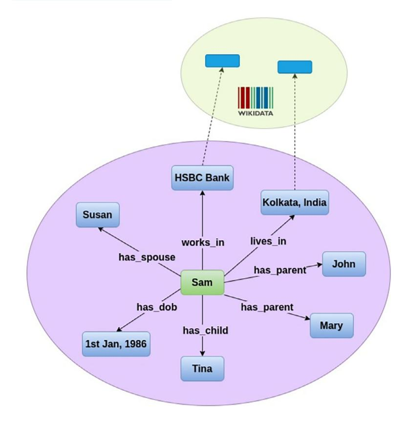
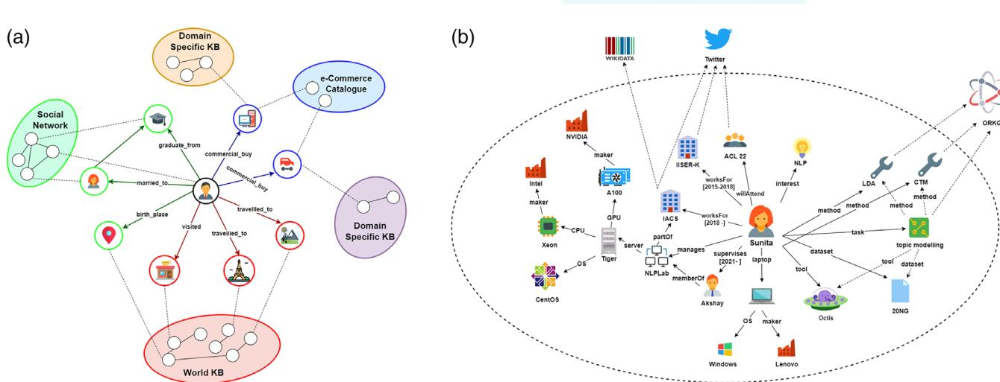
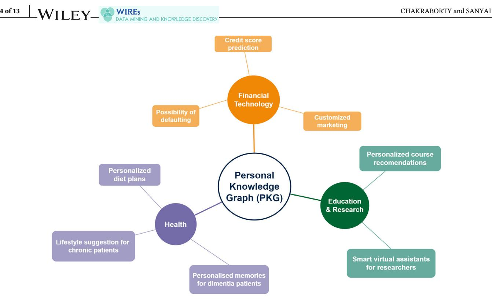
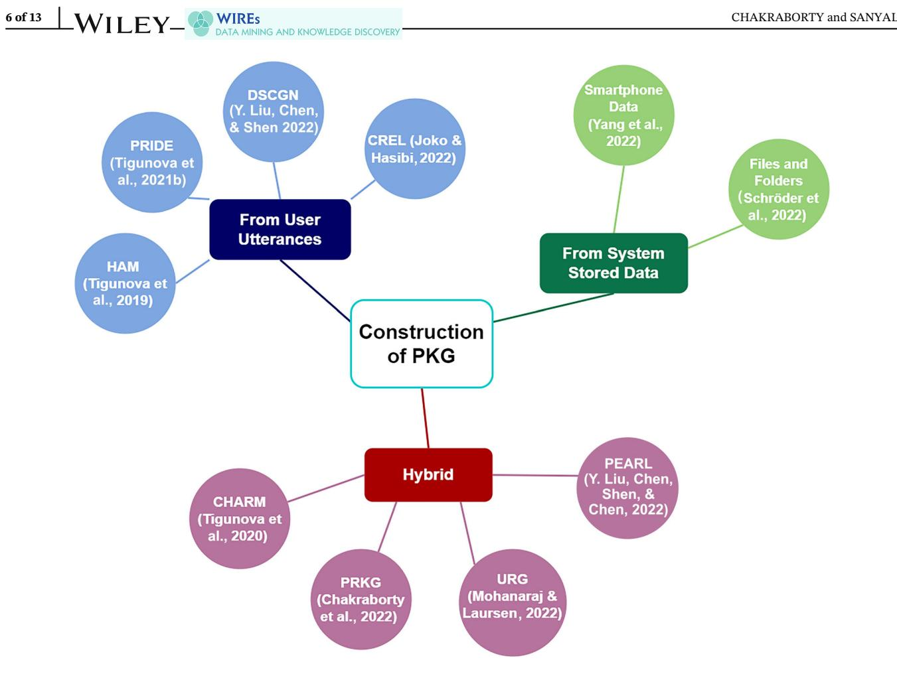

# FOCUS ARTICLE

# A comprehensive survey of personal knowledge graphs

School of Mathematical and Computational Sciences, Indian Association for the Cultivation of Science, Kolkata, West Bengal, India

#### Correspondence

Prantika Chakraborty and Debarshi Kumar Sanyal, School of Mathematical and Computational Sciences, Indian Association for the Cultivation of Science, 2A & 2B, Raja Subodh Chandra Mallick Road, Jadavpur, Kolkata 700032, West Bengal, India. Email: [prantika.ch@gmail.com](mailto:prantika.ch@gmail.com) and [debarshisanyal@gmail.com](mailto:debarshisanyal@gmail.com)

#### Funding information

Department of Science and Technology, Government of India, Grant/Award Number: CRG/2021/000803

Edited by: Elisa Bertino, Associate Editor and Witold Pedrycz, Editor-in-Chief

Prantika Chakraborty | Debarshi Kumar Sanyal

#### Abstract

Information that can encapsulate a person's daily life and its different aspects provides insightful knowledge. This knowledge can prove to be more useful than general knowledge for improving personalized tasks. When it comes to storing such knowledge, personal knowledge graphs (PKGs) come in as handy saviors. PKGs are knowledge graphs which store details that are pertinent to a user but not, in general, useful to the rest of humanity. Conversational agents can access these PKGs to answer queries related to the user's day-to-day life, whereas recommender systems can harness the knowledge stored in PKGs to make personalized suggestions. Despite the immense applicability of PKGs, there has not been significant research in this area. We present an extensive review of PKGs. We categorize them according to the domains in which they are most relevant; in particular, we highlight the use of PKGs in medicine, finance, and education and research. We also categorize the different ways of constructing a PKG based on the source of data required for such constructions. Furthermore, we discuss the limitations of PKGs and suggest directions for future work.

This article is categorized under:

Fundamental Concepts of Data and Knowledge > Human Centricity and User Interaction

Fundamental Concepts of Data and Knowledge > Knowledge Representation Technologies > Artificial Intelligence

#### KEYWORDS

conversational agent, information extraction, personal knowledge graph, recommender system

# 1 | INTRODUCTION

Knowledge graphs (KGs) have become an integral part of our daily lives in capturing structured human data and its attributes. The information is captured by the KG as entities and the relations between them, and is represented by the nodes and edges of the graph, respectively. This information is usually stored as resource description framework (RDF1 ; Miller, [1998](#page-11-0)) triplets of the type <subject–predicate–object>, which can be queried using applications like SPARQL2 .

1 <https://www.w3.org/RDF/> 2 <https://www.w3.org/TR/sparql11-overview/>

19424795, 2023, 6, Downloaded from https://wires.onlinelibrary.wiley.com/doi/10.1002/widm.1513 by <Shibboleth>-member@cranfield.ac.uk, Wiley Online Library on [30/06/2025]. See the Terms and Conditions (https://onlinelibrary.wiley.com/terms-and-conditions) on Wiley Online Library for rules of use; OA articles are governed by the applicable Creative Commons License

FIGURE 1 An example of a personal knowledge graph containing the personal data of a user, Sam.

But, most of the KGs that we use, like DBPedia3 and YAGO4 host generic information that does not take into account the information generated by a user's day-to-day activities in their personal and professional spheres. Utilizing such KGs for personalized tasks does not always lead to desired outcomes due to the lack of information pertinent to the user in the KG. For example, a conversational agent having access to only general KGs will be unable to reply to a user's personal queries like "When is my team's next match happening?" and, a smart home agent without access to the user's personal preferences mapped in the KG will be unable to fulfill requests like "Play my favorite band's songs," here my team and favorite band being user-sensitive entities that cannot be resolved using general KGs. To tackle this issue, the concept of a personal knowledge graph (PKG; Balog & Kenter, [2019\)](#page-11-0) has been suggested, which encapsulates only the information that is relevant to a user personally and not to the world at large. It is defined as "a resource of structured information about entities personally related to its user, their attributes and the relations between them" (Balog & Kenter, [2019](#page-11-0)). For example, KGs may contain information such as countries and their capitals, but as shown in Figure 1, a PKG will contain information regarding the owner of the PKG, such as their hometown (here Kolkata, India), which will be identified whenever the user refers to my\_home or my\_city. Of course, searching for my\_home or my\_city will yield different information for different users, depending on their PKG. This is how a PKG is truly personalized. The knowledge stored in the PKGs can be harnessed for a number of tasks that can benefit from user-centric knowledge rather than only from generalized knowledge. In order to broaden the scope of utilization, PKGs can be linked to public KGs. For example, PKGs handling lifelogs and memories of users (Yen et al., [2021](#page-12-0)) may connect to social network graphs, while PKGs handling scholarly data (Chakraborty et al., [2022\)](#page-11-0) may connect to a scholarly KG like ORKG, as shown in Figure [2.](#page-2-0)

In this paper, we present a survey of the existing literature on PKGs. We assembled the citations of the position paper that proposed the notion of a PKG (Balog & Kenter, [2019\)](#page-11-0) from Google Scholar, analyzed each of the cited papers, and selected the relevant ones for our survey. We repeated this task recursively for the above-cited papers till we found no other relevant papers. Our main contributions in this survey article are listed as follows:

FIGURE 2 Examples of different personal knowledge graphs. (a) Personal knowledge graph based on lifelogs (Yen et al., [2021](#page-12-0)). (b) Personal research knowledge graph for researchers and academicians (Chakraborty et al., [2022](#page-11-0)).

- We have categorized PKGs on the basis of the domain that they are applicable in.
- We have also categorized PKGs based on the processes deployed for their construction.
- We have enumerated the limitations of the existing works and pointed out the possible future works in this field.

To the best of our knowledge, this is the first attempt at surveying PKGs and the diverse aspects related to them. The rest of the paper is divided as follows. Section 2 discusses the application domains of PKGs which they have been created for. These include the Health domain, the Finance domain, and the Education and Research domain. As PKG is an emerging research area, we have significantly sparse literature on the topic. Section [3](#page-4-0) discusses the different methods of constructing a PKG based on user utterances, data stored in the system, and a hybrid of both data sources. Section [4](#page-8-0) lists the various application of PKGs in the form of conversational agents and recommender systems. Section [5](#page-9-0) discusses the miscellaneous limitations that one might encounter while using a PKG and the scope of solving such limitations in the form of future works. Finally, Section [6](#page-10-0) concludes the survey.

# 2 | APPLICATION DOMAINS OF PKG

The areas in which PKGs have been primarily used are health, finance, and education and research. Figure [3](#page-3-0) illustrates some of the specific use cases of PKGs in each of these domains. We will now describe the use cases in more detail.

# 2.1 | Health

The medical domain is a storehouse of patient data, which contain their medical history and health conditions. This makes it a very viable environment for maintaining a PKG for each patient. PKGs can be used to make personalized diet and lifestyle plans for patients suffering from chronic diseases such as diabetes (Shirai et al., [2021](#page-12-0)) by taking their various allergies and eating habits into account and integrating that knowledge with other domain-specific KGs like FoodKG (Haussmann et al., [2019](#page-11-0)). This would make the diet plan truly personalized as a diet endorsed to be healthy and efficient for one patient might not be the same for another, due to the differences in their health conditions and also their treatment styles.

Along with the medical history of the patients, other information including the "likes," "dislikes," "nutrient focus" (e.g., the amount of calories preferred), "substitution" (e.g., sugar substitutes for Type 2 diabetic patients), "restaurant

FIGURE 3 Domains in which personal knowledge graphs have been used.

knowledge," "cooking methodology," and "financial conditions" can be incorporated to create a Personal Health Ontology (Seneviratne et al., [2021\)](#page-12-0). This ontology, along with the user's eating habits, leads to the construction of a personal health knowledge graph (PHKG). When consolidated with dietary guidelines from domain experts and FoodKG (Haussmann et al., [2019](#page-11-0)), a reasoner can operate on this PHKG to provide personalized dietary recommendations to patients with chronic diseases.

Human beings have a tendency of looking back at their memories. This, however, becomes challenging for people suffering from memory-altering diseases like dementia. Generating a PKG from the various digital lifelogs that people create in their daily life (Yen et al., [2021](#page-12-0)) can prove to be an asset in such cases. Lifelogs are digital repositories of memories and experiences of a user that have been recorded and captured in some form. Information can be extracted from the user's digital lifelog which includes social media activities, blogs and vlogs, search histories, data from wearables (smart glasses and watches), and chat histories. Once stored in a PKG, a user can explicitly query it to recall their memories, in the "reactive mode." In the "proactive mode," the information retrieval service can get triggered by the user's hesitations or interruptions while recalling experiences in a conversation.

# 2.2 | Finance

An upcoming domain of research where PKGs have found significance is the Financial Technology (FinTech) domain. Financial institutes like banks and insurance companies rely heavily on customer data which they can acquire under the Know Your Customer scheme (Mullins et al., [2014](#page-12-0)). These data are crucial for predicting the credit score, and the possibility of committing financial fraud by a customer. It also aids such institutes to be cognizant of their customer's legal status and social media presence. A PKG can be used to store such day-to-day information about a customer (corporate or natural), for various tasks like risk evaluation of insurance companies, customer-specific marketing by banks, and the possibility of defaulting by commercial entities (Chen et al., [2020\)](#page-11-0).

# 2.3 | Education and research

The post-COVID-19 pandemic-stricken world has seen a boom in the use of e-learning platforms as not just an alternative but at times equivalent to physical classroom learning. A PKG can enhance the learning experience on such platforms (Ilkou, [2022\)](#page-11-0). By taking into account the data generated by users on e-learning platforms, the PKG can help predict the learning path of the user, all the while taking into account the various accessibility options and the academic and psychological profile of the user. It can also help in recommending courses that are better suited to a particular user's needs and capacity, by availing the resources of external knowledge bases like eDoers.5 The idea of using a PKG to enhance the learning experience can be extended to a group or collaborative setting by taking into account collaborative search or the Searching as Learning technique (Ilkou, [2022](#page-11-0)).

A personal research knowledge graph (PRKG) can be used to simplify the daily tasks of a researcher (Chakraborty et al., [2022](#page-11-0)). A PRKG contains structured information about the research-related activities of a researcher. This information includes but is not limited to their research areas, place of work, published papers, the details of their lab, and so on. With the help of a conversational agent, the PRKG can be utilized to gain knowledge that the researcher might want to access about their professional sphere which is not always feasible for them to keep in mind but can be easily stored in the PRKG. The PRKG aims to link to external KGs that the conversational agent might exploit to provide web search results for queries such as information regarding the upcoming conferences in the research area that is of interest to the researcher. The PRKG can also be used to suggest potential collaborators to the researcher.

# 3 | CONSTRUCTION OF PKG

The construction of a PKG relies greatly on the extraction of entities and relations from the data generated by the user. Such data are generated from the user's conversations, the user's information stored in their system, or both. However, handling such personal data is not trivial. The main challenges that are faced when trying to construct a PKG can be broadly listed as follows:

- Conversational data and social media posts are not structured and do not always follow textbook syntax due to the usage of multiple and colloquial languages.
- The entities and relations are very specific to the user, and therefore labeled datasets are hardly available for the purpose of training machine learning models to populate a PKG.
- Using entity linking methods for personal information shared during conversation is an arduous task. For example, inferring which car a user is referring to when saying my\_car.
- Personal data stored by a user in their system does not always follow strict naming conventions making named entity recognition difficult on such data.

In the following subsections, we categorize the various ways of constructing a PKG depending on the source of user data, as shown in Figure [4,](#page-5-0) and how the challenges are overcome.

# 3.1 | From user utterances

One of the most popular ways of populating a PKG is by obtaining information from conversational data, otherwise referred to as user utterances. The methods that make use of such data are discussed in this subsection.

User utterances often provide ill-structured data as they are mostly noisy and verbose, and incorporate vernacular and informal terms that make the extraction of attributes, like the user's profession and gender, onerous. In other words, the difficulty of extraction arises because such attributes are not always explicitly stated in regular conversations. A number of hidden attribute models (HAMs; Tigunova et al., [2019\)](#page-12-0) have been developed to identify such attribute values from user utterances by ranking the possible values of the object of the <subject–predicate–object> triplet given the subject and the predicate. For example, a user (subject) who utters terms like "experiments," "theorem," and "results" is most likely to be a scientist (object) by profession (predicate), in contrast to an actor by profession, who uses

FIGURE 4 Construction of personal knowledge graphs based on data source.

words like "script," "dialogue," "costumes." Consider a subject S, the predicate P, a set of N utterances ð Þ U1,U2,…,UN by S, and each utterance Ui containing M terms ð Þ Ui,1,Ui,2,…,Ui,M . Then the three main functions f utter, f subj, and f obj, and their respective outputs Rutter i , Rsubj, and O that characterize HAMs can be described as:

$$
R_i^{\text{utter}} = f_{\text{utter}}(U_{i,1}, U_{i,2}, ..., U_{i,M}),
$$
\n(1)

$$
R_{\text{subj}} = f_{\text{subj}}(R_1^{\text{utter}}, R_2^{\text{utter}}, ..., R_N^{\text{utter}}),
$$
\n(2)

$$
O = f_{\text{obj}}(R_{\text{subj}}). \tag{3}
$$

Conversations can also be used to infer the interpersonal relationships between users, in order to populate their PKGs. The PRIDE model (Tigunova et al., [2021b\)](#page-12-0) takes into account the user utterances and merges them with the user's personal information (age, occupation, etc.) and interpersonal dimensions (active vs. passive, temporary vs. long term, etc.) in order to predict 1 of the 12 relations that can be broadly divided into three categories, namely, family, social, and professional. Considering the conversation between two people PerA and PerB taken as input in the form of utterances ð Þ U1,U2,…,Un where an utterance Ui contains the terms Ui,1,Ui,2,…,Ui,Mi ð Þ, the model first computes

aword ri,1,ri,2,…,ri,Mi ð Þ¼ ri, ð4Þ

where ri,j is the word embeddings (here, BERT embeddings; Devlin et al., [2019](#page-11-0)) of the jth term of ith utterance, and ri is the ith utterance embedding thus obtained by aggregating over ri,j using the function aword. The utterance embedding is then summed with the position embedding pi and person embedding peri to obtain

bri ¼ ri þpi þperi , ð5Þ

which is then passed through a transformer (Vaswani et al., [2017](#page-12-0)) to obtain the conversation representation C, which is further concatenated with the embedding for the age difference between PerA and PerB, and the dynamics in their conversation, in order to classify the relation between them. The performance of the PRIDE model is examined on the FiRe and the Series datasets (Tigunova et al., [2021b\)](#page-12-0), that contain conversations taken from films and TV series dialogs respectively, and is shown in Table [1.](#page-7-0) Clearly, PRIDE outperforms other competitive models. However, the authors also noted that the precision and recall recorded by PRIDE are far behind those of human annotators, thereby pointing to the difficulty of the task.

Populating a PKG from conversational utterances can sometimes be a challenging task without the presence of a labeled dataset of utterances for training a language model for this task. The DSCGN architecture (Y. Liu, Chen, & Shen, [2022](#page-11-0)) overcomes this hurdle by deploying a distant supervision strategy for document-level supervision over external sources like Wikipedia6 pages, and a contextualized word-level supervision using a label guessing technique over unlabeled data. This model first carries out distant supervision by obtaining Wikipedia articles of personal attribute values (e.g., scientist, actor, teacher) and related topics to form the document-level supervision Sdoc ¼ di,Adi f g ð Þ where di is some Wikipedia page having an attribute value Adi . The model further executes the contextualized wordlevel supervision by constructing a vocabulary Va of top M possible word replacements for the attribute value a, obtained from running the masked language model over all the mentions of a. Then the similarity Simw2a wi ð Þ ,a of the ith mention of a word w with the attribute value a is computed as

$$
\text{Sim}_{w2a}(w_i, a) = \frac{|C_{w_i} \cap V_a|}{|V_a|},\tag{6}
$$

where Cwi is the set of top K words obtained from the masked language model for wi. If Simw2a wi ð Þ ,a crosses a given threshold, then wi is considered as an attribute-indicative word for the attribute value a. Thus, the word-level supervision Sword ¼ wi,Awi f g ð Þ , where wi denotes an attribute-indicative word and Awi denotes the corresponding attribute value of wi is constructed. The document-level and word-level supervisions are used to fine-tune a pretrained language model to predict the value of a given attribute from a sentence constructed by concatenating all utterances of a given user.

Linking personal entities, for example, my\_city to Kolkata as shown in Figure [1](#page-1-0) becomes challenging with traditional entity linking methods that are not equipped to handle personal information. The CREL architecture (Joko & Hasibi, [2022\)](#page-11-0) is an approach of personal entity and concept linking from users' conversations that solves this hurdle. It consists of a BERT-based model for entity mention detection and a rule-based approach for personal entity detection. In particular, mention detection is carried out using a pre-trained BERT model for BIO label prediction whereas entity disambiguation is carried out by training the REL approach (van Hulst et al., [2020\)](#page-12-0) on the ConEL-2 dataset that was created by the authors.

# 3.2 | From system-stored data

Human beings generate a considerable amount of data in their day-to-day activities that gets stored in their personal devices. In this subsection, we look into the various ways such data can be used to populate a PKG.

The data generated every day in the user's smartphone can be exploited in order to construct a PKG (Yang et al., [2022\)](#page-12-0). At the onset, structured and unstructured data are preprocessed. Structured data include the information that is generated from clicks and edits in different user-centric mobile applications like contact lists, calendars, and so on. The intention classes, entities, and relations from this type of information are extracted using built-in rules, given the fact that the intentions behind the operations are comprehensible. Unstructured data consist of inputs typed or spoken to various search engines, voice assistants, social networks, and so on. A combination of neural and symbolic models is used to extract entities, relations, and intention classes. The open-source tool TimeNormalizer7 is used to normalize the various time information in the unstructured data, like "yesterday afternoon" and "next Monday" into the

8 of 13 CHAKRABORTY and SANYAL

| TABLE 1 |  |  |  |  | Interpersonal relation detection performance of the PRIDE model (Tigunova et al., 2021b) on the FiRe and the Series datasets. |
|---------|--|--|--|--|-------------------------------------------------------------------------------------------------------------------------------|
|---------|--|--|--|--|-------------------------------------------------------------------------------------------------------------------------------|

|                              | Cross-val on FiRe |           |        | Train: FiRe, test: Series |           |        |  |
|------------------------------|-------------------|-----------|--------|---------------------------|-----------|--------|--|
| Model                        | F1                | Precision | Recall | F1                        | Precision | Recall |  |
| RNN (Welch et al., 2019)     | 0.11              | 0.11      | 0.15   | 0.10                      | 0.17      | 0.14   |  |
| BERTddrel (Jia et al., 2021) | 0.20              | 0.20      | 0.25   | 0.14                      | 0.22      | 0.15   |  |
| HAM (Tigunova et al., 2019)  | 0.23              | 0.25      | 0.22   | 0.16                      | 0.21      | 0.16   |  |
| BERTconv (Lu et al., 2020)   | 0.27              | 0.25      | 0.33   | 0.25                      | 0.35      | 0.21   |  |
| PRIDE                        | 0.38              | 0.42      | 0.37   | 0.30                      | 0.43      | 0.29   |  |

Note: The first set of columns depict cross-validation performance on FiRe while the next set of columns illustrate transfer learning where training is done on FiRe and test on Series dataset (reproduced, with permission, from Tigunova et al., [2021b](#page-12-0)).

uniform form of "2022-1-1 00:00:00." A common knowledge graph (CKG) is constructed by scraping geographic data, entertainment and music-based data, and celebrity data from the web to which the entities of the PKGs are linked (Yang et al., [2022](#page-12-0)).

Folders and files in a user's system are lucrative sources for the construction of a PKG in the form of hand-made classification structures (Schröder et al., [2022\)](#page-12-0). Since the naming structure of such files and folders might not always follow a rule-based approach and might mostly rely on the whims of the user, a knowledge engineer (or, the "humanin-the-loop") and an artificial intelligence (AI) system join hands to identify a possible schema for the PKG from the names of the user's files and folders, which is then used to populate a PKG after creating a taxonomy and predicting nontaxonomic relations (Schröder et al., [2022\)](#page-12-0).

# 3.3 | Hybrid

In this subsection, we look into the construction methods for PKG that combine user utterances and other sources of data.

Leveraging social media posts to generate information about the user can be a challenging task given the fact that the posts might not necessarily contain a detailed context as they are known for their brevity. Detecting attributes with long-tail values also becomes difficult in the absence of labeled utterances. In such cases, it can be treated as a zero-shot learning scenario. Conversational hidden attribute retrieval model (CHARM) (Tigunova et al., [2020](#page-12-0)) can help us determine the entities in the zero-shot setting. CHARM consists of (i) a cue detector that identifies cues or keywords from user utterances that might be relevant for predicting the attributes; and (ii) a value ranker that ranks the external documents to which the keywords can be mapped, resulting in the attribute prediction. For example, in order to predict and store the hobby of a user who remarks, "I use paddles when I go to the pool to increase speed" (Tigunova et al., [2021a\)](#page-12-0), CHARM deploys the cue detector to identify the possible keywords as "paddles" and "pool." After linking these keywords to Wikidata8 pages of "swimming," "boating," and "snorkeling," the value ranker infers "swimming" as the user's hobby. Taking a set of user utterances as input ð Þ U1,U2,…,UN consisting of the terms ð Þ t1,t2,…,tM , the term scoring model of the cue detector system of CHARM (Tigunova et al., [2020](#page-12-0)) assigns a score li to the term ti that highlights the importance of the term in the detection of attribute values. Here li ¼ δ ti ð Þ jt0,…,tM;W , where W is the model parameters. The cue detector then selects the K highest scoring terms to form the query Q ¼ q1,q2,…,qK ð Þ. This query Q, along with an external labeled document collection D ¼ ð Þ d1,d2,…,dL , is passed through the value ranker, that ranks each document according to its relevance with respect to the given query Q, to generate the scores ð Þ s1,s2,…,sL . Furthermore, the document scores are aggregated for each attribute value in a pre-defined set of values V to obtain the required attribute value. CHARM trains using a very small subset of S V and predicts on the bigger unseen set V=S. Table [2](#page-8-0) compares the performances of some of the models discussed, that have been deployed for extracting attributes necessary for the construction of PKGs, on two real-world datasets, namely Wiki-page (Tigunova et al., [2020\)](#page-12-0) and Wiki-category (Tigunova et al., [2020](#page-12-0)).

TABLE 2 Performance comparison of HAMs (Tigunova et al., [2019\)](#page-12-0), CHARM (Tigunova et al., [2020](#page-12-0)), and DSCGN (Y. Liu, Chen, & Shen, [2022](#page-11-0)) for the task of personal attribute extraction on the datasets Wiki-data (Tigunova et al., [2020](#page-12-0)) and Wiki-category (Tigunova et al., [2020\)](#page-12-0) (reproduced, with permission, from Y. Liu, Chen, & Shen, [2022](#page-11-0)).

|                    |                | Wiki-page  |      |       |      | Wiki-category |      |       |      |
|--------------------|----------------|------------|------|-------|------|---------------|------|-------|------|
|                    |                | profession |      | hobby |      | profession    |      | hobby |      |
| Labeled utterances | Method         | MRR        | nDCG | MRR   | nDCG | MRR           | nDCG | MRR   | nDCG |
| No                 | HAMavg         | 0.06       | 0.07 | 0.06  | 0.05 | 0.06          | 0.07 | 0.03  | 0.02 |
|                    | HAM2attn       | 0.06       | 0.07 | 0.04  | 0.05 | 0.06          | 0.07 | 0.06  | 0.07 |
|                    | HAMCNN         | 0.20       | 0.18 | 0.22  | 0.14 | 0.27          | 0.34 | 0.17  | 0.27 |
|                    | HAMCNN attn | 0.21       | 0.28 | 0.13  | 0.10 | 0.25          | 0.31 | 0.16  | 0.25 |
|                    | DSCGN          | 0.43       | 0.57 | 0.29  | 0.50 | 0.44          | 0.60 | 0.29  | 0.49 |
| Yes                | CHARMBM25      | 0.29       | 0.46 | 0.24  | 0.47 | 0.28          | 0.47 | 0.21  | 0.43 |
|                    | CHARM KNRM     | 0.27       | 0.44 | 0.22  | 0.44 | 0.35          | 0.55 | 0.27  | 0.49 |

Note: Bold values represent the best performance among all the methods.

Abbreviations: HAM, Hidden Attribute Model; MRR, Mean Reciprocal Rank; nDCG, normalised Discounted Cumulative Gain.

The problem of dynamically linking entity mentions in user utterances to corresponding entities in an existing PKG is addressed in (Mohanaraj & Laursen, [2022](#page-12-0)) using a common sense KG called ConceptNet (Speer et al., [2017](#page-12-0)). Textual triplets consisting of two entities and the relation between them are first extracted from the utterances. These entities are linked to ConceptNet to get concept-based information and create an enriched utterance relation graph (URG). The combined embeddings of the URG and the PKG are then sent to a masked transformer (Vaswani et al., [2017](#page-12-0)) for the task of personal entity classification that decides whether the entities mentioned in the utterance triplets are present in the PKG or not. Based on the output, the personal entity disambiguator links the uttered entity enriched with information from the URG to an existing node in PKG, or creates a new node in the PKG.

Another method to tackle the lack of labeled utterance data for personal attribute extraction is a framework called PEARL (Y. Liu, Chen, Shen, & Chen, [2022\)](#page-11-0) that predicts such user attributes by combining the attribute value representations with the biterm set generated for each attribute value. In particular, the attribute value representation is fused with biterm semantic information using Gibb's sampling process in the framework of biterm topic model (Yan et al., [2013\)](#page-12-0).

Chakraborty et al. [\(2022](#page-11-0)) advocate several ways to populate a PRKG (PKG for researchers); these include consensual tracking of the user utterances during research meetings, consensual mining of user emails, actively enquiring the researchers for salient information, and carrying out named entity recognition on research papers.

# 4 | APPLICATIONS OF PKG

PKGs have found usefulness in various domains which require the personal details of users for the completion of tasks. One of the main applications is the retrieval of important personal information from the PKG via a conversational agent. Users can query their PKGs through the conversational agents, which can then produce the desired response after going through the PKG. Another important application of PKGs is personalized recommendation that utilizes the data in a user's PKG which can reflect the user's likes, dislikes, and requirements. Both the above-stated applications can be combined to create a framework best suited to a user's specific requirements. We elaborate on these two applications below.

Conversational agents: In recent times, there has been a boom in conversational agents, also known as chatbots and smart assistants on various websites, software, and smartphone apps. These agents are used for question-answering, recommendations, platform-specific issue resolving, and even for recreational purposes like listening to a joke or fun fact. These conversational agents can improve their performance, or sometimes even be based upon PKGs.

Recommender systems: Recommender systems are classified into three types: (i) content-based recommender systems, (ii) collaborative filtering (CF)-based recommender systems, and (iii) hybrid recommender systems (Adomavicius & Tuzhilin, [2005](#page-11-0)). Content-based systems recommend those items to a user that have similar properties to the items previously favored by them (the same user), whereas CF-based systems recommend items favored by other users having similar preferences. But both these systems encounter the issues of a cold-start problem when characterizing a new user or a new item, and a sparsity problem when characterizing items that are not very popular with the masses, or are popular with a niche audience. (Adomavicius & Tuzhilin, [2005\)](#page-11-0). Hybrid systems attempt to address these issues by merging methods from both the previous systems and also by including new information about the user and the items in the form of KGs (J. Liu & Duan, [2021](#page-11-0)) that can enrich the recommender system. Connecting the PKG of a new user with a recommender system will provide detailed information necessary to map their choices, interests, and preferences, addressing the cold-start issue. Recommender systems can utilize the KG representation of the entities connected to the user, the connections between the entities, or both. A PKG-enriched recommender system also helps in reasoning over the recommendations (J. Liu & Duan, [2021](#page-11-0)). PKGs have been used to provide personalized recommendations in diverse areas. For example, PKGs are utilized to recommend a personalized diet for patients (Seneviratne et al., [2021;](#page-12-0) Shirai et al., [2021\)](#page-12-0) with chronic diseases like diabetes and other lifestyle choices that vary from user to user, as these choices can be captured in a PKG of the user. A personal health library (PHL; Ammar et al., [2021\)](#page-11-0) for each patient aims to contain their digital medical data which can be used by medical professionals and caregivers to make knowledgeable decisions based on the patient's medical records. One way of constructing the PHL is by taking a PKG of the patient which contains their medical history. This information can then be queried to display data relevant to providing better medical advice. A PKG based on even a sparse user profile can highly personalize the recommendations for books (Torbati et al., [2020](#page-12-0)) that might interest them. The PRKG (Chakraborty et al., [2022](#page-11-0)) recommends upcoming conferences for a researcher based on their research interests whereas another PKG (Yang et al., [2022](#page-12-0)) recommends movies and actors that the user might be interested in.

Comparison and combination with large language models: Large language models (LLMs) like OpenAI's ChatGPT9 and Meta's LLaMA (Touvron et al., [2023\)](#page-12-0) have gained mass popularity for properly following user instructions and carrying out tasks like question-answering, text generation, translation, and recommendation. LLMs, however, are notorious for hallucinating, or generating false and unreliable responses to questions and prompts about knowledge that they do not come across during training (Ji et al., [2023\)](#page-11-0). This can be especially harmful when using LLMs in domains that require precise information, like the medical (Beutel et al., [2023](#page-11-0)) and legal (Sun, [2023\)](#page-12-0) domains. Alternatively, question-answering based on PKGs can yield reliable information due to the exactness of the information stored and the possibility of information updating, unlike LLMs that are trained on fixed data (Omar et al., [2023\)](#page-12-0). Using external knowledge, in the form of PKGs, can enhance an LLM's ability to answer personalized queries almost accurately, without having to predict or hallucinate such answers (Martino et al., [2023;](#page-11-0) Peng et al., [2023](#page-12-0)). LLMs are trained using large sets of publicly available data that might also contain sensitive private information available on the web that might be targets of privacy breach attacks (Carlini et al., [2021](#page-11-0)). Removal of such data is not always ensured and depends on the scrutiny of the authorities in charge of the LLMs. PKGs, on the other hand, provide transparency by giving complete access and control to the user when it comes to the data stored, hence giving more agency to the user over their personal information. Taking into account LLMs' efficiency in information extraction, they can be used as tools for the construction of PKGs as well (Zhu et al., [2023\)](#page-12-0).

# 5 | LIMITATIONS AND FUTURE WORKS

We now state some limitations of the works done on PKGs and identify potential directions of future work.

Privacy and security issues: A PKG, true to its name, contains information that is personal to the user. Sharing the contents of a PKG with a conversational agent or a recommender system poses the risk of information being accessed by malicious sources. Hence, matters of privacy and data protection are essential parts of a PKG. A user must be able to have full access to their PKG and control over who can view the PKG. Sensitive data like health information of the user, or confidential data like those of a researcher are at risk of being exploited. Therefore, a user must be able to grant or deny various actions to those who have access to their PKG. One way that we might be able to solve this issue is by integrating into PKGs the idea of Solid PODS10 developed by Tim Berners-Lee.

9 <https://openai.com/chatgpt> 10<https://solidproject.org/>

Bias mitigation: Another possible limitation in accessing a PKG-powered conversational agent is the bias in the conversations. Numerous biases may occur like algorithmic bias, people-centric bias, and a bias resulting from the mixture of the two. A lot of the algorithmic bias may result from the source from which information to be stored in a PKG is extracted. For example, social media posts might reflect only one aspect of a user's life, whereas search results might be temporal and relevant only during certain scenarios like elections or a pandemic. Another way bias from algorithm might creep in is via the neural models based on contextual embeddings. Conversational agents based on PKGs that are linked to public KGs, might inherit people-centric bias from the domain-specific KGs, which might cater to a certain demographic. In order to handle such biases, conversational agents can choose to remain neutral in the face of those, but in order to mitigate this issue and to bring a more diversified approach, these agents might be trained to either take a "user-in-control" approach or to take a "reflective" approach where the agent and the user both try to identify the bias and rectify it (Gerritse et al., [2020](#page-11-0)).

Maintenance of temporal information: Maintaining temporal information in a PKG can be seen as a possible limitation. Entities or nodes in a PKG that become redundant after a certain period of time need to be removed or updated. The software to maintain the PKG might perform this maintenance activity automatically. Alternatively, the user can be encouraged to do such updating themselves, or a conversational agent might take an active role in doing so, by regularly involving the user in sentient conversations.

Expanded PKG: Sometimes it might be useful to store information beyond that of the owner of the PKG. In education and research-related domains, which involve collaborative activities, sharing access to one's PKG with a teammate or colleague may be helpful in achieving a shared task. As a future work in the medical domain, a PKG can be developed to store not only the medical history of the user but that of their biological relatives as well. Such a PKG may be utilized to provide dietary and lifestyle suggestions, in order to prevent the onset of hereditary chronic diseases like diabetes, which might be passed down from the user's parents.

Construction of datasets: There is a lack of annotated conversational dataset that could be used to train models to extract attributes from a user's conversations. Construction of such datasets may be undertaken, after suitable anonymization, for better training of attribute extraction models.

# 6 | CONCLUSION

In this paper, we have made an elaborate study of the available literature on PKGs. We have categorized PKGs according to their domain of applications where their use as a personalized information database has been highlighted. We have further discussed methods for the construction of PKGs from information obtained from user utterances and from the personalized data stored in the user's system. We have explored construction methods that make use of both such data sources. The various applications of the PKGs have also been described. We have also pointed out the limitations of a PKG and identified possible ways of overcoming them in future works.

# AUTHOR CONTRIBUTIONS

Prantika Chakraborty: Conceptualization (equal); data curation (lead); formal analysis (lead); methodology (lead); visualization (lead); writing—original draft (lead); writing – review and editing (equal). Debarshi Kumar Sanyal: Conceptualization (equal); funding acquisition (lead); project administration (lead); supervision (lead); writing—review and editing (equal).

# FUNDING INFORMATION

This work is partially supported by the Department of Science and Technology, Government of India under grant CRG/2021/000803.

# CONFLICT OF INTEREST STATEMENT

The authors have declared no conflicts of interest for this article.

# DATA AVAILABILITY STATEMENT

Data sharing is not applicable to this article as no new data were created or analyzed in this study.

### ORCID

Prantika Chakraborty <https://orcid.org/0000-0001-9100-5533> Debarshi Kumar Sanyal <https://orcid.org/0000-0001-8723-5002>

# RELATED WIREs ARTICLES

[Using Semantic Web technologies in the development of data warehouses: A systematic mapping](https://doi.org/10.1002/widm.1293) [Introduction to neural network-based question answering over knowledge graphs](https://doi.org/10.1002/widm.1389)

### REFERENCES

- Adomavicius, G., & Tuzhilin, A. (2005). Toward the next generation of recommender systems: A survey of the state-of-the-art and possible extensions. IEEE Transactions on Knowledge and Data Engineering, 17(6), 734–749. <https://doi.org/10.1109/TKDE.2005.99>
- Ammar, N., Bailey, J. E., Davis, R. L., & Shaban-Nejad, A. (2021). Using a personal health library-enabled mHealth recommender system for self-management of diabetes among underserved populations: Use case for knowledge graphs and linked data. JMIR Formative Research, 5(3), e24738. <https://doi.org/10.2196/24738>
- Balog, K., & Kenter, T. (2019). Personal knowledge graphs: A research agenda. In Proceedings of the 2019 ACM SIGIR International Conference on Theory of Information Retrieval (pp. 217–220). ACM. <https://doi.org/10.1145/3341981.3344241>
- Beutel, G., Geerits, E., & Kielstein, J. T. (2023). Artificial hallucination: GPT on LSD? Critical Care, 27(1), 148. [https://doi.org/10.1186/](https://doi.org/10.1186/s13054-023-04425-6) [s13054-023-04425-6](https://doi.org/10.1186/s13054-023-04425-6)
- Carlini, N., Tramer, F., Wallace, E., Jagielski, M., Herbert-Voss, A., Lee, K., Roberts, A., Brown, T. B., Song, D., Erlingsson, U., Oprea, A., & Raffel, C. (2021). Extracting training data from large language models. In Proceedings of the 30th USENIX Security Symposium (pp. 2633– 2650). USENIX Association. <https://www.usenix.org/conference/usenixsecurity21/presentation/carlini-extracting>
- Chakraborty, P., Dutta, S., & Sanyal, D. K. (2022). Personal research knowledge graphs. In Companion Proceedings of the Web Conference 2022 (pp. 763–768). ACM. <https://doi.org/10.1145/3487553.3524654>
- Chen, C.-C., Huang, H.-H., & Chen, H.-H. (2020). NLP in fintech applications: Past, present and future. arXiv preprint arXiv:2005.01320. <https://doi.org/10.48550/arXiv.2005.01320>
- Devlin, J., Chang, M., Lee, K., & Toutanova, K. (2019). BERT: Pre-training of deep bidirectional transformers for language understanding. In Proceedings of the 2019 Conference of the North American Chapter of the Association for Computational Linguistics: Human Language Technologies (Vol. 2019, pp. 4171–4186). NAACL-HLT. <https://doi.org/10.18653/v1/n19-1423>
- Gerritse, E. J., Hasibi, F., & de Vries, A. P. (2020). Bias in conversational search: The double-edged sword of the personalized knowledge graph. In Proceedings of the 2020 ACM SIGIR on International Conference on Theory of Information Retrieval (pp. 133–136). ACM. <https://doi.org/10.1145/3409256.3409834>
- Haussmann, S., Seneviratne, O., Chen, Y., Ne'eman, Y., Codella, J., Chen, C.-H., McGuinness, D. L., & Zaki, M. J. (2019). FoodKG: A semantics-driven knowledge graph for food recommendation. In The Semantic Web - ISWC 2019. Lecture Notes in Computer Science (Vol. 11779, pp. 146–162). Springer. [https://doi.org/10.1007/978-3-030-30796-7\\_10](https://doi.org/10.1007/978-3-030-30796-7_10)
- Ilkou, E. (2022). Personal knowledge graphs: Use cases in e-learning platforms. In Companion Proceedings of the Web Conference 2022 (pp. 344–348). ACM. <https://doi.org/10.1145/3487553.3524196>
- Ji, Z., Lee, N., Frieske, R., Yu, T., Su, D., Xu, Y., Ishii, E., Bang, Y. J., Madotto, A., & Fung, P. (2023). Survey of hallucination in natural language generation. ACM Computing Surveys, 55(12), 1–38. <https://doi.org/10.1145/3571730>
- Jia, Q., Huang, H., & Zhu, K. Q. (2021). DDReL: A new dataset for interpersonal relation classification in dyadic dialogues. In Proceedings of the AAAI Conference on Artificial Intelligence, 35(14), 13125–13133. <https://doi.org/10.1609/aaai.v35i14.17551>
- Joko, H., & Hasibi, F. (2022). Personal entity, concept, and named entity linking in conversations. In Proceedings of the 31st ACM International Conference on Information & Knowledge Management (pp. 4099–4103). ACM. <https://doi.org/10.1145/3511808.3557667>
- Liu, J., & Duan, L. (2021). A survey on knowledge graph-based recommender systems. In Proceedings of the 2021 IEEE 5th Advanced Information Technology, Electronic and Automation Control Conference (IAEAC) (pp. 2450–2453). IEEE. [https://doi.org/10.1109/IAEAC50856.](https://doi.org/10.1109/IAEAC50856.2021.9390863) [2021.9390863](https://doi.org/10.1109/IAEAC50856.2021.9390863)
- Liu, Y., Chen, H., & Shen, W. (2022). Personal attribute prediction from conversations. In Companion Proceedings of the Web Conference (Vol. 2022, pp. 223–227). ACM. <https://doi.org/10.1145/3487553.3524248>
- Liu, Y., Chen, H., Shen, W., & Chen, J. (2022). Low-resource personal attribute prediction from conversation. arXiv preprint arXiv: 2211.15324. <https://doi.org/10.48550/arXiv.2211.15324>
- Lu, J., Ren, X., Ren, Y., Liu, A., & Xu, Z. (2020). Improving contextual language models for response retrieval in multi-turn conversation. In SIGIR '20: Proceedings of the 43rd International ACM SIGIR Conference on Research and Development in Information Retrieval (pp. 1805–1808). ACM. <https://doi.org/10.1145/3397271.3401255>
- Martino, A., Iannelli, M., & Truong, C. (2023). Knowledge injection to counter large language model (LLM) hallucination. In 20th Extended Semantic Web Conference 2023 (Industry Track). [https://2023.eswc-conferences.org/wp-content/uploads/2023/05/paper\\_Martino\\_2023\\_](https://2023.eswc-conferences.org/wp-content/uploads/2023/05/paper_Martino_2023_Knowledge.pdf) [Knowledge.pdf](https://2023.eswc-conferences.org/wp-content/uploads/2023/05/paper_Martino_2023_Knowledge.pdf)
- Miller, E. (1998). An introduction to the resource description framework. Bulletin of the American Society for Information Science and Technology, 25(1), 15–19. <https://asistdl.onlinelibrary.wiley.com/doi/abs/10.1002/bult.105>

- Mohanaraj, A., & Laursen, E. N. (2022). Entity linking to dynamically-evolving personal knowledge graphs in conversations (Master's thesis). Aalborg University, Aalborg, Denmark. [https://projekter.aau.dk/projekter/files/474519955/master\\_thesis.pdf](https://projekter.aau.dk/projekter/files/474519955/master_thesis.pdf)
- Mullins, R. R., Ahearne, M., Lam, S. K., Hall, Z. R., & Boichuk, J. P. (2014). Know your customer: How salesperson perceptions of customer relationship quality form and influence account profitability. Journal of Marketing, 78(6), 38–58. [https://doi.org/10.1509/jm.](https://doi.org/10.1509/jm.13.0300) [13.0300](https://doi.org/10.1509/jm.13.0300)
- Omar, R., Mangukiya, O., Kalnis, P., & Mansour, E. (2023). ChatGPT versus traditional question answering for knowledge graphs: Current status and future directions towards knowledge graph chatbots. arXiv preprint arXiv:2302.06466. [https://doi.org/10.48550/arXiv.2302.](https://doi.org/10.48550/arXiv.2302.06466) [06466](https://doi.org/10.48550/arXiv.2302.06466)
- Peng, B., Galley, M., He, P., Cheng, H., Xie, Y., Hu, Y., Huang, Q., Liden, L., Yu, Z., Chen, W., & Gao, J. (2023). Check your facts and try again: Improving large language models with external knowledge and automated feedback. arXiv preprint arXiv:2302.12813. [https://doi.](https://doi.org/10.48550/arXiv.2302.12813) [org/10.48550/arXiv.2302.12813](https://doi.org/10.48550/arXiv.2302.12813)
- Schröder, M., Jilek, C., & Dengel, A. (2022). A human-in-the-loop approach for personal knowledge graph construction from file names. In Proceedings of the 3rd International Workshop on Knowledge Graph Construction (KGCW 2022) co-located with 19th Extended Semantic Web Conference (ESWC 2022) (Vol. 3141). CEUR-WS. <https://ceur-ws.org/Vol-3141/paper2.pdf>
- Seneviratne, O., Harris, J., Chen, C.-H., & McGuinness, D. L. (2021). Personal health knowledge graph for clinically relevant diet recommendations. arXiv preprint arXiv:2110.10131. <https://doi.org/10.48550/arXiv.2110.10131>
- Shirai, S., Seneviratne, O., & McGuinness, D. L. (2021). Applying personal knowledge graphs to health. arXiv preprint arXiv:2I04.07587. <https://doi.org/10.48550/arxiv.2104.07587>
- Speer, R., Chin, J., & Havasi, C. (2017). ConceptNet 5.5: An open multilingual graph of general knowledge. In Proceedings of the 31st AAAI Conference on Artificial Intelligence (pp. 4444–4451). ACM. <https://dl.acm.org/doi/10.5555/3298023.3298212>
- Sun, Z. (2023). A short survey of viewing large language models in legal aspect. arXiv preprint arXiv:2303.09136. [https://doi.org/10.48550/](https://doi.org/10.48550/arXiv.2303.09136) [arXiv.2303.09136](https://doi.org/10.48550/arXiv.2303.09136)
- Tigunova, A., Mirza, P., Yates, A., & Weikum, G. (2021a). Exploring personal knowledge extraction from conversations with CHARM. In Proceedings of the 14th ACM International Conference on Web Search and Data Mining (pp. 1077–1080). ACM. [https://doi.org/10.1145/](https://doi.org/10.1145/3437963.3441699) [3437963.3441699](https://doi.org/10.1145/3437963.3441699)
- Tigunova, A., Mirza, P., Yates, A., & Weikum, G. (2021b). PRIDE: Predicting relationships in conversations. In Proceedings of the 2021 Conference on Empirical Methods in Natural Language Processing (pp. 4636–4650). ACL. <https://doi.org/10.18653/v1/2021.emnlp-main.380>
- Tigunova, A., Yates, A., Mirza, P., & Weikum, G. (2019). Listening between the lines: Learning personal attributes from conversations. In Proceedings of the 2019 World Wide Web Conference (pp. 1818–1828). ACM. <https://doi.org/10.1145/3308558.3313498>
- Tigunova, A., Yates, A., Mirza, P., & Weikum, G. (2020). CHARM: Inferring personal attributes from conversations. In Proceedings of the 2020 Conference on Empirical Methods in Natural Language Processing (EMNLP). ACL. <https://aclanthology.org/2020.emnlp-main.434>
- Torbati, G. H., Yates, A., & Weikum, G. (2020). Personalized entity search by sparse and scrutable user profiles. In Proceedings of the 2020 Conference on Human Information Interaction and Retrieval (pp. 427–431). ACM. <https://doi.org/10.1145/3343413.3378011>
- Touvron, H., Lavril, T., Izacard, G., Martinet, X., Lachaux, M.-A., Lacroix, T., Rozière, B., Goyal, N., Hambro, E., Azhar, F., Rodriguez, A., Joulin, A., Grave, E., & Lample, G. (2023). LLaMA: Open and efficient foundation language models. arXiv preprint arXiv:2302.13971. <https://doi.org/10.48550/arXiv.2302.13971>
- van Hulst, J. M., Hasibi, F., Dercksen, K., Balog, K., & de Vries, A. P. (2020). REL: An entity linker standing on the shoulders of giants. In Proceedings of the 43rd International ACM SIGIR Conference on Research and Development in Information Retrieval (pp. 2197–2200). ACM. <https://doi.org/10.1145/3397271.3401416>
- Vaswani, A., Shazeer, N., Parmar, N., Uszkoreit, J., Jones, L., Gomez, A. N., Kaiser, L., & Polosukhin, I. (2017). Attention is all you need. In Proceedings of the 31st International Conference on Neural Information Processing Systems (pp. 6000–6010). [https://dl.acm.org/doi/10.](https://dl.acm.org/doi/10.5555/3295222.3295349) [5555/3295222.3295349](https://dl.acm.org/doi/10.5555/3295222.3295349)
- Welch, C., Pérez-Rosas, V., Kummerfeld, J. K., & Mihalcea, R. (2019). Look who's talking: Inferring speaker attributes from personal longitudinal dialog. In Proceedings of the 20th International Conference on Computational Linguistics and Intelligent Text Processing (pp. 476–490). Springer. [https://link.springer.com/chapter/10.1007/978-3-031-24340-0\\_36](https://link.springer.com/chapter/10.1007/978-3-031-24340-0_36)
- Yan, X., Guo, J., Lan, Y., & Cheng, X. (2013). A biterm topic model for short texts. In Proceedings of the 22nd International Conference on World Wide Web (pp. 1445–1456). ACM. <https://doi.org/10.1145/2488388.2488514>
- Yang, Y., Lin, J., Zhang, X., & Wang, M. (2022). PKG: A personal knowledge graph for recommendation. In Proceedings of the 45th International ACM SIGIR Conference on Research and Development in Information Retrieval (pp. 3334–3338). ACM. [https://doi.org/10.1145/](https://doi.org/10.1145/3477495.3531671) [3477495.3531671](https://doi.org/10.1145/3477495.3531671)
- Yen, A.-Z., Huang, H.-H., & Chen, H.-H. (2021). Ten questions in lifelog mining and information recall. In Proceedings of the 2021 International Conference on Multimedia Retrieval (pp. 511–518). ACM. <https://doi.org/10.1145/3460426.3463607>
- Zhu, Y., Wang, X., Chen, J., Qiao, S., Ou, Y., Yao, Y., Deng, S., Chen, H., & Zhang, N. (2023). LLMs for knowledge graph construction and reasoning: Recent capabilities and future opportunities. arXiv preprint arXiv:2305.13168. <https://doi.org/10.48550/arXiv.2305.13168>

How to cite this article: Chakraborty, P., & Sanyal, D. K. (2023). A comprehensive survey of personal knowledge graphs. WIREs Data Mining and Knowledge Discovery, 13(6), e1513. <https://doi.org/10.1002/widm.1513>