# **Blind Multimodal Quality Assessment of Low-Light Images**

**Miaohui Wang[1](http://orcid.org/0000-0003-1125-9299) · Zhuowei Xu[1](http://orcid.org/0000-0002-2222-158X) · Mai Xu[2](http://orcid.org/0000-0002-0277-3301) · Weisi Lin[3](http://orcid.org/0000-0001-9866-1947)**

Received: 21 December 2023 / Accepted: 2 September 2024 / Published online: 16 October 2024 © The Author(s), under exclusive licence to Springer Science+Business Media, LLC, part of Springer Nature 2024

## **Abstract**

Blind image quality assessment (BIQA) aims at automatically and accurately forecasting objective scores for visual signals, which has been widely used to monitor product and service quality in low-light applications, covering smartphone photography, video surveillance, autonomous driving, etc. Recent developments in this field are dominated by unimodal solutions inconsistent with human subjective rating patterns, where human visual perception is simultaneously reflected by multiple sensory information. In this article, we present a unique blind multimodal quality assessment (BMQA) of low-light images from subjective evaluation to objective score. To investigate the multimodal mechanism, we first establish a multimodal low-light image quality (MLIQ) database with authentic low-light distortions, containing image-text modality pairs. Further, we specially design the key modules of BMQA, considering multimodal quality representation, latent feature alignment and fusion, and hybrid self-supervised and supervised learning. Extensive experiments show that our BMQA yields stateof-the-art accuracy on the proposed MLIQ benchmark database. In particular, we also build an independent single-image modality Dark-4K database, which is used to verify its applicability and generalization performance in mainstream unimodal applications. Qualitative and quantitative results on Dark-4K show that BMQA achieves superior performance to existing BIQA approaches as long as a pre-trained model is provided to generate text descriptions. The proposed framework and two databases as well as the collected BIQA methods and evaluation metrics are made publicly available on [https://charwill.](https://charwill.github.io/bmqa.html) [github.io/bmqa.html.](https://charwill.github.io/bmqa.html)

**Keywords** Low-light image quality assessment · Visual-text quality database · Quality semantic description · Multimodal learning

Communicated by Jean-François Lalonde.

B Miaohui Wang wang.miaohui@gmail.com

> Zhuowei Xu zhuowei.xu@tcl.com

Mai Xu maixu@buaa.edu.cn

Weisi Lin wslin@ntu.edu.sg

- 1 State Key Laboratory of Radio Frequency Heterogeneous Integration, Shenzhen University, Shenzhen, China
- 2 Electronic and Information Engineering, Beihang University, Beijing, China
- 3 College of Computing and Data Science, Nanyang Technological University, Singapore, Singapore

# **1 Introduction**

Storage, transmission, and processing of low-light images are unavoidable (Li et al[.,](#page-21-0) [2022\)](#page-21-0), especially in smartphone photography, video surveillance, autonomous driving, *etc*. However, imaging in weak-illumination environments can lead to uneven brightness, poor visibility, impaired color, and increased hybrid noise, which degrade user experience and product value (Wang et al[.](#page-22-0), [2022\)](#page-22-0). Further, low-light images also pose various challenges to the performance of mainstream vision algorithms, including object detection (Boži´c-Štuli´c et al[.,](#page-21-1) [2019](#page-21-1)), recognition (Xu et al[.,](#page-22-1) [2024](#page-22-1)), classification (Loh and Cha[n](#page-22-2), [2019\)](#page-22-2), tracking (Zhang et al[.,](#page-22-3) [2024](#page-22-3)), segmentation (Chen et al[.,](#page-21-2) [2024\)](#page-21-2), enhancement (Liu et al[.](#page-21-3), [2021](#page-21-3)), and, assessment (Ding et al[.](#page-21-4), [2021](#page-21-4)). Therefore, it is essential to develop a reliable objective quality indicator for low-light images, which helps to meet the quality measurement and inspection needs in various industrial products and computer vision tasks.

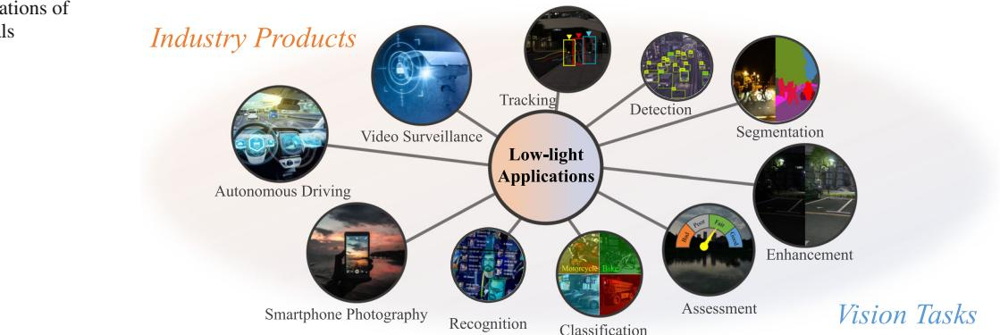

#### **Fig. 1** Typical applications of low-light image signals

Low-light blind image quality assessment (BIQA) aims to automatically and accurately estimate objective scores, thereby avoiding the obstacles of subjective experiments such as time-consuming, unstable, and non-automated processes. This is particularly important for quality monitoring in industrial products (Wang et al[.](#page-22-0), [2022\)](#page-22-0). At the same time, the human visual system (HVS) is the ultimate receiver of visual signals in the BIQA task (Li et al[.,](#page-21-5) [2021\)](#page-21-5), and human visual perception is simultaneously reflected by multiple sensory information. However, existing BIQA methods, whether hand-crafted or deep-learned, rarely consider multimodal information (Min et al[.,](#page-22-4) [2020](#page-22-4)) and are limited to low-light images alone. As a result, how to utilize multimodal learning to more accurately perform the quality assessment of lowlight images is the most fundamental motivation behind this work.

The perception of image quality is a complex and subjective process that involves evaluating and interpreting visual stimuli. When scoring the quality of visual signals, humans can perceive multiple sensing information at the same time (Baltrušaitis et al[.,](#page-21-6) [2018](#page-21-6)). After acquired exercise, our brains can easily make connections between different modality data and further create a comprehensive representation of the characteristics of things (Song et al[.](#page-22-5), [2019\)](#page-22-5). For example, when the image modality is influenced by various low-light noises, other auxiliary modalities are expected to provide supplementary quality description clues, such as the text description of image content or semantic visual understanding (Wang et al[.,](#page-22-6) [2021](#page-22-6)). Consequently, multimodal BIQA aims to create a visual indicator that mimics the HVS and learns better quality descriptors that represent human visual perception.

Inspired by the above discussion, we propose an early multimodal BIQA paradigm for low-light images. Considering that there is no low-light BIQA database equipped with multimodal information, we have constructed the first Multimodal Low-light Image Quality (MLIQ) database. In the image modality, low-light images contain authentic distortions from the steps of image acquisition and processing (Wang et al[.,](#page-22-0) [2022](#page-22-0)). In the text modality, we have specified quality-aware principles for generating semantic descriptions of image quality, which are based on the fact that humans are better at describing quality cognition rather than giving a quantitative value (Yang et al[.](#page-22-7), [2022b](#page-22-7)). Thus, text-based quality semantic description (QSD) can provide supplementary information in the modeling of BIQA.

Further, we have developed a unique blind multimodal quality assessment (BMQA) method to integrate image and text features. The integration of cross-modal information helps maintain the representation depth of objective visual signals while broadening the breadth of human visual perception, which can introduce new benefits for the learning of image quality descriptors. The expansion of data modality helps a deep-learned model to enrich low-level embedding features from different perspectives, thereby improving the robustness of the forecasting performance (Baltrušaitis et al[.,](#page-21-6) [2018](#page-21-6)). Extensive experiments validate the effectiveness of the proposed BMQA, demonstrating the great potential of multimodal learning in blind quality assessment modeling.

The main contributions are four-folds:

- (1) Inspired by the HVS, we propose to apply multimodal learning to the BIQA problem by integrating visual and text features. To the best of our survey, this is one of the first attempts to explicitly explore low-light quality assessment across different modalities.
- (2) To verify the feasibility of multimodality in the BIQA task, we first construct a new MLIQ database of lowlight images, which contains 3600 image-text data pairs. In addition, we carry out a statistical analysis of the text feature, which is helpful to demonstrate human quality cognition.
- (3) Based on the MLIQ database, we further investigate three main modules in multimodal learning: image-text quality representations, latent feature alignment, and fusion prediction. To improve the efficiency of deep model training, we develop an effective BMQA method by incorporating both multimodal self-supe- rvision and supervision.

(4) To demonstrate the applicability of our BMQA, we also establish a new low-light image quality database, namely Dark-4K, which contains only a single image modality. Dark-4K is used to verify the applicability and generalization performance under the unimodal assessment scenarios. Experiments show that this hybrid learning paradigm ensures that BMQA achieves state-of-the-art performance on both the MLIQ and Dark-4K databases.

# **2 Related Work**

In this section, we provide a brief review of recent BIQA methods in various aspects, covering hand-crafted BIQAs (e.g., distortion-specific and general-purpose), and deeplearned BIQAs (e.g., supervised learning-based and unsupervised learning-based). In addition, we also review the exploration of multimodality-based quality assessment in user-perceived quality of experience (QoE).

## **2.1 Unimodal Blind Image Quality Assessment**

Existing BIQA methods are mainly based on a single visual modality, which can be roughly divided into (1) hand-crafted and (2) deep-learned methods.

#### **2.1.1 Hand-Crafted BIQA Methods**

Hand-crafted BIQAs (Wang et al[.](#page-22-8), [2021](#page-22-8)) are typically based on the extraction of features from expert and engineering experience. Since hand-crafted BIQAs require less deployment environment (e.g., database size, hardware platform, computing power, etc.), they are highly achievable and easy to deploy. Existing hand-crafted BIQAs can be divided into (1) distortion-specified and (2) general-purposed ones.

*Distortion-Specific* Distortion-specific BIQAs measure image quality by considering both degradation manners and distortion types of a particular application, as shown in Fig. [1.](#page-1-0) For example, some preliminary BIQA models have been specially developed for low-light images, such as brightnessguided (Xiang et al[.,](#page-22-9) [2019\)](#page-22-9), colorfulness-inspired (Wang et al[.,](#page-22-10) [2021](#page-22-10)), visibility-induced (Wang et al[.](#page-22-0), [2022\)](#page-22-0), and comparative learning-based (Wang et al[.,](#page-22-11) [2022](#page-22-11)).

Additionally, there are other promising distortion-specific BIQAs, including screen content (Wang et al[.,](#page-22-8) [2021\)](#page-22-8), aesthetic (Deng et al[.,](#page-21-7) [2017\)](#page-21-7), light-field (Tian et al[.](#page-22-12), [2021](#page-22-12)), and underwater (Zheng et al[.,](#page-23-0) [2022\)](#page-23-0). Due to the length of the article, we will not discuss other types of distortion-specific BIQAs in this article.

*General-Purpose BIQAs* General-purpose methods (Kong and Yan[g](#page-21-8), [2018\)](#page-21-8), on the other hand, utilize common qualityaware features to quantify image distortion. For example, natural scene statistics (NSS)-based BIQAs are based on the assumption that high-fidelity images obey some kind of prior statistical characteristics (Zhang et al[.](#page-22-13), [2015](#page-22-13)), which are altered by quality degradation in frequency and spatial domains (Mittal et al[.](#page-22-14), [2012\)](#page-22-14). HVS-guided BIQAs are based on the understanding that the ultimate recipients of visual signals are humans, and it is significant to exploit perception characteristics, such as free-energy principle (Zhai et al[.,](#page-22-15) [2012\)](#page-22-15) and visual sensitivity (Liu and Li[u](#page-22-16), [2018](#page-22-16)).

#### **2.1.2 Deep-Learned BIQA Methods**

Deep-learned BIQAs (Wang et al[.](#page-22-11), [2022](#page-22-11)) directly learn quality features from distorted images in an end-to-end manner. Unlike hand-crafted BIQAs, these methods automatically optimize quality forecasting models which have shown promising performance. Deep-learned BIQAs can be usually divided into (1) supervised learning-based and (2) unsupervised learning-based BIQA methods. It is worth noting that there are other learning types (e.g., reinforcement learning (Gu et al[.](#page-21-9), [2019\)](#page-21-9)), which are somewhat less commonly used in the deep-learned BIQA task.

*Supervised Learning-Based* Supervised learning-BIQAs (Ying et al[.,](#page-22-17) [2020\)](#page-22-17) focus on solving the problem of insufficient training samples. For example, sample-based BIQAs (Bosse et al[.,](#page-21-10) [2018](#page-21-10); Kang et al[.](#page-21-11), [2014](#page-21-11); Ke et al[.,](#page-21-12) [2021\)](#page-21-12) are mainly based on expanding the capacity of training samples by utilizing patch-level quality features to predict an imagelevel score. Constraint-based BIQAs (Kim et al[.,](#page-21-13) [2019;](#page-21-13) Zhang et al[.](#page-23-1), [2020\)](#page-23-1) optimize multiple loss functions simultaneously in supervised learning, such as employing multiple losses for multi-scale supervision (Wu et al[.](#page-22-18), [2020](#page-22-18)), introducing new normalization embeddings into the objective function (Li et al[.,](#page-21-14) [2020](#page-21-14)), leveraging hierarchical curriculum learning (Wang et al[.](#page-22-19), [2023](#page-22-19)), using additional constraints to adjust initialization parameters (Zhu et al[.,](#page-23-2) [2020](#page-23-2)), and incorporating constraints learned from other databases (Ma et al[.](#page-22-20), [2021](#page-22-20); Zhang et al[.](#page-23-3), [2021](#page-23-3), [2023\)](#page-23-4).

*Unsupervised Learning-Based* Unsupervised learning-BIQAs extract latent features without relying on ground-truth MOS labels. For example, metric-based BIQAs (Madhusudana et al[.,](#page-22-21) [2022\)](#page-22-21) employ widely-used distance measurements (e.g., cosine similarity, Wasserstein distance, etc.) to extract latent embedding features. Domain-based BIQAs (Liu et al[.,](#page-22-22) [2019\)](#page-22-22) commonly design domain alignment constraints, and measure the quality difference between each sample in a source domain based on the error metric defined in a target domain. However, domain-based BIQAs often require strict assumptions, making it challenging to meet the model requirements when the distortion type of a testing image is unknown.

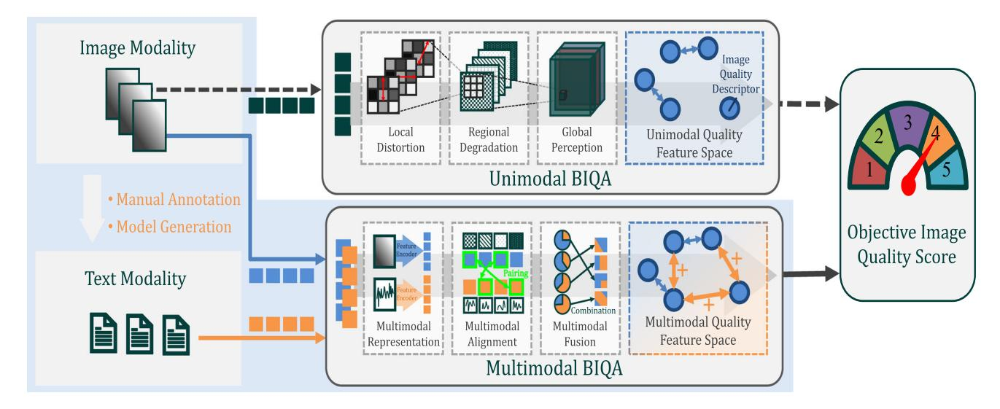

**Fig. 2** Relationship between unimodal and multimodal BIQAs. Humans are better at perceiving image quality through semantic descriptions rather than quantitative values, which reveals that text description is a very useful modality for BIQA modeling. Please zoom in the electronic version for better details

## **2.2 Multimodal Quality Assessment**

Multimodal quality assessment methods are still in their early stage, which primarily focus on video and audio information (Min et al., [2020](#page-22-4)). For example, video-audio features can be represented and combined to predict the QoE score. Current explorations mainly consider the feature combination of spatial and temporal perceptions (Ying et al[.](#page-22-23), [2022;](#page-22-23) Min et al[.,](#page-22-4) [2020\)](#page-22-4).

In addition, video and audio distortions do not degrade each other (i.e., video degradation does not cause audio degradation, and vice versa). The QoE scores of video-audio are first measured independently, and then a combination rule is further designed to predict the joint quality. The combination rule mainly considers addition, multiplication, and weighted Minkowski (Martinez and Faria[s](#page-22-24), [2018\)](#page-22-24). Due to the neglect of the interaction between cross-media information, it is difficult to accurately estimate the joint QoE by simply combining individual quality scores.

## **2.3 Motivation**

As discussed in Min et al[.](#page-22-4) [\(2020](#page-22-4)) and Pinson et al[.](#page-22-25) [\(2012](#page-22-25)), there are some multimodal quality databases established based on video-audio pairs. However, very few databases have been established containing the image-text subjective labels. The differences between existing video-audio quality indicators and our image-text method are apparent:

• The former aims to predict the joint quality of videos and corresponding audio, while the latter aims to predict the visual quality of images. Our BMQA focuses on studying the impact of auxiliary modalities on forecasting image quality.

- Existing video-audio quality methods rarely consider deep multimodal learning, including multimodal feature extraction, alignment, fusion, and more. Our BMQA investigates various cross-media learning modules, from deep quality representation to quality fusion prediction.
- The audio modality is usually unavailable in many quality assessment tasks, and existing video-audio quality methods become inapplicable. Conversely, the text modality can be easily generated using existing language models (Liu et al[.,](#page-21-15) [2023](#page-21-15)), and the lack of text is not a problem in our BMQA.

It is worth noting that humans are better at measuring image quality by semantic description rather than quantitative score (Yang et al[.,](#page-22-7) [2022b\)](#page-22-7), and hence text can be a very valuable modality in the modeling of BIQA. Moreover, the text modality used in this paper can be directly generated by many popular image captioning methods (Xu et al[.](#page-22-26), [2015\)](#page-22-26) and recent large language models (LLMs) (Liu et al[.,](#page-21-15) [2023](#page-21-15)).

Furthermore, our investigation focuses on how additional modality information, if present, affects the modeling of BIQA. With our MLIQ database, we can pre-train a QSDinduced captioning model, allowing our BMQA scheme to seamlessly integrate into any existing unimodal BIQA task. The relationship between unimodal BIQAs and our BMQA is illustrated in Fig. [2.](#page-3-0)

Finally, our BMQA provides a new and promising research perspective. On one hand, the homogeneity of multimodal data suggests that training information can be supplementary or shared, which facilitates the learning of highly descriptive quality features. On the other, the heterogeneity of multimodal data can expand the breadth and depth of training information, which potentially improves the forecasting performance. To this end, it is highly desirable to develop a specialized multimodal quality indicator for lowlight images.

# **3 Multimodal Low-Light Image Quality (MLIQ) Database Construction**

In this section, we describe how to construct our MLIQ database. The established database contains RGB images with the subjective quality scores and QSD-based texts.

## **3.1 Multimodality Construction**

#### **3.1.1 MOS-Based Image Modality**

Natural Night-time Image Database (NNID) (Xiang et al[.,](#page-22-9) [2019\)](#page-22-9) is the latest publicly available no-reference low-light image database. It contains 448 different visual scenes with a total of 2240 samples, covering daily life recording, intelligent transportation, surveillance, city light show, aerial photography, and many other application scenarios. The characteristics of the NNID database are very suitable for our experimental requirement. To facilitate the acquisition of low-light image data for MLIQ, we adopt it as part of our benchmark image source.

Furthermore, we adopt another 1360 low-light images captured by two new devices, *Canon EOS 6D* and *Huawei Mate 30 Pro*, to expand the coverage of weak-illumination scenes. MLIQ consists of a total of 3600 low-light image samples. These low-light samples are captured in real-world environments (e.g., indoors and outdoors) with a total of five different mobile devices. One device captures a visual scene with five different settings. These five settings are allowed to be different for different scenarios. The resolution of each low-light sample ranges from 512×512 to 2048×2048. Therefore, MLIQ is the largest no-reference low-light database, covering various scenes, large volumes, complex noise, diverse devices, and authentic distortion.

To obtain the MOS label for each low-light image on MLIQ, we have conducted a subjective experiment. Following *ITU-R BT.500-14* and NNID (Xiang et al[.,](#page-22-9) [2019\)](#page-22-9), we take a single stimulus and build a graphical user interface to perform the experiments. *Skyworth 28U1* is used, and the viewing distance is approximately three times of the image height. We have invited 26 participants including 16 females and 10 males (between the ages of 18 and 35). The participants are asked to score the image quality based on 11 discrete quality scores ranging from 0 to 1 with a step length of 0.1. The rated score will finally correspond to five quality levels, including [0, 0.1] for *bad*, [0.2, 0.3] for *poor*, [0.4, 0.5] for *fair*, [0.6, 0.7] for *good*, and [0.8, 1.0] for *excellent*.

A statistical analysis of our MLIQ is illustrated in Fig. [3.](#page-5-0) Figure [3a](#page-5-0)–c provide the overall statistical data of shooting device, image resolution, and content application scenario, respectively. Figure [3d](#page-5-0) reports the histogram distribution of MOS values. As seen, MOS values span the entire quantified range of visual quality with sufficient and fairly uniform samples at each level. This shows that our MLIQ database covers the entire range of visual quality (from poor to excellent), and also exhibits a good separation of the perceptual quality. In addition, Fig. [3e](#page-5-0) reports the 95% confidence intervals obtained from the mean and standard deviation of the rating score for each image as the consistency evaluation, where the confidence interval is mainly distributed between 0.11 and 0.17. It indicates that all observers have reached a high agreement on the perceptual quality of low-light images. Therefore, the proposed MLIQ database is used as a groundtruth for the performance evaluation of objective quality indicators.

#### **3.1.2 QSD-Based Text Modality**

A simple and effective way to represent human visual perception is to ask subjects to describe and record their semantic visual understanding (Wade and Swansto[n,](#page-22-27) [2013](#page-22-27)). The text description can provide additional quality assessment clues: On one hand, free verbal descriptions of visual understanding provide potentially the richest QSD source, since language is the most flexible means of human communication. On the other, verbal descriptions help to avoid personal information bias, as verbal descriptions are far less likely to be inconsistent than consistent (Hanjalic and X[u](#page-21-16), [2005](#page-21-16)).

By synthesizing some previous work, we design two text description principles based on the perception mechanism of the HVS. It can exhibit feed-forward visual information extraction and aggregation from the retina (i.e., *intuitive visual perception*) to the primary visual cortex (i.e., *empirical visual perception*) (Yang et al[.](#page-22-28), [2022a\)](#page-22-28). These principles are used to guide annotators in generating their verbal descriptions.

*Intuitive Visual Perception.* This principle is inspired by previous physiological and psychological experiments on the HVS, including saliency detection and just noticeable difference. It is closely related to early vision and focuses on the relationship between optical stimuli from visual observation and the HVS experience (Wade and Swansto[n,](#page-22-27) [2013](#page-22-27)). Intuitive vision mainly focuses on some basic data characteristics, covering overall brightness, color status, texture, salient objects, etc. For instance, the verbal description in Fig. [4c](#page-6-0) contains the quality attributes, such as the luminance information '*bright*', the color information '*black*' and '*blue*', and the observed object information '*car*' and '*sign*'.

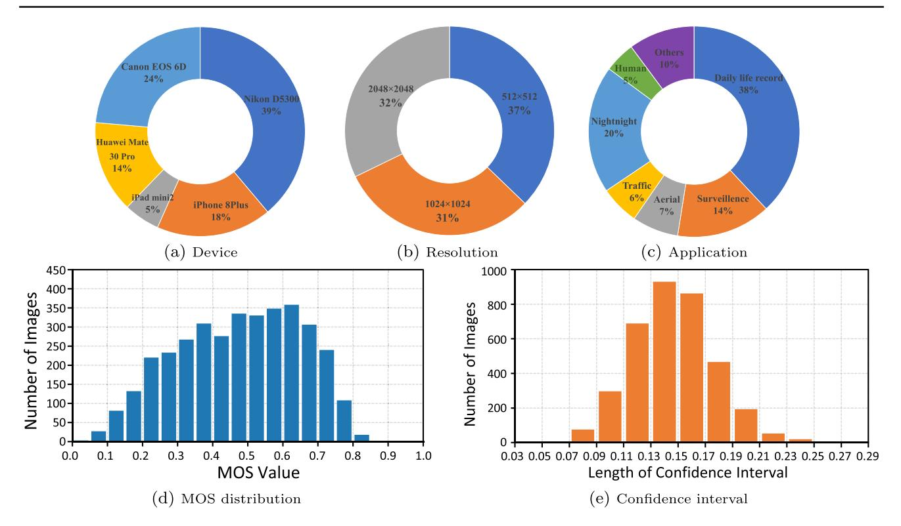

**Fig. 3** A statistical analysis of the proposed multimodal MLIQ database: **a** shooting device, **b** image resolution, **c** application scenario, **d** MOS distribution, and **e** confidence interval

*Empirical Visual Perception.* This principle is inspired by modern theoretical studies in visual theory that embraces empiricism as the dominant paradigm of human perception construction, such as Gregory's theory (Gregor[y,](#page-21-17) [1980](#page-21-17)). These studies demonstrate that while part of what we perceive comes from objects in front of us, another part (and possibly a larger part) always comes from our brains. The empiricism principle is closely related to late vision and focuses on exploring how the viewpoints of observers are involved in quality cognition. Empirical vision mainly involves some common real-world knowledge as well as empirical visual understanding, and highlights the possible real-life scenarios of low-light observations (Gordo[n](#page-21-18), [2004](#page-21-18)). For instance, subjects use '*driving*' rather than '*sitting*' for '*ship*' as shown in Fig. [4e](#page-6-0).

However, there are several challenges associated with verbal description. In this article, we will consider three of them in obtaining the text labels:

- *Subjectivity*. Verbal description of image quality perception is hindered by inherent subjectivity in individual preferences, making it difficult to establish a standardized and universally applicable vocabulary for describing image quality.
- *Variability*. Verbal descriptions exhibit significant variability. Individuals perceive and interpret the same test

image differently based on personal experiences, cultural backgrounds, aesthetic preferences, and physiological structures. In other words, visual appeal may vary among individuals.

• *Expressiveness*. Human language has limited capacity to express visual attributes and qualities. Describing with words often falls short in capturing the richness and complexity of image content. For instance, it can be challenging to articulate subtle differences in color tones, texture, or lighting conditions accurately.

To address the above three challenges, we attempt to develop a tractable verbal description paradigm. The qualitybased sentence should include a set of perceptual attributes such as color accuracy, noise, sharpness, and overall image quality. In the experiments, each subject is asked to provide a meaningful and concise verbal description for one low-light image. For the dictation of each image content, the following requirements need to be met:

• For images with salient objects (e.g., the ship in Fig. [4e](#page-6-0)), trying to describe all important objects in the image content. For images with salient scenes (e.g., the parking scene in Fig. [4c](#page-6-0)), trying to describe the overall environment. For images without any salient content (e.g., the building with many small objects in Fig. [4a](#page-6-0)), trying to

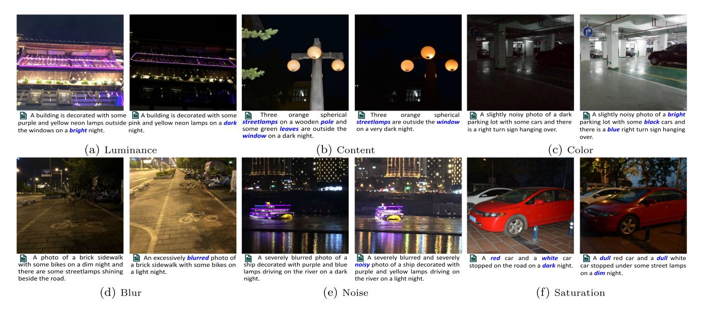

**Fig. 4** Examples of some Image-Text-MOS pairs on our MLIQ database. We provide some representative examples for analysis and discussion of the text attributes, including luminance, content, color, blurry, noise, and saturation. Please zoom in the electronic version for better details

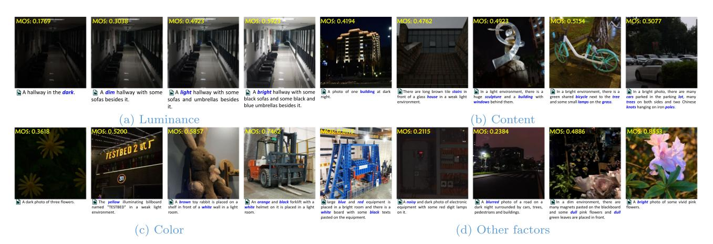

**Fig. 5** Visual examples for different quality semantic description (QSD)-based texts.: **a** *Luminance* covers illumination conditions including '*bright*', '*light*', '*dim*', and '*dark*'; **b** *Content* covers the number of

observed objects ranging from 1 to 5; **c** *Color* covers the number of color words ranging from 0 to 4; **d** *Other factors* cover QSD-based keywords including '*noisy*', '*blur*', '*dull*', and '*vivid*'

describe attractive content part, including objects and scenes.

- Trying to describe the overall brightness by using the relevant lighting features, such as '*bright*', '*light*', '*dim*', or '*dark*'.
- Trying to describe the main attributes of each object, such as color, brightness, texture (e.g., '*wooden*' pole in Fig. [4b](#page-6-0) and '*brick*' sidewalk in Fig. [4d](#page-6-0)), *etc*.
- Trying to describe the quality cognition by using the relevant color features, such as '*colorful*', '*vivid*', '*blurred*', '*noisy*', *etc*.

In the experiments, 14 male and 10 female trained participants are invited to provide a meaningful and concise verbal description for each low-light image. Finally, we collect 3600 text descriptions, where the length of the text labels ranges from 6 to 45 words.

## **3.2 Database Analysis**

In this section, we analyze correlations between images, texts, and quality scores (i.e., MOS) on the MLIQ database. Specifically, image modality serves as a carrier of visual data, objectively reflecting the captured scene or object, providing a fixed visual stimulus. Conversely, the corresponding text modality arises from an observer's perception and interpretation of the given image, incorporating subjective feelings and insights that often extend beyond the image inherent infor-

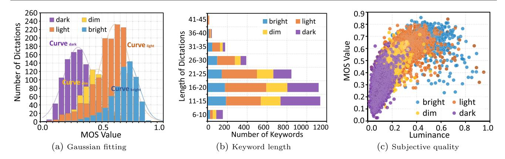

**Fig. 6** Statistics of text quality feature based on luminance: **a** histogram of the luminance keywords and Gaussian fitting, **b** histogram of the length and number of luminance keywords, and **c** scatter distribution of the luminance keywords and MOS values

mation. Based on the statistical analysis of MLIQ, we attempt to capture the underlying connection between visual signals and verbal descriptions. We conduct the statistical analysis based on brightness, content and color, and then discuss other factors affecting quality perception on low-light images.

#### **3.2.1 Luminance**

Low-light images mainly suffer from insufficient or uneven brightness. The quality level of low-light images is sensitively dependent on visual brightness perception. The text information contains quality clues (i.e., keywords) that describe the luminance status, which can effectively provide supplementary information. Therefore, it is significantly meaningful to explore the relationship between brightness and quality.

We start by figuring out how QSD-based text represents the image quality from the view of brightness. The luminance quality features, covering '*dark*', '*dim*', '*light*', and '*bright*', represent the illumination condition, as shown as Fig. [5a](#page-6-1). We calculate the histogram of the luminance feature on the entire database, as shown in Fig. [6a](#page-7-0). As seen, the MOS value corresponding to '*dark*', '*dim*', '*light*', and '*bright*' is concentrated around 0.2 to 0.4, 0.4 to 0.5, 0.5 to 0.6, and 0.6 to 0.8, respectively. Intuitively, the histogram of each luminance feature should obey an independent Gaussian distribution. Therefore, we adopt a Gaussian function to fit the histogram of '*dark*', '*dim*', '*light*', and '*bright*', and the Gaussian centers are 0.2797, 0.4338, 0.5744, and 0.6745, respectively. The above observations suggest that the luminance attribute has a strong relationship with the image quality.

Next, we analyze the relationship between images, texts, and quality scores based on brightness. We report the stacked histogram of the length of verbal at various luminance conditions in Fig. [6b](#page-7-0). As seen, '*dim*' and '*dark*' represent low luminance, which tend to have shorter verbal lengths. This is consistent with our experience that people often have difficulty describing very dark scenes with long verbal descriptions, e.g., the leftmost '*dark*' image in Fig. [5a](#page-6-1) only containing 5 words.

In addition, we calculate the average luminance value for each image as the objective luminance level and report the scatter plot of the corresponding quality score as shown in Fig. [6c](#page-7-0). We further mark colors for each plot based on the luminance keyword contained in the corresponding text. It can be observed that as the luminance level increases, the quality score generally increases as shown in different scatter colors. It suggests that the luminance feature is an efficient representation of visual quality perception.

#### **3.2.2 Content**

Due to insufficient exposure, low-light distortions usually result in incomplete or unclear visual quality, further leading to an annoying visual experience. The text modality contains verbal descriptions of observed objects, which can effectively provide auxiliary information on which objects the visual attention is focused. Therefore, we explore the relationship between image quality and content.

The reduction of observed objects is often reflected in the reduction of object descriptions in the text modality, as shown in Fig. [4b](#page-6-0). Based on this observation, we count the quantity of observed objects and report the corresponding MOS values. Figure [7a](#page-8-0) consists of stacked column charts and scatter plots, covering the number of observed objects ranging from 1 to 5. For each number of observed objects, the stacked column chart reports the image number at each luminance level, including '*dark*', '*dim*', '*light*', and '*bright*', respectively.

Based on the statistical data of image content and some visual examples provided in Fig. [5b](#page-6-1), we can draw some interesting conclusions: (1) The curve in Fig. [7a](#page-8-0) shows that the quality score tends to be higher as the quantity of observed objects increases. This may indicate that images with bet-

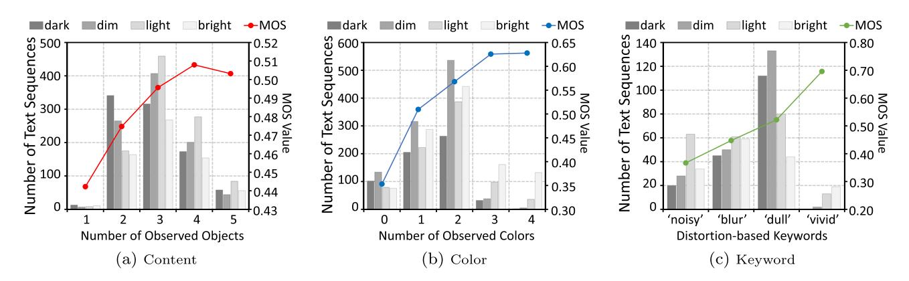

**Fig. 7** Statistics of other text quality features: **a** content, **b** color, and **c** keyword. The number of related images is measured by the main ordinate (placed on the left-hand side), while the average MOS result (dots connected by a solid line) is measured by the secondary ordinate (placed on the right-hand side)

ter visual quality usually contain more identifiable observed objects. (2) The stacked histogram in Fig. [7a](#page-8-0) shows that when the luminance levels get lower, the number of observed objects decreases. (3) The quality score increase caused by the quantity increase of observed objects is small (0.0657 from 1 to 5), which indicates that it is difficult to sensitively reflect visual experience via the quantity of observed objects. One possible reason may be that low-light distortion tends to lose detail rather than salient objects, while the quality score depends more on the salient content itself. For example, although the leftmost image in Fig. [5b](#page-6-1) is in '*dark*', the observed object '*building*' is clear.

#### **3.2.3 Color**

Low-light distortion tends to exhibit low color contrast and low saturation. The observed colors may effectively provide useful text information on visual perception responses. Therefore, we investigate the relationship between image quality and observed colors.

The impairment of observed colors is reflected as the reduction of color descriptions, as shown in Fig. [4c](#page-6-0). Inspired by this, we count the number of color features and report the corresponding MOS values. Figure [7b](#page-8-0) consists of stacked column charts and scatter plots, covering the number of color words ranging from 0 to 4. For each number of color features, the stacked column chart reports the image quantity at each luminance level, including '*dark*', '*dim*', '*light*' and '*bright*', respectively.

Based on the statistical data of image color and some visual examples provided in Fig. [5c](#page-6-1), we can also draw some interesting conclusions: (1) The curve in Fig. [7b](#page-8-0) shows that the quality score tends to be higher as the number of color features increases. This may indicate that images with a better visual perception experience usually contain more recognizable colors, as shown in Fig. [4c](#page-6-0). (2) The stacked histogram in Fig. [7b](#page-8-0) shows that when the visual perceptual luminance gets lower, the number of observed colors tends to be lower. (3) The quality score increases caused by the number increase of observed color is large (0.2747 from 0 to 4). This may indicate that the quantity of observed color can sensitively represent the quality experience of low-light distortion. For example, the rightmost image in Fig. [5c](#page-6-1) contains four vibrant colors, and its corresponding MOS is high.

#### **3.2.4 Other Factors**

Low-light photography is also often affected by many other factors, including blurring, heavy noise and low saturation (Chen et al[.](#page-21-19), [2021](#page-21-19)). A low-light image may get blurred by the camera shake if it is set to a long exposure time, as shown in Fig. [4d](#page-6-0). The increase in light sensibility reduces the signalto-noise ratio while increasing the exposure, as shown in Fig. [4e](#page-6-0). In addition, both underexposure and overexposure significantly affect color saturation, which further affects the visual experience.

Considering that the text label may contain some keywords that directly describe these degradation features, we collect the distortion-based keywords and report the corresponding MOS values. Figure [7c](#page-8-0) shows stacked column charts and scatter plots, covering the distortion-related keywords of '*blur*', '*noisy*', '*dull*', and '*vivid*'.

Based on the above statistical data and some visual examples provided in Fig. [5d](#page-6-1), we can draw some interesting conclusions: (1) text features such as '*blur*', '*noisy*', and '*dull*' represent poor visual experience, while '*vivid*' represents good visual experience. (2) The proportion of '*noisy*' is large in the '*bright*' luminance level, which indicates that noises in low-light images are more easily perceptible. 3) The proportion of '*blur*' is similar under different luminance levels, which indicates that blur is not closely related to lumination. (4) The proportion of '*dull*' is large in the '*dark*' and '*dim*' luminance levels, while the proportion of '*vivid*' is large in the '*light*' and '*bright*' luminance levels. These observations are consistent with the fact that human eyes prefer highly saturated colors, as shown in Fig. [4f](#page-6-0).

# **4 Proposed Blind Multimodal Quality Assessment (BMQA) Framework**

Based on the proposed MLIQ database, we design a unique deep-learned BMQA as shown in Fig. [8.](#page-10-0) We address the main challenges of multimodal learning in the BIQA task, including feature representation, alignment, and fusion. Finally, we will describe our learning mechanism.

## **4.1 Multimodal Quality Representation**

In this section, multimodal quality representation refers to extracting and integrating effective features that take the advantage of the supplementary quality description clues. Due to the fact that heterologous data has significantly different characteristics, this indicates a large difference between image and text spaces (Song et al[.](#page-22-5), [2019\)](#page-22-5). Therefore, we design two different feature quality representations for them.

#### **4.1.1 Text Quality Feature Representation**

In this subsection, we explore the quality cognition in terms of the text feature. The text quality representation **F***txt* can be defined by

$$
\mathbf{F}_{txt} = \mathcal{F}_{txt}(X_{txt}; \quad \boldsymbol{\theta}_{txt}), \qquad (1)
$$

where *Ftxt* represents a text feature extractor, *Xtxt* denotes an input quality description sentence, and *θtxt* represents the corresponding weights. *Xtxt*=<*x*1,..., *xN*> denotes the spoken words with a length of *N*. Next, we extract the latent text feature from *Xtxt* . Given

a word *xk* ∈< *x*1,..., *xN* >, we adopt *Ftxt* to extract the semantic quality feature for each word. In BMQA, *Ftxt* can be formulated as follows:

$$
\mathcal{F}_{txt}(x_k) = \sigma \left[ \mathcal{F}^1_{txt,lp} \left( x_n, < x_1, \dots, x_n, 0, \dots >; \quad \theta^1_{txt,lp} \right) \right] \\
\quad \oplus \mathcal{F}^2_{txt,lp} \left( x_n, < x_1, \dots, x_n, 0, \dots >; \quad \theta^2_{txt,lp} \right),\n\tag{2}
$$

where *F*1 *txt*,*lp* and *F*2 *txt*,*lp* denote two linear projections (e.g., fully connection or attention projection), *θ* 1 *txt*,*lp* and *θ* 2 *txt*,*lp* denote the corresponding weights, σ denotes a nonlinear activation function (e.g., rectified linear unit or Gaussian error linear unit), and ⊕ denotes a fusion operation (e.g., addition or concatenation). Currently, there is still no consensus on the efficient semantic processing (Stiennon et al[.,](#page-22-29) [2020](#page-22-29)). The main reason is that different methods build different word associations (i.e., different settings of *F*1 *txt*,*lp*, *F*2 *txt*,*lp*, σ and ⊕), and they show different advantages in natural language processing (NLP).

Finally, the association of all words in a dictation will contribute to the feature representation of **F***txt* . In BMQA, it is generated by a linear combination of all word features:

$$
\mathbf{F}_{txt} = \mathcal{F}_{lc} \left[ \mathcal{F}_{txt}(x_1), \dots, \mathcal{F}_{txt}(x_N); \quad \theta_{lc} \right], \tag{3}
$$

where *Flc* represents a fully-connected layer and *θlc* denotes the weights of *Flc*. In the experiments, we select 3 representative networks as the backbone of *Ftxt* , including Bag-of-Word (*denoted as* BoW), recurrent neural network (*denoted as* RNN), and Transformer (*denoted as* TransF).

#### **4.1.2 Image Quality Feature Representation**

Recent work has demonstrated the feasibility and superiority of deep neural network (DNN) in many vision tasks. Inspired by this, we obtain the image quality representation **F***img* by a deep-learned mapping:

$$
\mathbf{F}_{img} = \mathcal{F}_{img} \left( X_{img}; \quad \boldsymbol{\theta}_{img} \right), \tag{4}
$$

where *Fimg* denotes an image feature encoder, *Ximg* denotes an input image, and *θimg* represents the corresponding weights.

Existing deep-learned image quality representation (Fang et al[.](#page-21-20), [2022](#page-21-20)) mainly relies on the extraction and integration of features in the spatial domain. *Fimg* is usually designed as a stack of multiple layers of DNN blocks. Specifically, let *Fl img* denote a basic DNN block in the *l*-th layer of *Fimg*. *Fl img* usually consists of sequential linear computations and nonlinear activation functions in BMQA, which can be formulated as:

$$
\mathcal{F}^{l}{}_{img}\left(X^{l}{}_{img}\right) = \sigma_{l}\left[\mathcal{F}^{1}{}_{img,lp}\left(X^{l}{}_{img};\quad\theta^{1}{}_{img,lp}\right)\right]
$$
  
$$
\oplus \mathcal{F}^{2}{}_{img,lp}\left(X^{l}{}_{img};\quad\theta^{2}{}_{img,lp}\right), \qquad (5)
$$

where *F*1 *img*,*lp* and *F*2 *img*,*lp* denote two linear projections (e.g., fully connection, attention projection, or convolution), *θ* 1 *img*,*lp* and *θ* 2 *img*,*lp* denote the corresponding weights, σ*l* denotes a nonlinear activation function (e.g., rectified linear unit or gaussian error linear units), and ⊕ denotes a fusion operation (e.g., addition or concatenation).

Recent studies demonstrate that different backbones of deep models result in different learning capabilities. It indicates that network architectures may have important impacts on the extraction of **F***img*. Therefore, we select 5 representative networks as the backbone of *Fimg*, including VGG, ResNet (*denoted as* RN), EfficientNet (*denoted as* EN),

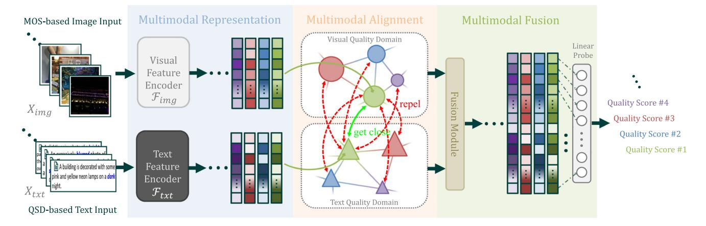

**Fig. 8** Overall learning framework of the proposed BMQA. It consists of three key modules, including multimodal feature representation, latent feature alignment, and fusion prediction

Vision-in-Transformer (*denoted as* ViT), and ConvNeXT (*denoted as* CNXT).

## **4.2 Image and Text Quality Feature Alignment**

In BMQA, multimodal quality alignment refers to finding the corresponding quality representation relationship between two modalities. The image and text are obtained for the same image, and the quality description can be highly consistent (Chen et al[.](#page-21-21), [2022\)](#page-21-21). For example, the text keywords can directly indicate the image regions that the visual attention focuses on Liu et al[.](#page-21-22) [\(2022](#page-21-22)), thus improving the learning performance of an image feature encoder.

Existing methods build the multimodal alignment by designing constraints across different modalities (called cross-modal constraints (Baltrušaitis et al[.,](#page-21-6) [2018](#page-21-6))). In the construction of training objective, it is necessary to define a special metric to measure the difference between two modalities. If two modalities come from different perspectives of a single sensor, the metric is defined as an absolute value error, such as mean absolute error (MAE) and mean square error (MSE). If two modalities come from different sensors, the metric is defined as a relative value error, such as cosine similarity (Radford et al[.,](#page-22-30) [2021](#page-22-30)).

The image and text are heterogeneous modalities. Therefore, we adopt the cosine similarity to measure the relative difference, and design an attentive pooling for multimodal quality alignment. Specifically, we find the shared quality information by learning the attentive distribution, and the aligned visual feature **F***img* is formulated by:

$$
\begin{cases}\n\widehat{\mathbf{F}}_{img} = \mathcal{N}_{ln} \left( \mathcal{F}_{fw} \left( \ddot{\mathbf{F}}_{img}; \quad \boldsymbol{\theta}_{fw} \right) + \ddot{\mathbf{F}}_{img} \right); \\
\ddot{\mathbf{F}}_{img} = \mathcal{N}_{ln} \left( \mathcal{F}_{ms} \left( \mathbf{F}_{img}; \quad \boldsymbol{\theta}_{k}, \boldsymbol{\theta}_{q}, \boldsymbol{\theta}_{v}, \sigma_{s} \right) + \mathbf{F}_{img} \right)\n\end{cases}, \quad (6)
$$

where *F f* w denotes a feed-forward layer with the parameter weights *θ f* w, and *Nln* denotes the layer normalization. *Fms* denotes a 32-head self-attention pooling module. *θ k* , *θ q* , and *θ* v denote the parameter weights of key, query and value embedding in *Fms*, and we set the projection dimension size as 2048. σ*s* (·) = softmax(·/ √*d*) denotes a scaled softmax used in *Fms*. Equation [\(6\)](#page-10-1) indicates that the feature elements related to shared quality information will obtain higher attention values than others. Therefore, the aligned quality information will be a weighted combination of all feature elements.

The aligned text feature **F***txt* can be formulated as:

$$
\begin{cases}\n\widehat{\mathbf{F}}_{txt} = \mathcal{N}_{ln} \left( \mathcal{F}_{fw} \left( \ddot{\mathbf{F}}_{txt}; \quad \boldsymbol{\theta}'_{fw} \right) + \ddot{\mathbf{F}}_{txt} \right); \\
\ddot{\mathbf{F}}_{txt} = \mathcal{N}_{ln} \left( \mathcal{F}_{ms} \left( \mathbf{F}_{txt}; \quad \boldsymbol{\theta}'_k, \boldsymbol{\theta}'_q, \boldsymbol{\theta}'_v, \sigma_s \right) + \mathbf{F}_{txt} \right)\n\end{cases}, \tag{7}
$$

where *θ k* , *θ q* , and *θ* v denote the embedding parameter weights. *θ f* w denotes the feed-forward parameter weights for the text feature alignment.

Finally, the relative difference between two aligned 1024 wide **F***img* and **F***txt* is measured by cosine similarity, which can be formulated by

$$
\mathcal{D}_{cos}(\widehat{\mathbf{F}}_{img}, \widehat{\mathbf{F}}_{txt}) = \frac{\widehat{\mathbf{F}}_{img} \odot \widehat{\mathbf{F}}_{txt}}{\|\widehat{\mathbf{F}}_{img}\| \|\widehat{\mathbf{F}}_{txt}\|},
$$
\n(8)

where represents an inner product operation and · represents the Euclidean distance. *Dcos* **F***img*,**F***txt* will be used as the metric of multimodal self-supervision learning in Sect. [4.4.1.](#page-11-0)

## **4.3 Image and Text Quality Feature Fusion**

In BMQA, the main benefit of using two modalities is that the image quality can be described from different perspectives (D'mello and Kor[y](#page-21-23), [2015](#page-21-23)). For example, quality scores can be obtained directly from subjective tests, which can be reflected by the text information. Another representative case is that verbal descriptions of highly similar scenes are often unavoidably similar, while spatial details from images will help fine-grained scoring decisions. These two scenarios show that the fusion of image and text quality representations helps to predict more accurate quality scores. Therefore, multimodal quality fusion (Baltrušaitis et al[.,](#page-21-6) [2018](#page-21-6)) is adopted to integrate two modalities to predict the quality score in our BMQA.

To preserve quality information as much as possible, we integrate two heterogenous modality features via a concatenation operation. Next, we employ a 2048-wide linear probe (Radford et al[.](#page-22-30), [2021\)](#page-22-30), *F f use*, to fuse and forecast a final quality score *spred* , which can be formulated as:

$$
s_{pred} = \mathcal{F}_{fuse} \left[ \text{concat} \left( \widehat{\mathbf{F}}_{img}, \widehat{\mathbf{F}}_{txt} \right); \quad \theta_{fuse} \right], \tag{9}
$$

where concat (·) denotes the concatenation operation, and *θ f use* denotes the parameter weights of *F f use*.

## **4.4 Deep Multimodal Learning Mechanism**

BMQA learns to predict image quality scores by exploiting the supplementary quality descriptions from cross-modal features. In this section, we describe our multimodal learning mechanism, including multimodal self-supervision and supervision.

#### **4.4.1 Multimodal Quality Self-Supervision**

Existing methods suggest that image quality status can be latently learned without subjective scores. In other words, quality status can be captured and learned from distorted image samples. The multimodal information is expected to enhance deep model learning, since the supplementary information from two modalities will contribute to the quality representation learning. For example, people prefer '*bright*' images compared with '*dark*' images.

The shared quality information of two modalities from the same instance provides supplementary information. Therefore, we train an embedding space, in which feature pairs from the same instance gets close while these from different instances get far away from each other. Specifically, given the *i*-th **F**ˆ*img*(*i*) in the current training batch *B*, the pair-wise probability *P* (·) is calculated to find the matched *j*-th text feature as:

$$
\mathcal{P}_{img}\left(i,j\right) = \frac{\exp\left(\mathcal{D}_{cos}\left(\widehat{\mathbf{F}}_{img(i)}, \widehat{\mathbf{F}}_{txt(j)}\right) / \tau\right)}{\sum_{k \in B} \exp\left(\mathcal{D}_{cos}\left(\widehat{\mathbf{F}}_{img(i)}, \widehat{\mathbf{F}}_{txt(k)}\right) / \tau\right)},\quad(10)
$$

where τ denotes the temperature parameter that controls the degree of distribution concentration.

**Algorithm 1** Proposed BMQA scheme on the image-text case, BMQA*image*−*text* .

| Input: |
|--------|
|--------|

Image sample *Ximg* and quality description text *Xtxt* .

**Output:** Quality score *spred* .

- 1: Extract the text feature representation **F***txt* in Eqs. [\(2\)](#page-9-0)-[\(3\)](#page-9-1);
- 2: Extract the image feature **F***img* in Eqs. [\(4\)](#page-9-2)-[\(5\)](#page-9-3);
- 3: Obtain the aligned image feature**F***img* in Eq. [\(6\)](#page-10-1) and the aligned text feature in **F***txt* in Eq. [\(7\)](#page-10-2), respectively;
- 4: Fuse **F***img* and **F***txt* , and predict the objective quality score *spred* in Eq. [\(9\)](#page-11-1).

At the same time, the pair-wise probability to find the matched *i*-th image feature for the *j*-th text feature **F**ˆ*txt*(*j*) will be:

$$
\mathcal{P}_{txt}(j,i) = \frac{\exp\left(\mathcal{D}_{cos}\left(\mathbf{F}_{img(i)}, \mathbf{F}_{txt(j)}\right) / \tau\right)}{\sum_{k \in B} \exp\left(\mathcal{D}_{cos}\left(\mathbf{F}_{img(k)}, \mathbf{F}_{txt(j)}\right) / \tau\right)}.
$$
(11)

Therefore, multimodal quality alignment needs to satisfy that the pair-wise probability between each paired **F***img* and **F***txt* gets the maximum value as: *Pimg* (*i*,*i*) = max*k*∈*B Pimg* (*i*, *k*) and *Ptxt* (*j*, *j*) = max*k*∈*B Ptxt* (*j*, *k*). The overall learning goal is to maximize the joint probability, which is equivalent to minimizing the negative log-likelihood:

$$
\min_{\theta_{\text{img.}}, \theta_{\text{fw.}}, \theta_k, \theta_q, \theta_v; \atop \theta_{\text{txt.}}, \theta'_{\text{fw.}}, \theta'_k, \theta'_q, \theta'_v} - \log \left[ \sum_{i \in B} \mathcal{P}_{img} (i, i) + \sum_{j \in B} \mathcal{P}_{txt} (j, j) \right].
$$
\n(12)

#### **4.4.2 Multimodal Quality Supervision**

To obtain a better fusion model *F f use* in Eq. [\(9\)](#page-11-1), we adopt the mean square error ·2 2 to measure the difference between the predicted score *spred* and the ground-truth subjective score *sgt* . Our goal is to predict a score as close as possible to the subjective MOS, and the optimization problem can be formulated as:

$$
\min_{\theta_{fuse}} \|\mathcal{F}_{fuse}\left[\text{concat}\left(\widehat{\mathbf{F}}_{img}, \widehat{\mathbf{F}}_{txt}\right); \quad \theta_{fuse}\right] - s_{gt} \|_{2}^{2}. (13)
$$

## **4.5 Overall Algorithm**

Given a pair of image data *Ximg* and text data *Xtxt* , we obtain the image feature **F***img* by Eq. [\(4\)](#page-9-2) and the text feature **F***txt* by Eq. [\(3\)](#page-9-1). After that, BMQA learns to output the aligned features **F***img* and **F***txt* by Eqs. [\(6\)](#page-10-1) and [\(7\)](#page-10-2), respectively. The learning of the quality feature alignment will be achieved by a multimodal self-supervision. Finally, BMQA learns to fuse the aligned feature by Eq. [\(9\)](#page-11-1), where the learning of the quality feature fusion will be achieved by a multimodal supervision.

The detailed algorithm of our BMQA is summarized in Algorithm [1.](#page-11-2)

# **5 Validations and Discussions**

In this section, extensive experiments are conducted on two latest benchmark low-light image databases. Specifically, we verify the effectiveness of our BMQA on the image-text database MLIQ (i.e., BMQA*image*−*text*) and the image-only database Dark-4K (i.e., BMQA*image*−*only* ), respectively. Besides, we demonstrate the comparison results with 25 competitive methods, including 8 hand-crafted BIQAs and 17 deep-learned BIQAs. We provide the detailed descriptions of the experimental validation, analysis, and discussion as follows.

## **5.1 Experimental Protocols**

#### **5.1.1 Benchmark Database**

In the experiments, three databases are used including a pre-training database MS-COCO, a new multimodal image quality database MLIQ, and a new low-light database Dark-4K containing only a single image modality.

*MS-COCO.* We pre-train our BMQA model on the MS-COCO caption database (Vinyals et al[.](#page-22-31), [2016\)](#page-22-31), which contains 82783 image instances labeled with captions. The sentence of each caption contains at least 8 words. The partitions of MS-COCO strictly follow the officially specified setting.

*MLIQ.* We train our BMQA model on the proposed MLIQ dataset, containing 3600 pairs of low-light image and corresponding text description. The details can be found in Sec. [3.](#page-4-0) In the experiments, MLIQ is randomly divided by **8:1:1** according to the shooting scene. Specifically, the training set contains 576 scenes and 2880 samples, the validating set contains 72 scenes and 360 samples, and the testing set also contains 72 scenes and 360 samples.

*Dark-4K.* To validate the cross-dataset performance, we further establish a new ultra-high-definition (UHD) low-light database for the cross-dataset validation, namely Dark-4K. The original images of Dark-4K are collected from Chen et al[.](#page-21-24) [\(2018](#page-21-24)). Dark-4K consists of 424 raw low-light images, which are captured by two consumer electronics: *Sony* α7 S-II and *Fujifilm X-T2*. These two cameras have different imaging hardware: *Sony* has a full-frame Bayer sensor, and *Fujifilm* has an APS-C X-Trans sensor. Dark-4K supports the quality assessment of low-light images produced by different filter arrays.

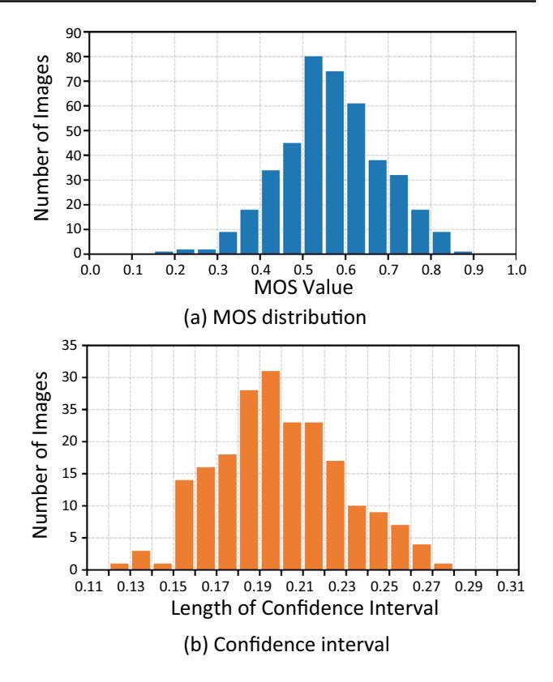

**Fig. 9** A statistical analysis of the proposed unimodal Dark-4K database: **a** histogram of MOS values and **b** distribution of confidence interval

The subjective experiments on Dark-4K maintain the same settings as described in Sec. [3.1.1.](#page-4-1) The histogram of labeled MOS results and the 95% confidence intervals for the subjective ratings are shown in Fig. [9a](#page-12-0) and b, respectively.

#### **5.1.2 Evaluation Metric**

In visual quality assessment, Pearson Linear Correlation (PLCC), Spearman Rank Correlation Coefficient (SRCC), and Root Mean Square Prediction Error (RMSE) are three commonly-used evaluation metrics (Zhang et al[.](#page-23-4), [2023](#page-23-4)). PLCC is used to measure the linear relationship between objective predictions and subjective scores, SRCC reflects the monotonicity of predictions, and RMSE measures the accuracy of predictions. For a promising method, PLCC and SRCC are close to 1, while RMSE is close to 0.

#### **5.1.3 Training Detail**

All experiments have been carried out on a computing server with *Intel(R) Xeon(R) Gold 6226R* CPU *@2.90GHz*, 38GB RAM, and *NVIDIA A100-PCIE* GPU *@40GB*×6.

Next, we report the setting of each training stage, such as (1) pre-training, (2) self-supervised training, and (3) super-

| Fimg    | Ftxt   | PLCC ↑ | SRCC ↑ | RMSE ↓ |
|---------|--------|--------|--------|--------|
| VGG-19  | BoW    | 0.8538 | 0.8532 | 0.0885 |
|         | RNN    | 0.8670 | 0.8636 | 0.0869 |
|         | TransF | 0.8731 | 0.8685 | 0.0847 |
| RN-50   | BoW    | 0.8743 | 0.8750 | 0.0845 |
|         | RNN    | 0.8859 | 0.8851 | 0.0824 |
|         | TransF | 0.8989 | 0.8877 | 0.0830 |
| EN-B4   | BoW    | 0.8760 | 0.8719 | 0.0834 |
|         | RNN    | 0.8898 | 0.8886 | 0.0810 |
|         | TransF | 0.8987 | 0.8922 | 0.0825 |
| ViT-B32 | BoW    | 0.8802 | 0.8774 | 0.0827 |
|         | RNN    | 0.8879 | 0.8871 | 0.0822 |
|         | TransF | 0.9089 | 0.9040 | 0.0816 |
| CNXT-B  | BoW    | 0.8822 | 0.8844 | 0.0832 |
|         | RNN    | 0.8970 | 0.8984 | 0.0817 |
|         | TransF | 0.9121 | 0.9065 | 0.0802 |

**Table 1** Overall performance comparison between 15 *Fimg and Ftxt combinations on the MLIQ database*

vised training. Note that *Adam* is used as our optimization solver in *Python Toolbox PyTorch*.

*Self-supervised pre-training* (StagePT ). We first pre-train the image feature extractor *Fimg* as well as the text feature extractor *Ftxt* on the MS-COCO database. We take 768 samples as a batch (i.e., 128×6) and pre-train our models for 50 epochs. We set the initial learning rate to 1*e*-3 and decay it by a *cosine* schedule. StagePT takes about 6.5 days for training.

*Self-supervised training* (StageSS ). We train our BMQA model using the pairs of low-light image and the corresponding QSD-based text from the proposed MLIQ database. At this time, we reduce the batch size to 256 and set the total training epochs to 20, where the initial learning rate is fixed at 4*e*-5. In the experiments, we find that neither undertrained (e.g., a loss greater than 1.0) nor overtrained (e.g., a loss less than 0.6) models can achieve better performance. Empirically, we randomly pick the final model with the loss around 0.8. StageSS takes about 7 h for training.

*Supervised training* (StageST ). For VGG, ResNet and EfficientNet, we set the initial learning rate to 8*e*-5 and reduce the learning rate by a factor of 0.95 at the *150*-th and *250* th epochs. For ViT and ConvNeXT, we set a smaller initial learning rate to 6.4*e*-5 and also reduce the learning rate by a factor of 0.95 at the *150*-th and *250*-th epochs. Finally, we keep the batch size as 16 and train the quality score predictor for 300 epochs. StageST takes about 2.5 h for training.

## **5.2 Feature Representation Validation**

To verify the effectiveness of two heterogenous modality feature extractors, we have conducted the experiments on

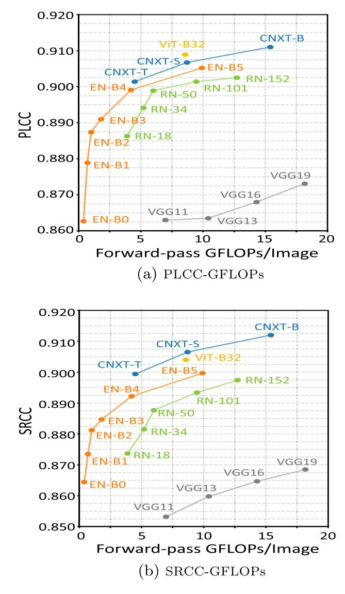

**Fig. 10** Performance comparison of different image feature extractors *Fimg*: **a** PLCC-GFLOPs curves of different network variants and **b** SRCC-GFLOPs curves of different network variants

several representative *Ftxt* and *Fimg* models. Specifically, we take VGG-19, ResNet-50 (*denoted as* RN-50), EfficientNet (*denoted as* EN-B4), Vision-in-Transformer (*denoted as* ViT-B32), and ConvNeXT (*denoted as* CNXT-B) as the image feature encoders, respectively. In addition, we take Bag-of-Word (*denoted as* BoW), recurrent neural network (*denoted as* RNN), and Transformer (*denoted as* TransF) as the text feature encoders, respectively.

Considering that the prediction accuracy of BMQA is mainly related to the feature representation, we first explore the impact of different network backbones of *Fimg*, including VGG19, RN-50, EN-B4, ViT-B32, and CNXT-B. Meanwhile, we employ BoW, RNN, and TransF as *Ftxt* . Table [1](#page-13-0) provides the overall comparison results of 15 *Ftxt* and *Fimg* combinations. As seen, all 15 BMQA variants achieve promising performance, which verify the excellent robustness capability of our multimodal paradigm. Besides, the related combinations achieve higher prediction accuracy with the use of more powerful feature encoders.

In addition, considering that image is the main modality in the BIQA task, we further explore the impact of different network variants of *Fimg*. Figure [10](#page-13-1) provides the PLCC and SRCC curves of five *Fimg* models. As seen, we can draw some interesting conclusions: (1) Different variants of the same network architecture have a little effect on the final forecasting results. For example, the replacement of the ResNet network (from the heaviest RN-152 to the lightest RN-18) only results in the PLCC decreasing from 0.8863 to 0.9025 and the SRCC decreasing from 0.8737 to 0.8974; (2) The lightweight models have also achieved competitive performance. For example, EN-B0 achieves a PLCC score of 0.8627 and a SRCC score of 0.8532 with only 0.39G FLOPs. This suggests that our BMQA framework can maintain excellent performance for lightweight models.

## **5.3 Ablation Study**

As mentioned above, BMQA is based on two modalities and is constructed through three training phases, including pre-training, multimodal self-supervision, and multimodal supervision. In view of this, the ablation experiments are conducted to verify the effectiveness of two different modalities for different learning stages. The detailed results are provided in Table [2.](#page-15-0)

*Multimodal Self-Supervision.*To demonstrate the roles of two modalities, we first verify the performance of a single modality in Method (a) and Method (b), where "-" means the related modality or training is not used in Table [2.](#page-15-0) In other words, BMQA independently adopts RN-50 as the image encoder *Fimg* or TransF as the text encoder *Ftxt* . As seen, the result of Method (a) is better than that of Method (b), which confirms that the image data is the main modality in the visual quality assessment task.

To verify the effect of StageSS , we also design Method (c) with the self-supervised learning based on Method (a), which is carried out for the feature alignment between TransF (*Ftxt*) and RN-50 (*Fimg*) as described in Sect. [4.4.1.](#page-11-0) As seen, Method (c) obtains a better result than Method (a), and it shows that the introduction of multimodal self-supervision helps the deep model training. The same phenomenon can be observed between Methods (d) and (b).

*Multimodal Supervision.* To verify the effect of StageST , we also conduct the experiments with Method (e), which employs RN-50 as *Fimg* and TransF as *Ftxt* to perform an end-to-end multimodal quality supervision. As seen, Method (e) achieves a better result than Method (c) and Method (d), which indicates that the introduction of multimodal supervised learning improves the performance of BMQA.

*Pre-train Strategy.* To show the feature alignment performance between *Ftxt* and *Fimg*, we go a step further by pre-training Method (e) on the MS-COCO database. Specifically, we have performed three different pre-training strategies: (1) Method (f) verifies the pre-training effect on the classification task (*denoted as* CL), where RN-50 is pre-trained to distinguish categories of *Fimg* and TransF is pre-trained to distinguish categories of *Ftxt* . (2) Method (g) verifies the pre-training effect on the restoration task (*denoted as* RE), where RN-50 is pre-trained to restore the missing image content in *Fimg* and TransF is pre-trained to fill up the missing word information in *Ftxt* . (3) Method (h) verifies the pre-training effect on the feature alignment between *Fimg* and *Ftxt* , where RN-50 and TransF are pretrained to align the image and text features. Experiments show that Method (h) obtains a better result than Methods (f) and (g), which indicates that introducing multimodal quality alignment in the pre-training improves the BIQA performance.

## **5.4 Overall Performance Comparison**

To demonstrate the overall quality forecasting performance, we compare our BMQA with 25 representative BIQA methods on the MLIQ database. For fairness, all comparison methods use the same experimental settings as described in Sect. [5.1.](#page-12-1) According to the type of quality feature extraction, these BIQAs are divided into two categories: (1) hand-crafted and (2) deep-learned methods.

*Hand-Crafted BIQAs* Considering that low-light images on MLIQ are characterized by the hybrid multiple distortions, the comparison methods based on hand-crafted features are composed of four types:

- *GP*: general-propose BIQAs, including *Mittal2012TIP* (Mittal et al[.,](#page-22-14) [2012](#page-22-14)), *Liu2014SPIC* (Liu et al[.](#page-21-25), [2014\)](#page-21-25), and *Zhang2015TIP* (Zhang et al[.,](#page-22-13) [2015\)](#page-22-13).
- *MD*: distortion-specific BIQAs for multiply distortion, including *Li2016SPL* (Li et al[.,](#page-21-26) [2016\)](#page-21-26).
- *CD*: distortion-specific BIQAs for contrast distortion, including *Gu2017TCB* (Gu et al[.,](#page-21-27) [2017](#page-21-27)).
- *LL*: distortion-specific BIQAs for low-light distortion, including *Xiang2020TMM* (Xiang et al[.,](#page-22-9) [2019](#page-22-9)), *Wang2021ICME* (Wang et al[.](#page-22-10), [2021](#page-22-10)), and *Wang2022TII* (Wang et al[.](#page-22-0), [2022](#page-22-0)).

It is noted that the implementation of *Xiang2020TMM* (Xiang et al[.,](#page-22-9) [2019](#page-22-9)) is not available, and we provide the results of our re-implementation.

**Table 2** Ablation study of the contribution of each training stage: self-supervised pre-training StagePT , self-supervised training StageSS , and supervised training StageST

| Method | StagePT | StageSS |        | StageST |        | PLCC↑  | SRCC↑  | RMSE↓  |
|--------|---------|---------|--------|---------|--------|--------|--------|--------|
|        |         | Fimg    | Ftxt   | Fimg    | Ftxt   |        |        |        |
| (a)    | –       | –       | –      | RN-50   | –      | 0.7964 | 0.7934 | 0.1082 |
| (b)    | –       | –       | –      | –       | TransF | 0.7504 | 0.7466 | 0.1130 |
| (c)    | –       | RN-50   | TransF | RN-50   | –      | 0.8567 | 0.8556 | 0.0902 |
| (d)    | –       | RN-50   | TransF | –       | TransF | 0.8209 | 0.8183 | 0.0932 |
| (e)    | –       | RN-50   | TransF | RN-50   | TransF | 0.8614 | 0.8610 | 0.0896 |
| (f)    | CL      | RN-50   | TransF | RN-50   | TransF | 0.8707 | 0.8709 | 0.0868 |
| (g)    | RE      | RN-50   | TransF | RN-50   | TransF | 0.8753 | 0.8721 | 0.0871 |
| (h)    | FM      | RN-50   | TransF | RN-50   | TransF | 0.8989 | 0.8877 | 0.0830 |

*Deep-learned BIQAs.* Considering that low-light images on MLIQ are characterized by some specific distortions, the comparison methods based on deep-learned features can be divided into four categories:

- *AS*: allocation-based supervised BIQAs, including *Kang2014CVPR* (Kang et al[.](#page-21-11), [2014](#page-21-11)), *Bosse2018TIP* (Bosse et al[.](#page-21-10), [2018](#page-21-10)), and *Ke2021 ICCV* (Ke et al[.,](#page-21-12) [2021](#page-21-12)).
- *GS*: generation-based supervised BIQAs, including *Ying2020CVPR* (Ying et al[.](#page-22-17), [2020](#page-22-17)).
- *MT*: multi-task based supervised BIQAs, including *Kim2019TNNLS* (Kim et al[.](#page-21-13), [2019](#page-21-13)), *Yan2019TMM* (Yan et al[.](#page-22-32), [2019](#page-22-32)), *Zhang2020 TCSVT* (Zhang et al[.](#page-23-1), [2020](#page-23-1)).
- *MO*: multi-objective based supervised BIQAs, including *Wu2020TIP* (Wu et al[.,](#page-22-18) [2020\)](#page-22-18), *Li2020ACMMM* (Li et al[.,](#page-21-14) [2020\)](#page-21-14), *Su 2020CVPR* (Su et al[.,](#page-22-33) [2020\)](#page-22-33), *Zhu2020CVPR* (Zhu et al[.](#page-23-2), [2020](#page-23-2)).
- *MC*: multi-objective based supervised BIQAs with cross dataset-learned constraint, including *Ma2021 ACMMM* (Ma et al[.](#page-22-20), [2021\)](#page-22-20), *Zhang2021TIP* (Zhang et al[.,](#page-23-3) [2021](#page-23-3)), and *Zhang2023 TPAMI* (Zhang et al[.](#page-23-4), [2023\)](#page-23-4).
- *MU*: metric-based unsupervised BIQAs, including *Wang2022ACMMM* (Wang et al[.](#page-22-11), [2022\)](#page-22-11) and *Madhusudana2022TIP* (Madhusudana et al[.,](#page-22-21) [2022](#page-22-21)).
- *DU*: domain-based unsupervised BIQAs, including *Liu2019TPAMI* (Liu et al[.,](#page-22-22) [2019\)](#page-22-22).

*Performance Comparison.* For a fair comparison, we take the following strategies: (1) Experiments are conducted using the original implementations and settings from the corresponding authors, without any modifications. (2) To mitigate the impact of initialization weights, random seeds, and dataset divisions, all experiments are repeated 10 times, with mean values reported as the final results in Table [3.](#page-16-0) (3) For each experiment, all methods are trained on the same training sets, validated on the same validation sets, and tested on the same test sets.

Table [3](#page-16-0) tabulates the overall results of 25 representative BIQA methods. In addition, we provide the results of three BMQA variants, including BMQA*image*−*text* RN−50+TransF , BMQA*image*−*text* ViT−B32+TransF and BMQA*image*−*text* CNXT−B+TransF , which take TransF as *Ftxt* and take RN-50, ViT-B32, and CNXT-B as *Fimg*, respectively.

From Table [3,](#page-16-0) it is observed that the average prediction accuracy of three BMQAs significantly outperforms the other 25 competitive BIQA methods. The best BMQA*image*−*text* CNXT+TransF obtains a PLCC score of 0.9121, a SRCC score of 0.9065, and a RMSE score of 0.0802, which is very promising in the BIQA task with authentic distortions. Furthermore, the experimental results also show that there is no significant performance difference for our BMQA from Device-I to Device-V, and the entire database, suggesting that different shooting devices have a slight side-effect in multimodal learning. It is noted that when the visual content in a lowlight image is difficult to describe in detail, the benefits of the text modality are reduced, leading to inaccurate quality scores by our BMQA method.

## **5.5 Further Discussion**

In this section, we mainly discuss the applicability and generalization of our BMQA*image*−*only* method in the current mainstream of single-image modality scenario.

#### **5.5.1 Motivation**

From Sects. [5.2](#page-13-2) to [5.4,](#page-14-0) we have validated the effectiveness of our BMQA*image*−*text* in terms of feature representation, ablation study, and overall performance. Nevertheless, the proposed BMQA has to face the challenge due to the absence of text description. In other words, the question is how to use our BMQA when the QSD-based text modality is absent. To address this challenge, we further propose a feasible scheme and validate it on another independent low-light database, Dark-4K, which contains only image samples and their MOS labels.

| Table 3                                    |    | Performance comparison of the proposed B |                        |        |        |                          | MQA method and 25 state-of-the-art BIQAs on the MLIQ database |        |                         |        |                       |        |        |                        |        |        |                 |        |        |
|--------------------------------------------|----|------------------------------------------|------------------------|--------|--------|--------------------------|---------------------------------------------------------------|--------|-------------------------|--------|-----------------------|--------|--------|------------------------|--------|--------|-----------------|--------|--------|
| Method Type                                |    |                                          | Device-I (Nikon D5300) |        |        | Device-II (iPhone 8plus) |                                                               |        | Device-III (iPad mini2) |        | Device-IV (Canon EOS) |        |        | Device-V (Huawei Mate) |        |        | Entire Database |        |        |
| Hand-crafted BIQAs                      |    | Type PLCC↑                               | SRCC↑                  | RMSE↓  | PLCC↑  | SRCC↑                    | RMSE↓                                                         | PLCC↑  | SRCC↑                   | RMSE↓  | PLCC↑                 | SRCC↑  | RMSE↓  | PLCC↑                  | SRCC↑  | RMSE↓  | PLCC↑           | SRCC↑  | RMSE↓  |
| Mittal2012TIP (Mittal et al., 2012)  | GP | 0.7833                                   | 0.7657                 | 0.1073 | 0.7865 | 0.7695                   | 0.0906                                                        | 0.8005 | 0.7706                  | 0.0802 | 0.7273                | 0.7136 | 0.1247 | 0.7709                 | 0.7500 | 0.1100 | 0.7797          | 0.7716 | 0.1095 |
| Liu2014SPIC (Liu et al., 2014)       | GP | 0.7848                                   | 0.7666                 | 0.1072 | 0.7894 | 0.7710                   | 0.0904                                                        | 0.7777 | 0.7593                  | 0.0904 | 0.7301                | 0.7178 | 0.1265 | 0.7678                 | 0.7454 | 0.1109 | 0.7779          | 0.7689 | 0.1101 |
| Zhang2015TIP (Zhang et al., 2015)    | GP | 0.6537                                   | 0.6704                 | 0.1303 | 0.6888 | 0.6747                   | 0.1069                                                        | 0.7883 | 0.8328                  | 0.0837 | 0.5836                | 0.5832 | 0.1496 | 0.6736                 | 0.6560 | 0.1286 | 0.6186          | 0.6346 | 0.1379 |
| Li2016SPL (Li et al., 2016)             | MD | 0.8267                                   | 0.8242                 | 0.0961 | 0.7626 | 0.7335                   | 0.0936                                                        | 0.7935 | 0.7651                  | 0.0821 | 0.8442                | 0.8338 | 0.0986 | 0.8767                 | 0.8676 | 0.0824 | 0.8317          | 0.8273 | 0.0972 |
| Gu2017TCB (Gu et al., 2017)             | CD | 0.8486                                   | 0.8446                 | 0.0911 | 0.7957 | 0.7918                   | 0.0893                                                        | 0.7845 | 0.7878                  | 0.0844 | 0.7721                | 0.7764 | 0.1171 | 0.7726                 | 0.7658 | 0.1105 | 0.7726          | 0.7658 | 0.1105 |
| Xiang2020TMM (Xiang et al., 2019)    | LL | 0.8265                                   | 0.8221                 | 0.1003 | 0.8642 | 0.8530                   | 0.0885                                                        | 0.8105 | 0.8004                  | 0.0871 | 0.8323                | 0.8146 | 0.0730 | 0.8789                 | 0.8642 | 0.0881 | 0.8063          | 0.7950 | 0.1011 |
| Wang2021ICME Wang et al., 2021) ( | LL | 0.8619                                   | 0.8539                 | 0.0868 | 0.8304 | 0.8179                   | 0.0798                                                        | 0.8002 | 0.7759                  | 0.0805 | 0.8584                | 0.8538 | 0.0942 | 0.8386                 | 0.8234 | 0.0954 | 0.8365          | 0.8350 | 0.0969 |
| Wang et al., Wang2022TII 2022) (  | LL | 0.8647                                   | 0.8571                 | 0.0845 | 0.8401 | 0.8373                   | 0.0815                                                        | 0.8336 | 0.8459                  | 0.0713 | 0.9085                | 0.8892 | 0.0789 | 0.8577                 | 0.8484 | 0.0936 | 0.8578          | 0.8488 | 0.0904 |
| Deep-learned BIQAs                      |    | Type PLCC↑                               | SRCC↑                  | RMSE↓  | PLCC↑  | SRCC↑                    | RMSE↓                                                         | PLCC↑  | SRCC↑                   | RMSE↓  | PLCC↑                 | SRCC↑  | RMSE↓  | PLCC↑                  | SRCC↑  | RMSE↓  | PLCC↑           | SRCC↑  | RMSE↓  |
| Kang2014CVPR (Kang et al., 2014)     | AS | 0.8103                                   | 0.8197                 | 0.1580 | 0.7954 | 0.7987                   | 0.1537                                                        | 0.6822 | 0.6992                  | 0.1792 | 0.8301                | 0.8629 | 0.1681 | 0.8783                 | 0.8874 | 0.1575 | 0.8095          | 0.8167 | 0.1604 |
| Bosse2018TIP (Bosse et al., 2018)    | AS | 0.9077                                   | 0.9154                 | 0.0918 | 0.7395 | 0.7198                   | 0.0979                                                        | 0.6824 | 0.6305                  | 0.1281 | 0.8695                | 0.8596 | 0.1198 | 0.8516                 | 0.8615 | 0.1164 | 0.8182          | 0.8198 | 0.1070 |
| Ke2021ICCV (Ke et al., 2021)         | AS | 0.8614                                   | 0.8464                 | 0.0884 | 0.8343 | 0.8254                   | 0.0822                                                        | 0.8297 | 0.8208                  | 0.0738 | 0.8956                | 0.8835 | 0.0800 | 0.8362                 | 0.8312 | 0.0944 | 0.8504          | 0.8487 | 0.0923 |
| Ying2020CVPR (Ying et al., 2020)     | GS | 0.8458                                   | 0.8427                 | 0.0926 | 0.8561 | 0.8468                   | 0.0893                                                        | 0.8117 | 0.7953                  | 0.0854 | 0.8628                | 0.8138 | 0.0700 | 0.8842                 | 0.8616 | 0.0846 | 0.8450          | 0.8455 | 0.0921 |
| Kim2019TNNLS (Kim et al., 2019)      | MT | 0.9096                                   | 0.9166                 | 0.0863 | 0.7424 | 0.7213                   | 0.0963                                                        | 0.6828 | 0.6305                  | 0.1333 | 0.8713                | 0.8609 | 0.1213 | 0.8515                 | 0.8633 | 0.1180 | 0.8217          | 0.8234 | 0.1063 |

| Davice $1/N_{max}$ D5306                            |
|-----------------------------------------------------|
| !!!!!!!!!!!!!!!!!!!!!!!!!!!!!!!!!!!!!!!! od Tyme |

| continued Table 3                                                                                                                     |              |                        |        |        |                          |        |        |                         |        |        |                       |        |        |                        |                                  |                 |        |        |
|------------------------------------------------------------------------------------------------------------------------------------------|--------------|------------------------|--------|--------|--------------------------|--------|--------|-------------------------|--------|--------|-----------------------|--------|--------|------------------------|----------------------------------|-----------------|--------|--------|
| Method Type                                                                                                                              |              | Device-I (Nikon D5300) |        |        | Device-II (iPhone 8plus) |        |        | Device-III (iPad mini2) |        |        | Device-IV (Canon EOS) |        |        | Device-V (Huawei Mate) |                                  | Entire Database |        |        |
| Hand-crafted BIQAs                                                                                                                    | Type PLCC↑   | SRCC↑                  | RMSE↓  | PLCC↑  | SRCC↑                    | RMSE↓  | PLCC↑  | SRCC↑                   | RMSE↓  | PLCC↑  | SRCC↑                 | RMSE↓  | PLCC↑  | SRCC↑                  | RMSE↓                            | PLCC↑           | SRCC↑  | RMSE↓  |
| Yan2019TMM (Yan et al., 2019)                                                                                                      | 0.8244 MT | 0.8276                 | 0.1631 | 0.8030 | 0.8105                   | 0.1575 | 0.7156 | 0.6992                  | 0.1755 | 0.8690 | 0.8775                | 0.1700 | 0.8398 | 0.8535                 | 0.1624                           | 0.8256          | 0.8370 | 0.1639 |
| Zhang2020TCSVT (Zhang et al., 2020)                                                                                                | 0.8720 MT | 0.8845                 | 0.1075 | 0.7118 | 0.7141                   | 0.1035 | 0.6681 | 0.5929                  | 0.1250 | 0.8423 | 0.8340                | 0.1163 | 0.7631 | 0.7558                 | 0.1213                           | 0.8241          | 0.8261 | 0.1035 |
| Wu et al., 2020) Wu2020TIP (                                                                                                       | 0.8713 MO | 0.8786                 | 0.1249 | 0.7132 | 0.7188                   | 0.1163 | 0.8516 | 0.8277                  | 0.0721 | 0.9265 | 0.9356                | 0.0976 | 0.8537 | 0.8498                 | 0.0989                           | 0.8299          | 0.8371 | 0.1099 |
| (Li et al., 2020) Li2020ACMMM                                                                                                         | 0.8561 MO | 0.8514                 | 0.0877 | 0.7981 | 0.7894                   | 0.0882 | 0.8074 | 0.8275                  | 0.0706 | 0.8866 | 0.8740                | 0.0869 | 0.8174 | 0.8028                 | 0.0995                           | 0.8236          | 0.8223 | 0.0988 |
| (Su et al., 2020) Su2020CVPR                                                                                                          | 0.8645 MO | 0.8581                 | 0.0843 | 0.7933 | 0.7898                   | 0.0791 | 0.8171 | 0.8226                  | 0.0664 | 0.9303 | 0.9250                | 0.0677 | 0.8401 | 0.8427                 | 0.0893                           | 0.8520          | 0.8510 | 0.0882 |
| Zhu2020CVPR (Zhu et al., 2020)                                                                                                     | 0.9248 MO | 0.9311                 | 0.0721 | 0.7709 | 0.7626                   | 0.0922 | 0.6819 | 0.6283                  | 0.1211 | 0.8890 | 0.8814                | 0.1096 | 0.8513 | 0.8603                 | 0.1031                           | 0.8519          | 0.8547 | 0.0948 |
| Ma2021ACMMM (Ma et al., 2021)                                                                                                      | 0.8594 MC | 0.8623                 | 0.0871 | 0.7971 | 0.7927                   | 0.0877 | 0.8049 | 0.8017                  | 0.0771 | 0.8631 | 0.8592                | 0.0903 | 0.8092 | 0.7997                 | 0.0987                           | 0.8271          | 0.8275 | 0.0982 |
| Zhang2021TIP (Zhang et al., 2021)                                                                                                  | 0.8848 MC | 0.8838                 | 0.0880 | 0.8487 | 0.8466                   | 0.0832 | 0.8479 | 0.8051                  | 0.0708 | 0.8476 | 0.8482                | 0.1052 | 0.8147 | 0.8135                 | 0.1008                           | 0.8485          | 0.8605 | 0.0929 |
| Zhang2023TPAMI (Zhang et al., 2023)                                                                                                | 0.9277 MC | 0.9320                 | 0.0713 | 0.7808 | 0.7712                   | 0.0911 | 0.6811 | 0.6403                  | 0.1117 | 0.8938 | 0.8870                | 0.1037 | 0.8908 | 0.8977                 | 0.0975                           | 0.8596          | 0.8615 | 0.0910 |
| Liu2019PTPAMI (Liu et al., 2019)                                                                                                   | 0.8507 DU | 0.8451                 | 0.1105 | 0.8185 | 0.8100                   | 0.0979 | 0.8096 | 0.8269                  | 0.0644 | 0.8300 | 0.8121                | 0.1095 | 0.7593 | 0.7346                 | 0.1206                           | 0.8103          | 0.8140 | 0.1081 |
| Wang2022ACMMM Wang et al., 2022) (                                                                                              | 0.8657 MU | 0.8608                 | 0.0870 | 0.8210 | 0.8206                   | 0.0854 | 0.8265 | 0.8122                  | 0.0747 | 0.8764 | 0.8665                | 0.0862 | 0.8311 | 0.8215                 | 0.0994                           | 0.8383          | 0.8373 | 0.0973 |
| Madhusudana2022TIP (Madhusudana et al., 2022)                                                                                      | 0.9179 MU | 0.9254                 | 0.0784 | 0.7708 | 0.7656                   | 0.0935 | 0.7152 | 0.6569                  | 0.1099 | 0.8908 | 0.8842                | 0.1042 | 0.8474 | 0.8579                 | 0.1017                           | 0.8495          | 0.8531 | 0.0943 |
| MQAimage−text RN50+TransF B                                                                                                        | 0.9348 MU | 0.9187                 | 0.0695 | 0.9064 | 0.8813                   | 0.0686 | 0.9075 | 0.8712                  | 0.0638 | 0.9364 | 0.9140                | 0.0726 | 0.9011 | 0.8860                 | 0.0816                           | 0.8989          | 0.8877 | 0.0830 |
| ViT−B32+TransFMU MQAimage−text B                                                                                                   | 0.9320       | 0.9264                 | 0.0715 | 0.9131 | 0.9042                   | 0.0664 | 0.9108 | 0.9067                  | 0.0598 | 0.9488 | 0.9282                | 0.0737 | 0.9041 | 0.8913                 | 0.0828                           | 0.9089          | 0.9040 | 0.0816 |
| CNXT−B+TransFMU MQAimage−text B                                                                                                    | 0.9404       | 0.9310                 | 0.0692 | 0.9128 | 0.9022                   | 0.0653 | 0.8920 | 0.8744                  | 0.0607 | 0.9464 | 0.9358                | 0.0717 | 0.8959 | 0.8850                 | 0.0808                           | 0.9121          | 0.9065 | 0.0802 |
| The best results of the hand-crafted and deep-learned BIQAs are highlighted in bold for different devices, and the best results of our B |              |                        |        |        |                          |        |        |                         |        |        |                       |        |        |                        | MQA are highlighted in underline |                 |        |        |

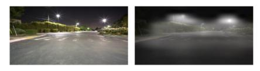

**Fig. 11** Examples of the generated text modality on our Dark-4K database. Each example contains an original image sample (*left*), an attention map of the quality cognition (*right*), a predicted caption

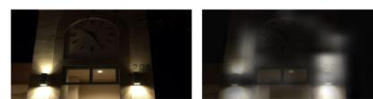

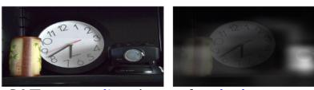

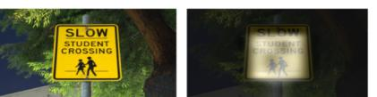

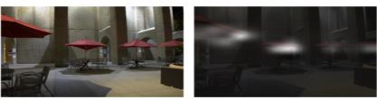

result obtained by a pre-trained SAT caption model (**SATMS**−**COCO**) on the MS-COCO database, and a low-light QSD-based caption result of **SATMLIQ** trained on the MLIQ database

#### **5.5.2 Additional Modality Generation**

Considering that image quality can be mainly represented by the related language information in the BIQA task, we believe that *Xtxt* can also be replaced by a recent image caption model: 'show and tell' (SAT) (Xu et al[.,](#page-22-26) [2015](#page-22-26)). Therefore, when the text modality is unavailable, BMQA employs an image captioning model to generate the feature representation of *Xtxt* .

To the best of our survey, few existing image captioning models are specially trained for the BIQA task, and hence the generated caption is less relevant to the visual quality experience, which may not meet the text generation principles described in Sect. [3.1.2.](#page-4-2) Therefore, we train a special QSDbased captioning model *Fcap* based on the MLIQ database (e.g., 8:1:1 partition).

Specifically, each image sample is fed into *Fcap*, and the associated text description is used as the training label. The learning goal is to maximize the joint pair-wise probability of the predicted caption and the annotated caption, or equivalently to minimize the log-likelihood over the training set as:

$$
\min \mathbb{E}\left\{-\log \sum_{1 < k < N} \mathcal{P}\left[\mathcal{F}_{cap}\left(X_{img}; \quad \theta_{cap}\right), x_k\right]\right\},\tag{14}
$$

where *θ cap* represents the model weights of *Fcap*.

Therefore, given an image *Ximg*, the text modality is generated by

$$
\langle x_1', \dots, x_N' \rangle = \mathcal{F}_{cap} \left( X_{img}; \quad \theta_{cap} \right), \tag{15}
$$

where < *x* 1,..., *x N* > denotes the predicted QSD-based text modality.

To verify the feasibility of *Fcap*, we directly adopt the SAT model as the backbone of *Fcap*. In the experiments, we employ a pre-trained model provided by Xu et al[.](#page-22-26) [\(2015\)](#page-22-26) (*denoted as* SAT*M S*−*COCO* ), and finetune a special QSDbased captioning model on the MLIQ database for 100 epochs (*denoted as* SAT*MLIQ*). Finally, the TOP-5 accuracy of caption matching performance on the testing set reaches 89.74%, and the BLEU-4 score reaches 29.36%.

Figure [11](#page-18-0) shows some QSD-based captioning results of SAT*MLIQ* and SAT*M S*−*COCO* on the Dark-4K database. As seen, SAT*MLIQ* contains more quality words related to the visual experience, such as brightness status, salient objects, and color status. To further explore the relationship between these keywords and the original images, we provide the attention maps corresponding to these keywords. As seen, the region of interest (ROI) is consistent with the quality keywords. Therefore, we believe that a well-trained QSD-based captioning model is competent to generate the text modality provided in MLIQ.

#### **5.5.3 Cross-Dataset Validation on Image-Only Case**

To verify the effect of *Fcap* in Eq. [\(15\)](#page-18-1), we conduct the cross-database validation on the Dark-4K database. For a fair comparison, all BIQAs including our BMQA models have not been fine-tuned or retrained. In other words, all trained models are kept exactly the same as in Sect. [5.4.](#page-14-0) It is worth noting that since *Fcap* does not exist on the Dark-4K database, a specially-learned model *Fcap* is used to replace *Ftxt* in our BMQA model. Apart from this, other settings are the same as in Sect. [5.1.3.](#page-12-2) The detailed workflow is summarized in Algorithm [2.](#page-19-0)

Table [4](#page-19-1) provides the overall comparison results of all 17 deep-learned BIQAs in terms of PLCC, SRCC, and **Algorithm 2** Proposed BMQA scheme on the image-only case BMQA*image*−*only* .

#### **Input:**

Image sample *Ximg*.

#### **Output:**

- Quality score *spred* .
- 1: Generate the latent text feature by *Fcap* in Eq. [\(15\)](#page-18-1);
- 2: Use the latent text feature <*x* 1,..., *x N*> to extract the text feature representation **F***txt* in Eqs. [\(2\)](#page-9-0)-[\(3\)](#page-9-1);
- 3: Extract the image feature **F***img* in Eqs. [\(4\)](#page-9-2)-[\(5\)](#page-9-3);
- 4: Obtain the aligned image and text features (*i.e.*, **F***img* and **F***txt*) in Eqs. [\(6\)](#page-10-1)-[\(7\)](#page-10-2);
- 5: Fuse **F***img* and **F***txt* by concatenation, and infer the quality score *spred* in Eq. [\(9\)](#page-11-1).

RMSE. As seen, our BMQAs achieve the state-of-theart performance on the cross-dataset validation. The best BMQA*image*−*only* CNXT−B+TransF obtains a PLCC score of 0.9156, a SRCC score of 0.9085, and a RMSE score of 0.0605. Experimental results verify the applicability and generalization performance of our BMQA framework.

### **5.5.4 Alternative Text Modality**

**Table 4** Performance comparison of the proposed BMQA and 17 deep-learned BIQAs on the Dark-4K database

To further validate the absence of high-quality texts, we have conducted additional experiments for BMQA (image only) method with an image caption model on the MLIQ and Dark-4K datasets.

- BMQA*image*−*only* RN−50+TransF represents an image-only BMQA method in Table [4](#page-19-1) with a caption model finetuned on the MLIQ database.
- BMQA∗*image*−*only* RN−50+TransF uses a pre-trained caption model (Xu et al[.,](#page-22-26) [2015](#page-22-26)) on MS-COCO, lacking high-quality textual information.

The experimental results are reported in Table [5.](#page-20-0) As seen, the performance of BMQA∗*image*−*only* RN−50+TransF is not as good as that of BMQA*image*−*only* RN−50+TransF , which indicates the positive effect of high-quality textual information on quality score predictions. In addition, the performance comparison between BMQA*image*−*text* RN−50+TransF in Table [3](#page-16-0) and BMQA*image*−*only* RN−50+TransF in Table [4](#page-19-1) has already demonstrated that a finetuned caption model *Fcap* on our MLIQ database is a promising alternative to highquality text modalities.

#### **5.5.5 Overall Runtime Analysis**

In practical scenarios, a quality indicator with low complexity is preferred for a variety of applications. For simplicity, we assess complexity based on the inference time cost, which

| Method type                                   | Entire database |        |        |        |  |
|-----------------------------------------------|-----------------|--------|--------|--------|--|
| Deep-learned BIQAs                            | Type            | PLCC ↑ | SRCC ↑ | RMSE ↓ |  |
| Kang2014CVPR (Kang et al., 2014)              | AS              | 0.5434 | 0.5605 | 0.1307 |  |
| Bosse2018TIP (Bosse et al., 2018)             | AS              | 0.6552 | 0.6442 | 0.1028 |  |
| Ke2021ICCV (Ke et al., 2021)                  | AS              | 0.8630 | 0.8382 | 0.1195 |  |
| Ying2020CVPR (Ying et al., 2020)              | GS              | 0.6453 | 0.5802 | 0.0631 |  |
| Kim2019TNNLS (Kim et al., 2019)               | MT              | 0.5968 | 0.6030 | 0.1205 |  |
| Yan2019TMM (Yan et al., 2019)                 | MT              | 0.5588 | 0.5610 | 0.1322 |  |
| Zhang2020TCSVT (Zhang et al., 2020)           | MT              | 0.5187 | 0.5581 | 0.1346 |  |
| Wu2020TIP (Wu et al., 2020)                   | MO              | 0.6216 | 0.5877 | 0.1248 |  |
| Li2020ACMMM (Li et al., 2020)                 | MO              | 0.6138 | 0.6358 | 0.1107 |  |
| Su2020CVPR (Su et al., 2020)                  | MO              | 0.7914 | 0.7829 | 0.0755 |  |
| Zhu2020CVPR (Zhu et al., 2020)                | MO              | 0.7791 | 0.7616 | 0.0931 |  |
| Ma2021ACMMM (Ma et al., 2021)                 | MC              | 0.7713 | 0.7419 | 0.0810 |  |
| Zhang2021TIP (Zhang et al., 2021)             | MC              | 0.8079 | 0.8131 | 0.0697 |  |
| Zhang2023TPAMI (Zhang et al., 2023)           | MC              | 0.8538 | 0.8358 | 0.0593 |  |
| Liu2019TPAMI (Liu et al., 2019)               | DU              | 0.6319 | 0.6352 | 0.1002 |  |
| Wang2022ACMMM (Wang et al., 2022)             | MU              | 0.8526 | 0.8357 | 0.0687 |  |
| Madhusudana2022TIP (Madhusudana et al., 2022) | MU              | 0.8293 | 0.8240 | 0.0669 |  |
| BMQAimage−only RN                             | MU              | 0.9026 | 0.8874 | 0.0624 |  |
| +TransF BMQAimage−only ViT −B32+TransF  | MU              | 0.9117 | 0.8989 | 0.0593 |  |
| BMQAimage−only CNXT −B+TransF              | MU              | 0.9156 | 0.9085 | 0.0605 |  |

The best results of the deep-learned BIQAs are highlighted in bold, and the best results of our BMQA are highlighted in underline

| Table 5 Ablation study of                                                                      |                                                          |         | Model BMQA∗image−only RN−50+TransF |         | Fcap           | MLIQ           |                |                | Dark-4K                        |                |              |
|------------------------------------------------------------------------------------------------|----------------------------------------------------------|---------|------------------------------------------|---------|----------------|----------------|----------------|----------------|--------------------------------|----------------|--------------|
| alternative text modalities                                                                    |                                                          | MS-COCO |                                          |         | PLCC 0.8627 | SRCC 0.8550 | RMSE 0.0846 | PLCC 0.8616 | SRCC 0.8553                 | RMSE 0.0674 |              |
|                                                                                                |                                                          |         |                                          |         |                |                |                |                |                                |                |              |
|                                                                                                | Table 6 Inference time (sec.) of each module in our BMQA |         |                                          |         |                |                |                |                |                                |                |              |
| Module                                                                                         | Fimg                                                     | Ftxt    | Fimg,align                               |         | Ftxt,align     | F f use        | Fcap           | BMQAimage−text | BMQAimage−only RN−50+TransF |                | RN−50+TransF |
| Time                                                                                           | 0.17                                                     | 0.11    | 0.02                                     |         | 0.03           | <1e-4          | 0.25           | 0.34           |                                | 0.60           |              |
| Table 7 Performance of the proposed BMQA on the CID2013, KonIQ-10k, and SPAQ datasets |                                                          | CID2013 |                                          |         | KonIQ-10k      |                |                | SPAQ           |                                |                |              |
|                                                                                                |                                                          | PLCC↑   | SRCC↑                                    | RMSE↓   | PLCC↑          | SRCC↑          | RMSE↓          | PLCC↑          | SRCC↑                          | RMSE↓          |              |
|                                                                                                |                                                          | 0.8396  | 0.7763                                   | 14.1982 | 0.9155         | 0.8965         | 0.2027         | 0.9191         | 0.9183                         | 8.2315         |              |

provides insight into the feasibility of practical implementation.

To ensure a fair time complexity comparison, we have followed the rule in Xiang et al[.](#page-22-9) [\(2019\)](#page-22-9) to randomly select 100 images with the sizes of 512×512, 1024×1024, and 2048×2048 from the MLIQ database and 100 images from the Dark-4K database. The average inference time for each module of our BMQA, including the image feature encoder *Fimg*, the text feature encoder *Ftxt* , the image feature aligner *Fimg*,*align*, the text feature aligner *Ftxt*,*align*, the feature fusion module *F f use*, the image caption model *Fcap*, the image-text model BMQA*image*−*text* RN−50+TransF , and the image-only model BMQA*image*−*only* RN−50+TransF , is provided in Table [6.](#page-20-1) We report the average inference time (seconds) under the CPU mode using a single-core.

It should be noted that, all test images have been resized into 224×224 in our BMQA during inference, and texts have been tokenized to a length of 77. Therefore, there is only a small difference in runtime for different image sizes (e.g., 512×512, 1024×1024, and 2048×2048).

#### **5.5.6 Generalization Ability Study**

Although the BMQA framework is tailored for low-light images, the multimodal paradigm is expected to be applicable to a broader spectrum of image distortions beyond low-light scenarios. In view of this, we study its generalization capability by assessing the performance on other types of image distortions.

We have conducted additional experiments with our BMQA on three normal-light image assessment datasets, including CID2013 (Virtanen et al[.](#page-22-34), [2014](#page-22-34)), KonIQ-10k (Hosu et al[.](#page-21-28), [2020](#page-21-28)), and SPAQ (Fang et al[.,](#page-21-29) [2020](#page-21-29)). In the experiments, we directly adopt our BMQA*image*−*only* RN−50+TransF in Sect. [5.5.3](#page-18-2) as the test model. Table [7](#page-20-2) demonstrates that our method still achieves promising performance across these datasets beyond low-light scenarios.

# **6 Conclusion and Future Work**

In this article, we have presented a new study on blind multimodal quality assessment (BMQA) of low-light images from both subjective and objective perspectives. Specifically, we establish the first multimodal quality assessment database for low-light images, where two quality-aware principles are designed for multimodal benchmark construction. Moreover, we investigate the BMQA framework by exploring quality feature representation, alignment and fusion, and multimodal learning. Experimental results verify the effectiveness of our BMQA compared with state-of-the-art methods on two different low-light benchmark databases. We believe that this work can bring a new research perspective to image and video quality assessment.

In the future, BMQA can be further studied and verified in many aspects. First, we demonstrate how multimodal data is able to improve the performance of blind image quality assessment (BIQA) on the low-light application scenario, rather than how multimodal data collectively determines the visual quality experience. The latter is more challenging and thus requires deploying more sensors and fusing multi-sensor data.

Second, we design two quality semantic description (QSD) principles and only consider some QSD-based text features in multimodal learning. However, image quality perception can be very complex and hence more interpreting attributes (e.g., sharpness, composition, and aesthetic) need to be further investigated.

Third, we employ the multimodal self-supervision and supervision mechanisms to train our baseline model. The current design is simple and efficient on low-light images, but the interaction between image and text modalities needs to be further explored for the BMQA framework, which will help to extract more efficient feature representations.

Last but not least, we construct a multimodal low-light image database and present an effective no-reference quality indicator because it is more challenging and urgent. However, the feasibility of multimodality-driven quality assessment needs to be verified on more benchmark datasets, including those for distortion-specific and general-purpose applications. Furthermore, its feasibility needs to be studied and verified on the full-reference task, as this quality assessment paradigm is still used in many real-world scenarios.

**Funding** This work was supported in part by the National Natural Science Foundation of China under Grant 62472290 and Grant 62372306, in part by the Natural Science Foundation of Guangdong Province under Grant 2024A1515011972, Grant 2023A1515011197, and Grant 2022A1515011245, and in part by the Natural Science Foundation of Shenzhen City under Grant 20220809160139001.

**Data Availability** The datasets that support the findings of this work are available from the reasonable request, and also available at [https://](https://charwill.github.io/bmqa.html) [charwill.github.io/bmqa.html.](https://charwill.github.io/bmqa.html)

## **Declarations**

**Conflict of interest** The authors declare that they have no Conflict of interest.

# **References**

- Baltrušaitis, T., Ahuja, C., & Morency, L. P. (2018). Multimodal machine learning: A survey and taxonomy. *IEEE Transactions on Pattern Analysis and Machine Intelligence, 41*(2), 423–443.
- Bosse, S., Maniry, D., Müller, K. R., Wiegand, T., & Samek, W. (2018). Deep neural networks for no-reference and full-reference image quality assessment. *IEEE Transactions on Image Processing, 27*(1), 206–219.
- Boži´c-Štuli´c, D., Maruši´c, Ž, & Gotovac, S. (2019). Deep learning approach in aerial imagery for supporting land search and rescue missions. *Springer International Journal of Computer Vision, 127*(9), 1256–1278.
- Chen, B., Cao, Q., Hou, M., Zhang, Z., Lu, G., & Zhang, D. (2022). Multimodal emotion recognition with temporal and semantic consistency. *IEEE Transactions on Audio, Speech and Language Processing, 29*(1), 3592–3603.
- Chen, C., Chen, Q., Xu, J., & Koltun, V. (2018). Learning to see in the dark. In *IEEE conference on computer vision and pattern recognition (CVPR)*, pp. 3291–3300.
- Chen, L., Fu, Y., Wei, K., Zheng, D., & Heide, F. (2024). Instance Segmentation in the Dark. *Springer International Journal of Computer Vision, 131*(8), 2198–2218.
- Chen, L., Zhang, J., Pan, J., Lin, S., Fang, F., & Ren, J.S. (2021). Learning a non-blind deblurring network for night blurry images. In *IEEE Conference on Computer Vision and Pattern Recognition (CVPR)*, pp. 10542–10550.
- Deng, Y., Loy, C. C., & Tang, X. (2017). Image aesthetic assessment: An experimental survey.*IEEE Signal Processing Magazine, 34*(4), 80–106.
- Ding, K., Ma, K., Wang, S., & Simoncelli, E. P. (2021). Comparison of full-reference image quality models for optimization of image processing systems. *Springer International Journal of Computer Vision, 129*, 1258–1281.

- Dmello, S. K., & Kory, J. (2015). A review and meta-analysis of multimodal affect detection systems. *ACM Computing Surveys, 47*(3), 1–36.
- Fang, Y., Du, R., Zuo, Y., Wen, W., & Li, L. (2020). Perceptual quality assessment for screen content images by spatial continuity. *IEEE Transactions on Circuits and Systems for Video Technology, 30*(11), 4050–4063.
- Fang, Y., Huang, L., Yan, J., Liu, X., & Liu, Y. (2022). Perceptual quality assessment of omnidirectional images. In*AAAI Conference on Artificial Intelligence (AAAI)*, pp. 580–588.
- Gordon, I. E. (2004). *Theories of visual perception*. Psychology press.
- Gregory, R. L. (1980). Perceptions as hypotheses. *Philosophical Transactions of the Royal Society of London. B Biological Sciences, 290*(1038), 181–197.
- Gu, J., Meng, G., Da, C., Xiang, S., & Pan, C. (2019). No-reference image quality assessment with reinforcement recursive list-wise ranking. In *AAAI Conference on Artificial Intelligence (AAAI),* pp. 8336–8343.
- Gu, K., Zhou, J., Qiao, J. F., Zhai, G., Lin, W., & Bovik, A. C. (2017). No-reference quality assessment of screen content pictures. *IEEE Transactions on Image Processing, 26*(8), 4005–4018.
- Hanjalic, A., & Xu, L. Q. (2005). Affective video content representation and modeling. *IEEE Transactions on Multimedia, 7*(1), 143–154.
- Hosu, V., Lin, H., Sziranyi, T., & Saupe, D. (2020). KonIQ-10k: An ecologically valid database for deep learning of blind image quality assessment.*IEEE Transactions on Image Processing, 29*(1), 4041– 4056.
- Kang, L., Ye, P., Li, Y., & Doermann, D. (2014). Convolutional neural networks for no-reference image quality assessment. In *IEEE conference on computer vision and pattern recognition (CVPR)*, pp. 1733–1740.
- Ke, J., Wang, Q., Wang, Y., Milanfar, P., & Yang, F. (2021). MUSIQ: Multi-scale image quality transformer. In *IEEE international conference on computer vision (ICCV)*, pp. 5148–5157.
- Kim, J., Nguyen, A. D., & Lee, S. (2019). Deep CNN-based blind image quality predictor. *IEEE Transactions on Neural Networks and Learning Systems, 30*(1), 11–24.
- Kong, X., & Yang, Q. (2018). No-reference image quality assessment for image auto-denoising. *Springer International Journal of Computer Vision, 126*, 537–549.
- Li, C., Guo, C., Han, L. H., Jiang, J., Cheng, M. M., Gu, J., & Loy, C. C. (2022). Low-light image and video enhancement using deep learning: A survey. *IEEE Transactions on Pattern Analysis and Machine Intelligence, 44*(12), 9396–9416.
- Li, D., Jiang, T., & Jiang, M. (2020). Norm-in-norm loss with faster convergence and better performance for image quality assessment. In *ACM international conference on multimedia (MM)*, pp. 789– 797.
- Li, D., Jiang, T., & Jiang, M. (2021). Unified quality assessment of in-the-wild videos with mixed datasets training. *Springer International Journal of Computer Vision, 129*, 1238–1257.
- Li, Q., Lin, W., & Fang, Y. (2016). No-reference quality assessment for multiply-distorted images in gradient domain. *IEEE Signal Processing Letters, 23*(4), 541–545.
- Liu, C.,Mao, Z., Zhang, T., Liu, A.,Wang, B., & Zhang, Y. (2022). Focus Your Attention: A Focal Attention for Multimodal Learning. *IEEE Transactions on Multimedia, 24*(1), 103–115.
- Liu, J., Xu, D., Yang, W., Fan, M., & Huang, H. (2021). Benchmarking low-light image enhancement and beyond. *Springer International Journal of Computer Vision, 129*, 1153–1184.
- Liu, L., Liu, B., Huang, H., & Bovik, A. C. (2014). No-reference image quality assessment based on spatial and spectral entropies. *Elsevier Signal Processing: Image Communication, 29*(8), 856–863.
- Liu, P., Yuan, W., Fu, J., Jiang, Z., Hayashi, H., & Neubig, G. (2023). Pre-train, prompt, and predict: A systematic survey of prompting

- Liu, T. J., & Liu, K. H. (2018). No-reference image quality assessment by wide-perceptual-domain scorer ensemble method. *IEEE Transactions on Image Processing, 27*(3), 1138–1151.
- Liu, X., Van De Weijer, J., & Bagdanov, A. D. (2019). Exploiting unlabeled data in CNNs by self-supervised learning to rank. *IEEE Transactions on Pattern Analysis and Machine Intelligence, 41*(8), 1862–1878.
- Loh, Y. P., & Chan, C. S. (2019). Getting to know low-light images with the exclusively dark dataset. *Elsevier Computer Vision and Image Understanding, 178*, 30–42.
- Ma, R., Luo, H., Wu, Q., Ngan, K.N., Li, H., Meng, F., & Xu, L. (2021). Remember and Reuse: Cross-task blind image quality assessment via relevance-aware incremental learning. In *ACM international conference on multimedia (MM*), pp. 5248–5256.
- Madhusudana, P. C., Birkbeck, N., Wang, Y., Adsumilli, B., & Bovik, A. C. (2022). Image quality assessment using contrastive learning. *IEEE Transactions on Image Processing, 31*(1), 4149–4161.
- Martinez, H. A. B., & Farias, M. C. (2018). Combining audio and video metrics to assess audio-visual quality. *Springer Multimedia Tools and Applications, 77*(18), 23993–24012.
- Min, X., Zhai, G., Zhou, J., Farias, M. C., & Bovik, A. C. (2020). Study of subjective and objective quality assessment of audiovisual signals. *IEEE Transactions on Image Processing, 29*(5588), 6054–6068.
- Mittal, A., Moorthy, A. K., & Bovik, A. C. (2012). No-reference image quality assessment in the spatial domain. *IEEE Transactions on Image Processing, 21*(12), 4695–4708.
- Pinson, M. H., Janowski, L., Pépion, R., Huynh-Thu, Q., Schmidmer, C., Corriveau, P., Younkin, A., Le Callet, P., Barkowsky, M., & Ingram, W. (2012). The influence of subjects and environment on audiovisual subjective tests: An international study. *IEEE Journal of Selected Topics in Signal Processing, 6*(6), 640–651.
- Radford, A., Kim, J.W., Hallacy, C., Ramesh, A., Goh, G., Agarwal, S., Sastry, G., Askell, A., Mishkin, P., Clark, J., & Krueger, G. (2021). Learning transferable visual models from natural language supervision. In *PMLR international conference on machine learning (ICML)*, pp. 8748–8763.
- Song, G., Wang, S., Huang, Q., & Tian, Q. (2019). Harmonized multimodal learning with Gaussian process latent variable models. *IEEE Transactions on Pattern Analysis and Machine Intelligence, 43*(3), 858–872.
- Stiennon, N., Ouyang, L., Wu, J., Ziegler, D., Lowe, R., Voss, C., Radford, A., Amodei, D., & Christiano, P. F. (2020). Learning to summarize with human feedback. *Advances in Neural Information Processing Systems (NeurIPS), 33*, 3008–3021.
- Su, S., Yan, Q., Zhu, Y., Zhang, C., Ge, X., Sun, J., & Zhang, Y. (2020). Blindly assess image quality in the wild guided by a self-adaptive hyper network. In *IEEE Conference on computer vision and pattern recognition (CVPR)*, pp. 3667–3676.
- Tian, Y., Zeng, H., Hou, J., Chen, J., Zhu, J., & Ma, K. K. (2021). A light field image quality assessment model based on symmetry and depth features. *IEEE Transactions on Circuits and Systems for Video Technology, 31*(5), 2046–2050.
- Vinyals, O., Toshev, A., Bengio, S., & Erhan, D. (2016). Show and tell: Lessons learned from the 2015 mscoco image captioning challenge. *IEEE Transactions on Pattern Analysis and Machine Intelligence, 39*(4), 652–663.
- Virtanen, T., Nuutinen, M., Vaahteranoksa, M., Oittinen, P., & Häkkinen, J. (2014). CID2013: A database for evaluating no-reference image quality assessment algorithms.*IEEE Transactions on Image Processing, 24*(1), 390–402.
- Wade, N., & Swanston, M. (2013). *Visual perception: An introduction*. Psychology Press.

- Wang, G., Chen, C., Fan, D.P., Hao, A., & Qin, H. (2021). From semantic categories to fixations: A novel weakly-supervised visual-auditory saliency detection approach. In *IEEE Conference on Computer Vision and Pattern Recognition (CVPR),* pp. 15119–15128.
- Wang, J., Chen, Z., Yuan, C., Li, B., Ma,W., & Hu,W. (2023). Hierarchical curriculum learning for no-reference image quality assessment. *Springer International Journal of Computer Vision, 131*, 3074– 3093.
- Wang, M., Huang, Y., Lin, J., Xie,W., Yue, G.,Wang, S., & Li, L. (2021). Quality measurement of screen images via foreground perception and background suppression. *IEEE Transactions on Instrumentation and Measurement, 70*, 1–11.
- Wang, M., Huang, Y., Xiong, J., & Xie, W. (2022). Low-light images in-the-wild: A novel visibility perception-guided blind quality indicator. *IEEE Transactions on Industrial Informatics, 19*(4), 6026–6036.
- Wang, M., Huang, Y., & Zhang, J. (2021). Blind quality assessment of night-time images via weak illumination analysis. In *IEEE International Conference on Multimedia and Expo (ICME)*, pp. 1–6.
- Wang, M., Xu, Z., Gong, Y., & Xie, W. (2022). S-CCR: Supercomplete comparative representation for low-light image quality inference in-the-wild. In *ACM international conference on multimedia (MM)*, pp. 5219–5227.
- Wu, J., Ma, J., Liang, F., Dong, W., Shi, G., & Lin, W. (2020). Endto-end blind image quality prediction with cascaded deep neural network. *IEEE Transactions on Image Processing, 29*(1), 7414– 7426.
- Xiang, T., Yang, Y., & Guo, S. (2019). Blind night-time image quality assessment: Subjective and objective approaches. *IEEE Transactions on Multimedia, 22*(5), 1259–1272.
- Xu, K., Ba, J., Kiros, R., Cho, K., Courville, A., Salakhudinov, R., Zemel, R., & Bengio, Y. (2015). Show, attend and tell: Neural image caption generation with visual attention. In *PMLR international conference on machine learning (ICML),* pp. 2048–2057.
- Xu, Y., Cao, H., Yin, J., Chen, Z., Li, X., Li, Z., Xu, Q., & Yang, J. (2024). Going deeper into recognizing actions in dark environments: A comprehensive benchmark study. *Springer International Journal of Computer Vision, 132*(4), 1292–1309.
- Yan, B., Bare, B., & Tan, W. (2019). Naturalness-aware deep noreference image quality assessment. *IEEE Transactions on Multimedia, 21*(10), 2603–2615.
- Yang, Q., Ma, Z., Xu, Y., Li, Z., & Sun, J. (2022). Inferring point cloud quality via graph similarity.*IEEE Transactions on Pattern Analysis and Machine Intelligence, 44*(6), 3015–3029.
- Yang, W., Wu, J., Tian, S., Li, L., Dong, W., & Shi, G. (2022). Fine-grained image quality caption with hierarchical semantics degradation. *IEEE Transactions on Image Processing, 31*(1), 3578–3590.
- Ying, Z., Ghadiyaram, D., & Bovik, A. (2022). Telepresence video quality assessment. In: *Springer European Conference on Computer Vision (ECCV)*, pp. 327–347.
- Ying, Z., Niu, H., Gupta, P., Mahajan, D., Ghadiyaram, D., & Bovik, A.C. (2020). From patches to pictures (PaQ-2-PiQ): Mapping the perceptual space of picture quality. In *IEEE conference on computer vision and pattern recognition (CVPR)*, pp. 3575–3585.
- Zhai, G., Wu, X., Yang, X., Lin, W., & Zhang, W. (2012). A psychovisual quality metric in free-energy principle. *IEEE Transactions on Image Processing, 21*(1), 41–52.
- Zhang, J., Dong, B., Fu, Y., Wang, Y., Wei, X., Yin, B., & Yang, X. (2024). A universal event-based plug-in module for visual object tracking in degraded conditions. *Springer International Journal of Computer Vision, 132*(5), 1857–1879.
- Zhang, L., Zhang, L., & Bovik, A. C. (2015). A feature-enriched completely blind image quality evaluator. *IEEE Transactions on Image Processing, 24*(8), 2579–2591.

- Zhang, W., Li, D., Ma, C., Zhai, G., Yang, X., & Ma, K. (2023). Continual learning for blind image quality assessment.*IEEE Transactions on Pattern Analysis and Machine Intelligence, 45*(3), 2864–2878.
- Zhang, W., Ma, K., Yan, J., Deng, D., & Wang, Z. (2020). Blind image quality assessment using a deep bilinear convolutional neural network. *IEEE Transactions on Circuits and Systems for Video Technology, 30*(1), 36–47.
- Zhang, W., Ma, K., Zhai, G., & Yang, X. (2021). Uncertainty-aware blind image quality assessment in the laboratory and wild. *IEEE Transactions on Image Processing, 30*(1), 3474–3486.
- Zheng, Y., Chen, W., Lin, R., Zhao, T., & Le Callet, P. (2022). Uif: An objective quality assessment for underwater image enhancement. *IEEE Transactions on Image Processing, 1*, 5456–5468.
- Zhu, H., Li, L., Wu, J., Dong, W., & Shi, G. (2020). MetaIQA: Deep meta-learning for no-reference image quality assessment. In *IEEE conference on computer vision and pattern recognition (CVPR)*, pp. 14143–14152.

**Publisher's Note** Springer Nature remains neutral with regard to jurisdictional claims in published maps and institutional affiliations.

Springer Nature or its licensor (e.g. a society or other partner) holds exclusive rights to this article under a publishing agreement with the author(s) or other rightsholder(s); author self-archiving of the accepted manuscript version of this article is solely governed by the terms of such publishing agreement and applicable law.