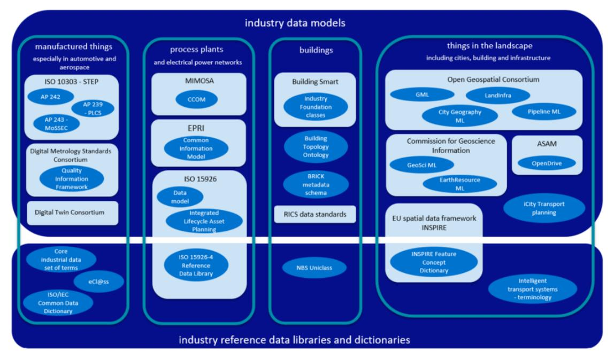
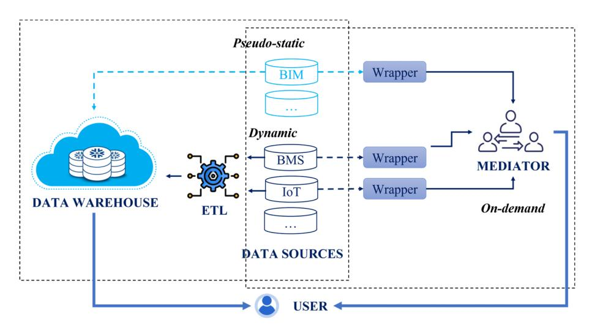
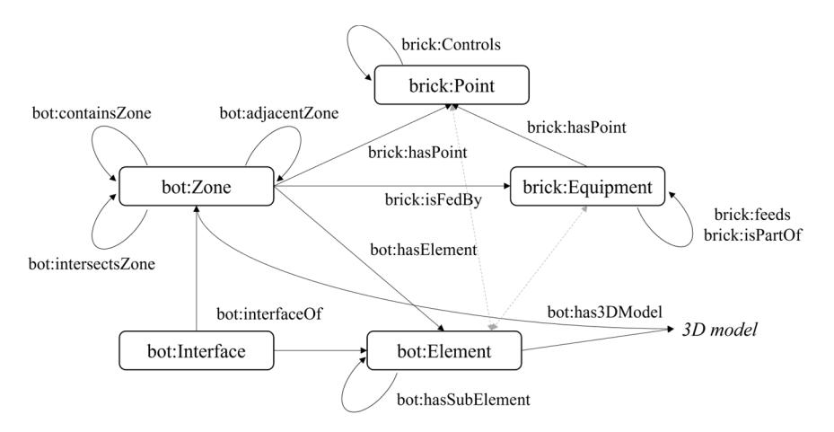
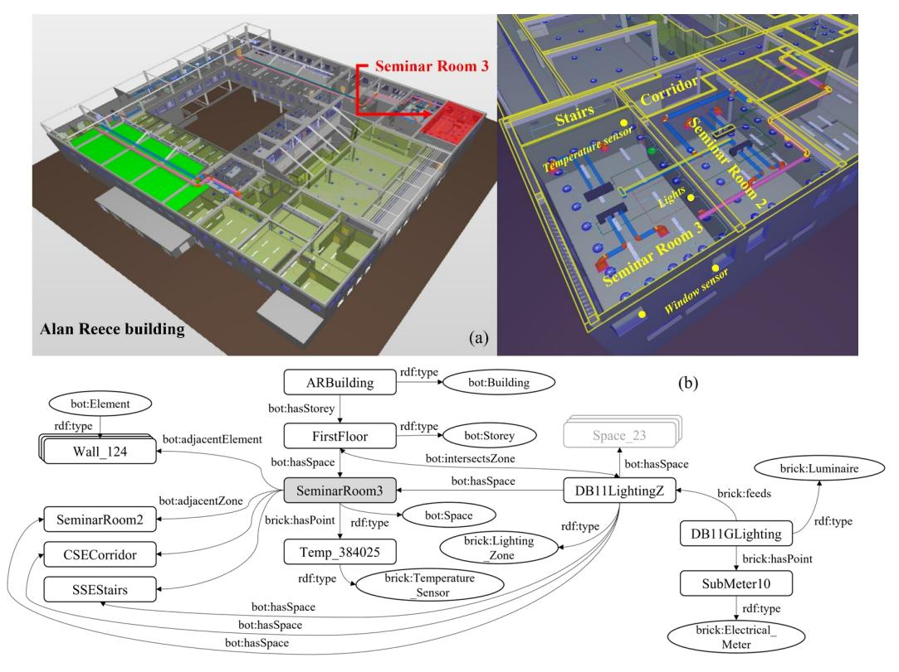

<!-- cite_key: xie2022b -->

# PAPER • OPEN ACCESS

# Enabling building digital twin: Ontology-based information management framework for multisource data integration

To cite this article: X Xie et al 2022 IOP Conf. Ser.: Earth Environ. Sci. 1101 092010

View the [article online](https://doi.org/10.1088/1755-1315/1101/9/092010) for updates and enhancements.

# You may also like

-

- [Eco-Ontology for supporting](https://iopscience.iop.org/article/10.1088/1757-899X/1092/1/012049) [Interoperability in Product Life Cycle within](https://iopscience.iop.org/article/10.1088/1757-899X/1092/1/012049) [Product Sustainability](https://iopscience.iop.org/article/10.1088/1757-899X/1092/1/012049) M Mohammed, A Romli, R Mohamed et al. -
- [Ontology for smart 4D printed material](https://iopscience.iop.org/article/10.1088/1361-665X/ad9dca) [systems and structures synergically](https://iopscience.iop.org/article/10.1088/1361-665X/ad9dca) [applied with generative artificial](https://iopscience.iop.org/article/10.1088/1361-665X/ad9dca) [intelligence for creativity promotion](https://iopscience.iop.org/article/10.1088/1361-665X/ad9dca) William Solórzano-Requejo, Carlos Aguilar Vega, Rodrigo Zapata Martínez et al.
- [Ontology to relational database](https://iopscience.iop.org/article/10.1088/1742-6596/971/1/012031) [transformation for web application](https://iopscience.iop.org/article/10.1088/1742-6596/971/1/012031) [development and maintenance](https://iopscience.iop.org/article/10.1088/1742-6596/971/1/012031) Kamal Mahmudi, M M Inggriani Liem and Saiful Akbar -

This content was downloaded from IP address 121.121.228.193 on 28/06/2025 at 18:32

# Enabling building digital twin: Ontology-based information management framework for multi-source data integration

**X Xie**1,2**, N Moretti**1,2**, J Merino**1,2**, J Y Chang**1 **, P Pauwels**3 **, A K Parlikad**1,2

1 Institute for Manufacturing, Department of Engineering, University of Cambridge, Cambridge CB3 0FS, UK

2 Centre for Digital Built Britain, University of Cambridge, Cambridge CB3 0FA, UK 3 Faculty of Built Environment, Eindhoven University of Technology, Eindhoven 5600 MB, Netherlands

xx809@cam.ac.uk

**Abstract**. The emergence of the digital twin concept can potentially change the way people manage built assets thoroughly. This is because the semantics-based model and linked data approach behind the digital twin, as the successor of classical BIM, provide strong capability in integrating data from fragmented and heterogeneous sources and thus enable better-informed decision-making. Taking buildings as the case, this paper demonstrates the ontology-based Information Management Framework and elaborates on the process to integrate data through a common data model. Specifically, the Foundation Data Model (FDM) representing the operation of buildings and embedded systems is developed and two patterns of integration architecture are compared. To conceptualise all the essential entities and relationships, the building topology ontology and BRICK ontology are reused and merged to serve as a feasible FDM. According to the characteristic of asset management services that digital twins support, two integration architectures are compared, including the data warehouse approach and the mediator approach. A case study is presented to elaborate on the implementation of these two approaches and their applicability. This work sets out the standardised and modularised paradigms for discovering, fetching, and integrating data from disparate sources with different data curation manners.

# 1. Introduction

As an emerging concept, digital twins have been adopted to save costs and improve reliabilities in many different industries, such as manufacturing, transportation, as well as Architecture, Engineering and Construction (AEC) industry. Although there is no consensus about the definition of a digital twin yet, the digital twin functionally acts as a set of virtual information constructs that fully describes the potential or actual physical product from micro atomic level to macro geometrical level [1]. Leveraging machine learning and artificial intelligence, the digital twin can deliver real-time monitoring, prediction, optimisation and better-informed decision-making based on the ubiquitous data and information from disparate sources. As the foundation of the digital twin, the information management process is discussed in this paper. In the AEC sector, digital twins should integrate all useful information of built assets (e.g., infrastructure, buildings, embedded systems, and components) throughout their entire lifecycle, from design, construction, operation, maintenance ultimately to decommissioning [2]. Particularly, the operation phase represents the most prolonged and costly phase of an asset's lifecycle. Therefore, growing attention has been allocated to implementing digital twins dynamically to digest the

Content from this work may be used under the terms of theCreative Commons Attribution 3.0 licence. Any further distribution of this work must maintain attribution to the author(s) and the title of the work, journal citation and DOI. Published under licence by IOP Publishing Ltd

heterogeneous information from distributed sources for supporting asset management services during operation.

The digital twin, in the AEC domain, is based on and was originated from Building Information Modelling (BIM) for managing information. Since the proposal of the Industry Foundation Classes (IFC), the information exchange and integration between segregated data silos are greatly enhanced [3]. The additional BIM dimensions, from 3D to nD, create a static and closed data environment where data from various application domains (e.g., cost, material) are correlated to the 3D geometric model on object levels. However, the BIM approach as a file-oriented exchange process that relies on Model View Definition (MVD) implemented ad-hoc [4] is not flexible enough for the current prevailing fastchanging and web-based information exchange landscape. Alternative to the legacy format, the linked data approach based on semantic web formats (e.g., Resource Description Framework-RDF or Web Ontology Language-OWL) is considered more suitable to combine different graphs of information due to their expressiveness, flexibility and queryability in representation [2]. More importantly, in addition to static data like geometric, topological, product data and other metadata properties, dynamic information such as data streams from Internet of Things (IoT) devices greatly enriches as-is information by providing real-time status from the actual operations. With the extensive adoption of IoT devices and Artificial Intelligence (AI) technologies for built assets, the ontology-driven linked data approach unlocks additional values: 1) creating a dynamic and web-like data environment capable of integrating and making the best use of streaming data [5]; 2) representing learned data associations amenable to machine learning algorithms [6]; and 3) allowing declarative inference as opposed to procedural coding.

The AEC and Facility Management (FM) industry is a highly fragmented data-intensive projectbased industry, depending on many different professions and firms. Despite the strong data sharing intention, it remains challenging for various companies, mainly SMEs, to aggregate disparate data distributed across files due to trust, privacy, ownership, curation and other issues. The Centre for Digital Built Britain released a report entitled "the pathway towards an information management framework" in 2020 [7], which sets out the guidelines for technical standards, processes and interoperability frameworks to integrate and utilise multi-source machine-interpretable data, targeting BIM Maturity Level 3. The so-called Information Management Framework (IMF) specifies the patterns of integration architecture that aligns diverse information, static and dynamic, from various sources overlapping to get a holistic picture of the built assets [8]. The pattern, alongside the Foundation Data Model (FDM) and Reference Data Libraries (RDL), defines the digital twin. The FDM provide a consistent high-level ontology describing the general concepts and relationships independent of a domain problem, while the RDL points out the controlled vocabularies subject to the FDM in diverse domains, such as sensor, observation, sample or actuator. Leal *et al*[9] summarised the commonly used industry data models and reference data libraries identified through the Construction Innovation Hub survey, as shown in Figure 1.

The report outlines the pathway towards an integrated and web-like environment encapsulating data across complex heterogeneous systems, but does not specify the implementation approach. Taking buildings as the target, this paper aims to review potential practical implementations of IMF for establishing building digital twins, and elaborate on the ontology-based processes to extract, transform and integrate various data through a common data model and reference data libraries.

# 2. Literature review

#*2.1. Ontologies for buildings and embedded systems*A stable semantic basis serves as the backbone of building digital twins. In this regard, an array of ontologies has been developed to standardise the representations of general and domain concepts and definitions of buildings. According to the "level of generality", these ontologies can be roughly categorised into: 1) core ontologies, also known as upper or foundational ontologies, which define the complete structure of concepts (e.g., stories, zones, etc.), relationships and properties, independent of related to a generic domain or use case; 2) domain ontologies that further describe the entities, classes

doi:10.1088/1755-1315/1101/9/092010

**Figure 1.**Industry data models and reference data libraries by application area [9].

or other information related to a generic domain or use case (e.g., Flow Systems Ontology). Corresponding to the IMF, the FDM should be built upon core ontologies, as the basis for ensuring consistent data across massive structured and unstructured sources. Once the information of a building is formally represented using a common and shared language (i.e., FDM), it becomes understandable not only by humans but also by automated computer agents, improving the effectiveness of information representation and retrieval processes.

A building is a typical complex system, composed of not only structural components (e.g., walls, beams, columns, floors, roofs), but also a diverse range of Mechanical, Electrical, and Plumbing (MEP) facilities. To properly represent such a complex system, a comprehensive FDM is needed to convey diversified information, geometric and non-geometric, spatial element and element, architectural and systematic, with different Levels of Detail (LOD) and fidelity. Typically, two large clusters of ontologies can be found, one situated in the building topology modelling, and the other in the building MEP systems [e.g., Heating, Ventilation and Air Conditioning (HVAC) system].

First, regarding building topology modelling, Building Topology Ontology (BOT) is developed to represent the core topology of the building, including not only the zones, elements, and their interfaces, but also how they are related to each other (intersection, adjacency, containment) [10]. Designed to be lightweight, the BOT gets rid of the complex hierarchies when compared with its competitors like ifcOWL. Based on the BOT, several extended domain ontologies are proposed. These ontologies enrich the vocabularies related to the products and elements, sometimes including their properties. For example, there are Building Product Ontology (BPO), the smaller Building Element Ontology (BEO) and MEP ontology simplified from IFC, and SAREF4BLDG ontology extended from the Smart Appliances REFerence Ontology (SAREF) ontology. Geometric representations, seen as reference data, can be linked to the central ontology [11]. To an extent, these ontologies can be combined with Semantic Sensor Network (SSN) ontology or similar ones to incorporate observations and actuations of facilities (e.g., sensors, thermostats). Second, for the building MEP systems, instead of focusing on the actual building topology, or on the specific building products, the representation of the building systems and sensing points is highlighted. Despite that IFC is theoretically capable of representing these systems, it is often found to be insufficiently detailed by the engineers. The BRICK ontology and Haystack tagging ontology have been proposed to model specific object types and properties for building MEP facilities

| World Building Congress 2022                      |                    | IOP Publishing                      |
|---------------------------------------------------|--------------------|-------------------------------------|
| IOP Conf. Series: Earth and Environmental Science | 1101 (2022) 092010 | doi:10.1088/1755-1315/1101/9/092010 |

[12]. Of particular difficulty in this domain are flows, devices states, control logics, and sensor data streams.

To guarantee the completeness of the building FDM, it is necessary to merge several complementary ontologies for well-expressing buildings and systems, provided that no strong semantic conflicts are included, and the appropriate information management strategy is followed to avoid redundancy amongst certain ontologies. Reusing the existing ontologies is key in efficiently developing high-quality ontologies, because it reduces the time and effort for the conceptualisation from scratch and increases the quality of the merged ontologies by reusing knowledge that has already been validated.

#*2.2. Integration of multi-source data*Ample benefits are contained in integrating operational data streams residing in disparate sources [e.g., Building Management/Automation Systems (BMS/BAS), IoT sensors, wearables] and heterogeneous formats for the building performance analysis. Each data source can have its own governing body, probably appearing in different data formats, data schemas, semantics, and with different access authorisation mechanisms. To turn heterogeneous data into organised information and ultimately into systematised knowledge, it is necessary to build semantic correspondences between data streams and static building contextual data in FDM [5]. Furthermore, fetching data freely and readily from fragmented and heterogeneous sources is desired, not sacrificing the autonomy of individual data sources. This paper argues that two main integration architectures can be distinguished, namely the data warehouse approach and the mediator approach (see Figure 2).

**Figure 2.**Architectures for integrating multi-source data streams.
*2.2.1. Data warehouse approach.*By assembling diverse data sources into a centralised data warehouse, this approach fulfils the often-needed data cleansing, customisation, reformatting and integration requirements through a process of Extraction, Transformation, and Loading (ETL). For example, Gökçe and Gökçe [13] designed a data warehouse system, classifying and categorising energy consumption data in a building management system using the information collected from BIM. The advantage of the data warehouse approach is that the data in the warehouse are readily accessible, and free from potential duplications, and semantic inconsistency thanks to the data cleansing and data quality evaluation before entering the warehouse. However, the data owners yield their control of data, relying on a centralised authority ensuring appropriate maintenance, use, update, and revocation of data [8]. Moreover, given the increasing size of dynamic building data and the storage overhead of repeated values, the centralised data warehouse has to auto-scale to meet the need.
*2.2.2. Mediator approach.*Instead of ingesting all data into a persistent location, the mediator approach directly fetches data remaining in their original data sources through the Mediator-Wrapper architecture. To deal with the prevalent heterogeneity and dynamic nature of the data sources, the wrappers access each data source, retrieving and exporting data along with the source data schema, while the mediator transforms the retrieved data into a unified and global data schema that is sufficiently rich to accommodate heterogeneous data. For instance, Shahinmoghadam and Motamedi [14] proposed an ontology-based mediation mechanism to realise the integration of BIM and IoT data, by rewriting queries with reference to the ontology mapping between the entities of the BIM or IoT ontology-based schemas and the global ontology-based schema. Essentially, it is close to the system integration approach, in which individual systems are combined through APIs. While keeping the anatomy of each system, a layer of content negotiation is enabled to map multi-source data. The advantage of the mediator approach is that the underlying data sources are decoupled, and the autonomy of individual data sources is maintained to the maximum. New data sources can be easily plugged into the ecosystem. However, the lack of reconciliation means that there could be inconsistency and redundancy issues for data stored in separate sources.

# 3. Research method

Effective information management for built assets needs to deal with several challenges, among which data integration of heterogeneous data from autonomous sources is an important premise for follow-up data analysis and decision-making. In accordance with the IMF defined by Hetherington and West [7], this paper proposes a candidate Foundation Data Model (FDM) by merging the BOT and BRICK ontologies in OWL, which can complementarily represent building topologies and MEP facilities [15]. Of course, this is not the only choice. The appropriate FDM can be established if the set of ontologies (two or more) can and only represent all the most basic entities and relationships that exist in buildings and systems. Note that no building product ontologies or sensor observation ontologies are included in the FDM. This is because the domain-specific knowledge (e.g., the attributes of the product) can be expressed in Reference Data Libraries (RDL) to avoid schema overhead as long as they can be easily linked to the core data structure of FDM. Based on the proposed small and generic FDM, the hybrid use of data integration architectures is recommended, weighing the pros and cons of the data warehouse approach and the mediator approach and picking up the right one according to the specific asset management service it supports.

To get an expressive ontology from BOT and BRICK, the inconsistencies and redundancies between these two ontologies need to be handled. The Building Topology Ontology, developed by the W3C Linked Building Data Community Group (W3 LBD CG), has demonstrated its strong capability in defining commonly reoccurring design patterns in the Architecture, Engineering, Construction and Facility Management (AEC/FM) domain. While the design of BRICK ontology focused on defining the physical, logical, and virtual building assets with an emphasis on building operations. To match BOT and BRICK ontologies, Schneider [16] defined the schema level alignments of BOT and BRICK in terms of both classes and object properties. The semantic subsumption is defined to align associate concepts in BOT and BRICK. For example, the brick:Location is considered as a specialisation of bot:Zone, and the semantics of brick:hasPart is specialised from bot:containsZone and bot:hasSubElement. Through ontology matching, the semantic heterogeneity in BOT and BRICK is solved, and the merged ontology can represent the target building and systems more precisely and flexibly. The high-level terminology of the merged ontology is illustrated in Figure 3.

With a unified core ontology, the integration of data from disparate sources is enabled through a hybrid integration architecture. As the aim of data integration is to support corresponding building asset management services, the selection of integration architecture should take the characteristic of service into consideration.

 For services that run in real-time, such as monitoring the indoor thermal comfort, the ETL process needs to be implemented to continuously clean and restructure data from heterogeneous sources (e.g., operative temperature, relative humidity) and finally load into

**Figure 3.**Illustration of the main classes in the merged ontology for FDM.

the data warehouse for analysis. Typically, the manipulation of data streams during ETL integrates the auxiliary metadata from FDM augmented into the original datarow, so that the data become self-contained and can be analysed without referring to external descriptions.

 For services that are delivered periodically (e.g., monthly, quarterly, or yearly), like the evaluation of the building Energy Use Intensity (EUI), the mediator-wrapper approach is more appropriate considering that the calculation of system-level energy performance indicators requires aggregated data across multiple time scales. The mediator is responsible for providing the ontology mapping and semantic correspondences between the entities in the FDM (e.g., sensor) and the equivalent entities in the local database for data streams (e.g., time series from the specific sensor).

# 4. Case study

The Alan Reece building at the West Cambridge site of the University of Cambridge is used as the digital twin pilot. The Alan Reece building is a 3-storey building and stands over a 40,000-square-foot comprehensive area, including spaces for teaching, office, research, laboratory, canteen etc. Figure 4 (a) shows the 3D view of the Alan Reece building. To compare the integration architectures, two space management services are highlighted, including indoor thermal comfort monitoring and Lighting Power Density (LPD) evaluation.

- According to the ASHRAE 55 standard published by the American Society of Heating, Refrigerating, and Air-Conditioning Engineers, thermal comfort is specified by the combination of various environmental and personal factors, like air temperature, humidity, and metabolic rate. Here, for demonstration purposes, we simplify this service to continuously monitor the indoor air temperature. As recommended by the University thermal comfort policy, the indoor temperature should be maintained within the range of 19 to 21 o C during the heating season.
- The BS EN12464-1:2021, published by the British Standard Institution (BSI), specifies the lighting requirements for indoor workplaces to guarantee visual comfort. Under the premise of satisfying these requirements, the ASHRAE 90.1 standard provides engineering guidelines for minimum energy performance and energy code requirements. For the office spaces, the lighting power allowance is set to be 0.70 W/sf. The purpose of the LPD evaluation is to make sure the building is operated in an energy-efficient way.

Using a seminar room (i.e., Seminar Room 3) in the pilot building, this section demonstrates the implementation of services for this space with the help of digital twin technologies, from the perspective of data integration. The sliced FDM associated with the Seminar Room 3 (SR3) is shown in Figure 4 (b). In term of the dynamic data sources, the BMS, controlling the MEP systems, is installed in the building and archive its data into a MySQL database. Furthermore, the Monnit wireless sensors that

**Figure 4.**BIM model of the Alan Reece building and the sliced FDM associated with SR3.

communicate over the 868 MHz radio frequency are installed in the building with a 1-minute heartbeat, measuring temperature, humidity, carbon dioxide concentration and other environmental parameters.

In the first case, the data warehouse approach is adopted to realise the continuous monitoring of the room temperature. Data streams from Monnit sensors are extracted, transformed, and loaded to the tables in AWS DynamoDB, as shown in Table 1. To handle the time series generated by sensors, one table is created every single day, provisioned with the required write and read capacity. By the end of the day, a new table is created. As the last day ends, the data streams are redirected to the new table, and the provisioned write capacity of the last table is reduced to the minimum. This is because only the sensor data with today's date would be dumped into the table. Furthermore, the provisioned read capacity of older tables should be reduced stepwise as they age, since today's sensor data is accessed most frequently, yesterday's much less frequently, and then older data rarely. Conceptually, sensor data belongs to the equipment or location that the sensor monitors, instead of the sensor itself, which is only the provider of such reading. To make data self-contained and self-explanatory, the object that the sensor monitors is augmented into the datarow during the ETL process. For fast querying, the object is set as the local secondary index of the table. The Monnit temperature sensor with the identity of Temp\_384025 is installed in the SR3. To enable thermal comfort monitoring, the required query can be translated as "Return temperature values from the sensors installed at the Seminar Room 3". Instead of finding the identity of the sensor located in the SR3, Listing 1 shows the target query which directly searches for those datarows belonging to the object "SeminarRoom3".

In the second case, the mediator approach is used to integrate data needed for evaluating the LPD of the controlled lighting zone that SR3 belongs. The LPD is defined as watts of lighting per square foot of room floor area. To calculate the LPD, the sizes of all the spaces within the lighting zone, including SR3, as well as the corresponding submetering readings recorded through BMS need to be retrieved. This case can be viewed as a data integration scenario, where a high-level query is posed through the mediator with reference to the FDM, and then the query is reformulated into sub-queries through wrappers over multi-sources, like the MySQL database where BMS data is archived. The required query**Table 1.**Design of data schema using AWS DynamoDB.

Current Table: 01/10/2022 (Today)

|             | Primary Key  |              | Attribute |        |  |
|-------------|--------------|--------------|-----------|--------|--|
| SensorID    | Time         | Object       | Value     | Unit   |  |
| Temp_384023 | 09:12:22.058 | SeminarRoom2 | 19.65     | o C |  |
| Temp_384025 | 09:12:37.002 | SeminarRoom3 | 20.03     | o C |  |
| Temp_384025 | 09:12:36.590 | SeminarRoom3 | 20.02     | o C |  |
|             |              |              |           |        |  |

Older Tables: 01/09/2022, …

| SensorID | Time | Object | Value | Unit |
|----------|------|--------|-------|------|
| …        | …    | …      | …     | …    |
**Listing 1** Query the Current table in DynomoDB using AWS SDK for .NET

1 2 3 4 5 6 7 8 9 10 AmazonDynamoDBClient client = new AmazonDynamoDBClient(); var request = new QueryRequest { TableName = "*Current*", IndexName: "ObjectMeasured", KeyConditionExpression = "Object = :v\_object", ExpressionAttributeValues = new Dictionary<string, AttributeValue> { {":v\_object", new AttributeValue { S = "*SeminarRoom3*" }}} }; var response = client.Query(request);

to realise the LPD evaluation can be translated as "Return submetering readings for the lighting zone that the Seminar Room 3 belongs to, along with all the spaces contained in this zone and their sizes". The SPARQL query in Listing 2 is used on the mediator to determine the spaces and submeter using the native vocabularies defined in the merged ontology. Using the correspondences between the FDM and MySQL (e.g., through naming conventions), the retrieved submeter name can be translated into its counterpart in MySQL. In this way, the submetering readings associated with SR3 can be queried locally in the MySQL database. Regarding the size of each space, ontologies like OPM (Ontology for Property Management) can easily attach properties and their temporal evolutions to the elements and spaces in a building. Therefore, instead of keeping the size as a property of space in the FDM, the size information expressed in OPM can be retrieved as reference data stored in the RDL to avoid over-complicating the FDM.

**Listing 2**SPARQL query on mediator with reference to the FDM

- 1 SELECT ?lightZ ?sp ?subM
- 2 WHERE {
- 3 ?lightZ a brick:Lighting\_Zone .
- 4 ?sp a bot:Space .
- 5 ?subM a brick:Electrical\_Meter .
- 6 ?d a brick:Luminaire .
- 7 ?lightZ bot:hasSpace arb:SeminarRoom3 .
- 8 ?lightZ bot:hasSpace ?sp .
- 9 ?d brick:feeds ?lightZ .

10 ?d brick:hasPoint ?subM .

11 }

# 5. Conclusion

Being highly fragmented, data-intensive and project-based, the AEC/FM sector lacks collaborations between parties due to the challenges in data sharing and integration. Recent efforts in building digital twin aim to establish a dynamic and web-like data environment using linked data approaches, where building data from disparate sources, static and dynamic, become interoperable. Knowledge reuse is the cornerstone for ontology modelling. In accordance with the ontology-based Information Management Framework, the BOT and BRICK ontologies are reused and merged to serve as a feasible Foundation Data Model, making the ontological commitments explicit for buildings and their systems. Two different integration architectures are compared, which fetch data through the FDM from disparate sources and Reference Data Libraries. The data warehouse approach and the mediator approach are found to be preferable in different cases according to the specific characteristic of the asset management service provided. Faced with the "data marketplace" of built assets with decentralised data curation, this work informs the most feasible ways to discover, fetch, integrate and utilise data from disparate sources under an ontology-based Information Management Framework. In terms of future work, considering that voluminous data does not always produce high-quality analytical results, studies on evaluating the quality of integrated data will be conducted to gain the full potential of data integration.

# Acknowledgments

This research forms part of the Centre for Digital Built Britain's (CDBB) work at the University of Cambridge within the Construction Innovation Hub (CIH). The Construction Innovation Hub is funded by UK Research and Innovation, UK through the Industrial Strategy Fund. Furthermore, the funding support by the Dutch Netherlands Enterprise Agency for the Brains4Buildings project is acknowledged as well to make part of this work possible.

# References

- [1] Grieves M and Vickers J 2017 Digital twin: Mitigating unpredictable, undesirable emergent behavior in complex systems*Transdisciplinary perspectives on complex systems*ed F J Kahlen, S Flumerfelt*et al*(Cham: Springer) pp 85-113
- [2] Boje C, Guerriero A, Kubicki S and Rezgui Y 2020 Towards a semantic Construction Digital Twin: Directions for future research*Automat. Constr.* **114**103179
- [3] Lu Q, Xie X, Parlikad A K, Schooling J M and, Konstantinou E 2020 Moving from building information models to digital twins for operation and maintenance*Proc. Inst. Civil Eng.-Smart Infra. Constr.* **174**pp 46-56
- [4] Moretti N, Xie X, Merino J, Brazauskas J and Parlikad A K 2020 An openBIM approach to IoT integration with incomplete as-built data*Appl. Sci.* **10**8287
- [5] Tang S, Shelden D R, Eastman C M, Pishdad-Bozorgi P and Gao X 2019 A review of building information modeling (BIM) and the internet of things (IoT) devices integration: Present status and future trends*Automat. Constr.* **101**pp 127-39
- [6] Petrova E, Pauwels P, Svidt K and Jensen R L 2019 In search of sustainable design patterns: Combining data mining and semantic data modelling on disparate building data*Advances in informatics and computing in civil and construction engineering*ed I Mutis and T Hartmann (Cham: Springer) pp 19-26
- [7] Hetherington J and West M 2020 The pathway towards an information management framework-A 'commons' for digital built britain*Centre for Digital Built Britain Report*- [8] Kendall J 2021 National digital twin: Integration architecture pattern and principles*Centre for Digital Built Britain Report*- [9] Leal D, Cook A, Partridge C, Sullivan J and West M 2020 A survey of industry data models and reference data libraries-to identify requirements for, and to provide input to, a foundation data

model*Centre for Digital Built Britain Report*- [10] Rasmussen M H, Lefrançois M, Schneider G F and Pauwels P 2021 BOT: the building topology ontology of the W3C linked building data group*Semant. Web* **12**pp 143-61
- [11] Wagner A, Bonduel M, Pauwels P and Rüppel U 2020 Representing construction-related geometry in a semantic web context: A review of approaches*Automat. Constr.* **115**103130
- [12] Balaji B*et al*2018 Brick: Metadata schema for portable smart building applications*Appl. Energ.* **226**pp 1273-92
- [13] Gökçe HU and Gökçe KU 2014 Multi dimensional energy monitoring, analysis and optimization system for energy efficient building operations*Sustain. Cities Soc.* **10**pp 161-73
- [14] Shahinmoghadam M and Motamedi A 2020 An ontology-based mediation framework for integrating federated sources of BIM and IoT data*Proc. 18th Int. Conf. on Computing in Civil and Building Engineering*ed E T Santos and S Scheer (Cham: Springer) pp 907-923
- [15] Mavrokapnidis D, Katsigarakis K, Pauwels P, Petrova E, Korolija I and Rovas D 2021 A linkeddata paradigm for the integration of static and dynamic building data in Digital Twins*Proc. 8th ACM Int. Conf. on Systems for Energy-Efficient Buildings, Cities, and Transportation*pp 369-372
- [16] Schneider GF 2019 Automated ontology matching in the architecture, engineering and construction domain–a case study*Proc. 7th Linked Data in Architecture and Construction Workshop* vol 2389 pp 35-49
