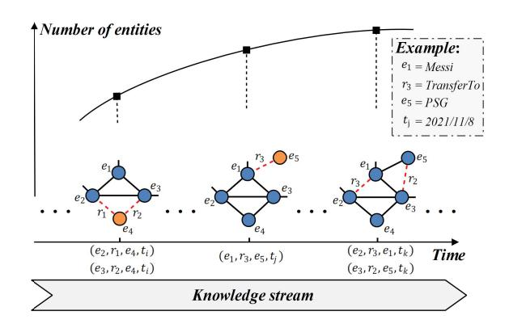
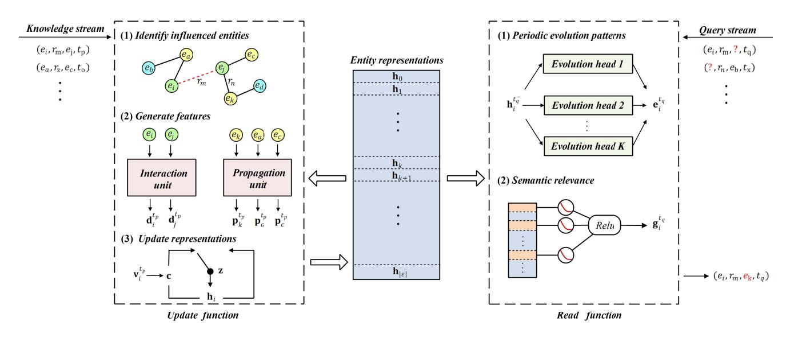
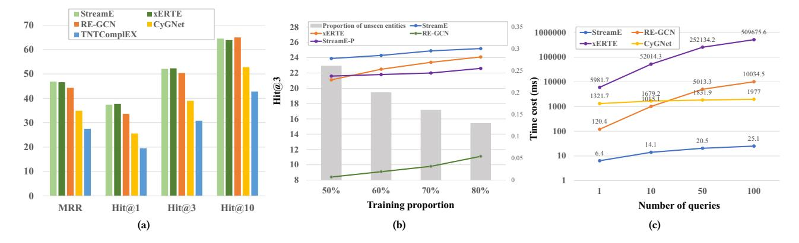
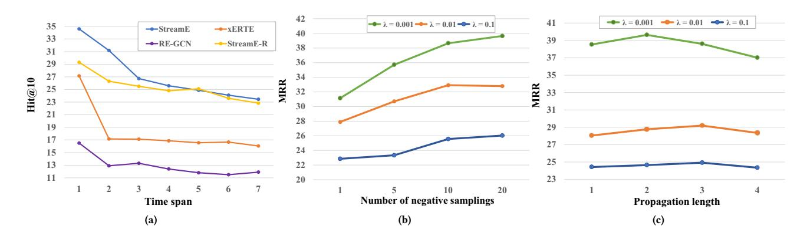

# StreamE: Lightweight Updates of Representations for Temporal Knowledge Graphs in Streaming Scenarios

Jiasheng Zhang University of Electronic Science and Technology of China Chengdu, China zjss12358@std.uestc.edu.cn

Jie Shao∗

Shenzhen Institute for Advanced Study, University of Electronic Science and Technology of China Shenzhen, China shaojie@uestc.edu.cn

Bin Cui Peking University Beijing, China bin.cui@pku.edu.cn

## ABSTRACT

Learning representations for temporal knowledge graphs (TKGs) is a fundamental task. Most existing methods regard TKG as a sequence of static snapshots and recurrently learn representations by retracing the previous snapshots. However, new knowledge can be continuously accrued to TKGs as streams. These methods either cannot handle new entities or fail to update representations in real time, making them unfeasible to adapt to the streaming scenarios. In this paper, we propose a lightweight framework called StreamE towards the efficient generation of TKG representations in streaming scenarios. To reduce the parameter size, entity representations in StreamE are decoupled from the model training to serve as the memory module to store the historical information of entities. To achieve efficient update and generation, the process of generating representations is decoupled as two functions in StreamE. An update function is learned to incrementally update entity representations based on the newly-arrived knowledge and a read function is learned to predict the future semantics of entity representations. The update function avoids the recurrent modeling paradigm and thus gains high efficiency while the read function considers multiple semantic change properties. We further propose a joint training strategy with two temporal regularizations to effectively optimize the framework. Experimental results show that StreamE can achieve better performance than baseline methods with 100× faster in inference, 25× faster in training, and only 1/5 parameter size, which demonstrates its superiority. Code is available at https://github.com/zjs123/StreamE.

## CCS CONCEPTS

• Computing methodologies → Temporal reasoning.

### KEYWORDS

temporal knowledge graph; representation learning; streaming scenario

SIGIR '23, July 23–27, 2023, Taipei, Taiwan

© 2023 Copyright held by the owner/author(s). Publication rights licensed to ACM. ACM ISBN 978-1-4503-9408-6/23/07. . . \$15.00 <https://doi.org/10.1145/3539618.3591772>

#### ACM Reference Format:

Jiasheng Zhang, Jie Shao, and Bin Cui. 2023. StreamE: Lightweight Updates of Representations for Temporal Knowledge Graphs in Streaming Scenarios. In Proceedings of the 46th International ACM SIGIR Conference on Research and Development in Information Retrieval (SIGIR '23), July 23–27, 2023, Taipei, Taiwan. ACM, New York, NY, USA, [10 p](#page-9-0)ages. [https://doi.org/10.1145/3539618.](https://doi.org/10.1145/3539618.3591772) [3591772](https://doi.org/10.1145/3539618.3591772)

## 1 INTRODUCTION

Knowledge graphs (KGs) can organize human knowledge in a structured manner. They have proven highly valuable for many applications, e.g., question answering [\[27\]](#page-9-1) and information retrieval [\[42\]](#page-9-2). Each piece of knowledge in KGs is preserved as a triple ( , , ), where and denote the subject and object entities respectively, and denotes the relation, e.g., (, , ). To simplify the manipulation, knowledge graph representation learning has been investigated to project entities and relations to a vector space. Although numerous methods have been proposed such as [\[15,](#page-9-3) [29\]](#page-9-4), they are designed for static KGs preserving the commonsense knowledge that is eternally true. With the enrichment of event-based interaction data [\[2\]](#page-9-5), a large amount of time-sensitive knowledge needs to be explored, which creates the need for temporal knowledge graph (TKG) representation learning.

As shown in Figure [1,](#page-1-0) a TKG can be viewed as the natural extension of KGs in the time dimension. It preserves each piece of knowledge as a quadruple ( , , , ), where is the arriving timestamp of the knowledge, e.g., (, , , 2021/11/8). TKG representation learning aims to learn vector representations for entities and relations while considering their semantic evolutions. Although several methods have been proposed in this field [\[17,](#page-9-6) [41,](#page-9-7) [43\]](#page-9-8), they are based on the assumption that new knowledge cannot be further added to TKG, which is not true in practice.

Actually, TKGs are often continuously enriched. For example, in a recommendation system, whenever a user clicks a product, there will be a piece of new knowledge (User A, Click, Product B, timestamp), and the recommendation system needs to accordingly update the representations of users in real time to provide timely recommendations. However, retraining the whole TKG whenever a new piece of knowledge arrives is computationally expensive. Such a situation is referred to as the streaming scenario, where new entities and relations are accrued into TKGs with the continuous arrival of the knowledge and the queries are generated at arbitrary timestamps. This brings three technical challenges to TKG representation learning: 1) Handling unseen entities. It requires to generate representations for unseen entities that may be introduced

∗Corresponding author: Jie Shao.

Permission to make digital or hard copies of all or part of this work for personal or classroom use is granted without fee provided that copies are not made or distributed for profit or commercial advantage and that copies bear this notice and the full citation on the first page. Copyrights for components of this work owned by others than the author(s) must be honored. Abstracting with credit is permitted. To copy otherwise, or republish, to post on servers or to redistribute to lists, requires prior specific permission and/or a fee. Request permissions from permissions@acm.org.

<!-- Image Description: The image illustrates a knowledge graph's evolution over time. A curve shows increasing entity numbers. Below, a series of evolving graph snapshots shows entities (e1-e5) and relations (r1-r3) forming a knowledge stream. Each snapshot represents a time point (t1, tk), with edges indicating relations between entities. The example clarifies the meaning of entities and relations, showing how a knowledge graph might represent the transfer of Messi to PSG. The figure visually represents knowledge graph growth and its temporal aspect. -->

### Figure 1: Illustration of a temporal knowledge graph, where the orange nodes denote newly introduced entities and the red dotted edges denote new relations.

into TKGs by new knowledge. Most of the existing methods (e.g., DE-SimplE [\[7\]](#page-9-9)) require all entities to be present during the training phase, which fails to generalize to unseen entities. 2) Efficient representation updates. It needs to update representations in real time based on new knowledge. The existing methods (e.g., RE-GCN [\[19\]](#page-9-10)) employ recurrent architecture and thus require to rollback steps to obtain the representations, which suffers from high time complexity. 3) Arbitrary timestamp representations. Since queries can be generated at any time, it needs to generate representations at arbitrary timestamps to respond to the queries. The existing methods (e.g., CyGNet [\[43\]](#page-9-8)) mostly discretize a TKG as a set of snapshots and can obtain representations only at active timestamps. Furthermore, they need to learn specific representations for each entity, so the number of parameters will grow dramatically as the number of entities increases. In summary, existing TKG representation learning methods fail to adapt to streaming scenarios mainly due to their tightly coupled model architectures. Specifically, the entity representations depend on model training which impairs generalization ability and increases parameter size. The process of handling new knowledge is included in the process of generating representations which leads to inefficiency.

In this paper, we propose a lightweight framework called StreamE to tackle the above challenges. To reduce the parameter size, StreamE decouples entity representations from model training as the memory module to store the historical information of entities, which will be incrementally updated over time. To achieve efficient update and generation, StreamE learns two independent functions for handling new knowledge and generating representations separately to provide timely responses. Specifically, an update function is learned to incrementally updates entity representations based on new knowledge following three steps: (1) identifying the influenced entities of the new knowledge; (2) generating the influence features for the new knowledge; and (3) updating the representations of influenced entities. Then, to generate representations at arbitrary timestamps, StreamE learns a read function that predicts the future semantics of entities based on two parts: the periodic evolution patterns of the entities, and the semantic relevance among the closely related entities. Finally, we design two tasks for joint training to sufficiently supervise the learning of update and read

functions and propose two temporal regularization strategies to stabilize the optimization. Experimental results on three real-world datasets show that StreamE can effectively tackle the challenges mentioned above and achieve an improved performance compared with baseline methods. Our main research contributions are as follows.

- We propose a lightweight framework called StreamE for TKG representation learning in streaming scenarios. To the best of our knowledge, this is the first attempt to address this important problem in practice.
- The proposed StreamE tackles the limitations of existing methods via a decoupled architecture, where entity representations serve as the memory module and two independent functions are learned to manipulate representations in the streaming scenario.
- We propose a joint training strategy and two temporal regularizations that can effectively stabilize the optimization.
- We conduct an extensive experimental study on StreamE. The results demonstrate its superiority in tackling the challenges in the streaming scenario.

#### 2 RELATED WORK

#### 1 Representation Learning for KGs

Knowledge graph representation learning aims to project entities and relations to a vector space while preserving their semantics. There are three kinds of methods, namely translation methods, semantic matching methods, and neural network methods. TransE [\[1\]](#page-9-11) is a typical translation method which regards relation as the translation from the subject entity to the object entity in the vector space. Based on TransE, many improved methods have been proposed, such as TransH [\[35\]](#page-9-12), TransR [\[20\]](#page-9-13) and TransD [\[13\]](#page-9-14). RESCAL [\[26\]](#page-9-15) is the first semantic matching method which employs restricted Tucker decomposition to learn KG representations. Since RESCAL requires a large amount of parameters, DistMult [\[39\]](#page-9-16) simplifies RESCAL by using diagonal matrix. Other semantic matching methods include HoIE [\[25\]](#page-9-17) and ComplEx [\[33\]](#page-9-18). Recently, some researchers attempt to learn KG representations based on neural networks. ConvE [\[4\]](#page-9-19) and ConvKB [\[23\]](#page-9-20) employ the convolution neural networks while others attempt to learn KG representations based on the graph neural networks, such as CompGCN [\[34\]](#page-9-21) and KBAT [\[22\]](#page-9-22). However, these methods are designed for the commonsense knowledge, but cannot handle time-sensitive knowledge.

#### 2 Representation Learning for TKGs

For temporal knowledge graphs, the existing representation learning methods mainly fall into two categories.

Time representation based methods consider the temporality of knowledge by learning representations for timestamps. HyTE [\[3\]](#page-9-23) uses timestamp representations to project knowledge arriving at different timestamps to time-specific hyperplanes. TTransE [\[17\]](#page-9-6) uses timestamp representations to obtain translation vectors for translating entities. TNTComplEX [\[16\]](#page-9-24) regards TKGs as a 4thorder tensor and learns representations by canonical decomposition. Since they need to learn representations for timestamps, they require all timestamps to be present during training, which fails to generate representations at arbitrary timestamps.

Dynamic representation based methods model the semantic changes in TKGs via the time-evolving representations. TA-DistMult [\[5\]](#page-9-25) utilizes an LSTM model to generate time-specific relation representations. DE-SimplE [\[7\]](#page-9-9) learns a nonlinear diachronic representation function to generate time-specific entity representations. CyGNet [\[43\]](#page-9-8) uses a dynamic historical vocabulary to model the frequency of historical facts. ATiSE [\[38\]](#page-9-26) considers the uncertainty of entity semantics and learns representations in the space of multi-dimensional Gaussian distributions. DyERNIE [\[9\]](#page-9-27) is a non-Euclidean representation learning method that learns evolving entity representations in a product of Riemannian manifolds. However, these methods require all entities to be present during training. To alleviate this challenge, some GNN based models are proposed. TeMP [\[36\]](#page-9-28) proposes a temporal message passing framework by combining graph neural networks and temporal dynamics models. RE-GCN [\[19\]](#page-9-10) learns evolutional entity representation by recurrently modeling the TKG sequence. xERTE [\[10\]](#page-9-29) employs attentive propagation in the inference graph of each query. Although they can handle unseen entities via the message passing mechanism [\[6\]](#page-9-30), they need a large number of parameters and suffer from high time complexity because of their recurrent architecture. Recently, TANGO [\[11\]](#page-9-31) introduces neural ordinary differential equations (ODE) to multi-relational graph convolutional networks to learn continuoustime dynamic representations, but it suffers from high inference time cost due to the ODE solver.

To tackle the limitations of existing methods, the proposed StreamE employs a decoupled architecture to use entity representations as a memory module to reduce parameter size. The update function avoids the high time consumption of the recurrent architecture to achieve efficient representation updates. The read function can generate representations at arbitrary timestamps by predicting the future semantics of entities.

## 3 Representation Learning for Dynamic Graphs

A temporal knowledge graph can be regarded as an extension of the dynamic graph with node categories and edge categories. Therefore, we also review the typical dynamic graph representation learning methods in this section. Most of the models regard a dynamic graph as a sequence of snapshots and take a recurrent model as the backbone architecture, and then GNN based models can either be used as the feature encoder for each snapshot [\[8,](#page-9-32) [21\]](#page-9-33) or be used to replace the linear layer in the recurrent model [\[28,](#page-9-34) [30\]](#page-9-35). Since they can only learn representations for nodes in snapshots, they fail to generate node representations at arbitrary timestamps. Even though there also some learning methods without GNN are proposed for dynamic graphs, such as random walk based models [\[24,](#page-9-36) [40\]](#page-9-37) and point process based models [\[32\]](#page-9-38), they have the drawbacks in inductive learning capabilities. Furthermore, since these models are proposed for homogeneous graphs, they are unable to handle the semantics brought by edge categories in TKGs.

### 3 PROBLEM FORMULATION

A temporal knowledge graph can be denoted as G = (E, R, T ), where E and R are entity set and relation set, respectively. T is the set of arriving timestamps. In streaming scenarios, new knowledge

can be continuously added into a TKG and E and T are enriched over time. TKG representation learning in streaming scenarios aims to learn two mapping functions : E → R and : R → R to map entities and relations to a vector space, where is the vector dimension. The mapping functions are required to handle new knowledge in real-time while being able to generate representations at arbitrary timestamps. We left modeling the update of relations as future work since the enrichment of entities is much more frequent than that of relations and the semantic of relations only change negligibly over time [\[7\]](#page-9-9).

#### 4 THE PROPOSED FRAMEWORK

As depicted in Figure [2,](#page-3-0) StreamE contains three components: 1) Entity representations that serve as the memory module to store the historical information of entities. They can be flexibly initialized and efficiently updated over time. 2) An update function that receives new knowledge to incrementally update the entity representations, where the interaction unit and the propagation unit generate the direct influence feature and the propagation influence feature respectively. A gated mechanism is learned to adaptively select the information to be updated. 3) A read function that generates entity representations at arbitrary timestamps. It considers both the periodic evolution patterns and the semantic relevance among the closely related entities. We elaborate on each component as follows.

#### 1 Entity Representation Initialization

The traditional TKG representation learning methods [\[10,](#page-9-29) [19\]](#page-9-10) require the entity representations to be optimized during training. However, such learnable entity representations will lead to an explosion of parameters as the number of entities increases. Furthermore, they handle unseen entities by transferring information from seen entities, which will impair the performance due to oversmoothing [\[18\]](#page-9-39). To achieve lightweight while handling unseen entities more flexibly, StreamE regards entity representations as a memory module to store the historical information of entities. Since it does not need to be optimized during training, the parameter size of our framework depends only on the number of relations, which is far smaller than the number of entities. Meanwhile, the memory module has stored the historical information of entities, and thus the representation of any unseen entity can be flexibly initialized and updated over time. Here, we provide two initialization strategies. When unseen entity is introduced into TKGs by the arriving knowledge ( , , , ) and if has the raw feature e ∈ R (e.g., text descriptions), its representation can be initialized as

$$
\mathbf{h}_i = Relu(\mathbf{We}_i + \mathbf{b}),\tag{1}
$$

where W ∈ R × and b ∈ R are learnable parameters used to project raw features to the space of entity representations.

However, there also exist many entities of which the raw features are missing. We introduce a semantic-aware initialization strategy to handle these entities. Our idea is based on two observations. First, entities with the same roles often have similar semantics. For example, entity and entity should be close in the vector space since they both act as the subject entity of the quadruple (?, , , −). Second, entities that co-occur with

<!-- Image Description: This image depicts a model architecture diagram for processing knowledge and query streams. The left side shows knowledge stream processing: identifying influenced entities, generating features using interaction and propagation units, and updating entity representations. The center shows entity representation as a stacked vector. The right side processes query streams, identifying periodic evolution patterns using multiple evolution heads, and assessing semantic relevance through a ReLU-activated neural network layer. The diagram illustrates the flow of information and the different components within the model. -->

Figure 2: Illustration of the overall architecture of StreamE. In the update function, the green nodes and the yellow nodes denote the directly influenced entities and the propagated (indirectly influenced by propagation) entities of the newly-arrived knowledge ( , , , ), respectively.

a relation often belong to the same concept and thus have similar characters. For example, all entities that act as the subject entity of relation are players. These observations inspire us to initialize representations for unseen entities with more semantics. Formally, for unseen entity that is introduced by the arriving knowledge ( , , , ), if the raw feature of is unavailable, its representation can be initialized as

$$
\mathbf{h}_{i} = \begin{cases} \frac{1}{|\mathcal{E}_{m,j}^{p}|} \sum_{e_k \in \mathcal{E}_{m,j}^{p}} \mathbf{h}_{k}^{t_{p}^{-}} & \text{if } |\mathcal{E}_{m,j}^{p}| \neq 0\\ \frac{1}{|\mathcal{E}_{m}^{p}|} \sum_{e_k \in \mathcal{E}_{m}^{p}} \mathbf{h}_{k}^{t_{p}^{-}} & \text{else,} \end{cases}
$$
(2)

where E , is the set of entities that used to be the subject entity of knowledge (?, , , −) before timestamp . E is the set of entities that used to co-occur with relation before timestamp . h − is the most recently updated representation of entity before timestamp . We employ the mean operation on these related entities to obtain the most common semantic features for initialization. For each unseen entity, the time complexity of our initialization strategy is O ( 2 ).

#### 2 Update Function

Identify influenced entities. As knowledge arrives, the graph structure will change and the semantics of entities also will change. As shown in Figure [2,](#page-3-0) when a piece of new knowledge ( , , , ) arrives, it can first change the semantics of the involved entities and , which we regard as direct influence. For example, when new knowledge (, , , 2021/11/8) arrives, entity should move close to the entity in the vector space because the relation means that Messi will play for PSG, and they should have more interactions in the future. Furthermore, the influence of the arriving knowledge can propagate through the graph structure and change the semantics of other

entities, which we call as propagation influence. However, propagation through the whole graph is time-consuming and may bring noise since not all entities are relevant. Therefore, we define the propagated entity as the entity that used to have knowledge with the involved entities of the arriving knowledge in the past time (e.g., , and in Figure [2\)](#page-3-0). For example, suppose there exists a piece of previous knowledge (, , , 2021/11/3), when new knowledge (, , , 2021/11/8) arrives, entity will become the propagated entity since the above two pieces of knowledge share the same involved entity . The entity should move close to the entity in the vector space because they become teammates. Such strategy is appropriate because 1) the influence of new knowledge is often local [\[37\]](#page-9-40) and 2) the information will be further propagated when the propagated entities have new knowledge.

Interaction unit. The new knowledge will first change the semantics of the involved entities. Inspired by the message passing mechanism that has proven to be powerful in handling graph data, we believe that the involved entities can also receive new information from each other. Furthermore, the relations should also be considered because they can indicate the semantics between entities. Therefore, we compose the information of relations and entities to obtain the direct influence feature. Formally, at timestamp , the direct influence feature for entity is obtained as

$$
\mathbf{d}_{i}^{t_{p}} = \sum_{(e_{i}, r_{m}, e_{j}, t_{p}) \in \mathcal{G}} Comp(\mathbf{r}_{m}, \mathbf{h}_{j}^{t_{p}^{-}}),
$$
 (3)

where r ∈ R is the representation of relation . h − ∈ R is the most recently updated representation of entity before timestamp . () is the composition operation such as multiplication. Since there may be more than one piece of knowledge involving

that arrives at timestamp , we employ the sum aggregation on the features to handle the co-occurring knowledge.

Propagation unit. Propagation paths can indicate the highorder relevance between entities and have been widely used in static KG methods [\[12\]](#page-9-41). In TKGs, we suggest that the propagation path can walk on both graph structure and the time dimension. As shown in Figure [2,](#page-3-0) when new knowledge ( , , , ) arrives, it can influence the entity through the path → → → that is composed by the new knowledge and the previous knowledge ( , , , ). The paths can reveal specific semantic rules. For example, through the path → → → , we can infer that and are teammates. This inspires us to model the propagation influence by leveraging the information of the path. Considering the co-occurrence of the knowledge, we obtain the propagation influence feature for the propagated entity at timestamp as

$$
\mathbf{p}_{k}^{t_{p}} = \sum_{(e_{i}, r_{m}, r_{n}, e_{k}) \in \mathcal{P}_{k}^{t_{p}}} \tanh(\mathbf{W}_{p}[\mathbf{h}_{i}^{t_{p}^{-}} : \mathbf{r}_{m} : \mathbf{r}_{n}]), \qquad (4)
$$

where h − , r, h − and r ∈ R are representations of , , and respectively. W ∈ R 3× is a learnable parameter matrix and [:] is the concatenation operation. P is the set of propagation paths for entity at timestamp .

Update representations. We incrementally update the representations of the influenced entities in the memory module based on the influence features. The update is lightweight since it does not need to recurrently retrace previous knowledge. Taking entity as an example, its representation is updated at timestamp as

$$
\mathbf{z} = \sigma(\mathbf{W}_z[\mathbf{h}_i^{t_p^-} : \mathbf{v}_i^{t_p}] + \mathbf{b}_z),
$$
 (5)

$$
\mathbf{c} = tanh(\mathbf{W}_c[\mathbf{h}_i^{t_p^-} : \mathbf{v}_i^{t_p}] + \mathbf{b}_c),
$$
 (6)

$$
\mathbf{h}_{i}^{t_{p}} = (1 - \mathbf{z}) \odot \mathbf{h}_{i}^{t_{p}^{-}} + \mathbf{z} \odot \mathbf{c}, \qquad (7)
$$

where is the sigmoid activation and ⊙ denotes the element-wise product. z ∈ R is the gate vector used to determine how much historical information should be retained. c ∈ R is the write vector used to determine how much new information should be added. v is set as d if an entity gets direct influence and set as p if an entity only gets propagation influence. Our update function is scalable since the co-occurring knowledge can be handled in parallel.

#### 3 Read Function

The semantics of an entity should change slightly over time after its previous update. The existing methods such as [\[10,](#page-9-29) [19\]](#page-9-10) can only obtain representations of an entity at active timestamps and keep them unchanged until the next knowledge involving the entity arrives. Therefore, these methods always make the same response during this interval despite the evolving graph structure, which is obviously unreasonable. In this section, we design a read function to solve the above problem by predicting the future trajectory of entity representations. Assuming it is required to generate representation for entity at inactive timestamp , the read function achieves this based on the following two parts.

Periodic evolution patterns. The behavior of an entity often show periodic patterns, e.g., U.S.A holds Boston Marathon every year. Since the periodic patterns can reflect the semantic evolution trends specific to an entity, they help to accurately predict the future semantic. However, we notice that an entity may have various periods. For example, U.S.A holds the Boston Marathon every year but holds the presidential election every four years. To capture different patterns, we propose a multi-head evolution strategy to explicitly consider various periods and on this basis, a function is learned to take the query timestamp and the current entity representation as input to generate the corresponding periodic state vector. It is formally defined as

$$
\mathbf{e}_{i}^{tq} = \frac{1}{K} \sum_{k=1}^{K} \sin(\mathbf{W}_{e}[\mathbf{h}_{i}^{t_{q}^{-}} : (\mathbf{m}_{k} \cdot t_{q}) \bmod T_{K}]),
$$
 (8)

where is the number of evolution heads. is the period for each evolution head (e.g., four years, one year, or one month) that is represented by the time granularity of the dataset. m ∈ R is the evolution vector that preserves the evolution pattern of each period. h − is the most recently updated representation of entity before timestamp and is the modulo operation. By modulating different evolution periods , the above function can explicitly capture the periodic pattern of an entity on different scales. Finally, we use the mean average to obtain the periodic state vector.

Semantic relevance. For entities that do not have periodic patterns, we notice that entity only has knowledge with a small proportion of other entities in the entire entity set. For example, in the ICEWS 14 dataset, each entity only has knowledge with an average of 5 other entities, which is less than 1/1000 of the entire entity set. This suggests that each entity has a small number of entities that are very closely related to it. The future semantics of a target entity should adapt to the semantic changes of these closely related entities to maintain their relevance. Considering that entity representations have stored the historical information of entities, we can predict the future semantics by leveraging the representations of these closely related entities. Furthermore, since these closely related entities have different recently active timestamps and the more recently active entities should be more important, we incorporate a time-aware decay to obtain the local state vector of entity at timestamp as follows:

$$
\mathbf{g}_i^{t_q} = Relu\left(\sum_{e_j \in N(e_i, t_q)} \mathbf{W}_g \mathbf{h}_j^{t_q^-} \cdot exp(-|t_q - t_q^{j^-}| \cdot \mu)\right), \qquad (9)
$$

where W ∈ R × is a weight matrix and N ( , ) is the set of entities that have knowledge with before timestamp . is a parameter used to control the magnitude of the time span. − is the most recently updated timestamp of entity before timestamp . Finally, the readout representation of entity at timestamp is obtained as

$$
\mathbf{u}_i^{tq} = \mathbf{h}_i^{tq} + \mathbf{e}_i^{tq} + \mathbf{g}_i^{tq}.
$$
 (10)

The readout representations can be used to respond to queries at arbitrary timestamps. Our read function is fully parallel and is not required to rollback in the time dimension.

#### 4 Model Training

Recall the purpose of our framework. First, we hope that the update function can accurately extract information from the new knowledge to update the entity representations. To adequately supervise the learning of this part, we propose a reconstruction task that requires the updated representations to reconstruct the arriving knowledge. Following the strategy of TKG representation learning methods such as HyTE [\[3\]](#page-9-23), we use the margin-based ranking loss for optimization,

$$
\mathcal{L}_r = \sum_{(e_s, r_k, e_o, t) \in \mathcal{G}} \sum_{e_n \in \mathcal{E}(t)} \max \{ \phi_{s,k,n}^t - \phi_{s,k,o}^t + 1, 0 \}, \qquad (11)
$$

where E () is the set of entities that appeared before timestamp and is the entity obtained by negative sampling that is required by the margin-based ranking loss. We employ the score function of DistMult [\[39\]](#page-9-16) to evaluate the confidence of the knowledge, i.e., ,, = h ⊤ (r ⊙ h ). A lower score means the higher confidence and we use margin loss to let the positive knowledge get lower scores. Second, we hope that the read function can accurately predict the future semantics of entities. Therefore, we propose a forecasting task that requires the readout representations to predict the future knowledge to supervise the learning of this part. The corresponding loss function is defined as

$$
\mathcal{L}_f = \sum_{(e_s, r_k, e_o, t) \in \mathcal{G}} \sum_{e_n \in \mathcal{E}(t)} \max \{ \delta_{s,k,n}^t - \delta_{s,k,o}^t + 1, 0 \},\qquad(12)
$$

in which we use the readout representations to calculate the score of the knowledge, i.e., ,, = u ⊤ (r ⊙ u ).

Temporal smoothness regularization. Intuitively, the semantics of an entity should evolve smoothly over time. We propose a temporal smoothness regularization strategy that minimizes the Euclidean distance between the representations before and after the update at each active timestamp, which avoids the representations from changing drastically. It is formally defined as

$$
Q_s = \sum_{e_i \in \mathcal{E}} \sum_{t \in \mathcal{T}} ||\mathbf{h}_i^t - \mathbf{h}_i^{t^-}||_2^2, \tag{13}
$$

where h ∈ R and h − ∈ R are the representations of entity before and after the update at active timestamp , respectively.

Evolution consistency regularization. Considering that the updated representations have preserved the current semantics of entities and we hope the readout representations can accurately predict the future semantics of an entity, the updated representations can be regarded as the real label of the readout representations at each timestamp, which provides an auxiliary supervision signal for the read function. Therefore, we propose an evolution consistency regularization that minimizes the Euclidean distance between the readout representation and the updated representation at each active timestamp . It is formally defined as

$$
Q_c = \sum_{e_i \in \mathcal{E}} \sum_{t \in \mathcal{T}} ||\mathbf{u}_i^t - \mathbf{h}_i^t||_2^2, \tag{14}
$$

where u ∈ R and h ∈ R are the representations of entity at active timestamp that are respectively obtained by the read function and the update function.

Table 1: Statistics of datasets.

| Dataset     | E      | R   | T     | 𝑁𝑞𝑢𝑎𝑑𝑟𝑢𝑝𝑙𝑒 |
|-------------|--------|-----|-------|------------|
| ICEWS 14    | 7,128  | 230 | 365   | 90,730     |
| ICEWS 05-15 | 10,488 | 251 | 4,017 | 461,329    |
| ICEWS 18    | 23,033 | 256 | 304   | 468,588    |
| YAGO        | 10,038 | 10  | 194   | 73,151     |

Overall objective function. Combining the above four parts, the overall objective function of StreamE is defined as

$$
\mathcal{L}_{all} = \mathcal{L}_r + \mathcal{L}_f + \lambda(Q_s + Q_c),\tag{15}
$$

where is a hyperparameter used to control the magnitude of the regularization term.

#### 5 EXPERIMENTAL SETUP

Dataset. We evaluate our framework on four popular temporal knowledge graph datasets, which are derived from ICEWS [\[2\]](#page-9-5) and YAGO [\[31\]](#page-9-42). ICEWS is an early warning system where political knowledge among political people and countries are continuously accrued into the database in a streaming form. We use three subsets of it for evaluation, i.e., ICEWS14, ICEWS05-15, and ICEWS18, which contain knowledge in 2014, knowledge from 2005 to 2015 and knowledge in 2018, respectively. YAGO is a temporal knowledge base that fuses information from Wikipedia. These datasets are provided by xERTE [\[10\]](#page-9-29) and we follow the standard way to split each dataset into three subsets, i.e., train/valid/test, by the ascending order of timestamps. The detailed statistics are shown in Table [1.](#page-5-0)

Comparison models. For static KG methods, we select one typical model for each category: TransE [\[1\]](#page-9-11), DistMult [\[39\]](#page-9-16) and CompGCN [\[34\]](#page-9-21). For TKG methods, we select 7 most recent models: TTransE [\[17\]](#page-9-6), TA-DistMult [\[5\]](#page-9-25), DE-SimplE [\[7\]](#page-9-9), TNTComplEX [\[16\]](#page-9-24), RE-GCN [\[19\]](#page-9-10), CyGNet [\[43\]](#page-9-8), and xERTE [\[10\]](#page-9-29) which is the state-of-the-art model. We do not compare with dynamic graph representation learning models because they are unable to handle relations in TKG and thus cannot achieve competitive performance with other models.

Model variants. We provide four variants of StreamE to verify the effectiveness of each component in our framework: (1) StreamE-P: removing the propagation unit; (2) StreamE-LSTM: replacing our gated mechanism with an LSTM cell; (3) StreamE-R: removing the read function; (4) StreamE-SLP: replacing the read function with a single layer perceptron.

Implementation details. For baseline methods, we use the released official implementation to conduct the experiment. For StreamE, we implement it with PyTorch. We tune hyperparameters for both the baseline methods and StreamE using a grid search, where the best hyperparameter settings are selected with the best MRR on the validation set. We create 100 mini-batches for each epoch during training, and the number of epochs is set as 500 with early-stopping. The learning rate is set as 0.001, the dimension of representation is set as 200, and the number of the evolution head is set as 10. The trade-off ∈ {1 − 1, 1 − 2, 1 − 3}. The negative sampling number ∈ {1, 5, 10, 20}. The propagation length ∈ {1, 2, 3, 4}. The composition operation can be subtraction, multiplication, or parameterized operations. We use

Table 2: Statistics of the queries of each dataset.

| Dataset     | Test size | Entity size | Percentage of unseen entities |
|-------------|-----------|-------------|-------------------------------|
| ICEWS 14    | 18,176    | 5,286       | 17%                           |
| ICEWS 05-15 | 92,265    | 6,410       | 25.5%                         |
| ICEWS 18    | 93,717    | 11,288      | 17%                           |
| YAGO        | 14,630    | 2,134       | 39.2%                         |

Adam [\[14\]](#page-9-43) for optimization and the batches are sequentially sampled from the knowledge sequence to maintain the temporal order. We randomly initialize the entity representations and randomly sample the negative entities for our StreamE and all the comparison models. Our MindSpore implementation code is available at [https://github.com/zjs123/StreamE.](https://github.com/zjs123/StreamE)

Evaluation protocol. We evaluate the quality of the learned representations via the inductive forecasting task, which aims to predict the future knowledge for unseen entities based on the observed knowledge. To conduct the evaluation, we select the knowledge from the test set of which the involved entities are not presented during training to generate queries. Formally, given a target knowledge ( , , , ) ∈ G where or is unseen during training, we construct two queries ( , , ?, ) and (?, , , ). The inductive forecasting task is to predict the missing object entity and the missing subject entity for these two queries, respectively. We use and @ as evaluation metrics. refers to the mean reciprocal rank, which is defined as the average of the reciprocal of the rank of the correctly predicted entity for each test knowledge. @ is computed by measuring the proportion of correctly predicted entity ranked in the top- list. Both the higher and @ mean the better performance. To clarify the evaluation protocol, we provide the statistics of the test set of each dataset in Table [2.](#page-6-0) The test size is the total number of knowledge in the test set, and the entity size is the number of entities involved in these knowledge. The percentage of unseen entities indicates the percentage of the entities that do not appear in the training set.

#### 6 RESULTS AND DISCUSSION

#### 1 Main Results

Table [3](#page-7-0) gives the inductive forecasting results of different methods. According to the results, we have three findings. 1) StreamE outperforms the baseline methods on all of four datasets. Compared with the second best result, our framework achieves 14.1%, 1.6%, 9.1%, and 16.7% higher on the metric on each dataset respectively, which demonstrates the superiority of StreamE on handling new knowledge. The superiority comes from two parts. First, the existing methods can only use short-term history for forecasting due to the high time complexity. On the contrary, StreamE can use the complete history by using entity representation as the memory module. Second, in these models the entity representations depend on model training and the unlearned representations of unseen entities will bring noise. Our StreamE is more robust because it learns functions to manipulate representations over time rather than learn the distinct representations. 2) Graph neural networks (GNNs) based methods (e.g., CompGCN and xERTE) significantly

outperform other baseline methods, which demonstrates the effectiveness of the message passing mechanism. StreamE does not directly adopt GNNs, but our update function is also designed for transferring information among entities, which achieves the same effectiveness. Furthermore, some baseline methods can still achieve meaningful results although they are theoretically unable to handle unseen entities (e.g., TNTComplEX and CyGNet), which may be because that they can learn the co-occurrence relevance between the missing entities and the query relations. 3) Our framework achieves more improvement on the ICEWS14 and YAGO datasets, because these datasets are more sparse and our framework can effectively adapt to sparse data due to our propagation unit and read function. Furthermore, the improvement on the ICEWS 05-15 dataset is relatively small. We suggest that this is because the long time span (i.e., ten years) of this dataset makes our framework more easily bring noise when updating representations.

#### 2 Ablation Study

StreamE-P. In Table [4,](#page-7-1) we note that after removing the propagation unit, both Hit@1 and Hit@10 drop significantly. We suggest that this is because the arriving knowledge can change the semantics of both the involved entities and other entities. Ignoring the propagation influence makes the framework fail to extract sufficient historical information to forecast accurately. Our propagation unit can model the propagation influence by leveraging the propagation paths, and thus achieves performance improvement.

StreamE-LSTM. As shown in Table [4,](#page-7-1) we can see that although the LSTM cell has a larger number of parameters than our proposed gated mechanism, StreamE-LSTM still fails to outperform our original framework. This is mainly because the LSTM cell often requires a more complex architecture to learn a stable model, but the entity representations are decoupled from the model training in our framework. This makes the parameters of the LSTM cell difficult to be sufficiently optimized.

StreamE-R & StreamE-SLP. After removing the read function from our framework, we use the recently updated representation before the query timestamp to predict the missing entity of the query. In Table [4,](#page-7-1) we can see that Hit@10 drops significantly, which demonstrates the weakness of keeping entity representations unchanged in the inactive time intervals. Furthermore, our raw framework outperforms StreamE-SLP, which shows the effectiveness of our read function in predicting the future trajectories of representations.

#### 3 Detailed Analysis

Model robustness. First, as shown in Table [4,](#page-7-1) our framework can work with several composition operations and they all achieve considerable performance, which demonstrates that the effectiveness of the update function is not relied on a specific operation. Second, as shown in Figure [3\(](#page-7-2)a), StreamE can obtain competitive performance with xERTE for the seen entity forecasting task which predicts the future knowledge for seen entities, which demonstrates that StreamE can handle both seen entities and unseen entities. Finally, we can observe in Figure [3\(](#page-7-2)b) that StreamE consistently outperforms xERTE with different training data proportions, and as the proportion of training data decreases, the performance of StreamE does not drops drastically (the performance of StreamE only drops

|                                                           | Table 3: Comparison of different methods on four datasets for the inductive forecasting task. The best and second best results |  |
|-----------------------------------------------------------|--------------------------------------------------------------------------------------------------------------------------------|--|
| in each column are boldfaced and underlined respectively. |                                                                                                                                |  |

| Dataset        |       |       | ICEWS 14 |        | ICEWS 05-15 |       |       | ICEWS 18 |       |       | YAGO  |        |       |       |       |        |
|----------------|-------|-------|----------|--------|-------------|-------|-------|----------|-------|-------|-------|--------|-------|-------|-------|--------|
| Models         | MRR   | Hit@1 | Hit@3    | Hit@10 | MRR         | Hit@1 | Hit@3 | Hit@10   | MRR   | Hit@1 | Hit@3 | Hit@10 | MRR   | Hit@1 | Hit@3 | Hit@10 |
| TransE         | 0.31  | 0.00  | 0.11     | 0.52   | 0.00        | 0.00  | 0.00  | 0.04     | 0.16  | 0.00  | 0.20  | 0.38   | 0.74  | 0.15  | 0.49  | 1.38   |
| DistMult       | 0.29  | 0.17  | 0.21     | 0.36   | 0.02        | 0.00  | 0.03  | 0.06     | 0.05  | 0.00  | 0.00  | 0.17   | 0.05  | 0.00  | 0.03  | 0.04   |
| CompGCN        | 2.94  | 1.77  | 2.84     | 4.62   | 6.07        | 2.85  | 7.87  | 12.02    | 2.12  | 1.10  | 2.08  | 3.70   | 0.46  | 0.17  | 0.23  | 0.71   |
| TTransE        | 0.26  | 0.00  | 0.23     | 0.34   | 0.14        | 0.00  | 0.01  | 0.16     | 0.18  | 0.07  | 0.17  | 0.41   | 0.78  | 0.18  | 0.47  | 1.52   |
| TA-DistMult    | 0.18  | 0.00  | 0.05     | 0.23   | 0.01        | 0.00  | 0.01  | 0.04     | 0.08  | 0.00  | 0.05  | 0.15   | 0.22  | 0.00  | 0.13  | 0.42   |
| DE-SimplE      | 0.36  | 0.17  | 0.34     | 0.58   | 0.02        | 0.00  | 0.02  | 0.06     | 0.01  | 0.00  | 0.00  | 0.00   | 0.05  | 0.00  | 0.00  | 0.07   |
| TNTComplEX     | 2.10  | 1.04  | 2.08     | 4.24   | 1.83        | 0.97  | 1.51  | 3.87     | 2.43  | 1.31  | 2.32  | 4.30   | 4.73  | 2.53  | 4.72  | 4.90   |
| CyGNet         | 6.31  | 2.05  | 6.14     | 15.83  | 8.77        | 3.27  | 9.65  | 19.62    | 5.62  | 3.26  | 6.24  | 9.13   | 2.66  | 1.24  | 2.65  | 3.87   |
| RE-GCN         | 10.52 | 7.11  | 11.03    | 16.54  | 10.17       | 7.22  | 10.70 | 15.19    | 12.51 | 7.90  | 13.83 | 21.01  | 11.31 | 7.12  | 12.21 | 18.80  |
| xERTE          | 20.29 | 16.50 | 23.68    | 27.15  | 31.12       | 24.81 | 34.80 | 44.02    | 10.45 | 8.36  | 11.84 | 15.16  | 33.94 | 30.37 | 37.74 | 38.49  |
| StreamE (ours) | 23.15 | 17.13 | 25.09    | 34.59  | 31.62       | 24.57 | 34.94 | 47.78    | 13.66 | 9.45  | 16.87 | 22.17  | 39.64 | 31.01 | 42.98 | 56.30  |

<!-- Image Description: This figure presents a performance comparison of five knowledge graph embedding methods (StreamE, xERTE, RE-GCN, CyGNet, TNTComplEX). (a) shows a bar chart comparing their performance on standard metrics (MRR, Hit@1, Hit@3, Hit@10). (b) is a line graph illustrating Hit@3 performance against varying training proportions. (c) displays a log-scale line graph comparing the time cost (in milliseconds) of each method as the number of queries increases. The figure aims to demonstrate the relative strengths and weaknesses of the methods in terms of both accuracy and efficiency. -->

Figure 3: (a) Forecasting performance of different methods for seen entities on the ICEWS 05-15 dataset. (b) Performance of the inductive forecasting task with different proportions of data for training on the ICEWS 14 dataset. (c) Time cost of different methods on responding to different numbers of queries.

| Dataset                            |       | ICEWS 14 | ICEWS 18 |        |  |
|------------------------------------|-------|----------|----------|--------|--|
| Variants                           | Hit@1 | Hit@10   | Hit@1    | Hit@10 |  |
| 𝐶𝑜𝑚𝑝(𝑎, 𝑏) = 𝑎 ∗ 𝑏              | 17.13 | 34.59    | 9.45     | 22.17  |  |
| 𝐶𝑜𝑚𝑝(𝑎, 𝑏) = 𝑏 − 𝑎              | 17.04 | 34.15    | 9.13     | 21.92  |  |
| 𝐶𝑜𝑚𝑝(𝑎, 𝑏) = 𝑡𝑎𝑛ℎ(𝑊 [𝑎 : 𝑏])    | 16.96 | 34.03    | 9.20     | 21.53  |  |
| StreamE-P                          | 15.41 | 31.06    | 8.69     | 16.02  |  |
| StreamE-LSTM                       | 16.37 | 30.83    | 8.85     | 17.19  |  |
| StreamE-R                          | 13.75 | 29.30    | 7.98     | 15.86  |  |
| StreamE-SLP                        | 15.86 | 31.01    | 8.94     | 15.75  |  |
| Without smoothness regularization  | 14.43 | 31.38    | 7.67     | 15.94  |  |
| Without consistency regularization | 12.36 | 27.22    | 6.52     | 14.60  |  |
| Without reconstruction task        | 4.30  | 8.47     | 5.08     | 10.23  |  |

Table 4: Results of ablation study.

5.1% while xERTE drops 12.4% when using 50% data for training). These observations show the robustness of StreamE.

Efficiency analysis. Figure [3\(](#page-7-2)c) summarizes the time cost of different methods on responding to different numbers of queries. We can see that StreamE is more efficient than baseline methods (e.g., 100× faster than RE-GCN [\[19\]](#page-9-10)) since it is fully parallel. xERTE needs to obtain an inference graph for each query via the breadth search and thus fails to parallelly respond to the queries. RE-GCN also has

Table 5: Training time cost for each epoch and the parameter size of comparison models on the ICEWS 14 dataset.

| Models                      | StreamE | xERTE | RE-GCN |
|-----------------------------|---------|-------|--------|
| Training time for one epoch | 40s     | 1096s | 118s   |
| Total parameters            | 1.09M   | 3.36M | 5.96M  |

high computational complexity since it needs to rollback steps for the whole graph to obtain representations and then respond to the queries. Even though CyGNet is also parallel, our StreamE is more efficient on responding to each piece of query because of its decoupled architecture. The time cost of the training phase and the parameter size of different models are shown in Table [5.](#page-7-3) We can see that besides the efficient response, our StreamE is also efficient in training (e.g., 25× faster than xERTE [\[10\]](#page-9-29)). Even though many entity representations are used to update the target representations, they are decoupled from training. Therefore, only the parameters of the relation representations, the update function, and the read function need to be optimized. Furthermore, different from baseline methods that employ recurrent architecture such as xERTE and RE-GCN, StreamE is not required to back-propagation through time,

<!-- Image Description: This figure presents three line graphs comparing the performance of four recommendation models (StreamE, xERTE, RE-GCN, StreamE-R) across different hyperparameters. (a) shows Hit@10 varying with time span. (b) displays Mean Reciprocal Rank (MRR) against the number of negative samplings for different lambda (λ) values. (c) illustrates MRR as a function of propagation length for varying λ values. The graphs aim to demonstrate the impact of these hyperparameters on recommendation accuracy. -->

Figure 4: (a) The long time forecasting performance of different methods on the ICEWS 14 dataset. (b) Performance of StreamE with different negative sampling numbers on the YAGO dataset. (c) Performance of StreamE with different propagation lengths on the YAGO dataset.

which brings the training efficiency. Additionally, we can see that the parameter size of StreamE is much smaller than that of the comparison models (e.g., 1/5 of RE-GCN). This is because entity representations are required to be learned in comparison models but serve as the memory module in our framework. The above observations indicate that StreamE can outperform comparison models with less training time and smaller parameter size.

Training strategy. In Table [4,](#page-7-1) we report the performance trained by different strategies to verify the effectiveness of our training strategy. First, the performance drops most without the reconstruction task. This is because the update function is the key component of our framework to extract historical information but cannot get sufficient supervision when only using the forecasting task for training. Furthermore, the performance without smoothness regularization drops because the representations will change steeply over time, which leads to over-fitting. Finally, the variant without consistency regularization gets even worse result compared with StreamE-R, which demonstrates the effectiveness of consistency regularization to guide the prediction of future semantics.

Long time forecasting. The standard setting of forecasting task usually predicts knowledge in a short future (i.e., one day). However, in the streaming scenario, the knowledge right before the query may miss, which requires the model to predict knowledge in a long future (i.e., several days). Here, we perform a long time forecasting task, which aims to infer the knowledge at + Δ given the knowledge before , and Δ varies from one day to seven days. According to the performance in Figure [4\(](#page-8-0)a), we can see that StreamE consistently outperforms xERTE as Δ increases. Furthermore, we note that the performance of xERTE drops dramatically when Δ varies from 1 to 2. This is because the performance of xERTE heavily relies on capturing the co-occurring facts of the adjacent timestamps. Differently, our StreamE can leverage the complete history by using entity representations as the memory module.

#### 4 Hyperparameter Study

We show the effect of hyperparameters on model performance, including the number of negative samplings , the magnitude of

trade-off , and the propagation length . From Figure [4\(](#page-8-0)b), we can see that with different values, the results all improve as the increase of the number of negative samplings and when is large, the improvement becomes small. Therefore, to balance the efficiency and the performance, we set as 20. Furthermore, we observe that StreamE still achieves good performance when is small with = 0.001, which demonstrates that our framework does not depend on a large number of negative samplings. From Figure [4\(](#page-8-0)c), we can see that the performance of StreamE increases first and then decreases as the propagation length increases. This may be because a too long propagation length will bring noise since the far away entities are less relevant. Finally, we can see that a too large leads to performance decrease. This is because a too large makes the representations over-smoothed in the time dimension and thus fails to capture the time-specific semantics.

#### 7 CONCLUSION

In this paper, we make the first attempt to learn temporal knowledge graph (TKG) representations in the streaming scenario. We carefully investigate the technical challenges of this problem, and propose a lightweight framework called StreamE to tackle these challenges based on the decoupled architecture. Our framework decouples entity representations from model training, and learns an update function and a read function for handling new knowledge and generating representations respectively. To stabilize the optimization, we design a joint training strategy with two temporal regularizations. The experimental results demonstrate that StreamE can achieve considerable performance improvement for standard TKG tasks while adapting to the streaming scenario. For our future work, one promising direction is to explore the scenario in which new relations will also be introduced.

#### ACKNOWLEDGMENTS

This work is supported by the National Natural Science Foundation of China (No. 61832001 and No. 62276047), Shenzhen Science and Technology Program (No. JCYJ20210324121213037) and CAAI-Huawei MindSpore Open Fund (No. CAAIXSJLJJ-2022-031A).

SIGIR '23, July 23–27, 2023, Taipei, Taiwan Jiasheng Zhang, Jie Shao, and Bin Cui

### REFERENCES

- [1] Antoine Bordes, Nicolas Usunier, Alberto García-Durán, Jason Weston, and Oksana Yakhnenko. 2013. Translating Embeddings for Modeling Multi-relational Data. In Advances in Neural Information Processing Systems 26: 27th Annual Conference on Neural Information Processing Systems 2013. 2787–2795.
- [2] Elizabeth Boschee, Jennifer Lautenschlager, Sean O'Brien, Steve Shellman, James Starz, and Michael Ward. 2015. ICEWS Coded Event Data. Harvard Dataverse.
- [3] Shib Sankar Dasgupta, Swayambhu Nath Ray, and Partha P. Talukdar. 2018. HyTE: Hyperplane-based Temporally aware Knowledge Graph Embedding. In Proceedings of the 2018 Conference on Empirical Methods in Natural Language Processing. 2001–2011.
- [4] Tim Dettmers, Pasquale Minervini, Pontus Stenetorp, and Sebastian Riedel. 2018. Convolutional 2D Knowledge Graph Embeddings. In Proceedings of the Thirty-Second AAAI Conference on Artificial Intelligence, (AAAI-18). 1811–1818.
- [5] Alberto García-Durán, Sebastijan Dumancic, and Mathias Niepert. 2018. Learning Sequence Encoders for Temporal Knowledge Graph Completion. In Proceedings of the 2018 Conference on Empirical Methods in Natural Language Processing. 4816–4821.
- [6] Justin Gilmer, Samuel S. Schoenholz, Patrick F. Riley, Oriol Vinyals, and George E. Dahl. 2017. Neural Message Passing for Quantum Chemistry. In Proceedings of the 34th International Conference on Machine Learning, ICML 2017. 1263–1272.
- [7] Rishab Goel, Seyed Mehran Kazemi, Marcus Brubaker, and Pascal Poupart. 2020. Diachronic Embedding for Temporal Knowledge Graph Completion. In The Thirty-Fourth AAAI Conference on Artificial Intelligence, AAAI 2020. 3988–3995.
- [8] Shengnan Guo, Youfang Lin, Ning Feng, Chao Song, and Huaiyu Wan. 2019. Attention Based Spatial-Temporal Graph Convolutional Networks for Traffic Flow Forecasting. In The Thirty-Third AAAI Conference on Artificial Intelligence, AAAI 2019. 922–929.
- [9] Zhen Han, Peng Chen, Yunpu Ma, and Volker Tresp. 2020. DyERNIE: Dynamic Evolution of Riemannian Manifold Embeddings for Temporal Knowledge Graph Completion. In Proceedings of the 2020 Conference on Empirical Methods in Natural Language Processing, EMNLP 2020. 7301–7316.
- [10] Zhen Han, Peng Chen, Yunpu Ma, and Volker Tresp. 2021. Explainable Subgraph Reasoning for Forecasting on Temporal Knowledge Graphs. In 9th International Conference on Learning Representations, ICLR 2021.
- [11] Zhen Han, Zifeng Ding, Yunpu Ma, Yujia Gu, and Volker Tresp. 2021. Learning Neural Ordinary Equations for Forecasting Future Links on Temporal Knowledge Graphs. In Proceedings of the 2021 Conference on Empirical Methods in Natural Language Processing, EMNLP 2021. 8352–8364.
- [12] Pei-Yu Hou, Daniel Robert Korn, Cleber C. Melo-Filho, David R. Wright, Alexander Tropsha, and Rada Chirkova. 2022. Compact Walks: Taming Knowledge-Graph Embeddings with Domain- and Task-Specific Pathways. In SIGMOD '22: International Conference on Management of Data. 458–469.
- [13] Guoliang Ji, Shizhu He, Liheng Xu, Kang Liu, and Jun Zhao. 2015. Knowledge Graph Embedding via Dynamic Mapping Matrix. In Proceedings of the 53rd Annual Meeting of the Association for Computational Linguistics and the 7th International Joint Conference on Natural Language Processing of the Asian Federation of Natural Language Processing, ACL 2015, Volume 1: Long Papers. 687–696.
- [14] Diederik P. Kingma and Jimmy Ba. 2015. Adam: A Method for Stochastic Optimization. In 3rd International Conference on Learning Representations, ICLR 2015.
- [15] Adrian Kochsiek and Rainer Gemulla. 2021. Parallel Training of Knowledge Graph Embedding Models: A Comparison of Techniques. Proc. VLDB Endow. 15, 3 (2021), 633–645.
- [16] Timothée Lacroix, Guillaume Obozinski, and Nicolas Usunier. 2020. Tensor Decompositions for Temporal Knowledge Base Completion. In 8th International Conference on Learning Representations, ICLR 2020.
- [17] Julien Leblay and Melisachew Wudage Chekol. 2018. Deriving Validity Time in Knowledge Graph. In Companion of the The Web Conference 2018, WWW 2018. 1771–1776.
- [18] Qimai Li, Zhichao Han, and Xiao-Ming Wu. 2018. Deeper Insights Into Graph Convolutional Networks for Semi-Supervised Learning. In Proceedings of the Thirty-Second AAAI Conference on Artificial Intelligence, (AAAI-18). 3538–3545.
- [19] Zixuan Li, Xiaolong Jin, Wei Li, Saiping Guan, Jiafeng Guo, Huawei Shen, Yuanzhuo Wang, and Xueqi Cheng. 2021. Temporal Knowledge Graph Reasoning Based on Evolutional Representation Learning. In SIGIR '21: The 44th International ACM SIGIR Conference on Research and Development in Information Retrieval. 408–417.
- [20] Yankai Lin, Zhiyuan Liu, Maosong Sun, Yang Liu, and Xuan Zhu. 2015. Learning Entity and Relation Embeddings for Knowledge Graph Completion. In Proceedings of the Twenty-Ninth AAAI Conference on Artificial Intelligence. 2181–2187.
- [21] Dongfang Ma, Xiang Song, and Pu Li. 2021. Daily Traffic Flow Forecasting Through a Contextual Convolutional Recurrent Neural Network Modeling Interand Intra-Day Traffic Patterns. IEEE Trans. Intell. Transp. Syst. 22, 5 (2021), 2627–2636.
- [22] Deepak Nathani, Jatin Chauhan, Charu Sharma, and Manohar Kaul. 2019. Learning Attention-based Embeddings for Relation Prediction in Knowledge Graphs. In

Proceedings of the 57th Conference of the Association for Computational Linguistics, ACL 2019, Volume 1: Long Papers. 4710–4723.

- [23] Dai Quoc Nguyen, Tu Dinh Nguyen, Dat Quoc Nguyen, and Dinh Q. Phung. 2018. A Novel Embedding Model for Knowledge Base Completion Based on Convolutional Neural Network. In Proceedings of the 2018 Conference of the North American Chapter of the Association for Computational Linguistics: Human Language Technologies, NAACL-HLT, Volume 2 (Short Papers). 327–333.
- [24] Giang Hoang Nguyen, John Boaz Lee, Ryan A. Rossi, Nesreen K. Ahmed, Eunyee Koh, and Sungchul Kim. 2018. Continuous-Time Dynamic Network Embeddings. In Companion of the The Web Conference 2018 on The Web Conference 2018, WWW 2018. 969–976.
- [25] Maximilian Nickel, Lorenzo Rosasco, and Tomaso A. Poggio. 2016. Holographic Embeddings of Knowledge Graphs. In Proceedings of the Thirtieth AAAI Conference on Artificial Intelligence. 1955–1961.
- [26] Maximilian Nickel, Volker Tresp, and Hans-Peter Kriegel. 2011. A Three-Way Model for Collective Learning on Multi-Relational Data. In Proceedings of the 28th International Conference on Machine Learning, ICML 2011. 809–816.
- [27] Abdelghny Orogat, Isabelle Liu, and Ahmed El-Roby. 2021. CBench: Towards Better Evaluation of Question Answering Over Knowledge Graphs. Proc. VLDB Endow. 14, 8 (2021), 1325–1337.
- [28] Aldo Pareja, Giacomo Domeniconi, Jie Chen, Tengfei Ma, Toyotaro Suzumura, Hiroki Kanezashi, Tim Kaler, Tao B. Schardl, and Charles E. Leiserson. 2020. EvolveGCN: Evolving Graph Convolutional Networks for Dynamic Graphs. In The Thirty-Fourth AAAI Conference on Artificial Intelligence, AAAI 2020. 5363– 5370.
- [29] Andrea Rossi, Donatella Firmani, Paolo Merialdo, and Tommaso Teofili. 2022. Explaining Link Prediction Systems based on Knowledge Graph Embeddings. In SIGMOD '22: International Conference on Management of Data. 2062–2075.
- [30] Youngjoo Seo, Michaël Defferrard, Pierre Vandergheynst, and Xavier Bresson. 2018. Structured Sequence Modeling with Graph Convolutional Recurrent Networks. In Neural Information Processing - 25th International Conference, ICONIP 2018, Proceedings, Part I. 362–373.
- [31] Fabian M. Suchanek, Gjergji Kasneci, and Gerhard Weikum. 2007. Yago: a core of semantic knowledge. In Proceedings of the 16th International Conference on World Wide Web, WWW 2007. 697–706.
- [32] Rakshit Trivedi, Mehrdad Farajtabar, Prasenjeet Biswal, and Hongyuan Zha. 2019. DyRep: Learning Representations over Dynamic Graphs. In 7th International Conference on Learning Representations, ICLR 2019.
- [33] Théo Trouillon, Johannes Welbl, Sebastian Riedel, Éric Gaussier, and Guillaume Bouchard. 2016. Complex Embeddings for Simple Link Prediction. In Proceedings of the 33nd International Conference on Machine Learning, ICML 2016. 2071–2080.
- [34] Shikhar Vashishth, Soumya Sanyal, Vikram Nitin, and Partha P. Talukdar. 2020. Composition-based Multi-Relational Graph Convolutional Networks. In 8th International Conference on Learning Representations, ICLR 2020.
- [35] Zhen Wang, Jianwen Zhang, Jianlin Feng, and Zheng Chen. 2014. Knowledge Graph Embedding by Translating on Hyperplanes. In Proceedings of the Twenty-Eighth AAAI Conference on Artificial Intelligence. 1112–1119.
- [36] Jiapeng Wu, Meng Cao, Jackie Chi Kit Cheung, and William L. Hamilton. 2020. TeMP: Temporal Message Passing for Temporal Knowledge Graph Completion. In Proceedings of the 2020 Conference on Empirical Methods in Natural Language Processing, EMNLP 2020. 5730–5746.
- [37] Tianxing Wu, Arijit Khan, Melvin Yong, Guilin Qi, and Meng Wang. 2022. Efficiently embedding dynamic knowledge graphs. Knowl. Based Syst. 250 (2022), 109124.
- [38] Chenjin Xu, Mojtaba Nayyeri, Fouad Alkhoury, Hamed Shariat Yazdi, and Jens Lehmann. 2020. Temporal Knowledge Graph Completion Based on Time Series Gaussian Embedding. In The Semantic Web - ISWC 2020 - 19th International Semantic Web Conference, Proceedings, Part I. 654–671.
- [39] Bishan Yang, Wen-tau Yih, Xiaodong He, Jianfeng Gao, and Li Deng. 2015. Embedding Entities and Relations for Learning and Inference in Knowledge Bases. In 3rd International Conference on Learning Representations, ICLR 2015.
- [40] Wenchao Yu, Wei Cheng, Charu C. Aggarwal, Kai Zhang, Haifeng Chen, and Wei Wang. 2018. NetWalk: A Flexible Deep Embedding Approach for Anomaly Detection in Dynamic Networks. In Proceedings of the 24th ACM SIGKDD International Conference on Knowledge Discovery & Data Mining, KDD 2018. 2672–2681.
- [41] Jiasheng Zhang, Shuang Liang, Yongpan Sheng, and Jie Shao. 2022. Temporal knowledge graph representation learning with local and global evolutions. Knowl. Based Syst. 251 (2022), 109234.
- [42] Ying Zhou, Xuanang Chen, Ben He, Zheng Ye, and Le Sun. 2022. Re-thinking Knowledge Graph Completion Evaluation from an Information Retrieval Perspective. In SIGIR '22: The 45th International ACM SIGIR Conference on Research and Development in Information Retrieval. 916–926.
- [43] Cunchao Zhu, Muhao Chen, Changjun Fan, Guangquan Cheng, and Yan Zhang. 2021. Learning from History: Modeling Temporal Knowledge Graphs with Sequential Copy-Generation Networks. In Thirty-Fifth AAAI Conference on Artificial Intelligence, AAAI 2021. 4732–4740.
