# OPEN

<!-- Image Description: The image is a button that says "Check for updates". It's a graphical user interface (GUI) element, likely from software or a website. The button includes a small circular icon featuring a red bookmark-like shape within a multicolored ring. The image's purpose in an academic paper would be to illustrate a software interface element or to demonstrate a step in a methodology involving software updates. -->

# A novel customizing knowledge graph evaluation method for incorporating user needs

**Ying Zhang**\* **& Gang Xiao**

**Knowledge graphs are now widely used in various domains, including Question-and-answer systems, intelligent search and recommendation systems, and intelligent decision-making systems. However, knowledge graphs inevitably contain inaccurate and incomplete knowledge during the creation process, which leads to a reduction in the usefulness of knowledge graphs. Therefore, to assess the usefulness of knowledge graphs based on specifc application requirements, quality assessment is particularly important. Among them, accuracy assessment, as a necessary dimension, refects the degree of correctness of the triples. However, in the actual assessment process, the existing assessment methods do not consider the user's needs and do not implement the concept of "Fitness for Use". Meanwhile, it takes a lot of labor cost to evaluate the accuracy of large-scale knowledge graphs. Therefore, to ensure the accuracy of the assessment in a cost-saving way while meeting the needs of users, we propose and implement a novel accuracy assessment method that focuses on the requirements of users by designing an efective sampling method to obtain accurate assessment results that are more practical and instructive for users. Finally, the performance of our proposed method is evaluated by comparing it with the real accuracy rate, and the experimental results show that the accuracy rate obtained by the proposed method is very close to the real accuracy rate, and the sample size is minimized.**

**Keywords** Knowledge graph quality assessment, Accuracy assessment, User requirement

Knowledge graph quality assessment refers to the assessment of the triples in the knowledge graph in terms of accuracy, completeness, consistency, and redundancy[1–](#page-9-0)[5](#page-9-1) . More specifcally, quality assessment can detect errors, inconsistencies, and outdated knowledge in the knowledge graph[6,](#page-9-2)[7](#page-9-3) , and at the same time, missing entities, relationships, or properties can be detected and measures can be taken to fll in these incomplete contents[1](#page-9-0),[8,](#page-9-4)[9](#page-9-5) . In addition, quality assessment can help identify and exclude untrustworthy information, increasing the user's trust degree for the knowledge grap[h10,](#page-9-6)[11.](#page-9-7) Further, quality assessment can also check the applicability of the current knowledge graph according to the needs of specifc application scenario[s6](#page-9-2)[,11](#page-9-7)[,12](#page-9-8).

Te main causes of quality problems in knowledge graphs are data problems, automated extraction problems, labeling problems, and quality assurance problems. Among them, data problems refer to data sources and incomplete data. Unreliable data sources, the existence of errors, and untimely updating will lead to the quality of the knowledge graph being afected[13–](#page-9-9)[15](#page-9-10). In addition, building a complete knowledge graph requires a large amount of data covering the corresponding domains and topics. If domain data is missing, the completeness of the knowledge graph will be reduced[1,](#page-9-0)[16.](#page-9-11) Te automated extraction problem refers to the unavoidable bias in processing complex statements or content with high ambiguity in the automated construction process, which consequently leads to the increase of misinformation in the knowledge grap[h13](#page-9-9)[,14](#page-9-12)[,17](#page-9-13)[,18.](#page-10-0) Te annotation problem refers to quality problems such as omissions, misjudgments, and inconsistencies caused by inaccurate understanding of concepts by annotators in some of the processes that require human involvement in annotatio[n19](#page-10-1)[,20](#page-10-2). Te quality assurance problem refers to the difculty in maintaining a certain level of accuracy, completeness, and timeliness of the knowledge graph due to the inability to keep up with the subsequent upgrading and continuous updating of the knowledge graph[21.](#page-10-3) To address the above potential quality problems, the following measures can usually be taken to improve quality. Te frst is to control the quality of data, ensuring that the data sources are reliable and accurate, and regularly updating and maintaining the data sources[14.](#page-9-12) At the same time, diversify data sources and obtaining data from several diferent sources increase the coverage and accuracy of the knowledge grap[h22](#page-10-4),[23](#page-10-5). Secondly, a combination of manual review and automated methods can also be used reasonably

Institute of Systems Engineering, Academy of Military Sciences (AMS), Beijing 100107, China. \*email: yingzhang199608@foxmail.com

to reduce the introduction of erroneous information[24,](#page-10-6)[25.](#page-10-7) In addition, expert knowledge should be introduced to correct errors and inaccurate knowledge resulting from the construction process. Finally, the quality of the knowledge graph should be improved through subsequent continuous improvement and updating.

Currently, research on the quality assessment of knowledge graphs is still deepening, and it has shifed from the establishment of an assessment framework to the assessment and enhancement of a certain quality dimension. However, the concept of "Fitness for Use" has not yet been put into practice in the actual quality assessment process, and the defnitions of some quality dimensions are directly derived from previous studies on data quality and linked data quality, which makes the conceptual system too general and macroscopic, and there are cases of crossover and overlap between the concepts. At the same time, the existing assessment method does not focus on the user's point of view, which results in the assessment results not providing practical guidance to the user in selecting the applicable knowledge grap[h21](#page-10-3). For example, when a knowledge graph meets the user's required knowledge correctly, but the actual accuracy rate is low, it is difcult to judge whether this knowledge graph can be used by the user based on the accuracy rate alone. Terefore, we need to assess the quality of the knowledge graph in combination with the user's actual needs, so that the results of the assessment have a certain reference value for the user. In this case, we need to design a reasonable evaluation method according to diferent usage requirements to obtain valuable evaluation results. In other words, users should evaluate the knowledge graph fexibly according to their own need[s26,](#page-10-8) instead of simply calculating the average accuracy of the triples in the knowledge graph through a unifed evaluation method. In addition, with the continuous development of technology, there are more and more large-scale knowledge graphs, so it is inevitable to spend a lot of time, computational cost, and labor costs to evaluate a dimension comprehensively and accurately. In particular, it is difcult for users to detect errors in the knowledge graph and to modify it accordingly before putting it into use in a short period and efciently. Terefore, in such cases, it is important to obtain time-efcient evaluation results that are useful for users. With these considerations, we conducted the following study on the accuracy dimension of knowledge graphs.

In this study, we have explicitly proposed and implemented an innovative method for evaluating the accuracy of knowledge graphs. Te core objective is to address the problem of traditional evaluation methods focusing too much on the intrinsic accuracy of the data while neglecting actual user needs. By systematically integrating user usage requirements into the evaluation framework, we emphasize enhancing the utility and efectiveness of the evaluation results for users, shifing the evaluation from mere data accuracy to close alignment with user practical application scenarios. Trough the implementation of accuracy evaluation methods based on user needs, we have successfully tapped into user search behavior trends, ensuring that the evaluation results can closely align with actual user requirements. Tis initiative not only enables users to select more suitable knowledge graph resources according to their needs but also allows us to more accurately improve the accuracy level of knowledge graphs based on the evaluation results, to meet future diverse personalized demands. By analyzing in-depth the evolution trends of user knowledge demands, we provide a forward-looking perspective that guides the continuous improvement and development of knowledge graphs. In a series of experiments conducted on knowledge graphs, we employed an entity popularity-weighted clustering sampling method and found that by adjusting key parameters, specifc threshold values signifcantly improved the accuracy and stability of the evaluation results, closely matching the actual accuracy rate, while signifcantly reducing the required sample size. Tese experimental results strongly confrm that our research objectives have been achieved; namely, through scientifc method design and meticulous parameter adjustment, the evaluation process can meet actual user needs, signifcantly enhancing the applicability and accuracy of knowledge graph evaluation methods.

Our proposed evaluation method is based on the situation that user behavior remains relatively stable, particularly in specifc application scenarios or domains, where user needs are generally fxed and predictable. During these circumstances, the search records we obtain are representative, and the evaluation results are indicative. Moreover, when the knowledge graph has achieved relative stability, analyzing user search data over a long period allows us to grasp long-term patterns and needs in user behavior, enabling better capture of changes and trends in user behavior. Tis, in turn, refects sustained demand for specifc entities in the knowledge graph, enhancing the representativeness of evaluation results while ensuring consistency and reliability. Additionally, in situations where human and time costs are limited, relying on past search records without overly pursuing accuracy for each entity can help us efciently obtain evaluation results and save resources. Te specifc evaluation method involves crawling the access counts of high-trafc entities in the current knowledge graph. We allocate weights based on these access counts and then, on a per-entity cluster basis, iteratively extract samples until the error rate falls below a pre-set threshold determined by the user. At this point, the accuracy of the iteratively obtained samples is considered our sought-afer accuracy. Tis method has been applied to the NELL, YAGO, and MOVIE knowledge graphs, yielding results highly close to the real accuracy rates. Our contributions are summarized as follows.

- We present a new methodology for assessing the accuracy of knowledge graphs, which, to our knowledge, is the frst accuracy assessment study to incorporate user usage requirements.
- Results on a standard dataset show that our method uses a minimum number of samples while ensuring that the bias is as small as possible, yielding reliable accuracy assessment results of practical signifcance in an efcient and cost-saving way.

## Related work

Most of the existing research is centered around the assessment of the accuracy of knowledge graphs. Since the accuracy of knowledge graphs mainly depends on the knowledge sources and the process of constructing knowledge graphs, the assessment methods are mainly designed for the detection of error triples introduced by

this process. As shown in Table [1](#page-2-0), currently, common methods include the accuracy verifcation method using external data resources represented by Huaman et al.[27](#page-10-9), which mainly assesses the accuracy of the knowledge graph by setting corresponding weights for knowledge from diferent sources. Firstly, through entity matching, the same entities are sequentially obtained from diferent external data sources for comparison, and then the score of each entity is obtained. Similarly, the relevant information is obtained sequentially from diferent external data resources to score the triples associated with the entities, and the confdence scores of the triples are added to the scores of the corresponding entities to obtain the aggregated confdence scores of the entities. Second, some methods rely purely on model stacking to score triples. For example, Jia et al.[28](#page-10-10) evaluated the following three aspects in turn by stringing together three mini-models: the strength of correlation between entities, the satisfaction of translational invariance of relationship vectors, and the existence of reachable paths between head and tail entities. By relying on the model to make full use of the internal semantic information of the triples and the global inference information of the KG for a comprehensive assessment of the knowledge graph. Zhao et al[.31](#page-10-11) assessed the accuracy of the triples using the knowledge graph embedding method, by using the maximum expectation algorithm to combine the knowledge graph embedding model and the logic rules to encode the basic semantics of BioKG, a knowledge graph in the feld of biomedicine, and to judge the correctness of its triple's correctness. Tere are also evaluation methods that combine external knowledge, for example, Zhou et al.[30](#page-10-12) rely on crowdsourcing and neural networks to evaluate the quality of paths in the knowledge graph. Te training dataset is frst constructed by selecting more accurate, logical, and natural paths among the manually annotated paths, followed by using the resulting paths to train a neural network to predict potential path scores.

Although the above studies on knowledge graph accuracy measurement are continuously deepening, many studies focus on improving the accuracy results through time-consuming and labor-intensive methods such as model stacking and incorporating external data resources. Te accuracy results obtained in the end are only slightly improved, and the degree of improvement is far from proportional to the cost incurred. In addition, the original purpose of the evaluation is to assist users in selecting a more appropriate, high-quality knowledge graph that better meets their needs. And the biggest quality problem is the lack of understanding of the requirements, and these methods ignore the actual needs of users in the actual evaluation process. As a result, the evaluation results are not diferent for any usage needs, and these methods treat every triple in the knowledge graph equally, even if it is outdated or will not be used in the future.

### Methodology

To solve the above problems, we propose a new sampling method EP-TWCS based on users' usage requirements to evaluate the accuracy of knowledge graphs. Our evaluation method assigns diferent weights to diferent entities based on users' usage needs, which makes the fnal accuracy evaluation results more representative. Meanwhile, in the process of sampling entity clusters, additional reference indicators are introduced to further ensure the precision of the measured accuracy and the use of as few samples as possible.

In this section, we describe the approach for knowledge graph accuracy assessment guided by user requirements, which is divided into three diferent steps, namely the preparation step, the sampling step, and the computation step, the details of the process are shown in Fig. [1](#page-3-0). Initially, the knowledge graph is partitioned into clusters based on the concept of entity clusters, grouping them according to diferent entities. Tis approach assists us in efectively reducing the cost and time of triple evaluation by identifying and pinpointing entity identities. Particularly, when focusing on the same entity and its associated triples, evaluation efciency can be signifcantly enhanced by minimizing redundant entity identifcation and utilizing centralized sources of information for batch fact verifcation. For instance, when triple evaluation is conducted without entity cluster classifcation, each triple requires entity matching for information retrieval and judgment. Tis repetitive search and query process, compared to evaluating the correctness of triples associated with a single entity at once, results

| Method          | Description                                                                                                                                        | Characteristics                                                                                                                                                                                                                                                           | MS/EDR |
|-----------------|----------------------------------------------------------------------------------------------------------------------------------------------------|---------------------------------------------------------------------------------------------------------------------------------------------------------------------------------------------------------------------------------------------------------------------------|--------|
| Huaman et al.27 | Calculate entity confdence based on weights                                                                                                        | • Quantifying entity accuracy enables automatic evaluation of the knowl edge graph • Requires manual setting of weights • Sensitive to the cost of large-scale knowledge sources • Needs to handle diferences between diferent data sources                   | EDR    |
| Jia et al.28    | Concatenate small models to compute trustworthiness of entities and triples                                                                     | • Capable of comprehensively considering accuracy from multiple aspects • High computational cost • High requirements for model performance, requiring fne-tuning                                                                                                   | MS     |
| Zhao et al.31   | Integrating knowledge graph embedding models and logical rules for triple accuracy assessment                                                   | • Capable of considering global information of the knowledge graph • Able to leverage semantic information from embedding models • Designing and adjusting logical rules requires signifcant manual efort • Requires substantial computational resources support | MS     |
| Ebeid et al.32  | Utilizing Node2vec, Edge2vec, and similar methods to generate latent vector representations of entities, evaluating the correctness of triplets | • Can be fexibly applied to knowledge graphs in diferent domains • Requires ample training data • Sensitive to parameter tuning and model selection                                                                                                                 | –      |
| Zhou et al.30   | Combining crowdsourcing and neural networks to assess path quality                                                                                 | • Enhancing evaluation accuracy with external knowledge • Requires abundant human-annotated path data, relying on human assessment with subjectivity • Neural network models demand extensive training data                                                      | EDR    |

**Table 1.** Comprehensive comparison of knowledge graph accuracy assessment methods. \*MS stands for 'Model stacking stand' and EDR stands for 'Incorporating external data resources'.

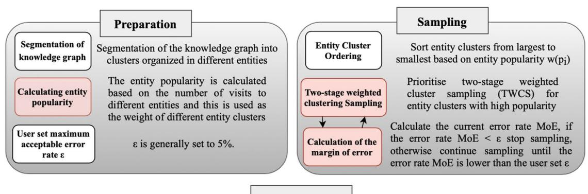
<!-- Image Description: The image presents a flowchart detailing a two-stage knowledge graph sampling method. The "Preparation" phase involves segmenting the graph into entity clusters and calculating entity popularity (based on visits), used as cluster weights. The "Sampling" phase orders clusters by popularity, employs a two-stage weighted clustering sampling (TWCS) method, and iteratively calculates the margin of error (MoE) until it falls below a user-defined threshold (ε). The flowchart visually outlines the algorithm's steps. -->

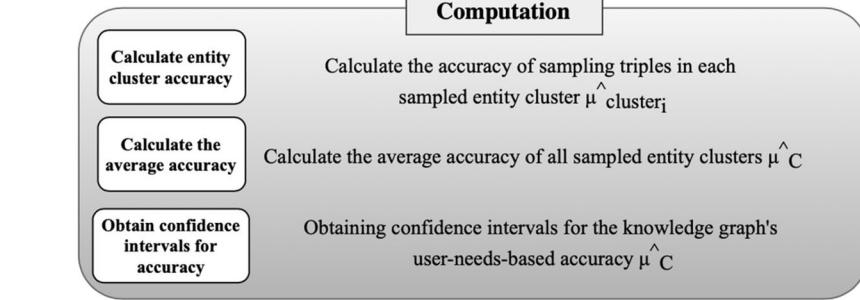
<!-- Image Description: The image displays a flowchart outlining a computation process. It details three steps: calculating entity cluster accuracy, calculating the average accuracy across all clusters, and obtaining confidence intervals for the overall accuracy. These steps involve calculating the accuracy of sampling triples within each cluster and then averaging these accuracies to determine a user-needs-based accuracy for the knowledge graph. The flowchart visually presents this computational methodology. -->

**Figure 1.** Flowchart of the assessment process, from lef to right, the preparation phase, the sampling phase, and the calculation phase.

in excessive time and labor costs. Next, we consider the user's usage needs and take the accuracy rate of entities with high popularity that are frequently queried and accessed by the user as the user-need-based knowledge graph accuracy rate, to obtain the accuracy assessment results that are more meaningful to the user. Te following are the specifc steps for the accuracy assessment of the knowledge graph based on users' needs.

#### Preparation step

Te preparation step requires segmenting the knowledge graph based on entity clusters, calculating entity popularity, and setting the maximum error rate ε acceptable to the user.

Segmentation of knowledge graph. Based on the above-mentioned concept of entity clusters the knowledge graph is segmented into clusters based on diferent entities.

Calculating entity popularity. Te popularity of entities is calculated based on the degree of user demand for diferent entities. Tis is used as the weight parameter of diferent entity clusters in the knowledge graph, which is wpi , and the equations of wpi is

wpi = (1) si S

where si is the number of times entityi has been queried in a specifed period, and S is the total number of times all the entities have been queried in a specifed period. In addition to the popularity of the entity, it is also possible to consider some other relevant infuences, such as the relevance of the entity to the user's requirements, and the degree of time elapsed.

Set the error rate ε. ε is the maximum error rate acceptable to the user, which is usually set to 5% in general. In our study, we employ the concept of Margin of Error (MoE) to quantify the accuracy of estimates obtained during the iterative sampling process. MoE is a widely used standard in statistics to measure the potential deviation between sample statistics and corresponding population parameters. Essentially, it defnes the reliable range of sample estimates, where a smaller MoE indicates a more precise estimation of population parameters and higher credibility of sample statistics. In our evaluation process, afer each iteration of sampling, we calculate the size of MoE for that particular sample. Its mathematical expression is as follows:

$$
MoE = \frac{z \times \sqrt{p \times (1 - p)}}{\sqrt{n}} \tag{2}
$$

where n is the sample size, and z corresponds to the z-value of the standard normal distribution at the selected confdence level, while p represents the probability of correct triples occurring in the current sample. If the computed MoE is greater than the error rate ε, it indicates that the current sample size is insufcient to ensure the desired precision of the estimate, thus necessitating further expansion of the sampling size. Conversely, only when the MoE decreases to less than the error rate ε do we consider the current sample sufcient to refect the characteristics of the population, thereby halting further sampling processes. Trough such a control mechanism, we further ensure the robustness and reliability of the fnal computed results.

#### Sampling step

To save labor and improve efciency, we propose to prioritize the sampling method of entity clusters in the knowledge graph based on two-stage weighted cluster sampling (TWCS). Te entity clusters are frst sorted in descent order based on the entity popularity wpi obtained in the previous step. Ten, the clusters with high popularity are sampled frst, and min nclusteri , n samples are randomly drawn from these clusters, where nclusteri is the number of triples contained in the i th entity cluster, and n is the maximum number of samples that can be drawn from each entity cluster by calculation. Ten, the current error rate MoE is calculated, if the error rate MoE is lower than ε, then stop sampling, otherwise, continue sampling until the error rate MoE is lower than the user-set ε. Eventually, the total sample capacity is NTWCS, and the deviation of the accuracy assessment result obtained by the third step does not exceed the pre-set ε.

#### Computation step

When evaluating the accuracy of knowledge graphs through sampling methods, as only a portion of the samples can typically be observed, and samples represent only a fraction of the entire population, we need a method to estimate the diference between our estimated value and the true value. In this scenario, confdence intervals ofer an efective approach to assess the uncertainty of accuracy estimation and provide a reliable means to quantify our confdence level in accuracy estimation[32](#page-10-13).

Firstly, the accuracy µ∧ clusteri of each sampled entity cluster needs to be calculated, followed by computing the average accuracy µˆ C of all sampled entity clusters, µˆ C is computed as

$$
\hat{\mu}_C = \frac{1}{m} \sum_{k=1}^{m} \mu_{cluster_i}^{\wedge} \tag{3}
$$

where m represents the number of sampled entity clusters.

Next, under the given confdence level (or when the margin of error MoE is lower than ε), the confdence interval for the accuracy µˆ C of the knowledge graph based on user requirements is calculated. Te width of the confdence interval is computed by multiplying the Z-score with the standard error, using the following formula

$$
\hat{\mu}_C \pm z_{\alpha/2} \sqrt{\frac{1}{m(m-1)} \sum_{k=1}^m \left(\mu_{cluster_i}^{\wedge} - \hat{\mu}_C\right)^2}
$$
\n(4)

Te resulting confdence interval provides a measure of uncertainty for estimating the accuracy of the knowledge graph. Te calculated outcome represents the level of confdence we have in the estimated accuracy µˆ C of the knowledge graph based on user requirements, given a specifc confdence level (or when the margin of error MoE is lower than ε). Te confdence interval indicates the range within which the true accuracy is estimated to fall with a certain probability.

#### Experiments Datasets

To evaluate the proposed accuracy assessment method, we use the NELL knowledge graph. NELL is a domain knowledge graph extracted from NELL-Sports, which involves a total of 14 categories of sports, teams, athletes, coaches, etc., with 817 entities, where an entity corresponds to a maximum of 28 triples and a minimum of 1 triple. Afer manual annotation, the actual accuracy of the NELL knowledge graph is 91.3%. In addition, we also utilized the YAGO and MOVIE knowledge graphs. YAGO, a non-domain-specifc subset of YAGO2, consists of 822 entities, with each entity having a maximum of 37 triples and a minimum of 1 triple, achieving an actual accuracy rate of 99%. Te MOVIE knowledge graph comprises a total of 1156 movie entities, with each entity having a maximum of 3 triples and a minimum of 1 triple, with an actual accuracy rate of 90%. In addition, by modifying [https://wikimedia.org/api/rest\\_v1/metrics/pageviews/perarticle/de.wikipedia/all-access/user/entity\\_](https://wikimedia.org/api/rest_v1/metrics/pageviews/perarticle/de.wikipedia/all-access/user/entity_name/daily/) [name/daily/](https://wikimedia.org/api/rest_v1/metrics/pageviews/perarticle/de.wikipedia/all-access/user/entity_name/daily/) start\_time/end\_time's entity\_name feld as well as the start\_time and end\_time felds (in the format of YYYYMMDD), it is possible to crawl to obtain the frequency of diferent entities being accessed in Wikipedia during the corresponding period. We set the time in the range of 25 May 2023 to 1 June 2023. By following the above steps, we sequentially obtained the entity popularity distributions for the NELL, YAGO, and MOVIE knowledge graphs. As shown in Figs. [2](#page-5-0), [3,](#page-5-1) and [4](#page-5-2), we can observe that in knowledge graphs across diferent domains, there are quite a few entities that have had almost no query records during this period. Te possibility of queries revolves mainly around certain important entities.

#### Settings

All this experiment was conducted under the condition that ε is 5% and the confdence level is 95%. To avoid the situation where the triples with the high weights are all correct and cause the MoE to fall below ε prematurely, thus rendering the accuracy results obtained irrelevant, we sampled the top 1% of the prevalence entities beforehand to test the accuracy.

#### Result and discussion

When diferent values of n are taken, 100 experiments were conducted for the NELL, YAGO, and MOVIE knowledge graphs, yielding evaluation results as shown in Tables [2](#page-5-3), [3,](#page-6-0) and [4](#page-6-1) respectively (the data shown are in the case of stabilization of the accuracy). Furthermore, for reference, Tables [5,](#page-6-2) [6](#page-6-3), and [7](#page-6-4) respectively present the experimental results obtained using Simple Random Sampling (SRS), Random Cluster Sampling (RCS), Weighted

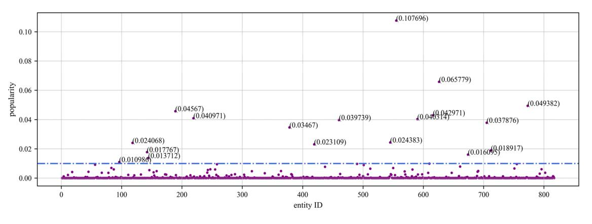
<!-- Image Description: The scatter plot displays the popularity (y-axis) of 800 entities (x-axis). Most entities have low popularity, clustered near zero. A few outliers exhibit significantly higher popularity values, indicated by their coordinates. A horizontal dashed line represents a popularity threshold. The plot likely illustrates the distribution of popularity within a dataset and highlights high-popularity outliers. -->

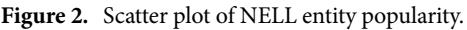
<!-- Image Description: Figure 2 is a scatter plot visualizing the popularity of entities within theNELL dataset. The plot likely shows a correlation between two variables related to entity popularity, aiding the paper's analysis of entity prominence or frequency within the dataset. No specific axis labels or data points are visible in the provided text. -->

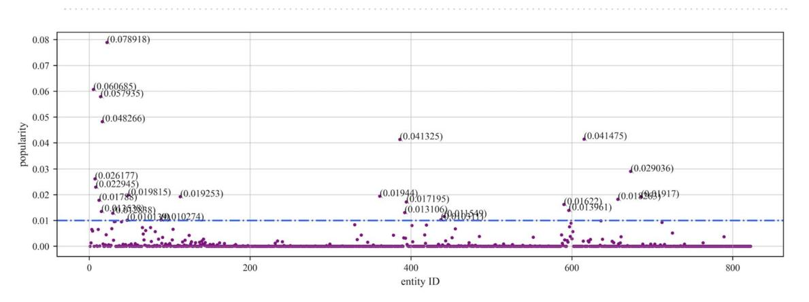
<!-- Image Description: This scatter plot displays the "popularity" of entities (x-axis) with their corresponding popularity scores (y-axis). Individual data points represent entities, with their popularity values indicated. A horizontal dashed line likely denotes a popularity threshold. Several high-popularity outliers are labeled with their exact values. The plot likely illustrates the distribution of popularity scores within a dataset and highlights exceptionally popular entities. -->

**Figure 3.** Scatter plot of YAGO entity popularity.

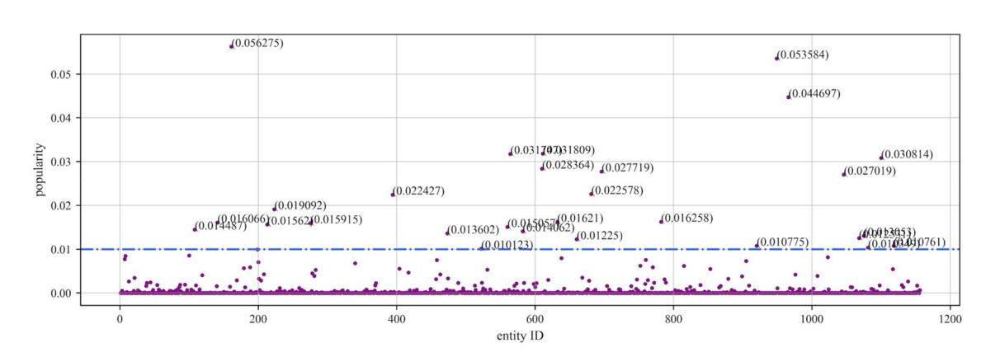
<!-- Image Description: The image displays a scatter plot illustrating entity popularity. The x-axis represents entity ID, and the y-axis represents popularity, ranging from 0 to 0.06. Numerous data points are scattered near the baseline (around 0.01), with several outliers exhibiting significantly higher popularity values. These outliers are individually labeled with their popularity scores. The plot likely demonstrates the distribution of popularity across various entities and highlights the most popular ones within the dataset. -->

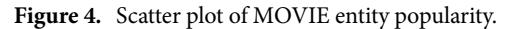
<!-- Image Description: Figure 4 is a scatter plot illustrating the popularity of MOVIE entities. It likely shows a correlation between two variables related to movie entities, visualizing the relationship between their popularity metrics. The plot's purpose is to present a visual representation of the data, allowing for analysis of the distribution and potential correlation between the measured aspects of MOVIE entity popularity. -->

| Sampling method | Entity popularity Weighted clustering sampling (EP-TWCS) (Average cluster size=2.28) |             |             |             |             |             |             |
|-----------------|--------------------------------------------------------------------------------------|-------------|-------------|-------------|-------------|-------------|-------------|
|                 | 94.8%± 2.9%                                                                          | 95.5%± 3.0% | 95.6%± 2.9% | 95.7%± 2.9% | 95.7%± 2.8% | 95.5%± 3.0% | 95.5%± 3.0% |
| Estimation      | 96.4%± 3.5% (n=3)                                                                 | (n=4)       | (n=5)       | (n=6)       | (n=7)       | (n=8)       | (n=9)       |
| Sample Size     | 77 / 56                                                                              | 67          | 68          | 69          | 70          | 67          | 67          |

**Table 2.** Resulting data from the EP-TWCS (95.5% true accuracy of sampled entity clusters). \*Where n is the maximum number of triple that can be sampled in an entity cluster.

| Sampling method | Entity popularity weighted clustering sampling (EP-TWCS) (Average cluster size=1.7) |                    |                    |                    |                    |
|-----------------|-------------------------------------------------------------------------------------|--------------------|--------------------|--------------------|--------------------|
| Estimation      | 0.974 ±0.025 (n=2)                                                                  | 0.971 ±0.017 (n=3) | 0.969 ±0.017 (n=4) | 0.968 ±0.016 (n=5) | 0.968 ±0.016 (n=6) |
| Sample size     | 39 / 26                                                                             | 32                 | 31                 | 30                 | 30                 |

**Table 3.** Resulting data from the EP-TWCS (96.72% true accuracy of sampled entity clusters).

| Sampling Method | Entity popularity Weighted clustering sampling (EP-TWCS) (Average cluster size=1.055) |                   |                   |  |
|-----------------|---------------------------------------------------------------------------------------|-------------------|-------------------|--|
|                 | 0.889 ± 0.045                                                                         |                   | 0.889±0.045 (n=4) |  |
| Estimation      | 0.896 ± 0.046 (n=2)                                                                   | 0.889±0.045 (n=3) |                   |  |
| Sample size     | 153/144                                                                               | 153               | 153               |  |

**Table 4.** Resulting data from the EP-TWCS (88.9% true accuracy of sampled entity clusters).

| Sampling method | Simple random sampling (SRS) | Random cluster sampling (RCS) | Weighted cluster sampling (WCS) | Two stage weighted cluster sampling (TWCS) |
|-----------------|---------------------------------|----------------------------------|------------------------------------|-----------------------------------------------|
| Estimation      | 91.5%± 2.1%                     | 90.5%± 2.4%                      | 91.6%± 2.3%                        | 91.6%± 2.2%                                   |
| Sample size     | –                               | –                                | –                                  | 149±47 [102,196]                              |

**Table 5.** Results of previous experiments (NELL true accuracy of 91.3%).

| Sampling method | Simple random sampling (SRS) | Random cluster sampling (RCS) | Weighted cluster sampling (WCS) | Two stage weighted cluster sampling (TWCS) |
|-----------------|------------------------------|-------------------------------|---------------------------------|-----------------------------------------------|
| Estimation      | 99.6% (96.7–100%)            | 98.9% (95.3%-100%)            | 99.2% (96.7%-100%)              | 99.2% (96.7–100%)                             |
| Sample Size     | –                            | –                             | –                               | 32 ± 5 [27,37]                                |

**Table 6.** Results of previous experiments (YAGO true accuracy of 99%).

| Sampling method | Simple random sampling (SRS) | Random cluster sampling (RCS) | Weighted cluster sampling (WCS) | Two stage weighted cluster sampling (TWCS) |
|-----------------|---------------------------------|----------------------------------|------------------------------------|-----------------------------------------------|
| Estimation      | 90%                             | 95%                              | 93%                                | 88%                                           |
| Sample size     | –                               | –                                | –                                  | 174                                           |

**Table 7.** Results of previous experiments (MOVIE true accuracy of 90.0%).

Cluster Sampling (WCS), and Two-Stage Weighted Cluster Sampling (TWCS) methods on the above- mentioned knowledge graph[s29](#page-10-14).

For NELL, during the experiment, we observed that when n=1, the sampling method is similar to simple random sampling, the average accuracy obtained in 100 experiments is 92.64%, and the result obtained for n=1 is the closest to the actual accuracy of 91.3% for NELL compared to the other values taken, and the number of samples required fuctuates between 39 and 176. Te two accuracy confdence intervals obtained when n=2 are (0.914, 0.971) and (0.928, 0.999), with sample means of 94.3% and 96.4%, respectively, and required sample sizes of 87 and 55, respectively. Te two accuracy confdence intervals obtained when n=3 are (0.919, 0.977) and (0.93, 0.999), and the mean values of the accuracies obtained through 100 experiments are about 94.8% and 96.4%, and the number of samples required are 77 and 56, respectively. When n= 4, 5, 6, 7, the accuracy confdence interval is fxed around (0.926, 0.985), the accuracy mean fuctuates around 95.6%, and the minimum number of samples required is 67. In this case, there is a slight fuctuation in the sample accuracy mean, which is mainly because the number of triples contained in some of the entity clusters does not satisfy greater than or equal to n. Terefore, there is a certain range of normal fuctuation in the accuracy mean when the value of n becomes larger. Finally, when the value of n is greater than or equal to 8, the accuracy of the knowledge graph obtained by Entity Popularity Weighted Clustering Sampling (EP-TWCS) gradually tends to be stable, and the average value of accuracy is 95.5%.

To evaluate the accuracy of our method, we computed all triplets sampled from entity clusters in the NELL dataset, obtaining a true accuracy of 95.5%. Combining the experimental results presented in Table [2,](#page-5-3) it can be

observed that the average accuracy measured in the evaluation gradually converges towards the true accuracy. Te deviation from the actual accuracy decreases gradually with increasing n, reaching a maximum of 0.9%. Ultimately, when n is greater than or equal to 8, the experimentally obtained average accuracy aligns with the true value, with only 67 samples required. Tis indicates that our proposed method provides accuracy assessment results that are not only efective but also more valuable for users. Specifcally, from the experimental results in Table [2](#page-5-3), we also observed instability in accuracy assessment results, confdence intervals, and sample sizes when n is less than 8, showing some fuctuation and bias. However, these metrics stabilize when n is greater than or equal to 8. Hence, it is evident that n=8 serves as the critical threshold for accuracy assessment in NELL. Based on this, we have discussed the diferent values of n, using the second half of the accuracy confdence interval (confdence interval=estimate±critical value×error) as a refection of the stability of n values. Te results, as shown in Fig. [5](#page-7-0), clearly illustrate that the relationship between n and bias roughly follows an "L"-shaped curve, with bias values gradually stabilizing as n increases, and stabilizing at a specifc value when n=8. Concurrently, referring to Table [5](#page-6-2), accuracy stabilizes and approaches the true accuracy at n=8.

Additionally, through researching relevant works, where[29](#page-10-14) has demonstrated efective practical application, we have conducted a comparative analysis to validate the efectiveness and fairness of our method. Compared to the methods presented in Table [5,](#page-6-2) our approach requires signifcantly fewer samples, much less than the 102 to 196 samples required in previous experiments. Tis comparison directly underscores the potential benefts of using our method for accuracy assessment in the NELL knowledge graph, particularly in terms of reducing the manual annotation efort and time consumption needed for annotating irrelevant triplets.

To further validate the generality and applicability of our proposed method, identical accuracy assessment experiments were conducted on two knowledge graphs, YAGO and MOVIE. Similarly, all triplets sampled from entity clusters in YAGO and MOVIE were computed, yielding true accuracies of 96.72 and 88.9%, respectively. Table [3](#page-6-0) presents the accuracy assessment results obtained on YOGA, while Fig. [6](#page-7-1) depicts the corresponding relationship between n and bias. From Table [3](#page-6-0), it is evident that the deviation between the measured average accuracy and the actual accuracy gradually decreases with increasing n, eventually converging towards the true accuracy. Specifcally, when n equals 5, the average accuracy, deviation, and required sample size stabilize. At this

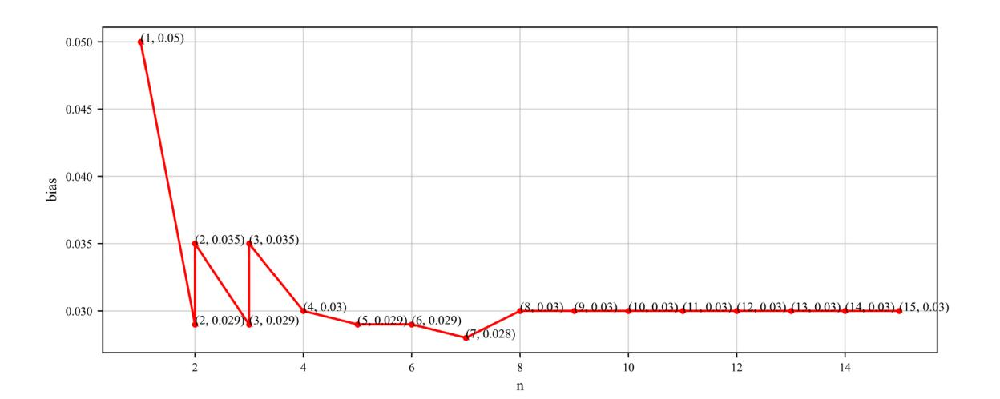
<!-- Image Description: The image displays a line graph showing the relationship between "n" and "bias". The x-axis represents "n" (likely a parameter or variable), and the y-axis represents "bias" (likely a measure of error or deviation). The graph shows a sharp decrease in bias initially, followed by a leveling off at approximately 0.03 for higher values of "n". The coordinates of each data point are explicitly labeled on the graph, aiding in precision. The purpose is to illustrate the effect of varying "n" on the bias of a model or system, highlighting an initial reduction and eventual stabilization. -->

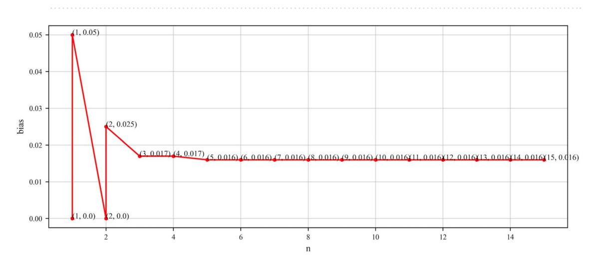
<!-- Image Description: The figure is a line graph showing bias against n. The y-axis represents bias, and the x-axis represents n (an unspecified variable). The graph illustrates that bias decreases sharply from n=1 to n=2, then plateaus around 0.016 for n ≥ 3. Coordinates for several data points are explicitly labeled on the graph, showing the bias value at each corresponding n. The purpose is to demonstrate the relationship between the variable n and the resulting bias, highlighting a rapid initial decrease followed by a consistent low bias for larger n. -->

#### Figure 6. Line graph of n taken as a function of bias (YAGO).

**Figure 5.**Line graph of n taken as a function of bias (NELL).

point, the accuracy of 96.8% is closest to the true accuracy of 96.72%, with only 30 samples required. Additionally, in conjunction with Fig. [6](#page-7-1), it can be observed that the bias curve begins to stabilize when n is greater than or equal to 5. Terefore, for YAGO, n=5 serves as the critical threshold for accuracy assessment, indicating that the accuracy measured at n=5 is closest to the true accuracy. Ultimately, our proposed evaluation method for YAGO requires only 30 samples, compared to other evaluation methods presented in Table [6](#page-6-3), which also avoids the sampling and manual annotation of irrelevant triples, achieving accurate assessment at minimal sample size and low cost (Table [7\)](#page-6-4).

For the domain-specifc knowledge graph MOVIE, Table [4](#page-6-1) presents the experimental results obtained on MOVIE, while Fig. [7](#page-8-0) illustrates the corresponding relationship between n and bias. Based on Table [4,](#page-6-1) we can observe a pattern similar to what has been shown for NELL and YAGO. For the MOVIE knowledge graph, when n is greater than or equal to 3, the average accuracy, deviation, and required sample size begin to stabilize. At this point, the measured average accuracy infnitely approaches the true accuracy of 88.9%. Additionally, combining Fig. [7](#page-8-0) reveals that when n is greater than or equal to 3, the bias curve starts to stabilize. Consequently, it can be concluded that n=3 serves as the critical threshold for the accuracy assessment of the MOVIE knowledge graph, indicating that the accuracy measured at n=3 is closest to the true accuracy. Similarly, compared to other methods in Table [7,](#page-6-4) we can also achieve reliable accuracy assessment using relatively fewer samples.

In general, across the NELL, YAGO, and MOVIE knowledge graphs, we observe a noticeable convergence in the trends of accuracy, sample size, and confdence interval as the value of n increases. At specifc critical values of n (8, 5, and 3, respectively), the evaluation metrics reach a stable state closest to the actual accuracy. To further validate the efectiveness and universality of these critical n values, we delve into the evaluation results at different n values. Experimental data indicate that for each knowledge graph, the stability of the evaluation results signifcantly improves beyond their critical n values, minimizing the gap between accuracy and true accuracy. Tis phenomenon demonstrates the adaptability of our proposed evaluation method to specifc characteristics of knowledge graphs and achieves evaluation goals under specifc conditions.

Although the optimal n value for achieving the highest accuracy varies across diferent knowledge graphs, it does not diminish the practicality and universality of our method. Te variation in n values is precisely determined by the diferences in the inherent structural features and user requirements of each knowledge graph. Tis underscores the ability of the EP-TWCS method to adapt to various characteristics of knowledge graphs, minimizing sampling of irrelevant triples and unnecessary manual annotation costs while ensuring evaluation accuracy and efectiveness.

Furthermore, we note that in all experiments, as n increases to the critical point, bias exhibits a similar "L" shaped curve trend, indicating consistency in the performance of our evaluation method across diferent knowledge graphs, further enhancing the credibility of the results. Additionally, bias serves as a reliable indicator refecting whether the currently obtained accuracy evaluation results are stable and accurate.

In addition, we consider the relationship between the average size of entity clusters and the sample size when the entity popularity is fxed. We evaluate the accuracy of knowledge graphs with diferent average sizes of entity clusters sequentially, where let x1 be the average size of entity clusters, x2 be the size of the largest clusters, x3 be the size of the smallest clusters, x4 be the number of triples contained in the current knowledge graph, y1 be the number of samples drawn from the current knowledge graph. By collecting relevant data from experiments such as those mentioned above, we ft the relationships between x1, x2, x3, and x4 with y1. Te root mean square error (RMSE) was used to assess the degree of model ft. By gradually narrowing down the RMSE values, the ftted graph as shown in Fig. [8](#page-9-14) can be fnally obtained. Ultimately, the relationship between the sample y1 and x1, x2, x3, x4 can be expressed by Eq. [\(5\)](#page-8-1) (with each parameter rounded to two decimal places).

$$
y_1 = 55.65 \times x_1 - 4.31 \times x_2 + 30.59 \times x_3 - 0.07 \times x_4 + 164.12 \tag{5}
$$

<!-- Image Description: The image displays a line graph showing the relationship between 'n' and 'bias'. The graph depicts a sharp decrease in bias from n=1 to n=2, followed by a slight decrease to n=3, and then a nearly flat line at approximately 0.045 for n=3 to 15. The graph's purpose is to illustrate the effect of parameter 'n' on the bias of a model or algorithm, showing a rapid initial reduction in bias followed by diminishing returns. Individual data points are labeled with their coordinates. -->

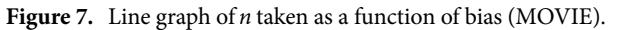
<!-- Image Description: Figure 7 is a line graph showing the relationship between the variable *n* and bias, specifically within the context of a MOVIE (likely referring to a specific model or experiment). The graph illustrates how *n* changes as a function of bias, providing a visual representation of their dependence. No specific data or equation is shown in the provided caption. -->

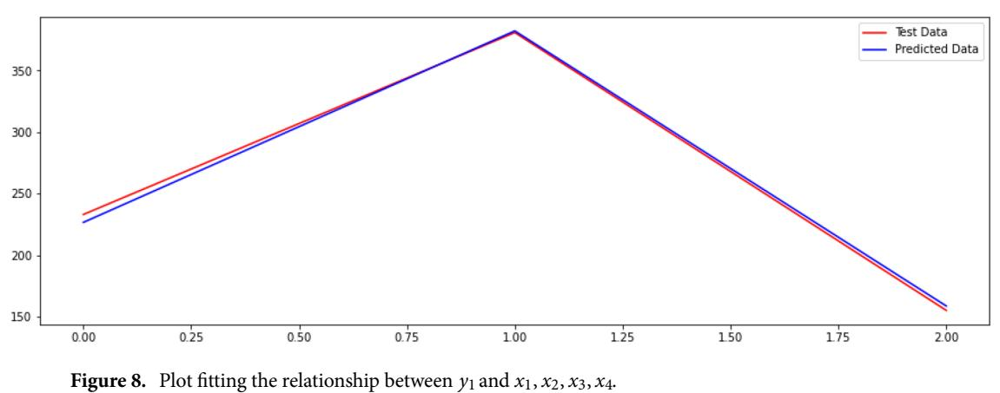
<!-- Image Description: Figure 8 is a line graph showing the fit of a model. A red line represents test data, while a blue line shows predicted data. The graph plots a relationship between a dependent variable (y₁) and independent variables (x₁, x₂, x₃, x₄). The close proximity of the lines suggests a good model fit. The purpose is to visually demonstrate the accuracy of the model's predictions compared to actual test data. -->

In summary, when we know the average size of the entity clusters, the size of the largest cluster, the size of the smallest cluster, and the number of triples contained in the current knowledge graph, we can easily fnd the number of samples currently required for calculating the accuracy of the user-needs-based knowledge graph, by using the formulas mentioned above. Compared with the previous sampling method, our user-needs-centered computation method does not need to involve more entity clusters in sampling, which saves expensive manual annotation costs and ensures the accuracy of the evaluation results.

#### Conclusion

In this paper, a new method for evaluating the accuracy of knowledge graphs tailored to user needs has been successfully developed. Trough innovative expansions in sampling strategies, the method achieves a signifcant reduction in sample requirements and costs while maintaining high accuracy, thus efectively generating evaluation reports more practically valuable to users. Tis method is particularly suitable for application scenarios that prioritize user actual needs and seek efcient and cost-efective evaluation solutions. Specifcally, the core contribution of this method lies in shifing the evaluation focus from purely the data level to the user's actual needs, ensuring that the evaluation results closely align with user application scenarios. In the future, we plan to further integrate user requirements with other dimensions of knowledge graph quality to achieve comprehensive and efcient comprehensive evaluations of their quality. We are committed to exploring more economical and convenient approaches to optimize and enrich the knowledge content required by users while saving computing resources and manpower.

#### Data availability

Te datasets used during the current study are available from the corresponding author on reasonable request.

Received: 28 November 2023; Accepted: 17 April 2024

#### References

- 1. Wang, X.*et al.*Knowledge graph quality control: A survey.*Fund. Res.* **1**(5), 607–626 (2021).
- 2. Xue, B. & Zou, L. Knowledge graph quality management: a comprehensive survey. *IEEE Trans. Knowl. Data Eng.*[https://doi.org/](https://doi.org/10.1109/TKDE.2022.3150080) [10.1109/TKDE.2022.3150080](https://doi.org/10.1109/TKDE.2022.3150080) (2022).
- 3. Issa, S.*et al.*Knowledge graph completeness: A systematic literature review.*IEEE Access* **9**, 31322–31339 (2021).
- 4. Chen, H., Cao, G., Chen, J., & Ding, J. A practical framework for evaluating the quality of knowledge graph. In *Knowledge Graph and Semantic Computing: Knowledge Computing and Language Understanding: 4th China Conference, CCKS 2019, Hangzhou, China*, August 24–27, 2019, Revised Selected Papers 4 (pp. 111–122). Springer Singapore. (2019).
- 5. He, Q. *et al.*ISLKG: Te Construction of island knowledge graph and knowledge reasoning.*Sustainability* **15**(17), 13189 (2023).
- 6. Fensel, D. *et al. Knowledge Graphs*(Springer, 2020).
- 7. Jain, N., Tran, T. K., Gad-Elrab, M. H., & Stepanova, D. Improving knowledge graph embeddings with ontological reasoning. In*International Semantic Web Conference (pp. 410–426)*. Cham: Springer International Publishing (2021).
- 8. Zamini, M., Reza, H. & Rabiei, M. A review of knowledge graph completion. *Information* **13**(8), 396 (2022).
- 9. Shen, T., Zhang, F. & Cheng, J. A comprehensive overview of knowledge graph completion. *Knowl. Based Syst.* **255**, 109597 (2022). 10. Teis, S., *et al.*Requirements for explainability and acceptance of artifcial intelligence in collaborative work. In*International*
- *Conference on Human-Computer Interaction*(pp. 355–380). Cham: Springer Nature Switzerland (2023). 11. Tiddi, I. & Schlobach, S. Knowledge graphs as tools for explainable machine learning: A survey.*Artif. Intell.* **302**, 103627 (2022).
- 12. Chen, Z. *et al.*Knowledge graph completion: A review.*IEEE Access* **8**, 192435–192456 (2020).
- 13. Abu-Salih, B. Domain-specifc knowledge graphs: A survey. *J. Netw. Comput. Appl.* **185**, 103076 (2021).
- 14. Chen, X., Jia, S. & Xiang, Y. A review: Knowledge reasoning over knowledge graph. *Expert Syst. Appl.* **141**, 112948 (2020).
- 15 Bonner, S. *et al.*A review of biomedical datasets relating to drug discovery: a knowledge graph perspective.*Brief. Bioinf.* **23**(6), bbac404 (2022).
- 16. Zhang, N., *et al.*Relation adversarial network for low resource knowledge graph completion. In*Proceedings of the web conference 2020*(pp. 1–12). (2020).
- 17. Rossanez, A., Dos Reis, J. C., Torres, R. D. S. & de Ribaupierre, H. KGen: A knowledge graph generator from biomedical scientifc literature.*BMC Med. Inf. Decis. Mak.* **20**(4), 1–24 (2020).

- 18. Su, Q., Wan, M., Liu, X. & Huang, C. R. Motivations, methods and metrics of misinformation detection: An NLP perspective. *Nat. Lang. Process. Res.* **1**(1–2), 1–13 (2020).
- 19. Sun, H. *et al.*Medical knowledge graph to enhance fraud, waste, and abuse detection on claim data: Model development and performance evaluation.*JMIR Med. Inf.* **8**(7), e17653 (2020).
- 20. Abacha, A. B., Yim, W. W., Michalopoulos, G., & Lin, T. An Investigation of Evaluation Methods in Automatic Medical Note Generation. In *Findings of the Association for Computational Linguistics: ACL 2023*(pp. 2575–2588) (2023).
- 21. Noy, N.*et al.*Industry-scale knowledge graphs: Lessons and challenges: Five diverse technology companies show how it's done.*Queue* **17**(2), 48–75 (2019).
- 22. Wang, J., Wang, X., Ma, C. & Kou, L. A survey on the development status and application prospects of knowledge graph in smart grids. *IET Gener. Transmiss. Distrib.* **15**(3), 383–407 (2021).
- 23. Xiao, G., Ding, L., Cogrel, B. & Calvanese, D. Virtual knowledge graphs: An overview of systems and use cases. *Data Intell.* **1**(3), 201–223 (2019).
- 24. Auer, S. *et al.*Improving access to scientifc literature with knowledge graphs.*Bibliothek Forschung und Praxis* **44**(3), 516–529 (2020).
- 25. Zhu, Y. *et al.*Knowledge-driven drug repurposing using a comprehensive drug knowledge graph.*Health Inf. J.* **26**(4), 2737–2750 (2020).
- 26. Cao, M., Zhang, J., Xu, S., & Ying, Z. Knowledge graphs meet crowdsourcing: a brief survey. In *Cloud Computing: 10th EAI International Conference, CloudComp 2020, Qufu, China, December 11–12, 2020*, Proceedings 10 (pp. 3–17). Springer International Publishing (2021).
- 27. Huaman, E., Tauqeer, A., & Fensel, A. Towards knowledge graphs validation through weighted knowledge sources. In *Iberoamerican Knowledge Graphs and Semantic Web Conference*(pp. 47–60). Cham: Springer International Publishing (2021).
- 28. Jia, S., Xiang, Y., Chen, X., & Wang, K. Triple trustworthiness measurement for knowledge graph. In*Te World Wide Web Conference*(pp. 2865–2871) (2019).
- 29. Gao, J.,*et al.*Efcient knowledge graph accuracy evaluation. Preprint at [arXiv:1907.09657](http://arxiv.org/abs/1907.09657) (2019)
- 30. Zhou, Y., Schockaert, S., & Shah, J. Predicting conceptnet path quality using crowdsourced assessments of naturalness. In*Te World Wide Web Conference*(pp. 2460–2471) (2019).
- 31. Zhao, S., Qin, B., Liu, T., & Wang, F. Biomedical knowledge graph refnement with embedding and logic rules. Preprint at [arXiv:](http://arxiv.org/abs/2012.01031) [2012.01031](http://arxiv.org/abs/2012.01031) (2020).
- 32. Gerber, D.*et al.*Defacto—Temporal and multilingual deep fact validation.*J. Web Semant.* **35**, 85–101 (2015).

#### Acknowledgements

Te authors would like to thank the Institute of Systems Engineering related to this work for their support.

#### Author contributions

Y.Z. designed and performed the experiments and analyzed the data. Y.Z. wrote the manuscript in consultation with G.X.

### Funding

This work was supported by the National Key Laboratory for Complex Systems Simulation Foundation (NO.6142006190301).

#### Competing interests

Te authors declare no competing interests.

#### Additional information

**Correspondence**and requests for materials should be addressed to Y.Z.
**Reprints and permissions information**is available at [www.nature.com/reprints.](www.nature.com/reprints)
**Publisher's note**Springer Nature remains neutral with regard to jurisdictional claims in published maps and institutional afliations.
**Open Access** Tis article is licensed under a Creative Commons Attribution 4.0 International License, which permits use, sharing, adaptation, distribution and reproduction in any medium or format, as long as you give appropriate credit to the original author(s) and the source, provide a link to the Creative Commons licence, and indicate if changes were made. Te images or other third party material in this article are included in the article's Creative Commons licence, unless indicated otherwise in a credit line to the material. If material is not included in the article's Creative Commons licence and your intended use is not permitted by statutory regulation or exceeds the permitted use, you will need to obtain permission directly from the copyright holder. To view a copy of this licence, visit<http://creativecommons.org/licenses/by/4.0/>.

© Te Author(s) 2024
