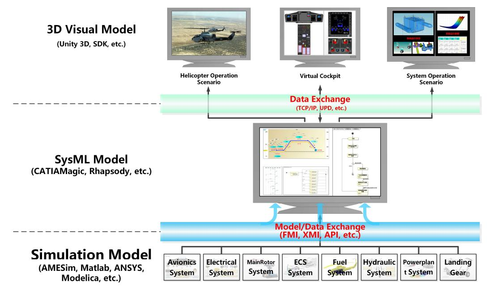
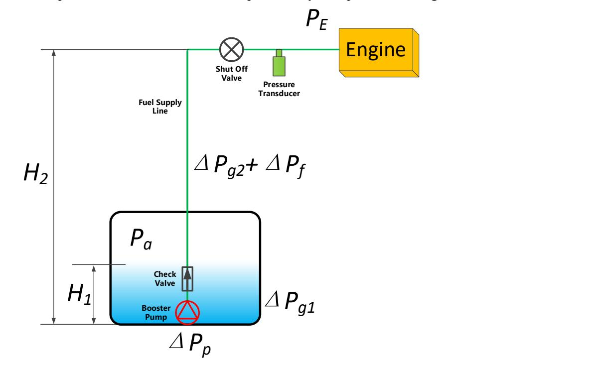
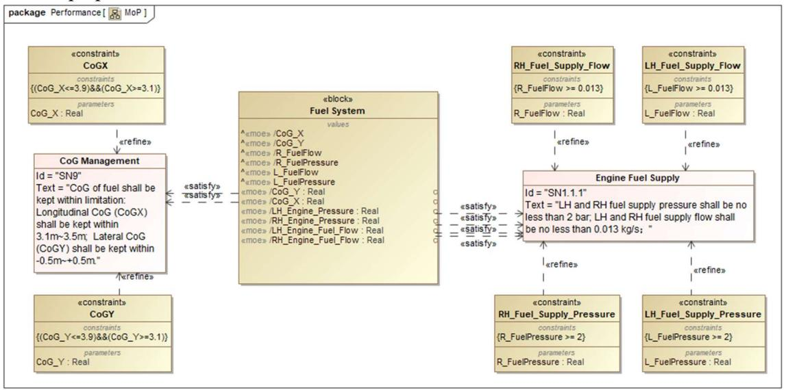
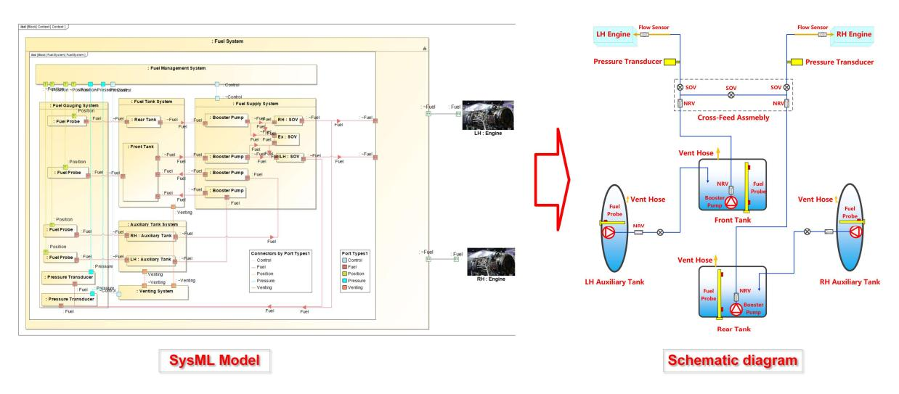
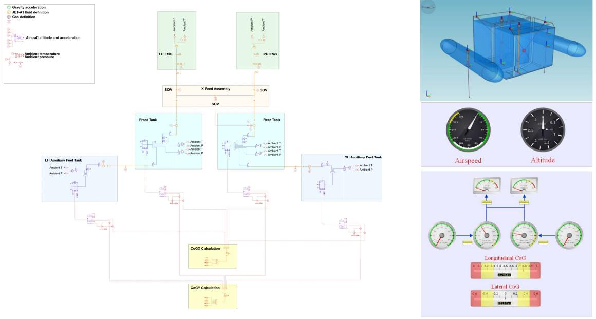
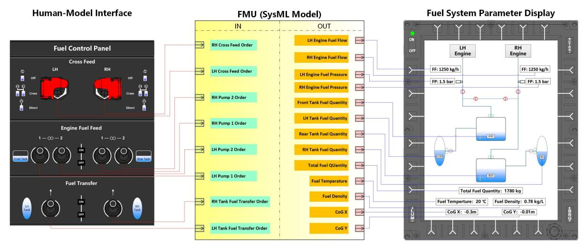
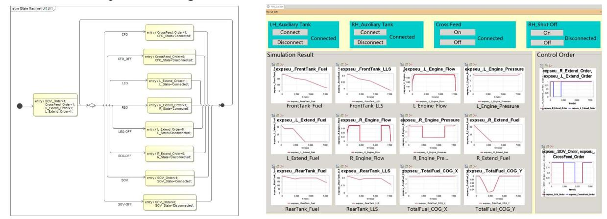

#### **PAPER • OPEN ACCESS**

# A SysML-centric integration framework for helicopter fuel system development

To cite this article: H Zhao et al 2023 J. Phys.: Conf. Ser. 2472 012040

View the [article online](https://doi.org/10.1088/1742-6596/2472/1/012040) for updates and enhancements.

## You may also like

- [A Unified SoS and System Architecture](https://iopscience.iop.org/article/10.1088/1742-6596/2755/1/012007) [Modeling Approach Based on Language](https://iopscience.iop.org/article/10.1088/1742-6596/2755/1/012007) [Transformation and Extension](https://iopscience.iop.org/article/10.1088/1742-6596/2755/1/012007) [Mechanisms](https://iopscience.iop.org/article/10.1088/1742-6596/2755/1/012007) -
- Yuqiang Guo, Yingxu Li, Jun Zhao et al.
- [An Automatic Test Case Generation](https://iopscience.iop.org/article/10.1088/1757-899X/563/5/052075) [Method based on SysML Activity Diagram](https://iopscience.iop.org/article/10.1088/1757-899X/563/5/052075) Yiqun Xu and Linbo Wu -
- [Architecting commercial aircraft with a](https://iopscience.iop.org/article/10.1088/1742-6596/1827/1/012100) [Domain Specific Language extended from](https://iopscience.iop.org/article/10.1088/1742-6596/1827/1/012100) [SysML](https://iopscience.iop.org/article/10.1088/1742-6596/1827/1/012100) Haomin Li, Chao Zhan, Haomin Wu et al. -

This content was downloaded from IP address 202.184.125.66 on 30/06/2025 at 17:29

# A SysML-centric integration framework for helicopter fuel system development

H Zhao1\*, W K Wu1 , X M Hu1 , Y Q Guo1 , C Zhang1 and G X Hao2

1 China Helicopter Research and Development Institute, Jingdezhen 333000, China

2 Dassault Systèmes (Shanghai) Information Technology Co., Ltd., Shanghai 200120, China

\*Corresponding author's e-mail: zhaoh020@avic.com

Abstract. Data and model exchange between SysML (Systems Modeling Language) Modeling tools and other system development tools is a critical aspect of Model-Based Systems Engineering (MBSE). This paper introduces an application of the SysML-centric integration framework, which allows integrating multi-disciplinary engineering models into a SysML Modeling environment. A design practice of helicopter fuel system is then presented to illustrate how to combine the external simulation models within the SysML Models to explore the performance and verify corresponding requirements. In this case, FMI (Functional Mockup Interface) based co-simulation creates a bridge between SysML Modeling tools and simulation tools in the SysML-centric integration framework. According to the practice, we believe it will significantly improve model consistency and traceability to provide early evaluation of concepts during conceptual design phase.

#### 1. Introduction

The Object Management Group (OMG) SysML has been widely accepted in systems engineering applications to support the analysis, specification, design, verification, and validation of complex systems [1][2]. As the conceptual digital reflection of physical systems, SysML models now not only describe system architecture, behaviors, and states but also can be executed to simulate the concept design. During the system development process, fidelity is a crucial factor, which may limit the potential value of SysML models. However, SysML can easily describe systems' functional operations and logical architectures, but is not easy to perform mathematical or physical performance calculations [3]. The engineers usually draw support from the commercial simulation software (such as AMESim, Matlab-Simulink, Dymola, etc.) to evaluate system behaviour, performance, physical characteristics [4][5][6].

In the past few years, the integration of analysis models with SysML models has been an area of continued interest. The goal is to bridge the gap between SysML Modeling and numerical simulation environments. A technology known as model/data exchange is required to maintain the consistency of the information among the different models. Sanford Friedenthal et al. proposed the system model as a framework for analysis and traceability [3]. He also introduced several model and data exchange standards, including XML (Extensible Markup Language), Open Services for Lifecycle Collaboration (OSLC), FMI standard, etc.

This paper introduces a SysML-centric integration framework for helicopter fuel system development during conceptual design phase. FMI-based co-simulation approach is adopted to

Content from this work may be used under the terms of theCreative Commons Attribution 3.0 licence. Any further distribution of this work must maintain attribution to the author(s) and the title of the work, journal citation and DOI. Published under licence by IOP Publishing Ltd 1

| The 13th Asia Conference on Mechanical and Aerospace Engineering (ACMAE 2022) |                    | IOP Publishing                      |
|-------------------------------------------------------------------------------|--------------------|-------------------------------------|
| Journal of Physics: Conference Series                                         | 2472 (2023) 012040 | doi:10.1088/1742-6596/2472/1/012040 |

integrate the simulation model into the SysML modeling software in order to verify the MoPs (Measures of performance). Finally, we will give a brief conclusion and weigh up the relative merits of the model/data exchange approaches.

#### 2. SysML-centric integration framework

An integration environment of system development should support the engineers to develop systems from concept design through the final verification and validation. It should be capable of integrating typical development tools, including SysML modeling tools, design tools, simulation and analysis tools, test tools, etc [7].

In order to bring more fidelity to SysML models, it is suitable to designate the SysML models as a framework and integrate more accurate simulation models. The system model should be in the central position of the integration environment because the system model provides a consistent source of the system specification, design, analysis, and verification information while maintaining traceability and rationale for critical decisions [8]. Based on this principle, we employ the SysML-centric integration framework to integrate multi-disciplinary engineering models into the SysML modeling environment, executing numerical analysis by co-simulation, verifying requirements, and maintaining traceability. The input data (named as control orders) and the calculated results (named as signals) by simulation models are automatically exchanged between the SysML modeling tools and 3D virtual scene simulation software to show state changes of the systems.

Figure 1. SysML- centric integration framework.

Model/data exchange in the SysML-centric integration framework can be achieved through several exchange mechanisms like file-based exchange, API (Application Program Interface)-based exchange, model transformations between SysML and Modelica, FMI-based co-simulation, etc. FMI is a widely accepted standard to support both model exchange and co-simulation of models expressed as Ordinary Differential Equations (ODEs) [9][10]. It also shows the benefits of reusing components and their relations as partial models to improve model consistency and traceability, as well as the integration of simulation to provide early evaluation of concepts [11][12]. FMI builds a standardized bridge to connect SysML tools and simulation tools, as well as the design and simulation process. It combines the advantages of these two different domains to provide a new way to develop complex cyberphysical systems more efficiently [13][14].

## 3. Helicopter fuel system development

### 3.1. Problem description

Helicopter fuel system is a complex system that combines many components, complicated interactions with other systems, various requirements from stakeholders, a trade-off between price and cost, etc. Fuel system functions and performance need to be verified separately on aircraft, system, and equipment level tests through numerical simulations, laboratory or flight tests. With the constantly increasing complexity and integration level of helicopter fuel system, traditional design and verification approaches are becoming insufficient to cope with upcoming new challenges.

According to FAR part 29 Regulations, the main requirements for helicopter fuel system are summarized as follows:

- Store fuel required by the flight mission profile. The size, shape, and location of the fuel tanks shall be limited by aircraft preliminary configuration and CoG (Center of Gravity) requirements.
- In order to comply with the FAR 29.953 fuel system independence requirements, fuel system shall supply each engine with pressurized fuel independently from different fuel tanks.
- In case of engine fire, the pilot shall immediately cut off the fuel supply to the engine.
- If one side of the fuel supply system fails to work, the other side shall supply fuel to both engines.
- The fuel supply pressure and flow to the engines shall be monitored in order to keep them working normally.
- Fuel quantity in each fuel tank shall be monitored.
- According to FAR 29.1305, low-level warning signals shall be given to the pilot if fuel left in the tank only supports 10 minutes flight at MCP (Maximum Continuous Power).
- Depending on various requirements of flight missions, extra fuel shall be provided in order to extend flight range.

For helicopter fuel system, fuel supply pressure and flow, longitudinal and lateral CoGs are critical system parameters. The parameters above will be decomposed in SysML parametric diagrams.

Figure 2. Fuel supply system schematic diagram.

Fuel supply pressure PE constitutes the first MoP of fuel system: MoP 1:

$$
P_E = P_{a(h,T)} + \Delta P_{g1(\delta,\rho,H_1)} + \Delta P_{p(Q,T_f)} + \Delta P_{g2(\delta,\rho,H_2)} + \Delta P_{f(\varphi,H_2,Q,\rho,T_f)}
$$
(1)

In which,

- 1 2 2 , 1 , , 2 , , ( , , , , ) , f and relevant ambient temperature T .
- a h T , P represents the air pressure inside the fuel tanks. It's the function of flight altitude h 1 g H 1 , , P represents the pressure drop generated by fuel inside the fuel tanks. It's usually affected by flight acceleration factor , fuel density and fuel height inside the fuel tanks H1 . , p Q Tf 2 g H 2 , , P
- P represents the booster pump pressure which associates with the fuel flow rate Q and fuel temperature Tf .
- represents the pressure variation mainly caused by flight acceleration factor , fuel density and fuel supply line height H2 .
- 2 ( , , , , ) f Pf H Q T represents the fuel pressure loss due to flow resistance. Generally, it can be simply considered as the function of pipeline diameter , fuel supply line height H2 , flow rate Q, fuel density , and fuel temperature Tf . min E h P and E h P . min 1 2 2 , 1 , , 2 , , max ( , , , , ) , f

According to the engine fuel consumption requirements, PE should situate at the pressure between max

$$
P_{E(h)_{\min}} \le P_{a(h,T)} + \Delta P_{g1(\delta,\rho,H_1)} + \Delta P_{p(Q,T_f)} - \Delta P_{g2(\delta,\rho,H_2)} - \Delta P_{f(\varphi,H_2,Q,\rho,T_f)} \le P_{E(h)\max}
$$
(2)

Fuel supply flow FE is an induced value whose value mainly depends on the fuel demand under different engine operating conditions. According to the engine fuel consumption requirements, the maximum fuel flow supplied to the engine should be no less than the maximum flow rate in OEI (One Engine Inoperative) mode plus 15% value. Then the second MoP of fuel system should be: 1 1

MoP 2:

$$
F_E \ge \left( F_{E_{OEI}} + 15\% \right) \tag{3}
$$

Longitudinal and lateral CoGs of fuel constitute the other two MoPs: MoP 3:

$$
CoGX = \frac{\sum_{i=1}^{n} (Q_i \times CoGX_i)}{\sum_{i=1}^{n} Q_i} (i = 1, 2, \cdots, n)
$$
(4)

MoP 4:

$$
CoGY = \frac{\sum_{i=1}^{n} (Q_i \times CoGY_i)}{\sum_{i=1}^{n} Q_i} (i = 1, 2, \cdots, n)
$$
 (5)

In which,

 Qi represents the fuel quantity inside each fuel tank. The 13th Asia Conference on Mechanical and Aerospace Engineering (ACMAE 2022) Journal of Physics: Conference Series **2472** (2023) 012040 IOP Publishing doi:10.1088/1742-6596/2472/1/012040

n represents the total number of fuel tanks.

#### 3.2. Solution

3.2.1. Black box modeling. Fuel system inherits requirements from aircraft level requirements and captures requirements from airworthiness regulations and other stakeholders' needs.

Use case diagrams are built to describe the behavior and activities of fuel system (as a black box) based on the different flight stages of a typical flight profile, including pre-flight preparation, preflight inspection, starting on the ground, climbing, cruising, mission, and returning, etc. And then, the external interactions of the fuel system as a black box in the background environment are depicted in an Internal Block Diagram (IBD).

At the aircraft level, the stakeholders' concerns focus on:

- Whether the fuel pressure and flow meet the fuel supply requirements of the engines.
- Whether the longitudinal and lateral CoGs exceed the limitations along with the fuel consumption.

MoPs at fuel system level associated with the above stakeholders' needs are established to describe their value properties.

Figure 3. MoPs at fuel system level.

3.2.2. White box modeling. Requirements at fuel system level are then decomposed and allocated to the subsystem level. Then the white box activities of fuel system are decomposed and allocated into different subsystem swim lanes of activity diagrams so that activities of the fuel system as a black box are refined and assigned to specific subsystems.

Depending on the above analysis, the subsystem tree is defined using the Block Definition Diagram (BDD), and the interface between the subsystems is defined in the IBD. It includes the front and rear tank system, fuel tank venting system, LH (Left Hand) and RH (Right Hand) engine fuel supply system, fuel gauging system, LH and RH auxiliary fuel tank system.

Figure 4. From IBD to schematic diagram.

3.2.3. Physical architecture modeling. In the solution domain, the physical architecture model of fuel system inherits from the architecture during the white box phase. In many cases, engineers usually employ commercial simulation software like AMESim, Matlab-Simulink, Flowmaster, etc. to conduct numerical analysis. AMESim software is used to build the fuel system simulation model according to the physical architecture mentioned above. Fuel pressure and flow supplied to the engines and the longitudinal and lateral CoGs of fuel are obtained as outputs of the simulation model; the control orders of booster pumps ("on" and "off") and SOVs (Shut Off Valve) ("on" and "off") are obtained as the inputs.

Figure 5. AMESim simulation model. Figure 6. AMESim Monitor

panel.

3.2.4. Co-simulation. FMI based co-simulation is then adopted to execute numerical analysis to verify the MoPs of helicopter fuel system proposed as requirements.

Control orders of booster pumps and electric valves are defined as the inputs of the FMU (Functional Mock-Up), and the signals such as fuel supply pressure and flow, fuel quantity, and CoGs are considered as the output. AMESim software generates and wraps fuel system simulation models into an FMU (zipped file \*.fmu). It contains an XML description file and an implementation in source

| The 13th Asia Conference on Mechanical and Aerospace Engineering (ACMAE 2022) |                    | IOP Publishing                      |
|-------------------------------------------------------------------------------|--------------------|-------------------------------------|
| Journal of Physics: Conference Series                                         | 2472 (2023) 012040 | doi:10.1088/1742-6596/2472/1/012040 |

codes or binary form, which executes the equations representing the fuel system behavior and performance. The FMU, as black-box blocks, is then imported into CATIAMagic software and connects to the corresponding parameters in IBD. A State Machine (STM) diagram is built to execute the co-simulation model and achieve the state switch through the control orders.

Figure 7. FMU interfaces definition.

The FMI approach provides a way to interconnect with SysML models for co-simulation by importing the FMU units representing the complex system performance in the SysML tools. It means we can simulate the system performance by FMU while system states are transited in the SysML state machine, which will lead to more capable verification of the feasibility of early system design and the satisfaction of its MoPs.

Referring to the MoPs holder in the problem domain regarding engine fuel pressure and flow, longitudinal and lateral CoGs of fuel, the physical architecture model of the fuel system inherits the parameters of the MoPs holder and establishes a binding relationship with the fuel system requirements. The binding relationship between the acquisition parameters and the MoPs indicator is established in the parameter diagram.

#### Figure 8. State machine diagram. Figure 9. Monitoring panel.

Traditionally, the functions and performance of fuel system shall be traded off and optimized among different architecture solutions, especially during the conceptual design phase. As we can see from the whole process above, the FMU generated from AMESim software can be regarded as differential algebraic equations representing the physical characteristics of fuel system. It provides a virtual verification approach for helicopter fuel system by simulating real operation scenarios.

FMI has built a bridge between SysML modeling tools and simulation tools, which allows building an executable system model with higher fidelity and less time cost. Besides, FMI-based co-simulation

| The 13th Asia Conference on Mechanical and Aerospace Engineering (ACMAE 2022) |                    | IOP Publishing                      |
|-------------------------------------------------------------------------------|--------------------|-------------------------------------|
| Journal of Physics: Conference Series                                         | 2472 (2023) 012040 | doi:10.1088/1742-6596/2472/1/012040 |

enables engineers to reuse various physical simulation models established by commercial simulation software to the maximum.

### 4. Conclusion

Model/data exchange is a critical aspect of the SysML-centric integration framework. There are also some other integration ideas, such as exporting SysML block as FMU and integrating it into the simulation model [15]. However, the SysML-centric integration is proved to be a more reasonable approach for complex system analysis and traceability. It also shows the benefits of reusing multidomain model libraries and the potential for improved and expanded commercial and open-source tool support.

Other integrating approaches may also support model/data exchange in the SysML-centric integration framework. Compared with other model/data exchange approaches, FMI is a toolindependent standard for the exchange of dynamic models and for co-simulation. This approach also has its drawbacks. Data visualization of simulation results can only rely on SysML tools because FMU executes numerical analysis as a black box. In addition, it's not easy to debug simulation in case of error occurs. The engineer will have to turn to AMESim software for root causes and regenerate the FMU for new integration.

#### References

- [1] Bassim C, Mahmoud N and Adil A 2019 SimulML: A DSML for simulating SysML models Journal of Computing Science and Engineering 13 17-31
- [2] Holt J and Perry S 2008 SysML for Systems Engineering (London: IET)
- [3] Friedenthal S, Moore A and Steiner R 2014 A Practical Guide to SysML: the Systems Modeling Language (San Francisco: Margan Kaufmann)
- [4] Nathan R and Luiz C 2017 Modeling and simulation of a single engine aircraft fuel system Proc. of 15th Scandinavian Int. Conf. on Fluid Power (Linköping: Linköping University Electronic Press) pp 45-50
- [5] Wang B, Ji H and Ye Z 2019 Simulation on fuel metering unit used for turboshaft engine model Int. Journal of Energy and Power Engineering 13 1-7
- [6] Sohier H, Guermazi S, Yagoubi M, Lamothez P, Maddalonix A, Menegazzi P and Huang Y 2019 A tooled methodology for the system architect's needs in simulation with autonomous driving application 2019 IEEE Int. Systems Conf. (SysCon) pp 1-8
- [7] Karban R, Dekens F G, Herzig S, Elaasar M, Jankevičius N 2016 Creating system engineering products with executable models in a model-based engineering environment Modeling, Systems Engineering, and Project Management for Astronomy VII 9911 96-111
- [8] Roth T, Burns M 2018 A gateway to easily integrate simulation platforms for co-simulation of cyber-physical systems 2018 Workshop on Modeling and Simulation of Cyber-Physical Energy Systems (MSCPES) pp 1-6
- [9] Nouidui T, Wetter M and Zuo W 2014 Functional mock-up unit for co-simulation import in EnergyPlus Journal of Building Performance Simulation 7 192-202
- [10] Hugues J, Gauthier J M and Faudou R 2018 Integrating AADL and FMI to extend virtual integration capability Preprint arXiv/1802.05620
- [11] Kruse B and Shea K 2016 Design library solution patterns in SysML for concept design and simulation Procedia CIRP 50 695-700
- [12] Thomas E, Thomas O, Bianconi R, Crespo M and Daumas J 2015 Towards enhanced process and tools for aircraft systems assessments during very early design phase Proc. of the 11th Int. Modelica Conf. (Versailles: Linköping University Electronic Press) pp 831-843
- [13] Wang B B and Baras J S 2013 Hybridsim: A modeling and co-simulation toolchain for cyberphysical systems Conference Proc.: 2013 IEEE/ACM 17th Int. Symposium on Distributed Simulation and Real Time Applications pp 33-40
- [14] González C A, Varmazyar M, Nejati S, Briand L C and Isasi Y 2018 Enabling model testing of cyber-physical systems Proc. of the 21th ACM/IEEE Int. Conf. on Model Driven Engineering Languages and Systems pp176-186

| The 13th Asia Conference on Mechanical and Aerospace Engineering (ACMAE 2022) |                    | IOP Publishing                      |
|-------------------------------------------------------------------------------|--------------------|-------------------------------------|
| Journal of Physics: Conference Series                                         | 2472 (2023) 012040 | doi:10.1088/1742-6596/2472/1/012040 |

[15] Feldman Y, Greenberg L, Palachi E 2014 Simulating rhapsody SysML blocks in hybrid models with FMI Proc. of the 10th Int. Modelica Conf. (Lund) (Linköping University Electronic Press) 096 pp 43-52