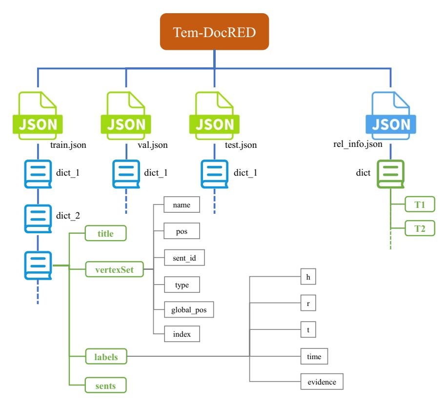
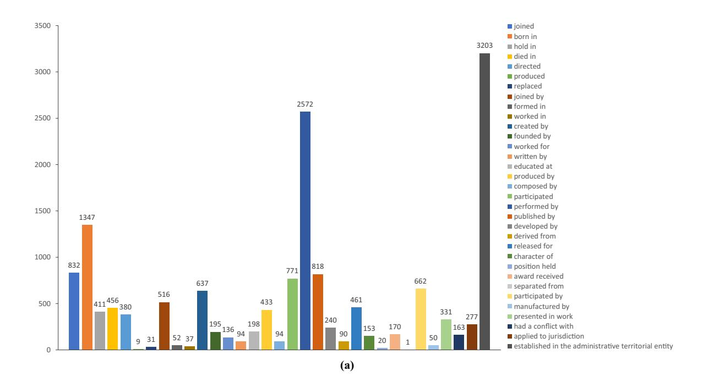
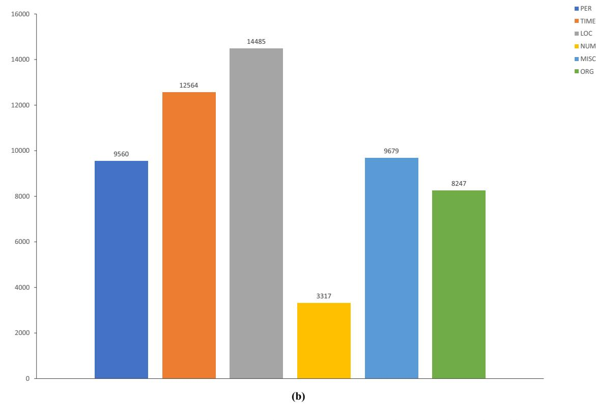
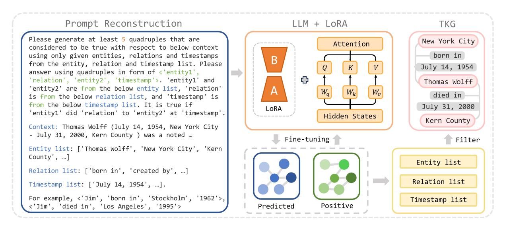
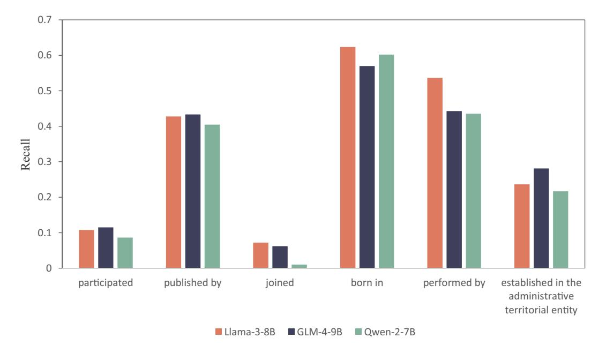

# OPEN

**Data Descriptor**# A Temporal Knowledge Graph Generation Dataset Supervised Distantly by Large Language Models
**Jun Zhu 1, Yan Fu1,2, Junlin Zhou1,2 & Duanbing Chen 1,2**✉
**Knowledge graphs can be constructed by extracting triples from documents, which denotes documentlevel relation extraction. Each triple illustrates a fact composed of two entities and a relation. However, temporal information corresponding to these facts is ignored. Incorporating temporal information exhibits the temporal connections between facts. Constructing a temporal knowledge graph (TKG) from documents is relatively unexplored. To address this limitation, we built a new dataset for this task based on a document-level relation extraction dataset. We mine the combination relation patterns and construct temporal quadruples by combining facts and timestamps. Additionally, two large language models (LLMs) are adopted to generate quadruples for the rest of the triples without timestamps. Multiple flters and manual annotation are used to ensure the quality of the data. To evaluate the dataset, we propose an LLM-based framework for extracting relations with temporal information from documents. The framework transforms relation extraction to a seq-to-seq task and fne-tunes LLMs to predict the relation with timestamps between entities. Experiments show the performance of LLMs on the proposed dataset.**## Background & Summary

Document-level Relation Extraction (DocRE) is the task that focuses on extracting relations between entities in documents. As shown in Fig. [1](#page-1-0), each triplet*(subject entity, relation, object entity)* represents a fact from the document. Knowledge triplets from documents can construct a Knowledge Graph (KG). Some relation extraction (RE) datasets are constructed by associating the KG with documents. For example, the NYT10[1](#page-11-0) dataset is built by matching Freebase KG[2](#page-11-1) to the New York Times corpus. DocRED[3](#page-12-0) connected Wikidata K[G4](#page-12-1) with Wikipedia articles based on distant supervision. Wiki20[5](#page-12-2) is another RE dataset constructed by Wikidata and Wikipedia. Te feld of KGs is closely related to RE. Te KG originating a document can present content more clearly and intuitively. Although the relation extraction (RE) process captures the facts themselves, it does not extract the associated temporal information of each fact. As a result, the temporal relationships linking these facts remain unobservable. Some TKGs have been applied, such as ICEWS[6](#page-12-3) and GDEL[T7](#page-12-4) . Wikidata and YAGO[8](#page-12-5) also include facts over time. However, how to automatically construct a TKG from document is not explored. If the timestamp for each knowledge triplet is used to construct a quadruple, the KG of the document will be transformed into a temporal knowledge graph.

TKG represents a signifcant and vibrant branch of KG, garnering considerable interest in recent years. By incorporating the dimension of time, TKGs ofer a richer representation of the real world, enabling a more nuanced understanding of event occurrence. For example, two static knowledge triples <*Tomas Wolf, joined, UC Berkeley*> and <*Tomas Wolf, published, Seminal Paper*> can be extracted from the sentence "Tomas Wolf joined UC Berkeley in 1976 and published his seminal paper in 1984". Te triplet without temporal information is not conducive to representing realistic facts. More dynamic facts are represented in the TKG as <*Tomas Wolf, joined, UC Berkeley, 1976*> and <*Tomas Wolf, published, Seminal Paper, 1984*>. Moreover, the dynamic nature of event expressions within TKG facilitates a comprehensive analysis of historical and prospective developments, providing a clearer and more logically coherent narrative of events over time. Tis

1 Big Data Research Center, University of Electronic Science and Technology of China, Chengdu, 611731, Sichuan, China. 2 Chengdu Union Big Data Tech. Inc., Chengdu, 610000, Sichuan, China. ✉e-mail: [dbchen@uestc.edu.cn](mailto:dbchen@uestc.edu.cn)

| Thomas Wolff                                                                                                                                                                                                                                                                                                                                                                                                                                                       |                                              |  |  |  |  |
|--------------------------------------------------------------------------------------------------------------------------------------------------------------------------------------------------------------------------------------------------------------------------------------------------------------------------------------------------------------------------------------------------------------------------------------------------------------------|----------------------------------------------|--|--|--|--|
| Thomas Wolff (July 14, 1954, New York City - July 31, 2000, Kern County) was a noted mathematician, working primarily in the fields of harmonic analysis, complex analysis, and partial differential equations. As an undergraduate at Harvard University he regularly played poker with his classmate Bill Gates. While a graduate student at the University of California, Berkeley from 1976 to 1979 … |                                              |  |  |  |  |
| DocRED                                                                                                                                                                                                                                                                                                                                                                                                                                                             |                                              |  |  |  |  |
| Subject: Thomas Wolff Relation: date of birth                                                                                                                                                                                                                                                                                                                                                                                                                   | Object: July 14, 1954                        |  |  |  |  |
| Subject: Thomas Wolff Relation: place of birth                                                                                                                                                                                                                                                                                                                                                                                                                  | Object: New York City                        |  |  |  |  |
| Subject: Niklas Bergqvist Object: UCB Relation: educated at                                                                                                                                                                                                                                                                                                                                                                                                  |                                              |  |  |  |  |
| Tem-DocRED                                                                                                                                                                                                                                                                                                                                                                                                                                                         |                                              |  |  |  |  |
| Subject: Thomas Wolff Relation: born in                                                                                                                                                                                                                                                                                                                                                                                                                         | Object: New York City Time: July 14, 1954 |  |  |  |  |
| Subject: Thomas Wolff Relation: educated at                                                                                                                                                                                                                                                                                                                                                                                                                     | Object: UCB Time: 1976                    |  |  |  |  |

**Fig. 1**Comparison of samples between DocRED and Tem-DocRED. UCB denotes the University of California, Berkeley.

temporal dimension allows for the inference of relationships between facts based on their chronological order, enhancing the ability to reason about connections within the data. Given that relations extracted from documents are ofen incomplete, the expansion into the time domain provides additional context necessary for inferring missing links, thereby simplifying the task of relational reasoning. In conclusion, document-level temporal relation extraction (DocTRE) exploration is highly relevant and valuable as it leverages the temporal aspects of the data to enrich our understanding of the underlying relationships and patterns.

Numerous time expressions are referenced within existing datasets. However, most are treated as entities rather than as timestamps. Tere is a potential to relate some of these existing triplets to timestamps to construct temporal facts. Such annotations are ofen missing due to the traditional focus of relation extraction (RE) methodologies on static triplets. Treating time mentions as entities is not inherently incorrect for RE tasks; in fact, considering each time expression as a constituent element of a fact is more meaningful for organizing the progression of events. Unfortunately, this perspective has received scant attention from researchers in prior works. Tis new task presents signifcant challenges. Te incorporation of timestamps transforms static knowledge triplets into quadruples, rendering traditional document-level relation extraction (DocRE) methods unsuitable for this endeavor. Previous methods usually view timestamp spans as entities to construct triplets, but the temporal dimension must be explicitly considered during the extraction of relationships between entities for constructing TKGs. Moreover, there is currently a lack of annotated datasets, as DocTRE is a nascent feld. Diferent from DocRE, the task of DocTRE needs to extract relation between entities with its happening timestamp, such as extracting the relation "joined" with the timestamp "1976" between Tomas Wolf and UC Berkeley from*Tomas Wolf joined UC Berkeley in 1976*. Both the construction of such a dataset and the dataset itself are crucial for advancing research in this area. Besides, there is a lack of methods for the DocTRE task, and the concept of generating temporal knowledge graphs has not yet been proposed. Existing information extraction methods can only extract information from documents to construct static knowledge graphs, but cannot synchronously extract facts with temporal information to construct temporal knowledge graphs.

In the feld of Relation Extraction (RE), the evolution of dataset construction methods refects a continuous efort to balance scalability and quality. Te dataset construction methods mainly can be divided into four categories: manual annotation, automatic annotation, PLM annotation, and LLM annotation. Early researches primarily relied on human-annotated dataset[s9](#page-12-6),[10,](#page-12-7) which are sufered from limited coverage of relation types and instances due to prohibitive annotation costs. To address scalability challenges, distant supervisio[n11,](#page-12-8) and web crawlin[g12](#page-12-9) emerged as the main automatic annotation methods, yet these methods inevitably introduced label noise. With advancements in text processing capabilities, document-level RE datasets like DocRED[3](#page-12-0) were developed using distant supervision across multiple domains. However, DocRED's incomplete annotations and unresolved false negative[s13](#page-12-10) revealed persistent quality limitations in purely automated approaches.

Te advent of BER[T14](#page-12-11) and subsequent pre-trained language models (PLMs)[15](#page-12-12)–[17](#page-12-13) enabled more context-aware data generation. Notably, hybrid human-AI collaboration framework[s13,](#page-12-10)[18,](#page-12-14)[19](#page-12-15) were proposed, where neural models fltered candidate relations for human verifcation, achieving improved precision at the expense of partial automation benefts. Recent breakthroughs in large language models (LLMs) have shifed the paradigm further, as demonstrated by DocGNRE[19](#page-12-15) that leverages LLMs' zero-shot generation capability to synthesize relation instances. While manual post-screening remains necessary, this approach signifcantly enhances throughput compared to traditional methods.

A critical gap persists in existing RE datasets' underutilization of timestamps in documents. Even benchmark datasets like DocRED contain rich temporal metadata without annotations that could enhance dynamic relationship modeling. Te original dataset only annotated entities as well as relationships in documents, and in order to build a temporal knowledge graph, the timestamp of occurrence needs to be annotated on the basis of the fact triplet constructed by relationships and entities.

By analyzing document content in the RE dataset, some existing timestamps can be assigned to triplets. For example, it is possible to infer certain temporal facts from static information. As illustrated in Fig. [1](#page-1-0), a document excerpt from DocRED contains three static triplets: <*'Tomas Wolf', 'date of birth', 'July 14, 1954'*>, <*'Tomas Wolff ', 'place of birth', 'New York City'*>, and <*'Thomas Wolff ', 'educated at', 'the University of California, Berkeley'*>. From this information, we can deduce that *Tomas Wolf was born in New York City on July 14, 1954*. Tis fact can be represented as a temporal quadruple: <*'Tomas Wolf ', 'born in', 'New York City', 'July 14, 1954'*>. Te reasoning process here is straightforward, and similar patterns of temporal reasoning can be observed in other relations. However, not all temporal quadruples can be derived through this method; some require contextual reasoning. For instance, based on contextual information, the period during which *Tomas Wolf was educated at the University of California, Berkeley*can be inferred to be*1976*.

For the method of **combination relation patterns**, these patterns can be obtained by manual annotation. Given the limited number of relations involved, patterns can be deduced from a small set of relevant documents that embody common knowledge. But for the rest triplets which can't be transformed by relation patterns, the human annotation is difcult for so many documents. For the task of recognizing context to reason about such data, the Large Language Model (LLM) is a ftting choice. Each candidate quadruple can be translated into a natural language sentence, and LLMs are employed to evaluate the accuracy of these sentences. Human annotators are crucial for ensuring the quality of the data. Building on these two approaches, we introduce a new dataset called Tem-DocRED, designed for the emerging feld of DocTRE. To address the false negative (FN) issue present in the original DocRE dataset, we utilize Re-DocRED[13](#page-12-10) in constructing our dataset. Re-DocRED resolves the FN problem in DocRED, making it more comprehensive.

To evaluate the challenges posed by DocTRE, we introduce a novel framework that leverages LLMs to automatically generate temporal relation quadruples. Tis framework fne-tunes the LLM by constructing prompts designed to predict temporal relations between entities within documents. Additionally, a fltering mechanism is employed to eliminate errors and redundancies.

Te main contributions of this paper can be summarized as follows.

- • We propose a novel concept, named Document-level temporal relation extraction, extracting relation with temporal information between entities from documents, which is systematically proposed to break through the limitation that traditional information extraction ignores the time dimension. By associating timestamps with fact triples, a time-aware TKG element is established, which lays the foundation for reasoning based on event temporal relationships, is conducive to the construction and expansion of large-scale temporal knowledge graphs.
- • We propose a novel DocTRE dataset construction method, which innovatively fuses event relations with temporal relations by potential relation patterns, and flls the gap of document-level temporal relation benchmark data by inferring the association between known tuples and temporal information from document semantics through LLMs. A new dataset, Tem-DocRED, is constructed on the basis of the Re-DocRED dataset for DocTRE.
- • We propose a novel framework, which transforms DocTRE to a seq-to-seq generation task and fne-tunes LLMs to automatically generate quadruples for constructing TKG. Te framework gives full play to the textual reasoning advantage of LLMs, inferring the temporal association between elements based on document content, and providing a new paradigm for the construction of TKGs.

### Methods

In order to construct a DocTRE dataset, we propose a novel method for updating DocRE dataset to DocTRE dataset, which combine triplets to generate quadruples based on potential rules in the KG and constructs a modular LLM framework to reason the occurrence time of each fact without the potential rule. Te process of data construction can be divided into two stages: constructing temporal quadruples based on discovered combination relation patterns and utilizing LLM to generate timestamps for the rest knowledge triples. In the frst stage, the discovery of relation patterns is achieved by statistics and human annotation. Some fact pairs can be combined into a quadruple, such as *date of birth*and*place of birth*. Te second stage is designed for these quadruples can't be obtained by combining existing triplets. Te framework is shown in Fig. [2.](#page-3-0) In this stage, each candidate quadruple is transformed into a natural language sentence. Te LLM plays a human role in understanding the document and judging the correctness of each candidate sentence. Te correctness is represented by a score which is a numerical value from 0 to 1. Final results are fltered based on these scores.

**Combination Relation Patterns.** In the Re-DocRED, relations can be mainly divided into two categories: event relations and timestamp relations. Te event relation expresses an event that occurred between two entities. Te timestamp relation expresses that an event happened at a certain moment. In the statistical process, triplets are classifed based on the types of entities included. For each timestamp relation, there may be one or more event

| Task instruction    | Please judge whether each sentence is correct based on the context, only judge the content without judging the syntax, and only return a score within the range of [0,1] for each sentence. The higher the score, the greater the possibility of sentence correctness. Please only return the list of scores without others. There are 4 sentences here. | [0.0, 0.9, 0.0, 0.2]                                                      |
|------------------------|-------------------------------------------------------------------------------------------------------------------------------------------------------------------------------------------------------------------------------------------------------------------------------------------------------------------------------------------------------------------------|---------------------------------------------------------------------------|
| Context                | Context: Thomas Wolff (July 14, 1954, New York City - July 31, 2000, Kern County ) was a noted mathematician, working primarily in the fields of harmonic analysis, complex analysis, and partial differential equations. As an undergraduate at Harvard University … for his contributions to analysis and particularly to the Kakeya conjecture.       | Filter                                                                    |
| Candidate sentences | Sentences: ['The educational institution attended by Thomas Wolff is University of California , Berkeley on July 14 , 1954.', 'The educational institution attended by Thomas Wolff is University of California , Berkeley on 1976.', …]                                                                                                                       | S: Thomas Wolff R: educated at O: UCB T: 1984 Temporal Relaon |

Prompt Construcon

**Fig. 2** Te automatic data generation framework with an example document. UCB denotes to the University of California, Berkeley.

relations that can be combined with it. Tis combination pattern can be discovered based on the shared entity. In the Re-DocRED, the logic rule of relation patterns can be represented as follows:

$$
(s, R_e, o) \wedge (s, R_t, t) \Rightarrow (s, R_{tem}, o, t) \tag{1}
$$

$$
(s, R_e, o) \wedge (o, R_t, t) \Rightarrow (s, R_{tem}, o, t) \tag{2}
$$

 where (*s*, *Re*, *o*) and (*s*, *Rt*,*t*) are existed triplets in Re-DocRED, *Re*represents the event relation,*Rt*represents the timestamp relation, and*Rtem*represents the temporal relation.*s*, *o*, and *t*are annotated as entities in Re-DocRED, but*t*denotes a timestamp like*July 9*.

In the Re-DocRED, we have found 31 combination relation patterns. On the basis of each pattern, two triplets with corresponding relations can be combined into a quadruple with the timestamp. For example, <*"Tomas Wolf", "born in", "New York City", "July 14,1954"*> can be constructed from <*"Tomas Wolf", "date of birth", "July 14,1954"*> and <*"Tomas Wolf ", "place of birth", "New York City"*> based on the combination relation pattern "*place of birth*∧*date of birth*⇒*born in*". Details of all relation patterns can be found in Table [1.](#page-4-0) Hypotheses of relations from Re-DocRED are show in Table [2.](#page-5-0)

**Generation by GPT.**In this procedure, GPT-3.5 is selected as the generator to generate timestamps for existing triplets. As GPT is a widely adopted LLM, it possesses robust capabilities in text comprehension and content generation, making it well-suited for our task. Taking into account both economic expenditure and model capabilities, we have opted for GPT-3.5. Before utilizing GPT-3.5 to generate quadruples, triplets that have been transformed by combination relation patterns are no longer used. On the other hand, triplets with timestamp relations are not utilized because they have included temporal information.
*Prompt Construction.*As shown in Fig. [2,](#page-3-0) the prompt word template consists of three parts, i.e., task instruction, context, and candidate sentences. Each candidate sentence represents a quadruple and the task instruction is used to judge the correctness of quadruples based on the context. Te task instruction directs the LLM to focus on content correctness while ignoring syntax errors. Te LLM is asked to use a score within the range of [0,1] rather than "yes" or "no", which provides more fexible judgments of sentences. To avoid the model misinterpreting the correlation between score and correctness, correlation statements are added to ensure that scores and correctness are positively correlated. In the process of the test, we noticed that GPT sometimes incorrectly counts the number of sentences. So we add "Tere are*n*sentences here" at the end. Te context denotes the context of the document without any changes. Each sentence is constructed by a triplet and a time mention. Here we adopt hypotheses proposed in DocGNR[E19,](#page-12-15) which transforms each relation as a natural language description. We use them to transform each triplet as a sentence, and add the timestamp at the tail of the sentence, such as "Te educational institution attended by subject is object on timestamp". Because the same hypothesis is used for any triplet with the corresponding relation and timestamp, some grammar errors may exist in sentences. So we demand GPT to "only judge the content without judging the syntax" in the task instruction, the syntax error may result in a score of 0. Each triplet can be combined with any timestamp to construct quadruples, but at most one quadruple is correct. So each prompt only includes the sentence list about one triplet, which is convenient for us to fnd the possible answer based on the maximum score.

| ID I  | Original Relation I                              | ID II | Original Relation II               | Temporal Relation                                    |  |
|-------|--------------------------------------------------|-------|------------------------------------|------------------------------------------------------|--|
| P17   | country                                          | P571  | inception                          | established in                                       |  |
| P17   | country                                          | P577  | publication date                   | published in                                         |  |
| P17   | country                                          | P585  | point in time                      | hold in                                              |  |
| P19   | place of birth                                   | P569  | date of birth                      | born in                                              |  |
| P20   | place of death                                   | P570  | date of death                      | died in                                              |  |
| P50   | author                                           | P577  | publication date                   | created by                                           |  |
| P57   | director                                         | P577  | publication date                   | directed                                             |  |
| P112  | founded by                                       | P571  | inception                          | founded by                                           |  |
| P123  | publisher                                        |       | inception                          | published by                                         |  |
| P127  | owned by                                         | P576  | dissolved, abolished or demolished | abolished by                                         |  |
| P131  | located in the administrative territorial entity | P576  | dissolved, abolished or demolished | abolished by                                         |  |
| P131  | located in the administrative territorial entity | P571  | inception                          | established in the administrative territorial entity |  |
| P161  | cast member                                      | P577  | publication date                   | performed by                                         |  |
| P162  | producer                                         | P577  | publication date                   | produced by                                          |  |
| P175  | performer                                        | P577  | publication date                   | performed by                                         |  |
| P178  | developer                                        | P577  | publication date                   | developed by                                         |  |
| P264  | record label                                     | P577  | publication date                   | published by                                         |  |
| P276  | location                                         | P580  | start time                         | hold in                                              |  |
| P276  | location                                         | P585  | point in time                      | hold in                                              |  |
| P400  | platform                                         | P577  | publication date                   | released for                                         |  |
| P495  | country of origin                                | P577  | publication date                   | published in                                         |  |
| P607  | confict                                          | P580  | start time                         | had a confict with                                   |  |
| P674  | characters                                       | P577  | publication date                   | character of                                         |  |
| P710  | participant                                      | P580  | start time                         | participated by                                      |  |
| P710  | participant                                      | P585  | point in time                      | participated by                                      |  |
| P1001 | applies to jurisdiction                          | P577  | publication date                   | applied to jurisdiction                              |  |
| P1001 | applies to jurisdiction                          | P585  | point in time                      | applied to jurisdiction                              |  |
| P1344 | participant of                                   | P580  | start time                         | participated                                         |  |
| P1344 | participant of                                   | P585  | point in time                      | participated                                         |  |
| P1366 | replaced by                                      | P576  | dissolved, abolished or demolished | replaced by                                          |  |
| P1441 | present in work                                  | P577  | publication date                   | presented in work                                    |  |
**Table 1.**Combinations of original relations for new relations, including wikidata IDs and relation names.
*Filter.*For each group of sentences, the sentence with the maximum score may be the correct answer. However, the judgment of the large model may not necessarily be correct, even if the score is high. To ensure the reliability of data as much as possible, the restrictions on scores are as follows:

Although there are some strict conditions to increase the reliability of dataset, the results from GPT-3.5 may not be accurate. In order to improve the quality of the dataset, we adopt another LLM to oversight the results of GPT-3.5. Specifcally, we utilize GLM-4 to generate data following the same generation pipeline. Te diference is that the threshold of the score is set as 0.9, the results from GLM-4 are subject to more rigorous screening. Ten we take the intersection of the results from GPT-3.5 and GLM-4 as fnal results, which further improved the reliability of the dataset.

However, there may still be errors in the results from generation from LLMs, and patterns sometimes are not suitable for some triples. Human annotation is utilized to eliminate errors in the test set. Two annotators are asked to judge the correctness of each quadruple based on the document and the original triplets from Re-DocRED. If they have diferent judgments, the quadruple will be judged by the third annotator. Te fnal result shall be subject to the judgment of the third annotator.

- • Te maximum score of sentence must be not less than 0.8 (we discovered that GPT-generated judgments maintain a high level of quality when the score is 0.8 or higher, striking a balance between accuracy and the volume of results).
- • Te list sentences is invalid when there are multiple maximum scores.
- • If the number of scores is not equal to the number of sentences, scores will be not adopted.

In addition, we redefned all relations of Re-DocRED as shown in Table [3](#page-6-0) on the basis of original relation descriptions. Each relation name is modifed with its description to represent the occurrence of an event and relations that can't be transformed are removed, such as*mother*, *subsidiary*, and so on. Te statistics of the new dataset, Tem-DocRED, are shown in Table [4.](#page-6-1) Additionally, the statistics of Re-DocRED are also shown in Table [4.](#page-6-1) Compared to Re-DocRED, there are fewer facts in these documents. More downstream tasks about TKG

| ID    | Hypothesis                                                                                                                          |
|-------|-------------------------------------------------------------------------------------------------------------------------------------|
| P17   | Te sovereign state of this item sub. is obj.                                                                                        |
| P19   | Te birth location of the person, animal or fctional character sub. is obj.                                                          |
| P20   | Te death location of the person, animal or fctional character sub. is obj.                                                          |
| P50   | Te main creator(s) of the written work sub. is(are) obj.                                                                            |
| P57   | Te director of this flm, TV-series, stageplay or video game is obj.                                                                 |
| P112  | Te founder or co-founder of this organization, religion or place sub. is obj.                                                       |
| P123  | Te organization or person responsible for publishing books, periodicals, games or sofware sub. is obj.                              |
| P127  | Te owner of sub. is obj.                                                                                                            |
| P131  | sub. is located on the territory of the following administrative entity obj.                                                        |
| P161  | Te actor performing live sub. for a camera or audience has obj.                                                                     |
| P162  | Te producer(s) of this flm or music work sub. is(are) obj.                                                                          |
| P175  | Te performer involved in the performance or the recoding of the work sub. is obj.                                                   |
| P178  | Te organization or person that developed sub. is obj.                                                                               |
| P264  | Te brand and trademark associated with the marketing of subject music recordings and music videos sub. is obj.                      |
| P276  | Te location of the item, physical object or event sub. is within is obj.                                                            |
| P400  | Te platform for which the work sub. has been developed or released / specifc platform version fo the sofware sub. developed is obj. |
| P495  | Te country of origin of the creative work sub. is obj.                                                                              |
| P569  | Te date on which sub. was born is obj.                                                                                              |
| P570  | Te date on which sub. died is obj.                                                                                                  |
| P571  | Te date or point in time when the organization/subject sub. was founded/created is obj.                                             |
| P576  | Te date or point in time on which the organization sub. was dissolved/disappeared or the building sub. demolished is obj.           |
| P577  | Te data or point in time the work sub. is frst published or released is obj.                                                        |
| P580  | Te time the item sub. begins to exist or the statement sub. starts being valid is obj.                                              |
| P585  | Te time and date sub. took place, existed or the statement sub. was true is obj.                                                    |
| P607  | Te battles, wars or other military engagements in which the person or item sub. participated is obj.                                |
| P674  | Te characters which appear in sub. has obj.                                                                                         |
| P710  | Te person, group of people or organization that actively takes/took part in the event sub. has obj.                                 |
| P1001 | Te institution, law or public ofce sub. belongs to or has power over or applies to the country, state or municipality obj.          |
| P1344 | Te event that the person or the organization sub. was a participant in is obj.                                                      |
| P1366 | Te person or item obj. replaces sub.                                                                                                |
| P1441 | Te work in which the fctional entity or historical person sub. is present is obj.                                                   |

**Table 2.**Te hypotheses of relations in the Re-DocRED, which are used for constructing new temporal relations in Table [1.](#page-4-0)

can be researched on the basis of the proposed concept and dataset of DocTRE, such as TKG reasoning, and TKG question answering.

### Data Records

Te Tem-DocRED dataset is available on Zenodo[20](#page-12-16) in a zip fle according to the data specifcations. In total, the fle occupies 2.86 MB of disk space. Te Tem-DocRED dataset is organized into a directory, which contains four JSON fles. Files named*train.json*, *val.json*, and *test.json*denote the training, validation, and test sets of the dataset, respectively. Each part is constructed on the basis of the Re-DocRED dataset. Te*rel\_info.json*fle denotes the meanings represented by all relationship codes.

Each part of the data in the JSON fle is represented as a list. As shown in Fig. [3](#page-7-0), each listed unit is a dictionary (dict), annotating entities and temporal relations in the sentences. Each dictionary consists of four parts:*title*, *vertexSet*, *labels*, and *sents*. Te *title*denotes the title of the annotated paragraph. Te*sents*denotes the sentences of the paragraph, and each sentence is represented as a list of words. Te*vertexSet*denotes entities annotated in these sentences, and annotations referring to the same entity will be grouped into a list. Each annotation is also a dictionary, where*name*denotes the mention of the entity,*pos*denotes the start and end positions of the mention,*sent\_id*denotes the serial number of the sentence containing the mention,*type*denotes the entity type of the mention,*global\_pos*denotes the serial number of the mention among all mentions, and*index*denotes the combination of the entity number to which it belongs and the serial number of the mention group. Te*labels*is a list of annotated temporal relations. In each unit of the list,*h*denotes the serial number of the head entity,*r*denotes the code of the relation,*t*denotes the serial number of the tail entity, and*time*denotes the serial number of the timestamp entity.

Te fle*rel\_info.json*is a dict where the key represents the relationship code, and the value indicates the meaning of the relationship. Te distribution of diferent relationship types across the facts is illustrated in Fig. [4a.](#page-8-0) Te Tem-DocRED dataset contains 33 distinct relationship types. Among them, the "established in the administrative territorial entity" relationship has the highest frequency, followed by the "joined" relationship,

| ID    | Original Relation            | Temporal Relation |  |  |
|-------|------------------------------|-------------------|--|--|
| P39   | position held                | position held     |  |  |
| P54   | member of sports team        | participated by   |  |  |
| P58   | screenwriter                 | written by        |  |  |
| P69   | educated at                  | educated at       |  |  |
| P86   | composer                     | composed by       |  |  |
| P108  | employer                     | worked for        |  |  |
| P118  | league                       | participated      |  |  |
| P166  | award received               | award received    |  |  |
| P170  | creator                      | created by        |  |  |
| P176  | manufacturer                 | manufactured by   |  |  |
| P272  | production company           | produced by       |  |  |
| P361  | part of                      | joined            |  |  |
| P463  | member of                    | joined            |  |  |
| P527  | has part                     | joined by         |  |  |
| P676  | lyrics by                    | written by        |  |  |
| P740  | location of formation        | formed in         |  |  |
| P807  | separated from               | separated from    |  |  |
| P937  | work location                | worked in         |  |  |
| P1056 | product or material produced | produced          |  |  |
| P1365 | replaces                     | replaced          |  |  |
**Table 3.**Redefned relations for relations in Re-DocRED, including Wikidata IDs and relation names.

|                  | Re-DocRED |        |        | Tem-DocRED |       |       |  |
|------------------|-----------|--------|--------|------------|-------|-------|--|
| Dataset          | Train     | Dev    | Test   | Train      | Dev   | Test  |  |
| # Documents      | 3,053     | 500    | 500    | 2,124      | 371   | 348   |  |
| # Entities       | 59,359    | 9,684  | 9,779  | 43,095     | 7,606 | 7,151 |  |
| # Triples        | 85,932    | 17,284 | 17,448 | 10,908     | 2,308 | 2,483 |  |
| # Sentences      | 24,256    | 4,110  | 3,966  | 16,984     | 3,046 | 2,771 |  |
| Avg. # Entities  | 19.4      | 19.4   | 19.6   | 20.2       | 20.5  | 20.5  |  |
| Avg. # Facts     | 28.1      | 34.6   | 34.9   | 5.1        | 6.2   | 7.1   |  |
| Avg. # Sentences | 7.9       | 8.2    | 7.9    | 8.0        | 8.2   | 8.0   |  |
**Table 4.**Comparison of relation statistics between Re-DocRED and Tem-DocRED. Avg denotes the number of elements averaged to each document.

which appears 2,572 times. Other relationship types, such as "born in", "died in", "directed", "produced", and "replaced" are encountered with medium frequency. Te quantity of facts with "produced" and "separated from" is very few, so corresponding facts are more difcult to extract. Te meaning of each relation is shown in Table [2.](#page-5-0)

Te distribution of diferent entity types is shown in Fig. [4b.](#page-8-0) Te dataset contains six entity types, abbreviated as follows: Person (PER), Time (TIME), Location (LOC), Number (NUM), Miscellaneous (MISC), and Organization (ORG). Te LOC entity type has the highest count, with 14,485 occurrences, while the TIME entity type has a signifcant count of 12,564. Te TIME entity is the necessary part of each quadruple, including timestamps with diferent granularities. Te PER, LOC, and ORG entities are common, such as*David Low Hackett*, *United States*, and *League of Nations*in the dataset. Te MISC includes many diferent classifcations, such as movies, lyrics, and games. We have used previous entity annotations in the Re-DocRED, some entities that look like numbers are labeled as NUM, such as*8-bit*, which factually represents the 8-bit gaming platform. So there is a quadruple <*Robin Hood:Legend Quest, released for, 8-bit, 1992*>, which represents that the game Robin Hood:Legend Quest is released for 8-bit gaming platforms in 1992. Moreover, we remain all original entities in the Re-DocRED dataset, which means that not each entity will be a part of a quadruple.

### Technical Validation

For the TKG generation, there are no existing methods for this task. So we construct a novel LLM framework for training and evaluating. In experiments, we have adopted the current mainstream LLMs and trained them with LoR[A21](#page-12-17) for fne-tuning.

**LLM Framework.** Diferent from data construction, the task of TKG generation aims to extract relations from entities and timestamps based on the context rather than determining the correctness of quadruples. Terefore, we propose a novel LLM framework by adjusting the prompt and designing external modules. Te adjusted prompt is shown in Fig. [5](#page-9-0). Te new prompt consists of a generation demand, a list of entities, a list of

<!-- Image Description: This diagram illustrates the data structure of the Tem-DocRED dataset. It shows four JSON files (train, val, test, and rel_info) containing nested dictionaries. The `train`, `val`, and `test` files each have `dict_1` and further nested dictionaries including `vertexSet`, `labels`, and `sents`. The `rel_info` file contains dictionaries labeled `T1` and `T2`. The diagram visually represents the hierarchical organization of the data for relation extraction. -->

<!-- Image Description: Figure 3 is a text caption, not a visual image. It describes the organization of the "Tem-DocRED Dataset File Directory," indicating that the figure (presumably missing from the provided text) is a diagram or illustration showing the file structure of a dataset used in the paper. The caption's purpose is to provide context for the subsequent figure, which details the organization of the dataset's files within its directory. -->

relations, a list of timestamps and some examples. Te LLM is requested to pick up two entities, a relation and a timestamp from corresponding lists for each to construct a fact in the form of <*subject entity, relation, object entity, timestamp*>. For most LLMs, the generated content becomes longer, and the accuracy decreases. To minimize the impact as much as possible, we set "at least 5 triplets" (we set this value based on the average number of facts in the training set.) in the initial prompt. To standardize the output of LLMs and ensure that the results can be parsed, we have specifed the output format and provided some unstructured quadruple examples. At the same time, we have also given the meaning of the quadruple expressions for the LLM to understand.

To achieve temporal relation extraction under the low-resource condition, LoRA is utilized to fne-tune the LLM. LoRA reduces the number of training parameters by introducing low-rank matrices into the model's weight matrices, which accelerates training speed and decreases resource consumption. At the same time, fne-tuning based on LoRA can enable closed-source large models to achieve better performance on this task. Te temporal relation extraction task is transformed into a sequence-to-sequence task. All quadruples are constructed in a long sequence in the form of "<subject entity-1, relation-1, object entity-1, timestamp-1>, …, <subject entity-n, relation-n, object entity-n, timestamp-n>" for the LLM. Te results are constructed quadruples by split and regular expressions.

Although the LLM is instructed to utilize entities, relations, and timestamps from the provided lists, it occasionally generates quadruples containing elements not present in that list. Terefore, a fltering mechanism is applied to remove all quadruples that include nonexistent elements. Additionally, the flter discards any repeated or incomplete quadruples found in the output, ensuring the fnal set is both accurate and comprehensive.

**Settings of Training.**In the training process, we adopt LLaMA-Factory[22](#page-12-18) to fne-tune LLMs. LLaMA-Factory is a unifed framework for efciently training LLMs, which adopts most mainstream LLMs and provides rich optimization methods. All LLMs are trained with the same setting in LLaMA-Factory, and more details are shown in our code.

Although ChatGPT and other closed-source LLMs have strong power for generation tasks, they aren't convenient for fne-tuning and arranging locally. So we fne-tune the generation task on some mainstream open-source LLMs, including Baichuan[23](#page-12-19), ChatGLM[24](#page-12-20), Gemma[25](#page-12-21), Llama[26,](#page-12-22)[27,](#page-12-23) Qwen[28](#page-12-24) and Yi[29.](#page-12-25) All LLMs are base models and fne-tuned on a single RTX3090 24G.

Following previous works of DocRE[30](#page-12-26),[31](#page-12-27), we employ precision, recall, F1, and Ign F1 to evaluate each model on Tem-DocRED. Ign F1 represents the F1 score excluding the relational facts shared by training and test sets.
**LLM Comparison on Tem-DocRED.** Results of TRE are shown in Table [5](#page-9-1). All LLMs perform poorly on the Tem-DocRED. Te main reason is the hallucination of LLMs. Tey ofen generate facts like <*'Rihanna', 'born in', 'Barbados', '2010'*>, which looks correct without considering the document. But the timestamp is completely unrelated to the fact. LLMs can't exactly capture the occurrence time of each fact. Another issue is that LLMs

<!-- Image Description: This bar chart displays the frequency of 24 different relationship types in a dataset. The x-axis represents the relationship type (e.g., "joined," "born in," etc.), while the y-axis shows the count of occurrences. The chart's purpose is to illustrate the distribution of various relationships within the data, highlighting the prevalence of certain connections over others. The tallest bar represents "joined" with a count of 3203. The chart likely supports quantitative analysis of the relationships within the paper's subject matter. -->

<!-- Image Description: The image is a bar chart showing the distribution of named entity types in a dataset. The categories are: PER (person), TIME, LOC (location), NUM (number), MISC (miscellaneous), and ORG (organization). The chart displays the count of each entity type, with LOC having the highest frequency (14485) and NUM having the lowest (3317). The chart likely illustrates the dataset's characteristics and informs the methodology section of a natural language processing or information extraction paper. -->

**Fig. 4**Statistics of entities and relations in the Tem-DocRED, where**(a)**shows the number of facts containing diferent relationship types, and**(b)** shows the number of entities of diferent types.

sometimes generate completely wrong answers. Although we have defned the form of the answer, they also generate wrong content, such as repeated relations or some unrelated phrases. Tey also generate incomplete facts of missing symbols or missing some content, such as <*'Rihanna', 'born in', 'Barba'*> or <*'Rihanna', 'born in', 'Barbados', '2010'*>. Symbol issues usually can be dealt with by rules, but missing content issues can't.

Among all LLMs, GLM-4 and Llama-3 outperform other LLMs. Tese models are specifcally optimized for handling longer texts, thereby exhibiting superior comprehension abilities when processing documents. Within the same model families, those with more parameters tend to perform better, as evidenced by the performance of Yi-1.5-6B and Yi-1.5-9B. For each model, the diference between F1 and Ign F1 is relatively minor or non-existent.

<!-- Image Description: The image displays a system for prompt reconstruction using LLMs and LoRA. A diagram illustrates the LLM + LoRA architecture, showing attention mechanisms and fine-tuning. Another diagram depicts a knowledge graph (TKG) representing factual information extracted from text, with nodes for entities, relations, and timestamps. A flowchart shows the process of generating quadruples (entity1, relation, entity2, timestamp) from the TKG, comparing predicted and positive results. The purpose is to visualize the architecture and workflow of a knowledge-based prompt reconstruction system. -->

**Fig. 5**Te LLM framework for DocTRE includes fne-tuning an LLM with prompts via LoRA. Generated results are fltered to remove irrelevant quadruples, and the remaining quadruples are used to construct the TKG.

|               | With fltering |       |       | NF     |       |
|---------------|---------------|-------|-------|--------|-------|
| Model         | Pre           | Rec   | F1    | Ign F1 | F1    |
| Baichuan-7B   | 12.84         | 20.02 | 15.65 | 15.65  | 12.72 |
| Baichuan-2-7B | 16.65         | 16.63 | 16.64 | 16.64  | 12.94 |
| ChatGLM-3-6B  | 15.75         | 18.97 | 17.21 | 17.21  | 14.04 |
| Gemma-7B      | 20.87         | 20.38 | 20.62 | 20.62  | 17.66 |
| GLM-4-9B      | 24.99         | 28.63 | 26.69 | 26.69  | 23.21 |
| Llama-2-7B    | 18.93         | 26.46 | 22.07 | 22.07  | 18.07 |
| Llama-3-8B    | 28.19         | 28.55 | 28.37 | 28.37  | 24.17 |
| Qwen-1.5-7B   | 11.63         | 12.93 | 12.24 | 12.24  | 10.16 |
| Qwen-2-7B     | 22.53         | 26.82 | 24.49 | 24.45  | 20.79 |
| Yi-1.5-6B     | 15.35         | 27.63 | 19.74 | 19.74  | 16.89 |
| Yi-1.5-9B     | 16.27         | 29.20 | 20.89 | 20.86  | 17.91 |
**Table 5.**Experimental results of LLMs for DocTRE on Tem-DocRED. NF denotes the results without fltering.

Tis is because there are few overlapping facts between the training and test sets, the introduction of timestamps makes the intersection smaller compared to Re-DocRED. Te results obtained without a flter are generally lower. On the contrary, flters efectively reduce incorrect predictions, thus improving precision without afecting recall. Consequently, this leads to an overall improvement in the F1 score. While a flter can mitigate some formatting errors, addressing hallucinations remains a signifcant challenge due to their inherent complexity.

To further explore the performance of LLMs on the facts with diferent relations, the top six relationships of facts in terms of quantitative ranking of the training set are picked for comparing the performance of diferent LLMs. As shown in Fig. [6](#page-10-0), three LLMs, Llama-3-8B, GLM-4-9B, and Qwen-2-7B, are compared on these facts. As shown in Fig. [6,](#page-10-0) the number of facts with the relation*established in the administrative territorial entity*is the highest in the training set, but each LLM doesn't obtain the best performance on these facts. More relevant facts do not lead to a better extraction ability of the model for the corresponding relations. Performances of diferent LLMs on facts with other relations also confrm the irrelevance between the amount of training corpus and the training efect. In addition to the number of training corpus, the context of the document is also an important factor. Te length and the complexity of the context are also infuencing the recall of prediction results. In these facts, all models perform best in the terms of facts with the relation*born in*, and perform worst in terms of facts with the relation *joined*. Te semantic structure of the related texts of *born in*is usually simple, and entities and the timestamp usually appear in the same sentence. Te facts with the relation*participated*or*joined*are difcultly to predict, because the relevant contexts of them span a much wider range. Compared to*born in*, the word representing these relations are more complex and various, so it is more difcultly to understand. Although Llama-3, GLM-4, and Qwen-2 are multilingual LLMs, they focus on datasets with diferent languages. Llama-3 mainly adopts English datasets to train, but GLM-4 and Qwen-2 pay more attention to Chinese tasks. So Llama-3 performs a little better than the others in this English dataset. Another factor is the parameter scales of LLMs, so GLM-4-9B outperforms Qwen-2-7B.

**LLM Comparison on TKG Generation.** To achieve the full process of generating TKG, we adopt TAG[31](#page-12-27) to extract mentions and resolve conferences, grouping these mentions into clusters. Since TAG does not provide

<!-- Image Description: This bar chart compares the recall performance of three large language models (LLaMA-3-8B, GLM-4-9B, Qwen-2-7B) across six different tasks. Each task (e.g., "participated," "published by") represents a specific type of question the models were asked to answer about a dataset. The chart's purpose is to illustrate the relative strengths and weaknesses of the models in retrieving relevant information, with higher recall indicating better performance. The x-axis represents the task, and the y-axis represents the recall score. -->

**Fig. 6**Te performance of several LLMs on the top six facts with diferent relations in terms of quantitative ranking. Te quantity of relevant facts increases from lef to right. Recall indicates the proportion of relevant facts in the test set that are predicted correctly.

|               | With fltering |       |       |        | NF    |
|---------------|---------------|-------|-------|--------|-------|
| Model         | Pre           | Rec   | F1    | Ign F1 | F1    |
| Baichuan-2-7B | 14.89         | 11.20 | 12.78 | 12.78  | 9.23  |
| Gemma-7B      | 16.41         | 12.48 | 14.18 | 14.18  | 11.29 |
| GLM-4-9B      | 23.30         | 22.51 | 22.90 | 22.86  | 18.28 |
| Llama-3-8B    | 25.57         | 19.49 | 22.12 | 22.12  | 16.76 |
| Qwen-2-7B     | 18.48         | 19.33 | 18.90 | 18.90  | 14.77 |
| Yi-1.5-6B     | 14.17         | 20.70 | 16.82 | 16.79  | 12.86 |
**Table 6.**Experimental results of LLMs without entity annotations for DocTRE on Tem-DocRED.

the cluster classifcation method, we utilize regular expressions to recognize timestamps within clusters. Entities and timestamps are used to construct prompts. Te results obtained on the test set, using extracted entities and timestamps, are presented in Table [6](#page-10-1). Compared to the results derived from annotated entities, all metrics decline. Tis decline is primarily attributed to the fact that some mentions are not extracted during the mention extraction phase. If no any mention associated with an entity is extracted, the relations about that entity cannot be predicted. Furthermore, to strictly assess the impact of coreference resolution on the results, when mentions referring to the same entity are incorrectly split into multiple groups, only the frst group of mentions pointing to the same entity is considered valid, even though quadruples containing mentions from other groups would be semantically correct. GLM-4 outperforms other models in this setting, demonstrating its superior robustness for entities.

To evaluate the efectiveness of the training and to assess the zero-sample inference ability of the model, LLMs without fne-tuning are utilized to reason about the underlying facts in the document. As shown in Table [7](#page-11-2), parameters of most LLMs without fne-tuning result to all wrong answers, so all metrics of them are zero. GLM-4-9B and Llama-3-8B outperform other models again in this task, and pre-training makes an important contribution. Although they obtain better precision, the recall of them is also terrible. GLM-4 uses hybrid autoregressive training, so it performs relatively well. However, in general, the zero-sample performance of these models with fewer parameters is worrisome.
**Pros & Cons.**Te proposed framework is based on LLM to achieve the automatic temporal relation extraction, so it inherits the advantages of LLMs. Firstly, the framework leverages LLMs' understanding and generative capabilities to handle complex temporal reasoning and infer implicit timestamps from context, outperforming rule-based or pattern-matching methods. Secondly, the pre-trained LLM can ensure that it is suitable for various felds, and address diferent temporal relation extraction issues with fne-tuning and ruled flters. Finally, the framework adopts the modular design, so the LLM, fne-tuning method, and post processing can be updated and replaced. In the future, the LLM or other modules can be replaced by a more efective method to improve the performance of the system.

|               | With fltering |      |      | NF     |      |
|---------------|---------------|------|------|--------|------|
| Model         | Pre           | Rec  | F1   | Ign F1 | F1   |
| Baichuan-2-7B | 0.00          | 0.00 | 0.00 | 0.00   | 0.00 |
| Gemma-7B      | 0.00          | 0.00 | 0.00 | 0.00   | 0.00 |
| GLM-4-9B      | 22.22         | 0.24 | 0.48 | 0.48   | 0.42 |
| Llama-3-8B    | 2.71          | 0.24 | 0.44 | 0.44   | 0.35 |
| Qwen-2-7B     | 0.00          | 0.00 | 0.00 | 0.00   | 0.00 |
| Yi-1.5-6B     | 0.00          | 0.00 | 0.00 | 0.00   | 0.00 |
**Table 7.**Experimental results of LLMs without entity annotations and fne-tuning for DocTRE on Tem-DocRED.

| Method                     | Training Complexity | Inference Complexity | Key Bottleneck                                                                |
|----------------------------|------------------------|-------------------------|-------------------------------------------------------------------------------|
| Rule-Based Systems         | Negligible             | low                     | Limited to predefned patterns; poor generalization.                           |
| Traditional Neural Network | Moderate               | Moderate                | Struggles with long-range dependencies in documents.                          |
| PLM-based Systems          | Moderate               | Moderate                | Little heavier fne-tuning and inference latency compared traditional methods. |
| LLM-based Systems (Ours)   | High                   | Moderate                | Reduced parameters via LoRA, but still slower than non-LLM baselines.         |
**Table 8.**Computational complexity comparison between LLM-based systems and other previous methods.

However, there are some limitations of the LLM framework. Fine-tuning LLMs requires signifcant GPU resources (e.g., at least single RTX3090 for small models), limiting accessibility for low-resource settings. Apart from this, errors in entity linking or timestamp extraction propagate to downstream relation extraction, degrading performance. Te framework struggles with precise temporal granularity due to sparse annotations in Tem-DocRED. Tis does not cause errors, but creates redundancy of information.

A cursive comparison of training computational complexity and inference speed of diferent methods for relation extraction is shown in Table [8](#page-11-3). Rule-based systems denote match relation in documents based on the predefned patterns, so it does not require training and has rapid inference speed. But this means that relations without predefned patterns can't be captured, the results are usually uncompleted. Traditional methods based on neural networks like LSTM outperforms rule-based methods, and the training complexity is higher. Te structure of traditional neural network-based models is more complex, so they need more time to reason. And it is hard to catch the long-range dependencies in the context of documents. PLM-based methods like BERT-based methods have more powerful semantic comprehension and are able to understand longer passages of text. Compared to the traditional neural network approach, this type of models will take up more training resources and the speed of inference will be slightly reduced. Stronger inference gives the model better results but less generalization to diferent domains. Systems based on large language models have strong comprehension and generation capabilities and can adapt to reasoning based on document content under diferent domains. However, compared to PLM-based methods, the training requires more resources and higher complexity, and the speed of reasoning is reduced.
**Summary.**Tis paper introduces a novel framework for Temporal Knowledge Graph (TKG) generation from documents, leveraging Large Language Models (LLMs) to extract temporal relations and construct quadruples. Te key contributions include: proposing the Document-level Temporal Relation Extraction (DocTRE) task, constructing the Tem-DocRED dataset with 2,843 documents and 15,699 temporal quadruples, and developing an LLM-based framework that transforms DocTRE into a sequence-to-sequence generation task. Experimental results demonstrate the efectiveness of the proposed approach, with fne-tuned LLMs like GLM-4 achieving state-of-the-art performance. Future research directions include handling fne-grained temporal information, cross-domain generalization, and incorporating external knowledge. Potential applications span historical event analysis, news aggregation, biomedical research, and economic forecasting. Tis work advances the feld of TKG construction and provides a foundation for future exploration of temporal reasoning in various domains.

### Code availability

Te code includes data construction and evaluation. We released and shared all our code ([https://github.com/](https://github.com/jzhu000/GTKG) [jzhu000/GTKG](https://github.com/jzhu000/GTKG)).

Received: 10 December 2024; Accepted: 24 April 2025; Published: xx xx xxxx

### References

- 1. Riedel, S., Yao, L. & McCallum, A. Modeling relations and their mentions without labeled text. In*Proceedings of the European Conference on Machine Learning and Knowledge Discovery in Databases (ECML PKDD)*, [https://doi.org/10.1007/978-3-642-15939-8\\_10](https://doi.org/10.1007/978-3-642-15939-8_10) (2010).
- 2. Bollacker, K. D., Evans, C., Paritosh, P., Sturge, T. & Taylor, J. Freebase: a collaboratively created graph database for structuring human knowledge. In *Proceedings of the 26th ACM SIGMOD International Conference on Management of Data*, 1247–1250, [https://](https://doi.org/10.1145/1376616.1376746) [doi.org/10.1145/1376616.1376746](https://doi.org/10.1145/1376616.1376746) (ACM, 2008).

- 3. Yao, Y. *et al*. Docred: A large-scale document-level relation extraction dataset. In *Proceedings of the 57th Annual Meeting of the Association for Computational Linguistics*, 764–777,<https://doi.org/10.18653/V1/P19-1074>(2019).
- 4. Vrandečić, D. & Krötzsch, M. Wikidata: a free collaborative knowledgebase. *Communications of the ACM* **57**, 78–85, [https://doi.](https://doi.org/10.1145/2629489) [org/10.1145/2629489](https://doi.org/10.1145/2629489) (2014).
- 5. Gao, T. *et al*. Manual evaluation matters: Reviewing test protocols of distantly supervised relation extraction. In *Findings of the Association for Computational Linguistics: ACL-IJCNLP 2021*, 1306–1318,<https://doi.org/10.18653/V1/2021.FINDINGS-ACL.112> (2021).
- 6. Beger, A. icews: Get the icews event data,<https://www.andybeger.com/icews/>(2022).
- 7. Leetaru, K. & Schrodt, P. A. Gdelt: Global data on events, location, and tone, 1979–2012. In *ISA annual convention*, vol. 2, 1–49, <https://www.gdeltproject.org/>(Citeseer, 2013).
- 8. Mahdisoltani, F., Biega, J. & Suchanek, F. M. Yago3: A knowledge base from multilingual wikipedias. In *CIDR*, [http://cidrdb.org/](http://cidrdb.org/cidr2015/Papers/CIDR15_Paper1.pdf) [cidr2015/Papers/CIDR15\\_Paper1.pdf](http://cidrdb.org/cidr2015/Papers/CIDR15_Paper1.pdf) (2013).
- 9. Hendrickx, I. *et al*. Semeval-2010 task 8: Multi-way classifcation of semantic relations between pairs of nominals. In *SemEval@ACL*, 33–38,<https://arxiv.org/abs/2010.04470>(Te Association for Computer Linguistics, 2010).
- 10. Doddington, G. R. *et al*. Te automatic content extraction (ace) program-tasks, data, and evaluation. In *Lrec*, 1, 837–840, [http://](http://www.lrec-conf.org/proceedings/lrec2004/summaries/5.html) [www.lrec-conf.org/proceedings/lrec2004/summaries/5.html](http://www.lrec-conf.org/proceedings/lrec2004/summaries/5.html) (Lisbon, 2004).
- 11. Mintz, M., Bills, S., Snow, R. & Jurafsky, D. Distant supervision for relation extraction without labeled data. In *ACL/IJCNLP*, 1003–1011, [https://doi.org/10.1007/978-3-319-10888-9\\_35](https://doi.org/10.1007/978-3-319-10888-9_35) (Te Association for Computer Linguistics, 2009).
- 12. Buck, C., Heafeld, K. & van Ooyen, B. N-gram counts and language models from the common crawl. In *LREC*, 3579–3584, [http://](http://www.lrec-conf.org/proceedings/lrec2014/summaries/1097.html) [www.lrec-conf.org/proceedings/lrec2014/summaries/1097.html](http://www.lrec-conf.org/proceedings/lrec2014/summaries/1097.html) (European Language Resources Association (ELRA), 2014).
- 13. Tan, Q., Xu, L., Bing, L., Ng, H. T. & Aljunied, S. M. Revisiting docred-addressing the false negative problem in relation extraction. In *Proceedings of the 2022 Conference on Empirical Methods in Natural Language Processing*, 8472–8487, [https://doi.org/10.18653/](https://doi.org/10.18653/V1/2022.EMNLP-MAIN.580) [V1/2022.EMNLP-MAIN.580](https://doi.org/10.18653/V1/2022.EMNLP-MAIN.580) (2022).
- 14. Devlin, J., Chang, M., Lee, K. & Toutanova, K. BERT: pre-training of deep bidirectional transformers for language understanding. In *NAACL-HLT (1)*, 4171–4186, <https://doi.org/10.48550/ARXIV.2210.12440>(Association for Computational Linguistics, 2019).
- 15. Anaby-Tavor, A. *et al*. Do not have enough data? deep learning to the rescue! In *Proceedings of the AAAI conference on artifcial intelligence*, 05, 7383–7390, <https://doi.org/10.1609/AAAI.V34I05.6233> (2020).
- 16. Liu, L. *et al*. Mulda: A multilingual data augmentation framework for low-resource cross-lingual NER. In *Proceedings of the 59th Annual Meeting of the Association for Computational Linguistics and the 11th International Joint Conference on Natural Language Processing (Volume 1: Long Papers)*, 5834–5846,<https://doi.org/10.18653/V1/2021.ACL-LONG.453> (2021).
- 17. Zhou, R. *et al*. MELM: data augmentation with masked entity language modeling for low-resource NER. In *ACL (1)*, 2251–2262, <https://doi.org/10.18653/V1/2022.ACL-LONG.160> (Association for Computational Linguistics, 2022).
- 18. West, P. *et al*. Symbolic knowledge distillation: from general language models to commonsense models. In *Proceedings of the 2022 Conference of the North American Chapter of the Association for Computational Linguistics: Human Language Technologies*, 4602–4625, <https://doi.org/10.18653/V1/2022.NAACL-MAIN.341> (2022).
- 19. Li, J., Jia, Z. & Zheng, Z. Semi-automatic data enhancement for document-level relation extraction with distant supervision from large language models. In *Proceedings of the 2023 Conference on Empirical Methods in Natural Language Processing*, 5495–5505, <https://doi.org/10.18653/V1/2023.EMNLP-MAIN.334>(2023).
- 20. Zhu, J. A tkg generation dataset supervised distantly by llms. In *Zenodo*, <https://doi.org/10.5281/zenodo.14322300> (2024).
- 21. Hu, E. J. *et al*. Lora: Low-rank adaptation of large language models. In *The Tenth International Conference on Learning Representations, ICLR 2022, Virtual Event, April 25-29, 2022*, [https://openreview.net/forum?id](https://openreview.net/forum?id=WvFoJccpo8)=WvFoJccpo8 (OpenReview.net, 2022).
- 22. Zheng, Y. *et al*. Llamafactory: Unifed efcient fne-tuning of 100+ language models. In *Proceedings of the 62nd Annual Meeting of the Association for Computational Linguistics (Volume 3: System Demonstrations)*, <https://doi.org/10.48550/ARXIV.2403.13372> (Association for Computational Linguistics, Bangkok, Tailand, 2024).
- 23. Baichuan. Baichuan 2: Open large-scale language models. *arXiv preprint arXiv:2309.10305*(2023).
- 24. GLM, T.*et al*. Chatglm: A family of large language models from glm-130b to glm-4 all tools. *arXiv preprint arXiv:2406.12793*[https://](https://doi.org/10.48550/ARXIV.2406.12793) [doi.org/10.48550/ARXIV.2406.12793](https://doi.org/10.48550/ARXIV.2406.12793) (2024).
- 25. Team, G. *et al*. Gemma: Open models based on gemini research and technology. *arXiv preprint arXiv:2403.08295*[https://doi.](https://doi.org/10.48550/ARXIV.2403.08295) [org/10.48550/ARXIV.2403.08295](https://doi.org/10.48550/ARXIV.2403.08295) (2024).
- 26. Touvron, H. *et al*. Llama 2: Open foundation and fne-tuned chat models. *arXiv preprint arXiv:2307.09288*[https://doi.org/10.48550/](https://doi.org/10.48550/ARXIV.2307.09288) [ARXIV.2307.09288](https://doi.org/10.48550/ARXIV.2307.09288) (2023).
- 27. Dubey, A. *et al*. Te llama 3 herd of models,<https://doi.org/10.48550/ARXIV.2407.21783> (2024).
- 28. Bai, J. *et al*. Qwen technical report. *arXiv preprint arXiv:2309.16609*<https://doi.org/10.48550/ARXIV.2309.16609>(2023).
- 29. Young, A. *et al*. Yi: Open foundation models by 01. ai. *arXiv preprint arXiv:2403.04652*<https://doi.org/10.48550/ARXIV.2403.04652> (2024).
- 30. Eberts, M. & Ulges, A. An end-to-end model for entity-level relation extraction using multi-instance learning. In *Proceedings of the 16th Conference of the European Chapter of the Association for Computational Linguistics: Main Volume, EACL 2021, Online, April 19 - 23, 2021*, 3650–3660, <https://doi.org/10.18653/V1/2021.EACL-MAIN.319> (2021).
- 31. Zhang, R., Li, Y. & Zou, L. A novel table-to-graph generation approach for document-level joint entity and relation extraction. In *Proceedings of the 61st Annual Meeting of the Association for Computational Linguistics (Volume 1: Long Papers)*, 10853–10865, <https://doi.org/10.18653/V1/2023.ACL-LONG.607> (2023).

### Acknowledgements

Tis work was partially supported by the Key Research and Development Project of Sichuan with Grant No. 2024YFG0008, and the Major Program of the National Natural Science Foundation of China with Grant No. T2293771.

### Author contributions

Jun Zhu: Data curation, Writing, Original draft preparation, and Methodology. Yan Fu: Reviewing, Conceptualization, and Validation. Junlin Zhou: Writing-Visualization, Investigation, and Supervision. Duanbing Chen: Data curation, Reviewing, and Editing.

### Competing interests

Te authors declare that they have no known competing fnancial interests or personal relationships that could have appeared to infuence the work reported in this paper.

### Additional information

**Correspondence**and requests for materials should be addressed to D.C.
**Reprints and permissions information**is available at [www.nature.com/reprints.](http://www.nature.com/reprints)
**Publisher's note**Springer Nature remains neutral with regard to jurisdictional claims in published maps and institutional afliations.
**Open Access** Tis article is licensed under a Creative Commons Attribution-NonCommercial-NoDerivatives 4.0 International License, which permits any non-commercial use, sharing, distribution and reproduction in any medium or format, as long as you give appropriate credit to the original author(s) and the source, provide a link to the Creative Commons licence, and indicate if you modifed the licensed material. You do not have permission under this licence to share adapted material derived from this article or parts of it. Te images or other third party material in this article are included in the article's Creative Commons licence, unless indicated otherwise in a credit line to the material. If material is not included in the article's Creative Commons licence and your intended use is not permitted by statutory regulation or exceeds the permitted use, you will need to obtain permission directly from the copyright holder. To view a copy of this licence, visit [http://creativecommons.org/licenses/by-nc-nd/4.0/.](http://creativecommons.org/licenses/by-nc-nd/4.0/)

© Te Author(s) 2025
