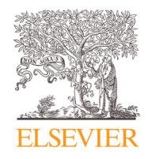
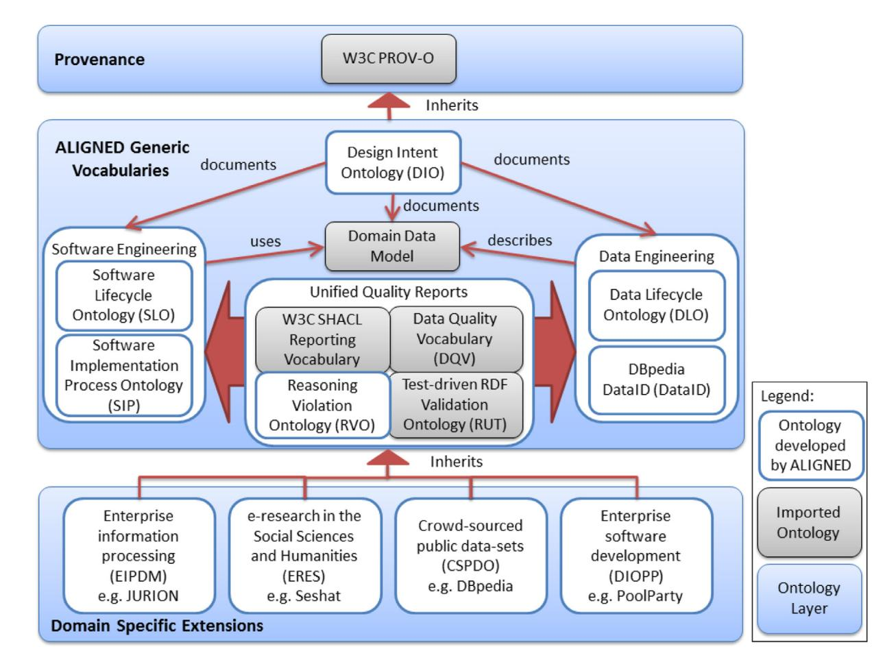
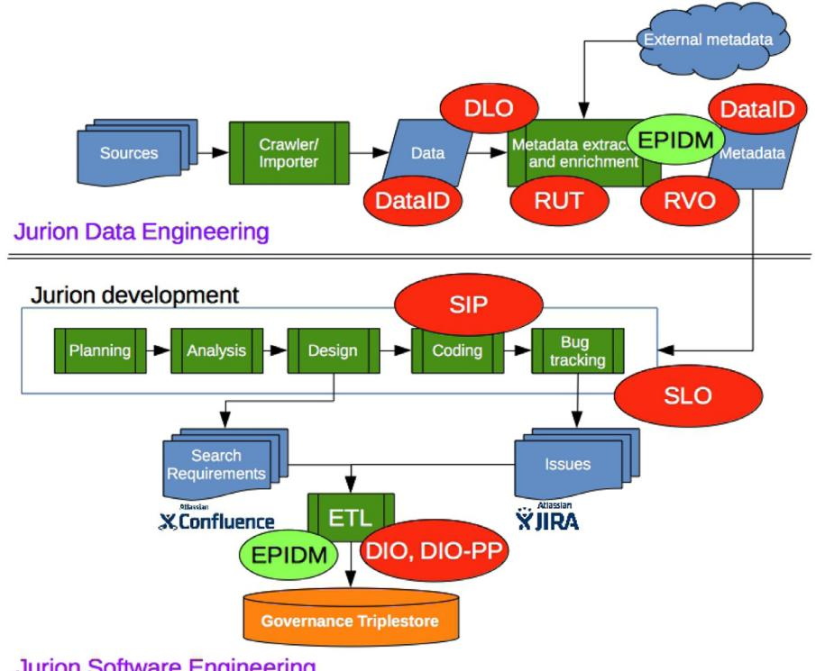

Contents lists available at [ScienceDirect](http://www.ScienceDirect.com)

<!-- Image Description: That's not a figure from an academic paper's technical content; it's the Elsevier logo. The image is a woodcut-style illustration of a man tending a tree, with a banner reading "Non Solus" (Not Alone). It's a symbolic representation, not a chart, graph, diagram, or equation; therefore, it contains no technical data and serves solely as a publisher's branding element. -->

The Journal of Systems and Software

<!-- Image Description: The image is a simple text line providing the journal homepage URL: `www.elsevier.com/locate/jss`. This serves as a reference for readers to access the journal's website for further information or related publications. No diagrams, charts, graphs, or equations are present. -->

# New Trends and Ideas

# Towards a knowledge driven framework for bridging the gap between software and data engineering

<!-- Image Description: That's not a technical image from an academic paper; it's a graphical button or icon. The image shows a square button with rounded corners. A circular graphic, containing a red bookmark symbol with blue and yellow concentric rings, is at the center. Below the graphic, the text "Check for updates" is displayed. The purpose is likely to prompt the user to check for software or content updates, not to present technical data or results. -->

Monika Solanki a,∗ , Bojan Božic´ b,c , Christian Dirschl d, Rob Brennanb

a *Department of Computer Science, University of Oxford, UK*b*ADAPT Centre, School of Computing, Dublin City University, Ireland*c*Technological University Dublin*d*Wolters Kluwer, Germany*## a r t i c l e i n f o
*Article history:*Received 5 October 2016 Revised 17 December 2018 Accepted 18 December 2018 Available online 19 December 2018
*Keywords:*Ontologies Data engineering Software engineering Alignment Integration

# a b s t r a c t

In this paper we present a collection of ontologies specifically designed to model the information exchange needs of combined software and data engineering. Effective, collaborative integration of software and big data engineering for Web-scale systems, is now a crucial technical and economic challenge. This requires new combined data and software engineering processes and tools. Our proposed models have been deployed to enable: tool-chain integration, such as the exchange of data quality reports; crossdomain communication, such as interlinked data and software unit testing; mediation of the system design process through the capture of design intents and as a source of context for model-driven software engineering processes. These ontologies are deployed in web-scale, data-intensive, system development environments in both the commercial and academic domains. We exemplify the usage of the suite on case-studies emerging from two complex collaborative software and data engineering scenarios: one from the legal sector and the other from the Social sciences and Humanities domain.

© 2018 Published by Elsevier Inc.

## 1. Introduction

While the origins of software engineering can be traced to the late 1960s [\(Wirth,](#page-8-0) 2008), data engineering is a fairly new, though rapidly emerging discipline for (real-time) processing, curating, serving (via an API) and managing large volumes of data (Mori and [Cleve,](#page-7-0) 2013). Additionally, recent years have also seen a significant increase in the demand for data-intensive, software applications that can efficiently handle large-scale sources of data [Kaisler](#page-7-0) et al. (2013). Strategies for implementing and managing these applications would benefit from combining the paradigms of data and software engineering and applying best practices from both domains. However our techniques for building such systems are still fragmented into disparate and un-aligned engineering processes, tasks or teams [\(Katasonov,](#page-7-0) 2012). There is a need for integrating and aligning these processes for efficient reuse of artifacts and building fault-tolerant, data-intensive systems. The data consumed by the applications, itself must also be high-quality, which entails a curatorial process to improve and manage data over time [\(Hazen](#page-7-0) et al., 2014)

The expressivity of semantic metamodels a.k.a ontologies makes them useful for both addressing data quality (Madnick and Zhu, 2006) and applying [model-driven](#page-7-0) approaches (Gasevic et al., 2009) to software engineering. Semantic data, in the form of enterprise linked data is also useful for describing, fusing and managing the combined data and software engineering lifecycles to increase productivity, agility and system quality.

In this paper, we present a suite of ontologies developed within the ALIGNED1 project, that aim to align the divergent processes encapsulating data and software engineering. The key aim of the ALIGNED ontology suite is to support the generation of combined software and data engineering processes and tools for improved productivity, agility and quality. The suite contains linked data ontologies/vocabularies designed to provide support for semanticsbased, model driven software engineering and data quality engineering techniques. It provides a knowledge-driven framework that can be exploited by implementations for unified governance in software development environments and test-driven developments. All the ontologies in the ALIGNED suite describe data provenance using the W3C provenance ontology2.

∗ Corresponding author.
*E-mail address:*[monika.solanki@cs.ox.ac.uk](mailto:monika.solanki@cs.ox.ac.uk) (M. Solanki).

<https://doi.org/10.1016/j.jss.2018.12.017> 0164-1212/© 2018 Published by Elsevier Inc.

1 [http://aligned-project.eu.](http://aligned-project.eu)

2 [http://www.w3.org/ns/prov-o.](http://www.w3.org/ns/prov-o)

This paper is an extension of our earlier conference paper in the ISWC resources track [\(Solanki](#page-7-0) et al., 2016) and extends the limited summary presented there as follows: (1) It describes the version 3 of the ALIGNED ontology suite rather than version 2; (2) it provides a requirements analysis for ontologies describing the combined software and data engineering domain and identifies exemplar ontology-based engineering tools; (3) It extends the discussion of ontology deployment from one use (JURION) to two (JURION and Seshat); (4) it provides example instances in the context of both use cases illustrating the ontolgies in use; (5) it provides a description of the ontology suite domain-specific extensions relevant to the two use cases discussed; (6) It provides more detailed descriptions of the contents and roles of key ALIGNED vocabularies - DIO, RUT, RVO, DataID for expressing design intents, test cases, reasoning violations and data-set descriptions respectively; (7) there is a new section discussing related work; and (8) a new formal evaluation section is presented that assesses the design decisions made, compares them to best practice and summarizes our trial results in live production environments. In summary the contribution of this extended paper is to provide a comprehensive overview of the ontology suite showing its genesis, intended applications, evaluation and providing sufficient context for potential users to assess the likely utility of the suite for their needs.

The ontology suite has been deployed for validation and incremental improvement in the ALIGNED project on four, large-scale data-intensive systems engineering use cases: the Seshat Global History Databank [\(Turchin](#page-8-0) et al., 2015), which is compiling linked data time series relating to all human societies over the past 12,000 years; JURION3, a legal information platform developed by Wolters Kluwer Germany; PoolParty4, a semantic technology middleware developed by the Semantic Web Company; and the DBpedia+5 data quality and release processes. This includes tools such as the Dacura data curation platform, the RDFUnit combined software and data testing framework [\(Kontokostas](#page-7-0) et al., 2014), the DataID dataset lifecycle services and unified engineering process governance based on PoolParty.

The paper is structured as follows: Section 2 presents the rigorous requirements engineering undertaken during the development of the ontologies. Section 3 highlights our motivating casestudies. [Section](#page-2-0) 4 presents an overview of the ALIGNED suite and brief descriptions of some of the core ontologies in the suite. [Section](#page-4-0) 5 provides an exemplar of how the vocabularies have been applied to two complex collaborative software and data engineering scenarios: one from the legal sector and the other from the Social sciences and Humanities domain. [Section](#page-5-0) 6 presents related work. [Section](#page-6-0) 7 presents an evaluation of the ontologies in the suite. Finally, [Section](#page-7-0) 8 presents conclusions.

### 2. Requirements analysis

The development of a rigorous ontological suite that semantically describes the most commonly encountered tasks, processes and datasets in software and data engineering requires a thorough requirements analysis. In this section we present a set of requirements which were derived after a thorough analysis of the functionalities needed by the software and data engineering use cases from ALIGNED and an in-depth review of the state-of-the-art.

####*2.1. Generic requirements*•**Support semantics-driven software engineering techniques**: The framework must provide models that describe additional system context and constraints for RDF based data or knowledge models in the form of design intents, software lifecycle [specifications](#page-7-0) and data lifecycle specifications (Sen and Gotlieb, 2013; Assmann, 2013).

- **Support data quality engineering techniques**: The framework must provide models that describe data curation tasks, roles, datasets, workflows and data quality requirements at each data lifecycle stage in a data intensive system [\(Hazen](#page-7-0) et al., 2014).
- **Support the development of tools for unified views of software and data engineering processes and software/data test case interlinking**: The framework must provide a set of enterprise linked data vocabularies describing software and data engineering activities (tasks), agents (actors) and entities (artefacts) (Líška and [Navrat,](#page-7-0) 2010).
- **Provenance**: The ability to describe the provenance of data, system and processes should be an integral part of the framework [\(Buneman](#page-7-0) et al., 2001).

#### *2.2. ALIGNED-Specific tools and use-case driven requirements*Besides meeting the generic requirements, the ontology design needs to consider applications that are representative of combined software and data engineering use-cases and supporting tools. Based on the tools being developed in ALIGNED to support the use-cases, we identified the high level requirements that would need to be considered during ontology engineering, as illustrated in [Table](#page-2-0) 1.

#### 3. Motivating case studies

####*3.1. Wolters Kluwer JURION (Legal Information System)*JURION is an innovative legal information platform developed by Wolters Kluwer Germany that merges and interlinks over 1 million documents of content and data from diverse sources such as national and European legislation and court judgements, extensive internally authored content and local customer data, as well as social media and web data (e.g from DBpedia). In collecting and managing this data, all stages of the Data Lifecycle are present: extraction, storage, authoring, interlinking, enrichment, quality analysis, repair and publication. On top of this information processing pipeline, the JURION development teams add value through applications for personalisation, alerts, analysis and semantic search. Based on the FP7 LOD2 project, parts of the Linked Data stack have been deployed in JURION to handle data complexity issues. By adopting the ALIGNED suite of ontologies, software development and data processing pipeline maintenance will gain integrated governance mechanisms through the interlinking of requirements specification and issues generated during implementation. The ontologies will enable JURION to address more complex business requirements that rely on tighter coupling of software and data.

####*3.2. Seshat: The global history databank*The Seshat global history databank is an international initiative of humanities and social science scholars to build an open repository of expert-curated historical time-series data. Seshat extracts the data from a combination of databases, Linked Data, web sites, academic publications and human experts. Data is then ordered and classified according to a common, evolving, schema that is controlled by an editorial board. Once classified the data is analysed by custom statistical model-testing applications, published as RDF and human-centric applications such as visualisations and search or browsing. To tackle the huge task of representing this

3 [https://www.jurion.de/.](https://www.jurion.de/)

4 [https://www.poolparty.biz/.](https://www.poolparty.biz/)

5 [http://wiki.dbpedia.org/.](http://wiki.dbpedia.org/)

#### Table 1

Ontology requirements for aligning data and software engineering .

| ALIGNED tool           | Tool Description                                                     | Meta-model requirement                                                                                                                                             | ALIGNED Use-case |
|------------------------|----------------------------------------------------------------------|--------------------------------------------------------------------------------------------------------------------------------------------------------------------|---------------------|
| Model Catalogue        | Creating, modifying, mapping and annotating metadata models       | Describe the ontology publication lifecycle                                                                                                                        | Seshat              |
| Semantic Booster       | Generating software components from metadata models                  | Describe the software generation lifecycle                                                                                                                         | Booster models      |
| Interlink validation   | Validating links between source and target datasets                  | Describe the link validation process                                                                                                                               | DBpedia             |
| Dacura quality service | Ensuring data consistency in the ClioPatria triple store             | Describe validation reports for schema and link validation                                                                                                      | Seshat              |
| RDFUnit                | Generating data quality reports based on W3C DQV                     | Describe constraint violations, provenance metadata and data quality dimensions                                                                                 | JURION              |
| Data curation service  | Generating vocabulary-driven user interfaces                         | Describe data curation activities.                                                                                                                                 | Seshat              |
| Unified governance     | Extract, triplify and integrate the data from Confluence and JIRA | Describe design requirements from Confluence, issues from JIRA. Define a mapping between application-specific domain knowledge and generic design intents | PoolParty           |

<!-- Image Description: This diagram depicts the architecture of ALIGNED ontologies. It shows a hierarchical structure, with the top layer representing provenance (W3C PROV-O). Below are generic vocabularies used in software and data engineering, including ontologies for software lifecycle, implementation processes, data lifecycle, and data quality. The bottom layer illustrates domain-specific extensions from various fields like e-research and enterprise software development. The diagram uses boxes to represent ontologies and arrows to show relationships like inheritance and usage. A legend clarifies whether each ontology was developed by ALIGNED or imported. -->
**Fig. 1.**The ALIGNED Suite of Ontologies.

expert knowledge, an information extraction, validation, annotation and analysis tool-chain has been defined based on the TCD DaCura platform6. By adopting the ALIGNED suite of ontologies, we were able to extend the Dacura platform with a quality service for validation of external ontologies in the knowledge base, scraper functionality for collection of RDF triples from wikis, web sites and other web resources, and annotation of domain specific triples created by domain users.

#### 4. Ontologies in the ALIGNED suite

Fig. 1 illustrates the ALIGNED suite of ontologies split into the provenance, generic, and domain-specific layers. As can be seen from the figure, a high emphasis has been placed on reusing existing, well known and standardised specifications where available. At the top layer, the W3C provenance standard forms the baseline for all our specifications and all our models extend it in some way. The split of the ALIGNED ontology suite between a generic layer and a domain specific extensions layer allows rapid evolution of domain-specific extensions for the ALIGNED use cases/trial environments (JURION, Seshat, DBpedia, PoolParty) based on a stable set of core concepts modelled in the generic layer. As the project

6 [http://dacura.cs.tcd.ie/.](http://dacura.cs.tcd.ie/)

progresses these extensions will be evaluated and incorporated into the generic layer if they prove valuable or more widely applicable than a single domain. Within the project the suite of ontologies is known as the "ALIGNED metamodel" due to the links with software engineering practices.

We briefly present here some of the core ontologies from the suite. Further details of the ontologies including the axiomatisations, graphical representation, serialisations in multiple formats via content negotiation, examples illustrating the usage of the ontologies, typical SPARQL queries that can be formulated using the ontologies as the data model and HTML documentation are available from the individual deployments at their persistent URIs. Due to space constraints we deliberately do not include these in this paper.

####*4.1. Design intents*The purpose of a design intent model is to document the design decisions underlying data intensive system including the design requirements. The ALIGNED ontology (DIO)7, allows users to express the design intent or design rationale while undertaking the design of an artefact.

DIO is a generic ontology that provides the conceptualisation needed to capture the knowledge generated during various phases of the overall design lifecycle. DIO [Solanki](#page-7-0) (2015) provides definitions for design artefacts such as requirements, designs, design issues, solutions, justifications, and evidence, and relationships between them to represent the design process and how these things lead to design outcomes. It draws upon the paradigms of IBIS (Interactive Intent-Based Illustration) Kunz et al. [\(1970\),](#page-7-0) argumentation and design rationale. It is linked to W3C PROV by defining the actors in the design process as PROV agents, and the design artefacts themselves are PROV entities. However, DIO uses a modularised version of PROV-O, based on syntactic locality. DIO makes few assumptions about the design process used, as the definitions of these activities properly belong in the software lifecycle and data lifecycle models.

####*4.2. Software engineering*The purpose of software engineering ontologies is to define the major agents (e.g. project roles), activities (e.g. lifecycle stages), and entities (design artefacts) involved in a software engineering project and their relations with a special focus on capturing the engineering lifecycle. Two ontologies make up this model the software lifecycle ontology (SLO)8 and the software implementation processes ontology (SIP)9. SLO provides a simple generic pattern for specifying processes and is based on the ISO/IEC 12,207 standard for systems and software engineering. The terminology used in the ontology conforms to ISO/IEC TR 24774:2010(E). SIP extends SLO to specify a set of standard terms for typical software engineering processes and phases such as architectural design and requirements analysis. SIP also imports existing ontologies from SEON10 and the software ontology (SWO)11 that describe many standard terms in the software engineering domain e.g. various implementation languages like JavaScript, C, and so forth.

It includes the definition of basic software engineering processes and activities such as requirements analysis, design, implementation, integration in terms of SLO activities and processes. Together, these ontologies give us a terminology for describing soft-

10 [http://se-on.org/.](http://se-on.org/)

ware engineering that is linked to W3C PROV, and so is suitable for recording lifecycle events or tool activities for consumption by ALIGNED unified governance tools.

####*4.3. Data engineering*As software engineering above, the focus of these ontologies are on data engineering and data lifecycles. Two ontologies have been defined the data lifecycle ontology (DLO)12 defined within ALIGNED and the DataID13 ontology, defined by ALIGNED for the DBpedia association, for describing datasets.

DLO provides a set of conceptual entities, agents, activities, and roles to represent the general data engineering process. Furthermore, it is the basis for deriving specific domain ontologies which represent lifecycles of concrete data engineering projects such as DBpedia or Seshat. DLO uses the W3C PROV ontology represented by the classes Role, Person, Entity, and Activity. It uses the Process class which is derived from Activity to implement the Linked Data Stack lifecycle stages as subclasses. This allows the user to represent linked open data activities in the data lifecycle metamodel. In addition datasets, data sources and data repositories have been modelled. DataID is a multi-layered meta-data system, which, in its core, describes datasets and their different manifestations, as well as relations to agents like persons or organisations, in regard to their rights and responsibilities. Depending on context, type of data and use case, this core ontology can be augmented by multiple existing extensions (e.g. Linked Data, repository descriptions etc.). Established vocabularies like DCAT, VoID, Prov-O and FOAF are reused for maximum compatibility to establish a uniform and accepted way to describe and deliver dataset metadata for arbitrary datasets and to put existing standards into practice.

####*4.4. Unified quality reports*

These ontologies provide a unified reporting representation for data quality metrics, ontology reasoning errors, test cases, and test case results based on the W3C SHACL reporting vocabulary. It is based on four ontologies/vocabularies, three of which are externally developed: W3C SHACL14, W3C Data Quality15, and University of Leipzig's test-driven RDF validation ontology [\(Kontokostas](#page-7-0) et al., 2014) (RUT); and one ontology developed within ALIGNED: the reasoning violation ontology (RVO)16.

RUT is designed to capture the lifecycle of RDF validation with the test driven validation methodology. It is implemented by the RDFUnit tool. RVO Describes both ABox and TBox reasoning errors for the integration of reasoners into data lifecycle tool-chains. The ontology covers violations of the OWL 2 direct semantics and syntax detected on both the schema and instance level over the full range of OWL 2 and RDFS language constructs. An overview of RVO and its design, implementation and use cases has been published in Bozic et al. [\(2016\).](#page-7-0) It supports error localisation and repair by defining properties that both identify the statement where a violation is detected, and by providing context information on the violation which may help semantic data publishers to fix them. We have developed RVO to provide a structured way to exchange knowledge of reasoning errors between reasoners and their clients, such as for client-side representation of reasoning and constraint checking results.

13 [http://dataid.dbpedia.org/ns/core#.](http://dataid.dbpedia.org/ns/core#)

7 [https://w3id.org/dio.](https://w3id.org/dio)

8 [https://w3id.org/slo.](https://w3id.org/slo)

9 [http://w3id.org/sip.](http://w3id.org/sip)

11 [purl.obolibrary.org/obo/swo.owl.](http://purl.obolibrary.org/obo/swo.owl)

12 [https://w3id.org/dlo.](https://w3id.org/dlo)

14 [https://www.w3.org/TR/shacl/.](https://www.w3.org/TR/shacl/)

15 [https://www.w3.org/TR/vocab-dqv/.](https://www.w3.org/TR/vocab-dqv/)

16 [https://w3id.org/rvo.](https://w3id.org/rvo)

#### *4.5. Domain data models*ALIGNED has developed four domain-specific metamodels based on each of our use cases.

- −**Enterprise information processing**: The EIP17, enterprise information processing ontology has been developed to describe the JURION environment, systems, artifacts and engineering processes in terms of the ALIGNED software and data lifecycle models. Each ALIGNED tool deployed in JURION can use this as a vocabulary of agents, activities and entities to describe JU-RION data or software engineering events and pipelines. For established tools such as bug-tracking software, e.g. JIRA, that is already part of the JURION engineering process, it is possible to use the ALIGNED ontologies as the target for an extracted and uplifted (to RDF) form of the tool databases. The ontology also models mandatory data requirements for specific processes. The location of error occurrence within the process is registered and the type of error or inconsistency asserted. This usage of this model is further elaborated in Section 5.
- − **E-research in the Social Sciences and Humanities**: The purpose of the ALIGNED E-research in the Social Sciences and Humanities (ERES) domain-specific metamodel for Seshat, is to provide a set of concrete entities, agents, activities, and roles to represent the data engineering process for this domain. This model adds support for specific external data sources for datasets like wikis, webpages and academic paper repositories. It adds new entities to represent candidate data for inclusion in a dataset, reports of historical events and historical interpretations created by domain experts. It extends the set of data lifecycle processes to include data curation activities such as data collection and data publishing. Finally new roles are defined for data consumer, processor and producer tools that help maintain semi-automated data curation pipelines or workflows.
- − **Crowdsourced public datasets**: extensions and models for the DBpedia use case.
- − **Enterprise software development**: extensions and models for the PoolParty use case.

Due to space restrictions we do not elaborate on the last two models in any further detail.

#### 5. Example deployment: JURION and SESHAT

#### *5.1. The ALIGNED suite in JURION*[Fig.](#page-5-0) 2 illustrates where ontologies from the ALIGNED suite contribute towards facilitating interoperability between the software and data engineering processes and tools used to build and maintain JURION.

The two main uses are tool integration and unified governance. Tool integration includes both cases within a single domain (data or software engineering) and cross-domain tool-chain integration. Unified governance uses ALIGNED provenance records, data extraction and uplift from enterprise engineering tools and data fusion to provide end to end and cross-domain views of the JURION platform engineering processes.

If a data or software engineering tool deployed in JURION wishes to create an audit trail of its activities, then it may record its activities using a combination of PROV and the ALIGNED ontologies that extend PROV as shown below:

RUT has been used in JURION for validating & verifying the extraction of metadata [\(Kontokostas](#page-7-0) et al., 2016). In particular, RDFUnit is used as a data validation tool integrated in JURION's continuous integration (CI) platform (Jenkins). The auto-generated Test-Cases (TCs) that derive from the JURION ontologies as well as the violation results are described through RUT. We capture how many errors occurred, which dataset they were detected in, what was responsible for it, who fixed it, when it was fixed, and how long the repair took. Captured information about the dataset include publishing, versioning, and properties.

Recently RVO has been used to integrate advanced OWL reasoning-based data quality checks with RDFUnit's triple-query oriented tests to expand the scope of testing possible. When combined with SHACL reports it is possible to create unified test results that span RVO, RUT and SHACL-based testing. This allows the specialised tools to collaborate to assure data quality and for unified governance mechanisms to interpret or visualise the combined results.

####*5.2. The ALIGNED suite in seshat*In this deployment the ALIGNED ontologies for data lifecycles (DLO) and unified quality reports are being used as part of the Dacura data curation platform to automate the process of collecting expert-verified historical time series.

A common Seshat use case is the extraction of candidate data from the Seshat wiki for further processing in the Dacura platform. An audit trail of this activity may be constructed as follows by the Dacura tools.

The above describes the case where a candidate set of data for a historical polity, the Roman Empire, was manually extracted from a private wiki page used for initial data collection by research assistants in Seshat. The candidate data is recorded, attributed to a specific data processing task (:aExtraction), labelled, attributed to an actor (:robBrennan), given a generation time and the entity it

17 [https://w3id.org/eipdm.](https://w3id.org/eipdm)

<!-- Image Description: The image presents two flowcharts illustrating the "Jurion" system's data and software engineering processes. The upper chart depicts data engineering, showing data sources processed by a crawler/importer, enriched using EPIDM, and stored with metadata. The lower chart details software development, from planning to coding, using tools like Confluence and Jira for requirements and bug tracking, respectively. Both charts highlight key components and their interrelationships within the Jurion system architecture. -->
**Fig. 2.**Usage of the ALIGNED suite of ontologies in the JURION semantics-based legal information system .

was derived from (the wiki page :itRomPrWikiPage) is identified. The extraction activity is further categorised as a manual one and labelled. Then information is provided on the original wiki page itself (:itRomPrWikiPage), the research assistant that completed it is noted and the expert who validated is identified. The actors are all assigned labels and categorised by their data management roles in Seshat a RA, a domain expert and a data architect. Recording this information in Seshat is important to be able to trace the origin and authority of facts as they appear in the final, curated dataset. For example a consumer of the data may wish to disregard the opinions of specific experts for differing interpretations.

#### 6. Related work

To the best of our knowledge, collection of ontologies have so far not been developed for integrating and aligning Software and Data engineering tasks, processes and datasets. However, similar problems have been addressed in isolation by certain efforts, albeit from differing perspectives.

SEON18 is a family of ontologies that describe concepts in the context of software engineering, software evolution and software [maintenance.](#page-7-0) The Software Ontology (SWO)19 James Malone et al. (2014) is a resource for describing software tools, their types, tasks, versions and provenance. While SEON and SWO cover some general aspects of software engineering, implementation and evolution, they do not address the description of design intents and software lifecycles.

Representing design intents or design rationales as ontologies have been captured for various specialised domains such as software engineering (de [Medeiros](#page-7-0) et al., 2005), ontology engineering (OE) [\(Tempich](#page-7-0) et al., 2005), product engineering [\(Zhang](#page-8-0) et al., [2013\)](#page-8-0) and Aerospace engineering20. However there is no generic, domain-independent design intent capture model available as a design pattern that can be specialised for any design rationale capture scenario.

OOPS! [Poveda-Villalón](#page-7-0) et al. (2012) is a tool with a catalogue for validating ontologies by spotting common pitfalls. The catalogue contains 41 pitfalls which the tool checks for. Although, OOPS! identifies many common pitfalls, it detects design flaws rather than logical errors and does not use an ontology for error reporting. Other research Keet [\(2012\)](#page-7-0) has identified the types of flaws that can occur in the object property box and proposed corresponding compatibility services. However, this work is very specific and focuses on properties and their compatibility. RVO addresses a far broader palette of violations, across the ABox and TBox, incorporating class and property violations. The Shapes Constraint Language (SHACL) introduced in [Ryman](#page-7-0) (2015), is a language for describing and constraining the contents of RDF graphs. RVO can be considered as an extension of SHACL's error reporting, as it can express a superset of the violations that can be expressed in SHACL.

Metadata models for the description of datasets vary and most of them do not offer enough granularity to sufficiently describe complex datasets in a semantically rich way. For example, the Data Catalog Vocabulary21 is a W3C Recommendation and serves as a foundation for many available dataset vocabularies and application profiles. The dcat vocabulary includes the special class Distribution for the representation of the available materialisations of a dataset (e.g. CSV file, an API or RSS feed). These distributions cannot be described further within dcat (e.g. the type of data, or access procedures). Applications which utilise the dcat vocabulary (e.g. datahub.io22) provide no standardised means for describing

18 [http://se-on.org/#publications.](http://se-on.org/#publications)

19 [http://theswo.sourceforge.net/.](http://theswo.sourceforge.net/)

20 [http://essay.utwente.nl/59926/.](http://essay.utwente.nl/59926/)

21 [https://www.w3.org/TR/vocab-dcat/.](https://www.w3.org/TR/vocab-dcat/)

22 [http://datahub.io/.](http://datahub.io/)

#### Table 2

Evaluating the ALIGNED suite of Ontologies.

| Generic criteria             | Evaluation                                                                                                                                                                                                                                                                                                                                                                                                                                                                                                                                                                                                                                                                                                                                                                                                                                                       |  |
|------------------------------|------------------------------------------------------------------------------------------------------------------------------------------------------------------------------------------------------------------------------------------------------------------------------------------------------------------------------------------------------------------------------------------------------------------------------------------------------------------------------------------------------------------------------------------------------------------------------------------------------------------------------------------------------------------------------------------------------------------------------------------------------------------------------------------------------------------------------------------------------------------|--|
| Value Addition Reuse      | (1) The ontologies add data and software engineering specific metadata to the process and enrich information about process specific procedures within data and software engineering for a tool, which in return can use this context dependent information for automation and automatic generation purposes. (2) DLO is used to provide details about the data engineering process and SLO details about the software engineering process. (3) RVO helps producing information about reasoning errors in the knowledge base, while DIO enables the mining of design intents from requirements specification as well as the generation of unified governance reports by integrating requirements and design issues. (1) Potential reuse across a wider community of content producers, owners of large amounts of data, data managers, ontology |  |
|                              | engineers of new related ontologies and vocabularies (2) Software development model designers, and developers of human societies datasets (e.g. Seshat Global History Databank). (3) The metamodels are easy to reuse and published on the Web together with detailed documentation. Top level models are general and can be applied for all data and software engineering models. Furthermore, the models are extendable and can be inherited by specialised domain ontologies for specific software and data engineering platforms.                                                                                                                                                                                                                                                                                                                |  |
| Design and Technical quality | All ontologies have been designed as OWL DL ontologies, in accordance to ontology engineering principles (Noy and Mcguinness, 2001). Axiomatisations in the ontologies have been defined based on the competency questions identified during requirements scoping.                                                                                                                                                                                                                                                                                                                                                                                                                                                                                                                                                                                         |  |
| Availability                 | Ontologies have been made publically available at http://aligned-project.eu/data-and-models/. Further, they have been given persistent w3id URIs, deployed on public facing servers and are content negotiable. DIO has been cited in Solanki (2015) and RUT in (Kontokostas et al., 2016). All ontologies have been licensed under a Creative Commons Attribution License. DIO has also been registered26 in LOV.                                                                                                                                                                                                                                                                                                                                                                                                                                      |  |
| Sustainability               | All ontologies are deployed on a public Github repositories. Long term sustainability has been assured by the ontology engineers involved in the design.                                                                                                                                                                                                                                                                                                                                                                                                                                                                                                                                                                                                                                                                                                      |  |
| Specific criteria            |                                                                                                                                                                                                                                                                                                                                                                                                                                                                                                                                                                                                                                                                                                                                                                                                                                                                  |  |
| Design suitability           | Individual ontologies in the suite have been developed in close association with the requirements emerging from corresponding, potential exploiting application.Thus they closely conform to the suitability of the tasks for which they have been designed.                                                                                                                                                                                                                                                                                                                                                                                                                                                                                                                                                                                               |  |
| Design elegance and quality  | Axiomatisation in the ontologies have been developed following Gruber's principles Gruber (1995) of clarity, coherence, extendability, minimum encoding bias and minimum ontological commitment.                                                                                                                                                                                                                                                                                                                                                                                                                                                                                                                                                                                                                                                              |  |
| Logical correctness          | The ontologies have been verified using DL reasoners for satisfiability, incoherency and inconsistencies. Specifically, inconsistencies for DIO has been checked against the instance data in the governance triple store.                                                                                                                                                                                                                                                                                                                                                                                                                                                                                                                                                                                                                                    |  |
| External resources reuse     | External ontologies such as PROV-O, SKOS have been extensively used.                                                                                                                                                                                                                                                                                                                                                                                                                                                                                                                                                                                                                                                                                                                                                                                             |  |
| Documentation                | The ALIGNED public deliverables and publications (Solanki, 2015; Kontokostas et al., 2016) include detailed descriptions of the models. The ontologies have been well documented using rdfs:label and rdfs:comment. HTML documentation via the LODE service has also been enabled. All ontologies have been graphically illustrated.                                                                                                                                                                                                                                                                                                                                                                                                                                                                                                                       |  |

more complex datasets either. The Provenance Ontology, PROV-O23 is widely adopted W3C standard and serves as a lightweight way to express the source of data, its processing activities as well as involved actors in a granular fashion. ckan 24(Comprehensive Knowledge Archive Network), which is used as a metadata schema in data portals like datahub.io, partially implements the dcat vocabulary, but only describes resources associated with a dataset superficially. Additional properties are simple key-value pairs which themselves are linked by dct:relation properties. This data model is semantically poor and inadequate for most use cases wanting to automatically consume the data of a dataset. Likewise the Asset Description Metadata Schema25 (adms) is a profile of dcat, which only describes a specialised class of datasets: so-called Semantic Assets.

#### 7. Evaluation

####*7.1. Design-oriented evaluation*Table 2 presents the evaluation of the ALIGNED suite in accordance to the desired qualities expected from a well designed set of ontologies.

We have also evaluated the ontologies in accordance to one of the most widely adapted, objective criteria, for the design of ontologies for knowledge sharing: the principles proposed by [Gruber](#page-7-0) (1995).

−*Clarity*: For achieving clarity in ontological definitions, Gruber emphasises the importance of (1) Independence from social

25 [https://www.w3.org/TR/vocab-adms/.](https://www.w3.org/TR/vocab-adms/)

and computational contexts (2) The use of logical axioms that provide a complete definition (3) Documentation supported by natural language. DIO meets all the above three criteria. Conceptualisation in DIO focuses solely on modelling the requirements for recording design deliberations, irrespective of the computational framework in which these will be implemented. Definitions in DIO, e,g, the DesignIntentArtifact have been asserted using necessary and sufficient conditions, making them complete and constraining their interpretation for clarity. Finally, DIO has been very well documented with labels and comments.

- − *Coherence*: Gruber states that definitions in an ontology must be logically consistent with reference to the inferences that can be derived. Further there should also be consistency between the logical axioms and its natural language documentation to maintain coherence. DIO has been checked using popular reasoners for logical consistency. The empirical evaluation of DIO within SWC for the unified governance scenario where users previously not familiar with the ontology were able to use the documentation to interpret it in order to formalise SPARQL queries, has ensured that the definitions are consistent with their documentation.
- − *Extendibility*: The design of the ontology should enable monotonic extensions of the ontology. DIO has already been extended with PoolParty customisations, without needing any changes in its original definitions. It thus meets the criteria of extendibility.
- − *Minimal encoding bias*: To encourage wider adoption of the ontology, Gruber proposes the uses of a conceptualisation mechanism that minimises the dependencies on encoding formats. DIO has been formalised in OWL 2, which is a W3C standard for representing ontologies on the Web. It has its foundations in Description Logics. Multiple serialisation formats are avail-

23 [http://www.w3.org/ns/prov-o.](http://www.w3.org/ns/prov-o)

24 [http://ckan.org/.](http://ckan.org/)

26 [http://lov.okfn.org/dataset/lov/vocabs/dio.](http://lov.okfn.org/dataset/lov/vocabs/dio)

able for the ontology. The axiomatisation in DIO is therefore accessible to all tools and frameworks that support these serialisations.

− *Minimum ontological commitment*: An ontology should make assertions that require only a minimum commitment from implementing agents, providing them the flexibility to extend and enrich the ontology, albeit in a monotonic way. DIO meets this criteria in at least two ways: (1) It does not restrict the domain and range of properties it defines. It provides primitive definitions for most entities. (2) The complex definition for entities such as the DesignIntentArtifact highlighted in [section](#page-2-0) 4, asserts the inclusion of only meta-level information in the definitions.

#### *7.2. User-driven evaluation*In Solanki et al. (2017) we presented an approach for enabling unified governance during the collaborative development of complex software engineering applications, in an industrial setting for the Semantic Web Company27. Software design requirements for the PoolParty Thesaurus (PPT) server and issues arising from their implementation were integrated using the conceptualisations defined in DIO. A graph search powered, unified governance dashboard was developed to provide faceted and full-text search over the annotated and integrated datasets. Our evaluation shows an impressive 50% increase in efficiency when searching over datasets semantically annotated with DIO as compared to searching over Confluence and JIRA.

#### 8. Conclusion

Combining data and software engineering processes to increase productivity and agility, is a challenge being faced by several organisations aiming to exploit the benefits of big data. Ontologies and vocabularies developed in accordance to competency questions, objective criteria and ontology engineering principles can provide useful support to data scientists and software engineers undertaking the challenge.

A work-in-progress for JURION that uses the ALIGNED suite of ontologies is the implementation of unified governance. The system that is currently being developed at Wolters Kluwer, is the integration of search requirements with issues arising during their execution. The goal is to express integrated requirements and issues as linked data, which is semantically annotated using the ALIGNED metamodels. This would further enable the development of customised Confluence interfaces which can be used to provide enhanced query features over the integrated data and produce bespoke reports using visual and statistical analytics. The interfaces can also be tailored to answer the competency questions utilised during the development of the ontologies.

In this paper we have proposed the ALIGNED suite of ontologies that provide semantic models of design intents, domain specific datasets, software engineering processes, quality heuristics and error handling mechanisms. The suite contributes immensely towards enabling interoperability and alleviating some of the complexities involved. We have exemplified the usage of the suite on two real-world use cases and evaluated it against the desired criteria. As ontologies from the suite are now in various stages of adoption by the ALIGNED use cases, the next steps would incorporate their empirical evaluation.

#### Acknowledgement

This research has received funding from the European Union's Horizon 2020 research and innovation [programme](#page-0-0) under grant agreement No 644055, the ALIGNED project [\(www.aligned-project.](http://www.aligned-project.eu) eu) and by Science Foundation Ireland and co-funded by the European Regional [Development](https://doi.org/10.13039/501100008530) Fund through the ADAPT Centre for Digital Content Technology [grant number 13/RC/2106].

#### References

- Assmann, U., 2013. Current trends and perspectives in ontology-driven software development. [http://www.computational-logic.org/content/events/iccl-ss-2013/](http://www.computational-logic.org/content/events/iccl-ss-2013/download/assmann-1-odsd.pdf) download/assmann-1-odsd.pdf.
- [Bozic,](http://refhub.elsevier.com/S0164-1212(18)30277-2/sbref0001) B., [Brennan,](http://refhub.elsevier.com/S0164-1212(18)30277-2/sbref0001) R., [Feeney,](http://refhub.elsevier.com/S0164-1212(18)30277-2/sbref0001) K., [Mendel-Gleason,](http://refhub.elsevier.com/S0164-1212(18)30277-2/sbref0001) G., 2016. Describing reasoning results with rvo, the reasoning violations ontology. In: Proceedings of the 3rd Workshop on Linked Data Quality (LDQ 2016) co-located with 13th European Semantic Web Conference (ESWC 2016). CEUR-WS.org.
- [Buneman,](http://refhub.elsevier.com/S0164-1212(18)30277-2/sbref0002) P., [Khanna,](http://refhub.elsevier.com/S0164-1212(18)30277-2/sbref0002) S., [Wang-Chiew,](http://refhub.elsevier.com/S0164-1212(18)30277-2/sbref0002) T., 2001. Why and where: A [characterization](http://refhub.elsevier.com/S0164-1212(18)30277-2/sbref0002) of data provenance. In: Van den Bussche, J., Vianu, V. (Eds.), Database Theory — ICDT 2001. Springer Berlin Heidelberg, Berlin, Heidelberg, pp. 316–330.
- [Gasevic,](http://refhub.elsevier.com/S0164-1212(18)30277-2/sbref0003) D., [Djuric,](http://refhub.elsevier.com/S0164-1212(18)30277-2/sbref0003) D., [Devedzic,](http://refhub.elsevier.com/S0164-1212(18)30277-2/sbref0003) V., 2009. Model Driven Engineering and Ontology [Development,](http://refhub.elsevier.com/S0164-1212(18)30277-2/sbref0003) 2nd Springer Publishing Company, Incorporated.
- [Gruber,](http://refhub.elsevier.com/S0164-1212(18)30277-2/sbref0004) T.R., 1995. Toward principles for the design of ontologies used for knowledge sharing. Int. J. [Hum.-Comput.](http://refhub.elsevier.com/S0164-1212(18)30277-2/sbref0004) Stud. 43 (5–6), 907–928.
- [Hazen,](http://refhub.elsevier.com/S0164-1212(18)30277-2/sbref0005) B.T., [Boone,](http://refhub.elsevier.com/S0164-1212(18)30277-2/sbref0005) C.A., [Ezell,](http://refhub.elsevier.com/S0164-1212(18)30277-2/sbref0005) J.D., [Jones-Farmer,](http://refhub.elsevier.com/S0164-1212(18)30277-2/sbref0005) L.A., 2014. Data quality for data science, predictive analytics, and big data in supply chain [management:](http://refhub.elsevier.com/S0164-1212(18)30277-2/sbref0005) an introduction to the problem and suggestions for research and applications. Int. J. Prod. Econ. 154, 72–80.
- James [Malone,](http://refhub.elsevier.com/S0164-1212(18)30277-2/sbref0006) et [al.,](http://refhub.elsevier.com/S0164-1212(18)30277-2/sbref0006) 2014. The software ontology (SWO): a resource for reproducibility in biomedical data analysis, curation and digital [preservation.](http://refhub.elsevier.com/S0164-1212(18)30277-2/sbref0006) J. Biomed. Semantics 5 (1), 1–13.
- [Kaisler,](http://refhub.elsevier.com/S0164-1212(18)30277-2/sbref0007) S., [Armour,](http://refhub.elsevier.com/S0164-1212(18)30277-2/sbref0007) F., [Espinosa,](http://refhub.elsevier.com/S0164-1212(18)30277-2/sbref0007) J.A., [Money,](http://refhub.elsevier.com/S0164-1212(18)30277-2/sbref0007) W., 2013. Big data: Issues and challenges moving forward. In: Proceedings of the 2013 46th Hawaii [International](http://refhub.elsevier.com/S0164-1212(18)30277-2/sbref0007) Conference on System Sciences. IEEE Computer Society, pp. 995–1004.
- [Katasonov,](http://refhub.elsevier.com/S0164-1212(18)30277-2/sbref0008) A., 2012. Ontology-driven software engineering: beyond model checking and [transformations.](http://refhub.elsevier.com/S0164-1212(18)30277-2/sbref0008) Int. J. Semantic Computing 6, 205–242.
- [Keet,](http://refhub.elsevier.com/S0164-1212(18)30277-2/sbref0009) C.M., 2012. Detecting and Revising Flaws in Owl Object Property Expressions. In: Knowledge Engineering and Knowledge [Management.](http://refhub.elsevier.com/S0164-1212(18)30277-2/sbref0009) Springer, pp. 252–266.
- [Kontokostas,](http://refhub.elsevier.com/S0164-1212(18)30277-2/sbref0010) D., [Brümmer,](http://refhub.elsevier.com/S0164-1212(18)30277-2/sbref0010) M., [Hellmann,](http://refhub.elsevier.com/S0164-1212(18)30277-2/sbref0010) S., [Lehmann,](http://refhub.elsevier.com/S0164-1212(18)30277-2/sbref0010) J., [Ioannidis,](http://refhub.elsevier.com/S0164-1212(18)30277-2/sbref0010) L., 2014. Nlp data cleansing based on linguistic ontology [constraints.](http://refhub.elsevier.com/S0164-1212(18)30277-2/sbref0010) ESWC 2014.
- [Kontokostas,](http://refhub.elsevier.com/S0164-1212(18)30277-2/sbref0011) D., [Mader,](http://refhub.elsevier.com/S0164-1212(18)30277-2/sbref0011) C., [Dirschl,](http://refhub.elsevier.com/S0164-1212(18)30277-2/sbref0011) C., [Eck,](http://refhub.elsevier.com/S0164-1212(18)30277-2/sbref0011) K., [Leuthold,](http://refhub.elsevier.com/S0164-1212(18)30277-2/sbref0011) M., [Lehmann,](http://refhub.elsevier.com/S0164-1212(18)30277-2/sbref0011) J., Hellmann, S., 2016. [Semantically](http://refhub.elsevier.com/S0164-1212(18)30277-2/sbref0011) Enhanced Quality Assurance in the JURION Business Use Case. Springer [International](http://refhub.elsevier.com/S0164-1212(18)30277-2/sbref0011) Publishing, pp. 661–676.
- [Kunz,](http://refhub.elsevier.com/S0164-1212(18)30277-2/sbref0012) W., Rittel, [H.W.J.,](http://refhub.elsevier.com/S0164-1212(18)30277-2/sbref0012) [Messrs,](http://refhub.elsevier.com/S0164-1212(18)30277-2/sbref0012) W., [Dehlinger,](http://refhub.elsevier.com/S0164-1212(18)30277-2/sbref0012) H., [Mann,](http://refhub.elsevier.com/S0164-1212(18)30277-2/sbref0012) T., [Protzen,](http://refhub.elsevier.com/S0164-1212(18)30277-2/sbref0012) J.J., 1970. Issues as elements of [information](http://refhub.elsevier.com/S0164-1212(18)30277-2/sbref0012) systems. Technical Report.
- [Líška,](http://refhub.elsevier.com/S0164-1212(18)30277-2/sbref0013) M., [Navrat,](http://refhub.elsevier.com/S0164-1212(18)30277-2/sbref0013) P., 2010. An approach to project planning employing software and systems engineering meta model [represented](http://refhub.elsevier.com/S0164-1212(18)30277-2/sbref0013) by an ontology. ComSIS v7 (4).
- [Madnick,](http://refhub.elsevier.com/S0164-1212(18)30277-2/sbref0014) S., [Zhu,](http://refhub.elsevier.com/S0164-1212(18)30277-2/sbref0014) H., 2006. Improving data quality through effective use of data [semantics.](http://refhub.elsevier.com/S0164-1212(18)30277-2/sbref0014) Data Knowl. Eng. 59 (2), 460–475.
- de [Medeiros,](http://refhub.elsevier.com/S0164-1212(18)30277-2/sbref0015) A.P., [Schwabe,](http://refhub.elsevier.com/S0164-1212(18)30277-2/sbref0015) D., [Feijó,](http://refhub.elsevier.com/S0164-1212(18)30277-2/sbref0015) B., 2005. Kuaba ontology: Design rationale representation and reuse in model-based designs. In: Proceedings of the 24th International Conference on Conceptual Modeling. [Springer-Verlag,](http://refhub.elsevier.com/S0164-1212(18)30277-2/sbref0015) Berlin, Heidelberg.
- [Mori,](http://refhub.elsevier.com/S0164-1212(18)30277-2/sbref0016) M., [Cleve,](http://refhub.elsevier.com/S0164-1212(18)30277-2/sbref0016) A., 2013. Towards highly adaptive [data-intensive](http://refhub.elsevier.com/S0164-1212(18)30277-2/sbref0016) systems: A research agenda. In: Franch, X., Soffer, P. (Eds.), Advanced Information Systems Engineering Workshops. Springer Berlin Heidelberg, Berlin, Heidelberg, pp. 386–401.
- [Noy,](http://refhub.elsevier.com/S0164-1212(18)30277-2/sbref0017) N.F., [Mcguinness,](http://refhub.elsevier.com/S0164-1212(18)30277-2/sbref0017) D.L., 2001. Ontology [Development](http://refhub.elsevier.com/S0164-1212(18)30277-2/sbref0017) 101: A Guide to Creating Your First Ontology. Technical Report. Stanford Center for Biomedical Informatics Research (BMIR).
- [Poveda-Villalón,](http://refhub.elsevier.com/S0164-1212(18)30277-2/sbref0018) M., [Suárez-Figueroa,](http://refhub.elsevier.com/S0164-1212(18)30277-2/sbref0018) M.C., [Gómez-Pérez,](http://refhub.elsevier.com/S0164-1212(18)30277-2/sbref0018) A., 2012. Validating ontologies with oops!. In: Knowledge Engineering and Knowledge Management. Springer, pp. 267–281.
- Ryman, A., 2015. Z specification for the w3c editor's draft core shacl semantics. arXiv[:1511.00384.](http://arxiv.org/abs/1511.00384)
- [Sen,](http://refhub.elsevier.com/S0164-1212(18)30277-2/sbref0020) S., [Gotlieb,](http://refhub.elsevier.com/S0164-1212(18)30277-2/sbref0020) A., 2013. Testing a [data-intensive](http://refhub.elsevier.com/S0164-1212(18)30277-2/sbref0020) system with generated data interactions. In: Salinesi, C., Norrie, M.C., Pastor, Ó. (Eds.), Advanced Information Systems Engineering. Springer Berlin Heidelberg, Berlin, Heidelberg, pp. 657–671.
- [Solanki,](http://refhub.elsevier.com/S0164-1212(18)30277-2/sbref0021) M., 2015. DIO: A pattern for capturing the intents underlying designs. In: Proceedings of the 6th Workshop on Ontology and Semantic Web Patterns (WOP 2015). [CEUR-WS.org.](http://refhub.elsevier.com/S0164-1212(18)30277-2/sbref0021)
- [Solanki,](http://refhub.elsevier.com/S0164-1212(18)30277-2/sbref0022) M., [Bozic,](http://refhub.elsevier.com/S0164-1212(18)30277-2/sbref0022) B., [Freudenberg,](http://refhub.elsevier.com/S0164-1212(18)30277-2/sbref0022) M., [Kontokostas,](http://refhub.elsevier.com/S0164-1212(18)30277-2/sbref0022) D., [Dirschl,](http://refhub.elsevier.com/S0164-1212(18)30277-2/sbref0022) C., [Brennan,](http://refhub.elsevier.com/S0164-1212(18)30277-2/sbref0022) R., 2016. Enabling combined software and data engineering at Web-scale: the ALIGNED suite of ontologies. The Semantic Web - ISWC 2016. Springer International Publishing. Lecture Notes in [Computer](http://refhub.elsevier.com/S0164-1212(18)30277-2/sbref0022) Science.
- [Solanki,](http://refhub.elsevier.com/S0164-1212(18)30277-2/sbref0023) M., [Mader,](http://refhub.elsevier.com/S0164-1212(18)30277-2/sbref0023) C., [Nagy,](http://refhub.elsevier.com/S0164-1212(18)30277-2/sbref0023) H., [Mückstein,](http://refhub.elsevier.com/S0164-1212(18)30277-2/sbref0023) M., [Hanfi,](http://refhub.elsevier.com/S0164-1212(18)30277-2/sbref0023) M., [David,](http://refhub.elsevier.com/S0164-1212(18)30277-2/sbref0023) R., [Koller,](http://refhub.elsevier.com/S0164-1212(18)30277-2/sbref0023) A., 2017. [Ontology-Driven](http://refhub.elsevier.com/S0164-1212(18)30277-2/sbref0023) Unified Governance in Software Engineering: The PoolParty Case Study. Springer International Publishing, pp. 109–124.
- [Tempich,](http://refhub.elsevier.com/S0164-1212(18)30277-2/sbref0024) C., [Pinto,](http://refhub.elsevier.com/S0164-1212(18)30277-2/sbref0024) H.S., [Sure,](http://refhub.elsevier.com/S0164-1212(18)30277-2/sbref0024) Y., [Staab,](http://refhub.elsevier.com/S0164-1212(18)30277-2/sbref0024) S., 2005. The Semantic Web: Research and Applications: Second European Semantic Web Conference, ESWC 2005, Heraklion, Crete, Greece, May 29–June 1, 2005. Proceedings. Springer Berlin Heidelberg, Berlin, Heidelberg. chapter An [Argumentation](http://refhub.elsevier.com/S0164-1212(18)30277-2/sbref0024) Ontology for DIstributed,

27 [https://www.semantic-web.at/.](https://www.semantic-web.at/)

[Loosely-controlled](http://refhub.elsevier.com/S0164-1212(18)30277-2/sbref0024) and evolvInG Engineering processes of oNTologies (DILI-GENT).

- [Turchin,](http://refhub.elsevier.com/S0164-1212(18)30277-2/sbref0025) P., [Brennan,](http://refhub.elsevier.com/S0164-1212(18)30277-2/sbref0025) R., [Currie,](http://refhub.elsevier.com/S0164-1212(18)30277-2/sbref0025) T., [Feeney,](http://refhub.elsevier.com/S0164-1212(18)30277-2/sbref0025) K., [Francois,](http://refhub.elsevier.com/S0164-1212(18)30277-2/sbref0025) P., [Hoyer,](http://refhub.elsevier.com/S0164-1212(18)30277-2/sbref0025) D., [Manning,](http://refhub.elsevier.com/S0164-1212(18)30277-2/sbref0025) J., [Marciniak,](http://refhub.elsevier.com/S0164-1212(18)30277-2/sbref0025) A., [Mullins,](http://refhub.elsevier.com/S0164-1212(18)30277-2/sbref0025) D., [Palmisano,](http://refhub.elsevier.com/S0164-1212(18)30277-2/sbref0025) A., [Peregrine,](http://refhub.elsevier.com/S0164-1212(18)30277-2/sbref0025) P., [Turner,](http://refhub.elsevier.com/S0164-1212(18)30277-2/sbref0025) E.A., Whitehouse, H., 2015. Seshat: The global history databank. [Cliodynamics](http://refhub.elsevier.com/S0164-1212(18)30277-2/sbref0025) 6 (1), 77–107.
- [Wirth,](http://refhub.elsevier.com/S0164-1212(18)30277-2/sbref0026) N., 2008. A brief history of software [engineering.](http://refhub.elsevier.com/S0164-1212(18)30277-2/sbref0026) IEEE Ann. Hist. Comput. 30 (3).
- [Zhang,](http://refhub.elsevier.com/S0164-1212(18)30277-2/sbref0027) Y., [Luo,](http://refhub.elsevier.com/S0164-1212(18)30277-2/sbref0027) X., [Li,](http://refhub.elsevier.com/S0164-1212(18)30277-2/sbref0027) J., [Buis,](http://refhub.elsevier.com/S0164-1212(18)30277-2/sbref0027) J.J., 2013. A semantic [representation](http://refhub.elsevier.com/S0164-1212(18)30277-2/sbref0027) model for design rationale of products. Adv. Eng. Inform. 27 (1), 13–26.
**Dr Monika Solanki** is a Senior Researcher in the Department of Computer Science at Oxford University. Her research focuses on developing design patterns, models and applications in the area of knowledge representation and reasoning using Semantic Web technologies and Linked data principles. She has worked extensively on developing and implementing stream processing algorithms and models for tracking and tracing in supply chains, using event based pedigrees over GS1 standards. Dr Solanki has extensive experience in designing and developing ontological domain models, curating linked datasets, implementing Semantic Web applications and Web services for a number of interdisciplinary projects spanning the boundaries of Big data, Computer Science, Bioenergy, Archaeology and Plant Biology.
