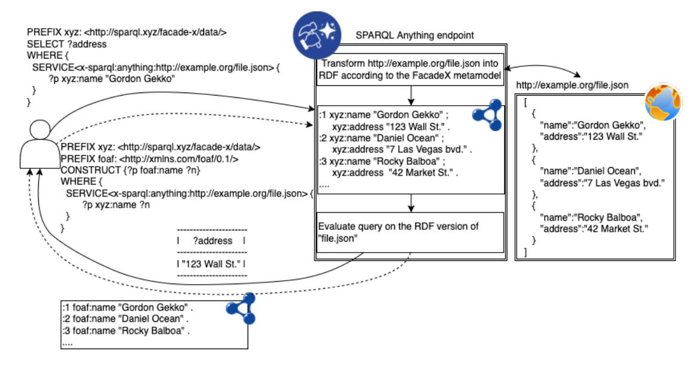
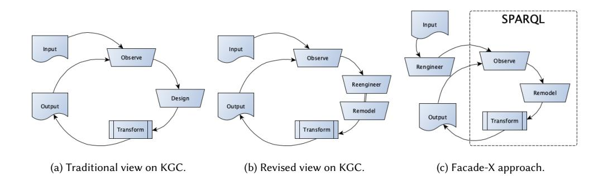
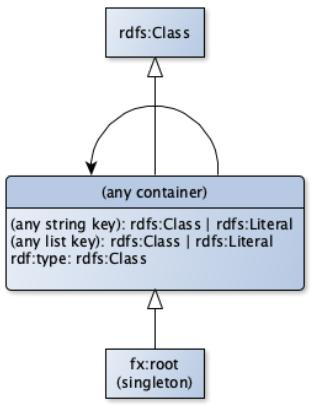
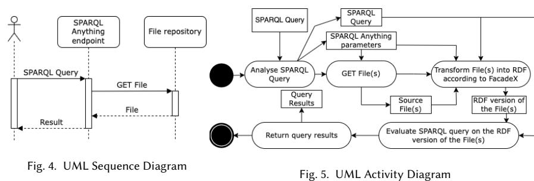
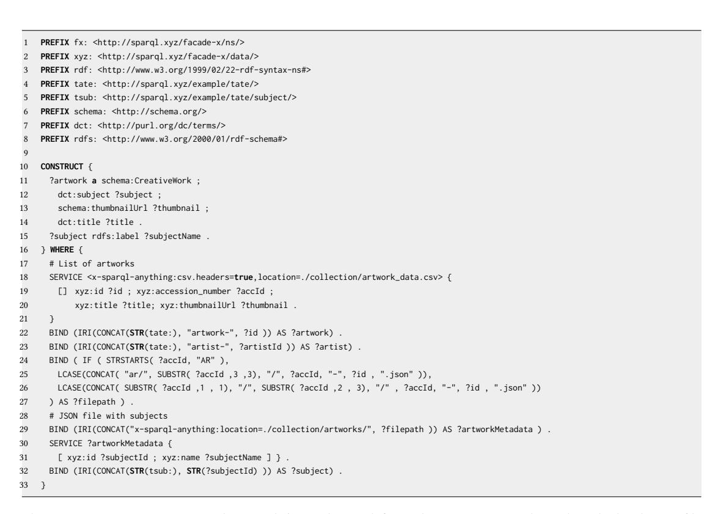
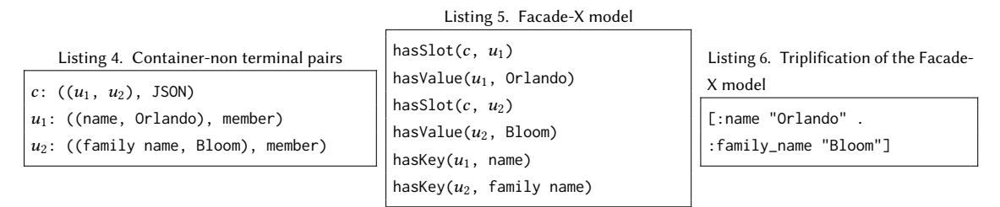
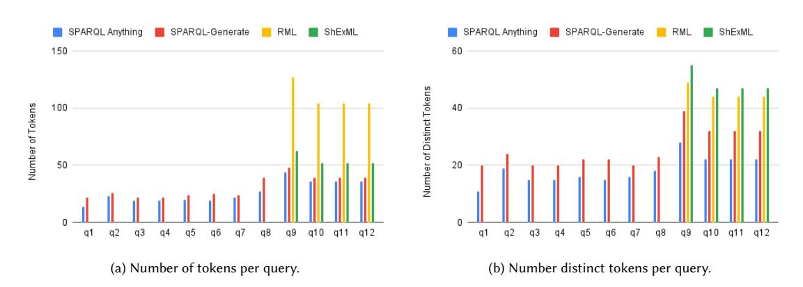
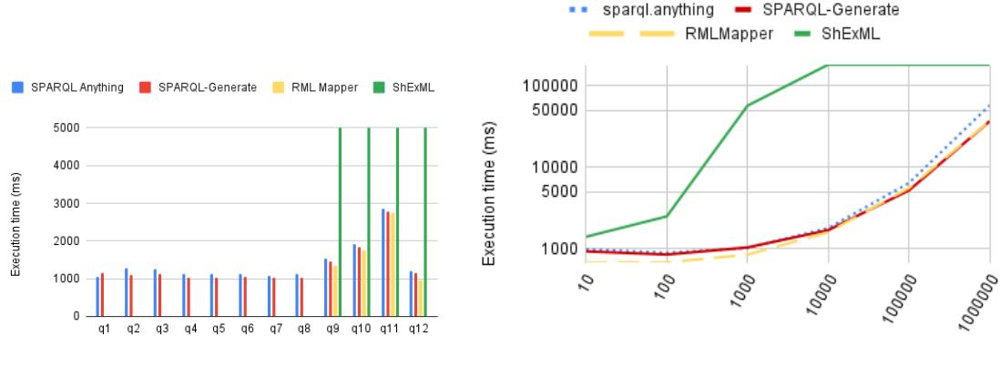
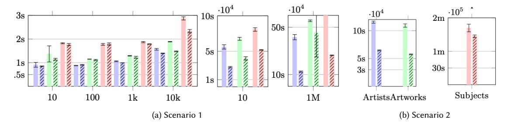
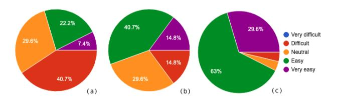

# Knowledge Graph Construction with a façade: a unified method to access heterogeneous data sources on the Web

LUIGI ASPRINO<sup>∗</sup> , University of Bologna, Italy

ENRICO DAGA, The Open University, UK

ALDO GANGEMI, Consiglio Nazionale delle Ricerche (CNR) and University of Bologna, Italy

## PAUL MULHOLLAND, The Open University, UK

Data integration is the dominant use case for RDF Knowledge Graphs. However, Web resources come in formats with weak semantics (for example CSV and JSON), or formats speci!c to a given application (for example BibTex, HTML, and Markdown). To solve this problem, Knowledge Graph Construction (KGC) is gaining momentum due to its focus on supporting users in transforming data into RDF. However, using existing KGC frameworks result in complex data processing pipelines, which mix structural and semantic mappings, whose development and maintenance constitute a signi!cant bottleneck for KG engineers. Such frameworks force users to rely on di"erent tools, sometimes based on heterogeneous languages, for inspecting sources, designing mappings, and generating triples, thus making the process unnecessarily complicated. We argue that it is possible and desirable to equip KG engineers with the ability of interacting with Web data formats by relying on their expertise in RDF and the well-established SPARQL query language [2].

In this article, we study a uni!ed method for data access to heterogeneous data sources with Facade-X, a meta-model implemented in a new data integration system called SPARQL Anything. We demonstrate that our approach is theoretically sound, since it allows a single meta-model, based on RDF, to represent data from *(a)*any !le format expressible in BNF syntax, as well as*(b)*any relational database. We compare our method to state-of-the-art approaches in terms of usability (cognitive complexity of the mappings) and general performance. Finally, we discuss the bene!ts and challenges of this novel approach by engaging with the reference user community.

CCS Concepts: • Information systems ! Resource Description Framework (RDF); Information integration.

Additional Key Words and Phrases: SPARQL, RDF, Meta-model, Re-engineering

### ACM Reference Format:

Luigi Asprino, Enrico Daga, Aldo Gangemi, and Paul Mulholland. 2022. Knowledge Graph Construction with a*façade*: a uni!ed method to access heterogeneous data sources on the Web. In *.*ACM, New York, NY, USA, 30 pages. https://doi.org/XX.XXXX/XXXXXXX. XXXXXXX

#### 1 INTRODUCTION

Data integration is the dominant use case for RDF Knowledge Graphs, according to a recent report from the industry [5]. However, legacy systems cannot easily be changed to produce RDF. Instead other formats are already supported by such

© 2022 Copyright held by the owner/author(s). Publication rights licensed to ACM. Manuscript submitted to ACM

<sup>∗</sup> Authors are alphabetically ordered. Authors' Contribution statement using CRediT:

Luigi Asprino: Conceptualisation; Data Curation; Formal Analysis; Investigation; Methodology; Software; Validation; Writing – Original Draft Preparation (equal). Enrico Daga: Conceptualisation (lead); Data Curation; Formal Analysis; Funding Acquisition; Investigation; Methodology; Software; Supervision; Validation; Writing – Original Draft Preparation (equal). Aldo Gangemi: Funding Acquisition; Supervision; Validation; Writing - Review and Editing. Paul Mulholland: Investigation; Validation; Writing – Original Draft Preparation.

Permission to make digital or hard copies of all or part of this work for personal or classroom use is granted without fee provided that copies are not made or distributed for pro!t or commercial advantage and that copies bear this notice and the full citation on the !rst page. Copyrights for components of this work owned by others than the author(s) must be honored. Abstracting with credit is permitted. To copy otherwise, or republish, to post on servers or to redistribute to lists, requires prior speci!c permission and/or a fee. Request permissions from permissions@acm.org.

systems (e.g. CSV, JSON, and XML). Therefore, a plethora of Web resources come in formats with a weak semantics, such as CSV and JSON1, or formats speci!c to a given application (for example, the BibTex<sup>2</sup> for sharing bibliographic references, or Markdown<sup>3</sup> for generating well-formatted software documentation). How to support developers in integrating non-RDF data into knowledge graphs?

To answer this question, Knowledge Graph Construction (KGC) is gaining momentum due to its ability of supporting data managers in the transformation task. Typically, this is achieved by applying tools that behave as*adaptors*between the data sources and the needed syntactic format and data model [35]. Alternatively, mappings between sources are designed into ad-hoc software to transform the sources into a multiplicity of ontologies relevant to the domain [21]. In both cases, the result is a complex data processing pipeline, which combines structural and semantic mappings, whose development and maintenance constitute a signi!cant bottleneck for data managers.

Building and maintaining such complex pipelines is a critical component of knowledge-aware infrastructures in most domains. For example, our work is placed in the context of two EU H2020-funded research projects that require the construction of large knowledge graphs as the*integration layer*of distributed cultural heritage archives, for supporting applications in digital humanities and cultural tourism [10, 19, 26, 48]. However, this problem is widely known by data scientists, who, according to multiple surveys (e.g. as reported in a recent blog4), and despite the variety of percentages reported, spend a lot of time to collect, extract, understand, transform, and load multiple data sources. These tasks might be shortened if an easier, broad-coverage KGC ETL (Extract-Transform-Load) work#ow was available.

In this article, we propose a novel approach for*indirect access*to heterogeneous data sources to streamline KGC. The approach is based on a uni!ed meta-model as a content bearer of di"erent representations. Such a meta-model behaves as a*façade*, a *design pattern*borrowed from object-oriented software engineering [28]. The façade is designed through a selection of*structural design patterns*[30] that enable mapping onto a set of RDF components. The resulting RDF graph can then be transformed into other RDF structures, suitable to local requirements. This approach allows to decouple the development of the*structural mappings*of source formats, from the development of the*semantic mappings*to the domain ontology. In this way, transformations into RDF are streamlined by meta-model mappings -*re-engineering*, and domain ontologies are populated through SPARQL5 construct queries - *re-modelling*.

The meta-model that drives our approach is called Facade-X, while the implementation of the approach, supporting !les in a variety of formats, is a system named SPARQL Anything. Facade-X is inspired by one of the GoF patterns6, and it is based on a set of basic data structures that are composed together: containment (inspired by the GoF pattern Composite), ordering (an unbound list), key-values (a map), and typing (the unary predicate of description logic). As such, it can be expressed by using a subset of the RDF speci!cation [18]: resources, types, properties, and container membership properties. In this work, we consider such fundamental RDF shapes as *structural ontology design patterns*[30].

Our approach is implemented in SPARQL (with no syntax extensions), by overriding the SERVICE operator with a*virtual endpoint*, which serves data extracted from legacy formats, but structured according to Facade-X. The example scenario depicted in Figure 1 shows how a user is supposed to interact with the SPARQL Anything endpoint in order to retrieve the desired information (e.g. the Gordon Gekko's address) or to construct a KG from a JSON !le available at the

2http://www.bibtex.org/

<sup>1</sup>As an exemplary case, see the recommended data formats from the UK data service: https://ukdataservice.ac.uk/learning-hub/research-datamanagement/format-your-data/recommended-formats/ (Accessed, June 2022).

<sup>3</sup>https://commonmark.org/

<sup>4</sup>https://tinyurl.com/rcnubw8t

<sup>5</sup>https://www.w3.org/TR/sparql11-overview/

<sup>6</sup>See https://www.gofpatterns.com/design-patterns/module5/intro-structural-designPatterns.php

URL http://example.org/file.json. Intuitively, the SPARQL Anything endpoint retrieves the JSON !le from the source, then transforms it into RDF according to Facade-X, and, !nally, evaluates the query on the RDF translation of the !le and returns the result of the query to the user. As for the SELECT queries, the result is a list of bindings of the variables of the query; while an RDF KG is returned in case of CONSTRUCT queries.



Fig. 1. An example scenario showing how users interact with the SPARQL Anything endpoint in order to retrieve desired information (solid lines) or to construct an knowledge graph (dashed lines) from a JSON file.

The approach of using a façade for integrating data into RDF pipelines has been originally proposed in [20]. The contributions of this article di"er in the following ways: *(i)*we provide a theoretical proof that the Facade-X meta-model is generic with respect to*(a)*serialised data formats and*(b)*relational data;*(ii)*we discuss the design principles of Facade-X in the light of structural design patterns, and validate the approach with more data formats;*(iii)*we extend the comparative evaluation (cognitive complexity and performance) to the ShEx mapping language (ShExML);*(iv)*we add experiments with a new execution strategy, called*triple-*!*ltering*, which shows improvements in performance; *(v)*we discuss challenges and opportunities of the approach by engaging with the reference user community.

The rest of the article is structured as follows. In the next section, we provide background information on KGC. In Section 3 we discuss the motivations behind our problem and we make methodological considerations. Section 4 introduces the Facade-X meta-model and its mappings to RDF structures. We expand the formalisation introduced in [20], including operators that re#ect possible design choices. Section 5 describes how the Facade-X meta-model can be implemented by selecting a few relevant components from RDF and RDFS speci!cations. In Section 6, we apply the methodology to a system for re-engineering non-RDF resources, in order to make them available through a SPARQL processing engine. In Section 7, we focus on the evaluation of the approach. We demonstrate that our meta-model is generic enough to cover structured data expressible in formal grammars (Section 7.1.1) and relational data (Section 7.1.2). We also compare our approach to state-of-the-art tools for Knowledge Graph construction, in terms of*cognitive complexity*(Section 7.2) and*performance*of a naive implementation (Section 7.3). We describe experiments performed



Fig. 2. Alternative Knowledge Graph Construction (KGC) processes.

with a triple-!ltering strategy, showing improvements in performance (Section 7.4). We discuss the usability of the system by reporting results from a survey questionnaire with the reference community in Section 7.5. Section 8 describes the state of the art. Finally, Section 9 concludes the paper and discusses future research.

#### 2 KNOWLEDGE GRAPH CONSTRUCTION

In this Section, we provide background information on Knowledge Graph Construction (KGC) methods, and discuss how KGC can bene!t from a uni!ed, general approach.

KGC is the process of building a Knowledge Graph (KG) out of a data source [4]. We can conceptualise this process as in Figure 2a. The process typically involves only one actor, i.e. the KG engineer. A KGC process usually consists of three activities:*(i) Observe (ii) Design (iii) Transform*. Firstly, the KG engineer inspects the data source in order to !gure out the format and the content of the input data (*observe*). This task can be supported by tools and query languages designed for the input format (e.g. XPath if the input format is XML). Secondly, the KG engineer designs a set of mappings aimed at identifying the data that ful!l information needs from the source, and devises their representation into RDF, often according to a pre-existing ontology (*design*). Finally, the mappings are fed into a processor that is responsible for generating the RDF triples according to the mappings (*transform*). This process proceeds by incremental iterations, where the KG engineer designs potential mappings, and evaluates them against the input source. During this activity, the KG engineer might identify nuances to take into account, troubleshoot possible issues, re!ne the mappings, or design new ones.

Plenty of technologies have been developed for mapping heterogeneous !les to RDF (RML [27] and SPARQL Generate [42] to name a few); ad-hoc tools are also developed [35]. KGC frameworks are typically designed in two ways: (a) either connectors leverage con!gurations with an intermediate *mapping language*(e.g. RML [27], ShExML [31], SPARQL Generate [42]), or (b) a*direct-mapping*strategy is hard-coded in the software (e.g. TARQL7, CSV2RDF8, Any239). In the !rst case – a framework based on*mapping languages*– data engineers bene!t from a declarative language that can express mappings towards di"erent data sources, allowing better transparency and maintainability of the data transformation pipeline. However, they are required to inspect the data sources, and express these mappings according to the speci!city of each source format (e.g. relying on format-speci!c languages such as XPath or JsonPath). Crucially, these systems are limited to formats that come with their own declarative query language. This is true for

7http://tarql.github.io/

9https://any23.apache.org/

<sup>8</sup>https://github.com/AtomGraph/CSV2RDF

some popular formats (JsonPath for JSON, XPath for XML, CSS selectors for HTML) but not for many other valuable data sources (e.g. YAML, Markdown, Bibtex, to mention just a few). In the second case – systems implementing*direct mappings*– data engineers bene!t from direct access to the data without the need to inspect the source format and to con!gure the system. However, integrating data from di"erent formats needs integration of di"erent tools and engaging with di"erent representations, according to format-speci!c ontologies. Crucially, they need to develop further transformations to obtain an homogeneous view on the data. As a result, KG engineers are usually forced to rely on di"erent tools (sometimes based on heterogeneous languages) for inspecting sources, designing mappings, and generating triples, thus making the KGC process unnecessarily complicated. In what follows, we argue that it is possible and desirable to equip KG engineers with the ability of interacting with Web data formats by relying on their expertise in RDF and the SPARQL query language [2].

#### 3 METHODOLOGY

In this Section, we argue how having a uni!ed method jointly with its related tools can streamline KGC. We have observed that the intent of the mappings is usually twofold (see Figure 2b: they perform a*syntactic*transformation of the terms included in the data source (i.e.*re-engineering*), and they *project*the transformed terms onto a conceptual model (i.e.*re-modelling*). This revised view on KGC is depicted in Figure 2b. With respect to three activities of the KGC process, SPARQL [2] can address them:

- *(i)*SPARQL SELECT queries may be used for*inspecting data sources*(observe);
-*(ii) mappings may be speci*!*ed*as SPARQL CONSTRUCT queries (remodel);
-*(iii) transformation*would result from the execution of a SPARQL CONSTRUCT query (transform).

However, SPARQL can only be used if*re-engineering*into RDF has been previously performed. For this reason, our approach includes a mechanism for accessing heterogeneous data*as if*it was RDF, before committing the data to any ontology (cf. Figure 2c). Contrary to the many methods for transforming heterogeneous data into RDF (cf. Section 8), we propose an open-ended, uni!ed model for accessing non-RDF data as if it was RDF. Since the lifting to RDF has to be made before committing to an ontology, no assumptions can be made either on the content of the input, nor on the ontology. As a result, a mapping at meta-model level (e.g. JSON to RDF) is the only viable strategy to accomplish the objective, as proposed in [50], even if there is no standardised mapping strategy.

Our strategy builds on*basic data structures*<sup>6</sup> (i.e. containment, ordering, key-values, and typing) as recurrent architectural solutions for shaping data. First, a minimal subset of basic data structures has been pragmatically identi!ed from well known abstract data types (containers, sequences, associative arrays, etc., cf. [44]). Then, each of these structures has been associated with an RDF construct for tripli!cation (e.g. lists are expressed in terms of RDF container membership properties). As a result, RDF constructs act as uniform façades to heterogeneous data sources.

This vision implicitly involves a novel actor in the KGC process, i.e. the *façade engineer*. The façade engineer is in charge of designing the façade, mapping it onto the legacy formats (we also refer this task by the name *meta-model interpretation*), and devising a tripli!cation strategy. Ideally, the façade engineer acts once per façade, meaning that once a format is ported to RDF according to a façade, no more activities are required.

This strategy makes the KGC: • *easier*the basic data structures emerge from the data; •*domain-independent*no assumptions are made on the input schema; •*re-usable*once a format is mapped to RDF, all the data sources of that format can be queried as RDF data; •*open-ended*the mapping is the result of a collection of basic data structures, hence new structures can always be added. In addition:*(i)*The o"-the-shelf transformation of legacy data into RDF enables the KG engineer to explore heterogeneous data using SPARQL (e.g. using a set of standardised queries for approaching new sources);*(ii)*Legacy formats are completely transparent to the KG engineer;*(iii)*A façade homogenises data, not only from a syntactical perspective (all the data is in RDF), but also from a structural standpoint (there is a unique strategy for triplifying knowledge representation primitives);*(iv)*Mapping and tripli!cation can be completely implemented in SPARQL (no legacy languages, no mapping vocabularies, no tripli!cation tools).

#### 4 FACADE-X

The Facade-X meta-model has been built in a bottom-up way. Firstly, we selected the most common (non-RDF) formats adopted for exchanging or expressing information on the Web. The selection (that is being extended) includes: CSV, JSON, YAML, XML, HTML, Text, Binary formats (e.g. JPG), Documents (DOCx or Markdown), Relational Databases, and Spreadsheets (e.g. XLS and XLSx). Then, for each format, we selected the minimal set of*basic data structures*needed for capturing the content speci!ed through a format. Facade-X is the result of the*abstraction*out of all the basic data structures used for representing the source data formats. Such abstraction led to the selection of a set of*structural design patterns*, each pattern corresponding to an RDF component used in the tripli!cation process.

Observed Basic Data Structures. We overview the main basic data structures needed for representing data extracted from the selected formats. For the sake of clarity, we resort to computer science terminology for *abstract data types*. We use *container*, *list*(considered as a specialisation of a container),*map*, and *instance-of*relation as abstract data types corresponding respectively to the basic data structures: containment, ordering, key-values, and typing.
*Formalisation of Basic Data Structures.* Containers, lists, maps and instance-of are formalised as follows. Let + be the set of all possible primitive values, the set of (the instances of) containers, lists, and maps, and ⇠ the set of classes. A list ; <sup>2</sup> (<sup>+</sup> [ )⇤<sup>10</sup> is a !nite sequence of elements from <sup>+</sup> or . A map <sup>&</sup>lt; is a set of pairs (:*,*E) such that < = {(:*,*E)|: 2 +*,*E 2 (+ [ )}. An *instance-of* relation is a set of pairs (8*,*2) such that *instance-of* = {(8*,*2)|8 2 *,*2 2 ⇠}.

*Basic Data Structures for CSV.*A comma-separated values (CSV) !le is a text !le that uses a comma to separate an ordered sequence of values in a data record and a carriage return to separate the data records of a sequence. A CSV can be represented as a list of lists in which the outer list captures the sequence of data records (representable as containers), while the inner list captures the sequence of primitive values within a record.
*Basic Data Structures for Spreadsheet.*Spreadsheets are !les that organise data as a collection of named tables. Similarly to CSV, each table of a spreadsheet can be seen as a container of data records. In addition, a map is needed for associating each table of the spreadsheet (a list of lists) with its name.
*Basic Data Structures for JSON.*JSON is a text format which is built on two structures: collections of key/value pairs (the key is a string and value is an element) and ordered lists of elements. Each element (representable as a container) can in turn be a collection of key/element pairs, a list of elements or a primitive value. Therefore, capturing JSON !les requires:*(i) maps*for expressing key/value pairs;*(ii)*and*lists*for specifying lists of elements.
*Basic Data Structures for YAML.*YAML is a lightweight, human-readable data-serialization language. YAML is a "superset" of JSON (any JSON !le can be speci!ed in YAML) and, similarly to JSON, data can be organised in lists or associative arrays. However, di"erently from JSON, comments and custom data types are allowed. Therefore, in addition to the basic data structures required for capturing JSON !les,*instance-of*is needed for representing custom data types.
*Basic Data Structures for XML and HTML.*Although having crucial di"erences (e.g. case-sensitivity, optional closing tags etc.), XML and HTML can be classi!ed as markup languages that organise data according to a hierarchical structure.

<sup>10</sup>(4C ⇤ stands for (4C ⇥ (4C ⇥*...*⇥ (4C

XML and HTML documents must contain a root element. All the elements (representable as containers) can enclose sub elements, text (primitive value) and attributes (key-value pairs). XML and HTML can be represented by combining:*(i) maps*for associating attributes with the corresponding values;*(ii) lists*for specifying sequences of children of an element;*(iii) instance-of*for associating an element with the name of the tag.
*Basic Data Structures for BibTeX.*BibTeX is a text format used (typically together with LaTeX) to specify a list of references in a database !le with the aim of separating bibliographic information from its presentation. A BibTeX database !le is formed by a list of bibliographic entries where each entry consists of the type (e.g. article, inproceedings etc.), a citation key, and key-value pairs for the other characteristics of an entry. Each BibTeX entry can be represented as a typed container that holds a set of key-value pairs.
*Basic Data Structures for Word processing documents and Markdown.*A word processing document is any text-based document compiled using word processor software. Markdown is a lightweight markup language for writing formatted documents inspired by web posting conventions. We can interpret a document (compiled with a Word processor or speci!ed in Markdown syntax) as a sequence of blocks (e.g. paragraphs, lists, headings, code blocks). Some blocks (e.g. list items) contain other blocks, whereas others contain inline contents (e.g. links, images etc.). A document can be represented as a list of typed containers. In fact,*blocks*can be speci!ed as*typed containers*, where the type denotes the kind of block (e.g. heading, paragraph, emphasised text, link, image etc.); *lists*are needed for specifying the sequence of the blocks. Additional attributes such as the depth of the header or the type of list (bullets, numbers, etc...) can be also supported, relying on the key-value structure.
*Basic Data Structures for archives and* !*le system directories.*Archives and directories can be seen as !les with the purpose of collecting other !les. Therefore, if we abstract from the !le content (i.e. bytes composing the !le), then archives and directories can be seen as lists of !lenames.
*Basic Data Structures for Binary and Text.*From the structural standpoint, binary data and text are quite similar since they can be both represented as either a container including a single value item (byte stream or text) or as an ordered sequence of primitive values (bytes or, in case of text !les, characters, words, multiwords, sentences, paragraphs depending on the granularity level to which the data structure is mapped).
*Basic Data Structures for Relational Databases.*A Relational Database (RDB) is a collection of named relational tables, where each table is a subset of the cartesian product of the domain of its attributes, namely a set of tuples. From a structural perspective, a table is a typed container, where the type (denoted e.g. by the name of the table) is the*intension*of the table, while each tuple is a collection of key-value pairs (all tuples being the*extension* of the table).

Formalisation of Facade-X in predicate logic. As mentioned above, the Facade-X meta-model is the result of the combination of four basic data structures (container, list, map and instance-of). We abridge those structures to structural design patterns by !rstly providing a predicate logic speci!cation of Facade-X.

A list (41*, ..,* 4=) is speci!ed as a container of pairs (position, element), e.g. ?08A(8*,*48). In doing so, lists di"erentiate from maps exclusively in the kind of the !rst element of the pair (an integer for lists), but both are generalised as containers of pairs.

In order to represent containers in predicate logic, we introduce a set of predicates, axiomatized as in Table 1:

-*(i)*the unary predicate Container which includes the rei!cations of containers;
-*(ii)*the unary predicate Slot includes the rei!cations of key/value pairs occurring at a certain position in a dataset;

```text
8:.StringKey(:) ! Key(:) 8:.NumberKey(:) ! Key(:)
¬9:.NumberKey(:) ^ StringKey(:) 8(G,~).hasSlot(G,~) ! Container(G) ^ Slot(~)
8(G,~).hasType(G,~) ! Container(G) ^ Class(~) 8(G,~).hasKey(G,~) ! Slot(G) ^ Key(~)
8(G,~).hasContainer(G,~) ! Slot(G) ^ Container(~) 8(G,~).hasValue(G,~) ! Slot(G) ^ Value(~)
¬9(G,~, I).hasContainer(G,~) ^ hasValue(G, I) 8(G,~).hasSlot(G,~) $ hasContainer(~, G)
8(G,~, I).hasValue(G,~) ^ hasValue(G, I) ! ~ = I
8(G,~, I).hasContainer(G,~) ^ hasContainer(G, I) ! ~ = I
8(2,B1,B2, =).hasSlot(2,B1) ^ hasSlot(2,B2) ^ hasKey(B1, =) ^ hasKey(B2, =) ! B1 = B2
```text

Table 1. The intended semantics of the predicates in the Facade-X model.

-*(iii)*the unary predicate Key includes the slot identi!ers, which can be (at least in the selected formats) either StringKey or NumberKey;
-*(iv)*the unary predicate Value includes the primitive values;
-*(v)*the unary predicate Class includes the classes.
-*(vi)*the binary predicate hasSlot, holding between containers and slots.
-*(vii)*the binary predicate hasContainer, inverse of hasSlot, holding between slots and containers. A slot can have either at most one container, or one value, but not both.
-*(viii)*the binary predicate hasType, holding between containers and classes.
-*(ix)*the binary predicate hasKey, holding between slots and keys. Slots from a same container are uniquely identi!ed by their key.
-*(x)*the binary predicate hasValue, holding between slots and values.

We emphasise that the meta-model is domain-independent, therefore it provides a KG engineer with a uniform view over any data serialised according to any mapped format. Moreover, since the mapping is determined by the façade engineer, a KG engineer can design mappings based purely on Facade-X, ignoring the original data format.

#### 5 RDF REPRESENTATION OF FACADE-X

In the previous section, we have introduced the Facade-X meta-model, and shown how it can capture the essential elements (basic data structures) of popular !le formats. In this section, we deal with encoding Facade-X in RDF. We !rstly validate the basic data structures with respect to real samples of source data, and align them to RDF or RDFS components. As a result, we obtain an RDF version of Facade-X.

Formats such as CSV, JSON, or XML have di"erent meta-models that can be mapped to RDF in di"erent ways, despite the common patterns shared by them. Facade-X provides a common semantics to encode them all. Facade-X assumes the notion of a façade as "an object that serves as a front-facing interface masking more complex underlying or structural code"11. Applied to our problem of abstracting the reverse engineering of heterogeneous source data, Facade-X is a generic meta-model*(a)*to inform the development of transformers from an open-ended set of formats, and*(b)*to generate RDF content in a consistent and predictable way. To support the reader, we introduce a guide scenario reusing the data of the Tate Gallery collection, published on GitHub12. The repository contains CSV tables with metadata of artworks and artists, and a set of JSON !les with details about each catalogue record, e.g. details of the hierarchy of archive subjects. Both types of resources include references to Web URLs pointing to digital images of the artworks. The !le artwork\_data.csv includes metadata of the artworks in the collection, and references several

<sup>11</sup>https://en.wikipedia.org/wiki/Facade\_pattern (accessed, 19/04/2021) 12http://github.com/tategallery/collection

external resources, such as a JSON !le with the artwork subject headings and a link to a JPG thumbnail image. Similarly, the !le artists\_data.csv includes the list of artists, linking to a collection of JSON documents for each artist.

In the following, we describe the design of Facade-X in RDF, for re-engineering heterogeneous !le formats. From the methodological standpoint, we refer to design science as a guiding principle [63]. Pragmatically, we place into the problem space a collection of formats and associated meta-models, and on the solution space the components of the RDF(S) speci!cations, as described in the W3C documents13. The design process is as follows:

-*(i)*Our problem space includes the following formats: CSV, JSON, XML, HTML, Plain text, and Binary !les (e.g. JPG images)
-*(ii)*The solution space includes the components from the RDF and RDFS speci!cations (which we refer to as RDF in the rest of the paper)
-*(iii)*Initially, our*façade*speci!cation is empty
-*(iv)*We select a format from the problem space, observe one or more prototypes, and abstract it into a meta-model
-*(v)*The meta-model is partitioned*topologically*. Parts and relations are mapped to RDF components, !rst by selecting the ones already in the façade or, in case something is missing, picking new components from RDF
- *(vi)*We move to the next format, until the problem space is empty.

CSV. A CSV !le is a resource, identi!able by a URI, which*contains*a dataset, composed of an ordered sequence of rows, which in turn*contains*an ordered sequence of data !elds. Therefore, we identify containment as a primary requirement of Facade-X. Now, we look at the solution space for a component of RDF to use. The simplest way to express containment in RDF is with an RDF property linking the container with the contained item. However, what type of property should link the container to the contained elements in the case of a CSV? Rows are ordered; therefore, this case of containment can be represented as an ordered sequence (our second component). Relying on a recent survey on sequential linked data [23], we learn that there are several ways of representing sequences in RDF, and that some representations are more e\$cient to deal with in SPARQL than others. In the light of that analysis, we select container membership properties from the solution space (rdf:\_1, rdf:\_2, rdf:\_=) and discard rdf:List. In addition, we want to distinguish the main data source container from its parts. We can select the rdf:type component and declare one primitive entity type: root, for which we de!ne a namespace and pre!x: fx: <http://sparql.xyz/facade-x/ns/>.

What about data values? We observe how CSV data may have an optional "header", where the !rst line is the list of !eld names. When this happens, we can use the property component and generate an RDF property reusing the !eld name, and minting an IRI with a conventional namespace. Otherwise, we can consider the values on each row as another sequence, and fallback to the ordered sequence component. Our façade currently includes the following components: rdf:Property and rdf:ContainerMembershipProperty as two ways of representing containment, rdf:type to point to the fx:root element, and rdf:Literal to represent values. So far, we added the following namespaces to our toolkit:

- 1 @prefix rdf: <http://www.w3.org/1999/02/22-rdf-syntax-ns#>.
- 2 @prefix rdfs: <http://www.w3.org/2000/01/rdf-schema#>.
- 3 @prefix fx: <http://sparql.xyz/facade-x/ns/>. # for fx:root 4 @prefix xyz: <http://sparql.xyz/facade-x/data/>. # for the properties

This is an example from the Tate Gallery open data14:

<sup>13</sup>RDF: https://www.w3.org/TR/2014/NOTE-rdf11-primer-20140624/

RDFS: https://www.w3.org/TR/2014/REC-rdf-schema-20140225/ 14https://github.com/tategallery/collection

TOIT, ACM Transactions on Internet Technology Asprino and Daga, et al.

```text
1 id,accession_number,title,...
2 1035,A00001,A Figure Bowing,...
3 ...
```text

1 [**a**fx:root ; rdf:\_1 [ xyz:id 1034; xyz:accession\_number A00002; xyz:title A Figure Bowing;*...*],*...*]

JSON. The JavaScript Object Notation is speci!ed by ECMA15. The syntax de!nes three types of elements:*objects*, a set of key-value pairs, where keys are supposed to be unique; *values*, which are either strings, numbers, boolean, or the primitive 'null', and *arrays*, which specify sequences (containing other arrays, objects, or values). We interpret objects and arrays as containers. We reuse rdf:Property to link objects to values. Arrays are represented by the ordered sequence component. Values are expressed as rdf:Literal, selecting relevant XSD datatypes from the RDFS speci!cation: xsd:string, xsd:boolean, xsd:int, xsd:float16. The following example shows a JSON document with metadata of an artist in the Tate Gallery Collection. The JSON !le will be represented as follows in RDF (in Turtle syntax):

```text
1 {
2 fc: Kazimir Malevich,
3 gender: Male,
4 id: 1561,
5 activePlaces: [ Ukrayina, Moskov ]
6 }
```text

| 1 | [ a fx:root ;                     |  |  |  |  |  |  |
|---|-----------------------------------|--|--|--|--|--|--|
| 2 | xyz:fc Kazimir Malevich,          |  |  |  |  |  |  |
| 3 | xyz:gender Male                   |  |  |  |  |  |  |
| 4 | xyz:id 1561^^xsd:int,             |  |  |  |  |  |  |
| 5 | xyz:activePlaces [                |  |  |  |  |  |  |
| 6 | rdf:_1 Ukrayina; rdf:_2 Moskov ]] |  |  |  |  |  |  |

So far, we were able to express CSV and JSON data by using a limited set of RDF components. The JSON format required us to add a number of datatype formats, while CSV values could only be represented with the default datatype (string).

HTML and XML. We will approach these two formats together, as their di"erence is on syntactic aspects, while their conceptual meta-model is the same. In fact, both formats can be captured by the Document Object Model (DOM) speci!cation, which we will refer to in the following description. However, it needs to be clari!ed how our methodology focuses on the elements of the syntax and does not aim at reproducing the DOM API in RDF. HTML/XML elements (also known as tags) can be de!nitely considered containers, so we can reuse both the rdf:Property component for specifying tag attributes, and container membership properties for specifying relations to child elements in the DOM tree. These may include text, which can be expressed as RDF literals of type xsd:string. What about element types (tag names)? Facade-X does already provide a solution of *unary*attributes: rdf:type. The range of the property will therefore be a rdf:Resource, whose URI can be minted by using the tag name as local name. However, XML and HTML already include the notion of namespace, therefore, we use namespaces declared within the original document to name properties and types, if any. Examples with HTML content will be presented later in Section 6.1.

So far, we collected the following components: rdf:Property, rdf:ContainerMembershipProperty, XSD datatypes, rdf:type, and declared one primitive: fx:root. We complete our analysis with two corner cases: plain text documents and binary data (e.g. JPEG or PNG images). Textual data is an interesting case where we can use containment to refer to di"erent elements of the text. The whole content can be included in one single literal of type xsd:string. Alternatively, the text can be tokenized and the resulting sequence represented as RDF17. For the sake of our analysis, text can be considered a single container including a sequence of (at least one) literal values. Binary content such as images can be also supported, by embedding the content in a single literal of datatype xsd:binary64encoding. This solution does

<sup>15</sup>https://www.ecma-international.org/publications-and-standards/standards/ecma-404/

<sup>16</sup>Currently, we chose to ignore !elds with the 'null' value. However, we may decide to represent it as blank node or to create a primitive entity to express it, for example, similar to rdf:nil.

<sup>17</sup>We could ask users to choose a separator, for example, the space, the new line, or even a regular expression

not require to add components to the facade but still allows to*bring in*the content as linked data. In both these cases, we can reuse the components already selected.

At this stage, we have all we need to implement the basic data structures identi!ed in the previous section into RDF. Figure 3 illustrates the resulting Facade-X/RDF as an entity-relation diagram. We are able to support all the other formats mentioned (BibTex, Markdown, etc.), as they do not introduce new components.

#### 6 SPARQL ANYTHING

In this section we describe SPARQL Anything, a proof-of-concept of our approach.

Based on the output of our design activity, i.e. the RDF version of Facade-X, we design a method to inject façade-based data sources into SPARQL engines, with the objective of serving this content to the SPARQL practitioner for de!ning mappings to the target ontology (cf. the*re-modeling* activity mentioned in Section 1). To this end, we overload the SPARQL SER-VICE operator by de!ning a custom URI-schema. The implementation of Facade-X acts as a virtual endpoint that can be queried exactly as a remote SPARQL endpoint. In order to instruct the query processor to delegate the execution to Facade-X, we introduce a speci!c convention for building an IRI to be used within SERVICE clauses: x-sparql-anything:. The related URI-schema supports an open-ended set of parameters speci!ed by the



Fig. 3. Facade-X/RDF entity-relation diagram

façade implementations available. A minimal example only includes the resource locator, and guesses the data source type from the !le extension. Options are embedded as key-value pairs, separated by commas. These can incorporate a set of parameters, to allow the user to con!gure the system (for example, to indicate that the system should consider the !rst line of a CSV as headers):

1 x-sparql-anything:media-type=text/csv,charset=UTF-8,csv.headers=**true**,location=...

Figure 5 shows a UML activity diagram describing the interaction between the user, the SPARQL Anything endpoint and the !le repository. Figure 5 describes, in the form of a UML activity diagram, the work#ow carried out by the SPARQL Anything endpoint once the SPARQL query is received from the the user. For each query submitted by the user the endpoint undertakes the following steps:

- *(i)*it analyses the query in order to extract the parameters;
-*(ii)*it uses the the parameters in order to read the source !le(s) (note that queries may involve multiple !les at the time);
-*(iii)*it transforms the source !le(s) into RDF according to the Facade-X metamodel, the parameters provided in the query and, possibly, the query itself (cf. the triple !ltering strategy - Section 7.4);
-*(iv)*it evaluates the the query over the RDF version of the !le(s);
-*(v)* it returns the query results to the user.

We now show how to use Facade-X. Following our example scenario, users can select metadata from the CSV !le and embed the content of the remote JPG thumbnails in RDF. Additional SERVICE clauses may integrate data from other !les, for example, the JSON !le with details about artwork subjects. The following listing shows a complete example:

TOIT, ACM Transactions on Internet Technology Asprino and Daga, et al.





The query iterates over a CSV with artworks' metadata and, for each one, constructs the path to the local JSON !le containing the artwork subjects. All the data is projected into a CONSTRUCT clause18.

SPARQL Anything relies on the ARQ query engine provided by the Apache Jena framework<sup>19</sup> and it is composed of four components: (i) the FacadeIRIParser, which takes an IRI (complying to the Fadade-X IRI schema), and extracts the (>?C8>=*,*E0;D4) pairs contained in it; (ii) the Triplifier that, given a URL of a !le to transform and a set of options, produces a set of named graphs; (iii) the TriplifierRegister that keeps track of the Triplifers available for the transformation of source data; and (iv) the FacadeOpExecutor, which extends the ARQ's operation executor for the

<sup>18</sup>This is reproducible, along with other example queries on the same data source, at https://github.com/sparql-anything/showcase-tate. 19https://jena.apache.org/index.html

SERVICE clause in order to implement the approach described in Section 6. SPARQL Anything allows the addition of an open-ended set of transformers as additional Java classes. At query execution, a query manager intercepts any usage of the SERVICE operator and, in case the endpoint URI has the x-sparql-anything: scheme, it parses the URI extracting the resource locator and the set of parameters. Default parameters are: mime-type, locator, namespace (to be used when de!ning RDF resources), root (to use as the IRI of the root RDF resource, instead of a blank node), and metadata. SPARQL Anything projects an RDF dataset during query execution, including the data content and optionally a graph named <facade-x:metadata> including !le metadata extracted from image !les (also in Facade-X). Speci!c formats may support speci!c parameters. For example, the CSV tripli!er supports an optional parameter to specify whether to use the !rst row as column names (headers) or rely on column indexes.

We validated the generality of Facade-X as a meta-model with relation to the tripli!ers currently implemented in SPARQL Anything. The current release (v0.5.1, December 2021) supports the following formats: JSON, HTML, XML, CSV, BIN, PNG, JPEG, JPG, BMP, TIFF, TIF, ICO TXT, ZIP, Tar, File System, spreadsheets: XLS/XLSx, documents: DOCx, EXIF Image Metadata, Bibtex, Markdown, and YAML. Currently SPARQL Anything is the only system for KGC supporting such a variety of formats, and its design principles allow to easily add new types of source data. A collection of examples with the supported !le formats is also available at the SPARQL Anything project page20.

### 1 Worked example: the IMMA online catalogue

The Horizon 2020 EU SPICE project21 aims at developing a linked data infrastructure for integrating and leveraging museum collections using multiple ontologies covering sophisticated aspects of citizen engagement initiatives. Museum collections come in a variety of data objects, spanning from public websites to open data sets in CSV, XML, JSON, or a combination of these formats. In SPICE, !ve pilot case studies rely on a Linked Data Hub that aggregates resources from museums, social media, and businesses active in the cultural industry22. However, the majority of cultural heritage data is not published as Linked Data, and we cannot assume this is going to change anytime soon. E.g., all cultural heritage institutions involved in the SPICE project do not have an in-house linked data publishing infrastructure. Data are published on Web sites (HTML), or are released as a mix of CSV, XML, JSON !les.

SPICE research activity also aims at the design of task-oriented ontologies. This implies that there will be multiple knowledge graphs (semantic *viewpoints*) built on top of the same resources. In the absence of a strategy to cope with this diversity of resources and ontologies, the RDF lifting would result in multiple, heterogeneous e"orts, creating a serious bottleneck.

As an example, we describe how we have used SPARQL Anything to design a knowledge graph of artworks and artists from the collection website of the Irish Museum of Modern Art (IMMA), one of the key partners in the SPICE project. The IMMA website includes web pages for each artist and artwork in the catalogue, including images of artworks and their metadata. For example, the web page of the artist Marina Abramovic includes her birth date and biography23. The web page also includes a list of the artist's works from the IMMA catalogue. Each artwork web page includes museums' collection metadata, including a description, the type of medium used in the work, credit and copyright information, the catalogue item number, and the o\$cial caption of the image report of the work24.

<sup>20</sup>SPARQL Anything: https://github.com/sparql-anything/sparql.anything. 21https://spice-h2020.eu

<sup>22</sup>The SPICE Linked Data Hub: http://spice.kmi.open.ac.uk 23https://imma.ie/artists/marina-abramovic/

<sup>24</sup>E.g. https://imma.ie/collection/freeing-the-memory/

TOIT, ACM Transactions on Internet Technology Asprino and Daga, et al.

Our job is to extract this information from the web content, and express it as data shaped according to SPICE ontologies. In IMMA case, we explored the website and found a web page listing all the artists25. We have then created a JSON-LD<sup>26</sup> !le for each artist or artwork included in the catalogue27. In what follows, 'fx' refers to the following instruction28:

1 java -jar sparql-anything-0.5.1.jar

The !rst thing to do is to get the list of artists' web pages, which we will subsequently query with SPARQL Anything to extract the useful metadata. The following HTML content snippet gives us a clue:

The data we need is included in a div with id az-group. Artists' web pages are included in an anchor tag (a) within a list item (li) with a data-image attribute. The anchor tag includes a span tag with an artist nickname, that we could use to mint artist's IRI. With this information we can design another SPARQL query:

```text
1 prefix rdf: <http://www.w3.org/1999/02/22-rdf-syntax-ns#>
2 prefix xhtml: <http://www.w3.org/1999/xhtml#>
3 select distinct ?artistUrl ?artistNickname
4 WHERE {
5 SERVICE <x-sparql-anything:media-type=text/html,html.selector=#az-group,location=https://imma.ie/artists/> {
6 [] xhtml:data-image [] ;
7 rdf:_1 [ xhtml:href ?artistUrl ;
8 ?i [ a xhtml:span ; rdf:_1 ?artistNickname ]].} .
9 BIND ( IRI( CONCAT(https://w3id.org/spice/imma/agent/, ?artistNickname) ) as ?artistEntity ).}
```text

The query selects the list of artists from the Web page and generates a SPARQL Result Set with two variable bindings: ?artistNickname and ?artistUrl, which we can save to a result set !le:

1 fx -q imma-artists.sparql -o imma-artists.xml -f xml

Next, we focus on the artist web page, and design the query to extract artists' metadata. Again, we can explore the HTML to gather some insight on the structure we want to query, mainly the artist name, biography, and the list of artworks. We can query the artist page following the same approach used for obtaining the list of artists. However, this time we want to generate a Linked Data object about the artist, de!ning mappings to one or more of the SPICE ontologies as a CONSTRUCT query. In addition, our query includes two parameters: the artist nickname and artist web page, since we want to run this against all the artists and generate one !le for each one of them. With the following command, we extract data from the artists' Web page and build one JSON-LD !le each, using the previously extracted list of artists as input:

1 fx -q imma-artist.sparql -i imma-artists.xml -p artists/?artistNickname.jsonld -f json

<sup>25</sup>https://imma.ie/artists/

<sup>26</sup>JSON-LD is one of the serialisations for RDF knowledge graphs https://json-ld.org/

<sup>27</sup>The queries and instructions for reproducing the tutorial can be found at http://github.com/sparql-anything/showcase-imma

<sup>28</sup>The executable JAR can be obtained from https://github.com/SPARQL-Anything/sparql.anything/releases.

We now have a collection of JSON-LD !les ready to be published into the SPICE Linked Data Hub. However, we want to follow a similar approach to produce a linked data version of the artworks in the IMMA catalogue. This time we don't have a web page listing all the artworks. In this case, SPARQL Anything is used to load a collection of RDF !les, and run a query against it. Exploiting this feature, we generate a SPARQL Result Set !le listing artwork webpages and nicknames mentioned in the Artists' JSON-LD !le generated before:

1 fx -q imma-artworks.sparql -l artists/ -o imma-artworks.xml -f xml

The –l option instructs the tool to load the !les from the given folder in an in-memory RDF dataset. We can reuse the list of bindings in imma-artworks.xml to run another query, speci!cally designed to extract content from the artwork web page.The following command extracts data from the artworks' Web pages, and creates one JSON-LD per !le.

1 fx -q imma-artwork.sparql -i imma-artworks.xml -p artworks/?artworkNickname.jsonld -f json

With this command, our work#ow is completed, so that we have been able to create a metadata catalogue as Linked Data with the sole use of SPARQL Anything. The !les are now ready to be loaded in the SPICE Linked Data Hub.

#### 7 EVALUATION

This Section reports on the multi-dimensional assessment of our approach. We demonstrate that a simpli!ed version of the Facade-X meta-model is generic enough to represent data complying with any formal grammar (Section 7.1.1) or data structured according to the relational model (Section 7.1.2). Section 7.1.3 then shows how the Facade-X meta-model (presented in Section 4) can be instantiated from its simpli!ed version. Next, we present a comparative evaluation of our approach with respect to state of the art methods which consists of: (i) a quantitative analysis of the cognitive complexity of the frameworks (Section 7.2); (ii) a performance analysis of the reference implementations with respect to our naive implementation of the approach (Section 7.3). We also experiment with an alternative implementation of the approach, namely the triple-!ltering strategy, which shows improvements in performance (Section 7.4). Finally, we discuss the usability of the system reporting results from a survey questionnaire with the reference community in Section 7.5.

#### 1 Theoretical Evaluation

Section 6 intuitively showed how the Facade-X meta-model maps the selected data formats. This section lays the theoretical foundation for such an intuition. In the following sections we adopt a simpli!ed notion of container as an ordered set of values (cf. De!nition 1.929) and we use such notion to demonstrate that a container is able to represent whatever is generated by a formal grammar (Section 7.1.1), as well as any tuple of the relational database (Section 7.1.2). Finally, Section 7.1.3 shows how the Facade-X meta-model in Section 4 can be instantiated from a simpli!ed container.

*7.1.1 Proving that Facade-X subsumes any file format.*Let us start by considering the formal de!nition of Grammar (De!nition 1.1), Derivation Relation (De!nition 1.2) and Language (De!nition 1.4). The grammar of a certain data format generates sentences (i.e., !les) containing a sequence of primitive values and delimiters (e.g. comma and carriage return for CSV). The delimiters (De!nition 1.5) are only meant to structure the content of the !le. In the data engineering process, these symbols are usually discarded. In light of this consideration, we introduce in De!nition 1.6 the notions of*plain sentence*, i.e. a sentence of G, stripped of delimiters, and *plain language*, i.e. the set of plain sentences that can be

<sup>29</sup>To improve the readability, some formal de!nitions are provided in the Appendix attached to this paper.

TOIT, ACM Transactions on Internet Technology Asprino and Daga, et al.

generated by a grammar G. It is worth noticing that the plain language ! ù(⌧) is a set of sequences of values, therefore ! ù(⌧) ✓ + ⇤. Listings 1 and 2 show a simple example of a plain sentence derived from a JSON object.

| Listing 1. JSON object                | Listing 2. Plain Sentence           |  |  |
|---------------------------------------|-------------------------------------|--|--|
| {name:Orlando,<br>family name: Bloom} | (name, Orlando, family name, Bloom) |  |  |

We de!ne two common knowledge representation operators, i.e. *Projection*(see De!nition 1.7) and*Rei*!*cation* (see De!nition 1.8).

A plain sentence may be split into projections according to the logical structure of the format. These projections can be rei!ed and substituted by the URIs associated with the projections. For example, the plain sentence of the Listing 2 may be split into two (⇧<sup>2</sup> <sup>1</sup>(c) having URI <sup>D</sup><sup>1</sup> and ⇧<sup>4</sup> <sup>3</sup>(c) having URI D2) projections one for each key/value pair resulting in the sentence (u1*,*u2). In order to formalise these ideas, we introduce the notion of container (see De!nition 1.9).

Finally, we introduce the function*Dereference* (see De!nition 1.10), which substitutes a reference (a URI) within a container with the container the reference points to, and Dereference\* (see De!nition 1.11), which the recursively applies the dereference function.

For the sake of simplicity, we indicate with ⇡⇤ (⇠) the set obtained by applying the function ⇡⇤ on all the containers, (⇡⇤ (⇠) = {E 2 + |82 2 ⇠*.*E = ⇡⇤ (2)}). Now we can show that any sequence of values generated by a grammar can be represented as a container.

Theorem 7.1. *Every sequence of values can be interpreted as a dereferenced container, i.e.* + ⇤ ✓ ⇡⇤ (⇠)*.*

Proof. Suppose that 9E 2 + ⇤ such that E 8 ⇡⇤ (⇠). Then, according to the de!nition of ⇡⇤, there exists at least one projection of <sup>E</sup> that doesn't belong to the domain of the function R (i.e. <sup>9</sup>8*,* <sup>9</sup>*.*<sup>1</sup> <sup>8</sup> <sup>9</sup> <sup>|</sup>E|*.*⇧<sup>9</sup> <sup>8</sup> (E) 8 D(')) 30. Since D(') = + ⇤ by de!nition, such projection cannot exist. ⇤

Since + ⇤ subsumes ! ù(⌧), we also have that any sentence of a plain language can be represented as a container (i.e. ! ù(⌧) ✓ ⇡⇤ (⇠)). Interestingly, no assumptions were made on the structure of the production rules. Therefore, whatever the grammar generates and whatever meta-model interpretation the façade engineer devises, the content of a !le can always be represented as a set of containers.

*7.1.2 Proving that Facade-X subsumes Relational Model.*A Relational Database (RDB) is a collection of named relational tables where each table is a subset of the cartesian product of the domain of its attributes. Intuitively, an RDB can be expressed as a collection of containers, one for each tuple stored in the database, where each container is made up of*(i)*the name of the table storing the tuple;*(ii)*the names of the attributes of the tuple;*(iii)*the values of the tuple. For example, consider the Restaurant database showed in Table 2 constituted by two relational tables:*(i) Customer*that stores the name and tax id of the customers of a restaurant; and*(ii) Order*that stores the orders of the customers of the restaurant. The set of containers expressing the database are showed in the Listings 3.

Listing 3. A set of containers expressing the restaurant database.

(Customer, Customer ID, Tax ID, Name, 1, XXX1, Vincent Vega) (Customer, Customer ID, Tax ID, Name, 2, XXX2, Jules Winnfield) (Customer, Customer ID, Tax ID, Name, 3, XXX3, Mia Wallace)

<sup>30</sup>D indicates the domain of a function.

```text
(Order, Order No, Customer ID, Product, 1, 1, Royale with Cheese)
(Order, Order No, Customer ID, Product, 2, 2, Big Kahuna Burger)
(Order, Order No, Customer ID, Product, 3, 3, Durward Kirby Burger)
(Order, Order No, Customer ID, Product, 4, 3, Five Dollar Milk Shake)
```text

The rest of the section is dedicated to proving that any relational database can be expressed as a collection of containers. We start with some de!nitions and notations that are basic in database theory (cf. De!nitions 1.12 and 1.13). Let U be a countably in!nite set of*attributes*. Every attribute A has an associated set of values (), called A's domain. A relation scheme '<sup>8</sup> is a subset of U. Each relation scheme has a name and we assume that the name is '<sup>8</sup> (in other words '8 is interpreted as a rei!cation of the set of attributes that constitute the relation scheme).

Without loss of generality, we can express each tuple C = (C<sup>1</sup> : 1*, ..,*C<sup>=</sup> : =) 2 A, where A is a relation over the scheme '<sup>8</sup> = {1*..*=}, as the tuple ('8*,*1*, ..,*=*,*C1*, ..,*C=). It follows that a database 3 can be expressed as a collection of tuples ' ⇥ \* ⇤ ⇥ ⇤. If we assume that the set + of values of the containers (cf. De!nition 1.9) subsumes ', \* and , then each database can be expressed as a collection of containers (since ' ⇥ \*⇤ ⇥ ⇤ ✓ + ⇤).
*7.1.3 Meta-model interpretation.*As already discussed in Section 3, our framework introduces a novel actor in the KG construction, i.e. the*façade engineer*. The façade engineer is in charge of designing a façade, interpreting the legacy formats with respect to that façade, and then, devising a strategy for triplifying the façade-framed data. This section focuses on the interpretation and tripli!cation activities.

A meta-model interpretation is the act of mapping basic data structures from a format onto a façade meta-model. The interpretation consists of two activities: *containeri*!*cation*and*facadi*!*cation*.

*Containeri*!*cation.*Containeri!cation uses projection and rei!cation operators to transform a sequence of values into a set of nested containers. In other words, in order to interpret a sequence of values (i.e. a plain sentence) as a set of nested containers, the facade engineer uses projection and rei!cation to "group together" a sub-sequence of values, to create a container out of them, and to associate a URI with the container. By means of these two simple operators, the façade engineer can frame a plain sentence as a set of containers. It is worth noticing that the decision of what is a container and how containers are nested is up to the façade engineer, who has a large degree of #exibility for de!ning the mapping.

We give the intuition of how containeri!cation is supposed to work. Ideally, we associate each projection with the non-terminal symbol from which it is derived. For example, consider the grammar for JSON available at !les31 and in the Section 2 of the Appendix. Intuitively, non terminals can be associated with projections (e.g. ⇧<sup>2</sup> <sup>1</sup> and ⇧<sup>4</sup> <sup>3</sup> are derived from member). The façade engineer might decide which non terminals (hence which projections) to turn into containers.

31https://www.json.org/json-en.html

| Customer ID | Tax ID | Name           |  | Order No | Customer ID | Product                |
|-------------|--------|----------------|--|----------|-------------|------------------------|
|             |        |                |  | 1        | 1           | Royale with Cheese     |
| 1           | XXX1   | Vincent Vega   |  | 2        | 2           | Big Kahuna Burger      |
| 2           | XXX2   | Jules Winn!eld |  | 3        | 3           | Durward Kirby Burger   |
| 3           | XXX3   | Mia Wallace    |  | 4        | 3           | Five Dollar Milk Shake |
| Customer    |        |                |  | Order    |             |                        |

Table 2. Restaurant Database
*Facadi*!*cation.*The facadi!cation is the activity of transforming a set of containers into an instance of Facade-X metamodel introduced in Section 4. In what follows we refer to such as Facade-X model. Before giving a de!nition of facadi!cation it is important to observe that Facade-X can be speci!ed by using the rei!cation and projection operators, for the following reasons:*(i)*a slot can be de!ned as the rei!cation of a projection of length 1 of a container c;*(ii)*names and types are qualities that are attributed to containers via an interpretation of the sequence of values. We can now provide a de!nition of Facade-X models.
*De*!*nition 7.2 (Facade-X models).* A Facade-X model < is de!ned as a tuple (2*,*B*,*C*,* =*,* ⌘B*,* ⌘C*,*⌘=) where 2 is a set of URIs identifying containers, B is a set of URIs identifying slots, C is a set of URIs identifying types, = is a set of names, ⌘B is a subset of hasSlot, ⌘C is a subset of hasType, ⌘= is a subset of hasName. Therefore, the set " of all possible Facade-X models is:<sup>32</sup>

$$
M \subseteq 2^U \times 2^U \times 2^U \times 2^{Name} \times 2^{hasSlot} \times 2^{hasType} \times 2^{hasName}
$$
*Facadify.*We introduce the function Facadify to transform a set of pairs (container, non-terminal symbol) into a Facade-X model.
*De*!*nition 7.3 (Facadify).*We de!ne Facadify as a function that takes as input a set of containers and returns a Facade-X model, that is:

$$
Facadify: 2^{C \times N} \to M
$$

The intent of the Facadify function is to interpret the components of the input format as basic data structures and to instantiate the Facade-X model accordingly. For example, the containers derived from member can be interpreted as key/value pairs. An example of such transformation is provided in the Listings 4 and 5.



Finally, we introduce the function*Triplify*, which takes as input a Facade-X model and uses a set of RDF constructs: RDF properties, the predicate rdf:type, and container membership properties, to express sequences (instead of rdf:List, following the recommendation of [22]).

$$
Triplify: M \to 2^{U \times U \times U}
$$

An example of tripli!cation is showed in Listing 6.

In this section, we laid the theoretical foundation of the façade-based KGC. We demonstrate that the Facade-X meta-model is general and #exible enough to specify data with any format described by a grammar. We then specify KGC in terms of two activities, namely *containeri*!*cation*(i.e. the de!nition of rules for generating a set of containers from a sequence of values) and*facadi*!*cation*(i.e. the instantiation of Facade-X from a set of containers). Note that, although containeri!cation and facadi!cation functions out of a grammar might be automated, we currently assume that those functions are designed by humans.

<sup>322</sup> denotes the powerset of a set , i.e. the set of all possible subsets of .

Knowledge Graph Construction with a*façade*TOIT, ACM Transactions on Internet Technology



Fig. 6. Analysis of the number of tokens needed for expressing each competency questions.

#### 2 Cognitive Complexity

We present a quantitative analysis on the cognitive complexity of SPARQL Anything, SPARQL Generate, RML and ShExML frameworks. One e"ective measure of complexity is the number of distinct items or variables that need to be combined within a query or expression [33]. Such a measure of complexity has previously been used to explain di\$culties in the comprehensibility of Description Logic statements [62]. Speci!cally, we counted the number of tokens needed for expressing a set of competency questions. We selected four JSON !les from the case studies of the SPICE project where each !le contains the metadata of artworks of a collection. Each !le is organised as a JSON array containing a list of JSON objects (one for each artwork). This simple data structure avoids favouring one approach over the others. Then, an analysis of the schema of the selected resources allowed us to de!ne a set of 12 competency questions (CQs) that were then speci!ed as SPARQL queries or mapping rules according to the language of each framework, in particular:*(i)*8 CQs (named q1-q8), aimed at retrieving data from the sources, were speci!ed as SELECT queries (according to SPARQL Anything and SPARQL Generate);*(ii)*4 CQs (named q9-q11), meant for transforming the source data to RDF, were expressed as CONSTRUCT queries (according to SPARQL Anything and SPARQL Generate) or as mapping rules complying with RML and ShExML. These queries/rules intend to generate a blank node for each artwork and to attach the artwork's metadata as dataproperties of the node. Competency questions, queries, experimental data, and code used for the experiment are available on the GitHub repository of the SPARQL Anything project33. Finally, we tokenized the queries (by using "(){},;\n\t\r as token delimiters) and we computed the total number of tokens and the number of distinct tokens needed for each queries. By observing the average number of tokens (cf. Figure 6a) per query we can conclude that RML is very verbose (109.75 tokens) with respect to SPARQL Anything (26.25 tokens) and SPARQL Generate (30.75 tokens) whose verbosity is similar (they di"er of the ⇠6.5%), and ShExML which required 54.75 tokens on average. However, the average number of*distinct*tokens (cf. Figure 6b) per query shows that SPARQL Anything requires less cognitive load than other frameworks. In fact, while SPARQL Anything required 18.25 distinct tokens, SPARQL Generate needed 25.5 distinct tokens (⇠39.72% more), RML 45.25 distinct tokens (⇠150% more) and ShExML 49.25 (⇠168% more).

<sup>33</sup>https://github.com/SPARQL-Anything/experiments

TOIT, ACM Transactions on Internet Technology Asprino and Daga, et al.



(a) Execution time per query (maximum value 5000ms). (b) Execution time with increasing input size.

Fig. 7. Analysis of the the execution time.

#### 3 Performance and scalability

We conduct a comparative performance analysis of the reference implementations of SPARQL Anything, RML, SPARQL Generate and ShExML. Speci!cally, we assess the performance of the four frameworks in generating RDF data. All of the tests described below were run three times and the average time among the three executions is reported. For practical reasons, for each test we set a 3 minutes timeout. The tests were executed on a MacBook Pro 2020 (CPU: i7 2.3 GHz, RAM: 32GB). Figure 7a shows the time needed for evaluating the SELECT queries q1-q8 and for generating the RDF triples according to the CONSTRUCT queries/mapping rules q9-q12. SPARQL Anything, RML and SPARQL Generate frameworks have comparable performance, while it is clear that the time needed for evaluating ShExML mappings was signi!cantly higher (that is it exceeded the timeout) than the other cases.

We also measured the performance in transforming input of increasing size. To do so, we repeatedly concatenated the data sources in order to obtain a JSON array containing 1M JSON objects and we cut this array at length 10, 100, 1K, 10K and 100K. We ran the query/mapping q12 on these !les and we measured the execution time shown in Figure 7b. For all input sizes, ShExML performance are signi!cantly worse than others and for inputs greater than 1K the reference implementation needed more than 3 minutes. Moreover, we observe that for inputs with size smaller than 100K the other three frameworks have equivalent performance. With larger inputs, SPARQL Anything is slightly slower than SPARQL Generate and RML. The reason is that, in our naive implementation, the data source is completely transformed and loaded into a RDF dataset in-memory, before the query is evaluated. However, Section 7.4 presents our experiments with di"erent implementations showing improvements of performance.

#### 4 Experiments with a triple-filtering approach

In this Section, we experiment with an alternative strategy to the one of transforming the whole content before query execution, which we call*triple-*!*ltering*. This approach inspects the SPARQL Anything query and only transforms the parts of the data matching any of the triple patterns included. We select two queries from the evaluation setting previously introduced. The !rst is focused on querying an open data !le in SPARQL (Scenario 1). The second, on building a knowledge graph from legacy data (Scenario 2).

We perform experiments comparing two execution strategies: *naive*, and *triple-*!*ltering*. Experiments are performed on a Macbook pro with Java 14 and the default settings (no changes to the default heap size). We run each experiment three times and report the average execution time and standard deviation. We discuss the scenarios and the results. *Scenario 1. Querying an open data collection as single JSON* !*le.*A JSON !le with collection metadata is queried directly in SPARQL. We designed three SELECT queries. The !rst query, selects all titles of artworks from author "GABINIO MARIO". The value is directly inserted into a triple pattern which is joined with another, used to select the title:

1 ?s xyz:Autore GABINIO MARIO ; xyz:Titolo ?titolo .

The second query, selects all the techniques which are described as "STAMPA ALLA GELATINA BROMURO D'ARGENTO CAMOSCIO" and returns a distinct list of values:

1 ?s xyz:Tecnica ?t .**FILTER**(**REGEX**(?t,.\*STAMPA ALLA GELATINA BROMURO DARGENTO.\*,i))

The third query selects the artworks having a date matching a given expression (for example, ".\*1925 ca..\*"):

1 ?s xyz:Datazione ?date ; xyz:Titolo ?titolo . **FILTER**(**REGEX**(?date,.\*30/09/1926.\*,i))

We execute the three queries with JSON documents of increasing size, from 10 to 1000000 items. Results are reported in Figure 8a. Improvement in the performance occurred in all the three cases, saving up to -70% of the time (!rst query with 1M of collection items).

*Scenario 2. Building a knowledge graph of artworks from a open data repository.*In this scenario we produce a KG from the Open Data of the Tate Callery collection34. The data include two CSV !les with artists' and artworks' metadata. The latter references a collection of 69202 JSON !les, containing additional metadata such as a hierarchy of subjects. Not all of the data are needed for the mappings. We report the execution of three CONSTRUCT queries35. Results are reported in Figure 8b. The !rst (Artists) joins the two CSV and produces a KG of artists' metadata linked to their collection of artworks (our method saves 43% of the time). The second (Artworks) selects only the artworks and artists names from the artworks CSV (our method saves 47% of the time). The third (Artworks-s) extracts basic metadata about artworks and, for each one of them, queries the JSON !le for extracting the list of subjects (our method saves 14% of the time). This last query accesses the CSV !le and all the referenced artworks' JSON !les, meaning that most of the time is spent in I/O operations on the !le system.

A triple-!ltering approach may help in reducing the load on the system. However, this will depend on the type of query designed, and on the selectivity of its triple patterns. Future optimisations may inspect other components of the query, such as FILTER statements. Crucially, we have shown how the performance of a system implementing our façade-based approach can be improved even with a simple optimisation strategy like the triple-!ltering one, which we implemented in our proof-of-concept system SPARQL Anything.

#### 5 Community engagement

In order to add an empirical element to the multi-facated evaluation of the approach, we developed an online survey. The role of the survey was:*(i)*to validate empirically the design requirements used for de!ning the approach and*(ii)*to gain feedback on the usability of the notation. The survey is available at36. Target survey participants were Semantic

<sup>34</sup>https://github.com/tategallery

<sup>35</sup>The queries can be found in the additional material to this submission.

<sup>36</sup>https://forms.gle/nsdm8vsXz2o81CQ56



Fig. 8. The x axis reports the size of the collection, while the y axis the execution time in seconds. The first query is in blue bars, the second green, and the third red. The marked bars refer to the triple-filtering method.

Web practitioners, SPARQL developers/users and Master Students learning advanced Semantic Web technologies. The survey was open for 1 week and 27 completed responses were received.

The !rst set of questions were concerned with the participants' expertise and experience. 37% needed to transform non-RDF resources into RDF either frequently or very frequently. 33.3% performed this task rarely or never. 37% rated their expertise in transforming data into RDF as high or very high. 29% rated their expertise as low and 7.4% as none. 14.8% of participants had contributed



Fig. 9. We asked users about the usability of three notations: (a) RML, (b) SPARQL Generate, and (c) SPARQL Anything.

to published and/or distributed tools for the transformation of non-RDF resources. Participants were asked which tools they used for data transformation. 62.9% at least occasionally used program speci!c code for transformations. 22.2% used RML at least occasionally. 22.2% used SPARQL Generate at least occasionally. 25.9% at least occasionally used other tools such as morph-RDB, Topbraid Composer, RDFlib and ARC2. Participants were asked of their use of, and expertise in, SPARQL 1.1. 51.8% used SPARQL 1.1 frequently or very frequently. 33.3% rated their expertise in SPARQL 1.1 as high or very high. 37% rated their expertise as low. Overall, this is a su\$ciently diverse range of user types, re#ecting the target audience of our solution.

The second set of questions were concerned with the desirable usability characteristics of systems for transforming non-RDF resources into RDF. 51.8% considered it very important or essential that the system should minimise the languages or syntaxes needed. 66.6% considered it very important or essential that the mappings should be easy to read and interpret. 70.3% considered it very important or essential that the system must be easy to learn for a Semantic Web practitioner. Participants were asked how important is it that the system is able to support new types of data sources without changes to the mapping language. 7.4% considered this essential, 48.1% as very important and 44.4% as moderately important. These results highlight the*value-to-users*of some founding assumptions of our system design. 25.9% considered it very important or essential to support complex manipulations within a single mapping !le. 40.7% considered it very important or essential to support mappings to multiple data sources within the same mapping !le. 40.7% considered it very important to enable data source exploration without committing to a

mapping. This feedback can be interpreted by considering the iterative and incremental nature of the user activity, typically performed as*trial-and-error*.

The third set of questions asked participants about the size and nature of the data sources they worked with when transforming data. 18.5% worked with !les of less than 10MB. 48.1% worked with !les between 10MB and 100MB. 14.8% worked with !les between 100MB and 1GB. 18.5% worked with !les of more than 1GB. 33% transformed the data !le into less than 1 million triples. 25.9% generated between 1 and 10 million triples. 18.5% generated between 100 and 10 million triples. 22.2% generated more than 100 million triples. This feedback stresses the importance of scalability, performance, and e\$ciency.

Participants were asked whether they transformed all or part of a resource. 11.1% always transformed part of the resource, 3.7% always transformed all of it. The remaining 85.1% transformed all or part of the resource depending on context. Reasons for transforming part of a resource included the desire to ignore particular !elds, or to split and incrementally transform a larger resource. This con!rms the importance of supporting composite pipelines, combining multiple queries, and to develop strategies which !lters the data source to !t only the triples needed (as in our current implementation).

The !nal set of questions compared the usability of three notations for transforming non-RDF data: RML, SPARQL Generate and SPARQL Anything. Participants were presented with a JSON !le containing 6 metadata properties of two di"erent artwork images. Participants were then presented with the RML, SPARQL Generate and SPARQL Anything notations required to transform the !le. For each notation, the participant rated its di\$cultly level and provided an explanation for their rating. 7.4% rated the RML code as very easy, 22.2% as easy, 29.6% as neutral and 40.7% as di\$cult. In explanation, 18.5% found the RML syntax straightforward when used in combination with the JSON !le structure. 37% commented that RML would become easier to use with greater familiarity. 22% stated that they found the syntax verbose. 14.8% rated the SPARQL Generate code as very easy, 40.7% as easy, 29.6% as neutral and 14.8% as di\$cult. In explanation, 25.9% distinguished the GENERATE and ITERATOR sections of the code, with 14.8% explicitly stating that the GENERATE section was easier to understand. 33.3% commented that SPARQL Generate would become easier to understand with familiarity. 14.8% stated that SPARQL Generate was concise, 18.5% that it was intuitive. 29.6% rated the SPARQL Anything code as very easy, 63% as easy, 3.7% as neutral and 3.7% as di!cult. In explanation, 29.6% commented on the simplicity of mapping JSON to RDF in the WHERE clause. 37% commented on how only standard SPARQL features were required. 11.1% described the notation as concise. This verdict is summarised in Figure 9.

#### 8 RELATED WORK

We consider related work in end-user development, approaches to extend the SPARQL language, and methods for Semantic Lifting.

#### 1 End-user development

Motivation for our work resides in research on end-user development and human interaction with data. End-user development is de!ned by [43] as *"methods, techniques, and tools that allow users of software systems, who are acting as non-professional software developers, at some point to create, modify or extend a software artefact"*. Many end-user development tasks are concerned with the use of software to manipulate data. End-user development initially focused on the use of spreadsheets and related tools but has more recently evolved to encompass sending, receiving and manipulating data from web APIs, IoT devices and robots [52]. Unlike professional software development, end-user development involves the construction of software for personal rather that public use [39] in order to carry out professional activities. Many SPARQL users fall into the category of end-user developer. In a survey of SPARQL users, [61] found that although 58% came from the computer science and IT domain, other SPARQL users came from non-IT areas, including social sciences and the humanities, business and economics, and biomedical, engineering or physical sciences. Findings in this area [51] suggest that the data with which users work is more often primarily list-based and/or hierarchical rather than tabular. For example, [14] proposes an extension to spreadsheets to explicitly support hierarchical data and [34] proposes an alternative formulation to spreadsheets in which data is represented as *list-of-lists*, rather than tables. Therefore, our proposal goes in this direction and accounts for recent !ndings in end-user development research.

#### 2 Approaches to extend SPARQL

We survey approaches to extend SPARQL. A standard method for extending SPARQL is by providing custom functions to be used in FILTER or BIND operators37. Query processing engines can extend SPARQL by using so-called magic properties. This approach de!nes custom predicates to be used for instructing speci!c behaviour at query execution38. SPARQL Generate [42] introduces a novel approach for performing data transformation from heterogeneous sources into RDF by extending the SPARQL syntax with a new GENERATE operator [42]. The method introduces two more operators, SOURCE and ITERATOR. Custom functions perform ad-hoc operations on the supported formats, for example, relying on XPath or JSONPath. However, there are also approaches to extend SPARQL without changes to the standard syntax. For example, BASIL [24] allows to de!ne parametric queries by enforcing a convention in SPARQL variable names. SPARQL Anything reuses BASIL variables to support parametric queries and !le names. SPARQL Micro-service [46] provides a framework that, on the basis of API mapping speci!cation, wraps web APIs in SPARQL endpoints and uses JSON-LD pro!le to translate the JSON responses of the API into RDF. In this paper, we follow a similar, minimalist approach and extend SPARQL by *overriding*the behaviour of the SERVICE operator.

#### 3 Semantic Li!ing

We now discuss approaches to Semantic Lifting from the user standpoint. In general, Semantic Lifting refers to the task of transforming non-RDF resources into RDF. We can classify approaches to Semantic lifting into format-based and ontology-based.
*8.3.1 Format-based li*!*ing.*In the format-based lifting the transformation depends solely on the input format.

In [50], the process focuses on re-engineering the meta-model, described as an ontology and a set of transformation rules, to obtain an RDF dataset which will be in turn refactored to the end product, domain-oriented dataset. While the abstraction proposed is similar to what we do in Facade-X, it requires a di"erent ontology for each source format. Facade-X provides an additional abstraction step with containeri!cation and facadi!cation, making the approach fully operational and query-driven.

<sup>37</sup>ARQ provides a library of custom functions for supporting aggregates such as computing a standard deviation of a collection of values. ARQ functions: https://jena.apache.org/documentation/query/extension.html (accessed 15/12/2020).

<sup>38</sup>For example, this allows the speci!cation of complex fulltext searches over literal values. Query processors can delegate execution to a fulltext engine (e.g. Lucene) and return a collection of query solutions as triple patterns

Several tools are available for automatically transforming data sources of several formats into RDF (Any2339, JSON2RDF40, CSV2RDF41 to name a few). While these tools have a similar goal (i.e. enabling the user to access the content of a data source as if it was in RDF), the (meta)model used for generating the RDF data highly depends on the input format, thus limiting the homogeneity of data generated from heterogeneous data formats. In addition, none of those approaches are based on a common abstraction from heterogeneous formats.
*8.3.2 Ontology-based li*!*ing.*Ontology-based lifting refers to the process of taking one or multiple existing resources and accessing them through the mediation of a conceptual view formalised by a domain ontology, i.e. Ontology-based Data Access (OBDA), or transforming them into a single Knowledge Graph that complies with a target ontology, i.e. Ontology-based Knowledge Graph Construction (OBKGC). Although this distinction might seem rather strained (as tools often belong to both categories), identifying these two classes allows us to distinguish di"erent lines of research studying strategies for accessing the ontology-based resource. While research in OBDA*typically*concerns the study of*virtualisation*approaches that rewrite queries over the ontology into queries over the sources, OBKGC concerns the study of strategies that*materialise*the knowledge graph before evaluating the query. Both perspectives are based on the assumptions that (1) there is a known target ontology to be used as a reference model for transforming both schema and data; (2) the source format has its own query language; (3) there exists a declarative mapping between the data sources and the target ontology. Crucially, these three conditions are not always satis!ed in all the ontology-based lifting problem instances. If the target ontology is not available, a Semantic Web practitioner has to invest considerable e"ort in developing a model for the target domain. If the source format doesn't have its own query language, the practitioner has to fall back to a format-based lifting strategy. If the mapping is not available, a practitioner is expected to develop it by analysing the input data sources. To this end, mapping languages typically incorporate format-speci!c query languages (e.g. XPath), and require the practitioner to have deep knowledge of both the input data model, and the standard methods used for its processing.

We now give an overview of the main languages for mapping data and prominent approaches to OBDA and OBKGC.
*Mapping languages for OBDA and OBKGC.*Mapping languages for transforming heterogeneous !les into RDF are represented by RML [27], also specialised to support data cleaning operations [60], and speci!c forms of data: relational [57], geospatial data [41], etc. RML has been adopted as reference mapping language in most of the OBDA and KGC systems. Authors of a recent alternative to RML, based on ShExML [31], stress the importance of making mappings usable by end users. Indeed, recent work acknowledges how these languages are built with machine-processability in mind [36], and how de!ning or even understanding the rules is not trivial to users.

SPARQL Anything goes beyond current approaches and aims at equipping SPARQL users with the simplest assumption on how to deal with heterogeneous resources. In addition, mapping tools such as the ones based on RML can only be used for formats that can be easily interpreted as collections of items (CSV), or that can have an accompanying query language to be injected in the declarative rules, acting as*selector*of items to transform (e.g. JSON, XML). In the remaining cases (e.g. YAML, Markdown, Bibtex), one needs to write ad-hoc code where the mappings are both represented and enforced at the same time.
*Ontology-based data access.*Ontology-based Data Access (OBDA) [53] refers to the problem of accessing (i.e. querying) one or multiple existing data sources through the mediation of a conceptual view formalised by a target ontology. In

39http://any23.apache.org/

<sup>40</sup>https://github.com/AtomGraph/JSON2RDF

<sup>41</sup>http://clarkparsia.github.io/csv2rdf/

the OBDA framework, data sources and target ontology are linked together by a declarative mapping (e.g in RML) and queries to the data sources can be expressed in terms of the target ontologies.

Although the OBDA paradigm has been also applied over document-based databases [9, 45] and CSV !les [15], most of the existing approaches focus on providing access to relational database and optimising algorithms for translating SPARQL queries into SQL queries (refer to Xiao et al. [64] for a complete overview). The !rst algorithm was essentially based on backward chaining [12], but the query produced were extremely large for execution by DBMSs. Optimisation to the algorithm were then investigated by Mora and Corcho [47]. Alternative approaches require to rewrite the query by means of unfolding (i.e. substituting ontology terms of the query with with the terms of the source schema according to the mapping) [13, 32, 40, 58].

Besides the query rewriting algorithm, research in OBDA has been dedicated to implementing the approach with the standard web technologies, e.g. SPARQL. SPARQL is de-facto the standard query language of the OBDA paradigm. Xiao et al. [65] proposed a method to translate a large part of SPARQL into SQL. A recent approach [8] applies OBDA to run SPARQL on any type of Web resources, with a sophisticated set of mappings supporting an intermediate query service.

Currently, SPARQL Anything supports only static !les and implements a materialisation strategy for evaluating queries. Future work includes supporting a connection to relational databases, for example by relying on engines implementing the W3C Direct Mapping recommendation [55] for relational databases. To do this, we aim at reusing recent research in OBDA (e.g. [59]) to develop optimised query-rewriting strategies from Facade-X to the underlying relational model, on demand, without asking users to engage with the mappings. We plan to implement di"erent methods, including experimenting with alternative back-end engines.
*Ontology-based Knowledge Graph Construction.*Ontology-based Knowledge Graph Construction (OBKGC) is the task of extracting data from the sources and transforming it into a Knowledge Graph which complies with a target ontology. This problem is typically addressed by designing ad-hoc mappings (mainly in R2RML [1] or RML [27] languages) between sources and target ontology. Multiple interpreters of such mappings are available: Ontop [11] and Morph-RDB [54] (which provide both a virtualisation and materialisation mode), SDM-RDFizer [38] to name a few. Although they allow better transparency maintainability of the data transformation pipelines, designing and maintaining such mappings constitute a signi!cant bottleneck for data managers. In fact, data managers are required to inspect the data sources and express the mapping according to the speci!city of each source format. Moreover, this approach is limited to formats for which a declarative query language is available. Instead, our approach aims at reducing the e"ort of Semantic Web practitioners in dealing with heterogeneous data sources by providing a generic, domain-independent meta-model to wrap the original resource and to make it query-able by KG engineers (even if a query language is not available for the source format).

#### 9 DISCUSSION, LIMITATIONS, AND FUTURE WORK

In this Section we discuss challenges introduced by our approach and sketch directions for future work.

The method generates an RDF view of the source data by applying the minimal possible ontological commitment. We focused our evaluation on theoretical aspects of the approach, demonstrating that it can robustly represent data sources*at the meta-model level*(not considering the speci!city of the domain model). It is worth noticing that the theoretical evaluation also proves that the façade-based conversion is accurate and lossless (i.e. all the data records speci!ed in any source format is ported to RDF). Although this enables software engineers to seamlessly map data formats into RDF, one should note that applications based on knowledge graphs typically makes use of highly expressive domain models. Nevertheless, our approach can open new opportunities for automatic generation of domain ontologies from structurally homogeneous RDF data.

Speci!cally, how could we provide better support for the generation of expressive OWL ontologies? Currently, the façade is designed through a selection of structural design patterns that enable mapping of an open-ended set of formats onto a set of RDF components. Although Façade-X already interprets some structural design patterns of certain formats (e.g. XML, Word Processing Documents, Markdown, Bibtex) as*semantic*classes, the mapping mainly involves*syntactic*features of the input formats. However, we claim that the mapping may make a stronger commitment on the semantic of the containers. To this end, we are considering to extend Façade-X with OWL's class expressions so as to enable a formal speci!cation of the semantic of a container. For example, consider the container of the Listing 6. Even if we don't know the*explicit*name of the class the container belongs to, we can specify the conditions on the individuals' properties of the instances of this class, i.e. the class of individuals having a :name and a :family\_name. This class can be*anonymously*expressed in OWL2 by the following axiom (speci!ed in Manchester syntax42) and be used to give a type to the container

#### (:name some rdfs:Literal) and (:family\_name some rdfs:Literal)

Such descriptions enrich the RDF transformation of the input sources and may assist Semantic Web practitioners in the tasks of KG exploration, KG understanding and ontology alignment.

We presented our method as a suitable solution for an open-ended, unlimited set of formats. For example, the proposed method enables knowledge engineers to embed unstructured content (e.g. Text and Binary !les) into multi-modal KGs. However, the method is not su\$cient alone for solving complex knowledge extraction (KE) tasks from unstructured resources. Therefore, we plan to study how highly expressive KE methods could be combined with our approach. Possible directions include the extension of the meta-model to cover novel structural design patterns that may emerge from task-speci!c format, such as: Abstract Meaning Representation (AMR) [7] or Linguistic frames [6, 29, 49] for natural language resources, annotation formats such as COCO [16] and YOLO [56] to support visually intelligent applications [17], or JAMS [37] to leverage Music Information Retrieval (MIR) systems for publishing musical content on the Web as linked data [25].

We demonstrate comparable performance to state-of-the-art tools with a basic in-memory transformation approach. The implementation leans on mature software libraries that guarantee a reliable low-level access to the data sources. As a result, the transformation will fail only in case of malformed data sources. However, performance can become problematic on very large data sets, and either hit memory limits or take too much time to complete. Our survey has also highlighted the importance of being able to deal with very large data sources. Therefore, the current version of SPARQL Anything implements a strategy for reducing the amount of triples loaded in memory, by !ltering only triples matching at least one of the triple patterns in the query. Future work includes research on query-rewriting approaches to stream the data, similarly to the internal machinery of SPARQL Generate, to reduce the memory needs.

We have reported very positive feedback from potential adopters via a community engagement questionnaire. We plan to further verify those results in a thorough usability study, currently under development, also aiming at identifying cognitive di\$culties and strategies in the design of the mappings with SPARQL Anything, compared to those needed with alternative solutions.

<sup>42</sup>https://www.w3.org/TR/owl2-manchester-syntax/

#### 10 CONCLUSIONS

In this article, we have proposed a novel, uni!ed method to access heterogeneous data sources on the Web, in order to streamline Knowledge Graph Construction (KGC). We base our method on an intermediate*façade*, called Facade-X, which allows indirect access to an open ended set of formats (*reengineering* source data), and on the design of mappings between two RDF structures in plain SPARQL: a Facade-X view of the source data, and the intended target ontology (*remodelling source data*). We have presented an implementation of our approach in a system called SPARQL Anything [3], available as an open-source project. To the best of our knowledge, there is no other system for KGC that supports a comparable range of !le formats, including non-trivial ones such as Word processors and Markdown !les. Next, we aim at implementing connectors to relational databases and no-SQL databases such as MongoDB. We have evaluated our implemented method from three perspectives. In a theoretical evaluation, we have demonstrated how our approach is powerful enough to support transformation of any serialised data model expressible in a BNF syntax. We have also demonstrated that the relational model can also be subsumed by Facade-X. In an experimental evaluation, we show how our uni!ed approach is practically valuable, sustainable, and with comparable performance to state-of-the-art tools. Finally, we have reported very positive feedback from potential adopters via a community engagement questionnaire. Our work sketches the basis for a broader research agenda on knowledge graph integration strategies based on RDF façades.

#### ACKNOWLEDGMENTS

The research has received funding from the European Union's Horizon 2020 research and innovation programme through the project SPICE - Social Cohesion, Participation, and Inclusion through Cultural Engagement (Grant Agreement N. 870811), https://spice-h2020.eu, and the project Polifonia: a digital harmoniser of musical cultural heritage (Grant Agreement N. 101004746), https://polifonia-project.eu. The authors thank Prof. Enrico Motta for his feedback on the submitted version of the manuscript.

#### REFERENCES

- [1] 2012. *R2RML: RDB to RDF Mapping Language*. W3C Recommendation. W3C. https://www.w3.org/TR/r2rml/.
- [2] 2013. *SPARQL 1.1 Overview*. W3C Recommendation. W3C. https://www.w3.org/TR/2013/REC-sparql11-overview-20130321/.
- [3] 2022. SPARQL-Anything/sparql.anything. (July 2022). https://doi.org/10.5281/zenodo.4724586
- [4] Julián Arenas-Guerrero, Mario Scrocca, Ana Iglesias-Molina, Jhon Toledo, Luis Pozo-Gilo, Daniel Dona, Oscar Corcho, and David Chaves-Fraga. 2021. Knowledge Graph Construction: An ETL System-Based Overview. *ESWC 2021 Workshop KGCW*(2021).
- [5] Michael Atkin, Thomas Deely, and François Schar"e. 2021. Knowledge Graph Benchmarking Report 2021. https://doi.org/10.5281/zenodo.4950097 [6] Collin F. Baker, Charles J. Fillmore, and John B. Lowe. 1998. The Berkeley FrameNet Project. In*Proc of COLING-ACL*, Christian Boitet and Pete Whitelock (Eds.). 86–90. https://doi.org/10.3115/980845.980860
- [7] Laura Banarescu, Claire Bonial, Shu Cai, Madalina Georgescu, Kira Gri\$tt, Ulf Hermjakob, Kevin Knight, Philipp Koehn, Martha Palmer, and Nathan Schneider. 2012. Abstract meaning representation (amr) 1.0 speci!cation. In *Parsing on Freebase from Question-Answer Pairs. In Proceedings of the 2013 Conference on Empirical Methods in Natural Language Processing. Seattle: ACL*. 1533–1544.
- [8] Konstantina Bereta, George Papadakis, and Manolis Koubarakis. 2020. OBDA for the Web: Creating Virtual RDF Graphs On Top of Web Data Sources. *arXiv preprint arXiv:2005.11264*(2020).
- [9] Elena Botoeva, Diego Calvanese, Benjamin Cogrel, Julien Corman, and Guohui Xiao. 2019. Ontology-based data access Beyond relational sources.*Intelligenza Arti*!*ciale*13, 1 (2019), 21–36. https://doi.org/10.3233/IA-190023
- [10] Luis Emilio Bruni, Enrico Daga, Rossana Damiano, Lily Diaz, Tsvi Ku#ik, Antonio Lieto, Aldo Gangemi, Paul Mulholland, Silvio Peroni, So!a Pescarin, and Alan Wecker. 2020. Towards Advanced Interfaces for Citizen Curation. (September 2020). http://oro.open.ac.uk/72524/
- [11] Diego Calvanese, Benjamin Cogrel, Sarah Komla-Ebri, Roman Kontchakov, Davide Lanti, Martin Rezk, Mariano Rodriguez-Muro, and Guohui Xiao. 2017. Ontop: Answering SPARQL queries over relational databases.*Semantic Web*8, 3 (2017), 471–487. https://doi.org/10.3233/SW-160217
- [12] Diego Calvanese, Giuseppe De Giacomo, Domenico Lembo, Maurizio Lenzerini, and Riccardo Rosati. 2007. Tractable Reasoning and E\$cient Query Answering in Description Logics: The*DL-Lite*Family.*J. Autom. Reason.*39, 3 (2007), 385–429. https://doi.org/10.1007/s10817-007-9078-x

- [13] Diego Calvanese, Giuseppe De Giacomo, Maurizio Lenzerini, and Moshe Y. Vardi. 2012. Query Processing under GLAV Mappings for Relational and Graph Databases.*Proc. VLDB Endow.*6, 2 (2012), 61–72. https://doi.org/10.14778/2535568.2448940
- [14] Kerry Shih-Ping Chang and Brad A Myers. 2016. Using and exploring hierarchical data in spreadsheets. In*Proceedings of the 2016 CHI Conference on Human Factors in Computing Systems*. 2497–2507.
- [15] David Chaves-Fraga, Edna Ruckhaus, Freddy Priyatna, Maria-Esther Vidal, and Oscar Corcho. 2021. Enhancing virtual ontology based access over tabular data with Morph-CSV. *Semantic Web*12, 6 (2021), 869–902.
- [16] Xinlei Chen, Hao Fang, Tsung-Yi Lin, Ramakrishna Vedantam, Saurabh Gupta, Piotr Dollár, and C Lawrence Zitnick. 2015. Microsoft coco captions: Data collection and evaluation server.*arXiv preprint arXiv:1504.00325*(2015).
- [17] Agnese Chiatti, Enrico Motta, and Enrico Daga. 2020. Towards a Framework for Visual Intelligence in Service Robotics:Epistemic Requirements and Gap Analysis. In*Proc of KR*. http://oro.open.ac.uk/72318/
- [18] Richard Cyganiak, David Wood, and Markus Lanthaler. 2014. *RDF 1.1 Concepts and Abstract Syntax*. W3C Recommendation. W3C. https://www.w3.org/TR/2014/REC-rdf11-concepts-20140225/.
- [19] Enrico Daga, Luigi Asprino, Rossana Damiano, Marilena Daquino, Belen Diaz Agudo, Aldo Gangemi, Tsvi Ku#ik, Antonio Lieto, Mark Maguire, Anna Maria Marras, et al. 2022. Integrating citizen experiences in cultural heritage archives: requirements, state of the art, and challenges. *ACM Journal on Computing and Cultural Heritage (JOCCH)*15, 1 (2022), 1–35.
- [20] Enrico Daga, Luigi Asprino, Paul Mulholland, and Aldo Gangemi. 2021. Facade-X: An Opinionated Approach to SPARQL Anything. In*Volume 53: Further with Knowledge Graphs*, Mehwish Alam, Paul Groth, Victor de Boer, Tassilo Pellegrini, and Harshvardhan J. Pandit (Eds.). Vol. 53. IOS Press, 58–73. http://oro.open.ac.uk/78973/
- [21] Enrico Daga, Mathieu d'Aquin, Alessandro Adamou, and Stuart Brown. 2016. The open university linked data–data. open. ac. uk. *Semantic Web*7, 2 (2016), 183–191.
- [22] Enrico Daga, Albert Meroño-Peñuela, and Enrico Motta. 2019. Modelling and Querying Lists in RDF. A Pragmatic Study. In*Proceedings of the QuWeDa 2019: 3rd Workshop on Querying and Benchmarking the Web of Data co-located with 18th International Semantic Web Conference (ISWC 2019), Auckland, New Zealand, October 26-30, 2019*. CEUR-WS.org.
- [23] Enrico Daga, Albert Meroño-Peñuela, and Enrico Motta. 2021. Sequential Linked Data: the State of A"airs. *Semantic Web*(2021).
- [24] Enrico Daga, Luca Panziera, and Carlos Pedrinaci. 2015. A BASILar approach for building web APIs on top of SPARQL endpoints. In*Proc of SALAD@ESWC*. 22–32.
- [25] Marilena Daquino, Enrico Daga, Mathieu d'Aquin, Aldo Gangemi, Simon Holland, Robin Laney, Albert Merono Penuela, and Paul Mulholland. 2017. Characterizing the Landscape of Musical Data on the Web: State of the Art and Challenges. In *Proc of WHiSe@ISWC*. http://oro.open.ac.uk/51570/
- [26] Marilena Daquino, Mari Wigham, Enrico Daga, Lucia Giagnolini, and Francesca Tomasi. 2022. CLEF. A Linked Open Data native system for Crowdsourcing. *arXiv preprint arXiv:2206.08259*(2022).
- [27] Anastasia Dimou, Miel Vander Sande, Pieter Colpaert, Ruben Verborgh, Erik Mannens, and Rik Van de Walle. 2014. RML: a generic language for integrated RDF mappings of heterogeneous data. In*Proc of LDOW*.
- [28] Erich Gamma, Richard Helm, Ralph Johnson, and John Vlissides. 1993. Design patterns: Abstraction and reuse of object-oriented design. In *European Conference on Object-Oriented Programming*. Springer, 406–431.
- [29] Aldo Gangemi, Mehwish Alam, Luigi Asprino, Valentina Presutti, and Diego Reforgiato Recupero. 2016. Framester: A Wide Coverage Linguistic Linked Data Hub. In *Proc of EKAW*. 239–254. https://doi.org/10.1007/978-3-319-49004-5\_16
- [30] Aldo Gangemi and Valentina Presutti. 2009. Ontology Design Patterns. In *Handbook on Ontologies*, Ste"en Staab and Rudi Studer (Eds.). Springer, 221–243. https://doi.org/10.1007/978-3-540-92673-3\_10
- [31] Herminio García-González, Iovka Boneva, Sławek Staworko, José Emilio Labra-Gayo, and Juan Manuel Cueva Lovelle. 2020. ShExML: improving the usability of heterogeneous data mapping languages for !rst-time users. *PeerJ Computer Science*6 (2020), e318.
- [32] Giuseppe De Giacomo, Domenico Lembo, Maurizio Lenzerini, Antonella Poggi, and Riccardo Rosati. 2018. Using Ontologies for Semantic Data Integration. In*A Comprehensive Guide Through the Italian Database Research Over the Last 25 Years*, Sergio Flesca, Sergio Greco, Elio Masciari, and Domenico Saccà (Eds.). Studies in Big Data, Vol. 31. Springer International Publishing, 187–202. https://doi.org/10.1007/978-3-319-61893-7\_11
- [33] Graeme S Halford and Glenda Andrews. 2004. : The development of deductive reasoning: How important is complexity? *Thinking & Reasoning*10, 2 (2004), 123–145.
- [34] Alan Geo"rey Hall. 2019.*The Lish: A Data Model for Grid Free Spreadsheets*. Ph. D. Dissertation. The Open University.
- [35] Bernhard Haslhofer and Antoine Isaac. 2011. data. europeana. eu: The europeana linked open data pilot. In *Proc of DC*. 94–104.
- [36] Pieter Heyvaert, Ben De Meester, Anastasia Dimou, and Ruben Verborgh. 2018. Declarative Rules for Linked Data Generation at Your Fingertips!. In *European Semantic Web Conference*. Springer, 213–217.
- [37] Eric J Humphrey, Justin Salamon, Oriol Nieto, Jon Forsyth, Rachel M Bittner, and Juan Pablo Bello. 2014. JAMS: A JSON Annotated Music Speci!cation for Reproducible MIR Research.. In *ISMIR*. 591–596.
- [38] Enrique Iglesias, Samaneh Jozashoori, David Chaves-Fraga, Diego Collarana, and Maria-Esther Vidal. 2020. SDM-RDFizer: An RML interpreter for the e\$cient creation of rdf knowledge graphs. In *Proceedings of the 29th ACM International Conference on Information & Knowledge Management*. 3039–3046.
- [39] Andrew J Ko, Robin Abraham, Laura Beckwith, Alan Blackwell, Margaret Burnett, Martin Erwig, Chris Sca\$di, Joseph Lawrance, Henry Lieberman, Brad Myers, et al. 2011. The state of the art in end-user software engineering. *ACM Computing Surveys (CSUR)*43, 3 (2011), 1–44.

TOIT, ACM Transactions on Internet Technology Asprino and Daga, et al.

- [40] Roman Kontchakov, Martin Rezk, Mariano Rodriguez-Muro, Guohui Xiao, and Michael Zakharyaschev. 2014. Answering SPARQL Queries over Databases under OWL 2 QL Entailment Regime. In*Proceedings of the 13th International Semantic Web Conference (ISWC 2014), Part I*, Peter Mika, Tania Tudorache, Abraham Bernstein, Chris Welty, Craig A. Knoblock, Denny Vrandecic, Paul Groth, Natasha F. Noy, Krzysztof Janowicz, and Carole A. Goble (Eds.). Springer, 552–567. https://doi.org/10.1007/978-3-319-11964-9\_35
- [41] Kostis Kyzirakos, Ioannis Vlachopoulos, Dimitrianos Savva, Stefan Manegold, and Manolis Koubarakis. 2014. GeoTriples: a Tool for Publishing Geospatial Data as RDF Graphs Using R2RML Mappings.. In *Proc of TC/SSN@ ISWC*. 33–44.
- [42] Maxime Lefrançois, Antoine Zimmermann, and Noorani Bakerally. 2017. A SPARQL extension for generating RDF from heterogeneous formats. In *Proc of ESWC*. Springer, 35–50.
- [43] Henry Lieberman, Fabio Paternò, Markus Klann, and Volker Wulf. 2006. End-user development: An emerging paradigm. In *End user development*. Springer, 1–8.
- [44] Barbara Liskov and Stephen Zilles. 1974. Programming with abstract data types. *ACM Sigplan Notices*9, 4 (1974), 50–59.
- [45] Franck Michel, Loïc Djimenou, Catherine Faron-Zucker, and Johan Montagnat. 2015. Translation of Relational and Non-relational Databases into RDF with xR2RML. In*WEBIST 2015 - Proceedings of the 11th International Conference on Web Information Systems and Technologies, Lisbon, Portugal, 20-22 May, 2015*, Valérie Monfort, Karl-Heinz Krempels, Tim A. Majchrzak, and Ziga Turk (Eds.). SciTePress, 443–454. https://doi.org/10.5220/ 0005448304430454
- [46] Franck Michel, Catherine Faron-Zucker, Olivier Corby, and Fabien Gandon. 2019. Enabling automatic discovery and querying of web APIs at web scale using linked data standards. In *Proc of WWW (companion volume)*. 883–892.
- [47] Jose Mora and Óscar Corcho. 2013. Engineering optimisations in query rewriting for OBDA. In *I-SEMANTICS 2013 9th International Conference on Semantic Systems, ISEM '13, Graz, Austria, September 4-6, 2013*, Marta Sabou, Eva Blomqvist, Tommaso Di Noia, Harald Sack, and Tassilo Pellegrini (Eds.). ACM, 41–48. https://doi.org/10.1145/2506182.2506188
- [48] Paul Mulholland, Enrico Daga, Marilena Daquino, Lily Díaz-Kommonen, Aldo Gangemi, Tsvi Kul!k, Alan J Wecker, Mark Maguire, Silvio Peroni, and So!a Pescarin. 2020. Enabling multiple voices in the museum: challenges and approaches. *Digital Culture & Society*6, 2 (2020), 259–266.
- [49] Andrea Giovanni Nuzzolese, Aldo Gangemi, and Valentina Presutti. 2011. Gathering lexical linked data and knowledge patterns from FrameNet. In*Proc of K-CAP*, Mark A. Musen and Óscar Corcho (Eds.). ACM, 41–48. https://doi.org/10.1145/1999676.1999685
- [50] Andrea Giovanni Nuzzolese, Aldo Gangemi, Valentina Presutti, and Paolo Ciancarini. 2010. Fine-tuning tripli!cation with Semion. *Proc of KIELD*(2010), 2–14.
- [51] Raymond R Panko and Salvatore Aurigemma. 2010. Revising the Panko–Halverson taxonomy of spreadsheet errors.*Decision Support Systems*49, 2 (2010), 235–244.
- [52] Fabio Paternò and Carmen Santoro. 2019. End-user development for personalizing applications, things, and robots.*International Journal of Human-Computer Studies*131 (2019), 120–130.
- [53] Antonella Poggi, Domenico Lembo, Diego Calvanese, Giuseppe De Giacomo, Maurizio Lenzerini, and Riccardo Rosati. 2008. Linking Data to Ontologies.*J. Data Semant.*10 (2008), 133–173. https://doi.org/10.1007/978-3-540-77688-8\_5
- [54] Freddy Priyatna, Oscar Corcho, and Juan Sequeda. 2014. Formalisation and experiences of R2RML-based SPARQL to SQL query translation using morph. In*Proceedings of the 23rd international conference on World wide web*. 479–490.
- [55] Eric Prud'hommeaux, Marcelo Arenas, Alexandre Bertails, and Juan Sequeda. 2012. *A Direct Mapping of Relational Data to RDF*. W3C Recommendation. W3C. https://www.w3.org/TR/2012/REC-rdb-direct-mapping-20120927/.
- [56] Joseph Redmon, Santosh Divvala, Ross Girshick, and Ali Farhadi. 2016. You only look once: Uni!ed, real-time object detection. In *Proceedings of the IEEE conference on computer vision and pattern recognition*. 779–788.
- [57] Mariano Rodriguez-Muro and Martin Rezk. 2015. E\$cient SPARQL-to-SQL with R2RML mappings. *Journal of Web Semantics*33 (2015), 141–169.
- [58] Juan F. Sequeda, Marcelo Arenas, and Daniel P. Miranker. 2014. OBDA: Query Rewriting or Materialization? In Practice, Both!. In*Proceedings of the 13th International Semantic Web Conference (ISWC 2014), Part I*, Peter Mika, Tania Tudorache, Abraham Bernstein, Chris Welty, Craig A. Knoblock, Denny Vrandecic, Paul Groth, Natasha F. Noy, Krzysztof Janowicz, and Carole A. Goble (Eds.). Springer, 535–551. https://doi.org/10.1007/978-3-319- 11964-9\_34
- [59] Juan F Sequeda and Daniel P Miranker. 2017. A pay-as-you-go methodology for ontology-based data access. *IEEE Int Comp*21, 2 (2017), 92–96.
- [60] Jason Slepicka, Chengye Yin, Pedro A Szekely, and Craig A Knoblock. 2015. KR2RML: An Alternative Interpretation of R2RML for Heterogenous Sources.. In*Proc of Cold*.
- [61] Paul Warren and Paul Mulholland. 2018. Using SPARQL–the practitioners' viewpoint. In *Proceedings of EKAW*. Springer, 485–500.
- [62] Paul Warren, Paul Mulholland, Trevor Collins, and Enrico Motta. 2015. Making sense of description logics. In *Proceedings of the 11th International Conference on Semantic Systems*. 49–56.
- [63] Roel Wieringa. 2010. Design science methodology: principles and practice. In *Proceedings of the 32nd ACM/IEEE International Conference on Software Engineering-Volume 2*. 493–494.
- [64] Guohui Xiao, Diego Calvanese, Roman Kontchakov, Domenico Lembo, Antonella Poggi, Riccardo Rosati, and Michael Zakharyaschev. 2018. Ontology-based data access: A survey. In *Proc of IJCAI*.
- [65] Guohui Xiao, Roman Kontchakov, Benjamin Cogrel, Diego Calvanese, and Elena Botoeva. 2018. E\$cient Handling of SPARQL OPTIONAL for OBDA. In *Proc of ISWC, Part I*, Denny Vrandecic, Kalina Bontcheva, Mari Carmen Suárez-Figueroa, Valentina Presutti, Irene Celino, Marta Sabou, Lucie-Aimée Ka"ee, and Elena Simperl (Eds.). Springer, 354–373. https://doi.org/10.1007/978-3-030-00671-6\_21

# Knowledge Graph Construction with a façade: a unified method to access heterogeneous data sources on the Web (Supplemental material)

LUIGI ASPRINO<sup>∗</sup> , University of Bologna, Italy

ENRICO DAGA, The Open University, UK

ALDO GANGEMI, Consiglio Nazionale delle Ricerche (CNR) and University of Bologna, Italy

PAUL MULHOLLAND, The Open University, UK

## CCS Concepts: • Information systems ! Resource Description Framework (RDF); Information integration.

Additional Key Words and Phrases: SPARQL, RDF, Meta-model, Re-engineering

### ACM Reference Format:

Luigi Asprino, Enrico Daga, Aldo Gangemi, and Paul Mulholland. 2022. Knowledge Graph Construction with a *façade*: a uni!ed method to access heterogeneous data sources on the Web (Supplemental material). In *.*ACM, New York, NY, USA, 3 pages. https: //doi.org/XX.XXXX/XXXXXXX.XXXXXXX

#### APPENDIX

#### 1 FORMAL DEFINITIONS
*De*!*nition 1.1 (Grammar).* A grammar G is de!ned as the tuple ⌧ = (#*,* ⌃*,* %*,*() where:

- # is a !nite set of non terminal symbols;
- ⌃ is a !nite set of terminal symbols;
- % is a !nite set of production rules, each rule of the form (⌃ [ #)⇤# (⌃ [ #)⇤ ! (⌃ [ #)⇤;
- ( is a distinguished start symbol ( 2 #.
*De*!*nition 1.2 (Derivation Relation).* Given a grammar G, we de!ne the relation )⌧ (pronounced G derives in one step) as follows

> <sup>G</sup> )⌧ <sup>~</sup> () 9D*,*E*,* ?*,*@ <sup>2</sup> (⌃ [ #) ⇤ | (G = D?E) ^ (? ! @ 2 %) ^ (~ = D@E)

Given a grammar G, we de!ne the relation ⇤ =) ⌧ (or ⇤ ) shortly) (pronounced G derives in zero or more steps) as the re"exive transitive closure of )⌧ .
*De*!*nition 1.3 (Sentence).*A sentence s is any sequence of non terminal symbols of a grammar G, i.e. B 2 ⌃⇤

∗ Authors are alphabetically ordered. Authors' Contribution statement using CRediT:

© 2022 Copyright held by the owner/author(s). Publication rights licensed to ACM. Manuscript submitted to ACM

Luigi Asprino: Conceptualisation; Data Curation; Formal Analysis; Investigation; Methodology; Software; Validation; Writing – Original Draft Preparation (equal). Enrico Daga: Conceptualisation (lead); Data Curation; Formal Analysis; Funding Acquisition; Investigation; Methodology; Software; Supervision; Validation; Writing – Original Draft Preparation (equal). Aldo Gangemi: Funding Acquisition; Supervision; Validation; Writing - Review and Editing. Paul Mulholland: Investigation; Validation; Writing – Original Draft Preparation.

Permission to make digital or hard copies of all or part of this work for personal or classroom use is granted without fee provided that copies are not made or distributed for pro!t or commercial advantage and that copies bear this notice and the full citation on the !rst page. Copyrights for components of this work owned by others than the author(s) must be honored. Abstracting with credit is permitted. To copy otherwise, or republish, to post on servers or to redistribute to lists, requires prior speci!c permission and/or a fee. Request permissions from permissions@acm.org.
*De*!*nition 1.4 (Language).*Given a grammar G, we de!ne the language of G, denoted !(⌧) as all the sentences B that can be derived in a !nite number of steps from the start symbol (, that is !(⌧) <sup>=</sup> {<sup>B</sup> <sup>2</sup> ⌃⇤ <sup>|</sup>( ⇤ =) ⌧ <sup>B</sup>}.
*De*!*nition 1.5 (Delimiters).*Given a data format F whose syntax is de!ned by the grammar G, we de!ne ⌃ as the set of delimiters.
*De*!*nition 1.6 (Plain Language).* Given a data format F whose syntax is de!ned by the grammar G, we de!ne:

- <sup>e</sup>⌃ is the set of value symbols, i.e. <sup>e</sup>⌃ :<sup>=</sup> ⌃ \ ⌃ ;
- + is the set of all possible values that can be derived from G, that is + := {E 2 e⌃⇤};
- Given a sentence B derived from a grammar G, a plain sentence is obtained by removing the delimiters from B, i.e. B˜ = (E1*...*E=) 2 + ⇤ ;
- ! ù(⌧) is the set of all the plain sentences that can be derived from G, that is: ! <sup>ù</sup>(⌧) :<sup>=</sup> {B˜ <sup>2</sup> <sup>+</sup> ⇤ <sup>|</sup>( ⇤ =) ⌧ <sup>F</sup>}

*De*!*nition 1.7 (Projection).* Given a sentence B = (E1*...*E;) of length l, two integers 1 8 ; and 8 9 ;, we de!ne the projection onto 8*,*9 (written ⇧<sup>9</sup> <sup>8</sup> (B)) as the sub-sentence ⇧<sup>9</sup> <sup>8</sup> (B) = (E<sup>8</sup>*...*E9).

*De*!*nition 1.8 (Rei*!*cation).* A Rei!cation is de!ned as a function ' that associates every tuple to a URI, that is ' : + ⇤ ! \* where \*denotes the set of all URIs.
*De*!*nition 1.9 (Container).* A container is a tuple whose elements are either values or URIs, that is ⇠ ✓ (\*[ + )⇤, where C encloses all the containers.
*De*!*nition 1.10 (Dereference).* We de!ne dereference as the function (⇡ : ⇠ ⇥ N ! ⇠) that given a container (2 = (E1*...*E=) 2 ⇠) and an integer 1 8 |2|, returns a tuple in which E<sup>8</sup> is replaced with '(E8), i.e. ⇡(2*,*8) = (E1*..*'(E8)*..*E=).

*De*!*nition 1.11 (Dereference\*).* We de!ne ⇡⇤ as the function (⇡⇤ : ⇠ ! + ⇤) that given a container (2 = (E1*...*E=) 2 ⇠) returns, by recursively applying the dereference function, a tuple whose elements are only values.

*De*!*nition 1.12 (Database scheme).* A database scheme is de!ned as the tuple ⇡ = ('*,*\**,* ) where:

- \* ✓ U is a !nite subset of attributes;
- is the union of the domains of all the attributes, i.e. <sup>=</sup> 2\*();
- R is a collection of relations '<sup>8</sup> over U.
*De*!*nition 1.13 (Tuple, Relation and Database).* Let ⇡ = ('*,*\**,* ) be a database scheme, '<sup>8</sup> 2 ' a relation scheme and X a subset of U. We de!ne:

- X-tuple is a mapping from X to such that each 2 is mapped to an element ();
- A relation r over '<sup>8</sup> is a !nite set of tuple R-tuple;
- A relational database d over D is a set of relations.

#### 2 JSON GRAMMAR

```text
JSON -> element
value -> object|array|string|number|true|false|null
object -> { white-spaces } | { members }
members -> member | member , members
member -> white-spaces string white-spaces : element
array -> [ white-spaces ] | [ elements ]
elements -> element | element , elements
element -> white-spaces value white-spaces
```text

#### ACKNOWLEDGMENTS

The research has received funding from the European Union's Horizon 2020 research and innovation programme through the project SPICE - Social Cohesion, Participation, and Inclusion through Cultural Engagement (Grant Agreement N. 870811), https://spice-h2020.eu, and the project Polifonia: a digital harmoniser of musical cultural heritage (Grant Agreement N. 101004746), https://polifonia-project.eu. The authors thank Prof. Enrico Motta for his feedback on the submitted version of the manuscript.


