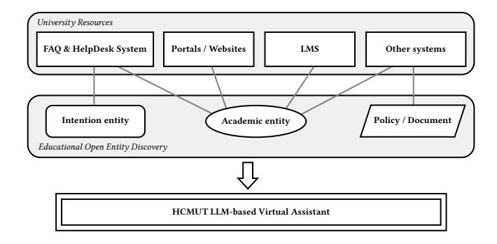
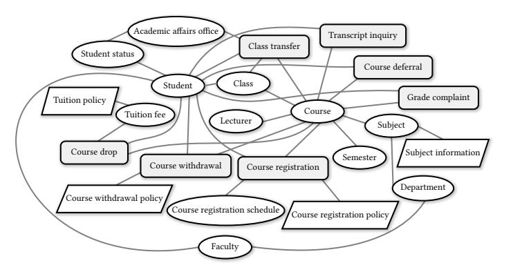
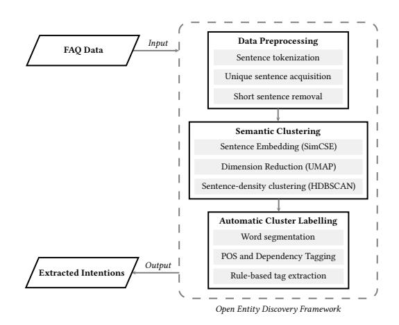
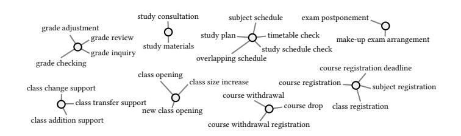
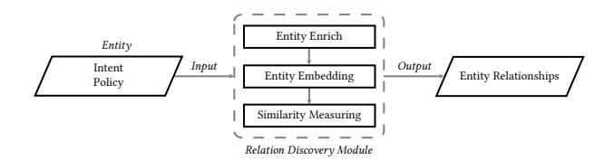
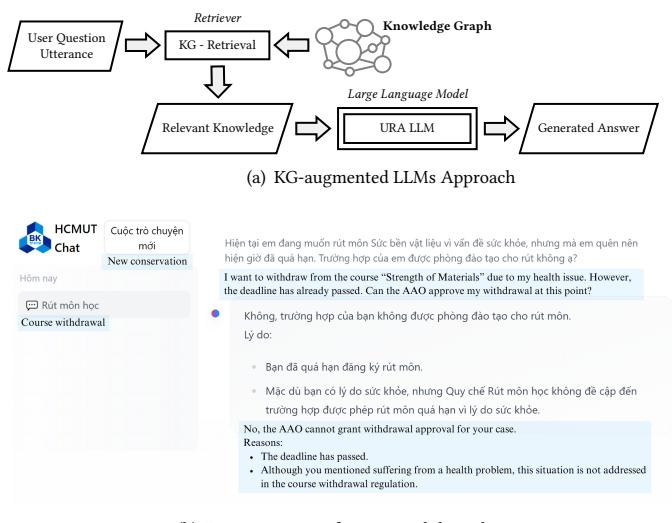

# Cross-Data Knowledge Graph Construction for LLM-enabled Educational Question-Answering System: A Case Study at HCMUT

[Tuan Bui](https://orcid.org/0000-0002-8587-182X)∗ tuanbc88@hcmut.edu.vn Ho Chi Minh City University of Technology (HCMUT) HoChiMinhCity, VietNam

Bao Ho bao.ho64qubit@hcmut.edu.vn Ho Chi Minh City University of Technology (HCMUT) HoChiMinhCity, VietNam

Oanh Tran oanh.tranotsc1123@hcmut.edu.vn Ho Chi Minh City University of Technology (HCMUT) HoChiMinhCity, VietNam

Long Nguyen long.nguyencse2023@hcmut.edu.vn Ho Chi Minh City University of Technology (HCMUT) HoChiMinhCity, VietNam

[Tho Quan](https://orcid.org/0000−0003−0467−6254)† qttho@hcmut.edu.vn Ho Chi Minh City University of Technology (HCMUT) HoChiMinhCity, VietNam

Phuong Nguyen phuong.nguyenvoid@hcmut.edu.vn Ho Chi Minh City University of Technology (HCMUT) HoChiMinhCity, VietNam

Thang Bui† bhthang@hcmut.edu.vn Ho Chi Minh City University of Technology (HCMUT) HoChiMinhCity, VietNam

# ABSTRACT

In today's rapidly evolving landscape of Artificial Intelligence, large language models (LLMs) have emerged as a vibrant research topic. LLMs find applications in various fields and contribute significantly. Despite their powerful language capabilities, similar to pre-trained language models (PLMs), LLMs still face challenges in remembering events, incorporating new information, and addressing domainspecific issues or hallucinations. To overcome these limitations, researchers have proposed Retrieval-Augmented Generation (RAG) techniques, some others have proposed the integration of LLMs with Knowledge Graphs (KGs) to provide factual context, thereby improving performance and delivering more accurate feedback to user queries.

Education plays a crucial role in human development and progress. With the technology transformation, traditional education is being replaced by digital or blended education. Therefore, educational data in the digital environment is increasing day by day. Data in higher education institutions are diverse, comprising various sources such as unstructured/structured text, relational databases, web/app-based API access, etc. Constructing a Knowledge Graph from these cross-data sources is not a simple task. This article proposes a method for automatically constructing a Knowledge

Conference'17, July 2017, Washington, DC, USA

© 2024 Association for Computing Machinery.

ACM ISBN 978-x-xxxx-xxxx-x/YY/MM. . . \$15.00

<https://doi.org/10.1145/nnnnnnn.nnnnnnn>

Graph from multiple data sources and discusses some initial applications (experimental trials) of KG in conjunction with LLMs for question-answering tasks.

## CCS CONCEPTS

• Computing methodologies → Information extraction; Ontology engineering; • Information systems → Ontologies; Question answering; Clustering and classification.

## KEYWORDS

Open Intent Discovery, Knowledge Graph, Large language model, Education, Question-Answering System

### ACM Reference Format:

Tuan Bui, Oanh Tran, Phuong Nguyen, Bao Ho, Long Nguyen, Thang Bui, and Tho Quan. 2024. Cross-Data Knowledge Graph Construction for LLMenabled Educational Question-Answering System: A Case Study at HCMUT. In Proceedings of ACM Conference (Conference'17). ACM, New York, NY, USA, [8](#page-7-0) pages.<https://doi.org/10.1145/nnnnnnn.nnnnnnn>

## 1 INTRODUCTION

A Large Language Model (LLM) is a language model trained on a considerably large size corpus. Nowadays, LLMs attract much attention from various communities due to their capacity to accomplish versatile language generation and comprehension. Notable LLM models reported to the public include OpenAI's GPT [\[23\]](#page-5-0), Google's BART [\[15\]](#page-5-1), LLaMa [\[26\]](#page-5-2) . To achieve a broad spectrum of general knowledge [\[22\]](#page-5-3) and refine their language ability [\[30\]](#page-5-4), state-of-theart LLMs nowadays are trained on a massive corpus of textual data. However, an LLM's completion might contain "hallucinations" [\[11\]](#page-5-5) because of limited access to information that is as up-to-date, proprietary, or domain-specific as humans. To address this issue and other

Permission to make digital or hard copies of all or part of this work for personal or classroom use is granted without fee provided that copies are not made or distributed for profit or commercial advantage and that copies bear this notice and the full citation on the first page. Copyrights for components of this work owned by others than ACM must be honored. Abstracting with credit is permitted. To copy otherwise, or republish, to post on servers or to redistribute to lists, requires prior specific permission and/or a fee. Request permissions from permissions@acm.org.

limitations, some hybrid models have shown prominent results by combining parametric memory with non-parametric memory [\[13\]](#page-5-6). Since their knowledge bases can be directly revised and expanded, and retrieved knowledge can be inspected and interpreted. This technique, which received a lot of traction after the publication of the famous Facebook research paper [\[16\]](#page-5-7), is well-known and coined as Retrieval-Augmented Generation (RAG).

However, in most real-world domains such as education, the data/information often originate from various departments and faculties within an institution, resulting in diverse data sources with different natures such as structured text, unstructured text, databases, images, or access through API mechanisms from existing web/app-based systems. For instance, at Ho Chi Minh City University of Technology (HCMUT)[1](#page-1-0) , unstructured data originate from legal documents, frequently asked questions (FAQs) from student support systems BKSI[2](#page-1-1) (Help Desk System), news from the website, data from databases, and information retrieved from API-enabled systems like teaching management systems LMS[3](#page-1-2) . Due to the crossdata nature, Knowledge Graphs (KGs) [\[9\]](#page-5-8) serve as a suitable nonparametric memory formalism for knowledge representation in the educational environment, allowing the effective deployment of a RAG system in this context. However, constructing a Knowledge Graph from multiple data sources, not specifically designed to be interoperable, is not a trivial task, in particular when one needs to deal with open intents [ref] commonly arising during casual conversations between students and the university staffs. Hence, to the best of our knowledge, there has not been a best-practice application of RAG from KG for LLMs in practical scenarios.

In this paper, we aim to pioneer a KG-based RAG approach for an Educational Question-Answering system. We propose a framework for the cross-data knowledge graph construction in the educational domain, which is currently implemented at HCMUT and leverages the Vietnamese language. This framework is applied as a pilot in a Language Model (LLM)-based system. Our contributions are of three-fold: (i) We introduce the technique of intental entity discovery for unstructured text in Vietnamese FAQ conversations; (ii) we present the embedding-based cross-data for relation discovery on education KG construction; and (iii) we conduct real-world experiments, specifically, LLM-enabled KG-based Question-Answering at HCMUT using RAG with the constructed educational KG.

## 2 RELATED WORK

## 1 Open Intent Discovery

The task of Open Intent Discovery [\[3\]](#page-5-9) presents several challenges and difficulties in the field of Natural Language Understanding and dialogue systems. One significant challenge is the inherent ambiguity and variability in user expressions. Unlike traditional intent recognition, where a predefined set of categories is used for classification, open intent discovery involves identifying user intents that may not have been encountered during the training phase. This introduces a level of uncertainty and unpredictability, as users can express their intents in diverse and unanticipated ways. Another challenge is the lack of sufficient labeled data for training models in

2https://mybk.hcmut.edu.vn/bksi/public/vi/

an open-world setting. Creating labeled datasets for every potential intent becomes impractical, especially when dealing with a wide range of domains and applications. This scarcity of annotated examples for novel intents makes it challenging for models to generalize effectively and accurately identify open intents. In recent years, there has been an increased interest in determining user intent from both written and spoken language, with a focus on modeling and comprehending interactions. Recent studies, such as a method employing a bidirectional LSTM and CRF for detecting user intent efficiently [\[27\]](#page-5-10), an unsupervised two-stage approach aimed at discovering intents and generating meaningful intent labels automatically from unlabeled utterances [\[28\]](#page-5-11), and a method mining unlabeled utterance data to uncover common intents [\[17\]](#page-5-12). These studies collectively highlight the significance of robust approaches for understanding user intent, paving the way for enhanced dialogue systems and virtual assistants. Open intents has been studied in fields such as Customer Care in businesses [\[17,](#page-5-12) [28\]](#page-5-11) and Healthcare facilities[\[19\]](#page-5-13); however, in the realm of education, particularly in Student Care, it remains relatively unexplored.

## 2 Knowledge Graph in Education Domain

Knowledge Graphs (KGs) have evolved as an effective way to represent knowledge. KGs present a structured and integrated representation of concepts, relationships, and attributes within a domain. There have been many studies on Educational KGs such as knowledge graph for mathematics [\[4\]](#page-5-14), ontology modeling university teaching programs and student profiles (EducOnto) [\[10\]](#page-5-15), knowledge schema for university teaching [\[24\]](#page-5-16), and knowledge graphs to identify labor market needs (education and employment) [\[5\]](#page-5-17). Notably, research on KGs for the Vietnamese educational area is sparse. Huong and Phuc [\[25\]](#page-5-18) introduced a framework for extracting triples (subject-predicate-object relationships) from Vietnamese. However, their technique has limitations in handling complex sentences and is applied to the travel area.

## 3 KG-augmented LLMs

One major hurdle for LLMs is their occasional struggle with factual accuracy and hallucinations. This is where KGs come in. KGs offer a structured representation of knowledge, encoding entities and their relationships in a machine-readable format. KG-augmented LLMs aim to bridge this gap by leveraging the strengths of both approaches. If the generated information from LLMs aligns with the "ground truth" represented by the KGs, it can be considered factually accurate and non-hallucinatory. This enhancing method involves refining the inference process of LLMs [\[1\]](#page-5-19), optimizing learning mechanisms [\[14\]](#page-5-20) , and establishing a result validation mechanism [\[12\]](#page-5-21). Significant progress has been made through these studies, highlighting the importance of continuous innovation and supporting the advancement of more advanced KG-augmented LLMs.

1https://hcmut.edu.vn

3https://lms.hcmut.edu.vn/

Cross-Data Knowledge Graph Construction for LLM-enabled Educational Question-Answering System: A Case Study at HCMUTConference'17, July 2017, Washington, DC, USA

# 3 TOWARDS CROSS-DATA KNOWLEDGE GRAPH CONSTRUCTION FOR LLM-ENABLED EDUCATIONAL QUESTION-ANSWERING SYSTEM

In this section, we delve into the methodological approach employed in our research to extract valuable insights from a multisource educational data environment for KG construction, served as the foundation of an LLM-enabled educational QA system. We begin by discussing the nature of the data sources in the university environment of HCMUT and how they contribute to a comprehensive understanding of the educational ecosystem. We then introduce the E-OED Framework (Educational Open Entity Discovery) , a robust methodology designed to explore intents using unsupervised learning methods. This framework is particularly adept at handling challenges such as overlapping entities, open intents, and data fusion from multiple sources. Lastly, we present our method for Relation Discovery, allowing us to explore relationships among different types of entities and construct a KG representing the education domain.

## 1 Multi-source educational data at HCMUT

In the dynamic landscape of a university environment like HCMUT, data streams from a myriad of sources, forming a complex multisource ecosystem. This diverse and interconnected web of entities provides a comprehensive picture of the university ecosystem, enabling a deeper understanding of user needs, educational processes, and the overall university environment. includes the following data sources.

Figure [1](#page-2-0) presents a cross-data environment at HCMUT, which includes the following data sources.

<!-- Image Description: The image is a system diagram illustrating the architecture of an HCMUT LLM-based virtual assistant. It shows how the virtual assistant integrates with various university resources (FAQ, HelpDesk, portals, LMS, other systems, and policies/documents). These resources are connected to an "Academic entity" and an "Intention entity" which feeds information into the virtual assistant via "Educational Open Entity Discovery". The diagram clarifies the data flow and integration points for the virtual assistant. -->

Fig. 1: Multi-source educational data at HCMUT

- FAQ and Help Desk System: In HCMUT, there is an online interactive system allowing students to raise their concerns arising during their study and feedback received from academic staff. Knowledge extractable from this source includes open intents, events, student issues, university services, the software system of the university.
- Academic Portals/Websites: These are all the websites that HCMUT updates frequently for academic news, university

policies/regulations, and course information. Knowledge extractable from this source includes guidance documents, detailed curricula, and program descriptions offered by HC-MUT, along with other entities such as organizations (university, faculty, department), locations (address number, city, district), and person names (students, lecturers, staffs).

• Learning Management System (LMS) and other supporting systems: These systems help students keep track of their coursework throughout the school year. Knowledge extractable from this source includes courses, keywords, discipline terminology, discipline theory, books, documents, journals, and course participants (students, lecturers, teaching assistants).

## 2 The E-OED Framework

<!-- Image Description: The image is a conceptual data model represented as a network graph. Nodes, representing entities like "Student," "Course," and "Department," are connected by edges showing relationships. Rectangular nodes represent policies or information, while ovals represent entities. The diagram illustrates the interconnectedness of various aspects within a university's academic system, likely to aid in understanding data relationships for a database or information system design. -->

Fig. 2: Entity type in education domain

Figure [2](#page-2-1) depicts the intricate task of extracting relationships within the educational domain and exploring intents. For instance, a certain Student may have his Student status, which is managed by Academic affairs office. This student also belongs to a certain Faculty and is enrolling in various instances of Class. The student can also leverage some academic service when necessary such as Course drop or Transcript inquiry. The graph showcases the complexity of mapping intents to academic entities, illustrating the nuanced connections that exist within this domain. This complexity underscores the necessity for robust methodologies to accurately decipher and analyze such relationships. The most challenging task towards such a KG construction is perhaps educational open entity discovery. These challenges include handling overlapping entities, exploring open intents (which lack extensive research compared to classified intents), and fusing data from multiple sources. Moreover, the Vietnamese language presents additional hurdles due to its status as a low-resource language. Furthermore, within educational environments, the intent of conversations are dynamic rather than fixed, and opened rather than limited. Consequently, the identification of open entities is crucial in the educational sphere. The E-OED Framework (Educational Open Entity Discovery), represented by Figure [3,](#page-3-0) aims to discover intents from FAQ data. This framework includes three processing modules known as Data Preprocessing, Semantic Clustering, and Automatic Cluster Labeling, each of which plays a crucial role in the intent discovery process.

Conference'17, July 2017, Washington, DC, USA Tuan Bui, et al.

<!-- Image Description: This flowchart depicts an open entity discovery framework. FAQ data is input, undergoing data preprocessing (tokenization, unique sentence acquisition, short sentence removal). Semantic clustering follows, using SimCSE for embedding, UMAP for dimension reduction, and HDBSCAN for clustering. Finally, automatic cluster labeling uses word segmentation, POS/dependency tagging, and rule-based tag extraction to produce extracted intentions as output. -->

Fig. 3: Educational Open Entity Discovery Framework

Data Preprocessing In this step, we split paragraphs to a list of single sentences, filtering out the noise, etc. This initial filtering helps us focus on the meat of the text.

Semantic Clustering To obtain sentence embedding, we employ SimCSE [\[6\]](#page-5-22) as our chosen embedding model. The model we use adheres to the SimCSE framework and has been developed utilizing the renowned pre-trained PhoBERT [\[20\]](#page-5-23) base. Before applying the embeddings to the clustering algorithm, it is essential to conduct dimension reduction methods. This precautionary step is taken to address the "curse of dimensionality," which can adversely impact the accuracy of clustering algorithms by influencing distance metrics and introducing unintended noise. We opt for UMAP over PCA and LDA. After implementing dimensionality reduction, we opt for HDBSCAN [\[18\]](#page-5-24) as our clustering algorithm.

Automatic Cluster Labeling The final step in this process involves the automatic labeling of the clusters. To accomplish this task, our initial approach entails employing the word-segmentation tool for sentence segmentation within each cluster. Subsequently, the segmented sentences undergo analysis using the PhoNLP [\[21\]](#page-5-25) to execute both POS tagging and dependency tagging. Following the extraction of tags by the PhoNLP, a rule-based approach is implemented. Further refinement is achieved by identifying the most frequently occurring tokens within each subset, which are then designated as our cluster labels. Figure [4](#page-3-1) presents a compilation of some of the discovered intents from the FAQ dataset as the results of Semantic Clustering and Cluster Labelling processes. Involving courses and class groups, there exists a multitude of inquiries ranging from course enrollment, class transfers, and capacity expansions, to timetable matters. Investigating the intents and associated entities can aid in providing good responses or initiating subsequent actions.

# 3 Embedding-based method for Relation Discovery

In the context of Relation Discovery between Intents and other entities, we adopt an Embedding-based approach. Due to resource and time constraints, we initially experimented with two major types of entities: intent and policy. To accommodate a large amount of diverse data with varying lengths, we employ two-stage retriever.

<!-- Image Description: The image displays a series of simple node-link diagrams, each illustrating a cluster of related student support services. Nodes represent service categories (e.g., "grade adjustment," "course registration") and links connect related services. The diagrams visually organize different support service areas, likely to clarify the scope and relationships between services offered within a university or educational setting. The purpose is to present a clear and concise overview of the support system for students. -->

Fig. 4: List of some discovered intents

We use Sentence-BERT to embed intent entities and policy entities. Once the embeddings are generated, we map different types of entities by measuring similarity or proximity between entity embeddings in multidimensional space.

After getting mapping between entities using embedding, we use tf\_idf to rerank and give higher scores to policies that have similar keywords with the intents. [\[8\]](#page-5-26), we identify implicit connections between entities. This analysis enables us to uncover meaningful associations and dependencies that might not be readily apparent from raw data alone. Figure [5](#page-3-2) illustrates the approach of using Embedding-based methods for relation discovery. Based on the discovered relationships, we construct a Knowledge Graph (KG) representing the education domain. Each entity type is depicted as a node in the graph, and relationships between entities are depicted as edges. The KG offers a structured representation of the semantic landscape within the education domain, facilitating efficient traversal, query processing, and inference tasks.

<!-- Image Description: This flowchart depicts a relation discovery module. Input, comprised of entity, intent, and policy, is processed through three stages: entity enrichment, entity embedding, and similarity measuring. The output is entity relationships. The diagram illustrates a data processing pipeline for identifying relationships between entities, using embedding and similarity measurement techniques. -->

Fig. 5: Relation Discovery Module using Embedding-based method

## 4 EXPERIMENTS

## 1 Datasets

The experimental datasets consist of three different datasets Banking77\_eng, Banking77\_vni, and FAQ\_HCMUT\_vni presented in Table [1.](#page-4-0) Banking77\_en [\[2\]](#page-5-27) is an English dataset that contains 77 customer intents from over 10,000 questions in the banking domain. Banking77\_vni is a Vietnamese dataset that is an auto-translation (using Google Translate) of the Banking77\_eng dataset. FAQ\_HCMUT\_vni is a Vietnamese dataset that contains over 200,000 frequently asked questions (FAQs) collected from the HelpDesk system of the HC-MUT. The Banking77\_eng and Banking77\_vni datasets are used to evaluate the performance of the our framework. While FAQ\_HCMUT\_vni dataset is used to demonstrate the result of the OED framework. To investigate the impact of different embeddings on clustering performance, our framework utilizes Vietnamese SimCSE for Vietnamese datasets, while the original BERTopic employs a sentencetransformers model (all-miniLM-L6 variant).

Cross-Data Knowledge Graph Construction for LLM-enabled Educational Question-Answering System: A Case Study at HCMUTConference'17, July 2017, Washington, DC, USA

## 2 Discovered Educational Open Intents

Table [1](#page-4-0) illustrates the outcomes of our experimentation in discovering intents across the specified datasets. To validate the OED Framework, we executed the BERTopic framework on two datasets, Banking77\_eng and Banking77\_vni. The clustering results in Cases 1 and 2 demonstrate the superior performance of the BERTopic framework with the English dataset, where 73 intents were identified, closely aligning with the 77 predetermined categories. However, in the Banking77\_vni dataset, the count of identified intents notably decreased to 65. In Case 3, the OED Framework exhibited better performance with the Banking77\_vni dataset compared to the BERTopic framework for the Vietnamese language, yielding 76 extracted intents. Subsequently, we applied the OED Framework to the HCMUT\_FAQ\_vni dataset (Case 4), resulting in a total of 284 clusters with significant noised clusters, and duplicated clusters. Despite this, approximately 372 intents were derived from these clusters, although a substantial number of intents remain undiscovered. As previously mentioned, Figure [4](#page-3-1) illustrates some remarkable open intents discovered by our approach.

### Table 1: Open intent discovery result

| Case | Framework     | Dataset       | Cluster's No | Extracted intent |
|------|---------------|---------------|--------------|------------------|
| 1    | BERTopic      | Banking77_eng | 157          | 73               |
| 2    | BERTopic      | Banking77_vni | 147          | 65               |
| 3    | OED Framework | Banking77_vni | 257          | 76               |
| 4    | OED Framework | HCMUT_FAQ_vni | 284          | 372              |

# 3 Embedding-based method for Relation Discovery Result

The embedding-based approach for relation discovery has yielded promising results in exploring relationships between entities, particularly in the education domain. Table [2](#page-4-1) show the result of Embeddingbased approach, in this experiment, there are 243 intent entities and 237 policy entities. Following our approach, and after several trials, we've settled on a threshold of 0.32. A total of 613 relationships between entity pairs (intent and policy) have been identified. Out of these, 53 intent entities do not have any associations with policy entities. For instance, the intent "download form" is broad and lacks specific entity references. Additionally, among these 53 intent entities without relationships, 22 intents are overlooked, indicating they indeed have connections with policies but were not detected. For example, "Cancel course" and "Withdraw course" are linked to the Withdrawal Policy.

| Entity pair              | [Intent, Policy] |  |
|--------------------------|------------------|--|
| No of entities           | [243 , 237]      |  |
| Discovered relationships | 613              |  |
| Non-associative intents  | 53               |  |
| Overlooked intents       | 22               |  |

# 4 KG-augmented LLMs Approach in Educational Context

To address the "KG-augmented LLMs" aspect of the research and its application in the education domain at HCMUT, we conduct a general pipeline of the question-answering system following the Figure [6](#page-4-2) (a). The process of answering user questions involves feeding the question into our institution's LLM, URA, which generates a structured query in the form of Neo4j's Cypher language, as our knowledge graph database is built on Neo4j. This query searches a knowledge graph database handcrafted using intent discovery's result to retrieve matching sub-graphs and relevant triples. Next, the triples are converted into a natural language format and combined with the original user question to create a final prompt for the LLM. The prompt guides the LLM in generating a coherent and accurate answer as demonstrated in Figure [6](#page-4-2) (b).

<!-- Image Description: The image displays a flowchart illustrating a knowledge graph (KG)-augmented large language model (LLM) approach. The flowchart shows user input (question/utterance) processed through a retriever accessing a KG, feeding relevant knowledge to a URA LLM which generates an answer. Below, a sample chatbot interaction demonstrates the system handling a course withdrawal request, showing both user input and system's response in Vietnamese and English. The image showcases the system's architecture and example functionality. -->

(b) Demonstration of course withdrawal case

Fig. 6: KG-augmented LLMs Approach and Demonstration of course withdrawal case

## 5 Discussion

The section above outlines the outcomes of our research efforts focused on three key areas: Discovering open-intents, Developing an embedding-based technique for Relation Discovery, and Implementing KG-augmented LLMs approach.

First, discovering open-intents through unsupervised approach shows promising results, but applying it to Vietnamese encounters various difficulties due to the language's specific characteristics. There is a considerable amount of overlapping and repetitive clusters due to the inadequate performance of NLP toolkits for Vietnamese. Named Entity (NE) within sentences further interferes with the clustering process. Due to the subpar clustering step, automatic labeling is also affected accordingly. Applying Hyponym-approach to these NERs represents a potential approach for optimizing clustering.

Second, the Embedding-based method for Relation Discovery has shown promising results in identifying relationships between entities. However, further research is needed to explore the different types of relations that can be discovered using this method. Additionally, there is a need to develop more robust and accurate methods for relation extraction and classification.

Finally, the KG-augmented LLMs approach is initially implemented by using off-the-shelf tools from Neo4J. The KG-retrieval engine extracts triplets. The advantages of this method are that the information is condensed and accurate, and the triplets also represent relations to help the LLM answer questions better. However, the triplets retrieval engine only extracts relevant triples and does not have a ranking mechanism to help eliminate redundant triples.

## 5 CONCLUSION

In this article, we introduce an approach to open intent discovery using unsupervised learning methods. To the best of our knowledge, this is the first paper to use this approach for open intent discovery in Vietnamese. The results are evaluated on three datasets: Bankinf77\_eng, Banking77\_vni, and HCMUT\_FAQ\_vni. Additionally, we perform preliminary experiments on discovering the relationships between intents and other entities to build a KG for the education domain. We also conduct some experiments on applying the KG to LLM.

## REFERENCES

- [1] Jinheon Baek, Alham Fikri Aji, and Amir Saffari. 2023. Knowledge-Augmented Language Model Prompting for Zero-Shot Knowledge Graph Question Answering. In Proceedings of the 1st Workshop on Natural Language Reasoning and Structured Explanations (NLRSE), Bhavana Dalvi Mishra, Greg Durrett, Peter Jansen, Danilo Neves Ribeiro, and Jason Wei (Eds.). Association for Computational Linguistics, Toronto, Canada, 78–106.<https://doi.org/10.18653/v1/2023.nlrse-1.7>
- [2] Iñigo Casanueva, Tadas Temčinas, Daniela Gerz, Matthew Henderson, and Ivan Vulić. 2020. Efficient Intent Detection with Dual Sentence Encoders. arXiv[:2003.04807](https://arxiv.org/abs/2003.04807) [cs.CL]
- [3] Minhua Chen, Badrinath Jayakumar, Michael Johnston, S. Eman Mahmoodi, and Daniel Pressel. 2022. Intent Discovery for Enterprise Virtual Assistants: Applications of Utterance Embedding and Clustering to Intent Mining. In North American Chapter of the Association for Computational Linguistics. [https://api.](https://api.semanticscholar.org/CorpusID:250390998) [semanticscholar.org/CorpusID:250390998](https://api.semanticscholar.org/CorpusID:250390998)
- [4] Penghe Chen, Yu Lu, Vincent W. Zheng, Xiyang Chen, and Boda Yang. 2018. KnowEdu: A System to Construct Knowledge Graph for Education. IEEE Access 6 (2018), 31553–31563.<https://doi.org/10.1109/ACCESS.2018.2839607>
- [5] Yousra Fettach, Mounir Ghogho, and Boualem Benatallah. 2022. Knowledge Graphs in Education and Employability: A Survey on Applications and Techniques. IEEE Access 10 (2022), 80174–80183. [https://doi.org/10.1109/ACCESS.](https://doi.org/10.1109/ACCESS.2022.3194063) [2022.3194063](https://doi.org/10.1109/ACCESS.2022.3194063)
- [6] Tianyu Gao, Xingcheng Yao, and Danqi Chen. 2022. SimCSE: Simple Contrastive Learning of Sentence Embeddings. arXiv[:2104.08821](https://arxiv.org/abs/2104.08821) [cs.CL]
- [7] Maarten Grootendorst. 2022. BERTopic: Neural topic modeling with a class-based TF-IDF procedure. arXiv preprint arXiv:2203.05794 (2022).
- [8] Cheng Guo and Felix Berkhahn. 2016. Entity Embeddings of Categorical Variables. arXiv[:1604.06737](https://arxiv.org/abs/1604.06737) [cs.LG]
- [9] Aidan Hogan, Eva Blomqvist, Michael Cochez, Claudia D'amato, Gerard De Melo, Claudio Gutierrez, Sabrina Kirrane, José Emilio Labra Gayo, Roberto Navigli, Sebastian Neumaier, Axel-Cyrille Ngonga Ngomo, Axel Polleres, Sabbir M. Rashid, Anisa Rula, Lukas Schmelzeisen, Juan Sequeda, Steffen Staab, and Antoine Zimmermann. 2021. Knowledge Graphs. Comput. Surveys 54, 4 (July 2021), 1–37. <https://doi.org/10.1145/3447772>
- [10] Nicolas Hubert, Armelle Brun, and Davy Monticolo. 2022. New Ontology and Knowledge Graph for University Curriculum Recommendation.
- [11] Ziwei Ji, Nayeon Lee, Rita Frieske, Tiezheng Yu, Dan Su, Yan Xu, Etsuko Ishii, Ye Jin Bang, Andrea Madotto, and Pascale Fung. 2023. Survey of Hallucination in Natural Language Generation. Comput. Surveys 55, 12 (March 2023), 1–38. <https://doi.org/10.1145/3571730>
- [12] Minki Kang, Jin Myung Kwak, Jinheon Baek, and Sung Ju Hwang. 2023. Knowledge Graph-Augmented Language Models for Knowledge-Grounded Dialogue Generation. arXiv[:2305.18846](https://arxiv.org/abs/2305.18846) [cs.CL]
- [13] Vladimir Karpukhin, Barlas Oğuz, Sewon Min, Patrick Lewis, Ledell Wu, Sergey Edunov, Danqi Chen, and Wen tau Yih. 2020. Dense Passage Retrieval for Open-Domain Question Answering. arXiv[:2004.04906](https://arxiv.org/abs/2004.04906) [cs.CL]
- [14] Seungone Kim, Se Joo, Doyoung Kim, Joel Jang, Seonghyeon Ye, Jamin Shin, and Minjoon Seo. 2023. The CoT Collection: Improving Zero-shot and Few-shot Learning of Language Models via Chain-of-Thought Fine-Tuning. In Proceedings of the 2023 Conference on Empirical Methods in Natural Language Processing, Houda Bouamor, Juan Pino, and Kalika Bali (Eds.). Association for Computational

Linguistics, Singapore, 12685–12708. [https://doi.org/10.18653/v1/2023.emnlp](https://doi.org/10.18653/v1/2023.emnlp-main.782)[main.782](https://doi.org/10.18653/v1/2023.emnlp-main.782)

- [15] Mike Lewis, Yinhan Liu, Naman Goyal, Marjan Ghazvininejad, Abdelrahman Mohamed, Omer Levy, Ves Stoyanov, and Luke Zettlemoyer. 2019. BART: Denoising Sequence-to-Sequence Pre-training for Natural Language Generation, Translation, and Comprehension. arXiv[:1910.13461](https://arxiv.org/abs/1910.13461) [cs.CL]
- [16] Patrick Lewis, Ethan Perez, Aleksandra Piktus, Fabio Petroni, Vladimir Karpukhin, Naman Goyal, Heinrich Küttler, Mike Lewis, Wen tau Yih, Tim Rocktäschel, Sebastian Riedel, and Douwe Kiela. 2021. Retrieval-Augmented Generation for Knowledge-Intensive NLP Tasks. arXiv[:2005.11401](https://arxiv.org/abs/2005.11401) [cs.CL]
- [17] Pengfei Liu, Youzhang Ning, King Keung Wu, Kun Li, and Helen Meng. 2021. Open Intent Discovery through Unsupervised Semantic Clustering and Dependency Parsing. arXiv[:2104.12114](https://arxiv.org/abs/2104.12114) [cs.CL]
- [18] Leland McInnes, John Healy, Steve Astels, et al. 2017. hdbscan: Hierarchical density based clustering. J. Open Source Softw. 2, 11 (2017), 205.
- [19] Ankan Mullick, Ishani Mondal, Sourjyadip Ray, R Raghav, G Sai Chaitanya, and Pawan Goyal. 2023. Intent Identification and Entity Extraction for Healthcare Queries in Indic Languages. arXiv[:2302.09685](https://arxiv.org/abs/2302.09685) [cs.IR]
- [20] Dat Quoc Nguyen and Anh Tuan Nguyen. 2020. PhoBERT: Pre-trained language models for Vietnamese. In Findings of the Association for Computational Linguistics: EMNLP 2020, Trevor Cohn, Yulan He, and Yang Liu (Eds.). Association for Computational Linguistics, Online, 1037–1042. [https://doi.org/10.18653/v1/2020.](https://doi.org/10.18653/v1/2020.findings-emnlp.92) [findings-emnlp.92](https://doi.org/10.18653/v1/2020.findings-emnlp.92)
- [21] Linh The Nguyen and Dat Quoc Nguyen. 2021. PhoNLP: A joint multi-task learning model for Vietnamese part-of-speech tagging, named entity recognition and dependency parsing. In Proceedings of the 2021 Conference of the North American Chapter of the Association for Computational Linguistics: Demonstrations. 1–7.
- [22] Fabio Petroni, Tim Rocktäschel, Patrick Lewis, Anton Bakhtin, Yuxiang Wu, Alexander H. Miller, and Sebastian Riedel. 2019. Language Models as Knowledge Bases? arXiv[:1909.01066](https://arxiv.org/abs/1909.01066) [cs.CL]
- [23] Alec Radford, Karthik Narasimhan, Tim Salimans, Ilya Sutskever, et al. 2018. Improving language understanding by generative pre-training. (2018).
- [24] Mariia Rizun. 2019. Knowledge Graph Application in Education: a Literature Review. Acta Universitatis Lodziensis. Folia Oeconomica 3 (08 2019), 7–19. [https:](https://doi.org/10.18778/0208-6018.342.01) [//doi.org/10.18778/0208-6018.342.01](https://doi.org/10.18778/0208-6018.342.01)
- [25] Huong Duong To and Phuc Do. 2020. Extracting triples from Vietnamese text to create knowledge graph. In 12th International Conference on Knowledge and Systems Engineering, KSE 2020, Can Tho City, Vietnam, November 12-14, 2020. IEEE, 219–223.<https://doi.org/10.1109/KSE50997.2020.9287471>
- [26] Hugo Touvron, Louis Martin, Kevin Stone, Peter Albert, Amjad Almahairi, Yasmine Babaei, Nikolay Bashlykov, Soumya Batra, Prajjwal Bhargava, Shruti Bhosale, Dan Bikel, Lukas Blecher, Cristian Canton Ferrer, Moya Chen, Guillem Cucurull, David Esiobu, Jude Fernandes, Jeremy Fu, Wenyin Fu, Brian Fuller, Cynthia Gao, Vedanuj Goswami, Naman Goyal, Anthony Hartshorn, Saghar Hosseini, Rui Hou, Hakan Inan, Marcin Kardas, Viktor Kerkez, Madian Khabsa, Isabel Kloumann, Artem Korenev, Punit Singh Koura, Marie-Anne Lachaux, Thibaut Lavril, Jenya Lee, Diana Liskovich, Yinghai Lu, Yuning Mao, Xavier Martinet, Todor Mihaylov, Pushkar Mishra, Igor Molybog, Yixin Nie, Andrew Poulton, Jeremy Reizenstein, Rashi Rungta, Kalyan Saladi, Alan Schelten, Ruan Silva, Eric Michael Smith, Ranjan Subramanian, Xiaoqing Ellen Tan, Binh Tang, Ross Taylor, Adina Williams, Jian Xiang Kuan, Puxin Xu, Zheng Yan, Iliyan Zarov, Yuchen Zhang, Angela Fan, Melanie Kambadur, Sharan Narang, Aurelien Rodriguez, Robert Stojnic, Sergey Edunov, and Thomas Scialom. 2023. Llama 2: Open Foundation and Fine-Tuned Chat Models. arXiv[:2307.09288](https://arxiv.org/abs/2307.09288) [cs.CL]
- [27] Nikhita Vedula, Nedim Lipka, Pranav Maneriker, and Srinivasan Parthasarathy. 2019. Towards Open Intent Discovery for Conversational Text. arXiv[:1904.08524](https://arxiv.org/abs/1904.08524) [cs.IR]
- [28] Nikhita Vedula, Nedim Lipka, Pranav Maneriker, and Srinivasan Parthasarathy. 2020. Open Intent Extraction from Natural Language Interactions. In Proceedings of The Web Conference 2020 (Taipei, Taiwan) (WWW '20). Association for Computing Machinery, New York, NY, USA, 2009–2020. [https://doi.org/10.1145/](https://doi.org/10.1145/3366423.3380268) [3366423.3380268](https://doi.org/10.1145/3366423.3380268)
- [29] Wenhui Wang, Furu Wei, Li Dong, Hangbo Bao, Nan Yang, and Ming Zhou. 2020. MiniLM: Deep Self-Attention Distillation for Task-Agnostic Compression of Pre-Trained Transformers. arXiv[:2002.10957](https://arxiv.org/abs/2002.10957) [cs.CL]
- [30] Jason Wei, Yi Tay, Rishi Bommasani, Colin Raffel, Barret Zoph, Sebastian Borgeaud, Dani Yogatama, Maarten Bosma, Denny Zhou, Donald Metzler, Ed H. Chi, Tatsunori Hashimoto, Oriol Vinyals, Percy Liang, Jeff Dean, and William Fedus. 2022. Emergent Abilities of Large Language Models. arXiv[:2206.07682](https://arxiv.org/abs/2206.07682) [cs.CL]

Cross-Data Knowledge Graph Construction for LLM-enabled Educational Question-Answering System: A Case Study at HCMUTConference'17, July 2017, Washington, DC, USA

## A APPENDIX

## A.1 E-OED Framework Analysis

This appendix provides further details on the implementation of the E-OED framework. We discuss key design choices, such as hyperparameter selection and embedding models, along with the insights gained from related experiments.

This section will also discuss three core modules in E-OED frameworks known as Data Preprocessing, Semantic Clustering and Automatic Cluster Labeling

The result achieved by different design choices is represented in detail at [4](#page-7-1)

A.1.1 Data Preprocessing. Due to Vietnamese being a predominantly analytic language with a large number of monosyllabic morphemes (meaningful units), words are often formed by combining these morphemes. This can present challenges for the original BERTopic framework, which relies on cTF-IDF (class-based TF-IDF)[\[7\]](#page-5-28) for topic modeling. To address this, we implemented an additional preprocessing step that leverages a word segmentation model to combine sub-word units into complete words. These newly formed words are then joined using an underscore character ("\_"). (e.g., subject-"môn ho. c" becomes "môn\_ho. c", course-"khóa ho. c" becomes "khóa\_ho. c").

Furthermore, to comply with dataset privacy policies, we implemented a text anonymization tool to censor any personally identifiable information (PII) within the sentences. Details regarding the specific objects censored and the corresponding replacement terms are presented in Table [3](#page-6-0)

### Table 3: Data censored tool

| Objects      | Method                        | Term Replace   |
|--------------|-------------------------------|----------------|
| Person Name  | NER (BERT)                    | [full_name]    |
| Student ID   | Regex (7 number format)       | [student_id]   |
| Phone number | Regex (10 number format)      | [phone_number] |
| Email        | Regex (ordinary email with @) | [email]        |

A.1.2 Semantic Clustering. Our model consists of three primary components:

- Sentence Embedding: extracts vector representations of sentences.
- Dimension Reduction: addresses the "curse of dimensionality" by compressing these embeddings into a lower-dimensional space, improving computational efficiency.
- Sentence-density clustering: groups sentences based on their reduced-dimensional representations.

Our model's performance is highly sensitive to the chosen hyperparameters. We explored various options for each module: Sentence Embedding:

- BERTopic Base Model (MiniLM-L6): A 6-layer Microsoft MiniLM [\[29\]](#page-5-29) fine-tuned on a 1 billion sentence pair dataset.
- Supervised Vietnamese SimCSE: Fine-tuned from the PhoBERT model.

Dimension Reduction (UMAP):

- Number of neighbors: 20, Number of components: 4
- Number of neighbors: 15, Number of components: 9

Sentence-Density Clustering (HDBSCAN):

- Minimum Cluster Size: 15
- Minimum Cluster Size: 20

We evaluated different combinations of these hyperparameters to identify the optimal configuration for our task.

A.1.3 Automatic Cluster Labeling. This section details the process for extracting descriptive labels for our identified clusters. We first select the seven most representative sentences for each cluster. These sentences are chosen based on their similarity to keywords generated using cTF-IDF.

Within this approach, a key hyperparameter is the range of word lengths considered for keyword extraction. We experiment with two settings: a range of 5-7 words and a range of 4-11 words. The first setting targets terms with lengths between 5 and 7 words, while the second allows for terms between 4 and 11 words.

Following keyword extraction, the chosen sentences are processed using the PhoNLP model to obtain Part-of-Speech (PoS) and dependency tags. We then leverage these tags in conjunction with pre-defined rules (detailed in the Algorithm [1\)](#page-6-1) to generate descriptive labels for each cluster.

| Algorithm 1 Tag extraction algorithms                                                              |  |  |  |
|----------------------------------------------------------------------------------------------------|--|--|--|
| 1: function ExtractSentenceElements(𝑐𝑎𝑡𝑒𝑔𝑜𝑟 𝑦_𝑑𝑜𝑐𝑠)                                                |  |  |  |
| 2: Initialize list of labels                                                                    |  |  |  |
| 3: for each sentence in 𝑐𝑎𝑡𝑒𝑔𝑜𝑟 𝑦_𝑑𝑜𝑐𝑠 do                                                       |  |  |  |
| 4: Clean the sentence by stripping whitespace                                                   |  |  |  |
| 5: Get the annotation result from 𝑃ℎ𝑜𝑁 𝐿𝑃                                                       |  |  |  |
| 6: Extract the part-of-speech (POS) and dependency (DEP) information                            |  |  |  |
| 7: Initialize lists for verbs, direct objects, verb modifiers, and other list                   |  |  |  |
| 8: Initialize variables for root position, direct object positions, verb modifier position, and |  |  |  |
| preposition position                                                                               |  |  |  |
| #Extract all related positions                                                                     |  |  |  |
| 9: Create a set to store the relevant positions                                                 |  |  |  |
| 10: for each token in the sentence do                                                           |  |  |  |
| 11: if the token is the root of the sentence then                                               |  |  |  |
| 12: Add its position to the set                                                                 |  |  |  |
| 13: while the length of the position set is changing do                                         |  |  |  |
| 14: for each token in the document do                                                           |  |  |  |
| 15: if the token's dependency is related to the root or other relevant positions                |  |  |  |
| then                                                                                               |  |  |  |
| 16: Add its position to the set                                                                 |  |  |  |
| 17: if the length of the set doesn't change then                                                |  |  |  |
| 18: Break the loop                                                                              |  |  |  |
| #Extract the sentence elements                                                                     |  |  |  |
| 19: for each token in the document do                                                           |  |  |  |
| 20: if the token's dependency is 'root' then                                                    |  |  |  |
| 21: Add it to the verbs and consecutive lists                                                   |  |  |  |
| 22: if the token's dependency is 'prp' and its position is in the set then                      |  |  |  |
| 23: Add it to the direct objects lists                                                          |  |  |  |
| 24: if the token's dependency is 'dob' then                                                     |  |  |  |
| 25: Add it to the direct objects list                                                           |  |  |  |
| 26: if the token's dependency is 'vmod' and its position is related to the root, preposition,   |  |  |  |
| or verb modifier positions then                                                                    |  |  |  |
| 27: Add it to the verb modifiers list                                                           |  |  |  |
| 28: if the token's dependency is 'nmod' and its position is related to a direct object          |  |  |  |
| position then                                                                                      |  |  |  |
| 29: Add it to the other list                                                                    |  |  |  |
| 30: if the token's position or its dependency's position is in the set and the dependency       |  |  |  |
| is in a predefined list then                                                                       |  |  |  |
| 31: Add the token to the other list                                                             |  |  |  |
| 32: Extract the most frequent tokens in each list.                                              |  |  |  |
| 33: Add the tokens into list of labels                                                          |  |  |  |
| 34: return list of labels                                                                       |  |  |  |

In order to reduce noises on newly extracted tags, we then take the most frequently occurring tokens within each subset, which are then designated as our cluster labels. For better cluster labels, LLMs can be used.

A.1.4 Result and Insights. There are 5 experiments with different design selection in total:

- (1) Experiment 1:
  - Dataset: Banking77\_eng
  - Number of Neighbors: 20
  - Number of Components: 4
  - Minimum Cluster Size: 20
  - cTF-IDF Range: [5-7]
- (2) Experiment 2:
  - Dataset: Banking77\_vni
  - (a) Experiment 2.1:
    - Number of Neighbors: 20
    - Number of Components: 4
    - Minimum Cluster Size: 20
    - cTF-IDF Range: [5-7]
  - (b) Experiment 2.2:
    - Number of Neighbors: 15
    - Number of Components: 9
    - Minimum Cluster Size: 15
    - cTF-IDF Range: [4-11]
- (3) Experiment 3:
  - Dataset: Banking77\_vni
  - Language Model: SimCSE (instead of MiniLM)
  - (a) Experiment 3.1
    - Number of Neighbors: 20
    - Number of Topics: 4
    - Minimum Cluster Size: 20
    - cTF-IDF Range: [5-7]
  - (b) Experiment 3.2
    - Number of Neighbors: 15
    - Number of Components: 9
    - Minimum Cluster Size: 15
    - cTF-IDF Range: [4-11]

#### Table 4: Design selection result

| Experiment     | Intentions Discovered |
|----------------|-----------------------|
| Experiment 1   | 73                    |
| Experiment 2.1 | 65                    |
| Experiment 2.2 | 74                    |
| Experiment 3.1 | 71                    |
| Experiment 3.2 | 76                    |

Our experiments revealed several key insights. Firstly, the original embedding model, despite not being trained on Vietnamese data, achieved reasonable performance on our banking77\_vni dataset. This suggests potential transferability due to structural similarities across languages. However, fine-tuning a dedicated embedding model specifically for Vietnamese could likely yield further improvements. Evaluating the quality of the embedding model can be achieved by analyzing the representative sentences within each cluster. Greater semantic similarity within clusters signifies a more effective model.

Secondly, a higher number of components in UMAP increases focus on local attributes, leading to greater separation and potentially clearer visualizations. However, it's crucial to be mindful of the "curse of dimensionality" when employing this approach.

Finally, the framework is sensitive to hyperparameter selection. Due to the presence of numerous hyperparameters requiring tuning, careful consideration should be given when applying this method to your specific domain or FAQ dataset.
