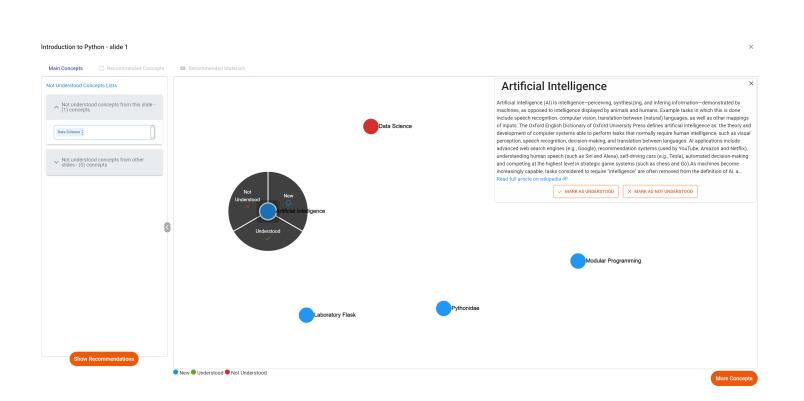
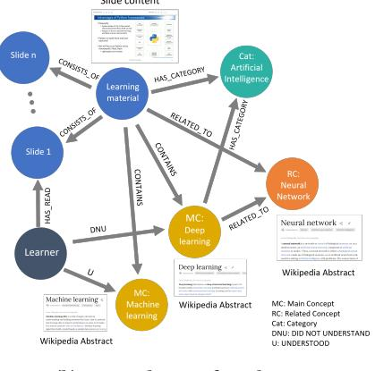
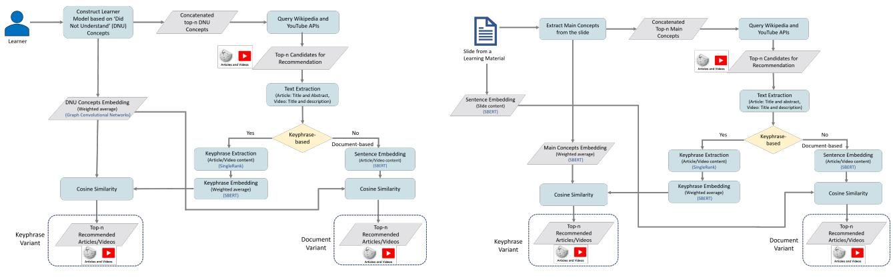
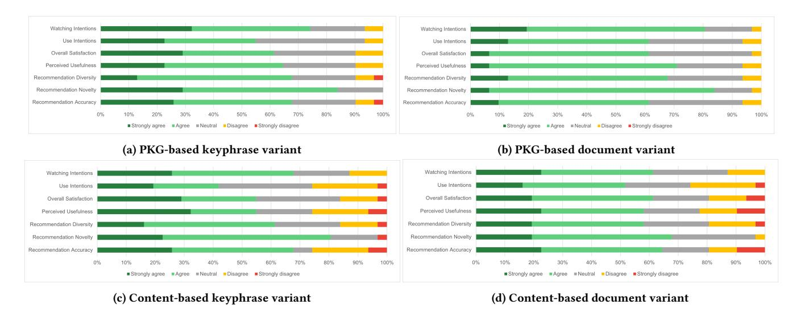

# Learner Modeling and Recommendation of Learning Resources using Personal Knowledge Graphs

Qurat Ul Ain Social Computing Group, Faculty of Computer Science, University of Duisburg-Essen Duisburg, Germany qurat.ain@stud.uni-due.de

Rawaa Alatrash Social Computing Group, Faculty of Computer Science, University of Duisburg-Essen Duisburg, Germany rawaa.alatrash@stud.uni-due.de

Mohamed Amine Chatti Social Computing Group, Faculty of Computer Science, University of Duisburg-Essen Duisburg, Germany mohamed.chatti@uni-due.de

Shoeb Joarder Social Computing Group, Faculty of Computer Science, University of Duisburg-Essen Duisburg, Germany shoeb.joarder@uni-due.de

Paul Arthur Meteng Kamdem

Social Computing Group, Faculty of Computer Science, University of Duisburg-Essen Duisburg, Germany paul.meteng@stud.uni-due.de

Clara Siepmann Social Computing Group, Faculty of Computer Science, University of Duisburg-Essen Duisburg, Germany clara.siepmann@uni-due.de

→ Interactive learning environments; • Information systems → Information systems applications.

# ABSTRACT

Educational recommender systems (ERS) are playing a pivotal role in providing recommendations of personalized resources and activities to students, tailored to their individual learning needs. A fundamental part of generating recommendations is the learner modeling process that identifies students' knowledge state. Current ERSs, however, have limitations mainly related to the lack of transparency and scrutability of the learner models as well as capturing the semantics of learner models and learning materials. To address these limitations, in this paper we empower students to control the construction of their personal knowledge graphs (PKGs) based on the knowledge concepts that they actively mark as 'did not understand (DNU)' while interacting with learning materials. We then use these PKGs to build semantically-enriched learner models and provide personalized recommendations of external learning resources. We conducted offline experiments and an online user study (N=31), demonstrating the benefits of a PKG-based recommendation approach compared to a traditional content-based one, in terms of several important user-centric aspects including perceived accuracy, novelty, diversity, usefulness, user satisfaction, and use intentions. In particular, our results indicate that the degree of control students are able to exert over the learner modeling process, has positive consequences on their satisfaction with the ERS and their intention to accept its recommendations.

# CCS CONCEPTS

• Computing methodologies → Knowledge representation and reasoning; Information extraction; • Applied computing

LAK '24, March 18–22, 2024, Kyoto, Japan

© 2024 Copyright held by the owner/author(s). Publication rights licensed to ACM. ACM ISBN 979-8-4007-1618-8/24/03. . . \$15.00 <https://doi.org/10.1145/3636555.3636881>

# KEYWORDS

Learning Analytics, Educational Recommender System, MOOC, Personal Knowledge Graph, Learner Modeling, Open Learner Model, Sentence Encoder

## ACM Reference Format:

Qurat Ul Ain, Mohamed Amine Chatti, Paul Arthur Meteng Kamdem, Rawaa Alatrash, Shoeb Joarder, and Clara Siepmann. 2024. Learner Modeling and Recommendation of Learning Resources using Personal Knowledge Graphs. In The 14th Learning Analytics and Knowledge Conference (LAK '24), March 18–22, 2024, Kyoto, Japan. ACM, New York, NY, USA, [11](#page-10-0) pages. [https://doi.](https://doi.org/10.1145/3636555.3636881) [org/10.1145/3636555.3636881](https://doi.org/10.1145/3636555.3636881)

# 1 INTRODUCTION

Massive Open Online Courses (MOOCs) have emerged as pivotal players, enjoying immense popularity. These online platforms have democratized education, making high-quality courses accessible to a global audience and bridging the gap between traditional and digital education [\[30\]](#page-10-1). However, as MOOCs continue to flourish, they present a new challenge: the need to guide learners through the vast array of available resources. This challenge becomes increasingly crucial in the context of lifelong learning and the evolving educational landscape. To address this issue, educational recommender systems (ERSs) have emerged as indispensable tools to improve the learning experience through personalized recommendations of various resources and activities to students, based on their learning needs and interests [\[2\]](#page-9-0).

In the context of recommending learning resources, it is crucial to recommend accurate resources tailored to learners' needs for better learning outcomes. Therefore, an accurate learner model plays an important role in enhancing the performance of the ERS to provide personalized recommendations. While increasingly popular, current ERSs suffer from three main limitations. Firstly, most current content-based ERSs provide the same recommendation to different learners, regardless of their individual levels of knowledge deficiency and learning needs [\[40\]](#page-10-2). Secondly, most of the current

Permission to make digital or hard copies of all or part of this work for personal or classroom use is granted without fee provided that copies are not made or distributed for profit or commercial advantage and that copies bear this notice and the full citation on the first page. Copyrights for components of this work owned by others than the author(s) must be honored. Abstracting with credit is permitted. To copy otherwise, or republish, to post on servers or to redistribute to lists, requires prior specific permission and/or a fee. Request permissions from permissions@acm.org.

ERSs typically use content similarity as the basis for the recommendation of learning resources. To compute similarities, ERSs often employ classical statistical methods (e.g., TF-IDF) that do not consider the context of the words or the semantic similarity between words during the extraction and representation of the learning resources. Thirdly, the learner models used in current personalized ERSs are often not transparent and scrutable. In most cases, students have no means to get sufficient information about how their models were built. While there are few attempts to build open learner models (OLMs) and use them to explain ERSs (e.g., [\[1,](#page-9-1) [2,](#page-9-0) [9,](#page-9-2) [10\]](#page-9-3)), the used OLMs, however, commonly operate as a "black box" and give students no insight into how they internally work to estimate their knowledge states. Moreover, these OLMs do not allow students to scrutinize (i.e., correct or modify) their models as they see fit.

To address these limitations, in this work we leverage personal knowledge graphs (PKGs) to model learners' knowledge state and generate personalized recommendations of learning resources in a MOOC environment, called CourseMapper [\[4\]](#page-9-4). Specifically, to build a PKG for each student, we leverage keyphrase extraction and entity linking techniques to automatically extract knowledge concepts from learning materials. Building on the existing literature on interactive recommendation [\[21,](#page-9-5) [24\]](#page-10-3) which stresses the importance of having users in the loop and incorporating their input and feedback into the recommendation process to improve recommendations, we give control to students to explicitly mark the concepts that they did not understand (referred to as DNU concepts). We then combine PKGs and graph convolutional networks (GCN) to model students' knowledge state. To address the semantic issues, we leverage pre-trained transformer sentence encoders (SBERT) to represent learner models and learning resources and compute their similarities. We designed and implemented two recommendation approaches, namely a traditional content-based recommender and a personalized recommender based on PKGs. Additionally, for each recommendation approach, we developed a keyphrase and a document variant.

This paper aims to investigate the impact of PKG-based recommendations of learning resources on accuracy and students' perceptions of the benefits of this approach. The following research questions guide our investigation:

- RQ1: How to effectively leverage PKGs to model students' knowledge and recommend learning resources in a MOOC environment?
- RQ2: What is the effect of a keyphrase extraction step on the accuracy and perceived benefits of the ERS?
- RQ3: How does a PKG-based recommendation approach perform in terms of system accuracy compared to a contentbased one?
- RQ4: What is the potential impact of a PKG-based recommendation approach on learners' perceptions of the ERS in terms of accuracy, novelty, diversity, usefulness, overall satisfaction, use intentions, and watch intention?

To answer these research questions, we conducted offline experiments as well as an online user study (N=31). Our results suggest that (1) the keyphrase extraction step proved to be beneficial in enhancing the accuracy and the perceived system qualities of the ERS, (2) the PKG-based recommendation approach has led to improved ranking accuracy of the recommendations, and (3) in general, the students had a positive attitude towards the PKG-based approach compared to the content-based one. In particular, our results indicate that opening and scrutinizing the PKG-based learner model has a positive effect on the students' overall satisfaction and motivation to further use the PKG-based ERS.

The rest of this paper is organized as follows. Section [2](#page-1-0) outlines the theoretical background of this research and discusses the related work. Section [3](#page-3-0) presents the design and technical details of our proposed PKG-based and content-based recommendation approaches. Section [4](#page-5-0) presents the results of the conducted offline evaluation and the online user study and Section [5](#page-7-0) presents the discussion of these results in terms of our four research questions. Finally, Section [6](#page-9-6) summarize the work, point out limitations, and outline our future research plans.

# 2 BACKGROUND AND RELATED WORK

There have been various attempts to use ERSs to enhance learning experience and improve learning outcomes. Various contributions from the learning analytics community have proposed ERSs for course recommendation [\[31\]](#page-10-4), grades prediction [\[35\]](#page-10-5), learning path recommendation [\[49\]](#page-10-6), programming recommendations [\[8\]](#page-9-7), and video recommendations for algebra [\[27\]](#page-10-7). In this section, we position our work with regards to previous research that has focused on providing content-based and graph-based recommendations in an educational setting. Moreover, we discuss how learner models have been built and employed in current ERSs to provide personalized recommendations.

# 1 Content-based Educational Recommender Systems

In general, content-based ERSs recommend items that are similar in terms of content features to those that the user liked in the past. These ERSs analyze the items rated by a user and try to design a model that reflects the interests of that user which is then employed to recommend new items to the user [\[28\]](#page-10-8). A recent survey on the use of ERSs in MOOCs reported that 26% of these RS are implemented to recommend learning elements which include learning activities, video lectures, next page, learning source, and learning path [\[25\]](#page-10-9). The authors further reported that the majority of the research in this field focuses on content-based filtering or hybrid algorithms. A traditional approach for a content-based ERS is to use content similarity as the basis for recommendation [\[11\]](#page-9-8). This approach recommends content that is similar to the content that learners have interacted with in the past (e.g., learning materials that learners have viewed or courses that they have taken). However, the deficiencies in students' knowledge are not taken into account in such recommendation approaches. Thaker et al. [\[40\]](#page-10-2) pointed out that a content similarity-based approach could lead to a recommendation of materials that have either already been mastered by the student, or materials for which students lack the prerequisite knowledge. To address this issue, the authors proposed an ERS in an online learning platform called ReadingCircle, and investigated how to incorporate students' current knowledge state on domain concepts associated with their activity to recommend personalized

resources. Their results show that incorporating student knowledge states can significantly improve the quality of recommendations as compared to traditional content-based recommendations. To compute similarities between a student's knowledge state and the recommended text (documents or textbook sections), the authors applied cosine similarity between their respective vector representations, which do not take into account the semantic similarity of the contents. To counter the semantic problem in content-based ERS approaches that rely on basic vector representations of contents, recent research on content-based ERS increasingly adopts text embedding methods for similarity computation (e.g., [\[11,](#page-9-8) [31\]](#page-10-4)). However, we found that whereas embedding techniques are often applied to compute similarities between contents, approaches utilizing embeddings to represent both learner models and contents and compute their similarities are lacking. Our work aims to fill this gap by adopting pre-trained transformer sentence encoders (SBERT) in an ERS to generate embeddings of learner models and learning resources before computing their semantic similarities.

# 2 Knowledge Graph-based Educational Recommender Systems

Over the past few years, researchers have taken an interest in incorporating knowledge graphs (KG) into RS [\[20\]](#page-9-9). A KG is a graph with nodes representing entities and edges denoting relationships between them. By mapping items and their attributes into the KG, the mutual relations between items can be better understood. Additionally, incorporating user information into the KG results in creating more accurate relations between users and items, as well as user preferences [\[48\]](#page-10-10). KG-based RS are being widely used in various domains such as tourism, health, entertainment, and business. However, they are still not well-researched in the educational domain. Few studies proposed KG-based ERSs to recommend learning paths [\[49\]](#page-10-6) or labs [\[16\]](#page-9-10). Only the work in [\[33\]](#page-10-11) proposed the use of a KG for explainable recommendation of learning resources (Wikipedia articles) based on learners' needs. To compute the similarity between the content of the current learning resource and the Wikipedia article for recommendation, a full-text search on the textual representation of the articles using each concept as a query was performed, using the Neo4J internal full-text search algorithm (Lucene). Although efficient and suitable for real-time applications, full-text search-based algorithms struggle to capture the semantic similarity between texts with differing vocabularies. On the other hand, embedding-based retrieval methods, while potentially slower, can achieve better results by capturing semantic similarities between texts that may not share the same vocabulary. Depending on how the KG information is being utilized to generate recommendations, KG-based recommendation methods are divided into three categories as: embedding-based methods, connection-based methods, and propagation-based methods [\[20\]](#page-9-9). To fully exploit the information in the KG, propagation-based methods have been proposed to integrate both the representation of entities and relations, and the high-order connection patterns for a more personalized recommendation. The propagation-based method is based on the idea of embedding propagation, where the common implementation is based on Graph Neural Networks (GNN) techniques. These methods refine the entity representation by aggregating embeddings of

multihop neighbors in the KG [\[20\]](#page-9-9). Popular examples of KG-based RS based on GNN include Knowledge Graph Convolutional Networks (KGCN) which explore users' preferences and personalized interests on the KG by extending the receptive field of each entity in the KG [\[46\]](#page-10-12), Knowledge Graph Attention Networks (KGAT) which model higher-order relations in user-item KG [\[47\]](#page-10-13), and RippleNet which propagates users' preferences on the KG [\[45\]](#page-10-14). However, these methods are meant to improve collaborative filtering-based recommendations, and are not directly applicable in content-based RS. In this paper, we build a KG-based learner model for each student based on the concepts that they did not understand and leverage sentence embedding techniques to represent and compute semantic similarities between learner models and the content of learning resources.

# 3 Learner Modeling in Educational Recommender Systems

Learner models play a crucial role in ERSs. They capture an abstract representation of learners' abilities and behaviors by analyzing their actions and interactions with the learning system [\[15\]](#page-9-11). A learner's knowledge state is one of the most critical information in the learner model [\[12\]](#page-9-12). Existing learner modeling approaches used in current ERSs have mostly employed an "overlaying" learner model that aims at estimating students' knowledge state based on their activities in the system [\[12\]](#page-9-12). For generating students' knowledge state, researchers have used different methods, such as the Elo rating system [\[1,](#page-9-1) [26\]](#page-10-15), the performance factor analysis (PFA) framework [\[40\]](#page-10-2), the Bayesian knowledge tracing (BKT) model [\[39\]](#page-10-16), or item response theory (IRT) [\[27\]](#page-10-7). In general, using these methods, learner models are generated implicitly based on learner's performance and interactions with the system. However, due to the complexity of these methods, how learner models are inferred is often not transparent to learners, which might lead to issues related to fairness and trust [\[2,](#page-9-0) [26\]](#page-10-15). To address this challenge, in this paper we propose a simple and more transparent approach to model students' knowledge state by extracting knowledge concepts from learning materials and then handing over control to students to explicitly mark the concepts that they did not understand. We refer to these concepts as Did Not Understand (DNU) concepts.

Recent contributions from the learning analytics and educational data mining communities have also emphasized the importance of transparent, understandable, and open learner models in ERSs. Open learner models (OLMs) are learner models that are externalized and made accessible to students or teachers [\[13\]](#page-9-13). OLMs have been integrated into ERSs to provide insight and enhance the transparency of these systems [\[1,](#page-9-1) [2,](#page-9-0) [9,](#page-9-2) [10\]](#page-9-3). While OLMs can help learners become aware of their model information used for the recommendations as well as detect wrong assumptions made by the system [\[42\]](#page-10-17), they do not allow them to scrutinize their models, i.e, correct their models when they disagree with (parts of) it or modify their models in order to adjust the recommendations according to their needs. Many researchers in the RS community stressed the importance of enabling scrutability by allowing users to provide explicit feedback on their generated user models [\[7,](#page-9-14) [17–](#page-9-15)[19,](#page-9-16) [43\]](#page-10-18). To this end, in this paper, we go beyond just opening learner models and provide scrutable learner models that allow students to

directly change the system's representation of their model at will [\[15\]](#page-9-11). Our aim is to (a) improve model accuracy by enabling students to adjust the representation of their models when these are deemed inaccurate by students, (b) add interactivity and controllability to the system, thus leading to increased user satisfaction, (c) increase students' perceived usefulness of the system, and (d) provide an effective and engaging learning experience.

# 4 Personal Knowledge Graphs

Even being widely used to generate recommendations, KGs do not directly contain personal information of the users, thus failing to provide accurate recommendations based on users' personal needs [\[38\]](#page-10-19). The term personal knowledge graph (PKG) has been broadly used to refer to the structured representation of information about a given user, primarily in the form of entities that are personally related to the user [\[5,](#page-9-17) [38\]](#page-10-19). Recently, researchers from various fields such as natural language processing (NLP), information retrieval (IR), and semantic Web have taken a keen interest in leveraging PKGs to manage and organize personal data and using it as a background knowledge source for personalizing downstream services [\[37\]](#page-10-20). Furthermore, recently the use of PKGs to generate personalized recommendations is becoming an active area of research [\[6\]](#page-9-18). However, while widely used in the health domain [\[38\]](#page-10-19), the application of PKGs in the educational domain is scarce. A recent study confirms that having PKGs developed in e-learning platforms can assist researchers in creating better, personalized, and explainable systems, provide personalized recommendations, and generate more user and group-specific data [\[23\]](#page-10-21). To the best of our knowledge, only the work in [\[16\]](#page-9-10) created a PKG for each student according to their knowledge gained through the lab experience. This PKG is automatically updated when a student accomplishes a lab and is only used to represent and visualize their knowledge gained through the lab experience to help them track their learning progress. The authors further built a personalized lab RS by exploiting the similarity relationship between the labs based on the sets of concepts covered by them. To use the RS, students are first asked to pick either a set of concepts they want to cover or a lab within a lab repository they want to finish independently as their personal learning goal. These concepts are combined with the set of mastered concepts and used to recommend labs with the most overlapping concepts. Unlike the work in [\[16\]](#page-9-10), we give students agency in selecting the concepts that they did not understand (i.e., DNU concepts). These concepts are added to their PKG which is then used as input of the recommendation module to suggest learning resources based on semantic similarity measures.

# 3 METHODS

We implemented an ERS to recommend learning resources (i.e., YouTube videos and Wikipedia articles) in the MOOC platform CourseMapper [\[4\]](#page-9-4). We model the students' knowledge state by creating a PKG for each student. The constructed PKG allows the ERS to make personalized recommendations of learning resources to the student. This section describes the conceptual and technical details of the proposed learner modeling and recommendation approaches.

# 3.1 Learner Modeling

Modeling learners' knowledge state is a crucial step to achieve effective personalized recommendations of learning resources. Previous works have done this based on the outcomes of the assessment or integrated quizzes. However, in CourseMapper we do not have quizzes or assignments, rather we use PKGs to capture students' interactions with the learning materials and model their current knowledge states. A student's PKG contains Learner, Learning Material, Slide, Main Concept, Related Concept, and Category as nodes, and HAS\_READ, CONTAINS, HAS\_CATEGORY, RELATED\_TO, CON-SISTS\_OF, UNDERSTOOD (U), and DID\_NOT\_UNDERSTAND (DNU) as relationships between the nodes (Figure [1b\)](#page-4-0). In CourseMapper, we provide a Did Not Understand (DNU) button at the bottom of each uploaded PDF learning material (lecture slides) (see Figure [3a\)](#page-6-0). When the learner clicks on this button, a slide-level KG is shown, consisting of the top 5 main concepts (MC) extracted from the content of that slide (Figure [1a\)](#page-4-0). At this stage, the PKG consists of the triplets of the form (Slide, CONTAINS, Main Concept). For concept extraction, first, we extract the keyphrases from the text of the slide using SingleRank [\[44\]](#page-10-22) and then annotate them with the entity liking service DBpedia Spotlight [\[29\]](#page-10-23). Annotation with DBpedia Spotlight means identifying words and phrases in a text (keyphrases in our case) that correspond to entities or concepts found in the DBpedia database. These annotated keyphrases represent the main concepts (MCs) for that slide. The MCs are further expanded based on their related concepts and categories in DBpedia [\[3\]](#page-9-19). After viewing the MCs of a particular slide (represented as nodes in the slide-level KG), the student can select an MC and mark it as DNU. This node is then linked to the learner with a DNU relationship in the PKG. The slides the student has read and the MCs marked as U or DNU become nodes in the PKG, associated with that student. In this way, the students inform the system about their knowledge states themselves. Moreover, by clicking on every MC node, an abstract from Wikipedia is presented with a link to view the Wikipedia page of that concept. This helps students understand a concept and get access to more details in case of ambiguity.

For the representation of entities (nodes) of the PKG, we use pre-trained transformer sentence encoders (SBERT) to obtain a vector representation of each concept in the PKG by embedding its textual content on Wikipedia. SBERT converts a text snippet or a sentence into a fixed-length vector representation, often referred to as a sentence embedding which captures the semantic meaning and contextual information of the sentence, making it useful for a wide range of applications [\[34\]](#page-10-24). However, it only contains semantic information but lacks graphical structural information resulting in an inadequate representation of the concept. To overcome this issue, we use the simplified Graph Convolution Network (GCN) model, LightGCN [\[22\]](#page-9-20) with slight modifications. Using LightGCN, we represent each concept embedding by aggregating embeddings of multi-hop neighbors (Slide, Related Concept, Category) and itself. SBERT-based embeddings are used to create initial representations of a slide based on its textual content, a main concept/related concept based on their Wikipedia content, and a category based on its name. To compute a neighbor's weight, we replace the symmetric normalization term used in LightGCN with the SBERT-based semantic similarity between a node and its neighbor. To get their

Learner Modeling and Recommendation of Learning Resources using Personal Knowledge Graphs LAK '24, March 18–22, 2024, Kyoto, Japan

<!-- Image Description: The image displays a learning progress visualization. A pie chart shows the user's understanding of core concepts ("Artificial Intelligence," etc.), categorized as understood, not understood, or new. Individual concepts are also represented as colored circles, showing their status relative to the user's understanding. A text box provides a definition of "Artificial Intelligence." The image's purpose is to track and illustrate the learner's grasp of Python concepts within the context of the curriculum. -->

(a) User Interface to mark a concept as DNU (b) A sample PKG for a learner

<!-- Image Description: This diagram depicts a knowledge graph representing the relationships between learning materials, concepts, and a learner. Nodes represent learning materials (slides, concepts like "deep learning"), categories ("Artificial Intelligence"), and the learner. Edges show relationships such as "consists of," "has_category," "related_to," and learner understanding (U/DNU). Wikipedia abstracts are linked to concepts. The graph illustrates how learning materials relate to concepts and categories within a learning context. -->

Figure 1: PKG generation via user's interaction with the system

final embeddings, each Slide, Main Concept, Related Concept, and Category node is enriched twice to get information from their 2-hop neighbors. Finally, the student's knowledge state is modeled as the weighted average of the embeddings of all DNU concepts in the student's PKG. The weight of a DNU concept in a learning material is computed based on the semantic similarity score between the concept's embedding and the SBERT-based learning material embedding, using the cosine similarity measure.

# 3.2 Learning Material Modeling

We use two different variants to model the learning materials (lecture slides). The document-based variant considers the whole content from the slide of a learning material. The keyphrase-based variant considers only the main concepts from the slide. In the document-based variant, a slide of a learning material is modeled based on the SBERT embedding of its whole content. In the keyphrase-based variant, the representation of a slide is the weighted average of the embeddings of all the MCs extracted from that slide, using SBERT.

# 3 Recommendation Generation

We designed two recommendation approaches, one is the traditional content-based and the other one using the PKG. Moreover, we experimented with a keyphrase and a document variant of both approaches. For recommendation generation, we calculated cosine similarities based on SBERT, which outperforms regular transformers on several semantic textual similarity tasks [\[34\]](#page-10-24). We particularly select the SBERT model msmarco-distilbert-base-tas-b[1](#page-4-1) to produce the sentence embeddings. The selection of this model is motivated by the fact that it achieved the highest performance regarding the asymmetric semantic search task. Asymmetric semantic search means that we have a short query (in our case, the learner model) and that we want to find a longer paragraph answering the query (in our case, the learning resources). For the PKG-based keyphrase variant, similarity is computed between the PKG-based learner model and the keyphrases extracted from the external learning

resources. For the PKG-based document variant, similarity is computed between the PKG-based learner model and the whole content of the external learning resources. Similarly, while for the contentbased keyphrase variant, similarity is computed between the main concepts extracted from the content of the learning material and the keyphrases extracted from the external learning resources, in the content-based document variant, the similarity is computed between the whole contents of the learning material and the external learning resources. Flowcharts of our PKG-based and content-based recommendation approaches, each with a keyphrase and document variant are depicted in Figure [2.](#page-5-1)

3.3.1 Query YouTube and Wikipedia. As a first step in recommendation generation, to get candidate YouTube videos and Wikipedia articles, we send a request to YouTube API [2](#page-4-2) and Wikipedia API [3](#page-4-3) with a query to get top-n matching candidates (n=30). In both PKG-based and content-based approaches, a different query is used. While for PKG-based recommendation, we concatenate all the DNU concepts of the learner to query the APIs, for content-based recommendation, we concatenate the MCs of the current slide of the learning material. Due to a limitation of YouTube API to handle a long concatenated query, we only use the top 5 DNU concepts of the user and the top 5 MCs of the current learning material slide, based on their associated weights.

3.3.2 Model YouTube and Wikipedia Candidates. The top-n candidate videos and articles extracted need to be represented in a form that facilitates their similarity computation with the learner model or the learning material content. For this purpose, we use two different approaches, one considering the whole content and the other considering the keyphrases extracted from them. To extract the keyphrases, the title and description of the YouTube videos and the title and abstract of the Wikipedia articles are used, and the keyphrases are extracted using SingleRank.

1https://huggingface.co/sentence-transformers/msmarco-distilbert-base-tas-b

2<https://developers.google.com/YouTube/v3>

3<https://pypi.org/project/wikipedia/>

LAK '24, March 18–22, 2024, Kyoto, Japan Ain et al.

<!-- Image Description: This flowchart details two recommendation systems. Both systems start with learner input ("Did Not Understand" concepts) and query Wikipedia/YouTube APIs for candidates. One uses keyword extraction and embedding (SingleRank, SBERT), the other uses sentence embeddings (SBERT) directly. Both calculate cosine similarity to generate top-n article/video recommendations. The difference lies in the initial concept processing: one uses keyword-based approach, the other, document-based. The flowchart visualizes the algorithmic steps for each variant. -->

(a) Flowchart for PKG-based recommendation (b) Flowchart for content-based recommendation

Figure 2: Recommendation generation pipeline

3.3.3 Generate Embeddings and Compute Similarities. We use the msmarco-distilbert-base-tas-b SBERT model to compute the embeddings for the learner model and the learning material, for all recommendation variants (see Section [3.1](#page-3-1) and [3.2\)](#page-4-4). After the embedding step, the cosine similarity is computed between the embeddings of the learner model and the external learning resources (PKG-based variants) and between the embeddings of the learning material and the external learning resources (content-based variants). Finally, the videos and articles with the highest similarity are top-ranked for recommendation.

3.3.4 Recommendation Interface. We implemented an interactive user interface (UI) where learners can smoothly switch between video and article tabs to view the desired recommendations. Additionally, keyphrases extracted from the recommendation (for keyphrase variants), and similarity scores are displayed with each recommendation to enhance transparency by showing how closely they align with the learner model or the slide's content. Figure [3](#page-6-0) depicts a screenshot of the UI, showing the DNU button at the bottom of each slide [\(3a\)](#page-6-0) and UI for recommended videos [\(3b\)](#page-6-0).

# 4 EVALUATION AND RESULTS

# 1 Offline Evaluation

We experimented with four different recommendation variants to identify the most suitable recommendation variant and to gauge if the keyphrase extraction step improves the recommendation results.

4.1.1 Procedure. Using various sample learner models and slides, we sent requests to the YouTube API to obtain lists of matching videos relevant to each learner model or slide. We then ranked the matching candidates using the four proposed variants. Assuming that the recommended videos should have high semantic similarity to the learner model or slide used to find them, we computed semantic similarities between the recommended videos and the learner model or slide. The evaluation metrics used were the cosine similarity score and the recommendations generation time. The experiments were conducted by generating a set of 25 recommended videos for each recommendation variant. Each set was created by generating five recommendation results using five different learner

models in the case of the PKG-based variants or the content of five different slides in the case of the content-based variants.

4.1.2 Results. As shown in Table [1,](#page-6-1) for both PKG-based and contentbased approaches, the keyphrase variants performed significantly better (paired T-test, p-value = 0.00067 for PKG-based variants and 0.000037 for document-based variants) than their counterparts (i.e., document variants). Concretely, the PKG-based keyphrase variant is the one with the highest average similarity score of about 0.92, followed by the content-based keyphrase variant with an average similarity score of 0.88. However, the keyphrase variants are relatively slower, as keyphrases need to be extracted first.

# 2 User Study

Many researchers pointed out that outcomes from user studies and offline evaluations might contradict each other, raising concerns about the validity of offline evaluations in general [\[14,](#page-9-21) [32\]](#page-10-25). Therefore, in addition to offline experiments, we conducted an online user study to collect users' opinions regarding the four proposed recommendation variants.

4.2.1 Study Design. Since we used learning materials from one of the courses offered at our department, we recruited Masters or Ph.D. students who took and passed that course. The learning materials used in this study contained a balanced combination of text, images, mathematical formulas, and code snippets. This recruitment criteria was set in order to have the users who know the learning material and can better decide if the recommendations are relevant or not. In total, 31 students (12F, 19M) participated, including 29 Masters and 2 Ph.D., from various age groups and countries. The study was conducted online using screen sharing via Microsoft Teams and took one hour for each participant. Participants consented to the study and audio/screen recording. All personally identifiable information was anonymized. Participants were first introduced to the system and its UI, and were then asked to interact with CourseMapper and collect the DNU concepts while reading the learning material slides. Afterwards, the recommendations generated based on the four recommendation variants were shown one by one and they were asked to fill out a questionnaire after viewing the results of each variant. Using the questionnaire, users

Learner Modeling and Recommendation of Learning Resources using Personal Knowledge Graphs LAK '24, March 18–22, 2024, Kyoto, Japan

<!-- Image Description: The image displays two screenshots. The left shows a course module on Python frameworks, including a diagram illustrating Python's advantages, and a discussion forum. The right shows a course module on Social Network Analysis, featuring a video thumbnail illustrating network analysis concepts and a second video about NetworkX, a Python library for social network analysis. Both screenshots highlight course materials and interactive features. -->

(a) User Interface showing the DNU button with the slide (b) Videos recommendations

## Figure 3: Recommendation User Interface in CourseMapper

| Recommendation Approach         | Offline Evaluation    |                 | Online Evaluation |      |      |
|---------------------------------|-----------------------|-----------------|-------------------|------|------|
|                                 | Avg. Similarity Score | Avg. Time (sec) | P@k               | MRR  | MAP  |
| PKG-based keyphrase variant     | 0.92                  | 30              | 0.59              | 0.76 | 0.75 |
| PKG-based document variant      | 0.86                  | 17              | 0.64              | 0.81 | 0.78 |
| Content-based keyphrase variant | 0.88                  | 23              | 0.65              | 0.74 | 0.74 |
| Content-based document variant  | 0.73                  | 16              | 0.68              | 0.77 | 0.73 |

### Table 1: Results of offline and online evaluation

rated the relevancy of the recommended items on a scale of 1 to 4: 1 (not at all relevant), 2 (low relevance), 3 (relevant), and 4 (high relevance). We considered ratings 1 and 2 to indicate non-relevant and ratings 3 and 4 to indicate relevant items. This data was used to compute statistical measures for recommendation quality, i.e. Precision@k, Mean Average Precision (MAP), and Mean Reciprocal Rank (MRR), where k represented the number of recommendations (in our case, k=5). Precision@k answers the question of how many recommended items in top k items are relevant, MRR answers the question of how early in the ranked list of recommended items we can find a relevant result, and MAP gives an answer to the question of how well the relevant, recommended videos are ranked at the top-k level. In the second part of each questionnaire, we utilized the ResQue evaluation framework [\[32\]](#page-10-25) to evaluate users' perceived benefits in terms of perceived system qualities (perceived accuracy, novelty, diversity), beliefs (perceived usefulness), attitudes (overall satisfaction), and behavioral intentions (use intentions, watch intention), on a 5-point Likert scale. In the end, we asked the users general open-ended questions, with the aim of assessing their preferred recommendation approach and expectations regarding the recommendation results. These were: (1) Which recommender did you like the most? Why? (2) Did you expect to have something else recommended? (3) What do you think the recommendation should be based on? (4) Do you think they should only be related to a specific slide? Why? (5) Do you think the recommender should include all the concepts you did not understand? Why?

4.2.2 Results. Table [1](#page-6-1) shows the results obtained by calculating the metrics Precision@k, MRR, and MAP. The results indicate that the content-based approach with the document variant, has the highest precision@5 value of 0.68, suggesting that it is the most precise recommendation approach. However, in terms of ranking accuracy, the PKG-based document variant performed better than the other variants, and has the highest MRR and MAP values of 0.81 and 0.78, respectively, indicating that it provides the best ranking for the relevant videos and the most accurate ranking of the results overall. However, the results were not statistically significant. Figure [4](#page-7-1) shows the results obtained from the ResQue questionnaire. In terms of recommendation accuracy, 67% of participants agreed that both the PKG-based keyphrase variant and the content-based keyphrase variant provided the most accurate recommendations. However, compared to the PKG-based keyphrase variant (9% disagreement), more participants found that the recommendations provided by the content-based keyphrase variant did not match their interests (25% disagreement). Moreover, it can be noticed that the disagreement was relatively higher in both content-based variants, compared to the PKG-based ones. Regarding recommendation novelty, the majority of participants (83%) agreed that both PKGbased variants helped them discover new videos. By contrast, the novelty was perceived much lower in the content-based approach, especially the document variant (agreement 67% vs. disagreement 3%). Moreover, participants found that in both approaches, the keyphrase variants provided more novel results compared to the document variants. The same patterns can be seen in the results related to the recommendation diversity of the four recommendation variants. Regarding perceived usefulness, participants found that the recommendations provided by both PKG-based variants gave them better suggestions and were thus perceived more useful than content-based ones. Concerning overall satisfaction, participants were more satisfied with the PKG-based approach than the content-based one. A relatively higher degree of disagreement was

#### LAK '24, March 18–22, 2024, Kyoto, Japan Ain et al.

<!-- Image Description: The image presents four horizontal stacked bar charts comparing user responses to different recommendation system variants. Each chart displays the percentage of respondents who "strongly agree," "agree," "neutral," "disagree," and "strongly disagree" with statements assessing "watching intentions," "use intentions," "overall satisfaction," "perceived usefulness," "recommendation diversity," "recommendation novelty," and "recommendation accuracy." The charts compare performance across PKG-based and content-based approaches, each with keyphrase and document variants. The purpose is to visually represent and compare user feedback across various system designs. -->

Figure 4: Results of user evaluation based on ResQue

reported with the content-based keyphrase variant (16% disagreement) and the content-based document variant (19% disagreement). Finally, in terms of behavioral intentions, the results show higher user agreement to use the system (use intentions) as well as higher user acceptance of the recommended videos (resulting in watch intention) in the PKG-based variants, compared to the content-based ones. Especially, the PKG-based document variant achieved the best results related to use intentions (agreement 61% vs. disagreement 6%) and watch intention (agreement 80% vs. disagreement 3%). By contrast, relatively a low number of participants agreed to use an RS employing the content-based keyphrase variant (agreement 41% vs. disagreement 25%) and watch the videos recommended by the content-based document variant (agreement 61% vs. disagreement 12%).

# 5 DISCUSSION

This section investigates and answers the four research questions that were introduced in Section [1.](#page-0-0) Regarding our first research question ("How to effectively leverage PKGs to model students' knowledge and recommend learning resources in a MOOC environment?"), we found that combining PKGs, graph convolutional networks (GCNs), and sentence encoders (SBERT) proves to model students' knowledge state effectively, thus contributing to more accurate, novel, diverse, and useful recommendations, as shown in Figure [4.](#page-7-1) The subsequent sections are organized regarding our other research questions thus, asking for the effect of the keyphrase extraction step in the recommendation process, for the impact of using a PKGbased recommendation approach on system accuracy, and finally for perceived benefits for learners.

# 1 Effect of Keyphrase Extraction

Regarding the effect of a keyphrase extraction step on accuracy and perceived benefits of the ERS, both the results from our offline evaluation (Table [1\)](#page-6-1) and user study (Figure [4\)](#page-7-1) confirm the benefits of keyphrase extraction in enhancing the system accuracy (measured as average semantic similarity score) and perceived system qualities (i.e., perceived accuracy, novelty, diversity). Moreover, the keyphrase extraction step proved to be beneficial in enhancing the user experience (UX) of the ERS. On the recommendation UI for keyphrase variants, along with each recommended video, we showed the extracted keyphrases from the title and description of that video (see Figure [3b\)](#page-6-0). This was noticed and found useful by many participants in determining the relevance of the recommended video. For instance, P6 reported: "I see some keyphrases with each video and I think this is really helpful to decide on the relevance of the video. I really like this feature". Similarly, P1 mentioned: "There is some metadata with each video, it's very helpful, especially the keyphrases. It gives me a quick overview of the concepts in the video".

We further observed that, referring to our offline experiments for extracting candidates from YouTube, the keyphrase variants yielded higher similarity scores than the document ones, while the document variants outperformed in terms of precision@5 in our online user study (see Table [1\)](#page-6-1). This result confirms the existing findings from the literature suggesting that the accuracy measured statistically does not necessarily correlate with the individual understanding and perception of relevant items [\[14,](#page-9-21) [32\]](#page-10-25).

# 5.2 Impact on System Accuracy

Concerning RQ3 ("How does a PKG-based recommendation approach perform in terms of system accuracy compared to a content-based one?"), our quantitative analysis revealed that the content-based approach with document variant achieved the highest Precision@5 score (68%), implying its provision of the most relevant recommendations. The PKG-based recommendation approach with both keyphrase and document variants performed slightly worse (59% and 64%, respectively). We posit that the reason for this result was the imprecise extraction of DNU concepts from the learning materials, which formed the basis of the learner model used as input for

the PKG-based recommendation approach. In some cases, important concepts were not extracted at all. For example, P5 pointed to the absence of the most relevant concept in a slide: "I was expecting to see 'Information Retrieval' in this list, it's the core concept in this slide, but it's not there". In some other cases, the extracted concepts proved entirely irrelevant to the context of the slide. For instance, P12 remarked: "Some of these concepts are irrelevant, like this 'order of bath', I don't understand the relation between them". Similarly, P25 questioned the presence of a concept seemingly unrelated to the slide, stating: "Why is it showing 'princess fiona' from this slide? It is not relevant". Encountering these unexpected concepts, participants often marked them as not understood, thereby incorporating them into their list of DNUs. This might have led to inaccurate recommendations from both PKG-based variants. Furthermore, a notable restriction of the PKG-based approach was the YouTube API constraint, which prevented the transmission of all DNU concepts from the learner model during the candidate selection step of the recommendation process. Consequently, we opted to select the top 5 DNU concepts based on their weights before sending them to the YouTube API. These top 5 concepts often exhibited substantial dissimilarity, leading to recommendations that were less relevant and not strongly related to the content of the current slide. A potential future improvement could be to consider the similarity of DNU concepts with the current slide when selecting the top 5, thus ensuring increased relevance to and coherence with the slide content.

With regards to ranking accuracy, the PKG-based recommendation approach performed marginally better in terms of accurately ranking relevant results, with the PKG-based document variant achieving the highest MRR and MAP scores of 81% and 78%, respectively. This was likely due to the learner model containing DNU concepts from several slides and hence global information about a student's knowledge state, allowing for more effective identification and ranking of learning videos appropriate for the student.

# 3 Perceived Benefits for Learners

In our fourth RQ, we asked ourselves about the potential impact of the PKG-based recommendation approach on learners' perceptions of the ERS in terms of accuracy, novelty, diversity, usefulness, overall satisfaction, use intentions, and watch intention. The ResQue evaluation results indicate that all these aspects scored higher in the PKG-based variants compared to the content-based ones. Similar to the results related to system accuracy (Section [5.2\)](#page-7-2), participants perceived the recommendation accuracy higher in the PKG-based approach. It is particularly worth noting that a relatively high number of participants found that the recommendations provided by the content-based keyphrase variant (25% disagreement) and the content-based document variant (25% disagreement) did not match their interests. Moreover, the ResQue evaluation results indicate that both PKG-based variants were ranked higher in terms of perceived novelty and diversity. One reason we deem responsible for this result is that DNU concepts often stem from different contexts as they were gathered by examining multiple slides. Consequently, the generated PKG-based learner model comprised of more diverse concepts that didn't necessarily correlate, generating recommendations for videos that were more abstract, not very similar to each

other, and not only related to the content of the current slide, thus leading to higher novelty and diversity.

When we asked participants about their expectations regarding the provided recommendations and whether the recommendations should contain only the concepts from the current slide, or also concepts from other slides that they previously did not understand, they had varied opinions and thoughts. The majority of participants (n=20, 65%) favored taking previous DNU concepts from all slides into consideration. For example, P12 stated: "I think recommendations should also include concepts from previous slides which I do not understand, not a specific slide. Because the whole slides are somehow related to each other". P17 mentioned: "Because it would be more diverse and I want to dig in deeper". A different view was expressed by a few other participants (n=4, 12%) who suggested including previous DNU concepts from the slides with the same topic only, for instance, P25 emphasized: "It depends on whether the topic revolves around the same thing. If slides address different topics, then only the specific slide should be considered". On the other hand, given that the DNU button was available at the bottom of each slide, other participants (n=3, 9%) anticipated slide-specific recommendations. For example, P5 mentioned: "I think the recommendations should be only related to the current slide. When I read a slide, I try to understand the concepts in that slide, that's why I click on DNU button". In the same vein, P31 stated: "I think recommendations should be only related to a specific slide. Because I want to focus on the current slide. If the recommendation includes the previous slide concepts, there would be many different concepts leading to less focused recommendations".

The ResQue evaluation results further show that participants were more satisfied with the PKG-based approach than the contentbased one. According to Tintarev and Masthoff [\[41\]](#page-10-26), satisfaction can also be measured indirectly, measuring user loyalty. Thus, users' use intentions and watch intention can be seen as an indirect measure of loyalty and satisfaction with the system. In this regard, most participants expressed their intention to use PKG-based recommender frequently (61%) and would watch the recommended videos, given the opportunity (80%), which implies their overall satisfaction. Participants expressed their satisfaction with the PKGbased recommender in various ways. Most participants (n=22, 71%) were satisfied with the usefulness of the recommender. For example, P30 mentioned: "I like this recommender because it gave me good suggestions". This confirms the findings by Pu et al. [\[32\]](#page-10-25) showing that user attitudes (e.g., overall satisfaction) are influenced by user beliefs (e.g., perceived usefulness). Some participants (n=10, 32%) were satisfied with the openness of the system. For example, P3 pointed out: "I can always see on the interface the list of the concepts that I did not understand and I was able to understand why a video is recommended to me". This is in line with the findings in e.g., [\[1,](#page-9-1) [2,](#page-9-0) [9,](#page-9-2) [10\]](#page-9-3), showing that open learner models (OLMs) could be used to provide justification for the recommendations. Based on the same literature, it is possible to speculate that a PKG-based approach can lead to increased transparency and trust in the ERS. However, further experiments are required to validate this interpretation. Many participants (n=20, 65%) were also satisfied with the controllability of the system. For example, P9 stated: "I liked this recommender because I was able to add and remove concepts that I did not understand to get different recommendations". Similarly, P22 mentioned: "I like it because I felt in control when using it". This confirms similar findings from the interactive recommendation community stressing that user control weighs heavily on the overall satisfaction with the RS (e.g., [\[21,](#page-9-5) [24,](#page-10-3) [32,](#page-10-25) [36\]](#page-10-27)). This is also in line with the works in [\[7,](#page-9-14) [18\]](#page-9-22) which found that scrutable user models increase user satisfaction with the RS.

In summary, our evaluation results suggest that the PKG-based recommendation approach led to improved accuracy of the recommendations and had a positive impact on students' perceptions of the ERS in terms of system qualities (perceived accuracy, novelty, diversity), beliefs (perceived usefulness), attitudes (overall satisfaction), and behavioral intentions (use intentions, watch intention). In particular, the idea of harnessing DNU concepts to generate learner models and using PKGs to provide interactive recommendations is appreciated and well received by students, as it gave them a higher sense of control, which had a positive impact on their satisfaction with the PKG-based ERS and their intention to accept its recommendations.

# 6 CONCLUSION, LIMITATIONS AND FUTURE WORK

In this paper, we explored the potential of using personal knowledge graphs (PKGs) for effective learner modeling and learning resource recommendation in a MOOC environment. To this end, we conducted offline experiments as well as an online user study (N=31) to investigate the impact of a PKG-based recommendation approach on system accuracy and students' perceptions of the educational recommender system (ERS) in terms of several important user-centric aspects including accuracy, novelty, diversity, usefulness, overall satisfaction, use intentions, and watch intention. Our results indicate that, in general, students had a positive attitude toward the PKG-based recommendations and that opening and scrutinizing the PKG-based learner model has a positive effect on the students' overall satisfaction and motivation to further use the PKG-based ERS.

While this research highlights the potential benefits of PKGs to provide effective learner modeling and recommendation in ERSs, there are limitations to the current work. Particularly, the PKG generation process needs to be improved in order to generate more accurate recommendations. As a future work, we aim to extend this research by two aspects. We will work on improving the concept extraction pipeline in order to extract more accurate concepts. Moreover, we aim to improve the recommendation generation by using DNU concepts from a particular slide, rather than global DNUs from the whole learning material. Moreover, the current study only explores the benefits of adopting a PKG-based approach on perceived system qualities (i.e., accuracy, novelty, diversity), usefulness, user satisfaction, and use intentions. An interesting direction in future work would be to also investigate the benefits on other important user-centric aspects in RSs, namely explanation, transparency, confidence, and trust. Finally, while we are aware that our findings are based on one particular ERS which restricts the generalizability of the results, we are confident that they pose valuable anchor points for the design of personalized ERSs that aim at empowering learners to steer the recommendation process, thus increasing learner satisfaction and ultimately fostering a more effective and engaging learning experience.

# REFERENCES

- [1] Solmaz Abdi, Hassan Khosravi, Shazia Sadiq, and Dragan Gasevic. 2019. A multivariate Elo-based learner model for adaptive educational systems. In Proceedings of the Educational Data Mining Conference. 462–467.
- [2] Solmaz Abdi, Hassan Khosravi, Shazia Sadiq, and Dragan Gasevic. 2020. Complementing educational recommender systems with open learner models. In Proceedings of the tenth international conference on learning analytics & knowledge. 360–365.
- [3] Qurat Ul Ain, Mohamed Amine Chatti, Komlan Gluck Charles Bakar, Shoeb Joarder, and Rawaa Alatrash. 2023. Automatic Construction of Educational Knowledge Graphs: A Word Embedding-Based Approach. Information 14, 10 (2023), 526.
- [4] Qurat Ul Ain, Mohamed Amine Chatti, Shoeb Joarder, Ilia Nassif, Benjamine Stella Wobiwo Teda, Mouadh Guesmi, and Rawaa Alatrash. 2022. Learning Channels to Support Interaction and Collaboration in CourseMapper. In Proceedings of the 14th International Conference on Education Technology and Computers. 252–260.
- [5] Krisztian Balog and Tom Kenter. 2019. Personal knowledge graphs: A research agenda. In Proceedings of the 2019 ACM SIGIR International Conference on Theory of Information Retrieval. 217–220.
- [6] Krisztian Balog, Paramita Mirza, Martin G. Skjæveland, and Zhilin Wang. 2023. Report on the Workshop on Personal Knowledge Graphs (PKG 2021) at AKBC 2021. SIGIR Forum 56, 1, Article 4 (jan 2023), 11 pages. [https://doi.org/10.1145/](https://doi.org/10.1145/3582524.3582531) [3582524.3582531](https://doi.org/10.1145/3582524.3582531)
- [7] Krisztian Balog, Filip Radlinski, and Shushan Arakelyan. 2019. Transparent, scrutable and explainable user models for personalized recommendation. In Proceedings of the 42nd international acm sigir conference on research and development in information retrieval. 265–274.
- [8] Jordan Barria, Kamil Akhuseyinoglu, Stefan Želem-Ćelap, Peter Brusilovsky, Aleksandra Klasnja Milicevic, and Mirjana Ivanovic. 2021. Explainable recommendations in a personalized programming practice system. In International conference on artificial intelligence in education. Springer, 64–76.
- [9] Jordan Barria and Peter Brusilovsky. 2019. Explaining educational recommendations through a concept-level knowledge visualization. In Proceedings of the 24th International Conference on Intelligent User Interfaces: Companion. 103–104.
- [10] Jordan Barria and Peter Brusilovsky. 2019. Making educational recommendations transparent through a fine-grained open learner model. In Proceedings of Workshop on Intelligent User Interfaces for Algorithmic Transparency in Emerging Technologies, Los Angeles, USA, March 20, 2019.
- [11] Aileen Benedict, Erfan Al-Hossami, Mohsen Dorodchi, Alexandria Benedict, and Sandra Wiktor. 2022. Pilot Recommender System Enabling Students to Indirectly Help Each Other and Foster Belonging Through Reflections. In LAK22: 12th International Learning Analytics and Knowledge Conference.
- [12] Peter Brusilovsky and Eva Millán. 2007. User models for adaptive hypermedia and adaptive educational systems. In The adaptive web: methods and strategies of web personalization. Springer, 3–53.
- [13] Susan Bull and Judy Kay. 2016. SMILI: A framework for interfaces to learning data in open learner models, learning analytics and related fields. International Journal of Artificial Intelligence in Education 26 (2016), 293–331.
- [14] Mohamed Amine Chatti, Simona Dakova, Hendrik Thüs, and Ulrik Schroeder. 2013. Tag-based collaborative filtering recommendation in personal learning environments. IEEE Transactions on learning technologies 6, 4 (2013), 337–349.
- [15] Cristina Conati, Kaska Porayska-Pomsta, and Manolis Mavrikis. 2018. AI in Education needs interpretable machine learning: Lessons from Open Learner Modelling. arXiv preprint arXiv:1807.00154 (2018).
- [16] Yuli Deng, Duo Lu, Dijiang Huang, Chun-Jen Chung, and Fanjie Lin. 2019. Knowledge graph based learning guidance for cybersecurity hands-on labs. In Proceedings of the ACM conference on global computing education. 194–200.
- [17] D Graus, M Sappelli, and D Manh Chu. 2018. " let me tell you who you are"- Explaining recommender systems by opening black box user profiles. In Proceedings of the 2nd Fatrec Workshop on Responsible Recommendation.
- [18] Mouadh Guesmi, Mohamed Amine Chatti, Yiqi Sun, Fangzheng Ji, Arham Muslim, Laura Vorgerd, and Shoeb Ahmed Joarder. 2021. Open, Scrutable and Explainable Interest Models for Transparent Recommendation.. In Proceedings of the Joint Proceedings of the ACM IUI 2021 Workshops.
- [19] Mouadh Guesmi, Mohamed Amine Chatti, Alptug Tayyar, Qurat Ul Ain, and Shoeb Joarder. 2022. Interactive visualizations of transparent user models for self-actualization: A human-centered design approach. Multimodal Technologies and Interaction 6, 6 (2022), 42.
- [20] Qingyu Guo, Fuzhen Zhuang, Chuan Qin, Hengshu Zhu, Xing Xie, Hui Xiong, and Qing He. 2020. A survey on knowledge graph-based recommender systems. IEEE Transactions on Knowledge and Data Engineering 34, 8 (2020), 3549–3568.
- [21] Chen He, Denis Parra, and Katrien Verbert. 2016. Interactive recommender systems: A survey of the state of the art and future research challenges and opportunities. Expert Systems with Applications 56 (2016), 9–27.
- [22] Xiangnan He, Kuan Deng, Xiang Wang, Yan Li, Yongdong Zhang, and Meng Wang. 2020. Lightgcn: Simplifying and powering graph convolution network for recommendation. In Proceedings of the 43rd International ACM SIGIR conference

Learner Modeling and Recommendation of Learning Resources using Personal Knowledge Graphs LAK '24, March 18–22, 2024, Kyoto, Japan

on research and development in Information Retrieval.

- [23] Eleni Ilkou. 2022. Personal Knowledge Graphs: Use Cases in e-Learning Platforms. In Companion Proceedings of the Web Conference 2022 (Virtual Event, Lyon, France) (WWW '22). Association for Computing Machinery, New York, NY, USA, 344–348. <https://doi.org/10.1145/3487553.3524196>
- [24] Michael Jugovac and Dietmar Jannach. 2017. Interacting with recommenders—overview and research directions. ACM Transactions on Interactive Intelligent Systems (TiiS) 7, 3 (2017), 1–46.
- [25] Asra Khalid, Karsten Lundqvist, and Anne Yates. 2020. Recommender systems for moocs: A systematic literature survey (January 1, 2012–July 12, 2019). International Review of Research in Open and Distributed Learning 21, 4 (2020), 255–291.
- [26] Hassan Khosravi, Kirsty Kitto, and Joseph Jay Williams. 2019. Ripple: A crowdsourced adaptive platform for recommendation of learning activities. Journal of learning analytics 6, 3 (2019), 91–105.
- [27] Walter L. Leite, Samrat Roy, Nilanjana Chakraborty, George Michailidis, A Corinne Huggins-Manley, Sidney D'Mello, Mohamad Kazem Shirani Faradonbeh, Emily Jensen, Huan Kuang, and Zeyuan Jing. 2022. A novel video recommendation system for algebra: An effectiveness evaluation study. In LAK22: 12th International Learning Analytics and Knowledge Conference. 294–303.
- [28] Pasquale Lops, Marco de Gemmis, and Giovanni Semeraro. 2011. Content-based Recommender Systems: State of the Art and Trends. Springer US, Boston, MA, 73–105. [https://doi.org/10.1007/978-0-387-85820-3\\_3](https://doi.org/10.1007/978-0-387-85820-3_3)
- [29] Pablo N. Mendes, Max Jakob, Andres Garcia-Silva, and Christian Bizer. 2011. DBpedia spotlight: shedding light on the web of documents. In International Conference on Semantic Systems.
- [30] Ricardo Mendoza-Gonzalez. 2017. User-centered design strategies for massive open online courses (MOOCs). Int. J. e-Collaboration 13, 1 (2017).
- [31] Zachary A Pardos and Weijie Jiang. 2020. Designing for serendipity in a university course recommendation system. In Proceedings of the tenth international conference on learning analytics & knowledge. 350–359.
- [32] Pearl Pu, Li Chen, and Rong Hu. 2011. A user-centric evaluation framework for recommender systems. In ACM Conference on Recommender Systems.
- [33] Behnam Rahdari, Peter Brusilovsky, Khushboo Thaker, and Jordan Barria. 2020. Using Knowledge Graph for Explainable Recommendation of External Content in Electronic Textbooks. (2020).
- [34] Nils Reimers and Iryna Gurevych. 2019. Sentence-bert: Sentence embeddings using siamese bert-networks. arXiv preprint arXiv:1908.10084 (2019).
- [35] Zhiyun Ren, Xia Ning, Andrew S Lan, and Huzefa Rangwala. 2019. Grade Prediction Based on Cumulative Knowledge and Co-Taken Courses. International Educational Data Mining Society (2019).
- [36] Quentin Roy, Futian Zhang, and Daniel Vogel. 2019. Automation accuracy is good, but high controllability may be better. In Proceedings of the 2019 CHI Conference on Human Factors in Computing Systems. 1–8.
- [37] Markus Schröder, Christian Jilek, and Andreas Dengel. 2022. A Human-in-the-Loop Approach for Personal Knowledge Graph Construction from File Names. In Proceedings of the 3rd International Workshop on Knowledge Graph Construction.
- [38] Martin G Skjæveland, Krisztian Balog, Nolwenn Bernard, Weronika Lajewska, and Trond Linjordet. 2023. An Ecosystem for Personal Knowledge Graphs: A Survey and Research Roadmap. arXiv preprint arXiv:2304.09572 (2023).
- [39] Kyosuke Takami, Yiling Dai, Brendan Flanagan, and Hiroaki Ogata. 2022. Educational explainable recommender usage and its effectiveness in high school summer vacation assignment. In LAK22: 12th International Learning Analytics and Knowledge Conference. 458–464.
- [40] Khushboo Thaker, Lei Zhang, Daqing He, and Peter Brusilovsky. 2020. Recommending Remedial Readings Using Student Knowledge State. Proceedings of The 13th International Conference on Educational Data Mining (EDM 2020) (2020).
- [41] Nava Tintarev and Judith Masthoff. 2007. A survey of explanations in recommender systems. In 2007 IEEE 23rd international conference on data engineering workshop. IEEE, 801–810.
- [42] Nava Tintarev and Judith Masthoff. 2010. Designing and evaluating explanations for recommender systems. In Recommender systems handbook. Springer, 479–510.
- [43] Nava Tintarev and Judith Masthoff. 2015. Explaining recommendations: Design and evaluation. In Recommender systems handbook. Springer.
- [44] Xiaojun Wan and Jianguo Xiao. 2008. CollabRank: Towards a Collaborative Approach to Single-Document Keyphrase Extraction. In International Conference on Computational Linguistics.
- [45] Hongwei Wang, Fuzheng Zhang, Jialin Wang, Miao Zhao, Wenjie Li, and Xie. 2018. Ripplenet: Propagating user preferences on the knowledge graph for recommender systems. In Proceedings of the 27th ACM international conference on information and knowledge management. 417–426.
- [46] Hongwei Wang, Miao Zhao, Xing Xie, Wenjie Li, and Minyi Guo. 2019. Knowledge Graph Convolutional Networks for Recommender Systems. The World Wide Web Conference (2019).
- [47] Xiang Wang, Xiangnan He, Yixin Cao, Meng Liu, and Tat-Seng Chua. 2019. Kgat: Knowledge graph attention network for recommendation. In Proceedings of the 25th ACM SIGKDD international conference on knowledge discovery & data mining. 950–958.

- [48] Yongfeng Zhang, Qingyao Ai, Xu Chen, and Pengfei Wang. 2018. Learning over knowledge-base embeddings for recommendation. arXiv preprint arXiv:1803.06540 (2018).
- [49] Juxiang Zhou, Xiaoyu Ma, Peipei Shan, and Jun Wang. 2021. Learning Path Recommendation Using Lesson Sequence and Learning Object based on Course Graph. In Proceedings of the 13th International Conference on Education Technology and Computers. 7–12.
