a-dynamic-
images_total: 15
images_kept: 14
images_removed: 1
tags:
- Biomedical
- Healthcare
- IoT
- Knowledge Graph
- Machine Learning
- Semantic Web
keywords:
- API
- CityChem
- CityEngine
- DeAngelo
- DeCarolis
- DesignIssues
- InstantaneousView
- InterfaceOntology
- LinkedData
- MacCarthy
- about-us
- active agents
- adms-model
---

# RESEARCH ARTICLE

<!-- Image Description: The image is the logo for Cambridge University Press. It consists of text stating "CAMBRIDGE UNIVERSITY PRESS" and a stylized circular logo featuring overlapping C and D shapes in blue and teal. The image serves as a publisher's imprint, indicating the source of the academic paper. There are no charts, graphs, equations, or other technical illustrations present. -->

# Universal Digital Twin - A Dynamic Knowledge Graph

Jethro Akroyd[1](#page-0-0)[,2](#page-0-1) , Sebastian Mosbach[1,](#page-0-0)[2](#page-0-1) [,](https://orcid.org/0000-0001-7018-9433) Amit Bhave[3](#page-0-2) and Markus Kraft[1,](#page-0-0)[2](#page-0-1)[,4,](#page-0-3) [\\*](#page-0-4)

1 Department of Chemical Engineering and Biotechnology, University of Cambridge, Cambridge CB3 0AS, United Kingdom 2 Cambridge Centre for Advanced Research and Education in Singapore (CARES), Singapore 138602, Singapore

3 CMCL Innovations, Cambridge CB3 0AX, United Kingdom

4 School of Chemical and Biomedical Engineering, Nanyang Technological University, Singapore 637459, Singapore \*Corresponding author. E-mail: [mk306@cam.ac.uk](mailto:mk306@cam.ac.uk)

Received: 27 January 2021; Revised: 05 May 2021; Accepted: 26 June 2021

Keywords: Agents; data; digital twin; dynamic knowledge graph; interoperability

## Abstract

This paper introduces a dynamic knowledge-graph approach for digital twins and illustrates how this approach is by design naturally suited to realizing the vision of a Universal Digital Twin. The dynamic knowledge graph is implemented using technologies from the Semantic Web. It is composed of concepts and instances that are defined using ontologies, and of computational agents that operate on both the concepts and instances to update the dynamic knowledge graph. By construction, it is distributed, supports cross-domain interoperability, and ensures that data are connected, portable, discoverable, and queryable via a uniform interface. The knowledge graph includes the notions of a "base world" that describes the real world and that is maintained by agents that incorporate real-time data, and of "parallel worlds" that support the intelligent exploration of alternative designs without affecting the base world. Use cases are presented that demonstrate the ability of the dynamic knowledge graph to host geospatial and chemical data, control chemistry experiments, perform cross-domain simulations, and perform scenario analysis. The questions of how to make intelligent suggestions for alternative scenarios and how to ensure alignment between the scenarios considered by the knowledge graph and the goals of society are considered. Work to extend the dynamic knowledge graph to develop a digital twin of the UK to support the decarbonization of the energy system is discussed. Important directions for future research are highlighted.

### Impact Statement

Countries must make significant changes to their infrastructure and energy systems to meet their obligations under the 2016 Paris Agreement, which requires a comprehensive, interdisciplinary approach. Digitalization forms an important part of the response to this challenge. Digital twins composed of distributed collaborative entities that share data and combine to answer complex questions have been identified as a key aspect of digitalization. In this work, we demonstrate how a comprehensive digital twin can be implemented as a dynamic knowledge graph using technologies from the Semantic Web. Preliminary evidence from case studies in Singapore is presented to demonstrate how such a concept might be used to support, for example, the planning of cities and the design of future energy systems.

© The Author(s), 2021. Published by Cambridge University Press. This is an Open Access article, distributed under the terms of the Creative Commons Attribution licence ([http://creativecommons.org/licenses/by/4.0/\)](http://creativecommons.org/licenses/by/4.0/), which permits unrestricted re-use, distribution and reproduction, provided the original article is properly cited.

#### Introduction

In the 2016 Paris Agreement, 196 nations committed to reduce their greenhouse gas emissions in a legally binding treaty on climate change. The obligations under the agreement are projected to require significant changes in infrastructure, ranging from a move to large-scale energy distribution (Tröndle et al., [2020;](#page-23-0) Brown and Botterud, [2021](#page-21-0)) to the adoption of distributed energy resources (Jain et al., [2017\)](#page-22-0) and the development of intelligent infrastructure (Ziar et al., [2021](#page-24-0)).

The development of solutions to these challenges that are inherently interdisciplinary requires the consideration of economic, engineering, environmental, and social factors (Debnath and Mourshed, [2018](#page-21-1); Levi et al., [2019](#page-23-1); Spyrou et al., [2019\)](#page-23-2) over a range of geographic scales (Yalew et al., [2020](#page-23-3)). It may also require the development of new concepts, for example to facilitate the consideration of societal practices and patterns of consumption in the analysis of different solutions (Shove, [2021](#page-23-4)). These factors are strongly interconnected and it is widely appreciated that interoperable (Capellán-Pérez et al., [2020\)](#page-21-2), collaborative (DeCarolis et al., [2020\)](#page-21-3) models that span multiple disciplines (Jain et al., [2017](#page-22-0)) are necessary, perhaps in the form of digital twins supported by artificial intelligence (AI) (Inderwildi et al., [2020\)](#page-22-1).

This has been recognized in the UK (National Infrastructure Commission, [2017\)](#page-23-5), which in 2018 launched a National Digital Twin programme (Centre for Digital Built Britain, [2018](#page-21-4)). The vision of the programme is to lead the digital transformation of the construction and infrastructure sectors by creating a National Digital Twin that enables a data-centric approach to managing the built and natural environments. The National Digital Twin is not intended to be monolithic, but rather a system of interconnected entities that share data and that are able to combine to answer complex questions. For example, what infrastructure exists, and what is its capacity, location, and condition? What are the environmental, social, and economic impacts of proposed infrastructure projects?

The benefit of a data-centric approach, within which we include the availability of data from smart infrastructure and the sharing of data in a national-scale digital twin, lies in the use of data to support better decision making. In mature economies such as the UK, the value of existing infrastructure far exceeds the value of infrastructure that is under development, such that the key benefits will derive from optimizing the use of existing assets (Cambridge Centre for Smart Infrastructure and Construction [CISL], [2016\)](#page-21-5). Examples from the UK include aviation and rail, where new capacity has been (or will be) created by optimizing the air traffic and rail control systems (Cambridge Centre for Smart Infrastructure and Construction [CISL], [2016\)](#page-21-5).

In 2018, the Centre for Digital Built Britain (CDBB) published the Gemini Principles (Bolton et al., [2018](#page-20-0)) to establish a basis for the development of the National Digital Twin. The principles state that each element of the digital twin must have a clear purpose, must be trustworthy and must function effectively. They raise challenging questions about the ownership, curation, quality, and security of data, about the protection of intellectual property, and about the interoperabililty of data and models, but intentionally avoid prescribing solutions.

CDBB subsequently published a plan to develop an information management framework (IMF) for the National Digital Twin (Hetherington and West, [2020](#page-22-2)). It was proposed that the IMF should include a Foundation Data Model to provide a consistent high-level ontology for the digital twin and for sharing and validating data, a Reference Data Library to provide a shared vocabulary for describing digital twins, and an Integration Architecture to support the design and connection of digital twins. It is implicit in the discussion that data should be stored using a distributed architecture as opposed to a centralized database, and that it must be easy to discover and query across multiple sources. The discussion further emphasizes the need to enable interactions between data and models from different organizations and sectors, including buildings, utilities, infrastructure and transport, as well as social and environmental models.

Despite the bold statement of intent by the National Digital Twin programme, it remains unclear how to implement such a digital twin. In order to achieve its full potential, it will be necessary, for example, to address the challenges to interoperability posed by the heterogeneity of data and services (software and tools), and the nonuniqueness (i.e., duplication and inconsistency) of data, all of which impede communication between domains.

Starting in 2013, researchers at CARES ([2020a](#page-21-6)), the Cambridge Centre for Advanced Research and Education in Singapore, started work on the World Avatar project to investigate this type of problem. The idea behind the project is to connect data and computational agents to create a living digital "avatar" of the real world. The digital world is intended to be "living" in the sense that the computational agents will, amongst other things, incorporate real-time data such that the digital world remains up to date and that analyses based on the data remain self-consistent. The name "World Avatar" seeks to convey the possibility of representing every aspect of the real world, extending the idea of digital twins to consider the possibility of representing any abstract concept or process.

The initial focus of the research at CARES was the decarbonization of the chemical industry in Singapore. This resulted in the development of the J-Park Simulator (Eibeck et al., [2019;](#page-22-3) CARES, [2020d\)](#page-21-7), which uses technologies from the Semantic Web (Berners-Lee et al., [2001](#page-20-1)) to create a knowledge-graphbased digital twin of the eco-industrial park on Jurong Island (Pan et al., [2015,](#page-23-6) [2016;](#page-23-7) Kleinelanghorst et al., [2017;](#page-22-4) Zhou et al., [2017](#page-24-1)). The scope of World Avatar project has since broadened considerably. It has demonstrated the use of ontologies to facilitate interoperability between models and data from different technical domains (Devanand et al., [2020](#page-21-8); Farazi et al., [2020c\)](#page-22-5), developed an agent discovery and composition service to allow agents to be combined to perform more complex tasks (Zhou et al., [2019\)](#page-24-2), developed a blockchain-based smart contract system to enable an agent marketplace (Zhou et al., [2020a\)](#page-24-3), and demonstrated a parallel world framework for scenario analysis (Eibeck et al., [2020\)](#page-21-9). It also now includes a Cities Knowledge Graph project with researchers at ETH Zurich to improve the planning and design of cities, and a Pharma Innovation Programme Singapore (PIPS) project to allow the World Avatar to control laboratory robots performing chemistry experiments.

The purpose of this paperis to demonstrate how Semantic Web technology can be used to implement a Universal Digital Twin as part of the World Avatar project. In particular, we aim to show that a dynamic general-purpose knowledge graph based on ontologies and autonomous agents that continually operate on it is ideally suited for the implementation of a digital twin at a national level.

The paper is structured as follows. Section 2 discusses the Semantic Web and the technologies that are available as part of it. Section 3 explains the World Avatar and presents examples that demonstrate its capability, and discusses current work to develop a knowledge-graph-based digital twin of the UK to support the decarbonization of the UK energy landscape. Conclusions are discussed in Section 5.

#### The Semantic Web Stack

The Semantic Web (Berners-Lee et al., [2001\)](#page-20-1) provides a valid description logic (Baader et al., [2007](#page-20-2)) representation of data on the World Wide Web. Resources on the Semantic Web are all instances of ontological classes. The resources are identified using internationalized resource identifiers (IRIs), ensuring an unambiguous representation. Technologies that enable the architecture, development and existence of the Semantic Web are vertically orchestrated based on functional dependency, forming the Semantic Web stack. The interested reader is referred to Allemang and Hendler [\(2011\)](#page-20-3).

#### 1. Ontologies

An ontology is a collection of classes, object properties and data properties expressing facts about and a semantic model of a domain of interest, for example, the built environment. An object property links an instance of a class (the domain of the property) to an instance of a class (the range of the property).[1](#page-2-0) Object properties may be structured hierarchically. A data property links an instance of a class (the domain of the

1 For example, <person> (domain) <bornIn> (object property) <place> (range).

property) to a data element (the range of the property).[2](#page-3-0) Similar to object properties, data properties may be structured hierarchically. A class acquires meaning via relationships to other classes.

An ontology is also known as a TBox (Terminological Component), where a class hierarchy is formed and associative relations are established through user-defined object properties, allowing cross-domain linking and modeling. Data properties allow the representation of different types of data. An ABox (Assertional Component) is an instantiation of a TBox representing entities, together with data and metadata about the entities. Inconsistencies can be determined at the level of data and relationships between the entities in an ABox via the assertion of data types, logical constraints, and cardinality (i.e., how many of something are allowed) in the TBox.

## 2. Linked data

Linked Data (Berners-Lee, [2006](#page-20-4); Bizer et al., [2011\)](#page-20-5) is Semantic Web data that is linked to other Semantic Web data to facilitate exploration and discovery (as opposed to semantic, but otherwise isolated data). Linked Data uses resource description framework (RDF) (Klyne and Carroll, [2004](#page-22-6)) as the standard language to store data in the form of subject, predicate, and object triples. Related entities across datasets are connected via IRIs which are meant to be resolvable and provide meaningful information when looked up. Linked Data use ontologies to create and link entities and enrich the entities with data and metadata. Linked open data (LOD) refers to Linked Data that is published with an open license, such that it offers the possibility of finding and using related data, for example to resolve issues with naming and consistency.

## 3. Knowledge graphs

A knowledge graph is a network of data expressed as a directed graph, where the nodes of the graph are concepts or their instances (data items) and the edges of the graph are links between related concepts or instances. Knowledge graphs are often built using the principles of Linked Data. They provide a powerful means to host, query and traverse data, and to find and retrieve related information.

## 4. Data storage

Triple stores and quad stores provide solutions for the storage and management of RDF data. As the names suggest, triple stores use a 3-column (subject, predicate, and object) statement format, whereas quad stores use a 4-column (subject, predicate, object, and context) statement format. The context element can provide additional information about the data, for example a time coordinate, a reference or a name. When the context contains a name (which could be codified by an IRI) the statement is called a named graph. Many statements can belong to the same named graph, forming a subunit within the store and allowing the possibility of querying only the named graph. Most stores are able to accommodate both triples and quads and, for historic reasons, are often simply referred to as "triple stores." A number of storage solutions exist, such as RDF4J (Eclipse Foundation, [2020\)](#page-21-10) and Fuseki (Apache Software Foundation, [2020a\)](#page-20-6) at the lab scale, and Blazegraph ([2020\)](#page-20-7) and Virtuoso (OpenLink Software, [2019](#page-23-8)) at the enterprise scale. In addition to triple stores, ontology-based data access (OBDA) enables ontological queries to be performed over relational and NoSQL databases (Botoeva et al., [2016](#page-20-8)). Triple stores and OBDA provide endpoints, known as SPARQL endpoints, that are identified by IRIs and that can be used to query and update data. Authentication and authorization solutions to control security and access exist and are discussed elsewhere (Balfanz et al., [2019](#page-20-9)).

## 5. Queries and updates

SPARQL (Aranda et al., [2013](#page-20-10)) is a semantic-aware standard language to query and/or update data via a SPARQL endpoint, with or without activating an inference engine. Queries can be performed over named

2 For example, <person> (domain) <hasName> (data property) <string> (range).

graphs, over an entire endpoint or (using a federated query) over multiple endpoints. Federated queries offer the possibility to retrieve data from and reason over multiple data sources at the same time, including the possibility of combining data from public and private data sources owned by any number of different parties. GeoSPARQL (OGC, [2012](#page-23-9)) is a standard defined by the Open Geospatial Consortium (OGC) as a domain-specific extension of SPARQL, allowing spatial reasoning and computations on data to reply to geospatial queries.

Each triple or quad store provides its own application programming interface (API) to support SPARQL query and update operations. However, each API is only compatible with its native store. Jena-JDBC (Apache Software Foundation, [2020b\)](#page-20-11) provides a highly scalable store-agnostic API that can be used to query and update virtually any store.

## 6. Inference and rule engines

Inference engines (e.g., HermiT, Data and Knowledge Group, [2019\)](#page-21-11) can operate on data expressed using RDF to reason about existing knowledge and infer new knowledge (Allemang and Hendler, [2011\)](#page-20-3), for example using the domain and range of object and data properties. Rule engines (e.g., Drools; Red Hat, Inc, [2020](#page-23-10)) can generate new knowledge through the codification and analysis of "if-then-else" conditions to calculate new values for data properties.

## 7. Examples

Google, Microsoft, IBM, Facebook, and eBay recently published a paper (Noy et al., [2019\)](#page-23-11) to explain how they use knowledge graphs. Google and Microsoft both use knowledge graphs to power their search engines. IBM uses one to support the IBM Watson question and answer engine. Facebook uses one to help understand what people care about. eBay is building one to connect what a seller is offering with what a buyer wants.

The article provides a number of insights and identifies opportunities and challenges, particularly relating to the scalability and query-response time of triple stores. Google built its knowledge graph using a set of low-level structures and associated reasoning mechanisms that are replicated at increasing levels of abstraction. This gives advantages in terms of scalability because new abstractions are built on tried and tested low-level units, and because it makes the design easier to understand. Facebook addresses the challenge of conflicting information by either dropping information if confidence in it was deemed to be too low, or by retaining the conflicting information and the associated provenance data. In this manner, their knowledge graph is able to explain why certain assertions are made, even if it cannot identify which assertion is objectively "correct." IBM Watson uses polymorphic stores to offer the ability to support multiple indices, database structures, in-memory and graph stores. Data are split (often redundantly) into one or more of these stores, allowing each store to address specific requirements and workloads.

## The World Avatar Dynamic Knowledge Graph

The World Avatar project aims to create a digital "avatar" of the real world. The digital world is composed of a dynamic knowledge graph that contains concepts and data that describe the world, and an ecosystem of autonomous computational agents that simulate the behavior of the world and that update the concepts and data so that the digital world remains current in time. In this manner, it is proposed that it is possible to create digital twins that are able to describe the behavior of complex systems, and by doing so provide the ability to make data-driven decisions about how to optimize the systems.

Within the World Avatar, there exists the notions of a "base world" that describes the current state of the real world, and "parallel worlds" that describe the effect of what-if changes to the base world. The base world enables the World Avatar to address control problems. The parallel worlds enable the World Avatar to perform scenario analysis to address design problems.

A central tenet of the World Avatar is the requirement to share data so that all the computational agents experience a self-consistent view of the world, and the requirement that data and computational agents must be interoperable across different technical and social domains. This interoperability, defined in the sense of the ability of tools and systems to understand and use the functionalities of other tools (Chen et al., [2008](#page-21-12)), is considered to be one of the key aspects of Industry 4.0 (Lu, [2017\)](#page-23-12) and will become increasingly important as the complexity and choice of tools inevitably increases. For example, considerations raised by recent reports concerning the possible role of hydrogen in the future UK energy landscape (Committee on Climate Change, [2018](#page-21-13); Arup, [2019b](#page-20-12); Hydrogen Taskforce, [2020a](#page-22-7), [2020b](#page-22-8)) span the electrical power system, the gas grid, the potential of biomass, solar and wind energy, the transport system, heating of commercial and domestic buildings, in addition to considerations relating to the acceptance and adoption of new technologies by the public.

The following sections present an overview of the World Avatar and give examples of how it has been used to date. Section 3.1 describes the structure of the World Avatar. Section 3.2 discusses the computational agents that operate within the World Avatar. Section 3.4 presents example use cases. Section 4 describes the extension of the World Avatar toward a knowledge-graph-based digital twin of the UK. In order to keep the exposition concise, technical details about implementation are omitted here, but can be found in the references provided.

# 1. Structure

The World Avatar (Eibeck et al., [2019;](#page-22-3) CARES, [2020d](#page-21-7)) represents information in a dynamic knowledge graph using technologies from the Semantic Web stack. Unlike a traditional database, the World Avatar contains an ecosystem of autonomous computational agents that continuously update it.

The main components of the dynamic knowledge graph are illustrated in [Figure 1](#page-5-0). The dynamic knowledge graph contains concepts and instances that are linked to form a directed graph. The agents are described ontologically (Zhou et al., [2019](#page-24-2)) as part of the knowledge graph, and are able to perform actions on both concepts and instances. This confers versatility because it combines a design that enables agents to update and restructure the knowledge graph, with a structure that allows agents to discover and compose other agents simply by reading from and writing to the knowledge graph.

The links between the contents of the dynamic knowledge graph take the form of Internationalized Resource Identifiers (IRIs), which can be thought of as generalized web-addresses (Ishida, [2008\)](#page-22-9). This ensures an unambiguous representation and enables the efficient traversal of the graph, both in the sense of traversing related content and in the sense of traversing whatever hardware is used to host the content.

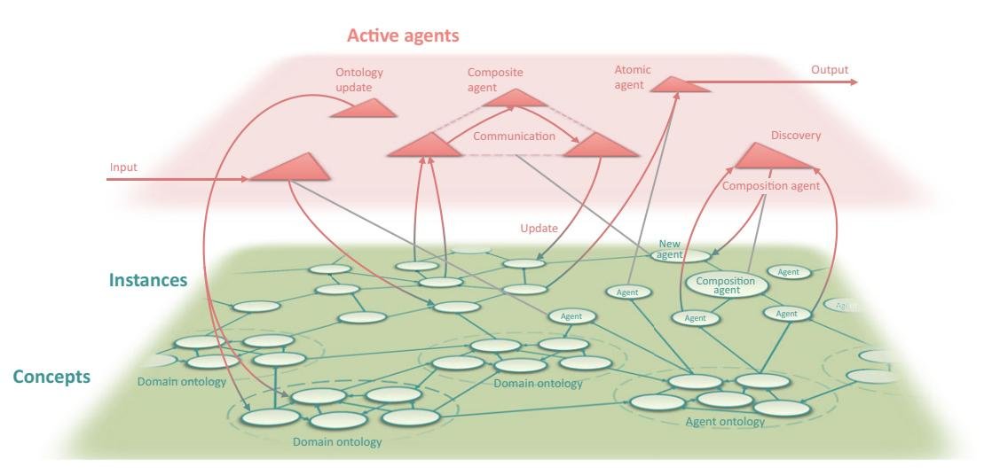
<!-- Image Description: This diagram illustrates an agent-based system. Triangular "active agents" (ontology update, composite agent, atomic agent, communication, composition agent) interact and process input to produce output. These agents operate on a lower level network of circular "instances" representing concepts organized into domain and agent ontologies. The image depicts the system's architecture and information flow, showing communication and update processes between agents. -->

Figure 1. The main components of the World Avatar dynamic knowledge graph.

## 2. Agents

At any given time, instances of the computational agents described in the knowledge graph may be activated to perform tasks. In this context, "agent" refers to software that uses Semantic Web technologies to operate on the knowledge graph to fulfill specific objectives. Agents may be atomic agents (i.e., not composed of other agents), or composite agents composed of multiple atomic agents operating in a coordinated way.

Agents can perform a variety of activities and can operate on both the concepts and instances in the knowledge graph (Eibeck et al., [2019](#page-22-3)):

- Input/output. Agents can update instances with data from the real world, for example, data from sensors or smart infrastructure. Agents can retrieve data from the knowledge graph and send signals back to real world, for example, to visualize data or to control an actuator.
- Update. Agents can query the knowledge graph, calculate derived quantities, and update instances with the new data. An example could be querying sources of emissions and the prevailing wind conditions to update estimates of air quality by simulating the dispersion of the emissions (Eibeck et al., [2019;](#page-22-3) Zhou et al., [2019\)](#page-24-2).
- Restructure. Agents can restructure the knowledge graph by:
  - Adding instances (i.e., items in ABoxes), for example, to explore the optimal placement of new infrastructure (Devanand et al., [2019;](#page-21-14) Eibeck et al., [2020](#page-21-9)).
  - Adding concepts (i.e., items in TBoxes) to improve the description of data, for example, to add classes relating to dispatchable and nondispatchable resources to an ontology describing energy sources.
  - Adding relationships between instances or between concepts, for example, using ontology matching to support the creation of relationships between equivalent concepts.
- Create new agents. Agents can provide services to facilitate agent discovery and to create composite agents to coordinate the activities of agents to perform complex tasks, for example, the estimation of air quality (Zhou et al., [2019](#page-24-2)). The possibility of introducing an agent marketplace and quality of service (QoS) measures for agents has been demonstrated using a blockchain-based smart contract system (Zhou et al., [2020a\)](#page-24-3).

The calculations performed by agents can take any form, including physics-based models with a theoretical structure, gray box models that combine some theoretical structure with data-driven components, and pure data-driven models. See Yu et al. [\(2020](#page-23-13)) for examples of these approaches in the context of emissions modeling. The availability of semantically structured machine-queryable data makes the World Avatar well-suited to be coupled to machine learning applications, where it is wellknown that the time spent on data preparation and curation typically adds a significant cost to machine learning.

The potential of the World Avatar arises from the generic functionalities offered by agents that integrate ontologies and create new agents. Both would serve to raise the level of semantic interoperability and allow for the automation of processes to include new data and capabilities, and maintain interoperability as the quantity and complexity of the data and agents increases.

### 3. Ontological coverage

The current ontological coverage of the World Avatar includes 3D city data (OntoCityGML, Eibeck et al., [2019](#page-22-3)), weather (Weather Ontology, Institute of Computer Engineering at Technical University of Vienna, [2014](#page-22-10)), process engineering (OntoCAPE, Marquardt et al., [2010](#page-23-14)), eco-industrial parks (OntoEIP, Zhang et al., [2017;](#page-24-4) Zhou et al., [2017](#page-24-1); Zhou et al., [2018\)](#page-24-5), and electrical power systems (OntoPowerSys, Devanand et al., [2020](#page-21-8)). It includes ontologies for quantum chemistry (OntoCompChem, Krdzavac et al., [2019\)](#page-22-11), chemical species (OntoSpecies, Farazi et al., [2020b\)](#page-22-12), chemical kinetic reaction mechanisms (OntoKin, Farazi et al., [2020a](#page-22-13)), and combustion experiments (OntoChemExp, Bai et al., [2021](#page-20-13)). Selected subgraphs of the LOD Cloud (lod-cloud.net, [2020](#page-23-15)), in particular DBpedia (Lehmann et al., [2015](#page-22-14); DBpedia, [2020\)](#page-21-15) are also connected to the knowledge graph.

# 4. Use cases

This section presents use cases that demonstrate different aspects of the World Avatar. The use cases are from the Cities Knowledge Graph, PIPS, and J-Park Simulator projects so are mainly associated with Singapore. However, the application of the World Avatar is not restricted to these contexts, as we shall discuss in Section 4.

# 4.1. Urban planning

The Cities Knowledge Graph project (CARES, [2020b\)](#page-21-16) will integrate urban design and planning tools developed by the Future Cities Laboratory at the Singapore-ETH Centre with the World Avatar. The tools include the Collaborative Interactive Visualization and Analysis Laboratory design informatics platform (Future Cities Laboratory, [2020b\)](#page-22-15), the Multi-Agent Transport Simulation Singapore model (Future Cities Laboratory, [2020c](#page-22-16)), the City Energy Analyst toolbox (Future Cities Laboratory, [2020a](#page-22-17)), and the ESRI CityEngine (Environmental Systems Research Institute, [2020](#page-22-18)) 3D modeling software. The concept is shown in [Figure 2.](#page-7-0)

The resulting system will enable interoperability between building data, transport flows, underground infrastructure, humidity, and temperature data to improve the design and planning of cities by automating aspects of data processing, and by integrating concepts and targets from different planning arenas. Work to date has demonstrated the capability to incorporate live building management system (BMS) data into the dynamic knowledge graph (CARES, [2020e\)](#page-21-17) and has integrated the World Avatar with OntoCityGML (Centre Universitaire d'Informatique at University of Geneva, [2012](#page-21-18)), an ontology that describes 3D models of cities and landscapes based on the CityGML 2.0 standard (Gröger et al., [2012\)](#page-22-19). Tools have been

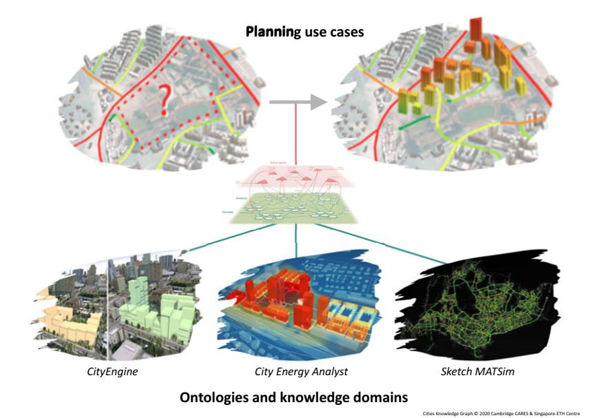
<!-- Image Description: This figure illustrates a workflow for urban planning. It shows a before-and-after map pair depicting a planning area (indicated by a question mark), transformed with new buildings. A central diagram depicts an ontology connecting various knowledge domains. Three lower images showcase CityEngine (3D city models), City Energy Analyst (energy simulations), and Sketch MATSim (agent-based traffic simulation) as data sources. The figure's purpose is to visually represent the integration of these diverse data sources within the proposed planning process. -->

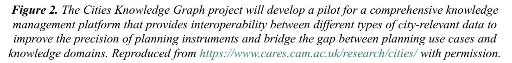
<!-- Image Description: Figure 2 is a textual description of the Cities Knowledge Graph project. It explains that the project will create a pilot knowledge management platform to improve interoperability between different types of city data. This platform aims to enhance the precision of planning tools and connect planning use cases with relevant knowledge domains. No diagrams, charts, graphs, or equations are present; the figure solely provides a textual summary of the project's goals. -->

developed to convert data from CityGML to OntoCityGML format. Work to find the best way to host this data within the dynamic knowledge graph is ongoing.

## 4.2. Intelligent querying and generation of data

The World Avatar contains chemical data, including kinetic reaction mechanisms (Farazi et al., [2020a](#page-22-13)) and computational chemistry (Krdzavac et al., [2019\)](#page-22-11). It is able to use computational chemistry data to calculate thermodynamic quantities required by the reaction mechanisms, and link the resulting quantities to the computational chemistry calculations used to derive them (Farazi et al., [2020b\)](#page-22-12). It is able to identify inconsistencies in the data (Farazi et al., [2020c](#page-22-5)) and interact with high performance computing (HPC) facilities in the real world to perform additional computational chemistry calculations to generate the data required to resolve the problems (Mosbach et al., [2020\)](#page-23-16). It includes experimental data (for combustion experiments) and is able to automate the process of calibrating reaction mechanisms versus experiment data (Bai et al., [2021](#page-20-13)).

Research in collaboration with CMCL (CMCL Innovations, [2020a](#page-21-19)) has investigated the use of natural language processing (NLP) to develop an intelligent query interface for the chemistry data available via the World Avatar (Zhou et al., [2020b\)](#page-24-6). [Figure 3](#page-8-0) shows a screenshot of a demonstration website (Computational Modelling Cambridge Ltd., [2020\)](#page-21-20). It has been shown that the use of intent recognition and topic modeling, and the structure of the domain ontologies has a strong impact on the accuracy of the queries, with shallow ontologies performing better than deep ontologies. This poses a number of open challenges because scientific research typically leads to hierarchical classification systems that do not lend themselves to shallow ontologies.

The availability of intelligent query interfaces has the potential to improve the discovery and interoperability of data. Work is ongoing to use such interfaces in conjunction with the World Avatar

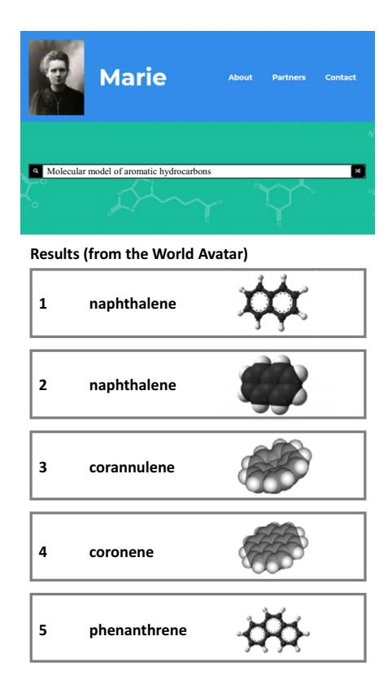
<!-- Image Description: The image displays results from a "World Avatar" search for molecular models of aromatic hydrocarbons. It shows a numbered list; each entry contains a name (e.g., naphthalene, corannulene) and a corresponding 2D or 3D molecular structural representation. The purpose is to illustrate the search results and visualize different aromatic hydrocarbon structures. -->

Figure 3. Screenshot of Marie website (with enlarged text).

to develop quantitative structure activity/property relationships (QSAR/QSPR) that allow the prediction of the properties of a chemical from its structure, for example, its toxicity (Organisation for Economic Cooperation and Development, [2020\)](#page-23-17) or its photovoltaic performance (Eibeck et al., [2021](#page-22-20), and references therein). This is the focus of the PIPS (CARES, [2020c\)](#page-21-21) project. PIPS will develop the capability of the World Avatar not only to automate calculations (Mosbach et al., [2020](#page-23-16)), but to automate experiments by allowing agents to control a laboratory robot. This capability will close the loop between analysis and experiment to automate the generation of reaction and synthesis data, and establish an ontology framework for AI reasoning agents to generate chemical knowledge from data.

## 4.3. Cross-domain calculation of air quality

In recent years there has been increasing concern over the effect of emissions from combustion on air quality (Department for Environment Food and Rural Affairs [United Kingdom], [2019](#page-21-22); National Climate Change Secretariat [Singapore], [2020\)](#page-23-18), in particular, the emission of NOx (Department of Transport [United Kingdom], [2016](#page-21-23), [2019](#page-21-24); Air Quality Expert Group, [2017;](#page-20-14) Environmental Protection Agency [United States], [2020](#page-22-21)) and particulate matter (PM) (Environmental Committee, London Assembly, [2015\)](#page-22-22), and the effect of black carbon (BC) emissions on the climate (Bond et al., [2013\)](#page-20-15).

Combustion accounts for approximately 99% of Singapore's CO2 emissions (National Environment Agency, [2018,](#page-23-19) pp. 134–137). In addition to being one of the most densely populated countries (The World Bank Group, [2018](#page-23-20)), it hosts one of the world's busiest ports with arrivals exceeding 138,000 vessels[3](#page-9-0) and a throughput of more than 37 million twenty-foot equivalent units in 2019 (Maritime and Port Authority of Singapore, [2020\)](#page-23-21). There naturally arises the question of how emissions from hard-to-abate sectors like shipping influence factors such as air quality in different regions of Singapore. The interoperability of the World Avatar provides a method to answer these questions. [Figure 4](#page-10-0) illustrates how this was achieved. See references (Eibeck et al., [2019;](#page-22-3) Farazi et al., [2020c\)](#page-22-5) for more details of the implementation and results.

The choice of which agents to use in the calculation illustrated in [Figure 4](#page-10-0) is controlled by a composition agent (Zhou et al., [2019](#page-24-2)). The emissions can be calculated either by agents that use surrogate models developed using the SRM Engine Suite (CMCL Innovations, [2020c](#page-21-25)) and Model Development Suite (CMCL Innovations, [2020b\)](#page-21-26), or by agents that directly use the SRM Engine Suite. The atmospheric dispersion can be simulated either by agents that use the Atmospheric Dispersion Modeling System (ADMS) (Cambridge Environmental Research Consultants, [2020](#page-21-27)) or by agents that use the EPISODE 3D CFD code (Karl et al., [2019\)](#page-22-23). The agents wrap around existing software, including commercial software, with the possibility of an agent marketplace (Zhou et al., [2020a\)](#page-24-3) offering an alternative to traditional licensing models.

Whilst the emissions from ships can be described using data-driven models, trained using measurement data, for example, this would preclude the ability to assess the impact of different fuels. The chemical data (species properties, reactions, and reaction rates) that are required to assess the impact of different fuels can be described in the knowledge graph and any unknown quantities can, in principle, be calculated (although the calculation of reaction rates remains challenging). The ability of the World Avatar to enable interoperability between the different components of such calculations has been demonstrated in terms of calculating thermodynamic data for chemical species from computational chemistry data (Mosbach et al., [2020](#page-23-16)), linking the resulting species data with reaction mechanisms (Farazi et al., [2020b](#page-22-12)), and performing parameter estimation to improve the agreement with experimental data (Bai et al., [2021\)](#page-20-13). This is depicted on the right-hand side of [Figure 4.](#page-10-0)

This use case illustrates how the World Avatar may be used to calculate the consequences of current activities in the base world. It demonstrates what can be achieved in terms of interoperability, both between models and data from different domains (weather, the built environment, ships, chemistry, emissions, and atmospheric dispersion) and covering different length scales (from the atomic length scales of the computational chemistry calculations to the kilometer length scales of the atmospheric

3 Includes only vessels with gross tonnage exceeding 75 GT.

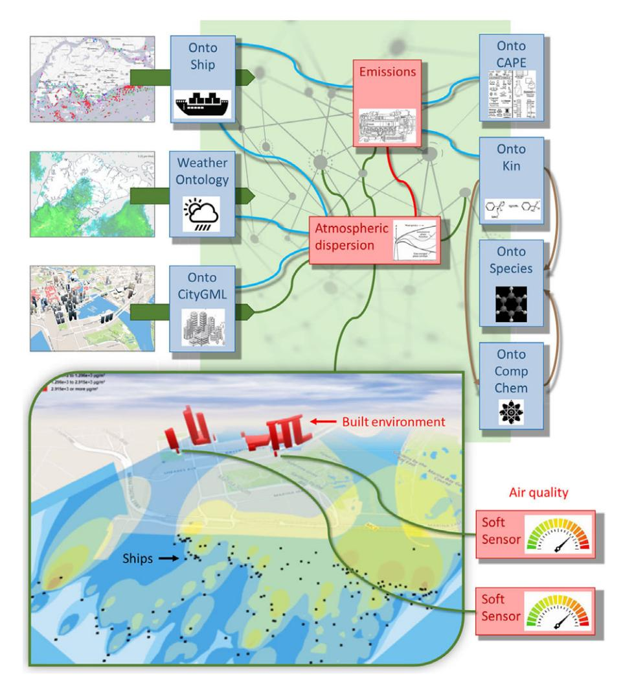
<!-- Image Description: This diagram illustrates a framework for air quality modeling. It integrates various ontologies (Ship, CAPE, Kin, Species, Comp Chem, CityGML, Weather) representing emissions, atmospheric dispersion, and the built environment. A map depicts modeled air quality dispersion, overlaid with ship locations and buildings. Air quality is represented by gauge-style indicators from "soft sensors." The diagram showcases the data integration and modeling process for air quality assessment. -->

Figure 4. Real-time cross-domain estimation of the contribution of emissions from shipping to air quality in Singapore. Agents operating on the World Avatar update the knowledge graph with real-time information about the weather and about ships in the vicinity of Singapore. An emissions agent is able to use the information about the ships to estimate the emissions of unburned hydrocarbons, CO, NO2, NOx, O3, SO2, PM2.5, and PM10 from each ship. An atmospheric dispersion agent is able to use the information about the weather, the emissions from each ship and the built environment in Singapore to simulate the dispersion of the emissions. Virtual sensor agents report the resulting air quality estimates at different locations. Adapted from Farazi et al. ([2020c](#page-22-5)).

dispersion simulations). Of course, this is unnecessarily elaborate if we are only interested in Singapore. The point, however, is that the World Avatar allows such calculations to be performed for any location.

## 4.4. Parallel worlds for scenario analysis

The parallel worlds capability of the World Avatar supports decision making in a complex environment by allowing the exploration of different scenarios and their associated outcomes. The parallel worlds exploit the structure of the dynamic knowledge graph to use scenario agents to group new instances of any entities that are modified in a scenario and store them in a scenario-specific part of the knowledge graph. Access, queries and updates to the scenario-specific instances are mediated via a scenario agent. The scenario-specific information in the parallel world can be thought of as overlaying the base world, so unchanged entities remain connected to the base world and any changes to the base world are reflected in the scenario. Conversely, any changes in the parallel world remain isolated within the scenario-specific part of the knowledge graph and so do not interfere with the base world. Based on an idea very similar to version-control systems that are widely used among software developers, parallel world containers store the differences to the base world in named graphs where the scenario provides the context. Technical details can be found in Eibeck et al. ([2020\)](#page-21-9).

[Figure 5](#page-11-0) illustrates the parallel world concept. In this example, the parallel world is used to explore the effect of levying a carbon tax on the emissions from power generation processes to motivate a transition from fossil fuels to clean energy technologies. The following questions are addressed:

- What value of carbon tax is required to make the transition to small modular nuclear reactors (SMRs) profitable for a given set of conditions (e.g., project life span, depreciation rate, electrical load profiles, and generator characteristics)?
- Which plant(s) should be replaced and where should the new SMR(s) be located?

The parallel world shows that oil generators are replaced with SMRs as the carbon tax is increased from S\$5 to S\$170 per tonne. The types of generator present and the corresponding estimates of the CO2 emissions are automatically updated in the parallel world to reflect these changes, and an optimal power

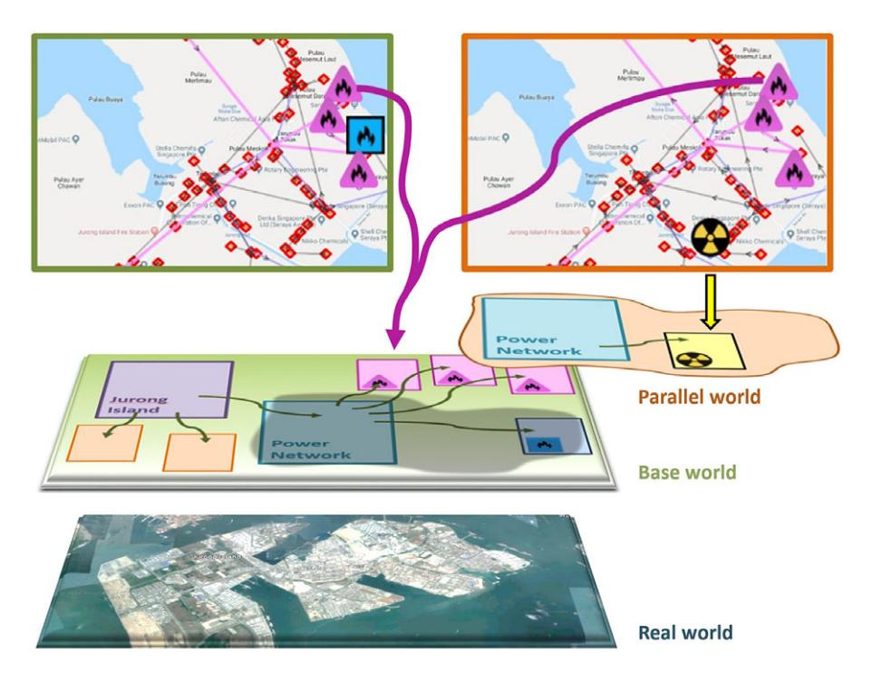
<!-- Image Description: This image depicts a simulation framework for disaster response. Two maps show geographical locations (presumably Jurong Island) with overlaid incident markers (fires and a nuclear incident). These feed into a "parallel world" simulation, represented as interconnected nodes representing power networks and Jurong Island, layered above a real-world satellite image. The system models the propagation of incidents within the power network and across the island. The "parallel world" allows testing disaster response strategies in a virtual environment. -->

Figure 5. Parallel world concept for what-if scenario analysis. The panels at the top illustrate the electrical network from the real world (left) and an optimized network that is subject to a carbon tax (right). The network from the real world is described in the base world. The modifications to the network in the parallel world are described in a scenario-specific part of the knowledge graph. The pink triangles denote natural gas generators that are present in both the base world and the parallel world. The blue square denotes an oil generator that is only present in the base world. The radiation symbol denotes a small modular nuclear reactor that is only present in the parallel world. Adapted from Eibeck et al. [\(2020](#page-21-9)).

flow (OPF) agent is invoked to minimize the overall operating cost of the scenario in the parallel world. See references (Devanand et al., [2019;](#page-21-14) Eibeck et al., [2020\)](#page-21-9) for more details of the implementation and results.

This use case illustrates how digital twinning and what-if scenario analysis using a dynamic knowledge graph can support decision makers to understand the effect of different design choices and policy instruments. In this example, the problem addressed by the parallel world is simple enough to be formulated as a classical optimization problem with a well-defined objective function. However, many scenarios will be too complex for this to be the case. How to address this is discussed in the context of the knowledge-graph-based digital twin of the UK in Section 4.

### The Knowledge-Graph-Based Digital Twin of the UK

The knowledge-graph-based digital twin of the UK is an effort within the World Avatar project to create a semantic digital twin of the UK. The aim is to provide a comprehensive live distributed platform to support the optimal use, planning and development of infrastructure in the UK and to support scenario analysis to help the UK achieve its development goals, for example, by supporting the decarbonization of the energy landscape.

By construction, the design of the World Avatar ensures that all data are connected and have an unambiguous representation, and are discoverable and queryable through a uniform interface. The use of ontologies promotes portability, making it easy to reuse data and results and support interoperability. It is inherently multidomain and can be extended by adding new ontologies and defining equivalence, or other relationships as appropriate, between semantically related terms to maintain, and even improve, interoperability as it grows. It is designed to allow the data to evolve over time, with the agents ensuring that it remains up to date. The architecture is distributed, offering the possibility of hosting different types of data in different places and providing links to the requisite provenance and license information. This includes the option for data owners to retain control over the hosting of their data and to control access as required by the nature of the data, ranging from heavily restricted access for sensitive data to open access for open data.

Furthermore, the ontological structure of the World Avatar is designed in a naturally hierarchical and extensible way (Zhou et al., [2017](#page-24-1)) that allows representations at any length scale or level of detail or granularity, ranging, for example, from household appliances in residential buildings, or unit operations in industrial plants, to national infrastructure and beyond.

The interconnectedness of all represented concepts and instances that is inherent to knowledge graphs, combined with the constant activity of agents that are dynamically updating the knowledge graph, including with live data feeds, naturally enables interaction of digital twins at all scales with each other in the virtual world and with the real-world entities they are representing. These properties render a dynamic knowledge-graph approach particularly suitable for implementing a national-scale digital twin, and fully consistent with the principles laid out by Bolton et al. [\(2018](#page-20-0)) and Arup [\(2019a\)](#page-20-16).

The following sections describe progress toward the creation of the base world in a knowledge-graphbased digital twin of the UK, and discuss a route to meet the challenges posed by goal alignment in the context of parallel worlds.

#### 1. Base world

This section describes the progress to date and the immediate next steps for the creation of the base world in a knowledge-graph-based digital twin of the UK. The immediate motivation for doing this is to help address questions relating to how best to help the UK achieve net zero carbon emissions. The energy sector is the largest contributor to emissions in the UK and was responsible for 82% of total emissions in 2018 (Brown et al., [2020,](#page-20-17) p. 40). Work to date has therefore focused on data relating to the electric power system, the gas grid, the potential for photovoltaic and wind power, biomass and the built environment, all of which are critical to the future of the energy landscape (Committee on Climate Change, [2018](#page-21-13)). Beyond carbon emission reduction, potential applications are of course numerous and include, but are not limited to, public health, urban and infrastructure planning, and achieving a circular economy.

[Figure 6](#page-13-0) shows the geospatial configuration of the National Grid Electricity Transmission and National Grid Gas Transmission systems (National Grid, [2020a,](#page-23-22) [2020b](#page-23-23)). Work to extend the ontological coverage of the World Avatar to include this data is ongoing. In addition to the configuration of the networks, data for all the regional generators over 30 MW in the UK (Department for Business, Energy, and Industrial Strategy, [2020](#page-21-28)) have been added to the World Avatar and used in a preliminary analysis of how a carbon tax on existing generation infrastructure would effect the composition of power generation (Atherton et al., [2020](#page-20-18)). It was shown that the carbon tax motivated a transition from coal to combined cycle gas turbines (CCGT), with nuclear and renewable sources being fully utilized. When regional capacities, demands and (found to be complementary) transmission losses were considered, this transition was found to occur first in London and the South East, where northern coal imports were displaced by local CCGT generation. [Figures 7](#page-14-0) and [8](#page-14-1) show the photovoltaic power potential and wind speed and direction data in the UK. The photovoltaic data are published by SolarGIS [\(2020](#page-23-24)) on behalf of the World Bank as part of the Global Solar Atlas ([2020\)](#page-22-24). The wind data are part of the ERA5 data set published by the EU Climate Data Service (Hersbach et al., [2018](#page-22-25)). Work to extend the ontological coverage of the World Avatar to include this type of data is an immediate priority.

[Figures 9](#page-15-0) and [10](#page-15-1) show an example of land use data in the vicinity of Cambridge, UK and data about the built environment in the vicinity of the Department of Chemical Engineering and Biotechnology at the University of Cambridge. The land use data are available via the Crop Map of England (Rural Payments

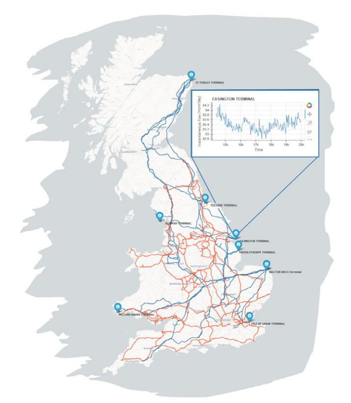
<!-- Image Description: The image displays a map of Great Britain showing the locations of several gas terminals connected by pipelines (blue and orange). Inset is a time-series graph showing instantaneous gas flow (in mm/day) at the Easington terminal over a 24-hour period. The map and graph together illustrate the geographic distribution of gas terminals and the temporal variability of gas flow at one specific location, likely to analyze network dynamics or operational characteristics within a natural gas infrastructure. -->

Figure 6. Geospatial configuration of the National Grid Electricity Transmission (red) and National Grid Gas Transmission (blue) systems. The markers (blue) show the locations of the intake terminals for the National Grid Gas Transmission system. The inset shows real-time data for the gas flow into the network from the Easington North Sea gas terminal. Data obtained from the National Grid ([2020a,](#page-23-22) [2020b\)](#page-23-23).

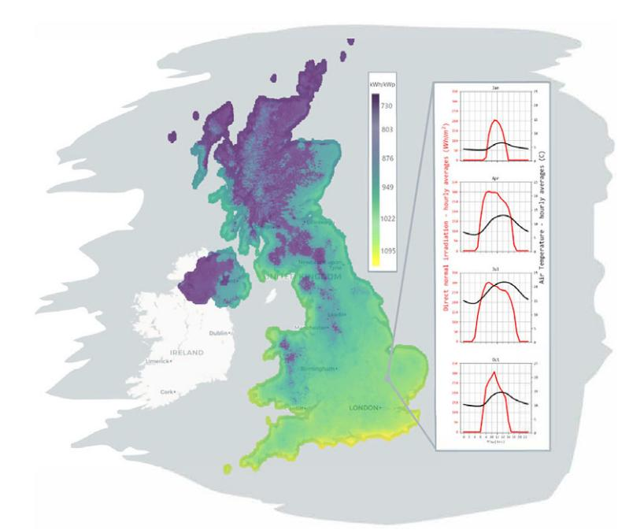
<!-- Image Description: The image displays a color-coded map of Great Britain showing spatial variation in direct normal irradiation (kWh/kWp). A color scale indicates irradiation levels. Inset graphs show hourly averages of direct normal irradiation (red) and air temperature (black) for April, July, and October, illustrating seasonal differences in both parameters across the region. The map and graphs likely demonstrate the relationship between solar energy potential and climate across the UK. -->

Figure 7. Map showing the average annual photovoltaic power potential in the UK from 1994 to 2018. The inset shows the seasonal variation in the average daily photovoltaic potential and temperature in the vicinity of Cambridge, UK. Contains data licensed by The World Bank under the Creative Commons Attribution license (CC BY 4.0) with the mandatory and binding addition presented in Global Solar Atlas terms (<https://globalsolaratlas.info/support/terms-of-use>).

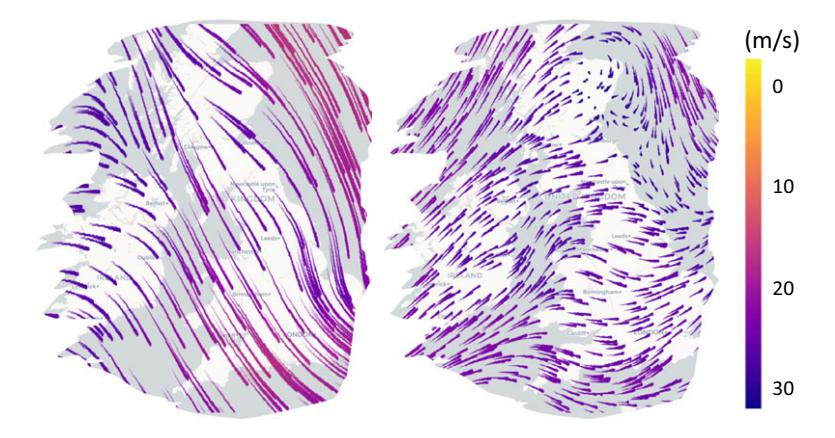
<!-- Image Description: The image presents two maps displaying wind vector fields over the British Isles. Purple arrows represent wind speed and direction, with color intensity indicating speed (0-30 m/s, as shown in the color bar). The maps likely compare wind patterns under different conditions or models, illustrating spatial variations in wind speed and direction across the region. The purpose is to visually compare and contrast wind data, crucial for meteorological or related analyses. -->

Figure 8. Map showing wind data for the UK at selected points in time. The data show the horizontal component of the velocity 100 m above sea level. Left: November 19, 2020 12:00. Right: February 1, 2020 15:00.Contains modified Copernicus Climate Change Service information [2020]. The data are available under an open license from Copernicus Products.

Agency, [2019\)](#page-23-25), which provides geospatial data about the types of biomass grown throughout the whole of England. The data about the rivers and streams in [Figure 9](#page-15-0) are available using the ordnance survey (OS) Features API (Ordnance Survey, [2020a](#page-23-26)). The base map and building data in [Figure 10](#page-15-1) are available using the OS Vector Tile API (Ordnance Survey, [2020c](#page-23-27)). Every building with a postal address in the UK

<!-- Image Description: The image is a thematic map displaying land use and water features. Color-coded polygons represent grassland, non-agricultural land, food crops, and trees. Blue lines depict rivers and streams, with a separate blue shading indicating water bodies. The map likely illustrates the spatial distribution of land cover types within a specific region for analysis of environmental, agricultural, or hydrological aspects relevant to the paper's topic. -->

Figure 9. Land use in the vicinity of Cambridge, UK. Contains data from the Crop Map of England (CROME) 2019 (Rural Payments Agency, [2019](#page-23-25)) licensed under an Open Government License.

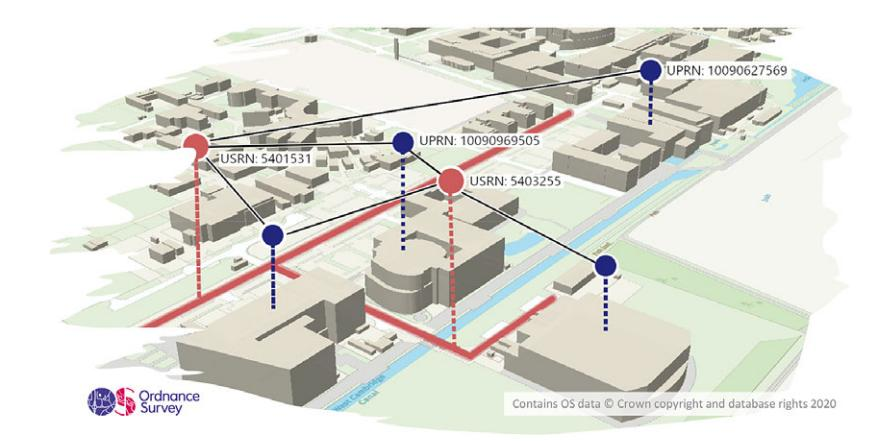
<!-- Image Description: This 3D schematic displays a network connecting buildings. Nodes represent buildings identified by Unique Property Reference Numbers (UPRNs) and Unique Street Reference Numbers (USRNs). Lines depict connections between them, likely representing infrastructure or data links. The image's purpose is to visually represent spatial relationships between buildings within a geographical area using a combination of real-world mapping data and overlaid network connections. -->

Figure 10. Ordnance Survey building data in the vicinity of the Department of Chemical Engineering and Biotechnology (UPRN:10090969505) and the Centre for Digital Built Britain (UPRN:10090627569) in Cambridge, UK. Contains public sector information licensed under the Open Government License v3.0.

has an associated Unique Property Reference Number (UPRN), likewise every road has a Unique Street Reference Number (USRN). These identifiers and items linked to them are available using the OS Linked Identifiers API (Ordnance Survey, [2020b\)](#page-23-28). Work to extend the World Avatar to include the biomass data is ongoing. Work to include information about the built environment using OntoCityGML (Centre Universitaire d'Informatique at University of Geneva, [2012\)](#page-21-18) is underway as part of the Cities Knowledge Graph project (see Section 3.4.1).

[Figure 11](#page-16-0) shows the built environment in the vicinity of Manchester Piccadilly Railway Station overlaid with data about the solar radiation incident on the roof of each building. The data are published as part of a virtual city map of Manchester (Virtual City Systems, [2020\)](#page-23-29). This illustrates just one way in which the types of data in [Figures 6](#page-13-0)–[10](#page-15-1) can be combined. Making such data available as part of a knowledge-graph-based digital twin of the UK presents the opportunity to include them in parallel world scenario analyses, for example, to investigate the building-by-building potential of installing solar panels and battery storage, either locally within each building, at a street or district level.

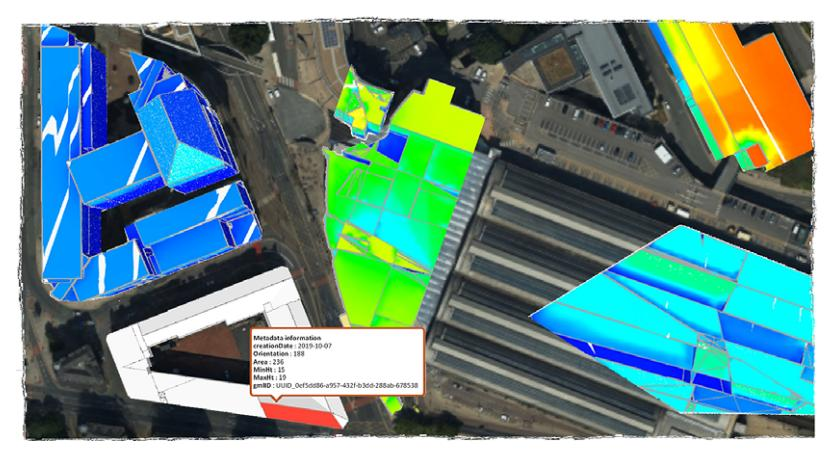
<!-- Image Description: The image shows a 3D model of buildings overlaid on an aerial photograph. Color-coded surfaces represent data, likely related to solar irradiance or similar spatial phenomenon. A metadata box provides information on creation date, orientation, area, minimum and maximum height, and a unique identifier. The image illustrates a method of integrating 3D modeling with spatial data analysis for urban applications. -->

(a) Solar Radiation on buildings. Clockwise, from bottom left. CityGML representation of building data, coloured by solar radiation in January, April, July, October. Background: Building view.

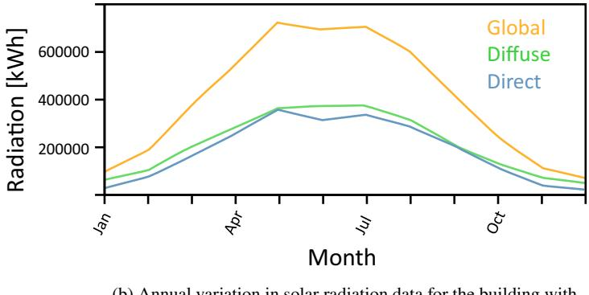
<!-- Image Description: The image displays a line graph showing the annual variation in solar radiation. Three lines represent global, diffuse, and direct radiation (in kWh) over twelve months. The graph illustrates the seasonal fluctuation of each radiation type, with peak global radiation occurring around April-May and decreasing through the year. The purpose is to present solar radiation data relevant to the building's location and its implications for energy modeling or design. -->

(b) Annual variation in solar radiation data for the building with UUID\_0ef5dd86-a957-432f-b3dd-288ab-678538 (the building with the metadata in the CityGML view).

Figure 11. Modified screenshots of city data in the vicinity of Manchester Piccadilly Railway Station (Virtual City Systems, [2020\)](#page-23-29). Contains public sector information licensed under the Open Government License v3.0.

#### 2. Goal alignment for parallel worlds

The parallel worlds capability of the World Avatar offers a powerful tool to explore the design space of complex problems. However, the problems of interest, for example, how best to develop the UK infrastructure, rapidly become too complex to be treated in the manner of classical optimization problems. This is the case both in the sense that the problems are not amenable to defining a straightforward objective function and in the sense that the design space is too complex to be explored without some additional insight to suggest propitious scenarios. In an ideal world, computational agents would suggest scenarios and automate the exploration of the design space. In order to attempt this, it will be necessary to equip the agents with an understanding of our values and what we, as a society, want to achieve. In other words, we need to equip the agents with goals.

There are many ways to define goals. The sustainable development goals (SDGs) (United Nations, [2015](#page-23-30)) defined by the UN offer one possible starting point. There are 17 SDGs, which are further specified in terms of 169 targets, each of which is associated with a set of proposed indicators. Each level in this hierarchy is increasingly specific, so whilst the goals are abstract, the indicators are specific and measurable. [Table 1](#page-17-0) shows an example for SDG 9.

| SDG             | Description                                                                                                                                                                                                                                                                                                        |  |
|-----------------|--------------------------------------------------------------------------------------------------------------------------------------------------------------------------------------------------------------------------------------------------------------------------------------------------------------------|--|
| Goal 9          | Build resilient infrastructure, promote inclusive and sustainable industrialization, and foster innovation                                                                                                                                                                                                      |  |
| Target 9.4      | By 2030, upgrade infrastructure and retrofit industries to make them sustainable, with increased resource-use efficiency and greater adoption of clean and environmentally sound technologies and industrial processes, with all countries taking action in accordance with their respective capabilities |  |
| Indicator 9.4.1 | CO2 emission per unit of value added                                                                                                                                                                                                                                                                            |  |

Table 1. Sustainable Development Goal 9, Target 9.4 and Indicator 9.4.1.

A sustainable development goals interface ontology (SDGIO) already exists (Sustainable Development Goals Interface Ontology [SDGIO], [2015](#page-23-31)). Work is underway to link the World Avatar to this ontology and to create agents to evaluate selected SDG Indicators. The current focus is on Indicator 9.4.1. Data for all the UK power stations (and in fact power stations worldwide) are available via the World Avatar, and agents are being developed to estimate the emissions intensity of power generation in the UK and worldwide. Such agents can be written by placing thin, standardized wrappers around conventional pieces of software, irrespective of whether they are in-house, third-party, or expensive-to-evaluate (see, e.g., Mosbach et al., [2020\)](#page-23-16). In the first instance, the emissions intensity of power generation will be calculated as CO2 emissions per unit electrical power produced, as opposed to per unit value added. The rationale for this is that the power produced is a measurable physical quantity, whereas value added is less straightforward to define. The ability to evaluate these indicators and learn how actions investigated in parallel worlds translate to progress toward things like the SDGs provides a possible route for how to develop the insight required to suggest new scenarios.

Another possible route forward could be to calculate goals based on environmental, social, and governance (ESG) metrics, either for individual companies or for specific industrial sectors. Such metrics are projected to be incorporated into future financial regulations and will be strongly linked to the risk and growth profiles of the companies involved. The use of the dynamic knowledge graph could help address the issues of ambiguity and consistency that currently affects such metrics because all metrics would be calculated on the basis of the same data set. For example, environmental factors such as emissions, waste management, water and energy usage could be assessed based on real-world data from the knowledge graph. Further, the parallel worlds capability would allow industries to explore the impact of different strategies, for example investment in different energy technologies, and use this to guide their corporate social responsibility (CSR) strategy.

Inevitably, there will arise scenarios where goals conflict with each other (Fuso Nerini et al., [2018\)](#page-22-26). For example, building more roads may enable better access to schools and therefore better education, so lifting people out of poverty and reducing hunger. However, this would also lead to more road use which could (depending on the type of transport) lead to more pollution. It is therefore necessary to consider goal alignment, that is to say, how to ensure that the scenarios considered by the World Avatar support the goals of humanity. This could potentially be achieved by using the goals not only to inform, but also constrain the suggestion of scenarios. The questions of how to suggest scenarios and achieve goal alignment remain important topics of research.

#### Conclusions

This paper demonstrates for the first time how a comprehensive digital twin can be implemented as a dynamic knowledge graph built using technologies from the Semantic Web stack. Examples are presented from the World Avatar project.

The World Avatar dynamic knowledge graph is composed of Linked Data and an ecosystem of computational agents operating on the knowledge graph. The agents enable the automated incorporation of new data and the calculation of quantities of interest, such that the dynamic knowledge graph is able to evolve in time and remain up-to-date.

The contents of the dynamic knowledge graph are instantiated using ontologies that provide semantic models of the domains of interest and of computational agents. This design confers versatility because it enables agents to update and restructure the knowledge graph, and to discover and compose other agents simply by reading from and writing to the knowledge graph. Further, the knowledge graph could, in principle, be extended to accommodate any concept that is required in the future. It has a distributed architecture that supports a uniform SPARQL query and update interface, and that supports the same access control technologies that already secure electronic data. The use of Linked Data helps address the issues of ambiguity, and enables the linking of provenance information and related data, supporting the discovery and reuse of data and results.

Use cases from the World Avatar demonstrate key aspects of the dynamic knowledge graph. The Cities Knowledge Graph project is being used to develop a pilot for a comprehensive knowledge management platform that provides interoperability between different types of city-relevant data to improve the planning of cities. The PIPS project demonstrates the versatility of the dynamic knowledge graph both in terms of the breadth of domains that it can accommodate, and that it can interact with systems in the real world. Use cases from the J-Park Simulator were used to introduce the concepts of the base world and parallel worlds. The base world describes the real world as it is and allows for intelligent control of infrastructure. The parallel worlds allow scenario analysis to support the intelligent exploration of alternative designs whilst remaining linked to, but without affecting the base world.

The use case from the base world demonstrates the cross-domain interoperability of the dynamic knowledge graph. Agents calculate the impact of shipping on the air quality by combining live feeds of weather and shipping data, fuel chemistry and combustion simulations with atmospheric dispersion simulations. The agents wrap around commercial software and third party APIs, and offer black box, gray box and physics-based models. A composition agent is used to select which agents to deploy. A smart contract system enables agent selection to be performed using quality of service (QoS) measures, and offers the possibility of a software-as-a-service licensing model.

The use case from the parallel world demonstrates the use of the dynamic knowledge graph to perform scenario analysis. The example explores how the design of possible energy systems changes when a carbon tax is levied on emissions from power generation. It identifies the tax level that is required to motivate a change to cleaner energy technologies, and calculates the optimal design and operating conditions of the new system. The parallel worlds capability raises a number of important research questions relating to how to explore design spaces that are too complex to be addressed as conventional optimization problems. For example, how to assess whether a scenario is beneficial, how to make good suggestions for alternative scenarios and how to ensure alignment between the scenarios considered by the digital twins and the goals of society? One option is to take inspiration from the SDGs defined by the UN and from metrics for ESG in the context of corporate decision making. Work to evaluate progress toward the SDGs has been started.

Work to develop a knowledge-graph-based digital twin of the UK is ongoing. The next iteration of the digital twin will be applied in the context of supporting the decarbonization of the UK energy landscape and will enable the semantic annotation of data describing the power system and the electrical and gas transmission systems, of data describing solar radiation and wind, and of data describing what biomass is grown where. The Semantic Web stack provides tools that confer a number of advantages on knowledgegraph-based digital twins. However, the implementation of a digital twin that meets the needs of a Universal Digital Twin remains hugely challenging and poses a number of open questions. Nonetheless, there are good reasons to be optimistic. The achievements of Google, Microsoft, IBM, Facebook, and eBay (Noy et al., [2019\)](#page-23-11) show that these types of technical challenges can be addressed and that the results have the potential to be extraordinary.

#### Nomenclature

| ABox      | Assertional component (of an ontology)          |
|-----------|-------------------------------------------------|
| ADMS      | Atmospheric dispersion modeling system          |
| AI        | Artificial intelligence                         |
| API       | Application programming interface               |
| BC        | Black carbon                                    |
| BMS       | Building management system                      |
| CCGT      | Combined cycle gas turbine                      |
| CFD       | Computational fluid dynamics                    |
| CSR       | Corporate social responsibility                 |
| DUKES     | Digest of UK energy statistics                  |
| EPISODE   | Eulerian urban dispersion model                 |
| ESG       | Environmental, social, and governance           |
| ESRI      | Environmental Systems Research Institute        |
| GeoSPARQL | Geographic query language for RDF data          |
| HPC       | High performance computing                      |
| IMF       | Information management framework                |
| IRI       | Internationalized resource identifier           |
| LOD       | Linked open data                                |
| NLP       | Natural language processing                     |
| NOx       | Nitrogen oxides                                 |
| OBDA      | Ontology-based data access                      |
| OGC       | Open geospatial consortium                      |
| OPF       | Optimal power flow                              |
| OS        | Ordnance survey                                 |
| PIPS      | Pharma Innovation Programme Singapore           |
| PM        | Particulate matter                              |
| PM2.5     | Particulate matter less than 2.5 μm in diameter |
| PM10      | Particulate matter less than 10 μm in diameter  |
| QoS       | Quality of service                              |
| QSAR      | Quantitative structure activity relationship    |
| QSPR      | Quantitative structure property relationship    |
| RDF       | Resource description framework                  |
| SDG       | Sustainable development goal                    |
| SDGIO     | Sustainable development goal interface ontology |
| SMR       | Small modular nuclear reactor                   |
| SPARQL    | SPARQL protocol and RDF query language          |
| SQL       | Structured query language                       |
| SRM       | Stochastic reactor model                        |
| TBox      | Terminological component (of an ontology)       |
| UPRN      | Unique property reference number                |
| USRN      | Unique street reference number                  |
|           |                                                 |

Acknowledgments. Thank you to the members of the Computational Modelling (CoMo) Group in the Department of Chemical Engineering and Biotechnology at the University of Cambridge, the members of the Cambridge Centre for Advanced Research and Education in Singapore (CARES), and the members of Computational Modelling Cambridge Ltd. (CMCL) who have contributed to the research underlying the ideas described in this paper. Special thanks to Tom Savage who helped prepare a number of the figures and to Dr Feroz Farazi who helped check some of the text.

Author Contributions. Conceptualization, J.A., S.M., A.B., M.K.; Formal analysis, J.A., S.M., M.K.; Funding acquisition, J.A., S.M., A.B., M.K.; Methodology, J.A., S.M., A.B., M.K.; Software, J.A., S.M.; Supervision, J.A., S.M., M.K.; Validation, J.A., S.M., M.K.; Visualization, J.A., S.M., M.K.; Writing—original draft, J.A.; Writing—review and editing, J.A., S.M., A.B., M.K. All authors approved the final submitted draft.

Data Availability Statement. Data availability is not applicable to this article as no new data were created or analyzed in this study.

Competing Interests. The authors declare no competing interests exist.

Funding Statement. This research was supported by the National Research Foundation, Prime Minister's Office, Singapore under its Campus for Research Excellence and Technological Enterprise (CREATE) programme. Part of the research was also funded by the European Commission, Horizon 2020 Programme, DOME 4.0 Project, GA 953163. The funders had no role in study design, data collection and analysis, decision to publish, or preparation of the manuscript. Additional support for a number of PhD studentships was provided by Computational Modelling Cambridge Ltd. M.K. gratefully acknowledges the support of the Alexander von Humboldt Foundation.

### References

- Air Quality Expert Group (2017) Report: Impacts of Shipping on UK Air Quality. Available at [https://uk-air.defra.gov.uk/library/](https://uk-air.defra.gov.uk/library/reports?report_id=934) [reports?report\\_id=934](https://uk-air.defra.gov.uk/library/reports?report_id=934) (accessed December 2020).
- Allemang D and Hendler J (2011) Semantic Web for the Working Ontologist: Effective Modeling in RDFS and OWL, 2nd Edn. San Francisco, CA: Morgan Kaufmann.
- Apache Software Foundation (2020a) Apache Jena Fuseki. Available at <https://jena.apache.org/documentation/fuseki2> (accessed December 2020).
- Apache Software Foundation (2020b) Jena JDBC – A SPARQL Over JDBC Driver Framework. Available at [https://jena.apache.](https://jena.apache.org/documentation/jdbc) [org/documentation/jdbc](https://jena.apache.org/documentation/jdbc) (accessed December 2020).
- Aranda CB, Corby O, Das S, Feigenbaum L, Gearon P, Glimm B, Harris S, Hawke S, Herman I, Humfrey N, Michaelis N, Ogbuji C, Perry M, Passant A, Polleres A, Prud'hommeaux E, Seaborne A and Williams GT (2013) SPARQL 1.1 Overview, W3C Recommendation 21 March 2013. World Wide Web Consortium (W3C). Available at [https://www.w3.org/TR/](https://www.w3.org/TR/sparql11-overview/) [sparql11-overview/](https://www.w3.org/TR/sparql11-overview/) (accessed December 2020).
- Arup (2019a) Digital Twin: Towards a Meaningful Framework. Available at <https://www.arup.com/digitaltwinreport> (accessed July 2020).
- Arup (2019b) Establishing a Hydrogen Economy: The Future of Energy 2035. Available at [https://www.arup.com/perspectives/](https://www.arup.com/perspectives/publications/research/section/establishing-a-hydrogen-economy-the-future-of-energy-2035) [publications/research/section/establishing-a-hydrogen-economy-the-future-of-energy-2035](https://www.arup.com/perspectives/publications/research/section/establishing-a-hydrogen-economy-the-future-of-energy-2035) (accessed July 2020).
- Atherton J, Xie W, Aditya LK, Zhou X, Karmakar G, Akroyd J, Mosbach S, Lim MQ and Kraft M (2020) How Does a Carbon Tax Affect Britain's Power Generation Composition? Submitted for Publication. Preprint. Available at [https://como.](https://como.ceb.cam.ac.uk/preprints/260/) [ceb.cam.ac.uk/preprints/260/.](https://como.ceb.cam.ac.uk/preprints/260/)
- Baader F, Calvanese D, McGuinness DL, Nardi D and Patel-Schneider PF (eds) (2007) The Description Logic Handbook, 2nd Edn. Cambridge: Cambridge University Press.
- Bai J, Geeson RM, Farazi F, Mosbach S, Akroyd J, Bringley EJ and Kraft M (2021) Automated calibration of a poly(oxymethylene) dimethyl ether oxidation mechanism using knowledge-graph technology. Journal of Chemical Information and Modeling 61(4), 1701–1717.
- Balfanz D, Czeski A, Hodges J, Jones J, Jones MB, Kumar A, Lindemann R and Lundberg E (2019) Web Authentication: An API for Accessing Public Key Credentials Level 2, W3C Candidate Recommendation Snapshot, 22 December 2020. World Wide Web Consortium (W3C). Available at <https://www.w3.org/TR/webauthn/> (accessed December 2020).
- Berners-Lee T (2006) Linked Data - Design Issues. Available at <http://www.w3.org/DesignIssues/LinkedData.html> (accessed December 2020).
- Berners-Lee T, Hendler J and Lassila O (2001) The semantic web. Scientific American 284(5), 28–37.
- Bizer C, Heath Tand Berners-Lee T (2011) Linked data: The story so far. In Sheth A (ed.), Semantic Services, Interoperability and Web Applications: Emerging Concepts. Hershey, PA: IGI Global.
- Blazegraph (2020) Available at <https://blazegraph.com> (accessed December 2020).
- Bolton A, Butler L, Dabson I, Enzer M, Evans M, Fenemore T, Harradence F, Keaney E, Kemp A, Luck A, Pawsey N, Saville S, Schooling J, Sharp M, Smith T, Tennison J, Whyte J, Wilson A and Makri C (2018) Gemini Principles. Centre for Digital Built Britain (CDBB). <http://dx.doi.org/10.17863/CAM.32260>
- Bond TC, Doherty SJ, Fahey DW, Forster PM,Berntsen T, DeAngelo BJ, Flanner MG, Ghan S, Kärcher B, Koch D, Kinne S, Kondo Y, Quinn PK, Sarofim MC, Schultz MG, Schulz M, Venkataraman C, Zhang H, Zhang S, Bellouin N, Guttikunda SK, Hopke PK, Jacobson MZ, Kaiser JW, Klimont Z, Lohmann U, Schwarz JP, Shindell D, Storelvmo T, Warren SG and Zender CS (2013) Bounding the role of black carbon in the climate system: A scientific assessment. Journal of Geophysical Research, [Atmospheres] 118(11), 5380–5552.
- Botoeva E, Calvanese D, Cogrel B, Rezk M and Xiao G (2016) OBDA beyond relational DBs: A study for MongoDB. In Lenzerini M and Peñaloza R (eds), Proceedings of the 29th International Workshop on Description Logics (DL 2016), Volume 1577 of CEUR Workshop Proceedings. Available at <http://ceur-ws.org>.
- Brown P, Cardenas L, Choudrie S, Jones L, Karagianni E, MacCarthy J, Passant N, Richmond B, Smith H, Thistlethwaite G, Thomson A, Turtle L, Bradley DWS, Broomfield M, Buys G, Clilverd H, Gibbs M, Gilhespy S, Glendining M, Gluckman R, Henshall P, Hobson M, Lambert N, Malcolm H, Manning A, Matthews R, May K, Milne A, Misra A, Misselbrook T, Murrells T, Pang Y, Pearson B, Raoult J, Richardson J, Stewart R, Walker C, Watterson J, Webb N and Zhang H (2020) UK Greenhouse Gas Inventory, 1990 to 2018: Annual Report for Submission under the Framework Convention on Climate Change. Available at [https://naei.beis.gov.uk/reports/reports?report\\_id=998](https://naei.beis.gov.uk/reports/reports?report_id=998) (accessed December 2020).

- Brown PR and Botterud A (2021) The value of inter-regional coordination and transmission in decarbonizing the US electricity system. Joule 5(1), 115–134.
- Cambridge Centre for Smart Infrastructure and Construction (CISL) (2016) Smart Infrastructure: Getting More from Strategic Assets. Available at <https://www-smartinfrastructure.eng.cam.ac.uk/files/the-smart-infrastructure-paper> (accessed November 2020).
- Cambridge Environmental Research Consultants (2020) Atmospheric Dispersion Modelling System (ADMS). Available at <https://cerc.co.uk/environmental-software/ADMS-model.html> (accessed March 2020).
- Capellán-Pérez I, de Blas I, Nieto J, de Castro C, Miguel LJ, Carpintero Ó, Mediavilla M, Lobejón LF, Ferreras-Alonso N, Rodrigo P, Frechoso F and Álvarez-Antelo D (2020) MEDEAS: A new modeling framework integrating global biophysical and socioeconomic constraints. Energy & Environmental Science 13, 986–1017.
- CARES (2020a) Cambridge Centre for Advanced Research and Education in Singapore. Available at <https://www.cares.cam.ac.uk> (accessed June 2020).
- CARES (2020b) Cities Knowledge Graph. Available at <http://www.cares.cam.ac.uk/research/cities> (accessed June 2020).
- CARES (2020c) PIPS: Development of Multi-Step Processes in Pharma. Available at <https://www.cares.cam.ac.uk/research/pips> (accessed December 2020).
- CARES (2020d) The World Avatar. Available at <http://theworldavatar.com> (accessed June 2020).
- CARES (2020e) The World Avatar, Building Management System Data. Available at [http://www.theworldavatar.com:82/visuali](http://www.theworldavatar.com:82/visualizeBms) [zeBms](http://www.theworldavatar.com:82/visualizeBms) (accessed June 2020).
- Centre for Digital Built Britain (2018) National Digital Twin Programme. Available at [https://www.cdbb.cam.ac.uk/what-we-do/](https://www.cdbb.cam.ac.uk/what-we-do/national-digital-twin-programme) [national-digital-twin-programme](https://www.cdbb.cam.ac.uk/what-we-do/national-digital-twin-programme) (accessed October 2020).
- Centre Universitaire d'Informatique at University of Geneva (2012) Available at <http://cui.unige.ch/isi/onto/citygml2.0.owl> (accessed December 2018).
- Chen D, Doumeingts G and Vernadat F (2008) Architectures for enterprise integration and interoperability: Past, present and future. Computers in Industry 59(7), 647–659.
- CMCL Innovations (2020a) Computational Modelling Cambridge Ltd. Available at <https://cmclinnovations.com> (accessed December 2020).
- CMCL Innovations (2020b) Model Development Suite, version 2020.1. Available at [https://cmclinnovations.com/solutions/](https://cmclinnovations.com/solutions/products/mods) [products/mods](https://cmclinnovations.com/solutions/products/mods) (accessed April 2020).
- CMCL Innovations (2020c) SRM Engine Suite, version 2020.1. Available at <https://cmclinnovations.com/solutions/products/srm> (accessed April 2020).
- Committee on Climate Change (2018) Hydrogen in a Low-Carbon Economy. Available at [https://www.theccc.org.uk/publication/](https://www.theccc.org.uk/publication/hydrogen-in-a-low-carbon-economy/) [hydrogen-in-a-low-carbon-economy/](https://www.theccc.org.uk/publication/hydrogen-in-a-low-carbon-economy/) (accessed July 2020).
- Computational Modelling Cambridge Ltd. (2020) Marie. Available at [https://kg.cmclinnovations.com/chemistry\\_chatbot](https://kg.cmclinnovations.com/chemistry_chatbot) (accessed December 2020).
- Data & Knowledge Group (2019) HermiT OWL Reasoner. Available at <http://www.hermit-reasoner.com> (accessed December 2020).
- DBpedia (2020) Available at <https://wiki.dbpedia.org/> (accessed December 2020).
- Debnath KB and Mourshed M (2018) Challenges and gaps for energy planning models in the developing-world context. Nature Energy 3, 172–184.
- DeCarolis JF, Jaramillo P, Johnson JX, McCollum DL, Trutnevyte E, Daniels DC, Akın-Olçum G, Bergerson J, Cho S, Choi J-H, Craig MT, de Queiroz AR, Eshraghi H, Galik CS, Gutowski TG, Haapala KR, Hodge B-M, Hoque S, Jenkins JD, Jenn A, Johansson DJ, Kaufman N, Kiviluoma J, Lin Z, MacLean HL, Masanet E, Masnadi MS, McMillan CA, Nock DS, Patankar N, Patino-Echeverri D, Schively G, Siddiqui S, Smith AD, Venkatesh A, Wagner G, Yeh S and Zhou Y (2020) Leveraging open-source tools for collaborative macro-energy system modeling efforts. Joule 4, 2523–2526.
- Department for Business, Energy & Industrial Strategy (2020) Digest of UK Energy Statistics (DUKES): Electricity. Available at <https://www.gov.uk/government/statistics/electricity-chapter-5-digest-of-united-kingdom-energy-statistics-dukes> (accessed December 2020).
- Department for Environment Food and Rural Affairs (United Kingdom) (2019) Clean Air Strategy 2019. Available at [https://](https://www.gov.uk/government/publications/clean-air-strategy-2019) [www.gov.uk/government/publications/clean-air-strategy-2019](https://www.gov.uk/government/publications/clean-air-strategy-2019) (accessed December 2020).
- Department of Transport (United Kingdom) (2016) Vehicle Emissions Testing Programme: Data and Conclusions. Available at <https://www.gov.uk/government/publications/vehicle-emissions-testing-programme-conclusions> (accessed December 2020).
- Department of Transport (United Kingdom) (2019) Clean Maritime Plan. Available at [https://www.gov.uk/government/publi](https://www.gov.uk/government/publications/clean-maritime-plan-maritime-2050-environment-route-map) [cations/clean-maritime-plan-maritime-2050-environment-route-map](https://www.gov.uk/government/publications/clean-maritime-plan-maritime-2050-environment-route-map) (accessed December 2020).
- Devanand A, Karmakar G, Krdzavac N, Rigo-Mariani R, Foo EYS, Karimi IA and Kraft M (2020) OntoPowSys: A power system ontology for cross domain interactions in an eco industrial park. Energy and AI 1, 100008.
- Devanand A, Kraft M and Karimi IA (2019) Optimal site selection for modular nuclear power plants. Computers and Chemical Engineering 125, 339–350.
- Eclipse Foundation (2020) Eclipse rdf4j. Available at <https://rdf4j.org> (accessed December 2020).
- Eibeck A, Chadzynski A, Lim MQ, Aditya LK, Ong L, Devanand A, Karmakar G, Mosbach S, Lau R, Karimi IA, Foo EYS and Kraft M (2020) A parallel world framework for scenario analysis in knowledge graphs. Data-Centric Engineering 1, e6.

- Eibeck A, Lim MQ and Kraft M (2019) J-Park simulator: An ontology-based platform for cross-domain scenarios in process industry. Computers and Chemical Engineering 131, 106586.
- Eibeck A, Nurkowski D, Menon A, Bai J, Zhou L, Mosbach S, Akroyd J and Kraft M (2021) Predicting Power Conversion Efficiency of Organic Photovoltaics with Machine Learning: Models and Data Analysis. Submitted for Publication. Preprint. Available at <https://como.ceb.cam.ac.uk/preprints/268/>.
- Environmental Committee, London Assembly (2015) Driving Away from Diesel: Reducing Air Pollution from Diesel Vehicles. Available at [https://www.london.gov.uk/about-us/london-assembly/london-assembly-publications/driving-away-diesel-reduc](https://www.london.gov.uk/about-us/london-assembly/london-assembly-publications/driving-away-diesel-reducing-air-pollution) [ing-air-pollution](https://www.london.gov.uk/about-us/london-assembly/london-assembly-publications/driving-away-diesel-reducing-air-pollution) (accessed December 2020).
- Environmental Protection Agency (United States) (2020) Control of Air Pollution From New Motor Vehicles: Heavy-Duty Engine Standards. Available at [https://www.federalregister.gov/documents/2020/01/21/2020-00542/control-of-air-pollution](https://www.federalregister.gov/documents/2020/01/21/2020-00542/control-of-air-pollution-from-new-motor-vehicles-heavy-duty-engine-standards)[from-new-motor-vehicles-heavy-duty-engine-standards](https://www.federalregister.gov/documents/2020/01/21/2020-00542/control-of-air-pollution-from-new-motor-vehicles-heavy-duty-engine-standards) (accessed December 2020).
- Environmental Systems Research Institute (2020) ArcGIS CityEngine. Available at [https://www.esri.com/en-us/arcgis/products/](https://www.esri.com/en-us/arcgis/products/arcgis-cityengine/overview) [arcgis-cityengine/overview](https://www.esri.com/en-us/arcgis/products/arcgis-cityengine/overview) (accessed December 2020).
- Farazi F, Akroyd J, Mosbach S, Buerger P, Nurkowski D, Salamanca M and Kraft M (2020a) OntoKin: An ontology for chemical kinetic reaction mechanisms. Journal of Chemical Information and Modeling 60(1), 108–120.
- Farazi F, Krdzavac N, Akroyd J, Mosbach S, Menon A, Nurkowski D and Kraft M (2020b) Linking reaction mechanisms and quantum chemistry: An ontological approach. Computers and Chemical Engineering 137, 106813.
- Farazi F, Salamanca M, Mosbach S, Akroyd J, Eibeck A, Aditya LK, Chadzynski A, Pan K, Zhou X, Zhang S, Lim MQ and Kraft M (2020c) Knowledge graph approach to combustion chemistry and interoperability. ACS Omega 5(29), 18342–18348.
- Fuso Nerini F, Tomei J, To LS, Bisaga I, Parikh P, Black M, Borrion A, Spataru C, Castán Broto V, Anandarajah G, Milligan B and Mulugetta Y (2018) Mapping synergies and trade-offs between energy and the sustainable development goals. Nature Energy 3, 10–15.
- Future Cities Laboratory (2020a) City Energy Analyst. Available at [https://fcl.ethz.ch/research/high-density-cities/multi-scale](https://fcl.ethz.ch/research/high-density-cities/multi-scale-energy-systems/cea.html)[energy-systems/cea.html](https://fcl.ethz.ch/research/high-density-cities/multi-scale-energy-systems/cea.html) (accessed December 2020).
- Future Cities Laboratory (2020b) Collaborative Interactive Visualisation and Analysis Laboratory. Available at [https://fcl.ethz.ch/](https://fcl.ethz.ch/research/collaboration/cival.html) [research/collaboration/cival.html](https://fcl.ethz.ch/research/collaboration/cival.html) (accessed December 2020).
- Future Cities Laboratory (2020c) Engaging Mobility. Available at [https://fcl.ethz.ch/research/responsive-cities/engaging](https://fcl.ethz.ch/research/responsive-cities/engaging-mobility.html)[mobility.html](https://fcl.ethz.ch/research/responsive-cities/engaging-mobility.html) (accessed December 2020).
- Global Solar Atlas (2020) Available at <https://globalsolaratlas.info/map> (accessed December 2020).
- Gröger G, Kolbe TH, Nagel C and Häfele K-H (2012) OGC City Geography Markup Language (CityGML) Encoding Standard, Version 2.0.0. Available at <http://www.opengeospatial.org/standards/citygml> (accessed December 2018).
- Hersbach H, Bell B, Berrisford P, Biavati G, Horányi A, Muñoz Sabater J, Nicolas J, Peubey C, Radu R, Rozum I, Schepers D, Simmons A, Soci C, Dee D and Thépaut J-N (2018) ERA5 Hourly Data on Single Levels from 1979 to Present. Copernicus Climate Change Service (C3S) Climate Data Store (CDS). <http://dx.doi.org/10.24381/cds.adbb2d47>
- Hetherington J and West M (2020) The Pathway Towards an Information Management Framework - A 'Commons' for Digital Built Britain. Centre for Digital Built Britain (CDBB). <http://dx.doi.org/10.17863/CAM.52659>
- Hydrogen Taskforce (2020a) Economic Impact Assessment: Hydrogen is Ready to Power the UK's Green Recovery. Available at <https://www.hydrogentaskforce.co.uk/wp-content/uploads/2020/08/6-EIA-report.pdf> (accessed July 2020).
- Hydrogen Taskforce (2020b) The Role of Hydrogen in Delivering Net Zero. Available at [http://www.hydrogentaskforce.co.uk/wp](http://www.hydrogentaskforce.co.uk/wp-content/uploads/2020/03/Hydrogen-Taskforce-Report-Feb2020_web.pdf)[content/uploads/2020/03/Hydrogen-Taskforce-Report-Feb2020\\_web.pdf](http://www.hydrogentaskforce.co.uk/wp-content/uploads/2020/03/Hydrogen-Taskforce-Report-Feb2020_web.pdf) (accessed July 2020).
- Inderwildi O, Zhang C, Wang X and Kraft M (2020) The impact of intelligent cyber-physical systems on the decarbonization of energy. Energy & Environmental Science 13, 744–771.
- Institute of Computer Engineering at Technical University of Vienna (2014) Available at [http://www.auto.tuwien.ac.at/](http://www.auto.tuwien.ac.at/downloads/thinkhome/ontology/WeatherOntology.owl) [downloads/thinkhome/ontology/WeatherOntology.owl](http://www.auto.tuwien.ac.at/downloads/thinkhome/ontology/WeatherOntology.owl) (accessed December 2018).
- Ishida R (2008) An Introduction to Multilingual Web Addresses. World Wide Web Consortium (W3C). Available at [https://](https://www.w3.org/International/articles/idn-and-iri/) [www.w3.org/International/articles/idn-and-iri/](https://www.w3.org/International/articles/idn-and-iri/) (accessed October 2020).
- Jain RK, Qin J and Rajagopal R (2017) Data-driven planning of distributed energy resources amidst socio-technical complexities. Nature Energy 2, 17112.
- Karl M, Walker S-E, Solberg S and Ramacher MOP (2019) The Eulerian urban dispersion model EPISODE – Part 2: Extensions to the source dispersion and photochemistry for EPISODE–CityChem v1.2 and its application to the city of Hamburg. Geoscientific Model Development 12(8), 3357–3399.
- Kleinelanghorst MJ, Zhou L, Sikorski J, Foo EYS, Aditya K, Mosbach S, Karimi I, Lau R and Kraft M (2017) J-Park simulator: Roadmap to smart eco-industrial parks. In Proceedings of the Second International Conference on Internet of Things, Data and Cloud Computing.
- Klyne G and Carroll JJ (2004) Resource Description Framework (RDF): Concepts and Abstract Syntax. W3C Recommendation 10 February 2004. World Wide Web Consortium (W3C). Available at [http://www.w3.org/TR/2004/REC-rdf-concepts-](http://www.w3.org/TR/2004/REC-rdf-concepts-20040210/)[20040210/](http://www.w3.org/TR/2004/REC-rdf-concepts-20040210/) (accessed December 2020).
- Krdzavac N, Mosbach S, Nurkowski D, Buerger P, Akroyd J, Martin J, Menon A and Kraft M (2019) An ontology and semantic web service for quantum chemistry calculations. Journal of Chemical Information and Modeling 59(7), 3154–3165.
- Lehmann J, Isele R, Jakob M, Jentzsch A, Kontokostas D, Mendes PN, Hellmann S, Morsey M, van Kleef P, Auer S and Bizer C (2015) DBpedia – A large-scale, multilingual knowledge base extracted from Wikipedia. Semantic Web 6(2), 167–195.

- Levi PJ, Kurland SD, Carbajales-Dale M, Weyant JP, Brandt AR and Benson SM (2019) Macro-energy systems: Toward a new discipline. Joule 3, 2282–2286.
- lod-cloud.net (2020) The Linked Open Data Cloud. Available at <https://lod-cloud.net/> (accessed December 2020).
- Lu Y (2017) Industry 4.0: A survey on technologies, applications and open research issues. Journal of Industrial Information Integration 6, 1–10.
- Maritime and Port Authority of Singapore (2020) Port Statistics. Available at [https://www.mpa.gov.sg/web/portal/home/](https://www.mpa.gov.sg/web/portal/home/maritime-singapore/port-statistics) [maritime-singapore/port-statistics](https://www.mpa.gov.sg/web/portal/home/maritime-singapore/port-statistics) (accessed December 2020).
- Marquardt W, Morbach J, Wiesner A and Yang A (2010) OntoCAPE – A re-Usable Ontology for Chemical Process Engineering, 1st Edn. Berlin: Springer-Verlag.
- Mosbach S, Menon A, Farazi F, Krdzavac N, Zhou X, Akroyd J and Kraft M (2020) A multi-scale cross-domain thermochemical knowledge-graph. Journal of Chemical Information and Modeling 60(12), 6155–6166.
- National Climate Change Secretariat (Singapore) (2020) Singapore's Long-Term Low-Emissions Development Strategy. Available at <https://www.nccs.gov.sg/media/publications/singapores-long-term-low-emissions-development-strategy> (accessed December 2020).
- National Environment Agency (2018) Singapore's Fourth National Communication and Third Biennial Update Report under the United Nations Framework Convention on Climate Change. Available at [https://www.nccs.gov.sg/docs/default-source/default](https://www.nccs.gov.sg/docs/default-source/default-document-library/singapores-fourth-national-communication-and-third-biennial-update-repo.pdf)document-library/singapore'[s-fourth-national-communication-and-third-biennial-update-repo.pdf](https://www.nccs.gov.sg/docs/default-source/default-document-library/singapores-fourth-national-communication-and-third-biennial-update-repo.pdf) (accessed December 2020).
- National Grid (2020a) Instantaneous Flows into the NTS. Available at <https://mip-prd-web.azurewebsites.net/InstantaneousView> (accessed November 2020).
- National Grid (2020b) Network Route Maps. Available at [https://www.nationalgrid.com/uk/gas-transmission/uk/gas-transmis](https://www.nationalgrid.com/uk/gas-transmission/uk/gas-transmission/land-and-assets/network-route-maps) [sion/land-and-assets/network-route-maps](https://www.nationalgrid.com/uk/gas-transmission/uk/gas-transmission/land-and-assets/network-route-maps) (accessed November 2020).
- National Infrastructure Commission (2017) Data for the Public Good. Available at [https://www.nic.org.uk/wp-content/uploads/](https://www.nic.org.uk/wp-content/uploads/Data-for-the-Public-Good-NIC-Report.pdf) [Data-for-the-Public-Good-NIC-Report.pdf](https://www.nic.org.uk/wp-content/uploads/Data-for-the-Public-Good-NIC-Report.pdf) (accessed November 2020).
- Noy NF, Gao Y, Jain A, Narayanan A, Patterson A and Taylor J (2019) Industry-scale knowledge graphs: Lessons and challenges. Communications of the ACM 62(8), 36–43.
- OGC (2012) OGC GeoSPARQL - A Geographic Query Language for RDF Data. Available at [https://www.ogc.org/standards/](https://www.ogc.org/standards/geosparql/) [geosparql/](https://www.ogc.org/standards/geosparql/) (accessed December 2020).
- OpenLink Software (2019) Virtuoso Universal Server. Available at <https://virtuoso.openlinksw.com> (accessed December 2020).
- Ordnance Survey (2020a) OS Features API. Available at <https://osdatahub.os.uk/docs/wfs/overview> (accessed December 2020).
- Ordnance Survey (2020b) OS Linked Identifiers API. Available at <https://osdatahub.os.uk/docs/linkedIdentifiers/overview> (accessed December 2020).
- Ordnance Survey (2020c) OS Vector Tile API. Available at <https://osdatahub.os.uk/docs/vts/overview> (accessed December 2020).
- Organisation for Economic Co-operation and Development (2020) Introduction to (Quantitative) Structure Activity Relationships. Available at <https://www.oecd.org/env/ehs/risk-assessment/introductiontoquantitativestructureactivityrelationships.htm> (accessed December 2020).
- Pan M, Sikorski J, Akroyd J, Mosbach S, Lau R and Kraft M (2016) Design technologies for eco-industrial parks: From unit operations to processes, plants and industrial networks. Applied Energy 175, 305–323.
- Pan M, Sikorski J, Kastner CA, Akroyd J, Mosbach S, Lau R and Kraft M (2015) Applying industry 4.0 to the Jurong Island eco-industrial park. Energy Procedia 75, 1536–1541.
- Red Hat, Inc (2020) Drools Business Rules Management System. Available at <https://www.drools.org> (accessed December 2020).
- Rural Payments Agency (2019) Crop Map of England (CROME). Available at [https://data.gov.uk/dataset/8c5b635f-9b23-4f32](https://data.gov.uk/dataset/8c5b635f-9b23-4f32-b12a-c080e3f455d0/crop-map-of-england-crome-2019) [b12a-c080e3f455d0/crop-map-of-england-crome-2019](https://data.gov.uk/dataset/8c5b635f-9b23-4f32-b12a-c080e3f455d0/crop-map-of-england-crome-2019) (accessed October 2020).
- Shove E (2021) Time to rethink energy research. Nature Energy 6, 118–120.
- SolarGIS (2020) Available at <https://solargis.com> (accessed December 2020).
- Spyrou E, Hobbs BF, Bazilian MD and Chattopadhyay D (2019) Planning power systems in fragile and conflict-affected states. Nature Energy 4, 300–310.
- Sustainable Development Goals Interface Ontology (SDGIO) (2015) Available at [https://github.com/SDG-InterfaceOntology/](https://github.com/SDG-InterfaceOntology/sdgio) [sdgio](https://github.com/SDG-InterfaceOntology/sdgio) (accessed October 2020).
- The World Bank Group (2018) Population Density (People Per Sq. Km of Land Area). Available at [https://data.worldbank.org/](https://data.worldbank.org/indicator/EN.POP.DNST) [indicator/EN.POP.DNST](https://data.worldbank.org/indicator/EN.POP.DNST) (accessed 22 October 2020).
- Tröndle T, Lilliestam J, Marelli S and Pfenninger S (2020) Trade-offs between geographic scale, cost, and infrastructure requirements for fully renewable electricity in Europe. Joule 4, 1929–1948.
- United Nations (2015) Sustainable Development Goals. Available at <https://sdgs.un.org/goals> (accessed June 2020).
- Virtual City Systems (2020) Manchester 3D Data Viewer. Available at <https://manchester.virtualcitymap.de/#/legend> (accessed November 2020).
- Yalew SG, van Vliet MTH, Gernaat DEHJ, Ludwig F, Miara A, Park C, Byers E, De Cian E, Piontek F,Iyer G, Mouratiadou I, Glynn J, Hejazi M, Dessens O, Rochedo P, Pietzcker R, Schaeffer R, Fujimori S, Dasgupta S, Mima S, da Silva SRS, Chaturvedi V, Vautard R and van Vuuren DP (2020) Impacts of climate change on energy systems in global and regional scenarios. Nature Energy 5, 794–802.
- Yu C, Seslija M, Brownbridge G, Mosbach S, Kraft M, Parsi M, Davis M, Page V and Bhave A (2020) Deep kernel learning approach to engine emissions modeling. Data-Centric Engineering 1, e4.

- Zhang C, Romagnoli A, Zhou L and Kraft M (2017) Knowledge management of eco-industrial park for efficient energy utilization through ontology-based approach. Applied Energy 204, 1412–1421.
- Zhou L, Pan M, Sikorski JJ, Garud S, Aditya LK, Kleinelanghorst MJ, Karimi IA and Kraft M (2017) Towards an ontological infrastructure for chemical process simulation and optimization in the context of eco-industrial parks. Applied Energy 204, 1284–1298.
- Zhou L, Zhang C, Karimi IA and Kraft M (2018) An ontology framework towards decentralized information management for eco-industrial parks. Computers and Chemical Engineering 118, 49–63.
- Zhou X, Eibeck A, Lim MQ, Krdzavac N and Kraft M (2019) An agent composition framework for the J-Park simulator – A knowledge graph for the process industry. Computers and Chemical Engineering 130, 106577.
- Zhou X, Lim MQ and Kraft M (2020a) A smart contract-based agent marketplace for the J-Park simulator – A knowledge graph for the process industry. Computers and Chemical Engineering 139, 106896.
- Zhou X, Nurkowski D, Mosbach S, Akroyd J and Kraft M (2020b) A Question Answering System for Chemistry. Submitted for Publication. Preprint. Available at [https://como.ceb.cam.ac.uk/preprints/266/.](https://como.ceb.cam.ac.uk/preprints/266/)
- Ziar H, Manganiello P, Isabella O and Zeman M (2021) Photovoltatronics: Intelligent PV-based devices for energy and information applications. Energy & Environmental Science 14, 106–126.

Cite this article: Akroyd J, Mosbach S, Bhave A and Kraft M (2021). Universal Digital Twin - A Dynamic Knowledge Graph. Data-Centric Engineering, 2: e14. doi:[10.1017/dce.2021.10](https://doi.org/10.1017/dce.2021.10)
