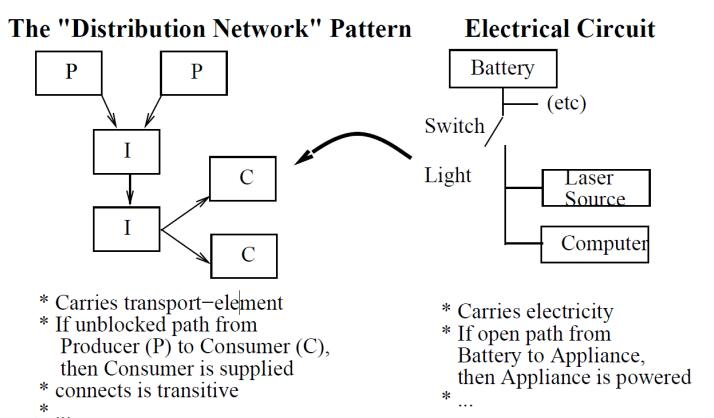
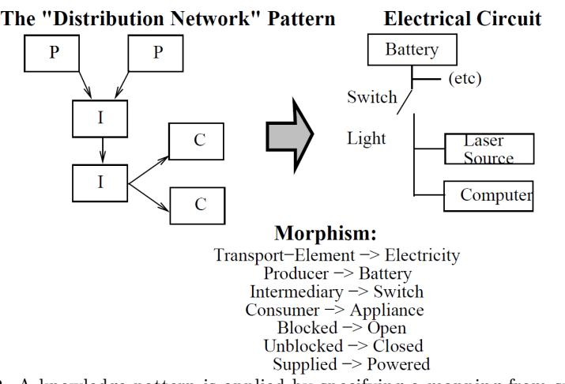
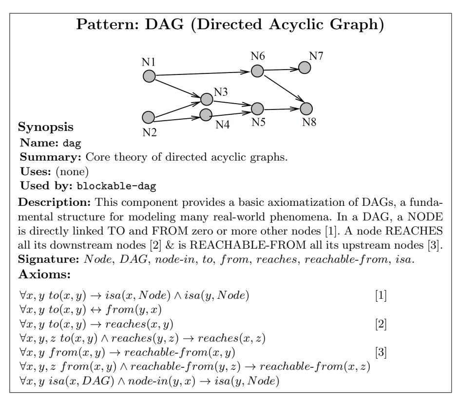
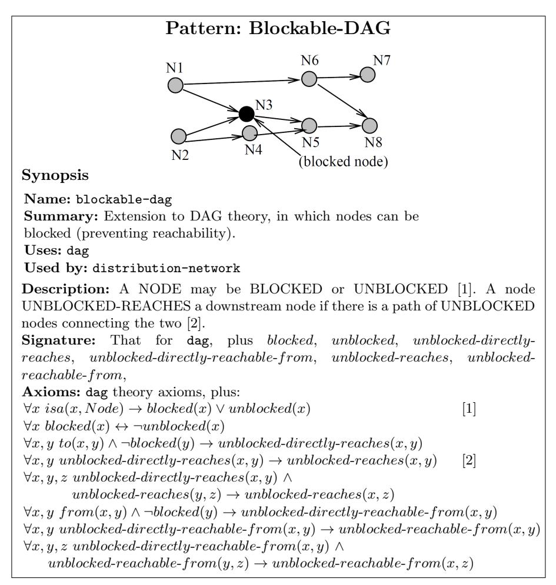
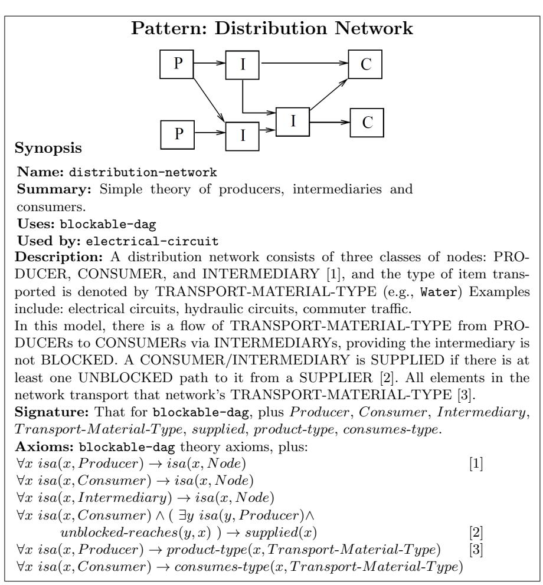
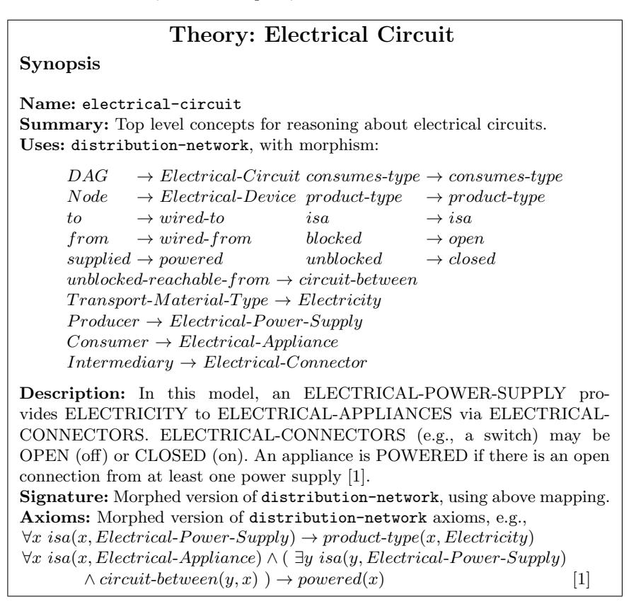
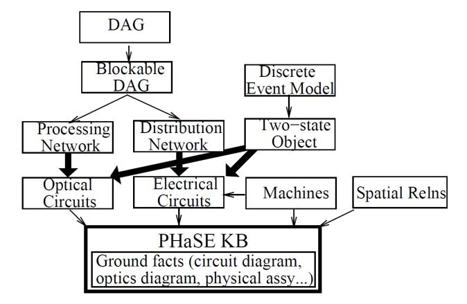
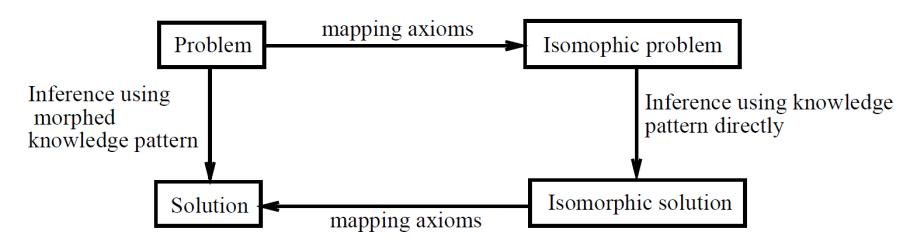

# Knowledge Patterns

Peter Clark 1 , John Thompson 1 , and Bruce Porter 2

<sup>1</sup> Knowledge Systems, Boeing Mathematics and Computing Technology MS 7L66, PO Box 3707, Seattle, WA 98124 {peter.e.clark,john.a.thompson}@boeing.com <sup>2</sup> Computer Science Dept. University of Texas Austin, TX 78712 porter@cs.utexas.edu

Summary. This Chapter describes a new technique, called "knowledge patterns", for helping construct axiom-rich, formal ontologies, based on identifying and explicitly representing recurring patterns of knowledge (theory schemata) in the ontology, and then stating how those patterns map onto domain-specific concepts in the ontology. From a modeling perspective, knowledge patterns provide an important insight into the structure of a formal ontology: rather than viewing a formal ontology simply as a list of terms and axioms, knowledge patterns views it as a collection of abstract, modular theories (the "knowledge patterns") plus a collection of modeling decisions stating how different aspects of the world can be modeled using those theories. Knowledge patterns make both those abstract theories and their mappings to the domain of interest explicit, thus making modeling decisions clear, and avoiding some of the ontological confusion that can otherwise arise. In addition, from a computational perspective, knowledge patterns provide a simple and computationally efficient mechanism for facilitating knowledge reuse. We describe the technique and an application built using them, and then critique its strengths and weaknesses. We conclude that this technique enables us to better explicate both the structure and modeling decisions made when constructing a formal axiom-rich ontology.

## 1 Introduction

At its heart, ontological engineering is a modeling endeavor. In a formal ontology, in particular, the knowledge engineer attempts to identify concepts and axioms which reflect (to a certain approximation) the real-world phenomena which he/she is interested in. A common observation is that, when doing this, one often finds oneself repeating structurally similar patterns of axioms. For example, when formalizing an ontology about a space science experiment (called KB-PHaSE [1]), we found that axioms about connectivity in electrical circuits, and about connectivity in optical systems, had substan-

tial structure in common. To make this shared structure explicit, and hence reusable, we have developed a knowledge engineering technique based on the explicit representation of these knowledge patterns, i.e., general templates denoting recurring theory schemata, and their transformation (through symbol renaming) to create specific theories, which we present in this Chapter.

From a knowledge engineering point of view, knowledge patterns provide considerable flexibility, as they can be transformed in multiple ways, and can be used in whole or in part. We describe how this overcomes some of the limitations of trying to use inheritance to achieve the same effect. From a philosophical point of view, knowledge patterns are also significant as they provide structure to the knowledge in an ontology, explicitly modularizing and separating the abstract theories (the knowledge patterns) from the phenomena in the world which those theories are deemed to reflect. For example, rather than encoding a theory about electrical circuits, we encode a knowledge pattern about directed graphs, and then state how an electrical circuit can be modeled as as a directed graph. In this way, knowledge patterns make explicit (and reusable) the "computational clockwork" of our axioms, and the modeling decisions made to apply that clockwork to the task at hand. As a result, a formal ontology can be viewed as a collection of theories mapped onto the domain of interest (perhaps in multiple ways), rather than simply as a "sea of axioms".

Consider, for example, constructing a formal ontology about banking. We might include axioms such as: if an amount X is deposited into a bank account, then the the amount in that account is increased by X. We could write many such axioms, and as a result have a useful theory about banking. However, what is not represented here is a fundamental – and perhaps subconscious – insight by the knowledge engineer, namely that a bank account can be modeled as a kind of container, and thus that a theory of containers can be applied, in this case, to bank accounts. The axiom above, for example, asserts a containerlike behavior on bank accounts, but nowhere is the abstract container theory itself stated, nor the mapping from it to bank accounts made explicit. Without this insight, the knowledge engineer will find him/herself writing the same pattern of axioms many times for different container-like phenomena. Our goal with knowledge patterns is to avoid this by making such abstract theories explicit, distinct from their application to a particular domain, and hence reusable. We aim to separate the "computational clockwork" of an axiom set from the real-world phenomena which (according to the knowledge engineer) seems to behave in a similar way to that axiom set.

As another example, consider the various formal ontologies of time, with axioms about time points, time intervals, etc. In fact, large parts of these theories are not specifically about time; rather, they can be viewed as (in part) as theories about lines, along with the implicit insight that "time can be modeled as a line". Again, our goal with knowledge patterns is to make explicit the underlying model (here, of lines), and its application to some phenomenon (here, time).

It might seem that this type of reuse could also be achieved using normal inheritance mechanisms (e.g., asserting "a bank account isa container", or "time isa line"). However, this works poorly in two situations: when the abstract theory applies to a specific theory in more than one way, and when only a selected portion of the abstract theory is applicable. In the next Section, we discuss in detail an example to illustrate these problems, and subsequently describe the knowledge pattern approach, and how it overcomes these limitations. We conclude that this technique enables us to better modularize axiom-rich ontologies and reuse their general theories.

## 2 The Limitations of Inheritance

Consider constructing an ontology about computers, including formal axioms to define the meaning of the terms and relations used in that ontology. We might include relations in the ontology such as ram size (the amount of RAM a computer has), expansion slots (the number of expansion slots a computer has), free slots (the number of free slots a computer has), etc., and formalize the meaning of these terms using axioms such as the following, here expressed in Prolog<sup>3</sup> :

```text
% "Available RAM is the total RAM minus the occupied RAM."
   available_ram(Computer,A) :-
       isa(Computer,computer),
       ram_size(Computer,S),
       occupied_ram(Computer,R),
       A is S - R.
  % "The number of free expansion-slots is the total number
. % of slots minus the number filled."
   free_slots(Computer,N) :-
       isa(Computer,computer),
```text

The two axioms above are syntactically different, yet they both instantiate the same general axiom, which we could explicate as:

expansion\_slots(Computer,X), occupied\_slots(Computer,O),

```text
FREE_SPACE(X,S) :-
    isa(X,CLASS),
    CAPACITY(X,C),
    OCCUPIED_SPACE(X,O),
    S is C - O.
```text

N is X - O.

<sup>3</sup> Variables start with upper-case letters and are universally quantified; ':-' denotes reverse implication (←); ',' denotes conjunction; and is denotes arithmetic computation.

As part of a general container theory, this axiom relates a container's free space, capacity, and occupied space.

The axioms for available ram and free slots are instantiations of this axiom just when a computer is modeled as a container of data and expansion cards, respectively. However, unless this general theory of containers is represented explicitly, its application to the domain of computers is only implicit. Clearly, we would prefer to explicitly represent the theory, then to reuse its axioms as needed.

This is typically done with inheritance. The knowledge engineer encodes an explicit theory of containers at a high-level node in a taxonomy, then its axioms are automatically added to more specific theories at nodes lower in the taxonomy. One axiom in our container theory might be:

```text
free_space(Container,F) :-
    isa(Container,container),
    capacity(Container,C),
    occupied_space(Container,O),
    F is C - O.
```text

To use inheritance to import this axiom into our computer theory, we assert that computers are containers and that ram size is a special case (a 'subslot,' in the terminology of frame systems) of the capacity relation:

```text
% "Computers are containers."4
subclass of(computer,container).
% "RAM size is a measure of capacity."
capacity(X,Y) :-
        isa(X,computer),
        ram size(X,Y).
```text

However, this becomes problematic here as there is a second notion of "computers as containers" in our original axioms, namely computers as containers of expansion cards. If we map this notion onto our computer theory in the same way, by adding the axiom:

```text
% "Number of expansion slots is a measure of capacity"
capacity(X,Y) :-
        isa(X,computer),
        expansion slots(X,Y).
```text

then the resulting representation captures that a computer has two capacities (memory capacity and slot capacity), but loses the constraints among their relations. Consequently, memory capacity may be used to compute the number of free expansion slots, and slot capacity may be used to compute available RAM. This illustrates how the general container theory can be "overlaid"

<sup>4</sup> We assume a general inheritance axiom:

isa(I,SuperC) :- isa(I,C), subclass of(C,SuperC).

on a computer in multiple ways, but inheritance fails to keep these overlays distinct.

This problem might be avoided in various ways. We could insist that a general theory (e.g., container) is applied at most once to a more specific theory (although there is no obvious, principled justification for this restriction). We would then revise our representation so that it is not a computer, but a computer's memory, which contains data, and similarly that a computer's expansion slots contain cards. While this solves the current problem, the general problem remains. For example, we may also want to model the computer's memory as a container in other senses (e.g., of transistors, files, information, or processes), which this restriction prohibits.

Another pseudo-solution is to parameterize the container theory, by adding an argument to the container axioms to denote the type of thing contained, to distinguish different applications of the container theory. With the changes italicized, our axioms become:

```text
% "Free space for content-type T = capacity for T - occupied T."
free space(Container,ContentType,F) :-
  isa(Container,container),
  capacity(Container,ContentType,C),
  occupied space(Container,ContentType,O),
  F is C - O.
% "ram size denotes a computer's RAM capacity."
capacity(X,ram,Y) :-
  isa(X,computer),
```text

ram size(X,Y).

Again, this solves the current problem (at the expense of parsimony), but is not a good general solution. Multiple parameters may be needed to distinguish different applications of a general theory to a more specific one. For example, we would need to add a second parameter about the container's Dimension (say) to distinguish physical containment (as in: "a computer contains megabytes of data") from metaphysical containment (as in: "a computer contains valuable information"). This complicates our container axioms further, and still other parameters may be needed.

A second limitation of inheritance is that it copies axioms (from a general theory to a more specific one) in an "all or nothing" fashion. Often only a selected part of a theory should be transferred. To continue with our example, the general container theory may include relations for a container wall and its porosity, plus axioms involving these relations. Because the relations have no counterpart in the computer theory, these relations and axioms should not be transferred.

These two problems arise because inheritance is being misused, not because it is somehow "buggy." When we say "A computer is a container," we mean "A computer (or some aspect of it, such as its memory) can be modeled as a container." Inheritance is designed to transfer axioms through the isa relation, not the can-be-modeled-as relation. Nevertheless, knowledge engineers often conflate these relations, probably because inheritance has been the only approach available to them. This leads to endless (and needless) debates on the placement of abstract concepts in taxonomies. For example, where should container be placed in a taxonomy with respect to object, substance, process and so on? Almost anything can be thought of as a container in some way, and if we pursue this route, we are drawn into debating these modeling decisions as if they were issues of some objective reality. This was a recurrent problem in our earlier work on the Botany Knowledge-Base [2], where general theories used as models (such as connector and interface) sit uncomfortably high in the taxonomy. The same issue arises in other ontologies. For example, product is placed just below individual in Cyc [3] and place is just below physical-object in Mikrokosmos [4].

## 3 Knowledge Patterns

Our approach for handling these situations is conceptually simple but architecturally significant because it enables us to better modularize a knowledgebase. We define a pattern as a first-order theory whose axioms are not part of the target knowledge-base, but can be incorporated via a renaming of their non-logical symbols.

A theory acquires its status as a pattern by the way it is used, rather than by having some intrinsic property. First, the knowledge engineer implements the pattern as an explicit, self-contained theory. For example, the container theory would include the axiom:

```text
free_space(Container,F) :-
    isa(Container,container),
    capacity(Container,C),
    occupied_space(Container,O),
    F is C - O.
```text

Second, using terminology from category theory [5], the knowledge engineer defines a morphism for each intended application of this pattern in the target knowledge-base. A morphism is a consistent<sup>5</sup> mapping of the pattern's nonlogical symbols, or signature, to terms in the knowledge-base, specifying how the pattern should be transformed. Finally, when the knowledge base is loaded, morphed copies of this pattern are imported, one for each morphism. In our example, there are two morphisms for this pattern:

<sup>6</sup> Peter Clark, John Thompson, and Bruce Porter

<sup>5</sup> Two examples of inconsistent mappings are: (i) mapping a symbol twice, e.g., {A->X,A->Y}, (ii) mapping a function f to g, where g's signature as specified by the mapping conflicts with g's signature as already defined in the target KB, e.g., {f->g,A->X,B->Y}, where f : A → B in the source pattern but g is already in the target and does not have signature g : X → Y.

```text
container -> computer
         capacity -> ram_size
         free_space -> available_ram
         occupied_space -> occupied_ram
isa -> isa and
         container -> computer
         capacity -> expansion_slots
         free_space -> free_slots
         occupied_space -> occupied_slots
         isa -> isa
```text

(The reason for mapping a symbol to itself, e.g., the last line in these morphisms, is explained in the next paragraph). When these morphisms are applied, two copies of the container pattern are created, corresponding to the two ways, described above, in which computers are modeled as containers.

There may be symbols in the pattern that have no counterpart in the target knowledge base, such as the thickness of a container wall in our computer example. In this event, the knowledge engineer omits the symbols from the morphism, and the morphing procedure maps each one to a new, unique symbol (generated by Lisp's gensym function, for example). This restricts the scope of these symbols to the morphed copy of the pattern in the target knowledge base. Although the symbols are included in the imported theory, they are invisible (or more precisely, hidden) from other axioms in the knowledge base. Note that we cannot simply delete axioms that mention these symbols because other axioms in the imported theory may depend on them.<sup>6</sup>


<!-- Image Description: The image presents two diagrams illustrating analogous systems. The left shows a "distribution network" with producers (P), intermediaries (I), and consumers (C), depicting a flow of resources. The right shows a simple electrical circuit with a battery, switch, and appliances (laser source, computer), illustrating electricity flow. Both diagrams use boxes and arrows to represent components and their relationships. The purpose is to explain the concept of a distribution network by comparing it to a familiar electrical circuit analogy. -->

Fig. 10.1. A knowledge pattern is created by abstracting the structure of a theory (here, about electrical circuits).

<sup>6</sup> Although specific axioms may be removed if they do not contribute to assertions about symbols that are imported. A dependency analysis algorithm could, in principle, identify and remove such "dead code".

8 Peter Clark, John Thompson, and Bruce Porter


<!-- Image Description: The image displays a "distribution network" pattern (left) and its morphism to an electrical circuit (right). The left diagram shows producers (P), intermediaries (I), and consumers (C) in a hierarchical flow. The right diagram depicts a battery, switch, and appliances (laser source, computer) powered by electricity. A large arrow indicates the mapping between the two, detailed below in a "morphism" table showing corresponding elements. The image illustrates an analogy between abstract network structure and a concrete electrical system. -->

Fig. 10.2. A knowledge pattern is applied by specifying a mapping from symbols in the pattern to symbols in the target ontology of interest.

## 4 Using Patterns for Building a Knowledge-Base

We encountered the limitations of inheritance and developed the approach of knowledge patterns while building KB-PHaSE, a prototype knowledge-based system for training astronauts to perform a space payload experiment called PHaSE (Physics of Hard Spheres Experiment). PHaSE involves projecting a laser beam through various colloidal suspensions of tiny spheres in liquids, to study the transitions among solid, liquid, and glass (not gas) states in microgravity. KB-PHaSE trains the astronaut in three ways. First, it provides a simple, interactive simulator in which the astronaut can step through the normal procedure of the experiment. Second, it introduces simulated faults to train the astronaut to recover from problems. Finally, it supports exploratory learning in which the astronaut can browse concepts in the knowledge-base and ask questions using a form-based interface. All three tasks use the underlying knowledge-base to infer: properties of the current experimental state, valid next actions, and answers to user's questions. The prototype was built as a small demonstrator, rather than for in-service use, to provide input to Boeing and NASA's Space Station Training Program. Details of KB-PHaSE are presented in [1] and the question-answering technology is described in [6].

Our interest here is how the underlying knowledge-base was assembled from component theories, rather than written from scratch. KB-PHaSE includes representations of many domain-specific objects (such as electrical circuits) and processes (such as information flow) that are derived from more general theories. For example, we can think of an electrical circuit in terms of a simple model of distribution, in which producers (a battery) distribute a product (electricity) to consumers (a light), illustrated schematically in Figures 10.1 and 10.2. To capture this in a reusable way, we formulated the gen-


<!-- Image Description: The image presents a formal specification of a Directed Acyclic Graph (DAG). It includes a diagram showing a sample DAG with labeled nodes and directed edges, illustrating the structure. The text provides a synopsis, description explaining the DAG's role in modeling real-world phenomena, a signature listing key elements, and axioms formally defining relationships between nodes using predicate logic. The numbered axioms describe "to," "from," "reaches," and "reachable-from" relationships within the DAG structure. -->

Fig. 10.3. A knowledge pattern used in KB-PHaSE.

eral model of distribution as an independent, self-contained pattern, shown in Figure 10.5. Then we defined a morphism that creates from it a model of electrical circuits, as shown Figure 10.6.

Our general theory of distribution was built, in turn, by extending a general theory of blockable directed acyclic graphs (blockable-DAGs), which in turn was built by extending a general theory of DAGs (Figures 10.3 and 10.4). The application, including these and other theories, is implemented in the frame-based language KM [7].

By separating these theories as modular entities, they are available for reuse. In this application, we also modeled information flow in the optical circuit (laser to camera to amplifier to disk) using a morphed pattern describing a processing network, which, in turn, was defined as an alternative extension of the basic blockable DAG theory, thus reusing this theory. Similarly, the general pattern of a "two-state object" occurs several times within KB-PHaSE (e.g., switches, lights, and open/closed covers), and this pattern was again made explicit and morphed into the knowledge base as required. These patterns and their inter-relationships are shown in Figure 10.7.


<!-- Image Description: The image presents a "Blockable-DAG" pattern, extending DAG theory. It includes a directed acyclic graph (DAG) diagram showing nodes labeled N1-N8, where N5 is explicitly marked as a "blocked node," illustrating the concept of preventing reachability. The accompanying text defines the pattern's signature, including predicates like `blocked`, `unblocked`, and `unblocked-reaches`, and lists axioms extending standard DAG axioms to incorporate node blocking. The image's purpose is to formally define the blockable-DAG pattern within the context of the paper. -->

Fig. 10.4. Another knowledge pattern used in KB-PHaSE.

## 5 The Semantics of Knowledge Patterns

A knowledge pattern is incorporated into a knowledge base by a syntactic process of symbol renaming (morphing). As the process is syntactic, it might seem difficult to provide semantics for the morphing process itself. However, we can take some steps towards this by considering the result of morphing to be logically equivalent to adding the knowledge pattern directly into the knowledge base, along with some mapping axioms relating knowledge base terms to that knowledge pattern<sup>7</sup> . If we can do this, then those mapping axioms will have defined the semantics of what the morphing operation has

<sup>7</sup> We are endebted to Richard Fikes for making this suggestion.


<!-- Image Description: The image presents a "Distribution Network" pattern, depicted by two diagrams showing producers (P), intermediaries (I), and consumers (C) connected in a flow network. The accompanying text describes the pattern's application to modeling systems like electrical circuits, specifying nodes and transport material type. Logical axioms define the relationships, including conditions for a consumer being "supplied." The diagrams visually represent the flow of material from producers to consumers via intermediaries. -->

Fig. 10.5. The knowledge pattern for distribution networks, used by KB-PHaSE.

achieved. We provide here an outline of an approach to doing this, although a full solution requires further work.

When morphing a knowledge pattern, we are "bringing the abstract theory to the application", i.e., converting the vocabulary (ontology) used in the pattern to that of the application domain in which it is to be used, via symbol renaming. An alternative, but functionally equivalent, approach would be to take a domain-specific problem, and convert its vocabulary to that used in the pattern, solve the problem using the pattern, and then convert the result back to the domain-specific vocabulary. This can be done, given a domainspecific problem, by establishing an isomorphic problem to solve using the pattern, solve it, and then translate the results back. This can be viewed as


<!-- Image Description: The image presents a formal specification of an "electrical-circuit" theory. It uses a table to map concepts from a directed acyclic graph (DAG) representation to terms in the electrical circuit domain (e.g., DAG node to Electrical-Device). A description explains the model's representation of power supply, appliances, and connectors. Finally, it includes axioms, formalized using logical notation, defining power relationships within the model. -->

Fig. 10.6. The theory for electrical circuits in KB-PHaSE, defined as a morphism of the "distribution network" knowledge pattern.

the complement to morphing, namely "bringing the application to the abstract theory." The approach is illustrated schematically in Figure 10.8.

This method is exactly that used in both object-oriented composition, and reasoning by analogy. A classic example used in object-oriented composition ([8], pp18-22) is the task of using a Rectangle concept to specify the area of a (graphics) Window. Rather than doing this through inheritance, by stating that a Window ISA Rectangle, the programmer states that a Window HAS a Rectangle instance associated with it. The Window object then delegates some queries (eg. its area) to the Rectangle, which computes the answer and passes the answer back. In this example, the Window is the applicationspecific object, while the Rectangle (along with its methods) is equivalent to the knowledge pattern, and a domain-specific problem (e.g., the area of the Window) is solved by creating an isomorphic problem (e.g., creating a Rectangle, and finding its area), and converting the result back. A similar


<!-- Image Description: This flowchart depicts the architecture of a knowledge base (KB), PHaSE KB. It shows how different models (DAG, Blockable DAG, Discrete Event Model) contribute to building the KB. The models are broken down into components like Processing and Distribution Networks, which feed into Optical and Electrical Circuits. These, along with Machines and Spatial Relations, constitute the ground facts within PHaSE KB. The diagram illustrates the data flow and relationships between different elements in constructing the KB. -->

Fig. 10.7. The component theories used in KB-PHaSE. Each box denotes a theory (set of rules) describing a phenomenon, and arcs denote inclusion relations, the thick arcs involving morphing the source.


<!-- Image Description: The image is a flowchart illustrating a problem-solving method. A "Problem" is mapped to an "Isomorphic problem" using "mapping axioms." The original problem is solved using inference with a morphed knowledge pattern. The isomorphic problem is solved using direct knowledge pattern inference. Finally, the "Isomorphic solution" is mapped back to the "Solution" using the same "mapping axioms". The flowchart depicts a two-path approach to problem-solving via isomorphic transformation. -->

Fig. 10.8. To provide semantics for the syntactic process of morphing (the left down arrow), we consider its equivalence to using the knowledge pattern directly, along with mapping axioms to translate a domain-specific problem into/out of an isomorphic one expressed using the pattern's ontology (the other three arrows).

mechanism is used in reasoning by analogy, where a problem is transferred between a base and a target theory [9].

If we can express this approach logically, we will have expressed the semantics of a process equivalent to morphing, and hence provided a semantics for morphing itself. In the earlier example of a computer, these "mapping axioms" would be:

% For each computer, assert that there exists an isomorphic container...

∀x isa(x, Computer) → ∃x 0 isa(x 0 , Container)∧is-modeled-by1(x, x<sup>0</sup> )

% ...whose spatial properties model the slot capacities of that computer.

∀x, x<sup>0</sup> is-modeled-by1(x, x<sup>0</sup> ) →

( ∀i capacity(x 0 , i) ↔ expansion-slots(x, i) ∧

∀j occupied-space(x 0 , j) ↔ occupied-slots(x, j) ∧ ∀k free-space(x 0 , k) ↔ free-slots(x, n) )

By adding the Container knowledge pattern directly into the KB, along with these mapping axioms, the result will be the same as if we had added a morphed version of the Container knowledge pattern:

( Knowledge Pattern ∪ Mapping Axioms ) ≡ Morph(Knowledge Pattern)

Hence, in this case, the mapping axioms provide the semantics of what the morphing operation would have achieved. In the more general case, a domainspecific problem may involve multiple objects (e.g., an electrical circuit of electrical components), requiring setting up an isomorphic problem also involving multiple, corresponding objects expressed in the knowledge pattern's ontology.

As this alternative approach is equivalent to morphing knowledge patterns, why not simply use it, rather than morphing? This is a valid, alternative approach to applying knowledge patterns, and achieves many of the same goals (namely to make the abstract theories explicit, and to make explicit the modeling decisions about how they apply to real-world phenomena). The tradeoffs are largely computational, the mapping approach being more complex to implement and computationally more expensive at run-time, but also having the advantage that the knowledge pattern itself is then an explicit part of the final KB (rather than the KB containing only morphed copies of that pattern).

## 6 Related Work

There are several important areas of pattern-related work, differing in the type of reusable knowledge they encode and the way they encode it.

In software engineering there has been considerable work on formal methods for software specification, based on the construction and composition of theories, and using category theory (applied to algebraic specifications) as a mathematical basis (e.g., [10, 11]). SpecWare is an example of a software development environment which is based on this approach and is capable of synthesizing software semi-automatically [12]. As described in Section 10.3, our work can be viewed as motivating, simplifying, and applying similar ideas to the task of knowledge engineering.

Work on reusable problem-solving methods (PSMs), in particular KADS [13] and generic tasks [14], addresses modularity and reuse in the context of procedural knowledge. PSMs are based on the observation that a task-specific method can be decomposed into more primitive – and more reusable – submethods, and that working with a library of such primitives may accelerate building a system and make it more understandable and maintainable. Work on PSMs shares the same general goal that we have — to identify and make explicit recurring generalizations — but it differs in two respects. First, while PSMs are (mostly) patterns of procedural inference, we have been targeting the basic domain knowledge (models) which those procedures may operate on. (Although, since logic has both a declarative and procedural interpretation, this distinction becomes blurred). Second, the mechanics of their usage differ: implementations of PSMs can be thought of as parameterized procedures, applied through instantiating their "role" parameters with domain concepts (e.g., the "hypotheses" role in a diagnosis PSM applied to medical diagnosis might be filled with disease types); in contrast, our patterns are closer to schemata than procedures, and applied instead through morphing.

Research on compositional methods for constructing ontologies and knowledge bases (eg [15, 16, 17]) has explored factoring domain knowledge into component theories, analogous to factoring procedural knowledge into PSMs. A component theory describes relationships among a set of objects (its participants) and is applied in an analogous way to PSMs, by instantiating these participants with domain concepts. Knowledge patterns develop this idea in two ways. First, they provide further generalization, capturing the abstract structure of such theories. Second, their method of application differs (morphing, rather than axioms linking participants with domain concepts). This permits a pattern to be applied in multiple, different ways to the same object, as discussed in Section 10.2. Compositional modeling has also explored the automated, run-time selection of appropriate components to use [15, 18], an important issue which we have not addressed here.

"Design patterns" in object-oriented programming (e.g., [8]) are descriptions of common, useful organizations of objects and classes, to help create specific object-oriented designs. They again try to capture recurring abstractions, but (in contrast to the approaches described earlier) their primary intent is as architectural guidance to the software designer, not as computational devices directly. As a result, they are (and only need be) semi-formally specified, and they do not require a method for their automatic application. ([19] gives an excellent discussion of the relationship between object-oriented patterns and problem-solving methods). Another area of related work from programming languages is the use of template programming methods, where a code template is instantiated by syntactic substitution of symbols within it (e.g., Ada generics, C++ templates), corresponding to the syntactic implementation of pattern morphing, but without the associated semantics.

In a similar way to design patterns, "semantic patterns" [20, 21] were intended as a means of describing knowledge in an "implementation neutral" way, i.e., above the level of any particular representation language, with the objective of reusing semantics across representational languages (in particular, for Web-based applications). As with design patterns, they are intended as a means for communication among human developers, but in addition they contain various implementations of that knowledge, expressed in different knowledge representation schemes. Semantic patterns share some similarities with knowledge patterns, in particular the goal of abstraction and reuse. However, they also are rather different in other respects: semantic patterns were pri-

marily intended for knowledge sharing across a wide range of representation systems, i.e., their language neutrality was a primary goal (with the consequence that each implementation of the pattern has to be largely written by hand). In contrast, knowledge patterns are intended for use within a particular representational scheme in an automated way, with the primary goals of uncovering and making explicit the abstract theories used in the knowledge base, and capturing the modeling decisions made about how these theories apply to the domain of interest.

Work on analogical reasoning is also closely related, as it similarly seeks to use a theory (the base) to provide extra knowledge about some domain (the target), by establishing and using a mapping between the two. However, work on analogy has mainly focussed on identifying what the appropriate mappings between the base and target should be [9], a task which we have not addressed and which could be beneficial for us to explore further. In addition, an alternative way of applying our patterns would be to transform a domain-specific problem into the vocabulary of a pattern (and solve it there, and transform the solution back), rather than transforming the pattern into the vocabulary of the domain. In the PHaSE KB, for example, a query about the electrical circuit would be transformed to a query about a distribution network which was isomorphic to the electrical circuit, solved there, and the answer transformed back to the electrical circuit. This alternative approach is similar to (one form of) solution by analogy, in which the pattern (e.g., the distribution network) takes the role of the base, and the domain facts (e.g., the electrical circuit) the target [9]. It is also similar to the use of delegation in object-oriented programming (the target 'delegates' the problem to the base, which solves it and passes the solution back [8, p20]). This variant approach for using patterns would allow some run-time flexibility, but would be more complex to implement and computationally more expensive at run-time.

Finally, work on microtheories and contexts (e.g., [22, 23]) is also related, where a microtheory (context) can be thought of as a pattern, and lifting axioms provide the mapping between predicates in the microtheory and the target KB which is to incorporate it. However, this work has typically been used to solve a different problem, namely breaking a large KB into a set of smaller, simpler (and thus more maintainable) pieces, rather than making recurring axiom patterns explicit, and it does not account for mapping the same microtheory multiple times (and in different ways) into the same target KB. Reasoning with lifting axioms can also be computationally expensive except in the simplest cases.

Note that patterns are not an essential prerequisite for building a knowledgebased system. In the PHaSE application, for example, we could have simply defined the PHaSE electrical circuit, implemented axioms about the behavior of electrical circuits, and answered circuit questions, all within the electrical vocabulary. This would be a completely reasonable approach for a single-task system; however, to achieve reuse within a multifunctional system (such as KB-PHaSE), or between systems, it becomes preferable to extract the more

general abstractions, as we have described. Patterns do not enable better reasoning, rather they are to help reuse.

## 7 Summary

Ontological engineering is fundamentally a modeling endeavor. In this Chapter, we have described a knowledge engineering technique aimed at helping in this endeavor, by making recurring theory schemata, or knowledge patterns, explicit, and available for manipulation. From a computational perspective, knowledge patterns provide a simple and computationally efficient mechanism for facilitating knowledge reuse. From a modeling perspective, knowledge patterns also provide an important insight into the process of ontological engineering, namely that it is not simply about "writing axioms", but also involves recognizing that the "computational clockwork" of one or more abstract theories seem to behave (to a reasonable approximation) in the same way as some system of objects in the world, and hence can be used to describe it. Knowledge patterns make both those abstract theories and their mappings to the domain of interest explicit, thus making modeling decisions clear, and avoiding some of the ontological confusion that can otherwise arise.

However, our approach also has limits. First, it does not allow a system to make run-time modeling decisions, as general theories are morphed when the knowledge base is loaded. Second, it does not address the issue of finding relevant knowledge patterns in the first place, or deciding the appropriate boundaries of patterns (this is left to the knowledge engineer). Finally, we do not address the issue of finding the appropriate mappings between patterns and the domain; this again is left to the knowledge engineer. As mentioned earlier, this is a primary focus of research in the related field of analogical reasoning [9].

Despite these, the significance of this approach is that it allows us to better modularize the axioms which underly formal ontologies, and isolate general theories as self-contained units for reuse. It also allows us to control and vary the way those theories are mapped onto an application domain, and it better separates the "computational clockwork" of a general theory from the domain phenomena which it is considered to reflect. In addition, the approach is technically simple and not wedded to a particular implementation language. In the long-term, we hope this will help foster the construction of reusable theory libraries, an essential requirement for the construction of large-scale, formal ontologies and knowledge-based systems.

## References

1. Clark P, Thompson J, Dittmar M (1998) KB-PHaSE: A knowledge-based training tool for a space station experiment. Technical Report SSGTECH-98-035, Boeing Applied Research and Technology, Seattle, WA

- 18 Peter Clark, John Thompson, and Bruce Porter
- 2. Porter B, Lester J, Murray K, Pittman K, Souther A, Acker L, Jones T (1988) AI research in the context of a multifunctional knowledge base: The botany knowledge base project. Tech Report AI-88-88, Dept CS, Univ Texas at Austin
- 3. Cycorp, Inc. (1996) The cyc public ontology. (http://www.cyc.com/public.html)
- 4. Mahesh K, Nirenberg S (1995) A situated ontology for practical NLP. In:Proc. IJCAI-95 Workshop on Basic Ontological Issues in Knowledge Sharing
- 5. Pierce B (1991) Basic Category Theory for Computer Scientists. MIT Press
- 6. Clark P, Thompson J, Porter B (1999) A knowledge-based approach to question-answering. In: Fikes R, Chaudhri V (eds) Proc. AAAI'99 Fall Symposium on Question-Answering Systems. AAAI
- 7. Clark P, Porter B (1999). KM the knowledge machine: Users manual. Technical report, AI Lab, Univ Texas at Austin
- 8. Gamma E, Helm R, Johnson R, Vlissides J (1995) Design Patterns. Addison-Wesley
- 9. Falkenhainer B, Forbus K, Gentner D (1986) The structure-mapping engine. In: AAAI-86, pages 272–277
- 10. Goguen J (1986) Reusing and interconnecting software components. In: Computer 19(2):16–28
- 11. Srinivas Y V, Jullig, R (1995) Specware: Formal support for composing software. In: Proc. Conf. on the Mathematics of Program Construction, Kloster Irsee, Germany (Also Kestrel Tech Rept KES.U.94.5, http://www.kestrel.edu/HTML/publications.html)
- 12. Jullig R, Srinivas Y, Blain L, Gilham L, Goldberg A, Green C, McDonald J, Waldinger R (1995) Specware language manual. Technical report, Kestrel Institute
- 13. Wielinga B J, Schreiber A T, Breuker J A (1992) KADS: A modelling approach to knowledge engineering. Knowledge Acquisition 4(1)
- 14. Chandrasekaren B (1986) Generic tasks in knowledge-based reasoning: Highlevel building blocks for expert system design. IEEE Expert, pages 23–30
- 15. Falkenhainer B, Forbus K (1991) Compositional modelling: Finding the right model for the job. Artificial Intelligence 51:95–143
- 16. Clark P, Porter B (1997) Building concept representations from reusable components. In: AAAI-97, pages 369–376, CA:AAAI
- 17. Noy N, Hafner, C (1998) Representing scientific experiments: Implications for ontology design and knowledge sharing. In: AAAI-98, pages 615–622
- 18. Rickel J, Porter B (1997) Automated modeling of complex systems to answer prediction questions. Artificial Intelligence 93(1-2):201–260
- 19. Menzies T (1997) Object-oriented patterns: Lessons from expert systems. Software – Practice and Experience 27(12):1457–1478
- 20. Staab S, Erdmann M, Maedche A (2001) Engineering ontologies using semantic patterns. In: Preece A, O'Leary D (eds) Proc. IJCAI-01 Workshop on e-Business and the Intelligent Web
- 21. Staab S, Erdmann M, Maedche A (2001) Semantic patterns. Technical report, Univ. Karlsruhe
- 22. Buvac S (ed) (1995) Proc AAAI-95 Fall Symposium on Formalizing Context. CA:AAAI
- 23. Blair P, Guha R, Pratt W (1992) Microtheories: An ontological engineer's guide. Tech Rept CYC-050-92, MCC, Austin, TX
