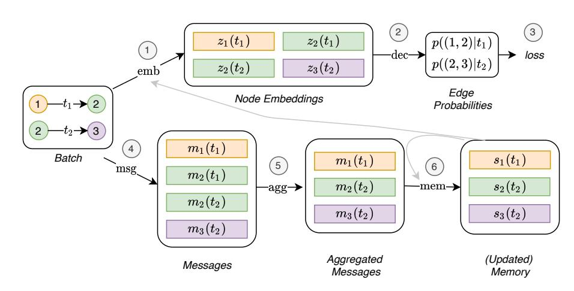
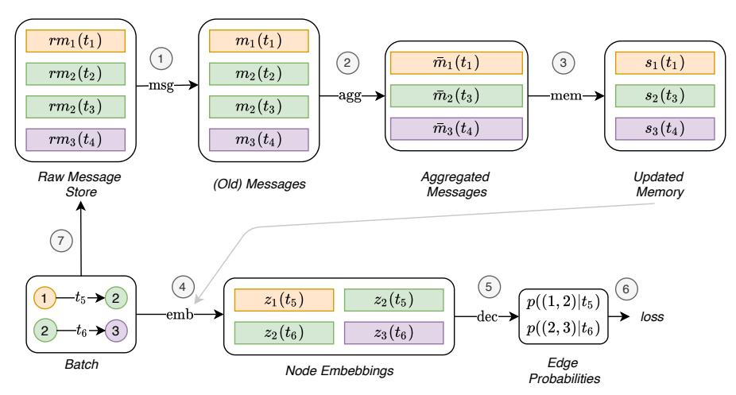
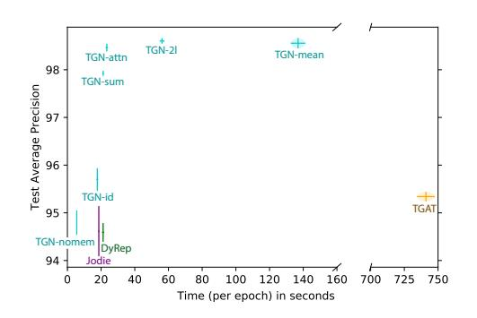
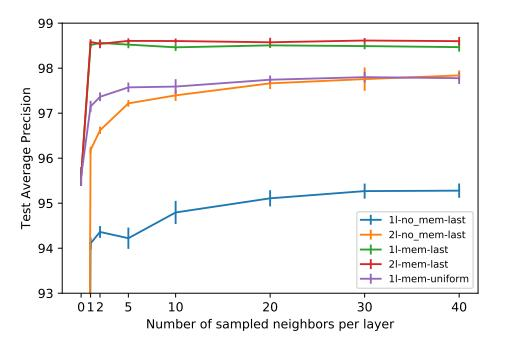
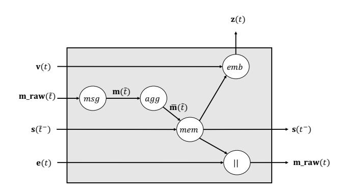
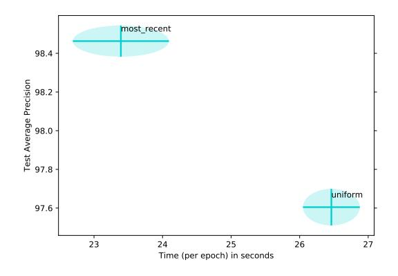

# TEMPORAL GRAPH NETWORKS FOR DEEP LEARNING ON DYNAMIC GRAPHS

Emanuele Rossi<sup>∗</sup> Twitter

Ben Chamberlain Twitter

Fabrizio Frasca Twitter

Davide Eynard Twitter

Federico Monti Twitter

Michael Bronstein Twitter

## ABSTRACT

Graph Neural Networks (GNNs) have recently become increasingly popular due to their ability to learn complex systems of relations or interactions. These arise in a broad spectrum of problems ranging from biology and particle physics to social networks and recommendation systems. Despite the plethora of different models for deep learning on graphs, few approaches have been proposed for dealing with graphs that are dynamic in nature (e.g. evolving features or connectivity over time). We present Temporal Graph Networks (TGNs), a generic, efficient framework for deep learning on dynamic graphs represented as sequences of timed events. Thanks to a novel combination of memory modules and graph-based operators, TGNs significantly outperform previous approaches while being more computationally efficient. We furthermore show that several previous models for learning on dynamic graphs can be cast as specific instances of our framework. We perform a detailed ablation study of different components of our framework and devise the best configuration that achieves state-of-the-art performance on several transductive and inductive prediction tasks for dynamic graphs.

## 1 INTRODUCTION

In the past few years, graph representation learning [\(Bronstein et al., 2017;](#page-8-0) [Hamilton et al., 2017b;](#page-9-0) [Battaglia et al., 2018\)](#page-8-1) has produced a sequence of successes, gaining increasing popularity in machine learning. Graphs are ubiquitously used as models for systems of relations and interactions in many fields [\(Battaglia et al., 2016;](#page-8-2) [Qi et al., 2018;](#page-11-0) [Monti et al., 2016;](#page-10-0) [Choma et al., 2018;](#page-8-3) [Duvenaud et al.,](#page-9-1) [2015;](#page-9-1) [Gilmer et al., 2017;](#page-9-2) [Parisot et al., 2018;](#page-11-1) [Rossi et al., 2019\)](#page-11-2), in particular, social sciences [\(Ying](#page-12-0) [et al., 2018;](#page-12-0) [Monti et al., 2019;](#page-10-1) [Rossi et al., 2020\)](#page-11-3) and biology [\(Zitnik et al., 2018;](#page-12-1) [Veselkov et al.,](#page-11-4) [2019;](#page-11-4) [Gainza et al., 2019\)](#page-9-3). Learning on such data is possible using graph neural networks (GNNs) [\(Hamilton et al., 2017a\)](#page-9-4) that typically operate by a message passing mechanism [\(Battaglia et al.,](#page-8-1) [2018\)](#page-8-1) aggregating information in a neighborhood of a node and create node embeddings that are then used for node classification [\(Monti et al., 2016;](#page-10-0) [Velickovic et al., 2018;](#page-11-5) [Kipf & Welling, 2017\)](#page-10-2), graph classification [\(Gilmer et al., 2017\)](#page-9-2), or edge prediction [\(Zhang & Chen, 2018\)](#page-12-2) tasks.

The majority of methods for deep learning on graphs assume that the underlying graph is *static*. However, most real-life systems of interactions such as social networks or biological interactomes are *dynamic*. While it is often possible to apply static graph deep learning models [\(Liben-Nowell](#page-10-3) [& Kleinberg, 2007\)](#page-10-3) to dynamic graphs by ignoring the temporal evolution, this has been shown to be sub-optimal [\(Xu et al., 2020\)](#page-12-3), and in some cases, it is the dynamic structure that contains crucial insights about the system. Learning on dynamic graphs is relatively recent, and most works are limited to the setting of discrete-time dynamic graphs represented as a sequence of snapshots of the graph [\(Liben-Nowell & Kleinberg, 2007;](#page-10-3) [Dunlavy et al., 2011;](#page-8-4) [Yu et al., 2019;](#page-12-4) [Sankar et al., 2020;](#page-11-6) [Pareja et al., 2019;](#page-10-4) [Yu et al., 2018\)](#page-12-5). Such approaches are unsuitable for interesting real world settings such as social networks, where dynamic graphs are continuous (i.e. edges can appear at any time)

<sup>∗</sup> erossi@twitter.com

and evolving (i.e. new nodes join the graph continuously). Only recently, several approaches have been proposed that support the continuous-time scenario [\(Xu et al., 2020;](#page-12-3) [Trivedi et al., 2019;](#page-11-7) [Kumar](#page-10-5) [et al., 2019;](#page-10-5) [Ma et al., 2018;](#page-10-6) [Nguyen et al., 2018;](#page-10-7) [Bastas et al., 2019\)](#page-8-5).

Contributions. In this paper, we first propose the generic inductive framework of Temporal Graph Networks (TGNs) operating on continuous-time dynamic graphs represented as a sequence of events, and show that many previous methods are specific instances of TGNs. Second, we propose a novel training strategy allowing the model to learn from the sequentiality of the data while maintaining highly efficient parallel processing. Third, we perform a detailed ablation study of different components of our framework and analyze the tradeoff between speed and accuracy. Finally, we show state-of-the-art performance on multiple tasks and datasets in both transductive and inductive settings, while being much faster than previous methods.

## 2 BACKGROUND

Deep learning on static graphs. A static graph G = (V, E) comprises nodes V = {1, . . . , n} and edges E ⊆ V × V, which are endowed with features, denoted by v<sup>i</sup> and eij for all i, j = 1, . . . , n, respectively. A typical *graph neural network*(GNN) creates an*embedding*z<sup>i</sup> of the nodes by learning a local aggregation rule of the form

$$
\mathbf{z}_i = \sum_{j \in \mathcal{H}_i} h(\mathbf{m}_{ij}, \mathbf{v}_i) \qquad \mathbf{m}_{ij} = \text{msg}(\mathbf{v}_i, \mathbf{v}_j, \mathbf{e}_{ij}),
$$

which is interpreted as message passing from the neighbors j of i. Here, N<sup>i</sup> = {j : (i, j) ∈ E} denotes the neighborhood of node i and msg and h are learnable functions.

Dynamic Graphs. There exist two main models for dynamic graphs.*Discrete-time dynamic graph*s (DTDG) are sequences of static graph snapshots taken at intervals in time. *Continuos-time dynamic graph*s (CTDG) are more general and can be represented as timed lists of events, which may include edge addition or deletion, node addition or deletion and node or edge feature transformations.

Our temporal (multi-)graph is modeled as a sequence of time-stamped *events*G = {x(t1), x(t2), . . .}, representing addition or change of a node or interaction between a pair of nodes at times 0 ≤ t<sup>1</sup> ≤ t<sup>2</sup> ≤ . . .. An event x(t) can be of two types: 1) A node-wise event is represented by vi(t), where i denotes the index of the node and v is the vector attribute associated with the event. If the index i has not been seen before, the event creates node i (with the given features), otherwise it updates the features. 2) An interaction event between nodes i and j is represented by a (directed)*temporal edge*eij (t) (there might be more than one edge between a pair of nodes, so technically this is a multigraph). We denote by V(T) = {i : ∃vi(t) ∈ G, t ∈ T} and E(T) = {(i, j) : ∃eij (t) ∈ G, t ∈ T} the temporal set of vertices and edges, respectively, and by Ni(T) = {j : (i, j) ∈ E(T)} the neighborhood of node i in time interval T. N<sup>k</sup> i (T) denotes the k-hop neighborhood. A*snapshot*of the temporal graph G at time t is the (multi-)graph G(t) = (V[0, t], E[0, t]) with n(t) nodes. Deletion events are discussed in Appendix [A.1.](#page-12-6)

## 3 TEMPORAL GRAPH NETWORKS

Following the terminology in [\(Kazemi et al., 2020\)](#page-10-8), a neural model for dynamic graphs can be regarded as an encoder-decoder pair, where an encoder is a function that maps from a dynamic graph to node embeddings, and a decoder takes as input one or more node embeddings and makes a task-specific prediction e.g. node classification or edge prediction. The key contribution of this paper is a novel Temporal Graph Network (TGN) encoder applied on a continuous-time dynamic graph represented as a sequence of time-stamped events and producing, for each time t, the embedding of the graph nodes Z t) = (z1(t), . . . , zn(t)(t) .

### <span id="page-1-0"></span>3.1 CORE MODULES

Memory. The memory (state) of the model at time t consists of a vector si(t) for each node i the model has seen so far. The memory of a node is updated after an event (e.g. interaction with another node or node-wise change), and its purpose is to represent the node's history in a compressed format.

<span id="page-2-0"></span>
<!-- Image Description: This flowchart depicts a graph neural network architecture. A batch of graph edges (nodes 1-3 with edges t1, t2) is input. "emb" creates node embeddings. "msg" generates messages, which are aggregated ("agg"). "mem" updates the memory with aggregated messages. "dec" predicts edge probabilities, used to calculate the loss. The process iterates through time steps (t1, t2). Each box represents a matrix of data; colors represent different node/time step combinations. -->

Figure 1: Computations performed by TGN on a batch of time-stamped interactions.*Top:*embeddings are produced by the embedding module using the temporal graph and the node's memory (1). The embeddings are then used to predict the batch interactions and compute the loss (2, 3).*Bottom:*these same interactions are used to update the memory (4, 5, 6). This is a simplified flow of operations which would prevent the training of all the modules in the bottom as they would not receiving a gradient. Section [3.2](#page-4-0) explains how to change the flow of operations to solve this problem and figure [2](#page-4-1) shows the complete diagram.

Thanks to this specific module, TGNs have the capability to memorize long term dependencies for each node in the graph. When a new node is encountered, its memory is initialized as the zero vector, and it is then updated for each event involving the node, even after the model has finished training. While a global (graph-wise) memory can also be added to the model to track the evolution of the entire network, we leave this as future work.

Message Function. For each event involving node i, a message is computed to update i's memory. In the case of an interaction event eij (t) between source node i and target node j at time t, two messages can be computed:

$$
\mathbf{m}_i(t) = \text{msg}_s\left(\mathbf{s}_i(t^-), \mathbf{s}_j(t^-), \Delta t, \mathbf{e}_{ij}(t)\right), \qquad \mathbf{m}_j(t) = \text{msg}_d\left(\mathbf{s}_j(t^-), \mathbf{s}_i(t^-), \Delta t, \mathbf{e}_{ij}(t)\right) \tag{1}
$$

Similarly, in case of a node-wise event vi(t), a single message can be computed for the node involved in the event:

$$
\mathbf{m}_i(t) = \text{msg}_n\left(\mathbf{s}_i(t^-), t, \mathbf{v}_i(t)\right). \tag{2}
$$

Here, si(t <sup>−</sup>) is the memory of node i just before time t (i.e., from the time of the previous interaction involving i) and msgs, msg<sup>d</sup> and msg<sup>n</sup> are learnable message functions, e.g. MLPs. In all experiments, we choose the message function as*identity*(id), which is simply the concatenation of the inputs, for the sake of simplicity. Deletion events are also supported by the framework and are presented in Appendix [A.1.](#page-12-6) A more complex message function that involves additional aggregation from the neighbours of nodes i and j is also possible and is left for future study.

Message Aggregator. Resorting to batch processing for efficiency reasons may lead to multiple events involving the same node i in the same batch. As each event generates a message in our formulation, we use a mechanism to aggregate messages mi(t1), . . . , mi(tb) for t1, . . . , t<sup>b</sup> ≤ t,

$$
\bar{\mathbf{m}}_i(t) = \arg\left(\mathbf{m}_i(t_1), \dots, \mathbf{m}_i(t_b)\right). \tag{3}
$$

Here, agg is an aggregation function. While multiple choices can be considered for implementing this module (e.g. RNNs or attention w.r.t. the node memory), for the sake of simplicity we considered two efficient non-learnable solutions in our experiments:*most recent message*(keep only most recent message for a given node) and*mean message*(average all messages for a given node). We leave learnable aggregation as a future research direction.

Memory Updater. As previously mentioned, the memory of a node is updated upon each event involving the node itself:

$$
\mathbf{s}_{i}(t) = \text{mem} \left( \bar{\mathbf{m}}_{i}(t), \mathbf{s}_{i}(t^{-}) \right). \tag{4}
$$

For interaction events involving two nodes i and j, the memories of both nodes are updated after the event has happened. For node-wise events, only the memory of the related node is updated. Here, mem is a learnable memory update function, e.g. a recurrent neural network such as LSTM [\(Hochre](#page-9-5)[iter & Schmidhuber, 1997\)](#page-9-5) or GRU [\(Cho et al., 2014\)](#page-8-6).

Embedding. The embedding module is used to generate the temporal embedding zi(t) of node i at any time t. The main goal of the embedding module is to avoid the so-called memory staleness problem [\(Kazemi et al., 2020\)](#page-10-8). Since the memory of a node i is updated only when the node is involved in an event, it might happen that, in the absence of events for a long time (e.g. a social network user who stops using the platform for some time before becoming active again), i's memory becomes stale. While multiple implementations of the embedding module are possible, we use the form:

$$
\mathbf{z}_i(t) = \text{emb}(i, t) = \sum_{j \in \mathcal{H}_i^k([0, t])} h(\mathbf{s}_i(t), \mathbf{s}_j(t), \mathbf{e}_{ij}, \mathbf{v}_i(t), \mathbf{v}_j(t)),
$$

where h is a learnable function. This includes many different formulations as particular cases:
*Identity*(id): emb(i, t) = si(t), which uses the memory directly as the node embedding.
*Time projection*(time): emb(i, t) = (1 + ∆t w) ◦ si(t), where w are learnable parameters, ∆t is the time since the last interaction, and ◦ denotes element-wise vector product. This version of the embedding method was used in Jodie [\(Kumar et al., 2019\)](#page-10-5).
*Temporal Graph Attention*(attn): A series of L graph attention layers compute i's embedding by aggregating information from its L-hop temporal neighborhood.

The input to the l-th layer is i's representation h (l−1) i (t), the current timestamp t, i's neighborhood representation {h (l−1) 1 (t), . . . , h (l−1) <sup>N</sup> (t)} together with timestamps t1, . . . , t<sup>N</sup> and features ei1(t1), . . . , eiN (t<sup>N</sup> ) for each of the considered interactions which form an edge in i's temporal neighborhood:

$$
\mathbf{h}_{i}^{(l)}(t) = \text{MLP}^{(l)}(\mathbf{h}_{i}^{(l-1)}(t) \| \tilde{\mathbf{h}}_{i}^{(l)}(t)), \tag{5}
$$

$$
\tilde{\mathbf{h}}_i^{(l)}(t) = \text{MultiHeadAttention}^{(l)}(\mathbf{q}^{(l)}(t), \mathbf{K}^{(l)}(t), \mathbf{V}^{(l)}(t)),\tag{6}
$$

$$
\mathbf{q}^{(l)}(t) = \mathbf{h}_i^{(l-1)}(t) \| \boldsymbol{\phi}(0),
$$
\n(7)

$$
\mathbf{K}^{(l)}(t) = \mathbf{V}^{(l)}(t) = \mathbf{C}^{(l)}(t),
$$
\n(8)

$$
\mathbf{C}^{(l)}(t) = [\mathbf{h}_1^{(l-1)}(t) \, || \, \mathbf{e}_{i1}(t_1) \, || \, \boldsymbol{\phi}(t-t_1), \, \dots, \, \mathbf{h}_N^{(l-1)}(t) \, || \, \mathbf{e}_{iN}(t_N) \, || \, \boldsymbol{\phi}(t-t_N)]. \tag{9}
$$

Here, φ(·) represents a generic time encoding [\(Xu et al., 2020\)](#page-12-3), k is the concatenation operator and zi(t) = emb(i, t) = h (L) i (t). Each layer amounts to performing multi-head-attention [\(Vaswani et al.,](#page-11-8) [2017\)](#page-11-8) where the query (q (l) (t)) is a reference node (i.e. the target node or one of its L − 1-hop neighbors), and the keys K(l) (t) and values V(l) (t) are its neighbors. Finally, an MLP is used to combine the reference node representation with the aggregated information. Differently from the original formulation of this layer (firstly proposed in TGAT [\(Xu et al., 2020\)](#page-12-3)) where no node-wise temporal features were used, in our case the input representation of each node h (0) j (t) = s<sup>j</sup> (t)+v<sup>j</sup> (t) and as such it allows the model to exploit both the current memory s<sup>j</sup> (t) and the temporal node features v<sup>j</sup> (t).
*Temporal Graph Sum*(sum): A simpler and faster aggregation over the graph:

$$
\mathbf{h}_i^{(l)}(t) = \mathbf{W}_2^{(l)}(\mathbf{h}_i^{(l-1)}(t) \| \tilde{\mathbf{h}}_i^{(l)}(t)),\tag{10}
$$

$$
\tilde{\mathbf{h}}_i^{(l)}(t) = \text{ReLu}(\sum_{j \in \mathcal{H}_i([0,t])} \mathbf{W}_1^{(l)}(\mathbf{h}_j^{(l-1)}(t) \| \mathbf{e}_{ij} \| \boldsymbol{\phi}(t - t_j))). \tag{11}
$$

Here as well, φ(·) is a time encoding and zi(t) = emb(i, t) = h (L) i (t). In the experiment, both for the*Temporal Graph Attention*and for the*Temporal Graph Sum*modules we use the time encoding presented in Time2Vec [\(Kazemi et al., 2019\)](#page-9-6) and used in TGAT [\(Xu et al., 2020\)](#page-12-3).

The graph embedding modules mitigate the staleness problem by aggregating information from a node's neighbors memory. When a node has been inactive for a while, it is likely that some of its

<span id="page-4-1"></span>
<!-- Image Description: This flowchart illustrates a message-passing neural network architecture. Raw messages are processed through aggregation and memory update steps. A batch of nodes is embedded, resulting in node embeddings. These embeddings are then used by a decoder to produce edge probabilities, which are evaluated via a loss function. The numbered steps detail the flow of information through the system. -->

Figure 2: Flow of operations of TGN used to train the memory-related modules.*Raw Message Store* stores the necessary raw information to compute messages, i.e. the input to the message functions, which we call raw messages, for interactions which have been processed by the model in the past. This allows the model to delay the memory update brought by an interaction to later batches. At first, the memory is updated using messages computed from raw messages stored in previous batches (1, 2, 3). The embeddings can then be computed using the just updated memory (grey link) (4). By doing this, the computation of the memory-related modules directly influences the loss (5, 6), and they receive a gradient. Finally, the raw messages for this batch interactions are stored in the raw message store (6) to be used in future batches.

neighbours have been recently active, and by aggregating their memories, TGN can compute an up-to-date embedding for the node. The temporal graph attention is additionally able to select which neighbors are more important based on both features and timing information.

## <span id="page-4-0"></span>3.2 TRAINING

TGN can be trained for a variety of tasks such as edge prediction (self-supervised) or node classification (semi-supervised). We use link prediction as an example: provided a list of time ordered interactions, the goal is to predict future interactions from those observed in the past. Figure [1](#page-2-0) shows the computations performed by TGN on a batch of training data.

The complexity in our training strategy relates to the memory-related modules (*Message function*, *Message aggregator*, and *Memory updater*) because they do not directly influence the loss and therefore do not receive a gradient. To solve this problem, the memory must be updated before predicting the batch interactions. However, updating the memory with an interaction eij (t) before using the model to predict that same interaction, causes information leakage. To avoid the issue, when processing a batch, we update the memory with messages coming from previous batches (which are stored in the *Raw Message Store*), and then predict the interactions. Figure [2](#page-4-1) shows the training flow for the memory-related modules. Pseudocode for the training procedure is presented in Appendix [A.2.](#page-13-0)

More formally, at any time t, the Raw Message Store contains (at most) one raw message rm<sup>i</sup> for each node i [1](#page-4-2) , generated from the last interaction involving i before time t. When the model processes the next interactions involving i, its memory is updated using rm<sup>i</sup> (arrows 1, 2, 3 in Figure [2\)](#page-4-1), then the updated memory is used to compute the node's embedding and the batch loss (arrows 4, 5, 6). Finally, the raw messages for the new interaction are stored in the raw message store (arrows 7). It is also worth noticing that all predictions in a given batch have access to the same state of the memory. While from the perspective of the first interaction in the batch the memory is up-to-date (since it contains information about all previous interactions in the graph), from the perspective of the last interaction in the batch the same memory is out-of-date, since it lacks information about previous interactions in the same batch. This disincentives the use of a big batch size (in the extreme case where the batch size is a big as the dataset, all predictions would be made using the initial zero memory). We found a batch size of 200 to be a good trade-off between speed and update granularity.

<span id="page-4-2"></span><sup>1</sup>The Raw Message Store does not contain a message for i only if i has never been involved in an event in the past.

# 4 RELATED WORK

Early models for learning on dynamic graphs focused on DTDGs. Such approaches either aggregate graph snapshots and then apply static methods [\(Liben-Nowell & Kleinberg, 2007;](#page-10-3) [Hisano, 2018;](#page-9-7) [Sharan & Neville, 2008;](#page-11-9) [Ibrahim & Chen, 2015;](#page-9-8) [Ahmed & Chen, 2016;](#page-8-7) [Ahmed et al., 2016\)](#page-8-8), assemble snapshots into tensors and factorize [\(Dunlavy et al., 2011;](#page-8-4) [Yu et al., 2017;](#page-12-7) [Ma et al., 2019\)](#page-10-9), or encode each snapshot to produce a series of embeddings. In the latter case, the embeddings are either aggregated by taking a weighted sum [\(Yao et al., 2016;](#page-12-8) [Zhu et al., 2012\)](#page-12-9), fit to time series models [\(Huang & Lin, 2009;](#page-9-9) [Güne¸s et al., 2016;](#page-9-10) [da Silva Soares & Prudêncio, 2012;](#page-8-9) [Moradabadi](#page-10-10) [& Meybodi, 2017\)](#page-10-10), used as components in RNNs [\(Seo et al., 2018;](#page-11-10) [Narayan & Roe, 2018;](#page-10-11) [Manessi](#page-10-12) [et al., 2020;](#page-10-12) [Yu et al., 2019;](#page-12-4) [Chen et al., 2018;](#page-8-10) [Sankar et al., 2020;](#page-11-6) [Pareja et al., 2019\)](#page-10-4), or learned by imposing a smoothness constraint over time [\(Kim & Han, 2009;](#page-10-13) [Gupta et al., 2011;](#page-9-11) [Yao et al., 2016;](#page-12-8) [Zhu et al., 2017;](#page-12-10) [Zhou et al., 2018;](#page-12-11) [Singer et al., 2019;](#page-11-11) [Goyal et al., 2018;](#page-9-12) [Fard et al., 2019;](#page-9-13) [Pei et al.,](#page-11-12) [2016\)](#page-11-12). Another line of work encodes DTDGs by first performing random walks on an initial snapshot and then modifying the walk behaviour for subsequent snapshots [\(Mahdavi et al., 2018;](#page-10-14) [Du et al.,](#page-8-11) [2018;](#page-8-11) [Xin et al., 2016;](#page-11-13) [De Winter et al., 2018;](#page-8-12) [Yu et al., 2018\)](#page-12-5). Spatio-temporal graphs (considered by [Zhang et al.](#page-12-12) [\(2018\)](#page-12-12); [Li et al.](#page-10-15) [\(2018\)](#page-10-15) for traffic forecasting) are specific cases of dynamic graphs where the topology of the graph is fixed.

CTDGs have been addressed only recently. Several approaches use random walk models [\(Nguyen](#page-10-16) [et al., 2018;](#page-10-16) [Nguyen et al., 2018;](#page-10-7) [Bastas et al., 2019\)](#page-8-5) incorporating continuous time through constraints on transition probabilities. Sequence-based approaches for CTDGs [\(Kumar et al., 2019;](#page-10-5) [Trivedi et al.,](#page-11-14) [2017;](#page-11-14) [2019;](#page-11-7) [Ma et al., 2018\)](#page-10-6) use RNNs to update representations of the source and destination node each time a new edge appears. Other recent works have focused on dynamic knowledge graphs [\(Goel](#page-9-14) [et al., 2019;](#page-9-14) [Xu et al., 2019;](#page-11-15) [Dasgupta et al., 2018;](#page-8-13) [García-Durán et al., 2018\)](#page-9-15). Many architectures for continuous-time dynamic graphs are based on a node-wise memory updated by an RNN when new interactions appear. Yet, they lack a GNN-like aggregation from a node's neighbors when computing its embedding, which makes them susceptible to the staleness problem (i.e. a node embedding becoming out of date) while at the same time also limiting their expressive power.

Most recent CTDGs learning models can be interpreted as specific cases of our framework (see Table [1\)](#page-5-0). For example, Jodie [\(Kumar et al., 2019\)](#page-10-5) uses the time projection embedding module emb(i, t) = (1 + ∆tw) ◦ si(t). TGAT [\(Xu et al., 2020\)](#page-12-3) is a specific case of TGN when the memory and its related modules are missing, and graph attention is used as the Embedding module. DyRep [\(Trivedi et al., 2019\)](#page-11-7) computes messages using graph attention on the destination node neighbors. Finally, we note that TGN generalizes the Graph Networks (GN) model [\(Battaglia et al.,](#page-8-1) [2018\)](#page-8-1) for static graphs (with the exception of the global block that we omitted from our model for the sake of simplicity), and thus the majority of existing graph message passing-type architectures.

<span id="page-5-0"></span>Table 1: Previous models for deep learning on continuous-time dynamic graphs are specific case of our TGN framework. Shown are multiple variants of TGN used in our ablation studies. *method*(l,n) refers to graph convolution using l layers and n neighbors. †uses t-batches. <sup>∗</sup> uses uniform sampling of neighbors, while the default is sampling the most recent neighbors. ‡message aggregation not explained in the paper. <sup>k</sup> uses a summary of the destination node neighborhood (obtained through graph attention) as additional input to the message function.

|            | Mem. | Mem. Updater | Embedding       | Mess. Agg. | Mess. Func. |
|------------|------|--------------|-----------------|------------|-------------|
| Jodie      | node | RNN          | time            | —†         | id          |
| TGAT       | —    | —            | attn (2l, 20n)∗ | —          | —           |
| DyRep      | node | RNN          | id              | —‡         | attnk       |
| TGN-attn   | node | GRU          | attn (1l, 10n)  | last       | id          |
| TGN-2l     | node | GRU          | attn (2l, 10n)  | last       | id          |
| TGN-no-mem | —    | —            | attn (1l, 10n)  | —          | —           |
| TGN-time   | node | GRU          | time            | last       | id          |
| TGN-id     | node | GRU          | id              | last       | id          |
| TGN-sum    | node | GRU          | sum (1l, 10n)   | last       | id          |
| TGN-mean   | node | GRU          | attn (1l, 10n)  | mean       | id          |

|            | Wikipedia    |             | Reddit       |             | Twitter      |             |
|------------|--------------|-------------|--------------|-------------|--------------|-------------|
|            | Transductive | Inductive   | Transductive | Inductive   | Transductive | Inductive   |
| GAE∗       | 91.44 ± 0.1  | †           | 93.23 ± 0.3  | †           | —            | †           |
| VAGE∗      | 91.34 ± 0.3  | †           | 92.92 ± 0.2  | †           | —            | †           |
| DeepWalk∗  | 90.71 ± 0.6  | †           | 83.10 ± 0.5  | †           | —            | †           |
| Node2Vec∗  | 91.48 ± 0.3  | †           | 84.58 ± 0.5  | †           | —            | †           |
| GAT∗       | 94.73 ± 0.2  | 91.27 ± 0.4 | 97.33 ± 0.2  | 95.37 ± 0.3 | 67.57 ± 0.4  | 62.32 ± 0.5 |
| GraphSAGE∗ | 93.56 ± 0.3  | 91.09 ± 0.3 | 97.65 ± 0.2  | 96.27 ± 0.2 | 65.79 ± 0.6  | 60.13 ± 0.6 |
| CTDNE      | 92.17 ± 0.5  | †           | 91.41 ± 0.3  | †           | —            | †           |
| Jodie      | 94.62 ± 0.5  | 93.11 ± 0.4 | 97.11 ± 0.3  | 94.36 ± 1.1 | 85.20 ± 2.4  | 79.83 ± 2.5 |
| TGAT       | 95.34 ± 0.1  | 93.99 ± 0.3 | 98.12 ± 0.2  | 96.62 ± 0.3 | 70.02 ± 0.6  | 66.35 ± 0.8 |
| DyRep      | 94.59 ± 0.2  | 92.05 ± 0.3 | 97.98 ± 0.1  | 95.68 ± 0.2 | 83.52 ± 3.0  | 78.38 ± 4.0 |
| TGN-attn   | 98.46 ± 0.1  | 97.81 ± 0.1 | 98.70 ± 0.1  | 97.55 ± 0.1 | 94.52 ± 0.5  | 91.37 ± 1.1 |

<span id="page-6-0"></span>

|                                                                    |  | Table 2: Average Precision (%) for future edge prediction task in transductive and inductive settings. |
|--------------------------------------------------------------------|--|--------------------------------------------------------------------------------------------------------|
| First, Second, Third best performing method. ∗Static graph method. |  | †Does not support inductive.                                                                           |

# 5 EXPERIMENTS

Datasets. We use three datasets in our experiments: Wikipedia, Reddit [\(Kumar et al., 2019\)](#page-10-5), and Twitter, which are described in detail in Appendix [A.3.](#page-14-0) Our experimental setup closely follows [\(Xu](#page-12-3) [et al., 2020\)](#page-12-3) and focuses on the tasks of future edge ('link') prediction and dynamic node classification. In future edge prediction, the goal is to predict the probability of an edge occurring between two nodes at a given time. Our encoder is combined with a simple MLP decoder mapping from the concatenation of two node embeddings to the probability of the edge. We study both the transductive and inductive settings. In the transductive task, we predict future links of the nodes observed during training, whereas in the inductive tasks we predict future links of nodes never observed before. For node classification, the transductive setting is used. For all tasks and datasets we perform the same 70%-15%-15% chronological split as in [Xu et al.](#page-12-3) [\(2020\)](#page-12-3). All the results were averaged over 10 runs. Hyperparameters and additional details can be found in Appendix [A.4.](#page-14-1)

Baselines. Our strong baselines are state-of-the-art approaches for continuous time dynamic graphs (CTDNE [\(Nguyen et al., 2018\)](#page-10-16), Jodie [\(Kumar et al., 2019\)](#page-10-5), DyRep [\(Trivedi et al., 2019\)](#page-11-7) and TGAT [\(Xu et al., 2020\)](#page-12-3)) as well as state-of-the-art models for static graphs (GAE [\(Kipf & Welling,](#page-10-17) [2016\)](#page-10-17), VGAE [\(Kipf & Welling, 2016\)](#page-10-17), DeepWalk [\(Perozzi et al., 2014\)](#page-11-16), Node2Vec [\(Grover &](#page-9-16) [Leskovec, 2016\)](#page-9-16), GAT [\(Velickovic et al., 2018\)](#page-11-5) and GraphSAGE [\(Hamilton et al., 2017b\)](#page-9-0)).

## 1 PERFORMANCE

Table [2](#page-6-0) presents the results on future edge prediction. Our model clearly outperforms the baselines by a large margin in both transductive and inductive settings on all datasets. The gap is particularly large on the Twitter dataset, where we outperfom the second-best method (DyRep) by over 4% and 10% in the transductive and inductive case respectively. Table [3](#page-6-1) shows the results on dynamic node classification, where again our model obtains stateof-the-art results, with a large improvement over all other methods.

Due to the efficient parallel processing and the need for only one graph attention layer (see Section [5.2](#page-7-0) for the ablation study on the number of layers), our

<span id="page-6-1"></span>Table 3: ROC AUC % for the dynamic node classification. <sup>∗</sup>Static graph method.

|            | Wikipedia   | Reddit      |
|------------|-------------|-------------|
| GAE∗       | 74.85 ± 0.6 | 58.39 ± 0.5 |
| VAGE∗      | 73.67 ± 0.8 | 57.98 ± 0.6 |
| GAT∗       | 82.34 ± 0.8 | 64.52 ± 0.5 |
| GraphSAGE∗ | 82.42 ± 0.7 | 61.24 ± 0.6 |
| CTDNE      | 75.89 ± 0.5 | 59.43 ± 0.6 |
| JODIE      | 84.84 ± 1.2 | 61.83 ± 2.7 |
| TGAT       | 83.69 ± 0.7 | 65.56 ± 0.7 |
| DyRep      | 84.59 ± 2.2 | 62.91 ± 2.4 |
| TGN-attn   | 87.81 ± 0.3 | 67.06 ± 0.9 |
|            |             |             |

model is up to 30× faster than TGAT per epoch (Figure [3a\)](#page-7-1), while requiring a similar number of epochs to converge.

<span id="page-7-1"></span>
<!-- Image Description: This scatter plot displays the test average precision of various algorithms (TGN-attn, TGN-2l, TGN-mean, TGN-sum, TGN-id, TGN-nomem, DyRep, Jodie, TGAT) against the time taken per epoch in seconds. Each point represents an algorithm's performance, with error bars indicating variability. The plot shows the trade-off between computational time and precision. Algorithms like TGAT have higher precision but significantly longer training times than others like Jodie or DyRep. -->

(a) Tradeoff between accuracy (test average precision in %) and speed (time per epoch in sec) of different models.


<!-- Image Description: The image displays a line graph showing the relationship between the number of sampled neighbors per layer and test average precision for several methods. Each line represents a different method (e.g., "1l-no_mem-last", "2l-mem-last"), indicated in the legend. Error bars are included, showing variability. The graph demonstrates how test precision changes as the number of sampled neighbors increases for different neighbor sampling strategies in a machine learning model. The purpose is to compare the performance of different methods under varying sampling parameters. -->

(b) Performance of methods with different number of layers and with or without memory when sampling an increasing number of neighbors.*Last*and*uniform*refer to neighbor sampling strategy.

Figure 3: Ablation studies on the Wikipedia dataset for the transductive setting of the future edge prediction task. Means and standard deviations were computed over 10 runs.

### <span id="page-7-0"></span>5.2 CHOICE OF MODULES

We perform a detailed ablation study comparing different instances of our TGN framework, focusing on the speed vs accuracy tradeoff resulting from the choice of modules and their combination. The variants we experiment with are reported in Table [1](#page-5-0) and their results are depicted in Figure [3a.](#page-7-1)

Memory. We compare a model that does not make use of a memory (TGN-no-mem), with a model which uses memory (TGN-attn) but is otherwise identical. While TGN-att is about 3× slower, it has nearly 4% higher precision than TGN-no-mem, confirming the importance of memory for learning on dynamic graphs, due to its ability to store long-term information about a node which is otherwise hard to capture. This finding is confirmed in Figure [3b](#page-7-1) where we compare different models when increasing the number of sampled neighbors: the models with memory consistently outperform the models without memory. Moreover, using the memory in conjunction with sampling the most recent neighbors reduces the number of neighbors needed to achieve the best performance when used.

Embedding Module. Figure [3a](#page-7-1) compare models with different embedding modules (TGN-id, TGN-time, TGN-attn, TGN-sum). The first interesting insight is that projecting the embedding in time seems to slightly hurt, as TGN-time underperforms TGN-id. Moreover, the ability to exploit the graph is crucial for performance: we note that all graph-based projections (TGN-attn, TGN-sum) outperform the graph-less TGN-id model by a large margin, with TGN-attn being the top performer at the expense of being only slightly slower than the simpler TGN-sum. This indicates that the ability to obtain more recent information through the graph, and to select which neighbors are the most important are critical factors for the performance of the model.

Message Aggregator. We compare two further models, one using the last message aggregator (TGN-attn) and another a mean aggregator (TGN-mean) but otherwise the same. While TGN-mean performs slightly better, it is more than 3× slower.

Number of layers. While in TGAT having 2 layers is of fundamental importance for obtaining good performances (TGAT vs TGAT-1l has over 10% difference in average precision), in TGN the presence of the memory makes it enough to use just one layer to obtain very high performance (TGN-attn vs TGN-2l). This is because when accessing the memory of the 1-hop neighbors, we are indirectly accessing information from hops further away. Moreover, being able to use only one layer of graph attention speeds up the model dramatically.

## 6 CONCLUSION

We introduce TGN, a generic framework for learning on continuous-time dynamic graphs. We obtain state-of-the-art results on several tasks and datasets while being faster than previous methods. Detailed ablation studies show the importance of the memory and its related modules to store longterm information, as well as the importance of the graph-based embedding module to generate up-to-date node embeddings. We envision interesting applications of TGN in the fields of social sciences, recommender systems, and biological interaction networks, opening up a future research direction of exploring more advanced settings of our model and understanding the most appropriate domain-specific choices.

## REFERENCES

- <span id="page-8-7"></span>Nahla Mohamed Ahmed and Ling Chen. An efficient algorithm for link prediction in temporal uncertain social networks.*Information Sciences*, 331:120–136, 2016.
- <span id="page-8-8"></span>Nahla Mohamed Ahmed, Ling Chen, Yulong Wang, Bin Li, Yun Li, and Wei Liu. Sampling-based algorithm for link prediction in temporal networks. *Information Sciences*, 374:1–14, 2016.
- <span id="page-8-5"></span>Nikolaos Bastas, Theodoros Semertzidis, Apostolos Axenopoulos, and Petros Daras. evolve2vec: Learning network representations using temporal unfolding. In *International Conference on Multimedia Modeling*, pp. 447–458. Springer, 2019.
- <span id="page-8-2"></span>Peter W Battaglia, Razvan Pascanu, Matthew Lai, Danilo Jimenez Rezende, et al. Interaction networks for learning about objects, relations and physics. In *NIPS*, pp. 4502–4510, 2016.
- <span id="page-8-1"></span>Peter W Battaglia, Jessica B Hamrick, Victor Bapst, Alvaro Sanchez-Gonzalez, Vinicius Zambaldi, Mateusz Malinowski, Andrea Tacchetti, David Raposo, Adam Santoro, and Ryan Faulkner. Relational inductive biases, deep learning, and graph networks. *arXiv:1806.01261*, 2018.
- <span id="page-8-14"></span>Luca Belli, Sofia Ira Ktena, Alykhan Tejani, Alexandre Lung-Yut-Fon, Frank Portman, Xiao Zhu, Yuanpu Xie, Akshay Gupta, Michael M. Bronstein, Amra Delic, et al. Privacy-preserving recom- ´ mender systems challenge on twitter's home timeline. *arXiv:2004.13715*, 2020.
- <span id="page-8-0"></span>Michael M Bronstein, Joan Bruna, Yann LeCun, Arthur Szlam, and Pierre Vandergheynst. Geometric deep learning: going beyond euclidean data. *IEEE Signal Process. Mag.*, 34(4):18–42, 2017.
- <span id="page-8-10"></span>Jinyin Chen, Xuanheng Xu, Yangyang Wu, and Haibin Zheng. Gc-lstm: Graph convolution embedded lstm for dynamic link prediction. *arXiv:1812.04206*, 2018.
- <span id="page-8-6"></span>Kyunghyun Cho, Bart van Merriënboer, Caglar Gulcehre, Dzmitry Bahdanau, Fethi Bougares, Holger Schwenk, and Yoshua Bengio. Learning phrase representations using RNN encoder–decoder for statistical machine translation. In *EMNLP*, pp. 1724–1734, 2014. doi: 10.3115/v1/D14-1179. URL <https://www.aclweb.org/anthology/D14-1179>.
- <span id="page-8-3"></span>Nicholas Choma, Federico Monti, Lisa Gerhardt, Tomasz Palczewski, Zahra Ronaghi, Prabhat Prabhat, Wahid Bhimji, Michael M. Bronstein, Spencer Klein, and Joan Bruna. Graph neural networks for icecube signal classification. In *ICMLA*, 2018.
- <span id="page-8-9"></span>Paulo Ricardo da Silva Soares and Ricardo Bastos Cavalcante Prudêncio. Time series based link prediction. In *IJCNN*, pp. 1–7. IEEE, 2012.
- <span id="page-8-13"></span>Shib Sankar Dasgupta, Swayambhu Nath Ray, and Partha Talukdar. HyTE: Hyperplane-based temporally aware knowledge graph embedding. In *EMNLP*, pp. 2001–2011, 2018. doi: 10.18653/ v1/D18-1225. URL <https://www.aclweb.org/anthology/D18-1225>.
- <span id="page-8-12"></span>S. De Winter, T. Decuypere, S. Mitrovic, B. Baesens, and J. De Weerdt. Combining temporal aspects ´ of dynamic networks with node2vec for a more efficient dynamic link prediction. In *ASONAM*, pp. 1234–1241, 2018.
- <span id="page-8-11"></span>Lun Du, Yun Wang, Guojie Song, Zhicong Lu, and Junshan Wang. Dynamic network embedding: An extended approach for skip-gram based network embedding. In *IJCAI*, pp. 2086–2092, 2018.
- <span id="page-8-4"></span>Daniel M Dunlavy, Tamara G Kolda, and Evrim Acar. Temporal link prediction using matrix and tensor factorizations. *TKDD*, 5(2):1–27, 2011.

- <span id="page-9-1"></span>David K Duvenaud, Dougal Maclaurin, Jorge Iparraguirre, Rafael Bombarelli, Timothy Hirzel, Alan Aspuru-Guzik, and Ryan P Adams. Convolutional networks on graphs for learning molecular fingerprints. In *NIPS*. 2015.
- <span id="page-9-13"></span>Amin Milani Fard, Ebrahim Bagheri, and Ke Wang. Relationship prediction in dynamic heterogeneous information networks. In *European Conference on Information Retrieval*, pp. 19–34. Springer, 2019.
- <span id="page-9-3"></span>Pablo Gainza et al. Deciphering interaction fingerprints from protein molecular surfaces using geometric deep learning. *Nature Methods*, 17:184–192, 2019.
- <span id="page-9-15"></span>Alberto García-Durán, Sebastijan Dumanciˇ c, and Mathias Niepert. Learning sequence encoders ´ for temporal knowledge graph completion. In *EMNLP*, pp. 4816–4821, 2018. doi: 10.18653/v1/ D18-1516.
- <span id="page-9-2"></span>Justin Gilmer, Samuel S. Schoenholz, Patrick F. Riley, Oriol Vinyals, and George E. Dahl. Neural message passing for quantum chemistry. In *ICML*, 2017.
- <span id="page-9-14"></span>Rishab Goel, Seyed Mehran Kazemi, Marcus Brubaker, and Pascal Poupart. Diachronic embedding for temporal knowledge graph completion. *arXiv:1907.03143*, 2019.
- <span id="page-9-12"></span>Palash Goyal, Nitin Kamra, Xinran He, and Yan Liu. Dyngem: Deep embedding method for dynamic graphs. *arXiv:1805.11273*, abs/1805.11273, 2018. URL [http://dblp.uni-trier.de/](http://dblp.uni-trier.de/db/journals/corr/corr1805.html#abs-1805-11273) [db/journals/corr/corr1805.html#abs-1805-11273](http://dblp.uni-trier.de/db/journals/corr/corr1805.html#abs-1805-11273).
- <span id="page-9-16"></span>Aditya Grover and Jure Leskovec. Node2vec: Scalable feature learning for networks. In *KDD '16*, KDD '16, pp. 855–864, New York, NY, USA, 2016. Association for Computing Machinery. ISBN 9781450342322. doi: 10.1145/2939672.2939754. URL [https://doi.org/10.1145/](https://doi.org/10.1145/2939672.2939754) [2939672.2939754](https://doi.org/10.1145/2939672.2939754).
- <span id="page-9-10"></span>˙Ismail Güne¸s, ¸Sule Gündüz-Ögüdücü, and Zehra Çataltepe. Link prediction using time series ˘ of neighborhood-based node similarity scores. *Data Mining and Knowledge Discovery*, 30(1): 147–180, 2016.
- <span id="page-9-11"></span>Manish Gupta, Charu C Aggarwal, Jiawei Han, and Yizhou Sun. Evolutionary clustering and analysis of bibliographic networks. In *ASONAM*, pp. 63–70. IEEE, 2011.
- <span id="page-9-4"></span>William L. Hamilton, Rex Ying, and Jure Leskovec. Inductive representation learning on large graphs. In *NIPS*, 2017a.
- <span id="page-9-0"></span>William L Hamilton, Rex Ying, and Jure Leskovec. Representation learning on graphs: Methods and applications. *arXiv:1709.05584*, 2017b.
- <span id="page-9-7"></span>Ryohei Hisano. Semi-supervised graph embedding approach to dynamic link prediction. *Springer Proceedings in Complexity*, pp. 109–121, 2018. ISSN 2213-8692. doi: 10.1007/978-3-319-73198-8\_ 10. URL [http://dx.doi.org/10.1007/978-3-319-73198-8\\_10](http://dx.doi.org/10.1007/978-3-319-73198-8_10).
- <span id="page-9-5"></span>Sepp Hochreiter and Jürgen Schmidhuber. Long short-term memory. *Neural Comput.*, 9(8): 1735–1780, November 1997. ISSN 0899-7667. doi: 10.1162/neco.1997.9.8.1735. URL <https://doi.org/10.1162/neco.1997.9.8.1735>.
- <span id="page-9-9"></span>Zan Huang and Dennis KJ Lin. The time-series link prediction problem with applications in communication surveillance. *INFORMS Journal on Computing*, 21(2):286–303, 2009.
- <span id="page-9-8"></span>Nahla Mohamed Ahmed Ibrahim and Ling Chen. Link prediction in dynamic social networks by integrating different types of information. *Applied Intelligence*, 42(4):738–750, 2015.
- <span id="page-9-6"></span>Seyed Mehran Kazemi, Rishab Goel, Sepehr Eghbali, Janahan Ramanan, Jaspreet Sahota, Sanjay Thakur, Stella Wu, Cathal Smyth, Pascal Poupart, and Marcus Brubaker. Time2vec: Learning a vector representation of time. *CoRR*, abs/1907.05321, 2019. URL [http://arxiv.org/abs/](http://arxiv.org/abs/1907.05321) [1907.05321](http://arxiv.org/abs/1907.05321).

- <span id="page-10-8"></span>Seyed Mehran Kazemi, Rishab Goel, Kshitij Jain, Ivan Kobyzev, Akshay Sethi, Peter Forsyth, and Pascal Poupart. Representation learning for dynamic graphs: A survey. *Journal of Machine Learning Research*, 21(70):1–73, 2020. URL [http://jmlr.org/papers/v21/19-447.](http://jmlr.org/papers/v21/19-447.html) [html](http://jmlr.org/papers/v21/19-447.html).
- <span id="page-10-13"></span>Min-Soo Kim and Jiawei Han. A particle-and-density based evolutionary clustering method for dynamic networks. *VLDB*, 2(1):622–633, 2009.
- <span id="page-10-17"></span>Thomas N Kipf and Max Welling. Variational graph auto-encoders. *NIPS Workshop on Bayesian Deep Learning*, 2016.
- <span id="page-10-2"></span>Thomas N. Kipf and Max Welling. Semi-Supervised Classification with Graph Convolutional Networks. In *ICLR*, 2017. URL <https://openreview.net/forum?id=SJU4ayYgl>.
- <span id="page-10-5"></span>Srijan Kumar, Xikun Zhang, and Jure Leskovec. Predicting dynamic embedding trajectory in temporal interaction networks. In *KDD '19*, pp. 1269–1278, 2019. ISBN 9781450362016. doi: 10.1145/3292500.3330895. URL <https://doi.org/10.1145/3292500.3330895>.
- <span id="page-10-15"></span>Yaguang Li, Rose Yu, Cyrus Shahabi, and Yan Liu. Diffusion convolutional recurrent neural network: Data-driven traffic forecasting. In *International Conference on Learning Representations*, 2018. URL <https://openreview.net/forum?id=SJiHXGWAZ>.
- <span id="page-10-3"></span>David Liben-Nowell and Jon Kleinberg. The link-prediction problem for social networks. *J. Am. Soc. Inf. Sci. Technol.*, 58(7):1019–1031, May 2007. ISSN 1532-2882.
- <span id="page-10-6"></span>Yao Ma, Ziyi Guo, Zhaochun Ren, Eric Zhao, Jiliang Tang, and Dawei Yin. Streaming graph neural networks. *arXiv:1810.10627*, 2018.
- <span id="page-10-9"></span>Yunpu Ma, Volker Tresp, and Erik A Daxberger. Embedding models for episodic knowledge graphs. *Journal of Web Semantics*, 59:100490, 2019.
- <span id="page-10-14"></span>Sedigheh Mahdavi, Shima Khoshraftar, and Aijun An. dynnode2vec: Scalable dynamic network embedding. In *2018 IEEE International Conference on Big Data*, pp. 3762–3765. IEEE, 2018.
- <span id="page-10-12"></span>Franco Manessi, Alessandro Rozza, and Mario Manzo. Dynamic graph convolutional networks. *Pattern Recognition*, 97:107000, 2020.
- <span id="page-10-0"></span>Federico Monti, Davide Boscaini, Jonathan Masci, Emanuele Rodolà, Jan Svoboda, and Michael M. Bronstein. Geometric deep learning on graphs and manifolds using mixture model cnns. In *CVPR*, 2016.
- <span id="page-10-1"></span>Federico Monti, Fabrizio Frasca, Davide Eynard, Damon Mannion, and Michael M. Bronstein. Fake news detection on social media using geometric deep learning. *arXiv:1902.06673*, 2019. URL <http://arxiv.org/abs/1902.06673>.
- <span id="page-10-10"></span>Behnaz Moradabadi and Mohammad Reza Meybodi. A novel time series link prediction method: Learning automata approach. *Physica A: Statistical Mechanics and its Applications*, 482:422–432, 2017.
- <span id="page-10-11"></span>Apurva Narayan and Peter HO'N Roe. Learning graph dynamics using deep neural networks. *IFAC-PapersOnLine*, 51(2):433–438, 2018.
- <span id="page-10-7"></span>G. H. Nguyen, J. Boaz Lee, R. A. Rossi, N. K. Ahmed, E. Koh, and S. Kim. Dynamic network embeddings: From random walks to temporal random walks. In *2018 IEEE International Conference on Big Data*, pp. 1085–1092, 2018.
- <span id="page-10-16"></span>Giang Hoang Nguyen, John Boaz Lee, Ryan A. Rossi, Nesreen K. Ahmed, Eunyee Koh, and Sungchul Kim. Continuous-time dynamic network embeddings. In *WWW '18*, pp. 969–976, 2018. ISBN 9781450356404. doi: 10.1145/3184558.3191526. URL [https://doi.org/10.1145/](https://doi.org/10.1145/3184558.3191526) [3184558.3191526](https://doi.org/10.1145/3184558.3191526).
- <span id="page-10-4"></span>Aldo Pareja, Giacomo Domeniconi, Jie Chen, Tengfei Ma, Toyotaro Suzumura, Hiroki Kanezashi, Tim Kaler, and Charles E Leisersen. Evolvegcn: Evolving graph convolutional networks for dynamic graphs. *arXiv:1902.10191*, 2019.

- <span id="page-11-1"></span>Sarah Parisot, Sofia Ira Ktena, Enzo Ferrante, Matthew Lee, Ricardo Guerrero, Ben Glocker, and Daniel Rueckert. Disease prediction using graph convolutional networks: Application to autism spectrum disorder and alzheimer's disease. *Med Image Anal*, 48:117–130, 2018.
- <span id="page-11-12"></span>Yulong Pei, Jianpeng Zhang, GH Fletcher, and Mykola Pechenizkiy. Node classification in dynamic social networks. *AALTD*, pp. 54, 2016.
- <span id="page-11-16"></span>Bryan Perozzi, Rami Al-Rfou, and Steven Skiena. Deepwalk: Online learning of social representations. In *KDD '14*, pp. 701–710, 2014. ISBN 9781450329569. doi: 10.1145/2623330.2623732. URL <https://doi.org/10.1145/2623330.2623732>.
- <span id="page-11-0"></span>Siyuan Qi, Wenguan Wang, Baoxiong Jia, Jianbing Shen, and Song-Chun Zhu. Learning humanobject interactions by graph parsing neural networks. In *ECCV*, pp. 401–417, 2018.
- <span id="page-11-2"></span>Emanuele Rossi, Federico Monti, Michael M. Bronstein, and Pietro Liò. ncrna classification with graph convolutional networks. In *KDD Workshop on Deep Learning on Graphs*, 2019.
- <span id="page-11-3"></span>Emanuele Rossi, Fabrizio Frasca, Ben Chamberlain, Davide Eynard, Michael Bronstein, and Federico Monti. Sign: Scalable inception graph neural networks. *arXiv preprint arXiv:2004.11198*, 2020.
- <span id="page-11-6"></span>Aravind Sankar, Yanhong Wu, Liang Gou, Wei Zhang, and Hao Yang. Dysat: Deep neural representation learning on dynamic graphs via self-attention networks. In *WSDM*, pp. 519–527, 2020.
- <span id="page-11-10"></span>Youngjoo Seo, Michaël Defferrard, Pierre Vandergheynst, and Xavier Bresson. Structured sequence modeling with graph convolutional recurrent networks. *Lecture Notes in Computer Science*, pp. 362–373, 2018. ISSN 1611-3349. doi: 10.1007/978-3-030-04167-0\_33. URL [http:](http://dx.doi.org/10.1007/978-3-030-04167-0_33) [//dx.doi.org/10.1007/978-3-030-04167-0\\_33](http://dx.doi.org/10.1007/978-3-030-04167-0_33).
- <span id="page-11-9"></span>Umang Sharan and Jennifer Neville. Temporal-relational classifiers for prediction in evolving domains. In *ICDM*, pp. 540–549. IEEE, 2008.
- <span id="page-11-11"></span>Uriel Singer, Ido Guy, and Kira Radinsky. Node embedding over temporal graphs. In *IJCAI*, pp. 4605–4612, 7 2019. doi: 10.24963/ijcai.2019/640. URL [https://doi.org/10.24963/](https://doi.org/10.24963/ijcai.2019/640) [ijcai.2019/640](https://doi.org/10.24963/ijcai.2019/640).
- <span id="page-11-14"></span>Rakshit Trivedi, Hanjun Dai, Yichen Wang, and Le Song. Know-evolve: Deep temporal reasoning for dynamic knowledge graphs. In *ICML*, pp. 3462–3471, 2017.
- <span id="page-11-7"></span>Rakshit Trivedi, Mehrdad Farajtabar, Prasenjeet Biswal, and Hongyuan Zha. Dyrep: Learning representations over dynamic graphs. In *ICLR*, 2019. URL [https://openreview.net/](https://openreview.net/forum?id=HyePrhR5KX) [forum?id=HyePrhR5KX](https://openreview.net/forum?id=HyePrhR5KX).
- <span id="page-11-8"></span>Ashish Vaswani, Noam Shazeer, Niki Parmar, Jakob Uszkoreit, Llion Jones, Aidan N Gomez, Ł ukasz Kaiser, and Illia Polosukhin. Attention is all you need. In *NIPS*, pp. 5998–6008. 2017. URL <http://papers.nips.cc/paper/7181-attention-is-all-you-need.pdf>.
- <span id="page-11-5"></span>Petar Velickovic, Guillem Cucurull, Arantxa Casanova, Adriana Romero, Pietro Liò, and Yoshua Bengio. Graph attention networks. In *ICLR*, 2018.
- <span id="page-11-4"></span>Kirill Veselkov et al. Hyperfoods: Machine intelligent mapping of cancer-beating molecules in foods. *Scientific Reports*, 9(1):1–12, 2019.
- <span id="page-11-17"></span>Thomas Wolf, Lysandre Debut, Victor Sanh, Julien Chaumond, Clement Delangue, Anthony Moi, Pierric Cistac, Tim Rault, R'emi Louf, Morgan Funtowicz, and Jamie Brew. Huggingface's transformers: State-of-the-art natural language processing. *arXiv:1910.03771*, 2019.
- <span id="page-11-13"></span>Yu Xin, Zhi-Qiang Xie, and Jing Yang. An adaptive random walk sampling method on dynamic community detection. *Expert Systems with Applications*, 58:10–19, 2016.
- <span id="page-11-15"></span>Chengjin Xu, Mojtaba Nayyeri, Fouad Alkhoury, Jens Lehmann, and Hamed Shariat Yazdi. Temporal knowledge graph completion based on time series gaussian embedding. *arXiv:1911.07893*, 2019.

- <span id="page-12-3"></span>Da Xu, Chuanwei Ruan, Evren Korpeoglu, Sushant Kumar, and Kannan Achan. Inductive representation learning on temporal graphs. In *ICLR*, 2020. URL [https://openreview.net/](https://openreview.net/forum?id=rJeW1yHYwH) [forum?id=rJeW1yHYwH](https://openreview.net/forum?id=rJeW1yHYwH).
- <span id="page-12-8"></span>Lin Yao, Luning Wang, Lv Pan, and Kai Yao. Link prediction based on common-neighbors for dynamic social network. *Procedia Computer Science*, 83:82–89, 2016.
- <span id="page-12-0"></span>Rex Ying, Ruining He, Kaifeng Chen, Pong Eksombatchai, William L. Hamilton, and Jure Leskovec. Graph convolutional neural networks for web-scale recommender systems. In *KDD '18*, 2018.
- <span id="page-12-4"></span>Bing Yu, Mengzhang Li, Jiyong Zhang, and Zhanxing Zhu. 3d graph convolutional networks with temporal graphs: A spatial information free framework for traffic forecasting. *arXiv:1903.00919*, 2019.
- <span id="page-12-7"></span>Wenchao Yu, Wei Cheng, Charu C Aggarwal, Haifeng Chen, and Wei Wang. Link prediction with spatial and temporal consistency in dynamic networks. In *IJCAI*, pp. 3343–3349, 2017.
- <span id="page-12-5"></span>Wenchao Yu, Wei Cheng, Charu C Aggarwal, Kai Zhang, Haifeng Chen, and Wei Wang. Netwalk: A flexible deep embedding approach for anomaly detection in dynamic networks. In *KDD '18*, pp. 2672–2681, 2018.
- <span id="page-12-12"></span>Jiani Zhang, Xingjian Shi, Junyuan Xie, Hao Ma, Irwin King, and Dit-Yan Yeung. Gaan: Gated attention networks for learning on large and spatiotemporal graphs. *Conference on Uncertainty in Artificial Intelligence*, 2018.
- <span id="page-12-2"></span>Muhan Zhang and Yixin Chen. Link prediction based on graph neural networks. In *NIPS*, 2018.
- <span id="page-12-11"></span>Lekui Zhou, Yang Yang, Xiang Ren, Fei Wu, and Yueting Zhuang. Dynamic network embedding by modeling triadic closure process. In *AAAI*, 2018.
- <span id="page-12-9"></span>Jia Zhu, Qing Xie, and Eun Jung Chin. A hybrid time-series link prediction framework for large social network. In *DEXA*, pp. 345–359. Springer, 2012.
- <span id="page-12-10"></span>Yu Zhu, Hao Li, Yikang Liao, Beidou Wang, Ziyu Guan, Haifeng Liu, and Deng Cai. What to do next: Modeling user behaviors by time-lstm. In *IJCAI*, volume 17, pp. 3602–3608, 2017.
- <span id="page-12-1"></span>Marinka Zitnik, Monica Agrawal, and Jure Leskovec. Modeling polypharmacy side effects with graph convolutional networks. *Bioinformatics*, 34(13):i457–i466, 2018.

## A APPENDIX

### <span id="page-12-6"></span>A.1 DELETION EVENTS

The TGN frameworks also support edge and node deletions events.

In the case of an edge deletion event (i, j, t<sup>0</sup> , t) where an edge between nodes i and j which was created at time t 0 is deleted at time t, two messages can be computed for the source and target nodes that respectively started and received the interaction:

$$
\mathbf{m}_i(t) = \mathrm{msg}_{s'}\left(\mathbf{s}_i(t^-), \mathbf{s}_j(t^-), \Delta t, \mathbf{e}_{ij}(t)\right), \qquad \mathbf{m}_j(t) = \mathrm{msg}_{d'}\left(\mathbf{s}_j(t^-), \mathbf{s}_i(t^-), \Delta t, \mathbf{e}_{ij}(t)\right)
$$
(12)

In case of a node deletion event, we simply remove the node (and its incoming and outgoing edges) from the temporal graph so that when computing other nodes embedding this node is not used during the temporal graph attention. Additionally, it would be possible to compute a message from the node's feature and memory and use it to update the memories of all its neighbors.

<span id="page-13-2"></span>
<!-- Image Description: The image is a block diagram depicting a system's architecture. It shows data flow through interconnected modules labeled "msg," "agg," "mem," "emb," and "||". Inputs include `v(t)`, `m_raw(t)`, `s(t-)`, and `e(t)`, while outputs are `s(t-)`, `m_raw(t)`, and `z(t)`. Arrows indicate data flow between modules, annotated with variables like `m(t)` and `m̃(t)`, representing data transformations within the system. The diagram likely illustrates the internal workings of a specific model or algorithm in the paper. -->

Figure 4: Schematic diagram of TGN. m\_raw(t) is the raw message generated by event e(t), t˜is the instant of time of the last event involving each node, and t <sup>−</sup> the one immediately preceding t.

#### <span id="page-13-0"></span>A.2 TGN TRAINING

When parallelizing the training of TGN, it is important to mantain the temporal dependencies between interactions. If the events on each node were independent, we could treat them as a sequence and train an RNN on each node independently using Back Propagation Through Time (BTPP). However, the graph structure introduces dependencies between the events (the update of a node depends on the current memory of other nodes) which prevent us from processing nodes in parallel. Previous methods either process the interactions one at a time, or use the t-batch [\(Kumar et al., 2019\)](#page-10-5) training algorithm, which however does not satisfy temporal consistency when aggregating from the graph as in the case of TGN (since the update does not only depend on the memory of the other node involved the interaction, but also on the neighbors of the two nodes).

This issues motivate our training algorithm, which processes all interactions in batches following the chronological order. It stores the last message for each node in a message store, to process it before predicting the next interaction for the node. This allows the memory-related modules to receive a gradient. Algorithm [1](#page-13-1) presents the pseudocode for TGN training, while Figure [4](#page-13-2) shows a schematic diagram of TGN.

#### Algorithm 1: Training TGN

```text
1 s ← 0 ; // Initialize memory to zeros
2 m_raw ← {} ; // Initialize raw messages
3 foreach batch (i,j, e, t) ∈ training data do
4 n ← sample negatives ;
5 m ← msg(m_raw) ; // Compute messages from raw features1
6 ¯m ← agg(m) ; // Aggregate messages for the same nodes
7 ˆs ← mem( ¯m, s) ; // Get updated memory
8 zi
     , zj
       , zn ← embˆs(i, t), embˆs(j, t), embˆs(n, t) ; // Compute node embeddings3
9 ppos, pneg ← dec(zi
                  , zj), dec(zi
                         , zn) ; // Compute interactions probs
10 l = BCE(ppos, pneg) ; // Compute BCE loss
11 m_rawi
          , m_rawj ← (ˆsi
                    ,ˆsj
                      , t, e),(ˆsj
                             ,ˆsi
                              , t, e) ; // Compute raw messages
12 m_raw ← store_raw_messages(m_raw, m_rawi
                                     , m_rawj) ; // Store raw
     messages
13 si
     , sj ← ˆsi
           ,ˆsj
             ; // Store updated memory for sources and
     destinations
14 end
```text

<span id="page-13-1"></span><sup>1</sup> For the sake of clarity, we use the same message function for both sources and destination.

<sup>2</sup>We denote with embˆs an embedding layer that operates on the updated version of the memory ˆs.

## <span id="page-14-0"></span>A.3 DATASETS

Reddit and Wikipedia are bipartite interaction graphs. In the Reddit dataset, users and sub-reddits are nodes, and an interaction occurs when a user writes a post to the sub-reddit. In the Wikipedia dataset, users and pages are nodes, and an interaction represents a user editing a page. In both aforementioned datasets, the interactions are represented by text features (of a post or page edit, respectively), and labels represent whether a user is banned. Both interactions and labels are time-stamped.

The Twitter dataset is a non-bipartite graph released as part of the 2020 RecSys Challenge [\(Belli et al.,](#page-8-14) [2020\)](#page-8-14). Nodes are users and interactions are retweets. The features of an interaction are a BERT-based [\(Wolf et al., 2019\)](#page-11-17) vector representation of the text of the retweet.

Node features are not present in any of these datasets, and we therefore assign the same zero feature vector to all nodes. Moreover, While our framework is general and in section [3.1](#page-1-0) we showed how it can process any type of event, these three datasets only contain the edge creation (interaction) event type. Creating and evaluation of datasets with a wider variety of events is left as future work.

<span id="page-14-2"></span>The statistics of the three datasets are reported in table [4.](#page-14-2)

|                             | Wikipedia   | Reddit      | Twitter     |
|-----------------------------|-------------|-------------|-------------|
| # Nodes                     | 9,227       | 11,000      | 8,861       |
| # Edges                     | 157,474     | 672,447     | 119,872     |
| # Edge features             | 172         | 172         | 768         |
| # Edge features type        | LIWC        | LIWC        | BERT        |
| Timespan                    | 30 days     | 30 days     | 7 days      |
| Chronological Split         | 70%-15%-15% | 70%-15%-15% | 70%-15%-15% |
| # Nodes with dynamic labels | 217         | 366         | –           |

Table 4: Statistics of the datasets used in the experiments.

Twitter Dataset Generation To generate the Twitter dataset we started with the snapshot of the Recsys Challenge training data on 2020/09/06. We filtered the data to include only retweet edges (discarding other types of interactions) where the timestamp was present. This left approximately 10% of the edges in the original dataset. We then filtered the retweet multi-graph (users can be connected by multiple retweets) to only include the largest connected component. Finally, we filtered the graph to only the top 5,000 nodes in-degree and the top 5,000 by out-degree, ending up with 8,861 nodes since some nodes were in both sets.

### <span id="page-14-1"></span>A.4 ADDITIONAL EXPERIMENTAL SETTINGS AND RESULTS

Hyperparameters For the all datasets, we use the Adam optimizer with a learning rate of 0.0001, a batch size of 200 for both training, validation and testing, and early stopping with a patience of 5. We sample an equal amount of negatives to the positive interactions, and use *average precision* as reference metric. Additional hyperparameters used for both future edge prediction and dynamic node classification are reported in table [5.](#page-15-0) For all the graph embedding modules we use neighbors sampling [\(Hamilton et al., 2017b\)](#page-9-0) (i.e. only aggregate from k neighbors) since it improves the efficiency of the model without losing in accuracy. In particular, the sampled edges are the k most recent ones, rather than the traditional approach of sampling them uniformly, since we found it to perform much better (see Figure [5\)](#page-15-1). All experiments and timings are conducted on an AWS p3.16xlarge machine and the results are averaged over 10 runs. The code will be made available for all our experiments to be reproduced.

Baselines Results Our results for GAE [\(Kipf & Welling, 2016\)](#page-10-17), VGAE [\(Kipf & Welling, 2016\)](#page-10-17), DeepWalk [\(Perozzi et al., 2014\)](#page-11-16), Node2Vec [\(Grover & Leskovec, 2016\)](#page-9-16), GAT [\(Velickovic et al.,](#page-11-5) [2018\)](#page-11-5) and GraphSAGE [\(Hamilton et al., 2017b\)](#page-9-0), CTDNE [\(Nguyen et al., 2018\)](#page-10-16) and TGAT [\(Xu et al.,](#page-12-3) [2020\)](#page-12-3) are taken directly from the TGAT paper [\(Xu et al., 2020\)](#page-12-3). For Jodie [\(Kumar et al., 2019\)](#page-10-5) and DyRep [\(Trivedi et al., 2019\)](#page-11-7), in order to make the comparison as fair as possible, we implement our own version in PyTorch as a specific case of our tgn framework. For Jodie we simply use the

Table 5: Model Hyperparameters.

<span id="page-15-0"></span>

|                          | Value |
|--------------------------|-------|
| Memory Dimension         | 172   |
| Node Embedding Dimension | 100   |
| Time Embedding Dimension | 100   |
| # Attention Heads        | 2     |
| Dropout                  | 0.1   |

time embedding module, while for DyRep we augment the messages with the result of a temporal graph attention performed on the destination's neighborhood. For both we use a vanilla RNN as the memory updater module.

#### A.4.1 NEIGHBOR SAMPLING: UNIFORM VS MOST RECENT

<span id="page-15-1"></span>When performing neighborhood sampling [\(Hamilton et al., 2017a\)](#page-9-4) in static graphs, nodes are usually sampled uniformly. While this strategy is also possible for dynamic graphs, it turns out that the most recent edges are often the most informative. In Figure [5](#page-15-1) we compare two TGN-attn models (see Table [1\)](#page-5-0) with either uniform or most recent neighbor sampling, which shows that a model which samples the most recent edges obtains higher performances.


<!-- Image Description: The scatter plot displays the relationship between time per epoch (in seconds) and test average precision for two methods: "most\_recent" and "uniform". Each method is represented by an ellipse indicating the mean and variance of the test average precision. The plot visually compares the performance and efficiency of the two methods. "most\_recent" achieves higher precision but requires less time per epoch than "uniform". -->

Figure 5: Comparison of two TGN-attn models using different neighbor sampling strategies (when sampling 10 neighbors). Sampling the most recent edges clearly outperforms uniform sampling. Means and standard deviations (visualized as ellipses) were computed over 10 runs.
