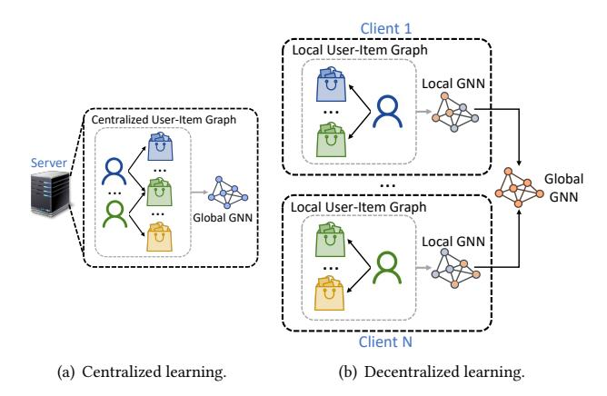
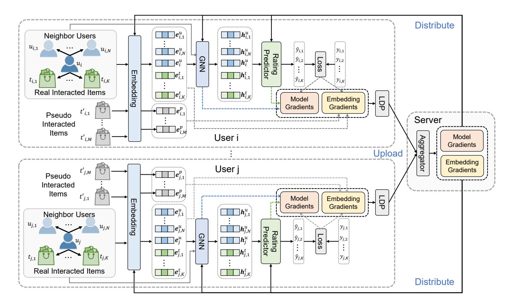
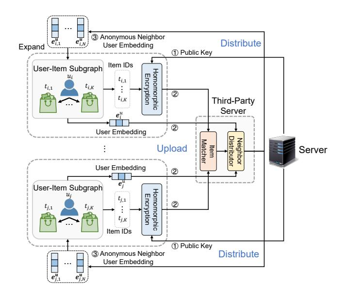
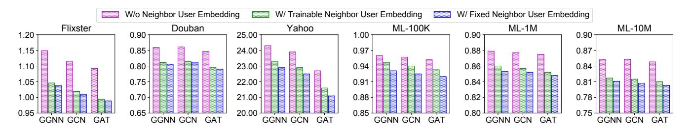
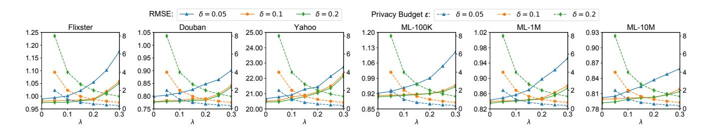
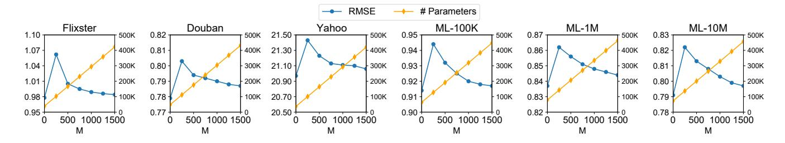

# FedGNN: Federated Graph Neural Network for Privacy-Preserving Recommendation

Chuhan Wu<sup>1</sup> , Fangzhao Wu<sup>2</sup> , Yang Cao<sup>3</sup> , Yongfeng Huang<sup>1</sup> , Xing Xie<sup>2</sup>

<sup>1</sup>Tsinghua University, Beijing 100084, China

<sup>2</sup>Microsoft Research Asia, Beijing 100080, China, <sup>3</sup>Kyoto University, Kyoto 615-8558, Japan

{wuchuhan15,wufangzhao}@gmail.com,yang@i.kyoto-u.ac.jp,yfhuang@.tsinghua.edu.cn,xing.xie@microsoft.com

# ABSTRACT

Graph neural network (GNN) is widely used for recommendation to model high-order interactions between users and items. Existing GNN-based recommendation methods rely on centralized storage of user-item graphs and centralized model learning. However, user data is privacy-sensitive, and the centralized storage of user-item graphs may arouse privacy concerns and risk. In this paper, we propose a federated framework for privacy-preserving GNN-based recommendation, which can collectively train GNN models from decentralized user data and meanwhile exploit high-order useritem interaction information with privacy well protected. In our method, we locally train GNN model in each user client based on the user-item graph inferred from the local user-item interaction data. Each client uploads the local gradients of GNN to a server for aggregation, which are further sent to user clients for updating local GNN models. Since local gradients may contain private information, we apply local differential privacy techniques to the local gradients to protect user privacy. In addition, in order to protect the items that users have interactions with, we propose to incorporate randomly sampled items as pseudo interacted items for anonymity. To incorporate high-order user-item interactions, we propose a user-item graph expansion method that can find neighboring users with co-interacted items and exchange their embeddings for expanding the local user-item graphs in a privacy-preserving way. Extensive experiments on six benchmark datasets validate that our approach can achieve competitive results with existing centralized GNN-based recommendation methods and meanwhile effectively protect user privacy.

# KEYWORDS

Personalized recommendation, Graph neural network, Privacypreserving, Federated learning

## ACM Reference Format:

Chuhan Wu<sup>1</sup> , Fangzhao Wu<sup>2</sup> , Yang Cao<sup>3</sup> , Yongfeng Huang<sup>1</sup> , Xing Xie<sup>2</sup> 2021. FedGNN: Federated Graph Neural Network for Privacy-Preserving Recommendation. In Proceedings of ACM SIGKDD Conference on Knowledge Discovery and Data Mining (KDD 2021), Jennifer B. Sartor, Theo D'Hondt, and Wolfgang De Meuter (Eds.). ACM, New York, NY, USA, Article 4, [9](#page-8-0) pages. [https://doi.org/10.475/123\\_4](https://doi.org/10.475/123_4)

© 2021 Copyright held by the owner/author(s).

ACM ISBN 123-4567-24-567/08/06. [https://doi.org/10.475/123\\_4](https://doi.org/10.475/123_4)

<span id="page-0-0"></span>
<!-- Image Description: The image compares centralized and decentralized learning approaches using graph neural networks (GNNs). (a) shows centralized learning: a server processes a single "Centralized User-Item Graph" to build a "Global GNN". (b) illustrates decentralized learning: multiple clients each process a "Local User-Item Graph" with a "Local GNN", then these local models contribute to a combined "Global GNN". The diagrams visually represent the data flow and model aggregation in each approach. -->

<span id="page-0-2"></span>Figure 1: Comparisons between centralized and decentralized training of GNN based recommendation models.

# 1 INTRODUCTION

Graph neural network (GNN) is widely used by many personalized recommendation methods in recent years [\[12,](#page-8-1) [31,](#page-8-2) [36\]](#page-8-3), since it can capture high-order interactions between users and items on the user-item graph to enhance the user and item representations [\[2,](#page-8-4) [37,](#page-8-5) [38\]](#page-8-6). For example, Berg et al. [\[2\]](#page-8-4) proposed to use graph convolutional autoencoders to learn user and item representations from the user-item bipartite graph. Wang et al. [\[31\]](#page-8-2) proposed to use a three-hop graph attention network to capture the high-order interactions between users and items. These existing GNN-based recommendation methods usually necessitate centralized storage of the entire user-item graph to learn GNN models and the representations of users and items, which means that the user-item interaction data needs to be centrally stored, as shown in Fig. [1\(a\).](#page-0-0) However, user-item interaction data is highly privacy-sensitive, and its centralized storage can lead to the privacy concerns of users and the risk of data leakage [\[24\]](#page-8-7). Moreover, under the pressure of strict data protection regulations such as GDPR[1](#page-0-1) , online platforms may not be able to centrally store user-item interaction data to learn GNN models for recommendation in the future.

An intuitive way to tackle the privacy issue of user-item interaction data is to locally store the raw data on user devices and learn local GNN models based on it, as shown in Fig. [1\(b\).](#page-0-2) However, in this scenario, it is very difficult to train an accurate GNN model for recommendation due to following reasons. First, for most users the volume of interaction data on their devices is too small to locally

.

Permission to make digital or hard copies of part or all of this work for personal or classroom use is granted without fee provided that copies are not made or distributed for profit or commercial advantage and that copies bear this notice and the full citation on the first page. Copyrights for third-party components of this work must be honored. For all other uses, contact the owner/author(s). KDD 2021, August 2021, Singapore

<span id="page-0-1"></span><sup>1</sup>https://gdpr-info.eu

train accurate GNN models. Thus, a unified framework that coordinates a large number of user clients to collectively learn an accurate global GNN model from decentralized user data is required. Second, the local GNN model trained on local user data may convey private information, and it is challenging to protect user privacy when synthesizing the global GNN model from the local ones. Third, the local user data only contains first-order user-item interactions, and users' interaction items cannot be directly exchanged due to privacy restrictions. Thus, it is very challenging to exploit the high-order user-item interactions without privacy leakage.

In this paper, we propose a federated framework named FedGNN for privacy-preserving GNN-based recommendation, which can effectively exploit high-order user-item interaction information by collectively training GNN models for recommendation in a privacypreserving way. Since user interaction data is highly decentralized, there is no global user-item graph. Thus, in our method each user device locally learns a GNN model and the embeddings of user and items based on the user-item graph inferred from the local useritem interaction data on this device. The user devices compute the gradients of models and user/item embeddings and upload them to a central server, which aggregates the gradients from a number of users and distributes them to user devices for local updates. However, both the items with non-zero gradients and the GNN model gradients contain private information. Thus, we propose a privacy-preserving model update method to protect user-item interaction data without locally memorizing the full item set during model training. More specifically, we apply local differential privacy (LDP) techniques to the local gradients computed by user clients to protect user privacy. In addition, in order to protect the real items that user interacted with when uploading the gradients of item embeddings, we generate random embedding gradients of a certain number of randomly sampled pseudo interacted items. Besides, to exploit high-order information of the user-item graph without leaking user privacy, we propose a privacy-preserving user-item graph expansion method that aims to find the neighbors of users with co-interacted items and exchange their embeddings to expand their local user-item graph. In this way, high-order information of the user-item graph can be exploited by the GNN model to enhance user and item representations, and the private user-item interaction data do not leak. We conduct massive experiments on six widely used benchmark datasets for recommendation, and the results show that our approach can achieve competitive results with existing centralized GNN-based recommendation methods and meanwhile effectively protect user privacy.

The major contributions of this paper are summarized as follows:

- We propose a novel federated framework for privacy-preserving GNN-based recommendation that can exploit highly decentralized user data to collectively train GNN models.
- We propose to protect model gradients in model training with local differential privacy and propose a pseudo interacted item sampling technique to protect the items that users have interactions with.
- We propose a privacy-preserving user-item graph expansion method to exploit high-order user-item interactions from decentralized user data.

• Extensive experiments and analysis on six benchmark datasets show that our approach can achieve competitive results with existing centralized GNN-based recommendation methods and meanwhile protect user privacy.

# 2 RELATED WORK

# 1 GNN for Recommendation

Graph neural networks are preferred by many recommendation methods to model high-order relations between users and items [\[2,](#page-8-4) [5,](#page-8-8) [7,](#page-8-9) [10,](#page-8-10) [27,](#page-8-11) [30](#page-8-12)[–34,](#page-8-13) [36,](#page-8-3) [37\]](#page-8-5). For example, [Berg et al.](#page-8-4) [\[2\]](#page-8-4) proposed a graph convolutional matrix completion (GC-MC) approach. GC-MC uses a graph convolutional encoder to learn user and item representations from the user-item bipartite graph, and then predicts unknown ratings via a bilinear decoder. [Ying et al.](#page-8-3) [\[36\]](#page-8-3) proposed a graph convolutional neural network based method for recommendation named PinSage. It learns item representations from an item-item graph via 2-hop graph convolutions, and uses these representations in downstream recommendation tasks. [Wang et al.](#page-8-2) [\[31\]](#page-8-2) proposed a neural graph collaborative filtering (NGCF) approach that uses 3-hop graph neural networks to learn user and item embeddings from the user-item bipartite graph. Besides the user-item graph, several GNN-based recommendation methods also incorporate other kinds of graphs into recommendation, such as useritem-entity graph [\[29\]](#page-8-14) and user-user-item graph [\[5\]](#page-8-8). For example, [Wang et al.](#page-8-12) [\[30\]](#page-8-12) proposed a knowledge-graph enhanced recommendation approach based on Knowledge Graph Attention Network (KGAT). They use a 3-hop graph-attention network to learn user, item and entity representations from a heterogeneous graph, which is formed by linking entities in knowledge graphs with items in the user-item graph. [Fan et al.](#page-8-8) [\[5\]](#page-8-8) proposed a social recommendation approach named GraphRec. They use graph attention networks to learn user and item embeddings from the user-item bipartite graph and the user-user social graph. However, these methods need centralized storage of users' interactions with items to form the entire user-item graph, which may arouse users' privacy concerns and the risk of private data leakage. Different from them, in our FedGNN method the raw user data never leaves the local user devices. In addition, FedGNN leverages a privacy-preserving model update method to protect private gradients and a privacy-preserving useritem graph expansion method to incorporate high-order user-item interactions. Thus, FedGNN can employ GNN models for grasping high-order information in a privacy-preserving way.

# 2 Federated Learning

Federated learning is a machine learning technique to collectively learn intelligent models based on decentralized user data in a privacy-preserving manner [\[14,](#page-8-15) [17\]](#page-8-16). Different from existing machine learning methods based on centralized storage of user data, in federated learning the user data is kept locally on user devices [\[35\]](#page-8-17). Each device maintains a local model and computes local model updates based on the user data stored on this device. The local model updates from a number of users are uploaded to a central server that coordinates the model training process. These updates are aggregated into a unified one to update the global model maintained by this server. The updated model is further distributed to

<span id="page-2-0"></span>Table 1: Comparison of different methods in terms of high-order user-item interaction modeling and privacy protection. "Cen." and "Local" represent centralized and decentralized data storage, respectively.

|                                  | PMF  | SVD++ | GRALS | sRGCNN | GC-MC | PinSage | NGCF | FCF   | FedMF | FedGNN |
|----------------------------------|------|-------|-------|--------|-------|---------|------|-------|-------|--------|
| High-order user-item interaction | ×    | ✓     | ✓     | ✓      | ✓     | ✓       | ✓    | ×     | ×     | ✓      |
| Rating protection                | ×    | ×     | ×     | ×      | ×     | ×       | ×    | ✓     | ✓     | ✓      |
| Interaction item protection      | ×    | ×     | ×     | ×      | ×     | ×       | ×    | ×     | ×     | ✓      |
| User data storage                | Cen. | Cen.  | Cen.  | Cen.   | Cen.  | Cen.    | Cen. | Local | Local | Local  |

all user devices to update the local models. This process is iteratively executed until the model converges. Since the model updates usually contain much less private information and the raw user data never leaves the devices, the risk of privacy leakage can be effectively reduced [\[8\]](#page-8-18).

The framework of federated learning has been applied to personalized recommendation [\[1,](#page-8-19) [3,](#page-8-20) [6,](#page-8-21) [9,](#page-8-22) [22\]](#page-8-23). For example, [Ammad et al.](#page-8-19) [\[1\]](#page-8-19) proposed a federated collaborative filtering (FCF) approach. In FCF, each user device locally computes the gradients of the user and item embeddings based on the personal ratings stored on this device. The user embeddings are locally updated, and the gradients of item embeddings are uploaded to a central server. The server aggregates the item gradients from massive clients to update the global item embeddings it maintains. The updated item embeddings are further distributed to user clients for local embedding updates. However, in this method the gradients of item embedding may leak some information on the private ratings [\[39\]](#page-8-24). To solve this problem, [Chai et al.](#page-8-20) [\[3\]](#page-8-20) proposed a federated matrix factorization (FedMF) method, where the item embeddings are protected by homomorphic encryption techniques. However, these methods do not consider the high-order interactions between users and items, which may not be optimal in learning accurate user and item representations. In addition, they mainly focus on protecting the private ratings given by users and cannot protect the raw user-item interaction data unless they locally maintain the full item set on each device, which is impractical due to the heavy storage and communication costs. Different from these methods, our approach can capture high-order interactions between users and items by our proposed privacy-preserving user-item graph expansion method. In addition, our method can protect the raw user-item interaction data during the model training process in an effective and efficient way. To better demonstrate the advantage of our approach, we summarize the comparison between FedGNN and existing methods on exploiting high-order user-item interactions and privacy protection in Table [1.](#page-2-0)

# 3 METHODOLOGY

In this section, we first present the problem definitions in our federated GNN-based recommendation framework (FedGNN), then introduce the details of our FedGNN approach for privacy-preserving recommendation, and finally provide some discussions and analysis on privacy protection.

# 1 Problem Formulation

Denote U = {1, 2, ..., } and T = {1, 2, ..., } as the sets of users and items respectively, where is the number of users and is the number of items. Denote the rating matrix between users and items as Y ∈ R × , which is used to form a bipartite useritem graph G based on the observed ratings Y . We assume that the user has interactions with items, which are denoted by [,1, ,2, ..., ,]. These items and the user can form a first-order local user-item subgraph G . The ratings that given to these items by user are denoted by [,1, ,2, ..., ,]. To protect user privacy (both the private ratings and the items a user has interactions with), each user device locally keeps the interaction data of this user, and the raw data never leaves the user device. We aim to predict the unobserved ratings ( ∈ Y\Y ) based on the interaction data G locally stored on user devices in a privacy-preserving way. Note that there is no global user-item interaction graph in our approach and local graphs are built and stored in different device, which is very different from existing federated GNN methods [\[11,](#page-8-25) [18\]](#page-8-26) that require the entire graph is built and stored together in at least one platform or device.

# 2 FedGNN Framework

Next, we introduce the framework of our FedGNN method for privacy-preserving GNN-based recommendation. It can leverage the highly decentralized user interaction data to learn GNN models for recommendation by exploiting the high-order user-item interactions in a privacy-preserving way. The framework of FedGNN is shown in Fig. [2.](#page-3-0) It mainly consists of a central server and a large number of user clients. The user client keeps a local subgraph that consists of the user interaction histories with items and the neighbors of this user. Each client learns the user/item embeddings and the GNN models from its local subgraph, and uploads the gradients to a central server. The central server is responsible for coordinating these user clients in the model learning process by aggregating the gradients received from a number of user clients and delivering the aggregated gradients to them. Next, we introduce how they work in detail.

The local subgraph on each user client is constructed from the user-item interaction data and the neighboring users that have cointeracted items with this user. The node of this user is connected to the nodes of the items she interacted with, and the node of her neighboring users. An embedding layer is first used to convert the user node , the item nodes [,1, ,2, ..., ,] and the neighboring user nodes [,1, ,2, ..., , ] into their embeddings, which are denoted as e , [e ,1 , e ,2 , ..., e ,] and [e ,1 , e ,2 , ..., e , ], respectively. Since the user embeddings may not be accurate enough when the model is not well-tuned, we first exclude the neighboring user embeddings in the model learning for epochs, and then incorporate them into model learning when they have been tuned. Note that the embeddings of the user and the item embeddings are

<span id="page-3-0"></span>
<!-- Image Description: This flowchart illustrates a distributed collaborative filtering system. It depicts two user processes (i and j) each incorporating real and pseudo interacted items' embeddings into a Graph Neural Network (GNN). The GNN outputs are fed into a rating predictor, generating predictions and gradients. Local data is then aggregated on a server via Local Differential Privacy (LDP), with model and embedding gradients uploaded and subsequently redistributed. -->

Figure 2: The framework of our FedGNN approach.

can be locally tuned during model training, while the embeddings of neighboring users are fixed.[2](#page-3-1)

Next, we apply a graph neural network to these embeddings to model the interactions between nodes on the local first-order subgraph. Various kinds of GNN network can be used in our framework, such as graph convolution network (GCN) [\[13\]](#page-8-27), gated graph neural network (GGNN) [\[16\]](#page-8-28) and graph attention network (GAT) [\[28\]](#page-8-29). The GNN model outputs the hidden representations of the user and item nodes, which are denoted as h , [h ,1 , h ,2 , ..., h ,] and [h ,1 , h ,2 , ..., h , ], respectively. Then, a rating predictor module is used to predict the ratings given by the user to her interacted items (denoted by [ˆ,1,ˆ,2, ...,ˆ,]) based on the embeddings of items and this user. These predicted ratings are compared against the gold ratings locally stored on the user device to compute the loss function. For the user , the loss function L is computed as L = 1 Í =1 |ˆ, −, | 2 . We use the loss L to derive the gradients of the models and embeddings, which are denoted by g and g , respectively. These gradients will be further uploaded to the server for aggregation.

The server aims to coordinate all user devices and compute the global gradients to update the model and embedding parameters in these devices. In each round, the server awakes a certain number of user clients to compute gradients locally and send them to the server. After the server receiving the gradients from these users, the aggregator in this server will aggregate these local gradients into a unified one g. [3](#page-3-2) Then, the server sends the aggregated gradients to each client to conduct local parameter update.[4](#page-3-3) Denote the parameter set in the -th user device as Θ . It is updated by Θ = Θ − g, where is the learning rate. This process will be iteratively executed until the model converges. We summarize the framework of our FedGNN method in Algorithm [1.](#page-4-0) We will then introduce two modules for privacy protection in FedGNN, i.e., a privacy-preserving model update module (corresponding to Lines 9-11 in Algorithm [1\)](#page-4-0) for protecting gradients in the model update and a privacy-preserving user-item graph expansion module (corresponding to Line 15 in Algorithm [1\)](#page-4-0) to protect user privacy when modeling high-order user-item interactions.

# 3 Privacy-Preserving Model Update

If we directly upload the GNN model and item embedding gradients, then there may be some privacy issues due to following reasons. First, for embedding gradients, only the items that a user has interactions with have non-zero gradients to update their embeddings, and the server can directly recover the full user-item interaction history based on the non-zero item embedding gradients. Second, besides the embedding gradients, the gradients of the

<span id="page-3-1"></span><sup>2</sup>We find this method slightly outperforms using trainable neighboring user embeddings (shown in experiments). Thus, we prefer fixed ones to reduce computational and communicational costs of model training.

<span id="page-3-2"></span><sup>3</sup>We use the FedAvg [\[17\]](#page-8-16) algorithm to implement the aggregator.

<span id="page-3-3"></span><sup>4</sup>Only sends the gradients of the model and the corresponding user and item (including pseudo interacted ones) embeddings.

## <span id="page-4-0"></span>Algorithm 1 FedGNN

- 1: Each client constructs its local subgraph G
- 2: Initialize Θ on each user client using the same seed
- 3: Iteration count ← 0
- 4: Graph expansion switch ←

// Server

### 5: repeat

- 6: Select a subset S from the user set U randomly
- 7: g = 0
- 8: for each user client ∈ S do
- 9: if |S| < · then
- 10: g ← g + LocalGradCal(G , )
- 11: else
- 12: g ← g + LocalGradCal(G , )
- 13: end if
- 14: end for
- 15: if |S| ≥ · and then
- 16: PrivacyPreservingGraphExpansion()
- 17: ←
- 18: end if
- 19: g ← g/|S|
- 20: Distribute g to user clients for local update
- 21: until model convergence

#### // User Client

LocalGradCal(, includeNeighbor):

- 22: Select a mini-batch of data N from G
- 23: if includeNeighbor then
- 24: Use neighboring user embeddings
- 25: end if
- 26: Compute GNN model gradients g and embedding gradients g on N
- 27: g ← (g , g )
- 28: return g

GNN model and rating predictor may also leak private information of user histories and ratings [\[39\]](#page-8-24), because the GNN model gradients encode the preferences of users on items. In existing methods such as FedMF [\[3\]](#page-8-20), homomorphic encryption techniques are applied to gradients to protect private ratings. However, in this method the user device needs to locally memorize the embedding table of the entire item set T and upload it in every iteration to achieve user interaction history protection, which is impractical due to the huge storage and communication costs during model training.

To tackle these challenges, we propose two strategies to protect user privacy in the model update process. The first one is pseudo interacted item sampling. Concretely, we sample items that the user has not interacted with[5](#page-4-1) , and randomly generate their gradients g using a Gaussian distribution with the same mean and co-variance values with the real item embedding gradients. The real embedding gradients g are combined with the pseudo item embedding gradients g , and the unified gradient of the model and

<span id="page-4-3"></span>
<!-- Image Description: This diagram illustrates a privacy-preserving recommendation system architecture. It depicts two user-item subgraphs, each showing user interactions with items. User embeddings undergo homomorphic encryption before being uploaded to a third-party server. The server components (matcher, item distributor, neighbor distributor) process the encrypted data. Anonymous neighbor user embeddings are also distributed, enhancing privacy. The process involves steps of expand, upload, and distribute phases using public and private keys. -->

Figure 3: The framework of the privacy-preserving useritem graph expansion method.

embeddings on the -th user device (Line 26 in Algorithm [1\)](#page-4-0) is modified as g = (g , g , g ). The second one is local differential privacy. Following [\[21\]](#page-8-30), we clip the local gradients on user clients based on their L∞-norm with a threshold , and apply a local differential privacy (LDP) [\[4\]](#page-8-31) module with zero-mean Laplacian noise to the unified gradients to achieve better user privacy protection, which are formulated as follows:

$$
g_i = clip(g_i, \delta) + Laplace(0, \lambda),
$$
\n(1)

where is the strength of Laplacian noise.[6](#page-4-2) The protected gradients g are uploaded to the server for aggregation.

# 4 Privacy-Preserving User-Item Graph Expansion

Then, we introduce our privacy-preserving user-item graph expansion method that aims to find the neighbors of users and extend the local user-item graphs in a privacy-preserving way. In existing GNN-based recommendation method based on centralized graph storage, high-order user-item interactions can be directly derived from the global user-item graph. However, when user data is decentralized, it is a non-trivial task to incorporate high-order user-item interactions without violating user privacy protection. To solve this problem, we propose a privacy-preserving user-item graph expansion method that finds the anonymous neighbors of users to enhance user and item representation learning, where user privacy does not leak. Its framework is shown in Fig. [3.](#page-4-3) We introduce its details as follows.

The central server that maintains the recommendation services first generates a public key, and then distributes it to all user clients for encryption. After receiving the public key, each user device applies homomorphic encryption [\[3\]](#page-8-20) to the IDs of the items she

<span id="page-4-1"></span><sup>5</sup>There are many sampling methods such as using the displayed items that have no interaction with a user. In our experiments we randomly sample items from the full item set for simulation. In addition, needs to be larger than to protect user privacy.

<span id="page-4-2"></span><sup>6</sup>The privacy budget can be bounded by <sup>2</sup> .

<span id="page-5-3"></span>Algorithm 2 privacy-preserving user-item graph expansion

- 1: PrivacyPreservingGraphExpansion():
- 2: Server sends a public key to user clients
- 3: User clients encrypt item IDs with
- 4: User clients upload the user embedding and encrypted item IDs to a third-party server
- 5: Third-party server distributes neighboring user embeddings to user clients
- 6: User clients extend local graphs

interacted based on this key because the IDs of these items are privacy-sensitive.[7](#page-5-0) The encrypted item IDs as well as the embedding of this user are uploaded to a third-party server (do not necessarily to be trusted). This server finds the users who interacted with the same items via item matching, and then provides each user with the embeddings of her anonymous neighbors. In this stage, the server for recommendation never receives the private information of users, and the third-party server cannot obtain any private information of users and items since it cannot decrypt the item IDs.[8](#page-5-1) We connect each user node with its neighboring user nodes.[9](#page-5-2) In this way, the local user-item graph can be enriched by the high-order user-item interactions without harming the protection of user privacy. We summarize the process of our privacy-preserving user-item graph expansion method in Algorithm [2.](#page-5-3)

# <span id="page-5-8"></span>3.5 Analysis on Privacy Protection

The user privacy is protected by four aspects in our FedGNN approach. First, in FedGNN the recommendation server never collects raw user-item interaction data, and only local computed gradients are uploaded to this server. Based on the data processing inequality [\[17\]](#page-8-16), we can infer that these gradients contain much less private information than the raw user interaction data. Second, the third-party server also cannot infer private information from the encrypted item IDs since it cannot obtain the private key. However, if the recommendation server colludes with the third-party server by exchanging the private key and item table, the user interaction history will not be protected. Fortunately, the private ratings can still be protected by our privacy-preserving model update method. Third, in FedGNN we propose a pseudo interacted item sampling method to protect the real interacted items by sampling a number of items that are not interacted with a user. Since gradients of both kinds of items have the same mean and co-variance values, it is difficult to discriminate the real interacted items from the pseudo ones if the number of pseudo interacted items is sufficiently larger than the number of real interacted items. The average degree of privacy protection is proportional to 1+ | | [\[26\]](#page-8-32). Thus, the number of pseudo interacted items can be relatively larger to achieve better privacy protection as long as the computation resources of user devices permit. Fourth, we apply the LDP technique to the gradients locally computed by the user device, making it more difficult to recover the raw user consumption history from these gradients. It

is shown in [\[21\]](#page-8-30) that the upper bound of the privacy budget is 2 , which means that we can achieve a smaller privacy budget by using a smaller clipping threshold or a larger noise strength . [10](#page-5-4) However, the accuracy of model gradients will also be affected if the privacy budget is too small. Thus, we need to properly choose both hyperparameters to balance model performance and privacy protection.

# 4 EXPERIMENTS

# 1 Dataset and Experimental Settings

In our experiments, following [\[2\]](#page-8-4) we use six widely used benchmark datasets for recommendation, including MovieLens[11](#page-5-5) (100K, 1M, and 10M), Flixster, Douban, and YahooMusic. We use the preprocessed subsets of the Flixster, Douban, and YahooMusic datasets provided by [\[20\]](#page-8-33).[12](#page-5-6) We denote the three versions of MovieLens as ML-100K, ML-1M and ML-10M respectively, and we denote YahooMusic as Yahoo. The detailed statistics of these datasets are summarized in Table [2.](#page-5-7)

Table 2: Statistics of the datasets.

<span id="page-5-7"></span>

| Dataset  | #Users | #Items | #Ratings   | Rating Levels |
|----------|--------|--------|------------|---------------|
| Flixster | 3,000  | 3,000  | 26,173     | 0.5,1,,5      |
| Douban   | 3,000  | 3,000  | 136,891    | 1,2,,5        |
| Yahoo    | 3,000  | 3,000  | 5,335      | 1,2,100       |
| ML-100K  | 943    | 1,682  | 100,000    | 1,2,,5        |
| ML-1M    | 6,040  | 3,706  | 1,000,209  | 1,2,,5        |
| ML-10M   | 69,878 | 10,677 | 10,000,054 | 0.5,1,,5      |

In our experiments, we use graph attention network (GAT) [\[28\]](#page-8-29) as the GNN model, and use dot product to implement the rating predictor. The user and item embeddings and their hidden representations learned by graph neural networks are 256-dim. The epoch threshold is 2. The gradient clipping threshold is set to 0.1, and the strength of Laplacian noise in the LDP module is set to 0.2 to achieve 1-differential privacy. The number of pseudo interacted items is set to 1,000. The number of users used in each round of model training is 128, and the total number of epoch is 3. The ratio of dropout [\[25\]](#page-8-34) is 0.2. SGD is selected as the optimization algorithm, and its learning rate is 0.01. The splits of datasets are the same as those used in [\[2\]](#page-8-4), and these hyperparameters are selected according to the validation performance. The metric used in our experiments is rooted mean square error (RMSE), and we report the average RMSE scores over the 10 repetitions.

# 2 Performance Evaluation

First, we compare the performance of our FedGNN approach with several recommendation methods based on centralized storage of user data and several privacy-preserving ones based on federated learning, including:

• PMF [\[19\]](#page-8-35), probability matrix factorization, which is a widely used recommendation method;

<span id="page-5-0"></span><sup>7</sup>We choose homomorphic encryption because the server cannot match the items hashed by many other salted encryption methods.

<span id="page-5-1"></span><sup>8</sup>We assume that they do not collude with each other.

<span id="page-5-2"></span><sup>9</sup>The neighboring user nodes are not connected to the co-interacted items for better user privacy protection under Byzantine attack.

<span id="page-5-5"></span><span id="page-5-4"></span><sup>10</sup>Smaller budget means better privacy protection.

<sup>11</sup>https://grouplens.org/datasets/movielens/

<span id="page-5-6"></span><sup>12</sup>https://github.com/fmonti/mgcnn

<span id="page-6-0"></span>Table 3: Performance of different methods in terms of RMSE. Results of FedGNN and the best-performed baseline are in bold.

| Methods      | Flixster | Douban | Yahoo | ML-100K | ML-1M | ML-10M |
|--------------|----------|--------|-------|---------|-------|--------|
| PMF [19]     | 1.375    | 0.886  | 26.6  | 0.965   | 0.883 | 0.856  |
| SVD++ [15]   | 1.155    | 0.869  | 24.4  | 0.952   | 0.860 | 0.834  |
| GRALS [23]   | 1.313    | 0.833  | 38.0  | 0.934   | 0.849 | 0.808  |
| sRGCNN [20]  | 1.179    | 0.801  | 22.4  | 0.922   | 0.837 | 0.789  |
| GC-MC [2]    | 0.941    | 0.734  | 20.5  | 0.905   | 0.832 | 0.777  |
| PinSage [36] | 0.945    | 0.732  | 21.0  | 0.914   | 0.840 | 0.790  |
| NGCF [31]    | 0.954    | 0.742  | 20.9  | 0.916   | 0.833 | 0.779  |
| FCF [1]      | 1.064    | 0.823  | 22.9  | 0.957   | 0.874 | 0.847  |
| FedMF [3]    | 1.059    | 0.817  | 22.2  | 0.948   | 0.872 | 0.841  |
| FedGNN       | 0.989    | 0.790  | 21.1  | 0.920   | 0.848 | 0.803  |

<span id="page-6-1"></span>
<!-- Image Description: The image presents six bar charts comparing the performance of three graph neural network (GNN) models (GGNN, GCN, GAT) across five datasets (Flixster, Douban, Yahoo, ML-100K, ML-10M). Each bar chart shows performance metrics for three embedding scenarios: without neighbor user embeddings, with trainable neighbor embeddings, and with fixed neighbor embeddings. The purpose is to illustrate the impact of different neighbor user embedding strategies on GNN model performance across varying dataset scales. -->

Figure 4: Influence of second-order information and different GNN architectures.

- SVD++ [\[15\]](#page-8-36), another popular recommendation method based on a variant of singular value decomposition;
- GRALS [\[23\]](#page-8-37), a collaborative filtering approach with graph information;
- sRGCNN [\[20\]](#page-8-33), a matrix completion method with recurrent multi-graph neural networks;
- GC-MC [\[2\]](#page-8-4), a matrix completion method based on graph convolutional autoencoders;
- PinSage [\[36\]](#page-8-3), a recommendation approach based on 2-hop GCN networks;
- NGCF [\[31\]](#page-8-2), a neural graph collaborative filter method;
- FCF [\[1\]](#page-8-19), a privacy-preserving recommendation approach based on federated collaborative filtering;
- FedMF [\[3\]](#page-8-20), another privacy-preserving recommendation approach based on secure matrix factorization.

The recommendation performance of these methods is summarized in Table [3.](#page-6-0) We have several findings from Table [3.](#page-6-0) First, we observe that the methods which incorporate high-order information of the user-item graph (e.g., GC-MC, PinSage and NGCF) achieve better performance than those based on first-order information only (PMF). This is probably because modeling the highorder interactions between users and items can enhance user and item representation learning, and thereby improves the accuracy of recommendation. Second, compared with the methods based centralized user-item interaction data storage like GC-MC and NGCF, our FedGNN approach can achieve comparable or even better performance. It shows that our approach can protect user privacy and meanwhile achieve satisfactory recommendation performance. Third, among the compared privacy-preserving recommendation methods, FedGNN achieves the best performance. This is because

FedGNN can incorporate high-order information of the user-item graphs, while FCF and FedMF cannot. Besides, our approach can protect both ratings and user-item interaction histories, while FCF and FedMF can only protect ratings.

# 3 Model Effectiveness

Then, we validate the effectiveness of incorporating high-order information of the user-item graphs as well as the generality of our approach. We compare the performance of FedGNN and its variants with fully trainable neighbor user embeddings or without high-order user-item interactions. In addition, we also compare their results under different implementations of their GNN models (GGNN, GCN and GAT). The results are shown in Fig. [4,](#page-6-1) which reveals several findings. First, compared with the baseline performance reported in Table [3,](#page-6-0) the performance of FedGNN and its variants implemented with other different GNN models is satisfactory. This result shows that our approach is compatible with different GNN architectures. Second, FedGNN slightly outperforms its variants based on GCN and GGNN. This may be because the GAT network can more effectively model the importance of the interactions between nodes than GCN and GGNN, which is beneficial for user and item modeling. Third, the variants that can utilize the high-order information by using our FedGNN framework perform better than those without high-order information. It validates the effectiveness of our approach in incorporating high-order information of the user-item graph into recommendation. Fourth, we find that using fixed neighbor user embeddings that are trained for a certain number of iterations is slightly better than using fully trainable ones that are updated in each iteration. This may be because the neighboring user embeddings may not be accurate at the

<span id="page-7-0"></span>
<!-- Image Description: The image displays six plots showing the Root Mean Squared Error (RMSE) against the regularization parameter (λ) for different datasets (Flixster, Douban, Yahoo, ML-100K, ML-1M, ML-10M). Each plot contains three lines representing different privacy parameters (δ = 0.05, 0.1, 0.2). The plots illustrate the trade-off between RMSE (model accuracy) and privacy budget (controlled by λ and δ) across various datasets. The purpose is to demonstrate the impact of hyperparameters on model performance while maintaining differential privacy. -->

Figure 5: The recommendation RMSE (left y-axis) and privacy budget (right y-axis) w.r.t. different clipping threshold and noise strength .

<span id="page-7-4"></span>
<!-- Image Description: The image displays six small line plots, each showing the relationship between the number of parameters (orange line) and Root Mean Squared Error (RMSE; blue line) for a collaborative filtering model across different datasets (Flixster, Douban, Yahoo, ML-100K, ML-1M, ML-10M). The x-axis represents the model parameter 'M', while the y-axes show RMSE and the number of parameters. The plots illustrate the trade-off between model complexity and prediction accuracy for different dataset sizes. -->

Figure 6: The recommendation RMSE (left y-axis) and communication cost (right y-axis) w.r.t. different numbers of pseudo interacted items.

beginning of model training, which is not beneficial for learning precise user and item representations.

# 4 Hyperparameter Analysis

Finally, we explore the influence of three important hyperparameters, i.e., the gradient clip threshold , the strength of the Laplacian noise in the LDP module, and the number of the pseudo interacted items. We first compare the performance of our FedGNN approach by varying both hyperparameters, and the results are plotted in Fig. [5.](#page-7-0)[13](#page-7-1) According to these results, we find that the difference between the model performance under = 0.1 and = 0.2 is quite marginal. However, if we clip the gradients with a smaller threshold such as 0.05, the prediction error will substantially increase. Thus, we prefer to set = 0.1 because we can achieve better privacy protection without much sacrifice of model performance. In addition, the model performance declines with the growth of the noise strength , while the performance loss is not too heavy if is not too large. Thus, a moderate value of such as 0.2 is preferable to achieve a good balance between privacy protection and recommendation accuracy.[14](#page-7-2)

We also compare the performance and communication cost[15](#page-7-3) of FedGNN w.r.t. different in Fig. [6.](#page-7-4) From Fig. [6,](#page-7-4) we observe that the performance is the best if is 0, but the user-item interaction histories cannot be protected. According to the discussions in Section [3.5,](#page-5-8) if is too small the user privacy cannot be well-protected. In addition, the performance also declines because the randomly generated gradients will influence the accuracy of item gradients. By comparing the results on the three MovieLens datasets, we find

```text
14We achieve 1-differential privacy under  = 0.1 and  = 0.2.
```text

that the rating matrix is sparser[16](#page-7-5) , may need to be larger to keep good recommendation performance. This ie because when is relatively large, the random gradients of pseudo interacted items will be better counteracted after aggregation and their influence will be mitigated. However, as shown in Fig. [6,](#page-7-4) the communication cost is also proportional to and it will be very heavy if is too large. Therefore, we choose as 1,000 to achieve good privacy protection and recommendation performance under reasonable communication cost.

# 5 CONCLUSION

In this paper, we propose a federated framework for privacy-preserving GNN-based recommendation, which aims to collectively train GNN models from decentralized user data by exploiting high-order useritem interactions in a privacy-preserving manner. Concretely, we locally train GNN model in each user client based on the local user-item graph stored on this device. Each client uploads the locally computed gradients to a server for aggregation, which are further sent to user clients for local updates. In addition, to protect user-item interaction data during model training, we apply local differential privacy techniques to the local gradients to enhance user privacy protection. Moreover, we sample pseudo interacted items to protect the embeddings of items that users have interactions with. Besides, to incorporate high-order user-item interaction information into model learning, we propose a privacy-preserving user-item graph expansion method that can find neighboring users with cointeracted items and exchange their embeddings for extending their local graphs. Massive experiments on six benchmark datasets show

<span id="page-7-1"></span><sup>13</sup>A larger and smaller means smaller budget , i.e., better privacy protection.

<span id="page-7-3"></span><sup>15</sup>We use the number of parameters to be exchanged in each iteration during model training to measure the communication cost.

<span id="page-7-5"></span><sup>16</sup>The rating density of the ML-100K, 1M, and 10M datasets is 0.0630, 0.0447 and 0.0134, respectively.

<span id="page-8-0"></span>that our approach can achieve competitive performance with existing methods based on centralized storage of user-item interaction data and meanwhile effectively protect user privacy.

# REFERENCES

- <span id="page-8-19"></span>[1] Muhammad Ammad, Elena Ivannikova, Suleiman A Khan, Were Oyomno, Qiang Fu, Kuan Eeik Tan, and Adrian Flanagan. 2019. Federated Collaborative Filtering for Privacy-Preserving Personalized Recommendation System. arXiv preprint arXiv:1901.09888 (2019).
- <span id="page-8-4"></span>[2] Rianne van den Berg, Thomas N Kipf, and Max Welling. 2017. Graph convolutional matrix completion. arXiv preprint arXiv:1706.02263 (2017).
- <span id="page-8-20"></span>[3] Di Chai, Leye Wang, Kai Chen, and Qiang Yang. 2020. Secure federated matrix factorization. IEEE Intelligent Systems (2020).
- <span id="page-8-31"></span>[4] Woo-Seok Choi, Matthew Tomei, Jose Rodrigo Sanchez Vicarte, Pavan Kumar Hanumolu, and Rakesh Kumar. 2018. Guaranteeing local differential privacy on ultra-low-power systems. In ISCA. 561–574.
- <span id="page-8-8"></span>[5] Wenqi Fan, Yao Ma, Qing Li, Yuan He, Eric Zhao, Jiliang Tang, and Dawei Yin. 2019. Graph neural networks for social recommendation. In WWW. 417–426.
- <span id="page-8-21"></span>[6] Adrian Flanagan, Were Oyomno, Alexander Grigorievskiy, Kuan Eeik Tan, Suleiman A Khan, and Muhammad Ammad-Ud-Din. 2020. Federated Multiview Matrix Factorization for Personalized Recommendations. arXiv preprint arXiv:2004.04256 (2020).
- <span id="page-8-9"></span>[7] Suyu Ge, Chuhan Wu, Fangzhao Wu, Tao Qi, and Yongfeng Huang. 2020. Graph Enhanced Representation Learning for News Recommendation. In WWW. 2863– 2869.
- <span id="page-8-18"></span>[8] Andrew Hard, Kanishka Rao, Rajiv Mathews, Swaroop Ramaswamy, Françoise Beaufays, Sean Augenstein, Hubert Eichner, Chloé Kiddon, and Daniel Ramage. 2018. Federated learning for mobile keyboard prediction. arXiv preprint arXiv:1811.03604 (2018).
- <span id="page-8-22"></span>[9] István Hegedűs, Gábor Danner, and Márk Jelasity. 2019. Decentralized Recommendation Based on Matrix Factorization: A Comparison of Gossip and Federated Learning. In ECML-PKDD. Springer, 317–332.
- <span id="page-8-10"></span>[10] Linmei Hu, Chen Li, Chuan Shi, Cheng Yang, and Chao Shao. 2020. Graph neural news recommendation with long-term and short-term interest modeling. Information Processing & Management 57, 2 (2020), 102142.
- <span id="page-8-25"></span>[11] Meng Jiang, Taeho Jung, Ryan Karl, and Tong Zhao. 2020. Federated Dynamic GNN with Secure Aggregation. arXiv preprint arXiv:2009.07351 (2020).
- <span id="page-8-1"></span>[12] Bowen Jin, Chen Gao, Xiangnan He, Depeng Jin, and Yong Li. 2020. Multibehavior recommendation with graph convolutional networks. In SIGIR. 659– 668.
- <span id="page-8-27"></span>[13] Thomas N. Kipf and Max Welling. 2017. Semi-Supervised Classification with Graph Convolutional Networks. In ICLR.
- <span id="page-8-15"></span>[14] Jakub Konečny, H Brendan McMahan, Felix X Yu, Peter Richtárik, ` Ananda Theertha Suresh, and Dave Bacon. 2016. Federated learning: Strategies for improving communication efficiency. arXiv preprint arXiv:1610.05492 (2016).
- <span id="page-8-36"></span>[15] Yehuda Koren. 2008. Factorization meets the neighborhood: a multifaceted collaborative filtering model. In KDD. 426–434.
- <span id="page-8-28"></span>[16] Yujia Li, Daniel Tarlow, Marc Brockschmidt, and Richard S. Zemel. 2016. Gated Graph Sequence Neural Networks. In ICLR.
- <span id="page-8-16"></span>[17] Brendan McMahan, Eider Moore, Daniel Ramage, Seth Hampson, and Blaise Aguera y Arcas. 2017. Communication-Efficient Learning of Deep Networks from Decentralized Data. In AISTATS. 1273–1282.
- <span id="page-8-26"></span>[18] Guangxu Mei, Ziyu Guo, Shijun Liu, and Li Pan. 2019. Sgnn: A graph neural network based federated learning approach by hiding structure. In IEEE Big Data. IEEE, 2560–2568.
- <span id="page-8-35"></span>[19] Andriy Mnih and Russ R Salakhutdinov. 2008. Probabilistic matrix factorization. In NIPS. 1257–1264.

- <span id="page-8-33"></span>[20] Federico Monti, Michael Bronstein, and Xavier Bresson. 2017. Geometric matrix completion with recurrent multi-graph neural networks. In NIPS. 3697–3707.
- <span id="page-8-30"></span>[21] Tao Qi, Fangzhao Wu, Chuhan Wu, Yongfeng Huang, and Xing Xie. 2020. FedRec: Privacy-Preserving News Recommendation with Federated Learning. arXiv preprint arXiv:2003.09592 (2020).
- <span id="page-8-23"></span>[22] Tao Qi, Fangzhao Wu, Chuhan Wu, Yongfeng Huang, and Xing Xie. 2020. Privacy-Preserving News Recommendation Model Training via Federated Learning. arXiv preprint arXiv:2003.09592 (2020).
- <span id="page-8-37"></span>[23] Nikhil Rao, Hsiang-Fu Yu, Pradeep K Ravikumar, and Inderjit S Dhillon. 2015. Collaborative filtering with graph information: Consistency and scalable methods. In NIPS. 2107–2115.
- <span id="page-8-7"></span>[24] Hyejin Shin, Sungwook Kim, Junbum Shin, and Xiaokui Xiao. 2018. Privacy enhanced matrix factorization for recommendation with local differential privacy. TKDE 30, 9 (2018), 1770–1782.
- <span id="page-8-34"></span>[25] Nitish Srivastava, Geoffrey E Hinton, Alex Krizhevsky, Ilya Sutskever, and Ruslan Salakhutdinov. 2014. Dropout: a simple way to prevent neural networks from overfitting. JMLR 15, 1 (2014), 1929–1958.
- <span id="page-8-32"></span>[26] Latanya Sweeney. 2002. k-anonymity: A model for protecting privacy. International Journal of Uncertainty, Fuzziness and Knowledge-Based Systems 10, 05 (2002), 557–570.
- <span id="page-8-11"></span>[27] Zhulin Tao, Yinwei Wei, Xiang Wang, Xiangnan He, Xianglin Huang, and Tat-Seng Chua. 2020. MGAT: Multimodal Graph Attention Network for Recommendation. Information Processing & Management 57, 5 (2020), 102277.
- <span id="page-8-29"></span>[28] Petar Velickovic, Guillem Cucurull, Arantxa Casanova, Adriana Romero, Pietro Liò, and Yoshua Bengio. 2018. Graph Attention Networks. In ICLR.
- <span id="page-8-14"></span>[29] Hongwei Wang, Fuzheng Zhang, Mengdi Zhang, Jure Leskovec, Miao Zhao, Wenjie Li, and Zhongyuan Wang. 2019. Knowledge-aware graph neural networks with label smoothness regularization for recommender systems. In KDD. 968– 977.
- <span id="page-8-12"></span>[30] Xiang Wang, Xiangnan He, Yixin Cao, Meng Liu, and Tat-Seng Chua. 2019. Kgat: Knowledge graph attention network for recommendation. In KDD. 950–958.
- <span id="page-8-2"></span>[31] Xiang Wang, Xiangnan He, Meng Wang, Fuli Feng, and Tat-Seng Chua. 2019. Neural graph collaborative filtering. In SIGIR. 165–174.
- [32] Ziyang Wang, Wei Wei, Gao Cong, Xiao-Li Li, Xian-Ling Mao, and Minghui Qiu. 2020. Global Context Enhanced Graph Neural Networks for Session-based Recommendation. In SIGIR. 169–178.
- [33] Chuhan Wu, Fangzhao Wu, Tao Qi, Suyu Ge, Yongfeng Huang, and Xing Xie. 2019. Reviews meet graphs: Enhancing user and item representations for recommendation with hierarchical attentive graph neural network. In EMNLP-IJCNLP. 4886–4895.
- <span id="page-8-13"></span>[34] Shu Wu, Yuyuan Tang, Yanqiao Zhu, Liang Wang, Xing Xie, and Tieniu Tan. 2019. Session-based recommendation with graph neural networks. In AAAI, Vol. 33. 346–353.
- <span id="page-8-17"></span>[35] Qiang Yang, Yang Liu, Tianjian Chen, and Yongxin Tong. 2019. Federated machine learning: Concept and applications. TIST 10, 2 (2019), 1–19.
- <span id="page-8-3"></span>[36] Rex Ying, Ruining He, Kaifeng Chen, Pong Eksombatchai, William L Hamilton, and Jure Leskovec. 2018. Graph convolutional neural networks for web-scale recommender systems. In KDD. 974–983.
- <span id="page-8-5"></span>[37] Jiani Zhang, Xingjian Shi, Shenglin Zhao, and Irwin King. 2019. STAR-GCN: stacked and reconstructed graph convolutional networks for recommender systems. In IJCAI. AAAI Press, 4264–4270.
- <span id="page-8-6"></span>[38] Jie Zhou, Ganqu Cui, Zhengyan Zhang, Cheng Yang, Zhiyuan Liu, Lifeng Wang, Changcheng Li, and Maosong Sun. 2018. Graph neural networks: A review of methods and applications. arXiv preprint arXiv:1812.08434 (2018).
- <span id="page-8-24"></span>[39] Ligeng Zhu, Zhijian Liu, and Song Han. 2019. Deep Leakage from Gradients. arXiv preprint arXiv:1906.08935 (2019).
