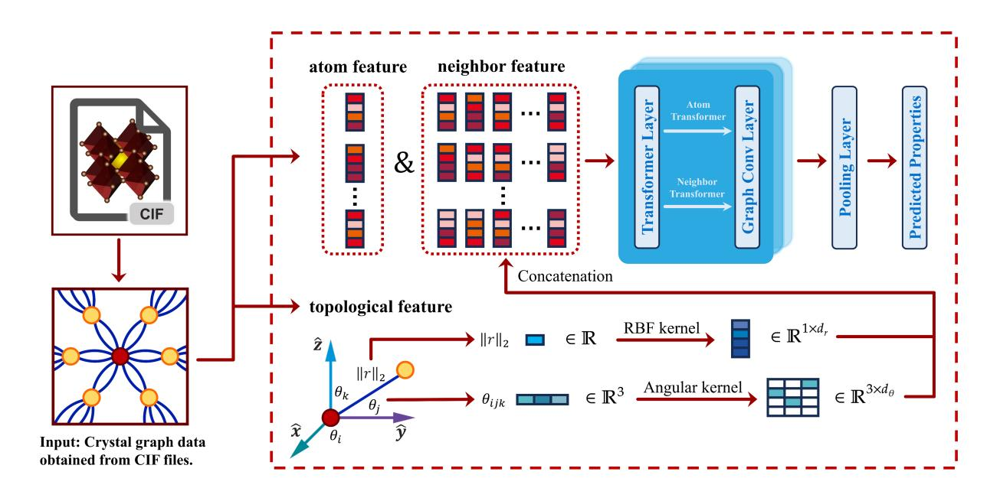
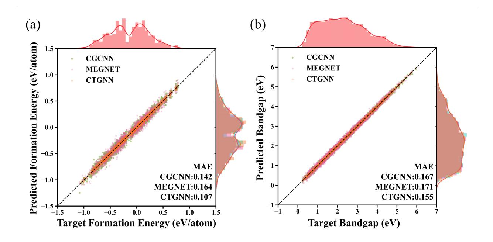

# CTGNN: Crystal Transformer Graph Neural Network for Crystal Material Property Prediction

Zijian Du,1, 2, [∗](#page-9-0) Luozhijie Jin,1, [∗](#page-9-0) Le Shu,1 Yan Cen,2, [†](#page-9-1)

Yuanfeng Xu,3 Yongfeng Mei,4 and Hao Zhang1, 5, 6, [‡](#page-9-2)

1School of Information Science and Technology, Fudan University, Shanghai 200433, China.

2Department of Physics, Fudan University, Shanghai 200433, China.

3School of Science, Shandong Jianzhu University, Jinan 250101, Shandong, China

4Department of Materials, Fudan University, Shanghai 200433, China.

5Department of Optical Science and Engineering and Key Laboratory

of Micro and Nano Photonic Structures (Ministry of Education), Fudan University, Shanghai 200433, China.

6State Key Laboratory of Photovoltaic Science and Technology, Fudan University, Shanghai 200433, China

(Dated: May 21, 2024)

# Abstract

The combination of deep learning algorithm and materials science has made significant progress in predicting novel materials and understanding various behaviours of materials. Here, we introduced a new model called as the Crystal Transformer Graph Neural Network (CTGNN), which combines the advantages of Transformer model and graph neural networks to address the complexity of structure-properties relation of material data. Compared to the state-of-the-art models, CTGNN incorporates the graph network structure for capturing local atomic interactions and the dual-Transformer structures to model intra-crystal and inter-atomic relationships comprehensively. The benchmark carried on by the proposed CTGNN indicates that CTGNN significantly outperforms existing models like CGCNN and MEGNET in the prediction of formation energy and bandgap properties. Our work highlights the potential of CTGNN to enhance the performance of properties prediction and accelerates the discovery of new materials, particularly for perovskite materials.

# I. INTRODUCTION

Deep learning (DL) and machine learning (ML) has brought significant impacts to a variety of scientific fields such as biology[1](#page-9-3) , chemistry[2](#page-9-4) ,physics[3](#page-9-5) and mathematics[4](#page-9-6) . While in materials science, the use of deep learning has led to important progress in material properties prediction[5](#page-9-7) , materials generation[6](#page-9-8) , etc[7](#page-9-9)[–10](#page-10-0). Several DL models have been developed to capture material modality and predict their properties, such as Crystal Graph Convolutional Neural Network (CGCNN)[5](#page-9-7) , MatErials Graph Network (MEGNET)[11](#page-10-1), Atomistic Line Graph Neural Network (ALIGNN)[12](#page-10-2), improved Crystal Graph Convolutional Neural Networks (iCGCNN)[13](#page-10-3), OrbNet[14](#page-10-4), and similar variants[15–](#page-10-5)[20,](#page-11-0)[22](#page-11-1)? [–25](#page-11-2). They have achieved great success in applications, such as learning properties from multi-fidelity data[26](#page-11-3), discovering stable lead-free hybrid organic–inorganic perovskites[27](#page-11-4), mapping the crystal-structure phase[28](#page-11-5) , and designing material microstructures[29](#page-11-6) .

Despite the graph-based DL model, the Transformer[30](#page-12-0) model provides a new way to capture the material information, and some models based on Transformers to predict material properties have been developed, such as MatFormer[31](#page-12-1), Graphformer[32](#page-12-2) , etc. These models integrate the Transformer as the core network, utilizing the connections within graphs as the queries, keys, and values (QKV) in the attention mechanisms, distinguishing them from traditional graph neural networks. Therefore, they lose the conventional graph structure[32](#page-12-2) . Some other models based on Transformer models use the structures of graph neural networks such as ADA-GNN[33](#page-12-3), TG-GNN[34](#page-12-4), GATGNN[35](#page-12-5), etc. But these models further introduce high complexity on the basis of Transformer architecture, which are not conducive to model training. To address the aforementioned limitations, in this work, the Crystal Transformer Graph Neural Network (CTGNN) is proposed, which combines the Transformer structures' message capturing capabilities and traditional inductive bias of GNNs.

Generally, the GNN-based models extract structural data such as bond length, angles, and neighbour atoms, which are important information to predict the materials properties. In contrast to traditional GNNs which only capture bond length, our proposed CT-GNN employs an angular encoder kernel to encode angle features, and the dual-Transformer structures are built, which include one Transformer architecture focusing on intra-crystal interactions to model the immediate chemical environment of atoms, and another to analyze inter-atomic relationships within an atom's neighborhood facilitates a thorough understanding of material behaviors on both local and broader scales. In this work, we conducted a series of ablation experiments to verify the importance of our angular encoding and Transformer architecture in improving model accuracy. We also tested the performance of CTGNN on some widely-used materials database, achieving better results than other models we used for comparison.

# II. MODEL

# A. Transformer Model

The Transformer model[30](#page-12-0), a key component in the CTGNN architecture, is based on the multihead-self-attention mechanisms. The multi-head design allows the model to efficiently process sequential data in parallel, enhancing its abilities, while the self-attention method allows it to learn relationships between sequences, which is the core of the algorithm.

The self-attention mechanism can be described by

$$
Attention(Q, K, V) = softmax\left(\frac{QK^{T}}{\sqrt{d_k}}\right)V\tag{1}
$$

where Q, K, and V represent queries, keys, and values, while dk is the dimension of the key vectors, serving as a reweighting factor that stablizes training process. The multi-head-selfattention allows the model to simultaneously process information from different groups,

$$
\text{MultiHead}(Q, K, V) = \text{Concat}(\text{head}_1, \dots, \text{head}_h)W^O \tag{2}
$$

where headi = Attention(QWQ i , KWK i , V WV i ), and WO is a parameter matrix.

Then the feed-forward Networks, consisting of two linear transformations with a ReLU activation in between, are given by

$$
FFN(x) = \max(0, xW_1 + b_1)W_2 + b_2
$$
\n(3)

where W1 and W2 are weight matrices, and b1 and b2 are bias vectors. These networks are applied independently to each position in the sequence.

# B. CTGNN Model

FIG. 1: Our CTGNN framework. Transformer Layer denotes as Transformer encoder for atom features and neighbor features. After the Transformer Layers, CGCNN convolution layers are used. And finally pooling and predicting layers are used to get the prediction. Topological features include angular and distances (RBF) information.

The framework of the proposed CTGNN model is shown in Fi[g1.](#page-3-0) In this framework, each atom is denoted as a node while each atom connection as an edge. The node i in the graph G is characterized by a vector vi , while the connection between two nodes i,j is denoted as an edge vector u(i, j)k. The node and edge features are updated by Transformer-based graph convolution calculations.

First, the node features are updated by the intra-crystal Transformer layer as,

$$
v_i^{(t)} = \text{MultiHead}(Q, K, V) + v_i^{(t-1)}
$$
\n
$$
(4)
$$

$$
Q = K = V = \text{Linear}(v_i^{(t-1)})
$$
\n
$$
(5)
$$

where MultiHead(Q, K, V ) is the multi-head self-attention mechanism defined as:

$$
Attention(Q, K, V) = softmax\left(\frac{QK^{T}}{\sqrt{d_k}}\right)V\tag{6}
$$

$$
\text{MultiHead}(Q, K, V) = \text{Concat}(\text{head}_1, \dots, \text{head}_h)W^O \tag{7}
$$

$$
head_i = \text{Attention}(QW_i^Q, KW_i^K, VW_i^V) \tag{8}
$$

After the multi-head attention, the feed-forward network (FFN) is applied,

$$
v_i^{(t)} = \text{FFN}(v_i^{(t)})\tag{9}
$$

$$
FFN(x) = \max(0, xW_1 + b_1)W_2 + b_2
$$
\n(10)

Similarly, the edge features are updated by the inter-atomic Transformer layer,

$$
u(i,j)^{(t)}_{k} = \text{MultiHead}(Q, K, V) + u(i,j)^{(t-1)}_{k}
$$
\n(11)

$$
Q = K = V = \text{Linear}(u(i,j)_{k}^{(t-1)})
$$
\n(12)

where the same multi-head self-attention and FFN mechanisms are applied to the edge features,

$$
u(i,j)^{(t)}_{k} = \text{FFN}(u(i,j)^{(t)}_{k})
$$
\n(13)

After updating the node and edge features with the intra-crystal and inter-atomic dual-Transformer layers, the model concatenates the features by,

$$
z_{i,j,k}^{(t)} = v_i^{(t)} \oplus v_j^{(t)} \oplus u(i,j)_k
$$
\n(14)

where ⊕ means concatenation and z (t) i,j,k represents the combined feature of atoms and edges.

Then the atom feature vectors are updated through a non-linear graph convolution function,

$$
v_i^{(t+1)} = v_i^{(t)} + \sum_{j,k} \sigma(z_{i,j,k}^{(t)} W_f^{(t)} + b_f^{(t)}) \odot g(z_{i,j,k}^{(t)} W_s^{(t)} + b_s^{(t)})
$$
(15)

where g denotes the activation function, σ is the sigmoid function served as a gate, ⊙ denotes element-wise multiplication, W (t) f and W (t) s are the convolution weight matrices, and b (t) f and b (t) s are the bias vectors.

After R convolutional iterations, the network updates the feature vector v (R) i for each atom. A pooling layer then aggregates these vectors into a global feature vector vc for the entire crystal by,

$$
v_c = \text{Pooling}(\{v_i^{(R)} | i \in \text{atoms}\}) \tag{16}
$$

The pooled vector vc is a vector containing all the information of the subgraphs of the crystal. It is permutation invariant, so it can capture the information ignoring the noise and rotate translation. It is then passed through fully-connected layers to predict the target property ˆy, with the training process minimizing the cost function J(y, yˆ), representing the difference between the predicted property ˆy and the DFT-calculated property y.

# C. Crystal Angular Encoder

To enrich the information of edges, we go beyond merely distance information by adding angular information into the edges, which allows for a more detailed depiction of the spatial relationships between atoms. For a given atom i and its neighbor j, we calculated the related angles θx, θy, and θz between the edge vector rij and the axes vectors x, y, and z by,

$$
\theta_x = \cos^{-1}\left(\frac{\mathbf{r}_{ij} \cdot \mathbf{x}}{\|\mathbf{r}_{ij}\|\|\mathbf{x}\|}\right),\tag{17}
$$

$$
\theta_y = \cos^{-1}\left(\frac{\mathbf{r}_{ij} \cdot \mathbf{y}}{\|\mathbf{r}_{ij}\| \|\mathbf{y}\|}\right),\tag{18}
$$

$$
\theta_z = \cos^{-1}\left(\frac{\mathbf{r}_{ij} \cdot \mathbf{z}}{\|\mathbf{r}_{ij}\|\|\mathbf{z}\|}\right). \tag{19}
$$

These angles are then encoded into a feature vector using an angular encoder, which discretizes each angle into one of several predefined bins, written as,

$$
\text{Encoded}_{\theta_x}[k] = \begin{cases} 1, & \text{if } k \cdot \Delta\theta \le \theta_x < (k+1) \cdot \Delta\theta \\ 0, & \text{otherwise} \end{cases} \tag{20}
$$

where ∆θ = 2π bins and k ranges from 0 to bins − 1. Analogous encoding processes apply to θy and θz. The edge feature vector which combining RBF (Radial Basis Function) and angular features, is used as the edge feature which is further processed in the model.

# III. BENCHMARK

In order to evaluate the performance, we used JARVIS-DFT[36](#page-12-6), dated 2021.8.18 as the training database. The dataset comprises 25,922 materials with bandgap, formation energy, and etc. For training, validation and testing splits, JARVIS-DFT[36](#page-12-6) database and its properties are split into 60% training, 20% validation, and 20% testing sets. To further evaluate the performance, we merge two distinct datasets of perovskite materials[37,](#page-12-7)[38](#page-12-8) to create a more diverse and representative dataset which contains 3489 perovskite structures with formation energy and bandgap, key properties for perovskites. For comparison, the state-of-the-art GNN models of CGCNN and MEGNET are also used to model the formation energies and bandgaps of the materials involved in the teo materials database, and the resuts are listed in Tabl[eI](#page-6-0)

| target                 | model  | MAE   | R2    |
|------------------------|--------|-------|-------|
| Pero(Ef ) (eV/atom) | CGCNN  | 0.027 | 0.988 |
|                        | MEGNet | 0.032 | 0.982 |
|                        | CTGNN  | 0.013 | 0.996 |
| Pero(Eg) (eV)          | CGCNN  | 0.285 | 0.855 |
|                        | MEGNet | 0.296 | 0.845 |
|                        | CTGNN  | 0.156 | 0.960 |
| Jarvist(Eg) (eV)       | CGCNN  | 0.531 | 0.914 |
|                        | MEGNet | 0.493 | 0.908 |
|                        | CTGNN  | 0.469 | 0.910 |

TABLE I: benchmark on jarvist dataset and perovskite dataset. Ef and Eg denotes formation energy and bandgap respectively.

As listed in Table [I,](#page-6-0) our proposed CTGNN model demonstrates superior performance on the perovskites dataset on formation energy and bandgap prediction. The plots of the target and prediction distribution are also shown in Fig [2.](#page-7-0) Specifically, CTGNN achieves the lowest MAE on the formation energy prediction on the Pero dataset, compared to CGCNN and MEGNet models. With the MAE of 0.013 eV/atom, CTGNN is 51.85% and 59.38% better than CGCNN and MEGNet, whose MAE is 0.027 and 0.032 eV/atom respectively. The R2 is also the highest, with 0.8% and 1.4% improvements. When it comes to the bandgap prediction on the Pero dataset, CTGNN also surpasses CGCNN and MEGNet models with a lower MAE and higher R2 . To be more detailed, the MAE is 0.156 eV, which is 45.26% and 47.30% better. The Jarvist dataset exhibits the same trend, with the CTGNN model enjoying the lowest MAE of 0.469 eV, which is 11.67% and 4.87% better, a significant improvement. These results underline the effectiveness of CTGNN in handling complex material datasets, especially in the perovskites datasets over traditional methods like CGCNN and MEGNet, highlighting its potential in the perovskites era.

FIG. 2: Plots of predicted formation energy and bandgap versus target for CGCNN, MEG-Net, and CTGNN models, respectively. the upper and right part are the target and prediction data distribution.

# IV. ABLATION STUDY

To understand the contribution of different components in the CTGNN model, we conducted an ablation study on the Pero dataset for bandgap prediction. The study involved removing key components from the model and evaluating the resulting performance. The results are summarized in Table [II.](#page-7-1)

TABLE II: Ablation study on Pero dataset for bandgap prediction.

| Model                            | MAE (eV) | R2    |
|----------------------------------|-------------|-------|
| CTGNN (full model)               | 0.156       | 0.960 |
| Without Angular Encoding         | 0.188       | 0.946 |
| Without inter-atomic Transformer | 0.190       | 0.945 |
| Without Transformer              | 0.285       | 0.855 |

As shown in Table [II,](#page-7-1) removing the angular encoding and the neighbor Transformer from the CTGNN model leads to a decrease in performance. Specifically, without the angular encoding, the MAE increases to 0.188 eV and the R2 decreases to 0.946. Similarly, without the inter-atomic Transformer, the MAE increases to 0.190 eV and the R2 decreases to 0.945. When the dual-Transformer is totally removed The performance drop to 0.285 from 0.190.

# V. CONCLUSION

CTGNN model represents a significant progress in the field of material computing, particularly in perovskite materials. By innovatively combining the advantages of Transformer model and graph neural networks, CTGNN can capture both the local and global interactions in materials efficiently. The addition of angular kernels allows for a more comprehensive representation of atomic structures, surpassing the traditional models which only focus on distances. Our results demonstrate that CTGNN outperforms existing models in predicting key material properties such as formation energy and bandgap, which is confirmed by the benchmark tests on multiple datasets. CTGNN not only enhance the ability to predict material properties with greater accuracy, but also provide a solid foundation for discovering new materials.

# ACKNOWLEDGEMENTS

This work is supported by the National Key R&D Program of China (2023YFA1608501), and Natural Science Foundation of Shandong Province under grants no. ZR2021MA041. Mr. L. Jin and Z. Du also want to acknowledge the support of FDUROP (Fudan's Undergraduate Research Opportunities Program) (24052, 23908).

# Competing Interests statement

The authors declare no competing interests.

# Author Contributions

- ∗ These two authors contributed equally to this work.
- † [cenyan@fudan.edu.cn](mailto:cenyan@fudan.edu.cn)
- ‡ [zhangh@fudan.edu.cn](mailto:zhangh@fudan.edu.cn)
- 1 Jie Zhou, Ganqu Cui, Shengding Hu, Zhengyan Zhang, Cheng Yang, Zhiyuan Liu, Lifeng Wang, Changcheng Li, and Maosong Sun. Graph neural networks: A review of methods and applications. AI open, 1:57–81, 2020.
- 2 John Jumper, Richard Evans, Alexander Pritzel, Tim Green, Michael Figurnov, Olaf Ronneberger, Kathryn Tunyasuvunakool, Russ Bates, Augustin Z´ıdek, Anna Potapenko, et al. ˇ Highly accurate protein structure prediction with alphafold. Nature, 596(7873):583–589, 2021.
- 3 James Kirkpatrick, Brendan McMorrow, David HP Turban, Alexander L Gaunt, James S Spencer, Alexander GDG Matthews, Annette Obika, Louis Thiry, Meire Fortunato, David Pfau, et al. Pushing the frontiers of density functionals by solving the fractional electron problem. Science, 374(6573):1385–1389, 2021.
- 4 Alex Davies, Petar Veliˇckovi´c, Lars Buesing, Sam Blackwell, Daniel Zheng, Nenad Tomaˇsev, Richard Tanburn, Peter Battaglia, Charles Blundell, Andr´as Juh´asz, et al. Advancing mathematics by guiding human intuition with ai. Nature, 600(7887):70–74, 2021.
- 5 Tian Xie and Jeffrey C Grossman. Crystal graph convolutional neural networks for an accurate and interpretable prediction of material properties. Physical review letters, 120(14):145301, 2018.
- 6 Tian Xie, Xiang Fu, Octavian-Eugen Ganea, Regina Barzilay, and Tommi Jaakkola. Crystal diffusion variational autoencoder for periodic material generation. arXiv preprint [arXiv:2110.06197](http://arxiv.org/abs/2110.06197), 2021.
- 7 Ya Zhuo, Aria Mansouri Tehrani, and Jakoah Brgoch. Predicting the band gaps of inorganic solids by machine learning. The Journal of Physical Chemistry Letters, 9(7):1668–1673, 2018. PMID: 29532658.
- 8 Keith T. Butler, Daniel W. Davies, Hugh Cartwright, Olexandr Isayev, and Aron Walsh. Machine learning for molecular and materials science. Nature, 559(7715):547–555, 2018. Published

2018/07/01.

- 9 Yann LeCun, Yoshua Bengio, and Geoffrey Hinton. Deep learning. nature, 521(7553):436–444, 2015.
- 10 Zonghan Wu, Shirui Pan, Fengwen Chen, Guodong Long, Chengqi Zhang, and S Yu Philip. A comprehensive survey on graph neural networks. IEEE transactions on neural networks and learning systems, 32(1):4–24, 2020.
- 11 Chi Chen, Weike Ye, Yunxing Zuo, Chen Zheng, and Shyue Ping Ong. Graph networks as a universal machine learning framework for molecules and crystals. Chemistry of Materials, 31(9):3564–3572, 2019.
- 12 Kamal Choudhary and Brian DeCost. Atomistic line graph neural network for improved materials property predictions. npj Computational Materials, 7(1):185, 2021.
- 13 Cheol Woo Park and Chris Wolverton. Developing an improved crystal graph convolutional neural network framework for accelerated materials discovery. Physical Review Materials, 4(6):063801, 2020.
- 14 Zhuoran Qiao, Matthew Welborn, Animashree Anandkumar, Frederick R Manby, and Thomas F Miller. Orbnet: Deep learning for quantum chemistry using symmetry-adapted atomic-orbital features. The Journal of chemical physics, 153(12), 2020.
- 15 Johannes Gasteiger, Janek Groß, and Stephan G¨unnemann. Directional message passing for molecular graphs. arXiv preprint [arXiv:2003.03123](http://arxiv.org/abs/2003.03123), 2020.
- 16 Johannes Gasteiger, Shankari Giri, Johannes T Margraf, and Stephan G¨unnemann. Fast and uncertainty-aware directional message passing for non-equilibrium molecules. arXiv preprint [arXiv:2011.14115](http://arxiv.org/abs/2011.14115), 2020.
- 17 Zeren Shui and George Karypis. Heterogeneous molecular graph neural networks for predicting molecule properties. In 2020 IEEE International Conference on Data Mining (ICDM), pages 492–500. IEEE, 2020.
- 18 Kristof T Sch¨utt, Farhad Arbabzadah, Stefan Chmiela, Klaus R M¨uller, and Alexandre Tkatchenko. Quantum-chemical insights from deep tensor neural networks. Nature communications, 8(1):13890, 2017.
- 19 Brandon Anderson, Truong Son Hy, and Risi Kondor. Cormorant: Covariant molecular neural networks. Advances in neural information processing systems, 32, 2019.

- 20 Shuo Zhang, Yang Liu, and Lei Xie. Molecular mechanics-driven graph neural network with multiplex graph for molecular structures. arXiv preprint [arXiv:2011.07457](http://arxiv.org/abs/2011.07457), 2020.
- 21 KT Schuett, Pan Kessel, Michael Gastegger, KA Nicoli, Alexandre Tkatchenko, and K-R Muller. Schnetpack: A deep learning toolbox for atomistic systems. Journal of chemical theory and computation, 15(1):448–455, 2018.
- 22 Dipendra Jha, Logan Ward, Arindam Paul, Wei-keng Liao, Alok Choudhary, Chris Wolverton, and Ankit Agrawal. Elemnet: Deep learning the chemistry of materials from only elemental composition. Scientific reports, 8(1):17593, 2018.
- 23 Julia Westermayr, Michael Gastegger, and Philipp Marquetand. Combining schnet and sharc: The schnarc machine learning approach for excited-state dynamics. The journal of physical chemistry letters, 11(10):3828–3834, 2020.
- 24 Mingjian Wen, Samuel M Blau, Evan Walter Clark Spotte-Smith, Shyam Dwaraknath, and Kristin A Persson. Bondnet: a graph neural network for the prediction of bond dissociation energies for charged molecules. Chemical science, 12(5):1858–1868, 2021.
- 25 Olexandr Isayev, Corey Oses, Cormac Toher, Eric Gossett, Stefano Curtarolo, and Alexander Tropsha. Universal fragment descriptors for predicting properties of inorganic crystals. Nature communications, 8(1):15679, 2017.
- 26 Chi Chen, Yunxing Zuo, Weike Ye, Xiangguo Li, and Shyue Ping Ong. Learning properties of ordered and disordered materials from multi-fidelity data. Nature Computational Science, 1(1):46–53, 2021.
- 27 Shuaihua Lu, Qionghua Zhou, Yixin Ouyang, Yilv Guo, Qiang Li, and Jinlan Wang. Accelerated discovery of stable lead-free hybrid organic-inorganic perovskites via machine learning. Nature communications, 9(1):3405, 2018.
- 28 Di Chen, Yiwei Bai, Sebastian Ament, Wenting Zhao, Dan Guevarra, Lan Zhou, Bart Selman, R Bruce van Dover, John M Gregoire, and Carla P Gomes. Automating crystal-structure phase mapping by combining deep learning with constraint reasoning. Nature Machine Intelligence, 3(9):812–822, 2021.
- 29 Xian Yeow Lee, Joshua R Waite, Chih-Hsuan Yang, Balaji Sesha Sarath Pokuri, Ameya Joshi, Aditya Balu, Chinmay Hegde, Baskar Ganapathysubramanian, and Soumik Sarkar. Fast inverse design of microstructures via generative invariance networks. Nature Computational Science, 1(3):229–238, 2021.

- 30 Ashish Vaswani, Noam Shazeer, Niki Parmar, Jakob Uszkoreit, Llion Jones, Aidan N Gomez, Lukasz Kaiser, and Illia Polosukhin. Attention is all you need. Advances in neural information processing systems, 30, 2017.
- 31 Keqiang Yan, Yi Liu, Yuchao Lin, and Shuiwang Ji. Periodic graph transformers for crystal material property prediction. Advances in Neural Information Processing Systems, 35:15066– 15080, 2022.
- 32 Erxue Min, Runfa Chen, Yatao Bian, Tingyang Xu, Kangfei Zhao, Wenbing Huang, Peilin Zhao, Junzhou Huang, Sophia Ananiadou, and Yu Rong. Transformer for graphs: An overview from architecture perspective. arXiv preprint [arXiv:2202.08455](http://arxiv.org/abs/2202.08455), 2022.
- 33 Jiao Huang, Qianli Xing, and Jinglong Ji. Ada-gnn: Atom-distance-angle graph neural network for crystal material property prediction. [https://synthical.com/article/](https://synthical.com/article/2e48f156-8b9d-4f18-a52a-3e730cdd1ede) [2e48f156-8b9d-4f18-a52a-3e730cdd1ede](https://synthical.com/article/2e48f156-8b9d-4f18-a52a-3e730cdd1ede), 0 2024.
- 34 Taohong Zhang, Xuxu Guo, Hen Chen, Suli Fan, Qianqian Li, Saian Chen, Xueqiang Guo, and Han Zheng. Tg-gnn: Transformer based geometric enhancement graph neural network for molecular property prediction, 2022.
- 35 Steph-Yves M. Louis, Yong Zhao, Alireza Nasiri, Xiran Wong, Yuqi Song, Fei Liu, and Jianjun Hu. Global attention based graph convolutional neural networks for improved materials property prediction. ArXiv, abs/2003.13379, 2020.
- 36 Kamal Choudhary. Jarvis-dft, 2014.
- 37 Chiho Kim, Tran Doan Huan, Sridevi Krishnan, and Rampi Ramprasad. A hybrid organicinorganic perovskite dataset. Scientific Data, 4(1):1–11, 2017.
- 38 Takahito Nakajima and Keisuke Sawada. Discovery of pb-free perovskite solar cells via highthroughput simulation on the k computer. The journal of physical chemistry letters, 8(19):4826– 4831, 2017.
