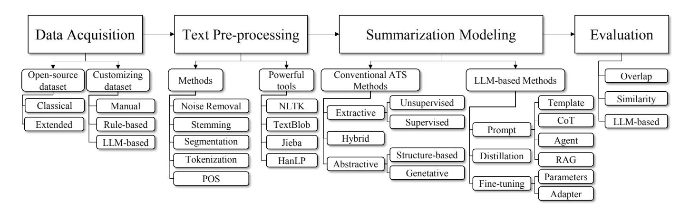
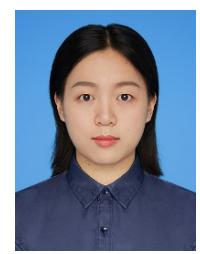

# A Comprehensive Survey on Automatic Text Summarization with Exploration of LLM-Based Methods

Yang Zhanga,b, Hanlei Jina,b, Dan Menga,b, Jun Wang1a,b, Jinghua Tana,b

*aSouthwestern University of Finance and Economics, Chengdu, China bEmail Addresses, wangjun1987@swufe.edu.cn, 595915575@qq.com,*## Abstract

The exponential growth of textual content on the internet, alongside vast archives of news articles, scientific papers, legal documents, and other domains, has made Automatic Text Summarization (ATS) increasingly important. ATS aims to create concise and accurate summaries, significantly reducing the effort required to process large volumes of text. Originating in the 1950s, ATS has evolved through several technical shifts, moving from statistical models to machine learning and deep learning approaches, and more recently, to pre-trained models. Previous surveys have focused on conventional ATS methods, which are often constrained by predefined generative paradigms. However, the advent of Large Language Models (LLMs) has introduced a paradigm-flexible approach to summarization. With their superior generative capabilities, in-context learning, and few-shot learning abilities, LLMs have demonstrated remarkable improvements in coherence, fluency, and overall summarization quality. In this survey, we provide a comprehensive review of both conventional ATS approaches and the latest advancements in LLM-based methods. Additionally, we propose a novel retrieval algorithm designed to efficiently collect relevant papers, which could be adapted for use in other types of surveys. Our contributions are threefold: (1) offering an up-to-date survey of ATS, (2) reviewing the latest LLM-based summarization methods, and (3) introducing a new retrieval algorithm for paper collection.
*Keywords:*Automatic Summarization, Large Language Models, Natural Language Processing

### Introduction

The exponential growth of the World Wide Web has led to an overwhelming surge in textual data across various domains, including news articles, websites, user reviews, blogs, and social media. Additionally, vast text archives are available in specialized fields such as books, scholarly papers, legal documents, and biomedical records. This rapid expansion of data has far outpaced the ability of individuals to search, read, and process all relevant information. To address this challenge, the field of Automatic Text Summarization (ATS) has emerged, leveraging methods from multiple research areas such as Natural Language Processing (NLP) and Information Retrieval (IR), alongside advanced techniques like Machine Learning (ML), Deep Learning (DL), and Large Language Models (LLMs). ATS enables users to efficiently grasp the key ideas within texts, significantly reducing the time and effort required for document reading and comprehension.

Historically, ATS has undergone several distinct eras of development. In the pre-2000s, early approaches were primarily statistical, leveraging surface-level features such as word frequency and sentence position to generate summaries [\[1,](#page-19-0) [2,](#page-19-1) [3\]](#page-19-2). From the 2000s to 2010s, machine learning and shallow neural network-based methods emerged, automating the feature extraction process but still heavily relying on domain-specific, handcrafted features [\[4,](#page-19-3) [5,](#page-19-4) [6,](#page-19-5) [7,](#page-19-6) [8\]](#page-19-7). Along with the introduction of deep learning in the 2010s, particularly with encoderdecoder architectures like RNNs [\[9\]](#page-19-8) and LSTMs [\[10\]](#page-19-9), enabled more nuanced, context-aware summarization by modeling sequences of words and capturing richer semantic information. During this period, two main paradigms dominated: extractive summarization, which focused on identifying key sentences or phrases from the original text [\[11,](#page-20-0) [12\]](#page-20-1), and abstractive summarization, which generated new sentences to paraphrase the main ideas [\[13,](#page-20-2) [14\]](#page-20-3). However, these approaches were constrained by their inflexible generative paradigms, which were determined by the specific model architecture and training data. Moreover, abstractive summarization often faced challenges in maintaining content coherence and ensuring factual accuracy.

The advent of Large Language Models (LLMs), such as GPT-3 and ChatGPT, represents a significant breakthrough in ATS by offering a paradigm-flexible approach. Unlike earlier models, which were restricted to either extractive or abstractive frameworks, LLMs bring unprecedented flexibility by seamlessly integrating both paradigms. With their in-context learning and few-shot learning capabilities, LLMs are able to handle complex summarization tasks with minimal supervision [\[15,](#page-20-4) [16\]](#page-20-5). This flexibility enables them to switch between extractive, abstractive and hybrid summarization techniques, without the need for retraining or significant architectural modifications. In addition to their generative flexibility, LLMs excel in producing coherent, semantically rich summaries by leveraging pretrained knowledge from vast text corpora. These advancements have not only improved summarization quality but have also set new benchmarks for the field.

Despite these advancements, several surveys on ATS remain focused on conventional extractive and abstractive methods [\[11,](#page-20-0) [12,](#page-20-1) [13,](#page-20-2) [14\]](#page-20-3). These conventional approaches, are often constrained by predefined generative paradigms and specific architectures. In contrast, this survey expands the scope by introducing a new category of LLM-based summarization techniques, focusing on the latest advancements in LLM-based summarization techniques, which offer more adaptive and flexible generative paradigms.

To ensure a comprehensive collection of research in LLMbased ATS, we developed an automatic retrieval algorithm that combines keyword-based searches with LLM-based prompt techniques to filter relevant papers. This algorithm is capable of capturing papers that explicitly mention "summarization" in their titles, as well as those that may not explicitly mention the term but are highly relevant to ATS. The proposed retrieval method can be adapted for use in other domains as well.

In this study, our objective is to provide a comprehensive survey of ATS techniques, with a particular focus on exploring LLM-based methods. To the best of our knowledge, this work is among the first to review and analyze LLM-based ATS techniques in depth. We aim to make the following key contributions:

- Up-to-date Survey on ATS: We provide a comprehensive review of the latest advancements in both conventional ATS approaches (extractive and abstractive summarization) and LLM-based methods that offer paradigm flexibility.
- Reviewing LLM-Based Methods: We offer a detailed review of recent LLM-based summarization techniques, focusing on how in-context learning, prompt engineering, and few-shot learning have reshaped ATS.
- Proposed Automated Algorithm for ATS Paper Collection: We present an automated retrieval algorithm that combines keyword-based searches with LLM-based prompting to efficiently collect and organize research papers on ATS topics. This algorithm streamlines the paper collection process and can be adapted for use in other fields. The source code for the algorithm is available on GitHub[2](#page-1-0) .

The remainder of this paper is organized as follows: Section [2](#page-1-1) provides an overview of the background of Automatic Text Summarization (ATS), including its categorization and prior surveys. Section [3](#page-3-0) defines key concepts in ATS and outlines the paper collection methodology. Section [4](#page-5-0) details the data acquisition methods used in the ATS pipeline. Summarization modeling approaches are discussed in Section [6.](#page-10-0) Section [7](#page-16-0) describes evaluation metrics for summarization, and Section [8](#page-18-0) highlights ATS-based applications. Finally, Section [9](#page-18-1) explores future directions in ATS.

#### Background of Automatic Text Summarization

####*2.1. History of Automatic Text Summarization*

The field of Automatic Text Summarization (ATS) has evolved significantly over the past several decades. We can structure its development into distinct eras, each marked by advancements in technology and methods.

Early Statistical Era (Pre-2000s). During this period, summarization methods were predominantly based on statistical text features, such as word counts or measures of term frequency. One of the foundational approaches was introduced by Hans Peter Luhn in 1958 [\[17\]](#page-20-6), who utilized hand-crafted features like cue word lists, title words, and term frequencies to calculate a "significance" score for each word. Sentences containing the most significant words were then extracted to form an abstract, marking one of the earliest models of extractive summarization.

Building upon Luhn's methodology, later research in the era incorporated more advanced statistical models such as TF-IDF (Term Frequency-Inverse Document Frequency) [\[1\]](#page-19-0), Latent Semantic Analysis (LSA) [\[2\]](#page-19-1), and BM25 (Best Matching 25) [\[3\]](#page-19-2). These models aimed to compute sentence-to-sentence similarity scores, shifting from Luhn's individual word frequency-based approach to a more sophisticated analysis of relationships between sentences. By constructing sentence relationship maps, key sentences could be identified and selected through path traversal methods, ensuring the overall quality of the generated summaries [\[18,](#page-20-7) [19,](#page-20-8) [20,](#page-20-9) [21,](#page-20-10) [22,](#page-20-11) [23,](#page-20-12) [24\]](#page-20-13). However, these methods were limited in capturing the deeper meanings or context of the text, and thus struggled to generate coherent summaries for more complex and semantically rich texts [\[25\]](#page-20-14).

In contrast to the purely statistical approaches, another line of research during this era focused on structure-based methods to create abstractive summaries. These methods aimed to identify the most important information from the text by using templates, rules, trees, and ontologies. For example, Gerani et al. (2014) [\[26\]](#page-20-15) proposed converting texts into a discourse tree structure, selecting the most significant sentences, and refining them using hand-crafted templates to generate high-quality abstractive summaries. Similarly, ontology-based approaches treated summarization as the extraction of key entities and their relationships. Researchers like Li (2015) and others [\[27,](#page-20-16) [28,](#page-20-17) [29\]](#page-20-18) adopted ontology methods to extract key phrases, which were then combined with other techniques to generate abstractive summaries. However, these methods were limited in capturing the deeper semantics of the input texts, heavily relied on hand-crafted features, and were thus constrained in their ability to generate accurate and coherent summaries [\[25\]](#page-20-14).

Machine Learning and Early Neural Networks Era (2000s-2010s). Machine learning-based approaches learn from data [\[30\]](#page-20-19), alleviating the need for manually defined rules used in statistical methods. These methods can be supervised, unsupervised, or semi-supervised. In supervised learning, algorithms such as SVM (Support Vector Machines) [\[4,](#page-19-3) [31,](#page-20-20) [32\]](#page-20-21), Na¨ıve Bayes Classification [\[5,](#page-19-4) [33,](#page-20-22) [34\]](#page-20-23), and CRF (Conditional Random Fields) [\[6,](#page-19-5) [35,](#page-20-24) [36\]](#page-20-25) are trained on labeled data to classify sentences as "summary" or "non-summary." On the other hand,

2https://github.com/JinHanLei/RetrievePapers

unsupervised techniques use clustering algorithms such as K-Means [\[37,](#page-20-26) [38\]](#page-20-27), Hierarchical Clustering [\[7,](#page-19-6) [39,](#page-20-28) [40\]](#page-20-29), and DB-SCAN (Density-Based Spatial Clustering of Applications with Noise) [\[8,](#page-19-7) [41\]](#page-20-30). Semi-supervised methods bridge the gap by requiring less labeled data to train an effective classifier. Nevertheless, these methods still rely heavily on feature engineering, and their performance can be highly dependent on the selection of features, limiting their generalizability and quality of summarization generation.

Deep Learning and Transformer Era (2010s-2020s). With the success of deep learning techniques in Natural Language Processing (NLP), various neural networks achieved remarkable results in tasks such as machine translation, voice recognition, and dialogue systems by offering a deeper understanding of language semantics. One of the most important category of neural networks for summarization is Sequence-to-Sequence (Seq2Seq) models, which processed input text as sequential tokens and extracted semantic information through recurrent hidden neurons, and recursively generate sequential tokens as summaries. Examples include Recurrent Neural Networks (RNNs) [\[42,](#page-20-31) [43,](#page-20-32) [44\]](#page-20-33), Long Short-Term Memory (LSTM) [\[45,](#page-20-34) [46,](#page-20-35) [47\]](#page-20-36), and Gated Recurrent Units (GRU) [\[48,](#page-20-37) [49\]](#page-20-38). Despite their improvements, RNN-based models faced challenges in maintaining coherence over long sequences due to difficulty in capturing long-range dependencies, which limited their ability to produce high-quality summaries for longer documents.

With the introduction of the Transformer neural network, the NLP landscape shifted from a "task-specific" paradigm to a "pre-trained" paradigm. Unlike previous models that required specific design adjustments for different NLP tasks, transformerbased language models are pre-trained on extensive text datasets and then fine-tuned for various objectives. On the architectural level, transformers feature sophisticated layers, such as multihead attention, and consist of multiple neural layers, enabling them to capture deeper semantic meanings in texts. The summarization tasks are not exception, transformer-based neural models had became a "backbone" model at the current stage, such as BERT [\[50,](#page-21-0) [51,](#page-21-1) [52,](#page-21-2) [53,](#page-21-3) [54,](#page-21-4) [55\]](#page-21-5), GPT [\[56,](#page-21-6) [57,](#page-21-7) [58\]](#page-21-8), Sentence-BERT [\[59,](#page-21-9) [60\]](#page-21-10), RoBERTa [\[61,](#page-21-11) [62,](#page-21-12) [63\]](#page-21-13) and XLNET [\[64,](#page-21-14) [65,](#page-21-15) [66\]](#page-21-16). However, the major limitation of these pre-trained methods are 1) they require task-specific fine-tuning, which limits their scalability to training datasets and 2) the pretrained models generally lack flexibility in generation.

Large Language Model (LLM) Era (2020s–Present). The emergence of Large Language Models (LLMs), such as GPT-3, GPT-3.5, and LLaMA, marks a significant milestone in the evolution of Automatic Text Summarization (ATS). These models, pre-trained on vast and diverse corpora, possess the ability to perform a wide range of tasks, including summarization. LLMs excel in few-shot and zero-shot learning, enabling them to generate high-quality summaries with minimal or no taskspecific examples. This represents a major advancement over previous models, which often required extensive labeled data for training.

In contrast to earlier approaches, which were constrained by a fixed summarization paradigm, either extractive or abstractive, LLMs offer unprecedented flexibility in their generative capabilities. Thanks to their robust text generation abilities, LLMs can seamlessly adapt between extractive and abstractive paradigms, or even blend both approaches within a single task. Moreover, due to their advanced language modeling, LLM-generated summaries tend to exhibit superior coherence, fluency, and overall writing quality compared to traditional methods.

LLM-based summarization methods can be broadly categorized into three key approaches:

- 1. Prompt Engineering-Based Methods: These methods involve designing effective prompts or templates to guide the LLMs in generating high-quality summaries without modifying the model's internal parameters.
- 2. Fine-Tuning-Based Methods: In this approach, LLMs are fine-tuned on dedicated summarization datasets. By adjusting the internal parameters of the model, fine-tuning allows LLMs to specialize in summarization, further improving their accuracy and relevance for this task.
- 3. Knowledge Distillation-Based Methods: These approaches aim to extract knowledge from LLMs to create smaller, task-specific models. By distilling the summarization ability of LLMs into smaller models, it is possible to retain high performance while improving efficiency for specific summarization tasks.

The field of Automatic Text Summarization (ATS) has undergone a development path across several distinct eras, from early statistical approaches to the advent of Large Language Models (LLMs). Conventional ATS approaches are constrained by a fixed summarization paradigm, either extractive or abstractive. The emergence of LLMs represents a significant breakthrough, offering a flexible, paradigm-agnostic approach that surpasses previous limitations in both extractive and abstractive summarization. As the field continues to evolve, we anticipate that LLM-based methods will not only refine and enhance summarization capabilities but will also pave the way for more adaptive, scalable, and efficient solutions. Future research will likely focus on further improving the interpretability, scalability, and domain adaptability of these models, cementing their role as the foundation for next-generation ATS systems.

#### *2.2. Categorization of Automatic Text Summarization*Automatic Text Summarization (ATS) systems are conventionally classified as "Extractive", "Abstractive", and "Hybrid" based on their generation paradigms. Extractive methods focus on selecting original sentences or phrases from the input text to create summaries, while abstractive approaches generate new sentences that convey the same meaning but differ from the original text. Hybrid methods combine both techniques. Conventional methods are inflexible, as they are specifically designed and trained to perform either extraction or abstractive tasks. In contrast, approaches based on Large Language Models (LLMs) unify summarization tasks within a generative framework, where both extractive and abstractive summarization can be achieved by prompting the LLM to directly generate the summarized text. Examples include having LLMs extract key information from the original text[\[67,](#page-21-17) [68\]](#page-21-18), reading the original text and generating a summary[\[69,](#page-21-19) [70\]](#page-21-20), and using hybrid methods[\[71,](#page-21-21) [72\]](#page-21-22).

In this survey, we classify Automatic Text Summarization (ATS) systems into two major categories: Conventional ATS Methods and LLM-based ATS Methods. The first category encompasses conventional summarization approaches, including extractive, abstractive, and hybrid methods, which adhere strictly to their designated paradigms. In contrast, the second category includes the latest summarization techniques based on Large Language Models (LLMs), which demonstrate adaptability across various generation paradigms, enabling them to flexibly produce coherent summaries regardless of traditional constraints.

##*2.2.1. Conventional ATS Methods*ATS methods are conventionally categorized as extractive, abstractive, or hybrid. Extractive methods extract key phrases from the text, while abstractive methods rephrase or synthesize content based on semantic understanding. Hybrid methods combine these approaches. These methods are often inflexible, constrained by their paradigms, and require manual feature engineering and task-specific training.

- Extractive Methodsselects important sentences or phrases directly from the original document to form a summary. It identifies key components in the text and uses them to create a coherent output [\[73\]](#page-21-23). Techniques include unsupervised methods, such as calculating and ranking the statistical importance of words and sentences, and supervised methods, which train machine learning or deep learning models to classify text as "summary" or "nonsummary."
- Abstractive Methods generates summaries by producing new sentences that may not appear in the original text. This can be achieved through structured methods, like tree or graph-based models, or generative approaches, such as sequence-to-sequence (seq2seq) architectures using RNNs [\[74\]](#page-21-24) or Transformers [\[75\]](#page-21-25). Pre-trained models often enhance these methods, enabling more flexible and human-like summary generation.
- Hybrid Methods combines extractive and abstractive approaches. Typically, a hybrid ATS system uses an extractive model to identify key sentences, followed by an abstractive model to refine or rewrite the extracted content. This process can take two forms: a simpler "Extractive to Shallow Abstractive" approach or a more sophisticated "Extractive to Abstractive" approach with a specifically trained abstractive model [\[76\]](#page-21-26).

###*2.2.2. LLM-based Methods*Large Language Models (LLMs) differ from conventional ATS methods, which are constrained by pre-designed generation paradigms and limited training data. LLMs are pre-trained on vast datasets using extensive neural architectures, granting them superior generative capabilities. They can produce highly coherent and fluent text and, through in-context and few-shot learning, adaptively generate summaries in both extractive and abstractive styles based on task requirements [\[70,](#page-21-20) [77\]](#page-21-27).

LLM-based ATS methods face challenges such as accurately following summarization instructions, incorporating task-specific knowledge, and addressing issues like "hallucinations." To improve their performance, three key research directions have emerged: (1) Prompt Engineering, which focuses on designing effective prompts, templates, and examples to guide LLMs in generating accurate and task-specific summaries; (2) Fine-tuning, which adapts LLMs with domain-specific data to enhance their understanding and the relevance of generated summaries; and (3) Knowledge Distillation, which extracts knowledge from LLMs to train smaller, specialized models for specific summarization tasks.

##*2.3. Related Surveys on ATS*Several ATS surveys have been published over the years, generally adopting a technical categorization approach by classifying ATS methods as either "extractive" or "abstractive", which are summarizaed in Table [1.](#page-4-0) For instance, studies like [\[79,](#page-21-28) [80\]](#page-21-29) focus on "extractive" methods, which select key sentences or paragraphs from the original documents to form concise summaries. These surveys cover techniques such as term frequency, statistical models, and supervised learning approaches. Similarly, [\[12\]](#page-20-1) highlights extractive methods that rely on neural models. In contrast, research like [\[13,](#page-20-2) [14\]](#page-20-3) explores abstractive summarization methods, documenting the transition from early statistical and rule-based techniques to the latest advancements in neural language models. Additionally, [\[76\]](#page-21-26) provides a comprehensive review of both extractive and abstractive approaches.

Another line of surveys focuses on domain-specific ATS techniques, addressing summarization tasks for different content fields. For instance, survey works such as [\[93,](#page-22-0) [87,](#page-22-1) [94\]](#page-22-2) review specialized methodologies designed for legal document summarization, while [\[91\]](#page-22-3) offers a comprehensive review of methods for summarizing multiple documents. [\[90\]](#page-22-4) focuses on summarizing dialogue and conversational texts, and [\[95\]](#page-22-5) provides an overview of methods for summarizing micro-blog content. Collectively, these surveys contribute to a nuanced understanding of ATS by illustrating how summarization techniques adapt to different content domains.

In addition to summarizing conventional extractive and abstractive methods, this survey expands the scope by reviewing the latest advancements in LLM-based summarization techniques. By examining how large language models (LLMs) have transformed the field with their few-shot, in-context learning and superior generative abilities in text summarization.

## 3. Definition and Literature Collection Methodology for Automatic Text Summarization

###*3.1. Definitions for Automatic Text Summarization*Definition 1 (Text Summarization).*Text summarization can be defined as a mapping function*$$
f_{\theta}: T \to S,\tag{1}
$$

|  |  | Table 1: Overview of past ATS surveys on their summarization domain, type and methods coverage |
|--|--|------------------------------------------------------------------------------------------------|
|  |  |                                                                                                |

| Survey Ref.     | Domain          | Type                | Methods Coverage                                                         | Citation | Year |
|-----------------|-----------------|---------------------|--------------------------------------------------------------------------|----------|------|
| [78]            | General         | Comprehensive       | Graph;Machine Learning;Rule-based;Statistical                            | 130      | 2009 |
| [79]            | General         | Extractive          | Concept-based;Fuzzy Logic;Graph;Neural Network                           | 889      | 2017 |
| [80]            | General         | Extractive          | Graph;Machine Learning;Neural Network;Rule-based;Statistical             | 243      | 2017 |
| [11]            | General         | Comprehensive       | Machine Learning;Neural Network;Rule-based;Statistical;Term Frequency    | 124      | 2018 |
| [14]            | General         | Abstractive         | Deep Language Model;Graph;Reinforcement Learning;Rule-based              | 120      | 2019 |
| [81]            | General         | Hybrid              | Neural Network;Term Frenquency                                           | 21       | 2019 |
| [82]            | General         | Abstractive         | Deep Language Model;Neural Network;Word Embedding                        | 51       | 2021 |
|                 |                 |                     | Concept-based;Deep Language Model;Graph;Machine Learning;Neural Network; |          |      |
| General [76] |                 | Comprehensive       | Fuzzy Logic;Rule-based;Statistical;Term Frequency;Word Embedding         | 545      | 2021 |
|                 |                 |                     | Concept-based;Deep Language Model;Graph;Machine Learning;Neural Network; |          | 2021 |
| [83]            | General         | Comprehensive       | Fuzzy Logic;Rule-based;Statistical;Term Frequency;Word Embedding         | 53       |      |
| [84]            | General         | Comprehensive       | Deep Language Model;Graph;Neural Network                                 | 44       | 2023 |
| [85]            | Domain-Specific | Dialogue            | Deep Learning;Knowledge Base;Machine Learning;Retrieval;Term Frequency   | 774      | 2017 |
| [86]            | Domain-Specific | Dialogue            | Machine Learning;Statistical                                             | 98       | 2018 |
| [87]            | Domain-Specific | Legal               | Graph;Term Frequency;Statistical                                         | 166      | 2019 |
| [88]            | Domain-Specific | Graph-based Methods | Graph                                                                    | 348      | 2019 |
| [89]            | Domain-Specific | Scientific Article  | Do Not Apply                                                             | 73       | 2022 |
| [90]            | Domain-Specific | Dialogue            | Do Not Apply                                                             | 69       | 2022 |
| [91]            | Domain-Specific | Multi-Document      | Deep Language Model;Graph;Machine Learning;Neural Network                | 93       | 2022 |
| [92]            | Domain-Specific | Medical             | Do Not Apply                                                             | 284      | 2022 |
*where f*θ *is the summarization method with trainable parameter* θ*, T is the set of tokens in the input text and S*⊆*T (for extractive summarization) or S is a newly generated sequence (for abstractive summarization). The objective is to minimize the information loss*$$
\mathcal{L}(\theta) = dist(T, f_{\theta}(T)), \tag{2}
$$
*subject to the constraint that S is significantly smaller in length than T, while preserving the semantic and syntactic integrity of the original text.*Considering that Automatic Text Summarization (ATS) techniques involve a series of intermediate steps to achieve the final objective, i.e., generating a concise and informative summary. We define the "ATS Process" as follows:

## Definition 2 (Automatic Text Summarization (ATS) Process).
*The process of automatic text summarization can be formalized as a sequence of operations on the input text, denoted by a tuple*$$
P=(D,M,G,E),
$$
*where:*-*D represents data preprocessing, which applies transformations* ϕ(*T*) *such as tokenization or cleaning on the input T.*-*M is the modeling step, where a function f*θ(*T*) *is trained or applied to produce a compressed representation h*(*T*)*, where h*(*T*) ≪ *T.*-*G is the generation step, applying the function g*(*h*(*T*)) *to produce the summary S , either by extracting or generating a subset of T.*•*E is the evaluation phase, using metrics Em*(*S*, *S*∗ )*to measure how well the generated summary S matches the ground truth S*∗*, with commonly used metrics being ROUGE and BLEU.*##*3.2. Process of Automatic Text Summarization*

Building upon the definition of ATS, we delineate the intermediate steps necessary to achieve the goal of abstraction generation. The ATS process is illustrated in Figure [1,](#page-5-1) and its constituent steps are defined as follows:

- 1. Data Acquisition. Data Acquisition, the initial step of the ATS process, involves obtaining datasets critical for the system. The specifics of this step are elaborated in Section [4,](#page-5-0) which provides a comprehensive overview of existing datasets for ATS, along with methodologies for constructing new datasets from scratch.
- 2. Text Pre-processing. Pre-processing is a crucial step aimed at refining the collected texts by removing noise and transforming raw texts into a clean, structured format, as elucidated by [\[79\]](#page-21-28). This step predominantly employs linguistic techniques such as noise removal, stemming, and sentence/word segmentation to enhance the quality of the text data. For a detailed exploration of the pre-processing techniques and their applications in ATS, refer to Section [5.](#page-8-0)
- 3. Summarization Modeling. Modeling, the cornerstone of an ATS system, is dedicated to developing versatile language models that can interpret and distill language data into concise summaries. This is achieved through rule-based, statistical, or deep learning approaches which extract patterns from the language data. The process of

<!-- Image Description: This flowchart details a text summarization system's architecture. It outlines four stages: data acquisition (using open-source or customized datasets), text pre-processing (methods include noise removal, stemming, and tokenization), summarization modeling (employing conventional and LLM-based approaches, including extractive, abstractive, and generative methods), and evaluation (using overlap, similarity, and LLM-based metrics). The diagram visually organizes various techniques within each stage. -->

Figure 1: ATS Framework: Detailed Process from Data Acquisition through Text Pre-processing, Summarization Modeling to Evaluation Metrics.

modeling in ATS is inherently an NLP task, typically commencing with language modeling and subsequently progressing to summarization modeling. The conventional ATS methods are bifurcated into language modeling and summarization modeling. For an in-depth discussion and categorization of the various ATS models, refer to Section [6.](#page-10-0) This section also provides a detailed exploration of methods based on Large Language Models (LLMs).

4. Evaluation Metrics. Evaluation metrics of ATS to judge how well ATS works. Objective, comprehensive, and accurate evaluation metrics can lead to the recognition and acceptance of research on ATS. Refer to Section [7](#page-16-0) for details.

### *3.3. Methodology for Crawling ATS Papers*We developed an automated crawling algorithm (Algorithm [1\)](#page-6-0) to efficiently collect papers relevant to ATS, addressing the limitations of manual keyword-based searches. By integrating web crawling and Large Language Model (LLM)-based filtering, the algorithm enhances both the accuracy and comprehensiveness of the retrieval process.

Manual selection of ATS papers from Google Scholar poses two key challenges. First, relevant papers may use diverse and non-standard keywords such as "summarization," "text condensation," or "summary generation," making manual searches timeconsuming. Second, some papers relevant to ATS may lack explicit keywords in their titles but include them in their abstracts, as seen in examples like "ChatGPT Chemistry Assistant for Text Mining and the Prediction of MOF Synthesis" [\[96\]](#page-22-13), where "summarization" appears only in the abstract. Similar issues occur with other works [\[97,](#page-22-14) [98\]](#page-22-15).

To this end, we designed a three-stage algorithm that automates the collection, filtering, and categorization of ATS papers. The process leverages synonym-enhanced keyword searches and analyzes both titles and abstracts for relevance, which are as following:

1. Paper Searching: Crawl papers from Google Scholar using a diverse set of synonym-enhanced keywords (e.g., "summarization," "text condensation"). The results are deduplicated and preprocessed to create an initial dataset*D*.

- 2. Relevance Filtering: Retrieve abstracts to filter out irrelevant papers. Since Google Scholar often provides incomplete abstracts, the algorithm additionally retrieves their publication URLs (*pub url*) to scrape full abstracts. For URLs pointing to PDFs, text is extracted directly from the files using PyPDF.
- 3. Categorization Using LLMs: Leverage LLaMa-3-Instruct 8B model with specifically designed few-shot examples to classify the crawled papers based on their titles and abstracts into predefined categories (e.g., datasets, methodologies, applications). The outputs are manually reviewed to ensure accuracy.

This pipeline ensures scalable and precise retrieval of ATSrelated papers, addressing the limitations of keyword-based searches. The algorithm is outlined in Algorithm [1.](#page-6-0)

#### 4. ATS Datasets

This section introduces two types of datasets for ATS: (1) open-source datasets commonly used in existing research and (2) techniques to build new ATS datasets.

Open-source datasets are mostly adopted for general ATS tasks but often lack suitability for domain-specific applications, as noted in studies [\[99,](#page-22-16) [100,](#page-22-17) [101\]](#page-22-18). To address these gaps, we outline methodologies for creating newly custom datasets, focusing on leveraging Large Language Models (LLMs). LLMs enable scalable and efficient generation of domain-specific data, reducing manual effort and enhancing dataset diversity.

#### *4.1. Open-source Datasets*We collected datasets in the ATS domain that are publicly accessible online or via email, referred to as*Open-Source Datasets*. We adopted the automated retrieval algorithm proposed in Sec. [3.3](#page-5-2) to retrieve the ATS datasets, by using ATS dataset related queries. This process also consists of three main steps:

1. Dataset Searching: Using the keyword "summarization dataset," we searched Google Scholar for papers and associated metadata, sorted by relevance.

| Initialize an empty database D Initialize web crawler C Initialize the LLM for classification LLM K Define search keywords = {summarization, text condensation, } for all k ∈ K do results ← C.search(k) ▷ Perform search using keyword k for all r ∈ results do Extract paper = {title, pub url} from r if paper < D then Add paper to D end if end for end for for all paper ∈ D do page ← C.crawl(paper.pub url) if paper.pub url ends with .pdf then Extract abstract from page.FILE else Extract abstract from page.HT ML end if Clean and store abstract in D end for Define few-shot examples S HOT s = {{title, abstract, label}} for all paper ∈ D do result ← LLM(S HOT s, paper.title, paper.abstract) Add result to categorized dataset R end for return R | Algorithm 1 Algorithm for Crawling ATS Relevant Papers |
|---------------------------------------------------------------------------------------------------------------------------------------------------------------------------------------------------------------------------------------------------------------------------------------------------------------------------------------------------------------------------------------------------------------------------------------------------------------------------------------------------------------------------------------------------------------------------------------------------------------------------------------------------------------------------------------------------------------------------------------------------------------------------------------------------------------------------------------------------------------------------------|--------------------------------------------------------|
|                                                                                                                                                                                                                                                                                                                                                                                                                                                                                                                                                                                                                                                                                                                                                                                                                                                                                 |                                                        |
|                                                                                                                                                                                                                                                                                                                                                                                                                                                                                                                                                                                                                                                                                                                                                                                                                                                                                 |                                                        |
|                                                                                                                                                                                                                                                                                                                                                                                                                                                                                                                                                                                                                                                                                                                                                                                                                                                                                 |                                                        |
|                                                                                                                                                                                                                                                                                                                                                                                                                                                                                                                                                                                                                                                                                                                                                                                                                                                                                 |                                                        |
|                                                                                                                                                                                                                                                                                                                                                                                                                                                                                                                                                                                                                                                                                                                                                                                                                                                                                 |                                                        |
|                                                                                                                                                                                                                                                                                                                                                                                                                                                                                                                                                                                                                                                                                                                                                                                                                                                                                 |                                                        |
|                                                                                                                                                                                                                                                                                                                                                                                                                                                                                                                                                                                                                                                                                                                                                                                                                                                                                 |                                                        |
|                                                                                                                                                                                                                                                                                                                                                                                                                                                                                                                                                                                                                                                                                                                                                                                                                                                                                 |                                                        |
|                                                                                                                                                                                                                                                                                                                                                                                                                                                                                                                                                                                                                                                                                                                                                                                                                                                                                 |                                                        |
|                                                                                                                                                                                                                                                                                                                                                                                                                                                                                                                                                                                                                                                                                                                                                                                                                                                                                 |                                                        |
|                                                                                                                                                                                                                                                                                                                                                                                                                                                                                                                                                                                                                                                                                                                                                                                                                                                                                 |                                                        |
|                                                                                                                                                                                                                                                                                                                                                                                                                                                                                                                                                                                                                                                                                                                                                                                                                                                                                 |                                                        |
|                                                                                                                                                                                                                                                                                                                                                                                                                                                                                                                                                                                                                                                                                                                                                                                                                                                                                 |                                                        |
|                                                                                                                                                                                                                                                                                                                                                                                                                                                                                                                                                                                                                                                                                                                                                                                                                                                                                 |                                                        |
|                                                                                                                                                                                                                                                                                                                                                                                                                                                                                                                                                                                                                                                                                                                                                                                                                                                                                 |                                                        |
|                                                                                                                                                                                                                                                                                                                                                                                                                                                                                                                                                                                                                                                                                                                                                                                                                                                                                 |                                                        |
|                                                                                                                                                                                                                                                                                                                                                                                                                                                                                                                                                                                                                                                                                                                                                                                                                                                                                 |                                                        |
|                                                                                                                                                                                                                                                                                                                                                                                                                                                                                                                                                                                                                                                                                                                                                                                                                                                                                 |                                                        |
|                                                                                                                                                                                                                                                                                                                                                                                                                                                                                                                                                                                                                                                                                                                                                                                                                                                                                 |                                                        |
|                                                                                                                                                                                                                                                                                                                                                                                                                                                                                                                                                                                                                                                                                                                                                                                                                                                                                 |                                                        |
|                                                                                                                                                                                                                                                                                                                                                                                                                                                                                                                                                                                                                                                                                                                                                                                                                                                                                 |                                                        |
|                                                                                                                                                                                                                                                                                                                                                                                                                                                                                                                                                                                                                                                                                                                                                                                                                                                                                 |                                                        |
|                                                                                                                                                                                                                                                                                                                                                                                                                                                                                                                                                                                                                                                                                                                                                                                                                                                                                 |                                                        |
|                                                                                                                                                                                                                                                                                                                                                                                                                                                                                                                                                                                                                                                                                                                                                                                                                                                                                 |                                                        |
|                                                                                                                                                                                                                                                                                                                                                                                                                                                                                                                                                                                                                                                                                                                                                                                                                                                                                 |                                                        |
|                                                                                                                                                                                                                                                                                                                                                                                                                                                                                                                                                                                                                                                                                                                                                                                                                                                                                 |                                                        |
|                                                                                                                                                                                                                                                                                                                                                                                                                                                                                                                                                                                                                                                                                                                                                                                                                                                                                 |                                                        |
|                                                                                                                                                                                                                                                                                                                                                                                                                                                                                                                                                                                                                                                                                                                                                                                                                                                                                 |                                                        |
|                                                                                                                                                                                                                                                                                                                                                                                                                                                                                                                                                                                                                                                                                                                                                                                                                                                                                 |                                                        |
|                                                                                                                                                                                                                                                                                                                                                                                                                                                                                                                                                                                                                                                                                                                                                                                                                                                                                 |                                                        |

- 2. Relevance Filtering: To exclude irrelevant articles, we employed the LLaMa3 LLM for few-shot learning classification. Titles and abstracts were analyzed and categorized into two groups: articles introducing new datasets, labeled as "dataset," and those unrelated, labeled as "nondataset." Manual screening was then conducted to ensure the accuracy of the classification, resulting in a definitive list of relevant datasets.
- 3. Categorization: Since articles on datasets tend to be structured and straightforward, we manually categorized the collected datasets based on their citation impact and relevance to ATS research.

Given the large number of ATS datasets available, we organized them into two groups for clarity and ease of presentation:

- Core Datasets: These are datasets with over 100 citations, considered central to the field. Detailed introductions for each core dataset are provided, and their key information is summarized in Table [2.](#page-7-0) To ensure completeness, we reviewed related surveys and integrated any significant datasets they mentioned that were not retrieved through our search.
- Supplementary Datasets: These are datasets with fewer

than 100 citations, providing additional resources for specific or emerging use cases. Their basic information is summarized in Table [3.](#page-9-0)

## *4.1.1. Core Datasets*The table of core datasets includes details on the publish year, size (number of total pairs including train, validation and test), domain, language, along with their public urls for download. In the following segments, we overview the datasets listed in Table [2.](#page-7-0) The following is a brief introduction to each of the core datasets.

Gigaword[\[102\]](#page-22-19) is a news summarization dataset from the Linguistic Data Consortium (LDC), sourced from seven media outlets, including*Agence France-Presse*, *Associated Press*, *Bloomberg*, and *Xinhua News Agency*. With nearly 10 million English news documents and headline-based summaries, it is well-suited for training deep neural networks. The dataset directly uses headlines as summaries[\[76\]](#page-21-26).

DUC[\[103\]](#page-22-20) is a series of high-quality datasets from the Document Understanding Conferences (2001–2007), containing 1600 news document-summary pairs. Summaries are available in three forms: manually created, automatically generated baselines, and algorithm-generated submissions. Due to their small size and quality, DUC datasets are commonly used for testing[\[14\]](#page-20-3).

CNN & Daily Mail[\[104\]](#page-22-21) is a news dataset extracted from *CNN*and*Daily Mail*, featuring 286,817 training, 13,368 validation, and 11,487 test pairs. It includes news body contents paired with editor-created highlights as summaries. Training documents average 766 words across 29.74 sentences, with summaries averaging 53 words and 3.72 sentences. The dataset has two versions: non-anonymous (real entity names) and anonymous (entity names removed).

LCSTS[\[105\]](#page-22-22) contains over 2 million Chinese micro-blogs from domains inlcude politics, economics, and entertainment, sourced from *Sina Weibo's*official accounts such as People's Daily, the Ministry of National Defense, etc.. Summaries are manually annotated, with rules applied to ensure quality (e.g., accounts with over 1 million followers). The dataset is divided into three parts: a large master dataset, a high-quality subset with manual scoring, and a refined test set.

ArXiv, PubMed[\[106\]](#page-22-23) are academic datasets with over 300,000 papers from*arXiv.org*and*PubMed.com*, using abstracts as summaries. Pre-processing includes filtering out excessively long or short documents, removing figures and tables, normalizing math formulas and citations, and retaining only relevant sections. For arXiv, LATEX files are converted to plain text with Pandoc to preserve discourse structure.

XSum[\[107\]](#page-22-24) is a dataset of 226,711 *BBC*news articles (2010–2017) with single-sentence professionally written summaries, often authored by the article's writer. The dataset spans diverse domains, including politics, sports, business, technology, and entertainment.

NEWSROOM[\[108\]](#page-22-25) contains 1.3 million articles and humanwritten summaries from 38 major news outlets (1998–2017). It features diverse summarization styles, combining abstractive

Table 2: Core datasets with more than 100 citations in the ATS. The table is arranged in ascending order by publication year and provides details on the publish year, size (number of total pairs including train, validation, and test), domain, language, along with their publicly available URLs for download.

| Name             | Year | Size      | Domain         | Language     | URL                                                  |
|------------------|------|-----------|----------------|--------------|------------------------------------------------------|
| Gigaword         | 2003 | 9,876,086 | News           | English      | https://github.com/harvardnlp/sent-summary           |
| DUC 2001-2007    | 2004 | 250-1600  | News           | English      | https://duc.nist.gov/data.html                       |
| CNN & Daily Mail | 2016 | 312,084   | News           | English      | https://github.com/abisee/cnn-dailymail              |
| LCSTS            | 2016 | 2,400,591 | Blogs          | Chinese      | http://icrc.hitsz.edu.cn/Article/show/139.html       |
| ArXiv            | 2018 | 215,000   | Academic paper | English      | https://github.com/armancohan/long-summarization     |
| PubMed           | 2018 | 133,000   | Academic paper | English      | https://github.com/armancohan/long-summarization     |
| XSum             | 2018 | 226,711   | News           | English      | https://github.com/EdinburghNLP/XSum                 |
| NEWSROOM         | 2018 | 1.3M      | News           | English      | https://lil.nlp.cornell.edu/newsroom/                |
| WikiHow          | 2018 | 230,843   | Knowledge Base | English      | https://github.com/mahnazkoupaee/WikiHow-Dataset     |
| Multi-News       | 2019 | 56,216    | News           | English      | https://github.com/Alex-Fabbri/Multi-News            |
| SAMSum           | 2019 | 16,369    | Dialogue       | English      | https://arxiv.org/src/1911.12237v2/anc/corpus.7z     |
| BIGPATENT        | 2019 | 1.3M      | Patent         | English      | https://evasharma.github.io/bigpatent/               |
| Scisumm          | 2019 | 1,000     | Academic paper | English      | https://cs.stanford.edu/∼myasu/projects/scisumm net/ |
| BillSum          | 2019 | 22,218    | Bill           | English      | https://github.com/FiscalNote/BillSum                |
| WikiLingua       | 2020 | 141,457   | Knowledge Base | Multilingual | https://github.com/esdurmus/Wikilingua               |
| MLSUM            | 2020 | 1.5M      | News           | Multilingual | https://github.com/ThomasScialom/MLSUM               |
| XL-sum           | 2021 | 1.35M     | News           | Multilingual | https://github.com/csebuetnlp/xl-sum                 |
| DialogSum        | 2021 | 13,460    | Dialogue       | English      | https://github.com/cylnlp/DialogSum                  |
| MediaSum         | 2021 | 463,600   | Interview      | English      | https://github.com/zcgzcgzcg1/MediaSum/              |
| Booksum          | 2021 | 146,532   | Literature     | English      | https://github.com/salesforce/booksum                |
| Summscreen       | 2021 | 26,900    | TV series      | English      | https://github.com/mingdachen/SummScreen             |

and extractive approaches, crafted by newsroom authors and editors across various domains like news, sports, and finance.

WikiHow[\[109\]](#page-22-26) comprises over 230,000 article-summary pairs from the*WikiHow*knowledge base, covering procedural tasks across various topics. Summaries are formed by concatenating bold introductory lines for each step, while detailed descriptions form the source article. Articles are categorized as singlemethod tasks or multi-method tasks.

Multi-News[\[110\]](#page-22-27) contains 56,216 article-summary pairs from*newser.com*, with professionally written summaries that include links to cited articles. The summaries are longer (averaging 260 words), have a lower compression rate, and less variability in copied words, aiding models in generating fluent and coherent text.

SAMSum[\[111\]](#page-22-28) is a dataset of over 16,000 human-created messenger-style conversations with annotated summaries. Designed by linguists to reflect real-life chat interactions, it emphasizes the complexity of dialogue summarization compared to news articles, requiring specialized models and evaluation metrics.

BIGPATENT[\[112\]](#page-22-29) is a dataset of 1.3 million U.S. patent documents post-1971 across nine technological domains, featuring human-written abstractive summaries. Built from Google Patents Public Datasets, it addresses dataset limitations with richer discourse, balanced content, and higher compression ratios, supporting research in abstractive summarization.

Scisumm[\[113\]](#page-22-30) includes the 1,000 most cited academic pa-

pers (21,928 citations) from the *ACL Anthology Network*, with expert-annotated summaries and citation information. The dataset construction involved sampling citations over time, filtering inappropriate sentences, and a pilot study with PhD students to validate annotations. Final summaries were created by annotators using abstracts and citing sentences.

BillSum[\[114\]](#page-22-31) is the first dataset for summarizing US Congressional and California state bills, comprising 22,218 US bills (1993–2018) and 1,237 California bills (2015–2016), each with human-written summaries. The bills, mid-length (5,000–20,000 characters), were sourced from Govinfo and the California legislature's website to ensure diversity. The dataset supports research in legislative summarization and model transferability to new legislatures.

WikiLingua[\[115\]](#page-22-32) is a cross-lingual abstractive summarization dataset with 141,457 English articles and 600k total articles in 17 languages, aligned via illustrative images. Sourced from WikiHow, it features high-quality, collaboratively written how-to content, supporting research into cross-lingual summarization using synthetic data and pre-trained Neural Machine Translation.

MLSUM[\[116\]](#page-22-33) is a large-scale multilingual summarization dataset with over 1.5 million article-summary pairs in French, German, Spanish, Russian, and Turkish. Sourced from online newspapers, it uses articles and human-written highlights as pairs. The dataset supports cross-lingual research, with detailed statistics and plans for expansion to more languages.

XL-sum[\[117\]](#page-22-34) is a multilingual abstractive summarization dataset with 1 million article-summary pairs in 44 languages, sourced from BBC. It focuses on diverse and low-resource languages, offering high-quality, concise summaries. Fine-tuned mT5 models achieve competitive results, making XL-sum the largest dataset for multilingual summarization in both samples and language coverage.

DialogSum[\[118\]](#page-23-0) is a large-scale dialogue summarization dataset with 13,460 real-life dialogues on topics like education, work, and healthcare. It contains 1.8 million tokens and averages 131 tokens per dialogue. Created through careful cleaning, bi-turn formatting, and annotation, it addresses challenges like complex discourse, coreferences, and ellipsis, supporting research in dialogue summarization.

MediaSum[\[119\]](#page-23-1) is a large-scale dialogue summarization dataset with 463.6K transcripts and abstractive summaries from NPR and CNN interviews. Covering diverse domains and multiparty conversations, it includes segmented summaries for multitopic interviews. The dataset's size and positional biases improve model performance in transfer learning for dialogue summarization tasks.

Booksum[\[120\]](#page-23-2) is a long-form narrative summarization dataset featuring novels, plays, and stories with human-written abstractive summaries. It challenges models with lengthy texts, causal/temporal dependencies, and highly abstractive summaries. Structured into paragraph, chapter, and book levels, it includes 217 titles, 6,327 chapters, and 146,532 paragraph-level examples. Sourced from Project Gutenberg and Web Archive, the dataset is cleaned, aligned, and split for training, validation, and testing, with provided baselines for extractive and abstractive models.

Summscreen[\[121\]](#page-23-3) is a screenplay summarization dataset with 29,186 TV episode transcripts and human-written recaps from various genres. It includes 6,683 episodes from Forever-Dreaming and 22,503 from TVMegaSite. Challenges include indirect plot expression and non-plot content. The dataset was filtered for character overlap and transcript length, split into train/dev/test sets, and features entity-centric evaluation metrics to reflect characters' key role in TV series.

### *4.1.2. Supplementary Datasets*Supplementary datasets refer to those cited fewer than 100 times. Although less frequently used than conventional datasets, they offer unique diversity and can serve as valuable resources for addressing specific challenges in the ATS task. The information is presented in Table [3.](#page-9-0)

As summarized in Tables [2](#page-7-0) and [3,](#page-9-0) current summarization datasets offer several strengths: they include large-scale datasets for training deep neural networks and smaller, refined datasets for evaluation, are predominantly open source and easily accessible, and primarily focus on the news domain. However, there is a gap in high-quality datasets for other domains, limiting research and practical applications in specialized areas such as financial earnings releases [\[76\]](#page-21-26). To address this need, we propose methodologies for constructing customized datasets, which are detailed in the following section.

####*4.2. Techniques to Build New Datasets*Building new summarization datasets involves two main steps: 1) crawling or fetching texts, and 2) obtaining summaries. While manual annotation is reliable, it is time-consuming and laborintensive[\[103,](#page-22-20) [110,](#page-22-27) [113\]](#page-22-30). Recently, automatic annotation techniques, including rule-based and LLM-based methods, have gained popularity for balancing accuracy and efficiency.

Rule-based annotation: Rule-based annotation uses specific portions of the text, such as titles, headlines[\[104\]](#page-22-21), or the first few sentences (e.g., LEAD-3[\[164\]](#page-24-0)), as summaries. News articles, structured in the journalistic style, often start with key information, making their opening sentences suitable for summaries[\[107\]](#page-22-24). Similarly, academic papers have abstract sections that naturally serve as summaries[\[106,](#page-22-23) [132\]](#page-23-4). However, rule-based summaries can be imprecise and overly condensed, and texts in other domains often lack a structured format, making rule-based annotation challenging. In such cases, leveraging LLMs alongside manual efforts offers greater efficiency.

LLM-based Data Generation: LLMs are effective for generating summaries. A straightforward approach is to input original texts along with carefully designed prompts, then fine-tune the model to better grasp the summarization task and produce high-quality outputs (see Section [6.2\)](#page-12-0). Some studies focus on LLM-based annotation methods. For example, [\[165\]](#page-24-1) used DialoGPT[\[166\]](#page-24-2) to transform annotation into tasks like keyword extraction and redundancy detection, improving informativeness and relevance. [\[167\]](#page-24-3) developed a GPT-3 algorithm for few-shot annotation of medical dialogues, outperforming human-trained models in accuracy and coherence. LLM-based data generation could also be incorporated with human annotators to further improve the robustness. For instance, [\[168\]](#page-24-4) proposed a GPT-3-based scheme combining LLM generation with human evaluation for improved outcomes.

Generating summaries directly via LLMs can encounter hallucination issues, resulting in factually incorrect information[\[169\]](#page-24-5). Several studies have aimed to measure and mitigate such hallucinations. [\[170\]](#page-25-0) utilized synthetic and human-labeled data to train models for detecting word-, dependency-, and sentencelevel factual errors in summarization. Their work showed that the best factuality detection models, including the sentencefactuality model[\[171\]](#page-25-1) and the arc-factuality model[\[172\]](#page-25-2), effectively identify non-factual tokens. Additionally, [\[173\]](#page-25-3) proposed improving factual consistency by generating challenging synthetic examples of non-factual summaries using infilling language models.

#### 5. Text Pre-processing

After collecting the data, the next step in the process is preprocessing. Pre-processing is the process of transforming raw text into structured format data. This section describes common methods and powerful tools.

####*5.1. Pre-processing methods*Noise Removal: eliminates unnecessary parts of the input text, such as HTML tags in crawled text, extra spaces, blank Table 3: Supplementary datasets with fewer than 100 citations in ATS. The table is formatted in the same manner as the core dataset table, exhibiting diversity and serving as a valuable complement to ATS datasets.

| Ref.  | Name           | Year | Size         | Domain            | Language             | URL                                                             |
|-------|----------------|------|--------------|-------------------|----------------------|-----------------------------------------------------------------|
| [122] | TGSum          | 2016 | 1,114        | News & Relation   | English              | http://www4.comp.polyu.edu.hk/                                  |
| [123] | VSoLSCSum      | 2016 | 2,448        | News              | Vietnamese           | https://github.com/nguyenlab/VSoLSCSum-Dataset                  |
| [124] | Solscsum       | 2016 | 5,858        | News & Comment    | English              | http://150.65.242.101:9292/yahoo-news.zip                       |
| [125] | RA-MDS         | 2017 | 19,000       | News & Comment    | English              | http://www.se.cuhk.edu.hk/∼textmine/dataset/ra-mds/             |
| [126] | Indosum        | 2018 | 19,000       | News              | Indonesian           | https://github.com/kata-ai/indosum                              |
| [127] | Rulingbr       | 2018 | 10,000       | Ruling            | Portuguese           | https://github.com/diego-feijo/rulingbr                         |
| [128] | SumeCzech      | 2018 | 1,001,593    | News              | Czech                | https://lindat.mff.cuni.cz/repository/xmlui/handle/11234/1-2615 |
| [129] | Talksumm       | 2019 | 1,716        | Scientific papers | English              | https://github.com/levguy/talksumm                              |
| [130] | Vnds           | 2019 | 150,704      | News              | Vietnamese           | https://github.com/ThanhChinhBK/vietnews                        |
| [131] | WCEP           | 2020 | 2,390,000    | News              | English              | https://github.com/complementizer/wcep-mds-dataset              |
| [132] | Multi-XScience | 2020 | 40,528       | Scientific papers | English              | https://github.com/yaolu/Multi-XScience                         |
| [133] | Aquamuse       | 2020 | 5,519        | Query             | English              | https://github.com/google-research-datasets/aquamuse            |
| [134] | Gazeta         | 2020 | 63,435       | News              | Russian              | https://github.com/IlyaGusev/gazeta                             |
| [135] | Liputan6       | 2020 | 215,827      | News              | Indonesian           | https://github.com/fajri91/sum liputan6                         |
| [136] | DebateSum      | 2020 | 187,386      | Debate            | English              | https://github.com/Hellisotherpeople/DebateSum                  |
| [137] | SPORTSSUM      | 2020 | 5,428        | Sports            | Chinese              | https://github.com/ej0cl6/SportsSum                             |
| [138] | CLTS           | 2020 | 180,000      | Long articles     | Chinese              | https://github.com/lxj5957/CLTS-Dataset                         |
| [139] | GameWikiSum    | 2020 | 14,652       | Video game        | English              | https://github.com/Diego999/GameWikiSum                         |
| [140] | WikiAsp        | 2021 | 320,272      | Multi-domain      | English              | http://github.com/neulab/wikiasp                                |
| [141] | FacetSum       | 2021 | 60,532       | Scientific papers | English              | https://github.com/hfthair/emerald crawler                      |
| [142] | SumPubMed      | 2021 | 33,772       | Scientific papers | English              | https://github.com/vgupta123/sumpubmed                          |
| [143] | TWEETSUMM      | 2021 | 6,500        | Dialogue          | English              | https://github.com/guyfe/Tweetsumm                              |
| [144] | CSDS           | 2021 | 10,701       | Dialogue          | Chinese              | https://github.com/xiaolinAndy/CSDS                             |
| [145] | CrossSum       | 2021 | 1,680,000    | News              | Multilingual         | https://github.com/csebuetnlp/CrossSum                          |
| [146] | MM-AVS         | 2021 | 2,260        | Multimodal        | English              | https://github.com/xiyan524/MM-AVS                              |
| [147] | Lawsum         | 2021 | 10,000       | Legal             | Indonesian           | https://github.com/mtkh0602/LegalSummarization                  |
| [148] | ForumSum       | 2021 | 4,058        | Dialogue          | English              | https://www.tensorflow.org/datasets/catalog/forumsum            |
| [149] | Tls-covid19    | 2021 | 100,399      | Timeline          | Portuguese & English | https://github.com/LIAAD/tls-covid19                            |
| [150] | ISSumSet       | 2021 | 136,263      | Tweet             | English              | https://github.com/AlexisDusart/ISSumSet                        |
| [151] | QBSUM          | 2021 | 49,000       | Query             | Chinese              | https://github.com/yanshengli/QBSUM                             |
| [152] | Clidsum        | 2022 | 112,000      | Dialogue          | Multilingual         | https://github.com/krystalan/ClidSum                            |
| [153] | Squality       | 2022 | 625          | Story             | English              | https://github.com/nyu-mll/SQuALITY                             |
| [154] | EUR-lex-sum    | 2022 | 24 languages | Legal             | Multilingual         | https://github.com/achouhan93/eur-lex-sum                       |
| [155] | EntSUM         | 2022 | 2788         | Entity            | English              | https://zenodo.org/record/6359875                               |
| [156] | Klexikon       | 2022 | 2,898        | Knowledge Base    | German               | https://github.com/dennlinger/klexikon                          |
| [157] | Caves          | 2022 | 10,000       | Tweet             | English              | https://github.com/sohampoddar26/caves-data                     |
| [158] | Ectsum         | 2022 | 2,425        | ECTs              | English              | https://github.com/rajdeep345/ECTSum                            |
| [159] | NEWTS          | 2022 | 312,084      | News              | English              | https://github.com/OpenNMS/newts                                |
| [160] | MIMIC-RRS      | 2022 | 207,782      | Radiology report  | English              | https://github.com/jbdel/vilmedic                               |
| [161] | SEAHORSE       | 2023 | 96,000       | Multifaceted      | Multilingual         | https://goo.gle/seahorse                                        |
| [162] | MeetingBank    | 2023 | 6,892        | Meeting           | English              | https://meetingbank.github.io/                                  |
| [163] | Videoxum       | 2023 | 140,000      | Multimodal        | English              | https://github.com/jylins/videoxum                              |

lines, unknown symbols, and gibberish, etc. In earlier methods, it was necessary to remove stop words from the text [\[174\]](#page-25-4). Stop words, commonly occurring words in the text such as articles, pronouns, prepositions, auxiliary verbs, and determiners, were deleted using an artificially designed stop-words file because they were not useful for the analyses [\[175\]](#page-25-5) and had no significant impact on the selection of summary results.

Part-Of-Speech (POS): involves the assignment of POS tags, such as verbs, nouns, adjectives, etc., to each word in a sentence. This categorization helps in identifying words based on their syntactic roles and context within the sentence structure

#### [\[176\]](#page-25-6).

Stemming: is the process of converting words with the same root or stem to a basic form by eliminating variable endings like "es" and "ed" [\[177,](#page-25-7) [178\]](#page-25-8). This process was initially employed in open vocabulary text mining, for similar reasons as removing stop words: to reduce computation time and enhance recall in information retrieval [\[179\]](#page-25-9). [\[180\]](#page-25-10) proposed reducing each word to its initial letters, a method referred to as Ultrastemming, which demonstrated significant improvements.

Sentence Segmentation: splits texts into sentences. The simplest method involves using end markers such as ".", "?", or "!", but it is prone to a lot of interference, including abbreviations like "e.g." or "i.e.". To address this issue, simple heuristics and regular expressions are employed [\[181\]](#page-25-11). Sentence segmentation is typically necessary for processing long texts [\[182\]](#page-25-12) or for specific model designs, such as using sentences as nodes in a graph [\[183\]](#page-25-13).

Word Tokenization: divides words into subwords. Byte Pair Encoding (BPE) [\[184\]](#page-25-14) stands out as a simple and highly effective method for subword segmentation. It recursively maps common byte pairs to new ones and subsequently reconstructs the original text using the mapping table. Wordpiece [\[185\]](#page-25-15) selects the new word unit from all possible options, choosing the one that maximally enhances the likelihood on the training data when incorporated into the model.

####*5.2. Pre-process Toolkits*The primary tools for English pre-processing with Python are NLTK[1](#page-10-1) and TextBlob[2](#page-10-2) . NLTK (Natural Language Toolkit) stands out as a leading platform for developing Python programs that handle human language data. It offers a suite of text processing libraries covering classification, tokenization, stemming, tagging, parsing, and semantic reasoning. NLTK also provides wrappers for industrial-strength NLP libraries and maintains an active discussion forum. TextBlob, built on NLTK, offers a simplified API for various NLP tasks, including partof-speech tagging, noun phrase extraction, sentiment analysis, classification, translation, and more. While TextBlob is applicationoriented and user-friendly, it sacrifices some flexibility compared to NLTK. For other languages, Jieba[3](#page-10-3) and HanLP[4](#page-10-4) provide effective solutions for Chinese language. Jieba is a relatively lightweight tool with its primary function being word segmentation, capable of fulfilling most Chinese word splitting needs. On the other hand, HanLP[\[186\]](#page-25-16) serves as an NLP toolkit built on PyTorch and TensorFlow, contributing to advancing state-of-the-art deep learning techniques in both academia and industry. It has demonstrated notable results in entity segmentation.

Furthermore, diverse models require distinct pre-processing methods as a prerequisite. In earlier models, it was imperative to design and implement an extensive set of rules to eliminate text that posed processing challenges for the model. Technological advancements have led to a noticeable reduction in the labor intensity associated with pre-processing. However, the need for pre-processing remains an indispensable component of the process, albeit with diminished intensity.

#### 6. Overview of Summarization Models

We classify summarization methods into two categories: Conventional ATS Methods, which encompass traditional approaches like extractive and abstractive models. These methods are typically limited to a specific generation paradigm, i.e., either extractive or abstractive. In contrast, with the advancement of large language models (LLMs), we collect the ATS paper based LLM, as the category of LLM-based Methods, which are more flexible and not confined to a pre-designed generative paradigm.

####*6.1. Conventional ATS Methods*As shown in section [2.2,](#page-2-0) conventional ATS methods are typically classified into extractive, abstractive, and hybrid approaches. Figure ?? provides a detailed categorization of these methods.

####*6.1.1. Extractive Summarization*Extractive summarization selects sentences from the original text through three main steps: calculating sentence importance, sorting sentences based on their importance, and selecting the top-k sentences to form the summary. Sentence importance can be calculated using unsupervised or supervised methods. Extractive ATS based on unsupervised approaches rely on algorithms such as statistical, clustering, and topic-based techniques, offering high performance with low resource requirements, which will be introduced in detail below:

Statistical-based Models: Statistical-based models define importance as "most frequent" or "most likely to occur" [\[79\]](#page-21-28), such as selecting sentences with the highest word frequency. Methods like TextRank [\[187\]](#page-25-17) extract keywords and sentences by estimating similarity between phrases based on shared lexical tokens, while LexRank [\[188\]](#page-25-18) uses a graph-based approach with intra-sentence cosine similarity to determine sentence importance. Another method [\[189\]](#page-25-19) scores sentences based on the number of concepts they contain. These models are computationally efficient and require no extra linguistic knowledge, making them widely used. However, they are prone to interference from irrelevant words, leading to high-scoring but unimportant sentences.

Cluster-based Models: Cluster-based models extract summaries by identifying central sentences that represent the important information within a cluster. [\[190\]](#page-25-20) proposed clustering at the word level, selecting sentences containing the most central words as the summary. [\[191\]](#page-25-21) suggested that sentences with more similar counterparts are more representative, converting sentences into vectors, clustering, and selecting those closest to the cluster center. [\[192\]](#page-25-22) utilized word2vec for feature extraction and K-Means for summarization. These models improve coherence and reduce irrelevant text interference but may struggle to detect semantically equivalent sentences.

Topic-based Models: Topic-based models assume that each document consists of a mix of topics, with each topic represented by a set of words. Text is often represented as a topicword matrix for summarization. Latent Semantic Analysis (LSA) [\[215\]](#page-26-0) captures semantics from word co-occurrences, with [\[193\]](#page-25-23) using a word-sentence matrix for filtering sentences into summaries. Latent Dirichlet Allocation (LDA) [\[216\]](#page-26-1) identifies latent topics, with [\[194\]](#page-25-24) using it to model topic hierarchies for state-of-the-art summarization. LSA and LDA capture deeper

1https://www.nltk.org/

2https://github.com/sloria/TextBlob

3https://github.com/LiveMirror/jieba

4https://github.com/hankcs/HanLP

|               | Method            | Pros                                  | Cons                                          | Notable Works       |
|---------------|-------------------|---------------------------------------|-----------------------------------------------|---------------------|
| Extractive    | Statistical-based | Low resource usage, simple im         | Prone to irrelevant text and high             | [187, 188, 189]     |
| summarization |                   | plementation.                         | scoring unimportant sentences.                |                     |
|               | Cluster-based     | Improves coherence, reduces     | May fail to identify semantically             | [190, 191, 192]     |
|               |                   | unrelated text interference.          | equivalent sentences.                         |                     |
|               | Topic-based       | Captures semantic relationships,      | Sensitive to parameters and re                | [193, 194, 37, 194] |
|               |                   | reduces dimensionality.               | quires preprocessing.                         |                     |
|               | ML-based          | Optimizes selection using la | Dependent on high-quality data,               | [195, 196]          |
|               |                   | beled data.                           | costly to obtain.                             |                     |
|               | DL-based          | Provides accurate sentence con        | Computationally expensive and                 | [197, 198]          |
|               |                   | struction and improved classifi       | resource-intensive.                           |                     |
|               |                   | cation.                               |                                               |                     |
| Abstractive   | Tree-based        | Creates organized, concise sum        | May miss contextual relation         | [199, 200]          |
| summarization |                   | maries.                               | ships in long contexts.                       |                     |
|               | Graph-based       | Handles complex relationships   | High complexity relationship are              | [201, 202, 203]     |
|               |                   | effectively.                          | brings high complexity in imple mentation. |                     |
|               | Rule-based        | Precise control over information      | Labor-intensive and inflexible          | [13, 204]           |
|               |                   | extraction.                           | for new content.                              |                     |
|               | DL-based          | Generates coherent, advanced    | Face challenges with long            | [205, 10, 206, 207] |
|               |                   | summaries.                            | sequences, computational ef             |                     |
|               |                   |                                       | ficiency, and consistency of         |                     |
|               |                   |                                       | output quality.                               |                     |
|               | Pre-trained       | Efficient fine-tuning, strong gen     | Dependency on data, computa                   | [208, 209, 210]     |
|               |                   | eralization.                          | tion cost, domain specific limi               |                     |
|               |                   |                                       | tation                                        |                     |
| Hybrid        | E2SA              | Enhances readability, preserves       | High complexity, computation            | [211, 212, 213]     |
| summarization |                   | key information                       | cost.                                         |                     |
|               | E2A               | Factual accuracy, domain adapt        | Training complexity, limited ab               | [214]               |
|               |                   | ability.                              | stractive capability                          |                     |

Table 4: Pros and cons of the conventional methods.

semantic relationships, reducing data dimensionality for efficient processing. However, their performance depends heavily on parameters like the number of topics, requiring careful tuning and limiting generalizability across datasets.

Extractive ATS based on supervised learning uses a classifier to categorize sentences as summaries or non-summaries. The process involves representing sentences, classifying them, and selecting those labeled as summaries. Classifiers from other tasks can be adapted for this purpose, with options including machine-learning-based (ML) and deep-learning-based (DL) methods. While supervised approaches improve sentence representation and extraction accuracy using labeled data, they incur additional costs for annotation.

ML-based Models: Machine learning ML-based ATS leverages labeled data to optimize sentence selection, with models like SVM and regression enhancing summarization. [\[195\]](#page-25-25) proposed an SVM-based ensemble model using Cross-Validation Committees to improve multi-document summarization by correcting classifier errors through ensemble outputs. [\[196\]](#page-25-26) applied Support Vector Regression (SVR) to query-focused summarization, estimating sentence importance with features and pseudo-training data derived from human summaries. However, ML-based methods depend on high-quality labeled data, which is costly to produce, leading many studies to explore

deep learning for richer information extraction.

DL-based Models: Deep learning models, particularly pretrained ones, offer rich textual representations that enhance sentence vector construction and improve summarization accuracy. [\[197\]](#page-25-27) introduced SqueezeBERTSum, fine-tuned with a Squeeze-BERT encoder variant, while [\[198\]](#page-25-28) explored generative and discriminative techniques to fuse domain knowledge into knowledge adapters, integrating them into pre-trained models for efficient fine-tuning. However, training these models is computationally intensive, requiring significant hardware resources.

Pros and Cons: Extractive summarization models excel at capturing precise terminologies and require less training data, making them accurate, cost-effective, and efficient. However, they differ from human-generated summaries in expressive quality, often producing outputs with redundancy, excessive length, or contextual inconsistencies, lacking the nuance of humancrafted summaries.

####*6.1.2. Abstractive Summarization*Abstractive summarization models generate summaries by producing sentences distinct from the original text. This can be achieved through text structuring and combining or via a generative models that being trained on predicting the next token. Abstractive summarization can be classified as either "rule-based" or "generative" methods. The The Rule-based Summarization methods will be introduced as the following:

Tree-based Models: Tree-based models use syntactic trees to structure input text, identify key sentences, and integrate them into coherent summaries. [\[199\]](#page-25-29) proposed BASTS, which uses a dominator tree to split ASTs into blocks, modeled with Tree-LSTMs for improved code summarization. [\[200\]](#page-25-30) introduced AST-Trans, leveraging ancestor-descendant and sibling relationships to apply tree-structured attention for efficient encoding. These methods reduce redundancy but may miss important semantic connections by not fully considering broader context.

Graph-based Models: Graph structures represent complex relationships between elements, enabling improved information flow in summarization tasks. [\[201\]](#page-25-31) introduced "Opinosis," a graph-based abstractive summarizer with nodes representing words and edges reflecting sentence structure. [\[202\]](#page-25-32) proposed a framework using Abstract Meaning Representation (AMR) graphs, transforming source text into condensed semantic graphs for summary generation. [\[203\]](#page-25-33) developed GMQS, a graphenhanced multihop summarizer, using semantic relation graphs for better multirelational aggregation. While graph-based methods offer flexibility, they are harder to implement and optimize, with less interpretable outputs than tree-based approaches.

The Generative Summarization Methods treat summarization as a sequence-to-sequence generation task, leveraging advancements in pre-trained models and large-scale corpora to produce high-quality summaries with enriched linguistic understanding. The methods fall into this category will be introduced in detail as the following:

DL-based Models: Deep-learning-based ATS methods, including RNN, LSTM, GRU, and Transformer models, are wellsuited for sequence-to-sequence tasks, enabling effective text processing and generation. RNN-based models, such as SummaRuNNer [\[205\]](#page-26-2), excel in extractive summarization with interpretable outputs, while conditional RNNs [\[9\]](#page-19-8) leverage convolutional attention to improve summaries. However, RNNs face challenges like gradient issues with long sequences, addressed by LSTMs and GRUs, which introduce gating mechanisms for better information retention and computational efficiency. For example, Entity Summarization with Complementarity and Salience (ESCS) [\[217\]](#page-26-12) uses bi-directional LSTMs to enhance summary salience and complementarity, while GRUbased models like [\[218\]](#page-26-13) offer faster training and efficient sentence extraction.

Transformers, with their attention mechanisms, have advanced ATS further by handling long sequences and capturing hierarchical dependencies. Models like [\[206\]](#page-26-3) use hierarchical propagation layers to combine local and global attention, while [\[219\]](#page-26-14) leverage hierarchical latent structures to capture longrange dependencies and details. Additionally, topic-integrated Transformers [\[207\]](#page-26-4) enhance semantic clarity without altering the Transformer architecture. While these methods produce coherent and high-quality summaries, they still face challenges with computational efficiency and consistent controllability of output quality.

Pre-trained Models: Pre-trained models, such as BART

and Pegasus, are designed for rapid deployment in tasks like text summarization by leveraging extensive knowledge from large datasets without requiring training from scratch [\[220\]](#page-26-15). BART [\[221\]](#page-26-16) is optimized for sequence-to-sequence tasks using a two-step approach: corrupting sentences with a noising function and training the model to reconstruct the original text, combining auto-encoder and auto-regressive pre-training objectives. Pegasus [\[208\]](#page-26-5), tailored specifically for summarization, masks or removes sentences from the input and generates them in the output, enabling highly-abstractive multi-document summarization [\[209\]](#page-26-6). Similarly, Socratic pre-training [\[210\]](#page-26-7) enhances Transformer models by training them to generate and answer context-relevant questions, improving adherence to user queries and relevance in summarization tasks. These models effectively capture complex linguistic structures and contextual information, making them adaptable to diverse tasks and lowering the barrier for applying AI. Their success has paved the way for large language models.

Pros and Cons: Abstractive summarization models generate summaries resembling human-written text, offering greater flexibility and compression compared to extractive methods. However, they are more complex to develop, requiring highquality datasets, significant computational resources, and extended training time, demanding a balance between cost and efficiency.

##*6.1.3. Hybrid Summarization*

Hybrid summarization combines extractive and abstractive methods, typically by integrating an extractive model with either a shallow abstractive model (Extractive to Shallow Abstractive) or a fully designed abstractive model (Extractive to Abstractive).

Extractive to Shallow Abstractive: Extractive to Shallow Abstractive (E2SA) methods first extract key sentences using ATS techniques and then apply light abstractive strategies such as information compression, fusion [\[211\]](#page-26-8), and synonym replacement [\[212\]](#page-26-9). [\[213\]](#page-26-10) proposed a hybrid approach, generating extractive summaries based on semantic and statistical features, including emotional affinity, and transforming them into abstractive summaries using WordNet, the Lesk algorithm, and a part-of-speech tagger.

Extractive to Abstractive: Extractive to Abstractive (E2A) methods use extractive summarization to identify key sentences, which are then processed by an abstractive summarization model. For example, EA-LTS [\[214\]](#page-26-11) employs a hybrid sentence similarity measure for extraction and an RNN-based encoder-decoder with pointer and attention mechanisms for abstraction, improving efficiency and accuracy in long-text summarization.

Pros and Cons: The hybrid ATS model aims to combine the strengths of extractive and abstractive methods to outperform both. However, in practice, the sparsity of extracted summaries often leads to lower-quality outputs compared to purely abstractive approaches.

### *6.2. LLM-based Methods*Large Language Models (LLMs), with billions of parameters, are central to natural language processing due to their ex-

| [24 6]                   | [24 5]              | [24 4]             | [24 3] | [98 ] | [24 2]     | [68 ] | [77 ]             | [67 ] | [24 1]                    | [24 0] | [23 9] | [23 8]            | [23 7]      | [96 ]              | [23 6]                                    | [23 5]           | [23 4]                   | [23 3]                         | [23 2]      | [23 1] | [23 0] | [22 9]                  | [22 8]             | [22 7]                    | [22 6]     | [70 ] | [22 5] | [22 4] | [22 3]                        | [22 2] | Ref.             |
|-----------------------------|------------------------|-----------------------|-----------|----------|---------------|----------|----------------------|----------|------------------------------|-----------|-----------|----------------------|----------------|-----------------------|----------------------------------------------|---------------------|-----------------------------|-----------------------------------|----------------|-----------|-----------|----------------------------|-----------------------|------------------------------|---------------|----------|-----------|-----------|----------------------------------|-----------|------------------|
| 20 22                    | 20 22               | 20 22              | 20 23  | 20 23 | 20 23      | 20 23 | 20 23             | 20 23 | 20 23                     | 20 23  | 20 23  | 20 23             | 20 23       | 20 23              | 20 24                                     | 20 24            | 20 24                    | 20 24                          | 20 24       | 20 24  | 20 24  | 20 24                   | 20 24              | 20 24                     | 20 24      | 20 24 | 20 24  | 20 24  | 20 24                         | 20 24  | Year             |
|                             | ✓                      | ✓                     |           |          |               |          | ✓                    |          |                              | ✓         |           |                      |                |                       |                                              |                     |                             |                                   |                |           |           |                            |                       |                              |               |          |           |           |                                  |           | GPT-3            |
|                             |                        |                       | ✓         | ✓        | ✓             | ✓        |                      |          |                              |           | ✓         | ✓                    |                | ✓                     | ✓                                            | ✓                   | ✓                           | ✓                                 |                |           | ✓         | ✓                          | ✓                     |                              | ✓             | ✓        | ✓         | ✓         |                                  | ✓         | GPT-3.5          |
|                             |                        |                       |           |          | ✓             |          |                      |          |                              |           |           |                      |                |                       |                                              |                     | ✓                           |                                   | ✓              |           | ✓         |                            |                       |                              |               |          |           |           |                                  |           | GPT-4(v)         |
|                             |                        |                       |           |          |               |          |                      | ✓        |                              |           |           |                      |                |                       |                                              |                     |                             | ✓                                 |                | ✓         |           |                            |                       |                              |               |          |           |           |                                  |           | LLaMA            |
| In str uc tG PT |                        |                       |           |          |               |          |                      |          | Vi cu na , O rea |           |           |                      | Vi cu na |                       |                                              |                     |                             | Cl au de -2              |                |           |           |                            |                       | Ba ich ua n2 -7B | CL IP      |          |           |           | LL M                          |           | Others           |
| ✓                           |                        |                       |           |          | ✓             |          | ✓                    | ✓        |                              | ✓         | ✓         |                      | ✓              | ✓                     |                                              | ✓                   | ✓                           | ✓                                 | ✓              |           | ✓         |                            |                       |                              | ✓             | ✓        |           | ✓         | ✓                                | ✓         | Prompt           |
|                             |                        |                       |           |          |               |          |                      |          | ✓                            | ✓         |           | ✓                    | ✓              |                       |                                              |                     |                             |                                   |                | ✓         |           |                            |                       | ✓                            |               |          |           |           | ✓                                |           | Fine-tune        |
|                             | ✓                      | ✓                     | ✓         | ✓        |               | ✓        |                      |          | ✓                            |           | ✓         |                      |                |                       | ✓                                            |                     |                             |                                   |                |           |           | ✓                          | ✓                     |                              |               |          | ✓         |           |                                  |           | n Distillatio |
|                             |                        |                       |           | ✓        |               |          | ✓                    | ✓        | ✓                            |           | ✓         | ✓                    |                |                       | ✓                                            |                     |                             | ✓                                 |                |           | ✓         |                            | ✓                     |                              |               |          |           |           | ✓                                |           | General          |
|                             |                        |                       |           |          |               |          |                      |          |                              |           |           |                      | ✓              |                       |                                              |                     |                             |                                   |                |           |           |                            |                       |                              | ✓             | ✓        |           |           |                                  | ✓         | Medical          |
|                             |                        |                       |           |          |               |          |                      |          |                              |           |           |                      |                |                       |                                              |                     |                             |                                   |                | ✓         |           |                            |                       |                              |               |          | ✓         | ✓         |                                  |           | Code             |
| ✓                           |                        |                       | ✓         |          |               | ✓        |                      |          |                              |           |           |                      |                |                       |                                              |                     |                             |                                   |                |           |           |                            |                       | ✓                            |               |          |           |           |                                  |           | Dialogue         |
|                             | Sa les ca lls | Re fer en ce |           |          | Le ga l |          |                      |          |                              | Ne ws  |           |                      |                | Ch em ist ry |                                              | Co mm en t | Di ag ram             |                                   | So cc er |           |           | E- co mm erc e |                       |                              |               |          |           |           |                                  |           | Others           |
| ✓                           | ✓                      | ✓                     | ✓         | ✓        | ✓             | ✓        |                      |          | ✓                            | ✓         |           |                      | ✓              |                       | ✓                                            | ✓                   | ✓                           | ✓                                 |                | ✓         | ✓         | ✓                          | ✓                     | ✓                            | ✓             | ✓        |           |           |                                  | ✓         | ROUGE            |
|                             |                        |                       |           |          | ✓             |          |                      |          | ✓                            |           |           |                      |                |                       | ✓                                            |                     | ✓                           |                                   |                | ✓         |           |                            |                       | ✓                            | ✓             |          |           | ✓         |                                  |           | BLEU             |
|                             | ✓                      |                       |           |          | ✓             |          |                      |          |                              |           |           |                      |                |                       |                                              |                     |                             |                                   |                | ✓         |           |                            |                       |                              |               |          | ✓         |           |                                  |           | METEOR           |
|                             |                        | ✓                     |           |          | ✓             |          |                      |          |                              | ✓         |           |                      |                |                       |                                              |                     |                             | ✓                                 |                |           | ✓         |                            | ✓                     | ✓                            | ✓             |          |           |           |                                  | ✓         | re BERTSco    |
| Fa ctC C              |                        |                       |           |          |               |          | Ac cu rac y | -        |                              |           | PP L   | Ac cu rac y |                | P, R, F1        | BE RT -iB LE U, Hu ma n |                     | BL EU RT , P PL | Fa ctC C, Su mm aC |                |           |           |                            | BA RT Sc ore |                              | Hu ma n |          |           |           | LL M ev alu ato r |           | Others           |

employed (Methodology), the domain of the study (Domain), and the metrics used to evaluate the ATS system (Metric). Table 5: Table of LLM-based ATS literature, distinguishing between works with over 15 citations and those with fewer citations but published. Categories include the base model used (BaseModel), the methodology

| Table 6: Pros and cons of the LLM-based methods. |                                   |                                                        |                                                                    |                                                                                                   |  |  |  |  |  |
|--------------------------------------------------|-----------------------------------|--------------------------------------------------------|--------------------------------------------------------------------|---------------------------------------------------------------------------------------------------|--|--|--|--|--|
|                                                  | Method                            | Ref.                                                   | Pros                                                               | Cons                                                                                              |  |  |  |  |  |
| Prompt Engineering                               | Template Engineering              | [15? , 247, 248, 16, 249]                        | Predictable output, easy to control structure.                  | Limited flexibility, may not capture complex relation ships.                          |  |  |  |  |  |
|                                                  | Chain of Thought                  | [240, 250, 235]                                  | Can improve reasoning ca pabilities by breaking down tasks.  | Increases complexity and computational cost.                                             |  |  |  |  |  |
|                                                  | Agent Interactions                | [251, 101, 252, 253]                             | Enables dynamic and adap tive behavior through inter action. | Requires sophisticated coordination mechanisms; harder to scale.                      |  |  |  |  |  |
|                                                  | Retrieval-Augmented Generation | [223, 254, 249, 255, 256]                  | Can use existing knowledge bases effectively.                   | Reliability depends on re trieval accuracy; may intro duce bias.                            |  |  |  |  |  |
| Fine-tuning                                      | Internal parameters               | [69, 257]                                              | Tailors model to specific tasks or domains.            | Destroying the original structure and capabilities of LLM.                            |  |  |  |  |  |
|                                                  | External adapters                 | [258, 259, 260]                                  | Less risk of overfitting; can adapt quickly to new tasks.       | May not transfer improve ments as effectively as full fine-tuning.                          |  |  |  |  |  |
| Knowledge distillation                           | Offline Distillation              | [225, 228, 261, 262, 98, 243, 244, 101] | Reduces model size while maintaining performance.               | Requires a well-trained teacher model; can lose nuances during distillation. |  |  |  |  |  |

tensive training on diverse tasks and large text corpora [\[247\]](#page-27-12). Typically structured as auto-regressive models like GPT, LLMs excel in applications such as summarization, question answering, and logical reasoning [\[263\]](#page-28-2).

In ATS, LLMs have achieved results comparable to or exceeding human performance. Studies indicate that their summaries match human-crafted ones in quality and paraphrasing diversity [\[264,](#page-28-3) [265](#page-28-4)? , [266,](#page-28-5) [267\]](#page-28-6). Moreover, when prompted with simple task descriptions, LLMs generate preferred and highly factual summaries, avoiding dataset-specific pitfalls [\[268\]](#page-28-7). This review bridges gaps in the literature by providing a comprehensive overview of LLMs in ATS.

OpenAI's adaptation of GPT-3 using reinforcement learning marked a breakthrough in LLM-based summarization [\[269\]](#page-28-8). Subsequent research has further advanced the field [\[270\]](#page-28-9). LLMbased methods can be generally categorized as: 1) prompt engineering, 2) fine-tuning, and 3) knowledge distillation. The advantages and limitations of these methods are summarized in Table [6.](#page-14-0)

####*6.2.1. Prompt Engineering for LLM-based ATS*Prompt engineering involves strategically designing prompts to maximize the capabilities of Large Language Models (LLMs) to implement specific tasks. The process can be formalized as:

$$
S = LLM_{\theta}(G(p) + x)
$$
 (3)

where,*G*refines the initial prompt*p*into an optimized form through methods such as human design, supplementary retrieval, or generation by LLMs. The refined prompt is then combined with raw input text*x*to leverage the knowledge encoded in the

LLM, with θ representing the model's parameters. This approach improves the interpretation of input text [\[15\]](#page-20-4), resulting in higher-quality summaries*S* .

The key advantage of prompt engineering is its efficiency, as it minimizes the need for extensive training and can operate effectively with a small set of examples [\[16\]](#page-20-5). This study examines various implementations of prompt engineering in ATS, focusing on techniques like Template Engineering, Chain of Thought (CoT), Agent Interactions, and Retrieval-Augmented Generation (RAG).

Template Engineering: The most straightforward approach to creating prompts is to manually design intuitive templates based on our human knowledge. Examples of such templates include:

- 1. [*Input*] TL;DR: [\[15\]](#page-20-4)
- 2. Article: [*Input*]. Summarize the article in three sentences. Summary: [? ]
- 3. Please generate a one-sentence summary for the given document. [*Input*] Try your best to summarize the main content of the given document and generate a short summary in one sentence. Summary: [\[247\]](#page-27-12)

While manually crafting templates is intuitive and effective for generating reasonable summaries, this approach has its limitations. First, designing effective prompts can be timeconsuming and heavily reliant on expertise [\[248\]](#page-27-13). Second, even experienced prompt designers may struggle to identify optimal prompts for specific tasks [\[271\]](#page-28-10). To address these challenges, [\[16\]](#page-20-5) proposed leveraging entity chains mentioned in the target summary, as a basis for automating template design.

Chain of Thought: Chain of Thought (CoT) refers to a series of intermediate reasoning steps to allow LLMs handling complex reasoning tasks [\[272\]](#page-28-11). To address issues like factual hallucination and redundancy in ATS, [\[240\]](#page-27-5) proposed the Summary Chain-of-Thought (SumCoT) technique, which guides LLMs to generate summaries step by step. This approach enables the integration of fine-grained details from source documents into the final summaries, mimicking the human writing process. Similarly, [\[250\]](#page-27-15) introduced the "Chain of Density" (CoD) method to create detailed, entity-centric summaries. Experiments showed that CoD-generated summaries are more abstractive, exhibit better fusion, and reduce lead bias compared to GPT-4 summaries generated with a standard prompt. Additionally, [\[235\]](#page-27-0) explored tuning LLMs with a chain-of-thought strategy to produce summaries for individual comment clusters, advancing the application of CoT in ATS.

Agent Interactions: Agents are artificial entities that sense their environment, make decisions, and take actions [\[273\]](#page-28-12). In ATS, [\[251\]](#page-27-16) proposed a tri-agent pipeline (generator, instructor, editor) to customize LLM-generated summaries to better meet user expectations. [\[101\]](#page-22-18) used agents to address dialogue summarization challenges like lengthy inputs, content verification, limited annotated data, and evaluation, with GPT-3 serving as an offline data annotator to handle dataset scarcity and privacy constraints. [\[252\]](#page-27-17) employed clustering-based agents to improve intent detection by abstracting key elements while removing irrelevant information. Similarly, [\[253\]](#page-27-18) introduced ChatCite, an LLM agent that extracts key elements from literature and generates summaries using a Reflective Incremental Mechanism for detailed summarization.

Retrieval-Augmented Generation for ATS: Retrieval-Augmented Generation (RAG) combines information retrieval with neural text generation, enabling models to generate text using both trained parameters and retrieved passages [\[274\]](#page-28-13). In ATS, RAG enhances summarization by supplementing external knowledge. [\[223\]](#page-26-18) introduced Graph RAG, which uses a graph-based index to generate community summaries for comprehensive answers, improving performance on large datasets. Similarly, [\[254\]](#page-27-19) proposed REDCODER to retrieve relevant code or summaries for code generation, and [\[249\]](#page-27-14) developed a *retrieve-then-summarize*method using templates to summarize retrieved information. In the medical domain, [\[255\]](#page-27-20) proposed a hybrid extractive-abstractive summarization method for processing large unstructured text, while [\[256\]](#page-27-21) introduced LogicSumm and SummRAG to enhance LLM robustness in RAG-based scenarios. To reduce token consumption, [\[238\]](#page-27-3) fine-tuned a T5 model to summarize and compress texts, and [\[239\]](#page-27-4) designed extractive and abstractive compressors to improve task performance and selectively omit irrelevant content.

####*6.2.2. Fine-tuning LLMs for ATS*Given the massive number of parameters in LLMs, training the entire model requires substantial computational resources. To address this, parameter-efficient tuning techniques are often employed for fine-tuning on ATS datasets. These techniques involve either selectively training a subset of the LLM's internal

Table 7: Knowledge distillation ATS methods and their teacher/student models.

| Ref.  | Year | Domain   | T-model | S-model        | Parameters |
|-------|------|----------|---------|----------------|------------|
| [225] | 2024 | Code     | GPT-3.5 | jam            | 350M       |
| [228] | 2024 | General  | GPT-3.5 | BART-Large     | 509M       |
| [262] | 2023 | General  | GPT-3.5 | T5-large       | 770M       |
| [277] | 2023 | General  | GPT-3.5 | ZCode++        | 800M       |
| [243] | 2023 | General  | GPT-3.5 | Finetuned BART | 406.3M     |
| [278] | 2022 | General  | GPT-3   | GPT2-Large     | 774M       |
| [101] | 2022 | Dialogue | GPT-3   | BART-Large     | 509M+      |

parameters or constructing and then fine-tuning external neural adapters to adapt the LLM to the ATS task.

Internal efficient-parameters fine-tuning: This approach involves freezing most of the LLM's parameters and updating only a few layers, such as the embedding or output layers. [\[69\]](#page-21-19) enhanced model efficiency by replacing the self-attention layers in the encoder with disentangled attention layers, representing each word with two vectors to encode its content and position. Similarly, [\[257\]](#page-27-22) explored efficient fine-tuning strategies for large language models in radiology report summarization, utilizing domain-specific pre-training while updating only 0.32% of the model's parameters.

External adapters fine-tuning: Training external adapters allows models to learn the distribution of target data without modifying the original parameters of the LLM. [\[258\]](#page-27-23) proposed an efficient few-shot method using adapters, where the adapters were pre-trained on a large corpus and fine-tuned on a smaller human-annotated dataset. Similarly, [\[259\]](#page-27-24) introduced a contrastive learning approach for supervised ATS, aiming to maximize the similarity between a document, its gold-standard summary, and model-generated summaries. Additionally, [\[260\]](#page-27-25) combined encoder and decoder foundation models into a single model, AdaMo, and implemented adaptive knowledge transfer techniques such as continuous pretraining and intermediate finetuning, along with task-specific designs for sequence-to-sequence learning.

####*6.2.3. Knowledge Distillation from LLMs for ATS*A knowledge distillation system consists of three key components: knowledge, a distillation algorithm, and a teacherstudent architecture [\[275\]](#page-28-16). In this process, a smaller student model is supervised by a larger teacher model [\[276\]](#page-28-17). For ATS, this typically involves an offline distillation process where an LLM serves as a fixed teacher model, with its outputs providing additional supervision to train a smaller student model. This approach enables the student model to inherit the LLM's robust summarization capabilities, making it particularly useful in scenarios with limited computational resources or strict data privacy requirements. For example, [\[228\]](#page-26-23) improved the quality of aspect-triple rationales and summaries through a dual scoring system, followed by a curriculum-learning strategy to train a smaller local model on ATS tasks. Similarly, [\[261\]](#page-28-0) addressed low-resource cross-lingual summarization using mBART for incremental training and reinforcement learning to optimize discrete cues, while [\[243\]](#page-27-8) proposed a three-step method for adapting smaller models to summarize forum discussions by sampling from a large corpus, retrieving annotated prompts, and filtering low-quality data.

Table 8: Description and pros/cons of overlap-based and similarity-based evaluation metircs.

| Ref.  | Name       | Description                                                                         | Pros                                               | Cons                                                                   |
|-------|------------|-------------------------------------------------------------------------------------|----------------------------------------------------|------------------------------------------------------------------------|
| [279] | ROUGE      | Measures n-gram overlap and longest common subsequences; prioritizes re call. | Simple, widely used.                               | Ignores fluency, may miss paraphrases.                           |
| [280] | BLEU       | Evaluates translation quality using pre cision and brevity penalty.              | Considers n-gram precision.                        | Penalizes brevity harshly, may miss semantic equiva lence. |
| [281] | METEOR     | Uses WordNet to handle synonyms and paraphrases; distinguishes word types.       | Captures semantic equiva lence.           | Complex setup, potentially slower.                                  |
| [282] | PPL        | Estimates sentence probability normal ized by length.                            | Simple computation.                                | Doesn't consider context be yond word sequence.                     |
| [283] | BERTScore  | Computes token similarity; correlates with human judgments.                      | High correlation with hu man judgment. | Requires pre-trained model.                                            |
| [284] | BARTScore  | Uses pre-trained seq2seq models for evaluation.                                  | Comprehensive evaluation.                          | Requires large pre-trained models.                            |
| [285] | BLEURT     | Models human judgment with strong performance on limited data.                   | Strong performance on lim ited data.            | Requires training on human ratings.                                 |
| [286] | BERT-iBLEU | Evaluates paraphrasing with semantic closeness and IDF weighting.                | Encourages semantic close ness.                 | May reduce novel phrasing.                                             |
| [171] | FactCC     | Verifies factual consistency via span prediction.                                | Verifies facts.                                    | Supervision required for training.                            |
| [287] | SummaC     | Enhances inconsistency detection via sentence.                                   | Detects inconsistencies.                           | Complexity in setup.                                                   |

Pros and Cons: Large Language Models (LLMs) have transformed NLP tasks by simplifying training processes and enabling efficient summarization through prompt-based methods. However, they come with challenges. Their outputs can sometimes be inconsistent, leading to variability in performance. Additionally, even minor adjustments to prompt wording can greatly influence the quality of summaries, emphasizing the importance of refining prompting techniques. In domain-specific scenarios requiring extra training, the associated costs can become considerably higher than traditional approaches.

#### 7. Evaluation Metrics

Evaluating the quality of summaries is essential in summarization research [\[288\]](#page-28-27). Stable and consistent assessment methods are crucial for advancing the field, and this section introduces the evaluation metrics detailed in Table [5.](#page-13-0) Previous studies emphasize multi-dimensional evaluation, with [\[289\]](#page-28-28) identifying relevance, factual consistency, conciseness, and semantic coherence as key metrics, where relevance assesses how well the summary captures the main ideas. Similarly, [\[290\]](#page-28-29) proposed redundancy, relevance, and informativeness as core measures. Based on these insights, this paper categorizes evaluation methods into three groups: overlap-based, similarity-based, and LLM-based metrics, with non-LLM metrics summarized in Table [8.](#page-16-1)

####*7.1. Metrics based on Term Overlap*

Overlap-based evaluation is one of the most widely used methods for assessing summarization quality. It measures the matching of words between candidate summaries (*C*) and reference summaries (*S* ) and uses metrics such as precision (*P*), recall (*R*), and F-score (*F*) to quantify overlap [\[78\]](#page-21-30):

$$
P = \frac{|S \cap C|}{C}, R = \frac{|S \cap C|}{S}, F = \frac{(\beta + 1) \times P \times R}{\beta^2 \times P + R}
$$

$$
s.t. \beta^2 = \frac{1 - \alpha}{\alpha}, \alpha \in [0, 1]
$$
 (4)

However, individual word-overlap methods are limited because they do not account for the order or context of words in the candidate summaries. To address these shortcomings, several improvements to these metrics have been proposed.

ROUGE (Recall-Oriented Understudy for Gisting Evaluation) [\[279\]](#page-28-18) is a widely used metric for ATS evaluation, measuring overlap between candidate summaries (*C*) and reference summaries (*S*).

ROUGE-N calculates n-gram overlap as:

$$
ROUGE-N = \frac{\sum_{S} \sum_{gram_n \in S} Count_{match}(gram_n)}{\sum_{S} \sum_{gram_n \in S} Count(gram_n)}
$$
(5)

where*n*is the n-gram length, typically*n*= 1/2/3, and*gramn*is the number of matching n-grams in*C*and*S* . ROUGE-L evaluates the longest common subsequence (LCS) between summaries, calculating precision, recall, and F-score. ROUGE-W adds positional weights to address LCS limitations, and ROUGE-S uses skip-bigram co-occurrences to allow gaps. While ROUGE is stable and reliable across sample sizes [\[291\]](#page-28-30), it primarily emphasizes recall and does not directly assess fluency or conciseness [\[84\]](#page-22-7).

BLEU(Bilingual Evaluation Understudy) [\[280\]](#page-28-19) evaluates summarization using precision, measuring the overlap between candidate (*C*) and reference (*S* ) summaries. BLEU precision is calculated as:

$$
BLEU-P = \frac{\sum_{C} \sum_{gram_n \in C} Count_{clip}(gram_n)}{\sum_{C} \sum_{gram_n \in C} Count(gram_n)}
$$
(6)

Clipped counts cap candidate word counts at their maximum reference count. To penalize summaries shorter than the reference, BLEU introduces a brevity penalty (*BP*):

$$
BP = \begin{cases} 1 & \text{if } c > r \\ e^{1 - r/c} & \text{if } c \le r \end{cases} \tag{7}
$$

The BLEU score is then computed as:

$$
BLEU = BP \cdot exp\left(\sum_{n=1}^{N} w_n \cdot logBLEU-P\right) \tag{8}
$$

where *N*is the maximum n-gram order, and*wn* is typically set to 1/*N*. While BLEU effectively measures word overlap, it does not consider grammatical diversity or expressive variations.

METEOR (Metric for Evaluation of Translation with Explicit ORdering) [\[281\]](#page-28-20) was developed to overcome the rigidity of BLEU, which relies on exact n-gram matches. METEOR evaluates summaries by aligning words between a candidate and reference summary using flexible matching techniques, including synonyms, stemming, and paraphrases, facilitated by resources like WordNet. This allows METEOR to account for linguistic variations and semantic similarities that BLEU cannot capture. Additionally, METEOR differentiates between function words (e.g., "the," "and") and content words (e.g., "run," "house"), giving more weight to content words to better reflect meaning. By incorporating these features, METEOR provides a more nuanced and flexible evaluation metric for summarization tasks.

#### *7.2. Similarity-based ATS Metrics*

Similarity-based metrics assess summary quality by measuring the semantic similarity between the candidate summaries with the reference summaries.

BERTScore and BARTScore [\[283,](#page-28-22) [285\]](#page-28-24) evaluates text quality by computing a similarity score between each token in the candidate summary and each token in the reference summary, using contextual embeddings from pre-trained language models like BERT or BART. This approach captures semantic meaning and contextual relationships, offering a more flexible and effective evaluation compared to traditional n-gram-based metrics.

BLEURT [\[285\]](#page-28-24) builds on BERT embeddings by incorporating additional fine-tuning on human-annotated data and synthetic examples. This fine-tuning process allows BLEURT to explicitly model text quality judgments, aligning more effectively with task-specific requirements such as fluency, coherence, and relevance. Comparing to BERTScore, BLEURT provides a more comprehensive evaluation by integrating various aspects of text quality.

BERT-iBLEU [\[286\]](#page-28-25) evaluates paraphrasing by balancing semantic similarity and surface-form diversity. It promotes semantic closeness using BERTScore and discourages surfacelevel similarity with a penalty based on self-BLEU. The metric is defined as:

BERT-*i*BLEU =
$$
\left(\frac{\beta *BERT-score^{-1} + 1.0* (1 - self-BLEU)^{-1}}{\beta + 1.0}\right)^{-1}
$$
 (9)
*self-BLEU* = BLEU(*source*, *candidate*)

where β controls the trade-off between semantic similarity and surface-form dissimilarity, and self-BLEU measures similarity between the source and candidate texts. As BERT-iBLEU is reference-free, it can be used both as an evaluation metric for paraphrase quality and as a criterion for re-ranking candidates during task adaptation and self-supervision.

FactCC [\[171\]](#page-25-1) takes a source document and a summary statement as input and outputs the fact consistency label for that summary statement. FactCC is a weakly-supervised model proposed to verify factual consistency in summaries by predicting consistency, extracting supporting spans, and identifying inconsistent spans, which outperforms strongly supervised models and aids human verification. By modeling different types of fact consistency errors, the method achieves performance improvement in fact consistency evaluation.

SummaC [\[287\]](#page-28-26) evaluates the factual consistency of summaries by leveraging Natural Language Inference (NLI) models. It compares summary sentences with segments of the source document to determine entailment, contradiction, or neutrality. Sentence-level NLI scores are aggregated to produce a document-level consistency score, as the overall score for the generated summaries. SummaC effectively bridges the gap between traditional overlap-based metrics and semantic understanding in summarization evaluation.

#### *7.3. LLM-based ATS Metrics*

Traditional metrics for evaluating summary quality often focus on specific dimensions, such as lexical overlap or semantic similarity, but they fail to capture the full complexity of summarization tasks. Large Language Models (LLMs) have introduced a paradigm shift in evaluation by leveraging their deep contextual understanding and semantic reasoning capabilities, enabling more comprehensive assessments.

Writing Quality Metrics: Prompt-based LLM metrics are increasingly used to assess the overall writing quality of summaries across multiple dimensions. [\[292\]](#page-28-31) explored ChatGPT's ability to replicate human evaluation methods such as Likert scoring, pairwise comparison, Pyramid, and binary factuality, outperforming traditional metrics on some datasets. [\[293\]](#page-28-32) used GPT-3 with in-context examples to evaluate dimensions like consistency, relevance, fluency, and coherence. [\[294\]](#page-28-33) introduced a role-player prompting mechanism to generate judgments from multiple roles, achieving high consistency with human evaluations. [\[295\]](#page-28-34) proposed BOOOOKSCORE, which used GPT-4 prompts to identify issues like causal omissions, salience, and duplication.

Faithfulness and Factuality Metrics: Faithfulness and factuality metrics evaluate whether summaries accurately represent the source text. [\[296\]](#page-28-35) examined ChatGPT's ability to detect factual inconsistencies in zero-shot settings across tasks like binary entailment inference, summary ranking, and consistency rating, demonstrating strong performance compared to prior metrics. [\[297\]](#page-28-36) introduced FIB (Factual Inconsistency Benchmark), showing that LLMs typically assign higher scores to factually consistent summaries. [\[298\]](#page-28-37) proposed TrueTeacher, which uses LLMs to annotate model-generated summaries for factual consistency and generate synthetic data. [\[299\]](#page-29-0) developed FFLM, a zero-shot faithfulness evaluation method leveraging probability changes, outperforming or matching Chat-GPT in detecting inconsistencies and assessing faithfulness.

#### 8. Applications based on ATS

The ultimate objective of Automated Text Summarization (ATS) is to enhance the efficiency of information retrieval and analysis in real-world scenarios. ATS has applications in various domains, including the summarization of news articles, scientific papers and other areas that involve substantial reading efforts.

News Summarization: represents the most extensively investigated domain within ATS, largely owing to the richness and maturity of available datasets, coupled with the significant demand for its application across various industries. [\[300\]](#page-29-1) introduced sentence fusion, a text-to-text generation technique that merges phrases containing similar information into a single sentence for summary generation. Due to the real-time nature of news, [\[301\]](#page-29-2) presented Newsblaster, a system that is based a clutering meethods for crawled news articles by topic, and thus produce summaries based on topic clusters. In addition, based on the chronological nature of the forward and backward relations of news articles, [\[302\]](#page-29-3) proposes a time-line based summarization method,

Novel Summarization: focuses on condensing novel articles, texts characterized by their extended length. [\[303\]](#page-29-4) suggested calculating the alignment score using ROUGE and ME-TEOR metrics to identify the most suitable sentences for crafting summaries. [\[303\]](#page-29-4) developed two techniques for creating fictional character descriptions, deriving from the articles' attributes and centered on the dependency relationships among pivotal terms.

Scientific Paper Summarization: presents challenges including managing citation relationships, specialized structural parsing, and generating accurate proper names. CGSum[\[304\]](#page-29-5) is a model for summarization based on citation graphs, capable of integrating information from both the primary paper and its references using graph attention networks[\[305\]](#page-29-6). SAPGraph [\[306\]](#page-29-7) offers an extractive summarization framework for scientific papers, utilizing a structure-aware heterogeneous graph. This framework represents the document as a graph with three types of nodes and edges, drawing on structural information from facets and knowledge to model the document effectively.

Blog Summarization: is crucial for accessing real-time information, with platforms like Twitter and Facebook hosting millions of highly pertinent and timely messages for users. [\[307\]](#page-29-8) introduced a participant-based event summarization approach that expands the Twitter event stream through a mixture model, identifying significant sub-events tied to individual participants. [\[308\]](#page-29-9) formulated a methodology to globally and locally model temporal context, proposing an innovative unsupervised summarization framework that incorporates socialtemporal context for Twitter data. [\[308\]](#page-29-9) examined various algorithms for the extractive summarization of microblog posts, presenting two algorithms that generate summaries by selecting a subset of posts from a specified set.

Dialogue Summarization, encompassing summarization of meetings, chats, and emails, is an increasingly pertinent task to deliver condensed information to users. [\[309\]](#page-29-10) identified that the challenge in dialogue summarization lies in the heterogeneity arising from multiple participants' varied language styles and roles. [\[310\]](#page-29-11) introduced a query-based dialogue summarization system that selects and extracts conversational discourse based on the overall content and specific phrase query information. [\[311\]](#page-29-12) developed a Zero-shot approach to conversation summarization, employing discourse relations to structure the conversation and leveraging an existing document summarization model to craft the final summary.

Medical Summarization: Summarization in the medical field holds substantial clinical significance, as it has the potential to expedite departmental workflows (e.g., in radiology), diminish redundant human labor, and enhance clinical communication [\[312\]](#page-29-13). [\[313\]](#page-29-14) crafted a universal framework for evaluating the factual accuracy of summaries, utilizing an information extraction module to conduct automated fact-checking on the citations within generated summaries. [\[314\]](#page-29-15) devised a novel implicit-based text exploration system, tailoring it to the healthcare sector. This system allows users to navigate the results of their queries more deeply by traversing from one proposition to another, guided by a network of implicit relations outlined in an implicit graph. [\[315\]](#page-29-16) introduced a model founded on seq2seq that integrates essential clinical terms into the summarization process, demonstrating marked improvements in the MIMIC-CXR open clinical dataset.

## 9. Future Directions in Large Language Model-Based Summarization

The integration of large language models (LLMs) into automatic text summarization (ATS) represents a significant advancement in the field, enabling models to generate more coherent, contextually aware, and semantically accurate summaries. As LLMs continue to evolve, several promising future directions emerge:

Scaling and Efficiency: While LLMs, such as GPT and LLaMa-based models, have shown superior performance in text summarization, their computational cost remains a challenge. Future research could focus on optimizing the efficiency of these models, exploring techniques such as model distillation, pruning, and quantization to reduce computational overhead without sacrificing performance.

Domain Adaptation and Generalization: LLMs are typically trained on large, general-purpose corpora, which might not always translate well to domain-specific tasks. Future work can explore more robust domain adaptation methods, such as fine-tuning LLMs on specialized corpora or developing multitask learning frameworks that enable LLMs to generalize across diverse domains, from medical texts to legal documents.

Explainability and Interpretability: The black-box nature of LLMs poses challenges for interpretability. Future research should aim at making LLM-based summarization methods more transparent, by developing techniques that explain how certain sentences or sections were prioritized in generating a summary. This is especially important in high-stakes domains, such as legal or financial summarization, where interpretability is critical.

Handling Longer Documents: Despite their strengths, LLMs still face difficulties when handling extremely long input texts, often truncating or missing important information. Research should focus on improving memory mechanisms or developing hierarchical approaches that allow LLMs to better capture and summarize longer documents, possibly by segmenting input and summarizing it in parts.

Multimodal Summarization: Given the success of LLMs in text processing, an exciting avenue for future work is expanding these models to handle multimodal summarization, where the input includes not only text but also images, audio, or video. LLMs, coupled with multimodal learning techniques, could provide richer, more comprehensive summaries from diverse input sources.

Ethical Considerations and Bias: As LLM-based methods are increasingly adopted, it becomes crucial to address issues of bias and fairness. Future research should focus on developing techniques to mitigate the propagation of biases in summaries, ensuring that outputs are fair and representative of diverse perspectives, especially when summarizing content from sensitive or polarizing domains.

Interactive and Personalized Summarization: The future may also see a shift towards more interactive or personalized summarization, where users can guide or customize summaries based on specific needs or preferences. Leveraging LLMs to incorporate user feedback in real-time or adapting summaries to individual styles and requirements could significantly enhance the utility of summarization systems.

By addressing these challenges and exploring these directions, LLM-based methods will continue to push the boundaries of automatic text summarization, offering more flexible, accurate, and scalable solutions.

### Conclusion

In this survey, we present a comprehensive review of Automatic Text Summarization (ATS) techniques, focusing on the evolution of both conventional methods and Large Language Model (LLM)-based approaches. This work makes the following key contributions: (1) providing an Up-to-date Survey on ATS, reviewing the latest developments in traditional, inflexible summarization methods (i.e., extractive and abstractive approaches) alongside LLM-based methods that offer paradigm flexibility in summarization; (2) presenting an in-depth analysis of LLM-based Summarization Methods, highlighting the latest works and research directions, including how in-context learning, prompt engineering, and few-shot learning have reshaped the ATS field; and (3) proposing a Novel Retrieval Algorithm that leverages LLMs to efficiently search for and organize relevant research papers, with potential applications beyond ATS.

For future directions, LLMs present significant advantages in terms of flexibility, generative quality, and reduced dependence on large labeled datasets. However, they also pose challenges such as "hallucination" in generated content, limitations in domain-specific summarization, efficiency concerns, and a lack of explainability. Accordingly, future research may focus on (1) optimizing prompt design to enhance LLM performance across a variety of ATS tasks; (2) developing more robust finetuning techniques to improve LLMs' ability to handle specialized domains, such as medical or legal texts; and (3) addressing issues related to consistency, factual accuracy, and interpretability in LLM-generated summaries through improved evaluation methods. Tackling these challenges will help solidify LLMs' pivotal role in advancing ATS.

#### References

- [1] K. SPARCK JONES, A statistical interpretation of term specificity and its application in retrieval, Journal of Documentation 28 (1972) 11–21. doi:[10.1108/eb026526](http://dx.doi.org/10.1108/eb026526).
- [2] S. Deerwester, S. T. Dumais, G. W. Furnas, T. K. Landauer, R. Harshman, Indexing by latent semantic analysis, Journal of the American Society for Information Science 41 (1990) 391– 407. doi:[https://doi.org/10.1002/\(SICI\)1097-4571\(199009\)](http://dx.doi.org/https://doi.org/10.1002/(SICI)1097-4571(199009)41:6<391::AID-ASI1>3.0.CO;2-9) [41:6<391::AID-ASI1>3.0.CO;2-9](http://dx.doi.org/https://doi.org/10.1002/(SICI)1097-4571(199009)41:6<391::AID-ASI1>3.0.CO;2-9).
- [3] S. E. Robertson, S. Walker, S. Jones, M. Hancock-Beaulieu, M. Gatford, Okapi at trec-3, in: Text Retrieval Conference, 1994.
- [4] Y. Yamamoto, T. Takagi, A sentence classification system for multi biomedical literature summarization, in: 21st International Conference on Data Engineering Workshops (ICDEW'05), 2005, pp. 1163–1163. doi:[10.1109/ICDE.2005.170](http://dx.doi.org/10.1109/ICDE.2005.170).
- [5] M. Hu, B. Liu, Mining and summarizing customer reviews, in: Proceedings of the Tenth ACM SIGKDD International Conference on Knowledge Discovery and Data Mining, 2004, p. 168–177. doi:[10.1145/](http://dx.doi.org/10.1145/1014052.1014073) [1014052.1014073](http://dx.doi.org/10.1145/1014052.1014073).
- [6] F. Li, C. Han, M. Huang, X. Zhu, Y.-J. Xia, S. Zhang, H. Yu, Structureaware review mining and summarization, in: Proceedings of the 23rd International Conference on Computational Linguistics, 2010, p. 653–661.
- [7] B. Liu, Y. Shi, Z. Wang, W. Wang, B. Shi, Dynamic incremental data summarization for hierarchical clustering, in: Advances in Web-Age Information Management, 2006, pp. 410–421.
- [8] S. Nassar, J. Sander, C. Cheng, Incremental and effective data summarization for dynamic hierarchical clustering, in: Proceedings of the 2004 ACM SIGMOD International Conference on Management of Data, Association for Computing Machinery, 2004, p. 467–478. doi:[10.1145/1007568.1007621](http://dx.doi.org/10.1145/1007568.1007621).
- [9] S. Chopra, M. Auli, A. M. Rush, Abstractive sentence summarization with attentive recurrent neural networks, in: K. Knight, A. Nenkova, O. Rambow (Eds.), Proc. 2016 Conf. North American Chapter Assoc. Comput. Linguistics: Human Lang. Technol., Assoc. Comput. Linguistics, San Diego, California, 2016, pp. 93–98. doi:[10.18653/v1/](http://dx.doi.org/10.18653/v1/N16-1012) [N16-1012](http://dx.doi.org/10.18653/v1/N16-1012).
- [10] P. M. Hanunggul, S. Suyanto, The impact of local attention in lstm for abstractive text summarization, 2019 Int. Seminar on Res. of Inf. Technol. and Intell. Syst.(ISRITI) (2019) 54–57.

- [11] N. Nazari, M. A. Mahdavi, A survey on automatic text summarization, J. AI and Data Mining 7 (2019) 121–135. doi:[10.22044/jadm.2018.](http://dx.doi.org/10.22044/jadm.2018.6139.1726) [6139.1726](http://dx.doi.org/10.22044/jadm.2018.6139.1726).
- [12] D. Suleiman, A. Awajan, Deep learning based abstractive text summarization: Approaches, datasets, evaluation measures, and challenges, Math. Problems Eng. (2020) 1–29. doi:[10.1155/2020/9365340](http://dx.doi.org/10.1155/2020/9365340).
- [13] S. Gupta, S. K. Gupta, Abstractive summarization: An overview of the state of the art, Expert Syst. Appl. 121 (2019) 49–65. doi:[https:](http://dx.doi.org/https://doi.org/10.1016/j.eswa.2018.12.011) [//doi.org/10.1016/j.eswa.2018.12.011](http://dx.doi.org/https://doi.org/10.1016/j.eswa.2018.12.011).
- [14] H. Lin, V. Ng, Abstractive summarization: A survey of the state of the art, Proc. AAAI Conf. Artif. Intell. 33 (2019) 9815–9822. doi:[10.](http://dx.doi.org/10.1609/aaai.v33i01.33019815) [1609/aaai.v33i01.33019815](http://dx.doi.org/10.1609/aaai.v33i01.33019815).
- [15] P. Liu, W. Yuan, J. Fu, Z. Jiang, H. Hayashi, G. Neubig, Pretrain, prompt, and predict: A systematic survey of prompting methods in natural language processing, ACM Comput. Surv. 55 (2023). doi:[10.1145/3560815](http://dx.doi.org/10.1145/3560815).
- [16] S. Narayan, Y. Zhao, J. Maynez, G. Simoes, V. Nikolaev, R. Mc- ˜ Donald, Planning with learned entity prompts for abstractive summarization, Trans. Assoc. Comput. Linguistics 9 (2021) 1475–1492. doi:[10.1162/tacl\\_a\\_00438](http://dx.doi.org/10.1162/tacl_a_00438).
- [17] H. P. Luhn, The automatic creation of literature abstracts, IBM J. of Res. and development 2 (1958) 159–165.
- [18] G. Salton, The SMART Retrieval System—Experiments in Automatic Document Processing, Prentice-Hall, Inc., USA, 1971.
- [19] G. Salton, C. Buckley, Term-weighting approaches in automatic text retrieval, Information Processing & Management 24 (1988) 513–523. doi:[https://doi.org/10.1016/0306-4573\(88\)90021-0](http://dx.doi.org/https://doi.org/10.1016/0306-4573(88)90021-0).
- [20] G. Salton, J. Allan, Selective text utilization and text traversal, International Journal of Human-Computer Studies 43 (1995) 483–497. URL: [https://www.sciencedirect.com/](https://www.sciencedirect.com/science/article/pii/S1071581985710555) [science/article/pii/S1071581985710555](https://www.sciencedirect.com/science/article/pii/S1071581985710555). doi:[https:](http://dx.doi.org/https://doi.org/10.1006/ijhc.1995.1055) [//doi.org/10.1006/ijhc.1995.1055](http://dx.doi.org/https://doi.org/10.1006/ijhc.1995.1055).
- [21] G. Salton, J. Allan, C. Buckley, A. Singhal, Automatic analysis, theme generation, and summarization of machine-readable texts, Science 264 (1994) 1421–1426. doi:[10.1126/science.264.5164.1421](http://dx.doi.org/10.1126/science.264.5164.1421).
- [22] G. Salton, A. Singhal, M. Mitra, C. Buckley, Automatic text structuring and summarization, Information Processing & Management 33 (1997) 193–207. doi:[https://doi.org/10.1016/S0306-4573\(96\)](http://dx.doi.org/https://doi.org/10.1016/S0306-4573(96)00062-3) [00062-3](http://dx.doi.org/https://doi.org/10.1016/S0306-4573(96)00062-3), methods and Tools for the Automatic Construction of Hypertext.
- [23] E. Hovy, C.-Y. Lin, Automated text summarization and the summarist system, in: Proceedings of a Workshop on Held at Baltimore, Maryland: October 13-15, 1998, TIPSTER '98, Association for Computational Linguistics, USA, 1998, p. 197–214. doi:[10.3115/1119089.1119121](http://dx.doi.org/10.3115/1119089.1119121).
- [24] M. Mitra, A. Singhal, C. Buckley, Automatic text summarization by paragraph extraction, in: Intelligent Scalable Text Summarization, 1997.
- [25] H. P. Edmundson, New methods in automatic extracting, J. ACM 16 (1969) 264–285. doi:[10.1145/321510.321519](http://dx.doi.org/10.1145/321510.321519).
- [26] S. Gerani, Y. Mehdad, G. Carenini, R. T. Ng, B. Nejat, Abstractive summarization of product reviews using discourse structure, in: Proceedings of the 2014 Conference on Empirical Methods in Natural Language Processing (EMNLP), 2014, pp. 1602–1613. doi:[10.3115/v1/D14-1168](http://dx.doi.org/10.3115/v1/D14-1168).
- [27] W. Li, Abstractive multi-document summarization with semantic information extraction, in: Proceedings of the 2015 Conference on Empirical Methods in Natural Language Processing, 2015, pp. 1908–1913. doi:[10.18653/v1/D15-1219](http://dx.doi.org/10.18653/v1/D15-1219).
- [28] L. Hennig, W. Umbrath, R. Wetzker, An ontology-based approach to text summarization, in: Proceedings of the 2008 IEEE/WIC/ACM International Conference on Web Intelligence and Intelligent Agent Technology - Volume 03, 2008, p. 291–294. doi:[10.1109/WIIAT.2008.175](http://dx.doi.org/10.1109/WIIAT.2008.175).
- [29] C.-S. Lee, Y.-J. Chen, Z.-W. Jian, Ontology-based fuzzy event extraction agent for chinese e-news summarization, Expert Systems with Applications 25 (2003) 431–447. doi:[https://doi.org/10.1016/](http://dx.doi.org/https://doi.org/10.1016/S0957-4174(03)00062-9) [S0957-4174\(03\)00062-9](http://dx.doi.org/https://doi.org/10.1016/S0957-4174(03)00062-9).
- [30] M. Gambhir, V. Gupta, Recent automatic text summarization techniques: a survey, Artificial Intelligence Review 47 (2017) 1–66. doi:[10.1007/s10462-016-9475-9](http://dx.doi.org/10.1007/s10462-016-9475-9).
- [31] G. Murray, G. Carenini, Summarizing spoken and written conversations, in: Proceedings of the Conference on Empirical Methods in Natural Language Processing, 2008, p. 773–782.
- [32] M. A. Fattah, A hybrid machine learning model for multi-document

summarization, Applied Intelligence 40 (2014) 592–600. doi:[10.1007/](http://dx.doi.org/10.1007/s10489-013-0490-0) [s10489-013-0490-0](http://dx.doi.org/10.1007/s10489-013-0490-0).

- [33] S. Teufel, M. Moens, Summarizing Scientific Articles: Experiments with Relevance and Rhetorical Status, Computational Linguistics 28 (2002) 409–445. doi:[10.1162/089120102762671936](http://dx.doi.org/10.1162/089120102762671936).
- [34] J. Goldstein, V. Mittal, J. Carbonell, M. Kantrowitz, Multi-document summarization by sentence extraction, in: Proceedings of the 2000 NAACL-ANLPWorkshop on Automatic Summarization - Volume 4, Association for Computational Linguistics, 2000, p. 40–48. doi:[10.3115/](http://dx.doi.org/10.3115/1117575.1117580) [1117575.1117580](http://dx.doi.org/10.3115/1117575.1117580).
- [35] D. Shen, J.-T. Sun, H. Li, Q. Yang, Z. Chen, Document summarization using conditional random fields, in: Proceedings of the 20th International Joint Conference on Artifical Intelligence, 2007, p. 2862–2867.
- [36] R. M. Aliguliyev, A new sentence similarity measure and sentence based extractive technique for automatic text summarization, Expert Systems with Applications 36 (2009) 7764–7772. doi:[https://doi.org/10.](http://dx.doi.org/https://doi.org/10.1016/j.eswa.2008.11.022) [1016/j.eswa.2008.11.022](http://dx.doi.org/https://doi.org/10.1016/j.eswa.2008.11.022).
- [37] Y. Lu, C. Zhai, N. Sundaresan, Rated aspect summarization of short comments, in: Proc. 18th Int. Conf. World Wide Web, WWW '09, Assoc. for Comput. Machinery, New York, NY, USA, 2009, p. 131–140. doi:[10.1145/1526709.1526728](http://dx.doi.org/10.1145/1526709.1526728).
- [38] T. Copeck, N. Japkowicz, S. Szpakowicz, Text summarization as controlled search, in: R. Cohen, B. Spencer (Eds.), Advances in Artificial Intelligence, Springer Berlin Heidelberg, Berlin, Heidelberg, 2002, pp. 268–280.
- [39] J.-Y. Delort, B. Bouchon-Meunier, M. Rifqi, Enhanced web document summarization using hyperlinks, in: Proceedings of the Fourteenth ACM Conference on Hypertext and Hypermedia, HYPER-TEXT '03, Association for Computing Machinery, New York, NY, USA, 2003, p. 208–215. URL: [https://doi.org/10.1145/900051.](https://doi.org/10.1145/900051.900097) [900097](https://doi.org/10.1145/900051.900097). doi:[10.1145/900051.900097](http://dx.doi.org/10.1145/900051.900097).
- [40] F. L. Wang, R. Kwan, S. L. Hung, Multi-document summarization for e-learning, in: Hybrid Learning and Education, Springer Berlin Heidelberg, Berlin, Heidelberg, 2009, pp. 353–364.
- [41] M. Liu, W. Li, M. Wu, Q. Lu, Extractive summarization based on event term clustering, in: Proceedings of the 45th Annual Meeting of the ACL on Interactive Poster and Demonstration Sessions, 2007, p. 185–188.
- [42] R. Nallapati, B. Zhou, C. dos Santos, C. Guilcehre, B. Xiang, Abstractive text summarization using sequence-to-sequence RNNs and beyond, in: S. Riezler, Y. Goldberg (Eds.), Proceedings of the 20th SIGNLL Conference on Computational Natural Language Learning, Association for Computational Linguistics, Berlin, Germany, 2016, pp. 280–290. URL: <https://aclanthology.org/K16-1028>. doi:[10.18653/v1/](http://dx.doi.org/10.18653/v1/K16-1028) [K16-1028](http://dx.doi.org/10.18653/v1/K16-1028).
- [43] R. Nallapati, B. Xiang, B. Zhou, 'sequence-to-sequence rnns for text summarization, in: Workshop of the 4th International Conference on Learning Representations, 2016.
- [44] S. Ma, X. Sun, J. Xu, H. Wang, W. Li, Q. Su, Improving semantic relevance for sequence-to-sequence learning of Chinese social media text summarization, in: Proceedings of the 55th Annual Meeting of the Association for Computational Linguistics (Volume 2: Short Papers), 2017, pp. 635–640. doi:[10.18653/v1/P17-2100](http://dx.doi.org/10.18653/v1/P17-2100).
- [45] S. Song, H. Huang, T. Ruan, Abstractive text summarization using lstmcnn based deep learning, Multimedia Tools and Applications 78 (2019) 857–875. doi:[10.1007/s11042-018-5749-3](http://dx.doi.org/10.1007/s11042-018-5749-3).
- [46] J. Cheng, M. Lapata, Neural summarization by extracting sentences and words, in: K. Erk, N. A. Smith (Eds.), Proceedings of the 54th Annual Meeting of the Association for Computational Linguistics (Volume 1: Long Papers), Association for Computational Linguistics, Berlin, Germany, 2016, pp. 484–494. URL: [https://aclanthology.org/](https://aclanthology.org/P16-1046) [P16-1046](https://aclanthology.org/P16-1046). doi:[10.18653/v1/P16-1046](http://dx.doi.org/10.18653/v1/P16-1046).
- [47] K. Zhang, W.-L. Chao, F. Sha, K. Grauman, Video summarization with long short-term memory, in: B. Leibe, J. Matas, N. Sebe, M. Welling (Eds.), Computer Vision – ECCV 2016, Springer International Publishing, Cham, 2016, pp. 766–782.
- [48] Q. Zhou, N. Yang, F. Wei, S. Huang, M. Zhou, T. Zhao, Neural document summarization by jointly learning to score and select sentences, in: Proceedings of the 56th Annual Meeting of the Association for Computational Linguistics (Volume 1: Long Papers), 2018, pp. 654–663. doi:[10.18653/v1/P18-1061](http://dx.doi.org/10.18653/v1/P18-1061).
- [49] Z. Cao, F. Wei, W. Li, S. Li, Faithful to the original: Fact aware

neural abstractive summarization, Proceedings of the AAAI Conference on Artificial Intelligence 32 (2018). URL: [https://ojs.aaai.](https://ojs.aaai.org/index.php/AAAI/article/view/11912) [org/index.php/AAAI/article/view/11912](https://ojs.aaai.org/index.php/AAAI/article/view/11912). doi:[10.1609/aaai.](http://dx.doi.org/10.1609/aaai.v32i1.11912) [v32i1.11912](http://dx.doi.org/10.1609/aaai.v32i1.11912).

- [50] Y. Liu, M. Lapata, Text summarization with pretrained encoders, in: Proceedings of the 2019 Conference on Empirical Methods in Natural Language Processing and the 9th International Joint Conference on Natural Language Processing (EMNLP-IJCNLP), 2019, pp. 3730–3740. doi:[10.18653/v1/D19-1387](http://dx.doi.org/10.18653/v1/D19-1387).
- [51] L. Huang, S. Cao, N. Parulian, H. Ji, L. Wang, Efficient attentions for long document summarization, in: Proceedings of the 2021 Conference of the North American Chapter of the Association for Computational Linguistics: Human Language Technologies, 2021, pp. 1419– 1436. doi:[10.18653/v1/2021.naacl-main.112](http://dx.doi.org/10.18653/v1/2021.naacl-main.112).
- [52] M. Zhong, Y. Liu, Y. Xu, C. Zhu, M. Zeng, Dialoglm: Pre-trained model for long dialogue understanding and summarization, Proceedings of the AAAI Conference on Artificial Intelligence 36 (2022) 11765–11773.
- [53] I. Cachola, K. Lo, A. Cohan, D. Weld, TLDR: Extreme summarization of scientific documents, in: T. Cohn, Y. He, Y. Liu (Eds.), Findings of the Association for Computational Linguistics: EMNLP 2020, Association for Computational Linguistics, Online, 2020, pp. 4766–4777. URL: <https://aclanthology.org/2020.findings-emnlp.428>. doi:[10.18653/v1/2020.findings-emnlp.428](http://dx.doi.org/10.18653/v1/2020.findings-emnlp.428).
- [54] Y. Liu, Fine-tune bert for extractive summarization, 2019. URL: [https:](https://arxiv.org/abs/1903.10318) [//arxiv.org/abs/1903.10318](https://arxiv.org/abs/1903.10318). [arXiv:1903.10318](http://arxiv.org/abs/1903.10318).
- [55] X. Zhang, F. Wei, M. Zhou, HIBERT: Document level pre-training of hierarchical bidirectional transformers for document summarization, in: Proceedings of the 57th Annual Meeting of the Association for Computational Linguistics, 2019, pp. 5059–5069. doi:[10.18653/v1/](http://dx.doi.org/10.18653/v1/P19-1499) [P19-1499](http://dx.doi.org/10.18653/v1/P19-1499).
- [56] J. Zhang, Y. Zhao, M. Saleh, P. J. Liu, Pegasus: pre-training with extracted gap-sentences for abstractive summarization, in: Proceedings of the 37th International Conference on Machine Learning, 2020.
- [57] Z. Yang, C. Zhu, R. Gmyr, M. Zeng, X. Huang, E. Darve, TED: A pretrained unsupervised summarization model with theme modeling and denoising, in: Findings of the Association for Computational Linguistics: EMNLP 2020, 2020, pp. 1865–1874. doi:[10.18653/v1/2020.](http://dx.doi.org/10.18653/v1/2020.findings-emnlp.168) [findings-emnlp.168](http://dx.doi.org/10.18653/v1/2020.findings-emnlp.168).
- [58] T. Yu, Z. Liu, P. Fung, AdaptSum: Towards low-resource domain adaptation for abstractive summarization, in: Proceedings of the 2021 Conference of the North American Chapter of the Association for Computational Linguistics: Human Language Technologies, 2021, pp. 5892– 5904. doi:[10.18653/v1/2021.naacl-main.471](http://dx.doi.org/10.18653/v1/2021.naacl-main.471).
- [59] M. Zhong, P. Liu, Y. Chen, D. Wang, X. Qiu, X. Huang, Extractive summarization as text matching, in: Proceedings of the 58th Annual Meeting of the Association for Computational Linguistics, 2020, pp. 6197–6208. doi:[10.18653/v1/2020.acl-main.552](http://dx.doi.org/10.18653/v1/2020.acl-main.552).
- [60] L. Zhang, R. Negrinho, A. Ghosh, V. Jagannathan, H. R. Hassanzadeh, T. Schaaf, M. R. Gormley, Leveraging pretrained models for automatic summarization of doctor-patient conversations, in: Findings of the Association for Computational Linguistics: EMNLP 2021, 2021, pp. 3693– 3712. doi:[10.18653/v1/2021.findings-emnlp.313](http://dx.doi.org/10.18653/v1/2021.findings-emnlp.313).
- [61] H. Hayashi, P. Budania, P. Wang, C. Ackerson, R. Neervannan, G. Neubig, WikiAsp: A Dataset for Multi-domain Aspect-based Summarization, Transactions of the Association for Computational Linguistics 9 (2021) 211–225. doi:[10.1162/tacl\\_a\\_00362](http://dx.doi.org/10.1162/tacl_a_00362).
- [62] A. Ghadimi, H. Beigy, Hybrid multi-document summarization using pre-trained language models, Expert Syst. Appl. 192 (2022). doi:[10.](http://dx.doi.org/10.1016/j.eswa.2021.116292) [1016/j.eswa.2021.116292](http://dx.doi.org/10.1016/j.eswa.2021.116292).
- [63] P. Hartl, U. Kruschwitz, Applying automatic text summarization for fake news detection, in: Proceedings of the Thirteenth Language Resources and Evaluation Conference, 2022, pp. 2702–2713. URL: <https://aclanthology.org/2022.lrec-1.289>.
- [64] W. Xiao, G. Carenini, Extractive summarization of long documents by combining global and local context, in: K. Inui, J. Jiang, V. Ng, X. Wan (Eds.), EMNLP-IJCNLP, Assoc. Comput. Linguistics, Hong Kong, China, 2019, pp. 3011–3021. doi:[10.18653/v1/D19-1298](http://dx.doi.org/10.18653/v1/D19-1298).
- [65] T. Shi, Y. Keneshloo, N. Ramakrishnan, C. K. Reddy, Neural abstractive text summarization with sequence-to-sequence models, ACM/IMS Trans. Data Sci. 2 (2021). doi:[10.1145/3419106](http://dx.doi.org/10.1145/3419106).
- [66] H. Zogan, I. Razzak, S. Jameel, G. Xu, Depressionnet: Learning multi-

modalities with user post summarization for depression detection on social media, in: Proceedings of the 44th International ACM SIGIR Conference on Research and Development in Information Retrieval, 2021, p. 133–142. doi:[10.1145/3404835.3462938](http://dx.doi.org/10.1145/3404835.3462938).

- [67] N. Li, B. Kang, T. D. Bie, Skillgpt: a restful api service for skill extraction and standardization using a large language model, 2023. URL: <https://arxiv.org/abs/2304.11060>. [arXiv:2304.11060](http://arxiv.org/abs/2304.11060).
- [68] N. Mishra, G. Sahu, I. Calixto, A. Abu-Hanna, I. Laradji, LLM aided semi-supervision for efficient extractive dialog summarization, in: H. Bouamor, J. Pino, K. Bali (Eds.), Findings of the Association for Computational Linguistics: EMNLP 2023, Association for Computational Linguistics, Singapore, 2023, pp. 10002–10009. URL: <https://aclanthology.org/2023.findings-emnlp.670>. doi:[10.18653/v1/2023.findings-emnlp.670](http://dx.doi.org/10.18653/v1/2023.findings-emnlp.670).
- [69] P. He, B. Peng, S. Wang, Y. Liu, R. Xu, H. Hassan, Y. Shi, C. Zhu, W. Xiong, M. Zeng, J. Gao, X. Huang, Z-code++: A pre-trained language model optimized for abstractive summarization, in: A. Rogers, J. Boyd-Graber, N. Okazaki (Eds.), Proceedings of the 61st Annual Meeting of the Association for Computational Linguistics (Volume 1: Long Papers), Association for Computational Linguistics, Toronto, Canada, 2023, pp. 5095–5112. URL: [https://aclanthology.org/](https://aclanthology.org/2023.acl-long.279) [2023.acl-long.279](https://aclanthology.org/2023.acl-long.279). doi:[10.18653/v1/2023.acl-long.279](http://dx.doi.org/10.18653/v1/2023.acl-long.279).
- [70] Y.-N. Chuang, R. Tang, X. Jiang, X. Hu, Spec: A soft promptbased calibration on performance variability of large language model in clinical notes summarization, Journal of Biomedical Informatics 151 (2024) 104606. URL: [https://www.sciencedirect.com/](https://www.sciencedirect.com/science/article/pii/S1532046424000248) [science/article/pii/S1532046424000248](https://www.sciencedirect.com/science/article/pii/S1532046424000248). doi:[https://doi.](http://dx.doi.org/https://doi.org/10.1016/j.jbi.2024.104606) [org/10.1016/j.jbi.2024.104606](http://dx.doi.org/https://doi.org/10.1016/j.jbi.2024.104606).
- [71] M. Ravaut, S. Joty, N. Chen, Summareranker: A multi-task mixture-of-experts re-ranking framework for abstractive summarization, in: Proceedings of the 60th Annual Meeting of the Association for Computational Linguistics (Volume 1: Long Papers), Association for Computational Linguistics, 2022, pp. 4504–4524. URL: <https://aclanthology.org/2022.acl-long.309>. doi:[10.](http://dx.doi.org/10.18653/v1/2022.acl-long.309) [18653/v1/2022.acl-long.309](http://dx.doi.org/10.18653/v1/2022.acl-long.309).
- [72] A. Ghadimi, H. Beigy, Hybrid multi-document summarization using pre-trained language models, Expert Systems with Applications 192 (2022) 116292. URL: [https://www.sciencedirect.com/](https://www.sciencedirect.com/science/article/pii/S0957417421015979) [science/article/pii/S0957417421015979](https://www.sciencedirect.com/science/article/pii/S0957417421015979). doi:[https://doi.](http://dx.doi.org/https://doi.org/10.1016/j.eswa.2021.116292) [org/10.1016/j.eswa.2021.116292](http://dx.doi.org/https://doi.org/10.1016/j.eswa.2021.116292).
- [73] N. Moratanch, S. Chitrakala, A survey on extractive text summarization, in: 2017 International Conference on Computer, Communication and Signal Processing (ICCCSP), 2017, pp. 1–6. doi:[10.1109/ICCCSP.](http://dx.doi.org/10.1109/ICCCSP.2017.7944061) [2017.7944061](http://dx.doi.org/10.1109/ICCCSP.2017.7944061).
- [74] T. Mikolov, M. Karafiat, L. Burget, J. Cernock ´ y, S. Khudanpur, Recur- ` rent neural network based language model., in: Interspeech, volume 2, Makuhari, 2010, pp. 1045–1048.
- [75] A. Vaswani, N. M. Shazeer, N. Parmar, J. Uszkoreit, L. Jones, A. N. Gomez, L. Kaiser, I. Polosukhin, Attention is all you need, in: NIPS, 2017.
- [76] W. S. El-Kassas, C. R. Salama, A. A. Rafea, H. K. Mohamed, Automatic text summarization: A comprehensive survey, Expert Syst. Appl. 165 (2021) 113679. doi:[https://doi.org/10.1016/j.eswa.2020.](http://dx.doi.org/https://doi.org/10.1016/j.eswa.2020.113679) [113679](http://dx.doi.org/https://doi.org/10.1016/j.eswa.2020.113679).
- [77] J. Zheng, M. A. Fischer, Bim-gpt: a prompt-based virtual assistant framework for bim information retrieval, ArXiv abs/2304.09333 (2023). URL: [https://api.semanticscholar.org/CorpusID:](https://api.semanticscholar.org/CorpusID:258213067) [258213067](https://api.semanticscholar.org/CorpusID:258213067).
- [78] S. Gholamrezazadeh, M. A. Salehi, B. Gholamzadeh, A comprehensive survey on text summarization systems, in: 2009 2nd Int. Conf. Comput. Sci. and its Appl., IEEE, 2009, pp. 1–6.
- [79] V. Gupta, G. S. Lehal, A survey of text summarization extractive techniques, J. of Emerg. Technol. in Web Intell. 2 (2010) 258–268.
- [80] Moratanch, N. and Chitrakala, S., A survey on extractive text summarization, in: 2017 Int. Conf. Comput., Commun. and Signal Process. (ICCCSP), 2017, pp. 1–6. doi:[10.1109/ICCCSP.2017.7944061](http://dx.doi.org/10.1109/ICCCSP.2017.7944061).
- [81] M. Kirmani, N. Manzoor Hakak, M. Mohd, M. Mohd, Hybrid text summarization: A survey, in: K. Ray, T. K. Sharma, S. Rawat, R. K. Saini, A. Bandyopadhyay (Eds.), Soft Comput.: Theories and Appl., Springer Singap., Singap., 2019, pp. 63–73.
- [82] A. A. Syed, F. L. Gaol, T. Matsuo, A survey of the state-of-the-art

models in neural abstractive text summarization, IEEE Access 9 (2021) 13248–13265. doi:[10.1109/ACCESS.2021.3052783](http://dx.doi.org/10.1109/ACCESS.2021.3052783).

- [83] M. F. Mridha, A. A. Lima, K. Nur, S. C. Das, M. Hasan, M. M. Kabir, A survey of automatic text summarization: Progress, process and challenges, IEEE Access 9 (2021) 156043–156070. doi:[10.1109/ACCESS.](http://dx.doi.org/10.1109/ACCESS.2021.3129786) [2021.3129786](http://dx.doi.org/10.1109/ACCESS.2021.3129786).
- [84] H. Y. Koh, J. Ju, M. Liu, S. Pan, An empirical survey on long document summarization: Datasets, models, and metrics, ACM Comput. Surv. 55 (2022). doi:[10.1145/3545176](http://dx.doi.org/10.1145/3545176).
- [85] H. Chen, X. Liu, D. Yin, J. Tang, A survey on dialogue systems: Recent advances and new frontiers, SIGKDD Explor. Newsl. 19 (2017) 25–35. URL: [https://doi.org/10.1145/3166054.](https://doi.org/10.1145/3166054.3166058) [3166058](https://doi.org/10.1145/3166054.3166058). doi:[10.1145/3166054.3166058](http://dx.doi.org/10.1145/3166054.3166058).
- [86] Q. Li, Y. Chen, J. Wang, Y. Chen, H. Chen, Web media and stock markets : A survey and future directions from a big data perspective, IEEE Trans. on Knowl. and Data Eng. 30 (2018) 381–399. doi:[10.1109/TKDE.2017.2763144](http://dx.doi.org/10.1109/TKDE.2017.2763144).
- [87] A. Kanapala, S. Pal, R. Pamula, Text summarization from legal documents: a survey, Artif. Intell. Review 51 (2019) 371–402. doi:[10.1007/](http://dx.doi.org/10.1007/s10462-017-9566-2) [s10462-017-9566-2](http://dx.doi.org/10.1007/s10462-017-9566-2).
- [88] Y. Liu, T. Safavi, A. Dighe, D. Koutra, Graph summarization methods and applications: A survey, ACM Comput. Surv. 51 (2018). doi:[10.](http://dx.doi.org/10.1145/3186727) [1145/3186727](http://dx.doi.org/10.1145/3186727).
- [89] N. Ibrahim Altmami, M. El Bachir Menai, Automatic summarization of scientific articles: A survey, J. of King Saud Univ. - Comput. and Inf. Sci. 34 (2022) 1011–1028. doi:[https://doi.org/10.1016/j.](http://dx.doi.org/https://doi.org/10.1016/j.jksuci.2020.04.020) [jksuci.2020.04.020](http://dx.doi.org/https://doi.org/10.1016/j.jksuci.2020.04.020).
- [90] X. Feng, X. Feng, B. Qin, A survey on dialogue summarization: Recent advances and new frontiers, in: L. D. Raedt (Ed.), Proceedings of the Thirty-First International Joint Conference on Artificial Intelligence, IJCAI-22, International Joint Conferences on Artificial Intelligence Organization, 2022, pp. 5453–5460. URL: [https://doi.org/](https://doi.org/10.24963/ijcai.2022/764) [10.24963/ijcai.2022/764](https://doi.org/10.24963/ijcai.2022/764). doi:[10.24963/ijcai.2022/764](http://dx.doi.org/10.24963/ijcai.2022/764), survey Track.
- [91] C. Ma, W. E. Zhang, M. Guo, H. Wang, Q. Z. Sheng, Multi-document summarization via deep learning techniques: A survey, ACM Comput. Surv. 55 (2022). doi:[10.1145/3529754](http://dx.doi.org/10.1145/3529754).
- [92] R. Jain, A. Jangra, S. Saha, A. Jatowt, A survey on medical document summarization, 2022. [arXiv:2212.01669](http://arxiv.org/abs/2212.01669).
- [93] P. Bhattacharya, K. Hiware, S. Rajgaria, N. Pochhi, K. Ghosh, S. Ghosh, A comparative study of summarization algorithms applied to legal case judgments, in: L. Azzopardi, B. Stein, N. Fuhr, P. Mayr, C. Hauff, D. Hiemstra (Eds.), Advances in Inf. Retrieval, Springer Int. Publishing, Cham, 2019, pp. 413–428.
- [94] D. Jain, M. D. Borah, A. Biswas, Summarization of legal documents: Where are we now and the way forward, Comput. Sci. Review 40 (2021) 100388. doi:[https://doi.org/10.1016/j.cosrev.2021.100388](http://dx.doi.org/https://doi.org/10.1016/j.cosrev.2021.100388).
- [95] S. Dutta, V. Chandra, K. Mehra, S. Ghatak, A. K. Das, S. Ghosh, Summarizing microblogs during emergency events: A comparison of extractive summarization algorithms, in: A. Abraham, P. Dutta, J. K. Mandal, A. Bhattacharya, S. Dutta (Eds.), Emerg. Technol. Data Mining and Inf. Security, Springer Singap., Singap., 2019, pp. 859–872.
- [96] Z. Zheng, O. Zhang, C. Borgs, J. T. Chayes, O. M. Yaghi, Chatgpt chemistry assistant for text mining and the prediction of mof synthesis, Journal of the American Chemical Society 145 (2023) 18048–18062. URL: <https://doi.org/10.1021/jacs.3c05819>. doi:[10.1021/jacs.](http://dx.doi.org/10.1021/jacs.3c05819) [3c05819](http://dx.doi.org/10.1021/jacs.3c05819). [arXiv:https://doi.org/10.1021/jacs.3c05819](http://arxiv.org/abs/https://doi.org/10.1021/jacs.3c05819), pMID: 37548379.
- [97] Y. Zhao, R. Joshi, T. Liu, M. Khalman, M. Saleh, P. J. Liu, Slichf: Sequence likelihood calibration with human feedback, ???? URL: <http://arxiv.org/abs/2305.10425>. [arXiv:2305.10425](http://arxiv.org/abs/2305.10425).
- [98] Y. Xu, R. Xu, D. Iter, Y. Liu, S. Wang, C. Zhu, M. Zeng, InheritSumm: A general, versatile and compact summarizer by distilling from GPT, in: H. Bouamor, J. Pino, K. Bali (Eds.), Findings of the Association for Computational Linguistics: EMNLP 2023, Association for Computational Linguistics, Singapore, 2023, pp. 13879–13892. URL: <https://aclanthology.org/2023.findings-emnlp.927>. doi:[10.18653/v1/2023.findings-emnlp.927](http://dx.doi.org/10.18653/v1/2023.findings-emnlp.927).
- [99] X. Feng, X. Feng, B. Qin, X. Geng, Dialogue discourse-aware graph model and data augmentation for meeting summarization, in: Z.-H. Zhou (Ed.), Proc. 30th IJCAI, IJCAI-21, IJCAI Org., 2021, pp. 3808–

3814. doi:[10.24963/ijcai.2021/524](http://dx.doi.org/10.24963/ijcai.2021/524), main Track.

- [100] X. Liu, S. Zang, C. Zhang, X. Chen, Y. Ding, Clts+: A new chinese long text summarization dataset with abstractive summaries, in: Int. Conf. Artif. Neural Networks, Springer, 2022, pp. 73–84.
- [101] A. Asi, S. Wang, R. Eisenstadt, D. Geckt, Y. Kuper, Y. Mao, R. Ronen, An end-to-end dialogue summarization system for sales calls, in: A. Loukina, R. Gangadharaiah, B. Min (Eds.), Proc. 2022 Conf. North American Chapter Assoc. Comput. Linguistics: Human Lang. Technol.: Industry Track, Assoc. Comput. Linguistics, Hybrid: Seattle, Washington + Online, 2022, pp. 45–53. doi:[10.18653/v1/2022.](http://dx.doi.org/10.18653/v1/2022.naacl-industry.6) [naacl-industry.6](http://dx.doi.org/10.18653/v1/2022.naacl-industry.6).
- [102] D. Graff, J. Kong, K. Chen, K. Maeda, English gigaword, Linguistic Data Consortium, Philadelphia 4 (2003) 34.
- [103] D. Harman, P. Over, The effects of human variation in duc summarization evaluation, in: Text Summarization Branches Out, 2004, pp. 10–17.
- [104] K. M. Hermann, T. Kocisky, E. Grefenstette, L. Espeholt, W. Kay, M. Suleyman, P. Blunsom, Teaching machines to read and comprehend, Advances in neural Inf. Process. systems 28 (2015).
- [105] B. Hu, Q. Chen, F. Zhu, LCSTS: A large scale Chinese short text summarization dataset, in: L. Marquez, C. Callison-Burch, J. Su (Eds.), ` EMNLP, Assoc. Comput. Linguistics, Lisbon, Portugal, 2015, pp. 1967– 1972. doi:[10.18653/v1/D15-1229](http://dx.doi.org/10.18653/v1/D15-1229).
- [106] A. Cohan, F. Dernoncourt, D. S. Kim, T. Bui, S. Kim, W. Chang, N. Goharian, A discourse-aware attention model for abstractive summarization of long documents, in: M. Walker, H. Ji, A. Stent (Eds.), Proc. 2018 Conf. North American Chapter Assoc. Comput. Linguistics: Human Lang. Technol., Volume 2 (Short Papers), Assoc. Comput. Linguistics, New Orleans, Louisiana, 2018, pp. 615–621. doi:[10.18653/v1/](http://dx.doi.org/10.18653/v1/N18-2097) [N18-2097](http://dx.doi.org/10.18653/v1/N18-2097).
- [107] S. Narayan, S. B. Cohen, M. Lapata, Don't give me the details, just the summary! topic-aware convolutional neural networks for extreme summarization, in: E. Riloff, D. Chiang, J. Hockenmaier, J. Tsujii (Eds.), EMNLP, Assoc. Comput. Linguistics, Brussels, Belgium, 2018, pp. 1797–1807. doi:[10.18653/v1/D18-1206](http://dx.doi.org/10.18653/v1/D18-1206).
- [108] M. Grusky, M. Naaman, Y. Artzi, Newsroom: A dataset of 1.3 million summaries with diverse extractive strategies, ???? URL: [http:](http://arxiv.org/abs/1804.11283) [//arxiv.org/abs/1804.11283](http://arxiv.org/abs/1804.11283). [arXiv:1804.11283](http://arxiv.org/abs/1804.11283).
- [109] M. Koupaee, W. Y. Wang, Wikihow: A large scale text summarization dataset, ArXiv abs/1810.09305 (2018).
- [110] A. Fabbri, I. Li, T. She, S. Li, D. Radev, Multi-news: A largescale multi-document summarization dataset and abstractive hierarchical model, in: A. Korhonen, D. Traum, L. Marquez (Eds.), Proc. 57th Annu. ` Meeting Assoc. Comput. Linguistics, Assoc. Comput. Linguistics, Florence, Italy, 2019, pp. 1074–1084. doi:[10.18653/v1/P19-1102](http://dx.doi.org/10.18653/v1/P19-1102).
- [111] B. Gliwa, I. Mochol, M. Biesek, A. Wawer, SAMSum corpus: A humanannotated dialogue dataset for abstractive summarization, in: L. Wang, J. C. K. Cheung, G. Carenini, F. Liu (Eds.), Proceedings of the 2nd Workshop on New Frontiers in Summarization, Association for Computational Linguistics, Hong Kong, China, 2019, pp. 70–79. URL: [https:](https://aclanthology.org/D19-5409) [//aclanthology.org/D19-5409](https://aclanthology.org/D19-5409). doi:[10.18653/v1/D19-5409](http://dx.doi.org/10.18653/v1/D19-5409).
- [112] E. Sharma, C. Li, L. Wang, Bigpatent: A large-scale dataset for abstractive and coherent summarization, ???? URL: [http://arxiv.org/](http://arxiv.org/abs/1906.03741) [abs/1906.03741](http://arxiv.org/abs/1906.03741). [arXiv:1906.03741](http://arxiv.org/abs/1906.03741).
- [113] M. Yasunaga, J. Kasai, R. Zhang, A. R. Fabbri, I. Li, D. Friedman, D. R. Radev, Scisummnet: A large annotated corpus and content-impact models for scientific paper summarization with citation networks, Proc. AAAI Conf. Artif. Intell. 33 (2019) 7386–7393. doi:[10.1609/aaai.](http://dx.doi.org/10.1609/aaai.v33i01.33017386) [v33i01.33017386](http://dx.doi.org/10.1609/aaai.v33i01.33017386).
- [114] A. Kornilova, V. Eidelman, Billsum: A corpus for automatic summarization of us legislation, ???? URL: [http://arxiv.org/abs/1910.](http://arxiv.org/abs/1910.00523) [00523](http://arxiv.org/abs/1910.00523). doi:[10.18653/v1/D19-5406](http://dx.doi.org/10.18653/v1/D19-5406). [arXiv:1910.00523](http://arxiv.org/abs/1910.00523).
- [115] F. Ladhak, E. Durmus, C. Cardie, K. McKeown, Wikilingua: A new benchmark dataset for cross-lingual abstractive summarization, ???? URL: <http://arxiv.org/abs/2010.03093>. [arXiv:2010.03093](http://arxiv.org/abs/2010.03093).
- [116] T. Scialom, P.-A. Dray, S. Lamprier, B. Piwowarski, J. Staiano, Mlsum: The multilingual summarization corpus, ???? URL: [http://arxiv.](http://arxiv.org/abs/2004.14900) [org/abs/2004.14900](http://arxiv.org/abs/2004.14900). [arXiv:2004.14900](http://arxiv.org/abs/2004.14900).
- [117] T. Hasan, A. Bhattacharjee, M. S. Islam, K. Samin, Y.-F. Li, Y.-B. Kang, M. S. Rahman, R. Shahriyar, Xl-sum: Large-scale multilingual abstractive summarization for 44 languages, ???? URL: [http:](http://arxiv.org/abs/2106.13822) [//arxiv.org/abs/2106.13822](http://arxiv.org/abs/2106.13822). [arXiv:2106.13822](http://arxiv.org/abs/2106.13822).

- [118] Y. Chen, Y. Liu, L. Chen, Y. Zhang, DialogSum: A real-life scenario dialogue summarization dataset, in: C. Zong, F. Xia, W. Li, R. Navigli (Eds.), Findings of the Association for Computational Linguistics: ACL-IJCNLP 2021, Association for Computational Linguistics, Online, 2021, pp. 5062–5074. URL: [https://aclanthology.org/2021.](https://aclanthology.org/2021.findings-acl.449) [findings-acl.449](https://aclanthology.org/2021.findings-acl.449). doi:[10.18653/v1/2021.findings-acl.449](http://dx.doi.org/10.18653/v1/2021.findings-acl.449).
- [119] C. Zhu, Y. Liu, J. Mei, M. Zeng, Mediasum: A large-scale media interview dataset for dialogue summarization, ???? URL: [http://arxiv.](http://arxiv.org/abs/2103.06410) [org/abs/2103.06410](http://arxiv.org/abs/2103.06410). [arXiv:2103.06410](http://arxiv.org/abs/2103.06410).
- [120] W. Krysci ´ nski, N. Rajani, D. Agarwal, C. Xiong, D. Radev, Booksum: A ´ collection of datasets for long-form narrative summarization, ???? URL: <http://arxiv.org/abs/2105.08209>. [arXiv:2105.08209](http://arxiv.org/abs/2105.08209).
- [121] M. Chen, Z. Chu, S. Wiseman, K. Gimpel, SummScreen: A dataset for abstractive screenplay summarization, in: S. Muresan, P. Nakov, A. Villavicencio (Eds.), Proceedings of the 60th Annual Meeting of the Association for Computational Linguistics (Volume 1: Long Papers), Association for Computational Linguistics, Dublin, Ireland, 2022, pp. 8602–8615. URL: [https://aclanthology.org/2022.acl-long.](https://aclanthology.org/2022.acl-long.589) [589](https://aclanthology.org/2022.acl-long.589). doi:[10.18653/v1/2022.acl-long.589](http://dx.doi.org/10.18653/v1/2022.acl-long.589).
- [122] Z. Cao, C. Chen, W. Li, S. Li, F. Wei, M. Zhou, Tgsum: Build tweet guided multi-document summarization dataset, Proceedings of the AAAI Conference on Artificial Intelligence 30 (2016). URL: [https://ojs.aaai.org/index.php/AAAI/article/view/](https://ojs.aaai.org/index.php/AAAI/article/view/10376) [10376](https://ojs.aaai.org/index.php/AAAI/article/view/10376). doi:[10.1609/aaai.v30i1.10376](http://dx.doi.org/10.1609/aaai.v30i1.10376).
- [123] M.-T. Nguyen, D. V. Lai, P.-K. Do, D.-V. Tran, M.-L. Nguyen, VSoLSC-Sum: Building a Vietnamese sentence-comment dataset for social context summarization, in: K. Hasida, K.-F. Wong, N. Calzorari, K.-S. Choi (Eds.), Proceedings of the 12th Workshop on Asian Language Resources (ALR12), The COLING 2016 Organizing Committee, Osaka, Japan, 2016, pp. 38–48. URL: <https://aclanthology.org/W16-5405>.
- [124] M.-T. Nguyen, C.-X. Tran, D.-V. Tran, M.-L. Nguyen, Solscsum: A linked sentence-comment dataset for social context summarization, in: Proceedings of the 25th ACM International on Conference on Information and Knowledge Management, CIKM '16, Association for Computing Machinery, New York, NY, USA, 2016, p. 2409–2412. URL: <https://doi.org/10.1145/2983323.2983376>. doi:[10.1145/2983323.2983376](http://dx.doi.org/10.1145/2983323.2983376).
- [125] P. Li, L. Bing, W. Lam, Reader-aware multi-document summarization: An enhanced model and the first dataset, ???? URL: [http://arxiv.](http://arxiv.org/abs/1708.01065) [org/abs/1708.01065](http://arxiv.org/abs/1708.01065). [arXiv:1708.01065](http://arxiv.org/abs/1708.01065).
- [126] K. Kurniawan, S. Louvan, Indosum: A new benchmark dataset for indonesian text summarization, ???? URL: [http://arxiv.org/abs/](http://arxiv.org/abs/1810.05334) [1810.05334](http://arxiv.org/abs/1810.05334). [arXiv:1810.05334](http://arxiv.org/abs/1810.05334).
- [127] D. de Vargas Feijo, V. P. Moreira, Rulingbr: A summarization dataset ´ for legal texts, in: A. Villavicencio, V. Moreira, A. Abad, H. Caseli, P. Gamallo, C. Ramisch, H. Gonc¸alo Oliveira, G. H. Paetzold (Eds.), Computational Processing of the Portuguese Language, Springer International Publishing, Cham, 2018, pp. 255–264.
- [128] M. Straka, N. Mediankin, T. Kocmi, Z. Zabokrtsk ˇ y, V. Hude ´ cek, ˇ J. Hajic, SumeCzech: Large Czech news-based summarization dataset, ˇ in: N. Calzolari, K. Choukri, C. Cieri, T. Declerck, S. Goggi, K. Hasida, H. Isahara, B. Maegaard, J. Mariani, H. Mazo, A. Moreno, J. Odijk, S. Piperidis, T. Tokunaga (Eds.), Proceedings of the Eleventh International Conference on Language Resources and Evaluation (LREC 2018), European Language Resources Association (ELRA), Miyazaki, Japan, 2018. URL: <https://aclanthology.org/L18-1551>.
- [129] G. Lev, M. Shmueli-Scheuer, J. Herzig, A. Jerbi, D. Konopnicki, Talksumm: A dataset and scalable annotation method for scientific paper summarization based on conference talks, ???? URL: [http://arxiv.](http://arxiv.org/abs/1906.01351) [org/abs/1906.01351](http://arxiv.org/abs/1906.01351). [arXiv:1906.01351](http://arxiv.org/abs/1906.01351).
- [130] V.-H. Nguyen, T.-C. Nguyen, M.-T. Nguyen, N. X. Hoai, Vnds: A vietnamese dataset for summarization, in: 2019 6th NAFOSTED Conference on Information and Computer Science (NICS), 2019, pp. 375–380. doi:[10.1109/NICS48868.2019.9023886](http://dx.doi.org/10.1109/NICS48868.2019.9023886).
- [131] D. G. Ghalandari, C. Hokamp, N. T. Pham, J. Glover, G. Ifrim, A largescale multi-document summarization dataset from the wikipedia current events portal, ???? URL: <http://arxiv.org/abs/2005.10070>. [arXiv:2005.10070](http://arxiv.org/abs/2005.10070).
- [132] Y. Lu, Y. Dong, L. Charlin, Multi-xscience: A large-scale dataset for extreme multi-document summarization of scientific articles, ???? URL: <http://arxiv.org/abs/2010.14235>. [arXiv:2010.14235](http://arxiv.org/abs/2010.14235).

- [133] S. Kulkarni, S. Chammas, W. Zhu, F. Sha, E. Ie, Aquamuse: Automatically generating datasets for query-based multi-document summarization, ???? URL: <http://arxiv.org/abs/2010.12694>. [arXiv:2010.12694](http://arxiv.org/abs/2010.12694).
- [134] I. Gusev, Dataset for automatic summarization of russian news, in: A. Filchenkov, J. Kauttonen, L. Pivovarova (Eds.), Artificial Intelligence and Natural Language, Springer International Publishing, Cham, 2020, pp. 122–134.
- [135] F. Koto, J. H. Lau, T. Baldwin, Liputan6: A large-scale indonesian dataset for text summarization, ???? URL: [http://arxiv.org/abs/](http://arxiv.org/abs/2011.00679) [2011.00679](http://arxiv.org/abs/2011.00679). [arXiv:2011.00679](http://arxiv.org/abs/2011.00679).
- [136] A. Roush, A. Balaji, DebateSum: A large-scale argument mining and summarization dataset, in: E. Cabrio, S. Villata (Eds.), Proceedings of the 7th Workshop on Argument Mining, Association for Computational Linguistics, Online, 2020, pp. 1–7. URL: [https://aclanthology.](https://aclanthology.org/2020.argmining-1.1) [org/2020.argmining-1.1](https://aclanthology.org/2020.argmining-1.1).
- [137] K.-H. Huang, C. Li, K.-W. Chang, Generating sports news from live commentary: A Chinese dataset for sports game summarization, in: K.-F. Wong, K. Knight, H. Wu (Eds.), Proceedings of the 1st Conference of the Asia-Pacific Chapter of the Association for Computational Linguistics and the 10th International Joint Conference on Natural Language Processing, Association for Computational Linguistics, Suzhou, China, 2020, pp. 609–615. URL: [https://aclanthology.](https://aclanthology.org/2020.aacl-main.61) [org/2020.aacl-main.61](https://aclanthology.org/2020.aacl-main.61).
- [138] X. Liu, C. Zhang, X. Chen, Y. Cao, J. Li, Clts: A new chinese long text summarization dataset, in: X. Zhu, M. Zhang, Y. Hong, R. He (Eds.), Natural Language Processing and Chinese Computing, volume 12430, Springer International Publishing, 2020, pp. 531–542. URL: [http://](http://link.springer.com/10.1007/978-3-030-60450-9_42) [link.springer.com/10.1007/978-3-030-60450-9\\_42](http://link.springer.com/10.1007/978-3-030-60450-9_42). doi:[10.](http://dx.doi.org/10.1007/978-3-030-60450-9_42) [1007/978-3-030-60450-9\\_42](http://dx.doi.org/10.1007/978-3-030-60450-9_42).
- [139] D. Antognini, B. Faltings, GameWikiSum: a novel large multidocument summarization dataset, in: N. Calzolari, F. Bechet, P. Blache, ´ K. Choukri, C. Cieri, T. Declerck, S. Goggi, H. Isahara, B. Maegaard, J. Mariani, H. Mazo, A. Moreno, J. Odijk, S. Piperidis (Eds.), Proceedings of the Twelfth Language Resources and Evaluation Conference, European Language Resources Association, Marseille, France, 2020, pp. 6645–6650. URL: [https://aclanthology.org/2020.lrec-1.](https://aclanthology.org/2020.lrec-1.820) [820](https://aclanthology.org/2020.lrec-1.820).
- [140] H. Hayashi, P. Budania, P. Wang, C. Ackerson, R. Neervannan, G. Neubig, Wikiasp: A dataset for multi-domain aspect-based summarization, ???? URL: <http://arxiv.org/abs/2011.07832>. [arXiv:2011.07832](http://arxiv.org/abs/2011.07832).
- [141] R. Meng, K. Thaker, L. Zhang, Y. Dong, X. Yuan, T. Wang, D. He, Bringing structure into summaries: a faceted summarization dataset for long scientific documents, ???? URL: [http://arxiv.org/abs/](http://arxiv.org/abs/2106.00130) [2106.00130](http://arxiv.org/abs/2106.00130). [arXiv:2106.00130](http://arxiv.org/abs/2106.00130).
- [142] V. Gupta, P. Bharti, P. Nokhiz, H. Karnick, Sumpubmed: Summarization dataset of pubmed scientific articles, in: Proceedings of the 59th Annual Meeting of the Association for Computational Linguistics and the 11th International Joint Conference on Natural Language Processing: Student Research Workshop, Association for Computational Linguistics, 2021, pp. 292–303. URL: [https://aclanthology.org/2021.acl-srw.](https://aclanthology.org/2021.acl-srw.30) [30](https://aclanthology.org/2021.acl-srw.30). doi:[10.18653/v1/2021.acl-srw.30](http://dx.doi.org/10.18653/v1/2021.acl-srw.30).
- [143] G. Feigenblat, C. Gunasekara, B. Sznajder, S. Joshi, D. Konopnicki, R. Aharonov, TWEETSUMM - a dialog summarization dataset for customer service, in: M.-F. Moens, X. Huang, L. Specia, S. W. t. Yih (Eds.), Findings of the Association for Computational Linguistics: EMNLP 2021, Association for Computational Linguistics, Punta Cana, Dominican Republic, 2021, pp. 245–260. URL: [https:](https://aclanthology.org/2021.findings-emnlp.24) [//aclanthology.org/2021.findings-emnlp.24](https://aclanthology.org/2021.findings-emnlp.24). doi:[10.18653/](http://dx.doi.org/10.18653/v1/2021.findings-emnlp.24) [v1/2021.findings-emnlp.24](http://dx.doi.org/10.18653/v1/2021.findings-emnlp.24).
- [144] H. Lin, L. Ma, J. Zhu, L. Xiang, Y. Zhou, J. Zhang, C. Zong, CSDS: A fine-grained Chinese dataset for customer service dialogue summarization, in: M.-F. Moens, X. Huang, L. Specia, S. W.-t. Yih (Eds.), Proceedings of the 2021 Conference on Empirical Methods in Natural Language Processing, Association for Computational Linguistics, Online and Punta Cana, Dominican Republic, 2021, pp. 4436– 4451. URL: <https://aclanthology.org/2021.emnlp-main.365>. doi:[10.18653/v1/2021.emnlp-main.365](http://dx.doi.org/10.18653/v1/2021.emnlp-main.365).
- [145] A. Bhattacharjee, T. Hasan, W. U. Ahmad, Y.-F. Li, Y.-B. Kang, R. Shahriyar, CrossSum: Beyond English-centric cross-lingual sum-

marization for 1,500+ language pairs, in: A. Rogers, J. Boyd-Graber, N. Okazaki (Eds.), Proceedings of the 61st Annual Meeting of the Association for Computational Linguistics (Volume 1: Long Papers), Association for Computational Linguistics, Toronto, Canada, 2023, pp. 2541–2564. URL: [https://aclanthology.org/2023.acl-long.](https://aclanthology.org/2023.acl-long.143) [143](https://aclanthology.org/2023.acl-long.143). doi:[10.18653/v1/2023.acl-long.143](http://dx.doi.org/10.18653/v1/2023.acl-long.143).

- [146] X. Fu, J. Wang, Z. Yang, MM-AVS: A full-scale dataset for multi-modal summarization, in: K. Toutanova, A. Rumshisky, L. Zettlemoyer, D. Hakkani-Tur, I. Beltagy, S. Bethard, R. Cotterell, T. Chakraborty, Y. Zhou (Eds.), Proceedings of the 2021 Conference of the North American Chapter of the Association for Computational Linguistics: Human Language Technologies, Association for Computational Linguistics, Online, 2021, pp. 5922–5926. URL: [https:](https://aclanthology.org/2021.naacl-main.473) [//aclanthology.org/2021.naacl-main.473](https://aclanthology.org/2021.naacl-main.473). doi:[10.18653/v1/](http://dx.doi.org/10.18653/v1/2021.naacl-main.473) [2021.naacl-main.473](http://dx.doi.org/10.18653/v1/2021.naacl-main.473).
- [147] V. Parikh, V. Mathur, P. Mehta, N. Mittal, P. Majumder, Lawsum: A weakly supervised approach for indian legal document summarization, ???? URL: <http://arxiv.org/abs/2110.01188>. [arXiv:2110.01188](http://arxiv.org/abs/2110.01188).
- [148] M. Khalman, Y. Zhao, M. Saleh, Forumsum: A multi-speaker conversation summarization dataset, in: Findings of the Association for Computational Linguistics: EMNLP 2021, Association for Computational Linguistics, 2021, pp. 4592–4599. URL: [https://](https://aclanthology.org/2021.findings-emnlp.391) [aclanthology.org/2021.findings-emnlp.391](https://aclanthology.org/2021.findings-emnlp.391). doi:[10.18653/](http://dx.doi.org/10.18653/v1/2021.findings-emnlp.391) [v1/2021.findings-emnlp.391](http://dx.doi.org/10.18653/v1/2021.findings-emnlp.391).
- [149] A. Pasquali, R. Campos, A. Ribeiro, B. Santana, A. Jorge, A. Jatowt, Tls-covid19: A new annotated corpus for timeline summarization, in: D. Hiemstra, M.-F. Moens, J. Mothe, R. Perego, M. Potthast, F. Sebastiani (Eds.), Advances in Information Retrieval, volume 12656, Springer International Publishing, 2021, pp. 497–512. URL: [https://link.](https://link.springer.com/10.1007/978-3-030-72113-8_33) [springer.com/10.1007/978-3-030-72113-8\\_33](https://link.springer.com/10.1007/978-3-030-72113-8_33). doi:[10.1007/](http://dx.doi.org/10.1007/978-3-030-72113-8_33) [978-3-030-72113-8\\_33](http://dx.doi.org/10.1007/978-3-030-72113-8_33).
- [150] A. Dusart, K. Pinel-Sauvagnat, G. Hubert, Issumset: a tweet summarization dataset hidden in a trec track, in: Proceedings of the 36th Annual ACM Symposium on Applied Computing, SAC '21, Association for Computing Machinery, New York, NY, USA, 2021, p. 665–671. URL: <https://doi.org/10.1145/3412841.3441946>. doi:[10.1145/3412841.3441946](http://dx.doi.org/10.1145/3412841.3441946).
- [151] M. Zhao, S. Yan, B. Liu, X. Zhong, Q. Hao, H. Chen, D. Niu, B. Long, W. Guo, Qbsum: A large-scale query-based document summarization dataset from real-world applications, Computer Speech & Language 66 (2021) 101166. URL: [https://www.sciencedirect.com/](https://www.sciencedirect.com/science/article/pii/S0885230820300991) [science/article/pii/S0885230820300991](https://www.sciencedirect.com/science/article/pii/S0885230820300991). doi:[https://doi.](http://dx.doi.org/https://doi.org/10.1016/j.csl.2020.101166) [org/10.1016/j.csl.2020.101166](http://dx.doi.org/https://doi.org/10.1016/j.csl.2020.101166).
- [152] J. Wang, F. Meng, Z. Lu, D. Zheng, Z. Li, J. Qu, J. Zhou, Clid-Sum: A benchmark dataset for cross-lingual dialogue summarization, in: Y. Goldberg, Z. Kozareva, Y. Zhang (Eds.), Proceedings of the 2022 Conference on Empirical Methods in Natural Language Processing, Association for Computational Linguistics, Abu Dhabi, United Arab Emirates, 2022, pp. 7716–7729. URL: [https:](https://aclanthology.org/2022.emnlp-main.526) [//aclanthology.org/2022.emnlp-main.526](https://aclanthology.org/2022.emnlp-main.526). doi:[10.18653/v1/](http://dx.doi.org/10.18653/v1/2022.emnlp-main.526) [2022.emnlp-main.526](http://dx.doi.org/10.18653/v1/2022.emnlp-main.526).
- [153] A. Wang, R. Y. Pang, A. Chen, J. Phang, S. R. Bowman, SQuAL-ITY: Building a long-document summarization dataset the hard way, in: Y. Goldberg, Z. Kozareva, Y. Zhang (Eds.), Proceedings of the 2022 Conference on Empirical Methods in Natural Language Processing, Association for Computational Linguistics, Abu Dhabi, United Arab Emirates, 2022, pp. 1139–1156. URL: [https://aclanthology.org/](https://aclanthology.org/2022.emnlp-main.75) [2022.emnlp-main.75](https://aclanthology.org/2022.emnlp-main.75). doi:[10.18653/v1/2022.emnlp-main.75](http://dx.doi.org/10.18653/v1/2022.emnlp-main.75).
- [154] D. Aumiller, A. Chouhan, M. Gertz, EUR-lex-sum: A multi- and cross-lingual dataset for long-form summarization in the legal domain, in: Y. Goldberg, Z. Kozareva, Y. Zhang (Eds.), Proceedings of the 2022 Conference on Empirical Methods in Natural Language Processing, Association for Computational Linguistics, Abu Dhabi, United Arab Emirates, 2022, pp. 7626–7639. URL: [https:](https://aclanthology.org/2022.emnlp-main.519) [//aclanthology.org/2022.emnlp-main.519](https://aclanthology.org/2022.emnlp-main.519). doi:[10.18653/v1/](http://dx.doi.org/10.18653/v1/2022.emnlp-main.519) [2022.emnlp-main.519](http://dx.doi.org/10.18653/v1/2022.emnlp-main.519).
- [155] M. Maddela, M. Kulkarni, D. Preotiuc-Pietro, EntSUM: A data set for entity-centric extractive summarization, in: S. Muresan, P. Nakov, A. Villavicencio (Eds.), Proceedings of the 60th Annual Meeting of the Association for Computational Linguistics (Volume 1: Long Papers),

Association for Computational Linguistics, Dublin, Ireland, 2022, pp. 3355–3366. URL: [https://aclanthology.org/2022.acl-long.](https://aclanthology.org/2022.acl-long.237) [237](https://aclanthology.org/2022.acl-long.237). doi:[10.18653/v1/2022.acl-long.237](http://dx.doi.org/10.18653/v1/2022.acl-long.237).

- [156] D. Aumiller, M. Gertz, Klexikon: A german dataset for joint summarization and simplification, ???? URL: [http://arxiv.org/abs/2201.](http://arxiv.org/abs/2201.07198) [07198](http://arxiv.org/abs/2201.07198). [arXiv:2201.07198](http://arxiv.org/abs/2201.07198).
- [157] S. Poddar, A. M. Samad, R. Mukherjee, N. Ganguly, S. Ghosh, Caves: A dataset to facilitate explainable classification and summarization of concerns towards covid vaccines, ???? URL: [http://arxiv.org/abs/](http://arxiv.org/abs/2204.13746) [2204.13746](http://arxiv.org/abs/2204.13746). [arXiv:2204.13746](http://arxiv.org/abs/2204.13746).
- [158] R. Mukherjee, A. Bohra, A. Banerjee, S. Sharma, M. Hegde, A. Shaikh, S. Shrivastava, K. Dasgupta, N. Ganguly, S. Ghosh, P. Goyal, Ectsum: A new benchmark dataset for bullet point summarization of long earnings call transcripts, ???? URL: <http://arxiv.org/abs/2210.12467>. [arXiv:2210.12467](http://arxiv.org/abs/2210.12467).
- [159] S. A. Bahrainian, S. Feucht, C. Eickhoff, NEWTS: A corpus for news topic-focused summarization, in: S. Muresan, P. Nakov, A. Villavicencio (Eds.), Findings of the Association for Computational Linguistics: ACL 2022, Association for Computational Linguistics, Dublin, Ireland, 2022, pp. 493–503. URL: [https://aclanthology.org/2022.](https://aclanthology.org/2022.findings-acl.42) [findings-acl.42](https://aclanthology.org/2022.findings-acl.42). doi:[10.18653/v1/2022.findings-acl.42](http://dx.doi.org/10.18653/v1/2022.findings-acl.42).
- [160] Z. Chen, M. Varma, X. Wan, C. Langlotz, J.-B. Delbrouck, Toward expanding the scope of radiology report summarization to multiple anatomies and modalities, in: A. Rogers, J. Boyd-Graber, N. Okazaki (Eds.), Proceedings of the 61st Annual Meeting of the Association for Computational Linguistics (Volume 2: Short Papers), Association for Computational Linguistics, Toronto, Canada, 2023, pp. 469–484. URL: <https://aclanthology.org/2023.acl-short.41>. doi:[10.](http://dx.doi.org/10.18653/v1/2023.acl-short.41) [18653/v1/2023.acl-short.41](http://dx.doi.org/10.18653/v1/2023.acl-short.41).
- [161] E. Clark, S. Rijhwani, S. Gehrmann, J. Maynez, R. Aharoni, V. Nikolaev, T. Sellam, A. Siddhant, D. Das, A. Parikh, SEAHORSE: A multilingual, multifaceted dataset for summarization evaluation, in: H. Bouamor, J. Pino, K. Bali (Eds.), Proceedings of the 2023 Conference on Empirical Methods in Natural Language Processing, Association for Computational Linguistics, Singapore, 2023, pp. 9397– 9413. URL: <https://aclanthology.org/2023.emnlp-main.584>. doi:[10.18653/v1/2023.emnlp-main.584](http://dx.doi.org/10.18653/v1/2023.emnlp-main.584).
- [162] Y. Hu, T. Ganter, H. Deilamsalehy, F. Dernoncourt, H. Foroosh, F. Liu, Meetingbank: A benchmark dataset for meeting summarization, ???? URL: <http://arxiv.org/abs/2305.17529>. [arXiv:2305.17529](http://arxiv.org/abs/2305.17529).
- [163] J. Lin, H. Hua, M. Chen, Y. Li, J. Hsiao, C. Ho, J. Luo, Videoxum: Cross-modal visual and textural summarization of videos, IEEE Transactions on Multimedia 26 (2024) 5548–5560. doi:[10.1109/TMM.2023.](http://dx.doi.org/10.1109/TMM.2023.3335875) [3335875](http://dx.doi.org/10.1109/TMM.2023.3335875).
- [164] C. Zhu, Z. Yang, R. Gmyr, M. Zeng, X. Huang, Make lead bias in your favor: A simple and effective method for news summarization, 2020. URL: <https://openreview.net/forum?id=ryxAY34YwB>.
- [165] X. Feng, X. Feng, L. Qin, B. Qin, T. Liu, Language model as an annotator: Exploring DialoGPT for dialogue summarization, in: C. Zong, F. Xia, W. Li, R. Navigli (Eds.), Proc. 59th Annu. Meeting Assoc. Comput. Linguistics and the 11th Int. Joint Conf. Natural Lang. Process. (Volume 1: Long Papers), Assoc. Comput. Linguistics, Online, 2021, pp. 1479–1491. doi:[10.18653/v1/2021.acl-long.117](http://dx.doi.org/10.18653/v1/2021.acl-long.117).
- [166] Y. Zhang, S. Sun, M. Galley, Y.-C. Chen, C. Brockett, X. Gao, J. Gao, J. Liu, B. Dolan, DIALOGPT : Large-scale generative pre-training for conversational response generation, in: A. Celikyilmaz, T.-H. Wen (Eds.), Proc. 58th Annu. Meeting Assoc. Comput. Linguistics: System Demonstrations, Assoc. Comput. Linguistics, Online, 2020, pp. 270– 278. doi:[10.18653/v1/2020.acl-demos.30](http://dx.doi.org/10.18653/v1/2020.acl-demos.30).
- [167] B. Chintagunta, N. Katariya, X. Amatriain, A. Kannan, Medically aware GPT-3 as a data generator for medical dialogue summarization, in: C. Shivade, R. Gangadharaiah, S. Gella, S. Konam, S. Yuan, Y. Zhang, P. Bhatia, B. Wallace (Eds.), Proc. 2nd Workshop on Natural Lang. Process. for Medical Conversations, Assoc. Comput. Linguistics, Online, 2021, pp. 66–76. doi:[10.18653/v1/2021.nlpmc-1.9](http://dx.doi.org/10.18653/v1/2021.nlpmc-1.9).
- [168] A. Liu, S. Swayamdipta, N. A. Smith, Y. Choi, Wanli: Worker and ai collaboration for natural language inference dataset creation, arXiv preprint arXiv:2201.05955 (2022).
- [169] Z. Ji, N. Lee, R. Frieske, T. Yu, D. Su, Y. Xu, E. Ishii, Y. J. Bang, A. Madotto, P. Fung, Survey of hallucination in natural language generation, ACM Comput. Surveys 55 (2023) 1–38.

- [170] T. Goyal, G. Durrett, Annotating and modeling fine-grained factuality in summarization, in: K. Toutanova, A. Rumshisky, L. Zettlemoyer, D. Hakkani-Tur, I. Beltagy, S. Bethard, R. Cotterell, T. Chakraborty, Y. Zhou (Eds.), Proc. 2021 Conf. North American Chapter Assoc. Comput. Linguistics: Human Lang. Technol., Assoc. Comput. Linguistics, Online, 2021, pp. 1449–1462. doi:[10.18653/v1/2021.naacl-main.](http://dx.doi.org/10.18653/v1/2021.naacl-main.114) [114](http://dx.doi.org/10.18653/v1/2021.naacl-main.114).
- [171] W. Kryscinski, B. McCann, C. Xiong, R. Socher, Evaluating the factual consistency of abstractive text summarization, in: B. Webber, T. Cohn, Y. He, Y. Liu (Eds.), Proceedings of the 2020 Conference on Empirical Methods in Natural Language Processing (EMNLP), Association for Computational Linguistics, Online, 2020, pp. 9332– 9346. URL: <https://aclanthology.org/2020.emnlp-main.750>. doi:[10.18653/v1/2020.emnlp-main.750](http://dx.doi.org/10.18653/v1/2020.emnlp-main.750).
- [172] T. Goyal, G. Durrett, Evaluating factuality in generation with dependency-level entailment, in: Findings Assoc. Comput. Linguistics: EMNLP, 2020, pp. 3592–3603.
- [173] V. Balachandran, H. Hajishirzi, W. Cohen, Y. Tsvetkov, Correcting diverse factual errors in abstractive summarization via post-editing and language model infilling, in: Y. Goldberg, Z. Kozareva, Y. Zhang (Eds.), Proceedings of the 2022 Conference on Empirical Methods in Natural Language Processing, Association for Computational Linguistics, Abu Dhabi, United Arab Emirates, 2022, pp. 9818–9830. URL: [https:](https://aclanthology.org/2022.emnlp-main.667) [//aclanthology.org/2022.emnlp-main.667](https://aclanthology.org/2022.emnlp-main.667). doi:[10.18653/v1/](http://dx.doi.org/10.18653/v1/2022.emnlp-main.667) [2022.emnlp-main.667](http://dx.doi.org/10.18653/v1/2022.emnlp-main.667).
- [174] T. Vodolazova, E. Lloret, R. Munoz, M. Palomar, The role of statisti- ˜ cal and semantic features in single-document extractive summarization, Artif. Intell. Res. 2 (2013) 35–44.
- [175] H. Saif, M. Fernandez, Y. He, H. Alani, On stopwords, filtering and data ´ sparsity for sentiment analysis of twitter, in: Int. Conf. Lang. Resources and Evaluation, 2014.
- [176] E. Charniak, Statistical techniques for natural language parsing, AI Mag. 18 (1997) 33–43. URL: [https://doi.org/10.1609/aimag.v18i4.](https://doi.org/10.1609/aimag.v18i4.1320) [1320](https://doi.org/10.1609/aimag.v18i4.1320). doi:[10.1609/aimag.v18i4.1320](http://dx.doi.org/10.1609/aimag.v18i4.1320).
- [177] M. Y. Nuzumlali, A. Ozg ¨ ur, Analyzing stemming approaches for turkish ¨ multi-document summarization, in: Conf. EMNLP, 2014.
- [178] E. Galiotou, N. N. Karanikolas, C. Tsoulloftas, On the effect of stemming algorithms on extractive summarization: a case study, in: Panhellenic Conf. Inform., 2013.
- [179] L. Hickman, S. Thapa, L. Tay, M. Cao, P. Srinivasan, Text preprocessing for text mining in organizational research: Review and recommendations, Organizational Res. Methods 25 (2022) 114–146. doi:[10.1177/1094428120971683](http://dx.doi.org/10.1177/1094428120971683).
- [180] J.-M. Torres-Moreno, Beyond stemming and lemmatization: Ultrastemming to improve automatic text summarization, ArXiv abs/1209.3126 (2012).
- [181] V. K. Gupta, T. J. Siddiqui, Multi-document summarization using sentence clustering, in: 2012 4th Int. Conf. Intell. Human Comput. Interaction (IHCI), IEEE, 2012, pp. 1–5.
- [182] G. Moro, L. Ragazzi, Semantic self-segmentation for abstractive summarization of long documents in low-resource regimes, in: AAAI Conf. Artif. Intell., 2022.
- [183] J. Wang, J. Tan, H. Jin, S. Qi, Unsupervised graph-clustering learning framework for financial news summarization, 2021 Int. Conf. Data Mining Workshops (ICDMW) (2021) 719–726.
- [184] R. Sennrich, B. Haddow, A. Birch, Neural machine translation of rare words with subword units, in: K. Erk, N. A. Smith (Eds.), Proc. 54th Annu. Meeting Assoc. Comput. Linguistics (Volume 1: Long Papers), Assoc. Comput. Linguistics, Berlin, Germany, 2016, pp. 1715–1725. doi:[10.18653/v1/P16-1162](http://dx.doi.org/10.18653/v1/P16-1162).
- [185] Y. Wu, M. Schuster, Z. Chen, Q. V. Le, M. Norouzi, W. Macherey, M. Krikun, Y. Cao, Q. Gao, K. Macherey, J. Klingner, A. Shah, M. Johnson, X. Liu, L. Kaiser, S. Gouws, Y. Kato, T. Kudo, H. Kazawa, K. Stevens, G. Kurian, N. Patil, W. Wang, C. Young, J. R. Smith, J. Riesa, A. Rudnick, O. Vinyals, G. S. Corrado, M. Hughes, J. Dean, Google's neural machine translation system: Bridging the gap between human and machine translation, ArXiv abs/1609.08144 (2016).
- [186] H. He, J. D. Choi, The stem cell hypothesis: Dilemma behind multi-task learning with transformer encoders, in: EMNLP, Assoc. Comput. Linguistics, Online and Punta Cana, Dominican Republic, 2021, pp. 5555– 5577.

- [187] R. Mihalcea, P. Tarau, TextRank: Bringing order into text, in: D. Lin, D. Wu (Eds.), EMNLP, Assoc. Comput. Linguistics, Barcelona, Spain, 2004, pp. 404–411.
- [188] G. Erkan, D. R. Radev, Lexrank: graph-based lexical centrality as salience in text summarization, J. Artif. Int. Res. 22 (2004) 457–479.
- [189] D. Gillick, B. Favre, A scalable global model for summarization, in: J. Clarke, S. Riedel (Eds.), Proc. Workshop on Integer Linear Programming for Natural Lang. Process., Assoc. Comput. Linguistics, Boulder, Colorado, 2009, pp. 10–18.
- [190] K. Gunaratna, K. Thirunarayan, A. Sheth, Faces: Diversity-aware entity summarization using incremental hierarchical conceptual clustering, Proc. AAAI Conf. Artif. Intell. 29 (2015). doi:[10.1609/aaai.v29i1.](http://dx.doi.org/10.1609/aaai.v29i1.9180) [9180](http://dx.doi.org/10.1609/aaai.v29i1.9180).
- [191] Y. Zhang, Y. Xia, Y. Liu, W. Wang, Clustering sentences with density peaks for multi-document summarization, in: R. Mihalcea, J. Chai, A. Sarkar (Eds.), Proc. 2015 Conf. North American Chapter Assoc. Comput. Linguistics: Human Lang. Technol., Assoc. Comput. Linguistics, Denver, Colorado, 2015, pp. 1262–1267. doi:[10.3115/v1/](http://dx.doi.org/10.3115/v1/N15-1136) [N15-1136](http://dx.doi.org/10.3115/v1/N15-1136).
- [192] M. M. Haider, M. A. Hossin, H. R. Mahi, H. Arif, Automatic text summarization using gensim word2vec and k-means clustering algorithm, in: 2020 IEEE Region 10 Symposium (TENSYMP), IEEE, 2020, pp. 283–286.
- [193] J.-Y. Yeh, H.-R. Ke, W.-P. Yang, I.-H. Meng, Text summarization using a trainable summarizer and latent semantic analysis, Inf. Process. & Manage. 41 (2005) 75–95. doi:[https://doi.org/10.1016/j.ipm.](http://dx.doi.org/https://doi.org/10.1016/j.ipm.2004.04.003) [2004.04.003](http://dx.doi.org/https://doi.org/10.1016/j.ipm.2004.04.003), an Asian Digital Libraries Perspective.
- [194] A. Haghighi, L. Vanderwende, Exploring content models for multidocument summarization, in: Proc. of human Lang. Technol.: The 2009 Annu. Conf. North American Chapter Assoc. Comput. Linguistics, 2009, pp. 362–370.
- [195] Y. Chali, S. A. Hasan, S. R. Joty, A svm-based ensemble approach to multi-document summarization, in: Y. Gao, N. Japkowicz (Eds.), Advances in Artificial Intelligence, Springer Berlin Heidelberg, Berlin, Heidelberg, 2009, pp. 199–202.
- [196] Y. Ouyang, W. Li, S. Li, Q. Lu, Applying regression models to query-focused multi-document summarization, Information Processing & Management 47 (2011) 227–237. URL: [https://www.sciencedirect.com/science/article/pii/](https://www.sciencedirect.com/science/article/pii/S0306457310000257) [S0306457310000257](https://www.sciencedirect.com/science/article/pii/S0306457310000257). doi:[https://doi.org/10.1016/j.ipm.](http://dx.doi.org/https://doi.org/10.1016/j.ipm.2010.03.005) [2010.03.005](http://dx.doi.org/https://doi.org/10.1016/j.ipm.2010.03.005).
- [197] S. Abdel-Salam, A. Rafea, Performance study on extractive text summarization using bert models, Inf. 13 (2022) 67.
- [198] Q. Xie, J. A. Bishop, P. Tiwari, S. Ananiadou, Pre-trained language models with domain knowledge for biomedical extractive summarization, Knowl.-Based Systems 252 (2022) 109460.
- [199] C. Lin, Z. Ouyang, J. Zhuang, J. Chen, H. Li, R. Wu, Improving code summarization with block-wise abstract syntax tree splitting, in: 2021 IEEE/ACM 29th International Conference on Program Comprehension (ICPC), 2021, pp. 184–195. doi:[10.1109/ICPC52881.2021.00026](http://dx.doi.org/10.1109/ICPC52881.2021.00026).
- [200] Z. Tang, X. Shen, C. Li, J. Ge, L. Huang, Z. Zhu, B. Luo, Ast-trans: code summarization with efficient tree-structured attention, in: Proceedings of the 44th International Conference on Software Engineering, ICSE '22, Association for Computing Machinery, New York, NY, USA, 2022, p. 150–162. URL: <https://doi.org/10.1145/3510003.3510224>. doi:[10.1145/3510003.3510224](http://dx.doi.org/10.1145/3510003.3510224).
- [201] K. Ganesan, C. Zhai, J. Han, Opinosis: a graph-based approach to abstractive summarization of highly redundant opinions, in: Proceedings of the 23rd International Conference on Computational Linguistics, 2010, p. 340–348.
- [202] F. Liu, J. Flanigan, S. Thomson, N. Sadeh, N. A. Smith, Toward abstractive summarization using semantic representations, 2018. URL: <https://arxiv.org/abs/1805.10399>. [arXiv:1805.10399](http://arxiv.org/abs/1805.10399).
- [203] Y. Deng, W. Zhang, W. Xu, Y. Shen, W. Lam, Nonfactoid question answering as query-focused summarization with graph-enhanced multihop inference, IEEE Transactions on Neural Networks and Learning Systems 35 (2024) 11231–11245. doi:[10.1109/TNNLS.2023.3258413](http://dx.doi.org/10.1109/TNNLS.2023.3258413).
- [204] P.-E. Genest, G. Lapalme, Fully abstractive approach to guided summarization, in: H. Li, C.-Y. Lin, M. Osborne, G. G. Lee, J. C. Park (Eds.), Proceedings of the 50th Annual Meeting of the Association for Computational Linguistics (Volume 2: Short Papers), Association for

Computational Linguistics, Jeju Island, Korea, 2012, pp. 354–358. URL: <https://aclanthology.org/P12-2069>.

- [205] R. Nallapati, F. Zhai, B. Zhou, Summarunner: a recurrent neural network based sequence model for extractive summarization of documents, in: Proc. Thirty-1st AAAI Conf. Artif. Intell., AAAI'17, AAAI Press, 2017, p. 3075–3081.
- [206] Q. Grail, J. Perez, E. Gaussier, Globalizing bert-based transformer architectures for long document summarization, in: Proc. 16th Conf. European chapter Assoc. Comput. Linguistics: Main volume, 2021, pp. 1792–1810.
- [207] Z. Wang, Z. Duan, H. Zhang, C. Wang, L. Tian, B. Chen, M. Zhou, Friendly topic assistant for transformer based abstractive summarization, in: EMNLP, 2020, pp. 485–497.
- [208] J. Zhang, Y. Zhao, M. Saleh, P. J. Liu, Pegasus: pre-training with extracted gap-sentences for abstractive summarization, in: Proc. 37th Int. Conf. Machine Learning, ICML'20, JMLR.org, 2020.
- [209] T. R. Goodwin, M. E. Savery, D. Demner-Fushman, Flight of the pegasus? comparing transformers on few-shot and zero-shot multi-document abstractive summarization, Proc. of COLING. Int. Conf. Comput. Linguistics 2020 (2020) 5640 – 5646.
- [210] A. Pagnoni, A. R. Fabbri, W. Krysci ´ nski, C.-S. Wu, Socratic pretrain- ´ ing: Question-driven pretraining for controllable summarization, arXiv preprint arXiv:2212.10449 (2022).
- [211] E. Lloret, M. T. Roma-Ferri, M. Palomar, Compendium: A text ´ summarization system for generating abstracts of research papers, Data & Knowledge Engineering 88 (2013) 164–175. URL: [https://www.sciencedirect.com/science/article/pii/](https://www.sciencedirect.com/science/article/pii/S0169023X13000815) [S0169023X13000815](https://www.sciencedirect.com/science/article/pii/S0169023X13000815). doi:[https://doi.org/10.1016/j.datak.](http://dx.doi.org/https://doi.org/10.1016/j.datak.2013.08.005) [2013.08.005](http://dx.doi.org/https://doi.org/10.1016/j.datak.2013.08.005).
- [212] A. P. Patil, S. Dalmia, S. Abu Ayub Ansari, T. Aul, V. Bhatnagar, Automatic text summarizer, in: 2014 International Conference on Advances in Computing, Communications and Informatics (ICACCI), 2014, pp. 1530–1534. doi:[10.1109/ICACCI.2014.6968629](http://dx.doi.org/10.1109/ICACCI.2014.6968629).
- [213] I. K. Bhat, M. Mohd, R. Hashmy, Sumitup: A hybrid single-document text summarizer, in: M. Pant, K. Ray, T. K. Sharma, S. Rawat, A. Bandyopadhyay (Eds.), Soft Computing: Theories and Applications, Springer Singapore, Singapore, 2018, pp. 619–634.
- [214] S. Wang, X. Zhao, B. Li, B. Ge, D. Tang, Integrating extractive and abstractive models for long text summarization, in: 2017 IEEE International Congress on Big Data (BigData Congress), 2017, pp. 305–312. doi:[10.1109/BigDataCongress.2017.46](http://dx.doi.org/10.1109/BigDataCongress.2017.46).
- [215] T. K. Landauer, S. T. Dumais, Latent semantic analysis, Scholarpedia 3 (2008) 4356.
- [216] D. M. Blei, A. Y. Ng, M. I. Jordan, Latent dirichlet allocation, J. of machine Learning Res. 3 (2003) 993–1022.
- [217] L. Chen, Z. Li, W. He, G. Cheng, T. Xu, N. J. Yuan, E. Chen, Entity summarization via exploiting description complementarity and salience, IEEE Transactions on Neural Networks and Learning Systems 34 (2023) 8297–8309. doi:[10.1109/TNNLS.2022.3149047](http://dx.doi.org/10.1109/TNNLS.2022.3149047).
- [218] Y. Zhang, J. Liao, J. Tang, W. D. Xiao, Y. Wang, Extractive document summarization based on hierarchical gru, 2018 Int. Conf. Robots & Intell. Syst. (ICRIS) (2018) 341–346.
- [219] B. Pang, E. Nijkamp, W. Kryscinski, S. Savarese, Y. Zhou, C. Xiong, Long document summarization with top-down and bottom-up inference, in: A. Vlachos, I. Augenstein (Eds.), Findings Assoc. Comput. Linguistics: EACL 2023, Assoc. Comput. Linguistics, Dubrovnik, Croatia, 2023, pp. 1267–1284. doi:[10.18653/v1/2023.findings-eacl.94](http://dx.doi.org/10.18653/v1/2023.findings-eacl.94).
- [220] U. Khandelwal, K. Clark, D. Jurafsky, L. Kaiser, Sample efficient text summarization using a single pre-trained transformer, arXiv preprint arXiv:1905.08836 (2019).
- [221] M. Lewis, Y. Liu, N. Goyal, M. Ghazvininejad, A. Mohamed, O. Levy, V. Stoyanov, L. Zettlemoyer, BART: Denoising sequence-to-sequence pre-training for natural language generation, translation, and comprehension, in: D. Jurafsky, J. Chai, N. Schluter, J. Tetreault (Eds.), Proc. 58th Annu. Meeting Assoc. Comput. Linguistics, Assoc. Comput. Linguistics, Online, 2020, pp. 7871–7880. doi:[10.18653/v1/2020.](http://dx.doi.org/10.18653/v1/2020.acl-main.703) [acl-main.703](http://dx.doi.org/10.18653/v1/2020.acl-main.703).
- [222] C. Ma, Z. Wu, J. Wang, S. Xu, Y. Wei, Z. Liu, F. Zeng, X. Jiang, L. Guo, X. Cai, S. Zhang, T. Zhang, D. Zhu, D. Shen, T. Liu, X. Li, An iterative optimizing framework for radiology report summarization with chatgpt, IEEE Transactions on Artificial Intelligence 5 (2024) 4163–

4175. doi:[10.1109/TAI.2024.3364586](http://dx.doi.org/10.1109/TAI.2024.3364586).

- [223] D. Edge, H. Trinh, N. Cheng, J. Bradley, A. Chao, A. Mody, S. Truitt, J. Larson, From local to global: A graph rag approach to query-focused summarization, 2024. URL: <https://arxiv.org/abs/2404.16130>. [arXiv:2404.16130](http://arxiv.org/abs/2404.16130).
- [224] T. Ahmed, K. S. Pai, P. Devanbu, E. Barr, Automatic semantic augmentation of language model prompts (for code summarization), in: Proceedings of the IEEE/ACM 46th International Conference on Software Engineering, ICSE '24, Association for Computing Machinery, New York, NY, USA, 2024. URL: [https://doi.org/10.1145/3597503.](https://doi.org/10.1145/3597503.3639183) [3639183](https://doi.org/10.1145/3597503.3639183). doi:[10.1145/3597503.3639183](http://dx.doi.org/10.1145/3597503.3639183).
- [225] C.-Y. Su, C. McMillan, Distilled gpt for source code summarization, ???? URL: <http://arxiv.org/abs/2308.14731>. [arXiv:2308.14731](http://arxiv.org/abs/2308.14731).
- [226] A. Ghosh, A. Acharya, R. Jain, S. Saha, A. Chadha, S. Sinha, Clipsyntel: Clip and llm synergy for multimodal question summarization in healthcare, ???? URL: <http://arxiv.org/abs/2312.11541>. [arXiv:2312.11541](http://arxiv.org/abs/2312.11541).
- [227] J. Xiao, Y. Chen, Y. Ou, H. Yu, K. Shu, Y. Xiao, Baichuan2-sum: Instruction finetune baichuan2-7b model for dialogue summarization, in: 2024 International Joint Conference on Neural Networks (IJCNN), 2024, pp. 1–8. doi:[10.1109/IJCNN60899.2024.10650513](http://dx.doi.org/10.1109/IJCNN60899.2024.10650513).
- [228] P. Jiang, C. Xiao, Z. Wang, P. Bhatia, J. Sun, J. Han, TriSum: Learning summarization ability from large language models with structured rationale, in: K. Duh, H. Gomez, S. Bethard (Eds.), Proceedings of the 2024 Conference of the North American Chapter of the Association for Computational Linguistics: Human Language Technologies (Volume 1: Long Papers), Association for Computational Linguistics, Mexico City, Mexico, 2024, pp. 2805–2819. URL: [https:](https://aclanthology.org/2024.naacl-long.154) [//aclanthology.org/2024.naacl-long.154](https://aclanthology.org/2024.naacl-long.154). doi:[10.18653/v1/](http://dx.doi.org/10.18653/v1/2024.naacl-long.154) [2024.naacl-long.154](http://dx.doi.org/10.18653/v1/2024.naacl-long.154).
- [229] T. Siledar, R. Rangaraju, S. Muddu, S. Banerjee, A. Patil, S. Singh, M. Chelliah, N. Garera, S. Nath, P. Bhattacharyya, Product description and QA assisted self-supervised opinion summarization, in: K. Duh, H. Gomez, S. Bethard (Eds.), Findings of the Association for Computational Linguistics: NAACL 2024, Association for Computational Linguistics, Mexico City, Mexico, 2024, pp. 2315–2332. URL: <https://aclanthology.org/2024.findings-naacl.150>. doi:[10.18653/v1/2024.findings-naacl.150](http://dx.doi.org/10.18653/v1/2024.findings-naacl.150).
- [230] X. Wang, Y. Li, S. Feng, P. Yuan, B. Pan, H. Wang, Y. Hu, K. Li, Integrate the essence and eliminate the dross: Fine-grained self-consistency for free-form language generation, in: L.-W. Ku, A. Martins, V. Srikumar (Eds.), Proceedings of the 62nd Annual Meeting of the Association for Computational Linguistics (Volume 1: Long Papers), Association for Computational Linguistics, Bangkok, Thailand, 2024, pp. 11782– 11794. URL: <https://aclanthology.org/2024.acl-long.634>. doi:[10.18653/v1/2024.acl-long.634](http://dx.doi.org/10.18653/v1/2024.acl-long.634).
- [231] J. Kumar, S. Chimalakonda, Code summarization without direct access to code - towards exploring federated llms for software engineering, in: Proceedings of the 28th International Conference on Evaluation and Assessment in Software Engineering, EASE '24, Association for Computing Machinery, New York, NY, USA, 2024, p. 100–109. URL: <https://doi.org/10.1145/3661167.3661210>. doi:[10.1145/3661167.3661210](http://dx.doi.org/10.1145/3661167.3661210).
- [232] M. H. Sarkhoosh, S. Gautam, C. Midoglu, S. S. Sabet, P. Halvorsen, Multimodal ai-based summarization and storytelling for soccer on social media, in: Proceedings of the 15th ACM Multimedia Systems Conference, MMSys '24, Association for Computing Machinery, New York, NY, USA, 2024, p. 485–491. URL: [https://doi.org/10.](https://doi.org/10.1145/3625468.3652197) [1145/3625468.3652197](https://doi.org/10.1145/3625468.3652197). doi:[10.1145/3625468.3652197](http://dx.doi.org/10.1145/3625468.3652197).
- [233] T. Li, Z. Li, Y. Zhang, Improving faithfulness of large language models in summarization via sliding generation and self-consistency, in: N. Calzolari, M.-Y. Kan, V. Hoste, A. Lenci, S. Sakti, N. Xue (Eds.), Proceedings of the 2024 Joint International Conference on Computational Linguistics, Language Resources and Evaluation (LREC-COLING 2024), ELRA and ICCL, Torino, Italia, 2024, pp. 8804–8817. URL: [https:](https://aclanthology.org/2024.lrec-main.771) [//aclanthology.org/2024.lrec-main.771](https://aclanthology.org/2024.lrec-main.771).
- [234] S. Bhushan, E.-S. Jung, M. Lee, Unveiling the power of integration: Block diagram summarization through local-global fusion, in: L.-W. Ku, A. Martins, V. Srikumar (Eds.), Findings of the Association for Computational Linguistics ACL 2024, Association for Computational

Linguistics, Bangkok, Thailand and virtual meeting, 2024, pp. 13837– 13856. URL: [https://aclanthology.org/2024.findings-acl.](https://aclanthology.org/2024.findings-acl.822) [822](https://aclanthology.org/2024.findings-acl.822). doi:[10.18653/v1/2024.findings-acl.822](http://dx.doi.org/10.18653/v1/2024.findings-acl.822).

- [235] L. Zhang, B. Zou, J. Yi, A. Aw, Comprehensive abstractive comment summarization with dynamic clustering and chain of thought, in: L.-W. Ku, A. Martins, V. Srikumar (Eds.), Findings of the Association for Computational Linguistics ACL 2024, Association for Computational Linguistics, Bangkok, Thailand and virtual meeting, 2024, pp. 2884–2896. URL: [https://aclanthology.org/2024.](https://aclanthology.org/2024.findings-acl.169) [findings-acl.169](https://aclanthology.org/2024.findings-acl.169). doi:[10.18653/v1/2024.findings-acl.169](http://dx.doi.org/10.18653/v1/2024.findings-acl.169).
- [236] J. Jung, P. West, L. Jiang, F. Brahman, X. Lu, J. Fisher, T. Sorensen, Y. Choi, Impossible distillation for paraphrasing and summarization: How to make high-quality lemonade out of small, low-quality model, in: K. Duh, H. Gomez, S. Bethard (Eds.), Proceedings of the 2024 Conference of the North American Chapter of the Association for Computational Linguistics: Human Language Technologies (Volume 1: Long Papers), Association for Computational Linguistics, Mexico City, Mexico, 2024, pp. 4439–4454. URL: [https://aclanthology.org/2024.](https://aclanthology.org/2024.naacl-long.250) [naacl-long.250](https://aclanthology.org/2024.naacl-long.250). doi:[10.18653/v1/2024.naacl-long.250](http://dx.doi.org/10.18653/v1/2024.naacl-long.250).
- [237] O. C. Thawakar, A. M. Shaker, S. S. Mullappilly, H. Cholakkal, R. M. Anwer, S. Khan, J. Laaksonen, F. Khan, XrayGPT: Chest radiographs summarization using large medical vision-language models, in: D. Demner-Fushman, S. Ananiadou, M. Miwa, K. Roberts, J. Tsujii (Eds.), Proceedings of the 23rd Workshop on Biomedical Natural Language Processing, Association for Computational Linguistics, Bangkok, Thailand, 2024, pp. 440–448. URL: [https://aclanthology.org/](https://aclanthology.org/2024.bionlp-1.35) [2024.bionlp-1.35](https://aclanthology.org/2024.bionlp-1.35). doi:[10.18653/v1/2024.bionlp-1.35](http://dx.doi.org/10.18653/v1/2024.bionlp-1.35).
- [238] J. Liu, L. Li, T. Xiang, B. Wang, Y. Qian, Tcra-llm: Token compression retrieval augmented large language model for inference cost reduction, ???? URL: <http://arxiv.org/abs/2310.15556>. [arXiv:2310.15556](http://arxiv.org/abs/2310.15556).
- [239] F. Xu, W. Shi, E. Choi, RECOMP: Improving retrieval-augmented LMs with context compression and selective augmentation, in: The Twelfth International Conference on Learning Representations, 2024. URL: <https://openreview.net/forum?id=mlJLVigNHp>.
- [240] Y. Wang, Z. Zhang, R. Wang, Element-aware summarization with large language models: Expert-aligned evaluation and chain-of-thought method, in: A. Rogers, J. Boyd-Graber, N. Okazaki (Eds.), Proceedings of the 61st Annual Meeting of the Association for Computational Linguistics (Volume 1: Long Papers), Association for Computational Linguistics, Toronto, Canada, 2023, pp. 8640–8665. URL: <https://aclanthology.org/2023.acl-long.482>. doi:[10.](http://dx.doi.org/10.18653/v1/2023.acl-long.482) [18653/v1/2023.acl-long.482](http://dx.doi.org/10.18653/v1/2023.acl-long.482).
- [241] E. Jones, H. Palangi, C. Simoes, V. Chandrasekaran, S. Mukherjee, ˜ A. Mitra, A. Awadallah, E. Kamar, Teaching language models to hallucinate less with synthetic tasks, ???? URL: [http://arxiv.org/abs/](http://arxiv.org/abs/2310.06827) [2310.06827](http://arxiv.org/abs/2310.06827). [arXiv:2310.06827](http://arxiv.org/abs/2310.06827).
- [242] H. Xu, K. D. Ashley, Argumentative segmentation enhancement for legal summarization, in: ASAIL@ICAIL, 2023. URL: [https://api.](https://api.semanticscholar.org/CorpusID:259766150) [semanticscholar.org/CorpusID:259766150](https://api.semanticscholar.org/CorpusID:259766150).
- [243] M.-Q. Pham, S. Indurthi, S. Chollampatt, M. Turchi, Select, prompt, filter: Distilling large language models for summarizing conversations, in: H. Bouamor, J. Pino, K. Bali (Eds.), Proceedings of the 2023 Conference on Empirical Methods in Natural Language Processing, Association for Computational Linguistics, Singapore, 2023, pp. 12257–12265. URL: [https://aclanthology.org/2023.](https://aclanthology.org/2023.emnlp-main.753) [emnlp-main.753](https://aclanthology.org/2023.emnlp-main.753). doi:[10.18653/v1/2023.emnlp-main.753](http://dx.doi.org/10.18653/v1/2023.emnlp-main.753).
- [244] M. Sclar, P. West, S. Kumar, Y. Tsvetkov, Y. Choi, Referee: Reference-free sentence summarization with sharper controllability through symbolic knowledge distillation, in: Y. Goldberg, Z. Kozareva, Y. Zhang (Eds.), Proceedings of the 2022 Conference on Empirical Methods in Natural Language Processing, Association for Computational Linguistics, Abu Dhabi, United Arab Emirates, 2022, pp. 9649– 9668. URL: <https://aclanthology.org/2022.emnlp-main.655>. doi:[10.18653/v1/2022.emnlp-main.655](http://dx.doi.org/10.18653/v1/2022.emnlp-main.655).
- [245] A. Asi, S. Wang, R. Eisenstadt, D. Geckt, Y. Kuper, Y. Mao, R. Ronen, An end-to-end dialogue summarization system for sales calls, in: A. Loukina, R. Gangadharaiah, B. Min (Eds.), Proceedings of the 2022 Conference of the North American Chapter of the Association for Computational Linguistics: Human Language Technologies: Industry Track, Association for Computational Linguistics, Hy-

brid: Seattle, Washington + Online, 2022, pp. 45–53. URL: [https://](https://aclanthology.org/2022.naacl-industry.6) [aclanthology.org/2022.naacl-industry.6](https://aclanthology.org/2022.naacl-industry.6). doi:[10.18653/v1/](http://dx.doi.org/10.18653/v1/2022.naacl-industry.6) [2022.naacl-industry.6](http://dx.doi.org/10.18653/v1/2022.naacl-industry.6).

- [246] R. Xu, C. Zhu, M. Zeng, Narrate dialogues for better summarization, in: Y. Goldberg, Z. Kozareva, Y. Zhang (Eds.), Findings of the Association for Computational Linguistics: EMNLP 2022, Association for Computational Linguistics, Abu Dhabi, United Arab Emirates, 2022, pp. 3565–3575. URL: [https://aclanthology.org/2022.](https://aclanthology.org/2022.findings-emnlp.261) [findings-emnlp.261](https://aclanthology.org/2022.findings-emnlp.261). doi:[10.18653/v1/2022.findings-emnlp.](http://dx.doi.org/10.18653/v1/2022.findings-emnlp.261) [261](http://dx.doi.org/10.18653/v1/2022.findings-emnlp.261).
- [247] W. X. Zhao, K. Zhou, J. Li, T. Tang, X. Wang, Y. Hou, Y. Min, B. Zhang, J. Zhang, Z. Dong, Y. Du, C. Yang, Y. Chen, Z. Chen, J. Jiang, R. Ren, Y. Li, X. Tang, Z. Liu, P. Liu, J. Nie, J. rong Wen, A survey of large language models, ArXiv abs/2303.18223 (2023).
- [248] R. Shin, C. Lin, S. Thomson, C. Chen, S. Roy, E. A. Platanios, A. Pauls, D. Klein, J. Eisner, B. Van Durme, Constrained language models yield few-shot semantic parsers, in: EMNLP, Assoc. Comput. Linguistics, 2021. doi:[10.18653/v1/2021.emnlp-main.608](http://dx.doi.org/10.18653/v1/2021.emnlp-main.608).
- [249] Y. Zhou, K. Shi, W. Zhang, Y. Liu, Y. Zhao, A. Cohan, Odsum: New benchmarks for open domain multi-document summarization, 2023. [arXiv:2309.08960](http://arxiv.org/abs/2309.08960).
- [250] G. Adams, A. Fabbri, F. Ladhak, E. Lehman, N. Elhadad, From sparse to dense: GPT-4 summarization with chain of density prompting, in: Y. Dong, W. Xiao, L. Wang, F. Liu, G. Carenini (Eds.), Proc. 4th New Frontiers in Summarization Workshop, Assoc. Comput. Linguistics, Singap., 2023, pp. 68–74. doi:[10.18653/v1/2023.newsum-1.7](http://dx.doi.org/10.18653/v1/2023.newsum-1.7).
- [251] W. Xiao, Y. Xie, G. Carenini, P. He, Chatgpt-steered editing instructor for customization of abstractive summarization, 2023. [arXiv:2305.02483](http://arxiv.org/abs/2305.02483).
- [252] M. De Raedt, F. Godin, T. Demeester, C. Develder, IDAS: Intent discovery with abstractive summarization, in: Y.-N. Chen, A. Rastogi (Eds.), Proceedings of the 5th Workshop on NLP for Conversational AI (NLP4ConvAI 2023), Association for Computational Linguistics, Toronto, Canada, 2023, pp. 71–88. URL: [https:](https://aclanthology.org/2023.nlp4convai-1.7) [//aclanthology.org/2023.nlp4convai-1.7](https://aclanthology.org/2023.nlp4convai-1.7). doi:[10.18653/v1/](http://dx.doi.org/10.18653/v1/2023.nlp4convai-1.7) [2023.nlp4convai-1.7](http://dx.doi.org/10.18653/v1/2023.nlp4convai-1.7).
- [253] Y. Li, L. Chen, A. Liu, K. Yu, L. Wen, Chatcite: Llm agent with human workflow guidance for comparative literature summary, ArXiv abs/2403.02574 (2024). URL: [https://api.semanticscholar.](https://api.semanticscholar.org/CorpusID:268248855) [org/CorpusID:268248855](https://api.semanticscholar.org/CorpusID:268248855).
- [254] M. R. Parvez, W. Ahmad, S. Chakraborty, B. Ray, K.-W. Chang, Retrieval augmented code generation and summarization, in: M.- F. Moens, X. Huang, L. Specia, S. W.-t. Yih (Eds.), Findings of the Association for Computational Linguistics: EMNLP 2021, Association for Computational Linguistics, Punta Cana, Dominican Republic, 2021, pp. 2719–2734. URL: [https://aclanthology.org/2021.](https://aclanthology.org/2021.findings-emnlp.232) [findings-emnlp.232](https://aclanthology.org/2021.findings-emnlp.232). doi:[10.18653/v1/2021.findings-emnlp.](http://dx.doi.org/10.18653/v1/2021.findings-emnlp.232) [232](http://dx.doi.org/10.18653/v1/2021.findings-emnlp.232).
- [255] S. S. Manathunga, Y. A. Illangasekara, Retrieval augmented generation and representative vector summarization for large unstructured textual data in medical education, ArXiv abs/2308.00479 (2023). URL: [https:](https://api.semanticscholar.org/CorpusID:260350931) [//api.semanticscholar.org/CorpusID:260350931](https://api.semanticscholar.org/CorpusID:260350931).
- [256] S. Liu, J. Wu, J. Bao, W. Wang, N. Hovakimyan, C. G. Healey, Towards a robust retrieval-based summarization system, ArXiv abs/2403.19889 (2024). URL: [https://api.semanticscholar.](https://api.semanticscholar.org/CorpusID:268793711) [org/CorpusID:268793711](https://api.semanticscholar.org/CorpusID:268793711).
- [257] D. V. Veen, C. V. Uden, M. Attias, A. Pareek, C. Bluthgen, M. Po- ¨ lacin, W. Chiu, J.-B. Delbrouck, J. M. Z. Chaves, C. P. Langlotz, A. S. Chaudhari, J. M. Pauly, Radadapt: Radiology report summarization via lightweight domain adaptation of large language models, ArXiv abs/2305.01146 (2023).
- [258] A. Brazinskas, R. Nallapati, M. Bansal, M. Dreyer, Efficient few-shot fine-tuning for opinion summarization, in: M. Carpuat, M.-C. de Marneffe, I. V. Meza Ruiz (Eds.), Findings Assoc. Comput. Linguistics: NAACL 2022, Assoc. Comput. Linguistics, Seattle, United States, 2022, pp. 1509–1523. doi:[10.18653/v1/2022.findings-naacl.113](http://dx.doi.org/10.18653/v1/2022.findings-naacl.113).
- [259] S. Xu, X. Zhang, Y. Wu, F. Wei, Sequence level contrastive learning for text summarization, in: Proceedings of the AAAI conference on artificial intelligence, volume 36, 2022, pp. 11556–11565.
- [260] J. Gu, P. Salza, H. C. Gall, Assemble foundation models for automatic code summarization, ???? URL: [http://arxiv.org/abs/2201.](http://arxiv.org/abs/2201.05222)

[05222](http://arxiv.org/abs/2201.05222). [arXiv:2201.05222](http://arxiv.org/abs/2201.05222).

- [261] J. Ma, Y. Huang, L. Wang, X. Huang, H. Peng, Z. Yu, P. Yu, Augmenting low-resource cross-lingual summarization with progressiongrounded training and prompting, ACM Trans. Asian Low-Resour. Lang. Inf. Process. 23 (2024). URL: [https://doi.org/10.1145/](https://doi.org/10.1145/3675167) [3675167](https://doi.org/10.1145/3675167). doi:[10.1145/3675167](http://dx.doi.org/10.1145/3675167).
- [262] J. Jung, P. West, L. Jiang, F. Brahman, X. Lu, J. Fisher, T. Sorensen, Y. Choi, Impossible distillation: from low-quality model to high-quality dataset & model for summarization and paraphrasing, 2024. URL: <https://arxiv.org/abs/2305.16635>. [arXiv:2305.16635](http://arxiv.org/abs/2305.16635).
- [263] N. Houlsby, A. Giurgiu, S. Jastrzebski, B. Morrone, Q. De Laroussilhe, A. Gesmundo, M. Attariyan, S. Gelly, Parameter-efficient transfer learning for nlp, in: Int. Conf. Machine Learning, PMLR, 2019, pp. 2790– 2799.
- [264] L. Tang, Z. Sun, B. Idnay, J. G. Nestor, A. Soroush, P. A. Elias, Z. Xu, Y. Ding, G. Durrett, J. F. Rousseau, C. Weng, Y. Peng, Evaluating large language models on medical evidence summarization, npj Digital Medicine 6 (2023) 158. doi:[10.1038/s41746-023-00896-7](http://dx.doi.org/10.1038/s41746-023-00896-7).
- [265] M. T. R. Laskar, M. S. Bari, M. Rahman, M. A. H. Bhuiyan, S. Joty, J. X. Huang, A systematic study and comprehensive evaluation of chatgpt on benchmark datasets, arXiv preprint arXiv:2305.18486 (2023).
- [266] M. Ravaut, S. Joty, A. Sun, N. F. Chen, On context utilization in summarization with large language models, 2023. [arXiv:2310.10570](http://arxiv.org/abs/2310.10570).
- [267] L. Basyal, M. Sanghvi, Text summarization using large language models: A comparative study of mpt-7b-instruct, falcon-7b-instruct, and openai chat-gpt models, 2023. [arXiv:2310.10449](http://arxiv.org/abs/2310.10449).
- [268] T. Goyal, J. J. Li, G. Durrett, News summarization and evaluation in the era of gpt-3, 2023. [arXiv:2209.12356](http://arxiv.org/abs/2209.12356).
- [269] N. Stiennon, L. Ouyang, J. Wu, D. Ziegler, R. Lowe, C. Voss, A. Radford, D. Amodei, P. F. Christiano, Learning to summarize with human feedback, Advances in Neural Inf. Process. Systems 33 (2020) 3008– 3021.
- [270] J. Wu, L. Ouyang, D. M. Ziegler, N. Stiennon, R. Lowe, J. Leike, P. Christiano, Recursively summarizing books with human feedback, 2021. [arXiv:2109.10862](http://arxiv.org/abs/2109.10862).
- [271] Z. Jiang, F. F. Xu, J. Araki, G. Neubig, How can we know what language models know?, Trans. Assoc. Comput. Linguistics 8 (2020) 423–438.
- [272] J. Wei, X. Wang, D. Schuurmans, M. Bosma, F. Xia, E. Chi, Q. V. Le, D. Zhou, et al., Chain-of-thought prompting elicits reasoning in large language models, Advances in Neural Inf. Process. Systems 35 (2022) 24824–24837.
- [273] Z. Xi, W. Chen, X. Guo, W. He, Y. Ding, B. Hong, M. Zhang, J. Wang, S. Jin, E. Zhou, R. Zheng, X. Fan, X. Wang, L. Xiong, Y. Zhou, W. Wang, C. Jiang, Y. Zou, X. Liu, Z. Yin, S. Dou, R. Weng, W. Cheng, Q. Zhang, W. Qin, Y. Zheng, X. Qiu, X. Huang, T. Gui, The rise and potential of large language model based agents: A survey, 2023. [arXiv:2309.07864](http://arxiv.org/abs/2309.07864).
- [274] H. Li, Y. Su, D. Cai, Y. Wang, L. Liu, A survey on retrieval-augmented text generation, arXiv preprint arXiv:2202.01110 (2022).
- [275] J. Gou, B. Yu, S. J. Maybank, D. Tao, Knowledge distillation: A survey, Int. J. Comput. Vision 129 (2021) 1789–1819.
- [276] G. Hinton, O. Vinyals, J. Dean, Distilling the knowledge in a neural network, stat 1050 (2015) 9.
- [277] Y. Xu, R. Xu, D. Iter, Y. Liu, S. Wang, C. Zhu, M. Zeng, Inheritsumm: A general, versatile and compact summarizer by distilling from gpt, 2023. [arXiv:2305.13083](http://arxiv.org/abs/2305.13083).
- [278] M. Sclar, P. West, S. Kumar, Y. Tsvetkov, Y. Choi, Referee: Reference-free sentence summarization with sharper controllability through symbolic knowledge distillation, in: Y. Goldberg, Z. Kozareva, Y. Zhang (Eds.), EMNLP, Assoc. Comput. Linguistics, Abu Dhabi, United Arab Emirates, 2022, pp. 9649–9668. doi:[10.18653/v1/2022.](http://dx.doi.org/10.18653/v1/2022.emnlp-main.655) [emnlp-main.655](http://dx.doi.org/10.18653/v1/2022.emnlp-main.655).
- [279] C.-Y. Lin, Rouge: A package for automatic evaluation of summaries, in: Text summarization branches out, 2004, pp. 74–81.
- [280] K. Papineni, S. Roukos, T. Ward, W.-J. Zhu, Bleu: a method for automatic evaluation of machine translation, in: Proc. 40th Annu. Meeting on Assoc. Comput. Linguistics - ACL '02, Assoc. Comput. Linguistics, 2001, p. 311. doi:[10.3115/1073083.1073135](http://dx.doi.org/10.3115/1073083.1073135).
- [281] S. Banerjee, A. Lavie, METEOR: An automatic metric for MT evaluation with improved correlation with human judgments, in: J. Goldstein, A. Lavie, C.-Y. Lin, C. Voss (Eds.), Proceedings of the ACL Workshop

on Intrinsic and Extrinsic Evaluation Measures for Machine Translation and/or Summarization, Association for Computational Linguistics, Ann Arbor, Michigan, 2005, pp. 65–72. URL: [https://aclanthology.](https://aclanthology.org/W05-0909) [org/W05-0909](https://aclanthology.org/W05-0909).

- [282] F. Jelinek, R. L. Mercer, L. R. Bahl, J. K. Baker, Perplexity—a measure of the difficulty of speech recognition tasks, The Journal of the Acoustical Society of America 62 (2005) S63–S63. URL: [https:](https://doi.org/10.1121/1.2016299) [//doi.org/10.1121/1.2016299](https://doi.org/10.1121/1.2016299). doi:[10.1121/1.2016299](http://dx.doi.org/10.1121/1.2016299). [arXiv:https://pubs.aip.org/asa/jasa/article-pdf/62/S1/S63/11558910/s63](http://arxiv.org/abs/https://pubs.aip.org/asa/jasa/article-pdf/62/S1/S63/11558910/s63_5_online.pdf) 5 online.pdf.
- [283] T. Zhang\*, V. Kishore\*, F. Wu\*, K. Q. Weinberger, Y. Artzi, Bertscore: Evaluating text generation with bert, in: Int. Conf. Learning Representations, 2020.
- [284] W. Yuan, G. Neubig, P. Liu, Bartscore: Evaluating generated text as text generation, in: M. Ranzato, A. Beygelzimer, Y. Dauphin, P. Liang, J. W. Vaughan (Eds.), Advances in Neural Information Processing Systems, volume 34, Curran Associates, Inc., 2021, pp. 27263–27277. URL: [https://proceedings.neurips.cc/paper\\_files/paper/](https://proceedings.neurips.cc/paper_files/paper/2021/file/e4d2b6e6fdeca3e60e0f1a62fee3d9dd-Paper.pdf) [2021/file/e4d2b6e6fdeca3e60e0f1a62fee3d9dd-Paper.pdf](https://proceedings.neurips.cc/paper_files/paper/2021/file/e4d2b6e6fdeca3e60e0f1a62fee3d9dd-Paper.pdf).
- [285] T. Sellam, D. Das, A. Parikh, BLEURT: Learning robust metrics for text generation, in: D. Jurafsky, J. Chai, N. Schluter, J. Tetreault (Eds.), Proceedings of the 58th Annual Meeting of the Association for Computational Linguistics, Association for Computational Linguistics, Online, 2020, pp. 7881–7892. URL: [https://aclanthology.org/](https://aclanthology.org/2020.acl-main.704) [2020.acl-main.704](https://aclanthology.org/2020.acl-main.704). doi:[10.18653/v1/2020.acl-main.704](http://dx.doi.org/10.18653/v1/2020.acl-main.704).
- [286] T. Niu, S. Yavuz, Y. Zhou, N. S. Keskar, H. Wang, C. Xiong, Unsupervised paraphrasing with pretrained language models, in: M.- F. Moens, X. Huang, L. Specia, S. W.-t. Yih (Eds.), Proceedings of the 2021 Conference on Empirical Methods in Natural Language Processing, Association for Computational Linguistics, Online and Punta Cana, Dominican Republic, 2021, pp. 5136–5150. URL: [https:](https://aclanthology.org/2021.emnlp-main.417) [//aclanthology.org/2021.emnlp-main.417](https://aclanthology.org/2021.emnlp-main.417). doi:[10.18653/v1/](http://dx.doi.org/10.18653/v1/2021.emnlp-main.417) [2021.emnlp-main.417](http://dx.doi.org/10.18653/v1/2021.emnlp-main.417).
- [287] P. Laban, T. Schnabel, P. N. Bennett, M. A. Hearst, SummaC: Revisiting NLI-based models for inconsistency detection in summarization, Transactions of the Association for Computational Linguistics 10 (2022) 163–177. URL: [https://aclanthology.org/2022.](https://aclanthology.org/2022.tacl-1.10) [tacl-1.10](https://aclanthology.org/2022.tacl-1.10). doi:[10.1162/tacl\\_a\\_00453](http://dx.doi.org/10.1162/tacl_a_00453).
- [288] L. Ermakova, J. V. Cossu, J. Mothe, A survey on evaluation of summarization methods, Inf. Process. & Manage. 56 (2019) 1794–1814. doi:[https://doi.org/10.1016/j.ipm.2019.04.001](http://dx.doi.org/https://doi.org/10.1016/j.ipm.2019.04.001).
- [289] S. Gehrmann, Y. Deng, A. Rush, Bottom-up abstractive summarization, in: E. Riloff, D. Chiang, J. Hockenmaier, J. Tsujii (Eds.), EMNLP, Assoc. Comput. Linguistics, Brussels, Belgium, 2018, pp. 4098–4109. doi:[10.18653/v1/D18-1443](http://dx.doi.org/10.18653/v1/D18-1443).
- [290] M. Peyrard, A simple theoretical model of importance for summarization, in: A. Korhonen, D. Traum, L. Marquez (Eds.), Proceed- ` ings 57th Annu. Meeting Assoc. Comput. Linguistics, Assoc. Comput. Linguistics, Florence, Italy, 2019, pp. 1059–1073. doi:[10.18653/v1/](http://dx.doi.org/10.18653/v1/P19-1101) [P19-1101](http://dx.doi.org/10.18653/v1/P19-1101).
- [291] C.-Y. Lin, F. Och, Looking for a few good metrics: Rouge and its evaluation, in: Ntcir workshop, 2004.
- [292] M. Gao, J. Ruan, R. Sun, X. Yin, S. Yang, X. Wan, Human-like summarization evaluation with chatgpt, 2023. [arXiv:2304.02554](http://arxiv.org/abs/2304.02554).
- [293] S. Jain, V. Keshava, S. M. Sathyendra, P. Fernandes, P. Liu, G. Neubig, C. Zhou, Multi-dimensional evaluation of text summarization with incontext learning, 2023. [arXiv:2306.01200](http://arxiv.org/abs/2306.01200).
- [294] N. Wu, M. Gong, L. Shou, S. Liang, D. Jiang, Large language models are diverse role-players for summarization evaluation, 2023. [arXiv:2303.15078](http://arxiv.org/abs/2303.15078).
- [295] Y. Chang, K. Lo, T. Goyal, M. Iyyer, Booookscore: A systematic exploration of book-length summarization in the era of llms, 2023. [arXiv:2310.00785](http://arxiv.org/abs/2310.00785).
- [296] Z. Luo, Q. Xie, S. Ananiadou, Chatgpt as a factual inconsistency evaluator for text summarization, 2023. [arXiv:2303.15621](http://arxiv.org/abs/2303.15621).
- [297] D. Tam, A. Mascarenhas, S. Zhang, S. Kwan, M. Bansal, C. Raffel, Evaluating the factual consistency of large language models through news summarization, in: Findings Assoc. Comput. Linguistics: ACL 2023, 2023, pp. 5220–5255.
- [298] Z. Gekhman, J. Herzig, R. Aharoni, C. Elkind, I. Szpektor, Trueteacher: Learning factual consistency evaluation with large language models, ???? [arXiv:2305.11171](http://arxiv.org/abs/2305.11171).

- [299] Q. Jia, S. Ren, Y. Liu, K. Q. Zhu, Zero-shot faithfulness evaluation for text summarization with foundation language model, in: The 2023 Conf. EMNLP, 2023.
- [300] R. Barzilay, K. R. McKeown, Sentence fusion for multidocument news summarization, Computational Linguistics 31 (2005) 297–328. doi:[10.](http://dx.doi.org/10.1162/089120105774321091) [1162/089120105774321091](http://dx.doi.org/10.1162/089120105774321091).
- [301] K. R. McKeown, R. Barzilay, D. Evans, V. Hatzivassiloglou, J. L. Klavans, A. Nenkova, C. Sable, B. Schiffman, S. Sigelman, Tracking and summarizing news on a daily basis with columbia's newsblaster, in: Proc. 2nd Int. Conf. Human Lang. Technol. Res., HLT '02, Morgan Kaufmann Publishers Inc., San Francisco, CA, USA, 2002, p. 280–285.
- [302] D. Gholipour Ghalandari, G. Ifrim, Examining the state-of-the-art in news timeline summarization, in: D. Jurafsky, J. Chai, N. Schluter, J. Tetreault (Eds.), Proc. 58th Annu. Meeting Assoc. Comput. Linguistics, Assoc. Comput. Linguistics, Online, 2020, pp. 1322–1334. doi:[10.18653/v1/2020.acl-main.122](http://dx.doi.org/10.18653/v1/2020.acl-main.122).
- [303] F. Ladhak, B. Li, Y. Al-Onaizan, K. McKeown, Exploring content selection in summarization of novel chapters, in: D. Jurafsky, J. Chai, N. Schluter, J. Tetreault (Eds.), Proc. 58th Annu. Meeting Assoc. Comput. Linguistics, Assoc. Comput. Linguistics, Online, 2020, pp. 5043– 5054. doi:[10.18653/v1/2020.acl-main.453](http://dx.doi.org/10.18653/v1/2020.acl-main.453).
- [304] C. An, M. Zhong, Y. Chen, D. Wang, X. Qiu, X. Huang, Enhancing scientific papers summarization with citation graph, Proceedings of the AAAI Conference on Artificial Intelligence 35 (2021) 12498–12506. URL: [https://ojs.aaai.org/index.php/AAAI/article/view/](https://ojs.aaai.org/index.php/AAAI/article/view/17482) [17482](https://ojs.aaai.org/index.php/AAAI/article/view/17482). doi:[10.1609/aaai.v35i14.17482](http://dx.doi.org/10.1609/aaai.v35i14.17482).
- [305] P. Velickovi ˇ c, G. Cucurull, A. Casanova, A. Romero, P. Li ´ o, Y. Ben- ` gio, Graph attention networks, in: Int. Conf. Learning Representations, 2018.
- [306] S. Qi, L. Li, Y. Li, J. Jiang, D. Hu, Y. Li, Y. Zhu, Y. Zhou, M. Litvak, N. Vanetik, Sapgraph: Structure-aware extractive summarization for scientific papers with heterogeneous graph, in: Proc. 2nd Conf. Asia-Pacific Chapter Assoc. Comput. Linguistics and the 12th Int. Joint Conf. Natural Lang. Process., 2022, pp. 575–586.
- [307] C. Shen, F. Liu, F. Weng, T. Li, A participant-based approach for event summarization using twitter streams, in: Proc. 2013 Conf. North American Chapter Assoc. Comput. Linguistics: Human Lang. Technol., 2013, pp. 1152–1162.
- [308] D. Inouye, J. K. Kalita, Comparing twitter summarization algorithms for multiple post summaries, in: 2011 IEEE 3rd Int. Conf. privacy, security, risk and trust and 2011 IEEE 3rd Int. Conf. social Comput., IEEE, 2011, pp. 298–306.
- [309] L. P. Kumar, A. Kabiri, Meeting summarization: A survey of the state of the art, 2022. [arXiv:2212.08206](http://arxiv.org/abs/2212.08206).
- [310] Y. Mehdad, G. Carenini, R. T. Ng, Abstractive summarization of spoken and written conversations based on phrasal queries, in: K. Toutanova, H. Wu (Eds.), Proc. 52nd Annu. Meeting Assoc. Comput. Linguistics (Volume 1: Long Papers), Assoc. Comput. Linguistics, Baltimore, Maryland, 2014, pp. 1220–1230. doi:[10.3115/v1/P14-1115](http://dx.doi.org/10.3115/v1/P14-1115).
- [311] P. Ganesh, S. Dingliwal, Restructuring conversations using discourse relations for zero-shot abstractive dialogue summarization, ???? [arXiv:1902.01615](http://arxiv.org/abs/1902.01615).
- [312] C. E. Kahn, C. P. Langlotz, E. S. Burnside, J. A. Carrino, D. S. Channin, D. M. Hovsepian, D. L. Rubin, Toward best practices in radiology reporting, Radiology 252 (2009) 852–856. doi:[10.1148/radiol.](http://dx.doi.org/10.1148/radiol.2523081992) [2523081992](http://dx.doi.org/10.1148/radiol.2523081992).
- [313] S. Sotudeh Gharebagh, N. Goharian, R. Filice, Attend to medical ontologies: Content selection for clinical abstractive summarization, in: D. Jurafsky, J. Chai, N. Schluter, J. Tetreault (Eds.), Proc. 58th Annu. Meeting Assoc. Comput. Linguistics, Assoc. Comput. Linguistics, Online, 2020, pp. 1899–1905. doi:[10.18653/v1/2020.acl-main.172](http://dx.doi.org/10.18653/v1/2020.acl-main.172).
- [314] M. Adler, J. Berant, I. Dagan, Entailment-based text exploration with application to the health-care domain, in: M. Zhang (Ed.), Proc. ACL 2012 System Demonstrations, Assoc. Comput. Linguistics, Jeju Island, Korea, 2012, pp. 79–84.
- [315] Y. Zhang, D. Merck, E. Tsai, C. D. Manning, C. Langlotz, Optimizing the factual correctness of a summary: A study of summarizing radiology reports, in: D. Jurafsky, J. Chai, N. Schluter, J. Tetreault (Eds.), Proc. 58th Annu. Meeting Assoc. Comput. Linguistics, Assoc. Comput. Linguistics, Online, 2020, pp. 5108–5120. doi:[10.18653/v1/2020.](http://dx.doi.org/10.18653/v1/2020.acl-main.458) [acl-main.458](http://dx.doi.org/10.18653/v1/2020.acl-main.458).

#### Author Biographies

#### Yang Zhang

<!-- Image Description: That's not a technical image; it's a headshot photograph of a person, likely the author or a contributor to the academic paper. It contains no diagrams, charts, graphs, equations, or technical illustrations. Its purpose is purely to provide a visual representation of the individual, likely for an author identification or biographical section. -->

Yang Zhang is an assistant professor with the Southwestern University of Finance and Economics, China. He received his Ph.D. from the Graduate School of Informatics, Kyoto University in 2022. Before that, he received his Bachelor of Engineering from the University of New South Wales and his Master of Economics and Finance from Sydney University. He joined Southwestern University of Finance and Economics, China in 2023 as a lecturer. His research interests include text mining, text recommendation, and NLP for financial technology.

#### Hanlei Jin

<!-- Image Description: That's not a technical image from an academic paper; it's a headshot photograph of a person. There are no diagrams, charts, graphs, equations, or technical illustrations present. The image is likely an author photograph included for identification purposes within the paper, rather than conveying any technical information. -->

Hanlei Jin is currently working toward the Ph.D. in Management Science and Engineering at Southwestern University of Finance and Economics, Chengdu, China. He holds a B.S. degree in Management from the same institution. His research interests include text mining, text generation, and financial intelligence.

#### Dan Meng

<!-- Image Description: That's not a technical image; it's a headshot photograph of a person, likely an author or contributor to the academic paper. It contains no diagrams, charts, graphs, equations, or technical illustrations. Its purpose is solely to provide a visual representation of the individual, for identification purposes within the paper's author information. -->

Dan Meng is a professor with the Southwestern University of Finance and Economics, Chengdu, China. Previously, she received her Ph.D. from Southwest Jiaotong University, Chengdu, China. Her research interests include intelligent finance, intelligent decision making, and uncertainty information processing.

#### Jun Wang

<!-- Image Description: That's not a technical image; it's a photograph of a person, likely an author or contributor to the academic paper. It contains no diagrams, charts, graphs, equations, or technical illustrations. Its purpose is purely to provide a visual representation of the individual, most likely for author identification. -->

Jun Wang is a professor with the Southwestern University of Finance and Economics, China. Prior to his current appointment, he was a researcher at the Memorial University of Newfoundland in St. John's, Canada, and he was awarded the National Scholarship in 2017. His research interests include NLP, social media, social network analysis, financial analysis, and business intelligence.

#### Jinghua Tan

<!-- Image Description: That's a photograph of a person, not a technical image containing diagrams, charts, graphs, or equations. It appears to be an author portrait, included in the academic paper for identification purposes. There is no technical content in the image itself. -->

(Member, IEEE) Jinghua Tan received the B.S., M.S., and Ph.D. degrees from the Southwestern University of Finance and Economics, Chengdu, China. She is an associate professor with Sichuan Agricultural University and was a visiting scholar at the Memorial University of Newfoundland in St. John's, Canada in 2019. Her research interests include data mining and financial intelligence.
