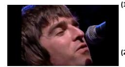
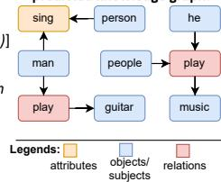
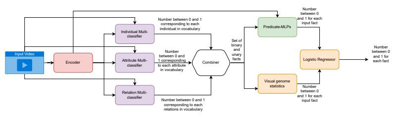
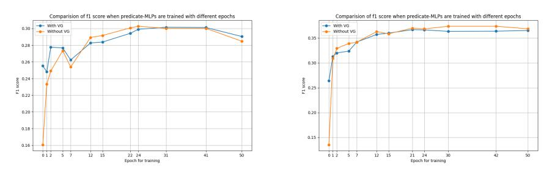
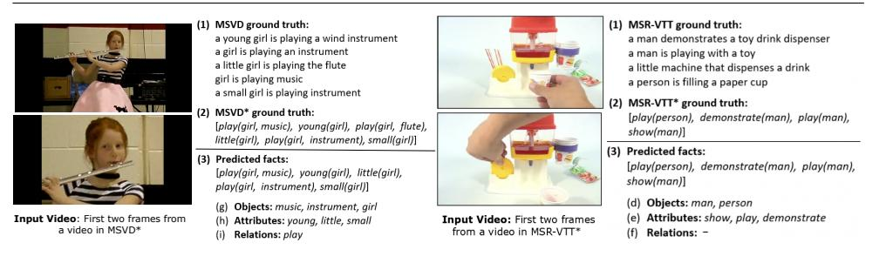
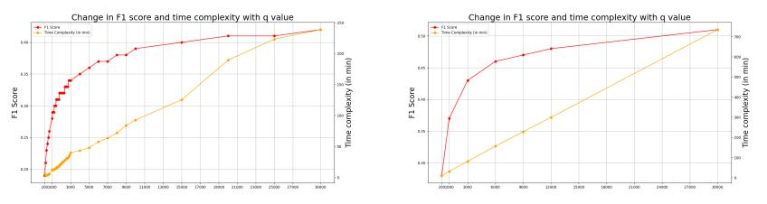

# **Detection-Fusion for Knowledge Graph Extraction from Videos**

Taniya Das1 t.das@tue.nl Louis Mahon1,2 lmahon@ed.ac.uk Thomas Lukasiewicz1,3 thomas.lukasiewicz@tuwien.ac.at

1 University of Oxford, Oxford, UK

- 2 University of Edinburgh, Edinburgh, UK
- 3Vienna University of Technology, Vienna, Austria

#### Abstract

One of the challenging tasks in the field of video understanding is extracting semantic content from video inputs. Most existing systems use language models to describe videos in natural language sentences, but this has several major shortcomings. Such systems can rely too heavily on the language model component and base their output on statistical regularities in natural language text rather than on the visual contents of the video. Additionally, natural language annotations cannot be readily processed by a computer, are difficult to evaluate with performance metrics and cannot be easily translated into a different natural language. In this paper, we propose a method to annotate videos with knowledge graphs, and so avoid these problems. Specifically, we propose a deep-learning-based model for this task that first predicts pairs of individuals and then the relations between them. Additionally, we propose an extension of our model for the inclusion of background knowledge in the construction of knowledge graphs. It may be distributed unchanged freely in print or electronic forms. arXiv:2501.00136v1 [cs.CV] 30 Dec 2024

# 1 Introduction

Visual understanding has been a central question in AI since the inception of the field. However, it is not obvious how to quantify whether a machine can understand what it sees. One simple way is classification, and indeed, much of the computer vision research over the last ten years has centered around ImageNet. Object classification performance is very easy to measure, but it only conveys a coarse description of the image and misses further information about the properties and relations of the present objects. Another approach is to generate a natural language sentence describing the visual contents. This escapes the limitation of classification and is capable of expressing all the complexity that natural language can express.

However, using natural language comes with a number of disadvantages. It means the model not only has to learn to understand the contents of the video but also how to express this content in natural language, which is a significant additional requirement. Even in humans, understanding is quite a separate problem from articulation in language, as evidenced by patients with damage to Broca's area in the brain, which show normal understanding of visual and even linguistic information [2], but struggle to articulate this understanding in

© 2023. The copyright of this document resides with its authors.

language [24]. Additionally, all the extra structure learned by the language generation component can obscure the performance of the understanding component. For example, if an image of a dog running in a park was correctly captioned as "a dog is running in a park", then we cannot conclude that model correctly identified a park and the action of running in the image. Instead, it may have identified the dog, and then the language model simply completed the most likely sentence that begins with "a dog...". Another problem with natural language annotations is that they are difficult to evaluate. The complex syntacticsemantic structure of a sentence means that we cannot simply count which words the model predicted correctly, but instead must use a bespoke metric such as BLEU [19], METEOR [1], or LEPOR [9]. Recognizing the imperfection of each of these, results for natural-language annotation models typically report scores on multiple metrics, none of which have a simple and intuitive interpretation. A third disadvantage of requiring the model to produce a natural language annotation is that it commits it to that particular natural language. A model trained to produce English captions cannot, then, be used to produce Turkish captions. Not only has the model learned a different vocabulary, but a different grammar too, e.g. nominative, SVO, and analytic for English, vs ergative, SOV, and agglutinative for Turkish. Thus, as well as leading to unnecessary extra work, producing annotations in natural language hinders the generalization of the model.

We instead choose to annotate videos using structured annotations in the form of knowledge graphs, which avoids all of the above drawbacks. Knowledge graphs, which are equivalent to sets of logical facts, can be evaluated with accuracy and similar metrics such as F1-score, do not require learning language syntax, and can be translated between natural languages by translating one term at a time (we can avoid word-sense disambiguation by relating to words at the sense-level). The first stage of our proposed model is to separately detect the individuals and predicates that are present in the input video, and then fuse the detected components together into a knowledge graph. Individuals are represented as learnable vectors; predicates, as multi-layer perceptrons (MLPs). We predict a fact as true if the output of the MLP, when input with the vector, is greater than a threshold. Each fact contains a predicate and the corresponding arguments: < *sub ject*, *predicate*,*ob ject* > (for binary facts) and < *sub ject*, *predicate* > (for unary facts).

Our proposed model significantly outperforms existing works at the important task of annotating videos with knowledge graphs. We also explore the inclusion of background knowledge in the construction of the knowledge graphs. To the best of our knowledge, no existing work has explored this.

To summarize our contributions,

- We propose a new deep-learning model to annotate videos with knowledge graphs. This is a superior approach to the more common one of annotating with natural language because it avoids learning unnecessary language syntax, is easier to evaluate, and can be translated easily to different natural languages.
- We show experimentally that our proposed model significantly outperforms existing works that aim to annotate videos with knowledge graphs.
- We explore the inclusion of background knowledge in the extraction of the knowledge graphs, the first work to do so.
- We present extensive ablation studies showing the contribution of each component of our model, and showing a trade-off between increased run-time and increased accuracy by varying number of individuals and predicates evaluated in the second stage.

The rest of this paper is organized as follows: Section [2](#page-2-0) gives an overview of related work, Section [3](#page-2-1) describes our proposed method, Section [4](#page-5-0) presents our experimental evaluation, and Section [5](#page-8-0) summarizes our work.

# 2 Related Work

In 2015, Johnson et al. advocated for the annotation of images using scene graphs, which describe the semantic and spatial properties and relations between objects in the image. Many following works addressed the task of forming structured annotations of still images, and it is now a reasonably well-established task in computer vision [5, 15, 27, 30]. Scene-graph construction can be extended from images to videos. The resulting task, video scene-graph construction, is similar to our task of knowledge graph extraction. Both express the individuals, properties and relations in the input video. The crucial difference is that models which apply scene-graph extraction methods that were designed for images, have to process each frame separately, and then attempt to merge the graphs for each frame into one graph for the entire video. Various complicated methods have been proposed to this end [21, 23, 25]. The method of [14] is slightly different in that it first combines the objects and relations across frames, and then uses these to produce a single set of logical facts. However, it still differs significantly from our work in that we do not use tubes at all but rather have a single classifier for all frames, and then use a single learnable vector for all instances of the same object, which allows sharing of representation power across different videos. [26] propose to generate logical facts as strings, using a language model output head, but this falsely interprets the knowledge graph as ordered.

The most similar existing work to ours is that of [16], which predicts the individuals present in a video, and then runs an MLP for each predicate on each individual and pair of individuals to form a single knowledge graph for the entire video. The key difference in our method is that we also predict the predicates, and then use a novel method of combining the predictions for subject, predicate and object. We also differ in the inclusion of background knowledge, as shown in Section [2,](#page-2-0) though the reason we significantly outperform [16] is mostly the architecture change, rather than the background knowledge.

As well as the general goal of providing a compact, largely language-agnostic description of video contents, some works have employed structured annotations for more specific purposes. [13] generate scene graphs from videos in the context of robot movement. That is, the robot moves around in the environment while taking video that the annotation is made of. [20] uses structured annotations, in particular lambda expressions, which are equivalent to sets of facts from first-order logic. They take a dataset of videos and paired sentences, and then use their generated lambda expression, to train a semantic parser without supervision on the natural language sentence.

# 3 Method

### 3.1 Main Model

Let *X* be the possible set of input videos. Let our vocabulary consist of a set *I* of individuals and a set *P* = *C* ∪ *R* of predicates, where *C* and *R* are, respectively, unary and binary predicates. Our model then consists of

Figure 1: The first frame from MSVD\*, with (1) ground-truth natural language captions in MSVD, (2) the ground-truth set of facts in MSVD\*, (3)the facts predicted by our model, with (a)objects/subjects present, (b)attributes predicted, (c)relations predicted, and (4) visual representation of the knowledge graph produced

- 1. an encoder *f* : *X* → Z, where *Z* is the space of extracted feature vectors,
- 2. three multi-classifiers, *g* : *Z* → (0,1) |*I*| , *h* : *Z* → (0,1) |*C*| and *k* : *Z* → (0,1) |*R*| ,
- 3. A set of predicate multilayer perceptrons (predicate-MLPs), {*mp*|*p* ∈ *P*},
- 4. A set of trainable individual vectors: {*vi* |*i* ∈ *I*}.

First, the input video *x* is encoded using the encoder *f* to produce the video encoding *e*. Then at the detection stage: the encoding is fed to the three multi-classifiers *g*,*h*, *k*, producing a prediction for each individual, each class, and each relation, respectively, being present in *x*; this corresponds to 3(a-c) in Figure [1,](#page-3-0) and to the selection of nodes in the graph. Finally, in the fusion stage: we form a set of candidate unary and binary facts, for the given video, each of which is then evaluated directly by passing the individual vector(s) to the predicate-MLPs and thresholding the output. This corresponds to predicting the edges in the graph.

Our vocabulary consists of 285 individuals, 129 attributes and 150 relations. Hence, there are 258×129 = 33,282 candidate unary facts, and *P* 258 2 ×150 = 9,945,900 candidate binary facts. Because running the MLPs is a computationally expensive step, we avoid running them on all combinations of individuals and predicates. Instead, we select only a subset of all combinations as candidate facts.

Specifically, we note that the probability of a fact *c*(*s*) occurring is upper-bounded by the joint probability of predicate *c* and individual *s* occurring, as it is a necessary condition that both *c* and *s* are in the video. For example, if the video shows a dog running, then the video must contain a dog and depict running. Note that this may not be sufficient, as there could be another object running while the dog is standing still. This observation gives a bound of *P*(*s* ∈ *I* ∩*c* ∈ *C*|*e*), and similarly for binary facts (see supplementary material for the derivation of joint probability). The corresponding facts having the top *q* values of joint probability are selected as the candidate facts and passed to the MLPs. The value of *q* is a hyperparameter that we set to 1000 in the main experiments.

Section [4.5](#page-7-0) reports results for a wide range of values of *q*.

To train the multiclassifier, we use the ground truth sets of individuals and predicates for each video, which are given explicitly in the datasets we use. That is, each multiclassifier is trained as in a standard multi-class, binary classification problem, using binary cross-entropy loss for each class.

To train the predicate MLPs, we make use of the locally closed world assumption [8], to avoid learning to predict everything as true. That is, the predicate MLPs are trained as

Figure 2: Description of our approach for annotating a video input with knowledge graph using background knowledge as explained in Sectio[n3.1](#page-2-2)

in a standard binary classification problem, where the ground truth facts are the positive examples, and the facts that were corrupted using the locally closed-world assumption are the negative examples. These corrupted examples are also present explicitly in the datasets we use. All gradients are backpropagated to the encoder as well.

Inclusion of Background Knowledge We propose a novel extension of our main model to use background/commonsense knowledge. For example, the model should favour predicting *drive*(*man*, *car*) over *drink*(*man*, *car*). Rather than try to explicitly encode intuitive physics that would express the impossibility of a man drinking a car, we instead use the statistics of how often given facts occur "in nature". There should be many occurrences of the *drive*(*man*, *car*) and none of *drink*(*man*, *car*), and this can be used to bias the model towards the former.

Specifically, in addition to the prediction from the main model, we produce another prediction based on statistics from an image dataset Visual Genome [12], which due to its large size and diversity, is here used to model the general prevalence of each fact. We extract the number of occurrences of each fact, of each subject and of each (subject,object) pair. Then, letting *A* be the probability that a given fact is true, we can calculate the expectation of *A*, under the Bayesian posterior given the statistics in *V G* as, E[*A*] = R 1 0 *a P*(*a* = *A*|*D* = *d*) *da*, where *P*(*a* = *A*|*D* = *d*) is the posterior probability of fact *a* given its number of occurrence *d* ∈ *D*, in *V G*. Assuming a uniform prior, we can calculate the posterior as

$$
P(a=A|D=d) = \frac{P(D=d|a=A) \times P(a=A)}{P(D=d)} = \frac{a^d \left(1-a\right)^{N-d}}{\frac{\Gamma(d+1) \times \Gamma(-d+N+1)}{\Gamma(N+2)}},\tag{1}
$$

where *N* is the total number of images and Γ is the gamma function. This gives a final estimate of E[*A*] = *d*+1 *N*+2 (see supplementary material for full derivation).

This estimate is then combined with that of the main model using a logistic regressor. The probabilities received from the logistic regressor are thresholded, to produce a prediction for all true facts. Finally, all the true facts received are combined to produce the knowledge graph for the input video *x*. Concisely, our proposed approach is shown in Figure [2.](#page-4-0)

Implementation Details The encoder *f* consists of a pre-trained VGG19 [22] model followed by a 3-layer gated recurrent unit (GRU) [7]. As a second stream, we use a frozen copy of the I3D network [3]. We use these networks to allow comparison with [16]. Results for other networks are reported in the supplementary material. The output of the encoder is a concatenation of this I3D feature vector and a weighted sum of the first stream, weighted by a learnable n-dimensional vector. The three multi-classifiers and each predicate's corresponding MLP have one hidden layer. The input size of the multi-classifiers is equivalent to the video encoding given by *dim*(*f*(*x*)) = 5120. While for predicate MLPs, the input size is *dim*(*f*(*x*)) + *D*, in case of unary facts and *dim*(*f*(*x*)) + 2*D* in case of binary facts. Here *D* is the size of individual(s) vectors (300 in our case). Weight updates are performed using Adam [11], with learning rate .001, β1 = 0.9, β2 = 0.999. Early stopping is employed during training with patience set to 7. The logistic regressor and predicate MLP thresholds are selected as the values giving the best F1-score on the training set.

# 4 Experimental Results

### 4.1 Datasets

We train and test our model on two automatically generated datasets for video annotation, taken from[16]. The datasets MSVD\* and MSRVTT\* are generated from two wellknown video captioning datasets: MSVD [4] and MSRVTT [28], respectively. Each training example contains captions in the form of a knowledge graph (KG), which is composed of a set of facts. Each fact contains a predicate and the corresponding arguments: < *sub ject*, *predicate*,*ob ject* > (binary facts), and < *sub ject*, *predicate* > (unary facts). All the individuals and predicates are linked to entities in an ontology, WordNet [17].

### 4.2 Main Results

The F1-score, positive, negative, and total accuracy scores generated using our model [3.1](#page-2-2) for MSVD\* and MSRVTT\* datasets are given in Table [1.](#page-5-1) The results are also compared with two existing works - (1) [16] referred to as "LG 2020" here, and (2) [26] referred to as "VL 2018". To the best of our knowledge, these two are the only existing works that have attempted the task of video annotation using KG and so are used to benchmark the performance of our system.

As we can see, our system significantly outperforms both the models in F1-score, positive and total accuracy. Importantly, it gives superior positive accuracy, the most difficult metric to score highly on. The artificially constructed dataset we are using contains a higher percentage of negative facts than positive ones (refer[16] for more information). This means that even if the model predicts everything as false, the negative accuracy would be very high. This issue has also been highlighted in [16], where the reported model was predicting most of the facts as negative. However, our system is not doing this and so the positive accuracy, as well as the F1 score, is far better.

Interestingly, our results for MSRVTT\* are significantly better than those for the MSVD\*, even though, by most video captioning models in the literature, MSRVTT is considered a harder dataset [6, 18, 29, 31, 32].

Table 1: F1, and positive/negative/total accuracy on MSVD\* and the MSRVTT\* datasets. The scores are average from 5 independent runs (±standard deviation). The best results are in bold.

|         |              |              | MSVD*        |              | MSRVTT*      |              |              |              |
|---------|--------------|--------------|--------------|--------------|--------------|--------------|--------------|--------------|
|         | F1-score     | Positive     | Negative     | Total        |              | Positive     | Negative     | Total        |
|         |              | Accuracy (%) | Accuracy (%) | Accuracy     | F1-score     | Accuracy (%) | Accuracy (%) | Accuracy     |
| Ours    | 27.13(±1.42) | 27.50(±0.75) | 89.99(±0.73) | 79.90(±1.17) | 36.66(±0.52) | 36.36(±0.58) | 91.84(±0.11) | 82.55(±0.08) |
| LG 2020 | 13.99        | 12.65        | 99.20        | 22.16        | 11.83        | 6.76         | 99.96        | 83.01        |
| VL 2018 | 6.11         | 3.36         | -            | -            | -            | -            | -            | -            |

Table 2: Comparison between the main model and the extended model. The scores are average from 5 independent runs (±standard deviation). The best results are in bold.

Figure 3: F1-score vs the number of training epochs for the predicate-MLP, for the main model (left) and extended model (right).

### 4.3 Inclusion of Background Knowledge

As shown in Table [2,](#page-6-0) the inclusion of background knowledge produces a slightly better F1 score on MSVD\* dataset, and positive accuracy on the MSRVTT\* dataset. The reason we do not see a greater improvement may be because of the low overlap of components between our dataset and Visual Genome (see supplementary material for further details).

To further understand how Visual Genome predictions are being used in an extended model, we examine the behaviour when the part of the model, the predicate MLPs component, is undertrained. Figure [3](#page-6-1) shows F1-score when training of the predicate MLPs was stopped early. The x-axis shows the number of epochs the predicate MLPs were trained for. AT *x* = 0, i.e. when the predicate-MLPs are untrained, the F1-score is far better when using the extended model. This signifies that when the network did not have any information about the dataset, *V G* statistics representing general world knowledge helped the predictions the most. As we increase the number of epochs, the network learns more about the particular dataset, and the F1-score in both scenarios becomes close to each other, with the extended model ultimately giving a comparable result on the fully trained network.

### 4.4 Qualitative Results

To further evaluate the quality of the KGs produced for the video by our proposed model, manual inspection of videos and predicted facts is carried out. Figure [4](#page-7-1) shows the first two frames from a video with the facts predicted by the model for MSVD\* (left) and MSRVTT\* (right). These qualitative examples show the limitations imposed by the smaller vocabulary size in MSVD\*. The individuals, attributes and relations which appear fewer than 50 times are excluded from the dataset (see supplementary for further information on the dataset). In the video in the left figure in Figure [4,](#page-7-1) the girl is playing the flute, which is also expressed in one of the MSVD captions. However, *f lute* appears less than 50 times and so is not in the model's vocabulary and it cannot predict *play*(*girl*, *f lute*). The model is, however, correctly able to identify it as an *instrument*, and also to correctly identify other attributes, relations, and individuals present in the video.

Figure 4: Left: the first two frames from a video in MSVD\*, with (1) ground-truth natural language captions in MSVD, (2) the ground-truth set of facts in MSVD\*, (3) the facts predicted by the proposed model. Right: the first two frames from MSRVTT\*, with (1) ground-truth natural language captions in MSRVTT, (2) the ground-truth set of facts in MSRVTT\*, (3)the facts predicted by the proposed model. Left: MSVD\*, right: MSRVTT\*.

The right of Figure [4](#page-7-1) shows the model correctly predicting all the facts for the video. However, it shows another limitation, which was beyond the scope of this work. In the synthetically generated dataset, the ground truth annotation does not express some facts about the video such as objects *paper*\_*cup*, *toy*, etc. They are excluded from the ground truth, so the model is not trained on them and may not predict them. This emphasizes the need for a manually generated structured video annotation dataset to avoid such cases.

### 4.5 Ablation Studies

Ablation on combining framework As discussed in Section [3.1,](#page-2-2) we produce candidate facts by combining the outputs from the individual-, attribute-, and relation-multi-classifiers. These candidate facts are later used to classify them as true or false to the given video and are an essential step in filtering irrelevant facts. To investigate the contribution of the combining procedure, we perform an ablation study on this network component.

The results for MSVD\* and MSRVTT\* are shown in Table [3.](#page-7-2) In the "without combiner" setting, the combining framework is replaced by a simple threshold method, where the output of each multi-classifier is thresholded, and all permutations of the received individuals and predicates are used to build candidate facts. The other components of the network are kept the same.

The results in this setting are significantly worse than the main model, where the proposed combining framework is used. This is because many irrelevant facts are fed into the predicate-MLPs. This shows the effectiveness of the combining technique proposed in Section [3.1.](#page-2-2)

Table 3: Ablation results on the combining technique given in Section [3.1.](#page-2-2) The combining method here is replaced by a simple thresholding method. Best results in bold.

|                  |          |              | MSVD*        |              | MSRVTT*  |              |              |              |
|------------------|----------|--------------|--------------|--------------|----------|--------------|--------------|--------------|
|                  |          | Positive     | Negative     | Total        |          | Positive     | Negative     | Total        |
|                  | F1-score | Accuracy (%) | Accuracy (%) | Accuracy (%) | F1-score | Accuracy (%) | Accuracy (%) | Accuracy (%) |
| Main Model       | 27.13    | 27.50        | 89.99        | 79.90        | 36.66    | 36.36        | 91.84        | 82.55        |
| Without Combiner | 10.6     | 7.75         | 98.96        | 83.65        | 13.6     | 9.01         | 99.66        | 84.47        |

Figure 5: Plots for changes in F1 and time-taken (in min) with changes in the number of candidate facts evaluated. Left: MSVD\* dataset, right: MSRVTT\* dataset.

Effect of the number of candidate facts As we discussed in Section [3.1,](#page-2-2) after the detection stage, we choose the *q* highest joint probability facts as candidate facts to pass to the fusion stage. The value of *q* is a chosen hyperparameter and could be set to anything in the range 0 < *q* ≤ 33282 (as |*I*| 2 |*R*| = 33282). Smaller values of *q* would mean the number of candidate facts fed to predicate-MLPs is small, resulting in a smaller inference time, but the *F*1 score will be inferior. This is because many of the candidates could be false, as the dataset consists of more negative facts than positive facts. Feeding a bigger pool of facts to the predicate-MLPs increases the chances of receiving true facts but also increases inference time.

Here we perform experiments with different values of *q* to study the effect of changing the value of *q* on the overall performance of the main model. Figure [5](#page-8-1) shows the performance (F1-score) as well as the time taken by the model to produce output, as *q* is varied from 200 ≤ *q* ≤ 30000. The 'red curve' plots the F1-score on the y-axis with the corresponding *q* value on the x-axis. The 'yellow line' on the plot shows the time taken for the inference (min) on the second y-axis, corresponding to the *q* value on the x-axis and the F1-score on the first y-axis.

Interestingly, we can see that the F1-score continuously grows, with an almost exponential increase for the first few epochs, while for higher epochs, the growth rate slows down, with a nearly linear increase in time taken for inference, with an increase in value of *q*. As expected, the F1-score grows fast initially, with decreasing growth rate with every increase in *q*. This implies that with better computational resources, our model will be able to achieve ever better performance by using a higher value of *q*.

# 5 Conclusion

This paper proposed a new deep-learning model for the task of KG extraction from videos. The KG here is composed of a set of facts that describes the relations held between individuals. We also explore the inclusion of background knowledge in the construction of KG. Further, we evaluate both our main and extended models, both qualitatively and qualitatively, and present extensive investigative and ablation studies showing the contribution of various components of our model. Our model significantly outperforms existing models and has much better generalization capability.

Future works include exploring the use of other datasets for injecting commonsense which is more exhaustive and comprehensive. It is also interesting to explore KG extraction from other input domains. Such as application to text, where the model could perform a task similar to open information extraction. Another extension could be to manually construct a dataset designed for video annotation using KG, rather than relying on automatically generated datasets.

# References

- [1] Satanjeev Banerjee and Alon Lavie. METEOR: An automatic metric for MT evaluation with improved correlation with human judgments. In *Proc. of the ACL Workshop on Intrinsic and Extrinsic Evaluation Measures for Machine Translation and/or Summarization*, pages 65–72, 2005.
- [2] Rita Sloan Berndt and Alfonso Caramazza. A redefinition of the syndrome of broca's aphasia: Implications for a neuropsychological model of language. *Applied psycholinguistics*, 1(3):225–278, 1980.
- [3] Joao Carreira and Andrew Zisserman. Quo vadis, action recognition? a new model and the kinetics dataset. In *Proceedings of the IEEE Conference on Computer Vision and Pattern Recognition (CVPR)*, 07 2017.
- [4] David Chen and William B Dolan. Collecting highly parallel data for paraphrase evaluation. In *Proceedings of the 49th annual meeting of the association for computational linguistics: human language technologies*, pages 190–200, 2011.
- [5] Tianshui Chen, Weihao Yu, Riquan Chen, and Liang Lin. Knowledge-embedded routing network for scene graph generation. In *Proceedings of the IEEE/CVF Conference on Computer Vision and Pattern Recognition*, pages 6163–6171, 2019.
- [6] Yangyu Chen, Shuhui Wang, Weigang Zhang, and Qingming Huang. Less is more: Picking informative frames for video captioning. In *Proceedings of the European conference on computer vision (ECCV)*, pages 358–373, 2018.
- [7] Kyunghyun Cho, Bart Van Merriënboer, Caglar Gulcehre, Dzmitry Bahdanau, Fethi Bougares, Holger Schwenk, and Yoshua Bengio. Learning phrase representations using rnn encoder-decoder for statistical machine translation. *arXiv preprint arXiv:1406.1078*, 2014.
- [8] Xin Dong, Evgeniy Gabrilovich, Geremy Heitz, Wilko Horn, Ni Lao, Kevin Murphy, Thomas Strohmann, Shaohua Sun, and Wei Zhang. Knowledge Vault: A web-scale approach to probabilistic knowledge fusion. In *Proc. ACM SIGKDD*, pages 601–610, 2014.
- [9] Aaron LF Han, Derek F Wong, and Lidia S Chao. LEPOR: A robust evaluation metric for machine translation with augmented factors. In *Proc. COLING, Posters*, pages 441–450, 2012.
- [10] Justin Johnson, Ranjay Krishna, Michael Stark, Li-Jia Li, David Shamma, Michael Bernstein, and Li Fei-Fei. Image retrieval using scene graphs. In *Proceedings of the IEEE conference on computer vision and pattern recognition*, pages 3668–3678, 2015.
- [11] Diederik P Kingma and Jimmy Ba. Adam: A method for stochastic optimization. *arXiv preprint arXiv:1412.6980*, 2014.

- [12] Ranjay Krishna, Yuke Zhu, Oliver Groth, Justin Johnson, Kenji Hata, Joshua Kravitz, Stephanie Chen, Yannis Kalantidis, Li-Jia Li, David A Shamma, et al. Visual genome: Connecting language and vision using crowdsourced dense image annotations. *International journal of computer vision*, 123(1):32–73, 2017.
- [13] Xinghang Li, Di Guo, Huaping Liu, and Fuchun Sun. Embodied semantic scene graph generation. In *Conference on Robot Learning*, pages 1585–1594. PMLR, 2022.
- [14] Chenchen Liu, Yang Jin, Kehan Xu, Guoqiang Gong, and Yadong Mu. Beyond shortterm snippet: Video relation detection with spatio-temporal global context. In *Proceedings of the IEEE/CVF conference on computer vision and pattern recognition*, pages 10840–10849, 2020.
- [15] Cewu Lu, Ranjay Krishna, Michael Bernstein, and Li Fei-Fei. Visual relationship detection with language priors. In *European conference on computer vision*, pages 852–869. Springer, 2016.
- [16] Louis Mahon, Eleonora Giunchiglia, Bowen Li, and Thomas Lukasiewicz. Knowledge graph extraction from videos. In *2020 19th IEEE International Conference on Machine Learning and Applications (ICMLA)*, pages 25–32. IEEE, 2020.
- [17] George A Miller. Wordnet: a lexical database for english. *Communications of the ACM*, 38(11):39–41, 1995.
- [18] Silvio Olivastri, Gurkirt Singh, and Fabio Cuzzolin. End-to-end video captioning. In *Proceedings of the IEEE/CVF International Conference on Computer Vision Workshops*, pages 1–9, 2019.
- [19] Kishore Papineni, Salim Roukos, Todd Ward, and Wei-Jing Zhu. BLEU: A method for automatic evaluation of machine translation. In *Proc. ACL*, pages 311–318, 2002.
- [20] Candace Ross, Andrei Barbu, Yevgeni Berzak, Battushig Myanganbayar, and Boris Katz. Grounding language acquisition by training semantic parsers using captioned videos. In *Proceedings of the 2018 Conference on Empirical Methods in Natural Language Processing*, pages 2647–2656, 2018.
- [21] Xindi Shang, Tongwei Ren, Jingfan Guo, Hanwang Zhang, and Tat-Seng Chua. Video visual relation detection. In *Proceedings of the 25th ACM international conference on Multimedia*, pages 1300–1308, 2017.
- [22] Karen Simonyan and Andrew Zisserman. Very deep convolutional networks for largescale image recognition. *arXiv preprint arXiv:1409.1556*, 2014.
- [23] Yao Teng, Limin Wang, Zhifeng Li, and Gangshan Wu. Target adaptive context aggregation for video scene graph generation. In *Proceedings of the IEEE/CVF International Conference on Computer Vision*, pages 13688–13697, 2021.
- [24] Cynthia K Thompson and Roelien Bastiaanse. Introduction to agrammatism. In *Perspectives on agrammatism*, pages 15–30. Psychology Press, 2012.

- [25] Yao-Hung Hubert Tsai, Santosh Divvala, Louis-Philippe Morency, Ruslan Salakhutdinov, and Ali Farhadi. Video relationship reasoning using gated spatio-temporal energy graph. In *Proceedings of the IEEE/CVF Conference on Computer Vision and Pattern Recognition*, pages 10424–10433, 2019.
- [26] D. Vasile and T. Lukasiewicz. Learning structured video descriptions: Automated video knowledge extraction for video understanding tasks. In *On the Move to Meaningful Internet Systems. OTM 2018 Conferences*, pages 315–332, 2018.
- [27] Danfei Xu, Yuke Zhu, Christopher B Choy, and Li Fei-Fei. Scene graph generation by iterative message passing. In *Proceedings of the IEEE conference on computer vision and pattern recognition*, pages 5410–5419, 2017.
- [28] Jun Xu, Tao Mei, Ting Yao, and Yong Rui. Msr-vtt: A large video description dataset for bridging video and language. In *Proceedings of the IEEE conference on computer vision and pattern recognition*, pages 5288–5296, 2016.
- [29] Jun Xu, Ting Yao, Yongdong Zhang, and Tao Mei. Learning multimodal attention lstm networks for video captioning. In *Proceedings of the 25th ACM international conference on Multimedia*, pages 537–545, 2017.
- [30] Jianwei Yang, Jiasen Lu, Stefan Lee, Dhruv Batra, and Devi Parikh. Graph r-cnn for scene graph generation. In *Proceedings of the European conference on computer vision (ECCV)*, pages 670–685, 2018.
- [31] Wei Zhang, Bairui Wang, Lin Ma, and Wei Liu. Reconstruct and represent video contents for captioning via reinforcement learning. *IEEE transactions on pattern analysis and machine intelligence*, 42(12):3088–3101, 2019.
- [32] Xishan Zhang, Ke Gao, Yongdong Zhang, Dongming Zhang, Jintao Li, and Qi Tian. Task-driven dynamic fusion: Reducing ambiguity in video description. In *Proceedings of the IEEE Conference on Computer Vision and Pattern Recognition*, pages 3713– 3721, 2017.