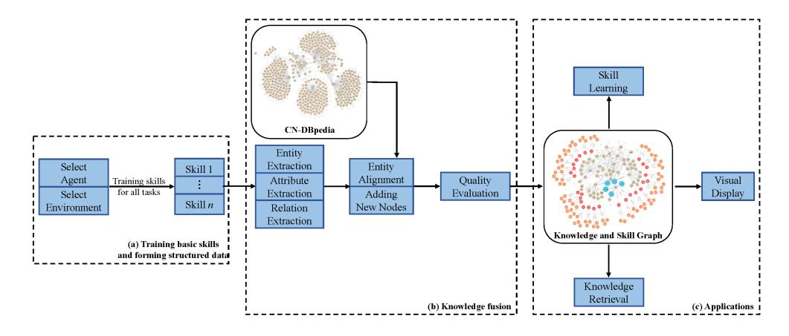
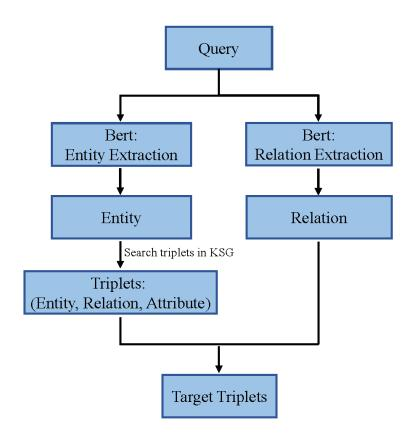
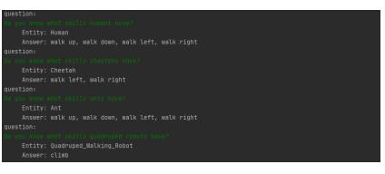
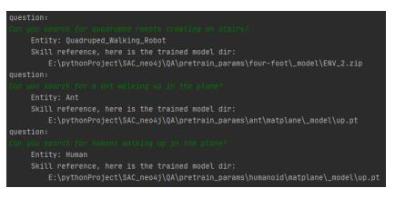
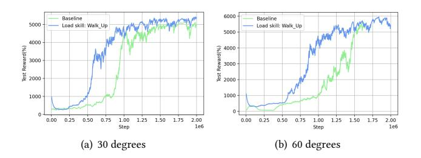

# KSG: Knowledge and Skill Graph

Feng Zhao Westlake University Hangzhou, Zhejiang, China zhaofeng@westlake.edu.cn

Ziqi Zhang Westlake University Hangzhou, Zhejiang, China zhangzq20@mails.tsinghua.edu.cn

Donglin Wang∗ Westlake University Westlake Institute for Advanced Study Hangzhou, Zhejiang, China wangdonglin@westlake.edu.cn

# ABSTRACT

The knowledge graph (KG) is an essential form of knowledge representation that has grown in prominence in recent years. Because it concentrates on nominal entities and their relationships, traditional knowledge graphs are static and encyclopedic in nature. On this basis, event knowledge graph (Event KG) models the temporal and spatial dynamics by text processing to facilitate downstream applications, such as question-answering, recommendation and intelligent search. Existing KG research, on the other hand, mostly focuses on text processing and static facts, ignoring the vast quantity of dynamic behavioral information included in photos, movies, and pre-trained neural networks. In addition, no effort has been done to include behavioral intelligence information into the knowledge graph for deep reinforcement learning (DRL) and robot learning. In this paper, we propose a novel dynamic knowledge and skill graph (KSG), and then we develop a basic and specific KSG based on CN-DBpedia. The nodes are divided into entity and attribute nodes, with entity nodes containing the agent, environment, and skill (DRL policy or policy representation), and attribute nodes containing the entity description, pre-train network, and offline dataset. KSG can search for different agents' skills in various environments and provide transferable information for acquiring new skills. This is the first study that we are aware of that looks into dynamic KSG for skill retrieval and learning. Extensive experimental results on new skill learning show that KSG boosts new skill learning efficiency.

## CCS CONCEPTS

• Information systems → Information retrieval diversity.

### KEYWORDS

Knowledge and Skill Graph, Skill Retrieval, Knowledge Graph

#### ACM Reference Format:

Feng Zhao, Ziqi Zhang, and Donglin Wang. 2022. KSG: Knowledge and Skill Graph. In Proceedings of the 31st ACM International Conference on Information and Knowledge Management (CIKM '22), October 17–21, 2022,

CIKM '22, October 17–21, 2022, Atlanta, GA, USA

© 2022 Association for Computing Machinery.

ACM ISBN 978-1-4503-9236-5/22/10. . . \$15.00 <https://doi.org/10.1145/3511808.3557623>

Atlanta, GA, USA. ACM, New York, NY, USA, [5](#page-4-0) pages. [https://doi.org/10.](https://doi.org/10.1145/3511808.3557623) [1145/3511808.3557623](https://doi.org/10.1145/3511808.3557623)

### 1 INTRODUCTION

Knowledge Graph (KG), first announced by Google in 2012, is a popular and efficient model for knowledge representation that has attracted the interest of researchers in related fields [\[2,](#page-4-1) [27,](#page-4-2) [31\]](#page-4-3). A knowledge graph is a knowledge base of information about entities (e.g., people and organizations) that represent the many entities and their relationships in a domain using a collection of subjectpredicate-object triplets. Each triplet is also referred to as a fact. Nodes represent entities, while edges reflect relationships between things in a knowledge graph [\[1,](#page-4-4) [14,](#page-4-5) [16,](#page-4-6) [17,](#page-4-7) [23,](#page-4-8) [25,](#page-4-9) [35\]](#page-4-10). Nowadays, along with the continuous development of intelligent information service applications, the knowledge graph has been widely applied to many fields, such as question-answering, recommendation, text generation and so on [\[13,](#page-4-11) [15,](#page-4-12) [22,](#page-4-13) [40](#page-4-14)[–42\]](#page-4-15).

However, there is a wealth of event information available in the world, such as the most recent news stories, which conveys dynamic and procedural knowledge. As a result, event-centric knowledge representation forms such as Event KG (EKG) have been a popular research topic [\[6,](#page-4-16) [7,](#page-4-17) [26,](#page-4-18) [32,](#page-4-19) [36\]](#page-4-20). To address the needs of rapid retrieval and concise representation of event-related information, EKG can filter and structure information about events reported in texts [\[10,](#page-4-21) [18,](#page-4-22) [37–](#page-4-23)[39\]](#page-4-24). Meanwhile, in order to capture dynamic information of events, EKG considers action, participant, time, and location to extract event-event relations including temporal and causal relations [\[9,](#page-4-25) [11,](#page-4-26) [24\]](#page-4-27). However, existing methods on KG or EKG usually focus on text processing and disregard dynamic behavior information, making it impossible to search for and understand the behavior or skills of humans and agents [\[19](#page-4-28)[–21,](#page-4-29) [28,](#page-4-30) [29\]](#page-4-31).

In this paper, we present a novel concept of Knowledge and Skill Graph (KSG) to address above problems. Based on CN-DBpedia [\[34\]](#page-4-32), we add additional nodes and relations between nodes to the knowledge graph. KSG has two types of nodes, entities and attributes, as well as two types of directed edges, which indicate entity-entity and entity-attribute relationships. Specifically, entity nodes include fact nodes (such as person, etc.), environment nodes, and skill nodes. Entity description, skill display, pre-train network, and offline dataset are examples of attribute nodes. KSG retains initial information retrieval and question-and-answer functionalities. Meanwhile, KSG can search for and display the skills of different agents in various environments, as well as give transferable knowledge for learning new skills. If we want to train a new skill, we can search for learned skills in KSG related to the new skill as a pre-training networks and use them to train the new skill. Our experiments demonstrate that KSG can achieve effective skill searching and learning. The main contributions of this paper can be summarized as follows:

∗Corresponding author.

Acknowledgments: This work was supported by the National Science and Technology Innovation 2030 - Major Project (Grant No. 2022ZD0208800), and NSFC General Program (Grant No. 62176215).

Permission to make digital or hard copies of all or part of this work for personal or classroom use is granted without fee provided that copies are not made or distributed for profit or commercial advantage and that copies bear this notice and the full citation on the first page. Copyrights for components of this work owned by others than ACM must be honored. Abstracting with credit is permitted. To copy otherwise, or republish, to post on servers or to redistribute to lists, requires prior specific permission and/or a fee. Request permissions from permissions@acm.org.

<!-- Image Description: This image displays a flowchart depicting a three-stage process. Stage (a) shows training basic skills and structuring data. Stage (b) illustrates knowledge fusion, using CN-DBpedia, involving entity and attribute extraction, alignment, adding new nodes, and quality evaluation. Finally, stage (c) depicts applications of the resulting knowledge and skill graph, including skill learning, knowledge retrieval, and visual display. The diagram uses boxes to represent processes and a graph to visualize the knowledge and skill structure. -->

Figure 1: The architecture of knowledge and skill graph. We first train basic skills and form structured data in (a). Then, we extract dynamic behavioral information from basic skills and construct a preliminary but specific KSG based on CN-DBpedia in (b). Finally, we apply KSG to achieve knowledge retrieval, visual display and skill learning in (c).

- In order to extend KG to deal with dynamic behaviors, we propose a novel concept of KSG to simultaneously process static and dynamic knowledge.
- We propose and visualize a preliminary and specific KSG. To the best of our knowledge, our work is the first to implement skill retrieval and skill reuse by introducing behavioral intelligence into KG.
- Extensive experiments demonstrate the effectiveness of KSG in a variety of tasks, such as QA, knowledge retrieval and skill learning.

#### 2 KNOWLEDGE AND SKILL GRAPH (KSG)

Our aim is to establish a knowledge and skill graph (KSG) that not only retains the original static facts of the knowledge graph but also deals with dynamic behavior information. As a result, KSG can be utilized for both text-based Q&A systems, retrieval and recommendation, and skill retrieval, as well as providing transferable knowledge for learning new skills. In this paper, we emphasize the last functionality. As shown in Figure 1, knowledge and skill graph is constructed based on CN-DBpedia and the construct process is divided into three parts: a) Training Skills for Data Preparation; b) knowledge Fusion; c) Applications. We first introduce the methods and process of training basic skills and the storage of skills. Then, we elaborate on the details of knowledge fusion. Finally, we explain the main applications and the details are described in section 3.

#### 1 Training Skills for Data Preparation

In the processing of constructing KSG, we firstly train a great deal of basic skills of different agents in different environments. In this paper, the agent Humanoid, Ant and Half Cheetah are from Mujoco [\[30\]](#page-4-33). Environment plane is smooth ground and obstacle represents an obstructed ground. Then, we design different tasks according to the direction of walk. Finally, we consider the 18-DoF quadruped robot. For simulative quadruped robot, we design three environments: plane, stair, and irregular plane, and only consider the walk task. Specifically, we also store the walk skill of real quadruped robot in the environment plane. In this paper, we use SAC [\[12\]](#page-4-34) to train

basic skills. By choosing different tasks, agents and environments, we have trained 23 different skills. For each skill, we store such trained network and offline data as knowledge which will be used to construct KSG.

#### 2 Knowledge Fusion

In this paper, our preliminary KSG is based on the CN-DBpedia dataset. During the process of the KSG construction, we use neo4j and py2neo to import the triple relationship of CN-DBpedia. Among them, Neo4j is a powerful graph database tool that can search specific nodes with O(1) time complexity, and Py2neo is a python package that allows us to manipulate the neo4j database in a python environment. Once we have imported the CN-Dbpedia database, we can directly build the KSG based on it by adding a variety of skills, environments and agents. Different from traditional KG, we innovatively introduce dynamic behavior information into KG and add new nodes where added entity nodes consist of agents, environments and skills, as well as attribute nodes include entity description, skill display, pre-trained network and offline dataset.

To obtain new nodes about skills, we first need knowledge extraction from trained basic skills. In this paper, the knowledge extraction is divided into three types: entity extraction, attribute extraction and relation extraction. For entity extraction, we use named-entity recognition (NER) to classify entity into pre-defined categories such as human, plane, walk up, walk right and so on. In this part, we extract new entity nodes including agent, environment and skill. After entity extraction, the attribute extraction is to define the attribute or description of entity. For relation extraction, we use rule-based and dictionary-based methods to extract the relationships among the entities and attributes. Relation extraction is to find the relations between entity-entity and entity-attribute. For example, "huanmoid" is one of the most popular agents which have been broadly used in various Reinforcement learning researches, and has many human's features, so we use NER to find entity node "human" in CN-Dbpedia, and then add some pre-defined skill entity nodes (such as "Walk\_Up"), environment entity nodes ("Plane", "Obstacle") to it.

<!-- Image Description: This flowchart illustrates a knowledge graph-based question answering system. A query is processed using BERT for entity and relation extraction. Extracted entities and relations are used to search for triplets (Entity, Relation, Attribute) within a knowledge graph (KSG). The resulting "Target Triplets" represent the answer to the query. -->

Figure 2: Process of KSGQA

#### 3 Applications

Except for the construction of KSG, we also build the KSG Question-Answer system (KSGQA) based on the KSG to facilitate the use of prior knowledge (in this paper, prior knowledge means the trained models as well as identity representations). This system can interpret and encode the specified queries in order to acquire target triplets. As shown in Figure 2, our KSGQA utilizes fine-tuned Bert [\[8\]](#page-4-35) to encode query. In this way, we can identify entity and relations between entities from the query. According to the entity, we can first obtain the corresponding triplets including entity, relation and attribute from KSG, and then we use the relation to determine the target triplets. For example, when inputting a query "Do you know what skill humans have?", we can use Bert to extract entity "human" and "skill". Meanwhile, the relation "have" is used to obtain target triplets such as "{'human', 'have', 'walk\_left'}", "{'human', 'have', 'walk\_right'}" and so on. Based on the KSGQA, we can realize some functionalities such as knowledge retrieval, visual display and skill learning.

For knowledge retrieval, we can retrieve those skills that an agent has learned and those data to be called. After we obtain a list of the agent's skills, we can display those skills as well. For example, when we input "Do you have know what skills {agent\_name} have?" and obtain a list of the agent's skills, we can input query "Can you show {agent\_name} {skill\_name} in the {environment\_name}?" to load the video and show such skill. In addition, we store corresponding trained model into KSG so that we just have to query this KSGQA system to load the trained model. For example, when we input "Can you search {agent\_name} {skill\_name} in the {environment\_name}?", we can get the trained model and offline data of the agent. Thus, if we need a new skill that is not available in KSG, the trained model and offline data can be regarded as pre-trained model and training data to learn new skill [\[3–](#page-4-36)[5,](#page-4-37) [33\]](#page-4-38). In this paper, we define two selection strategies for pre-training models based on environmental differences and task differences. When performing the same task in different environments, we choose the skill model with the highest similarity as the pre-training model according to the environment similarity which is determined by calculating the Euclidean distance between the sampled states in different environments. When

KSG: Knowledge and Skill Graph CIKM '22, October 17–21, 2022, Atlanta, GA, USA

performing different tasks in the same environment, we select the pre-training model according to the task similarity.

# 3 EXPERIMENTS AND APPLICATIONS OF KSG

We aim to establish a KSG which can be used to search skills and provide transferable knowledge for learning new skills. In this section, we first show KSG's Q&A system and skill retrieval capabilities. Then, we use KSG to retrieve and provide related skill model and offline data for learning new skills.

# 1 Knowledge retrieval and display

In this paper, we construct a preliminary and specific KSG based on CN-DBpedia. Compared with traditional knowledge graph, KSG focuses on behavioral intelligence. We retain the original functions of the knowledge graph, meanwhile introducing new dynamic knowledge and skills into it. Therefore, we also design a corresponding knowledge and skill graph question answer system. The important functions of KSGQA are knowledge retrieval and display. As shown in Figure 3, we show the basic functions of knowledge retrieval. We can see that KSG can be used to retrieval existing skills as shown in Figure 3 (a), and then when we need the networks and offline data of these skills, we can call and download them from KSG in Figure 3 (b). In addition, KSG can display the stored skills. For example, when we input "Can you show ant walking down in the plane?", the KSGQA will load the video and show how the ant walks toward the down. Moreover, if we need a new skill which is not existing in KSG, KSG is able to quickly select most related base skills as pre-trained models to help learn new skills.

<!-- Image Description: The image displays a code snippet showing a question-answering system's responses. Each question asks about the movement abilities ("skills") of different entities (human, cheetah, ant, quadruped robot). The answers list the respective movement capabilities, indicating a system capable of associating entities with their actions. The robot's unique capability ("climb") demonstrates the system's ability to handle diverse entity types and actions. -->

(a) Skill retrieval

<!-- Image Description: The image displays code snippets showing queries and corresponding responses from a system. Each query requests video retrieval based on an action (e.g., "quadruped robots crawling"). The response provides the identified entity and the directory path to a pre-trained model used for retrieval. The purpose is to illustrate the system's ability to locate relevant video data using natural language queries. -->

(b) Pre-trained model retrieval

Figure 3: KSGQA for knowledge retrieval.

# 2 Skill Storage and New Skill Learning

In this paper, we consider agents from Mujoco and real quadruped robot as shown in Figure 4. Each agent has different skills in different environments. We add skill nodes and corresponding attribute nodes to store these skills in KSG, where the stored knowledge includes pre-trained model, video and offline data.

CIKM '22, October 17–21, 2022, Atlanta, GA, USA Feng Zhao, Ziqi Zhang, and Donglin Wang

<!-- Image Description: The image displays four 3D renderings of different robots on a checkered plane. (a) shows a humanoid robot, (b) an ant-like robot, (c) a half-cheetah robot, and (d) a quadruped robot. The renderings likely illustrate the diverse robot morphologies used in a locomotion study within the paper, showcasing the variety of body plans tested or compared. -->

Figure 4: All agents being considered in our specific KSG.

<!-- Image Description: The image presents three 3D renderings illustrating different terrain types for a robotic agent, likely in a locomotion study. (a) shows a flat plane with a checkered pattern. (b) depicts the same plane but with randomly scattered obstacles. (c) displays the agent navigating a simulated staircase. The purpose is to visually showcase the varied environments used to test the robot's navigation capabilities. -->

Figure 5: All three environments in our preliminary but specific KSG including plane, obstacle and stair.

In order to enrich our KSG, we design different environments to complete each task. A part of these environments are shown in Figure 5, including Plane, obstacle, and stair. By performing different tasks in different environments, we can acquire different skills for each agent. These stored skills are transferable knowledge that can be used to learn new skills. In this part, we use KSG to help agent learn new skills in different environment. Actually, the transferable knowledge includes pre-trained neural network and offline dataset. Therefore, we can directly use one of the most relevant models as a pre-training model for new skills, or we can use multiple related skills to combine and learn a new skill.

<!-- Image Description: The image contains two line graphs illustrating the test reward (%) over training steps. (a) shows a quadruped robot's performance across plane, irregular, and stair terrains. (b) compares a baseline irregular terrain performance against a model trained on a plane terrain then tested on irregular terrain; demonstrating transfer learning. Both graphs analyze the success of reinforcement learning algorithms in different locomotion scenarios. -->

Figure 6: Test reward of Quadruped Robot and learn new skills in new environment using pre-trained model.

In this paper, we can load stored skill model from KSG as pretrain model to learn new skill. In Figure 6 (a), we show the stored skill model's test reward of real Quadruped Robot. If we now need to acquire the skills of walk for quadruped robot in environment irregular, we can select the most relevant skills from KSG as a pretraining model. This problem belongs to performing the same task in different environments. We first calculate the similarity of environment between irregular, plane and stair. In the above question, we select the skills with the highest similarity by calculating task similarity (Walk in environment plane) as the pre-training model to learn new skill walk in environment irregular. As show in Figure 6 (b), we can see that loading related pre-training models can improve training efficiency and reduce nearly half of the training time compared with direct training from scratch.

<!-- Image Description: The image contains two line graphs comparing "Baseline" and "Load skill: Walk_Up" performance. Each graph plots "Test Reward (%)" against "Step," showing reward progress over training iterations. (a) displays results at a 30-degree incline, (b) at 60 degrees. The graphs likely illustrate the effectiveness of a learned "Walk_Up" skill compared to a baseline, demonstrating improved reward at different inclines. -->

Figure 7: Obliquely upward walk at a different Angle from the horizontal direction

On the other hand, if we need a new skill which is performing different tasks in the same environment, we can select the pretraining model according to the task similarity. When we need two skills that are obliquely upward walk at a different angle from the horizontal direction (30 degrees, 60 degrees), we can automatically select skill walk right and walk up as pre-training models according to the task similarity. As shown in figure 7, we can observe that loading pre-training skills according to task similarity can also improve the learning efficiency of new skills.

## 4 CONCLUSION AND FUTURE WORK

In this paper, we propose a novel concept of KSG to simultaneously process static and dynamic knowledge. KSG introduces dynamic behavioral information to KG, which can also implement skill retrieval and skill reuse. Existing methods on KG usually focus on text pro-cessing and static fact, so we extend KG to deal with dynamic behaviors. KSG retains the original function of the knowledge graph and adds new functions including skill retrieval, visual display of skill and knowledge transferring for new skill learning. In experiments, we show all of KSG's capabilities in detail. It indicates that constructing KSG is significant and valuable for storing and utilizing dynamic behavioral information.

Although our KSG now is preliminary, it is very meaningful. In the future, we will continue to expand and improve KSG for real applications. On the one hand, KSG will provide a large amount of basic skills and offline data for reinforcement learning, meta learning, imitation learning and so on. On the other hand, KSG will also provide more complex relation between skills, agents and environments for skill learning and reasoning.

### REFERENCES

- [1] Bilal Abu-Salih, Marwan Al-Tawil, Ibrahim Aljarah, Hossam Faris, Pornpit Wongthongtham, Kit Yan Chan, and Amin Beheshti. 2021. Relational learning analysis of social politics using knowledge graph embedding. Data Mining and Knowledge Discovery (2021), 1–40.
- [2] Christian Bizer, Jens Lehmann, Georgi Kobilarov, Sören Auer, Christian Becker, Richard Cyganiak, and Sebastian Hellmann. 2009. Dbpedia-a crystallization point for the web of data. Journal of web semantics 7, 3 (2009), 154–165.
- [3] Zhengyu Chen, Jixie Ge, Heshen Zhan, Siteng Huang, and Donglin Wang. 2021. Pareto Self-Supervised Training for Few-Shot Learning. In Proceedings of the IEEE/CVF Conference on Computer Vision and Pattern Recognition. 13663–13672.
- [4] Zhengyu Chen and Donglin Wang. 2021. Multi-Initialization Meta-Learning with Domain Adaptation. In ICASSP 2021-2021 IEEE International Conference on Acoustics, Speech and Signal Processing (ICASSP). IEEE, 1390–1394.
- [5] Zhengyu Chen, Ziqing Xu, and Donglin Wang. 2021. Deep transfer tensor decomposition with orthogonal constraint for recommender systems. In The Thirty-Fifth AAAI Conference on Artificial Intelligence, AAAI, Vol. 2021. 3.
- [6] Anthony Colas, Ali Sadeghian, Yue Wang, and Daisy Zhe Wang. 2021. Event-Narrative: A large-scale Event-centric Dataset for Knowledge Graph to Text Generation.
- [7] Tarcísio Souza Costa, Simon Gottschalk, and Elena Demidova. 2020. Event-QA: A Dataset for Event-Centric Question Answering over Knowledge Graphs. arXiv: Computation and Language (2020).
- [8] Jacob Devlin, Ming-Wei Chang, Kenton Lee, and Kristina Toutanova. 2018. Bert: Pre-training of deep bidirectional transformers for language understanding. arXiv preprint arXiv:1810.04805 (2018).
- [9] Xiao Ding, Zhongyang Li, Ting Liu, and Kuo Liao. 2019. ELG: An Event Logic Graph. arXiv: Artificial Intelligence (2019).
- [10] Goran Glava and Jan najder. 2015. Construction and evaluation of event graphs. Natural Language Engineering 21 (2015), 607–652.
- [11] Simon Gottschalk and Elena Demidova. 2018. EventKG: A Multilingual Event-Centric Temporal Knowledge Graph. In European Semantic Web Conference.
- [12] Tuomas Haarnoja, Aurick Zhou, Pieter Abbeel, and Sergey Levine. 2018. Soft actor-critic: Off-policy maximum entropy deep reinforcement learning with a stochastic actor. In International conference on machine learning. PMLR, 1861– 1870.
- [13] Jens Lehmann, Robert Isele, Max Jakob, Anja Jentzsch, Dimitris Kontokostas, Pablo N. Mendes, Sebastian Hellmann, Mohamed Morsey, Patrick van Kleef, Sören Auer, and Christian Bizer. 2015. DBpedia - A Large-scale, Multilingual Knowledge Base Extracted from Wikipedia. Social Work 6 (2015), 167–195.
- [14] Chen Li, Xutan Peng, Yuhang Niu, Shanghang Zhang, Hao Peng, Chuan Zhou, and Jianxin Li. 2021. Learning graph attention-aware knowledge graph embedding. Neurocomputing 461 (2021), 516–529.
- [15] Linfeng Li, Peng Wang, Jun Yan, Yao Wang, Simin Li, Jinpeng Jiang, Zhe Sun, Buzhou Tang, Tsung-Hui Chang, Shenghui Wang, et al. 2020. Real-world data medical knowledge graph: construction and applications. Artificial intelligence in medicine 103 (2020), 101817.
- [16] Zelong Li, Jianchao Ji, Zuohui Fu, Yingqiang Ge, Shuyuan Xu, Chong Chen, and Yongfeng Zhang. 2021. Efficient Non-Sampling Knowledge Graph Embedding. In Proceedings of the Web Conference 2021. 1727–1736.
- [17] Zhifei Li, Hai Liu, Zhaoli Zhang, Tingting Liu, and Neal N Xiong. 2021. Learning knowledge graph embedding with heterogeneous relation attention networks. IEEE Transactions on Neural Networks and Learning Systems (2021).
- [18] Zhongyang Li, Sendong Zhao, Xiao Ding, and Ting Liu. 2017. EEG: Knowledge Base for Event Evolutionary Principles and Patterns.
- [19] Jinxin Liu, Hao Shen, Donglin Wang, Yachen Kang, and Qiangxing Tian. 2021. Unsupervised Domain Adaptation with Dynamics-Aware Rewards in Reinforcement Learning. Advances in Neural Information Processing Systems 34 (2021), 28784–28797.
- [20] Jinxin Liu, Donglin Wang, Qiangxing Tian, and Zhengyu Chen. 2022. Learn goalconditioned policy with intrinsic motivation for deep reinforcement learning. In Proceedings of the AAAI Conference on Artificial Intelligence, Vol. 36. 7558–7566.
- [21] Jinxin Liu, Hongyin Zhang, and Donglin Wang. 2022. DARA: Dynamics-Aware Reward Augmentation in Offline Reinforcement Learning. arXiv preprint arXiv:2203.06662 (2022).

- [22] Haithem Mezni. 2021. Temporal Knowledge Graph Embedding for Effective Service Recommendation. IEEE Transactions on Services Computing (2021).
- [23] Haithem Mezni, Djamal Benslimane, and Ladjel Bellatreche. 2021. Contextaware service recommendation based on knowledge graph embedding. IEEE Transactions on Knowledge and Data Engineering (2021).
- [24] Marco Rospocher, Marieke van Erp, Piek Vossen, Antske Fokkens, Itziar Aldabe, German Rigau, Aitor Soroa, Thomas Ploeger, and Tessel Bogaard. 2016. Building event-centric knowledge graphs from news. Journal of Web Semantics 37 (2016), 132–151.
- [25] Andrea Rossi, Denilson Barbosa, Donatella Firmani, Antonio Matinata, and Paolo Merialdo. 2021. Knowledge graph embedding for link prediction: A comparative analysis. ACM Transactions on Knowledge Discovery from Data (TKDD) 15, 2 (2021), 1–49.
- [26] Charlotte Rudnik, Thibault Ehrhart, Olivier Ferret, Denis Teyssou, Raphaël Troncy, and Xavier Tannier. 2019. Searching News Articles Using an Event Knowledge Graph Leveraged by Wikidata. arXiv: Computation and Language (2019).
- [27] Fabian M Suchanek, Gjergji Kasneci, and Gerhard Weikum. 2007. Yago: a core of semantic knowledge. In Proceedings of the 16th international conference on World Wide Web. 697–706.
- [28] Qiangxing Tian, Jinxin Liu, Guanchu Wang, and Donglin Wang. 2021. Unsupervised discovery of transitional skills for deep reinforcement learning. In 2021 International Joint Conference on Neural Networks (IJCNN). IEEE, 1–8.
- [29] Qiangxing Tian, Guanchu Wang, Jinxin Liu, Donglin Wang, and Yachen Kang. 2021. Independent skill transfer for deep reinforcement learning. In Proceedings of the Twenty-Ninth International Conference on International Joint Conferences on Artificial Intelligence. 2901–2907.
- [30] Emanuel Todorov, Tom Erez, and Yuval Tassa. 2012. Mujoco: A physics engine for model-based control. In 2012 IEEE/RSJ International Conference on Intelligent Robots and Systems. IEEE, 5026–5033.
- [31] Denny Vrandečić and Markus Krötzsch. 2014. Wikidata: a free collaborative knowledgebase. Commun. ACM 57, 10 (2014), 78–85.
- [32] Jie Wu, Xinning Zhu, Chunhong Zhang, and Zheng Hu. 2020. Event-centric Tourism Knowledge Graph—A Case Study of Hainan. In Knowledge Science, Engineering and Management.
- [33] Teng Xiao, Zhengyu Chen, Donglin Wang, and Suhang Wang. 2021. Learning How to Propagate Messages in Graph Neural Networks. In Proceedings of the 27th ACM SIGKDD Conference on Knowledge Discovery & Data Mining. 1894–1903.
- [34] Bo Xu, Yong Xu, Jiaqing Liang, Chenhao Xie, Bin Liang, Wanyun Cui, and Yanghua Xiao. 2017. CN-DBpedia: A Never-Ending Chinese Knowledge Extraction System. In International Conference on Industrial, Engineering and Other Applications of Applied Intelligent Systems. Springer, 428–438.
- [35] Yingying Xue, Jiahui Jin, Aibo Song, Yingxue Zhang, Yangyang Liu, and Kaixuan Wang. 2021. Relation-based multi-type aware knowledge graph embedding. Neurocomputing 456 (2021), 11–22.
- [36] Chengbiao Yang, Weizhuo Li, Xiaoping Zhang, Runshun Zhang, and Guilin Qi. 2019. A Temporal Semantic Search System for Traditional Chinese Medicine Based on Temporal Knowledge Graphs. In International Semantic Technology Conference.
- [37] Min Zhang, Siteng Huang, Wenbin Li, and Donglin Wang. 2022. Tree Structure-Aware Few-Shot Image Classification via Hierarchical Aggregation. In Proceeding of the 17th European Conference on Computer Vision, ECCV.
- [38] Min Zhang, Siteng Huang, and Donglin Wang. 2022. Domain Generalized Few-Shot Image Classification via Meta Regularization Network. In ICASSP. 3748– 3752.
- [39] Min Zhang, Donglin Wang, and Sibo Gai. 2020. Knowledge Distillation for Model-Agnostic Meta-Learning. In European Conference on Artificial Intelligence, ECAI.
- [40] Feng Zhao, Tiancheng Huang, and Donglin Wang. 2022. Graph Few-Shot Learning via Restructuring Task Graph. IEEE Transactions on Neural Networks and Learning Systems (2022).
- [41] Feng Zhao and Donglin Wang. 2021. Multimodal Graph Meta Contrastive Learning. In Proceedings of the 30th ACM International Conference on Information & Knowledge Management. 3657–3661.
- [42] Feng Zhao, Donglin Wang, and Xintao Xiang. 2021. Multi-Initialization Graph Meta-Learning for Node Classification. In Proceedings of the 2021 International Conference on Multimedia Retrieval. 402–410.
