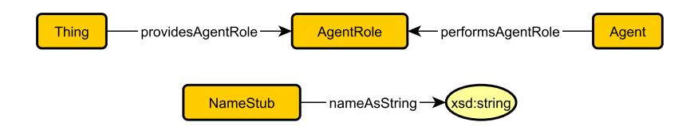
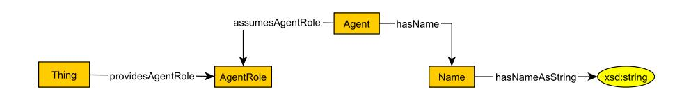
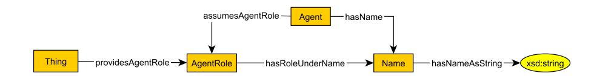

# An Ontology Design Pattern for Role-Dependent Names

Rushrukh Rayan1, Cogan Shimizu2 , and Pascal Hitzler1

> 1 Kansas State University, USA 2 Wright State University, USA

Abstract. We present an ontology design pattern for modeling Names as part of Roles, to capture scenarios where an Agent performs different Roles using different Names associated with the different Roles. Examples of an Agent performing a Role using different Names are rather ubiquitous, e.g., authors who write under different pseudonyms, or different legal names for citizens of more than one country. The proposed pattern is a modified merger of a standard Agent Role and a standard Name pattern stub.

## 1 Introduction

We present an ontology design pattern for role-dependent names of agents that appears to be of rather ubiquitous importance but has not been described explicitly yet, to the best of our knowledge. The pattern is a relatively straightforward reification that modifies previously published patterns, as we discuss below. However we believe that even straightforward patterns such as this should be modeled carefully and provided to the public in the spirit of easy reuse and development of tool support, in the spirit of, e.g., the Modular Ontology Modeling (MOMo) methodology [\[5\]](#page-5-0), the Modular Ontology Design Library (MODL) [\[6\]](#page-5-1), and the COModIDE software framework [\[4\]](#page-5-2).

In the MODL library we find an AgentRole pattern as depicted in Figure [1](#page-1-0) (top), as well as a Name Stub pattern depicted in Figure [1](#page-1-0) (bottom).[3](#page-0-0) Typical uses of the former would be for roles of agents, such as being an employee in a company or author of a publication, where it is desirable to adorn the Role with additional context information like dates of employment or placement in the author sequence.

A schema diagram resulting from a na¨ıve combination of these two patterns is depicted in Figure [2](#page-1-1) (with some mild renaming – we are using patterns as templates as argued in [\[2,](#page-5-3)[5\]](#page-5-0), rather than verbatim). Of course this pattern does not account for dependency of a name on the role: as an example for this type of dependency, consider the case of C. S. Lewis, who published a collection of poems, Spirit in Bondage, under the pseudonym Clive Hamilton. On the other

3 Following MOMo [\[5\]](#page-5-0), we mostly discuss patterns by means of their schema diagrams, and only dive into axiomatization where needed, or at the very end when presenting the final pattern.

2 Rayan, Rushrukh; Shimizu, Cogan; Hitzler, Pascal

<!-- Image Description: The image presents two entity-relationship diagrams. The upper diagram shows the relationships between "Thing," "AgentRole," and "Agent," with labeled arrows indicating "providesAgentRole" and "performsAgentRole." The lower diagram illustrates the relationship between "NameStub" and "xsd:string" using the label "nameAsString." The diagrams likely illustrate a data model or ontology, defining relationships between entities within a system. -->

Fig. 1. Diagrams for Agent Role pattern (top) and Name Stub pattern (bottom), as per [\[6\]](#page-5-1)

<!-- Image Description: This image presents an ontology diagram illustrating relationships between concepts. Rectangular boxes represent classes ("Thing," "Agent," "AgentRole," "Name") linked by arrows indicating relationships (e.g., "providesAgentRole," "assumesAgentRole," "hasName"). An oval denotes a data type ("xsd:string"). The diagram likely serves to define the structure of a knowledge representation used within the paper, showing how agents, their roles, and names are interrelated. -->

Fig. 2. Diagram for naively joined AgentRole and NameStub patterns

hand, his book entitled Grief Observed was published under the pseudonym N. W. Clerk. Using the diagram in Figure [2](#page-1-1) to naively encode this information would result in the triples in Figure [3](#page-1-2) which, of course, do not convey which of the two (if in fact any) pseudonym was used for publication of which of the two books. Other example scenarios with essentially the same issue occur if persons or organizations have different legal names in different jurisdictions, may have their name changed at some stage, may use any type of occupational pseudonyms, or in the context of identity falsification using fake names.

| :assumesAgentRole | :sibAuthorRole ,                                                                           |
|-------------------|--------------------------------------------------------------------------------------------|
|                   | :goAuthorRole ;                                                                            |
| :hasName          | :csLewisNameCV ,                                                                           |
|                   | :csLewisNameNWC ,                                                                          |
|                   | :csLewisNameCSL .                                                                          |
| :hasNameAsString  | "N. W. Clerk"^^xsd:string .                                                                |
| :hasNameAsString  | "Clive Hamilton"^^xsd:string .                                                             |
| :hasNameAsString  | "C. S. Lewis"^^xsd:string .                                                                |
|                   | :spiritInBondage :providesAgentRole :sibAuthorRole . :providesAgentRole :goAuthorRole . |

Fig. 3. Example triples conforming to the diagram in Figure [2,](#page-1-1) for the example case of C. S. Lewis, who published a collection of poems, Spirit in Bondage, under the pseudonym Clive Hamilton. On the other hand, his book entitled Grief Observed was published under the pseudonym N. W. Clerk

The remainder of the paper is organized as follows. In Section [2](#page-2-0) we present our pattern diagrammatically. In Section [3](#page-2-1) we provide its axiomatic formalization. This is followed by conclusions in Section [4.](#page-4-0)

## 2 Overview of the Role-Dependent Names Pattern

The difficulty posed by the diagram in Figure [2](#page-1-1) is, of course, easily addressed by making use of the fact that both AgentRole and Name are already reifications. The resulting diagram is depicted in Figure [4.](#page-2-2) We will refer to this pattern as the Role-Dependent Names (in short, RDN) pattern.

<!-- Image Description: This image is a UML diagram illustrating an ontology. Rectangles represent classes ("Thing," "Agent," "AgentRole," "Name"), and ovals represent data types ("xsd:string"). Arrows with labels depict relationships between classes, specifying how they relate (e.g., "assumesAgentRole," "providesAgentRole"). The diagram shows the relationships between the classes, particularly how an agent assumes a role and is assigned a name. -->

Fig. 4. Schema Diagram for the Role-Dependent Names pattern

Following this diagram, the example triples in Figure [5](#page-2-3) address the previously discussed C. S. Lewis example.

:sibAuthorRole :hasRoleUnderName :csLewisNameCV . :goAuthorRole :hasRoleUnderName :csLewisNameNWC .

Fig. 5. Additional triples, completing those in [3,](#page-1-2) for the example case of C. S. Lewis, who published a collection of poems, Spirit in Bondage, under the pseudonym Clive Hamilton. On the other hand, his book entitled Grief Observed was published under the pseudonym N. W. Clerk. The combined set of triples conforms with our Role-Dependent Name pattern, the schema diagram of which is depicted in Figure [4.](#page-2-2)

## 3 Pattern Axiomatization

Following the MOMo methodology [\[5\]](#page-5-0), we give a full set of axioms that we deem appropriate for the RDN pattern. The RDN pattern is driven by the interplay between the three core concepts: Agent, AgentRole, and Name. The OWLAx approach [\[3,](#page-5-4)[1\]](#page-4-1), which we follow here, suggests to first look at each node-edgenode ensemble in the schema diagram, and then at disjointness and additional axioms. Axiomatization is partially derived from the MODL library [\[6\]](#page-5-1).

Agent in the pattern generally refers to a person or an organization, i.e., inanimate objects would not usually fall under the scope of the Agent class. For instance, if a Table is used for dining, the Table cannot be thought of as an Agent that assumes the Role of a Dining Table in this scenario: it would still be a role, but not an agentrole.

With regard to axiomatization, it is natural to say that every agent must have a name (1). A structural tautology is used to convey that an Agent may (but does not necessarily) also assume an AgentRole (2). To specify the domain of things that can assume an AgentRole, we make use of a Scoped Domain axiom to say that if something assumes an AgentRole, then it must be an Agent (3).

Additionally, we use Inverse Functionality to restrict the number of agents that can assume a apecific AgentRole (4). Concretely, axiom (4) says that an AgentRole can be assumed by at most one Agent. Although this could be done differently, this choice constrains the shape of the RDF graph that complies with the pattern, and thus disambiguates the usage of the pattern.

| Agent v ∃hasName.Name                 |     |
|---------------------------------------|-----|
| Agent v ≥0assumesAgentRole.AgentRole  | (2) |
| ∃assumesAgentRole.AgentRole v Agent   | (3) |
| AgentRole v≤ 1assumesAgentRole−.Agent | (4) |

AgentRoles mean the various roles an Agent can assume. We make use of a Scoped Range axiom to say that if an Agent assumes a Role, then it must be an AgentRole (5). Further, and centrally to this paper, an AgentRole may be assumed under a specific name, and we indicate this using a Structural Tautology axiom (6). The hasRoleUnderName property can furthermore be safely declared to have global range Name, and providesAgentRole can likewise be declared to have range AgentRole.

| Agent v ∀assumesAgentRole.AgentRole | (5) |  |
|-------------------------------------|-----|--|
|-------------------------------------|-----|--|

- AgentRole v ≥0hasRoleUnderName.Name (6)
  - > v ∀hasRoleUnderName.Name (7)
  - > v ∀providesAgentRole.AgentRole (8)

For Name, Inverse Functionality is used to express that a Name can be the name of at most one Agent (9). This is done with a similar motivation as axiom (4) above, i.e. to constrain the possible RDF graphs conforming with the pattern, i.e., to disambiguate use of the pattern. Axioms (10) and (11) declare global range for hasName and global domain for hasNameAsString, respectively.

$$
\mathsf{Name} \sqsubseteq \leq \mathsf{1hasName}^-. \mathsf{Agent} \tag{9}
$$

$$
\top \sqsubseteq \forall \mathsf{hasName}.\mathsf{Name} \tag{10}
$$

$$
\exists \mathsf{hasNameAsString}.\top \sqsubseteq \mathsf{Name} \tag{11}
$$

We add the obvious disjointness axioms (12–14), and then also two role chains axioms, (15) and (16). (15) formalizes that if an agent assumes a role under a Name, then the Agent must have the same name. Similarly, (16) formalizes that if an agent has a name and a role is assumed under that name, then the agent must assume the same Role.

| AgentRole u Agent v ⊥ | (12) |  |
|-----------------------|------|--|
|                       |      |  |

Agent u Name v ⊥ (13)

Name u AgentRole v ⊥ (14)

- assumesAgentRole hasRoleUnderName v hasName (15)
  - hasName hasRoleUnderName− v assumesAgentRole (16)

## 4 Conclusion

The Role-Dependent Name pattern is aimed towards situations where there is an association between the Name and the Role as Agents can assume different roles under different names. As usual, the pattern is not meant to be rigid, in the sense that part of the pattern can be omitted when making use of it, or it can be extended as needed. E.g., AgentRoles may carry additional information such as spatio-temporal extents, and names may have a rich structure.

Acknowledgement. The authors acknowledge funding under the National Science Foundation grants 2119753 "RII Track-2 FEC: BioWRAP (Bioplastics With Regenerative Agricultural Properties): Spray-on bioplastics with growth synchronous decomposition and water, nutrient, and agrochemical management" and 2033521: "A1: KnowWhereGraph: Enriching and Linking Cross-Domain Knowledge Graphs using Spatially-Explicit AI Technologies."

## References

1. Eberhart, A., Shimizu, C., Chowdhury, S., Sarker, M.K., Hitzler, P.: Expressibility of OWL axioms with patterns. In: Verborgh, R., Hose, K., Paulheim, H., Champin, P., Maleshkova, M., Corcho, O., Ristoski, P., Alam, M. (eds.) The Semantic Web – ´ 18th International Conference, ESWC 2021, Virtual Event, June 6-10, 2021, Proceedings. Lecture Notes in Computer Science, vol. 12731, pp. 230–245. Springer (2021). [https://doi.org/10.1007/978-3-030-77385-4](https://doi.org/10.1007/978-3-030-77385-4_14) 14, [https://doi.org/10.1007/](https://doi.org/10.1007/978-3-030-77385-4_14) [978-3-030-77385-4\\_14](https://doi.org/10.1007/978-3-030-77385-4_14)

- 6 Rayan, Rushrukh; Shimizu, Cogan; Hitzler, Pascal
- 2. Hammar, K., Presutti, V.: Template-based content ODP instantiation. In: Hammar, K., Hitzler, P., Krisnadhi, A., Lawrynowicz, A., Nuzzolese, A.G., Solanki, M. (eds.) Advances in Ontology Design and Patterns [revised and extended versions of the papers presented at the 7th edition of the Workshop on Ontology and Semantic Web Patterns, WOP@ISWC 2016, Kobe, Japan, 18th October 2016]. Studies on the Semantic Web, vol. 32, pp. 1–13. IOS Press (2016). [https://doi.org/10.3233/978-1-](https://doi.org/10.3233/978-1-61499-826-6-1) [61499-826-6-1,](https://doi.org/10.3233/978-1-61499-826-6-1) <https://doi.org/10.3233/978-1-61499-826-6-1>
- 3. Sarker, M.K., Krisnadhi, A.A., Hitzler, P.: OWLAx: A protege plugin to support ontology axiomatization through diagramming. In: Kawamura, T., Paulheim, H. (eds.) Proceedings of the ISWC 2016 Posters & Demonstrations Track co-located with 15th International Semantic Web Conference (ISWC 2016), Kobe, Japan, October 19, 2016. CEUR Workshop Proceedings, vol. 1690. CEUR-WS.org (2016), <https://ceur-ws.org/Vol-1690/paper83.pdf>
- 4. Shimizu, C., Hammar, K., Hitzler, P.: Modular graphical ontology engineering evaluated. In: Harth, A., Kirrane, S., Ngomo, A.N., Paulheim, H., Rula, A., Gentile, A.L., Haase, P., Cochez, M. (eds.) The Semantic Web – 17th International Conference, ESWC 2020, Heraklion, Crete, Greece, May 31-June 4, 2020, Proceedings. Lecture Notes in Computer Science, vol. 12123, pp. 20–35. Springer (2020). [https://doi.org/10.1007/978-3-030-49461-2](https://doi.org/10.1007/978-3-030-49461-2_2) 2, [https://doi.org/10.1007/](https://doi.org/10.1007/978-3-030-49461-2_2) [978-3-030-49461-2\\_2](https://doi.org/10.1007/978-3-030-49461-2_2)
- 5. Shimizu, C., Hammar, K., Hitzler, P.: Modular ontology modeling. Semantic Web 14(3), 459–489 (2023). [https://doi.org/10.3233/SW-222886,](https://doi.org/10.3233/SW-222886) [https://doi.org/10.](https://doi.org/10.3233/SW-222886) [3233/SW-222886](https://doi.org/10.3233/SW-222886)
- 6. Shimizu, C., Hirt, Q., Hitzler, P.: MODL: A modular ontology design library. In: Janowicz, K., Krisnadhi, A.A., Poveda-Villal´on, M., Hammar, K., Shimizu, C. (eds.) Proceedings of the 10th Workshop on Ontology Design and Patterns (WOP 2019) co-located with 18th International Semantic Web Conference (ISWC 2019), Auckland, New Zealand, October 27, 2019. CEUR Workshop Proceedings, vol. 2459, pp. 47–58. CEUR-WS.org (2019), <https://ceur-ws.org/Vol-2459/paper4.pdf>
