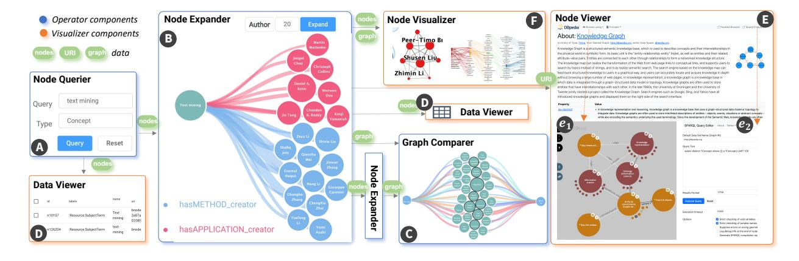
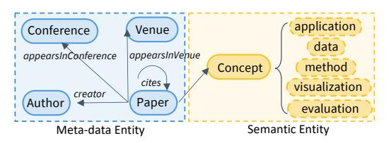
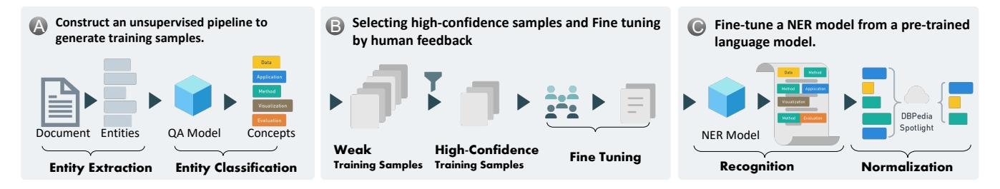
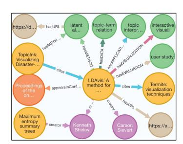
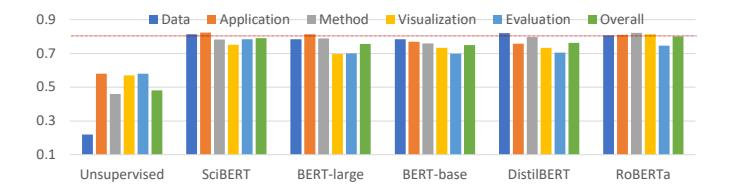
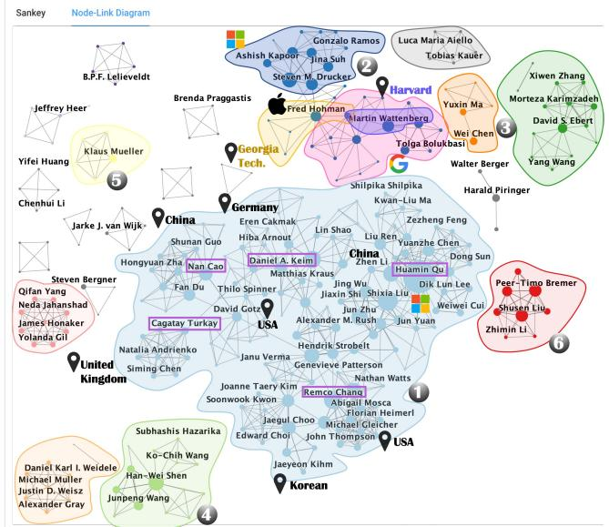
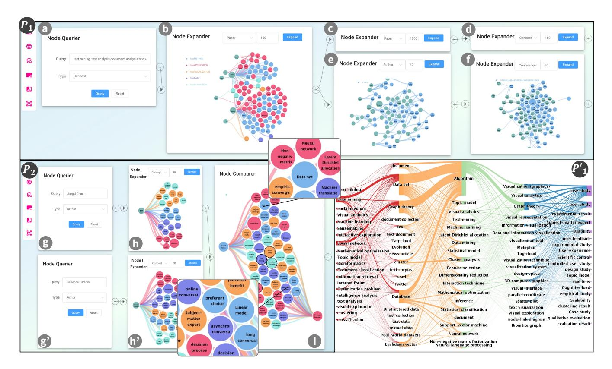

# SKG: A Versatile Information Retrieval and Analysis Framework for Academic Papers with Semantic Knowledge Graphs

<!-- Image Description: This image depicts the architecture of a knowledge graph visualization system. It shows a workflow diagram with labeled components: a node querier (A), node expander (B), node visualizer (D), data viewer (D), and graph comparer (C). The system processes queries, expands nodes in a knowledge graph, visualizes the results, and compares graphs. Examples of node expansion (B,C) and knowledge graph visualizations (D,E) are shown, along with a description of knowledge graphs (F) and associated SPARQL query editor (e2). The diagram illustrates data flow and functionality. -->

Yamei Tu, Rui Qiu, Han-Wei Shen

Fig. 1: Our Semantic Knowledge Graph is equipped with a dataflow system that allows users to create semantic queries in an interactive manner. The system includes operator components ( ) and visualizer components ( ), which users can connect using a simple drag-and-drop interface to build various analysis pipelines for their specific requirements.

**Abstract**—The number of published research papers has experienced exponential growth in recent years, which makes it crucial to develop new methods for efficient and versatile information extraction and knowledge discovery. To address this need, we propose a Semantic Knowledge Graph (SKG) that integrates semantic concepts from abstracts and other meta-information to represent the corpus. The SKG can support various semantic queries in academic literature thanks to the high diversity and rich information content stored within. To extract knowledge from unstructured text, we develop a Knowledge Extraction Module that includes a semi-supervised pipeline for entity extraction and entity normalization. We also create an ontology to integrate the concepts with other meta information, enabling us to build the SKG. Furthermore, we design and develop a dataflow system that demonstrates how to conduct various semantic queries flexibly and interactively over the SKG. To demonstrate the effectiveness of our approach, we conduct the research based on the visualization literature and provide real-world use cases to show the usefulness of the SKG. The dataset and codes for this work are available at [https://osf.io/aqv8p/?view\\_only=2c26b36e3e3941ce999df47e4616207f](https://osf.io/aqv8p/?view_only=2c26b36e3e3941ce999df47e4616207f).

**Index Terms**—Text analysis, Knowledge Graph, Natural Language Processing, Visual Interactive Query, Visual Analytics

## 1 INTRODUCTION

Retrieving information from a large corpus is crucial, particularly in the academic context, where the goal is to facilitate the exploration and discovery of knowledge from scholarly literature [\[33,](#page-9-0) [45\]](#page-10-0). Due to the recent explosion in the volume of publications, a single query can now generate a long list of documents, as seen in using search engines such as Google Scholar to find papers [\[16\]](#page-9-1). It is also inefficient to manually read through all the discovered papers and summarize them to further research. If documents can be translated into a machine-processable format, it becomes possible to automate the search and summarization of documents by leveraging machine analytics power. The goal of this paper is, therefore, to develop solutions for automatic information retrieval from research documents to enable knowledge discovery.

There are several challenges associated with existing technologies that must be addressed. First, transforming unstructured documents

- *• Josiah Carberry is with Brown University. E-mail: jcarberry@example.com*-*• Ed Grimley is with Grimley Widgets, Inc. E-mail: ed.grimley@example.com.*-*• Martha Stewart is with Martha Stewart Enterprises at Microsoft Research. E-mail: martha.stewart@example.com.*

*Manuscript received xx xxx. 201x; accepted xx xxx. 201x. Date of Publication xx xxx. 201x; date of current version xx xxx. 201x. For information on obtaining reprints of this article, please send e-mail to: reprints@ieee.org. Digital Object Identifier: xx.xxxx/TVCG.201x.xxxxxxx*into structured formats is a complex task. While keywords are often used to represent the essential ideas of a document, a mere collection of keywords without proper organization cannot support semantic query. Topic modeling is another way to organize documents into clusters by identifying topics [\[26\]](#page-9-2), but it is difficult to guarantee the quality of topics, and it requires human explanation [\[37,](#page-9-3) [48\]](#page-10-1). Such hidden topics are hard to utilize for accurate information retrieval. Secondly, semantic queries require semantic understanding and knowledge distillation, which is not a trivial task. Although recent developments in Natural Language Processing (NLP) have led to the development of question-answering (QA) models to answer questions based on a contextual document [\[2,](#page-9-4) [57\]](#page-10-2), applying them to a large collection of documents is time-consuming and does not guarantee an organized output. Additionally, some sophisticated queries may involve both semantic and meta-data information, such as "what are the research trend and the evolution path of OpenAI." This requires finding the publications from OpenAI and summarizing them, which can not be solved easily by current QA models.

To tackle these challenges, we propose an approach that integrates Natural Language Processing (NLP) techniques with visual analytics (VA) to achieve interactive information retrieval. Our approach involves building a Semantic Knowledge Graph (SKG) as a fundamental representation of a large corpus and developing a dataflow system to support flexible semantic queries over SKG. The word "Semantic" has two levels of meaning in our approach. First, it refers to the concepts and their "semantic" relations from paper abstracts, which goes beyond many existing academic knowledge graphs that only incorporate metainformation. For example, by pre-processing the unstructured text, our SKG contains "topic modeling" as a "method" while "bioinformatic" as an "application". Second, SKG contributes to the vision of the "Semantic Web" that creates a web of data that is machine-readable and interoperable across different applications and platforms. To support the Semantic Web, computers must have access to the structured information and sets of inference rules that they can use to conduct automated reasoning [\[5\]](#page-9-5). Combining the semantics with other meta-information results in the heterogeneity of our SKG, which can be utilized in two ways. Firstly, by combining concepts with other meta-information, we can achieve flexible retrieval for different types of entities. Secondly, by summarizing connected semantic entities in a clear manner, our SKG can achieve automatic summarization of target entities, such as summarizing a list of papers for automatic literature review. It can be used to retrieve and summarize information efficiently.

Building SKG can be a challenging task, particularly when it comes to extracting semantic entities from raw paper text. To address this, we propose a module that performs Named Entity Recognition (NER) and entity normalization. NER is achieved by a semi-supervised approach that leverages both machine and human efforts. It includes an unsupervised learning stage to generate weak training samples and a human fine-tuning stage to create a high-quality training dataset. The NER model is then fine-tuned on this dataset and can infer all named entities in the entire corpus. Second, to ensure that SKG contains accurate and non-redundant information, we also perform entity normalization by mapping the extracted entities to acknowledged knowledge using the DBpedia Spotlight API.

SKG can be used for semantic queries between different entity types. We have identified a set of tasks and usage scenarios that can be achieved by building queries from SKG. To make it easier for users to interact with SKG, we have divided these tasks into three key graph operations and visualization needs and embedded them into the components of a dataflow system. Each component has been designed with a single function with specific inputs/outputs, enabling users to drag and drop these components to build different analysis pipelines, providing flexibility to fulfill various tasks. We demonstrate the usefulness and effectiveness of our approach for exploring the visualization literature by collecting 125,745 papers, which we refer to as the*VISBank*dataset. We then construct SKG over the*VISBank*dataset and use our dataflow system to query SKG built from the visualization literature. In summary, our contributions are:

- The design and construction of a semantic knowledge graph to enable efficient semantic queries for large academic corpora.
- The construction of a semi-supervised knowledge extraction module for named entity recognition and entity normalization.
- The design and development of a dataflow system that enables users to perform semantic queries over SKG using visual operations.
- The publication of the*VISBank*and SKG as a contribution to further research in the visualization literature.

## 2 RELATED WORK

Knowledge Graphs (KG) have attracted significant attention from both academia and industry due to their superior performance in data integration. To benefit the public community, several public KGs have been proposed, including DBpedia [\[4\]](#page-9-6), Freebase [\[6\]](#page-9-7), YAGO [\[50\]](#page-10-3), and MAKG [\[56\]](#page-10-4), to name a few. We discuss KGs from two perspectives that are most related to our work: the construction of KGs and the visualization system for KGs.

## 2.1 Construction of Knowledge Graph

In the current era of big data, knowledge modeling is an effective way to collect and synthesize knowledge scattered in mass data. It can be divided into two main techniques: ontology-based and nonontology approaches. Non-ontology approaches extract entities and relationships from unstructured text without relying on pre-defined ontology. Yun et al. [\[60\]](#page-10-5) provide a comprehensive summary of applicable methods, involved processes, and techniques for the non-ontology approach. Some existing works reply on state-of-the-art language processing tools [\[7,](#page-9-8) [14,](#page-9-9) [15\]](#page-9-10), such as Extractor Framework [\[31\]](#page-9-11), CSO

Classifier [\[44\]](#page-10-6), OpenIE [\[3\]](#page-9-12), CoreNLP [1](#page-1-0) to extract knowledge. Others propose their own models to extract relations and entities for KG construction. Chansanam et al [\[8\]](#page-9-13) use a BiLSTM model to construct a Thai cultural knowledge graph. Guo et al. [\[20\]](#page-9-14) apply the function-behaviorstates (FBS) design method to classify and extract knowledge using the BERT-BiLSTM-CRF model, and Feng et al. [\[18\]](#page-9-15) build an automatic information extraction model based on the BiLSTM-CRF model to extract knowledge from accident reports, laws, and regulations.

Ontology-based methods are the most common and well-studied, which is also the focus of our work. Mondal et al. [\[35\]](#page-9-16) define an ontology of NLP-KG and propose an end-to-end framework that contains three different relation extractors to identify pre-defined relation types. Al-Khatib et al. [\[1\]](#page-9-17) define an argumentation KG and propose a supervised approach to detect relations, while syntactic patterns identify entities. We also found similar efforts to construct KGs in scientific literature. Chen et al. [\[10\]](#page-9-18) proposed an ontology-based pipeline to build KGs from abstracts. However, they perform sentence classification first and then extract entities from each sentence, which cannot be applied in scenarios where entities with different labels can co-occur in the same sentence. Tosi et al. [\[52\]](#page-10-7) aim to structure knowledge in scientific literature, but they use a Babelfy [\[36\]](#page-9-19) to extract entities and map them to BabelNet [\[40\]](#page-9-20), which is a knowledge graph built on WordNet [\[34\]](#page-9-21). Wise et al. [\[59\]](#page-10-8) construct an ontology for COVID-19 from CORD19 and extract entities using SciSpacy, which has been trained on biomedical texts similar to CORD19. However, due to the large volume of scientific publications, a dictionary database or domain-specific extractor cannot be guaranteed to exist for all scientific applications, such as visualization. Therefore, in this work, we propose a framework that does not rely on pre-existed materials.

### 2.2 Visualization of Knowledge Graph

The development of KGs also highlights the need for effective data visualization. Nararatwong et al. [\[38\]](#page-9-22) discussed several challenges of visualization KGs due to their massive and complex nature, while Gomez et al. [\[19\]](#page-9-23) conducted a performance analysis on various visualization tasks for large-scale knowledge graphs.

There are many existing efforts on building visualization systems for KGs, with various focuses. Due to the steep learning curve of structured query languages, several visualization systems enable users to query KGs using visual query formulations (e.g., OptiqueVQS [\[49\]](#page-10-9)) or graph-like queries (e.g., RDF Explorer [\[54\]](#page-10-10), FedViz [\[17\]](#page-9-24)).

As querying is the first step during KG exploration, some tools support visualizations that efficiently represent queried data. Depending on the targeted KGs, these systems can be categorized as general or domain-specific solutions. Deagen et al. [\[13\]](#page-9-25) defined a chart as a combination of SPARQL query and Vega-Lite grammar for chart specification to represent information in Scientific KGs while Wei et al. [\[58\]](#page-10-11) proposed a topic-centric visualization system to summarize and cluster neighboring entities for query entities. CEPV [\[47\]](#page-10-12) is a customized information extraction, process and visualization tool to extract data from KG into a specified tree structure visualization. Several domain-specific visualization systems have been built for various purposes [\[22,](#page-9-26) [41,](#page-10-13) [51\]](#page-10-14). Qiu et al. [\[42\]](#page-10-15) developed a taxation big data visualization system for tax-related problems while Jiang et al. [\[27\]](#page-9-27) proposed a visual analysis system to perform spatiotemporal analysis of a COVID-19 knowledge graph. ALOHA [\[21\]](#page-9-28), a dietary supplement knowledge graph visualization developed for exploring iDISK knowledge base. To the best of our knowledge, we propose the first dataflow system for KGs, which enables flexible information retrieval and analysis in scientific literature. The system design is easily adaptable for different KGs, making it data-agnostic.

## 3 METHOD

Our approach to enhancing information retrieval and analysis in the academic literature combines natural language processing (NLP) techniques with visual analytics. In this section, we first introduce our

Semantic Knowledge Graph (SKG) and then discuss: (1) how we construct SKG in a semi-supervised manner; (2) how SKG empowers the semantic queries in academic literature; (3) how to enable users to construct queries interactively and discover insights efficiently.

## 3.1 Semantic Knowledge Graph

The Semantic Knowledge Graph (SKG) serves as a foundational representation of a large corpus. It is a graph-based representation of knowledge that captures entities and their relationships. Unlike some existing academic knowledge graphs, SKG combines information from both meta-data and text data. As shown in [Figure 2,](#page-2-0) SKG has five types of entities, one semantic entity, called*Concept*, and the other four types of meta-data entity. Each entity type has a specific meaning and related attributes, summarized as follows:

<!-- Image Description: This image depicts two entity relationship diagrams. The left diagram ("Meta-data Entity") shows relationships between "Conference," "Venue," "Author," and "Paper," illustrating metadata connections like authorship, venue, and citation. The right diagram ("Semantic Entity") displays a "Concept" entity linked to attributes including "application," "data," "method," "visualization," and "evaluation," representing semantic information. The diagrams illustrate the distinction between metadata and semantic data within a research context. -->

Fig. 2: The schematic ontology of Semantic Knowledge Graph. It contains four meta-data entity types and one semantic entity type. *Concepts*with different semantic roles are captured in relationships between*Paper*and*Concept*.

- *Paper*: Represents each paper with attributes of title, a unique id, publication year, and URL to the semantic scholar. It has outgoing relations to all the other four entity types.
- *Concept*: Represents the scientific keyword or keyphrases extracted from paper abstracts. If the *Concept*is recognized in the DBPedia, it will include a URL attribute that leads to the corresponding DBPedia page. Since*Concept*can have different semantic roles in abstracts, we capture such information in the relationships that connect*Concept*and*Paper*. Specifically, we define five types of *Concept*to categorize knowledge in abstracts:
  -*Application*: the *Concept*that describes the*application*such as biology, business, or*task*like image classification.
  -*Data*: the *Concept*that describes the*data*or*dataset*, e.g., volume data, image, MNIST dataset.
  - *Method*: the *Concept*that describes the*method*, *algorithm*or*technique*, such as cross validation, Random Forest.
- *Visualization*: the *Concept*that describes the*visualization*or*chart*, e.g., visual analytic system, bar chart, heat map.
- *Evaluation*: the *Concept*that describes the*evaluation*, e.g., quantitative evaluation, expert interview, user study.
- *Author*: Represents authors with an attribute of the full name.
- *Journal*: Represents journal entity with an attribute of the name.
- *Venue*: Similar to *Journal*entity, it represents the venue where one paper has been published.

# 3.2 SKG Construction

Constructing a useful and effective knowledge graph can be challenging, as it depends on both the quantity and quality of data it contains. Therefore, as the first step, we create a large domain-specific dataset that includes both metadata and raw text to be used in the SKG. We then extract concepts from the raw text, to transform the unstructured textual data into structured knowledge. To accomplish this, we develop a semi-supervised module that combines machine computation ability with human intelligence. Finally, using the metadata and concepts obtained from the previous steps, we represent our knowledge graph in the Resource Description Framework (RDF). The RDF format is the standard for representing knowledge in the semantic web, which allows machines to process and reason about data in a meaningful way. In summary, our SKG construction involves the following steps:

- VISBank Dataset: We create a large and rich academic dataset in the visualization literature for knowledge graph construction.
- Concept Entity Extraction: We build a semi-supervised framework to extract concepts and their roles from unstructured text, to be incorporated in the SKG. It also contains a normalization stage to remove duplicate knowledge.
- RDF representation: We describe the statistics of constructed SKG and provide concrete examples.

Below, we describe each of the steps in detail.

# 2.1*VISBank*dataset

Several well-known academic datasets are available in the visualization domain. However, they do not cover all the necessary information we need as they are not built for knowledge graph purposes. For example, VisPub [\[25\]](#page-9-29) is a popular benchmark dataset that contains various metadata about papers in the IEEE VIS conferences, but it does not cover other relevant fields, such as virtual reality, or graphics. Another dataset, VitaLITy [\[39\]](#page-9-30), covers 38 popular data visualization publication venues. However, it does not contain the citation relationships as it focuses on utilizing abstract to generate semantic embeddings for serendipity discovery. Thus, we construct a new dataset called*VISBank*, which is ideal for constructing knowledge graphs in the visualization domain.

Table 1: Statistical information regarding the *VISBank*dataset includes (A) the coverage of key attributes of papers covered in*VISBank*; (B) a comparison of the *VISBank*with other datasets in the VIS literature; (C) The paper distributions across sub-areas in the VIS literature.

|                     | Title         | 100%          |      | Graphics &Visualization                 | 55,759 |
|---------------------|---------------|---------------|------|-----------------------------------------|--------|
| (A)                 | Abstract      | 85.2%         |      | Human-Computer Interaction              | 36,719 |
| Coverage            | Author        | 99.7%         | (C)  | Knowledge & Data mining                 | 9,490  |
| of Key Attribute | Venue/Journal | 99.3%         | Sub  | Virtual/Augmented Reality               | 7,648  |
|                     | Total         | 125,745       | Area | Cognitive Visualization                 | 6,514  |
| (B)                 | VisPub        | 3,120/3,503   |      | Mobile & Ubiquitous Visualization 4,524 |        |
| Compare             | VitaLITy      | 52,784/59,232 |      | User Interface, System                  | 2,279  |
|                     | S2ORC         | 125,745/135M  |      | Others                                  | 2,812  |
*VISBank*offers high extensiveness and diversity in terms of the data it covers, making it a valuable resource for researchers in the visualization field. The dataset contains 125, 745 papers from 3520 venues and 88 journals, following the same format as the Semantic Scholar Open Research Corpus (S2ORC) [\[30\]](#page-9-31) [2](#page-2-1) . We compute the coverage of several key attributes in the*VISBank*and report it in [Table 1A](#page-2-2). The high percentage indicates that*VISBank*provides comprehensive metadata coverage, providing a strong foundation for SKG construction. Additionally, we compare*VISBank*with two aforementioned datasets, i.e.,*VisPub*and*VitaLITy*. The results are presented in [Table 1B](#page-2-2). The high coverage of both datasets suggests that our *VISBank*merges various data sources in the visualization literature, ensuring compliance with the FAIR principles for making data more findable, accessible, interoperable, and reusable. Also, the paper distribution across related areas in the visualization literature is shown in [Table 1C](#page-2-2), highlighting the multidisciplinary nature of the data in the*VISBank*.

We construct the *VISBank*dataset by extracting relevant papers from the S2ORC dataset. The reason is that S2ORC contains over 136 million scientific papers with rich meta-data, including raw text information. However, it can be challenging to identify a small target subset from such a large corpus. To narrow down the selection, we first filtered the attribute of "field of study" to "computer science", which is the smallest superset of visualization, resulting in 12 million papers. Next, we identify the relevant sub-fields by performing a keyword-based search. For instance, we use the keyword "visualization" to identify related journal and venue names such as*Journal of Visualization*and*IEEE Transactions on Visualization and Computer Graphics*. By using this approach, we have compiled a full list of 3520 relevant venues and 88 journals, which can be found in the supplemental material. We further filter papers that appear in those venues and journals. Additionally, we also map papers from *VisPub*and*VitaLITy*to S2ORC by matching their titles and integrate the matched ones into*VISBank*. We process

2<https://github.com/allenai/s2orc>

<!-- Image Description: The image presents a three-stage workflow diagram for training a named entity recognition (NER) model. Stage A shows unsupervised pipeline creation using entity extraction and classification from documents to generate training samples. Stage B depicts selecting high-confidence samples through human feedback and fine-tuning. Stage C shows fine-tuning a pre-trained NER model using recognition and normalization steps, leveraging DBpedia Spotlight. The diagrams illustrate the process flow, highlighting data transformation and model refinement. -->

Fig. 3: The process of transforming unstructured text into *Concept*entities involves three steps: (A) preparing a training dataset for the Named Entity Recognition (NER) model by utilizing machine semantic understanding ability, (B) incorporating human feedback into the training dataset, and (C) training the NER model to recognize all entities in the*VISBank*and perform normalization to eliminate redundant information.

each abstract to extract*Concept*entities as explained below and add this information into*VISBank*.

## 2.2 Concept Entity Extraction

*VISBank*contains meta information that can be directly transformed into the meta-data entities in SKG. However, the*Concept*entity needs to be extracted and classified from the abstracts, which can be a challenging task when considering the requirement of high accuracy and efficiency. To address this issue, we propose a semi-supervised module to perform the Named Entity Recognition (NER) task that simultaneously recognizes entities and classifies them into the five named*Concept*types mentioned above. The module consists of three key steps to reduce the labeling effort required to prepare the training dataset for NER: (1) unsupervised pipeline to generate weak training samples; (2) filtering high-confidence samples and soliciting human annotators to create high-quality training samples; (3) supervised training of a NER model, as shown in [Figure 3.](#page-3-0)

To generate weak training samples, our unsupervised pipeline first extracts candidate entities from the text. To do so, we first generate the Part-of-Speech (POS) tag for each token, indicating its grammatical function in the sentence. We then use a rule-based approach to extract the noun n-grams based on the POS tags. This approach has high readability and is easy to tune to achieve high coverage of all candidate entities [\[55\]](#page-10-16). We adopt the same rules from previous work [\[53\]](#page-10-17).

Next, we classify the candidate entities into the five categories of*Concept*. Recent findings in the NLP literature suggest that language models have a certain level of semantic understanding [\[32,](#page-9-32)[46\]](#page-10-18). Inspired by this, we utilize a Question-Answering (QA) model to generate labels for entities based on their contextual information. The high-level idea is to translate each *Concept*label into questions using the definition provided in [subsection 3.1.](#page-2-3) For example, the*data*label is translated into two questions:*what is the data?*and*what is the dataset?*Then, we assign each entity to one label with the highest possibility of answering its corresponding question. For example, "volume data" has the highest probability of answering the question of*what is the data?*and therefore will be assigned to the*data*label.

For question answering, we employ a RoBERTa model that is finetuned on the SQuAD2.0 [\[43\]](#page-10-19) QA dataset. Traditionally, a QA model takes a question and a document (q, d) as input and extracts a span of tokens from the document as the answer. The model uses two sets of trainable weights, WS, WE, to compute the score of each token ti to be the start or end position of the answer as follows:

$$
score_S(q, d, t_i) = \frac{e^{\mathbf{W}_S \cdot \mathbf{v_i}}}{\sum_j e^{\mathbf{W}_S \cdot \mathbf{v_j}}}, \quad score_E(q, d, t_i) = \frac{e^{\mathbf{W}_E \cdot \mathbf{v_i}}}{\sum_j e^{\mathbf{W}_E \cdot \mathbf{v_j}}}.
$$
 (1)

vi is the embedding of a token ti, which is an intermediate output in the model. vi shares the same dimensions with the weight matrix WS, WE (768d). Then, the probability of a span s starting from position i and ending at position j to answer the question is computed as:

$$
p(s_{t_i:t_j}|q,d) = Softmax(scores(q,d,t_i) \cdot score_E(q,d,t_j)) \tag{2}
$$

where p(sti:tj |q, d) is a probability distribution of all possible spans. Then the span with the highest probability is returned as the answer.

To apply the QA model to our use case, for each candidate entity c, we compute its probability of answering each question qm using [Equation 2.](#page-3-1) Then we find the question with the highest probability and assign its corresponding to the candidate entity c. After processing all documents d in*VISBank*, we obtain a set of (document d, candidate entity c, label l, probability p) as weak training samples, where each tuple indicates one candidate entity c in d being assigned to label l with the probability of p. For each label l, we sort the corresponding tuples based on the probability p and select top-K as high-confidence training samples, as shown in [Figure 3B](#page-3-0).

We manually refine weak training samples as they may not be perfect. The annotation process is conducted iteratively. Initially, we labeled entities based on the *Concept*definitions provided in [subsection 3.1.](#page-2-3) For instance, we labeled entities related to tasks and applications as*application*. However, during the human annotation phase, disagreements arose between the machine and the human annotators. To resolve these discrepancies, we held discussions with five PhD students who have expertise in visualization. We discussed and agreed upon a proper solution and applied it consistently throughout the annotation pipelines.

We labeled a total of 5076 samples and converted entity-level labels into a token-level format to train the NER model. In this format, each token in a sequence [t1, t2, .., ti] is assigned a label [l1, l2, .., li], where li ∈*{application, data, method, visualization, evaluation}*. In addition, the label li for each token is prefixed with B or I to indicate whether the token is the beginning or continuation of a concept. O indicates the token is not contained in any concept. For instance, given the sentence "we conduct network analysis to graph data", the corresponding labels for each token are <O, O, B\_method, I\_method, O, B\_data, I\_data>.

The NER model is fine-tuned by computing the cross entropy between the ground truth token labels and predicted token labels using the cross-entropy loss, computed as follows:

$$
H(P,Q) = -\sum_{t_i} P(t_i) \cdot log(Q(t_i))
$$
\n(3)

where P(ti) is the actual distribution of token ti among all possible labels, while Q(ti) represents the predicted distribution. The fine-tuned NER model can take a document as input and automatically recognize named *Concept*. We apply it to perform inference on the entire dataset and incorporate the results into the *VISBank*dataset, which are used as*Concept*entities in SKG.

### 2.3 Semantic Knowledge Graph Construction

Using the ontology defined in [Figure 2,](#page-2-0) we transform the metadata and semantic information from*VISBank*into entities and build relationships between them to construct SKG. Additionally, we check whether each*Concept*has a similar entity defined in DBpedia by using DBpedia Spotlight, as shown in [Figure 3C](#page-3-0). If a similar*Concept*is found, we add the DBpedia URL as an additional attribute of the*Concept*and rename it using the recognized name in DBPedia. This process has two benefits: (1) it helps to normalize*Concept*entities that have different wordings or descriptions but are actually referring to the same thing, and (2) DBpedia provides detailed explanations for concepts as it links to Wikipedia. By integrating this information into SKG, we can enrich the knowledge embedded and provide users with*Concept* explanations when they are exploring SKG.

SKG is represented using RDF (Resource Description Framework) triplets because it is the most powerful and expressive standard designed by the World Wide Web Consortium (W3C). RDF triplets harmonize

Table 2: Summarizing the utilization of our SKG in different real-world scenarios that involve semantic queries.

| Entity            | Ontology                                                                                                                                                      | Supported Task                                           | Usage Scenarios of Semantic Queries                                                                                                                                       |
|-------------------|---------------------------------------------------------------------------------------------------------------------------------------------------------------|----------------------------------------------------------|---------------------------------------------------------------------------------------------------------------------------------------------------------------------------|
| Paper             | Paper Concept /hasData/hasApplication/ /hasMethod/hasVisualization cites /hasEvaluation                                                        | • Document Retrieval • Automatic Literature Review | Find academic papers related to text mining and visualization, and provide a summary of the tasks that can be addressed by the different methods used in these papers. |
| Author            | Paper Concept /hasData/hasApplication/ creator /hasMethod/hasVisualization /hasEvaluation Author                                            | • Reviewer Finder • Researcher Profiling              | Find potential reviewers to evaluate a new research paper focused on using neural networks for parameter exploration in ensemble simulations.                          |
| Venue /Journal | Paper Concept /hasData/hasApplication/ appearsInVenue /hasMethod/hasVisualization /hasEvaluation Conference Venue appearsInConference | • Conference Finder • Journal Comparison              | Find possible conferences to submit the work related to improving trust in ML through visualization and compare those conferences based on their accepted papers.      |

all the relations into a < s, p, o > format, where the subject entity s and object entity o are connected by the predicate p. This generality can integrate various types of information, which is efficient for data publication and interchange. The triplets follow the schematic ontology defined in [Figure 2,](#page-2-0) and a specific version of the schema can be found in the supplemental material.

#Entity Type #Count Paper 125745 Concept 766276 Author 181031 Journal 1355 Conference 4367 # Relation Type # Count cites 344389 creator 398670 appearsInJournal 57330 appearsInConf\*111558 hasDATA 350262 hasAPPLICATION 333562 hasMETHOD 537921 hasVISUALIZATION 99284 hasEVALUATION 172981 (B) (C) (D) After construction, each instance in*VISBank*can be seen as a subgraph that surrounds the*Paper*entity. An example of such a subgraph is shown in [Figure 4.](#page-4-0) The paper titled "LDAvis: a method for visualizing for visualizing and interpreting," was written by Carson Sievert, and Kenneth Shirley and published in*Proceedings of the Workshop on Interactive Language Learning, Visualization, and Interfaces*. The paper

<!-- Image Description: The image is a graph illustrating the relationships between the LDAvis topic modeling visualization method and related works. Nodes represent publications, methods (e.g., Termite visualization techniques), datasets, and individuals (e.g., Kenneth Shirley). Edges depict connections such as citations, data usage, and method application. The graph visually summarizes the context and contributions of LDAvis within the field of topic modeling visualization. -->

Fig. 4: A subgraph from SKG that is built from one paper record.

focuses on the task of *topic interpretation*based on*topic-term relationship*using*Latent Dirichlet Allocation*and*interactive visualization*.

Table 3: The statistics of different entities and relations in SKG. *(Conf\* is short for Conference)*

| Entity Type | #Number | Relation Type                    | #Number |
|-------------|---------|----------------------------------|---------|
| Paper       | 125,745 | cites (Paper→Paper)              | 344,389 |
|             |         | creator (Paper → Author)         | 398,670 |
| Concept     | 766,276 | appearsInJournal (Paper→Journal) | 57,330  |
|             |         | appearsInConf* (Paper→Conf*)     | 111,558 |
| Author      | 181,031 | hasData (Paper→Concept)          | 350,262 |
|             |         | hasApplication (Paper→Concept)   | 333,562 |
| Journal     | 1,355   | hasMethod (Paper→Concept)        | 537,921 |
|             |         | hasVisualization (Paper→Concept) | 99,284  |
| Conference  | 4,367   | hasEvaluation (Paper→Concept)    | 172,981 |

[Table 3](#page-4-1) presents the counts of various entity types and relation types contained in the constructed SKG. Each of the ∼126k *Paper*entities has an average of 3.1 outgoing relations to*Author*entities and 2.7 outgoing relations that cite other papers. Additionally, our module identifies an average of 11.9*Concept*entities for each*Paper*. Among these *Concept*entities, around 23.4% are related to data or datasets, 22.3% pertain to applications or tasks, and 36% refer to methods, algorithms, or techniques discussed in the abstract. Approximately 6.6% entities are related to visualization since some papers do not explicitly discuss visualization techniques. Finally, 11.6% entities introduce the evaluation methods or metrics employed.

# 3.3 Semantic Queries over the SKG

Semantic queries over SKG can be seen as extracting a subgraph by following some search criteria. In this section, we explain how SKG empowers information retrieval and analysis through semantic queries. However, due to the complexity and diversity of the SKG, constructing different semantic queries to achieve various goals in structured query languages such as SPARQL can be a time-consuming task. To overcome this challenge, we extract the essence of semantic queries and develop an algorithm that handles various semantic queries with high efficiency and scalability.

Some academic knowledge graphs stay at the metadata level, which can support a certain number of tasks that only need meta-information, such as citation analysis, and affiliation research tracking. However, advanced tasks usually require human intervention to process text, such as reading, understanding, and summarizing. This is why we put significant efforts into constructing the SKG, by extracting, summarizing, and integrating information from both textual content and metadata. By incorporating both sources of information into a single knowledge graph, we can automate many real-world tasks that previously required human efforts. Later, we discuss advanced semantic queries that leverage both semantic and meta-data entities.

SKG is capable of supporting a wide range of queries by establishing rich connections among different entities through direct or multi-hop relations. We categorize these queries into two different tasks: retrieval and summarization. In terms of retrieval, connections from semantic entities to other meta-data entities can enhance information retrieval efficiency. For example, to find potential reviewers of a submission discussing "graph drawing", starting from "graph drawing", we can retrieve authors who have published papers on "graph drawing" by traversing SKG. This approach can provide factual data to support decision-making instead of relying on personal experience or domain knowledge. On the other hand, the connections from meta-data entities to semantic entities are highly useful for information summarization. For instance, when dealing with multiple papers, automatic summarization from multiple perspectives is helpful, which can be achieved by utilizing various relationships between*Paper*and*Concept*entities.

Semantic queries share a common characteristic of identifying a set of starting entities and specifying search criteria to navigate SKG and reach the target entities. In [Table 2,](#page-4-2) we summarize multiple queries based on the type of target entity. The*ontology*column displays the relevant entity and relation types utilized to support the query. The*supported task*column contains two example tasks related to retrieval and summarization. We also provide*examples* for illustration purposes.

Based on the commonality of queries, we have designed a versatile algorithm to support various queries, as outlined in [Algorithm 1.](#page-5-0) The algorithm takes in source entities Ns as starting points in SKG, a desired target entity type t as the search conditions, and K as the number of returned entities. It will extract a subgraph from SKG, including source entities Ns, K most relevant target entities Nt, and connections between the source and target entities (Es→t).

Specifically, starting from each source entity ni, we first find all reachable entities nd with type t (*line5-8*). Since ni may not be directly connected to nd, such as *Author*and*Concept*, we count the number of all simple paths between ni and nd as a score for nd (line9) where the simple path is defined as a path without any loops. The intuition is that the presence of multiple paths between two entities indicates a stronger connection. For example, if an author has published more papers related to a concept c1 compared to c2, we would assign a higher score to c1 when retrieving concepts for that author. We keep adding the score of nd when looping each starting entity ni since a target is more important if it shares connections with multiple source entities (*line10*). According to the score, we rank all reachable entities and

## Algorithm 1 Semantic Query over the SKG

| 1: Input: SKG G = (N, E) and its ontology Gont, source entities Ns, number of       |
|-------------------------------------------------------------------------------------|
| target entities K, desired entity type t                                            |
| 2: Output: target entities Nt with type t, Es→t = {ni → nj  ni ∈ Ns, nj ∈ Nt}       |
| 3: Declare: Candidates nodes Nc, Candidate edges Ec                                 |
| 4: for ni ∈ Ns do                                                                   |
| 5: d ← shortest_dist(type(ni), t, Gont) // hops between source and target entity |
| 6: Nd ← all_destinations(ni, cutoff=d, G) // all reachable nodes with d-hops     |
| 7: for nd ∈ Nd do                                                                |
| 8: if type(nd)= t then // find candidate entities with type t                    |
| 9: s ← score(ni, nd, G) // the number of connections between (ni, nd)            |
| 10: Nc ← add((nd, s)) // keep recording score of each candidate entity           |
| 11: Ec ← add((ni, nd)) // adding the relation                                    |
| 12: end if                                                                       |
| 13: end for                                                                      |
| 14: end for                                                                         |
| 15: Nt ← sortedByValue(Nc)[0:K] // sort the candidate entities and return the top-K |
| 16: for e = (ni, nj ) ∈ Ec do                                                       |
| 17: if nj ∈ Nt then // filter edges according to target entity                   |
| 18: Es→t ← add(ni, nj )                                                          |
| 19: end if                                                                       |
| 20: end for                                                                         |
|                                                                                     |

return the top-K as target entities Nt. We also select relations that start from entities in Ns to entities in Nt as target edges Es→t.

# 3.4 A Dataflow System for Interactive Semantic Querying

## 4.1 System Requirements

To achieve the semantic queries interactively and efficiently, we have incorporated a visual analytics system into our approach. The system's design was iteratively refined through weekly discussions with domain experts in the field of information retrieval and literature review. Based on this discussion, we have identified the following design tasks:

- T1. Constructing interactive queries over SKG. Querying SKG with structured queries, such as SPARQL, can have a high learning curve for users less experienced in programming. To ensure a smooth and efficient knowledge discovery process, Our system should have an intuitive interface that allows users to construct semantic queries efficiently and interactively.
- T2. Visualizing heterogeneous data from SKG. Due to the large volume and high diversity of SKG, data retrieved by the semantic queries can be difficult to grasp instantly. While visualization is a powerful tool to present patterns and generate insights, the system should provide clear and intuitive data visualization for queried data.
- T3. Building flexible pipelines for SKG. Users with different backgrounds may have various goals for exploring SKG. The exploration process can involve multiple data queries, processing, and analysis to generate insight. Our system should provide users with the ability to customize analysis pipelines.
- T4. Accessing raw data in SKG. While providing summarization of queried information is efficient for knowledge extraction, providing access to raw data is necessary to build user trust in the system and data. Also, our system should link the raw data to the web and provide an easy way for users to access it.

## 4.2 System Overview

Guided by the tasks, we have designed and developed a dataflow system, as visualized in [Figure 1.](#page-0-0) The system comprises a set of components with predefined inputs and outputs that users can choose and connect to construct their customized analysis pipeline (T3). The component can be grouped into two categories: *operators*for data manipulation (T1) and*viewers*for data visualization (T2, T4). The operators generate and manipulate data, which can be transmitted to downstream components of the system, while the visualizers present data meaningfully and offer insights without transmitting the data to the following components.

## 4.3 Operator Components

To facilitate effective exploration of the SKG, we have identified three critical stages for [Algorithm 1:](#page-5-0) (1)*pre-execution*: finding the source entities Ns, (2) *execution*: retrieving target entities Nt, and (3) *postexecution*: analyzing the queried graph Es→t. We abstract them into three sub-tasks, namely, node retrieval, node expansion, and graph comparison. To support each sub-task, we design three operators: *querier, expander, and comparer.*Querier allows users to retrieve entities using a sequence of keywords or keyphrases separated by commas [\(Figure 1A](#page-0-0)). It performs a fuzzy match between user input and entity literal attributes, such as titles of papers, or full names of authors. The retrieved entities can serve as the source entities for [Algorithm 1.](#page-5-0)

Expander plays a crucial role in efficiently exploring SKG by finding entities with a user-defined type. It is an implementation of [Algo](#page-5-0)[rithm 1.](#page-5-0) To display the data (T2) and enable user interaction, we use a node-link diagram to depict source/target entities as circles and their relationships as the connecting lines between them, as demonstrated in [Figure 1B](#page-0-0). During this process, multiple data can be used to satisfy various needs. Thus, we design three types of output for the*expander*according to its subsequent components:

-*Target entities*Nt: Once the*expander*retrieves a list of target entities, they can be passed on to the next*expander*as the next starting point for subsequent retrieval.
-*Graph=(*Ns ∪ Nt, Es→t*)*: The graph in each *expander*displays the edges from source to target entities. The graph will be the output if connected to a*comparer*for comparing one or multiple graphs.
-*Graph=(*Nt, Et→t*)*: Additionally, there are also connections among the target entities themselves. For instance, the citation relationships among papers or the collaborations between authors can be useful. It will pass this information when connecting to a *visualizer*.
- *Web URI*: Our SKG is integrated with DBpedia to expand knowledge. If users specify *Concept*as the target entity type, they can click each*Concept*node from*expander*to transfer its DBpedia URL to a*node viewer*for additional explanations and explorations.

Comparer enables users to compare the graphs from two or more*Expanders*and visualizes the merged graph with common nodes highlighted, as shown in [Figure 1C](#page-0-0).

### 4.4 Viewer Components

The viewers consist of three components that enable efficient access and visualization of various data.

Node Visualizer is a highly effective tool for presenting data patterns to enable insight discovery, as shown in [Figure 1F](#page-0-0). During the node expansion step, the relationships between target entities Et→t can be informative in different usage scenarios. To support the various needs, we incorporate two visualization charts that are the most effective in visualizing the graph structure. The node-link diagram is efficient in showing the relationships among entities, such as citation networks between*Paper*entities, or collaboration networks among*Author*entities. Another chart, the Sankey diagram, can provide a clear and organized visualization of networks among concepts. By positioning nodes along an axis, it can display concepts with different labels clearly.

Table Viewer presents raw data in a tabular manner (T4). It enables users to develop confidence in our dataflow system by providing them with raw data from operator components [\(Figure 1D](#page-0-0)).

Node Viewer serves as a bridge between our SKG with DBpedia, displaying the corresponding DBpedia webpage when a user clicks on a*Concept*of interest in*Expander*, as shown in [Figure 1E](#page-0-0). Additionally, the *Web Viewer*offers a GUI interface for users to query [\(Figure 1](#page-0-0)e1) or perform SPARQL queries on the DBpedia [\(Figure 1](#page-0-0)e2).

#### 4 EVALUATION OF CONCEPT ENTITY EXTRACTION

The quality of SKG heavily depends on the concept entities, which are extracted by our semi-supervised module. We conduct an evaluation of this process from two perspectives: (1) whether the unsupervised pipeline can reduce labor work for users and (2) whether the fine-tuned NER model can accurately extract entities.

To assess this, we computed the f1-score of NER results by comparing the unsupervised results and the predicted results with the humanlabeled ground truth. Traditionally, an exactly matched entity is considered one true positive case. However, we also perform entity nor-

<!-- Image Description: The image displays a bar chart comparing the performance of different pre-trained language models (Unsupervised, SciBERT, BERT-large, BERT-base, DistilBERT, RoBERTa) across six aspects: Data, Application, Method, Visualization, Evaluation, and an Overall score. Each model's performance in each category is represented by a bar, with scores ranging from approximately 0.1 to 0.9. The chart likely serves to illustrate the comparative strengths and weaknesses of each model for the paper's specific application. A horizontal dashed line indicates a benchmark score. -->

Fig. 5: The F1 scores for five fine-tuned language models and an unsupervised pipeline on the Named Entity Recognition (NER) task.

malization, which can compensate for some partially-matched entities. Therefore, we computed the f1-score at the token level instead of the entity level, which is more appropriate in our usage scenario. Our evaluation results are presented in [Figure 5.](#page-6-0)

The unsupervised pipeline achieved an f1-score of over 0.5, except for the*data*and*method*classes. It proves the necessity of our first stage in reducing human labeling efforts. During the human annotation process, we identified some phenomena that could explain the low f1-score for the aforementioned two classes. For the*data*class, we found many descriptions such as "visualization of [MASK] data". Due to contextual information, the [MASK] data has a higher probability of answering the visualization question rather than the data question. However, during the annotation process, we converted those labels back to*data*, bringing the low f1-score of *data*class. For the*method* class, the names of methods can be quite different and diverse, and the predefined rules fail to capture many methods, resulting in disagreement with human labeling.

We utilized an early-stop mechanism to fully fine-tune five language models and compared their performance. The results are shown in [Figure 5.](#page-6-0) It is clear that all five models achieved good f1 scores compared to the unsupervised ones. Among those, the average f1-score of RoBERTa is the highest, and SciBERT is the second. We infer the reason is that RoBERTa has employed a dynamic masking mechanism for each batch during training that improves its generalizability on downstream tasks. On the other hand, SciBERT's training on a large corpus of scientific text may explain its strong performance in our scenarios. Given RoBERTa's superior performance, we selected it for the case studies. Further details about model training and inference can be found in the supplemental material.

# 5 CASE STUDY

In this section, we present two real-world scenarios to (1) qualitatively and quantitatively evaluate the quality of SKG; (2) showcase the versatile nature of the dataflow system to perform semantic queries. The terms "*Concept*type" and "dimension" are used interchangeably throughout the cases.

## 5.1 Information Summarization of Trust in ML

The purpose of this study is to demonstrate the efficiency of SKG in summarizing a set of target papers from multiple perspectives. Specifically, we aim to use our dataflow system to follow a STAR paper published in EuroVis 2020 that focuses on improving trust in machine learning models through visualizations [\[9\]](#page-9-33). Our focus is on evaluating (1) whether our SKG covers enough meta-data with high-quality to support literature analysis in the visualization domain and (2) whether our SKG contains useful semantic information to automate the summarization, reducing human efforts to manually collect, read, label and summarize papers.

There are 200 surveyed papers included in the original STAR. To obtain the paper list, we crawled their website[3](#page-6-1) and excluded papers published after 2020 when the STAR was published. We used these paper titles as input and utilized a*querier*to retrieve papers from SKG, resulting in 162 out of 200 papers retrieved. This confirms that our SKG covers the main conferences/journals in the VIS literature, providing robust support for further study.

<!-- Image Description: This image displays a node-link diagram illustrating a co-authorship network. Nodes represent researchers, clustered geographically (USA, China, Germany, UK, etc.). Links connect co-authors. Node size may indicate publication count or centrality. The visualization helps analyze collaboration patterns and identify key researchers within specific geographical regions and institutions (Harvard, Georgia Tech). Numbers (1-6) likely denote clusters or subgroups for further analysis within the paper. -->

Fig. 6: The collaboration network of scholars on the topic of improving trust in machine learning through visualization.

## 1.1 Co-authorship Analysis

Given the retrieved papers, building the collaboration network of authors requires certain data processing steps. Our SKG, along with the dataflow system, can be used to facilitate this process. By using an*expander*, *Author*nodes can be retrieved easily and a*visualizer*can be connected to display the relationships among authors. [Figure 6](#page-6-2) displays the network view. Larger nodes represent authors with more connections, and we have hidden some labels to avoid visual clutter.

From the figure, we can easily confirm the same significant findings as in the STAR paper. For example, we can identify a large collaboration network in the middle where we can spot some top scholars 1 , including Huamin Qu, Remco Chang, Daniel A. Keim, and Cagatay Turday. Additionally, from the top of [Figure 6,](#page-6-2) we can see clusters related to industrial efforts towards ML trust 2 , such as Steven M. Drucker and Tolga Bolukbasi. The STAR paper also mentions smaller clusters of collaborations, which we can also identify from [Figure 6,](#page-6-2) such as David S. Ebert 3 , Wei Chen 3 , Klaus Mueller 5 , Han-Wei Shen 4 , and Valerio Pascucci 6 .

In addition to the findings in the original STAR paper, we highlight some additional collaboration patterns. Collaboration is quite diverse between (1) academia and industry. For example, companies such as Google, Microsoft, and Apple have close collaborations with academic institutions such as Georgia Tech and Harvard 2 . Additionally, Microsoft Asia collaborates with many top universities in China 1 . (2) various universities across different countries and regions, including the USA, Korea, the United Kingdom, Germany, and China, form a large collaboration network 1 . Given the development of machine learning, we believe that such diverse collaboration is critical for applying visualization to build trust in machine learning.

Through these explorations, we affirm that the papers contained in the SKG are extensive to support a literature review. Also, the meta-data, such as authors, are of high quality to provide insights for meta-data analysis.

# 1.2 Topic Analysis

This study aims to evaluate the quality of extracted*Concepts*in SKG by comparing them with concepts summarized by domain experts. The result will illustrate how SKG can help in the semantic summarization of papers. In the STAR, the experts summarize the topics from multiple perspectives. We chose four dimensions that are relevant to the relationships between*Concepts*and*Papers*in SKG. Specifically, four dimensions include*domain, ML types, ML Methods, and visual*Table 4: Comparison of automatically summarized concepts in SKG with the expert summarization in STAR paper.

| Domain (88.9%)           | ML Types (100%)               | ML Methods (81.8%)                     | Visual Representation (82.3%) |
|-----------------------------|----------------------------------|-------------------------------------------|-------------------------------------|
|                             |                                  | Convolutional Neural Network (8)       | Bar Chart (1)                       |
| Biology (3)                 | Classification(45)               |                                           | Box Plot (0)                        |
|                             |                                  | Deep Convolutional Network (0)         | Matrix (15)                         |
| Business (1)                | Regression(9)                    | Deep Feed Forward (0)                  | Glyph/Icon /Thumbnail (4)        |
| Computer                    | Association(1)                   |                                           | Grid-based (3)                      |
| Vision (5)                  |                                  | Deep Neural Network (5)                | Heatmap (2)                         |
| Computer (18)               | Clustering(167)                  | Deep Q-Network (5)                        | Histogram (1)                       |
|                             |                                  | Generative Adversarial Network (10) | Icicle Plot (1)                     |
| Health (8)                  | Dimensionality                   |                                           | Line Chart (0)                      |
|                             | Reduction (31)                   |                                           | Node-link                           |
|                             |                                  | Long Short Term Memory (2)             | Diagram (2)                         |
|                             | Humanities(10) Supervised (5) |                                           | Parallel Coordinate (7)          |
|                             |                                  | Recurrent Neural Network (7)           | Pixel-based (0)                     |
| Nutrition (0)               | Semi-supervised (1)              | Variational                               | Radial Layout (1)                   |
|                             |                                  | Auto-Encoder (1)                          | Scatterplot (47)                    |
| Simulation (8)              | Reinforcement (3)                | Dimensionality Reduction (31)          | Similarity Layout (0)            |
| Social/(3) Socioeconomic | Unsupervised (1)                 |                                           | Table/List (14)                     |
|                             |                                  | Ensemble Learning (7)                  | Treemap (2)                         |
*representations*, which are corresponded to *Concepts*with semantic roles of*application, task, method, visualization*in SKG.

To perform the comparison, we began by retrieving all the*Concept*entities from 162*Paper*entities from SKG, denoted as C. From the STAR, we also obtained a set of concepts summarized by the domain experts as the ground truth, referred to as C ′ . For each concept c ′ ∈ C′ , we count its occurrence that appeared in C. We list all the ground truth concepts c ′ with their occurrence in [Table 4.](#page-7-0) Also, in the header, the set coverage of each dimension is reported. The overall coverage is over 80%, indicating that our SKG can capture information that is considered as important by the domain experts. However, we noticed that the number of papers we found is smaller than the number reported in the STAR. The reason is that some concepts are not explicitly mentioned in the abstract paragraph due to the limited length, which leaves room for further data integration in SKG. In addition, we observed that for each ground truth*Concept*entity c ′ ∈ C′ , we were able to locate a range of more specific concepts in C. For instance, when examining the concept of "classification", we identified "binary classification," "multi-label classification," "sentiment analysis" and more. We believe this rich data evidence can inspire researchers to refine their summarization strategies, accelerating the the knowledge discovery process and making it easier for them to perform literature reviews.

# 5.2 Knowledge Discovery of Text Mining

With the wealth of information available in SKG, we illustrate how the dataflow system can effectively support interactive queries for various tasks. In this case, we invite a Ph.D. student, Emily, with a focus on*text analysis and visualization*, to use our dataflow system for her information-seeking needs related to her research interests.

## 2.1 Automatic Literature Review

Emily intended to perform an automatic literature review with the help of SKG. First, she was wondering if she could combine multi-type of information in SKG to perform document retrieval since single keyword matching might miss some related papers. To achieve it, Emily decided first to select some *papers*that are connected to target*concepts*, and then find more relevant papers by utilizing citation relationships. The analysis pipeline is shown in [Figure 7](#page-8-0) (P1 : a → b → c → d ). Emily began with an *querier*( a ) and typed in some phrases to retrieve relevant*concepts*, and the phrases used include "text mining", "text analysis", "document analysis", "text visualization", "topic model", "topic analysis". After retrieving *concept*from SKG, Emily performed document retrieval with two consecutive*expanders*. The first one ( b ) utilized the relationships from *concepts*to*papers*, while the second one

used the citation relationships ( c ). Emily set the number of returned and obtained 1000 papers in total. She is satisfied that various relationship types in SKG can be utilized to retrieve documents in succinct way without the troublesome of relying on multiple resources.

Later, Emily is curious about the quality of the retrieved papers and wondering whether the *concepts*in SKG can accelerate the evaluation process. To do so, she utilized another*expander*( d ) to obtain the top 150*concepts*connected to previous retrieved papers. Upon examining the*application*dimension, Emily found several tasks that are important in this literature [\[29\]](#page-9-34), such as*information retrieval, clustering, classification, visual exploration, and social network*. This dimension also included several concepts that described domain information, such as *bioinformatics, machine learning, sensemaking*. Later, Emily started to check the *visualization*dimension and found specific charts used for text visualization, including*scatterplot*, *node-link diagram and bipartite graph*. When hovering the concept of interest, the connected nodes are highlighted, making it clear to locate specific papers for further reading. Next, Emily began the exploration of *method*dimension. she found various model types, described as follows:

-*for classification*: Support Vector Machine, statistical classification;
- *for clustering*: clustering analysis, dimensionality reduction;
- *for inference*: inference, statistical model;
- *topic models*: topic model, Latent Dirichlet Allocation, Non-negative Matrix Factorization;
- *language models*: neural networks, natural language processing.

Through the exploration, Emily is surprised that the automatic summarization well aligns with her domain knowledge. This confirmed her belief that the concept extraction step during SKG construction is quite important as it saves human efforts by providing a concrete and accurate semantic summary before they spend time reading in detail.

To gain a better understanding of the relationships between these *Concept*entities, Emily also loaded a*visualizer*after d to create a Sankey diagram, as shown in [Figure 7](#page-8-0) (P ′ 1). The links in the diagram were formed based on the co-occurrence of two*Concept*entities in the SKG. Emily believes that this information can be highly beneficial, as it provides researchers with valuable empirical evidence that can aid in making informed decisions and generating precise summaries. For instance, the relationships between the application dimension and the method dimension can provide insights into which text-mining methods are proposed for specific tasks or applications.

In this case, the relationships between*Paper*and*Concept*in SKG are efficiently leveraged in both retrieval and summarization stages. Moreover, the diverse semantic meanings embedded within these relationships offer a summary from multiple perspectives.

## 2.2 Comparative Study of Scholarly Profiling

Emily also would like to evaluate whether the SKG can profile users from multiple perspectives. Thus, based on the retrieved papers, Emily further extracted the top 40 authors with the most connections, as shown in [Figure 7](#page-8-0) (P1 : b → e ).

She intended to profile users on the publication conferences of their research papers. Because publications not only provide insights into the focus of researchers' interests but also offers an indication of the impact of their research. Thus, she further expanded the graph with*conference*nodes ( f ). By hovering one node, all the related nodes will be highlighted. Enabled by this feature, Emily hovered each*conference*node and identified two popular conferences with the most publications: IEEE Transactions on Visualization and Computer Graphics and Comput. Graph. Forum. Also, she hovered each*author*node to profile individual scholars based on their conference affiliations. For example, she noted that*Giuseppe Carenini* had more publications on CHI (*Human-Computer Interaction*) and IUI (*Intelligent User Interfaces*) while Jaegul Choo focused more on *TVCG*, which raised questions about potential research differences between the two scholars.

To analyze the research interests of the two authors, Emily built another analysis pipeline to perform a comparative analysis [\(Figure 7](#page-8-0)P2). She started by using a *querier*to search for*Jaegual Choo*and connected an*expander*to find his research topics, as shown in g → h . She performed the same operation for*Giuseppe Carenini*and obtained

<!-- Image Description: The image displays a system for exploring and visualizing relationships within a dataset. It shows several interface screenshots (a-f) illustrating a node querier and node expander tools, creating interactive network graphs. Panels (g-i) demonstrate additional querying and comparison functionalities. Panel (i) is a larger network graph connecting various concepts (e.g., algorithms, data sets, visualization techniques) highlighting relationships and connections within the dataset, aiding analysis and providing a visual overview of the topic area. -->

Fig. 7: Exploring knowledge discovery through text mining using two pipelines: (P1) document retrieval and summarization; (P2) comparing research interests between*Jaegul Choo*and*Giuseppe Carenini*; (P1') a Sankey diagram generated by a *visualizer*after component d in P1.

his research topics in g' → h' . Emily then utilized a*comparer*to perform a graph comparison between the two authors ( I ).

From the result ( I ), Emily discovered that*Giuseppe Carenini*'s research interests were focused on "Natural Language Processing," specifically on conversational topics, as she found "online conversation", "asynchronous conversations", and "long conversations". Additionally, she noticed concepts related to "decision analysis," and "interaction technique," which led her to hypothesize that his research topic was related to building visual interactive systems to assist the decision-making process related to conversations. Later, Emily confirmed her hypothesis by finding the related papers [\[23,](#page-9-35) [24\]](#page-9-36). For *Jaegul Choo*, Emily identified several algorithms related to topic modeling, such as "Non-negative Matrix Factorization," "Latent Dirichlet Allocation," and "machine translation". She also noted several visualization charts, such as "parallel coordinate," and "scatter plot". Based on these findings, she inferred that his research interests might be diverse, spanning multiple topics. To gain a better understanding of *Jaegul Choo*'s research, Emily conducted an online search and discovered that he had published several papers on Non-negative Matrix Factorization [\[12,](#page-9-37)[28\]](#page-9-38) and image-to-image translation [\[11,](#page-9-39) [28\]](#page-9-38), which support her findings in SKG. From these explorations, Emily confirmed that querying over SKG is more efficient than conducting an online search and scanning through all the publications to generate insights.

In this case, SKG integrates various meta-information and semantic information to support author profiling. Without such integration, users have to conduct online searches from multiple data sources, keep a record of them, and manually integrate the information, which could hinder the efficiency of the information-seeking process.

### 6 DISCUSSION AND FUTURE WORK

In this section, we discuss several major advantages of SKG.

Extensibility: Extensibility is an important property of the knowledge graph, which means that our SKG can easily incorporate new knowledge from upcoming publications and expand with additional information, such as affiliations or domain experts defined knowledge. Furthermore, the SKG can be seamlessly integrated with other knowledge graphs to enhance literature exploration and analysis.

Usability: The usability of SKG extends beyond information retrieval and analysis, as it can be utilized in various downstream tasks. For instance, it can power recommendation systems to generate personalized suggestions and support natural language queries. Moreover, SKG can serve as input for Graph Neural Networks, enabling node classification, link prediction, and community detection. We believe this domain-specific dataset can benefit the research community in numerous ways.

Transferability: Although our SKG was built from documents in the visualization domain for demonstration purposes, our approach can be transferred to other domains with minimal modifications, only requiring the definition of concepts in the relevant literature. Furthermore, our trained NER model can be readily deployed to identify and classify entities in papers of other domains, which can prove useful in various other scenarios beyond knowledge graph construction.

With the explosion of data online, the knowledge graph is a trend as it integrates various data sources into a unified representation. This data integration facilitates efficient data utilization later. Going forward, we anticipate the continued growth and integration of new knowledge into visualization SKGs. Besides, the heterogeneous information captured in the SKG presents an exciting opportunity to explore the insights that could be gained from machine learning. It would be interesting to see how machine learning algorithms could benefit domain experts by uncovering previously unknown relationships and patterns in the data.

#### 7 CONCLUSION

In this work, we propose utilizing a Semantic Knowledge Graph (SKG) to improve information retrieval and analysis in academic literature. To construct SKG, we introduce a semi-supervised module that extracts and categorizes knowledge from unstructured text. We then showcase the utility of SKG in academic papers exploration by summarizing the supported semantic queries and implementing a dataflow system to enable interactive and efficient querying. Our approach is demonstrated in the field of visualization literature through multiple real-world case studies that effectively demonstrate the usefulness of the approach.

## REFERENCES

- [1] K. Al-Khatib, Y. Hou, H. Wachsmuth, C. Jochim, F. Bonin, and B. Stein. End-to-end argumentation knowledge graph construction. In *Proceedings of the AAAI conference on artificial intelligence*, vol. 34, pp. 7367–7374, 2020. [2](#page-1-1)
- [2] A. M. N. Allam and M. H. Haggag. The question answering systems: A survey. *International Journal of Research and Reviews in Information Sciences (IJRRIS)*, 2(3), 2012. [1](#page-0-1)
- [3] G. Angeli, M. J. J. Premkumar, and C. D. Manning. Leveraging linguistic structure for open domain information extraction. In *Proceedings of the 53rd Annual Meeting of the Association for Computational Linguistics and the 7th International Joint Conference on Natural Language Processing (Volume 1: Long Papers)*, pp. 344–354, 2015. [2](#page-1-1)
- [4] S. Auer, C. Bizer, G. Kobilarov, J. Lehmann, R. Cyganiak, and Z. Ives. Dbpedia: A nucleus for a web of open data. In *The Semantic Web: 6th International Semantic Web Conference, 2nd Asian Semantic Web Conference, ISWC 2007+ ASWC 2007, Busan, Korea, November 11-15, 2007. Proceedings*, pp. 722–735. Springer, 2007. [2](#page-1-1)
- [5] T. Berners-Lee, J. Hendler, and O. Lassila. The semantic web. *Scientific american*, 284(5):34–43, 2001. [2](#page-1-1)
- [6] K. Bollacker, C. Evans, P. Paritosh, T. Sturge, and J. Taylor. Freebase: a collaboratively created graph database for structuring human knowledge. In *Proceedings of the 2008 ACM SIGMOD international conference on Management of data*, pp. 1247–1250, 2008. [2](#page-1-1)
- [7] D. Buscaldi, D. Dessì, E. Motta, F. Osborne, and D. Reforgiato Recupero. Mining scholarly publications for scientific knowledge graph construction. In *The Semantic Web: ESWC 2019 Satellite Events: ESWC 2019 Satellite Events, Portorož, Slovenia, June 2–6, 2019, Revised Selected Papers 16*, pp. 8–12. Springer, 2019. [2](#page-1-1)
- [8] W. Chansanam, Y. Jaroenruen, N. Kaewboonma, and T. Kulthida. Culture knowledge graph construction techniques. *Education for Information*, (Preprint):1–32, 2022. [2](#page-1-1)
- [9] A. Chatzimparmpas, R. M. Martins, I. Jusufi, K. Kucher, F. Rossi, and A. Kerren. The state of the art in enhancing trust in machine learning models with the use of visualizations. In *Computer Graphics Forum*, vol. 39, pp. 713–756. Wiley Online Library, 2020. [7](#page-6-3)
- [10] H. Chen and X. Luo. An automatic literature knowledge graph and reasoning network modeling framework based on ontology and natural language processing. *Advanced Engineering Informatics*, 42:100959, 2019. [2](#page-1-1)
- [11] W. Cho, S. Choi, D. K. Park, I. Shin, and J. Choo. Image-to-image translation via group-wise deep whitening-and-coloring transformation. In *Proceedings of the IEEE/CVF Conference on Computer Vision and Pattern Recognition*, pp. 10639–10647, 2019. [9](#page-8-1)
- [12] J. Choo, C. Lee, C. K. Reddy, and H. Park. Utopian: User-driven topic modeling based on interactive nonnegative matrix factorization. *IEEE transactions on visualization and computer graphics*, 19(12):1992–2001, 2013. [9](#page-8-1)
- [13] M. E. Deagen, J. P. McCusker, T. Fateye, S. Stouffer, L. C. Brinson, D. L. McGuinness, and L. S. Schadler. Fair and interactive data graphics from a scientific knowledge graph. *Scientific Data*, 9(1):1–11, 2022. [2](#page-1-1)
- [14] D. Dessì, F. Osborne, D. R. Recupero, D. Buscaldi, and E. Motta. Generating knowledge graphs by employing natural language processing and machine learning techniques within the scholarly domain. *Future Generation Computer Systems*, 116:253–264, 2021. [2](#page-1-1)
- [15] D. Dessì, F. Osborne, D. Reforgiato Recupero, D. Buscaldi, E. Motta, and H. Sack. Ai-kg: an automatically generated knowledge graph of artificial intelligence. In *The Semantic Web–ISWC 2020: 19th International Semantic Web Conference, Athens, Greece, November 2–6, 2020, Proceedings, Part II 19*, pp. 127–143. Springer, 2020. [2](#page-1-1)
- [16] J. Ding, T. Xiang, Z. Ou, W. Zuo, R. Zhao, C. Lin, Y. Zheng, and B. Liu. Tell me how to survey: Literature review made simple with automatic reading path generation. In *2022 IEEE 38th International Conference on Data Engineering (ICDE)*, pp. 3426–3438. IEEE, 2022. [1](#page-0-1)
- [17] S. S. e Zainab, M. Saleem, Q. Mehmood, D. Zehra, S. Decker, and A. Hasnain. Fedviz: A visual interface for sparql queries formulation and execution. In *VOILA@ ISWC*, p. 49, 2015. [2](#page-1-1)
- [18] D. Feng and H. Chen. A small samples training framework for deep learning-based automatic information extraction: Case study of construction accident news reports analysis. *Advanced Engineering Informatics*, 47:101256, 2021. [2](#page-1-1)
- [19] J. Gómez-Romero, M. Molina-Solana, A. Oehmichen, and Y. Guo. Visual-

izing large knowledge graphs: A performance analysis. *Future Generation Computer Systems*, 89:224–238, 2018. [2](#page-1-1)

- [20] L. Guo, F. Yan, T. Li, T. Yang, and Y. Lu. An automatic method for constructing machining process knowledge base from knowledge graph. *Robotics and Computer-Integrated Manufacturing*, 73:102222, 2022. [2](#page-1-1)
- [21] X. He, R. Zhang, R. Rizvi, J. Vasilakes, X. Yang, Y. Guo, Z. He, M. Prosperi, J. Huo, J. Alpert, et al. Aloha: developing an interactive graphbased visualization for dietary supplement knowledge graph through user-centered design. *BMC medical informatics and decision making*, 19(4):1–18, 2019. [2](#page-1-1)
- [22] C. Hirsch, J. Hosking, and J. Grundy. Interactive visualization tools for exploring the semantic graph of large knowledge spaces. In *Workshop on Visual Interfaces to the Social and the Semantic Web (VISSW2009)*, vol. 443, pp. 11–16. Citeseer, 2009. [2](#page-1-1)
- [23] E. Hoque and G. Carenini. Convis: A visual text analytic system for exploring blog conversations. In *Computer Graphics Forum*, vol. 33, pp. 221–230. Wiley Online Library, 2014. [9](#page-8-1)
- [24] E. Hoque and G. Carenini. Convisit: Interactive topic modeling for exploring asynchronous online conversations. In *Proceedings of the 20th International Conference on Intelligent User Interfaces*, pp. 169–180, 2015. [9](#page-8-1)
- [25] P. Isenberg, T. Isenberg, M. Sedlmair, J. Chen, and T. Möller. Visualization as seen through its research paper keywords. *IEEE Transactions on Visualization and Computer Graphics*, 23(1):771–780, 2016. [3](#page-2-4)
- [26] H. Jelodar, Y. Wang, C. Yuan, X. Feng, X. Jiang, Y. Li, and L. Zhao. Latent dirichlet allocation (lda) and topic modeling: models, applications, a survey. *Multimedia Tools and Applications*, 78:15169–15211, 2019. [1](#page-0-1)
- [27] B. Jiang, X. You, K. Li, T. Li, X. Zhou, and L. Tan. Interactive analysis of epidemic situations based on a spatiotemporal information knowledge graph of covid-19. *IEEE Access*, 10:46782–46795, 2022. doi: 10.1109/ ACCESS.2020.3033997 [2](#page-1-1)
- [28] D. Kuang, J. Choo, and H. Park. Nonnegative matrix factorization for interactive topic modeling and document clustering. *Partitional clustering algorithms*, pp. 215–243, 2015. [9](#page-8-1)
- [29] S. Liu, X. Wang, C. Collins, W. Dou, F. Ouyang, M. El-Assady, L. Jiang, and D. A. Keim. Bridging text visualization and mining: A task-driven survey. *IEEE transactions on visualization and computer graphics*, 25(7):2482–2504, 2018. [8](#page-7-1)
- [30] K. Lo, L. L. Wang, M. Neumann, R. Kinney, and D. Weld. S2ORC: The semantic scholar open research corpus. In *Proceedings of the 58th Annual Meeting of the Association for Computational Linguistics*, pp. 4969–4983. Association for Computational Linguistics, Online, July 2020. doi: 10. 18653/v1/2020.acl-main.447 [3](#page-2-4)
- [31] Y. Luan, L. He, M. Ostendorf, and H. Hajishirzi. Multi-task identification of entities, relations, and coreference for scientific knowledge graph construction. *arXiv preprint arXiv:1808.09602*, 2018. [2](#page-1-1)
- [32] D. H. Maulud, S. R. Zeebaree, K. Jacksi, M. A. M. Sadeeq, and K. H. Sharif. State of art for semantic analysis of natural language processing. *Qubahan Academic Journal*, 1(2):21–28, 2021. [4](#page-3-2)
- [33] J. Mayfield, T. Finin, et al. Information retrieval on the semantic web: Integrating inference and retrieval. In *Proceedings of the SIGIR Workshop on the Semantic Web*, 2003. [1](#page-0-1)
- [34] G. A. Miller. Wordnet: a lexical database for english. *Communications of the ACM*, 38(11):39–41, 1995. [2](#page-1-1)
- [35] I. Mondal, Y. Hou, and C. Jochim. End-to-end nlp knowledge graph construction. *arXiv preprint arXiv:2106.01167*, 2021. [2](#page-1-1)
- [36] A. Moro, A. Raganato, and R. Navigli. Entity linking meets word sense disambiguation: a unified approach. *Transactions of the Association for Computational Linguistics*, 2:231–244, 2014. [2](#page-1-1)
- [37] J. Murdock and C. Allen. Visualization techniques for topic model checking. In *Proceedings of the AAAI Conference on Artificial Intelligence*, vol. 29, 2015. [1](#page-0-1)
- [38] R. Nararatwong, N. Kertkeidkachorn, and R. Ichise. Knowledge graph visualization: Challenges, framework, and implementation. In *2020 IEEE Third International Conference on Artificial Intelligence and Knowledge Engineering (AIKE)*, pp. 174–178, 2020. doi: 10.1109/AIKE48582.2020. 00034 [2](#page-1-1)
- [39] A. Narechania, A. Karduni, R. Wesslen, and E. Wall. Vitality: Promoting serendipitous discovery of academic literature with transformers & visual analytics. *IEEE Transactions on Visualization and Computer Graphics*, 28(1):486–496, 2021. [3](#page-2-4)
- [40] R. Navigli and S. P. Ponzetto. Babelnet: The automatic construction, evaluation and application of a wide-coverage multilingual semantic network.

*Artificial intelligence*, 193:217–250, 2012. [2](#page-1-1)

- [41] M. A. Pellegrino, V. Scarano, and C. Spagnuolo. Move cultural heritage knowledge graphs in everyone's pocket. *Semantic Web*, (Preprint):1–37, 2020. [2](#page-1-1)
- [42] Y. Qiu, Y. Qiao, S. Yang, and J. Yang. Tax-kg: Taxation big data visualization system for knowledge graph. In *2020 IEEE 5th International Conference on Signal and Image Processing (ICSIP)*, pp. 425–429. IEEE, 2020. [2](#page-1-1)
- [43] P. Rajpurkar, J. Zhang, K. Lopyrev, and P. Liang. SQuAD: 100,000+ Questions for Machine Comprehension of Text. *arXiv e-prints*, p. arXiv:1606.05250, 2016. [4](#page-3-2)
- [44] A. A. Salatino, F. Osborne, T. Thanapalasingam, and E. Motta. The cso classifier: Ontology-driven detection of research topics in scholarly articles. In *Digital Libraries for Open Knowledge: 23rd International Conference on Theory and Practice of Digital Libraries, TPDL 2019, Oslo, Norway, September 9-12, 2019, Proceedings 23*, pp. 296–311. Springer, 2019. [2](#page-1-1)
- [45] U. Shah, T. Finin, A. Joshi, R. S. Cost, and J. Matfield. Information retrieval on the semantic web. In *Proceedings of the eleventh international conference on Information and knowledge management*, pp. 461–468, 2002. [1](#page-0-1)
- [46] Y. Shen, L. Heacock, J. Elias, K. D. Hentel, B. Reig, G. Shih, and L. Moy. Chatgpt and other large language models are double-edged swords, 2023. [4](#page-3-2)
- [47] S. Sheng, P. Zhou, and X. Wu. Cepv: A tree structure information extraction and visualization tool for big knowledge graph. In *2019 IEEE International Conference on Big Knowledge (ICBK)*, pp. 221–228. IEEE, 2019. [2](#page-1-1)
- [48] C. Sievert and K. Shirley. Ldavis: A method for visualizing and interpreting topics. In *Proceedings of the workshop on interactive language learning, visualization, and interfaces*, pp. 63–70, 2014. [1](#page-0-1)
- [49] A. Soylu, E. Kharlamov, D. Zheleznyakov, E. Jimenez-Ruiz, M. Giese, M. G. Skjæveland, D. Hovland, R. Schlatte, S. Brandt, H. Lie, et al. Optiquevqs: A visual query system over ontologies for industry. *Semantic Web*, 9(5):627–660, 2018. [2](#page-1-1)
- [50] F. M. Suchanek, G. Kasneci, and G. Weikum. Yago: a core of semantic knowledge. In *Proceedings of the 16th international conference on World Wide Web*, pp. 697–706, 2007. [2](#page-1-1)
- [51] Y. Sun, J. Yu, and M. Sarwat. Demonstrating spindra: A geographic knowledge graph management system. In *2019 IEEE 35th International Conference on Data Engineering (ICDE)*, pp. 2044–2047, 2019. doi: 10. 1109/ICDE.2019.00235 [2](#page-1-1)
- [52] M. D. L. Tosi and J. C. Dos Reis. Scikgraph: A knowledge graph approach to structure a scientific field. *Journal of Informetrics*, 15(1):101109, 2021. [2](#page-1-1)
- [53] Y. Tu, R. Qiu, Y.-S. Wang, P.-Y. Yen, and H.-W. Shen. Phrasemap: Attention-based keyphrases recommendation for information seeking. *IEEE Transactions on Visualization and Computer Graphics*, 2022. [4](#page-3-2)
- [54] H. Vargas, C. Buil-Aranda, A. Hogan, and C. López. Rdf explorer: A visual sparql query builder. In *The Semantic Web–ISWC 2019: 18th International Semantic Web Conference, Auckland, New Zealand, October 26–30, 2019, Proceedings, Part I 18*, pp. 647–663. Springer, 2019. [2](#page-1-1)
- [55] B. Waltl, G. Bonczek, and F. Matthes. Rule-based information extraction: Advantages, limitations, and perspectives. *Jusletter IT (02 2018)*, 2018. [4](#page-3-2)
- [56] K. Wang, Z. Shen, C. Huang, C.-H. Wu, Y. Dong, and A. Kanakia. Microsoft academic graph: When experts are not enough. *Quantitative Science Studies*, 1(1):396–413, 2020. [2](#page-1-1)
- [57] Z. Wang, P. Ng, X. Ma, R. Nallapati, and B. Xiang. Multi-passage bert: A globally normalized bert model for open-domain question answering. *arXiv preprint arXiv:1908.08167*, 2019. [1](#page-0-1)
- [58] J. Wei, S. Han, and L. Zou. Vision-kg: topic-centric visualization system for summarizing knowledge graph. In *Proceedings of the 13th International Conference on Web Search and Data Mining*, pp. 857–860, 2020. [2](#page-1-1)
- [59] C. Wise, V. N. Ioannidis, M. R. Calvo, X. Song, G. Price, N. Kulkarni, R. Brand, P. Bhatia, and G. Karypis. Covid-19 knowledge graph: accelerating information retrieval and discovery for scientific literature. *arXiv preprint arXiv:2007.12731*, 2020. [2](#page-1-1)
- [60] W. Yun, X. Zhang, Z. Li, H. Liu, and M. Han. Knowledge modeling: A survey of processes and techniques. *International Journal of Intelligent Systems*, 36(4):1686–1720, 2021. [2](#page-1-1)
