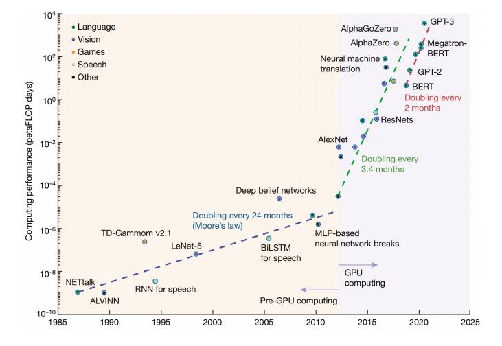
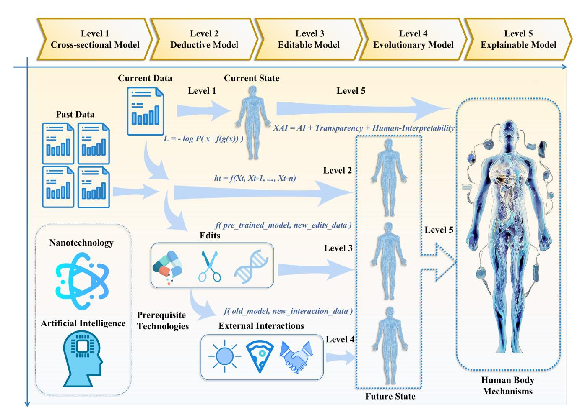
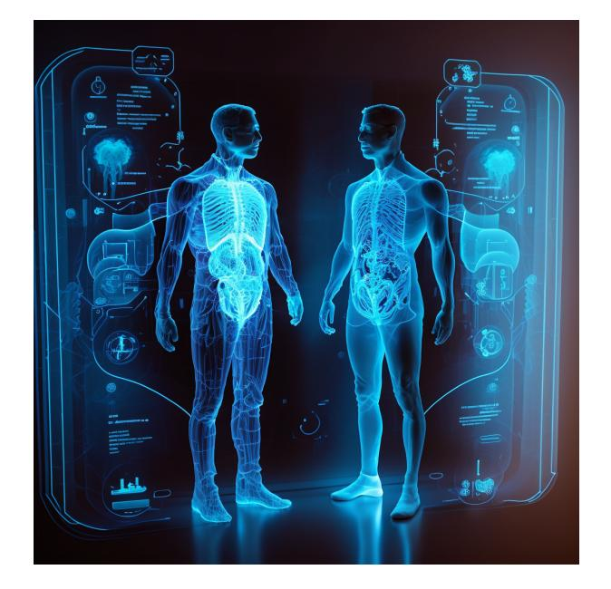

# arXiv:2307.09225v1 [cs.AI] 18 Jul 2023

# Human Body Digital Twin: A Master Plan

Chenyu Tang1 , Shuo Gao2 , and Luigi G. Occhipinti1

1Occhipintigroup, Cambridge Graphene Centre, Department of Engineering, University of Cambridge

2School of Instrumentation Science and Optoelectronic Engineering, Beihang University

*Abstract*—The human body DT has the potential to revolutionize healthcare and wellness, but its responsible and effective implementation requires consideration of various factors. This article presents a comprehensive overview of the current status and future prospects of the human body DT and proposes a five-level roadmap for its development. The roadmap covers the development of various components, such as wearable devices, data collection, data analysis, and decision-making systems. The article also highlights the necessary support, security, cost, and ethical considerations that must be addressed in order to ensure responsible and effective implementation of the human body DT. The proposed roadmap provides a framework for guiding future development and offers a unique perspective on the future of the human body DT, facilitating new interdisciplinary research and innovative solutions in this rapidly evolving field.

Keywords: Human Body Digital Twin, Healthcare, Artificial Intelligence, Sensors.

## I. INTRODUCTION

In future healthcare, cutting-edge biomedical technologies are investigated to deliver early prevention, accurate diagnoses, and precise treatment. Initial attempts to achieve this include early warning for neurodegenerative disease [1, 2], imaging diagnosis for cardio-cerebrovascular diseases [3, 4], and tumortargeting therapies [5, 6]. Further progress is hindered by human bodies'uncertainty, originating from but not limited to the complex correlations between organs, the unclear effects of the everyday environment on human bodies, and the heterogeneity of different individuals. For example, the elusive role of external and intrinsic environmental factors significantly hinders decoding the mechanism of amyotrophic lateral sclerosis (ALS) [7]; unidentified genetic, prenatal, maternal, and earlylife environmental factors cause difficulties in pinpointing susceptible asthma infants [8]. Therefore, novel approaches are expected to be able of decoding and overcoming human bodies' uncertainty. Among these, the idea of establishing and analyzing virtual representations of real entities is burgeoning, along with the exponential growth of computational capacity (as shown in Figure 1).

In this context, digital twin (DT) technology, by deploying sensors to long-termly retrieve a tremendous amount of information required to decode the uncertainties of a target system, is now unleashing its strong power in determining and predicting the system's status under changing conditions. DTs have been successfully applied in diverse complex industrial scenarios, anticipating the possibility of addressing uncertainties of human bodies. In recent years many researchers have started to explore the human body DT [9-11]. Nevertheless, the lack of a unifying approach, especially a consensus on the

<!-- Image Description: The figure is a log-log plot showcasing the evolution of computing performance in petaFLOP days for various AI tasks (language, vision, games, speech, other) from 1985 to 2025. Data points represent key AI models, illustrating an exponential increase in performance exceeding Moore's Law (dashed line). Dashed and solid green lines highlight the accelerating growth rate post-2010, attributed to the increased use of GPUs. The plot effectively visualizes the rapid advancement in AI computational capabilities over time. -->

Fig. 1. Computing performance evolution of the state-of-the-art AI models [36].

future roadmap of the human body DT, limits the development and deployment of human body DTs for use in healthcare.

Based on the state-of-the-art works and our forecasts for technological developments, we believe that in the future human body DT will be refined into five levels that will play a significant role in different healthcare directions. Therefore, To facilitate scientific advancement in this promising field, We propose, first, a perspective roadmap as a five-level blueprint for modeling the human body DT (as shown in Figure 2). The roadmap will serve as a convenient and unifying framework to establish a common language and facilitate collaboration among researchers in different fields. Secondly, we discuss the necessary support and other issues to address, including security, cost, and ethical considerations.

# II. FIVE-LEVEL ROADMAP AND RELATED METHODS OF THE HUMAN BODY DT

The scarcity of human data, especially data annotated by clinicians, poses a significant challenge to the advancement of the digital health field [10]. The development of a human body DT model is no exception to this issue. However, recent breakthroughs in related technologies offer promising solutions. Specifically, innovations in nanotechnology have facilitated the design and fabrication of novel sensors that are more sensitive, adaptable, and comfortable, thereby enabling the collection of vast amounts of human data over extended periods [12, 13]. Moreover, the advent of advanced Self-supervised Learning (SSL) algorithms allows for the utilization of copious amounts

<!-- Image Description: This flowchart illustrates a five-level modeling framework for human body mechanisms. It progresses from a cross-sectional model using current data (Level 1) to an explainable model (Level 5) incorporating AI, transparency, and human interpretability. Intermediate levels involve deductive, editable, and evolutionary modeling, incorporating data edits and external interactions. Equations depict loss functions and recurrent model structures. The diagram uses human figures to visually represent model progression and incorporates icons for nanotechnology and AI technologies as prerequisites. -->

Fig. 2. The five-level roadmap for human body DT.

of unlabeled human data, a previously inconceivable accomplishment. SSL algorithms, combined with large-scale pretraining methods, have proven effective in fields like computer vision and natural language processing. AI models such as DALL·E 2 (which can complete intricate drawings based solely on descriptive sentences) [14] and ChatGPT (which can answer various complex questions, including coding and finance strategies) [15] pre-train on immense amounts of unlabeled data and fine-tune on small labeled datasets for diverse tasks. The capacity to leverage unlabeled data in this manner aligns well with the demands of human body healthcare and holds immense potential for addressing the issue of insufficient human data for the development of a robust human body DT model. Under the impetus of these technologies, human body DT technology is anticipated to progressively unveil the mysteries of the human body along the five-level modeling roadmap outlined below.

# *A. Level 1 - Cross-sectional Model:*In level 1, cross-sectional models are created for depicting the human body's digital portrait, by collecting data from the human body in a temporal cross-section to determine the realtime physical and biochemical states. Examples are locomotion classification [16] and metabolism monitoring [17]. The work in level 1 is an essential building block for the following levels.

Contrastive learning, as one of the most outstanding algorithms among SSL algorithms in recent years, utilizes the intrinsic relationships between data modalities as pseudo-labels to train models (for example, DALL·E 2 uses the pair relationships between the images and their captions) [18]. This idea can be applied to the human body, where various multi-modal sensor data of the human body also have diverse intrinsic relationships. For instance, when monitoring human motion, sensors deployed at different locations may produce various data, but they all correspond to the same action posture; when detecting neurodegenerative diseases, both movement sensors (such as accelerometers, EMG sensors, etc.) and biochemical sensors (for detecting disease-corresponding biomarkers, such as saliva sensors, sweat sensors, etc.) can produce specific outputs for the patient [19]. Although these outputs have distinct patterns, they all correspond to the same disease. These intrinsic relationships derived from the human body can be utilized as pseudo-labels to perform large-scale pre-training and train the Foundation Model (FM), which can extract crosssectional conditions of the human body, particularly encoders that extract human information from different data modalities. These FMs can even zero-shot (without any further supervised training) decipher the cross-sectional status of the human body. More significantly, they can serve as the cornerstone of human DT models and will continue to play a role in subsequent higher-level tasks.

#*B. Level 2 - Deductive Model:*Level 2 models perform deductive reasoning on the future development of the human body based on the time-continuous cross-sectional model information. By integrating the data from past cross-sections and the current cross-section, deductive models can predict evolutionary trends in human health status and potential disease risks. Many level 2 models have been reported [20, 21]. Models at this level have an intrinsic limitation: the deductions are based only on existing crosssectional data, while the uncertain interventions on the human body and changes in the external world make it hard to yield an accurate long-term prediction. Hence, we need to develop higher-level models.

In establishing the Level 2 Model, numerous past crosssectional data can be encoded by pre-trained FMs through zero-shot or few-shot fine-tuning and fed into models for analyzing temporal states, including models based on network backbones such as RNN, LSTM, and Transformer [22]. This enables the creation of a model for predicting future states through inference.

#*C. Level 3 - Editable Model:*In level 3, editable models, which can predict the impacts of edits (such as drug intervention, organ transplantation, gene editing, etc.) on human bodies, are created and utilized. Currently, many researchers are experimenting the edits on the human body to develop ways of curing or preventing diseases; however, unclear side effects cause the edits to be effective only in the short term [23, 24]. This level aims to leverage the pre-training data on cross-sections and perform few-shot inference based on limited edits (input data) to help cure some rare diseases and fatal illnesses.

For the Level 3 Model, the fundamental aspect is the integration of actual human edit data as new channels with the prior levels of the model. In comparison to cross-sectional data of the human body collected through routine health monitoring, the availability of body data post-edits (such as drug intake, surgeries, gene therapies, etc.) is limited. Utilizing pre-trained encoders from the previous levels and incorporating them with a small number of edit inputs is a promising approach to creating an editable model. Once the edit data is taken into account, the parameters of the cross-sectional data encoders can be fixed, leaving only the parameters of the encoder for the edits and the decoder to be trained. This reduces the number of parameters to be trained, effectively addressing the challenge posed by the limited quantity of edit data.

#*D. Level 4 - Evolutionary Model:*Models in previous levels focus on interpretations and predictions of human bodies themselves with few considerations of influences of external factors playing significant roles in most if not all cases. However, the human body is by no means an isolated system. Interactions with the outside world, including solar exposure, diet intake, and interpersonal connections, can have subtle but determinant impacts on the human body [25-27]. In level 4, models can merge external factors into previous tasks to evolve and enhance its prediction accuracy, therefore named evolutionary. Quantifying these external factors and incrementally feeding them to the learning machine to update the DT model is the focus of level 4.

For the Level 4 Model, interactions between the human and the external environment are incorporated into the model. Unlike previous cross-sectional sensor data and edits, these interactions are no longer limited to a one-time input to the model. A single moment of interaction may have a minimal impact on human health, but when these interactions are accumulated over time, they can have a considerable influence on the individual's overall health. Therefore, the core task in establishing this level of the model is quantifying this accumulation and feeding it into the model as additional parameters. Some factors, such as respiration and light exposure, can be quantified well by ambient sensors, while more complex interactions, such as human social interactions, require the assistance of embedded sub-models to convert them into digitized inputs for the model.

#*E. Level 5 - Explainable Model:*In the first 4 levels, although models could give good predictions and estimations in a black-box (or gray-box) manner, the lack of readability and absence of explainable input/output relations hardly provide the researchers with suitable tools to understand the process well enough to address the human body uncertainties. Therefore, in level 5, models will inform the researchers of the logical connections between observed phenomena and their outcomes. State-of-the-art research work just started to deploy explainable models relevant to this task. For example, researchers developed translatable systems based on medical imaging to explain the information contained in Computer Tomography (CT) scans or Magnetic Resonance Images (MRI) [28]. Current works in level 5 are still in their infancy and unlikely to provide real guidance to clinicians [29], while with the continuous development of human body DTs, models in level 5 may be integrated with suitable datasets to mine deep into actual features of the human body, as witnessed in the AI domain [30, 31], pushing the boundaries of future healthcare interventions.

The development of a Level 5 Model requires a deep understanding and explanation of the underlying mechanisms behind previous levels of the human body DT model. To achieve this, the use of advanced model interpretability techniques, such as saliency maps, activation maps, and model distillation, can provide valuable insights into the model's decision-making process [32]. The application of causal inference algorithms can further illuminate the relationships between inputs and outputs, allowing for a better understanding of the model's internal workings [33]. Additionally, incorporating modelagnostic interpretability methods, such as LIME and SHAP, can offer a comprehensive view of the model's behavior, enabling a thorough understanding of not only how, but also why the model arrived at its predictions [32]. By leveraging these cutting-edge techniques, the Level 5 Model serves as a tool for advancing our knowledge of the human body and enhancing the reliability and trustworthiness of human body DT models.

# III. PROSPECTIVE APPLICATIONS OF THE HUMAN BODY DT

The evolution of the human body DT technology has ushered in a new era in the realm of medicine. By generating virtual counterparts that replicate human anatomy and physiology, it offers a remarkable opportunity to comprehend and anticipate diverse physiological and pathological states in a highly individualized manner, as depicted in Figure 3.

<!-- Image Description: The image displays a futuristic medical visualization. Two translucent, three-dimensional human body models stand facing each other. Each model is overlaid with a schematic highlighting internal organs and skeletal structure. Behind each figure is a transparent screen displaying interactive diagrams of various body systems and internal organs, potentially representing medical data analysis or a diagnostic interface. The purpose is likely to illustrate advancements in medical imaging and data analysis technology. -->

Fig. 3. Conceptual figure of the future application of the human body digital twin technology.

One of the most exciting applications of the human body DT is in the field of personalized medicine. As the technology advances to Level 5, i.e., an explainable model, it will enable the creation of accurate and individualized models of human physiology. This, in turn, will allow for the design of personalized therapies for various diseases, taking into account the unique characteristics and requirements of each patient. The proposed human body digital twin model uses wearable sensors, which are relatively low cost and convenient compared to large medical instruments, as the hardware backbone, and uses large foundation models as the basis, which can greatly increase user acceptance and reduce the model development cost, thus increasing the possibility of taking human body digital twin technology out of the laboratory. It thus has the potential to be used in large-scale applications to accurately and rapidly predict or diagnose various chronic diseases based on a personalized profile of different users, and then to help simulate their response to diverse therapies during the treatment phase. Clinicians can predict outcomes based on models before they are implemented in the real world, which minimizes the risk of adverse reactions and increases success while shortening the cycle of clinical trials.

Employing human body DT in personalized medicine offers several advantages. Firstly, it ensures a superior degree of precision in treatment, as the virtual model can simulate a patient's response to diverse therapies and prognosticate the outcome before real-world application. This minimizes the risk of unfavorable effects and bolsters the probability of success. Secondly, personalized medicine that leverages human body DT technology has the potential to be cost-effective. By pinpointing the root cause of a disease, it can decrease the reliance on trial-and-error methodologies and the employment of costly and potentially detrimental drugs. Furthermore, by facilitating real-time monitoring of patients, it can help to detect potential complications early, allowing for timely and efficacious intervention.

In summary, the advancement of human body DT technology harbors the potential to revolutionize the sphere of medicine and deliver an unprecedented level of precision and personalization in treating various ailments. With continued progress and refinement, it is conceivable that human body DT will become an indispensable instrument in diagnosing and managing a wide array of medical conditions.

## IV. FURTHER CONSIDERATIONS

The development of the human body DT has the potential to revolutionize healthcare and wellness. However, there are several key considerations that must be addressed in order to ensure that this technology is implemented responsibly and effectively.

###*A. Necessary Support:*In order to realize the full potential of the human body DT, it is crucial to have the necessary support from a variety of stakeholders. This includes data-sharing initiatives between healthcare organizations, government funding for research and development, growth in interdisciplinary talent with expertise in fields such as biology, engineering, and computer science, and multi-national collaborations to pool resources and expertise. For example, an EU-funded human digital health project is working towards creating a seamless integration of various human body models and healthcare systems across Europe. The project brings together experts from various fields, such as medicine, engineering, and computer science, to develop a shared platform for data sharing and collaboration. The relevant systems have been successfully implemented in several countries, improving the quality of life for thousands of patients.

###*B. Security:*Another key consideration is the security of data collection, transmission, and storage. With sensitive personal health information being collected, it is crucial to ensure that the highest standards of data privacy and security are in place. This includes implementing secure systems for data storage, as well as protecting data transmission through encryption and secure networks. For instance, the National Health Service (NHS) in the UK has implemented various measures to protect the data safety of patients. These include strict compliance with data protection regulations such as the General Data Protection Regulation (GDPR) and the NHS Data Security and Protection Toolkit (DSPT). The NHS has also established secure networks and systems to store, process and transmit patient data, such as the NHSmail, which is a secure email service used by health and care organizations in England and Scotland. Additionally, the NHS has implemented strict access controls and authorization procedures to ensure that only authorized personnel can access sensitive patient information. The NHS has also established a national data opt-out system, which allows patients to control the use of their personal data for research and planning purposes. The NHS continues to invest in technology and resources to further strengthen the security of patient data.

###*C. Cost:*The cost associated with implementing human body DT systems must also be considered. This includes the cost of sensors, storage devices, energy consumption, and sustainability. It is important to develop solutions that are cost-effective and scalable, in order to make this technology accessible to a wide range of individuals and healthcare organizations. To reduce the cost, many researchers are developing low-cost scalable sensors and self-powered devices based on energy harvesting technology [34, 35].

###*D. Ethical Issues:*

Finally, there are several ethical considerations that must be addressed when implementing human body DT. This includes ensuring that individuals' personal health information is protected, obtaining informed consent for data collection, and considering the potential for misuse or discrimination based on health data.

Furthermore, the equitable access to human body DT technology should be considered. Ensuring that the benefits of this technology are available to all individuals, regardless of their socioeconomic background, is essential to prevent exacerbating existing health disparities. Strategies to promote equitable access could include government subsidies for lowincome individuals or the development of affordable, scalable solutions to make the technology more widely accessible.

### V. OUTLOOK

This Point of View provides a timely fresh look at the status and prospects of the rapidly evolving area of the human body DT, informing a master plan for the future development of the human body DT, stimulating discussion and new experimental approaches in this promising interdisciplinary domain.

We, therefore, anticipate a broader impact in future healthcare and in other research areas. For example, the adoption of human body DT in assistive tasks may help alleviate the productivity deficit caused by global population aging and provide resilient solutions in the context of global economic slowdown cycles.

### REFERENCES

- [1] Zhang, Jing. "Mining imaging and clinical data with machine learning approaches for the diagnosis and early detection of Parkinson's disease." npj Parkinson's Disease 8.1 (2022): 1- 15.
- [2] Hampel, Harald, et al. "Designing the next-generation clinical care pathway for Alzheimer's disease." Nature Aging 2.8 (2022): 692-703.
- [3] Alizadehsani, Roohallah, et al. "Machine learning-based coronary artery disease diagnosis: A comprehensive review." Computers in biology and medicine 111 (2019): 103346.
- [4] Siontis, Konstantinos C., et al. "Artificial intelligence-enhanced electrocardiography in cardiovascular disease management." Nature Reviews Cardiology 18.7 (2021): 465-478.
- [5] Golombek, Susanne K., et al. "Tumor targeting via EPR: Strategies to enhance patient responses." Advanced drug delivery reviews 130 (2018): 17-38.
- [6] He, Jiuyang, et al. "Tumor targeting strategies of smart fluorescent nanoparticles and their applications in cancer diagnosis and treatment." Advanced Materials 31.40 (2019): 1902409.
- [7] Taylor, J. Paul, Robert H. Brown, and Don W. Cleveland. "Decoding ALS: from genes to mechanism." Nature 539.7628 (2016): 197-206.
- [8] Holgate, S., Wenzel, S., Postma, D. et al. Asthma. Nat Rev Dis Primers 1, 15025 (2015).
- [9] Elayan, Haya, Moayad Aloqaily, and Mohsen Guizani. "Digital twin for intelligent context-aware IoT healthcare systems." IEEE Internet of Things Journal 8.23 (2021): 16749- 16757.
- [10] Acosta, Julian N., et al. "Multimodal biomedical AI." Nature Medicine ´ 28.9 (2022): 1773- 1784.
- [11] Coorey, Genevieve, et al. "The health digital twin to tackle cardiovascular disease—a review of an emerging interdisciplinary field." NPJ digital medicine 5.1 (2022): 1- 12.
- [12] Wang, Yang, et al. "Implantable intracortical microelectrodes: reviewing the present with a focus on the future." Microsystems & Nanoengineering 9.1 (2023): 7.
- [13] Gao, Fupeng, et al. "Wearable and flexible electrochemical sensors for sweat analysis: a review." Microsystems & Nanoengineering 9.1 (2023): 1.
- [14] Ramesh, Aditya, et al. "Hierarchical text-conditional image generation with clip latents." arXiv preprint [arXiv:2204.06125](http://arxiv.org/abs/2204.06125) (2022).
- [15] Ouyang, Long, et al. "Training language models to follow instructions with human feedback." arXiv preprint [arXiv:2203.02155](http://arxiv.org/abs/2203.02155) (2022).
- [16] Tang, Chenyu, et al. "WMNN: Wearables-Based Multi-Column Neural Network for Human Activity Recognition." IEEE Journal of Biomedical and Health Informatics 27.1 (2022): 339-350.
- [17] Wang, Minqiang, et al. "A wearable electrochemical biosensor for the monitoring of metabolites and nutrients." Nature Biomedical Engineering (2022): 1- 11.
- [18] Radford, Alec, et al. "Learning transferable visual models from natural language supervision." International conference on machine learning. PMLR, 2021.
- [19] Cicirelli, Grazia, et al. "Human gait analysis in neurodegenerative diseases: a review." IEEE Journal of Biomedical and Health Informatics 26.1 (2021): 229-242.
- [20] Jiang, Yuming, et al. "Predicting peritoneal recurrence and disease-free survival from CT images in gastric cancer with multitask deep learning: a retrospective study." The Lancet Digital Health 4.5 (2022): e340-e350.
- [21] Erion, Gabriel, et al. "A cost-aware framework for the development ofAI models for healthcare applications." Nature Biomedical Engineering (2022): 1- 15.
- [22] Vaswani, Ashish, et al. "Attention is all you need." Advances in neural information processing systems 30 (2017).
- [23] Montgomery, Robert A., et al. "Results of two cases of pig-to-human kidney xenotransplantation." New England Journal of Medicine 386.20 (2022): 1889- 1898.

- [24] Mills, A., et al. "A modular spring-loaded actuator for mechanical activation of membrane proteins." Nature communications 13.1 (2022): 1- 10.
- [25] Parikh, Shivang, et al. "Food-seeking behavior is triggered by skin ultraviolet exposure in males." Nature metabolism (2022): 1- 18.
- [26] Yoo, Woongjae, et al. "High-fat diet–induced colonocyte dysfunction escalates microbiota- derived trimethylamine N-oxide." Science 373.6556 (2021): 813-818.
- [27] Lee, Christopher R., Alon Chen, and Kay M. Tye. "The neural circuitry of social homeostasis: Consequences of acute versus chronic social isolation." Cell 184.6 (2021): 1500- 1516.
- [28] Shad, Rohan, et al. "Designing clinically translatable artificial intelligence systems for high- dimensional medical imaging." Nature Machine Intelligence 3.11 (2021): 929-935.
- [29] Ghassemi, Marzyeh, Luke Oakden-Rayner, and Andrew L. Beam. "The false hope of current approaches to explainable artificial intelligence in health care." The Lancet Digital Health 3.11 (2021): e745-e750.
- [30] Wei, Jason, et al. "Emergent abilities of large language models." arXiv preprint [arXiv:2206.07682](http://arxiv.org/abs/2206.07682) (2022).
- [31] LeCun, Yann. "A Path Towards Autonomous Machine Intelligence Version 0.9. 2, 2022-06- 27." (2022).
- [32] Stiglic, Gregor, et al. "Interpretability of machine learning-based prediction models in healthcare." Wiley Interdisciplinary Reviews: Data Mining and Knowledge Discovery 10.5 (2020): e1379.
- [33] Prosperi, Mattia, et al. "Causal inference and counterfactual prediction in machine learning for actionable healthcare." Nature Machine Intelligence 2.7 (2020): 369-375.
- [34] Prattis, Ioannis, et al. "Graphene for biosensing applications in pointof-care testing." Trends in Biotechnology 39.10 (2021): 1065-1077.
- [35] Li, Shuo, et al. "Humidity-sensitive chemoelectric flexible sensors based on metal-air redox reaction for health management." Nature Communications 13.1 (2022): 5416.
- [36] Mehonic, Adnan, and Anthony J. Kenyon. "Brain-inspired computing needs a master plan." Nature 604.7905 (2022): 255-260.
