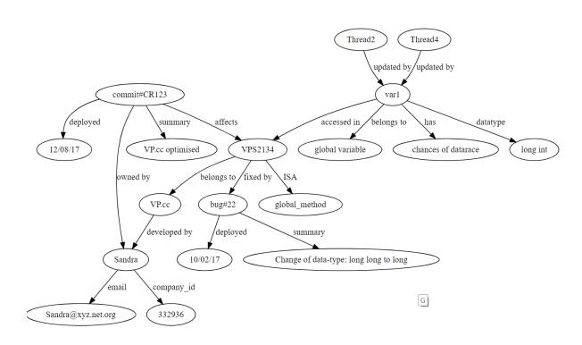
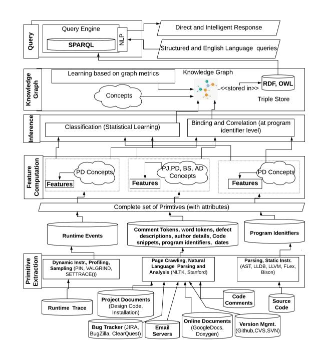

# Smart Knowledge Transfer using Google-like Search

Srijoni Majumdar Advanced Technology Development Centre Indian Institute of Technology Kharagpur-721302 majumdar.srijoni@gmail.com

Partha Pratim Das Department of Computer Science and Engineering Indian Institute of Technology Kharagpur-721302 partha.p.das@gmail.com

*Abstract*—To address the issue of rising software maintenance cost due to program comprehension challenges, we propose SMARTKT (Smart Knowledge Transfer), a search framework, which extracts and integrates knowledge related to various aspects of an application in form of a semantic graph. This graph supports syntax and semantic queries and converts the process of program comprehension into a *google-like*search problem.
*Index Terms*—Program Comprehension, Knowledge Transfer, Machine Learning, Natural Language Processing, Semantic Graph

In the last three decades, software maintenance cost has risen to 90% of the total *Software Development Life Cycle*(SDLC) cost [\[9\]](#page-2-0), [\[10\]](#page-2-1), [\[15\]](#page-2-2). Surveys conducted in [\[14\]](#page-2-3), [\[30\]](#page-2-4) conclude that as 80% of the maintenance tasks are adaptive and perfective [\[27\]](#page-2-5), hence the absence of an integrated framework or assistance for knowledge transfer (KT) to lessen program comprehension challenges contributes primarily to this rising cost. To execute a maintenance task, developers spend the majority of their time to manually search and mine source files and other knowledge sources like design documents, defect and version trackers, emails and the like, taking mental notes or scribbling the mappings, in an attempt to infer an overall knowledge about the design, behaviour and evolution of the application [\[30\]](#page-2-4), [\[25\]](#page-2-6) so as to subsequently locate the relevant code sections and their dependencies. However, in most cases, documents are dated with missing information, tracker systems are not updated properly and help from earlier developers are scanty or not available. Due to these factors, coupled with frequent interruptions [\[14\]](#page-2-3) for attending calls or meetings, the developers get involved in a tedious and inefficient process of building, revalidating and rebuilding their understanding of the application and resort to quick fixes which introduces hidden errors that cannot be removed by re-running the golden test cases [\[30\]](#page-2-4).

To address the program comprehension challenges, developers extract software development related knowledge through detection of low-level algorithm details using static instrumentation [\[3\]](#page-2-7) or extraction of the control flow between runtime events using static analysis and dynamic profiling [\[33\]](#page-2-8). Code search tools based on the abstract syntax tree have been proposed in [\[31\]](#page-2-9), [\[5\]](#page-2-10), [\[23\]](#page-2-11), [\[21\]](#page-2-12), [\[22\]](#page-2-13). For extracting application specific entities, concepts have been located in code comments based on enumerated domain concepts [\[12\]](#page-2-14) or ontology [\[2\]](#page-2-15), [\[34\]](#page-2-16), [\[24\]](#page-2-17), [\[20\]](#page-2-18). To extract project management details, comments are mined to track code changes in [\[1\]](#page-2-19) and [\[11\]](#page-2-20) and software repositories are analysed to extract information related to bug history, version changes, developer and tester details and their interrelationships in [\[7\]](#page-2-21), [\[29\]](#page-2-22). Program comprehension can be aided by extracting relevant knowledge from various sources (for a representative set, refer Table [I\)](#page-1-0) related to a working software. However, we observe that the available assistance tools consider only limited sources and additionally there is an absence of an easy to use integrated framework based on these sources.

To analyse the comprehension challenges more specifically and understand the requirements for an effective design of an assistance framework, we conducted surveys and personal interviews with a group of developers in a software company. We present a representative scenario here (names have been changed for confidentiality): A developer*Neha*, working with C++ and traditional Vi editor [\[16\]](#page-2-23), is assigned to fix bug#67 in ClearQuest [\[36\]](#page-2-24), with error message "processing error : unsigned 162 S1". As she is new, she enquires from her senior *Sandra*at every step.*Sandra*uses Cscope [\[35\]](#page-2-25) tool in Vi to grep the code base with the error string and locates function VHDLPosedge#S2 in file VHDLPosedge.cc and provides to her.*Neha*asks*Sandra*for any similar defect.*Sandra*searches ClearQuest, discovers bug#22 and searches the Microsoft Concurrent Versions System (CVS) [\[13\]](#page-2-26) and*emails*to extract the bug related commit summary for code level changes. The summary stated a change of data type from unsigned int to unsigned long int for variable var1, but in present code var1 has type – long int causing bug#67.*Sandra*then recalls this change as part of change request CR123 for optimisation of file VHDLPosedge.cc a month ago.*Sandra*tells*Neha*to revert the datatype to unsigned long int, as it would not affect the behaviour of the code. As part of CR123, VHDLPosedge#S2 is called by a thread start function, so*Sandra*tells*Neha*to add mutex locks for read and writes in the function to prevent data-races.
*Sandra* responds to queries of Neha based on multiple

relevant sources, and also provides additional important information (*Smart*help). However due to evolving teams and fragmented task distribution, resources like*Sandra*who is aware of various aspects of the application, are hardly available.

TABLE I KNOWLEDGE TYPE – KNOWLEDGE SOURCES

| Type, Description and Example                | Sources                              |
|----------------------------------------------|--------------------------------------|
| Software Development: domain of program      | Source Code, Runtime Trace, |
| ming like data structure, algorithm, memory, | Code Comments, Version Trackers      |
| concurrency. Example: variable, data race    | (SVN, github, CVS), Bug trackers     |
|                                              | (JIRA, ClearQuest, Bugzilla),  |
|                                              | Design Documents, KT sessions        |
| Application Oriented: entities and actions   | Code Comments, Version Trackers,     |
| of the specific application. Example: Convex | Bug trackers, Design Documents,      |
| Hull, bookmark                               | KT sessions                          |
| Version Evolution: commits done for appli    | Version Trackers, Code Comments,     |
| cation along with summary. Example: Com      | KT sessions                          |
| mit 71#: Code for new UI functions           |                                      |
| Defect Evolution: bugs reported and fix      | Bug trackers, Code Comments, KT      |
| summary and root cause analysis. Example:    | sessions                             |
| BugZilla#521: Data type mismatch             |                                      |
| Project Management: mapping of developer     | Code Comments, Version Trackers      |
| details to defects, version commits, source  | (SVN, github, CVS), Bug trackers,    |
| code elements, most vulnerable module. Ex    | Emails, KT sessions                  |
| ample: Developer A fixed bug BugZilla#521,   |                                      |
| developed two modules                        |                                      |
| Business Specs.: client & company details.   | Induction manuals, emails, KT ses    |
| Example: Business profile of clients         | sions                                |

We propose a search framework named SMARTKT for single and multi-threaded C / C++ and python code-bases, designed to enact*Sandra*and respond to common queries of maintenance engineers [\[32\]](#page-2-27), [\[4\]](#page-2-28) related to syntax and semantics of a software. SMARTKT supports four types of queries – a) Entity based [\[28\]](#page-2-29):*Variable D*?, *Function A*? b) List Search [\[28\]](#page-2-29): *All static variables of file ftpety.c*, *All bugs fixed on 12-03-2013*c) Template based [\[28\]](#page-2-29):*Which is the algorithm in function & what are the data-structures used*? *Function was effected by which bug numbers & how many were fixed by Developer*? d) Free-form english queries:*How many unsynchronised global variables are used to implement the UI Save button*?. For each query, SMARTKT provides direct responses coupled with *Smart*information like*responding with additional data race alerts*for queries on*global variables*. SMARTKT additionally helps to bridge missing information across sources and validates application metadata (like comments).

Fig. 1. Knowledge Graph (Note: VP stands for VHDLPosedge)

Fig. 2. Architecture of SMARTKT: Knowledge sources from Table [I](#page-1-0)

SMARTKT extracts knowledge from multiple sources (Table [I\)](#page-1-0), associates them and represents them in form of a *semantic*graph (Figure [1](#page-1-1) corresponding to*Sandra's*knowledge). The design (encompassing graph construction and query interface) of SMARTKT (Figure [2\)](#page-1-2) has been incorporated into five layers which we discuss briefly below.

-*Knowledge Primitive Extraction*: In this layer, atomic units of knowledge (referred to as *Primitives*) like *comment tokens*, *bug deployment date*, *global data write event*, *program identifier*are extracted from the relevant sources using natural language processing [\[6\]](#page-2-30) techniques and instrumentation frameworks [\[19\]](#page-2-31), [\[17\]](#page-2-32).
-*Feature Computation*: In a software, application specific concepts are modeled in terms of software development concepts (like data-structures, algorithm strategy, concurrency). In this layer, we infer each such concepts from the primitives, using machine learning algorithms. For example, using features extracted from runtime events, structure of the application and an enumerated ontology for algorithms, we can learn the *classes (greedy, divide and conquer)*for the concept*Algorithm Strategy*.
- *Inference and Knowledge Extraction*: The inferred concepts or knowledge primitives are mapped to source code elements to construct knowledge triples ({*primtive/inferred class, association, source code element*}) and form associations with each other. Example – *Bug#22*, fixed on *12th July, 2015*(Project Management), affects*Foo1*(source code element) which is a virtual member method (Software Development) of class*F*.
- *Knowledge Graph Construction*: A semantic graph is constructed based on these triples and stored in RDF

databases [\[26\]](#page-2-33). We use *pagerank*[\[38\]](#page-2-34) and*triangle counting*[\[37\]](#page-2-35) algorithms to learn from and extend the graph.

•*Query Processing*: We use SPARQL [\[8\]](#page-2-36) to query graphs. For intelligent reponses, we extract related portion of the graphs based on word vector semantics [\[18\]](#page-2-37). For handling English language queries, we plan to employ syntax and semantic matching to a corpus of queries.

A prototype of SMARTKT to extract software development and application oriented knowledge with support for entitybased, list and template-based queries has been developed and is currently under trial by a group of professional developers.

## REFERENCES

- [1] Surafel Lemma Abebe, Sonia Haiduc, Andrian Marcus, Paolo Tonella, and Giuliano Antoniol. Analyzing the evolution of the source code vocabulary. In *European Conference on Software Maintenance and Reengineering (ESMR)*, pages 189–198. IEEE, 2009.
- [2] Surafel Lemma Abebe and Paolo Tonella. Natural language parsing of program element names for concept extraction. In *International Conference on Program Comprehension (ICPC)*, pages 156–159. IEEE, 2010.
- [3] Mustafa Basthikodi and Waseem Ahmed. Classifying a program code for parallel computing against hpcc. In *International Conference on Parallel, Distributed and Grid Computing (PDGC)*, pages 512–516. IEEE, 2016.
- [4] Andrew Begel and Thomas Zimmermann. Analyze this! 145 questions for data scientists in software engineering. In *International Conference on Software Engineering (ICSE)*, pages 12–23. ACM, 2014.
- [5] Nachiketa Chatterjee, Srijoni Majumdar, Shila Rani Sahoo, and Partha Pratim Das. Debugging multi-threaded applications using pinaugmented gdb (pgdb). In *International Conference on Software Engineering Research and Practice (SERP)*, pages 109–115. WorldComp-USA, 2015.
- [6] Gobinda G Chowdhury. Natural language processing. *Annual review of information science and technology, Wiley*, 37(1):51–89, 2003.
- [7] Davor Cubranic and Gail C Murphy. Hipikat: Recommending pertinent ˇ software development artifacts. In *International Conference on Software Engineering (ICSE)*, pages 408–418. ACM, 2003.
- [8] Richard Cyganiak. A relational algebra for sparql. *Digital Media Systems, HP Laboratories*, 35:9, 2005.
- [9] Sayed Mehdi Hejazi Dehaghani and Nafiseh Hajrahimi. Which factors affect software projects maintenance cost more? *Acta Informatica Medica, The Academy of Medical Sciences of Bosnia and Herzegovina*, 21(1):63–72, 2013.
- [10] Len Erlikh. Leveraging legacy system dollars for e-business. *IT professional, IEEE*, 2(3):17–23, 2000.
- [11] Beat Fluri, Michael Wursch, and Harald C Gall. Do code and comments co-evolve? on the relation between source code and comment changes. In *Working Conference on Reverse Engineering (WCRE)*, pages 70–79. IEEE, 2007.
- [12] Jose Luıs Freitas, Daniela da Cruz, and Pedro Rangel Henriques. The role of concepts on program comprehension. In *International Conference on Program Comprehension (ICPC)*. ACM, 2011.
- [13] Dick Grune et al. *Concurrent versions systems, a method for independent cooperation*. VU Amsterdam. Subfaculteit Wiskunde en Informatica, 1986.
- [14] Andrew J Ko, Brad A Myers, Michael J Coblenz, and Htet Htet Aung. An exploratory study of how developers seek, relate, and collect relevant information during software maintenance tasks. *IEEE Transactions on software engineering, IEEE*, 32(12):971–987, 2006.
- [15] Jussi Koskinen. Software maintenance costs. Technical report, Information Technology Research Institute, University of Jyvaskyla, 2003.
- [16] Linda Lamb, Arnold Robbins, and Arthur Robbins. *Learning the vi Editor*. " O'Reilly Media, Inc.", 1998.
- [17] Chris Lattner and Vikram Adve. The llvm compiler framework and infrastructure tutorial. In *International Workshop on Languages and Compilers for Parallel Computing (LCPC)*, pages 15–16. Springer, 2004.
- [18] Omer Levy and Yoav Goldberg. Dependency-based word embeddings. In *Annual Meeting of the Association for Computational Linguistics (ACL)*, pages 302–308. ACM, 2014.

- [19] Chi-Keung Luk, Robert Cohn, Robert Muth, Harish Patil, Geoff Lowney, Steven Wallace, Vijay Janapa Reddi, and Kim Hazelwood. Pin: building customized program analysis tools with dynamic instrumentation. In *Special Interest Group on programming languages notices (SIGPLAN)*, pages 190–200. ACM, 2005.
- [20] Srijoni Majumdar, Ayush Bansal, Partha Pratim Das, Paul D Clough, Kausik Datta, and Soumya Kanti Ghosh. Automated evaluation of comments to aid software maintenance. *Journal of Software: Evolution and Process*, 34(7):e2463, 2022.
- [21] Srijoni Majumdar, Nachiketa Chatterjee, Partha Pratim Das, and Amlan Chakrabarti. A mathematical framework for design discovery from multi-threaded applications using neural sequence solvers. *Innovations in Systems and Software Engineering*, 17(3):289–307, 2021.
- [22] Srijoni Majumdar, Nachiketa Chatterjee, Partha Pratim Das, and Amlan Chakrabarti. Dcube nn d cube nn: Tool for dynamic design discovery from multi-threaded applications using neural sequence models. *Advanced Computing and Systems for Security: Volume 14*, pages 75–92, 2021.
- [23] Srijoni Majumdar, Nachiketa Chatterjee, Shila Rani Sahoo, and Partha Pratim Das. D-cube: Tool for dynamic design discovery from multi-threaded applications using pin. In *International Conference on Software Quality, Reliability and Security (QRS)*, pages 25–32. IEEE, 2016.
- [24] Srijoni Majumdar, Shakti Papdeja, Partha Pratim Das, and Soumya Kanti Ghosh. Comment-mine—a semantic search approach to program comprehension from code comments. In *Advanced Computing and Systems for Security*, pages 29–42. Springer, 2020.
- [25] Srijoni Majumdar, Papdeja Shakti, Partha Pratim Das, and Soumya Ghosh. Smartkt: A search framework to assist program comprehension using smart knowledge transfer. In *International Conference on Software Quality, Reliability and Security (QRS)*, pages 97–108. IEEE, 2019.
- [26] Eric Miller. An introduction to the resource description framework. *Bulletin of the American Society for Information Science and Technology, Wiley*, 25(1):15–19, 1998.
- [27] Thomas M Pigoski. *Practical software maintenance: best practices for managing your software investment*. Wiley, 1996.
- [28] Jeffrey Pound, Peter Mika, and Hugo Zaragoza. Ad-hoc object retrieval in the web of data. In *International conference on World Wide Web*, pages 771–780. ACM, 2010.
- [29] Seher Razzaq, Yan-Fu Li, Chu-Ti Lin, and Min Xie. A study of the extraction of bug judgment and correction times from open source software bug logs. In *International Conference on Software Quality, Reliability and Security Companion (QRS)*, pages 229–234. IEEE, 2018.
- [30] Tobias Roehm, Rebecca Tiarks, Rainer Koschke, and Walid Maalej. How do professional developers comprehend software? In *International Conference on Software Engineering (ICSE)*, pages 255–265. IEEE, 2012.
- [31] David Shepherd, Kostadin Damevski, Bartosz Ropski, and Thomas Fritz. Sando: an extensible local code search framework. In *International Symposium on the Foundations of Software Engineering (FSE)*, page 15. ACM, 2012.
- [32] Jonathan Sillito, Gail C Murphy, and Kris De Volder. Asking and answering questions during a programming change task. *IEEE Transactions on Software Engineering, IEEE*, 34(4):434–451, 2008.
- [33] Jonas Trumper, Johannes Bohnet, and Jurgen Dollner. Understanding complex multithreaded software systems by using trace visualization. In *International Symposium on Software Visualization (ISSV)*, pages 133–142. ACM, 2010.
- [34] Maria Joao Varanda Pereira, Mario Marcelo Beron, Daniela da Cruz, ˜ Nuno Oliveira, and Pedro Rangel Henriques. Problem domain oriented approach for program comprehension. In *OpenAccess Series in Informatics (OASIcs)*, pages 21–37. Schloss Dagstuhl-Leibniz-Zentrum fuer Informatik, 2012.
- [35] Girish Venkatachalam. Vim for c programmers. *Linux Journal, Slashdot Group*, 2005(140):9, 2005.
- [36] Ueli Wahli et al. Software configuration management a clear case for ibm rational clearcase and clearquest ucm, dec. 2004. *IBM,*.
- [37] Emo Welzl. Partition trees for triangle counting and other range searching problems. In *Annual symposium on Computational geometry*, pages 23–33. ACM, 1988.
- [38] Wenpu Xing and Ali Ghorbani. Weighted pagerank algorithm. In *Communication Networks and Services Research*, pages 305–314. IEEE, 2004.
