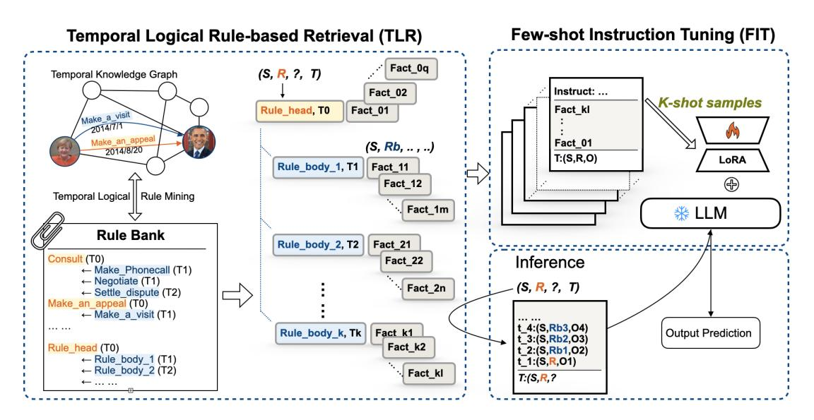
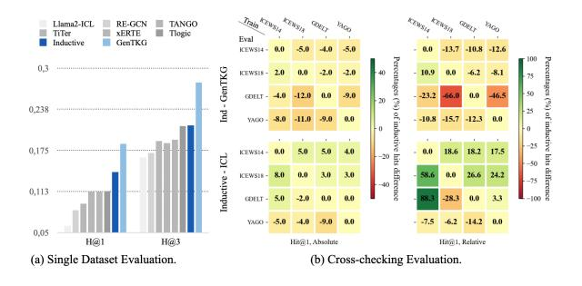
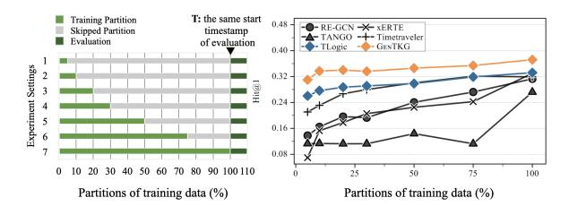
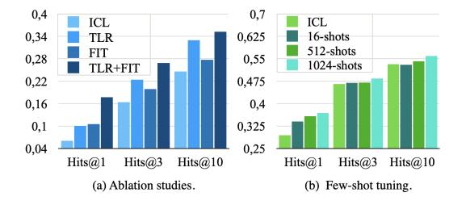
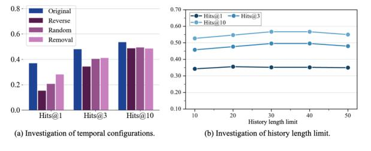

# GenTKG: Generative Forecasting on Temporal Knowledge Graph with Large Language Models

Ruotong Liao1,2 , Xu Jia3 , Yangzhe Li3 , Yunpu Ma1,2,4 , Volker Tresp1,2

1LMU Munich 2Munich Center for Machine Learning (MCML)

3Technical University of Munich 4Siemens AG

ruotong.liao@outlook.com, cognitive.yunpu@gmail.com

volker.tresp@lmu.de

## Abstract

The rapid advancements in large language models (LLMs) have ignited interest in the temporal knowledge graph (tKG) domain, where conventional embedding-based and rule-based methods dominate. The question remains open of whether pre-trained LLMs can understand structured temporal relational data and replace them as the foundation model for temporal relational forecasting. Therefore, we bring temporal knowledge forecasting into the generative setting. However, challenges occur in the huge chasms between complex temporal graph data structure and sequential natural expressions LLMs can handle, and between the enormous data sizes of tKGs and heavy computation costs of finetuning LLMs. To address these challenges, we propose a novel retrieval-augmented generation framework named GenTKG combining a temporal logical rule-based retrieval strategy and fewshot parameter-efficient instruction tuning to solve the above challenges, respectively. Extensive experiments have shown that GenTKG outperforms conventional methods of temporal relational forecasting with low computation resources using extremely limited training data as few as 16 samples. GenTKG also highlights remarkable cross-domain generalizability with outperforming performance on unseen datasets without re-training, and in-domain generalizability regardless of time split in the same dataset. Our work reveals the huge potential of LLMs in the tKG domain and opens a new frontier for generative forecasting on tKGs. The code and data are released here: [https:](https://github.com/mayhugotong/GenTKG) [//github.com/mayhugotong/GenTKG](https://github.com/mayhugotong/GenTKG).

### 1 Introduction

Forecasting the future lies in the intrinsic nature of humans to take controllability over the futural uncertainty ever since the existence of ancient fortunetellers who predict the future with insights into historical events. As the wave of Artificial General

Intelligence (AGI) led by Large Language Models (LLMs) [\(Bubeck et al.,](#page-9-0) [2023\)](#page-9-0) showcases a persistent craving for ability to model the complex information evolving in the real world, master the implicit rules and give predictions of what might happen next based on the historical observations [\(Mi](#page-10-0)[alon et al.,](#page-10-0) [2023;](#page-10-0) [Matsuo et al.,](#page-10-1) [2022\)](#page-10-1), we term this challenge for LLMs as *Generative Forecasting*. We find Temporal Knowledge Graph (tKG) is a natural instance for investigating such a challenge attributed to the evolving world knowledge it contains and the task performed on it, namely *temporal knowledge graph forecasting*. In short sentence, tKGs are multi-relational, directed graphs with labeled timestamped edges between entities (nodes) and can be viewed as streaming data sources where events come hourly, daily, or yearly, etc., and tKG forecasting task aims to forecast future events at timestamp t based on past historical events before t. Specifically, tKG originates from Knowledge Graph (KG) [\(Nickel et al.,](#page-10-2) [2015\)](#page-10-2) which structures knowledge fact in the real world in the form of triples (es, r, eo), such as *(Paris, the capital of, France)*, where es, eo represent the subject and object entity respectively, and r represents the observed predicate between the two entities. As world knowledge evolves constantly over time such as the inaugurated presidents of the USA, the Temporal Knowledge Graph (tKG) was introduced by [\(Tresp](#page-11-0) [et al.,](#page-11-0) [2015\)](#page-11-0) to indicate the temporal effectiveness of the world events by extending a timestamp t to form quadruples (es, r, eo, t). For example, *(Donald Trump, the president of, the USA, 2021)*is followed by*(Joe Biden, the president of, the USA, 2023)*. The tKG forecasting task aims to answer queries (es, r, ?, t) that predict the missing object given history events before t.

In tKG, the first embedding-based representation learning method is introduced by [\(Ma et al.,](#page-10-3) [2019\)](#page-10-3). The following conventional embeddingbased methods [\(Goel et al.,](#page-9-1) [2020;](#page-9-1) [Han et al.,](#page-9-2) [2020a;](#page-9-2)

[Sun et al.,](#page-10-4) [2021;](#page-10-4) [Yang et al.,](#page-11-1) [2020;](#page-11-1) [Li et al.,](#page-10-5) [2022\)](#page-10-5) require carefully designed models that embed indexed quadruples into hidden latent space and hence lose the semantic aspects of events in tKGs. Besides, they require separate training for different datasets and hence suffer to handle even slight dataset modification and time split adaptation. In stark contrast, the rule-based methods [\(Liu et al.,](#page-10-6) [2022\)](#page-10-6) focus on mining temporal logic rules within the tKG graph structure in a symbolic way using neural networks. However, it possesses limited scalability to only similar datasets sharing similar rules. With the huge advancements emerging with numerous large language models (LLMs) [\(Wei](#page-11-2) [et al.,](#page-11-2) [2022\)](#page-11-2), for example utilizing the emergent in-context learning (ICL) ability of LLMs [\(Dong](#page-9-3) [et al.,](#page-9-3) [2022\)](#page-9-3) by sequentializing temporal ascending ordered tKG facts to texts but failed to compete with the above conventional methods [\(Lee](#page-10-7) [et al.,](#page-10-7) [2023\)](#page-10-7). The question remains open: Can pre-trained LLMs understand structured temporal relational data and replace conventional methods as the foundation model for temporal relational forecasting?

To address the above issue, we bring temporal knowledge forecasting into the *generative forecasting*setting and deliberately prioritize the most influential factors in these two domains: the temporal and structural characteristics of tKGs and the flexible natural language processing abilities of Large Language Models (LLMs). However, two challenges stand in the middle how to integrate them organically. The first is the*modality challenge*between data structures. As tKG are complex temporal multi-relational graph data with tens of thousands of quadruples, it is hard to adapt to sequential natural language expressions that LLMs can process. The second is the*computation challenge*with the enormous costs of fine-tuning LLMs especially with tens of thousands of quadruples requiring months of training time on consumable graphic cards.

To solve the above two challenges, we propose GenTKG, a novel*retrieval-augmented generation*framework that solves the tKG forecasting task in the*generative forecasting*setting, outperforming embedding-based, rule-based and ICL methods. Besides, GenTKG serves as an instantiation that sheds light on the promising*generative forecasting*ability of LLMs. For the first*modality challenge*between structured temporal graph data and sequential natural languages, we solve it in the retrieval

phase. We utilize a temporal logical rule-based retrieval strategy (TLR) that mines the temporal logic rules of the tKGs and forms a rule bank. These rules serve to retrieve the most temporally and logically relevant historical facts to the given query. These facts are then sequentialized to natural languages in the ascending temporal order and filled in a specialized prompt template for LLMs. Although the prompts are in the form of sequential natural languages, they inherit structural information in the tKG implicitly since the extraction process is highly dependent on learned structural rules. These prompts enable LLMs to comprehend temporal relational data, and TLR enables the input window of LLM to serve as the implicit and decouplable interface for communicating temporal and structural relational data to LLMs. Moreover, TLR delivers improvement over the recent pure ICL method, regardless of the backbone LLM being used.

For the second*computation challenge*between huge tKG size and high computation costs of LLM, we solve it in the generation phase. We propose a few-shot parameter-efficient instruction-tuning strategy (FIT) that aligns LLM with a temporal relational forecasting task and reforms it into an autoregressive generation task. We further decompose the second*computation challenge*in two subtasks from the perspective of model and data respectively. The first subtask is to deal with the enormous computation costs and hardware requirements in training LLM. We solve this subtask with a parameter-efficient fine-tuning (PEFT) adaptation method, specifically Low-rank Adaptation (LoRA) [\(Hu et al.,](#page-10-8) [2021\)](#page-10-8). The second subtask is to deal with the enormous size of training data in tKGs. We deliberately think out of the box by bypassing learning the data like conventional methods and instead, letting the LLM learn the generative forecasting task on tKG. In other words, we reform data-centric model learning to task-centric LLM alignment that aligns LLMs with tKG forecasting task through instruction tuning. We have specially designed task instructions, retrieved facts as input, and generative predictions as output. Besides, we introduce few-shot tuning that further reduces training data to only 1024 prompt-response pairs which is as few as 0.27% of original tens of thousands of training data with exceeding performance. Under extreme cases, we could further reduce to as few as 16 samples which is 0.0042% of original data while maintaining comparable performance to conventional methods.

Our approach offers a foundational framework for future explorations in generative forecasting on temporal knowledge graphs. Our contributions are:

- 1. Opening a frontier of generative forecasting on tKG. To the best of our knowledge, we are the first to introduce instruction-tuned generative LLM to the tKG domain. Our framework GenTKG proposes a novel retrieval augmented generation paradigm for tKG forecasting, regardless of the backbone LLM.
- 2. Drastically low computation costs with exceeding performance. With only 16 shots parameter-efficient instruction tuning, we can already reach comparable results to conventional methods. With 1024-shots tuning, we can outperform existing rule-based, embedding-based, and the recent in-contextlearning method.
- 3. Task reformulation from data learning to task alignment. We bypass designing specific models to learn specific tKG datasets. Instead, we novelly reform the data-centric learning to task-centric LLM alignment that aligns LLMs to generative forecasting task on tKG.
- 4. Generalizability across datasets without retraining. With one-time training on a single dataset, our GenTKG has showcased remarkably both cross-domain and in-domain generalizability with exceeding performance on multiple datasets without retraining.

## 2 Generative Forecasting on Temporal Knowledge Graph

In this section, we explain our GenTKG framework following its two-phase methodology: Retrievethen-Generate, in two sections. In Section [2.1,](#page-2-0) we explain the retrieval phase, which proposes a temporal logical rule-based retrieval strategy (TLR) to capture historical facts that exhibit high temporal relevance and logical coherence. In Section [2.2,](#page-3-0) we delve into the details of the few-shot parameterefficient instruction-finetuning strategy (FIT), an essential component that aligns Large Language Models (LLMs) to the task of generative forecasting on temporal knowledge graphs.

## 2.1 Temporal Logic Rule-based Retrieval

The TLR retrieval strategy is inspired by the phenomenon that a pair of entities can have many interactions at different timestamps such as a president

visiting the same country multiple times. Another intuition behind this is that some relations tend to be temporally and logically sequential, for example in ICEWS14 we can see*(Angela Merkel, discuss by telephone, Barack Obama, 2014/07/22)*and*(Angela Merkel, consult, Barack Obama, 2014/08/09)*. Therefore, we borrow a partial idea of TLogic [\(Liu](#page-10-6) [et al.,](#page-10-6) [2022\)](#page-10-6) that mines the temporal logic rules hidden in the tKG structure. Notably, we opt to choose first-order temporal logic that complies with the input context constraints of the LLMs, and don't apply rules directly for ranking each entity as it did. Then we propose the novel TLR that retrieves the most temporally related and logically supportive history events for the given query based on these learned rules. To help understand our retrieval strategy, two definitions and the algorithm are given in the following.

*Definition I (Temporal Random Walk)*A nonincreasing temporal random walk W starting from subject entity es ∈ E to object entity eo ∈ E in the tKG G is defined as a cycle of edges ((es, r1, eo, t2),(es, r2, eo, t1)) with t2 > t1 where (es, ri , eo, ti) ∈ G and i ∈ 1, 2. The time constraints ensure that the edges are traversed only backward in time.
*Definition II (Temporal Logical Rule)*A cyclic temporal logical rule R is defined as (E1, rh, E2, T2) ← (E1, rb, E2, T1) with T2 > T1, where Ei and Ti for i ∈ 1, 2 are replaceable variables that represent entities and timestamps. The left-hand side of R is called the rule head, with rh being the head relation, while the right-hand side is called the rule body, with rb being the body relation. A rule head can be supported by multiple rule bodies denoting different rules as T R. A T R implies that if the rule body holds then the rule head is true for a future timestamp T2. The confidence of a rule conf(T R) is defined as dividing the rule support by the body support, where the support is the number of quadruples satisfying rule bodies or rule heads with time constraints within T R .

Rule Learning Let rh be a fixed relation, for which we want to learn rules. We sample an edge (e1, rh, e2, t), which will serve as the rule head, uniformly from all edges with relation rh. Then the temporal random walker samples iteratively candidate edges adjacent to the current object C(e2, t) := e2, r, e1,tˆ | e2, r, e1,tˆ ∈ G,t < t ˆ , where tˆ is the timestamp associated with the next transition

<!-- Image Description: This image depicts a system architecture diagram for Temporal Logical Rule-based Retrieval (TLR) enhanced by Few-shot Instruction Tuning (FIT). TLR uses a temporal knowledge graph to mine rules, stored in a rule bank. These rules, along with facts from the knowledge graph, are input to an inference process. FIT leverages a Large Language Model (LLM) and Low-Rank Adaptation (LoRA) with k-shot samples for improved inference, leading to output prediction. The diagram shows data flow and components, illustrating the system's overall functionality. -->

Figure 1: Framework of GenTKG. GenTKG first retrieves relevant facts based on a temporal logical rule-based retrieval strategy (TLR) then samples K prompts for few-shot parameter-efficient instruction-tuning (FIT) that aligns LLM to the task of generative temporal knowledge graph forecasting.

edge. Besides, we use an exponentially weighted transition distribution that prioritizes temporally closer edges during sampling which is defined as

$$
\mathbb{P}(u; e_2, t) = \frac{\exp(t_u - t)}{\sum_{\hat{u} \in \mathcal{C}(e_2, t)} \exp(t_{\hat{u}} - t)} \quad (1)
$$

where tu denotes the timestamp of edge u. After a fixed sampling we can collect a set of temporal walks satisfying the rule (E1, rh, E2, T2) ← (E1, rb, E2, T1). We then estimate the confidence of the rules following the definition II.

Temporal Logic Rule-based Retrieval After gaining learned temporal logical rule sets, we order them according to the associated confidence scores. For a given forecast query (es, r, ?, t) we retrieve a candidate subgraph Gs(es, r, t) from the TKG G containing temporally and logically relevant histories for the given query, with respect to the subject entity, relation, and timestamp. Since the query subject entity is fixed, there are two key factors in the retrieval algorithm, i.e. time window and rule grounding. First, we define the time window as TW = [t−, t] with t− := t − w, where the w ∈ N + represents the time window length backward starting from the query timestamp. The maximum length of w is min {tmax, t} with tmax denoting the maximum timestamp of the datasets. Second, the query relation r is fixed as a rule head rh. Within each TW, we first use rule-head to retrieve history facts satisfying (es, rh, eo, t − w). Then, we apply the learned rules T R and select top

k various rule bodies rb1 , rb2 , · · ·, rbk regarding r in descending confidence and add historical events (es, rb, eo, t − w) to Gs(es, r, t) for the given query. The size of Gs(es, r, t) can be adjusted dynamically with respect to w and k. We stop the retrieval until a maximum history length N is reached. For instance, we retrieve history events iteratively with the descending confident rule bodies for each time window backtrace step until a maximum history length of 50 is reached. At the end of the retrieval phase, we reorder all history events in temporal descending order for each query. The pseudo-code is attached in Appendix [B.2.](#page-14-0)

## 2.2 Align LLM to Generative tKG Forecasting

The second phase of the proposed GenTKG framework contributes to transforming the conventional data-centric tKG model learning task into an alignment task that aligns LLM with generative forecasting on tKGs. We utilize a few-shot parameterefficient instruction tuning strategy (FIT) under the settings of low GPU resource consumption with a single graphic card. In [2.2.1,](#page-4-0) we describe the instruction prompt design. In [2.2.2,](#page-4-1) we describe the parameter-efficient instruction tuning for training our generative model. In [2.2.3](#page-4-2) , we explain the few-shot tuning strategy that efficiently performs alignment with as few as 1024 samples and explores the lower-bound of samples for few-shot tuning. In [2.2.4,](#page-5-0) we describe the generalization ability of generative forecasting on tKG.

| PART                    | <b>CONTENT</b>                                                                      |
|-------------------------|-------------------------------------------------------------------------------------|
| <b>Task Instruction</b> | You must be able to correctly predict the next {object_label} from a given text     |
|                         | consisting of multiple quadruplets in the form of "{time}: [{subject}, {relation},  |
|                         | {object_label}. {object}]" and the query in the form of "{time}: [{subject}, {rela- |
|                         | tion}," in the end. You must generate only the single number for {object label}     |
|                         | without any explanation.                                                            |
| <b>Task Input</b>       | 93: [Abdulrahman, Make statement, 8092.Government (Nigeria)]                        |
|                         | 113: [Abdulrahman, Make statement, 8092.Government (Nigeria)]                       |
|                         | 162: [Abdulrahman, Praise or endorse, 15546.Muslim (Nigeria)]                       |
|                         | 197: [Abdulrahman, Consult, 8488.Governor (Nigeria)]                                |
|                         | 197: [Abdulrahman, Make statement, 8092.Government (Nigeria)]                       |
|                         | 228: [Abdulrahman, Praise_or_endorse, 15414.Muhammadu_Buhari]                       |
|                         | 270: [Abdulrahman, Make_an_appeal_or_request, 3835.Citizen_(Nigeria)]               |
|                         | 270: [Abdulrahman, Praise_or_endorse,                                               |
| <b>Task Output</b>      | 3835.Citizen (Nigeria)]                                                             |
|                         |                                                                                     |

Figure 2: Instruction Prompt Design

### 2.2.1 Instruction Prompt Design

Instruction Tuning is a crucial technique that finetunes LLMs with human-curated instruction and response pairs as the training data, empowering LLMs with instruction-following capability [\(Zhou](#page-11-3) [et al.,](#page-11-3) [2023\)](#page-11-3). The construction of an instruction sample is usually composed of three parts, i.e. task instruction, task input, and task output. Task instruction clarifies the definition of the task for LLMs to comprehend and gives explicit solutions for LLMs to follow and execute. Task input in natural languages is input data serving as context for LLMs. Task output is the decoding results based on the input prompt. In our proposed GenTKG framework, we adapt the temporal knowledge graph forecasting task to the instruction task for LLMs with individual adaptation for the three parts partially following the setting in [\(Lee et al.,](#page-10-7) [2023\)](#page-10-7). The instruction is depicted in Figure [2.](#page-4-3) Except for the designed task instruction, the task input is modeled as ordered historical events retrieved from the TLR phase for a given query (es, r, eo, t) as described in [2.1.](#page-2-0) Each fact is filled in the template of "t : [es, r, neo .eo]". The query (es, r, eo, t) is expressed in a similar but partial way as "t : [es, r," for LLM to complete as generative predictions. It is worth noting that we conserve the format in [\(Lee](#page-10-7) [et al.,](#page-10-7) [2023\)](#page-10-7) that maps each candidate object eo with a numerical index neo as a fair comparison. However, [\(Lee et al.,](#page-10-7) [2023\)](#page-10-7) try to avoid unfair tokenization for different entities with this index and use the probabilities of index tokens generated by the LLMs to get ranked scores of output entities in an indirect way. But this can only be used on GPT-like model and cannot handle LLaMA-like models harnessing individual tokenization. Therefore we use top generated entity names directly for prediction evaluation.

#### 2.2.2 Parameter-efficient Instruction Tuning

Direct fine-tuning of the entire model is computationally demanding and time-consuming. To address these computational challenges, we adopt the Low-Rank Adaptation (LoRA) technique [\(Hu](#page-10-8) [et al.,](#page-10-8) [2021\)](#page-10-8). LoRA involves the freezing of pre-trained model parameters θ0 while introducing trainable additional parameters θ0 that can be decomposed into low-rank matrices ∆θ0 = BA, B ∈ R d×r , A ∈ R r×k , r ≪ min(d, k) that incorporat supplimentary information to the LLM.

At present, there are large amounts of LLMs released, such as GPT series [\(Kojima et al.,](#page-10-9) [2022;](#page-10-9) [Radford et al.,](#page-10-10) [2019\)](#page-10-10), T5 series [\(Raffel et al.,](#page-10-11) [2020\)](#page-10-11), CHinchilla [\(Hoffmann et al.,](#page-10-12) [2022\)](#page-10-12), and LLaMA [\(Touvron et al.,](#page-10-13) [2023\)](#page-10-13), etc.. Among these, proprietary models can only be accessed by APIs such as ChatGPT with limited adaptation and alignment possibilities that hinder the research purpose. To facilitate the research of generative forecasting on temporal knowledge graph, we carefully opt for the open-sourcing LLMs, i.e. GPT-NeoX-20B [\(Black et al.,](#page-9-4) [2022\)](#page-9-4) and LLaMA2-7B [\(Touvron](#page-10-13) [et al.,](#page-10-13) [2023\)](#page-10-13), which is the third-party reproduction of GPT-3 and open-source public model respectively. Due to hardware limitations, we leave GPT-NeoX-20B frozen to investigate the effectiveness of our retrieval phase through its in-context learning ability. We perform the whole GenTKG framework on LLaMA2-7B with consumable adaptation.

## 2.2.3 Efficient Alignment with Few-shot Tuning

Our framework contributes a remarkably efficient and effective few-shot training strategy. The hypothesis has been proven that alignment can be a simple process where the LLMs learn the style or format for responding to prompts and expose the knowledge and capabilities that were already acquired during pretraining [\(Zhou et al.,](#page-11-3) [2023\)](#page-11-3). Therefore, considering the volume of temporal knowledge graphs that usually possess tens of thousands of training data, we propose a K-shot tuning paradigm where only an extremely limited number of K samples are uniformly sampled from the temporal-ordered training set for language model adaptations. In our case, we select only 1024 samples which takes up as few as 0.27% of the original GDELT dataset sizes that conventional methods usually fully trained on. We further prove that our method can acquire temporal relational forecasting capability rapidly with severely limited training data (0.0027%) with an extreme 16-shot training setting while maintaining comparable performances to conventional methods.

### 2.2.4 Generalization Ability of GenTKG

Due to the novel transformation from data-centric learning to task-centric alignment which forces the LLM is aligned to the temporal relational forecasting task itself rather than the learning of the tKG data. GenTKG also delivers remarkable generalizability in various generalization settings.

Cross-domain generalizability. LLM trained on one dataset can be inferred directly on other datasets. A generalized GenTKG only requires learning the temporal-logical rule-based retrieval strategy for the new datasets in the first phase to ensure proper prompts with relevant histories. However, it doesn't require retraining LLM in the second phase. Still, high-performance gains are maintained and even comparable to the original setting.

In-domain generalizability. GenTKG maintains high-performance gains on the same dataset even trained on only partial training data. The partition can be limited to a small fraction such as 5% of original training data. This characteristic exceeds conventional methods which always suffer drastic performance drops even with a minor change of critical value of the forecasting timestamp between the train and evaluation set.

#### 3 Experimental Setup

In this section, we describe the experimental setup of GenTKG framework. Specifically, we describe four datasets, the evaluation protocols, and the experimental design.

Datasets Four benchmark datasets are used to evaluate GenTKG: 1) ICEWS14 [\(Boschee et al.,](#page-9-5) [2015\)](#page-9-5) 2) ICEWS18 [\(Boschee et al.,](#page-9-5) [2015\)](#page-9-5) 3) GDELT [\(Leetaru and Schrodt,](#page-10-14) [2013\)](#page-10-14) 4) YAGO [\(Mahdisoltani et al.,](#page-10-15) [2013\)](#page-10-15). The two versions of the Integrated Crisis Early Warning System (ICEWS) both consist of timestamped political events, e.g., (Angela Merkel, Visit, India, 2015-03-25). The GDELT and YAGO datasets are extracted from the subsets of GDELT and YAGO knowledge bases containing facts and time information. Dataset statistics is shown in Table [3](#page-15-0) in the Appendix [B.4.](#page-15-1)

Evaluation Since GenTKG generates entity predictions directly, we use the temporal-aware filtered [\(Gastinger et al.,](#page-9-6) [2023\)](#page-9-6) Hits@1/3/10 metric to evaluate extrapolated link prediction. Hits@1/3/10 denotes the proportion of the actual missing entities ranked within the top 1/3/10.

Baselines Since GenTKG is the first method to introduce instruction-tuned generative models

into the tKG forecasting domain, it is necessary to include three typical types of existing methods as baselines. The first are embedding-based methods, represented by RE-GCN [\(Li et al.,](#page-10-16) [2021\)](#page-10-16), xERTE [\(Han et al.,](#page-9-2) [2020a\)](#page-9-2), TANGO [\(Han et al.,](#page-9-7) [2021\)](#page-9-7), and Timetraveler [\(Sun et al.,](#page-10-4) [2021\)](#page-10-4). The rule-based method is TLogic [\(Liu et al.,](#page-10-6) [2022\)](#page-10-6) and the third type is the LLM-based ICL method with frozen parameters [\(Lee et al.,](#page-10-7) [2023\)](#page-10-7).

Experiment Design In order to comprehensively analyze GenTKG compared to different conventional methods, there are three research questions to be answered. RQ1: How is the overall performance of the proposed GenTKG framework compared with the existing conventional embeddingbased, rule-based TKG methods and LLM-based ICL method? RQ2: How well is the cross-domain and in-domain generalizability of GenTKG on different settings? RQ3: How do the components of the GenTKG affect its effectiveness?

#### 4 Experimental Results

#### 1 Main Results

To answer the RQ1, our results from Table [1](#page-6-0) achieve state-of-the-art performance, surpassing all three types of existing conventional including embedding-based models, rule-based method, and LLM-based in-context learning method across four datasets regarding metric Hit@1 and Hit@3 while maintaining comparable results regarding Hits@10. Our method demonstrates the promising trend for retrieval-augmented LLMs to serve as the foundation model for temporal relational forecasting, opening a new frontier in the TKG domain. We refer to GenTKG utilizing LLaMA2-7B as instantiation unless otherwise specified.

Compared to embedding-based methods. For all datasets, GenTKG outperforms its best embeddingbased model xERTE on ICEWS14, ICEWS18, GDELT, and Timetraveler on YAGO. Specifically, the highest performance gain is observed on GDELT with more than 58% higher on Hits@1. Compared to the rule-based method. Compared to the rule-based model TLogic, GenTKG outperforms TLogic on Hits@1 and Hits@3 while maintaining comparable performance regarding Hits@10. The slight drops regarding Hits@10 on ICEWS14 and ICEWS18 are because TLogic is carefully designed on these datasets while our method has more generalizability and demonstrated better performance regarding accuracy than recall.

Table 1: Temporal link prediction results on temporal-aware filtered Hits@1/3/10(%). The best results among each metric are highlighted in bold and the second bests are underlined.

| Method Type     | Datasets                   | ICEWS14 |         |                | ICEWS18 |         |                | GDELT   |         |                | YAGO    |         |         |
|-----------------|----------------------------|---------|---------|----------------|---------|---------|----------------|---------|---------|----------------|---------|---------|---------|
|                 | Models                     | Hits@1  | Hits@3  | Hits@10 Hits@1 |         | Hits@3  | Hits@10 Hits@1 |         | Hits@3  | Hits@10 Hits@1 |         | Hits@3  | Hits@10 |
|                 | RE-GCN                     | 31.3    | 47.3    | 62.6           | 22.3    | 36.7    | 52.5           | 8.4     | 17.1    | 29.9           | 46.8    | 60.7    | 72.9    |
|                 | xERTE                      | 33.0    | 45.4    | 57.0           | 20.9    | 33.5    | 46.2           | 8.5     | 15.9    | 26.5           | 56.1    | 72.6    | 78.9    |
| Embedding-based | TANGO                      | 27.2    | 40.8    | 55.0           | 19.1    | 31.8    | 46.2           | 9.4     | 18.9    | 32.2           | 56.6    | 65.1    | 71.8    |
|                 | Timetraveler               | 31.9    | 45.4    | 57.5           | 21.2    | 32.5    | 43.9           | 11.2    | 18.6    | 28.5           | 60.4    | 77.0    | 83.1    |
| Rule-based      | TLogic                     | 33.2    | 47.6    | 60.2           | 20.4    | 33.6    | 48.0           | 11.3    | 21.2    | 35.1           | 63.8    | 65.0    | 66.0    |
|                 | GPT-NeoX-20B               | 32.6    | 44.0    | 54.2           | 18.2    | 29.5    | 41.4           | 6.8     | 12.0    | 21.1           | 72.6    | 81.0    | 84.6    |
| ICL             | Llama2-7B                  | 25.8    | 43.0    | 51.0           | 13.5    | 27.6    | 32.6           | 3.6     | 12.5    | 22.0           | 67.7    | 79.0    | 81.8    |
|                 | GPT-NeoX-20B + TLR         | 35.0    | 47.4    | 57.5           | 21.1    | 33.9    | 45.6           | 10.2    | 16.7    | 27.3           | 73.6    | 83.0    | 86.8    |
| GenTKG          | Llama2-7B + GenTKG         | 36.85 ± | 47.95 ± | 53.5 ±         | 24.25 ± | 37.25 ± | 42.1 ±         | 13.9 ±  | 22.55 ± | 30.45 ±        | 79.15 ± | 83.0 ±  | 84.25 ± |
|                 |                            | 0.75    | 0.75    | 0.8            | 0.75    | 0.25    | 1.1            | 0.5     | 0.55    | 0.45           | 2.25    | 1.7     | 1.55    |
|                 | Llama2-7B (Generalization) | -       | -       | -              | 22.75 ± | 36.2 ±  | 44.0 ±         | 13.75 ± | 20.35 ± | 27.6 ±         | 68.9 ±  | 75.45 ± | 82.05 ± |
|                 |                            |         |         |                | 0.65    | 0.7     | 0.8            | 0.95    | 1.05    | 0.8            | 0.6     | 0.35    | 0.35    |

Compared to in-context-learning method. We analyze the performance of GenTKG on different Language Model instantiations, i.e. GPT-NeoX-20B and LLaMA2-7B respectively. For GPT-NeoX-20B, we apply only the first retrieval phase of GenTKG due to hardware limitations. However, a huge performance increase is observed for all three metrics on all datasets even with pure retrieval-augmented in-context learning. For LLaMA2-7B, the performance gain of Hits@1 has increased remarkably even outperforming GPT-NeoX-20B which has two times more parameters, indicating the potential for greater performance of our proposed GenTKG framework if applied to larger language models.

#### 4.2 Cross-domain Generalization

To answer the second question of GenTKG's performance in the generalization setting, the empirical results indicate that the GenTKG framework manifests a substantial capability for cross-dataset generalization. Specifically, once the LLM has been aligned to the tKG forecasting task in the second phase on any dataset, the LLM can be applied directly to any other dataset. Therefore, on a new dataset, GenTKG only requires dataset-specific temporal-logical rule-based retrieval to formulate proper prompts from the first phase, and can directly infer the predictions without retraining in the second phase. As shown in Figure [3\(](#page-6-1)a), all methods are trained and evaluated on GDELT, except that the LLM in generalized GenTKG is trained ICEWS14. Still, the generalized GenTKG delivers comparable performance metrics on GDELT to conventional methods with a minor performance drop compared to the original trained GenTKG. We further demonstrate similar generalization results by cross-checking the training and evaluation

<!-- Image Description: The image presents a comparative analysis of knowledge graph embedding methods. (a) shows a bar chart comparing performance (H@1 and H@3) of different methods (Llama2-ICL, TiTer, Inductive, etc.) on a single dataset. (b) displays two heatmaps. One shows the absolute percentage difference, the other the relative percentage difference, in inductive link predictions across four datasets (ICEWS14, ICEWS18, GDELT, YAGO) for pairs of methods. The purpose is to evaluate and compare the effectiveness and consistency of these methods across datasets. -->

Figure 3: Cross-Domain Generalization Setting. (a) Single dataset evaluation. All training and evaluation is on GDELT except generalized GenTKG, which is trained on ICEWS14. (b) Cross-checking. We cross-check the trained LLaMA2 in GenTKG on different training datasets and evaluation datasets. The performance drop compared to the original training setting takes up only small percentages. Even higher performance than ICL can be observed. More discussions about experiment settings and analysis are given in Appendix [B.1,](#page-14-1) explaining the huge relative difference on GDELT is due to its poor baseline performances.

datasets as shown in Figure [3\(](#page-6-1)b). Although the LLM is trained exclusively on one dataset, it still delivers comparable metrics on disparate datasets, closely approximating the outcomes of methods that were trained specifically on the identical evaluation dataset. This notable characteristic implies that the GenTKG is effectively capturing the underlying task-related features, as opposed to merely carefully designed for the dataset data, a limitation commonly shared in conventional methods.

#### 3 In-domain Generalization

Apart from cross-domain generalizability, how well does GenTKG generalize to different training partitions within the same dataset? To investigate such a problem, we carefully designed various partitions of time-ordered training data ranging in {5%, 10%,

<!-- Image Description: The image contains a bar chart and a line graph. The bar chart displays seven experiment settings, showing the percentage of training data used for training, skipping, and evaluation. The line graph presents the Hit@1 metric for six different algorithms (RE-GCN, TANGO, TLogic, XERTE, Timetraveler, GenTKG) across varying percentages of training data. Both visualizations analyze the impact of training data size on algorithm performance. -->

Figure 4: In-domain generalizability. GenTKG exceeds conventional methods on all different partitions of training data on ICEWS14. Values in Appendix Table [6.](#page-16-0)

<!-- Image Description: The image contains two bar charts. (a) shows ablation study results comparing ICL, TLR, FIT, and TLR+FIT methods, measuring "Hits@1", "Hits@3", and "Hits@10". (b) illustrates few-shot tuning performance of ICL, and models trained with 16, 512, and 1024 shots, also using the same "Hits@" metric. Both charts assess the effectiveness of different techniques and training parameters on a retrieval task. -->

Figure 5: (a) Both TLR and FIT phases contribute to GenTKG. (b) Increasing the few-shot training parameter K improves performance.

20%, 30%, 50%, 75%, 100%}. All models trained on different training partitions are evaluated on the same evaluation set starting from the same timestamp. According to Figure [4,](#page-7-0) experiments have shown that conventional methods suffer from insufficient training data while GenTKG remains exceeding performance even with as few as 5% training data. This further proves that GenTKG successfully transforms conventional data-centric learning to the task-centric alignment of LLMs and overcomes the prediction instability under the changing value of time split in the forecasting setting.

#### 4 Ablation study

We undertake ablation studies on ICEWS14 to evaluate the contribution of each phase in GenTKG with three distinct variants of the GenTKG: TLR, FIT, and TLR+FIT configurations. Here, TLR represents the variant that exclusively employs temporal logical rule-based retrieval on top of ICL learning, FIT denotes the variant solely implementing few-shot parameter-efficient instruction tuning with naive fact retrieval [\(Lee et al.,](#page-10-7) [2023\)](#page-10-7), and TLR+FIT encapsulates the integration of all components within GenTKG. Figure [5\(](#page-7-1)a) draws the conclusion that both phases in GenTKG framework contribute to distinct performance improvements. The whole pipeline enables GenTKG the ability to outperform existing methods.

#### 5 Few-shot Tuning

To delve further into the impact of sample size within the few-shot tuning, we conducted a series of experiments on the ICEWS14 dataset employing a range of shot sizes K from the set {16, 512, 1024}. For each configuration, we employed uniform sampling on the temporally-ordered training dataset. Empirical results indicate a consistent trend of performance improvement correlating proportional to the increase in the number of training samples, as visualized in Figure [5\(](#page-7-1)b). Remarkably, our findings suggest that the GenTKG framework is capable of outperforming naive ICL method even when as few as 16 shots are used for tuning. This notable finding unlocks significant potential for GenTKG in the context of aligning LLMs with temporal relational forecasting tasks from the perspective of efficient alignment or a larger scale.

#### 5 Discussion

Q1: How does the index or lexical format of the prompt affect the results? To ease the concern of data leaks in the pre-training process of LLMs, we investigate whether the lexical or index format prompt affects the LLM generative forecasting ability. We conduct experiments with ChatGPT [1](#page-7-2) using index format following ICL baseline settings in [\(Lee et al.,](#page-10-7) [2023\)](#page-10-7) as a fair comparison. Due to the restriction of training ChatGPT, we equipped Chat-GPT with the temporal logical retrieval strategy (TLR) of GenTKG compared to the ICL baseline in both lexical and index form. The experiment results are reported in Table [2.](#page-7-3)

Table 2: Performance (Hits@1) between index and lexical for gpt-3.5-turbo on ICEWS14.

| Configuration | Model         | lexical | index  |  |  |
|---------------|---------------|---------|--------|--|--|
|               |               | Hits@1  | Hits@1 |  |  |
| GenTKG-TLR    | gpt-3.5-turbo | 0.21    | 0.26   |  |  |
| ICL           | gpt-3.5-turbo | 0.18    | 0.16   |  |  |

Three interesting insights can be derived here. (1) First, the index form conter-intuitively outperforms the lexical form and therefore the concern of data leakage in the pre-trained LLMs is relieved. (2) Second, our TLR retrieval strategy steadily outperforms ICL baseline retrieval on ChatGPT, further proving its LLM-agnostic retrieval enhancement. (3) Instruction-tuned models like ChatGPT should make better use of semantic priors. How-

1ChatGPT (gpt-3.5-turbo) version 02.2024 is used here.

ever, our reverse results in the configuration of GenTKG-TLR indicate that the successful TLR retrieval strategy, which heavily relies on the temporal and structural patterns, lets instruction-tuned models like ChatGPT grasp latent patterns more easily with index and outweigh the benefit brought by semantic priors. This reveals the ability of LLM to learn temporal relational patterns more than relying on semantic priors, which we believe is a beneficial finding for future research.

Q2: How well is the qualitive improvement of TLR retrieved facts? We conduct a qualitative study regarding the temporal logic rule-based retrieval strategy (TLR) to intuitively understand its retrieval quality. The ICL-baseline [\(Lee et al.,](#page-10-7) [2023\)](#page-10-7) retrieves the most recent histories and retrieves histories igoring relation relevance. While TLR retrieves history with temporal logic rules and therefore the relations in the history facts are more related to the query. For example, given the query*334: [Abdul, Make\_an\_appeal\_or\_request,? ]*,

ICL-baseline retrieves facts mostly with general relations like *Host\_a\_visit*and*Make\_a\_visit*. However, TLR retrieves facts containing relations like *Acknowledge\_or\_claim\_responsibility*and*Cooperate\_militarily*, which are significantly more logically relevant. These two respective rules are visible in the TLR rule bank with high confidence, which justifies the better predictive performance with precise retrieval.

Q3: How does temporal information affect Gen-TKG? To assess how GenTKG comprehend the temporal information of historical events, we set four temporal configurations on ICEWS14. *Original*organizes retrieved facts into ascending order, where the latest event is set closest to the test query, while*Reverse*configuration is in descending order. We further set two settings with*Random*temporal order and*Removal*of timestamp.

The results in Figure [6\(](#page-8-0)a) show that all configurations other than the original ascending order lead to a deterioration in performance. Among them, the*Removal*indicates a least performance deterioration implying that the sequential order of events has an implicit consistency in the*Original*ascending order for LLM to reason the temporal information.

Q4: How does history length affect GenTKG's performance? Due to the limitation of LLM context length, we evaluate the impact of the history length of TLR retrieved facts. We conduct a set of

<!-- Image Description: The image contains two bar charts and a line graph evaluating a recommendation system. (a) compares "Hits@1", "Hits@3", and "Hits@10" metrics across four temporal configurations (Original, Reverse, Random, Removal). (b) shows how these same metrics change with varying "history length limit" values. The graphs illustrate the impact of temporal data ordering and history length on recommendation accuracy. -->

Figure 6: (a) Other temporal configurations deteriorate performance. (b) Increasing the history length limit improves performance.

experiments on ICEWS14 using varying truncated history lengths, i.e. the upper length limit, with four configurations {10, 20, 30, 40, 50}. Our results, as shown in Figure [6\(](#page-8-0)b), indicate that improving history length generally leads to better performance and imply that most temporal and logically relevant facts are retrieved in the near past, and retrieving less relevant facts will affect performance.

## 6 Conclusion

This paper raises the question and proves that pretrained LLMs can understand structured temporal relational data and replace existing tKG models as the foundation model for temporal relational forecasting task. We propose a retrieval-augmented generative framework GenTKG that can efficiently align LLM with temporal relational forecasting task through two stages: temporal logical rule-based retrieval (TLR) and few-shot parameter-efficient fine-tuning (FIT). Extensive experimental results demonstrate that GenTKG outperforms conventional embedding-based, rule-based and ICL methods. Moreover, GenTKG is training-light through comsumable computation resources with extremely few training data, and exhibits strong cross-domain and in-domain transferability breaking the barriers of conventional data-centric learning.

## 7 Limitation and Future Directions

GenTKG is limited by the input context window of LLMs. Specifically, for LLaMA2, the input context window is 4096 tokens with an average upper length limit of 50 history facts that limit the performance of Hit@10. This RAG framework of GenTKG has the potential to combine better retrieval strategies and prompt LLMs with longer context windows to fully utilize temporal reasoning of LLMs. The strong generalization ability may also benefit inductive settings, zero-shot, or fewshot tasks in tKG, which we leave to the future.

## Ethics Statement

GenTKG is tailored to generative forecasting on temporal knowledge graphs and can be applied to a wide variety of downstream tasks with generative forecasting settings, such as recommendation systems, anomaly detection, etc. It can also power search and serve to improve users' lives. GenTKG can help protect data with its generalizability which requires less training over various datasets. The risk of GenTKG might come from risks inherited in open-source LLMs, such as hallucinations.

### Liscence

The datasets used in this research work are opensourced and can be seen in references. We derive some datasets from the original version within the intended use term. For the GDELT dataset, as stated in the terms of use of GDELT[2](#page-9-8) , this project is an open platform for research and analysis of global society and thus all datasets released by the GDELT Project are available for unlimited and unrestricted use for any academic, commercial, or governmental use of any kind without fee. One may redistribute, rehost, republish, and mirror any of the GDELT datasets in any form. However, any use or redistribution of the data must include a citation to the GDELT Project and a link to this website (https://www.gdeltproject.org/). ICEWS follows the MIT license on its official website (https://github.com/andybega/icews?tab=MIT-2-ov-file) and YAGO is licensed under a Creative Commons Attribution 4.0 International License (https://yago-knowledge.org/).

#### Acknowledgements

This work was funded by the Munich Center for Machine Learning and supported by the Federal Ministry of Education and Research and the State of Bavaria. We are thankful for the helpful discussions with Yushan Liu from Siemens AG and Zifeng Ding from LMU Munich.

## References

Jinheon Baek, Alham Fikri Aji, and Amir Saffari. 2023. [Knowledge-augmented language model prompting](https://doi.org/10.18653/v1/2023.nlrse-1.7) [for zero-shot knowledge graph question answering.](https://doi.org/10.18653/v1/2023.nlrse-1.7) In*Proceedings of the 1st Workshop on Natural Language Reasoning and Structured Explanations (NLRSE)*, pages 78–106, Toronto, Canada. Association for Computational Linguistics.

- Sid Black, Stella Biderman, Eric Hallahan, Quentin Anthony, Leo Gao, Laurence Golding, Horace He, Connor Leahy, Kyle McDonell, Jason Phang, Michael Pieler, USVSN Sai Prashanth, Shivanshu Purohit, Laria Reynolds, Jonathan Tow, Ben Wang, and Samuel Weinbach. 2022. [GPT-NeoX-20B: An open](https://arxiv.org/abs/2204.06745)[source autoregressive language model.](https://arxiv.org/abs/2204.06745) In *Proceedings of the ACL Workshop on Challenges & Perspectives in Creating Large Language Models*.
- Elizabeth Boschee, Jennifer Lautenschlager, Sean O'Brien, Steve Shellman, James Starz, and Michael Ward. 2015. Icews coded event data. *Harvard Dataverse*, 12.
- Sébastien Bubeck, Varun Chandrasekaran, Ronen Eldan, Johannes Gehrke, Eric Horvitz, Ece Kamar, Peter Lee, Yin Tat Lee, Yuanzhi Li, Scott Lundberg, et al. 2023. Sparks of artificial general intelligence: Early experiments with gpt-4. *arXiv preprint arXiv:2303.12712*.
- Zifeng Ding, Heling Cai, Jingpei Wu, Yunpu Ma, Ruotong Liao, Bo Xiong, and Volker Tresp. 2023. Zero-shot relational learning on temporal knowledge graphs with large language models. *arXiv preprint arXiv:2311.10112*.
- Zifeng Ding, Jingpei Wu, Bailan He, Yunpu Ma, Zhen Han, and Volker Tresp. 2022. Few-shot inductive learning on temporal knowledge graphs using concept-aware information. *arXiv preprint arXiv:2211.08169*.
- Qingxiu Dong, Lei Li, Damai Dai, Ce Zheng, Zhiyong Wu, Baobao Chang, Xu Sun, Jingjing Xu, and Zhifang Sui. 2022. A survey for in-context learning. *arXiv preprint arXiv:2301.00234*.
- Mikhail Galkin, Xinyu Yuan, Hesham Mostafa, Jian Tang, and Zhaocheng Zhu. 2023. Towards foundation models for knowledge graph reasoning. *arXiv preprint arXiv:2310.04562*.
- Julia Gastinger, Timo Sztyler, Lokesh Sharma, Anett Schuelke, and Heiner Stuckenschmidt. 2023. Comparing apples and oranges? on the evaluation of methods for temporal knowledge graph forecasting. In *Joint European Conference on Machine Learning and Knowledge Discovery in Databases*, pages 533–549. Springer.
- Rishab Goel, Seyed Mehran Kazemi, Marcus Brubaker, and Pascal Poupart. 2020. Diachronic embedding for temporal knowledge graph completion. In *Proceedings of the AAAI conference on artificial intelligence*, volume 34, pages 3988–3995.
- Zhen Han, Peng Chen, Yunpu Ma, and Volker Tresp. 2020a. Explainable subgraph reasoning for forecasting on temporal knowledge graphs. In *International Conference on Learning Representations*.
- Zhen Han, Zifeng Ding, Yunpu Ma, Yujia Gu, and Volker Tresp. 2021. Learning neural ordinary equations for forecasting future links on temporal knowledge graphs. In *Proceedings of the 2021 conference*2 https://www.gdeltproject.org/about.html#termsofuse
*on empirical methods in natural language processing*, pages 8352–8364.

- Zhen Han, Ruotong Liao, Beiyan Liu, Yao Zhang, Zifeng Ding, Jindong Gu, Heinz Koeppl, Hinrich Schuetze, and Volker Tresp. 2022. Enhanced temporal knowledge embeddings with contextualized language representations.
- Zhen Han, Yunpu Ma, Peng Chen, and Volker Tresp. 2020b. Dyernie: Dynamic evolution of riemannian manifold embeddings for temporal knowledge graph completion. *arXiv preprint arXiv:2011.03984*.
- Jordan Hoffmann, Sebastian Borgeaud, Arthur Mensch, Elena Buchatskaya, Trevor Cai, Eliza Rutherford, Diego de Las Casas, Lisa Anne Hendricks, Johannes Welbl, Aidan Clark, et al. 2022. Training compute-optimal large language models. *arXiv preprint arXiv:2203.15556*.
- Edward J Hu, Yelong Shen, Phillip Wallis, Zeyuan Allen-Zhu, Yuanzhi Li, Shean Wang, Lu Wang, and Weizhu Chen. 2021. Lora: Low-rank adaptation of large language models. *arXiv preprint arXiv:2106.09685*.
- Diederik P Kingma and Jimmy Ba. 2014. Adam: A method for stochastic optimization. *arXiv preprint arXiv:1412.6980*.
- Takeshi Kojima, Shixiang Shane Gu, Machel Reid, Yutaka Matsuo, and Yusuke Iwasawa. 2022. Large language models are zero-shot reasoners. *Advances in neural information processing systems*, 35:22199– 22213.
- Dong-Ho Lee, Kian Ahrabian, Woojeong Jin, Fred Morstatter, and Jay Pujara. 2023. Temporal knowledge graph forecasting without knowledge using incontext learning. *arXiv preprint arXiv:2305.10613*.
- Kalev Leetaru and Philip A Schrodt. 2013. Gdelt: Global data on events, location, and tone, 1979–2012. In *ISA annual convention*, volume 2, pages 1–49. Citeseer.
- Mingchen Li, Chen Ling, Rui Zhang, and Liang Zhao. 2024. A condensed transition graph framework for zero-shot link prediction with large language models. *arXiv preprint arXiv:2402.10779*.
- Zixuan Li, Zhongni Hou, Saiping Guan, Xiaolong Jin, Weihua Peng, Long Bai, Yajuan Lyu, Wei Li, Jiafeng Guo, and Xueqi Cheng. 2022. [HiSMatch: Historical](https://doi.org/10.18653/v1/2022.findings-emnlp.542) [structure matching based temporal knowledge graph](https://doi.org/10.18653/v1/2022.findings-emnlp.542) [reasoning.](https://doi.org/10.18653/v1/2022.findings-emnlp.542) In *Findings of the Association for Computational Linguistics: EMNLP 2022*, pages 7328– 7338, Abu Dhabi, United Arab Emirates. Association for Computational Linguistics.
- Zixuan Li, Xiaolong Jin, Wei Li, Saiping Guan, Jiafeng Guo, Huawei Shen, Yuanzhuo Wang, and Xueqi Cheng. 2021. Temporal knowledge graph reasoning based on evolutional representation learning.

- Yushan Liu, Yunpu Ma, Marcel Hildebrandt, Mitchell Joblin, and Volker Tresp. 2022. Tlogic: Temporal logical rules for explainable link forecasting on temporal knowledge graphs. In *Proceedings of the AAAI conference on artificial intelligence*, volume 36, pages 4120–4127.
- Yunpu Ma, Volker Tresp, and Erik A Daxberger. 2019. Embedding models for episodic knowledge graphs. *Journal of Web Semantics*, 59:100490.
- Farzaneh Mahdisoltani, Joanna Biega, and Fabian M Suchanek. 2013. Yago3: A knowledge base from multilingual wikipedias. In *CIDR*.
- Yutaka Matsuo, Yann LeCun, Maneesh Sahani, Doina Precup, David Silver, Masashi Sugiyama, Eiji Uchibe, and Jun Morimoto. 2022. Deep learning, reinforcement learning, and world models. *Neural Networks*, 152:267–275.
- Grégoire Mialon, Roberto Dessì, Maria Lomeli, Christoforos Nalmpantis, Ram Pasunuru, Roberta Raileanu, Baptiste Rozière, Timo Schick, Jane Dwivedi-Yu, Asli Celikyilmaz, et al. 2023. Augmented language models: a survey. *arXiv preprint arXiv:2302.07842*.
- Maximilian Nickel, Kevin Murphy, Volker Tresp, and Evgeniy Gabrilovich. 2015. A review of relational machine learning for knowledge graphs. *Proceedings of the IEEE*, 104(1):11–33.
- Alec Radford, Jeffrey Wu, Rewon Child, David Luan, Dario Amodei, Ilya Sutskever, et al. 2019. Language models are unsupervised multitask learners. *OpenAI blog*, 1(8):9.
- Colin Raffel, Noam Shazeer, Adam Roberts, Katherine Lee, Sharan Narang, Michael Matena, Yanqi Zhou, Wei Li, and Peter J Liu. 2020. Exploring the limits of transfer learning with a unified text-to-text transformer. *The Journal of Machine Learning Research*, 21(1):5485–5551.
- Md Rashad Al Hasan Rony, Ricardo Usbeck, and Jens Lehmann. 2022. Dialokg: Knowledge-structure aware task-oriented dialogue generation. *arXiv preprint arXiv:2204.09149*.
- Haohai Sun, Jialun Zhong, Yunpu Ma, Zhen Han, and Kun He. 2021. Timetraveler: Reinforcement learning for temporal knowledge graph forecasting. *arXiv preprint arXiv:2109.04101*.
- Jiashuo Sun, Chengjin Xu, Lumingyuan Tang, Saizhuo Wang, Chen Lin, Yeyun Gong, Heung-Yeung Shum, and Jian Guo. 2023. Think-on-graph: Deep and responsible reasoning of large language model with knowledge graph. *arXiv preprint arXiv:2307.07697*.
- Hugo Touvron, Louis Martin, Kevin Stone, Peter Albert, Amjad Almahairi, Yasmine Babaei, Nikolay Bashlykov, Soumya Batra, Prajjwal Bhargava, Shruti Bhosale, et al. 2023. Llama 2: Open foundation and fine-tuned chat models. *arXiv preprint arXiv:2307.09288*.

- Volker Tresp, Cristóbal Esteban, Yinchong Yang, Stephan Baier, and Denis Krompaß. 2015. Learning with memory embeddings. *arXiv preprint arXiv:1511.07972*.
- Jason Wei, Yi Tay, Rishi Bommasani, Colin Raffel, Barret Zoph, Sebastian Borgeaud, Dani Yogatama, Maarten Bosma, Denny Zhou, Donald Metzler, et al. 2022. Emergent abilities of large language models. *arXiv preprint arXiv:2206.07682*.
- Jinzhu Yang, Wei Zhou, Lingwei Wei, Junyu Lin, Jizhong Han, and Songlin Hu. 2020. Re-gcn: relation enhanced graph convolutional network for entity alignment in heterogeneous knowledge graphs. In *Database Systems for Advanced Applications: 25th International Conference, DASFAA 2020, Jeju, South Korea, September 24–27, 2020, Proceedings, Part II 25*, pages 432–447. Springer.
- Miao Zhang, Rufeng Dai, Ming Dong, and Tingting He. 2022. Drlk: dynamic hierarchical reasoning with language model and knowledge graph for question answering. In *Proceedings of the 2022 Conference on Empirical Methods in Natural Language Processing*, pages 5123–5133.
- Chunting Zhou, Pengfei Liu, Puxin Xu, Srini Iyer, Jiao Sun, Yuning Mao, Xuezhe Ma, Avia Efrat, Ping Yu, Lili Yu, et al. 2023. Lima: Less is more for alignment. *arXiv preprint arXiv:2305.11206*.

## References

- Jinheon Baek, Alham Fikri Aji, and Amir Saffari. 2023. [Knowledge-augmented language model prompting](https://doi.org/10.18653/v1/2023.nlrse-1.7) [for zero-shot knowledge graph question answering.](https://doi.org/10.18653/v1/2023.nlrse-1.7) In *Proceedings of the 1st Workshop on Natural Language Reasoning and Structured Explanations (NLRSE)*, pages 78–106, Toronto, Canada. Association for Computational Linguistics.
- Sid Black, Stella Biderman, Eric Hallahan, Quentin Anthony, Leo Gao, Laurence Golding, Horace He, Connor Leahy, Kyle McDonell, Jason Phang, Michael Pieler, USVSN Sai Prashanth, Shivanshu Purohit, Laria Reynolds, Jonathan Tow, Ben Wang, and Samuel Weinbach. 2022. [GPT-NeoX-20B: An open](https://arxiv.org/abs/2204.06745)[source autoregressive language model.](https://arxiv.org/abs/2204.06745) In *Proceedings of the ACL Workshop on Challenges & Perspectives in Creating Large Language Models*.
- Elizabeth Boschee, Jennifer Lautenschlager, Sean O'Brien, Steve Shellman, James Starz, and Michael Ward. 2015. Icews coded event data. *Harvard Dataverse*, 12.
- Sébastien Bubeck, Varun Chandrasekaran, Ronen Eldan, Johannes Gehrke, Eric Horvitz, Ece Kamar, Peter Lee, Yin Tat Lee, Yuanzhi Li, Scott Lundberg, et al. 2023. Sparks of artificial general intelligence: Early experiments with gpt-4. *arXiv preprint arXiv:2303.12712*.

- Zifeng Ding, Heling Cai, Jingpei Wu, Yunpu Ma, Ruotong Liao, Bo Xiong, and Volker Tresp. 2023. Zero-shot relational learning on temporal knowledge graphs with large language models. *arXiv preprint arXiv:2311.10112*.
- Zifeng Ding, Jingpei Wu, Bailan He, Yunpu Ma, Zhen Han, and Volker Tresp. 2022. Few-shot inductive learning on temporal knowledge graphs using concept-aware information. *arXiv preprint arXiv:2211.08169*.
- Qingxiu Dong, Lei Li, Damai Dai, Ce Zheng, Zhiyong Wu, Baobao Chang, Xu Sun, Jingjing Xu, and Zhifang Sui. 2022. A survey for in-context learning. *arXiv preprint arXiv:2301.00234*.
- Mikhail Galkin, Xinyu Yuan, Hesham Mostafa, Jian Tang, and Zhaocheng Zhu. 2023. Towards foundation models for knowledge graph reasoning. *arXiv preprint arXiv:2310.04562*.
- Julia Gastinger, Timo Sztyler, Lokesh Sharma, Anett Schuelke, and Heiner Stuckenschmidt. 2023. Comparing apples and oranges? on the evaluation of methods for temporal knowledge graph forecasting. In *Joint European Conference on Machine Learning and Knowledge Discovery in Databases*, pages 533–549. Springer.
- Rishab Goel, Seyed Mehran Kazemi, Marcus Brubaker, and Pascal Poupart. 2020. Diachronic embedding for temporal knowledge graph completion. In *Proceedings of the AAAI conference on artificial intelligence*, volume 34, pages 3988–3995.
- Zhen Han, Peng Chen, Yunpu Ma, and Volker Tresp. 2020a. Explainable subgraph reasoning for forecasting on temporal knowledge graphs. In *International Conference on Learning Representations*.
- Zhen Han, Zifeng Ding, Yunpu Ma, Yujia Gu, and Volker Tresp. 2021. Learning neural ordinary equations for forecasting future links on temporal knowledge graphs. In *Proceedings of the 2021 conference on empirical methods in natural language processing*, pages 8352–8364.
- Zhen Han, Ruotong Liao, Beiyan Liu, Yao Zhang, Zifeng Ding, Jindong Gu, Heinz Koeppl, Hinrich Schuetze, and Volker Tresp. 2022. Enhanced temporal knowledge embeddings with contextualized language representations.
- Zhen Han, Yunpu Ma, Peng Chen, and Volker Tresp. 2020b. Dyernie: Dynamic evolution of riemannian manifold embeddings for temporal knowledge graph completion. *arXiv preprint arXiv:2011.03984*.
- Jordan Hoffmann, Sebastian Borgeaud, Arthur Mensch, Elena Buchatskaya, Trevor Cai, Eliza Rutherford, Diego de Las Casas, Lisa Anne Hendricks, Johannes Welbl, Aidan Clark, et al. 2022. Training compute-optimal large language models. *arXiv preprint arXiv:2203.15556*.

- Edward J Hu, Yelong Shen, Phillip Wallis, Zeyuan Allen-Zhu, Yuanzhi Li, Shean Wang, Lu Wang, and Weizhu Chen. 2021. Lora: Low-rank adaptation of large language models. *arXiv preprint arXiv:2106.09685*.
- Diederik P Kingma and Jimmy Ba. 2014. Adam: A method for stochastic optimization. *arXiv preprint arXiv:1412.6980*.
- Takeshi Kojima, Shixiang Shane Gu, Machel Reid, Yutaka Matsuo, and Yusuke Iwasawa. 2022. Large language models are zero-shot reasoners. *Advances in neural information processing systems*, 35:22199– 22213.
- Dong-Ho Lee, Kian Ahrabian, Woojeong Jin, Fred Morstatter, and Jay Pujara. 2023. Temporal knowledge graph forecasting without knowledge using incontext learning. *arXiv preprint arXiv:2305.10613*.
- Kalev Leetaru and Philip A Schrodt. 2013. Gdelt: Global data on events, location, and tone, 1979–2012. In *ISA annual convention*, volume 2, pages 1–49. Citeseer.
- Mingchen Li, Chen Ling, Rui Zhang, and Liang Zhao. 2024. A condensed transition graph framework for zero-shot link prediction with large language models. *arXiv preprint arXiv:2402.10779*.
- Zixuan Li, Zhongni Hou, Saiping Guan, Xiaolong Jin, Weihua Peng, Long Bai, Yajuan Lyu, Wei Li, Jiafeng Guo, and Xueqi Cheng. 2022. [HiSMatch: Historical](https://doi.org/10.18653/v1/2022.findings-emnlp.542) [structure matching based temporal knowledge graph](https://doi.org/10.18653/v1/2022.findings-emnlp.542) [reasoning.](https://doi.org/10.18653/v1/2022.findings-emnlp.542) In *Findings of the Association for Computational Linguistics: EMNLP 2022*, pages 7328– 7338, Abu Dhabi, United Arab Emirates. Association for Computational Linguistics.
- Zixuan Li, Xiaolong Jin, Wei Li, Saiping Guan, Jiafeng Guo, Huawei Shen, Yuanzhuo Wang, and Xueqi Cheng. 2021. Temporal knowledge graph reasoning based on evolutional representation learning.
- Yushan Liu, Yunpu Ma, Marcel Hildebrandt, Mitchell Joblin, and Volker Tresp. 2022. Tlogic: Temporal logical rules for explainable link forecasting on temporal knowledge graphs. In *Proceedings of the AAAI conference on artificial intelligence*, volume 36, pages 4120–4127.
- Yunpu Ma, Volker Tresp, and Erik A Daxberger. 2019. Embedding models for episodic knowledge graphs. *Journal of Web Semantics*, 59:100490.
- Farzaneh Mahdisoltani, Joanna Biega, and Fabian M Suchanek. 2013. Yago3: A knowledge base from multilingual wikipedias. In *CIDR*.
- Yutaka Matsuo, Yann LeCun, Maneesh Sahani, Doina Precup, David Silver, Masashi Sugiyama, Eiji Uchibe, and Jun Morimoto. 2022. Deep learning, reinforcement learning, and world models. *Neural Networks*, 152:267–275.

- Grégoire Mialon, Roberto Dessì, Maria Lomeli, Christoforos Nalmpantis, Ram Pasunuru, Roberta Raileanu, Baptiste Rozière, Timo Schick, Jane Dwivedi-Yu, Asli Celikyilmaz, et al. 2023. Augmented language models: a survey. *arXiv preprint arXiv:2302.07842*.
- Maximilian Nickel, Kevin Murphy, Volker Tresp, and Evgeniy Gabrilovich. 2015. A review of relational machine learning for knowledge graphs. *Proceedings of the IEEE*, 104(1):11–33.
- Alec Radford, Jeffrey Wu, Rewon Child, David Luan, Dario Amodei, Ilya Sutskever, et al. 2019. Language models are unsupervised multitask learners. *OpenAI blog*, 1(8):9.
- Colin Raffel, Noam Shazeer, Adam Roberts, Katherine Lee, Sharan Narang, Michael Matena, Yanqi Zhou, Wei Li, and Peter J Liu. 2020. Exploring the limits of transfer learning with a unified text-to-text transformer. *The Journal of Machine Learning Research*, 21(1):5485–5551.
- Md Rashad Al Hasan Rony, Ricardo Usbeck, and Jens Lehmann. 2022. Dialokg: Knowledge-structure aware task-oriented dialogue generation. *arXiv preprint arXiv:2204.09149*.
- Haohai Sun, Jialun Zhong, Yunpu Ma, Zhen Han, and Kun He. 2021. Timetraveler: Reinforcement learning for temporal knowledge graph forecasting. *arXiv preprint arXiv:2109.04101*.
- Jiashuo Sun, Chengjin Xu, Lumingyuan Tang, Saizhuo Wang, Chen Lin, Yeyun Gong, Heung-Yeung Shum, and Jian Guo. 2023. Think-on-graph: Deep and responsible reasoning of large language model with knowledge graph. *arXiv preprint arXiv:2307.07697*.
- Hugo Touvron, Louis Martin, Kevin Stone, Peter Albert, Amjad Almahairi, Yasmine Babaei, Nikolay Bashlykov, Soumya Batra, Prajjwal Bhargava, Shruti Bhosale, et al. 2023. Llama 2: Open foundation and fine-tuned chat models. *arXiv preprint arXiv:2307.09288*.
- Volker Tresp, Cristóbal Esteban, Yinchong Yang, Stephan Baier, and Denis Krompaß. 2015. Learning with memory embeddings. *arXiv preprint arXiv:1511.07972*.
- Jason Wei, Yi Tay, Rishi Bommasani, Colin Raffel, Barret Zoph, Sebastian Borgeaud, Dani Yogatama, Maarten Bosma, Denny Zhou, Donald Metzler, et al. 2022. Emergent abilities of large language models. *arXiv preprint arXiv:2206.07682*.
- Jinzhu Yang, Wei Zhou, Lingwei Wei, Junyu Lin, Jizhong Han, and Songlin Hu. 2020. Re-gcn: relation enhanced graph convolutional network for entity alignment in heterogeneous knowledge graphs. In *Database Systems for Advanced Applications: 25th International Conference, DASFAA 2020, Jeju, South Korea, September 24–27, 2020, Proceedings, Part II 25*, pages 432–447. Springer.

- Miao Zhang, Rufeng Dai, Ming Dong, and Tingting He. 2022. Drlk: dynamic hierarchical reasoning with language model and knowledge graph for question answering. In *Proceedings of the 2022 Conference on Empirical Methods in Natural Language Processing*, pages 5123–5133.
- Chunting Zhou, Pengfei Liu, Puxin Xu, Srini Iyer, Jiao Sun, Yuning Mao, Xuezhe Ma, Avia Efrat, Ping Yu, Lili Yu, et al. 2023. Lima: Less is more for alignment. *arXiv preprint arXiv:2305.11206*.

## A Related Works

Temporal Knowledge Graphs Temporal knowledge graphs (tKGs) are multi-relational, directed graphs with labeled timestamped edges between entities (nodes). Let E and P represent a finite set of entities and predicates. A quadruple (es, r, eo, t) represents a timestamped and labeled edge between a subject entity es ∈ E and an object entity eo ∈ E at a timestamp t ∈ T . Let F represent the set of all true quadruples, i.e., real events in the world, the temporal knowledge graph forecasting task predicts missing object entity at timestamp t, i.e. (es, r, ?, t) based on a set of observed facts O before t, which is a subset of F. Current methods can be categorized into two streams. Embedding-based models learn representations of the quadruples with carefully designed embedding models [\(Han et al.,](#page-9-2) [2020a;](#page-9-2) [Goel](#page-9-1) [et al.,](#page-9-1) [2020;](#page-9-1) [Sun et al.,](#page-10-4) [2021;](#page-10-4) [Han et al.,](#page-10-17) [2020b;](#page-10-17) [Ding et al.,](#page-9-9) [2022\)](#page-9-9). Rule-based methods mine the temporal logical rules extracted and extract candidates directly on the tKGs [\(Liu et al.,](#page-10-6) [2022\)](#page-10-6).

Investigating Static KG with LLMs Later ideas also investigated static KG with LLMs utilizing the knowledge-aware prompting methods [\(Galkin](#page-9-10) [et al.,](#page-9-10) [2023;](#page-9-10) [Li et al.,](#page-10-18) [2024;](#page-10-18) [Baek et al.,](#page-9-11) [2023;](#page-9-11) [Rony](#page-10-19) [et al.,](#page-10-19) [2022;](#page-10-19) [Sun et al.,](#page-10-20) [2023;](#page-10-20) [Zhang et al.,](#page-11-4) [2022\)](#page-11-4). However, they cannot be transferred to the tKG domain due to their ignorance of temporal characteristics. Specifically, [\(Li et al.,](#page-10-18) [2024\)](#page-10-18) uses structured retrieved triples for reasoning on KG and conducts a much simpler task of reasoning on static KG. GenTKG is not only more pioneer but also more powerful since tKG forecasting is more difficult due to its temporal dynamics and we contribute our distinct RAG framework for temporal reasoning with LLMs.

Investigating TKG with Language Models The semantic part stored in the temporal knowledge graphs is heavily overlooked in either embeddingbased or rule-based temporal knowledge graph methods. Early explorers had tryouts in introducing language models in the TKG domain, some fused pre-trained language representations to the temporal knowledge embeddings [\(Han et al.,](#page-10-21) [2022\)](#page-10-21), and some flattened explicit temporal events with the emergent in-context learning ability of large language models however not comparable with conventional performance [\(Lee et al.,](#page-10-7) [2023\)](#page-10-7). [\(Ding](#page-9-12) [et al.,](#page-9-12) [2023\)](#page-9-12) explores LLM in the zero-shot relational learning settings in the TKG forecasting task.

## B Supplimentary Materials

## B.1 Discussion on Cross-domain Generalizability

We give further details regarding cross-domain generalizability experiments in Sec [4.2](#page-6-2) and Figure [3.](#page-6-1)

Cross-check Experiment Settings To assess the cross-domain generalizability according to the 4 test benchmarks in this paper, we conduct 4 series of cross-domain generalization settings respective to each benchmark. We define that a series of cross-checking settings consists of a center evaluation dataset A with the other three cross-checking datasets denoted as B, C, D. Inside a series, a single evaluation on A is conducted by comparing all inference results on the center A including (1) all baseline methods trained on A, (2) original GenTKG trained on A, and (3) generalized Gen-TKG trained one of the other three cross-checking dataset, e.g. B. In total, 4 × 3 = 16 cross-checking experiments are conducted.

Experiment Results Figure [3](#page-6-1) reports results for the cross-domain generalizability of GenTKG. Figure [3\(](#page-6-1)a) visualizes a single evaluation in a series, taking GDELT as the evaluation dataset, and ICEWS14 as the cross-checking dataset for an example. Figure [3\(](#page-6-1)b) visualizes the result differences between generalized GenTKG compared with original GenTKG (-Ori), and compared with ICL baseline (-ICL). The upper row represents the relative difference(%) of generalized GenTKG subtracted by original GenTKG (-Ori). The lower row represents the relative difference(%) of generalized GenTKG subtracted by ICL baseline (-ICL). Please refer to Table [4](#page-16-0) with absolute value differences and Table [5](#page-16-0) with relative value differences.

Regarding Fig [3\(](#page-6-1)a), similar patterns can be seen in other series of cross-checking. Table [1](#page-6-0) with the last row reports the results of GenTKG trained on ICEWS14 and tested with on other 3 datasets ICEWS18, GDELT, and YAGO. The generalized GenTKG trained on ICEWS14 have comparable and even exceeding results on ICEWS18, GDELT, and YAGO, compared to baselines, and suffer only slight drops compared to the setting of original training setting.

Regarding Fig [3\(](#page-6-1)b), two conclusions can be drawn. First, generalized settings have a performance drop compared to the original ones. Second, similar datasets tend to have better generalization performance when exchanging the training dataset. Third, even the cross-checking setting of the distant dataset can obtain better performance than ICL with minor cases of performance drop but still comparable.

This is accountable for dataset similarities. ICEWS14 and ICEWS18 originate from the same political event database with differences in the year where the data come from. ICEW14 collects data from 2014 while ICEWS18 from 2018 with a time interval of day. Therefore, the two datasets share similar patterns regarding events and patterns. GDELT documents events between global entities with a time interval of 15 minutes and YAGO originates from WIKI with a time interval of year hence they contain more complex relations and are much more distant than that between ICEWS14 and ICEWS18.

### B.2 Detailed TLR Algorithm

|        | Algorithm 1: TLR Retrieval                                  |
|--------|-------------------------------------------------------------|
|        | :Temporal knowledge graph G, Input                       |
|        | query (es, r, ?, t)                                      |
|        | N +, Parameter :Time window length w ∈             |
|        | learned rules T R                                           |
|        | Output :A set of retrieved facts                         |
|        | Gs(es, r, t)                                                |
|        | 1 Gs(es, r, t) ← ∅;                                      |
|        | ∈ G 2 for (es, r, ?, t) do                         |
| 3      | ← − TW [t w, t];                                |
| 4      | ← − ∈ G for f act (es, rh, eo, t w < t)      |
|        | do                                                          |
| 5      | Gs(es, r, t) ← Gs(es, r, t) ∪ f act                |
| 6      | end                                                         |
| 7      | for top k rules w.r.t rh ← rb ∈ T R do |
| 8      | Get a list rb ← rb1 , rb2 , · · ·, rbk       |
| 9      | end                                                         |
| 10     | for                                                         |
|        | f act ← (es, r ∈ rb, eo, t−w < t) ∈ G        |
|        | do                                                          |
| 11     | Gs(es, r, t) ← Gs(es, r, t) ∪ f act                |
| 12     | end                                                         |
| 13     | return Gs(es, r, t)                                         |
| 14 end |                                                             |

## B.3 Implementation Details

We run experiments 3 times and take averages with A40 GPU. For the TLR part, we use the rule length of 1, the number of random walks of 200, the time window of the maximum length of each dataset, and the maximum history length of 50. In the FIT training, we use the batch size of 1024, the learning rate of 3e − 4, the context length of 4096, the target length of 128, the LoRA rank of 8, the LoRA dropout rate of 0.05, and few-shot tuning of 1024-shots. Besides, we use the Adam optimizer [\(Kingma and Ba,](#page-10-22) [2014\)](#page-10-22).

## B.4 Supplementary Statistics

Table 3: Dataset statistics.

| Datasets | #train | #valid | #test | #entity | #relations | time gap |
|----------|--------|--------|-------|---------|------------|----------|
| ICEWS14  | 74854  | 8514   | 7371  | 7128    | 230        | 1 day    |
| ICEWS18  | 373018 | 45995  | 49545 | 23033   | 256        | 1 day    |
| GDELT    | 79319  | 9957   | 9715  | 5850    | 238        | 15 mins  |
| YAGO     | 220393 | 28948  | 22765 | 10778   | 23         | 1 year   |

Table 4: Absolute difference value for cross-checking between generalized GenTKG compared with original GenTKG (-ori), and compared with ICL baseline(-ICL).

|         |         | Train Hits@1 |         |       |       | Hits@3       |         |       |       | Hits@10      |         |       |       |
|---------|---------|--------------|---------|-------|-------|--------------|---------|-------|-------|--------------|---------|-------|-------|
|         | Eval    | ICEWS14      | ICEWS18 | GDELT |       | YAGO ICEWS14 | ICEWS18 | GDELT |       | YAGO ICEWS14 | ICEWS18 | GDELT | YAGO  |
| ∆(-Ori) | ICEWS14 | -            | -0.05   | -0.04 | -0.05 | -            | -0.05   | -0.03 | -0.03 | -            | -0.04   | -0.05 | -0.05 |
|         | ICEWS18 | 0.02         | -       | -0.02 | -0.02 | -0.02        | -       | -0.02 | -0.02 | -0.02        | -       | -0.04 | -0.04 |
|         | GDELT   | -0.04        | -0.12   | -     | -0.09 | -0.07        | -0.15   | -     | -0.10 | -0.08        | -0.17   | -     | -0.11 |
|         | YAGO    | -0.08        | -0.11   | -0.09 | -     | -0.07        | -0.09   | -0.06 | -     | -0.02        | -0.06   | -0.03 | -     |
| ∆(-ICL) | ICEWS14 | -            | 0.05    | 0.05  | 0.04  | -            | -0.01   | -0.01 | 0.00  | -            | -0.02   | -0.03 | 0.01  |
|         | ICEWS18 | 0.08         | -       | 0.03  | 0.03  | 0.04         | -       | 0.02  | 0.02  | 0.05         | -       | 0.04  | 0.07  |
|         | GDELT   | 0.05         | -0.02   | -     | 0.00  | 0.04         | -0.08   | -     | -0.03 | 0.03         | -0.11   | -     | 0.00  |
|         | YAGO    | -0.05        | -0.04   | -0.09 | -     | -0.05        | -0.04   | -0.09 | -     | -0.09        | -0.07   | -0.10 | -     |

Table 5: Relative difference (%) value for cross-checking between generalized GenTKG compared with original GenTKG (-ori), and compared with ICL baseline(-ICL).

|                          | Eval                                | Train Hits@1 ICEWS14       | ICEWS18                         | GDELT                          |                                                | Hits@3 YAGO ICEWS14       | ICEWS18                        | GDELT                        |                                      | Hits@10 YAGO ICEWS14 | ICEWS18                       | GDELT                         | YAGO                          |
|--------------------------|-------------------------------------|-------------------------------|---------------------------------|--------------------------------|------------------------------------------------|------------------------------|--------------------------------|------------------------------|--------------------------------------|-------------------------|-------------------------------|-------------------------------|-------------------------------|
| ∆(−Ori) × 100% Ori | ICEWS14 ICEWS18 GDELT YAGO | - 7.83 -23.24 -10.77 | -13.71 - -65.95 -15.66 | -10.75 -8.76 - -12.31 | -12.63 - -10.60 -4.31 -46.49 -23.38 - | -9.13                        | -9.43 - -53.96 -12.13 | -5.33 -5.17 - -7.69 | -6.35 -6.61 -35.25 -21.51 - | - -5.10 -3.05     | -7.10 - -46.65 -7.51 | -9.06 -9.28 - -4.20  | -8.88 -8.12 -31.01 - |
| ∆(−ICL) ICL × 100%    | ICEWS14 ICEWS18 GDELT YAGO | - 58.59 88.33 -7.55  | 18.65 - -28.33 -6.19   | 18.25 26.56 - -14.20  | 17.46 24.22 3.33 -                    | - 13.24 21.95 -6.97 | -3.28 - -46.34 -4.74  | -1.87 6.25 - -11.58 | -0.94 8.82 -18.90 13.01 -   | - 15.79 -11.12    | -2.98 - -44.31 -8.68 | -4.96 11.76 - -12.35 | 1.79 22.60 0.41 -    |

Table 6: Appendix table for few-shot results of conventional methods and GenTKG.

|                       | Top 5% |       | Top 10% |       | Top 20% |       | Top 30% Hits@1 Hits@3 Hits@10 Hits@1 Hits@3 Hits@10 Hits@1 Hits@3 Hits@10 Hits@1 Hits@3 Hits@10 Hits@1 Hits@3 Hits@10 Hits@1 Hits@3 Hits@10 Hits@1 Hits@3 Hits@10 |       |       | Top 50% |       |       | Top 75% |       |       | Top 100% |       |       |       |       |       |
|-----------------------|--------|-------|---------|-------|---------|-------|----------------------------------------------------------------------------------------------------------------------------------------------------------------------|-------|-------|---------|-------|-------|---------|-------|-------|----------|-------|-------|-------|-------|-------|
|                       |        |       |         |       |         |       |                                                                                                                                                                      |       |       |         |       |       |         |       |       |          |       |       |       |       |       |
| RE-GCN                | 13.79  | 22.09 | 30.27   | 16.47 | 25.23   | 34.19 | 19.63                                                                                                                                                                | 29.67 | 39.83 | 19.30   | 30.66 | 42.97 | 24.05   | 36.72 | 48.84 | 27.23    | 40.42 | 54.04 | 31.30 | 47.30 | 62.60 |
| xERTE                 | 06.95  | 14.17 | 25.46   | 15.27 | 26.79   | 39.43 | 17.80                                                                                                                                                                | 29.26 | 42.08 | 20.56   | 31.39 | 43.63 | 22.51   | 34.15 | 46.59 | 24.25    | 36.07 | 48.27 | 33.00 | 45.40 | 57.00 |
| TANGO                 | 11.29  | 17.18 | 22.97   | 11.34 | 17.47   | 22.98 | 11.25                                                                                                                                                                | 17.38 | 23.38 | 11.25   | 17.39 | 23.40 | 14.37   | 17.51 | 22.77 | 11.25    | 16.90 | 22.50 | 27.20 | 40.80 | 55.00 |
| Timetraveler          | 21.06  | 34.78 | 49.10   | 23.10 | 35.71   | 49.96 | 26.69                                                                                                                                                                | 39.42 | 51.78 | 27.98   | 40.14 | 53.23 | 30.05   | 42.82 | 54.74 | 32.11    | 45.33 | 57.14 | 31.90 | 45.40 | 57.50 |
| TLogic Original 26.03 |        | 37.42 | 46.50   | 27.65 | 39.55   | 48.72 | 28.72                                                                                                                                                                | 40.48 | 50.71 | 29.11   | 41.79 | 51.90 | 29.84   | 42.40 | 53.37 | 31.89    | 45.01 | 57.37 | 33.20 | 47.60 | 60.20 |
| GenTKG                | 30.60  | 42.20 | 49.30   | 34.00 | 45.40   | 52.10 | 34.90                                                                                                                                                                | 46.60 | 54.00 | 34.70   | 46.90 | 54.40 | 36.00   | 48.70 | 55.50 | 36.50    | 48.30 | 55.30 | 37.20 | 48.80 | 56.30 |
