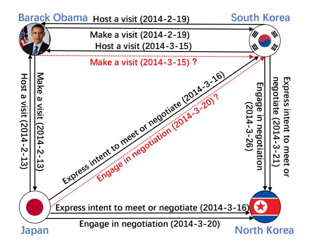
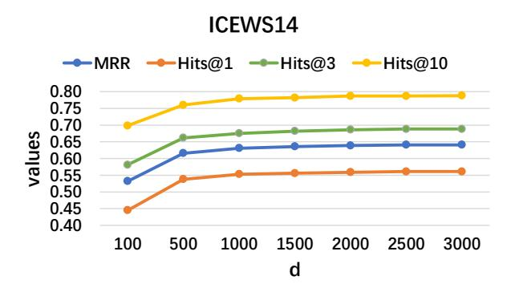
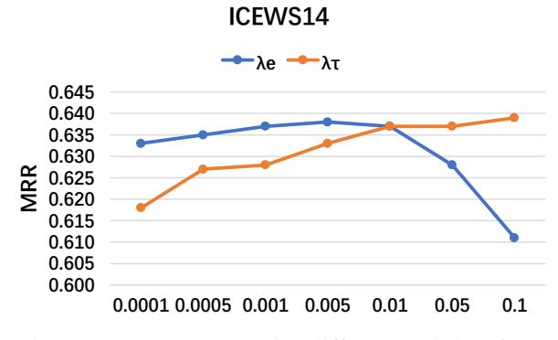

# Temporal Knowledge Graph Completion with Time-sensitive Relations in Hypercomplex Space

Li Cai1,2 , Xin Mao1 , Zhihong Wang1 , Shangqing Zhao1 , Yuhao Zhou1 , Changxu Wu3 , Man Lan1 ∗

1School of Computer Science and Technology, East China Normal University

2College of Computer Science and Technology, Guizhou University

3Department of Industrial Engineering, Tsinghua University

{caili2020, xmao, sqzhao, zhihong, 51265900018}@stu.ecnu.edu.cn

wuchangxu@tsinghua.edu.cn, mlan@cs.ecnu.edu.cn

# Abstract

Temporal knowledge graph completion (TKGC) aims to fill in missing facts within a given temporal knowledge graph at a specific time. Existing methods, operating in real or complex spaces, have demonstrated promising performance in this task. This paper advances beyond conventional approaches by introducing more expressive quaternion representations for TKGC within hypercomplex space. Unlike existing quaternion-based methods, our study focuses on capturing time-sensitive relations rather than time-aware entities. Specifically, we model time-sensitive relations through time-aware rotation and periodic time translation, effectively capturing complex temporal variability. Furthermore, we theoretically demonstrate our method's capability to model symmetric, asymmetric, inverse, compositional, and evolutionary relation patterns. Comprehensive experiments on public datasets validate that our proposed approach achieves state-of-the-art performance in the field of TKGC.

# 1 Introduction

Knowledge graphs (KGs) serve as organized repositories of information about the world, utilizing a triplet format *(h, r, t)*to represent factual knowledge. In this format, h denotes the head entity, r represents the relation, and t signifies the tail entity. Due to their ability to capture complex relations, KGs have emerged as essential resources in various applications, including search engines [\(Zhao et al.,](#page-9-0) [2023\)](#page-9-0), question-answering systems [\(Wang et al.,](#page-9-1) [2023\)](#page-9-1), and recommendation systems [\(Chen et al.,](#page-8-0) [2023\)](#page-8-0).

Despite their significance, knowledge graphs (KGs) inherently lack completeness due to the vastness of real-world information. Knowledge graph completion (KGC) becomes crucial for inferring absent relations or entities within KGs.

<!-- Image Description: This image is a directed graph depicting diplomatic interactions among Barack Obama, Japan, South Korea, and North Korea in 2014. Nodes represent actors, and edges represent actions (visits and negotiations) with dates indicated. Solid lines show confirmed actions, while dashed red lines represent uncertain or proposed actions. The graph illustrates the sequence and nature of diplomatic engagements during a specific period, likely to analyze the progression of a particular political situation. -->

Figure 1: Subgraph example from ICEWS14 dataset for TKGC. Nodes on the graph represent entities, including Obama, Japan, South Korea, North Korea, and edges signify relations (with timestamps in parentheses), encompassing Host a visit, Make a visit, Express intent to meet or negotiate, Engage in negotiation. Solid black arrows denote existing facts, while red dashed arrows indicate missing facts that need to be completed.

While KGs store static facts about the world, real-world data is dynamic, with facts evolving over time. This necessitates an extension of traditional KGs to incorporate temporal dimensions, giving rise to temporal knowledge graphs (TKGs). Within TKGs, facts are represented as quadruples (h, r, t, τ ), where τ is the timestamp.

Temporal knowledge graph completion (TKGC) naturally extends the traditional KGC task to address temporal aspects of evolving facts. In Figure [1,](#page-0-0) a case of TKGC is illustrated using a subgraph of ICEWS14. This subgraph contains facts like*(South Korea, Host a visit, Barack Obama, 2014-2-19), (Barack Obama, Make a visit, South Korea, 2014-2-19), (South Korea, Host a visit, Barack Obama, 2014-3-15)*. TKGC aims to explore the temporal features and periodic patterns associated with these facts and subsequently com-

∗ \*Corresponding author

plete missing facts, such as *(Barack Obama, Make a visit, South Korea, 2014-3-15)*.

Existing TKGC methodologies build upon established KGC paradigms and consider the temporal dynamics of entities or relations over time, thus achieving superior performance compared to conventional KGC methods. TTransE [\(Leblay and](#page-8-1) [Chekol,](#page-8-1) [2018\)](#page-8-1), TA-TransE [\(García-Durán et al.,](#page-8-2) [2018\)](#page-8-2), and HyTE [\(Dasgupta et al.,](#page-8-3) [2018\)](#page-8-3) are translation-based models that learn the embeddings of entities, relations, and times in real space. Tero [\(Xu et al.,](#page-9-2) [2020\)](#page-9-2), TComplEx [\(Lacroix et al.,](#page-8-4) [2020\)](#page-8-4), TeLM [\(Xu et al.,](#page-9-3) [2021\)](#page-9-3), and TeAST [\(Li](#page-8-5) [et al.,](#page-8-5) [2023\)](#page-8-5) extend learned representations into complex space, thereby further enhancing the performance of TKGC. RotateQVS [\(Chen et al.,](#page-8-6) [2022\)](#page-8-6) and TLT-KGE [\(Zhang et al.,](#page-9-4) [2022\)](#page-9-4) further extend representations into hypercomplex space with quaternions, indicating that hypercomplex space possesses better representational capabilities than complex space.

Although methods based on hypercomplex space for TKGC are successful, they have their shortcomings. RotateQVS first rotates the entities to the temporal dimension to get the time-aware entities, then posit relation as a translation from the timeaware head entity to the time-aware tail entity. It falls short in exploring the temporal variations of relations over time. TLT-KGE integrates temporal representation into the representation of entities and relations, combining their semantic representation in the real part with the temporal representation in the imaginary part. It also introduces a Shared Time Window (STW) module to enhance the associations between events occurring within a specific time period. TLT-KGE offers an improved capability to model the evolution of knowledge graphs over time. However, since the size of time windows is a hyper-parameter and varies across different datasets, extensive experimentation is required to determine the optimal value, leading to inefficiency.

Therefore, this paper explores the hypercomplex space for learning TKG embeddings. Specifically, we use quaternion embeddings to represent entities, relations and times. Each quaternion embedding is a vector in the hypercomplex space H with one real component a and three imaginary components bi, cj, and dk. We employ time-aware rotation and periodic time translation to model time-sensitive relations, enhancing our capability to capture the complex temporal variability of facts. The time-aware rotation utilizes the Hamilton product of quaternions to capture local temporal interactions, while periodic time translation captures interactions within a time period. Additionally, we provide theoretical evidence demonstrating that our approach covers symmetric, asymmetric, inverse, compositional, and evolutionary relation patterns. Experimental results on public datasets, including ICEWS14, ICEWS05-15, and GDELT, demonstrate that our model achieves state-of-theart (SOTA) performance. Notably, our model exhibits remarkable performance improvements on GDELT, which is known for its complex temporal variability. Compared to TLT-KGE, the improvement scores for MRR, Hits@1, Hits@3, and Hits@10 on GDELT are 8.38%, 13.96%, 7.47%, and 2.03%, respectively.

The primary contributions of this paper can be summarized as follows:

(1) We propose a novel approach to represent TKGs in hypercomplex space. By utilizing quaternion embeddings and incorporating time-aware rotation and periodic time translation, our method effectively captures the complex temporal variability of facts within TKGs.

(2) Theoretical analyses and proofs are provided to demonstrate the capability of our proposed method in modeling various relation patterns, including symmetric, asymmetric, inverse, compositional, and evolutionary relation patterns.

(3) Comprehensive experiments on various public datasets demonstrate that our approach achieves SOTA performance.

# 2 Related Works

## 1 Knowledge Graph Completion

Traditional KGC, often referred to as link prediction, typically involves learning embeddings for head entities, relations , and tail entities, denoted as eh, er, et . This methodology aims to unveil intricate patterns of relations between entities, thereby facilitating the completion of missing facts.

TransE [\(Bordes et al.,](#page-8-7) [2013\)](#page-8-7) is a foundational model in KGC, treating relation embedding as a translation from head entity embedding to tail entity embedding, represented as eh + er ≈ et . Subsequently, a series of translation-based models emerged as derivatives, including TransD, TransH, TransR, and others. These models represent embeddings in the real space R, yet may lack the ability to represent varied relation patterns.

ComplEx [\(Trouillon et al.,](#page-9-5) [2016\)](#page-9-5) and RotatE [\(Sun et al.,](#page-9-6) [2019\)](#page-9-6) extend embeddings from the real space R to the complex space C. ComplEx utilizes a bilinear score function Re(⟨eh, er, et⟩) to assess compatibility between entities and relations in the KG. On the other hand, RotatE views the relation embedding as a rotation from head entity embedding to tail entity embedding, denoted as eh ◦ er ≈ et . These models enhance the capability to model relationship patterns by leveraging complex numbers.

QuatE [\(Zhang et al.,](#page-9-7) [2019\)](#page-9-7) and QuatRE [\(Nguyen](#page-9-8) [et al.,](#page-9-8) [2022\)](#page-9-8) go beyond complex representations, exploring hypercomplex space H for learning KG embeddings. Quaternion, with its enhanced representation capability, enables the model to capture intricate interactions and dependencies within a KG. QuatE utilizes the score function eh ⊗ e ◁ r · et , and QautRE utilizes the score function (eh⊗(e ◁ r,1⊗ e ◁ r )) · (et ⊗ e ◁ r,2 ). Both of these models can effectively capture more flexible relation patterns.

Despite the significant advancements brought by these methods in KGC, they share a common limitation of neglecting temporal information in KGs.

### 2 Temporal Knowledge Graph Completion

TKGC is an extension of traditional KGC methods that incorporate temporal information to capture the dynamic evolution of facts in a TKG over time. Unlike traditional KGC, which focuses on static representations, TKGC acknowledges the temporal dimension, recognizing that relations between entities can change over different time intervals.

TTransE [\(Leblay and Chekol,](#page-8-1) [2018\)](#page-8-1) incorporates temporal information by concatenating it with relations and employs the score function ∥eh + er + eτ − et∥. TA-TransE [\(García-Durán](#page-8-2) [et al.,](#page-8-2) [2018\)](#page-8-2) represents relations as sequences with temporal information and learns the sequences embedding as the translation from the head entity to the tail entity. HyTE [\(Dasgupta et al.,](#page-8-3) [2018\)](#page-8-3) projects entities and relations onto the time hyperplane and regards the projected relations as the translation of the projected head entity to the projected tail entity. However, all these methods, based on translation in real space, face challenges similar to translation-based methods in KGC.

TComplEx [\(Lacroix et al.,](#page-8-4) [2020\)](#page-8-4) builds upon ComplEx [\(Trouillon et al.,](#page-9-5) [2016\)](#page-9-5) by incorporating temporal embeddings and introducing new regularization schemes. Tero [\(Xu et al.,](#page-9-2) [2020\)](#page-9-2) character-

izes the temporal evolution of entity embeddings by representing rotations from their initial time to the current time in complex space. TeLM [\(Xu et al.,](#page-9-3) [2021\)](#page-9-3) conducts 4-order tensor factorization on a TKG, employing linear temporal regularization and multivector embeddings. ChronoR [\(Sadeghian](#page-9-9) [et al.,](#page-9-9) [2021\)](#page-9-9) considers relations and timestamps as rotations of the head entity in a k-dimensional space. BoxTE [\(Messner et al.,](#page-9-10) [2022\)](#page-9-10) extends the BoxE [\(Abboud et al.,](#page-8-8) [2020\)](#page-8-8) for TKGC by incorporating box embeddings. TeAST [\(Li et al.,](#page-8-5) [2023\)](#page-8-5) maps relations to an Archimedean spiral timeline and transforms quadruple completion into a 3rdorder tensor Decomposition problem.

RotateQVS [\(Chen et al.,](#page-8-6) [2022\)](#page-8-6) utilizes a hypercomplex space to represent entities, relations, and timestamps. Temporal entity representations are acquired through temporal rotations in quaternion vector space. TLT-KGE [\(Zhang et al.,](#page-9-4) [2022\)](#page-9-4) incorporates time representation into the entity and relation embeddings. These approaches highlight the increased expressiveness of hypercomplex space compared to complex space.

Quaternions offer greater expressive power than complex numbers thanks to Hamilton multiplication, facilitating more comprehensive interactions. Hence, exploring the potential of quaternions in TKGC is essential.

# 3 Problem Formulation and Quaternion

## 1 Problem Formulation of TKGC

A TKG is represented as a directed graph G = (E, R, T , F), where E, R and T represents the sets of entities, relations and timestamps respectively. The set F ⊂ E × R × E × T comprises facts in the form (h, r, t, τ ), where h ∈ E presents the head entity, r ∈ R presents the relation, t ∈ E presents the tail entity, and τ ∈ T presents the timestamp. For a given TKG G and a query (h, r, ?, τ ) or (?, r, t, τ ), TKGC aims to predict and complete the missing entity in the query.

### 2 Quaternion Algebra

A quaternion is a hypercomplex that extends the concept of complex numbers. It was first introduced by the Irish mathematician William Rowan Hamilton in 1843 [\(Hamilton,](#page-8-9) [1843\)](#page-8-9). Unlike complex numbers, which have two components (one real part and one imaginary part), quaternions have four components: one real part and three imaginary parts.

The general form of a quaternion is expressed as: q = a + bi + cj + dk, where q ∈ H, a, b, c, d ∈ R, and i,j, k are three imaginary parts that satisfy i 2 = j 2 = k 2 = ijk = −1. From which we can derive ij = −ji = k, jk = −kj = i, ki = −ik = j.

Below are fundamental calculations and properties related to quaternions:

Hamilton Product (Quaternion Multiplication): The multiplication of quaternions is their fundamental algebraic operation. Given two quaternions q1 = a1 + b1i + c1j + d1k and q2 = a2 + b2i + c2j + d2k, their product q1 ⊗ q2 can be computed as follows:

$$
q_1 \otimes q_2 = (a_1 a_2 - b_1 b_2 - c_1 c_2 - d_1 d_2)
$$

+  $(a_1 b_2 + b_1 a_2 + c_1 d_2 - d_1 c_2) \mathbf{i}$
+  $(a_1 c_2 - b_1 d_2 + c_1 a_2 + d_1 b_2) \mathbf{j}$
+  $(a_1 d_2 + b_1 c_2 - c_1 b_2 + d_1 a_2) \mathbf{k}$  (1)

Inner Product: the inner product (also known as the dot product) of two quaternions is computed as follows:

$$
q_1 \cdot q_2 = a_1 a_2 + b_1 b_2 + c_1 c_2 + d_1 d_2 \qquad (2)
$$

Conjugate: The conjugate q of a quaternion q = a+bi+cj+dk is obtained by negating its imaginary components:

$$
\overline{q} = a - b\mathbf{i} - c\mathbf{j} - d\mathbf{k} \tag{3}
$$

# 4 Methods

The TKGC model consists of four fundamental components: temporal representation, score function, regularizer, and loss function.

## 1 Temporal Reprenstation

We use quaternions to represent the embeddings of head entities, relations, tail entities, and timestamps, specifically.

$$
q_h = e_h^a + e_h^b i + e_h^c j + e_h^d k
$$

\n
$$
q_r = e_r^a + e_r^b i + e_r^c j + e_r^d k
$$

\n
$$
q_t = e_t^a + e_t^b i + e_t^c j + e_t^d k
$$

\n
$$
q_\tau = e_\tau^a + e_\tau^b i + e_\tau^c j + e_\tau^d k
$$
\n(4)

where qh, qr, qt , qτ ∈ Hd , e ∗ a , e ∗ b , e ∗ c , e ∗ d ∈ R d . d is the dimension of embeddings, ∗ represents h, r, t, τ .

In TKGs, relations exhibit temporal and periodic characteristics. This signifies that relations in

the TKG not only change over time but may also adhere to certain periodic patterns. Temporality indicates that relation changes are correlated with time, while periodicity suggests that such changes may exhibit repetitive patterns over time. Therefore, we consider modeling relations that evolve over time rather than entities.

Inspired by RotateQVS [\(Chen et al.,](#page-8-6) [2022\)](#page-8-6), we represent temporal relations as rotations in quaternion space. For each time embedding qτ (constrained as a unit quaternion), the mapping is a rotation in quaternion space from the base relation embedding qr to the time-aware relation embedding qr(τ) , defined as follows:

$$
\mathbf{q}_{r(\tau)} = \mathbf{q}_{\tau} \otimes \mathbf{q}_{r} \otimes \overline{\mathbf{q}}_{\tau} \tag{5}
$$

where ⊗ means Hamilton product. The multiplication of quaternions facilitates more interactions between time and relations.

In recent TKGR models [\(Li et al.,](#page-8-5) [2023;](#page-8-5) [Liang](#page-8-10) [et al.,](#page-8-10) [2023\)](#page-8-10), the periodicity of time is commonly modeled using the sine function. Inspired by this, we adopt the following approach to model the periodicity of relationships. First, we use a quaternion vector qτ ′ = e a τ ′ + e b τ ′i + e c τ ′j + e d τ ′k to represent periodic time. Then, we calculate the sin value of the periodic time. We add this sine value to the time-aware relation to obtain the timesensitive relation q ′ r(τ) . This representation captures both the temporal and periodic features of the relation. The process can be described using the following formula:

$$
\mathbf{q}'_{r(\tau)} = \mathbf{q}_{r(\tau)} + \sin(\mathbf{q}_{\tau'})
$$

=  $\mathbf{q}_{\tau} \otimes \mathbf{q}_r \otimes \overline{\mathbf{q}}_{\tau} + \sin(\mathbf{q}_{\tau'})$  (6)

### 2 Score Function

Previous successful studies [\(Aggarwal et al.,](#page-8-11) [2001;](#page-8-11) [Zimek et al.,](#page-9-11) [2012\)](#page-9-11) have demonstrated that cosine distance often offers a more effective measure of similarity between vectors compared to translation distance.

Different from RotateQVS [\(Chen et al.,](#page-8-6) [2022\)](#page-8-6), which uses the Euclidean distance for measuring vector similarity, we adhere to the approach of QuatE [\(Zhang et al.,](#page-9-7) [2019\)](#page-9-7) and utilize the cosine distance between two vectors to indicate their similarity.

As a result, we employ the inner product of two vectors to represent the cosine similarity between qh(r,τ) and qt , and the score function is as follows:

$$
\phi(h,r,t,\tau) = \mathbf{q}_{h(r,\tau)} \cdot \mathbf{q}_t
$$

=  $\mathbf{q}_h \otimes \mathbf{q'}_{r(\tau)} \cdot \mathbf{q}_t$  (7)

#### 3 Regularizer

Regularizers have been employed in prior studies to improve a model's ability to generalize to unseen facts and reduce overfitting to the training data. These regularizers typically fall into two categories: embedding regularizers and temporal regularizers.

Following the approach of TLT-KGE [\(Zhang](#page-9-4) [et al.,](#page-9-4) [2022\)](#page-9-4) and TeAST [\(Li et al.,](#page-8-5) [2023\)](#page-8-5), the embedding regularizer Ω of TQuatE is expressed as:

$$
\Omega = \sum_{i=1}^{k} (||\mathbf{q}_h||_p^p + ||\mathbf{q'}_{r(\tau)}||_p^p + ||\mathbf{q}_t||_p^p) \quad (8)
$$

where ∥ · ∥p p denotes the p-norm operation for vectors.

The temporal regularizer constrains the temporal embeddings, enhancing the modeling of TKGs. TComplEx [\(Lacroix et al.,](#page-8-4) [2020\)](#page-8-4) introduced smooth temporal regularization in TKGC, aiming for neighboring timestamps to possess similar representations. TeLM [\(Xu et al.,](#page-9-3) [2021\)](#page-9-3) introduces a linear temporal regularizer that incorporates a bias component between adjacent temporal embeddings. TLT-KGE [\(Zhang et al.,](#page-9-4) [2022\)](#page-9-4) incorporates the shared time window embedding into the smoothing temporal regularizer, ensuring that adjacent timestamps and those within the shared time window have similar embedding. TeAST [\(Li](#page-8-5) [et al.,](#page-8-5) [2023\)](#page-8-5) proposes a temporal spiral regularizer by introducing the phase timestamp embedding into the smoothing temporal regularizer. In this paper, we enhance the smoothing temporal regularizer by incorporating the periodic time embedding. The resulting periodic temporal regularizer Λ is formulated as follows:

$$
\Lambda = \frac{1}{(|\mathcal{T}| - 1)} \sum_{i=1}^{\mathcal{T}-1} (||\mathbf{q}_{\tau(i+1)} - \mathbf{q}_{\tau(i)} + \mathbf{q}_{\tau'(i+1)} - \mathbf{q}_{\tau'(i)}||_p^p)
$$
(9)

#### 4 Loss Function

We adopt the multi-class log-loss in [\(Li et al.,](#page-8-5) [2023\)](#page-8-5), which has demonstrated effectiveness for both KGE models [\(Trouillon et al.,](#page-9-5) [2016\)](#page-9-5) and TKGE models [\(Lacroix et al.,](#page-8-4) [2020;](#page-8-4) [Xu et al.,](#page-9-3) [2021;](#page-9-3) [Zhang et al.,](#page-9-4) [2022\)](#page-9-4). Specifically, our loss function

Lc is formulated as follows:

$$
\mathcal{L}_c = -\log\left(\frac{\exp(\phi(h, r, t, \tau))}{\sum_{h' \in E} \exp(\phi(h', r, t, \tau))}\right) \n- \log\left(\frac{\exp(\phi(t, r^{-1}, h, \tau))}{\sum_{t' \in E} \exp(\phi(t', r^{-1}, h, \tau))}\right)
$$
\n(10)

where s ′ is the subject of the negative quadruple (h ′ , r, t, τ ), o ′ is the object of the negative quadruple (h, r, t′ , τ ), and r −1 is the inverse relation.

The final loss L is the combination of Lc, embedding regularizer Ω, and periodic temporal regularizer Λ:

$$
\mathcal{L} = \mathcal{L}_c + \lambda_e \Omega + \lambda_\tau \Lambda \tag{11}
$$

where λe and λτ are the weight of regularier Ω and Λ, respectively.

#### 5 Relation pattern

In previous TKGC models [\(Sun et al.,](#page-9-6) [2019;](#page-9-6) [Li](#page-8-5) [et al.,](#page-8-5) [2023\)](#page-8-5), five types of relation patterns have been proposed, and their definitions are as follows:

Definition 1. *A relation*r*is symmetric, if*∀h, t, τ, r(h, t, τ ) ∧ r(t, h, τ )*hold True.*Definition 2.*A relation*r*is asymmetric, if*∀h, t, τ, r(h, t, τ ) ∧ ¬r(t, h, τ )*hold True.*Definition 3.*A relation*r1*is the inverse of relation* r2*, if*∀h, t, τ, r1(h, t, τ ) ∧ r2(t, h, τ )*hold True.*Definition 4.*A relation*r1*is the composition of relation*r2*and relation* r3*, if*∀x, y, z, τ, r2(x, y, τ )∧ r3(y, z, τ ) => r1(x, z, τ )*hold True.*Definition 5.*A relation*r1*and*r2*are evolving over time from timestamp*τ1*to timestamp* τ2*, if*∀h, t, τ, r1(h, t, τ1) ∧ r2(t, h, τ2)*hold True.*TQuatE is capable of modeling the aforementioned relation patterns. All propositions are enumerated as the following, and the detailed proofs are presented in the Appendix.

Proposition 1.*TQuatE can model the symmetric relation pattern. (See proof in Appendix [A\)](#page-9-12)*Proposition 2.*TQuatE can model the asymmetric relation pattern. (See proof in Appendix [B\)](#page-10-0)*Proposition 3.*TQuatE can model the inverse relation pattern. (See proof in Appendix [C\)](#page-10-1)*Proposition 4.*TQuatE can model the compositional relation pattern. (See proof in Appendix [D\)](#page-11-0)*Proposition 5.*TQuatE can model the evolutionary relation pattern. (See proof in Appendix [E\)](#page-11-1)*

| Datasets   | E      | R   | T     | T rain    | V alid  | T est   | Granularity | T imespan           |
|------------|--------|-----|-------|-----------|---------|---------|-------------|---------------------|
| ICEWS14    | 7,128  | 230 | 365   | 72,826    | 8,941   | 8,963   | Daily       | 2014.1.1-2014.12.31 |
| ICEWS05-15 | 10,488 | 251 | 4,017 | 368,962   | 46,275  | 46,092  | Daily       | 2005.1.1-2015.12.31 |
| GDELT      | 500    | 20  | 366   | 2,735,685 | 341,961 | 341,961 | Daily       | 2015.4.1-2016.3.31  |

Table 1: Statistics of datasets for temporal knowledge graph completion. |E|, |R|, |T |, |T rain|, |V alid|, and |T est| denote the number of entities, relations, timestamps, facts in training sets, validation sets, and test sets, respectively.

# 5 Experiments

We conduct the experiments on a workstation with a GeForce RTX 3090 GPU with 28GB memory. The codes and datasets will be available on GitHub.

## 1 Datasets and Baselines

### 1.1 Datasets

We conducted experiments on several datasets to evaluate the performance of our proposed method:

ICEWS14 and ICEWS05-15 These datasets are subsets extracted from the Integrated Crisis Early Warning System (ICEWS) [\(Lautenschlager](#page-8-12) [et al.,](#page-8-12) [2015\)](#page-8-12) [1](#page-5-0) . ICEWS processes vast amounts of data from digitized news, social media, and other sources to predict, track, and respond to global events, primarily for early warning purposes. ICEWS14 contains events from the year 2014, while ICEWS05-15 covers events occurring between 2005 and 2015.

GDELT This dataset is a subset of the larger Global Database of Events, Language, and Tone (GDELT) [\(Leetaru and Schrodt,](#page-8-13) [2013\)](#page-8-13). GDELT is a comprehensive global database that includes broadcast, print, and web news from every country. The GDELT subset used in our experiments contains facts with daily timestamps between April 1, 2015, and March 31, 2016.

The datasets ICEWS14, ICEWS05-15, and GDELT, utilized in this study, are obtained from TeAST [\(Li et al.,](#page-8-5) [2023\)](#page-8-5) [2](#page-5-1) . In these datasets, the temporal information is presented in the form of time points, such as [2014-03-14]. Due to the large number of quadruples (about 2M) in the GDELT dataset but only a small number of entities (500) and relations (20), it is more challenging to model its temporal evolution compared to the ICEWS datasets. The statistics of these datasets are listed in Table [1.](#page-5-2)

## 1.2 Baselines

In the experiments, we compared our proposed model with two categories of advanced TKGC methods:

### Static methods:

TransE [\(Bordes et al.,](#page-8-7) [2013\)](#page-8-7), ComplEx [\(Trouil](#page-9-5)[lon et al.,](#page-9-5) [2016\)](#page-9-5), RotatE [\(Sun et al.,](#page-9-6) [2019\)](#page-9-6), QuatE [\(Zhang et al.,](#page-9-7) [2019\)](#page-9-7).

#### Temporal methods:

(1) Real space: TTransE [\(Leblay and Chekol,](#page-8-1) [2018\)](#page-8-1), TA-TransE [\(García-Durán et al.,](#page-8-2) [2018\)](#page-8-2), HyTE [\(Dasgupta et al.,](#page-8-3) [2018\)](#page-8-3), ChronoR [\(Sadeghian](#page-9-9) [et al.,](#page-9-9) [2021\)](#page-9-9), BoxTE [\(Messner et al.,](#page-9-10) [2022\)](#page-9-10);

(2) Complex space: TComplEx [\(Lacroix et al.,](#page-8-4) [2020\)](#page-8-4), Tero [\(Xu et al.,](#page-9-2) [2020\)](#page-9-2), TeLM [\(Xu](#page-9-3) [et al.,](#page-9-3) [2021\)](#page-9-3), TLT-KGE(C) [\(Zhang et al.,](#page-9-4) [2022\)](#page-9-4), TeAST [\(Li et al.,](#page-8-5) [2023\)](#page-8-5);

(3) Hypercomplex space: RotateQVS [\(Chen](#page-8-6) [et al.,](#page-8-6) [2022\)](#page-8-6), TLT-KGE(Q) [\(Zhang et al.,](#page-9-4) [2022\)](#page-9-4).

#### 2 Settings

#### 2.1 Evaluation Protocol

The TKGC task, which focuses on predicting incomplete temporal facts with a missing entity (h, r, ?, τ ) or (?, r, t, τ ), is employed to evaluate the performance of the proposed model. For the inference stage, we adhere to strong baselines [\(Zhang](#page-9-4) [et al.,](#page-9-4) [2022;](#page-9-4) [Li et al.,](#page-8-5) [2023\)](#page-8-5), where we substitute h and t with each entity from E for every quadruple in the test set. Subsequently, we compute scores for all corrupted quadruples (i.e., (h, r, ?, τ ) or (?, r, t, τ )) and rank all candidate entities based on these scores, considering the time-wise filtered settings [\(Zhang et al.,](#page-9-4) [2022;](#page-9-4) [Li et al.,](#page-8-5) [2023\)](#page-8-5).

The model's performance is evaluated using standard evaluation metrics, including Mean Reciprocal Rank (MRR) and Hits@k (with k = 1, 3, 10). MRR calculates the average reciprocal of the ranks, whereas Hits@k measures the proportion of correct entities within the top k predictions. Hits@1 specifically denotes the accuracy of predictions. Higher values of MRR and Hits@k signify superior performance.

1 Further details are available at: http://www.icews.com 2 https://github.com/dellixx/TeAST

| Models      |      |        | ICEWS14 | ICEWS05-15 |      |        |        | GDELT   |      |        |        |         |
|-------------|------|--------|---------|------------|------|--------|--------|---------|------|--------|--------|---------|
|             | MRR  | Hits@1 | Hits@3  | Hits@10    | MRR  | Hits@1 | Hits@3 | Hits@10 | MRR  | Hits@1 | Hits@3 | Hits@10 |
| TransE∗     | .280 | .094   | -       | .637       | .294 | .090   | -      | .663    | -    | -      | -      | -       |
| ComplEx∗    | .467 | .347   | .527    | .716       | .481 | .362   | .535   | .729    | -    | -      | -      | -       |
| RotatE∗     | .418 | .291   | .478    | .690       | .304 | .164   | .355   | .595    | -    | -      | -      | -       |
| QuatE∗      | .471 | .353   | .530    | .712       | .482 | .370   | .529   | .727    | -    | -      | -      | -       |
| TTransE⋄    | .255 | .074   | -       | .601       | .271 | .084   | -      | .616    | .115 | .000   | .160   | .318    |
| TA-TransE∗  | .275 | .095   | -       | .625       | .299 | .096   | -      | .668    | -    | -      | -      | -       |
| HyTE⋄       | .297 | .108   | .416    | .655       | .316 | .116   | .445   | .681    | .118 | .000   | .165   | .326    |
| ChronoR†    | .625 | .547   | .669    | .773       | .675 | .596   | .723   | .820    | -    | -      | -      | -       |
| BoxTE†      | .613 | .528   | .664    | .763       | .667 | .582   | .719   | .820    | .352 | .269   | .377   | .511    |
| TeRo⋄       | .562 | .468   | .621    | .732       | .586 | .469   | .668   | .795    | .245 | .154   | .264   | .420    |
| TComplEx⋄   | .619 | .542   | .661    | .767       | .665 | .583   | .716   | .811    | .346 | .259   | .372   | .515    |
| TeLM†       | .625 | .545   | .673    | .774       | .678 | .599   | .728   | .823    | .350 | .261   | .375   | .504    |
| TLT-KGE(C)⋄ | .630 | .549   | .678    | .777       | .686 | .607   | .735   | .831    | .356 | .267   | .385   | .532    |
| TeAST†      | .637 | .560   | .682    | .782       | .683 | .604   | .732   | .829    | .371 | .283   | .401   | .544    |
| RotatQVS⋄   | .591 | .507   | .642    | .754       | .633 | .529   | .709   | .813    | .270 | .175   | .293   | .458    |
| TLT-KGE(Q)⋄ | .634 | .551   | .684    | .786       | .690 | .609   | .741   | .835    | .358 | .265   | .388   | .543    |
| TQuatE      | .639 | .561   | .686    | .787       | .694 | .611   | .748   | .845    | .388 | .302   | .417   | .554    |

Table 2: Experimental results on ICEWS14, ICEWS05-15 and GDELT. \*: results are taken from [\(Xu et al.,](#page-9-2) [2020\)](#page-9-2), ⋄ : results are taken from [\(Zhang et al.,](#page-9-4) [2022\)](#page-9-4), † : results are taken from [\(Li et al.,](#page-8-5) [2023\)](#page-8-5). "-" means that results are not reported in those papers. The best score is in bold and second best score is underline.

#### 2.2 Implementation Details

We implemented our proposed model, TQuatE, using PyTorch on three datasets. The embedding dimension d is set to 2000 for all datasets. We optimized our model with Adagrad [\(Duchi et al.,](#page-8-14) [2011\)](#page-8-14), and the learning rate is set to 0.1. The maximum training epoch is set to 200. The norm p is set to 4.

For hyperparameter tuning, we performed a grid search to find the best weights for the embedding regularizer (λe) and the periodic temporal regularizer (λτ ). The optimal hyperparameters for ICEWS14, ICEWS05-15 are λe = 0.0025, λτ = 0.1, and GDELT are λe = 0.0001, λτ = 0.1 The training time for ICEWS14 is less than half an hour. For ICEWS05-15, it took about 2 hours, and for GDELT, it took about 6 hours. The reported performances are the averages of five independent runs.

### 3 Main Results

Table [2](#page-6-0) lists the main experimental results of our proposed model and all baselines on the datasets ICEWS14, ICEWS05-15, and GDELT. Both static and time-aware models modeled in hypercomplex space outperform those modeled in real and complex spaces. As time-aware models can capture the evolution of KGs over time, they achieve better performance in TKGC tasks compared to static models. Our proposed model TQuatE represents the KGs in hypercomplex space, offering more degrees of freedom, thus outperforming the SOTA method TeAST modeled in complex space. The improvements of MRR compared to TeAST on the three

|        | MRR  | Hits@1 | Hits@3 | Hits@10 |
|--------|------|--------|--------|---------|
| TQuatE | .639 | .561   | .686   | .787    |
| w/o PT | .629 | .551   | .675   | .774    |

Table 3: Ablation study of TQuatE on ICEWS14. w/o means without.

datasets are 0.31%, 1.61%, and 4.58%, respectively. Due to the adoption of a more flexible periodic time representation, TQuatE also outperforms the SOTA model TLT-KGE(Q) modeled in quaternion space. Compared to TLT-KGE(Q), TQuatE improves the MRR on the three datasets by 0.79%, 0.58%, and 8.38%, respectively. BoxTE [\(Messner et al.,](#page-9-10) [2022\)](#page-9-10) emphasizes the need for a high level of temporal inductive capacity to capture the significant temporal variability in GDELT effectively. Our proposed model significantly outperforms the existing SOTA model on GDELT, suggesting that both the quaternion representation and periodic time enhance the capability to model complex temporal variability.

# 4 Ablation Study

We conduct an ablation experiment on ICEWS14 to investigate the contributions of modeling periodic time.

As reported in Table [3,](#page-6-1) without periodic time (w/o PT), all metrics of the performance of TQuatE drops, which indicates the effectiveness of model the periodic time.

<!-- Image Description: The image displays a line graph showing the performance of a model (ICEWS14) across different dimensions ('d'). Four metrics are plotted: Mean Reciprocal Rank (MRR), Hits@1, Hits@3, and Hits@10. The x-axis represents the dimension 'd', and the y-axis shows the values of the metrics. The graph illustrates how these metrics change as the dimension increases, likely evaluating the impact of dimensionality on the model's performance in information retrieval. -->

Figure 2: TKGC performance for different embedding dimensions d on ICEWS14.

<!-- Image Description: The figure shows a line graph plotting Mean Reciprocal Rank (MRR) against a parameter (likely a regularization parameter) for dataset ICEWS14. Two lines represent different parameter settings, λe and λτ. The graph displays how MRR varies with different parameter values; it likely serves to illustrate the optimal parameter setting for maximizing MRR within the specific experimental setup. -->

Figure 3: MRR values for different weight of embedding regularizer λe and time regularizer λτ on ICEWS14.

## 5 HyperParameter Analysis

We conduct experiments on the following hyperparameters to investigate their effect on the performance of TQuatE.

(1) The embedding dimension d.

We choose the dimension from the set {100, 500, 1000, 1500, 2000, 2500, 3000} and conduct the experiments on the ICEWS14 dataset.

From the experimental results depicted in Figure [2,](#page-7-0) we note a consistent enhancement in the performance of TQuatE as the embedding dimension increases, reaching an optimal level at 2000. However, the rate of performance improvement gradually diminishes for dimensions larger than 2000. Therefore, we opt for an embedding dimension of 2000 as it balances achieving optimal performance with minimizing time and space costs on the ICEWS14 dataset.

(2) The weight of embedding regularizer λe and time regularizer λτ .

We select the weight of λe and λτ from the set {0.0001, 0.0005, 0.001, 0.005, 0.01, 0.05, 0.1} and perform experiments on the ICEWS14 dataset.

From Figure [3,](#page-7-1) we can see that the MRR reaches its optimum when λe is around 0.005, while for λτ ,

| Model      | Number of Parameters                               |
|------------|----------------------------------------------------|
| TComplEx   | ( E  +  R  ×  T  ) 2 + × d × 2            |
| Tero       | ( E  +  R  ×  T   × 2) × d × 2 + d        |
| TeLM       | ( E  +  R  ×  T  ) 2 + × d × 2 + d     |
| TLT-KGE(C) | ( E  +  R  ×  T   × 2 + 3 + m) × d × 2 |
| TeAST      | ( E  +  R  × 2 +  T   × 2) × d × 2        |
| RotateQVS  | ( E  +  R  ×  T  ) 2 + × d × 4            |
| TLT-KGE(Q) | ( E  +  R  ×  T   × 2 + 3 + m) × d × 2 |
| TQuatE     | ( E  +  R  ×  T   × 2 + 2) × d × 2        |

Table 4: The number of parameters of the models. |E|, |R|, |T |, d, and m denote the number of entities, relations, timestamps, embedding dimension, and time windows, respectively.

the optimum MRR is achieved at around 0.1. This suggests that the impact of temporal regularization during training is greater than that of embedding regularization.

### 6 Complexity Analysis

We present the number of parameters during the training phase of competitive TKGC models in Table [4.](#page-7-2) TComplEx, Tero, TeLM, TLT-KGE(C), and TeAST work within the complex space, while RotateQVS, TLT-KGE(Q), and our proposed model TQuatE operate within the quaternion space.

From the table, we observe that TQuatE and TeAST have equal parameters since they share the same embedding dimension (d = 2000). However, owing to the increased degrees of freedom in quaternion space compared to complex space, TQuatE outperforms TeAST. Despite TLT-KGE utilizing dimensions of 1200 in ICEWS and 1500 in GDELT, respectively, the number of parameters is comparable to our proposed method due to the inclusion of additional temporal modeling requirements. TQuatE outperforms TLT-KGE, highlighting the effectiveness of modeling periodic time.

# 6 Conclusion

In conclusion, this paper proposes a novel approach for TKGC by leveraging quaternion embeddings in hypercomplex space. Our method effectively models the dynamic evolution of facts over time, incorporating both temporal and periodic features of relations. Through extensive experiments on multiple datasets, including ICEWS14, ICEWS05- 15, and GDELT, we demonstrate that our model achieves SOTA performance, particularly excelling in datasets with complex temporal variability like GDELT.

# 7 Limitations

Although TQuatE employs the same parameters as TeAST, the quaternion multiplication operation is more complex than complex multiplication. Therefore, our method requires more time than TeAST. However, the performance improvement on the ICEWS14 and ICEWS05-15 datasets is insignificant. Table [5](#page-8-15) shows the MRR values and time cost of TQuatE and TeAST on the ICEWS14 dataset.

|        | MRR   | Time Cost (s) |
|--------|-------|---------------|
| TeAST  | 0.637 | 1487          |
| TQuatE | 0.639 | 2011          |

Table 5: MRR values and time cost of TQuatE and TeAST on the ICEWS14.

# References

- Ralph Abboud, ˙Ismail ˙Ilkan Ceylan, Thomas Lukasiewicz, and Tommaso Salvatori. 2020. [Boxe:](https://proceedings.neurips.cc/paper/2020/hash/6dbbe6abe5f14af882ff977fc3f35501-Abstract.html) [A box embedding model for knowledge base](https://proceedings.neurips.cc/paper/2020/hash/6dbbe6abe5f14af882ff977fc3f35501-Abstract.html) [completion.](https://proceedings.neurips.cc/paper/2020/hash/6dbbe6abe5f14af882ff977fc3f35501-Abstract.html) In*Advances in Neural Information Processing Systems 33: Annual Conference on Neural Information Processing Systems 2020, NeurIPS 2020, December 6-12, 2020, virtual*.
- Charu C. Aggarwal, Alexander Hinneburg, and Daniel A. Keim. 2001. [On the surprising behav](https://doi.org/10.1007/3-540-44503-X_27)[ior of distance metrics in high dimensional spaces.](https://doi.org/10.1007/3-540-44503-X_27) In *Database Theory - ICDT 2001, 8th International Conference, London, UK, January 4-6, 2001, Proceedings*, volume 1973 of *Lecture Notes in Computer Science*, pages 420–434. Springer.
- Antoine Bordes, Nicolas Usunier, Alberto García-Durán, Jason Weston, and Oksana Yakhnenko. 2013. [Translating embeddings for modeling multi](https://proceedings.neurips.cc/paper/2013/hash/1cecc7a77928ca8133fa24680a88d2f9-Abstract.html)[relational data.](https://proceedings.neurips.cc/paper/2013/hash/1cecc7a77928ca8133fa24680a88d2f9-Abstract.html) In *Advances in Neural Information Processing Systems 26: 27th Annual Conference on Neural Information Processing Systems 2013. Proceedings of a meeting held December 5-8, 2013, Lake Tahoe, Nevada, United States*, pages 2787–2795.
- Kai Chen, Ye Wang, Yitong Li, and Aiping Li. 2022. [RotateQVS: Representing temporal information as](https://doi.org/10.18653/v1/2022.acl-long.402) [rotations in quaternion vector space for temporal](https://doi.org/10.18653/v1/2022.acl-long.402) [knowledge graph completion.](https://doi.org/10.18653/v1/2022.acl-long.402) In *Proceedings of the 60th Annual Meeting of the Association for Computational Linguistics (Volume 1: Long Papers)*, pages 5843–5857, Stroudsburg, PA, USA. Association for Computational Linguistics.
- Qian Chen, Zhiqiang Guo, Jianjun Li, and Guohui Li. 2023. [Knowledge-enhanced multi-view graph neu](https://doi.org/10.1145/3539618.3591706)[ral networks for session-based recommendation.](https://doi.org/10.1145/3539618.3591706) In *Proceedings of the 46th International ACM SIGIR Conference on Research and Development in Information Retrieval, SIGIR 2023, Taipei, Taiwan, July 23-27, 2023*, pages 352–361. ACM.

- Shib Sankar Dasgupta, Swayambhu Nath Ray, and Partha Talukdar. 2018. [HyTE: Hyperplane-based](https://doi.org/10.18653/v1/D18-1225) [temporally aware knowledge graph embedding.](https://doi.org/10.18653/v1/D18-1225) In *Proceedings of the 2018 Conference on Empirical Methods in Natural Language Processing*, EMNLP '18, pages 2001–2011, Stroudsburg, PA, USA. Association for Computational Linguistics.
- John C. Duchi, Elad Hazan, and Yoram Singer. 2011. [Adaptive subgradient methods for online learning](https://doi.org/10.5555/1953048.2021068) [and stochastic optimization.](https://doi.org/10.5555/1953048.2021068) *J. Mach. Learn. Res.*, 12:2121–2159.
- Alberto García-Durán, Sebastijan Dumancic, and Mathias Niepert. 2018. [Learning sequence encoders for](https://doi.org/10.18653/v1/D18-1516) [temporal knowledge graph completion.](https://doi.org/10.18653/v1/D18-1516) In *Proceedings of the 2018 Conference on Empirical Methods in Natural Language Processing*, EMNLP '18, pages 4816–4821, Stroudsburg, PA, USA. Association for Computational Linguistics.
- William Rowan Hamilton. 1843. On quaternions; or on a new system of imaginaries in algebra (letter to john t. graves, dated october 17, 1843). *Philos. Magazine*, 25:489–495.
- Timothée Lacroix, Guillaume Obozinski, and Nicolas Usunier. 2020. [Tensor decompositions for temporal](https://openreview.net/forum?id=rke2P1BFwS) [knowledge base completion.](https://openreview.net/forum?id=rke2P1BFwS) In *8th International Conference on Learning Representations, ICLR 2020*, Addis Ababa, Ethiopia. OpenReview.net.
- Jennifer Lautenschlager, Steve Shellman, and Michael Ward. 2015. [ICEWS Event Aggregations.](https://doi.org/10.7910/DVN/28117)
- Julien Leblay and Melisachew Wudage Chekol. 2018. [Deriving validity time in knowledge graph.](https://doi.org/10.1145/3184558.3191639) In *Companion Proceedings of the The Web Conference 2018*, WWW '18, page 1771–1776, Republic and Canton of Geneva, CHE. International World Wide Web Conferences Steering Committee.
- Kalev Leetaru and Philip A Schrodt. 2013. [Gdelt:](http://data.gdeltproject.org/documentation/ISA.2013.GDELT.pdf) [Global data on events, location, and tone, 1979–2012.](http://data.gdeltproject.org/documentation/ISA.2013.GDELT.pdf) In *ISA annual convention*, volume 2, pages 1–49, State College, PA, USA. Citeseer, Citeseer.
- Jiang Li, Xiangdong Su, and Guanglai Gao. 2023. [Teast: Temporal knowledge graph embedding via](https://doi.org/10.18653/V1/2023.ACL-LONG.862) [archimedean spiral timeline.](https://doi.org/10.18653/V1/2023.ACL-LONG.862) In *Proceedings of the 61st Annual Meeting of the Association for Computational Linguistics (Volume 1: Long Papers), ACL 2023, Toronto, Canada, July 9-14, 2023*, pages 15460–15474. Association for Computational Linguistics.
- Ke Liang, Lingyuan Meng, Meng Liu, Yue Liu, Wenxuan Tu, Siwei Wang, Sihang Zhou, and Xinwang Liu. 2023. [Learn from relational correlations and periodic](https://doi.org/10.1145/3539618.3591711) [events for temporal knowledge graph reasoning.](https://doi.org/10.1145/3539618.3591711) In *Proceedings of the 46th International ACM SIGIR Conference on Research and Development in Information Retrieval, SIGIR 2023, Taipei, Taiwan, July 23-27, 2023*, pages 1559–1568. ACM.

- Johannes Messner, Ralph Abboud, and ˙Ismail ˙Ilkan Ceylan. 2022. [Temporal knowledge graph comple](https://doi.org/10.1609/AAAI.V36I7.20746)[tion using box embeddings.](https://doi.org/10.1609/AAAI.V36I7.20746) In *Thirty-Sixth AAAI Conference on Artificial Intelligence, AAAI 2022, Thirty-Fourth Conference on Innovative Applications of Artificial Intelligence, IAAI 2022, The Twelveth Symposium on Educational Advances in Artificial Intelligence, EAAI 2022 Virtual Event, February 22 - March 1, 2022*, pages 7779–7787. AAAI Press.
- Dai Quoc Nguyen, Thanh Vu, Tu Dinh Nguyen, and Dinh Q. Phung. 2022. [Quatre: Relation-aware quater](https://doi.org/10.1145/3487553.3524251)[nions for knowledge graph embeddings.](https://doi.org/10.1145/3487553.3524251) In *Companion of The Web Conference 2022, Virtual Event / Lyon, France, April 25 - 29, 2022*, pages 189–192. ACM.
- Ali Sadeghian, Mohammadreza Armandpour, Anthony Colas, and Daisy Zhe Wang. 2021. [Chronor: Rota](https://doi.org/10.1609/aaai.v35i7.16802)[tion based temporal knowledge graph embedding.](https://doi.org/10.1609/aaai.v35i7.16802) In *Proceedings of the AAAI Conference on Artificial Intelligence, AAAI2021*, volume 35, pages 6471–6479, Palo Alto, CA, USA. AAAI Press.
- Zhiqing Sun, Zhi-Hong Deng, Jian-Yun Nie, and Jian Tang. 2019. [Rotate: Knowledge graph embedding](https://openreview.net/forum?id=HkgEQnRqYQ) [by relational rotation in complex space.](https://openreview.net/forum?id=HkgEQnRqYQ) In *7th International Conference on Learning Representations, ICLR 2019*, New Orleans, LA, USA. OpenReview.net.
- Théo Trouillon, Johannes Welbl, Sebastian Riedel, Éric Gaussier, and Guillaume Bouchard. 2016. [Com](http://proceedings.mlr.press/v48/trouillon16.html)[plex embeddings for simple link prediction.](http://proceedings.mlr.press/v48/trouillon16.html) In *Proceedings of the 33nd International Conference on Machine Learning, ICML 2016, New York City, NY, USA, June 19-24, 2016*, volume 48 of *JMLR Workshop and Conference Proceedings*, pages 2071–2080. JMLR.org.
- Yujie Wang, Hu Zhang, Jiye Liang, and Ru Li. 2023. [Dynamic heterogeneous-graph reasoning with lan](https://doi.org/10.18653/V1/2023.ACL-LONG.785)[guage models and knowledge representation learning](https://doi.org/10.18653/V1/2023.ACL-LONG.785) [for commonsense question answering.](https://doi.org/10.18653/V1/2023.ACL-LONG.785) In *Proceedings of the 61st Annual Meeting of the Association for Computational Linguistics (Volume 1: Long Papers), ACL 2023, Toronto, Canada, July 9-14, 2023*, pages 14048–14063. Association for Computational Linguistics.
- Chengjin Xu, Yung-Yu Chen, Mojtaba Nayyeri, and Jens Lehmann. 2021. [Temporal knowledge graph](https://doi.org/10.18653/V1/2021.NAACL-MAIN.202) [completion using a linear temporal regularizer and](https://doi.org/10.18653/V1/2021.NAACL-MAIN.202) [multivector embeddings.](https://doi.org/10.18653/V1/2021.NAACL-MAIN.202) In *Proceedings of the 2021 Conference of the North American Chapter of the Association for Computational Linguistics: Human Language Technologies, NAACL-HLT 2021, Online, June 6-11, 2021*, pages 2569–2578. Association for Computational Linguistics.
- Chengjin Xu, Mojtaba Nayyeri, Fouad Alkhoury, Hamed Shariat Yazdi, and Jens Lehmann. 2020. [TeRo: A time-aware knowledge graph embedding via](https://doi.org/10.18653/v1/2020.coling-main.139) [temporal rotation.](https://doi.org/10.18653/v1/2020.coling-main.139) In *Proceedings of the 28th International Conference on Computational Linguistics*, pages 1583–1593, Stroudsburg, PA, USA. Association for Computational Linguistics.

- Fuwei Zhang, Zhao Zhang, Xiang Ao, Fuzhen Zhuang, Yongjun Xu, and Qing He. 2022. [Along the time:](https://doi.org/10.1145/3511808.3557233) [Timeline-traced embedding for temporal knowledge](https://doi.org/10.1145/3511808.3557233) [graph completion.](https://doi.org/10.1145/3511808.3557233) In *Proceedings of the 31st ACM International Conference on Information & Knowledge Management*, CIKM '22, page 2529–2538, New York, NY, USA. Association for Computing Machinery.
- Shuai Zhang, Yi Tay, Lina Yao, and Qi Liu. 2019. [Quaternion knowledge graph embeddings.](https://proceedings.neurips.cc/paper/2019/hash/d961e9f236177d65d21100592edb0769-Abstract.html) In *Advances in Neural Information Processing Systems 32: Annual Conference on Neural Information Processing Systems 2019, NeurIPS 2019, December 8-14, 2019, Vancouver, BC, Canada*, pages 2731–2741.
- Xuejiao Zhao, Huanhuan Chen, Zhenchang Xing, and Chunyan Miao. 2023. [Brain-inspired search engine](https://doi.org/10.1109/TNNLS.2021.3113026) [assistant based on knowledge graph.](https://doi.org/10.1109/TNNLS.2021.3113026) *IEEE Trans. Neural Networks Learn. Syst.*, 34(8):4386–4400.
- Arthur Zimek, Erich Schubert, and Hans-Peter Kriegel. 2012. [A survey on unsupervised outlier detection in](https://doi.org/10.1002/SAM.11161) [high-dimensional numerical data.](https://doi.org/10.1002/SAM.11161) *Stat. Anal. Data Min.*, 5(5):363–387.

# A Proof of Propositions 1

To demonstrate that TQuatE can model symmetric relation pattern, that is ∀h, t, τ, r(h, t, τ,) ∧ r(t, h, τ ) hold True accordding Definetion [1,](#page-4-0) which implies qh ⊗ q ′ r(τ) · qt = qt ⊗ q ′ r(τ) · qh. The proof is as follows:

$$
q_h \otimes q'_{r(\tau)} \cdot q_t
$$

\n
$$
= (e_h^a + e_h^b i + e_h^c j + e_h^d k) \otimes
$$

\n
$$
(e_{r(\tau)}^a + e_{r(\tau)}^b i + e_{r(\tau)}^c j + e_{r(\tau)}^d k) \cdot
$$

\n
$$
(e_t^a + e_t^b i + e_t^c j + e_t^d k)
$$

\n
$$
= [(e_h^a e_{r(\tau)}^a - e_h^b e_{r(\tau)}^b - e_h^c e_{r(\tau)}^c - e_h^d e_{r(\tau)}^d) +
$$

\n
$$
(e_h^a e_{r(\tau)}^b + e_h^b e_{r(\tau)}^a + e_h^c e_{r(\tau)}^d - e_h^d e_{r(\tau)}^c) i +
$$

\n
$$
(e_h^a e_{r(\tau)}^c - e_h^b e_{r(\tau)}^d + e_h^c e_{r(\tau)}^a + e_h^d e_{r(\tau)}^b) j +
$$

\n
$$
(e_h^a e_{r(\tau)}^d + e_h^b e_{r(\tau)}^c - e_h^c e_{r(\tau)}^b + e_h^d e_{r(\tau)}^a) k]
$$

\n
$$
(e_t^a + e_t^b i + e_t^c j + e_t^d k)
$$

\n
$$
= (e_h^a e_{r(\tau)}^a e_t^a - e_h^b e_{r(\tau)}^b e_t^a - e_h^c e_{r(\tau)}^c e_t^a - e_h^d e_{r(\tau)}^d e_t^a) +
$$

\n
$$
(e_h^a e_{r(\tau)}^c e_t^c - e_h^b e_{r(\tau)}^d e_t^c + e_h^c e_{r(\tau)}^a e_t^c - e_h^d e_{r(\tau)}^c e_t^c) +
$$

\n
$$
(e_h^a e_{r(\tau)}^c e_t^c - e_h^b e_{r(\tau)}^d e_t^c + e_h^c e_{r(\tau)}^a e_t^c + e_h^d e_{r(\tau)}^b e_t^c) +
$$

\n
$$
(e_h^a e_{r(\tau)}^d e_t^d + e_h^b e_{r(\tau)}^c e_t^d - e_h^c e_{r(\tau)}^b e_t^d + e_h^d e_{r(\tau)}
$$

(12)

$$
q_{t} \otimes q_{r(\tau)}' \cdot q_{h}
$$
\n
$$
= (e_{t}^{a} + e_{t}^{b}i + e_{t}^{c}j + e_{t}^{d}k) \otimes
$$
\n
$$
(e_{r(\tau)}^{a} + e_{r(\tau)}^{b}i + e_{r(\tau)}^{c}j + e_{r(\tau)}^{d}k) \cdot
$$
\n
$$
(e_{h}^{a} + e_{h}^{b}i + e_{h}^{c}j + e_{h}^{d}k)
$$
\n
$$
= [(e_{t}^{a}e_{r(\tau)}^{a} - e_{t}^{b}e_{r(\tau)}^{b} - e_{t}^{c}e_{r(\tau)}^{c} - e_{t}^{d}e_{r(\tau)}^{d}) +
$$
\n
$$
(e_{t}^{a}e_{r(\tau)}^{b} + e_{t}^{b}e_{r(\tau)}^{a} + e_{t}^{c}e_{r(\tau)}^{d} - e_{t}^{d}e_{r(\tau)}^{c})i +
$$
\n
$$
(e_{t}^{a}e_{r(\tau)}^{c} + e_{t}^{b}e_{r(\tau)}^{a} + e_{t}^{c}e_{r(\tau)}^{a} + e_{t}^{d}e_{r(\tau)}^{b})j +
$$
\n
$$
(e_{t}^{a}e_{r(\tau)}^{d} + e_{t}^{b}e_{r(\tau)}^{c} - e_{t}^{c}e_{r(\tau)}^{b} + e_{t}^{d}e_{r(\tau)}^{a})k] \cdot
$$
\n
$$
(e_{h}^{a} + e_{h}^{b}i + e_{h}^{c}j + e_{h}^{d}k)
$$
\n
$$
= (e_{t}^{a}e_{r(\tau)}^{a}e_{h}^{a} - e_{t}^{b}e_{r(\tau)}^{b}e_{h}^{a} - e_{t}^{c}e_{r(\tau)}^{c}e_{h}^{a} - e_{t}^{d}e_{r(\tau)}^{d}e_{h}^{b}) +
$$
\n
$$
(e_{t}^{a}e_{r(\tau)}^{b}e_{h}^{b} + e_{t}^{b}e_{r(\tau)}^{a}e_{h}^{b} + e_{t}^{c}e_{r(\tau)}^{d}e_{h}^{b} - e_{t}^{d}e_{r(\tau)}^{c}e_{h}^{b}) +
$$
\n
$$
(e_{t}
$$

if the imaginary part of q ′ r(τ) is zero, i.e. q ′ r(τ) = e a r(τ) , then:

(13)

$$
\mathbf{q}_h \otimes \mathbf{q'}_{r(\tau)} \cdot \mathbf{q}_t \n= \mathbf{e}_h^a \mathbf{e}_{r(\tau)}^a \mathbf{e}_t^a + \mathbf{e}_h^b \mathbf{e}_{r(\tau)}^a \mathbf{e}_t^b - \mathbf{e}_h^c \mathbf{e}_{r(\tau)}^a \mathbf{e}_t^c + \mathbf{e}_h^d \mathbf{e}_{r(\tau)}^a \mathbf{e}_t^d
$$
\n(14)

$$
\mathbf{q}_t \otimes \mathbf{q'}_{r(\tau)} \cdot \mathbf{q}_h
$$

=  $\mathbf{e}_t^a \mathbf{e}_{r(\tau)}^a \mathbf{e}_h^a + \mathbf{e}_t^b \mathbf{e}_{r(\tau)}^a \mathbf{e}_h^b - \mathbf{e}_t^c \mathbf{e}_{r(\tau)}^a \mathbf{e}_h^c + \mathbf{e}_t^d \mathbf{e}_{r(\tau)}^a \mathbf{e}_h^d$
(15)

By comparison, the above two equations are identical. Therefore, when the imaginary part of q ′ r(τ) is zero, TQuatE can model symmetric relations.

# B Proof of Propositions 2

To model the asymmetric relation pattern, that is ∀h, t, τ, r(h, t, τ,) ∧ ¬r(t, h, τ ) hold True accordding Definetion [2,](#page-4-1) which implies qh⊗q ′ r(τ) ·qt ̸= qt ⊗ q ′ r(τ) · qh. If the real part of q ′ r(τ) is zero, i.e.

$$
\mathbf{q'}_{r(\tau)} = \mathbf{e}_t^b \mathbf{i} + \mathbf{e}_t^c \mathbf{j} + \mathbf{e}_t^d \mathbf{k}
$$
, then:

$$
\mathbf{q}_h \otimes \mathbf{q'}_{r(\tau)} \cdot \mathbf{q}_t
$$
\n
$$
= (-\mathbf{e}_h^b \mathbf{e}_{r(\tau)}^b \mathbf{e}_t^a - \mathbf{e}_h^c \mathbf{e}_{r(\tau)}^c \mathbf{e}_t^a - \mathbf{e}_h^d \mathbf{e}_{r(\tau)}^d \mathbf{e}_t^a) +
$$
\n
$$
(\mathbf{e}_h^a \mathbf{e}_{r(\tau)}^b \mathbf{e}_t^b + \mathbf{e}_h^c \mathbf{e}_{r(\tau)}^d \mathbf{e}_t^b - \mathbf{e}_h^d \mathbf{e}_{r(\tau)}^c \mathbf{e}_t^b) +
$$
\n
$$
(\mathbf{e}_h^a \mathbf{e}_{r(\tau)}^c \mathbf{e}_t^c - \mathbf{e}_h^b \mathbf{e}_{r(\tau)}^d \mathbf{e}_t^c + \mathbf{e}_h^d \mathbf{e}_{r(\tau)}^b \mathbf{e}_t^c) +
$$
\n
$$
(\mathbf{e}_h^a \mathbf{e}_{r(\tau)}^d \mathbf{e}_t^d + \mathbf{e}_h^b \mathbf{e}_{r(\tau)}^c \mathbf{e}_t^d - \mathbf{e}_h^c \mathbf{e}_{r(\tau)}^b \mathbf{e}_t^d)
$$

$$
\begin{aligned} &\mathbf{q}_t\otimes\mathbf{q'}_{r(\tau)}\cdot\mathbf{q}_h\\&=(-\mathbf{e}_t^b\mathbf{e}_{r(\tau)}^b\mathbf{e}_h^a-\mathbf{e}_t^c\mathbf{e}_{r(\tau)}^c\mathbf{e}_h^a-\mathbf{e}_t^d\mathbf{e}_{r(\tau)}^d\mathbf{e}_h^a)+\\&(\mathbf{e}_t^a\mathbf{e}_{r(\tau)}^b\mathbf{e}_h^b+\mathbf{e}_t^c\mathbf{e}_{r(\tau)}^d\mathbf{e}_h^b-\mathbf{e}_t^d\mathbf{e}_{r(\tau)}^c\mathbf{e}_h^b)+\\&(\mathbf{e}_t^a\mathbf{e}_{r(\tau)}^c\mathbf{e}_h^c-\mathbf{e}_t^b\mathbf{e}_{r(\tau)}^d\mathbf{e}_h^c+\mathbf{e}_t^d\mathbf{e}_{r(\tau)}^b\mathbf{e}_h^c)+\\&(\mathbf{e}_t^a\mathbf{e}_{r(\tau)}^d\mathbf{e}_h^d+\mathbf{e}_t^b\mathbf{e}_{r(\tau)}^c\mathbf{e}_h^d-\mathbf{e}_t^c\mathbf{e}_{r(\tau)}^b\mathbf{e}_h^d)\end{aligned}
$$

(17)

(16)

By comparison, the above two equations are not identical because of the different signs of the terms. Therefore, when the real part of q ′ r(τ) is zero, TQuatE can model asymmetric relations.

# C Proof of Propositions 3

To model the inverse relation pattern, that is ∀h, t, τ, r1(h, t, τ,)∧r2(t, h, τ ) hold True accordding Definetion [3,](#page-4-2) which implies qh⊗q ′ r1(τ) ·qt = qt ⊗ q ′ r2(τ) · qh. If q ′ r2(τ) = q′ r1(τ) , we have:

$$
q_{t} \otimes q'_{r_{2}(\tau)} \cdot q_{h}
$$
\n
$$
= q_{t} \otimes \overline{q'}_{r_{1}(\tau)} \cdot q_{h}
$$
\n
$$
= (e_{t}^{a} e_{r_{1}(\tau)}^{a} e_{h}^{a} + e_{t}^{b} e_{r_{1}(\tau)}^{b} e_{h}^{a} + e_{t}^{c} e_{r_{1}(\tau)}^{c} e_{h}^{a} + e_{t}^{d} e_{r_{1}(\tau)}^{d} e_{h}^{a}) +
$$
\n
$$
(e_{t}^{a} e_{r_{1}(\tau)}^{b} e_{h}^{b} + e_{t}^{b} e_{r_{1}(\tau)}^{a} e_{h}^{b} - e_{t}^{c} e_{r_{1}(\tau)}^{d} e_{h}^{b} + e_{t}^{d} e_{r_{1}(\tau)}^{c} e_{h}^{b}) +
$$
\n
$$
(-e_{t}^{a} e_{r_{1}(\tau)}^{c} e_{h}^{c} + e_{t}^{b} e_{r_{1}(\tau)}^{d} e_{h}^{c} - e_{t}^{c} e_{r_{1}(\tau)}^{a} e_{h}^{c} + e_{t}^{d} e_{r_{1}(\tau)}^{b} e_{h}^{c}) +
$$
\n
$$
(-e_{t}^{a} e_{r_{1}(\tau)}^{d} e_{h}^{d} + e_{t}^{b} e_{r_{1}(\tau)}^{c} e_{h}^{d} - e_{t}^{c} e_{r_{1}(\tau)}^{b} e_{h}^{d} + e_{t}^{d} e_{r_{1}(\tau)}^{a} e_{h}^{d})
$$
\n
$$
= (e_{h}^{a} e_{r_{1}(\tau)}^{a} e_{h}^{a} - e_{h}^{b} e_{r_{1}(\tau)}^{b} e_{h}^{a} - e_{h}^{c} e_{r_{1}(\tau)}^{c} e_{h}^{a} - e_{h}^{d} e_{r_{1}(\tau)}^{d} e_{h}^{a}) +
$$
\n
$$
(e_{h}^{a} e_{r_{1}(\tau)}^{b} e_{h}^{b} + e_{h}^{b} e_{r_{1}(\tau)}^{a} e_{h}^{b} + e_{h}^{c} e_{r_{1}(\tau)}^{d} e_{h}^{b} - e_{h}^{d} e_{r_{1}(\
$$

Therefore, when q ′ r2(τ) is the Conjugate of q ′ r1(τ) , TQuatE can model inverse relations.

# D Proof of Propositions 4

To model the compositional relation pattern, that is ∀x, y, z, τ, r2(x, y, τ ) ∧ r3(y, z, τ ) => r1(x, z, τ ) hold True accordding Definetion [4,](#page-4-3) which implies (qh ⊗q ′ r2(τ) )⊗q ′ r3(τ) ·qt = qh ⊗q ′ r1(τ) ·qt . We can get

$$
(\mathbf{q}_h \otimes \mathbf{q'}_{r_2(\tau)}) \otimes \mathbf{q'}_{r_3(\tau)} \cdot \mathbf{q}_t
$$

=  $\mathbf{q}_h \otimes \mathbf{q'}_{r_2(\tau)} \otimes \mathbf{q'}_{r_3(\tau)} \cdot \mathbf{q}_t$
=  $\mathbf{q}_h \otimes (\mathbf{q'}_{r_2(\tau)}) \otimes \mathbf{q'}_{r_3(\tau)} \cdot \mathbf{q}_t$  (19)
=  $\mathbf{q}_h \otimes \mathbf{q'}_{r_1(\tau)} \cdot \mathbf{q}_t$

Therefore, TQuatE can model compositional relations.

# E Proof of Propositions 5

To model the evolutionary relation pattern, that is ∀h, t, τ, r1(h, t, τ1)∧r2(t, h, τ2) hold True accordding Definetion [5,](#page-4-4) which implies qh⊗q ′ r1(τ1) ·qt = qh ⊗ q ′ r2(τ2) · qt . i.e. q ′ r1(τ1) = q ′ r2(τ2) .

We have q ′ r1(τ1) = qτ1 ⊗ qr1 ⊗ qτ1 + sin(qτ ′ 1 ) and q ′ r2(τ2) = qτ2 ⊗ qr2 ⊗ qτ2 + sin(qτ ′ 2 ) accordding equation [5](#page-3-0) and equation [6.](#page-3-1) If sin(qτ ′ 1 ) = 0 and sin(qτ ′ 1 ) = 0, then q ′ r1(τ1) = qτ1 ⊗ qr1 ⊗ qτ1 and q ′ r2(τ2) = qτ2 ⊗ qr2 ⊗ qτ2 .

$$
(\overline{\mathbf{q}}_{r_2} \otimes \mathbf{q}_{r_1}) \otimes \mathbf{q}_{r_1} \otimes (\overline{\mathbf{q}}_{r_2} \otimes \mathbf{q}_{r_1}) = \mathbf{q}_{r_2}
$$

\n
$$
\iff \overline{\mathbf{q}}_{r_2} \otimes \mathbf{q}_{r_1} \otimes \mathbf{q}_{r_1} \otimes \mathbf{q}_{r_1} \otimes \overline{\mathbf{q}}_{r_2} = \mathbf{q}_{r_2}
$$

\n
$$
\iff \overline{\mathbf{q}}_{r_2} \otimes \mathbf{q'}_{r_1(r_1)} \otimes \overline{\mathbf{q}}_{r_2} = \mathbf{q}_{r_2}
$$

\n
$$
\iff \mathbf{q'}_{r_1(r_1)} = \overline{\mathbf{q}}_{r_2} \otimes \mathbf{q}_{r_2} \otimes \overline{\mathbf{q}}_{r_2}
$$

\n
$$
\iff \mathbf{q'}_{r_1(r_1)} = \mathbf{q'}_{r_2(r_2)} \qquad (20)
$$

Therefore, TQuatE can model evolutionary relations.
