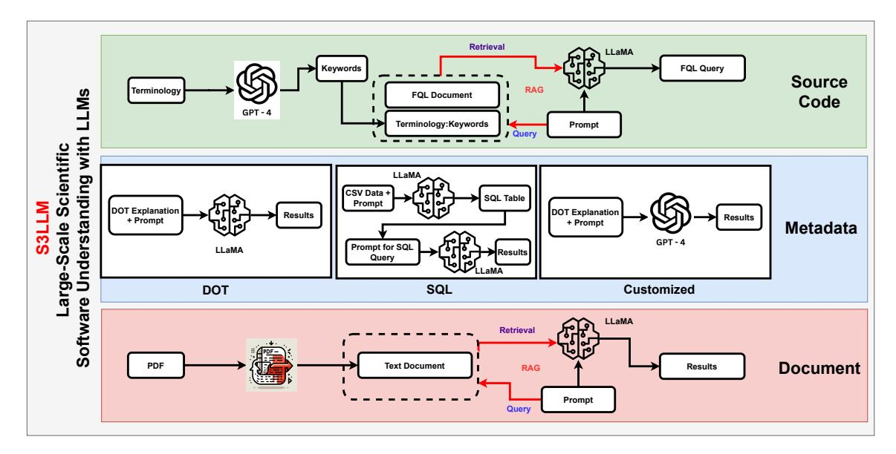

# S3LLM: Large-Scale Scientific Software Understanding with LLMs using Source, Metadata, and Document

Kareem Shaik<sup>1</sup> , Dali Wang<sup>2</sup> , Weijian Zheng<sup>3</sup> , Qinglei Cao<sup>4</sup> , Heng Fan<sup>1</sup> , Peter Schwartz<sup>2</sup> , and Yunhe Feng<sup>1</sup>

<sup>1</sup> University of North Texas, Denton, TX 76207, USA

kareembabashaik@my.unt.edu,{heng.fan, yunhe.feng}@unt.edu

<sup>2</sup> Oak Ridge National Laboratory, Oak Ridge, TN 37830, USA {wangd,schwartzpd}@ornl.gov

<sup>3</sup> Argonne National Laboratory, Lemont, IL 60439, USA wzheng@anl.gov

<sup>4</sup> Saint Louis University, St. Louis, MO 63103, USA qinglei.cao@slu.edu

Abstract. The understanding of large-scale scientific software poses significant challenges due to its diverse codebase, extensive code length, and target computing architectures. The emergence of generative AI, specifically large language models (LLMs), provides novel pathways for understanding such complex scientific codes. This paper presents S3LLM , an LLMbased framework designed to enable the examination of source code, code metadata, and summarized information in conjunction with textual technical reports in an interactive, conversational manner through a user-friendly interface. S3LLM leverages open-source LLaMA-2 models to enhance code analysis through the automatic transformation of natural language queries into domain-specific language (DSL) queries. Specifically, it translates these queries into Feature Query Language (FQL), enabling efficient scanning and parsing of entire code repositories. In addition, S3LLM is equipped to handle diverse metadata types, including DOT, SQL, and customized formats. Furthermore, S3LLM incorporates retrieval augmented generation (RAG) and LangChain technologies to directly query extensive documents. S3LLM demonstrates the potential of using locally deployed open-source LLMs for the rapid understanding of large-scale scientific computing software, eliminating the need for extensive coding expertise, and thereby making the process more efficient and effective. S3LLM is available at <https://github.com/ResponsibleAILab/s3llm>.

Keywords: Large-Scale Scientific Software, Large Language Models, Research Software Analysis, E3SM Land Model, Retrieval Augmented Generation (RAG), LLM, LLaMA, ChatGPT

# 1 Introduction

Large-scale scientific computing software is crucial in various scientific fields, undergoing extensive development cycles that lead to the formation of intricate software libraries and ecosystems. This complexity stems from the lengthy development periods, ongoing extensions, and evolving development paradigms, making it imperative to provide users with insights into these computing tools. However, understanding such software is a challenging task due to several factors. First, large-scale scientific software often incorporates multiple programming languages, including older languages such as Fortran and Pascal, which poses a significant challenge for contemporary programmers trying to understand the code. Second, the large volume of scientific software, which may encompass millions of lines of code, presents the obstacle to comprehensively understanding each segment of the

### 2 K. Shaik et al.

code. Lastly, the documentation for these software systems is sometimes less than ideal, often lacking detailed explanations, which further complicates the task of gaining a thorough understanding of the software.

To enhance comprehension of large-scale scientific software, numerous tools have been devised to aid in code analysis and documentation. For instance, Doxygen [\[2\]](#page-12-0) is capable of generating documentation and performing static code analysis for software source trees. Similarly, Sphinx [\[8\]](#page-12-1) is compatible with a wide range of programming languages, making it especially effective for producing exhaustive documentation across various formats, including HTML, LaTeX (for printable PDF versions), ePub, Texinfo, manual pages, and plain text. Nonetheless, the currently available tools are primarily tailored for static code analysis and lack the capability to accommodate dynamic queries. Moreover, given the complexity inherent in large-scale scientific software, it poses a significant challenge for both developers and users to formulate queries in both instructed (e.g., textural documents) and structured formats (e.g., SQL). Thus, it is imperative to devise methods for understanding and parsing large-scale scientific software that are both user-friendly and precise.

The emergence of generative AI, particularly large language models (LLMs), heralds a new era in software comprehension and interaction. LLMs have shown remarkable capabilities across various tasks, including chatbot interactions [\[31](#page-13-0)[,10,](#page-12-2)[15\]](#page-12-3), text summarization [\[25,](#page-13-1)[12,](#page-12-4)[29\]](#page-13-2), and content creation [\[9,](#page-12-5)[17](#page-12-6)[,18\]](#page-12-7), demonstrating their potential to revolutionize programming and documentation practices. Beyond these applications, LLMs offer promising solutions for navigating and understanding the complex landscapes of large-scale scientific software [\[24\]](#page-13-3). By leveraging LLMs, we can envision a future where software comprehension is not only more accessible but also more intuitive, enabling users to query and interact with software in natural language. This paper introduces S3LLM , a novel framework that embodies this vision, providing a user-friendly interface for interacting with complex scientific computing software through conversational, natural language queries. S3LLM aims to bridge the gap between the intricate world of scientific software and the diverse community of users and developers, fostering a deeper understanding and facilitating more effective use of these critical computational tools.

Different from most existing works on software understanding, the proposed S3LLM can handle various types of tasks for large-scale scientific software understanding including source code query, metadata analysis, and text-based technical report understanding. S3LLM is capable of conducting queries over the information extracted from source code in diverse formats, such as DOT (graph description language)[5](#page-1-0) and relational database. By leveraging the few-shot learning capability of LLMs, S3LLM can also generate domain-specific language (DSL) queries, such as Feature Query Language (FQL) [\[33\]](#page-13-4), to gather and extract software features through code analysis. Furthermore, S3LLM implements LangChain and Retrieval-Augmented Generation (RAG) [\[20\]](#page-13-5) schemes to enable text-based queries from technical reports and project summaries. More importantly, all aforementioned interactions and inquiries facilitated by S3LLM are executed utilizing natural language.

The contributions of this paper are summarized as follows:

– We have conceptualized, designed, and implemented S3LLM , a novel framework that utilizes LLMs to improve the understanding of large-scale scientific software. This framework excels in analyzing source code, metadata, and textual technical reports, providing a holistic approach to software comprehension.

<span id="page-1-0"></span><sup>5</sup> [https://en.wikipedia.org/wiki/DOT\\_\(graph\\_description\\_language\)](https://en.wikipedia.org/wiki/DOT_(graph_description_language))

- S3LLM presents a user-friendly interface that employs natural language processing, allowing users, even those with limited programming knowledge, to easily query and gain insights into scientific software.
- Recognizing the need to balance inference speed with the framework's computational demands, S3LLM provides three options featuring LLaMA-2 models with 7B, 13B, and 70B parameters, allowing users to choose the most appropriate model based on their specific requirements.
- Experiments conducted with the large-scale Energy Exascale Earth System Model (E3SM) [\[16\]](#page-12-8) demonstrate the effectiveness of our model in analyzing source code, metadata, and textual documents.
- We contribute to the scientific computing community by releasing S3LLM as an open-source tool, ensuring broad accessibility and usefulness across a broad spectrum of scientific computing applications and research pursuits.

# 2 Related Work

Code information collection: A variety of tools have been developed to gather diverse forms of code information. Tools such as cloc [\[1\]](#page-12-9), sloc [\[6\]](#page-12-10), and sonar [\[7\]](#page-12-11) are designed to assess a project's source code to determine its size and the programming languages employed. Meanwhile, the ScanCode [\[5\]](#page-12-12) toolkit and fossology [\[3\]](#page-12-13) are specialized tools that provide insights on software licenses, copyrights, dependencies, and additional relevant information. The OSS Review Toolkit [\[4\]](#page-12-14) further enhances these capabilities by integrating third-party package managers (e.g., MAVEN, PIP, NPM) and code scanners (e.g., Licensee, ScanCode), facilitating the identification of dependencies across different open-source libraries within a project. Nonetheless, these tools do not leverage Artificial Intelligence (AI) or LLMs to simplify the process of collecting code information, which requires users to input their requirements in a format that these tools can interpret. In contrast, our framework S3LLM distinguishes itself by allowing users to express their requirements in natural language, subsequently providing precise and accurate code information. This approach significantly improves the efficiency and accuracy of code analysis.

LLM-based Software Engineering: The integration of AI and LLMs has significantly transformed code analysis and software development methodologies. This evolution is evident in the widespread application of LLMs for code generation, underscoring their utility in enhancing programming efficiency and accuracy [\[14,](#page-12-15)[13\]](#page-12-16). Furthermore, research in this domain has validated the effectiveness of LLMs in critical tasks such as unit test generation [\[28,](#page-13-6)[26\]](#page-13-7), bug analysis [\[23,](#page-13-8)[30\]](#page-13-9), and debugging [\[11,](#page-12-17)[19\]](#page-13-10), showcasing their potential to refine testing processes, improve bug detection, and streamline debugging. Recently, researchers have also applied LLM to large-scale scientific software [\[24\]](#page-13-3). However, instead of employing LLM to understand the scientific code, researchers typically focus on specific tasks such as extracting variables of interest by reading the code documentation [\[24\]](#page-13-3). Despite the prevalent focus on code generation, testing, and repair, S3LLM diverges by leveraging both LLM and traditional techniques to deepen the understanding of large-scale scientific codes.

# 3 Method

We first introduce an overview of the S3LLM framework, subsequently delving into the detailed design of its components. S3LLM examines large-scale scientific software from multifaceted perspectives, utilizing diverse data types such as source code, code metadata, and textual reports. Each

<span id="page-3-0"></span>

Fig. 1: Framework overview of S3LLM

component's design is meticulously outlined to elucidate how S3LLM facilitates a comprehensive investigation of scientific software, ensuring a thorough understanding of its complex ecosystem.

## 3.1 Framework Overview

At the heart of S3LLM lies open-source LLaMA-2 models engineered for conversational interactions in natural language. LLaMA-2 has been intricately configured to support multi-round conversations, maintaining awareness of the ongoing context to ensure continuity and relevance in its responses, thus embodying in-context learning capabilities. As depicted in Figure [1,](#page-3-0) S3LLM is architecturally composed of three primary components dedicated to processing source code, code metadata, and textual technical documents. For all of the three components, LLaMA-2 models play a key role in translating natural languages into desired domain-specific language (DSL) queries or in text information analysis and retrieval. In addition, some consisting components in S3LLM adopt RAG, a methodology designed to enhance the responses of an LLM by consulting an external and authoritative knowledge base not included within its initial training data, thereby refining its output prior to generating a response. The choice of open-source LLaMA-2 models (7B, 13B, and 70B) as the foundation for all language understanding tasks within S3LLM is strategic, offering versatility in model sizes and ensuring a high degree of reproducibility across various computational environments.

## 3.2 Source Code Analysis

Large-scale scientific software, such as E3SM, often contains vast quantities of source code, exceeding a million lines in some cases. This presents a significant challenge for open-source LLMs in directly managing such a huge number of tokens by loading all of the tokens into their context windows. Furthermore, many sophisticated source code analysis tools today require users to possess in-depth

<span id="page-4-0"></span>

| Question                    | FQL Query                                                     |  |  |  |  |  |  |  |  |  |  |
|-----------------------------|---------------------------------------------------------------|--|--|--|--|--|--|--|--|--|--|
| Is OpenMP used?             |                                                               |  |  |  |  |  |  |  |  |  |  |
| Library Utilization Query   | FQL: CHECK (!\$OMP ∥ pragma omp) WHERE (*) AS (OpenMP)        |  |  |  |  |  |  |  |  |  |  |
| What is the minimum         | MAX (CHECK (MPI AINT ADD ∥ MPI AINT DIFF) WHERE (*) AS (3.1), |  |  |  |  |  |  |  |  |  |  |
| version requirement of MPI? | ,                                                             |  |  |  |  |  |  |  |  |  |  |
| Version Assessment Query    | CHECK (mpi.h ∥ use mpi ∥ mpif.h) WHERE (*) AS (2.0))          |  |  |  |  |  |  |  |  |  |  |
| What OpenMP scheduling      | LIST (CHECK (schedule(static) WHERE(*) AS (Static),           |  |  |  |  |  |  |  |  |  |  |
| method is used?             | CHECK (schedule(dynamic) WHERE(*) AS (Dynamic), ,             |  |  |  |  |  |  |  |  |  |  |
| Feature Enumeration Query   | CHECK (schedule(runtime) WHERE(*) AS (Runtime))               |  |  |  |  |  |  |  |  |  |  |

Table 1: Examples of HPC feature questions and associated FQL queries

programming expertise or specialized domain knowledge for effective source code interrogation. To address these issues, S3LLM combines the code analysis capability of existing tools and the natural language understanding capability of LLMs together, not only avoiding loading the entire codebase into LLMs but also allowing users to query source code using natural language.

In illustrating the strategy of S3LLM for LLM-based source code analysis, we highlight XScan [\[32\]](#page-13-11) as a representative backend engine. XScan is an integrated software toolkit designed to extract key information of large-scale scientific code, such as lines of code, programming languages, external library dependencies, and architecture-dependent parallel software features. While XScan provides user-friendly methodologies for basic source code analysis tasks (e.g., adopting Doxygen to construct caller-callee graphs or using CLOC [\[1\]](#page-12-9) to tally lines of code), it also introduces FQL for more nuanced static code analysis. Despite XScan offering straightforward solutions for basic analysis through simple command executions, FQL's reliance on user-generated queries to investigate software features represents a significant hurdle. As Table [1](#page-4-0) demonstrates, FQL accommodates various query types, including Library Utilization, Version Assessment, and Feature Enumeration Queries, all of which demand a degree of coding proficiency from the user for precise query formulation. S3LLM is specifically designed to bridge this gap, addressing the critical challenge of facilitating accessible source code analysis without requiring extensive programming knowledge. It is important to highlight that the core LLMs powering S3LLM are broadly applicable and capable of integrating with source code analysis engines beyond just XScan.

In the conversion process from natural language to FQL queries, S3LLM must master three crucial elements: the purpose and syntax of FQL, comprehension of specific terminologies (e.g. high-performance computing (HPC) programming standards) presented in natural language inputs, and the establishment of an accurate translation from natural language to FQL. To equip the LLM models within S3LLM with a comprehensive grasp of FQL and its programming syntax, we have incorporated a foundational document on FQL alongside a collection of FQL query examples into the RAG framework as external data sources. For a detailed exploration of the RAG methodology utilized in this study, please refer to Section [3.4.](#page-5-0) Addressing the conversion of relevant terminologies from natural language inputs into programming code keywords posed a significant challenge. Initial attempts to generate these keywords using open-source LLM models yielded suboptimal results. Consequently, we select GPT-4 to serve as the terminology translator within S3LLM . This approach simplifies the creation of mappings from terminologies to corresponding programming keywords with precision. These mappings are also stored as external data within RAG. Finally, we prompt S3LLM to generate new FQL queries from provided natural language questions by utilizing few-shot learning techniques and enriching the context with RAG data.

## 3.3 Software Metadata Comprehension

In the quest to deepen our comprehension of large-scale scientific software, a variety of code metadata is extracted utilizing current software analysis tools. Particularly, metadata related to software architecture and data structures stands out as some of the most valuable and enlightening for understanding software intricacies. To capitalize on this rich metadata, S3LLM has been meticulously crafted not only to interpret these data but also to respond to queries informed by them. Fundamentally, our framework is adept at managing well-structured metadata formats, such as DOT, thereby enhancing its utility in parsing and understanding the underlying structure and organization of software code.

To enhance S3LLM 's capability to handle diverse information from scientific computing software, we implement a dual-phase strategy. Initially, we ensure that the LLMs grasp the structure and organization of metadata formats. This is achieved by integrating context rich in such information, utilizing either the RAG technique or by directly embedding metadata format information into the prompts. Subsequently, S3LLM allows users to interrogate the metadata through natural language prompts in such a context. Notably, S3LLM introduces two distinct prompting methodologies: zero-shot and few-shot modes. The zero-shot mode enables users to perform queries on metadata without requiring prior example inputs, whereas the few-shot mode solicits demonstration examples from users to refine and guide the LLM's responses. The few-shot will be more useful when processing very complex software metadata.

S3LLM currently supports three types of metadata extracted from large-scale scientific software: DOT, SQL, and specified data formats by third-party software. However, it is designed with the flexibility to easily accommodate additional metadata formats in the future. For the DOT format, we facilitate its understanding in S3LLM by incorporating a detailed explanation of DOT within the prompt, followed by appending the specific query question. Given the widespread use of SQL in relational database management, we leverage the LLaMA-2 models to generate SQL queries directly, without the need for instruction-based prompting techniques. For custom data formats specified by third-party software, we use the bespoke metadata produced by SPEL [\[22\]](#page-13-12), a toolkit developed for adapting E3SM models for GPU execution via OpenACC, as a case study. This choice illustrates S3LLM 's capability to interpret highly specialized data formats through the application of GPT-4, underscoring our commitment to extending S3LLM 's utility to encompass a broad spectrum of metadata types, including those tailored by third-party software analysis tools.

## <span id="page-5-0"></span>3.4 Technical Document Interpretation

Large-scale scientific software often comes with a comprehensive set of supplementary documentation, such as technical reports, user manuals, and research papers. While these documents are rich in detail, they can be difficult to navigate efficiently. To simplify the process of extracting relevant information from these extensive texts, S3LLM combines RAG with LLMs, significantly enhancing the accuracy of document-related queries. The RAG framework consists of three key components: document indexing, retrieval, and generation. Initially, it processes external texts by breaking them down into manageable segments for the LLM's contextual analysis. It then creates and stores document embeddings for future retrieval. When a query is received, the system retrieves relevant embeddings to form a context window for the LLM, which then generates responses based on a prompt that includes both the query and the retrieved data.

S3LLM adopts LangChain, an advanced open-source framework specifically designed for creating applications with LLMs, to implement RAG. LangChain's DocumentLoaders and Text Splitters are utilized to effectively organize and segment documents for query processing. Subsequently, VectorStore and Embeddings models are employed to generate and maintain document embeddings. For this task, we use all-MiniLM-L6-v2 document embeddings to create the embeddings and a FAISS-based similarity index vector storage for efficient retrieval. The Retriever component is crucial in obtaining the relevant segments to be included in the user-defined prompt. Lastly, the refined query, augmented with the retrieved data, is fed into LLaMA-2, which generates customized responses. This demonstrates the smooth integration of RAG within S3LLM , enhancing document comprehension in the field of scientific software.

# 4 Case Study

We deploy S3LLM on the Energy Exascale Earth System Model (E3SM) as a case study to demonstrate its effectiveness in analyzing source code, code metadata, and text-based technical reports.

## 4.1 E3SM Introduction

The E3SM is a state-of-the-art Earth system modeling framework, developed and supported by the United States Department of Energy (DOE)[\[16\]](#page-12-8). This model is designed to facilitate the detailed simulation of intricate interactions among the Earth's atmospheric, terrestrial, oceanic, and cryospheric components. Standing as one of the most advanced Earth system models globally, E3SM is extensively utilized by the scientific community to explore a large range of critical subjects, including climate dynamics, meteorological prediction, and the assessment of natural hazards. E3SM has a very long history and is written mainly by legacy programming languages such as Fortran. In addition, E3SM contains more than one million lines of code. Therefore, we think E3SM is a qualified large-scale scientific computing software for evaluating the proposed S3LLM . Due to our special interest in kilometer-scale land component development on Exascale computers, we designed several demonstration queries focusing on the ultrahigh resolution E3SM Land Model (uELM) [\[27\]](#page-13-13).

## 4.2 Source Code Query Results

To illustrate the effectiveness of S3LLM in source code analysis, we assessed its ability to generate FQL (Feature Query Language) queries across three distinct categories: Library Utilization Queries, Version Assessment Queries, and Feature Enumeration Queries. Through the use of crafted prompts, as demonstrated in the subsequent text boxes, S3LLM successfully generates the correct FQL query in certain instances. Specifically, for the Library Utilization Query, S3LLM produces the precise FQL query in a zero-shot manner. This accuracy is likely attributed to the pretraining of the LLaMA-2 model within S3LLM on RAG supporting documents that include FQL queries and HPC terminologies. Similarly, for Version Assessment and Feature Enumeration Query, "Please Generate FQL query to Find the minimum version of MPI " and "Please Generate FQL query to List MPI process topology used in the Code" can prompt S3LLM to generate accurate queries.

Prompt for Library Utilization Query: Please Generate FQL query to Check Whether OpenMP is used Response: CHECK (omp task || end task || omp taskloop || omp taskloop simd || omp taskyield) WHERE (\*)

Prompt for Version Assessment Query: Please Generate FQL query to Find the minimum version of MPI Response: MAX (CHECK (MPI\_AINT\_DIFF) WHERE (\*) AS (31), CHECK (MPI\_COMM\_DUP\_WITH\_INFO) WHERE (\*) AS (30), CHECK (MPI\_COMM\_SET\_INFO) WHERE (\*) AS (30))

Prompt for Feature Enumeration Query: Please Generate FQL query to List MPI process topology used in the Code Response: LIST (CHECK (MPI\_CART\_CREATE WHERE(\*) AS (Cartesian), CHECK (MPI\_GRAPH\_CREATE WHERE(\*) AS (Graph), CHECK (MPI\_DIST\_GRAPH\_CREATE\_Adjacent WHERE(\*) AS (Distributed Graph)), CHECK (omp parallel num\_threads(dynamic) WHERE(\*) AS (Dynamic Threads), CHECK (omp schedule(static, dynamic, guided, auto, runtime)) WHERE(\*) AS (Scheduling))

## 4.3 Metadata Comprehension with S3LLM

In our study, we utilize three distinct forms of metadata to demonstrate the capabilities of S3LLM in enhancing metadata comprehension. These include DOT files produced by XScan [\[32\]](#page-13-11), CSV files generated by SPEL [\[22\]](#page-13-12)[6](#page-7-0) , and bespoke metadata formats also created by SPEL, all derived from the E3SM. This diverse dataset showcases S3LLM 's versatility and effectiveness in interpreting and leveraging different metadata representations to deepen our understanding of complex scientific software systems.

Our analysis begins with assessing S3LLM 's efficacy on standardized DOT files, as produced by XScan, and on a unique metadata format devised by SPEL. A DOT file, as illustrated in blow colored box, represents a directed graph that visualizes the interactions between caller and callee functions within E3SM, offering insights into the software's structural dynamics.

Structured query language (SQL) is widely used for processing information in relational databases, and LLaMA-2 models can conveniently translate natural language into SQL queries. To illustrate the SQL processing capabilities of S3LLM , we employ two example CSV files generated by SPEL [\[22\]](#page-13-12), as detailed in Table [2.](#page-8-0) Our approach involves a two-step process with S3LLM . First, we instruct S3LLM to generate SQL statements that transform the two subtables depicted in Table [2](#page-8-0) into formal SQL tables. Following this, we guide S3LLM to generate specific SQL queries: first, to identify the name of the component characterized by a 2D Dimension and having a Derived Type of col pp; and second, to construct a new SQL view by joining these two subtables. This methodology underscores S3LLM 's adeptness at navigating and manipulating SQL tables, showcasing its proficiency in facilitating advanced database operations.

<span id="page-7-0"></span><sup>6</sup> A software toolkit designed for porting E3SM land model onto GPUs using OpenACC.

Table 2: Two CSV files produced by SPEL [\[22\]](#page-13-12) to be processed as SQL tables

<span id="page-8-0"></span>(a) Detailed information about Component

| Variable              | Type       | Dimension |
|-----------------------|------------|-----------|
| snl                   | integer 1D |           |
| dz                    | real       | 2D        |
| sabg patch            | real       | 1D        |
| sabg lyr patch real   |            | 2D        |
| ws col                | real       | 1D        |
| lake icefrac col real |            | 2D        |

(b) Derived Types of each Component

| Derived Type Component |                  |
|------------------------|------------------|
| col pp                 | snl              |
| col pp                 | dz               |
| solarabs vars          | sabg patch       |
| solarabs vars          | sabg lyr patch   |
| lakestate vars         | ws col           |
| lakestate vars         | lake icefrac col |

### Prompt for Summarizing DOT File:

DOT file can describe a directed graph using keyword of "digraph". Inside a directed graph, each line starts with a module name which is followed by the "::" symbol. For example, "allocationmod" is the module in "allocationmod::allocationinit -> clm time manager." Please list all the unique modules in the following DOT file describing directed graph G.

```
digraph G {
```

```
emi_datamod::emidcopy -> emi_datamod::emidallocatememory_real_3d
emi_datamod::emidcopy -> emi_datamod::emidallocatememory_real_4d
elm_driver::elm_drv -> decompmod::get_proc_clumps
elm_driver::elm_drv -> satellitephenologymod::interpmonthlyveg
elm_driver::elm_drv -> activelayermod::alt_calc
elm_driver::elm_drv -> verticalprofilemod::decomp_vertprofiles
elm_driver::elm_drv -> balancecheckmod::begingridwaterbalance
elm_driver::elm_drv -> dynsubgriddrivermod::dynsubgrid_driver
elm_driver::elm_drv -> ndepstreammod::ndep_interp
ch4varcon::ch4conrd -> fileutils::relavu
elm_driver::elm_drv -> firemod::fireinterp
canopyhydrologymod::canopyhydrology_readnl -> fileutils::relavu
elm_driver::elm_drv -> pdepstreammod::pdep_interp
controlmod::control_init -> fileutils::relavu
firemod::firefluxes -> elm_nlutilsmod::find_nlgroup_name
firemod::firefluxes -> ndepstreammod::elm_domain_mct
firemod::firefluxes -> histfilemod::hist_addfld1d
```

# }

Response:

Sure! Here are the unique modules in the directed graph G described by the DOT file: 1. emi datamod 2. elm driver

### ...

16. histfilemod

17. verticalprofilemod

There are 17 unique modules in total.

### Prompt for Creating SQL Views:

Please generate SQL commands to construct a new SQL view by joining the following two SQL tables:: Table 1 Info; Table 2 Info.

Response: CREATE VIEW myview AS SELECT t1.Component, t1.Type, t1.Dimension, t2.DerivedType FROM table1 t1 JOIN table2 t2 ON t1.Component = t2.Component; SELECT \* FROM myview;

```
Prompt for Creating SQL Table from CSV:
Please generate SQL commands to covert the following textural table into an SQL table with
Component as the PRIMARY KEY:
Component,Type,Dimension
snl,integer,1D
dz,real,2D
sabg_patch,real,1D
sabg_lyr_patch,real,2D
ws_col,real,1D
lake_icefrac_col,real,2D
Response:
CREATE TABLE components (
Component VARCHAR(255) PRIMARY KEY,
Type VARCHAR(255),
Dimension VARCHAR(255)
);
INSERT INTO components (Component, Type, Dimension) VALUES
('snl', 'integer', '1D'),
('dz', 'real', '2D'),
('sabg_patch', 'real', '1D'),
('sabg_lyr_patch', 'real', '2D'),
('ws_col', 'real', '1D'),
('lake_icefrac_col', 'real', '2D');
```

### Prompt for Querying SQL Table:

```
Please generate SQL commands to identify the name of the component characterized by a 2D
Dimension and having a Derived Type of col pp by joining the following two SQL tables: Table
1 Info; Table 2 Info.
Response:
SELECT Component
FROM Table1
JOIN Table2 ON Table1.Component = Table2.Component
WHERE Dimension = '2D' AND DerivedType = 'col_pp';
```

Additionally, a sequence of execution for LakeTemperature as delineated by SPEL [\[22\]](#page-13-12) is shown in the colored box below. This example highlights the execution sequence within E3SM, where the first column lists variables utilized by the LakeTemperature module. The top row segments the execution flow into distinct phases {main (LakeTemperature) -> subroutine -> main -> subroutine -> main}, separated by "|", depicting the procedural pathway. Each column within these sections signifies a Fortran "do loop" sequence. The entries within this table specify each variable's role in the corresponding "do loop", with potential values being "ro" (read-only), "wo" (write-only), "rw" (read-write), or "-" (not in use). This offers an in-depth view of variable usage during the execution process, which is beneficial for code performance optimization (through asynchronous kernel launch) on GPUs. This structured approach to metadata analysis underscores S3LLM 's capability to navigate and elucidate complex metadata representations, enhancing comprehension and facilitating deeper insights into the software's operational mechanisms.

## Prompt for Analyzing Metadata of LakeTemperatureAllLoopVariables generated by SPEL [\[22\]](#page-13-12):

Here is the data format information for the LakeTemperatureAllLoopVariables.txt file: 1. The first column contains the name of variables that are used by the LakeTemperature. 2. The top row displays various sections (divided by " |") that illustrate the sequence of execution: lakeTemperature(main) -> its subroutine-¿return to main -> its subroutine -> main 3. Every column within code section (divided by " |") represents a "do loop" (Fortran) segment. The value of each table element indicates the usage of a variable in that "do loop", the value could be "ro, wo, ro, -". ro: read-only, wo: write-only, rw: read-write, -: not in use"

The content of LakeTemperatureAllLoopVariables.txt file:

|                                                                                                           | LakeTemperature |  |      |   |   |            |   |           |  |  |   |                | soilthermprop_ LakeTemperature |   |      |   |   |   |   |   |                  |
|-----------------------------------------------------------------------------------------------------------|-----------------|--|------|---|---|------------|---|-----------|--|--|---|----------------|--------------------------------|---|------|---|---|---|---|---|------------------|
| filter_lakec                                                                                              | ro ro -         |  |      |   |   | ro ro ro - |   |           |  |  |   | ro ro ro ro ro | ro ro -                        |   |      |   |   |   |   |   | ro ro - ro ro ro |
| lake_col_to_filter  wo -                                                                                  |                 |  | ro - |   | - | -          |   | ro -  - - |  |  | - | -              | -                              | - | ro - |   | - | - | - | - | -                |
| ocvts                                                                                                     | wo -            |  | -    | - | - | -          | - | -  - -    |  |  | - | -              | rw rw -                        |   |      | - | - | - | - | - | -                |
| puddle                                                                                                    | wo -            |  | -    | - | - | -          | - | -  - -    |  |  | - | -              | -                              | - | -    | - | - | - | - | - | -                |
| frzn                                                                                                      | wo -            |  | -    | - | - | -          | - | -  - -    |  |  | - | -              | -                              | - | -    | - | - | - | - | - | -                |
| bottomconvect                                                                                             | wo -            |  | -    | - | - | -          | - | -  - -    |  |  | - | -              | -                              | - | -    | - | - | - | - | - | -                |
| hc_soisno                                                                                                 | wo -            |  | -    | - | - | -          | - | -  - -    |  |  | - | -              | -                              | - | -    | - | - | - | - | - | -                |
| hc_soi                                                                                                    | wo -            |  | -    | - | - | -          | - | -  - -    |  |  | - | -              | -                              | - | -    | - | - | - | - | - | -                |
| How many variables are used by the first do loop in lakeTemparature. And what is the                      |                 |  |      |   |   |            |   |           |  |  |   |                |                                |   |      |   |   |   |   |   |                  |
| role of these variables (ro, wo, or rw)?                                                                  |                 |  |      |   |   |            |   |           |  |  |   |                |                                |   |      |   |   |   |   |   |                  |
| Response:                                                                                                 |                 |  |      |   |   |            |   |           |  |  |   |                |                                |   |      |   |   |   |   |   |                  |
| This indicates that there are 8 variables used in the first "do loop" of the LakeTemperature section.     |                 |  |      |   |   |            |   |           |  |  |   |                |                                |   |      |   |   |   |   |   |                  |
| Their roles are as follows:                                                                               |                 |  |      |   |   |            |   |           |  |  |   |                |                                |   |      |   |   |   |   |   |                  |
| - 1 variable is read-only (filter lakec).                                                                 |                 |  |      |   |   |            |   |           |  |  |   |                |                                |   |      |   |   |   |   |   |                  |
| - 7 variables are write-only (lake col to filter, ocvts, puddle, frzn, bottomconvect, hc soisno, hc soi). |                 |  |      |   |   |            |   |           |  |  |   |                |                                |   |      |   |   |   |   |   |                  |

## 4.4 Document Parsing

This section demonstrates the effectiveness of combining the RAG framework and LangChain with LLMs, as described in Section [3.4,](#page-5-0) for extracting specific technical information from comprehensive scientific documents. We utilize a 28-page technical report on Lake Temperature (in PDF format), from the Community Land Model [\[21\]](#page-13-14), as the testbed. In Experiment 1, S3LLM adeptly retrieves information regarding the calculation of thermal conductivities at layer interfaces, showcasing the

## 12 K. Shaik et al.

method's ability to understand and extract specific computational techniques, specifically the harmonic mean approach. Experiment 2 further demonstrates S3LLM 's efficacy by accurately describing the application of the Crank-Nicolson method within the model, showcasing its competence in elucidating detailed methodological implementations. Lastly, Experiment 3 confirms S3LLM 's proficiency in extracting complex physical processes, such as phase changes, and its capability in both comprehension and explanation. Collectively, these experiments underscore the robustness of our approach in navigating and interpreting sophisticated scientific documents, affirming its potential to significantly enhance the comprehension of complex scientific documentation interpretation.

### Prompt for Querying Technical Description of Lake Temperature -1:

What method is used to calculate the thermal conductivities at the interfaces between layers in the model?

Response: The thermal conductivities at layer interfaces are calculated as the harmonic mean of the conductivities of the neighboring layers.

### Prompt for Querying Technical Description of Lake Temperature -2:

How is the Crank-Nicolson method applied in the context of this model?

Response: The Crank-Nicolson method is used to solve equation (9.44) and it results in a tridiagonal system of equations.

## Prompt for Querying Technical Report of Lake Temperature -3:

What is the significance of phase changes in the model, and how are they accounted for?

Response: Phase changes, such as freezing and melting, play a significant role in the atmosphere model, as they affect the energy balance at the land surface. The model accounts for phase changes by calculating heat diffusion and phase change in given layers based on temperature and moisture conditions. The available energy for melting is computed as function of temperature and moisture content.

# 5 Discussion and Future Work

The foundational components of S3LLM, LLMs, have demonstrated remarkable proficiency in interpreting various data sources, including source code, metadata, and documents, offering insights from multiple angles. Despite these achievements, there are inherent limitations within LLMs that warrant further investigation in our future work. First, the constraint related to the maximum token count supported by open-source LLMs necessitates expansion to accommodate extensive queries, aiming to enhance in-context learning capabilities. Moreover, the treatment of specialized terminologies within domain-specific sciences requires refinement to ensure more accurate and dependable processing. Currently, commercial versions like GPT-4 are employed in S3LLM to derive coding keywords from terminologies; however, we posit that leveraging a more transparent, reproducible model, amenable to fine-tuning for domain-specific sciences, could optimize this process. Furthermore, S3LLM could be enriched with additional functionalities, such as identifying and addressing computational bottlenecks within large-scale codes and providing direct source code optimization recommendations. These areas of potential enhancement motivate us for the continued development and improvement of S3LLM in future iterations.

# 6 Conclusion

This paper presents S3LLM , a framework developed on the foundation of LLMs, aimed at unraveling the complexities inherent in large-scale scientific software. By enhancing the capabilities of LLaMA-2 models within S3LLM through innovative approaches such as instruction-based prompting, integration of external GPT-4 queries, and the adoption of Retrieval-Augmented Generation (RAG) and LangChain techniques, we have significantly expanded the operational capacity of pre-trained LLMs. Our comprehensive evaluation across a variety of data types, including source code, diverse metadata formats (DOT, SQL, and specialized schemas), and textual documents, has validated the efficacy of S3LLM . It is our aspiration that S3LLM will illuminate pathways for forthcoming inquiries in the fields of generative AI and software engineering, particularly within the domain of scientific computing.

# References

- <span id="page-12-9"></span>1. CLOC. <https://github.com/AlDanial/cloc>. Accessed: 2024-02-27.
- <span id="page-12-0"></span>2. Doxygen. <https://www.doxygen.nl/>. Accessed: 2024-03-01.
- <span id="page-12-13"></span>3. Fossology. <https://www.fossology.org/>. Accessed: 2024-02-27.
- <span id="page-12-14"></span>4. Oss review toolkit. <https://github.com/oss-review-toolkit/ort>. Accessed: 2024-02-27.
- <span id="page-12-12"></span>5. ScanCode Toolkit. <https://github.com/nexB/scancode-toolkit>. Accessed: 2024-02-27.
- <span id="page-12-10"></span>6. SLOCCount User's Guide. <https://dwheeler.com/sloccount/sloccount.html>. Accessed: 2024-02-27.
- <span id="page-12-11"></span>7. Sonar. <https://www.sonarsource.com/products/sonarqube/>. Accessed: 2024-02-27.
- <span id="page-12-1"></span>8. Sphinx. <https://www.sphinx-doc.org/en/master/>. Accessed: 2024-03-01.
- <span id="page-12-5"></span>9. Arkadeep Acharya, Brijraj Singh, and Naoyuki Onoe. Llm based generation of item-description for recommendation system. In Proceedings of the 17th ACM Conference on Recommender Systems, pages 1204–1207, 2023.
- <span id="page-12-2"></span>10. Desir´ee Bill and Theodor Eriksson. Fine-tuning a llm using reinforcement learning from human feedback for a therapy chatbot application, 2023.
- <span id="page-12-17"></span>11. Nghi DQ Bui, Yue Wang, and Steven Hoi. Detect-localize-repair: A unified framework for learning to debug with codet5. arXiv preprint arXiv:2211.14875, 2022.
- <span id="page-12-4"></span>12. Yapei Chang, Kyle Lo, Tanya Goyal, and Mohit Iyyer. Booookscore: A systematic exploration of book-length summarization in the era of llms. arXiv preprint arXiv:2310.00785, 2023.
- <span id="page-12-16"></span>13. Yihong Dong, Xue Jiang, Zhi Jin, and Ge Li. Self-collaboration code generation via chatgpt. arXiv preprint arXiv:2304.07590, 2023.
- <span id="page-12-15"></span>14. Yunhe Feng, Sreecharan Vanam, Manasa Cherukupally, Weijian Zheng, Meikang Qiu, and Haihua Chen. Investigating code generation performance of chat-gpt with crowdsourcing social data. In Proceedings of the 47th IEEE Computer Software and Applications Conference, pages 1–10, 2023.
- <span id="page-12-3"></span>15. Samuel Kernan Freire, Chaofan Wang, and Evangelos Niforatos. Chatbots in knowledge-intensive contexts: Comparing intent and llm-based systems. arXiv preprint arXiv:2402.04955, 2024.
- <span id="page-12-8"></span>16. Jean-Christophe Golaz, Luke P. Van Roekel, ..., Mark A. Taylor, Renata B. McCoy, L. Ruby Leung, and David C. Bader. The DOE E3SM model version 2: Overview of the physical model and initial model evaluation. Journal of Advances in Modeling Earth Systems, 14(12):e2022MS003156, 2022. e2022MS003156 2022MS003156.
- <span id="page-12-6"></span>17. Shijia Huang, Jianqiao Zhao, Yanyang Li, and Liwei Wang. Learning preference model for llms via automatic preference data generation. In The 2023 Conference on Empirical Methods in Natural Language Processing, 2023.
- <span id="page-12-7"></span>18. Breanna Jury, Angela Lorusso, Juho Leinonen, Paul Denny, and Andrew Luxton-Reilly. Evaluating llm-generated worked examples in an introductory programming course. In Proceedings of the 26th Australasian Computing Education Conference, pages 77–86, 2024.

- 14 K. Shaik et al.
- <span id="page-13-10"></span>19. Sungmin Kang, Bei Chen, Shin Yoo, and Jian-Guang Lou. Explainable automated debugging via large language model-driven scientific debugging. arXiv preprint arXiv:2304.02195, 2023.
- <span id="page-13-5"></span>20. Patrick Lewis, Ethan Perez, Aleksandra Piktus, Fabio Petroni, Vladimir Karpukhin, Naman Goyal, Heinrich K¨uttler, Mike Lewis, Wen-tau Yih, Tim Rockt¨aschel, et al. Retrieval-augmented generation for knowledge-intensive nlp tasks. Advances in Neural Information Processing Systems, 33:9459–9474, 2020.
- <span id="page-13-14"></span>21. Keith W Oleson, David M Lawrence, GB Bonan, Beth Drewniak, Maoyi Huang, CD Koven, Samuel Levis, Fang Li, William J Riley, Zachary M Subin, et al. Technical description of version 4.0 of the community land model (clm). NCAR Tech. Note NCAR/TN-478+ STR, 257:1–257, 2010.
- <span id="page-13-12"></span>22. Peter Schwartz, Dali Wang, Fengming Yuan, and Peter Thornton. SPEL: Software tool for porting e3sm land model with openacc in a function unit test framework. In 2022 Workshop on Accelerator Programming Using Directives (WACCPD), pages 43–51. IEEE, 2022.
- <span id="page-13-8"></span>23. Yanqi Su, Zheming Han, Zhipeng Gao, Zhenchang Xing, Qinghua Lu, and Xiwei Xu. Still confusing for bug-component triaging? deep feature learning and ensemble setting to rescue. In 2023 IEEE/ACM 31st International Conference on Program Comprehension (ICPC), pages 316–327. IEEE, 2023.
- <span id="page-13-3"></span>24. Christos Tsigkanos, Pooja Rani, Sebastian M¨uller, and Timo Kehrer. Variable discovery with large language models for metamorphic testing of scientific software. In International Conference on Computational Science, pages 321–335. Springer, 2023.
- <span id="page-13-1"></span>25. Dave Van Veen, Cara Van Uden, Louis Blankemeier, Jean-Benoit Delbrouck, Asad Aali, Christian Bluethgen, Anuj Pareek, Malgorzata Polacin, Eduardo Pontes Reis, Anna Seehofnerova, et al. Clinical text summarization: Adapting large language models can outperform human experts. Research Square, 2023.
- <span id="page-13-7"></span>26. Vasudev Vikram, Caroline Lemieux, and Rohan Padhye. Can large language models write good property-based tests? arXiv preprint arXiv:2307.04346, 2023.
- <span id="page-13-13"></span>27. Dali Wang, Peter Schwartz, Fengming Yuan, Peter Thornton, and Weijian Zheng. Toward ultrahighresolution e3sm land modeling on exascale computers. Computing in Science & Engineering, 24(6):44– 53, 2022.
- <span id="page-13-6"></span>28. Zhiqiang Yuan, Yiling Lou, Mingwei Liu, Shiji Ding, Kaixin Wang, Yixuan Chen, and Xin Peng. No more manual tests? evaluating and improving chatgpt for unit test generation. arXiv preprint arXiv:2305.04207, 2023.
- <span id="page-13-2"></span>29. Tianyi Zhang, Faisal Ladhak, Esin Durmus, Percy Liang, Kathleen McKeown, and Tatsunori B Hashimoto. Benchmarking large language models for news summarization. Transactions of the Association for Computational Linguistics, 12:39–57, 2024.
- <span id="page-13-9"></span>30. Ting Zhang, Ivana Clairine Irsan, Ferdian Thung, and David Lo. Cupid: Leveraging chatgpt for more accurate duplicate bug report detection. arXiv preprint arXiv:2308.10022, 2023.
- <span id="page-13-0"></span>31. Lianmin Zheng, Wei-Lin Chiang, Ying Sheng, Siyuan Zhuang, Zhanghao Wu, Yonghao Zhuang, Zi Lin, Zhuohan Li, Dacheng Li, Eric Xing, et al. Judging llm-as-a-judge with mt-bench and chatbot arena. Advances in Neural Information Processing Systems, 36, 2024.
- <span id="page-13-11"></span>32. Weijian Zheng, Dali Wang, and Fengguang Song. XScan: an integrated tool for understanding open source community-based scientific code. In International Conference on Computational Science, pages 226–237. Springer, 2019.
- <span id="page-13-4"></span>33. Weijian Zheng, Dali Wang, and Fengguang Song. FQL: An extensible feature query language and toolkit on searching software characteristics for hpc applications. In Guido Juckeland and Sunita Chandrasekaran, editors, Tools and Techniques for High Performance Computing, pages 129–142, Cham, 2020. Springer International Publishing.