# A SHORT SURVEY: EXPLORING KNOWLEDGE GRAPH-BASED NEURAL-SYMBOLIC SYSTEM FROM APPLICATION PERSPECTIVE

Shenzhe Zhu∗ University of Toronto Toronto, Canada cho.zhu@mail.utoronto.ca

Shengxiang Sun University of Toronto Toronto, Canada owen.sun@mail.utoronto.ca

# ABSTRACT

Advancements in Artificial Intelligence (AI) and deep neural networks have driven significant progress in vision and text processing. However, achieving human-like reasoning and interpretability in AI systems remains a substantial challenge. The Neural-Symbolic paradigm, which integrates neural networks with symbolic systems, presents a promising pathway toward more interpretable AI. Within this paradigm, Knowledge Graphs (KG) are crucial, offering a structured and dynamic method for representing knowledge through interconnected entities and relationships, typically as triples (subject, predicate, object). This paper explores recent advancements in neural-symbolic integration based on KG, examining how it supports integration in three categories: enhancing the reasoning and interpretability of neural networks with symbolic knowledge (Symbol for Neural), refining the completeness and accuracy of symbolic systems via neural network methodologies (Neural for Symbol), and facilitating their combined application in Hybrid Neural-Symbolic Integration. It highlights current trends and proposes future research directions in Neural-Symbolic AI.

# 1 Introduction

With the rapid advancement of deep learning, particularly in deep neural networks (DNNs) within Artificial Intelligence (AI), we have observed the emergence of groundbreaking methods. These innovations have obtained significant achievements in fields such as vision and text processing. For instance, models like EfficientNet[\[1\]](#page-15-0), ResNet[\[2\]](#page-15-1), and Vision Transformer[\[3\]](#page-15-2) have demonstrated exceptional performance in tasks like image classification, target detection, and image segmentation. Similarly, the NLP domain has seen substantial strides with deep neural network-based pretrained language models, such as GPT-4[\[4\]](#page-15-3), Llama 2[\[5\]](#page-15-4), and BERT[\[6\]](#page-15-5), setting new benchmarks in text comprehension and generation.

Despite these successes, the opacity of deep neural network models, often referred to as the "Black Box" problem[\[7,](#page-15-6) [8,](#page-15-7) [9,](#page-15-8) [10,](#page-15-9) [11,](#page-15-10) [12\]](#page-15-11), has obtained considerable attention. This problem arises when it becomes challenging to trace and elucidate the reasoning behind a model's decision-making. This opacity stems from the model's intricate internal structure, which involves millions of parameters that adjust automatically during training to optimally represent the input data, thereby complicating the understanding of the model's decision-making process. Addressing this issue is vital for fostering user trust, ensuring system fairness and security, and advancing AI technology's integrity.

Various scientists and researchers have proposed solutions to the black-box problem, extending into the realm of Explainable AI (XAI)[\[13,](#page-16-0) [14\]](#page-16-1). Approaches like SHAP[\[15\]](#page-16-2) and LIME[\[16\]](#page-16-3) focus on feature attribution, aiming to clarify each input feature's contribution to the model's decision-making. Meanwhile, CAM[\[17\]](#page-16-4) and Grad-CAM[\[18\]](#page-16-5) utilize visualization techniques to demystify the model's internal mechanisms, aiding human understanding of how models process and interpret data. Additionally, SENN[\[19\]](#page-16-6) adopts an Explanatory Embedded Modeling approach, enhancing explainability by integrating it into the model design phase, thereby creating a more transparent and logical model.

The field of model interpretability offers a vast array of research avenues, with some scientists recently try to explore the concept of integrating neural and symbolic systems to address the black-box problem[\[20,](#page-16-7) [21,](#page-16-8) [22,](#page-16-9) [23,](#page-16-10) [24,](#page-16-11) [25,](#page-16-12) [26\]](#page-16-13).

∗ First Author

| System          | Core method            | Advantage                                                    | Disadvantage                                                |
|-----------------|------------------------|--------------------------------------------------------------|-------------------------------------------------------------|
| Neural System   | Data patterns learning | Strong representational capacity Handles complex patterns | Black box/Poor interpretability Relies on excessive data |
| Symbolic System | Rule-based reasoning   | Precise and logical Highly interpretable                  | Less stable Less flexible                                |

Table 1: Comparison between neural system and symbolic system

Yoshua Bengio, an ACM Turing Award laureate, highlighted in his 2019 NeurIPS presentation the necessity for deep learning to evolve from System 1 to System 2 thinking[\[27\]](#page-16-14). System 1 refers to the intuitive, fast, and unconscious cognitive processes that current deep learning[\[28\]](#page-16-15) technologies excel in. In contrast, System 2 represents the logical, deliberate, and conscious cognitive processes, a hallmark of Symbolic artificial intelligence in the expert system stage[\[29,](#page-16-16) [30,](#page-16-17) [31\]](#page-16-18). This stage employs explicit symbols and rules to emulate human logical reasoning. This concept of transition underpins the concept of neural-symbolic systems, aiming to marry the pattern recognition prowess of deep learning models with the structured knowledge representation and logical reasoning capabilities of symbolic logic systems, thereby offering efficient abilities in learning and generalization, and clear logic. (As shown in [Table](#page-1-0) [1](#page-1-0) shows the strengths and drawbacks of the neural and symbolic systems)

Knowledge graph (KG)[\[32\]](#page-16-19), as an important member of symbolic logic, plays a crucial role in neural-symbolic integration. They are built on triples (subject, predicate, object) and form a graph structure that encapsulates real-world entities, concepts, and their interrelations. In neural symbolic systems, the KG not only serves as a repository of information but also acts as a bridge connecting symbolic logic and neural networks. It enriches the contextual information of the neural network and improves the decision-making and interpretability of the model, for example, in NLP tasks to help the network understand the relationship between words and entities. Meanwhile, symbolic reasoning relies on the logical rules and facts provided by the KG, which play an important role in both model training and reasoning. This idea of combining KG and neural symbolic integration enables us to build smarter, more reliable, and transparent AI systems.

The rest of this paper is organized as follows: Section [2](#page-1-1) introduces the major classifications of neural-symbolic systems. Section [3](#page-3-0) delves into several representative methods and models of neural-symbolic systems that incorporate KG. Section [4](#page-13-0) discusses the future trends in the field. Finally, Section [5](#page-14-0) concludes the paper.

In this paper, the term "neural system" primarily denotes deep neural networks[\[28\]](#page-16-15). On the other hand, the "symbolic system" largely pertains to symbolic knowledge encapsulated within KG and related KG reasoning techniques. Additionally, in certain contexts, it may also encompass methods associated with symbolic reasoning.

# 2 Categorization of neural-symbolic systems

Delving into the categorization of neural-symbolic systems unveils three primary interaction models[\[33,](#page-16-20) [34\]](#page-16-21): Symbol for Neural, Neural for Symbol, and Hybrid Neural-Symbolic Integration. Each category represents a distinct approach to integrating neural and symbolic components (see [Figure](#page-2-0) [1\)](#page-2-0). In this section, we will explore the definitions, and frameworks within these three taxonomies and how KG can be integrated into these systems.

## 1 Neural for symbol

"Neural for Symbol", also known as "Learning for Reasoning", focuses on utilizing the learning capabilities of neural networks for the enhancement and problem solving of traditional symbolic reasoning. In this paradigm, neural networks usually enhance symbolic systems by acceleration [\[35,](#page-16-22) [36,](#page-17-0) [37,](#page-17-1) [38,](#page-17-2) [39,](#page-17-3) [40,](#page-17-4) [41,](#page-17-5) [42,](#page-17-6) [43,](#page-17-7) [44,](#page-17-8) [45,](#page-17-9) [46,](#page-17-10) [47,](#page-17-11) [48,](#page-17-12) [49,](#page-17-13) [50,](#page-17-14) [51,](#page-17-15) [52,](#page-17-16) [53,](#page-17-17) [54,](#page-17-18) [55,](#page-17-19) [56,](#page-17-20) [57,](#page-17-21) [58\]](#page-17-22).Typically, "acceleration" refers to the use of neural networks to improve the speed and efficiency of symbolic systems in knowledge reasoning and processing complex data. For instance, Neural networks can optimize the search path[\[59\]](#page-18-0) in KG reasoning by leveraging their advanced analytical capabilities. [Figure](#page-2-1) [2](#page-2-1) illustrates the architecture of this integrated approach.

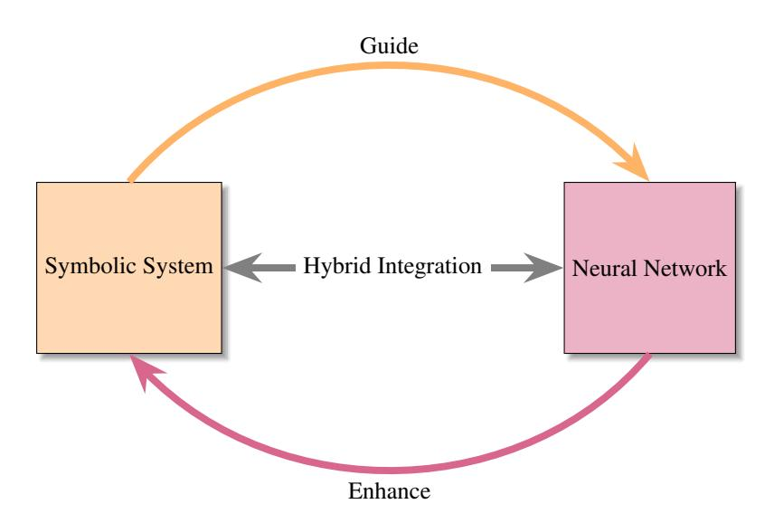
<!-- Image Description: The image is a diagram illustrating a hybrid integration scheme. Two boxes represent a symbolic system and a neural network, linked by bidirectional arrows labeled "Hybrid Integration." Curved arrows show feedback loops: one labeled "Guide" from the symbolic system to the neural network, and another labeled "Enhance" in the opposite direction. The diagram depicts how the systems iteratively improve each other's performance through this integrated process. -->

Figure 1: This diagram depicts three neural-symbolic system interactions: the orange curve for "Symbol for Neural", the pink for "Neural for Symbol", and the grey bidirectional line for "Hybrid neural-symbolic integration", highlighting their distinct collaborative dynamics.

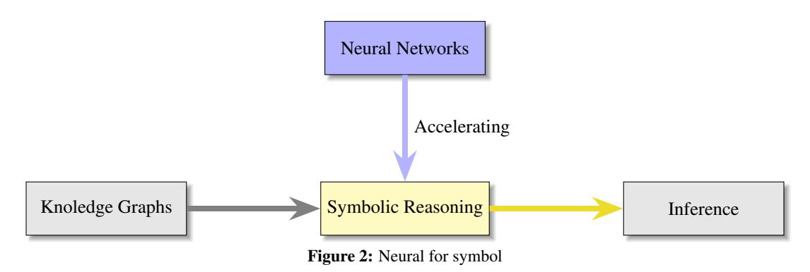
<!-- Image Description: Figure 2 is a flowchart illustrating a neural-symbolic system. Knowledge graphs feed into symbolic reasoning, which is accelerated by neural networks, ultimately leading to inference. Arrows depict data flow. The figure visually represents the integration of neural networks and symbolic reasoning to enhance inference capabilities. -->

### 2 Symbol for neural

In this context, "Symbol for Neural"[\[60,](#page-18-1) [61,](#page-18-2) [62,](#page-18-3) [63,](#page-18-4) [64,](#page-18-5) [65,](#page-18-6) [66,](#page-18-7) [67,](#page-18-8) [68,](#page-18-9) [69,](#page-18-10) [70,](#page-18-11) [71,](#page-18-12) [20,](#page-16-7) [72,](#page-18-13) [73,](#page-18-14) [74,](#page-18-15) [75,](#page-18-16) [76,](#page-18-17) [77,](#page-18-18) [78,](#page-18-19) [79,](#page-18-20) [80,](#page-19-0) [51,](#page-17-15) [52,](#page-17-16) [81,](#page-19-1) [55,](#page-17-19) [54,](#page-17-18) [82,](#page-19-2) [83,](#page-19-3) [79,](#page-18-20) [78,](#page-18-19) [84,](#page-19-4) [85,](#page-19-5) [83,](#page-19-3) [86,](#page-19-6) [78,](#page-18-19) [87,](#page-19-7) [84,](#page-19-4) [85\]](#page-19-5), also known as "Reasoning for Learning", leverages symbolic systems like KG to furnish a prior knowledge and a logical framework, thereby guiding and shaping neural networks' learning processes. Symbolic knowledge encoded in KG provides a rich source of structured information that enables neural networks to enhance their interpretability and decision-making capabilities. Moreover, KG serves not merely as passive repositories but as active participants, infusing neural networks with domain-specific rules and facts to bolster their learning efficiency. For instance, in developing algorithms for a recommendation system on an online education platform, a KG can categorize courses by content, difficulty, and progression, directing the neural network to tailor learning paths for users, thus optimizing learning outcomes. [Figure](#page-3-1) [3](#page-3-1) illustrates the architecture and rationale of this integrated approach.

#### 3 Hybrid neural-symbolic integration

"Hybrid neural-symbolic integration"[\[88,](#page-19-8) [89,](#page-19-9) [90,](#page-19-10) [91,](#page-19-11) [92,](#page-19-12) [93,](#page-19-13) [94,](#page-19-14) [95,](#page-19-15) [96,](#page-19-16) [97,](#page-19-17) [98,](#page-19-18) [99,](#page-19-19) [100,](#page-19-20) [101,](#page-20-0) [102,](#page-20-1) [103,](#page-20-2) [104\]](#page-20-3) shows a more dynamic way of interaction. In this approach, neural networks and symbolic reasoning complement each other without being subordinate, working together to enhance the comprehension and inference capabilities of the AI system. In this system, neural networks first process input data (e.g., images, text, etc.), extracting features and converting them into intermediate representations. These representations are then passed to a symbolic system, which utilizes this data for logical reasoning and possibly combines it with existing KG to make decisions or generate new knowledge. The results of the reasoning are not only used for direct decision-making output but are also fed back to the neural network

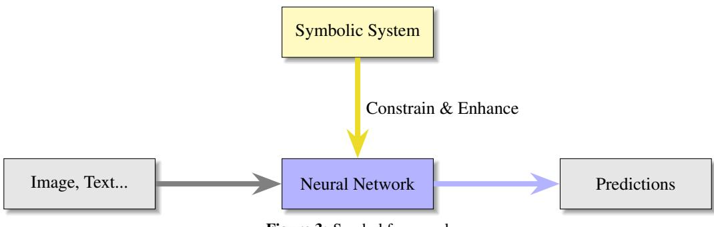
<!-- Image Description: The image is a flowchart illustrating a system architecture. Input data (Image, Text...) feeds into a Neural Network. A "Symbolic System" constrains and enhances the Neural Network's operation. The Neural Network then produces "Predictions" as output. The diagram visually represents the data flow and the role of the symbolic system in refining the neural network's processing for improved predictive accuracy. -->

Figure 3: Symbol for neural

to guide its further learning and parameter tuning, thus optimizing the performance of the overall system. Through this iterative feedback mechanism, the hybrid system can continuously optimize itself, and its components, the neural network and the symbolic system, can learn and adapt from each other's processing results. This collaborative process grants the hybrid system resilience and adaptability, allowing it to efficiently manage complex tasks with accuracy and interpretability. [Figure](#page-3-2) [4](#page-3-2) illustrates the architecture of this integrated approach.

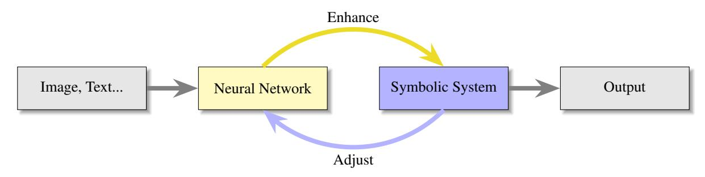
<!-- Image Description: The image is a flowchart depicting a system architecture. Input (Image, Text, etc.) feeds into a Neural Network, which interacts with a Symbolic System via iterative "Enhance" and "Adjust" feedback loops. The combined output of the Neural Network and Symbolic System then produces a final Output. The diagram illustrates a synergistic approach combining neural and symbolic methods. -->

Figure 4: Hybrid neural-symbolic integration

# 3 Methods based on knowledge graph

In this section, we take an in-depth look at the three taxonomies of neural symbols introduced in Section [2,](#page-1-1) focusing on specific methods for applications. We aim to describe these representative approaches for combining neural symbols with KG techniques, demonstrating progress in several directions. In addition, [Table](#page-4-0) [2](#page-4-0) summarizes the relevant features of these representative methods.

## 1 Neural for symbol

Deep learning plays a pivotal role in enhancing KG-related applications. In the field of neural for symbol systems, networks significantly accelerate the efficiency of KG's symbolic reasoning. This integration can be categorized into two main categories based on their specific applications: recommender systems enhanced by KG[\[51,](#page-17-15) [52,](#page-17-16) [57,](#page-17-21) [58\]](#page-17-22), Q&A systems enhanced by KG insights[\[53,](#page-17-17) [54,](#page-17-18) [55,](#page-17-19) [56\]](#page-17-20) These categories reflect the different ways in which neural networks promote the development of KG in various uses, enabling the building of faster and high-efficient computational models.

### 1.1 KG-based recommender systems

In the field of exploring KG-enhanced recommender systems, research has been divided into three main directions: pathbased approaches[\[106,](#page-20-4) [107,](#page-20-5) [108\]](#page-20-6), embedding-based[\[109,](#page-20-7) [81,](#page-19-1) [110\]](#page-20-8) approaches and propagation-based approaches[\[52,](#page-17-16) [51\]](#page-17-15) that we will introduce below.

Traditional KG recommendation systems like NFM[\[111\]](#page-20-9), Wide&Deep[\[112\]](#page-20-10), and xDeepFM[\[113\]](#page-20-11) struggle with non-linear relationships and high-order interactions. The Knowledge Graph Convolutional Network (KGCN)[\[51\]](#page-17-15), leveraging the Graph Convolutional Network (GCN)[\[114,](#page-20-12) [115\]](#page-20-13) framework, addresses these challenges by capturing multi-hop relationships between entities through stacked graph convolutional layers and a weighted neighbor aggregation

| Model         | Application                     | Categories         |
|---------------|---------------------------------|--------------------|
| KGCN[51]      |                                 |                    |
| KGAT[52]      | Recommender systems             | Neural for symbol  |
| CGAT[57]      |                                 |                    |
| HRAN[58]      |                                 |                    |
| VRN[53]       |                                 |                    |
| GRAFT-Net[54] | Q&A systems                     |                    |
| PullNet[55]   |                                 |                    |
| QA-GNN[56]    |                                 |                    |
| SEKG-ZSL[86]  |                                 |                    |
| ML-ZSL[83]    | Zero-shot and few-shot learning | Symbol for neural  |
| DGP[78]       |                                 |                    |
| GFL[87]       |                                 |                    |
| K-BERT[84]    | Knowledge-enhanced LMs          |                    |
| KnowBERT[105] |                                 |                    |
| CogQA[101]    | Q&A systems                     | Hybrid integration |
| JointGT[102]  | KG-to-text                      |                    |
| HGNN-EA[103]  | Entity alignment                |                    |
| KIG[104]      | Sentiment identification        |                    |

Table 2: Overview of Models by Application and Category

mechanism. Also, this methodology enhances the understanding of complex entity relationships and, by utilizing GCN's neighborhood sampling and parallel computation, significantly improves computational efficiency.

Neighborhood aggregation in KGCN updates node representations by utilizing neighbor features and capturing high-order user interests within the KG. It involves calculating and normalizing user relevance scores to weight neighboring entities, allowing the model to consider both direct and multi-hop neighbors, thus broadening its influence field and capturing complex entity dependencies. This approach is depicted in a two-layer receptive field illustration(see [Figure](#page-5-0) [5\)](#page-5-0), showcasing the multi-hop neighbor consideration. By incrementally constructing the network and employing negative sampling and gradient descent, KGCN refines entity representations. Additionally, domain sampling(uniformly sampling a fixed-sized set from each entity's neighbors)in each layer speeds up neighborhood information aggregation and propagation, enhancing the model's ability to quickly learn intricate patterns of entity interactions and relationships with fewer computational resources.

Similarly, Knowledge Graph Attention Network (KGAT)[\[52\]](#page-17-16) works on complex network situations between items due to shared attributes or characteristics that traditional methods ignore. By leveraging the adaptive focusing of relevant node property of graph attention network[\[116\]](#page-20-15), KGAT deeply mines the high-order relationships in the KG, significantly enhancing the model's understanding of the interrelationships between items, thereby improving the accuracy and relevance of recommendations.

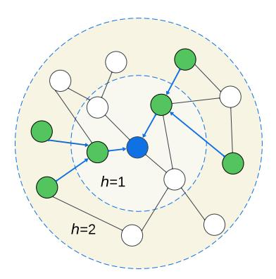
<!-- Image Description: The image is a graph illustrating a hierarchical network structure. Nodes are colored: blue (central node), green (nodes at distance h=1 from the central node), and white (nodes at distance h=2). Directed blue arrows indicate information flow towards the central node. Concentric circles delineate the hierarchical layers (h=1 and h=2), visually representing the distance from the central node. The graph likely depicts a model for information diffusion or network analysis within the paper. -->

Figure 5: A two-layer receptive field (green entities) of the blue entity in a KG

In addition to the basic collaborative KG embedding and prediction layers, the structure of KGAT specifically introduces an attention embedding propagation layer(see [Figure](#page-6-0) [6\)](#page-6-0). This layer efficiently captures high-order relationships by integrating recursive embedding propagation and attention mechanisms. The inclusion of an attention mechanism allows the model to differentiate the importance of different neighboring nodes (see Attention Coefficient π(h, r, t) below). Such a mechanism allows the neural network to focus more on more important nodes, thus improving the efficiency and accuracy of the recommender system. Firstly, recursive embedding propagation allows the model to gradually update the embedding representation of a node by considering the embedding information of the node and its neighbors, implemented through the equation [1,](#page-5-1) where eNh represents the aggregated embedding of node h's first-order neighborhood, et is the embedding of the neighbor node t, and π(h, r, t) is the contribution weight of node t to h, reflecting the strength of the relationship between nodes.

$$
e_{\mathcal{N}_h} = \sum_{(h,r,t)\in\mathcal{N}_h} \pi(h,r,t)e_t \tag{1}
$$

Subsequently, for the aforementioned attention coefficient π(h, r, t), we derive it with normalization using Equation [2:](#page-5-2)

$$
\pi(h,r,t) = \frac{\exp\left((W_r e_t)^\top \tanh(W_r e_h + e_r)\right)}{\sum_{(h,r',t') \in N_h} \exp\left((W_{r'} e_{t'})^\top \tanh(W_{r'} e_h + e_{r'})\right)}
$$
(2)

where Wr is the transformation matrix for relation r, eh and et represent the embedding vectors for the head and tail entities, respectively, and er is the embedding vector for relation r. Here, tanh is employed as the activation function to help the model capture complex nonlinear relationships between entities while maintaining the output within a stable range of values. After these steps, we aggregate the information to update the entity's representation, and the model could recursively extend this information aggregation to more distant neighbors through high-order propagation, allowing each node's embedding to capture a broader context and accelerating the information transfer process throughout the KG.

In recent years, along with the development of graph attention network technologies such as KGAT, we have witnessed the rise of technologies such as Contextualized Graph Attention Network(CGAT)[\[57\]](#page-17-21) and Heterogeneous Relation Attention Networks(HRAN)[\[58\]](#page-17-22), which further extend the application of graph attention networks in the field of KG reasoning. CGAT greatly enhances the performance of recommender systems by fusing local and non-local contextual information in the project KG. It utilizes a user-specific graph attention mechanism to aggregate neighborhood information in the KG, while taking into account the user's personalized preferences, enabling the model to provide customized recommendation services based on different users' attention to neighboring entities. HRAN, on the other hand, is designed for Heterogeneous KG Embedding (KGE), which operates at multiple semantic levels and hierarchically aggregates neighborhood features, while fully taking into account the information diversity of the KG. By introducing an innovative framework, HRAN uses an attention mechanism to determine the importance of different relational paths, enabling selective aggregation of information features.

#### 1.2 KG-based Q&A systems

KGs play a central role in the construction of contemporary Q&A systems. By integrating and utilizing KGs, Q&A systems can go beyond simple fact retrieval to achieve advanced question processing that requires in-depth semantic understanding and reasoning, while at the same time, we can leverage the learning capability of neural symbols to enhance the inference speed of KGs, thus significantly improving the response quality and user interaction experience.

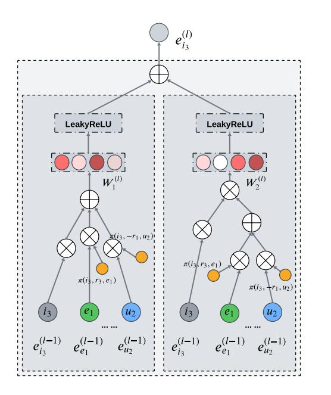
<!-- Image Description: This diagram illustrates a neural network architecture. Two parallel branches, each processing three inputs ($i_3$, $e_1$, $u_2$), use LeakyReLU activation functions. Each branch involves weighted sums ($W_1^{(l)}$, $W_2^{(l)}$) and element-wise multiplication ($\times$) operations, feeding into the next layer. The final output combines the branches' results. The diagram shows the network's internal structure and data flow at a specific layer ($l$), clarifying the processing steps within the model. -->

Figure 6: Attentive embedding propagation layer of KGAT

Past KG-driven Q&A systems[\[117,](#page-20-16) [118,](#page-20-17) [119\]](#page-20-18) faced two major challenges: first, it is difficult to utilize the structural information of the KG for complex multi-hop logical reasoning; second, it is difficult to accurately locate the topic entities mentioned in the question in the presence of various noises. To address these problems, Y Zhang et al. introduce the Variational Reasoning Network (VRN) [\[53\]](#page-17-17), a model grounded in a probabilistic modeling framework. It leverages a deep learning architecture that resembles a propagation mechanism, specifically tailored for logic reasoning over KG. Also, this model incorporates the REINFORCE algorithm, complemented by a variance reduction technique, to optimize its performance and reliability in inference tasks.

Specifically, VRN uses the probabilistic framework to handle uncertainty, consisting of two modules. The first one is the " Module for topic entity recognition ". In this module, we use a neural network model fent(·) : q 7→ R d that maps the problem to a high-dimensional vector space, thus capturing the problem context to identify and parse unique topic entities, rather than relying solely on pre-annotation or exact matching. The next one is the "Module for logic reasoning over KG". In this module, VRN uses the inference graph embedding architecture to solve the multi-hop problem and simplifies multi-step traversal in large KGs. It creates subgraphs that encapsulate all possible paths by performing topological ordering within a maximum number of hops of subject entities. It then learns the nonlinear embedding of these paths in the vector space. From there, it performs efficient reasoning on complex queries without the need for exhaustive graph traversal. Overall, this architecture avoids blind searches in large KG by combining probabilistic models with neural networks to predict potential inference paths.

Q&A models are easy to encounter limitations due to their reliance on data extraction from a single source[\[120,](#page-20-19) [121,](#page-20-20) [122\]](#page-21-0). The Graph of Facts Relationships and Texts Network (GRAFT-Net)[\[54\]](#page-17-18) released by H Sun et al. transcends these limitations by fusing two different sources of information: KG and textual data, thus improving Q&A performance. GRAFT-Net innovatively employs GCN to analyze heterogeneous graphs - a complex structure that combines both sources, encompassing learning the representation of different node types (entities and sentences) and their interconnections, thus allowing the neural network to deepen its understanding and reasoning about the interrelationships present in the composite graph. [Figure](#page-7-0) [7](#page-7-0) refers to the architecture of VRN.

Updating the heterogeneous graph constitutes a crucial phase in GRAFT-Net's training, where the refinement of entity nodes is pivotal. This update process employs a feed-forward network. Specifically, the update for an entity v is computed by amalgamating its previous state h (l−1) v , the question's representation h (l−1) q , and the collective states from neighboring entities Nr(v). These are weighted by attention coefficients α v ′ r and modified by relation-specific transformations ψr[\[114\]](#page-20-12). Additionally, the update incorporates aggregated states from the entity's mentions across the

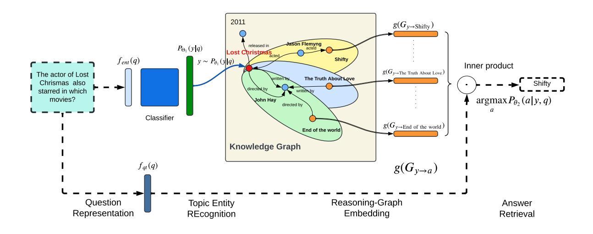
<!-- Image Description: This diagram illustrates a knowledge graph-based question answering system. A question ("The actor of Lost Christmas...") is processed, identifying the topic entity ("Lost Christmas"). This entity is then used to query a knowledge graph, generating graph embeddings for related entities (Shifty, The Truth About Love, etc.). These embeddings undergo an inner product calculation with the question embedding, and the entity with the highest probability (argmax) is selected as the answer. The entire process is depicted using boxes representing processing stages, arrows for data flow, and a central knowledge graph visualization. -->

Figure 7: End-to-end architecture of the variational reasoning network (VRN) for question-answering with KG

documents M(v), ensuring a comprehensive update mechanism as delineated in equation [3:](#page-7-1)

$$
h_v^{(l)} = \text{FFN}\left(\left[\begin{array}{c} h_v^{(l-1)} \\ h_q^{(l-1)} \\ \sum_r \sum_{v' \in N_r(v)} \alpha_r^{v'} \psi_r(h_{v'}^{(l-1)}) \\ \sum_{(d,p) \in M(v)} H_{d,p}^{(l-1)} \end{array}\right]\right)
$$
(3)

Following the update rules, we continue into two integral techniques employed in this study: the attention mechanism and the directed propagation technique. These methods are crucial for sharpening the model's focus on graph regions pivotal to the query at hand. Through the attention mechanism, where weights:

$$
\alpha_{rv} = \text{softmax}\left(x_r^T h_q^{(l-1)}\right) = \frac{\exp(x_r^T h_q^{(l-1)})}{\sum_{k \in N_r(v)} \exp(x_k^T h_q^{(l-1)})}
$$
(4)

reflect the congruence between relation vectors and the question representation, the model's information flow is channeled along edges deemed relevant. Simultaneously, the directed propagation technique, inspired by personalized PageRank[\[123\]](#page-21-1), ensures targeted dissemination of embeddings from question-related seed nodes across pertinent graph paths, thereby maintaining the model's concentrated attention on essential areas of the graph.

Following the development of Graft-Net, the introduction of PullNet[\[55\]](#page-17-19) by H. Sun's team marks a significant advancement in the field of Q&A system. PullNet improves upon Graft-Net by introducing an iterative retrieval process. Instead of using fixed heuristics to construct a question-specific subgraph as in Graft-Net, PullNet employs a GCN to dynamically identify and expand relevant nodes in the subgraph. This method allows PullNet to efficiently gather pertinent information from both KBs and textual data, ensuring that the retrieved subgraph is comprehensive, and containing all the necessary information. Specifically, this iterative process begins with a basic subgraph containing only entities directly related to the problem. Subsequently, through a series of iterative steps, the system gradually expands this subgraph. In each iteration, PullNet uses GCN to assess the importance of each node in the subgraph and selects the k nodes most likely to help answer the question for expansion. This selection is based on the probability scores of each node, which are computed by the classification operation. For each selected node, PullNet performs a "pull" operation to retrieve new information related to these nodes, including facts from the knowledge base and documents from the corpus. The retrieved new information is then added to the subgraph, including not only the new nodes but also the edges connecting them.

With the rapid growth of pre-trained language models, many researchers have explored integrating them with KG for QA systems like QA-GNN[\[56\]](#page-17-20). This model merges pre-trained language models and graph neural networks(GNN)[\[124\]](#page-21-2) to enhance understanding of question-answering contexts and utilize KG effectively. Initially, QA-GNN interprets the context using a pre-trained model, then forms a joint graph with the KG. It assesses node relevance within the KG to the QA context using a scoring mechanism. Finally, the model applies GNNs and relevance scores for reasoning on the joint graph to predict answers.

The core innovations of QA-GNN are twofold. First, relevance scoring assesses the importance of each KG node in relation to the QA context(see [Figure](#page-9-0) [9\)](#page-9-0). This scoring informs the attention mechanism within the graph neural network, enhancing node representation updates. For example, with a QA context node z and a KG node v, the relevance score ρv is computed using

$$
\rho_v = f_{\text{head}}(f_{\text{enc}}([text(z); text(v)])) \tag{5}
$$

, where fenc is the encoder extracting text features and fhead predicts the relevance score of node v to context z. Second is joint reasoning, where after forming the joint graph, the model uses a graph neural network with an attention mechanism to update node representations, iteratively updating the representations of the context and KG, thereby enabling reasoning. In this process, the graph attention network (GAT)[\[116\]](#page-20-15) dynamically adjusts the weights of information transfer between nodes so that each node can update its own information based on its relevance score with neighboring nodes.

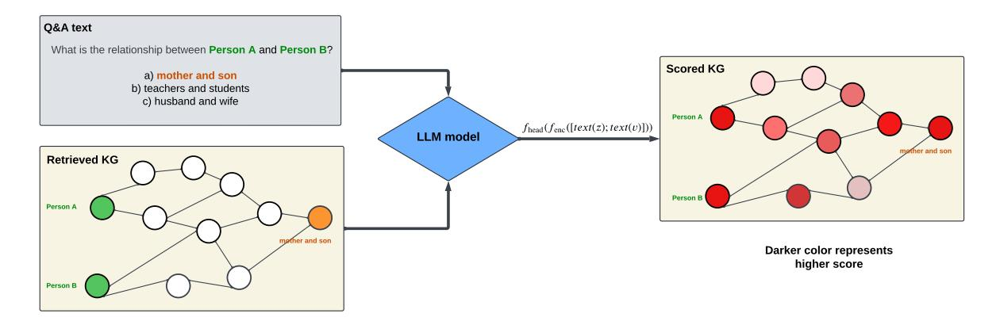
<!-- Image Description: The image illustrates a knowledge graph (KG) reasoning process. A question about the relationship between two persons is input, and a retrieved KG is processed by a large language model (LLM). The LLM outputs a scored KG where node colors represent the confidence of the relationship, with darker colors indicating higher confidence. The example shows the "mother and son" relationship being correctly identified. The diagram shows the process flow and the resulting scored KG. -->

Figure 8: Architecture of the QA-GNN for question-answering with KG

Conclusion: Recommender systems and Q&A systems, as the core applications combining KGs and neural networks, demonstrate a consensus on the choice of network models to utilize. First, these systems commonly adopt GNNs as their foundation, as they can resolve complex entity relationships and topological information directly on graph structures, providing a clear framework for efficiently processing KG data. For example, GCN-based[\[115\]](#page-20-13) models such as KGCN[\[51\]](#page-17-15) perform convolutional operations on the graph to deeply learn the interactions between nodes and highlight the learning of local connections. And GAT-based[\[116\]](#page-20-15) models, such as KGAT[\[52\]](#page-17-16) and QA-GNN[\[56\]](#page-17-20), introduce the attention mechanism to improve the judgment of the importance of neighbors and achieve a detailed node representation. Second, multi-hop inference is a core technique in neural network-based KG reasoning, which plays an indispensable role in almost all KG applications. By performing multi-step logical reasoning in the KG, this approach can explore and reveal complex, multi-level relationships between data. In recommender systems, multi-hop reasoning helps the system to deeply understand the user's preferences and needs to achieve personalized recommendations, while in Q&A systems, it enables the system to handle more complex queries and provide more accurate and insightful answers. Overall, all these models utilize the information and hierarchical relationships of graph structures to learn the representation of complex entities and relationships. Whether it is local structure capture in GCN, differential attention in GAT, or deep mining in multi-hop reasoning, they all demonstrate their ability to deal with complex and deep information, demonstrating their efficacy in intelligent applications.

#### 2 Symbol for neural

The reasoning ability of the KG can be accelerated by neural networks, and at the same time, it can provide guidance and constraints for the learning process of neural networks through its rich structured information. This enhancement is reflected in the field of "symbol for neural", especially in two major application directions: KG-driven zero-shot and few-shot learning[\[83,](#page-19-3) [86,](#page-19-6) [78,](#page-18-19) [87\]](#page-19-7), and knowledge-enhanced pre-trained language model (LM)[\[84,](#page-19-4) [85\]](#page-19-5). These

applications demonstrate how KG-based symbol grounding[2](#page-9-1) can uniquely enhance the functionality of neural networks, making network models more robust and interpretable.

#### 2.1 KG-driven zero-shot and few-shot learning

Knowledge graph-based Zero-Shot Learning (ZSL) models[\[127,](#page-21-3) [128,](#page-21-4) [129\]](#page-21-5) perform well in addressing application problems in the visual field, especially in image recognition and classification. These models can recognize categories that were unseen during training by introducing additional knowledge (e.g., relationships between entities), which enhances the generalization ability of the model.

The Zero-shot Learning via Semantic Embeddings and Knowledge Graphs(SEKG-ZSL)[\[86\]](#page-19-6), a cutting-edge zero-shot learning framework for image classification, skillfully integrates semantic embeddings with KG, using them as inputs to GCN to train classifiers that recognize unseen categories. In this model, we utilize pre-trained text models (e.g., GloVe[\[130\]](#page-21-6) or word2vec[\[131\]](#page-21-7)) to extract semantic embedding vector representations of different categories in a high-dimensional space that capture the semantic properties of the corresponding categories. Meanwhile, the KG depicts the associations between categories graphically to aid model comprehension. In the graph structure, nodes represent different categories, and edges reveal the semantic relationships between categories. Then, the model processes these two types of knowledge inputs through the GCN to transfer and combine the information between different categories with the help of the associative relationships in the graph, thus developing a classifier that can generalize to unseen categories. In particular, it is noted that the KG sets constraints for the network's learning by utilizing the relationships between categories to guide the information transfer when training the classifier, and enhances its ability to learn and predict the unseen categories. Simply speaking, the KG plays the role of a map in the model, guiding the GCN to learn and infer along the correct semantic path. Overall, the SEKG-ZSL framework can effectively combine the semantic and visual information of categories to improve the accuracy and generalization ability of zero-sample learning.

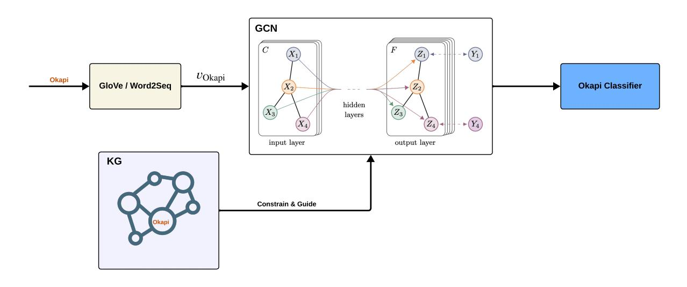
<!-- Image Description: This diagram illustrates a graph convolutional network (GCN) architecture for Okapi classification. Input data ("Okapi") is processed using GloVe/Word2Seq and fed into the GCN, which incorporates knowledge graph (KG) information to constrain and guide the learning process. The GCN consists of input and output layers with hidden layers in between, transforming node features (X) to representations (Z) before final classification by an "Okapi Classifier". The diagram shows the data flow and the different components of the model. -->

Figure 9: The basic architecture of training classifier by GCN with KG and semantic embedding

Typically, SEKG-ZSL performs well in dealing with zero-sample learning with single instance single label, but real-world scenarios such as image annotation usually involve a single image with multiple labels[\[132,](#page-21-8) [133,](#page-21-9) [134,](#page-21-10) [135\]](#page-21-11). For this reason, the Multi-label Zero-shot Learning(ML-ZSL)[\[83\]](#page-19-3) method proposed by Lee C.W. et al. was developed to adapt to such problems. ML-ZSL achieves accurate prediction of unseen category labels by integrating structured KGs and effectively capturing the correlations among different labels. Its core lies in the information propagation mechanism, which is based on two key aspects: first, we need to construct a structured KG with nodes representing individual labels and update the node states through gated recurrent units (GRUs)[\[136\]](#page-21-12) to simulate the information interactions and influences among labels and facilitate the propagation of information in the structured graph. Also, the updating process can be encapsulated by the following equation [6:](#page-9-2)

$$
h_v^{(t)} = \text{GRU Cell}(u_v^{(t)}, h_v^{(t-1)})\tag{6}
$$

2 Symbol grounding originates from cognitive science[\[126\]](#page-21-13) and aims to connect abstract symbols to real-world physical entities. In the neural-symbolic field, it connects data to entities in a symbolic system, resulting in enhanced understanding and interpretability of the network.

This equation updates the state h (t) v of node v at time step t by combining the information u (t) v from neighboring nodes and the node's previous state h (t−1) v via a GRU cell. This mechanism facilitates the propagation and updating of information throughout the graph. Second, the propagation matrix is learned to provide a strategy for the flow of information through the graph. This process determines the propagation weights through a relational function, where the weights are set based on the semantic word embedding of the labels. This approach ensures that the model can make effective inferences based on learned semantic relations even when faced with unseen labels. In summary, by combining structured KG propagation and propagation matrix learning, ML-ZSL not only finely regulates the information flow (Specific representations of knowledge-guided neural networks), but also significantly improves the prediction accuracy of unseen labels while maintaining the correct relationships between labels.

Methods based on GCN for zero-shot learning have shown great potential. However, a major challenge for these approaches is the knowledge dilution caused by excessive Laplacian smoothing[\[137\]](#page-21-14) in multilayer GCN architectures, which makes the feature representations too similar and thus reduces the model's prediction performance for new categories. To address this problem, M Kampffmeyer et al. introduced the Dense Graph Propagation (DGP)[\[78\]](#page-18-19) method, which effectively avoids excessive information smoothing by establishing direct connections between nodes that are far away from each other in the KG, while optimizing information propagation by using distance-based weights between nodes. In specific terms, the module consists of a two-stage training procedure: the DGP is first trained to predict the weights of the last layer of the CNN for known categories, and then these predicted weights are applied to the CNN and fine-tuned to fit the new classifier. This approach not only enhances the prediction ability for unseen categories but also maintains the strong performance for known categories.

In addition to the zero-shot learning we previously discussed, few-shot learning also focuses on how to enable models to learn and generalize quickly in scenarios with scarce data. Within this framework, the Graph Few-shot Learning(GFL)[\[87\]](#page-19-7) model employs its unique strategies to implement knowledge transfer, which migrates knowledge from the auxiliary graph to the target graph[\[138,](#page-21-15) [139\]](#page-21-16), thus helping to improve semi-supervised node classification in graphs. To be specific, GFL focuses on two types of relational structures at the node level (local perspective) and the graph level (global perspective) to facilitate knowledge transfer. First, at the node level, we aim to learn the associative structure among nodes of the same class. For this purpose, we introduce the Prototype Graph Neural Network (PGNN)[3](#page-10-0) [\[140\]](#page-21-17), which constructs the relational structure Rk from the sample set Sk of each class k to learn the prototype representation ck of each class, thereby capturing the global relationships among nodes within the same category. And, this relational structure is typically based on metrics like k-hop common neighbors or topological distances. Also, the principle of prototype computation can be understood through the following equation [7:](#page-10-1)

$$
c_k = \text{Pool}(\text{PGNN}_{\phi}(R_k, f_{\theta}(S_k))) \tag{7}
$$

Here, Pool is a pooling operation (such as max pooling or average pooling) used to obtain a single prototype vector from the output of PGNN, fθ(Sk) represents the feature representation of all nodes in category k processed through a function with parameters θ, and PGNNϕ denotes the PGNN model characterized by the parameter ϕ. Secondly, at the graph level, our goal is to learn the global information of a specific graph through the Hierarchical Graph Representation Gate and utilize this information to enhance the learning effectiveness of the network at the node level. This involves capturing the structural features of the graph at different levels and aggregating these features to form a comprehensive representation of the graph, and then adjusting the parameters ϕ of the graph neural network using a gating mechanism, enabling the model to capture and utilize global structural information at the graph level.

#### 2.2 Knowledge-enhanced pre-trained language models

Pre-trained language models(PLMs) based on knowledge enhancement improve the understanding and generation of text by incorporating external knowledge, such as KG. These integration methods utilize the structured information in KG to enable the language model to not only process complex text more logically, but also to accurately reference and reason about specialized knowledge, thus making the output more reliable.

In the field of Natural Language Processing(NLP), although the Bidirectional Encoder Representations from Transformers model (BERT)[\[6\]](#page-15-5) performs well on many tasks, there are still challenges when dealing with complex tasks that require deep knowledge and understanding. For this reason, researchers have explored the integration of structured KGs into BERT, aiming to provide the necessary external knowledge to enhance its comprehension and reasoning capabilities. Knowledge-enabled BERT(K-BERT)[\[84\]](#page-19-4) and knowledge enhanced BERT(KnowBERT)[\[105\]](#page-20-14) are two advanced models for integrating KGs to enhance BERT, which incorporates enriched knowledge into BERT through different approaches, with the same goal but different core implementation strategies.

3 Prototype Graph Neural Network (PGNN)[\[140\]](#page-21-17) combines GNNs with prototype learning. By learning representative instances (prototypes) of key structures in a graph, GNN can more closely integrate the representation of the graph data with the representation of the associated prototypes, thus enhancing the interpretability of the representation in downstream tasks.

KnowBERT[\[105\]](#page-20-14) introduces an innovative mechanism known as Knowledge Attention and Recontextualization (KAR), which adeptly bridges the gap between textual content and external knowledge bases. The essence of the KAR mechanism lies in its ability to identify entity mentions within the text and link them to corresponding entities in the knowledge base, thereby enriching the original contextual representation of the text. This process encompasses several critical steps: firstly, mention-span representation transforms potential entity mentions within the text into vectors of uniform dimensionality; secondly, an entity linker is employed to accurately align each mention with the most relevant entity in the knowledge base (symbol for neural); thirdly, by incorporating mention-span self-attention mechanism and through knowledge enhancement and recontextualization[\[141\]](#page-21-18) steps, the selected entity information is effectively reintegrated into the textual representation, achieving a comprehensive integration of textual meaning and knowledge content. The basic architecture of KAR is shown in the following.

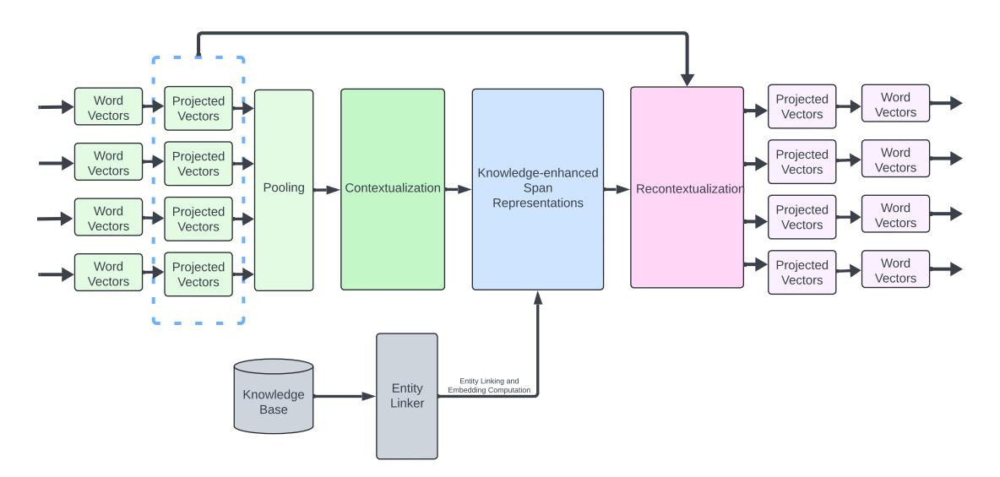
<!-- Image Description: The image is a flowchart depicting a natural language processing (NLP) model. Word vectors are input, projected, pooled, and then undergo contextualization. These representations are enhanced with knowledge from a knowledge base via an entity linker, resulting in knowledge-enhanced span representations. Finally, recontextualization produces output word vectors. The flowchart illustrates the model's architecture, highlighting key processing stages. -->

Figure 10: The Knowledge Attention and Recontextualization (KAR) component

On the other hand, the proposed K-BERT[\[84\]](#page-19-4) aims to solve the two main problems faced by language representation models based on knowledge injection: Heterogeneous Embedding Space (HES) and Knowledge Noise (KN). Firstly, to deal with the HES problem, K-BERT constructs a knowledge-rich sentence tree by directly integrating the KG information into the text, which realizes a unified representation of text and KG information in the same vector space, and effectively mitigates the HES problem. Secondly, to cope with the KN problem, K-BERT introduces soft-position embedding and a visible matrix mechanism. Soft positional embedding enables the model to integrate the injected knowledge while maintaining the text order without destroying the original text structure. Then, the visibility matrix controls the "visibility" of words to ensure that only relevant knowledge is computed, reducing the disturbance of irrelevant knowledge and mitigating the KN problem effectively. The visible matrix M is defined by the equation [8:](#page-11-0)

$$
M_{ij} = \begin{cases} 0 & \text{if } w_i \leftrightarrow w_j \\ -\infty & \text{otherwise} \end{cases}
$$
 (8)

Here, wi and wj represent tokens within the sentence, and wi ↔ wj denotes that wi and wj are within the same branch of the knowledge-rich sentence tree and therefore can "see" each other. If they are not in the same branch, the value of −∞ could effectively mask out (i.e., makes invisible) the token wj when computing attention for wi , ensuring that only contextually relevant knowledge influences the representation of each token.

Conclusion: In the paradigm of neural for symbol, KG has provided neural network learning with a wealth of structured knowledge and deep semantic and contextual information, serving as important guidance during the learning process. Faced with the challenge of scarce samples, the structured information from KGs significantly enhances the neural network's learning capabilities in complex language tasks. For instance, models such as SEKG-ZSL[\[86\]](#page-19-6) and GFL[\[87\]](#page-19-7) effectively learn through semantic embeddings and graph structure reasoning, even in situations with extremely limited samples. Moreover, in handling natural language processing (NLP) tasks, KGs provide the models with rich contextual information and precise factual knowledge that are difficult to obtain from traditional pre-training. This information directly enhances the models' understanding of complex queries and improves their ability to handle terms and concepts specific to certain fields. Additionally, it ensures the factual and logical consistency of the generated text, thereby enhancing the model's interpretability.

#### 3 Hybrid neural-symbolic integration

Compared to the two previously mentioned categories, our hybrid integration model focuses more on processing the functions of neural networks and symbolic systems in parallel, allowing them to operate independently without interfering with each other. Through specific mechanisms, these two systems can share information and results. Typically, we expect this parallel operation to promote and grow with each other, forming a cyclic enhancement learning model: the output of each system can become part of the input of the other system, thus driving the iterative progress of the whole system. In addition, this learning model is also expected to apply to a wide range of application tasks, including Q&A systems[\[101\]](#page-20-0), KG-to-text[\[102\]](#page-20-1), entity alignment[\[103\]](#page-20-2) and sentiment identification[\[104\]](#page-20-3), etc.

In Section [1,](#page-0-0) we discussed the concepts of System 1 and System 2[\[27\]](#page-16-14) from cognitive science. Based on these ideas, Ding M and his team combined the capabilities of BERT (acting as System 1) and GNN (acting as System 2) to develop the Cognitive Graph QA(CogQA)[\[101\]](#page-20-0) model. This model employs a cognitive graph(KG-like structure) to mimic human dual-process cognition, aiming to address the complex challenges encountered when performing multi-hop question answering across large-scale document sets. CogQA constructs a dynamic cognitive graph that links information dispersed across multiple documents and iteratively mines and verifies potential answers. Specifically, apart from initializing the graph (creating starting nodes based on entities mentioned in the questions and marking them as "frontier nodes") and determining the termination conditions, each iteration of building the cognitive graph primarily involves three steps: First, relevant information, including potential answers and related entities, is extracted from the document set using BERT[\[6\]](#page-15-5) (system 1); Second, based on the information provided by system 1, CogQA updates the cognitive graph by adding new nodes and edges, where new nodes include entities or answer candidates identified from the text, and edges represent logical relationships between entities. These new nodes are also marked as frontier nodes for use in the next iteration; Third, once the cognitive graph is updated, GNN(system 2) begins analyzing the logic and relationships between entities in depth and optimizing the structure of the cognitive graph. Importantly, after each iteration, CogQA assesses whether the cognitive graph is sufficiently comprehensive to answer the original question. If the information is deemed adequate, the model will predict the final answer based on the current cognitive graph. Otherwise, the model will continue iterating, further expanding, and refining the cognitive graph with each cycle until a satisfactory answer is found. The basic architecture and implementation of CogQA is shown in Figure [11](#page-12-0)

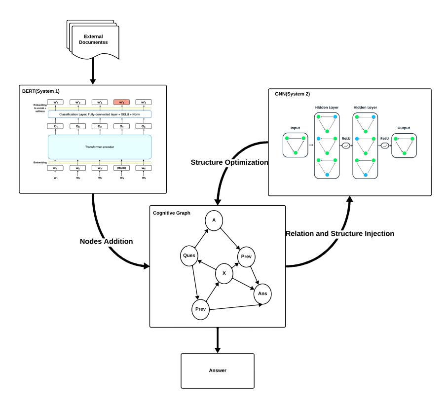
<!-- Image Description: This flowchart illustrates a hybrid BERT-GNN system for question answering. It shows two systems, BERT (System 1) processing external documents and a GNN (System 2) operating on a cognitive graph. The BERT system's architecture is depicted, including embedding, transformer encoder, and classification layers. The GNN system's diagram shows hidden layers with ReLU activation functions. A cognitive graph represents question-answer relationships. The systems are integrated through "Structure Optimization" and "Relation and Structure Injection," optimizing the graph structure and feeding information between the two systems to produce a final answer. -->

Figure 11: Overview of CogQA implementation

In the task of Knowledge Graph to Text Generation (KG-to-text)[\[142\]](#page-21-19), existing models often ignore the structural information of the graph or lack pre-training tasks for accurately modeling graph-text alignment. To address these

issues, a joint graph-text representation learning model called JointGT[\[102\]](#page-20-1) is proposed. This model preserves the structure of the input graph by introducing structure-aware semantic aggregation modules in each Transformer layer of the encoder. In addition, the model designs three new pre-training tasks to explicitly enhance graph-text alignment, including graph-enhanced text reconstruction, text-enhanced graph reconstruction, and graph-text embedding alignment via optimal transport. It is worth noting that these pre-training tasks are performed iteratively to continuously optimize the performance of the model. In the graph-text embedding alignment task, it employs the optimal transport theory to minimize the cost between graph and text embedding, which is a typical iterative process. In this process, the model calculates the distance between the embedding vectors of the graph and the text and adjusts these embedding vectors by the optimal transport algorithm so that the transit cost is minimized. In this way, the model is better able to capture and learn the complex relationships between graphs and texts, thus generating more accurate and coherent texts.

Entity alignment is an important task in the field of KGs, aiming at identifying entities with the same or similar meanings in different KGs. Traditional approaches usually rely on extensive human involvement or simple embedding techniques, which may not be sufficient to capture the rich relationship and attribute information among entities. However, the HGNN-EA[\[103\]](#page-20-2) model significantly improves the accuracy of entity alignment by employing Heterogeneous Graph Neural Networks (HGNNs)[\[143\]](#page-22-0) to process entity and relationship data in the KG and using iterative fusion methods to enhance model training. In this model, different types of nodes (entities and relations) are modeled simultaneously and their semantic representations are strengthened through dynamic interactions during iterations. Each iteration optimizes the information exchange between nodes through Graph Attention Network (GAT)[\[125\]](#page-21-20) to represent their semantic and structural associations more comprehensively. In addition, HGNN-EA applies a distance-based approach in entity alignment, which can accurately measure the semantic distances between entities in different KGs, and effectively identify pairs of entities with the same or similar meanings.

Implicit sentiment recognition, a common task in text analysis of the NLP field, faces challenges due to the lack of structural information and noise in predefined graph structures. To address these challenges, the Knowledge-Fusion-Based Iterative Graph Structure Learning Framework (KIG)[\[104\]](#page-20-3) has been introduced. This innovative method aims to construct rich initial graph structures by integrating knowledge from multiple perspectives—including co-occurrence statistics, cosine similarity, and syntactic dependency trees—to more comprehensively capture the subtle expressions of sentiment within texts. The core mechanism of KIG lies in its iterative evolutionary graph learning process. In each iteration, KIG evaluates the effectiveness of the current graph structure and updates it based on the information learned, thereby achieving optimal node representations and graph topology. During the iterative process, KIG employs a multi-view fusion strategy, integrating graph structural perspectives from different information sources to form a comprehensive and expressive graph representation. For example, it considers both semantic similarity and syntactic structure to capture the textual sentiment tendencies more thoroughly. Moreover, each iteration involves refining the graph structure by adjusting the adjacency matrix and utilizing GCNs[\[114,](#page-20-12) [115\]](#page-20-13) to extract and merge node features, subsequently updating the node embedding.

Conclusion: The four described models of Hybrid neural-symbolic integration, although applied in different domains, share a key feature — iterative learning mechanisms. Iterative learning significantly enhances the models' reasoning capabilities and data representation through a continuous cyclic process. For instance, in the HGNN-EA[\[103\]](#page-20-2) and CogQA[\[101\]](#page-20-0), iterative methods are used to progressively optimize the representation of nodes within KGs, thereby more accurately reflecting the complex relationships and attributes between entities. This iterative process not only improves the models' understanding of data structures but also refines the application of symbolic logic with each iteration, thereby increasing the accuracy and efficiency of problem-solving. Iterative learning also enhances the models' adaptability to new situations and their explanatory power, making them more flexible in practical applications. Through continual iterative updates, the models accumulate learning experiences, optimize their decision-making processes, and exhibit greater robustness and adaptability when confronted with unknown data or complex scenarios.

# 4 Future Trends & Direction

## 1 Multimodal and multidomain learning

Multimodal and multidomain learning represents a significant trend in the field of deep learning[\[144,](#page-22-1) [145,](#page-22-2) [146,](#page-22-3) [147,](#page-22-4) [148\]](#page-22-5), offering unprecedented opportunities but also presenting considerable challenges, particularly in terms of information fusion and domain adaptation. The challenge of information fusion primarily involves effectively integrating data from diverse modalities, such as text, images, and audio, which differ significantly in their forms and processing methods. By utilizing KG as a unified semantic framework, we can better align and integrate data from these varied modalities. The structured information within the KG provides essential context, facilitating the fusion of information from different sources, and thereby enhancing the overall understanding capabilities of the model. On the other hand, the issue of domain adaptation focuses on enabling models to operate across different domains while maintaining

performance amidst variations in data distribution and characteristics across these domains. Employing a KG as a bridge for cross-domain data processing, and incorporating common knowledge and rules across domains, can significantly enhance the adaptability and generalization capabilities of models in new scenarios.

### 2 Reasoning efficiency

Improving reasoning efficiency is one of the challenges in achieving deep learning productization, especially in scenarios that require fast responses, such as mobile device applications, self-driving, and other real-time processing systems. These application scenarios typically require models to perform tasks quickly and accurately with limited computational resources. KGs may play a key role in this environment by providing neural network models with rich prior knowledge to optimize reasoning paths. More specifically, KGs can predefine the logical relationships and rules required during the inference process, allowing the model to directly perform some of the decisions and computations without the need for deep neural computation. The rules and known facts in the KG can be utilized for direct processing when performing reasoning tasks, thus reducing the reliance on data-driven reasoning. This approach reduces the amount of computation and also increases the speed of reasoning, making the model more efficient and practical in real applications.

### 3 Graph-integrated Transformer

Although graph neural networks (GNNs)[\[124\]](#page-21-2) have demonstrated excellent capabilities in processing structured data, especially KGs, in practice, GNNs face challenges such as low computational efficiency, limited scalability, and lack of performance when dealing with large-scale datasets. The computational complexity of GNNs stems mainly from the sparseness and irregularity of graph data, which makes the optimization and acceleration of these models particularly difficult. Given these challenges, it is particularly promising to focus future research and applications on combining KGs with Transformer-based models[\[141\]](#page-21-18), which, by their self-attentive mechanism, can efficiently process large-scale datasets and effectively capture long-distance dependencies, and especially excel in the processing of text and other continuous data streams. Specifically, by directly incorporating entities and relationships from the KG into the Transformer's self-attention mechanism, the knowledge-enhanced Transformer model can provide clear inference paths and logical proofs while maintaining efficient data processing.

# 5 Conclusion

In this paper, we explore how KG-based neural symbolic integration can be applied in three different categories. This research comprehensively demonstrates the potential of combining deep learning with KG reasoning, providing a theoretical foundation for the future development of more interpretable and efficient AI systems. The goal of this comprehensive approach is to bridge the gap between intuitive human reasoning and machine execution, thereby enhancing the utility and transparency of AI applications in multiple domains.

# A Supplemental Material

## A.1 Knowledge Graph

A knowledge graph(KG) is a structured representation of knowledge where entities, their attributes, and the relationships between them are organized into a graph-like structure. In mathematical terms, a KG can be represented as G = (V, E), where V represents the set of vertices or nodes corresponding to entities, and E represents the set of edges or relationships between these entities. Each relationship is often expressed as a triplet (subject, predicate, object), where the subject and object are entities and the predicate represents the relationship between them. Mathematically, this triplet can be denoted as (s, p, o). Each entity is associated with a set of properties or attributes, forming a vector space representation. Mathematically, this can be denoted as Vi = {p1, p2, ..., pn}, where Vi represents the ith entity and p1, p2, ..., pn represent its attributes. Relationships between entities are represented as directed edges connecting nodes in the graph. By leveraging graph theory and mathematical models, KGs enable the organization, retrieval, and analysis of complex information in a structured and interconnected manner, facilitating various applications such as semantic search, question answering, and knowledge discovery.

### A.2 Graph neural networks

Graph Neural Networks (GNNs)[\[124\]](#page-21-2) belong to a special class of neural networks that are designed to operate on data following the structure of a graph, in which there are entities or nodes, and relations or edges between them. That's pretty uncommon, actually. Unlike conventional neural networks, which can learn and reason from grid-like data, GNNs are quite able to get pattern recognition within data that's highly irregular and interconnected. GNNs iteratively update the representations of the nodes by allowing them to pool information from neighboring nodes, such that they can represent complex dependencies and patterns of the graph structure. This is the process, usually message passing between nodes, whereby each node aggregates information from its neighbors and changes its own representation based on the information.

### A.2.1 Graph convolutional networks

Graph convolutional networks (GCNs) [\[115\]](#page-20-13)are, in fact, convolutional neural networks (CNNs) that generalize the classical CNNs' convolutional operation from regular data domains to irregular ones, such as graphs. Being directly performed over the graph structure, convolutional operations in GCNs allow for the capturing of localized and global information in a principled manner over the corresponding adjacent nodes. Central to the idea of GCNs is the aggregation of feature information from the node's neighborhood, normally understood to mean the immediate neighbors, followed by updating the node representation with the gathered representation, and repeating this process several times over multiple layers. This is being done several times over a few layers to progressively learn more complex hierarchical representations of the graph data.

### A.2.2 Graph attention networks

Graph Attention Networks (GATs)[\[116\]](#page-20-15) are another type of graph neural network that applies attention mechanisms to allow the model to capture complex dependencies between different nodes in graph-structured data, within natural language processing. In traditional graph convolutional networks (GCNs), information from neighbors of nodes is uniformly aggregated, but the attention of GAT is dynamically computed for each pair of neighbor nodes and central node, which enabled our model to generalize the convolutional model by focusing more on the relevant neighbors of each node. This attention mechanism, in other words, allows the GATs to effectively learn the importance in light of their relevance to the target node, capturing differences in level that arise from the graph structure.

# References

- [1] Mingxing Tan and Quoc Le. Efficientnet: Rethinking model scaling for convolutional neural networks. In *International conference on machine learning*, pages 6105–6114. PMLR, 2019.
- [2] Hang Zhang, Chongruo Wu, Zhongyue Zhang, Yi Zhu, Haibin Lin, Zhi Zhang, Yue Sun, Tong He, Jonas Mueller, R Manmatha, et al. Resnest: Split-attention networks. In *Proceedings of the IEEE/CVF conference on computer vision and pattern recognition*, pages 2736–2746, 2022.
- [3] Alexey Dosovitskiy, Lucas Beyer, Alexander Kolesnikov, Dirk Weissenborn, Xiaohua Zhai, Thomas Unterthiner, Mostafa Dehghani, Matthias Minderer, Georg Heigold, Sylvain Gelly, et al. An image is worth 16x16 words: Transformers for image recognition at scale. *arXiv preprint arXiv:2010.11929*, 2020.
- [4] Josh Achiam, Steven Adler, Sandhini Agarwal, Lama Ahmad, Ilge Akkaya, Florencia Leoni Aleman, Diogo Almeida, Janko Altenschmidt, Sam Altman, Shyamal Anadkat, et al. Gpt-4 technical report. *arXiv preprint arXiv:2303.08774*, 2023.
- [5] Hugo Touvron, Louis Martin, Kevin Stone, Peter Albert, Amjad Almahairi, Yasmine Babaei, Nikolay Bashlykov, Soumya Batra, Prajjwal Bhargava, Shruti Bhosale, et al. Llama 2: Open foundation and fine-tuned chat models. *arXiv preprint arXiv:2307.09288*, 2023.
- [6] Jacob Devlin, Ming-Wei Chang, Kenton Lee, and Kristina Toutanova. Bert: Pre-training of deep bidirectional transformers for language understanding. *arXiv preprint arXiv:1810.04805*, 2018.
- [7] Amirata Ghorbani, Abubakar Abid, and James Zou. Interpretation of neural networks is fragile. In *Proceedings of the AAAI conference on artificial intelligence*, volume 33, pages 3681–3688, 2019.
- [8] Davide Castelvecchi. Can we open the black box of ai? *Nature News*, 538(7623):20, 2016.
- [9] Pantelis Linardatos, Vasilis Papastefanopoulos, and Sotiris Kotsiantis. Explainable ai: A review of machine learning interpretability methods. *Entropy*, 23(1):18, 2020.
- [10] Christoph Molnar. *Interpretable machine learning*. Lulu. com, 2020.
- [11] Zachary C Lipton. The mythos of model interpretability: In machine learning, the concept of interpretability is both important and slippery. *Queue*, 16(3):31–57, 2018.
- [12] Judith E Dayhoff and James M DeLeo. Artificial neural networks: opening the black box. *Cancer: Interdisciplinary International Journal of the American Cancer Society*, 91(S8):1615–1635, 2001.

- [13] Alejandro Barredo Arrieta, Natalia Díaz-Rodríguez, Javier Del Ser, Adrien Bennetot, Siham Tabik, Alberto Barbado, Salvador García, Sergio Gil-López, Daniel Molina, Richard Benjamins, et al. Explainable artificial intelligence (xai): Concepts, taxonomies, opportunities and challenges toward responsible ai. *Information fusion*, 58:82–115, 2020.
- [14] Emanuele Ratti and Mark Graves. Explainable machine learning practices: opening another black box for reliable medical ai. *AI and Ethics*, 2(4):801–814, 2022.
- [15] Scott M Lundberg and Su-In Lee. A unified approach to interpreting model predictions. *Advances in neural information processing systems*, 30, 2017.
- [16] Marco Tulio Ribeiro, Sameer Singh, and Carlos Guestrin. " why should i trust you?" explaining the predictions of any classifier. In *Proceedings of the 22nd ACM SIGKDD international conference on knowledge discovery and data mining*, pages 1135–1144, 2016.
- [17] Bolei Zhou, Aditya Khosla, Agata Lapedriza, Aude Oliva, and Antonio Torralba. Learning deep features for discriminative localization. In *Proceedings of the IEEE conference on computer vision and pattern recognition*, pages 2921–2929, 2016.
- [18] Ramprasaath R Selvaraju, Michael Cogswell, Abhishek Das, Ramakrishna Vedantam, Devi Parikh, and Dhruv Batra. Grad-cam: Visual explanations from deep networks via gradient-based localization. In *Proceedings of the IEEE international conference on computer vision*, pages 618–626, 2017.
- [19] David Alvarez Melis and Tommi Jaakkola. Towards robust interpretability with self-explaining neural networks. *Advances in neural information processing systems*, 31, 2018.
- [20] Alessandro Daniele, Tommaso Campari, Sagar Malhotra, and Luciano Serafini. Deep symbolic learning: Discovering symbols and rules from perceptions. *arXiv preprint arXiv:2208.11561*, 2022.
- [21] Natalia Díaz-Rodríguez, Alberto Lamas, Jules Sanchez, Gianni Franchi, Ivan Donadello, Siham Tabik, David Filliat, Policarpo Cruz, Rosana Montes, and Francisco Herrera. Explainable neural-symbolic learning (x-nesyl) methodology to fuse deep learning representations with expert knowledge graphs: The monumai cultural heritage use case. *Information Fusion*, 79:58–83, 2022.
- [22] Adrien Bennetot, Jean-Luc Laurent, Raja Chatila, and Natalia Díaz-Rodríguez. Towards explainable neuralsymbolic visual reasoning. *arXiv preprint arXiv:1909.09065*, 2019.
- [23] Joao Ferreira, Manuel de Sousa Ribeiro, Ricardo Gonçalves, and Joao Leite. Looking inside the black-box: Logic-based explanations for neural networks. In *Proceedings of the international conference on principles of knowledge representation and reasoning*, volume 19, pages 432–442, 2022.
- [24] Adrien Bennetot, Gianni Franchi, Javier Del Ser, Raja Chatila, and Natalia Diaz-Rodriguez. Greybox xai: A neural-symbolic learning framework to produce interpretable predictions for image classification. *Knowledge-Based Systems*, 258:109947, 2022.
- [25] Forough Arabshahi, Sameer Singh, and Animashree Anandkumar. Combining symbolic expressions and black-box function evaluations in neural programs. *arXiv preprint arXiv:1801.04342*, 2018.
- [26] Suddarth, Sutton, and Holden. A symbolic-neural method for solving control problems. In *IEEE 1988 International Conference on Neural Networks*, pages 516–523. IEEE, 1988.
- [27] Daniel Kahneman. *Thinking, fast and slow*. macmillan, 2011.
- [28] Yann LeCun, Yoshua Bengio, and Geoffrey Hinton. Deep learning. *nature*, 521(7553):436–444, 2015.
- [29] Paul Smolensky. Connectionist ai, symbolic ai, and the brain. *Artificial Intelligence Review*, 1(2):95–109, 1987.
- [30] Joseph C Giarratano and Gary Riley. *Expert systems*. PWS Publishing Co., 1998.
- [31] Dan Patterson. *Introduction to artificial intelligence and expert systems*. Prentice-Hall, Inc., 1990.
- [32] Dieter Fensel, Umutcan ¸Sim¸sek, Kevin Angele, Elwin Huaman, Elias Kärle, Oleksandra Panasiuk, Ioan Toma, Jürgen Umbrich, Alexander Wahler, Dieter Fensel, et al. Introduction: what is a knowledge graph? *Knowledge graphs: Methodology, tools and selected use cases*, pages 1–10, 2020.
- [33] Ron Sun and Frederic Alexandre. *Connectionist-symbolic integration: From unified to hybrid approaches*. Psychology Press, 2013.
- [34] Kenneth McGarry, Stefan Wermter, and John MacIntyre. Hybrid neural systems: from simple coupling to fully integrated neural networks. *Neural Computing Surveys*, 2(1):62–93, 1999.
- [35] Samuel Kim, Peter Y Lu, Srijon Mukherjee, Michael Gilbert, Li Jing, Vladimir Ceperi ˇ c, and Marin Solja ´ ciˇ c. Inte- ´ gration of neural network-based symbolic regression in deep learning for scientific discovery. *IEEE transactions on neural networks and learning systems*, 32(9):4166–4177, 2020.

- [36] Rajarshi Das, Arvind Neelakantan, David Belanger, and Andrew McCallum. Chains of reasoning over entities, relations, and text using recurrent neural networks. *arXiv preprint arXiv:1607.01426*, 2016.
- [37] Wenhan Xiong, Thien Hoang, and William Yang Wang. Deeppath: A reinforcement learning method for knowledge graph reasoning. *arXiv preprint arXiv:1707.06690*, 2017.
- [38] Christian Meilicke, Melisachew Wudage Chekol, Manuel Fink, and Heiner Stuckenschmidt. Reinforced anytime bottom up rule learning for knowledge graph completion. *arXiv preprint arXiv:2004.04412*, 2020.
- [39] Wenhu Chen, Wenhan Xiong, Xifeng Yan, and William Wang. Variational knowledge graph reasoning. *arXiv preprint arXiv:1803.06581*, 2018.
- [40] Ni Lao, Tom Mitchell, and William Cohen. Random walk inference and learning in a large scale knowledge base. In *Proceedings of the 2011 conference on empirical methods in natural language processing*, pages 529–539, 2011.
- [41] Arvind Neelakantan, Benjamin Roth, and Andrew McCallum. Compositional vector space models for knowledge base completion. *arXiv preprint arXiv:1504.06662*, 2015.
- [42] Xi Victoria Lin, Richard Socher, and Caiming Xiong. Multi-hop knowledge graph reasoning with reward shaping. *arXiv preprint arXiv:1808.10568*, 2018.
- [43] Zhaocheng Zhu, Zuobai Zhang, Louis-Pascal Xhonneux, and Jian Tang. Neural bellman-ford networks: A general graph neural network framework for link prediction. *Advances in Neural Information Processing Systems*, 34:29476–29490, 2021.
- [44] Komal Teru, Etienne Denis, and Will Hamilton. Inductive relation prediction by subgraph reasoning. In *International Conference on Machine Learning*, pages 9448–9457. PMLR, 2020.
- [45] William W Cohen. Tensorlog: A differentiable deductive database. *arXiv preprint arXiv:1605.06523*, 2016.
- [46] Fan Yang, Zhilin Yang, and William W Cohen. Differentiable learning of logical rules for knowledge base reasoning. *Advances in neural information processing systems*, 30, 2017.
- [47] Yuan Yang and Le Song. Learn to explain efficiently via neural logic inductive learning. *arXiv preprint arXiv:1910.02481*, 2019.
- [48] Meng Qu, Junkun Chen, Louis-Pascal Xhonneux, Yoshua Bengio, and Jian Tang. Rnnlogic: Learning logic rules for reasoning on knowledge graphs. *arXiv preprint arXiv:2010.04029*, 2020.
- [49] Yuyu Zhang, Xinshi Chen, Yuan Yang, Arun Ramamurthy, Bo Li, Yuan Qi, and Le Song. Efficient probabilistic logic reasoning with graph neural networks. *arXiv preprint arXiv:2001.11850*, 2020.
- [50] Meng Qu and Jian Tang. Probabilistic logic neural networks for reasoning. *Advances in neural information processing systems*, 32, 2019.
- [51] Hongwei Wang, Miao Zhao, Xing Xie, Wenjie Li, and Minyi Guo. Knowledge graph convolutional networks for recommender systems. In *The world wide web conference*, pages 3307–3313, 2019.
- [52] Xiang Wang, Xiangnan He, Yixin Cao, Meng Liu, and Tat-Seng Chua. Kgat: Knowledge graph attention network for recommendation. In *Proceedings of the 25th ACM SIGKDD international conference on knowledge discovery & data mining*, pages 950–958, 2019.
- [53] Yuyu Zhang, Hanjun Dai, Zornitsa Kozareva, Alexander Smola, and Le Song. Variational reasoning for question answering with knowledge graph. In *Proceedings of the AAAI conference on artificial intelligence*, volume 32, 2018.
- [54] Haitian Sun, Bhuwan Dhingra, Manzil Zaheer, Kathryn Mazaitis, Ruslan Salakhutdinov, and William W Cohen. Open domain question answering using early fusion of knowledge bases and text. *arXiv preprint arXiv:1809.00782*, 2018.
- [55] Haitian Sun, Tania Bedrax-Weiss, and William W Cohen. Pullnet: Open domain question answering with iterative retrieval on knowledge bases and text. *arXiv preprint arXiv:1904.09537*, 2019.
- [56] Michihiro Yasunaga, Hongyu Ren, Antoine Bosselut, Percy Liang, and Jure Leskovec. Qa-gnn: Reasoning with language models and knowledge graphs for question answering. *arXiv preprint arXiv:2104.06378*, 2021.
- [57] Yong Liu, Susen Yang, Yonghui Xu, Chunyan Miao, Min Wu, and Juyong Zhang. Contextualized graph attention network for recommendation with item knowledge graph. *IEEE Transactions on knowledge and data engineering*, 35(1):181–195, 2021.
- [58] Zhifei Li, Hai Liu, Zhaoli Zhang, Tingting Liu, and Neal N Xiong. Learning knowledge graph embedding with heterogeneous relation attention networks. *IEEE Transactions on Neural Networks and Learning Systems*, 33(8):3961–3973, 2021.

- [59] Jing Zhang, Bo Chen, Lingxi Zhang, Xirui Ke, and Haipeng Ding. Neural, symbolic and neural-symbolic reasoning on knowledge graphs. *AI Open*, 2:14–35, 2021.
- [60] Shu Guo, Quan Wang, Lihong Wang, Bin Wang, and Li Guo. Jointly embedding knowledge graphs and logical rules. In Jian Su, Kevin Duh, and Xavier Carreras, editors, *Proceedings of the 2016 Conference on Empirical Methods in Natural Language Processing*, pages 192–202, Austin, Texas, November 2016. Association for Computational Linguistics.
- [61] Shu Guo, Quan Wang, Lihong Wang, Bin Wang, and Li Guo. Knowledge graph embedding with iterative guidance from soft rules. In *Proceedings of the AAAI Conference on Artificial Intelligence*, volume 32, 2018.
- [62] Wen Zhang, Bibek Paudel, Liang Wang, Jiaoyan Chen, Hai Zhu, Wei Zhang, Abraham Bernstein, and Huajun Chen. Iteratively learning embeddings and rules for knowledge graph reasoning. In *The world wide web conference*, pages 2366–2377, 2019.
- [63] Ivan Donadello, Luciano Serafini, and Artur D'Avila Garcez. Logic tensor networks for semantic image interpretation. *arXiv preprint arXiv:1705.08968*, 2017.
- [64] Danqi Chen, Richard Socher, Christopher D Manning, and Andrew Y Ng. Learning new facts from knowledge bases with neural tensor networks and semantic word vectors. *arXiv preprint arXiv:1301.3618*, 2013.
- [65] Luciano Serafini and Artur d'Avila Garcez. Logic tensor networks: Deep learning and logical reasoning from data and knowledge. *arXiv preprint arXiv:1606.04422*, 2016.
- [66] Jingyi Xu, Zilu Zhang, Tal Friedman, Yitao Liang, and Guy Broeck. A semantic loss function for deep learning with symbolic knowledge. In *International conference on machine learning*, pages 5502–5511. PMLR, 2018.
- [67] Miles Cranmer, Alvaro Sanchez Gonzalez, Peter Battaglia, Rui Xu, Kyle Cranmer, David Spergel, and Shirley Ho. Discovering symbolic models from deep learning with inductive biases. *Advances in neural information processing systems*, 33:17429–17442, 2020.
- [68] Geoffrey E Hinton, Nitish Srivastava, Alex Krizhevsky, Ilya Sutskever, and Ruslan R Salakhutdinov. Improving neural networks by preventing co-adaptation of feature detectors. *arXiv preprint arXiv:1207.0580*, 2012.
- [69] Hongwei Wang, Fuzheng Zhang, Jialin Wang, Miao Zhao, Wenjie Li, Xing Xie, and Minyi Guo. Ripplenet: Propagating user preferences on the knowledge graph for recommender systems. In *Proceedings of the 27th ACM international conference on information and knowledge management*, pages 417–426, 2018.
- [70] Wenyu Zhang, Skyler Seto, and Devesh K Jha. Cazsl: Zero-shot regression for pushing models by generalizing through context. In *2020 IEEE/RSJ International Conference on Intelligent Robots and Systems (IROS)*, pages 7131–7138. IEEE, 2020.
- [71] Danial Hooshyar, Roger Azevedo, and Yeongwook Yang. Augmenting deep neural networks with symbolic educational knowledge: Towards trustworthy and interpretable ai for education. *Machine Learning and Knowledge Extraction*, 6(1):593–618, 2024.
- [72] Michael Hersche, Mustafa Zeqiri, Luca Benini, Abu Sebastian, and Abbas Rahimi. A neuro-vector-symbolic architecture for solving raven's progressive matrices. *Nature Machine Intelligence*, 5(4):363–375, 2023.
- [73] Yaqi Xie, Ziwei Xu, Mohan S Kankanhalli, Kuldeep S Meel, and Harold Soh. Embedding symbolic knowledge into deep networks. *Advances in neural information processing systems*, 32, 2019.
- [74] Yaqi Xie, Fan Zhou, and Harold Soh. Embedding symbolic temporal knowledge into deep sequential models. In *2021 IEEE International Conference on Robotics and Automation (ICRA)*, pages 4267–4273. IEEE, 2021.
- [75] Zhiting Hu, Xuezhe Ma, Zhengzhong Liu, Eduard Hovy, and Eric Xing. Harnessing deep neural networks with logic rules. *arXiv preprint arXiv:1603.06318*, 2016.
- [76] Deepan Chakravarthi Padmanabhan, Shruthi Gowda, Elahe Arani, and Bahram Zonooz. Lsfsl: Leveraging shape information in few-shot learning. In *Proceedings of the IEEE/CVF Conference on Computer Vision and Pattern Recognition*, pages 4971–4980, 2023.
- [77] Michelangelo Diligenti, Marco Gori, and Claudio Sacca. Semantic-based regularization for learning and inference. *Artificial Intelligence*, 244:143–165, 2017.
- [78] Michael Kampffmeyer, Yinbo Chen, Xiaodan Liang, Hao Wang, Yujia Zhang, and Eric P Xing. Rethinking knowledge graph propagation for zero-shot learning. In *Proceedings of the IEEE/CVF conference on computer vision and pattern recognition*, pages 11487–11496, 2019.
- [79] Riquan Chen, Tianshui Chen, Xiaolu Hui, Hefeng Wu, Guanbin Li, and Liang Lin. Knowledge graph transfer network for few-shot recognition. In *Proceedings of the AAAI conference on artificial intelligence*, volume 34, pages 10575–10582, 2020.

- [80] Yuan Yao. Se-cnn: convolution neural network acceleration via symbolic value prediction. *IEEE Journal on Emerging and Selected Topics in Circuits and Systems*, 13(1):73–85, 2023.
- [81] Fuzheng Zhang, Nicholas Jing Yuan, Defu Lian, Xing Xie, and Wei-Ying Ma. Collaborative knowledge base embedding for recommender systems. In *Proceedings of the 22nd ACM SIGKDD international conference on knowledge discovery and data mining*, pages 353–362, 2016.
- [82] Apoorv Saxena, Aditay Tripathi, and Partha Talukdar. Improving multi-hop question answering over knowledge graphs using knowledge base embeddings. In *Proceedings of the 58th annual meeting of the association for computational linguistics*, pages 4498–4507, 2020.
- [83] Chung-Wei Lee, Wei Fang, Chih-Kuan Yeh, and Yu-Chiang Frank Wang. Multi-label zero-shot learning with structured knowledge graphs. In *Proceedings of the IEEE conference on computer vision and pattern recognition*, pages 1576–1585, 2018.
- [84] Weijie Liu, Peng Zhou, Zhe Zhao, Zhiruo Wang, Qi Ju, Haotang Deng, and Ping Wang. K-bert: Enabling language representation with knowledge graph. In *Proceedings of the AAAI Conference on Artificial Intelligence*, volume 34, pages 2901–2908, 2020.
- [85] Zhengyan Zhang, Xu Han, Zhiyuan Liu, Xin Jiang, Maosong Sun, and Qun Liu. Ernie: Enhanced language representation with informative entities. *arXiv preprint arXiv:1905.07129*, 2019.
- [86] Xiaolong Wang, Yufei Ye, and Abhinav Gupta. Zero-shot recognition via semantic embeddings and knowledge graphs. In *Proceedings of the IEEE conference on computer vision and pattern recognition*, pages 6857–6866, 2018.
- [87] Huaxiu Yao, Chuxu Zhang, Ying Wei, Meng Jiang, Suhang Wang, Junzhou Huang, Nitesh Chawla, and Zhenhui Li. Graph few-shot learning via knowledge transfer. In *Proceedings of the AAAI conference on artificial intelligence*, volume 34, pages 6656–6663, 2020.
- [88] Robin Manhaeve, Sebastijan Dumancic, Angelika Kimmig, Thomas Demeester, and Luc De Raedt. Deepproblog: Neural probabilistic logic programming. *Advances in neural information processing systems*, 31, 2018.
- [89] Zhi-Hua Zhou. Abductive learning: towards bridging machine learning and logical reasoning. *Science China. Information Sciences*, 62(7):76101, 2019.
- [90] Wang-Zhou Dai, Qiuling Xu, Yang Yu, and Zhi-Hua Zhou. Bridging machine learning and logical reasoning by abductive learning. *Advances in Neural Information Processing Systems*, 32, 2019.
- [91] Yu-Xuan Huang, Wang-Zhou Dai, Le-Wen Cai, Stephen H Muggleton, and Yuan Jiang. Fast abductive learning by similarity-based consistency optimization. *Advances in Neural Information Processing Systems*, 34:26574–26584, 2021.
- [92] Todd R Johnson, Jiajie Zhang, and Hongbin Wang. A hybrid learning model of abductive reasoning. In *Connectionist-Symbolic Integration*, pages 91–112. Psychology Press, 2013.
- [93] Le-Wen Cai, Wang-Zhou Dai, Yu-Xuan Huang, Yu-Feng Li, Stephen H Muggleton, and Yuan Jiang. Abductive learning with ground knowledge base. In *IJCAI*, pages 1815–1821, 2021.
- [94] Jidong Tian, Yitian Li, Wenqing Chen, Liqiang Xiao, Hao He, and Yaohui Jin. Weakly supervised neural symbolic learning for cognitive tasks. In *Proceedings of the AAAI Conference on Artificial Intelligence*, volume 36, pages 5888–5896, 2022.
- [95] Stevan Harnad. Grounding symbols in the analog world with neural nets: A hybrid model. *Psychology*, 12:12–78, 2001.
- [96] Steve G Romaniuk and Lawrence O Hall. Sc-net: a hybrid connectionist, symbolic system. *Information sciences*, 71(3):223–268, 1993.
- [97] Ben Goertzel and Deborah Duong. Opencog ns: a deeply-interactive hybrid neural-symbolic cognitive architecture designed for global/local memory synergy. In *2009 AAAI Fall Symposium Series*, 2009.
- [98] Efthymia Tsamoura, Timothy Hospedales, and Loizos Michael. Neural-symbolic integration: A compositional perspective. In *Proceedings of the AAAI conference on artificial intelligence*, volume 35, pages 5051–5060, 2021.
- [99] Giuseppe Pisano, Giovanni Ciatto, Roberta Calegari, Andrea Omicini, et al. Neuro-symbolic computation for xai: Towards a unified model. In *CEUR WORKSHOP PROCEEDINGS*, volume 2706, pages 101–117. Sun SITE Central Europe, RWTH Aachen University, 2020.
- [100] Erik Cambria, Qian Liu, Sergio Decherchi, Frank Xing, and Kenneth Kwok. Senticnet 7: A commonsense-based neurosymbolic ai framework for explainable sentiment analysis. In *Proceedings of the Thirteenth Language Resources and Evaluation Conference*, pages 3829–3839, 2022.

- [101] Ming Ding, Chang Zhou, Qibin Chen, Hongxia Yang, and Jie Tang. Cognitive graph for multi-hop reading comprehension at scale. *arXiv preprint arXiv:1905.05460*, 2019.
- [102] Pei Ke, Haozhe Ji, Yu Ran, Xin Cui, Liwei Wang, Linfeng Song, Xiaoyan Zhu, and Minlie Huang. Jointgt: Graphtext joint representation learning for text generation from knowledge graphs. *arXiv preprint arXiv:2106.10502*, 2021.
- [103] Zirui Zhang, Fanfang Meng, Yuanhui Meng, Xiaoxia Liu, and Benhui Chen. Iterative fusion method based on heterogeneous graph neural network for entity alignment. In *2023 International Joint Conference on Neural Networks (IJCNN)*, pages 01–08. IEEE, 2023.
- [104] Yuxia Zhao, Mahpirat Mamat, Alimjan Aysa, and Kurban Ubul. Knowledge-fusion-based iterative graph structure learning framework for implicit sentiment identification. *Sensors*, 23(14):6257, 2023.
- [105] Matthew E Peters, Mark Neumann, Robert L Logan IV, Roy Schwartz, Vidur Joshi, Sameer Singh, and Noah A Smith. Knowledge enhanced contextual word representations. *arXiv preprint arXiv:1909.04164*, 2019.
- [106] Xiao Yu, Xiang Ren, Yizhou Sun, Quanquan Gu, Bradley Sturt, Urvashi Khandelwal, Brandon Norick, and Jiawei Han. Personalized entity recommendation: A heterogeneous information network approach. In *Proceedings of the 7th ACM international conference on Web search and data mining*, pages 283–292, 2014.
- [107] Huan Zhao, Quanming Yao, Jianda Li, Yangqiu Song, and Dik Lun Lee. Meta-graph based recommendation fusion over heterogeneous information networks. In *Proceedings of the 23rd ACM SIGKDD international conference on knowledge discovery and data mining*, pages 635–644, 2017.
- [108] Chuan Shi, Binbin Hu, Wayne Xin Zhao, and S Yu Philip. Heterogeneous information network embedding for recommendation. *IEEE transactions on knowledge and data engineering*, 31(2):357–370, 2018.
- [109] Hongwei Wang, Fuzheng Zhang, Xing Xie, and Minyi Guo. Dkn: Deep knowledge-aware network for news recommendation. In *Proceedings of the 2018 world wide web conference*, pages 1835–1844, 2018.
- [110] Hongwei Wang, Fuzheng Zhang, Min Hou, Xing Xie, Minyi Guo, and Qi Liu. Shine: Signed heterogeneous information network embedding for sentiment link prediction. In *Proceedings of the eleventh ACM international conference on web search and data mining*, pages 592–600, 2018.
- [111] Xiangnan He and Tat-Seng Chua. Neural factorization machines for sparse predictive analytics. In *Proceedings of the 40th International ACM SIGIR conference on Research and Development in Information Retrieval*, pages 355–364, 2017.
- [112] Heng-Tze Cheng, Levent Koc, Jeremiah Harmsen, Tal Shaked, Tushar Chandra, Hrishi Aradhye, Glen Anderson, Greg Corrado, Wei Chai, Mustafa Ispir, et al. Wide & deep learning for recommender systems. In *Proceedings of the 1st workshop on deep learning for recommender systems*, pages 7–10, 2016.
- [113] Jianxun Lian, Xiaohuan Zhou, Fuzheng Zhang, Zhongxia Chen, Xing Xie, and Guangzhong Sun. xdeepfm: Combining explicit and implicit feature interactions for recommender systems. In *Proceedings of the 24th ACM SIGKDD international conference on knowledge discovery & data mining*, pages 1754–1763, 2018.
- [114] Michael Schlichtkrull, Thomas N Kipf, Peter Bloem, Rianne Van Den Berg, Ivan Titov, and Max Welling. Modeling relational data with graph convolutional networks. In *The semantic web: 15th international conference, ESWC 2018, Heraklion, Crete, Greece, June 3–7, 2018, proceedings 15*, pages 593–607. Springer, 2018.
- [115] Thomas N Kipf and Max Welling. Semi-supervised classification with graph convolutional networks. *arXiv preprint arXiv:1609.02907*, 2016.
- [116] 8.5 Petar Velickovic, Guillem Cucurull, Arantxa Casanova, Adriana Romero, Pietro Lio, Yoshua Bengio, et al. Graph attention networks. *stat*, 1050(20):10–48550, 2017.
- [117] Alexander Miller, Adam Fisch, Jesse Dodge, Amir-Hossein Karimi, Antoine Bordes, and Jason Weston. Keyvalue memory networks for directly reading documents. *arXiv preprint arXiv:1606.03126*, 2016.
- [118] Jason Weston, Sumit Chopra, and Antoine Bordes. Memory networks. *arXiv preprint arXiv:1410.3916*, 2014.
- [119] Yujia Li, Daniel Tarlow, Marc Brockschmidt, and Richard Zemel. Gated graph sequence neural networks. *arXiv preprint arXiv:1511.05493*, 2015.
- [120] Georg Wiese, Dirk Weissenborn, and Mariana Neves. Neural domain adaptation for biomedical question answering. *arXiv preprint arXiv:1706.03610*, 2017.
- [121] Bhuwan Dhingra, Danish Pruthi, and Dheeraj Rajagopal. Simple and effective semi-supervised question answering. *arXiv preprint arXiv:1804.00720*, 2018.

- [122] Bonan Min, Ralph Grishman, Li Wan, Chang Wang, and David Gondek. Distant supervision for relation extraction with an incomplete knowledge base. In *Proceedings of the 2013 Conference of the North American Chapter of the Association for Computational Linguistics: Human Language Technologies*, pages 777–782, 2013.
- [123] Sergey Brin and Lawrence Page. The anatomy of a large-scale hypertextual web search engine. *Computer networks and ISDN systems*, 30(1-7):107–117, 1998.
- [124] Franco Scarselli, Marco Gori, Ah Chung Tsoi, Markus Hagenbuchner, and Gabriele Monfardini. The graph neural network model. *IEEE transactions on neural networks*, 20(1):61–80, 2008.
- [125] Petar Velickovi ˇ c, Guillem Cucurull, Arantxa Casanova, Adriana Romero, Pietro Lio, and Yoshua Bengio. Graph ´ attention networks. *arXiv preprint arXiv:1710.10903*, 2017.
- [126] Stevan Harnad. The symbol grounding problem. *Physica D: Nonlinear Phenomena*, 42(1-3):335–346, 1990.
- [127] Hugo Larochelle, Dumitru Erhan, and Yoshua Bengio. Zero-data learning of new tasks. In *AAAI*, volume 1, page 3, 2008.
- [128] Richard Socher, Milind Ganjoo, Christopher D Manning, and Andrew Ng. Zero-shot learning through crossmodal transfer. *Advances in neural information processing systems*, 26, 2013.
- [129] Yongqin Xian, Zeynep Akata, Gaurav Sharma, Quynh Nguyen, Matthias Hein, and Bernt Schiele. Latent embeddings for zero-shot classification. In *Proceedings of the IEEE conference on computer vision and pattern recognition*, pages 69–77, 2016.
- [130] Jeffrey Pennington, Richard Socher, and Christopher D Manning. Glove: Global vectors for word representation. In *Proceedings of the 2014 conference on empirical methods in natural language processing (EMNLP)*, pages 1532–1543, 2014.
- [131] Tomas Mikolov, Kai Chen, Greg Corrado, and Jeffrey Dean. Efficient estimation of word representations in vector space. *arXiv preprint arXiv:1301.3781*, 2013.
- [132] Jinseok Nam, Jungi Kim, Eneldo Loza Mencía, Iryna Gurevych, and Johannes Fürnkranz. Large-scale multi-label text classification—revisiting neural networks. In *Machine Learning and Knowledge Discovery in Databases: European Conference, ECML PKDD 2014, Nancy, France, September 15-19, 2014. Proceedings, Part II 14*, pages 437–452. Springer, 2014.
- [133] Yunchao Wei, Wei Xia, Junshi Huang, Bingbing Ni, Jian Dong, Yao Zhao, and Shuicheng Yan. Cnn: Single-label to multi-label. *arXiv preprint arXiv:1406.5726*, 2014.
- [134] Jiang Wang, Yi Yang, Junhua Mao, Zhiheng Huang, Chang Huang, and Wei Xu. Cnn-rnn: A unified framework for multi-label image classification. In *Proceedings of the IEEE conference on computer vision and pattern recognition*, pages 2285–2294, 2016.
- [135] Chih-Kuan Yeh, Wei-Chieh Wu, Wei-Jen Ko, and Yu-Chiang Frank Wang. Learning deep latent space for multi-label classification. In *Proceedings of the AAAI conference on artificial intelligence*, volume 31, 2017.
- [136] Kyunghyun Cho, Bart Van Merriënboer, Caglar Gulcehre, Dzmitry Bahdanau, Fethi Bougares, Holger Schwenk, and Yoshua Bengio. Learning phrase representations using rnn encoder-decoder for statistical machine translation. *arXiv preprint arXiv:1406.1078*, 2014.
- [137] TG Smith Jr, WB Marks, GD Lange, WH Sheriff Jr, and EA Neale. Edge detection in images using marr-hildreth filtering techniques. *Journal of neuroscience methods*, 26(1):75–81, 1988.
- [138] Nino Shervashidze, Pascal Schweitzer, Erik Jan Van Leeuwen, Kurt Mehlhorn, and Karsten M Borgwardt. Weisfeiler-lehman graph kernels. *Journal of Machine Learning Research*, 12(9), 2011.
- [139] Danai Koutra, Joshua T Vogelstein, and Christos Faloutsos. Deltacon: A principled massive-graph similarity function. In *Proceedings of the 2013 SIAM international conference on data mining*, pages 162–170. SIAM, 2013.
- [140] Zaixi Zhang, Qi Liu, Hao Wang, Chengqiang Lu, and Cheekong Lee. Protgnn: Towards self-explaining graph neural networks. In *Proceedings of the AAAI Conference on Artificial Intelligence*, volume 36, pages 9127–9135, 2022.
- [141] Ashish Vaswani, Noam Shazeer, Niki Parmar, Jakob Uszkoreit, Llion Jones, Aidan N Gomez, Łukasz Kaiser, and Illia Polosukhin. Attention is all you need. *Advances in neural information processing systems*, 30, 2017.
- [142] Claire Gardent, Anastasia Shimorina, Shashi Narayan, and Laura Perez-Beltrachini. The webnlg challenge: Generating text from rdf data. In *Proceedings of the 10th international conference on natural language generation*, pages 124–133, 2017.

- [143] Chuxu Zhang, Dongjin Song, Chao Huang, Ananthram Swami, and Nitesh V Chawla. Heterogeneous graph neural network. In *Proceedings of the 25th ACM SIGKDD international conference on knowledge discovery & data mining*, pages 793–803, 2019.
- [144] Amar Viswanathan Kannan, Dmitriy Fradkin, Ioannis Akrotirianakis, Tugba Kulahcioglu, Arquimedes Canedo, Aditi Roy, Shih-Yuan Yu, Malawade Arnav, and Mohammad Abdullah Al Faruque. Multimodal knowledge graph for deep learning papers and code. In *Proceedings of the 29th ACM International Conference on Information & Knowledge Management*, pages 3417–3420, 2020.
- [145] Xiang Chen, Ningyu Zhang, Lei Li, Shumin Deng, Chuanqi Tan, Changliang Xu, Fei Huang, Luo Si, and Huajun Chen. Hybrid transformer with multi-level fusion for multimodal knowledge graph completion. In *Proceedings of the 45th international ACM SIGIR conference on research and development in information retrieval*, pages 904–915, 2022.
- [146] Hatem Mousselly-Sergieh, Teresa Botschen, Iryna Gurevych, and Stefan Roth. A multimodal translation-based approach for knowledge graph representation learning. In *Proceedings of the Seventh Joint Conference on Lexical and Computational Semantics*, pages 225–234, 2018.
- [147] Rui Sun, Xuezhi Cao, Yan Zhao, Junchen Wan, Kun Zhou, Fuzheng Zhang, Zhongyuan Wang, and Kai Zheng. Multi-modal knowledge graphs for recommender systems. In *Proceedings of the 29th ACM international conference on information & knowledge management*, pages 1405–1414, 2020.
- [148] Xiangru Zhu, Zhixu Li, Xiaodan Wang, Xueyao Jiang, Penglei Sun, Xuwu Wang, Yanghua Xiao, and Nicholas Jing Yuan. Multi-modal knowledge graph construction and application: A survey. *IEEE Transactions on Knowledge and Data Engineering*, 2022.
