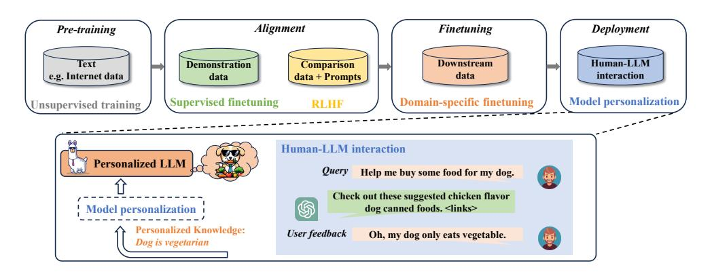
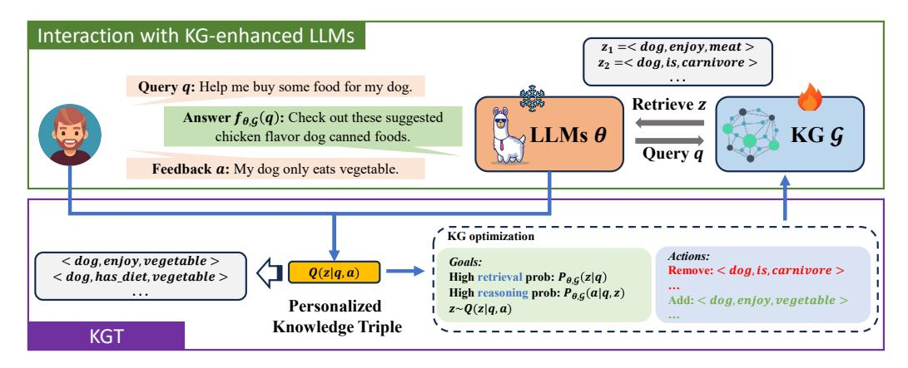
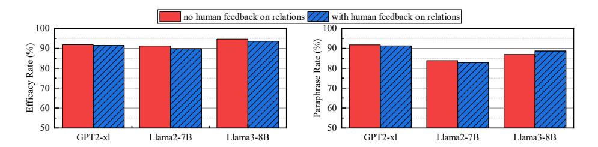
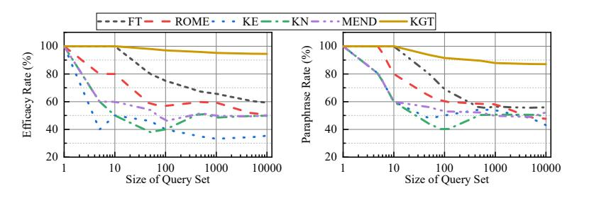

# Knowledge Graph Tuning: Real-time Large Language Model Personalization based on Human Feedback

Jingwei Sun<sup>∗</sup> , Zhixu Du<sup>∗</sup> , Yiran Chen Department of Electrical and Computer Engineering Duke University Durham, NC 27705 {jingwei.sun, zhixu.du, yiran.chen}@duke.edu

## Abstract

Large language models (LLMs) have demonstrated remarkable proficiency in a range of natural language processing tasks. Once deployed, LLMs encounter users with personalized factual knowledge, and such personalized knowledge is consistently reflected through users' interactions with the LLMs. To enhance user experience, real-time model personalization is essential, allowing LLMs to adapt user-specific knowledge based on user feedback during human-LLM interactions. Existing methods mostly require back-propagation to finetune the model parameters, which incurs high computational and memory costs. In addition, these methods suffer from low interpretability, which will cause unforeseen impacts on model performance during long-term use, where the user's personalized knowledge is accumulated extensively. To address these challenges, we propose Knowledge Graph Tuning (KGT), a novel approach that leverages knowledge graphs (KGs) to personalize LLMs. KGT extracts personalized factual knowledge triples from users' queries and feedback and optimizes KGs without modifying the LLM parameters. Our method improves computational and memory efficiency by avoiding back-propagation and ensures interpretability by making the KG adjustments comprehensible to humans. Experiments with state-of-the-art LLMs, including GPT-2, Llama2, and Llama3, show that KGT significantly improves personalization performance while reducing latency and GPU memory costs. Ultimately, KGT offers a promising solution of effective, efficient, and interpretable real-time LLM personalization during user interactions with the LLMs.

## 1 Introduction

Large language models (LLM) have shown increasing power on various NLP tasks [\[Devlin et al.,](#page-10-0) [2018,](#page-10-0) [Raffel et al., 2020,](#page-11-0) [Brown et al., 2020,](#page-10-1) [Fedus et al., 2022,](#page-10-2) [Zhang et al., 2021,](#page-12-0) [Zeng et al.,](#page-12-1) [2021\]](#page-12-1). The development of LLMs typically encompasses several key phases [\[Hyperight, 2024\]](#page-10-3): pre-training on vast corpora, alignment to ensure adherence to ethical guidelines, and domain-specific fine-tuning. While these steps are crucial, there is often an oversight in recognizing the need for further personalization during the deployment phase. Once deployed, LLMs encounter users with personalized factual knowledge [\[Petroni et al., 2019,](#page-11-1) [Jiang et al., 2020,](#page-10-4) [Roberts et al., 2020\]](#page-11-2). These individual knowledge bases are consistently reflected through users' feedback on various queries and the model's responses during interactions, as shown in the interaction example in Figure [1.](#page-1-0) To enhance user experience, real-time model personalization is essential, allowing LLMs to adapt and incorporate user-specific knowledge based on persistent feedback throughout human-LLM interactions.

<sup>∗</sup> equal contribution


<!-- Image Description: The image depicts a flowchart illustrating a Large Language Model (LLM) personalization pipeline. It shows four stages: pre-training (unsupervised, using internet data), alignment (supervised finetuning and RLHF using demonstration and comparison data), finetuning (domain-specific, using downstream data), and deployment (model personalization via human-LLM interaction). A zoomed-in section details this interaction, showing a user query, LLM response, user feedback, and resulting personalized knowledge integration ("Dog is vegetarian"). The diagram visualizes the process of adapting a general LLM to a user's specific needs. -->

<span id="page-1-0"></span>Figure 1: Pipeline of the development of an LLM. In the deployment phase, the model is personalized based on human feedback during the human-LLM interactions. The LLM in the figure is personalized to adapt to the knowledge that the user's dog is vegetarian from the interaction. Then, in the later interactions, the LLM agent will recommend vegetarian dog food for the user given the same query.

Several technologies are applicable to personalize the LLM, including Parameter Efficient Finetuning (PEFT) [\[Ding et al., 2023\]](#page-10-5), Knowledge Editing (KE) [\[Geva et al., 2020,](#page-10-6) [Dai et al., 2022,](#page-10-7) [Meng et al.,](#page-11-3) [2022\]](#page-11-3), and in-context learning [\[Brown et al., 2020\]](#page-10-1). Nevertheless, these methodologies are often plagued by low efficiency, poor interpretability, or a combination of both drawbacks. PEFT and KE require back-propagation to optimize the model parameters. Back-propagation incurs unacceptable GPU memory and computational costs for the daily use of LLMs, especially for on-device applications where the onboard resources are limited. The high computational overhead also makes it difficult to realize real-time personalization. In addition to the low efficiency, these parameter-based methods also lack interpretability. Modifying the model parameters to satisfy the user's personalized need for the current query may lead to corruption in model parameters, adversely affecting the responses to other queries. This adjustment fails to meet the long-term needs of users who rely on the accumulation of extensive personalized knowledge during interactions with large language models (LLMs). Incontext learning has higher interpretability and does not need back-propagation, but its computational overhead, memory cost, and response latency increase drastically with the length of the reference context. Therefore, it is neither efficient nor scalable for long-term use by users.

Knowledge graphs (KGs) [\[Speer et al., 2017,](#page-11-4) [Sap et al., 2019\]](#page-11-5), which store factual knowledge in a structured format, are increasingly integrated into LLMs to enhance the inference with external knowledge [\[Chang et al., 2021,](#page-10-8) [Xu et al., 2021,](#page-12-2) [Yao et al., 2022,](#page-12-3) [Song et al., 2021\]](#page-11-6) and are becoming a standard component of LLM systems. In this paper, we propose a new paradigm of model personalization by tuning the KGs based on user feedback. Our proposed method, Knowledge Graph Tuning (KGT), extracts the personalized knowledge triples from the query and the user's feedback. Instead of optimizing the LLM parameters, KGT optimizes the KGs based on the extracted personalized factual knowledge. We formulate the training objective based on the *evidence lower bound (ELBO)*and derive an optimization goal of achieving a*high personalized knowledge retrieval probability*and a*high knowledge-enhanced reasoning probability*. We propose a heuristic optimization algorithm to finetune the KG by adding and removing knowledge triples without touching the model parameters, significantly improving computational and memory efficiency. Additionally, the added and removed knowledge triples are comprehensible to humans, ensuring the method's interpretability.

We conduct experiments on multiple datasets using SOTA pre-trained LLMs. The results demonstrate that KGT significantly improves personalization performance compared with baselines while reducing the latency and GPU memory cost by up to 84% and 77%, respectively. By proposing KGT, we offer an effective, efficient, and interpretable solution for realizing real-time LLM personalization during human-LLM interactions. We summarize our contributions as follows:

- We present the necessity of model personalization during the human-LLM interaction and the challenges of adopting existing technologies: low efficiency and poor interpretability.
- We propose a method, KGT, that realizes real-time LLM personalization based on user feedback by optimizing the knowledge graph rather than the model parameters.

• We conduct experiments on multiple datasets with SOTA pre-trained LLMs. Compared with baselines, KGT achieves significantly better personalization performance while reducing computational and memory costs. KGT demonstrates considerable scalability as the volume of queries increases, a critical attribute for fulfilling the long-term needs of users who require accumulating extensive personalized knowledge during their interactions with LLMs.

## 2 Related Works

KG-enhanced LLM Large language models (LLMs) are acclaimed for their proficiency in assimilating knowledge from expansive corpora and achieving groundbreaking results in numerous natural language processing (NLP) tasks. Nonetheless, these models are frequently critiqued for the hallucination issues [\[Lee et al., 2018,](#page-11-7) [Bang et al., 2023\]](#page-10-9) and their lack of interpretability. In response to these shortcomings, the integration of knowledge graphs (KGs) with LLMs has been proposed [\[Chang et al., 2021,](#page-10-8) [Xu et al., 2021,](#page-12-2) [Yao et al., 2022,](#page-12-3) [Song et al., 2021\]](#page-11-6). KGs, by storing extensive knowledge in a structured and explicit format, enhance the knowledge capacity of LLMs. Some approaches [\[Zhang et al., 2019,](#page-12-4) [Rosset et al., 2020\]](#page-11-8) advocate for incorporating KGs during the pre-training phase of LLMs, enabling direct knowledge acquisition from these graphs. Others [\[Chang et al., 2021,](#page-10-8) [Xu et al., 2021\]](#page-12-2) suggest the use of KGs during the inference phase to improve access to domain-specific knowledge, thereby substantially enhancing the models' performance. Furthermore, to advance the interpretability of LLMs, researchers are utilizing KGs to elucidate both the factual knowledge [\[Petroni et al., 2019\]](#page-11-1) and the reasoning processes [\[Lin et al., 2019\]](#page-11-9) of these models. In this paper, we focus on the setting in which KG enhances the inference phase of an LLM.

LLM Personalization and Knowledge Editing Recently, Knowledge Editing (KE) approaches have been proposed to personalize LLMs by localizing and modifying the factual knowledge within transformers. [Geva et al.](#page-10-6) [\[2020\]](#page-10-6) suggests that the MLP layers within a transformer for masked language models serve as memory units for entities and their associated information. Extending this idea, KN [\[Dai et al., 2022\]](#page-10-7) developed a technique for updating facts in BERT by manipulating specific rows of the MLP matrix with the embedding of the target object. They pinpoint crucial neurons for storing knowledge through gradient-based methods. [De Cao et al.](#page-10-10) [\[2021\]](#page-10-10) implement a hyper-network that predicts necessary weight adjustments during test time to modify facts. Their experiments involve BERT and BART [\[Lewis et al., 2019\]](#page-11-10), particularly in models tailored for question-answering tasks. [Mitchell et al.](#page-11-11) [\[2022\]](#page-11-11) introduce a hyper-network approach that adjusts gradient decomposition terms to efficiently update knowledge, showcasing scalability across large models like T5 [\[Raffel et al.,](#page-11-0) [2020\]](#page-11-0) and GPT-J [\[Wang and Komatsuzaki, 2022\]](#page-11-12). The ROME method [\[Meng et al., 2022\]](#page-11-3) employed causal tracing to pinpoint knowledge-relevant layers and then edit its FFN module, achieving superior outcomes. All these techniques employ gradient-based optimization methods, which are inefficient and unsuitable for achieving real-time personalization under constrained computational resources. Moreover, modifying model parameters lacks interpretability and may lead to unforeseen impacts on model performance. In contrast, our method solely necessitates model inference, which is significantly more efficient. By adjusting the knowledge graph (KG), our approach ensures that the personalization process is interpretable and the modifications in model performance are comprehensible.

## 3 Preliminary

Knowledge Graph (KG) A knowledge graph G is a set of triples containing factual knowledge: G = {(e, r, e′ )|e, e′ ∈ E, r ∈ R}, where E and R denote the set of entities and relations, respectively, and the triple (e, r, e′ ) is referred to as a knowledge triple.

KG-enhanced LLM A KG-enhanced LLM fθ,<sup>G</sup> is parameterized by both the LLM parameters θ and a KG G. Given a natural language query q, the KG-enhanced LLM generates an answer fθ,<sup>G</sup>(q) based on both the model parameters and the retrieved knowledge triples from G. We follow previous works [\[Sun et al., 2019,](#page-11-13) [Jiang et al., 2022\]](#page-10-11) and assume that the entities e<sup>q</sup> in the query and e<sup>a</sup> in the answer are labeled. In this paper, we focus on the setting where the LLM retrieves one-depth triples.

## 4 Method

This section introduces our method, KGT (Knowledge Graph Tuning), which enables real-time LLM personalization based on user feedback. Instead of finetuning the model parameters, we edit the user's personalized knowledge graph, which provides the user's personalized factual knowledge to enhance the customization capability of the LLM. KGT does not need to conduct back-propagation of the LLM, and only the inference is required, which significantly reduces the latency and computational cost. The edited knowledge triples are comprehensible, ensuring the method's interpretability. The overview of KGT is shown in Figure [2.](#page-3-0)


<!-- Image Description: This diagram illustrates a system for improving Large Language Models (LLMs) using knowledge graphs (KGs). A user query ("Help me buy dog food") receives an LLM response, then user feedback ("My dog only eats vegetables"). The system refines the KG by adding/removing triples (e.g., adding "<dog, enjoy, vegetable>" and removing "<dog, is, carnivore>") based on user feedback to improve future LLM responses. The diagram shows this process, highlighting the interaction between the LLM, KG, and personalized knowledge triples. -->

<span id="page-3-0"></span>Figure 2: The overview of KGT. The LLM extracts the posterior distribution of the personalized knowledge triples Q(z|q, a) from the human-LLM interaction. The personalized triples are utilized to optimize the KG to achieve two goals: The model can (1) retrieve the personalized triples with high probability and (2) generate the user's feedback with the retrieved triples in high confidence.

### <span id="page-3-2"></span>4.1 Knowledge Graph Tuning

Recently, many techniques have been developed to efficiently finetune or personalize the pre-trained LLM parameters based on the user's data [\[Ding et al., 2023,](#page-10-5) [Geva et al., 2020,](#page-10-6) [Brown et al., 2020\]](#page-10-1). Instead of finetuning the model parameters, we modify the user's KG to inject personalized knowledge into the LLM.

Example A user wants to let the LLM-based assistant order some food for her vegetarian dog. Instead of finetuning the LLM to remember the fact that the user's dog is vegetarian, the user can simply delete the knowledge triple (Dog, Enjoy, Meat) and add a triple (Dog, Enjoy, V egetable) in his/her personal knowledge graph. To generate an appropriate response, the LLM assistant will first retrieve the knowledge triple (Dog, Enjoy, V egetable) based on the user's query, then recommend vegetarian dog food for the user based on the query and the retrieved personalized knowledge triple.

From the example and previous works [\[Xu et al., 2021,](#page-12-2) [Chang et al., 2021,](#page-10-8) [Dai et al., 2022\]](#page-10-7), we conclude that there are two steps in KG-enhanced LLM reasoning: 1. knowledge retrieval and 2. knowledge-enhanced reasoning. Following this insight, we formulate the KG-enhanced LLM reasoning probability by marginalizing the knowledge triple distribution. Then, our KGT is an optimization problem that aims to maximize the probability of reasoning the answer from a KGenhanced LLM:

<span id="page-3-1"></span>
$$
P_{\theta,\mathcal{G}}(a|q) = \sum_{z \in \mathcal{G}} P_{\theta,\mathcal{G}}(a|q,z) P_{\theta,\mathcal{G}}(z|q), \tag{1}
$$

where Pθ,<sup>G</sup>(z|q) is the probability of retrieving the knowledge triple z given the user's query q, which represents the knowledge retrieval step. Let a denote the user feedback, and Pθ,<sup>G</sup>(a|q, z) is the probability of generating the answer a given the user's query and the retrieved triple z, which stands for the knowledge-enhanced reasoning step. Instead of optimizing the model parameters θ, we finetune the knowledge graph G in KGT.

#### <span id="page-4-2"></span>4.2 Objective Formulation

The training objective in Equation [\(1\)](#page-3-1) can be optimized by maximizing the evidence lower bound (ELBO) [\[Jordan et al., 1999\]](#page-10-12), which is formulated as

log Pθ,<sup>G</sup>(a|q) ≥ Ez∼Q(z) [log Pθ,<sup>G</sup>(a|q, z)] | {z } knowledge-enhanced reasoning −DKL (Q(z)||Pθ,<sup>G</sup> (z|q)) | {z } knowledge retrieval , (2)

where Q(z) ≜ Q(z|q, a) is the posterior distribution of z given the user's query and the user's feedback a. This posterior distribution gives a larger probability to the triples containing personalized factual knowledge based on the user's feedback (e.g., the example (Dog, Enjoy, V egetable) in Section [4.1\)](#page-3-2), which are referred to the personalized triples. The later term minimizes the KL divergence between the posterior distribution and the prior distribution of the knowledge triple retrieved by the LLM. The former term maximizes the expectation that LLM generates correct answers based on the knowledge triples sampled from the posterior distribution.

Knowledge Retrieval The goal of the knowledge retrieval term is to finetune the KG such that the LLM can retrieve personalized triples based on the user's feedback. Given a query q and the user's feedback a, we can ask the user or utilize the LLM fθ,<sup>G</sup> itself to extract the top-K appropriate relations {rk}k∈[K] between e<sup>q</sup> and e<sup>a</sup> in this query's context. We construct the personalized triple as {eq, rk, ea}k∈[K] and denote this triple set as H(q, a, K). Then, the posterior distribution Q(z) can be approximated, formally,

<span id="page-4-1"></span>
$$
Q(z|q, a) \simeq \begin{cases} \frac{1}{K} & \text{if } z \in \mathcal{H}(q, a, K), \\ 0 & \text{else,} \end{cases}
$$
 (3)

where we assume a uniform distribution over the subset of personalized triples H(q, a, K). Therefore, the knowledge retrieval loss term can be calculated as

$$
\mathcal{L}_{\text{retrieve}} = D_{KL}(Q(z)||P_{\theta,\mathcal{G}}(z|q)) = -\frac{1}{K} \sum_{z \in \mathcal{H}(q,a,K)} \log P_{\theta,\mathcal{G}}(z|q). \tag{4}
$$

The detailed derivation can be found in Appendix [A.](#page-13-0) By reducing Lretrieve, we finetune the user's KG G such that the LLM can retrieve the personalized triples with higher confidence.

To collect H(q, a, K), users can either provide feedback about the relations between e<sup>q</sup> and e<sup>a</sup> in this query's context or extract the relations using the model fθ,<sup>G</sup>. We design an instruction template to utilize the LLM to extract the relations {rk}k∈[K] between e<sup>q</sup> and ea:

Based on the provided query and answer, identify K types of relationships between the subject <subject> and the object <object>, considering the context of the query and answer. <query>: q <answer>: a <subject>: e<sup>q</sup> <object>: e<sup>a</sup> <relation>: [MASK]*[a](#page-4-0)*

<span id="page-4-0"></span>*<sup>a</sup>*The LLMs in this paper are causal models that do not need a [MASK] token for generation. We include a [MASK] token within the templates in the paper to delineate the starting point for the model's generation, thereby aiding reader comprehension.

The instruction is fed into the LLM to generate K relations formatted as

r<sup>1</sup> <sep> r<sup>2</sup> <sep> ... <sep> rK.

Then, we formulate H(q, a, K) as the set {eq, rk, ea}k∈[K] .

To calculate the retrieval probability Pθ,<sup>G</sup> (z|q), we design an instruction template Tretrieve(·) to instruct the LLM to predict what kind of the relationship is needed to answer this query:

To answer the query: q, I need information e<sup>q</sup> [MASK]

We calculate the probability of a specific relation r as P<sup>θ</sup> (r|Tretrieve (q)). Then, the retrieval probability of a knowledge triple z = (e, r, e′ ) is derived as

Pθ,<sup>G</sup> (z|q) = Pθ,<sup>G</sup> e, r, e ′ |q = ( PPθ(r|Tretrieve(q)) <sup>z</sup>∈G Pθ,<sup>G</sup> (z|q) if e = e<sup>q</sup> and z ∈ G, 0 else. (5)

Thus, only the knowledge triples in G that start from e<sup>q</sup> have a retrieval probability larger than 0.

Knowledge-enhanced Reasoning The goal of the knowledge-enhanced reasoning term is to finetune the KG such that the retrieved personalized triples can most encourage the LLM to generate the correct answer. With the approximated posterior distribution Q(z) in Equation [\(3\)](#page-4-1), the reasoning loss term can be formulated as

$$
\mathcal{L}_{\text{reasoning}} = -\mathbb{E}_{z \sim Q(z)} \left[ \log P_{\theta, \mathcal{G}}(a|q, z) \right] = -\frac{1}{K} \sum_{z \in \mathcal{H}(q, a, K)} \log P_{\theta, \mathcal{G}}(a|q, z) \,. \tag{6}
$$

We design an instruction template Treasoning to instruct the model to predict the answer based on both the query q and the knowledge triple z:

Answer the query considering the user's personalized facts. <question>: q <facts>: z <answer>: [MASK]

The knowledge-enhanced reasoning probability is derived as Pθ,<sup>G</sup> (a|q, z) = P<sup>θ</sup> (a|Treasoning (q, z)).

The final objective of KGT is the combination of knowledge retrieval optimization and knowledgeenhanced reasoning optimization, which is formulated as

$$
\mathcal{L} = \mathcal{L}_{\text{retrieve}} + \mathcal{L}_{\text{reasoning}} = -\frac{1}{K} \sum_{z \in \mathcal{H}(q, a, K)} \log \left[ P_{\theta, \mathcal{G}} \left( a | q, z \right) P_{\theta, \mathcal{G}} \left( z | q \right) \right]. \tag{7}
$$

#### 3 Optimization Algorithm

Unlike finetuning the model parameters with gradient descent, KGT is achieved by adding and removing the knowledge triples to and from the KG. For a triple z and a KG G, we have two operations: 1. G ⊕ z ≜ G ∪ {z}; 2. G ⊖ z ≜ G \ {z}. Because we focus on real-time model personalization, we formulate the optimization in the online learning setting where the optimization algorithm only has access to the user's current query q<sup>t</sup> at time t and feedback at. The trivial solution to this query is that we remove all the triples in G that are probably retrieved based on qt, which are the triples starting with eq. Then we add the triple z ∗ from H(qt, at, K) with the highest reasoning probability Pθ,<sup>G</sup> (at|qt, z<sup>∗</sup> ) into G. In this case, Pθ,<sup>G</sup> (z ∗ |qt) = 1 and the loss is minimized over (qt, at). However, this greedy solution will potentially hurt the other queries due to removing too much knowledge from the KG. Following the example in Section [4.1,](#page-3-2) the greedy solution will not only remove the triple (Dog, Enjoy, Meat), but also remove other triples starting from the entity Dog such as (Dog, Is, Animal). The removed triples might be general or personalized factual knowledge that is essential to the other queries.

We propose a heuristic optimization algorithm based on two principles: 1. The computational cost should be low to achieve real-time personalization efficiency; 2. The KG should be less modified to preserve more knowledge. Both principles require us to modify as few triples as possible to achieve the optimization goal. The detailed algorithm is shown in Algorithm [1.](#page-6-0) In general, we evaluate the reasoning probability Pθ,<sup>G</sup> (at|qt, z′ ) for the triples z ′ in H(q, a, K) and triples in G that starting from eqt . Then, we add the triples with the highest reasoning probability (i.e., the triples most encourage the LLM to generate the correct answer) from H(q, a, K) to G and remove the triples with the lowest reasoning probability from G iteratively until the model generates the correct answer.

## 5 Experiments

We evaluate KGT in terms of personalization performance and efficiency compared with the baselines. The experiments are conducted on a server with eight A100 GPUs.

### 1 Experimental Setup

Datasets To evaluate the effectiveness of KGT on personalizing the LLM, we conduct experiments in the setting where the user provides answers that conflict with the common factual knowledge that LLM learned from the pre-training dataset. We evaluate KGT on two datasets: *CounterFact*[\[Meng](#page-11-3) [et al., 2022\]](#page-11-3) dataset and*CounterFactExtension*dataset we create based on*PARALLEL*dataset [\[Elazar](#page-10-13) [et al., 2021\]](#page-10-13) utilizing GPT-4 [\[OpenAI, 2024\]](#page-11-14). The details about our dataset can be found in Appendix [B](#page-13-1) Both datasets consist of query-answer pairs involving factual knowledge that conflicts with reality. To evaluate the real-time model personalization in practice, we sequentially input

#### Algorithm 1 Knowledge Graph Tuning based on User Feedback

Input: Knowledge graph G; KG-enhanced LLM fθ,<sup>G</sup>; user's query q<sup>t</sup> at time t; user feedback at; size of personalized triple set for each query K; loss threshold ϵ.

Output: Optimized KG G.

1: Construct personalized triple set H(qt, at, K) 2: Extract the set of triples G<sup>q</sup><sup>t</sup> in G starting from e<sup>q</sup><sup>t</sup> . 3: N<sup>H</sup> ← |H(qt, at, K)|, N<sup>G</sup> ← |G<sup>q</sup><sup>t</sup> | 4: {z H i , λ<sup>H</sup> <sup>i</sup> }i∈[NH] ← {z H i , Pθ,<sup>G</sup> at|qt, z<sup>H</sup> i }z<sup>H</sup> <sup>i</sup> ∈H(qt,at,K) 5: z H <sup>1</sup>...N<sup>H</sup> ← z H <sup>s</sup>(1)...s(NH) where s(i) = argsort(λ H 1...NH , i) 6: {z G i , λ<sup>G</sup> <sup>i</sup> }i∈[N<sup>G</sup> ] ← {z G i , Pθ,<sup>G</sup> at|qt, z<sup>G</sup> i }z G <sup>i</sup> ∈Gqt 7: z G <sup>1</sup>...N<sup>G</sup> ← z G <sup>s</sup>(1)...s(N<sup>G</sup> ) where s(i) = argsort(λ G 1...NG , i) 8: L ← − <sup>1</sup> K P z∈H(qt,at,K) log [Pθ,<sup>G</sup> (at|qt, z) Pθ,<sup>G</sup> (z|qt)] 9: count\_add ← 0, count\_remove ← 0 10: while count\_add < N<sup>H</sup> or count\_remove < N<sup>G</sup> do 11: if count\_add < N<sup>H</sup> then 12: count\_add ← count\_add + 1 13: G ← G ∪ z H count\_add 14: L ← − <sup>1</sup> K P z∈H(qt,at,K) log [Pθ,<sup>G</sup> (at|qt, z) Pθ,<sup>G</sup> (z|qt)] 15: if L ≤ ϵ then Break 16: end if 17: if count\_remove < N<sup>G</sup> then 18: count\_remove ← count\_remove + 1 19: G ← G \ z G count\_remove 20: L ← − <sup>1</sup> K P z∈H(qt,at,K) log [Pθ,<sup>G</sup> (at|qt, z) Pθ,<sup>G</sup> (z|qt)] 21: if L ≤ ϵ then Break 22: end if 23: end while 24: return G

<span id="page-6-0"></span>query-answer pairs into the model, ensuring that each pair is accessed only once during training. Once all the pairs in the dataset have been processed by the model, we assess the personalization effectiveness across the entire dataset.

Baselines and Configurations We compare KGT with fine-tunning (FT), ROME [\[Meng et al.,](#page-11-3) [2022\]](#page-11-3), Knowledge editing (KE) [\[De Cao et al., 2021\]](#page-10-10), Knowledge neurons (KN) [\[Dai et al., 2022\]](#page-10-7), and MEND [\[Mitchell et al., 2022\]](#page-11-11). For all baselines, we test several specifications of layers to edit and report the best results for each baseline. For FT, we follow previous arts [\[Meng et al., 2022\]](#page-11-3) to execute full fine-tuning on a single layer. For KN, we specify a subset of all layers as candidates of knowledge neurons to reduce the search space for large models. And baseline results where no knowledge is edited, are referred to as 'no edit'. We conduct experiments on GPT2-xl [\[Radford et al.,](#page-11-15) [2019\]](#page-11-15), Llama2-7B [\[Touvron et al., 2023\]](#page-11-16), and Llama3-8B [\[AI, 2024\]](#page-10-14). We equip each model with a KG, ConceptNet [\[Speer et al., 2017\]](#page-11-4), to enhance the inference. K in Equation [\(3\)](#page-4-1) is set as five for experiments.

Metrics We utilize two metrics to evaluate the performance of personalization: (1)*Efficacy Score*[\[Meng et al., 2022\]](#page-11-3), measuring the success rate of personalization using the training queryanswer pairs directly. If the model generates the user's personalized answer with a higher probability than the answer before tuning, the model is considered successful for that pair. (2)*Paraphrase Score*[\[Meng et al., 2022\]](#page-11-3), indicating the model's ability to accurately recall personalized knowledge in paraphrased forms. This assesses its personalization capacity while mitigating the impact of overfitting to specific contexts within the training dataset.

#### 2 Personalization Performance

We evaluate the setting that the user only provides the answer a as the feedback, and the model will extract the relations and construct H (q, a, K). The results on*CounterFact*dataset are shown in Table [1.](#page-7-0) It is shown that KGT outperforms the baselines significantly in both efficacy and paraphrase scores. Specifically, using Llama3-8B, KGT improves efficacy by more than 39%, 41%, 55%, 45%, 43%, and 61% on efficacy compared with FT, KE, KN, MEND, and no-edit, respectively. For paraphrase score, KGT outperforms by more than 36%, 32%, 46%, 37%, 33%, 34% compared with FT, KE, KN, MEND, and no-edit, respectively, on Llama3-8B. It is also observed that the results of KGT on Llama3 are better than Llama2. Our analysis is that Llama3 is more powerful in understanding and following instructions, which makes knowledge enhancement from the KG more effective. Such an improvement suggests that KGT will achieve better performance when the pre-trained LLMs are more and more powerful.

<span id="page-7-0"></span>Table 1: Results on*CounterFact*dataset when the user only provides the answers to the queries as feedback.

|         | GPT2         |              | Llama2-7B    |              | Llama3-8B    |              |
|---------|--------------|--------------|--------------|--------------|--------------|--------------|
| Method  | Efficacy     | Paraphrase   | Efficacy     | Paraphrase   | Efficacy     | Paraphrase   |
| FT      | 58.43%±0.15% | 55.77%±0.20% | 62.47%±0.11% | 63.09%±0.09% | 54.44%±0.35% | 50.52%±0.05% |
| ROME    | 49.38%±1.20% | 48.22%±1.36% | 49.94%±1.24% | 48.84%±1.74% | 51.13%±1.55% | 52.39%±1.62% |
| KE      | 51.50%±0.32% | 51.85%±0.27% | 34.25%±1.63% | 30.45%±1.43% | 40.56%±1.21% | 41.00%±0.57% |
| KN      | 50.66%±0.52% | 51.06%±0.11% | 49.41%±0.47% | 51.20%±1.38% | 50.52%±1.05% | 50.67%±1.10% |
| MEND    | 50.41%±0.18% | 50.20%±0.02% | 49.35%±0.47% | 50.88%±0.30% | 50.29%±0.71% | 54.65%±1.12% |
| no edit | 35.87%       | 29.74%       | 30.58%       | 28.21%       | 33.52%       | 52.16%       |
| KGT     | 91.77%±1.37% | 91.75%±1.84% | 91.1%±1.43%  | 83.86%±1.03% | 94.58%±0.96% | 86.89%±1.37% |

KGT also shows significant improvement compared with the baselines on*CounterFactExtension*, and the results are shown in Table [2.](#page-7-1) Specifically, KGT improves efficacy by more than 31%, 34%, 51%, 42%, 48%, and 54% on efficacy when adopting Llama3-8B compared with FT, KE, KN, MEND, and no-edit, respectively. For paraphrase score on Llama3-8B, KGT outperforms by more than 27%, 35%, 41%, 36%, 44%, and 42% compared with FT, KE, KN, MEND, and no-edit, respectively.

<span id="page-7-1"></span>Table 2: Results on *CounterFactExtend*dataset when the user only provides the answers to the queries as feedback.

|         | GPT2         |              | Llama2-7B    |              | Llama3-8B    |              |
|---------|--------------|--------------|--------------|--------------|--------------|--------------|
| Method  | Efficacy     | Paraphrase   | Efficacy     | Paraphrase   | Efficacy     | Paraphrase   |
| FT      | 58.67%±0.11% | 53.71%±0.06% | 59.70%±0.15% | 63.09%±0.09% | 62.29%±0.25% | 61.97%±0.10% |
| ROME    | 57.44%±1.75% | 58.45%±1.00% | 47.33%±1.60% | 48.36%±0.71% | 59.28%±1.79% | 53.77%±1.37% |
| KE      | 52.49%±0.28% | 52.55%±0.44% | 33.83%±1.91% | 44.49%±0.92% | 41.92%±1.16% | 47.35%±0.47% |
| KN      | 47.40%±0.37% | 47.22%±0.04% | 49.74%±0.05% | 49.67%±1.36% | 51.51%±0.58% | 52.62%±1.91% |
| MEND    | 58.30%±0.12% | 58.51%±0.07% | 40.73%±0.05% | 43.61%±0.04% | 45.62%±0.10% | 44.34%±1.75% |
| no edit | 47.14%       | 51.74%       | 30.22%       | 42.93%       | 39.26%       | 47.04%       |
| KGT     | 82.57±2.82%  | 78.35%±3.26% | 90.68±0.74%  | 83.8±1.20%   | 93.80%±0.36% | 89.22%±1.17% |

The improvement in both efficacy and paraphrase rates demonstrates that KGT outperforms the baseline in personalization performance significantly.

#### 3 Efficiency Comparison

In addition to the personalization performance, we also evaluate KGT's efficiency in terms of latency and GPU memory cost. The method must achieve low latency and low GPU memory cost to realize real-time personalization in practice under the setting with limited computational resources. KGT can improve the time and GPU memory cost efficiency because it only requires inference, which is far more efficient than back-propagation. For latency, we test the average time that our method and the baselines require to complete the personalization for one query-answer pair. The latency results on*CounterFact*data are shown in Table [3.](#page-8-0) The results demonstrate that KGT achieves the shortest latency in most cases. Notably, Llama3 requires less time on several baselines than Llama2 and GPT2 because we stop training once the loss converges. The results on the GPU memory cost can also be found in Table [3.](#page-8-0) The memory cost is reduced significantly because only the inference is required for KGT. Specifically, KGT reduces 57%, 56%, 77%, 63%, and 62% GPU memory cost when adopting Llama3-8B compared with FT, KE, KN, and MEND, respectively.

|        | GPT2    |         |         | Llama2-7B |         | Llama3-8B |  |
|--------|---------|---------|---------|-----------|---------|-----------|--|
| Method | Memory  | Latency | Memory  | Latency   | Memory  | Latency   |  |
| FT     | 8516MB  | 1.80s   | 30990MB | 0.81s     | 36968MB | 0.25s     |  |
| ROME   | 11948MB | 1.39s   | 30452MB | 2.33s     | 36660MB | 2.05s     |  |
| KE     | 31574MB | 2.18s   | 33464MB | 0.30s     | 69542MB | 0.13s     |  |
| KN     | 12832MB | 3.55s   | 56148MB | 0.69s     | 44000MB | 0.34s     |  |
| MEND   | 11036MB | 0.86s   | 35166MB | 1.98s     | 42428MB | 1.40s     |  |
| KGT    | 6686MB  | 0.16s   | 13516MB | 0.14s     | 15904MB | 0.15s     |  |

<span id="page-8-0"></span>Table 3: Results of latency and GPU memory costs on*CounterFact*dataset when the user only provides the answers to the queries as feedback.

#### 4 Ablation Study

#### 4.1 Does User Need to Provide Feedback of Relations?

We also conduct experiments under the setting where the user also provides feedback on relations r between e<sup>q</sup> and e<sup>a</sup> under the query's context. We utilize GPT-4 to mimic the user and extract the relations to construct H (q, a, K). We use the same instruction template in Section [4.2](#page-4-2) for the GPT-4 to conduct relation extraction. The compared results with and without the user's feedback of relations are shown in Figure [3.](#page-8-1) It is shown that KGT achieves similar performance if the user provides feedback on the relations in addition to the answer. Notably, utilizing the relations extracted by the LLM θ can even achieve higher performance on efficacy and paraphrase rates in most cases. Our analysis is that when extracting relations using the LLM θ, KGT implicitly distills knowledge from the model to the knowledge triples, which might benefit the model inference more than human feedback on relations. Thus, in practice, the user will only need to provide the personalized answer to a query as feedback to KGT.


<!-- Image Description: The image presents two bar graphs comparing the efficacy and paraphrase rates of three large language models (GPT2-xl, Llama2-7B, Llama3-8B). Each graph shows results with and without human feedback on relations. The graphs display percentage rates, illustrating the impact of human feedback on model performance in terms of both efficacy and paraphrase generation. Red bars represent "no human feedback," while blue hatched bars show "with human feedback." -->

<span id="page-8-1"></span>Figure 3: Compared results on*CounterFact*dataset with and without user feedback on relations.

#### 4.2 Effect of the Size of Query Set

We also evaluate the effect of the query set size on the personalization performance. We conduct experiments on the CounterF act dataset with the Llama3-8B model and evaluate KGT and baselines with query sets of different sizes. The results are shown in Figure [4.](#page-9-0) It is shown that when the size of the query set increases, the performance of baselines degrades dramatically, while KGT can preserve high performance. This compared result illustrates that KGT can be scaled to a large amount of personalized knowledge. This scalability is crucial for meeting the long-term needs of users who require the accumulation of extensive personalized knowledge when using LLMs.

## 6 Conclusion and Limitation

We propose an approach, KGT, that personalizes models by optimizing external knowledge graph rather than model parameters. Our method and experimental results demonstrate that our approach offers benefits in terms of performance and efficiency, as supported by empirical studies. By addressing the critical challenges of efficiency and interpretability in model personalization, KGT offers a promising direction for future research and application in enhancing user interactions with LLMs, which has a positive societal impact. One limitation of this method (KGT) is that it depends on the LLM's ability to follow instructions when calculating Pθ,<sup>G</sup>(a|q, z), Pθ,<sup>G</sup>(z|q), and collecting

<span id="page-9-0"></span>
<!-- Image Description: This figure presents two line graphs comparing the performance of six methods (FT, ROME, KE, KN, MEND, KGT) for paraphrase identification. The left graph shows "Efficacy Rate (%)" and the right graph shows "Paraphrase Rate (%)", both plotted against the "Size of Query Set" (log scale). The graphs illustrate how each method's performance changes as the query set size increases, allowing for a comparative analysis of their scalability and accuracy. -->

Figure 4: Compared results on*CounterFact*dataset using Llama3-8B with different query set sizes.

H(q, a, K). However, the existing state-of-the-art LLMs already meet KGT's requirements for this capability, and future LLMs will possess even stronger abilities to follow instructions.

## References

- <span id="page-10-14"></span>Meta AI. Introducing meta llama 3: The most capable openly available llm to date. [https:](https://ai.meta.com/blog/meta-llama-3/) [//ai.meta.com/blog/meta-llama-3/](https://ai.meta.com/blog/meta-llama-3/), 2024.
- <span id="page-10-9"></span>Yejin Bang, Samuel Cahyawijaya, Nayeon Lee, Wenliang Dai, Dan Su, Bryan Wilie, Holy Lovenia, Ziwei Ji, Tiezheng Yu, Willy Chung, et al. A multitask, multilingual, multimodal evaluation of chatgpt on reasoning, hallucination, and interactivity.*arXiv preprint arXiv:2302.04023*, 2023.
- <span id="page-10-1"></span>Tom Brown, Benjamin Mann, Nick Ryder, Melanie Subbiah, Jared D Kaplan, Prafulla Dhariwal, Arvind Neelakantan, Pranav Shyam, Girish Sastry, Amanda Askell, et al. Language models are few-shot learners. *Advances in neural information processing systems*, 33:1877–1901, 2020.
- <span id="page-10-8"></span>Ting-Yun Chang, Yang Liu, Karthik Gopalakrishnan, Behnam Hedayatnia, Pei Zhou, and Dilek Hakkani-Tur. Incorporating commonsense knowledge graph in pretrained models for social commonsense tasks. *arXiv preprint arXiv:2105.05457*, 2021.
- <span id="page-10-7"></span>Damai Dai, Li Dong, Yaru Hao, Zhifang Sui, Baobao Chang, and Furu Wei. Knowledge neurons in pretrained transformers. In Smaranda Muresan, Preslav Nakov, and Aline Villavicencio, editors, *Proceedings of the 60th Annual Meeting of the Association for Computational Linguistics (Volume 1: Long Papers)*, pages 8493–8502, Dublin, Ireland, May 2022. Association for Computational Linguistics. doi: 10.18653/v1/2022.acl-long.581. URL [https://aclanthology.org/2022.](https://aclanthology.org/2022.acl-long.581) [acl-long.581](https://aclanthology.org/2022.acl-long.581).
- <span id="page-10-10"></span>Nicola De Cao, Wilker Aziz, and Ivan Titov. Editing factual knowledge in language models. In Marie-Francine Moens, Xuanjing Huang, Lucia Specia, and Scott Wen-tau Yih, editors, *Proceedings of the 2021 Conference on Empirical Methods in Natural Language Processing*, pages 6491–6506, Online and Punta Cana, Dominican Republic, November 2021. Association for Computational Linguistics. doi: 10.18653/v1/2021.emnlp-main.522. URL [https://aclanthology.org/2021.](https://aclanthology.org/2021.emnlp-main.522) [emnlp-main.522](https://aclanthology.org/2021.emnlp-main.522).
- <span id="page-10-0"></span>Jacob Devlin, Ming-Wei Chang, Kenton Lee, and Kristina Toutanova. Bert: Pre-training of deep bidirectional transformers for language understanding. *arXiv preprint arXiv:1810.04805*, 2018.
- <span id="page-10-5"></span>Ning Ding, Yujia Qin, Guang Yang, Fuchao Wei, Zonghan Yang, Yusheng Su, Shengding Hu, Yulin Chen, Chi-Min Chan, Weize Chen, et al. Parameter-efficient fine-tuning of large-scale pre-trained language models. *Nature Machine Intelligence*, 5(3):220–235, 2023.
- <span id="page-10-13"></span>Yanai Elazar, Nora Kassner, Shauli Ravfogel, Abhilasha Ravichander, Eduard Hovy, Hinrich Schütze, and Yoav Goldberg. Measuring and improving consistency in pretrained language models. *Transactions of the Association for Computational Linguistics*, 9:1012–1031, 2021.
- <span id="page-10-2"></span>William Fedus, Barret Zoph, and Noam Shazeer. Switch transformers: Scaling to trillion parameter models with simple and efficient sparsity. *The Journal of Machine Learning Research*, 23(1): 5232–5270, 2022.
- <span id="page-10-6"></span>Mor Geva, Roei Schuster, Jonathan Berant, and Omer Levy. Transformer feed-forward layers are key-value memories. *arXiv preprint arXiv:2012.14913*, 2020.
- <span id="page-10-3"></span>Hyperight. 4 pillars to effective training of large language models, 2024. URL [https://hyperight.](https://hyperight.com/4-pillars-to-effective-training-of-large-language-models/) [com/4-pillars-to-effective-training-of-large-language-models/](https://hyperight.com/4-pillars-to-effective-training-of-large-language-models/). Accessed: 2024-05-18.
- <span id="page-10-11"></span>Jinhao Jiang, Kun Zhou, Wayne Xin Zhao, and Ji-Rong Wen. Unikgqa: Unified retrieval and reasoning for solving multi-hop question answering over knowledge graph. *arXiv preprint arXiv:2212.00959*, 2022.
- <span id="page-10-4"></span>Zhengbao Jiang, Frank F Xu, Jun Araki, and Graham Neubig. How can we know what language models know? *Transactions of the Association for Computational Linguistics*, 8:423–438, 2020.
- <span id="page-10-12"></span>Michael I Jordan, Zoubin Ghahramani, Tommi S Jaakkola, and Lawrence K Saul. An introduction to variational methods for graphical models. *Machine learning*, 37:183–233, 1999.

- <span id="page-11-7"></span>Katherine Lee, Orhan Firat, Ashish Agarwal, Clara Fannjiang, and David Sussillo. Hallucinations in neural machine translation. 2018.
- <span id="page-11-10"></span>Mike Lewis, Yinhan Liu, Naman Goyal, Marjan Ghazvininejad, Abdelrahman Mohamed, Omer Levy, Ves Stoyanov, and Luke Zettlemoyer. Bart: Denoising sequence-to-sequence pre-training for natural language generation, translation, and comprehension. *arXiv preprint arXiv:1910.13461*, 2019.
- <span id="page-11-9"></span>Bill Yuchen Lin, Xinyue Chen, Jamin Chen, and Xiang Ren. Kagnet: Knowledge-aware graph networks for commonsense reasoning. *arXiv preprint arXiv:1909.02151*, 2019.
- <span id="page-11-3"></span>Kevin Meng, David Bau, Alex Andonian, and Yonatan Belinkov. Locating and editing factual associations in gpt. *Advances in Neural Information Processing Systems*, 35:17359–17372, 2022.
- <span id="page-11-11"></span>Eric Mitchell, Charles Lin, Antoine Bosselut, Chelsea Finn, and Christopher D Manning. Fast model editing at scale. In *International Conference on Learning Representations*, 2022. URL <https://openreview.net/forum?id=0DcZxeWfOPt>.
- <span id="page-11-14"></span>OpenAI. Chatgpt (may 19 version). <https://chat.openai.com/>, 2024. Large language model.
- <span id="page-11-1"></span>Fabio Petroni, Tim Rocktäschel, Patrick Lewis, Anton Bakhtin, Yuxiang Wu, Alexander H Miller, and Sebastian Riedel. Language models as knowledge bases? *arXiv preprint arXiv:1909.01066*, 2019.
- <span id="page-11-15"></span>Alec Radford, Jeffrey Wu, Rewon Child, David Luan, Dario Amodei, and Ilya Sutskever. Language models are unsupervised multitask learners. *OpenAI Blog*, 1(8): 9, 2019. URL [https://cdn.openai.com/better-language-models/language\\_models\\_](https://cdn.openai.com/better-language-models/language_models_are_unsupervised_multitask_learners.pdf) [are\\_unsupervised\\_multitask\\_learners.pdf](https://cdn.openai.com/better-language-models/language_models_are_unsupervised_multitask_learners.pdf).
- <span id="page-11-0"></span>Colin Raffel, Noam Shazeer, Adam Roberts, Katherine Lee, Sharan Narang, Michael Matena, Yanqi Zhou, Wei Li, and Peter J Liu. Exploring the limits of transfer learning with a unified text-to-text transformer. *The Journal of Machine Learning Research*, 21(1):5485–5551, 2020.
- <span id="page-11-2"></span>Adam Roberts, Colin Raffel, and Noam Shazeer. How much knowledge can you pack into the parameters of a language model? *arXiv preprint arXiv:2002.08910*, 2020.
- <span id="page-11-8"></span>Corby Rosset, Chenyan Xiong, Minh Phan, Xia Song, Paul Bennett, and Saurabh Tiwary. Knowledgeaware language model pretraining. *arXiv preprint arXiv:2007.00655*, 2020.
- <span id="page-11-5"></span>Maarten Sap, Ronan Le Bras, Emily Allaway, Chandra Bhagavatula, Nicholas Lourie, Hannah Rashkin, Brendan Roof, Noah A Smith, and Yejin Choi. Atomic: An atlas of machine commonsense for if-then reasoning. In *Proceedings of the AAAI conference on artificial intelligence*, volume 33, pages 3027–3035, 2019.
- <span id="page-11-6"></span>Chenguang Song, Nianwen Ning, Yunlei Zhang, and Bin Wu. Knowledge augmented transformer for adversarial multidomain multiclassification multimodal fake news detection. *Neurocomputing*, 462:88–100, 2021.
- <span id="page-11-4"></span>Robyn Speer, Joshua Chin, and Catherine Havasi. Conceptnet 5.5: An open multilingual graph of general knowledge. In *Proceedings of the AAAI conference on artificial intelligence*, volume 31, 2017.
- <span id="page-11-13"></span>Haitian Sun, Tania Bedrax-Weiss, and William W Cohen. Pullnet: Open domain question answering with iterative retrieval on knowledge bases and text. *arXiv preprint arXiv:1904.09537*, 2019.
- <span id="page-11-16"></span>Hugo Touvron, Thibaut Lavril, Gautier Izacard, Xavier Martinet, Marie-Anne Lachaux, Timothée Lacroix, Baptiste Rozière, Naman Goyal, Eric Hambro, Faisal Azhar, Aurelien Rodriguez, Armand Joulin, Edouard Grave, and Hervé Jegou. Llama: Open and efficient foundation language models. *arXiv preprint arXiv:2307.09288*, 2023. URL <https://arxiv.org/abs/2307.09288>.
- <span id="page-11-12"></span>Ben Wang and Aran Komatsuzaki. Gpt-j-6b: A 6 billion parameter autoregressive language model, 2021. *URL https://github. com/kingoflolz/mesh-transformer-jax*, 2022.

- <span id="page-12-2"></span>Yichong Xu, Chenguang Zhu, Shuohang Wang, Siqi Sun, Hao Cheng, Xiaodong Liu, Jianfeng Gao, Pengcheng He, Michael Zeng, and Xuedong Huang. Human parity on commonsenseqa: Augmenting self-attention with external attention. *arXiv preprint arXiv:2112.03254*, 2021.
- <span id="page-12-3"></span>Yunzhi Yao, Shaohan Huang, Li Dong, Furu Wei, Huajun Chen, and Ningyu Zhang. Kformer: Knowledge injection in transformer feed-forward layers. In *CCF International Conference on Natural Language Processing and Chinese Computing*, pages 131–143. Springer, 2022.
- <span id="page-12-1"></span>Wei Zeng, Xiaozhe Ren, Teng Su, Hui Wang, Yi Liao, Zhiwei Wang, Xin Jiang, ZhenZhang Yang, Kaisheng Wang, Xiaoda Zhang, et al. Pangu-\α: Large-scale autoregressive pretrained chinese language models with auto-parallel computation. *arXiv preprint arXiv:2104.12369*, 2021.
- <span id="page-12-4"></span>Zhengyan Zhang, Xu Han, Zhiyuan Liu, Xin Jiang, Maosong Sun, and Qun Liu. Ernie: Enhanced language representation with informative entities. *arXiv preprint arXiv:1905.07129*, 2019.
- <span id="page-12-0"></span>Zhengyan Zhang, Xu Han, Hao Zhou, Pei Ke, Yuxian Gu, Deming Ye, Yujia Qin, Yusheng Su, Haozhe Ji, Jian Guan, et al. Cpm: A large-scale generative chinese pre-trained language model. *AI Open*, 2:93–99, 2021.

# <span id="page-13-0"></span>A Derivation of Lretrieve

We provide the derivation of the retrieve loss. By approximating the Q(z) with Q(z|q, a), the KL divergence is calculated as

$$
\mathcal{L}_{\text{retrieve}} = D_{KL}(Q(z)||P_{\theta,G}(z|q)) = D_{KL}(Q(z|q,a)||P_{\theta,G}(z|q))
$$

\n
$$
= \mathbb{E}_{z \sim Q(z|q,a)} [\log Q(z|q,a) - \log P_{\theta,G}(z|q)]
$$

\n
$$
= -\mathbb{E}_{z \sim Q(z|q,a)} \log P_{\theta,G}(z|q) + \mathbb{E}_{z \sim Q(z|q,a)} \log Q(z|q,a)
$$

\n
$$
= -\mathbb{E}_{z \sim Q(z|q,a)} \log P_{\theta,G}(z|q) + \text{CONST},
$$
\n(8)

where the term Ez∼Q(z|q,a) log Q(z|q, a) is not related to G and can be treated as a constant. With Q(z|q, a) formulated in Equation [\(3\)](#page-4-1), the loss can be calculated as

$$
\mathcal{L}_{\text{retrieve}} = -\mathbb{E}_{z \sim Q(z|q,a)} \log P_{\theta, \mathcal{G}}(z|q) + \text{CONST}
$$
\n
$$
= \sum_{z \in \mathbb{Z}} Q(z|q, a) \log P_{\theta, \mathcal{G}}(z|q) + \text{CONST}
$$
\n
$$
= -\frac{1}{K} \sum_{z \in \mathcal{H}(q, a, K)} \log P_{\theta, \mathcal{G}}(z|q) + \text{CONST},
$$
\n(9)

where the CONST is omitted in the optimization.

## <span id="page-13-1"></span>B Details on the *CounterFactExtension*Dataset
*CounterFactExtension*is a dataset that extends the*CounterFact*with 27737 additional samples. Specifically,*CounterFactExtension*is on the task of knowledge editing for*Efficacy*and*Paraphrase*evaluation. Likewise,*CounterFactExtension*is crafted to identify the differences between minor adjustments in the vocabulary used by the model and substantial, widespread shifts in the foundational factual knowledge.
*CounterFactExtension*is built on knowledge pairs processed by Dai et al. [\[Dai et al., 2022\]](#page-10-7) based on PARAREL dataset [\[Elazar et al., 2021\]](#page-10-13). Specifically, for each knowledge pair, we employ GPT-4 to extract the subject, relation, and the true target, t = (s, r, o<sup>∗</sup> ), and generate a counterfactual target, o c . Further, a generation prompt (generated by GPT-4) is also provided for the*Paraphrase* evaluation. Finally, we manually check each sample and the generation to ensure the correctness.

### B.1 Dataset Samples

```text
1 {
2 " case_id ": 0,
3 " requested_rewrite ": {
4 " prompt ": "{} works in the field of ",
5 " relation_id ": " P101( field of work ) ",
6 " target_new ": {
7 " str ": " mechanical engineering ",
8 },
9 " target_true ": {
10 " str ": " logic ",
11 },
12 " subject ": " Alan Turing "
13 },
14 " generation_prompts ": [
15 " The field that Alan Turing is associated with is "
16 ]
17 },
18 {
```text

```text
19 " case_id ": 25585,
20 " requested_rewrite ": {
21 " prompt ": "{} maintains diplomatic relations with "
             ,
22 " relation_id ": " P530( diplomatic relation ) ",
23 " target_new ": {
24 " str ": " Umboria ",
25 },
26 " target_true ": {
27 " str ": " Malaysia ",
28 },
29 " subject ": " Ukraine "
30 },
31 " generation_prompts ": [
32 " Diplomatic relations are established between
             Ukraine and "
33 ]
34 },
```text
