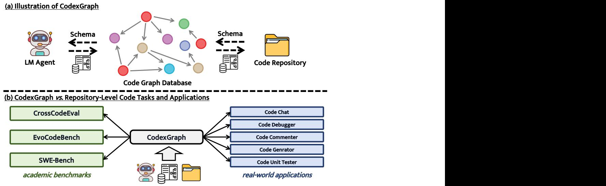
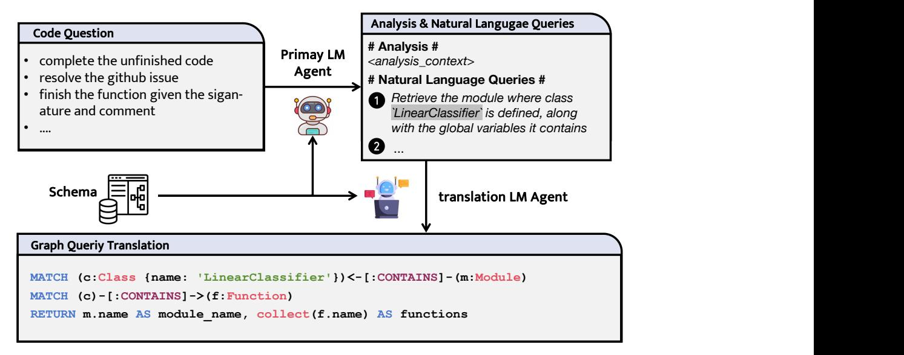
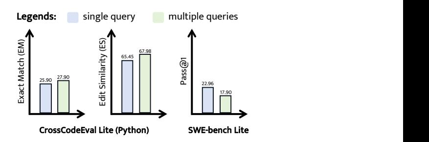
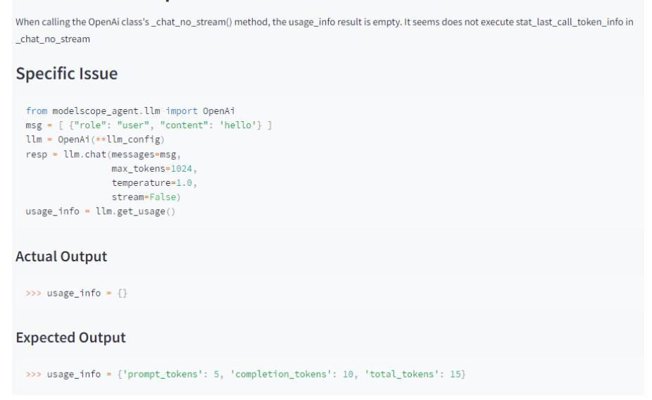
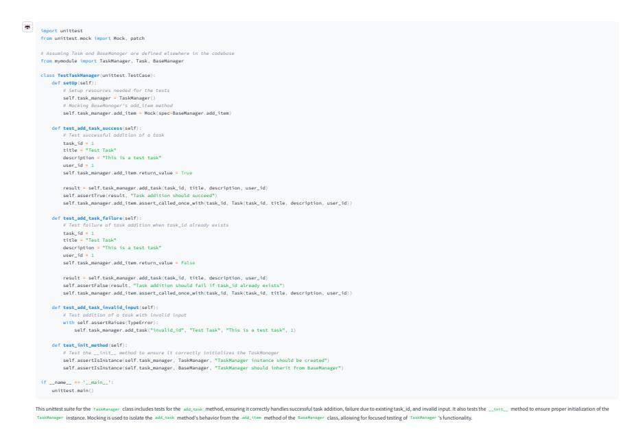
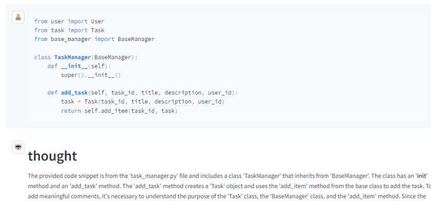

# CODEXGRAPH: Bridging Large Language Models and Code Repositories via Code Graph Databases

Xiangyan Liu1,3,<sup>∗</sup> Bo Lan2,<sup>∗</sup> Zhiyuan Hu<sup>1</sup> Yang Liu<sup>3</sup> Zhicheng Zhang<sup>3</sup> Fei Wang<sup>2</sup> Michael Shieh<sup>1</sup> Wenmeng Zhou<sup>3</sup> <sup>1</sup> National University of Singapore <sup>2</sup> Xi'an Jiaotong University <sup>3</sup> Alibaba Group {liu.xiangyan@u.nus.edu, bolan@stu.xjtu.edu.cn}

## Abstract

Large Language Models (LLMs) excel in stand-alone code tasks like HumanEval and MBPP, but struggle with handling entire code repositories. This challenge has prompted research on enhancing LLM-codebase interaction at a repository scale. Current solutions rely on similarity-based retrieval or manual tools and APIs, each with notable drawbacks. Similarity-based retrieval often has low recall in complex tasks, while manual tools and APIs are typically task-specific and require expert knowledge, reducing their generalizability across diverse code tasks and real-world applications. To mitigate these limitations, we introduce CODEXGRAPH, a system that integrates LLM agents with graph database interfaces extracted from code repositories. By leveraging the structural properties of graph databases and the flexibility of the graph query language, CODEXGRAPH enables the LLM agent to construct and execute queries, allowing for precise, code structure-aware context retrieval and code navigation. We assess CODEXGRAPH using three benchmarks: Cross-CodeEval, SWE-bench, and EvoCodeBench. Additionally, we develop five realworld coding applications. With a unified graph database schema, CODEX-GRAPH demonstrates competitive performance and potential in both academic and real-world environments, showcasing its versatility and efficacy in software engineering. Our application demo: [https://github.com/modelscope/](https://github.com/modelscope/modelscope-agent/tree/master/apps/codexgraph_agent) [modelscope-agent/tree/master/apps/codexgraph\\_agent](https://github.com/modelscope/modelscope-agent/tree/master/apps/codexgraph_agent).

### 1 Introduction

Large Language Models (LLMs) excel in code tasks, impacting automated software engineering [\(Chen et al.,](#page-10-0) [2021;](#page-10-0) [Yang et al.,](#page-12-0) [2024b;](#page-12-0) [OpenDevin Team,](#page-11-0) [2024\)](#page-11-0). Repository-level tasks [\(Zhang](#page-12-1) [et al.,](#page-12-1) [2023;](#page-12-1) [Jimenez et al.,](#page-11-1) [2023;](#page-11-1) [Ding et al.,](#page-10-1) [2024;](#page-10-1) [Li et al.,](#page-11-2) [2024b\)](#page-11-2) mimic software engineers' work with large codebases [\(Kovrigin et al.,](#page-11-3) [2024\)](#page-11-3). These tasks require models to handle intricate dependencies and comprehend project structure [\(Jiang et al.,](#page-11-4) [2024;](#page-11-4) [Sun et al.,](#page-12-2) [2024\)](#page-12-2).

Current LLMs struggle with long-context inputs, limiting their effectiveness with large codebases [\(Jimenez et al.,](#page-11-1) [2023\)](#page-11-1) and lengthy sequences reasoning [\(Liu et al.,](#page-11-5) [2024a\)](#page-11-5). Researchers have proposed methods to enhance LLMs by retrieving task-relevant code snippets and structures, improving performance in complex software development [\(Deng et al.,](#page-10-2) [2024;](#page-10-2) [Arora et al.,](#page-10-3) [2024;](#page-10-3) [Ma](#page-11-6) [et al.,](#page-11-6) [2024\)](#page-11-6). However, these approaches mainly rely on either similarity-based retrieval [\(Jimenez](#page-11-1) [et al.,](#page-11-1) [2023;](#page-11-1) [Cheng et al.,](#page-10-4) [2024;](#page-10-4) [Liu et al.,](#page-11-7) [2024b\)](#page-11-7) or manual tools and APIs [\(Zhang et al.,](#page-13-0) [2024b;](#page-13-0) [Orwall](#page-13-1) ¨ , [2024\)](#page-13-1). Similarity-based retrieval methods, common in Retrieval-Augmented Generation (RAG) systems [\(Lewis et al.,](#page-11-8) [2020\)](#page-11-8), often struggle with complex reasoning for query formulation [\(Jimenez et al.,](#page-11-1) [2023\)](#page-11-1) and handling intricate code structures [\(Phan et al.,](#page-11-9) [2024\)](#page-11-9), leading to low

<sup>∗</sup>Equal contribution. Work was done during Xiangyan's internship at Alibaba.

<span id="page-1-0"></span>
<!-- Image Description: The image contains two diagrams. (a) illustrates CodexGraph's architecture: an LM agent interacts with a code graph database, exchanging schema information with a code repository. (b) shows CodexGraph's applications, demonstrating its integration with academic benchmarks (CrossCodeEval, EvoCodeBench, SWE-Bench) and real-world applications (Code Chat, Code Debugger, etc.). The diagrams visually represent the system's structure and functionality. -->

Figure 1: (a) Using a unified schema, CODEXGRAPH employs code graph databases as interfaces that allow LLM agents to interact seamlessly with code repositories. (b) CODEXGRAPH supports the management of a wide range of tasks, from academic-level code benchmarks to real-world software engineering applications. recall rates. Meanwhile, existing tool/API-based interfaces that connect codebases and LLMs are typically task-specific and require extensive expert knowledge [\(Orwall](#page-13-1) ¨ , [2024;](#page-13-1) [Chen et al.,](#page-10-5) [2024\)](#page-10-5). Furthermore, our experimental results in Section [5](#page-6-0) indicate that the two selected methods lack flexibility and generalizability for diverse repository-level code tasks.

Recent studies have demonstrated the effectiveness of graph structures in code repositories [\(Phan](#page-11-9) [et al.,](#page-11-9) [2024;](#page-11-9) [Cheng et al.,](#page-10-4) [2024\)](#page-10-4). Meanwhile, inspired by recent advances in graph-based RAG [\(Edge et al.,](#page-10-6) [2024;](#page-10-6) [Liu et al.,](#page-11-7) [2024b;](#page-11-7) [He et al.,](#page-10-7) [2024\)](#page-10-7) and the application of executable code (such as SQL, Cypher, and Python) to consolidate LLM agent actions [\(Wang et al.,](#page-12-3) [2024;](#page-12-3) [Li et al.,](#page-11-10) [2024c;](#page-11-10) [Xue](#page-12-4) [et al.,](#page-12-4) [2023\)](#page-12-4), we present CODEXGRAPH, as shown in Figure [1](#page-1-0) (a). CODEXGRAPH alleviates the limitations of existing approaches by bridging code repositories with LLMs through graph databases. CODEXGRAPH utilizes static analysis to extract code graphs from repositories using a task-agnostic schema that defines the nodes and edges within the code graphs. In these graphs, nodes represent source code symbols such as MODULE, CLASS, and FUNCTION, and each node is enriched with relevant meta-information. The edges between nodes represent the relationships among these symbols, such as CONTAINS, INHERITS, and USES (see Figure [2](#page-3-0) for an illustrative example). By leveraging the structural properties of graph databases, CODEXGRAPH enhances the LLM agent's comprehension of code structures. CODEXGRAPH leverages repository code information and graph structures for global analysis and multi-hop reasoning, enhancing code task performance. When users provide code-related inputs, the LLM agent analyzes the required information from the code graphs, constructs flexible queries using graph query language, and locates relevant nodes or edges. This enables precise and efficient retrieval, allowing for effective scaling to larger repository tasks.

To evaluate the effectiveness of the CODEXGRAPH, we assess its performance acrossthree challenging and representative repository-level benchmarks: CrossCodeEval [\(Ding et al.,](#page-10-1) [2024\)](#page-10-1), SWE-bench [\(Yang et al.,](#page-12-0) [2024b\)](#page-12-0) and EvoCodeBench [\(Li et al.,](#page-11-2) [2024b\)](#page-11-2). Our experimental results demonstrate that, by leveraging a unified graph database schema (Section [3.1\)](#page-3-1) and a simple workflow design (Section [3.2\)](#page-4-0), the CODEXGRAPH achieves competitive performance across all academic benchmarks, especially when equipped with more advanced LLMs. Furthermore, as illustrated in Figure [1](#page-1-0) (b), to address real-world software development needs, we extend CODEXGRAPH to the featurerich ModelScope-Agent [\(Li et al.,](#page-11-11) [2023\)](#page-11-11) framework. Section [6](#page-8-0) highlights five real-world application scenarios, including code debugging and writing code comments, showcasing the versatility and efficacy of CODEXGRAPH in practical software engineering tasks.

### Our contributions are from three perspectives:

- Pioneering code retrieval system: We introduce CODEXGRAPH, integrating code repositories with LLMs via graph databases for enhanced code navigation and understanding.
- Benchmark performance: We demonstrate CODEXGRAPH's competitive performance on three challenging and representative repository-level code benchmarks.
- Practical applications: We showcase CODEXGRAPH's versatility in five real-world software engineering scenarios, proving its value beyond academic settings.

### 2 Related Work

### 1 Repository-Level Code Tasks

Repository-level code tasks have garnered significant attention due to their alignment with realworld production environments [\(Bairi et al.,](#page-10-8) [2023;](#page-10-8) [Luo et al.,](#page-11-12) [2024;](#page-11-12) [Cognition Labs,](#page-10-9) [2024;](#page-10-9) [Kovrigin](#page-11-3) [et al.,](#page-11-3) [2024\)](#page-11-3). Unlike traditional standalone code-related tasks such as HumanEval [\(Chen et al.,](#page-10-0) [2021\)](#page-10-0) and MBPP [\(Austin et al.,](#page-10-10) [2021\)](#page-10-10), which often fail to capture the complexities of real-world software engineering, repository-level tasks necessitate models to understand cross-file code structures and perform intricate reasoning [\(Liu et al.,](#page-11-7) [2024b;](#page-11-7) [Ma et al.,](#page-11-6) [2024;](#page-11-6) [Sun et al.,](#page-12-2) [2024\)](#page-12-2). These sophisticated tasks can be broadly classified into two lines of work based on their inputs and outputs. The first line of work involves natural language to code repository tasks, exemplified by benchmarks like DevBench [\(Li et al.,](#page-11-13) [2024a\)](#page-11-13) and SketchEval [\(Zan et al.,](#page-12-5) [2024\)](#page-12-5), where models generate an entire code repository from scratch based on a natural language description of input requirements. Stateof-the-art solutions in this area often employ multi-agent frameworks such as ChatDev [\(Qian et al.,](#page-12-6) [2023\)](#page-12-6) and MetaGPT [\(Hong et al.,](#page-10-11) [2023\)](#page-10-11) to handle the complex process of generating a complete codebase. The second line of work, which our research focuses on, includes tasks that integrate both a natural language description and a reference code repository, requiring models to perform tasks like repository-level code completion [\(Zhang et al.,](#page-12-1) [2023;](#page-12-1) [Shrivastava et al.,](#page-12-7) [2023;](#page-12-7) [Liu et al.,](#page-11-14) [2023;](#page-11-14) [Ding et al.,](#page-10-1) [2024;](#page-10-1) [Su et al.,](#page-12-8) [2024\)](#page-12-8), automatic GitHub issue resolution [\(Jimenez et al.,](#page-11-1) [2023\)](#page-11-1), and repository-level code generation [\(Li et al.,](#page-11-2) [2024b\)](#page-11-2). To assess the versatility and effectiveness of our proposed system CODEXGRAPH, we evaluate it on three diverse and representative benchmarks including CrossCodeEval [\(Ding et al.,](#page-10-1) [2024\)](#page-10-1) for code completion, SWE-bench [\(Jimenez et al.,](#page-11-1) [2023\)](#page-11-1) for Github issue resolution, and EvoCodeBench [\(Li et al.,](#page-11-2) [2024b\)](#page-11-2) for code generation.

### <span id="page-2-0"></span>2.2 Retrieval-Augmented Code Generation

Retrieval-Augmented Generation (RAG) systems primarily aim to retrieve relevant content from external knowledge bases to address a given question, thereby maintaining context efficiency while reducing hallucinations in private domains [\(Lewis et al.,](#page-11-8) [2020;](#page-11-8) [Shuster et al.,](#page-12-9) [2021\)](#page-12-9). For repositorylevel code tasks, which involve retrieving and manipulating code from repositories with complex dependencies, RAG systems—referred to here as Retrieval-Augmented Code Generation (RACG) [\(Jiang et al.,](#page-11-4) [2024\)](#page-11-4)—are utilized to fetch the necessary code snippets or code structures from the specialized knowledge base of code repositories. Current RACG methodologies can be divided into three main paradigms: the first paradigm involves similarity-based retrieval, which encompasses term-based sparse retrievers [\(Robertson & Zaragoza,](#page-12-10) [2009;](#page-12-10) [Jimenez et al.,](#page-11-1) [2023\)](#page-11-1) and embeddingbased dense retrievers [\(Guo et al.,](#page-10-12) [2022;](#page-10-12) [Zhang et al.,](#page-12-1) [2023\)](#page-12-1), with advanced approaches integrating structured information into the retrieval process [\(Phan et al.,](#page-11-9) [2024;](#page-11-9) [Cheng et al.,](#page-10-4) [2024;](#page-10-4) [Liu et al.,](#page-11-7) [2024b\)](#page-11-7). The second paradigm consists of manually designed code-specific tools or APIs that rely on expert knowledge to create interfaces for LLMs to interact with code repositories for specific tasks [\(Zhang et al.,](#page-13-0) [2024b;](#page-13-0) [Deshpande et al.,](#page-10-13) [2024;](#page-10-13) [Arora et al.,](#page-10-3) [2024\)](#page-10-3). The third paradigm combines both similarity-based retrieval and code-specific tools or APIs [\(Orwall](#page-13-1) ¨ , [2024\)](#page-13-1), leveraging the reasoning capabilities of LLMs to enhance context retrieval from code repositories. Apart from the three paradigms, Agentless [\(Xia et al.,](#page-12-11) [2024\)](#page-12-11) preprocesses the code repository's structure and file skeleton, allowing the LLMs to interact with the source code. Our proposed framework, CODEXGRAPH, aligns most closely with the second paradigm but distinguishes itself by discarding the need for expert knowledge and task-specific designs. By using code graph databases as flexible and universal interfaces, which also structurally store information to facilitate the code structure understanding of LLMs, CODEXGRAPH can navigate the code repositories and manage multiple repository-level code tasks, providing a versatile and powerful solution for RACG.

### 3 CODEXGRAPH: Enable LLMs to Navigate the Code Repository

CODEXGRAPH is a system that bridges code repositories and large language models (LLMs) through code graph database interfaces. It indexes input code repositories using static analysis, storing code symbols and relationships as nodes and edges in a graph database according to a predefined schema. When presented with a coding question, CODEXGRAPH leverages the LLM agent to generate graph queries, which are executed to retrieve relevant code fragments or code structures

<span id="page-3-0"></span>

Figure 2: Illustration of the process for indexing source code to generate a code graph based on the given graph database schema. Subfigure (3) provides a visualization example of the resultant code graph in Neo4j.

from the database. The detailed processes of constructing the code graph database and the LLM agent's interactions with it are explained in sections [3.1](#page-3-1) and [3.2,](#page-4-0) respectively.

### <span id="page-3-1"></span>3.1 Build Code Graph Database from Repository Codebase

Schema. We abstract code repositories into code graphs where nodes represent symbols in the source code, and edges represent relationships between these symbols. The schema defines the types of nodes and edges, directly determining how code graphs are stored in the graph database. Different programming languages typically require different schemas based on their characteristics. In our project, we focus on Python and have empirically designed a schema tailored to its features, with node types including MODULE, CLASS, METHOD, FUNCTION, FIELD, and GLOBAL VARIABLE, and edge types including CONTAINS, INHERITS, HAS METHOD, HAS FIELD, and USES.

Each node type has corresponding attributes to represent its meta-information. For instance, METHOD nodes have attributes such as name, file path, class, code, and signature. For storage efficiency, nodes with a code attribute do not store the code snippet directly in the graph database but rather an index pointing to the corresponding code fragment. Figure [2](#page-3-0) illustrates a sample code graph derived from our schema, and Appendix [A.1](#page-14-0) shows the details of the schema.

Phase 1: Shallow indexing. The code graph database construction process consists of two phases, beginning with the input of the code repository and schema. The first phase employs a shallow indexing method, inspired by Sourcetrail's static analysis process [2](#page-3-2) , to perform a single-pass scan of the entire repository. During this scan, symbols and relationships are extracted from each Python file, processed only once, and stored as nodes and edges in the graph database. Concurrently, metainformation for these elements is recorded. This approach ensures speed and efficiency, capturing all nodes and their meta-information in one pass. However, the shallow indexing phase has limitations due to its single-pass nature. Some important edges, particularly certain INHERITS and CONTAINS relationships, may be overlooked as they might require context from multiple files.

Phase 2: Complete the edges. The second phase addresses the limitations of shallow indexing by focusing on cross-file relationships. We employ Depth-First Search (DFS) to traverse each code file, using abstract syntax tree parsing to identify modules and classes. This approach is particularly

<span id="page-3-2"></span><sup>2</sup><https://github.com/CoatiSoftware/Sourcetrail>

<span id="page-4-1"></span>
<!-- Image Description: The image depicts a system architecture for translating code questions into graph queries. A primary language model (LM) agent receives a code question (e.g., "complete unfinished code"), generates natural language queries (e.g., "retrieve module where class 'LinearClassifier' is defined"), and passes them to a translation LM agent. The translation agent then produces a graph query (Cypher syntax) to extract relevant information from a schema. The diagram illustrates the workflow with boxes representing agents and data, and arrows indicating data flow. -->

Figure 3: The primary LLM agent analyzes the given code question, writting natural language queries. These queries are then processed by the translation LLM agent, which translates them into executable graph queries.

effective in resolving Python's re-export issues. We convert relative imports to absolute imports, enabling accurate establishment of cross-file CONTAINS relationships through graph queries. Simultaneously, we record INHERITS relationships for each class. For complex cases like multiple inheritance, DFS is used to establish edges for inherited FIELD and METHOD nodes within the graph database. This comprehensive approach ensures accurate capture of both intra-file and cross-file relationships, providing a complete representation of the codebase structure.

Summary. Our code graph database design offers four key advantages for subsequent use. *First*, it ensures efficient storage by storing code snippets as indexed references rather than directly in the graph database. *Second*, it enables multi-granularity searches, from module-level to variable-level, accommodating diverse analytical needs. *Third*, it facilitates topological analysis of the codebase, revealing crucial insights into hierarchical and dependency structures. *Last*, this schema design supports multiple tasks without requiring modifications, demonstrating its versatility and general applicability. These features collectively enhance the system's capability to handle complex code analysis tasks effectively across various scenarios.

### <span id="page-4-0"></span>3.2 Large Language Models Interaction with Code Graph Database

Code structure-aware search. CODEXGRAPH leverages the flexibility of graph query language to construct complex and composite search conditions. By combining this flexibility with the structural properties of graph databases, the LLM agent can effectively navigate through various nodes and edges in the code graph. This capability allows for intricate queries such as: *"Find classes under a certain module that contain a specific method"*, or *"Retrieve the module where a certain class is defined, along with the functions it contains"*. This approach enables code structure-aware searches, providing a level of code retrieval that is difficult to achieve with similarity-based retrieval methods [\(Robertson & Zaragoza,](#page-12-10) [2009;](#page-12-10) [Guo et al.,](#page-10-12) [2022\)](#page-10-12) or conventional code-specific tools and APIs [\(Zhang et al.,](#page-13-0) [2024b;](#page-13-0) [Deshpande et al.,](#page-10-13) [2024\)](#page-10-13).

Write then translate. LLM agents are powered by LLMs and operate based on user-provided prompts to break down tasks, utilize tools, and perform reasoning. This design is effective for handling specific, focused tasks [\(Gupta & Kembhavi,](#page-10-14) [2022;](#page-10-14) [Yuan et al.,](#page-12-12) [2024\)](#page-12-12), but when tasks are complex and multifaceted, LLM agents may underperform. This limitation has led to the development of multi-agent systems [\(Hong et al.,](#page-10-11) [2023;](#page-10-11) [Qian et al.,](#page-12-6) [2023;](#page-12-6) [Guo et al.,](#page-10-15) [2024\)](#page-10-15), where multiple LLM agents independently handle parts of the task. Inspired by this approach, CODEXGRAPH implements a streamlined "write then translate" strategy to optimize LLM-database interactions.

As illustrated in Figure [3,](#page-4-1) the primary LLM agent focuses on understanding context and generating natural language queries based on the user's question. These queries are then passed to a specialized translation LLM agent, which converts them into formal graph queries. This division of labor allows the primary LLM agent to concentrate on high-level reasoning while ensuring syntactically correct and optimized graph queries. By separating these tasks, CODEXGRAPH enhances query success rates and improves the system's ability to accurately retrieve relevant code information.

Iterative pipeline. Instead of completing the code task in a single step, CODEXGRAPH employs an iterative pipeline for interactions between LLM agents and code graph databases, drawing insights from existing agent systems [\(Yao et al.,](#page-12-13) [2023;](#page-12-13) [Yang et al.,](#page-12-0) [2024b\)](#page-12-0). In each round, LLM agents formulate multiple queries based on the user's question and previously gathered information. Similar to [Madaan et al.](#page-11-15) [\(2023\)](#page-11-15), the agent then analyzes the aggregated results to determine whether sufficient context has been acquired or if additional rounds are necessary. This iterative approach fully leverages the reasoning capabilities of the LLM agent, thereby enhancing problem-solving accuracy.

### 4 Experimental Setting

Benchmarks. We employ three diverse repository-level code benchmarks to evaluate CODEX-GRAPH: CrossCodeEval [\(Ding et al.,](#page-10-1) [2024\)](#page-10-1), SWE-bench [\(Yang et al.,](#page-12-0) [2024b\)](#page-12-0), and EvoCodeBench [\(Li et al.,](#page-11-2) [2024b\)](#page-11-2). CrossCodeEval is a multilingual scope cross-file completion dataset for Python, Java, TypeScript, and C#. SWE-bench evaluates a model's ability to solve GitHub issues with 2, 294 Issue-Pull Request pairs from 12 Python repositories. EvoCodeBench is an evolutionary code generation benchmark with comprehensive annotations and evaluation metrics.

We report our primary results on the CrossCodeEval Lite (Python) and SWE-bench Lite test sets for CrossCodeEval and SWE-bench, respectively, and on the full test set for EvoCodeBench. Cross-CodeEval Lite (Python) and SWE-bench Lite represent subsets of their respective datasets. Cross-CodeEval Lite (Python) consists of 1000 randomly sampled Python instances, while SWE-bench Lite includes 300 instances randomly sampled after filtering out those with poor issue descriptions.

*Remark: During indexing of*43*Sympy samples from the SWE-bench dataset, we face out-of-memory issues due to numerous files and complex dependencies, leading to their exclusion. Similarly, some EvoCodeBench samples are omitted due to test environment configuration issues. Thus, SWE-bench Lite and EvoCodeBench results are based on*257*and*212*samples, respectively.*Baselines. We evaluate whether CODEXGRAPH is a powerful solution for Retrieval-Augmented Code Generation (RACG) [\(Jiang et al.,](#page-11-4) [2024\)](#page-11-4). We specifically assess how effectively code graph database interfaces aid LLMs in understanding code repositories, particularly when handling diverse code questions across different benchmarks to test CODEXGRAPH 's general applicability. To achieve this, we select resilient RACG baselines that can be adapted to various tasks. Based on the categories in Section [2.2,](#page-2-0) we choose BM25 [\(Robertson & Zaragoza,](#page-12-10) [2009\)](#page-12-10) and AUTOCODEROVER [\(Zhang et al.,](#page-13-0) [2024b\)](#page-13-0), which are widely recognized in code tasks [\(Jimenez et al.,](#page-11-1) [2023;](#page-11-1) [Ding et al.,](#page-10-1) [2024;](#page-10-1) [Kovrigin et al.,](#page-11-3) [2024;](#page-11-3) [Chen et al.,](#page-10-5) [2024\)](#page-10-5), along with a NO-RAG method. Besides, since our work focuses on RACG methods and their generalizability, we exclude methods that interact with external websites [\(OpenDevin Team,](#page-11-0) [2024;](#page-11-0) [Zhang et al.,](#page-13-2) [2024a\)](#page-13-2) and runtime environments [\(Yang et al.,](#page-12-0) [2024b\)](#page-12-0), as well as task-specific methods that are not easily adaptable across multiple benchmarks [\(Cheng et al.,](#page-10-4) [2024;](#page-10-4) [Orwall](#page-13-1) ¨ , [2024\)](#page-13-1). These methods fall outside the scope of our project.

Especially, although [Zhang et al.](#page-13-0) [\(2024b\)](#page-13-0) evaluate AUTOCODEROVER exclusively on SWE-bench, we extend its implementation to CrossCodeEval and EvoCodeBench, while retaining its core set of 7 code-specific tools for code retrieval.

Large Language Models (LLMs). We evaluate CODEXGRAPH on three advanced and wellknown LLMs with long text processing, tool use, and code generation capabilities: GPT-4o, DeepSeek-Coder-V2 [\(Zhu et al.,](#page-13-3) [2024\)](#page-13-3), and Qwen2-72b-Instruct [\(Yang et al.,](#page-12-14) [2024a\)](#page-12-14).

<span id="page-5-0"></span><sup>3</sup><https://github.com/princeton-nlp/SWE-bench/issues/2>

<span id="page-6-5"></span>Table 1: Performance comparison of CODEXGRAPH and RACG baselines across three benchmarks using different backbone LLMs. The absence of values in SWE-bench Lite for the NO RAG method is due to issues with mismatches between the dataset and the code when running inference scripts [3](#page-5-0) . Similarly, the missing values in EvoCodeBench are attributable to task inputs being unsuitable for constructing the required BM25 queries, and the original paper also does not provide the corresponding implementation. Best results are bolded.

| Model    | Method        | CrossCodeEval Lite (Python) |       |       |       | SWE-bench Lite | EvoCodeBench |          |
|----------|---------------|-----------------------------|-------|-------|-------|----------------|--------------|----------|
|          |               | EM                          | ES    | ID-EM | ID-F1 | Pass@1         | Pass@1       | Recall@1 |
|          | NO RAG        | 8.20                        | 46.16 | 13.0  | 36.92 | -              | 19.34        | 11.34    |
| Qwen2    | BM25          | 15.50                       | 51.74 | 22.60 | 45.44 | 0.00           | -            | -        |
|          | AUTOCODEROVER | 5.21                        | 47.63 | 10.16 | 36.54 | 9.34           | 16.91        | 7.86     |
|          | CODEXGRAPH    | 5.00                        | 47.99 | 9.10  | 36.44 | 1.95           | 14.62        | 8.60     |
|          | NO RAG        | 11.70                       | 60.73 | 16.90 | 47.85 | -              | 25.47        | 11.04    |
|          | BM25          | 21.90                       | 67.52 | 30.60 | 59.04 | 1.17           | -            | -        |
| DS-Coder | AUTOCODEROVER | 14.90                       | 59.78 | 22.30 | 51.34 | 15.56          | 20.28        | 7.56     |
|          | CODEXGRAPH    | 20.20                       | 63.14 | 28.10 | 54.88 | 12.06          | 27.62        | 12.01    |
|          | NO RAG        | 10.80                       | 59.36 | 16.70 | 48.22 | -              | 27.83        | 11.79    |
| GPT-4o   | BM25          | 21.20                       | 66.18 | 30.20 | 58.71 | 3.11           | -            | -        |
|          | AUTOCODEROVER | 21.20                       | 61.92 | 28.10 | 54.81 | 22.96          | 28.78        | 11.17    |
|          | CODEXGRAPH    | 27.90                       | 67.98 | 35.60 | 61.08 | 22.96          | 36.02        | 11.87    |

• GPT-4o: Developed by OpenAI [4](#page-6-1) , this model excels in commonsense reasoning, mathematics, and code, and is among the top-performing models as of July 2024 [5](#page-6-2) .

• DeepSeek-Coder-V2 (DS-Coder): A specialized code-specific LLM by DeepSeek [6](#page-6-3) , it retains general capabilities while being highly proficient in code-related tasks.

• Qwen2-72b-Instruct (Qwen2): Developed by Alibaba [7](#page-6-4) , this open-source model has about 72 billion parameters and a 128k long context, making it suitable for evaluating existing methods.

For the hyperparameters of the selected large language models, we empirically set the temperature coefficient to 0.0 for both GPT-4o and Qwen2-72b-Instruct, and to 1.0 for DeepSeek-Coder-V2. All other parameters are kept at their default settings.

Metrics. In metrics selection, we follow the original papers' settings [\(Jimenez et al.,](#page-11-1) [2023;](#page-11-1) [Ding](#page-10-1) [et al.,](#page-10-1) [2024;](#page-10-1) [Li et al.,](#page-11-2) [2024b\)](#page-11-2). Specifically, for CrossCodeEval, we measure performance with code match and identifier match metrics, assessing accuracy with exact match (EM), edit similarity (ES), and F1 scores. SWE-bench utilizes % Resolved (Pass@1) to gauge the effectiveness of modelgenerated patches based on provided unit tests. EvoCodeBench employs Pass@k, where k represents the number of generated programs, for functional correctness and Recall@k to assess the recall of reference dependencies in generated programs. We set k to 1 in our main experiments.

Implementation details. Before indexing, we filter the Python repositories for each benchmark to retain only Python files. For the SWE-bench dataset, we also exclude test files to avoid slowing down the creation of the code graph database. Following the process outlined in Section [3.1,](#page-3-1) we construct code graph databases for the indexed repositories, storing the corresponding nodes and edges. We select Neo4j as the graph database and Cypher as the query language.

### <span id="page-6-0"></span>5 Results

### 1 Analysis of Repository-Level Code Tasks

RACG is crucial for repository-level code tasks. In Table [1,](#page-6-5) RACG-based methods—BM25, AUTOCODEROVER, and CODEXGRAPH—basically outperform the NO-RAG method across all benchmarks and evaluation metrics. For instance, on the CrossCodeEval Lite (Python) dataset, using GPT-4o as the backbone LLM, RACG methods improve performance by 10.4% to 17.1% on the EM

<span id="page-6-1"></span><sup>4</sup>We use the gpt-4o-2024-05-13 version, <https://openai.com/api>

<span id="page-6-2"></span><sup>5</sup><https://huggingface.co/spaces/lmsys/chatbot-arena-leaderboard>

<span id="page-6-3"></span><sup>6</sup><https://chat.deepseek.com/coder>

<span id="page-6-4"></span><sup>7</sup><https://dashscope.console.aliyun.com/model>

<span id="page-7-0"></span>Table 2: Average token cost comparison across three benchmarks (GPT-4o as the backbone LLM).

|               | CrossCodeEval Lite (Python) | SWE-bench Lite | EvoCodeBench |
|---------------|-----------------------------|----------------|--------------|
| BM25          | 1.47k                       | 14.76k         | -            |
| AUTOCODEROVER | 10.74k                      | 76.01k         | 21.41k       |
| CODEXGRAPH    | 22.16k                      | 102.25k        | 24.49k       |

metric compared to NO-RAG. This demonstrates that the NO-RAG approach, which relies solely on in-file context and lacks interaction with the code repository, significantly limits performance.

Existing RACG methods struggle to adapt to various repo-level code tasks. Experimental results in Table [1](#page-6-5) reveal the shortcomings of existing RACG-based methods like BM25 and AU-TOCODEROVER. While these methods perform well in specific tasks, they often underperform when applied to other repository-level code tasks. This discrepancy typically arises from their inherent characteristics or task-specific optimizations.

Specifically, AUTOCODEROVER is designed with code tools tailored for SWE-bench tasks, leveraging expert knowledge and the unique features of SWE-bench to optimize tool selection and design. This optimization refines the LLM agent's action spaces, enabling it to gather valuable information more efficiently and boosting its performance on SWE-bench tasks (22.96%). However, these taskspecific optimizations limit its flexibility and effectiveness in other coding tasks, as evidenced by its subpar results on CrossCodeEval Lite (Python) and EvoCodeBench compared to other methods.

Similarly, BM25 faces the same issues. In CrossCodeEval Lite (Python), its similarity-based retrieval aligns well with code completion tasks, enabling it to easily retrieve relevant usage references or direct answers. This results in strong performance, particularly in the ES metric. However, BM25 lacks the reasoning capabilities of LLMs during query construction, making its retrieval process less intelligent. Consequently, when confronted with reasoning-heavy tasks like those in SWE-bench, BM25 often fails to retrieve appropriate code snippets, leading to poor performance.

CODEXGRAPH shows versatility and efficacy across diverse benchmarks. Table [1](#page-6-5) shows that CODEXGRAPH achieves competitive results across various repository-level code tasks with general code graph database interfaces. Specifically, with GPT-4o as the LLM backbone, CODEXGRAPH outperforms other RACG baselines on CrossCodeEval Lite (Python) and EvoCodeBench, while also achieving results comparable to AUTOCODEROVER on SWE-bench Lite. This demonstrates the generality and effectiveness of the code graph database interface design.

CODEXGRAPH increases token consumption. CODEXGRAPH uses code graph databases as interfaces and retrieves information from the code repository by writing graph queries. While benefiting from larger and more flexible action spaces, it also incurs increased token costs. The primary reason for this is that the length of the query outcomes is not controllable. Moreover, CODEXGRAPH sometimes encounters loops where it fails to generate executable graph queries. As demonstrated in Table [2,](#page-7-0) this leads to a higher token usage compared to existing RACG methods.

### 2 Deeper Analysis of CODEXGRAPH

Optimal querying strategies vary across different benchmarks. There are two strategies for formulating queries in each round within CODEXGRAPH: either generating a single query or producing multiple queries for code retrieval. Opting for a single query per round can enhance precision in retrieving relevant content but may compromise the recall rate. Conversely, generating multiple queries per round can improve recall but may reduce precision. Experimental results, as illustrated in Figure [4,](#page-7-1) reveal that for CrossCodeEval Lite (Python), which involves lower reasoning dif-

<span id="page-7-1"></span>
<!-- Image Description: The image presents three bar charts comparing performance metrics for single versus multiple queries on two code search benchmarks: CrossCodeEval Lite (Python) and SWE-bench Lite. The charts display Exact Match (EM), Edit Similarity (ES), and Pass@1, showing higher scores for multiple queries in both benchmarks, indicating improved performance with multiple query inputs. Each bar's color represents the query type. -->

Figure 4: Performance comparison of different querying strategies on CrossCodeEval Lite (Python) and SWE-bench Lite.

ficulty (26.43*vs.*27.90 in the EM metric), the "multiple queries" strategy is more effective. In

<span id="page-8-1"></span>

| Model    | Method                    | CrossCodeEval Lite (Python) |                |                |                |  |  |
|----------|---------------------------|-----------------------------|----------------|----------------|----------------|--|--|
|          |                           | EM                          | ES             | ID-EM          | ID-F1          |  |  |
| Qwen2    | CODEXGRAPH                | 5.00                        | 47.99          | 9.10           | 36.44          |  |  |
|          | w/o translation LLM Agent | 0.50 (-4.50)                | 10.45 (-37.54) | 0.60 (-8.50)   | 2.62 (-33.82)  |  |  |
| DS-Coder | CODEXGRAPH                | 20.20                       | 63.14          | 28.10          | 54.88          |  |  |
|          | w/o translation LLM Agent | 5.50 (-14.70)               | 53.56 (-9.58)  | 11.20 (-16.90) | 39.75 (-15.13) |  |  |
| GPT-4o   | CODEXGRAPH                | 27.90                       | 67.98          | 35.60          | 61.08          |  |  |
|          | w/o translation LLM Agent | 8.30 (-19.60)               | 56.36 (-11.62) | 14.40 (-21.20) | 44.08 (-17.00) |  |  |

Table 3: Ablation study about the translation LLM agent on CrossCodeEval Lite (Python).

contrast, for SWE-bench Lite, which presents higher reasoning difficulty, the "single query" strategy yields better outcomes (22.96*vs.*17.90 in the Pass@1 metric). These findings provide valuable guidance for researchers in selecting the most appropriate querying strategy for future studies.

"Write then translate" eases reasoning load. When the assistance of the translation LLM agent is removed, the primary LLM agent must independently analyze the coding question and directly formulate the graph query for code retrieval. This increases the reasoning load on the primary LLM agent, leading to a decline in the syntactic accuracy of the graph queries. Experimental results in Table [3](#page-8-1) highlight the significant negative impact of the removal of the translation LLM agent on CODEXGRAPH's performance across all selected LLMs in the CrossCodeEval Lite (Python) benchmark. Even when GPT-4o is used as the backbone model, performance metrics exhibit a significant drop (e.g., the EM metric drops from 27.90% to 8.30%), underscoring the critical role of the translation LLM agent in alleviating the primary LLM agent's reasoning burden.

CODEXGRAPH is enhanced when equipped with advanced LLMs. Code graph databases provide a flexible and general interface, resulting in a broader action space for CODEXGRAPH compared to existing methods. However, if the underlying LLM lacks sufficient reasoning and coding capabilities, the LLM agent in CODEXGRAPH may struggle to formulate appropriate graph queries. This can lead to failures in retrieving the expected code, which in turn hampers further reasoning.

As shown in Table [1,](#page-6-5) the effectiveness of CODEXGRAPH improves significantly with advancements in LLMs. For example, transitioning from Qwen2-72b-Instruct to DeepSeek-Coder-v2 and then to GPT-4o, the overall performance enhancement across various benchmarks and metrics is notable. This illustrates that while CODEXGRAPH requires high-level coding skills, reasoning abilities, and proficiency in handling complex texts from LLMs, the rapid advancement of these models allows them to better leverage the flexible interfaces provided by code graph databases.

### <span id="page-8-0"></span>6 Real-World Application Scenario

To highlight the practical value of the CODEXGRAPH in real-world applications, we develop five code agents using the flexible ModelScope-Agent framework [\(Li et al.,](#page-11-11) [2023\)](#page-11-11). These agents are designed to address common coding challenges in production environments by integrating key concepts of the CODEXGRAPH. Code Chat allows users to inquire about a code repository, providing insights into code structure and function usage. Code Debugger diagnoses and resolves bugs by applying iterative reasoning and information retrieval to suggest targeted fixes. Code Unittestor generates unit tests for specified classes or functions to ensure thorough functionality verification. Code Generator automatically creates code to meet new requirements, extending the functionality of existing codebases. Lastly, Code Commentor produces comprehensive annotations, enhancing documentation for code segments lacking comments. Examples of these agents are provided in Appendix [A.2](#page-16-0) to maintain brevity in the main text.

### 7 Discussion

Limitations. CODEXGRAPH has only been evaluated on a single programming language, Python. In the future, we plan to extend CODEXGRAPH to more programming languages, such as Java and C++. Secondly, there is room for improvement in the construction efficiency and schema completeness of the code graph database. Faster database indexing and a more comprehensive schema (e.g., adding edges related to function calls) will enhance the broader applicability of CODEXGRAPH. Finally, the design of CODEXGRAPH's workflow can further integrate with existing advanced agent techniques, such as finer-grained multi-agent collaboration.

Conclusion. CODEXGRAPH addresses the limitations of existing RACG methods, which often struggle with flexibility and generalization across different code tasks. By integrating LLMs with code graph database interfaces, CODEXGRAPH facilitates effective, code structure-aware retrieval for diverse repository-level code tasks. Our evaluations highlight its competitive performance and broad applicability on academic benchmarks. Additionally, we provide several code applications in ModelScope-Agent, demonstrating CODEXGRAPH 's capability to enhance the accuracy and usability of automated software development.

### References

- <span id="page-10-3"></span>Daman Arora, Atharv Sonwane, Nalin Wadhwa, Abhav Mehrotra, Saiteja Utpala, Ramakrishna Bairi, Aditya Kanade, and Nagarajan Natarajan. Masai: Modular architecture for softwareengineering ai agents.*arXiv preprint arXiv:2406.11638*, 2024.
- <span id="page-10-10"></span>Jacob Austin, Augustus Odena, Maxwell Nye, Maarten Bosma, Henryk Michalewski, David Dohan, Ellen Jiang, Carrie Cai, Michael Terry, Quoc Le, et al. Program synthesis with large language models. *arXiv preprint arXiv:2108.07732*, 2021.
- <span id="page-10-8"></span>Ramakrishna Bairi, Atharv Sonwane, Aditya Kanade, Vageesh D C, Arun Iyer, Suresh Parthasarathy, Sriram Rajamani, B. Ashok, and Shashank Shet. Codeplan: Repository-level coding using llms and planning, 2023. URL <https://arxiv.org/abs/2309.12499>.
- <span id="page-10-5"></span>Dong Chen, Shaoxin Lin, Muhan Zeng, Daoguang Zan, Jian-Gang Wang, Anton Cheshkov, Jun Sun, Hao Yu, Guoliang Dong, Artem Aliev, Jie Wang, Xiao Cheng, Guangtai Liang, Yuchi Ma, Pan Bian, Tao Xie, and Qianxiang Wang. Coder: Issue resolving with multi-agent and task graphs, 2024.
- <span id="page-10-0"></span>Mark Chen, Jerry Tworek, Heewoo Jun, Qiming Yuan, Henrique Ponde De Oliveira Pinto, Jared Kaplan, Harri Edwards, Yuri Burda, Nicholas Joseph, Greg Brockman, et al. Evaluating large language models trained on code. *arXiv preprint arXiv:2107.03374*, 2021.
- <span id="page-10-4"></span>Wei Cheng, Yuhan Wu, and Wei Hu. Dataflow-guided retrieval augmentation for repository-level code completion. *arXiv preprint arXiv:2405.19782*, 2024.
- <span id="page-10-9"></span>Cognition Labs. Devin, AI software engineer. [https://www.cognition-labs.com/](https://www.cognition-labs.com/introducing-devin) [introducing-devin](https://www.cognition-labs.com/introducing-devin), 2024.
- <span id="page-10-2"></span>Ken Deng, Jiaheng Liu, He Zhu, Congnan Liu, Jingxin Li, Jiakai Wang, Peng Zhao, Chenchen Zhang, Yanan Wu, Xueqiao Yin, et al. R2c2-coder: Enhancing and benchmarking realworld repository-level code completion abilities of code large language models. *arXiv preprint arXiv:2406.01359*, 2024.
- <span id="page-10-13"></span>Ajinkya Deshpande, Anmol Agarwal, Shashank Shet, Arun Iyer, Aditya Kanade, Ramakrishna Bairi, and Suresh Parthasarathy. Class-level code generation from natural language using iterative, tool-enhanced reasoning over repository, 2024. URL [https://arxiv.org/abs/](https://arxiv.org/abs/2405.01573) [2405.01573](https://arxiv.org/abs/2405.01573).
- <span id="page-10-1"></span>Yangruibo Ding, Zijian Wang, Wasi Ahmad, Hantian Ding, Ming Tan, Nihal Jain, Murali Krishna Ramanathan, Ramesh Nallapati, Parminder Bhatia, Dan Roth, et al. Crosscodeeval: A diverse and multilingual benchmark for cross-file code completion. *Advances in Neural Information Processing Systems*, 36, 2024.
- <span id="page-10-6"></span>Darren Edge, Ha Trinh, Newman Cheng, Joshua Bradley, Alex Chao, Apurva Mody, Steven Truitt, and Jonathan Larson. From local to global: A graph rag approach to query-focused summarization. *arXiv preprint arXiv:2404.16130*, 2024.
- <span id="page-10-12"></span>Daya Guo, Shuai Lu, Nan Duan, Yanlin Wang, Ming Zhou, and Jian Yin. Unixcoder: Unified cross-modal pre-training for code representation. *arXiv preprint arXiv:2203.03850*, 2022.
- <span id="page-10-15"></span>Taicheng Guo, Xiuying Chen, Yaqi Wang, Ruidi Chang, Shichao Pei, Nitesh V. Chawla, Olaf Wiest, and Xiangliang Zhang. Large language model based multi-agents: A survey of progress and challenges, 2024. URL <https://arxiv.org/abs/2402.01680>.
- <span id="page-10-14"></span>Tanmay Gupta and Aniruddha Kembhavi. Visual programming: Compositional visual reasoning without training, 2022. URL <https://arxiv.org/abs/2211.11559>.
- <span id="page-10-7"></span>Xiaoxin He, Yijun Tian, Yifei Sun, Nitesh V Chawla, Thomas Laurent, Yann LeCun, Xavier Bresson, and Bryan Hooi. G-retriever: Retrieval-augmented generation for textual graph understanding and question answering. *arXiv preprint arXiv:2402.07630*, 2024.
- <span id="page-10-11"></span>Sirui Hong, Xiawu Zheng, Jonathan Chen, Yuheng Cheng, Jinlin Wang, Ceyao Zhang, Zili Wang, Steven Ka Shing Yau, Zijuan Lin, Liyang Zhou, et al. Metagpt: Meta programming for multiagent collaborative framework. *arXiv preprint arXiv:2308.00352*, 2023.

- <span id="page-11-4"></span>Juyong Jiang, Fan Wang, Jiasi Shen, Sungju Kim, and Sunghun Kim. A survey on large language models for code generation. *arXiv preprint arXiv:2406.00515*, 2024.
- <span id="page-11-1"></span>Carlos E Jimenez, John Yang, Alexander Wettig, Shunyu Yao, Kexin Pei, Ofir Press, and Karthik Narasimhan. Swe-bench: Can language models resolve real-world github issues? *arXiv preprint arXiv:2310.06770*, 2023.
- <span id="page-11-3"></span>Alexander Kovrigin, Aleksandra Eliseeva, Yaroslav Zharov, and Timofey Bryksin. On the importance of reasoning for context retrieval in repository-level code editing. *arXiv preprint arXiv:2406.04464*, 2024.
- <span id="page-11-8"></span>Patrick Lewis, Ethan Perez, Aleksandra Piktus, Fabio Petroni, Vladimir Karpukhin, Naman Goyal, Heinrich Kuttler, Mike Lewis, Wen-tau Yih, Tim Rockt ¨ aschel, et al. Retrieval-augmented genera- ¨ tion for knowledge-intensive nlp tasks. *Advances in Neural Information Processing Systems*, 33: 9459–9474, 2020.
- <span id="page-11-13"></span>Bowen Li, Wenhan Wu, Ziwei Tang, Lin Shi, John Yang, Jinyang Li, Shunyu Yao, Chen Qian, Binyuan Hui, Qicheng Zhang, et al. Devbench: A comprehensive benchmark for software development. *arXiv preprint arXiv:2403.08604*, 2024a.
- <span id="page-11-11"></span>Chenliang Li, Hehong Chen, Ming Yan, Weizhou Shen, Haiyang Xu, Zhikai Wu, Zhicheng Zhang, Wenmeng Zhou, Yingda Chen, Chen Cheng, Hongzhu Shi, Ji Zhang, Fei Huang, and Jingren Zhou. Modelscope-agent: Building your customizable agent system with open-source large language models, 2023. URL <https://arxiv.org/abs/2309.00986>.
- <span id="page-11-2"></span>Jia Li, Ge Li, Xuanming Zhang, Yihong Dong, and Zhi Jin. Evocodebench: An evolving code generation benchmark aligned with real-world code repositories. *arXiv preprint arXiv:2404.00599*, 2024b.
- <span id="page-11-10"></span>Zhuoyang Li, Liran Deng, Hui Liu, Qiaoqiao Liu, and Junzhao Du. Unioqa: A unified framework for knowledge graph question answering with large language models. *arXiv preprint arXiv:2406.02110*, 2024c.
- <span id="page-11-5"></span>Nelson F Liu, Kevin Lin, John Hewitt, Ashwin Paranjape, Michele Bevilacqua, Fabio Petroni, and Percy Liang. Lost in the middle: How language models use long contexts. *Transactions of the Association for Computational Linguistics*, 12:157–173, 2024a.
- <span id="page-11-14"></span>Tianyang Liu, Canwen Xu, and Julian McAuley. Repobench: Benchmarking repository-level code auto-completion systems. *arXiv preprint arXiv:2306.03091*, 2023.
- <span id="page-11-7"></span>Wei Liu, Ailun Yu, Daoguang Zan, Bo Shen, Wei Zhang, Haiyan Zhao, Zhi Jin, and Qianxiang Wang. Graphcoder: Enhancing repository-level code completion via code context graph-based retrieval and language model. *arXiv preprint arXiv:2406.07003*, 2024b.
- <span id="page-11-12"></span>Qinyu Luo, Yining Ye, Shihao Liang, Zhong Zhang, Yujia Qin, Yaxi Lu, Yesai Wu, Xin Cong, Yankai Lin, Yingli Zhang, Xiaoyin Che, Zhiyuan Liu, and Maosong Sun. Repoagent: An llmpowered open-source framework for repository-level code documentation generation, 2024. URL <https://arxiv.org/abs/2402.16667>.
- <span id="page-11-6"></span>Yingwei Ma, Qingping Yang, Rongyu Cao, Binhua Li, Fei Huang, and Yongbin Li. How to understand whole software repository? *arXiv preprint arXiv:2406.01422*, 2024.
- <span id="page-11-15"></span>Aman Madaan, Niket Tandon, Prakhar Gupta, Skyler Hallinan, Luyu Gao, Sarah Wiegreffe, Uri Alon, Nouha Dziri, Shrimai Prabhumoye, Yiming Yang, Sean Welleck, Bodhisattwa Prasad Majumder, Shashank Gupta, Amir Yazdanbakhsh, and Peter Clark. Self-refine: Iterative refinement with self-feedback, 2023.
- <span id="page-11-0"></span>OpenDevin Team. OpenDevin: An Open Platform for AI Software Developers as Generalist Agents. <https://github.com/OpenDevin/OpenDevin>, 2024. Accessed: ENTER THE DATE YOU ACCESSED THE PROJECT.
- <span id="page-11-9"></span>Huy N Phan, Hoang N Phan, Tien N Nguyen, and Nghi DQ Bui. Repohyper: Better context retrieval is all you need for repository-level code completion. *arXiv preprint arXiv:2403.06095*, 2024.

- <span id="page-12-6"></span>Chen Qian, Xin Cong, Cheng Yang, Weize Chen, Yusheng Su, Juyuan Xu, Zhiyuan Liu, and Maosong Sun. Communicative agents for software development. *arXiv preprint arXiv:2307.07924*, 2023.
- <span id="page-12-10"></span>Stephen Robertson and Hugo Zaragoza. The probabilistic relevance framework: Bm25 and beyond. *Found. Trends Inf. Retr.*, 3(4):333–389, apr 2009. ISSN 1554-0669. doi: 10.1561/1500000019. URL <https://doi.org/10.1561/1500000019>.
- <span id="page-12-7"></span>Disha Shrivastava, Denis Kocetkov, Harm de Vries, Dzmitry Bahdanau, and Torsten Scholak. Repofusion: Training code models to understand your repository. *arXiv preprint arXiv:2306.10998*, 2023.
- <span id="page-12-9"></span>Kurt Shuster, Spencer Poff, Moya Chen, Douwe Kiela, and Jason Weston. Retrieval augmentation reduces hallucination in conversation, 2021. URL [https://arxiv.org/abs/2104.](https://arxiv.org/abs/2104.07567) [07567](https://arxiv.org/abs/2104.07567).
- <span id="page-12-8"></span>Hongjin Su, Shuyang Jiang, Yuhang Lai, Haoyuan Wu, Boao Shi, Che Liu, Qian Liu, and Tao Yu. Arks: Active retrieval in knowledge soup for code generation, 2024. URL [https://arxiv.](https://arxiv.org/abs/2402.12317) [org/abs/2402.12317](https://arxiv.org/abs/2402.12317).
- <span id="page-12-2"></span>Qiushi Sun, Zhirui Chen, Fangzhi Xu, Kanzhi Cheng, Chang Ma, Zhangyue Yin, Jianing Wang, Chengcheng Han, Renyu Zhu, Shuai Yuan, et al. A survey of neural code intelligence: Paradigms, advances and beyond. *arXiv preprint arXiv:2403.14734*, 2024.
- <span id="page-12-3"></span>Xingyao Wang, Yangyi Chen, Lifan Yuan, Yizhe Zhang, Yunzhu Li, Hao Peng, and Heng Ji. Executable code actions elicit better llm agents. *arXiv preprint arXiv:2402.01030*, 2024.
- <span id="page-12-11"></span>Chunqiu Steven Xia, Yinlin Deng, Soren Dunn, and Lingming Zhang. Agentless: Demystifying llm-based software engineering agents. *arXiv preprint arXiv:2407.01489*, 2024.
- <span id="page-12-4"></span>Siqiao Xue, Caigao Jiang, Wenhui Shi, Fangyin Cheng, Keting Chen, Hongjun Yang, Zhiping Zhang, Jianshan He, Hongyang Zhang, Ganglin Wei, et al. Db-gpt: Empowering database interactions with private large language models. *arXiv preprint arXiv:2312.17449*, 2023.
- <span id="page-12-14"></span>An Yang, Baosong Yang, Binyuan Hui, Bo Zheng, Bowen Yu, Chang Zhou, Chengpeng Li, Chengyuan Li, Dayiheng Liu, Fei Huang, Guanting Dong, Haoran Wei, Huan Lin, Jialong Tang, Jialin Wang, Jian Yang, Jianhong Tu, Jianwei Zhang, Jianxin Ma, Jianxin Yang, Jin Xu, Jingren Zhou, Jinze Bai, Jinzheng He, Junyang Lin, Kai Dang, Keming Lu, Keqin Chen, Kexin Yang, Mei Li, Mingfeng Xue, Na Ni, Pei Zhang, Peng Wang, Ru Peng, Rui Men, Ruize Gao, Runji Lin, Shijie Wang, Shuai Bai, Sinan Tan, Tianhang Zhu, Tianhao Li, Tianyu Liu, Wenbin Ge, Xiaodong Deng, Xiaohuan Zhou, Xingzhang Ren, Xinyu Zhang, Xipin Wei, Xuancheng Ren, Xuejing Liu, Yang Fan, Yang Yao, Yichang Zhang, Yu Wan, Yunfei Chu, Yuqiong Liu, Zeyu Cui, Zhenru Zhang, Zhifang Guo, and Zhihao Fan. Qwen2 technical report, 2024a. URL <https://arxiv.org/abs/2407.10671>.
- <span id="page-12-0"></span>John Yang, Carlos E Jimenez, Alexander Wettig, Kilian Lieret, Shunyu Yao, Karthik Narasimhan, and Ofir Press. Swe-agent: Agent-computer interfaces enable automated software engineering. *arXiv preprint arXiv:2405.15793*, 2024b.
- <span id="page-12-13"></span>Shunyu Yao, Jeffrey Zhao, Dian Yu, Nan Du, Izhak Shafran, Karthik Narasimhan, and Yuan Cao. React: Synergizing reasoning and acting in language models, 2023. URL [https://arxiv.](https://arxiv.org/abs/2210.03629) [org/abs/2210.03629](https://arxiv.org/abs/2210.03629).
- <span id="page-12-12"></span>Zhengqing Yuan, Ruoxi Chen, Zhaoxu Li, Haolong Jia, Lifang He, Chi Wang, and Lichao Sun. Mora: Enabling generalist video generation via a multi-agent framework, 2024. URL [https:](https://arxiv.org/abs/2403.13248) [//arxiv.org/abs/2403.13248](https://arxiv.org/abs/2403.13248).
- <span id="page-12-5"></span>Daoguang Zan, Ailun Yu, Wei Liu, Dong Chen, Bo Shen, Wei Li, Yafen Yao, Yongshun Gong, Xiaolin Chen, Bei Guan, et al. Codes: Natural language to code repository via multi-layer sketch. *arXiv preprint arXiv:2403.16443*, 2024.
- <span id="page-12-1"></span>Fengji Zhang, Bei Chen, Yue Zhang, Jacky Keung, Jin Liu, Daoguang Zan, Yi Mao, Jian-Guang Lou, and Weizhu Chen. Repocoder: Repository-level code completion through iterative retrieval and generation. *arXiv preprint arXiv:2303.12570*, 2023.

- <span id="page-13-2"></span>Kechi Zhang, Jia Li, Ge Li, Xianjie Shi, and Zhi Jin. Codeagent: Enhancing code generation with tool-integrated agent systems for real-world repo-level coding challenges, 2024a. URL [https:](https://arxiv.org/abs/2401.07339) [//arxiv.org/abs/2401.07339](https://arxiv.org/abs/2401.07339).
- <span id="page-13-0"></span>Yuntong Zhang, Haifeng Ruan, Zhiyu Fan, and Abhik Roychoudhury. Autocoderover: Autonomous program improvement. *arXiv preprint arXiv:2404.05427*, 2024b.
- <span id="page-13-3"></span>Qihao Zhu, Daya Guo, Zhihong Shao, Dejian Yang, Peiyi Wang, Runxin Xu, Y Wu, Yukun Li, Huazuo Gao, Shirong Ma, et al. Deepseek-coder-v2: Breaking the barrier of closed-source models in code intelligence. *arXiv preprint arXiv:2406.11931*, 2024.

<span id="page-13-1"></span>Albert Orwall. Moatless tools. ¨ <https://github.com/aorwall/moatless-tools>, 2024.

## A Appendix

### <span id="page-14-0"></span>A.1 Details of the graph database schema

This schema is designed to abstract code repositories into code graphs for Python, where nodes represent symbols in the source code, and edges represent relationships between these symbols.

### A.1.1 Node Types

Each node in the code graph represents a different element within Python code, and each node type has a set of attributes that encapsulate its meta-information. The node types and their respective attributes are as follows:

```text
Graph Database Schema: Nodes
## Nodes
MODULE:
  Attributes:
    - name (String): Name of the module (dotted name)
    - file_path (String): File path of the module
CLASS:
  Attributes:
    - name (String): Name of the class
    - file_path (String): File path of the class
    - signature (String): The signature of the class
    - code (String): Full code of the class
FUNCTION:
  Attributes:
    - name (String): Name of the function
    - file_path (String): File path of the function
    - code (String): Full code of the function
    - signature (String): The signature of the function
FIELD:
  Attributes:
    - name (String): Name of the field
    - file_path (String): File path of the field
    - class (String): Name of the class the field belongs to
METHOD:
  Attributes:
    - name (String): Name of the method
    - file_path (String): File path of the method
    - class (String): Name of the class the method belongs to
    - code (String): Full code of the method
    - signature (String): The signature of the method
GLOBAL_VARIABLE:
  Attributes:
    - name (String): Name of the global variable
    - file_path (String): File path of the global variable
    - code (String): The code segment in which the global variable
         is defined
```text

### A.1.2 Edge Types

Edges in the code graph represent various relationships between the nodes. The edge types we define and the relationships they signify are as follows:

```text
Graph Database Schema: Edges
## Edges
CONTAINS:
  Source: MODULE
  Target: CLASS or FUNCTION or GLOBAL_VARIABLE
HAS_METHOD:
  Source: CLASS
  Target: METHOD
HAS_FIELD:
  Source: CLASS
  Target: FIELD
INHERITS:
  Source: CLASS
  Target: CLASS (base class)
USES:
  Source: FUNCTION or METHOD
  Target: GLOBAL_VARIABLE or FIELD
  Attributes:
    - source_association_type (String): FUNCTION, METHOD
    - target_association_type (String): GLOBAL_VARIABLE, FIELD
```text

### <span id="page-16-0"></span>A.2 Real-World Application

In this section, we present the WebUI interface for CODEXGRAPH, showcasing its five practical applications: Code Chat, Code Debugger, Code Unittestor, Code Generator, and Code Commentor. The interface is designed to facilitate user interaction, providing a streamlined and intuitive environment for various code-related tasks. We built the WebUI interface using Streamlit[8](#page-16-1) , a powerful and user-friendly framework that allows for the rapid development of interactive web applications.

| help<br>code chat<br>code commenter<br>code debugger                                                                                                                                                                                                                                                 | <b>Code Chat</b><br>Settings                                                                                                                                                                                                                                                                                                                                                                                                                                                                                                                                                                                                                                                                                                                             | $\mathbf{v}$                                                                                                                                                                                                                                                                                                                                                                                                          |
|------------------------------------------------------------------------------------------------------------------------------------------------------------------------------------------------------------------------------------------------------------------------------------------------------|----------------------------------------------------------------------------------------------------------------------------------------------------------------------------------------------------------------------------------------------------------------------------------------------------------------------------------------------------------------------------------------------------------------------------------------------------------------------------------------------------------------------------------------------------------------------------------------------------------------------------------------------------------------------------------------------------------------------------------------------------------|-----------------------------------------------------------------------------------------------------------------------------------------------------------------------------------------------------------------------------------------------------------------------------------------------------------------------------------------------------------------------------------------------------------------------|
| code penerator<br>code unittester                                                                                                                                                                                                                                                                    | Summarize the CodesSnaphApentChat, class, what method, and what for                                                                                                                                                                                                                                                                                                                                                                                                                                                                                                                                                                                                                                                                                      | Summarize the CodexGraphAgentChat class, what has method, and what for                                                                                                                                                                                                                                                                                                                                                |
| 雲染                                                                                                                                                                                                                                                                                                   | œ,<br>answer:                                                                                                                                                                                                                                                                                                                                                                                                                                                                                                                                                                                                                                                                                                                                            | analysis                                                                                                                                                                                                                                                                                                                                                                                                              |
| <b>CodexGraph Agent</b>                                                                                                                                                                                                                                                                              | The CodexGraphAgentChat class is designed for managing chat-based interactions involving an agent. It includes<br>the following methods:                                                                                                                                                                                                                                                                                                                                                                                                                                                                                                                                                                                                                 | The user's question asks for a summary of the CodexGraphAgentChat Class, specifically what methods it has and<br>their purposes. To answer this, we need to:                                                                                                                                                                                                                                                          |
| How to use<br>1. Enter your OpenALAPI key or Deepseek<br>API key below<br>2. Upload an absolute path of local Code<br>$Repo =$<br>3. Choice a topic on top and ask a related<br>question about the Code Repo<br>$\odot$<br>OpenAUDeepseek API Key<br>$\bullet$<br>---------------------------------- | _tnit_: Initializes the agent.<br>ı.<br>2. Un_call (self, msg) : Makes a Language Model (LLM) call with a given message.<br>update_agent_nessage(self, msg):Updates the agent's message.<br>3.<br>update_user_message(self, msg):Updates the user's message.<br>4.<br>get_chat_history(self) : Rotriovos the chat history.<br>5.<br>generate(self, nessages) : Generates responses based on the messages.<br>6.<br>7. nuncself, user query) str., file path) str = 11, ++kwargs) -> str : Runs specific tasks with a user<br>query and optional file path.<br>8. set_action_type_and_nessage(self): Sots the action type and message.<br>Each method plays a crucial role in facilitating chat interactions, leveraging an LLM for generating responses, | 1. Identify the CodexGraphAgentChat class and its file path.<br>2. List all methods within this class.<br>3. Optionally, if method signatures or code snippets are available, they could provide insights into the purpose<br>of each method.<br>Given the schema, we can start by querying for the CodesGraphAgentChat class to ensure it exists and to gather<br>its methods.<br>code search<br><b>Text Query 1</b> |
| About                                                                                                                                                                                                                                                                                                | and maintaining a history of interactions.<br>analysis:                                                                                                                                                                                                                                                                                                                                                                                                                                                                                                                                                                                                                                                                                                  | Retrieve the names and file paths of all methods within the CodexGraphAzentChat class.                                                                                                                                                                                                                                                                                                                                |
| CodexGraph Agent is an advanced multi-<br>tasking agent that integrates a language<br>model (LM) agent with a code graph                                                                                                                                                                             | input any question about this repo                                                                                                                                                                                                                                                                                                                                                                                                                                                                                                                                                                                                                                                                                                                       |                                                                                                                                                                                                                                                                                                                                                                                                                       |

Figure 5: WebUI for the Code Chat, used for answering any questions related to code repositories.

| (a) Code Debugger | (b) Code Unittestor |
|-------------------|---------------------|
|                   |                     |
|                   |                     |
|                   |                     |
|                   |                     |
|                   |                     |
|                   |                     |
|                   |                     |
|                   |                     |
|                   |                     |
|                   |                     |
|                   |                     |

(c) Code Generator (d) Code Commentor

Figure 6: WebUI for Code Debugger, Code Unittestor, Code Generator, and Code Commentor.

To experience our application firsthand, you can visit ModelScope-Agent and navigate to the CODEXGRAPH[9](#page-16-2) . This repository provides a detailed guide on how to set up and interact with the various applications we have described.

<span id="page-16-2"></span><span id="page-16-1"></span><sup>8</sup> Streamlit: <https://streamlit.io/>

<sup>9</sup>[https://github.com/modelscope/modelscope-agent/tree/master/apps/](https://github.com/modelscope/modelscope-agent/tree/master/apps/codexgraph_agent) [codexgraph\\_agent](https://github.com/modelscope/modelscope-agent/tree/master/apps/codexgraph_agent)

### A.2.1 Example of Code Chat

Code Chat allows users to inquire about a code repository, providing insights into code structure and function usage. This functionality is particularly useful for understanding complex codebases, identifying dependencies, and exploring the usage of specific classes, methods, and functions.

Here is an example of Code Chat. The user's question is " Summarize the 'CodexGraphAgentChat' class, what has method, and what for".

|     | Summarize the CodexGraphAgentChat class, what has method, and what for                                                                                       |
|-----|--------------------------------------------------------------------------------------------------------------------------------------------------------------|
| آڪڙ | analysis                                                                                                                                                     |
|     | The user's question asks for a summary of the CodexGraphAgentChat class, specifically what methods it has and<br>their purposes. To answer this, we need to: |
|     | 1. Identify the CodexGraphAgentChat class and its file path.                                                                                                 |
|     | List all methods within this class.<br>$\mathcal{D}$                                                                                                         |
|     | Optionally, if method signatures or code snippets are available, they could provide insights into the purpose<br>3.<br>of each method.                       |
|     | Given the schema, we can start by querying for the CodexGraphAgentChat class to ensure it exists and to gather<br>its methods.                               |
|     |                                                                                                                                                              |

Figure 7: Using Cypher queries to retrieve information about the 'CodexGraphAgentChat' class, from the code repository.

Figure 8: Once the necessary information is gathered, Code Chat constructs a comprehensive response to the user's question. This response includes a summary of the 'CodexGraphAgentChat' class, a list of its methods, and a description of what each method does.

### A.2.2 Example of Code Debugger

The Code Debugger diagnoses and resolves bugs by applying iterative reasoning and information retrieval to suggest targeted fixes. It utilizes Cypher queries to analyze the code repository, identify the cause of the issue, and recommend precise modifications.

Here is an example of Code Debugger. The user's input is a real issue[10](#page-18-0) where the outcome does not match the expected behavior. The Code Debugger first analyzes the problem, then uses Cypher queries to retrieve relevant information and infer the cause of the bug. Finally, it provides an explanation of the bug and suggests the location for the modification.


<!-- Image Description: The image displays Python code demonstrating an issue with the OpenAI API's `chat_no_stream()` method. The code snippet shows a call to the method and subsequent retrieval of usage information (`usage_info`). The "Actual Output" section shows an empty dictionary, while the "Expected Output" shows a dictionary containing token counts ("prompt_tokens," "completion_tokens," "total_tokens"), highlighting a discrepancy between the actual and expected results. This demonstrates a bug where token usage is not properly reported. -->

Figure 9: The issue describes a problem where the outcome does not match the expected behavior.

Figure 10: Analyzing the problem and retrieving information using Cypher queries.

<span id="page-18-0"></span><sup>10</sup><https://github.com/modelscope/modelscope-agent/pull/549>


<!-- Image Description: Figure 11 is a caption describing a process, not an image containing a diagram, chart, graph, equation, or technical illustration. The caption states that the figure depicts the execution of Cypher queries to search code for relevant information. It indicates that the figure illustrates a code search method using Cypher queries. -->

Figure 12: Analyzing the retrieved information to identify potential causes of the bug.

Figure 13: Performing additional Cypher code searches to gather more information.


<!-- Image Description: The image contains only the word "analysis," suggesting that it's a placeholder or caption for a section of the paper detailing an analysis. There are no diagrams, charts, graphs, equations, or illustrations present in this image itself. The small graphic appears to be a logo or watermark unrelated to the analysis content. -->

Figure 14: Inferring the cause of the bug based on the analysis of the retrieved information.

Figure 15: Identifying the precise location of the bug in the codebase.

### Figure 16: Providing a detailed explanation of the issue and the underlying cause of the bug.

### Figure 17: Suggesting the first modification to resolve the bug.


<!-- Image Description: Figure 18 is a caption, not a diagram, chart, graph, equation, or technical illustration. It describes a second modification proposed in the paper to ensure a bug is resolved. The caption itself serves to label and briefly explain the content of a presumably missing figure. -->

### A.2.3 Example of Code Unittestor result = self.user.login('testuser', 'correctpassword') self.assertTrue(result, "Login should succeed with correct credentials")

Here is an example of Code Unittestor. The user's input is: "Generate test cases for TaskManager." The CodexGraph agent will first retrieve all methods and inheritance relationships in 'TaskManager', and then generate detailed test case code. def **test\_login\_empty\_username**(self): *# Test login with empty username* with self.assertRaises(ValueError): self.user.login('', 'password') if \_\_name\_\_ == '\_\_main\_\_':


<!-- Image Description: The image displays Python unit test code for a `TaskManager` class. It includes test functions (`test_add_task_success`, `test_add_task_failure`, `test_add_task_invalid_input`, `test_init_method`) verifying the `add_task` method's handling of successful addition, failure (due to existing task ID), invalid input, and class initialization. Mocking is used to isolate the `add_task` method for focused testing. The code uses assertions (`assertTrue`, `assertFalse`, `assertRaises`, `assertIsInstance`) to validate expected outcomes. -->

Figure 19: Generated detailed unit test code for the 'TaskManager' class, covering its methods and inheritance relationships.

### A.2.4 Example of Code Generator

The user has requested a function to retrieve the number of input and output tokens of 'CypherAgent'. However, the challenge is identifying the corresponding fields within 'CypherAgent' as this information is not provided in the user's input.

| ÷ | thought                                                                                                                                                                                                                                                                                                                                                                                                                                                                                                                                                                                    |
|---|--------------------------------------------------------------------------------------------------------------------------------------------------------------------------------------------------------------------------------------------------------------------------------------------------------------------------------------------------------------------------------------------------------------------------------------------------------------------------------------------------------------------------------------------------------------------------------------------|
|   | To fulfill the user's requirement of generating a function to get the number of input tokens and output tokens of a CypherAgent, I need to first ide<br>CypherAgent class and its methods or fields that are related to token counting. This involves querying the graph database to retrieve the methods<br>fields of the CypherAgent class or any base classes it inherits from, as the functionality might be inherited or defined in a base class. Additionally,<br>check if there are any methods or fields specifically related to token counting within the class or its hierarchy. |
|   | action                                                                                                                                                                                                                                                                                                                                                                                                                                                                                                                                                                                     |
|   | <b>TEXT QUERIES</b>                                                                                                                                                                                                                                                                                                                                                                                                                                                                                                                                                                        |
|   | action_input ®                                                                                                                                                                                                                                                                                                                                                                                                                                                                                                                                                                             |
|   | [start_of_text_queries]                                                                                                                                                                                                                                                                                                                                                                                                                                                                                                                                                                    |
|   | <b>Text Query 1</b>                                                                                                                                                                                                                                                                                                                                                                                                                                                                                                                                                                        |
|   | Retrieve all methods and fields of the class 'CypherAgent'.                                                                                                                                                                                                                                                                                                                                                                                                                                                                                                                                |
|   | <b>Text Query 2</b>                                                                                                                                                                                                                                                                                                                                                                                                                                                                                                                                                                        |
|   | Retrieve all base classes that 'CypherAgent' inherits from.                                                                                                                                                                                                                                                                                                                                                                                                                                                                                                                                |
|   | <b>Text Query 3</b>                                                                                                                                                                                                                                                                                                                                                                                                                                                                                                                                                                        |
|   | Retrieve methods and fields from the base classes of 'CypherAgent' that contain 'token' in their names. [end_of_text_queries]                                                                                                                                                                                                                                                                                                                                                                                                                                                              |
|   |                                                                                                                                                                                                                                                                                                                                                                                                                                                                                                                                                                                            |

Figure 20: The thought process in determining how to identify the relevant fields.

Figure 21: By using Cypher queries, it was discovered that the corresponding fields are 'input token num' and 'output token num', which enables the generation of the correct code.

### A.2.5 Example of Code Commentor

The Code Commentor analyzes code to provide detailed comments, enhancing code readability and maintainability. It leverages the code graph database to understand the code's structure and behavior, ensuring accurate and informative comments.


<!-- Image Description: The image displays a Python code snippet showing a `TaskManager` class inheriting from `BaseManager`. The snippet includes an `__init__` method and an `add_task` method that creates a `Task` object and utilizes the base class's `add_item` method. Accompanying text explains the code's origin and purpose, emphasizing the need to understand the involved classes and methods for effective commenting. -->

Figure 22: The thought process: Understand the 'Task' class and 'add item' method.

| # file path: task manager.py                                                                 |
|----------------------------------------------------------------------------------------------|
| from user import User                                                                        |
| from task import Task                                                                        |
| from base manager import BaseManager                                                         |
| class TaskManager (BaseManager):                                                             |
| $def __init__(self):$<br>0.000                                                               |
| Initializes a new instance of the TaskManager class.<br>11.11.11                             |
| $super()$ . __init__()                                                                       |
| def add_task(self, task_id, title, description, user_id):<br>11.11.11                        |
| Adds a new task to the task manager.                                                         |
| Parameters:                                                                                  |
| task id: Unique identifier for the task.                                                     |
| title: Title of the task.                                                                    |
| description: Description of the task.                                                        |
| user id: Identifier of the user associated with the task.                                    |
| Returns:                                                                                     |
| bool: True if the task was successfully added, False if the task already exists.<br>19.19.19 |
| task = Task(task_id, title, description, user_id)<br>return self.add_item(task_id, task)     |
|                                                                                              |

Figure 23: By using Cypher queries, the specific implementation of the return function was obtained, and the return type was clarified.
