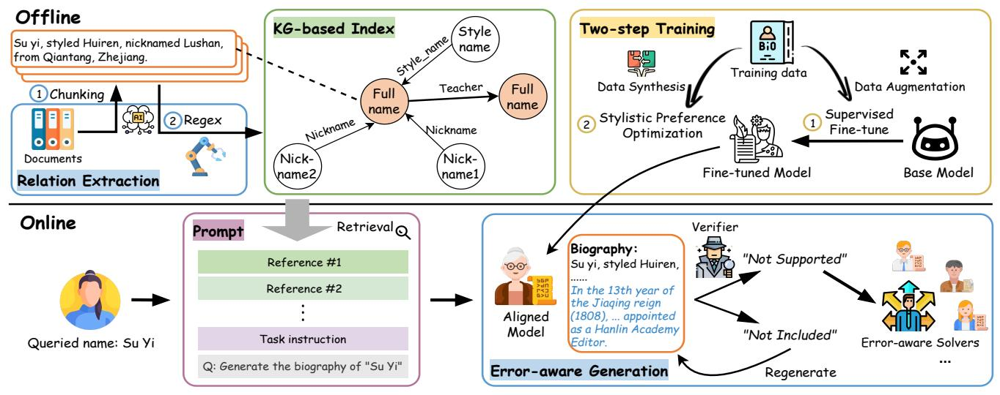

# AIstorian lets AI be a historian: A KG-powered multi-agent system for accurate biography generation

Fengyu Li† , Yilin Li† , Junhao Zhu† , Lu Chen† , Yanfei Zhang† , Jia Zhou† ,

Hui Zu† , Jingwen Zhao‡ , Yunjun Gao†

†Zhejiang University, ‡Poisson Lab, Huawei

{fengyuli, zhujunhao, luchen, yanfei.zhang, 0012802, zdzh, gaoyj}@zju.edu.cn, yilin.23@intl.zju.edu.cn,

jingwenzhao5@huawei.com

## Abstract

Huawei has always been committed to exploring the AI application in historical research. Biography generation, as a specialized form of abstractive summarization, plays a crucial role in historical research but faces unique challenges that existing large language models (LLMs) struggle to address. These challenges include maintaining stylistic adherence to historical writing conventions, ensuring factual fidelity, and handling fragmented information across multiple documents. We present AIstorian, a novel end-toend agentic system featured with a knowledge graph (KG)-powered retrieval-augmented generation (RAG) and anti-hallucination multiagents. Specifically, AIstorian introduces an in-context learning based chunking strategy and a KG-based index for accurate and efficient reference retrieval. Meanwhile, AIstorian orchestrates multiagents to conduct on-the-fly hallucination detection and error-typeaware correction. Additionally, to teach LLMs a certain language style, we finetune LLMs based on a two-step training approach combining data augmentation-enhanced supervised fine-tuning with stylistic preference optimization. Extensive experiments on a reallife historical Jinshi dataset demonstrate that AIstorian achieves a 3.8× improvement in factual accuracy and a 47.6% reduction in hallucination rate compared to existing baselines. The data and code are available at: [https://github.com/ZJU-DAILY/AIstorian.](https://github.com/ZJU-DAILY/AIstorian)

### ACM Reference Format:

Fengyu Li† , Yilin Li† , Junhao Zhu† , Lu Chen† , Yanfei Zhang† , Jia Zhou† ,, Hui Zu† , Jingwen Zhao‡ , Yunjun Gao† . 2018. AIstorian lets AI be a historian: A KG-powered multi-agent system for accurate biography generation. In Proceedings of Make sure to enter the correct conference title from your rights confirmation email (Conference acronym 'XX). ACM, New York, NY, USA, [6](#page-5-0) pages.<https://doi.org/XXXXXXX.XXXXXXX>

## 1 Introduction

Huawei has a commercial partnership with several museums, exploring the application of AI in the management of historical documents. Biography generation is an important intersection of AI and history. Typically, biography writing relies heavily on the domain expertise of historians who carefully gather and summarize

Conference acronym 'XX, Woodstock, NY

<https://doi.org/XXXXXXX.XXXXXXX>

diverse historical materials. The development of automatic biography generation can free historians from tedious tasks of reading and writing materials. Biography generation automatically writes a concise document comprising a series of facts and events (e.g., date and place of birth and death, career, etc.) that builds a professional image for a person's life, by extracting and rephrasing biographical events based on references (e.g., textbooks). Biography generation can be considered a special form of abstractive summarization [\[20\]](#page-4-0). Recent studies [\[18,](#page-4-1) [20\]](#page-4-0) have demonstrated the superior performance of LLMs for abstractive summarization, manifesting significant potential of LLMs in biography generation. However, distinct from general text summarization, the biography generation exhibits unique characteristics that neither existing LLM-based methods nor vertical pretrained models can accommodate:

Characteristic 1: Stylistic adherence. Biographies have to strictly follow specific language styles and use professional terminology, which LLMs can struggle with. For example, LLMs cannot keep consistency when required to write a biography in classical Chinese, especially following historical writing conventions. To address this, several work injected domain expertise into LLMs via fine-tuning [\[7,](#page-4-2) [27\]](#page-4-3). Due to the scarcity of training corpora that follow a particular style, however, fine-tuned LLMs still struggle to adhere to specific language styles and professional terminology.

Characteristic 2: Factual fidelity. Biographies have no tolerance for factual errors. However, since LLMs are notorious for the phenomenon of hallucination, they would generate plausible content that contradicts real facts, significantly undermining the usability of generated biographies [\[13,](#page-4-4) [16,](#page-4-5) [20,](#page-4-0) [21\]](#page-4-6). There are three kinds of work proposed to alleviate fabrications in text summarization: (1) Training-based methods [\[4,](#page-4-7) [7,](#page-4-2) [17\]](#page-4-8) fix factual errors inherently by training additional reward models or classifiers. A key drawback is their reliance on tens of thousands of training samples. (2) Decoding-based methods [\[15\]](#page-4-9) avoid hallucinations by constraining output tokens sampled from the given contexts. Though effective, such methods do harm to the model's creativity. (3) Retrieval-augmented-generation (RAG) based methods [\[5,](#page-4-10) [25\]](#page-4-11) guide biography generation for LLMs by retrieving relevant information from an external knowledge base (e.g., history textbooks) as references. Apparently, the retrieval accuracy makes a pivotal difference in the quality of LLMs' generation.

Characteristic 3: Information fragmentation. Detailed information about a particular historical figure is scattered across multiple documents. Text chunking, which splits long documents into small text chunks, and chunk representation, which embeds text chunks into vectors, are two key components in a RAG workflow, suffering from the information fragmentation due to two-fold reasons: (1)

Permission to make digital or hard copies of all or part of this work for personal or classroom use is granted without fee provided that copies are not made or distributed for profit or commercial advantage and that copies bear this notice and the full citation on the first page. Copyrights for components of this work owned by others than the author(s) must be honored. Abstracting with credit is permitted. To copy otherwise, or republish, to post on servers or to redistribute to lists, requires prior specific permission and/or a fee. Request permissions from permissions@acm.org.

© 2018 Copyright held by the owner/author(s). Publication rights licensed to ACM. ACM ISBN 978-1-4503-XXXX-X/2018/06

Conference acronym 'XX, June 03–05, 2018, Woodstock, NY Li et al.

<!-- Image Description: This flowchart depicts a two-stage system for biography generation. The offline stage involves relation extraction from documents to build a knowledge graph (KG)-based index linking full names, styles, and nicknames. The online stage uses a prompt, retrieves relevant information from the KG, and generates a biography using an aligned model. A verifier and error-aware solvers handle unsupported or missing information, potentially regenerating the biography. The system employs a two-step training process including data synthesis and stylistic preference optimization. -->

Figure 1: The architecture of AIstorian

The varied length of text to describe a single person poses challenge for text chunking, introducing irrelevant noisy information into a text chunk. (2) Aliases and pronouns in sentences make semantics vague, so that semantic embeddings of text chunks become indistinguishable, leading to the problem of representation dilution [\[12\]](#page-4-12).

Towards accurate biography generation, this work presents AIstorian, a novel agentic system that consists of a knowledge graph (KG)-powered RAG mechanism and anti-hallucination multi-agents. Specifically, in the KG-powered RAG, we design an in-context learning based chunking strategy and build a KG-based index for the external knowledge base, which facilitates efficient and accurate retrieval through information reorganization. To further alleviate LLM's hallucinations, our system incorporates real-time antihallucination multi-agents, which involve on-the-fly hallucination detection and error-type-aware hallucination correction, ensuring that the generated biographies remain faithful to the source documents. Moreover, to better accommodate to specific language styles, we fine-tune the base model via a two-step training process including data augmentation-enhanced supervised fine-tuning and stylistic preference optimization.

The key contributions of this work are summarized as below:

- A novel end-to-end agentic system for biography generation. Towards accurate biography generation, we design a novel end-toend agentic system comprising a KG-powered RAG mechanism and anti-hallucination multi-agents. To the best of our knowledge, this is the first work to generate historical biographies from a massive corpus.
- An efficient KG-powered RAG mechanism. To search for references efficiently and accurately, we present a KG-powered RAG mechanism, which reorganizes the knowledge base via an in-context learning based text chunking and an an efficient KG-based index.
- Error-aware anti-hallucination multi-agents. To keep high fidelity, we design error-aware anti-hallucination multi-agents that integrate a fine-tuned LLM with real-time hallucination detection and error-aware correction mechanisms.
- Through extensive experiments on the Jinshi dataset, we demonstrate that our system achieves superior performance in both

generation quality (Rouge-L: 80.54) and factual accuracy, with a 47.6% reduction in hallucination rate and a 3.8× decrease in average atomic fact error.

## 2 AIstorian

## 1 Overview

Figure [1](#page-1-0) illustrates the overall architecture. The system operates in two modes, with upper half of the figure showing the offline process of index building and model fine-tuning, and the lower half showing the online biography generation pipeline. During the offline phase, AIstorian completes two preparations: (1) KG-based index construction, which reorganizes the biographical facts of historical figures into a knowledge graph, and (2) two-step training, which fine-tunes and aligns the base model on small handcrafted biographical data to teach LLMs a specific language style. During the online phase, AIstorian takes as an input a query of "generating a biography of a historical figure", and then invokes the KG-powered RAG to retrieve relevant information (e.g., text chunks) with the assistance of KG-based index. Using the query and the retrieved relevant information, the aligned LLM starts biography generation. Meanwhile, a Verifier validates the correctness of the generated content in real time. Once an error is detected, a Router categorizes the error and invokes the Solvers to correct it.

## 2 KG-based RAG

2.2.1 Offline KG-based index construction. Documents within the same book series reveal consistent structural patterns: the introduction of person entities follows a standardized format. As illustrated in Figure [2,](#page-2-0) the introduction of historical figures always begins with the name, followed by the alias and other details (e.g., hometown, career, etc.). Motivated by these, we propose a three-step index construction process to effectively reorganize biographical facts.

Training-free pattern-enhanced text chunking. Considering that most documents in the external knowledge base follow the same writing pattern, we can leverage the pattern to split long documents into smaller text chunks using in-context learning [\[24\]](#page-4-13).

AIstorian lets AI be a historian: A KG-powered multi-agent system for accurate biography generation Conference acronym 'XX, June 03–05, 2018, Woodstock, NY

**Wang Runzhi, styled Yuyuan, nicknamed Tingfang, from Qiantang, Zhejiang. <official career path>.**| 汪润之, | 字雨元,         | 号听舫, | 浙江钱塘人。 |
|------|--------------|------|--------|
|      | 散馆授编修,官至少詹事。 |      |        |
**Hong Yao, styled Jingxin, nicknamed Shouyu, from Xin Cheng,**

| Zhejiang. <official career="" path="">.</official> |      |      |        |  |
|----------------------------------------------------|------|------|--------|--|
| 洪燿,                                                | 字镜心, | 号守愚, | 浙江新城人。 |  |
| 散馆改吏部主事,官至广西左江道。                                   |      |      |        |  |

### Figure 2: Examples of writing patterns (from the book Forest of Words: Compilation written in classical Chinese).

Specifically, we use the pattern as instructions to guide the LLM in splitting the documents. Moreover, to enhance accuracy, several chunks following the pattern are handcrafted as demonstrations for the LLM. In this way, we achieve flexible and accurate text chunking based on the power of in-context learning without requiring expensive model training [\[3\]](#page-4-14).

Regex-driven relation extraction. In this step, we aim to extract biographical facts from text chunks in the form of triplets (comprising a head entity, a relation, and a tail entity). To balance accuracy and flexibility, rather than extracting triplets directly using the LLM, we prompt the LLM to generate a specific regex for each chunk and apply the regex to the text chunk. Taking Figure [2](#page-2-0) as an example, with the LLM, we have a regex like "(\S+), styled (\S+), nicknamed (\S+)". To provide additional knowledge for the LLM, we use handcrafted regex and high-precision LLM-generated regex as demonstrations. In case where the LLM fails to generate an effective regex, we resort to plan B, which involves extracting triplets directly using the LLM. Knowledge graph construction. Finally, the biographical knowledge graph is built by treating entity names as nodes and relationships between entities as edges. Each node in the KG is linked to its source text chunk where the triplets were extracted, and one can navigate to the text chunk by searching for nodes in the KG.

2.2.2 Online retrieval. Upon receiving the query "generate a biography of someone", AIstorian identifies the node of interest by traversing the knowledge graph, and retrieves the text chunks associated with the nodes as references. To expand knowledge coverage, we also consider neighboring nodes as nodes of interest, which are often overlooked by prior methods [\[1,](#page-4-15) [9\]](#page-4-16).

## 3 Error-aware Generation with Multi-agents

2.3.1 Offline LLM re-training. Directly applying general-purpose LLMs falls short in terms of biography generation quality. Meanwhile, the scarcity of professional biographical training data limits the capability of fine-tuning LLMs [\[10,](#page-4-17) [26\]](#page-4-18). To address this, we propose a two-step training strategy, including supervised fine-tuning (SFT) and stylistic preference optimization (StylePO), to enhance the LLM's performance with a limited amount of training data.

Data augmentation-enhanced supervised fine-tuning. To overcome data scarcity, we propose a biography data augmentation strategy, involving two phases: (1) Shuffle the key biographical facts in the given references to improve the LLM's ability to extract key information, and (2) introduce "distractor documents" [\[28\]](#page-4-19) (i.e., documents containing irrelevant noise) into the references to improve the LLM's ability to extract correct information.

Stylistic preference optimization (StylePO). To further align the LLM with preferences for high factual fidelity and a classical Chinese language style, we adopt the SimPO algorithm [\[14\]](#page-4-20) to proceed fine-tuning the base model. The training set consists of pairs of positive and negative samples. In our setting, each positive sample is a golden biography written by experts in classical Chinese, while each negative sample is generated by translating the positive sample into modern Chinese and adding (or removing) additional details to (or from) the biography. SimPO steers the LLM to more likely generate biographies whose style resembles the expert-written ground truth.

2.3.2 Online biography generation. Offline model re-training improves generation quality, but it is inevitable that the LLM will output plausible content due to its inherent hallucination nature. Moreover, since LLMs output in an auto-regressive manner, errors in LLM outputs have a cascading effect, where one error results in further errors in LLM generation [\[4\]](#page-4-7). Therefore, error correction should be executed alongside biography generation. To this end, AIstorian orchestrates seven agents to automatically discover and fix errors during LLM generation. The multi-agents consist of a Verifier, a Router, and five Solvers.

Verifier. Following prior work [\[16\]](#page-4-5), we define the "atomic fact" as a short sentence conveying one piece of biographical information. The core logic of the Verifier is to check whether each atomic fact in the generation can be supported by the retrieved references. To achieve this, the Verifier first filters out the irrelevant documents from all retrieved references to reduce the number of references to be considered, based on the token-level Jaccard similarity between the atomic fact and each reference. In the following, the Verifier instructs the LLM to extract information related to the atomic fact from the remaining references and checks whether the atomic fact is supported. To avoid the cascading effect, the Verifier is executed for every single sentence generated. Once an error is found, AIstorian invokes the subsequent Router and Solvers.

Router. Based on observations, the errors occurred in the generations are classified into two main categories:

- "Not-included" error. A "not-included" error occurs when the erroneous atomic fact is not founded in the given references.
- "Not-supported" error. A "not-supported" error occurs when the atomic fact in the generation contradicts the given references. "Not-supported" errors can be classified into finer-grained error types based on the content of the atomic fact.

The Router determines the solutions to correct the detected errors based on their types. For "not-included" errors, AIstorian fixes these errors by regeneration; for "not-supported" errors, AIstorian invokes Solvers to provide more reliable solutions.

Solver. To fix various types of errors, a bunch of Solvers is used.

- (1) Era-conflict Solver. For errors related to the timing of events, the Solver invokes the Python function to convert the era name into the Gregorian calendar and performs a double-check.
- (2) Ref-conflict Solver. For conflicts that occur in the references, the Solver involves expert intervention to resolve the conflict.
- (3) Knowledge-lack Solver. For errors caused by a lack of expertise, the Solver retrieves information (e.g., imperial competitive examination, ancient geography, etc.) online to prompt the LLM.

Conference acronym 'XX, June 03–05, 2018, Woodstock, NY Li et al.

|               | Model                       | ROUGE-1↑ | ROUGE-2↑ | ROUGE-L↑ | Hallc-Rate↓ | Average Atomic Fact Error↓ |
|---------------|-----------------------------|----------|----------|----------|-------------|----------------------------|
| Long Document | mLongT5_large               | 41.38    | 17.69    | 28.08    | 96.43       | 5.29                       |
| Summary       | Qwen2.5-72B-Instruct-AWQ    | 39.43    | 21.37    | 33.76    | 96.43       | 3.41                       |
| RAG+Summary   | TongGu                      | 69.64    | 56.48    | 65.90    | 89.29       | 1.96                       |
|               | GraphRAG                    | 36.45    | 18.69    | 30.53    | 96.43       | 5.21                       |
|               | CL-KL (NER)                 | 73.76    | 59.16    | 68.46    | 92.86       | 1.96                       |
|               | BI-LSTM-CRF (NER)           | 75.12    | 60.96    | 70.45    | 75.0        | 1.64                       |
| Ours          | AIstorian                   | 83.69    | 74.14    | 80.54    | 39.29       | 0.43                       |
|               | w/o. Multi-agents           | 83.03    | 74.34    | 81.16    | 57.14       | 1.14                       |
|               | w/o. StylePO & Multi-agents | 81.93    | 71.71    | 78.88    | 57.14       | 1.75                       |

Table 1: The biography generation performance

### Table 2: Retrieval performance

| Model             | Precision | Recall | F1 Score |
|-------------------|-----------|--------|----------|
| TongGu            | 0.341     | 0.78   | 0.456    |
| GraphRAG          | 0.36      | 0.676  | 0.379    |
| CL-KL (NER)       | 0.623     | 0.478  | 0.518    |
| BI-LSTM-CRF (NER) | 0.584     | 0.303  | 0.359    |
| Ours              | 0.936     | 0.944  | 0.923    |

- (4) Alias-conflict Solver. As a historical figure may have multiple aliases, the solver selectively presents all right aliases in the generated biography.
- (5) Solver for others. For other errors, the Solver fixes the error by prompting the LLM with error messages.

## 3 Experiments

## 1 Experimental Settings

Dataset. We use the Jinshi dataset, a real-world historical dataset, for evaluation. It contains 173 Chinese historical figures with manually written biographies as ground truth and a knowledge base of ancient Chinese texts with approximately 220k Chinese characters. Baselines. We consider the following six baselines:

- (1) mLongT5\_large [\[22\]](#page-4-21): A multilingual LongT5\_large [\[7\]](#page-4-2) designed for text summarization.
- (2) Qwen2.5-72B-Instruct-AWQ [\[19\]](#page-4-22): The SOTA open-sourced LLM with 72.7B parameters, featuring AWQ 4-bit quantization.
- (3) TongGu [\[1\]](#page-4-15): A RAG system combining a classical Chinesespecific LLM, a SOTA retrieval model (Conan-embedding-v1), and a reranker (bge-large-zh-v1.5).
- (4) GraphRAG [\[5\]](#page-4-10): A SOTA KG-enhanced RAG system for queryfocused text summarization.
- (5) CL-KL(NER)[\[23\]](#page-4-23): A RAG system on top of Qwen2.5-7B-Instruct, where retrieval index is built using an named entity recognition (NER) model trained by cooperative learning.
- (6) BI-LSTM-CRF(NER) [\[8\]](#page-4-24): A RAG system on top of Qwen2.5- 7B-Instruct, where retrieval index is built by an NER model based on BI-LSTM networks and a CRF layer.

For mLongT5\_large and Qwen2.5-72B-Instruct-AWQ, we retrieve relevant documents using our KG-based index due to the context length limitations.

Implementation details. Baseline parameters follow the original papers. The model training is conducted on an A40 46G GPU, while other experiments are run on an NVIDIA 4090 24G GPU. The RAG component uses LangChain [\[2\]](#page-4-25) and the multi-agent system uses Qwen-Agent [\[6\]](#page-4-26). We employ Qwen2.5-7B-Instruct [\[19\]](#page-4-22) as the foundation for both training model and multi-agents. In the SFT

phase, the rank of LoRA is set to 32, the learning rate is 2e-4, the batch size is 8 and the model is trained for 2 epochs. In the StylePO phase, the rank of LoRA is set to 8, the learning rate is 5e-6, the batch size is 8, and the model is trained for 3 epochs. The dataset is split into a training set and a test set in the ratio of 8:2.

Evaluation metrics. For retrieval, precision, recall and F1-score are used for evaluation. For biography generation, ROUGE-( = 1, 2) evaluates generation quality by measuring the overlap of grams between generated text and ground truth, while ROUGE-L [\[11\]](#page-4-27) evaluates quality by a longest common subsequence (LCS) based F-measure. Hallucination rate measures the proportion of generated text containing hallucinations, which are identified by human experts. Following prior work [\[16\]](#page-4-5), we quantify generation accuracy using the average number of erroneous atomic fact, where the erroneous atomic fact is manually-labeled.

## 2 Performance Comparison

We compare our AIstorian with all baselines, followed by analyzing each components in the AIstorian.

Overall performance. Table [1](#page-3-0) presents the comparison of AIstorian and all baselines. As observed, AIstorian consistently outperforms all baselines, achieving 11.4%-20.6% improvements in biography generation quality and a 47.6% reduction in hallucination rate compared to the previous SOTA methods.

KG-based RAG. We compare the KG-based RAG component with the RAG-based baselines. Table [2](#page-3-1) lists the experimental results. Our KG-based RAG achieves a 50% improvement in precision and a 21% improvement in recall over the previous SOTA, demonstrating its superior retrieval efficacy.

Error-aware biography generation. Thanks to error-aware generation with multi-agents, AIstorian achieves better generation quality and a lower error rate than baselines. In addition, we show that each component plays different roles according to ablation studies. For example, multi-agents improve hallucination rates but negatively impacts creativity (measured by ROUGE scores).

## 4 Conclusion

In this paper, we propose AIstorian, an innovative KG-powered multi-agent system towards accurate historical biography generation, which is featured with a KG-powered RAG mechanism and error-aware biography generation with multi-agents. To the best of our knowledge, this is the first work to generate historical biographies from a massive corpus. The experimental results demonstrate that our system significantly improves the quality of biography generation and alleviates hallucinations.

AIstorian lets AI be a historian: A KG-powered multi-agent system for accurate biography generation Conference acronym 'XX, June 03–05, 2018, Woodstock, NY

## Presenter & Company Biography

Fengyu Li is currently an intern at Huawei and a graduate student in the Software Engineering at Zhejiang University. His research interests mainly focus on RAG (Retrieval-Augmented Generation) and natural language processing.

Huawei is a global leader in information and communications technology (ICT) solutions. It offers comprehensive services and solutions to help enterprises and developers achieve digital transformation and innovation, with its strong technical capabilities in cloud computing, AI, and big data.

## References

- [1] Jiahuan Cao, Dezhi Peng, Peirong Zhang, Yongxin Shi, Yang Liu, Kai Ding, and Lianwen Jin. 2024. TongGu: Mastering Classical Chinese Understanding with Knowledge-Grounded Large Language Models. arXiv preprint arXiv:2407.03937 (2024).
- [2] Harrison Chase. 2022. LangChain.<https://github.com/langchain-ai/langchain> [3] Tong Chen, Hongwei Wang, Sihao Chen, Wenhao Yu, Kaixin Ma, Xinran Zhao, Hongming Zhang, and Dong Yu. 2024. Dense X Retrieval: What Retrieval Granularity Should We Use?. In Proceedings of the 2024 Conference on Empirical Methods in Natural Language Processing, Yaser Al-Onaizan, Mohit Bansal, and Yun-Nung Chen (Eds.). Association for Computational Linguistics, Miami, Florida, USA, 15159–15177. [doi:10.18653/v1/2024.emnlp-main.845](https://doi.org/10.18653/v1/2024.emnlp-main.845)
- [4] Yung-Sung Chuang, Linlu Qiu, Cheng-Yu Hsieh, Ranjay Krishna, Yoon Kim, and James R. Glass. 2024. Lookback Lens: Detecting and Mitigating Contextual Hallucinations in Large Language Models Using Only Attention Maps. In Proceedings of the 2024 Conference on Empirical Methods in Natural Language Processing, Yaser Al-Onaizan, Mohit Bansal, and Yun-Nung Chen (Eds.). Association for Computational Linguistics, Miami, Florida, USA, 1419–1436. [doi:10.18653/v1/2024.emnlp-main.84](https://doi.org/10.18653/v1/2024.emnlp-main.84)
- [5] Darren Edge, Ha Trinh, Newman Cheng, Joshua Bradley, Alex Chao, Apurva Mody, Steven Truitt, and Jonathan Larson. 2024. From local to global: A graph rag approach to query-focused summarization. arXiv preprint arXiv:2404.16130 (2024).
- [6] QwenLM Group. 2024. Qwen-Agent.<https://github.com/QwenLM/Qwen-Agent>
- [7] Mandy Guo, Joshua Ainslie, David C. Uthus, Santiago Ontañón, Jianmo Ni, Yun-Hsuan Sung, and Yinfei Yang. 2021. LongT5: Efficient Text-To-Text Transformer for Long Sequences. CoRR abs/2112.07916 (2021). arXiv[:2112.07916 https://arxiv.](https://arxiv.org/abs/2112.07916) [org/abs/2112.07916](https://arxiv.org/abs/2112.07916)
- [8] Zhiheng Huang, Wei Xu, and Kai Yu. 2015. Bidirectional LSTM-CRF models for sequence tagging. arXiv preprint arXiv:1508.01991 (2015).
- [9] Gautier Izacard, Patrick Lewis, Maria Lomeli, Lucas Hosseini, Fabio Petroni, Timo Schick, Jane Dwivedi-Yu, Armand Joulin, Sebastian Riedel, and Edouard Grave. 2023. Atlas: few-shot learning with retrieval augmented language models. J. Mach. Learn. Res. 24, 1, Article 251 (Jan. 2023), 43 pages.
- [10] Nicholas Lee, Thanakul Wattanawong, Sehoon Kim, Karttikeya Mangalam, Sheng Shen, Gopala Anumanchipalli, Michael Mahoney, Kurt Keutzer, and Amir Gholami. 2024. LLM2LLM: Boosting LLMs with Novel Iterative Data Enhancement. In Findings of the Association for Computational Linguistics: ACL 2024, Lun-Wei Ku, Andre Martins, and Vivek Srikumar (Eds.). Association for Computational Linguistics, Bangkok, Thailand, 6498–6526. [doi:10.18653/v1/2024.findings-acl.388](https://doi.org/10.18653/v1/2024.findings-acl.388)
- [11] Chin-Yew Lin. 2004. ROUGE: A Package for Automatic Evaluation of Summaries. In Text Summarization Branches Out. Association for Computational Linguistics, Barcelona, Spain, 74–81.<https://aclanthology.org/W04-1013/>
- [12] Di Liu, Meng Chen, Baotong Lu, Huiqiang Jiang, Zhenhua Han, Qianxi Zhang, Qi Chen, Chengruidong Zhang, Bailu Ding, Kai Zhang, Chen Chen, Fan Yang, Yuqing Yang, and Lili Qiu. 2024. RetrievalAttention: Accelerating Long-Context LLM Inference via Vector Retrieval. arXiv[:2409.10516](https://arxiv.org/abs/2409.10516) [cs.LG] [https://arxiv.org/](https://arxiv.org/abs/2409.10516) [abs/2409.10516](https://arxiv.org/abs/2409.10516)
- [13] Yixin Liu, Alexander Fabbri, Jiawen Chen, Yilun Zhao, Simeng Han, Shafiq Joty, Pengfei Liu, Dragomir Radev, Chien-Sheng Wu, and Arman Cohan. 2024. Benchmarking Generation and Evaluation Capabilities of Large Language Models for Instruction Controllable Summarization. In Findings of the Association for Computational Linguistics: NAACL 2024, Kevin Duh, Helena Gomez, and Steven Bethard (Eds.). Association for Computational Linguistics, Mexico City, Mexico, 4481–4501. [doi:10.18653/v1/2024.findings-naacl.280](https://doi.org/10.18653/v1/2024.findings-naacl.280)
- [14] Yu Meng, Mengzhou Xia, and Danqi Chen. 2025. Simpo: Simple preference optimization with a reference-free reward. Advances in Neural Information Processing Systems 37 (2025), 124198–124235.
- [15] Jacob Menick, Maja Trebacz, Vladimir Mikulik, John Aslanides, Francis Song, Martin Chadwick, Mia Glaese, Susannah Young, Lucy Campbell-Gillingham, Geoffrey Irving, and Nat McAleese. 2022. Teaching language models to support answers with verified quotes. arXiv[:2203.11147](https://arxiv.org/abs/2203.11147) [cs.CL] [https://arxiv.org/abs/](https://arxiv.org/abs/2203.11147) [2203.11147](https://arxiv.org/abs/2203.11147)

- [16] Sewon Min, Kalpesh Krishna, Xinxi Lyu, Mike Lewis, Wen-tau Yih, Pang Koh, Mohit Iyyer, Luke Zettlemoyer, and Hannaneh Hajishirzi. 2023. FActScore: Finegrained Atomic Evaluation of Factual Precision in Long Form Text Generation. In Proceedings of the 2023 Conference on Empirical Methods in Natural Language Processing, Houda Bouamor, Juan Pino, and Kalika Bali (Eds.). Association for Computational Linguistics, Singapore, 12076–12100. [doi:10.18653/v1/2023.emnlp](https://doi.org/10.18653/v1/2023.emnlp-main.741)[main.741](https://doi.org/10.18653/v1/2023.emnlp-main.741)
- [17] Hadas Orgad, Michael Toker, Zorik Gekhman, Roi Reichart, Idan Szpektor, Hadas Kotek, and Yonatan Belinkov. 2024. LLMs Know More Than They Show: On the Intrinsic Representation of LLM Hallucinations. arXiv[:2410.02707](https://arxiv.org/abs/2410.02707) [cs.CL] <https://arxiv.org/abs/2410.02707>
- [18] Xiao Pu, Mingqi Gao, and Xiaojun Wan. 2023. Summarization is (Almost) Dead. arXiv[:2309.09558](https://arxiv.org/abs/2309.09558) [cs.CL]<https://arxiv.org/abs/2309.09558>
- [19] Qwen, :, An Yang, Baosong Yang, Beichen Zhang, Binyuan Hui, Bo Zheng, Bowen Yu, Chengyuan Li, Dayiheng Liu, Fei Huang, Haoran Wei, Huan Lin, Jian Yang, Jianhong Tu, Jianwei Zhang, Jianxin Yang, Jiaxi Yang, Jingren Zhou, Junyang Lin, Kai Dang, Keming Lu, Keqin Bao, Kexin Yang, Le Yu, Mei Li, Mingfeng Xue, Pei Zhang, Qin Zhu, Rui Men, Runji Lin, Tianhao Li, Tianyi Tang, Tingyu Xia, Xingzhang Ren, Xuancheng Ren, Yang Fan, Yang Su, Yichang Zhang, Yu Wan, Yuqiong Liu, Zeyu Cui, Zhenru Zhang, and Zihan Qiu. 2025. Qwen2.5 Technical Report. arXiv[:2412.15115](https://arxiv.org/abs/2412.15115) [cs.CL]<https://arxiv.org/abs/2412.15115>
- [20] Hassan Shakil, Ahmad Farooq, and Jugal Kalita. 2024. Abstractive Text Summarization: State of the Art, Challenges, and Improvements. CoRR abs/2409.02413 (2024). [doi:10.48550/ARXIV.2409.02413](https://doi.org/10.48550/ARXIV.2409.02413) arXiv[:2409.02413](https://arxiv.org/abs/2409.02413)
- [21] Derek Tam, Anisha Mascarenhas, Shiyue Zhang, Sarah Kwan, Mohit Bansal, and Colin Raffel. 2023. Evaluating the Factual Consistency of Large Language Models Through News Summarization. In Findings of the Association for Computational Linguistics: ACL 2023, Anna Rogers, Jordan Boyd-Graber, and Naoaki Okazaki (Eds.). Association for Computational Linguistics, Toronto, Canada, 5220–5255. [doi:10.18653/v1/2023.findings-acl.322](https://doi.org/10.18653/v1/2023.findings-acl.322)
- [22] David Uthus, Santiago Ontanon, Joshua Ainslie, and Mandy Guo. 2023. mLongT5: A Multilingual and Efficient Text-To-Text Transformer for Longer Sequences. In Findings of the Association for Computational Linguistics: EMNLP 2023, Houda Bouamor, Juan Pino, and Kalika Bali (Eds.). Association for Computational Linguistics, Singapore, 9380–9386. [doi:10.18653/v1/2023.findings-emnlp.628](https://doi.org/10.18653/v1/2023.findings-emnlp.628)
- [23] Xinyu Wang, Yong Jiang, Nguyen Bach, Tao Wang, Zhongqiang Huang, Fei Huang, and Kewei Tu. 2021. Improving named entity recognition by external context retrieving and cooperative learning. arXiv preprint arXiv:2105.03654 (2021).
- [24] Sang Michael Xie, Aditi Raghunathan, Percy Liang, and Tengyu Ma. 2021. An Explanation of In-context Learning as Implicit Bayesian Inference. CoRR abs/2111.02080 (2021). arXiv[:2111.02080 https://arxiv.org/abs/2111.02080](https://arxiv.org/abs/2111.02080)
- [25] Tian Yu, Shaolei Zhang, and Yang Feng. 2024. Truth-Aware Context Selection: Mitigating Hallucinations of Large Language Models Being Misled by Untruthful Contexts. In Findings of the Association for Computational Linguistics: ACL 2024, Lun-Wei Ku, Andre Martins, and Vivek Srikumar (Eds.). Association for Computational Linguistics, Bangkok, Thailand, 10862–10884. [doi:10.18653/v1/2024.findings-acl.645](https://doi.org/10.18653/v1/2024.findings-acl.645)
- [26] Yue Yu, Yuchen Zhuang, Jieyu Zhang, Yu Meng, Alexander Ratner, Ranjay Krishna, Jiaming Shen, and Chao Zhang. 2023. Large language model as attributed training data generator: a tale of diversity and bias. In Proceedings of the 37th International Conference on Neural Information Processing Systems (New Orleans, LA, USA) (NIPS '23). Curran Associates Inc., Red Hook, NY, USA, Article 2433, 51 pages.
- [27] Jingqing Zhang, Yao Zhao, Mohammad Saleh, and Peter J. Liu. 2019. PEGASUS: Pre-training with Extracted Gap-sentences for Abstractive Summarization. CoRR abs/1912.08777 (2019). arXiv[:1912.08777](https://arxiv.org/abs/1912.08777)<http://arxiv.org/abs/1912.08777>
- [28] Tianjun Zhang, Shishir G Patil, Naman Jain, Sheng Shen, Matei Zaharia, Ion Stoica, and Joseph E Gonzalez. 2024. Raft: Adapting language model to domain specific rag. In First Conference on Language Modeling.

# A Appendix

## A.1 Case study

As shown in Table. [3,](#page-5-1) AIstorian demonstrates a higher degree of fidelity to the source material, accurately capturing key historical details with remarkable stylistic consistency to golden ones. Additionally, through StylePO, it successfully captures contextual details occasionally overlooked by experts (marked in cyan). In contrast, while the biography produced by Qwen2.5-72B-Instruct appears more fluent and readable, it frequently introduces inaccuracies, such as unsupported factual errors (marked in red) and fabricated content (marked in blue), which compromise the reliability of its outputs.

Table 3: Qualitative analysis of Biographies. Blue and red colors are used to indicate "Not included" errors and "Not supported" errors, respectively. Cyan is used to indicate the content that historians have overlooked.

Historian: 胡鄂,字卓庵。明崇祯三年(1630)二月十三日生,浙江绍兴府余姚县人。治《尚书》。. . . . . . 殿试第二甲第七十九 名,赐进士出身。顺治十八年(1661)任江苏松江府推官。

Hu E, styled Zhuo'an. Born on the thirteenth day of the second month in the third year of Chongzhen (1630) of the Ming dynasty, a native of Yuyao County in Shaoxing Prefecture, Zhejiang Province. Studied the Book of Documents. . . . . . He ranked seventy-ninth in the second class, in the palace examination, and was granted the title of Jinshi. In the eighteenth year of Shunzhi (1661), appointed as the judicial officer of Songjiang Prefecture in Jiangsu Province.

Qwen2.5-72B-Instruct: 胡鄂,字卓庵,浙江绍兴府余姚县人,生于明崇祯五年(1632)二月十三日。鄂少时好学,尤精《书 经》。......殿试列二甲第七十九名,赐进士出身,观政于通政司。顺治十八年(1661),鄂授江南松江府推官,勤于政事,治 狱明察,颇有政声。鄂在松江任内,以清廉著称,深得民心。鄂著述不多,然其治学严谨,于《书经》颇有研究,为时人所 重。

Hu E, styled Zhuo'an, was a native of Yuyao County in Shaoxing Prefecture, Zhejiang Province. He was born on the thirteenth day of the second month in the fifth year of Chongzhen in the Ming dynasty (1632). In his youth, E was fond of learning, and he was especially proficient in the Book of Documents......During the palace examination, he was placed seventy-ninth in the second class and was granted the title of jinshi. He then began his political career by serving in the Tongzhengsi. In the eighteenth year of the Shunzhi era(1661), E was appointed as the judicial officer of Songjiang Prefecture in Jiangnan. He was diligent in administrative affairs, discerning in handling legal cases, and gained considerable renown for his governance. During his tenure in Songjiang, E became renowned for his integrity and won the hearts of the people. Though not prolific in writing, his scholarship was meticulous, and he conducted extensive research on the Book of Documents, earning him great respect from his contemporaries.

AIstorian: 胡鄂,字卓庵。明崇祯三年(1630)二月十三日生,浙江绍兴府余姚县人。治《尚书》。......殿试第二甲第七十九 名,赐进士出身,通政司观政。顺治十八年(1661)授江苏松江府推官。

Hu E, styled Zhuo'an. Born on the thirteenth day of the second month in the third year of Chongzhen (1630) of the Ming dynasty, a native of Yuyao County in Shaoxing Prefecture, Zhejiang Province. Studied the Book of Documents. ....... . . . . . He ranked seventy-ninth in the second class, in the palace examination, and was granted the title of Jinshi, and appointed as an observer in the Tongzhengsi. In the eighteenth year of Shunzhi (1661), appointed as the judicial officer of Songjiang Prefecture in Jiangsu Province.

| Offline           | Offline Training(s) | Index Construction(s) |
|-------------------|---------------------|-----------------------|
| TongGu            | 480                 | 26.69                 |
| GraphRAG          | -                   | 5279.65               |
| CL-KL (NER)       | 532                 | 885.68                |
| BI-LSTM-CRF (NER) | 532                 | 1037.31               |
| Ours              | 3168                | 422.65                |
| Online            | Online Retrieval(s) | Generate(s)           |
| TongGu            | 169.101             | 114                   |
| GraphRAG          | 1.68                | 386.16                |
| CL-KL (NER)       | 0.00283             | 114                   |
| BI-LSTM-CRF (NER) | 0.000869            | 114                   |
| Ours              | 0.00146             | 1236                  |

### Table 4: Time consumption in each stage

## A.2 Efficiency Evaluation

Table [4](#page-5-2) presents the time consumption for each stage of the compared methods. In offline training, our system takes 3168s, exceeding other methods due to the additional StylePO stage. Ablation studies (comparing "w/o. StylePO & Multi-agents" versus "w/o. Multi-agents" in Table [1\)](#page-3-0) reveal that StylePO enhances ROUGE scores and decreases atomic fact errors by 35%. This additional training time, as a one-time investment, is justified by the significant performance gains achieved. For index construction, which is critical as it scales with the corpus size, our approach completes in 422.65s, substantially outperforming GraphRAG (5279.65s). The NER baselines (CL-KL and BI-LSTM-CRF) demand more time for this stage (885.68s and 1037.31s respectively) as they necessitate model training (with labeling time not included in these measurements). While embedding-based RAG (TongGu) exhibits the lowest time consumption (26.69s), it delivers significantly inferior retrieval quality as demonstrated in Table [2.](#page-3-1)

In online retrieval, our system achieves millisecond-level speed (0.00146s), significantly faster than TongGu (169.101s) and GraphRAG (1.68s). Our generation stage takes longer (1236s, 36.35s per biography) due to our error-aware generation with multi-agents approach. As evidenced in Table [1,](#page-3-0) this time investment significantly reduces hallucination rate and improves factual accuracy while maintaining high ROUGE scores.
