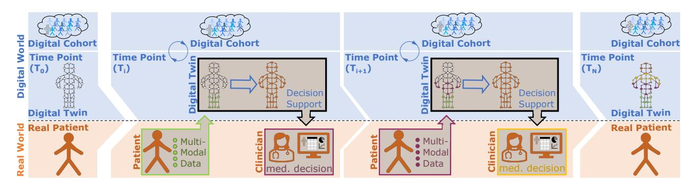
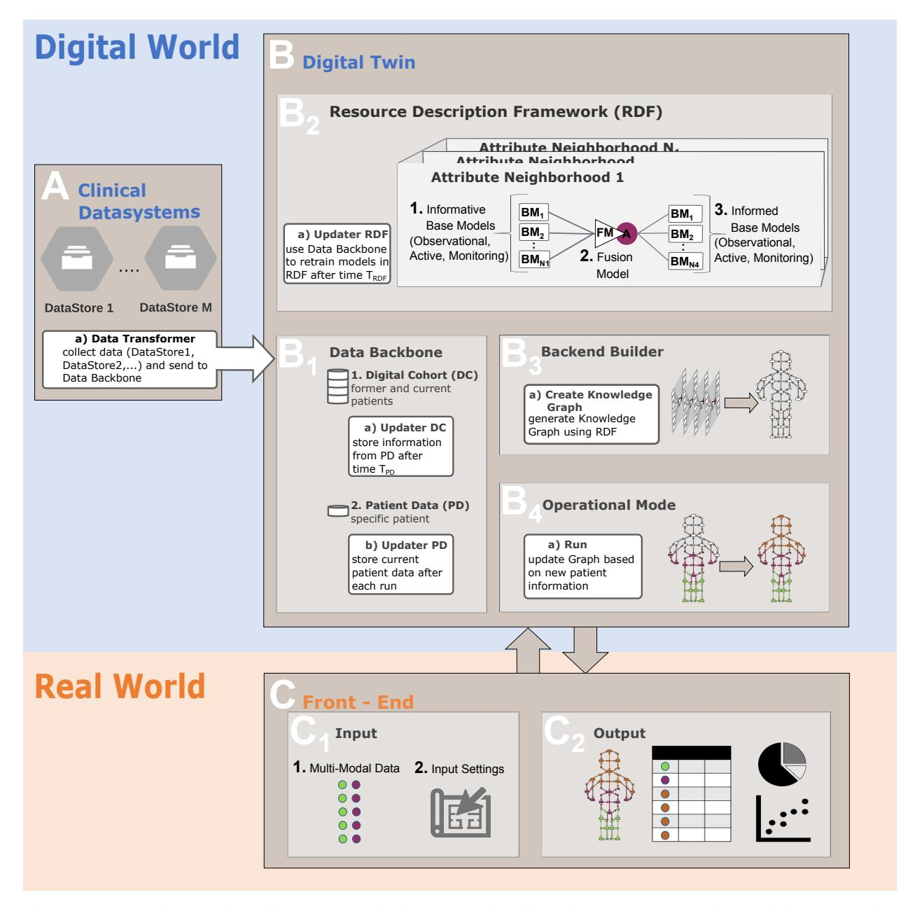
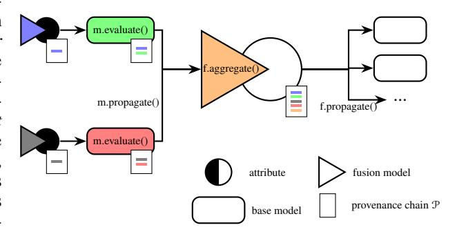
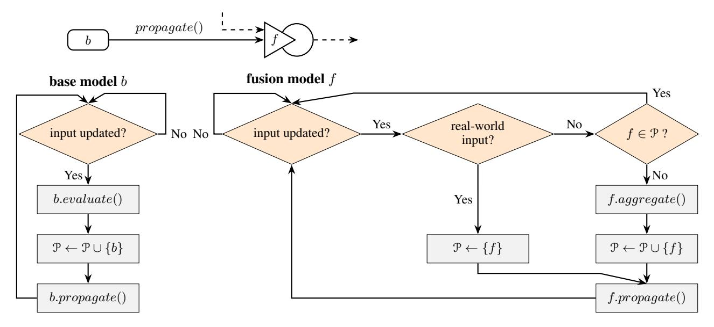

<!-- cite_key: dkfz2025 -->

# DESIGN FOR A DIGITAL TWIN IN CLINICAL PATIENT CARE

Anna-Katharina Nitschke1,\*, Carlos Brandl1,\*, Fabian Egersdorfer ¨ 1 , Magdalena Gortz ¨ 2,3, Markus Hohenfellner3 , and Matthias Weidemuller ¨ 1,†

1Physikalisches Institut , Universitat Heidelberg ¨

2 Junior Clinical Cooperation Unit 'Multiparametric Methods for Early Detection of Prostate Cancer', German

Cancer Research Center (DKFZ), Heidelberg, Germany.

3Department of Urology, Heidelberg University Hospital, Heidelberg, Germany.

\*These authors contributed equally to this work.

† corresponding author, Email: weidemueller@uni-heidelberg.de

June 3, 2025

# ABSTRACT

Digital Twins hold great potential to personalize clinical patient care, provided the concept is translated to meet specific requirements dictated by established clinical workflows. We present a generalizable Digital Twin design combining knowledge graphs and ensemble learning to reflect the entire patient's clinical journey and assist clinicians in their decision-making. Such Digital Twins can be predictive, modular, evolving, informed, interpretable and explainable with applications ranging from oncology to epidemiology.

# 1 Introduction

In the era of precision medicine, Digital Twins (DTs) are emerging as a long-term goal with the potential to revolutionize healthcare delivery and have experienced a surge of publications in recent years [\[1\]](#page-7-0) [\[2\]](#page-7-1). Precision medicine aims at leveraging multi-omic, demographic, environmental, and lifestyle patient data to improve the prediction of disease occurrences and deliver personalized treatment recommendations [\[3\]](#page-7-2). The DT as a detailed, digital replica of an individual patient extends the definition of precision medicine by enabling drug discovery and development, real-time health monitoring, and surgery planning and rehearsal [\[4,](#page-7-3) [5\]](#page-7-4). For explicit clinical applications, DTs of organs, like the heart, have been proposed. Those are usually driven by mechanistic models, simulating variables like blood flow and blood pressure to create synthetic physiological data like photoplethysmograms [\[6\]](#page-7-5). Recent advances in machine learning have enabled well-performing models for many clinical tasks, which can form a basis for a predictive DT. The combination of mechanistic models with machine learning models is conceptually desired, but the integration of (multiple) machine learning and mechanistic models into a unified framework is still part of active research [\[7,](#page-7-6) [8\]](#page-7-7). In particular, such hybrid approaches allow for disease management along the entire patient journey [\[5\]](#page-7-4). The application of DTs along the patient journey has also been desired for personalized multiple sclerosis care [\[9\]](#page-7-8) and oncology [\[10\]](#page-7-9). As current concepts of DT in medicine are tailored to a specific disease and medical question, it is difficult to extend them towards other diseases or new procedures. Recently, there has also been a call for a modular, nonspecialized concept which can effectively integrate multiple subsystems for specialized cases [\[11\]](#page-7-10).

Graph-based frameworks have been proposed to describe and connect data processing models and causal relationships, e.g., by Resource Description Frameworks (RDFs) [\[12,](#page-7-11) [13\]](#page-7-12). Gaebel et al. proposed a DT based on a RDF, as it allows for a standardized way of connecting causal relationships and processing modules in a modular network [\[12\]](#page-7-11). They describe possibilities on a technical level, like using FHIR standard or connecting modules via webservices, as well as highlighting several benefits of using knowledge graphs. However, they also acknowledge the difficulties, especially a lack of strategy for managing redundancies, which emerge from the fragmented clinical domain where many models might provide estimates of the same information.

This paper presents a general design for a patient DT to reflect the evolving clinical patient journey based on a bipartite knowledge graph. Our design bears five characterizing features, F1: Modular, F2: Informed, F3: Predictive, F4: Evolving, F5: Explainable and Interpretable, ensuring compliance with identified requirements.

# 2 Fundamental Considerations

## 1 Requirements for a Digital Twin in Clinical Patient Care

The widespread adoption and efficacy of personalized models, including DT models, into clinical practice face several persistent challenges that can be categorized into three types of requirements. The first category includes the specific requirements posed on a Digital Twin in clinical patient care, such as the holistic representation of the real-world patient journey. Secondly, we can summarize the design requirements necessary for the correct handling of data, ensuring aspects such as data security, accessibility, and quality, in settings involving distributed data sources or the use of multi-modal data systems [\[2\]](#page-7-1). The third category includes requirements related to the clinical acceptance of such a DT system, such as the incorporation of evidence and trustworthiness, especially since many machine learning models function as black boxes [\[7,](#page-7-6) [14\]](#page-7-13). A more comprehensive overview of the requirements of all three categories for a DT in the clinical context can be found in the appendix.

Based upon the conceptual requirements from the first category, the characteristics of a DT for clinical patient care are visualized within Figure [1.](#page-2-0) Key characteristics and definitions for any DT include the existence of a physical counterpart (one-to-one), the ability to provide a holistic representation, support for bi-directional communication, and the capability to handle real-time data [\[15\]](#page-7-14). In clinical routine, we understand real-time as data updates at clinically meaningful intervals (e.g., sub-seconds in surgery, hours in an intensive care unit, or weekly in outpatient settings). Bidirectional communication between the real and the digital world can be executed at each time point Ti in real-time, passing multimodal data from the patient to the DT, expanding its patient-specific representation and allowing for predictions or simulations leading to an interpretable Decision Support output. This information is forwarded to the clinician in the real world to execute a medical decision related to medical interventions that lead to changes in the patient's state and/or new data acquisition. The collected patient information is included in the Digital Cohort, that is forming the knowledge base for any prediction model within the DT, allowing for continuous learning and extension of knowledge. Additionally, at every time point defined as the update and prediction of the DT, the current representation of the patient state is stored, and newly available data from the Digital Cohort can be used to improve and retrain the DT. The interaction between the Digital Twin and the Digital Cohort can be seen as a second type of bidirectional communication. From a clinical perspective, it is important to emphasize that the DT system will support and supplement current clinical practice instead of replacing rigorously derived clinical knowledge and guidelines.

### 2 Phases of Clinical Patient Journey

A detailed understanding of the specific contexts within the clinical patient journey in which the DT will operate is essential for developing an algorithmic design that performs reliably across all relevant settings. The explicit structure for each patient journey can differ depending on the disease type, clinical setting, and country. Therefore, an abstract representation of the individual steps within a clinical patient journey and the related decision-making process is needed. We derived the classification of three phases within the clinical patient journey, leading to distinct prediction tasks for the DT.

First of all, there is the *observational phase*, in which complementary properties/ attributes of the patient need to be predicted. This can be viewed as a time prediction of the knowledge of the current patient state. The DT can predict the outcome of a measurement based on several models and for which the measurement procedure ideally will not change the current patient state. Examples of such measurements are biopsies or imaging procedures performed for diagnostic purposes.

Secondly, there exists an *active phase*for which the DT needs to predict changes in the patient state related to the performance of a certain intervention. This phase comprises the treatment planning, for which, clinicians should be provided with a patient-specific outcome prediction and a risk profile for each potential treatment. The DT's predictive power and reliability in that phase must be able to be evaluated by clinical endpoints (e.g., survival, recurrence, hospitalization rate). For example, in oncology, the DT can forecast likely treatment outcomes for surgery vs. radiotherapy vs. chemotherapy, predicting possible side effects.

Finally, there is a*monitoring phase*, which entails making predictions regarding changes in the patient's state without any interventions. This could be, for example, the observation of disease-specific parameters after treatment, indicating the recurrence of a disease. The DT continuously tracks, for example, follow-up biomarkers, imaging data, and patient-reported outcomes. Real-time updates of the DT may trigger early detection of tumor recurrence.

# 3 Design of the Digital Twin

Figure [2](#page-3-0) schematically depicts our DT design for clinical patient care. The design includes four components: the data backbone, the resource description framework, the backend builder and the operational mode. The design is characterized by five features, F1: Modular, F2: Informed, F3: Predictive, F4: Evolving, F5: Explainable and Interpretable.

## 1 Data Backbone

The first step of building a DT is to access the *clinical datasystems* (A) which provide the basis for all function-

Figure 1: Visualisation of the general design of a DT for clinical patient care generating an interface between the real world (orange; including the patient and the clinician) and the digital world (blue; including the Digital Cohort - Data Cohort and the DT - patient-specific information and algorithmic structure). Multi-modal data gets transferred from the real patient to the DT, which presents its decision support to the clinician for a medical decision.

ality. The data is locally saved and often distributed between the different clinical institutions (*DataStore 1, ..., DataStore M*). To make it accessible to machine learning algorithms, the data must be collected, brought in a consistent format, and always up-to-date. This is ensured by what we now call the *data transformer*(A.a). It needs access to the*clinical datasystems*and should support the current FHIR® protocol for output and input, as well as other protocols used for data exchange in the clinic as input. In case of privacy-sensitive data, the output of locally running models can be forwarded and made accessible in the same way. The*data transformer*(A.a) passes the data of former and current patients from the*clinical datasystems*(A) into the DT (B), explicitly to the*data backbone*(B1). The*data backbone*(B1) consists of the*Digital Cohort*(DC) (B1.1), an internal storage of the data of previous and current patients, and the*patient data*(B1.2), an internal storage of all measured as well as predicted states of the current patient of interest. Those two are connected via an*updater*(B1.a), which at time intervals TDC passes data from the patient of interest to the DC. The*data backbone*is the foundation on which models within the*Resource Description Framework*(RDF) (B2) are going to be trained via the*Updater RDF*(B2.a) after some time period TRDF .

### 2 Building Backend from Resource Description Framework

We aim for a DT design that makes the most out of every piece of knowledge provided while intrinsically dealing with all conflicts, ambiguities, and redundancies that inevitably arise when trying to incorporate information from various sources into one coherent entity. A widespread concept for this kind of integration is the knowledge graph, which visualizes the various bits of knowledge and their complex interrelations. The RDF (B2) stores all available information to construct the knowledge graph. In the graph that forms the core structure of our architecture, there are two types of nodes, which are visualized in the*attribute neighborhoods*in Fig. [2:](#page-3-0) attributes representing multimodal data (parameters, images, etc.) that describe a specific patient and its journey through a clinical system and models capable of predicting one set of attributes from another. However, they are often used as highly specific support systems. Here, we present a system to link the inputs and outputs of these models together to form a complex network of information propagation and aggregation. The RDF can be organized into*attribute neighborhoods*listing all base models that inform or are informed by an attribute. These are the building blocks used by the*Backend Builder*(B3) to create the bipartite, patient-specific*Knowledge Graph*(B3.a). The structure within the*attribute neighborhoods*is fully modular with informative as well as informed base models [Modular Digital Twin]. Importantly, our approach will be entirely agnostic towards the inner workings of any integrated model, allowing for versatile sources of information, from powerful machine learning models or simulations over computer-interpretable-guidelines (CIG) to even human experts. By including literature and practicebased evidence in the form of base models, we are using Informed Machine Learning within our DT design [Informed Digital Twin]. Even if there is no difference in how the models are integrated into the knowledge graph, we can make a conceptual distinction between three prediction tasks in the different clinical phases respectively related to*observational models*, *active models*and*monitoring models*, which will be further discussed in the appendix [Predictive Digital Twin]. As evident from the structure of the *attribute neighborhoods*, one attribute [A] can be independently predicted by several base models (B2.1), leading to redundancy. To address this, we pair each attribute with a unique model, called the fusion model (B2.2) according to ensemble learning terminology. It is tasked with aggregating different statements into one consensus value. The simplest case of two proposals being aggregated into one is illustrated in Figure [3](#page-4-0) and forms the fundamental building block of the network. The final attribute prediction can then itself inform other base models (B2.3). Many elaborate realizations of an individual fusion model are possible. For the arguments made here, assuming a simple weighted average over the inputs is sufficient. In practice, a variety of

Figure 2: Schematic overview of our proposed software solution for patient-centered DTs in Medicine. It consists of 3 different containers, which are labeled A-C. Those represent the different interacting building blocks, where A is the existing clinical data systems feeding into B, the DT itself, explicitly the *data backbone*(B1). The*Resource Description Framework*(B2) stores all available information about models and their links with attributes, which the*back-end builder*(B3) uses to construct a knowledge graph upon which the*operational mode*(B4) is going to perform predictions. The user interacts over C the*front-end*, where block C1 represents the inputs and C2 the corresponding outputs from executing the function *run*(within B4). More detailed information about the design is given in the text.

aggregation methods might be necessary. For example, to aggregate the cumulative effects of parallel treatments or to account for differences in reliability between the upstream models. In another study, we investigated the building block and tested different weighting schemes for the fusion model. The base models were given either by different data-modalities, pre-existing models, or different diagnostic procedures. The fusion methods included accuracy weighting, entropy weighting, linear regression, logistic regression and neural network models. For the use cases of heart disease detection and glioma diagnosis, there was no significant performance difference between those different weighting methods [\[16\]](#page-7-15).

#### 3 Operational Mode

Attributes determined by real-world diagnostics are used as starting points, activating all available pathways to reveal the most plausible completion of all relevant attributes of the knowledge graph. This update and execution is performed via the*operational mode*'s (B4) *Run*function (B4.a). Input to the *Run*-function is coming from the *front-end*(C)*multi-modal data input*(C1.1) and*user settings*(C1.2). The new input is propagated through the knowledge graph until a maximally holistic attribute estimation is reached. This state of the current best knowledge of the patient of interest is stored within the *patient data*by the*updater PD*(B1.b). This feedback can also be used during the RDF update to adapt or refine the models, constantly improving the DT. Additionally, new models could be added to the RDF, and evidence-based models like CIG can be updated, leading to a constant improvement of the DTs [Evolving Digital Twin].

The propagation algorithm's design, as described in Figure [4,](#page-5-0) is localized, meaning individual modules can perform their tasks independently. Base and fusion models constantly listen for updates on their inputs received from other models via appropriate transmission protocols. The base models will evaluate and propagate the results if an update is detected and all requirements for model evaluation are met, i.e., all input attributes are available. The propagated outputs are then registered as updated inputs by all downstream models, potentially triggering their evaluation next. This process continues until all reachable branches of the network have been activated and no more changing attributes occur.

To keep track of the origin of information, each model adds a unique signature to a provenance chain P that is passed along with the propagated attribute values. In effect, this list contains all attributes and models that have influenced the current value of an attribute. This serves two purposes. Firstly, it is important to maintain a degree of interpretability. Secondly, it addresses feedback loops, which describe an output that is returned to the input and are one of the key features in any complex network. These occur naturally when complementary sets of attributes are connected reciprocally via different models. Loops are problematic, as minor inconsistencies can amplify, rendering the outputs useless. The provenance chain offers a safeguard against this kind of failure.

Based on this provenance chain, the fusion models' acceptance and propagation of new information are conditioned on a series of checks. Firstly, if the attribute is externally set, the Fusion Model will obviously not accept any proposals from upstream Models as it already knows the true value. It will forward this value with only its signature, marking the external attribute as an origin of information. Further, if a fusion model registers its signature on the provenance chain passed along one of its inputs, it will refuse to acknowledge the update, stopping any feedback loops in their tracks. It should be mentioned that this might not be the optimal way of dealing with loops, as they could be used productively. Future improvements to this concept could feature a scheme that enforces self-consistency over the entire network, transitioning from local consensus decisions of the Fusion Models to a network-wide consensus on the most plausible state of the patient.

Figure 3: Local structure of the knowledge graph. Outputs from two different models (green and red) are passed on to the fusion model of an internal attribute (circle). Which then gets forwarded to downstream models. The signature propagation from upstream to downstream models is illustrated by colored signatures on the provenance chain. Labels indicate subroutines from the network algorithm described in Figure [4.](#page-5-0)

Finally, the*output*(C2) of the Run-function is visualized in a user-oriented, intuitive way, presenting insight into predicted attribute values, algorithmic prediction, and performance measures, as well as model-agnostic interpretation methods to allow medical explainability by clinicians [Explainable Digital Twin]. Additionally, the graph structure itself is intrinsically interpretable as a type of technical interpretability [Interpretable Digital Twin], as the propagated signatures can be used to backtrack the influences of different attributes.

# 4 Conclusion

## 1 Clinical Translation

Despite the promise of DTs in clinical care, a clear roadmap to clinical use remains essential. First, validation is essential. Validation can begin with retrospective data, where the predictions of the DT are compared with ground-truth clinical outcomes. Prospective trials or realworld prospective observational studies can then measure whether the DT's recommendations improve decisionmaking efficiency, reduce errors, or translate into better patient outcomes (e.g., survival, quality of life). Metrics such as ROC AUC, F1 scores, calibration curves or decision curve analysis can be used. Second, as medical decision support software, DT must follow the guidelines of bodies such as the US FDA, the European Medicines Agency, or similar. These guidelines often require transparency regarding model updates, risk analysis and performance metrics. Implementing a robust control sys-

Figure 4: Flowchart illustration of the main network propagation and aggregation scheme in the operational mode. Behaviour differs between base models (left) and fusion models (right). The fusion models only propagate if their respective attribute is set externally or the provenance chain P does not already contain its own signature. Loops can run locally and independently of each other.

tem for each model and systematically reporting to regulators will be critical for compliance and transparency. Third, strong data protection is essential. Our approach addresses privacy by enabling local base model training, which significantly reduces patient-level data transfer. Additional security methods, such as differential privacy or encryption, can further mitigate risks. Fourth, clinical adoption depends on clinician trust and understanding of the DT results. Therefore, the recommended design includes interactive dashboards, incorporates modelagnostic explanations, and is easily scalable. On the liability side, the role of the DT is supportive, not prescriptive: the ultimate responsibility remains with the clinician, and transparency features (e.g., explanations and confidence intervals) help clinicians assess when to rely on the DT versus their own expertise.

### 2 Compliance with Requirements

Each feature of the presented Digital Twin design enables compliance with distinct requirements that are posed on such a decision support system in the clinical context. A Predictive Digital Twin (through the inclusion of predictive base models) enables decision support along the whole patient journey (within all clinical phases: observation, active, and monitoring). A first type of bidirectional communication between the real and digital world, as well as handling real-time data, is facilitated. A Modular Digital Twin will allow the implementation of several properties, such as handling of privacy-sensitive data, distributed data sources, multimodal input data, big data, data use optimization, information loss and missing values. Additionally, it facilitates the adaptation to new procedures, as well as reliable and robust predictions. An Evolving Digital Twin leads to continuous learning (evolution) through a second type of bidirectional communication between Digital Twin instances of individual patients and the Digital Cohort. This simplifies the update of the decision support system and the scalability to new settings. An Informed Digital Twin that is evidence-adaptive can be generated by including computer-interpretable clinical guidelines (as a type of medical evidence) as base models. The inclusion of Informed Machine Learning using clinical guidelines for final hypothesis validation leads to a third type of bidirectional communication between experts and the Digital Twin. An Interpretable and Explainable Digital Twin will enhance clinical acceptance by the interpretable algorithmic design of the bipartite knowledge graph, explainable visualization methods, and an interactive output design. A more elaborate argumentation of how the Digital Twin design complies with the requirements mentioned above can be found in the appendix.

#### 3 Limitations

Despite the strengths of the DT design already presented, it has some limitations. General limitations come from the reliance of our approach on the availability of data and base models. Therefore, data of higher quantity and breadth needs to be collected to be able to use the DT as a holistic decision support system. Additionally, the use of supervised machine learning only allows for the identification of structures within the data. Furthermore, broad service accessibility needs to be ensured, as it could otherwise be a driver for inequality in health-service provision [\[17\]](#page-8-0) and widen a socio-economic gap [\[18\]](#page-8-1). A designspecific limitation is the modularity of the Digital Twin. It can be understood as a trade-off between increasing the relative amount of training data (input feature) and losing information between features by splitting them up. In the ideal case where all data is available together and in sufficient quantity, then approaches with better performance could be developed.

#### 4 Future Opportunities

Our scalable approach allows the application to several settings and, therefore, can be applied to a broad variety of medical cases. One example is cardiology, where many mechanistic, evidence-based models are available. Our DT successfully enables the combination of mechanistic with AI-based models. Another example is in oncology, e.g., for prostate cancer, where multi-modal data is becoming increasingly relevant [\[19\]](#page-8-2), and the heterogeneity of the disease leads to a variety of treatment options and patient journeys [\[20\]](#page-8-3), which can all be represented in our graph structure. Beyond cardiology and oncology, DTs have broad potential to improve clinical decision support in many clinical fields, e.g., pulmonology (for managing chronic respiratory diseases like asthma by predicting exacerbations), endocrinology (for continuous monitoring and prediction of blood glucose trends to improve treatment strategies in diabetes), critical care (for realtime monitoring and early-warning systems in intensive care units), surgical planning (for creating patient-specific models to optimize preoperative planning and predict surgical outcomes) as well as infectious diseases (for modeling the spread of infections, which could aid in personalized treatment during outbreaks). The predictive nature of the DT over several steps in the patient journey can also improve early diagnosis or prevention of diseases [\[5\]](#page-7-4). Due to the nature of limited clinical data before a disease, the DT will need large-scale routine medical data with socioeconomic and behavioural data. In addition, digital devices, such as wearables that track physiological parameters, can enable a new dimension of predictive modelling. First applications might be common chronic diseases like diabetes or hypertension.

Therefore, given an ideal environment with the availability of data and base models, our DT can support clinicians and doctors in the prevention, diagnosis, staging, treatment and follow-up of the patient. To improve the acceptability and also to simplify the validation, starting with small building blocks is favourable. This can be a single decision support tool based upon multiple base models or a tool using the combination of two base models through an intermediate attribute. Due to its adaptability, an extension can easily be extended later on. The tasks the digital twin can handle will grow with time. At the same time, the interface will stay similar, making adoption easier. We have developed and analyzed a first building block, i.e., for the fusion of CIGs with ML models for glioma classification [\[16\]](#page-7-15) and in the case of prostate cancer for diagnosis in order to minimize biopsies (to be published elsewhere).

The Digital Twin for clinical patient care shows a huge potential for improving current clinical practice. The proposed design within this paper enables the identified key requirements. Still, further improvement, scaling, critical analysis, and risk assessments of the presented DT design are crucial in generating guidelines for the Digital Twin development in a clinical environment.

# Acknowledgements

This work was realized through support by the German Federal Ministry for Economic Affairs and Climate Action (funding #01MT21004F - CLINIC5.1).

This work is funded by the Deutsche Forschungsgemeinschaft (DFG, German Research Foundation) under Germany's Excellence Strategy EXC2181/1-390900948 (the Heidelberg STRUCTURES Excellence Cluster) and funded by the Federal Ministry of Education and Research (BMBF) and the Ministry of Science, Research and Arts of Baden-Wurttemberg as part of the Excellence Strategy ¨ of the federal and state governments (Field of Focus - University of Heidelberg).

The funders played no role in study design, concept development, or the writing of this manuscript.

We want to thank all the project partners of the CLINIC5.1 consortium, in particular Stefan Duensing, Annette Duensing, David Bonekamp, Clara Meinzer, Matthias Rath, and Martina Heller for the numerous insights to oncological patient diagnosis and treatment. We also thank Ullrich Kothe, Pingchuan Ma, and Bj ¨ orn ¨ Ommer for the fruitful discussions of our concept's technical side.

# Author contributions

A.N and C.B.: Conceptualisation, Writing—original draft, Writing—review and editing. A.N and F.E.: Visualizations. F.E.: Algorithmic development, Writing—original draft of operational mode, Writing—review and editing. M.G.: Clinical insights, Writing-original draft of clinical translation, Writing—review and editing. M.H.: Clinical insights, Writing—review, Funding acquisition M.W.: Writing—review and editing, Funding acquisition, Supervision All authors have read and agreed to the submitted version of the manuscript.

# Competing Interests

The authors declare no competing interests.

# References

- [1] Eric J. Topol. High-performance medicine: The convergence of human and artificial intelligence.*Nature Medicine*, 25(1):44–56, January 2019.
- [2] Evangelia Katsoulakis, Qi Wang, Huanmei Wu, Leili Shahriyari, Richard Fletcher, Jinwei Liu, Luke Achenie, Hongfang Liu, Pamela Jackson, Ying Xiao, Tanveer Syeda-Mahmood, Richard Tuli, and Jun Deng. Digital twins for health: a scoping review. *npj Digital Medicine*, 7(1):1–11, 2024. Publisher: Nature Publishing Group.
- [3] Sarah J. MacEachern and Nils D. Forkert. Machine learning for precision medicine. *Genome*, 64(4):416–425, April 2021.
- [4] Maged N. Kamel Boulos and Peng Zhang. Digital Twins: From Personalised Medicine to Precision Public Health. *Journal of Personalized Medicine*, 11(8):745, August 2021.
- [5] Tianze Sun, Xiwang He, and Zhonghai Li. Digital twin in healthcare: Recent updates and challenges. *DIGITAL HEALTH*, 9:20552076221149651, January 2023.
- [6] Oishee Mazumder, Dibyendu Roy, Sakyajit Bhattacharya, Aniruddha Sinha, and Arpan Pal. Synthetic PPG generation from haemodynamic model with baroreflex autoregulation: A Digital twin of cardiovascular system. In *2019 41st Annual International Conference of the IEEE Engineering in Medicine and Biology Society (EMBC)*, pages 5024– 5029, July 2019.
- [7] Tina Hernandez-Boussard, Paul Macklin, Emily J. Greenspan, Amy L. Gryshuk, Eric Stahlberg, Tanveer Syeda-Mahmood, and Ilya Shmulevich. Digital twins for predictive oncology will be a paradigm shift for precision cancer care. *Nature Medicine*, 27(12):2065–2066, December 2021.
- [8] Jorge Corral-Acero, Francesca Margara, Maciej Marciniak, Cristobal Rodero, Filip Loncaric, Yingjing Feng, Andrew Gilbert, Joao F Fernandes, Hassaan A Bukhari, Ali Wajdan, Manuel Villegas Martinez, Mariana Sousa Santos, Mehrdad Shamohammdi, Hongxing Luo, Philip Westphal, Paul Leeson, Paolo DiAchille, Viatcheslav Gurev, Manuel Mayr, Liesbet Geris, Pras Pathmanathan, Tina Morrison, Richard Cornelussen, Frits Prinzen, Tammo Delhaas, Ada Doltra, Marta Sitges, Edward J Vigmond, Ernesto Zacur, Vicente Grau, Blanca Rodriguez, Espen W Remme, Steven Niederer, Peter Mortier, Kristin McLeod, Mark Potse, Esther Pueyo, Alfonso Bueno-Orovio, and Pablo Lamata. The 'Digital Twin' to enable the vision of precision cardiology. *European Heart Journal*, 41(48):4556– 4564, December 2020.
- [9] Isabel Voigt, Hernan Inojosa, Anja Dillenseger, Rocco Haase, Katja Akgun, and Tjalf Ziemssen. ¨

Digital Twins for Multiple Sclerosis. *Frontiers in Immunology*, 12, 2021.

- [10] Eric A. Stahlberg, Mohamed Abdel-Rahman, Boris Aguilar, Alireza Asadpoure, Robert A. Beckman, Lynn L. Borkon, Jeffrey N. Bryan, Colleen M. Cebulla, Young Hwan Chang, Ansu Chatterjee, Jun Deng, Sepideh Dolatshahi, Olivier Gevaert, Emily J. Greenspan, Wenrui Hao, Tina Hernandez-Boussard, Pamela R. Jackson, Marieke Kuijjer, Adrian Lee, Paul Macklin, Subha Madhavan, Matthew D. Mc-Coy, Navid Mohammad Mirzaei, Talayeh Razzaghi, Heber L. Rocha, Leili Shahriyari, Ilya Shmulevich, Daniel G. Stover, Yi Sun, Tanveer Syeda-Mahmood, Jinhua Wang, Qi Wang, and Ioannis Zervantonakis. Exploring approaches for predictive cancer patient digital twins: Opportunities for collaboration and innovation. *Frontiers in Digital Health*, 4, 2022.
- [11] Manlio De Domenico, Luca Allegri, Guido Caldarelli, Valeria d'Andrea, Barbara Di Camillo, Luis M. Rocha, Jordan Rozum, Riccardo Sbarbati, and Francesco Zambelli. Challenges and opportunities for digital twins in precision medicine from a complex systems perspective. *npj Digital Medicine*, 8(1):1–11, 2025. Publisher: Nature Publishing Group.
- [12] Jan Gaebel, Johannes Keller, Daniel Schneider, Adrian Lindenmeyer, Thomas Neumuth, and Stefan Franke. The Digital Twin: Modular Model-Based Approach to Personalized Medicine. *Current Directions in Biomedical Engineering*, 7(2):223–226, October 2021.
- [13] Nora Grieb, Lukas Schmierer, Hyeon Ung Kim, Sarah Strobel, Christian Schulz, Tim Meschke, Anne Sophie Kubasch, Annamaria Brioli, Uwe Platzbecker, Thomas Neumuth, Maximilian Merz, and Alexander Oeser. A digital twin model for evidence-based clinical decision support in multiple myeloma treatment. *Frontiers in Digital Health*, 5, December 2023.
- [14] Phyllis M Thangaraj, Sean H Benson, Evangelos K Oikonomou, Folkert W Asselbergs, and Rohan Khera. Cardiovascular care with digital twin technology in the era of generative artificial intelligence. *European Heart Journal*, 45(45):4808–4821, December 2024.
- [15] Hendrik van der Valk, Hendrik Haße, Frederik Moller, MIchael Arbter, Jan ¨ \ Luca Henning, and Boris Otto. A taxonomy of digital twins. In *AM-CIS 2020 Proceedings*, 4, 2020.
- [16] Carlos A. Brandl, Anna-Katharina Nitschke, Fabian Egersdorfer, and Matthias Weidem ¨ uller. A person- ¨ alized and evidence-based clinical decision support system using ensemble learning. In *2025 47th Annual International Conference of the IEEE Engineering in Medicine & Biology Society (EMBC)*, 2025. Submission accepted. To be published.

- [17] Koen Bruynseels, Filippo Santoni de Sio, and Jeroen van den Hoven. Digital Twins in Health Care: Ethical Implications of an Emerging Engineering Paradigm. *Frontiers in Genetics*, 9:31, 2018.
- [18] Eugen Octav Popa. The use of digital twins in healthcare: Socio-ethical benefits and socio-ethical risks. *Life Sciences, Society and Policy*, 17(1):6–6, July 2021.
- [19] S. Larry Goldenberg, Nir, and Septimiu E. Salcudean. A new era: Artificial intelligence and machine learning in prostate cancer. *Nature Reviews Urology*, 16(7):391–403, July 2019.
- [20] Michael C. Haffner, Wilbert Zwart, Martine P. Roudier, Lawrence D. True, William G. Nelson, Jonathan I. Epstein, Angelo M. De Marzo, Peter S. Nelson, and Srinivasan Yegnasubramanian. Genomic and phenotypic heterogeneity in prostate cancer. *Nature Reviews Urology*, 18(2):79–92, 2021. Publisher: Nature Publishing Group.
