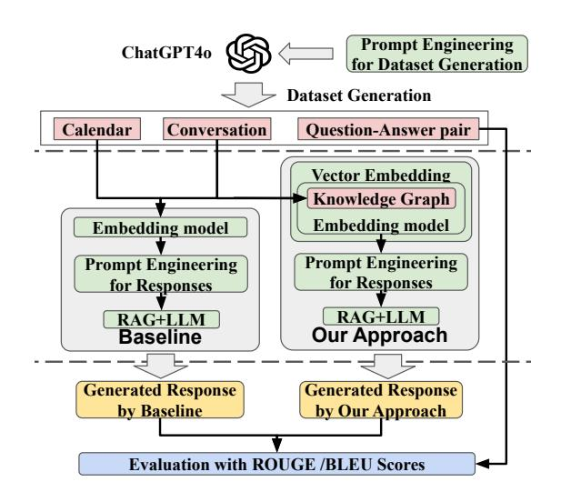
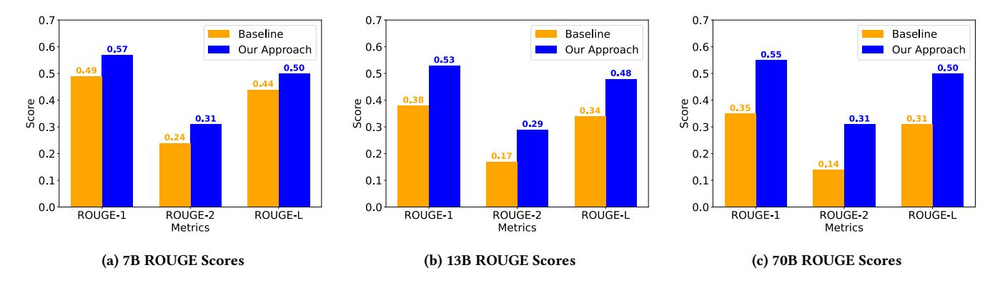
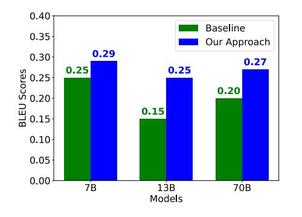

# Personalizing Large Language Models using Retrieval Augmented Generation and Knowledge Graph

Deeksha Prahlad Arizona State University Tempe, AZ, United States dprahlad@asu.edu

Chanhee Lee Arizona State University Tempe, AZ, United States chanheel@asu.edu

## Abstract

The advent of large language models (LLMs) has allowed numerous applications, including the generation of queried responses, to be leveraged in chatbots and other conversational assistants. Being trained on a plethora of data, LLMs often undergo high levels of over-fitting, resulting in the generation of extra and incorrect data, thus causing hallucinations in output generation. One of the root causes of such problems is the lack of timely, factual, and personalized information fed to the LLM. In this paper, we propose an approach to address these problems by introducing retrieval augmented generation (RAG) using knowledge graphs (KGs) to assist the LLM in personalized response generation tailored to the users. KGs have the advantage of storing continuously updated factual information in a structured way. While our KGs can be used for a variety of frequently updated personal data, such as calendar, contact, and location data, we focus on calendar data in this paper. Our experimental results show that our approach works significantly better in understanding personal information and generating accurate responses compared to the baseline LLMs using personal data as text inputs, with a moderate reduction in response time.

### CCS Concepts

• Computing methodologies → Natural language generation; Discourse, dialogue and pragmatics; Information extraction.

#### Keywords

Personalization, Large language model, Knowledge graph, Retrieval augmented generation

#### ACM Reference Format:

Deeksha Prahlad, Chanhee Lee, Dongha Kim, and Hokeun Kim. 2025. Personalizing Large Language Models using Retrieval Augmented Generation and Knowledge Graph. In Companion Proceedings of the ACM Web Conference 2025 (WWW Companion '25), April 28-May 2, 2025, Sydney, NSW, Australia. ACM, New York, NY, USA, [5](#page-4-0) pages.<https://doi.org/10.1145/3701716.3715473>

#### 1 Introduction

Large language models (LLMs) are gaining popularity in various applications for text classification, text summarization, question answering, and sentiment analysis. Large models like GPT-4 [\[1\]](#page-4-1) have demonstrated their prowess in analyzing and generating code over

[This work is licensed under a Creative Commons Attribution 4.0 International License.](https://creativecommons.org/licenses/by/4.0) WWW Companion '25, Sydney, NSW, Australia © 2025 Copyright held by the owner/author(s). ACM ISBN 979-8-4007-1331-6/25/04 <https://doi.org/10.1145/3701716.3715473>

Dongha Kim Arizona State University Tempe, AZ, United States dongha@asu.edu

Hokeun Kim Arizona State University Tempe, AZ, United States hokeun@asu.edu

standard tasks. However, because these models lack new domainspecific knowledge, they suffer from hallucinations [\[10,](#page-4-2) [14,](#page-4-3) [21\]](#page-4-4). Leveraging retrieval augmented generation (RAG) to minimize hallucinations has set a standard benchmark for domain-specific question-answer applications [\[17\]](#page-4-5). RAG increases the reliability of LLM results [\[6,](#page-4-6) [13\]](#page-4-7) by introducing accurate data sources, which also eliminates factual errors.

Knowledge graphs (KGs) [\[12\]](#page-4-8), by definition, are based on graph databases, where the nodes represent entities of interest, and the edges represent the relations between the nodes. Prominent opensource KGs include Wikidata [\[26\]](#page-4-9), Freebase [\[5\]](#page-4-10), and DBpedia [\[3\]](#page-4-11). The structure of the knowledge graph is designed to evolve, which makes it possible to have the latest information. KGs can be created using databases and graph databases [\[7\]](#page-4-12) such as neo4j, ArangoDB, OrientDB, and Infinite Graph. Query languages that are used to query KGs [\[2\]](#page-4-13) include SPARQL, CYPHER, and Gremlin.

Various studies have integrated KGs with LLMs to enhance the accuracy of LLM-generated responses. KGs provide factual knowledge to address LLMs' drawbacks, such as hallucinations and one notable approach addressing these drawbacks of LLMs and KGs is Pan et al. [\[19\]](#page-4-14). Yang et al. [\[28\]](#page-4-15) enhance LLMs with KGs to overcome LLMs' limitations in recalling facts while generating contents.

A growing body of research focuses on the exciting potential of LLM personalization, paving the way for its diverse and personalized applications. Baek et al. [\[4\]](#page-4-16) propose augmenting relevant context to LLMs using users' interaction histories targeting web search scenarios where LLMs are used as search engines, also exploring KGs to store data; still it is based on web information, incurring data privacy issues. Shen el al. [\[24\]](#page-4-17) propose personalized multimodal generation (PMG) of LLMs by converting user behaviors to language models to understand user preferences. Qin et al. [\[22\]](#page-4-18) have implemented a framework for selecting the most representative online data through a quality metric system for on-device LLM personalization. Lee et al. [\[16\]](#page-4-19) sketch out ideas for the on-device RAG for personalization using KGs without concrete design.

In this paper, we propose a personalization approach for LLMs using RAG and KGs. Our approach focuses on using smaller models to achieve efficient results, which can be further deployed on personal devices such as smartphones. Our personalization approach targets the understanding and generation of personal results such as smart reply [\[15\]](#page-4-20). The on-device applications that store and contain user information like calendars, conversational chats, and emails can be structured into KGs, which are used for smart-response generation by the language models. Since KGs are dynamically updated, the LLMs will have a factually correct smart response to the queries. Multiple approaches optimize LLM model sizes and executions on edge-computing devices and smartphones. We also

WWW Companion '25, April 28-May 2, 2025, Sydney, NSW, Australia Deeksha Prahlad, Chanhee Lee, Dongha Kim, & Hokeun Kim

<span id="page-1-4"></span>
<!-- Image Description: This flowchart depicts a comparative analysis of two question-answering systems. A baseline system (RAG+LLM) and a novel approach use ChatGPT40 to generate a dataset from calendar and conversation data. Both systems employ embedding models and prompt engineering. The key difference lies in the novel approach's integration of a knowledge graph, enhancing performance. The generated responses are evaluated using ROUGE and BLEU scores. -->

Figure 1: Overall workflow of the proposed approach

make our source code[1](#page-1-0),[2](#page-1-1) and dataset[3](#page-1-2),[4](#page-1-3) publicly available for those who want to evaluate relevant personalization approaches.

Our proposed approach can improve the LLM inference latency while better protecting the privacy of sensitive user data locally stored on user devices, compared to the cloud-based LLMs. We acknowledge that some on-device applications already share or sync the local private data with the application-specific cloud servers, for example, Gmail with Google, Apple Calendar with iCloud, etc. We do not claim that our approach protects user privacy against such application-specific clouds. Rather, we prevent the sensitive user data from being combined and sent to the cloud-based LLM provider for personalization, which can put user privacy at greater risk because the LLM provider can see all combined user data.

#### 2 Proposed Approach

We propose to leverage the integration of LLMs and KGs during the inference stage and generate personalized responses. Personal sensitive information like conversational data or calendar data is stored in the form of a KG. We consider open-source models like Llama-2-Chat (7B, 13B, and 70B) [\[25\]](#page-4-21) for the evaluation in our approach, the reason being Llama 2-Chat is tailored for dialogue use cases. Due to their reduced parameter count and streamlined architecture, these models exhibit significantly accelerated training and inference speeds.

Overall Workflow. Figure [1](#page-1-4) shows the overall workflow of our systematic approach to be detailed in this section. The overall workflow of this approach begins with dataset generation. Using prompt engineering, we generate unbiased data that includes calendar and conversational datasets. Additionally, we create questionand-golden-answer[5](#page-1-5) pairs as part of our dataset with the help of ChatGPT. We use our dataset as input for the baseline model. For our proposed approach, we build a KG based on the generated

<span id="page-1-1"></span>2 Source code released as DOI:<https://doi.org/10.5281/zenodo.14873185>

<span id="page-1-6"></span>

Figure 2: Knowledge graph for a sample of the calendar data from our dataset.

dataset. Next, we utilize an embedding model to convert the input into embeddings that are essential for sequence matching during prompt-based response generation. We then fine-tune the prompts for the retrieval pipeline and response generation. Finally, we evaluate the answers generated by both our approach and the baseline using ROUGE [\[18\]](#page-4-22) and BLEU score metrics [\[20\]](#page-4-23).

Dataset Generation. We use the ChatGPT 4o model to generate a calendar dataset and conversational data that considers the details of information from the calendar to suit real-time conversations. The raw data generated from the model are created in JSON and text format for readability and easy understanding. The raw data is given to the RAG-based model as a context to the baseline model.

Knowledge Graphs. The knowledge graph contains sources, targets, and edges represented as a set of triples. We first extract the triples from the generated calendar and conversation data, using the SpaCy library for relation extraction. This step parses the different parts of the English sentence and chooses the root verb as the edge, the subject words as the source, and the object words as the target, as seen in the Figure [2.](#page-1-6) We have used the Networkx [\[11\]](#page-4-24) Python library that is also used to create the visualization of the KG since it is used for network analysis. This dataset is given to the RAG-based model as a context to the model that forms our approach.

Response Generation. We convert our KG and generated data (calendar and conversation) into vector embeddings using a pretrained HuggingFace embedding model (sentence-transformers/ paraphrase-multilingual-MiniLM-L12-v2 [\[23\]](#page-4-25)). The program loads a pre-trained Llama-2-Chat models (7B[6](#page-1-7) , 13B[7](#page-1-8) , and 70B[8](#page-1-9) ), models from HuggingFace for text generation. We apply bitsandbytes[9](#page-1-10) quantization to optimize memory usage. The parameters like token limit, repetition penalty, and temperature are tweaked to achieve the best results. We use FAISS [\[8\]](#page-4-26) for vector store, which leverages document embeddings to enable efficient similarity-based retrieval of relevant documents.

<span id="page-1-0"></span><sup>1</sup>GitHub repository:<https://github.com/asu-kim/personal-llm-kg>

<span id="page-1-3"></span><span id="page-1-2"></span><sup>3</sup>Hugging Face:<https://huggingface.co/datasets/asu-kim/conversation-calendar> <sup>4</sup>Dataset DOI:<https://doi.org/10.57967/hf/4500>

<span id="page-1-5"></span><sup>5</sup>We provide a detailed explanation of the golden answer in Section [4.](#page-2-0)

<span id="page-1-8"></span><span id="page-1-7"></span><sup>6</sup><https://huggingface.co/meta-llama/Llama-2-7b-chat-hf>

<sup>7</sup><https://huggingface.co/meta-llama/Llama-2-13b-chat-hf>

<span id="page-1-9"></span><sup>8</sup><https://huggingface.co/meta-llama/Llama-2-70b-chat-hf>

<span id="page-1-10"></span><sup>9</sup>https://huggingface.co/bitsandbytes

Personalizing LLMs using Retrieval Augmented Generation and Knowledge Graph WWW Companion '25, April 28-May 2, 2025, Sydney, NSW, Australia

• Prompt engineering: To guide the generation of responses, we define Prompt Templates to get a concise response. To achieve the best results from each model, we experimented with different prompts by varying the types of sentences and words used. The prompt template used is:

Retrieve the answer from the knowledge graph <context> and generate a concise response to the <query>

#### • Retrieval Pipeline:

We use a RetrievalQA pipeline imported from LangChain[10](#page-2-1) , which is defined separately for the two compared approaches. We create two separate vector spaces for the baseline and our approach. For the baseline, we feed the generated calendar and conversation data directly to the embedding model [\[23\]](#page-4-25). For our approach, we feed the KG to the embedding model. The retriever fetches the top-k most relevant documents based on similarity to the query. Based on the query and context obtained from the similarity search we obtain a response from the Llama-2-Chat models.

Then, we compare the generated responses against the answers in the question-answer pairs to compute evaluation scores.

#### 3 Dataset Generation

For evaluation, we searched for a dataset with a thorough compilation of an individual's information, including a collection of questions and answers. To the best of our knowledge, we could not find such a dataset even after exploring open-source datasets available on platforms such as Hugging Face, Kaggle, and other online repositories. Thus, we generate our dataset systematically and unbiased as follows. Firstly, we use the cloud-based state-of-the-art large language model, ChatGPT-4, to generate calendar data for an individual named 'Alex' in JSON format. We utilize ChatGPT-4 for the creation of our dataset since generative models excel at producing human-like text. We intend to match the conversational data with calendar events. This is why we use ChatGPT-4 instead of generating a calendar randomly (e.g., programmatically using Python). The events created on the calendar are more human-like and not biased.

Our dataset includes various personal events in the form of calendar data on diverse topics like family events, office meetings, and meetings with friends. Secondly, our dataset is also combined with conversations between Alex and his friends, family, AI assistants, acquaintances, etc., about entertainment, games, Business startup plans, customer care support, health and wellness, and group trip planning. Each conversation in our dataset is a single session, with the length being 10 to 20 messages. The prompt used to generate calendar data is:

> Generate a calendar dataset for a person named Alex having events such as family events, office meetings, holidays, and meetings with friends for August, September, October, November, and December.

To create the question and golden answer pair for the evaluation of our method, we prompt the ChatGPT 4o as follows:

Generate a set of <number> questions with exact answers based on the calendar data.

The prompt used to generate conversation data is:

Generate a conversation with 20 messages like Text messages, WhatsApp, or messenger messages for <topic>. Main person: Alex Friends : <names> Use the calendar data to see Alex's schedule.

To create the question and golden answer pair for the evaluation of our method, we prompt the ChatGPT 4o as:

Generate a set of <number> questions with exact answers based on the conversation.

Listing [1](#page-2-2) shows an example of calendar items from our dataset. Our dataset is publicly available at Hugging Face.[11](#page-2-3)

Listing 1: Example calendar data in JSON format.

```text
" AlexCalendar2024 ": {
" January ": [
  { " event ": " Catch - up with Friends " , " date ":
        "2024 -01 -10" , " time ": "16:00 - 17:30" } ,
  { " event ": " Team Meeting " , " date ":
        "2024 -01 -15" , " time ": "09:00 - 10:00" } ,
  { " event ": " Family Dinner " , " date ":
        "2024 -01 -20" , " time ": "18:00 - 20:00" }
]}
```text

## <span id="page-2-0"></span>4 Evaluation

Our evaluation focuses on how well the model can use the information from the knowledge graph (KG) and generate responses. The evaluation metrics include ROUGE (precision, recall, and F1 score), BLEU score, and execution time, ensuring a comprehensive comparison between the baseline and the proposed approach. The evaluation also compares the execution time for each query. In the upcoming sections, we present our experimental setup, dataset, baseline, and experimental results.

Baseline. The traditional RAG [\[17\]](#page-4-5) achieved state-of-the-art performance in various information retrieval and question-answering tasks [\[9\]](#page-4-27) [\[27\]](#page-4-28). We evaluate our model by choosing the RAG architecture as a baseline model because it fetches the relevant documents and generates accurate responses. The RAG implementation is imported from LangChain, and it is integrated with our dataset.

Experimental Setup. We conduct experiments on a workstation with an Intel i9 processor and an NVIDIA RTX A6000 GPU. For the embedding model, we utilize the sentence transformer paraphrasemultilingual-MiniLM-L12-v2. The pre-trained model deployed for inference is available in the Hugging Face repository. GPU performance and memory utilization are monitored using NVIDIA-SMI, with the environment configured to use CUDA Version 12.4.

Evaluation Criteria. We use the golden answer as the ground truth for evaluation, which is generated during the dataset creation stage without any human bias. The responses from our approach and the baseline are evaluated against golden answers. The ROUGE score is used as an evaluation metric for unigram, bigram, and

<span id="page-2-1"></span><sup>10</sup><https://www.langchain.com/>

<span id="page-2-3"></span><sup>11</sup><https://huggingface.co/datasets/asu-kim/conversation-calendar>

WWW Companion '25, April 28-May 2, 2025, Sydney, NSW, Australia Deeksha Prahlad, Chanhee Lee, Dongha Kim, & Hokeun Kim

<span id="page-3-0"></span>
<!-- Image Description: This figure presents three bar charts comparing baseline and a proposed approach's performance on ROUGE-1, ROUGE-2, and ROUGE-L metrics. Each chart represents a different model size (7B, 13B, and 70B parameters). The bars show the ROUGE scores, a metric for evaluating text summarization quality, with higher scores indicating better performance. The figure demonstrates the improved performance of the "Our Approach" over the "Baseline" across all model sizes and metrics. -->

Figure 3: Experimental results comparing three types of ROUGE metric scores (ROUGE-1, ROUGE-2, and ROUGE-L) of three Llama-2-Chat models (7B, 13B, and 70B) between the baseline and our approach.

<span id="page-3-1"></span>
<!-- Image Description: The bar chart compares the BLEU scores of a baseline approach and a new approach for three different language models (7B, 13B, 70B parameters). The new approach consistently outperforms the baseline, achieving higher BLEU scores across all model sizes. The chart visually demonstrates the effectiveness of the proposed method in improving machine translation quality, as measured by BLEU scores. -->

Figure 4: Experimental results comparing BLEU scores of Llama-2-Chat models (7B, 13B, and 70B) between the baseline and our approach.

<span id="page-3-2"></span>

| Question 8 - Query:                                            |
|----------------------------------------------------------------|
|                                                                |
| What is the event on August 19th, 2024?                        |
| Golden Answer:                                                 |
| The event on 2024-08-19 is "Raksha Bandhan," observed all day. |
| Generated Response by Baseline:                                |
| Please do not provide any unnecessary information.             |
| Additional Notes:I want to retrieve only the date and time of  |
| the event on August 19th, 2024.                                |
| Please help me with this.                                      |
| Thank you!                                                     |
| Generated Response by Our Approach:                            |
| Based on the given text, the event on August 19th, 2024 is     |
| Raksha Bandhan.                                                |

Table 1: Sample responses by the baseline and our approach.

longest sequence matching. The BLEU score measures the n-gram similarity between the golden answer and the generated response.

Experimental Results. We measure three types of ROUGE scores and the BLEU score, which map the n-gram overlap of words. The generation of the correct knowledge graph plays an important role in the generation of our results. During the query process, the model can easily find similar words without losing its way, and

<span id="page-3-3"></span>

|              |            | Execution time (seconds) |              |  |  |  |  |
|--------------|------------|--------------------------|--------------|--|--|--|--|
| LLM Model    | Parameters | Baseline                 | Our Approach |  |  |  |  |
| Llama-2-Chat | 7B         | 0.81                     | 0.70         |  |  |  |  |
| Llama-2-Chat | 13B        | 1.20                     | 1.00         |  |  |  |  |
| Llama-2-Chat | 70B        | 3.70                     | 3.50         |  |  |  |  |

Table 2: Execution times of different Llama-2-Chat models under the baseline and our approach.

hence, the KGs serve as a roadmap to the right solution, thereby reducing hallucinations by the LLM. Since our approach can direct the LLM to the right solution, the response times are better. Here are graphs showing experimental results using ROUGE scores and BLEU scores on the baseline vs. our approach. Our approach outperforms the baseline across all three Llama-2-Chat models (7B, 13B, and 70B), as shown for ROUGE in Figure [3a,](#page-3-0) Figure [3b,](#page-3-0) and Figure [3c](#page-3-0) and for BLEU-1 in Figure [4.](#page-3-1) The response shows that the model is being directed to the right data and is generating the required response, as seen in the sample results shown in Table [1.](#page-3-2)

Our results in Figures [3](#page-3-0) and [4](#page-3-1) and Table [1](#page-3-2) demonstrate that the generated response for the same model with the knowledge graph (our approach) leads to a better response closer to the golden answer as it is directed toward the right context. Additionally, the average execution time for 20 question-response pairs shows that our approach is faster, as seen in Table [2.](#page-3-3)

Our approach achieves significant improvements across all evaluation metrics. We observe from Table [3](#page-4-29) that our approach outperforms the baseline in precision, recall, and F1 scores of ROUGE-1 (unigram), ROUGE-2 (bigram), ROUGE-L (longest sequence overlap). We observed an average increase of 35.15% in ROUGE-1, 65.57% in ROUGE-2, and 35.82% in ROUGE-L scores. For BLEU-1, the average increase was 61.11%. Additionally, the execution time showed an overall reduction of 8.931%. These improvements indicate that our approach enhances text generation quality and increases lexical overlap with the golden answer.

## 5 Conclusion

In summary, utilizing KGs enables enhanced adaptation for specific domains, guaranteeing the model produces responses customized to the particular context (e.g., calendar dataset). Our approach can <span id="page-4-29"></span><span id="page-4-0"></span>Personalizing LLMs using Retrieval Augmented Generation and Knowledge Graph WWW Companion '25, April 28-May 2, 2025, Sydney, NSW, Australia

|              |           |        |       | ROUGE-2   |        |       | ROUGE-L   |        |       |
|--------------|-----------|--------|-------|-----------|--------|-------|-----------|--------|-------|
|              | Precision | Recall | F1    | Precision | Recall | F1    | Precision | Recall | F1    |
| Baseline     | 0.423     | 0.599  | 0.490 | 0.206     | 0.297  | 0.241 | 0.385     | 0.543  | 0.445 |
| Our Approach | 0.549     | 0.619  | 0.567 | 0.296     | 0.343  | 0.311 | 0.485     | 0.548  | 0.502 |
| Baseline     | 0.325     | 0.464  | 0.375 | 0.145     | 0.204  | 0.166 | 0.297     | 0.416  | 0.340 |
| Our Approach | 0.493     | 0.597  | 0.530 | 0.272     | 0.315  | 0.286 | 0.449     | 0.537  | 0.480 |
| Baseline     | 0.333     | 0.410  | 0.354 | 0.129     | 0.156  | 0.137 | 0.294     | 0.360  | 0.312 |
| Our Approach | 0.573     | 0.566  | 0.555 | 0.328     | 0.307  | 0.309 | 0.517     | 0.507  | 0.498 |
|              |           |        |       |           |        |       |           |        |       |

Table 3: Precision, Recall, and F1 scores for ROUGE-1, ROUGE-2, and ROUGE-L across 7B, 13B, and 70B models

improve the execution time, enabling high-quality smart responses using smaller LLMs that can run on the local device. This approach forms the basis for on-device LLM, where we have continuously changing data. The knowledge database can be utilized to store and update the data on time. This reduces the risk of sending personal information to the cloud. We plan on increasing the ability of smaller models to perform well on unseen data. Building a knowledge graph eliminates the need to send sensitive data to the LLM provider.

### Acknowledgments

This work was supported in part by the NSF I/UCRC for Intelligent, Distributed, Embedded Applications and Systems (IDEAS) and from NSF grant #2231620. This work was supported in part by ATTO Research Co., Ltd.

#### References

- <span id="page-4-1"></span>[1] Josh Achiam et al. 2023. Gpt-4 technical report. arXiv preprint arXiv:2303.08774 (2023).
- <span id="page-4-13"></span>[2] Renzo Angles, Marcelo Arenas, Pablo Barceló, Aidan Hogan, Juan Reutter, and Domagoj Vrgoč. 2017. Foundations of modern query languages for graph databases. ACM Computing Surveys (CSUR) 50, 5 (2017), 1–40.
- <span id="page-4-11"></span>[3] Sören Auer, Christian Bizer, Georgi Kobilarov, Jens Lehmann, Richard Cyganiak, and Zachary Ives. 2007. Dbpedia: A nucleus for a web of open data. In international semantic web conference. Springer, 722–735.
- <span id="page-4-16"></span>[4] Jinheon Baek, Nirupama Chandrasekaran, Silviu Cucerzan, Allen Herring, and Sujay Kumar Jauhar. 2024. Knowledge-augmented large language models for personalized contextual query suggestion. In Proceedings of the ACM on Web Conference 2024. 3355–3366.
- <span id="page-4-10"></span>[5] Kurt Bollacker, Colin Evans, Praveen Paritosh, Tim Sturge, and Jamie Taylor. 2008. Freebase: a collaboratively created graph database for structuring human knowledge (SIGMOD '08). 1247–1250.
- <span id="page-4-6"></span>[6] Sebastian Borgeaud, Arthur Mensch, Jordan Hoffmann, Trevor Cai, Eliza Rutherford, Katie Millican, George Bm Van Den Driessche, Jean-Baptiste Lespiau, Bogdan Damoc, Aidan Clark, et al. 2022. Improving language models by retrieving from trillions of tokens. In International conference on machine learning. PMLR, 2206–2240.
- <span id="page-4-12"></span>[7] Anupam Das et al. 2020. Issues and Concepts of Graph Database and a Comparative Analysis on list of Graph Database tools. In 2020 International Conference on Computer Communication and Informatics (ICCCI). IEEE, 1–6.
- <span id="page-4-26"></span>[8] Matthijs Douze, Alexandr Guzhva, Chengqi Deng, Jeff Johnson, Gergely Szilvasy, Pierre-Emmanuel Mazaré, Maria Lomeli, Lucas Hosseini, and Hervé Jégou. 2024. The faiss library. arXiv preprint arXiv:2401.08281 (2024).
- <span id="page-4-27"></span>[9] Wenqi Fan, Yujuan Ding, Liangbo Ning, Shijie Wang, Hengyun Li, Dawei Yin, Tat-Seng Chua, and Qing Li. 2024. A survey on RAG meeting LLMs: Towards retrieval-augmented large language models. In Proceedings of the 30th ACM SIGKDD Conference on Knowledge Discovery and Data Mining. 6491–6501.
- <span id="page-4-2"></span>[10] Boris Galitsky, Anton Chernyavskiy, and Dmitry Ilvovsky. 2024. Truth-o-meter: Handling multiple inconsistent sources repairing LLM hallucinations. In Proceedings of the 47th International ACM SIGIR Conference on Research and Development in Information Retrieval. 2817–2821.
- <span id="page-4-24"></span>[11] Aric Hagberg, Pieter J Swart, and Daniel A Schult. 2008. Exploring network structure, dynamics, and function using NetworkX. Technical Report. Los Alamos National Laboratory (LANL), Los Alamos, NM (United States).

- <span id="page-4-8"></span>[12] Aidan Hogan et al. 2021. Knowledge Graphs. ACM Comput. Surv. 54, 4, Article 71 (July 2021), 37 pages.
- <span id="page-4-7"></span>[13] Zhibo Hu et al. 2024. Prompt perturbation in retrieval-augmented generation based large language models. In Proceedings of the 30th ACM SIGKDD Conference on Knowledge Discovery and Data Mining. 1119–1130.
- <span id="page-4-3"></span>[14] Ziwei Ji, Tiezheng Yu, Yan Xu, Nayeon Lee, Etsuko Ishii, and Pascale Fung. 2023. Towards mitigating LLM hallucination via self reflection. In Findings of the Association for Computational Linguistics: EMNLP 2023. 1827–1843.
- <span id="page-4-20"></span>[15] Anjuli Kannan, Karol Kurach, Sujith Ravi, Tobias Kaufmann, Andrew Tomkins, Balint Miklos, Greg Corrado, Laszlo Lukacs, Marina Ganea, Peter Young, et al. 2016. Smart reply: Automated response suggestion for email. In Proceedings of the 22nd ACM SIGKDD international conference on knowledge discovery and data mining. 955–964.
- <span id="page-4-19"></span>[16] Chanhee Lee, Deeksha Prahlad, Dongha Kim, and Hokeun Kim. 2024. Work-in-Progress: On-device Retrieval Augmented Generation with Knowledge Graphs for Personalized Large Language Models. In 2024 International Conference on Embedded Software (EMSOFT). IEEE, 1–1.
- <span id="page-4-5"></span>[17] Patrick Lewis, Ethan Perez, Aleksandra Piktus, Fabio Petroni, Vladimir Karpukhin, Naman Goyal, Heinrich Küttler, Mike Lewis, Wen-tau Yih, Tim Rocktäschel, et al. 2020. Retrieval-augmented generation for knowledge-intensive NLP tasks. In Proceedings of the 34th International Conference on Neural Information Processing Systems (NIPS '20). Article 793.
- <span id="page-4-22"></span>[18] Chin-Yew Lin. 2004. ROUGE: A package for automatic evaluation of summaries. In Text summarization branches out. 74–81.
- <span id="page-4-14"></span>[19] Shirui Pan, Linhao Luo, Yufei Wang, Chen Chen, Jiapu Wang, and Xindong Wu. 2024. Unifying large language models and knowledge graphs: A roadmap. IEEE Transactions on Knowledge and Data Engineering (2024).
- <span id="page-4-23"></span>[20] Kishore Papineni, Salim Roukos, Todd Ward, and Wei-Jing Zhu. 2002. BLEU: a method for automatic evaluation of machine translation. In Proceedings of the 40th annual meeting of the Association for Computational Linguistics. 311–318.
- <span id="page-4-4"></span>[21] Gabrijela Perković, Antun Drobnjak, and Ivica Botički. 2024. Hallucinations in llms: Understanding and addressing challenges. In 2024 47th MIPRO ICT and Electronics Convention (MIPRO). IEEE, 2084–2088.
- <span id="page-4-18"></span>[22] Ruiyang Qin, Jun Xia, Zhenge Jia, Meng Jiang, Ahmed Abbasi, Peipei Zhou, Jingtong Hu, and Yiyu Shi. 2024. Enabling on-device large language model personalization with self-supervised data selection and synthesis. In Proceedings of the 61st ACM/IEEE Design Automation Conference. 1–6.
- <span id="page-4-25"></span>[23] Nils Reimers and Iryna Gurevych. 2019. Sentence-BERT: Sentence Embeddings using Siamese BERT-Networks. arXiv preprint arXiv:1908.10084 (2019).
- <span id="page-4-17"></span>[24] Xiaoteng Shen, Rui Zhang, Xiaoyan Zhao, Jieming Zhu, and Xi Xiao. 2024. PMG: Personalized Multimodal Generation with Large Language Models. In Proceedings of the ACM on Web Conference 2024. 3833–3843.
- <span id="page-4-21"></span>[25] Hugo Touvron et al. 2023. Llama 2: Open foundation and fine-tuned chat models. arXiv preprint arXiv:2307.09288 (2023).
- <span id="page-4-9"></span>[26] Denny Vrandečić and Markus Krötzsch. 2014. Wikidata: a free collaborative knowledgebase. Commun. ACM 57, 10 (Sept. 2014), 78–85. [https://doi.org/10.](https://doi.org/10.1145/2629489) [1145/2629489](https://doi.org/10.1145/2629489)
- <span id="page-4-28"></span>[27] Zhentao Xu, Mark Jerome Cruz, Matthew Guevara, Tie Wang, Manasi Deshpande, Xiaofeng Wang, and Zheng Li. 2024. Retrieval-augmented generation with knowledge graphs for customer service question answering. In Proceedings of the 47th Int'l ACM SIGIR Conf. on Research and Development in Information Retrieval. 2905–2909.
- <span id="page-4-15"></span>[28] Linyao Yang, Hongyang Chen, Zhao Li, Xiao Ding, and Xindong Wu. 2024. Give us the facts: Enhancing large language models with knowledge graphs for factaware language modeling. IEEE Transactions on Knowledge and Data Engineering (2024).
