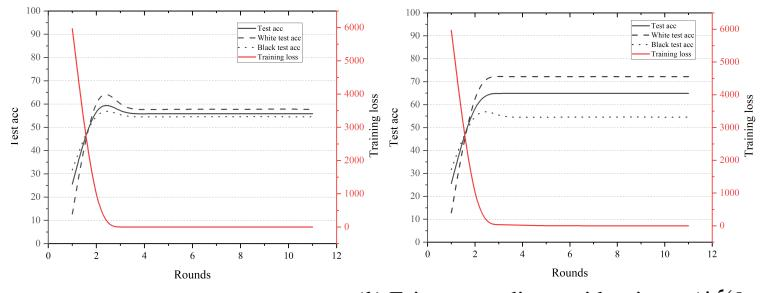
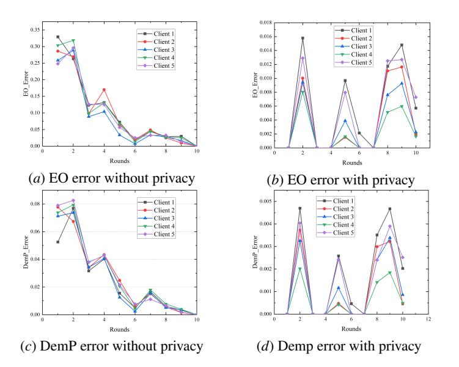
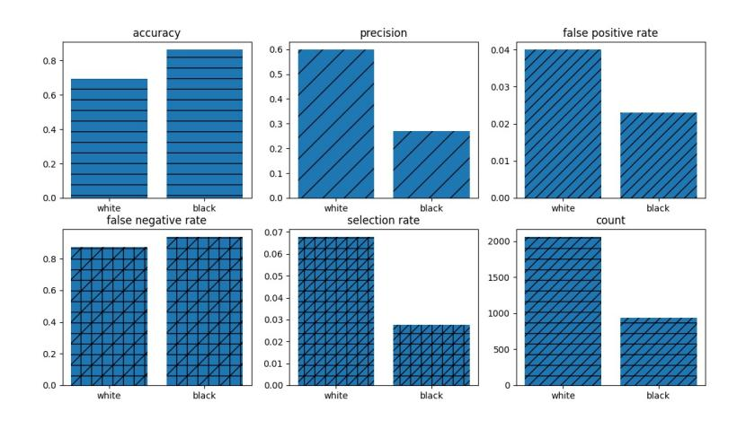
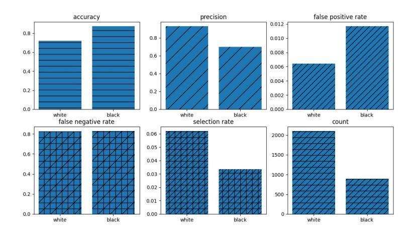
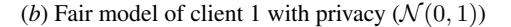

# Toward the Tradeoffs between Privacy, Fairness and Utility in Federated Learning

Kangkang Sun 1 , Xiaojin Zhang 2 , Xi Lin 1 , Gaolei Li 1 , Jing Wang 1 , and Jianhua Li 1

Shanghai Key Laboratory of Integrated Administration Technologies for Information Security, School of Electronic Information and Electrical Engineering, Shanghai Jiao Tong University, Shanghai, China

School of Computer Science and Technology, Huazhong University of Science and Technology, Wuhan, China

{szpsunkk, linxi234, gaolei\_li, wangjing08, lijh888}@sjtu.edu.cn; xiaojinzhang@hust.edu.cn

Abstract. Federated Learning (FL) is a novel privacy-protection distributed machine learning paradigm that guarantees user privacy and prevents the risk of data leakage due to the advantage of the client's local training. Researchers have struggled to design fair FL systems that ensure fairness of results. However, the interplay between fairness and privacy has been less studied. Increasing the fairness of FL systems can have an impact on user privacy, while an increase in user privacy can affect fairness. In this work, on the client side, we use the fairness metrics, such as *Demographic Parity*(DemP),*Equalized Odds*(EOs), and*Disparate Impact*(DI), to construct the local fair model. To protect the privacy of the client model, we propose a privacy-protection fairness FL method. The results show that the accuracy of the fair model with privacy increases because privacy breaks the constraints of the fairness metrics. In our experiments, we conclude the relationship between privacy, fairness and utility, and there is a tradeoff between these.

Keywords: Fair and Private Federated Learning · Differential Privacy · Privacy Protection.

## 1 Introduction

Federated learning (FL) [\[MMR](#page-15-0) <sup>+</sup>17, [KMA](#page-14-0) <sup>+</sup>21] is a novel distributed machine learning approach that guarantees user privacy by ensuring that user data does not leave the local area. However, FL has been plagued by two ethical issues: privacy and fairness [\[CZZ](#page-12-0) <sup>+</sup>23]. So far, most of the research has considered these two issues separately, but the existence of some kind of intrinsic equilibrium between the two remains unexplored. For example, privacy can come at the expense of model accuracy, however, for different groups of people training privacy results in different accuracies, with disadvantaged groups often suffering a greater cost in the training process. On the other hand, in order to ensure the fairness of the model and eliminate the bias in the training data or model [\[ABD](#page-12-1) <sup>+</sup>18, [BHJ](#page-12-2) <sup>+</sup>21], the client needs to share more data with the server, which seriously increases the user privacy risk. Therefore, it is an open issue to investigate the

intrinsic connection between fairness and privacy in FL and to break the distress caused by its tradeoffs.

Privacy Destroys Fairness The first observation is that the decrease in accuracy due to deep DP models has a disproportionately negative impact on underrepresented subgroups [\[BPS19\]](#page-12-3). DP-SGD enhances model "bias" in different distributions that need to be learned. Subsequently, in the study [\[PMK](#page-15-1)+20], the impact of DP on fairness in three real-world tasks involving sensitive public data. There are significant differences in the model outputs when stronger privacy protections are implemented or when the population is small. Many works [\[TFVH21,](#page-15-2) [EGLC22\]](#page-13-0) have attempted to find reasons why privacy destroys fairness.

Fairness Increases Privacy Risk The client's dataset is usually unbalanced and biased. This bias is gradually amplified during the machine learning process. For example, when a model is trained for accuracy, the model's predictions will correlate with gender, age, skin, and race in a certain demographic group [\[ZVRG17,](#page-16-0) [BHJ](#page-12-2)+21, [Cho17\]](#page-12-4).

Privacy and fairness are two important concepts in FL, and violating either one is unacceptable. Therefore, this paper explores the intrinsic relationship between privacy and fairness in FL and designs a privacy protection method for fair federated learning, to improve the model learning performance while ensuring the privacy and fairness constraint.
*Relationship of fairness and privacy.*We attempt to explore the relationship between fairness and privacy in FL. Intuitively, there is some intrinsic connection between fairness and privacy, and some balance between fairness, privacy, and utility.

-*Fairness:*We consider three fairness metrics, including Demographic Parity (DemP), Equalized Odds (EO) and Disparate Impact (DI). Comparing the research [\[PMK](#page-15-1)<sup>+</sup>20], we design the optimization function to be more complex, taking into account privacy and fairness constraints.
-*Privacy:*In this paper, we consider privacy-protection methods for fair Federated Learning based differential privacy.

Our contributions can be summarized as follows:

- A privacy-protection fairness FL method is proposed, in order to protect the model privacy of the client while sharing model parameters. Our proposed method is mainly divided into two parts: fairness training and privacy-protection training. Specifically, the client first trains a fairness proxy model and then trains a privacyprotection model based on that proxy model.
- In this paper, We experimentally obtained that the increase in privacy destroys the fairness of the model but appropriately increases the accuracy of the model. In order to improve the accuracy of the model and to ensure the fairness of the model, we designed private fair algorithms [2.](#page-7-0)
- We demonstrate the superiority of our proposed method and algorithms based on*Adult*datasets comparing popular benchmark*FedAvg*algorithms. Experiments prove that our algorithm can effectively guarantee model privacy in fair FL.

### 2 Related Work

#### 1 Fairness of FL

Fairness of FL is defined in two ways: client fairness [\[LSBS19,](#page-14-1) [MBS20,](#page-14-2) [YLL](#page-16-1)+20, [KKM](#page-14-3)+20] and algorithmic fairness [\[HPS16\]](#page-14-4). Algorithmic fairness has been extensively studied in traditional centralized machine learning through debiasing methods [\[KMA](#page-14-0)+21]. However, due to the fact that in FL, the server does not have access to client-side local data, it is already difficult to estimate the global data distribution simply by debiasing either server-side or client-side [\[MMR](#page-15-0)+17]. Much research has focused on client fairness in FL, such as in augmenting client data aspect [\[Hao21,](#page-13-1) [JOK](#page-14-5)+18], in the client data distribution aspect [\[DLC](#page-13-2)+20, [WKNL20\]](#page-15-3). From a model perspective, training a separate fairness model for each client is an open problem.

#### 2 Privacy of FL

Many recent studies have focused on FL privacy risks [\[GMS](#page-13-3)<sup>+</sup>23, [LGR23a,](#page-14-6) [SLS](#page-15-4)<sup>+</sup>23, [BWD](#page-12-5)<sup>+</sup>22]. A diversity of privacy-protection techniques have been proposed to discourage the risk of privacy leakage for users, including cryptographic techniques and the perturbation approach [\[CZZ](#page-12-0)<sup>+</sup>23]. Cryptographic approaches allow computation on encrypted data and provide strict privacy guarantees. However, they are computationally expensive compared to non-encryption methods [\[XBJ21\]](#page-16-2). This computational overhead seriously affects the machine learning training process, especially with a large number of parameters in the model. Therefore, the current state-of-the-art privacy-protection methods are perturbation-based, such as the DP mechanism [\[GKN17,](#page-13-4) [WLD](#page-15-5)<sup>+</sup>20, [WKL](#page-15-6)<sup>+</sup>21, [SMS22\]](#page-15-7). The shuffler model is proposed to amplify the privacy of LDP's poor performance in comparison with the central DP mechanisms [\[RSL](#page-15-8)<sup>+</sup>08, [EFM](#page-13-5)<sup>+</sup>19, [CSU](#page-12-6)<sup>+</sup>19, [BBGN20,](#page-12-7) [GGK](#page-13-6)<sup>+</sup>21, [GDD](#page-13-7)<sup>+</sup>21]. Most research based on Shuffler's model has focused on the study of tradeoffs between privacy, utility, and communication [\[CCKS22,](#page-12-8) [GDD](#page-13-7)<sup>+</sup>21, [LLF](#page-14-7)<sup>+</sup>23, [ZXW](#page-16-3)<sup>+</sup>22, [BBGN19\]](#page-12-9). However, there is very little research on the privacy protection of fair federated learning.

#### 3 Fairness and Privacy of FL

Recently, some work [\[CZZ](#page-12-0)<sup>+</sup>23, [PMK](#page-15-1)<sup>+</sup>20] has led to inconsistent reductions in accuracy due to private mechanisms for classification [\[FMST20\]](#page-13-8) and generation tasks [\[GODC22\]](#page-13-9). Because of the tension between fairness and privacy, researchers often need to make trade-offs between the two perceptions [\[BPS19,](#page-12-3) [EGLC22,](#page-13-0) [TFVH21\]](#page-15-2). The trade-off may be to increase privacy preservation at the expense of fairness, i.e., by adopting a loose notion of fairness rather than a precise one or vice versa [\[BHJ](#page-12-2)<sup>+</sup>21, [Cho17\]](#page-12-4).

### 3 Preliminaries

#### 1 Fairness in FL

We consider the following fairness metrics, including DemP, EO and DI. DemP denotes the same probability of getting a chance under some sensitive attribute. EO is a subset

| References | Privacy             | Fairness       | Techniques              |                         | Trade-off type |
|------------|---------------------|----------------|-------------------------|-------------------------|----------------|
|            | Metrics             | Metrics        | Privacy                 | Fairness                |                |
| [LZMV19]   | ϵ-DP                | EOs & DemP     | Class conditional       | Fairness                | I              |
|            |                     |                | noise                   | constraints             |                |
| [JKM+19]   | (ϵ, δ)-DP           | EOs            | Exponential mechanism & | Fairness                | /              |
|            |                     |                | Laplace noise           | constraints             |                |
| [LGR23b]   | (ϵ, δ)-DP           | EOs & DemP     | DP-SGDA                 | ERMI                    |                |
|            |                     |                |                         | regularizer             | II             |
| [TFVH21]   | (α, ϵp)-Renyi<br>DP | EOs, AP & DemP | DP-SGD                  | Fairness                | II             |
|            |                     |                |                         | constraints             |                |
|            |                     |                |                         | Fairness                |                |
| [KGK+18]   | /                   | EA             | MPC                     | constraints             | II             |
|            |                     |                | Proxy                   |                         |                |
| [DGK+22]   | /                   | EOs            | attribute               | Post-processing         | II             |
| [WGN+20]   | /                   | DemP           | Noisy                   | Fairness<br>constraints | II             |
|            |                     |                | attribute               |                         |                |
|            |                     |                | Noisy                   |                         |                |
| [AKM20]    | /                   | EOs            | attribute               | Post-processing         | II             |
| Our Method | (ϵ, δ)-DP           | EOs, DemP, DI  | Gaussian Noise          | Fairness                | II             |
|            |                     |                |                         | constraints             |                |

Table 1: Private and Fair Federated Learning

I: Trade fairness for privacy. II: Trade privacy for fairness.

EOs: Equalized Odds. DemP: Demographic Parity. AP: Accuracy Parity. EA: Equal Accuracy. DI: Disparate Impact.

of DP, defined as the probability of getting a chance on a given aspect is the same for different sensitive attributes. Let X, Y be the sensitive attribute and the true label, respectively. For example, Y = 1 often represents the condition of being able to apply for a loan, and Y = 0 is the condition of not meeting the loan. Thus, on the opportunity to apply for a loan, the output has the same probability for each person (characteristic), and then this is EO fairness.

Definition 1. (Demographic Parity (DemP))*[\[HPS16\]](#page-14-4) We say that a predictor*f*satisfies demographic parity with respect to attribute* A*, instance space*X*and output space*Y*, if the output of the prediction*f(X)*is independent of the sensitive attribute* A*. For*∀a ∈ A*and* p ∈ {0, 1}*:*$$
\mathbf{P}[f(X) = p \mid \mathcal{A} = a] = \mathbf{P}[f(X) = p] \tag{1}
$$
*Given* p ∈ {0, 1}*, for* ∀a ∈ A*:*$$
\mathbb{E}[f(X) | \mathcal{A} = a] = \mathbb{E}[f(X)] \tag{2}
$$
*However, the left and right terms of the above equality are often not the same. Then, the loss*lDemP*of DemP can be defined as follows:*$$
l_{DemP} = \mathbb{E}[f(X) | \mathcal{A} = a] - \mathbb{E}[f(X)] \tag{3}
$$

Definition 2. (Equalized Odds (EO))*[\[HPS16\]](#page-14-4) We say that a predictor*f*satisfies equalized odds with respect to attribute* A*, instance space*X*and output space*Y*, if the output of the prediction*f(X)*is independent of the sensitive attribute*A*with the label* Y*. For*∀a ∈ A*and* p ∈ {0, 1}*:*$$
\mathbf{P}[f(X) = p \mid \mathcal{A} = a, Y = y] = \mathbf{P}[f(X) = p \mid Y = y]
$$
 (4)
*Given* p ∈ {0, 1}*, for*∀a ∈ A, y ∈ Y*:*$$
\mathbb{E}[f(X) | \mathcal{A} = a, Y = y] = \mathbb{E}[f(X) | Y = y]
$$
\n(5)
*Then, the loss*lEO*of EO can be defined as follows:*$$
l_{EO} = \mathbb{E}[f(X) | \mathcal{A} = a, Y = y] - \mathbb{E}[f(X) | Y = y]
$$
 (6)
*Remark 1.*A binary predictor f, satisfying the demographic parity, is a special instance of equalized odds.

Definition 3. (Disparate Impact (DI))*[\[PMK](#page-15-1)*+*20] We say that a predictor*f*satisfies disparate impact with respect to attribute* A*, if the output of the prediction*f(X)*is independent of the sensitive attribute*A*with a similar proportion of the different groups. For* a ∈ {0, 1}*, we have:*$$
\min\left(\frac{\mathbf{P}(f(x) > 0 \mid a=1)}{\mathbf{P}(f(x) > 0 \mid a=0)}, \frac{\mathbf{P}(f(x) > 0 \mid a=0)}{\mathbf{P}(f(x) > 0 \mid a=1)}\right) = 1\tag{7}
$$
*For*i ∈ [0, n]*and*i*is a positive integer:*$$
\min\left(\frac{\mathbf{P}(f(x) > 0 \mid a = i + 1)}{\mathbf{P}(f(x) > 0 \mid a = i)}, \frac{\mathbf{P}(f(x) > 0 \mid a = 0)}{\mathbf{P}(f(x) > 0 \mid a = n)}\right)_{i=0}^{n} = 1\tag{8}
$$

Then, the loss lDI of DI can be defined as follows:

$$
l_{DI} = \min\left(\frac{\mathbf{P}(f(x) > 0 \mid a = i + 1)}{\mathbf{P}(f(x) > 0 \mid a = i)}, \frac{\mathbf{P}(f(x) > 0 \mid a = 0)}{\mathbf{P}(f(x) > 0 \mid a = n)}\right)_{i=0}^{n} - 1\tag{9}
$$

#### 2 Privacy in FL

The local dataset of clients contains sensitive data, which requires protecting the sensitive attributes while training. Differential Privacy (DP) is a privacy protection technique designed to safeguard individual data while allowing data analysis and mining [\[DR](#page-13-11)<sup>+</sup>14]. Local Differential Privacy (LDP) is deployed on clients to protect the attributes of the local dataset, in order to make sure that any algorithm built on this dataset is differentially private. The ϵ- differentially private mechanism M is defined as follows:

Definition 4. (Local Differential Privacy (LDP))*[\[DR](#page-13-11)*<sup>+</sup>*14] A randomize algorithm*M : X → Y*satisfies* (ϵ, δ)*-LDP with respect to a input set*X*and a noise output set*Y*, if*∀x, x ′ ∈ X*and*∀y ∈ Y*hold:*$$
\mathbf{P}[\mathcal{M}(x) = y] \le e^{\epsilon} \mathbf{P}[\mathcal{M}(x') = y] + \delta \tag{10}
$$

Definition 5 (Gaussian Mechanism).*Assume that a deterministic function*f : MX → Y*with*∆2(f)*sensitivity, then for* ∀δ ∈ (0, 1)*, random noise follows a normal distribution* N (0, σ<sup>2</sup> )*, the mechanism*M(d) = f(d) + N (0, σ<sup>2</sup> )*is* (ϵ, δ)*-DP, where*

$$
\epsilon \ge \frac{\sqrt{2\ln(1.25/\delta)}}{\frac{\sigma}{\Delta_2 f}}, \quad \Delta_2(f) = \max_{d,d' \in \mathcal{D}} \|f(d) - f(d')\|_2 \tag{11}
$$

#### 3 Problem Formulation

There is a set of n clients in the FL system, where m ∈ n clients are selected to participate in the FL training process. The clients have its own local dataset D<sup>i</sup> = {d1, ..., dn}. Let D = S<sup>n</sup> <sup>i</sup>=1 D<sup>i</sup> denote the entire dataset and f(θ<sup>i</sup> , di) as the loss function of client i, where the parameter θ ∈ Θ is the model parameter. There are m ∈ n clients The clients are connected to an untrusted server in order to solve the ERM problem F<sup>i</sup> (θ, Di) = <sup>1</sup> b P<sup>b</sup> <sup>j</sup>=1 f (θ, dij ), where local estimated loss function dependent on the local dataset D<sup>i</sup> , and b is the local batch size. We give the ERM problem [\[KMA](#page-14-0)<sup>+</sup>21] in FL, as follows:

<span id="page-5-0"></span>
$$
\arg\min_{\theta \in \mathcal{C}} \left( F(\theta) := \frac{1}{m} \sum_{i=1}^{m} F_i(\theta) \right),
$$

s.t.  $l_{DemP} < \mu_{DemP},$
 $l_{EO} < \mu_{EO},$
 $l_{DI} < \mu_{DI},$  (12)

where the lDemP , lEO, lDI are the loss constraint of DemP, EO and DI, respectively. We use the Lagrangian multiplier [\[PMK](#page-15-1)<sup>+</sup>20] to transform the ERM problem [\(12\)](#page-5-0) into a Min-Max problem, as follows:

<span id="page-5-1"></span>
$$
F(\theta, \lambda, l) = \arg\min_{\theta_i \in \Theta} \max_{\lambda_{ij} \in \Lambda} \frac{1}{m} \sum_{i=1}^m \left\{ \frac{1}{b} \sum_{j=1}^b f_i(\theta_i + d_{ij}) + \lambda_{ij} l_k \right\},
$$

\n
$$
k \in \{DemP, EO, DI\},
$$
\n(13)

where the parameter λ ∈ Λ is the Lagrangian multiplier. In this fairness stage, the purpose is to train the proxy model under the fairness matrixes, which is to solve the optimization problem. For the optimization problem [\(13\)](#page-5-1), there is the Lagrangian duality between the following two functions:

<span id="page-5-2"></span>
$$
\min_{\theta \in \Theta} \max_{\lambda \in \Lambda} F(\theta, \lambda, l),
$$
\n
$$
\max_{\lambda \in \Lambda} \min_{\theta \in \Theta} F(\theta, \lambda, l).
$$
\n(14)

In order to solve the above dual optimization problem [\(14\)](#page-5-2), many works assume the function F is Liptches and convex and obtain a ν*-approximate saddle point*of Langrangian, with a pair (θ, <sup>b</sup> <sup>λ</sup>b), where

$$
F(\hat{\theta}, \hat{\lambda}, l) \le F(\theta, \hat{\lambda}, l) + \nu \quad \text{for all} \quad \theta \in \Theta,
$$

$$
F(\hat{\theta}, \hat{\lambda}, l) \ge F(\hat{\theta}, \lambda, l) - \nu \quad \text{for all} \quad \lambda \in \Lambda.
$$
 (15)

Therefore we can get the Max-Min and the Min-Max dual problems are equivalent in the ERM problem [\(12\)](#page-5-0). In order to search for the optimal value (θ ∗ , λ<sup>∗</sup> ) (or*Nash Equilibrium*in-game) of the problem [\(12\)](#page-5-0), many works study the fairness model by many approaches, such as the Zero-Game [\[JKM](#page-14-9)+19, [MOS20\]](#page-15-10), Distributionally Robust Optimization (DRO) [\[WGN](#page-15-9)+20], and Soft Group Assignments [\[WGN](#page-15-9)+20]. In this paper, the fair model is optimized by the DRO method through a Lagrangian dual multiplier in clients, and the model parameters are then transmitted to the server for model aggregation through privacy-protection.

### 4 Method

In this section, we design privacy protection for fair federated learning based on differential privacy. In section 4.1, the fair model in the FL system is obtained by the Algorithm [1,](#page-6-0) where the fair model of each client can be optimized under constraints of*DemP*, *EO*and*DI*. In section 4.2, we design a privacy protection algorithm [2](#page-7-0) for the fair model optimized in section 4.1.

#### 1 Fairness Predictor (Model) in Client

Firstly, the clients train their own personalized fairness predictor, and we designed an Algorithm [1](#page-6-0) to train the fair model on each client. In the Algorithm [1](#page-6-0) line 5 and line 7, the optimal values (θ ∗ , λ<sup>∗</sup> ) are derived from the partial differential expression of the ERM problem [\(12\)](#page-5-0). Secondly, each θ<sup>i</sup> and λ<sup>i</sup> update their own information according to the partial differential expression in Algorithm [1](#page-6-0) line 6 and line 8. Finally, after time T<sup>1</sup> rounds, the fair model of the client i is output.

<span id="page-6-1"></span>Algorithm 1 Fair-SGD for client

```text
Input: Local loss function f(·), train dataset Di, learning rate η, batch size B
1: Initialize: fi(θi) ← random, λi ← max value
```text

<span id="page-6-0"></span>2: for Each client i ∈ N do 3: for t ∈ T<sup>1</sup> do 4: Take a random batch size B and j ∈ B 5: For θi: g<sup>t</sup> (x<sup>j</sup> ) ← ∇<sup>θ</sup>(i,t) fi(·) 6: θ(i,t+1) ← θ(i,t) − ηtg<sup>t</sup> (x<sup>j</sup> ) 7: For λi, g ′ <sup>t</sup> (x<sup>j</sup> ) ← ∇<sup>λ</sup>(i,t) fi(·) 8: λ(i,t+1) ← λ(i,t) + ηg′ <sup>t</sup> (x<sup>j</sup> ) 9: end for 10: end for Output: Fair model fi(θi)

#### 2 Privacy Protection Method in Fair FL

In this section, we design a privacy-protection fairness FL framework to protect the privacy and fairness of sensitive datasets in clients. As the above section, there is a trade-off between privacy, fairness and accuracy in the FL system. In this paper, we designed a privacy-protection algorithm, named FedLDP Algorithm [2,](#page-7-0) based on the FedAvg algorithm.

FedLDP: In the algorithm, we design to add differential privacy preservation to the fairness model training process in algorithm [2.](#page-7-0) The algorithm, while reducing privacy consumption, can effectively improve the training accuracy of the model. Moreover, the algorithm does not guarantee that the intermediate entities are trustworthy, so the shuffler model is hijacked or attacked without any impact on user privacy.

#### <span id="page-7-0"></span>Algorithm 2 FedLDP

```text
Input: Selected clients m, the local dataset Di of client i, Maximum L2 norm bound C, local
   privacy budget εl
```text

1: Initial the local model and download the global gradients from the server

2: for i ∈ m in parallel do 3: Fairness stage in Algorithm [\(1\)](#page-6-1) 4: g<sup>t</sup> (x<sup>j</sup> ) ← ∇<sup>θ</sup>(i,t) fi(·) 5: g<sup>t</sup> (x<sup>j</sup> ) <sup>←</sup> <sup>g</sup><sup>t</sup> (x<sup>j</sup> ) / max 1, ∥<sup>g</sup>t(<sup>x</sup><sup>j</sup> )∥<sup>2</sup> C 6: g˜<sup>t</sup> (x<sup>j</sup> ) ← <sup>1</sup> B P i gt (x<sup>j</sup> ) + N 0, σ<sup>2</sup>C 2 I 7: θ(i,t+1) ← θ(i,t) − ηtg˜<sup>t</sup> (x<sup>j</sup> ) 8: end for 9: Server 10: Aggregate: g<sup>t</sup> ← <sup>1</sup> Nt P <sup>i</sup>∈N<sup>t</sup> w<sup>t</sup> (dij ) 11: Gradient Descent: θ G <sup>t</sup>+1 ← θ G <sup>t</sup> + g<sup>t</sup>

### 5 Experiments

#### 1 Dataset and Experimental Settings

In order to test the performance proposed in this paper, we use the *Adult* [\[PG20\]](#page-15-11), which is extracted from the U.S. Census dataset database, which contains 48,842 records, with 23.93% of the annual income greater than \$50k and 76.07% of the annual income less than \$50k, and has been divided into 32,561 training data and 16,281 test data. The class variable of this dataset is whether the annual income is more than \$50k or not, and the attribute variables include 14 categories of important information such as age, type of work, education, occupation, etc., of which 8 categories belong to the category discrete variables and the other 6 categories belong to the numerical continuous variables. This dataset is a categorical dataset that is used to predict whether or not annual income exceeds \$50k. We choose race as the sensitive attribute, including white person and black person.

#### 2 Experimental Hyperparameter Settings

In the experiment, each client applied three (100×100) fully connected layers.

Machines The experiment was run on an ubuntu 2022.04 system with an intel i9 12900K CPU, GeForce RTX 3090 Ti GPU, and pytorch 1.12.0, torchversion 0.13.0, python 3.8.13.

Software We implement all code in [PyTorch](https://pytorch.org/) and the [fair\\_learn](https://github. com/litian96/fair_flearn) tool.

#### 3 Performance Comparison Results

In the experiment, we compared the test accuracy between different algorithms. In the FL system, we tested both cases of fairness training without noise, and fairness training with noise, shown in Fig. [1](#page-8-0) (*a*) and (*b*). In Fig. [1](#page-8-0) (*a*), the test accuracy of the white person is the same as the black person without noise in the client training process, while the fair client model with noise increases discrimination against different races in Fig. [1](#page-8-0) (*b*).

Table [2](#page-9-0) and Table [3](#page-9-1) represent the test accuracy of differential clients in the FL system without noise and with noise, respectively. It can see from the table, that adding privacy improves the test accuracy for clients. The increase in privacy affects fairness because the increase in noise facilitates the optimizer to solve the global objective optimum while weakening the limitations of the fairness metrics, i.e., the constraints function λij lk.

<span id="page-8-0"></span>
<!-- Image Description: The image contains two line graphs showing the training process of a model. Both graphs plot "Test Accuracy" (for overall performance and broken down by race) and "Training Loss" against "Rounds" (likely training epochs). The left graph displays data that appears to indicate a model that is initially heavily biased, but that quickly converges to a stable performance. The right graph shows a very different learning trend. The purpose is to visually compare and contrast the performance and convergence properties of two different training strategies or model architectures. -->

(*a*) Fairness predictor with no privacy(*b*) Fairness predictor with privacy (N (0, 1))

Fig. 1: The average test accuracy of the fair stage training process in FL settings with 5 clients on *Adult* dataset. (*a*) and (*b*) are the training results with no privacy and privacy (N (0, 1)), respectively. (*a*) is shown that the test accuracy of sensitive data *black*and*white* are approximately the same for both. With the addition of noise privacy, test accuracy improves but fairness decreases, shown in (*b*).

|                                             | Client 1 Client 2 Client 3 Client 4 Client 5 |  |  |
|---------------------------------------------|----------------------------------------------|--|--|
| Black 32.20 % 69.42 % 68.80% 68.96% 33.36 % |                                              |  |  |
| White 12.26% 88.39 % 87.20% 87.05% 13.85 %  |                                              |  |  |

<span id="page-9-1"></span><span id="page-9-0"></span>Table 2: The fair stage training process in FL settings with 5 clients (no privacy) on *Adult*dataset.

|  | Client 1 Client 2 Client 3 Client 4 Client 5  |  |  |
|--|-----------------------------------------------|--|--|
|  | Black 66.63 % 73.75 % 68.96 % 69.41 % 67.79 % |  |  |
|  | White 86.11 % 85.70 % 87.05% 88.39% 87.73 %   |  |  |

Table 3: The fair stage training process in FL settings with 5 clients (privacy N (0, 1)) on*Adult*dataset.

<span id="page-9-2"></span>
<!-- Image Description: This image displays four line graphs comparing error rates (EO and DemP errors) for five clients under conditions with and without privacy. Graphs (a) and (c) show error rates without privacy, while (b) and (d) show the same metrics with privacy enabled. Each graph plots error against the number of rounds, illustrating the performance of each client across iterations, both with and without privacy preservation. The purpose is to visually compare the impact of privacy-preserving mechanisms on error rates. -->

Fig. 2: The EO and DemP error comparison of different clients with privacy and no privacy on*Adult*dataset

#### 4 Analysis of Privacy and Fairness

In this section, we analyse the influence of privacy and fairness on the client model. We analyse the fairness metrics of*EO Error*and*DemP Error* to evaluate the error of the training fairness model by adding the privacy (σ = 1). Fig. [2](#page-9-2) (*a*)-(*d*) show the *EO Error*and*DemP Error* of different algorithms when each client trains the local fairness model and adds privacy noise. From Fig. [2](#page-9-2) (*a*) and (*c*), the *EO Error*and*DemP Error*without privacy converge to zero. It can be shown that the client-trained model is fair in both*Demographic Parity*and*Equalized Odds*. However, when privacy is added during federated learning training, the *EO*lEO and*Demp*lDemp loss of the model does not converge, which indicates that adding privacy to the model training process affects the fairness of the model.

In Fig. [3,](#page-11-0) it is shown the fairness metrics in the client model with privacy and without privacy. In particular, client-side prediction performance is significantly increased by adding noise to the accuracy metric. One of the reasons for this is probably because, with the addition of privacy, the optimizer can jump out of the local optimum in finding the optimal solution.

### 6 Conclusion

In this paper, we research the relationship between fairness and privacy in the FL system. Through the experiment, we found that there is a trade-off between privacy, fairness and accuracy in the FL system. In this paper, we construct the fairness model in clients under the fair metrics constraints, such as*Demographic Parity*(DemP) and*Equqlized Odds*(EOs). In order to protect the fair model privacy, we design a privacyprotecting fairness FL method and we give a private fair algorithm*FedLDP*). In our experiments, we conclude that by adding privacy we can appropriately increase the accuracy of the model while at the same time destroying its fairness.

### Acknowledgment

This work was supported in part by the National Natural Science Foundation of China under Grant U20B2048, 62202302.

<span id="page-11-0"></span>
<!-- Image Description: The image presents six bar charts comparing performance metrics for two groups, "white" and "black." Metrics include accuracy, precision, false positive rate, false negative rate, selection rate, and count. The charts visually display disparities in these metrics between the two groups, suggesting potential bias in the system being evaluated. The purpose is to illustrate the impact of the system's performance on different demographic groups within the context of the paper's analysis. -->

(*a*) Fair model of client 1 without privacy


<!-- Image Description: The image presents six bar charts comparing performance metrics for "white" and "black" groups. Metrics include accuracy, precision, false positive rate, false negative rate, selection rate, and count. The charts visually display disparities in the performance of a system (likely a machine learning model) across different racial groups, highlighting potential biases. The purpose is to illustrate the model's performance discrepancies and support analysis of fairness and equity. -->


<!-- Image Description: The image is a text description, not a diagram or chart. It labels a "Fair model of client 1 with privacy" using the notation N(0, 1), indicating a normal distribution with a mean of 0 and a standard deviation of 1. This likely describes a statistical model used in the paper, representing the privacy-preserving properties of a specific client's data. -->

Fig. 3: The fairness matrics of clients on *Adult*dataset

## Bibliography

- <span id="page-12-1"></span>[ABD+18] Alekh Agarwal, Alina Beygelzimer, Miroslav Dudík, John Langford, and Hanna Wallach. A reductions approach to fair classification. In*International conference on machine learning*, pages 60–69. PMLR, 2018.
- <span id="page-12-10"></span>[AKM20] Pranjal Awasthi, Matthäus Kleindessner, and Jamie Morgenstern. Equalized odds postprocessing under imperfect group information. In *International conference on artificial intelligence and statistics*, pages 1770– 1780. PMLR, 2020.
- <span id="page-12-9"></span>[BBGN19] Borja Balle, James Bell, Adrià Gascón, and Kobbi Nissim. The privacy blanket of the shuffle model. In *Advances in Cryptology–CRYPTO 2019: 39th Annual International Cryptology Conference, Santa Barbara, CA, USA, August 18–22, 2019, Proceedings, Part II 39*, pages 638–667. Springer, 2019.
- <span id="page-12-7"></span>[BBGN20] Borja Balle, James Bell, Adria Gascón, and Kobbi Nissim. Private summation in the multi-message shuffle model. In *Proceedings of the 2020 ACM SIGSAC Conference on Computer and Communications Security*, pages 657–676, 2020.
- <span id="page-12-2"></span>[BHJ<sup>+</sup>21] Richard Berk, Hoda Heidari, Shahin Jabbari, Michael Kearns, and Aaron Roth. Fairness in criminal justice risk assessments: The state of the art. *Sociological Methods & Research*, 50(1):3–44, 2021.
- <span id="page-12-3"></span>[BPS19] Eugene Bagdasaryan, Omid Poursaeed, and Vitaly Shmatikov. Differential privacy has disparate impact on model accuracy. *Advances in neural information processing systems*, 32, 2019.
- <span id="page-12-5"></span>[BWD<sup>+</sup>22] Alberto Bietti, Chen-Yu Wei, Miroslav Dudik, John Langford, and Steven Wu. Personalization improves privacy-accuracy tradeoffs in federated learning. In *International Conference on Machine Learning*, pages 1945– 1962. PMLR, 2022.
- <span id="page-12-8"></span>[CCKS22] Wei-Ning Chen, Christopher A Choquette Choo, Peter Kairouz, and Ananda Theertha Suresh. The fundamental price of secure aggregation in differentially private federated learning. In *International Conference on Machine Learning*, pages 3056–3089. PMLR, 2022.
  - [Cho17] Alexandra Chouldechova. Fair prediction with disparate impact: A study of bias in recidivism prediction instruments. *Big data*, 5(2):153–163, 2017.
- <span id="page-12-6"></span><span id="page-12-4"></span>[CSU<sup>+</sup>19] Albert Cheu, Adam Smith, Jonathan Ullman, David Zeber, and Maxim Zhilyaev. Distributed differential privacy via shuffling. In *Advances in Cryptology–EUROCRYPT 2019: 38th Annual International Conference on the Theory and Applications of Cryptographic Techniques, Darmstadt, Germany, May 19–23, 2019, Proceedings, Part I 38*, pages 375–403. Springer, 2019.
- <span id="page-12-0"></span>[CZZ<sup>+</sup>23] Huiqiang Chen, Tianqing Zhu, Tao Zhang, Wanlei Zhou, and Philip S Yu. Privacy and fairness in federated learning: on the perspective of trade-off. *ACM Computing Surveys*, 2023.

- 14 K. Sun et al.
- <span id="page-13-10"></span>[DGK+22] Emily Diana, Wesley Gill, Michael Kearns, Krishnaram Kenthapadi, Aaron Roth, and Saeed Sharifi-Malvajerdi. Multiaccurate proxies for downstream fairness. In *Proceedings of the 2022 ACM Conference on Fairness, Accountability, and Transparency*, pages 1207–1239, 2022.
- <span id="page-13-2"></span>[DLC+20] Moming Duan, Duo Liu, Xianzhang Chen, Renping Liu, Yujuan Tan, and Liang Liang. Self-balancing federated learning with global imbalanced data in mobile systems. *IEEE Transactions on Parallel and Distributed Systems*, 32(1):59–71, 2020.
- <span id="page-13-11"></span>[DR+14] Cynthia Dwork, Aaron Roth, et al. The algorithmic foundations of differential privacy. *Foundations and Trends® in Theoretical Computer Science*, 9(3–4):211–407, 2014.
- <span id="page-13-5"></span>[EFM+19] Úlfar Erlingsson, Vitaly Feldman, Ilya Mironov, Ananth Raghunathan, Kunal Talwar, and Abhradeep Thakurta. Amplification by shuffling: From local to central differential privacy via anonymity. In *Proceedings of the Thirtieth Annual ACM-SIAM Symposium on Discrete Algorithms*, pages 2468–2479. SIAM, 2019.
- <span id="page-13-0"></span>[EGLC22] Maria S Esipova, Atiyeh Ashari Ghomi, Yaqiao Luo, and Jesse C Cresswell. Disparate impact in differential privacy from gradient misalignment. *arXiv preprint arXiv:2206.07737*, 2022.
- <span id="page-13-8"></span>[FMST20] Tom Farrand, Fatemehsadat Mireshghallah, Sahib Singh, and Andrew Trask. Neither private nor fair: Impact of data imbalance on utility and fairness in differential privacy. In *Proceedings of the 2020 workshop on privacy-preserving machine learning in practice*, pages 15–19, 2020.
- <span id="page-13-7"></span>[GDD<sup>+</sup>21] Antonious Girgis, Deepesh Data, Suhas Diggavi, Peter Kairouz, and Ananda Theertha Suresh. Shuffled model of differential privacy in federated learning. In *International Conference on Artificial Intelligence and Statistics*, pages 2521–2529. PMLR, 2021.
- <span id="page-13-6"></span>[GGK<sup>+</sup>21] Badih Ghazi, Noah Golowich, Ravi Kumar, Rasmus Pagh, and Ameya Velingker. On the power of multiple anonymous messages: Frequency estimation and selection in the shuffle model of differential privacy. In *Annual International Conference on the Theory and Applications of Cryptographic Techniques*, pages 463–488. Springer, 2021.
- <span id="page-13-4"></span>[GKN17] Robin C Geyer, Tassilo Klein, and Moin Nabi. Differentially private federated learning: A client level perspective. *arXiv preprint arXiv:1712.07557*, 2017.
- <span id="page-13-3"></span>[GMS<sup>+</sup>23] Till Gehlhar, Felix Marx, Thomas Schneider, Ajith Suresh, Tobias Wehrle, and Hossein Yalame. Safefl: Mpc-friendly framework for private and robust federated learning. *Cryptology ePrint Archive*, 2023.
- <span id="page-13-9"></span><span id="page-13-1"></span>[GODC22] Georgi Ganev, Bristena Oprisanu, and Emiliano De Cristofaro. Robin hood and matthew effects: Differential privacy has disparate impact on synthetic data. In *International Conference on Machine Learning*, pages 6944–6959. PMLR, 2022.
  - [Hao21] Hao, Weituo and El-Khamy, Mostafa and Lee, Jungwon and Zhang, Jianyi and Liang, Kevin J and Chen, Changyou and Duke, Lawrence Carin. Towards fair federated learning with zero-shot data augmentation. In *Pro-*

*ceedings of the IEEE/CVF Conference on Computer Vision and Pattern Recognition*, pages 3310–3319, 2021.

- <span id="page-14-4"></span>[HPS16] Moritz Hardt, Eric Price, and Nati Srebro. Equality of opportunity in supervised learning. *Advances in neural information processing systems*, 29, 2016.
- <span id="page-14-9"></span>[JKM+19] Matthew Jagielski, Michael Kearns, Jieming Mao, Alina Oprea, Aaron Roth, Saeed Sharifi-Malvajerdi, and Jonathan Ullman. Differentially private fair learning. In *International Conference on Machine Learning*, pages 3000–3008. PMLR, 2019.
- <span id="page-14-5"></span>[JOK+18] Eunjeong Jeong, Seungeun Oh, Hyesung Kim, Jihong Park, Mehdi Bennis, and Seong-Lyun Kim. Communication-efficient on-device machine learning: Federated distillation and augmentation under non-iid private data. *arXiv preprint arXiv:1811.11479*, 2018.
- <span id="page-14-11"></span>[KGK<sup>+</sup>18] Niki Kilbertus, Adrià Gascón, Matt Kusner, Michael Veale, Krishna Gummadi, and Adrian Weller. Blind justice: Fairness with encrypted sensitive attributes. In *International Conference on Machine Learning*, pages 2630– 2639. PMLR, 2018.
- <span id="page-14-3"></span>[KKM<sup>+</sup>20] Sai Praneeth Karimireddy, Satyen Kale, Mehryar Mohri, Sashank Reddi, Sebastian Stich, and Ananda Theertha Suresh. Scaffold: Stochastic controlled averaging for federated learning. In *International conference on machine learning*, pages 5132–5143. PMLR, 2020.
- <span id="page-14-0"></span>[KMA<sup>+</sup>21] Peter Kairouz, H Brendan McMahan, Brendan Avent, Aurélien Bellet, Mehdi Bennis, Arjun Nitin Bhagoji, Kallista Bonawitz, Zachary Charles, Graham Cormode, Rachel Cummings, et al. Advances and open problems in federated learning. *Foundations and Trends® in Machine Learning*, 14(1–2):1–210, 2021.
- <span id="page-14-6"></span>[LGR23a] Andrew Lowy, Ali Ghafelebashi, and Meisam Razaviyayn. Private nonconvex federated learning without a trusted server. In *International Conference on Artificial Intelligence and Statistics*, pages 5749–5786. PMLR, 2023.
- <span id="page-14-10"></span>[LGR23b] Andrew Lowy, Devansh Gupta, and Meisam Razaviyayn. Stochastic differentially private and fair learning. In *Workshop on Algorithmic Fairness through the Lens of Causality and Privacy*, pages 86–119. PMLR, 2023.
- <span id="page-14-7"></span>[LLF<sup>+</sup>23] Xiaochen Li, Weiran Liu, Hanwen Feng, Kunzhe Huang, Yuke Hu, Jinfei Liu, Kui Ren, and Zhan Qin. Privacy enhancement via dummy points in the shuffle model. *IEEE Transactions on Dependable and Secure Computing*, 2023.
- <span id="page-14-1"></span>[LSBS19] Tian Li, Maziar Sanjabi, Ahmad Beirami, and Virginia Smith. Fair resource allocation in federated learning. *arXiv preprint arXiv:1905.10497*, 2019.
- <span id="page-14-8"></span>[LZMV19] Alex Lamy, Ziyuan Zhong, Aditya K Menon, and Nakul Verma. Noisetolerant fair classification. *Advances in neural information processing systems*, 32, 2019.
- <span id="page-14-2"></span>[MBS20] Natalia Martinez, Martin Bertran, and Guillermo Sapiro. Minimax pareto fairness: A multi objective perspective. In *International Conference on Machine Learning*, pages 6755–6764. PMLR, 2020.

- 16 K. Sun et al.
- <span id="page-15-10"></span><span id="page-15-0"></span>[MMR+17] Brendan McMahan, Eider Moore, Daniel Ramage, Seth Hampson, and Blaise Aguera y Arcas. Communication-efficient learning of deep networks from decentralized data. In *Artificial intelligence and statistics*, pages 1273–1282. PMLR, 2017.
  - [MOS20] Hussein Mozannar, Mesrob Ohannessian, and Nathan Srebro. Fair learning with private demographic data. In *International Conference on Machine Learning*, pages 7066–7075. PMLR, 2020.
    - [PG20] Manisha Padala and Sujit Gujar. Fnnc: Achieving fairness through neural networks. In *Proceedings of the Twenty-Ninth International Joint Conference on Artificial Intelligence,*{*IJCAI-20*}*, International Joint Conferences on Artificial Intelligence Organization*, 2020.
- <span id="page-15-11"></span><span id="page-15-1"></span>[PMK+20] David Pujol, Ryan McKenna, Satya Kuppam, Michael Hay, Ashwin Machanavajjhala, and Gerome Miklau. Fair decision making using privacy-protected data. In *Proceedings of the 2020 Conference on Fairness, Accountability, and Transparency*, pages 189–199, 2020.
- <span id="page-15-8"></span>[RSL<sup>+</sup>08] Sofya Raskhodnikova, Adam Smith, Homin K Lee, Kobbi Nissim, and Shiva Prasad Kasiviswanathan. What can we learn privately. In *Proceedings of the 54th Annual Symposium on Foundations of Computer Science*, pages 531–540, 2008.
- <span id="page-15-4"></span>[SLS<sup>+</sup>23] Jiawei Shao, Zijian Li, Wenqiang Sun, Tailin Zhou, Yuchang Sun, Lumin Liu, Zehong Lin, and Jun Zhang. A survey of what to share in federated learning: Perspectives on model utility, privacy leakage, and communication efficiency. *arXiv preprint arXiv:2307.10655*, 2023.
- <span id="page-15-7"></span>[SMS22] Daniel Scheliga, Patrick Mäder, and Marco Seeland. Precode-a generic model extension to prevent deep gradient leakage. In *Proceedings of the IEEE/CVF Winter Conference on Applications of Computer Vision*, pages 1849–1858, 2022.
- <span id="page-15-2"></span>[TFVH21] Cuong Tran, Ferdinando Fioretto, and Pascal Van Hentenryck. Differentially private and fair deep learning: A lagrangian dual approach. In *Proceedings of the AAAI Conference on Artificial Intelligence*, volume 35, pages 9932–9939, 2021.
- <span id="page-15-9"></span>[WGN<sup>+</sup>20] Serena Wang, Wenshuo Guo, Harikrishna Narasimhan, Andrew Cotter, Maya Gupta, and Michael Jordan. Robust optimization for fairness with noisy protected groups. *Advances in neural information processing systems*, 33:5190–5203, 2020.
- <span id="page-15-6"></span>[WKL<sup>+</sup>21] Yuezhou Wu, Yan Kang, Jiahuan Luo, Yuanqin He, and Qiang Yang. Fedcg: Leverage conditional gan for protecting privacy and maintaining competitive performance in federated learning. *arXiv preprint arXiv:2111.08211*, 2021.
- <span id="page-15-3"></span>[WKNL20] Hao Wang, Zakhary Kaplan, Di Niu, and Baochun Li. Optimizing federated learning on non-iid data with reinforcement learning. In *IEEE INFOCOM 2020-IEEE Conference on Computer Communications*, pages 1698–1707. IEEE, 2020.
- <span id="page-15-5"></span>[WLD<sup>+</sup>20] Kang Wei, Jun Li, Ming Ding, Chuan Ma, Howard H Yang, Farhad Farokhi, Shi Jin, Tony QS Quek, and H Vincent Poor. Federated learn-

ing with differential privacy: Algorithms and performance analysis. *IEEE Transactions on Information Forensics and Security*, 15:3454–3469, 2020.

- <span id="page-16-2"></span>[XBJ21] Runhua Xu, Nathalie Baracaldo, and James Joshi. Privacy-preserving machine learning: Methods, challenges and directions. *arXiv preprint arXiv:2108.04417*, 2021.
- <span id="page-16-1"></span>[YLL+20] Han Yu, Zelei Liu, Yang Liu, Tianjian Chen, Mingshu Cong, Xi Weng, Dusit Niyato, and Qiang Yang. A fairness-aware incentive scheme for federated learning. In *Proceedings of the AAAI/ACM Conference on AI, Ethics, and Society*, pages 393–399, 2020.
- <span id="page-16-0"></span>[ZVRG17] Muhammad Bilal Zafar, Isabel Valera, Manuel Gomez Rogriguez, and Krishna P Gummadi. Fairness constraints: Mechanisms for fair classification. In *Artificial intelligence and statistics*, pages 962–970. PMLR, 2017.
- <span id="page-16-3"></span>[ZXW+22] Zan Zhou, Changqiao Xu, Mingze Wang, Xiaohui Kuang, Yirong Zhuang, and Shui Yu. A multi-shuffler framework to establish mutual confidence for secure federated learning. *IEEE Transactions on Dependable and Secure Computing*, 2022.
