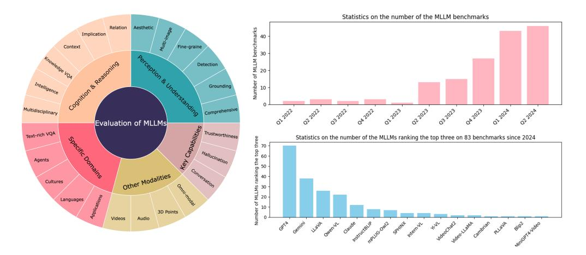
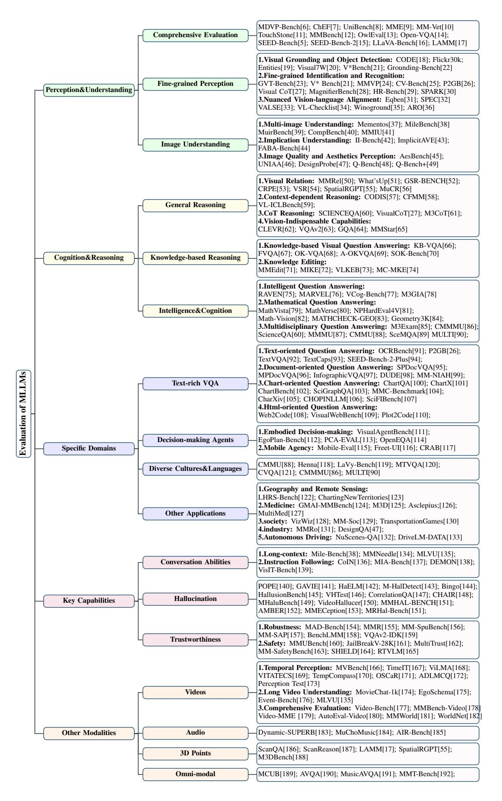
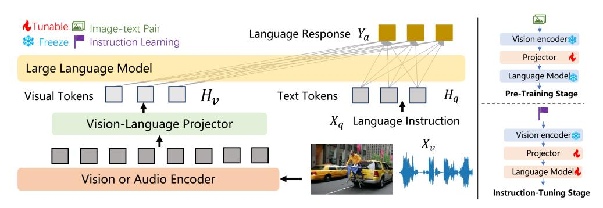

# A Survey on Benchmarks of Multimodal Large Language Models

Jian Li1∗ , Weiheng Lu2 , Hao Fei3 , Meng Luo3 , Ming Dai4 , Min Xia2 , Yizhang Jin1 , Zhenye Gan1 , Ding Qi1 , Chaoyou Fu5 , Ying Tai5 , Wankou Yang4 , Yabiao Wang1 , Chengjie Wang1

1Tencent, 2PKU, 3NUS, 4SEU, 5NJU

## Abstract

Multimodal Large Language Models (MLLMs) are gaining increasing popularity in both academia and industry due to their remarkable performance in various applications such as visual question answering, visual perception, understanding, and reasoning. Over the past few years, significant efforts have been made to examine MLLMs from multiple perspectives. This paper presents a comprehensive review of 200 benchmarks and evaluation for MLLMs, focusing on (1)perception and understanding, (2)cognition and reasoning, (3)specific domains, (4)key capabilities, and (5)other modalities. Finally, we discuss the limitations of the current evaluation methods for MLLMs and explore promising future directions. Our key argument is that evaluation should be regarded as a crucial discipline to support the development of MLLMs better. For more details, please visit our GitHub repository: https://github.com/swordlidev/Evaluation-Multimodal-LLMs-Survey.

## 1 Introduction

Large Language Models (LLM) have recently garnered substantial interest across academic and industrial domains. The impressive performance of LLMs such as GPT [\[1\]](#page-20-0) has fueled optimism that they could represent a step towards Artificial General Intelligence (AGI) in this era. The remarkable abilities of LLM have inspired efforts to integrate them with other modality-based models to enhance multimodal competencies. Consequently, Multimodal Large Language Models (MLLMs) [\[2\]](#page-20-1) have emerged, This concept is further supported by the extraordinary success of proprietary models like OpenAI's GPT-4V [\[3\]](#page-20-2) and Google's Gemini[\[4\]](#page-20-3). In contrast to earlier models that were limited to solving specific tasks, MLLMs demonstrate exceptional performance across a variety of applications, including both general Visual Question Answering (VQA) tasks and domain-specific challenges.

A comprehensive and objective benchmark for evaluating MLLMs is essential for comparing and investigating the performance of various models, and it plays a crucial role in the success of MLLMs. First, evaluating MLLMs helps us better understand the strengths and weaknesses of MLLMs. For example, the SEED-Bench [\[5\]](#page-20-4) illustrates that current MLLMs show weaker abilities in understanding spatial relationships between objects while achieving relatively high performance on global image comprehension. Second, evaluations across various scenarios can offer valuable guidance for MLLM applications in fields such as medicine, industry, and autonomous driving. This, in turn, can inspire future designs and expand the scope of their capabilities. Third, the broad applicability of MLLMs underscores the importance of ensuring their robustness, safety, and reliability, especially in safetysensitive sectors. Finally, it is significant to evaluate other user-friendly features of MLLMs including

∗Corresponding author, <swordli@tencent.com>.

1Equal contribution: Jian Li and Weiheng Lu.

<!-- Image Description: This image from an academic paper presents a visual analysis of large language models (LLMs). A circular diagram categorizes LLM evaluation aspects into "Specific Domains," "Key Capabilities," and "Other Modalities," further broken down into subcategories like "Cognition & Reasoning" and "Videos." Two bar charts show the growth in the number of LLM benchmarks over time and the relative dominance of specific LLMs (e.g., GPT-4, Gemini) across 83 benchmarks since 2024. The purpose is to illustrate the evolution of LLM evaluation and the performance landscape. -->

Figure 1: (left) Taxonomy of this benchmarks survey, Our survey covers 5 key domains and 20-30 sub-class types, (Right up) Trend of MLLMs evaluation papers over time, (Right down) The statistics on the number of the top3 MLLMs on 83 benchmarks since 2024.

the ability to handle long contexts and accurately follow instructions. Therefore, we aim to raise awareness in the community of the importance of MLLM evaluations by reviewing the current evaluation protocols.

Recently, numerous research efforts have focused on evaluating MLLMs from various perspectives, covering factors such as perception, understanding, cognition, and reasoning. Additionally, other MLLM capabilities have been tested, including robustness, trustworthiness, specialized applications, and different modalities. Despite these efforts, a comprehensive overview that captures the full scope of these evaluations is still lacking.

In this survey, we aim to provide a comprehensive overview of recent advancements in the rapidly evolving field of MLLM evaluation. As illustrated in Figure [1,](#page-1-0) our survey covers five key areas of MLLM evaluation, encompassing 20-30 detailed categories. The figure also illustrates the trend of MLLM evaluation papers over time, revealing a rapid increase in the number of publications. This growth indicates that the research area has garnered widespread attention. Furthermore, we provide statistics on the performance of the top three MLLMs across 83 benchmarks since 2024. The data indicates that OpenAI's GPT-4 and Google's Gemini exhibit superior performance and have attracted significant academic attention. As depicted in Figure. [2,](#page-2-0) we survey 200 benchmarks and organize the literature in a taxonomy consisting of five primary categories, encompassing various aspects, focusing on perception and understanding; cognition and reasoning; specific domains; key capabilities and other modalities.

- Perception and Understanding refer to the ability to receive and extract features from multimodal data and perform cross-modal analysis. Evaluating MLLMs' perception and understanding capabilities includes assessing whether MLLMs can perceive visual representations, identify visual details, grasp the meaning and emotions conveyed by images, and respond to related questions correctly. These abilities are the cornerstone of MLLMs, enabling them to perform a wide range of tasks and applications.
- Cognition and Reasoning encompass the model's capacity for advanced processing and complex inference beyond basic perception and understanding. Cognitive abilities involve processing and manipulating information to transform it into knowledge, while reasoning abilities focus on drawing logical conclusions and solving problems. Strong cognitive and reasoning abilities enable MLLMs to perform effective logical inference in complex tasks.
- Specific domains focus on MLLMs' capabilities in particular tasks and applications, such as their ability to process text-rich visual information and perform agent-based decisionmaking tasks in real-world scenarios. The discussion then extends to the evaluation of their performance in specialized domains such as medicine, autonomous driving, and industry.

<!-- Image Description: This image from an academic paper presents a hierarchical tree diagram categorizing and listing various benchmark datasets for evaluating large language models (LLMs). The tree branches into categories representing key capabilities (perception, reasoning, cognition), specific domains (decision-making, diverse cultures), and other modalities (video, audio). Leaf nodes list specific benchmark datasets with numerical references. The diagram’s purpose is to systematically showcase the breadth of LLM evaluation tasks and associated resources. -->

Figure 2: Taxonomy of benchmarks for Multimodal Large Language Models

- Key capabilities significantly impact the performance and user experience of MLLMs, including managing complex dialogues, accurately following instructions, and avoiding hallucinations while maintaining trustworthiness. These capabilities are essential for ensuring that MLLMs operate effectively across diverse real-world applications and adapt to various practical scenarios.
- Other modalities include video, audio, and 3D point clouds, which also contain rich and diverse information reflective of the real world. These modalities provide critical context and enhance the ability of MLLMs to understand complex scenarios. Evaluating MLLMs' ability to handle various modalities can help in understanding their performance across different types of data and tasks, ensuring they are suitable for complex real-world scenarios and challenging tasks.

## 2 Preliminaries

Figure. [1](#page-1-0) compares several common MLLMs including GPT4[\[3\]](#page-20-2), Gemini[\[4\]](#page-20-3), LLaVA[\[193\]](#page-28-17), Qwen-VL[\[194\]](#page-28-18), Claude[\[195\]](#page-28-19), InstructBLIP[\[196\]](#page-28-20), mPLUG-Owl2[\[197\]](#page-28-21), SPHINX[\[198\]](#page-29-0), Intern-VL[\[199\]](#page-29-1), Yi-VL[\[200\]](#page-29-2), VideoChat2[\[201\]](#page-29-3), Video-LLaMA[\[202\]](#page-29-4), Cambrian-1[\[203\]](#page-29-5), PLLaVA[\[204\]](#page-29-6), Blip2[\[205\]](#page-29-7), MiniGPT4-Video[\[206\]](#page-29-8). The standard MLLM framework can be divided into three main modules: a visual encoder g tasked with receiving and processing visual inputs, a pre-trained language model that manages the received multimodal signals and performs reasoning, and a visual-language projector P which functions as a bridge to align the two modalities. A diagram of the architecture and training process is illustrated in Figure. [3.](#page-4-0) This figure outlines the base LLM, the vision encoder, and the projector, as well as the pretraining and instruction tuning.

### 1 MLLM Architecture

Vision Encoder Taking the input image Xv as input, the vision encoder compresses the original image into more compact patch features Zv, as represented by the following formula:

$$
Z_v = g(X_v). \tag{1}
$$

The encoder g can also be an audio encoder for audio feature extraction or an encoder for other modalities. The common vision encoders are CLIP [\[207\]](#page-29-9), SigLIP [\[208\]](#page-29-10) and DINO [\[209,](#page-29-11) [210\]](#page-29-12).

Vision-Language Projector The task of the vision-language projector is to map the visual patch embeddings Zv into the text feature space:

$$
H_v = P(Z_v),\tag{2}
$$

where Hv denotes the projected visual embeddings. The aligned visual features are used as prompts and inputted into the language model along with the text embeddings. Several works, such as Qformer in BLIP-2 [\[205\]](#page-29-7), design new projectors to reduce the number of visual tokens for efficiency.

Large Language Model The pre-trained Large language model serves as the core component of MLLMs, endowing it with many outstanding capabilities, such as zero-shot generalization, instruction following, and in-context learning. The LLM accepts input sequences containing multiple modalities and outputs corresponding text sequences. A text tokenizer is typically bundled with the LLM, mapping text prompts Xq to the text tokens Hq. The text tokens Hq and the visual tokens Hv are concatenated as the input of the language model, which outputs the final response sequence Ya in an autoregressive manner:

$$
p(Y_a|H_v, H_q) = \prod_{i=1}^{L} p(y_i|H_v, H_q, y_{< i}),\tag{3}
$$

where L denotes the length of Ya. The parameter sizes of large language models (LLMs) range from 3 billion to tens of billions. Commonly used open-source LLMs include the Llama series[\[211,](#page-29-13) [212,](#page-29-14) [213,](#page-29-15) [214\]](#page-29-16), Phi [\[215,](#page-30-0) [216\]](#page-30-1),Gemma [\[217\]](#page-30-2),Qwen [\[218\]](#page-30-3).

<!-- Image Description: The diagram illustrates a multi-stage model for instruction learning. It shows a large language model processing visual and textual input. The "Vision-Language Projector" integrates visual tokens (from a vision or audio encoder) with text tokens (language instruction). The pre-training stage uses a frozen language model, while the instruction-tuning stage tunes the projector and language model. The output is a language response. The diagram uses boxes to represent processing stages and arrows to show data flow. -->

Figure 3: The architectures and training process of MLLMs.

#### 2 MLLM Training

The standard training process of MLLMs is a crucial factor that determines their performance on downstream tasks and their ability to handle diverse tasks. In this section, we provide an overview of various training methodologies, including pre-training, and instruction-tuning.

Pre-training The pre-training(PT) stage focuses on aligning different modalities within the embedding space, enabling the language model to accept inputs from various modalities. This phase primarily involves large-scale text-paired data, predominantly in the form of image-caption pairs. An image-caption pair (X, Y ) is typically expanded into a single-turn conversation (Xinstruct, Xa), where Xinstruct contains an image Xv and a randomly sampled question Xq from a set of instructions asking the assistant to briefly describe the image, and Xa is the original image description. Given such a conversation, the model is trained to autoregressively predict the image description. Consequently, following the "next token prediction" paradigm, we can compute the probability of predicting Xa conditioned by Xv and optimize it using a standard cross-entropy loss function:

$$
\max_{\theta} \sum_{i=1}^{L} \log p_{\theta}(x_i | X_v, X_{instruct}, X_{a, < i}),\tag{4}
$$

where L is the length of Xa and θ denotes the trainable parameters. In order to better align different modalities of knowledge and avoid catastrophic forgetting during the PT stage, θ typically includes only a learnable modality interface, *i.e.*, a vision-language projector.

Instruction-tuning Instruction-tuning(IT) aims to fine-tune the models on specific tasks by leveraging task-specific instructions. IT is typically conducted within the paradigm of Supervised Fine-Tuning (SFT). The IT datasets are transformed into an instruction-based format, presented in the form of single-turn or multi-turn dialogue structures. Given an image Xv and its caption, a conversation data (X1 q , X1 a , . . . , XT q , XT a ) can be generated, where T is the total number of turns. Typically, we can organize the data into a sequence of instructions and responses, as outlined in [\[193\]](#page-28-17). With this multimodal instruction-following sequence, IT can be performed using the same auto-regressive training objective as in the PT stage. A common strategy involves maintaining the visual encoder weights fixed while continuing to update the PT weights of both the projector and the LLM during the IT process.

## 3 Perception and Understanding

When evaluating the perception and understanding capabilities of MLLMs, we focus on benchmarks that assess the model's fundamental abilities in visual information processing. This includes evaluating the MLLMs' accuracy in object identification and detection, understanding of scene context and object relationships, and ability to respond to questions about image content. Perception and understanding abilities are the cornerstone of MLLMs, enabling them to perform a wide range of tasks and applications. This section first introduces comprehensive evaluation benchmarks for MLLMs, and then separately discusses coarse-grained and fine-grained benchmarks for visual perception.

### 1 Comprehensive Evaluation

MLLMs rely on the powerful LLM to perform multimodal tasks, showing amazing emergent abilities in various studies. In order to fully match the flourish of MLLMs, Many comprehensive evaluation benchmarks are proposed.

To advance research on visual-related tasks, LLaVA-Bench [\[16\]](#page-20-15) and OwlEval [\[13\]](#page-20-12) were constructed to examine a variety of MLLM capabilities, but the quantity of these benchmarks was too small to fully reflect the performance of MLLMs. There was still an issue of lacking a more comprehensive evaluation with large-scale data. Fu et al. [\[9\]](#page-20-8) filled this gap by presenting the first comprehensive MLLM evaluation benchmark, MME, which measured both perception and cognition abilities across a range of subtasks. Considering that subjective benchmarks like OwlEval relied on human labor for evaluations, which was not scalable and could exhibit significant bias, Liu et al. [\[12\]](#page-20-11) proposed employing GPT-4 [\[3\]](#page-20-2) to match MLLM predictions and devised MMBench to robustly assess various abilities of MLLMs. However, both the binary judgments used in MME and the multiple-choice answer selection employed by MMBench could not fully capture the complexity of open-ended real-world dialogues. In light of this concern, Open-VQA [\[14\]](#page-20-13) and TouchStone [\[11\]](#page-20-10) were proposed to support open-ended answers. Nevertheless, the relatively small scale of these benchmarks introduced instability in the evaluation statistics. To overcome this limitation, SEED-Bench was introduced with annotations six times larger than existing benchmarks. It included a substantial number of multiple-choice questions covering various evaluation dimensions for both image and video modalities. Additionally, SEED-Bench-2 categorized MLLMs' capabilities into hierarchical levels from L0 to L4 and served as a benchmark for evaluating MLLMs' hierarchical capabilities. Despite the promising qualitative results regarding MLLMs' capabilities, it remained unclear how to systematically evaluate complex multimodal tasks and what the relationships among the evaluated tasks were. Based on this consideration, MM-Vet [\[10\]](#page-20-9) was devised to study integrated vision-language capabilities, allowing the evaluation to provide insights beyond overall model rankings. Moreover, MDVP-Bench [\[6\]](#page-20-5) and LAMM [\[17\]](#page-20-16) were created to provide a comprehensive assessment of MLLMs' capabilities, particularly in understanding visual prompting instructions. Furthermore, to provide a fair and systematic assessment of MLLMs' performance across diverse multimodal tasks, ChEF [\[7\]](#page-20-6) and UniBench [\[8\]](#page-20-7) were constructed as standardized and holistic evaluation frameworks, which helped to comprehensively understand the capabilities and limitations of MLLMs.

#### 2 Fine-grained Perception

One indispensable cornerstone of MLLMs is the ability to perceive visible objects within scenes precisely. This includes evaluating MLLMs' capabilities in object detection and recognition, understanding details within local regions, and achieving accurate vision-language alignment. Such fine-grained perception is crucial for effective multimodal understanding and interaction.

Visual Grounding and Object Detection: Object-level grounding and detection are critical steps in better perceiving images and solving image-related questions, providing a stronger link between QA pairs and images. Flickr30k Entities [\[19\]](#page-20-18) and Visual7W [\[20\]](#page-20-19) were early benchmarks for entity localization, focusing on the detailed grounding of specific phrases in image regions and QA tasks related to local areas. These benchmarks served as the foundation for subsequent developments in the field. However, they did not provide enough detailed contextual information about objects within the scene. Zang et al. [\[18\]](#page-20-17) investigated contextual object detection, which involved understanding visible objects within human-AI interactive contexts, and presented the CODE benchmark to facilitate research in this area. To evaluate MLLMs' ability in challenging scenarios where images contained abundant and complex information, Wu et al. [\[21\]](#page-20-20) introduced V\*Bench, a benchmark focused on detailed visual grounding in high-resolution images. However, these benchmarks for visual grounding primarily used data with short captions and overlooked MLLMs' chat performance when asked to ground. To address this issue, Zhang et al.[\[22\]](#page-20-21) introduced a benchmark called Grounding-Bench, which allowed for combined evaluation of both grounding and chat capabilities.

Fine-grained Identification and Recognition:Fine-grained identification and recognition requires MLLMs to identify and analyze detailed visual features. In order to determine what makes for a good visual tokenizer, GVT-bench[\[23\]](#page-21-0) was designed to evaluate MLLMs' fine-grained visual perception through object counting and multi-class identification. However, the data used in GVT-bench were constrained to relatively small resolutions. To address this limitation, MagnifierBench[\[28\]](#page-21-5) and HR-Bench[\[29\]](#page-21-6) extended the input resolution to a significantly larger range, thereby evaluating the

ability of MLLMs to discern details in high-resolution images. Considering that most open-source MLLMs adopted the Pretrained Contrastive Language-Image PreTraining (CLIP) model[\[207\]](#page-29-9) as the visual encoder, Tong et al. [\[24\]](#page-21-1) proposed the MMVP benchmark consisting of CLIP-blind pairs. They found that all tested models struggled with simple questions about visual details. Given that existing benchmarks were insufficient in size and did not cover crucial visual elements such as depth and spatial awareness, CV-Bench[\[25\]](#page-21-2) was created to evaluate the fundamental 2D and 3D visual understanding of MLLMs. Furthermore, Yu et al.[\[30\]](#page-21-7) proposed a benchmark named SPARK, which focused on evaluating the ability of MLLMs to analyze images captured by various multi-vision sensors, including RGB, thermal, depth, and X-ray images. Additionally, P2GB [\[26\]](#page-21-3) was designed to assess fine-grained visual capabilities, especially in text-rich scenarios, requiring comprehensive recognition and understanding of image text content. Moreover, VisualCoT [\[27\]](#page-21-4) was constructed with visual chain-of-thought prompts, allowing MLLMs to focus on specific regions within a complete image, similar to how humans comprehend intricate visual information.

Nuanced Vision-language Alignment:Nuanced vision-language alignment involves interpreting complex interactions between visual and textual information, grasping subtle meanings, and aligning semantics between images and text. Winoground [\[35\]](#page-21-12) was designed to require models to match two images with two captions that contained the same set of words in different orders. However, the scale of Winoground was restricted by its costly curation, and it lacked a focus on linguistic phenomena. To address these limitations, VALSE [\[33\]](#page-21-10) and VLChecklist [\[34\]](#page-21-11) examined how MLLMs understood visual-linguistic concepts by converting real captions into confusing alternatives. By modifying textual representations related to relationships, attributes, and order, ARO [\[36\]](#page-21-13) assessed whether MLLMs could achieve fine-grained visual-language alignment on key concepts. Moreover, Eqben[\[31\]](#page-21-8) assessed whether MLLMs were sensitive to visual semantic changes by making minimal semantic changes in images, but the image diversity was limited by virtual engines. To produce diverse images that met the requirements, Peng et al.[\[32\]](#page-21-9) developed a benchmark called SPEC, utilizing a progressive pipeline to synthesize images that varied in a specific attribute while ensuring consistency in other aspects.

#### 3 Image Understanding

The image understanding task involves analyzing visual content to extract meaningful information, which includes grasping the context of scenes and integrating visual details with textual information to generate coherent descriptions and insights.

Multi-image Understanding: Multi-image understanding requires MLLMs to compare, analyze, and comprehend the relationships or variations among multiple images, thereby enabling more comprehensive insights into visual content. Mementos[\[37\]](#page-21-14) was designed to assess MLLMs' sequential image understanding abilities, but it primarily focused on state changes among images, while neglecting other aspects. To address this issue, MileBench [\[38\]](#page-21-15) and MuirBench [\[39\]](#page-21-16) were constructed to assess multi-image cognition through a variety of task types. However, these benchmarks fell short in terms of task depth and breadth. Furthermore, MMIU [\[41\]](#page-21-18) provided a comprehensive evaluation by including a large number of test samples that spanned a wide range of multi-image tasks and relationships. Besides, Kil et al.[\[40\]](#page-21-17) focused on tasks involving relativity and comparison between multiple visual input, then introduced COMPBENCH to evaluate the comparative understanding capabilities of MLLMs. COMPBENCH required MLLMs to answer questions based on a pair of visually or semantically related images.

Implication Understanding: Understanding the meaning of images requires not only intuitive observation but also an exploration of the human emotions and cultural contexts they reflect. II-Bench[\[42\]](#page-21-19) and ImplicitAVE[\[43\]](#page-21-20) aimed to assess MLLMs' higher-order perceptual abilities with visual implications. To evaluate the emotional perception capabilities of MLLMs, FABA-Bench [\[44\]](#page-22-0) was designed for facial affective behavior analysis. FABA-Bench required MLLM to recognize facial expressions and movements, which are critical to understanding an individual's emotional states and intentions.

Image Quality and Aesthetics Perception:Image quality and aesthetics perception involves assessing image quality, perceiving visual distortions, and understanding low-level attributes such as color, lighting, composition, and style. It also relates to the aesthetics and design sense of photographs. Q-Bench[\[48\]](#page-22-4) explored the potential of MLLMs in low-level perception abilities. To highlight subtle differences or similarities that might not be evident when images were viewed in isolation, Q- Bench+[\[49\]](#page-22-5) extended the evaluation of low-level perception from single images to image pairs. To better align with human aesthetics, comprehensive aesthetic evaluation benchmarks AesBench[\[45\]](#page-22-1) and UNIAA[\[46\]](#page-22-2) were constructed to systematically evaluate the aesthetic abilities of MLLMs. Besides, Lin et al.[\[219\]](#page-30-4) proposed DesignProbe to comprehensively assess design capabilities of MLLMs from both the element level and the overall design level.

# 4 Cognition and Reasoning

MLLMs' cognitive and reasoning abilities encompass the model's capacity for advanced processing and complex inference beyond basic perception and understanding. Cognitive abilities involve integrating and manipulating extracted information to form coherent representations, while reasoning abilities focus on drawing logical conclusions and solving problems. Strong cognitive and reasoning abilities enable MLLMs to perform effective logical inference in complex tasks.

## 1 General Reasoning

The reasoning ability of MLLMs involves extracting and inferring relevant information from visual and textual inputs to draw logical conclusions and answer questions. This section introduces benchmarks for evaluating MLLMs' general reasoning capabilities, focusing on three key areas: visual relation reasoning, vision-indispensable reasoning, and context-related reasoning.

Visual Relation: Evaluating MLLMs' reasoning about visual relations primarily involves spatial and causal relationships. Regarding spatial relationships, these benchmarks mainly focus on evaluating MLLMs' understanding of the spatial arrangement, relative positions, and interactions of objects [\[220\]](#page-30-5). VSR[\[54\]](#page-22-10) and What's Up[\[51\]](#page-22-7) were developed to test MLLMs' ability to reason about spatial relations in natural image-text pairs. However, these benchmarks primarily focused on classification tasks rather than comprehending relations within scenes. To assess more complex and general relational reasoning of MLLMs, Wang et al.[\[53\]](#page-22-9) introduced the Circular-based Relation Probing Evaluation (CRPE), the first benchmark to encompass all elements of relation triplets (subject, predicate, object). Recognizing that interactions and associations between distinct objects remained a significant challenge for MLLMs, Nie et al.[\[50\]](#page-22-6) developed Multi-Modal Relation Understanding (MMRel), a large-scale benchmark consisting of data with well-defined inter-object relations. Additionally, GSR-BENCH[\[52\]](#page-22-8) extended the What's Up benchmark by incorporating bounding box annotations and depth information to better evaluate grounded spatial relation understanding. Similarly, Chen et al.[\[55\]](#page-22-11) proposed SpatialRGBT-Bench, a benchmark that incorporated ground-truth 3D annotations and flexibly integrated depth information. In terms of causal relationships, causal reasoning refers to identifying the relationship between a cause and its effect. To explore MLLMs' ability to perform multimodal causal reasoning tasks, Li et al.[\[56\]](#page-22-12) proposed a benchmark called MuCR. This benchmark challenged MLLMs to infer semantic cause-and-effect relationships based solely on visual cues such as action, appearance, clothing, and environment.

Context-related Reasoning: Context-related visual comprehension requires MLLMs to effectively leverage contextual knowledge in solving visual problems. To assess the ability of MLLMs to answer context-dependent questions, CODIS [\[57\]](#page-22-13) was created, requiring MLLMs to use context from freeform text to enhance visual comprehension. Recognizing that existing MLLMs often trusted what they saw but struggled to understand presuppositions in sentences, Li et al.[\[58\]](#page-22-14) introduced CFMM, a counterfactual reasoning benchmark designed to assess MLLMs' ability to make presuppositions based on established facts. Zong et al. [\[59\]](#page-22-15) developed VL-ICL Bench, a benchmark suite designed to specifically evaluate VLLMs' in-context learning, which involved utilizing contextual information to complete new tasks.

Chain-of-Thought Reasoning:Multi-modal Chain-of-Thought (CoT) requires models to leverage knowledge from both textual and visual modalities for step-by-step reasoning. To diagnose the multi-hop reasoning ability and interpretability of multi-modal large language models (MLLMs), Lu et al.[\[60\]](#page-22-16) generated lectures and explanations as CoT to mimic the multi-hop reasoning process for answering questions and presented Science Question Answering (SCIENCEQA). SCIENCEQA consisted of questions covering diverse science topics, along with annotations of their answers and corresponding lectures and explanations, demonstrating the utility of CoT in improving the questionanswering performance of MLLMs. Besides, Shao et al.[\[27\]](#page-21-4) introduced the visual chain-of-thought benchmark for evaluating MLLMs in scenarios where they need to focus on specific local regions

or reasons to identify objects. However, these benchmarks were relatively simple and focused only on certain specific domains. Therefore, Chen et al.[\[61\]](#page-22-17) introduced M3CoT to address these limits, advancing the multi-domain, multi-step, and multi-modal CoT.

Vision-Indispensable Reasoning: Recognizing that MLLMs may rely on language priors rather than visual information when answering questions, some works have aimed to compel MLLMs to prioritize visual data. Goyal et al.[\[63\]](#page-22-19) introduced VQAv2, which consisted of pairs of similar images that led to different answers. However, this approach did not effectively handle open-ended questions. In response, CLEVR[\[62\]](#page-22-18) was designed with open-ended question answering. It also ensured that external information sources, such as commonsense knowledge, did not influence answer accuracy. Nonetheless, CLEVR's reliance on synthetic images overlooked the realism and diversity found in natural photographs. To address these limitations, GQA[\[64\]](#page-22-20) was developed, offering well-defined semantic representations along with the rich semantic and visual complexity of real-world images. Additionally, Chen et al.[\[65\]](#page-22-21) introduced MMStar, a vision-indispensable benchmark that covered a wide range of tasks and difficulty levels.

### 2 Knowledge-based Reasoning

Evaluating MLLMs' ability to utilize knowledge is crucial for ensuring their effectiveness in complex tasks and enhancing their real-world performance. These benchmarks mainly focus on two key aspects. One aspect is knowledge-based question answering, which tests MLLMs' ability to handle questions that require structured or extensive external knowledge. The other aspect is knowledge editing, which assesses MLLMs' accuracy and consistency in updating and maintaining knowledge content.

Knowledge-based Visual Question Answering: Knowledge-based visual question answering requires various types of knowledge, including explicit fact-based information from knowledge bases, commonsense knowledge about human behavior, and general external knowledge. The earliest benchmarks in this area were KB-VQA[\[66\]](#page-22-22) and FVQA[\[67\]](#page-22-23), but they were limited by their use of "closed" knowledge sources. OK-VQA[\[68\]](#page-23-0) advanced these benchmarks by providing a larger scale and higher quality of questions and images, utilizing "open domain" knowledge rather than a fixed source. However, OK-VQA still relied on simple lookup knowledge and required minimal reasoning. To overcome this limitation, A-OKVQA[\[69\]](#page-23-1) was introduced, incorporating more commonsense knowledge and demanding greater reasoning. Furthermore, Wang et al.[\[70\]](#page-23-2) developed SOK-Bench to evaluate MLLMs' situated and open-world commonsense reasoning in videos.

Knowledge Editing: Knowledge editing refers to the ability to update outdated, unknown, or incorrect information within MLLMs. The benchmark MMEdit, proposed by Cheng et al.[\[71\]](#page-23-3), provided a platform for testing the editability of MLLMs. However, it primarily focused on coarsegrained knowledge, which often failed to accurately represent fine-grained entities and scenarios in the real world. To address this limitation, Cheng[\[71\]](#page-23-3) introduced MIKE, a comprehensive and challenging benchmark for fine-grained multimodal entity knowledge editing. Meanwhile, VLKEB [\[73\]](#page-23-5) expanded the evaluation of knowledge editing portability, demonstrating MLLMs' ability to effectively apply edited knowledge in related contexts. Despite that, these benchmarks overlooked the organization of multimodal knowledge and lacked a precise definition of multimodal knowledge editing. To fill this gap, MC-MKE[\[74\]](#page-23-6) was developed as a benchmark to evaluate the reliability, locality, generality, and consistency of MLLMs across different editing formats.

#### 3 Intelligence&Cognition:

Inspired by the development of human intelligence, some benchmarks leverage cognitive and educational theories to assess the intelligence of MLLMs. For instance, intelligence tests featuring abstraction visual reasoning and various levels of mathematical problems are used to evaluate MLLMs' logical reasoning capabilities. Additionally, multidisciplinary questions from various educational periods are employed to assess MLLMs' ability to integrate diverse knowledge and apply complex reasoning skills to solve intricate problems. These approaches are crucial for understanding and enhancing the cognitive and problem-solving capabilities of MLLMs.

Intelligent Question Answering: Intelligent question answering aims to explore the intelligence of MLLMs through cognitive science perspectives. One key aspect is abstract visual reasoning (AVR)—the ability to discern relationships among patterns in images and predict subsequent patterns. RAVEN[\[75\]](#page-23-7) tested abstract visual reasoning primarily with mathematical patterns over predefined geometric shapes, but its evaluation scope was limited as it addressed only a single task type. Therefore, MARVEL[\[76\]](#page-23-8) and VCog-Bench[\[77\]](#page-23-9) were introduced to evaluate MLLMs across multidimensional AVR tasks, but remained confined to AVR, neglecting other dimensions of cognition. To integrate cognitive science principles for a comprehensive understanding of MLLMs' intelligence, Song[\[78\]](#page-23-10) identified five key cognitive factors based on the well-recognized Cattell-Horn-Carroll (CHC) model and introduced M3GIA, the first comprehensive cognitive-driven benchmark designed to evaluate the general intelligence of MLLMs.

Mathematical Question Answering: Using mathematics problems to evaluate MLLMs is essential for assessing their logical reasoning capabilities, as these problems require complex reasoning, pattern recognition, and abstract thinking. Such tasks help determine if MLLMs can apply rules, discover patterns, and perform sophisticated reasoning. Geometry3K[\[84\]](#page-23-16) was introduced to evaluate capabilities in solving geometry problems, but it had a narrow focus on specific aspects of plane geometry. To address this issue, Lu et al.[\[79\]](#page-23-11) collected multiple datasets to construct an integrated benchmark, MathVista, which covered a range of mathematical tasks, such as functions and solid geometry. However, MathVista lacked a detailed classification of mathematical subdomains and emphasized visual abilities more than pure mathematical reasoning. Consequently, Math-V[\[82\]](#page-23-14) and MathVerse[\[80\]](#page-23-12) were developed, confining data to specific mathematical subjects and focusing on mathematical reasoning abilities. Additionally, Fan et al.[\[81\]](#page-23-13) proposed NPHardEval4V, a benchmark that used algorithmic problems and converted their textual descriptions into visual representations, aimed at evaluating the pure reasoning capabilities of MLLMs. Motivated by the idea that "if a model truly understands a problem, it should perform robustly across various tasks related to that problem," Zhou et al.[\[83\]](#page-23-15) introduced MATHCHECK-GEO, a benchmark focused on the universality of tasks and the robustness of question formulation within visual contexts. It was designed to test whether a model's performance is consistent across different tasks related to the same problem.

Multidisciplinary Question Answering: Evaluating MLLMs using multidisciplinary questions from various educational stages assesses their ability to integrate and apply knowledge across different domains. This approach tests MLLMs' reasoning and problem-solving skills in diverse contexts, providing a comprehensive measure of general intelligence and cognition. ScienceQA[\[60\]](#page-22-16) was a benchmark containing multimodal science questions with rich domain diversity. While it covered a range of disciplines, most of the questions were at the elementary to middle school level, which limited its depth. To address this issue, M3Exam[\[85\]](#page-23-17) was proposed with a multilevel structure, featuring exams from three critical educational stages to comprehensively assess MLLMs' proficiency at different levels. Additionally, SceMQA[\[89\]](#page-23-21) focused on college entrance-level problems. Due to the importance of this stage, SceMQA comprised questions with answers accompanied by more detailed explanations. Intended to evaluate expert-level understanding, Yue et al.[\[87\]](#page-23-19) introduced MMMU, which included problems from college exams, quizzes, and textbooks across six common disciplines. However, these benchmarks were primarily available in English, restricting the evaluation to a single language. Therefore, CMMMU[\[86\]](#page-23-18), CMMU[\[88\]](#page-23-20), and MULTI[\[90\]](#page-24-0) were created to evaluate multi-discipline and multi-type question understanding and reasoning in Chinese.

# 5 Specific Domains

This section focuses on MLLMs' capabilities in specific tasks and applications, such as their ability to integrate complex visual and textual information, adapt to decision-making roles in dynamic environments, and effectively process diverse cultural and linguistic data. It then extends to discuss the practical applications of MLLMs, highlighting their impact on various sectors such as medicine, industry, and autonomous driving. By providing an overview of these benchmarks, this section aims to underscore the advancements in evaluating MLLMs' performance and their potential to address real-world challenges across different domains.

## 1 Text-rich VQA

Evaluating MLLMs in text-rich visual question answering is crucial for understanding how well models interpret and integrate textual and visual information within images. This evaluation covers several aspects, including the accuracy of text recognition, contextual understanding, and the ability to synthesize information from both modalities. In addition to text comprehension, it also requires an understanding of layout and structure to effectively analyze multimodal documents, charts, and HTML.

Text-oriented Question Answering: Some works evaluated MLLMs' effectiveness in text-related visual tasks, such as text recognition and scene text-centric visual question answering. Singh et al.[\[92\]](#page-24-2) introduced TextVQA, which contained questions requiring the model to read and reason about the text in the image to provide answers. However, the short answers provided in TextVQA were insufficient for a comprehensive description of the image. To address this issue, TextCaps[\[93\]](#page-24-3) extended the length of sentences in the answers and involved many switches between OCR and vocabulary tokens. Despite these efforts, existing benchmarks could be time-consuming, and inaccurate annotations in some datasets made accuracy-based evaluation less precise. In response, Liu et al.[\[91\]](#page-24-1) developed OCRBench to facilitate the accurate and convenient evaluation of MLLMs' OCR capabilities. To quantitatively assess visual reasoning capabilities in text-rich and high-resolution scenarios, Chen et al.[\[26\]](#page-21-3) constructed a challenging benchmark, P2GB. This benchmark included comprehensive image understanding, fine-grained recognition, and image text content understanding. In order to cover a broader spectrum of text-rich scenarios, SEED-Bench-2-Plus[\[94\]](#page-24-4) was developed to evaluate MLLMs' performance in comprehending text-rich visual data across a wide range of real-world scenarios.

Document-oriented Question Answering: Document-oriented question answering requires MLLMs not only to read text but also to interpret it within the layout and structure of the document. Mathew et al.[\[97\]](#page-24-7) introduced InfographicVQA, which included questions requiring the combination of multiple cues. Although InfographicVQA showcased significant diversity in topics and designs, it still preferred using visual aids over long text passages. To address this limitation, Single Page DocVQA (SPDocVQA)[\[95\]](#page-24-5) was introduced as a more diverse benchmark, featuring documents of various types and origins created over several decades. However, it was built exclusively on single-page document excerpts and was limited to several domains represented in the Industry Documents Library. MP-DocVQA[\[96\]](#page-24-6) extended this by including preceding and following pages of documents, but the additional pages often served as mere distractors. To overcome these issues and establish a more practical and enduring benchmark, DUDE[\[98\]](#page-24-8) was created as a large-scale, multi-page, multidomain, multi-industry benchmark for evaluating MLLMs in document understanding. Additionally, to evaluate the ability of MLLMs to understand long multimodal documents, MM-NIAH[\[99\]](#page-24-9) was designed to systematically assess long context capability of MLLMs using the Needle-In-A-Haystack (NIAH) test.

Chart-oriented Question Answering: Chart understanding plays a pivotal role when applying MLLMs to real-world tasks such as analyzing scientific papers or financial reports. ChartQA[\[100\]](#page-24-10) was a large-scale benchmark involving visual and logical reasoning over charts, but it had limited chart types. To scale up, Li et al.[\[103\]](#page-24-13) utilized Arxiv papers and constructed SciGraphQA with multi-turn question-answer conversations on scientific graphs. MMC[\[104\]](#page-24-14) and ChartBench[\[102\]](#page-24-12) further expanded the types and tasks of chart data. However, the question design in these benchmarks remained relatively simplistic. To further validate MLLMs' capabilities in more complex reasoning tasks involving chart data, Xia et al.[\[101\]](#page-24-11) proposed the benchmark ChartX for comprehensive chart understanding and reasoning. However, ChartX yielded artificial charts generated by GPT-4[\[3\]](#page-20-2), leading to a narrow distribution. Therefore, CharXiv[\[105\]](#page-24-15) was proposed for evaluating MLLMs' understanding of real-world scientific charts, including complex compositions with multiple subplots collected from arXiv. To further improve the quality, Roberts et al.[\[107\]](#page-24-17) presented SciFIBench, a benchmark for scientific figure interpretation. They adopted adversarial filtering when curating negative examples for each question to increase difficulty, while also performing human verification on every question to ensure high-quality content. Moreover, in order to assess MLLMs' understanding of charts from various perspectives, Fan et al.[\[106\]](#page-24-16) proposed CHOPINLLM, including three different levels of questions (literal, inferential, and reasoning QAs).

Html-oriented Question Answering: Web pages present a complex interplay of visual and textual information, along with interactive elements, requiring MLLMs to possess rigorous understanding abilities over hierarchical structures and contextual relationships. Web2Code[\[108\]](#page-24-18) was a benchmark with web pages based on instruction-response pairs. The responses included structured questions and answers about the webpage. However, web elements are often small, numerous, and scattered across the page, demanding fine-grained recognition and accurate spatial reasoning. To address these limitations, Liu et al.[\[109\]](#page-24-19) introduced VisualWebBench, which assessed MLLMs at three levels: website-level, element-level, and action-level. Additionally, following the principle "What I cannot create, I do not understand," Plot2Code[\[110\]](#page-24-20) evaluated MLLMs' ability to generate code that effectively rendered a provided image from HTML files, further showcasing their multimodal understanding and reasoning capabilities.

### 2 Decision-making Agents

Decision-making agents expect MLLMs to possess human-level planning and scheduling abilities, which are fundamental for making informed decisions and taking appropriate actions in complex environments. This capability holds significant potential for addressing real-world problems.

Embodied Decision-making: Embodied Decision-making requires MLLMs to be able to integrate sensory inputs and interact with the environment in a way that mimics human physical experiences. OpenEQA[\[114\]](#page-25-2) was the first benchmark for embodied question answering, supporting both episodic memory and active exploration use cases. However, it focused solely on the answers provided by MLLMs and did not consider the intermediate reasoning processes. Chen et al.[\[113\]](#page-25-1) argued that it was essential to enable multi-dimensional evaluation of the decision-making process, encompassing perception, reasoning, and action perspectives, rather than relying solely on final rewards or success rates. They proposed PCA-EVAL for evaluating the embodied decision-making ability of MLLMs from different perspectives, including three complex scenarios: autonomous driving, domestic robotics, and open-world games. However, these benchmarks were limited by the small number of handcrafted questions and reliance on single-image visual observation. To study the embodied planning and decision-making capabilities of MLLMs more systematically, Chen et al.[\[112\]](#page-25-0) used large-scale egocentric videos reflecting daily human activities from a first-person perspective to construct EgoPlan-Bench. EgoPlan-Bench aimed to assess MLLMs' human-level planning capabilities in real-world scenarios, featuring realistic tasks, diverse actions, and complex visual observations. Despite that, these benchmarks failed to sufficiently challenge or showcase the full potential of MLLMs in complex environments. To address this gap, Liu et al.[\[111\]](#page-24-21) introduced VisualAgentBench (VAB), a comprehensive and pioneering benchmark specifically designed to train and evaluate MLLMs as visual foundation agents across diverse scenarios, with tasks formulated to probe the depth of MLLMs' understanding and interaction capabilities.

Mobile Agency: Mobile-Agent leverages visual perception tools to accurately identify and locate both visual and textual elements within the app's front-end interface. Drawing on the visual information, it autonomously plans and decomposes complex tasks, navigating the mobile app through each step of the operation. To comprehensively assess Mobile-Agent's capabilities, Wang et al.[\[115\]](#page-25-3) introduced Mobile-Eval, a benchmark centered around current mainstream mobile apps. Mobile-Eval included instructions for various difficulty levels, but it primarily assessed whether MLLMs could complete the instructions, neglecting the fine-grained perception of the web interface. To fill this gap, You et al.[\[116\]](#page-25-4) proposed Ferret-UI, which required MLLMs to explain the functionality and provide fine-grained descriptions of UI elements. However, existing benchmarks for MLM agents in interactive environments were constrained by single environments and lacked detailed and generalized evaluation methods. To overcome these limitations, Xu et al.[\[117\]](#page-25-5) introduced CRAB, the first agent benchmark framework designed to support cross-environment tasks.

#### 3 Diverse Cultures and Languages

Most benchmarks primarily use English, leading to the neglect of other languages and cultures. To address this limitation, some benchmarks have been introduced to supplement data in a broader range of languages. CMMU[\[88\]](#page-23-20), CMMMU[\[86\]](#page-23-18), and MULTI[\[90\]](#page-24-0) were presented for multi-modal and multi-type questions in Chinese, featuring a wider variety of question types. Besides, the Henna benchmark[\[118\]](#page-25-6) was proposed to test MLLMs in Arabic culture, while the LaVy-Bench benchmark[\[119\]](#page-25-7) was designed for evaluating MLLMs' understanding of Vietnamese visual language tasks. To further enrich language diversity, MTVQA[\[120\]](#page-25-8) was proposed as the first benchmark featuring high-quality human expert annotations across 9 diverse languages. However, although MTVQA extended its linguistic range, it kept images the same, resulting in a narrow cultural representation. To address this limitation, Romero[\[121\]](#page-25-9) constructed CVQA, a culturally diverse multilingual visual question answering benchmark designed to cover a rich set of languages and cultures.

#### 4 Other Applications

Some works focused on assessing MLLMs' abilities to handle highly professional and domainspecific data, such as medicine, transportation, engineering, remote sensing, and autonomous driving. These evaluations provided insights into how well MLLMs could adapt to and process specialized information in various complex fields, highlighting their potential for applications in areas requiring deep expertise and precise knowledge.

Geography and Remote Sensing:MLLMs can help enhance geographic information extraction and environmental monitoring by analyzing multimodal data in the fields of geography and remote sensing. Roberts et al.[\[123\]](#page-25-11) constructed a benchmark to probe the key geographic and geospatial knowledge of a suite MLLMs. However, the diverse geographical landscapes and varied objects in remote sensing imagery were not adequately considered. To bridge this gap, Muhtar et al.[\[122\]](#page-25-10) introduced LHRS-Bench, a benchmark for thoroughly evaluating MLLMs' abilities in remote sensing image understanding.

Medicine:Medical-based benchmarks primarily assess MLLMs' ability to integrate medical knowledge with visual modalities to perform accurate medical diagnoses and recommendations. The Asclepius benchmark[\[126\]](#page-25-14) covered a range of medical specialties, aiming to comprehensively evaluate MLLMs' capabilities across various medical fields. However, it primarily focused on 2D medical images, leaving 3D images less explored. Therefore, Bai et al.[\[125\]](#page-25-13) introduced M3D-Bench, a 3D multimodal medical benchmark that enabled automatic evaluation across eight tasks. Furthermore, Chen et al.[\[124\]](#page-25-12) developed GMAI-MMBench, the most comprehensive general medical AI benchmark to date, featuring a well-categorized data structure and multi-perceptual granularity. However, these benchmarks were relatively lacking in depth, such as overlooking the rich interconnected information across many heterogeneous biomedical sensors. To address this challenge, To address this challenge, Mo et al.[\[127\]](#page-25-15) presented MultiMed, a benchmark designed to evaluate the ability of MLLMs to integrate data from multiple sources while performing several tasks simultaneously.

Industry: Some benchmarks have been designed to assess MLLMs' capabilities in industrial design and manufacturing applications. Doris et al. [\[47\]](#page-22-3) proposed a benchmark called DesignQA to explore MLLMs' understanding of design based on engineering requirement documents. DesignQA integrated information from both visual and long-text inputs, emphasizing the complexity and multimodal nature of real-world engineering tasks. To evaluate MLLMs' abilities in robotic applications, the MMRo [\[131\]](#page-26-1) benchmark defined four fundamental capabilities required for a robot's central processing unit and was the first diagnostic benchmark specifically designed to systematically analyze the diverse failure modes of MLLMs in robotics.

Society: Benchmarking MLLMs in addressing social needs and related domains is essential for evaluating their performance in real-world interactions and practical scenarios. To address the needs of blind individuals, Gurari et al. [\[128\]](#page-25-16) proposed VizWiz, a benchmark consisting of visual questions originating from blind people. To evaluate MLLMs' abilities in understanding information from social media interactions, Jin et al. [\[129\]](#page-25-17) introduced MM-SOC, a benchmark designed to holistically assess MLLMs' performance on multimodal tasks derived from online social networks. Considering the critical role of transportation in modern society, Zhang et al. [\[130\]](#page-26-0) developed TransportationGames, a comprehensive benchmark aimed at accurately evaluating MLLMs' capabilities in performing transportation-related tasks.

Autonomous Driving: Autonomous driving is a rapidly developing field with immense potential to improve transportation safety and efficiency through advancements in sensor technologies and computer vision. Qian et al.[\[132\]](#page-26-2) constructed the first VQA benchmark for autonomous driving scenarios, named NuScenes-QA. It addressed visual question answering and provided richer visual information, including images and point clouds. However, NuScenes-QA primarily focused on scene-level driving tasks and could not cover all the reasoning processes involved in driving. In contrast, DriveLM-Data[\[133\]](#page-26-3) was a more comprehensive benchmark, which encapsulated perception, prediction, and planning for autonomous driving.

# 6 Key Capabilities

These benchmarks evaluated dialogue capabilities, including handling extended dialogues and accurately following instructions, as well as assessing the model's level of hallucination and trustworthiness. Such capabilities are crucial for ensuring that MLLMs perform effectively across a range of real-world applications and can adapt to various practical scenarios.

## 1 Conversation Abilities:

Some benchmarks focus on evaluating MLLMs' performance in conversations, specifically assessing how well these models handle long contexts and follow complex instructions accurately. Such evaluations are crucial for ensuring that MLLMs can engage effectively in diverse dialogues and deliver reliable performance in real-world applications.

Long-context Capabilities: Due to the window length limitations inherent in MLLMs' architectures, evaluating their ability to handle long contexts is challenging. This involves assessing whether MLLMs can maintain accurate recall and effective understanding as the amount of contextual information increases. MileBench [\[38\]](#page-21-15) and MMNeedle [\[134\]](#page-26-4) explored the long-context recall abilities of MLLMs using needle-in-a-haystack (NIAH) method and image retrieval tasks. However, evaluating the long-context understanding of MLLMs in videos remained a significant challenge. Therefore, Zhou et al. [\[135\]](#page-26-5) proposed MLVU, which was developed using long videos of diversified lengths.

Instruction Adherence: Instruction adherence requires that MLLMs execute complicated instructions. This involved not only recognizing the content of the instructions but also meticulously executing the detailed demands without deviation. Wang et al.[\[138\]](#page-26-8) built a benchmark called Demon for demonstrative instruction understanding. However, it focused only on demonstrative instruction following and ignored other flexible instruction scenarios. To explore how MLLMs performed on broader, open-ended prompts, Bitton et al.[\[139\]](#page-26-9) created VisIT-Bench to cover a wide array of 'instruction families' that resembled real-world user behavior. Although these benchmarks evaluated the basic instruction-following capabilities of MLLMs, the ability of MLLMs to adapt to new instructions while incorporating both old and new ones remained unclear. Therefore, Chen et al.[\[136\]](#page-26-6) presented a benchmark named Continual Instruction Tuning (CoIN) to assess MLLMs in a sequential instruction tuning paradigm. To better measure MLLM adherence to instructions, MIA-Bench[\[137\]](#page-26-7) was introduced to test how well MLLMs follow layered instructions and generate accurate responses matching specific patterns.

## 2 Hallucination

Hallucination refers to information in LVLMs' responses that does not accurately reflect the visual input, which poses potential risks of substantial consequences.

To measure object hallucination, Rohrbach et al.[\[148\]](#page-26-18) proposed CHAIR (Caption Hallucination Assessment with Image Relevance), which assessed captioned objects that were actually present in an image. However, CHAIR was unstable and required complex human-crafted parsing rules for exact matching. Alternatively, POPE[\[140\]](#page-26-10) converted hallucination into a binary classification problem, but it required the input questions to follow specific templates, such as 'Is there a/an <object> in the image?'. In comparison, GAVIE[\[141\]](#page-26-11) can evaluate model hallucination in an open-ended manner without requiring ground-truth answers or pre-designed instruction formats. However, it still focused on evaluating object hallucinations, neglecting other types of hallucinations in MLLMs. M-HalDetect[\[143\]](#page-26-13) and MMHAL-BENCH [\[151\]](#page-26-21) extended the scope of previous works by not only considering hallucinations related to objects but also addressing other categories such as object attributes and spatial relations. Moreover, Chen et al.[\[149\]](#page-26-19) presented MHaluBench, a meta-evaluation benchmark that encompassed various hallucination categories and multimodal tasks. Additionally, Zhang et al.[\[221\]](#page-30-6) introduced MRHalBench to evaluate hallucinations in multi-round dialogues. To assess MLLMs' hallucination in video understanding, Wang et al.[\[150\]](#page-26-20) introduced VideoHallucer, the first comprehensive benchmark for hallucination detection in videos.

Some benchmarks aimed to explore more cost-effective and feasible methods for evaluating hallucinations. Wang et al.[\[142\]](#page-26-12) argued that hallucinations measured using object-based evaluations like POPE merely exploited the judgment bias present in MLLMs, rather than reflecting their actual hallucinations. They proposed Hallucination Evaluation based on Large Language Models (HaELM), the first to utilize LLMs for hallucination evaluation within MLLMs. Considering that reliance on LLMs resulted in significant costs, Wang et al.[\[152\]](#page-26-22) proposed an LLM-free multi-dimensional benchmark, AMBER. AMBER provided comprehensive coverage of evaluations for various types of

hallucinations and offered detailed annotations to support an LLM-free evaluation pipeline. Despite that, many of the visual hallucination (VH) instances in these benchmarks came from existing datasets, which resulted in a biased understanding of MLLMs' performance due to the limited diversity of such VH instances. Therefore, Huang et al.[\[146\]](#page-26-16) proposed generating diverse VH instances using a text-to-image generative model. Based on this method, they collected a benchmark dataset called VHTest. Additionally, to eliminate the need for costly data annotation and minimize the risk of training data contamination, Cao et al.[\[153\]](#page-27-0) proposed an annotation-free evaluation method that required only unimodal data to measure inter-modality semantic coherence and inversely assessed MLLMs' tendency to hallucinate.

There are also some works that explored the causes and mechanisms of hallucination. Observing that MLLMs' strong language bias often overshadowed visual information, leading to an overreliance on language priors rather than visual context, HallusionBench[\[145\]](#page-26-15) was proposed to focus on diagnosing both the visual illusion and knowledge hallucination of MLLMs. Cui et al.[\[144\]](#page-26-14) constructed a benchmark called Bingo, which systematically categorized and analyzed the reasons behind the occurrence of hallucinations. Moreover, Han et al.[\[147\]](#page-26-17) identified a typical class of inputs that baffled MLLMs: images that were highly relevant but inconsistent with answers, causing MLLMs to suffer from hallucination. To quantify this effect, they proposed CorrelationQA, the first benchmark that assessed the hallucination level given spurious images.

### 3 Trustworthiness

Evaluating the trustworthiness of multimodal large language models (MLLMs) encompasses various aspects, including accuracy, consistency across different scenarios, and safety in handling sensitive content. This section focuses on benchmarks that assess MLLMs specifically in terms of robustness and safety. Robustness examines how well the model performs with diverse or unexpected inputs, ensuring reliable outputs across various conditions. Safety evaluates the model's capacity to avoid generating harmful or inappropriate content, thereby protecting users from potential risks. These dimensions are essential for confirming that MLLMs are dependable and safe for real-world applications.

Robustness: Robustness evaluation in MLLMs involves assessing how well the models handle input disturbances and maintain consistent performance across different data distributions and tasks. Some studies tested the robustness of MLLMs by examining their performance across various input distributions. For instance, to examine MLLMs' visual capability in terms of visual diversity, Cai et al.[\[158\]](#page-27-5) proposed BenchLMM, a benchmark that assessed MLLMs in three distinct styles of distribution shifts: artistic style, sensor style, and application style. In terms of prompt diversity, MLLMs might generate erroneous responses when faced with deceptive or inappropriate instructions. To quantitatively assess this vulnerability, MMR [\[155\]](#page-27-2) and MAD-Bench [\[154\]](#page-27-1) were constructed to comprehensively evaluate MLLMs' capability to resist deceiving or misleading information in the prompt. Additionally, some incorrect responses from MLLMs stem from their difficulty in understanding what they can and cannot perceive in images, a capability known as self-awareness in perception, which undermines their robustness. Therefore, MM-SAP [\[157\]](#page-27-4) and VQAv2-IDK [\[159\]](#page-27-6) were developed to assess MLLMs' understanding of self-awareness, particularly in scenarios where the correct response is 'I Don't Know'. Ye et al.[\[156\]](#page-27-3) explored the issue of spurious bias, finding that MLLMs often relied on spurious correlations between non-essential input attributes and target variables for their predictions. To better understand this problem, they introduced MM-SPUBENCH, a comprehensive benchmark designed to evaluate MLLMs' dependence on nine distinct categories of spurious correlations.

Safety: Some works primarily test the safety of MLLMs, ensuring they refrain from producing content that poses ethical risks or causes social harm. Driven by the observation that MLLMs tended to respond to malicious questions when a query-relevant image was presented in the dialogue, Liu et al.[\[163\]](#page-27-10) constructed a safety-measurement benchmark called MM-SafetyBench, which encompassed a wide range of unsafe scenarios. Meanwhile, by designing specific inputs, jailbreak attacks could induce the model to generate harmful content that might violate human values. To explore this issue, JailBreakV[\[161\]](#page-27-8) was developed to assess various jailbreak techniques on MLLMs. Besides, MLLMs were vulnerable to data extraction and privacy leaks during inference, posing risks in privacy-sensitive applications. Therefore, it was crucial to empower privacy information with the "right to be forgotten" through machine unlearning, which removed private or sensitive information

from models. To address this issue, Li et al.[\[160\]](#page-27-7) established MMUBench to evaluate the efficacy, generality, specificity, fluency, and diversity of machine unlearning methods in MLLMs. Moreover, Shi et al.[\[164\]](#page-27-11) introduced SHIELD, a benchmark designed to evaluate the effectiveness of MLLMs in addressing various challenges within the domain of facial security, including face anti-spoofing and face forgery detection. However, these benchmarks typically examined only one or a few aspects of safety and trustworthiness, lacking a comprehensive evaluation. To address this issue, MultiTrust [\[162\]](#page-27-9) and RTVLM [\[165\]](#page-27-12) were proposed as comprehensive and unified benchmarks. Both evaluated the safety capabilities of MLLMs across diverse dimensions and tasks.

# 7 Other Modalities

Beyond the image modality, other modalities such as video, audio, and 3D point clouds also contain rich and diverse information reflective of the real world. These modalities provide critical context and enhance the ability to understand complex scenarios. Evaluating MLLMs across these varied modalities is crucial for developing robust and versatile models capable of handling a wide range of complex real-world tasks. This section provides an overview of benchmarks designed to assess MLLMs across these different modalities, aiming to highlight their strengths and identify areas for further improvement.

## 1 Videos

Compared to images, the video modality features temporal dynamics and sequential context, involving changes over time and interactions between frames. Therefore, evaluating MLLMs on video-related aspects, such as temporal coherence and action understanding, is crucial for assessing their performance in understanding and interpreting video content.

Temporal Perception: Temporal perception is a fundamental distinction between video-centered and image-centered applications. TimeIT [\[167\]](#page-27-14) was conducted to assess the temporal understanding capabilities of MLLMs. However, TimeIT neglected the distinction between various temporal aspects. To address this issue, MVBench [\[166\]](#page-27-13), Perception Test [\[173\]](#page-27-20), VilMA [\[168\]](#page-27-15), and VITATECS [\[169\]](#page-27-16) introduced a range of fine-grained temporal aspects, enabling a more comprehensive and nuanced evaluation of temporal perception capabilities. However, MVBench, VITATECS, and VilMA were limited to single-task formats, and Perception Test was constrained to indoor videos, making these benchmarks less suitable for evaluating MLLMs. In response to these issues, Liu et al. [\[170\]](#page-27-17) proposed TempCompass, a benchmark designed to evaluate the temporal perception abilities of MLLMs across various temporal aspects, different task formats, and diverse types of videos. Moreover, focusing on the causal relationships between concrete actions and their effects, Nguyen et al. [\[171\]](#page-27-18) proposed OsCaR, a benchmark that included various tasks for understanding causal temporal states. However, the videos in these benchmarks typically had clear temporal structures and scene semantics, whereas activities of daily living often involve temporal unstructuredness, with diverse actions occurring concurrently. To address this, ADLMCQ [\[172\]](#page-27-19) was introduced to evaluate MLLMs on tasks related to daily living activities.

Long Video Understanding: Video MLLMs often use key frame extraction for video understanding tasks, which presents challenges as video length increases. Videos in most benchmarks had clear length limitations, which were insufficient to reflect MLLMs' long-video understanding capabilities. Some works, like Egoschema[\[175\]](#page-27-22) and MovieChat-1k[\[174\]](#page-27-21), collected long videos and created questions based on them. MovieChat-1k was a benchmark for long video understanding tasks, but many of the questions in MovieChat-1k targeted exact time segments, which degraded the tasks to short-video problems. EgoSchema presented video reasoning tasks using first-person footage. However, it only focused on a few aspects of long videos, rather than offering a comprehensive analysis of long-video understanding. To address these issues, MLVU[\[135\]](#page-26-5) was developed as a comprehensive benchmark with various task categories to evaluate MLLMs' capabilities in understanding long videos. Additionally, Du et al.[\[176\]](#page-28-0) introduced Event-Bench, an event-oriented long-video understanding benchmark that used diverse videos to evaluate MLLMs' ability to understand complex event narratives.

Comprehensive Evaluation: Comprehensive evaluation of video MLLMs focuses on their overall abilities, including video comprehension, scene recognition, temporal reasoning, and various other related tasks. With the development of video MLLMs, several works collected extensive video datasets to comprehensively evaluate MLLMs, such as Video-Bench [\[177\]](#page-28-1) and AutoEval-Video [\[180\]](#page-28-4). However, they were limited by a lack of diversity in video types and insufficient coverage of temporal dynamics. To create a more comprehensive and high-quality assessment of MLLM in video, Fu et al.[\[179\]](#page-28-3) proposed Video-MME, which offered more diverse video types, broader temporal coverage, and higher quality annotations. Nevertheless, Video-MME employed a multiple-choice question-andanswer format for straightforward and flexible assessment, but this format overlooked the quality and richness of free-form expressions generated by MLLMs. To address this issue, Fang et al.[\[178\]](#page-28-2) introduced MMBench-Video, a comprehensive benchmark that consisted of free-form questions mirroring practical use cases. Additionally, due to the ability of videos to capture rich representations of real-world dynamics and causalities, some works evaluated MLLMs' understanding of videos through the lens of "world models," which required MLLMs to interpret and reason about complex real-world dynamics. MMWorld [\[181\]](#page-28-5) and WorldNet [\[182\]](#page-28-6) were designed to rigorously evaluate the capabilities of MLLMs in world modeling via video understanding. MMWorld spanned a broad spectrum of disciplines, featuring a diverse array of question types for multi-faceted reasoning, while WorldNet encompassed millions of samples across a wide range of real-world scenarios and tasks.

## 2 Audio

MLLMs that jointly process audio and language hold great promise for audio understanding. Dynamic-SUPERB [\[183\]](#page-28-7) was a benchmark that assessed MLLMs' ability to follow instructions in the audio domain. Nevertheless, Dynamic-SUPERB focused solely on human speech processing, ignoring other types of audio. To measure the understanding abilities of MLLMs in music, Weck et al. [\[184\]](#page-28-8) presented MuChoMusic, the first benchmark for evaluating music understanding in audio MLLMs. In order to offer comprehensive coverage of audio signals, including human speech, natural sounds, and music, Yang et al. [\[185\]](#page-28-9) presented AIR-Bench, a comprehensive benchmark designed to evaluate MLLMs' ability to comprehend various audio signals and interact according to instructions.

## 3 3D Scenes

3D scenes offer a significant advantage over 2D images by providing accurate spatial relationships, depths, and occlusions, which are essential for interpreting complex environments. For MLLMs, enhanced 3D scene perception enables more precise responses in applications such as navigation, augmented reality, and complex spatial reasoning tasks. ScanQA [\[186\]](#page-28-10) was proposed for 3D visual question answering, requiring models to answer given questions based on point clouds. It was formatted as an attribute classification task, which made it difficult to assess MLLMs' detailed understanding of 3D scenes. LAMM[\[17\]](#page-20-16) transformed the classification task into a multiple-choice problem and added two tasks beyond 3D visual question answering: 3D object detection and visual grounding.

Table 1: Summary of existing MLLM evaluations and benchmarks. This table provides an overview of the key attributes of the benchmarks introduced in this paper. The "Focus" describes the primary features and focal points of each benchmark; The "Answer Annotation" denotes the size of the dataset for each benchmark;The "Answer Type" categorizes the format of responses: T/F refers to True or False, Y/N denotes Yes or No, MQA indicates multiple-choice answers, restrictive text refers to text with specific format constraints, and open indicates open-ended responses. "Evaluation" specifies the evaluation methods employed;The "Models" column indicates the number of models evaluated in each benchmark.

| Benchmark           | Focus                                   | Answer Annotation | Answer Type | HGEvaluation | Models |
|---------------------|-----------------------------------------|-------------------|-------------|--------------|--------|
| VSR[54]             | visual spatial reasoning                | 10972             | T/F         | N/A          | 4      |
| VALSE[33]           | visio-linguistic grounding capabilities | 6795              | A/Bs        | N/A          | 6      |
| VL-CheckList[34]    | image-text matching                     |                   | A/B         | N/A          | 7      |
| ARO[36]             | composition and order understanding     |                   | MQA         | N/A          | 4      |
| Eqben[31]           | video-text matching                     | 250k              | A/B         | N/A          | 9      |
| LLaVA-Bench[16]     | visual instruction following            | 54                | open        | GPT          | 4      |
| OwlEval[13]         | comprehensive evaluation                | 82                | open        | Human        | 5      |
| OCRBench[91]        | OCR capabilities                        | 1000              | open        | N/A          | 14     |
| DUDE[98]            | understanding visually-rich documents   | 11448             | open        | N/A          | 6      |
| POPE[140]           | object hallucination                    | 3000              | Y/N         | N/A          | 5      |
| PerceptionTest[173] | Memory, Abstraction, Physics, Semantics | 11.6k             | MQA, open   | N/A          |        |
| NuScenes-QA[132]    | autonomous driving                      | 460k              | open        | N/A          | 9      |
| CODE[18]            | contextual object detection             | 10346             | open        | -            | 2      |
| M3Exam[85]          | official human exam questions           | 12317             | MQA         | N/A          | 7      |
| LAMM[17]            | instruction tuning                      | 62,439            | open        | GPT          | -      |
| LAMM[17]            | multi-modal instruction tuning          | 62439             | open        | GPT          | 4      |

| Benchmark                            | Focus                                                                  | Answer Annotation | Answer Type             | HGEvaluation       | Models  |
|--------------------------------------|------------------------------------------------------------------------|-------------------|-------------------------|--------------------|---------|
| MME[9]                               | perception and cognition                                               | 1.5k              | Y/N                     | N/A                | 10      |
| MMBench[12]                          | objective evaluation                                                   | 3217              | open                    | GPT                | 14      |
| MovieChat[174]                       | long video understanding                                               | 14k               | open                    | GPT                | 6       |
| MM-Vet[10]                           | integrated capabilities                                                | 205               | open                    | GPT                | 9       |
| SciGraphQA[103]                      | scientific question-answering                                          | 657k              | open                    | GPT                | 5       |
| DEMON[138]                           | demonstrative instruction understanding                                | 477.72K           | open                    | N/A                | 9       |
| M-HalDetect[143] VisIT-Bench[139] | hallucination detection instruction following                       | 16K 592        | open open            | human Human/GPT | 3 14 |
| EgoSchema[175]                       | long video understanding                                               | 5063              | MQA                     | N/A                | 4       |
| TouchStone[11]                       | open-ended real-world dialogues                                        | 908               | open                    | GPT                | 7       |
| Q-Bench[48]                          | low-level visual perception                                            | 2990              | Y/N,open                | N/A                | 15      |
| MMHAL-BENCH[151]                     | penalizing hallucinations                                              | 96                | open                    | GPT                | 6       |
| PCA-EVAL[113]                        | decision-making ability                                                | 300               | MQA                     | GPT                | 6       |
| MathVista[79]                        | mathematical tasks                                                     | 735               | MQA,open                | GPT                | 12      |
| MMEdit[71]                           | knowledge editing                                                      |                   | open                    | N/A                | 2       |
| HallusionBench[145]                  | image-context reasoning                                                | 1129              | open                    | GPT                | 15      |
| What'sUp[51]                         | spatial relations                                                      | 820               | text options            | N/A                | 8       |
| ChEF[7]                              | Comprehensive Evaluation Framework                                     | -                 | -                       | -                  | 9       |
| Bingo[144]                           | hallucinations related to bias and interference                        | 370               | open                    | GPT                | 2       |
| MagnifierBench[28]                   | visual perception of small objects                                     | 283               | MQA, open               | Human/GPT          | -       |
| ViLMA[168]                           | visio-linguistic capabilities                                          | 4177              | caption matching        | N/A                | 12      |
| AMBER[152]                           | hallucinations related to attributes and relations                     | 15k               | Y/N, open               | N/A                | 9       |
| MMC-Benchmark[104]                   | visual charts understanding                                            | 2k                | Open,MQA                | GPT                | 6       |
| AutoEval-Video[180]                  | open ended video question answering                                    | 327               | open                    | GPT                | 11      |
| Video-Bench[177]                     | comprehensive evaluation for video                                     | 17036             | MQA                     | N/A                | 8       |
| MMMU[87]                             | college-level subject knowledge                                        | 11.5k             | MQA,open                | N/A                | 23      |
| MVBench[166]                         | video understanding                                                    | 4000              | MQA                     | N/A                | 17      |
| VITATECS[169]                        | temporal concept underStanding                                         | 13k               | open                    | N/A                | 9       |
| MM-SafetyBench[163]                  | safety-critical evaluations                                            | 5040              | open                    | GPT                | 12      |
| TimeIT[167]                          | long video understanding                                               | 125k              | open                    |                    | 8       |
| Grounding-Bench[22]                  | grounding and chat capabilities                                        | 1000              | open                    | GPT                | 9       |
| EgoPlan-Bench[112]                   | human-level planning                                                   | 5k                | MQA                     | N/A                | 28      |
| M3DBench[188]                        | 3D instruction following                                               | 327k              | open                    | GPT                | 3       |
| V*Bench[21]                          | grounding detailed visual information                                  | 191               | MQA                     |                    | 7       |
| DriveLM-DATA[133]                    | autonomous driving                                                     |                   |                         |                    |         |
| ChartBench[102]                      | chart comprehension                                                    | 600k              | open                    | N/A                | 21      |
| TransportationGames[130]             | transportation                                                         | 1910              | MQA,T/F,open            | GPT                | 16      |
| MMVP[24]                             | visual perception                                                      | 300               | MQA                     |                    | 9       |
| BenchLMM[158]                        | robustness                                                             |                   | open                    | GPT                | 10      |
| MM-SAP[157]                          | self-awareness in perception for MLLMs                                 | 1150              | MQA                     | N/A                | 14      |
| AesBench[45]                         | image aesthetics perception                                            | 8400              | MQA                     | GPT                | 15      |
| SPEC[32]                             | fine-grained comprehension                                             |                   | text options            | N/A                | 5       |
| Mementos[37]                         | sequential image reasoning abilities                                   | 4761              | free-from               | GPT                | 9       |
| CMMMU[86]                            | college-level subject knowledge                                        | 12K               | open                    | N/A                | 11      |
| RTVLM[165]                           | red teaming                                                            | 5200              | open                    | GPT                | 10      |
| CMMU[88] Mobile-Eval[115]         | knowledge comprehension and reasoning mobile device operations      | 3603 33        | open N/A             | N/A N/A         | 10      |
| LHRS-Bench[122]                      | remote sensing                                                         | 690               | MQA                     | N/A                | 9       |
| MHaluBench[149]                      | multimodal hallucination detection                                     | 420               | open                    | N/A                | 2       |
| CorrelationQA[147]                   | instinctive bias across different types                                | 7308              | open                    | N/A                | 9       |
| SHIELD[164]                          | face spoofing and forgery detection                                    |                   | T/F, MQA                | N/A                | 2       |
| SceMQA[89]                           | core science subjects                                                  | 1045              | open                    | GPT                | 6       |
| Q-Bench+[49]                         | low-level visual perception                                            | 949               | Y/N,open                | N/A                | 24      |
| VQAv2-IDK[159]                       | self-awareness hallucination                                           | 20k               | open                    | N/A                | 3       |
| Asclepius[126]                       | medicine                                                               | 3232              | MQA                     | N/A                | 6       |
| ChartX[101]                          | chart reasoning                                                        | 48k               | open                    | N/A                | 11      |
| MCUB[189]                            | understand inputs from diverse modalities                              |                   | MQA                     | N/A                | 5       |
| MAD-Bench[154]                       | resist deceiving information in the prompt                             | 1000              | open                    | GPT                | 19      |
| CODIS[57]                            | context-dependent visual comprehension                                 | 706               | Close&Open-ended        | Human/ GPT         | 14      |
| MM-Soc[129]                          | social media content                                                   |                   | MQA,open                | N/A                | 10      |
| VHTest[146]                          | visual hallucination                                                   | 1200              | Y/N                     | N/A                | 8       |
| Math-Vision[82]                      | mathematical reasoning                                                 | 3k                | open                    | GPT                | 9       |
| MIKE[72]                             | knowledge editing                                                      | 1000 entities     | open                    | N/A                | 2       |
| MMEcaption[153]                      | inter-modality semantic coherence                                      |                   | N/A                     | N/A                | 7       |
| OSCaR[171]                           | object state understanding                                             | 14084             | open                    | N/A                | 8       |
| CRPE[53]                             | relation comprehension                                                 | -                 | MQA                     | N/A                | 3       |
| TempCompass[170]                     | temporal perception                                                    | 7540              | multiple types of tasks | GPT                | 11      |
| Henna[118]                           | Arabic culture                                                         | 1132              | open                    | GPT                | 2       |
| NPHardEval4V[81]                     | reasoning abilities                                                    | 900               | restrictive text        | N/A                | 9       |
| VLKEB[73]                            | knowledge editing                                                      | 3174              | open                    | N/A                | 5       |
| CoIN[136]                            | continual instruction tuning                                           |                   | open                    | N/A                | 2       |
| VL-ICL Bench[59]                     | in-context learning                                                    | 1520              | open                    | N/A                | 12      |
| MathVerse[80]                        | visual math tasks                                                      | 15k               | open                    | GPT                | 17      |
| VisualCoT[27]                        | specific local region identification                                   |                   | free-from               | GPT                | 3       |
| P2GB[26]                             | visual reasoning capabilities                                          | 2130              | MQA                     | -                  | 3       |
| MDVP-Bench[6]                        | visual prompting research                                              | -                 | Y/N                     | GPT                | 4       |
| MMStar[65]                           | vision-indispensable tasks                                             | 1500              | MQA                     | N/A                | 16      |
| M3D[125]                             | 3D medical tasks                                                       |                   | MQA,open                | N/A                | 2       |
| JailBreakV-28K[161]                  | the robustness of MLLMs against jailbreak attacks                      | 28000             | open                    | LLM                | 10      |
| FABA-Bench[44]                       | facial affective behavior analysis                                     | 403               | open                    | N/A                | 5       |
| Ferret-UI[116]                       | understanding of mobile UI screens                                     | 69                | N/A                     | N/A                | 4       |
| VisualWebBench[109]                  | understanding and grounding in web scenarios                           | 1.5k              | open                    | N/A                | 14      |
| DesignQA[47]                         | real-world engineering tasks                                           | 1451              | open                    | N/A                | 5       |
| Lavy[119] UNIAA[46]               | vietnamese visual language understanding image aesthetic attributes | 5354              | multiple types of tasks | N/A                | 13      |
| CFMM[58]                             | counterfactual reasoning                                               | 2400              | A/B                     | N/A                | 7       |
|                                      |                                                                        |                   |                         |                    |         |

| Benchmark             | Focus                                               | Answer Annotation | Answer Type               | HGEvaluation            | Models |
|-----------------------|-----------------------------------------------------|-------------------|---------------------------|-------------------------|--------|
| MARVEL[76]            | abstract visual reasoning                           | 770               | MQA                       | N/A                     | 9      |
| DesignProbe[219]      | design task                                         | open              | GPT                       |                         | 9      |
| ImplicitAVE[43]       | implicit value extraction                           | 1610              | restrictive text          | N/A                     | 6      |
| MMT-Bench[192]        | general purpose multimodal intelligence             | 31k               | MQA                       | GPT                     | 30     |
| SEED-Bench-2-Plus[94] | text-rich visual comprehension                      | 2.3k              | MQA                       | N/A                     | 34     |
| MileBench[38]         | long-context capabilities                           | 6440              | MQA                       | N/A                     | 22     |
| MileBench[38]         | multimodal long-context capabilities                | 6440              | MQA                       | N/A                     | 22     |
| Plot2Code[110]        | multi-modal code tasks                              | 132               | open                      | GPT                     | 14     |
| SciFIBench[107]       | scientific figure interpretation                    | 1000              | MQA                       | N/A                     | 26     |
| SOK-Bench[70]         | video reasoning                                     | 44K               | MQA                       | N/A                     | 7      |
| MRHal-Bench[221]      | hallucinations in multi-round dialogues             | 105               | open                      | GPT                     | 15     |
| MTVQA[120]            | multilingual text-rich scenarios                    | 28607             | open                      | N/A                     | 18     |
| MMUBench[160]         | evaluation of machine unlearning                    | 1000              | open                      | N/A                     | 4      |
| M3CoT[61]             | multi-domain multi-step chain-of-thought reasoning  | 11459             | MQA                       | N/A                     | 5      |
| Video-MME[179]        | comprehensive evaluation in video analysis          | 2700              | MQA                       | N/A                     | 12     |
| SpatialRGPT[55]       | grounded spatial reasoning                          | 1406              | open                      | GPT                     | 9      |
| MLVU[135]             | multi-task long Video Understanding                 | 2593              | MQA,open                  | GPT                     | 20     |
| MLVU[135]             | multi-task long video understanding                 | 2593              | MQA                       | N/A                     | 20     |
| M3GIA[78]             | intelligence tests                                  | 1800              | MQA                       | N/A                     | 24     |
| II-Bench[42]          | higher-order perceptual                             | 1434              | MQA                       | N/A                     | 20     |
| CVQA[121]             | culturally-diverse multilingual VQA                 | 9k                | MQA                       | N/A                     | 8      |
| MultiTrust[162]       | the trustworthiness of MLLMs                        |                   | open                      | N/A                     | 21     |
|                       |                                                     |                   |                           |                         |        |
| MM-NIAH[99]           | long multimodal documents                           | 12k               | restrictive text          |                         | 9      |
| MMWorld[181]          | multi-discipline, multi-faceted video understanding | 6627              | MQA, open                 | GPT                     | 12     |
| MMRel[50]             | inter-object relations                              | 15k               | Y/N                       | N/A                     | 6      |
| ADLMCQ[172]           | activities of daily living                          |                   | MQA                       | N/A                     | 5      |
| MuirBench[39]         | multi-image understanding                           | 2600              | MQA                       | N/A                     | 20     |
| VCog-Bench[77]        | abstract visual reasoning                           | 1440              | MQA                       | N/A                     | 16     |
| MMR[155]              | robustness to leading questions                     | 600               | MQA                       | N/A                     | 18     |
| MMNeedle[134]         | long-context capabilities                           | 280K              | restrictive text          | N/A                     | 11     |
| MC-MKE[74]            | knowledge editing                                   | 2884              | open                      | N/A                     | 2      |
| GSR-BENCH[52]         | spatial relationships                               | 820               | Template-based generation | N/A                     | 9      |
| Event-Bench[176]      | event-oriented long video understanding             | 2190              | MQA                       | N/A                     | 12     |
| VideoHallucer[150]    | hallucination detection in video                    | 1800              | Y/N                       | N/A                     | 12     |
| CV-Bench[25]          | vision-centric tasks                                | 2638              | open                      | GPT                     |        |
| MM-SpuBench[156]      | spurious biases in MLLMs                            | 10773             | MQA                       | N/A                     | 15     |
| Charxiv[105]          | diverse charts understanding                        | 10k               | open                      | GPT                     | 24     |
| MMRo[131]             | robot applications                                  | 26175             | MQA, open                 | GPT                     | 13     |
| Web2Code[108]         | understanding of the web content                    | 5990              | Y/N, open                 | GPT                     | 4      |
| MIA-Bench[137]        | layered instructions following                      | 400               | open                      | GPT                     | 29     |
| CRAB[117]             | cross-environment tasks                             | 100               | N/A                       | N/A                     | 4      |
| ScanReason[187]       | 3D reasoning grounding                              | 10k               | bounding box              | N/A                     | 11     |
| MATHCHECK-GEO[83]     | geometry reasoning                                  | 1440              | open                      | GPT                     | 11     |
| CHOPINLLM[106]        | diverse charts understanding                        | 6k                | open                      |                         |        |
| MMIU[41]              | multi-image tasks                                   | 11K               | MQA                       | N/A                     | 24     |
| GMAI-MMBench[124]     | medical applications                                | 26K               | MQA                       | GPT                     | 50     |
| MuCR[56]              | multimodal causal reasoning                         | 400               | MQA, open                 | N/A                     | 17     |
| SPARK[30]             | multi-vision sensor perception and reasoning        | 6,248             | Y/N, MQA                  | N/A                     | 10     |
| MultiMed[127]         | multimodal and multitask medical understanding      | 2.56 million      | open                      | domain-specific metrics |        |
| HR-Bench[29]          | high-resolution image perception                    | 200               | MQA                       | N/A                     | 13     |

Besides, Zhu et al. [\[187\]](#page-28-11) introduced a benchmark named ScanReason, which required MLLMs to conduct joint reasoning on the question and the 3D environment before predicting the 3D locations of target objects. To evaluate MLLMs' capability to accurately perceive fine-grained spatial relations such as depth, direction, and distance, Cheng et al. [\[55\]](#page-22-11) proposed SpatialRGPT, which specifically focused on MLLMs' ability to understand 3D spatial concepts like metric distance or size differences between objects. Meanwhile, a comprehensive evaluation benchmark for accurately assessing the capability of MLLMs on 3D tasks was crucial. In view of this, Li et al. [\[188\]](#page-28-12) introduced a comprehensive 3D-centric benchmark called M3DBench, which served as the foundation for developing a versatile and practical general-purpose assistant in real-world 3D environments.

## 4 Omnimodal

In the real world, people are surrounded by audio, images, videos, and text messages in their daily lives. These diverse modalities collectively enhance our ability to perceive and understand scenes. However, most benchmarks focus on a single modality, which limits their ability to adapt to real-world environments that involve multiple modalities. Therefore, some works focused on evaluating MLLMs' capabilities in handling multiple modalities simultaneously. MusicAVQA [\[191\]](#page-28-15) was constructed to evaluate MLLMs' ability to answer questions regarding visual objects, sounds, and their associations together. However, the visual scenes in MusicAVQA were limited to music performances, where the questions were only about instrument relationships, lacking exploration of more real-life scenarios. In response to this limitation, Yang et al. [\[190\]](#page-28-14) proposed AVQA, which was designed for audio-visual

question answering on general videos of real-life scenarios. Furthermore, to cover a wider range of modal information, Chen et al. [\[189\]](#page-28-13) introduced a benchmark called the Multimodal Commonality Understanding Benchmark (MCUB), which included four modalities—image, audio, video, and point cloud. The task of MCUB was to measure the model's ability to identify commonalities among input entities from diverse modalities but overlooked the various other relationships among different modalities. To achieve general-purpose multimodal intelligence, Ying et al.[\[192\]](#page-28-16) present MMT-Bench, a comprehensive benchmark designed to assess MLLMs across massive multimodal tasks, which required expert knowledge and deliberate visual recognition, localization, reasoning, and planning.

# 8 Conclusion

Evaluation carries profound significance and is becoming imperative in the advancement of AGI models. It ensures that the models are not only performing as expected but also meeting the desired standards of accuracy, robustness, and fairness. Through rigorous evaluation, we can identify strengths and weaknesses, guide further improvements, and build trust in the deployment of AI systems in real-world applications. In this study, we provide a comprehensive overview of the evaluation and benchmarks of MLLMs, categorizing them into perception and understanding, cognition and reasoning, specific domains, key capabilities, and other modalities. We aim to enhance the understanding of the current status of MLLMs, elucidate their strengths and limitations, and provide insights into the future progression of MLLMs. Given the dynamic nature of this field, it's possible that some recent developments may not be fully covered. To address this, we plan to continuously update and enhance the information on our website, incorporating new insights as they emerge.

## References

- [1] Long Ouyang, Jeffrey Wu, Xu Jiang, Diogo Almeida, Carroll Wainwright, Pamela Mishkin, Chong Zhang, Sandhini Agarwal, Katarina Slama, Alex Ray, et al. Training language models to follow instructions with human feedback. *Advances in neural information processing systems*, 35:27730–27744, 2022.
- [2] Yizhang Jin, Jian Li, Yexin Liu, Tianjun Gu, Kai Wu, Zhengkai Jiang, Muyang He, Bo Zhao, Xin Tan, Zhenye Gan, et al. Efficient multimodal large language models: A survey. *arXiv preprint arXiv:2405.10739*, 2024.
- [3] Josh Achiam, Steven Adler, Sandhini Agarwal, Lama Ahmad, Ilge Akkaya, Florencia Leoni Aleman, Diogo Almeida, Janko Altenschmidt, Sam Altman, Shyamal Anadkat, et al. Gpt-4 technical report. *arXiv preprint arXiv:2303.08774*, 2023.
- [4] Gemini Team, Rohan Anil, Sebastian Borgeaud, Yonghui Wu, Jean-Baptiste Alayrac, Jiahui Yu, Radu Soricut, Johan Schalkwyk, Andrew M Dai, Anja Hauth, et al. Gemini: a family of highly capable multimodal models. *arXiv preprint arXiv:2312.11805*, 2023.
- [5] Bohao Li, Rui Wang, Guangzhi Wang, Yuying Ge, Yixiao Ge, and Ying Shan. Seed-bench: Benchmarking multimodal llms with generative comprehension, 2023.
- [6] Weifeng Lin, Xinyu Wei, Ruichuan An, Peng Gao, Bocheng Zou, Yulin Luo, Siyuan Huang, Shanghang Zhang, and Hongsheng Li. Draw-and-understand: Leveraging visual prompts to enable mllms to comprehend what you want, 2024.
- [7] Zhelun Shi, Zhipin Wang, Hongxing Fan, Zhenfei Yin, Lu Sheng, Yu Qiao, and Jing Shao. Chef: A comprehensive evaluation framework for standardized assessment of multimodal large language models, 2023.
- [8] Haider Al-Tahan, Quentin Garrido, Randall Balestriero, Diane Bouchacourt, Caner Hazirbas, and Mark Ibrahim. Unibench: Visual reasoning requires rethinking vision-language beyond scaling, 2024.
- [9] Chaoyou Fu, Peixian Chen, Yunhang Shen, Yulei Qin, Mengdan Zhang, Xu Lin, Jinrui Yang, Xiawu Zheng, Ke Li, Xing Sun, Yunsheng Wu, and Rongrong Ji. Mme: A comprehensive evaluation benchmark for multimodal large language models, 2024.
- [10] Weihao Yu, Zhengyuan Yang, Linjie Li, Jianfeng Wang, Kevin Lin, Zicheng Liu, Xinchao Wang, and Lijuan Wang. Mm-vet: Evaluating large multimodal models for integrated capabilities, 2023.
- [11] Shuai Bai, Shusheng Yang, Jinze Bai, Peng Wang, Xingxuan Zhang, Junyang Lin, Xinggang Wang, Chang Zhou, and Jingren Zhou. Touchstone: Evaluating vision-language models by language models, 2023.
- [12] Yuan Liu, Haodong Duan, Yuanhan Zhang, Bo Li, Songyang Zhang, Wangbo Zhao, Yike Yuan, Jiaqi Wang, Conghui He, Ziwei Liu, Kai Chen, and Dahua Lin. Mmbench: Is your multi-modal model an all-around player?, 2024.
- [13] Qinghao Ye, Haiyang Xu, Guohai Xu, Jiabo Ye, Ming Yan, Yiyang Zhou, Junyang Wang, Anwen Hu, Pengcheng Shi, Yaya Shi, Chenliang Li, Yuanhong Xu, Hehong Chen, Junfeng Tian, Qi Qian, Ji Zhang, Fei Huang, and Jingren Zhou. mplug-owl: Modularization empowers large language models with multimodality, 2024.
- [14] Yan Zeng, Hanbo Zhang, Jiani Zheng, Jiangnan Xia, Guoqiang Wei, Yang Wei, Yuchen Zhang, and Tao Kong. What matters in training a gpt4-style language model with multimodal inputs?, 2023.
- [15] Bohao Li, Yuying Ge, Yixiao Ge, Guangzhi Wang, Rui Wang, Ruimao Zhang, and Ying Shan. Seedbench-2: Benchmarking multimodal large language models, 2023.
- [16] Haotian Liu, Chunyuan Li, Qingyang Wu, and Yong Jae Lee. Visual instruction tuning, 2023.
- [17] Zhenfei Yin, Jiong Wang, Jianjian Cao, Zhelun Shi, Dingning Liu, Mukai Li, Lu Sheng, Lei Bai, Xiaoshui Huang, Zhiyong Wang, Jing Shao, and Wanli Ouyang. Lamm: Language-assisted multi-modal instruction-tuning dataset, framework, and benchmark, 2023.
- [18] Yuhang Zang, Wei Li, Jun Han, Kaiyang Zhou, and Chen Change Loy. Contextual object detection with multimodal large language models, 2023.
- [19] Bryan A. Plummer, Liwei Wang, Chris M. Cervantes, Juan C. Caicedo, Julia Hockenmaier, and Svetlana Lazebnik. Flickr30k entities: Collecting region-to-phrase correspondences for richer image-to-sentence models, 2016.
- [20] Yuke Zhu, Oliver Groth, Michael Bernstein, and Li Fei-Fei. Visual7w: Grounded question answering in images, 2016.
- [21] Penghao Wu and Saining Xie. V\*: Guided visual search as a core mechanism in multimodal llms, 2023.
- [22] Hao Zhang, Hongyang Li, Feng Li, Tianhe Ren, Xueyan Zou, Shilong Liu, Shijia Huang, Jianfeng Gao, Lei Zhang, Chunyuan Li, and Jianwei Yang. Llava-grounding: Grounded visual chat with large multimodal models, 2023.

- [23] Guangzhi Wang, Yixiao Ge, Xiaohan Ding, Mohan Kankanhalli, and Ying Shan. What makes for good visual tokenizers for large language models?, 2023.
- [24] Shengbang Tong, Zhuang Liu, Yuexiang Zhai, Yi Ma, Yann LeCun, and Saining Xie. Eyes wide shut? exploring the visual shortcomings of multimodal llms, 2024.
- [25] Shengbang Tong, Ellis Brown, Penghao Wu, Sanghyun Woo, Manoj Middepogu, Sai Charitha Akula, Jihan Yang, Shusheng Yang, Adithya Iyer, Xichen Pan, Austin Wang, Rob Fergus, Yann LeCun, and Saining Xie. Cambrian-1: A fully open, vision-centric exploration of multimodal llms, 2024.
- [26] Jiaxing Chen, Yuxuan Liu, Dehu Li, Xiang An, Weimo Deng, Ziyong Feng, Yongle Zhao, and Yin Xie. Plug-and-play grounding of reasoning in multimodal large language models, 2024.
- [27] Hao Shao, Shengju Qian, Han Xiao, Guanglu Song, Zhuofan Zong, Letian Wang, Yu Liu, and Hongsheng Li. Visual cot: Advancing multi-modal language models with a comprehensive dataset and benchmark for chain-of-thought reasoning, 2024.
- [28] Bo Li, Peiyuan Zhang, Jingkang Yang, Yuanhan Zhang, Fanyi Pu, and Ziwei Liu. Otterhd: A highresolution multi-modality model, 2023.
- [29] Wenbin Wang, Liang Ding, Minyan Zeng, Xiabin Zhou, Li Shen, Yong Luo, and Dacheng Tao. Divide, conquer and combine: A training-free framework for high-resolution image perception in multimodal large language models, 2024.
- [30] Youngjoon Yu, Sangyun Chung, Byung-Kwan Lee, and Yong Man Ro. Spark: Multi-vision sensor perception and reasoning benchmark for large-scale vision-language models, 2024.
- [31] Tan Wang, Kevin Lin, Linjie Li, Chung-Ching Lin, Zhengyuan Yang, Hanwang Zhang, Zicheng Liu, and Lijuan Wang. Equivariant similarity for vision-language foundation models, 2023.
- [32] Wujian Peng, Sicheng Xie, Zuyao You, Shiyi Lan, and Zuxuan Wu. Synthesize, diagnose, and optimize: Towards fine-grained vision-language understanding, 2024.
- [33] Letitia Parcalabescu, Michele Cafagna, Lilitta Muradjan, Anette Frank, Iacer Calixto, and Albert Gatt. Valse: A task-independent benchmark for vision and language models centered on linguistic phenomena. In *Proceedings of the 60th Annual Meeting of the Association for Computational Linguistics (Volume 1: Long Papers)*. Association for Computational Linguistics, 2022.
- [34] Tiancheng Zhao, Tianqi Zhang, Mingwei Zhu, Haozhan Shen, Kyusong Lee, Xiaopeng Lu, and Jianwei Yin. Vl-checklist: Evaluating pre-trained vision-language models with objects, attributes and relations, 2023.
- [35] Tristan Thrush, Ryan Jiang, Max Bartolo, Amanpreet Singh, Adina Williams, Douwe Kiela, and Candace Ross. Winoground: Probing vision and language models for visio-linguistic compositionality, 2022.
- [36] Mert Yuksekgonul, Federico Bianchi, Pratyusha Kalluri, Dan Jurafsky, and James Zou. When and why vision-language models behave like bags-of-words, and what to do about it?, 2023.
- [37] Xiyao Wang, Yuhang Zhou, Xiaoyu Liu, Hongjin Lu, Yuancheng Xu, Feihong He, Jaehong Yoon, Taixi Lu, Gedas Bertasius, Mohit Bansal, Huaxiu Yao, and Furong Huang. Mementos: A comprehensive benchmark for multimodal large language model reasoning over image sequences, 2024.
- [38] Dingjie Song, Shunian Chen, Guiming Hardy Chen, Fei Yu, Xiang Wan, and Benyou Wang. Milebench: Benchmarking mllms in long context, 2024.
- [39] Fei Wang, Xingyu Fu, James Y. Huang, Zekun Li, Qin Liu, Xiaogeng Liu, Mingyu Derek Ma, Nan Xu, Wenxuan Zhou, Kai Zhang, Tianyi Lorena Yan, Wenjie Jacky Mo, Hsiang-Hui Liu, Pan Lu, Chunyuan Li, Chaowei Xiao, Kai-Wei Chang, Dan Roth, Sheng Zhang, Hoifung Poon, and Muhao Chen. Muirbench: A comprehensive benchmark for robust multi-image understanding, 2024.
- [40] Jihyung Kil, Zheda Mai, Justin Lee, Zihe Wang, Kerrie Cheng, Lemeng Wang, Ye Liu, Arpita Chowdhury, and Wei-Lun Chao. Compbench: A comparative reasoning benchmark for multimodal llms, 2024.
- [41] Fanqing Meng, Jin Wang, Chuanhao Li, Quanfeng Lu, Hao Tian, Jiaqi Liao, Xizhou Zhu, Jifeng Dai, Yu Qiao, Ping Luo, Kaipeng Zhang, and Wenqi Shao. Mmiu: Multimodal multi-image understanding for evaluating large vision-language models, 2024.
- [42] Ziqiang Liu, Feiteng Fang, Xi Feng, Xinrun Du, Chenhao Zhang, Zekun Wang, Yuelin Bai, Qixuan Zhao, Liyang Fan, Chengguang Gan, Hongquan Lin, Jiaming Li, Yuansheng Ni, Haihong Wu, Yaswanth Narsupalli, Zhigang Zheng, Chengming Li, Xiping Hu, Ruifeng Xu, Xiaojun Chen, Min Yang, Jiaheng Liu, Ruibo Liu, Wenhao Huang, Ge Zhang, and Shiwen Ni. Ii-bench: An image implication understanding benchmark for multimodal large language models, 2024.
- [43] Henry Peng Zou, Vinay Samuel, Yue Zhou, Weizhi Zhang, Liancheng Fang, Zihe Song, Philip S. Yu, and Cornelia Caragea. Implicitave: An open-source dataset and multimodal llms benchmark for implicit attribute value extraction, 2024.

- [44] Yifan Li, Anh Dao, Wentao Bao, Zhen Tan, Tianlong Chen, Huan Liu, and Yu Kong. Facial affective behavior analysis with instruction tuning, 2024.
- [45] Yipo Huang, Quan Yuan, Xiangfei Sheng, Zhichao Yang, Haoning Wu, Pengfei Chen, Yuzhe Yang, Leida Li, and Weisi Lin. Aesbench: An expert benchmark for multimodal large language models on image aesthetics perception, 2024.
- [46] Zhaokun Zhou, Qiulin Wang, Bin Lin, Yiwei Su, Rui Chen, Xin Tao, Amin Zheng, Li Yuan, Pengfei Wan, and Di Zhang. Uniaa: A unified multi-modal image aesthetic assessment baseline and benchmark, 2024.
- [47] Anna C. Doris, Daniele Grandi, Ryan Tomich, Md Ferdous Alam, Hyunmin Cheong, and Faez Ahmed. Designqa: A multimodal benchmark for evaluating large language models' understanding of engineering documentation, 2024.
- [48] Haoning Wu, Zicheng Zhang, Erli Zhang, Chaofeng Chen, Liang Liao, Annan Wang, Chunyi Li, Wenxiu Sun, Qiong Yan, Guangtao Zhai, and Weisi Lin. Q-bench: A benchmark for general-purpose foundation models on low-level vision, 2024.
- [49] Zicheng Zhang, Haoning Wu, Erli Zhang, Guangtao Zhai, and Weisi Lin. A benchmark for multi-modal foundation models on low-level vision: from single images to pairs, 2024.
- [50] Jiahao Nie, Gongjie Zhang, Wenbin An, Yap-Peng Tan, Alex C. Kot, and Shijian Lu. Mmrel: A relation understanding dataset and benchmark in the mllm era, 2024.
- [51] Amita Kamath, Jack Hessel, and Kai-Wei Chang. What's "up" with vision-language models? investigating their struggle with spatial reasoning, 2023.
- [52] Navid Rajabi and Jana Kosecka. Gsr-bench: A benchmark for grounded spatial reasoning evaluation via multimodal llms, 2024.
- [53] Weiyun Wang, Yiming Ren, Haowen Luo, Tiantong Li, Chenxiang Yan, Zhe Chen, Wenhai Wang, Qingyun Li, Lewei Lu, Xizhou Zhu, Yu Qiao, and Jifeng Dai. The all-seeing project v2: Towards general relation comprehension of the open world, 2024.
- [54] Fangyu Liu, Guy Emerson, and Nigel Collier. Visual spatial reasoning, 2023.
- [55] An-Chieh Cheng, Hongxu Yin, Yang Fu, Qiushan Guo, Ruihan Yang, Jan Kautz, Xiaolong Wang, and Sifei Liu. Spatialrgpt: Grounded spatial reasoning in vision language model, 2024.
- [56] Zhiyuan Li, Heng Wang, Dongnan Liu, Chaoyi Zhang, Ao Ma, Jieting Long, and Weidong Cai. Multimodal causal reasoning benchmark: Challenging vision large language models to infer causal links between siamese images, 2024.
- [57] Fuwen Luo, Chi Chen, Zihao Wan, Zhaolu Kang, Qidong Yan, Yingjie Li, Xiaolong Wang, Siyu Wang, Ziyue Wang, Xiaoyue Mi, Peng Li, Ning Ma, Maosong Sun, and Yang Liu. Codis: Benchmarking context-dependent visual comprehension for multimodal large language models, 2024.
- [58] Yian Li, Wentao Tian, Yang Jiao, Jingjing Chen, and Yu-Gang Jiang. Eyes can deceive: Benchmarking counterfactual reasoning abilities of multi-modal large language models, 2024.
- [59] Yongshuo Zong, Ondrej Bohdal, and Timothy Hospedales. Vl-icl bench: The devil in the details of benchmarking multimodal in-context learning, 2024.
- [60] Pan Lu, Swaroop Mishra, Tony Xia, Liang Qiu, Kai-Wei Chang, Song-Chun Zhu, Oyvind Tafjord, Peter Clark, and Ashwin Kalyan. Learn to explain: Multimodal reasoning via thought chains for science question answering, 2022.
- [61] Qiguang Chen, Libo Qin, Jin Zhang, Zhi Chen, Xiao Xu, and Wanxiang Che. M3 cot: A novel benchmark for multi-domain multi-step multi-modal chain-of-thought, 2024.
- [62] Justin Johnson, Bharath Hariharan, Laurens van der Maaten, Li Fei-Fei, C. Lawrence Zitnick, and Ross Girshick. Clevr: A diagnostic dataset for compositional language and elementary visual reasoning, 2016.
- [63] Yash Goyal, Tejas Khot, Douglas Summers-Stay, Dhruv Batra, and Devi Parikh. Making the v in vqa matter: Elevating the role of image understanding in visual question answering, 2017.
- [64] Drew A. Hudson and Christopher D. Manning. Gqa: A new dataset for real-world visual reasoning and compositional question answering, 2019.
- [65] Lin Chen, Jinsong Li, Xiaoyi Dong, Pan Zhang, Yuhang Zang, Zehui Chen, Haodong Duan, Jiaqi Wang, Yu Qiao, Dahua Lin, and Feng Zhao. Are we on the right way for evaluating large vision-language models?, 2024.
- [66] Peng Wang, Qi Wu, Chunhua Shen, Anton van den Hengel, and Anthony Dick. Explicit knowledge-based reasoning for visual question answering, 2015.
- [67] Peng Wang, Qi Wu, Chunhua Shen, Anton van den Hengel, and Anthony Dick. Fvqa: Fact-based visual question answering, 2017.

- [68] Kenneth Marino, Mohammad Rastegari, Ali Farhadi, and Roozbeh Mottaghi. Ok-vqa: A visual question answering benchmark requiring external knowledge, 2019.
- [69] Dustin Schwenk, Apoorv Khandelwal, Christopher Clark, Kenneth Marino, and Roozbeh Mottaghi. A-okvqa: A benchmark for visual question answering using world knowledge, 2022.
- [70] Andong Wang, Bo Wu, Sunli Chen, Zhenfang Chen, Haotian Guan, Wei-Ning Lee, Li Erran Li, and Chuang Gan. Sok-bench: A situated video reasoning benchmark with aligned open-world knowledge, 2024.
- [71] Siyuan Cheng, Bozhong Tian, Qingbin Liu, Xi Chen, Yongheng Wang, Huajun Chen, and Ningyu Zhang. Can we edit multimodal large language models?, 2024.
- [72] Jiaqi Li, Miaozeng Du, Chuanyi Zhang, Yongrui Chen, Nan Hu, Guilin Qi, Haiyun Jiang, Siyuan Cheng, and Bozhong Tian. Mike: A new benchmark for fine-grained multimodal entity knowledge editing, 2024.
- [73] Han Huang, Haitian Zhong, Tao Yu, Qiang Liu, Shu Wu, Liang Wang, and Tieniu Tan. Vlkeb: A large vision-language model knowledge editing benchmark, 2024.
- [74] Junzhe Zhang, Huixuan Zhang, Xunjian Yin, Baizhou Huang, Xu Zhang, Xinyu Hu, and Xiaojun Wan. Mc-mke: A fine-grained multimodal knowledge editing benchmark emphasizing modality consistency, 2024.
- [75] Chi Zhang, Feng Gao, Baoxiong Jia, Yixin Zhu, and Song-Chun Zhu. Raven: A dataset for relational and analogical visual reasoning, 2019.
- [76] Yifan Jiang, Jiarui Zhang, Kexuan Sun, Zhivar Sourati, Kian Ahrabian, Kaixin Ma, Filip Ilievski, and Jay Pujara. Marvel: Multidimensional abstraction and reasoning through visual evaluation and learning, 2024.
- [77] Xu Cao, Bolin Lai, Wenqian Ye, Yunsheng Ma, Joerg Heintz, Jintai Chen, Jianguo Cao, and James M. Rehg. What is the visual cognition gap between humans and multimodal llms?, 2024.
- [78] Wei Song, Yadong Li, Jianhua Xu, Guowei Wu, Lingfeng Ming, Kexin Yi, Weihua Luo, Houyi Li, Yi Du, Fangda Guo, and Kaicheng Yu. M3gia: A cognition inspired multilingual and multimodal general intelligence ability benchmark, 2024.
- [79] Pan Lu, Hritik Bansal, Tony Xia, Jiacheng Liu, Chunyuan Li, Hannaneh Hajishirzi, Hao Cheng, Kai-Wei Chang, Michel Galley, and Jianfeng Gao. Mathvista: Evaluating mathematical reasoning of foundation models in visual contexts, 2024.
- [80] Renrui Zhang, Dongzhi Jiang, Yichi Zhang, Haokun Lin, Ziyu Guo, Pengshuo Qiu, Aojun Zhou, Pan Lu, Kai-Wei Chang, Peng Gao, and Hongsheng Li. Mathverse: Does your multi-modal llm truly see the diagrams in visual math problems?, 2024.
- [81] Lizhou Fan, Wenyue Hua, Xiang Li, Kaijie Zhu, Mingyu Jin, Lingyao Li, Haoyang Ling, Jinkui Chi, Jindong Wang, Xin Ma, and Yongfeng Zhang. Nphardeval4v: A dynamic reasoning benchmark of multimodal large language models, 2024.
- [82] Ke Wang, Junting Pan, Weikang Shi, Zimu Lu, Mingjie Zhan, and Hongsheng Li. Measuring multimodal mathematical reasoning with math-vision dataset, 2024.
- [83] Zihao Zhou, Shudong Liu, Maizhen Ning, Wei Liu, Jindong Wang, Derek F. Wong, Xiaowei Huang, Qiufeng Wang, and Kaizhu Huang. Is your model really a good math reasoner? evaluating mathematical reasoning with checklist, 2024.
- [84] Pan Lu, Ran Gong, Shibiao Jiang, Liang Qiu, Siyuan Huang, Xiaodan Liang, and Song-Chun Zhu. Inter-gps: Interpretable geometry problem solving with formal language and symbolic reasoning, 2021.
- [85] Wenxuan Zhang, Sharifah Mahani Aljunied, Chang Gao, Yew Ken Chia, and Lidong Bing. M3exam: A multilingual, multimodal, multilevel benchmark for examining large language models, 2023.
- [86] Ge Zhang, Xinrun Du, Bei Chen, Yiming Liang, Tongxu Luo, Tianyu Zheng, Kang Zhu, Yuyang Cheng, Chunpu Xu, Shuyue Guo, Haoran Zhang, Xingwei Qu, Junjie Wang, Ruibin Yuan, Yizhi Li, Zekun Wang, Yudong Liu, Yu-Hsuan Tsai, Fengji Zhang, Chenghua Lin, Wenhao Huang, Wenhu Chen, and Jie Fu. Cmmmu: A chinese massive multi-discipline multimodal understanding benchmark, 2024.
- [87] Xiang Yue, Yuansheng Ni, Kai Zhang, Tianyu Zheng, Ruoqi Liu, Ge Zhang, Samuel Stevens, Dongfu Jiang, Weiming Ren, Yuxuan Sun, Cong Wei, Botao Yu, Ruibin Yuan, Renliang Sun, Ming Yin, Boyuan Zheng, Zhenzhu Yang, Yibo Liu, Wenhao Huang, Huan Sun, Yu Su, and Wenhu Chen. Mmmu: A massive multi-discipline multimodal understanding and reasoning benchmark for expert agi, 2024.
- [88] Zheqi He, Xinya Wu, Pengfei Zhou, Richeng Xuan, Guang Liu, Xi Yang, Qiannan Zhu, and Hua Huang. Cmmu: A benchmark for chinese multi-modal multi-type question understanding and reasoning, 2024.
- [89] Zhenwen Liang, Kehan Guo, Gang Liu, Taicheng Guo, Yujun Zhou, Tianyu Yang, Jiajun Jiao, Renjie Pi, Jipeng Zhang, and Xiangliang Zhang. Scemqa: A scientific college entrance level multimodal question answering benchmark, 2024.

- [90] Zichen Zhu, Yang Xu, Lu Chen, Jingkai Yang, Yichuan Ma, Yiming Sun, Hailin Wen, Jiaqi Liu, Jinyu Cai, Yingzi Ma, Situo Zhang, Zihan Zhao, Liangtai Sun, and Kai Yu. Multi: Multimodal understanding leaderboard with text and images, 2024.
- [91] Yuliang Liu, Zhang Li, Biao Yang, Chunyuan Li, Xucheng Yin, Cheng lin Liu, Lianwen Jin, and Xiang Bai. On the hidden mystery of ocr in large multimodal models, 2024.
- [92] Amanpreet Singh, Vivek Natarajan, Meet Shah, Yu Jiang, Xinlei Chen, Dhruv Batra, Devi Parikh, and Marcus Rohrbach. Towards vqa models that can read, 2019.
- [93] Oleksii Sidorov, Ronghang Hu, Marcus Rohrbach, and Amanpreet Singh. Textcaps: a dataset for image captioning with reading comprehension, 2020.
- [94] Bohao Li, Yuying Ge, Yi Chen, Yixiao Ge, Ruimao Zhang, and Ying Shan. Seed-bench-2-plus: Benchmarking multimodal large language models with text-rich visual comprehension, 2024.
- [95] Minesh Mathew, Ruben Tito, Dimosthenis Karatzas, R. Manmatha, and C. V. Jawahar. Document visual question answering challenge 2020, 2021.
- [96] Rubèn Tito, Dimosthenis Karatzas, and Ernest Valveny. Hierarchical multimodal transformers for multi-page docvqa, 2023.
- [97] Minesh Mathew, Viraj Bagal, Rubèn Pérez Tito, Dimosthenis Karatzas, Ernest Valveny, and C. V Jawahar. Infographicvqa, 2021.
- [98] Jordy Van Landeghem, Rubén Tito, Łukasz Borchmann, Michał Pietruszka, Paweł Józiak, Rafał Powalski, Dawid Jurkiewicz, Mickaël Coustaty, Bertrand Ackaert, Ernest Valveny, Matthew Blaschko, Sien Moens, and Tomasz Stanisławek. Document understanding dataset and evaluation (dude), 2023.
- [99] Weiyun Wang, Shuibo Zhang, Yiming Ren, Yuchen Duan, Tiantong Li, Shuo Liu, Mengkang Hu, Zhe Chen, Kaipeng Zhang, Lewei Lu, Xizhou Zhu, Ping Luo, Yu Qiao, Jifeng Dai, Wenqi Shao, and Wenhai Wang. Needle in a multimodal haystack, 2024.
- [100] Ahmed Masry, Do Xuan Long, Jia Qing Tan, Shafiq Joty, and Enamul Hoque. Chartqa: A benchmark for question answering about charts with visual and logical reasoning, 2022.
- [101] Renqiu Xia, Bo Zhang, Hancheng Ye, Xiangchao Yan, Qi Liu, Hongbin Zhou, Zijun Chen, Min Dou, Botian Shi, Junchi Yan, and Yu Qiao. Chartx and chartvlm: A versatile benchmark and foundation model for complicated chart reasoning, 2024.
- [102] Zhengzhuo Xu, Sinan Du, Yiyan Qi, Chengjin Xu, Chun Yuan, and Jian Guo. Chartbench: A benchmark for complex visual reasoning in charts, 2024.
- [103] Shengzhi Li and Nima Tajbakhsh. Scigraphqa: A large-scale synthetic multi-turn question-answering dataset for scientific graphs, 2023.
- [104] Fuxiao Liu, Xiaoyang Wang, Wenlin Yao, Jianshu Chen, Kaiqiang Song, Sangwoo Cho, Yaser Yacoob, and Dong Yu. Mmc: Advancing multimodal chart understanding with large-scale instruction tuning, 2024.
- [105] Zirui Wang, Mengzhou Xia, Luxi He, Howard Chen, Yitao Liu, Richard Zhu, Kaiqu Liang, Xindi Wu, Haotian Liu, Sadhika Malladi, Alexis Chevalier, Sanjeev Arora, and Danqi Chen. Charxiv: Charting gaps in realistic chart understanding in multimodal llms, 2024.
- [106] Wan-Cyuan Fan, Yen-Chun Chen, Mengchen Liu, Lu Yuan, and Leonid Sigal. On pre-training of multimodal language models customized for chart understanding, 2024.
- [107] Jonathan Roberts, Kai Han, Neil Houlsby, and Samuel Albanie. Scifibench: Benchmarking large multimodal models for scientific figure interpretation, 2024.
- [108] Sukmin Yun, Haokun Lin, Rusiru Thushara, Mohammad Qazim Bhat, Yongxin Wang, Zutao Jiang, Mingkai Deng, Jinhong Wang, Tianhua Tao, Junbo Li, Haonan Li, Preslav Nakov, Timothy Baldwin, Zhengzhong Liu, Eric P. Xing, Xiaodan Liang, and Zhiqiang Shen. Web2code: A large-scale webpage-tocode dataset and evaluation framework for multimodal llms, 2024.
- [109] Junpeng Liu, Yifan Song, Bill Yuchen Lin, Wai Lam, Graham Neubig, Yuanzhi Li, and Xiang Yue. Visualwebbench: How far have multimodal llms evolved in web page understanding and grounding?, 2024.
- [110] Chengyue Wu, Yixiao Ge, Qiushan Guo, Jiahao Wang, Zhixuan Liang, Zeyu Lu, Ying Shan, and Ping Luo. Plot2code: A comprehensive benchmark for evaluating multi-modal large language models in code generation from scientific plots, 2024.
- [111] Xiao Liu, Tianjie Zhang, Yu Gu, Iat Long Iong, Yifan Xu, Xixuan Song, Shudan Zhang, Hanyu Lai, Xinyi Liu, Hanlin Zhao, Jiadai Sun, Xinyue Yang, Yu Yang, Zehan Qi, Shuntian Yao, Xueqiao Sun, Siyi Cheng, Qinkai Zheng, Hao Yu, Hanchen Zhang, Wenyi Hong, Ming Ding, Lihang Pan, Xiaotao Gu, Aohan Zeng, Zhengxiao Du, Chan Hee Song, Yu Su, Yuxiao Dong, and Jie Tang. Visualagentbench: Towards large multimodal models as visual foundation agents, 2024.

- [112] Yi Chen, Yuying Ge, Yixiao Ge, Mingyu Ding, Bohao Li, Rui Wang, Ruifeng Xu, Ying Shan, and Xihui Liu. Egoplan-bench: Benchmarking multimodal large language models for human-level planning, 2024.
- [113] Liang Chen, Yichi Zhang, Shuhuai Ren, Haozhe Zhao, Zefan Cai, Yuchi Wang, Peiyi Wang, Tianyu Liu, and Baobao Chang. Towards end-to-end embodied decision making via multi-modal large language model: Explorations with gpt4-vision and beyond, 2023.
- [114] Arjun Majumdar, Anurag Ajay, Xiaohan Zhang, Pranav Putta, Sriram Yenamandra, Mikael Henaff, Sneha Silwal, Paul Mcvay, Oleksandr Maksymets, Sergio Arnaud, Karmesh Yadav, Qiyang Li, Ben Newman, Mohit Sharma, Vincent Berges, Shiqi Zhang, Pulkit Agrawal, Yonatan Bisk, Dhruv Batra, Mrinal Kalakrishnan, Franziska Meier, Chris Paxton, Sasha Sax, and Aravind Rajeswaran. Openeqa: Embodied question answering in the era of foundation models. In *Conference on Computer Vision and Pattern Recognition (CVPR)*, 2024.
- [115] Junyang Wang, Haiyang Xu, Jiabo Ye, Ming Yan, Weizhou Shen, Ji Zhang, Fei Huang, and Jitao Sang. Mobile-agent: Autonomous multi-modal mobile device agent with visual perception, 2024.
- [116] Keen You, Haotian Zhang, Eldon Schoop, Floris Weers, Amanda Swearngin, Jeffrey Nichols, Yinfei Yang, and Zhe Gan. Ferret-ui: Grounded mobile ui understanding with multimodal llms, 2024.
- [117] Tianqi Xu, Linyao Chen, Dai-Jie Wu, Yanjun Chen, Zecheng Zhang, Xiang Yao, Zhiqiang Xie, Yongchao Chen, Shilong Liu, Bochen Qian, Philip Torr, Bernard Ghanem, and Guohao Li. Crab: Cross-environment agent benchmark for multimodal language model agents, 2024.
- [118] Fakhraddin Alwajih, El Moatez Billah Nagoudi, Gagan Bhatia, Abdelrahman Mohamed, and Muhammad Abdul-Mageed. Peacock: A family of arabic multimodal large language models and benchmarks, 2024.
- [119] Chi Tran and Huong Le Thanh. Lavy: Vietnamese multimodal large language model, 2024.
- [120] Jingqun Tang, Qi Liu, Yongjie Ye, Jinghui Lu, Shu Wei, Chunhui Lin, Wanqing Li, Mohamad Fitri Faiz Bin Mahmood, Hao Feng, Zhen Zhao, Yanjie Wang, Yuliang Liu, Hao Liu, Xiang Bai, and Can Huang. Mtvqa: Benchmarking multilingual text-centric visual question answering, 2024.
- [121] David Romero, Chenyang Lyu, Haryo Akbarianto Wibowo, Teresa Lynn, Injy Hamed, Aditya Nanda Kishore, Aishik Mandal, Alina Dragonetti, Artem Abzaliev, Atnafu Lambebo Tonja, Bontu Fufa Balcha, Chenxi Whitehouse, Christian Salamea, Dan John Velasco, David Ifeoluwa Adelani, David Le Meur, Emilio Villa-Cueva, Fajri Koto, Fauzan Farooqui, Frederico Belcavello, Ganzorig Batnasan, Gisela Vallejo, Grainne Caulfield, Guido Ivetta, Haiyue Song, Henok Biadglign Ademtew, Hernán Maina, Holy Lovenia, Israel Abebe Azime, Jan Christian Blaise Cruz, Jay Gala, Jiahui Geng, Jesus-German Ortiz-Barajas, Jinheon Baek, Jocelyn Dunstan, Laura Alonso Alemany, Kumaranage Ravindu Yasas Nagasinghe, Luciana Benotti, Luis Fernando D'Haro, Marcelo Viridiano, Marcos Estecha-Garitagoitia, Maria Camila Buitrago Cabrera, Mario Rodríguez-Cantelar, Mélanie Jouitteau, Mihail Mihaylov, Mohamed Fazli Mohamed Imam, Muhammad Farid Adilazuarda, Munkhjargal Gochoo, Munkh-Erdene Otgonbold, Naome Etori, Olivier Niyomugisha, Paula Mónica Silva, Pranjal Chitale, Raj Dabre, Rendi Chevi, Ruochen Zhang, Ryandito Diandaru, Samuel Cahyawijaya, Santiago Góngora, Soyeong Jeong, Sukannya Purkayastha, Tatsuki Kuribayashi, Thanmay Jayakumar, Tiago Timponi Torrent, Toqeer Ehsan, Vladimir Araujo, Yova Kementchedjhieva, Zara Burzo, Zheng Wei Lim, Zheng Xin Yong, Oana Ignat, Joan Nwatu, Rada Mihalcea, Thamar Solorio, and Alham Fikri Aji. Cvqa: Culturally-diverse multilingual visual question answering benchmark, 2024.
- [122] Dilxat Muhtar, Zhenshi Li, Feng Gu, Xueliang Zhang, and Pengfeng Xiao. Lhrs-bot: Empowering remote sensing with vgi-enhanced large multimodal language model, 2024.
- [123] Jonathan Roberts, Timo Lüddecke, Rehan Sheikh, Kai Han, and Samuel Albanie. Charting new territories: Exploring the geographic and geospatial capabilities of multimodal llms, 2024.
- [124] Pengcheng Chen, Jin Ye, Guoan Wang, Yanjun Li, Zhongying Deng, Wei Li, Tianbin Li, Haodong Duan, Ziyan Huang, Yanzhou Su, Benyou Wang, Shaoting Zhang, Bin Fu, Jianfei Cai, Bohan Zhuang, Eric J Seibel, Junjun He, and Yu Qiao. Gmai-mmbench: A comprehensive multimodal evaluation benchmark towards general medical ai, 2024.
- [125] Fan Bai, Yuxin Du, Tiejun Huang, Max Q. H. Meng, and Bo Zhao. M3d: Advancing 3d medical image analysis with multi-modal large language models, 2024.
- [126] Wenxuan Wang, Yihang Su, Jingyuan Huan, Jie Liu, Wenting Chen, Yudi Zhang, Cheng-Yi Li, Kao-Jung Chang, Xiaohan Xin, Linlin Shen, and Michael R. Lyu. Asclepius: A spectrum evaluation benchmark for medical multi-modal large language models, 2024.
- [127] Shentong Mo and Paul Pu Liang. Multimed: Massively multimodal and multitask medical understanding, 2024.
- [128] Danna Gurari, Qing Li, Abigale J. Stangl, Anhong Guo, Chi Lin, Kristen Grauman, Jiebo Luo, and Jeffrey P. Bigham. Vizwiz grand challenge: Answering visual questions from blind people, 2018.
- [129] Yiqiao Jin, Minje Choi, Gaurav Verma, Jindong Wang, and Srijan Kumar. Mm-soc: Benchmarking multimodal large language models in social media platforms, 2024.

- [130] Xue Zhang, Xiangyu Shi, Xinyue Lou, Rui Qi, Yufeng Chen, Jinan Xu, and Wenjuan Han. Transportationgames: Benchmarking transportation knowledge of (multimodal) large language models, 2024.
- [131] Jinming Li, Yichen Zhu, Zhiyuan Xu, Jindong Gu, Minjie Zhu, Xin Liu, Ning Liu, Yaxin Peng, Feifei Feng, and Jian Tang. Mmro: Are multimodal llms eligible as the brain for in-home robotics?, 2024.
- [132] Tianwen Qian, Jingjing Chen, Linhai Zhuo, Yang Jiao, and Yu-Gang Jiang. Nuscenes-qa: A multi-modal visual question answering benchmark for autonomous driving scenario, 2024.
- [133] Chonghao Sima, Katrin Renz, Kashyap Chitta, Li Chen, Hanxue Zhang, Chengen Xie, Jens Beißwenger, Ping Luo, Andreas Geiger, and Hongyang Li. Drivelm: Driving with graph visual question answering, 2024.
- [134] Hengyi Wang, Haizhou Shi, Shiwei Tan, Weiyi Qin, Wenyuan Wang, Tunyu Zhang, Akshay Nambi, Tanuja Ganu, and Hao Wang. Multimodal needle in a haystack: Benchmarking long-context capability of multimodal large language models, 2024.
- [135] Junjie Zhou, Yan Shu, Bo Zhao, Boya Wu, Shitao Xiao, Xi Yang, Yongping Xiong, Bo Zhang, Tiejun Huang, and Zheng Liu. Mlvu: A comprehensive benchmark for multi-task long video understanding, 2024.
- [136] Cheng Chen, Junchen Zhu, Xu Luo, Hengtao Shen, Lianli Gao, and Jingkuan Song. Coin: A benchmark of continual instruction tuning for multimodel large language model, 2024.
- [137] Yusu Qian, Hanrong Ye, Jean-Philippe Fauconnier, Peter Grasch, Yinfei Yang, and Zhe Gan. Mia-bench: Towards better instruction following evaluation of multimodal llms, 2024.
- [138] Juncheng Li, Kaihang Pan, Zhiqi Ge, Minghe Gao, Wei Ji, Wenqiao Zhang, Tat-Seng Chua, Siliang Tang, Hanwang Zhang, and Yueting Zhuang. Fine-tuning multimodal llms to follow zero-shot demonstrative instructions, 2024.
- [139] Yonatan Bitton, Hritik Bansal, Jack Hessel, Rulin Shao, Wanrong Zhu, Anas Awadalla, Josh Gardner, Rohan Taori, and Ludwig Schmidt. Visit-bench: A benchmark for vision-language instruction following inspired by real-world use, 2023.
- [140] Yifan Li, Yifan Du, Kun Zhou, Jinpeng Wang, Wayne Xin Zhao, and Ji-Rong Wen. Evaluating object hallucination in large vision-language models, 2023.
- [141] Fuxiao Liu, Kevin Lin, Linjie Li, Jianfeng Wang, Yaser Yacoob, and Lijuan Wang. Mitigating hallucination in large multi-modal models via robust instruction tuning, 2024.
- [142] Junyang Wang, Yiyang Zhou, Guohai Xu, Pengcheng Shi, Chenlin Zhao, Haiyang Xu, Qinghao Ye, Ming Yan, Ji Zhang, Jihua Zhu, et al. Evaluation and analysis of hallucination in large vision-language models. *arXiv preprint arXiv:2308.15126*, 2023.
- [143] Anisha Gunjal, Jihan Yin, and Erhan Bas. Detecting and preventing hallucinations in large vision language models, 2024.
- [144] Chenhang Cui, Yiyang Zhou, Xinyu Yang, Shirley Wu, Linjun Zhang, James Zou, and Huaxiu Yao. Holistic analysis of hallucination in gpt-4v(ision): Bias and interference challenges, 2023.
- [145] Tianrui Guan, Fuxiao Liu, Xiyang Wu, Ruiqi Xian, Zongxia Li, Xiaoyu Liu, Xijun Wang, Lichang Chen, Furong Huang, Yaser Yacoob, Dinesh Manocha, and Tianyi Zhou. Hallusionbench: An advanced diagnostic suite for entangled language hallucination and visual illusion in large vision-language models, 2024.
- [146] Wen Huang, Hongbin Liu, Minxin Guo, and Neil Zhenqiang Gong. Visual hallucinations of multi-modal large language models, 2024.
- [147] Tianyang Han, Qing Lian, Rui Pan, Renjie Pi, Jipeng Zhang, Shizhe Diao, Yong Lin, and Tong Zhang. The instinctive bias: Spurious images lead to hallucination in mllms, 2024.
- [148] Anna Rohrbach, Lisa Anne Hendricks, Kaylee Burns, Trevor Darrell, and Kate Saenko. Object hallucination in image captioning, 2019.
- [149] Xiang Chen, Chenxi Wang, Yida Xue, Ningyu Zhang, Xiaoyan Yang, Qiang Li, Yue Shen, Lei Liang, Jinjie Gu, and Huajun Chen. Unified hallucination detection for multimodal large language models, 2024.
- [150] Yuxuan Wang, Yueqian Wang, Dongyan Zhao, Cihang Xie, and Zilong Zheng. Videohallucer: Evaluating intrinsic and extrinsic hallucinations in large video-language models, 2024.
- [151] Zhiqing Sun, Sheng Shen, Shengcao Cao, Haotian Liu, Chunyuan Li, Yikang Shen, Chuang Gan, Liang-Yan Gui, Yu-Xiong Wang, Yiming Yang, Kurt Keutzer, and Trevor Darrell. Aligning large multimodal models with factually augmented rlhf, 2023.
- [152] Junyang Wang, Yuhang Wang, Guohai Xu, Jing Zhang, Yukai Gu, Haitao Jia, Jiaqi Wang, Haiyang Xu, Ming Yan, Ji Zhang, and Jitao Sang. Amber: An llm-free multi-dimensional benchmark for mllms hallucination evaluation, 2024.

- [153] Lele Cao, Valentin Buchner, Zineb Senane, and Fangkai Yang. Genception: Evaluate multimodal llms with unlabeled unimodal data, 2024.
- [154] Yusu Qian, Haotian Zhang, Yinfei Yang, and Zhe Gan. How easy is it to fool your multimodal llms? an empirical analysis on deceptive prompts, 2024.
- [155] Yexin Liu, Zhengyang Liang, Yueze Wang, Muyang He, Jian Li, and Bo Zhao. Seeing clearly, answering incorrectly: A multimodal robustness benchmark for evaluating mllms on leading questions, 2024.
- [156] Wenqian Ye, Guangtao Zheng, Yunsheng Ma, Xu Cao, Bolin Lai, James M. Rehg, and Aidong Zhang. Mm-spubench: Towards better understanding of spurious biases in multimodal llms, 2024.
- [157] Yuhao Wang, Yusheng Liao, Heyang Liu, Hongcheng Liu, Yu Wang, and Yanfeng Wang. Mm-sap: A comprehensive benchmark for assessing self-awareness of multimodal large language models in perception, 2024.
- [158] Rizhao Cai, Zirui Song, Dayan Guan, Zhenhao Chen, Xing Luo, Chenyu Yi, and Alex Kot. Benchlmm: Benchmarking cross-style visual capability of large multimodal models. *arXiv preprint arXiv:2312.02896*, 2023.
- [159] Sungguk Cha, Jusung Lee, Younghyun Lee, and Cheoljong Yang. Visually dehallucinative instruction generation: Know what you don't know, 2024.
- [160] Jiaqi Li, Qianshan Wei, Chuanyi Zhang, Guilin Qi, Miaozeng Du, Yongrui Chen, and Sheng Bi. Single image unlearning: Efficient machine unlearning in multimodal large language models, 2024.
- [161] Weidi Luo, Siyuan Ma, Xiaogeng Liu, Xiaoyu Guo, and Chaowei Xiao. Jailbreakv-28k: A benchmark for assessing the robustness of multimodal large language models against jailbreak attacks, 2024.
- [162] Yichi Zhang, Yao Huang, Yitong Sun, Chang Liu, Zhe Zhao, Zhengwei Fang, Yifan Wang, Huanran Chen, Xiao Yang, Xingxing Wei, Hang Su, Yinpeng Dong, and Jun Zhu. Benchmarking trustworthiness of multimodal large language models: A comprehensive study, 2024.
- [163] Xin Liu, Yichen Zhu, Jindong Gu, Yunshi Lan, Chao Yang, and Yu Qiao. Mm-safetybench: A benchmark for safety evaluation of multimodal large language models, 2024.
- [164] Yichen Shi, Yuhao Gao, Yingxin Lai, Hongyang Wang, Jun Feng, Lei He, Jun Wan, Changsheng Chen, Zitong Yu, and Xiaochun Cao. Shield : An evaluation benchmark for face spoofing and forgery detection with multimodal large language models, 2024.
- [165] Mukai Li, Lei Li, Yuwei Yin, Masood Ahmed, Zhenguang Liu, and Qi Liu. Red teaming visual language models, 2024.
- [166] Kunchang Li, Yali Wang, Yinan He, Yizhuo Li, Yi Wang, Yi Liu, Zun Wang, Jilan Xu, Guo Chen, Ping Luo, Limin Wang, and Yu Qiao. Mvbench: A comprehensive multi-modal video understanding benchmark, 2024.
- [167] Shuhuai Ren, Linli Yao, Shicheng Li, Xu Sun, and Lu Hou. Timechat: A time-sensitive multimodal large language model for long video understanding. *ArXiv*, abs/2312.02051, 2023.
- [168] Ilker Kesen, Andrea Pedrotti, Mustafa Dogan, Michele Cafagna, Emre Can Acikgoz, Letitia Parcalabescu, Iacer Calixto, Anette Frank, Albert Gatt, Aykut Erdem, and Erkut Erdem. Vilma: A zero-shot benchmark for linguistic and temporal grounding in video-language models, 2023.
- [169] Shicheng Li, Lei Li, Shuhuai Ren, Yuanxin Liu, Yi Liu, Rundong Gao, Xu Sun, and Lu Hou. Vitatecs: A diagnostic dataset for temporal concept understanding of video-language models, 2023.
- [170] Yuanxin Liu, Shicheng Li, Yi Liu, Yuxiang Wang, Shuhuai Ren, Lei Li, Sishuo Chen, Xu Sun, and Lu Hou. Tempcompass: Do video llms really understand videos?, 2024.
- [171] Nguyen Nguyen, Jing Bi, Ali Vosoughi, Yapeng Tian, Pooyan Fazli, and Chenliang Xu. Oscar: Object state captioning and state change representation, 2024.
- [172] Rajatsubhra Chakraborty, Arkaprava Sinha, Dominick Reilly, Manish Kumar Govind, Pu Wang, Francois Bremond, and Srijan Das. Llavidal: Benchmarking large language vision models for daily activities of living, 2024.
- [173] Viorica Patr ˘ aucean, Lucas Smaira, Ankush Gupta, Adrià Recasens Continente, Larisa Markeeva, Dylan ˘ Banarse, Skanda Koppula, Joseph Heyward, Mateusz Malinowski, Yi Yang, Carl Doersch, Tatiana Matejovicova, Yury Sulsky, Antoine Miech, Alex Frechette, Hanna Klimczak, Raphael Koster, Junlin Zhang, Stephanie Winkler, Yusuf Aytar, Simon Osindero, Dima Damen, Andrew Zisserman, and João Carreira. Perception test: A diagnostic benchmark for multimodal video models, 2023.
- [174] Enxin Song, Wenhao Chai, Guanhong Wang, Yucheng Zhang, Haoyang Zhou, Feiyang Wu, Haozhe Chi, Xun Guo, Tian Ye, Yanting Zhang, Yan Lu, Jenq-Neng Hwang, and Gaoang Wang. Moviechat: From dense token to sparse memory for long video understanding, 2024.
- [175] Karttikeya Mangalam, Raiymbek Akshulakov, and Jitendra Malik. Egoschema: A diagnostic benchmark for very long-form video language understanding, 2023.

- [176] Yifan Du, Kun Zhou, Yuqi Huo, Yifan Li, Wayne Xin Zhao, Haoyu Lu, Zijia Zhao, Bingning Wang, Weipeng Chen, and Ji-Rong Wen. Towards event-oriented long video understanding, 2024.
- [177] Munan Ning, Bin Zhu, Yujia Xie, Bin Lin, Jiaxi Cui, Lu Yuan, Dongdong Chen, and Li Yuan. Videobench: A comprehensive benchmark and toolkit for evaluating video-based large language models, 2023.
- [178] Xinyu Fang, Kangrui Mao, Haodong Duan, Xiangyu Zhao, Yining Li, Dahua Lin, and Kai Chen. Mmbench-video: A long-form multi-shot benchmark for holistic video understanding, 2024.
- [179] Chaoyou Fu, Yuhan Dai, Yongdong Luo, Lei Li, Shuhuai Ren, Renrui Zhang, Zihan Wang, Chenyu Zhou, Yunhang Shen, Mengdan Zhang, Peixian Chen, Yanwei Li, Shaohui Lin, Sirui Zhao, Ke Li, Tong Xu, Xiawu Zheng, Enhong Chen, Rongrong Ji, and Xing Sun. Video-mme: The first-ever comprehensive evaluation benchmark of multi-modal llms in video analysis, 2024.
- [180] Xiuyuan Chen, Yuan Lin, Yuchen Zhang, and Weiran Huang. Autoeval-video: An automatic benchmark for assessing large vision language models in open-ended video question answering, 2024.
- [181] Xuehai He, Weixi Feng, Kaizhi Zheng, Yujie Lu, Wanrong Zhu, Jiachen Li, Yue Fan, Jianfeng Wang, Linjie Li, Zhengyuan Yang, Kevin Lin, William Yang Wang, Lijuan Wang, and Xin Eric Wang. Mmworld: Towards multi-discipline multi-faceted world model evaluation in videos, 2024.
- [182] Zhiqi Ge, Hongzhe Huang, Mingze Zhou, Juncheng Li, Guoming Wang, Siliang Tang, and Yueting Zhuang. Worldgpt: Empowering llm as multimodal world model, 2024.
- [183] Chien yu Huang, Ke-Han Lu, Shih-Heng Wang, Chi-Yuan Hsiao, Chun-Yi Kuan, Haibin Wu, Siddhant Arora, Kai-Wei Chang, Jiatong Shi, Yifan Peng, Roshan Sharma, Shinji Watanabe, Bhiksha Ramakrishnan, Shady Shehata, and Hung yi Lee. Dynamic-superb: Towards a dynamic, collaborative, and comprehensive instruction-tuning benchmark for speech, 2024.
- [184] Benno Weck, Ilaria Manco, Emmanouil Benetos, Elio Quinton, George Fazekas, and Dmitry Bogdanov. Muchomusic: Evaluating music understanding in multimodal audio-language models, 2024.
- [185] Qian Yang, Jin Xu, Wenrui Liu, Yunfei Chu, Ziyue Jiang, Xiaohuan Zhou, Yichong Leng, Yuanjun Lv, Zhou Zhao, Chang Zhou, and Jingren Zhou. Air-bench: Benchmarking large audio-language models via generative comprehension, 2024.
- [186] Daichi Azuma, Taiki Miyanishi, Shuhei Kurita, and Motoaki Kawanabe. Scanqa: 3d question answering for spatial scene understanding, 2022.
- [187] Chenming Zhu, Tai Wang, Wenwei Zhang, Kai Chen, and Xihui Liu. Scanreason: Empowering 3d visual grounding with reasoning capabilities, 2024.
- [188] Mingsheng Li, Xin Chen, Chi Zhang, Sijin Chen, Hongyuan Zhu, Fukun Yin, Gang Yu, and Tao Chen. M3dbench: Let's instruct large models with multi-modal 3d prompts, 2023.
- [189] Chi Chen, Yiyang Du, Zheng Fang, Ziyue Wang, Fuwen Luo, Peng Li, Ming Yan, Ji Zhang, Fei Huang, Maosong Sun, and Yang Liu. Model composition for multimodal large language models, 2024.
- [190] Pinci Yang, Xin Wang, Xuguang Duan, Hong Chen, Runze Hou, Cong Jin, and Wenwu Zhu. Avqa: A dataset for audio-visual question answering on videos. In *Proceedings of the 30th ACM International Conference on Multimedia*, MM '22, page 3480–3491, New York, NY, USA, 2022. Association for Computing Machinery.
- [191] Guangyao Li, Yake Wei, Yapeng Tian, Chenliang Xu, Ji-Rong Wen, and Di Hu. Learning to answer questions in dynamic audio-visual scenarios, 2022.
- [192] Kaining Ying, Fanqing Meng, Jin Wang, Zhiqian Li, Han Lin, Yue Yang, Hao Zhang, Wenbo Zhang, Yuqi Lin, Shuo Liu, Jiayi Lei, Quanfeng Lu, Runjian Chen, Peng Xu, Renrui Zhang, Haozhe Zhang, Peng Gao, Yali Wang, Yu Qiao, Ping Luo, Kaipeng Zhang, and Wenqi Shao. Mmt-bench: A comprehensive multimodal benchmark for evaluating large vision-language models towards multitask agi, 2024.
- [193] Haotian Liu, Chunyuan Li, Qingyang Wu, and Yong Jae Lee. Visual instruction tuning. In *NeurIPS*, 2023.
- [194] Jinze Bai, Shuai Bai, Shusheng Yang, Shijie Wang, Sinan Tan, Peng Wang, Junyang Lin, Chang Zhou, and Jingren Zhou. Qwen-vl: A versatile vision-language model for understanding, localization, text reading, and beyond, 2023.
- [195] Anthropic. Claude 3.5 sonnet, 2024. Artificial intelligence language model.
- [196] Wenliang Dai, Junnan Li, Dongxu Li, Anthony Meng Huat Tiong, Junqi Zhao, Weisheng Wang, Boyang Li, Pascale N Fung, and Steven Hoi. Instructblip: Towards general-purpose vision-language models with instruction tuning. *Advances in Neural Information Processing Systems*, 36, 2024.
- [197] Qinghao Ye, Haiyang Xu, Jiabo Ye, Ming Yan, Anwen Hu, Haowei Liu, Qi Qian, Ji Zhang, Fei Huang, and Jingren Zhou. mplug-owl2: Revolutionizing multi-modal large language model with modality collaboration, 2023.

- [198] Ziyi Lin, Chris Liu, Renrui Zhang, Peng Gao, Longtian Qiu, Han Xiao, Han Qiu, Chen Lin, Wenqi Shao, Keqin Chen, Jiaming Han, Siyuan Huang, Yichi Zhang, Xuming He, Hongsheng Li, and Yu Qiao. Sphinx: The joint mixing of weights, tasks, and visual embeddings for multi-modal large language models, 2023.
- [199] Zhe Chen, Jiannan Wu, Wenhai Wang, Weijie Su, Guo Chen, Sen Xing, Zhong Muyan, Qinglong Zhang, Xizhou Zhu, Lewei Lu, et al. Internvl: Scaling up vision foundation models and aligning for generic visual-linguistic tasks. *arXiv preprint arXiv:2312.14238*, 2023.
- [200] 01. AI, :, Alex Young, Bei Chen, Chao Li, Chengen Huang, Ge Zhang, Guanwei Zhang, Heng Li, Jiangcheng Zhu, Jianqun Chen, Jing Chang, Kaidong Yu, Peng Liu, Qiang Liu, Shawn Yue, Senbin Yang, Shiming Yang, Tao Yu, Wen Xie, Wenhao Huang, Xiaohui Hu, Xiaoyi Ren, Xinyao Niu, Pengcheng Nie, Yuchi Xu, Yudong Liu, Yue Wang, Yuxuan Cai, Zhenyu Gu, Zhiyuan Liu, and Zonghong Dai. Yi: Open foundation models by 01.ai, 2024.
- [201] KunChang Li, Yinan He, Yi Wang, Yizhuo Li, Wenhai Wang, Ping Luo, Yali Wang, Limin Wang, and Yu Qiao. Videochat: Chat-centric video understanding. *arXiv preprint arXiv:2305.06355*, 2023.
- [202] Hang Zhang, Xin Li, and Lidong Bing. Video-llama: An instruction-tuned audio-visual language model for video understanding, 2023.
- [203] Shengbang Tong, Ellis Brown, Penghao Wu, Sanghyun Woo, Manoj Middepogu, Sai Charitha Akula, Jihan Yang, Shusheng Yang, Adithya Iyer, Xichen Pan, Austin Wang, Rob Fergus, Yann LeCun, and Saining Xie. Cambrian-1: A fully open, vision-centric exploration of multimodal llms, 2024.
- [204] Lin Xu, Yilin Zhao, Daquan Zhou, Zhijie Lin, See Kiong Ng, and Jiashi Feng. Pllava : Parameter-free llava extension from images to videos for video dense captioning, 2024.
- [205] Junnan Li, Dongxu Li, Silvio Savarese, and Steven Hoi. Blip-2: Bootstrapping language-image pretraining with frozen image encoders and large language models. In *International conference on machine learning*, pages 19730–19742. PMLR, 2023.
- [206] Kirolos Ataallah, Xiaoqian Shen, Eslam Abdelrahman, Essam Sleiman, Mingchen Zhuge, Jian Ding, Deyao Zhu, Jürgen Schmidhuber, and Mohamed Elhoseiny. Goldfish: Vision-language understanding of arbitrarily long videos, 2024.
- [207] Alec Radford, Jong Wook Kim, Chris Hallacy, Aditya Ramesh, Gabriel Goh, Sandhini Agarwal, Girish Sastry, Amanda Askell, Pamela Mishkin, Jack Clark, et al. Learning transferable visual models from natural language supervision. In *International conference on machine learning*, pages 8748–8763. PMLR, 2021.
- [208] Xiaohua Zhai, Basil Mustafa, Alexander Kolesnikov, and Lucas Beyer. Sigmoid loss for language image pre-training. In *Proceedings of the IEEE/CVF International Conference on Computer Vision*, pages 11975–11986, 2023.
- [209] Mathilde Caron, Hugo Touvron, Ishan Misra, Hervé Jégou, Julien Mairal, Piotr Bojanowski, and Armand Joulin. Emerging properties in self-supervised vision transformers. In *Proceedings of the International Conference on Computer Vision (ICCV)*, 2021.
- [210] Maxime Oquab, Timothée Darcet, Théo Moutakanni, Huy Vo, Marc Szafraniec, Vasil Khalidov, Pierre Fernandez, Daniel Haziza, Francisco Massa, Alaaeldin El-Nouby, et al. Dinov2: Learning robust visual features without supervision. *arXiv preprint arXiv:2304.07193*, 2023.
- [211] Hugo Touvron, Thibaut Lavril, Gautier Izacard, Xavier Martinet, Marie-Anne Lachaux, Timothée Lacroix, Baptiste Rozière, Naman Goyal, Eric Hambro, Faisal Azhar, et al. Llama: Open and efficient foundation language models. *arXiv preprint arXiv:2302.13971*, 2023.
- [212] Hugo Touvron, Louis Martin, Kevin Stone, Peter Albert, Amjad Almahairi, Yasmine Babaei, Nikolay Bashlykov, Soumya Batra, Prajjwal Bhargava, Shruti Bhosale, Dan Bikel, Lukas Blecher, Cristian Canton Ferrer, Moya Chen, Guillem Cucurull, David Esiobu, Jude Fernandes, Jeremy Fu, Wenyin Fu, Brian Fuller, Cynthia Gao, Vedanuj Goswami, Naman Goyal, Anthony Hartshorn, Saghar Hosseini, Rui Hou, Hakan Inan, Marcin Kardas, Viktor Kerkez, Madian Khabsa, Isabel Kloumann, Artem Korenev, Punit Singh Koura, Marie-Anne Lachaux, Thibaut Lavril, Jenya Lee, Diana Liskovich, Yinghai Lu, Yuning Mao, Xavier Martinet, Todor Mihaylov, Pushkar Mishra, Igor Molybog, Yixin Nie, Andrew Poulton, Jeremy Reizenstein, Rashi Rungta, Kalyan Saladi, Alan Schelten, Ruan Silva, Eric Michael Smith, Ranjan Subramanian, Xiaoqing Ellen Tan, Binh Tang, Ross Taylor, Adina Williams, Jian Xiang Kuan, Puxin Xu, Zheng Yan, Iliyan Zarov, Yuchen Zhang, Angela Fan, Melanie Kambadur, Sharan Narang, Aurelien Rodriguez, Robert Stojnic, Sergey Edunov, and Thomas Scialom. Llama 2: Open foundation and fine-tuned chat models, 2023.
- [213] Wei-Lin Chiang, Zhuohan Li, Zi Lin, Ying Sheng, Zhanghao Wu, Hao Zhang, Lianmin Zheng, Siyuan Zhuang, Yonghao Zhuang, Joseph E Gonzalez, et al. Vicuna: An open-source chatbot impressing gpt-4 with 90%\*chatgpt quality.*See https://vicuna. lmsys. org (accessed 14 April 2023)*, 2(3):6, 2023.
- [214] Peiyuan Zhang, Guangtao Zeng, Tianduo Wang, and Wei Lu. Tinyllama: An open-source small language model, 2024.

- [215] Yuanzhi Li, Sébastien Bubeck, Ronen Eldan, Allie Del Giorno, Suriya Gunasekar, and Yin Tat Lee. Textbooks are all you need ii: phi-1.5 technical report, 2023.
- [216] Marah Abdin, Sam Ade Jacobs, Ammar Ahmad Awan, Jyoti Aneja, Ahmed Awadallah, Hany Awadalla, Nguyen Bach, Amit Bahree, Arash Bakhtiari, Harkirat Behl, Alon Benhaim, Misha Bilenko, Johan Bjorck, Sébastien Bubeck, Martin Cai, Caio César Teodoro Mendes, Weizhu Chen, Vishrav Chaudhary, Parul Chopra, Allie Del Giorno, Gustavo de Rosa, Matthew Dixon, Ronen Eldan, Dan Iter, Amit Garg, Abhishek Goswami, Suriya Gunasekar, Emman Haider, Junheng Hao, Russell J. Hewett, Jamie Huynh, Mojan Javaheripi, Xin Jin, Piero Kauffmann, Nikos Karampatziakis, Dongwoo Kim, Mahoud Khademi, Lev Kurilenko, James R. Lee, Yin Tat Lee, Yuanzhi Li, Chen Liang, Weishung Liu, Eric Lin, Zeqi Lin, Piyush Madan, Arindam Mitra, Hardik Modi, Anh Nguyen, Brandon Norick, Barun Patra, Daniel Perez-Becker, Thomas Portet, Reid Pryzant, Heyang Qin, Marko Radmilac, Corby Rosset, Sambudha Roy, Olatunji Ruwase, Olli Saarikivi, Amin Saied, Adil Salim, Michael Santacroce, Shital Shah, Ning Shang, Hiteshi Sharma, Xia Song, Masahiro Tanaka, Xin Wang, Rachel Ward, Guanhua Wang, Philipp Witte, Michael Wyatt, Can Xu, Jiahang Xu, Sonali Yadav, Fan Yang, Ziyi Yang, Donghan Yu, Chengruidong Zhang, Cyril Zhang, Jianwen Zhang, Li Lyna Zhang, Yi Zhang, Yue Zhang, Yunan Zhang, and Xiren Zhou. Phi-3 technical report: A highly capable language model locally on your phone, 2024.
- [217] Gemma Team, Thomas Mesnard, Cassidy Hardin, Robert Dadashi, Surya Bhupatiraju, Shreya Pathak, Laurent Sifre, Morgane Rivière, Mihir Sanjay Kale, Juliette Love, Pouya Tafti, Léonard Hussenot, Pier Giuseppe Sessa, Aakanksha Chowdhery, Adam Roberts, Aditya Barua, Alex Botev, Alex Castro-Ros, Ambrose Slone, Amélie Héliou, Andrea Tacchetti, Anna Bulanova, Antonia Paterson, Beth Tsai, Bobak Shahriari, Charline Le Lan, Christopher A. Choquette-Choo, Clément Crepy, Daniel Cer, Daphne Ippolito, David Reid, Elena Buchatskaya, Eric Ni, Eric Noland, Geng Yan, George Tucker, George-Christian Muraru, Grigory Rozhdestvenskiy, Henryk Michalewski, Ian Tenney, Ivan Grishchenko, Jacob Austin, James Keeling, Jane Labanowski, Jean-Baptiste Lespiau, Jeff Stanway, Jenny Brennan, Jeremy Chen, Johan Ferret, Justin Chiu, Justin Mao-Jones, Katherine Lee, Kathy Yu, Katie Millican, Lars Lowe Sjoesund, Lisa Lee, Lucas Dixon, Machel Reid, Maciej Mikuła, Mateo Wirth, Michael Sharman, Nikolai Chinaev, Nithum Thain, Olivier Bachem, Oscar Chang, Oscar Wahltinez, Paige Bailey, Paul Michel, Petko Yotov, Rahma Chaabouni, Ramona Comanescu, Reena Jana, Rohan Anil, Ross McIlroy, Ruibo Liu, Ryan Mullins, Samuel L Smith, Sebastian Borgeaud, Sertan Girgin, Sholto Douglas, Shree Pandya, Siamak Shakeri, Soham De, Ted Klimenko, Tom Hennigan, Vlad Feinberg, Wojciech Stokowiec, Yu hui Chen, Zafarali Ahmed, Zhitao Gong, Tris Warkentin, Ludovic Peran, Minh Giang, Clément Farabet, Oriol Vinyals, Jeff Dean, Koray Kavukcuoglu, Demis Hassabis, Zoubin Ghahramani, Douglas Eck, Joelle Barral, Fernando Pereira, Eli Collins, Armand Joulin, Noah Fiedel, Evan Senter, Alek Andreev, and Kathleen Kenealy. Gemma: Open models based on gemini research and technology, 2024.
- [218] Jinze Bai, Shuai Bai, Yunfei Chu, Zeyu Cui, Kai Dang, Xiaodong Deng, Yang Fan, Wenbin Ge, Yu Han, Fei Huang, Binyuan Hui, Luo Ji, Mei Li, Junyang Lin, Runji Lin, Dayiheng Liu, Gao Liu, Chengqiang Lu, Keming Lu, Jianxin Ma, Rui Men, Xingzhang Ren, Xuancheng Ren, Chuanqi Tan, Sinan Tan, Jianhong Tu, Peng Wang, Shijie Wang, Wei Wang, Shengguang Wu, Benfeng Xu, Jin Xu, An Yang, Hao Yang, Jian Yang, Shusheng Yang, Yang Yao, Bowen Yu, Hongyi Yuan, Zheng Yuan, Jianwei Zhang, Xingxuan Zhang, Yichang Zhang, Zhenru Zhang, Chang Zhou, Jingren Zhou, Xiaohuan Zhou, and Tianhang Zhu. Qwen technical report, 2023.
- [219] Jieru Lin, Danqing Huang, Tiejun Zhao, Dechen Zhan, and Chin-Yew Lin. Designprobe: A graphic design benchmark for multimodal large language models, 2024.
- [220] Yizhang Jin, Jian Li, Jiangning Zhang, Jianlong Hu, Zhenye Gan, Xin Tan, Yong Liu, Yabiao Wang, Chengjie Wang, and Lizhuang Ma. Llava-vsd: Large language-and-vision assistant for visual spatial description. *arXiv preprint arXiv:2408.04957*, 2024.
- [221] Mengxi Zhang, Wenhao Wu, Yu Lu, Yuxin Song, Kang Rong, Huanjin Yao, Jianbo Zhao, Fanglong Liu, Yifan Sun, Haocheng Feng, and Jingdong Wang. Automated multi-level preference for mllms, 2024.
