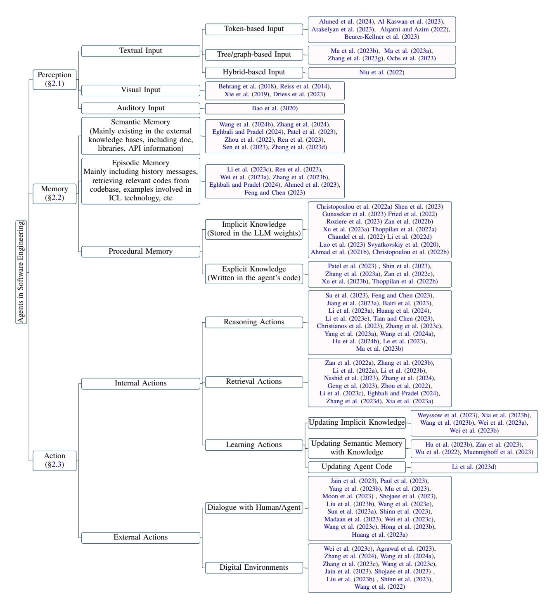
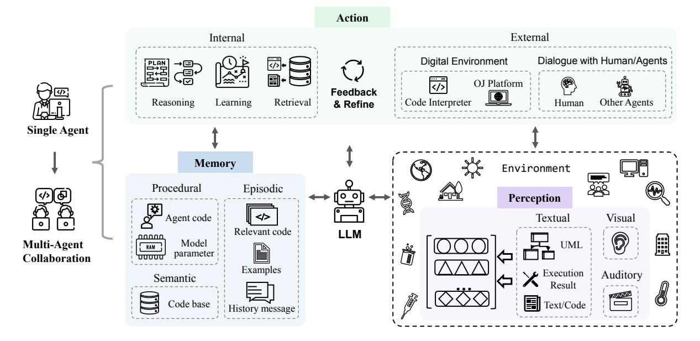
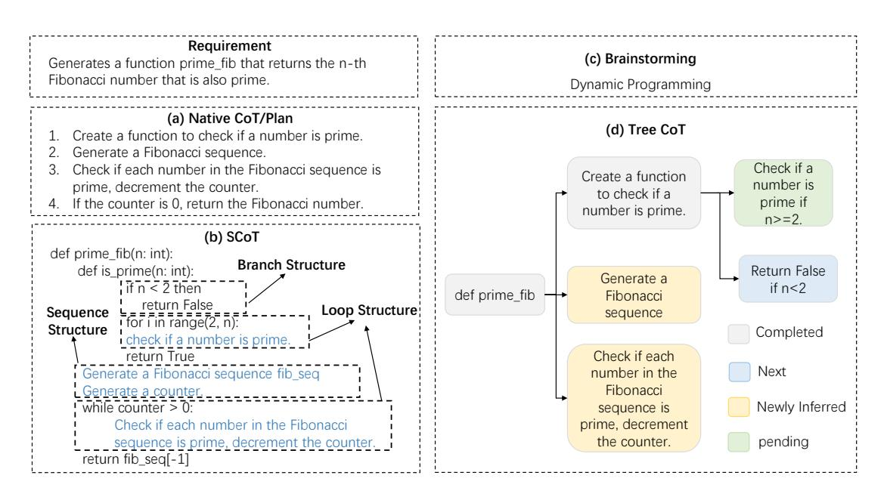
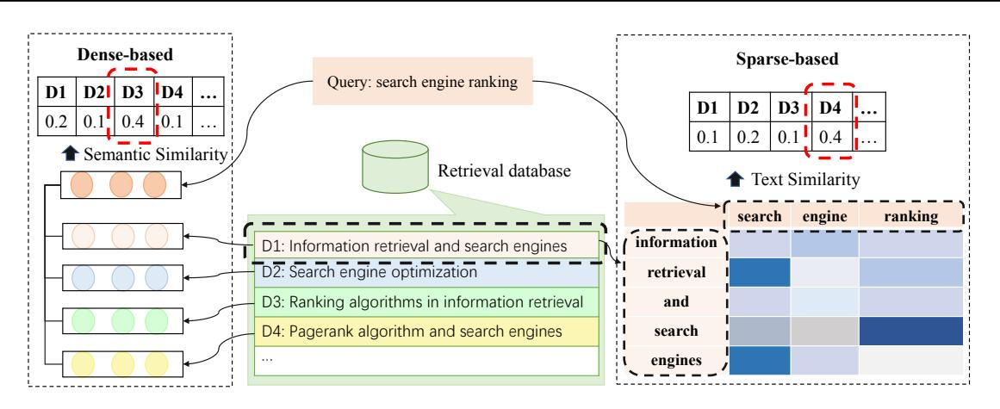

# Agents in Software Engineering: Survey, Landscape, and Vision

Yanlin Wang1 , Wanjun Zhong1 , Yanxian Huang1∗ , Ensheng Shi2 , Min Yang3 , Jiachi Chen1 , Zibin Zheng1

, Hui Li4 , Yuchi Ma5 , Qianxiang Wang5

1Sun Yat-sen University, 2Xi'an Jiaotong University

3Shenzhen Institute of Advanced Technology, Chinese Academy of Sciences 4Xiamen University, 5Huawei Cloud Computing Technologies Co., Ltd.

# Abstract

In recent years, Large Language Models (LLMs) have achieved remarkable success and have been widely used in various downstream tasks, especially in the tasks of the software engineering (SE) field. We find that many studies combining LLMs with SE have employed the concept of agents either explicitly or implicitly. However, there is a lack of an in-depth survey to sort out the development context of existing works, analyze how existing works combine the LLM-based agent technologies to optimize various tasks, and clarify the framework of LLM-based agents in SE. In this paper, we conduct the first survey of the studies on combining LLM-based agents with SE and present a framework of LLM-based agents in SE which includes three key modules: perception, memory, and action. We also summarize the current challenges in combining the two fields and propose future opportunities in response to existing challenges. We maintain a GitHub repository of the related papers at: [https:](https://github.com/DeepSoftwareAnalytics/Awesome-Agent4SE) [//github.com/DeepSoftwareAnalytics/](https://github.com/DeepSoftwareAnalytics/Awesome-Agent4SE) [Awesome-Agent4SE](https://github.com/DeepSoftwareAnalytics/Awesome-Agent4SE).

# 1 Introduction

In recent years, Large Language Models (LLMs) have achieved remarkable success and have been widely used in many downstream tasks, especially in various tasks in the field of software engineering (SE) [\(Zheng et al.\)](#page-18-0), such as code summarization [\(Ahmed et al.,](#page-12-0) [2024;](#page-12-0) [Sun et al.,](#page-16-0) [2023b;](#page-16-0) [Hal](#page-13-0)[dar and Hockenmaier,](#page-13-0) [2024;](#page-13-0) [Mao et al.,](#page-15-0) [2024;](#page-15-0) [Guo et al.,](#page-13-1) [2023;](#page-13-1) [Wang et al.,](#page-17-0) [2021\)](#page-17-0), code generation [\(Jiang et al.,](#page-14-0) [2023a;](#page-14-0) [Hu et al.,](#page-13-2) [2024b;](#page-13-2) [Yang](#page-17-1) [et al.,](#page-17-1) [2023a;](#page-17-1) [Tian and Chen,](#page-16-1) [2023;](#page-16-1) [Li et al.,](#page-14-1) [2023e;](#page-14-1) [Wang et al.,](#page-17-2) [2024b\)](#page-17-2), code translation [\(Pan et al.,](#page-15-1) [2024;](#page-15-1) [Pan et al.\)](#page-15-2), vulnerability detection and repair [\(Zhou et al.,](#page-18-1) [2024;](#page-18-1) [Islam and Najafirad,](#page-14-2) [2024;](#page-14-2) [de Fitero-Dominguez et al.,](#page-12-1) [2024;](#page-12-1) [Le et al.,](#page-14-3) [2024;](#page-14-3) [Liu et al.,](#page-14-4) [2024b;](#page-14-4) [Chen et al.,](#page-12-2) [2023a\)](#page-12-2), etc. Many studies combining LLMs with SE have employed the concept of agents from the artificial intelligence field, either explicitly or implicitly. Explicit use indicates that the paper directly mentions the use of agent-related technologies, whereas implicit use suggests that while the concept of intelligent agents is utilized, it may be described using different terminology or presented in alternative forms.

An agent [\(Wang et al.,](#page-17-3) [2024c\)](#page-17-3) represents an intelligent entity capable of perceiving, reasoning, and taking action. It perceives the environment's state and selects actions based on its goals and design to maximize specific performance metrics, serving as a crucial technical foundation for accomplishing diverse tasks and objectives. LLMbased agents generally use LLMs as the cognitive core of the agent and perform well in scenarios such as automation, intelligent control, and humancomputer interaction, leveraging the powerful capabilities of LLMs in language understanding and generation, learning and reasoning, context perception and memory, and multimodality, etc. With the development of various fields, the concept of traditional and LLMs-based agents has gradually become clear and widely used in the field of Natural Language Processing (NLP) [\(Xi et al.,](#page-17-4) [2023\)](#page-17-4). However, although existing works either explicitly or implicitly use this concept in SE, there is still no clear definition of agents. There is a lack of an in-depth survey to analyze how existing works combine the agent technologies to optimize various tasks, sort out the development context of existing works, and clarify the framework of agents in SE.

In this paper, we conduct an in-depth analysis of the work on combining LLM-based agents with SE, summarize the current challenges in combining the two fields, and propose possible opportunities for future research in response to existing challenges. Specifically, we first collect papers on the application of LLM-based agent technol-

∗ \*Corresponding author: Yanxian Huang, [huangyx353@](huangyx353@mail2.sysu.edu.cn) [mail2.sysu.edu.cn](huangyx353@mail2.sysu.edu.cn)

ogy to SE and obtain 115 papers after filtering and quality assessment. Then, inspired by the definition of the traditional agent [\(Wang et al.,](#page-17-3) [2024c;](#page-17-3) [Xi et al.,](#page-17-4) [2023\)](#page-17-4), we present a general conceptual framework for the LLM-based agents in SE (Section [2\)](#page-1-0), comprising three key components: perception, memory, action. We first introduce the perception module (Section [2.1\)](#page-2-0), which can handle inputs of different modalities, such as textual input, visual input, auditory input, etc. Next, we present the memory module(Section [2.2\)](#page-3-0), which includes semantic memory, episodic memory, and procedural memory, helping the agent to make reasoning decisions. Finally, we introduce the action module(Section [2.3\)](#page-5-0) which contains internal actions such as reasoning, retrieval, and learning, as well as external actions like interacting with the environment. After that, we provide a detailed and thorough introduction to the challenges and opportunities of LLM-based agents in SE (Section [3\)](#page-10-0). Specifically, we propose the following opportunities for future research in response to the current challenges of LLM-based agents in SE:

- Most existing work on exploring perception modules focuses on token-based input in textual input but lacks work on exploring other modalities.
- Numerous new tasks remain outside the current learning scope of LLMs, and complex tasks in the SE field necessitate agents with a diverse range of capabilities. Therefore, it is crucial to explore how LLM-based agents play new roles and effectively balance the ability to perform multiple roles.
- It lacks an authoritative and recognized knowledge base containing rich code-related knowledge as an external retrieval base in the SE field.
- Alleviating the hallucinations of LLM-based agents can improve the overall performance of the agent, while agent optimization can reversely alleviate the hallucinations of LLMbased agents.
- The multi-agent collaboration process requires a large amount of computing resources and additional communication overhead generated by synchronizing and sharing various types of information. Exploring technologies

to improve the efficiency of multi-agent collaboration is also an opportunity for future work.

• Technologies in the SE field can also promote the development of the Agent field, needing more work to explore integrating more advanced technologies in the SE field into Agent, promoting the development of Agent and progress in the SE field.

In addition, The technologies in SE, especially those related to code, can also promote the development of the agent field, indicating the mutually reinforcing relationship between these two very different fields. However, there is little work exploring SE technology in agents, and the focus is still on the simple and basic technology of SE, such as function calls, HTTP requests, and other tools. Therefore, in this paper, we mainly focus on the work related to agents in SE, and only briefly discuss the studies about SE technology in agents in Section [3.6,](#page-11-0) as an opportunity for future work.

# 2 LLM-based Agents in SE

We present a framework of the LLM-based agents in SE after sorting out and analyzing the studies obtained during data collection. As shown in Figure [2,](#page-3-1) a single agent contains three key modules: perception, memory, and action. Specifically, the perception module receives external environment information of various modalities and converts it into an input form that the LLM can understand and process. The action module includes internal and external actions, which are responsible for making reasoning decisions based on the input of LLM and refining the decisions based on the feedback obtained from interacting with the external environment, respectively. The memory module includes semantic, episodic, and procedural memory, which can provide additional useful information to help LLM make reasoning decisions. At the same time, the action module can also update different memories in the memory module by learning actions, providing more effective memory information for reasoning and retrieval actions. Furthermore, multi-agent collaboration consists of multiple single agents, who are responsible for part of the task and complete the task together through collaborative cooperation. In this section, we will introduce the details of each module in the framework of the LLM-based agents in SE.

<!-- Image Description: The image is a hierarchical diagram illustrating the architecture of agents in software engineering. It depicts the flow of information processing from perception (input types: token-based, tree/graph-based, hybrid) through memory (semantic and episodic, implicit and explicit knowledge) to action (internal, retrieval, learning, external). Each stage lists relevant research papers, categorized by input type and action. The diagram visually organizes related research work within a defined agent framework. -->

Figure 1: Taxonomy of LLM-based agents in software engineering.

## 2.1 Perception

The perception module connects the LLM-based agent to the external environment and is the core of processing external input. It can process inputs of different modalities such as textual, visual, and auditory input, and convert them into an embedding format that LLM-based agents can understand and process, laying the foundation for reasoning and decision-making actions of LLM-based agents. Next, we will introduce the details of different modal inputs in the perception module.

### 1.1 Textual Input

Different from the textual input format in NLP, considering the characteristics of code, the textual input format in the SE includes token-based, tree/graph-based, and hybrid-based input.

Token-based Input. Token-based input [\(Ahmed](#page-12-0) [et al.,](#page-12-0) [2024;](#page-12-0) [Al-Kaswan et al.,](#page-12-3) [2023;](#page-12-3) [Arakelyan](#page-12-4)

<!-- Image Description: This flowchart depicts a multi-agent system architecture. It shows a single agent and multi-agent collaboration components interacting with an environment through perception (textual, visual, auditory) and action. The core components include an LLM, memory (procedural, episodic, semantic), and internal processes (reasoning, learning, retrieval). The system interacts with external digital environments, including an OJ platform, and communicates with humans and other agents. The diagram illustrates the information flow and system's operational logic. -->

Figure 2: An overview of agent framework in SE.

[et al.,](#page-12-4) [2023;](#page-12-4) [Beurer-Kellner et al.,](#page-12-6) [2023;](#page-12-6) [Alqarni](#page-12-5) [and Azim,](#page-12-5) [2022;](#page-12-5) [Li et al.,](#page-14-15) [2022b;](#page-14-15) [Gu et al.,](#page-13-12) [2022;](#page-13-12) [Du et al.,](#page-13-13) [2021\)](#page-13-13) is the most mainstream input mode, which directly regards the code as natural language text and directly uses the token sequence as the input of LLM, ignoring the characteristics of code.

Tree/Graph-based Input. Compared to natural language, code has strict structure and grammatical rules, and is usually written following the grammar of a specific programming language. Based on the characteristics of code, tree/graph-based input [\(Ma](#page-15-3) [et al.,](#page-15-3) [2023b,](#page-15-3)[a;](#page-15-4) [Zhang et al.,](#page-18-2) [2023g;](#page-18-2) [Ochs et al.,](#page-15-5) [2023;](#page-15-5) [Bi et al.,](#page-12-15) [2024;](#page-12-15) [Shi et al.,](#page-16-10) [2023a,](#page-16-10) [2021;](#page-15-19) [Wang](#page-17-20) [and Li,](#page-17-20) [2021\)](#page-17-20) can convert code into tree structures such as abstract syntax trees or graph structures like control flow graphs to model the structural information of code. However, there is a challenge and opportunity that current work related to LLMbased SE agents has not explored such modalities.

Hybrid-based Input. Hybrid input [\(Niu et al.,](#page-15-6) [2022;](#page-15-6) [Hu et al.,](#page-13-14) [2024a;](#page-13-14) [Guo et al.,](#page-13-15) [2022\)](#page-13-15) combines multiple modalities to provide LLM with different types of information. For example, hybrid input containing token-based and tree-based input can combine the semantic and structural information of the code to better model and understand the code. However, there is also no work related to LLMbased agents in SE exploring this modality.

### 1.2 Visual Input

Visual input uses visual image data such as UI sketches or UML design drawings as model in-

put and makes inference decisions through modeling and analysis of images. Many related works in NLP have explored this modality. For example, [Driess et al.](#page-12-8) [\(2023\)](#page-12-8) propose PaLM-E, an embodied multi-modal language model whose inputs are multi-modal sentences that interleave visual, continuous state estimation, and textual input encodings. Traditional soft engineering fields also have tasks for visualizing input, such as UI code search [\(Behrang et al.,](#page-12-7) [2018;](#page-12-7) [Reiss et al.,](#page-15-7) [2014;](#page-15-7) [Xie](#page-17-5) [et al.,](#page-17-5) [2019\)](#page-17-5) which uses UI sketches as queries for useful code snippets. However, there is a lack of work on visual modality as inputs to LLMs.

#### 1.3 Auditory Input

Auditory input takes auditory data such as audio as input and interacts with LLM in the form of speech. Traditional software engineering fields have tasks for auditory input, such as programming video search [\(Bao et al.,](#page-12-9) [2020\)](#page-12-9) which uses videos as sources as sources for useful code snippets. However, there is also a lack of work on auditory input for LLMs.

#### 2.2 Memory

The memory modules include semantic, episodic, and procedural memory, which can provide additional useful information to help LLM make reasoning decisions. Next, we will introduce the details of these three types of memory respectively.

#### 2.1 Semantic Memory

Semantic memory stores acknowledged world knowledge of LLM-based agents, usually in the form of external knowledge retrieval bases which include documents, libraries, APIs, or other knowledge. There have been many works [\(Wang et al.,](#page-17-2) [2024b;](#page-17-2) [Zhang et al.,](#page-18-3) [2024;](#page-18-3) [Eghbali and Pradel,](#page-13-3) [2024;](#page-13-3) [Patel et al.,](#page-15-8) [2023;](#page-15-8) [Zhou et al.,](#page-18-4) [2022;](#page-18-4) [Ren](#page-15-9) [et al.,](#page-15-9) [2023;](#page-15-9) [Zhang et al.,](#page-18-5) [2023d\)](#page-18-5) exploring semantic memory. Specifically, documents and APIs are the most common information in external knowledge bases. For example, [Zhou et al.](#page-18-4) [\(2022\)](#page-18-4) introduce a novel natural-language-to-code generation approach named DocPrompting, which explicitly leverages documentation by retrieving the relevant documentation pieces based on an NL intent. [Zhang et al.](#page-18-3) [\(2024\)](#page-18-3) constructs a manually curated benchmark for repo-level code generation named CODEAGENTBENCH, which contains documentation, code dependency, and runtime environment information. [Ren et al.](#page-15-9) [\(2023\)](#page-15-9) propose KPC, a novel Knowledge-driven Prompt Chaining-based code generation approach, which utilizes fine-grained exception-handling knowledge extracted from API documentation to assist LLMs in code generation. In addition to documents, APIs are also common information in external knowledge bases. For example, [Eghbali and Pradel](#page-13-3) [\(2024\)](#page-13-3) propose De-Hallucinator, an LLM-based code completion technique, which automatically identifies project-specific API references related to code prefixes and the model's initial predictions, and adds these referenced information to the prompt. [Zhang et al.](#page-18-5) [\(2023d\)](#page-18-5) integrate API search tools into the generation process, allowing the model to select an API automatically using the search tool to get suggestions. In addition, some works also involve other information. For example, [Patel et al.](#page-15-8) [\(2023\)](#page-15-8) examines the capabilities and limitations of different LLMs in generating code based on libraries defined in context. [Wang et al.](#page-17-2) [\(2024b\)](#page-17-2) uses augmented functions, along with their corresponding docstrings, to fine-tune a selected code LLM.

### 2.2 Episodic Memory

Episodic memory records content related to the current case and experience information from previous decision-making processes. Content related to the current case (such as relevant information found in the search database, samples provided by In-context learning (ICL) technology, etc.) can provide additional knowledge for LLM reasoning, so many works introduce such information into the reasoning process of LLM [\(Zhong et al.,](#page-18-15) [2024;](#page-18-15) [Li](#page-14-5) [et al.,](#page-14-5) [2023c;](#page-14-5) [Feng and Chen,](#page-13-4) [2023;](#page-13-4) [Ahmed et al.,](#page-11-1) [2023;](#page-11-1) [Wei et al.,](#page-17-6) [2023a;](#page-17-6) [Ren et al.,](#page-15-9) [2023;](#page-15-9) [Zhang](#page-18-6) [et al.,](#page-18-6) [2023b;](#page-18-6) [Eghbali and Pradel,](#page-13-3) [2024;](#page-13-3) [Shi et al.,](#page-16-11) [2022\)](#page-16-11). For example, [Li et al.](#page-14-5) [\(2023c\)](#page-14-5) propose a new prompting technique named AceCoder, which selects similar programs as examples in prompts. It provides lots of relevant content (e.g., algorithms, APIs) about the target code. [Feng and Chen](#page-13-4) [\(2023\)](#page-13-4) propose AdbGPT, a new lightweight approach without any training and hard-coding effort, which can automatically reproduce the bugs from bug reports using In-context learning techniques. [Ahmed et al.](#page-11-1) [\(2023\)](#page-11-1) find that adding semantic facts can help LLM to improve performance on code summarization.. [Wei et al.](#page-17-6) [\(2023a\)](#page-17-6) propose a new model named Coeditor, which predicts edits to a code region based on recent changes within the same codebase using a multi-round code auto-editing setting. In addition, introducing experience information such as historical interaction information can help the LLM-based agents better understand the context and make correct decisions. Some work uses experience information from past reasoning and decision-making processes to obtain more accurate answers by iteratively querying and modifying answers. For example, [Ren et al.](#page-15-9) [\(2023\)](#page-15-9) propose KPC, a novel Knowledge-driven Prompt Chaining-based code generation approach, which decomposes code generation into an AI chain with iterative check-rewrite steps [Zhang et al.](#page-18-6) [\(2023b\)](#page-18-6) propose RepoCoder, a simple, generic, and effective framework which makes effective utilization of repository-level information for code completion in an iterative retrieval generation pipeline. [Eghbali and Pradel](#page-13-3) [\(2024\)](#page-13-3) present De-Hallucinator, an LLM-based code completion technique that retrieves suitable API references and iteratively queries the model with increasingly suitable context information in the prompt to ground the predictions of a model.

#### 2.3 Procedural Memory

The procedural memory of Agents in software engineering contains the implicit knowledge stored in the LLM weights and the explicit knowledge written in the agent's code.

Implicit knowledge is stored in the LLM parameters. Existing work usually proposes new LLMs with rich implicit knowledge to complete various

downstream tasks, by training the model with a large amount of data. [Zheng et al.](#page-18-16) [\(2023\)](#page-18-16) sorted out the code LLMs in the SE field based on their affiliation type, including companies, universities, research teams&open-source communities, and individuals&anonymous contributors.

Explicit knowledge is written in the agent's code, enabling the agent to operate automatically. Several works [Patel et al.](#page-15-8) [\(2023\)](#page-15-8); [Shin et al.](#page-16-4) [\(2023\)](#page-16-4); [Zhang et al.](#page-18-8) [\(2023a\)](#page-18-8) have explored different ways of constructing the agent's code. Specifically, [Pa](#page-15-8)[tel et al.](#page-15-8) [\(2023\)](#page-15-8) use three types of in-context supervision to specify library functions including Demonstrations, Description, and Implementation. [Shin et al.](#page-16-4) [\(2023\)](#page-16-4) investigate the effectiveness of state-of-the-art LLM with three different prompting engineering techniques (i.e., basic prompting, in-context learning, and task-specific prompting) against fine-tuned LLMs on three typical ASE tasks. [Zhang et al.](#page-18-8) [\(2023a\)](#page-18-8) explore the performance of software vulnerability detection using ChatGPT with different prompt designs(i.e., Basic Prompting, Prompting with Auxiliary Information, and Chain-of-Thought Prompting).

### 2.3 Action

The action module includes two types: internal and external actions. The external actions interact with the external environment to obtain feedback information, including Dialogue with humans/agents and interaction with the digital environment, while the internal actions reason and make decisions based on the input of the LLM and refine the decision based on the obtained feedback, including reasoning, retrieval, and learning actions. Next, we will introduce each action in detail.

### 3.1 Internal Action

Internal actions include reasoning, retrieval, and learning actions. Separately, reasoning actions are responsible for analyzing problems, reasoning, and making decisions based on the input of the LLMbased agent. Retrieval actions can retrieve relevant information from the knowledge base to assist reasoning actions in making correct decisions. Learning actions are continuously learning and updating knowledge by learning and updating semantic, procedural, and episodic memories, thereby improving the quality and efficiency of reasoning and decisionmaking.

Reasoning Action. A rigorous reasoning process is the key to completing tasks by LLM-based

agents and Chain-of-Though (CoT) is an effective way of reasoning. With the help of CoT, the LLMs can deeply understand the problem, decompose complex tasks, and generate high-quality answers. As shown in Figure [3,](#page-7-0) existing work has explored different forms of CoT, including naive CoT/Plan, SCoT, brainstorming, tree CoT, etc. Specifically, naive CoT/Plan refers to a paragraph of text in the prompt describing the process of reasoning for the problem. In the early work, a simple sentence was added to the prompt to guide LLMs in generating a chain of thought and better solving the problem. For example, [Hu et al.](#page-13-2) [\(2024b\)](#page-13-2) propose an in-context learning approach that uses a "print debugging" method to guide LLMs to debug. As LLM technology develops, the design of CoT has become more complex. Inspired by the process of developers validating the feasibility of test scenarios, [Su et al.](#page-16-6) [\(2023\)](#page-16-6) design chain-of-thought (CoT) reasoning to extract human-like knowledge and logical reasoning from LLMs. [Le et al.](#page-14-9) [\(2023\)](#page-14-9) propose CodeChain, a novel framework for inferences that generates a chain of self-revisions guided by some representative sub-modules generated in previous iterations. [Huang et al.](#page-13-7) [\(2024\)](#page-13-7) present Code Chain-of-Thought (CodeCoT) that generates test cases to validate whether the code has syntax errors during the execution and then employs a self-examination phase, integrating CoT with a self-examination process for code generation. [Tian](#page-16-1) [and Chen](#page-16-1) [\(2023\)](#page-16-1) propose a novel prompting technique to devise both sophisticated thought-eliciting prompting and feedback based on prompting and make the first exploration to improve the code generation performance of LLMs.

Considering the characteristics of code, some works proposed structured CoT to introduce the structural information of the code. As shown in (b) in Figure [3,](#page-7-0) the structured CoT presents the reasoning process in a pseudo-code-like form, involving structures such as loops, branches, etc. For example, [Li et al.](#page-14-8) [\(2023a\)](#page-14-8) propose Structured CoTs (SCoTs) which can efficiently use the rich structural information of source code and present SCoT prompting, a novel prompting technique for code generation. [Christianos et al.](#page-12-14) [\(2023\)](#page-12-14) presents a general framework model to utilize the construction of intrinsic and extrinsic functions to add previous understandings of reasoning structures, integrating and learning structured reasoning into AI agents' policies. In addition, some works have proposed

other forms of CoT, such as brainstorming and tree-shaped CoT, as shown in (c) and (d) in Figure [3.](#page-7-0) Brainstorming is to generate related keywords based on the input. For example, [Li et al.](#page-14-1) [\(2023e\)](#page-14-1) introduces a novel Brainstorm framework for code generation which leverages a brainstorming step that generates and selects diverse thoughts on the problem to facilitate algorithmic reasoning before generating code. The tree-shaped CoT [\(Feng and](#page-13-4) [Chen,](#page-13-4) [2023\)](#page-13-4) dynamically explores and updates the CoT, and the nodes in the tree involve multiple states including completed, new, and newly inferred, pending.

There are also some studies exploring other techniques to improve the reasoning ability and reasoning efficiency of LLM-based agents. For example, [Wang et al.](#page-17-9) [\(2024a\)](#page-17-9) propose TOOLGEN that comprises Trigger Insertion and Model Finetuning phases (Offline), and Tool-integrated Code Generation phases (Online). TOOLGEN reasons the positions to trigger auto-completion tools using the augments functions within a given code corpus with a special mark token. [Yang et al.](#page-17-1) [\(2023a\)](#page-17-1) design a novel approach COTTON which can leverage lightweight Language Models to generate CoTs for code generation automatically. [Zhang et al.](#page-18-10) [\(2023c\)](#page-18-10) present self-speculative decoding, a novel inference scheme that generates draft tokens and then employs the original LLM to validate those draft output tokens in one forward pass. [\(Zhou](#page-18-17) [et al.,](#page-18-17) [2023\)](#page-18-17) introduce an Adaptive-Solver framework that strategically adjusts the solving strategy according to the difficulty of the problem, which not only improves the computational efficiency but also improves the overall performance.

Retrieval Action. The retrieval action can retrieve relevant information from the knowledge base to assist the reasoning action in making correct decisions. The input used for retrieval and the output content obtained by retrieval have different types. As shown in Table [1,](#page-8-0) the input and output can be text, code, or hybrid information containing both text and code. Specifically, it can be divided into the following types: (1) Text-Code. Typically requirements are treated as input to retrieve related code or used APIs which are added to the prompt to generate responding code. For example, [Zan et al.](#page-18-11) [\(2022a\)](#page-18-11) propose a novel framework with APIRetriever and APICoder modules. Specifically, the APIRetriever retrieves useful APIs, and then the APICoder generates code

using these retrieved APIs. De-Hallucinator [\(Egh](#page-13-3)[bali and Pradel,](#page-13-3) [2024\)](#page-13-3) retrieves suitable API references adding to the prompt and iteratively querying the model with the obtained prompt. (2) Text-Text. Sometimes, requirements are also used as input to retrieve relevant documentation or similar questions to help complete the task. For example, [Zhou et al.](#page-18-4) [\(2022\)](#page-18-4) introduce DocPrompting, a natural language-to-code generation method that explicitly leverages documents by retrieving relevant document fragments for a given NL intent. [Zhang et al.](#page-18-3) [\(2024\)](#page-18-3) present CodeAgent, a novel LLM-based agent framework that integrates external tools to retrieve relevant information for effective repo-level code generation, enabling interaction with software artifacts for information retrieval, code symbol navigation, and code testing. (3) Code-Code. Code can also be used as input to retrieve similar or related code to provide a reference for generating the target code. For example, [Zhang et al.](#page-18-6) [\(2023b\)](#page-18-6) propose RepoCoder, a simple, generic, and effective framework that retrieves similarity-based repository-level information in an iterative retrieval generation pipeline. (4) Hybrid-Code. In addition to using a single type of information such as text or code as input to retrieve related code, multiple types of information can also be combined into hybrid information to improve retrieval accuracy. For example, [Li et al.](#page-14-10) [\(2022a\)](#page-14-10) utilizes the powerful code generation model to benefit the code retrieval task by augmenting the documentation query with its generated code snippets from the code generation model (generation counterpart) and then uses the augmented query to retrieve code. ToolCoder [\(Zhang et al.,](#page-18-5) [2023d\)](#page-18-5) uses an online search engine and documentation search tool to get the proper API suggestion, assisting in API selection and code generation. In addition, the retrieved content is not limited to a single type of information. (5) Code-Hybrid. It uses code as input and retrieves various relevant information. For example, [Nashid et al.](#page-15-13) [\(2023\)](#page-15-13) presents a novel technique named CEDAR for prompt creation that automatically retrieves code demonstrations similar to the code-related developer task, based on embedding or frequency analysis. [Geng et al.](#page-13-8) [\(2023\)](#page-13-8) generates multi-intent comments for code by adopting the in-context learning paradigm which selects various code-comments examples from the example pool. (6) Text-Hybrid. It uses requirements as input to retrieve relevant code and similar questions

<!-- Image Description: The image displays four sections detailing the design of a function (`prime_fib`) to find the nth prime Fibonacci number. (a) outlines a plan; (b) shows a structured representation of the function in Python, highlighting sequence and loop structures. (c) labels the approach as "Dynamic Programming". (d) presents a flowchart of the algorithm, showing steps to check for primality and generate the Fibonacci sequence, culminating in the return of the nth prime Fibonacci number. The flowchart uses colored boxes to indicate the progress of the algorithm. -->

Figure 3: Different CoTs from different methods, where (a) is native cot/plan, which is obtained by letting LLM think step by step in the prompt and includes the detailed process of analyzing the problem and steps to solve the problem. (b) is Structured CoTs (SCoT), which combines code features to generate a code skeleton containing structures such as brach and loop in the graph. The blue font abstractly summarizes the description of LLM generating specific code based on SCoT. (c) is the result of brainstorming, which is obtained by analyzing the problem description and using knowledge of algorithms, data structures, and mathematics to provide ideas for solving it. (d) is an example of a Tree CoT, which dynamically explores and iteratively updates the CoT to gradually decompose and complete the problem.

to be referenced. For example, [Li et al.](#page-14-11) [\(2023b\)](#page-14-11) propose LAIL (LLM-Aware In-context Learning), a novel learning-based selection approach to select examples for code generation. [Li et al.](#page-14-5) [\(2023c\)](#page-14-5) introduces a novel mechanism named AceCoder which uses requirements to retrieve similar programs as examples in prompts, which provide lots of relevant content (e.g., algorithms, APIs).

According to previous research [\(Li et al.,](#page-14-16) [2022c;](#page-14-16) [Zhao et al.,](#page-18-18) [2024;](#page-18-18) [Hu et al.,](#page-13-16) [2023a\)](#page-13-16), existing retrieval methods can be divided into sparse-based retrieval, dense-based retrieval [\(Wang et al.,](#page-17-21) [2024e\)](#page-17-21), and other methods [\(Hayati et al.,](#page-13-17) [2018;](#page-13-17) [Zhang](#page-18-19) [et al.,](#page-18-19) [2020;](#page-18-19) [Poesia et al.,](#page-15-20) [2022;](#page-15-20) [Ye et al.,](#page-18-20) [2021;](#page-18-20) [Shu et al.,](#page-16-12) [2022\)](#page-16-12). Figure [4](#page-8-1) shows the pipelines of sparse-based retrieval and dense-based retrieval respectively. The dense-based retrieval method converts the input into a high-dimensional vector and then compares the semantic similarity to select the k samples with the highest similarity, while the sparse-based retrieval method calculates metrics such as BM25 or TF-IDF to evaluate the text similarity between samples. Additionally, various alternative retrieval methods have been explored. For instance, some studies focus on calculating the edit

distance between natural language texts [\(Hayati](#page-13-17) [et al.,](#page-13-17) [2018\)](#page-13-17) or abstract syntax trees (ASTs) of code snippets [\(Zhang et al.,](#page-18-19) [2020;](#page-18-19) [Poesia et al.,](#page-15-20) [2022\)](#page-15-20). And some approaches leverage knowledge graphs for retrieval [\(Ye et al.,](#page-18-20) [2021;](#page-18-20) [Shu et al.,](#page-16-12) [2022\)](#page-16-12).

Dense-based and sparse-based retrieval methods are the two most mainstream retrieval methods. Among them, dense-based retrieval techniques generally offer superior performance compared to sparse-based retrieval methods. However, sparse-based retrieval is often more efficient and can achieve comparable performance levels to dense-based retrieval. As a result, many studies choose to employ sparse-based retrieval methods due to their efficiency.

Learning Action. Learning actions are continuously learning and updating knowledge by learning and updating semantic and procedural memories, thereby improving the quality and efficiency of reasoning and decision-making. *(1) Updating Semantic Memory with Knowledge.*Semantic memory mainly exists in the knowledge base that stores basic world knowledge and can be updated by updating the knowledge base using recognized code knowledge or constructing a new one. For ex-

| Types       | Input                                     | Output                                    | Studies                                                                         |
|-------------|-------------------------------------------|-------------------------------------------|---------------------------------------------------------------------------------|
| Text-Code   | Requirements                              | API                                       | APIRetriever (Zan et al., 2022a), De-Hallucinator (Eghbali and Pradel, 2024) |
| Text-Text   | Requirements                              | Relevant Documents, Repo Documentation | DocPrompting (Zhou et al., 2022), CodeAgent (Zhang et al., 2024)             |
| Code-Code   | Incomplete Code Target Hole's Location | Similar Code Repo Context              | RepoCoder (Zhang et al., 2023b) RepoFusion (Shrivastava et al., 2023)        |
| Hybrid-Code | Requirements, Unfinished Code          | API                                       | ToolCoder (Zhang et al., 2023d)                                                 |
|             | Requirements, Generated Code           | Target Code                               | Query Expansion (Li et al., 2022a)                                              |
| Code-Hybrid | Code Snippet                              | Code-Comment Examples                     | CEDAR (Nashid et al., 2023), Multi-intent (Geng et al., 2023)                |
| Text-Hybrid | Requirements                              | Examples                                  | LAIL (Li et al., 2023b), AceCoder (Li et al., 2023c)                         |

Table 1: Different types of retrieval actions classified by input and output.

<!-- Image Description: The figure illustrates a search engine ranking system using dense- and sparse-based approaches. Two matrices represent semantic and text similarity scores (D1-D4). A retrieval database is shown, connected to both approaches, categorizing information retrieval and search engine aspects (D1-D4). A final matrix visualizes the search engine ranking results based on these similarity scores. The diagram compares the two approaches within a unified framework. -->

Figure 4: The pipeline of different retrieval methods. The left part is the pipeline of the dense-based retrieval method, which can use different models to convert the text into a high-dimensional embedding vector and compare the semantic similarity to retrieve the sample with the highest similarity score. The right part is the pipeline of the sparse-based retrieval method, which just compares the text similarity and ignores semantics.

ample, [Liao et al.](#page-14-17) [\(2023\)](#page-14-17) propose a novel code generation framework, called A3 -CodGen, which generates higher quality code by leveraging the information retrieved from a retrieval base that contains three types of information: local awareness information from the current code file, global awareness information from other code files, and third-party library information. [Du et al.](#page-13-18) [\(2024\)](#page-13-18) propose a novel LLM-based vulnerability detection technique Vul-RAG which constructs a vulnerability knowledge base by extracting multi-dimension knowledge via LLMs from existing CVE instances.*(2) Updating Implicit Knowledge.*Since the implicit knowledge is stored in the LLM parameters, it can be updated by fine-tuning the model to update the LLM parameters. Early work usually constructs new data to supervise fine-tuning the

pre-trained model which updates the full parameters of the model [\(Xia et al.,](#page-17-12) [2023b;](#page-17-12) [Wei et al.,](#page-17-6) [2023a](#page-17-6)[,b;](#page-17-14) [Tao et al.,](#page-16-14) [2024;](#page-16-14) [Wang et al.,](#page-17-22) [2024d;](#page-17-22) [Liu et al.,](#page-14-18) [2023a;](#page-14-18) [Wang et al.,](#page-17-23) [2023d;](#page-17-23) [Shi et al.,](#page-16-15) [2023b\)](#page-16-15). However, as the parameter scale increases, the cost of fine-tuning the model also increases. Some works try to explore parameter-efficient finetuning techniques [\(Weyssow et al.,](#page-17-11) [2023;](#page-17-11) [Shi et al.,](#page-16-16) [2023c\)](#page-16-16). For example, [Weyssow et al.](#page-17-11) [\(2023\)](#page-17-11) deliver a comprehensive study of Parameter-Efficient Fine-Tuning (PEFT) techniques(PEFT) techniques for LLMs under the automated code generation scenario. [Wang et al.](#page-17-13) [\(2023b\)](#page-17-13) insert and fine-tune the parameter-efficient structure adapter, rather than fine-tuning the pre-trained model. Most of the current work uses effective fine-tuning technologies to fine-tune the model [\(Guo et al.,](#page-13-19) [2024;](#page-13-19) [Shi et al.,](#page-16-17)

#### [2023d\)](#page-16-17).
*(3) Updating Agent Code.*Agent code refers to the program or algorithm that the agent runs to guide its behavior and decision-making. The LLMbased agent constructs corresponding prompts as agent codes to regulate how to perceive the environment, reason and make decisions, and perform actions. Many works use instruction-tuning techniques to align the output of LLM with the input instructions. For example,. [Muennighoff et al.](#page-15-14) [\(2023\)](#page-15-14) leverage the natural structure of Git commits that pair code changes with human instructions and apply instruction tuning using them. [Hu](#page-13-9) [et al.](#page-13-9) [\(2023b\)](#page-13-9) constructed the first instructiontuning dataset named InstructCoder which is designed to adapt LLMs for general-purpose code editing. These high-quality quality data can bring new knowledge to the larger language model and update semantic memory. [Zan et al.](#page-18-12) [\(2023\)](#page-18-12) conduct extensive experiments of 8 popular programming languages on StarCoder to explore whether programming languages can boost each other via instruction-tuning.

#### 3.2 External Action

Dialogue with Human/Agents Agents can interact with humans or other agents, and get rich information in the interaction process as feedback, expanding the knowledge of the agent and refining the answers of LLM more corrector. Specifically, many works use LLMs as agents to interact [\(Lu](#page-14-19) [et al.,](#page-14-19) [2024;](#page-14-19) [Jain et al.,](#page-14-13) [2023;](#page-14-13) [Paul et al.,](#page-15-15) [2023;](#page-15-15) [Shojaee et al.,](#page-16-7) [2023;](#page-16-7) [Liu et al.,](#page-14-14) [2023b;](#page-14-14) [Wang et al.,](#page-17-16) [2023e;](#page-17-16) [Mu et al.,](#page-15-16) [2023;](#page-15-16) [Madaan et al.,](#page-15-18) [2023\)](#page-15-18). [Jain](#page-14-13) [et al.](#page-14-13) [\(2023\)](#page-14-13) propose RLCF that uses feedback from a different LLM that compares the generated code to a reference code to further train a pre-trained LLM via reinforcement learning. REFINER [\(Paul](#page-15-15) [et al.,](#page-15-15) [2023\)](#page-15-15) is a framework that can interact with a critic model that provides automated feedback on the reasoning. [Yang et al.](#page-18-13) [\(2023b\)](#page-18-13) study and elucidate how LLMs benefit from discriminative models. [Moon et al.](#page-15-17) [\(2023\)](#page-15-17) construct a new dataset specifically designed for code fixing with feedback and then use this dataset to gain a model that can automatically generate helpful feedback for code editing via Preference-Optimized Tuning and Selection. PPOCoder [\(Shojaee et al.,](#page-16-7) [2023\)](#page-16-7) consists of two parts, critic and actor, and will be optimized with PPO through the interaction between these two models. RLTF [\(Liu et al.,](#page-14-14) [2023b\)](#page-14-14) interacts with other models that utilize ground truth data

and online buffer data generated by interacting with the compiler to calculate loss and update the model weights through gradient feedback. [Wang](#page-17-16) [et al.](#page-17-16) [\(2023e\)](#page-17-16) propose ChatCoder, a method to refine the requirements via chatting with large language models. [Sun et al.](#page-16-8) [\(2023a\)](#page-16-8) propose Clover that lies a checker to check the consistency among code, docstrings, and formal annotations. ClarifyGPT [\(Mu et al.,](#page-15-16) [2023\)](#page-15-16) prompts another LLM to generate targeted clarifying questions to refine the ambiguous requirement inputted by users. Reflexion [\(Shinn et al.,](#page-16-9) [2023\)](#page-16-9) can interact with humans and other agents to generate external feedback. Self-Refine [\(Madaan et al.,](#page-15-18) [2023\)](#page-15-18) uses a single LLM as the generator, refiner, and feedback provider, rather than requiring any supervised training data, additional training, or reinforcement learning. Repilot [\(Wei et al.,](#page-17-17) [2023c\)](#page-17-17) synthesizes a candidate patch through the interaction between an LLM and a Completion Engine. Specifically, Repilot prunes away infeasible tokens suggested by the LLM. [Wang et al.](#page-17-18) [\(2023c\)](#page-17-18) introduce MINT, a benchmark that can evaluate LLMs' ability to solve tasks with multi-turn interactions by leveraging users' natural language feedback simulated by GPT-4[.Hong et al.](#page-13-10) [\(2023b\)](#page-13-10) propose MetaGPT, an innovative meta-programming framework that incorporates efficient human workflows into LLM-based multi-agent collaborations. [Huang et al.](#page-13-11) [\(2023a\)](#page-13-11) introduces AgentCoder, a novel code generation solution comprising a multi-agent framework with specialized agents: the programmer agent, the test designer agent, and the test executor agent.

Digital Environment Agents can interact with digital systems, such as OJ platforms, web pages, compilers, and other external tools, and the information obtained during the interaction process can be used as feedback to optimize themselves. Specifically, compilers are the most common external tools [\(Jain et al.,](#page-14-13) [2023;](#page-14-13) [Shojaee et al.,](#page-16-7) [2023;](#page-16-7) [Liu et al.,](#page-14-14) [2023b;](#page-14-14) [Wang et al.,](#page-17-19) [2022;](#page-17-19) [Zhang](#page-18-14) [et al.,](#page-18-14) [2023e\)](#page-18-14). For example, RLCF [\(Jain et al.,](#page-14-13) [2023\)](#page-14-13) trains the pre-trained LLM via reinforcement learning, using the compiler-derived feedback on whether the code it generates passes a set of correctness checks. PPOCoder [\(Shojaee et al.,](#page-16-7) [2023\)](#page-16-7) can incorporate compiler feedback and structure alignments as extra knowledge into the model optimization to fine-tune code generation models via deep reinforcement learning (RL). RLTF [\(Liu et al.,](#page-14-14) [2023b\)](#page-14-14) interacts with the compiler to produce a

training data pair and then stores it in the online buffer. [Wang et al.](#page-17-19) [\(2022\)](#page-17-19) propose COMPCODER that utilizes compiler feedback for compilable code generation. [Zhang et al.](#page-18-14) [\(2023e\)](#page-18-14) propose Self-Edit, a generate-and-edit approach that utilizes execution results of the generated code from LLMs to improve the code quality on the competitive programming task. In addition, many works construct tools such as search engines, completion engines, and others to expand the capabilities of intelligent agents [\(Wang et al.,](#page-17-9) [2024a;](#page-17-9) [Zhang et al.,](#page-18-3) [2024;](#page-18-3) [Agrawal et al.,](#page-11-3) [2023;](#page-11-3) [Wei et al.,](#page-17-17) [2023c;](#page-17-17) [Zhang et al.,](#page-18-21) [2023f\)](#page-18-21). [Wang et al.](#page-17-9) [\(2024a\)](#page-17-9) introduce TOOL-GEN, an approach that integrates autocompletion tools into the code LLM generation process to address dependency errors such as undefined-variable and no-member errors. [Zhang et al.](#page-18-3) [\(2024\)](#page-18-3) present CodeAgent, a novel LLM-based agent framework that integrates five programming tools, enabling interaction with software artifacts for information retrieval, code symbol navigation, and code testing for effective repo-level code generation. [Agrawal](#page-11-3) [et al.](#page-11-3) [\(2023\)](#page-11-3) propose MGD, a monitor-guided decoding method where a monitor uses static analysis to guide the decoding. Repilot [\(Wei et al.,](#page-17-17) [2023c\)](#page-17-17) synthesizes a candidate patch through the interaction between an LLM and a Completion Engine. Specifically, Repilot completes the token based on the suggestions provided by the Completion Engine.

# 3 Challenges and Opportunities

Upon analyzing the work related to LLM-based agents in software engineering, it is evident that there are still many challenges in the current integration of these two fields, which limits the development of both. In this section, we will discuss in detail the challenges faced by current LLM-based agents in SE and discuss some opportunities for future work based on the analysis of existing challenges.

# 1 Lack of Exploration of Perception Module

As mentioned in Section [2.1,](#page-2-0) there is a lack of work exploring the perception module of LLM-based agents in SE. Unlike natural language, code is a special representation that can be treated as ordinary text or converted into an intermediate representation with code characteristics, such as AST, CFG, and so on. Existing works [\(Ahmed et al.,](#page-12-0) [2024;](#page-12-0) [Al-](#page-12-3)[Kaswan et al.,](#page-12-3) [2023;](#page-12-3) [Arakelyan et al.,](#page-12-4) [2023;](#page-12-4) [Beurer-](#page-12-6) [Kellner et al.,](#page-12-6) [2023;](#page-12-6) [Alqarni and Azim,](#page-12-5) [2022\)](#page-12-5) often treat code as text, and there is still a lack of work on LLM-based agents in SE that explore tree/graphbased input modalities. In addition, there is still a lack of research on exploring visual and auditory input modalities.

# 2 Role-playing Abilities

LLM-based agents are often required to play different roles across a range of tasks, necessitating specific skills for each role. For example, an agent may function as a code generator when tasked with generating code, and as a code tester when tasked with code testing. Furthermore, in certain scenarios, these agents may need to have multiple capabilities at the same time. For example, in the code generation scenario, the agent needs to play the role of both a code generator and tester and accordingly needs to have the ability to both generate and test code [\(Huang et al.,](#page-13-20) [2023b\)](#page-13-20). In the software engineering field, there are various niche tasks for which LLM learning is not enough and complex tasks that require agents to have multiple capabilities, such as test generation scenario, front-end development, repository-level issue resolution, etc.*Therefore, advancing research on how to enable agents to effectively adopt new roles and manage the demands of multi-role performance represents a promising direction for future work.*# 3 Lack of Knowledge Retrieval Base

The external knowledge retrieval base is an important part of the semantic memory in the agent memory module and one of the important external tools that the agent can interact with. In NLP fields, there are knowledge bases such as Wikipedia as external retrieval bases [\(Zhao et al.,](#page-18-22) [2023\)](#page-18-22). However, in the SE field, there is currently no authoritative and recognized knowledge base that contains rich code-related knowledge, such as the basic syntax of various programming languages, various commonly used algorithms, knowledge related to data structures and operating systems, etc.*In future research, efforts could be directed towards developing a comprehensive code knowledge base to serve as an external retrieval base for the agent. This knowledge base would enrich the available information, thereby enhancing both the quality and efficiency of reasoning and decision-making processes.*## 4 Hallucinations of LLM-based Agents

Many studies related to LLM-based agents consider LLMs as the cognitive core of the agents, with the agents' overall performance being closely tied to the capabilities of the underlying LLMs. Existing research [\(Pan et al.,](#page-15-1) [2024;](#page-15-1) [Liu et al.,](#page-14-20) [2024a\)](#page-14-20) has shown that LLM-based agents may produce hallucinations, such as generating non-existent APIs when completing tasks in the SE field. Mitigating these hallucinations can improve the overall performance of the agents. At the same time, the optimization of the agents can also reversely alleviate the hallucinations of the LLM-based agents, highlighting the bidirectional relationship between agent performance and hallucination mitigation. Although some efforts have been made to investigate the hallucinations of LLMs, significant challenges remain in addressing the hallucination issue within LLM-based agents.*Exploring what types of hallucinations exist in LLM-based agents, deeply analyzing the causes of these hallucinations, and proposing effective hallucination mitigation methods are great opportunities for future research.*### 5 Efficiency of Multi-agent Collaboration

In the process of multi-agent collaboration, each individual agent needs to play different roles to accomplish specific tasks, and the outcomes of each agent's decisions are then combined to collectively tackle more complex objectives [\(Chen et al.,](#page-12-16) [2023b;](#page-12-16) [Hong et al.,](#page-13-21) [2023a;](#page-13-21) [Huang et al.,](#page-13-20) [2023b;](#page-13-20) [Wang](#page-16-18) [et al.,](#page-16-18) [2023a\)](#page-16-18). However, this process often requires a large amount of computing resources for each agent, resulting in resource waste and reduced efficiency. In addition, each single agent needs to synchronize and share various types of information, which introduces additional communication costs and affects the real-time and response speed of collaboration.*Effectively managing and allocating computing resources, minimizing inter-agent communication costs, and reducing the reasoning overhead of individual agents represent key challenges for enhancing the efficiency of multi-agent collaboration. Addressing these issues presents a significant opportunity for future research.*#### 3.6 SE Technologies in LLM-based Agents

Techniques from the software engineering domain, particularly those to code, have the potential to significantly advance the development of the agent field, indicating a mutually beneficial relationship

between these two domains. For example, software testing techniques can be adapted to identify abnormal behaviors and potential defects in LLM-based agents. Additionally, improvements in software tools, such as APIs and libraries, can also boost the performance of LLM-based agents especially for those with tool using abilities. Furthermore, software package management techniques can be adapted for effectively managing agent systems. For example, version control can be applied to monitor and coordinate updates across different agents in an agent system, enhancing compatibility and system integrity.

However, research in this line remains limited.*Therefore, exploring the incorporation of more sophisticated SE techniques into agent systems represents a promising area for future research, with the potential to drive advancements in both fields.*# 4 Conclusion

To conduct an in-depth analysis of the work on combining LLM-based agents with SE, we first collect many studies that combine LLM-based agents with tasks in the software engineering field. Then, we present a framework of LLM-based agents in software engineering which contains three key modules: perception, memory, and actions, after sorting out and analyzing the studies obtained during data collection. Finally, we introduce the details of each module in the framework, analyze the current challenges for LLM-based agents in the SE field, and point out some opportunities for future work.

# References

- Lakshya A Agrawal, Aditya Kanade, Navin Goyal, Shuvendu K. Lahiri, and Sriram K. Rajamani. 2023. [Guiding language models of code with global context](https://api.semanticscholar.org/CorpusID:259203004) [using monitors.](https://api.semanticscholar.org/CorpusID:259203004)*ArXiv*, abs/2306.10763.
- Wasi Uddin Ahmad, Saikat Chakraborty, Baishakhi Ray, and Kai-Wei Chang. 2021a. Unified pre-training for program understanding and generation. *arXiv preprint arXiv:2103.06333*.
- Wasi Uddin Ahmad, Saikat Chakraborty, Baishakhi Ray, and Kai-Wei Chang. 2021b. [Unified pre-training](https://api.semanticscholar.org/CorpusID:232185260) [for program understanding and generation.](https://api.semanticscholar.org/CorpusID:232185260) *ArXiv*, abs/2103.06333.
- Toufique Ahmed, Kunal Suresh Pai, Prem Devanbu, and Earl T. Barr. 2023. [Automatic semantic augmenta](https://api.semanticscholar.org/CorpusID:258170012)[tion of language model prompts \(for code summa](https://api.semanticscholar.org/CorpusID:258170012)[rization\).](https://api.semanticscholar.org/CorpusID:258170012)

- Toufique Ahmed, Kunal Suresh Pai, Premkumar Devanbu, and Earl T. Barr. 2024. [Automatic semantic](http://arxiv.org/abs/2304.06815) [augmentation of language model prompts \(for code](http://arxiv.org/abs/2304.06815) [summarization\).](http://arxiv.org/abs/2304.06815)
- Alfred V. Aho and Jeffrey D. Ullman. 1972. *The Theory of Parsing, Translation and Compiling*, volume 1. Prentice-Hall, Englewood Cliffs, NJ.
- Ali Al-Kaswan, Toufique Ahmed, Maliheh Izadi, Anand Ashok Sawant, Premkumar Devanbu, and Arie van Deursen. 2023. [Extending source code pre](http://arxiv.org/abs/2301.01701)[trained language models to summarise decompiled](http://arxiv.org/abs/2301.01701) [binaries.](http://arxiv.org/abs/2301.01701)
- Mansour Alqarni and Akramul Azim. 2022. [Low level](https://api.semanticscholar.org/CorpusID:251889122) [source code vulnerability detection using advanced](https://api.semanticscholar.org/CorpusID:251889122) [bert language model.](https://api.semanticscholar.org/CorpusID:251889122) *Proceedings of the Canadian Conference on Artificial Intelligence*.
- American Psychological Association. 1983. *Publications Manual*. American Psychological Association, Washington, DC.
- Rie Kubota Ando and Tong Zhang. 2005. A framework for learning predictive structures from multiple tasks and unlabeled data. *Journal of Machine Learning Research*, 6:1817–1853.
- Galen Andrew and Jianfeng Gao. 2007. Scalable training of L1-regularized log-linear models. In *Proceedings of the 24th International Conference on Machine Learning*, pages 33–40.
- Shushan Arakelyan, Rocktim Jyoti Das, Yi Mao, and Xiang Ren. 2023. [Exploring distributional shifts in](http://arxiv.org/abs/2303.09128) [large language models for code analysis.](http://arxiv.org/abs/2303.09128)
- Ramakrishna Bairi, Atharv Sonwane, Aditya Kanade, C VageeshD, Arun Shankar Iyer, Suresh Parthasarathy, Sriram K. Rajamani, B. Ashok, and Shashank P. Shet. 2023. [Codeplan: Repository](https://api.semanticscholar.org/CorpusID:262217135)[level coding using llms and planning.](https://api.semanticscholar.org/CorpusID:262217135) *ArXiv*, abs/2309.12499.
- Lingfeng Bao, Zhenchang Xing, Xin Xia, David Lo, Ming hui Wu, and Xiaohu Yang. 2020. [psc2code.](https://api.semanticscholar.org/CorpusID:218517472) *ACM Transactions on Software Engineering and Methodology (TOSEM)*, 29:1 – 38.
- Farnaz Behrang, Steven P. Reiss, and Alessandro Orso. 2018. [Guifetch: Supporting app design and devel](https://api.semanticscholar.org/CorpusID:50774696)[opment through gui search.](https://api.semanticscholar.org/CorpusID:50774696) *2018 IEEE/ACM 5th International Conference on Mobile Software Engineering and Systems (MOBILESoft)*, pages 236–246.
- Luca Beurer-Kellner, Marc Fischer, and Martin Vechev. 2023. [Prompting is programming: A query language](https://doi.org/10.1145/3591300) [for large language models.](https://doi.org/10.1145/3591300) *Proceedings of the ACM on Programming Languages*, 7(PLDI):1946–1969.
- Wendong Bi, Lun Du, Qiang Fu, Yanlin Wang, Shi Han, and Dongmei Zhang. 2024. Make heterophilic graphs better fit gnn: A graph rewiring approach. *IEEE Transactions on Knowledge and Data Engineering*.

- Shubham Chandel, Colin B Clement, Guillermo Serrato, and Neel Sundaresan. 2022. Training and evaluating a jupyter notebook data science assistant. *arXiv preprint arXiv:2201.12901*.
- Ashok K. Chandra, Dexter C. Kozen, and Larry J. Stockmeyer. 1981. [Alternation.](https://doi.org/10.1145/322234.322243) *Journal of the Association for Computing Machinery*, 28(1):114–133.
- Chong Chen, Jianzhong Su, Jiachi Chen, Yanlin Wang, Tingting Bi, Yanli Wang, Xingwei Lin, Ting Chen, and Zibin Zheng. 2023a. When chatgpt meets smart contract vulnerability detection: How far are we? *arXiv preprint arXiv:2309.05520*.
- Weize Chen, Yusheng Su, Jingwei Zuo, Cheng Yang, Chenfei Yuan, Chen Qian, Chi-Min Chan, Yujia Qin, Yaxi Lu, Ruobing Xie, et al. 2023b. Agentverse: Facilitating multi-agent collaboration and exploring emergent behaviors in agents. *arXiv preprint arXiv:2308.10848*.
- Filippos Christianos, Georgios Papoudakis, Matthieu Zimmer, Thomas Coste, Zhihao Wu, Jingxuan Chen, Khyati Khandelwal, James Doran, Xidong Feng, Jiacheng Liu, Zheng Xiong, Yicheng Luo, Jianye Hao, Kun Shao, Haitham Bou-Ammar, and Jun Wang. 2023. [Pangu-agent: A fine-tunable generalist agent](https://api.semanticscholar.org/CorpusID:266521482) [with structured reasoning.](https://api.semanticscholar.org/CorpusID:266521482) *ArXiv*, abs/2312.14878.
- Fenia Christopoulou, Gerasimos Lampouras, Milan Gritta, Guchun Zhang, Yinpeng Guo, Zhongqi Li, Qi Zhang, Meng Xiao, Bo Shen, Lin Li, et al. 2022a. Pangu-coder: Program synthesis with function-level language modeling. *arXiv preprint arXiv:2207.11280*.
- Fenia Christopoulou, Gerasimos Lampouras, Milan Gritta, Guchun Zhang, Yinpeng Guo, Zhong yi Li, Qi Zhang, Meng Xiao, Bo Shen, Lin Li, Hao Yu, Li yu Yan, Pingyi Zhou, Xin Wang, Yu Ma, Ignacio Iacobacci, Yasheng Wang, Guangtai Liang, Jia Wei, Xin Jiang, Qianxiang Wang, and Qun Liu. 2022b. [Pangu-coder: Program synthesis with function-level](https://api.semanticscholar.org/CorpusID:251040785) [language modeling.](https://api.semanticscholar.org/CorpusID:251040785) *ArXiv*, abs/2207.11280.
- Colin B. Clement, Dawn Drain, Jonathan Timcheck, Alexey Svyatkovskiy, and Neel Sundaresan. 2020. [Pymt5: Multi-mode translation of natural language](https://api.semanticscholar.org/CorpusID:222178041) [and python code with transformers.](https://api.semanticscholar.org/CorpusID:222178041) In *Conference on Empirical Methods in Natural Language Processing*.
- David de Fitero-Dominguez, Eva Garcia-Lopez, Antonio Garcia-Cabot, and Jose-Javier Martinez-Herraiz. 2024. Enhanced automated code vulnerability repair using large language models. *arXiv preprint arXiv:2401.03741*.
- Danny Driess, F. Xia, Mehdi S. M. Sajjadi, Corey Lynch, Aakanksha Chowdhery, Brian Ichter, Ayzaan Wahid, Jonathan Tompson, Quan Ho Vuong, Tianhe Yu, Wenlong Huang, Yevgen Chebotar, Pierre Sermanet, Daniel Duckworth, Sergey Levine, Vincent Vanhoucke, Karol Hausman, Marc Toussaint, Klaus

Greff, Andy Zeng, Igor Mordatch, and Peter R. Florence. 2023. [Palm-e: An embodied multimodal lan](https://api.semanticscholar.org/CorpusID:257364842)[guage model.](https://api.semanticscholar.org/CorpusID:257364842) In *International Conference on Machine Learning*.

- Lun Du, Xiaozhou Shi, Yanlin Wang, Ensheng Shi, Shi Han, and Dongmei Zhang. 2021. Is a single model enough? mucos: A multi-model ensemble learning approach for semantic code search. In *Proceedings of the 30th ACM International Conference on Information & Knowledge Management*, pages 2994–2998.
- Xueying Du, Geng Zheng, Kaixin Wang, Jiayi Feng, Wentai Deng, Mingwei Liu, Bihuan Chen, Xin Peng, Tao Ma, and Yiling Lou. 2024. Vul-rag: Enhancing llm-based vulnerability detection via knowledgelevel rag. *arXiv preprint arXiv:2406.11147*.
- Aryaz Eghbali and Michael Pradel. 2024. [De](https://api.semanticscholar.org/CorpusID:266741511)[hallucinator: Iterative grounding for llm-based code](https://api.semanticscholar.org/CorpusID:266741511) [completion.](https://api.semanticscholar.org/CorpusID:266741511) *ArXiv*, abs/2401.01701.
- Sidong Feng and Chunyang Chen. 2023. [Prompting is](https://api.semanticscholar.org/CorpusID:259075270) [all your need: Automated android bug replay with](https://api.semanticscholar.org/CorpusID:259075270) [large language models.](https://api.semanticscholar.org/CorpusID:259075270) *ArXiv*, abs/2306.01987.
- Daniel Fried, Armen Aghajanyan, Jessy Lin, Sida Wang, Eric Wallace, Freda Shi, Ruiqi Zhong, Wen-tau Yih, Luke Zettlemoyer, and Mike Lewis. 2022. Incoder: A generative model for code infilling and synthesis. *arXiv preprint arXiv:2204.05999*.
- Mingyang Geng, Shangwen Wang, Dezun Dong, Hao Wang, Ge Li, Zhi Jin, Xiaoguang Mao, and Xiangke Liao. 2023. [Large language models are few-shot](https://api.semanticscholar.org/CorpusID:259108973) [summarizers: Multi-intent comment generation via](https://api.semanticscholar.org/CorpusID:259108973) [in-context learning.](https://api.semanticscholar.org/CorpusID:259108973) In *International Conference on Software Engineering*.
- Wenchao Gu, Yanlin Wang, Lun Du, Hongyu Zhang, Shi Han, Dongmei Zhang, and Michael R Lyu. 2022. Accelerating code search with deep hashing and code classification. *arXiv preprint arXiv:2203.15287*.
- Suriya Gunasekar, Yi Zhang, Jyoti Aneja, Caio César Teodoro Mendes, Allie Del Giorno, Sivakanth Gopi, Mojan Javaheripi, Piero Kauffmann, Gustavo de Rosa, Olli Saarikivi, et al. 2023. Textbooks are all you need. *arXiv preprint arXiv:2306.11644*.
- Daya Guo, Shuai Lu, Nan Duan, Yanlin Wang, Ming Zhou, and Jian Yin. 2022. Unixcoder: Unified crossmodal pre-training for code representation. *arXiv preprint arXiv:2203.03850*.
- Hanyang Guo, Xiangping Chen, Yuan Huang, Yanlin Wang, Xi Ding, Zibin Zheng, Xiaocong Zhou, and Hong-Ning Dai. 2023. Snippet comment generation based on code context expansion. *ACM Transactions on Software Engineering and Methodology*, 33(1):1– 30.
- Lianghong Guo, Yanlin Wang, Ensheng Shi, Wanjun Zhong, Hongyu Zhang, Jiachi Chen, Ruikai Zhang, Yuchi Ma, and Zibin Zheng. 2024. When to stop? towards efficient code generation in llms with excess token prevention. *arXiv preprint arXiv:2407.20042*.

- Dan Gusfield. 1997. *Algorithms on Strings, Trees and Sequences*. Cambridge University Press, Cambridge, UK.
- Rajarshi Haldar and Julia Hockenmaier. 2024. Analyzing the performance of large language models on code summarization. *arXiv preprint arXiv:2404.08018*.
- Shirley Anugrah Hayati, Raphael Olivier, Pravalika Avvaru, Pengcheng Yin, Anthony Tomasic, and Graham Neubig. 2018. Retrieval-based neural code generation. *arXiv preprint arXiv:1808.10025*.
- Sirui Hong, Xiawu Zheng, Jonathan Chen, Yuheng Cheng, Jinlin Wang, Ceyao Zhang, Zili Wang, Steven Ka Shing Yau, Zijuan Lin, Liyang Zhou, et al. 2023a. Metagpt: Meta programming for multi-agent collaborative framework. *arXiv preprint arXiv:2308.00352*.
- Sirui Hong, Xiawu Zheng, Jonathan P. Chen, Yuheng Cheng, Ceyao Zhang, Zili Wang, Steven Ka Shing Yau, Zi Hen Lin, Liyang Zhou, Chenyu Ran, Lingfeng Xiao, and Chenglin Wu. 2023b. [Metagpt:](https://api.semanticscholar.org/CorpusID:260351380) [Meta programming for multi-agent collaborative](https://api.semanticscholar.org/CorpusID:260351380) [framework.](https://api.semanticscholar.org/CorpusID:260351380) *ArXiv*, abs/2308.00352.
- Fan Hu, Yanlin Wang, Lun Du, Xirong Li, Hongyu Zhang, Shi Han, and Dongmei Zhang. 2023a. Revisiting code search in a two-stage paradigm. In *Proceedings of the Sixteenth ACM International Conference on Web Search and Data Mining*, pages 994– 1002.
- Fan Hu, Yanlin Wang, Lun Du, Hongyu Zhang, Dongmei Zhang, and Xirong Li. 2024a. Tackling long code search with splitting, encoding, and aggregating. In *Proceedings of the 2024 Joint International Conference on Computational Linguistics, Language Resources and Evaluation (LREC-COLING 2024)*, pages 15500–15510.
- Qisheng Hu, Kaixin Li, Xu Zhao, Yuxi Xie, Tiedong Liu, Hui Chen, Qizhe Xie, and Junxian He. 2023b. [Instructcoder: Empowering language models for](https://api.semanticscholar.org/CorpusID:268041153) [code editing.](https://api.semanticscholar.org/CorpusID:268041153) *ArXiv*, abs/2310.20329.
- Xueyu Hu, Kun Kuang, Jiankai Sun, Hongxia Yang, and Fei Wu. 2024b. [Leveraging print debugging to](https://api.semanticscholar.org/CorpusID:266903083) [improve code generation in large language models.](https://api.semanticscholar.org/CorpusID:266903083) *ArXiv*, abs/2401.05319.
- Dong Huang, Qi Bu, Jie M. Zhang, Michael Luck, and Heming Cui. 2023a. [Agentcoder: Multi-agent-based](https://api.semanticscholar.org/CorpusID:266374622) [code generation with iterative testing and optimisa](https://api.semanticscholar.org/CorpusID:266374622)[tion.](https://api.semanticscholar.org/CorpusID:266374622) *ArXiv*, abs/2312.13010.
- Dong Huang, Qingwen Bu, Yuhao Qing, and Heming Cui. 2024. [Codecot: Tackling code syntax errors in](http://arxiv.org/abs/2308.08784) [cot reasoning for code generation.](http://arxiv.org/abs/2308.08784)
- Dong Huang, Qingwen Bu, Jie M Zhang, Michael Luck, and Heming Cui. 2023b. Agentcoder: Multi-agentbased code generation with iterative testing and optimisation. *arXiv preprint arXiv:2312.13010*.

- Nafis Tanveer Islam and Peyman Najafirad. 2024. Code security vulnerability repair using reinforcement learning with large language models. *arXiv preprint arXiv:2401.07031*.
- Abhinav C. P. Jain, Chima Adiole, Swarat Chaudhuri, T. Reps, Chris Jermaine Rice University, Ut Austin, and University of Wisconsin. 2023. [Coarse-tuning](https://api.semanticscholar.org/CorpusID:258967564) [models of code with reinforcement learning feed](https://api.semanticscholar.org/CorpusID:258967564)[back.](https://api.semanticscholar.org/CorpusID:258967564)
- Xue Jiang, Yihong Dong, Lecheng Wang, Qiwei Shang, and Ge Li. 2023a. [Self-planning code generation](https://api.semanticscholar.org/CorpusID:257495755) [with large language model.](https://api.semanticscholar.org/CorpusID:257495755) *ArXiv*, abs/2303.06689.
- Xue Jiang, Yihong Dong, Lecheng Wang, Fang Zheng, Qiwei Shang, Ge Li, Zhi Jin, and Wenpin Jiao. 2023b. Self-planning code generation with large language models. *ACM Transactions on Software Engineering and Methodology*.
- Hung Le, Hailin Chen, Amrita Saha, Akash Gokul, Doyen Sahoo, and Shafiq R. Joty. 2023. [Codechain:](https://api.semanticscholar.org/CorpusID:264128082) [Towards modular code generation through chain](https://api.semanticscholar.org/CorpusID:264128082) [of self-revisions with representative sub-modules.](https://api.semanticscholar.org/CorpusID:264128082) *ArXiv*, abs/2310.08992.
- Tan Khang Le, Saba Alimadadi, and Steven Y Ko. 2024. A study of vulnerability repair in javascript programs with large language models. In *Companion Proceedings of the ACM on Web Conference 2024*, pages 666–669.
- Dong Li, Yelong Shen, Ruoming Jin, Yi Mao, Kuan Wang, and Weizhu Chen. 2022a. [Generation](https://api.semanticscholar.org/CorpusID:254926912)[augmented query expansion for code retrieval.](https://api.semanticscholar.org/CorpusID:254926912) *ArXiv*, abs/2212.10692.
- Haochen Li, Chunyan Miao, Cyril Leung, Yanxian Huang, Yuan Huang, Hongyu Zhang, and Yanlin Wang. 2022b. Exploring representation-level augmentation for code search. *arXiv preprint arXiv:2210.12285*.
- Huayang Li, Yixuan Su, Deng Cai, Yan Wang, and Lemao Liu. 2022c. A survey on retrieval-augmented text generation. *arXiv preprint arXiv:2202.01110*.
- Jia Li, Ge Li, Yongming Li, and Zhi Jin. 2023a. [Struc](https://api.semanticscholar.org/CorpusID:258615421)[tured chain-of-thought prompting for code genera](https://api.semanticscholar.org/CorpusID:258615421)[tion.](https://api.semanticscholar.org/CorpusID:258615421)
- Jia Li, Ge Li, Chongyang Tao, Huangzhao Zhang, Fang Liu, and Zhi Jin. 2023b. [Large language model](https://api.semanticscholar.org/CorpusID:264146937)[aware in-context learning for code generation.](https://api.semanticscholar.org/CorpusID:264146937) *ArXiv*, abs/2310.09748.
- Jia Li, Yunfei Zhao, Yongming Li, Ge Li, and Zhi Jin. 2023c. [Acecoder: Utilizing existing code to enhance](https://api.semanticscholar.org/CorpusID:257901190) [code generation.](https://api.semanticscholar.org/CorpusID:257901190)
- Peng Li, Tianxiang Sun, Qiong Tang, Hang Yan, Yuanbin Wu, Xuanjing Huang, Xipeng Qiu Academy for EngineeringTechnology, Fudan University, School of Materials Science, Technology, and East China Normal University. 2023d. [Codeie: Large](https://api.semanticscholar.org/CorpusID:258588144)

[code generation models are better few-shot informa](https://api.semanticscholar.org/CorpusID:258588144)[tion extractors.](https://api.semanticscholar.org/CorpusID:258588144) *ArXiv*, abs/2305.05711.

- Xinyu Li, Jiang-Tian Xue, Zheng Xie, and Ming Li. 2023e. [Think outside the code: Brainstorming boosts](https://api.semanticscholar.org/CorpusID:258762167) [large language models in code generation.](https://api.semanticscholar.org/CorpusID:258762167) *ArXiv*, abs/2305.10679.
- Yujia Li, David Choi, Junyoung Chung, Nate Kushman, Julian Schrittwieser, Rémi Leblond, Tom Eccles, James Keeling, Felix Gimeno, Agustin Dal Lago, et al. 2022d. Competition-level code generation with alphacode. *Science*, 378(6624):1092–1097.
- Dianshu Liao, Shidong Pan, Qing Huang, Xiaoxue Ren, Zhenchang Xing, Huan Jin, and Qinying Li. 2023. Context-aware code generation framework for code repositories: Local, global, and third-party library awareness. *arXiv preprint arXiv:2312.05772*.
- Fang Liu, Yang Liu, Lin Shi, Houkun Huang, Ruifeng Wang, Zhen Yang, and Li Zhang. 2024a. Exploring and evaluating hallucinations in llm-powered code generation. *arXiv preprint arXiv:2404.00971*.
- Hao Liu, Yanlin Wang, Zhao Wei, Yong Xu, Juhong Wang, Hui Li, and Rongrong Ji. 2023a. Refbert: A two-stage pre-trained framework for automatic rename refactoring. In *Proceedings of the 32nd ACM SIGSOFT International Symposium on Software Testing and Analysis*, pages 740–752.
- Jiate Liu, Yiqin Zhu, Kaiwen Xiao, Qiang Fu, Xiao Han, Wei Yang, and Deheng Ye. 2023b. [Rltf: Rein](https://api.semanticscholar.org/CorpusID:259501019)[forcement learning from unit test feedback.](https://api.semanticscholar.org/CorpusID:259501019) *ArXiv*, abs/2307.04349.
- Peng Liu, He Wang, Chen Zheng, and Yuqing Zhang. 2024b. Prompt fix: Vulnerability automatic repair technology based on prompt engineering. In *2024 International Conference on Computing, Networking and Communications (ICNC)*, pages 116–120. IEEE.
- Jianqiao Lu, Wanjun Zhong, Yufei Wang, Zhijiang Guo, Qi Zhu, Wenyong Huang, Yanlin Wang, Fei Mi, Baojun Wang, Yasheng Wang, et al. 2024. Yoda: Teacherstudent progressive learning for language models. *arXiv preprint arXiv:2401.15670*.
- Shuai Lu, Daya Guo, Shuo Ren, Junjie Huang, Alexey Svyatkovskiy, Ambrosio Blanco, Colin B. Clement, Dawn Drain, Daxin Jiang, Duyu Tang, Ge Li, Lidong Zhou, Linjun Shou, Long Zhou, Michele Tufano, Ming Gong, Ming Zhou, Nan Duan, Neel Sundaresan, Shao Kun Deng, Shengyu Fu, and Shujie Liu. 2021. [Codexglue: A machine learning benchmark](https://api.semanticscholar.org/CorpusID:231855531) [dataset for code understanding and generation.](https://api.semanticscholar.org/CorpusID:231855531) *ArXiv*, abs/2102.04664.
- Ziyang Luo, Can Xu, Pu Zhao, Qingfeng Sun, Xiubo Geng, Wenxiang Hu, Chongyang Tao, Jing Ma, Qingwei Lin, and Daxin Jiang. 2023. Wizardcoder: Empowering code large language models with evolinstruct. *arXiv preprint arXiv:2306.08568*.

- Wei Ma, Shangqing Liu, Zhihao Lin, Wenhan Wang, Qiang Hu, Ye Liu, Cen Zhang, Liming Nie, Li Li, and Yang Liu. 2023a. [Lms: Understanding code](https://api.semanticscholar.org/CorpusID:267522763) [syntax and semantics for code analysis.](https://api.semanticscholar.org/CorpusID:267522763)
- Yingwei Ma, Yue Yu, Shanshan Li, Yu Jiang, Yong Guo, Yuanliang Zhang, Yutao Xie, and Xiangke Liao. 2023b. [Bridging code semantic and llms: Seman](https://api.semanticscholar.org/CorpusID:264172233)[tic chain-of-thought prompting for code generation.](https://api.semanticscholar.org/CorpusID:264172233) *ArXiv*, abs/2310.10698.
- Aman Madaan, Niket Tandon, Prakhar Gupta, Skyler Hallinan, Luyu Gao, Sarah Wiegreffe, Uri Alon, Nouha Dziri, Shrimai Prabhumoye, Yiming Yang, Sean Welleck, Bodhisattwa Prasad Majumder, Shashank Gupta, Amir Yazdanbakhsh, and Peter Clark. 2023. [Self-refine: Iterative refinement with](https://api.semanticscholar.org/CorpusID:257900871) [self-feedback.](https://api.semanticscholar.org/CorpusID:257900871) *ArXiv*, abs/2303.17651.
- Yingjie Mao, Xiao Li, Zongwei Li, and Wenkai Li. 2024. Automated smart contract summarization via llms. *arXiv preprint arXiv:2402.04863*.
- Seungjun Moon, Yongho Song, Hyungjoo Chae, Dongjin Kang, Taeyoon Kwon, Kai Tzu iunn Ong, Seung won Hwang, and Jinyoung Yeo. 2023. [Coffee:](https://api.semanticscholar.org/CorpusID:265150230) [Boost your code llms by fixing bugs with feedback.](https://api.semanticscholar.org/CorpusID:265150230) *ArXiv*, abs/2311.07215.
- Fangwen Mu, Lin Shi, Song Wang, Zhuohao Yu, Binquan Zhang, Chenxue Wang, Shichao Liu, and Qing Wang. 2023. [Clarifygpt: Empowering llm-based](https://api.semanticscholar.org/CorpusID:264172807) [code generation with intention clarification.](https://api.semanticscholar.org/CorpusID:264172807) *ArXiv*, abs/2310.10996.
- Niklas Muennighoff, Qian Liu, Qi Liu, Armel Zebaze, Qinkai Zheng, Binyuan Hui, Terry Yue Zhuo, Swayam Singh, Xiangru Tang, Leandro von Werra, and S. Longpre. 2023. [Octopack: Instruction tuning](https://api.semanticscholar.org/CorpusID:260886874) [code large language models.](https://api.semanticscholar.org/CorpusID:260886874) *ArXiv*, abs/2308.07124.
- Noor Nashid, Mifta Sintaha, and Ali Mesbah. 2023. [Retrieval-based prompt selection for code-related](https://api.semanticscholar.org/CorpusID:259860357) [few-shot learning.](https://api.semanticscholar.org/CorpusID:259860357) *2023 IEEE/ACM 45th International Conference on Software Engineering (ICSE)*, pages 2450–2462.
- Changan Niu, Chuanyi Li, Vincent Ng, Jidong Ge, LiGuo Huang, and Bin Luo. 2022. [Spt](https://api.semanticscholar.org/CorpusID:246077487)[code: Sequence-to-sequence pre-training for learning](https://api.semanticscholar.org/CorpusID:246077487) [source code representations.](https://api.semanticscholar.org/CorpusID:246077487) *2022 IEEE/ACM 44th International Conference on Software Engineering (ICSE)*, pages 01–13.
- Marcel Ochs, Krishna Narasimhan, and Mira Mezini. 2023. [Evaluating and improving transformers pre](https://doi.org/10.1109/SANER56733.2023.00096)[trained on asts for code completion.](https://doi.org/10.1109/SANER56733.2023.00096) In *2023 IEEE International Conference on Software Analysis, Evolution and Reengineering (SANER)*, pages 834–844.
- R Pan, AR Ibrahimzada, R Krishna, D Sankar, LP Wassi, M Merler, B Sobolev, R Pavuluri, S Sinha, and R Jabbarvand. Understanding the effectiveness of large language models in code translation. preprint (2023). *arXiv preprint arXiv:2308.03109*.

- Rangeet Pan, Ali Reza Ibrahimzada, Rahul Krishna, Divya Sankar, Lambert Pouguem Wassi, Michele Merler, Boris Sobolev, Raju Pavuluri, Saurabh Sinha, and Reyhaneh Jabbarvand. 2024. Lost in translation: A study of bugs introduced by large language models while translating code. In *Proceedings of the IEEE/ACM 46th International Conference on Software Engineering*, pages 1–13.
- Arkil Patel, Siva Reddy, Dzmitry Bahdanau, and Pradeep Dasigi. 2023. [Evaluating in-context learn](https://api.semanticscholar.org/CorpusID:265220768)[ing of libraries for code generation.](https://api.semanticscholar.org/CorpusID:265220768) *ArXiv*, abs/2311.09635.
- Debjit Paul, Mete Ismayilzada, Maxime Peyrard, Beatriz Borges, Antoine Bosselut, Robert West, and Boi Faltings. 2023. [Refiner: Reasoning feedback on in](https://api.semanticscholar.org/CorpusID:257921623)[termediate representations.](https://api.semanticscholar.org/CorpusID:257921623) *ArXiv*, abs/2304.01904.
- Gabriel Poesia, Oleksandr Polozov, Vu Le, Ashish Tiwari, Gustavo Soares, Christopher Meek, and Sumit Gulwani. 2022. Synchromesh: Reliable code generation from pre-trained language models. *arXiv preprint arXiv:2201.11227*.
- Alec Radford, Jeffrey Wu, Rewon Child, David Luan, Dario Amodei, Ilya Sutskever, et al. 2019. Language models are unsupervised multitask learners. *OpenAI blog*, 1(8):9.
- Mohammad Sadegh Rasooli and Joel R. Tetreault. 2015. [Yara parser: A fast and accurate dependency parser.](http://arxiv.org/abs/1503.06733) *Computing Research Repository*, arXiv:1503.06733. Version 2.
- Steven P. Reiss, Yun Miao, and Qi Xin. 2014. [Seeking](https://api.semanticscholar.org/CorpusID:1358671) [the user interface.](https://api.semanticscholar.org/CorpusID:1358671) *Automated Software Engineering*, 25:157 – 193.
- Xiaoxue Ren, Xinyuan Ye, Dehai Zhao, Zhenchang Xing, and Xiaohu Yang. 2023. [From misuse to mas](https://api.semanticscholar.org/CorpusID:263151863)[tery: Enhancing code generation with knowledge](https://api.semanticscholar.org/CorpusID:263151863)[driven ai chaining.](https://api.semanticscholar.org/CorpusID:263151863) *2023 38th IEEE/ACM International Conference on Automated Software Engineering (ASE)*, pages 976–987.
- Baptiste Roziere, Jonas Gehring, Fabian Gloeckle, Sten Sootla, Itai Gat, Xiaoqing Ellen Tan, Yossi Adi, Jingyu Liu, Tal Remez, Jérémy Rapin, et al. 2023. Code llama: Open foundation models for code. *arXiv preprint arXiv:2308.12950*.
- Sachin K. Sen, Gour Chandra Karmakar, and Shaoning Pang. 2023. [Critical data detection for dynamically](https://api.semanticscholar.org/CorpusID:258775603) [adjustable product quality in iiot-enabled manufac](https://api.semanticscholar.org/CorpusID:258775603)[turing.](https://api.semanticscholar.org/CorpusID:258775603) *IEEE Access*, 11:49464–49480.
- Bo Shen, Jiaxin Zhang, Taihong Chen, Daoguang Zan, Bing Geng, An Fu, Muhan Zeng, Ailun Yu, Jichuan Ji, Jingyang Zhao, et al. 2023. Pangu-coder2: Boosting large language models for code with ranking feedback. *arXiv preprint arXiv:2307.14936*.
- Ensheng Shi, Yanlin Wang, Lun Du, Hongyu Zhang, Shi Han, Dongmei Zhang, and Hongbin Sun. 2021.

Cast: Enhancing code summarization with hierarchical splitting and reconstruction of abstract syntax trees. *arXiv preprint arXiv:2108.12987*.

- Ensheng Shi, Yanlin Wang, Lun Du, Hongyu Zhang, Shi Han, Dongmei Zhang, and Hongbin Sun. 2023a. Cocoast: representing source code via hierarchical splitting and reconstruction of abstract syntax trees. *Empirical Software Engineering*, 28(6):135.
- Ensheng Shi, Yanlin Wang, Wenchao Gu, Lun Du, Hongyu Zhang, Shi Han, Dongmei Zhang, and Hongbin Sun. 2023b. Cocosoda: Effective contrastive learning for code search. In *2023 IEEE/ACM 45th International Conference on Software Engineering (ICSE)*, pages 2198–2210. IEEE.
- Ensheng Shi, Yanlin Wang, Wei Tao, Lun Du, Hongyu Zhang, Shi Han, Dongmei Zhang, and Hongbin Sun. 2022. Race: Retrieval-augmented commit message generation. *arXiv preprint arXiv:2203.02700*.
- Ensheng Shi, Yanlin Wang, Hongyu Zhang, Lun Du, Shi Han, Dongmei Zhang, and Hongbin Sun. 2023c. Towards efficient fine-tuning of pre-trained code models: An experimental study and beyond. In *Proceedings of the 32nd ACM SIGSOFT International Symposium on Software Testing and Analysis*, pages 39–51.
- Ensheng Shi, Fengji Zhang, Yanlin Wang, Bei Chen, Lun Du, Hongyu Zhang, Shi Han, Dongmei Zhang, and Hongbin Sun. 2023d. Sotana: The open-source software development assistant. *arXiv preprint arXiv:2308.13416*.
- Jiho Shin, Clark Tang, Tahmineh Mohati, Maleknaz Nayebi, Song Wang, and Hadi Hemmati. 2023. [Prompt engineering or fine tuning: An empirical](https://api.semanticscholar.org/CorpusID:264145854) [assessment of large language models in automated](https://api.semanticscholar.org/CorpusID:264145854) [software engineering tasks.](https://api.semanticscholar.org/CorpusID:264145854) *ArXiv*, abs/2310.10508.
- Noah Shinn, Federico Cassano, Beck Labash, Ashwin Gopinath, Karthik Narasimhan, and Shunyu Yao. 2023. [Reflexion: language agents with verbal re](https://api.semanticscholar.org/CorpusID:258833055)[inforcement learning.](https://api.semanticscholar.org/CorpusID:258833055) In *Neural Information Processing Systems*.
- Parshin Shojaee, Aneesh Jain, Sindhu Tipirneni, and Chandan K. Reddy. 2023. [Execution-based code](https://api.semanticscholar.org/CorpusID:256416258) [generation using deep reinforcement learning.](https://api.semanticscholar.org/CorpusID:256416258) *ArXiv*, abs/2301.13816.
- Disha Shrivastava, Denis Kocetkov, Harm de Vries, Dzmitry Bahdanau, and Torsten Scholak. 2023. Repofusion: Training code models to understand your repository. *arXiv preprint arXiv:2306.10998*.
- Yiheng Shu, Zhiwei Yu, Yuhan Li, Börje F Karlsson, Tingting Ma, Yuzhong Qu, and Chin-Yew Lin. 2022. Tiara: Multi-grained retrieval for robust question answering over large knowledge bases. *arXiv preprint arXiv:2210.12925*.

- Yanqi Su, Dianshu Liao, Zhenchang Xing, Qing Huang, Xiwei Xu, and Qinghua Lu. 2023. Enhancing exploratory testing by large language model and knowledge graph.
- Chuyue Sun, Ying Sheng, Oded Padon, and Clark W. Barrett. 2023a. [Clover: Closed-loop verifiable code](https://api.semanticscholar.org/CorpusID:264555078) [generation.](https://api.semanticscholar.org/CorpusID:264555078) *ArXiv*, abs/2310.17807.
- Weisong Sun, Chunrong Fang, Yudu You, Yun Miao, Yi Liu, Yuekang Li, Gelei Deng, Shenghan Huang, Yuchen Chen, Quanjun Zhang, et al. 2023b. Automatic code summarization via chatgpt: How far are we? *arXiv preprint arXiv:2305.12865*.
- Alexey Svyatkovskiy, Shao Kun Deng, Shengyu Fu, and Neel Sundaresan. 2020. [Intellicode compose:](https://api.semanticscholar.org/CorpusID:218673683) [code generation using transformer.](https://api.semanticscholar.org/CorpusID:218673683) *Proceedings of the 28th ACM Joint Meeting on European Software Engineering Conference and Symposium on the Foundations of Software Engineering*.
- Wei Tao, Yucheng Zhou, Yanlin Wang, Hongyu Zhang, Haofen Wang, and Wenqiang Zhang. 2024. Kadel: Knowledge-aware denoising learning for commit message generation. *ACM Transactions on Software Engineering and Methodology*.
- Romal Thoppilan, Daniel De Freitas, Jamie Hall, Noam Shazeer, Apoorv Kulshreshtha, Heng-Tze Cheng, Alicia Jin, Taylor Bos, Leslie Baker, Yu Du, et al. 2022a. Lamda: Language models for dialog applications. *arXiv preprint arXiv:2201.08239*.
- Romal Thoppilan, Daniel De Freitas, Jamie Hall, Noam M. Shazeer, Apoorv Kulshreshtha, Heng-Tze Cheng, Alicia Jin, Taylor Bos, Leslie Baker, Yu Du, Yaguang Li, Hongrae Lee, Huaixiu Steven Zheng, Amin Ghafouri, Marcelo Menegali, Yanping Huang, Maxim Krikun, Dmitry Lepikhin, James Qin, Dehao Chen, Yuanzhong Xu, Zhifeng Chen, Adam Roberts, Maarten Bosma, Yanqi Zhou, Chung-Ching Chang, I. A. Krivokon, Willard James Rusch, Marc Pickett, Kathleen S. Meier-Hellstern, Meredith Ringel Morris, Tulsee Doshi, Renelito Delos Santos, Toju Duke, Johnny Hartz Søraker, Ben Zevenbergen, Vinodkumar Prabhakaran, Mark Díaz, Ben Hutchinson, Kristen Olson, Alejandra Molina, Erin Hoffman-John, Josh Lee, Lora Aroyo, Ravi Rajakumar, Alena Butryna, Matthew Lamm, V. O. Kuzmina, Joseph Fenton, Aaron Cohen, Rachel Bernstein, Ray Kurzweil, Blaise Aguera-Arcas, Claire Cui, Marian Rogers Croak, Ed Huai hsin Chi, and Quoc Le. 2022b. [Lamda: Language models for dialog applica](https://api.semanticscholar.org/CorpusID:246063428)[tions.](https://api.semanticscholar.org/CorpusID:246063428) *ArXiv*, abs/2201.08239.
- Zhao Tian and Junjie Chen. 2023. [Test-case-driven pro](https://api.semanticscholar.org/CorpusID:263136277)[gramming understanding in large language models](https://api.semanticscholar.org/CorpusID:263136277) [for better code generation.](https://api.semanticscholar.org/CorpusID:263136277) *ArXiv*, abs/2309.16120.
- Bing Wang, Changyu Ren, Jian Yang, Xinnian Liang, Jiaqi Bai, Qian-Wen Zhang, Zhao Yan, and Zhoujun Li. 2023a. Mac-sql: Multi-agent collaboration for text-to-sql. *arXiv preprint arXiv:2312.11242*.

- Chong Wang, Jian Zhang, Yebo Feng, Tianlin Li, Weisong Sun, Yang Liu, and Xin Peng. 2024a. [Teaching code llms to use autocompletion](https://api.semanticscholar.org/CorpusID:266977002) [tools in repository-level code generation.](https://api.semanticscholar.org/CorpusID:266977002) *ArXiv*, abs/2401.06391.
- Chong Wang, Jian Zhang, Yebo Feng, Tianlin Li, Weisong Sun, Yang Liu, and Xin Peng. 2024b. [Teaching code llms to use autocompletion tools in](http://arxiv.org/abs/2401.06391) [repository-level code generation.](http://arxiv.org/abs/2401.06391)
- Deze Wang, Boxing Chen, Shanshan Li, Wei Luo, Shaoliang Peng, Wei Dong, and Xiang ke Liao. 2023b. [One adapter for all programming languages? adapter](https://api.semanticscholar.org/CorpusID:257771620) [tuning for code search and summarization.](https://api.semanticscholar.org/CorpusID:257771620) *2023 IEEE/ACM 45th International Conference on Software Engineering (ICSE)*, pages 5–16.
- Lei Wang, Chen Ma, Xueyang Feng, Zeyu Zhang, Hao Yang, Jingsen Zhang, Zhiyuan Chen, Jiakai Tang, Xu Chen, Yankai Lin, et al. 2024c. A survey on large language model based autonomous agents. *Frontiers of Computer Science*, 18(6):186345.
- Xin Wang, Yasheng Wang, Yao Wan, Fei Mi, Yitong Li, Pingyi Zhou, Jin Liu, Hao Wu, Xin Jiang, and Qun Liu. 2022. [Compilable neural code generation with](https://api.semanticscholar.org/CorpusID:247362946) [compiler feedback.](https://api.semanticscholar.org/CorpusID:247362946) In *Findings*.
- Xingyao Wang, Zihan Wang, Jiateng Liu, Yangyi Chen, Lifan Yuan, Hao Peng, and Heng Ji. 2023c. [Mint:](https://api.semanticscholar.org/CorpusID:262053695) [Evaluating llms in multi-turn interaction with tools](https://api.semanticscholar.org/CorpusID:262053695) [and language feedback.](https://api.semanticscholar.org/CorpusID:262053695) *ArXiv*, abs/2309.10691.
- Yanlin Wang, Lianghong Guo, Ensheng Shi, Wenqing Chen, Jiachi Chen, Wanjun Zhong, Menghan Wang, Hui Li, Hongyu Zhang, Ziyu Lyu, et al. 2023d. You augment me: Exploring chatgpt-based data augmentation for semantic code search. In *2023 IEEE International Conference on Software Maintenance and Evolution (ICSME)*, pages 14–25. IEEE.
- Yanlin Wang, Yanxian Huang, Daya Guo, Hongyu Zhang, and Zibin Zheng. 2024d. Sparsecoder: Identifier-aware sparse transformer for file-level code summarization. *arXiv preprint arXiv:2401.14727*.
- Yanlin Wang and Hui Li. 2021. Code completion by modeling flattened abstract syntax trees as graphs. In *Proceedings of the AAAI conference on artificial intelligence*, volume 35, pages 14015–14023.
- Yanlin Wang, Ensheng Shi, Lun Du, Xiaodi Yang, Yuxuan Hu, Shi Han, Hongyu Zhang, and Dongmei Zhang. 2021. Cocosum: Contextual code summarization with multi-relational graph neural network. *arXiv preprint arXiv:2107.01933*.
- Yanlin Wang, Yanli Wang, Daya Guo, Jiachi Chen, Ruikai Zhang, Yuchi Ma, and Zibin Zheng. 2024e. Rlcoder: Reinforcement learning for repository-level code completion. *arXiv preprint arXiv:2407.19487*.
- Zejun Wang, Jia Li, Ge Li, and Zhi Jin. 2023e. [Chat](https://api.semanticscholar.org/CorpusID:264833595)[coder: Chat-based refine requirement improves llms'](https://api.semanticscholar.org/CorpusID:264833595) [code generation.](https://api.semanticscholar.org/CorpusID:264833595) *ArXiv*, abs/2311.00272.

- Jiayi Wei, Greg Durrett, and I¸sıl Dillig. 2023a. [Coeditor:](https://api.semanticscholar.org/CorpusID:258967769) [Leveraging contextual changes for multi-round code](https://api.semanticscholar.org/CorpusID:258967769) [auto-editing.](https://api.semanticscholar.org/CorpusID:258967769) *ArXiv*, abs/2305.18584.
- Yuxiang Wei, Zhe Wang, Jiawei Liu, Yifeng Ding, and Lingming Zhang. 2023b. [Magicoder: Source code is](https://api.semanticscholar.org/CorpusID:265609970) [all you need.](https://api.semanticscholar.org/CorpusID:265609970) *ArXiv*, abs/2312.02120.
- Yuxiang Wei, Chun Xia, and Lingming Zhang. 2023c. [Copiloting the copilots: Fusing large language mod](https://api.semanticscholar.org/CorpusID:261494010)[els with completion engines for automated program](https://api.semanticscholar.org/CorpusID:261494010) [repair.](https://api.semanticscholar.org/CorpusID:261494010) *Proceedings of the 31st ACM Joint European Software Engineering Conference and Symposium on the Foundations of Software Engineering*.
- Martin Weyssow, Xin Zhou, Kisub Kim, David Lo, and Houari A. Sahraoui. 2023. [Exploring parameter](https://api.semanticscholar.org/CorpusID:261048999)[efficient fine-tuning techniques for code generation](https://api.semanticscholar.org/CorpusID:261048999) [with large language models.](https://api.semanticscholar.org/CorpusID:261048999) *ArXiv*, abs/2308.10462.
- Zhiyong Wu, Yaoxiang Wang, Jiacheng Ye, and Lingpeng Kong. 2022. [Self-adaptive in-context learn](https://api.semanticscholar.org/CorpusID:254877590)[ing: An information compression perspective for](https://api.semanticscholar.org/CorpusID:254877590) [in-context example selection and ordering.](https://api.semanticscholar.org/CorpusID:254877590) In *Annual Meeting of the Association for Computational Linguistics*.
- Zhiheng Xi, Wenxiang Chen, Xin Guo, Wei He, Yiwen Ding, Boyang Hong, Ming Zhang, Junzhe Wang, Senjie Jin, Enyu Zhou, et al. 2023. The rise and potential of large language model based agents: A survey. *arXiv preprint arXiv:2309.07864*.
- Chun Xia, Yifeng Ding, and Lingming Zhang. 2023a. [The plastic surgery hypothesis in the era of large](https://api.semanticscholar.org/CorpusID:265055931) [language models.](https://api.semanticscholar.org/CorpusID:265055931) *2023 38th IEEE/ACM International Conference on Automated Software Engineering (ASE)*, pages 522–534.
- Chun Xia, Yifeng Ding, and Lingming Zhang. 2023b. [Revisiting the plastic surgery hypothesis via large](https://api.semanticscholar.org/CorpusID:257631721) [language models.](https://api.semanticscholar.org/CorpusID:257631721) *ArXiv*, abs/2303.10494.
- Yingtao Xie, Tao Lin, and Hongyan Xu. 2019. [User in](https://api.semanticscholar.org/CorpusID:208212387)[terface code retrieval: A novel visual-representation](https://api.semanticscholar.org/CorpusID:208212387)[aware approach.](https://api.semanticscholar.org/CorpusID:208212387) *IEEE Access*, 7:162756–162767.
- Can Xu, Qingfeng Sun, Kai Zheng, Xiubo Geng, Pu Zhao, Jiazhan Feng, Chongyang Tao, and Daxin Jiang. 2023a. Wizardlm: Empowering large language models to follow complex instructions. *arXiv preprint arXiv:2304.12244*.
- Can Xu, Qingfeng Sun, Kai Zheng, Xiubo Geng, Pu Zhao, Jiazhan Feng, Chongyang Tao, and Daxin Jiang. 2023b. [Wizardlm: Empowering large lan](https://api.semanticscholar.org/CorpusID:258298159)[guage models to follow complex instructions.](https://api.semanticscholar.org/CorpusID:258298159) *ArXiv*, abs/2304.12244.
- Guang Yang, Yu Zhou, Xiang Chen, Xiangyu Zhang, Terry Yue Zhuo, and Taolue Chen. 2023a. [Chain-of-thought in neural code generation: From](https://api.semanticscholar.org/CorpusID:266163300) [and for lightweight language models.](https://api.semanticscholar.org/CorpusID:266163300) *ArXiv*, abs/2312.05562.

- Linyi Yang, Shuibai Zhang, Zhuohao Yu, Guangsheng Bao, Yidong Wang, Jindong Wang, Ruochen Xu, Weirong Ye, Xing Xie, Weizhu Chen, and Yue Zhang. 2023b. [Supervised knowledge makes large](https://api.semanticscholar.org/CorpusID:266551506) [language models better in-context learners.](https://api.semanticscholar.org/CorpusID:266551506) *ArXiv*, abs/2312.15918.
- Xi Ye, Semih Yavuz, Kazuma Hashimoto, Yingbo Zhou, and Caiming Xiong. 2021. Rng-kbqa: Generation augmented iterative ranking for knowledge base question answering. *arXiv preprint arXiv:2109.08678*.
- Daoguang Zan, Bei Chen, Zeqi Lin, Bei Guan, Yongji Wang, and Jian-Guang Lou. 2022a. [When language](https://api.semanticscholar.org/CorpusID:253237115) [model meets private library.](https://api.semanticscholar.org/CorpusID:253237115) In *Conference on Empirical Methods in Natural Language Processing*.
- Daoguang Zan, Bei Chen, Dejian Yang, Zeqi Lin, Minsu Kim, Bei Guan, Yongji Wang, Weizhu Chen, and Jian-Guang Lou. 2022b. Cert: continual pretraining on sketches for library-oriented code generation. *arXiv preprint arXiv:2206.06888*.
- Daoguang Zan, Bei Chen, Dejian Yang, Zeqi Lin, Minsu Kim, Bei Guan, Yongji Wang, Weizhu Chen, and Jian-Guang Lou. 2022c. [Cert: Continual pre-training](https://api.semanticscholar.org/CorpusID:249642442) [on sketches for library-oriented code generation.](https://api.semanticscholar.org/CorpusID:249642442) In *International Joint Conference on Artificial Intelligence*.
- Daoguang Zan, Ailun Yu, Bo Shen, Jiaxin Zhang, Taihong Chen, Bing Geng, B. Chen, Jichuan Ji, Yafen Yao, Yongji Wang, and Qianxiang Wang. 2023. [Can](https://api.semanticscholar.org/CorpusID:261397124) [programming languages boost each other via instruc](https://api.semanticscholar.org/CorpusID:261397124)[tion tuning?](https://api.semanticscholar.org/CorpusID:261397124) *ArXiv*, abs/2308.16824.
- Chenyuan Zhang, Hao Liu, Jiutian Zeng, Kejing Yang, Yuhong Li, and Hui Li. 2023a. [Prompt-enhanced](https://api.semanticscholar.org/CorpusID:261100663) [software vulnerability detection using chatgpt.](https://api.semanticscholar.org/CorpusID:261100663) *ArXiv*, abs/2308.12697.
- Fengji Zhang, B. Chen, Yue Zhang, Jin Liu, Daoguang Zan, Yi Mao, Jian-Guang Lou, and Weizhu Chen. 2023b. [Repocoder: Repository-level code comple](https://api.semanticscholar.org/CorpusID:257663528)[tion through iterative retrieval and generation.](https://api.semanticscholar.org/CorpusID:257663528) In *Conference on Empirical Methods in Natural Language Processing*.
- He Zhang, Muhammad Ali Babar, and Paolo Tell. 2011. Identifying relevant studies in software engineering. *Information and Software Technology*, 53(6):625– 637.
- Jian Zhang, Xu Wang, Hongyu Zhang, Hailong Sun, and Xudong Liu. 2020. Retrieval-based neural source code summarization. In *Proceedings of the ACM/IEEE 42nd International Conference on Software Engineering*, pages 1385–1397.
- Jinchao Zhang, Jue Wang, Huan Li, Lidan Shou, Ke Chen, Gang Chen, and Sharad Mehrotra. 2023c. [Draft & verify: Lossless large language model ac](https://api.semanticscholar.org/CorpusID:262013673)[celeration via self-speculative decoding.](https://api.semanticscholar.org/CorpusID:262013673) *ArXiv*, abs/2309.08168.

- Kechi Zhang, Ge Li, Jia Li, Zhuo Li, and Zhi Jin. 2023d. [Toolcoder: Teach code generation models to use api](https://api.semanticscholar.org/CorpusID:258557336) [search tools.](https://api.semanticscholar.org/CorpusID:258557336) *ArXiv*, abs/2305.04032.
- Kechi Zhang, Jia Li, Ge Li, Xianjie Shi, and Zhi Jin. 2024. [Codeagent: Enhancing code generation with](https://api.semanticscholar.org/CorpusID:266999556) [tool-integrated agent systems for real-world repo](https://api.semanticscholar.org/CorpusID:266999556)[level coding challenges.](https://api.semanticscholar.org/CorpusID:266999556) *ArXiv*, abs/2401.07339.
- Kechi Zhang, Zhuo Li, Jia Li, Ge Li, and Zhi Jin. 2023e. [Self-edit: Fault-aware code editor for code genera](https://api.semanticscholar.org/CorpusID:258557186)[tion.](https://api.semanticscholar.org/CorpusID:258557186) *ArXiv*, abs/2305.04087.
- Sheng Zhang, Hui Li, Yanlin Wang, Zhao Wei, Yong Xiu, Juhong Wang, and Rongong Ji. 2023f. Code search debiasing: Improve search results beyond overall ranking performance. *arXiv preprint arXiv:2311.14901*.
- Yuwei Zhang, Ge Li, Zhi Jin, and Ying Xing. 2023g. [Neural program repair with program dependence](https://api.semanticscholar.org/CorpusID:258714923) [analysis and effective filter mechanism.](https://api.semanticscholar.org/CorpusID:258714923) *ArXiv*, abs/2305.09315.
- Penghao Zhao, Hailin Zhang, Qinhan Yu, Zhengren Wang, Yunteng Geng, Fangcheng Fu, Ling Yang, Wentao Zhang, and Bin Cui. 2024. Retrievalaugmented generation for ai-generated content: A survey. *arXiv preprint arXiv:2402.19473*.
- Ruochen Zhao, Xingxuan Li, Shafiq Joty, Chengwei Qin, and Lidong Bing. 2023. Verify-and-edit: A knowledge-enhanced chain-of-thought framework. *arXiv preprint arXiv:2305.03268*.
- Z Zheng, K Ning, J Chen, Y Wang, W Chen, L Guo, and W Wang. Towards an understanding of large language models in software engineering tasks (2023). *arXiv preprint arXiv:2308.11396*.
- Zibin Zheng, Kaiwen Ning, Yanlin Wang, Jingwen Zhang, Dewu Zheng, Mingxi Ye, and Jiachi Chen. 2023. A survey of large language models for code: Evolution, benchmarking, and future trends. *arXiv preprint arXiv:2311.10372*.
- Wanjun Zhong, Lianghong Guo, Qiqi Gao, He Ye, and Yanlin Wang. 2024. Memorybank: Enhancing large language models with long-term memory. In *Proceedings of the AAAI Conference on Artificial Intelligence*, volume 38, pages 19724–19731.
- Jianpeng Zhou, Wanjun Zhong, Yanlin Wang, and Jiahai Wang. 2023. Adaptive-solver framework for dynamic strategy selection in large language model reasoning. *arXiv preprint arXiv:2310.01446*.
- Shuyan Zhou, Uri Alon, Frank F. Xu, Zhiruo Wang, Zhengbao Jiang, and Graham Neubig. 2022. [Docprompting: Generating code by retrieving the](https://api.semanticscholar.org/CorpusID:252734952) [docs.](https://api.semanticscholar.org/CorpusID:252734952) In *International Conference on Learning Representations*.
- Xin Zhou, Sicong Cao, Xiaobing Sun, and David Lo. 2024. Large language model for vulnerability detection and repair: Literature review and roadmap. *arXiv preprint arXiv:2404.02525*.
