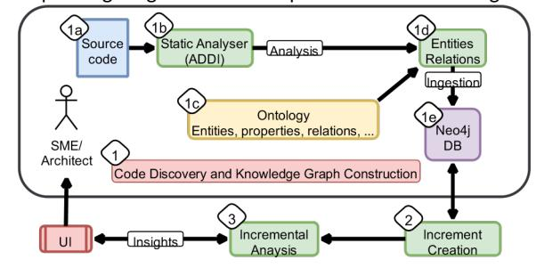
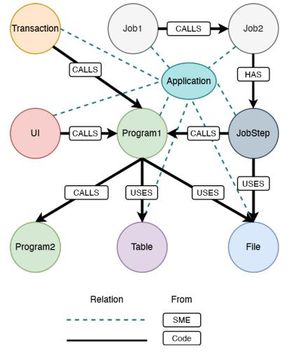
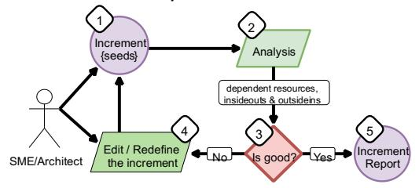
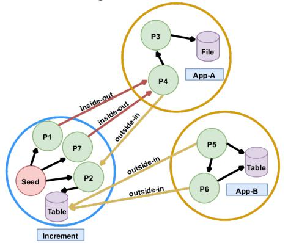
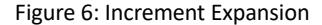
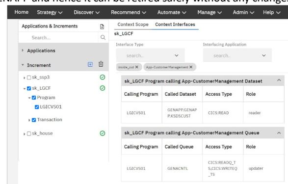

# Incremental Analysis of Legacy Applica4ons Using Knowledge Graphs for Applica4on Moderniza4on

Saravanan Krishnan Alex Mathai sarkris5@in.ibm.com alex.mathai1@ibm.com IBM Research - India

Amith Singhee Atul Kumar Shivali Agarwal asinghee@in.ibm.com kumar.atul@in.ibm.com shivaaga@in.ibm.com IBM Research - India

Keerthi Narayan Raghunath David Wenk keerag09@in.ibm.com dwenk@us.ibm.com IBM ConsulBng

# ABSTRACT

Industries such as banking, telecom, and airlines - o6en have large so6ware systems that are several decades old. Many of these systems are wri=en in old programming languages such as COBOL, PL/1, Assembler, etc. In many cases, the documentaGon is not updated, and those who developed/designed these systems are no longer around. Understanding these systems for either modernizaGon or even regular maintenance has been a challenge. An extensive applicaGon may have *natural*boundaries based on its code dependencies and architecture. There are also other*logical*boundaries in an enterprise seLng driven by business funcGons, data domains, etc. Due to these complicaGons, the system architects generally plan their modernizaGon across these logical boundaries in*parts*, thereby adopGng an *incremental*approach for the modernizaGon journey of the enGre system.

In this work, we present a so6ware system analysis tool that allows a subject ma=er expert (SME) or system architect to analyze a large so6ware system incrementally. We analyze the source code and other arGfacts (such as data schema) to create a knowledge graph using a customizable ontology/schema. EnGGes and relaGons in our ontology can be defined for any combinaGon of programming languages and plaVorms. Using this knowledge graph, the analyst can then define logical boundaries around dependent EnGGes (e.g. Programs, TransacGons, Database Tables etc.). Our tool then presents different views showcasing the dependencies from the newly defined boundary to/from the other logical groups of the system. This exercise is repeated interacGvely to 1) IdenGfy the EnGGes and groupings of interest for a modernizaGon task and 2) Understand how a change in one part of the system may affect the other parts. To validate the efficacy of our tool, we provide an iniGal study of our system on two client applicaGons.

2022 Copyright held by the owner/author(s).

ACM ISBN 978-1-4503-8582-4/22/01[. hSps://doi.org/10.1145/3493700.3493735](https://doi.org/10.1145/3493700.3493735)

# CCS CONCEPTS

• CompuGng methodologies → Ontology engineering; • InformaGon systems →*Informa2on retrieval query processing*; • So6ware and its engineering → So6ware design engineering.

# KEYWORDS

knowledge graph, so6ware engineering, legacy applicaGon modernizaGon

## ACM Reference Format:

Saravanan Krishnan, Alex Mathai, Amith Singhee, Atul Kumar, Shivali Agarwal, Keerthi Narayan Raghunath, and David Wenk. 2022. Incremental Analysis of Legacy ApplicaIons Using Knowledge Graphs for ApplicaIon ModernizaIon. In *5th Joint Interna-onal Conference on Data Science and Management of Data (9th ACM IKDD CODS and 27th COMAD) (CODSCOMAD 2022), January 8–10, 2022, Bangalore, India.*ACM, New York, NY, USA, 5 page[s. hOps://doi.org/10.1145/3493700.3493735](https://doi.org/10.1145/3493700.3493735)

# 1 INTRODUCTION

While analyzing legacy applicaGons, some common modernizaGon pa=erns include: 1.*Por7olio assessment*- to create a roadmap for modernizaGon. 2.*Decomposing monoliths*- to systemically pull out microservices using the strangler pa=ern [2]. 3.*Business func2on isola2on*- to scope the funcGonality of an enGre business process or a sub-process.

To achieve the above, architects o6en use strategies like reGre, retain, re-factor/re-architect, re-host, re-plaVorm and re-purchase [5]. We note that*irrespec2ve*of the strategy used, the legacy applicaGon has to go through a criGcal process spanning three long phases -*discovery*, *design*, and *implementa2on*. To fast-track this process and drive modernizaGon, we create a tool that 1) aids in the *discovery*/*understanding*phase and 2) provides a direcGon for the subsequent two phases in the journey. To be=er assess the impact of our tool, we must first understand why our approach is key to achieving the modernizaGon scenarios. In the above scenarios, we realize a key*generalizable*problem - idenGfying and isolaGng a

relevant porGon of a codebase in a step-by-step manner. We address this problem with our approach 'incremental analysis'. In the incremental analysis, an SME/architect first forms a new logical

Permission to make digital or hard copies of part or all of this work for personal or classroom use is granted without fee provided that copies are not made or distributed for profit or commercial advantage and that copies bear this no9ce and the full cita9on on the first page. Copyrights for third-party components of this work must be honored. For all other uses, contact the owner/author(s).*CODS-COMAD 2022, January 8–10, 2022, Bangalore, India*©

group 'increment' with the most important arGfacts of a specific requirement (scenario). The SME interacGvely idenGfies and gathers other related arGfacts into the increment by analyzing the

## CODS-COMAD 2022, January 8–10, 2022, Bangalore, India

interacGons/interfaces going across the boundaries with other logical groups. This analysis aims to come up with a collecGon of arGfacts that we can modernize with minimal external dependencies.

To realise the benefits of incremental analysis, we create a system that enables an SME/architect to incrementally analyse an applicaGon without geLng lost in the actual code/data. The key contribuGons of our system are: i) RepresenGng large complex legacy applicaGons into a knowledge graph (KG) using a

Language agnosGc ontology. ii) Allowing SME input/feedback through extensions to the ontology like business funcGon and data domain mapping. iii) Traversing the KG to compute increments and performing incremental analysis to highlight the dependencies that need to be resolved between the modernized increment and the remaining legacy arGfacts. iv) Providing the KG as a base input to analysts for data science tasks like graph clustering or anomaly detecGon. As the KG handles the language-specific requirements, the analysts need not learn program analysis skills and can instead use that Gme to focus on their tasks.

# 2 SYSTEM OVERVIEW

Our deployed system has three major components that interact with each other in an end-to-end pipeline. These components are 1)*Code Discovery and Knowledge Graph Construc2on*, 2) *Increment Crea2on via Neighbourhood DetecCon*and 3)*Incremental Analysis*. We now proceed to explain the end-to-end flow of our tool. We begin with the input to our system i.e. legacy source code that needs to be modernized. We then run our staGc analyzer tool on this source code and save our analysis into an MS-SQL database. We can construct a graph representaGon for the input source code by combining this staGc analysis and a custom-made knowledge graph ontology. A6er saving this representaGon into a Neo4j [4] graph database, we run inference algorithms to create increments and subsequently complete incremental analysis to generate the corresponding insights. This enGre process is detailed in Figure 1.

<!-- Image Description: The image is a flowchart depicting a code discovery and knowledge graph construction process. Source code is analyzed using a static analyzer (ADDI), producing entities and relations. These are then mapped to an ontology and ingested into a Neo4j database. A user interface (UI) allows for incremental analysis, generating insights. The process involves code discovery, ontology mapping, database population, and iterative analysis for knowledge graph construction. -->

Figure 1: System Overview.

We briefly describe the three major components of our system in the following secGons.

# 1 Code Discovery and Knowledge Graph ConstrucJon

The first step in our pipeline is to perform code discovery using staGc analysis. We leverage ADDI [3] as our staGc analyzer tool. ADDI supports numerous mainframe languages including Cobol, PL1, Assembler, and others. Using ADDI's staGc analysis as a foundaGon, we partnered with mulGple SMEs to create a knowledge graph rich in semanGcs pertaining to legacy applicaGons. With their domain knowledge, we developed a welldefined enGty-relaGonship model that opens up the scope for new insights.

While defining this ontology, we pay special a=enGon to making sure that it is language agnosGc and extremely extensible. We depict a simplified version of our ontology in Figure 2. Along with enGty nodes and relaGonship edges, we also store *aEributes*for each node and edge. For example, we store node a=ributes like*programming language*and*Lines-of-code*for program EnGGes and edge a=ributes like*CRUD*operaGons on relaGonships. We also provide the capability for an SME to*logically*group arGfacts as per domain knowledge of the codebase. We depict this in Figure 2 by the blue do=ed lines (i.e.*HAS*relaGonship) connecGng the*applica2on*node to all it's EnGGes. Unlike the other relaGonships directly derived from the legacy code, the logical edges are subjecGve and can be changed as the SME is able to amass more knowledge. Using the ADDI output and the defined ontology, our ingesGon component generates the knowledge graph into the Neo4j database. We will then use this database to infer insights during our next stage -*increment crea2on via neighbourhood detec2on*.

<!-- Image Description: This diagram depicts a system's architecture using a directed graph. Nodes represent software components (e.g., Transaction, Application, Program1, File), while edges represent relationships ("CALLS" or "USES"). Dashed lines indicate relations derived from subject matter experts (SME), while solid lines are from code analysis. The graph illustrates the interactions and dependencies between different parts of the system, aiding in understanding its structure and functionality. -->

Figure 2: Sample Ontology

Saravanan et al.

# 2 Increment CreaJon via Neighbourhood DetecJon

The discovery phase of the applicaGon modernizaGon journey is a very Gme-consuming and slow process. This phase o6en involves a team of SMEs struggling to understand a large codebase (developed over decades) within a short sGpulated Gme frame (few months to a year). In these situaGons, an SME needs to focus only on porGons of the codebase relevant to the final agenda. In other words, for an SME to uGlize Gme effecGvely, he/she must be able to create a boundary around *important ar2facts*and successfully*ignore*the noise that lies outside this boundary.

To aid in this process, we introduce the concept of an*increment*. We define an *increment*to be a bounded scope containing*seed*# 3 Incremental Analysis

<!-- Image Description: This flowchart depicts an iterative increment definition process. It shows steps including initial increment definition ("seeds"), analysis, evaluation of quality ("Is good?"), potential redefinition, and final increment reporting. A subject matter expert/architect interacts with the process, modifying increments as needed. The flowchart visually represents the iterative refinement of increments until they meet quality criteria. -->

## Figure 3: Incremental Analysis Flow.

Incremental analysis is a process of systemaGcally separaGng a part of a codebase for a specific requirement. To understand an increment's impacts or dependencies on the rest of the codebase, we specifically look for incoming and outgoing edges from the increment's boundary. In Figure 4, we detail a simple example of incremental analysis. A6er choosing the seed, finding the neighbourhood, and creaGng the increment boundary - we highlight the outgoing red edges and the incoming yellow edges. These edges are referred to as*inside-out*and*outside-in*respecGvely. We can pinpoint the integraGon points for the new modernized code and the rest of the codebase by focusing solely on these edges.

Incremental Analysis of Legacy Applica9ons Using Knowledge Graphs for Applica9on Moderniza9on CODS-COMAD 2022, January 8–10, 2022, Bangalore, India

arGfacts and their*neighbourhood*dependencies. As shown in Figure 3, an SME starts with*seed ar2fact(s)*. The seed arGfacts are o6en something that piques the SME's interest. A seed could be of any arGfact type - programs, transacGons, tables, files, or others. Once the seed arGfacts have been idenGfied, we traverse the knowledge graph to gather related arGfacts closely interacGng with the seeds. These close arGfacts denote the *neighbourhood*dependencies of the seeds. We then create a boundary around the seeds and their neighbourhoods and refer to this collecGon as the*increment*. We also track important metrics for each increment. Each arGfact in an increment contributes to the value of the aggregate increment metric. For example, programs of an increment contribute their lines of code (LOC) and CyclomaGc complexity (Cyclo) values to the increment's aggregate LOC/Cyclometric. These metrics help the user to bring in some preferences when creaGng increments.

<!-- Image Description: The image is a directed graph illustrating data flow between processes (P1-P7) and data stores (File, Table). Two applications (App-A, App-B) are shown. Arrows depict data transfer, labeled as "inside-out" or "outside-in," indicating data origin/destination relative to the applications' data scopes. The graph shows how data, initiated by "Seed," is processed and stored, highlighting different data access patterns. The "Increment" label suggests a counter or similar mechanism is used in the data flow. -->

# Figure 4: Incremental Analysis.

A6er analysing these edges, the SME may be interested in adding or removing arGfacts from the increment. As shown in Figure 4, the SME can pull program *P4*from*App-A* and add it to the increment. This move will reduce the number of dependency links. The SME will then re-analyze all the inside-out and outside-in edges and conGnue many iteraGons unGl the result is saGsfactory. This process is also depicted in Figure 3, from steps (*Is good ?*) through (*Edit/redefine the increment*). Once the increment is finalised, the SME can begin modernizing the legacy code within the increment.

All integraGon points between the modernized code and the remaining codebase are made apparent to the SME with the help of the inside-out and outside-in edges. With this, it is possible to leverage the modernized code and simultaneously maintain a coexistence with the remaining code arGfacts.

It is important to differenGate the benefits of incremental analysis over and above the insights derived from call graphs. The call graph InformaGon that we get using staGc analysis will include every possible relaGonship. Considering every relaGonship will slow down our understanding of - how a group of arGfacts as a

CODS-COMAD 2022, January 8–10, 2022, Bangalore, India whole interacts with the rest of the codebase. Our analysis uses various logical boundaries (applicaGons and increments) that help the user focus on the criGcal relaGons/dependencies that *cross*the logical boundary.

Figure 5: ApplicaGon Mapping and Increment CreaGon

# 3 SYSTEM DEMONSTRATION

We demonstrate our system using a publicly available standard mainframe applicaGon -*General insurance applica2on (GENAPP)*[1]. Even though we demonstrate our system on a mainframe applicaGon, it is*not* limited to mainframes. As the approach and the ontology are extensible, our system is agnosGc. To focus the demonstraGon on the actual incremental analysis, let us assume the following - GENAPP source code is analysed by the staGc analyser (ADDI), EnGGes and their relaGonships are mapped with the ontology, and the data is available in the Neo4j database. At the ingesGon stage, all the arGfacts of GENAPP are grouped under five applicaGons - Customer Management, Policy Management, Random Customer, Storage Queue Management, and Miscellaneous. They appear in the tool (Figure 5a) under the secGon 'ApplicaGons'.

Let us consider the case where we would like to IdenGfy the subapplicaGon related to 'House insurance policy' in GENAPP that we need to take through in one of the modernizaGon strategies. Before doing the analysis, we need to have a very high-level understanding of the transacGons or data resources (*not* the code implementaGon) present in the applicaGon (e.g. the transacGons 'SSP1', 'SSP2', 'SSP3' and 'SSP4' are related to the 'Motor', 'Endowment', 'House' and 'Commercial' policies respecGvely. There are also separate tables for these policies with the same name.)

Demo scenario 1: If we just know the specific transacGon 'SSP3' associated to 'House policy', then create an increment with this transacGon (Figure 5b) and trigger the analysis. This results in first expanding the increment by pulling in all neighbourhood dependencies of 'SSP3' and showing the inside-outs and outsideins. The resultant increment has one seed transacGon, 13 programs and 6 tables (House, Commercial, Motor, Endowment, Claim, Policy) (shown in Figure 6a). While we are expecGng only one table

a) IniIal setup with 5 applicaIons (a) Increment with seed transacIon: 'SSP3' (b) Increment with seed table: 'House' expanded

<!-- Image Description: Figure 6 is a title only; it lacks an actual illustration. The title "Increment Expansion" suggests the figure likely depicts a diagram or chart illustrating a process or concept related to incremental growth or expansion within the paper's subject matter. Without the figure itself, further analysis is impossible. -->

'House', we get five more. This is due to the fact that the programs interacGng with 'House' also interact with the other tables.

Demo scenario 2: If we just know the specific table 'House' associated to 'House policy', then create an increment with this table and trigger the analysis. This first results in expanding the increment by pulling in all related arGfacts of the table 'house' and showing the inside-outs and outside-ins. The resultant increment has one seeded table, 13 programs and the 4 transacGons (SSP1, SSP2, SSP3, SSP4). While we are expecGng only one transacGon 'SSP3', we get three more that are associated to the other policies. This could be due to the fact that the programs are common to interact all the tables and all the transacGon are using these common programs.

3*.*5 arGfacts. A video of our system demonstraGon is available at: github.com/IBM/AppModDemos/CAdemos.

|         | Programs Jobs |      | Transactions Files                       |     | Tables 1 | w | Total |
|---------|---------------|------|------------------------------------------|-----|---------------------|---|-------|
| ClientA | 3.5k          | 12k  | !!!!!!!!!!!!!!!!!!!!!!!!!!!!!!!!!!!!!!!! | 95K | 1.1K                |   | 513k  |
| ClientB | 5k            | 1.5k | 2.3k                                     | 48k | 339                 |   | 1000k |

Figure 8: Details of two client applicaGons

# 4 CONCLUSIONS AND FUTURE WORK

In this work, we introduced the concept of incremental analysis and explained its benefits when modernizing applicaGons. We showcased our knowledge graph and emphasized that it is language agnosGc and allows addiGons beyond staGc analysis - like business funcGons and data domains. Finally, we demonstrated our system on GENAPP and highlighted our insights. While our current tool leverages staGc analysis, our future works include -

## Saravanan et al.

understanding the data of the applicaGon (ex. tables) and insights extracGon from operaGonal logs.

In both the above scenarios, we see that the programs are common to interact with all the tables and hence if we need to create separate micro-service for 'House policy', we need to apply 're-factor' strategy to decompose those common programs. Let us consider the case where we need to reGre the funcGonality 'random customer'. Assume that we know that the related transacGon is 'LGCF' and hence create an increment with it. The analysis results in expanding the increment with only one program 'LGICVS01'. From Figure 7, we can observe the following points : (1) 'LGICVS01' is interacGng the file 'GENAPP.GENAPP.KSDSCUST' with just read operaGon; (2) same program is interacGng to the message queue 'GENACNTL' to just write the log message; (3) there aren't any other program that calls program 'LGICVS01'. With the above three points, we can be sure of the transacGon 'LGCF' and the associated program 'LGICVS01' are not dependent for the rest of GENAPP and hence it can be reGred safely without any changes.

<!-- Image Description: The image displays a screenshot of a software interface, likely for managing application components. Two tables detail program calls to a dataset and a queue, showing the calling program, called resource (dataset or queue), access type, and role. A sidebar lists various applications and increments, with checkboxes indicating selection status. The screenshot illustrates the program's data access and role management functionality. -->

Figure 7: Increment with seed transacGon: 'LGCF'

System performance : An iniGal study of applying the above demo scenarios on GenApp results in an increase in producGvity of 20%. In Figure 8, we show the number of key arGfacts present in the two client applicaGons that we are currently analysing. Our system takes roughly 20 seconds to process an increment having

# REFERENCES

[1] IBM CICS. 2020. *General insurance applicaAon (GENAPP) for IBM CICS TS*. Retrieved August 12, 2021 from

[h\\_ps://www.ibm.com/support/pages/node/310731](https://www.ibm.com/support/pages/node/310731)

- [2] IBM. 2020. *Break the monolith: Chunking strategy and the Strangler paNern*. Retrieved August 12, 2021 from
- [h\\_ps://www.ibm.com/garage/method/prac9ces/code/chunking-strategy](https://www.ibm.com/garage/method/prac9ces/code/chunking-strategy-strangler-pattern/)[strangler-pa\\_ern/](https://www.ibm.com/garage/method/prac9ces/code/chunking-strategy-strangler-pattern/)
- [3] IBM. 2021. *IBM ApplicaAon Discovery and Delivery Intelligence - Overview*. Retrieved August 12, 2021 fro[m h\\_ps://www.ibm.com/in](https://www.ibm.com/in)[en/products/appdiscoveryand-delivery-intelligence](https://www.ibm.com/in-en/products/app-discovery-and-delivery-intelligence)
- [4] Neo4j. 2020. *Neo4j Main page*. Retrieved August 12, 2021 from [h\\_ps://neo4j.com/](https://neo4j.com/)
- [5] Amazon Web Services. 2020. *ApplicaAon MigraAon Strategies*. Retrieved August 12, 2021 fro[m h\\_ps://docs.aws.amazon.com/whitepapers/latest/aws-migrabon](https://docs.aws.amazon.com/whitepapers/latest/aws-migration-whitepaper/welcome.html)[whitepaper/welcome.html](https://docs.aws.amazon.com/whitepapers/latest/aws-migration-whitepaper/welcome.html)
