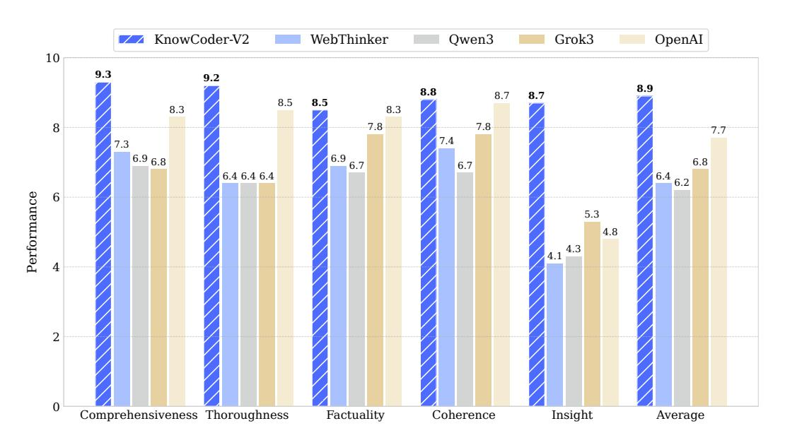
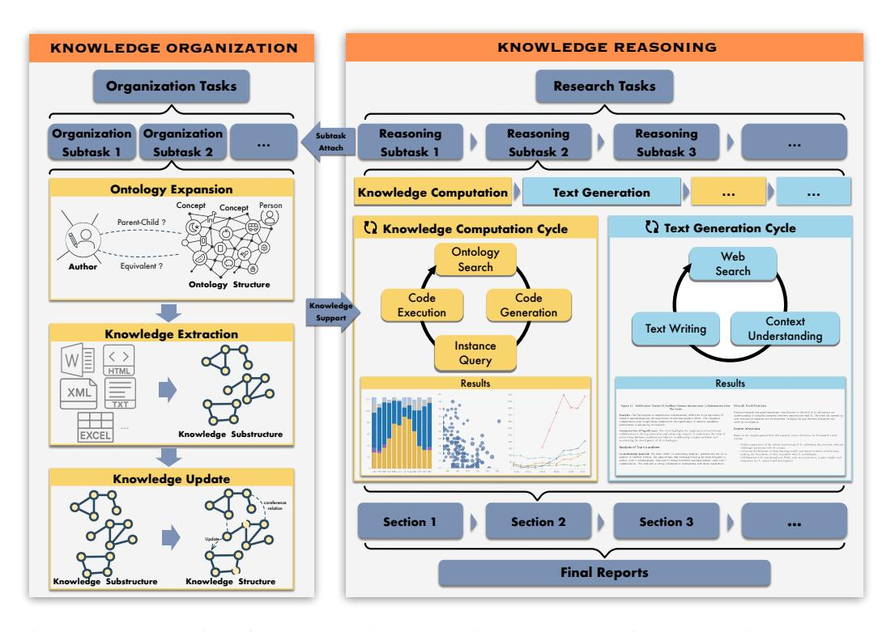
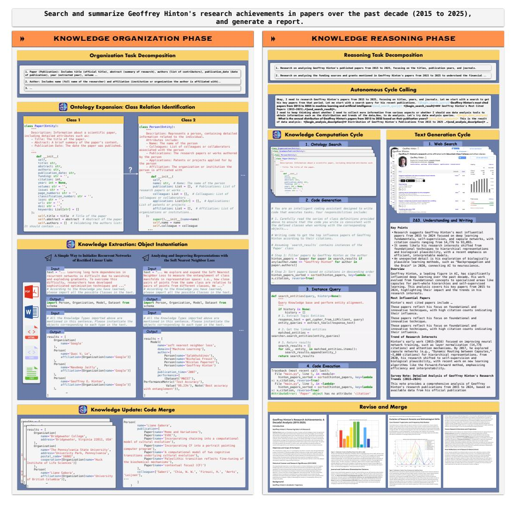
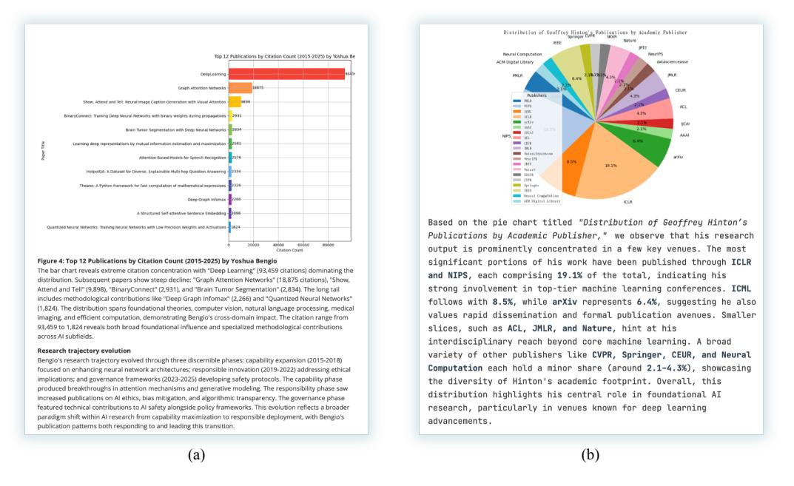

# KnowCoder-V2: Deep Knowledge Analysis

Zixuan Li1,2∗ † , Wenxuan Liu1,2,3∗ , Long Bai1,2∗ , Chunmao Zhang1,2∗ , Wei Li, Fenghui Zhang1,2 , Quanxin Jin1,2, Ruoyun He1,2, Zhuo Chen2,3, Zhilei Hu1,2,3, Fei Wang2 , Bingbing Xu2 , Xuhui Jiang4,5, Xiaolong Jin1,2,3†, Jiafeng Guo1,2,3†, Xueqi Cheng1,2,3 1Key Laboratory of Network Data Science and Technology, Institute of Computing Technology, Chinese Academy of Sciences 2State Key Laboratory of AI Safety 3School of Computer Science, University of Chinese Academy of Sciences

4DataArc Tech Ltd, 5 IDEA Research, International Digital Economy Academy

{lizixuan@ict.ac.cn, jinxiaolong@ict.ac.cn, guojiafeng@ict.ac.cn}

### Abstract

Deep knowledge analysis tasks always involve the systematic extraction and association of knowledge from large volumes of data, followed by logical reasoning to discover insights. However, to solve such complex tasks, existing deep research frameworks face three major challenges: 1) Coarse knowledge management: They lack systematic organization and management of knowledge; 2) Inefficient Operation Manner: They operate purely online, making it inefficient for tasks that rely on shared and large-scale knowledge; 3) Shallow Knowledge Computation: They cannot perform complex knowledge computation, limiting their abilities to produce insightful analytical results. Motivated by these, in this paper, we propose a Knowledgeable Deep Research (KDR) framework that empowers deep research with deep knowledge analysis capability. Specifically, it introduces an independent knowledge organization phase to preprocess large-scale, domain-relevant data into systematic knowledge offline. Based on this knowledge, it extends deep research with an additional kind of reasoning steps that perform complex knowledge computation in an online manner. To enhance the abilities of LLMs to solve knowledge analysis tasks in the above framework, we further introduce KNOWCODER-V2, an LLM that bridges knowledge organization and reasoning via unified code generation. For knowledge organization, it generates instantiation code for predefined classes, transforming data into knowledge objects. For knowledge computation, it generates analysis code and executes on the above knowledge objects to obtain deep analysis results. Experimental results on more than thirty datasets across six knowledge analysis tasks demonstrate the effectiveness of KNOWCODER-V2. Moreover, when integrated into the KDR framework, KNOWCODER-V2 can generate highquality reports with insightful analytical results compared to the mainstream deep research framework.

### 1 Introduction

Recently, Large Language Models (LLMs) have demonstrated remarkable capabilities in natural language understanding and generation [\(Zhao et al.\)](#page-19-0). Through inference-time scaling, some LLMs, such as OpenAI-o1 [1](#page-0-0) and DeepSeek-R1 [\(Guo et al.,](#page-14-0) [2025\)](#page-14-0), allocate increased computational resources to generate longer chains of thought before producing responses, resulting in improved reasoning performance [\(Snell et al.,](#page-17-0) [2024\)](#page-17-0). These advancements have given rise to deep research, a new category of abilities to autonomously tackle complex tasks by searching and synthesizing information from diverse online sources [\(Li et al.,](#page-16-0) [2025b\)](#page-16-0).

∗Co-first authors.

†Corresponding authors

Preprint. Work in progress.

1https://openai.com/index/openai-o1-system-card/

Figure 1: Report generation performance of the Knowledgeable Deep Research framework empowered by KnowCoder-V2 and its counterparts. Scores are averaged from DeepSeek-R1 and DeepSeek-V3 evaluations.

Although deep research framework shows considerable capability to handle several kinds of complex tasks, it falls short when dealing with one particular kind of tasks, which we refer to as deep knowledge analysis task. These tasks involve the systematic extraction, organization, and association of knowledge from large-scale and heterogeneous data sources, followed by multi-step logical reasoning over the such structured knowledge. For instance, the problem "What were the most influential research contributions to quantum computing between 2020 and 2024?" cannot be addressed through simple web search and text generation, especially when the analyses about the problem are not publicly available. Specifically, the limitations of the exising deep research framework can be categorized into three key dimensions:

1) Coarse Knowledge Management: The existing deep research framework search limited web pages to look up for information related to the task. In such frameworks, the basic unit of external knowledge is the web page. This results in coarse knowledge management, which means the models are hard to exploit fine-grained and organized knowledge distributed in thousands of documents.

2) Inefficient Operation Manner: The existing deep research framework operate entirely online, which may repeatedly searches and processes similar web pages across different tasks. This operation manner involves unnecessary computational overhead and hinders the efficiency of the framework.

3) Shallow Knowledge Computation: The existing deep research framework process text-form knowledge via text generation, which is only able to perform shallow knowledge computation. In contrast, deep knowledge analysis requires more sophisticated computational capability of knowledge, including aggregating information across entities and timestamps, performing logical deduction and statistical inference, and dynamically querying and transforming structured data. Without these capabilities, the deep research framework falls short of the depth and precision needed to support insightful analysis.

Motivated by these, in this paper, we proposes a Knowledgeable Deep Research (KDR) framework that augments existing deep research systems with deep knowledge analysis capabilities. KDR contains two phases, i.e., knowledge organization and knowledge reasoning phase. In the knowledge organization phase, large-scale, domain-specific, and multi-source data are systematically preprocessed into structured knowledge based on a task-specific ontology. After this phase, we can obtain a structured knowledge base. In the knowledge reasoning phase, based on this organized knowledge base, KDR conducts complex knowledge computations in real time. Specifically, KDR further calls two kinds of reasoning steps to solve each subtask autonomously, i.e., deep computing step and

deep search step. The former aims to search for the structured knowledge and conduct complex computation to obtain the analysis results. The latter aims to search for the online website to get the related documents. With the two kinds of materials as input, KDR writes the final report.

To address the limitations of current LLMs in deep knowledge analysis tasks, we propose KNOWCODER-V2, an LLM that unifies knowledge organization and reasoning through code generation. In the knowledge organization phase, KNOWCODER-V2 generates instantiation code for predefined classes, systematically converting raw data into structured knowledge objects. In the reasoning phase, it produces analytical code that operates on these objects to perform complex computations and multi-step analysis. Experimental results on thirty datasets across six types of knowledge analysis tasks, including ontology expansion, knowledge extraction, and knowledge graph question answering, demonstrate the effectiveness of the proposed KNOWCODER-V2. Furthermore, by integrating KNOWCODER-V2, the proposed KDR framework can generate high-quality reports with comprehensive experimental analyses and deep insights.

In summary, our key contributions are from four aspects:

- We propose a knowledgeable deep research framework that empowers the existing deep research framework with deep knowledge analysis.
- To enhance the abilities of LLMs to solve the knowledge analysis tasks in the above framework, we introduce KNOWCODER-V2, an LLM that bridges knowledge organization and reasoning via unified code generation.
- Experimental results on more than thirty datasets across six knowledge analysis tasks demonstrate the effectiveness of the proposed KNOWCODER-V2.
- With KNOWCODER-V2, the proposed knowledgeable deep research framework can produce high-quality reports with deep analysis results.

In the following sections, we will first introduce the knowledgable deep research framework in Section [3.](#page-3-0) Then, we will present the proposed KNOWCODER-V2 in Section [4.](#page-5-0) After that, we will evaluate the performance of KNOWCODER-V2 and the proposed framework in Section [5.](#page-9-0) Finally, we will conclude the paper in Section [6.](#page-13-0)

## 2 Related Work

### 2.1 LLM-based Knowledge Organization

For the knowledge organization phase, the related work primarily consists of three key tasks, i.e., ontology expansion, knowledge extraction, and knowledge update. Ontology expansion aims to involve integrating emerging new concepts into existing ontology structures by identifying their appropriate parents. Early works [\(Takeoka et al.,](#page-18-0) [2021;](#page-18-0) [Shen et al.,](#page-17-1) [2024\)](#page-17-1) fine-tuned BERT-based models to leverage textual descriptions of concepts and transfer this task into a multi-class classification task. Recently, some works [\(Moskvoretskii et al.,](#page-16-1) [2024;](#page-16-1) [Zeng et al.,](#page-19-1) [2024\)](#page-19-1) use LLMs to conduct this task and get significant improvement. Knowledge Extraction refers to leveraging LLMs to extract structured knowledge following the given concepts from the ontology, which can be divided into in-context learning (ICL)-based and supervised-based extraction. The ICL-based extraction [Wang et al.](#page-18-1) [\(2023c\)](#page-18-1); [Li et al.](#page-15-0) [\(2023a\)](#page-15-0); [Guo et al.](#page-14-1) [\(2023\)](#page-14-1) aims to leverage the universal capabilities of LLMs to extract the knowledge directly without fine-tuning the specific datasets. And Supervised-based Extraction [Sainz et al.](#page-17-2) [\(2024\)](#page-17-2); [Li et al.](#page-16-2) [\(2024\)](#page-16-2); [Zuo et al.](#page-19-2) [\(2024\)](#page-19-2) aims to construct a large IE corpus to fine-tune the LLM to better adapt to more specific domains or large-scale schema scenarios. Knowledge update refers to updating the out-of-date knowledge according to the given new extracted knowledge. The related techniques include entity linking, entity alignment, and so on.

### 2.2 LLM-based Knowledge Reasoning

The techniques related to the knowledge reasoning phase include Retrieval-Augmented Generation (RAG), Graph Retrieval-Augmented Generation (GraphRAG), Deep Research, and so on. RAG mitigates hallucinations by retrieving relevant documents as context for the LLM [\(Xu et al.,](#page-18-2) [2024;](#page-18-2) [Asai et al.,](#page-14-2) [2023;](#page-14-2) [Shao et al.,](#page-17-3) [2023\)](#page-17-3). GraphRAG extends this by extracting knowledge graphs from text

Figure 2: Demonstration of the proposed knowledgeable deep research framework. The mustard yellow blocks indicate tasks related to deep knowledge analysis, which includes knowledge organization and computation tasks.

and constructing community hierarchies, thereby improving the LLM's comprehension of complex datasets [\(Edge et al.,](#page-14-3) [2024;](#page-14-3) [Ma et al.,](#page-16-3) [2024\)](#page-16-3).

Building on RAG, Deep Search or Deep Research further focuses on in-depth, multi-step investigation and analysis of information from diverse sources for deeper insights. This capability is commonly integrated as an advanced search feature in proprietary LLMs such as Sonar Reasoning Pro, and GPT-4o Search Preview. Works on open-source LLMs focus on augmenting reasoning for deep search. For instance, Search-o1, ODS [\(Li et al.,](#page-16-4) [2025a;](#page-16-4) [Alzubi et al.,](#page-14-4) [2025\)](#page-14-4) augment the latest open-source reasoning LLMs by injecting the capabilities of web search tools to answer queries; others [\(Jin et al.,](#page-15-1) [2025;](#page-15-1) [Song et al.,](#page-17-4) [2025;](#page-17-4) [Chen et al.,](#page-14-5) [2025\)](#page-14-5) train LLMs with reinforcement learning to autonomously generate search queries during step-by-step reasoning. Besides, WebThinker [\(Li](#page-16-0) [et al.,](#page-16-0) [2025b\)](#page-16-0) employs LLMs to autonomously search, explore web pages deeply, and draft research reports within its reasoning process. Agentic Reasoning [Wu et al.](#page-18-3) [\(2025\)](#page-18-3) enhances LLMs by integrating agents that utilize external tools and construct knowledge graphs for deductive reasoning. DeepResearcher [\(Zheng et al.,](#page-19-3) [2025\)](#page-19-3) focuses on training LLM agents in realistic web environments to perform iterative reasoning and search.

### 3 Knowledgeable Deep Research

In the following sections, we introduce the proposed Knowledgeable Deep Research (KDR) framework. As demonstrated in Figure [2,](#page-3-1) KDR distinguishes itself from traditional deep research framework by clearly separating knowledge organization into a dedicated offline phase. This decoupling allows the structured organization of vast amounts of research objects into accessible structured knowledge. Leveraging these structured knowledge, the KDR framework then enables rapid and in-depth analysis of research objects during the subsequent knowledge reasoning phase.

### 3.1 Knowledge Organization Phase

As shown in the left part of Figure [2,](#page-3-1) given a research topic as input, the offline knowledge organization phase first generates several organization subtasks, where each subtask corresponds to a concept that needs to be extracted. Then, for each subtask, this phase consists of three steps, i.e., ontology expansion, knowledge extraction, and knowledge update. First, in the ontology expansion step, KDR aligns the focused concepts to the existing ontology structure. Next, the knowledge extraction step transfers a large collection of related information into the corresponding structured knowledge. Finally, the knowledge update step updates the newly extracted knowledge into existing knowledge bases.

Task Decomposition. Given a research topic as input, the offline knowledge organization process first decomposes the overall task into several subtasks, each corresponding to specific research concepts such as entities and events. Entity concepts are associated with particular properties and relation types, while event concepts have defined argument types. For instance, considering the research question, "Please help me research the papers published by Geoffrey Hinton in the past decade and analyze the trends in his research interests over time", the related research entities would include academic papers along with properties such as publication date, authorship, citation and so on. Due to the critical role of this step, the process always employs a "human-in-the-loop" strategy: initially, LLMs propose the structures of concepts, which are subsequently reviewed and validated by human experts.

Ontology Expansion. As new organizational tasks emerge, concepts defined in these subtasks often have different labels but represent the same underlying meanings, or they may have associations with the existing concepts in the ontology. For instance, "author" is a subclass of "person" and is equivalent to the concept of "authors." To facilitate subsequent fusion of structured knowledge, the ontology expansion step systematically associates the new concepts with the existing ontology. Starting from the root concepts "Entity" and "Event," this step involves identifying both equivalence and hierarchical (hyponym) relationships among the concepts, ensuring consistency and semantic coherence within the ontology.

Knowledge Extraction. With the ontology as input, the extraction step processes various types of documents, including PDF, TXT, WORD, and HTML formats, to extract corresponding entities and events. This step can be formulated as the Information Extraction (IE) tasks [Cowie & Lehnert](#page-14-6) [\(1996\)](#page-14-6), specifically designed to derive structured knowledge from unstructured data. Typical IE subtasks performed here include Named Entity Recognition (NER), Relation Extraction (RE), and Event Extraction (EE).

Knowledge Update. Since knowledge is often dispersed across multiple documents, extracting information from a single document or text snippet usually provides only partial details about an entity or event. For example, assembling comprehensive data on a specific author's publications requires extracting relevant information from multiple sources, such as all their published papers. Additionally, knowledge can evolve over time. For instance, a person's residence might change. This step continuously updates the new extracted knowledge to previously extracted ones to ensure ongoing accuracy and consistency.

#### 3.2 Knowledge Reasoning Phase

Given a specific research task, the knowledge reasoning phase generates a comprehensive report based on previously organized knowledge. As illustrated on the right side of Figure [2,](#page-3-1) this phase begins by decomposing the overall research task into multiple subtasks, each corresponding to a specific part of the final report. Each subtask is addressed through two types of reasoning steps, i.e., knowledge computation and text generation. Using the outputs from these reasoning steps, the complete and coherent research report is ultimately obtained.

Task Decomposition. This step decomposes the overall research task into several smaller reasoning subtasks. For each subtask, LLMs further adaptively carry out two distinct reasoning steps, i.e., knowledge computation and text generation, by generating the corresponding queries. Specifically, the knowledge computation step retrieves structured knowledge from the knowledge organization phase and generate codes to conduct necessary computational analyses or experiments. The text generation step, on the other hand, involves retrieving and synthesizing information from online sources to support content generation.

Knowledge Computation Cycle. The knowledge computation cycle is automatically triggered when the corresponding queries are generated during the task decomposition step. Since knowledge computation involves large-scale data and thus cannot be included directly in the prompt, this reasoning step aims to generate the computation code based on the data ontology, rather than directly accessing the data. Specifically, it follows a cyclic process. In the ontology search step, it searches for the structures of relevant concepts and represents them in formats such as JSON, text, or code. Then, in the code generation step, code is generated based on the identified ontology structure. Following that, the instance query step retrieves instance data based on the ontology structure defined earlier. Finally, in the code execution step, the analysis code is executed on the retrieved instance data to generate the analysis results. If the code execution fails or the generated analysis results do not meet the required criteria, this cycle will be repeated until the desired results are achieved or the maximum number of iterations is reached.

Text Generation Cycle. The text generation cycle is automatically triggered when the corresponding queries are generated during the task decomposition step. This cycle searches for relevant information on the internet and uses it for subsequent text generation. Specifically, in the web search step, the system searches online websites using the decomposed query as input. Then, the LLM processes the retrieved websites and generates corresponding text. If the generated text does not sufficiently address the query, this cycle will be repeated until the desired results are achieved.

Merge and Revise. After the above two kinds of reasoning steps, the materials for a subtask are ready. Then, the merge and revise step will merge the materials to obtain the section content. Then, it will finally merge each section to form the complete report. Besides, an extra revision step is conducted to polish the report from a global perspective.

## 4 KnowCoder-V2

Although LLMs have demonstrated strong capabilities in many natural language processing tasks, they still face limitations when it comes to deep knowledge analysis. To address these challenges, we introduce KNOWCODER-V2, an LLM designed to bridge knowledge organization and reasoning through a unified code generation approach. In the following sections, we present the details of how KDR framework is implemented with KNOWCODER-V2.

### 4.1 Knowledge Organization Phase

The knowledge organization phase aims to systematically induce, extract, and update the structure knowledge related to the given research task. Following KNOWCODER-V1 [\(Li et al.,](#page-16-2) [2024\)](#page-16-2), we use Python classes to represent concepts in the ontology and Python objects to represent knowledge instances. As illustrated in the left side of Figure [3,](#page-6-0) two base classes, i.e., Entity and Event, are predefined. All other domain-specific concepts are implemented as subclasses of these base classes. For example, class Person(Entity). The attributes of each concept (such as a person's affiliation) are defined as member variables within the class. Additionally, examples and descriptions for each concept are provided in the class docstrings, consistent with KNOWCODER-V1.

### *4.1.1 Task Decomposition*

Given a research task, we begin by decomposing it into a set of subtasks using a human-in-the-loop approach. First, the research task is provided as the input to an LLM, which infers the relevant concepts and their associated attributes. Next, these inferred concepts are manually reviewed to ensure accuracy and completeness. Finally, the validated concepts are automatically structured into Python classes.

Figure 3: Illustration of the Knowledgeable Deep Research Framework implemented by KNOWCODER-V2. We use DeepSeek-R1 to handle the parts of the KDR framework that are not related to knowledge analysis tasks.

#### *4.1.2 Ontology Alignment: Class Relation Identification*

The same concept may have different definitions across various knowledge organization tasks, and hierarchical relationships may exist between distinct concepts. This misalignment poses significant challenges for subsequent knowledge organization and reasoning. To address this, the ontology expansion step aims to identify semantic relations, including parent-child and equivalent relations, by analyzing the definitions of the corresponding concepts. To achieve this, we design a twostage alignment process that combines pre-trianed and large language models. In the first stage, following [Zeng et al.](#page-19-1) [\(2024\)](#page-19-1), SimCSE [Gao et al.](#page-14-7) [\(2021\)](#page-14-7) is adopted to encode the concept names and descriptions into *m*-dimensional vectors. Based on the cosine similarity among these vectors, we retrieve the top-*k* most similar candidate concepts. In the second stage, we refine the alignment results by prompting LLM with the code definitions of the candidate classes to determine whether they exhibit parent-child or equivalent relations.

#### *4.1.3 Knowledge Extraction: Object Instantiation*

In this step, KNOWCODER-V2 extracts the corresponding structured knowledge by instantiating the classes based on the given text. Previous work [\(Li et al.,](#page-16-2) [2024;](#page-16-2) [Wang et al.,](#page-18-4) [2023b\)](#page-18-4) requires including all class definition code within the prompt. This presents a significant challenge: when a large number of concepts need to be extracted, the total class definition code can become excessively long and may even exceed the prompt length limit. As a result, both the effectiveness and efficiency of the extraction process can degrade due to the excessive length of prompts.

To address this issue, existing methods adopt a partitioned extraction strategy [\(Gui et al.,](#page-14-8) [2024a;](#page-14-8) [Liu](#page-16-5) [et al.,](#page-16-5) [2025\)](#page-16-5). They divide the concepts into several groups and construct a separate prompt for each group, which are then processed individually by the LLMs to extract the corresponding knowledge. While this strategy can improve performance, it significantly reduces efficiency. In contrast, elegant code design does not require developers to repeatedly provide the full definition code for the same classes; instead, they can simply import the predefined classes. Motivated by this, we internalize class definitions into the parameters of KNOWCODER-V2, allowing it to use a simple import clause during the extraction process. To support these new capabilities, we introduce two types of training tasks, i.e., ontology understanding and following tasks to implicitly enhance KNOWCODER-V2's ability to comprehend and operate on dynamic, large-scale knowledge organization tasks.

Ontology Understanding Tasks. To enable LLMs to understand the detailed definition of these classes, we define a ontology understanding task. After importing a class, we instruct LLMs to generate the detailed definitions with the prompt of "*Please generate the detailed schema of the class {type} from {task} based on your memory.*".

Ontology Following Tasks. Ontology following task aims to enhance the ability to follow the imported classes and generate instantiating code accordingly. It consists of two subtasks, i.e., class importing and object instantiate tasks. Given the text, class importing task aims to recall the corresponding types via completing the import clause. Given the text and import clause, object instantiate task aims to extract corresponding knowledge via generating the instantiating code. In some situations, users may predefine types that they want to extract but in other situations, the user may not give out the types explicitly and want the model to recall all the possible types in its memory. Thus, we conduct training under two settings, i.e., close domain and open domain settings. In the following, we will introduce details of the training data.

• Class Importing Data. In the closed-domain setting, users specify a predefined set of classes to be extracted. In this scenario, we begin by explicitly listing the relevant types using the import clause: *From {task} Import {type1}, {type2}*. Besides, we also give out the task description in the prompt: *Some {task} Types are imported above. Please instantiate all the possible {task} Objects in the following sentence.* . Then, KNOWCODER-V2 is instructed to recall the most potential types in the text. The output is the potential knowledge types in the form of *Import {type1}*.

In the open domain setting, we remove the given schema and only instruct LLM to recall possible types from knowledge types the model have learned by the task description: *According to the {task} Types you have learned, please import all the possible {task} Types in the sentence*. The output is potential knowledge types in the form of *Import {type1}*.

• Object Instantiation Data. After obtaining the potential knowledge types in the text, we aim to instantiate a concrete knowledge object by task description: *Some {task} Types are imported above. Please instantiate all the possible {task} Objects in the following sentence.* . The output is a list of instantiated objects same with direct extraction data.

#### *4.1.4 Knowledge Update: Code Merge*

In this step, KNOWCODER-V2 merges entities and events that share the same name. For these entities or events, their relations, properties, or arguments are combined into a single unified entity or event. Additionally, if previously stored knowledge conflicts with newly extracted knowledge, the system updates it with the latest knowledge. This heuristic strategy proves effective in most cases. Developing more precise and robust knowledge update mechanisms is left as future work.

#### 4.2 Knowledge Reasoning Phase

In this section, we introduce the implementation details of the knowledge reasoning phase with KNOWCODER-V2.

### *4.2.1 Task Decomposition*

As illustrated on the right side of Figure [3,](#page-6-0) the knowledge reasoning phase begins by decomposing the given research task into several subtasks. Each subtask addresses a research topic closely related to the research task. For each subtask, an LLM further decomposes it into two distinct reasoning steps, i.e., the knowledge computation cycle and the text generation cycle. Specifically, we use the tags <begin\_data\_analysis> and <end\_data\_analysis> to indicate the queries of the knowledge computation cycle and the tags <begin\_web\_search> and <end\_web\_search> to indicate the queries of the text generation cycle.

### *4.2.2 Knowledge Computation Cycle*

Since various types of knowledge have already been encapsulated as distinct Python objects during the knowledge organization phase, KNOWCODER-V2 implements the knowledge computation cycle to generate executable code based on the queries derived from task decomposition. Specifically, this cycle produces three types of code: class definition code, knowledge declaration code, and knowledge computation code. By integrating and executing these components, KNOWCODER-V2 is able to perform deep and precise computations over the structured knowledge.

Ontology Search. Given a research subtask, the ontology search step aims to identify relevant concepts from the ontology. With the queries as input, we leverage Elasticsearch to retrieve codebased concepts that are most pertinent. Once identified, these concepts are then transformed into their corresponding class definition code, enabling seamless integration into subsequent knowledge computation processes.

Code Generation. Analysis tasks typically require large-scale data, making it impractical to include all the necessary data directly in the prompt. More importantly, when humans write code, they usually complete the entire script first and then input the data. Inspired by this manner, we assume the relevant objects has already been retrieved, instantiated, and stored in a variable named search\_results. Consequently, KNOWCODER-V2 directly generates the code required to complete the corresponding queries based solely on the class definition obtained from the ontology search step.

Instance Query. In this step, we instantiate the corresponding entity objects and store them in the search\_results list. First, we perform named entity recognition using an LLM to extract the topic entities of the queries. Next, using these extracted entity names, we use elasticsearch and entity names to query the knowledge base to find related entities. Finally, based on the subgraphs related to each entity, we instantiate the corresponding objects. Note that, if the we query the knowledge base to find related entries. Finally, we instantiate the corresponding entity objects and store them in the list named search\_results.

Code Execution. In this step, we integrate the class definition code, the filed search\_results variables, and the analysis code to create the final executable script. By running this combined code in the Python execution environment, we obtain the corresponding analysis results. However, there could be situations where the code execution fails or produces incorrect results (e.g., generating empty charts). To address this, we incorporate an analysis evaluation agent that reviews the obtained analysis results and determines whether they satisfy the task requirements. If the results do not meet the specified criteria, the process loops back to the first step for corrections.

### *4.2.3 Text Generation Cycle*

With the search query input, the model iteratively conduct web search until the query can be answered. Specifically, it contains three steps, i.e., web search, context understanding, and text writing. As these steps are broadly implemented in the existing deep research frameworks, we will not detail them in this paper.

#### *4.2.4 Merge and Revise*

A significant challenge is ensuring consistency between the results generated by the knowledge computation and text generation cycles. Inconsistencies often arise due to incomplete search results, quality issues in web content, or inadequacies in the structured knowledge. To address this, we designed an additional agent to merge results from both cycles and revise them. This agent autonomously evaluates the analysis results from the knowledge computation cycle alongside the generated results from the text generation cycle, identifies conflicting content, and resolves these discrepancies to achieve consistency.

### 4.3 Training of KnowCoder-V2

To enhance the extraction capabilities of KNOWCODER-V2, we utilized 14 Named Entity Recognition (NER) datasets, 7 Relation Extraction (RE) datasets, and 6 Event Extraction (EE) datasets, including three datasets in Chinese. Additionally, to further improve KNOWCODER-V2's extraction capabilities, particularly its robustness, event extraction, and multilingual performance, we implemented data augmentation techniques described below.

For ontology alignment tasks in the knowledge organization phase and tasks in the knowledge reasoning phase, we are currently generating the corresponding training data and plan to release the trained models in the future.

Robustness Augmentation. To bolster the robustness of KNOWCODER-V2 against diverse inputs, we created an additional training corpus employing augmentation algorithms proposed by RobustUIE [\(Zhu et al.,](#page-19-4) [2025\)](#page-19-4). Moreover, to efficiently enhance robustness, we adopted a loss-guided data augmentation approach, selecting 20,000 informative samples from the augmented corpus for training.

Event Augmentation. We leveraged the English EE dataset EEMT [\(Liu et al.,](#page-16-5) [2025\)](#page-16-5) to strengthen KNOWCODER-V2's fine-grained event extraction capabilities under extensive schema scenarios. Furthermore, to boost its Chinese event extraction performance, we developed a parallel Chinese version of the EEMT dataset.

Multilingual Augmentation. Considering the linguistic imbalance between Chinese and English datasets within the Information Extraction (IE) corpus, we employed the parallel data generation pipeline introduced by [\(Zuo et al.,](#page-19-2) [2024\)](#page-19-2). Using this method, we constructed parallel IE corpora from selected English datasets, aiming to facilitate knowledge sharing across languages and enhance Chinese information extraction performance.

KNOWCODER-V2 is fine-tuned based on the Qwen-2.5-Coder-14B-Instruct model [\(Hui et al.,](#page-15-2) [2024\)](#page-15-2), utilizing the LLaMA-Factory framework [\(Zheng et al.,](#page-19-5) [2024\)](#page-19-5). Parameter-efficient fine-tuning is achieved through Low-Rank Adaptation (LoRA) [\(Hu et al.,](#page-15-3) [2021\)](#page-15-3) with a LoRA rank of 32. The warm-up ratio is set at 0.01, and the learning rate at 3 × 10−4 . Sequence length is limited to 2048 tokens, and a batch size of 256 is used. During inference, the temperature parameter is fixed at 0. All training and evaluations are performed on eight NVIDIA A100 80GB GPUs.

### 5 Experiment

### 5.1 Tasks and Datasets

We evaluate KNOWCODER-V2 on two kinds of tasks, i.e., knowledge organization and knowledge reasoning tasks. For the knowledge organization task, We further evaluate the ontology expansion and knowledge extraction abilities on the corresponding datasets. For the ontology expansion datasets, we evaluate the performance on WordNet Sub-taxonomies from [Bansal et al.](#page-14-9) [\(2014\)](#page-14-9), Graphine taxonomies from [Liu et al.](#page-16-6) [\(2021a\)](#page-16-6), and three large-scale taxonomies from SemEval-2016 [Bordea](#page-14-10) [et al.](#page-14-10) [\(2016\)](#page-14-10) across science, environment, and food domains. Table ?? presents the statistics of these taxonomies, all of which contain entities and definitions curated by human experts. For all benchmarks, we split the training and tesing dataset following [Zeng et al.](#page-19-1) [\(2024\)](#page-19-1). For knowledge extraction, we choose 26 information extraction benchmarks under the supervised setting. For English IE, we evaluate performance across 10 benchmarks for NER, 6 benchmarks for RE, 3 benchmarks for ED, and 2 benchmarks for EAE. For Chinese IE, we evaluate performance on 2 benchmarks for NER, 1 benchmark for RE, 1 benchmark for ED, and 1 benchmark for EAE. Besides, we also evaluate KNOWCODER-V2 under the event extraction benchmark with massive types EEMT [Liu](#page-16-5)

| Model                   |      | SemEval-Sci |      | SemEval-Env |      | SemEval-Food |      | WordNet | Graphine |      |  |
|-------------------------|------|-------------|------|-------------|------|--------------|------|---------|----------|------|--|
|                         | Acc  | Wu&P        | Acc  | Wu&P        | Acc  | Wu&P         | Acc  | Wu&P    | Acc      | Wu&P |  |
| Self-supervised Setting |      |             |      |             |      |              |      |         |          |      |  |
| TaxoExpan               | 27.8 | 57.6        | 11.1 | 54.8        | 27.6 | 54.2         | 19.8 | 64.8    | 24.5     | 65.9 |  |
| STEAM                   | 36.5 | 68.2        | 36.1 | 69.6        | 34.2 | 67.0         | 23.2 | 62.4    | 20.3     | 63.1 |  |
| HEF                     | 53.6 | 75.6        | 55.3 | 71.4        | 47.9 | 73.5         | 16.4 | 60.3    | 25.5     | 66.5 |  |
| Musubu                  | 44.9 | 76.2        | 45.3 | 65.4        | 42.3 | 72.4         | 28.5 | 64.0    | 35.4     | 75.2 |  |
| TEMP                    | 57.8 | 85.3        | 49.2 | 77.7        | 47.6 | 81.0         | 29.4 | 65.7    | 35.9     | 73.8 |  |
| BoxTaxo                 | 31.8 | 64.7        | 38.1 | 75.4        | 31.4 | 66.8         | 26.4 | 63.9    | 29.2     | 68.2 |  |
| TaxoPrompt              | 61.4 | 85.6        | 57.4 | 83.6        | 53.2 | 83.1         | 40.3 | 71.5    | 33.9     | 74.4 |  |
| TaxoInstruct            | 45.9 | 76.2        | 48.8 | 77.2        | 34.3 | 70.2         | 43.3 | 71.8    | 31.8     | 69.0 |  |
| 1-shot Setting          |      |             |      |             |      |              |      |         |          |      |  |
| NL (GPT-4o)             | 54.8 | 88.3        | 52.5 | 81.3        | 55.5 | 85.6         | 72.2 | 90.7    | 69.8     | 89.1 |  |
| CodeTaxo (GPT-4o)       | 67.7 | 89.2        | 62.5 | 86.1        | 58.1 | 85.3         | 74.5 | 91.3    | 72.9     | 91.0 |  |
| NL (GPT-4o-mini)        | 50.0 | 83.0        | 35.0 | 76.1        | 55.1 | 87.2         | 60.1 | 86.0    | 58.3     | 85.2 |  |
| CodeTaxo (GPT-4o-mini)  | 58.1 | 85.6        | 42.5 | 76.0        | 55.9 | 85.3         | 68.8 | 89.2    | 61.5     | 85.1 |  |
| KnowCoder-V2            | 59.7 | 80.8        | 62.5 | 88.2        | 60.2 | 87.6         | 76.9 | 91.4    | 83.3     | 95.9 |  |

Table 1: Performance on taxonomy expansion across five datasets. Metrics include Accuracy (Acc) and Wu&Palmer Similarity (Wu&P).

[et al.](#page-16-5) [\(2025\)](#page-16-5) and robustness benchmark RUIE [Zhu et al.](#page-19-4) [\(2025\)](#page-19-4). We use abbreviations from P1 to P14 for 14 kinds of perturbations defined in the RUIE. The detailed benchmark statistics are listed in Tables [2,](#page-11-0) [3.](#page-11-1) For the knowledge reasoning task, we further evalute the Knowledge Base Question Answer (KBQA) and the report generation abilities. For the KBQA task, we adopt the most common dataset, WebQSP [\(Yu et al.,](#page-18-5) [2023\)](#page-18-5), as the dataset. For the report generation task, there are no suitable datasets. Thus we evaluate this abilities on the self-construct dataset about the scientific report.

#### 5.2 Baselines

Knowledge Organization. For the knowledge organization task, we evaluate the performance of KNOWCODER-V2 on several kinds of tasks, including ontology expansion and knowledge extraction including entity extraction, relation extraction, and event extraction. For the ontology expansion task, we evaluated the performance of KNOWCODER-V2 against several baseline methods, including TaxoExpan [\(Shen et al.,](#page-17-5) [2020\)](#page-17-5), STEAM [\(Yu et al.,](#page-18-6) [2020\)](#page-18-6), HEF [\(Wang et al.,](#page-18-7) [2022\)](#page-18-7), Musubu [\(Takeoka](#page-18-0) [et al.,](#page-18-0) [2021\)](#page-18-0), TEMP [\(Liu et al.,](#page-16-7) [2021b\)](#page-16-7), BoxTaxo [\(Jiang et al.,](#page-15-4) [2023b\)](#page-15-4), TaxoPrompt [\(Xu et al.,](#page-18-8) [2022\)](#page-18-8), TaxoInstruct [\(Shen et al.,](#page-17-1) [2024\)](#page-17-1), and CodeTaxo [\(Zeng et al.,](#page-19-1) [2024\)](#page-19-1).

For the knowledge extraction task, KNOWCODER-V2 is compared with the following universal IE baselines, including InstructUIE [\(Wang et al.,](#page-18-4) [2023b\)](#page-18-4), UniversalNER [\(Zhou et al.,](#page-19-6) [2024\)](#page-19-6), YAY-IUIE [\(Xiao et al.,](#page-18-9) [2024\)](#page-18-9), IEPILE [\(Gui et al.,](#page-14-11) [2024b\)](#page-14-11), B2NER [\(Yang et al.,](#page-18-10) [2025\)](#page-18-10), KnowCoder-V1 [\(Li](#page-16-2) [et al.,](#page-16-2) [2024\)](#page-16-2), and KnowCoder-X [\(Zuo et al.,](#page-19-2) [2024\)](#page-19-2). Besides, we also introduce the mainstream LLMs such as Qwen series LLM [\(Hui et al.,](#page-15-2) [2024\)](#page-15-2), GPT series LLM [\(Achiam et al.,](#page-14-12) [2023\)](#page-14-12) in the robustness evaluation.

Knowledge Reasoning. For the knowledge reasoning phase, we first evaluate the performance of KNOWCODER-V2 on the KBQA (Knowledge Base Question Answering) task. For this task, KNOWCODER-V2 is compared with several baselines, including NSM [\(He et al.,](#page-15-5) [2021\)](#page-15-5), TIARA [\(Shu](#page-17-6) [et al.,](#page-17-6) [2022\)](#page-17-6), DeCAF [\(Yu et al.,](#page-18-5) [2023\)](#page-18-5), KD-CoT [\(Wang et al.,](#page-18-11) [2023a\)](#page-18-11), StructGPT [\(Jiang et al.,](#page-15-6) [2023a\)](#page-15-6), KB-BINDER [\(Li et al.,](#page-16-8) [2023b\)](#page-16-8), Cot [\(Wei et al.,](#page-18-12) [2022\)](#page-18-12), ToG [Sun et al.](#page-18-13) [\(2023\)](#page-18-13) and G-Retriever [He et al.](#page-15-7) [\(2024\)](#page-15-7). Then, we evaluate the performance of the proposed knowledgeable deep research framework against the following baselines, i.e., Qwen3 Deep Research [2](#page-11-2) , Grok3 Deep Research [3](#page-11-3) , OpenAI Deep Research [4](#page-11-4) and WebThinker [\(Li et al.,](#page-16-0) [2025b\)](#page-16-0).

### 5.3 Results

#### *5.3.1 Knowledge Organization*

Results on Ontology Expansion. The results for ontology expansion are presented in Table [1.](#page-10-0) Compared to self-supervised methods, KNOWCODER-V2 outperforms all baselines on three benchmarks in terms of both accuracy and Wu&Palmer similarity. These results highlight the effectiveness of KNOWCODER-V2's two-stage alignment phase, and show that its code-based definitions significantly enhance the model's ability to analyze the corresponding concepts.

|              |      | NER                                                                                                                     |      |      |      |      |      |      |      |      |      |         |      |  |  |
|--------------|------|-------------------------------------------------------------------------------------------------------------------------|------|------|------|------|------|------|------|------|------|---------|------|--|--|
| Model        |      | English ACE2005 AnatEM Conll2003 BC2GM BC5CDR FindVehicle MultiNerd MIT Movie MIT Restaurant WikiAnn MSRA ResumenNER |      |      |      |      |      |      |      |      |      | Chinese |      |  |  |
|              |      |                                                                                                                         |      |      |      |      |      |      |      |      |      |         | Avg  |  |  |
| Bert         | 87.3 | 85.8                                                                                                                    | 92.4 | 80.9 | 85.3 | 87.1 | 91.3 | 88.8 | 81.0 | 70.6 | 95.0 | 95.9    | 87.1 |  |  |
| InstructUIE  | 79.9 | 85.8                                                                                                                    | 91.5 | 80.7 | 89.0 | 87.6 | 90.3 | 89.6 | 82.6 | 64.5 | -    | -       | -    |  |  |
| UniversalNER | 86.7 | 88.7                                                                                                                    | 93.3 | 82.4 | 88.7 | 98.3 | 93.7 | 90.2 | 82.4 | 84.9 | -    | -       | -    |  |  |
| YAYIUIE      | 81.8 | 76.5                                                                                                                    | 96.7 | 82.1 | 83.7 | 98.5 | 88.4 | 70.1 | 79.4 |      | 96.0 | -       | -    |  |  |
| IEPILE       | 81.9 | 81.9                                                                                                                    | 92.5 | 80.7 | 88.1 | 98.5 | 94.6 | 88.2 | 79.9 | 72.6 | 88.0 | 93.9    | 87.0 |  |  |
| B2NER        | 83.0 | 89.2                                                                                                                    | 92.6 | 82.0 | 88.5 | 97.9 | 94.0 | 90.8 | 83.7 | 85.1 | 92.2 | 95.9    | 89.0 |  |  |
| KnowCoder-V1 | 86.1 | 86.4                                                                                                                    | 94.1 | 82.0 | 89.3 | 99.4 | 96.0 | 90.6 | 81.3 | 87.7 | 40.6 | 16.3    | -    |  |  |
| KnowCoder-X  | 87.5 | 89.2                                                                                                                    | 94.7 | 84.5 | 88.5 | 99.5 | 95.9 | 89.5 | 82.0 | 84.5 | 96.0 | 96.1    | 90.1 |  |  |
| KnowCoder-V2 | 87.8 | 90.0                                                                                                                    | 95.0 | 85.9 | 90.8 | 99.5 | 96.0 | 93.3 | 82.1 | 86.1 | 94.0 | 96.2    | 91.1 |  |  |

|  | Table 2: The performance of all baselines and our models on NER. |  |  |  |
|--|------------------------------------------------------------------|--|--|--|
|  |                                                                  |  |  |  |

|              | RE   |                                                                                                                            |         |      |      |      |                 |      |      | ED      |      |                 |      |         | EAE  |      |                 |  |
|--------------|------|----------------------------------------------------------------------------------------------------------------------------|---------|------|------|------|-----------------|------|------|---------|------|-----------------|------|---------|------|------|-----------------|--|
| Model        |      |                                                                                                                            | English |      |      |      | Chinese Overall |      |      | English |      | Chinese Overall |      | English |      |      | Chinese Overall |  |
|              |      | ACE 2005 ADE corpus Conll 2004 NYT SciERC Semeval RE DUIE 2.0 Avg ACE2005 CASIE EEMT DUEE1.0 Avg ACE2005 CASIE DUEE1.0 Avg |         |      |      |      |                 |      |      |         |      |                 |      |         |      |      |                 |  |
| InstructUIE  | -    | 82.3                                                                                                                       | 78.5    | 93.0 | 43.5 | 58.5 | -               | -    | 43.2 | 67.8    | -    | -               | -    | 56.8    | 63.5 | -    | -               |  |
| YAYIUIE      | -    | 84.1                                                                                                                       | 79.7    | 90.0 | 40.9 | 61.0 | 81.2            | 72.8 | 65.0 | 63.0    | -    | 85.0            | -    | 62.7    | 64.2 | 78.1 | 68.3            |  |
| IEPILE       | -    | 83.7                                                                                                                       | 72.9    | 93.0 | 43.5 | 58.5 | 75.6            | 71.2 | 62.7 | 64.2    | -    | 78.1            | -    | 63.9    | 56.1 | 75.6 | 65.2            |  |
| KnowCoder-V1 | 64.5 | 84.3                                                                                                                       | 73.3    | 93.7 | 37.4 | 58.5 | 20.4            | 61.7 | 74.2 | 58.2    | 9.1  | 15.9            | 39.4 | 70.3    | 20.8 | 7.9  | 33.0            |  |
| KnowCoder-X  | -    | 84.5                                                                                                                       | 73.1    | 96.1 | 44.9 | 64.8 | 82.9            | -    | 73.6 | 63.9    | -    | 87.2            | -    | 70.0    | 65.0 | 82.1 | 72.3            |  |
| KnowCoder-V2 | 66.3 | 85.0                                                                                                                       | 73.3    | 96.1 | 47.3 | 67.2 | 83.1            | 74.0 | 75.3 | 67.1    | 53.5 | 87.1            | 70.7 | 71.2    | 65.2 | 81.4 | 72.6            |  |

Table 3: The performance of all baselines and our models on the RE, ED and EAE tasks.

Results on Knowledge Extraction. The results for NER, RE, ED, and EAE tasks are shown in Tables [2,](#page-11-0) [3,](#page-11-1) respectively. Compared to KNOWCODER-V1, KNOWCODER-V2 significantly enhances extraction performance across all tasks and demonstrates strong adaptability to multilingual and multi-event scenarios. Besides, KNOWCODER-V2 outperforms the most advanced information extraction models on most benchmarks. In English IE, KNOWCODER-V2 has achieved a significant average improvement of 3.03% and 2.92% F1 on the NER, RE, ED, and EAE compared to all baselines. In Chinese IE, KNOWCODER-V2 surpasses the bilingual UIE baselines. Especially in domain-specific benchmarks such as BC2GM, BC5CDR, and SCIERC, KNOWCODER-V2 surpasses the current state-of-the-art by margins of 1.4%, 1.5%, and 4.3% points, respectively. This highlights KNOWCODER-V2's capability in processing specialized knowledge, thereby offering compelling support for subsequent tasks. In the EEMT benchmark, where the type-recalling and partitioned extraction strategies are removed, KNOWCODER-V2 still demonstrates competitive extraction performance relative to LLM-PEE introduced by [\(Liu et al.,](#page-16-5) [2025\)](#page-16-5). Furthermore, compared to KNOWCODER-V1, KnowCoder-X [\(Zuo et al.,](#page-19-2) [2024\)](#page-19-2), and LLM-PEE, our method maintains comparable performance while significantly reducing the prompt length, thereby enhancing the overall extraction efficiency of the model. The results for NER, RE, and ED tasks under robustness settings are presented in Table [4.](#page-12-0) Compared to KNOWCODER-V1 and KnowCoder-7B-Robust, KNOWCODER-V2 demonstrates strong robustness across various perturbations and ranks 1st among all baselines with average of 78.6%, surpass the KnowCoder-7B-Robust by 1.4%. Notably, under more complex robustness setting such as Extended Sentence perturbation, KNOWCODER-V2 consistently maintains and or even improves its performance than None setting across all tasks (87.3% in P7 v.s 84.6% in None). This indicates that KNOWCODER-V2 is capable of handling longer and more complex texts while still delivering accurate knowledge organization.

### *5.3.2 Knowledge Reasoning.*

2https://chat.qwen.ai/?inputFeature=deep\_research

3https://grok.com/

4https://chatgpt.com/

| Model                                                                                                                              | NER  |    |    |    |    |   |                                                                                                              |   | RE |    |    |   |                                   |   |   |   | ED |   |   |                                                                     | Overall |    |
|------------------------------------------------------------------------------------------------------------------------------------|------|----|----|----|----|---|--------------------------------------------------------------------------------------------------------------|---|----|----|----|---|-----------------------------------|---|---|---|----|---|---|---------------------------------------------------------------------|---------|----|
|                                                                                                                                    | None | P1 | P2 | P3 | P4 |   | P5 Dropavg None                                                                                              |   | P6 | P7 | P8 |   |                                   |   |   |   |    |   |   | P9 Dropavg None P10 P11 P12 P13 P14 Dropavg Avg Rank                |         |    |
| Open-source LLMs                                                                                                                   |      |    |    |    |    |   |                                                                                                              |   |    |    |    |   |                                   |   |   |   |    |   |   |                                                                     |         |    |
| Qwen2.5-14B-Instruct                                                                                                               |      |    |    |    |    |   | 58.6 53.6 57.7 55.0 56.9 46.6 7.9%↓ 22.6 19.2 21.3 17.1 8.8 26.5%↓ 32.0 29.8 30.4 30.9 31.4 32.0 3.4%↓ 35.5  |   |    |    |    |   |                                   |   |   |   |    |   |   |                                                                     |         | 12 |
| Qwen2.5-7B-Instruct                                                                                                                |      |    |    |    |    |   | 53.3 49.8 51.2 50.5 51.2 41.3 8.4%↓ 15.6 13.4 14.0 13.8 3.8 27.9%↓ 19.0 18.8 17.6 17.9 18.8 19.2 2.8%↓ 27.6  |   |    |    |    |   |                                   |   |   |   |    |   |   |                                                                     |         | 14 |
| Qwen2.5-3B-Instruct                                                                                                                |      |    |    |    |    |   | 49.5 47.5 46.7 45.3 45.5 40.2 9.0%↓                                                                          |   |    |    |    |   |                                   |   |   |   |    |   |   | 8.9 7.6 8.6 7.4 2.0 28.1%↓ 13.3 13.8 12.3 12.6 12.7 13.6 2.3%↓ 22.8 |         | 16 |
| Llama3-8B-Instruct                                                                                                                 |      |    |    |    |    |   | 55.4 52.6 52.9 51.1 53.5 25.7 14.9%↓ 17.3 15.0 15.7 13.6 2.5 32.4%↓ 12.8 13.1 13.1 10.9 12.5 12.2 3.4%↓ 25.3 |   |    |    |    |   |                                   |   |   |   |    |   |   |                                                                     |         | 15 |
| Glm-4-9B-Chat                                                                                                                      |      |    |    |    |    |   | 57.4 54.0 55.8 51.4 56.6 43.2 9.0%↓                                                                          |   |    |    |    |   | 8.8 7.5 7.5 7.4 1.8 31.2%↓        |   |   |   |    |   |   | 5.6 6.6 4.7 4.1 5.1 5.9 5.7%↓ 22.6                                  |         | 17 |
| Internlm2.5-7B-Chat                                                                                                                |      |    |    |    |    |   | 51.6 48.0 48.8 46.9 45.3 31.0 14.7%↓ 12.0 11.3 10.1 9.0 1.7 33.1%↓ 11.0 10.3 10.6 8.2 9.6 11.3 9.1%↓ 22.2    |   |    |    |    |   |                                   |   |   |   |    |   |   |                                                                     |         | 18 |
| CodeLlama-7B-Instruct                                                                                                              |      |    |    |    |    |   | 46.3 45.0 45.0 38.9 42.4 14.5 19.7%↓ 13.7 11.6 12.2 11.3 2.8 30.8%↓                                          |   |    |    |    |   |                                   |   |   |   |    |   |   | 8.6 9.3 8.8 6.1 8.2 9.2 3.3%↓ 19.6                                  |         | 19 |
| Vicuna-7B-v1.5                                                                                                                     |      |    |    |    |    |   | 39.0 38.2 37.4 35.0 38.0 16.7 15.2%↓ 11.2 11.0 10.1 7.6 0.8 34.1%↓                                           |   |    |    |    |   |                                   |   |   |   |    |   |   | 6.9 7.5 7.2 4.5 6.1 6.3 8.4%↓ 16.7                                  |         | 20 |
| Closed-source LLMs                                                                                                                 |      |    |    |    |    |   |                                                                                                              |   |    |    |    |   |                                   |   |   |   |    |   |   |                                                                     |         |    |
| GLM4-Plus                                                                                                                          |      |    |    |    |    |   | 63.2 59.8 63.0 61.6 60.9 49.7 6.6%↓ 32.2 29.2 31.3 26.1 5.3 28.6%↓ 43.5 39.9 43.3 34.6 40.8 43.9 6.9%↓ 42.8  |   |    |    |    |   |                                   |   |   |   |    |   |   |                                                                     |         | 9  |
| DeepSeek-V3                                                                                                                        |      |    |    |    |    |   | 62.3 59.8 61.5 61.3 58.7 55.0 4.9%↓ 31.3 29.0 29.6 26.2 10.0 24.3%↓ 38.8 37.8 38.3 34.5 35.6 38.9 4.6%↓ 41.7 |   |    |    |    |   |                                   |   |   |   |    |   |   |                                                                     |         | 10 |
| GPT-4-turbo                                                                                                                        |      |    |    |    |    |   | 60.6 57.5 59.8 58.2 56.2 33.4 12.5%↓ 33.0 30.0 31.6 26.8 4.5 29.6%↓ 40.0 38.0 39.6 34.5 37.3 39.8 5.4%↓ 40.0 |   |    |    |    |   |                                   |   |   |   |    |   |   |                                                                     |         | 11 |
| GPT-3.5-turbo                                                                                                                      |      |    |    |    |    |   | 51.8 47.9 48.9 50.5 39.0 33.1 15.3%↓ 23.8 20.6 21.3 16.7 2.4 35.9%↓ 38.0 29.5 36.1 36.7 33.9 36.9 8.9%↓ 33.3 |   |    |    |    |   |                                   |   |   |   |    |   |   |                                                                     |         | 13 |
| Traditional IE Models                                                                                                              |      |    |    |    |    |   |                                                                                                              |   |    |    |    |   |                                   |   |   |   |    |   |   |                                                                     |         |    |
| Stanza                                                                                                                             |      |    |    |    |    |   | 80.7 70.1 77.1 71.5 78.1 51.1 13.8%↓                                                                         | - | -  | -  | -  | - | -                                 | - | - | - | -  | - | - | -                                                                   | -       | -  |
| TNER                                                                                                                               |      |    |    |    |    |   | 83.0 73.3 78.0 73.9 81.0 73.2 8.6%↓                                                                          | - | -  | -  | -  | - | -                                 | - | - | - | -  | - | - | -                                                                   | -       | -  |
| PFN                                                                                                                                | -    | -  | -  | -  | -  | - |                                                                                                              |   |    |    |    |   | - 76.3 58.6 73.8 68.4 20.4 27.5%↓ | - | - | - | -  | - | - | -                                                                   | -       | -  |
| EEQA                                                                                                                               | -    | -  | -  | -  | -  | - | -                                                                                                            | - | -  | -  | -  | - |                                   |   |   |   |    |   |   | - 68.3 53.2 64.0 63.4 59.7 66.5 10.1%↓                              | -       | -  |
| UIE Models                                                                                                                         |      |    |    |    |    |   |                                                                                                              |   |    |    |    |   |                                   |   |   |   |    |   |   |                                                                     |         |    |
| UIE                                                                                                                                |      |    |    |    |    |   | 83.9 74.3 81.1 75.6 81.7 70.3 8.7%↓ 84.1 63.3 81.1 77.0 35.9 23.5%↓ 71.3 52.6 65.2 67.7 67.6 68.8 9.9%↓ 70.7 |   |    |    |    |   |                                   |   |   |   |    |   |   |                                                                     |         | 6  |
| InstructUIE-11B                                                                                                                    |      |    |    |    |    |   | 73.9 65.7 69.5 64.3 72.0 70.3 7.5%↓ 68.4 48.3 66.3 61.6 56.1 15.1%↓ 60.6 50.8 56.8 59.5 59.3 59.6 5.6%↓ 62.5 |   |    |    |    |   |                                   |   |   |   |    |   |   |                                                                     |         | 7  |
| YAYI-UIE-13B                                                                                                                       |      |    |    |    |    |   | 80.7 69.3 75.3 72.6 79.2 75.6 7.8%↓ 66.4 47.3 65.0 59.9 38.4 20.7%↓ 42.7 37.5 41.3 41.4 40.8 41.6 5.2%↓ 57.4 |   |    |    |    |   |                                   |   |   |   |    |   |   |                                                                     |         | 8  |
| KnowCoder-7B                                                                                                                       |      |    |    |    |    |   | 87.4 76.4 81.3 79.6 84.7 81.5 7.7%↓ 84.0 57.3 80.5 76.4 73.3 14.4%↓ 74.2 53.8 69.6 70.5 70.3 72.4 9.3%↓ 74.9 |   |    |    |    |   |                                   |   |   |   |    |   |   |                                                                     |         | 3  |
| KnowCoder-7Bpartial                                                                                                                |      |    |    |    |    |   | 84.4 73.8 80.1 81.1 82.1 79.0 6.1%↓ 81.4 60.6 79.1 74.5 52.8 18.0%↓ 69.1 55.5 66.1 65.8 66.8 67.8 6.8%↓ 71.8 |   |    |    |    |   |                                   |   |   |   |    |   |   |                                                                     |         | 5  |
| KnowCoder-7B-Robust                                                                                                                |      |    |    |    |    |   | 85.9 81.3 83.5 86.4 86.1 84.6 1.7%↓ 83.1 66.0 82.9 81.1 79.8 6.8%↓ 70.2 65.7 67.1 70.5 68.3 69.6 2.8%↓ 77.2  |   |    |    |    |   |                                   |   |   |   |    |   |   |                                                                     |         | 2  |
| KnowCoder-7B-RobustLDA 86.1 81.2 84.9 86.5 85.6 83.8 1.9%↓ 82.2 66.5 82.5 81.3 81.3 5.2%↓ 69.4 66.0 68.1 70.0 68.8 68.9 1.5%↓ 77.2 |      |    |    |    |    |   |                                                                                                              |   |    |    |    |   |                                   |   |   |   |    |   |   |                                                                     |         | 2  |
| KNOWCODER-V2                                                                                                                       |      |    |    |    |    |   | 87.4 81.7 83.9 87.9 84.9 84.0 2.4%↓ 84.6 65.8 87.3 81.9 78.8 5.6%↓ 74.7 74.6 70.8 72.9 72.9 69.5 3.7%↓ 78.6  |   |    |    |    |   |                                   |   |   |   |    |   |   |                                                                     |         | 1  |

Table 4: The performance of all baselines and our models on RUIE-bench.

| Report Generation Task |       |           |       |           |         |      |  |  |  |  |  |
|------------------------|-------|-----------|-------|-----------|---------|------|--|--|--|--|--|
| Method                 | Comp. | Thorough. | Fact. | Coherence | Insight | Avg. |  |  |  |  |  |
| Closed-source System   |       |           |       |           |         |      |  |  |  |  |  |
| Qwen3 DeepResearch     | 6.9   | 6.4       | 6.7   | 6.7       | 4.3     | 6.2  |  |  |  |  |  |
| Grok3 DeeperSearch     | 6.8   | 6.4       | 7.8   | 7.8       | 5.3     | 6.8  |  |  |  |  |  |
| Openai DeepResearch    | 8.3   | 8.5       | 8.3   | 8.7       | 4.8     | 7.7  |  |  |  |  |  |
| Open-source System     |       |           |       |           |         |      |  |  |  |  |  |
| WebThinker             | 7.3   | 6.4       | 6.9   | 7.4       | 4.1     | 6.4  |  |  |  |  |  |
| KnowCoder-V2           | 9.3   | 9.2       | 8.5   | 8.8       | 8.7     | 8.9  |  |  |  |  |  |

Table 6: Performance on the report generation task.

Results on Knowledge Base Question Answering. Following ToG [\(Sun et al.,](#page-18-13) [2023\)](#page-18-13), we utilize the ground truth topic entity for each question. By centering on this topic entity, we extract the corresponding subgraph for each question. After converting the subgraph into class definition and instance code, KNOWCODER-V2 generates the analysis code based on the given questions. The Hits@1 scores for the KBQA task on WebQSP [\(Yu et al.,](#page-18-5) [2023\)](#page-18-5) are shown in Table [5.](#page-12-1) Compared to the fine-tuned baseline, KNOWCODER-V2 achieves a 2.6% improvement, even without any fine-tuning on the corresponding dataset. Additionally, when compared to promptingbased methods, KNOWCODER-V2 shows a 2.2% improvement. These results suggest that KNOWCODER-V2 is capable of generating accurate analysis code for the KBQA task.

Results on Report Generation. To evaluate the report generation ability of the proposed knowledgeable deep research framework empowered by KNOWCODER-V2, we construct a self-constructed dataset about the scientific report. The dataset focuses on researching the academic achievements about sci-

| Method                          | WebQSP |  |  |  |  |  |
|---------------------------------|--------|--|--|--|--|--|
| Fine-tuned                      |        |  |  |  |  |  |
| NSM (He et al., 2021)           | 74.3   |  |  |  |  |  |
| TIARA (Shu et al., 2022)        | 75.2   |  |  |  |  |  |
| DeCAF (Yu et al., 2023)         | 82.1   |  |  |  |  |  |
| Prompting                       |        |  |  |  |  |  |
| KD-CoT (Wang et al., 2023a)     | 73.7   |  |  |  |  |  |
| StructGPT (Jiang et al., 2023a) | 72.6   |  |  |  |  |  |
| KB-BINDER (Li et al., 2023b)    | 74.4   |  |  |  |  |  |
| CoT w. LLama2-70B-Chat          | 57.4   |  |  |  |  |  |
| ToG-R w. LLama2-70B-Chat        | 68.9   |  |  |  |  |  |
| ToG w. LLama2-70B-Chat          | 63.7   |  |  |  |  |  |
| CoT w. GPT-4                    | 67.3   |  |  |  |  |  |
| ToG-R w. GPT-4                  | 81.9   |  |  |  |  |  |
| ToG w. GPT-4                    | 82.6   |  |  |  |  |  |
| G-Retriever                     | 70.1   |  |  |  |  |  |
| EtD w. ChatGPT                  | 82.5   |  |  |  |  |  |
| KNOWCODER-V2                    | 84.7   |  |  |  |  |  |

| Table | 5: |                          | Performances | of |
|-------|----|--------------------------|--------------|----|
|       |    | KNOWCODER-V2 on the KBQA |              |    |
| task. |    |                          |              |    |

entists and generate their corresponding reports. Following the setting in [Li et al.](#page-16-0) [\(2025b\)](#page-16-0), we use LLMs to give scores to reports generated by different methods from several aspects, including the completeness, thoroughness, factuality, coherence and an additional score called "insight". The scores are averaged from two LLMs, including DeepSeek-V3 and DeepSeek-R1. The results are shown in Table [6.](#page-12-2) KNOWCODER-V2 achieves the highest score among all baselines on all metrics.

Figure 4: Two cases of reports generated by the KDR framework.

Due the knowledge computation steps, KNOWCODER-V2 is able to generate more comprehensive and insightful experimental results and more deep analysis, leading to the significant improvement on "Insigt" score.

Case Study. To illustrate the depth of knowledge analysis that KDR can produce, we present two cases of partial reports generated by KNOWCODER-V2 under the KDR framework, based on the following queries: (1) "Search and summarize Geoffrey Hinton's research achievements in papers over the past decade (2015 to 2025), and generate a report," and (2) "Search and summarize Yoshua Bengio's research achievements in papers over the past decade (2015 to 2025), and generate a report." Based on the organized structured knowledge, the KDR framework automatically decomposes the research task and designs relevant experiments for KNOWCODER-V2. Leveraging the knowledge computation cycle, KNOWCODER-V2 can compute citation counts for Bengio's publications and visualize them in a chart. For Hinton, it can automatically analyze his publication preferences over the past decade and present the results in a pie chart. By analyzing these experimental results, KDR can identify each scientist's most influential academic contributions and their preferred publication venues. These analyses can offer novel, insightful findings rather than simply summarizing information already available online.

### 6 Conclusion

In this paper, we introduced the Knowledgeable Deep Research framework (KDR), which enhances traditional deep research frameworks by integrating advanced knowledge analysis capabilities. The framework features an independent knowledge organization phase that preprocesses large-scale, domain-specific data into systematic knowledge offline. This knowledge serves as the foundation for the framework's online reasoning steps, enabling complex knowledge computations. We also presented KNOWCODER-V2, an LLM designed to perform deep knowledge analysis tasks through unified code generation. For knowledge organization tasks, KNOWCODER-V2 generates instantiation code to transform raw data into structured knowledge objects. For knowledge computation tasks, it generates analysis code that processes these objects to derive deep insights. Our extensive experiments across more than thirty benchmarks, spanning tasks such as ontology expansion, knowledge extraction, and knowledge base question answering, demonstrate the effectiveness of KNOWCODER-V2. Through KNOWCODER-V2, the KDR framework is capable of producing high-quality, in-depth reports with comprehensive analysis.

### References

- Josh Achiam, Steven Adler, Sandhini Agarwal, Lama Ahmad, Ilge Akkaya, Florencia Leoni Aleman, Diogo Almeida, Janko Altenschmidt, Sam Altman, Shyamal Anadkat, et al. Gpt-4 technical report. *arXiv preprint arXiv:2303.08774*, 2023.
- Salaheddin Alzubi, Creston Brooks, Purva Chiniya, Edoardo Contente, Chiara von Gerlach, Lucas Irwin, Yihan Jiang, Arda Kaz, Windsor Nguyen, Sewoong Oh, et al. Open deep search: Democratizing search with open-source reasoning agents. *arXiv preprint arXiv:2503.20201*, 2025.
- Akari Asai, Zeqiu Wu, Yizhong Wang, Avirup Sil, and Hannaneh Hajishirzi. Self-rag: Learning to retrieve, generate, and critique through self-reflection. In *The Twelfth International Conference on Learning Representations*, 2023.
- Mohit Bansal, David Burkett, Gerard De Melo, and Dan Klein. Structured learning for taxonomy induction with belief propagation. In *ACL*, pp. 1041–1051, 2014.
- Georgeta Bordea, Els Lefever, and Paul Buitelaar. Semeval-2016 task 13: Taxonomy extraction evaluation (texeval-2). In *Proceedings of the 10th international workshop on semantic evaluation (semeval-2016)*, pp. 1081–1091, 2016.
- Mingyang Chen, Tianpeng Li, Haoze Sun, Yijie Zhou, Chenzheng Zhu, Fan Yang, Zenan Zhou, Weipeng Chen, Haofen Wang, Jeff Z Pan, et al. Learning to reason with search for llms via reinforcement learning. *arXiv preprint arXiv:2503.19470*, 2025.
- Jim Cowie and Wendy Lehnert. Information extraction. *Communications of the ACM*, 39(1):80–91, 1996.
- Darren Edge, Ha Trinh, Newman Cheng, Joshua Bradley, Alex Chao, Apurva Mody, Steven Truitt, Dasha Metropolitansky, Robert Osazuwa Ness, and Jonathan Larson. From local to global: A graph rag approach to query-focused summarization. *arXiv preprint arXiv:2404.16130*, 2024.
- Tianyu Gao, Xingcheng Yao, and Danqi Chen. Simcse: Simple contrastive learning of sentence embeddings. In *Proceedings of the 2021 Conference on Empirical Methods in Natural Language Processing*, pp. 6894. Association for Computational Linguistics, 2021.
- Runwei Guan, Ka Lok Man, Feifan Chen, Shanliang Yao, Rongsheng Hu, Xiaohui Zhu, Jeremy Smith, Eng Gee Lim, and Yutao Yue. Findvehicle and vehiclefinder: a ner dataset for natural languagebased vehicle retrieval and a keyword-based cross-modal vehicle retrieval system. *Multimedia Tools and Applications*, 83(8):24841–24874, 2024.
- Honghao Gui, Lin Yuan, Hongbin Ye, Ningyu Zhang, Mengshu Sun, Lei Liang, and Huajun Chen. Iepile: Unearthing large-scale schema-based information extraction corpus. *arXiv preprint arXiv:2402.14710*, 2024a.
- Honghao Gui, Lin Yuan, Hongbin Ye, Ningyu Zhang, Mengshu Sun, Lei Liang, and Huajun Chen. Iepile: Unearthing large-scale schema-based information extraction corpus, 2024b. URL [https:](https://arxiv.org/abs/2402.14710) [//arxiv.org/abs/2402.14710](https://arxiv.org/abs/2402.14710).
- Daya Guo, Dejian Yang, Haowei Zhang, Junxiao Song, Ruoyu Zhang, Runxin Xu, Qihao Zhu, Shirong Ma, Peiyi Wang, Xiao Bi, et al. Deepseek-r1: Incentivizing reasoning capability in llms via reinforcement learning. *arXiv preprint arXiv:2501.12948*, 2025.
- Yucan Guo, Zixuan Li, Xiaolong Jin, Yantao Liu, Yutao Zeng, Wenxuan Liu, Xiang Li, Pan Yang, Long Bai, Jiafeng Guo, and Xueqi Cheng. Retrieval-augmented code generation for universal information extraction, 2023. URL <https://arxiv.org/abs/2311.02962>.
- Harsha Gurulingappa, Abdul Mateen Rajput, Angus Roberts, Juliane Fluck, Martin Hofmann-Apitius, and Luca Toldo. Development of a benchmark corpus to support the automatic extraction of drug-related adverse effects from medical case reports. *Journal of Biomedical Informatics*, 45(5): 885–892, 2012. ISSN 1532-0464. doi: https://doi.org/10.1016/j.jbi.2012.04.008. URL [https:](https://www.sciencedirect.com/science/article/pii/S1532046412000615) [//www.sciencedirect.com/science/article/pii/S1532046412000615](https://www.sciencedirect.com/science/article/pii/S1532046412000615). Text Mining and Natural Language Processing in Pharmacogenomics.

- Gaole He, Yunshi Lan, Jing Jiang, Wayne Xin Zhao, and Ji-Rong Wen. Improving multi-hop knowledge base question answering by learning intermediate supervision signals. In Liane Lewin-Eytan, David Carmel, Elad Yom-Tov, Eugene Agichtein, and Evgeniy Gabrilovich (eds.), *WSDM '21, The Fourteenth ACM International Conference on Web Search and Data Mining, Virtual Event, Israel, March 8-12, 2021*, pp. 553–561. ACM, 2021. doi: 10.1145/3437963.3441753. URL <https://doi.org/10.1145/3437963.3441753>.
- Xiaoxin He, Yijun Tian, Yifei Sun, Nitesh Chawla, Thomas Laurent, Yann LeCun, Xavier Bresson, and Bryan Hooi. G-retriever: Retrieval-augmented generation for textual graph understanding and question answering. *Advances in Neural Information Processing Systems*, 37:132876–132907, 2024.
- Iris Hendrickx, Su Nam Kim, Zornitsa Kozareva, Preslav Nakov, Diarmuid Ó Séaghdha, Sebastian Padó, Marco Pennacchiotti, Lorenza Romano, and Stan Szpakowicz. SemEval-2010 task 8: Multi-way classification of semantic relations between pairs of nominals. In Katrin Erk and Carlo Strapparava (eds.), *Proceedings of the 5th International Workshop on Semantic Evaluation*, pp. 33–38, Uppsala, Sweden, July 2010. Association for Computational Linguistics. URL [https:](https://aclanthology.org/S10-1006) [//aclanthology.org/S10-1006](https://aclanthology.org/S10-1006).
- Edward J. Hu, Yelong Shen, Phillip Wallis, Zeyuan Allen-Zhu, Yuanzhi Li, Shean Wang, Lu Wang, and Weizhu Chen. Lora: Low-rank adaptation of large language models, 2021. URL [https:](https://arxiv.org/abs/2106.09685) [//arxiv.org/abs/2106.09685](https://arxiv.org/abs/2106.09685).
- Binyuan Hui, Jian Yang, Zeyu Cui, Jiaxi Yang, Dayiheng Liu, Lei Zhang, Tianyu Liu, Jiajun Zhang, Bowen Yu, Keming Lu, Kai Dang, Yang Fan, Yichang Zhang, An Yang, Rui Men, Fei Huang, Bo Zheng, Yibo Miao, Shanghaoran Quan, Yunlong Feng, Xingzhang Ren, Xuancheng Ren, Jingren Zhou, and Junyang Lin. Qwen2.5-coder technical report, 2024. URL [https:](https://arxiv.org/abs/2409.12186) [//arxiv.org/abs/2409.12186](https://arxiv.org/abs/2409.12186).
- Jinhao Jiang, Kun Zhou, Zican Dong, Keming Ye, Wayne Xin Zhao, and Ji-Rong Wen. Structgpt: A general framework for large language model to reason over structured data, 2023a.
- Song Jiang, Qiyue Yao, Qifan Wang, and Yizhou Sun. A single vector is not enough: Taxonomy expansion via box embeddings. In *Proceedings of the ACM Web Conference 2023*, pp. 2467–2476, 2023b.
- Bowen Jin, Hansi Zeng, Zhenrui Yue, Dong Wang, Hamed Zamani, and Jiawei Han. Search-r1: Training llms to reason and leverage search engines with reinforcement learning. *arXiv preprint arXiv:2503.09516*, 2025.
- Veysel Kocaman and David Talby. Biomedical named entity recognition at scale. In Alberto Del Bimbo, Rita Cucchiara, Stan Sclaroff, Giovanni Maria Farinella, Tao Mei, Marco Bertini, Hugo Jair Escalante, and Roberto Vezzani (eds.), *Pattern Recognition. ICPR International Workshops and Challenges - Virtual Event, January 10-15, 2021, Proceedings, Part I*, volume 12661 of *Lecture Notes in Computer Science*, pp. 635–646. Springer, 2020. doi: 10.1007/978-3-030-68763-2\\_48. URL [https://doi.org/10.1007/978-3-030-68763-2\\_48](https://doi.org/10.1007/978-3-030-68763-2_48).
- Gina-Anne Levow. The third international chinese language processing bakeoff: Word segmentation and named entity recognition. In Hwee Tou Ng and Olivia O. Y. Kwong (eds.), *Proceedings of the Fifth Workshop on Chinese Language Processing, SIGHAN@COLING/ACL 2006, Sydney, Australia, July 22-23, 2006*, pp. 108–117. Association for Computational Linguistics, 2006. URL <https://aclanthology.org/W06-0115/>.
- Jiao Li, Yueping Sun, Robin J. Johnson, Daniela Sciaky, Chih-Hsuan Wei, Robert Leaman, Allan Peter Davis, Carolyn J. Mattingly, Thomas C. Wiegers, and Zhiyong Lu. Biocreative V CDR task corpus: a resource for chemical disease relation extraction. *Database J. Biol. Databases Curation*, 2016, 2016. doi: 10.1093/database/baw068. URL [https://doi.org/10.1093/database/](https://doi.org/10.1093/database/baw068) [baw068](https://doi.org/10.1093/database/baw068).
- Peng Li, Tianxiang Sun, Qiong Tang, Hang Yan, Yuanbin Wu, Xuanjing Huang, and Xipeng Qiu. Codeie: Large code generation models are better few-shot information extractors, 2023a. URL <https://arxiv.org/abs/2305.05711>.

- Tianle Li, Xueguang Ma, Alex Zhuang, Yu Gu, Yu Su, and Wenhu Chen. Few-shot in-context learning on knowledge base question answering. In Anna Rogers, Jordan L. Boyd-Graber, and Naoaki Okazaki (eds.), *Proceedings of the 61st Annual Meeting of the Association for Computational Linguistics (Volume 1: Long Papers), ACL 2023, Toronto, Canada, July 9-14, 2023*, pp. 6966–6980. Association for Computational Linguistics, 2023b. doi: 10.18653/v1/2023.acl-long.385. URL <https://doi.org/10.18653/v1/2023.acl-long.385>.
- Xiaoxi Li, Guanting Dong, Jiajie Jin, Yuyao Zhang, Yujia Zhou, Yutao Zhu, Peitian Zhang, and Zhicheng Dou. Search-o1: Agentic search-enhanced large reasoning models. *arXiv preprint arXiv:2501.05366*, 2025a.
- Xiaoxi Li, Jiajie Jin, Guanting Dong, Hongjin Qian, Yutao Zhu, Yongkang Wu, Ji-Rong Wen, and Zhicheng Dou. Webthinker: Empowering large reasoning models with deep research capability. *arXiv preprint arXiv:2504.21776*, 2025b.
- Xinyu Li, Fayuan Li, Lu Pan, Yuguang Chen, Weihua Peng, Quan Wang, Yajuan Lyu, and Yong Zhu. Duee: A large-scale dataset for chinese event extraction in real-world scenarios. In Xiaodan Zhu, Min Zhang, Yu Hong, and Ruifang He (eds.), *Natural Language Processing and Chinese Computing - 9th CCF International Conference, NLPCC 2020, Zhengzhou, China, October 14-18, 2020, Proceedings, Part II*, volume 12431 of *Lecture Notes in Computer Science*, pp. 534–545. Springer, 2020. doi: 10.1007/978-3-030-60457-8\\_44. URL [https://doi.org/10.1007/](https://doi.org/10.1007/978-3-030-60457-8_44) [978-3-030-60457-8\\_44](https://doi.org/10.1007/978-3-030-60457-8_44).
- Zixuan Li, Yutao Zeng, Yuxin Zuo, Weicheng Ren, Wenxuan Liu, Miao Su, Yucan Guo, Yantao Liu, Lixiang Lixiang, Zhilei Hu, et al. Knowcoder: Coding structured knowledge into llms for universal information extraction. In *Proceedings of the 62nd Annual Meeting of the Association for Computational Linguistics (Volume 1: Long Papers)*, pp. 8758–8779, 2024.
- Wenxuan Liu, Zixuan Li, Long Bai, Yuxin Zuo, Daozhu Xu, Xiaolong Jin, Jiafeng Guo, and Xueqi Cheng. Towards event extraction with massive types: Llm-based collaborative annotation and partitioning extraction. *arXiv preprint arXiv:2503.02628*, 2025.
- Yijin Liu, Fandong Meng, Jinchao Zhang, Jinan Xu, Yufeng Chen, and Jie Zhou. GCDT: A global context enhanced deep transition architecture for sequence labeling. *CoRR*, abs/1906.02437, 2019. URL <http://arxiv.org/abs/1906.02437>.
- Zequn Liu, Shukai Wang, Yiyang Gu, Ruiyi Zhang, Ming Zhang, and Sheng Wang. Graphine: A dataset for graph-aware terminology definition generation. In *Proceedings of the 2021 Conference on Empirical Methods in Natural Language Processing*, pp. 3453–3463, 2021a.
- Zichen Liu, Hongyuan Xu, Yanlong Wen, Ning Jiang, Haiying Wu, and Xiaojie Yuan. Temp: Taxonomy expansion with dynamic margin loss through taxonomy-paths. In *Proceedings of the 2021 Conference on Empirical Methods in Natural Language Processing*, pp. 3854–3863, 2021b.
- Yi Luan, Luheng He, Mari Ostendorf, and Hannaneh Hajishirzi. Multi-task identification of entities, relations, and coreference for scientific knowledge graph construction. In Ellen Riloff, David Chiang, Julia Hockenmaier, and Jun'ichi Tsujii (eds.), *Proceedings of the 2018 Conference on Empirical Methods in Natural Language Processing, Brussels, Belgium, October 31 - November 4, 2018*, pp. 3219–3232. Association for Computational Linguistics, 2018a. doi: 10.18653/V1/ D18-1360. URL <https://doi.org/10.18653/v1/d18-1360>.
- Yi Luan, Luheng He, Mari Ostendorf, and Hannaneh Hajishirzi. Multi-task identification of entities, relations, and coreference for scientific knowledge graph construction, 2018b.
- Shengjie Ma, Chengjin Xu, Xuhui Jiang, Muzhi Li, Huaren Qu, and Jian Guo. Think-on-graph 2.0: Deep and interpretable large language model reasoning with knowledge graph-guided retrieval. *arXiv e-prints*, pp. arXiv–2407, 2024.
- Viktor Moskvoretskii, Ekaterina Neminova, Alina Lobanova, Alexander Panchenko, and Irina Nikishina. Taxollama: Wordnet-based model for solving multiple lexical semantic tasks. *arXiv preprint arXiv:2403.09207*, 2024.

- Xiaoman Pan, Boliang Zhang, Jonathan May, Joel Nothman, Kevin Knight, and Heng Ji. Cross-lingual name tagging and linking for 282 languages. In *Proceedings of the 55th Annual Meeting of the Association for Computational Linguistics (Volume 1: Long Papers)*, pp. 1946–1958, Vancouver, Canada, July 2017. Association for Computational Linguistics. doi: 10.18653/v1/P17-1178. URL <https://aclanthology.org/P17-1178>.
- Sampo Pyysalo and Sophia Ananiadou. Anatomical entity mention recognition at literature scale. *Bioinform.*, 30(6):868–875, 2014. doi: 10.1093/BIOINFORMATICS/BTT580. URL [https:](https://doi.org/10.1093/bioinformatics/btt580) [//doi.org/10.1093/bioinformatics/btt580](https://doi.org/10.1093/bioinformatics/btt580).
- Sebastian Riedel, Limin Yao, and Andrew McCallum. Modeling relations and their mentions without labeled text. In *ECML/PKDD*, 2010.
- Dan Roth and Wen-tau Yih. A linear programming formulation for global inference in natural language tasks. In *Proceedings of the Eighth Conference on Computational Natural Language Learning (CoNLL-2004) at HLT-NAACL 2004*, pp. 1–8, Boston, Massachusetts, USA, May 6 - May 7 2004. Association for Computational Linguistics. URL [https://aclanthology.](https://aclanthology.org/W04-2401) [org/W04-2401](https://aclanthology.org/W04-2401).
- Oscar Sainz, Iker García-Ferrero, Rodrigo Agerri, Oier Lopez de Lacalle, German Rigau, and Eneko Agirre. Gollie: Annotation guidelines improve zero-shot information-extraction, 2024. URL <https://arxiv.org/abs/2310.03668>.
- Erik F. Tjong Kim Sang and Fien De Meulder. Introduction to the conll-2003 shared task: Languageindependent named entity recognition. In Walter Daelemans and Miles Osborne (eds.), *Proceedings of the Seventh Conference on Natural Language Learning, CoNLL 2003, Held in cooperation with HLT-NAACL 2003, Edmonton, Canada, May 31 - June 1, 2003*, pp. 142–147. ACL, 2003. URL <https://aclanthology.org/W03-0419/>.
- Taneeya Satyapanich, Francis Ferraro, and Tim Finin. CASIE: extracting cybersecurity event information from text. In *The Thirty-Fourth AAAI Conference on Artificial Intelligence, AAAI 2020, The Thirty-Second Innovative Applications of Artificial Intelligence Conference, IAAI 2020, The Tenth AAAI Symposium on Educational Advances in Artificial Intelligence, EAAI 2020, New York, NY, USA, February 7-12, 2020*, pp. 8749–8757. AAAI Press, 2020. doi: 10.1609/AAAI. V34I05.6401. URL <https://doi.org/10.1609/aaai.v34i05.6401>.
- Zhihong Shao, Yeyun Gong, Yelong Shen, Minlie Huang, Nan Duan, and Weizhu Chen. Enhancing retrieval-augmented large language models with iterative retrieval-generation synergy. *arXiv preprint arXiv:2305.15294*, 2023.
- Jiaming Shen, Zhihong Shen, Chenyan Xiong, Chi Wang, Kuansan Wang, and Jiawei Han. Taxoexpan: Self-supervised taxonomy expansion with position-enhanced graph neural network. In *Proceedings of The Web Conference 2020*, pp. 486–497, 2020.
- Yanzhen Shen, Yu Zhang, Yunyi Zhang, and Jiawei Han. A unified taxonomy-guided instruction tuning framework for entity set expansion and taxonomy expansion. *arXiv preprint arXiv:2402.13405*, 2024.
- Yiheng Shu, Zhiwei Yu, Yuhan Li, Börje Karlsson, Tingting Ma, Yuzhong Qu, and Chin-Yew Lin. TIARA: Multi-grained retrieval for robust question answering over large knowledge base. In *Proceedings of the 2022 Conference on Empirical Methods in Natural Language Processing*, pp. 8108–8121, Abu Dhabi, United Arab Emirates, December 2022. Association for Computational Linguistics. doi: 10.18653/v1/2022.emnlp-main.555. URL [https://aclanthology.org/](https://aclanthology.org/2022.emnlp-main.555) [2022.emnlp-main.555](https://aclanthology.org/2022.emnlp-main.555).
- Charlie Snell, Jaehoon Lee, Kelvin Xu, and Aviral Kumar. Scaling llm test-time compute optimally can be more effective than scaling model parameters. *arXiv preprint arXiv:2408.03314*, 2024.
- Huatong Song, Jinhao Jiang, Yingqian Min, Jie Chen, Zhipeng Chen, Wayne Xin Zhao, Lei Fang, and Ji-Rong Wen. R1-searcher: Incentivizing the search capability in llms via reinforcement learning. *arXiv preprint arXiv:2503.05592*, 2025.

- Jiashuo Sun, Chengjin Xu, Lumingyuan Tang, Saizhuo Wang, Chen Lin, Yeyun Gong, Lionel M Ni, Heung-Yeung Shum, and Jian Guo. Think-on-graph: Deep and responsible reasoning of large language model on knowledge graph. *arXiv preprint arXiv:2307.07697*, 2023.
- Kunihiro Takeoka, Kosuke Akimoto, and Masafumi Oyamada. Low-resource taxonomy enrichment with pretrained language models. In *Proceedings of the 2021 Conference on Empirical Methods in Natural Language Processing*, pp. 2747–2758, 2021.
- Simone Tedeschi and Roberto Navigli. MultiNERD: A multilingual, multi-genre and fine-grained dataset for named entity recognition (and disambiguation). In *Findings of the Association for Computational Linguistics: NAACL 2022*, pp. 801–812, Seattle, United States, July 2022. Association for Computational Linguistics. doi: 10.18653/v1/2022.findings-naacl.60. URL <https://aclanthology.org/2022.findings-naacl.60>.
- Christopher Walker, Stephanie Strassel, Julie Medero, and Kazuaki Maeda. Ace 2005 multilingual training corpus, 2006. URL <https://catalog.ldc.upenn.edu/LDC2006T06>.
- Keheng Wang, Feiyu Duan, Sirui Wang, Peiguang Li, Yunsen Xian, Chuantao Yin, Wenge Rong, and Zhang Xiong. Knowledge-driven cot: Exploring faithful reasoning in llms for knowledge-intensive question answering, 2023a.
- Suyuchen Wang, Ruihui Zhao, Yefeng Zheng, and Bang Liu. Qen: Applicable taxonomy completion via evaluating full taxonomic relations. In *Proceedings of the ACM Web Conference 2022*, pp. 1008–1017, 2022.
- Xiao Wang, Weikang Zhou, Can Zu, Han Xia, Tianze Chen, Yuansen Zhang, Rui Zheng, Junjie Ye, Qi Zhang, Tao Gui, Jihua Kang, Jingsheng Yang, Siyuan Li, and Chunsai Du. Instructuie: Multi-task instruction tuning for unified information extraction, 2023b. URL [https://arxiv.](https://arxiv.org/abs/2304.08085) [org/abs/2304.08085](https://arxiv.org/abs/2304.08085).
- Xingyao Wang, Sha Li, and Heng Ji. Code4struct: Code generation for few-shot event structure prediction, 2023c. URL <https://arxiv.org/abs/2210.12810>.
- Jason Wei, Xuezhi Wang, Dale Schuurmans, Maarten Bosma, Fei Xia, Ed Chi, Quoc V Le, Denny Zhou, et al. Chain-of-thought prompting elicits reasoning in large language models. *Advances in neural information processing systems*, 35:24824–24837, 2022.
- Junde Wu, Jiayuan Zhu, and Yuyuan Liu. Agentic reasoning: Reasoning llms with tools for the deep research. *arXiv preprint arXiv:2502.04644*, 2025.
- Xinglin Xiao, Yijie Wang, Nan Xu, Yuqi Wang, Hanxuan Yang, Minzheng Wang, Yin Luo, Lei Wang, Wenji Mao, and Daniel Zeng. Yayi-uie: A chat-enhanced instruction tuning framework for universal information extraction, 2024. URL <https://arxiv.org/abs/2312.15548>.
- Hongyuan Xu, Yunong Chen, Zichen Liu, Yanlong Wen, and Xiaojie Yuan. Taxoprompt: A promptbased generation method with taxonomic context for self-supervised taxonomy expansion. In *IJCAI*, pp. 4432–4438, 2022.
- Zhipeng Xu, Zhenghao Liu, Yukun Yan, Shuo Wang, Shi Yu, Zheni Zeng, Chaojun Xiao, Zhiyuan Liu, Ge Yu, and Chenyan Xiong. Activerag: Autonomously knowledge assimilation and accommodation through retrieval-augmented agents. *arXiv preprint arXiv:2402.13547*, 2024.
- Yuming Yang, Wantong Zhao, Caishuang Huang, Junjie Ye, Xiao Wang, Huiyuan Zheng, Yang Nan, Yuran Wang, Xueying Xu, Kaixin Huang, Yunke Zhang, Tao Gui, Qi Zhang, and Xuanjing Huang. Beyond boundaries: Learning a universal entity taxonomy across datasets and languages for open named entity recognition, 2025. URL <https://arxiv.org/abs/2406.11192>.
- Donghan Yu, Sheng Zhang, Patrick Ng, Henghui Zhu, Alexander Hanbo Li, Jun Wang, Yiqun Hu, William Wang, Zhiguo Wang, and Bing Xiang. Decaf: Joint decoding of answers and logical forms for question answering over knowledge bases, 2023.
- Yue Yu, Yinghao Li, Jiaming Shen, Hao Feng, Jimeng Sun, and Chao Zhang. Steam: Self-supervised taxonomy expansion with mini-paths. In *Proceedings of the 26th ACM SIGKDD International Conference on Knowledge Discovery & Data Mining*, pp. 1026–1035, 2020.

- Qingkai Zeng, Yuyang Bai, Zhaoxuan Tan, Zhenyu Wu, Shangbin Feng, and Meng Jiang. Codetaxo: Enhancing taxonomy expansion with limited examples via code language prompts. *arXiv preprint arXiv:2408.09070*, 2024.
- Yue Zhang and Jie Yang. Chinese NER using lattice LSTM. In *Proceedings of the 56th Annual Meeting of the Association for Computational Linguistics (Volume 1: Long Papers)*, pp. 1554–1564, Melbourne, Australia, July 2018. Association for Computational Linguistics. doi: 10.18653/v1/P18-1144. URL [\[https://aclanthology.org/P18-1144\]\(https:]([https://aclanthology.org/P18-1144](https://aclanthology.org/P18-1144)) [//aclanthology.org/P18-1144\)]([https://aclanthology.org/P18-1144](https://aclanthology.org/P18-1144)).
- Wayne Xin Zhao, Kun Zhou, Junyi Li, Tianyi Tang, Xiaolei Wang, Yupeng Hou, Yingqian Min, Beichen Zhang, Junjie Zhang, Zican Dong, et al. A survey of large language models.
- Yaowei Zheng, Richong Zhang, Junhao Zhang, Yanhan Ye, Zheyan Luo, Zhangchi Feng, and Yongqiang Ma. Llamafactory: Unified efficient fine-tuning of 100+ language models. In *Proceedings of the 62nd Annual Meeting of the Association for Computational Linguistics (Volume 3: System Demonstrations)*, Bangkok, Thailand, 2024. Association for Computational Linguistics. URL <http://arxiv.org/abs/2403.13372>.
- Yuxiang Zheng, Dayuan Fu, Xiangkun Hu, Xiaojie Cai, Lyumanshan Ye, Pengrui Lu, and Pengfei Liu. Deepresearcher: Scaling deep research via reinforcement learning in real-world environments. *arXiv preprint arXiv:2504.03160*, 2025.
- Wenxuan Zhou, Sheng Zhang, Yu Gu, Muhao Chen, and Hoifung Poon. Universalner: Targeted distillation from large language models for open named entity recognition, 2024. URL [https:](https://arxiv.org/abs/2308.03279) [//arxiv.org/abs/2308.03279](https://arxiv.org/abs/2308.03279).
- Jizhao Zhu, Akang Shi, Zixuan Li, Long Bai, Xiaolong Jin, Jiafeng Guo, and Xueqi Cheng. Towards robust universal information extraction: Benchmark, evaluation, and solution. *arXiv preprint arXiv:2503.03201*, 2025.
- Yuxin Zuo, Wenxuan Jiang, Wenxuan Liu, Zixuan Li, Long Bai, Hanbin Wang, Yutao Zeng, Xiaolong Jin, Jiafeng Guo, and Xueqi Cheng. Alignxie: Improving multilingual information extraction by cross-lingual alignment. *arXiv preprint arXiv:2411.04794*, 2024.