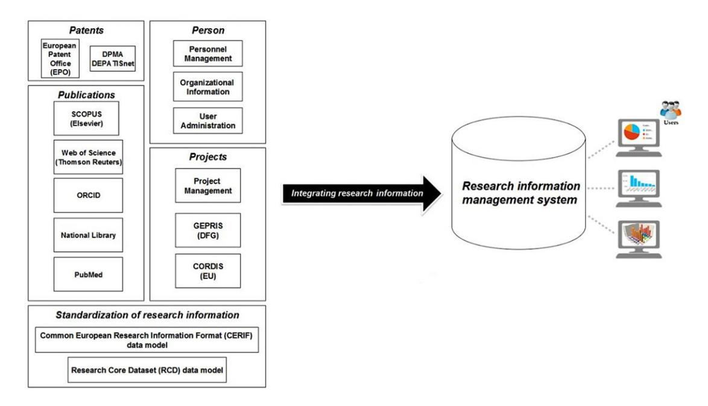
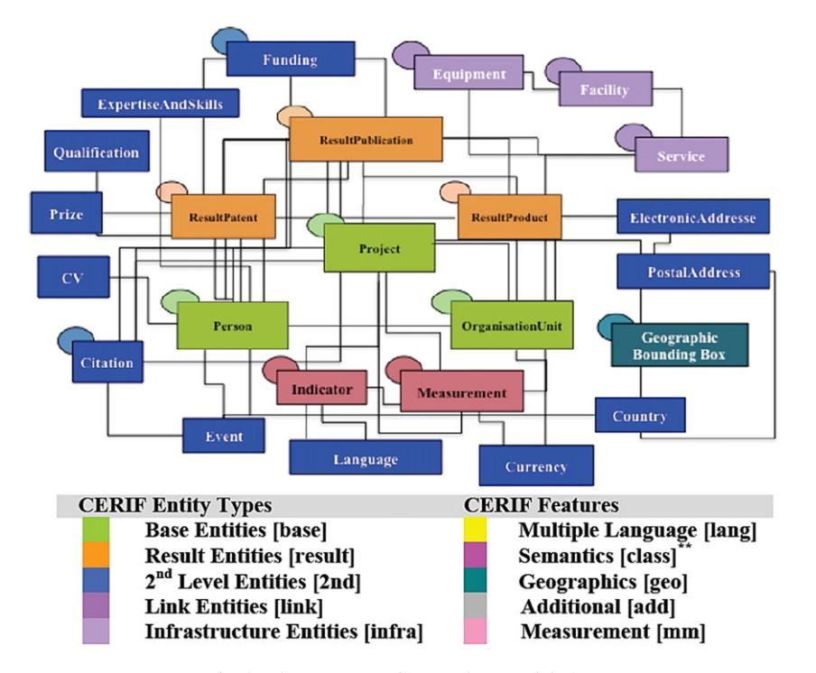
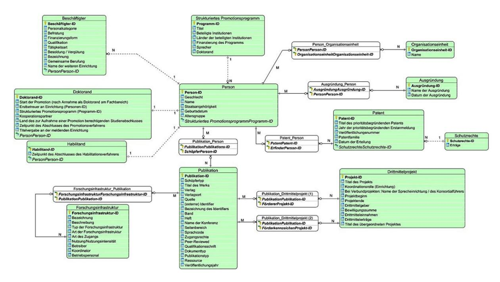
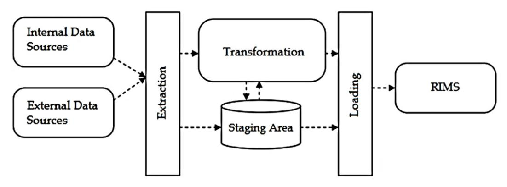
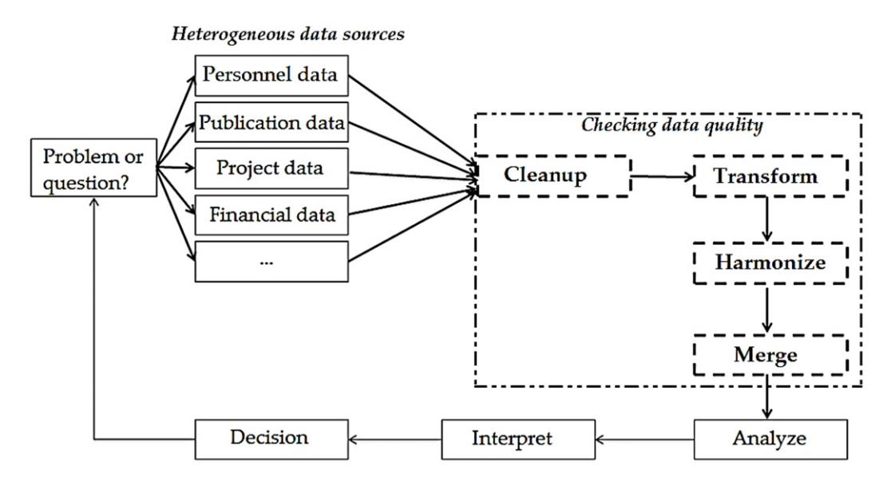
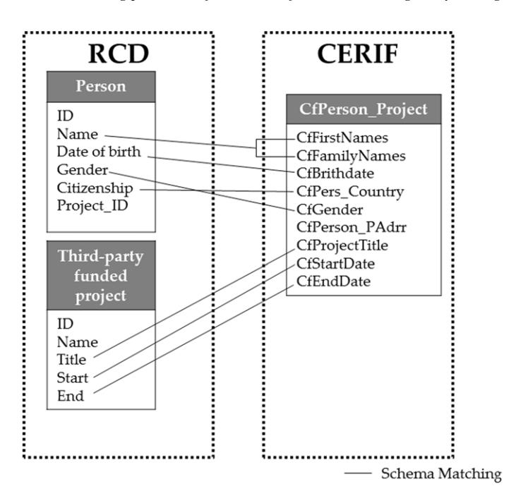
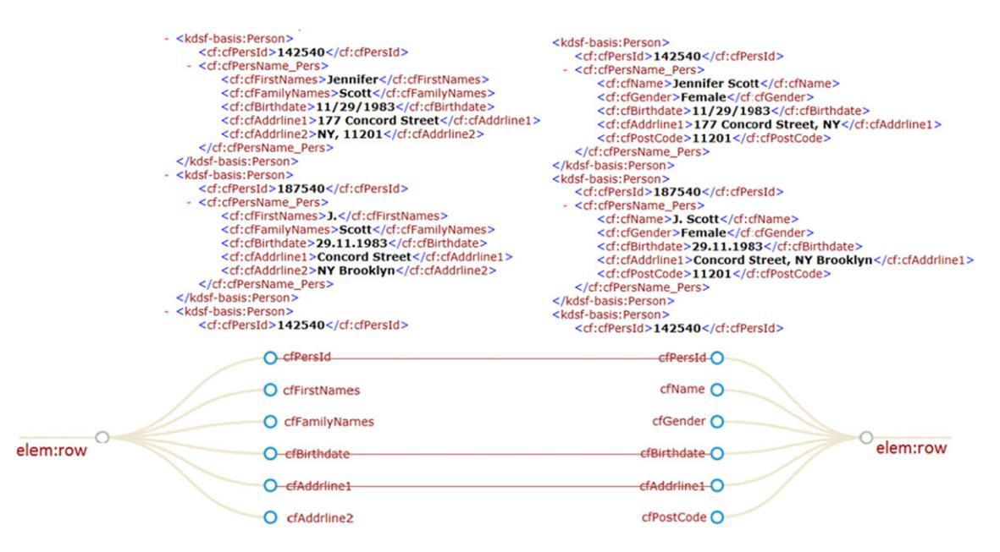
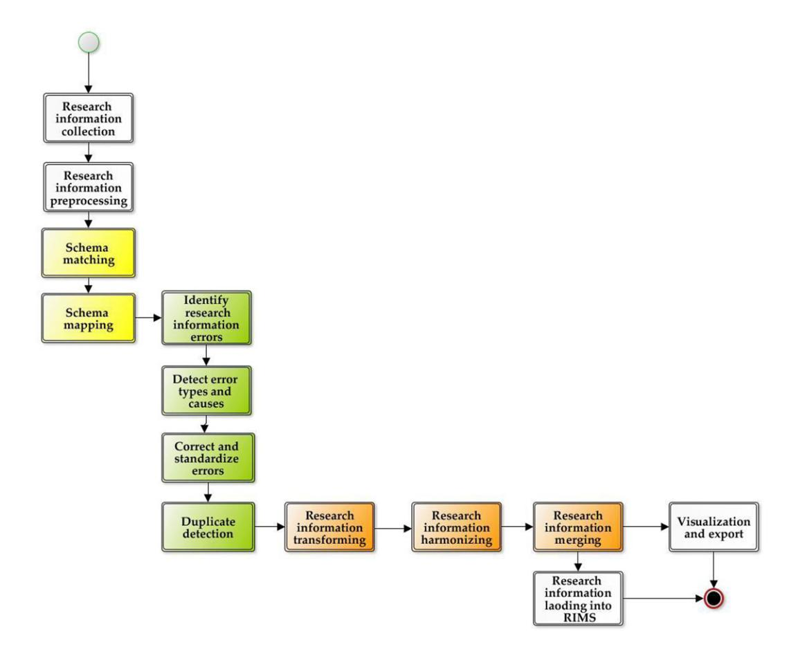

Information Services & Use 39 (2019) 105–122 105 DOI [10.3233/ISU-180030](http://dx.doi.org/10.3233/ISU-180030) IOS Press

# Solving problems of research information heterogeneity during integration – using the European CERIF and German RCD standards as examples

Otmane Azeroual[a](#page-0-0),[b](#page-0-1),[c](#page-0-2),[∗](#page-0-3) , Gunter Saake[b](#page-0-1) , Mohammad Abuosba[c](#page-0-2) and Joachim Schöpfel[d](#page-0-4)

a*Department of Research System and Science Dynamics, German Center for Higher Education Research and Science Studies (DZHW), Schützenstraße 6a, Berlin, Germany*

*E-mail: [azeroual@dzhw.eu](mailto:azeroual@dzhw.eu)*

b*Department of Computer Science, Otto-von-Guericke-Magdeburg-University, Magdeburg, Germany E-mail: [saake@ovgu.de](mailto:saake@ovgu.de)*

c*Department of Computer Science and Engineering, University of Applied Sciences, HTW Berlin, Wilhelminenhofstraße 75a, Berlin, Germany*

*E-mail: [mohammad.abuosba@HTW-Berlin.de](mailto:mohammad.abuosba@HTW-Berlin.de)*

d*GERiiCO-Labor, University of Lille, Villeneuve-d'Ascq, France*

*E-mail: [joachim.schopfel@univ-lille.fr](mailto:joachim.schopfel@univ-lille.fr)*

**Abstract.** Integrating data from a variety of heterogeneous internal and external data sources (e.g. CERIF and RCD data models with different modeling languages) in a federated database system such as "Research Information Management System (RIMS)" is becoming more challenging for (inter-)national universities and research institutions. Data quality is an important factor for successful integration and interpretation of research information and interoperability of various independent information systems. Before the data is loaded into RIMS, they should be reviewed during data integration process to resolve conflicts between the different data sources and clean the data quality issues. Poor data quality leads to distortion in data presentation, and thus to erroneous basis for decisions. It is ultimately a cost for scientific institutions and it starts with integrating research information into the RIMS. Therefore, the investment in the topic of information integration makes sense insofar, the achievement of a high data quality is of primary importance. This paper presents methods, processes and techniques of information integration in the context of research information management systems. In order to ensure the quality of research information in an institutions data sources during its integration into the RIMS. Numerous attempts have already been done by universities and research institutions to create techniques and solutions for this need.

Keywords: Research information management systems (RIMS), current research information systems (CRIS), heterogeneous databases, data models, information integration, information fusion, information management, data quality, interoperability, standardization, science system

0167-5265/19/\$35.00 © 2019 – IOS Press and the authors.

\*Corresponding author. E-mail: [azeroual@dzhw.eu](mailto:azeroual@dzhw.eu).

This article is published online with Open Access and distributed under the terms of the Creative Commons Attribution Non-Commercial License (CC BY-NC 4.0).

## 1. Introduction

To meet reporting requirements, streamline and simplify administrative processes, and at the same time increase the internal and external transparency of research, universities and research institutions started to implement research information management systems (henceforth RIMS).1 A RIMS is a database or a federated information system, in which research activities and results of universities, research institutions and researchers can be collected, integrated and analyzed [5]. RIMS support the optimization of business processes in the entire research management. The data has to be recorded only once in the RIMS but can be used multiple times, as well as made available for a variety of application[s.](#page-1-0)

A key aspect in building and maintaining RIMS is the integration of data from several sources and their translation into an appropriate format for analysis. Integration conflicts happen at different levels of structure, description and semantics, because of differences in terms, scheme structuration and data encodings, fix and cleanup erroneous data [30]. Information integration (known also as data integration) in the context of RIMS means consolidating research information from multiple distributed and heterogeneous data sources, with the goal of providing a transparent view of aggregated data sources and preventing data quality issues.

The source of the research information is transparent to RIMS users, i.e. users do not need to know exactly where the information or data comes from and where it is being stored. The only interesting thing for the user is the provision of correct, complete and current data for the purpose of use, e.g. valuable evaluations in reporting with a high level of quality. Since research activities are imported from external databases and managed in RIMS, data errors can occur. Thus, information needs to be adjusted and its quality optimized because data quality is crucial for the usability and interpretation of an institution's research information [4]. Institutions need quality monitoring and control during information integration to stay informed about the state of their research information and to be able to identify quality issues in real time and to fix them instantly.

The importance of data quality for the integration of electronically stored information or data has received much attention in recent years by academic institutions and researchers, especially the integration of research information into RIMS from different systems [6]. Good quality data of research information systems are a "crucial foundation of any successful monitoring and evaluation strategy" [25]. They must be trustworthy and "fit for purpose" [31]. Without a minimum level of reliability and accuracy of information on persons, organization, projects and results, a RIMS will be virtually useless for research management and science policy. A nationwide study from Finland highlights another challenge: "The quality of the data has great importance, as 13% of all state funding for the universities (more than 200 million euros a year) is distributed based on the number and quality of the publications" [19]. This means that data quality has a tangible financial impact, for the scientific authority as well as for the individual researcher.

Attention should be drawn to this last aspect, the individual researcher as a main player and stakeholder in the field. In fact, in a recent survey on researchers' engagement with RIMS, all participants indicated that they had encountered information problems, because of inaccurate, irrelevant, outdated, incomplete or spurious data. This reality may have a real impact on the acceptance and usage of those systems insofar "the quality of information and services provided by a RIM system determines the outcome quality of the activities using that system, and consequently may affect a researcher's motivation to use that system" [32].

1Other names for RIMS (or RIM system) are current research information system (CRIS), especially in Europe, and system for faculty activity reporting (FAR) which covers the assessment of teaching activities and research output. In this paper, the term RIMS is preferred because it seems to be the most common and accepted term.

For this reason, the objective of the present paper is to examine two research questions:

- (1) How can problems of data heterogeneity or the distribution of different systems be solved?
- (2) Which methods, processes and techniques can be used to guarantee long-term and sustainable quality of the research information during its integration into the RIMS?

The paper is based on empirical studies and literature overview. Possible solutions will be presented and discussed.

## 2. Overview of research information

Universities and research institutions have a large variety of information on research equipment, activities, services and output. Along with teaching, research is a central part of the universities' mission. Information about research activities and achievements are relevant to all stakeholders in the academic ecosystem, for different purposes. For this reason, information on research performance and achievements should be available as reliably, fast and seamlessly as possible [2]. Research information is *metadata*from

-*Employees*-*Funded projects*-*Publications*-*Patents*-*Research awards*-*Doctorates and habilitations*-*Cooperation partners*-*etc.*

The information on scientific activities and results is collected, maintained and published in a variety of forms by universities and research institutes, and internal and external stakeholders have often difficulty to identify and get it. To make the process of collecting, integrating, storing and presenting of the research information more efficient, universities and research institutions are in need for enhanced solutions and professional approaches to their research activities. Research information management systems (RIMS) constitute a new challenge for universities and research institutions to ensure effective data usage and management, e.g. to facilitate administrative processes and significantly reduce the burden of internal and external reporting.

Figure 1 presents a synthetic overview on the integration of research information from several data sources into a RIMS.

## 3. Stand[ar](#page-3-0)dization for the exchange of research information

Management of research information has become an important issue for universities, research institutions, funding and government organizations. There is an increasing demand to collect, integrate and analyze research information into RIMS for a variety of reasons. Different standardized exchange formats have been developed to support RIMS and foster their interoperability, such as the European CERIF data model (Common European Research Information Format) managed by the European organization

Fig. 1. Integration of research information into a research information management system (RIMS).

euroCRIS, or the German Research Core Dataset (RCD) definitional standard for different reporting purposes recommended by the German Council of Science and Humanities since 2016.

The European format for electronic data storage CERIF [20] has been developed since 1991. It is a data model and metadata format for information objects in the field of science, which allows to describe information on the entire research process (persons, organizations, projects, funding programs, facilities, equipment, services, events, indicators and measurements, etc.) and to relate them to each other (see Fig. 2).

The German Research Core Dataset or RCD (*Kerndatensatz Forschung*or KDSF in German) is a definitional standard for the collection, provision and exchange of research information, and German institutions started to implement it so far on a voluntary basis. Designed as a definition and reporting stan[da](#page-4-0)rd for research information, the RCD has been initiated by the German Council of Science and Humanities and the German Federal Ministry of Education and Research (BMBF). Its objective is to standardize the definition and structuring of research information, to improve data quality, to simplify the work and report process, and to increase the interoperability (comparability) of research information (see Fig. 3).

The RCD defines the core data that is to be kept in an aggregated form by all German universities and non-university research institutions for various documentation and reporting processes. These include the areas of (a) researchers employed by the institutions, (b) young researchers, (c) third-party funded proj[ec](#page-4-1)ts, (d) patents and spin-offs, (f) publications and (f) research infrastructures (see [12] for details on the structure and logic of the RCD). To make the data compliant with international standards, the technical RCD data model was developed on the basis of the CERIF format.

The application of standard data exchange formats contributes to the development of common and interoperable information infrastructures which is beneficial for the institutions as well as for the individual researchers. Standardization is essential for the management of research information in RIMS,

Fig. 2. The European CERIF data model [17].

Fig. 3. The German RCD data model [23].

to increase the data accessibility, exchange and quality. It can also simplify the reporting of research performance and reduce the human effort that is currently required to collect, integrate, and aggregate research information, and thus make the research management more efficient.

CERIF was developed as a European standard, by European institution and start-ups, and is maintained and promoted by the European organization euroCRIS.2 However, of course, RIMS are not limited to European countries and research structures, even if they may have other names as mentioned above, and provide different functionalities depending on the local particularities of research management and evaluation. The euroCRIS community has some institutional and personal members from the US, from Australia, China, Canada, and the Republic of Korea. P[eo](#page-5-0)ple from Cornell and Kent University are part of the network, and the international euroCRIS conferences attract attendants from countries and regions outside of Europe.

A joint EUNIS-euroCRIS study showed that nearly one half of European RIMS have implemented the CERIF format [29]. Recently, findings from a global survey on practices and patterns of research information management, published by OCLC and euroCRIS3 based on a sample of 381 institutions from 44 countries, demonstrated the global nature of these activities. They revealed, too, that the CERIF format is mainly but not exclusively implemented in European RIMS; other structures from the US, Canada and Australia also use CERIF as a standard format.

The main commercial RIMS, PURE (Elsevier) and Conve[ri](#page-5-1)s (Clarivate) initially have been developed by two German and Danish start-ups with the CERIF format and are, of course, still compliant with CERIF, similar to the widely used open software DSpace-CRIS. For instance, the University of Hong Kong's RIMS called "The HUK Scholars Hub"4 is a DSpace-CRIS project compliant with CERIF.

## 4. Problems of integrating research informa[ti](#page-5-2)on

Information integration is an intrinsic feature of RIMS because research information must be collected from various internal and external sources (e.g. information systems for human resources, financial budgets, libraries, institutional repositories etc.) [28]. Many institutions complain frequently that the research information they need cannot be found in the RIMS. Too often the data is scattered throughout the institution in various data stores and locations. Even if employees have access to the data they need, it is often difficult to process the data because of heterogeneous and non-compliant formats. The integration of RIMS into the existing heterogeneous system landscape of an institution requires the development of interfaces to allow an exchange of information between the systems; therefore RIMS should be designed as an integral part of administrative software for institution administration [11] and a platform for data integration.

Often, the data in the RIMS are structured differently, which must be taken into account during the integration. Here, structured, semi-structured and unstructured data must be handled. Such data are often in the data models or formats, such as XML, relational data, tables, texts, etc. To be able to integrate and work with this data, the dependencies between the different data formats have to be noted. In addition,

2 https://www.eurocris.org/.

3 https://www.oclc.org/research/publications/2018/oclcresearch-practices-patterns-research-information-management/ report.html.

4 http://hub.hku.hk/.

approaches to handling, manipulation and search on this data must be developed, as they are highly dependent on the particular data format.

Another problem for institutions is the distribution of data which is usually dispersed across a variety of different data sources or located on separate information systems. The communication between the systems is often difficult (and sometimes even impossible) to implement, leading to architectural and media breaks which in turn may induce delays and errors in the workflow [18]. There are possible solutions to this problem [24] such as consolidation, where the various data care copied from their source database to a new database, a variant known as replication-oriented integration which requires further steps to transform and clean the data to gain information of a new quality [16].

Information integration is the creation of a frontend. Complex analysis and requests for heterogeneous data are necessary in order to provide the institutions with valuable information and data. This information is fundamental to decision-making and the dissemination of research. In addition to solve the problems presented here, high demands are placed on the IT solutions, especially with regard to interoperability, durability and security of the application.

# 5. General requirements for data quality

In addition to the integration problems of research information mentioned above, the data to be integrated itself must also meet some requirements. Information integration only makes sense when the following questions have been clarified and answered:

- Which data or information exists?
- Which data or information is needed?
- Are the collected data sources trustworthy?
- Is the data or information complete, correct, current and consistent?
- Are the data or information formats compliant with the RIMS format? If not, could they be converted?
- Can the heterogeneous data or information formats from different systems be transformed to make them interoperable (comparable)?

These questions illustrate one important aspect upstream of research information integration. Collecting research information is a sensitive process. The data sources should be controlled in order to guarantee their reliability and credibility, and the collected data needs continuous monitoring and control, e.g. through updating or deleting outdated and older data or information.

## 6. Data quality during integration of research information

The integration of different information systems plays a significant but often neglected role in the area of database research like RIMS. For integrating and providing information, the data quality must always be ensured. Narrow data can cause the institutions to be poorly represented on the outside. The quality problems of research information can lead to inappropriate decision making and in some cases, even jeopardize the existence of the institutions.

This section will focus on the methods, processes and techniques of information integration in the context of RIMS to overcome the different types of data heterogeneity problems while at the same time transferring the data sources into a common structure and the most important aspect, specifically how to ensure data quality is also explained.

Fig. 4. Implementing the ETL process steps in RIMS [8].

##*6.1. Definition of information integration*

Information integration is used as a synonym for the term data integration, which refers to the integration of the data that comes from different data sources, usually with different data structures and formats. The term information integration is defined very differently in the literature e.g. in [10] and [15]. In this paper, information integration is defined as the "*correct, complete, and efficient aggregation of data and content of heterogeneous sources into a consistent and structured set of information for effective interpretation by users and applications*" [26]. The goal of information integration is to add value from the combined data or information. More generally, information integration includes terms such as information fusion or data consolidation.

## *6.2. Integration methods and processes for research information management systems*Data sources and data structures are generally heterogeneous. This means there are many different and unknown data formats and source systems as well as data quality defects. Before loading the research information into RIMS, this information must first be selected, then prepared and transferred. These challenges can be met with an Extraction, Transformation and Loading (ETL) process. The goal of the ETL process is to clean and standardize the information or data from its different structures in order to permanently store it in the RIMS [3]. The ETL process in the context of RIMS is illustrated in Fig. 4.

##*6.2.1. Extraction of research information*The extraction phase is used to select and replicate research information from various heteroge[ne](#page-7-0)ous and operative source systems. The question is which research information is being read from the data sources and imported into the work area. For this purpose, formal rules can be created for the connection of the source system with the RIMS as well as for the transmission of the information. With a large data volume of RIMS, it is advantageous to compress the data to be transformed. However, it has to be checked whether penetration options or data export procedures exist from the operative systems. A connection of the source systems must be ensured via a clearly defined interface, which is accessed by the extraction process. An interface can be, for example, a table view or an exported table subtraction as a file. The selected data is transferred from the source systems to the staging area, where the data is cleaned and transformed.

|           | O. Azeroual et al. / Solving problems of research information heterogeneity during integration                                                  |
|-----------|-------------------------------------------------------------------------------------------------------------------------------------------------|
|           | Table 1                                                                                                                                         |
|           | The sub-processes of the transformation phase [21,22]                                                                                           |
|           |                                                                                                                                                 |
| Filtering | Filtering refers to the extraction from operational data and the cleaning of syntactic or substantive defects in the data to be transferred. |

Table 1 The sub-processes of the transformation phase [21,22]

##*6.2.2. Transformation of research information*The transformation gradually unifies the previously extracted research information. This step is responsible for the homogenization of the data and it should be seen as an important step in the ETL process. The transformation process has the task of preparing the data for the loading process and cleaning it up in order to convert the data extracts into a uniform internal format. Erroneous data sources make the cleaning indispensable. Contaminated data is tracked and corrected by plausibility checks. This data cleaning can be done in four successive sub-processes (see Table 1) and is decisive for the data quality in RIMS.

Since the RIMS obtains its information or data from several heterogeneous sources, the data must be converted into a uniform internal format. For this, the following transformations, which can be summarized under the term of "data migration", are required [7,[8\]](#page-8-0):

- Spelling errors
- Missing values
- Redundant/duplicate values
- Missing data relation
- Different data types
- Different formatting
- Different attributes with the same attribute name
- Different values for the same attributes

According to [9], the following problem areas may also arise during the transformation phase. These were considered and investigated with examples in the context of RIMS, which can be found in the related paper [8], such as:

- Key treatment
- Adaptation of data types
- Conversion of encodings
- Unification of strings and dates
- Separation and combination of attribute value
- Combining data from two sources (join) and unite (union)
- Calculation of derived values
- Aggregation

These so-called errors or problem areas should be eliminated in order to achieve the highest possible data quality. Only data quality can guarantee trust in the data.

Fig. 5. Integrating quality improvement methods in RIMS.

###*6.2.3. Loading of research information*In the final step of the ETL process, the filtered, harmonized, aggregated and enriched data from the staging area is transferred to the RIMS. If the RIMS is filled for the first time, it is called initialization. The load must be efficient to minimize source downtime and ensure the quality of the data so that they can be kept fully and consistently within the RIMS despite possible source changes.

An important part of data integration for examining data quality in RIMS is the transformation phase of the ETL process. If erroneous data is identified as part of the integration of research information, it must be corrected accordingly, leading to the phase of four methods, i.e. data cleaning, data transformation, data harmonization and data merging (or data fusion). Figure 5 illustrates the different methods of data integration in RIMS.

(1)*Cleaning the research information*is about identifying and removing errors and inconsistencies in data to improve and enhance their quality [2]. The cleaning is necessary because operational systems do not necessarily always contain correct data. The causes of the data errors in the RIMS can be very diverse, for example incorrect input by the user, system errors or evaluation of the systems. To correct the error types, not only a check of the data structure but also a semantic (content wise) check is possible. Semantic errors result from incorrect content relationships between multiple fields, such as between the zip code and the location.

Data cleaning is essential in data integration and is the only way to get high-quality research information. In addition, the cleaning allows the RIMS to have a unified view of the research information that is an important aspect of making the right decision. The clean data provide the basis for the next stage, the transformation of research information.

(2)*Transforming research information:*All research information from the various internal and external data sources is translated into a uniform format suitable for data analysis. Due to different data sources, often multiple or inconsistent representations of individual objects and attributes arise. For example, the identification keys for examination units from different data sources may be incompatible. Different datasets often have different author IDs for identifying the individual publication data. It is then necessary to determine "related" author IDs by matching the identification data of the publications. This can be done on the basis of common structural features, for example by features of the authors (name, title, publication year, etc.).

Now that the research information is in the required format and quality, it will need to be harmonized in the next step, which will bring the research information into a consistent structure.

- (3)*Harmonization of research information*is necessary when information from different source systems is used together. In the heterogeneous source systems, different keys or characteristics are often used for the same facts or properties. For example, the key for gender is represented differently in three systems {M, F}, {M, W} and as {0, 1}. The aim of the data harmonization in this example is therefore to bring the same facts on a common key. Only when there is transformed and harmonized research information, it is possible to merge it in the next step.
- (4)*Merging of research information*is needed before meaningful information can be obtained through targeted analysis of the data. The merger ensures that research information from multiple datasets is available in an adjusted, transformed and harmonized form and aggregated into a common database. By merging research information, matching data items with contexts are recognized and presented in a consistent data structure. This is to be ensured by the preceding steps of transforming and harmonizing the data.

In summary, the datasets of individual systems have to be adjusted, transformed, harmonized and merged in order to obtain a consistent database. All these methods serve to ensure a high-quality database and they are essential for achieving and maintaining maximum data quality in RIMS [1,2]. An example may illustrate the procedure of data integration in the context of RIMS. Figure 6 illustrates the original data as delivered through the interface of the source system. The data includes integrated personnel data from a CERIF and RCD data model into RIMS. Because more and more data is being generated and stored by scientific institutions every day, this data contains information about persons, such as name, address, gender, date of birth, publication data, project data and patient [d](#page-11-0)ata, etc. Personal data is also important pieces of information when databases are deduplicated and when data sets are linked or integrated and no unique entity identifiers are available [14]. For example, personal names of authors are strongly influenced by a person's cultural background and in certain situations people change their name (for example, after marriage) or names are often written in different spellings [14]. All these problems make matching personal data more difficult than matching common texts [13,27].

The example is presented in a personnel list for the identification of data records with incorrect data in order to demonstrate how integration methods - cleaning, transformation, harmonization and merging (or fusion) - can improve the quality of the data sources. The quality improvement integration method adds missing entries, and completed fields are automatically adjusted to a specific format according to defined rules.

#### Step 1: Cleaning and transformation

In this example, the missing zip code is determined based on the addresses and added as a separate field. Cleaning rounds off the content by comparing the information with external content comparison and dynamically expanding and optimizing it with attributes. Transformation and matching promote consistency because related entries within or across systems can be automatically recognized and then linked, tuned, or merged.

#### 116*O. Azeroual et al. / Solving problems of research information heterogeneity during integration*

| xml version="1.0" encoding="UTF-8"?                                                                                                                                                                                                                                                                                                                                                                                                                                 |
|---------------------------------------------------------------------------------------------------------------------------------------------------------------------------------------------------------------------------------------------------------------------------------------------------------------------------------------------------------------------------------------------------------------------------------------------------------------------|
| - <kdsf:kdsf xmlns:cf="urn:xmlns:org:eurocris:cerif-1.6-2" xmlns:kdsf="http://kerndatensatz-&lt;/th&gt;&lt;/tr&gt;&lt;tr&gt;&lt;th&gt;forschung.de/version1/technisches_datenmodell/xsd/kdsf.xsd" xmlns:kdsf-basis="http://kerndatensatz-&lt;/th&gt;&lt;/tr&gt;&lt;tr&gt;&lt;th&gt;forschung.de/version1/technisches_datenmodell/xsd/kdsf-basis.xsd" xmlns:xs="http://www.w3.org/2001/XMLSchema" xmlns:xsi="http://www.w3.org/2001/XMLSchema-instance"></kdsf:kdsf> |
| - <kdsf-basis:person></kdsf-basis:person>                                                                                                                                                                                                                                                                                                                                                                                                                           |
| <cf:cfpersid>142540</cf:cfpersid>                                                                                                                                                                                                                                                                                                                                                                                                                                   |
| - <cf:cfpersname_pers></cf:cfpersname_pers>                                                                                                                                                                                                                                                                                                                                                                                                                         |
| <cf:cfname>Jennifer Scott</cf:cfname>                                                                                                                                                                                                                                                                                                                                                                                                                               |
| <cf:cfgender>Female</cf:cfgender>                                                                                                                                                                                                                                                                                                                                                                                                                                   |
| <cf:cfbirthdate>11/29/1983</cf:cfbirthdate>                                                                                                                                                                                                                                                                                                                                                                                                                         |
| <cf:cfaddrline1>177 Concord Street</cf:cfaddrline1>                                                                                                                                                                                                                                                                                                                                                                                                                 |
| <cf:cfaddrline2>NY, 11201</cf:cfaddrline2>                                                                                                                                                                                                                                                                                                                                                                                                                          |
|                                                                                                                                                                                                                                                                                                                                                                                                                                                                     |
|                                                                                                                                                                                                                                                                                                                                                                                                                                                                     |
| - <kdsf-basis:person></kdsf-basis:person>                                                                                                                                                                                                                                                                                                                                                                                                                           |
| <cf:cfpersid>187540</cf:cfpersid>                                                                                                                                                                                                                                                                                                                                                                                                                                   |
| - <cf:cfpersname_pers></cf:cfpersname_pers>                                                                                                                                                                                                                                                                                                                                                                                                                         |
| <cf:cfname>J. Scott</cf:cfname>                                                                                                                                                                                                                                                                                                                                                                                                                                     |
| <cf:cfgender>Female</cf:cfgender>                                                                                                                                                                                                                                                                                                                                                                                                                                   |
|                                                                                                                                                                                                                                                                                                                                                                                                                                                                     |
| <cf:cfbirthdate>29.11.1983</cf:cfbirthdate>                                                                                                                                                                                                                                                                                                                                                                                                                         |
| <cf:cfaddrid>Concord Street, NY Brooklyn</cf:cfaddrid>                                                                                                                                                                                                                                                                                                                                                                                                              |
| <cf:cfaddrline2>NY Brooklyn</cf:cfaddrline2>                                                                                                                                                                                                                                                                                                                                                                                                                        |
|                                                                                                                                                                                                                                                                                                                                                                                                                                                                     |
|                                                                                                                                                                                                                                                                                                                                                                                                                                                                     |
| - <kdsf-basis:person> <cf:cfpersid>142540</cf:cfpersid></kdsf-basis:person>                                                                                                                                                                                                                                                                                                                                                                                     |
|                                                                                                                                                                                                                                                                                                                                                                                                                                                                     |
| - <cf:cfpersname_pers></cf:cfpersname_pers>                                                                                                                                                                                                                                                                                                                                                                                                                         |
| <cf:cfname>Jennifer William Scott</cf:cfname>                                                                                                                                                                                                                                                                                                                                                                                                                       |
| <cf:cfgender>Female</cf:cfgender>                                                                                                                                                                                                                                                                                                                                                                                                                                   |
| <cf:cfbirthdate>832911</cf:cfbirthdate>                                                                                                                                                                                                                                                                                                                                                                                                                             |
| <cf:cfaddrid>20 Concord</cf:cfaddrid>                                                                                                                                                                                                                                                                                                                                                                                                                               |
| <cf:cfaddrline2>32801 Street</cf:cfaddrline2>                                                                                                                                                                                                                                                                                                                                                                                                                       |
|                                                                                                                                                                                                                                                                                                                                                                                                                                                                     |
|                                                                                                                                                                                                                                                                                                                                                                                                                                                                     |
| - <kdsf-basis:person></kdsf-basis:person>                                                                                                                                                                                                                                                                                                                                                                                                                           |
| <cf:cfpersid>353035</cf:cfpersid>                                                                                                                                                                                                                                                                                                                                                                                                                                   |
| - <cf:cfpersname_pers></cf:cfpersname_pers>                                                                                                                                                                                                                                                                                                                                                                                                                         |
| <cf:cfname>David Fenton</cf:cfname>                                                                                                                                                                                                                                                                                                                                                                                                                                 |
| <cf:cfgender>Male</cf:cfgender>                                                                                                                                                                                                                                                                                                                                                                                                                                     |
| <cf:cfbirthdate>832911</cf:cfbirthdate>                                                                                                                                                                                                                                                                                                                                                                                                                             |
| <cf:cfaddrid>20 Concord</cf:cfaddrid>                                                                                                                                                                                                                                                                                                                                                                                                                               |
| <cf:cfaddrline2>32801 Street</cf:cfaddrline2>                                                                                                                                                                                                                                                                                                                                                                                                                       |
|                                                                                                                                                                                                                                                                                                                                                                                                                                                                  |
|                                                                                                                                                                                                                                                                                                                                                                                                                                                                     |
| - <kdsf:publikation></kdsf:publikation>                                                                                                                                                                                                                                                                                                                                                                                                                             |
| - <kdsf:listofpublications></kdsf:listofpublications>                                                                                                                                                                                                                                                                                                                                                                                                               |
| - <kdsf:aggregationsniveau></kdsf:aggregationsniveau>                                                                                                                                                                                                                                                                                                                                                                                                               |
| <kdsf:cfrespubldate>2018</kdsf:cfrespubldate>                                                                                                                                                                                                                                                                                                                                                                                                                       |
|                                                                                                                                                                                                                                                                                                                                                                                                                                                                     |
| <kdsf:publicationid>17</kdsf:publicationid>                                                                                                                                                                                                                                                                                                                                                                                                                         |
|                                                                                                                                                                                                                                                                                                                                                                                                                                                                     |
| - <kdsf:listofpublications></kdsf:listofpublications>                                                                                                                                                                                                                                                                                                                                                                                                               |

#### Fig. 6. Original data from a CERIF and RCD data model.

Table 2 Cleaning and transformation of personnel data

| Data source |           |          |        |            |                                  |         |
|-------------|-----------|----------|--------|------------|----------------------------------|---------|
| PersID      | Firstname | Lastname | Gender | Birth date | Address                          | Zip     |
| 142540      | Jennifer  | Scott    | Female | 1983-11-29 | NY; Brooklyn; 177 Concord Street | 11201   |
| 187542      | Jennifer  | Scott    | Female | 1983-11-29 | NY; Brooklyn; 177 Concord Street | 11201   |
| 142540      | Jennifer  | Scott    | Female | 1983-11-29 | NY; Brooklyn; 20 Concord Street  | 11201   |
| 353035      | David     | Fenton   | Male   | 1969-01-20 | London; 10 Downing Street        | SW1A2FF |

## Step 2: Harmonization

To harmonize the data, the keys for the gender are converted into the format {M, F}. This example finds related posts for Jennifer Scott. Despite the similarities between the datasets, not all the information is redundant. The adjustment functions evaluate the data in the individual records in detail and determine which ones are redundant and which ones are independent.

| Data source |           |          |        |            |                                  |         |
|-------------|-----------|----------|--------|------------|----------------------------------|---------|
| PersID      | Firstname | Lastname | Gender | Birth date | Address                          | Zip     |
| 142540      | Jennifer  | Scott    | F      | 1983-11-29 | NY; Brooklyn; 177 Concord Street | 11201   |
| 187542      | Jennifer  | Scott    | F      | 1983-11-29 | NY; Brooklyn; 177 Concord Street | 11201   |
| 142540      | Jennifer  | Scott    | F      | 1983-11-29 | NY; Brooklyn; 20 Concord Street  | 11201   |
| 353035      | David     | Fenton   | M      | 1969-01-20 | London; 10 Downing Street        | SW1A2FF |

| Table 3                         |
|---------------------------------|
| Harmonization of personnel data |

| Table 4                   |  |
|---------------------------|--|
| Merging of personnel data |  |

| Data source |           |          |        |            |                                         |
|-------------|-----------|----------|--------|------------|-----------------------------------------|
| PersID      | Firstname | Lastname | Gender | Birth date | Address                                 |
| 142540      | Jennifer  | Scott    | F      | 1983-11-29 | 11201; NY; Brooklyn; 177 Concord Street |
| 187542      | Jennifer  | Scott    | F      | 1983-11-29 | 11201; NY; Brooklyn; 177 Concord Street |
| 142540      | Jennifer  | Scott    | F      | 1983-11-29 | 11201; NY; Brooklyn; 20 Concord Street  |
| 353035      | David     | Fenton   | M      | 1969-01-20 | SW1A2FF; London; 10 Downing Street      |
| Data source |           |          |        |            |                                         |
| PersID      | Firstname | Lastname | Gender | Birth date | Address                                 |
| 142540      | Jennifer  | Scott    | F      | 1983-11-29 | 11201; NY; Brooklyn; 177 Concord Street |
| 353035      | David     | Fenton   | M      | 1969-01-20 | SW1A2FF; London; 10 Downing Street      |

## Step 3: Merging

The merger transforms the reconciled data into a comprehensive dataset. In this example, the duplicate entries for Jennifer Scott are merged into one complete record containing all the information.

After standardizing and merging the research information in a RIMS, they can be used as an integrated database for targeted data analysis. The ultimate goal of data analysis in institutions is to extract understandable and useful research information from the multitude of heterogeneous data.

##*6.3. Integration techniques for research information management systems*In the information integration phase, the research information as well as the schemes from the source systems in the RIMS are adapted to the quality requirements of the user. The techniques of information integration are summarized under the term schema management and deal with the handling of heterogeneous schemes. The task of schema integration is to merge local, heterogeneous schemas into a single and global schema. In addition, there are various integration techniques to structure the schema integration. In the context of RIMS, it is particularly important to consider the schema matching and schema mapping.

##*6.3.1. Schema matching*Schema matching precedes schema mapping. The schema matcher should search for heterogeneous source systems for matching information units. The search can be done by using similar attribute names,

Fig. 7. Simple example of Schema Matching of RCD and CERIF.

data structure or similar data. Using various methods (e.g. instance-based matching and schema-based matching), mapping can be automatically determined and generated. These methods are summarized under the term schema matching. Here, the matcher analyzes the various schemes and, among other things, their structure. The analysis finally proposes mapping solutions that can be adopted manually [24].

The following Fig. 7 demonstrates a simple example of the schema matching of two relational schemas of the RCD and CERIF data model. The goal is to identify the attributes that both share the same concept.

##*6.3.2. Schema mapping*After schema mat[ch](#page-13-0)ing follows the schema mapping. The data elements from the source systems are mapped to the target elements to describe the relationships between the two systems. Schema mapping can also be automated based on the attribute name or data structure. Under certain circumstances, the necessary data transformation must be derived from this.

Figure 8 shows an example of how the mapping of a CERIF and RCD XML schema occurs within the RIMS integration.

### 7. Concl[us](#page-14-0)ions and outlook

Undoubtedly, the research information management systems (RIMS) lead to a more targeted and faster supply of information and are increasingly becoming a strategic success factor in the research ecosystem. Increasing volume, velocity and variety of relevant information and increasing demands on research decisions challenge the performance and reliability of research management and related systems. The core problem, however, is not the design of RIMS and its acceptance by decision-makers. The main question

####*O. Azeroual et al. / Solving problems of research information heterogeneity during integration*119

Fig. 8. Source system (top left) and target system (top right) and from that resulting suggested mapping.

is how the various research information can be used effectively and efficiently while integrating it into the RIMS to support and improve decision-making.

Information collected from multiple distributed and heterogeneous data sources, in various formats and with different data structures must be moved into one single or multiple data store(s). This represents a major challenge with regard to the data quality. To address these challenges during information integration, the solution is to implement the ETL process, information integration methods and techniques. The investigations clearly showed in the related paper [8] that during the transformation phase of the ETL process the processing of the internal and external data sources should take place. This enables the cleaning, transformation, harmonization and merging of the data which have already been consolidated in the RIMS in order to create new quality of information that may be of particular importance to an institution.

Figure 9 illustrates a workflow diagram in the context of RIMS. It may help institutions to understand how to deal with research information problems during the integration into RIMS.

The concept of information integration enables recognition and improvement of data quality problems in RIMS which will allow universities and research institutions to successfully use research information manage[men](#page-15-0)t systems. In this sense, the ETL processes, methods (cleaning, transforming, harmonizing and merging the research information), and techniques (schema matching and schema mapping) of information integration are considered to be important components for increasing and improving data quality in RIMS.

Institutions should implement the ETL processes as early as possible in order to assess the retroactive effect on their external data sources for the first time and derive data quality rules from this knowledge, which are then evaluated in the course of data quality measurements [3]. A variety of commercial ETL tools (such as CloverETL and QlikView Expressor, etc.) support integration of heterogeneous data sources into RIMS. With the help of appropriate and intelligent tools, it will be increasingly possible to minimize the manual effort required to ensure high data quality and to significantly reduce resource requirements. Especially with repeated application, the effort is much lower than without the use of tools [3].

Fig. 9. Supporting workflow diagram.

# Acknowledgements

This work has been funded by the German Center for Higher Education Research and Science Studies (DZHW) and by the German Federal Ministry of Education and Research (BMBF) in the context of the project "Helpdesk to facilitate implementation of the Research Core Dataset" (project period: 2017-2019; grant number: KDS2016).

## References

- [1] O. Azeroual and M. Abuosba, Improving the data quality in the research information systems,*Int. J. Comput. Sci. Inf. Secur.* **15**(11) (2017), 82–86.
- [2] O. Azeroual, G. Saake and M. Abuosba, Data quality measures and data cleansing for research information systems, *J. Digit. Inf. Manag.* **16**(1) (2018), 12–21.
- [3] O. Azeroual, G. Saake and E. Schallehn, Analyzing data quality issues in research information systems via data profiling, *Int. J. Inf. Manag.* **41**(8) (2018), 50–56.
- [4] O. Azeroual, G. Saake and J. Wastl, Data measurement in research information systems: metrics for the evaluation of data quality, *Scientometrics* **115**(3) (2018), 1271–1290.

- [5] O. Azeroual, G. Saake and M. Abuosba, Investigations of concept development to improve data quality in research information systems, in: *Proceedings of the 30th GI-Workshop on Foundations of Databases (Grundlagen von Datenbanken), Wuppertal, Germany, 22–25 May 2018*, Vol. 2126, pp. 29–34.
- [6] O. Azeroual and M. Abuosba, Datenprofiling und Datenbereinigung in Forschungsinformationssystemen, in: *HTW Berlin, Matthias Knaut, Kreativität + X = Innovation, S. 16–25*. BWV – Berliner Wissenschafts-Verlag, Berlin, 2018.
- [7] O. Azeroual and J. Schöpfel, Quality issues of CRIS data: An exploratory investigation with universities from twelve countries, *Publications* **7**(1) (2019), 14.
- [8] O. Azeroual, G. Saake and M. Abuosba, ETL best practices for data quality checks in RIS databases, *Informatics* **6**(1) (2019), 10.
- [9] A. Bauer and H. Günzel, *Data Warehouse Systeme Architektur, Entwicklung, Anwendung. 2. überarbeitete und aktualisierte Auflage*. dpunkt–Verlag, Heidelberg, 2004.
- [10] C. Batini, M. Lenzerini and S. Navathe, A comparative analysis of methodologies for database schema integration, *ACM Computing Surveys* **18**(4) (1986), 323–364.
- [11] K. Berkhoff, B. Ebeling and S. Lübbe, Integrating research information into a software for higher education administration – Benefits for data quality and accessibility, in: *CRIS2012: 11th International Conference on Current Research Information Systems, Prague, Czech Republic, 6–9 June, 2012*.
- [12] B. Biesenbender and S. Hornbostel, The research core dataset for the German science system: Developing standards for an integrated management of research information, *Scientometrics* **108**(1) (2016), 401–412.
- [13] C.L. Borgman and S.L. Siegfried, Getty's synonameTM and its cousins: A survey of applications of personal namematching algorithms, *J. Am. Soc. Inf. Sci.* **43**(7) (1992), 459–476.
- [14] P. Christen, A comparison of personal name matching: Techniques and practical issues, in: *Proceedings of the Sixth IEEE International Conference on Data Mining - Workshops (ICDMW'06), 18–22 December, 2006*, pp. 290–294.
- [15] S. Conrad, *Föderierte Datenbanksysteme: Konzepte der Datenintegration*. Springer–Verlag, Berlin/Heidelberg, 1997.
- [16] S. Conrad, G. Saake and K.-U. Sattler, Informationsfusion Herausforderungen an die Datenbanktechnologie, in: *Simulation und Visualisierung (SimVis 2000)*. Magdeburg, Germany, 2000.
- [17] EuroCRIS, Main features of CERIF (the Common European Research Information Format), available online at https://www.eurocris.org/cerif/main-features-cerif, accessed 13 December 2018.
- [18] S. Helmis and R. Hollmann, *Webbasierte Datenintegration Ansätze zur Messung und Sicherung der Informationsqualität in heterogenen Datenbeständen unter Verwendung eines vollständig webbasierten Werkzeuges*. Vieweg+Teubner/GWV Fachverlage GmbH, Wiesbaden, 2009.
- [19] J. Ilva, Towards reliable data counting the Finnish open access publications, in: *CRIS2016: 13th International Conference [on Current Research Information Systems, St Andr](https://www.eurocris.org/cerif/main-features-cerif)ews, Scotland 9–11 June, 2016*.
- [20] K. Jeffery, N. Houssos, B. Jörg and A. Asserson, Research information management: The CERIF approach, *Int. J. Metadata Semant. Ontol.* **9**(1) (2014), 5–14.
- [21] H.-G. Kemper, H. Baars and W. Mehanna, *Business Intelligence Grundlagen und praktische Anwendungen, Eine Einführung in die IT-basierte Managementunterstützung. 3. überarbeitete und erweiterte Auflage*. View + Teubner Verlag, Springer Fachmedien, Wiesbaden, 2010.
- [22] V. Köppen, G. Saake and K.-U. Sattler, *Data Warehouse Technologien. 2. Auflage*MITP-Verlag, 2014.
- [23] Kerndatensatz Forschung, Entity-Relationship-Modell des Kerndatensatz Forschung, available online at https://kerndatensatz-forschung.de/version1/technisches\_datenmodell/ER-Modell.html, accessed 13 December 2018.
- [24] U. Leser and F. Naumann,*Informationsintegration, Architektur und Methoden zur Integration verteilter und heterogener Datenquellen. 1. Auflage*dpunkt–Verlag, 2007.
- [25] A.M. Mugabushaka and T. Papazoglou, Information systems of research funding agencies in the "era of the big data". The case study of the research information system of the European Research Council, in:*CRIS2012: 11th International [Conference on Current Research Information Systems,](https://kerndatensatz-forschung.de/version1/technisches) [Prague, Czech Republic, 6–9 Ju](https://kerndatensatz-forschung.de/version1/technisches_datenmodell/ER-Modell.html)ne, 2012*.
- [26] F. Naumann, Informationsintegration: Schema Mapping. Vorlesung, Humboldt Universität zu Berlin, 2006. Available online at https://www.informatik.hu-berlin.de/de/forschung/gebiete/wbi/ii/folien/InfoInt\_15\_SchemaMapping.ppt/ at\_download/file, accessed 25 December 2018.
- [27] F. Patman and P. Thompson, Names: A new frontier in text mining, in: *Intelligence and Security Informatics, ISI 2003*, H. Chen, R. Miranda, D.D. Zeng, C. Demchak, J. Schroeder and T. Madhusudan (eds),Lecture Notes in Computer Science, Vol. 2665, Springer, Berlin, Heidelberg, 2003, pp. 27–38.
- [28] C. Quix and [M. Jarke, Information integration in research information systems, in:](https://www.informatik.hu-berlin.de/de/forschung/gebiete/wbi/ii/folien/InfoInt) *CRI[S2014: 12th International](https://www.informatik.hu-berlin.de/de/forschung/gebiete/wbi/ii/folien/InfoInt_15_SchemaMapping.ppt/at_download/file) [Conference on Cu](https://www.informatik.hu-berlin.de/de/forschung/gebiete/wbi/ii/folien/InfoInt_15_SchemaMapping.ppt/at_download/file)rrent Research Information Systems, Rome, Italy, 13–15 May, 2014*.
- [29] L. Ribeiro, P. de Castro and M. Mennielli, *EUNIS EUROCRIS joint survey on CRIS and IR. Final report*, Paris: ERAI EUNIS Research and Analysis Initiative, 2016.

### 122 *O. Azeroual et al. / Solving problems of research information heterogeneity during integration*- [30] S. Spaccapietra, C. Parent and Y. Dupont, Model independent assertions for integration of heterogeneous schemas,*The VLDB J.* **1**(1) (1992), 81–126.
- [31] M. Stempfhuber, Information quality in the context of CRIS and CERIF, in: *CRIS2008: 9th International Conference on Current Research Information Systems, Maribor, Slovenia, 5–7 June, 2008*.
- [32] S. Wu, B. Stvilia and D.J. Lee, Readers, personal record managers, and community members: An exploratory study of researchers' participation in online research information management systems, *J. Libr. Metadata.* **17**(2) (2017), 57–90.
