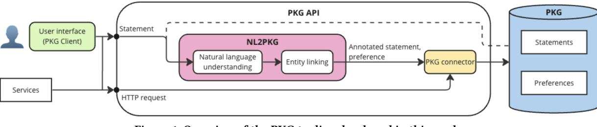
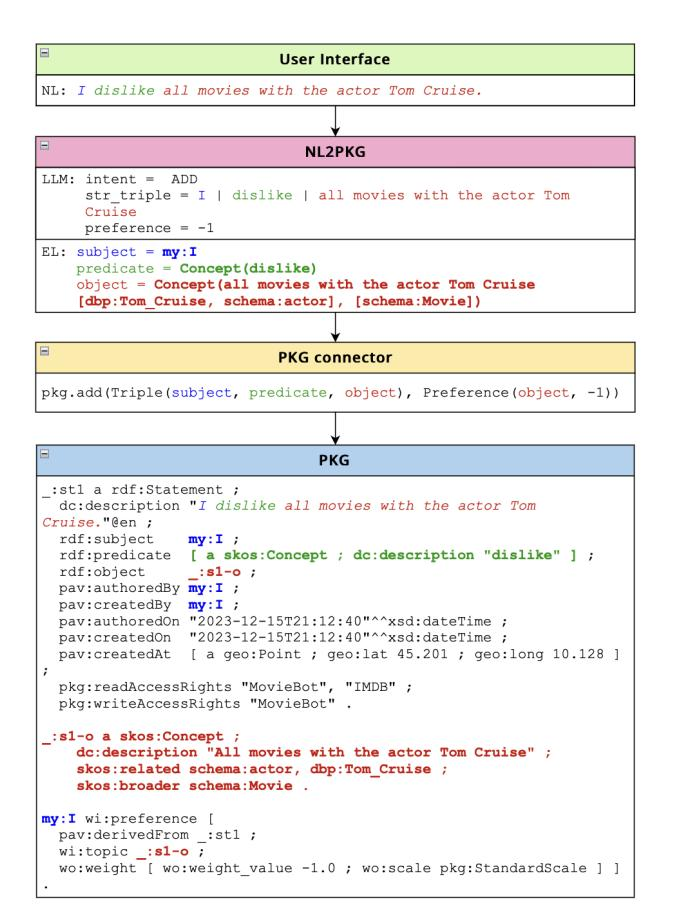

# PKG API: A Tool for Personal Knowledge Graph Management

Nolwenn Bernard University of Stavanger Stavanger, Norway nolwenn.m.bernard@uis.no

Krisztian Balog University of Stavanger Stavanger, Norway krisztian.balog@uis.no

Ivica Kostric University of Stavanger Stavanger, Norway ivica.kostric@uis.no

Petra Galuščáková University of Stavanger Stavanger, Norway petra.galuscakova@uis.no

Martin G. Skjæveland University of Stavanger Stavanger, Norway martin.g.skjeveland@uis.no

Weronika Łajewska University of Stavanger Stavanger, Norway weronika.lajewska@uis.no

Vinay Setty University of Stavanger Stavanger, Norway vinay.j.setty@uis.no

# ABSTRACT

Personal knowledge graphs (PKGs) offer individuals a way to store and consolidate their fragmented personal data in a central place, improving service personalization while maintaining full user control. Despite their potential, practical PKG implementations with user-friendly interfaces remain scarce. This work addresses this gap by proposing a complete solution to represent, manage, and interface with PKGs. Our approach includes (1) a user-facing PKG Client, enabling end-users to administer their personal data easily via natural language statements, and (2) a service-oriented PKG API. To tackle the complexity of representing these statements within a PKG, we present an RDF-based PKG vocabulary that supports this, along with properties for access rights and provenance.

# CCS CONCEPTS

• Information systems → Web services; Web applications; Data management systems; Personalization; • Human-centered computing → Natural language interfaces.

# KEYWORDS

Personal Knowledge Graphs, Personal Data Management, Knowledge Representation, Semantic Technologies

## ACM Reference Format:

Nolwenn Bernard, Ivica Kostric, Weronika Łajewska, Krisztian Balog, Petra Galuščáková, Vinay Setty, and Martin G. Skjæveland. 2024. PKG API: A Tool for Personal Knowledge Graph Management. In Companion Proceedings of the ACM Web Conference 2024 (WWW '24 Companion), May 13–17, 2024, Singapore, Singapore. ACM, New York, NY, USA, [4](#page-3-0) pages. [https://doi.org/10.](https://doi.org/10.1145/3589335.3651247) [1145/3589335.3651247](https://doi.org/10.1145/3589335.3651247)

WWW '24 Companion, May 13–17, 2024, Singapore, Singapore

© 2024 Copyright held by the owner/author(s). Publication rights licensed to ACM. ACM ISBN 979-8-4007-0172-6/24/05.

<https://doi.org/10.1145/3589335.3651247>

# 1 INTRODUCTION

A personal knowledge graph (PKG) is "a resource of structured information about entities related to an individual, their attributes, and the relations between them" [\[1\]](#page-3-1). A PKG offers the possibility to centrally store all information related to its owner such as personal relationship, preferences on food, and calendar data [\[23\]](#page-3-2). This enables the delivery of highly personalized services while maintaining the owner's full control over their data. In today's digital world, where personal data is often fragmented across multiple accounts with different service providers, a PKG provides a solution for consolidating information. Crucially, one of the most essential features of a PKG is that the individual is put in control of their data, allowing owners to determine what data is stored and what services have access to it [\[23\]](#page-3-2). Despite the clear potential of PKGs and the growing research interest around them [\[2\]](#page-3-3), efforts have so far remained mostly on the conceptual level. Practical implementations, especially those that directly interface with users, are lacking. This paper aims to address that gap.

Similar to the concept of PKGs, Solid (Social Linked Data) [\[20\]](#page-3-4) is an existing initiative that aims to put individuals in control of their own data. Solid allows users to store personal data in decentralized "Pods" (Personal Online Data Stores), giving them fine-grained control over which apps can access which portions of their data. However, Pods introduce a level of complexity that may pose challenges for ordinary web users. Managing data within Pods requires a learning curve, and users accustomed to the simplicity of traditional services might find this transition difficult. Solid interfaces and applications have particularly been criticized for not being user-friendly, and compatibility issues between Pod providers and Solid apps lead to inconsistent user experiences.[1](#page-0-0)

In this work, we propose a user-friendly solution to managing PKGs, consisting of a web-based PKG Client and a service-oriented PKG API. To dramatically lower the barrier for end users, we let them administer and interact with their PKG via natural language statements, enabled by recent advances in Large Language Models (LLMs). For example, a user might simply state a preference "I dislike all movies with the actor Tom Cruise" to be recorded in

Permission to make digital or hard copies of all or part of this work for personal or classroom use is granted without fee provided that copies are not made or distributed for profit or commercial advantage and that copies bear this notice and the full citation on the first page. Copyrights for components of this work owned by others than the author(s) must be honored. Abstracting with credit is permitted. To copy otherwise, or republish, to post on servers or to redistribute to lists, requires prior specific permission and/or a fee. Request permissions from permissions@acm.org.

1 See, e.g., discussions at<https://www.reddit.com/r/solid/>

WWW '24 Companion, May 13–17, 2024, Singapore, Singapore Nolwenn Bernard et al.

<!-- Image Description: The figure is a system diagram illustrating the architecture of a NL2PKG system. It shows a user interface sending statements via HTTP requests to a NL2PKG module, which performs natural language understanding and entity linking. The output is an annotated statement and preference which are then passed to a PKG connector, ultimately stored in a PKG database containing statements and preferences. The diagram visually depicts data flow and processing stages within the system. -->

## Figure 1: Overview of the PKG tooling developed in this work.

their PKG. While this example is simplistic, we demonstrate that representing it in a PKG can actually become complex due to entanglements between different entities and relationships between them, such as all movies and Tom Cruise. In order to tackle this challenge, we develop a PKG vocabulary on top of RDF to represent such statements both in natural language and as structured data. Furthermore, our vocabulary defines a set of properties, such as access rights and provenance, to enrich the statements.

In summary, the main contributions of this work are:

- (1) A PKG vocabulary based on RDF reification, leveraging existing vocabularies, to represent statements in a PKG.
- (2) A PKG API that implements both user-facing and serviceoriented functionalities to access and manage a PKG. It includes a novel NL2PKG feature, enabling the translation of natural language statements to API calls.
- (3) A web-based PKG Client to browse, expand, and manage a PKG, prioritizing simplicity, intuitive design, and visualization features for easy user understanding and control.

Our complete solution along with a video demonstration may be found at [https://github.com/iai-group/pkg-api.](https://github.com/iai-group/pkg-api)

## 2 RELATED WORK

While there are several definitions of PKGs [\[1,](#page-3-1) [5\]](#page-3-5), they all agree that PKGs can be seen as a specialized approach to a personal information management (PIM) system [\[9,](#page-3-6) [16\]](#page-3-7). PIM systems provide storage and access to personal data, with a focus on personal data control for third-party services. Several tools have been proposed, including Solid [\[20\]](#page-3-4), MyData [\[12\]](#page-3-8), and OpenPDS/SA [\[7\]](#page-3-9), and are available as either free or commercial services. Compared with general PIM tools, a PKG stores data in the form of a knowledge graph (KG) [\[8\]](#page-3-10), where information about entities and their relations is directly modeled as a graph structure. This structure, grounded in a pre-defined ontology, inherently supports operations such as summarization of personal information [\[10,](#page-3-11) [19\]](#page-3-12) and cross-domain recommendation [\[24\]](#page-3-13).

Our proposed PKG API focuses on enabling user-friendly interactions via natural language (NL). This requires a way to automatic translate NL statements to a structured query language that can directly interact with the PKG. Methods for such NL-tostructured-language translation traditionally focus on conversion to SQL [\[30,](#page-3-14) [32\]](#page-3-15), with interactive approaches [\[26\]](#page-3-16) and LLMs [\[13,](#page-3-17) [22\]](#page-3-18) being the state of the art. A similar pattern is followed in the case of conversion from natural language to SPARQL, which can be used for querying knowledge graphs. While earlier methods were based, for example, on rules [\[17\]](#page-3-19) and machine translation [\[31\]](#page-3-20), recent studies start to explore LLMs [\[25,](#page-3-21) [29\]](#page-3-22). LLMs have also been utilized to translate NL queries to different API calls [\[18,](#page-3-23) [21\]](#page-3-24).

Figure 2: Screenshot of the home screen after submission of a natural language statement.

## 3 OVERVIEW AND ARCHITECTURE

This work aims to provide a simple and user-friendly way to manage a PKG. It comprises a web interface, i.e., PKG Client, and the PKG API. The PKG API serves as a middleman between the PKG and both the PKG Client and external service providers. It has two entry points: one for natural language statements and another one HTTP requests. See Fig. [1](#page-1-0) for an overview.

A statement is a fundamental unit of information in the PKG, containing at minimum its text content. For example, "I dislike all movies with the actor Tom Cruise" is a statement. Statements can be further enriched with properties defined in the PKG vocabulary (Section [4\)](#page-2-0), following the Subject-Predicate-Object (SPO) model. In this example, we can extract "I" as the subject, "dislike" as the predicate, and "all movies with the actor Tom Cruise" as the object. Note that our example is a particular type of statement, one that expresses a preference. Preference statements are especially valuable for service providers seeking to personalize user experiences. Therefore, our PKG vocabulary (detailed in Section [4\)](#page-2-0) explicitly supports the representation of preferences, which are derived from statements via a derivation relationship.

The PKG Client is a web interface connecting users to their PKG. It is designed to be intuitive and user-friendly, aiming to make PKG administration accessible to a broad range of users. The home screen features a form with a text area for users input natural language statements, as well as an area to display the outcomes of these statements (Fig. [2\)](#page-1-1). Additional screens within the interface provide forms for specific tasks like adding statements manually to the PKG and visualizing the PKG; these features are primarily designed for advanced users with knowledge of semantic web technologies.

When a NL statement is received by the PKG API, whether from the PKG Client or external services, it is processed by the NL2PKG component (Section [5\)](#page-2-1), which performs two main steps. First, a natural language understanding step identifies the action to execute (e.g., adding a new statement), extracts properties (subject, predicate, object), and infers whether a preference is expressed (e.g., identifying a negative preference towards "Tom Cruise"). At this stage, all the properties and preference are represented as text. Next, an entity linking step attempts to resolve the properties and preference to IRIs (e.g., "Tom Cruise" to http://dbpedia.org/resource/Tom\_Cruise). Note that these steps may be performed asynchronously on existing statements in case the natural language understanding and/or entity linking components are updated. Once these steps are completed, the PKG Connector generates a SPARQL query with the annotated statement and preference, and sends it to the PKG. Figure [3](#page-2-2) illustrates these steps.

In the case where the user or service provider decides to interact with the PKG using HTTP requests, the PKG API directly triggers the PKG Connector to create and send the corresponding SPARQL query to the PKG.

## 4 PKG VOCABULARY

The PKG vocabulary is used for expressing all statements to be kept in a PKG. It is specified as a set of SHACL shapes [\[11\]](#page-3-25) over existing RDF vocabularies such as RDF [\[4\]](#page-3-26), SKOS [\[15\]](#page-3-27), PAV [\[6\]](#page-3-28), and The Weighted Interests Vocabulary [\[3\]](#page-3-29), including custom vocabulary terms necessary for expressing access rights to stored statements.

The main design idea behind the vocabulary is to provide a simple data model with which one can represent all kinds of incoming statements, and allow for incremental post-processing of statements to increase their quality and precision. The core modeling pattern is standard RDF reification [\[4\]](#page-3-26): a statement is represented by an instance of rdf:Statement where the original statement in text is represented by a literal annotation on the statement. The extracted subject, predicate and object are connected to the rdf:Statement using rdf:subject, rdf:predicate, and rdf:object, respectively, and can either be represented directly as an IRI, or, in the case that an appropriate IRI is not found, as an instance of skos:Concept with the extracted text as a literal annotation.

Instances of rdf:Statement and skos:Concept are further analyzed and can, if a match is found, be related to other known resources from the PKG or from external KGs using, e.g., the SKOS properties skos:related, skos:broader, or skos:narrower. Also, the analysis may amend statements by asserting a preference the statement's subject has towards the object. Additional semantic descriptions may be added to statements and concepts at the discretion and capabilities of the analysis tools, e.g., concepts like "All movies with the actor Tom Cruise" could be expressed as being a subclass of or equivalent to a, possibly complex, constructed OWL [\[28\]](#page-3-30) class expression. However, this is outside the scope of our current implementation. Every rdf:Statement are assumed to be annotated with provenance information following the PAV Ontology. Finally, the PKG vocabulary enables straightforward access control at the rdf:Statement level by explicitly stating which services have read and write access to the statement using the properties pkg:readAccessRights and pkg:writeAccessRights.

The bottom block of Fig. [3](#page-2-2) demonstrates the use of the PKG vocabulary. It is available at its namespace IRI: [http://w3id.org/pkg/,](http://w3id.org/pkg/) including SHACL shape definitions, documentation, and examples.

PKG API: A Tool for Personal Knowledge Graph Management WWW '24 Companion, May 13–17, 2024, Singapore, Singapore

<!-- Image Description: The image depicts a flowchart illustrating the processing of a user's natural language preference ("I dislike all movies with Tom Cruise"). It shows the stages: user interface input, transformation by NL2PKG (Natural Language to Package), connection to a package (PKG) via a connector, and final representation in PKG format using RDF (Resource Description Framework) triples. Code snippets illustrate the data structure at each stage, detailing subject, predicate, object, and preference values. The diagram's purpose is to explain the system's architecture for processing and storing user preferences. -->

# Figure 3: Life of a statement from NL to PKG. 5 NATURAL LANGUAGE TO PKG

To facilitate user-friendly interactions with PKGs, we present a twostage NL2PKG approach that translates natural language statements to API calls that perform operations on the PKG, such as storing stated preferences or retrieving previous statements.

In the first stage, we leverage LLMs to classify user intent, extract an SPO-triple, and identify whether a preference was expressed in the NL statement. Intents specify the desired action on the PKG: (a) ADD inserts a statement, (b) GET retrieves matching statements, (c) DELETE removes a statement, and (d) UNKNOWN handles unrecognized statements. Preferences are represented as +1 (positive) or -1 (negative) and are relevant for ADD intents in statements expressing user likes or dislikes. For example, "Bob likes Oppenheimer" translates to an ADD intent, inserting the triple ⟨, ,ℎ⟩ into the PKG with a preference of +1. Specifically, we employ pre-trained LLMs with few-shot chain-ofthought reasoning prompts. Separate prompts are used for intent classification, SPO-triple extraction, and preference identification.[2](#page-2-3)

In the second stage, we employ an entity linker to resolve the SPO elements, which are initially extracted in their surface form representations. They are transformed into normalized entities and relations congruent with external KGs, such as DBpedia. Note that the subject element most commonly belong in the user's private

2The prompts used can be found here: [https://github.com/iai-group/pkg-api/tree/](https://github.com/iai-group/pkg-api/tree/main/data/llm_prompts/cot) [main/data/llm\\_prompts/cot](https://github.com/iai-group/pkg-api/tree/main/data/llm_prompts/cot)

WWW '24 Companion, May 13–17, 2024, Singapore, Singapore Nolwenn Bernard et al.

circle (e.g., "I" and "my mom"), thus, we argue that is should be resolved using an entity linker specific to the PKG.

## 6 IMPLEMENTATION

Our solution contains two main components: (1) a PKG API served as a RESTful API with a backend server based on Flask, and (2) a user interface, PKG Client, implemented as a React application.

Central to the PKG API's functionality is the NL2PKG module. In our demo, we use the Ollama framework[3](#page-3-31) to deploy and experiment with Llama2-7b and Mistral-7b as LLMs, with the latter being the default option based on a set of preliminary experiments.[4](#page-3-32) For entity linking, we offer both REL [\[27\]](#page-3-33), as our default, and DBPedia Spotlight [\[14\]](#page-3-34) as an alternative. The code is designed to be modular to allow for easy experimentation with different LLM-based annotators and entity linkers in the future.

Natural language statements processed by the NL2PKG module are further handled by the PKG Connector responsible for the creation and execution of SPARQL queries against the PKG. The PKG Connector uses a dedicated Python package, RDFLib,[5](#page-3-35) for generating and executing SPARQL queries in RDF format.

## 7 CONCLUSION

Personal knowledge graphs hold the potential to be useful tools for organizing and providing personal information. As the volume of digital data continues to grow, alongside the number of services that can utilize it, the need for user-centric management tools becomes ever more pressing. Recognizing that existing tools are often too complex to be used by non-expert users, we focused on developing a robust internal data representation for PKGs, paired with an API and a user-friendly PKG Client. A key novelty of our approach is enabling users to interact with their PKG directly through natural language statements. Our open-source demo showcases the viability of this concept with a particular focus on understanding and representing user preferences. This work represents a major step forward in the practical realization of PKGs, opening avenues for research into both intuitive user-centric interaction methods and broader applications.

## ACKNOWLEDGMENTS

This research was partially supported by the Norwegian Research Center for AI Innovation, NorwAI (Research Council of Norway, project number 309834).

## REFERENCES

- [1] Krisztian Balog and Tom Kenter. 2019. Personal Knowledge Graphs: A Research Agenda. In Proc. of ICTIR '19. 217–220.
- [2] Krisztian Balog, Paramita Mirza, Martin G. Skjæveland, and Zhilin Wang. 2022. Report on the Workshop on Personal Knowledge Graphs (PKG 2021) at AKBC 2021. SIGIR Forum 56, 1, Article 4 (jun 2022), 11 pages.
- [3] Dan Brickley et al. 2010. The Weighted Interests Vocabulary 0.5. http://purl.org/ontology/wi/core.
- [4] Dan Brickley and R.V. Guha. 2014. RDF Schema 1.1. https://www.w3.org/TR/rdf11 schema/. W3C Recommendation.
- [5] Prantika Chakraborty, Sudakshina Dutta, and Debarshi Kumar Sanyal. 2022. Personal Research Knowledge Graphs. In Proc. of WWW '22. 763–768.
- [6] Paolo Ciccarese and Stian Soiland-Reyes. 2014. PAV - Provenance, Authoring and Versioning. https://pav-ontology.github.io/pav/.

- [7] Yves-Alexandre de Montjoye, Erez Shmueli, Samuel S. Wang, and Alex Sandy Pentland. 2014. openPDS: Protecting the Privacy of Metadata through SafeAnswers. PLOS ONE 9, 7 (07 2014), 1–9.
- [8] Aidan Hogan, Eva Blomqvist, Michael Cochez, Claudia D'amato, Gerard De Melo, Claudio Gutierrez, Sabrina Kirrane, José Emilio Labra Gayo, Roberto Navigli, Sebastian Neumaier, Axel-Cyrille Ngonga Ngomo, Axel Polleres, Sabbir M. Rashid, Anisa Rula, Lukas Schmelzeisen, Juan Sequeda, Steffen Staab, and Antoine Zimmermann. 2021. Knowledge Graphs. ACM CSUR 54, 4 (2021), 1–37.
- [9] Heleen Janssen and Jatinder Singh. 2022. Personal Information Management Systems. Internet Policy Review: Journal on Internet Regulation 11, 2 (2022), 1–6.
- [10] Shinhwan Kang, Kyuhan Lee, and Kijung Shin. 2022. Personalized Graph Summarization: Formulation, Scalable Algorithms, and Applications. In Proc. of ICDE '22. 2319–2332.
- [11] Holger Knublauch and Dimitris Kontokostas. 2017. Shapes Constraint Language (SHACL). https://www.w3.org/TR/shacl/. W3C Recommendation.
- [12] Joss Langford, Antti Poikola, Wil Janssen, Viivi Lähteenoja, and Marlies Rikken. 2020. Understanding MyData Operators. Technical Report. MyData Global.
- [13] Jinyang Li, Binyuan Hui, Reynold Cheng, Bowen Qin, Chenhao Ma, Nan Huo, Fei Huang, Wenyu Du, Luo Si, and Yongbin Li. 2023. Graphix-T5: Mixing Pre-Trained Transformers with Graph-Aware Layers for Text-to-SQL Parsing. In Proc. of AAAI '23. 13076–13084.
- [14] Pablo N. Mendes, Max Jakob, Andrés García-Silva, and Christian Bizer. 2011. DBpedia spotlight: shedding light on the web of documents.. In Proc. of I-SEMANTICS '11. 1–8.
- [15] Alistair Miles and Sean Bechhofer. 2009. SKOS Simple Knowledge Organization System Reference. https://www.w3.org/TR/skos-reference/. W3C Recommendation.
- [16] Mohammad Rustom Al Nasar, Masnizah Mohd, and Nazlena Mohamad Ali. 2011. Personal information management systems and interfaces: An overview. In Proc. of STAIR '11. 197–202.
- [17] Axel-Cyrille Ngonga Ngomo, Lorenz Bühmann, Christina Unger, Jens Lehmann, and Daniel Gerber. 2013. Sorry, i don't speak SPARQL: translating SPARQL queries into natural language. In Proc. of WWW '13. 977–988.
- [18] Shishir G. Patil, Tianjun Zhang, Xin Wang, and Joseph E. Gonzalez. 2023. Gorilla: Large Language Model Connected with Massive APIs. arXiv[:2305.15334](https://arxiv.org/abs/2305.15334) [cs.CL]
- [19] Tara Safavi, Caleb Belth, Lukas Faber, Davide Mottin, Emmanuel Müller, and Danai Koutra. 2019. Personalized Knowledge Graph Summarization: From the Cloud to Your Pocket. In Proc. of ICDM '19. 528–537.
- [20] Andrei Vlad Sambra, Essam Mansour, Sandro Hawke, Maged Zereba, Nicola Greco, Abdurrahman Ghanem, Dmitri Zagidulin, Ashraf Aboulnaga, and Tim Berners-Lee. 2016. Solid: a platform for decentralized social applications based on linked data. MIT CSAIL & Qatar Computing Res. Inst., Tech. Rep. (2016).
- [21] Timo Schick, Jane Dwivedi-Yu, Roberto Dessì, Roberta Raileanu, Maria Lomeli, Luke Zettlemoyer, Nicola Cancedda, and Thomas Scialom. 2023. Toolformer: Language Models Can Teach Themselves to Use Tools. arXiv[:2302.04761](https://arxiv.org/abs/2302.04761) [cs.CL]
- [22] Torsten Scholak, Nathan Schucher, and Dzmitry Bahdanau. 2021. PICARD: Parsing Incrementally for Constrained Auto-Regressive Decoding from Language Models. In Proc. of EMNLP '21. 9895–9901.
- [23] Martin G. Skjæveland, Krisztian Balog, Nolwenn Bernard, Weronika Lajewska, and Trond Linjordet. 2023. An Ecosystem for Personal Knowledge Graphs: A Survey and Research Roadmap. arXiv[:2304.09572](https://arxiv.org/abs/2304.09572) [cs.AI]
- [24] Xin Su, Yao Zhou, Zifei Shan, and Qian Chen. 2023. MeKB-Rec: Personal Knowledge Graph Learning for Cross-Domain Recommendation. arXiv[:2310.11088](https://arxiv.org/abs/2310.11088) [cs.IR]
- [25] Tilahun Abedissa Taffa and Ricardo Usbeck. 2023. Leveraging LLMs in Scholarly Knowledge Graph Question Answering. arXiv[:2311.09841](https://arxiv.org/abs/2311.09841) [cs.CL]
- [26] Yuan Tian, Zheng Zhang, Zheng Ning, Toby Li, Jonathan K. Kummerfeld, and Tianyi Zhang. 2023. Interactive Text-to-SQL Generation via Editable Step-by-Step Explanations. In Proc. of EMNLP '23. 16149–16166.
- [27] Johannes M. van Hulst, Faegheh Hasibi, Koen Dercksen, Krisztian Balog, and Arjen P. de Vries. 2020. REL: An Entity Linker Standing on the Shoulders of Giants. In Proc. of SIGIR '20. 2197–2200.
- [28] W3C OWL Working Group. 2012. OWL 2 Web Ontology Language Document Overview (Second Edition). https://www.w3.org/TR/owl2-overview/. W3C Recommendation.
- [29] Ruijie Wang, Zhiruo Zhang, Luca Rossetto, Florian Ruosch, and Abraham Bernstein. 2023. NLQxform: A Language Model-based Question to SPARQL Transformer. arXiv[:2311.07588](https://arxiv.org/abs/2311.07588) [cs.CL]
- [30] Xiaojun Xu, Chang Liu, and Dawn Song. 2017. SQLNet: Generating Structured Queries From Natural Language Without Reinforcement Learning. arXiv[:1711.04436](https://arxiv.org/abs/1711.04436) [cs.CL]
- [31] Xiaoyu Yin, Dagmar Gromann, and Sebastian Rudolph. 2021. Neural machine translating from natural language to SPARQL. FGCS 117 (2021), 510–519.
- [32] Tao Yu, Rui Zhang, Kai Yang, Michihiro Yasunaga, Dongxu Wang, Zifan Li, James Ma, Irene Li, Qingning Yao, Shanelle Roman, Zilin Zhang, and Dragomir Radev. 2018. Spider: A Large-Scale Human-Labeled Dataset for Complex and Cross-Domain Semantic Parsing and Text-to-SQL Task. In Proc. of EMNLP '18. 3911–3921.

3<https://ollama.ai>

4We do not use proprietary models like GPT-4 or Gemini, due to privacy reasons. 5<https://rdflib.readthedocs.io/>
