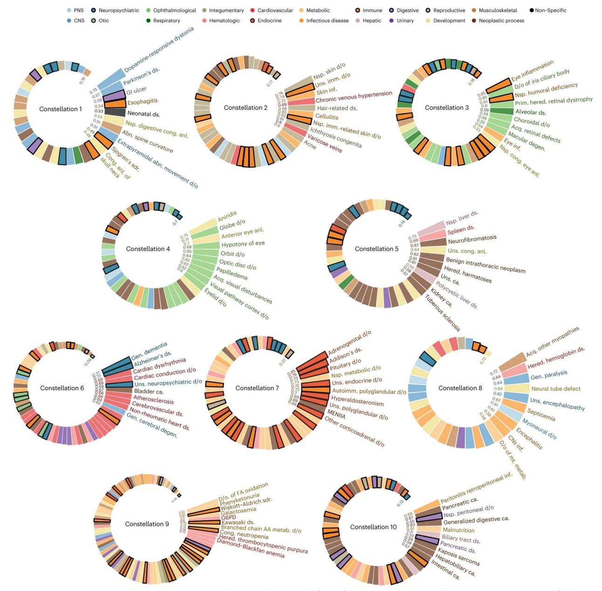
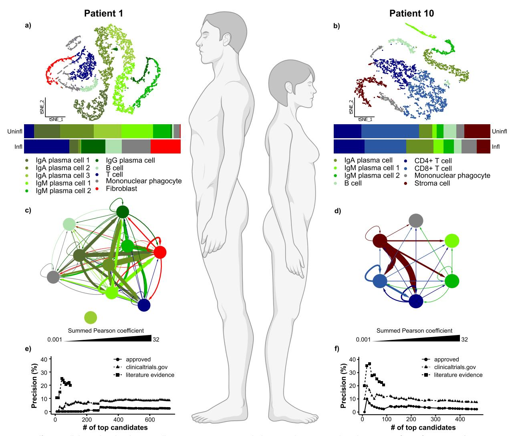
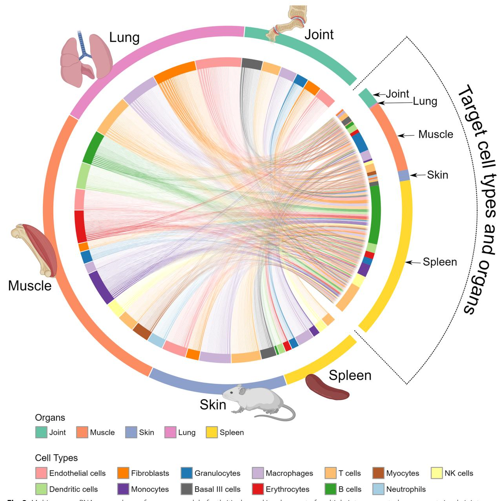
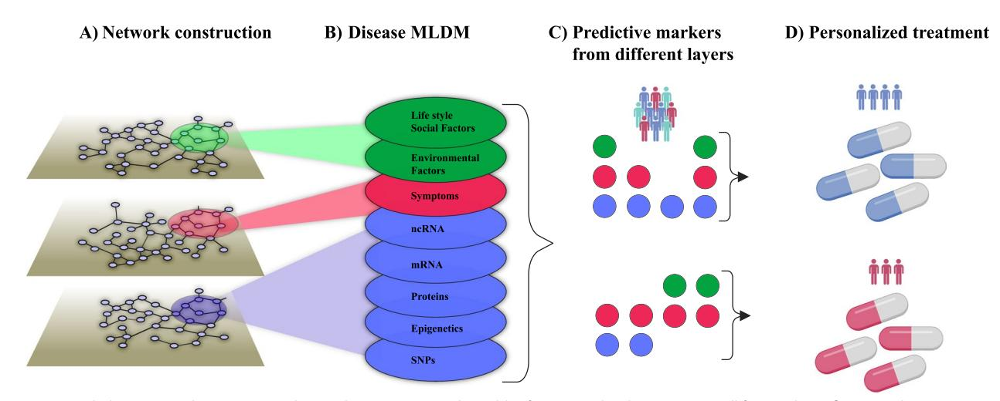

# Digital twins as global learning health and disease models for preventive and personalized medicine

Xinxiu Li1 , Joseph Loscalzo2 , A. K. M. Firoj Mahmud3 , Dina Mansour Aly1 , Andrey Rzhetsky4 , Marinka Zitnik5,6,7 and Mikael Benson1[\\*](http://orcid.org/0000-0002-7753-9181) 

# **Abstract**

Inefective medication is a major healthcare problem causing signifcant patient sufering and economic costs. This issue stems from the complex nature of diseases, which involve altered interactions among thousands of genes across multiple cell types and organs. Disease progression can vary between patients and over time, infuenced by genetic and environmental factors. To address this challenge, digital twins have emerged as a promising approach, which have led to international initiatives aiming at clinical implementations. Digital twins are virtual representations of health and disease processes that can integrate real-time data and simulations to predict, prevent, and personalize treatments. Early clinical applications of DTs have shown potential in areas like artifcial organs, cancer, cardiology, and hospital workfow optimization. However, widespread implementation faces several challenges: (1) characterizing dynamic molecular changes across multiple biological scales; (2) developing computational methods to integrate data into DTs; (3) prioritizing disease mechanisms and therapeutic targets; (4) creating interoperable DT systems that can learn from each other; (5) designing user-friendly interfaces for patients and clinicians; (6) scaling DT technology globally for equitable healthcare access; (7) addressing ethical, regulatory, and fnancial considerations. Overcoming these hurdles could pave the way for more predictive, preventive, and personalized medicine, potentially transforming healthcare delivery and improving patient outcomes.

**Keywords** Digital twins, Personalized medicine, Data integration, Computational methods

#### \*Correspondence:

Mikael Benson

mikael.benson@ki.se

- 1 Medical Digital Twin Research Group, Department of Clinical Sciences Intervention and Technology, Karolinska Institute, Stockholm, Sweden
- 2 Brigham and Women's Hospital, Harvard Medical School, Boston, USA 3 Department of Medical Biochemistry and Microbiology, Uppsala
- University, 75105 Uppsala, Sweden

5 Department of Biomedical Informatics, Harvard Medical School,

Cambridge, MA, USA

6 Broad Institute of MIT and Harvard, Cambridge, MA, USA

7 Kempner Institute for the Study of Natural and Artifcial Intelligence, Harvard Data Science Initiative, Harvard University, Cambridge, MA, USA

# **Background**

Inefective medication is one of the most important healthcare problems. Many patients with complex diseases do not respond to treatment or experience serious side efects. Tis problem causes enormous sufering and costs for health care, drug development, and production loss. An important reason for inefective medication is the daunting complexity of diseases. Multi-omics analyses down to the single cell level show that each disease can involve altered interactions among thousands of genes across billions of cells in multiple organs [\[1\]](#page-10-0).

Most diseases, including infammatory, cardiovascular, malignant, and metabolic, can develop for many years, or even decades, before symptoms manifest themselves and

© The Author(s) 2025. **Open Access** This article is licensed under a Creative Commons Attribution 4.0 International License, which permits use, sharing, adaptation, distribution and reproduction in any medium or format, as long as you give appropriate credit to the original author(s) and the source, provide a link to the Creative Commons licence, and indicate if changes were made. The images or other third party material in this article are included in the article's Creative Commons licence, unless indicated otherwise in a credit line to the material. If material is not included in the article's Creative Commons licence and your intended use is not permitted by statutory regulation or exceeds the permitted use, you will need to obtain permission directly from the copyright holder. To view a copy of this licence, visit [http://creativecommons.org/licenses/by/4.0/.](http://creativecommons.org/licenses/by/4.0/)

4 Departments of Medicine and Human Genetics, Institute for Genomics and Systems Biology, University of Chicago, Chicago, USA

a diagnosis is given. Inefective treatment increases the risk of comorbidities, and a vicious circle of increasing treatment inefciency ensues.

Disease progression can difer between diferent patients with the same diagnosis or within a patient at diferent time points. Indeed, health and disease can be seen as variable entities on continuous scales. Such variations depend on genetic or environmental factors, such as pollution, lifestyle, and inequitable health care. Te 2030 agenda for sustainable development identifed efective and equitable health as priorities [[2](#page-10-1)]. To address these priorities would require identifcation of factors that predispose to, or protect against, a complex disease in the life of a patient.

Digital twins (DTs) can contribute to these goals. Te DT concept is derived from engineering with the aims of modeling and developing complex systems more efectively and inexpensively in silico than in real life. As with many emerging disciplines, there is no accepted defnition of a medical DT [\[3](#page-10-2)]. However, many defnitions have been proposed, ranging from a computational model of a disease process or a comprehensive model of a whole virtual representation of a patient that is continuously updated with relevant information [[4\]](#page-10-3).

Reasons for lack of a generally accepted defnition include the wide variety of potential applications of medical DTs and emerging technologies. Tus, it is possible that defnitions will change, and perhaps be adapted to diferent contexts. Tis fexibility was also proposed in a recent publication about medical DTs [[3\]](#page-10-2).

Here, we will use a broad defnition of medical DTs: virtual representations of healthy or sick processes across lifecycles that can be understood, learned, and reasoned with real-time data or simulation models to predict, prevent, or treat diseases [\[5](#page-10-4)].

Early examples of DTs have already been tested in the clinic, such as in the setting of an artifcial lung or artifcial pancreas [\[6](#page-10-5)[–8](#page-10-6)]. Recently a resource of sex-specifc, organ-resolved whole-body models (WBMs) of infant metabolism was described [\[9](#page-10-7)]. Tis can be used to develop personalized infant-WBMs to predict infant growth in health and disease. Similar models of the whole immune system are projected [[10\]](#page-10-8).

Ideally, analyses and computational treatment of DTs will improve health care by paving the way for predictive, preventive, and personalized treatments [[11](#page-10-9)[–13](#page-10-10)]. Two recent literature reviews provide comprehensive compilations of potential DT applications in health care [[14](#page-10-11), [15\]](#page-10-12), as summarized in Table [1.](#page-1-0)

DTs have been applied in cancer, cardiology, neurology, orthopedics, and wellness [[11,](#page-10-9) [16–](#page-10-13)[35](#page-11-0), [48](#page-11-1)]. Other applications include the use of DTs to improve drug discovery, clinical trial design, and workfows in hospitals [\[9](#page-10-7), [36](#page-11-2)[–40](#page-11-3)].

As an example, Siemens Healthineers and the Medical University of South Carolina collaborated to optimize hospital processes based on DT applications that simulated diferent workfows and medical equipment [\[40](#page-11-3)].

Another example was a DT of a hospital that provided predictive models of health care needs during the COVID-19 pandemic. Tose needs included ventilators, critical care beds, and extracorporeal life support. Te generated DTs were used to optimize the use of such resources and to provide clinical decision support for

**Table 1** Examples of digital twin applications in health care and organizations to promote such applications

| Applications                                      | Examples                                                                                                                                                            |
|---------------------------------------------------|---------------------------------------------------------------------------------------------------------------------------------------------------------------------|
| Organ models                                      | Artifcial lungs and artifcial pancreas [6–8]                                                                                                                        |
| System models                                     | Infant metabolism, immune system [10]                                                                                                                               |
| Disease models                                    | Cancer, cardiology, neurology, orthopedics, and wellness [11, 16–35]                                                                                                |
| Drug discovery                                    | Improve drug discovery [36, 37]                                                                                                                                     |
| Clinical trial design                             | Improve clinical trial design [9, 38]                                                                                                                               |
| Hospital workfows                                 | Optimize hospital processes and provide clinical decision support for treatment of individual patients [39, 40]                                                  |
| Organizations to promote such applications        |                                                                                                                                                                     |
| European Virtual Human Twin                       | Aims at development, integration, and adoption of patient-specifc predictive computer models, for clinical decision support system [41]                          |
| US National Science Foundation (NSF), NIH and FDA | Awarded more than \$6 M across 7 new projects aiming at digital twins for therapeutic and clinical use [42]                                                      |
| Chinese Medical Association                       | Promotes and disseminates knowledge about medical digital twins in China [43]                                                                                       |
| Digital Twins for Health Consortium               | 20 institutions, focusing on developing digital twin infrastructure for lung cancer, sepsis, mental health, diabetes, leukemia, and cardiovascular diseases [44] |
| Swedish Digital Twin Consortium                   | Universities and hospitals aiming to predict and prevent disease trajectories [45]                                                                                  |
| Siemens                                           | Industrial models of the heart and for pharmaceutical development [46, 47]                                                                                          |

treatment of individual patients in all hospitals in the state of Oregon [\[39](#page-11-6)].

Te medical potential of DTs has been recognized by scientifc organizations in the US, Europe, and Asia, and has led to international collaborative eforts to implement this computational strategy in health care and clinical trials. Such eforts and potential clinical applications have been extensively reviewed [\[6](#page-10-5), [48](#page-11-1)[–60](#page-11-14)].

However, clinical implementation of DTs involves multiple challenges that have not been systematically addressed in the same review, including (1) dynamic characterization of health and disease-associated molecular changes on population-, organome-, cellulome-, and genome-wide scales, as well as environmental factors; (2) computational methods that integrate and organize all changes into DT; (3) prioritization of mechanisms, from which (4) diagnostic biomarkers and preventive measures or therapeutic targets can be inferred; (5) solutions to connect 1–4 so that DTs can learn from each other; (6) user-friendly interfaces adapted to individuals and care givers; (7) solutions to disseminate DTs on a global scale for equitable and efective health; and (8) solutions to address social, psychological, organizational, ethical, regulatory, and fnancial challenges and opportunities. As highlighted by manifestos about DTs from the European Commission and US National Academy of Sciences, Engineering and Medicine, there is a lack of concrete clinical implementations that address these challenges [[55,](#page-11-15) [56](#page-11-16)].

Moreover, the emerging market for medical DTs is projected to reach US\$183 billion by 2031 [\[61\]](#page-11-17). Tis has resulted in multiple industrial eforts to develop and implement DTs for health care [[62\]](#page-11-18).

Here, we will discuss these challenges and potential solutions and give concrete examples of such solutions.

# **1. Dynamic and multi‑scale characterization of health and risk factors**

Predictive, preventive, and personalized medicine will require analyses of potential disease causes on multiple scales ranging from populations to individuals, to their tissues, cells, and molecular species. Since multi-morbidity is common, population-wide analyses are important for characterizing disease constellations. Tis goal is feasible because of the availability of longitudinal electronic medical records of populations and large biobanks. As an example, see our analyses of temporal disease trajectories of over 200 million Americans revealing ten constellations of comorbid diseases (Fig. [1](#page-3-0)).

Te motivations for studying whole populations include that environmental and genetic factors associated with health and disease may be identifed. As an example, a study of health records of over 480,000 (United States) US individuals, along with geographically specifc environmental quality measures, suggested that diferent combinations of genetic and environmental factors play signifcant roles in schizophrenia risk. Te authors concluded that such knowledge would have the potential to implement preventative public health measures at the level of the general population, as well as personalized clinical strategies through genotype-guided primary, secondary, and tertiary prevention to protect defned individuals from exposure to specifc environmental risks [[64\]](#page-11-19). Moreover, diseases often occur sequentially, so that disease trajectories can be characterized. Such information might be used for prediction and prevention of diseases. A well-known example from health care today is that early diagnosis and treatment of hypertension prevent cardiovascular diseases. However, many disease trajectories and their genetic/environmental associations may remain uncharacterized because of their complexity and heterogeneity, as well as lack of systematic analyses on population-wide scales.

On the scale of individuals, detailed characterization of health and disease mechanisms can be achieved using diferent types of genome-wide analyses ("multi-omics") down to the level of single cells (Fig. [2\)](#page-4-0) [\[37](#page-11-4)].

Te latter is important because analyses of the transcriptomes of thousands of cells give sufcient statistical power to characterize disease-associated changes in an individual patient by comparing sick and healthy tissues. As shown in Fig. [2,](#page-4-0) such changes can vary greatly between two patients with the same diagnosis who will therefore require diferent treatments.

Treatment of disease-associated changes is further complicated by the involvement of multiple organs with variable mechanisms in the same patients [\[1](#page-10-0), [65\]](#page-12-0). A recent single-cell RNA sequencing (scRNA-seq) study of a mouse model of arthritis showed involvement of multiple interconnected organs, although only joints showed signs of disease (Fig. [3\)](#page-5-0).

Tis heterogeneity has important clinical implications: a drug target in one organ may variably interact with the same or other genes in the same and other organs. Such variations are not possible to measure in individual patients with current diagnostic methods. Tis may be one explanation for why medication is inefective in many patients.

# **2. Systems‑level principles that organize health and disease mechanisms into an overarching DT structure for populations and individuals**

Te complexity and heterogeneity of diseases calls for systems levels to organize disease-associated changes into DTs on scales ranging from populations to individuals.

**Fig. 1** Disease complexity and heterogeneity in populations and individuals, fgure from [\[63](#page-11-20)]. Disease constellations in a population identifed by analyses of a longitudinal diagnostic registry of 200 million Americans

We propose that analyses of data on population-wide scales, such as those shown in Fig. [1](#page-3-0), can potentially be developed to construct DTs of health and disease processes in whole populations (henceforth referred to as pop-DTs). Since the data and methods to construct pop-DTs have yet to be developed and identifed, an exact defnition of a pop-DT remains to be developed. However, a prototypic defnition could be virtual representations of healthy and sick processes in populations across life spans, as well as their environmental and genetic associations. Te pop-DTs should be continuously updated with relevant data from any relevant data source, such as electronic medical records, quality registries, and environmental and genetic databases. Te pop-DTs should facilitate analyses to identify factors that infuence health and disease to promote health and predict and prevent diseases. Construction and analyses of pop-DTs will involve huge challenges, including fnding relevant data and developing methods to analyze such data. Pop-DTs should ideally describe combinations of

**Fig. 2** Diferent cellular and molecular constellations in two patients with the same diagnosis, Crohn's disease (CD), fgure from [[37\]](#page-11-4). **a**–**b** scRNA-seq of intestinal biopsies showed that cell type proportions difered between two patients with CD; **c**–**d** multicellular disease models (MCDMs) of disease-associated cell types showed signifcant diferences between the two patients. The MCDMs were constructed by frst identifying upstream regulators (URs) of diferentially expressed genes (DEGs) in any cell type. If such an UR was found in one cell type, a molecular interaction was inferred between that cell type and any cell type harboring the DEGs; **e**–**f** computational ranking of drugs that targeted the MCDMs showed that precision for approved CD drugs among top ranking drug candidates was high for patient 10 but not for patient 1. This prediction agreed with patient 10 responding to approved drugs, but not patient 1

environmental and genetic causes of health or disease. Te underlying data are increasingly available in longitudinal electronic medical records, quality registries, and genome-wide databases. Pop-DTs should be continuously updated based on information from the literature and the evolution of diferent databases. Te example in Fig. [1](#page-3-0) may represent an early attempt to address such challenges. Te result can be seen as a prototypic pop-DT. Tis version of pop-DT, based on natural language processing-inspired word embedding, we computed a 20-dimensional continuous "disease space," where diseases, such as lung cancer or depression, are represented as 20-dimensional vectors. In this embedding, similar-etiology diseases tend to occur in close neighborhoods of each other.

Indi-DTs translate the same principles to individual patients, but at a greater resolution. Disease-associated changes can be described on multi-organ, -cellulome, and genome-wide scales, as shown in Figs. [2](#page-4-0) and [3.](#page-5-0) Te clinical importance of cellular and molecular resolution lies in that this is needed to fnd biomarkers and drug targets for predictive and preventive treatments. Te

**Fig. 3** Multi-organ scRNA-seq analyses of a mouse model of arthritis showed involvement of multiple interconnected organs, not simply joints, fgure from [\[1](#page-10-0)]. The outer circle denotes the analyzed organ, while the inner circle denotes cell types. Lines within the inner circle denote predicted molecular interactions between cell types in each organ. Those predictions were derived from bioinformatically inferring upstream regulators of diferentially expressed genes in diferent cell types, as described in Fig. [2](#page-4-0) [[1\]](#page-10-0)

fgures also illustrate how diferent types of variables can be organized into networks on diferent scales. For example, in Fig. [2](#page-4-0) disease-associated cell types from individual patients are connected into networks using predicted molecular interactions between those cell types. Tose interactions were predicted by bioinformatically inferring the upstream regulator (UR) genes of diferentially expressed genes (DEGs) in any cell type. If an UR was found in one cell type and its DEGs in another, the two cell types were connected by an edge. Importantly, networks may provide a systems-level solution that organizes multiple types of variables in a complex system and shows how they interact within and between diferent levels of that system, as well as with variables in other complex systems. For example, symptoms and signs of human diseases can be connected to a network. In such a network, co-occurring symptoms and signs of the same disease are interconnected into modules (like pain in the chest and left arm in myocardial infarction). Such modules can, in turn, be connected to underlying cellular and molecular networks. Similarly, networks of environmental factors can be constructed and connected into multilayer networks that describe diseases in scales ranging from populations to individuals, as well as how they change over time (Fig. [4](#page-6-0)A and [B\)](#page-6-0).

Such multi-layer networks may be used to analyze the multiple relationships each node within the network has with every other node. For example, environmental efects can be depicted by recognizing the post-translational modifcations of proteins in the protein–protein interaction network and their functional consequences. Ideally, tracing such relationships could lead to identifcation of subnetworks or modules in which the major determinants of every specifc disease exist. If so, this could lead to the identifcation of potential drug targets that can be used to guide therapeutic strategies and drug development, including drug repurposing [[66](#page-12-1), [67\]](#page-12-2). Moreover, multi-layer networks can provide a framework from which highly predictive combinations of variables for diferent purposes, such as personalized treatment, can be inferred with deep learning/artifcial intelligence (AI) techniques (Fig. [4C](#page-6-0) and [D\)](#page-6-0). Tese principles will be applied in a recent initiative, Te Virtual Child, which aims to construct computational models of individual children's cancer development to predict, prevent, or treat such developments, based on multi-layer networks [[68\]](#page-12-3). Tis initiative is based on a multidisciplinary team (professional social network) consisting of patient advocates, industry partners, and basic and clinical researchers from three continents. Tus, the application of network tools to construct multi-layer networks may provide a solution to the challenge of constructing and analyzing pop- and indi-DTs. Many approaches for constructing medical DTs have been proposed and extensively reviewed elsewhere [\[3](#page-10-2)]. Tese strategies encompass advanced machine learning (ML) algorithms and computational modeling techniques, such as multi-scale models that integrate molecular, multicellular, and organismal scales, all of which are fundamental to this process. Tese modeling approaches may involve systems of ordinary diferential equations, agent-based models, and other dynamical systems models. Te latter are crucial for modeling molecular interactions within cancer cells that ultimately infuence cellular phenotypes. Moreover, ML algorithms signifcantly contribute by identifying complex patterns and associations within large datasets, improving the efciency and accuracy of predictions related to tumor behavior and treatments outcomes.

In the next section, we will discuss how networks can be systematically analyzed to prioritize mechanisms for predictive, preventive, and personalized medicine.

**Fig. 4** Multi-layer networks to integrate diverse disease-associated variables for personalized treatment. **A** All factors that infuence a disease can potentially be described by networks. For instance, symptoms and signs that frequently tend to co-occur can be grouped into a module that represents a disease (pink oval). That disease module may be associated with corresponding modular changes in proteins (blue oval). Similarly, the disease module may be connected to co-occurring environmental factors (green oval). **B** The modules from **A** can be further subdivided into distinct sub-layers, from which **C** predictive combinations of multimodal variables from the diferent sub-layers can be identifed based on machine learning (ML). For example, a red variable from the symptom's module and a blue variable from any sub-layer of the molecular module. **D** Diferences between such combinations can be used to personalize treatment. MLDM, multilayer disease module; nc-RNA, noncoding ribonucleic acid; PPI, protein–protein interaction; SNPs, single-nucleotide polymorphisms

# **3. Prioritization of mechanisms, from which diagnostic biomarkers, preventive measures, or therapeutic targets can be inferred**

Prioritization of disease-relevant environmental, phenotypic, and molecular changes on dynamic population-, organome-, cellulome-, and genome-wide scales are unresolved challenges.

However, recent studies point to potential solutions:

- 1) On the scale of pop-DTs, analyses of longitudinal data from electronic medical records or biobanks can identify the evolution of disease constellations such that the initiating mechanisms of (preclinical) diseases can be identifed (Fig. [1\)](#page-3-0). Combined analyses of molecular data can be used to infer early mechanisms, as well as biomarkers and drug targets for prediction and prevention.
- 2) On the scale of indi-DTs, the potential of singlecell-based methods for personalized medicine was recognized at an early stage [\[69\]](#page-12-4). Recently, several methods have been described to infer relations to clinical traits such as survival and treatment responses. Tese methods have been applied to multiple diseases, including cancer, and cardiological and neurological diseases [[70](#page-12-5)[–72\]](#page-12-6). As an example, the scGWAS (scRNA-seq assisted genome-wide association studies analysis) method was developed to investigate transcriptional changes associated with genetic variants in specifc cell types and their relationship to traits in multiple complex diseases [[73](#page-12-7)]. Another application is to infer drug sensitivity based on scRNA-seq data. In cancer or cardiac cells, drugs or drug combinations can be inferred by integrating analyses of single-cell expression profles with pharmacogenomic databases [\[71,](#page-12-8) [72](#page-12-6), [74](#page-12-9), [75\]](#page-12-10). A recent study proposes a novel computational method to identify phenotype-associated cellular states that could be used to infer biomarkers to predict response to therapy and survival in order to improve prognosis and treatment [[72](#page-12-6)]. Frameworks like scDrugPrio construct network models of diseases based on scRNAseq data to prioritize drug candidates. Tis approach considers cell type-specifc gene expression changes.
- 3) Dynamic multicellular disease models (MCDMs) can be analyzed to fnd early URs, which may be both diagnostic and therapeutic targets that predict and prevent disease in cancer, cardiological, and neurological diseases
- 4) Network analyses, such as centrality measures, can be used to prioritize the most central cell types in MCDMs and their modules. Tose modules may be computationally matched with thousands of drugs to fnd the optimal ones for individual patients (Fig. [2](#page-4-0)e–

f). Tis approach has been validated by extensive in vitro and in vivo studies [[37](#page-11-4)] and is ready for clinical trials.

5) Machine and transfer learning can be used to project data about genome-wide drug responses from public databases to individual patients [[76](#page-12-11), [77\]](#page-12-12).

# **4. Solutions to connect 1–3 so that medical DTs can learn from each other and emerging DTs from other felds over time**

Pop- and indi-DTs are envisioned to learn and adapt continuously, providing predictive, preventive, and personalized treatment based on diverse data, as described above. Te potential of linking medical DTs to emerging DTs in related felds, such as climatology, environmental pollution, and socioeconomics, was recently discussed at a series of seminars organized by the US National Academies of Sciences, Engineering, and Medicine [\[56](#page-11-16), [78](#page-12-13)]. Algorithmic advances in AI [\[79](#page-12-14)] that can contribute to improving and integrating DTs include self-supervised learning [\[80](#page-12-15)–[83\]](#page-12-16), geometric deep learning [[84–](#page-12-17)[86](#page-12-18)], and generative pre-training of foundation medical models [[87–](#page-12-19)[92\]](#page-12-20). Collectively, these AI approaches are transforming adjacent areas, including healthcare decision support systems, and can be directly adapted to enhance the predictive power and scalability of digital twins due to their unique capabilities in handling complex, multi-modal, and data-limited environments, which are characteristic of biomedical systems across scales.

Self-supervised learning is a form of ML in which the system learns to predict part of its input from other parts of its input using a large amount of unlabeled data. In healthcare DTs, obtaining large-scale labeled datasets is often challenging due to privacy concerns, cost, and the complexity of clinical annotations [\[93](#page-12-21), [94\]](#page-12-22). Self-supervised learning allows models to leverage vast amounts of unlabeled medical data (e.g., clinical notes, imaging data) to pre-train models that can be fne-tuned with minimal supervision. Tis is crucial for DTs, which must integrate various forms of patient data and operate in data-constrained environments. For example, a DT could learn patterns from medical images, electronic health records, or genetic data to predict missing patient records or infer future clinical events, enhancing the DT's ability to simulate potential disease progressions even when labeled data is limited. Geometric deep learning is a recent paradigm in that generalizes deep neural network models to non-Euclidean domains such as graphs and manifolds [[95\]](#page-12-23). Biological systems naturally reside on graph-structured data, such as molecular structures, protein–protein interaction networks, molecular pathways, and patient similarity networks. Geometric deep learning excels at learning from data structured as graphs, meshes, or manifolds, making it ideal for capturing the relationships and dynamics within these systems [\[96,](#page-12-24) [95,](#page-12-23) [97](#page-12-25)[–99\]](#page-12-26). For example, in a DT of the human heart, geometric deep learning approaches could model geometries of diferent anatomical structures (e.g., blood vessels, muscle tissues) to simulate cardiovascular functions under diferent conditions. Tese approaches are particularly powerful in modeling spatial relationships in imaging data, which can be useful for simulating personalized disease models [[100,](#page-12-27) [101\]](#page-12-28).

DTs need to integrate multiple data types, such as clinical data, genomics, and imaging. Generative pretraining on large-scale medical datasets is a technique to build foundation models [\[87,](#page-12-19) [88,](#page-12-29) [92,](#page-12-20) [102–](#page-12-30)[105](#page-12-31)] that learn medical knowledge across these modalities and can be fne-tuned for specifc DT applications. Instead of training many task-specifc models, we can adapt a single, generative, pre-trained model to many tasks via fewshot prompting [\[106–](#page-12-32)[109\]](#page-12-33) or fne-tuning [[110–](#page-13-0)[112](#page-13-1)]. For example, in virtual cell simulators [[113\]](#page-13-2), this approach can generate and test hypotheses in virtual environments, enabling scientists to explore scenarios and conditions that are difcult to replicate in a physical laboratory [[114](#page-13-3)]. In clinical DTs, this approach could simulate patient-specifc outcomes by generating treatment responses or disease progressions based on the individual's data.

# **5. Solutions to make DTs explainable to individuals, care givers, and scientists**

Integrating DTs and AI models into clinical settings presents an important challenge in ensuring these technologies are interpretable and transparent to individuals, care givers, and medical researchers. Tis is essential for participatory medicine, where joint decision-making between patients and health professionals is based on a clear and informed understanding of health and disease management [[49\]](#page-11-21). Machine learning models often function as black boxes, making it difcult for end-users, such as clinicians and patients, to understand how predictions are made [\[115](#page-13-4)]. Ensuring these models are explainable without sacrifcing accuracy is crucial for trust and usability in DTs [\[116](#page-13-5), [117\]](#page-13-6). Explainability techniques allow us to create DT models that are more transparent. Tese techniques include tools that visualize how data points are connected and infuence one another within the model and algorithms that break down complex predictions into simpler, more comprehensible components. One of the most efective explainability tools in DTs is attribution maps [[118](#page-13-7)[–120](#page-13-8)]. Tese maps visually represent which parts of the model's structure—such as nodes or edges in a graph, pixels in an image, or time points in sequential datasets—contribute most to a prediction. For example, in a medical DT simulating a patient's disease progression, attribution maps can highlight which clinical symptoms, genetic markers, or other factors are most infuential in diagnosing a condition or predicting a treatment outcome [\[102](#page-12-30), [121](#page-13-9)]. Tis visualization helps clinicians validate the model's reasoning and makes it easier for patients to understand why certain medical decisions are recommended.

Another explainability technique involves local explainers—tools that focus on explaining individual predictions rather than the overall model behavior [[122](#page-13-10)[–124](#page-13-11)]. In healthcare DTs, where personalized care is essential, local explainers can ofer detailed insights into why a model recommended a specifc treatment or diagnosis for a particular patient. For instance, in a DT built from scRNA-seq data, local explainers can help determine why a certain cell type or gene expression pattern was critical for prediction [[125](#page-13-12)]. Tis fnegrained understanding is especially useful in precision medicine, where individual-level explanations are often more actionable than global trends. In scRNA-seq DTs, explainable AI can be employed to trace the molecular basis of a prediction. For example, a visible neural network [[126\]](#page-13-13)—designed to be inherently interpretable—can illustrate which gene expressions or pathways infuenced the model's classifcation of cell states in a patient's immune response [[127\]](#page-13-14). Tis type of transparency is critical in complex systems where biological pathways are intricate, and predictions must be rooted in identifable molecular changes. In healthcare DTs, a visible neural network could be deployed to predict hospital readmissions. Each layer of the model is structured to ofer insights into why certain factors (e.g., age, comorbidities, medication adherence) infuence the likelihood of readmission. By making these decisions transparent, hospitals can better allocate resources and tailor interventions for at-risk patients [[128](#page-13-15), [129](#page-13-16)].

Designing explainable interfaces for DTs tailored to patients' preferences and educational backgrounds can enhance DTs. Tis might involve creating visualizations that patients can understand while providing clinicians with detailed insights [[130\]](#page-13-17). For example, a DT interface that simulates the impact of lifestyle changes on disease progression could incorporate interactive elements to engage patients more efectively, adapting the presentation based on their health literacy [[131](#page-13-18)]. Leveraging explainability techniques like attribution maps, local explainers, and visible neural networks can enhance the usability of DTs and foster interaction between DTs and human users [[132,](#page-13-19) [133\]](#page-13-20).

# **6. Solutions to disseminate DTs on a global scale for equitable and efective health in accordance with the 2030 agenda for sustainable development**

As evidenced by the Virtual Child Project, which spans three continents, many of the computational solutions underlying DTs are independent of geographical location. Tis supports that DTs may contribute to improved and equitable health on a global scale based on collaborative eforts between developing and developed countries. Tere are several successful examples of such collaborations, aiming at global health digitalization, including concrete examples such as an automated pipeline for virtual drug discovery and clinical applications such as digital or AI-supported diagnostic protocols in low-resource settings [[134](#page-13-21)[–136](#page-13-22)].

# **7. Solutions to address social, psychological, organizational, ethical, regulatory, and fnancial challenges and opportunities**

Clinical implementation of DTs will involve a wide range of challenges. As recently discussed, many of these challenges are generic for implementation of computational science in diferent felds [[56\]](#page-11-16). One important example is gender diferences in how digital technologies and health care are perceived, used, and led in diferent countries [[137,](#page-13-23) [138](#page-13-24)]. Such diferences can be disadvantageous for women—especially women of racial or ethnic minority backgrounds. Another question can be data ownership: can a patient be asked to share increasingly detailed information from her DT as a resource for clinicians treating patients with similar characteristics, or for use in clinical or industrial research, such as drug discovery? Addressing this question requires integrated solutions to tackle challenges in ethics, data security, and regulatory issues [[139\]](#page-13-25). However, despite national diferences in evaluation and approval processes, computational modeling tools for clinical purposes have entered in the market. Te FDA has implemented pre-qualifcation programs to speed up the regulatory processes of digital tools. Additionally, protecting the privacy and rights of an individual's DT is crucial, especially as it incorporates sensitive, multiscale data. Te analyses for example federated data analysis with evolving computational approaches that protect privacy even in populationbased studies. A white paper from the US National Academy of Science recently recommended that the potential of digital twins to "accelerate scientifc discovery and revolutionize health care" would merit an integrated agenda to harmonize research across sectors and focus eforts on realistic applications. Tese eforts should be "crosscutting" to help "advance the mathematical, statistical, and computational foundations underlying digital twin technologies." However, the white paper also stated that there is a "lack of adopted standards in data generation" that "hinders the interoperability of data required for digital twins." Finally, the reports urged "fundamental challenges include aggregating uncertainty across diferent data modalities and scales as well as addressing missing data" [[140\]](#page-13-26).

### **Concluding remarks**

While implementation of DTs for predictive, preventive, and personalized medicine will involve huge and diverse challenges, these must be balanced against the sufering and costs resulting from the many patients for whom today's diagnostics and therapeutics are inefective.

Tese challenges arise from the intricate nature of diseases, which involve complex interactions among thousands of genes across various cell types and organs. Disease progression can vary signifcantly between patients and overtime, infuenced by a combination of genetic and environmental factors. DTs are increasingly recognized as a potential solution to address these challenges in healthcare. Early clinical applications of DTs have already emerged for endocrine, cardiological, and malignant diseases, as well as for hospital workfow optimization.

Tese applications demonstrate the versatility and potential impact of DT technology in healthcare. However, widespread implementation of DTs in healthcare faces several challenges:

- 1. Biological complexity: characterizing dynamic molecular changes across multiple biological scales.
- 2. Data integration: developing computational methods to integrate diverse data types into digital twins.
- 3. Prioritization: identifying and prioritizing disease mechanisms and therapeutic targets.
- 4. Interoperability: creating digital twin systems that can learn from and interact with each other.
- 5. User interface: designing intuitive interfaces for patients and clinicians.
- 6. Global scaling: expanding digital twin technology globally to ensure equitable healthcare access.
- 7. Ethical and regulatory considerations: addressing ethical, regulatory, and fnancial aspects of digital twin implementation.

Addressing these challenges as proposed by the 2030 agenda will require global collaborations between developed and developing countries, as well as patient organizations, health care professionals, academic and industrial researchers, politicians, and regulatory bodies.

Tis could pave the way for a more predictive, preventive, and personalized approach to medicine. Te successful implementation of digital twins has the potential to transform healthcare delivery and signifcantly improve patient outcomes. As research progresses and technology advances, digital twins may become an integral part of healthcare systems worldwide, ofering tailored solutions for individual patients and enhancing overall healthcare efciency.

#### **Abbreviations**

| DT     | Digital twin                                                |
|--------|-------------------------------------------------------------|
| WBM    | Whole-body models                                           |
| NSF    | National Science Foundation                                 |
| US     | United States                                               |
| CD     | Crohn's disease                                             |
| MCDM   | Multicellular disease model                                 |
| UR     | Upstream regulator                                          |
| DEG    | Diferentially expressed gene                                |
| ML     | Machine learning                                            |
| MLDM   | Multilayer disease module                                   |
| nc-RNA | Noncoding ribonucleic acid                                  |
| PPI    | Protein-protein interaction                                 |
| SNPs   | Single-nucleotide polymorphism                              |
| AI     | Artifcial intelligence                                      |
| scGWAS | ScRNA-seq assisted genome-wide association studies analysis |

#### **Acknowledgements**

Not applicable.

#### **Authors' contributions**

XL, DMA, FM, AR, JL, MZ, and MB wrote the original draft of the manuscript. MB provided supervision. AR, JL, and MZ reviewed the manuscript. All authors read and approved of the fnal manuscript.

#### **Funding**

Open access funding provided by Karolinska Institute. This paper is supported by US NIH grants R01 HL1551107, R01 HL166137, and U01 HG007691; American Heart Association grants AHA957729 and AHAMERIT1185447; and EU Horizon Health 2021 grant 101057619 to JL.

#### **Data availability**

No datasets were generated or analyzed during the current study.

#### **Declarations**

**Ethics approval and consent to participate** Not applicable.

#### **Consent for publication**

Not applicable.

#### **Competing interests**

MB is a co-founder of Mavatar Inc. JL is the scientifc co-founder of Scipher Medicine, Inc. The remaining authors declare that they have no competing interests.

Received: 13 May 2024 Accepted: 29 January 2025

#### **References**

- 1. Lilja S, Li X, Smelik M, Lee EJ, Loscalzo J, Marthanda PB, Hu L, Magnusson M, Sysoev O, Zhang H, et al. Multi-organ single-cell analysis reveals an on/of switch system with potential for personalized treatment of immunological diseases. Cell Rep Med. 2023;4:100956.
- 2. Cf O: Transforming our world: the 2030 Agenda for Sustainable Development. United Nations: New York, NY, USA 2015.

- 3. Laubenbacher R, Mehrad B, Shmulevich I, Trayanova N. Digital twins in medicine. Nat Comput Sci. 2024;4:184–91.
- 4. In Opportunities and challenges for digital twins in biomedical research: proceedings of a workshop-in brief. Edited by Casola L. Washington (DC); 2023: The National Academies Collection: reports funded by National Institutes of Health].
- 5. Attaran M, Celik BG. Digital twin: benefts, use cases, challenges, and opportunities. Decision Analytics Journal. 2023;6:100165.
- 6. Zhou C, Chase JG, Knopp J, Sun Q, Tawhai M, Moller K, Heines SJ, Bergmans DC, Shaw GM, Desaive T. Virtual patients for mechanical ventilation in the intensive care unit. Comput Methods Programs Biomed. 2021;199:105912.
- 7. Iacobucci G. NHS to trial "artifcial pancreas" for patients with type 1 diabetes. BMJ. 2021;373:n1538.
- 8. Nagaraj D, Khandelwal P, Steyaert S, Gevaert O. Augmenting digital twins with federated learning in medicine. Lancet Digit Health. 2023;5:e251–3.
- 9. Zaunseder E, Mutze U, Okun JG, Hofmann GF, Kolker S, Heuveline V, Thiele I. Personalized metabolic whole-body models for newborns and infants predict growth and biomarkers of inherited metabolic diseases. Cell Metab. 2024;36:1882-1897 e1887.
- 10. Niarakis A, Laubenbacher R, An G, Ilan Y, Fisher J, Flobak A, Reiche K, Rodriguez Martinez M, Geris L, Ladeira L, et al. Immune digital twins for complex human pathologies: applications, limitations, and challenges. NPJ Syst Biol Appl. 2024;10:141.
- 11. Hernandez-Boussard T, Macklin P, Greenspan EJ, Gryshuk AL, Stahlberg E, Syeda-Mahmood T, Shmulevich I. Digital twins for predictive oncology will be a paradigm shift for precision cancer care. Nat Med. 2021;27:2065–6.
- 12. Shen MD, Chen SB, Ding XD. The efectiveness of digital twins in promoting precision health across the entire population: a systematic review. NPJ Digit Med. 2024;7:145.
- 13. Elhussein A, Baymuradov U, Consortium NA, Elhadad N, Natarajan K, Gursoy G. A framework for sharing of clinical and genetic data for precision medicine applications. Nat Med. 2024;30:3578–89.
- 14. Katsoulakis E, Wang Q, Wu H, Shahriyari L, Fletcher R, Liu J, Achenie L, Liu H, Jackson P, Xiao Y, et al. Digital twins for health: a scoping review. NPJ Digit Med. 2024;7:77.
- 15. Machado TM, Berssaneti FT. Literature review of digital twin in healthcare. Heliyon. 2023;9:e19390.
- 16. Stahlberg EA, Abdel-Rahman M, Aguilar B, Asadpoure A, Beckman RA, Borkon LL, Bryan JN, Cebulla CM, Chang YH, Chatterjee A, et al. Exploring approaches for predictive cancer patient digital twins: opportunities for collaboration and innovation. Front Digit Health. 2022;4:1007784.
- 17. Wu C, Lorenzo G, Hormuth DA 2nd, Lima E, Slavkova KP, DiCarlo JC, Virostko J, Phillips CM, Patt D, Chung C, Yankeelov TE. Integrating mechanism-based modeling with biomedical imaging to build practical digital twins for clinical oncology. Biophys Rev (Melville). 2022;3:021304.
- 18. Jarrett AM, Faghihi D, Ii DAH, Lima E, Virostko J, Biros G, Patt D, Yankeelov TE. Optimal control theory for personalized therapeutic regimens in oncology: background, history, challenges, and opportunities. J Clin Med. 2020;9:1314.
- 19. Baldock AL, Rockne RC, Boone AD, Neal ML, Hawkins-Daarud A, Corwin DM, Bridge CA, Guyman LA, Trister AD, Mrugala MM, et al. From patient-specifc mathematical neuro-oncology to precision medicine. Front Oncol. 2013;3:62.
- 20. Jackson PR, Juliano J, Hawkins-Daarud A, Rockne RC, Swanson KR. Patient-specifc mathematical neuro-oncology: using a simple proliferation and invasion tumor model to inform clinical practice. Bull Math Biol. 2015;77:846–56.
- 21. Hawkins-Daarud A, Rockne R, Corwin D, Anderson AR, Kinahan P, Swanson KR. In silico analysis suggests diferential response to bevacizumab and radiation combination therapy in newly diagnosed glioblastoma. J R Soc Interface. 2015;12:20150388.
- 22. Arevalo HJ, Vadakkumpadan F, Guallar E, Jebb A, Malamas P, Wu KC, Trayanova NA. Arrhythmia risk stratifcation of patients after myocardial infarction using personalized heart models. Nat Commun. 2016;7:11437.

- 23. Sung E, Prakosa A, Zhou S, Berger RD, Chrispin J, Nazarian S, Trayanova NA. Fat infltration in the infarcted heart as a paradigm for ventricular arrhythmias. Nat Cardiovasc Res. 2022;1:933–45.
- 24. Cartoski MJ, Nikolov PP, Prakosa A, Boyle PM, Spevak PJ, Trayanova NA. Computational identifcation of ventricular arrhythmia risk in pediatric myocarditis. Pediatr Cardiol. 2019;40:857–64.
- 25. Shade JK, Cartoski MJ, Nikolov P, Prakosa A, Doshi A, Binka E, Olivieri L, Boyle PM, Spevak PJ, Trayanova NA. Ventricular arrhythmia risk prediction in repaired tetralogy of Fallot using personalized computational cardiac models. Heart Rhythm. 2020;17:408–14.
- 26. O'Hara RP, Binka E, Prakosa A, Zimmerman SL, Cartoski MJ, Abraham MR, Lu DY, Boyle PM, Trayanova NA. Personalized computational heart models with T1-mapped fbrotic remodeling predict sudden death risk in patients with hypertrophic cardiomyopathy. Elife. 2022;11:e73325.
- 27. Shade JK, Prakosa A, Popescu DM, Yu R, Okada DR, Chrispin J, Trayanova NA. Predicting risk of sudden cardiac death in patients with cardiac sarcoidosis using multimodality imaging and personalized heart modeling in a multivariable classifer. Sci Adv. 2021;7:eabi8020.
- 28. Zhang Y, Zhang K, Prakosa A, James C, Zimmerman SL, Carrick R, Sung E, Gasperetti A, Tichnell C, Murray B, et al. Predicting ventricular tachycardia circuits in patients with arrhythmogenic right ventricular cardiomyopathy using genotype-specifc heart digital twins. Elife. 2023;12:RP88865.
- 29. Ashikaga H, Arevalo H, Vadakkumpadan F, Blake RC 3rd, Bayer JD, Nazarian S, Muz Zviman M, Tandri H, Berger RD, Calkins H, et al. Feasibility of image-based simulation to estimate ablation target in human ventricular arrhythmia. Heart Rhythm. 2013;10:1109–16.
- 30. Prakosa A, Arevalo HJ, Deng D, Boyle PM, Nikolov PP, Ashikaga H, Blauer JJE, Ghafoori E, Park CJ, Blake RC 3rd, et al. Personalized virtual-heart technology for guiding the ablation of infarct-related ventricular tachycardia. Nat Biomed Eng. 2018;2:732–40.
- 31. Sung E, Prakosa A, Aronis KN, Zhou S, Zimmerman SL, Tandri H, Nazarian S, Berger RD, Chrispin J, Trayanova NA. Personalized digital-heart technology for ventricular tachycardia ablation targeting in hearts with infltrating adiposity. Circ Arrhythm Electrophysiol. 2020;13:e008912.
- 32. McDowell KS, Zahid S, Vadakkumpadan F, Blauer J, MacLeod RS, Trayanova NA. Correction: virtual electrophysiological study of atrial fbrillation in fbrotic remodeling. PLoS ONE. 2016;11:e0156189.
- 33. Roney CH, Beach ML, Mehta AM, Sim I, Corrado C, Bendikas R, Solis-Lemus JA, Razeghi O, Whitaker J, O'Neill L, et al. In silico comparison of left atrial ablation techniques that target the anatomical, structural, and electrical substrates of atrial fbrillation. Front Physiol. 2020;11:1145.
- 34. Zahid S, Cochet H, Boyle PM, Schwarz EL, Whyte KN, Vigmond EJ, Dubois R, Hocini M, Haissaguerre M, Jais P, Trayanova NA. Patientderived models link re-entrant driver localization in atrial fbrillation to fbrosis spatial pattern. Cardiovasc Res. 2016;110:443–54.
- 35. Lesage R, Ferrao Blanco MN, Narcisi R, Welting T, van Osch G, Geris L. An integrated in silico-in vitro approach for identifying therapeutic targets against osteoarthritis. BMC Biol. 2022;20:253.
- 36. An G, Cockrell C. Drug development digital twins for drug discovery, testing and repurposing: a schema for requirements and development. Front Syst Biol. 2022;2:928387.
- 37. Schafer S, Smelik M, Sysoev O, Zhao Y, Eklund D, Lilja S, Gustafsson M, Heyn H, Julia A, Kovacs IA, et al. scDrugPrio: a framework for the analysis of single-cell transcriptomics to address multiple problems in precision medicine in immune-mediated infammatory diseases. Genome Med. 2024;16:42.
- 38. Moingeon P, Chenel M, Rousseau C, Voisin E, Guedj M. Virtual patients, digital twins and causal disease models: paving the ground for in silico clinical trials. Drug Discov Today. 2023;28: 103605.
- 39. Merkel MJ, Edwards R, Ness J, Eriksson C, Yoder S, Gilliam S, Ellero K, Barreto-Costa C, Graven P, Terry JR, Heilman J. Statewide real-time tracking of beds and ventilators during coronavirus disease 2019 and beyond. Crit Care Explor. 2020;2:e0142.
- 40. HealthManagement: The value of digital twin technology. 2021. [https://](https://healthmanagement.org/c/hospital/whitepaper/the-value-of-digital-twin-technology) [healthmanagement.org/c/hospital/whitepaper/the-value-of-digital](https://healthmanagement.org/c/hospital/whitepaper/the-value-of-digital-twin-technology)[twin-technology.](https://healthmanagement.org/c/hospital/whitepaper/the-value-of-digital-twin-technology)
- 41. European Virtual Human Twin (EDITH). [https://www.edith-csa.eu.](https://www.edith-csa.eu)
- 42. U.S.National Science Foundation (NSF) NSF: NIH and FDA support research in digital twin technology for biomedical applications; 2024.

[https://new.nsf.gov/news/nsf-nih-fda-support-research-digital-twin](https://new.nsf.gov/news/nsf-nih-fda-support-research-digital-twin-technology)[technology](https://new.nsf.gov/news/nsf-nih-fda-support-research-digital-twin-technology).

- 43. Chinese medical association(CMA). <https://en.cma.org.cn/>.
- 44. Digital Twins for Health Consortium. [https://dt4h.org.](https://dt4h.org)
- 45. Swedish Digital Twin Consortium (SDTC). <https://sdtc.se>.
- 46. Siemens: A digital twin of the heart. 2011. [https://www.siemens.com/](https://www.siemens.com/global/en/company/about/history/specials/175-years/digital-twin-of-the-heart.html) [global/en/company/about/history/specials/175-years/digital-twin-of](https://www.siemens.com/global/en/company/about/history/specials/175-years/digital-twin-of-the-heart.html)[the-heart.html.](https://www.siemens.com/global/en/company/about/history/specials/175-years/digital-twin-of-the-heart.html)
- 47. Siemens Xcelerator: Process digital twin for pharma. [https://www.sieme](https://www.siemens.com/global/en/company/stories/digital-transformation/digital-twin-pharma.html) [ns.com/global/en/company/stories/digital-transformation/digital-twin](https://www.siemens.com/global/en/company/stories/digital-transformation/digital-twin-pharma.html)[pharma.html](https://www.siemens.com/global/en/company/stories/digital-transformation/digital-twin-pharma.html).
- 48. Robertson H, Kim HJ, Li J, Robertson N, Robertson P, Jimenez-Vera E, Ameen F, Tran A, Trinh K, O'Connell PJ, et al. Decoding the hallmarks of allograft dysfunction with a comprehensive pan-organ transcriptomic atlas. Nat Med. 2024;30:3748–57.
- 49. Bjornsson B, Borrebaeck C, Elander N, Gasslander T, Gawel DR, Gustafsson M, Jornsten R, Lee EJ, Li X, Lilja S, et al. Digital twins to personalize medicine. Genome Med. 2019;12:4.
- 50. Coorey G, Figtree GA, Fletcher DF, Snelson VJ, Vernon ST, Winlaw D, Grieve SM, McEwan A, Yang JYH, Qian P, et al. The health digital twin to tackle cardiovascular disease-a review of an emerging interdisciplinary feld. NPJ Digit Med. 2022;5:126.
- 51. Venkatesh KP, Brito G, Kamel Boulos MN. Health digital twins in life science and health care innovation. Annu Rev Pharmacol Toxicol. 2024;64:159–70.
- 52. Baldwin M, Buckley CD, Guilak F, Hulley P, Cribbs AP, Snelling S. A roadmap for delivering a human musculoskeletal cell atlas. Nat Rev Rheumatol. 2023;19:738–52.
- 53. Subbiah V. The next generation of evidence-based medicine. Nat Med. 2023;29:49–58.
- 54. Laubenbacher R, Adler F, An G, Castiglione F, Eubank S, Fonseca LL, Glazier J, Helikar T, Jett-Tilton M, Kirschner D, et al. Forum on immune digital twins: a meeting report. NPJ Syst Biol Appl. 2024;10:19.
- 55. A statement of intent on development, evidence, and adoption in healthcare systems. In: https://wwwvirtualhumantwinseu/manifesto, European Virtual Human Twins. [https://www.virtualhumantwins.eu/](https://www.virtualhumantwins.eu/manifesto) [manifesto](https://www.virtualhumantwins.eu/manifesto).
- 56. Opportunities and challenges for digital twins in biomedical sciences - a workshop [[https://www.nationalacademies.org/event/01-30-2023/](https://www.nationalacademies.org/event/01-30-2023/opportunities-and-challenges-for-digital-twins-in-biomedical-sciences-a-workshop) [opportunities-and-challenges-for-digital-twins-in-biomedical-scien](https://www.nationalacademies.org/event/01-30-2023/opportunities-and-challenges-for-digital-twins-in-biomedical-sciences-a-workshop) [ces-a-workshop\]](https://www.nationalacademies.org/event/01-30-2023/opportunities-and-challenges-for-digital-twins-in-biomedical-sciences-a-workshop)
- 57. European Virtual Human Twin (Virtual Physiological Human Institute). <https://www.edith-csa.eu/>.
- 58. UF Health Research and Academic Center O, FL, Sponsors: Forum on precision immunology: immune digital twins [https://systemsmedicine.](https://systemsmedicine.pulmonary.medicine.ufl.edu/working-groups/forum-on-precisionimmunology-immune-digital-twins/) [pulmonary.medicine.uf.edu/working-groups/forum-on-precisioni](https://systemsmedicine.pulmonary.medicine.ufl.edu/working-groups/forum-on-precisionimmunology-immune-digital-twins/) [mmunology-immune-digital-twins/](https://systemsmedicine.pulmonary.medicine.ufl.edu/working-groups/forum-on-precisionimmunology-immune-digital-twins/); 2023.
- 59. Zhang K, Zhou HY, Baptista-Hon DT, Gao Y, Liu X, Oermann E, Xu S, Jin S, Zhang J, Sun Z, et al. Concepts and applications of digital twins in healthcare and medicine. Patterns (N Y). 2024;5:101028.
- 60. Digital twins for health. [https://dt4h.org/?page\\_id](https://dt4h.org/?page_id=33)=33.
- 61. Gartner: Gartner 2018 hype cycle for IT in GCC identifes six technologies that will reach mainstream adoption in fve to 10 years. March 4-6 2019 in Dubai, United Arab Emirates. [https://www.gartner.com/en/](https://www.gartner.com/en/newsroom/press-releases/2018-12-13-gartner-2018-hype-cycle-for-it-in-gcc-identifies-six-technologies-that-will-reach-mainstream-adoption-in-five-to-10-years#:~:text=%E2%80%9CHype%20Cycle%20for%20IT%20in,next%20five%20to%2010%20years) [newsroom/press-releases/2018-12-13-gartner-2018-hype-cycle-for-it](https://www.gartner.com/en/newsroom/press-releases/2018-12-13-gartner-2018-hype-cycle-for-it-in-gcc-identifies-six-technologies-that-will-reach-mainstream-adoption-in-five-to-10-years#:~:text=%E2%80%9CHype%20Cycle%20for%20IT%20in,next%20five%20to%2010%20years)[in-gcc-identifes-six-technologies-that-will-reach-mainstream-adopt](https://www.gartner.com/en/newsroom/press-releases/2018-12-13-gartner-2018-hype-cycle-for-it-in-gcc-identifies-six-technologies-that-will-reach-mainstream-adoption-in-five-to-10-years#:~:text=%E2%80%9CHype%20Cycle%20for%20IT%20in,next%20five%20to%2010%20years) ion-in-fve-to-10-years#:~:text=[%E2%80%9CHype%20Cycle%20for%](https://www.gartner.com/en/newsroom/press-releases/2018-12-13-gartner-2018-hype-cycle-for-it-in-gcc-identifies-six-technologies-that-will-reach-mainstream-adoption-in-five-to-10-years#:~:text=%E2%80%9CHype%20Cycle%20for%20IT%20in,next%20five%20to%2010%20years) [20IT%20in,next%20fve%20to%2010%20years](https://www.gartner.com/en/newsroom/press-releases/2018-12-13-gartner-2018-hype-cycle-for-it-in-gcc-identifies-six-technologies-that-will-reach-mainstream-adoption-in-five-to-10-years#:~:text=%E2%80%9CHype%20Cycle%20for%20IT%20in,next%20five%20to%2010%20years).
- 62. EMERGEN research: Navigating the 2023 healthcare digital twin market: top 10 players to watch out for. 2023. [https://www.emerg](https://www.emergenresearch.com/blog/top-10-companies-in-healthcare-digital-twin-market-in-2023) [enresearch.com/blog/top-10-companies-in-healthcare-digit](https://www.emergenresearch.com/blog/top-10-companies-in-healthcare-digital-twin-market-in-2023) [al-twin-market-in-2023](https://www.emergenresearch.com/blog/top-10-companies-in-healthcare-digital-twin-market-in-2023).
- 63. Jia G, Li Y, Zhong X, Wang K, Pividori M, Alomairy R, Esposito A, Ltaief H, Terao C, Akiyama M, et al. The high-dimensional space of human diseases built from diagnosis records and mapped to genetic loci. Nat Comput Sci. 2023;3(5):403–17.
- 64. Zhang H, Khan A, Kushner SA, Rzhetsky A. Dissecting schizophrenia phenotypic variation: the contribution of genetic variation, environmental exposures, and gene–environment interactions. Schizophrenia. 2022;8(1):51.

- 65. Vicari M, Mirzazadeh R, Nilsson A, Shariatgorji R, Bjärterot P, Larsson L, Lee H, Nilsson M, Foyer J, Ekvall M, Czarnewski P. Spatial multimodal analysis of transcriptomes and metabolomes in tissues. Nat Biotechnol. 2024;42(7):1046–50.
- 66. Cheng F, Desai RJ, Handy DE, Wang R, Schneeweiss S, Barabasi AL, Loscalzo J. Network-based approach to prediction and population-based validation of in silico drug repurposing. Nat Commun. 2018;9(1):2691.
- 67. Maron BA, Wang RS, Shevtsov S, Drakos SG, Arons E, Wever-Pinzon O, Huggins GS, Samokhin AO, Oldham WM, Aguib Y, et al. Individualized interactomes for network-based precision medicine in hypertrophic cardiomyopathy with implications for other clinical pathophenotypes. Nat Commun. 2021;12:873.
- 68. Gilbertson RJ, Behjati S, Bottcher AL, Bronner ME, Burridge M, Clausing H, Cliford H, Danaher T, Donovan LK, Drost J, et al. The virtual child Cancer Discov. 2024;14:663–8.
- 69. Shalek AK, Benson M. Single-cell analyses to tailor treatments. Sci Transl Med. 2017;9:eaan4730.
- 70. Sun D, Guan X, Moran AE, Wu LY, Qian DZ, Schedin P, Dai MS, Danilov AV, Alumkal JJ, Adey AC, et al. Identifying phenotype-associated subpopulations by integrating bulk and single-cell sequencing data. Nat Biotechnol. 2022;40:527–38.
- 71. Pellecchia S, Viscido G, Franchini M, Gambardella G. Predicting drug response from single-cell expression profles of tumours. BMC Med. 2023;21:476.
- 72. Zhang Q, Jin S, Zou X. scAB detects multiresolution cell states with clinical signifcance by integrating single-cell genomics and bulk sequencing data. Nucleic Acids Res. 2022;50:12112–30.
- 73. Jia P, Hu R, Yan F, Dai Y, Zhao Z. scGWAS: landscape of trait-cell type associations by integrating single-cell transcriptomics-wide and genome-wide association studies. Genome Biol. 2022;23:220.
- 74. Kanemaru K, Cranley J, Muraro D, Miranda AMA, Ho SY, Wilbrey-Clark A, Patrick Pett J, Polanski K, Richardson L, Litvinukova M, et al. Spatially resolved multiomics of human cardiac niches. Nature. 2023;619:801–10.
- 75. Chawla S, Rockstroh A, Lehman M, Ratther E, Jain A, Anand A, Gupta A, Bhattacharya N, Poonia S, Rai P, et al. Gene expression based inference of cancer drug sensitivity. Nat Commun. 2022;13:5680.
- 76. Lotfollahi M, Klimovskaia Susmelj A, De Donno C, Hetzel L, Ji Y, Ibarra IL, Srivatsan SR, Naghipourfar M, Daza RM, Martin B, et al. Predicting cellular responses to complex perturbations in high-throughput screens. Mol Syst Biol. 2023;19:e11517.
- 77. Tang C, Fu S, Jin X, Li W, Xing F, Duan B, Cheng X, Chen X, Wang S, Zhu C, et al. Personalized tumor combination therapy optimization using the single-cell transcriptome. Genome Med. 2023;15:105.
- 78. Ektefaie Y, Dasoulas G, Noori A, Farhat M, Zitnik M. Multimodal learning with graphs. Nature Machine Intelligence. 2023;5:340–50.
- 79. Wang H, Fu T, Du Y, Gao W, Huang K, Liu Z, Chandak P, Liu S, Van Katwyk P, Deac A, et al. Scientifc discovery in the age of artifcial intelligence. Nature. 2023;620:47–60.
- 80. Kuang K, Dean F, Jedlicki JB, Ouyang D, Philippakis A, Sontag D, Alaa AM. Non-Invasive Medical Digital Twins using Physics-Informed Self-Supervised Learning; 2024. arXiv preprint arXiv:2403.00177.
- 81. Marsocci V, Scardapane S. Continual barlow twins: continual selfsupervised learning for remote sensing semantic segmentation. IEEE J Sel Top Appl Earth Obs Remote Sens. 2023;16:5049–60.
- 82. Zhang X, Zhao Z, Tsiligkaridis T, Zitnik M. Self-supervised contrastive pre-training for time series via time-frequency consistency. Adv Neural Inf Process Syst. 2022;35:3988–4003.
- 83. Tu T, Azizi S, Driess D, Schaekermann M, Amin M, Chang P-C, Carroll A, Lau C, Tanno R, Ktena I: Towards generalist biomedical AI. NEJM AI 2024, 1:AIoa2300138.
- 84. Gainza P, Sverrisson F, Monti F, Rodola E, Boscaini D, Bronstein MM, Correia BE. Deciphering interaction fngerprints from protein molecular surfaces using geometric deep learning. Nat Methods. 2020;17:184–92.
- 85. Li MM, Huang Y, Sumathipala M, Liang MQ, Valdeolivas A, Ananthakrishnan AN, Liao K, Marbach D, Zitnik M: Contextual AI models for single-cell protein biology. Nature Methods 2024:1–12.
- 86. Ding H, Seenivasan L, Killeen BD, Cho SM, Unberath M. Digital twins as a unifying framework for surgical data science: the enabling role of geometric scene understanding. Artifcial Intelligence Surgery. 2024;4:109–38.

- 87. Singhal K, Azizi S, Tu T, Mahdavi SS, Wei J, Chung HW, Scales N, Tanwani A, Cole-Lewis H, Pfohl S. Large language models encode clinical knowledge. Nature. 2023;620:172–80.
- 88. Jiang LY, Liu XC, Nejatian NP, Nasir-Moin M, Wang D, Abidin A, Eaton K, Riina HA, Laufer I, Punjabi P, Miceli M. Health system-scale language models are all-purpose prediction engines. Nature. 2023;619(7969):357–62.
- 89. Lu MY, Chen B, Williamson DF, Chen RJ, Zhao M, Chow AK, Ikemura K, Kim A, Pouli D, Patel A, Soliman A. A multimodal generative AI copilot for human pathology. Nature. 2024;634(8033):466–73.
- 90. Zhang K, Zhou R, Adhikarla E, Yan Z, Liu Y, Yu J, Liu Z, Chen X, Davison BD, Ren H, Huang J. A generalist vision–language foundation model for diverse biomedical tasks. Nat Med. 2024. p. 1–3.
- 91. Vaid A, Landi I, Nadkarni G, Nabeel I. Using fne-tuned large language models to parse clinical notes in musculoskeletal pain disorders. Lancet Digit Health. 2023;5(12):e855–8.
- 92. Huang K, Chandak P, Wang Q, Havaldar S, Vaid A, Leskovec J, Nadkarni GN, Glicksberg BS, Gehlenborg N, Zitnik M. A foundation model for clinician-centered drug repurposing. Nat Med. 2024;30(12):3601–13.
- 93. Spathis D, Perez-Pozuelo I, Marques-Fernandez L, Mascolo C. Breaking away from labels: The promise of self-supervised machine learning in intelligent health. Patterns. 2022;3(2).
- 94. Krishnan R, Rajpurkar P, Topol EJ. Self-supervised learning in medicine and healthcare. Nat Bio Eng. 2022;6(12):1346–52.
- 95. Li MM, Huang K, Zitnik M. Graph representation learning in biomedicine and healthcare. Nature Biomedical Engineering. 2022;6:1353–69.
- 96. Johnson R, Li MM, Noori A, Queen O, Zitnik M. Graph artifcial intelligence in medicine. Annu Rev Biomed Data Sci. 2024;7:345–68.
- 97. Dauparas J, Anishchenko I, Bennett N, Bai H, Ragotte RJ, Milles LF, Wicky BIM, Courbet A, de Haas RJ, Bethel N, et al. Robust deep learning-based protein sequence design using ProteinMPNN. Science. 2022;378:49–56.
- 98. Gainza P, Wehrle S, Van Hall-Beauvais A, Marchand A, Scheck A, Harteveld Z, Buckley S, Ni D, Tan S, Sverrisson F. De novo design of protein interactions with learned surface fngerprints. Nature. 2023;617:176–84.
- 99. Stokes JM, Yang K, Swanson K, Jin W, Cubillos-Ruiz A, Donghia NM, MacNair CR, French S, Carfrae LA, Bloom-Ackermann Z. A deep learning approach to antibiotic discovery. Cell. 2020;180:688-702 e613.
- 100. Brbić M, Cao K, Hickey JW, Tan Y, Snyder MP, Nolan GP, Leskovec J. Annotation of spatially resolved single-cell data with STELLAR. Nat Methods. 2022;19:1411–8.
- 101. Pati P, Jaume G, Foncubierta-Rodriguez A, Feroce F, Anniciello AM, Scognamiglio G, Brancati N, Fiche M, Dubruc E, Riccio D. Hierarchical graph representations in digital pathology. Med Image Anal. 2022;75:102264.
- 102. Kim C, Gadgil SU, DeGrave AJ, Omiye JA, Cai ZR, Daneshjou R, Lee SI. Transparent medical image AI via an image–text foundation model grounded in medical literature. Nat Med. 2024. p. 1–2.
- 103. Lu MY, Chen B, Williamson DFK, Chen RJ, Liang I, Ding T, Jaume G, Odintsov I, Le LP, Gerber G, et al. A visual-language foundation model for computational pathology. Nat Med. 2024;30:863–74.
- 104. Xu H, Usuyama N, Bagga J, Zhang S, Rao R, Naumann T, Wong C, Gero Z, González J, Gu Y, Xu Y. A whole-slide foundation model for digital pathology from real-world data. Nature. 2024;22:1–8.
- 105. Tu T, Palepu A, Schaekermann M, Saab K, Freyberg J, Tanno R, Wang A, Li B, Amin M, Tomasev N, Azizi S. Towards conversational diagnostic ai. 2024. arXiv preprint arXiv:2401.05654.
- 106. Arora S, Narayan A, Chen MF, Orr L, Guha N, Bhatia K, Chami I, Sala F, Ré C. Ask me anything: A simple strategy for prompting language models. 2022. arXiv preprint arXiv:2210.02441.
- 107. Zamfrescu-Pereira JD, Wong RY, Hartmann B, Yang Q. Why Johnny can't prompt: how non-AI experts try (and fail) to design LLM prompts. In: Proceedings of the 2023 CHI Conference on Human Factors in Computing Systems. 2023. p. 1–21.
- 108. Wang L, Chen X, Deng X, Wen H, You M, Liu W, Li Q, Li J. Prompt engineering in consistency and reliability with the evidence-based guideline for LLMs. npj Digital Medicine. 2024;7(1):41.
- 109. Nachane SS, Gramopadhye O, Chanda P, Ramakrishnan G, Jadhav KS, Nandwani Y, Raghu D, Joshi S. Few shot chain-of-thought driven

reasoning to prompt LLMs for open ended medical question answering. 2024. arXiv preprint arXiv:2403.04890.

- 110. Han Z, Gao C, Liu J, Zhang J, Zhang SQ. Parameter-efcient fnetuning for large models: A comprehensive survey. 2024. arXiv preprint arXiv:2403.14608.
- 111. Yu BX, Chang J, Wang H, Liu L, Wang S, Wang Z, Lin J, Xie L, Li H, Lin Z, Tian Q. Visual tuning. ACM Computing Surveys. 2024;56(12):1–38.
- 112. Zhang B, Liu Z, Cherry C, Firat O. When scaling meets llm fnetuning: The efect of data, model and fnetuning method. 2024. arXiv preprint arXiv:2402.17193.
- 113. Bunne C, Roohani Y, Rosen Y, Gupta A, Zhang X, Roed M, Alexandrov T, AlQuraishi M, Brennan P, Burkhardt DB, Califano A. How to build the virtual cell with artifcial intelligence: Priorities and opportunities. Cell. 2024;187(25):7045–63.
- 114. Gao S, Fang A, Huang Y, Giunchiglia V, Noori A, Schwarz JR, Ektefaie Y, Kondic J, Zitnik M. Empowering biomedical discovery with AI agents. Cell. 2024;187(22):6125–51.
- 115. Rudin C. Stop explaining black box machine learning models for high stakes decisions and use interpretable models instead. Nat Mach Intell. 2019;1(5):206–15.
- 116. Reddy S. Explainability and artifcial intelligence in medicine. The Lancet Digital Health. 2022;4:e214–5.
- 117. Slack D, Krishna S, Lakkaraju H, Singh S. Explaining machine learning models with interactive natural language conversations using TalkTo-Model. Nature Machine Intelligence. 2023;5:873–83.
- 118. Achtibat R, Dreyer M, Eisenbraun I, Bosse S, Wiegand T, Samek W, Lapuschkin S. From attribution maps to human-understandable explanations through concept relevance propagation. Nature Machine Intelligence. 2023;5:1006–19.
- 119. Song J, Chen Y, Wang X, Shen C, Song M. Deep model transferability from attribution maps. Adv Neural Inf Process Syst. 2019. p. 32.
- 120. Zhou Y, Booth S, Ribeiro MT, Shah J. Do feature attribution methods correctly attribute features? In: Proceedings of the AAAI Conference on Artifcial Intelligence, vol. 36. 2022. p. 9623–33.
- 121. DeGrave AJ, Cai ZR, Janizek JD, Daneshjou R, Lee SI. Auditing the inference processes of medical-image classifers by leveraging generative AI and the expertise of physicians. Nat Biomed Eng. 2023;28:1–3.
- 122. Ying Z, Bourgeois D, You J, Zitnik M, Leskovec J. Gnnexplainer: Generating explanations for graph neural networks. Adv Neural Inf Process Syst. 2019. p. 32.
- 123. Lundberg SM, Erion G, Chen H, DeGrave A, Prutkin JM, Nair B, Katz R, Himmelfarb J, Bansal N, Lee SI. From local explanations to global understanding with explainable AI for trees. Nat Mach Intell. 2020;2:56–67.
- 124. Ribeiro MT, Singh S, Guestrin C: "Why should I trust you?": explaining the predictions of any classifer. In: Proceedings of the 22nd ACM SIGKDD International Conference on Knowledge Discovery and Data Mining. pp. 1135–1144. San Francisco, California, USA: Association for Computing Machinery; 2016:1135–1144.
- 125. Theodoris CV, Xiao L, Chopra A, Chafn MD, Al Sayed ZR, Hill MC, Mantineo H, Brydon EM, Zeng Z, Liu XS, Ellinor PT. Transfer learning enables predictions in network biology. Nature. 2023;618:616–24.
- 126. Ma J, Yu MK, Fong S, Ono K, Sage E, Demchak B, Sharan R, Ideker T. Using deep learning to model the hierarchical structure and function of a cell. Nat Methods. 2018;15:290–8.
- 127. Kuenzi BM, Park J, Fong S, Sanchez K, Kreisberg J, Ma J, Ideker T. Abstract 1925: DrugCell: a visible neural network to guide personalized medicine. Can Res. 2020;80:1925–1925.
- 128. Jensen AB, Moseley PL, Oprea TI, Ellesøe SG, Eriksson R, Schmock H, Jensen PB, Jensen LJ, Brunak S. Temporal disease trajectories condensed from population-wide registry data covering 6.2 million patients. Nat Commun. 2014;5:4022.
- 129. Placido D, Yuan B, Hjaltelin JX, Zheng C, Haue AD, Chmura PJ, Yuan C, Kim J, Umeton R, Antell G, et al. A deep learning algorithm to predict risk of pancreatic cancer from disease trajectories. Nat Med. 2023;29:1113–22.
- 130. Siggaard T, Reguant R, Jørgensen IF, Haue AD, Lademann M, Aguayo-Orozco A, Hjaltelin JX, Jensen AB, Banasik K, Brunak S. Disease trajectory browser for exploring temporal, population-wide disease progression patterns in 7.2 million Danish patients. Nat Commun. 2020;11:4952.

- 131. Bienefeld N, Boss JM, Lüthy R, Brodbeck D, Azzati J, Blaser M, Willms J, Keller E. Solving the explainable AI conundrum by bridging clinicians' needs and developers' goals. NPJ Digit Med. 2023;6:94.
- 132. Wang Q, Huang K, Chandak P, Zitnik M, Gehlenborg N. Extending the nested model for user-centric XAI: a design study on GNN-based drug repurposing. IEEE Trans Vis Comput Graph. 2023;29:1266–76.
- 133. Kim SS, Watkins EA, Russakovsky O, Fong R, Monroy-Hernández A. " Help Me Help the AI": Understanding How Explainability Can Support Human-AI Interaction. In: Proceedings of the 2023 CHI Conference on Human Factors in Computing Systems. 2023. p. 1–17.
- 134. Näher AF, Vorisek CN, Klopfenstein SA, Lehne M, Thun S, Alsalamah S, Pujari S, Heider D, Ahrens W, Pigeot I, Marckmann G. Secondary data for global health digitalisation. Lancet Digit Health. 2023;5(2):e93-101.
- 135. Borges do Nascimento IJ 2023 Abdulazeem HM, Vasanthan LT, Martinez EZ, Zucoloto ML, Ostengaard L, Azzopardi-Muscat N, Zapata T, Novillo-Ortiz D: The global efect of digital health technologies on health workers' competencies and health workplace: an umbrella review of systematic reviews and lexical-based and sentence-based meta-analysis Lancet Digit Health 5 e534 e544
- 136. Holst C, Sukums F, Radovanovic D, Ngowi B, Noll J, Winkler AS. Sub-Saharan Africa-the new breeding ground for global digital health. Lancet Digit Health. 2020;2:e160–2.
- 137. Jack BW, Bickmore T, Yinusa-Nyahkoon L, Reichert M, Julce C, Sidduri N, Martin-Howard J, Zhang Z, Woodhams E, Fernandez J, et al. Improving the health of young African American women in the preconception period using health information technology: a randomised controlled trial. Lancet Digit Health. 2020;2:e475–85.
- 138. The Lancet Digital H: Empowering women in health technology. Lancet Digit Health 2022, 4:e149.
- 139. Reddy S, Allan S, Coghlan S, Cooper P. A governance model for the application of AI in health care. J Am Med Inform Assoc. 2020;27(3):491–7.
- 140. National Academies of Sciences, Engineering, and Medicine. Foundational research gaps and future directions for digital twins. 2023.

# **Publisher's Note**

Springer Nature remains neutral with regard to jurisdictional claims in published maps and institutional afliations.