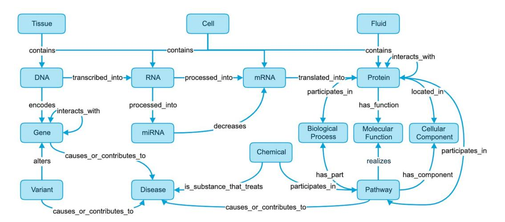
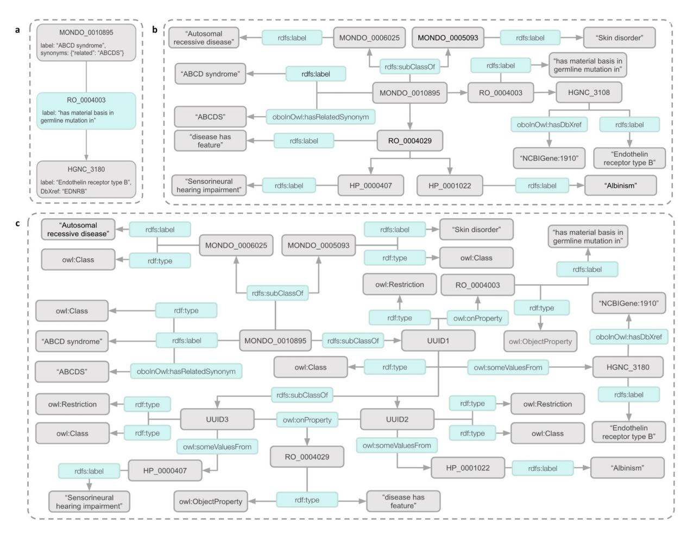
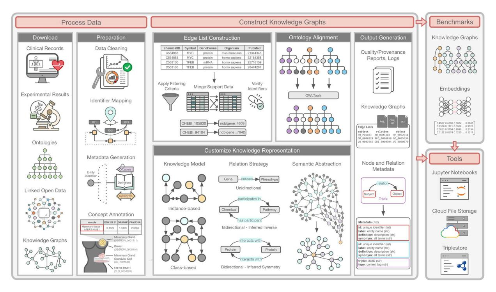
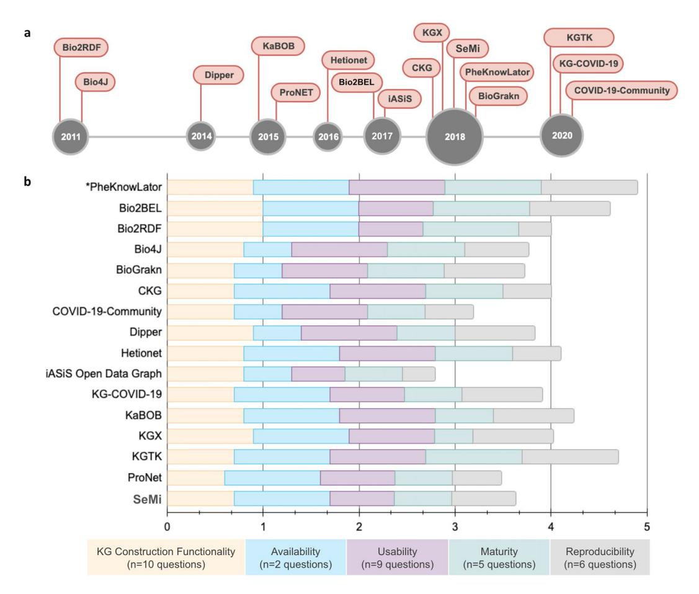
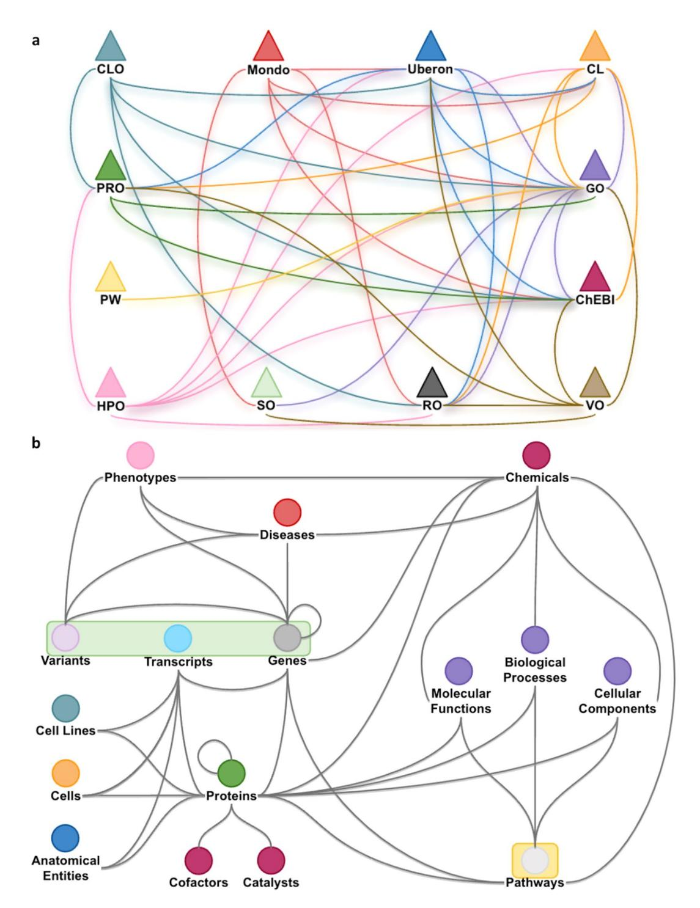
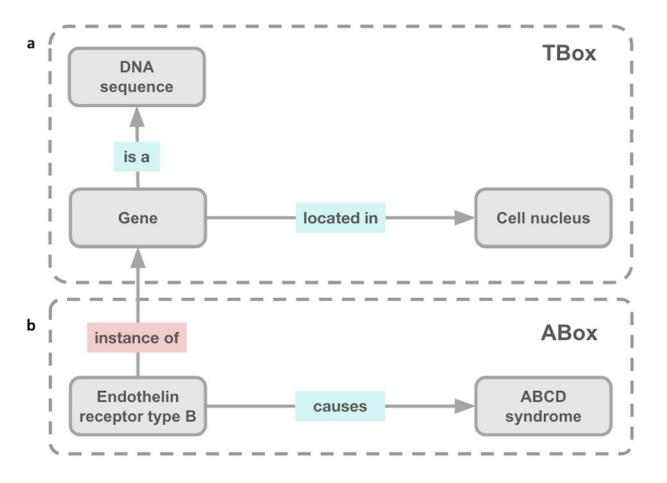
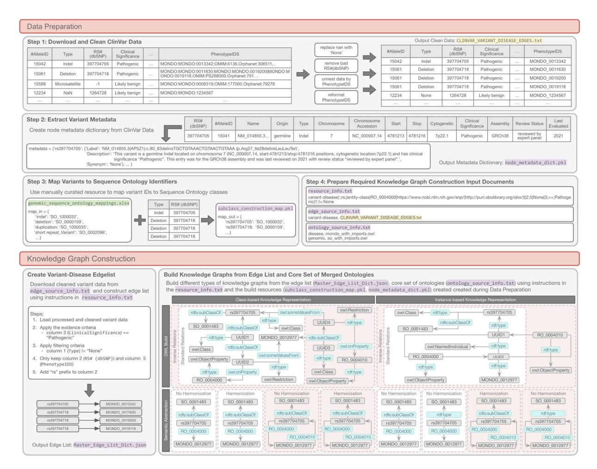

**OPEN**

**Article**# An open source knowledge graph ecosystem for the life sciences
**Tifany J. Callahan 1,2** ✉**, Ignacio J. Tripodi3,Adrianne L. Stefanski1, Luca Cappelletti4, Sanya B. Taneja 5, Jordan M. Wyrwa6, Elena Casiraghi [4](http://orcid.org/0000-0003-2024-7572),7, Nicolas A. Matentzoglu8, Justin Reese7, Jonathan C. Silverstein 9,Charles Tapley Hoyt [1](http://orcid.org/0000-0003-4423-4370)0, Richard D. Boyce9, Scott A. Malec11, Deepak R. Unni 12, Marcin P. Joachimiak7, Peter N. Robinson 13, Christopher J. Mungall7, Emanuele Cavalleri 4,Tommaso Fontana4,Giorgio Valentini [4](http://orcid.org/0000-0002-5694-3919),14, Marco Mesiti [4](http://orcid.org/0000-0001-5701-0080), Lucas A. Gillenwater1,15, Brook Santangelo1,15, Nicole A. Vasilevsk[y](http://orcid.org/0000-0001-5208-3432) 16, Robert Hoehnd[orf](http://orcid.org/0000-0003-4786-6875) 17,Tellen D. Bennett15,18, Patrick B. Ryan19,George Hripcsak2, Michael G. Kahn 15, Michael Bada20,William A. Baumgartner Jr20**✉**& Lawrence E. Hunter1,15**✉
**Translational research requires data at multiple scales of biological organization.Advancements in sequencing and multi-omics technologies have increased the availability ofthese data, but researchers face signifcantintegration challenges. Knowledge graphs (KGs) are used to model complex phenomena, and methods existto constructthem automatically. However,tackling complex biomedical integration problems requires fexibility in the way knowledge is modeled. Moreover, existing KG construction methods provide robusttooling atthe cost of fxed or limited choices among knowledge representation models. PheKnowLator (Phenotype KnowledgeTranslator) is a semantic ecosystem for automating the FAIR (Findable,Accessible, Interoperable, and Reusable) construction of ontologically grounded KGs with fully customizable knowledge representation.The ecosystem includes KG construction resources (e.g., data preparationAPIs), analysis tools (e.g., SPARQL endpointresources and abstraction algorithms), and benchmarks (e.g., prebuilt KGs).We evaluated the ecosystem by systematically comparing itto existing open-source KG construction methods and by analyzing its computational performance when used to construct 12 diferentlarge-scale KGs. With fexible knowledge representation, PheKnowLator enables fully customizable KGs without compromising performance or usability.**

1 Computational Bioscience Program, University of Colorado Anschutz Medical Campus, Aurora, CO, 80045, USA. 2Department of Biomedical Informatics, Columbia University Irving Medical Center, New York, NY, 10032, USA. 3 Computer Science Department, Interdisciplinary Quantitative Biology, University of Colorado Boulder, Boulder, CO, 80301, USA. 4 AnacletoLab, Dipartimento di Informatica, Universit`a degli Studi di Milano, Via Celoria 18, 20133, Milan, Italy. 5Intelligent Systems Program, University of Pittsburgh, Pittsburgh, PA, 15260, USA. 6Department of Physical Medicine and Rehabilitation, School of Medicine, University of Colorado Anschutz Medical Campus, Aurora, CO, 80045, USA. 7 Division of Environmental Genomics and Systems Biology, Lawrence Berkeley National Laboratory, Berkeley, CA, 94720, USA. 8Semanticly, Athens, Greece. 9Department of Biomedical Informatics, University of Pittsburgh School of Medicine, Pittsburgh, PA, 15206, USA. 10Laboratory of Systems Pharmacology, Harvard Medical School, Boston, MA, 02115, USA. 11Division of Translational Informatics, University of New Mexico School of Medicine, Albuquerque, NM, 87131, USA. 12SIB Swiss Institute of Bioinformatics, Basel, Switzerland. 13Berlin Institute of Health at Charité-Universitatsmedizin, 10117, Berlin, Germany. 14ELLIS, European Laboratory for Learning and Intelligent Systems, Milan Unit, Italy. 15Department of Biomedical Informatics, University of Colorado School of Medicine, Aurora, CO, 80045, USA. 16Data Collaboration Center, Critical Path Institute, 1840 E River Rd. Suite 100, Tucson, AZ, 85718, USA. 17Computer, Electrical and Mathematical Sciences & Engineering Division, Computational Bioscience Research Center, King Abdullah University of Science and Technology, Thuwal, 23955- 6900, Kingdom of Saudi Arabia. 18Department of Pediatrics, University of Colorado School of Medicine, Aurora, CO, 80045, USA. 19Janssen Research and Development, Raritan, NJ, 08869, USA. 20Division of General Internal Medicine, University of Colorado School of Medicine, Aurora, CO, 80045, USA. ✉e-mail: [tifany.callahan@cuanschutz.edu](mailto:tiffany.callahan@cuanschutz.edu); [william.baumgartner@cuanschutz.edu](mailto:william.baumgartner@cuanschutz.edu); [prof.larry.hunter@gmail.com](mailto:prof.larry.hunter@gmail.com)

<!-- Image Description: This image is a directed graph illustrating relationships between biological entities. Rectangles represent concepts (e.g., DNA, Protein, Disease), and arrows depict relationships with descriptive labels (e.g., "transcribed_into," "causes_or_contributes_to"). The graph shows how DNA encodes genes, which can be altered by variants, leading to disease. The central flow details transcription, translation, and the roles of mRNA and miRNA in protein production. Connections to biological processes, molecular functions, cellular components, and pathways are also shown. The graph visually represents a complex biological knowledge base. -->

**Fig. 1** A Knowledge Representation of the Levels of Biological Organization Underlying Human Disease. Tis knowledge graph provides a representation of our currently accepted knowledge of the Central Dogma expanded to include pathways, variants, pharmaceutical treatments, and diseases[10](#page-18-7). At a high level this knowledge graph represents anatomical entities such as tissues, cells, and bodily fuids containing genomic entities such as DNA, RNA, mRNA, and proteins. DNA encodes genes that are processed into mRNA and translated into proteins, which can interact with each other. Genes can also be altered by variants and may cause disease. Finally, proteins also have molecular functions and participate in pathways and biological processes.

## Introduction

Te worldwide growth of biomedical data is exponential, with the volume of molecular data alone expected to surpass more than four exabytes by 2025[1](#page-18-0) . Translational science requires integrating data and knowledge at multiple scales of biological organization. Rapid advancements in sequencing and multi-omics technologies have made tremendous amounts of diverse data available for secondary us[e2](#page-18-1)[–5](#page-18-2) . Multimodal data like these capture diferent views and, when properly combined, help characterize complex system[s6](#page-18-3) . Unfortunately, these data are highly distributed and heterogeneous, can be difcult to access due to licensing restrictions, lack interoperability, and ofen have inconsistent underlying models or representations, which limit most researchers from fully utilizing them[7,](#page-18-4)[8](#page-18-5) .

Knowledge graphs (KGs) have frequently been used to systematically model and interrogate the biology underlying complicated systems, organisms, and disease[s9](#page-18-6) . For example, Fig. [1](#page-1-0) provides a high-level overview of the main biomedical concepts needed to model our currently accepted knowledge of the Central Dogm[a10](#page-18-7) and has been expanded to include pathways, variants, pharmaceutical treatments, and diseases. In the life sciences, KGs are usually constructed from a wide range of data sources such as Linked Open Data [\(http://www.w3.org/](http://www.w3.org/DesignIssues/LinkedData.html) [DesignIssues/LinkedData.html](http://www.w3.org/DesignIssues/LinkedData.html)), ontologies, the scientifc literature, data derived from electronic health records, and multi-omics experiments[8](#page-18-5),[11](#page-18-8). In the biomedical context, nodes usually represent diferent kinds of biological entities such as genes, proteins or diseases, and edges (or triples) are used to specify diferent types of relationships that can exist between a pair of nodes (e.g., "interaction", "substance that treats"). Multiple defnitions of KGs have been proposed in the literature, all sharing the assumption that KGs are more than simple large-scale graphs[12–](#page-18-9)[14](#page-18-10). Existing defnitions are best summarized by Ehrlinger's and Wöb's[12](#page-18-9) defnition: "A knowledge graph acquires and integrates information into an ontology and applies a reasoner to derive new knowledge"[12](#page-18-9). We provide an alternative defnition and consider a KG to be a graph-based data structure representing a variety of heterogeneous entities with multiple types of relationships between them that serves as an abstract framework capable of inferring new knowledge (as well as revealing and resolving discrepancies or contradictions) to address a variety of applications and use cases.

KG construction is not a simple process, requiring signifcant data preprocessing or wrangling before edge lists can be assembled. Fortunately, several methods have been developed to tackle the primary challenges faced when constructing a KG, including: the integration or harmonization of disparate resources (e.g., SPOKE[15,](#page-18-11) RTX-KG[216,](#page-18-12) Petagrap[h17](#page-18-13), Bio2RDF[18](#page-18-14), and Hetionet[19\)](#page-18-15), processing and formatting of structured data and KGs (e.g., Dipper [\[https://github.com/monarch-initiative/dipper\]](https://github.com/monarch-initiative/dipper) and the Knowledge Graph Exchange [KGX; [https://github.com/biolink/kgx\]](https://github.com/biolink/kgx)), enhancement or extraction of relationships (e.g., Biomedical Knowledge Discovery Engine [BioKDE[\]20](#page-18-16) and KG-COVID-1[921\)](#page-18-17) and evidence (e.g., PrimeKG[22](#page-18-18)) from the literature, and the exchange or sharing of constructed KGs (e.g., Network Data Exchange [NDEx][23](#page-18-19) and KGX). Recently, several frameworks such as KG-HU[B24](#page-18-20), the Clinical KG (CKG)[25,](#page-18-21) RTX-KG[216](#page-18-12), BioCyphe[r26](#page-18-22), and the Knowledge Base Of Biomedicine (KaBOB)[7](#page-18-4) which provide all of the aforementioned functionalities, have been developed. While methods have been developed for each of the processes or steps required to construct KGs, robust tools and resources to evaluate constructed KGs are lackin[g8](#page-18-5) . Traditionally, the evaluation of constructed KGs has been task- or domain-specifc and largely limited to case studie[s15](#page-18-11)[,16](#page-18-12)[,19](#page-18-15),[21](#page-18-17),[22](#page-18-18),[25](#page-18-21),[26.](#page-18-22) Ideally, constructed KGs would be evaluated in the same manner as other network science (e.g., community detection and link prediction algorithms) and KG or node embedding methods using benchmarks such as Zachary's Karate Club graph[27](#page-18-23), DBPedia (<https://www.dbpedia.org/resources/knowledge-graphs>), and OpenBioLink[28](#page-18-24). KG benchmarks could be used to

<!-- Image Description: The image displays three diagrams illustrating the relationships between concepts using RDF and OWL ontologies. Each diagram depicts a knowledge graph, showing nodes representing terms like "Autosomal recessive disease," "ABCD syndrome," and "Albinism," linked by edges representing relationships such as "rdfs:subClassOf," "has material basis in," and "disease has feature." The diagrams visually represent the structured knowledge and relationships within the ontology for a specific disease and its associated characteristics. The purpose is to showcase the ontology's structure and how it represents complex relationships within the described domain. -->

**Fig. 2** Types of Knowledge Graphs used in the Life Sciences. Tis fgure provides examples of three types of knowledge graphs that are typically used in the Life Sciences. All knowledge graphs are modeling the Mondo concept ABCD syndrome (*MONDO:0010895*). (**a**) illustrates a simple graph-based representation where two nodes are connected by an edge and nodes and edges are assigned attributes in the form of key-value pairs. (**b**) illustrates a hybrid or property graph-based representation where edges are represented as sets of three nodes (each composed of a subject, predicate, and object) called triples, ofen based on the RDF/RDFS standards. (**c**) illustrates a complex or OWL-graph-based representation where edges are represented as triples and these representations are augmented with additional OWL expressivities such as domain/range or cardinality restrictions. Acronyms: HP (Human Phenotype Ontology); MONDO (Mondo Disease Ontology); OWL (Web Ontology Language); RDF (Resource Description Framework); RDFS (Resource Description Framework Syntax); RO (Relation Ontology).

assess the computational performance of KG construction methods as well as to evaluate the implications of different knowledge representations on specifc tasks. To the best of our knowledge, no existing benchmarks exist to systematically evaluate knowledge representation.

Tackling complex problems within the life sciences requires fexible knowledge representations. An important limitation of existing KG construction methods is fxed or limited fexibility in the way that knowledge is modeled. Within the biomedical domain, knowledge is typically modeled in one of three ways (Fig. [2](#page-2-0)), though the nomenclature used to describe these diferent approaches difers widely in the literature. For simplicity's sake, we will refer to the three diferent approaches as simple, hybrid, and complex. Te frst approach results in a simple graph (Fig. [2a](#page-2-0)). Simple graphs (Fig. [2a](#page-2-0)) are the most common type of network used in the literature. Examples of simple graphs include Zachary's Karate Club grap[h27](#page-18-23), Hetionet[19,](#page-18-15) and SPOK[E15](#page-18-11). In these graphs, entities are represented as nodes, and edges are used to model relationships between them. Tese graphs usually lack formal semantics for the edges and nodes. Edges are ofen semantically overloaded, ignoring the distinction between data (e.g., a protein participating in a process) and metadata (e.g., the source of information about the protein's participation in that process). Simple graphs are usually straightforward to construct and can be stored as key-value pairs, resulting in small fle sizes and using modest amounts of memory. Disadvantages of simple graphs include ad hoc semantics, which decreases interoperability, and a lack of clear specifcation, making machine inference difcult. Te second approach results in a hybrid or property graph (Fig. [2b\)](#page-2-0). Example hybrid graphs include KG-COVID-19[21](#page-18-17), DisGeNE[T29,](#page-18-25) OpenBioLink[28,](#page-18-24) Petagrap[h17](#page-18-13), the Monarch KG[30](#page-18-26), and Bio2RDF[18.](#page-18-14) Hybrid graphs aim to model entities and their relations using a mix of standard network representations and formal semantics, usually the Resource Description Framework (RDF;<https://www.w3.org/RDF>) and RDF

<!-- Image Description: This flowchart depicts a knowledge graph construction pipeline. It shows data processing stages (download, preparation, identifier mapping, metadata generation, concept annotation), knowledge graph construction (edge list creation, ontology alignment, customized representation), output generation (knowledge graphs, reports), and benchmark creation (knowledge graphs, embeddings). Different graph types illustrate instance-based and class-based knowledge representation strategies and the resulting semantic abstraction. Tools used, including Jupyter Notebooks and Triplestore, are also included. -->

**Fig. 3**Te PheKnowLator Ecosystem. Tis fgure provides an overview of the PheKnowLator ecosyste[m106.](#page-20-0) Te ecosystem consists of three components as indicated by the gray boxes: (1)**Knowledge Graph Construction Resources**, which consist of resources to download and process data and an algorithm to customize the construction of large-scale heterogeneous biomedical knowledge graphs; (2) **Knowledge Graph Benchmarks**, which consist of prebuilt KGs that can be used to systematically assess the efects of diferent knowledge representations on downstream analyses, workfows, and learning algorithms; and (3) **Knowledge Graph Tools**to use knowledge graphs, cloud-based data storage, APIs, and triplestores. Acronyms: NT (N-Triples fle format); OWL (Web Ontology Language); PKL (Python pickle fle format); SPARQL (SPARQL Protocol and RDF Query Language).

Schema (RDFS; [https://www.w3.org/TR/rdf11-mt\)](https://www.w3.org/TR/rdf11-mt). Compared to simple graphs, standards-based hybrid graphs facilitate integration with other resource[s31](#page-18-27) and are more amenable to automated inference. Tey also provide faceted querying as nodes and edges are typed. One cost of hybrid graphs is that they require substantially more storage space than simple graphs. Te third approach results in a complex graph, such as KaBOB[7](#page-18-4) , ofen built on the Web Ontology Language (OWL; [https://www.w3.org/TR/owl-features\)](https://www.w3.org/TR/owl-features) (Fig. [2c\)](#page-2-0). Complex graphs are more expressive, facilitating the generation of new knowledge via deductive inference[32.](#page-18-28) By enforcing explicit semantics, OWL provides advantages over RDF/RDFS in the integration of large biomedical data[33.](#page-18-29) Complex graphs are fully machine-readable, highly expressive, and, because they are built on Description Logic[s32](#page-18-28), can leverage reasoners to verify their logical consistency and do deductive inference. Unlike simple graphs, both hybrid and complex graphs can distinguish between data and metadata as demonstrated in Fig. [2](#page-2-0). Unless defning custom relations, hybrid graphs do this by primarily using RDFS and resources like the OBO Format metamodel ([https://www.bioontology.org/wiki/OboInOwl:Main\\_Page\)](https://www.bioontology.org/wiki/OboInOwl:Main_Page), whereas complex graphs formally defne these types and their attributes using RDF and OWL. Unfortunately, complex graphs are very large, can be difcult for humans to understand, and have been shown to perform poorly on some inductive inference tasks[34](#page-18-30). To date, none of the existing KG construction methods enable the construction of multiple or alternative versions of the same KG utilizing diferent underlying knowledge representations, making comparisons, and benchmarking difcult.

To address the lack of relevant benchmarks and flexibility in knowledge representation, we developed PheKnowLator (Phenotype Knowledge TransLator, referred to as "PKT" throughout the remainder of this manuscript), a semantic ecosystem for automating the FAIR (Findable, Accessible, Interoperable, and Reusable)[35](#page-19-0) construction of ontologically grounded KGs with fully customizable knowledge representation. Te ecosystem consists of three components (Fig. [3\)](#page-3-0): (1)**KG Construction Resources**, a set of tools to download and process heterogeneous data and algorithms to construct custom KGs; (2) **KG Benchmarks**, a collection of prebuilt KGs that can be used to systematically assess the efects of diferent knowledge representations on downstream analyses, workfows, and learning algorithms; and (3) **KG Tools**to analyze KGs, including Jupyter Notebook-based tutorials, archive-based data storage, application programming interfaces (APIs), and triplestores. We evaluate the PheKnowLator ecosystem by systematically comparing its components with existing open-source KG construction sofware using a survey developed to assess the functionality, availability, usability, maturity, and reproducibility of KG construction sofware. We also assess the ecosystem's computational performance when constructing 12 diferent types of benchmark KGs designed to provide alternative representations for modeling the molecular mechanisms underlying human disease.

| Method                                | GitHub Repository                                             |
|---------------------------------------|---------------------------------------------------------------|
| Bio2BEL                               | https://github.com/bio2bel/                                   |
| Bio2RDF                               | https://github.com/bio2rdf                                    |
| Bio4J                                 | https://github.com/bio4j/bio4j                                |
| BioGrakn                              | https://github.com/graknlabs/biograkn                         |
| Clinical Knowledge Graph (CKG)        | https://github.com/MannLabs/CKG                               |
| COVID-19-Community                    | https://github.com/covid-19-net/covid-19-community            |
| Dipper                                | https://github.com/monarch-initiative/dipper                  |
| Hetionet                              | https://github.com/hetio/hetionet                             |
| iASiS Open Data Graph                 | https://github.com/tasosnent/Biomedical-Knowledge-Integration |
| KG-COVID-19                           | https://github.com/Knowledge-Graph-Hub/kg-covid-19            |
| Knowledge Base Of Biomedicine (KaBOB) | https://github.com/UCDenver-ccp/kabob/tree/bg-integration     |
| Knowledge Graph Exchange (KGX)        | https://github.com/NCATS-Tangerine/kgx                        |
| Knowledge Graph Toolkit (KGTK)        | https://github.com/usc-isi-i2/kgtk/                           |
| ProNet                                | https://github.com/cran/ProNet                                |
| SEmantic Modeling machIne (SeMi)      | https://github.com/giuseppefutia/semi                         |
**Table 1.**Open-Source Knowledge Graph Construction Methods.

### Results

PheKnowLator is open-source and available through GitHub ([https://github.com/callahantif/PheKnowLator](https://github.com/callahantiff/PheKnowLator)) and PyPI ([https://pypi.org/project/pkt-kg\)](https://pypi.org/project/pkt-kg). Important manuscript defnitions are provided in Supplementary Table 1, acronyms are provided in Supplementary Table 2, and PheKnowLator ecosystem resources are listed in Supplementary Tables 3 and 4.
**Evaluation.**Te PheKnowLator ecosystem was evaluated in two ways. First, publicly available sofware to construct biomedical KGs was identifed and systematically compared using a survey developed to assess each method's functionality, availability, usability, maturity, and reproducibility. Second, the computational performance of the ecosystem was assessed when used to construct 12 diferent types of benchmark KGs designed to provide alternative representations for modeling the molecular mechanisms underlying human disease. Te resources used for each task are listed in Supplementary Table 4.
*Systematic comparison of open-source KG construction sofware.*Open-source biomedical KG construction methods available on GitHub were identifed and compared to the PheKnowLator ecosystem. A survey was used to compare the methods for the task of constructing biomedical KGs and consisted of 44 questions designed to assess fve criteria: KG construction functionality, maturity, availability, usability, and reproducibility (Supplementary Table 5). Of the 1,905 repositories identifed on GitHub, 231 contained course, tutorial, or presentation material (i.e., manuscript reviews and slide decks), 278 were duplicate or cloned repositories, 79 were KG applications or services, 60 were websites or resource lists, and 1,253 were determined to be irrelevant (i.e., mislabeled, not biomedical, or not a KG construction method). Tis initial list was supplemented with 11 methods identifed through a review articl[e8](#page-18-5) or were recommended by a collaborator. Te fnal list included 15 methods (see Table [1](#page-4-0) with additional details provided in Supplementary Table 6): Bio2Bel (ttps://github.com/bio2bel), Bio2RDF [\(https://](https://github.com/bio2rdf) [github.com/bio2rdf\)](https://github.com/bio2rdf), Bio4J ([https://github.com/bio4j/bio4j\)](https://github.com/bio4j/bio4j), BioGrakn [\(https://github.com/vaticle/biograkn](https://github.com/vaticle/biograkn)), the Clinical Knowledge Graph ([https://github.com/MannLabs/CKG\)](https://github.com/MannLabs/CKG), COVID-19-Community ([https://github.](https://github.com/covid-19-net/covid-19-community) [com/covid-19-net/covid-19-community\)](https://github.com/covid-19-net/covid-19-community), Dipper, Hetionet ([https://github.com/hetio/hetionet\)](https://github.com/hetio/hetionet), IASiS Open Data Graph (<https://github.com/tasosnent/Biomedical-Knowledge-Integration>), KG-COVID-19 [\(https://github.com/](https://github.com/Knowledge-Graph-Hub/kg-covid-19) [Knowledge-Graph-Hub/kg-covid-19\)](https://github.com/Knowledge-Graph-Hub/kg-covid-19), KaBOB [\(https://github.com/UCDenver-ccp/kabob](https://github.com/UCDenver-ccp/kabob)), KGX, the Knowledge Graph Toolkit [\(https://github.com/usc-isi-i2/kgtk\)](https://github.com/usc-isi-i2/kgtk), ProNet [\(https://github.com/cran/ProNet\)](https://github.com/cran/ProNet), and the SEmantic Modeling machIne (<https://github.com/giuseppefutia/semi>). Te methods are visualized by date of GitHub publication in Fig. [4a.](#page-5-0)

Te average coverage score of the fve assessment criteria was 3.93 (min=2.79, max=4.90). Te coverage of each assessment criterion by method is shown in Fig. [4b](#page-5-0). Examining the results by assessment criteria revealed interesting patterns.**KG Construction Functionality**(Supplementary Table 7): Te majority of the methods (81.3%; n=13) included functionality to download data, while 56.3% (n=9) were able to process experimental data and 37.5% (n=6) were able to process clinical data.**Availability**(Supplementary Table 8): Tree-fourths of the methods (75%; n=12) were written in Python and 43.8% (n=7) were written in a Java-based language. All the methods but one were licensed with GPL, MIT, or BSD-3.**Usability**(Supplementary Table 9): Sample data were provided by 93.8% (n=15) of the methods, and 75% (n=12) provided tutorials via R Markdown or Jupyter Notebook.**Maturity**(Supplementary Table 10): On average, the number of commits per year ranged from 17 to 1,000. Over half of the methods (68.8%, n=11) had been published, and 43.8% (n=7) provided collaboration guidelines.**Reproducibility** (Supplementary Table 11): Tools to enable reproducible workfows and aid in installing the method were provided by 75% (n=12) of the methods. Most ofen, these tools included Docker containers (n=6) and Jupyter or R Notebooks (n=8).

While the PheKnowLator ecosystem was comparable to the other methods on the assessed criteria, we identifed three important diferentiating factors relative to the other methods: (i) tools to assess the quality of

<!-- Image Description: The image presents a comparative analysis of knowledge graph (KG) construction projects. (a) is a timeline showing the launch years of various KGs. (b) is a horizontal bar chart evaluating these KGs across four dimensions: KG construction functionality, availability, usability, and maturity, and reproducibility using a 5-point scale. Each bar is segmented to reflect the score in each dimension. The chart facilitates a visual comparison of the strengths and weaknesses of different KGs. -->

**Fig. 4** Open-Source Knowledge Graph Construction Methods - Survey Results. Tis fgure presents the opensource knowledge graph construction methods identifed on GitHub and the results of the survey assessment. (**a**) Te fnal set of 16 knowledge graph construction methods surveyed according to the year they were frst published on GitHub. (**b**) A chart of the methods evaluated in terms of the diferent survey categories. Te survey was scored out of a total score of fve points, which was derived as the sum of the ratios of coverage, each out of one point, for the fve categories: KG Construction Functionality (10 questions); Availability (two questions); Usability (nine questions); Maturity (fve questions); and Reproducibility (six questions). Acronyms: iASiS, Automated Semantic Integration of Disease-Specifc Knowledge; KaBOB, Knowledge Base Of Biomedicine; KG, (Knowledge Graph); KGX (Knowledge Graph Exchange); KGTK (Knowledge Graph Toolkit); SeMi (SEmantic Modeling machine).

underlying ontologies; (ii) logging and documentation of metadata including the KG construction process, the data downloaded, the processing steps applied to each data source, and the node and edge types each source contributes to; and (iii) customizable knowledge representation making it possible to take advantage of advanced Semantic Web tools like description logic reasoners (which we have successfully applied in the construction of KGs by the PheKnowLator ecosystem). Te ability to generate multiple versions of the same KGs enables the ecosystem to provide benchmark KGs, which can be used to evaluate modeling decisions and to study the impact of knowledge representation on downstream learning. PheKnowLator included all the functionalities in the fve assessment criteria except for tools to process clinical data, which only 37.5% (n=6) of the methods provided.

*Human disease knowledge graph benchmark comparison and construction performance.*Te PheKnowLator ecosystem enables users to fully customize KG construction by providing the following parameters (described in detail in the*Construct Knowledge Graphs*section of**Component 1: Knowledge Graph Construction Resources**in the Methods): knowledge model (i.e., complex graphs using class- or instance-based knowledge models), relation strategy (i.e., standard directed relations or inverse bidirectional relations), and semantic abstraction (i.e., transformation of complex graphs into hybrid graphs) with or without knowledge model harmonization (i.e., ensuring a hybrid KG is consistent with the class- or instance-based complex graph it was abstracted from). Tese parameters enable 12 diferent versions or benchmarks of each KG to be constructed for a given build. Descriptive statistics and computational performance of the PheKnowLator ecosystem was assessed when used to build a large-scale heterogeneous KG designed to represent the molecular mechanisms underlying human disease and its 12 associated KG types or benchmarks (referred throughout the remainder of manuscript as the PKT [PheKnowLator] Human Disease benchmark KGs).

Benchmark comparison. Under the advice of domain experts (ALS, IJT, LH, and CJM), the PKT Human Disease benchmark KGs were constructed from 12 OBO Foundry ontologies, 31 Linked Open Data sets, and results from two large-scale molecular experiments (all build data are listed and described in Supplementary Table 12). Te knowledge representation used for the build is shown in Supplementary Figure 1. A simplifed overview of this knowledge representation is provided in Fig. [5](#page-7-0), which highlights the connectivity between the 12 OBO Foundry ontologies (Fig. [5a](#page-7-0)) and their relationship to the primary node types. Te 18 primary node types are listed in Table [2](#page-8-0) (visualized in Fig. [5b\)](#page-7-0), and 33 primary edge types are shown in Table [3](#page-9-0). Te primary node and edge types do not include all possible node and edge types made available in the core set of 12 OBO Foundry ontologies, only those that are explicitly modeled in our knowledge representation.

Descriptive statistics for the OBO Foundry ontologies, pre- and post-data quality assessment, are shown in Table [4](#page-9-1) (and detailed statistics are provided in Supplementary Table 13). Please note that when reporting results, we will refer to edges as triples, but they both refer to node-relation-node statements. Te size of the ontologies varied widely, with the Chemical Entities of Biological Interest (ChEBI)[36](#page-19-1) containing the largest number of triples (n=5,190,458) and the Protein Ontology (PRO; modifed to exclude all non-human proteins[\)37](#page-19-2) containing the most classes (n=148,243). Te Relation Ontology (RO[\)38](#page-19-3) contained the fewest triples (n=7,873), and the Sequence Ontology (SO[\)39](#page-19-4) contained the fewest classes (n=2,569). Te merged set of cleaned OBO Foundry ontologies (i.e., core OBO Foundry ontologies; for additional detail on the ontology cleaning process, please see the Component 1: Knowledge Graph Construction Resources section of the Methods) contained 545,259 classes and 13,748,009 triples. Statistics for triples added to the core OBO Foundry ontologies are listed by edge type in Table [5.](#page-10-0) Te largest edge sets were protein-protein (n=618,069 triples), transcript-anatomy (n=439,917 triples), and disease-phenotype (n=408,702 triples). Te smallest edge sets were biological process-pathway (n=665 triples), gene-gene (n=1,668 triples), and protein-cofactor (n=1,961 triples).

Descriptive statistics for the 12 PKT Human Disease benchmark KGs are shown in Table [6](#page-11-0). Te PKT Human Disease benchmark KGs constructed using the class-based knowledge model with inverse relations and without semantic abstraction were the largest (13,803,521 nodes; 41,116,791 triples). All the PKT Human Disease benchmark KGs built without semantic abstraction, regardless of the knowledge model or relation strategy, contained two connected components and three self-loops. All the PKT Human Disease benchmark KGs were highly sparse, with the average density ranging from 2.16×10−7 to 3.50×10−7 and 3.03×10−7 to 3.40×10−7 for benchmark KGs constructed using class-based and instance-based knowledge models, respectively. When applying semantic abstraction, the PKT Human Disease benchmark KGs constructed using instance-based knowledge models (743,829 nodes; 4,967,391 to 9,624,232 triples) were on average larger than those constructed using the class-based knowledge models (743,829 nodes; 4,967,427 to 7,629,599 triples). All PKT Human Disease benchmark KGs constructed using the instance-based knowledge model with semantic abstraction, regardless of the relation strategy employed, were larger, had a higher average degree, and contained more self-loops when knowledge model harmonization was applied. Te average density (6.68 standard relations; 10.26 inverse relations) and number of self-loops (445 standard and inverse relations) did not difer for the PKT Human Disease benchmark KGs constructed using the class-based knowledge model with semantic abstraction and when applying knowledge model harmonization. Te PKT Human Disease benchmark KGs constructed with semantic abstraction, with and without knowledge model harmonization, are visualized in Fig. [6.](#page-12-0)

Construction performance. Performance metrics by KG construction step for each of the 12 PKT Human Disease benchmark KGs are shown in Supplementary Figure 2. On average,**Step 1** (*Data Download*) took 2.30minutes (1.80–3.72minutes) and used an average of 7.93 GB of memory (7.86–7.99 GB). **Step 2** (*Edge List Creation*) took an average of 4.82minutes to complete (4.80–4.87minutes) and used an average of 39.55 GB of memory (38.93–40.43 GB). **Step 3** (*Graph Construction*) took an average of 391.56minutes (6.53hours) to complete (265.98–615.92minutes; 4.43–10.27hours) and used an average of 118.69 GB of memory (104.30–147.10 GB). On average, the PKT Human Disease benchmark KGs constructed using class-based knowledge models took roughly the same amount of time and used roughly the same maximum amount of memory as those constructed using instance-based knowledge models. Additionally, regardless of the knowledge model, on average, the PKT Human Disease benchmark KGs built using inverse relations and semantic abstraction took longer to run and required more memory.

### Discussion

In this paper, we have presented PheKnowLator, a semantic ecosystem for automating the FAIR construction of ontologically grounded KGs with customizable knowledge representation. Te ecosystem includes KG construction resources, analysis tools (i.e., SPARQL endpoint resources and cloud-based APIs), and benchmarks (i.e., prebuilt KGs in multiple formats and embeddings). PheKnowLator enables users to build Semantic Web-compliant complex KGs that are amenable to automatic OWL reasoning, conform to contemporary graph standards, and are importable by popular graph toolkits. By providing fexibility in the way KGs are constructed and generating multiple types of KGs, PheKnowLator also enables the use of cutting-edge graph-based learning and sophisticated inference algorithms. We demonstrated PheKnowLator's utility by comparing its features to 15 existing open-source KG construction methods and by analyzing its computational performance when constructing 12 diferent large-scale heterogeneous benchmark KGs. Comparing these methods to PheKnowLator revealed similarities but also highlighted important diferentiating factors lacking in other systems, namely: (i)

<!-- Image Description: The image contains two network diagrams illustrating relationships between biological entities. (a) shows an interconnectedness network of nine ontologies (e.g., CLO, Mondo, Uberon), representing different types of biological data. (b) depicts a more complex network linking various biological levels, including phenotypes, diseases, genes, proteins, chemicals, and pathways, indicating their interrelationships and data integration potential. Both diagrams visually represent the structure of a biological knowledge graph. -->

**Fig. 5** An Overview of the PKT Human Disease Mechanism Knowledge Graph. Tis fgure provides a highlevel overview of the primary node and edge types in the PKT Human Disease Mechanism knowledge graph. (**a**) illustrates the relationships between the core set of Open Biological and Biomedical Ontology (OBO) Foundry ontologies when including their imported ontologies (as of August 2022). (**b**) illustrates the edges or triples that are added to the core set of merged ontologies in (**a**). Shared colors between (**a**) and (**b**) represent a single resource. For example, chemicals, cofactors, and catalysts share the same color (maroon) and are part of ChEBI. Tis is the same for the RO, which is represented in (b) as the black lines between nodes. Te green and yellow rectangles indicate data sources that are not from an OBO Foundry ontology and the specifc ontology used to integrate them with the core set of ontologies in (**a**). For example, variant, transcript, and gene data are connected to the core ontology set via the SO. Acronyms: CL (Cell ontology); CLO (Cell Line Ontology); ChEBI (Chemical Entities of Biological Interest); GO (Gene Ontology); HPO (Human Phenotype Ontology); Mondo (Mondo Disease Ontology); PRO (Protein Ontology); PW (Pathway Ontology); SO (Sequence Ontology); VO (Vaccine Ontology); Uberon (Uber-Anatomy Ontology).

| Node                 | Universal Resource Identifer                                                   |
|----------------------|--------------------------------------------------------------------------------|
| Anatomical Entities  | http://purl.obolibrary.org/obo/UBERON                                          |
| Biological Processes | http://purl.obolibrary.org/obo/GO                                              |
| Catalysts            | http://purl.obolibrary.org/obo/CHEBI                                           |
| Cells                | http://purl.obolibrary.org/obo/CL                                              |
| Cell Lines           | http://purl.obolibrary.org/obo/CLO                                             |
| Cellular Components  | http://purl.obolibrary.org/obo/GO                                              |
| Chemicals            | http://purl.obolibrary.org/obo/CHEBI                                           |
| Cofactors            | http://purl.obolibrary.org/obo/CHEBI                                           |
| Diseases             | http://purl.obolibrary.org/obo/MONDO                                           |
| Genes                | http://www.ncbi.nlm.nih.gov/gene/                                              |
| Molecular Functions  | http://purl.obolibrary.org/obo/GO                                              |
| Pathwaysa            | http://purl.obolibrary.org/obo/PW https://reactome.org/content/detail/R-HSA |
| Phenotypes           | http://purl.obolibrary.org/obo/HP                                              |
| Proteins             | http://purl.obolibrary.org/obo/PR                                              |
| Sequencesb           | http://purl.obolibrary.org/obo/SO                                              |
| Transcripts          | https://uswest.ensembl.org/Homo_sapiens/Transcript/Summary?t=ENST              |
| Vaccinesb            | http://purl.obolibrary.org/obo/VO                                              |
| Variants             | https://www.ncbi.nlm.nih.gov/snp/rs                                            |

**Table 2.**PKT Human Disease Knowledge Graph Primary Node Types. Note: Te node types listed above apply to the PKT Human Disease KG v2.1.0. Te node types listed above do not include all of the classes that exist in each Open Biological and Biomedical Ontology (OBO) Foundry ontology. Te Cell Ontology is included with the extended version of Uberon. a Two URIs are shown for pathways as the OBO Found ontology is the core ontology used to connect Reactome entities to the core set of OBO Foundry ontologies. b OBO node type. Includes all of the classes that are contained in the ontology even though they are not all explicitly listed here. Acronyms: CL (Cell ontology); CLO (Cell Line Ontology); CHEBI (Chemical Entities of Biological Interest); GO (Gene Ontology); HPO (Human Phenotype Ontology); MONDO (Mondo Disease Ontology); PKT (PheKnowlator); PRO (Protein Ontology); PW (Pathway Ontology); SO (Sequence Ontology); VO (Vaccine Ontology); UBERON (Uber-Anatomy Ontology).

tools to assess the quality of ontologies (which identify, repair, and document syntactic and semantic errors); (ii) logging and metadata documentation (which enable users to debug errors quickly and ensures builds can be rigorously reproduced); and (ii) customizable data preprocessing pipelines (which enable users to use ecosystem tools to develop custom pipelines for processing a wide variety of data, leverage complex mappings, and appropriately resolve missing data), knowledge representation (class- or instance-based), and benchmarks (the ability to construct diferent types of KGs from the same data, which enables users to empirically evaluate modeling decisions and fnd the optimal knowledge model or representation for a particular task). Tese diferences highlight PheKnowLator's ability to provide fully customizable KGs without compromising performance or usability.

One of the biggest challenges to developing novel KG construction methods is properly verifying and robustly validating the resulting KGs. Network-science-based algorithms and machine learning methods typically used within the biomedical domain such as link prediction and KG embedding are able to make use of well-established benchmarks like YAGO[40](#page-19-5), DBPedia, and Wikidat[a41](#page-19-6), which are not specifc to the biomedical domain. OpenBioLink[28](#page-18-24) was developed as a benchmark for biomedical KGs but is almost exclusively used for link prediction tasks. While it might not be possible to create a universal benchmark to verify or validate biomedical KG construction methods or biomedical KGs, development of trusted resources that are not task-specifc (e.g., entity prediction or node classifcation) would beneft the community. Te PheKnowLator ecosystem introduces a set of benchmarks to serve this purpose. Tese benchmarks were specifcally designed to enable two types of tasks: (i) the validation of tools and algorithms designed to analyze KGs (e.g., link prediction algorithms and graph representation learning methods); and (ii) the validation and comparison of KGs built using diferent underlying knowledge representations. Te ability to empirically evaluate knowledge modeling decisions is important when designing knowledge-based system[s8](#page-18-5) and will become more important as more performant graph representation learning methods are developed, especially with respect to explainability[42.](#page-19-7)
**PheKnowLator applications and use cases.**Te majority of existing published KGs and KG construction sofware within the biomedical domain rely on case studies as a form of evaluatio[n15](#page-18-11)[,17,](#page-18-13)[19,](#page-18-15)[21,](#page-18-17)[22,](#page-18-18)[26.](#page-18-22) While we did not explicitly include case studies as part of our validation, the PheKnowLator ecosystem has fostered substantial collaborations and led to several publications. PheKnowLator benchmark KGs have been used in applications of toxicogenomic mechanistic inference[43](#page-19-8), to enable the exploration of large-scale biomedical hypergraphs[44,](#page-19-9) and to facilitate deeper sub-phenotyping of pediatric rare disease patients[45.](#page-19-10) Recently, PheKnowLator was used to create a disease-specifc KG that combined ontology-grounded resources with literature-derived computable knowledge from machine readin[g46](#page-19-11). Te resulting KG was then used to identify causal features suitable for addressing confounding bias. PheKnowLator has also been used to generate hypotheses for potential pharmacokinetic natural-product/drug interactions, by facilitating the design and implementation of a KG involving

| Relations                                                                       | Edge Types                                                                                                                                    |
|---------------------------------------------------------------------------------|-----------------------------------------------------------------------------------------------------------------------------------------------|
| participates in (RO_0000056) has participant (RO_0000057)                    | chemical-pathway; gene-pathway; protein-biological process; protein-pathway                                                                   |
| has function (RO_0000085) function of (RO_0000079)                           | pathway-molecular function; protein-molecular function                                                                                        |
| located in (RO_0001025) location of (RO_0001015)                             | protein-anatomy; protein-cella ; protein-cellular component; transcript-anatomy; transcript-cella                                       |
| has component (RO_0002180)b                                                     | pathway-cellular component                                                                                                                    |
| has phenotype (RO_0002200) phenotype of (RO_0002201)                         | disease-phenotype                                                                                                                             |
| has gene product (RO_0002205) gene product of (RO_0002204)                   | gene-protein                                                                                                                                  |
| interacts with (RO_0002434)c                                                    | chemical-gene; chemical-protein                                                                                                               |
| genetically interacts with (RO_0002435)c                                        | gene-gene                                                                                                                                     |
| molecularly interacts with (RO_0002436)c                                        | chemical-biological process; chemical-cellular component; chemical-molecular function; protein-catalyst; protein-cofactor; protein-protein |
| transcribed to (RO_0002511) transcribed from (RO_0002510)                    | gene-transcript                                                                                                                               |
| ribosomally translates to (RO_0002513) ribosomal Translation of (RO_0002512) | transcript-protein                                                                                                                            |
| causally infuences (RO_0002566) causally infuenced by (RO_0002559)           | variant-gene                                                                                                                                  |
| is substance that treats (RO_0002606) is treated by substance (RO_0002302)   | chemical-disease; chemical-phenotype                                                                                                          |
| causes or contributes to condition (RO_0003302)b                                | gene-disease; gene-phenotype; variant-disease; variant-phenotype                                                                              |
| realized in response to (RO_0009501)b                                           | biological process-pathway                                                                                                                    |
**Table 3.**PKT Human Disease Knowledge Graph Primary Edge Types by Relation. Note: Te primary relations and edge types listed above apply to the PKT Human Disease KG v2.1.0. Tese relations are added to the core set of Open Biological and Biomedical Ontology Foundry ontologies. a Te word "cell" above is used to represent cell lines from the Cell Line Ontology and cell types from the Cell Ontology. b Relation Ontology concepts that do not have an inverse. c Relations with symmetrical inverse relations. Acronyms: PKT (PheKnowLator).

|                                          | Before Cleaning |            | Afer Cleaning |            |  |
|------------------------------------------|-----------------|------------|---------------|------------|--|
| Ontology                                 | Classes         | Triples    | Classes       | Triples    |  |
| Cell Line Ontology                       | 111,712         | 1,387,096  | 111,696       | 1,422,153  |  |
| Chemical Entities of Biological Interest | 156,098         | 5,264,571  | 137,592       | 5,190,485  |  |
| Gene Ontology                            | 62,237          | 1,425,434  | 55,807        | 1,343,218  |  |
| Human Phenotype Ontology                 | 38,843          | 884,999    | 38,530        | 885,379    |  |
| Mondo Disease Ontology                   | 55,478          | 2,313,343  | 52,937        | 2,277,425  |  |
| Protein Ontologya                        | 148,243         | 2,079,356  | 148,243       | 2,079,356  |  |
| Pathway Ontology                         | 2,642           | 35,291     | 2,600         | 34,901     |  |
| Relation Ontology                        | 116             | 7,970      | 115           | 7,873      |  |
| Sequence Ontology                        | 2,910           | 44,655     | 2,569         | 41,980     |  |
| Uber-Anatomy Ontologyb                   | 28,738          | 752,291    | 27,170        | 734,768    |  |
| Vaccine Ontology                         | 7,089           | 86,454     | 7,085         | 89,764     |  |
| Core OBO Foundry ontologies (merged)c    | 548,947         | 13,746,883 | 545,259       | 13,748,009 |  |
**Table 4.**Ontology Statistics Pre- and Post-Data Quality Assessment. Note: Te numbers for the ontologies are calculated using the versions of the ontologies that include all imported ontologies referenced by the primary ontology. Tis means that the counts of classes include all OWL classes used for logical defnitions, not only those that are explicitly part of the primary ontology's namespace. a Te Protein Ontology version references the human subset created for the PheKnowLator ecosystem. b Te extended version of the Uber-Anatomy Ontology contains the Cell Ontology. c Consistency was evaluated using the ELK reasoner. Te reasoner was only applied to individual ontologies.

biomedical ontologies, natural-product-ontology extensions, and machine reading from literatur[e47](#page-19-12). Finally, the PheKnowLator ecosystem was recently selected as the primary infrastructure to facilitate the development of a large-scale KG (denoted RNA-KG) dedicated to the study and development of RNA-based drugs by integrating more than 50 public data sources (<https://github.com/AnacletoLAB/RNA-KG>[\)48.](#page-19-13) PheKnowLator is also the foundation for novel KG approaches in microbiome research. Te microbe-relevant KG Microbe-Gene-Metabolite Link (MGMLink) was constructed by augmenting PheKnowLator with information on microbes from the integrated database gutMGene. GutMGene relationships describing observed microbe-metabolite or microbe-gene associations were introduced to a PheKnowLator KG, enabling a search space for mechanistic understanding of microbial infuence on disease at the molecular level (<https://github.com/bsantan/MGMLink>).

| Edge                         | Relation                   | Subjects | Objects | Standard Relations | Inverse Relations |
|------------------------------|----------------------------|----------|---------|--------------------|-------------------|
| chemical-disease             | substance that treats      | 4,289    | 4,494   | 167,681            | 335,362           |
| chemical-genea               | interacts with             | 462      | 11,922  | 16,639             | 33,278            |
| chemical-biological processa | molecularly interacts with | 1,338    | 1,569   | 287,068            | 574,136           |
| chemical-cellular componenta | molecularly interacts with | 1,085    | 226     | 40,992             | 81,984            |
| chemical-molecular functiona | molecularly interacts with | 1,105    | 200     | 25,385             | 50,770            |
| chemical-pathway             | participates in            | 2,104    | 2,213   | 28,685             | 57,370            |
| chemical-phenotype           | substance that treats      | 4,053    | 1,712   | 107,962            | 215,924           |
| chemical-proteina            | interacts with             | 4,178    | 6,379   | 64,991             | 129,982           |
| disease-phenotype            | has phenotype              | 11,620   | 9,714   | 408,702            | 817,404           |
| gene-diseaseb                | causes or contributes to   | 5,031    | 4,420   | 12,717             | –                 |
| gene-genea                   | genetically interacts with | 247      | 263     | 1,668              | 3,336             |
| gene-pathway                 | participates in            | 10,371   | 1,809   | 104,906            | 209,812           |
| gene-phenotypeb              | causes or contributes to   | 6,780    | 1,528   | 23,501             | –                 |
| gene-protein                 | has gene product           | 19,327   | 19,143  | 19,534             | 39,068            |
| gene-transcript              | transcribed to             | 25,529   | 179,870 | 182,736            | 365,472           |
| biological process-pathwayb  | realized in response to    | 471      | 665     | 665                | –                 |
| pathway-cellular componentb  | has component              | 11,134   | 99      | 15,846             | –                 |
| pathway-molecular function   | has function               | 2,412    | 726     | 2,416              | 4,832             |
| protein-anatomy              | located in                 | 10,747   | 68      | 30,682             | 61,364            |
| protein-catalysta            | molecularly interacts with | 3,024    | 3,730   | 23,629             | 47,258            |
| protein-cellc                | located in                 | 10,045   | 125     | 73,530             | 147,060           |
| protein-cofactora            | molecularly interacts with | 1,584    | 44      | 1,961              | 3,922             |
| protein-biological process   | participates in            | 17,527   | 12,246  | 137,812            | 275,624           |
| protein-cellular component   | located in                 | 18,427   | 1,757   | 81,602             | 163,204           |
| protein-molecular function   | has function               | 17,779   | 4,324   | 68,633             | 137,266           |
| protein-pathway              | participates in            | 10,852   | 2,468   | 117,182            | 234,364           |
| protein-proteind             | molecularly interacts with | 14,320   | 14,230  | 618,069            | –                 |
| transcript-anatomy           | located in                 | 29,104   | 102     | 439,917            | 879,834           |
| transcript-cellc             | located in                 | 14,038   | 127     | 64,427             | 128,854           |
| transcript-protein           | ribosomally translates to  | 44,144   | 19,200  | 44,147             | 88,294            |
| variant-diseaseb             | causes or contributes to   | 13,291   | 3,565   | 37,861             | –                 |
| variant-gene                 | causally infuences         | 121,790  | 3,236   | 121,790            | 243,580           |
| variant-phenotypeb           | causes or contributes to   | 1,822    | 371     | 2,470              | –                 |
**Table 5.**PKT Human Disease Knowledge Graph Descriptive Statistics by Primary Edge Type. Please see Table [3](#page-9-0) for Relation Ontology for inverse relations and identifers. a Symmetric relations were computationally inferred. b Te Relation Ontology does not provide an inverse relation. c Te word "cell" above is used to represent cell lines from the Cell Line Ontology and cell types from the Cell Ontology. dTe data source already included symmetrical edges. Acronyms: PKT (PheKnowlator).

In addition to the use of the PheKnowLator KG construction sofware and benchmark KGs, the ecosystem has also contributed to the development of novel tools and resources. Although results are not yet available, PheKnowLator is currently included in the Continuous Evaluation of Relational Learning in Biomedicine ([https://biochallenge.bio2vec.net/\)](https://biochallenge.bio2vec.net/) task. Tis task aims to provide a means for evaluating prediction models as new knowledge becomes available over time. Results from this task will provide insight into the usefulness of the PheKnowLator builds and will be used to identify areas where the ecosystem can be improved. Additionally, subsets of prebuilt PheKnowLator KGs have been used to help develop and evaluate novel, cutting-edge graph embedding AI tools (i.e., GRAP[E49](#page-19-14)), including random-walk-based embedding methods for extremely large-scale heterogeneous graphs using the PheKnowLator KG builds[50.](#page-19-15) In addition to graph representation learning, prebuilt PheKnowLator KGs were used for prototyping a novel method for knowledge-driven mechanistic enrichment of ignorome genes (i.e., diferentially expressed genes which are associated with a disease experimentally but that have no known association to the disease in the literature)[51.](#page-19-16) When applied to preeclampsia, this method was able to identify 53 novel clinically relevant and biologically actionable disease associations. Te National Institutes of Health (NIH) Common Fund Human BioMolecular Atlas Program (HuBMAP[\)52](#page-19-17) needed to assemble a KG based on its own preferred graph schema [\(https://github.](https://github.com/dbmi-pitt/UMLS-Graph) [com/dbmi-pitt/UMLS-Graph](https://github.com/dbmi-pitt/UMLS-Graph)[\)53,](#page-19-18) with one focus being to maximize the leverage of external references among ontologies for translation [\(https://github.com/hubmapconsortium/ontology-api](https://github.com/hubmapconsortium/ontology-api)). Te PheKnowLator ecosystem tool OWL-NET[S34](#page-18-30) is currently being used to ingest other operational ontologies (whether in OWL or not) into HuBMAP and the NIH Common Fund Cellular Senescence Network (SenNet)[54.](#page-19-19) PheKnowLator was also applied to methods in generating pathway diagrams using biomedically relevant KGs[55.](#page-19-20) Tis novel approach was able to recapitulate existing fgures regarding neuroinfammation and Down Syndrome from literature with

| Knowledge Model                     | Relation Strategy  | Semantic Abstraction                  | Edges (triples) | Nodes      | Relations | Self Loops | Average Degree |
|-------------------------------------|--------------------|---------------------------------------|--------------------|------------|-----------|---------------|-------------------|
| a Core OBO Foundry ontologies | N/A                | N/A                                   | 4,044,658          | 1,399,756  | 847       | 3             | 2.89              |
| Class-based                         | Standard Relations | None                                  | 25,143,729         | 8,479,167  | 847       | 3             | 2.97              |
|                                     |                    | Semantic Abstraction Only             | 4,967,427          | 743,829    | 294       | 445           | 6.68              |
|                                     |                    | Semantic Abstraction+Harmonization | 4,967,429          | 743,829    | 293       | 445           | 6.68              |
|                                     | Inverse Relations  | None                                  | 41,116,791         | 13,803,521 | 847       | 3             | 2.98              |
|                                     |                    | Semantic Abstraction Only             | 7,629,597          | 743,829    | 301       | 445           | 10.26             |
|                                     |                    | Semantic Abstraction+Harmonization | 7,629,599          | 743,829    | 300       | 445           | 10.26             |
| Instance-based                      | Standard Relations | None                                  | 21,770,455         | 8,479,167  | 847       | 3             | 2.57              |
|                                     |                    | Semantic Abstraction Only             | 4,967,391          | 743,829    | 294       | 409           | 6.68              |
|                                     |                    | Semantic Abstraction+Harmonization | 7,285,496          | 743,829    | 293       | 649           | 9.79              |
|                                     | Inverse Relations  | None                                  | 24,432,633         | 8,479,167  | 847       | 3             | 2.88              |
|                                     |                    | Semantic Abstraction Only             | 7,629,594          | 743,829    | 301       | 409           | 10.26             |
|                                     |                    | Semantic Abstraction+Harmonization | 9,624,232          | 743,829    | 300       | 650           | 12.94             |
**Table 6.**PheKnowLator Human Disease Knowledge Graph Descriptive Statistics. Note. Edges and triples are synonymous with respect to the results reported in this table. a Relation Strategy and Semantic Abstraction information are not provided as this row of the table reports information on the core set of merged ontologies.

more detailed and semantically consistent molecular interactions using PheKnowLator ([https://github.com/](https://github.com/UCDenver-ccp/Cartoomics) [UCDenver-ccp/Cartoomics](https://github.com/UCDenver-ccp/Cartoomics)).
**Limitations and future work.**Tis current work has several important limitations. First, it is important to point out that the systematic comparison we performed of open-source KG construction methods on GitHub was subjective, included only three researchers actively involved in developing PheKnowLator, and was originally performed in 2020. While the results were updated in 2021 and re-reviewed in 2023, it is possible that new methods might not have been included. Further, only a qualitative comparison was carried out that only considered each method's GitHub and associated publications. Ideally, a fair evaluation would be performed where each method would be downloaded and compared when used to build a KG from the same set of data. Unfortunately, this type of analysis requires signifcant resources and was not within the scope of our analysis. Similarly, given their success within the Semantic Web Domain, future work should formally evaluate our data integration and ontology alignment pipelines to tools like Web Karm[a56](#page-19-21), OpenRefne ([https://openrefne.org/\)](https://openrefine.org/), and mapping languages like R2RML ([https://www.w3.org/TR/r2rml/\)](https://www.w3.org/TR/r2rml/). Second, computational performance metrics were only computed over a single build run due to the number of resources required to build the KGs. While it is not expected that the results for these metrics would signifcantly change, small deviations related to data provider constraints with respect to accessing build data could result in diferent outcomes. Tird, we mention that the PheKnowLator ecosystem includes two types of benchmarks: KGs and embeddings. Currently, embeddings are only available for one build (v1.0.0[57\)](#page-19-22) because the size of the generated KGs were quite small. Subsequent builds have resulted in KGs that are so large that generating embeddings has not been feasible. Fortunately, the recent development of performant embedding tools like GRAPE will enable us to provide embeddings for future build[s49](#page-19-14) Fourth, while the ecosystem includes robust logging to monitor metadata and builds, it does not formally integrate resources like the Bioregistry[58](#page-19-23) and BioLin[k59,](#page-19-24) which are becoming important new KG standards[16](#page-18-12),[24](#page-18-20). Similarly, the PheKnowLator ecosystem relies heavily on OWLTools ([https://github.com/owlcollab/owltools\)](https://github.com/owlcollab/owltools) but newer and more stable tools like ROBOT[60](#page-19-25) should be leveraged because it supports the integration of the OWL API and has improved Jena-based functionality. Fifh, as mentioned above, validating very large KGs, like the ones produced by PheKnowLator, is challenging but important. Additional validation of the PheKnowLator ecosystem, including the construction tools and benchmarks is needed, especially with respect to the diferent KG builds it produces. Finally, while we have worked hard to ensure that the ecosystem tools and infrastructure are user-friendly, additional work is needed to simplify the inputs and make them more machine-readable (e.g., converting input text fles into confgurable yaml fles) and also develop Graphical User Interfaces for supporting the users in all the steps of KG construction.

### Methods
**The PheKnowLator ecosystem.**Te PheKnowLator ecosystem was developed to provide a more comprehensive resource to aid in the construction of KGs within the Life Sciences and consists of three components (Fig. [3](#page-3-0)): (1)**KG Construction Resources**; (2) **Benchmark KGs**; and (3) **KG Tools**. Each component is modular; all features and elements can be replaced or extended as technology evolves or to ft a particular use case. Te PheKnowLator ecosystem resources are listed by component in Supplementary Table 3.

*Component 1: Knowledge graph construction resources.*Tis component is represented by the largest gray box in Fig. [3](#page-3-0) and consists of two elements: (1)**Process Data**. Resources to process a variety of heterogeneous data;

**Fig. 6** Te Impact of Knowledge Model Harmonization on the Semantically Abstracted PKT Human Disease Knowledge Graphs. Te fgure visualizes the impact of knowledge model harmonization on the semantically abstracted PKT Human Disease benchmark Knowledge Graphs. Te top row of fgures (**a**–**d**) were built using the class-based knowledge model varying: (**a**) standard relations without harmonization; (**b**) standard relations with harmonization; (**c**) inverse relations without harmonization; (**d**) inverse relations with harmonization. Te bottom row of fgures (e-h) were built using the instance-based knowledge model varying: (**e**) standard relations without harmonization; (**f**) standard relations with harmonization; (**g**) inverse relations without harmonization; (**h**) inverse relations with harmonization. Nodes are colored by type: anatomical entities (light blue), chemical entities (light purple), diseases (red), genes (purple), genomic features (light green), organisms (yellow), pathways (dark green), phenotypes (magenta), proteins (dark blue), molecular sequences (orange), transcripts (turquoise), and variants (light pink).

and (2) **Construct Knowledge Graphs**. An algorithm that enables the construction of diferent types of heterogeneous KGs. Te resources that support these elements are detailed in the *ecosystem Component 1: Knowledge Graph Construction Resources*section of Supplementary Table 3.

Process data. Tis element consists of two features and was designed to help users download and prepare a wide variety of heterogeneous data sources needed to construct KGs. Te two primary features of this component are: (i) Download and (ii) Preparation.
**Download**. Tis feature has been confgured to download two types of data: (i) ontologies (e.g., HPO[61,](#page-19-26) G[O62,](#page-19-27) and PR[O37](#page-19-2)) and databases (i.e., a data source not represented as an ontology), which includes Linked Open Data (e.g., Comparative Toxicogenomics Database[63,](#page-19-28) UniProt Knowledgebas[e64](#page-19-29), STRIN[G65](#page-19-30)), data from molecular experiments (e.g., the Human Protein Atla[s66,](#page-19-31) the Genotype-Tissue Expression Projec[t67\)](#page-19-32), and existing networks and KGs (e.g., Hetionet[19](#page-18-15), the Monarch K[G68\)](#page-19-33). Ontologies are downloaded using OWLTools (April 06, 2020 release) and databases are downloaded using a custom-built API capable of processing a variety of fle formats (e.g., zip, gzip, tar) from diferent types of servers and APIs.

**Preparation**. A collection of tools were developed to help users perform a variety of tasks when preparing data that will be used to construct a KG. Tis feature provides services to map diferent types of identifers (e.g., aligning gene identifers from the Human Gene Nomenclature Committee [HGNC[\]69](#page-19-34) to Entrez Gene[70](#page-19-35) and Ensemb[l71](#page-19-36)), annotate concepts (e.g., convert strings of tissue names from the Human Protein Atlas[66](#page-19-31) to Uber-Anatomy Ontology [Uberon][72](#page-19-37) concepts), flter data (e.g., identify variant-disease relationships from Clinva[r73](#page-19-38) with a specifc type of experimental validation), and process entity metadata (e.g., obtain PubMed identifers for exposure-outcome relationships from the Comparative Toxicogenomics Database[63](#page-19-28) and extract synonyms and defnitions for OBO Foundry ontology concepts). Te Data Preparation Notebook [\(https://](https://github.com/callahantiff/PheKnowLator/blob/master/notebooks/Data_Preparation.ipynb) [github.com/callahantif/PheKnowLator/blob/master/notebooks/Data\\_Preparation.ipynb](https://github.com/callahantiff/PheKnowLator/blob/master/notebooks/Data_Preparation.ipynb)) illustrates some of these features. Tere are also tools to assess and repair OBO Foundry ontologies, which are known to have a variety of errors[74–](#page-19-39)[76.](#page-19-40) Te Ontology Cleaning Notebook ([https://github.com/callahantif/PheKnowLator/blob/](https://github.com/callahantiff/PheKnowLator/blob/master/notebooks/Ontology_Cleaning.ipynb) [master/notebooks/Ontology\\_Cleaning.ipynb\)](https://github.com/callahantiff/PheKnowLator/blob/master/notebooks/Ontology_Cleaning.ipynb) includes detailed descriptions and examples of the data quality checks[77.](#page-19-41) A report is generated afer assessing the quality of each ontology, which provides statistics before and afer applying each check (ontology\_cleaning\_report.txt).

Construct knowledge graphs. Tis element consists of four features designed to facilitate the construction of large-scale heterogeneous KGs. Together, these features comprise the core functionality of the PheKnowLator KG construction algorithm (referred to as PKT-KG throughout the remainder of the manuscript). Te PKT-KG algorithm requires three input documents: (i) a list of one or more OBO Foundry ontologies; (ii) a list of one or more databases; and (iii) edge list assembly instructions (i.e., instructions for fltering input data sources and references to resources needed to normalize concept identifers). Additional information on each input

<!-- Image Description: This image displays two knowledge graphs in a TBox and an ABox representation. (a) shows a TBox illustrating the relationship "is a" between a DNA sequence and a gene, further specifying that the gene is "located in" the cell nucleus. (b) shows an ABox demonstrating that endothelin receptor type B is an "instance of" a gene and "causes" ABCD syndrome. The image visually represents knowledge representation and reasoning within the context of the paper. -->

**Fig. 7** Description Logics Approaches to Knowledge Modeling. Tis fgure provides a simple example of two approaches for modeling knowledge within a Description Logics architecture. (**a**) Te TBox includes classes (i.e., "Gene", "DNA sequence", and "Cell nucleus"), properties (i.e., "located in" and "is a"), and the assertions between classes (i.e., "Gene is a DNA sequence" and "Gene located in Cell nucleus"). (**b**) Te ABox includes instances of classes (i.e., "Endothelin receptor type B") represented in the TBox and assertions about those instances (i.e., "Endothelin receptor type B, instance of, Gene" and "Endothelin receptor type B, causes, ABCD syndrome"). Please note that this fgure is a simplifcation and was inspired by Fig. [2](#page-2-0) from Tessen *et al*. [82](#page-19-46).

is available on GitHub [\(https://github.com/callahantif/PheKnowLator/wiki/Dependencies\)](https://github.com/callahantiff/PheKnowLator/wiki/Dependencies). Te four primary features of this component are: (i) Edge List Construction, (ii) Ontology Alignment, (iii) Customize Knowledge Representation, and (iv) Output Generation.

**Edge list construction**. Using information in the edge list assembly instructions, the edge list construction procedure merges data, applies fltering and evidence criteria, and removes unneeded attributes. To automate this process, we have developed a universal fle parser (and constantly update it with procedures for parsing new fle types) that currently processes more than 30 distinct fle types. Once the edge lists are constructed, they are serialized in a JSON fle.

**Ontology alignment**. OBO Foundry ontologies were selected because they represent canonical knowledge and exist for nearly all scales of biological organizatio[n78.](#page-19-42) PKT-KG assumes that every KG is logically grounded[79](#page-19-43) in one or more OBO Foundry ontologies. Tis feature leverages OWLTools to merge the ontologies into a single integrated core ontology.

**Customize Knowledge Representation**. To enable customization in the way that knowledge is represented when constructing a KG, three confgurable parameters are provided:

- 1. **Knowledge Model**. Following Semantic Web standards[80,](#page-19-44) PKT-KG defnes a KG as *K*=〈*T*, *A*〉, where *T*is the TBox and*A*is the ABox. Te TBox represents the taxonomy of a particular domain[81](#page-19-45)[,82](#page-19-46). It describes classes, properties or relationships, and assertions that are assumed to generally hold within a domain (e.g., a gene is a heritable unit of DNA located in the nucleus of cells [Fig. [7a\]](#page-13-0)). Te ABox describes attributes and roles of instances of classes (i.e., individuals) and assertions about their membership in classes within the TBox (e.g., A2M is a type of gene that may cause Alzheimer's Disease [Fig. [7b](#page-13-0)][\)81](#page-19-45)[,82.](#page-19-46) PKT KGs are logically grounded in one or more OBO Foundry ontology[79.](#page-19-43) Database entities (i.e., entities from a data source that is not an OBO Foundry ontology) are added to the core OBO Foundry ontologies using either a TBox (i.e., class-based) or ABox (i.e., instance-based) knowledge model. For the class-based approach, each database entity is made a subclass of an existing core OBO Foundry ontology class (see the "Class-based" section of Supplementary Table 14). For the instance-based approach, each database entity is made an instance of an existing core OBO Foundry ontology class (see the "Instance-based" section of Supplementary Table 14). Both approaches require the alignment of database entities to an existing core OBO Foundry ontology class, which is managed by a dictionary that is constructed using tools in the Process Data Element of the**Knowledge Graph Construction Resources**component (subclass\_construction\_map.pkl).
- 2.**Relation Strategy**. PKT-KG provides two relation strategies. Te frst strategy is standard or directed relations, through a single directed edge (e.g., "gene causes phenotype"). Te second strategy is inverse or bidirectional relations, through inference if the relation is from an ontology like the RO (e.g., "chemical participates in pathway" and "pathway has participant chemical") or through inferring implicitly symmetric relations for edge types that represent biological interactions (e.g., gene-gene interactions).
- 3. **Semantic Abstraction**. KGs built using expressive languages like OWL are structurally complex and composed of triples or edges that are logically necessary but not biologically meaningful (e.g., anonymous subclasses used to express TBox assertions with all-some quantifcation). PKT-KG currently uses the OWL-NETS[34](#page-18-30) semantic abstraction algorithm to convert or transform complex KGs into hybrid KGs. OWL-NETS v2.0 ([https://github.com/callahantif/PheKnowLator/wiki/OWL-NETS-2.0](https://github.com/callahantiff/PheKnowLator/wiki/OWL-NETS-2.0)) includes additional functionality that harmonizes a semantically abstracted KG to be consistent with a class- or instance-based knowledge model. For class-based knowledge models, all triples containing *rdf:type*are

updated to*rdfs:subClassOf*. For instance-based knowledge models, all triples containing *rdfs:subClassOf*are updated to*rdf:type*. For additional details, see OWL-NETS v2.0 documentation.

**Output Generation**. To ensure features of the Process Data element (**KG Construction Resources**component) are transparent and reproducible, metadata are output for all downloaded (downloaded\_build\_metadata.txt; Supplementary Document 1)) and processed (preprocessed\_build\_metadata.txt; Supplementary Document 2) data, including the details of the processing steps applied to each database (edge\_source\_metadata.txt; Supplementary Document 3) and OBO Foundry ontology (ontology\_source\_metadata.txt and ontology\_cleaning\_report.txt; Supplementary Documents 4,5). Te PKT KG construction process is logged extensively (data download and preprocessing [pkt\_builder\_phases12\_log.log; Supplementary Document 6] and KG construction [pkt\_build\_log.log; Supplementary Document 7]). PKT KGs, including node and relation metadata, are output to a variety of standard formats. A description of all fle types is available from the Zenodo Community archive (PheKnowLator\_HumanDiseaseKG\_Output\_FileInformation.xlsx[\)83](#page-20-1).
*Component 2: Knowledge graph benchmarks.*Tis component consists of diferent types of prebuilt KGs or benchmarks that can be used to systematically assess the efects of diferent knowledge representations on downstream analyses, workfows, and learning algorithms (Fig. [3](#page-3-0)). Current benchmarks and their supporting features are detailed in the*ecosystem Component 2: Knowledge Graph Benchmarks*section of Supplementary Table 3. Currently, the PheKnowLator ecosystem supports two types of benchmarks: (i) KGs and (ii) embeddings. An end-to-end example demonstrating how a single data source is transformed through each build step of Component 2 is provided in Fig. [8](#page-15-0). Tis fgure also demonstrates how this data source would be modeled across the 12 diferent types of KGs that can be confgured from a single build using the ecosystem.

Knowledge graphs. Te PKT Human Disease KG was built to model mechanisms of human disease, which includes the Central Dogma and represents multiple biological scales of organization including molecular, cellular, tissue, and organ. Te knowledge representation was designed in collaboration with a PhD-level molecular biologist (Supplementary Figure 1). Te PKT Human Disease KG was constructed using 12 OBO Foundry ontologies, 31 Linked Open Data sets, and results from two large-scale experiments (Supplementary Table 12). Te 12 OBO Foundry ontologies were selected to represent chemicals and vaccines (i.e., ChEB[I36](#page-19-1) and Vaccine Ontology [VO][84,](#page-20-2)[85](#page-20-3)), cells and cell lines (i.e., Cell Ontology [CL][86](#page-20-4), Cell Line Ontology [CLO[\]87](#page-20-5)), gene/gene product attributes (i.e., Gene Ontology [GO[\]62](#page-19-27)[,88](#page-20-6)), phenotypes and diseases (i.e., Human Phenotype Ontology [HPO][61](#page-19-26), Mondo Disease Ontology [Mondo[\]89\)](#page-20-7), proteins, including complexes and isoforms (i.e., PRO[37](#page-19-2)), pathways (i.e., Pathway Ontology [PW[\]90](#page-20-8)), types and attributes of biological sequences (i.e., S[O39](#page-19-4)), and anatomical entities (Uberon[72\)](#page-19-37). Te R[O38](#page-19-3) is used to provide relationships between the core OBO Foundry ontologies and database entities. As shown in Fig. [5,](#page-7-0) the PKT Human Disease KG contained 18 node types (Table [2](#page-8-0)) and 33 edge types (listed by relation in Table [3](#page-9-0)). Note that the number of nodes and edge types refects those that are explicitly added to the core set of OBO Foundry ontologies and does not consider the node and edge types provided by the ontologies. Tese nodes and edge types were used to construct 12 diferent PKT Human Disease benchmark KGs by altering the Knowledge Model (i.e., class- vs. instance-based), Relation Strategy (i.e., standard vs. inverse relations), and Semantic Abstraction (i.e., OWL-NETS (yes/no) with and without Knowledge Model harmonization [OWL-NETS Only vs. OWL-NETS+Harmonization]) parameters. Benchmarks within the PheKnowLator ecosystem are diferent versions of a KG that can be built under alternative knowledge models, relation strategies, and with or without semantic abstraction. Tey provide users with the ability to evaluate diferent modeling decisions (based on the prior mentioned parameters) and to examine the impact of these decisions on diferent downstream tasks.

Embeddings. To provide a version of the benchmarks that can more easily be used for downstream learning tasks or to aid in the evaluation of graph-based machine learning algorithms, we have also made some of the monthly builds available with embeddings. A modified version of DeepWalk ([https://github.com/](https://github.com/xgfs/deepwalk-c) [xgfs/deepwalk-c](https://github.com/xgfs/deepwalk-c)) was used to create node embeddings for the v1.0.0 PKT Human Disease benchmark KGs. Embeddings were trained using 128, 256, and 512 dimensions (i.e., the length of the embedding), 100 walks (i.e., the number of paths generated for each node), a walk length of 20 (i.e., the length or number of nodes included in each path), and a sliding window length of 10 (i.e., the number of nodes to the right and lef of the target node, which are used as training data for the target node embedding).

Eleven monthly PKT Human Disease benchmark KG builds were created between September 2, 2019 and November 1, 2021, each containing 12 diferent types of KGs. Each monthly build was executed using GitHub Actions-scheduled Cron jobs and implemented using dedicated Docker containers, which output all data directly to a Google Cloud Storage (GCS) Bucket. Te PKT Human Disease benchmark KGs, metadata, and logs are made available through a dedicated Zenodo Community[83.](#page-20-1)
*Component 3: Knowledge graph tools.*Tis component consists of tools to analyze and use KGs (Fig. [3](#page-3-0)), which includes Jupyter Notebook-based use cases and tutorials, cloud-based data storage, APIs, and triplestores. Te features that support these elements are detailed in the*ecosystem Component 3: Knowledge Graph Tools* section of Supplementary Table 3. Te Jupyter Notebooks are available on GitHub and currently include tutorials and examples for how to use the OWL-NETS algorithm [\(https://github.com/callahantif/PheKnowLator/blob/master/](https://github.com/callahantiff/PheKnowLator/blob/master/notebooks/OWLNETS_Example_Application.ipynb) [notebooks/OWLNETS\\_Example\\_Application.ipynb\)](https://github.com/callahantiff/PheKnowLator/blob/master/notebooks/OWLNETS_Example_Application.ipynb), load, explore, and modify existing RDF resources ([https://](https://github.com/callahantiff/PheKnowLator/blob/master/notebooks/RDF_Graph_Processing_Example.ipynb) [github.com/callahantif/PheKnowLator/blob/master/notebooks/RDF\\_Graph\\_Processing\\_Example.ipynb](https://github.com/callahantiff/PheKnowLator/blob/master/notebooks/RDF_Graph_Processing_Example.ipynb)), and search for paths between two entities in a PKT Human Disease KG ([https://github.com/callahantiff/](https://github.com/callahantiff/PheKnowLator/blob/master/notebooks/tutorials/entity_search/Entity_Search.ipynb)

<!-- Image Description: This image details the methodology of a knowledge graph construction for variant-disease relationships. It shows a flowchart depicting data preparation steps, including cleaning ClinVar data, extracting metadata, mapping variants to ontology identifiers, and preparing input documents. Subsequent steps involve creating an edge list and constructing knowledge graphs using class-based and instance-based representations, illustrated by diagrams showing ontology relationships and data transformations. The purpose is to describe the technical process of building a knowledge graph from ClinVar data. -->

**Fig. 8**An Example of How Variant-Disease Edges are Created in the PKT Human Disease Mechanism Knowledge Graph. Tis fgure provides an end-to-end example of how variant-disease edges are created in the PKT Human Disease Mechanism knowledge graph. Beginning with the Data Preparation stage, in Step 1, the primary data source (i.e., ClinVar data) is downloaded and cleaned, which includes steps such as replacing "NaN" values with "None", removing bad or missing identifers, unnesting the data, and reformatting identifers. Te cleaned data (highlighted in yellow) are output for ingestion into the Knowledge Graph Construction stage. In Step 2, metadata are extracted from the primary data source to create labels, synonyms, and descriptions for each identifer. Step 3 leverages a manually curated resource (highlighted in green) to map variant identifers to a PKT core ontology. In this case, variant identifers are aligned to the Sequence Ontology (SO) by their type, and the fnal mapping is output to subclass\_construction\_map.pkl which is one of the required inputs for constructing a knowledge graph (highlighted in purple; cited example is from the May 2021 Class-Standard Relation-OWL build). In Step 4, the fnal step of this stage, the remaining required input documents for constructing a knowledge graph are updated with the resources created in the prior steps. In the Knowledge Graph Construction stage, the cleaned variant data are downloaded and an edge list is built. Tis edge list can then be used to construct the 12 diferent knowledge graphs shown in the bottom right gray box. In this example, the class-based semantically abstracted knowledge graphs are the same whether harmonization is applied or not, which is ofen the case for class-based builds that leverage Open Biological and Biomedical Ontology Foundry ontologies. See the Data\_Preparation.ipynb Jupyter Notebook ([https://github.com/](https://github.com/callahantiff/PheKnowLator/blob/master/notebooks/Data_Preparation.ipynb) [callahantif/PheKnowLator/blob/master/notebooks/Data\\_Preparation.ipynb](https://github.com/callahantiff/PheKnowLator/blob/master/notebooks/Data_Preparation.ipynb)) for code to process all resources used in the PKT Human Disease knowledge graph. Acronyms: PKT (PheKnowLator). Note. A UUID is a blank or anonymous node that is created from an md5 hash of concatenated Universal Resource Identifers (URIs). Te URIs used in the hash string include the subject and object URIs (each appended with "subject" and "object," respectively) in addition to a relation. All UUIDs created during construction are explicitly defned within the PKT namespace [\(https://github.com/callahantif/PheKnowLator/pkt/\)](https://github.com/callahantiff/PheKnowLator/pkt/).

[PheKnowLator/blob/master/notebooks/tutorials/entity\\_search/Entity\\_Search.ipynb](https://github.com/callahantiff/PheKnowLator/blob/master/notebooks/tutorials/entity_search/Entity_Search.ipynb)). As mentioned above, KGs are publicly available through the PKT Human Disease benchmark KGs Zenodo Community. Code is provided within the GitHub repository to build and host a SPARQL Endpoint (<http://sparql.pheknowlator.com/>). Te Database Center for Life Science SPARQL proxy web application [\(https://github.com/dbcls/sparql-proxy](https://github.com/dbcls/sparql-proxy)) is used as the front end, and the data is served from a Blazegraph triplestore [\(https://blazegraph.com/\)](https://blazegraph.com/).
*FAIR data principles.*The PheKnowLator ecosystem is built on the FAIR principles[35](#page-19-0) (Supplementary Figure 3).**Findability**. Unique persistent identifers are used for all data (i.e., downloaded, processed, and generated), metadata (i.e., for all downloaded and processed resources, data quality reports, and logged processes), and infrastructure (i.e., Docker containers, compute instances, and KG builds run via GitHub Actions [[https://github.com/features/actions\]](https://github.com/features/actions) and the Google AI Platform [[https://cloud.google.com/ai-platform\]](https://cloud.google.com/ai-platform)). All benchmark KGs are built using standardized and persistent node and relation identifers. **Accessibility**. All data (i.e., downloaded, processed, and generated), constructed KGs, and metadata generated during the KG construction process, are publicly available and accessible via RESTful API access to a dedicated Zenodo Community archive. Additionally, all builds are versioned on GitHub, Google's Container Registry ([https://](https://cloud.google.com/container-registry) [cloud.google.com/container-registry](https://cloud.google.com/container-registry)), and DockerHub (<https://hub.docker.com/>). Finally, PheKnowLator provides Jupyter Notebooks and automated dependency generation scripts to improve the usability of its resources. **Interoperability**. Te PheKnowLator ecosystem is built on Semantic Web standards, the KGs benchmarks and construction processes are grounded in OBO Foundry ontologies, and, whenever possible, standard identifers are assigned for all database resources. Additionally, all constructed KGs and KG metadata are output to a variety of standardized fle formats like RDF/XML, N-Triples, JSON, and text fles. **Reusability**. Benchmark KG builds are automated, containerized, and deployed through GitHub Actions workfows, which makes the build process and resulting KGs consistent across versions. Semantic Versioning ([https://semver.org/\)](https://semver.org/) is used for all code and documentation. Te ecosystem is licensed (Apache-2.0; <https://www.apache.org/licenses/LICENSE-2.0>), and all ingested data sources are described transparently on the ecosystem's GitHub Wiki by build version [\(https://](https://github.com/callahantiff/PheKnowLator/wiki) [github.com/callahantif/PheKnowLator/wiki](https://github.com/callahantiff/PheKnowLator/wiki)).

**Evaluation.**The PheKnowLator ecosystem was evaluated in two ways: (1)**Systematic Comparison of Open-Source KG Construction Sofware**. Publicly available sofware to construct biomedical KGs was identifed and systematically compared using a survey developed to assess the functionality, availability, usability, maturity, and reproducibility of each method. (2) **Human Disease KG Benchmark Comparison and Construction Performance**. Te computational performance of the ecosystem was assessed when used to construct 12 benchmark KGs designed to represent the molecular mechanisms underlying human disease. Te resources used for each task are listed in Supplementary Table 4.

*Systematic comparison of open-source KG construction sofware.*A systematic comparison was performed to examine how the PheKnowLator ecosystem compared to existing open-source biomedical KG construction methods available on GitHub. To provide an unbiased comparison, no assumptions were made regarding a specifc set of user requirements. Instead, the goal of the comparison was to provide a detailed overview of existing methods. A survey[91](#page-20-9) was constructed from fve criteria (adapted from the evaluation methodology of Babar*et al*. [92\)](#page-20-10) including: KG construction functionality, maturity, availability, usability, and reproducibility. Example questions used to assess each criterion are provided in Supplementary Table 5. Te full set of survey questions (n=44) are available as a Google Form from Zenodo[91.](#page-20-9) Existing open-source biomedical KG construction methods were identifed by performing a keyword search against the GitHub API. Te following words were combined to form 31 distinct keyword phrases, which were queried against existing GitHub repository descriptions and README content: "biological", "bio", "medical", "biomedical", "life science", "semantic", "knowledge graph", "kg", "graph", "network", "build", "construction", "construct", "create", and "creation". Te GitHub scraper is publicly available from Zenod[o93](#page-20-11) and was run in May 2020. Te systematic comparison was completed in May 2020 (and updated in June 2021) by TJC with consultation and oversight from WAB and LEH. Te survey was scored out of a total score of fve points, which was derived as the sum of the ratio of coverage out of one point for each category (i.e., the number of answerable questions out of the number of questions for that category): KG Construction Functionality (10 questions); Availability (two questions); Usability (nine questions); Maturity (fve questions); and Reproducibility (six questions). Te GitHub scraper and survey results are available from Zenod[o91.](#page-20-9)

*Human disease knowledge graph benchmark comparison and construction performance.*Performance metrics were evaluated when building the PKT Human Disease benchmark KGs (v2.1.0 April 11, 2021; testing version not ofcially released, logs and descriptive statistics available from Zenodo[94](#page-20-12)), which included total runtime (minutes) and minimum, maximum, and average memory use (GB). Te PKT Human Disease benchmark KGs (v2.1.0 May 1, 2021) were used to compare builds and produce descriptive statistics. Statistics were calculated to help characterize each benchmark KG, including counts of nodes, edges or triples, self-loops, average degree, the number of connected components, and the density. Te semantically abstracted (with and without knowledge model harmonization) PKT Human Disease benchmark KGs were visualized and examined for patterns. Te v2.1.0\_01MAY2021 PKT Human Disease benchmark KGs are publicly available in several formats from Zenod[o95–](#page-20-13)[102](#page-20-14). Additional build details, including data sources, build metadata, and logs, can be found on GitHub ([https://github.com/callahantif/PheKnowLator/wiki/May-01%2C-2021\)](https://github.com/callahantiff/PheKnowLator/wiki/May-01%2C-2021).
**Technical specifcations.**Te PheKnowLator ecosystem resources, including data used to construct KGs and constructed PKT Human Disease benchmark KGs, and code are listed by component in Supplementary Table 3. The PKT Human Disease KG builds were visualized using Gephi[103](#page-20-15) (v0.9.2). The OpenOrd Force-Directed layou[t104](#page-20-16) was applied with an edge cut of 0.5, a fxed time of 0.2, and trained for 750 iterations. To help with interpretation, nodes were colored according to node type. When assessing computational performance, all PKT Human Disease KGs were constructed using Docker (v19.03.8) on a Google Cloud Platform N1 Container-Optimized OS instance confgured with 24 CPUs, 500 GB of memory, and a 500 GB solid-state drive Boot Disk. PKT Human Disease KG statistics were calculated using Networkx (v2.4).

### Data availability
**PKT Human Disease Benchmark KG Archive Resources**. Eleven monthly PKT Human Disease benchmark KG builds were created between September 2, 2019 and November 1, 2021. Each monthly build contains 12 diferent benchmarks or types of KGs, which were created by altering the following KG construction parameters: knowledge model (i.e., class- or instance-based), relation strategy (i.e., standard directed relations or inverse bidirectional relations), and semantic abstraction (i.e., transformation of complex graphs into OWL-NETS hybrid KGs) with or without knowledge model Harmonization (i.e., ensuring a OWL-NETS KG is consistent with the knowledge model it was abstracted from). Te 12 diferent KG types created by altering these parameters are:

- 1. Class-based knowledge+Standard Relations+OWL
- 2. Class-based knowledge+Standard Relations+OWL-NETS
- 3. Class-based knowledge+Standard Relations+OWL-NETS+Harmonization
- 4. Class-based knowledge+Inverse Relations+OWL
- 5. Class-based knowledge+Inverse Relations+OWL-NETS
- 6. Class-based knowledge+Inverse Relations+OWL-NETS+Harmonization
- 7. Instance-based knowledge+Standard Relations+OWL
- 8. Instance-based knowledge+Standard Relations+OWL-NETS
- 9. Instance-based knowledge+Standard Relations+OWL-NETS+Harmonization
- 10. Instance-based knowledge+Inverse Relations+OWL
- 11. Instance-based knowledge+Inverse Relations+OWL-NETS
- 12. Instance-based knowledge+Inverse Relations+OWL-NETS+Harmonization

The builds are available through a Zenodo Community archive [\(https://zenodo.org/communities/phek](https://zenodo.org/communities/pheknowlator-benchmark-human-disease-kg)[nowlator-benchmark-human-disease-kg](https://zenodo.org/communities/pheknowlator-benchmark-human-disease-kg)) with all builds listed and linked on the primary archive page[83.](#page-20-1) Te monthly builds can also be accessed through the PheKnowLator GitHub Wiki ([https://github.com/callahantif/](https://github.com/callahantiff/PheKnowLator/wiki/Archived-Builds) [PheKnowLator/wiki/Archived-Builds](https://github.com/callahantiff/PheKnowLator/wiki/Archived-Builds)). Te GitHub Wiki build pages serve as a companion resource to each corresponding Zenodo build archive providing detailed descriptions of the output data fles, links to input data sources and Jupyter notebook-based workfows, and lists of generated metadata and logs. Each Wiki build page also includes direct links to each of the 12 benchmark KGs on Zenodo. A detailed description of the build KG fles types, including required input documents and curated data, generated build metadata and logs, and output KG data fles can be found in the PheKnowLator\_HumanDiseaseKG\_Output\_FileInformation.xls[x83](#page-20-1) fle available on the Zenodo Community archive and from each build's GitHub Wiki page. Tis fle is intended to provide high-level information on the build fle types. It does not cite specifc builds or resources but instead, provides explanations of the fles that one can expect with each build. Please note that the Zenodo Community archive and associated GitHub pages list 8 KG types rather than 12 as the non-harmonization and harmonization OWL-NETS KG type fles are combined into a single repository for each build. Within the Zenodo archives, the harmonized OWL-NETS KGs are referred to as "purifed".

**Build data sources**. Te curated data sources required for each build are provided in the Zenodo Community archive. All other data are not included with each monthly build due to the large number of required fles and their size. Tese fles are all publicly available and can be obtained using information provided with each build, including URL and date of download. For the September 3, 2021 build, links and date of download information are provided on the GitHub Wiki. For the May 01, 2020 build, see the build metadata (edge\_source\_metadata. txt and ontology\_source\_metadata.txt) and logs (\*\_Stats\_Terminal\_Output.txt), which are all available from the Zenodo Community archive. For all other builds, see downloaded\_build\_metadata.txt, also available from the Zenodo Community archive. A detailed description of the data sources used to build the PKT Human Disease KG is provided in Supplemental Material Table 12. Tis table includes the following information for each data source: data provider, flenames, download URLs, literature citations, license types, and a brief description of how each data source was used.

**Evaluation resources**. Te v2.1.0 May 2021 PKT Human Disease benchmark KGs are available through the GitHub Wiki ([https://github.com/callahantif/PheKnowLator/wiki/May-01%2C-2021](https://github.com/callahantiff/PheKnowLator/wiki/May-01%2C-2021)), and on Zenodo by KG type:

- 1. Class-based+StandardRelations+OWL[95](#page-20-13)
- 2. Class-based+StandardRelations+OWL-NETS[96](#page-20-17)
- 3. Class-based+StandardRelations+OWL-NETS (purifed[\)96](#page-20-17)
- 4. Class-based+InverseRelations+OWL[97](#page-20-18)
- 5. Class-based+InverseRelations+OWL-NET[S98](#page-20-19)
- 6. Class-based+InverseRelations+OWL-NETS (purifed[\)98](#page-20-19)
- 7. Instance-based+StandardRelations+OW[L99](#page-20-20)
- 8. Instance-based+StandardRelations+OWL-NET[S100](#page-20-21)
- 9. Instance-based+StandardRelations+OWL-NETS (purifed)[100](#page-20-21)
- 10. Instance-based+InverseRelations+OW[L101](#page-20-22)
- 11. Instance-based+InverseRelations+OWL-NET[S102](#page-20-14)
- 12. Instance-based+InverseRelations+OWL-NETS (purifed)[102](#page-20-14)

Build logs and statistics are also available for the v2.1.0 April 2021 PKT Human Disease benchmark KGs on Zenodo[94](#page-20-12). As mentioned in the prior section, a table describing the output fle types for each build type can be found on the Zenodo Community archive [\(https://zenodo.org/communities/pheknowlator-benchmark-hu](https://zenodo.org/communities/pheknowlator-benchmark-human-disease-kg)[man-disease-kg](https://zenodo.org/communities/pheknowlator-benchmark-human-disease-kg)[\)83.](#page-20-1) Descriptions of the data sources used to build the PKT Human Disease KG are provided in Supplemental Material Table 12. As mentioned above, within the Zenodo archives, the harmonized OWL-NETS KGs are referred to as "purifed".

### Code availability

Te PheKnowLator ecosystem coding resources are described in detail in Supplementary Table 3 by ecosystem component. The PKT-KG algorithm is publicly available through GitHub [\(https://github.com/callahantiff/](https://github.com/callahantiff/PheKnowLator) [PheKnowLator](https://github.com/callahantiff/PheKnowLator)) and PyPI ([https://pypi.org/project/pkt-kg\)](https://pypi.org/project/pkt-kg). The SPARQL Endpoint deployment code and documentation are also available through GitHub: [https://github.com/callahantif/PheKnowLator/tree/master/](https://github.com/callahantiff/PheKnowLator/tree/master/builds/deploy/triple-store#readme) [builds/deploy/triple-store#readme](https://github.com/callahantiff/PheKnowLator/tree/master/builds/deploy/triple-store#readme). A list of the computational resources used to evaluate the PheKnowLator ecosystem is provided in Supplementary Table 4. Te code used to scrape the GitHub API is available from Zenodo[93.](#page-20-11) The survey of open-source KG construction tools is also available on Zenodo[91.](#page-20-9) The v2.1.0 PheKnowLator code is available on GitHub [\(https://github.com/callahantif/PheKnowLator/releases/tag/v2.1.0\)](https://github.com/callahantiff/PheKnowLator/releases/tag/v2.1.0) and from Zenodo ([https://zenodo.org/record/4685943\)](https://zenodo.org/record/4685943)[105](#page-20-23).

Received: 26 July 2023; Accepted: 21 March 2024; Published: xx xx xxxx

### References

- 1. Agrawal, R. & Prabakaran, S. Big data in digital healthcare: lessons learnt and recommendations for general practice. *Heredity* **124**, 525–534 (2020).
- 2. van Dijk, E. L., Auger, H., Jaszczyszyn, Y. & Termes, C. Ten years of next-generation sequencing technology. *Trends Genet.* **30**, 418–426 (2014).
- 3. Gupta, N. & Verma, V. K. Next-Generation Sequencing and Its Application: Empowering in Public Health Beyond Reality. in *Microbial Technology for the Welfare of Society*(ed. Arora, P. K.) 313–341 (Springer Singapore, Singapore, 2019).
- 4. Graw, S.*et al*. Multi-omics data integration considerations and study design for biological systems and disease. *Mol Omics* **17**, 170–185 (2021).
- 5. Reuter, J. A., Spacek, D. V. & Snyder, M. P. High-throughput sequencing technologies. *Mol. Cell* **58**, 586–597 (2015).
- 6. Fröhlich, H. *et al*. From hype to reality: data science enabling personalized medicine. *BMC Med.* **16**, 150 (2018).
- 7. Livingston, K. M., Bada, M., Baumgartner, W. A. Jr & Hunter, L. E. KaBOB: ontology-based semantic integration of biomedical databases. *BMC Bioinformatics* **16**, 126 (2015).
- 8. Callahan, T. J., Tripodi, I. J., Pielke-Lombardo, H. & Hunter, L. E. Knowledge-Based Biomedical Data Science. *Annu. Rev. Biomed. Data Sci.* **3**, 23–41 (2020).
- 9. Vidal, M., Cusick, M. E. & Barabási, A.-L. Interactome networks and human disease. *Cell* **144**, 986–998 (2011).
- 10. Crick, F. Central dogma of molecular biology. *Nature* **227**, 561–563 (1970).
- 11. Nicholson, D. N. & Greene, C. S. Constructing knowledge graphs and their biomedical applications. *Comput. Struct. Biotechnol. J.* **18**, 1414–1428 (2020).
- 12. Ehrlinger, L. & Wöß, W. Towards a Defnition of Knowledge Graphs. *SEMANTiCS (Posters, Demos, SuCCESS)* **48**, 1–4 (2016).
- 13. Hogan, A. *et al*. Knowledge Graphs. in *ACM Computing Surveys (Csur)*vol. 54 1–37 (2021).
- 14. Ji, S., Pan, S., Cambria, E., Marttinen, P. & Yu, P. S. A Survey on Knowledge Graphs: Representation, Acquisition, and Applications.*IEEE Trans Neural Netw Learn Syst* **33**, 494–514 (2021).
- 15. Nelson, C. A., Butte, A. J. & Baranzini, S. E. Integrating biomedical research and electronic health records to create knowledgebased biologically meaningful machine-readable embeddings. *Nat. Commun.* **10**, 3045 (2019).
- 16. Wood, E. C. *et al*. RTX-KG2: a system for building a semantically standardized knowledge graph for translational biomedicine. *BMC Bioinformatics* **23**, 400 (2022).
- 17. Stear, B. J. *et al*. Petagraph: A large-scale unifying knowledge graph framework for integrating biomolecular and biomedical data. Preprint at<https://doi.org/10.1101/2023.02.11.528088>(2023).
- 18. Belleau, F., Nolin, M.-A., Tourigny, N., Rigault, P. & Morissette, J. Bio2RDF: towards a mashup to build bioinformatics knowledge systems. *J. Biomed. Inform.* **41**, 706–716 (2008).
- 19. Himmelstein, D. S. *et al*. Systematic integration of biomedical knowledge prioritizes drugs for repurposing. *Elife* **6**, (2017).
- 20. Chung, M.-H., Zhou, J., Pang, X., Tao, Y. & Zhang, J. BioKDE: A deep learning powered search engine and biomedical knowledge discovery platform. in *BioCreative VII Challenge Evaluation Workshop, Virtual workshop*254–259 (2021).
- 21. Reese, J. T.*et al*. KG-COVID-19: A Framework to Produce Customized Knowledge Graphs for COVID-19 Response. *Patterns* **2**, 100155 (2021).
- 22. Chandak, P., Huang, K. & Zitnik, M. Building a Knowledge Graph to Enable Precision Medicine. *Sci. Data* **10**, 67 (2023).
- 23. Pratt, D. *et al*. NDEx, the Network Data Exchange. *Cell Syst* **1**, 302–305 (2015).
- 24. Caufeld, J. H. *et al*. KG-Hub - Building and Exchanging Biological Knowledge Graphs. *Bioinformatics* **39**, btad418 (2023).
- 25. Santos, A. *et al*. Clinical Knowledge Graph Integrates Proteomics Data into Clinical Decision-Making. *Nat Biotechnol* **40**, 692–702 (2022).
- 26. Lobentanzer, S. *et al*. Democratising Knowledge Representation with BioCypher. *Nat Biotechnol* **41**, 1056–1059 (2023).
- 27. Zachary, W. W. An Information Flow Model for Confict and Fission in Small Groups. *J. Anthropol. Res.* **33**, 452–473 (1977).
- 28. Breit, A., Ott, S., Agibetov, A. & Samwald, M. OpenBioLink: a benchmarking framework for large-scale biomedical link prediction. *Bioinformatics* **36**, 4097–4098 (2020).
- 29. Piñero, J. *et al*. DisGeNET: a comprehensive platform integrating information on human disease-associated genes and variants. *Nucleic Acids Research* **45**, D833–D839 (2017).
- 30. Mungall, C. J. *et al*. Te Monarch Initiative: an integrative data and analytic platform connecting phenotypes to genotypes across species. *Nucleic Acids Res.* **45**, D712–D722 (2017).
- 31. Vettrivel, V. Knowledge graphs: RDF or property graphs, which one should you pick? *Wisecube.ai*, [https://www.wisecube.ai/blog/](https://www.wisecube.ai/blog/knowledge-graphs-rdf-or-property-graphs-which-one-should-you-pick/) [knowledge-graphs-rdf-or-property-graphs-which-one-should-you-pick/](https://www.wisecube.ai/blog/knowledge-graphs-rdf-or-property-graphs-which-one-should-you-pick/) (2022).
- 32. Krötzsch, M., Simancik, F. & Horrocks, I. A Description Logic Primer. *arXiv [cs.AI]*(2012).
- 33. Lam, H. Y. K., Marenco, L., Shepherd, G. M., Miller, P. L. & Cheung, K.-H. Using web ontology language to integrate heterogeneous databases in the neurosciences.*AMIA Annu. Symp. Proc*. 464–468 (2006).
- 34. Callahan, T. J. *et al*. OWL-NETS: Transforming OWL Representations for Improved Network Inference. in *Biocomputing*133–144 (2018).

- 35. Wilkinson, M. D.*et al*. Te FAIR Guiding Principles for scientifc data management and stewardship. *Sci Data* **3**, 160018 (2016).
- 36. Hastings, J. *et al*. ChEBI in 2016: Improved services and an expanding collection of metabolites. *Nucleic Acids Res.* **44**, D1214–9 (2016).
- 37. Natale, D. A. *et al*. Te Protein Ontology: a structured representation of protein forms and complexes. *Nucleic Acids Res.* **39**, D539–45 (2011).
- 38. Smith, B. *et al*. Relations in biomedical ontologies. *Genome Biol.* **6**, R46 (2005).
- 39. Eilbeck, K. *et al*. Te Sequence Ontology: a tool for the unifcation of genome annotations. *Genome Biol.* **6**, R44 (2005).
- 40. Rebele, T. *et al*. YAGO: A Multilingual Knowledge Base from Wikipedia, Wordnet, and Geonames. in *Te Semantic Web – ISWC 2016*177–185 (Springer International Publishing, 2016).
- 41. Vrandečić, D. Wikidata: a new platform for collaborative data collection. in*Proceedings of the 21st International Conference on World Wide Web*1063–1064 (Association for Computing Machinery, New York, NY, USA, 2012).
- 42. Tiddi, I. & Schlobach, S. Knowledge graphs as tools for explainable machine learning: A survey.*Artif. Intell.* **302**, 103627 (2022).
- 43. Tripodi, I. J. *et al*. Applying knowledge-driven mechanistic inference to toxicogenomics. *Toxicology in Vitro* **66**, 104877 (2020).
- 44. Joslyn, C. A. *et al*. Hypernetwork Science: From Multidimensional Networks to Computational Topology. *International conference on complex systems*(pp. 377–392. Springer International Publishing, Cham, 2020).
- 45. Callahan, T. J., Hunter, L. E. & Kahn, M. G. Leveraging a Neural-Symbolic Representation of Biomedical Knowledge to Improve Pediatric Subphenotyping. Preprint at <https://doi.org/10.5281/zenodo.5746187>(2021).
- 46. Malec, S. A.*et al*. Causal feature selection using a knowledge graph combining structured knowledge from the biomedical literature and ontologies: A use case studying depression as a risk factor for Alzheimer's disease. *J. Biomed. Inform.* **142**, 104368 (2023).
- 47. Taneja, S. B. *et al*. Developing a Knowledge Graph for Pharmacokinetic Natural Product-Drug Interactions. *J. Biomed. Inform.* **140**, 104341 (2023).
- 48. Cavalleri, E. *et al*. RNA-KG: An ontology-based knowledge graph for representing interactions involving RNA molecules. Preprint at <https://doi.org/10.48550/arXiv.2312.00183> (2023).
- 49. Cappelletti, L. *et al*. GRAPE for fast and scalable graph processing and random-walk-based embedding. *Nat Comput Sci* **3**, 552–568 (2023).
- 50. Valentini, G. *et al*. Het-node2vec: second order random walk sampling for heterogeneous multigraphs embedding. Preprint at <https://doi.org/10.48550/arXiv.2101.01425> (2023).
- 51. Callahan, T. J. *et al*. Knowledge-Driven Mechanistic Enrichment of the Preeclampsia Ignorome. in *Biocomputing*vol. 28 371–382 (2023).
- 52. HuBMAP Consortium. Te human body at cellular resolution: the NIH Human Biomolecular Atlas Program.*Nature* **574**, 187–192 (2019).
- 53. Reitz, K. M., Hall, D. E., Shinall, M. C. Jr, Shireman, P. K. & Silverstein, J. C. Using the Unifed Medical Language System to expand the Operative Stress Score - frst use case. *J. Surg. Res.* **268**, 552–561 (2021).
- 54. SenNet Consortium. NIH SenNet Consortium to map senescent cells throughout the human lifespan to understand physiological health. *Nat Aging* **2**, 1090–1100 (2022).
- 55. Santangelo, B. E., Gillenwater, L. A., Salem, N. M. & Hunter, L. E. Molecular cartooning with knowledge graphs. *Front Bioinform* **2**, 1054578 (2022).
- 56. Szekely, P. *et al*. Connecting the Smithsonian American Art Museum to the Linked Data Cloud. in *Te Semantic Web: Semantics and Big Data*593–607 (Springer Berlin Heidelberg, 2013).
- 57. PheKnowLator Ecosystem Developers. PheKnowLator Human Disease Knowledge Graph Benchmarks Embeddings–v1.0.0.*Zenodo*<https://doi.org/10.5281/zenodo.8173107> (2021).
- 58. Hoyt, C. T.*et al*. Unifying the identifcation of biomedical entities with the Bioregistry. *Sci. Data* **9**, 714 (2022).
- 59. Unni, D. R. *et al*. Biolink Model: A universal schema for knowledge graphs in clinical, biomedical, and translational science. *Clin. Transl. Sci.* **15**, 1848–1855 (2022).
- 60. Jackson, R. C. *et al*. ROBOT: A Tool for Automating Ontology Workfows. *BMC Bioinformatics* **20**, 407 (2019).
- 61. Köhler, S. *et al*. Te Human Phenotype Ontology in 2021. *Nucleic Acids Res.* **49**, D1207–D1217 (2021).
- 62. Ashburner, M. *et al*. Gene ontology: tool for the unifcation of biology. Te Gene Ontology Consortium. *Nat. Genet.* **25**, 25–29 (2000).
- 63. Davis, A. P. *et al*. Comparative Toxicogenomics Database (CTD): update 2021. *Nucleic Acids Res.* **49**, D1138–D1143 (2021).
- 64. UniProt Consortium UniProt: a worldwide hub of protein knowledge. *Nucleic Acids Res.* **47**, D506–D515 (2019).
- 65. Szklarczyk, D. *et al*. STRING v11: protein–protein association networks with increased coverage, supporting functional discovery in genome-wide experimental datasets. *Nucleic Acids Res.* **47**, D607–D613 (2018).
- 66. Uhlén, M. *et al*. Proteomics. Tissue-based map of the human proteome. *Science* **347**, 1260419 (2015).
- 67. GTEx Consortium Te Genotype-Tissue Expression (GTEx) project. *Nat. Genet.* **45**, 580–585 (2013).
- 68. Shefchek, K. A. *et al*. Te Monarch Initiative in 2019: an integrative data and analytic platform connecting phenotypes to genotypes across species. *Nucleic Acids Res.* **48**, D704–D715 (2020).
- 69. Yates, B. *et al*. Genenames.org: the HGNC and VGNC resources in 2017. *Nucleic Acids Res.* **45**, D619–D625 (2017).
- 70. Maglott, D., Ostell, J., Pruitt, K. D. & Tatusova, T. Entrez Gene: gene-centered information at NCBI. *Nucleic Acids Res.* **33**, D54–8 (2005).
- 71. Zerbino, D. R. *et al*. Ensembl 2018. *Nucleic Acids Res.* **46**, D754–D761 (2018).
- 72. Mungall, C. J., Torniai, C., Gkoutos, G. V., Lewis, S. E. & Haendel, M. A. Uberon, an integrative multi-species anatomy ontology. *Genome Biol.* **13**, R5 (2012).
- 73. Landrum, M. J. *et al*. ClinVar: improving access to variant interpretations and supporting evidence. *Nucleic Acids Res.* **46**, D1062–D1067 (2018).
- 74. Amith, M., He, Z., Bian, J., Lossio-Ventura, J. A. & Tao, C. Assessing the practice of biomedical ontology evaluation: Gaps and opportunities. *J. Biomed. Inform.* **80**, 1–13 (2018).
- 75. Vrandečić, D. Ontology Evaluation. in *Handbook on Ontologies*(eds. Staab, S. & Studer, R.) 293–313 (Springer Berlin Heidelberg, Berlin, Heidelberg, 2009).
- 76. Gómez-Pérez, A. Ontology Evaluation. in*Handbook on Ontologies*(eds. Staab, S. & Studer, R.) 251–273 (Springer Berlin Heidelberg, Berlin, Heidelberg, 2004).
- 77. Callahan, T. J.*et al*. Adapting the Harmonized Data Quality Framework for Ontology Quality Assessment. Preprint at [https://doi.](https://doi.org/10.5281/zenodo.6941289) [org/10.5281/zenodo.6941289](https://doi.org/10.5281/zenodo.6941289) (2022).
- 78. Hoehndorf, R., Schofield, P. N. & Gkoutos, G. V. The role of ontologies in biological and biomedical research: a functional perspective. *Brief. Bioinform.* **16**, 1069–1080 (2015).
- 79. Correia, F. LOGICAL GROUNDS. *Rev. Symb. Log.* **7**, 31–59 (2014).
- 80. Baader, F., Calvanese, D., McGuinness, D., Patel-Schneider, P. & Nardi, D. *Te Description Logic Handbook: Teory, Implementation and Applications*. (Cambridge University Press, 2003).
- 81. Bergman, M. The fundamental importance of keeping an ABox and TBox split. *AI3: Adaptive Information*, [https://www.](https://www.mkbergman.com/489/ontology-best-practices-for-data-driven-applications-part-2/) [mkbergman.com/489/ontology-best-practices-for-data-driven-applications-part-2/](https://www.mkbergman.com/489/ontology-best-practices-for-data-driven-applications-part-2/) (2009).
- 82. Tessen, A. E. *et al*. Transforming the study of organisms: Phenomic data models and knowledge bases. *PLoS Comput. Biol.* **16**, e1008376 (2020).

- 83. PheKnowLator Ecosystem Developers. PheKnowLator Human Disease Knowledge Graph Benchmarks Archive. *Zenodo*[https://](https://doi.org/10.5281/zenodo.10689968) [doi.org/10.5281/zenodo.10689968](https://doi.org/10.5281/zenodo.10689968) (2024).
- 84. Xiang, Z.*et al*. VIOLIN: vaccine investigation and online information network. *Nucleic Acids Res.* **36**, D923–8 (2008).
- 85. He, Y. *et al*. Updates on the web-based VIOLIN vaccine database and analysis system. *Nucleic Acids Res.* **42**, D1124–32 (2014).
- 86. Bard, J., Rhee, S. Y. & Ashburner, M. An ontology for cell types. *Genome Biol.* **6**, R21 (2005).
- 87. Sarntivijai, S. *et al*. CLO: Te cell line ontology. *J. Biomed. Semantics* **5**, 37 (2014).
- 88. Te Gene Ontology Consortium Te Gene Ontology Resource: 20 years and still GOing strong. *Nucleic Acids Res.* **47**, D330–D338 (2019).
- 89. Vasilevsky, N. A. *et al*. Mondo: Unifying diseases for the world, by the world. Preprint at [https://doi.](https://doi.org/10.1101/2022.04.13.22273750) [org/10.1101/2022.04.13.22273750](https://doi.org/10.1101/2022.04.13.22273750) (2022).
- 90. Petri, V. *et al*. Te pathway ontology - updates and applications. *J. Biomed. Semantics* **5**, 7 (2014).
- 91. Callahan, T. J., Baumgartner, W. A. & Hunter, L. E. Biomedical KG Construction Survey. *Zenodo*[https://doi.org/10.5281/](https://doi.org/10.5281/zenodo.10052096) [zenodo.10052096](https://doi.org/10.5281/zenodo.10052096) (2021).
- 92. Babar, M. A., Zhu, L. & Jefery, R. A framework for classifying and comparing sofware architecture evaluation methods. in*2004 Australian Sofware Engineering Conference. Proceedings*309–318 (2004).
- 93. Callahan, T. J. Open Source Biomedical KG - GitHub Scraper.*Zenodo*<https://doi.org/10.5281/zenodo.10052114>(2023).
- 94. PheKnowLator Ecosystem Developers. PheKnowLator Human Disease KG Benchmarks - Build Logs (v2.1.0 - April 2021).*Zenodo*<https://doi.org/10.5281/zenodo.10056214> (2021).
- 95. PheKnowLator Ecosystem Developers. PheKnowLator Human Disease KG Benchmarks: Class-Standard Relations-OWL (v2.1.0 - May 2021).*Zenodo*<https://doi.org/10.5281/zenodo.10056053> (2021).
- 96. PheKnowLator Ecosystem Developers. PheKnowLator Human Disease KG Benchmarks: Class-Standard Relations-OWLNETS (v2.1.0 - May 2021).*Zenodo*<https://doi.org/10.5281/zenodo.10056054>(2021).
- 97. PheKnowLator Ecosystem Developers. PheKnowLator Human Disease KG Benchmarks: Class-Inverse Relations-OWL (v2.1.0 - May 2021).*Zenodo*<https://doi.org/10.5281/zenodo.10056055>(2021).
- 98. PheKnowLator Ecosystem Developers. PheKnowLator Human Disease KG Benchmarks: Class-Inverse Relations-OWLNETS (v2.1.0 - May 2021).*Zenodo*<https://doi.org/10.5281/zenodo.10056056>(2021).
- 99. PheKnowLator Ecosystem Developers. PheKnowLator Human Disease KG Benchmarks: Instance-Standard Relations-OWL (v2.1.0 - May 2021).*Zenodo*<https://doi.org/10.5281/zenodo.10056057>(2021).
- 100. PheKnowLator Ecosystem Developers. PheKnowLator Human Disease KG Benchmarks: Instance-Standard Relations-OWLNETS (v2.1.0 - May 2021).*Zenodo*<https://doi.org/10.5281/zenodo.10056058>(2021).
- 101. PheKnowLator Ecosystem Developers. PheKnowLator Human Disease KG Benchmarks: Instance-Inverse Relations-OWL (v2.1.0 - May 2021).*Zenodo*<https://doi.org/10.5281/zenodo.10056061> (2021).
- 102. PheKnowLator Ecosystem Developers. PheKnowLator Human Disease KG Benchmarks: Instance-Inverse Relations-OWLNETS (v2.1.0 - May 2021).*Zenodo*<https://doi.org/10.5281/zenodo.10056062>(2021).
- 103. Bastian, M., Heymann, S. & Jacomy, M. Gephi: An Open Source Sofware for Exploring and Manipulating Networks.*ICWSM* **3**, 361–362 (2009).
- 104. Martin, S., Michael Brown, W., Klavans, R. & Boyack, K. W. OpenOrd: an open-source toolbox for large graph layout. in *Visualization and Data Analysis 2011*vol. 7868 45–55 (International Society for Optics and Photonics, 2011).
- 105. PheKnowLator Ecosystem Developers. PheKnowLator Codebase - V2.1.0 Release.*Zenodo*<https://doi.org/10.5281/zenodo.4685943> (2021).
- 106. Callahan, T. J. Overview of the PheKnowLator Ecosystem.*Zenodo*<https://doi.org/10.5281/zenodo.7035867> (2022).

### Acknowledgements

Tis work was supported by funding from the National Library of Medicine (T15LM009451 and T15LM007079) to TJC, (4R00LM013367-03) to SAM, (R01LM013400 and 5R01LM008111-16) to LEH, and (R01LM006910) GH. This work was also supported by funding from the Director, Office of Science, Office of Basic Energy Sciences, of the U.S. Department of Energy under Contract (DE-AC02-05CH11231) to JR, the King Abdullah University of Science and Technology (KAUST) Ofce of Sponsored Research (OSR), Award (URF/1/4355-01-01 and URF/1/5041-01-01) to RH, the NIH Common Fund (CFDE OT2OD030545, HuBMAP OT2OD033759, and SenNet U24CA268108) to JCS, the National Center for Complementary and Integrative Health (U54 AT008909) to SBT and RDB, the National Human Genome Research Institute (NHGRI) to PNR (5U24HG011449), a National Recovery and Resilience Plan-NextGenerationEU award from the National Center for Gene Terapy and Drugs based on RNA Technology (G43C22001320007) to GV, and the Defense Advanced Research Projects Agency (DARPA) Young Faculty Award (W911NF-20-1-0255) and the DARPA Automating Scientifc Knowledge Extraction and Modeling program (HR00112220036) to CTH. Te authors would like to thank the OHDSI community, especially Adam Black as well as members of Dr. Hunter's lab at the University of Colorado Anschutz Medical Campus, specifcally Dr. Mayla Boguslav and Harrison Pielke-Lombardo for testing diferent builds and helping conceive and pilot test tutorials to demonstrate diferent PheKnowLator use cases. Te authors would also like to thank GitHub users ablack3, Bancherd-DeLong, Bsantan, GuarinoValentina, and nomisto, who identifed and helped troubleshoot bugs through the PheKnowLator GitHub.

### Author contributions

M.G.K., W.A.B., and L.E.H. served as primary supervisors of this work. T.J.C., B.A.W., A.L.S., I.J.T., R.H., and A.L.S. conceived and helped develop the analyses performed in this work. T.J.C. and W.A.B. developed the PheKnowLator ecosystem. A.L.S., I.J.T., and J.M.W. provided insight into the development of documentation for the GitHub site. A.L.S., B.S., C.J.M., C.T.H., F.M., G.H., J.C.S., J.H., J.M.W., J.R., M.B., N.A.M., N.A.V., P.B.R., P.N.R., R.D.B., R.H., and T.D.B. provided domain expertise and/or commented on the PheKnowLator ecosystem, data sources, or other important resources used in its development. B.S., E.l.C., E.C., G.V., L.C., L.G., M.M., R.B., S.A.M., S.B.T., and T.F. evaluated PheKnowLator builds and provided feedback on the resulting KGs. T.J.C. drafed the manuscript and all authors reviewed the manuscript and provided feedback. All authors read and approved the fnal version of the manuscript.

### Competing interests

Te authors declare no competing interests.

## Additional information
**Supplementary information**Te online version contains supplementary material available at [https://doi.org/](https://doi.org/10.1038/s41597-024-03171-w) [10.1038/s41597-024-03171-w](https://doi.org/10.1038/s41597-024-03171-w).
**Correspondence**and requests for materials should be addressed to T.J.C., W.A.B. or L.E.H.
**Reprints and permissions information**is available at [www.nature.com/reprints.](http://www.nature.com/reprints)
**Publisher's note**Springer Nature remains neutral with regard to jurisdictional claims in published maps and institutional afliations.
**Open Access** This article is licensed under a Creative Commons Attribution 4.0 International License, which permits use, sharing, adaptation, distribution and reproduction in any medium or format, as long as you give appropriate credit to the original author(s) and the source, provide a link to the Creative Commons licence, and indicate if changes were made. Te images or other third party material in this article are included in the article's Creative Commons licence, unless indicated otherwise in a credit line to the material. If material is not included in the article's Creative Commons licence and your intended use is not permitted by statutory regulation or exceeds the permitted use, you will need to obtain permission directly from the copyright holder. To view a copy of this licence, visit <http://creativecommons.org/licenses/by/4.0/>.

© Te Author(s) 2024
