# Multi-task Heterogeneous Graph Learning on Electronic Health Records

Tsai Hor Chana , Guosheng Yina , Kyongtae Baeb , Lequan Yua,∗

*aDepartment of Statistics and Actuarial Science, The University of Hong Kong, Pokfulam Road, Hong Kong SAR, China bDepartment of Diagnostic Radiology, The University of Hong Kong, Pokfulam Road, Hong Kong SAR, China*# Abstract

Learning electronic health records (EHRs) has received emerging attention because of its capability to facilitate accurate medical diagnosis. Since the EHRs contain enriched information specifying complex interactions between entities, modeling EHRs with graphs is shown to be effective in practice. The EHRs, however, present a great degree of heterogeneity, sparsity, and complexity, which hamper the performance of most of the models applied to them. Moreover, existing approaches modeling EHRs often focus on learning the representations for a single task, overlooking the multi-task nature of EHR analysis problems and resulting in limited generalizability across different tasks. In view of these limitations, we propose a novel framework for EHR modeling, namely MulT-EHR (Multi-Task EHR), which leverages a heterogeneous graph to mine the complex relations and model the heterogeneity in the EHRs. To mitigate the large degree of noise, we introduce a denoising module based on the causal inference framework to adjust for severe confounding effects and reduce noise in the EHR data. Additionally, since our model adopts a single graph neural network for simultaneous multi-task prediction, we design a multi-task learning module to leverage the intertask knowledge to regularize the training process. Extensive empirical studies on MIMIC-III and MIMIC-IV datasets validate that the proposed method consistently outperforms the state-of-the-art designs in four popular EHR analysis tasks — drug recommendation, and predictions of the length of stay, mortality, and readmission. Thorough ablation studies demonstrate the robustness of our method upon variations to key components and hyperparameters.
*Keywords:*Causal Inference, Electronic Health Records, Graph Representation Learning, Multi-task Learning

## Introduction

The process of clinical decision making heavily relies on the medical records of patients. These records, however, present a great degree of heterogeneity, sparsity, and complexity in practice, making feature representation learning difficult. Figure [1](#page-1-0) illustrates the current challenges of EHR analysis. In order to provide accurate clinical decisions, clinicians have to traverse through the complex records to search for evidential information, which is time-consuming and costineffective. Recently, with the increasing availability of electronic health records (EHRs) in machine-readable forms, deep learning models have shown their powerful capability to mine the deep connections between medical entities and facilitate accurate decision making. These deep learning models on EHRs have shown great potential in developing personalized medical treatment and improving healthcare quality.

Most of the early methods leverage the longitudinal characteristics of the clinical visits by patients and adopt recurrent neural networks (RNNs) [\[3,](#page-11-0) [24,](#page-12-0) [20\]](#page-12-1) to capture the temporal features in the EHR data. While these methods highlight the temporal or spatial features in the EHR data, they ignore the relational features in the EHRs — which are potentially the most important features. In light of the importance of relational features, there are attempts in recent research to adopt graph neural networks (GNNs) to model the EHR data. GNNs operate on the graph domain and can highlight the relational features between the EHR entities. Despite their successes, most of these methods operate on homogeneous graphs which focus on relations between the neighboring nodes. This strategy does not address the heterogeneity and the semantic relations in the EHR data. Figure [2](#page-2-0) illustrates the complexity of relations between medical entities in the EHRs, highlighting the limitations of using homogeneous graphs that lead to suboptimal clinical decision performance.

Furthermore, the EHR data encompass various tasks

∗Corresponding author. Email address lqyu@hku.hk
*Preprint submitted to Neural Networks August 15, 2024*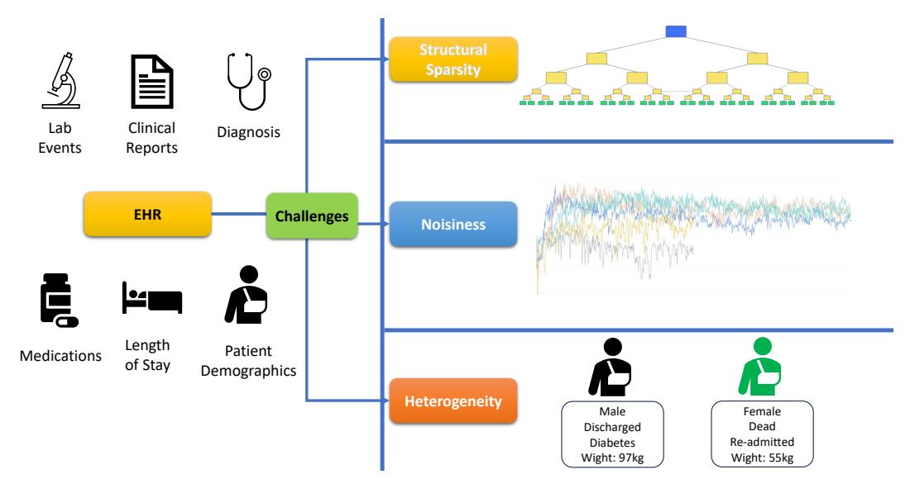
<!-- Image Description: The image is a flowchart illustrating challenges in utilizing Electronic Health Records (EHR) for machine learning. It depicts three key challenges: structural sparsity (shown as a sparse tree structure), noisiness (illustrated by a time-series graph of fluctuating data), and heterogeneity (represented by contrasting patient profiles – male vs. female). The flowchart connects various data sources within EHR (lab events, clinical reports, diagnosis, medications, length of stay, patient demographics) to these challenges. The purpose is to visually represent data complexities hindering the effective application of machine learning to EHR data. -->

**Figure 1:** Illustration of EHR data and the challenges. EHRs contain enriched information on clinical visits of patients, including relevant medications and diagnoses. However, analysis of EHR data poses three challenges — the sparsity in the data structure, noisiness, and heterogeneity of patients and their visits make it difficult to deliver accurate analysis.

such as drug recommendation, and predictions of inhospital mortality, readmission, and the length of stay. These tasks heavily depend on the features of patients and their visits. However, existing designs predominantly focus on single-task prediction, and thus they fail to incorporate the multi-task characteristics of EHR data. By sharing the learned patient or visit representations among tasks, the task-level knowledge can be leveraged to yield a better predictive performance. Hence, a multi-task model would potentially benefit from these characteristics of EHRs.

Additionally, it is well-known that EHRs suffer from severe noise and confounding effects, as patients have diverse backgrounds and medical records (e.g., diagnosis, medications, and prescriptions). Most of the existing methods directly operate on the features with heavy noises without adjusting for confounding effects, which hinder their performance on downstream tasks. Hence, a denoising measure is necessary to mitigate the confounding effects in the EHRs.

Motivated by the aforementioned limitations in existing research, we propose a novel multi-task framework for EHR analysis, namely MulT-EHR (Multi-Task EHR). MulT-EHR adpots a heterogeneous graph, which is trained by a causal denoising module and a multi-task aggregation module. Our contributions are summarized as follows:

• We propose a novel heterogeneous graph-based framework for modeling EHR data, namely MulT-EHR, which effectively mines EHR data by multitask graph learning.

- To effectively model the structural relationships in the EHR heterogeneous graph, we first enhance the relational features within the graph by leveraging a pretraining module based on graph contrastive learning. We then adopt a transformer-based GNN architecture to effectively learn the node-level representations.
- We reinterpret denoising using the causal inference framework and propose a causal denoising module to adjust for the confounding effects to mitigate the catastrophically heavy noise in the EHRs.
- We design a task-level aggregation mechanism to regularize the multi-task learning procedure by minimizing the cross-task extrapolation risk. This enables the single shared-weight model to leverage the cross-task knowledge more effectively.
- We perform extensive experiments on two benchmark datasets to validate the effectiveness of our method over state-of-the-art methods. Our model is shown to consistently outperform the competitors over four popular clinical tasks based on EHRs — predictions of mortality, readmission, length-ofstay, and drug recommendation. Enriched ablation studies demonstrate the robustness of our method to different components and hyperparameters.

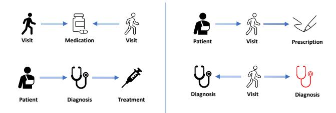
<!-- Image Description: This image presents four simple flowcharts illustrating different healthcare scenarios. The top row depicts a visit leading to medication and another visit (left) and a visit resulting in a prescription (right). The bottom row shows a patient receiving a diagnosis and treatment (left), and a visit followed by a diagnosis (right). The charts use icons representing patients, visits, medications, prescriptions, diagnosis, and treatment to visually represent the sequences of events. The purpose is likely to illustrate the various pathways within a healthcare system. -->

**Figure 2:** Four examples of meta-relations highlighted in the EHRs. These meta-relations involve structural connections between multiple nodes with different node types, highlighting the heterogeneity of the data. Consequently, a homogeneous graph model is insufficient to effectively capture and represent these complex meta-relations.

## Related Works

## *2.1. Graph Neural Networks*GNNs are gaining significant success in many problem domains [\[16,](#page-12-2) [11,](#page-12-3) [18,](#page-12-4) [2\]](#page-11-1). Most of the existing GNN architectures focus on homogeneous graphs [\[35,](#page-12-5) [33,](#page-12-6) [37,](#page-12-7) [45\]](#page-13-0). They learn node representations by aggregating information from the neighboring nodes on the graph topology. These algorithms are effective when the level of node and edge heterogeneity is negligible. As a heterogeneous graph contains enriched semantic information, several works [\[34,](#page-12-8) [11,](#page-12-3) [12,](#page-12-9) [42\]](#page-13-1) attempt to design GNN algorithms on heterogeneous graphs. These works mine the complex relational information in a heterogeneous graph by designing the node-type-specific and relation-specific convolutional layers. The research on aggregation of heterogeneous graphs is well-developed, and hence we directly use a state-of-the-art (SOTA) heterogeneous GNN architecture (i.e., the heterogeneous graph transformer [\[11\]](#page-12-3)) in our framework.

## *2.2. EHR Representation Learning*Knowledge distillation from massive EHRs has been a popular topic in healthcare informatics. To address the longitudinal features in the EHR data, several early works [\[20,](#page-12-1) [23,](#page-12-10) [22\]](#page-12-11) learned the EHR features with recurrent neural networks. Since the EHR data represent relational information between the medical entities (e.g., patients make clinical visits), graph-based models are widely adopted for EHR analysis in recent works [\[3,](#page-11-0) [4,](#page-11-2) [21,](#page-12-12) [18\]](#page-12-4). Early works on graph-based EHR analysis model EHR data with a homogeneous graph. GRAM [\[3\]](#page-11-0) is a well-known method that learns robust medical code representations by adopting a graph-based attention mechanism. To address the heterogeneity in the EHR entities, recently there are works [\[18,](#page-12-4) [21,](#page-12-12) [50,](#page-13-2) [46\]](#page-13-3) attempting to model EHR data as a heterogeneous graph or a knowledge graph. They design heterogeneous GNNs to integrate the node and edge heterogeneity in graph representation learning. However, almost all the existing attempts are trained on each individual task separately, which does not incorporate the multi-task nature of the EHR data.

## *2.3. Confounding E*ff*ect Adjustment*The challenge of addressing confounding effects in EHR data is amplified by its high degree of heterogeneity. Variations in patients' medical histories, comorbidities, and treatment plans contribute to these confounding effects. Consequently, there is a growing focus on learning feature representations in the counterfactual world, where confounding effects are excluded, within the healthcare research community.

Many recent works [\[44,](#page-13-4) [25,](#page-12-13) [9,](#page-12-14) [48\]](#page-13-5) take advantage of the advances in causal inference and aim to learn a representation of the data that captures the causal relationships between the variables. By doing so, they can separate the confounding factors from the causal factors and provide a more accurate representation of the underlying causal mechanism. CAL [\[31\]](#page-12-15) learns the causal features by disentangling a set of random features. By excluding the shortcut/trivial features, it achieves promising predictive and interpretation enhancement to vanilla GNN architectures (e.g., GCN [\[35\]](#page-12-5)).

## *2.4. Multi-task Learning*Multi-task learning aims to design a learning paradigm to obtain superior performance by training the tasks jointly rather than learning them independently [\[29\]](#page-12-16). Existing works on multi-task learning can be categorized into two major trends: hard parameter sharing [\[29,](#page-12-16) [5\]](#page-11-3) and soft parameter sharing [\[43,](#page-13-6) [19,](#page-12-17) [38\]](#page-13-7). Soft parameter sharing takes all the trainable parameters taskspecific but constrains them via Bayesian priors [\[38\]](#page-13-7) or a joint dictionary [\[43,](#page-13-6) [19\]](#page-12-17). Hard parameter sharing takes a subset of parameters as shared while others remain as task-specific. We adopt hard parameter sharing in this paper and optimize the joint objective using an environment-invariant approach.

## Preliminaries

Heterogeneous Graph. A heterogeneous graph is defined by a graph G = (V, E, A,R), where V, E, A represent the set of entities (vertices or nodes), relations (edges), and entity types respectively, and R represents the space of edge attributes. For*v*∈ V,*v* is mapped to an entity type by a function τ(*v*) ∈ A. An edge *e* = (*h*,*r*, *t*) ∈ E links the head node *h*and the tail node

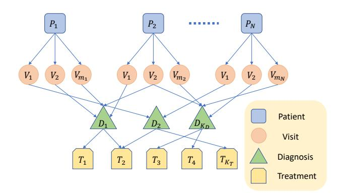
<!-- Image Description: This diagram illustrates a data model for patient medical records. Squares represent patients ($P_i$), circles represent visits ($V_{ij}$), triangles represent diagnoses ($D_k$), and rectangles represent treatments ($T_l$). Arrows indicate relationships between visits, diagnoses, and treatments for each patient. The model shows multiple visits per patient leading to multiple diagnoses and subsequent treatments. The purpose is to visualize the structure of the data used in the paper's analysis. -->

**Figure 3:** An example of a heterogeneous graph constructed from EHR data, where*N*represents the total number of patients, and*mi*represents the total number of visits by the*i*-th patient.

*t*, and *r*∈ R. Every node*v*has a*d*-dimensional node feature *x* ∈ X, where X is the embedding space of node features.

Problem: Multi-task EHR Learning. Given the EHR data D, our goal is to construct a heterogeneous graph G from D. Let T1, . . . ,T*K*on G be a series of*K* tasks on D. We aim to train a multi-task graph neural network model M such that M can deliver high performance on T1, . . . ,T*K*.

## Methodology

Our proposed framework starts with a heterogeneous graph construction stage. We learn the heterogeneous graph through a GNN that incorporates causal disentanglement for debiasing, which reduces the effects of confounding variables. We then improve cross-task performance by minimizing the task-level variance. Figure [4](#page-4-0) illustrates the workflow of our proposed method, and Algorithm [1](#page-5-0) presents the training paradigm.

## *4.1. Modeling EHR with Heterogeneous Graph*Heterogeneous Graph Construction. We construct the heterogeneous graph by merging the tabular components in the EHR data. We define six node types: patients, visits, diagnoses, prescriptions, procedures, and lab events. We further define five types of connections between the nodes: patient—visit, visit—diagnosis, visit—prescription, visit—procedure, visit—lab events. Figure [3](#page-3-0) presents the example of the heterogeneous graph constructed from EHR data. The heterogeneous graph data structure highlights the meta-relations between the medical entities, which provides an effective data structure for mining EHRs. Examples of the metarelations modeled by the EHR heterogeneous graph are illustrated in Figure [2.](#page-2-0) There are visits which are indirectly connected through a common medication (upperleft panel) or one visit leads to two diagnoses (lowerright panel), and there are patients who are indirectly connected with a treatment via a specific visit (upperright panel) or a prescription with a diagnosis (lower-left panel). By leveraging the relational features introduced by these meta relations, we can obtain a better graph representation for EHRs and thus better performances on downstream tasks.

Self-supervised Embedding Pretraining Module. Node features are important for optimal GNN performance. Randomly initializing the embeddings would cause difficulties for GNN to distinguish the distributions of node embeddings, and thus might lead to trivial results. Moreover, the randomly initialized embeddings contain no information (including the most important relational features) on the nodes, which makes learning difficult. Hence, instead of randomly initialized node features, we pretrain the embeddings of EHRs with relational graph embedding methods, such that the relational features can be encoded into node features in this stage. Translational methods [\[1,](#page-11-4) [13,](#page-12-18) [17\]](#page-12-19) are classic approaches to translating relational features into node embeddings. We adopt a simple unsupervised translation method — TransE [\[1\]](#page-11-4) to obtain the pretrained node embeddings,

$$
f(\mathbf{h}, \mathbf{r}, t) = ||\mathbf{h} + \mathbf{r} - t||,
$$
(1)

where*h*, *t*∈ R*d*are the embeddings of the head and the tail of an edge, and*r* represents the embeddings corresponding to the relation type of the edge. We then adopt a contrastive learning-based score function to calculate the relational similarity between the nodes and backpropagate the loss to the node embeddings,

$$
\mathcal{L}_{\text{sim}} = \sum_{e \in \mathcal{G}} \sum_{e' \in S'_e} [f(e) - f(e') + \gamma]_+, \tag{2}
$$

where γ is the margin for contrastive learning, [*x*]+ = max(*x*, 0), and *S*′*e* = {(*h* ′ ,*r*, *t*)|*h* ′ ∈ V} ∪ {(*h*,*r*, *t* ′ )|*t*′ ∈ V} is the set of negative samples by replacing either a head*h*or a tail*t* with another node in the graph. Through self-supervised learning, nodes sharing similar features would be pulled together and those whose features are different would be pushed away, leading to more distinguishable node features. Since most medical entities (e.g., diagnosis) are static, pretraining the node embeddings would also lead to improved inductive inference performance when new nodes (e.g., visits or patients) arrive.

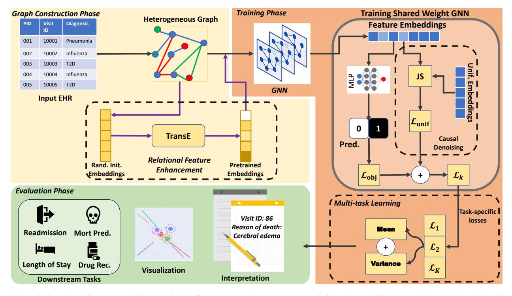
<!-- Image Description: This figure depicts a graph neural network (GNN) architecture for multi-task learning on electronic health records (EHRs). It shows three phases: graph construction (creating a heterogeneous graph from EHR data), training (a GNN processes the graph, generating embeddings), and evaluation (predicting readmission, mortality, length of stay, and drug recommendations). The training phase uses a shared-weight GNN with multi-task learning, combining objective and task-specific losses. A visualization component aids interpretability. The diagram uses boxes to represent modules, arrows show data flow, and tables summarize input data. -->

**Figure 4:** Overview of our proposed framework. We first construct a heterogeneous graph from the raw EHR data, and then obtain node-level representation with heterogeneous GNNs. Causal and trivial representations are disentangled and the task-specific loss is obtained by combining the classification loss Lobj and the uniform loss Lunif. We adopt a task-level aggregation module to obtain the multi-task learning loss. After training the GNN, we test the GNN with different downstream tasks (e.g., mortality prediction and drug recommendation).

Learning with Heterogeneous GNN. We perform node-level aggregation by adopting graph convolutional methods, which aggregate node features by passing the information of each node to its neighboring nodes (i.e., message-passing neural networks). However, homogeneous GNNs ignore the potential differences in node types and edge types when performing graph convolution. To leverage the heterogeneity in the EHR graph, we adopt heterogeneous GNN architectures, where the graph convolution procedures through the layers, in general, can be formulated as

$$
\hat{y} = \text{softmax}\left(\sum_{l=1}^{L} \text{act}(\text{Agg}(\mathcal{G}_l))\right),\tag{3}
$$

where Agg is the aggregation rule, either convolutionbased (e.g., GCN [\[35\]](#page-12-5)) or attention-based (e.g., GAT [\[33,](#page-12-6) [34\]](#page-12-8)), G*l*is the output subgraph from layer*l*, act and softmax are the activation function and softmax normalizing module, respectively, and ˆ*y*is the classification probabilities output by the GNN. In particular, we adopt the heterogeneous graph transformer (HGT) [\[11\]](#page-12-3) as it yields state-of-the-art performance in predictive tasks on heterogeneous graphs. Detailed formulation of the aggregation rule of HGT is described by [Hu et al.](#page-12-3) [\[11\]](#page-12-3). Latent representations of nodes are obtained after the aggregation. We then use a readout layer (e.g., multiplelayer perceptron) to obtain the prediction for each task. We study the effects of different GNN architectures in Section [6.3.](#page-9-0)

## *4.2. Adjusting for Confounders with Causal Inference*The EHR graph is known to be noisy and suffers from confounding effects. The trivial effects are presented as noise or shortcut features that mislead the learning process of GNNs. Figure [5](#page-5-1) presents an illustration of the causal diagram. The variable nodes*S*represent the trivial features in the data, which impose noise (or confounding effects) to target prediction. The path*A*→*S*→*Y* is called the shortcut path or the backdoor path that the model would take during the forward propagation. If there are too many shortcut paths in the graph learning process, the GNN model would be heavily affected by the shortcut (or trivial) features and this affects the learning knowledge representation in the graph. For example, patients with presumed (but unconfirmed) interstitial lung disease may be biased toward specific or

| Algorithm 1 The training workflow of MulT-EHR | | | |
|-----------------------------------------------|--|--|--|
|-----------------------------------------------|--|--|--|

Input: Heterogeneous graph G with node features {*Hi* , ∀*i*∈ V} and shared-weight GNN model M; Number of visits*n*visit in a sampled subgraph; Task set T = {T1, . . . ,T*K*}; Output: The trained GNN model M. 1: Pretraining the node features with TransE. 2: for each step do 3: Initialize a list of losses L = {}. 4: Sample subgraph G*S*with*n*visit visit nodes; 5: for t ∈ T do 6: if *t* is mortality prediction then 7: Downsample positive nodes. 8: end if 9: Logits = GNN(G*S* ) 10: Compute Lce or Lbce 11: Compute uniform loss with Eq. [\(4\)](#page-5-2) 12: Compute task-specific loss L*k* with Eq. [\(7\)](#page-5-3) 13: Append L*k*to L 14: end for 15: Compute the mean and variance of L, and total loss with Eq. [\(8\)](#page-6-0). 16: Backpropagate the loss to GNN. 17: end for

optimized imaging protocols that are intended to confirm the diagnosis, versus unsuspected cases that receive generic screening protocols [\[27\]](#page-12-20). Here, the lung disease is the predictive variable*Y*, *R*is the latent features which are used by the GNN to predict*Y*, and *S* the imaging protocol is the shortcut variable. Hence, removing the shortcuts (or backdoor paths) is critical for noise-free representation learning with GNNs.

18: return M

Motivated by [Sui et al.](#page-12-15) [\[31\]](#page-12-15), we introduce a causal denoising module into our framework adjusting for the confounders in the EHR data. We first disentangle the features in G into two components — the causal features and the trivial features. [Sui et al.](#page-12-15) [\[31\]](#page-12-15) proved that the causal features are invariant across training and testing distributions. The objective of the trivial features is to match a uniform distribution to ensure the randomness of the trivial graph G*t*[\[31\]](#page-12-15),

$$
\mathcal{L}_{\text{unif}} = \frac{1}{|\mathcal{D}|} \sum_{\mathcal{G} \in \mathcal{D}} \text{JS}(y_{\text{unif}}, z_{\mathcal{G}_t}), \tag{4}
$$

where JS is the Jensen–Shannon divergence [\[6\]](#page-12-21) between two distributions,*z*G*t* is the trivial representation predictive with the node features from trivial graph G*t*, and*y*unif is the noise feature vector where each element is

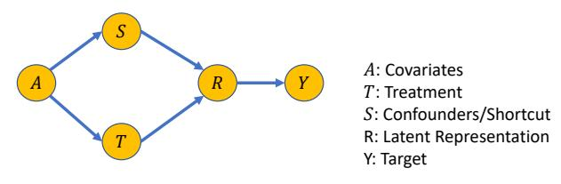
<!-- Image Description: The image is a causal diagram illustrating a latent variable model. Nodes represent variables (A: covariates, T: treatment, S: confounders, R: latent representation, Y: target). Arrows indicate causal relationships. The diagram shows how covariates (A) and treatment (T) influence a latent representation (R), which in turn affects the target variable (Y). Confounders (S) affect both the treatment and the latent representation, highlighting potential biases. The diagram's purpose is to visually represent the complex relationships between variables within the paper's model. -->

**Figure 5:** A causal diagram illustrating the effects of shortcut features. Without denoising, the model would make a prediction based on trivial features *S*(i.e., the backdoor path*S*→*R*→*Y*) , and the trivial variables (i.e., noise variables *S*) would hamper the prediction performance. Causal denoising aims to reduce the confounding effects by removing these backdoor paths during the training.

sampled from U(0, 1).

Learning from causal features can adjust the GNN architecture to confounding (i.e., backdoor) effects, especially when learning the EHR data with significant noise. [Sui et al.](#page-12-15) [\[31\]](#page-12-15) showed how learning through Eq. [\(4\)](#page-5-2) can adjust for backdoor effects. The causal features potentially follow the counterfactual distributions which enable generalization invariability. Hence, the GNN model can be better generalized to the testing distributions or other tasks

The loss functions used to train the GNN model for a single task are

$$
\mathcal{L}_{bce} = -\frac{1}{P} \sum_{i=1}^{P} \left[ y_i \log(\sigma(z_i)) + (1 - y_i) \log(1 - \sigma(z_i)) \right],\tag{5}
$$

$$
\mathcal{L}_{ce} = -\frac{1}{P} \sum_{i=1}^{P} \sum_{c=1}^{C} y_{i,c} \log(\text{softmax}(z_{i,c}))
$$
, (6)

where Lbce is the binary cross-entropy loss, Lce is the cross-entropy loss,*yi*is the ground truth label for patient*i*, *P*is the number of patients,*C*is the number of classes, and*zi*and*zi*,*c*are logits obtained from the model. The final loss for task*k* is then given by

$$
\mathcal{L}_k = \mathcal{L}(y, \hat{y}) + \lambda \mathcal{L}_{\text{unif}},\tag{7}
$$

where L(*y*, *y*ˆ) = Lce for binary classification tasks, and L(*y*, *y*ˆ) = Lbce for multi-label classification tasks, Lunif is computed by Eq. [\(4\)](#page-5-2), and λ is the regularization coefficient.

## *4.3. Multi-task Learning via Environment-Invariant Objective*

We obtain the task-specific loss L*k*for each task*k*in the previous step. We aggregate the losses from all tasks

| MIMIC-III | | | | | | | |
|---------------|-----------------|-----------------------------------------|--------------|--------------------|--|--|--|
| Node Type | Count | Avg. # of Visits Per Entity | Task | No. Obs. | | | |
| Patients | 46,520 | — | Mortality | 9,718 | | | |
| Visits | 58,976 | — | Readmission | 9,718 | | | |
| Diagnoses | 6,984 | 11.04 | LoS | 44,407 | | | |
| Prescriptions | 4,204 | 70.40 | Drug Recomm. | 14,142 | | | |
| Procedures | 2,032 | 1.55 | | | | | |
| | | | | | | | |
| | | | | | | | |
| Node Type | Count | MIMIC-IV Avg. # of Visits Per Entity | Task | No. Obs. | | | |
| Patients | | | Mortality | | | | |
| Visits | 180,733 | — | Readmission | 125,733 | | | |
| Diagnoses | 432,231 | — | LoS | 125,733 | | | |
| Prescriptions | 25,809 5,733 | 11.03 35.69 | Drug Recomm. | 220,851 147,434 | | | |

**Table 1:** Summary of MIMIC-III and MIMIC-IV datasets

to train the single shared-weight GNN for multi-task learning. We propose a task-invariant objective similar to [\[36\]](#page-12-22) to minimize the extrapolation risks in both training and testing environments. In addition to the mean of the loss in each task, we also minimize the variance of all the*K*losses to control the extrapolation risk,

$$
\text{Var}(\{\mathcal{L}_k : 1 \le k \le K)\}) + \frac{\beta}{K} \sum_{k=1}^K \mathcal{L}_k,\tag{8}
$$

where Var(·) returns the variance of the set, β is the tasklevel regularization hyperparameter. The rationale on why controlling the inter-task variance can minimize the interpolation risk is provided by [Wu et al.](#page-12-22) [\[36\]](#page-12-22).

Each task can be considered as an environment that specifies a distribution of embeddings. If the predictions for different tasks are very different, then the model may be overfitting to the current task and not learning generalizable representations. To address this issue, the invariance objective is used in multi-task learning to encourage the model to learn task-invariant representations that are consistent across different tasks. One way to achieve this goal is by minimizing the cross-task variance regularization term, which penalizes the model for producing very different predictions for different tasks. By minimizing this term, the model is encouraged to learn representations that are both task-specific and invariant across tasks, leading to better generalization performance.

## Experiments

## *5.1. Settings*Datasets. We use the MIMIC-III and MIMIC-IV datasets to evaluate our method in comparison with the competitors. Because the lab events are sparse and introduce heavy noise to the heterogeneous graph, we exclude them when constructing the graph. Table [1](#page-6-1) presents a summary of the types and counts of the entities in the MIMIC-III and MIMIC-IV datasets, and the details of each task.

Tasks and Evaluation Metrics. We evaluate our proposed method with common tasks on EHR data. Our model is trained by four supervised tasks — in-hospital mortality prediction (MORT), readmission prediction (READM), length of stay (LoS) prediction, and drug recommendation (DR). The trained multi-task model is then evaluated on each individual task using the testing data from each task. We treat mortality prediction and readmission prediction as binary classification tasks, LoS as the multi-class classification task (with 10 classes), and drug recommendation as multi-label classification tasks (with 351 labels for MIMIC-III and 501 labels for MIMIC-IV). We report the areas under the receiver operating curve (AUROC) and precision-recall curve (AUPR), accuracy, F1-scores, and Jaccard index for the tasks when appropriate. We perform five-fold cross-validation for each experiment. Detailed definitions of the evaluation metrics are provided in the appendix.

## *5.2. Implementation Details*The proposed framework is implemented in Python with the*Pytorch*library on a server equipped with four NVIDIA TESLA V100 GPUs. We use the*dgl*library to perform graph-related operations, and*pyhealth* [\[49\]](#page-13-8) to benchmark SOTA methods and perform EHR-related operations. The dropout ratio of each dropout layer is set as 0.2. All models are trained with 1000 epochs with early stopping. We choose the model at the epoch where it yields the best performance in terms of AUROC. We

**Table 2:** Performance (in %) of our method on mortality prediction and readmission prediction on the MIMIC-III and MIMIC-IV datasets. Our proposed method, MulT-EHR, is the last row, highlighted in boldface, and standard deviations are given in brackets.

| | Mortality Prediction | | | Readmission Prediction | | | | |
|------------------|-----------------------|-------------|-------------|------------------------|-------------|-------------|-------------|-------------|
| | MIMIC-IV MIMIC-III | | | MIMIC-III | | | MIMIC-IV | |
| Model | AUROC | AUPR | AUROC | AUPR | AUROC | AUPR | AUROC | AUPR |
| GRU [24] | 61.09 (0.7) | 9.69 (1.5) | 67.28 (0.8) | 3.23 (0.4) | 65.58 (1.1) | 68.57 (1.6) | 68.46 (0.5) | 68.85 (0.6) |
| Transformer [10] | 62.23 (3.0) | 10.70 (1.0) | 64.79 (1.2) | 2.85 (0.2) | 63.70 (0.5) | 68.92 (1.2) | 67.74 (0.9) | 69.23 (1.1) |
| Deepr [26] | 58.61 (2.4) | 11.87 (0.4) | 65.13 (0.8) | 3.20 (0.3) | 65.10 (1.3) | 68.68 (1.2) | 67.20 (0.5) | 68.06 (0.3) |
| GRAM [3] | 60.00 (1.0) | 11.00 (1.0) | 65.00 (1.0) | 4.00 (0.0) | 64.00 (0.0) | 67.00 (1.0) | 66.00 (0.0) | 66.00 (0.0) |
| Concare [23] | 61.98 (1.8) | 9.67 (1.5) | 65.37 (1.9) | 3.15 (0.2) | 65.28 (1.1) | 66.67 (1.9) | 68.67 (0.1) | 69.60 (0.7) |
| Dr. Agent [7] | 57.52 (0.4) | 9.66 (0.8) | 64.59 (1.4) | 3.47 (0.3) | 64.86 (2.6) | 67.41 (1.0) | 68.09 (0.3) | 69.24 (0.6) |
| AdaCare [22] | 64.84 (2.3) | 12.21 (1.6) | 65.64 (0.1) | 3.30 (0.1) | 64.90 (0.6) | 67.49 (0.7) | 67.64 (0.3) | 67.91 (0.3) |
| StageNet [8] | 64.49 (0.7) | 16.67 (3.0) | 65.58 (1.9) | 3.15 (0.2) | 62.38 (0.4) | 68.05 (0.8) | 67.81 (0.6) | 68.29 (0.5) |
| GRASP [46] | 59.29 (3.2) | 9.32 (1.9) | 64.48 (1.9) | 2.69 (0.2) | 66.91 (1.6) | 70.41 (1.6) | 67.34 (0.4) | 67.17 (0.8) |
| GraphCare [14] | 70.00 (1.0) | 16.00 (0.0) | 70.50 (0.7) | 4.90 (0.1) | 68.90 (0.4) | 70.80 (0.8) | 68.00 (0.2) | 67.10 (0.4) |
| MulT-EHR | 71.28 (0.6) | 17.48 (2.5) | 70.80 (1.8) | 5.15 (0.2) | 71.33 (0.4) | 71.23 (0.1) | 68.77 (0.2) | 70.26 (0.2) |

adopt the cross-entropy loss to train the network for classification tasks, and MSE for regression tasks. We use the Adam optimizer to optimize the model with a learning rate of 5×10−5 and a weight decay of 1×10−5 . We perform data augmentations on the training graphs by randomly dropping the edges and nodes, and adding Gaussian noises to the node and edge features.

Temperature Annealing. We are aware of the vanishing classification loss in practice. Therefore, we alleviate this issue by annealing the temperature over the training epochs with the schedule τ = max(0.05, exp(*rp*)), where *p*is the training epoch and*r*= 0.01.

Subgraph Sampling. Since it is not always possible to pass the whole EHR graph into the memory (especially for MIMIC-IV), we compose subgraphs by sampling*n*visit visits nodes and their connected nodes at each epoch. We set *n*visit = 2000 as this parameter is finegrained with empirical experience to which the performance is less sensitive.

Downsampling for MORT Task. We are aware that the samples in the mortality prediction task are heavily imbalanced (i.e., most of the samples are alive). We therefore perform downsampling during the training to balance the samples.

## *5.3. Comparable Methods*We compare our method to the following competitors: GRU [\[24\]](#page-12-0), Transformer [\[32\]](#page-12-28), GRAM [\[3\]](#page-11-0), StageNet [\[8\]](#page-12-26), AdaCare [\[22\]](#page-12-11), Concare [\[23\]](#page-12-10), GRASP [\[46\]](#page-13-3), Deepr [\[26\]](#page-12-24), and GraphCare [\[14\]](#page-12-27). For the drug recommendation task, we further include the following competitors which are distinctively designed to tackle this task: MI-CRON [\[39\]](#page-13-9), Safedrug [\[40\]](#page-13-10) and MoleRec [\[41\]](#page-13-11). Detailed description of each baseline method can be found in the appendix.

## *5.4. Quantitative Results*Tables [2](#page-7-0)[–4](#page-8-0) present the results of different tasks on the MIMIC-III and MIMIC-IV datasets. We observe that our proposed framework outperforms the competitive methods on all tasks, which validates its predictive performance. Our method adopts one model for all benchmark tasks, which does not require training a GNN for each individual task. Remarkably, despite using a single-shared weight model, our approach consistently outperforms single-task methods across all individual tasks. We also observe that for the drug recommendation task, our method not only outperforms the SOTA methods for EHR prediction but also recent methods [\[39,](#page-13-9) [41,](#page-13-11) [40\]](#page-13-10) specifically tackling the drug recommendation tasks. This compelling evidence suggests that through multi-task learning, we exert the potential to surpass the limitations of single-task models by leveraging knowledge from other downstream tasks. Our model can even consistently outperform the large language model-based methods (e.g., GraphCare [\[14\]](#page-12-27)) in the downstream tasks, where these methods borrow excessive knowledge from the open-world knowledge base.

## *5.5. Qualitative Evaluation*Embedding Visualization. We visualize the node embeddings of each type of entity to evaluate the performance of feature representation learning. Figure [6](#page-9-1) presents the T-SNE (t-distributed stochastic neighbor embedding) plots of the embeddings generated by different methods. In general, the embeddings are clustered according to their node types, which validates

**Table 3:** Performance of our method on prediction of the length of stay on the MIMIC-III and MIMIC-IV datasets. Our proposed method, MulT-EHR, is the last row, highlighted in boldface, and standard deviations are shown in brackets.

| | Prediction of Length of Stay | | | | | |
|------------------|------------------------------|-------------|-------------|-------------|-------------|-------------|
| | | MIMIC-III | | | MIMIC-IV | |
| Model | Accuracy | AUROC | F1 | Accuracy | AUROC | F1 |
| GRU [24] | 42.14 (0.6) | 80.23 (0.2) | 27.36 (0.7) | 38.30 (0.4) | 81.23 (0.1) | 32.03 (0.3) |
| Transformer [32] | 41.68 (0.7) | 79.30 (0.8) | 27.52 (0.8) | 37.40 (0.3) | 80.73 (0.5) | 31.86 (0.5) |
| Deepr [26] | 39.31 (1.2) | 78.02 (0.4) | 25.09 (1.3) | 36.00 (0.9) | 80.53 (0.3) | 31.05 (0.7) |
| GRAM [3] | 40.00 (0.0) | 78.00 (0.0) | 34.00 (0.0) | 35.00 (0.0) | 79.00 (0.0) | 32.00 (0.0) |
| Concare [23] | 42.04 (0.6) | 80.27 (0.3) | 25.44 (1.3) | 37.80 (0.4) | 81.04 (0.3) | 30.41 (0.4) |
| Dr. Agent [7] | 41.40 (0.5) | 79.45 (0.6) | 27.55 (0.3) | 38.15 (0.1) | 81.01 (0.1) | 31.25 (0.5) |
| AdaCare [22] | 40.7 (0.8) | 78.73 (0.4) | 26.26 (0.8) | 37.27 (0.6) | 80.63 (0.2) | 31.19 (0.2) |
| StageNet [8] | 40.18 (0.7) | 77.94 (0.2) | 26.63 (1.2) | 36.47 (0.7) | 80.04 (0.2) | 30.55 (0.8) |
| GRASP [46] | 40.66 (0.3) | 78.97 (0.4) | 22.80 (0.8) | 35.28 (0.1) | 79.86 (0.4) | 26.95 (2.8) |
| GraphCare [14] | 42.00 (0.0) | 80.00 (0.0) | 37.00 (0.0) | 36.00 (0.0) | 80.00 (0.0) | 32.00 (0.0) |
| MulT-EHR | 43.17 (1.1) | 81.53 (0.1) | 41.44 (0.6) | 41.40 (0.4) | 84.04 (0.2) | 38.46 (0.4) |

**Table 4:** Performance of our method on drug recommendation on the MIMIC-III and MIMIC-IV datasets. Our proposed method, MulT-EHR, is the last row, highlighted in boldface, and standard deviations are given in brackets.

| | | MIMIC-III | | | MIMIC-IV | |
|------------------|-------------|-------------|-------------|-------------|-------------|-------------|
| Model | AUROC | AUPR | Jaccard | AUROC | AUPR | Jaccard |
| GRU [24] | 96.38 (0.1) | 64.75 (0.2) | 45.78 (0.5) | 97.67 (0.1) | 63.99 (1.3) | 45.32 (0.3) |
| Transformer [32] | 95.87 (0.0) | 60.19 (0.1) | 41.14 (0.4) | 97.65 (0.1) | 63.79 (1.2) | 44.88 (0.9) |
| GRAM [3] | 94.00 (0.0) | 77.00 (0.0) | 48.00 (0.0) | 94.00 (0.0) | 60.00 (0.0) | 45.00 (0.0) |
| Concare [23] | 95.78 (0.1) | 61.67 (0.3) | 43.43 (0.5) | 97.43 (0.0) | 61.60 (0.1) | 43.51 (0.8) |
| Deepr [26] | 96.09 (0.2) | 62.48 (0.0) | 44.45 (0.4) | 97.35 (0.0) | 60.31 (0.1) | 43.31 (0.7) |
| Dr. Agent [7] | 96.41 (0.1) | 64.16 (0.5) | 44.09 (0.7) | 97.67 (0.8) | 64.13 (0.1) | 44.52 (0.6) |
| AdaCare [22] | 95.86 (0.0) | 60.76 (1.1) | 42.00 (1.3) | 97.53 (0.0) | 62.54 (0.0) | 43.51 (0.4) |
| StageNet [8] | 96.05 (0.3) | 62.43 (2.4) | 44.60 (3.7) | 97.62 (0.1) | 63.94 (1.5) | 45.69 (2.1) |
| GRASP [46] | 96.01 (0.1) | 62.53 (0.8) | 44.12 (0.5) | 97.44 (0.0) | 61.73 (0.3) | 42.47 (0.7) |
| GraphCare [14] | 95.00 (0.0) | 77.80 (0.2) | 48.20 (0.4) | 92.00 (0.0) | 69.00 (0.0) | 41.00 (0.0) |
| MICRON [39] | 96.21 (0.0) | 63.84 (0.1) | 45.95 (0.5) | 97.57 (0.0) | 63.19 (0.1) | 45.35 (0.1) |
| MoleRec [41] | 92.00 (0.1) | 69.80 (0.3) | 43.10 (0.3) | 92.10 (0.1) | 68.60 (0.1) | 40.60 (0.3) |
| SafeDrug [40] | 94.20 (0.1) | 76.40 (0.0) | 47.20 (0.4) | 91.80 (0.2) | 66.40 (0.5) | 44.30 (0.3) |
| MulT-EHR | 96.67 (0.1) | 78.58 (0.2) | 52.20 (0.8) | 97.68 (0.1) | 70.43 (0.2) | 44.23 (0.0) |

that the embeddings can learn the unique representation of each node type. We also compare the embeddings across different methods. We observe that all the methods can capture the patterns of medical entities. However, the pattern captured by MulT-EHR is more unique and complex than other methods. This shows that our method is more capable of capturing the unique pattern presented in the EHR data.

We also compare the embeddings from different GNN architectures. We observe that the embeddings generated by heterogeneous GNNs have more unique patterns than those generated by homogeneous GNNs. This also validates that modeling EHRs by heterogeneous graphs can potentially learn the more complex relationships and patterns in the EHR data. Visualizations of embeddings generated by other GNN architectures can be found in the appendix.

Prediction Interpretations. We perform a case study on a specific visit of a patient to evaluate the decision process on readmission prediction. For the selected visit node, we select the top 3 diagnosis edges that have the highest edge attention scores. Table [5](#page-9-2) presents the visit and the selected diagnoses associated with their readmission prediction (together with the ICD9 codes and description of the diagnoses). We observe that our model can select diagnoses related to brain functionality and cancer according to their attention scores, which provides evidence that the model can effectively capture the semantic information in EHRs when making read-

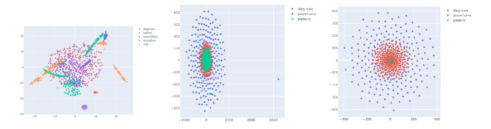
<!-- Image Description: The image displays three 2D scatter plots visualizing data likely from a healthcare system. The first plot shows distinct clusters of points representing diagnoses, patients, prescriptions, procedures, and visits, potentially illustrating relationships between these data types. The second and third plots appear to be dimensionality-reduced representations of the same data, showing the data points after applying a dimensionality reduction technique like t-SNE or UMAP. The plots likely demonstrate the separation or clustering of data points based on different categories within a dataset. -->

**Figure 6:** T-SNE scatter plot of the embeddings (Left panel: MulT-EHR, Middle panel: StageNet [\[8\]](#page-12-26), Right panel: Deepr [\[26\]](#page-12-24)). We observe that MulT-EHR can capture more complex patterns than other methods.

**Table 5:** Case study on the diagnoses that are highly associated with the readmission of an arbitrarily selected visit. We observe that the selected diagnoses of high attention scores are all related to brain functionality and cancer, which provides evidence that the model can effectively capture the semantic information in the EHR data.

| | | Diagnoses | |
|----------|-------|---------------------|------------|
| Case | ICD9 | Description | Att. Score |
| | | Secondary malignant | |
| | 1983 | neoplasm of brain | 7.4292 |
| Visit 86 | | and spinal cord | |
| | | Cerebral | |
| | 3485 | Edema | 7.3845 |
| | | Long-term (current) | |
| | V5865 | use of steroids | 7.3499 |

mission predictions.

## Ablation Analysis

## *6.1. Ablation Study on Di*ff*erent Components*To validate the contributions of each component of our model, we deactivate the causal debiasing and/or multi-task learning modules to examine their effects on the results. Table [6](#page-9-3) presents the results on the readmission task. We observe that including either the causal denoising module or the multi-task aggregation module leads to improvement in performance, while including both modules results in the best performance. This validates both modules proposed in our framework improve the learning performance.

## *6.2. E*ff*ects of Di*ff*erent Numbers of Tasks*

We show that as more tasks are incorporated into our multi-task learning method, the predictive task performance can be improved due to cross-task knowledge **Table 6:** Effects of the causal denoising module and task-level aggregation module. We evaluate the performance on the MIMIC-III readmission task.

| Causal | Task-Agg. | AUROC | AUPR | F1 |
|--------|-----------|-------|-------|-------|
| | | 61.67 | 63.56 | 67.55 |
| ✓ | | 63.91 | 68.85 | 68.89 |
| | ✓ | 67.65 | 68.93 | 69.23 |
| ✓ | ✓ | 71.33 | 70.61 | 69.86 |

**Table 7:** Performance of our framework on the different numbers of prediction tasks (R: readmission; M: mortality; D: drug recommendation; L: length of stay). We benchmark the performance on the readmission prediction task.

| | MIMIC-III | | | MIMIC-IV | | |
|-------|-----------|-------|-------|----------|-------|-------|
| Tasks | AUROC | AUPR | F1 | AUROC | AUPR | F1 |
| R | 62.89 | 69.37 | 66.38 | 68.30 | 69.44 | 68.32 |
| RM | 65.39 | 67.29 | 68.02 | 68.08 | 68.94 | 68.40 |
| RD | 62.89 | 65.80 | 68.03 | 68.71 | 69.91 | 67.68 |
| RMD | 68.87 | 69.57 | 69.76 | 66.50 | 66.77 | 67.86 |
| RDL | 65.59 | 66.79 | 69.27 | 67.63 | 69.65 | 65.64 |
| RMDL | 71.33 | 70.61 | 69.86 | 68.74 | 70.02 | 68.45 |

sharing. We experiment with one to four tasks, and Table [7](#page-9-4) presents the results. We observe that as the number of tasks in the training increases, the performance on readmission prediction improves accordingly. This validates that our multi-task learning framework can leverage more inter-task knowledge as more tasks are included in the training stage.

## *6.3. E*ff*ects of Di*ff*erent GNN Architetures*We compare different graph convolutional methods to show how ablations in aggregation methods affect our framework. Table [8](#page-10-0) presents the results of the MIMIC-III hospital readmission task. We observe that our method is overall robust when the GNN architecture

**Table 8:** Effects of different GNN architectures by evaluating the performance of the readmission prediction task on the MIMIC-III dataset.

| | MIMIC-III | | | MIMIC-IV | | |
|-----------|-----------|-------|-------|----------|-------|-------|
| Model | AUROC | AUPR | F1 | AUROC | AUPR | F1 |
| GCN [35] | 56.26 | 58.55 | 67.42 | 57.62 | 57.90 | 61.05 |
| GAT [33] | 68.34 | 69.86 | 66.43 | 58.58 | 57.31 | 66.83 |
| GIN [37] | 60.47 | 64.23 | 67.59 | 64.54 | 65.14 | 66.95 |
| RGCN [28] | 52.75 | 55.53 | 64.66 | 51.25 | 51.64 | 63.60 |
| HGT [11] | 71.33 | 70.61 | 69.86 | 68.74 | 70.02 | 68.31 |

**Table 9:** Performance of our framework on different numbers of layers*L*. We evaluate the performance of the readmission prediction task on MIMIC-III and MIMIC-IV.

| MIMIC-III | | | | MIMIC-IV | | | |
|-----------|-------|-------|-------|----------|-------|-------|--|
| L | AUROC | AUPR | F1 | AUROC | AUPR | F1 | |
| 1 | 64.08 | 68.80 | 66.81 | 67.24 | 68.02 | 65.87 | |
| 2 | 71.33 | 70.61 | 69.86 | 68.74 | 70.02 | 68.31 | |
| 3 | 67.61 | 70.44 | 68.56 | 68.08 | 69.74 | 68.06 | |
| 4 | 66.42 | 70.34 | 67.32 | 68.33 | 69.11 | 68.08 | |

changes. However, using a homogeneous GNN architecture (e.g., GCN) would hamper the predictive performance since they only consider direct connections in the graph by neighbour averaging. Hence, they cannot leverage the structural information in the EHR data, which leads to less satisfactory performance.

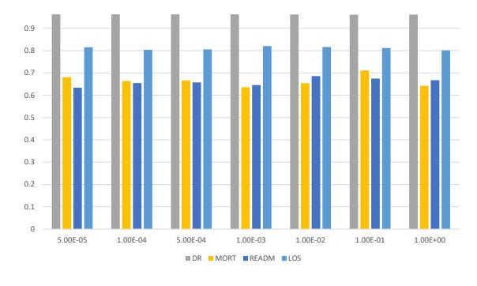
<!-- Image Description: The image displays a bar chart comparing four metrics (DR, MORT, READM, LOS) across eight different parameter settings (x-axis). Each bar represents the value of a metric for a given parameter setting, with the height corresponding to the metric's value. The chart likely illustrates the effect of varying a parameter (possibly a regularization or learning rate) on four performance indicators in a model, potentially within a machine learning or statistical modeling context. The purpose is to show the impact of the parameter on the model's performance, allowing for comparison of results under different conditions. -->

**Figure 7:** Performance in AUROC of MulT-EHR with different values of λ on MIMIC-III tasks (DR: drug recommendation, MORT: mortality, READM: readmission, LoS: length of stay).

## *6.4. Hyperparameter Tuning*Tuning Parameters for Objectives. We evaluate the effect of the regularization parameter λ of different task losses. Figure [7](#page-10-1) presents the change in performance as λ increases. We observe that the performance is in general robust to λ, where a slightly decreased performance is observed when λ is too large. Since λ represents the

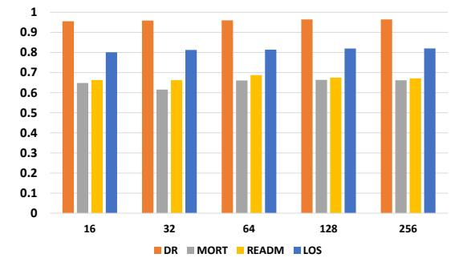
<!-- Image Description: The image displays a bar chart comparing four metrics (DR, MORT, READM, LOS) across five different sizes (16, 32, 64, 128, 256). Each bar represents the value of a metric for a given size. The chart likely shows the performance or outcome of a system or process at varying scales, with the purpose of analyzing the effect of size on these four key performance indicators. -->

**Figure 8:** Performance in AUROC of MulT-EHR with different hidden dimensions on MIMIC-III tasks (DR: drug recommendation, MORT: mortality, READM: readmission, LoS: length of stay).

regularization of learning, larger λ imposes a heavier penalty on the shortcut features and thus more restrictions on the feature space. The predictive performance would be sacrificed as a result due to the more tightly constrained feature space

Number of GNN Layers. We evaluate the performance of our framework with respect to the change in the number of GNN layers, as shown in Table [9.](#page-10-2) We observe that for both datasets, as long as the GNN is not too shallow (i.e., depth > 1), it can achieve satisfactory performance. On the other hand, the performance is slightly compromised due to the well-known over-smoothing problem in deeper GNNs.

Hidden Embedding Dimension. Figure [8](#page-10-3) presents the comparison of different dimensions of hidden features. We observe that the performance generally improves when a larger number of feature dimensions is adopted. The number of feature dimensions controls the width of the neural network. Hence, this verifies that increasing the width instead of depth can improve the feature representation learning performance while more effectively preventing the over-smoothing issue [\[30,](#page-12-30) [47\]](#page-13-12).

## Discussion and Conclusion

To address the significant confounding effects present in EHR data, we propose a denoising module based on causal inference. This module effectively adjusts for the confounding effects and yields causal features by eliminating most of the backdoor paths associated with trivial features. Not only do these causal features enhance predictive performance, but they also offer potential for causal explanations. While in this work we interpret the model using attention weights on causal features from the GNN model, this does not necessarily provide a causal explanation. Developing algorithms for causal explanations would require rigorous theoretical work to ensure causality, which falls outside of the focus of this paper. However, based on the causal features obtained for each entity, there is a promising potential to develop a robust causal interpretation model that can identify the causes of medical events such as mortality, diseases, or readmission. This has significant implications for medical reasoning and future clinical research.

EHRs present a great degree of heterogeneity — each medical entity in the EHR has a distinct node type. Each node type thus introduces a unique distribution of the medical entities of that type. By using a heterogeneous graph, we can model EHRs with the awareness of different types of medical entities and relations. Consequently, an effective heterogeneous GNN is employed to align the embedding distributions of nodes from different node types into a unified latent space. The transformer architecture, known for its ability to align embedding distributions across different spaces, demonstrates superior empirical performance compared to other GNN designs (as shown in Table [8\)](#page-10-0). Additionally, not only do EHRs include enriched medical records in the tabular form, but they also encompass information from various modalities, such as clinical/discharge reports in text and radiology scans in images. To incorporate this multimodal information, we merge these observations into the heterogeneous graph as individual nodes, assigning different node types based on their modalities. By leveraging transformer-based heterogeneous GNN architectures [\[11\]](#page-12-3), we can align the distributions from different modalities, potentially leading to significant performance improvements on EHR analysis tasks.

To Conclude. We propose a novel multi-task learning framework for EHR modeling, named MulT-EHR, which mines the heterogeneity in EHR data while adjusting for confounding effects. Our proposed framework employs a GNN architecture that incorporates causal disentanglement for debiasing and minimizes the task-level variance to improve cross-task performance. Empirical studies on various datasets validate the superiority of our proposed method over existing singletask and multi-task designs. Qualitative analysis on node embeddings and interpretability suggests that our method can potentially provide interpretations to key medical entities (e.g., diagnosis) leading to the event (e.g., readmission). Enriched ablation studies verify the robustness of our method to variations on the proposed components and hyperparameters. Our framework can potentially be generalized to any other application domains based on graph representation learning, such as recommendation systems and molecular chemistry.

## Declaration of Generative AI and AI-assisted Technologies in the Writing Process.

During the preparation of this work, the author(s) used ChatGPT in order to polish the language. After using this tool/service, the authors reviewed and edited the content as needed and take full responsibility for the content of the publication.

## Code and Data Availability.

The codes for reproducing this work are available at <https://github.com/HKU-MedAI/MulT-EHR>.

Acknowledgement. We thank the anonymous reviewers for their valuable comments and suggestions. This work was partially supported by the Research Grants Council of Hong Kong (17308321 and 27206123), the Theme-based Research Scheme (T45-401/22-N), the Hong Kong Innovation and Technology Fund (ITS/273/22), and the National Natural Science Fund (62201483).

## References

- [1] Antoine Bordes, Nicolas Usunier, Alberto Garcia-Duran, Jason Weston, and Oksana Yakhnenko. Translating embeddings for modeling multi-relational data.*Advances in neural information processing systems*, 26, 2013.
- [2] Tsai Hor Chan, Chi Ho Wong, Jiajun Shen, and Guosheng Yin. Source-aware embedding training on heterogeneous information networks. *Data Intelligence*, pages 1–14, 2023.
- [3] Edward Choi, Mohammad Taha Bahadori, Le Song, Walter F Stewart, and Jimeng Sun. Gram: graph-based attention model for healthcare representation learning. In *Proceedings of the 23rd ACM SIGKDD international conference on knowledge discovery and data mining*, pages 787–795, 2017.
- [4] Edward Choi, Cao Xiao, Walter Stewart, and Jimeng Sun. Mime: Multilevel medical embedding of electronic health records for predictive healthcare. *Advances in neural information processing systems*, 31, 2018.
- [5] Daxiang Dong, Hua Wu, Wei He, Dianhai Yu, and Haifeng Wang. Multi-task learning for multiple language translation. In *Proceedings of the 53rd Annual Meeting of the Association for Computational Linguistics and the 7th International Joint*

*Conference on Natural Language Processing (Volume 1: Long Papers)*, pages 1723–1732, 2015.

- [6] Bent Fuglede and Flemming Topsoe. Jensen-shannon divergence and hilbert space embedding. In *International Symposium onInformation Theory, 2004. ISIT 2004. Proceedings.*, page 31. IEEE, 2004.
- [7] Junyi Gao, Cao Xiao, Lucas M Glass, and Jimeng Sun. Dr. agent: Clinical predictive model via mimicked second opinions. *Journal of the American Medical Informatics Association*, 27 (7):1084–1091, 2020.
- [8] Junyi Gao, Cao Xiao, Yasha Wang, Wen Tang, Lucas M Glass, and Jimeng Sun. Stagenet: Stage-aware neural networks for health risk prediction. In *Proceedings of The Web Conference 2020*, pages 530–540, 2020.
- [9] Alexander Hagele, Jonas Rothfuss, Lars Lorch, Vignesh Ram ¨ Somnath, Bernhard Scholkopf, and Andreas Krause. Bacadi: ¨ Bayesian causal discovery with unknown interventions. In *UAI 2022 Workshop on Causal Representation Learning*.
- [10] Sepp Hochreiter and Jurgen Schmidhuber. Long short-term ¨ memory. *Neural computation*, 9(8):1735–1780, 1997.
- [11] Ziniu Hu, Yuxiao Dong, Kuansan Wang, and Yizhou Sun. Heterogeneous graph transformer. In *Proceedings of The Web Conference 2020*, pages 2704–2710, 2020.
- [12] Tiancheng Huang, Ke Xu, and Donglin Wang. Da-hgt: Domain adaptive heterogeneous graph transformer. *arXiv preprint arXiv:2012.05688*, 2020.
- [13] Guoliang Ji, Shizhu He, Liheng Xu, Kang Liu, and Jun Zhao. Knowledge graph embedding via dynamic mapping matrix. In *Proceedings of the 53rd Annual Meeting of the Association for Computational Linguistics and the 7th International Joint Conference on Natural Language Processing (Volume 1: Long Papers)*, pages 687–696, 2015.
- [14] Pengcheng Jiang, Cao Xiao, Adam Cross, and Jimeng Sun. Graphcare: Enhancing healthcare predictions with open-world personalized knowledge graphs. *arXiv preprint arXiv:2305.12788*, 2023.
- [15] Jin Jing, Wendong Ge, Shenda Hong, Marta Bento Fernandes, Zhen Lin, Chaoqi Yang, Sungtae An, Aaron F Struck, Aline Herlopian, Ioannis Karakis, et al. Development of expert-level classification of seizures and rhythmic and periodic patterns during eeg interpretation. *Neurology*, 100(17):e1750–e1762, 2023.
- [16] Ryosuke Kojima, Shoichi Ishida, Masateru Ohta, Hiroaki Iwata, Teruki Honma, and Yasushi Okuno. kgcn: a graph-based deep learning framework for chemical structures. *Journal of Cheminformatics*, 12:1–10, 2020.
- [17] Yankai Lin, Zhiyuan Liu, Maosong Sun, Yang Liu, and Xuan Zhu. Learning entity and relation embeddings for knowledge graph completion. In *Twenty-ninth AAAI conference on artificial intelligence*, 2015.
- [18] Zheng Liu, Xiaohan Li, Hao Peng, Lifang He, and S Yu Philip. Heterogeneous similarity graph neural network on electronic health records. In *2020 IEEE International Conference on Big Data (Big Data)*, pages 1196–1205. IEEE, 2020.
- [19] Mingsheng Long, Zhangjie Cao, Jianmin Wang, and Philip S Yu. Learning multiple tasks with multilinear relationship networks. *Advances in neural information processing systems*, 30, 2017.
- [20] Fenglong Ma, Radha Chitta, Jing Zhou, Quanzeng You, Tong Sun, and Jing Gao. Dipole: Diagnosis prediction in healthcare via attention-based bidirectional recurrent neural networks. In *Proceedings of the 23rd ACM SIGKDD international conference on knowledge discovery and data mining*, pages 1903– 1911, 2017.
- [21] Fenglong Ma, Quanzeng You, Houping Xiao, Radha Chitta, Jing Zhou, and Jing Gao. Kame: Knowledge-based attention model

for diagnosis prediction in healthcare. In *Proceedings of the 27th ACM International Conference on Information and Knowledge Management*, pages 743–752, 2018.

- [22] Liantao Ma, Junyi Gao, Yasha Wang, Chaohe Zhang, Jiangtao Wang, Wenjie Ruan, Wen Tang, Xin Gao, and Xinyu Ma. Adacare: Explainable clinical health status representation learning via scale-adaptive feature extraction and recalibration. In *Proceedings of the AAAI Conference on Artificial Intelligence*, volume 34, pages 825–832, 2020.
- [23] Liantao Ma, Chaohe Zhang, Yasha Wang, Wenjie Ruan, Jiangtao Wang, Wen Tang, Xinyu Ma, Xin Gao, and Junyi Gao. Concare: Personalized clinical feature embedding via capturing the healthcare context. In *Proceedings of the AAAI Conference on Artificial Intelligence*, volume 34, pages 833–840, 2020.
- [24] Larry R Medsker and LC Jain. Recurrent neural networks. *Design and Applications*, 5:64–67, 2001.
- [25] Valentyn Melnychuk, Dennis Frauen, and Stefan Feuerriegel. Causal transformer for estimating counterfactual outcomes. In *International Conference on Machine Learning*, pages 15293– 15329. PMLR, 2022.
- [26] Phuoc Nguyen, Truyen Tran, Nilmini Wickramasinghe, and Svetha Venkatesh. Deepr: a convolutional net for medical records. *IEEE journal of biomedical and health informatics*, 21(1):22–30, 2016.
- [27] Cathy Ong Ly, Balagopal Unnikrishnan, Tony Tadic, Tirth Patel, Joe Duhamel, Sonja Kandel, Yasbanoo Moayedi, Michael Brudno, Andrew Hope, Heather Ross, et al. Shortcut learning in medical ai hinders generalization: method for estimating ai model generalization without external data. *npj Digital Medicine*, 7(1):124, 2024.
- [28] Michael Schlichtkrull, Thomas N Kipf, Peter Bloem, Rianne van den Berg, Ivan Titov, and Max Welling. Modeling relational data with graph convolutional networks. In *European semantic web conference*, pages 593–607. Springer, 2018.
- [29] Ozan Sener and Vladlen Koltun. Multi-task learning as multiobjective optimization. *Advances in neural information processing systems*, 31, 2018.
- [30] H SHI, J GAO, H XU, X LIANG, Z LI, L Kong, SMS Lee, and JT KWOK. Revisiting over-smoothing in bert from the perspective of graph. In *The International Conference on Learning Representations (ICLR 2022)*, 2022.
- [31] Yongduo Sui, Xiang Wang, Jiancan Wu, Min Lin, Xiangnan He, and Tat-Seng Chua. Causal attention for interpretable and generalizable graph classification. In *Proceedings of the 28th ACM SIGKDD Conference on Knowledge Discovery and Data Mining*, pages 1696–1705, 2022.
- [32] Ashish Vaswani, Noam Shazeer, Niki Parmar, Jakob Uszkoreit, Llion Jones, Aidan N Gomez, Łukasz Kaiser, and Illia Polosukhin. Attention is all you need. *Advances in neural information processing systems*, 30, 2017.
- [33] Petar Velickovi ˇ c, Guillem Cucurull, Arantxa Casanova, Adriana ´ Romero, Pietro Lio, and Yoshua Bengio. Graph attention networks. *arXiv preprint arXiv:1710.10903*, 2017.
- [34] Xiao Wang, Houye Ji, Chuan Shi, Bai Wang, Yanfang Ye, Peng Cui, and Philip S Yu. Heterogeneous graph attention network. In *The World Wide Web Conference*, pages 2022–2032, 2019.
- [35] Max Welling and Thomas N Kipf. Semi-supervised classification with graph convolutional networks. In *J. International Conference on Learning Representations (ICLR 2017)*, 2016.
- [36] Qitian Wu, Hengrui Zhang, Junchi Yan, and David Wipf. Handling distribution shifts on graphs: An invariance perspective. In *International Conference on Learning Representations*, 2021.
- [37] Keyulu Xu, Weihua Hu, Jure Leskovec, and Stefanie Jegelka. How powerful are graph neural networks? In *International Conference on Learning Representations*, 2018.

- [38] Ya Xue, Xuejun Liao, Lawrence Carin, and Balaji Krishnapuram. Multi-task learning for classification with dirichlet process priors. *Journal of Machine Learning Research*, 8(1), 2007.
- [39] Chaoqi Yang, Cao Xiao, Lucas Glass, and Jimeng Sun. Change matters: Medication change prediction with recurrent residual networks. In *30th International Joint Conference on Artificial Intelligence, IJCAI 2021*, pages 3728–3734. International Joint Conferences on Artificial Intelligence, 2021.
- [40] Chaoqi Yang, Cao Xiao, Fenglong Ma, Lucas Glass, and Jimeng Sun. Safedrug: Dual molecular graph encoders for recommending effective and safe drug combinations. *arXiv preprint arXiv:2105.02711*, 2021.
- [41] Nianzu Yang, Kaipeng Zeng, Qitian Wu, and Junchi Yan. Molerec: Combinatorial drug recommendation with substructureaware molecular representation learning. In *Proceedings of the ACM Web Conference 2023*, pages 4075–4085, 2023.
- [42] Shuwen Yang, Guojie Song, Yilun Jin, and Lun Du. Domain adaptive classification on heterogeneous information networks. In *IJCAI*, pages 1410–1416, 2020.
- [43] Yongxin Yang and Timothy Hospedales. Trace norm regularised deep multi-task learning. In *5th International Conference on Learning Representations Workshop*, 2017.
- [44] Yue Yu, Jie Chen, Tian Gao, and Mo Yu. Dag-gnn: Dag structure learning with graph neural networks. In *International Conference on Machine Learning*, pages 7154–7163. PMLR, 2019.
- [45] Seongjun Yun, Minbyul Jeong, Raehyun Kim, Jaewoo Kang, and Hyunwoo J Kim. Graph transformer networks. *Advances in neural information processing systems*, 32, 2019.
- [46] Chaohe Zhang, Xin Gao, Liantao Ma, Yasha Wang, Jiangtao Wang, and Wen Tang. Grasp: generic framework for health status representation learning based on incorporating knowledge from similar patients. In *Proceedings of the AAAI conference on artificial intelligence*, volume 35, pages 715–723, 2021.
- [47] Lingxiao Zhao and Leman Akoglu. Pairnorm: Tackling oversmoothing in gnns. In *International Conference on Learning Representations*, 2019.
- [48] Weiqi Zhao, Dian Tang, Xin Chen, Dawei Lv, Daoli Ou, Biao Li, Peng Jiang, and Kun Gai. Disentangled causal embedding with contrastive learning for recommender system. *arXiv preprint arXiv:2302.03248*, 2023.
- [49] Yue Zhao, Zhi Qiao, Cao Xiao, Lucas Glass, and Jimeng Sun. Pyhealth: A python library for health predictive models. *arXiv preprint arXiv:2101.04209*, 2021.
- [50] Weicheng Zhu and Narges Razavian. Variationally regularized graph-based representation learning for electronic health records. In *Proceedings of the Conference on Health, Inference, and Learning*, pages 1–13, 2021.

## Appendix A. Evaluation Metrics

We provide detailed definitions of the evaluation metrics.

- Accuracy: the fraction of correct predictions to the total number of ground truth labels.
- F-1 score: the F-1 score for each class is defined as

F-1 score =
$$
2 \cdot \frac{\text{precision} \cdot \text{recall}}{\text{precision} + \text{recall}}
$$

where 'recall' is the fraction of correct predictions to the total number of ground truths in each class and precision is the fraction of correct predictions to the total number of predictions in each class. For multi-class and multi-label classification tasks, we adopt the weighted F-1 score.

- AUC: the area under the receiver operating curve (ROC) which is the plot of the true positive rate (TPR/Recall) against the false positive rate (FPR).
- AUPR: the area under the precision-recall curve.
- Jaccard index: measures the similarity between the true binary labels and the predicted binary labels by the ratio of the size of the intersection of the true positive labels and the predicted positive labels to the size of their union,

$$
Jaccard = \frac{TP}{TP + FP + FN}
$$

## Appendix B. Additional Information on Related Methods

In this section, we provide supplementary information on the baseline methods employed in our study. All baseline models were trained for 50 epochs with the option of early stopping.

- RNN [\[24\]](#page-12-0): vanilla RNN predicts labels based on modeling the visit series of patients.
- Transformer [\[32\]](#page-12-28): it leverages the idea of selfattention, which allows the model to selectively focus on different parts of the input sequence when generating output.
- GRAM [\[3\]](#page-11-0): the first work that models EHRs with a knowledge graph and uses recurrent neural networks to learn the medical code representations and predict future visit information.
- StageNet [\[8\]](#page-12-26): using a stage-aware LSTM to conduct clinical predictive tasks while learning patient disease progression stage change in an unsupervised manner.
- Concare [\[23\]](#page-12-10): it considers personal characteristics during clinical visits and uses cross-head decorrelation to capture inter-dependencies among dynamic features and static baseline information for predicting patients' clinical outcomes given EHRs.
- Adacare [\[22\]](#page-12-11): it captures the long- and short-term variations of biomarkers as clinical features, models the correlation between clinical features to enhance the ones which strongly indicate health status, and provides qualitative interpretability while

maintaining the state-of-the-art performance in terms of prediction accuracy.

- Dr. Agent [\[7\]](#page-12-25): mimics clinical second opinions using two reinforcement learning agents and learns patient embeddings with the agents.
- GRASP [\[46\]](#page-13-3): GNN is used to cluster patients with their latent features and identify similar patients based on latent clusters.
- GraphCare [\[14\]](#page-12-27): it integrates external open-world knowledge graphs (KGs) into the patient-specific KGs with large language models.
- Dipole [\[20\]](#page-12-1): it adopts the bidirectional recurrent neural network and attention mechanism to learn medical code representations and makes prediction.
- KAME [\[21\]](#page-12-12): a generalized version of GRAM [\[3\]](#page-11-0) by adding the attention mechanism to graph representation learning to provide interpretative diagnoses.
- SparcNet [\[15\]](#page-12-31): an algorithm that can classify seizures and other seizure-like events with expertlevel reliability by analyzing electroencephalograms (EEGs).

Methods particularly designed for drug recommendation tasks include:

- MICRON [\[39\]](#page-13-9): it is a novel recurrent residual network to encode the longitudinal information of medications.
- Safedrug [\[40\]](#page-13-10): a drug-drug interaction controllable (DDI-controllable) drug recommendation model that leverages drugs' molecule structures and models DDIs explicitly. It uses a global message passing neural network (MPNN) module and a local bipartite learning module to fully encode the connectivity and functionality of drug molecules.
- MoleRec [\[41\]](#page-13-11): a novel molecular substructureaware encoding method that employs a hierarchical architecture to model inter-substructure interactions and the impact of individual substructures on a patient's health condition.

## Appendix C. Additional Details on GNN Architectures

We provide additional details of GNN architectures compared in the ablation studies. We fix the number of layers as 2, and the number of hidden dimensions as 128 for different architectures.

- Graph Convolutional Network (GCN): it uses a spectral approach to define a convolution operation on the graph, and aggregates information from a node's neighbors to update the node's features.
- Graph Attention Network (GAT): it uses attention mechanisms to weigh the contributions of a node's neighbors. GAT uses a self-attention mechanism to calculate the attention weights and aggregates the neighbors' features based on these weights.
- Graph Isomorphism Network (GIN): it uses a learnable function to aggregate the features of a node's neighbors. GIN is invariant to the ordering of the neighbors and can be applied to both directed and undirected graphs.
- Heterogeneous Graph Transformer: it uses a multihead attention mechanism to aggregate information from different types of nodes and edges.
- Relational Graph Convolutional Network: it updates node features by performing neighbour averaging by using different types of edges and different weight matrices.

## Appendix D. Additional Visualizations

Figure [D.9](#page-15-0) visualizes the node embeddings of MIMIC-III entities trained by GCN. We observe that different node types form distinguishable clusters, although there are some overlaps between the clusters. Figure [D.10](#page-15-1) presents the learning curves of our method with respect to different dropout rates. We observe that the dropout rates have little effect on the learning outcome.

## Appendix E. Additional Hyperparameter Studies

The dropout rate determines the regularization of the learning. Figure [E.11](#page-15-2) presents the results of our framework with different dropout rates. We report the AUROC from the four benchmark tasks using dropout rates of {0.1, 0.2, 0.3, 0.4, 0.5, 0.6}. We observe that our method is robust to different dropout rates. The example learning curve on drug recommendation tasks can be found in Figure [D.10.](#page-15-1) Incorporating dropouts can enhance the overall performance of the model, while it is essential to fine-tune the dropout rate to achieve optimal

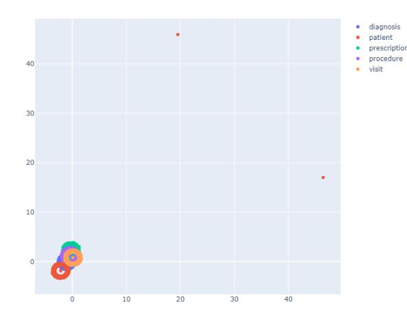
<!-- Image Description: The image displays a scatter plot visualizing the relationships between five medical data categories: diagnosis, patient, prescription, procedure, and visit. Data points are clustered near the origin, with a few outliers. The plot likely illustrates the dimensionality reduction or clustering of medical records, showcasing relationships between different record types within a dataset. The purpose is to show data distribution and potential relationships between different record types, probably to inform further analysis within the paper. -->

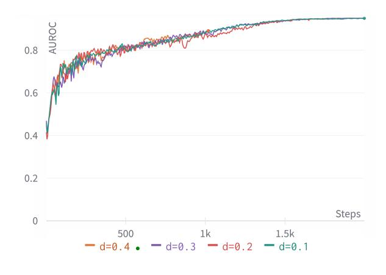
<!-- Image Description: The image displays a line graph illustrating the Area Under the ROC Curve (AUROC) against the number of steps. Multiple lines represent different values of a parameter 'd' (0.1, 0.2, 0.3, 0.4). The graph shows the AUROC's convergence behavior for varying 'd' values over training steps, likely to demonstrate the impact of this parameter on model performance in a machine learning context. -->

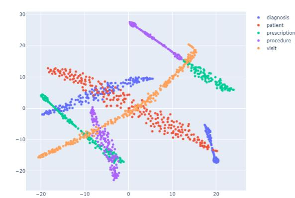
<!-- Image Description: The image displays a 2D scatter plot visualizing the results of a dimensionality reduction technique (likely t-SNE or UMAP) applied to medical data. Five distinct clusters are color-coded and labeled: diagnosis, patient, prescription, procedure, and visit. The plot's purpose is to show the relationships and potential separation between these different data types within a reduced-dimensionality space. The clusters' spatial distribution suggests varying degrees of correlation and separation among the data categories. -->

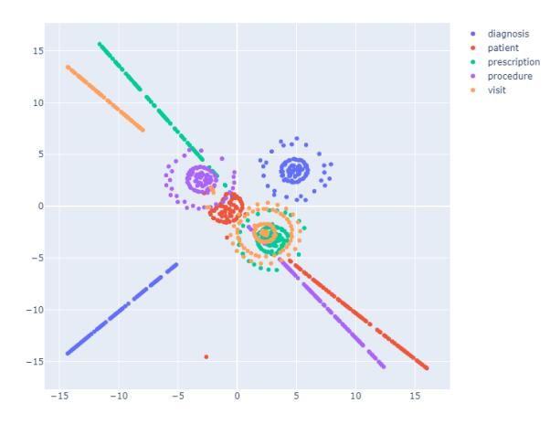
<!-- Image Description: This scatter plot visualizes a dimensionality reduction of medical data. Points represent different data types (diagnosis, patient, prescription, procedure, visit), color-coded for distinction. The plot shows clusters of data points suggesting relationships between these data types. Its purpose is to illustrate the structure and relationships within the dataset after applying a dimensionality reduction technique, likely for visualization or feature extraction in a machine learning context. -->

Figure D.10: Learning curves of MulT-EHR with different dropout rates.

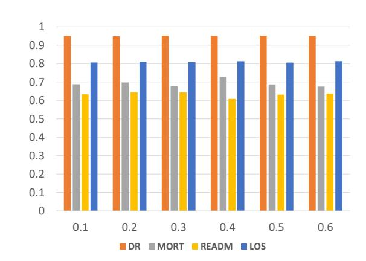
<!-- Image Description: The image displays a grouped bar chart comparing four metrics (DR, MORT, READM, LOS) across six different x-axis values (0.1 to 0.6). Each group of bars represents a single x-axis value, showing the corresponding values for each of the four metrics. The chart likely illustrates the relationship between the x-axis variable (not specified) and the four outcome measures, possibly showing trends or correlations. -->

Figure E.11: Performance in AUROC of MulT-EHR with different dropout rates on MIMIC-III tasks (DR: drug recommendation, MORT: mortality, READM: readmission, LoS: length of stay).

Figure D.9: Node embeddings of MIMIC-III entities trained by GCN (top), GAT (middle), and GIN (bottom).

results that balance the regularization power, preventing it from being either too strong or too weak.

We provide the values of other hyperparameters to which our framework is not sensitive as follow:

- Node feature dimension (*d*): 128
- Number of node samples in training: 2000
- Learning rate: 0.005
- Weight decay: 0.001
- Number of attention heads for attention-based algorithms: 8
