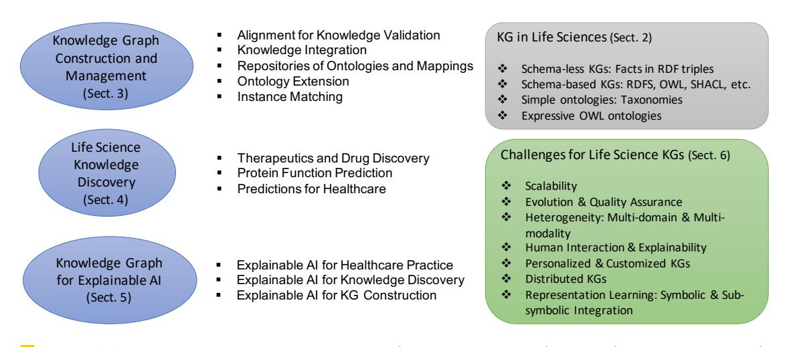

# City Research Online

## City, University of London Institutional Repository

**Citation**: Chen, J., Dong, H., Hastings, J., Jimenez-Ruiz, E., Lopez, V., Monnin, P., Pesquita, C., Škoda, P. & Tamma, V. (2023). Knowledge Graphs for the Life Sciences: Recent Developments, Challenges and Opportunities. Transactions on Graph Data and Knowledge (TGDK), 1(1), doi: 10.4230/TGDK.1.1.5

This is the published version of the paper.

This version of the publication may differ from the final published version.

**Permanent repository link:**https://openaccess.city.ac.uk/id/eprint/31611/
**Link to published version**: https://doi.org/10.4230/TGDK.1.1.5

**Copyright:**City Research Online aims to make research outputs of City, University of London available to a wider audience. Copyright and Moral Rights remain with the author(s) and/or copyright holders. URLs from City Research Online may be freely distributed and linked to.
**Reuse:**Copies of full items can be used for personal research or study, educational, or not-for-profit purposes without prior permission or charge. Provided that the authors, title and full bibliographic details are credited, a hyperlink and/or URL is given for the original metadata page and the content is not changed in any way.

City Research Online: <http://openaccess.city.ac.uk/>[publications@city.ac.uk](mailto:publications@city.ac.uk)

## Knowledge Graphs for the Life Sciences: Recent Developments, Challenges and Opportunities∗
**Jiaoyan Chen**[#](mailto:jiaoyan.chen@manchester.ac.uk)

Department of Computer Science, University of Manchester, UK Department of Computer Science, University of Oxford, UK
**Hang Dong**[#](mailto:hang.dong@cs.ox.ac.uk)

Department of Computer Science, University of Oxford, UK
**Janna Hastings**[#](mailto:janna.hastings@uzh.ch)

Institute for Implementation Science in Health Care, University of Zurich, Switzerland School of Medicine, University of St. Gallen, Switzerland
**Ernesto Jiménez-Ruiz**[#](mailto:ernesto.jimenez-ruiz@city.ac.uk) [Ñ](https://www.city.ac.uk/about/people/academics/ernesto-jimenez-ruiz)

City, University of London, UK SIRIUS, University of Oslo, Norway
**Vanessa López**[#](mailto:vanlopez@ie.ibm.com) IBM Research Europe, Dublin, Ireland
**Pierre Monnin**[#](mailto:pierre.monnin@inria.fr) [Ñ](https://pmonnin.github.io) Université Côte d'Azur, Inria, CNRS, I3S, France
**Catia Pesquita**[#](mailto:clpesquita@fc.ul.pt) LASIGE, Faculdade de Ciências, Universidade de Lisboa, Portugal
**Petr Škoda**[#](mailto:petr.skoda@matfyz.cuni.cz) Department of Software Engineering, Faculty of Mathematics and Physics, Charles University, Prague, Czechia
**Valentina Tamma**[#](mailto:v.tamma@liverpool.ac.uk)

Department of Computer Science, University of Liverpool, UK

### Abstract

The term*life sciences*refers to the disciplines that study living organisms and life processes, and include chemistry, biology, medicine, and a range of other related disciplines. Research efforts in life sciences are heavily data-driven, as they produce and consume vast amounts of scientific data, much of which is intrinsically relational and graphstructured.

The volume of data and the complexity of scientific concepts and relations referred to therein promote the application of advanced knowledgedriven technologies for managing and interpreting data, with the ultimate aim to advance scientific discovery.

In this survey and position paper, we discuss

recent developments and advances in the use of graph-based technologies in life sciences and set out a vision for how these technologies will impact these fields into the future. We focus on three broad topics: the construction and management of Knowledge Graphs (KGs), the use of KGs and associated technologies in the discovery of new knowledge, and the use of KGs in artificial intelligence applications to support explanations (explainable AI). We select a few exemplary use cases for each topic, discuss the challenges and open research questions within these topics, and conclude with a perspective and outlook that summarizes the overarching challenges and their potential solutions as a guide for future research.

∗ Authors are listed in alphabetic order with authors' contributions presented in the metadata block. Jiaoyan Chen, Hang Dong, Janna Hastings, and Valentina Tamma are corresponding authors.

<!-- Image Description: The image displays a Creative Commons license indicator. It shows the "CC" logo within a circle, a person symbol in a circle, and "BY" indicating attribution as the only required license condition. The image's purpose is to inform readers of the copyright status and permitted uses of the paper's content. -->

© Jiaoyan Chen, Hang Dong, Janna Hastings, Ernesto Jiménez-Ruiz, Vanessa López, Pierre Monnin, Catia Pesquita, Petr Škoda, and Valentina Tamma; licensed under Creative Commons License CC-BY 4.0
*[Transactions on Graph Data and Knowledge](https://www.dagstuhl.de/tgdk)*, Vol. 1, Issue 1, Article No. 5, pp. 5:1–5:33

<!-- Image Description: The image is a logo consisting of three stylized black, angular shapes resembling a "W" followed by the acronym "TG DK". It likely represents an organization or company mentioned in the academic paper, serving as a visual identifier rather than presenting technical data or analysis. There are no charts, graphs, equations, or other technical illustrations present. -->

[Transactions on Graph Data and Knowledge](https://www.dagstuhl.de/tgdk) [Schloss Dagstuhl – Leibniz-Zentrum für Informatik, Dagstuhl Publishing, Germany](https://www.dagstuhl.de)

#### 5:2 Knowledge Graphs for Life Sciences

**2012 ACM Subject Classification**Information systems → Graph-based database models; Computing methodologies → Knowledge representation and reasoning; Applied computing → Life and medical sciences
**Keywords and phrases**Knowledge graphs, Life science, Knowledge discovery, Explainable AI**Digital Object Identifier**[10.4230/TGDK.1.1.5](https://doi.org/10.4230/TGDK.1.1.5)
**Category**Position
**Funding** *Jiaoyan Chen*: supported by the EPSRC project ConCur (EP/V050869/1).

*Hang Dong*: supported by the EPSRC project ConCur (EP/V050869/1).

*Janna Hastings*: supported by the School of Medicine of the University of St. Gallen.

*Ernesto Jiménez-Ruiz*: supported by the SIRIUS Centre for Scalable Data Access (Research Council of Norway, project 237889).

*Catia Pesquita*: funded by the FCT through LASIGE Research Unit (ref. UIDB/00408/2020 and ref. UIDP/00408/2020), and also partially supported project 41, HfPT: Health from Portugal, funded by the Portuguese Plano de Recuperação e Resiliência.

**Acknowledgements**We would like to thank Uli Sattler (University of Manchester) for proposing the topic of this paper and Terry Payne (University of Liverpool) for the useful comments on a previous draft. We would also like to thank the TGDK editors in chief for organizing this inaugural issue.
**Received**2023-06-30**Accepted**2023-08-31**Published**2023-12-19
**Editors**Aidan Hogan, Ian Horrocks, Andreas Hotho, and Lalana Kagal
**Special Issue**Trends in Graph Data and Knowledge
**Authors' Contributions**All authors participated in the planning and discussions of this work. JH and HD finished the abstract and "Introduction". VT, JC and EJR contributed to "Knowledge Graphs in the Life Sciences". VT contributed to the main part of "Knowledge Graph Construction and Management", with contributions of use cases from JC, HD, PM, EJR, and JH. VL and JC contributed to "Life Science Knowledge Discovery". PM, PS, HD, and CP contributed to "Knowledge Graphs for Explainable AI". HD, JC, and CP contributed to "Discussion and Conclusion" based on discussions with other team members. All authors contributed to the final revision of this paper.

## 1 Introduction

The term*life sciences*refers to those disciplines that study living organisms and life processes, and include chemistry, biology, medicine, and a range of other related areas. Research efforts in life sciences are increasingly data-driven, as they produce and consume vast amounts of scientific data, much of which is intrinsically relational and graph-structured.

Much of this data is large-scale, complex, and presents many interrelationships and dependencies, thus being well suited to be represented in graph structures. For this reason, graph-based technologies are frequently used in the life sciences, and these disciplines have been drivers and early adopters of innovative methods and associated technologies.

In this brief survey and position paper we discuss recent developments and advances in the use of graph-based technologies in life sciences, and set out a vision for how these technologies will impact these fields in future. We illustrate the contribution in this paper in Figure [1.](#page-4-0)

We consider Knowledge Graphs (KGs) and their associated technologies to broadly include

-**(i)**different forms of graph-based representations,
-**(ii)**the logical languages that assign explicit semantics to such representations, and their associated automated reasoning technologies, and
-**(iii)**machine learning approaches that ingest data in graph-based representations and that process these graph-based representations to perform some task, e.g., data analytics.

<!-- Image Description: This image from an academic paper presents a structured overview of knowledge graphs (KGs) in life sciences. Three key areas are highlighted: KG construction and management; life science knowledge discovery; and explainable AI for KGs. Each area lists subtopics and associated section numbers. A separate section details KG types in life sciences (schema-less, schema-based) and their associated challenges (scalability, heterogeneity, explainability, etc.). The purpose is to categorize and outline the scope of the paper's research on KGs within a life sciences context. -->
**Figure 1** An overview illustration of definitions (upper right, in gray), topics (left column, in blue), use cases (middle), and challenges (bottom right, in green) for the research of KGs in the life sciences.

These different forms of graph-based representations can be further categorized based on the type of content represented. We therefore distinguish schema-less and schema-based Knowledge Graphs. More specifically, a typical KG contains either or both a schema part (terminologies or TBox[1](#page-4-1) ) and a data part (facts, assertions, or ABox). The formal semantics of KGs can be expressed with the OWL ontology language[2](#page-4-2) .

In the remainder of this paper we will focus on three broad topic areas in which graph-based technologies have been used extensively, and we illustrate each area with some specific projects or use cases that guide our discussion and summary of the challenges that have been encountered.

- The construction and management of KGs to represent life science knowledge;
- The use of KGs and associated technologies in the discovery of new knowledge;
- The use of KGs in artificial intelligence applications to support explanations (eXplainable AI or XAI).

We then provide a summary of the general challenges across the topics, that include intrinsic characteristics of KGs (e.g., scalability, evolution, heterogeneity) and their operational aspects in the real world (e.g., human interaction, personalization, distributed setting, and representation learning). We present the challenges by means of use cases and the current research efforts that address them. It is worth mentioning that while we aim to focus on the life sciences, many of the topics and challenges discussed in this work, especially those of KG construction and management in Section 3, are general and applicable to KGs in other domains such as finance, e-commerce, material, and urban management [\[111,](#page-29-0) [31\]](#page-25-0), etc. The KG-based problem modeling and solving approaches in life science knowledge discovery could be applicable for addressing many other use cases and problems in a broader domain of AI for scientific discovery [\[175,](#page-32-0) [60\]](#page-26-0).

In the next section, we introduce several different categories of KGs as they have been used in life sciences. Thereafter in Sections [3-](#page-6-0)[5,](#page-18-0) each of the above topics is described in a dedicated section together with a survey of recent advances. Finally, in Section [6](#page-21-0) we synthesize the overarching challenges and trends into a perspective on the outlook for the future.

1 We introduce a list of key terms relevant to Knowledge Graphs and Life Sciences in Appendix A.

2 Web Ontology Language: <https://www.w3.org/OWL/>

## 2 Knowledge Graphs in the Life Sciences

KGs represent semantically-described real-world entities, typically through ontologies (vocabularies or schemas) [\[68,](#page-27-0) [61\]](#page-26-1) and the data instantiating them, and thus provide descriptions of the entities of interest and their interrelations, by means of links to ontology classes describing them, organized in a graph [\[158\]](#page-31-0). KGs have been widely adopted in the life sciences, as can be seen in the composition of the Linked Open Data Cloud[3](#page-5-0) , where life sciences represent one of the largest subdomains. A prominent example is the KG representing annotations regarding proteins by means of terms in the Gene Ontology describing different protein functions [\[4\]](#page-23-0).

Whilst KGs are becoming increasingly popular in different domains including the life sciences, there is no single accepted definition of KG [\[43\]](#page-25-1). A KG can be formally described as a directed, edge-labeled graph G = (*V, E*), where *V*refers to the*vertices*or*nodes*, representing real-world entities of interest (e.g., proteins, genes, compounds, cellular components, but also pathways, biological processes and molecular functions, to name a few) while *E*refers to the edges in the graph, representing relationships or links between the entities in*V*(e.g., binds, associates, etc.). These may be represented as statements about entities in the form of RDF[4](#page-5-1) triples: (subject, predicate, object).

However, this formal definition only focuses on the components of KGs, but does not pose any constraint on what a KG should model or represent, and how. This is particularly true in life sciences, where the term*Knowledge Graph*has been used to refer to diverse graph data structures, typically interconnected, but often isolated.

Many of the everyday tasks faced by researchers in this domain require the systematic processing and integration of data and knowledge from data sources that are characterized by heterogeneous syntaxes and structures, formats, entity notation, schemas and scope, e.g., ranging from molecular mechanisms to phenotypes. Researchers in this area have been early adopters of Semantic Web and linked data approaches as a means to facilitate knowledge integration and processing to support tasks including semantic search, clinical decision support, enrichment analysis, data annotation and integration. However, a recent analysis of life science open data has identified several stand-alone data sources that exist in isolation, are not interlinked with other sources, and are schema-less (or use unpublished schemas), with limited reuse or mappings to other data sources [\[88\]](#page-28-0). Therefore, we can define a life sciences KG, following [\[130\]](#page-30-0), as a data resource integrating one or more possibly curated sources of information into a graph whose nodes represent entities and edges represent relationships between two entities. This definition is consistent with other definitions found in the literature, e.g., [\[135\]](#page-30-1).

These considerations underlie the reasons why KGs in life sciences can be of different types, and can be categorized across different dimensions. One of the most critical dimensions (in terms of support for complex queries and integration) is the categorization of KGs into schema-based and schema-less knowledge bases. In turn, the expressivity of the schema provides a further categorization criterion, depending on whether schemas are modeled as simple taxonomies (e.g., the NCBI taxonomy [\[154\]](#page-31-1) included in the UMLS Metathesaurus [\[9\]](#page-23-1)), RDFS[5](#page-5-2) vocabularies or (fully axiomatized) OWL ontologies. In particular, this paper refers to this broad definition of KGs, which we then divide into:

Schema-less KGs composed of only relational facts in the form of RDF triples. Examples include the PharmaGKB dataset, an integrated online knowledge resource capturing how genetic variation contributes to variation in drug response [\[180\]](#page-32-1). Note that many semantic networks (defined in Appendix A) could be assigned to this category as their triples form a multi-relational graph.

3 <http://cas.lod-cloud.net>

4 Resource Description Framework: <https://www.w3.org/RDF/>

5 RDF Schema: <https://www.w3.org/TR/rdf-schema/>

- Schema-based KGs composed of relational facts and their schema (meta information) in e.g., RDFS, OWL, and constraint languages such as SHACL[6](#page-6-1) . Examples include Wikidata with its property constraints, and DBpedia with its DBpedia ontology. Whilst Wikidata and DBpedia are general-purpose KGs, they also include large-scale life science knowledge.
- Simple ontologies representing taxonomies. Notable examples include the tree structure of the UMLS Semantic Network[7](#page-6-2) and the International Classification of Diseases, version 10 (ICD-10) [\[182\]](#page-32-2).
- Expressive OWL ontologies, with complex axioms beyond simple taxonomies. OWL ontologies may be composed of a TBox and an ABox. Depending on the expressivity of the axioms modeled in the ontology, i.e., the basic statements that an OWL ontology expresses, OWL ontologies can fall into one of the previous categories: for instance, an OWL ontology with just an ABox can be seen as the case above of a KG composed of relational facts alone. In this final category we include fully axiomatized OWL ontologies, e.g., with complex classes and property restrictions. Notable examples of these ontologies include SNOMED CT [\[38\]](#page-25-2), the Gene Ontology [\[4,](#page-23-0) [28\]](#page-24-0), and the Food Ontology (FoodOn)[8](#page-6-3) .

## 3 Knowledge Graph Construction and Management

The adoption of KGs in the life sciences is motivated by the need for standardization of taxonomies and vocabularies to support the integration, exchange and analysis of data. More recently, richly annotated data is also being used in combination with machine learning methods for many applications, including helping to overcome issues related to the sparsity of data and helping to select promising candidates for reducing expensive and time-consuming physical experiments [\[64\]](#page-26-2). Graph-based machine learning approaches such as Graph Neural Networks have been applied to a number of life science tasks [\[49\]](#page-26-3), including drug repurposing [\[120\]](#page-29-1) and predicting polypharmacy side effects [\[196\]](#page-33-0).

Given the diverse nature of the knowledge and tasks supported by KGs, the focus of stateof-the-art approaches has been the description of how individual KGs are developed within the specific domain [\[190\]](#page-33-1), typically in terms of the specific approaches used for the development of the KG (e.g., data extraction process, relation extraction and entity discovery), rather than on the overall development process. More recently, some efforts have focused on providing an overview of development approaches and pipelines for the construction of KGs in the life sciences, and beyond [\[130,](#page-30-0) [164\]](#page-32-3). The process of constructing a KG depends heavily on:

- The type of data sources integrated and annotated by the KG, e.g., CSV files, public and proprietary data sources, structured databases, full-text publications, etc.
- The granularity of the KG to be constructed, e.g., schema-less KG, simple or expressive ontology.
- The usability expectations in downstream applications, e.g., the ability to customize and manipulate the graph to support different use cases, or the ease of consumption as input to machine learning methods [\[51\]](#page-26-4).

A recent systematic review [\[164\]](#page-32-3) surveyed different KG development approaches to determine a general development framework. The review identified six main phases that are common across different KG development approaches:

6 <https://www.w3.org/TR/shacl/>

7 <https://uts.nlm.nih.gov/uts/umls/semantic-network/root>

8 <http://foodon.org>

### 5:6 Knowledge Graphs for Life Sciences

-**1)**Data source selection.
-**2)**Ontology construction.
-**3)**Knowledge extraction.
-**4)**Knowledge ingestion and validation.
-**5)**KG storage and inspection.
-**6)**KG maintenance and evolution.

In the remainder of this section we will present the individual phases and the role they play in a KG development process by means of two use cases, where we illustrate the construction of KGs and discuss how these support knowledge integration and validation (Section [3.2\)](#page-11-0). We then present some recent technical developments in Section [3.3,](#page-12-0) while Section [3.4](#page-14-0) discusses open challenges for the construction and management of KGs.

## 3.1 Knowledge Graph Construction Phases

This section provides more details on the phases involved in the KG construction process, with the aim of identifying recent trends, rather than providing an exhaustive literature survey. These phases are discussed in order of execution, however the*ontology construction*phase can occur either together with the data source selection (if an ontology covering the domain of interest already exists or can be constructed through a set of given requirements) or as part of the*knowledge ingestion and validation*phase, where an ontology is built semi-automatically from the available data or through modularization and alignment of existing ontologies.

## 3.1.1 Data source selection

This phase identifies the data sources that are to be integrated by the KG, which in turn affects the choice of knowledge extraction techniques. Generally, life science KGs ingest knowledge from structured, semi-structured and unstructured data sources. By*structured*we refer to data modeled according to an existing structure, e.g., data in tables or public or proprietary reference (relational) databases such as UniProt [\[29\]](#page-25-3) or ChEMBL [\[50\]](#page-26-5). Semi-structured data refer to, e.g., XML documents [\[116\]](#page-29-2), whereas unstructured data refer to data that do not conform to a given structure, i.e., free-text sources, such as scientific publications from PubMed[9](#page-7-0) . Data ingested from manually curated databases [\[130\]](#page-30-0) and semi-structured sources constitute the foundation of a KG [\[51\]](#page-26-4), generally defining the entities and some of the relations in the KG. This data is then further enriched by performing text mining on large-scale free text sources, in order to extract relationships, which is the objective of the*knowledge extraction*phase.

## 3.1.2 Ontology construction

The aim of this phase is to define a common, consensus-based, controlled vocabulary to describe the data in an*ontology*[\[146\]](#page-31-2). The existence of a common structure, or schema, supports querying, integration and reasoning tasks over the KG.

Traditional ontology engineering approaches are divided into top-down or bottom-up. Topdown approaches are based on more or less formal ontology engineering methodologies [\[45,](#page-25-4) [95,](#page-28-1) [131\]](#page-30-2) or common practices [\[3\]](#page-23-2) to build ontologies from a description of the domain elicited from domain experts [\[129\]](#page-30-3), and/or by reusing or extending existing ontologies [\[82\]](#page-27-1). Ontology engineering methodologies define the ontology development process in terms of requirement analysis, entity

9 <https://pubmed.ncbi.nlm.nih.gov>

and property definitions, ontology reuse, validation and population. In contrast, bottom-up approaches utilize semi-automatic data driven techniques, e.g., ontology learning from text [\[110\]](#page-29-3), and can be used to refine and validate an ontology. These approaches are discussed in more detail when presenting the*knowledge ingestion and validation*phase.

Whilst general purpose ontology engineering methodologies have evolved to be used in the development of KGs [\[139\]](#page-30-4), a considerable number of ontologies in the life science domain have been built as part of the Open Biological and Biomedical Ontologies (OBO) Foundry effort,[10](#page-8-0) which defines a set of development principles for biological and biomedical ontologies and provides a suite of high-quality, interoperable, free and open source tools that support ontology development [\[115\]](#page-29-4).

## 3.1.3 Knowledge extraction

Knowledge extraction refers to the identification of entities and their relations from the data sources, which is a crucial step in the development of a KG [\[164\]](#page-32-3).*Entity extraction*identifies entities from the various data sources selected using Natural Language Processing (NLP) approaches and text mining techniques to analyze and extract relevant information from large text corpora [\[178,](#page-32-4) [103,](#page-28-2) [71\]](#page-27-2). Named entity recognition (NER) supports the identification of named entities in text, such as drug names, diseases, or chemical compounds, and their classification according to pre-defined entity types [\[127\]](#page-30-5). NER approaches in the life sciences are typically based on labor intensive tasks such as the definition of generic (e.g., orthographic, morphological, or dictionary-based) and specific rules that are typically defined by experts, and are not easily applicable to other corpora [\[195\]](#page-33-2). There are a number of issues hindering these approaches:

-**a)**the pace of scientific discovery and the identification of new entities;
-**b)**the large number of synonyms and term variations associated with an entity; and
-**c)**entity identifiers that are composed of a mixture of letters, symbols and punctuation, often in large sentences [\[101\]](#page-28-3).

More recent approaches have proposed the use of supervised machine learning methods (e.g., conditional random fields, or Support Vector Machines, SVMs, neural networks, and neural language models in particular) [\[112,](#page-29-5) [86,](#page-28-4) [35\]](#page-25-5) either in isolation, or combined in hybrid approaches to improve accuracy [\[149\]](#page-31-3).

Entity recognition generates entities that are isolated and not linked [\[164\]](#page-32-3). The goal of*Relation extraction*is to discover relationships of interest between a pair of entities, thus describing their interaction. Relation extraction is a necessary step for entities defined in semi-structured or unstructured sources, whereas structured data sources are characterized by explicitly identifiable relationships. Typical approaches for relation extraction include rule-based [\[75,](#page-27-3) [145,](#page-31-4) [144\]](#page-31-5), supervised [\[106,](#page-29-6) [48\]](#page-26-6) and unsupervised approaches [\[98,](#page-28-5) [130\]](#page-30-0). Rule-based relation extraction identifies keywords (based on existing ontologies or expert defined dictionaries) and grammatical patterns to discover relations between entities. Supervised relationship extraction methods utilize publicly available pre-labelled datasets (e.g., BioInfer [\[141\]](#page-30-6) or BioCreative II [\[97\]](#page-28-6)) to construct generalized patterns that separate positive examples (sentences implying the existence of a relationship) from negative ones. Supervised approaches include SVMs, Recurrent Neural Networks (RNNs) and Convolutional Neural Networks (CNNs) [\[6,](#page-23-3) [130\]](#page-30-0). Unsupervised relation extraction methods [\[113\]](#page-29-7) have emerged to address the lack of scalability of supervised relation extraction methods, due to the high cost of human annotation. Unsupervised methods involve some form of clustering or statistical computation to detect the co-occurrence of two entities in the same text [\[130\]](#page-30-0).

10 <https://obofoundry.org>

### 5:8 Knowledge Graphs for Life Sciences

More recently, end-to-end approaches (End-to-End Relation Extraction – RE) have been used to tackle both tasks simultaneously. In this scenario, a model is trained simultaneously on both the NER and Relation Extraction objectives [\[74\]](#page-27-4). Furthermore, rule-based approaches can be combined with relation classification using specialized pre-trained language models adapted for life science domains, e.g., BioBERT [\[102\]](#page-28-7), SapBERT [\[108\]](#page-29-8), and RoBERTa-PM [\[104\]](#page-28-8), to name a few. There is also a recent trend to probe and prompt pre-trained language models to extract relations (e.g., disease-to-disease, disease-to-symptoms) [\[187,](#page-33-3) [163\]](#page-31-6).

## 3.1.4 Knowledge ingestion and validation

The aim of this phase is to ingest the entities and relationships extracted in a previous phase, which models knowledge from different sources. These entities and relations can be incomplete, ambiguous or redundant, and need to be appropriately aligned and integrated, and finally annotated according to the ontology constructed in phase 2.

Knowledge integration or fusion can critically improve the quality of data by performing*entity resolution*, i.e., the detection of different descriptions of the same real-world entity (also called entity matching, deduplication, entity linkage or entity canonicalization), prior to ingesting them in the KG. This reconciliation step is particularly crucial in the life sciences, where duplication can be caused by data modeled using different vocabularies or ontologies, or when data is extracted from literature sources that are rapidly changing. The severity of the ambiguity depends on the number of ontologies available for the domain. For instance, the number of gene vocabularies is far smaller than the number of disease vocabularies that could be present in the ingested datasets. Linking these entities requires costly alignment processing; in particular the alignment of disease entities is especially problematic given the number of different coding systems, whose conversion is often not trivial [\[51\]](#page-26-4). We further explore this issue in two of the use cases presented in Section [3.3,](#page-12-0) where we explore the problem of aligning vocabularies and ontologies through the use of mapping repositories and instance matching in automated clinical coding.

Entities are assigned unique identifiers (URI or IRI) that support the definition of bespoke namespaces, and support integration by reusing identifiers in related namespaces. Entity resolution is based on clustering similar entities together in a *block*, where similarity measures are used to detect duplicates [\[164\]](#page-32-3). Typical methods include sorted neighborhoods and traditional blocking; and machine learning methods are commonly used for similarity computation, e.g., feature vector computation [\[93\]](#page-28-9).

This phase may also include the bottom-up construction of the ontology for those applications where a top-down approach is not feasible. Bottom-up approaches extract the relevant knowledge first, and then they construct the data schema / ontology based on the extracted data, typically using (semi-)automated methods, based on machine learning. Ontologies define the structure of the knowledge graph, which supports querying and data analytics. In bottom-up ontology development the structure of the knowledge graph is determined based on the extracted knowledge, thus providing a structure for this knowledge [\[69\]](#page-27-5).

Often the construction of ontologies (either bottom-up or top-down) relies on the ability to correctly align and reuse entities defined across different domains and KGs. Furthermore, reuse of (or conformance to) existing upper level ontologies, e.g., BFO (Basic Formal Ontology) [\[3\]](#page-23-2) provides the basis for the consistent and unambiguous formal definition of entities and relations that prevents errors in coding and annotation. The alignment of ontologies in life sciences and other domains is an active area of research, and we provide an overview of recent technical developments and challenges in Section [3.3.](#page-12-0)

Whilst bottom-up approaches, especially those based on alignment, are becoming more viable, especially given the support of language models, such as BERT [\[63\]](#page-26-7), their performance is not always adequate for the task, as discussed in the second challenge in Section [3.4.](#page-14-0)

Knowledge enrichment and completion improve the KG quality by performing reasoning (KG materialization), inference [\[56\]](#page-26-8) and optimization. Reasoning and inference support the assertion of new relations based either on logical reasoning (e.g., [\[128,](#page-30-7) [170\]](#page-32-5)) or machine learning techniques (e.g., statistical relational learning or through embedding based link predictors for new concepts [\[34,](#page-25-6) [35,](#page-25-5) [66,](#page-26-9) [76\]](#page-27-6) and node classifiers, also called KG refinement [\[135\]](#page-30-1)). The extent and type of logical inferences depends on the expressivity of the ontology built in phase 2, or in a bottom-up fashion in this phase, together with any associated mappings. Description Logic formalisms, such as OWL, use logic-based reasoning for detecting and correcting incorrect assertions and ontology alignments [\[24\]](#page-24-1).

## 3.1.5 KG storage and inspection

KGs need to be accessible to support a variety of different tasks, beyond the mere integration of different knowledge sources, and thus KG storage management [\[164,](#page-32-3) [142,](#page-30-8) [177\]](#page-32-6) is an active area of research. Current KG storage mechanisms are divided into relation based stores (e.g., [\[1\]](#page-23-4)) and native graph stores (e.g., [\[197\]](#page-33-4)). Relational KG stores, either based on relational databases or through NOSQL databases and / or triple stores such as Jena TDB[11](#page-10-0), have reached a considerable level of maturity and have been optimized in order to avoid common problems, e.g., a large number of null values in columns or optimized query performance [\[142\]](#page-30-8). Graph databases store nodes, edges and properties of graphs natively, and support query and graph mining tasks. Examples of state of the art implementations include Neo4J[12](#page-10-1), GraphDB[13](#page-10-2), and RDFox[14](#page-10-3). The evolution of the performance of these systems has been the object of systematic studies [\[8\]](#page-23-5), whereas [\[168\]](#page-32-7) explicitly focuses on biomedical use cases.

Storage management has implications on the ways KGs support expressive queries for nodes and edges and visualization, to support data analysis, navigation and discovery of related knowledge [\[93,](#page-28-9) [162\]](#page-31-7). Graph databases often provide built-in tools for visualization, e.g., Neo4J, whereas different Javascript libraries (e.g., SigmaJS[15](#page-10-4)) are available for developing visualization front ends. Support for complex queries is also either built in a graph database or a triple store by supporting the SPARQL query language [\[140,](#page-30-9) [197\]](#page-33-4), or proprietary query languages such as Cypher [\[47\]](#page-26-10), supported by Neo4J.

## 3.1.6 Knowledge maintenance and evolution

Given the rapid scientific development in the life sciences, and the consequent continuous update of ontologies for this domain, artifacts annotated with these ontologies can become outdated very quickly, and require some form of update (also called ontology extension). These update mechanisms need to be automated to ensure that they scale to the size of KGs. Automatic update approaches are based on the periodical detection and extraction of new knowledge that is then mapped to existing entities and relations in the KG [\[183\]](#page-32-8).

Update mechanisms are typically based on the detection of *changes*[\[121\]](#page-29-9) that can affect an ontology, e.g., addition, removal or modification of meta-entities (i.e., entities, relations and their definitions). These changes include renaming concepts and properties, setting domain and range restrictions, or setting a subsumption relation. To date, the most comprehensive account of

11 <https://jena.apache.org/documentation/tdb/index.html>

12 <https://neo4j.com>

13 <https://graphdb.ontotext.com>

14 <https://www.oxfordsemantic.tech/product>

15 <https://github.com/jacomyal/sigma.js>

### 5:10 Knowledge Graphs for Life Sciences

ontology change is given in [\[46\]](#page-25-7), where change is described for different sub-fields, e.g., ontology alignment, matching and mapping, morphisms, articulation, translation, evolution, debugging, versioning, integration and merging; each with different requirements and implications. The study [\[137\]](#page-30-10) further investigates the impact of biomedical ontology evolution on materialization.

Currently available tools and methodologies use (semi)-automated methods to perform many of the operations that trigger a change in an ontology and the consequent creation of a new version [\[54,](#page-26-11) [63\]](#page-26-7). Different ontology management platforms and portals mandate different principles and frameworks for handling ontology versioning (e.g., OBO foundry[16](#page-11-1) or BioPortal[17](#page-11-2)), but these are typically implemented by ontology developers with limited tool support. Section [3.3](#page-12-0) presents an example of automated ontology extension that relies on machine learning to cope with the scale of data.

## 3.2 Examples of Life Science KG Construction

In this section we provide two examples of life science KGs that illustrate in practice the phases composing the generic KG construction process discussed in Section [3;](#page-6-0) namely a KG for Pharmacogenomics, PGxLOD [\[118\]](#page-29-10), and one for Ecotoxicological Analysis, TERA [\[124,](#page-30-11) [125\]](#page-30-12).
**Alignment for Knowledge Validation: An Example of Pharmacogenomics.**As mentioned in Section [3,](#page-6-0) the task of aligning knowledge in KGs supports several downstream applications and domains. For instance, pharmacogenomics studies the influence of genetic factors on drug response phenotypes (e.g., expected effect, side effect). Hence, pharmacogenomics is of interest for personalized medicine. The atomic knowledge unit in pharmacogenomics is a ternary relationship between a drug, a genetic factor, and a phenotype. Such a relationship states that a patient being treated with the specified drug while having the specified genetic factor may experience the described phenotype. Semantic Web and KG technologies have been employed in this application domain, for example by building ontologies in which patients and pharmacogenomic knowledge are represented, and then using deductive reasoning mechanisms to conditionally recommend genetic testing before drug prescription [\[153\]](#page-31-8). However, the knowledge relevant to pharmacogenomics is scattered across several sources including reference databases such as PharmGKB, and the biomedical literature. Additionally, this knowledge may lack sufficient validation to be implemented in clinical practice. For example, some relationships may have only been observed in smaller cohorts of patients or in non-replicated studies. Hence, there is a need to align different sources of pharmacogenomic knowledge to detect additional evidence validating (or moderating) a knowledge unit. To this aim, the PGxLOD KG was proposed [\[118\]](#page-29-10). Automatic knowledge extraction approaches were applied on semi-structured and unstructured data from PharmGKB and the biomedical literature to represent their knowledge in the KG. Then, matching approaches were developed to align knowledge units from various sources [\[117,](#page-29-11) [119\]](#page-29-12). The resulting alignments outlined some agreements between PharmGKB and the biomedical literature, which was expected since PharmGKB is manually completed by experts after reviewing the literature. Interestingly, this automatic knowledge extraction pipeline could guide the manual review process by automatically pointing out studies confirming or mentioning a pharmacogenomic knowledge unit.
**Knowledge Integration: An Example of Ecotoxicological Analysis.**In ecotoxicological analysis, data and knowledge from different domains such as chemistry and biology are often needed. These are usually located in different sources such as spreadsheets or CSV files for local experimental results, open databases for public research results, and ontologies for domain knowledge. Thus knowledge integration becomes a critical and fundamental challenge before real analysis can be conducted. In the study by Myklebust et al. [\[124,](#page-30-11) [125\]](#page-30-12), which aims to predict adverse biological

16 <http://www.obofoundry.org/principles/fp-004-versioning.html>

17 <https://bioportal.bioontology.org>

effects of chemicals on species, a toxicological effect and risk assessment KG named TERA was constructed for knowledge integration. TERA includes three sub-KGs:*(i)*the Chemical sub-KG, which is constructed by integrating the vocabulary MeSH (Medical Subject Headings) with selective knowledge from two chemical databases PubChem and ChEMBL utilizing the chemical mappings in Wikidata;*(ii)*the Taxonomy sub-KG, which is constructed by integrating EOL (Environment Ontology for Livestock) and the NCBITaxon ontology utilizing NIBI-EOL mappings in Wikidata; and*(iii)*the ECOTOX sub-KG, which is composed of RDF triples transformed from experimental risk results and is aligned with the other two sub-KGs by the ontology alignment system LogMap [\[80\]](#page-27-7) and the chemical mappings in Wikidata. Another example of knowledge integration is for drug repurposing, where the KG Hetionet[18](#page-12-1) is created by integrating 29 public resources, including biomedical KGs and other types of data [\[67\]](#page-27-8).

## 3.3 What has been done: recent technical developments

Given the many existing ontologies in life sciences, e.g., ontologies available in the OBO Foundry collection or in BioPortal [\[132\]](#page-30-13), KG construction usually involves the reuse, alignment, and enrichment of state-of-the-art ontologies. The existing ontologies in life sciences need to be updated given the new discoveries in the field. This is broadly a key issue in the management, maintenance, and evolution of ontologies. We select a few promising use cases below to highlight some recent developments that support the KG construction in the life sciences.
**Repositories of Ontologies and Mappings.**Ontologies and their mappings play a central role in semantically enabled products and services consumed by life science companies, academic institutions and universities, as highlighted by the Pistoia Alliance ontology mapping project [\[58\]](#page-26-12).[19](#page-12-2) Ontology mappings are essential in knowledge graph construction tasks to bridge the knowledge provided by different ontologies and expand their coverage. Ontology mappings can also play a key role when identifying the right ontologies to be reused as they will enable the retrieval of the relevant (overlapping) ontologies for the domain of interest. For this reason, a number of notable efforts in life sciences have created large repositories of ontologies and mappings to serve the research within the community. Prominent examples include the UMLS Metathesaurus [\[9\]](#page-23-1), BioPortal [\[132,](#page-30-13) [152\]](#page-31-9), MONDO [\[172\]](#page-32-9), and the EBI services: OLS [\[174\]](#page-32-10), OxO [\[84\]](#page-27-9) and the RDF platform [\[85\]](#page-28-10). The UMLS Metathesaurus is a comprehensive effort for integrating biomedical ontologies through mappings. In its 2023AA version, it integrates more than two hundred vocabularies, with more than 3 million unique concepts and more than 15 million concept names. BioPortal is a repository containing more than 1,000 biomedical ontologies and more than 79 million lexically computed mappings among them (as of July 13, 2023). The Mondo Disease Ontology (MONDO) is a manually curated effort to harmonize and integrate disease conceptualizations and definitions across state-of-the-art ontologies (e.g., HPO [\[96\]](#page-28-11), DO [\[155\]](#page-31-10), ICD, SNOMED CT, etc.). The services provided by the European Bioinformatics Institute (EBI) also deserve a special mention. The Ontology Lookup Service (OLS) has become a reference to explore the latest versions of more than two hundred ontologies via its graphical interface or programmatically via its API. OxO is a repository of ontology mappings and cross-references extracted from the OLS and UMLS. OxO allows users to visually traverse the graph of mappings to identify additional potential mappings beyond direct ones (i.e., multi-hop mappings). Finally, the EBI RDF platform provides a unified KG with all the RDF resources at the EBI. Complementary to the efforts from the life sciences, the Semantic Web

18 <https://github.com/hetio/hetionet>

19 <https://www.pistoiaalliance.org/projects/current-projects/ontologies-mapping/>

### 5:12 Knowledge Graphs for Life Sciences

has also contributed to the systematic evaluation of mappings in public repositories (e.g., [\[81,](#page-27-10) [44\]](#page-25-8)) and mappings produced by automated ontology mapping systems (e.g., the Ontology Alignment Evaluation Initiative (OAEI) [\[138\]](#page-30-14)). Automatically generated mappings of high quality have the potential to be integrated within the aforementioned repositories and hence, the OAEI has always had a special focus on life science test cases with evaluation tracks like Anatomy [\[39\]](#page-25-9), LargeBio [\[83\]](#page-27-11), Phenotype [\[59\]](#page-26-13) and the newly created track BioML [\[64\]](#page-26-2). The Simple Standard for Sharing Ontological Mappings (SSSOM) [\[114\]](#page-29-13) represents a joint effort between the life sciences and Semantic Web communities to facilitate the exchange of mappings across different parties and repositories, while keeping the provenance and other relevant characteristics of the mappings.
**Ontology Extension.**Ontology extension in life sciences aims to connect new concepts and their relations to an ontology from updated sources, e.g., scientific papers in PubMed and chemical information in PubChem[20](#page-13-0). Manual ontology extension, while essential for the development of gold standard resources, is not scalable to the full scope of large domains due to its high cost and low efficiency, and sometimes is even unfeasible as human beings may not be able to review the quantities of new information at the rate they become available. Thus machinelearning-based, automated methods are needed. One recent example is the use of deep learning, specifically a Transformer-based model, to categorize new chemical entities within the ChEBI ontology[21](#page-13-1) [\[53\]](#page-26-14). In addition, recent studies have explored enriching SNOMED CT by mining new concepts from texts [\[35\]](#page-25-5) and placing them into the ontology [\[109,](#page-29-14) [34\]](#page-25-6). A new concept can be identified by NIL entity linking, i.e., exploring unlinkable mentions, usually through setting a "linkable" score threshold or through classification [\[35\]](#page-25-5). Resolution and disambiguation of NIL mentions with clustering can help to represent NIL entities [\[66,](#page-26-9) [91\]](#page-28-12). For concept placement, similar to the aforementioned CHEBI ontology extension [\[53\]](#page-26-14), machine learning, especially in the form of Transformer-based deep learning, has been applied to predict subsumption relations between a new concept and the existing concepts. Complex concepts in OWL ontologies that contain logical operators (e.g., existential quantifier and conjunction in SNOMED CT) can be supported in subsumption prediction [\[23\]](#page-24-2) and new concept placement [\[34\]](#page-25-6). Another group of studies use post-coordination or formalising a new term with existing concepts and attributes [\[16,](#page-24-3) [92\]](#page-28-13), which is similar to composing subsumption axioms with complex concepts. The methods include using lexical features [\[92\]](#page-28-13), word embeddings and KG embeddings [\[16\]](#page-24-3). Pre-trained and Large Language Models, through fine-tuning, zero-shot and few-shot prompting have the potential to support the mining [\[35\]](#page-25-5) and placement of new concepts (e.g., by subsumption prediction [\[23,](#page-24-2) [65\]](#page-26-15)).
**Instance Matching: Automated Clinical Coding.**A main source for patients' KG construction is Electronic Health Records (EHR). Using medical ontologies as backbones, it is possible to add a layer of data by instance matching (or patient matching) through*Clinical Coding*. Clinical coding is the task of transforming medical information in EHR into structured codes described in medical ontologies [\[36\]](#page-25-10), e.g., ICD and SNOMED CT. Recent approaches mainly formulate the problem as a multi-label classification problem. Various neural network architectures have been proposed and knowledge plays a key role to enhance the neural architectures [\[36,](#page-25-10) [79\]](#page-27-12). Pre-trained language models, e.g., BERT [\[32\]](#page-25-11), have been applied to clinical coding and gradually achieved better results with adapted modeling methods and more advanced language models, e.g., PLM-ICD [\[70\]](#page-27-13) with RoBERTa-PM [\[104\]](#page-28-8), according to studies [\[36,](#page-25-10) [42,](#page-25-12) [78\]](#page-27-14). Other studies formulate the task as a Named Entity Recognition and Linking (NER+L) problem, by extraction of concepts and linking them with the ontologies [\[36\]](#page-25-10). Overall, the recent progress in clinical coding, along with

20 <https://pubchem.ncbi.nlm.nih.gov/>

21 <https://www.ebi.ac.uk/chebi/>

the advent of Large Language Models (LLMs) suggests a trend in this area for patients' KG construction from EHR. However, there is still room for improvement in knowledge integration to better address explainability (see Section [5](#page-18-0) for more details) and in zero-shot learning problems, i.e., for classifying into rare codes or concepts [\[36,](#page-25-10) [42,](#page-25-12) [79\]](#page-27-12). There are also further recent examples of instance matching with EHR data, including the works [\[15,](#page-24-4) [166\]](#page-32-11).

## 3.4 What are the challenges?

KG construction and management often play a fundamental role in supporting life sciences with computation. There are still quite a few technical challenges, and many of the current tools and algorithms can be improved by modern machine learning and AI techniques. Here we present some critical and fundamental technical challenges.

- **How to construct a customized KG?**For a specific application, we often need to extract relevant data and knowledge from multiple sources, and at the same time integrate extracted knowledge from different sources. Considering a case study of personal health assistance, a customized KG with knowledge of at least exercise (sports), food, disease and medicine are required, while fine-grained knowledge of these aspects will lie in different domain KGs. The key challenge for integrating different ontology modules lies in estimating the semantic similarity and discovering the equivalence of two knowledge elements with their contexts considered, as well as the subsequent refinement like KG completion and knowledge representation canonicalization. Adequate tool support to minimize manual curation but enabling the user involvement when required is also paramount (e.g., [\[105\]](#page-28-14)).
-**How to ensure adequate performance using machine learning based approaches for automated KG construction?**At the TBox level, the state-of-the-art alignment between classes (especially for subsumption relations) seems to not yet be achieving good enough performance, as reflected in recent biomedical ontology alignment benchmarking [\[64\]](#page-26-2). At the ABox level, predicting missing facts for practical KG construction expects high precision (e.g., beyond 90% or 95%) but only a few relations can be populated with a precision above 80% using prompt learning with BERT as evaluated in [\[173\]](#page-32-12). This is also the case to associate patients' EHR (as a part of ABox) with clinical codes or concepts in medical ontologies, where a micro*F*1 score is below 60% [\[36\]](#page-25-10). Learning subsymbolic representations (see defined in Appendix A) of KG and data sources may help address the challenge. Transformer-based language models have achieved great performance in recent years. Among them, pre-trained language models such as BERT have been applied for KG construction with a promising performance achieved (see e.g., the package DeepOnto [\[63\]](#page-26-7)), while the more recent and more powerful generative language models like GPT series [\[13\]](#page-23-6) have not been well applied at the time of writing, especially in the life science domain.
- **How to ensure reliable semi-automated deep learning-based KG construction with human interaction?**Many tasks in the KG life cycle unavoidably rely on human experts to achieve consensus on reliable knowledge; on the other hand, as the automated KG construction process is growing opaque with deep learning methods, it is important to ensure trustworthiness and reliability [\[191\]](#page-33-5). Apart from enhancing performance metrics with novel methods, results with certain explainability are needed, for example, highlighting key parts in the data input when they are used as sources for KG construction. We discuss other aspects of explainability with KG, on life science knowledge discovery and healthcare decision making, in Section [5.](#page-18-0) Human-in-the-loop learning design for explainable KG construction may ensure the use of experts' knowledge for the task across the KG life cycle, which still remains a challenge for future research [\[191\]](#page-33-5).

## 4 Life Science Knowledge Discovery

Research into AI technologies – including machine learning and KG-based reasoning – to accelerate the pace of scientific discovery is an emerging and rapidly developing field. The challenge lies in assisting scientists to uncover new knowledge and solutions, such as discovering novel therapeutic opportunities, identifying candidate molecular drugs to treat complex diseases or alternatively new uses for existing drugs, and supporting more personalized predictions.

Knowledge Graphs are powerful tools for representing complex biomedical knowledge, including molecular interactions, signaling pathways, disease co-morbidities, and more. Overviews of graph representation learning in biomedicine for healthcare applications and polypharmacy tasks are presented in [\[107\]](#page-29-15) and [\[52\]](#page-26-16) respectively. In graph representation learning, the graph's topology is leveraged to create compact vector embeddings. Through nonlinear transformations, highdimensional information about a node's graph neighborhood is distilled into low-dimensional vectors, where similar nodes are embedded close together in the vectorial space. Embeddings have been shown to be valuable for handling numerous relations in a KG while efficiently exploiting relation sparsity using vector computations. These optimized representations are subsequently used to train downstream models for various tasks, such as predicting property values of specific nodes (e.g., protein function), predicting links between nodes (e.g., binding affinity between molecules and protein targets), or performing classification tasks (e.g., predicting the toxicity profile of a candidate drug, or risk of readmission for a patient).

It is worth mentioning that among the existing works for life science knowledge discovery, different kinds of KGs have been exploited. The schema-less KG can be used to model different kinds of interaction between instances such as proteins and drugs; the taxonomy alike simple ontology is often used to represent concepts and their hierarchy such as protein functions defined in the gene ontology, chemical compounds, species, and diseases; expressive OWL ontologies and schema-based KGs can be used to model complex logical relationships between concepts, besides simple interaction between instances. Such diverse knowledge representation capabilities make KGs more flexible in modeling the input data and prediction targets of different knowledge discovery tasks, than graphs and tabular data that are widely used in previous pure machine learning-based methods.

In the following, we present some typical use cases, where machine learning techniques (including graph representation learning and language models) are applied over KGs built from diverse sources and domain ontologies, to facilitate life science discovery.

## 4.1 What has been done: use cases and their recent developments
**Therapeutics and Drug Discovery: Learning a representation using multi-modal and heterogeneous knowledge.**Drug discovery entails exploring an extremely large space of potential drug candidates. AI can help to accelerate this process by narrowing down the most promising candidates before expensive experimentation. The key to leveraging predictive and generative models for candidate solution generation lies in learning an effective multi-modal representation of protein targets, molecules and diseases among others. Recent research has focused on applying language models over large databases of proteins or molecules for self-supervised representation learning, such as ESM [\[148\]](#page-31-11) and ProteinBERT [\[10\]](#page-23-7) for protein sequences, or Molformer for the molecule simplified molecular-input line-entry system (SMILES) [\[151\]](#page-31-12). These models have exhibited remarkable success in tasks such as predicting protein interactions, binding affinity between drugs and targets, and protein functions and structures. However, these existing pre-trained sequence-based models often neglect to incorporate background knowledge from diverse sources, for example, biological structural knowledge.

Nonetheless, recent research indicates that incorporating existing expressive factual knowledge can improve results in downstream machine learning tasks. To enhance Protein Language Models (PLM), approaches such as OntoProtein [\[192\]](#page-33-6) and KeAP [\[194\]](#page-33-7) use a KG of protein sequences augmented with textual annotations from the Gene Ontology (GO). OntoProtein was the first to inject gene ontology descriptions into a PLM for sequences to predict protein interactions, function and contact prediction. OntoProtein proposes to reconstruct masked amino acids while minimizing the embedding distance between the contextual representation of proteins and associated knowledge terms. Similarly, ProtST [\[186\]](#page-33-8) uses a dataset of protein sequences augmented with textual property descriptions from biomedical texts and jointly trains a PLM with a biomedical language model.

Knowledge Graphs are suitable data models for expressing heterogeneous knowledge and facilitating end-to-end learning [\[181\]](#page-32-13). An entity in a KG can have multiple attributes with different modalities - where each modality provides extra information about the entity - as well as relations to and from entities in other sources. Graph Neural Networks (GNN) have been used to capture inter-dependencies and diverse types of interactions between heterogeneous entity types and multimodal attributes in KGs [\[100\]](#page-28-15). They achieve this by iteratively aggregating information from neighboring nodes (through a process called message passing) and employing scoring functions to optimize the learned embeddings for downstream tasks. Otter-Knowledge [\[100\]](#page-28-15) incorporates a heterogeneous KG (schema-based, containing concepts and their attributes) from diverse sources and modalities, i.e., each node has a particular mode that qualifies its type (text, image, protein sequence, molecule, etc.) and initial embeddings for each node are computed based on their modality. A GNN is then used to enrich protein and molecule representations and train a model to produce final node embeddings. The model is able to produce representations for entities that were not seen during training and achieve state-of-the-art results in the Therapeutic Data Commons (TDC) benchmarks [\[73\]](#page-27-15) for drug-target binding affinity prediction. TxGNN [\[72\]](#page-27-16) uses a GNN pre-trained on a large heterogeneous, multi-relational KG of diseases and therapeutic candidates constructed from various knowledge bases. TxGNN obtains a signature vector for each disease based on its neighboring proteins, exposure and other biomedical entities to compute a disease similarity and predict drug indication/contraindication for poorly characterized diseases.
**Protein Function Prediction with the Gene Ontology.**Conducting physical experiments for identifying protein functions is time and resource consuming. With the development of machine learning, protein function prediction (which is the task of predicting a given protein with multiple and potentially hierarchical classes – functions – defined in GO) has been widely investigated in recent years [\[193,](#page-33-9) [171\]](#page-32-14). A large part of these works such as GOLabler [\[189\]](#page-33-10) focus on exploring feature extraction, feature ensemble, and automatic feature learning of the proteins. For example, GO-Labler [\[189\]](#page-33-10) utilizes five kinds of different protein sequence information while DeepGraphGO [\[188\]](#page-33-11) builds a network of proteins and learns protein features via a Graph Neural Network. Recent methods attempt to further exploit inter-function (class) relationships that are defined in GO for better performance. For example, DeepGOZero [\[99\]](#page-28-16) and HMI [\[185\]](#page-32-15) use formal semantics including the class hierarchy, class disjointness axioms and complex class restrictions in OWL as additional constraints for training the multi-label classifier for protein function prediction. Protein function prediction is a representative multi-label classification problem where complex relationships of the labels are defined in a KG and can be used for performance augmentation. It is quite common in machine learning applications in the life sciences, such as the above mentioned automated clinical coding where the codes' semantics are modeled by the ICD ontology, and ecotoxicological effect prediction where the multiple affected species of a chemical to predict form a taxonomy.
**Predictions for Healthcare using Ontologies with Clinical Data.**Digital Healthcare involves predictions using clinical data and ontologies, including diagnosis (e.g., rare diseases) and procedure

### 5:16 Knowledge Graphs for Life Sciences

predictions (e.g., ICU readmissions). A related concept is personalized medicine, which is achieved through the matching and fusion of knowledge from diverse sources, and plays a significant role in the prediction tasks. This often involves matching multiple ontologies [\[156\]](#page-31-13), integrating curated databases (e.g., pharmacogenomics, molecules and proteins knowledge bases), mining knowledge from scientific literature [\[184\]](#page-32-16) and person-centered clinical knowledge extracted from EHR or claim data, with distinguishing risk factors or cohorts' demographics (e.g., age and gender), which could enhance predictions related to adverse effects [\[123\]](#page-30-15) or rare diseases for which there are not enough labeled datasets [\[2\]](#page-23-8). For example, SHEPHERD [\[2\]](#page-23-8) incorporates a multi-relational KG (extracted from PrimeKG [\[19\]](#page-24-5)) of diseases, phenotypes and genes, and leverages patient simulated data to discover novel connections between patients' clinical, phenotype and gene information to accelerate the diagnoses of rare diseases. Knowledge-guided learning is achieved by training a GNN to represent each patient's subgraphs of phenotypes in relation to other gene, phenotype, and disease associations within the KG, such that embeddings are informed by all of the existing biomedical knowledge captured in the network topology.

The approach in [\[15\]](#page-24-4) constructs a KG (using expressive OWL ontologies) to predict ICU (intensive care units) readmission risk by enriching EHR data with semantic annotations from various biomedical ontologies in BioPortal. These predictions are based on KG embedding, such as RDF2vec, OPA2vec, and TransE, and classical machine learning methods, such as Logistic Regression, Random Forest, Naive Bayes and Support Vector Machines. Drawing from the Health & Social Person-centric Ontology (HSPO) [\[165\]](#page-32-17), which focuses on multiple clinical, social and demographic facets for a patient or cohort, the approach presented in [\[166\]](#page-32-11) builds a personcentric KG (expressive OWL ontology with TBox and ABox) from structured and unstructured data in EHR). Subsequently, a representation learning approach using GNNs is used to predict readmissions to the ICU.

## 4.2 What are the challenges?

We present four of the open challenges to unlock the full potential of methods to advance knowledge discovery for the life sciences using KGs, based on the use cases above.

-**How to incorporate the semantics from a KG in machine learning?**Many life science knowledge discovery tasks are modeled as a machine learning classification problem, whose input and output labels have additional valuable information in one or multiple external KGs. The challenge lies in extracting this information, optionally encoding it into vector representations, and injecting that knowledge into machine learning and pre-trained language models. Doing this effectively remains an important open challenge especially for protein-related pre-trained language models [\[192,](#page-33-6) [186,](#page-33-8) [194\]](#page-33-7). Besides improving the accuracy in knowledge discovery, injecting semantics from KGs can also contribute to making the model more explainable (see Section [5\)](#page-18-0), but to this end, much research is still required.
-**How to deal with the long-tail phenomenon in machine learning with KGs?**In machine learning classification for real-world life science knowledge discovery, the candidate labels often exhibit a long-tailed distribution, i.e., a small ratio of them are common with a large number of training samples available, while most of them are infrequent or even have never appeared before. For example, imbalance in training data may occur for rare diseases or adverse drug effects that affect only a small portion of the population [\[2,](#page-23-8) [72,](#page-27-16) [37\]](#page-25-13). KGs sometimes have encoded the relationships of the labels, and could be used to help train the model for predicting those long-tailed labels or enable the inference of such labels.
-**How to create an efficient multi-modal representation of knowledge to enable discovery?**Most current state-of-the-art methods build learned graph representations based on isolated modalities. Multimodal KGs can explicitly capture labeled nodes and edges, each with

well-defined meanings, across heterogeneous node types, relations and modalities (such as text, images, protein sequences, molecules fingerprints, diseases and more) [\[19,](#page-24-5) [100\]](#page-28-15). Incorporating KGs with multiple modalities for representation learning requires computationally scalable methods to compute the initial embeddings for each modality, as a preliminary step to learn computable representations of large knowledge. Furthermore, robust learning techniques are needed for generalizing the learned representations to nodes with unseen or missing modalities, thereby enabling the discovery of new knowledge. An example would be inferring properties of proteins for which only the sequence is known.
**How to efficiently utilize and fuse heterogeneous datasets, such as human-curated domain knowledge bases, scientific literature and person-centered health records, for knowledge discovery?**State of the art shows that representations can be enhanced by incorporating richer information available across different sources [\[72,](#page-27-16) [100,](#page-28-15) [156\]](#page-31-13). Bringing in more data during training is needed to learn representations that can be applied to a broader range of downstream prediction tasks. However, learning from large and diverse KGs requires addressing challenges such as alignment, noise handling, balancing rich expressive knowledge with scalability and dealing with knowledge inconsistency. Moreover, more robust learning methods are needed for generalizing the learned representation to multiple downstream tasks (e.g., knowledge-aware transfer, zero-shot and few-shot learning [\[22\]](#page-24-6)). An important aspect in this regard is addressing the disparity between all of the knowledge accessible during pre-training and the knowledge accessible or relevant for downstream fine-tuning [\[72,](#page-27-16) [100\]](#page-28-15).

## 5 Knowledge Graphs for Explainable AI

Machine Learning (ML) and Artificial Intelligence (AI) methods are widely employed to tackle complex problems in many domains, including life sciences such as chemistry or biomedicine. Yet many of those methods operate as a "black-box", not enabling domain experts to understand the reasoning behind their predictions [\[90\]](#page-28-17). This is a major concern, especially for applications in areas with a potential impact on human lives, or areas with legally enforced accountability or transparency [\[143\]](#page-30-16). Moreover, understanding the workings of AI methods is also crucial in the context of scientific applications, such as those described in Section [4,](#page-15-0) where explaining the prediction process can help elucidate natural phenomena [\[40\]](#page-25-14).

One way to address this issue is to employ the methods of eXplainable Artificial Intelligence (XAI). Although this is a topic long explored in the AI research community, there is still no widely-accepted definition of explainability, with many terms being used interchangeably, such as interpretability, comprehensibility, understandability and transparency [\[7\]](#page-23-9). Barredo et al. define explainability as the ability of a model to make its functioning clearer to an audience [\[7\]](#page-23-9). A slightly different definition is given in the previous survey [\[55\]](#page-26-17): "an interface between humans and a decision maker that is at the same time both an accurate proxy of the decision maker and comprehensible to humans". Both definitions focus on the audience, for*whom*is the model explainable, but the second suggests an explanation is another artifact produced by a model or alongside the model.

There are two distinguishable audiences in the context of the life sciences: scientists (researchers) and healthcare practitioners [\[167\]](#page-32-18). For the first group, the explanation is used as a guide to understanding within life sciences research for scientific discovery. As a result, the explanation may exist in a well-bounded context of a hypothesis or research project. On the other hand, practitioners are involved directly in decisions with impact on healthcare. They need to consider the output of the model in an open context, and sometimes also to explain the output to a patient who is not a domain expert.

### 5:18 Knowledge Graphs for Life Sciences

A number of approaches for XAI emerge from the literature and broadly contain two parts: (1) transparent box design, which includes algorithms such as decision trees, where models can be directly interpreted by users and therefore an explanation of an output results in simply following the decision paths that relate input to output; (2) post hoc interpretability, which provides an explanation to a black-box model using additional methods such as probing, perturbing, or by constructing surrogate models for general ML or AI methods [\[90,](#page-28-17) [167\]](#page-32-18).

Utilization of KGs can greatly enhance XAI qualities as KGs are ideal for improving the model's interpretability, explainability, and understandability. Some methods are directly built around KGs and thus take full advantage of them. Examples of those methods may include methods that are using paths [\[161\]](#page-31-14), predicting links, or performing reasoning [\[33\]](#page-25-15). Other methods can be enhanced using the KG (e.g., [\[126\]](#page-30-17)). Yet the enhancement effect greatly depends on the place where KGs are employed and iteratively applied:*pre-model*(e.g., KG construction, potentially multi-modal),*in-model*(e.g., integrating KG with machine learning models), and*post-model*(e.g., reviewing and updating KG by domain experts to be applied in the next iteration to enhance machine learning models and their explanability) [\[143\]](#page-30-16). For example in in-model use, a model can be pre-trained using a KG, and an example of a pre-trained language model is SapBERT [\[108\]](#page-29-8), which utilizes synonyms in the UMLS Metathesaurus to further pre-train a BERT language model. This can not only be beneficial for performance [\[192\]](#page-33-6), but can also potentially enhance post-model explanation since the trained features are aligned with the KG [\[143\]](#page-30-16).

## 5.1 What has been done: use cases and recent developments
**Explainable AI for Healthcare Practice.**The utilization of AI in healthcare practice raises the concern of leaving life-critical decisions to black-box models [\[143,](#page-30-16) [167\]](#page-32-18). For example, in the field of precision medicine which aims at tailoring drug treatments and dosages to each patient, clinicians require more information from a model than a simple binary decision [\[7\]](#page-23-9). The interpretability and explainability of AI models is thus an essential characteristic to make outputs understandable and transparent. This would enforce both clinicians' and patients' trust in models by complementing (and not substituting) clinicians' explanations [\[20,](#page-24-7) [143,](#page-30-16) [167\]](#page-32-18).

To illustrate, this direction has been envisioned for several healthcare scenarios. Explainable AI models could support the experts in finding clinical trials that are appropriate based on patient history [\[167\]](#page-32-18). Counterintuitive or unreliable predictions that could have serious consequences could be explained, and thus prevented [\[167,](#page-32-18) [14,](#page-23-10) [90\]](#page-28-17). Some also envision such models to be used to explain and debunk healthcare-related misinformation [\[143\]](#page-30-16). As aforementioned, it is noteworthy that different kinds of explanations should be employed depending on the target audience, e.g., scientific explanations for evidence or trace-based explanations for treatment [\[20\]](#page-24-7).
**Explainable AI for Knowledge Discovery.**As introduced in Section [4,](#page-15-0) KGs can support knowledge discovery in life science, including the explainability of the process and the discovered units. In this view, Ritoski and Paulheim [\[147\]](#page-31-15) explain that ontologies, linked data, and KGs are used in the interpretation step of a data mining process, e.g., for interpreting sequential patterns in patient data [\[77\]](#page-27-17), or to describe subgroups in a semantic subgroup discovery process [\[169\]](#page-32-19). KGs can also serve both as the basis for knowledge discovery processes and the interpretation process. For example, Linked Open Data connecting drugs and adverse reactions can be analyzed with Hidden Conditional Random Fields to predict adverse drug reactions, where the paths from selected drugs to outcomes visually explain the prediction [\[87\]](#page-28-18). Similarly, Bresso et al. [\[12\]](#page-23-11) leverage features extracted from KGs (interpretable features such as paths, neighbors, path patterns) and white box models (e.g., decision trees) to reproduce expert classifications of drugs causing or not specific adverse drug reactions. The rules extracted from the decision trees contain

features that provide explanations for the molecular mechanisms behind these adverse reactions according to experts. Sousa et al. [\[159\]](#page-31-16) employ KGs to explain both protein-protein interaction predictions and gene-disease association predictions based on shared semantic aspects.
**Explainable AI for KG Construction.**The final use case considers the situation that XAI is applied to KGs themselves. We discussed the challenge to support human intervention in KG construction in Section [3.4.](#page-14-0) Recent KG construction gradually relies on data-driven, deep learning based methods to automatically induce knowledge from data. The deep learning models are opaque, and thus the process requires explainability. The resulting KG may not be accountable to be used for downstream applications.*Trustworthy KG engineering*is proposed in [\[191\]](#page-33-5) to highlight the importance of embedding explainable AI and human intervention in the KG life cycle. XAI methods have been applied in many NLP related tasks (entity and relation extraction, entity resolution, link prediction, etc.) in KG construction from texts. The XAI methods rely either on feature-based explanations or knowledge-based explanations. While feature-based explanations try to infer explanations from the data or the models' interpretation of the data, knowledge-based explanations aim to interpret the process with rules, reasoning paths, and structured contextual information. Rules and paths have mainly been used for explanation, especially for link prediction, a task comprehensively surveyed in [\[191\]](#page-33-5).

## 5.2 What are the challenges?

-**How to integrate KGs for better XAI, especially with recent deep learning and language model based methods?**KG may provide better data provenance for the model output. This can ensure explainability for communicating the model to domain experts in data science applications [\[7\]](#page-23-9). In terms of recent generative LLMs, life science KGs, with careful curation based on scientific publications, may help to provide provenance data to the answers generated by LLMs. Studies need to understand to what extent, and how, LLMs can be applied to induce knowledge (e.g., by probing LLMs with biomedical ontologies [\[65\]](#page-26-15)), which then may provide a foundation to create better approaches to integrate KGs with LLMs. Another area is neuro-symbolic methods which may provide models that are inherently more interpretable (see further discussions in Section [6.1\)](#page-21-1). Also, regarding language models (especially LLMs), they are capable of generating fluent texts, which can potentially serve as textual explanation generators from symbolic knowledge for XAI. Meanwhile, a key issue is the hallucination of LLMs, and KGs may support better prompting, fine-tuning and interpretable inference of LLMs for higher decisiveness and trustworthiness [\[134\]](#page-30-18).
-**How to evaluate XAI methods that involve KG?**How to measure the quality of explanations, to ensure they are corresponding to users? The majority (around 70%) of XAI studies for KG construction do not evaluate the quality of the explanations or only informally visualize or comment on a limited number of cases to show the intuitive outcome [\[191\]](#page-33-5). Also, an XAI method needs to consider the target audience, as the explainability is to be finally received by a group of humans [\[7\]](#page-23-9). For instance, only a small number of current approaches to XAI for KG construction involve a user study, human evaluation or task-specific metrics [\[191\]](#page-33-5). Evaluating the quality of explanations requires some expert evaluation performed as ex-post evaluation, and well-defined metrics are needed for this task. An example is in [\[57\]](#page-26-18) to use a combination of users' scores for each predicted explanation in a KG link prediction task, where there are multiple possible explanations. More expert validated and automated evaluation methods and associated metrics are required for KG-related XAI.

### 5:20 Knowledge Graphs for Life Sciences

## 6 Discussion and Conclusion

In this work, we have summarized the recent developments of KG research in life science on three important topics – KG Construction and Management, Life Science Knowledge Discovery, and KG for XAI. While each topic has its specific challenges, there are some common challenges and trends for the life science KG research in general.

## 6.1 Overall challenges and trends

Meanwhile, more scalable and efficient knowledge retrieval, query and reasoning systems, including life science KGs and mapping repositories, are still worthy of investigation and development.
**Evolution and Quality Assurance of KGs.**KGs need to be updated as new data and knowledge are emerging, and the schema and facts can easily become outdated or less useful for existing applications in life sciences. In terms of KG construction, we discussed ontology extension as a use case to address the evolution issue or emergence of new concepts and relations, and also instance matching to extend new instances for the KG. Updating KGs is also a prerequisite for life science knowledge discovery and knowledge discovery methods should be able to support the evolution of KGs with e.g., the capabilities of continuous learning and zero-shot learning. Quality assurance is another issue for KGs, including the tasks of knowledge error detection and correction, knowledge completion, knowledge canonicalization, etc. On the one hand, more effective KG quality assurance methods and systems should be developed, including schema and constraint languages for quality verification and learning-based models for prediction (e.g., [\[24\]](#page-24-1) combines both for fact correction); on the other hand, knowledge discovery methods should be robust to noisy KGs by investigating e.g., robust KG embeddings and multi-modal representation learning.
**Heterogeneity in KGs: Multi-domain and Multi-modality.**KGs contain heterogeneous information, which brings challenges to their construction, representation, and reasoning. Different schema and data in KGs can have different focuses in their scopes and domains. Integrating data of different domains for building*multi-domain*KGs is difficult with challenges in e.g., ontology and data matching. Besides, recent studies have explored integrating different modalities to construct*Multi-modal*KGs [\[26,](#page-24-8) [122,](#page-29-16) [176\]](#page-32-20), for instance text [\[133\]](#page-30-19), images [\[179\]](#page-32-21), etc. One challenge to address is how to learn effective machine learning models over multi-modal KGs fused from different sources (patients' records, curated knowledge bases, and scientific literature) to support scientific discovery as well as KG construction and management. Another challenge is developing accurate and efficient knowledge representation approaches for texts and images in multi-modal KG construction. For example, careful consideration should be given to when to simply use an annotation property to associate an image with an entity, and when to use a property with specific semantics to connect an image and an entity.
**Human Interaction and Explainability with KGs.**In KG construction, human experts are required for many sub-tasks of KG construction and provide oversight [\[191\]](#page-33-5). In life science knowledge discovery, human experts are necessary to finally validate the predicted new knowledge. The whole process of interacting with KG in life sciences requires explainability, especially when subsymbolic models (e.g., pre-trained language models) are used. How to generate clear explanations for human interaction and how to evaluate the quality of explanations remains a challenge, as well as how to achieve consensus regarding scientific understanding with automatically discovered knowledge when organizing knowledge in life science [\[129\]](#page-30-3). The recent growth of*Neuro-Symbolic methods*suggests their support for explainability [\[89,](#page-28-19) [90,](#page-28-17) [150\]](#page-31-17). A recent survey [\[90\]](#page-28-17) summarizes

XAI in bioinformatics with a chapter on knowledge-based explanations, whereas Karim [\[89,](#page-28-19) Chapter 8] provides a neuro-symbolic framework for KG construction and utilization for medical experts' decision making in the cancer domain. The approach presented in [\[150\]](#page-31-17) is another recent example of neuro-symbolic integration for image classification with KG-based XAI in the cultural heritage domain.
**Personalized and Customized KGs.** A key challenge for KG construction is customization, as we discussed in Section [3,](#page-6-0) to construct application-oriented KGs, where relevant sub-KGs have to be extracted for large-scale KGs (*a.k.a.*modularization) and integrated with other knowledge and data from different sources. Besides, many life science KGs are about individuals, e.g., patients in healthcare applications, where Personal Health KG enables the integration of instance-level (or patient-level) information and their computation is required [\[122\]](#page-29-16). An example is the Personal Health KG in [\[21\]](#page-24-9) that supports the dietary recommendation for users, where the construction and population of the KG requires reusing and integrating existing ontologies, dietary guidelines, and time-series patient data. The other examples of KGs integrating patients' EHR data [\[166,](#page-32-11) [15\]](#page-24-4) are presented in Section [4.1.](#page-15-1) In personal KG construction, personal data should be protected. KG scalability should also be considered in order to be used on small devices such as cellphones. This is still a big challenge that has been rarely considered in using KGs in the life sciences.
**Distributed KGs.**The value of healthcare data for improving clinical knowledge and standard of care and the potential of semantic technologies to further enhance it are well recognized. However, a responsible use of healthcare data at the global level (beyond each healthcare provider and even each country) must take into account both legal and ethical issues in data sharing, privacy and security. Distributed knowledge graphs can mitigate these issues, by allowing for access control and privacy protection. Furthermore, distributed knowledge graphs can also address the challenges of scientific data ownership and stewardship by enabling the decentralized publishing of high quality data. Several approaches for federated querying and embedding of knowledge graphs have been proposed in recent years [\[25,](#page-24-10) [136,](#page-30-20) [157\]](#page-31-18), however a wide adoption of semantic technologies in healthcare is still lacking, with a proliferation of terminological standards and a disconnection between data and meaning.
**Representation Learning with KGs: Symbolic and Sub-symbolic Integration.** Across the topics and use cases, we see the importance of transforming symbolic knowledge into sub-symbolic representations or combining both representations. The combination of both the neural and the traditional symbolic representation methods leads to a trend in neural-symbolic approaches in the field [\[11\]](#page-23-12). Recently, Pre-trained and Large Language Models provide new methods to transfer self-supervised learning from a vast amount of corpora to support KG construction, e.g., OntoGPT [\[17\]](#page-24-11) and OntoLAMA [\[65\]](#page-26-15). LLMs are especially good at representing texts of life science publications in sub-symbolic spaces for semantic understanding. KGs may also provide a layer of explainability by validating the output of LLMs. A recent survey [\[134\]](#page-30-18) proposes a roadmap for integrating LLMs and KGs. OntoProtein [\[192\]](#page-33-6) is a recent example of how to integrate KGs into the process of pre-training LLMs in the bioinformatic domain, thus achieving improved results on protein-related knowledge discovery tasks. Also, geometry-informed representations of more formal KGs, especially in hyperbolic spaces or using complex geometric structures, e.g., [\[18,](#page-24-12) [99\]](#page-28-16), can usually represent the structure of the KG with low dimensional vectors. Graph Neural Networks may also support the encoding of KG structures in a more explainable way with logical rules [\[30\]](#page-25-16).

### 5:22 Knowledge Graphs for Life Sciences

## 6.2 Conclusion

Knowledge Graphs have become a popular and effective method to represent heterogeneous concepts, relations, and data in life sciences. They require scalable solutions to represent and reason with heterogeneous data and require constant updates. Throughout this work, we covered the main topics and their corresponding use cases of KGs in multiple life science domains such as protein analysis, drug discovery, ecotoxicology, and healthcare, and summarized the corresponding challenges. As new methods in knowledge representation appear, for instance the recent trends of human-in-the-loop, sub-symbolic knowledge representations, pre-trained and large language models, and neuro-symbolic integration, we envisage deeper applications of KGs to life science processes, that support the construction of more applicable KGs and the discovery of more reliable scientific knowledge, with explainability and human interaction better supported. KGs in combination with other modern machine learning and natural language processing techniques will become a foundation for AI for the life sciences.

### References

- **1**Daniel J Abadi, Adam Marcus, Samuel R Madden, and Kate Hollenbach. SW-Store: a vertically partitioned DBMS for Semantic Web data management.*The VLDB Journal*, 18:385–406, 2009. [doi:10.1007/S00778-008-0125-Y](https://doi.org/10.1007/S00778-008-0125-Y).
- **2**Emily Alsentzer, Michelle M. Li, Shilpa N. Kobren, Undiagnosed Diseases Network, Isaac S. Kohane, and Marinka Zitnik. Deep learning for diagnosing patients with rare genetic diseases.*medRxiv*, 2022. [doi:10.1101/2022.12.07.22283238](https://doi.org/10.1101/2022.12.07.22283238).
- **3**Robert Arp, Barry Smith, and Andrew D. Spear.*Building Ontologies With Basic Formal Ontology*. The MIT Press, aug 2015. [doi:10.7551/mitpress/](https://doi.org/10.7551/mitpress/9780262527811.001.0001) [9780262527811.001.0001](https://doi.org/10.7551/mitpress/9780262527811.001.0001).
- **4**Michael Ashburner, Catherine A Ball, Judith A Blake, David Botstein, Heather Butler, J Michael Cherry, Allan P Davis, Kara Dolinski, Selina S Dwight, Janan T Eppig, et al. Gene ontology: tool for the unification of biology.*Nature genetics*, 25(1):25–29, 2000. [doi:10.1038/75556](https://doi.org/10.1038/75556).
- **5**Franz Baader, Ian Horrocks, Carsten Lutz, and Uli Sattler.*An Introduction to Description Logic*. Cambridge University Press, Cambridge, 2017. [doi:10.1017/9781139025355](https://doi.org/10.1017/9781139025355).
- **6**Nguyen Bach and Sameer Badaskar. A review of relation extraction.*Literature review for Language and Statistics II*, 2:1–15, 2007.
- **7**Alejandro Barredo Arrieta, Natalia Díaz-Rodríguez, Javier Del Ser, Adrien Bennetot, Siham Tabik, Alberto Barbado, Salvador Garcia, Sergio Gil-Lopez, Daniel Molina, Richard Benjamins, Raja Chatila, and Francisco Herrera. Explainable Artificial Intelligence (XAI): Concepts, taxonomies, opportunities and challenges toward responsible AI.*Inf. Fusion*, 58:82–115, 2020. [doi:10.1016/J.INFFUS.2019.12.012](https://doi.org/10.1016/J.INFFUS.2019.12.012).
- **8**Maciej Besta, Robert Gerstenberger, Emanuel Peter, Marc Fischer, Michał Podstawski, Claude Barthels, Gustavo Alonso, and Torsten Hoefler. Demystifying graph databases: Analysis and taxonomy of data organization, system designs, and graph queries.*ACM Comput. Surv.*, 2023. [doi:](https://doi.org/10.1145/3604932) [10.1145/3604932](https://doi.org/10.1145/3604932).
- **9**Olivier Bodenreider. The Unified Medical Language System (UMLS): integrating biomedical

terminology.*Nucleic Acids Res.*, 32(Database-Issue):267–270, 2004. [doi:10.1093/NAR/GKH061](https://doi.org/10.1093/NAR/GKH061).

- **10**Nadav Brandes, Dan Ofer, Yam Peleg, Nadav Rappoport, and Michal Linial. ProteinBERT: a universal deep-learning model of protein sequence and function.*Bioinformatics*, 38(8):2102–2110, feb 2022. [doi:10.1093/BIOINFORMATICS/BTAC020](https://doi.org/10.1093/BIOINFORMATICS/BTAC020).
- **11**Anna Breit, Laura Waltersdorfer, Fajar J. Ekaputra, Marta Sabou, Andreas Ekelhart, Andreea Iana, Heiko Paulheim, Jan Portisch, Artem Revenko, Frank van Harmelen, and Annette ten Teije. Combining machine learning and semantic web: A systematic mapping study.*ACM Computing Surveys*, 2023. [doi:10.1145/3586163](https://doi.org/10.1145/3586163).
- **12**Emmanuel Bresso, Pierre Monnin, Cédric Bousquet, François-Élie Calvier, Ndeye Coumba Ndiaye, Nadine Petitpain, Malika Smaïl-Tabbone, and Adrien Coulet. Investigating ADR mechanisms with explainable AI: a feasibility study with knowledge graph mining.*BMC Medical Informatics Decis. Mak.*, 21(1):171, 2021. [doi:](https://doi.org/10.1186/S12911-021-01518-6) [10.1186/S12911-021-01518-6](https://doi.org/10.1186/S12911-021-01518-6).
- **13**Tom B. Brown, Benjamin Mann, Nick Ryder, Melanie Subbiah, Jared Kaplan, Prafulla Dhariwal, Arvind Neelakantan, Pranav Shyam, Girish Sastry, Amanda Askell, Sandhini Agarwal, Ariel Herbert-Voss, Gretchen Krueger, Tom Henighan, Rewon Child, Aditya Ramesh, Daniel M. Ziegler, Jeffrey Wu, Clemens Winter, Christopher Hesse, Mark Chen, Eric Sigler, Mateusz Litwin, Scott Gray, Benjamin Chess, Jack Clark, Christopher Berner, Sam McCandlish, Alec Radford, Ilya Sutskever, and Dario Amodei. Language models are few-shot learners. In*Proceedings of the 34th International Conference on Neural Information Processing Systems*, NIPS'20, Red Hook, NY, USA, 2020. Curran Associates Inc. URL: [https:](https://proceedings.neurips.cc/paper/2020/hash/1457c0d6bfcb4967418bfb8ac142f64a-Abstract.html) [//proceedings.neurips.cc/paper/2020/hash/](https://proceedings.neurips.cc/paper/2020/hash/1457c0d6bfcb4967418bfb8ac142f64a-Abstract.html) [1457c0d6bfcb4967418bfb8ac142f64a-Abstract.](https://proceedings.neurips.cc/paper/2020/hash/1457c0d6bfcb4967418bfb8ac142f64a-Abstract.html) [html](https://proceedings.neurips.cc/paper/2020/hash/1457c0d6bfcb4967418bfb8ac142f64a-Abstract.html).
- **14**Rich Caruana, Yin Lou, Johannes Gehrke, Paul Koch, Marc Sturm, and Noemie Elhadad. Intelligible models for healthcare: Predicting pneumonia risk and hospital 30-day readmission. In*Proceedings of the 21th ACM SIGKDD International Con-*

*ference on Knowledge Discovery and Data Mining*, pages 1721–1730, 2015. [doi:10.1145/2783258.](https://doi.org/10.1145/2783258.2788613) [2788613](https://doi.org/10.1145/2783258.2788613).

- **15**Ricardo MS Carvalho, Daniela Oliveira, and Catia Pesquita. Knowledge Graph Embeddings for ICU readmission prediction.*BMC Medical Informatics and Decision Making*, 23(1):12, 2023. [doi:10.1186/S12911-022-02070-7](https://doi.org/10.1186/S12911-022-02070-7).
- **16**Javier Castell-Díaz, Jose Antonio Miñarro-Giménez, and Catalina Martínez-Costa. Supporting SNOMED CT postcoordination with knowledge graph embeddings.*Journal of Biomedical Informatics*, 139:104297, 2023. [doi:10.1016/J.](https://doi.org/10.1016/J.JBI.2023.104297) [JBI.2023.104297](https://doi.org/10.1016/J.JBI.2023.104297).
- **17**J Harry Caufield, Harshad Hegde, Vincent Emonet, Nomi L Harris, Marcin P Joachimiak, Nicolas Matentzoglu, HyeongSik Kim, Sierra AT Moxon, Justin T Reese, Melissa A Haendel, et al. Structured prompt interrogation and recursive extraction of semantics (spires): A method for populating knowledge bases using zero-shot learning.*arXiv preprint arXiv:2304.02711*, 2023. [doi:](https://doi.org/10.48550/ARXIV.2304.02711) [10.48550/ARXIV.2304.02711](https://doi.org/10.48550/ARXIV.2304.02711).
- **18**Ines Chami, Adva Wolf, Da-Cheng Juan, Frederic Sala, Sujith Ravi, and Christopher Ré. Lowdimensional hyperbolic knowledge graph embeddings.*arXiv preprint arXiv:2005.00545*, 2020. [doi:10.18653/v1/2020.acl-main.617](https://doi.org/10.18653/v1/2020.acl-main.617).
- **19**Payal Chandak, Kexin Huang, and Marinka Zitnik. Building a knowledge graph to enable precision medicine.*Scientific Data*, 10(1):67, 2023. [doi:10.1038/s41597-023-01960-3](https://doi.org/10.1038/s41597-023-01960-3).
- **20**Shruthi Chari, Oshani Seneviratne, Daniel M. Gruen, Morgan A. Foreman, Amar K. Das, and Deborah L. McGuinness. Explanation ontology: A model of explanations for user-centered AI. In Jeff Z. Pan, Valentina A. M. Tamma, Claudia d'Amato, Krzysztof Janowicz, Bo Fu, Axel Polleres, Oshani Seneviratne, and Lalana Kagal, editors,*The Semantic Web - ISWC 2020 - 19th International Semantic Web Conference, Athens, Greece, November 2-6, 2020, Proceedings, Part II*, volume 12507 of *Lecture Notes in Computer Science*, pages 228–243, 2020. [doi:](https://doi.org/10.1007/978-3-030-62466-8_15) [10.1007/978-3-030-62466-8\\_15](https://doi.org/10.1007/978-3-030-62466-8_15).
- **21**Ching-Hua Chen, Daniel Gruen, Jonathan Harris, James Hendler, Deborah L McGuinness, Marco Monti, Nidhi Rastogi, Oshani Seneviratne, and Mohammed J Zaki. Semantic technologies for clinically relevant personal health applications. In*Personal Health Informatics: Patient Participation in Precision Health*, pages 199–220. Cham, 2022. [doi:10.1007/978-3-031-07696-1\\_10](https://doi.org/10.1007/978-3-031-07696-1_10).
- **22**Jiaoyan Chen, Yuxia Geng, Zhuo Chen, Jeff Z Pan, Yuan He, Wen Zhang, Ian Horrocks, and Huajun Chen. Zero-Shot and Few-Shot Learning With Knowledge Graphs: A Comprehensive Survey.*Proceedings of the IEEE*, 2023. [doi:](https://doi.org/10.1109/JPROC.2023.3279374) [10.1109/JPROC.2023.3279374](https://doi.org/10.1109/JPROC.2023.3279374).
- **23**Jiaoyan Chen, Yuan He, Yuxia Geng, Ernesto Jiménez-Ruiz, Hang Dong, and Ian Horrocks. Contextual semantic embeddings for ontology subsumption prediction.*World Wide Web*, pages 1–23, 2023. [doi:10.1007/S11280-023-01169-9](https://doi.org/10.1007/S11280-023-01169-9).
- **24**Jiaoyan Chen, Ernesto Jiménez-Ruiz, Ian Horrocks, Xi Chen, and Erik Bryhn Myklebust. An asser-

tion and alignment correction framework for large scale knowledge bases.*Semantic Web*, 14(1):29–53, 2023. [doi:10.3233/SW-210448](https://doi.org/10.3233/SW-210448).

- **25**Mingyang Chen, Wen Zhang, Zonggang Yuan, Yantao Jia, and Huajun Chen. Federated knowledge graph completion via embedding-contrastive learning.*Knowledge-Based Systems*, 252:109459, 2022. [doi:10.1016/J.KNOSYS.2022.109459](https://doi.org/10.1016/J.KNOSYS.2022.109459).
- **26**Yong Chen, Xinkai Ge, Shengli Yang, Linmei Hu, Jie Li, and Jinwen Zhang. A survey on multimodal knowledge graphs: Construction, completion and applications.*Mathematics*, 11(8):1815, 2023. [doi:10.3390/math11081815](https://doi.org/10.3390/math11081815).
- **27**E. Coiera.*Guide to Health Informatics*, chapter Chapter 23 Healthcare terminologies and classification systems, pages 381–399. CRC Press, Taylor & Francis Group, Boca Raton, 2015. [doi:](https://doi.org/10.1201/b13617) [10.1201/b13617](https://doi.org/10.1201/b13617).
- **28**The Gene Ontology Consortium, Suzi A Aleksander, James Balhoff, Seth Carbon, J Michael Cherry, Harold J Drabkin, Dustin Ebert, Marc Feuermann, Pascale Gaudet, Nomi L Harris, David P Hill, Raymond Lee, Huaiyu Mi, Sierra Moxon, Christopher J Mungall, Anushya Muruganugan, Tremayne Mushayahama, Paul W Sternberg, Paul D Thomas, Kimberly Van Auken, Jolene Ramsey, Deborah A Siegele, Rex L Chisholm, Petra Fey, Maria Cristina Aspromonte, Maria Victoria Nugnes, Federica Quaglia, Silvio Tosatto, Michelle Giglio, Suvarna Nadendla, Giulia Antonazzo, Helen Attrill, Gil dos Santos, Steven Marygold, Victor Strelets, Christopher J Tabone, Jim Thurmond, Pinglei Zhou, Saadullah H Ahmed, Praoparn Asanitthong, Diana Luna Buitrago, Meltem N Erdol, Matthew C Gage, Mohamed Ali Kadhum, Kan Yan Chloe Li, Miao Long, Aleksandra Michalak, Angeline Pesala, Armalya Pritazahra, Shirin C C Saverimuttu, Renzhi Su, Kate E Thurlow, Ruth C Lovering, Colin Logie, Snezhana Oliferenko, Judith Blake, Karen Christie, Lori Corbani, Mary E Dolan, Harold J Drabkin, David P Hill, Li Ni, Dmitry Sitnikov, Cynthia Smith, Alayne Cuzick, James Seager, Laurel Cooper, Justin Elser, Pankaj Jaiswal, Parul Gupta, Pankaj Jaiswal, Sushma Naithani, Manuel Lera-Ramirez, Kim Rutherford, Valerie Wood, Jeffrey L De Pons, Melinda R Dwinell, G Thomas Hayman, Mary L Kaldunski, Anne E Kwitek, Stanley J F Laulederkind, Marek A Tutaj, Mahima Vedi, Shur-Jen Wang, Peter D'Eustachio, Lucila Aimo, Kristian Axelsen, Alan Bridge, Nevila Hyka-Nouspikel, Anne Morgat, Suzi A Aleksander, J Michael Cherry, Stacia R Engel, Kalpana Karra, Stuart R Miyasato, Robert S Nash, Marek S Skrzypek, Shuai Weng, Edith D Wong, Erika Bakker, Tanya Z Berardini, Leonore Reiser, Andrea Auchincloss, Kristian Axelsen, Ghislaine Argoud-Puy, Marie-Claude Blatter, Emmanuel Boutet, Lionel Breuza, Alan Bridge, Cristina Casals-Casas, Elisabeth Coudert, Anne Estreicher, Maria Livia Famiglietti, Marc Feuermann, Arnaud Gos, Nadine Gruaz-Gumowski, Chantal Hulo, Nevila Hyka-Nouspikel, Florence Jungo, Philippe Le Mercier, Damien Lieberherr, Patrick Masson, Anne Morgat, Ivo Pedruzzi, Lucille Pourcel, Sylvain Poux, Catherine Rivoire, Shyamala Sundaram,

Alex Bateman, Emily Bowler-Barnett, Hema Bye-A-Jee, Paul Denny, Alexandr Ignatchenko, Rizwan Ishtiaq, Antonia Lock, Yvonne Lussi, Michele Magrane, Maria J Martin, Sandra Orchard, Pedro Raposo, Elena Speretta, Nidhi Tyagi, Kate Warner, Rossana Zaru, Alexander D Diehl, Raymond Lee, Juancarlos Chan, Stavros Diamantakis, Daniela Raciti, Magdalena Zarowiecki, Malcolm Fisher, Christina James-Zorn, Virgilio Ponferrada, Aaron Zorn, Sridhar Ramachandran, Leyla Ruzicka, and Monte Westerfield. The Gene Ontology knowledgebase in 2023.*Genetics*, 224(1):iyad031, mar 2023. [doi:10.1093/genetics/iyad031](https://doi.org/10.1093/genetics/iyad031).

- **29**The UniProt Consortium. UniProt: a worldwide hub of protein knowledge.*Nucleic Acids Research*, 47(D1):D506–D515, nov 2018. [doi:](https://doi.org/10.1093/NAR/GKY1049) [10.1093/NAR/GKY1049](https://doi.org/10.1093/NAR/GKY1049).
- **30**David Jaime Tena Cucala, Bernardo Cuenca Grau, Egor V Kostylev, and Boris Motik. Explainable GNN-Based Models over Knowledge Graphs. In*International Conference on Learning Representations*, 2021. URL: [https://openreview.net/](https://openreview.net/forum?id=CrCvGNHAIrz) [forum?id=CrCvGNHAIrz](https://openreview.net/forum?id=CrCvGNHAIrz).
- **31**Shumin Deng, Chengming Wang, Zhoubo Li, Ningyu Zhang, Zelin Dai, Hehong Chen, Feiyu Xiong, Ming Yan, Qiang Chen, Mosha Chen, et al. Construction and applications of billion-scale pretrained multimodal business knowledge graph. In*2023 IEEE 39th International Conference on Data Engineering (ICDE)*, pages 2988–3002. IEEE, 2023. [doi:10.1109/ICDE55515.2023.00229](https://doi.org/10.1109/ICDE55515.2023.00229).
- **32**Jacob Devlin, Ming-Wei Chang, Kenton Lee, and Kristina Toutanova. BERT: Pre-training of deep bidirectional transformers for language understanding. In*Proceedings of the 2019 Conference of the North American Chapter of the Association for Computational Linguistics: Human Language Technologies, Volume 1 (Long and Short Papers)*, 2019. [doi:10.18653/V1/N19-1423](https://doi.org/10.18653/V1/N19-1423).
- **33**Ivan Donadello, Mauro Dragoni, and Claudio Eccher. Persuasive explanation of reasoning inferences on dietary data. In*Joint Proceedings of PROFILES 2019 and SEMEX 2019, 1st Workshop on Semantic Explainability (SemEx 2019), co-located with the 18th International Semantic Web Conference (ISWC '19)*, PROFILES-SEMEX 2019, pages 46–61. CEUR-WS, 2019. URL: [http:](http://ceur-ws.org/Vol-2465/semex_paper2.pdf) [//ceur-ws.org/Vol-2465/semex\\_paper2.pdf](http://ceur-ws.org/Vol-2465/semex_paper2.pdf).
- **34**Hang Dong, Jiaoyan Chen, Yuan He, and Ian Horrocks. Ontology enrichment from texts: A biomedical dataset for concept discovery and placement. In*Proceedings of the 32nd ACM International Conference on Information & Knowledge Management*, 2023. [doi:10.1145/3583780.3615126](https://doi.org/10.1145/3583780.3615126).
- **35**Hang Dong, Jiaoyan Chen, Yuan He, Yinan Liu, and Ian Horrocks. Reveal the unknown: Out-ofknowledge-base mention discovery with entity linking. In*Proceedings of the 32nd ACM International Conference on Information & Knowledge Management*, 2023. [doi:10.1145/3583780.3615036](https://doi.org/10.1145/3583780.3615036).
- **36**Hang Dong, Matúš Falis, William Whiteley, Beatrice Alex, Joshua Matterson, Shaoxiong Ji, Jiaoyan Chen, and Honghan Wu. Automated clinical coding: what, why, and where we are?*NPJ digital medicine*, 5(1):159, 2022. [doi:10.1038/](https://doi.org/10.1038/S41746-022-00705-7) [S41746-022-00705-7](https://doi.org/10.1038/S41746-022-00705-7).

- **37**Hang Dong, Víctor Suárez-Paniagua, Huayu Zhang, Minhong Wang, Arlene Casey, Emma Davidson, Jiaoyan Chen, Beatrice Alex, William Whiteley, and Honghan Wu. Ontology-driven and weakly supervised rare disease identification from clinical notes.*BMC Medical Informatics and Decision Making*, 23(1):1–17, 2023. [doi:](https://doi.org/10.1186/S12911-023-02181-9) [10.1186/S12911-023-02181-9](https://doi.org/10.1186/S12911-023-02181-9).
- **38**Kevin Donnelly et al. SNOMED-CT: The advanced terminology and coding system for ehealth. In*Medical and Care Compunetics 3*, volume 121 of *Studies in health technology and informatics*, pages 279–290. IOS Press, 2006.
- **39**Zlatan Dragisic, Valentina Ivanova, Huanyu Li, and Patrick Lambrix. Experiences from the anatomy track in the ontology alignment evaluation initiative.*J. Biomed. Semant.*, 8(1):56:1– 56:28, 2017. [doi:10.1186/S13326-017-0166-5](https://doi.org/10.1186/S13326-017-0166-5).
- **40**Juan M Durán. Dissecting scientific explanation in ai (sxai): A case for medicine and healthcare.*Artificial Intelligence*, 297:103498, 2021. [doi:10.1016/J.ARTINT.2021.103498](https://doi.org/10.1016/J.ARTINT.2021.103498).
- **41**Artur S d'Avila Garcez, Luís C Lamb, and Dov M Gabbay.*Neural-symbolic learning systems*, pages 35–54. Springer, 2009. [doi:10.1007/](https://doi.org/10.1007/978-1-4471-0211-3) [978-1-4471-0211-3](https://doi.org/10.1007/978-1-4471-0211-3).
- **42**Joakim Edin, Alexander Junge, Jakob D. Havtorn, Lasse Borgholt, Maria Maistro, Tuukka Ruotsalo, and Lars Maaløe. Automated medical coding on MIMIC-III and MIMIC-IV: A critical review and replicability study.*CoRR*, abs/2304.10909, 2023. [doi:10.48550/ARXIV.2304.10909](https://doi.org/10.48550/ARXIV.2304.10909).
- **43**Lisa Ehrlinger and Wolfram Wöß. Towards a definition of knowledge graphs. In Michael Martin, Martí Cuquet, and Erwin Folmer, editors,*Joint Proceedings of the Posters and Demos Track of the 12th International Conference on Semantic Systems - SEMANTiCS2016 and the 1st International Workshop on Semantic Change & Evolving Semantics (SuCCESS'16) co-located with the 12th International Conference on Semantic Systems (SEMANTiCS 2016), Leipzig, Germany, September 12-15, 2016*, volume 1695 of *CEUR Workshop Proceedings*. CEUR-WS.org, 2016. URL: <https://ceur-ws.org/Vol-1695/paper4.pdf>.
- **44**Daniel Faria, Ernesto Jiménez-Ruiz, Catia Pesquita, Emanuel Santos, and Francisco M. Couto. Towards Annotating Potential Incoherences in BioPortal Mappings. In Peter Mika, Tania Tudorache, Abraham Bernstein, Chris Welty, Craig A. Knoblock, Denny Vrandecic, Paul Groth, Natasha F. Noy, Krzysztof Janowicz, and Carole A. Goble, editors,*The Semantic Web - ISWC 2014 - 13th International Semantic Web Conference. Proceedings, Part II*, volume 8797 of *Lecture Notes in Computer Science*, pages 17–32, 2014. [doi:10.1007/978-3-319-11915-1\\_2](https://doi.org/10.1007/978-3-319-11915-1_2).
- **45**Mariano Fernandez, Asuncion Gomez-Perez, and Natalia Juristo. Methontology: from ontological art towards ontological engineering. In*Proc. of the AAAI97 Spring Symposium Series on Ontological Engineering*, pages 33–40. Stanford, USA, 1997.
- **46**Giorgos Flouris, Dimitris Manakanatas, Haridimos Kondylakis, Dimitris Plexousakis, and Grigoris Antoniou. Ontology change: classification and

survey.*Knowl. Eng. Rev.*, 23(2):117–152, 2008. [doi:10.1017/S0269888908001367](https://doi.org/10.1017/S0269888908001367).

- **47**Nadime Francis, Alastair Green, Paolo Guagliardo, Leonid Libkin, Tobias Lindaaker, Victor Marsault, Stefan Plantikow, Mats Rydberg, Petra Selmer, and Andrés Taylor. Cypher: An Evolving Query Language for Property Graphs. In*Proceedings of the 2018 International Conference on Management of Data*, SIGMOD '18, pages 1433–1445, 2018. [doi:10.1145/3183713.3190657](https://doi.org/10.1145/3183713.3190657).
- **48**Katrin Fundel, Robert Küffner, and Ralf Zimmer. Relex—relation extraction using dependency parse trees.*Bioinformatics*, 23(3):365–371, 2007. [doi:10.1093/BIOINFORMATICS/BTL616](https://doi.org/10.1093/BIOINFORMATICS/BTL616).
- **49**Thomas Gaudelet, Ben Day, Arian R Jamasb, Jyothish Soman, Cristian Regep, Gertrude Liu, Jeremy B R Hayter, Richard Vickers, Charles Roberts, Jian Tang, David Roblin, Tom L Blundell, Michael M Bronstein, and Jake P Taylor-King. Utilizing graph machine learning within drug discovery and development.*Briefings in Bioinformatics*, 22(6):bbab159, may 2021. [doi:](https://doi.org/10.1093/BIB/BBAB159) [10.1093/BIB/BBAB159](https://doi.org/10.1093/BIB/BBAB159).
- **50**Anna Gaulton, Louisa J. Bellis, A. Patricia Bento, Jon Chambers, Mark Davies, Anne Hersey, Yvonne Light, Shaun McGlinchey, David Michalovich, Bissan Al-Lazikani, and John P. Overington. Chembl: A large-scale bioactivity database for drug discovery.*Nucleic acids research*, 40(D1):D1100–D1107, 2012. [doi:10.1093/NAR/GKR777](https://doi.org/10.1093/NAR/GKR777).
- **51**David Geleta, Andriy Nikolov, Gavin Edwards, Anna Gogleva, Richard Jackson, Erik Jansson, Andrej Lamov, Sebastian Nilsson, Marina Pettersson, Vladimir Poroshin, et al. Biological insights knowledge graph: an integrated knowledge graph to support drug development.*BioRxiv*, pages 2021– 10, 2021. [doi:10.1101/2021.10.28.466262](https://doi.org/10.1101/2021.10.28.466262).
- **52**Aryo Pradipta Gema, Dominik Grabarczyk, Wolf De Wulf, Piyush Borole, Javier Antonio Alfaro, Pasquale Minervini, Antonio Vergari, and Ajitha Rajan. Knowledge graph embeddings in the biomedical domain: Are they useful? a look at link prediction, rule learning, and downstream polypharmacy tasks.*arXiv preprint arXiv:2305.19979*, 2023. [doi:10.48550/ARXIV.](https://doi.org/10.48550/ARXIV.2305.19979) [2305.19979](https://doi.org/10.48550/ARXIV.2305.19979).
- **53**Martin Glauer, Adel Memariani, Fabian Neuhaus, Till Mossakowski, and Janna Hastings. Interpretable Ontology Extension in Chemistry.*Semantic Web Journal*, 2022. [doi:10.3233/SW-233183](https://doi.org/10.3233/SW-233183).
- **54**Anika Groß, Cédric Pruski, and Erhard Rahm. Evolution of biomedical ontologies and mappings: Overview of recent approaches.*Computational and Structural Biotechnology Journal*, 14:333–340, 2016. [doi:10.1016/j.csbj.2016.08.002](https://doi.org/10.1016/j.csbj.2016.08.002).
- **55**Riccardo Guidotti, Anna Monreale, Salvatore Ruggieri, Franco Turini, Fosca Giannotti, and Dino Pedreschi. A survey of methods for explaining black box models.*ACM Comput. Surv.*, 51(5), aug 2018. [doi:10.1145/3236009](https://doi.org/10.1145/3236009).
- **56**Ricardo Guimarães and Ana Ozaki. Reasoning in Knowledge Graphs. In*International Research School in Artificial Intelligence in Bergen (AIB 2022)*, volume 99 of *Open Access Series in Informatics (OASIcs)*, pages 2:1–2:31, 2022. [doi:10.4230/OASICS.AIB.2022.2](https://doi.org/10.4230/OASICS.AIB.2022.2).

- **57**Nicholas Halliwell, Fabien Gandon, and Freddy Lécué. User scored evaluation of non-unique explanations for relational graph convolutional network link prediction on knowledge graphs. In Anna Lisa Gentile and Rafael Gonçalves, editors,*K-CAP '21: Knowledge Capture Conference, Virtual Event, USA, December 2-3, 2021*, pages 57–64, 2021. [doi:10.1145/3460210.3493557](https://doi.org/10.1145/3460210.3493557).
- **58**I. Harrow, R. Balakrishnan, E. Jimenez-Ruiz, S. Jupp, J. Lomax, J. Reed, M. Romacker, C. Senger, A. Splendiani, J. Wilson, and P. Woollard. Ontology mapping for semantically enabled applications.*Drug Discovery Today*, may 2019. [doi:10.1016/j.drudis.2019.05.020](https://doi.org/10.1016/j.drudis.2019.05.020).
- **59**Ian Harrow, Ernesto Jiménez-Ruiz, Andrea Splendiani, Martin Romacker, Peter Woollard, Scott Markel, Yasmin Alam-Faruque, Martin Koch, James Malone, and Arild Waaler. Matching disease and phenotype ontologies in the ontology alignment evaluation initiative.*J. Biomed. Semant.*, 8(1):55:1–55:13, 2017. [doi:10.1186/](https://doi.org/10.1186/S13326-017-0162-9) [S13326-017-0162-9](https://doi.org/10.1186/S13326-017-0162-9).
- **60**J. Hastings.*AI for Scientific Discovery*. AI for everything series. CRC Press, Milton, 2023. [doi:10.1201/9781003226642](https://doi.org/10.1201/9781003226642).
- **61**Janna Hastings. Primer on Ontologies. In Christophe Dessimoz and Nives Škunca, editors,*The Gene Ontology Handbook*, volume 1446, pages 3–13. Humana Press, SpringerOpen, New York, New York, NY, 2017. [doi:10.1007/](https://doi.org/10.1007/978-1-4939-3743-1_1) [978-1-4939-3743-1\\_1](https://doi.org/10.1007/978-1-4939-3743-1_1).
- **62**Janna Hastings, Gareth Owen, Adriano Dekker, Marcus Ennis, Namrata Kale, Venkatesh Muthukrishnan, Steve Turner, Neil Swainston, Pedro Mendes, and Christoph Steinbeck. Chebi in 2016: Improved services and an expanding collection of metabolites.*Nucleic acids research*, 44(D1):D1214– D1219, 2016. [doi:10.1093/NAR/GKV1031](https://doi.org/10.1093/NAR/GKV1031).
- **63**Yuan He, Jiaoyan Chen, Hang Dong, Ian Horrocks, Carlo Allocca, Taehun Kim, and Brahmananda Sapkota. DeepOnto: A Python package for ontology engineering with deep learning.*arXiv preprint arXiv:2307.03067*, 2023. [doi:](https://doi.org/10.48550/ARXIV.2307.03067) [10.48550/ARXIV.2307.03067](https://doi.org/10.48550/ARXIV.2307.03067).
- **64**Yuan He, Jiaoyan Chen, Hang Dong, Ernesto Jiménez-Ruiz, Ali Hadian, and Ian Horrocks. Machine learning-friendly biomedical datasets for equivalence and subsumption ontology matching. In Ulrike Sattler, Aidan Hogan, C. Maria Keet, Valentina Presutti, João Paulo A. Almeida, Hideaki Takeda, Pierre Monnin, Giuseppe Pirrò, and Claudia d'Amato, editors,*The Semantic Web - ISWC 2022 - 21st International Semantic Web Conference, Proceedings*, volume 13489 of *Lecture Notes in Computer Science*, pages 575–591, 2022. [doi:10.1007/978-3-031-19433-7\\_33](https://doi.org/10.1007/978-3-031-19433-7_33).
- **65**Yuan He, Jiaoyan Chen, Ernesto Jiménez-Ruiz, Hang Dong, and Ian Horrocks. Language model analysis for ontology subsumption inference.*Findings of the Association for Computational Linguistics: ACL 2023*, pages 3439–3453, 2023. [doi:](https://doi.org/10.18653/V1/2023.FINDINGS-ACL.213) [10.18653/V1/2023.FINDINGS-ACL.213](https://doi.org/10.18653/V1/2023.FINDINGS-ACL.213).
- **66**Nicolas Heist and Heiko Paulheim. NASTyLinker: NIL-Aware Scalable Transformer-Based Entity Linker. In Catia Pesquita, Ernesto Jiménez-Ruiz,

Jamie P. McCusker, Daniel Faria, Mauro Dragoni, Anastasia Dimou, Raphaël Troncy, and Sven Hertling, editors,*The Semantic Web - 20th International Conference, ESWC 2023, Hersonissos, Crete, Greece, May 28 - June 1, 2023, Proceedings*, volume 13870 of *Lecture Notes in Computer Science*, pages 174–191. Springer, 2023. [doi:10.1007/978-3-031-33455-9\\_11](https://doi.org/10.1007/978-3-031-33455-9_11).

- **67**Daniel Scott Himmelstein, Antoine Lizee, Christine Hessler, Leo Brueggeman, Sabrina L Chen, Dexter Hadley, Ari Green, Pouya Khankhanian, and Sergio E Baranzini. Systematic integration of biomedical knowledge prioritizes drugs for repurposing.*Elife*, 6:e26726, 2017. [doi:10.7554/eLife.](https://doi.org/10.7554/eLife.26726) [26726](https://doi.org/10.7554/eLife.26726).
- **68**Robert Hoehndorf, Paul N. Schofield, and Georgios V. Gkoutos. The role of ontologies in biological and biomedical research: a functional perspective.*Briefings in Bioinformatics*, 16(6):1069–1080, apr 2015. [doi:10.1093/BIB/BBV011](https://doi.org/10.1093/BIB/BBV011).
- **69**Aidan Hogan, Eva Blomqvist, Michael Cochez, Claudia d'Amato, Gerard de Melo, Claudio Gutiérrez, Sabrina Kirrane, José Emilio Labra Gayo, Roberto Navigli, Sebastian Neumaier, Axel-Cyrille Ngonga Ngomo, Axel Polleres, Sabbir M. Rashid, Anisa Rula, Lukas Schmelzeisen, Juan F. Sequeda, Steffen Staab, and Antoine Zimmermann.*Knowledge Graphs*. Number 22 in Synthesis Lectures on Data, Semantics, and Knowledge. Springer, 2021. [doi:10.2200/S01125ED1V01Y202109DSK022](https://doi.org/10.2200/S01125ED1V01Y202109DSK022).
- **70**Chao-Wei Huang, Shang-Chi Tsai, and Yun-Nung Chen. PLM-ICD: Automatic ICD coding with pretrained language models. In*Proceedings of the 4th Clinical Natural Language Processing Workshop*, pages 10–20, 2022. [doi:10.18653/v1/2022.](https://doi.org/10.18653/v1/2022.clinicalnlp-1.2) [clinicalnlp-1.2](https://doi.org/10.18653/v1/2022.clinicalnlp-1.2).
- **71**Chung-Chi Huang and Zhiyong Lu. Community challenges in biomedical text mining over 10 years: success, failure and the future.*Briefings in bioinformatics*, 17(1):132–144, 2016. [doi:](https://doi.org/10.1093/BIB/BBV024) [10.1093/BIB/BBV024](https://doi.org/10.1093/BIB/BBV024).
- **72**Kexin Huang, Payal Chandak, Qianwen Wang, Shreyas Havaldar, Akhil Vaid, Jure Leskovec, Girish Nadkarni, Benjamin Glicksberg, Nils Gehlenborg, and Marinka Zitnik. Zero-shot prediction of therapeutic use with geometric deep learning and clinician centered design.*medRxiv*, 2023. [doi:10.1101/2023.03.19.23287458](https://doi.org/10.1101/2023.03.19.23287458).
- **73**Kexin Huang, Tianfan Fu, Wenhao Gao, Yue Zhao, Yusuf Roohani, Jure Leskovec, Connor W. Coley, Cao Xiao, Jimeng Sun, and Marinka Zitnik. Artificial intelligence foundation for therapeutic science.*Nature chemical biology*, 2022. [doi:10.1038/s41589-022-01131-2](https://doi.org/10.1038/s41589-022-01131-2).
- **74**Pere-Lluís Huguet Cabot and Roberto Navigli. REBEL: Relation extraction by end-to-end language generation. In*Findings of the Association for Computational Linguistics: EMNLP 2021*, pages 2370–2381, Punta Cana, Dominican Republic, nov 2021. Association for Computational Linguistics. [doi:10.18653/V1/2021.FINDINGS-EMNLP.](https://doi.org/10.18653/V1/2021.FINDINGS-EMNLP.204) [204](https://doi.org/10.18653/V1/2021.FINDINGS-EMNLP.204).
- **75**Lawrence Hunter, Zhiyong Lu, James Firby, William A Baumgartner, Helen L Johnson, Philip V Ogren, and K Bretonnel Cohen.

Opendmap: an open source, ontology-driven concept analysis engine, with applications to capturing knowledge regarding protein transport, protein interactions and cell-type-specific gene expression.*BMC bioinformatics*, 9(1):1–11, 2008. [doi:10.1186/1471-2105-9-78](https://doi.org/10.1186/1471-2105-9-78).

- **76**Anastasiia Iurshina, Jiaxin Pan, Rafika Boutalbi, and Steffen Staab. NILK: Entity Linking Dataset Targeting NIL-Linking Cases. In*Proceedings of the 31st ACM International Conference on Information & Knowledge Management*, CIKM '22, pages 4069–4073, New York, NY, USA, 2022. Association for Computing Machinery. [doi:10.1145/](https://doi.org/10.1145/3511808.3557659) [3511808.3557659](https://doi.org/10.1145/3511808.3557659).
- **77**Nicolas Jay and Mathieu d'Aquin. Linked data and online classifications to organise mined patterns in patient data. In*AMIA 2013, American Medical Informatics Association Annual Symposium, Washington, DC, USA, November 16-20, 2013*, 2013. URL: [https:](https://knowledge.amia.org/amia-55142-a2013e-1.580047/t-05-1.583941/f-005-1.583942/a-224-1.584151/a-226-1.584146) [//knowledge.amia.org/amia-55142-a2013e-1.](https://knowledge.amia.org/amia-55142-a2013e-1.580047/t-05-1.583941/f-005-1.583942/a-224-1.584151/a-226-1.584146) [580047/t-05-1.583941/f-005-1.583942/](https://knowledge.amia.org/amia-55142-a2013e-1.580047/t-05-1.583941/f-005-1.583942/a-224-1.584151/a-226-1.584146) [a-224-1.584151/a-226-1.584146](https://knowledge.amia.org/amia-55142-a2013e-1.580047/t-05-1.583941/f-005-1.583942/a-224-1.584151/a-226-1.584146).
- **78**Shaoxiong Ji, Matti Hölttä, and Pekka Marttinen. Does the magic of BERT apply to medical code assignment? A quantitative study.*Computers in biology and medicine*, 139:104998, 2021. [doi:10.1016/J.COMPBIOMED.2021.104998](https://doi.org/10.1016/J.COMPBIOMED.2021.104998).
- **79**Shaoxiong Ji, Wei Sun, Hang Dong, Honghan Wu, and Pekka Marttinen. A unified review of deep learning for automated medical coding.*arXiv preprint arXiv:2201.02797*, 2022. [doi:10.48550/](https://doi.org/10.48550/arXiv.2201.02797) [arXiv.2201.02797](https://doi.org/10.48550/arXiv.2201.02797).
- **80**Ernesto Jiménez-Ruiz and Bernardo Cuenca Grau. LogMap: Logic-based and scalable ontology matching. In*The Semantic Web–ISWC 2011: 10th International Semantic Web Conference, Bonn, Germany, October 23-27, 2011, Proceedings, Part I 10*, pages 273–288, 2011. [doi:10.1007/](https://doi.org/10.1007/978-3-642-25073-6_18) [978-3-642-25073-6\\_18](https://doi.org/10.1007/978-3-642-25073-6_18).
- **81**Ernesto Jiménez-Ruiz, Bernardo Cuenca Grau, Ian Horrocks, and Rafael Berlanga Llavori. Logicbased assessment of the compatibility of UMLS ontology sources.*J. Biomed. Semant.*, 2(S-1):S2, 2011. [doi:10.1186/2041-1480-2-S1-S2](https://doi.org/10.1186/2041-1480-2-S1-S2).
- **82**Ernesto Jiménez-Ruiz, Bernardo Cuenca Grau, Ulrike Sattler, Thomas Schneider, and Rafael Berlanga Llavori. Safe and Economic Re-Use of Ontologies: A Logic-Based Methodology and Tool Support. In*The Semantic Web: Research and Applications, 5th European Semantic Web Conference, Proceedings*, pages 185–199, 2008. [doi:10.1007/978-3-540-68234-9\\_16](https://doi.org/10.1007/978-3-540-68234-9_16).
- **83**Ernesto Jiménez-Ruiz, Christian Meilicke, Bernardo Cuenca Grau, and Ian Horrocks. Evaluating mapping repair systems with large biomedical ontologies. In Thomas Eiter, Birte Glimm, Yevgeny Kazakov, and Markus Krötzsch, editors,*Informal Proceedings of the 26th International Workshop on Description Logics, Ulm, Germany, July 23 - 26, 2013*, volume 1014 of *CEUR Workshop Proceedings*, pages 246–257. CEUR-WS.org, 2013. URL: [https://ceur-ws.org/Vol-1014/paper\\_63.pdf](https://ceur-ws.org/Vol-1014/paper_63.pdf).
- **84**Simon Jupp, Thomas Liener, Sirarat Sarntivijai, Olga Vrousgou, Tony Burdett, and Helen E.

Parkinson. OxO - A Gravy of Ontology Mapping Extracts. In Matthew Horridge, Phillip Lord, and Jennifer D. Warrender, editors,*Proceedings of the 8th International Conference on Biomedical Ontology (ICBO 2017)*, volume 2137 of *CEUR Workshop Proceedings*, 2017. URL: [https://ceur-ws.org/Vol-2137/paper\\_27.pdf](https://ceur-ws.org/Vol-2137/paper_27.pdf).

- **85**Simon Jupp, James Malone, Jerven T. Bolleman, Marco Brandizi, Mark Davies, Leyla J. García, Anna Gaulton, Sebastien Gehant, Camille Laibe, Nicole Redaschi, Sarala M. Wimalaratne, Maria Jesus Martin, Nicolas Le Novère, Helen E. Parkinson, Ewan Birney, and Andrew M. Jenkinson. The EBI RDF platform: linked open data for the life sciences.*Bioinform.*, 30(9):1338–1339, 2014. [doi:10.1093/BIOINFORMATICS/BTT765](https://doi.org/10.1093/BIOINFORMATICS/BTT765).
- **86**Daniel Jurafsky and James H. Martin.*Speech and Language Processing (3rd Edition)*. Online, 2023. URL: [https://web.stanford.edu/](https://web.stanford.edu/~jurafsky/slp3/ed3book_jan72023.pdf) [~jurafsky/slp3/ed3book\\_jan72023.pdf](https://web.stanford.edu/~jurafsky/slp3/ed3book_jan72023.pdf).
- **87**Maulik R. Kamdar and Mark A. Musen. PhLeGrA: Graph Analytics in Pharmacology over the Web of Life Sciences Linked Open Data. In Rick Barrett, Rick Cummings, Eugene Agichtein, and Evgeniy Gabrilovich, editors,*Proceedings of the 26th International Conference on World Wide Web*, pages 321–329. ACM, 2017. [doi:10.1145/3038912.](https://doi.org/10.1145/3038912.3052692) [3052692](https://doi.org/10.1145/3038912.3052692).
- **88**Maulik R. Kamdar and Mark A. Musen. An empirical meta-analysis of the life sciences linked open data on the web.*Scientific Data*, 8, 2020. [doi:10.1038/s41597-021-00797-y](https://doi.org/10.1038/s41597-021-00797-y).
- **89**Md. Rezaul Karim.*Interpreting black-box machine learning models with decision rules and knowledge graph reasoning*. Dissertation, RWTH Aachen University, Aachen, 2022. Veröffentlicht auf dem Publikationsserver der RWTH Aachen University; Dissertation, RWTH Aachen University, 2022. [doi:10.18154/RWTH-2022-07610](https://doi.org/10.18154/RWTH-2022-07610).
- **90**Md Rezaul Karim, Tanhim Islam, Md Shajalal, Oya Beyan, Christoph Lange, Michael Cochez, Dietrich Rebholz-Schuhmann, and Stefan Decker. Explainable ai for bioinformatics: Methods, tools and applications.*Briefings in bioinformatics*, 24(5):bbad236, 2023. [doi:10.1093/BIB/BBAD236](https://doi.org/10.1093/BIB/BBAD236).
- **91**Nora Kassner, Fabio Petroni, Mikhail Plekhanov, Sebastian Riedel, and Nicola Cancedda. EDIN: An end-to-end benchmark and pipeline for unknown entity discovery and indexing. In*Proceedings of the 2022 Conference on Empirical Methods in Natural Language Processing*, pages 8659–8673, Abu Dhabi, United Arab Emirates, dec 2022. Association for Computational Linguistics. [doi:10.18653/V1/2022.EMNLP-MAIN.593](https://doi.org/10.18653/V1/2022.EMNLP-MAIN.593).
- **92**Rohit J Kate. Automatic full conversion of clinical terms into SNOMED CT concepts.*Journal of Biomedical Informatics*, 111:103585, 2020. [doi:10.1016/J.JBI.2020.103585](https://doi.org/10.1016/J.JBI.2020.103585).
- **93**Mayank Kejriwal.*Domain-Specific Knowledge Graph Construction*. Springer Publishing Company, Incorporated, 1st edition, 2019. [doi:10.](https://doi.org/10.1007/978-3-030-12375-8) [1007/978-3-030-12375-8](https://doi.org/10.1007/978-3-030-12375-8).
- **94**Troy D. Kelley. Symbolic and sub-symbolic representations in computational models of human cognition: What can be learned from biology?
*Theory & Psychology*, 13(6):847–860, 2003. [doi:](https://doi.org/10.1177/0959354303136005) [10.1177/0959354303136005](https://doi.org/10.1177/0959354303136005).

- **95**Elisa F. Kendall and Deborah L. McGuinness.*Ontology Engineering*. Synthesis Lectures on the Semantic Web: Theory and Technology. Springer, Cham, Switzerland, 2019. [doi:10.1007/](https://doi.org/10.1007/978-3-031-79486-5) [978-3-031-79486-5](https://doi.org/10.1007/978-3-031-79486-5).
- **96**Sebastian Köhler, Michael Gargano, Nicolas Matentzoglu, Leigh C Carmody, David Lewis-Smith, Nicole A Vasilevsky, Daniel Danis, Ganna Balagura, Gareth Baynam, Amy M Brower, et al. The human phenotype ontology in 2021.*Nucleic acids research*, 49(D1):D1207–D1217, 2021. [doi:10.1093/NAR/GKAA1043](https://doi.org/10.1093/NAR/GKAA1043).
- **97**Martin Krallinger, Florian Leitner, Carlos Rodriguez-Penagos, and Alfonso Valencia. Overview of the protein-protein interaction annotation extraction task of BioCreative II.*Genome biology*, 9:1–19, 2008. [doi:10.1186/gb-2008-9-s2-s4](https://doi.org/10.1186/gb-2008-9-s2-s4).
- **98**Michael Kuhn, Damian Milosz Szklarczyk, Sune Pletscher-Frankild, Thomas H Blicher, Christian von Mering, Lars J Jensen, and Peer Bork. Stitch 4: integration of protein-chemical interactions with user data.*Nucleic Acids Research*, 42(D1):D401– D407, 2013. [doi:10.1093/NAR/GKT1207](https://doi.org/10.1093/NAR/GKT1207).
- **99**Maxat Kulmanov and Robert Hoehndorf. Deep-GOZero: improving protein function prediction from sequence and zero-shot learning based on ontology axioms.*Bioinformatics*, 38(Supplement\_1):i238–i245, 2022. [doi:10.1093/](https://doi.org/10.1093/bioinformatics/btac256) [bioinformatics/btac256](https://doi.org/10.1093/bioinformatics/btac256).
- **100**Hoang Thanh Lam, Marco Luca Sbodio, Marcos Martinez Gallindo, Mykhaylo Zayats, Raul Fernandez-Diaz, Victor Valls, Gabriele Picco, Cesar Berrospi Ramis, and Vanessa Lopez. Otter-Knowledge: benchmarks of multimodal knowledge graph representation learning from different sources for drug discovery.*CoRR*, abs/2306.12802, 2023. [doi:10.48550/ARXIV.2306.12802](https://doi.org/10.48550/ARXIV.2306.12802).
- **101**Robert Leaman, Ritu Khare, and Zhiyong Lu. Challenges in clinical natural language processing for automated disorder normalization.*Journal of biomedical informatics*, 57:28–37, 2015. [doi:10.1016/J.JBI.2015.07.010](https://doi.org/10.1016/J.JBI.2015.07.010).
- **102**Jinhyuk Lee, Wonjin Yoon, Sungdong Kim, Donghyeon Kim, Sunkyu Kim, Chan Ho So, and Jaewoo Kang. BioBERT: a pre-trained biomedical language representation model for biomedical text mining.*Bioinformatics*, 36(4):1234–1240, sep 2019. [doi:10.1093/BIOINFORMATICS/BTZ682](https://doi.org/10.1093/BIOINFORMATICS/BTZ682).
- **103**Ulf Leser and Jörg Hakenberg. What makes a gene name? Named entity recognition in the biomedical literature.*Briefings in bioinformatics*, 6(4):357– 369, 2005. [doi:10.1093/BIB/6.4.357](https://doi.org/10.1093/BIB/6.4.357).
- **104**Patrick Lewis, Myle Ott, Jingfei Du, and Veselin Stoyanov. Pretrained language models for biomedical and clinical tasks: Understanding and extending the state-of-the-art. In*Proceedings of the 3rd Clinical Natural Language Processing Workshop*, pages 146–157, 2020. [doi:10.18653/V1/](https://doi.org/10.18653/V1/2020.CLINICALNLP-1.17) [2020.CLINICALNLP-1.17](https://doi.org/10.18653/V1/2020.CLINICALNLP-1.17).
- **105**Huanyu Li, Zlatan Dragisic, Daniel Faria, Valentina Ivanova, Ernesto Jiménez-Ruiz, Patrick Lambrix, and Catia Pesquita. User validation in ontology alignment: functional assessment and

impact.*Knowl. Eng. Rev.*, 34:e15, 2019. [doi:](https://doi.org/10.1017/S0269888919000080) [10.1017/S0269888919000080](https://doi.org/10.1017/S0269888919000080).

- **106**Jiao Li, Yueping Sun, Robin J. Johnson, Daniela Sciaky, Chih-Hsuan Wei, Robert Leaman, Allan Peter Davis, Carolyn J. Mattingly, Thomas C. Wiegers, and Zhiyong Lu. Biocreative V CDR task corpus: a resource for chemical disease relation extraction.*Database J. Biol. Databases Curation*, 2016, 2016. [doi:10.1093/DATABASE/BAW068](https://doi.org/10.1093/DATABASE/BAW068).
- **107**Michelle M Li, Kexin Huang, and Marinka Zitnik. Graph representation learning in biomedicine and healthcare.*Nature Biomedical Engineering*, pages 1–17, 2022. [doi:10.1038/s41551-022-00942-x](https://doi.org/10.1038/s41551-022-00942-x).
- **108**Fangyu Liu, Ehsan Shareghi, Zaiqiao Meng, Marco Basaldella, and Nigel Collier. Self-alignment pretraining for biomedical entity representations. In*Proceedings of the 2021 Conference of the North American Chapter of the Association for Computational Linguistics: Human Language Technologies*, pages 4228–4238, 2021. [doi:10.18653/V1/2021.](https://doi.org/10.18653/V1/2021.NAACL-MAIN.334) [NAACL-MAIN.334](https://doi.org/10.18653/V1/2021.NAACL-MAIN.334).
- **109**Hao Liu, Yehoshua Perl, and James Geller. Concept Placement Using BERT Trained by Transforming and Summarizing Biomedical Ontology Structure.*J. of Biomedical Informatics*, 112(C), 2020. [doi:10.1016/J.JBI.2020.103607](https://doi.org/10.1016/J.JBI.2020.103607).
- **110**Kaihong Liu, William R Hogan, and Rebecca S Crowley. Natural language processing methods and systems for biomedical ontology learning.*Journal of biomedical informatics*, 44(1):163–179, 2011. [doi:10.1016/J.JBI.2010.07.006](https://doi.org/10.1016/J.JBI.2010.07.006).
- **111**Yu Liu, Jingtao Ding, Yanjie Fu, and Yong Li. Urbankg: An urban knowledge graph system.*ACM Transactions on Intelligent Systems and Technology*, 14(4):1–25, 2023. [doi:10.1145/3588577](https://doi.org/10.1145/3588577).
- **112**Takaki Makino, Yoshihiro Ohta, Jun'ichi Tsujii, et al. Tuning support vector machines for biomedical named entity recognition. In*Proceedings of the ACL-02 workshop on Natural language processing in the biomedical domain*, pages 1–8, 2002. [doi:10.3115/1118149.1118150](https://doi.org/10.3115/1118149.1118150).
- **113**Diego Marcheggiani and Ivan Titov. Discrete-State Variational Autoencoders for Joint Discovery and Factorization of Relations.*Transactions of the Association for Computational Linguistics*, 4:231– 244, jun 2016. [doi:10.1162/TACL\\_A\\_00095](https://doi.org/10.1162/TACL_A_00095).
- **114**Nicolas Matentzoglu, James P. Balhoff, Susan M. Bello, Chris Bizon, Matthew H. Brush, Tiffany J. Callahan, Christopher G. Chute, William D. Duncan, Chris T. A. Evelo, Davera Gabriel, John Graybeal, Alasdair J. G. Gray, Benjamin M. Gyori, Melissa A. Haendel, Henriette Harmse, Nomi L. Harris, Ian Harrow, Harshad Hegde, Amelia L. Hoyt, Charles Tapley Hoyt, Dazhi Jiao, Ernesto Jiménez-Ruiz, Simon Jupp, Hyeongsik Kim, Sebastian Köhler, Thomas Liener, Qinqin Long, James Malone, James A. McLaughlin, Julie A. McMurry, Sierra A. T. Moxon, Monica C. Munoz-Torres, David Osumi-Sutherland, James A. Overton, Bjoern Peters, Tim E. Putman, Núria Queralt-Rosinach, Kent A. Shefchek, Harold Solbrig, Anne E. Thessen, Tania Tudorache, Nicole A. Vasilevsky, Alex H. Wagner, and Christopher J. Mungall. A simple standard for sharing ontological mappings (SSSOM).*Database*

*J. Biol. Databases Curation*, 2022(2022), 2022. [doi:10.1093/DATABASE/BAAC035](https://doi.org/10.1093/DATABASE/BAAC035).

- **115**Nicolas Matentzoglu, Damien Goutte-Gattat, Shawn Zheng Kai Tan, James P Balhoff, Seth Carbon, Anita R Caron, William D Duncan, Joe E Flack, Melissa Haendel, Nomi L Harris, William R Hogan, Charles Tapley Hoyt, Rebecca C Jackson, HyeongSik Kim, Huseyin Kir, Martin Larralde, Julie A McMurry, James A Overton, Bjoern Peters, Clare Pilgrim, Ray Stefancsik, Sofia MC Robb, Sabrina Toro, Nicole A Vasilevsky, Ramona Walls, Christopher J Mungall, and David Osumi-Sutherland. Ontology Development Kit: a toolkit for building, maintaining and standardizing biomedical ontologies.*Database*, 2022:baac087, oct 2022. [doi:10.1093/DATABASE/BAAC087](https://doi.org/10.1093/DATABASE/BAAC087).
- **116**Jamie P. McCusker, Neha Keshan, Sabbir Rashid, Michael Deagen, Cate Brinson, and Deborah L. McGuinness. NanoMine: A Knowledge Graph for Nanocomposite Materials Science. In*The Semantic Web – ISWC 2020: 19th International Semantic Web Conference, Athens, Greece, November 2–6, 2020, Proceedings, Part II*, pages 144–159, 2020. [doi:10.1007/978-3-030-62466-8\\_10](https://doi.org/10.1007/978-3-030-62466-8_10).
- **117**Pierre Monnin, Miguel Couceiro, Amedeo Napoli, and Adrien Coulet. Knowledge-based matching of n-ary tuples. In Mehwish Alam, Tanya Braun, and Bruno Yun, editors,*Ontologies and Concepts in Mind and Machine - 25th International Conference on Conceptual Structures, Proceedings*, volume 12277 of *Lecture Notes in Computer Science*, pages 48–56, 2020. [doi:10.1007/](https://doi.org/10.1007/978-3-030-57855-8_4) [978-3-030-57855-8\\_4](https://doi.org/10.1007/978-3-030-57855-8_4).
- **118**Pierre Monnin, Joël Legrand, Graziella Husson, Patrice Ringot, Andon Tchechmedjiev, Clément Jonquet, Amedeo Napoli, and Adrien Coulet. PGxO and PGxLOD: a reconciliation of pharmacogenomic knowledge of various provenances, enabling further comparison.*BMC Bioinform.*, 20-S(4):139:1–139:16, 2019. [doi:10.1186/](https://doi.org/10.1186/S12859-019-2693-9) [S12859-019-2693-9](https://doi.org/10.1186/S12859-019-2693-9).
- **119**Pierre Monnin, Chedy Raïssi, Amedeo Napoli, and Adrien Coulet. Discovering alignment relations with graph convolutional networks: A biomedical case study.*Semantic Web*, 13(3):379–398, 2022. [doi:10.3233/SW-210452](https://doi.org/10.3233/SW-210452).
- **120**Deisy Morselli Gysi, Ítalo Do Valle, Marinka Zitnik, Asher Ameli, Xiao Gan, Onur Varol, Susan Dina Ghiassian, JJ Patten, Robert A Davey, Joseph Loscalzo, et al. Network medicine framework for identifying drug-repurposing opportunities for COVID-19.*Proceedings of the National Academy of Sciences*, 118(19):e2025581118, 2021. [doi:10.1073/pnas.2025581118](https://doi.org/10.1073/pnas.2025581118).
- **121**Boris Motik and Ljiljana Stojanovic. Ontology evolution within ontology editors. In*OntoWeb-SIG3 Workshop at the 13th International Conference on Knowledge Engineering and Knowledge Management EKAW 2002; Siguenza (Spain), 30th September 2002*, 2002. URL: [https://ceur-ws.](https://ceur-ws.org/Vol-62/EON2002_Stojanovic.pdf) [org/Vol-62/EON2002\\_Stojanovic.pdf](https://ceur-ws.org/Vol-62/EON2002_Stojanovic.pdf).
- **122**Lino Murali, G. Gopakumar, Daleesha M. Viswanathan, and Prema Nedungadi. Towards electronic health record-based medical knowledge graph construction, completion, and applications:

A literature study.*Journal of Biomedical Informatics*, 143:104403, 2023. [doi:10.1016/J.JBI.](https://doi.org/10.1016/J.JBI.2023.104403) [2023.104403](https://doi.org/10.1016/J.JBI.2023.104403).

- **123**Emir Muñoz, Vít Nováček, and Pierre-Yves Vandenbussche. Facilitating prediction of adverse drug reactions by using knowledge graphs and multilabel learning models.*Briefings in Bioinformatics*, 20(1):190–202, aug 2017. [doi:10.1093/BIB/](https://doi.org/10.1093/BIB/BBX099) [BBX099](https://doi.org/10.1093/BIB/BBX099).
- **124**Erik B Myklebust, Ernesto Jimenez-Ruiz, Jiaoyan Chen, Raoul Wolf, and Knut Erik Tollefsen. Knowledge graph embedding for ecotoxicological effect prediction. In*The Semantic Web–ISWC 2019: 18th International Semantic Web Conference, Auckland, New Zealand, October 26–30, 2019, Proceedings, Part II 18*, pages 490–506, 2019. [doi:10.1007/978-3-030-30796-7\\_30](https://doi.org/10.1007/978-3-030-30796-7_30).
- **125**Erik B Myklebust, Ernesto Jiménez-Ruiz, Jiaoyan Chen, Raoul Wolf, and Knut Erik Tollefsen. Prediction of adverse biological effects of chemicals using knowledge graph embeddings.*Semantic Web*, 13(3):299–338, 2022. [doi:10.3233/SW-222804](https://doi.org/10.3233/SW-222804).
- **126**Erik Bryhn Myklebust, Ernesto Jiménez-Ruiz, Jiaoyan Chen, Raoul Wolf, and Knut Erik Tollefsen. Understanding Adverse Biological Effect Predictions Using Knowledge Graphs.*CoRR*, abs/2210.15985, 2022. [doi:10.48550/ARXIV.2210.](https://doi.org/10.48550/ARXIV.2210.15985) [15985](https://doi.org/10.48550/ARXIV.2210.15985).
- **127**David Nadeau and Satoshi Sekine. A survey of named entity recognition and classification.*Lingvisticae Investigationes*, 30(1):3–26, 2007. [doi:](https://doi.org/10.1075/bct.19.03nad) [10.1075/bct.19.03nad](https://doi.org/10.1075/bct.19.03nad).
- **128**Yavor Nenov, Robert Piro, Boris Motik, Ian Horrocks, Zhe Wu, and Jay Banerjee. RDFox: A Highly-Scalable RDF Store. In*14th International Semantic Web Conference*, volume 9367 of *Lecture Notes in Computer Science*, pages 3–20. Springer, 2015. [doi:10.1007/978-3-319-25010-6\\_1](https://doi.org/10.1007/978-3-319-25010-6_1).
- **129**Fabian Neuhaus and Janna Hastings. Ontology development is consensus creation, not (merely) representation.*Applied Ontology*, 17(4):495–513, 2022. [doi:10.3233/AO-220273](https://doi.org/10.3233/AO-220273).
- **130**David N. Nicholson and Casey S. Greene. Constructing knowledge graphs and their biomedical applications.*Computational and Structural Biotechnology Journal*, 18:1414–1428, 2020. [doi:](https://doi.org/10.1016/j.csbj.2020.05.017) [10.1016/j.csbj.2020.05.017](https://doi.org/10.1016/j.csbj.2020.05.017).
- **131** N. Noy and D.L. McGuinness. Ontology development 101: A guide to creating your first ontology. Technical Report KSL-01-05 and SMI-2001-0880, Stanford Knowledge Systems Laboratory and Stanford Medical Informatics, 2001.
- **132**Natalya F Noy, Nigam H Shah, Patricia L Whetzel, Benjamin Dai, Michael Dorf, Nicholas Griffith, Clement Jonquet, Daniel L Rubin, Margaret-Anne Storey, Christopher G Chute, et al. Bio-Portal: ontologies and integrated data resources at the click of a mouse.*Nucleic acids research*, 37(suppl\_2):W170–W173, 2009. [doi:10.1093/](https://doi.org/10.1093/NAR/GKP440) [NAR/GKP440](https://doi.org/10.1093/NAR/GKP440).
- **133**Vardaan Pahuja, Yu Gu, Wenhu Chen, Mehdi Bahrami, Lei Liu, Wei-Peng Chen, and Yu Su. A Systematic Investigation of KB-Text Embedding Alignment at Scale. In*Proceedings of the 59th Annual Meeting of the Association for Computational Linguistics and the 11th International*

*Joint Conference on Natural Language Processing (Volume 1: Long Papers)*, pages 1764–1774, 2021. [doi:10.18653/V1/2021.ACL-LONG.139](https://doi.org/10.18653/V1/2021.ACL-LONG.139).

- **134**Shirui Pan, Linhao Luo, Yufei Wang, Chen Chen, Jiapu Wang, and Xindong Wu. Unifying large language models and knowledge graphs: A roadmap.*CoRR*, abs/2306.08302, 2023. [doi:10.48550/](https://doi.org/10.48550/ARXIV.2306.08302) [ARXIV.2306.08302](https://doi.org/10.48550/ARXIV.2306.08302).
- **135**Heiko Paulheim. Knowledge graph refinement: A survey of approaches and evaluation methods.*Semant. Web*, 8(3):489–508, jan 2017. [doi:](https://doi.org/10.3233/SW-160218) [10.3233/SW-160218](https://doi.org/10.3233/SW-160218).
- **136**Hao Peng, Haoran Li, Yangqiu Song, Vincent Zheng, and Jianxin Li. Differentially private federated knowledge graphs embedding. In*Proceedings of the 30th ACM International Conference on Information & Knowledge Management*, pages 1416–1425, 2021. [doi:10.1145/3459637.3482252](https://doi.org/10.1145/3459637.3482252).
- **137**Romana Pernisch, Daniele Dell'Aglio, and Abraham Bernstein. Beware of the hierarchy—an analysis of ontology evolution and the materialisation impact for biomedical ontologies.*Journal of Web Semantics*, 70:100658, 2021. [doi:](https://doi.org/10.1016/J.WEBSEM.2021.100658) [10.1016/J.WEBSEM.2021.100658](https://doi.org/10.1016/J.WEBSEM.2021.100658).
- **138**Mina Abd Nikooie Pour, Alsayed Algergawy, Patrice Buche, Leyla Jael Castro, Jiaoyan Chen, Hang Dong, Omaima Fallatah, Daniel Faria, Irini Fundulaki, Sven Hertling, Yuan He, Ian Horrocks, Martin Huschka, Liliana Ibanescu, Ernesto Jiménez-Ruiz, Naouel Karam, Amir Laadhar, Patrick Lambrix, Huanyu Li, Ying Li, Franck Michel, Engy Nasr, Heiko Paulheim, Catia Pesquita, Tzanina Saveta, Pavel Shvaiko, Cássia Trojahn, Chantelle Verhey, Mingfang Wu, Beyza Yaman, Ondrej Zamazal, and Lu Zhou. Results of the Ontology Alignment Evaluation Initiative 2022. In*Proceedings of the 17th International Workshop on Ontology Matching (OM 2022) co-located with the 21th International Semantic Web Conference (ISWC 2022)*, volume 3324 of *CEUR Workshop Proceedings*, pages 84–128, 2022. URL: [https:](https://ceur-ws.org/Vol-3324/oaei22_paper0.pdf) [//ceur-ws.org/Vol-3324/oaei22\\_paper0.pdf](https://ceur-ws.org/Vol-3324/oaei22_paper0.pdf).
- **139**María Poveda-Villalón, Alba Fernández-Izquierdo, Mariano Fernández-López, and Raúl García-Castro. LOT: An industrial oriented ontology engineering framework.*Engineering Applications of Artificial Intelligence*, 111:104755, 2022. [doi:](https://doi.org/10.1016/J.ENGAPPAI.2022.104755) [10.1016/J.ENGAPPAI.2022.104755](https://doi.org/10.1016/J.ENGAPPAI.2022.104755).
- **140** Eric Prud'hommeaux, Steve Harris, and Andy Seaborne. SPARQL 1.1 Query Language. Technical report, W3C, 2013. URL: [https://www.w3.](https://www.w3.org/TR/sparql11-query/) [org/TR/sparql11-query/](https://www.w3.org/TR/sparql11-query/).
- **141**Sampo Pyysalo, Filip Ginter, Juho Heimonen, Jari Björne, Jorma Boberg, Jouni Järvinen, and Tapio Salakoski. Bioinfer: a corpus for information extraction in the biomedical domain.*BMC bioinformatics*, 8:1–24, 2007. [doi:10.1186/](https://doi.org/10.1186/1471-2105-8-50) [1471-2105-8-50](https://doi.org/10.1186/1471-2105-8-50).
- **142**Zhixin Qi, Hongzhi Wang, Ziming Shen, and Donghua Yang. PreKar: A learned performance predictor for knowledge graph stores.*World Wide Web*, 26(1):321–341, 2023. [doi:10.1007/](https://doi.org/10.1007/S11280-022-01033-2) [S11280-022-01033-2](https://doi.org/10.1007/S11280-022-01033-2).
- **143**Enayat Rajabi and Somayeh Kafaie. Knowledge graphs and explainable AI in healthcare.*Inf.*, 13(10):459, 2022. [doi:10.3390/INFO13100459](https://doi.org/10.3390/INFO13100459).

#### 5:30 Knowledge Graphs for Life Sciences

- **144**K. E. Ravikumar, Majid Rastegar-Mojarad, Majid Rastegar-Mojarad, and Hongfang Liu. Belminer: adapting a rule-based relation extraction system to extract biological expression language statements from bio-medical literature evidence sentences.*Database: The Journal of Biological Databases and Curation*, 2017, 2017. [doi:10.1093/DATABASE/](https://doi.org/10.1093/DATABASE/BAW156) [BAW156](https://doi.org/10.1093/DATABASE/BAW156).
- **145**KE Ravikumar, Kavishwar B Wagholikar, and Hongfang Liu. Towards pathway curation through literature mining–a case study using pharmgkb. In*Biocomputing 2014*, pages 352–363. World Scientific, 2014. URL: [http://psb.stanford.edu/psb-online/](http://psb.stanford.edu/psb-online/proceedings/psb14/ravikumarke.pdf) [proceedings/psb14/ravikumarke.pdf](http://psb.stanford.edu/psb-online/proceedings/psb14/ravikumarke.pdf), [doi:10.1142/9789814583220\\_0034](https://doi.org/10.1142/9789814583220_0034).
- **146**Alan Rector, Stefan Schulz, Jean Marie Rodrigues, Christopher G Chute, and Harold Solbrig. On beyond Gruber: "Ontologies" in today's biomedical information systems and the limits of OWL.*Journal of Biomedical Informatics*, 100:100002, 2019. [doi:10.1016/J.YJBINX.2019.100002](https://doi.org/10.1016/J.YJBINX.2019.100002).
- **147**Petar Ristoski and Heiko Paulheim. Semantic web in data mining and knowledge discovery: A comprehensive survey.*J. Web Semant.*, 36:1–22, 2016. [doi:10.2139/ssrn.3199217](https://doi.org/10.2139/ssrn.3199217).
- **148**Alexander Rives, Joshua Meier, Tom Sercu, Siddharth Goyal, Zeming Lin, Jason Liu, Demi Guo, Myle Ott, C. Lawrence Zitnick, Jerry Ma, and Rob Fergus. Biological structure and function emerge from scaling unsupervised learning to 250 million protein sequences.*Proceedings of the National Academy of Sciences of the United States of America*, 118(15), 2021. [doi:10.1073/PNAS.](https://doi.org/10.1073/PNAS.2016239118) [2016239118](https://doi.org/10.1073/PNAS.2016239118).
- **149**Tim Rocktäschel, Michael Weidlich, and Ulf Leser. ChemSpot: a hybrid system for chemical named entity recognition.*Bioinformatics*, 28(12):1633–1640, 2012. [doi:10.1093/BIOINFORMATICS/BTS183](https://doi.org/10.1093/BIOINFORMATICS/BTS183).
- **150** Natalia Díaz Rodríguez, Alberto Lamas, Jules Sanchez, Gianni Franchi, Ivan Donadello, Siham Tabik, David Filliat, Policarpo Cruz, Rosana Montes, and Francisco Herrera. Explainable neural-symbolic learning (*X-NeSyL*) methodology to fuse deep learning representations with expert knowledge graphs: The monumai cultural heritage use case. *Inf. Fusion*, 79:58–83, 2022. [doi:10.1016/J.INFFUS.2021.09.022](https://doi.org/10.1016/J.INFFUS.2021.09.022).
- **151**Jerret Ross, Brian Belgodere, Vijil Chenthamarakshan, Inkit Padhi, Youssef Mroueh, and Payel Das. Large scale chemical language representations capture molecular structure and properties.*Nature Machine Intelligence*, 4(12):1256–1264, 2022. [doi:10.1038/S42256-022-00580-7](https://doi.org/10.1038/S42256-022-00580-7).
- **152**Manuel Salvadores, Paul R. Alexander, Mark A. Musen, and Natalya Fridman Noy. BioPortal as a dataset of linked biomedical ontologies and terminologies in RDF.*Semantic Web*, 4(3):277–284, 2013. [doi:10.3233/SW-2012-0086](https://doi.org/10.3233/SW-2012-0086).
- **153**Matthias Samwald, José Antonio Miñarro-Giménez, Richard D. Boyce, Robert R. Freimuth, Klaus-Peter Adlassnig, and Michel Dumontier. Pharmacogenomic knowledge representation, reasoning and genome-based clinical decision support based on OWL 2 DL ontologies.*BMC*

*Medical Informatics Decis. Mak.*, 15:12, 2015. [doi:10.1186/S12911-015-0130-1](https://doi.org/10.1186/S12911-015-0130-1).

- **154**Conrad L Schoch, Stacy Ciufo, Mikhail Domrachev, Carol L Hotton, Sivakumar Kannan, Rogneda Khovanskaya, Detlef Leipe, Richard Mcveigh, Kathleen O'Neill, Barbara Robbertse, Shobha Sharma, Vladimir Soussov, John P Sullivan, Lu Sun, Seán Turner, and Ilene Karsch-Mizrachi. NCBI Taxonomy: a comprehensive update on curation, resources and tools.*Database*, 2020:baaa062, aug 2020. [doi:10.1093/DATABASE/](https://doi.org/10.1093/DATABASE/BAAA062) [BAAA062](https://doi.org/10.1093/DATABASE/BAAA062).
- **155**Lynn M Schriml, James B Munro, Mike Schor, Dustin Olley, Carrie McCracken, Victor Felix, J Allen Baron, Rebecca Jackson, Susan M Bello, Cynthia Bearer, et al. The human disease ontology 2022 update.*Nucleic acids research*, 50(D1):D1255–D1261, 2022. [doi:10.1093/NAR/](https://doi.org/10.1093/NAR/GKAB1063) [GKAB1063](https://doi.org/10.1093/NAR/GKAB1063).
- **156**Marta Contreiras Silva, Daniel Faria, and Catia Pesquita. Matching multiple ontologies to build a knowledge graph for personalized medicine. In*The Semantic Web: 19th International Conference, ESWC 2022, Hersonissos, Crete, Greece, May 29–June 2, 2022, Proceedings*, pages 461–477. Springer, 2022. [doi:10.1007/](https://doi.org/10.1007/978-3-031-06981-9_27) [978-3-031-06981-9\\_27](https://doi.org/10.1007/978-3-031-06981-9_27).
- **157**Ana Claudia Sima, Tarcisio Mendes de Farias, Erich Zbinden, Maria Anisimova, Manuel Gil, Heinz Stockinger, Kurt Stockinger, Marc Robinson-Rechavi, and Christophe Dessimoz. Enabling semantic queries across federated bioinformatics databases.*Database*, 2019:baz106, 2019. [doi:](https://doi.org/10.1093/DATABASE/BAZ106) [10.1093/DATABASE/BAZ106](https://doi.org/10.1093/DATABASE/BAZ106).
- **158**Rita T Sousa, Sara Silva, and Catia Pesquita. Evolving knowledge graph similarity for supervised learning in complex biomedical domains.*BMC bioinformatics*, 21:1–19, 2020. [doi:10.1186/](https://doi.org/10.1186/S12859-019-3296-1) [S12859-019-3296-1](https://doi.org/10.1186/S12859-019-3296-1).
- **159**Rita T Sousa, Sara Silva, and Catia Pesquita. Explainable representations for relation prediction in knowledge graphs.*arXiv e-prints*, pages arXiv– 2306, 2023. [doi:10.24963/KR.2023/62](https://doi.org/10.24963/KR.2023/62).
- **160**John F Sowa et al. Semantic networks.*Encyclopedia of artificial intelligence*, 2:1493–1511, 1992. [doi:10.1002/0470018860.s00065](https://doi.org/10.1002/0470018860.s00065).
- **161**Lise Stork, Ilaria Tiddi, René Spijker, and Annette ten Teije. Explainable drug repurposing in context via deep reinforcement learning. In Catia Pesquita, Ernesto Jimenez-Ruiz, Jamie Mc-Cusker, Daniel Faria, Mauro Dragoni, Anastasia Dimou, Raphael Troncy, and Sven Hertling, editors,*The Semantic Web*, pages 3–20, 2023. [doi:10.1007/978-3-031-33455-9\\_1](https://doi.org/10.1007/978-3-031-33455-9_1).
- **162**Kai Sun, Yuhua Liu, Zongchao Guo, and Changbo Wang. Visualization for knowledge graph based on education data.*Int. J. Softw. Informatics*, 10, 2016. URL: [http://www.ijsi.org/ijsi/article/](http://www.ijsi.org/ijsi/article/abstract/i227) [abstract/i227](http://www.ijsi.org/ijsi/article/abstract/i227).
- **163**Mujeen Sung, Jinhyuk Lee, Sean Yi, Minji Jeon, Sungdong Kim, and Jaewoo Kang. Can language models be biomedical knowledge bases? In*Proceedings of the 2021 Conference on Empirical Methods in Natural Language Processing*, pages 4723–4734, 2021. [doi:10.18653/V1/2021.](https://doi.org/10.18653/V1/2021.EMNLP-MAIN.388) [EMNLP-MAIN.388](https://doi.org/10.18653/V1/2021.EMNLP-MAIN.388).

- **164**Gyte Tamasauskaite and Paul Groth. Defining a knowledge graph development process through a systematic review.*ACM Trans. Softw. Eng. Methodol.*, 32(1), 2023. [doi:10.1145/3522586](https://doi.org/10.1145/3522586).
- **165** HSPO Team. Health and Social Person-centric Ontology, sep 2022. URL: [https://github.com/](https://github.com/IBM/hspo-ontology) [IBM/hspo-ontology](https://github.com/IBM/hspo-ontology).
- **166**Christos Theodoropoulos, Natasha Mulligan, Thaddeus Stappenbeck, and Joao Bettencourt-Silva. Representation learning for person or entitycentric knowledge graphs: An application in healthcare.*CoRR*, abs/2305.05640, 2023. [doi:10.48550/](https://doi.org/10.48550/ARXIV.2305.05640) [ARXIV.2305.05640](https://doi.org/10.48550/ARXIV.2305.05640).
- **167**Ilaria Tiddi and Stefan Schlobach. Knowledge graphs as tools for explainable machine learning: A survey.*Artif. Intell.*, 302:103627, 2022. [doi:10.1016/J.ARTINT.2021.103627](https://doi.org/10.1016/J.ARTINT.2021.103627).
- **168**Santiago Timón-Reina, Mariano Rincón, and Rafael Martínez-Tomás. An overview of graph databases and their applications in the biomedical domain.*Database*, 2021:baab026, may 2021. [doi:10.1093/DATABASE/BAAB026](https://doi.org/10.1093/DATABASE/BAAB026).
- **169**Igor Trajkovski, Nada Lavrac, and Jakub Tolar. SEGS: search for enriched gene sets in microarray data.*J. Biomed. Informatics*, 41(4):588–601, 2008. [doi:10.1016/J.JBI.2007.12.001](https://doi.org/10.1016/J.JBI.2007.12.001).
- **170**Efthymia Tsamoura, David Carral, Enrico Malizia, and Jacopo Urbani. Materializing knowledge bases via trigger graphs.*Proc. VLDB Endow.*, 14(6):943– 956, 2021. [doi:10.14778/3447689.3447699](https://doi.org/10.14778/3447689.3447699).
- **171**Serbulent Unsal, Heval Atas, Muammer Albayrak, Kemal Turhan, Aybar C Acar, and Tunca Doğan. Learning functional properties of proteins with language models.*Nature Machine Intelligence*, 4(3):227–245, 2022. [doi:10.1038/](https://doi.org/10.1038/S42256-022-00457-9) [S42256-022-00457-9](https://doi.org/10.1038/S42256-022-00457-9).
- **172**Nicole A. Vasilevsky, Shahim Essaid, Nicolas Matentzoglu, Nomi L. Harris, Melissa A. Haendel, Peter N. Robinson, and Christopher J. Mungall. Mondo Disease Ontology: Harmonizing Disease Concepts Across the World (short paper). In Janna Hastings and Frank Loebe, editors,*Proceedings of the 11th International Conference on Biomedical Ontologies (ICBO) joint with the 10th Workshop on Ontologies and Data in Life Sciences (ODLS) and part of the Bolzano Summer of Knowledge (BoSK 2020)*, volume 2807 of *CEUR Workshop Proceedings*, pages 1–2. CEUR-WS.org, 2020. URL: <https://ceur-ws.org/Vol-2807/abstractY.pdf>.
- **173**Blerta Veseli, Sneha Singhania, Simon Razniewski, and Gerhard Weikum. Evaluating language models for knowledge base completion. In*European Semantic Web Conference*, pages 227–243, 2023. [doi:10.1007/978-3-031-33455-9\\_14](https://doi.org/10.1007/978-3-031-33455-9_14).
- **174**Olga Vrousgou, Tony Burdett, Helen E. Parkinson, and Simon Jupp. Biomedical Ontology Evolution in the EMBL-EBI Ontology Lookup Service. In Themis Palpanas and Kostas Stefanidis, editors,*Proceedings of the Workshops of the EDBT/ICDT 2016 Joint Conference, EDBT/ICDT Workshops 2016*, volume 1558 of *CEUR Workshop Proceedings*, 2016. URL: [https://ceur-ws.org/](https://ceur-ws.org/Vol-1558/paper12.pdf) [Vol-1558/paper12.pdf](https://ceur-ws.org/Vol-1558/paper12.pdf).
- **175**Hanchen Wang, Tianfan Fu, Yuanqi Du, Wenhao Gao, Kexin Huang, Ziming Liu, Payal Chandak, Shengchao Liu, Peter Van Katwyk, Andreea

Deac, et al. Scientific discovery in the age of artificial intelligence.*Nature*, 620(7972):47–60, 2023. [doi:10.1038/S41586-023-06221-2](https://doi.org/10.1038/S41586-023-06221-2).

- **176**Meng Wang and Ningyu Zhang. Cross-modal knowledge discovery, inference, and challenges. In*Reasoning Web. Causality, Explanations and Declarative Knowledge: 18th International Summer School 2022, Tutorial Lectures*, pages 199–209. Springer Nature Switzerland Springer, Cham, 2023. [doi:10.1007/978-3-031-31414-8\\_6](https://doi.org/10.1007/978-3-031-31414-8_6).
- **177**Xin Wang and Weixue Chen. Knowledge graph data management: Models, methods, and systems. In*International Conference on Web Information Systems Engineering*, pages 3–12. Springer, 2020. [doi:10.1007/978-981-15-3281-8\\_1](https://doi.org/10.1007/978-981-15-3281-8_1).
- **178**Xu Wang, Chen Yang, and Renchu Guan. A comparative study for biomedical named entity recognition.*International Journal of Machine Learning and Cybernetics*, 9:373–382, 2018. [doi:](https://doi.org/10.1007/S13042-015-0426-6) [10.1007/S13042-015-0426-6](https://doi.org/10.1007/S13042-015-0426-6).
- **179**Xuwu Wang, Junfeng Tian, Min Gui, Zhixu Li, Rui Wang, Ming Yan, Lihan Chen, and Yanghua Xiao. WikiDiverse: A Multimodal Entity Linking Dataset with Diversified Contextual Topics and Entity Types. In*Proceedings of the 60th Annual Meeting of the Association for Computational Linguistics (Volume 1: Long Papers)*, pages 4785–4797, 2022. [doi:10.18653/V1/2022.](https://doi.org/10.18653/V1/2022.ACL-LONG.328) [ACL-LONG.328](https://doi.org/10.18653/V1/2022.ACL-LONG.328).
- **180**M. Whirl-Carrillo, R. Huddart, L. Gong, K. Sangkuhl, C. F. Thorn, R. Whaley, and T. E. Klein. An evidence-based framework for evaluating pharmacogenomics knowledge for personalized medicine.*Clinical pharmacology and therapeutics*, 110(3):563–572, 2021. [doi:10.1002/cpt.2350](https://doi.org/10.1002/cpt.2350).
- **181**Xander Wilcke, Peter Bloem, and Victor De Boer. The knowledge graph as the default data model for learning on heterogeneous knowledge.*Data Science*, 1(1-2):39–57, 2017. [doi:10.3233/DS-170007](https://doi.org/10.3233/DS-170007).
- **182**World Health Organization.*International statistical classification of diseases and related health problems. ICD-10*. World Health Organization, Geneva, Switzerland, fifth edition, 2016.
- **183**Tianxing Wu, Guilin Qi, Cheng Li, and Meng Wang. A Survey of Techniques for Constructing Chinese Knowledge Graphs and Their Applications.*Sustainability*, 10(9):1–26, 2018. [doi:](https://doi.org/10.3390/su10093245) [10.3390/su10093245](https://doi.org/10.3390/su10093245).
- **184**Eryu Xia, Wen Sun, Jing Mei, Enliang Xu, Ke Wang, and Yong Qin. Mining diseasesymptom relation from massive biomedical literature and its application in severe disease diagnosis.*AMIA Annual Symposium Proceedings*, 2018:1118–1126, 2018. URL: [https://knowledge.amia.org/67852-amia-1.](https://knowledge.amia.org/67852-amia-1.4259402/t004-1.4263758/t004-1.4263759/2976467-1.4263778/2976026-1.4263775) [4259402/t004-1.4263758/t004-1.4263759/](https://knowledge.amia.org/67852-amia-1.4259402/t004-1.4263758/t004-1.4263759/2976467-1.4263778/2976026-1.4263775) [2976467-1.4263778/2976026-1.4263775](https://knowledge.amia.org/67852-amia-1.4259402/t004-1.4263758/t004-1.4263759/2976467-1.4263778/2976026-1.4263775).
- **185**Bo Xiong, Michael Cochez, Mojtaba Nayyeri, and Steffen Staab. Hyperbolic embedding inference for structured multi-label prediction.*Advances in Neural Information Processing Systems*, 35:33016–33028, 2022. URL: [http://](http://papers.nips.cc/paper_files/paper/2022/hash/d51ab0fc62fe2d777c7569952f518f56-Abstract-Conference.html) [papers.nips.cc/paper\\_files/paper/2022/hash/](http://papers.nips.cc/paper_files/paper/2022/hash/d51ab0fc62fe2d777c7569952f518f56-Abstract-Conference.html) [d51ab0fc62fe2d777c7569952f518f56-Abstract-](http://papers.nips.cc/paper_files/paper/2022/hash/d51ab0fc62fe2d777c7569952f518f56-Abstract-Conference.html)[Conference.html](http://papers.nips.cc/paper_files/paper/2022/hash/d51ab0fc62fe2d777c7569952f518f56-Abstract-Conference.html).

#### 5:32 Knowledge Graphs for Life Sciences

- **186**Minghao Xu, Xinyu Yuan, Santiago Miret, and Jian Tang. Protst: Multi-modality learning of protein sequences and biomedical texts. In*Proceedings of the 40th International Conference on Machine Learning*, ICML'23. JMLR.org, 2023. URL: [https:](https://proceedings.mlr.press/v202/xu23t.html) [//proceedings.mlr.press/v202/xu23t.html](https://proceedings.mlr.press/v202/xu23t.html).
- **187**Zonghai Yao, Yi Cao, Zhichao Yang, Vijeta Deshpande, and Hong Yu. Extracting biomedical factual knowledge using pretrained language model and electronic health record context. In*AMIA Annual Symposium Proceedings*, volume 2022, page 1188, 2022. URL: [https://knowledge.amia.](https://knowledge.amia.org/76677-amia-1.4637602/f006-1.4642154/f006-1.4642155/82-1.4642180/1077-1.4642177) [org/76677-amia-1.4637602/f006-1.4642154/](https://knowledge.amia.org/76677-amia-1.4637602/f006-1.4642154/f006-1.4642155/82-1.4642180/1077-1.4642177) [f006-1.4642155/82-1.4642180/1077-1.4642177](https://knowledge.amia.org/76677-amia-1.4637602/f006-1.4642154/f006-1.4642155/82-1.4642180/1077-1.4642177).
- **188**Ronghui You, Shuwei Yao, Hiroshi Mamitsuka, and Shanfeng Zhu. DeepGraphGO: graph neural network for large-scale, multispecies protein function prediction.*Bioinformatics*, 37(Supplement\_1):i262–i271, 2021. [doi:10.1093/](https://doi.org/10.1093/BIOINFORMATICS/BTAB270) [BIOINFORMATICS/BTAB270](https://doi.org/10.1093/BIOINFORMATICS/BTAB270).
- **189**Ronghui You, Zihan Zhang, Yi Xiong, Fengzhu Sun, Hiroshi Mamitsuka, and Shanfeng Zhu. GO-Labeler: improving sequence-based large-scale protein function prediction by learning to rank.*Bioinformatics*, 34(14):2465–2473, 2018. [doi:10.1093/](https://doi.org/10.1093/BIOINFORMATICS/BTY130) [BIOINFORMATICS/BTY130](https://doi.org/10.1093/BIOINFORMATICS/BTY130).
- **190**Jianbo Yuan, Zhiwei Jin, Han Guo, Hongxia Jin, Xianchao Zhang, Tristram Smith, and Jiebo Luo. Constructing biomedical domain-specific knowledge graph with minimum supervision.*Knowledge and Information Systems*, 62(1), 2020. [doi:](https://doi.org/10.1007/S10115-019-01351-4) [10.1007/S10115-019-01351-4](https://doi.org/10.1007/S10115-019-01351-4).
- **191**Bohui Zhang, Albert Meroño Peñuela, and Elena Simperl. Towards explainable automatic knowledge graph construction with human-in-the-loop. In*HHAI 2023: Augmenting Human Intellect*,

pages 274–289. IOS Press, Amsterdam, 2023. [doi:](https://doi.org/10.3233/FAIA230091) [10.3233/FAIA230091](https://doi.org/10.3233/FAIA230091).

- **192**Ningyu Zhang, Zhen Bi, Xiaozhuan Liang, Siyuan Cheng, Haosen Hong, Shumin Deng, Qiang Zhang, Jiazhang Lian, and Huajun Chen. OntoProtein: Protein Pretraining With Gene Ontology Embedding. In*International Conference on Learning Representations*, 2022. URL: [https://openreview.](https://openreview.net/forum?id=yfe1VMYAXa4) [net/forum?id=yfe1VMYAXa4](https://openreview.net/forum?id=yfe1VMYAXa4).
- **193**Yingwen Zhao, Jun Wang, Jian Chen, Xiangliang Zhang, Maozu Guo, and Guoxian Yu. A literature review of gene function prediction by modeling gene ontology.*Frontiers in genetics*, 11:400, 2020. [doi:10.3389/fgene.2020.00400](https://doi.org/10.3389/fgene.2020.00400).
- **194**Hong-Yu Zhou, Yunxiang Fu, Zhicheng Zhang, Bian Cheng, and Yizhou Yu. Protein representation learning via knowledge enhanced primary structure reasoning. In*International Conference on Learning Representations*, 2023. URL: <https://openreview.net/pdf?id=VbCMhg7MRmj>.
- **195**Qile Zhu, Xiaolin Li, Ana Conesa, and Cécile Pereira. GRAM-CNN: a deep learning approach with local context for named entity recognition in biomedical text.*Bioinformatics*, 34(9):1547–1554, 2018. [doi:10.1093/BIOINFORMATICS/BTX815](https://doi.org/10.1093/BIOINFORMATICS/BTX815).
- **196**Marinka Zitnik, Monica Agrawal, and Jure Leskovec. Modeling polypharmacy side effects with graph convolutional networks.*Bioinformatics*, 34(13):i457–i466, 2018. [doi:10.1093/](https://doi.org/10.1093/BIOINFORMATICS/BTY294) [BIOINFORMATICS/BTY294](https://doi.org/10.1093/BIOINFORMATICS/BTY294).
- **197**Lei Zou, M Tamer Özsu, Lei Chen, Xuchuan Shen, Ruizhe Huang, and Dongyan Zhao. gStore: a graph-based SPARQL query engine.*The VLDB journal*, 23:565–590, 2014. [doi:10.1007/](https://doi.org/10.1007/S00778-013-0337-7) [S00778-013-0337-7](https://doi.org/10.1007/S00778-013-0337-7).

## A Terms in Knowledge Graphs and Life Sciences

Below we provide a list of key terms used in this paper, as well as their definitions and explanations. Note we mainly use the original sentences in the sources that are referenced as the definitions.

- **Description Logics:**a family of knowledge representation languages that can be used to represent knowledge of an application domain. DLs differ from their predecessors, such as semantic networks and frames, in that they are equipped with logic-based semantics, the same semantics as that of classical first-order logic. Most ontologies are implemented in OWL, whose semantics are given by the Description Logic SROIQ. [\[5\]](#page-23-13)
-**TBox and ABox:**the two components of domain knowledge in Description Logics, i.e., a terminological part called the TBox and an assertional part called the ABox, with the combination of a TBox and an ABox being called a knowledge base (KB). The TBox represents knowledge about the structure of the domain (similar to a database schema), while the ABox represents knowledge about a concrete situation (similar to a database instance). [\[5\]](#page-23-13)
-**Semantic Networks:**a graph structure for representing knowledge in patterns of interconnected nodes and arcs [\[160\]](#page-31-19). We use the term to denote a graph of concepts and relations without formal semantics.
-**Gene Ontology:**The Gene Ontology (GO) knowledgebase provides a comprehensive, structured, computer-accessible representation of gene function, for genes from any cellular organism or virus [\[4,](#page-23-0) [28\]](#page-24-0).

-**SNOMED-CT:**Systematized Nomenclature of Medicine Clinical Terms (SNOMED CT) is a structured clinical vocabulary. It has a general and comprehensive coverage of clinical terms to support electronic healthcare systems and clinical applications. [\[38,](#page-25-2) [27\]](#page-24-13)
-**UMLS (UMLS Metahesaurus and UMLS Semantic Networks):**Unified Medical Language System (UMLS) is a repository of biomedical vocabularies developed by the US National Library of Medicine. The UMLS is composed of three "knowledge sources", a Metathesaurus, a semantic network, and a lexicon. The UMLS Metathesaurus is a comprehensive effort for integrating biomedical ontologies through mappings. The UMLS Semantic Networks define the types or categories, or Semantic Types, of all Metathesaurus concepts and their relationships, or Semantic Relations. [\[9,](#page-23-1) [27\]](#page-24-13)
-**ChEBI:**Chemical Entities of Biological Interest (ChEBI) is a database and ontology containing information about chemical entities of biological interest. [\[62\]](#page-26-19)
-**Symbolic vs. subsymbolic representations:**Rooted in cognitive science, symbolic systems of human cognition are related to the representation and manipulation of symbols; sub-symbolic or connectionist systems are most generally associated with the metaphor of a neuron, e.g., perceptrons as an early system [\[94\]](#page-28-20). In terms of AI, symbolic systems contain logic-based and knowledge representations, while subsymbolic systems typically contain neural networks and deep learning based methods [\[41\]](#page-25-17). Neural language models and pre-trained language models [\[86\]](#page-28-4) are also classified under subsymbolic systems.
-**Pre-trained and Large Language Models:**Neural language modeling is the task of using neural network approaches to predict words from prior their contexts in a sequence. Pre-training is the process of learning some sort of representation (usually neural embedding based) of meaning for words or sentences by processing very large amounts of text (or other data in a sequence form, e.g., proteins and KG facts). This results in pre-trained language models. The dominating architecture for neural language modeling is Transformer-based models, including BERT, its domain specific versions, and later large variants, like the GPT series. The pre-trained language models of very large sizes are recently coined Large Language Models (LLMs). [\[86\]](#page-28-4)
-**Neuro-symbolic representations:** refers to the integration of neural networks and symbolic representations to design AI models that base their prediction on both data and knowledge. [\[41\]](#page-25-17)
