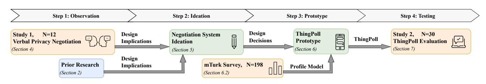
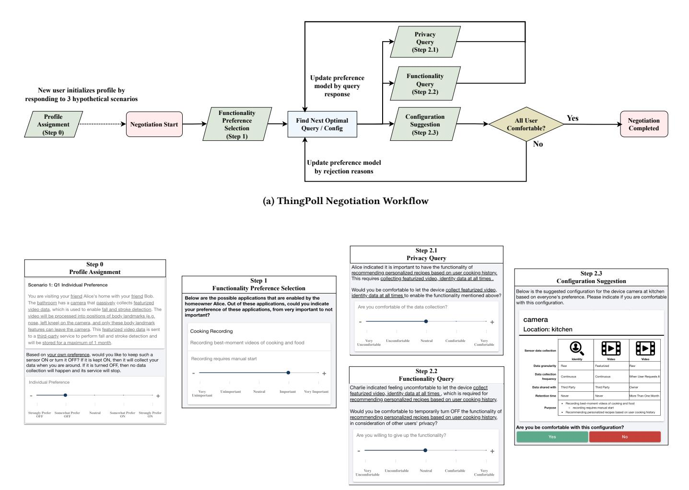
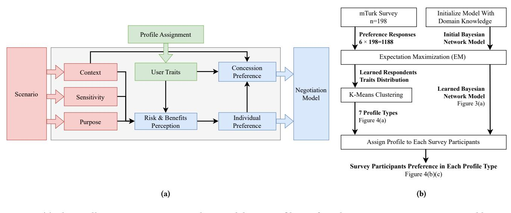
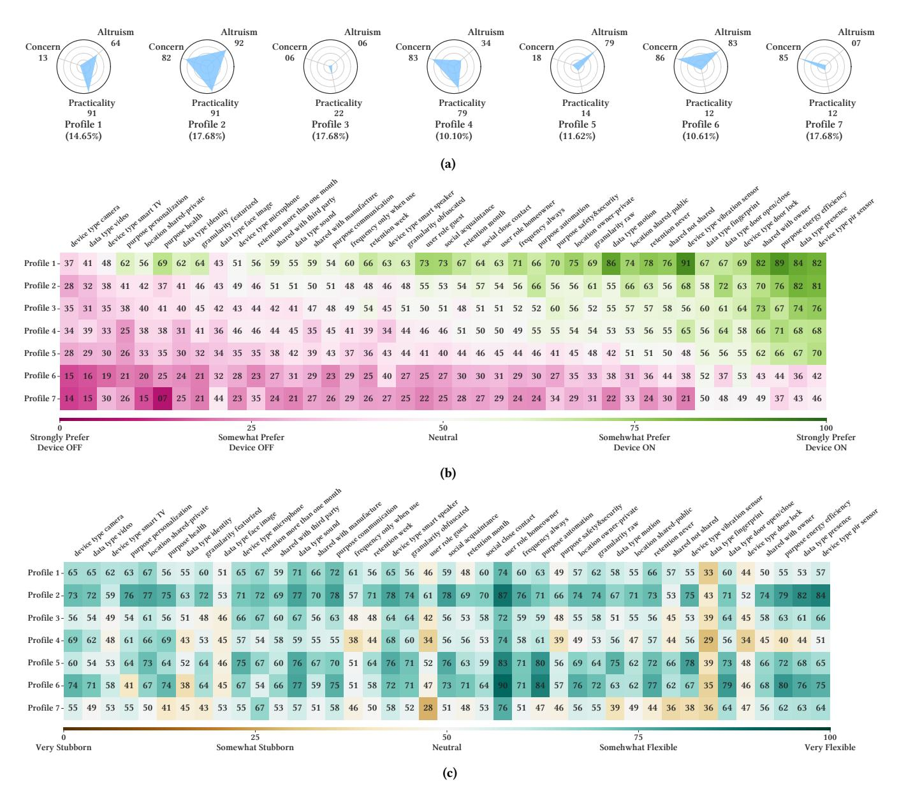
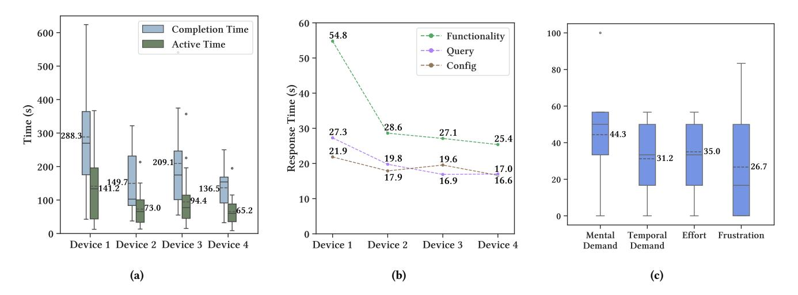
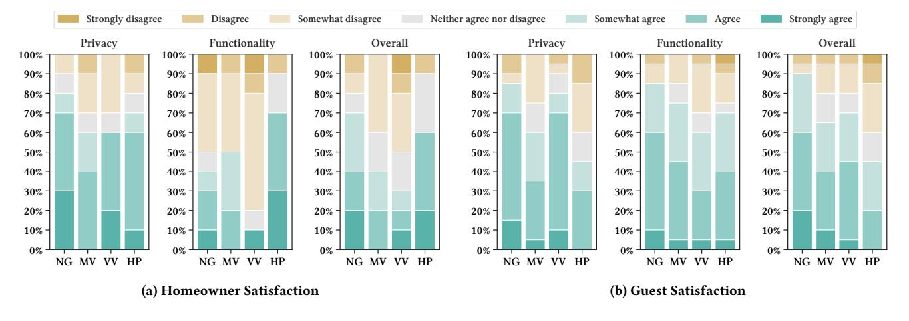
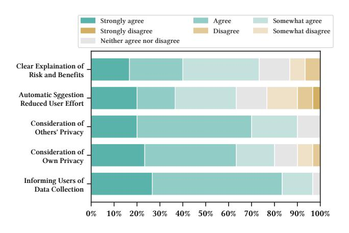
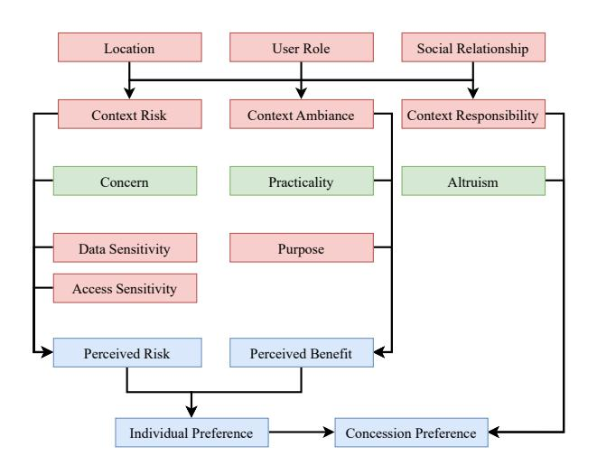

# Bring Privacy To The Table: Interactive Negotiation for Privacy Settings of Shared Sensing Devices

[Haozhe Zhou](https://orcid.org/1234-5678-xxxx) haozhezh@cs.cmu.edu Carnegie Mellon University Pittsburgh, PA, United States

[Mayank Goel](https://orcid.org/1234-5678-xxxx) mayankgoel@cmu.edu Carnegie Mellon University Pittsburgh, PA, United States

[Yuvraj Agarwal](https://orcid.org/1234-5678-xxxx) yuvraj@cs.cmu.edu Carnegie Mellon University Pittsburgh, PA, United States

#### ABSTRACT

To address privacy concerns with the Internet of Things (IoT) devices, researchers have proposed enhancements in data collection transparency and user control. However, managing privacy preferences for shared devices with multiple stakeholders remains challenging. We introduced ThingPoll, a system that helps users negotiate privacy configurations for IoT devices in shared settings. We designed ThingPoll by observing twelve participants verbally negotiating privacy preferences, from which we identified potentially successful and inefficient negotiation patterns. ThingPoll bootstraps a preference model from a custom crowdsourced privacy preferences dataset. During negotiations, ThingPoll strategically scaffolds the process by eliciting users' privacy preferences, providing helpful contexts, and suggesting feasible configuration options. We evaluated ThingPoll with 30 participants negotiating the privacy settings of 4 devices. Using ThingPoll, participants reached an agreement in 97.5% of scenarios within an average of 3.27 minutes. Participants reported high overall satisfaction of 83.3% with ThingPoll as compared to baseline approaches.

#### CCS CONCEPTS

• Security and privacy → Privacy protections; • Computer systems organization → Sensor networks.

#### KEYWORDS

Usable Privacy, Internet of Things, Negotiation Agent, Privacy Enhancing Technology, Privacy Profiles, Preference Elicitation

#### ACM Reference Format:

Haozhe Zhou, Mayank Goel, and Yuvraj Agarwal. 2024. Bring Privacy To The Table: Interactive Negotiation for Privacy Settings of Shared Sensing Devices. In Proceedings of the CHI Conference on Human Factors in Computing Systems (CHI '24), May 11–16, 2024, Honolulu, HI, USA. ACM, New York, NY, USA, [22](#page-21-0) pages.<https://doi.org/10.1145/3613904.3642897>

#### 1 INTRODUCTION

Sensor-laden Internet of Things (IoT) devices have become increasingly pervasive. These devices pose significant privacy risks because they can measure and collect a wide array of data, including sensitive information such as identity, facial features, and voice [\[52,](#page-16-0)

This work is licensed under a [Creative Commons Attribution International](https://creativecommons.org/licenses/by/4.0/) [4.0 License.](https://creativecommons.org/licenses/by/4.0/)

CHI '24, May 11–16, 2024, Honolulu, HI, USA © 2024 Copyright held by the owner/author(s). ACM ISBN 979-8-4007-0330-0/24/05 <https://doi.org/10.1145/3613904.3642897>

[65,](#page-16-1) [76,](#page-16-2) [100,](#page-17-0) [114\]](#page-17-1). Thus, researchers have proposed several ways to improve and manage privacy risks posed by IoT [\[28,](#page-15-0) [34,](#page-15-1) [40,](#page-15-2) [53,](#page-16-3) [113\]](#page-17-2). However, a key challenge here is associated with devices placed in shared environments. Such environments have multiple users, and the sensed information is not limited to that of the owner or the person deploying the sensor. Anyone who happens to be in the same physical space gets captured. Still, a typical bystander, visitor, or incidental user does not have the awareness or ability to control what data is collected [\[25,](#page-15-3) [68,](#page-16-4) [69,](#page-16-5) [110\]](#page-17-3).

Recognizing this challenge, several research efforts have investigated enhancing the data collection transparency [\[3,](#page-15-4) [28,](#page-15-0) [36,](#page-15-5) [37,](#page-15-6) [101,](#page-17-4) [109\]](#page-17-5) and provide control mechanisms [\[12,](#page-15-7) [116\]](#page-17-6) for incidental users. However, handling conflicts between the privacy preferences of different stakeholders in an environment still remains challenging. For example, users may have varying levels of concerns about the privacy implications of a constantly listening but not recording microphone in a conference room. One straightforward approach to resolving conflict is democratization, such as in HiveMind [\[58\]](#page-16-6), where a thermostat in a shared public space is controlled using a voting mechanism. Although a similar democratic setup can possibly work for privacy preferences, prior research in other domains has demonstrated that negotiation helps resolve conflicts [\[88,](#page-16-7) [112\]](#page-17-7) and brings benefits such as enhancing social relationships [\[72\]](#page-16-8).

In this paper, we present ThingPoll, a negotiation tool that empowers incidental users to interactively negotiate the privacy settings of IoT devices with other users. ThingPoll, solicits the preferences and opinions of different stakeholders, mediates the negotiation process toward conflict resolution, and reaches consensus quickly. We situate ThingPoll in the context of a gathering at a user's house and ground our findings as interactions between the homeowners and their guests. We first conducted a need-finding study to understand how people verbally negotiate IoT privacy preferences. Here, we observed that unsystematic conversations, repetitive behavior, unequal speaking opportunities, and needless explanations are common sources of inefficiency. On the other hand, if someone shepherds the conversation and ensures everyone timely expresses their preferences, the negotiations are more efficient. Based on these observations, we derive a set of design guidelines to create an efficient, intuitive, fair, and usable tool for negotiating privacy settings.

We used the observations and insights from the first study, to design ThingPoll. ThingPoll notifies incidental users (guests) about the sensing and data collection behaviors of IoT devices in the homeowner's home. It then allows the guests to express their preference and guides the negotiation among the guests and the homeowners. To speed up the consensus-building process, ThingPoll estimates each user's preference during negotiation by building and using

their privacy profile [\[5,](#page-15-8) [33,](#page-15-9) [60,](#page-16-9) [64,](#page-16-10) [76\]](#page-16-2). To build these profiles, we extended Emami et al.'s work [\[76\]](#page-16-2) to shared space situations and recruited 198 Amazon Mechanical Turk workers to provide their privacy preferences in hypothetical scenarios. Once the model has a warm start, ThingPoll continually refines the users' preference estimation and proposes more suitable device configurations without imposing excessive user burden.

To evaluate ThingPoll, we conducted a user study with 10 groups of 3 participants each who negotiated their privacy settings on 4 hypothetical IoT devices in a smart home. ThingPoll helped participants reach an agreement on 97.50% device scenarios, within an average duration of 3.27 minutes for the negotiations to complete for each device. In addition, our data shows an overall satisfaction rate of 83.3% among our participants with the outcome using ThingPoll, much higher than other mediation approaches such as maintaining the status quo by going with homeowner's configuration: 50.0%, majority vote: 56.7%, and veto vote: 56.7%. We highlight several implications of our research, which may help inspire future research on IoT privacy tools for shared spaces.

In summary, we make the following key contributions:

- We derived design implications and guidelines for the IoT privacy negotiation system based on observing 12 participants verbally negotiate shared device privacy preferences and prior research.
- We built ThingPoll, a privacy negotiation system that notifies users of data collection behaviors, estimates users' preferences and efficiently guides the negotiation for IoT device configurations in shared spaces.
- Through a user study of 30 participants, we demonstrated the promises of negotiation-based methods as suggested by increased user satisfaction with a high agreement rate compared to current social norms.
- We share lessons and implications from our study, which could help inspire future research on IoT privacy tools for shared spaces.

# 2 RELATED WORKS AND INITIAL DESIGN CONSIDERATIONS

#### 2.1 Privacy Challenges of Incidental Users

Several studies highlight users' unawareness of data collected by IoT devices and inability to voice their preference [\[68,](#page-16-4) [69,](#page-16-5) [108,](#page-17-8) [110\]](#page-17-3). A bystander's perception of privacy is closely linked to the context of the shared environment, such as the social relationships between the incidental user and homeowner, device location, and the perception of its processing power [\[25,](#page-15-3) [108,](#page-17-8) [110\]](#page-17-3). Studies have highlighted the need to take context into account when estimating incidental user privacy preferences. Importantly, the process of making privacy decisions can be exhausting for the user as they have to navigate technical intricacies [\[39,](#page-15-10) [93,](#page-17-9) [96\]](#page-17-10). The situations worsens when they have to make decisions every time they enter a shared IoT space and with the additional social pressure [\[20\]](#page-15-11). Consequently, it is crucial to aim for efficiency and minimize user burden in designing systems that assist incidental users' privacy management.

Several studies have also provided evidence of the cooperative nature of guests and homeowners in resolving privacy tension, especially when in close social relationships. Marky et al. suggest that most owners are comfortable with adjusting their smart home devices for visitors, while guests hope to be informed about the sensor data collection [\[69\]](#page-16-5). Similarly, Cobb et al. showed that most homeowners are willing to turn off devices to make guests feel more comfortable, provided they live together or have close relationships [\[25\]](#page-15-3). Moreover, guests become more comfortable with allowing data collection if provided information and their consent is sought [\[67,](#page-16-11) [100\]](#page-17-0). These findings indicate that guests and homeowners are likely willing to cooperate to find acceptable IoT device privacy configurations.

#### 2.2 Multi-User IoT Systems

Several research teams have built systems for IoT device management for multi-user use cases. Zeng et al. [\[115\]](#page-17-11) designed an app that managed access for multiple users based on roles and notified relevant users when a device is being controlled. Similarly, Kratos [\[94\]](#page-17-12) focuses on resolving conflicting demands of multiple users through policy negotiation based on user priorities and roles indicated by pre-defined policy profiles. HiveMind [\[58\]](#page-16-6) gathers preference votes from multiple users in public spaces and dynamically adjusts actuator configurations in public spaces to optimize for the overall utility. Similarly, Chaki et al. [\[21\]](#page-15-12) present a framework based on the Analytic Hierarchy Process (AHP) using pre-defined priorities of contextual factors for multi-user smart homes. However, these systems are not tailored for privacy management and do not enable users to share and mediate concerns.

Prior work has also explored providing privacy notifications and controls to incidental users for IoT sensors. IoT Personal Privacy Assistant [\[28\]](#page-15-0) is a mobile app that notifies users of nearby IoT devices and allows users to opt in or out of data collection. TEO [\[116\]](#page-17-6) provides ephemeral shared ownership to IoT sensor data for incidental users of AirBNBs using cryptographic mechanisms. Similarly, Spacelord [\[12\]](#page-15-7) allows incidental users to set shared devices to temporarily run only user-trusted software while the untrusted code and configurations are removed. However, these systems do not inherently support negotiations between incidental users and owners of the device upon conflicting preferences.

#### 2.3 Negotiation for Privacy Preference

Using negotiation as a technique to mediate privacy preferences has been studied in a few contexts such as social media, mobile apps, and IoT. For example, Baarslag et al. [\[10\]](#page-15-13) studied negotiation for mobile app permissions. Further, Filipczuk et al. [\[41\]](#page-15-14) extended the negotiation model to integrate the uncertainty of user preferences in user-service negotiation. Similarly, Alanezi et al. [\[4\]](#page-15-15) proposed an automatic negotiation mechanism that automatically finds a consensus on device configuration based on pre-defined privacy policies. However, these methods are limited to bilateral negotiation, where an agent representing the user proposes offers to the opponent to maximize the user's benefits. In addition, several works explored multi-party privacy preference conflict resolution and negotiation solutions on social media [\[98,](#page-17-13) [99,](#page-17-14) [102\]](#page-17-15). Recently, Ogunniye and Kökciyan [\[80\]](#page-16-12) proposed a method to resolve privacy conflicts using an ontology of contextual integrity. ELVIRA [\[74,](#page-16-13) [75\]](#page-16-14) is an agentbased system that recommends explainable solutions to multi-user

Figure 1: An overview of the methodology.

privacy conflicts. Similarly, PARCCART [\[30\]](#page-15-16) focuses on building trust from users through concealment, equity, collaboration, and explainability. While not directly targeting our application scenario, these methods provide useful insights into the theoretical design of our negotiation system.

Researchers have studied IoT privacy negotiation behaviors and perceptions. The work closest to our use case is by Alshehri et al. [\[7\]](#page-15-17), in which 460 crowd workers were surveyed to understand guest and homeowner negotiation behaviors with a digital agent. Their results verified that social relationships and roles can influence the negotiation process. Apart from this, Wang et al. [\[105\]](#page-17-16) conducted a vignette study with 867 participants, suggesting the privacy sensitivity of the IoT device is significantly associated with AirBnB visitors' tendency to negotiate their privacy preference with the hosts. Although these studies shed light on the nuances of negotiation, they are still insufficient to translate into a clear blueprint for a negotiation system and investigate how an actual negotiation system may benefit users.

# 2.4 Social, Psychological, and Political Views on Negotiation

It is widely accepted that negotiation can be viewed as distributive or integrative depending on the objective [\[104\]](#page-17-17). In distributive negotiation, the outcome is achieved within a zero-sum game, while in integrative negotiation, greater overall benefits can be achieved through finding mutual interests [\[104\]](#page-17-17). Mixed-motive negotiation can have both distributive and integrative components [\[2\]](#page-14-0). The nature of the negotiation influences the modeling approaches [\[57\]](#page-16-15) as well as the negotiator's behavior, such as more cooperation in integrative than in distributive negotiation [\[97\]](#page-17-18).

One important factor in negotiations is power [\[56\]](#page-16-16). Kabanoff [\[54\]](#page-16-17) and Schaerer et al. [\[92\]](#page-17-19) showed negotiators with high power are likely to gain competitive benefits in distributive games. Wei et al. [\[106\]](#page-17-20) suggested power difference among negotiators facilitates greater joint gains than equal power situations provided they have prosocial motivation. These findings underscore the importance of considering power dynamics in system design, especially in smart home settings where homeowners typically have more power but also exhibit prosocial tendencies [\[25,](#page-15-3) [69\]](#page-16-5).

Another dimension to consider is justice. Justice not only serves as an ethical aim but also enhances agreement acceptance and promotes cooperative behavior [\[48,](#page-16-18) [55\]](#page-16-19). Consequently, in the context of shared IoT device negotiations, the system should aim for transparency and information clarity [\[13\]](#page-15-18), equitable voice for users, impartial decisions, and conflict resolution.

Moreover, many personal characteristics are shown to affect the negotiation process and outcomes. Barry & Friedman [\[15\]](#page-15-19) studied the impact of personality traits on negotiations and discovered that agreeableness and extraversion may harm the negotiator's individual gain in distributive negotiations. Beersma et al. [\[19\]](#page-15-20) discovered that prosocial groups tend to achieve better joint outcomes, possibly due to enhanced levels of trust and reduced contentious behavior within these groups. Fehr et al. [\[38\]](#page-15-21) examined the evolutionary evidence supporting altruistic punishment and cooperation in brain neural circuits. These findings highlight the need to account for users' unique mental states in designing effective negotiation systems while also cautioning against unfairly exploiting altruistic or agreeable individuals.

#### 2.5 Summary of Initial Design Implications

Based on the literature review, including privacy challenges for incidental users of IoT, multi-user IoT systems, privacy negotiations, and political, social, and psychological aspects of negotiation studies, we summarize three initial design implications:

Implication ○1 : Privacy negotiations between smart home visitors and homeowners for IoT devices are largely cooperative and integrative.

Implication ○2 : Negotiations needs to be time efficient and low effort.

Implication ○3 : Negotiations should ensure respectful and fair treatment of users and provide information transparency.

#### 3 METHODOLOGY

We followed an iterative design process, as summarized in Figure [1.](#page-2-0) We first conducted a formative study to inform the design of the negotiation system, ThingPoll, and finally conducted a summative study. All human-subject studies are approved by our institution's IRB. In this section, we describe an overview of our methodology for designing, building, and evaluating ThingPoll.

Observing Negotiations. Negotiation through conversation is a complex yet spontaneous task for human beings, which involves communicating and keeping track of each user's preferences, resolving conflicts, etc. While existing works in social science, political science, and psychology have discovered valuable insights into how human beings negotiate, it is still unclear how these insights are transferable to the context of IoT privacy negotiation. Thus, we conducted a study with 12 participants to observe how humans negotiate about privacy configurations of a smart home. In this study, we aimed to answer the following research questions:

Table 1: Verbal Negotiation Device Configuration Space

| Device Type   | Position      | # of Functionalities |
|---------------|---------------|----------------------|
| Smart Speaker | Living Room   | 4                    |
| Camera        | Entrance Door | 8                    |

RQ1(a) What are the various types of interactions that take place during a verbal negotiation on IoT privacy settings?

RQ1(b) What insights from the verbal negotiation may inform the design of an effective negotiation system?

Ideation for System Design. We conducted a detailed literature review, including privacy challenges for incidental users of IoT, multi-user IoT systems, privacy negotiations, and political, social, and psychological aspects of negotiation studies. Then, to ground these findings from prior works in the context of privacy negotiation on shared IoT devices, we consolidated prior work with our findings on participant observations. Together, we distill our discoveries into 6 design implications. Based on these implications, we outlined 4 high-level design decisions for ThingPoll. We describe the details of our ideation process in Section [5.](#page-4-0)

Prototype Development. Based on the design implications and decisions, we built ThingPoll, a privacy negotiation system tailored for IoT devices in shared spaces. ThingPoll features a preference profile model built from crowdsourced survey data we collected from 198 workers from Amazon Mechanical Turk (MTurk) and a structured system-mediated negotiation approach that queries user preferences and suggests likely acceptable configurations. Thing-Poll adopts a preference elicitation approach and maximizes the integrative gain by iteratively refining its modeling of all users' preferences. We describe ThingPoll in detail in Section [6.](#page-5-0)

Testing Artifact. We finally conducted our summative experimental evaluation. In the end, 30 participants completed this study. We divided participants into groups of three and they used ThingPoll to negotiate privacy preferences on four imaginary IoT devices in a smart home. Through this study (detailed in Section [7.](#page-10-0)), we aim to answer the following research questions:

RQ2(a) How practical, effective, and satisfying is ThingPoll in helping users negotiate privacy configurations in a shared space?

RQ2(b) How does the negotiation approach compare to baseline non-negotiation approaches?

# 4 STUDY 1: OBSERVATION OF VERBAL PRIVACY NEGOTIATIONS

We conducted a study to observe how humans behave when negotiating smart home privacy configurations and inform the design of ThingPoll.

#### 4.1 Study Design

We based the verbal negotiation task on two smart home devices, with specifications summarized in Table [1.](#page-3-0) Participants were arranged into groups of 3 and assigned one of two roles: homeowner or guest. According to where the participant's preferences are on the

Table 2: Study 1 Participants Demographic Information

| Variable  | Levels (Count)                                                           |
|-----------|--------------------------------------------------------------------------|
| Age       | 18 - 24 (7), 25 - 34 (5)                                                 |
| Gender    | Female (5), Male (7)                                                     |
| Education | Bachelor's Degree (7), Master's Degree (4), Doctorate/Prof Degree (1) |

privacy-functionality[1](#page-0-0) spectrum, we assigned the role of the homeowner to the participants who are more functionality-oriented, and the guest role to more privacy-oriented participants. This assignment reflects more real world settings assuming that a typical smart-home owner would value functionality over privacy when compared to a typical guest. It also creates more preference conflicts, as opposed to random assignment of roles, thus proving more opportunities to observe and resolve conflicts using negotiation.

Based on participant availability, we conducted this study either on-site or on a video call. We started the study by asking the homeowner to configure the devices in a hypothetical home. Next, we asked them to imagine two guests visiting their smart homes with two IoT devices, for which they would need to negotiate their preferred privacy configurations. The participants were free to structure their verbal communication and negotiation as they wished. The researchers observed and audio-recorded the process without interrupting the participants unless they needed assistance to understand the device's behavior or deviated from the task. We limited the negotiation time to 15 minutes for two devices to prevent stressing participants. We compensated all participants with \$5 USD for their time.

#### 4.2 Participants

We recruited 12 participants (4 groups) from our institution's student community (demographics in Table [2\)](#page-3-1), who owned and used at least one smart home device to ensure all participants had basic knowledge and experience with them.

#### 4.3 Findings

Among the four groups, only one group completed negotiations for both devices, while other groups spent most of their time on the first device, leaving insufficient time for the second one. We transcribed the audio recordings and coded each part of the conversation by extending the previous coding method [\[31,](#page-15-22) [49,](#page-16-20) [50,](#page-16-21) [82,](#page-16-22) [86\]](#page-16-23) to better suit the IoT privacy-functionality negotiation domain. Overall, we discovered seven distinct types of negotiation behaviors, as shown in Table [3.](#page-4-1) Participants spent the majority of their time expressing and explaining their preferences (27.7% and 47.1%, respectively).

We further broke down the components of the explanations for preferences and found that all explanations revolve around two main issues: whether the privacy invasion is distressing or whether the functionality is important. The verbs used to describe privacy issues can be roughly categorized into expressing the concern, expressing no

1We always use the term "functionality" to denote the benefits of enabling smart home applications. We use the term "gain" to denote how successful the negotiation outcome is, which ThingPoll attempts to optimize internally. Although the term "utility" is more conventionally used in both contexts, we avoided using it to prevent ambiguity.

| Name                       | Example                                                                  | Time  |
|----------------------------|--------------------------------------------------------------------------|-------|
| Explain Preference Reasons | Allowing users to make phone calls is not useful for me as a guest       | 47.1% |
| Express Preference         | I don't want this to be ON                                               | 27.7% |
| Explain Device Behavior    | It is just collecting the whole time unless you physically turn this off | 14.4% |
| Ask Preference             | How long do you want to keep the data?                                   | 5.3%  |
| Bring Up Topic             | Welcome to my home                                                       | 2.7%  |
| Ask Device Behavior        | Why would a third party be needed to control the lights on or off?       | 1.8%  |
| Request Clarification      | Are we discussing about functionality X?                                 | 0.9%  |

#### Table 3: Observed Verbal Negotiation Interaction Types and Time Consumption

Table 4: Verbal Negotiation Time Across 4 Groups

| Group ID | Device 1 Time | Device 2 Time |
|----------|---------------|---------------|
| Group 1  | 10.41 min     | -             |
| Group 2  | 10.06 min     | -             |
| Group 3  | 7.82 min      | -             |
| Group 4  | 2.98 min      | 6.67 min      |

concern, expressing the concern is understood, alleviating the concern, expressing concern is resolved. Of these, expressing privacy concern (45.5%), alleviating privacy concern (16.7%), expressing no privacy concern (10.6%) account for the majority of preference explanation time.

#### 4.4 Observations and Discussion

Lengths and Timing of Explanation. Although detailed explanations can help the negotiator win distributive benefits [\[81\]](#page-16-24), it is a time-consuming process [\[49,](#page-16-20) [107\]](#page-17-21). Consistent with these claims, we observed explaining one's preference was the biggest time sink during a negotiation. However, such an explanation is not always needed if everyone would easily approve of this user's opinion. For instance, at the beginning of the conversation, one user in Group 2 spent 89 seconds explaining their discomfort with storing raw audio data. It turned out that both the homeowner and the other guest shared or understood their concern.

Unequal Opportunity to Express. Similar to the trend seen in prior literature [\[43,](#page-15-23) [47,](#page-16-25) [91\]](#page-17-22), we found that spontaneous discussion can lead to an imbalance in opportunities for users to express their preferences. In all groups except Group 4, the most outspoken participant spoke more than twice as the least outspoken participant. Although there may be legitimate reasons for this, such as stronger preferences, it nonetheless raises a concern about equity.

Time to Move Forward. We observed that sometimes participants spent extra time repeating the reasons or benefits despite reaching a partial agreement on the device. Such interactions did not help in terms of reaching an agreement for the whole device.

Managing Preference. Sometimes participants lost track of each other's preferences. For instance, in Group 3, a guest mentioned their preference for functionality to be off. The conversation was then dominated by the other two participants, who reached an agreement to keep that functionality on. At this point, the first guest restated their concern and the negotiation continued longer. Mediator and Discussion Lead. We observed that Group 4 showed a distinct pattern of negotiation, where the homeowner played the role of a mediator. The homeowner first solicited everyone's preference, and each user answered this question in one or two sentences without explaining any reasons. Then the homeowner said, 'yeah, I think we can turn off personalized music' when knowing one guest was uncomfortable, and the other was flexible on this. Then, the group was able to move on to discuss other concerns. As prior work shows, an effective mediator can promote conflict resolution by shaping the negotiation process and prioritizing negotiation issues [\[18,](#page-15-24) [62,](#page-16-26) [83\]](#page-16-27). This might be one of the reasons why Group 4 finished negotiation the quickest.

#### 4.5 Summary of Additional Design Implications

In additiotn to the three insights from prior research, we here summarize the new insights for designing a negotiation system specifically for shared IoT devices:

Implication ○4 : Users in privacy negotiations on shared IoT devices may benefit from focused and directed guidance. Implication ○5 : It can be challenging for users to keep track of and reason with everyone's preferences.

Implication ○6 : Unconstrained negotiation may favor outspoken users, leading to unequal opportunities for expression.

#### 5 THINGPOLL SYSTEM DESIGN IDEATION

#### 5.1 System-Mediated Negotiation

Based on prior research and our observations, a system-mediated approach is promising to meet the aforementioned goals of negotiation (Implication ○1 ∼ ○4 ) and alleviates cognitive burden in managing and reasoning users' preference (Implication ○5 ). The mediator role may reduce the burden of expressing preference and making concessions [\[85\]](#page-16-28), and possibly alleviate social pressure. In addition, it may improve procedural justice by providing everyone opportunities to voice their preferences (Implication ○3 and ○6 ), thereby improving satisfaction with the outcomes [\[87\]](#page-16-29). Creating integrative value and optimizing for joint gain requires an accurate understanding of each user's preferences and mutual interests [\[29,](#page-15-25) [35\]](#page-15-26). Prior work has established privacy profiles in IoT to predict the user's preference [\[5,](#page-15-8) [33,](#page-15-9) [60,](#page-16-9) [64,](#page-16-10) [76\]](#page-16-2). Furthermore, to resolve conflicts, some users will have to change their initial preferences, suggesting the need to solicit user's preferences and mutual interests and update all users' preferences during negotiation.

#### 5.2 Structured User-System Interaction

Another consideration is user interaction with the system, such that it is intuitive and effortless (Implication ○2 ). Based on our observation from Study 1 and prior works, users explain preferences typically around functionality-privacy trade-offs. Thus, we believe that a structured interaction can sufficiently express most of the reasons for preferences, making the negotiation more goaloriented (Implication ○4 ) and enable equalized expression power (Implication ○6 ). In addition, as we observed in Study 1, users specifically consider the other person's opinion when making a concession. Thus, we decided to include the needs and the rationale of other users when making a configuration suggestion, as useful context, similar to a face-to-face interaction. We believe that revealing the consequences and benefits to the other user promotes empathy and facilitates concessions due to the improved motivation of prosocial behavior [\[17,](#page-15-27) [26\]](#page-15-28).

#### 5.3 Assumptions

We have assumed that achieving joint gains and resolving conflicts efficiently are the primary goals of negotiation around the privacy settings of IoT devices. However, other values in real-world negotiations, such as enhancing social intimacy or enjoying engaging conversations, may be neglected. We also assume a certain level of trust that users have in our system. Our proposed design should be viewed as one possible pathway among many that meet the specific needs and dynamics observed in IoT privacy negotiations.

#### 5.4 Summary of Design Goals

In summary, we outline the following high-level design goals for a negotiation system:

Design ○1 : The system should mediate and direct the negotiation process to optimize for joint gain and efficiency. Design ○2 : The system should maintain a user preference model, updating it through preference elicitation. Design ○3 : The system should embrace structured interaction characterized by privacy and functionality features. Design ○4 : The system should provide a contextualized negotiation prompt and explanations.

#### 6 THINGPOLL SYSTEM IMPLEMENTATION

Based on the insights and our design goals, we developed ThingPoll, a privacy negotiation system for IoT devices in shared spaces. We start with an overview of the negotiation workflow from a user's perspective. Next, we describe our profile modeling approach and user preference estimation. Finally, we describe our negotiation model from an algorithmic perspective.

#### 6.1 Negotiation Workflow Overview

The overall workflow of ThingPoll is shown in Figure [2.](#page-6-0) Thing-Poll mediates the negotiation process (Design ○1 ) by strategically querying specific users to understand their preferences or to suggest likely acceptable configurations to everyone.

6.1.1 Initial Profile Assignment. In a new space with IoT sensors, the sheer number of potential privacy configurations can overwhelm incidental users, which can be alleviated by building a privacy profile model to recommend privacy settings [\[5,](#page-15-8) [60,](#page-16-9) [76\]](#page-16-2). For the initial profile assignment, a user provides their privacy preferences for three imagined IoT scenarios. Using the user's responses, ThingPoll assigns them a profile that best fits their preference and subsequently uses the profile to predict their likely preference for other devices and scenarios (Design ○2 ), as elaborated in Section [6.2.](#page-5-1)

6.1.2 Functionality Preference Selection. Device functionality is key for users to allow/deny data collections [\[63,](#page-16-30) [76\]](#page-16-2). Both the homeowner and guests are asked about the importance of each device's functionality, allowing our system to prioritize the ones users care about. In addition, it personalizes the negotiation as ThingPoll reveals who benefits from the sensed data (i.e., the user giving high importance to the functionality), giving others additional context to evaluate the risks and benefits (Design ○4 ).

6.1.3 Preference Elicitation Through Querying. While useful, the initial profile assignment cannot capture the user's preference for all situations. Furthermore, during negotiation, users' preferences may change based on others' preferences. In alignment with Design ○3 , ThingPoll asks two types of queries to the user to find more suitable suggestions. A Privacy Query asks about their level of comfort in accepting some privacy-sensitive data for a specific functionality being collected (Figure [2,](#page-6-0) Step 2.1). A Functionality Query asks a user whether they would turn off a functionality given another user's privacy concerns (Figure [2,](#page-6-0) Step 2.2). The responses are on a 5-point Likert scale ranging from Very Uncomfortable to Very Comfortable. ThingPoll triggers a Functionality Query only when users choose Uncomfortable or Very Uncomfortable to a Privacy Query because it is more intuitive for users to reason about why they may need to give up functionality (i.e., to address someone's privacy concerns) than the other way around. During negotiation, ThingPoll determines when to issue queries and their content, as elaborated in Section [6.3.](#page-8-0)

6.1.4 Configuration Suggestion. A device Configuration specifies the complete data collection behavior of a device. ThingPoll displays the configuration and device attributes (e.g., position) in an intuitive and consistent IoT privacy label [\[36,](#page-15-5) [37\]](#page-15-6) (Design ○3 ). An agreement is reached only when everyone agrees to a device configuration. If users reject a configuration, they can specify the reason, such as undesired data collection, storage, or sharing, or if some functionality they want is not supported. During negotiation, ThingPoll decides whether to suggest a configuration or to query a user based on the state of the negotiation and the user preference estimation (Design ○1 ). Since configurations take more time to read and comprehend, they are only suggested when ThingPoll has higher confidence that they will be accepted by everyone.

#### 6.2 Profile Modeling in Shared Sensing Space

Building a user preference profile model is crucial for ThingPoll to characterize each user's preferences and guide the negotiation (Design ○2 ). Figure [3b](#page-8-1) illustrates the steps involved to do so.

(b) ThingPoll App User Interface

Figure 2: An overview of the ThingPoll workflow (a) and the ThingPoll UI (b). In Step 0, users provide their privacy preference for three hypothetical shared sensing scenarios used to assign them a profile. In Step 1, every user indicates how important each device's functionality is. Next, ThingPoll utilizes each user's preference model to issue Privacy Queries about their comfort level for data collection and access (Step 2.1) and Functional Queries about giving up utility (Step 2.2). ThingPoll finally suggests a Configuration if it is likely to be accepted by everyone (Step 2.3). Each user may receive one or more queries of each type and configuration. The process concludes when when everyone accepts a suggested configuration or if someone quits (not shown).

6.2.1 Data Sources and Data Collection. Inspired by prior works on privacy preference modeling [\[5,](#page-15-8) [33,](#page-15-9) [60,](#page-16-9) [64,](#page-16-10) [76\]](#page-16-2), we deployed surveys on MTurk to create privacy profiles that bootstrap ThingPoll with initial preferences. Each survey participant is shown six scenarios of shared sensing devices, in which they are either a homeowner with guests visiting their home or vice-versa. Between each scenario, we varied 10 factors: Location, User Role, Social Relationship, Device Type, Data Type, Data Granularity, Frequency, Retention, Sharing, Purpose. Table [5](#page-7-0) shows the different factors and their levels. Many of these factors were proposed in prior research [\[37\]](#page-15-6), which we extend further to include more detailed social contextual factors for shared spaces [\[25,](#page-15-3) [68,](#page-16-4) [69,](#page-16-5) [108,](#page-17-8) [110\]](#page-17-3). Following Emami-Naeni et al. [\[76\]](#page-16-2), we generated all possible combinations of the factors and

pruned them down to 60 practical and meaningful scenarios. We passed these combinations to a custom template to convert them to prose, which we then edited manually. An example scenario is shown below:

> You are visiting your friend Alice's home with your friend Bob. The living room has a microphone sensor that passively collects raw sound data, which is used for falling detection. The raw sound data is sent to a third party to detect falling events, and the sound data is stored for at most one month.

We grouped the 60 scenarios into ten sets of surveys of six scenarios each, and we carefully arranged the scenarios so that the levels of each factor were balanced in each survey. We deployed the 10 sets of the survey on mTurk and selected Master workers with

Social

| Variable    | Levels                                                                                        | Description                                              |  |
|-------------|-----------------------------------------------------------------------------------------------|----------------------------------------------------------|--|
| Device Type | Camera, Microphone, Smart Speaker, Vibration Sensor, PIR Sensor, Smart Door lock, Smart TV | Type of sensor device                                    |  |
| Data Type   | Video, Face Image, Fingerprint, Sound, Identity, Motion, Presence, Door Open/Close         | Type of data collected                                   |  |
| Granularity | Raw, Obfuscated, Featurized                                                                   | Any privacy-enhancing preprocessing steps                |  |
| Frequency   | Always, Only-When-Use                                                                         | When the data collection happens                         |  |
| Purpose     | Safety & Security, Health, Automation, Energy Efficiency, Personalization, Communication   | The category of the functionality provided by the device |  |
| Retention   | Never, Week, Month, More than a Month                                                         | The duration that the data is stored                     |  |
| Shared      | Manufacture, Third-Party, Owner                                                               | The entity that the data is shared to                    |  |
| Location    | Shared-Private, Shared-Public, Owner-Private.                                                 | Type of location where the device is installed           |  |

Relationship Close Contacts, Acquaintance Type of social relationship of the users in the shared space

User Role Guest, Homeowner The user's role in the shared space

| Table 5: Variables and Levels Used for Describing Shared Sensing Scenarios |  |  |
|----------------------------------------------------------------------------|--|--|
|----------------------------------------------------------------------------|--|--|

95% or above approval rate. Participants were screened to ensure that they own and use at least one smart sensing device, who were then asked to complete the main survey. Participants indicated their own preference and "concession preference" provided another user was uncomfortable with the participants' default preference on a five-point Likert scale. We compensated participants \$0.5 USD for the screening and \$1.5 USD for the main survey. In total, we received 198 completed responses, which led to 1188 individual and concession preference responses (198 workers x 6 scenarios).

6.2.2 User Profile Model. Our profile model aims to estimate users' preferences and the probability of them conceding to others' preferences. We use a Bayesian Network [\[46\]](#page-16-31), a probabilistic graphical model representing conditional dependencies of random variables in a Directed Acyclic Graph (DAG) due to its flexibility in estimating the probabilities from any combination of variables, in contrast with ML models used by prior work [\[60,](#page-16-9) [64,](#page-16-10) [76\]](#page-16-2). This flexibility aligns with ThingPoll, which uses both partial offers (i.e., Query) and complete offers (i.e., Configuration). It also enables using prior domain knowledge to learn a model without extensive data collection [\[24\]](#page-15-29).

The high-level structure of our model is illustrated in Figure [3a.](#page-8-1) Based on different user traits, the sensitivity of the sensed and collected data, and contextual information, users can have different perceived levels of risk and benefits, affecting their preferences. Our model includes three variables representing orthogonal dimensions influencing user preferences: Concern, Practicality, Altruism. While Concern and Practicality are associated with perceived risk and benefits, respectively, Altruism affects how much users are willing to give up their own preference in consideration of others. To reduce model complexity and make the learning feasible, we aggregate Device Type, Data Type, Frequency into Data Sensitivity. We aggregate Retention and Sharing into Access Sensitivity based upon prior domain knowledge [\[76,](#page-16-2) [105,](#page-17-16) [108\]](#page-17-8). Data Sensitivity and Access Sensitivity each have three discrete levels: low, medium, and high. Further details about our model are in Appendix [A.1.](#page-17-23)

6.2.3 Learning and Clustering Preference Profiles. In Figure [3b,](#page-8-1) we present the steps to learn the Bayesian Network model and find preference profile clusters. First, we initialize the model based on the inherent semantics of the variables and heuristic rules. For example, a person with high Concern is more likely to have high Perceived Risk than an average user, even when the Data Sensitivity and Access Sensitivity are not high. Then, using survey data, we applied the Expectation-Maximization (EM) algorithm to learn the parameters of the model along with the user traits (i.e., Concern, Practicality, and Altruism) estimates for each participant. While a one-size-fits-all model may not accurately predict individual preferences, creating a distinct model for each person is challenging due to data collection constraints. Therefore, inspired by prior works [\[33,](#page-15-9) [64\]](#page-16-10), we used K-means clustering to create profiles et al. [\[64\]](#page-16-10), leading to seven clusters, whose centroids and respective participant percentages are shown in Fig. [4a.](#page-9-0)

We illustrate the individual and concession preferences results in Figure [4b](#page-9-0) and Figure [4c,](#page-9-0) respectively, for all seven profiles. Consistent with our hypothesis, users with high practicality and low concern (Profile 1) are more willing to keep devices ON, while those with high concern and low practicality (Profiles 6 and 7) are more inclined to keep devices OFF. Participants with high altruism (Profiles 1,2 and 5) tend to concede more to accommodate others. Note that even for profiles with low altruism, the mean concession preference is still around neutral, suggesting that people are, in general, willing to consider others' preferences. Interestingly, homeowners tend to concede more, indicating their willingness to accommodate their guests. Data collection for security and safety and devices related to security and safety are associated with less flexibility, which can be due to people being less willing to compromise on these features, even if they lead to privacy concerns.

6.2.4 Profile Assignment and Preference Prediction. To assign a new user to a profile, ThingPoll asks the user's preferences for three shared sensing scenarios (2 questions per scenario), as shown in Figure [2b-](#page-6-0)Step 0. We iterate over the potential trait values of the 7 centroids and assign them to the profile that best aligns with their responses. We evaluated the performance of profile assignment and preference prediction using 5-fold cross-validation. The training

Figure 3: (a) ThingPoll uses a Bayesian Network to model user profiles. Before the negotiation, User Traits variables are assigned by answering privacy preference questions on three shared sensing scenarios. During negotiation, Context, Sensitivity, Purpose, and User Traits are supplied as input variables to the Bayesian Network model, which then estimates the conditional probabilities of Individual Preference and Concession Preference. (b) We applied Expectation Maximization (EM) to jointly optimize the Bayesian Network model on the mTurk survey response data and user trait values of survey participants, which are then clustered into seven distinct types of profiles.

folds were used to jointly learn the model parameters and participants' trait values and subsequently find profile clusters. In the test fold, for each participant, we use three scenarios to infer the profile of the participant and the other three scenarios to test the prediction accuracy. Following previous works [\[76\]](#page-16-2), we convert the preference into binary decisions for evaluation by splitting the preferences at neutral (exclusive) into two classes. Overall, our model predicts individual preference at 70.03% accuracy and concession preference at 86.02% accuracy with an assigned profile.

#### 6.3 System-Mediated Negotiation Modeling

We now describe our approach to model the system-mediated multiuser privacy negotiation underlying ThingPoll. We focus on the intuition and the essential aspects of our algorithm and provide a detailed formulation in Appendix [A.2.](#page-17-24)

6.3.1 Negotiation Setting. For simplicity, we describe our negotiation modeling for a single device, as the negotiation does not carry through any states across devices. Formally, users are represented as = {1, ..., }, which can be either guests or the homeowner. The negotiation domain can be modeled as the space of 0−1 assignment to issues represented as Ω = (Ω1, ..., Ω) corresponding to the available functionalities of this device. Note that this does not mean all functionalities have to be binary ON-OFF. Still, any functionality with more than two options can be binarized with a constraint that, at most, one of the binarized functionalities can be ON simultaneously. Each functionality will require a corresponding privacy specification, such as a minimum required data retention.

The system at each round may choose either to propose a configuration = (1, ..., ) to every user or a query that elicits the user's preference through the interface as described in Section [6.1.3](#page-5-2)

and Section [6.1.4.](#page-5-3) A user can utilize this proposal of configuration or query to voice the user's preference, denoted as . Based on this response, the system integrates the new information in updating its preference model of this user. An agreement is reached when every user in the session agrees to one common assignment .

6.3.2 User Decision Modeling. One key quantity in the negotiation model is to estimate how likely a user is to accept a configuration (Design ○2 ). Note that a user might still accept a configuration, even when this deviates from the user's own preference, in consideration of the needs of others. We define a user would accept a configuration either the user prefers or the user concedes when the user does not initially prefer it, which is denoted as:

#### (accept ) = (prefer ) + (concede ∧¬ prefer ) (1)

, where (accept ) and (concede ∧ ¬ concede ) are directly derived from the profile model's estimation and later updated by the user's responses. The overall probability of reaching an agreement for a configuration is calculated as the product of all users accepting all functionalities of the devices, denoted as (agree ). Prediction of user response to queries is computed similarly, except that the response is estimated over the five-point Likert scale instead of binary acceptance.

6.3.3 Evaluating Gains. Acting as a negotiation mediator, Thing-Poll proposes a series of configuration proposals, represented by the = ( (1) , ..., ( ) ), where denotes the final proposal or the negotiation's deadline. Reaching an agreement on the configuration () is associated with a gain, denoted as ( () ). This gain value encapsulates both the degree of alignment with individual user preferences and the benefits of the functionalities within the

CHI '24, May 11–16, 2024, Honolulu, HI, USA Zhou et al.

Figure 4: Seven profile clusters were identified using K-Means clustering on estimated trait values. (a) showed the seven profile cluster centroids; (b) showed the average response to individual preference for each factor mentioned in the scenario; (c) showed the average response to concession preference for each factor mentioned in the scenario. Values are scaled from 0 to 100 for visualization. The factors are sorted by the average individual preference, from most (left) to least invasive (right).

configuration. In addition, the negotiation has a base gain for reaching an agreement because simply allowing the event to happen as planned and preventing the breakage of the relationship [\[72\]](#page-16-8) can be rewarding outcomes for the users. To estimate the efficacy of a given policy, we introduce the myopic expected gain (, ), which is the expectation of the negotiation outcome gains based on the current estimation of user preference . Intuitively, a high is associated with reaching an agreement earlier and the alignment of each user's individual preference. In addition, both and

are also functions of the current estimate of user preference . This means refining the understanding of a user's preference can potentially help the system find a more satisfying policy, which may converge faster and align better with the user's true preference.

6.3.4 Optimal Querying and Configuration Suggestion. While a complete configuration is the only defined way to reach an agreement, queries may further refine the current belief of users' preferences so that the next suggested configuration may become more acceptable for users. On the other hand, overwhelming the users

with unsatisfying configurations or unnecessary queries can jeopardize both efficiency and usability. ThingPoll strategically balances this exploitation and exploration by measuring the Expected Value of Information (EVOI) [\[11\]](#page-15-30). Essentially, measures the expected increment on if a query is to be asked. Let be the responses from all relevant users, for if the system asks the query , the of can be written as:

$$
EVOI(q, p) = \mathbb{E}_r \left[ \max_{\pi} EG(\pi, p | r_q) \right] - \max_{\pi} EG(\pi, p) \tag{2}
$$

At each round, the system finds an optimal privacy query based on and compares it with the user burden of sending the query. If the net effect of the query appears positive, then the system will propose the query to the target user. Otherwise, the system proposes the first configuration from the optimal policy with the highest .

6.3.5 User Feedback Integration. The core of the feedback integration is to update the user's preference and acceptance probability based on the historical responses. It is worth noting that this procedure is not only crucial in updating the preferences across each round of actual user feedback but also happens when exploring the hypothetical responses as the system searches for the optimal query. ThingPoll incorporates three feedback mechanisms from users: Privacy Query, Functionality Query, Configuration. Although the Bayesian Network can also be updated with new responses, we found the preference after the update is less predictable and causes excessive latency when searching for the optimal policy and query. Since our main focus is to assist negotiation, we will leave the study on the long-term preference profile learning and effectiveness as a potential future direction. Instead, we adopt a set of heuristic rules to update our preference estimation only for the current negotiation device. For example, if a user responds to a privacy query, indicating feeling comfortable with some invasive data collection for one functionality, then ThingPoll assumes that this user can always accept a configuration that turns OFF this functionality due to the privacy concern. These heuristics offer a quick and predictable path to update user preference estimations, effectively guiding the negotiation process.

# 7 STUDY 2: EVALUATION OF PRACTICALITY AND EFFICIENCY OF THINGPOLL

#### 7.1 Study Procedure

The study gathers subjective and objective measures of ThingPoll's performance and learns the distribution of perceptions of privacy in a shared smart home environment. We gain insights into user experiences, including the workload, perceived advantages and disadvantages of the approach, and the users' willingness to adopt such negotiation apps in real life. The user study was conducted in two phases: Profile Generation and Multi-User Negotiation. Thirty participants completed the two phases of this study and we summarized their demographics in Table. [6.](#page-10-1) None of these participants were in the verbal negotiation study.

7.1.1 Phase 1: Profile Generation. We initially created individual user profiles. This process involved participants indicating their individual and concession preferences in three hypothetical scenarios. We then asked participants for first names of three close contacts

Table 6: Study 2 Participants Demographic Information

| Variable  | Levels (Count)                                   |
|-----------|--------------------------------------------------|
| Age       | 18 - 24 (20), 25 - 34 (10)                       |
| Gender    | Female (14), Male (14), Other (1), Prefer not to |
|           | answer (1)                                       |
|           | Bachelor's Degree (14), Master's Degree (10),    |
| Education | Doctorate/Prof Degree (1), High School Degree    |
|           | (2), Some College (3)                            |

Table 7: Phase 2 Study Negotiation Device Configuration Space

| Type          | Position      | # of Functionality |
|---------------|---------------|--------------------|
| Microphone    | Living Room   | 2                  |
| Smart Speaker | Bathroom      | 2                  |
| Camera        | Entrance Door | 4                  |
| Camera        | Kitchen       | 4                  |

and acquaintances. We kept the contacts' names confidential and used them solely for emulating real-world social relationships during the multi-user negotiation session in Phase 2. We then explained the study and demonstrated ThingPoll to the participants. =

7.1.2 Phase 2: Multi-User Negotiation. In phase 2, we placed participants in hypothetical situations where they were either visiting someone's house or hosting some guests. We simulated the social context of the participants as either contacts or acquaintances of each other. These simulated social contexts aimed to mirror real-life situations where the negotiation dynamics of close contact might be different from that of an acquaintance. We did not use deception and participants were informed that there would be no real participation from their contacts.

Participants were divided into groups of three, with one homeowner and two guests. We first selected homeowner participants based on their preference for functionality over privacy, to emulate typical early adopters. Guest participants were then matched with the homeowners randomly. We randomly assign the social context to half of the groups as close contact while the other groups are assigned to have acquaintance.

The study began by asking the homeowners to configure the devices to a setup they were most comfortable with. After that, each group used ThingPoll to negotiate the privacy settings of four devices in a random order. We summarized the setup of the four devices in Table [7.](#page-10-2) After negotiations, we asked each guest user to configure the devices to their most preferred settings as their true preference. Then, we generated majority and veto vote results (defined as the most privacy-preserving setting chosen among the three users). We then asked participants to rank the outcomes of all four approaches: Negotiation, Majority Vote, Veto Vote, and Homeowner's Preference. Finally, participants were asked to fill in a post-study questionnaire, where we asked participants to reflect on the satisfaction and experience of negotiation and baseline approaches.

Figure 5: Empirical Evaluation of User Workload Using ThingPoll: (a) User Time Consumption on Completing Negotiation; (b) User Average Response Time of Each Action in Negotiation; (c) NASA Task Load Index (TLX)

#### 7.2 Negotiation Workload

The average time to complete the negotiation of all four sensor devices was 786 seconds (13.1 minutes, = 337 seconds). The fastest group spent only 218 seconds (3.6 minutes), while the slowest group spent 1357 seconds (22 minutes). Fig. [5a](#page-11-0) shows the breakdown of the time consumption for each of the four devices in one session, including the completion time and active time. The completion time is the time it takes either reach an agreement or give up. Since ThingPoll takes synchronized responses from users, users often need to wait for other users' responses before moving on. Thus, we define active time as the time elapsed between when the system shares new information with the user and when the user submits a response. Compared to completion time, active time is a more precise indicator of the effort that a user spends on processing the received information and making a decision. We observed a strong learning effect. Negotiations for first device took more time ( = 288.3, = 176.7) and had a larger standard deviation in time to finish than for the other three devices ( = 165.1, = 108.9). We verified this learning effect by measuring response times, as shown in Fig. [5b.](#page-11-0) The response time measures the time it takes for a user to respond to a single action.

We used the NASA Task Load Index (TLX) [\[45\]](#page-16-32) with a 7-point Likert scale to measure the workload levels for the participants. Here, we show the results for Mental Demand, Temporal Demand, Effort, and Frustration levels in Fig. [5c.](#page-11-0) The value selected on each task load measurement is scaled from 0 to 100. Overall, ThingPoll demonstrates high usability and low workload for most participants. Most participants believed ThingPoll imposes a low physical workload ( = 24.6), and most users do not feel frustrated ( = 26.7) or rushed ( = 31.2) in completing the task. Nevertheless, a few participants believed this process was mentally demanding ( = 44.3). We believe the mental demand is due to understanding the technical details of the data collection, envisioning a hypothetical scenario, and resolving conflict.

#### 7.3 Negotiation Outcomes using ThingPoll

In this section, we focus on analyzing the outcomes of negotiation in terms of satisfaction and meeting users' demands for privacy and functionality in shared sensing spaces. We investigate the preferences on functionality and privacy are affected by users' roles.

7.3.1 Quantitative Evaluation. When initially setting up the devices, on average, homeowners enabled 77.8% functionalities from the full configuration space. The guest users then indicate their preferences on any additional functionalities that should be turned off to protect their privacy. Overall, guest users were uncomfortable with 43.6% of the functionalities enabled by the homeowner, implying a critical need to account for incidental users' privacy concerns.

Overall, with ThingPoll, participants obtained a 97.5% agreement rate. One group (out of 10) was not able to reach an agreement on one device due to an unsolvable dispute between two users. Throughout all other negotiations, we observed that 73.5% of the privacy concerning functionalities enabled by the homeowner were agreed to be disabled or turned to less invasive options. Guest users conceded the remaining 26.5% of the privacy-concerning functionalities after negotiations.

7.3.2 Qualitative Evaluation. Participants' satisfaction levels with the outcomes from Negotiation and the three baseline approaches are shown in Fig. [6.](#page-12-0)

Negotiation Approach (NG). The negotiation approach generated the most satisfying outcome, with an overall satisfaction rate of 83.3%. This high satisfaction is shown among both homeowners (70%) and guests (90%). As G10 pointed out, 'the system strives to satisfy everyone's privacy preferences as much as possible in a well-structured manner.' G6 stated, 'It was easy. Most of the preferences I have were more liberal in comparison to other people. For one location, other people were respecting of my wishes to remove sensors in one round of negotiation, which was good.'

An important reason behind the high satisfaction is the ability to share needs and concerns. Even in cases where the outcome Bring Privacy To The Table: Interactive Negotiation for Privacy Settings of Shared Sensing Devices CHI '24, May 11–16, 2024, Honolulu, HI, USA Clear Explaination of 6.7% 6.7% 13.3% 33.3% 23.3% 16.7%

Figure 6: User Rated Outcome Satisfaction on Different Preference Aggregation Approaches. (NG: Negotiations, MV: Majority Vote, VV: Veto Vote, HP: Homeowner's Preference)

diverges from what the user originally prefers, it may still be more satisfying to be able to communicate preferences. For instance, G11 said, 'I am overall satisfied with the result, it's just regarding turning on the functionality of detecting fires in the kitchen. I feel like it's somehow very important to me, but considering my close friend wants to turn it off, I agreed to turn it off, but I would wish to keep it. But I understand that's why we need to negotiate.'

Homeowner's Preference (HP). The Homeowner's Preference approach is the current state of the world. Yet, it is the approach that has the lowest overall satisfaction rate among guest users (45%). Importantly, some homeowners expressed their concerns that they cannot accommodate their guests' needs in this approach. For instance, H8 indicated 'I mean, for me as the homeowner, it's great. But I would definitely like to have those conversations with friends, especially if they actually feel uncomfortable.'

Majority Vote Approach (MV). This approach has a higher overall satisfaction rating but lower ability to preserve functionality than Homeowner's Preference. Some users believed that this approach would work well in general 'In most cases, the majority vote works fine. Unless there is a strict conflict and subtle variations in privacy preferences', as stated by G2. One crucial limitation of a majority vote is that it might neglect minority voices. As G3 stated, 'without negotiation my minority view stood no chance'.

Veto Vote Approach (VV). This approach is the most strict approach that biases the decision towards maximizing privacy protection. Thus, this approach gets high satisfaction in protecting users' privacy (73.3%). On the other hand, due to its strictness, it also has the lowest satisfaction rating on preserving functionalities (43.3%), especially for homeowners (10%).

#### 7.4 Negotiation Experience using ThingPoll

According to users, the biggest advantage of the Negotiation Approach compared to the rest is the ability for users to voice their preferences, regardless of being in the minority or majority. The drawback is that the effort it takes to finish the negotiation is less predictable beforehand. As G14 mentioned, 'overall, it is good to

Figure 7: Experience of Participants in ThingPoll Features During Negotiation

negotiate (with) others, especially for privacy preference, but it takes a long time to reach an agreement, which can be exhausting'. The pressure imposed on users when not able to resolve may stress users as well. For example, G3 stated 'it was somewhat annoying because the other party wouldn't change their mind.'

We measured participants' experience for each of the key features of our app, as shown in Figure [7.](#page-12-1) These features include informing users of data collection, consideration of own privacy, consideration of others' privacy, automatic suggestion with reduced user effort, and clear explanation of risks and benefits. All users selected somewhat agree or above for feeling informed of sensors and data collection in progress, suggesting that our adoption of privacy nutrition labels [\[37\]](#page-15-6) in the negotiation setting is very beneficial and effective for guest users.

According to the responses from the participants, the willingness to adopt our ThingPoll app for privacy negotiation in shared space is promising. Many users found the application useful in

easing the process of privacy negotiation. Another essential benefit, as discussed by many participants, was the app's ability to reduce the awkwardness associated with verbal negotiations. G7 said '(without having this app) I don't even know how to start this conversation'. G2 envisioned, 'this app would reduce the inertia to ask for your own privacy preferences, and make it a norm during social gatherings to be respectful of everyone's privacy preferences'. The capability of ThingPoll to reduce social awkwardness appears to be even more important when users in a shared space are not familiar with each other. For instance, G12 said 'when there are lots of people and people don't know each other very well, the app saves negotiation time and reduces awkwardness and social stress'.

Some users indicated that anonymity might make negotiations more effective. For example, G16 wishes there was anonymity as a guest user, commenting that "the probability (to use the app) is not very high, because this is not anonymous". Participants suggested several other improvements. For instance, H2 believed that 'users will most likely not know and not be able to read their devices' privacy features. It might take some effort to educate general users'. Another recurring suggestion is that the negotiation is synchronized. As G19 stated 'if I have to wait to do it with others at the same time, feel like it defeats the purpose of avoiding awkwardness since we have to openly schedule a time for it'.

#### 8 DISCUSSION

In this section, we discussed the broader implications of the study that may affect or inspire future research and development of privacy tools for shared sensing devices.

#### 8.1 Variability in Opinions and Behaviors

Power of Owners. Feedback from participants has shown a divide: while some homeowners believe they should have the final say, others believe in prioritizing the comfort of their guests. Some guest users also believe they should be obligated to follow the homeowner's setup. The exact acceptable balance and ethical boundaries of power distribution still remain an open question.

Social Awkwardness. We observed that the perceived social awkwardness of negotiations varies drastically among individuals, which might be affected by factors such as social relationship [\[25,](#page-15-3) [108\]](#page-17-8) and culture [\[71,](#page-16-33) [73\]](#page-16-34). Apart from objective factors, personal characteristics [\[71\]](#page-16-33) and culture [\[73\]](#page-16-34) might also influence how individuals experience and manage these potentially awkward situations. We speculate that ThingPoll is more likely to reduce social awkwardness among those who feel uncomfortable discussing the topic in person.

Preference Flexibility. In alignment with previous work [\[25,](#page-15-3) [67,](#page-16-11) [69,](#page-16-5) [100\]](#page-17-0), we observed most users are willing to consider other people's opinions and be cooperative. While some participants were steadfast in their privacy views, others demonstrated flexibility and a willingness to concede. Consequently, the system must navigate between fairness, which might cause the process to become inefficient due to being stopped by the steadfast user, and efficiency, which risks exploiting altruistic users. The exact balance between the two, however, is more open-ended and can vary given different situations and contexts.

#### 8.2 Acceptability and Practicality of Negotiation

A system-mediated negotiation system is a promising direction to manage multi-user privacy configurations. Yet, systems like ThingPoll face several practical challenges to encourage broader acceptance. This subsection outlines key issues concerning the acceptance and practicality of ThingPoll.

Cognitive Load of Negotiation Making privacy decisions is often demanding for individual users [\[39,](#page-15-10) [93,](#page-17-9) [96\]](#page-17-10). Negotiation adds another layer of complexity [\[59\]](#page-16-35), making the process of setting privacy preferences for shared devices particularly strenuous. ThingPoll moderates this process by automatically reasoning with users' preferences and presenting configurations succinctly through privacy labels [\[36,](#page-15-5) [37\]](#page-15-6). However, exploring additional methods to alleviate cognitive burden remains an important area for future investigation.

Negotiation and Context The contextual integrity theory suggests that privacy expectations and norms are inherently contextdependent, varying with the social setting, the nature of collected information, etc. [\[1,](#page-14-1) [8,](#page-15-31) [9,](#page-15-32) [70,](#page-16-36) [78,](#page-16-37) [80\]](#page-16-12). Moreover, negotiation is also inherently influenced by context, such as power, social relationships, interpersonal trust, time constraints, as well as traits and capabilities of the participating individuals [\[14,](#page-15-33) [44,](#page-16-38) [51,](#page-16-39) [61,](#page-16-40) [92,](#page-17-19) [95,](#page-17-25) [106,](#page-17-20) [117\]](#page-17-26). ThingPoll models context that affects both individual privacy decisions and negotiation among guests and homeowners. For other application scenarios, it is important to adjust the system based on context that may affect privacy decisions and negotiation behaviors. Compatibility and Interoperability In the deployment of a negotiation solution to manage shared device privacy, the interface between the negotiation system and the existing IoT device ecosystem needs to be established. Although many industrial and standardization efforts have been made to enhance interoperability among IoT devices [\[27,](#page-15-34) [79,](#page-16-41) [89\]](#page-16-42), for privacy negotiation specifically, it is essential to have each smart sensing device provide detailed privacy requirements and configurable privacy settings through a unified communication protocol and accessible to incidental users.

#### 8.3 Future Directions for Negotiation Systems

Having discussed the practicality concerns, we now delve into specific features that could refine the negotiation system based on the feedback and observations of participants using ThingPoll.

Asynchronous Negotiation. The evaluation showed ThingPoll users spend tremendous time waiting for other people's responses. Therefore, one potential direction is to enable asynchronous interactions among the system and users. For instance, a nudge-like style, such as privacy notifications on mobile devices, can make the interaction less intrusive and disturbing. Such design will require more subtle negotiation mechanisms integrating responses at various times, handling unresponsive users, etc.

Expression Freedom and Constraints. We designed ThingPoll to intentionally constrain the verbosity of explaining preference reasons for efficiency and fairness. However, several participants pointed out their wish to speak up and their reasons directly to the other users. We believe the merits and demerits of permitting free explanations in privacy negotiations remain an open question. Future negotiation tools might experiment with adjustable

constraints or employ Natural Language Processing (NLP) techniques to offer privacy content summary, explanations, or recommendations [\[22,](#page-15-35) [23,](#page-15-36) [111\]](#page-17-27). Furthermore, it might be worthwhile for subsequent studies to investigate the optimal trade-offs between explanation depth and negotiation efficiency.

Optional Anonymity. In our design, ThingPoll does not employ anonymity mechanisms to help participants relate the reasons behind the prompts. Even if anonymity was an option, it was not difficult to associate the negotiation behavior with a specific person, given the size and familiarity of the negotiation users. However, for some users, anonymity might be a useful option in further reducing the discomfort of users in voicing their preferences.

Optional Opt-Out Negotiation. Given that many users either do not care about privacy or trust their homeowners, they may choose to opt out of the negotiation. One direction could be delegating the right of consent to other trusted entities such as friends, homeowners, experts, or AI [\[77\]](#page-16-43). Moreover, homeowners should also be able to select which devices they would allow for negotiation.

Explanability. ThingPoll was designed to make its suggestions relatable by revealing how decisions align with users' preferences and identifying the benefiting user. However, the decision process itself, including the preference prediction and searching of configuration and queries, is concealed from users. Future work may consider integrating explainability into the negotiation system to enhance decision transparency and trust [\[74,](#page-16-13) [75\]](#page-16-14). Simultaneously, it is critical to limit the amount of information and cognitive load.

#### 8.4 Assumptions and Limitations

Awareness of Privacy Risk. Our research operated under the assumption that all participants make well-informed choices regarding their privacy preferences. Yet, due to a lack of comprehensive knowledge, users often might select preferences that deviate from their true desires or best interests if they were fully informed [\[16,](#page-15-37) [84\]](#page-16-44). Enhancing the public's privacy awareness and knowledge has historically proven challenging across various digital platforms, including mobile systems [\[6\]](#page-15-38), web browsing [\[42\]](#page-15-39), and even IoT [\[52\]](#page-16-0). While enhancing privacy awareness and knowledge represents a distinct challenge outside the scope of this research project, we believe it is an essential step to protect the privacy of incidental users.

Device Behavior Disclosure. We assumed that all the information disclosed by the manufacturer or service providers was complete and accurate. However, in the real-world scenario, disclosures by device manufacturers can sometimes be ambiguous, outdated, or even misleading [\[66\]](#page-16-45). On the other hand, various communities strive to bring accurate personal data collection information to the end-users [\[37,](#page-15-6) [90,](#page-17-28) [103\]](#page-17-29). Still, it is essential to acknowledge that in a less-than-perfect disclosure environment, user trust and behavior might vary, potentially impacting the applicability and efficacy of our findings.

Simplified Ownership and Social Relationship. In this work, we assumed the homeowner is also the only device owner. In the real world, there can be more complicated situations where multiple residents share a home or where there are several guests, each with distinct social relationships with one another. While the underlying

framework of ThingPoll is technically adaptable, certain modifications, such as in the preference profile model, may be necessary. Additionally, the social dynamics and design requirements might also be needed to accommodate these varied living arrangements and interpersonal interactions.

Simulated Negotiation Scenarios. For this application domain, it was currently challenging to recruit participants who planned on social gathering spontaneously and had enough compatible real-world configurable smart devices with complete privacy information disclosure. For this reason, we used simulated scenarios for negotiation while still ensuring the most real-world context, such as by bringing participants' contact names. Although simulation has been a common approach in studying negotiation [\[32,](#page-15-40) [55,](#page-16-19) [82,](#page-16-22) [106\]](#page-17-20) and privacy decisions [\[7,](#page-15-17) [76\]](#page-16-2), we believe an in-the-wild study, if feasible in the future, will be beneficial in revealing more real-world intricacies, such as when negotiation is regarded as a distraction instead of a primary goal.

Participants and Selection Criteria. Due to the early emergence of IoT technology, we constrained our study to participants who owned and used at least one smart sensing IoT device to a baseline familiarity with the technology to make informed decisions and interactions during our study. However, it's important to note that those unfamiliar with IoT devices might have different perspectives. The evaluation of ThingPoll involved 30 participants, a sample size that may not always offer sufficient statistical power to establish significant trends. Consequently, the findings should be considered more indicative and exploratory rather than definitive.

#### 9 CONCLUSION

In this paper, we presented our pathway to developing an interactive negotiation solution to manage IoT privacy preferences from multiple users in shared sensing spaces. We presented our novel privacy negotiation tool ThingPoll that allows multiple users to negotiate privacy preferences in shared space to help them reach an agreement. Based on our evaluation, ThingPoll demonstrated high usability and effectiveness in managing privacy preferences in smart home visitor scenarios and received high satisfaction from both guests and homeowner users. As the landscape of smart home devices continues to grow, we envision ThingPoll as a pioneering tool, paving the way for future research in negotiation-based approaches to IoT privacy. In the near future, these advancements will bring a harmonious and privacy-aware environment for both owners of devices and incidental users.

#### ACKNOWLEDGMENTS

This research was funded in part by the National Science Foundation award SaTC-1801472. The authors are grateful to Haojian Jin, Sauvik Das, Prasoon Patidar, and Xinyu Wang for their feedback and suggestions on earlier drafts of the paper.

#### REFERENCES

- [1] Noura Abdi, Xiao Zhan, Kopo M Ramokapane, and Jose Such. 2021. Privacy norms for smart home personal assistants. In Proceedings of the 2021 CHI Conference on Human Factors in Computing Systems (Yokohama, Japan). Association for Computing Machinery, New York, NY, USA, 1–14.
- [2] Dan-mallam Yakubu Abigail, Dulzalani Eden, and Awang Ideris. 2018. A review of distributive and integrative strategies in the negotiation process. Malaysian Journal of Social Sciences and Humanities (MJSSH) 3, 5 (2018), 68–74.

- [3] Imtiaz Ahmad, Rosta Farzan, Apu Kapadia, and Adam J Lee. 2020. Tangible privacy: Towards user-centric sensor designs for bystander privacy. Proceedings of the ACM on Human-Computer Interaction 4, CSCW2 (2020), 1–28.
- [4] K. Alanezi and S. Mishra. 2019. A Privacy Negotiation Mechanism for IoT. In Proceedings of the 16th IEEE International Conference on Dependable, Autonomic and Secure Computing (DASC 2018). IEEE, Athens, Greece, 512–519.
- [5] Ahmed Alhazmi, Ghassen Kilani, William Allen, and TJ OConnor. 2021. A replication study for iot privacy preferences. In 2021 IEEE International Conference on Omni-Layer Intelligent Systems (COINS). IEEE, Barcelona, Spain, 1–8.
- [6] Hazim Almuhimedi, Florian Schaub, Norman Sadeh, Idris Adjerid, Alessandro Acquisti, Joshua Gluck, Lorrie Faith Cranor, and Yuvraj Agarwal. 2015. Your Location has been Shared 5,398 Times! A Field Study on Mobile App Privacy Nudging. In Proceedings of the 33rd Annual ACM Conference on Human Factors in Computing Systems (Seoul, Republic of Korea). Association for Computing Machinery, New York, NY, USA, 787–796.
- [7] Ahmed Alshehri, Eugin Pahk, Joseph Spielman, Jacob T Parker, Benjamin Gilbert, and Chuan Yue. 2023. Exploring the Negotiation Behaviors of Owners and Bystanders over Data Practices of Smart Home Devices. In Proceedings of the 2023 CHI Conference on Human Factors in Computing Systems (Hamburg, Germany). Association for Computing Machinery, New York, NY, USA, 1–27.
- [8] Noah Apthorpe, Yan Shvartzshnaider, Arunesh Mathur, Dillon Reisman, and Nick Feamster. 2018. Discovering smart home internet of things privacy norms using contextual integrity. Proceedings of the ACM on interactive, mobile, wearable and ubiquitous technologies 2, 2 (2018), 1–23.
- [9] Noah Apthorpe, Sarah Varghese, and Nick Feamster. 2019. Evaluating the Contextual Integrity of Privacy Regulation: Parents'{IoT} Toy Privacy Norms Versus {COPPA}. In 28th USENIX Security Symposium (USENIX Security 19). USENIX Association, Santa Clara, CA, 123–140.
- [10] Tim Baarslag, Alper T. Alan, Richard Gomer, Muddasser Alam, Charith Perera, Enrico H. Gerding, and m.c. schraefel. 2017. An Automated Negotiation Agent for Permission Management. In Proceedings of the 16th Conference on Autonomous Agents and MultiAgent Systems (São Paulo, Brazil) (AAMAS '17). International Foundation for Autonomous Agents and Multiagent Systems, Richland, SC, USA, 380–390.
- [11] Tim Baarslag and Michael Kaisers. 2017. The value of information in automated negotiation: A decision model for eliciting user preferences. In Proceedings of the 16th Conference on Autonomous Agents and MultiAgent Systems (São Paulo, Brazil) (AAMAS '17). International Foundation for Autonomous Agents and Multiagent Systems, Richland, SC, USA, 391–400.
- [12] Yechan Bae, Sarbartha Banerjee, Sangho Lee, and Marcus Peinado. 2022. Spacelord: Private and Secure Smart Space Sharing. In Proceedings of the 38th Annual Computer Security Applications Conference (Austin, TX, USA) (ACSAC '22). Association for Computing Machinery, New York, NY, USA, 427–439.
- [13] Gianmarco Baldini, Maarten Botterman, Ricardo Neisse, and Mariachiara Tallacchini. 2018. Ethical design in the internet of things. Science and engineering ethics 24 (2018), 905–925.
- [14] Ricardo Barbosa, Ricardo Santos, and Paulo Novais. 2023. Trust-based Negotiation in Multiagent Systems: A Systematic Review. In Highlights in Practical Applications of Agents, Multi-Agent Systems, and Cognitive Mimetics. The PAAMS Collection, Dalila Durães, Alfonso González-Briones, Marin Lujak, Alia El Bolock, and João Carneiro (Eds.). Springer Nature Switzerland, Cham, 133–144.
- [15] Bruce Barry and Raymond A Friedman. 1998. Bargainer characteristics in distributive and integrative negotiation. Journal of personality and social psychology 74, 2 (1998), 345.
- [16] Susanne Barth and Menno DT De Jong. 2017. The privacy paradox–Investigating discrepancies between expressed privacy concerns and actual online behavior–A systematic literature review. Telematics and informatics 34, 7 (2017), 1038–1058.
- [17] C Daniel Batson, Janine L Dyck, J Randall Brandt, Judy G Batson, Anne L Powell, M Rosalie McMaster, and Cari Griffitt. 1988. Five studies testing two new egoistic alternatives to the empathy-altruism hypothesis. Journal of personality and social psychology 55, 1 (1988), 52.
- [18] Kyle C Beardsley, David M Quinn, Bidisha Biswas, and Jonathan Wilkenfeld. 2006. Mediation style and crisis outcomes. Journal of conflict resolution 50, 1 (2006), 58–86.
- [19] Bianca Beersma and Carsten KW De Dreu. 1999. Negotiation processes and outcomes in prosocially and egoistically motivated groups. International Journal of Conflict Management 10, 4 (1999), 385–402.
- [20] André Blais, Carol Galais, and Maxime Coulombe. 2019. The effect of social pressure from family and friends on turnout. Journal of social and personal relationships 36, 9 (2019), 2824–2841.
- [21] Dipankar Chaki and Athman Bouguettaya. 2021. Adaptive priority-based conflict resolution of IoT services. In 2021 IEEE International Conference on Web Services (ICWS). IEEE, IEEE Computer Society, Los Alamitos, CA, USA, 663–668.
- [22] Shuo Chang, F. Maxwell Harper, and Loren Gilbert Terveen. 2016. Crowd-Based Personalized Natural Language Explanations for Recommendations. In Proceedings of the 10th ACM Conference on Recommender Systems (Boston, Massachusetts, USA) (RecSys '16). Association for Computing Machinery, New York, NY, USA, 175–182.

- [23] Yufan Chen, Arjun Arunasalam, and Z. Berkay Celik. 2023. Can Large Language Models Provide Security & Privacy Advice? Measuring the Ability of LLMs to Refute Misconceptions. In Proceedings of the 39th Annual Computer Security Applications Conference (Austin, TX, USA) (ACSAC '23). Association for Computing Machinery, New York, NY, USA, 366–378.
- [24] Sabarathinam Chockalingam, Wolter Pieters, André Teixeira, and Pieter van Gelder. 2017. Bayesian Network Models in Cyber Security: A Systematic Review. In Secure IT Systems, Helger Lipmaa, Aikaterini Mitrokotsa, and Raimundas Matulevičius (Eds.). Springer International Publishing, Cham, 105–122.
- [25] Camille Cobb, Sruti Bhagavatula, Kalil Anderson Garrett, Alison Hoffman, Varun Rao, and Lujo Bauer. 2021. " I would have to evaluate their objections": Privacy tensions between smart home device owners and incidental users. Proc. Priv. Enhancing Technol. 2021, 4 (2021), 54–75.
- [26] Jay S Coke, C Daniel Batson, and Katherine McDavis. 1978. Empathic mediation of helping: a two-stage model. Journal of personality and social psychology 36, 7 (1978), 752.
- [27] Connectivity Standards Alliance. 2023. Matter. [https://csa-iot.org/all-solutions/](https://csa-iot.org/all-solutions/matter/) [matter/.](https://csa-iot.org/all-solutions/matter/) Accessed: 2023-02-06.
- [28] Anupam Das, Martin Degeling, Daniel Smullen, and Norman Sadeh. 2018. Personalized privacy assistants for the internet of things: Providing users with notice and choice. IEEE Pervasive Computing 17, 3 (2018), 35–46.
- [29] Maw Der Foo, Hillary Anger Elfenbein, Hwee Hoon Tan, and Voon Chuan Aik. 2004. Emotional intelligence and negotiation: The tension between creating and claiming value. International Journal of Conflict Management 15, 4 (2004), 411–429.
- [30] Daan Di Scala and Pınar Yolum. 2023. PACCART: Reinforcing Trust in Multiuser Privacy Agreement Systems. In Proceedings of the 2023 International Conference on Autonomous Agents and Multiagent Systems (London, United Kingdom) (AA-MAS '23). International Foundation for Autonomous Agents and Multiagent Systems, Richland, SC, USA, 2787–2789.
- [31] William A Donohue. 1981. Analyzing negotiation tactics: Development of a negotiation interact system. Human Communication Research 7, 3 (1981), 273–287.
- [32] Aimee Drolet, Richard Larrick, and Michael W Morris. 1998. Thinking of others: How perspective taking changes negotiators' aspirations and fairness perceptions as a function of negotiator relationships. Basic and Applied Social Psychology 20, 1 (1998), 23–31.
- [33] Janna Lynn Dupree, Richard Devries, Daniel M Berry, and Edward Lank. 2016. Privacy personas: Clustering users via attitudes and behaviors toward security practices. In Proceedings of the 2016 CHI Conference on Human Factors in Computing Systems (San Jose, California, USA) (CHI '16). Association for Computing Machinery, New York, NY, USA, 5228–5239.
- [34] Jide S Edu, Jose M Such, and Guillermo Suarez-Tangil. 2020. Smart home personal assistants: a security and privacy review. ACM Computing Surveys (CSUR) 53, 6 (2020), 1–36.
- [35] Harri Ehtamo, Eero Kettunen, and Raimo P Hämäläinen. 2001. Searching for joint gains in multi-party negotiations. European Journal of Operational Research 130, 1 (2001), 54–69.
- [36] Pardis Emami-Naeini, Yuvraj Agarwal, Lorrie Faith Cranor, and Hanan Hibshi. 2020. Ask the experts: What should be on an IoT privacy and security label?. In 2020 IEEE Symposium on Security and Privacy (SP). IEEE, IEEE Computer Society, Los Alamitos, CA, USA, 447–464.
- [37] Pardis Emami-Naeini, Janarth Dheenadhayalan, Yuvraj Agarwal, and Lorrie Faith Cranor. 2021. Which privacy and security attributes most impact consumers' risk perception and willingness to purchase IoT devices?. In 2021 IEEE Symposium on Security and Privacy (SP). IEEE, IEEE Computer Society, Los Alamitos, CA, USA, 519–536.
- [38] Ernst Fehr and Bettina Rockenbach. 2004. Human altruism: economic, neural, and evolutionary perspectives. Current opinion in neurobiology 14, 6 (2004), 784–790.
- [39] Yuanyuan Feng, Yaxing Yao, and Norman Sadeh. 2021. A Design Space for Privacy Choices: Towards Meaningful Privacy Control in the Internet of Things. In Proceedings of the 2021 CHI Conference on Human Factors in Computing Systems (Yokohama, Japan) (CHI '21). Association for Computing Machinery, New York, NY, USA, 1–16.
- [40] Earlence Fernandes, Justin Paupore, Amir Rahmati, Daniel Simionato, Mauro Conti, and Atul Prakash. 2016. FlowFence: practical data protection for emerging IoT application frameworks. In Proceedings of the 25th USENIX Conference on Security Symposium (Austin, TX, USA). USENIX Association, USA, 531–548.
- [41] Dorota Filipczuk, Tim Baarslag, Enrico H Gerding, and MC Schraefel. 2022. Automated privacy negotiations with preference uncertainty. Autonomous Agents and Multi-Agent Systems 36, 2 (2022), 49.
- [42] Scott Flinn and Joanna Lumsden. 2005. User Perceptions of Privacy and Security on the Web. In 3rd annual conference on Privacy, Security and Trust (PST '05). IEEE Computer Society, Los Alamitos, CA, USA, 15–26.
- [43] Robin Fowler. 2014. Talking teams: Increased equity in participation in online compared to face-to-face team discussions. ASEE Computers in Education Journal 6, 1 (2014), 9 pages.

- [44] Michele J Gelfand, C Ashley Fulmer, and Laura Severance. 2011. The Psychology of Negotiation and Mediation. APA Handbook of Industrial and Organizational Psychology 3 (2011), 60 pages.
- [45] Sandra G Hart and Lowell E Staveland. 1988. Development of NASA-TLX (Task Load Index): Results of empirical and theoretical research. Advances in Psychology 52 (1988), 139–183. [https://doi.org/10.1016/S0166-4115\(08\)62386-9](https://doi.org/10.1016/S0166-4115(08)62386-9)
- [46] David Heckerman, Dan Geiger, and David M Chickering. 1995. Learning Bayesian networks: The combination of knowledge and statistical data. Machine learning 20 (1995), 197–243.
- [47] Debbie Ho. 2006. The focus group interview: rising to the challenge in qualitative research methodology. Australian review of applied linguistics 29, 1 (2006), 5–1.
- [48] Rebecca Hollander-Blumoff and Tom R Tyler. 2008. Procedural justice in negotiation: Procedural fairness, outcome acceptance, and integrative potential. Law & Social Inquiry 33, 2 (2008), 473–500.
- [49] Elaine B Hyder, Michael J Prietula, and Laurie R Weingart. 2000. Getting to best: Efficiency versus optimality in negotiation. Cognitive Science 24, 2 (2000), 169–204.
- [50] Elisabeth Jäckel, Alfred Zerres, Clara S Hemshorn de Sanchez, Nale Lehmann-Willenbrock, and Joachim Hüffmeier. 2022. NegotiAct: Introducing a Comprehensive Coding Scheme to Capture Temporal Interaction Patterns in Negotiations. Group & Organization Management 0, 0 (2022), 10596011221132600.
- [51] Lauri A Jensen-Campbell, William G Graziano, and Elizabeth C Hair. 1996. Personality and relationships as moderators of interpersonal conflict in adolescence. Merrill-Palmer Quarterly 42, 1 (1996), 148–164.
- [52] Haojian Jin, Boyuan Guo, Rituparna Roychoudhury, Yaxing Yao, Swarun Kumar, Yuvraj Agarwal, and Jason I Hong. 2022. Exploring the needs of users for supporting privacy-protective behaviors in smart homes. In Proceedings of the 2022 CHI Conference on Human Factors in Computing Systems. Association for Computing Machinery, New York, NY, USA, 1–19.
- [53] Haojian Jin, Gram Liu, David Hwang, Swarun Kumar, Yuvraj Agarwal, and Jason I Hong. 2022. Peekaboo: A hub-based approach to enable transparency in data processing within smart homes. In 2022 IEEE Symposium on Security and Privacy (SP). IEEE, IEEE Computer Society, Los Alamitos, CA, USA, 303–320. <https://doi.org/10.1109/SP46214.2022.9833629>
- [54] Boris Kabanoff. 1991. Equity, equality, power, and conflict. Academy of management Review 16, 2 (1991), 416–441.
- [55] Edward Kass. 2008. Interactional justice, negotiator outcome satisfaction, and desire for future negotiations: R-E-S-P-E-C-T at the negotiating table. International Journal of Conflict Management 19, 4 (2008), 319–338.
- [56] Dacher Keltner, Deborah H Gruenfeld, and Cameron Anderson. 2003. Power, approach, and inhibition. Psychological review 110, 2 (2003), 265.
- [57] Gregory E Kersten. 2001. Modeling distributive and integrative negotiations. Review and revised characterization. Group Decision and Negotiation 10 (2001), 493–514.
- [58] Wonjung Kim, Seungchul Lee, Youngjae Chang, Taegyeong Lee, Inseok Hwang, and Junehwa Song. 2021. Hivemind: social control-and-use of IoT towards democratization of public spaces. In Proceedings of the 19th Annual International Conference on Mobile Systems, Applications, and Services. Association for Computing Machinery, New York, NY, USA, 467–482. [https://doi.org/10.1145/](https://doi.org/10.1145/3458864.3466626) [3458864.3466626](https://doi.org/10.1145/3458864.3466626)
- [59] Gwendolyn L Kolfschoten and Frances MT Brazier. 2013. Cognitive load in collaboration: Convergence. Group Decision and Negotiation 22 (2013), 975–996.
- [60] Hosub Lee and Alfred Kobsa. 2017. Privacy preference modeling and prediction in a simulated campuswide IoT environment. In 2017 IEEE International Conference on Pervasive Computing and Communications (PerCom '17). IEEE, IEEE Computer Society, Los Alamitos, CA, USA, 276–285.
- [61] Roy J Lewicki and Beth Polin. 2013. The Role of Trust in Negotiation Processes. Edward Elgar Publishing, Northampton, USA, Chapter 2, 29–56.
- [62] Rodney G Lim and Peter JD Carnevale. 1990. Contingencies in the mediation of disputes. Journal of Personality and Social Psychology 58, 2 (1990), 259.
- [63] Jialiu Lin, Shahriyar Amini, Jason I Hong, Norman Sadeh, Janne Lindqvist, and Joy Zhang. 2012. Expectation and Purpose: Understanding Users' Mental Models of Mobile App Privacy Through Crowdsourcing. In Proceedings of the 2012 ACM conference on Ubiquitous Computing. Association for Computing Machinery, New York, NY, USA, 501–510.
- [64] Bin Liu, Mads Schaarup Andersen, Florian Schaub, Hazim Almuhimedi, Shikun Aerin Zhang, Norman Sadeh, Yuvraj Agarwal, and Alessandro Acquisti. 2016. Follow my recommendations: A personalized privacy assistant for mobile app permissions. In Twelfth symposium on usable privacy and security (SOUPS 2016). USENIX Association, Santa Clara, CA, 27–41.
- [65] Nathan Malkin, Joe Deatrick, Allen Tong, Primal Wijesekera, Serge Egelman, and David Wagner. 2019. Privacy attitudes of smart speaker users. Proceedings on Privacy Enhancing Technologies 2019, 4 (2019), 535–551.
- [66] Sunil Manandhar, Kaushal Kafle, Benjamin Andow, Kapil Singh, and Adwait Nadkarni. 2022. Smart Home Privacy Policies Demystified: A Study of Availability, Content, and Coverage. In 31st USENIX Security Symposium (USENIX Security 22). USENIX Association, Santa Clara, CA, 3521–3538.

- [67] Karola Marky, Nina Gerber, Michelle Gabriela Pelzer, Mohamed Khamis, and Max Mühlhäuser. 2022. "You offer privacy like you offer tea": Investigating mechanisms for improving guest privacy in IoT-equipped households. Proceedings on Privacy Enhancing Technologies 4 (2022), 400–420.
- [68] Karola Marky, Sarah Prange, Florian Krell, Max Mühlhäuser, and Florian Alt. 2020. "You just can't know about everything": Privacy Perceptions of Smart Home Visitors. In Proceedings of the 19th International Conference on Mobile and Ubiquitous Multimedia. Association for Computing Machinery, New York, NY, USA, 83–95.<https://doi.org/10.1145/3428361.3428464>
- [69] Karola Marky, Alexandra Voit, Alina Stöver, Kai Kunze, Svenja Schröder, and Max Mühlhäuser. 2020. " I don't know how to protect myself": Understanding Privacy Perceptions Resulting from the Presence of Bystanders in Smart Environments. In Proceedings of the 11th Nordic Conference on Human-Computer Interaction: Shaping Experiences, Shaping Society. Association for Computing Machinery, New York, NY, USA, 1–11.<https://doi.org/10.1145/3419249.3420164>
- [70] Kirsten Martin and Helen Nissenbaum. 2016. Measuring privacy: An empirical test using context to expose confounding variables. Colum. Sci. & Tech. L. Rev. 18 (2016), 176.
- [71] Robert R McCrae and Paul T Costa. 2003. Personality in adulthood: A five-factor theory perspective. Guilford Press, New York, USA.
- [72] Kathleen L McGinn. 2006. Relationships and Negotiations in Context. Psychology Press, New York, USA, Chapter 7, 129–144.
- [73] Fang Meng. 2010. Individualism/collectivism and group travel behavior: a crosscultural perspective. International Journal of Culture, Tourism and Hospitality Research 4, 4 (2010), 340–351.
- [74] Francesca Mosca and Jose Such. 2022. An explainable assistant for multiuser privacy. Autonomous Agents and Multi-Agent Systems 36, 1 (apr 2022), 45 pages. <https://doi.org/10.1007/s10458-021-09543-5>
- [75] Francesca Mosca and Jose M Such. 2021. ELVIRA: An Explainable Agent for Value and Utility-Driven Multiuser privacy. In Proceedings of the 20th International Conference on Autonomous Agents and MultiAgent Systems (AAMAS '21). International Foundation for Autonomous Agents and Multiagent Systems, Richland, SC, USA, 916–924.
- [76] Pardis Emami Naeini, Sruti Bhagavatula, Hana Habib, Martin Degeling, Lujo Bauer, Lorrie Faith Cranor, and Norman Sadeh. 2017. Privacy expectations and preferences in an {IoT} world. In Thirteenth Symposium on Usable Privacy and Security (SOUPS 2017). IEEE Computer Society, Los Alamitos, CA, USA, 399–412.
- [77] Bettina Nissen, Victoria Neumann, Mateusz Mikusz, Rory Gianni, Sarah Clinch, Chris Speed, and Nigel Davies. 2019. Should I Agree? Delegating Consent Decisions Beyond the Individual. In Proceedings of the 2019 CHI Conference on Human Factors in Computing Systems (Glasgow, Scotland Uk) (CHI '19). Association for Computing Machinery, New York, NY, USA, 1–13. [https://doi.](https://doi.org/10.1145/3290605.3300745) [org/10.1145/3290605.3300745](https://doi.org/10.1145/3290605.3300745)
- [78] Helen Nissenbaum. 2004. Privacy as contextual integrity. Wash. L. Rev. 79 (2004), 119.
- [79] Mahda Noura, Mohammed Atiquzzaman, and Martin Gaedke. 2019. Interoperability in internet of things: Taxonomies and open challenges. Mobile networks and applications 24 (2019), 796–809.
- [80] Gideon Ogunniye and Nadin Kökciyan. 2023. Contextual Integrity for Argumentation-based Privacy Reasoning. In Proceedings of the 2023 International Conference on Autonomous Agents and Multiagent Systems (London, United Kingdom) (AAMAS '23). International Foundation for Autonomous Agents and Multiagent Systems, Richland, SC, USA, 2253–2261.
- [81] Mara Olekalns and Philip L Smith. 2000. Understanding optimal outcomes. The role of strategy sequences in competitive negotiations. Human Communication Research 26, 4 (2000), 527–557.
- [82] Mara Olekalns, Philip L Smith, and Therese Walsh. 1996. The process of negotiating: Strategy and timing as predictors of outcomes. Organizational Behavior and Human Decision Processes 68, 1 (1996), 68–77.
- [83] Hugo Prein. 1984. A contingency approach for conflict intervention. Group & Organization Studies 9, 1 (1984), 81–102.
- [84] Christine Prince, Nessrine Omrani, Adnane Maalaoui, Marina Dabic, and Sascha Kraus. 2021. Are we living in surveillance societies and is privacy an illusion? An empirical study on privacy literacy and privacy concerns. IEEE Transactions on Engineering Management 10, 70 (2021), 3553–3570.
- [85] Dean G Pruitt and Douglas F Johnson. 1970. Mediation as an aid to face saving in negotiation. Journal of Personality and Social Psychology 14, 3 (1970), 239.
- [86] Dean G Pruitt and Steven A Lewis. 1975. Development of integrative solutions in bilateral negotiation. Journal of Personality and Social psychology 31, 4 (1975), 621.
- [87] Dean G Pruitt, Robert S Peirce, Jo M Zubek, Gary L Welton, and Thomas H Nochajski. 1990. Goal achievement, procedural justice and the success of mediation. International Journal of Conflict Management 1, 1 (1990), 33–45.
- [88] Linda L Putnam. 1994. Productive conflict: Negotiation as implicit coordination. International journal of conflict management 5, 3 (1994), 284–298.
- [89] Hafizur Rahman and Md Iftekhar Hussain. 2020. A comprehensive survey on semantic interoperability for Internet of Things: State-of-the-art and research

challenges. Transactions on Emerging Telecommunications Technologies 31, 12 (2020), e3902.

- [90] Rowena Rodrigues, David Barnard-Wills, Paul De Hert, and Vagelis Papakonstantinou. 2016. The future of privacy certification in Europe: an exploration of options under article 42 of the GDPR. International Review of Law, Computers & Technology 30, 3 (2016), 248–270.
- [91] Mary R Rose, Shari Seidman Diamond, and Daniel A Powers. 2020. Inequality in talk and group size effects: An analysis of measures. Group Processes & Intergroup Relations 23, 5 (2020), 778–798.
- [92] Michael Schaerer, Laurel Teo, Nikhil Madan, and Roderick I Swaab. 2020. Power and negotiation: Review of current evidence and future directions. Current opinion in psychology 33 (2020), 47–51.
- [93] Florian Schaub, Rebecca Balebako, Adam L Durity, and Lorrie Faith Cranor. 2015. A Design Space for Effective Privacy Notices. In Eleventh symposium on usable privacy and security (SOUPS 2015). USENIX Association, Santa Clara, CA, 1–17.
- [94] Amit Kumar Sikder, Leonardo Babun, Z Berkay Celik, Abbas Acar, Hidayet Aksu, Patrick McDaniel, Engin Kirda, and A Selcuk Uluagac. 2020. Kratos: Multi-user multi-device-aware access control system for the smart home. In Proceedings of the 13th ACM Conference on Security and Privacy in Wireless and Mobile Networks. Association for Computing Machinery, New York, NY, USA, 1–12.
- [95] Ingrid Smithey Fulmer and Bruce Barry. 2004. The smart negotiator: Cognitive ability and emotional intelligence in negotiation. International Journal of Conflict Management 15, 3 (2004), 245–272.
- [96] Brian Stanton, Mary F Theofanos, Sandra Spickard Prettyman, and Susanne Furman. 2016. Security fatigue. It Professional 18, 5 (2016), 26–32.
- [97] Marina Stoshikj. 2014. Integrative and distributive negotiations and negotiation behavior. Journal of Service Science Research 6 (2014), 29–69.
- [98] Jose M Such and Natalia Criado. 2014. Adaptive conflict resolution mechanism for multi-party privacy management in social media. In Proceedings of the 13th Workshop on Privacy in the Electronic Society (WPES '14). Association for Computing Machinery, New York, NY, USA, 69–72.
- [99] Jose M Such and Natalia Criado. 2016. Resolving multi-party privacy conflicts in social media. IEEE Transactions on Knowledge and Data Engineering 28, 7 (2016), 1851–1863.
- [100] Madiha Tabassum, Tomasz Kosinski, and Heather Richter Lipford. 2019. " I don't own the data": End User Perceptions of Smart Home Device Data Practices and Risks. In Fifteenth symposium on usable privacy and security (SOUPS 2019). USENIX Association, Santa Clara, CA, 435–450.
- [101] Parth Kirankumar Thakkar, Shijing He, Shiyu Xu, Danny Yuxing Huang, and Yaxing Yao. 2022. "It would probably turn into a social faux-pas": Users' and Bystanders' Preferences of Privacy Awareness Mechanisms in Smart Homes. In Proceedings of the 2022 CHI Conference on Human Factors in Computing Systems. Association for Computing Machinery, New York, NY, USA, 1–13.
- [102] Onuralp Ulusoy and Pinar Yolum. 2021. Panola: A personal assistant for supporting users in preserving privacy. ACM Transactions on Internet Technology (TOIT) 22, 1 (2021), 1–32.
- [103] Paul Voigt and Axel Von dem Bussche. 2017. The eu general data protection regulation (gdpr). A Practical Guide, 1st Ed., Cham: Springer International Publishing 10, 3152676 (2017), 10–5555.
- [104] Richard E Walton and Robert B McKersie. 1991. A behavioral theory of labor negotiations: An analysis of a social interaction system. Cornell University Press, Ithaca, NY, USA.
- [105] Zixin Wang, Danny Yuxing Huang, and Yaxing Yao. 2023. Exploring Tenants' Preferences of Privacy Negotiation in Airbnb. In 32nd USENIX Security Symposium (USENIX Security 23). USENIX Association, Anaheim, CA, 535–551. [https:](https://www.usenix.org/conference/usenixsecurity23/presentation/wang-zixin) [//www.usenix.org/conference/usenixsecurity23/presentation/wang-zixin](https://www.usenix.org/conference/usenixsecurity23/presentation/wang-zixin)
- [106] Qingwang Wei and Xiaolu Luo. 2012. The impact of power differential and social motivation on negotiation behavior and outcome. Public Personnel Management 41, 5 (2012), 47–58.
- [107] Laurie R Weingart, Rebecca J Bennett, and Jeanne M Brett. 1993. The impact of consideration of issues and motivational orientation on group negotiation process and outcome. Journal of Applied Psychology 78, 3 (1993), 504.
- [108] Maximiliane Windl and Sven Mayer. 2022. The Skewed Privacy Concerns of Bystanders in Smart Environments. Proceedings of the ACM on Human-Computer Interaction 6, MHCI (2022), 1–21.
- [109] Maximiliane Windl, Albrecht Schmidt, and Sebastian S Feger. 2023. Investigating Tangible Privacy-Preserving Mechanisms for Future Smart Homes. In Proceedings of the 2023 CHI Conference on Human Factors in Computing Systems. Association for Computing Machinery, New York, NY, USA, 1–16.
- [110] Yaxing Yao, Justin Reed Basdeo, Oriana Rosata Mcdonough, and Yang Wang. 2019. Privacy perceptions and designs of bystanders in smart homes. Proceedings of the ACM on Human-Computer Interaction 3, CSCW (2019), 1–24.
- [111] Razieh Nokhbeh Zaeem, Rachel L German, and K Suzanne Barber. 2018. Privacycheck: Automatic summarization of privacy policies using data mining. ACM Transactions on Internet Technology (TOIT) 18, 4 (2018), 1–18.

- [112] I William Zartman. 2007. Negotiation and conflict management: Essays on theory and practice. Vol. 1. Routledge, Oxfordshire, England, UK.
- [113] Igor Zavalyshyn, Nuno O Duarte, and Nuno Santos. 2018. HomePad: A privacyaware smart hub for home environments. In 2018 IEEE/ACM Symposium on Edge Computing (SEC). IEEE Computer Society, Los Alamitos, CA, USA, 58–73. <https://doi.org/10.1109/SEC.2018.00012>
- [114] Eric Zeng, Shrirang Mare, and Franziska Roesner. 2017. End user security and privacy concerns with smart homes. In thirteenth symposium on usable privacy and security (SOUPS 2017). USENIX Association, Santa Clara, CA, 65–80.
- [115] Eric Zeng and Franziska Roesner. 2019. Understanding and improving security and privacy in {multi-user} smart homes: A design exploration and {in-home} user study. In 28th USENIX Security Symposium (USENIX Security 19). USENIX Association, Santa Clara, CA, 159–176.
- [116] Han Zhang, Yuvraj Agarwal, and Matt Fredrikson. 2022. TEO: ephemeral ownership for IoT devices to provide granular data control. In Proceedings of the 20th Annual International Conference on Mobile Systems, Applications and Services (Portland, Oregon) (MobiSys '22). Association for Computing Machinery, New York, NY, USA, 302–315.<https://doi.org/10.1145/3498361.3539774>
- [117] Haozhe Zhou, Jieyu Zhan, and Wenjun Ma. 2024. A negotiation protocol with recommendation for multilateral negotiation in trust networks. Expert Systems with Applications 246 (2024), 123185.<https://doi.org/10.1016/j.eswa.2024.123185>

#### A PROFILE AND NEGOTIATION MODELING

#### A.1 Profile Model

The detailed structure of the Bayesian Network used for ThingPoll profile model is shown in Table [8](#page-18-0) and Figure [8.](#page-18-1) The preference distributions for user are denoted as , which is initialized by the Bayesian Network model and is updated as the negotiation moves forward. Let be the specifications of a single-issue configuration or a query , which includes a description of one enabled functionality and its privacy requirements. Let = {0, 0.25, 0.5, 0.75, 1.0} denote the Likert scale options from strongly uncomfortable to strongly comfortable. The Bayesian Network model can be used to estimate the probability of each feasible response of the individual preference ∈ and the concession preference ∈ , denoted as ( | , ) and ( | , , ) respectively.

#### A.2 Negotiation Model

Predicts User Decision. ThingPoll considers the user would the configuration on the th issue , where ∈ {1, ...,} if its individual preference is higher than neutral (i.e., 0.5), denoted as + = {0.75, 1.0}.

$$
P_u(\text{prefer } \omega_i) = \sum_{I_u \in L_+} p_{I_u}(I_u | \omega_i, x_i)
$$
 (3)

Still, the user can to a suggestion that deviates from the user's initial preference, even when it is not higher than neutral, denoted as 0− = {0, 0.25, 0.5}. The probability of the user while initially does not is calculated as the sum over all eligible assignments of and :

$$
P_u(\text{concede } \omega_i \wedge \neg \text{ prefer } \omega_i) =
$$
  
$$
\sum_{I_u \in L_0} \sum_{C_u \in L_+} p_{I_u}(I_u | \omega_i, x_i) \cdot p_{C_u}(C_u | \omega_i, x_i, I_u)
$$
 (4)

To predict the response to queries, we consider the user would select if either the user wants to select initially or the user concedes to select when initially preferring anything below .

Similarly, we represented the probability of selecting response ∈ for privacy query and or functionality query as either the user initially wants to select the response without conceding to any higher response, or initially a lower response but conceding

| Variable                  | Type       | Levels                                                                                          | Description                                                                                        |
|---------------------------|------------|-------------------------------------------------------------------------------------------------|----------------------------------------------------------------------------------------------------|
| Social Relationship    | Observable | Acquaintance, Close Contact                                                                     | The social relationship between the user and other users in the shared space.                   |
| Sensor Location        | Observable | Owner-Private, Shared-Public, Shared-Private                                                 | The type of location where the sensor is installed.                                                |
| User Role                 | Observable | Guest, Homeowner                                                                                | Whether the user is a guest or homeowner in the shared space                                       |
| Context Risk              | Hidden     | Low, High                                                                                       | The level of context affecting the perceived privacy risk.                                         |
| Context Ambiance       | Hidden     | Low, High                                                                                       | The level of context affecting the perceived benefits from functionality.                       |
| Context Responsibility | Hidden     | Low, High                                                                                       | The level of context affecting the willingness to concede.                                         |
| Concern                   | Hidden     | Low, High                                                                                       | The extent that the user feels uncomfortable with privacy invasion.                                |
| Practicality              | Hidden     | Low, High                                                                                       | The extent to which the user embraces the benefits of the functionality of smart devices.       |
| Altruism                  | Hidden     | Low, High                                                                                       | The extent to which the user is willing to make a concession to benefit other people.           |
| Data Sensitivity       | Observable | Low, Medium, High                                                                               | The level of sensitivity of the device type, data type, granularity, and collection frequency.  |
| Access Sensitivity     | Observable | Low, Medium, High                                                                               | The level of sensitivity of how the collected data is shared and stored.                        |
| Purpose Type              | Observable | Safety&Security, Automation, Energy Efficiency, Health, Personalization, Communication | The type of the benefits provided by the functionality.                                            |
| Perceived Risk            | Hidden     | Low, High                                                                                       | The level at which the user perceives the scenario imposing privacy risk.                       |
| Perceived Benefits     | Hidden     | Low, High                                                                                       | The level at which the user perceives the scenario providing useful functionality.              |
| Individual Preference  | Observable | 0, 0.25, 0.5, 0.75, 1.0                                                                         | The preference selection that the user would select based on the user's own preference.         |
| Concession Preference  | Observable | 0, 0.25, 0.5, 0.75, 1.0                                                                         | The preference selection that the user would change if someone else has a different preference. |

#### Table 8: Variables and Levels used in the Bayesian Network profile model

Figure 8: The complete graph representation of the Bayesian Network Model

to . Let ′ ∈ , this process is formally denoted as:

$$
P_u(r_q|q_v) = \sum_{r'_q < r_q} p_{I_u}(r'_q|1, x_q) \cdot p_{C_u}(r_q|1, x_i, r'_q) +
$$
\n
$$
p_{I_u}(r_q|1, x_q) \cdot (1 - \sum_{r'_q > r_q} p_{C_u}(r'_q|1, x_i, r_q)) \tag{5}
$$

$$
P_u(r^q|q_f) = \sum_{r'_q < r_q} p_{I_u}(r'_q|0, x_q) \cdot p_{C_u}(r_q|0, x_q, r'_q) +
$$
\n
$$
p_{I_u}(r^v|0, x_q) \cdot (1 - \sum_{r'_q > r_q} p_{C_u}(r'_q|0, x_i, r_q)) \tag{6}
$$

, where is the specifications described by the query.

Estimate Negotiation Outcome. The overall probability that all users would agree to a configuration is represented as the joint probability that all users would agree to the decision for each of the functionalities in the configuration:

$$
P(\text{agree } \omega) = \prod_{u \in N} \prod_{i=1}^{m} P_u(\text{accept } \omega_i) \tag{7}
$$

The probability that all users reached an agreement at the th round with a configuration () is denoted as ( () ), which is equivalent to users not reaching an agreement on all previously suggested configurations but reaching an agreement on the th configuration:

$$
P(\omega^{(t)}) = P(\text{agree } \omega^{(t)}) \cdot \prod_{j=1}^{t-1} (1 - P(\text{agree } \omega^{(j)}))
$$
 (8)

Evaluate Expected Gain. At round , we define the gain from reaching an agreement with configuration () for all users as:

$$
G_p(\omega^{(t)}) = \sum_{u \in N} \mathbb{E}_{p_u}[I_u(\omega^{(t)})] + F_u(\omega^{(t)}) + G_0 \tag{9}
$$

, where 0 is the base reward of reaching an agreement regardless of users' preferences, ( () ) is the gain associated with provided benefits from the enabled functionalities as indicated by the users explicitly at the beginning of the negotiation. Then, for a policy = ( (1) , ..., ( ) ) the expected gain by the deadline is calculated as:

$$
EG(\pi, p) = \sum_{t=1}^{T} P(\omega^{(t)}) \cdot (G_p(\omega^{(t)}) - k(t))
$$
  
+ 
$$
(1 - \sum_{t=1}^{T} P(\omega^{(t)})) \cdot (-k(T))
$$
 (10)

, where () represents the user burden cost caused by receiving configuration proposals.

Privacy Query Feedback. Suppose the user has selected a response for a privacy query , ThingPoll first updates the user's acceptance probability for the partial configuration as described by :

$$
P_{u'}(\text{accept } q_v) = \begin{cases} 1 & , r_q > 0.5\\ r_q & , \text{otherwise} \end{cases}
$$
(11)

We can then update the acceptance probability on the complete configuration of the corresponding issue, = 1, assuming that accepting = 1 is a sufficient condition for accepting :

$$
P_{u'}(\text{accept } \omega_i = 1) = P_{u'}(\text{accept } q_v) \cdot \frac{P_u(\text{accept } \omega_i = 1)}{P_u(\text{accept } q_v) + \epsilon} \tag{12}
$$

If a user selects anything below neutral, we assume this user is completely comfortable giving up this functionality because the user is not comfortable with the privacy invasion:

$$
P_{u'}(\text{accept } \omega_i = 0) = \begin{cases} 1 & ,r_q < 0.5\\ P_u(\text{accept } \omega_i = 0) & ,\text{otherwise} \end{cases}
$$
(13)

Functionality Query Feedback. A functionality query asks whether the user is comfortable giving up a particular functionality. If a user is comfortable giving up the functionality, we assume the user will the decision to turn this functionality off. Formally, we update the user's acceptance probability for the functionality query using the following rule:

 ′ (accept = 0) = ( 1 , > 0.5 , otherwise (14)

In addition, the user's response to any query, as contextualized with other users' preferences, should be an upper bound of

# Algorithm 1 Negotiation Algorithm Require: All users with initial preference

Require: Policy pool ; Query pool 1: while ¬ ( ∨ ) do 2: ∗ ← arg max ∈ (, ) 3: ∗ ← arg max∈ (, ) 4: if ( ∗ , ) > then 5: ← ∗ 6: while ¬(. ∨ ) do 7: Push and get response for all ∈ . 8: if = for any ∈ . then 9: 10: break 11: else if ≥ 0.5 for all ∈ . then 12: ← pref\_update(, , ) for all ∈ . 13: . = 14: .remove() 15: else 16: ← pref\_update(, , ) for all ∈ . 17: ← .\_ 18: end if 19: end while 20: else 21: Push ∗ = ∗ [0] and get response for all ∈ 22: if = for any ∈ then 23: 24: break 25: else if = for all ∈ then 26: 27: break 28: else 29: ← pref\_update(, ∗ , ) for all ∈ 30: , ← recycle(, ∗ , ) for all ∈ 31: end if 32: end if 33: end while

the user's individual preference. Without overwriting the updated acceptance probabilities, the user's individual preference can be updated by:

$$
I_{u'}(\omega_i, x_i) = \min\{I_u(\omega_i, x_i), r_q\}
$$
\n(15)

Configuration Feedback. Updating the user's preference from configuration goes through the same mechanism. Specifically, if a user selects anything uncomfortable on privacy invasion, we update the user's preference estimates using Eq. [11,](#page-19-0) [12,](#page-19-1) [13,](#page-19-2) [15](#page-19-3) with = 0. Similarly, if a user rejects a configuration due to missing functionality, we update the user's preference estimates using Eq. [14,](#page-19-4) [15](#page-19-3) with = 0.

Then, ThingPoll recycles conflicting queries. These conflicts arise because configuration feedback is not constrained to resolve immediately, which can lead to all configurations having zero agreement probabilities if the conflicts remain. For instance, if one user feels strongly uncomfortable with collecting the data and, simultaneously, another user indicates strongly uncomfortable turning off this functionality, then all possible configurations will have zero

agreement probability. ThingPoll recycles the privacy queries that contribute to these conflicts to allow these conflicts to be brought to the surface and make finding a configuration with non-zero agreement probability possible.

Algorithm Summary. The high-level negotiation procedure of ThingPoll is summarized in Algorithm [1.](#page-19-5) In every iteration of the negotiation process, the system computes the optimal policy ∗ that maximizes expected gain ( ∗ , ) along with the optimal privacy query ∗ that maximizes the expected value of information ( ∗ , ).

If asking a query is more beneficial, the system sends the optimal privacy query ∗ to the target user. The queries alternate between users with diverging preferences until resolved, or the event is canceled. Once resolved, ThingPoll updates the user's preference estimates and removes the original privacy query from the query pool. If, on the other hand, asking a query is not beneficial, the system suggests the first configuration from the optimal policy ∗ = ∗ [0] to all users. ThingPoll updates user preference estimates for users for the next-round negotiation suggestions.

The negotiation process continues until an agreement or any users give up negotiation to cancel the event if they find the process too frustrating.

#### B POST-STUDY QUESTIONNAIRE

(1) Please rate your satisfaction with the outcome of the negotiation.

Options: Strongly Disagree, Disagree, Somewhat Disagree, Neither Agree Nor Disagree, Somewhat Agree, Agree, Strongly Agree.

- (a) The negotiation outcome protects my privacy as I wish
- (b) The negotiation outcome preserves the functionality I want from the devices
- (c) I'm satisfied with The negotiation outcome overall
- (2) How do you like about the negotiation outcome? Briefly explain your reasons.
- (3) Please rate your experienced workload level during the negotiation.

Options: Very Low, Low, Somewhat Low, Neither Low Nor High, Somewhat High, High, Very High.

- (a) How mentally demanding was the task?
- (b) How physically demanding was the task?
- (c) How hurried or rushed was the pace of the task?
- (d) How successful were you in accomplishing what you were asked to do?
- (e) How hard did you have to work to accomplish your level of performance?
- (f) How insecure, discouraged, irritated, stressed, and annoyed were you?
- (4) How is your overall experience in negotiating your privacy preference with others?
- (5) Please rate the degree to which you agree or disagree with the following claims about your experience during the negotiation process.

Options: Strongly Disagree, Disagree, Somewhat Disagree, Neither Agree Nor Disagree, Somewhat Agree, Agree, Strongly Agree.

(a) I feel I was informed of sensors and data collection in progress.

- (b) I feel that my privacy preference is being considered throughout the negotiation.
- (c) I feel that other people's privacy preference is being considered throughout the negotiation.
- (d) I feel the configuration suggested automatically reduced my efforts to reach an agreement.
- (e) I feel the negotiation app has explained the privacy risks and functionality well when trying to persuade me to a different decision.
- (6) If you are a visitor and you do not have this app, would you consider it awkward to discuss privacy concerns with the homeowner about the sensors in their home?
- (7) If you are a homeowner and you do not have this app, would you consider it awkward if a visitor discusses privacy concerns with you about the sensors in your home?
- (8) Do you think using such negotiation app would reduce or increase the awkwardness of discussing privacy preferences?
- (9) What are the advantages of the negotiation app? Please briefly explain your reasons.
- (10) What are the limitations of the negotiation app? Please briefly explain your reasons and any suggestions of improvements.
- (11) Imagine such an app is deployed in real life. If you are a visitor to someone else's home, how likely are you to use this app to express and negotiate your privacy preferences?
- (12) Imagine such an app is deployed in real life. If you are a homeowner, how likely are you to use this app to express and negotiate your privacy preferences?
- (13) Imagine, alternatively, you did not go through the negotiation. Instead, everyone will follow the homeowner's preferred device configurations. Below, you can see the result of the Homeowner Preference (No Negotiation) approach. Outcome of following the homeowner is shown below.
- (14) Imagine, alternatively, you did not go through the negotiation. Instead, everyone will follow the homeowner's preferred device configurations. Please rate the following statements regarding the Homeowner Preference (No Negotiation) approach. Options: Strongly Disagree, Disagree, Somewhat Disagree, Neither Agree Nor Disagree, Somewhat Agree, Agree, Strongly
  - Agree. (a) The Homeowner Preference approach protects my privacy as I wish.
  - (b) The Homeowner Preference approach preserves the utility I want from the devices.
  - (c) I'm satisfied with the result of the Homeowner Preference approach.
- (15) How does the Homeowner Preference (No Negotiation) approach compare to the Negotiation approach? Please explain your reasons.

(16) Imagine, alternatively, you did not go through the negotiation. Instead, the app takes the Majority Vote (i.e., the privacy configuration that most people agree on takes precedence) and configures the devices accordingly. Please rate the following statements regarding the Majority Vote (No Negotiation) approach.

Options: Strongly Disagree, Disagree, Somewhat Disagree, Neither Agree Nor Disagree, Somewhat Agree, Agree, Strongly Agree.

(a) The Majority Vote approach protects my privacy as I wish.

- (b) The Majority Vote approach preserves the utility I want from the devices.
- (c) I'm satisfied with the result of the Majority Vote approach overall.
- (17) How does the Majority Vote (No Negotiation) approach compare to the Negotiation approach? Please explain your reasons.

- (18) Imagine, alternatively, you did not go through the negotiation. Instead, the app takes the Veto Vote (i.e., the most restrictive privacy configuration takes precedence) and configures the devices accordingly. Please rate the following statements regarding the Veto Vote (No Negotiation) approach. Options: Strongly Disagree, Disagree, Somewhat Disagree, Neither Agree Nor Disagree, Somewhat Agree, Agree, Strongly Agree.
  - (a) The Veto Vote approach protects my privacy as I wish.
  - (b) The Veto Vote approach preserves the utility I want from the devices.
  - (c) I'm satisfied with the result of the Veto Vote approach.
- (19) How does the Veto Vote (No Negotiation) approach compare to the Negotiation approach? Briefly explain your preference.
- (20) Are there any other comments, suggestions, and thoughts about the study that you would like to share with the researchers?