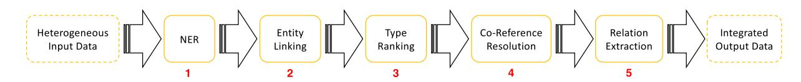

<!-- cite_key: cudr-mauroux2020 -->

Semantic Web 11 (2020) 13–17 13 DOI 10.3233/SW-190371 IOS Press

# Leveraging Knowledge Graphs for Big Data Integration: the XI Pipeline

Philippe Cudré-Mauroux

*eXascale Infolab, University of Fribourg, Switzerland E-mail: [pcm@unifr.ch](mailto:pcm@unifr.ch)*

**Editors:**Pascal Hitzler, Kansas State University, Manhattan, KS, USA; Krzysztof Janowicz, University of California, Santa Barbara, USA**Solicited reviews:**Aidan Hogan, Universidad de Chile, Chile; Tania Tudorache, Stanford University, USA; Peter Haase, metaphacts GmbH, Walldorf, Germany
**Abstract.**This article gives an overview of recent efforts focusing on integrating heterogeneous data using Knowledge Graphs. I introduce a pipeline consisting of five steps to integrate semi-structured or unstructured content. I discuss some of the key applications of this pipeline through three use-cases, and present the lessons learnt along the way while designing and building data integration systems.

Keywords: Knowledge Graphs, Big Data Integration, crowdsourcing

## 1. Introduction

Data abounds in large enterprises. Beyond structured data, which garnered a lot of attention from data specialists in the past, the last few decades saw the meteoric rise of semi-structured and unstructured data including JSON documents, email or social network messages, and media content. Most companies are struggling to create a coherent and integrated view over all those types of data.

Knowledge Graphs have become one of the key modalities to integrate disparate data in that context. They provide declarative and extensible mechanisms to relate arbitrary concepts through flexible graphs that can be leveraged by downstream processes such as entity search [\[10\]](#page-3-0) or ontology-based access to distributed information [\[2](#page-3-1)].

Yet, integrating enterprise data to a given Knowledge Graph is a highly complex and time-consuming task. In this article, I briefly summarize the recent research efforts from my group in that regard. I introduce the*XI Pipeline*, an end-to-end process to semiautomatically map existing content onto a Knowledge Graph (see Section [2\)](#page-0-0). I also discuss a series of systems we designed, built and deployed in that context to integrate publications (Section [3.1\)](#page-2-0), social content (Section [3.2\)](#page-2-1), and cloud infrastructure data (Section [3.3\)](#page-2-2). Finally, I conclude by making a number of observations and recommendations for future efforts in Big Data Integration based on our past experience in that domain (Section [4\)](#page-2-3).

### 2. The XI Pipeline

An overview of the pipeline we devised to integrate heterogeneous contents leveraging a Knowledge Graph is given in Fig. [1.](#page-1-0) This pipeline focuses on semi-automatically integrating unstructured or semistructured documents, as they are from our perspective the most challenging types of data to integrate, and as end-to-end techniques to integrate strictly structured data abound [\[9](#page-3-2)[,13\]](#page-4-0). The Knowledge Graph underpinning the integration process should be given a priori, and can be built by crowdsourcing (see Section [3.2\)](#page-2-1), by sampling from existing graphs (Section [3.1\)](#page-2-0) or through a manual process (Section [3.3\)](#page-2-2). The integration process starts with semi-structured or unstructured

<!-- Image Description: The image displays a flowchart illustrating a data processing pipeline. Heterogeneous input data undergoes six stages: 1) Named Entity Recognition (NER), 2) Entity Linking, 3) Type Ranking, 4) Co-Reference Resolution, 5) Relation Extraction, culminating in 6) Integrated Output Data. Each stage is represented by a labeled box, with arrows indicating the sequential flow of data through the process. The diagram visually depicts the steps involved in transforming raw data into a structured knowledge graph. -->

Fig. 1. The XI Pipeline goes through a series of five steps to integrate semi-structured or unstructured content leveraging a Knowledge Graph.

data given as input (left-hand side of Fig. [1\)](#page-1-0) and goes through a series of steps, described below, to integrate the content by creating a set of new nodes and edges in the Knowledge Graph as output (right-hand side of Fig. [1\)](#page-1-0).

### *2.1. Name-Entity Recognition (NER)*The first step is to go through all labels / textual contents in the input data and identify all entity mentions (e.g., locations, objects, persons or concepts) appearing in the text. Two main strategies can be applied here:

-**For closed domains:**when the Knowledge Graph is complete and contains all entities of interest along with their labels, we proceed with Information Retrieval techniques to build inverted indices over the Knowledge Graph and identify all potential entities from the text by leveraging ad-hoc object retrieval techniques [\[21\]](#page-4-1);
-**For open domains:**when the Knowledge Graph is incomplete and is missing a number of entities and labels of interest, things get more complex. The main problem we face in that case is to identify entities from text while not knowing anything about them, which is intrinsically a very challenging problem. To solve this issue, we leverage NLP techniques (part-of-speech tags), thirdparty information such as large collections of Ngrams and Machine Learning to identify new entities and add them to the Knowledge Graph dynamically [\[11](#page-3-3)].

###*2.2. Entity linking*

The first step typically returns a set of textual mentions (*surface forms*) from the input data, along with a set of candidates (*entities*) from the Knowledge Graph potentially corresponding to the mentions. The following task is to decide which entity from the graph corresponds to which mention from text and to link them. Many techniques can be used to solve this problem, which is typically referred to as *Entity Disambiguation*or*Entity Linking*in the literature [\[14](#page-4-2)].

Our solution to that problem departs from the state of the art in two important ways [\[3\]](#page-3-4): we use*probabilistic graphs*to combine several techniques, and*microtask crowdsourcing*[\[5](#page-3-5)] to improve the results leveraging human computation. Empirical results show that involving humans in this process improve the end results by over 10% compared to automated approaches [\[4\]](#page-3-6).

#*2.3. Type ranking*The next step we perform is pretty unique. We assume that each entity in the Knowledge Graph is associated with a series of*types*(there are many techniques to infer such entity types when they are missing from the Knowledge Graph, e.g., statistical techniques [\[6\]](#page-3-7)). However, the types associated to a given entity in the graph are typically not all relevant to the*mention*of that entity as found in the input data. Hence, we introduced the task of ranking entity types given its mention and context in the input data [\[18](#page-4-3)]. We leverage features from both the underlying type hierarchy as well as from the textual context surrounding the mention to solve this task in practice [\[19\]](#page-4-4). The result of this process is a ranking of fine-grained types associated to each entity mention, which can be invaluable when tackling downstream steps such as Co-Reference Resolution or Relation Extraction (see below).

##*2.4. Co-Reference Resolution*Up to this point, we have created a series of highquality links, along with relevant type information, to integrate mentions from the input data to entities in the Knowledge Graph. However, a number of further mentions available in the input data, such as noun phrases (e.g., "the Swiss champion" or "the former president"), cannot be resolved by our method. To tackle this issue, we introduce a*Co-Reference Resolution*step capturing further mentions from the input data and disambiguating them by taking advantage of all the data integrated so far. We developed novel methods to do so, simultaneously leveraging fine-grained type information [\[12](#page-3-8)] as well as deep neural networks [\[8\]](#page-3-9) to maximize the quality of the results.

###*2.5. Relation extraction*The final step is to extract*semantic relationships*between the entities appearing in the input data. This is important in order to correctly capture the articulation of the input data as well as the dependencies between the extracted entities. Relation extraction is, generallyspeaking, a very challenging task as they are a myriad of (explicit or implicit) ways to express a given relationship between several entities in the input data. To solve this problem, we resort to Distant Supervision leveraging the Knowledge Graph [\[16\]](#page-4-5). The basic idea is as follows: we consider pairs of entities connected through a relation in the Knowledge Graph as training data, and try to identify similar entities connected through the same relation from the input data. We devised a new neural architecture (the Aggregated Piecewise Convolutional Neural Network [\[15\]](#page-4-6)) to solve this task effectively in practice.

# 3. Use-cases

The outcome of the process described above is a set of nodes and links connecting mentions from the input data to entities and relations in the Knowledge Graph. As a result, the Knowledge Graph can then be used as a central gateway (i.e., as a*mediation layer*) to retrieve all heterogeneous pieces of data related to a given entity, type, relation or query.

We extended this generic approach to integrate various types of Big Data. We briefly present below three such deployments focusing on integrating different input data: (1) research articles, (2) social media content, and (3) cloud infrastructure data.

## *3.1. ScienceWise: Integrating research articles*

As the production of research artifacts is booming, it is getting more and more difficult to track down all the papers related to a given scientific topic. The ScienceWise [\[1](#page-3-10)] platform (co-created with EPFL and Leiden University) was conceived in that context, in order to help physicists track down articles of interests from arXiv. The platform allows physicists to register their interest from a Knowledge Graph where most entities relating to physics have been defined through crowdsourcing. As new articles are uploaded on arXiv, they are automatically integrated to the Knowledge Graph using a pipeline similar (although simpler) to the one described above in Section [2.](#page-0-0) As a result, the physicists are automatically notified whenever a new paper relating to one of their interests gets uploaded.

### *3.2. ArmaTweet: Integrating social media contents*

The second system we built tackles social media content. Specifically, we looked into how Knowledge Graphs can help integrate series of tweets (i.e., microposts) that are difficult to handle otherwise given their short and noisy nature. The resulting system, ArmaTweet [\[20\]](#page-4-7) (a collaboration between ArmaSuisse, the University of Oxford and my group) takes as input a stream of tweets, extracts structured representations from the tweets using a pipeline similar to the one presented above, and integrates them to a Knowledge Graph built by borrowing content from both DBpedia and WordNet. ArmaTweets allows to pose complex queries (such as "find all politicians dying in Switzerland" or "find all militia terror acts") against a set of tweets, which could not be handled otherwise using classical Information Retrieval or Knowledge Reasoning methods.

# *3.3. Guider: Integrating cloud infrastructure data*Another integration project we worked on (together with Microsoft CISL) is Guider [\[7](#page-3-11)]: a system to automatically integrate cloud infrastructure data to a Knowledge Graph. The input data in this case is a very large set of*logs*produced automatically by a distributed computing infrastructure. We parse and integrate the log data drawing from the pipeline described in Section 2, but considerably customizing it to take into account the specificities of the data (e.g., classical NLP or entity linking techniques cannot be applied in this context, as the input data does not contain any sentence). The resulting graph captures lineage information among files and jobs running on the infrastructure. The deployed system is now used for a series of applications at Microsoft including job auditing and compliance, automated SLO extraction of recurring tasks, and global job ranking.

## 4. Conclusions & lessons learnt

Drawing from our own experience, Knowledge Graphs proved to be powerful and flexible abstractions to integrate heterogeneous pieces of content. Yet, the integration process required to correctly map the input data onto a Knowledge Graph is taxing, as automated techniques cannot fully grasp the semantics of arbitrary input data (yet). While working on the various efforts described above, we learnt a few lessons that we hope will be valuable for future research.

First, human attention (in the form of crowdsourcing or manual inspection of the input and/or output data) is still key to provide high-quality results. While automated techniques have improved, they are still far from providing ideal results. Along similar lines, one cannot expect perfect results from human experts either, given the inevitable subjectivity or ambiguity of some of the tasks in a large-scale integration project.

Second, entity types represent very useful constructs in integration efforts. We are not talking about coarsegrained types (e.g,*person*or*location*), but rather about very specific, fine-grained types (e.g, *Dropout from Harvard*or*Municipalities of the canton of Fribourg*) borrowed from a rich and expressive type hierarchy. Associating and ranking such fine-grained types early in the pipeline for each entity mention found in the input data is invaluable for many downstream tasks such as data summarization, co-reference resolution or relation extraction.

Third, the quality of the integration process is always constraint by the quality of the Knowledge Graph used as a mediation layer. Large Knowledge Graphs typically are full of errors and inconsistencies [\[17\]](#page-4-8), which have to be fixed prior to the integration process in order to maximize the quality of the results. Missing data in the Knowledge Graph is yet another issue, which jeopardizes the entire integration process as working with incomplete data is inherently very challenging.

Finally, designing a generic platform capable of integrating different data for different applications proved to be impractical. Even if, as described above, many ideas and processes can be recycled from one project to the next, real data is always intricate and specific, making it essential to specialize the approach for the use-case at hand. Providing a library of composable software artifacts, each responsible for a certain integration subprocess and each focusing on a certain data modality, might be an interesting avenue for future work in that context.

### References

[1] K. Aberer, A. Boyarsky, P. Cudré-Mauroux, G. Demartini and O. Ruchayskiy, Sciencewise: A web-based interactive semantic platform for scientific collaboration, in: *10th International* *Semantic Web Conference (ISWC 2011-Demo)*, Bonn, Germany, 2011.

- [2] S. Decker, M. Erdmann, D. Fensel and R. Studer, Ontobroker: Ontology based access to distributed and semi-structured information, in: *Database Semantics: Semantic Issues in Multimedia Systems*, R. Meersman, Z. Tari and S. Stevens, eds, Springer US, Boston, MA, 1999, pp. 351–369. doi[:10.1007/](https://doi.org/10.1007/978-0-387-35561-0_20) [978-0-387-35561-0\\_20.](https://doi.org/10.1007/978-0-387-35561-0_20)
- [3] G. Demartini, D.E. Difallah and P. Cudré-Mauroux, Zen-Crowd: Leveraging probabilistic reasoning and crowdsourcing techniques for large-scale entity linking, in: *Proceedings of the 21st International Conference on World Wide Web, WWW '12*, ACM, New York, NY, USA, 2012, pp. 469–478, ISBN 978-1- 4503-1229-5. doi[:10.1145/2187836.2187900.](https://doi.org/10.1145/2187836.2187900)
- [4] G. Demartini, D.E. Difallah and P. Cudré-Mauroux, Largescale linked data integration using probabilistic reasoning and crowdsourcing, *VLDB J.* **22**(5) (2013), 665–687. doi[:10.1007/](https://doi.org/10.1007/s00778-013-0324-z) [s00778-013-0324-z.](https://doi.org/10.1007/s00778-013-0324-z)
- [5] D.E. Difallah, M. Catasta, G. Demartini, P.G. Ipeirotis and P. Cudré-Mauroux, The dynamics of micro-task crowdsourcing: The case of Amazon MTurk, in: *Proceedings of the 24th International Conference on World Wide Web, WWW '15, International World Wide Web Conferences Steering Committee, Republic and Canton of Geneva*, Switzerland, 2015, pp. 238–247, ISBN 978-1-4503-3469-3. doi[:10.1145/2736277.2741685.](https://doi.org/10.1145/2736277.2741685)
- [6] A. Lutov, S. Roshankish, M. Khayati and P. Cudre-Mauroux, StaTIX – statistical type inference on linked data, in: *2018 IEEE International Conference on Big Data (Big Data)*, 2018, pp. 2253–2262. doi[:10.1109/BigData.2018.8622285.](https://doi.org/10.1109/BigData.2018.8622285)
- [7] R. Mavlyutov, C. Curino, B. Asipov and P. Cudré-Mauroux, Dependency-driven analytics: A compass for uncharted data oceans, in: *CIDR 2017, 8th Biennial Conference on Innovative Data Systems Research, Online Proceedings*, Chaminade, CA, USA, January 8–11, 2017, 2017.
- [8] J. Plu, R. Prokofyev, A. Tonon, P. Cudré-Mauroux, D.E. Difallah, R. Troncy and G. Rizzo, Sanaphor++: Combining deep neural networks with semantics for coreference resolution, in: *Proceedings of the Eleventh International Conference on Language Resources and Evaluation, LREC 2018*, Miyazaki, Japan, May 7–12, 2018, 2018.
- [9] A. Poggi, M. Rodriguez-Muro and M. Ruzzi, Ontology-based database access with DIG-mastro and the OBDA plugin for protégé (demo description), in: *OWLED*, 2008.
- [10] J. Pound, P. Mika and H. Zaragoza, Ad-hoc object retrieval in the web of data, in: *Proceedings of the 19th International Conference on World Wide Web, WWW '10*, ACM, New York, NY, USA, 2010, pp. 771–780, ISBN 978-1-60558-799-8. doi[:10.](https://doi.org/10.1145/1772690.1772769) [1145/1772690.1772769.](https://doi.org/10.1145/1772690.1772769)
- [11] R. Prokofyev, G. Demartini and P. Cudré-Mauroux, Effective named entity recognition for idiosyncratic web collections, in: *Proceedings of the 23rd International Conference on World Wide Web, WWW '14*, ACM, New York, NY, USA, 2014, pp. 397–408, ISBN 978-1-4503-2744-2. doi[:10.1145/2566486.](https://doi.org/10.1145/2566486.2568013) [2568013.](https://doi.org/10.1145/2566486.2568013)
- [12] R. Prokofyev, A. Tonon, M. Luggen, L. Vouilloz, D.E. Difallah and P. Cudré-Mauroux, SANAPHOR: Ontology-based coreference resolution, in: *The Semantic Web – ISWC 2015*, M. Arenas, O. Corcho, E. Simperl, M. Strohmaier, M. d'Aquin, K. Srinivas, P. Groth, M. Dumontier, J. Heflin, K. Thirunarayan, K. Thirunarayan and S. Staab, eds, Springer International Pub-

lishing, Cham, 2015, pp. 458–473. doi[:10.1007/978-3-319-](https://doi.org/10.1007/978-3-319-25007-6_27) [25007-6\\_27.](https://doi.org/10.1007/978-3-319-25007-6_27)

- [13] J.F. Sequeda and D.P. Miranker, A pay-as-you-go methodology for ontology-based data access, *IEEE Internet Computing* **21**(2) (2017), 92–96. doi[:10.1109/MIC.2017.46.](https://doi.org/10.1109/MIC.2017.46)
- [14] W. Shen, J. Wang and J. Han, Entity linking with a knowledge base: Issues, techniques, and solutions, *IEEE Transactions on Knowledge and Data Engineering* **27**(2) (2015), 443– 460. doi[:10.1109/TKDE.2014.2327028.](https://doi.org/10.1109/TKDE.2014.2327028)
- [15] A. Smirnova, J. Audiffren and P. Cudre-Mauroux, APCNN: Tackling class imbalance in relation extraction through aggregated piecewise convolutional neural networks, in: *Swiss Conference on Data Science (SDS)*, 2019, pp. 63–68. doi[:10.1109/](https://doi.org/10.1109/SDS.2019.000-6) [SDS.2019.000-6.](https://doi.org/10.1109/SDS.2019.000-6)
- [16] A. Smirnova and P. Cudré-Mauroux, Relation extraction using distant supervision: A survey, *ACM Comput. Surv.* **51**(5) (2018), 106:1–106:35. doi[:10.1145/3241741.](https://doi.org/10.1145/3241741)
- [17] A. Tonon, M. Catasta, G. Demartini and P. Cudré-Mauroux, Fixing the domain and range of properties in linked data by context disambiguation, in: *Proceedings of the Workshop on Linked Data on the Web, LDOW*, 2015.
- [18] A. Tonon, M. Catasta, G. Demartini, P. Cudré-Mauroux and K. Aberer, TRank: Ranking entity types using the web of data,

in: *The Semantic Web – ISWC 2013*, H. Alani, L. Kagal, A. Fokoue, P. Groth, C. Biemann, J.X. Parreira, L. Aroyo, N. Noy, C. Welty and K. Janowicz, eds, Springer, Berlin, Heidelberg, 2013, pp. 640–656, ISBN 978-3-642-41335-3.

- [19] A. Tonon, M. Catasta, R. Prokofyev, G. Demartini, K. Aberer and P. Cudre-Mauroux, Contextualized ranking of entity types based on knowledge graphs, *Journal of Web Semantics* **37–38**(2016), 170–183. doi[:10.1016/j.websem.2015.12.005.](https://doi.org/10.1016/j.websem.2015.12.005)
- [20] A. Tonon, P. Cudré-Mauroux, A. Blarer, V. Lenders and B. Motik, ArmaTweet: Detecting events by semantic tweet analysis, in:*The Semantic Web*, E. Blomqvist, D. Maynard, A. Gangemi, R. Hoekstra, P. Hitzler and O. Hartig, eds, Springer International Publishing, Cham, 2017, pp. 138–153. doi[:10.](https://doi.org/10.1007/978-3-319-58451-5_10) [1007/978-3-319-58451-5\\_10.](https://doi.org/10.1007/978-3-319-58451-5_10)
- [21] A. Tonon, G. Demartini and P. Cudré-Mauroux, Combining inverted indices and structured search for ad-hoc object retrieval, in: *Proceedings of the 35th International ACM SIGIR Conference on Research and Development in Information Retrieval, SIGIR '12*, ACM, New York, NY, USA, 2012, pp. 125–134, ISBN 978-1-4503-1472-5. doi[:10.1145/2348283.2348304.](https://doi.org/10.1145/2348283.2348304)
