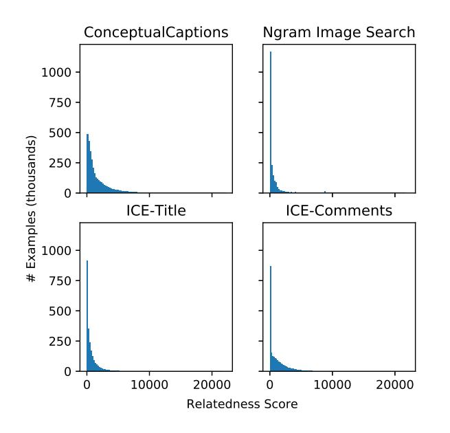
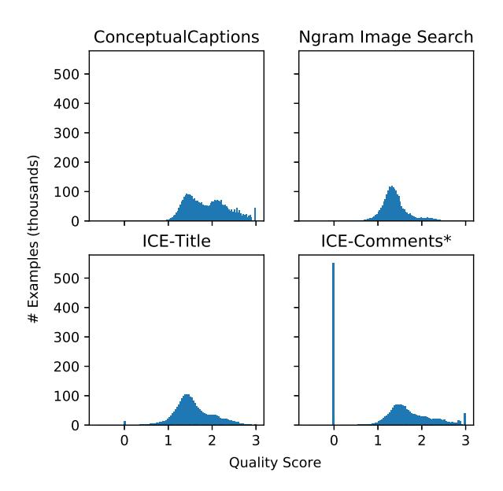
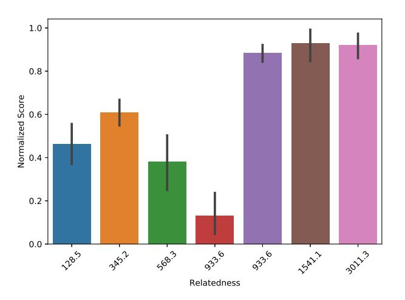
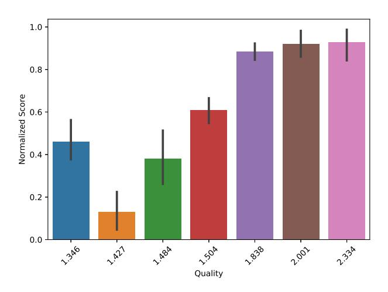

# Quality and Relevance Metrics for Selection of Multimodal Pretraining Data

Roshan Rao UC Berkeley rmrao@berkeley.edu

Debadeepta Dey Microsoft Research dedey@microsoft.com

Sudha Rao Microsoft Research sudha@microsoft.com

> Asli Celikyilmaz Microsoft Research

aslicel@microsoft.com

Elnaz Nouri Microsoft Research Elnaz.Nouri@microsoft.com

> Bill Dolan Microsoft Research billdol@microsoft.com

Abstract

*Self-supervised pretraining has become a strong force in both language and vision tasks. Current efforts to improve the effects of pretraining focus on improving network architecture or defining new tasks to extract representations from the data. We focus on a third axis, the data itself, to quantify and measure how different sources and quality of data can affect the learned representations. As pretraining datasets grow larger and larger, the cost of pretraining will continue to increase. This issue is especially acute for visuolingusitic data, as the cost of storage and processing for image and video data will rise quickly. We therefore examine four visuolinguistic datasets (three preexisting datasets and one collected by us) for their utility as pretraining datasets. We define metrics for dataset quality and relevance, propose a method for subsampling large corpuses for the data most relevant to a set of downstream multimodal vision and language tasks of interest, and show that this method increases performance across the board for all downstream tasks.*

## 1. Introduction

In the last several years, self-supervised pretraining has emerged as a powerful tool for extracting information from large, unlabeled datasets. In both natural language processing and computer vision, a number of groups have shown significant increases in performance across a variety of models and tasks by training representations on large scale data, before transferring to smaller labeled datasets [4, 20].

A standard pretraining pipeline consists of roughly three choices: data selection, model selection, and pretraining task/loss selection. Most work focuses on the latter two parts of this pipeline, examining new models [10, 17] or new tasks/losses [13, 19, 20]. Where data is studied, it is mostly to look at the effect of data *size*, rather than data quality or relevance [5, 18].

We believe that although the pretraining datasets of today are still small enough to train on for multiple epochs, datasets will grow increasingly larger to the point where it will be infeasible to train on the full dataset (at least for most organizations). Mahajan et al. [11] have already shown that, in a billion-image scale dataset, 'label space engineering' - the process of pruning labels to only those relevant to the downstream task in mind - can improve performance of models. This will be an especially large issue for visuolinguistic datasets as the storage and processing of images and videos will become too large for the average practitioner to manage.

In this paper we ask several exploratory questions. Given a fixed model, task, and data size, how does data quality and data relevance affect performance on downstream tasks? Is it possible to select pretraining data so as to maximize perfomance of a model on downstream tasks?

In order to answer these questions we analyze several datasets consisting of paired image and text data: ConceptualCaptions [16], ICE-Title, ICE-Comments [7], and Ngram Image Search. More details about each dataset can be found in Section 4.

We propose to score each example in a dataset along two axes: *quality* and *relevance*, for which we propose two metrics based on GloVe vector [14] word similarity and TF-IDF, respectively (see Section 3). Based on these metrics, we sample from our four base datasets to construct several additional pretraining sets designed to maximize/minimize our metrics of quality and relevance.

Finally, for each dataset we pretrain a ViLBERT [10] style model and evaluate on four downstream tasks: Visual Question Answering (VQA) [6], Visual Commonsense Reasoning (VCR) [22], Grounded Referring Expressions [8], and Image Retrieval [21]. We compare the performance of our pretrained model on each downstream task, and find that our quality and relevance metrics correlate well with performance on downstream tasks (Spearman's ρ of 0.893 and 0.577, respectively). We also find that constructing 'Amalgam' datasets from the base datasets based on our metrics enables us to improve pretraining utility even further, boosting performance on all downstream tasks.

## 2. Related Work

#### 2.1. Dataset Curation

The most common data ablation performed in recent self-supervised learning papers is one of dataset size. This examines the effects of pretraining on more and more data. The story here has been relatively conistent: more data is better [5, 10, 18]. However, this only tests one axis of data selection. ConceptualCaptions [16], for example, is a relatively high-quality image-text dataset. During its creation, 97% of candidate (image, text) pairs were filtered out for quality issues. If dataset size is the only important axis, we would expect that a lower quality version of ConceptualCaptions containing 100M (image, text) pairs would necessarily make for a superior pretraining dataset.

Mahajan et al. [11] explore the question of engineering a pretraining dataset more directly. They introduce a concept called *label-space engineering*, where they prune a set of hashtags across 1 billion images down to sets of 1.5k, 8.5k, and 17k hashtags. These are pruned via WordNet synsets [12] of ImageNet [3] classes, with higher thresholds for 'relatedness' creating smaller hashtag sets. They find that pretraining on a smaller set of hashtags can improve performance on some downstream tasks, suggesting that noisier pretraining data can be less helpful. Inspired by their techniques for filtering their data and labels, we define two metrics to empirically measure dataset quality and relatedness. We work with visuolinguistic data rather than pure vision data, as this allows us a wider variety of downstream tasks and makes the problem of defining quality and relatedness more difficult. We also test our hypotheses across a variety of datasets collected from different sources and with differing levels of effort and money placed into creating and filtering them. By comparing across methodologies we can determine whether increased effort and cost of pretraining dataset curation translates into increased gains for downstream tasks.

#### 2.2. Network Architecture and Pretraining Task

We chose to fix our model the ViLBERT model proposed by Lu et al. [10] which allows us to train on a wide variety of image and text data, without careful tailoring of the dataset for our model architecture. ViLBERT is a multimodal model designed to work with both visual and linguistic inputs. For the visual component of the model, each image is run through a pretrained object-detection network to extract bounding boxes and visual features. For the text component of the model, the input is preprocessed via a byte-pair encoding and the resulting discrete tokens embedded via a learned embedding layer. The visual features are concatenated with the embedded tokens as input to the model. The model is then trained via two tasks: masked multi-modal modeling and multi-modal alignment prediction.

For masked multi-modal modeling, 15% of inputs are masked. When masking text features, the feature is replaced with the special MASK token 80% of the time, with a random token 10% of the time, and is left unchanged 10% of the time. On output, the model is trained to re-predict the masked token based on all unmasked inputs. When masking image features, the feature is zeroed out 90% of the time and left unaltered 10% of the time. On output, the model is trained to predict class probabilities of the original input object, and to minimize the KL-divergence between these class probabilities and the original ResNet class probabilities.

For mutli-modal alignment prediction, the model receives as input either truly aligned image and text data or a random pairing of image and text data. It must then predict wither the input image and text are aligned or random.

We evaluate our pretrained models using the same tasks chosen in the VilBERT paper, namely Visual Question Answering (VQA), Visual Commonsense Reasoning (VCR), Grounded Referential Expressions, and Image Retrieval.

## 3. Methods

We define two metrics of dataset relatedness and quality, which we use to score each of our datasets. The both metrics are also used to curate "amalgam" datasets consisting of high-scoring examples.

#### 3.1. Relatedness

We use a TFIDF-based metric for determining the relatedness of the text in a given (image, text) pair to the text in the downstream tasks. We first take all text across all our base datasets (described in Sections 4.1-4.3), and compute the TFIDF matrix:

$$
K_{d,w} = \text{freq}_d(w) \log \left( \frac{|D|}{\text{freq}_D(w)} \right) \forall d \in D, w \in W \quad (1)
$$

Where D is the set of all text, W is the set of all words, d is an individual document, w is an individual word, freqd (w) is the number of times w appears in d, and freqD(w) is the number of documents w appears in. This defines a matrix K ∈ R |D|×|W| .

Now, given a new document d ′ (i.e. the text from a particular example in a downstream task), we encode it into the same space as the query vector Qd′ and define the score

Figure 1. Distribution of relatedness scores for the four base datasets. As the maximum score for any query-document pair is 1, the total score can be interpreted as the number of downstream task examples to which a document is highly relevant. The median score on the ConceptualCaptions dataset is 933.6, on the Ngram Image Search dataset is 128.5, on the ICE-Title dataset is 345.2, and on the ICE-Comments dataset is 568.3.

for each document d as the cosine distance between the encoded pretraining text and the encoded downstream text. The total score for a given document is simply the sum of scores across all downstream text. If we let S be the set of all downsteam text, then

relatedness
$$
(d)
$$
 = 
$$
\sum_{d' \in S} \frac{K_d^T Q_{d'}}{||K_d|| ||Q_{d'}||} \forall d \in D
$$
 (2)

#### 3.2. Quality

We define quality of data as similarity between the image and text of an (image, text) pair. High quality data should have a strong similarity between image and text, with text referring to at least one if not more parts of the image. Low quality data should have weak or no similarity between image and text, and may even be missing text altogether.

To calculate similarity between image and text, we run each image through an RCNN trained on Visual Genome [15, 9]. We then examine the GloVe vectors [14] corresponding to the 1600 Visual Genome classes and compare them via cosine similarity to the GloVe vectors in the text. The GloVe vectors used are pretrained on 840 billion tokens from Common Crawl. Let o ∈ Oi be the set of objects detected by the RCNN for a given image i, w ∈ d be the set

Figure 2. Distribution of quality score for the four base datasets. As the maximum score for any (image, text) pair is 3 (denoting that three distinct objects in the image are exactly present in the text), the score can be interpreted roughly as the number of distinct objects present in the image that are also mentioned in the text. The median score on the ConceptualCaptions dataset is 1.84, on the Ngram Image Search dataset is 1.35, on the ICE-Title dataset is 1.50, and on the ICE-Comments dataset is 1.48. Note that both ICE-Title and ICE-Comments contain some text examples that are mostly empty/consist only of vocabulary not present in the GloVe embedding space. This results in a few zeros for ICE-Titles and a large number of zeros for ICE-Comments.

of words in the paired text for that image, g be the glove embedding function, then we define our quality score as:

quality
$$
(i, d)
$$
 = sum $\left(\text{top}_k\left(\right)$   
$$
1 - \frac{g(o)g(w)}{||g(o)|| ||g(w)||} \forall o \in O_i, w \in d\right)
$$
(3)

Here, topk refers to the k highest-scoring pairs of words w ∈ d and objects o ∈ Oi . We use a sum of the topk function here, rather than a direct max or a mean. The mean function penalizes longer text and the use of articles, determiners, etc. too heavily. The max function lacks fidelity, scoring many pairs at perfect similarity. k is a hyperparameter, which we choose to be 3. A good choice of k should balance the likelihood of detecting reasonable text (which is unlikely to mention every single object in the image) with also rewarding text that is more directly descriptive of the image. Further experimentation would be necessary to determine the effect of k on the scoring of examples.

## 4. Datasets

Here we describe all datasets used in this work. Some datasets are publicly available, some are not, and some were collected by us for this work. We note the distinction when discussing each dataset. In addition, we construct some specific datasets to probe the relatedness/quality metrics more directly. Note that as all datasets are of different size, we downsample each training set to 2 million examples to ensure equal comparison across each dataset.

### 4.1. Conceptual Captions

The ConceptualCaptions dataset is a high-quality image caption dataset where images are sourced from the web and text is source from corresponding HTML Alttext attribute [16]. It consists of approximately 3.3 million (image, text) pairs. When this dataset was constructed, candidate (image, text) pairs were filtered in three ways. First, images were filtered to exclude non-JPEG images, images where one dimension has fewer than 400 pixels, or images with an aspect ratio greater than 2. Second, pairs were filtered based on alt-text to exclude those without wellformed English (e.g. existence of determiners, capitalization, etc.). Third, pairs with no relationship between objects detected in the image and associated text were removed. This results in a dataset highly amenable for pretraining, and which we show scores highly on both of our proposed metrics.

#### 4.2. Image CommEnting (ICE) Dataset

The ICE dataset [7] for image commenting consists of images sourced from Reddit, along with the title and comments on each post. While the original dataset consists of only 1 million examples, we obtained the unfiltered superset of the data from the authors. This results in a dataset large enough for our purposes (> 2 million examples), but which has little to no filtering. From this superset of the ICE dataset, we construct two pretraining datasets, which we call ICE-Titles, and ICE-Comments.

ICE-Titles In the ICE-Titles pretraining dataset we pair each image with its corresponding post title. This provides a training set that is similar in structure to the Conceptual-Captions dataset, as each image is paired with a short piece of text where both image and text are uploaded by the same user. The main difference between these two is the level of filtering, as ConceptualCaptions filters out examples that are deemed to be low quality. Therefore comparing these two datasets provides a sense of the degree to which filtering pretraining data affects downstream performance.

ICE-Comments In the ICE-Comments pretraining dataset, we pair each image with its corresponding post comments. The distribution of text in the post comments is significantly different from the distribution in standard captioning datasets. Comment text mentions objects present in the image much less frequently while using verb part-of-speech (POS) words more frequently. Sentiment words also occur more often as comments tend to express subjective/emotional descriptions. Overall, by directly comparing this to the ICE-Titles dataset, we can see the effect of how pretraining text is generated, examine the usefulness of training on more natural human conversations, and compare training on small, higher-quality text against longer lower-quality text (where quality refers to our quality measure from Section 3.2).

#### 4.3. Ngram Image Search

For this dataset, we construct a set of (image, text) pairs based on common English ngrams. We obtained a set of 2 grams, 3-grams, 4-grams, and 5-grams from the Corpus of Contemporary American English (COCA) [2]. Collected n-grams were then scored based on several measures:

- Candidates which triggered word list filters for pornography/profanity were removed using the Google Profanity List.
- Candidates received positive score for nouns (excluding proper nouns) and verbs
- Candidates received positive score for words which matched known English (as defined by the Natural Language Toolkit (NLTK) English word corpus [1]).
- Candidates received positive score for words that did not occur in many ngrams to generate a diverse set of text captions. This was limited, however to words that appeared in at least 10 ngrams, to eliminate extremely rare words, misspellings, etc.

N-grams were then sorted and the top ∼2M n-grams were selected (to match the size of the other datasets). The final filtered set of n-grams consisted of 21% 2-grams, 22% 3-grams, 24% 4-grams, and 33% 5-grams. After collecting these n-grams, we performed an image search to find corresponding images. In each case, we simply selected the first image result.

#### 4.4. RandomCaptions

The RandomCaptions dataset is constructed from the ConceptualCaptions dataset and consists of the same images and text. However, rather than the paired image text present in the original dataset, each image is paired with a *random* caption. This dataset is constructed specifically to examine the relationship between our notions of relatedness and quality. Since it contains the same text as the ConceptualCaptions dataset, RandomCaptions scores very highly on our relatedness metric. Obviously, however, it scores very poorly on our quality metric.

This dataset disentangles the benefits of training on *unpaired* visuolinguistic data from the benefits of training on *paired* visuolinguistic data. Unpaired data may still be highly related to the downstream task. As such, it enables the model to independently train its visual processing weights (masked objects can be predicted from unmasked objects) and its text processing weights (masked text can be predicted from unmasked text). It does not, however, allow learning text-image grounding, as masked text cannot be predicted from the unmasked objects, and masked objects cannot be predicted from unmasked text. Therefore pretraining on this dataset directly measures the impact of learning the relationship between text and image, as opposed to learning how to process the modes independently.

#### 4.5. Amalgam - Relatedness

This is an amalgam dataset constructed from the superset of all (image, text) pairs in all our datasets, filtered for relatedness. Using Eq. 3.1 we score each (image, text) pair, then select the 2.015 million highest scoring examples. These are split into a training set of 2 million examples and a validation set of 15 thousand examples. This dataset directly tests our relatedness metric, and shows the impact that relatedness to downstream task has on final performance.

#### 4.6. Amalgam - Quality

As with the 'Amalgam - Relatedness' dataset, this is an amalgam dataset constructed from the superset of all (image, text) pairs in our other datasets, filtered for quality. Using Eq. 3.2 we score each (image, text) pair, then select the 2.015 million highest scoring examples. These are split into a training set of 2 million examples and a validation set of 15 thousand examples. This dataset directly tests our quality metric, and shows the impact that quality to downstream task has on final performance.

## 5. Downstream Tasks

We train on the same downstream visuolinguistic tasks used in the original ViLBERT paper. Below we describe the problem proposed by each downstream task. As we do not make modifications to the ViLBERT fine-tuning procedure, details of architecture and hyperparameters are omitted for brevity (see Lu et al. [10] for these details).

#### 5.1. Image Retrieval

Image Retrieval is the task of returning a specific image from a large set of images, given a natural language description. We train this via the Flickr30k [21] dataset, which consists of 31,000 images, each with five high-quality natural language descriptions. At training time, four options are constructed from a given image, description pair: the original image and description pair, the original image and a random description, a random image and the original description, and a hard-negative image with the original description. Hard-negative images are sampled from the 100 nearest neighbors of the original image. At test time, similarity is scored across all images in the test set, to better simulate a "search". This task tests the model's ability to detect and ground similarity between images and text, with hard-negative images requiring a more fine grained ability to detect similarities and discrepancies.

#### 5.2. Grounded Referring Expressions

The Grounded Referring Expressions task requires localizing an area of an image given a natural language description of the area. These descriptions can be simple (e.g. 'door') or more extensive (e.g. 'man in red shirt on horse'). The task is trained by obtaining object detections from an RCNN and reranking the set of object detections based on similarity to the input text string. This has some similarities to the Image Retrieval task, but requires a greater understanding of the individual objects in the image as well as an understanding of the relations between the objects ('on top of', 'next to', etc.). For training and test we use the RefCOCO+ dataset [8].

#### 5.3. Visual Question Answering (VQA)

VQA is the task of answering a natural language question about a given input image. For this task we use the VQAv2 dataset [6]. This dataset consists of 1.1 million questions over all images in the COCO 2017 train/val/test set. Questions and answers are both solicited from human annotators, resulting in a wide variety of natural language. Answers are pruned to 3129 possible answer classes, and the model emits a distribution over these answer classes.

In addition, the dataset is specifically constructed to minimize linguistic bias. In the original VQA dataset, simple ngram based methods could achieve very high performance without looking at the image. The authors counteract this by adding new (image, question) pairs to the dataset which are visually similar and linguistically identical to other pairs in the dataset, but which have different answers. This forces a model to ground its answer in both the language and the image.

#### 5.4. Visual Commonsense Reasoning (VCR)

VCR is the task of answering a commonsense-reasoning question about a given input image. While this may seem similar to the VQA task, questions in the VCR dataset target higher-order semantics and relationships that are implicitly present in an image (e.g. 'Why is person4 pointing at person1?') rather than clearly present attributes of the image (e.g. 'What color is the ball?').

|                       | VQA [6] | VCR [22] |        | RefCOCO+ [8] |        |        | Image Retrieval [21] |        |        |       |
|-----------------------|---------|----------|--------|--------------|--------|--------|----------------------|--------|--------|-------|
| Pretraining Dataset   | minval  | Q→A      | QA→R   | val          | testA  | testB  | R1                   | R5     | R10    | Score |
| No Pretraining        | 67.887  | 67.611   | 67.536 | 70.273       | 77.192 | 60.565 | 48.000               | 78.600 | 86.720 | 0.111 |
| RandomCaptions        | 66.917  | 69.145   | 69.997 | 70.106       | 76.196 | 60.810 | 49.160               | 79.240 | 87.100 | 0.131 |
| ICE-Comments          | 68.480  | 70.193   | 70.773 | 70.450       | 77.209 | 61.076 | 50.980               | 79.900 | 87.540 | 0.380 |
| Ngram Image Search    | 68.617  | 69.714   | 69.952 | 71.305       | 76.703 | 61.424 | 53.000               | 81.320 | 88.160 | 0.462 |
| ICE-Title             | 68.383  | 70.570   | 71.211 | 71.379       | 77.297 | 62.487 | 52.720               | 81.520 | 89.300 | 0.610 |
| ConceptualCaptions    | 69.050  | 71.587   | 73.302 | 71.844       | 78.187 | 62.671 | 55.740               | 83.780 | 90.000 | 0.884 |
| Amalgam - Relatedness | 69.150  | 71.945   | 73.623 | 72.104       | 78.257 | 62.671 | 55.580               | 83.600 | 90.160 | 0.922 |
| Amalgam - Quality     | 69.150  | 71.761   | 73.182 | 71.677       | 77.628 | 63.080 | 56.940               | 85.160 | 90.780 | 0.930 |

Table 1. Results on downstream supervised tasks.

Table 2. Average metric scores for each pretraining set.

| Pretraining Dataset   | Relatedness | Quality |
|-----------------------|-------------|---------|
| RandomCaptions        | 933.64      | 1.43    |
| ICE-Comments          | 568.30      | 1.48    |
| Ngram Image Search    | 128.46      | 1.35    |
| ICE-Title             | 345.19      | 1.50    |
| ConceptualCaptions    | 933.64      | 1.84    |
| Amalgam - Relatedness | 3011.31     | 2.00    |
| Amalgam - Quality     | 1541.13     | 2.33    |

Each example in the VCR dataset [22] consists of four entities - the image, question, answer, and rationale, and the dataset consists of 110K images with 290K questions, answers, and rationales. VCR actually consists of two tasks: question to answer (Q→A), question + answer to rationale (QA→R). Each task is cast as a multiple choice question, with the model being provided with the image and input, as well as four possible outputs. Distractor outputs are selected via 'adversarial matching' which attempts to minimize the models ability to guess the answer via linguistic biases.

## 6. Results

Table 1 shows results for all downstream supervised tasks when comparing against different pretraining datasets. Overall, we find that a rough ordering of performance improvement improvement emerges across different pretraining datasets and tasks. This can be seen in the final 'Score' column of the table, which displays the average normalized score across all tasks. To compute this average normalized score, we first normalize scores within each task by the following transformation:

$$
\tilde{s}_{\text{task},t} = \frac{s_{\text{task},t} - \min_{u} s_{\text{task},u}}{\max_{u} s_{\text{task},u} - \min_{u} s_{\text{task},u}}
$$

where t, u represent pretraining datasets and stask,t is the score for a pretraining dataset t on a particular downstream task. This rescales all downstream task scores between 0

Figure 3. Relatedness versus normalized performance measure for all datasets. Marks from left to right represent Ngram Image Search, ICE-Title, ICE-Comments, RandomCaptions, ConceptualCaptions, Amalgam - Quality, and Amalgam - Relatedness.

and 1. The average of this normalized score across all tasks gives us a way of measuring overall performance.

In addition, our measures of relatedness and quality both correlated well with performance increases. Our relatedness measure has a Spearman's rank correlation of 0.577 with overall score (0.771 if we ignore the adversarially constructed RandomCaptions dataset), and our quality measure has a Spearman's rank correlation of 0.893 with the overall score. See Figures 3-4 for plots of relatedness and quality against normalized performance measures.

## 7. Discussion

Our quality and relatedness measures both correlated well with normalized performance on the downstream tasks. Our results show that this is true not only for existing datasets, but also for datasets constructed to explicitly maximize these metrics, which suggests a causal relationship between improving the metrics and increasing performance on downstream tasks.

Figure 4. Quality versus normalized performance measure for all datasets. Marks from left to right represent Ngram Image Search, RandomCaptions, ICE-Comments, ICE-Title, ConceptualCaptions, Amalgam - Relatedness, and Amalgam - Quality.

#### 7.1. Disentangling Quality and Relatedness

While both quality and relatedness are correlated with final performance, they are also correlated with each other. This is especially clear from the Amalgam - Quality and Amalgam - Relatedness datasets. Although each dataset is constructed to maximize one of the metrics, they both also score second-highest on the other metric (see Table 2). This makes it difficult to determine the effect of each metric on performance.

First, we note that (ignoring the RandomCaptions dataset), the quality metric correlates better with performance (Spearman's ρ 0.829) than the relatedness metric (Spearman's ρ 0.700). This suggests that higher quality examples, which should help the model learn image-text grounding and relationships, are more important than lower quality but more related text and images.

To further examine this hypothesis, we can look at the RandomCaptions dataset. This is a low-quality dataset with minimal relationship between paired text and image. It is also a high-relatedness dataset as the individual captions are exactly the same as the ConceptualCaptions dataset on which it is built. This dataset performs little better than no pretraining at all, which suggests that the largest benefit of pretraining is the ability of the model to learn image-text grounding.

#### 7.2. Limitations of Analysis

While the current set of experiments point to interesting relationships between these simple metrics and performance on downstream tasks, there are limitations in the current methodology when it comes to investigating these relationships further.

First, collecting a data point in this approach requires collecting a 2 million image-text pair dataset, pretraining a relatively large model on this dataset, followed by finetuning on several downstream tasks. We chose this methodology as pretraining is generally most useful for large models with relatively challenging downstream tasks. This gives the results broad applicability, as the discovered relationships are likely to hold true for large models, large pretraining datasets, and across many other downstream tasks. On the other hand, speeding up the collection of data points would allow clearer results and faster testing of new potential metrics.

Second, our downstream evaluations consist of broad, general image understanding tasks. As a result, it is actually difficult to construct a dataset of high-quality images that are relatively unrelated to the downstream tasks. Analyzing a more niche downstream task may help further disentangle the effects of quality and relatedness of image-caption pairs.

Finally, it is clear that the metrics tested do not capture all the variance in the data. In particular, the Ngram Image Search dataset scores poorly on both of our metrics, yet still improves performance more than the ICE-Comments and RandomCaptions datasets. Further experimentation could help determine what aspect of the datasets our current metrics miss.

## 8. Future Work

Our results show that simple, inexpensive to calculate metrics can help maximize pretraining utility across the board for many downstream tasks. In the future, we hope to apply these metrics to domains where the amount of data dwarfs our ability to use it in pretraining. For example, paired video and automatic speech recognition (ASR) data suffers from this problem. Our metrics could help filter the available data to find highly related segments of paired video and ASR, so that we avoid training on data that provides no more benefit than a random caption.

## References

- [1] Steven Bird, Ewan Klein, and Edward Loper. *Natural Language Processing with Python*. O'Reilly Media Inc., 2009. 4
- [2] Mark Davies. English n-grams (based on data from the coca corpus). https://www.ngrams.info, 2011. 4
- [3] J. Deng, W. Dong, R. Socher, L.-J. Li, K. Li, and L. Fei-Fei. ImageNet: A Large-Scale Hierarchical Image Database. In *The Conference on Computer Vision and Pattern Recognition (CVPR)*, 2009. 2
- [4] Jacob Devlin, Ming-Wei Chang, Kenton Lee, and Kristina Toutanova. BERT: Pre-training of deep bidirectional transformers for language understanding. In *The Conference of*

*the Association for Computational Linguistics (ACL)*, 2019. 1

- [5] P. Goyal, D. Mahajan, A. Gupta, and I. Misra. Scaling and benchmarking self-supervised visual representation learning. In *The International Conference on Computer Vision (ICCV)*, 2019. 1, 2
- [6] Yash Goyal, Tejas Khot, Douglas Summers-Stay, Dhruv Batra, and Devi Parikh. Making the v in vqa matter: Elevating the role of image understanding in visual question answering. In *The Conference on Computer Vision and Pattern Recognition (CVPR)*, 2017. 1, 5, 6
- [7] Qiuyuan Huang, Yandong Guo, Oussama Elachqar, Kedhar Nath Narahari, Kazushige Ito, Donald Brinkman, Xiaodong He, Lei Zhang, and Yu-Ting Kuo. Ice: A benchmark for human-like image commenting. Technical Report MSR-TR-2018-30, pending approval from the Microsoft legal team to release data., 2018. 1, 4
- [8] Sahar Kazemzadeh, Vicente Ordonez, Mark Matten, and Tamara Berg. ReferItGame: Referring to objects in photographs of natural scenes. In *The Conference on Empirical Methods in Natural Language Processing (EMNLP)*, pages 787–798, Doha, Qatar, 2014. Association for Computational Linguistics. 1, 5, 6
- [9] Ranjay Krishna, Yuke Zhu, Oliver Groth, Justin Johnson, Kenji Hata, Joshua Kravitz, Stephanie Chen, Yannis Kalantidis, Li-Jia Li, David A. Shamma, and et al. Visual genome: Connecting language and vision using crowdsourced dense image annotations. *Int. J. Comput. Vision*, 123(1):32–73, May 2017. 3
- [10] Jiasen Lu, Dhruv Batra, Devi Parikh, and Stefan Lee. Vilbert: Pretraining task-agnostic visiolinguistic representations for vision-and-language tasks. In *Advances in Neural Information Processing Systems (NeurIPS)*, pages 13–23. Curran Associates, Inc., 2019. 1, 2, 5
- [11] Dhruv Mahajan, Ross Girshick, Vignesh Ramanathan, Kaiming He, Manohar Paluri, Yixuan Li, Ashwin Bharambe, and Laurens van der Maaten. Exploring the limits of weakly supervised pretraining. In *The European Conference on Computer Vision (ECCV)*, 2018. 1, 2
- [12] George A. Miller. Wordnet: A lexical database for english. *Commun. ACM*, 38(11):39–41, 1995. 2
- [13] Mehdi Noroozi, editor="Leibe Bastian Favaro, Paolo", Jiri Matas, Nicu Sebe, and Max Welling. Unsupervised learning of visual representations by solving jigsaw puzzles. In *The European Conference on Computer Vision (ECCV)*, pages 69–84, Cham, 2016. Springer International Publishing. 1
- [14] Jeffrey Pennington, Richard Socher, and Christopher D. Manning. Glove: Global vectors for word representation. In *The Conference on Empirical Methods in Natural Language Processing (EMNLP)*, pages 1532–1543, 2014. 1, 3
- [15] Shaoqing Ren, Kaiming He, Ross Girshick, and Jian Sun. Faster r-cnn: Towards real-time object detection with region proposal networks. In C. Cortes, N. D. Lawrence, D. D. Lee, M. Sugiyama, and R. Garnett, editors, *Advances in Neural Information Processing Systems (NeurIPS)*, pages 91–99. Curran Associates, Inc., 2015. 3
- [16] Piyush Sharma, Nan Ding, Sebastian Goodman, and Radu Soricut. Conceptual Captions: A Cleaned, Hypernymed, Im-

age Alt-text Dataset For Automatic Image Captioning. *The Conference of the Association for Computational Linguistics (ACL)*, 1:2556–2565, 2018. 1, 2, 4

- [17] Weijie Su, Xizhou Zhu, Yue Cao, Bin Li, Lewei Lu, Furu Wei, and Jifeng Dai. Vl-bert: Pre-training of generic visuallinguistic representations, 2019. 1
- [18] Chen Sun, Austin Myers, Carl Vondrick, Kevin Murphy, and Cordelia Schmid. Videobert: A joint model for video and language representation learning. In *The International Conference on Computer Vision (ICCV)*, 2019. 1, 2
- [19] Trieu H. Trinh, Minh-Thang Luong, and Quoc V. Le. Selfie: Self-supervised pretraining for image embedding, 2019. 1
- [20] Aaron van den Oord, Yazhe Li, and Oriol Vinyals. Representation learning with contrastive predictive coding, 2018. 1
- [21] Peter Young, Alice Lai, Micah Hodosh, and Julia Hockenmaier. From image descriptions to visual denotations: New similarity metrics for semantic inference over event descriptions. *The Conference of the Association for Computational Linguistics (ACL)*, 2:67–78, 2014. 1, 5, 6
- [22] Rowan Zellers, Yonatan Bisk, Ali Farhadi, and Yejin Choi. From recognition to cognition: Visual commonsense reasoning. In *The Conference on Computer Vision and Pattern Recognition (CVPR)*, 2019. 1, 6