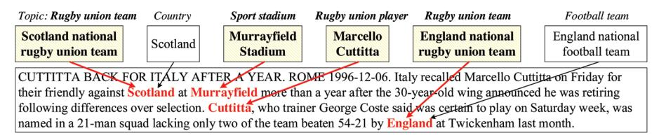
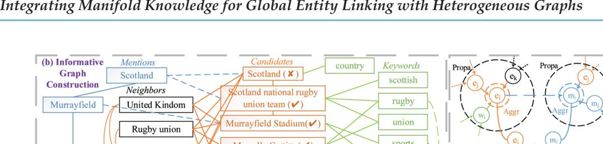
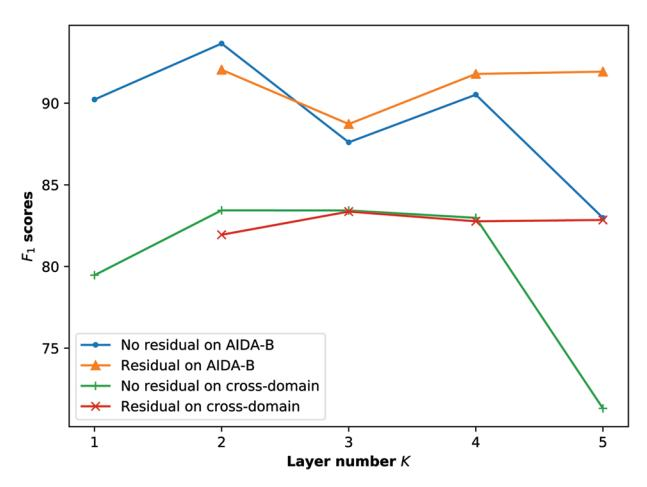

# Integrating Manifold Knowledge for Global Entity Linking with Heterogeneous Graphs

**Zhibin Chen1,2, Yuting Wu1,3†, Yansong Feng1,3 & Dongyan Zhao1,3**1 Wangxuan Institute of Computer Technology, Peking University, Beijing 100871, China Center for Data Science, Peking University, Beijing 100871, China 3 The MOE Key Laboratory of Computational Linguistics, Peking University, Beijing 100871, China
**Keywords:** Entity linking; Heterogeneous graph; Graph neural network; Entity disambiguation; Knowledge base

Citation: Chen, Z.B., et al.: Integrating manifold knowledge for global entity linking with heterogeneous graphs. Data Intelligence 4(1), 20-40 (2022). doi: 10.1162/dint\_a\_00116

Received: October 30, 2021; Revised: December 21, 2021; Accepted: January 11, 2022

## ABSTRACT

Entity Linking (EL) aims to automatically link the mentions in unstructured documents to corresponding entities in a knowledge base (KB), which has recently been dominated by global models. Although many global EL methods attempt to model the topical coherence among all linked entities, most of them failed in exploiting the correlations among manifold knowledge helpful for linking, such as the semantics of mentions and their candidates, the neighborhood information of candidate entities in KB and the fine-grained type information of entities. As we will show in the paper, interactions among these types of information are very useful for better characterizing the topic features of entities and more accurately estimating the topical coherence among all the referred entities within the same document. In this paper, we present a novel HEterogeneous Graph-based Entity Linker (HEGEL) for global entity linking, which builds an informative heterogeneous graph for every document to collect various linking clues. Then HEGEL utilizes a novel heterogeneous graph neural network (HGNN) to integrate the different types of manifold information and model the interactions among them. Experiments on the standard benchmark datasets demonstrate that HEGEL can well capture the global coherence and outperforms the prior state-of-the-art EL methods.

† Corresponding author: Yuting Wu (Email: wyting@pku.edu.cn; ORCID:0000-0002-7550-3804).

# 1. INTRODUCTION

Entity Linking (EL) is the task of mapping entity mentions with specified context in an unstructured document to corresponding entities in a given Knowledge Base (KB), which bridges the gap between abundant unstructured text in large corpus and structured knowledge source, and therefore supports many knowledge-driven natural language processing (NLP) tasks and their methods, such as question answering [1], text classification [2], information extraction [3] and knowledge graph construction [4].

Recently, EL task has been dominated by the global methods [5, 6, 7, 8, 9, 10, 11, 12, 13, 14, 15], which model the topical coherence among the linked entities of mentions in the same document. Global information relies on the semantic and topical coherence of entities related to various mentions in the same document, which is integrated with local mention-contextual information by most state-of-the-art models to alleviate the biases from local contextual information. For instance, as shown in Figure 1, for linking the mention "*England*", it is difficult to decide between the candidate entities *England national football team*and*England national rugby union team*when only using the surrounding sports-related local context where there are the scores of matches or the name of stadium, which may contain noises and lead the linking result to the more popular but wrong candidate*England national football team*. However, if an EL model can capture the topical coherence of the common topic "rugby" among all the mentions "*Scotland*", "*Murrayfield*", "*Cuttitta*" and "*England*" in the current paragraph, such as taking the nearby mention *Cuttitta*into consideration, which is linked to the candidate*Marcello Cuttitta*, a former Italian rugby union player, the model can correctly link the mention "*England*" to the candidate *England national rugby union team*.

<!-- Image Description: The image displays a text excerpt from a news article about rugby player Marcello Cuttitta. Boxes above the text identify key entities: Scotland national rugby union team, Murrayfield Stadium, Cuttitta, and England national rugby union team. Red arrows connect these boxes to corresponding mentions within the text, illustrating named entity recognition and relation extraction. The image demonstrates a technical method used in natural language processing (NLP) to identify and link relevant entities. -->

**Figure 1.** The illustration example. By considering the topical coherence, an EL model can accurately link the mentions "*Scotland*", "*Murrayfi eld*", "*Cuttitta*" and "*England*" to their corresponding entities (in bold) that share the common topic "rugby".

Although prior global EL approaches have greatly boosted the performance of local models, most of them do not simultaneously consider multiple types of useful information and the interactions among them, such as the semantics of mentions and their candidates, the neighborhood information of candidate entities in KB and the fine-grained type information of entities, when modeling the global coherence, and thus fail to precisely estimate the coherence among referred entities. As we will show in the paper, effectively modeling the interactions among the manifold linking knowledge can help to better model the topical coherence and achieve more accurate EL.

Most recently, some global methods [14, 16] construct a document-level graph with candidate entities of the mentions as nodes and exploit Graph Convolutional Networks (GCN) [17] on the graph to integrate the global information, delivering promising results. Inspired by the effectiveness of using GCN to model the global signal, we present HEterogeneous Graph-based Entity Linker (**HEGEL**), a novel global EL framework designed to model the interactions among manifold heterogeneous information from different sources by constructing a document-level informative heterogeneous graph and applying a heterogeneous architecture in GNN aggregation operation. We first constructed a document-level informative heterogeneous graph with mentions, candidate entities, and neighbors of entities and extracted keywords as nodes, and we created different types of edges to link these different types of nodes. Then we applied a meticulously designed heterogeneous graph neural network (HGNN) on the constructed heterogeneous graph to encode the global coherence, which allows information propagation along the informative graph structure and encourages sufficient interactions among different types of information. Followed by traditional scoring combining and ranking procedure, our model can be trained to use the information under an end-to-end fashion.

Our contributions can be summarized as follows:

- We designed a novel approach to construct a document-level informative heterogeneous graph to collect manifold linking knowledge from different sources to support the linking process.
- We proposed a meticulously designed heterogeneous graph neural network on the constructed graph, which integrates different sources of information and encourages sufficient interactions among them, more precisely characterizing the topic features of candidate entities and better capturing the topical coherence. To the best of our knowledge, this is the first work to employ a heterogeneous graph neural network in Entity Linking tasks.
- Extensive experiments and analysis on six standard EL datasets demonstrate that our HEGEL achieves state-of-the-art performance over mainstream EL methods.

# 2. R ELATED WORK

# *2.1 E ntity Linking*Most existing models not only use local methods relying on local context of individual mentions independently [18, 19, 20, 21, 22, 23], but also use global methods considering the coherence among the linked entities of all mentions by jointly linking on the whole document [9, 13]. Most local methods make use of extracted local features through feature engineering, which includes pair-wise statistic features, like Wikipedia linking frequency, and the similarity scores between mentions and candidate entities, like the mention-entity similarities implemented as cosine similarities between document local contexts and entity Wikipedia titles in [13]. Recently, Pretrained Language Models (PLMs), which achieve leading performance in other natural language processing tasks, are also used in local linking models. The PLM-based linking models focus on unique settings, such as zero-shot [22] and multilingual [23] scenarios, to exploit the superiority of PLMs in understanding tasks under these settings. To alleviate the noise led by the local information, global methods try to model the semantic coherence and relationship between linked entities within the same document. As the global coherence optimization problem is NP-hard, different approximation methods are often used. Apart from traditional methods like loopy belief propagation [8, 11], several works approximate the problem into sequence decision problem [6] or graph learning [5, 7, 14, 16].

Following the graph based neural network modeling methods, HEGEL expands the graph utilization in EL task to heterogeneous style, which not only enjoys the strong representation ability of heterogeneous graph structure, but also becomes effective enough because of avoiding other additional inference steps required in sequence-style models.

##*2.2 G raph Neural Networks*Graph Neural Network (GNN) is a strong and flexible framework to learn on data with graph structure. After the Graph Convolutional Network (GCN) [17] appeared, GNN is more and more widely used in many tasks, while several popular GNN architectures, such as GraphSAGE [24] and GAT [25], are proposed to learn the representation on graphs. The natural graph structure entailed in EL task becomes a favorable condition to apply GNN methods to model the global information. NCEL [5] performs GCN on constructed subgraphs for every mention, where the nodes are entity candidates of current mention and surrounding mentions with edges linked from the former to the latter. SGEL [7] combines the features of mention-bymention sequential model and GAT by building a graph containing previous predicted entities, current candidates and later unpredicted mention candidates as nodes. GNED [16] builds a homogeneous graph by embedding the entities and words into the same vector space, and extracts words from the description and context in KB for every candidate to form the nodes and edges.

As the emergence of massive heterogeneous information, many works about Heterogeneous GNN have been proved to be effective. The mainstream of HGNN models is based on the construction of metapaths [26], but several HGNN architectures free of metapath are proposed recently [10]. Our HEGEL follows these works, and utilizes the heterogeneous structure to model the interactions among different types of linking information.

### 3. P ROBLEM FORMULATION

Given a list of entity mentions*M* = {*m*1,…*m*|*M*|} in a document D, the EL task can be formulated as linking each mention *mi*to its corresponding entity*ei*from the entity collection E of KB or NIL (i.e.,*e NIL i*= , which means the mention*mi*cannot be linked to any corresponding entity in E reasonably). Generally speaking, EL methods usually consist of two stages.

####*3.1 C andidate Generation Stage*EL tasks generally start with generating a small list of candidate entities ⊂ 1 2 = { , ,..., }*i ii im*C E*ee e*for the mention*mi*because of the unacceptable computation cost to traverse over the whole entity collection E. Downloaded from http://direct.mit.edu/dint/article-pdf/4/1/20/1985039/dint\_a\_00116.pdf by guest on 30 June 2025

For candidate generation, we used the method proposed in [8, 11], which simply uses (1) computed mention-entity prior*pe m*ˆ(| ) by averaging probabilities from mention entity hyperlink statistics of Wikipedia; and (2) the local context-entity similarity, which is simply calculated as the similarity between candidate entity embeddings and average embeddings of context words.

This stage aims to contain the correct entity*ei* into C*i*, and the ratio of candidate lists containing corresponding entity is referred to as the*recall*of candidate generation.

#*3.2 Candi date Disambiguation Stage*In this stage, EL methods assign a score calculated in EL model to each candidate*i k e* and select the top-ranked candidate as the predicted answer, or predict NIL under some specified situations. Most EL methods, including this work, focus on improving performance at this stage. As mentioned in Section 2.1, different local and global models are used to calculate the linking scores. Local methods focus on the corresponding mention itself, regardless of other mentions or linked entities. That is to say, the local methods deal with the linking problem by independent calculation for every mention:

$$
e_i^* = \text{argmax}_{e_{i_k} \in C_i} \Psi_{\text{Local}}(e_{i_k}, m_i), \tag{1}
$$

where Ψ*Local* is a scoring function for the mention-entity pair. Different from the local methods without inter-mention interaction, interdependencies measured by global methods can be generally represented as the coherence scoring function which takes into account entity topic coherence:

$$
E^* = \operatorname{argmax}_{E \in \mathcal{C}_1 \times \ldots \times \mathcal{C}_n} \Phi(E, \mathcal{D}) + \sum_{i=1}^n \Psi_{Local}(e_{i_k}, m_i), \qquad (2)
$$

where \*\* \* *Eee*= { ,..., } 1*n*is the predicted entity list for entity mentions*M*of document D, and (E,D) is the global function measuring how the entities cohere with each other.

# 4. THE PROPO SED APPROACH

In addition to separately encoding the local features for every mention within a document as local models do, HEGEL constructs an informative heterogeneous graph for each document and then applies a heterogeneous GNN on it, which encodes the global coherence based on different types of information. Finally, HEGEL combines the local and global features and generates a final score for each mentioncandidate pair.

Figure 2 gives an overview of HEGEL that follows a four-stage processing pipeline: (a) encoding local features for each candidate independently, (b) informative graph construction for the document, (c) applying heterogeneous GNN on the graph, and (d) combining local and global features for scoring.

<!-- Image Description: The image displays two diagrams illustrating a method for global entity linking. The left diagram shows "informative graph construction," representing relationships between entities like "Scotland," "United Kingdom," and "Murrayfield" using mentions and neighbor nodes. The right diagram depicts a propagation and aggregation process within a heterogeneous graph, showing the flow of information between entity (e) and mention (m) nodes. The diagrams showcase the technical approach of combining graph construction and information propagation for improved entity linking accuracy. -->
**Figure 2.**The overall framework of our proposed model HEGEL with a real experiment case. The blue nodes denote the mentions in one document; the orange nodes denote the candidate entities; the black nodes indicate the neighbors extracted from Wikipedia KB; and the green nodes indicate the keywords extracted from the fi rst sentence of entities in Wikipedia. The heterogeneous graph in right part (c) can provide the discriminative linking information through the fl ow on the topological connections.

##*4.1 Encoding L ocal Features*Given a mention*mi*in D and a candidate entity*i i* ∈*k e*C , HEGEL computes three types of local features to encode the local mention-entity compatibility. These features consist of (a) the*Mention-Entity Prior*(|)*i i k Pe m*, which has been used in candidate generation stage, as referred in Section 3.1; (b) the*Context Similarity*Ψ (, )*Ci m k i e c*, which utilizes an attention neural network to compute the similarity between candidate*i k e*and local context*m c*= { ,... } 1 ||*i c ww*surrounding*mi*by selecting*K*most relative words from*mi c*, eliminating noisy context words from computation:

$$
u(w_j) = \max_{e \in \mathcal{C}_j} v_e^T A v_{w_j} \tag{3}
$$

$$
\hat{c}_{m_i} = \{ w \in c_{m_i} \mid u(w) \in topK(u) \},\tag{4}
$$

$$
\beta(w_j) = \frac{e^{u(w_j)}}{\sum_{v \in \hat{c}_{m_j}} e^{u(v)}} , \quad w_j \in \hat{c}_{m_j}, \tag{5}
$$

$$
\Psi_{C}(e_{i_{k}}, c_{m_{j}}) = \sum_{w \in \hat{c}_{m_{j}}} \beta(w) v_{e_{i_{k}}}^{T} B v_{w}, \qquad (6)
$$

where*ve*, *vw*entity embeddings and word embeddings trained in [8], and diagonal matrix*A*, *B*are both trainable ; (c) the*Type Similarity*Ψ (,)*Ti i k e m*, which estimates the similarity between the types (PER, GPE, ORG and UNK) of*mi*and*i k e*by training a typing system proposed in [15]:

$$
Type(m_i), Type(e_{i_k}) \in \{PER, GPE, ORG, UNK\},\tag{7}
$$

$$
v_{T,m_i} = Emb_T(Type(m_i)),
$$
\n(8)

$$
v_{T,e_{i_k}} = Emb_T(Type(e_{i_k})),
$$
\n(9)

$$
\Psi_{T}(e_{i_{k}}, m_{i}) = v_{T, m_{i}}^{T} v_{T, e_{i_{k}}}
$$
\n(10)

where*EmbT*(*t*) is trainable type embedding for type *t*. As the mentions and entities use the same embedding set, *mi*and*i k e*with the same type will have a higher*T*than other different types.

###*4.2 Informative Heterogeneous Graph Construction*

For the document D, HEGEL builds an informative heterogeneous graph GD to collect different types of linking clues.

As shown in Figure 2, GD = <*V*D, *E*D> contains three types of nodes: mention nodes *VMent*, entity nodes *VEnt*and keyword nodes*VWord*. Therefore, the node set *V*D = *VMent*∪*VEnt*∪*VWord*. *VMent*is naturally composed of all mentions*mi*in D.*VEnt*contains two parts of entities: the mention candidates ∪| | ,1 =1 =*M Ent i i V*C where duplicate is removed, and the common neighbors in KB of at least two candidate entities in*VEnt*,1, or formally *V v v v V v v v r v v r v KB v V Ent Ent Ent*,2 1 2 ,1 1 2 1 2 ,1 = { | , , ,( , , ),( , , ) , } ∃∈ ≠ ∈∉ . As reserving all neighbors in KB of*VEnt*,1 is computationally unacceptable, we eliminate those nodes with only one neighbor in *VEnt*,1 from *VEnt*,2 because neighbors bridging two candidates are more informative for determining the relation between candidates, which is theoretically explained and experimentally proved in [12, 27]. *VWord*consists of the keywords extracted from the Wikipedia page of each candidate in*VEnt*,1. We found that the first sentence on the Wikipedia page of an entity usually contains more fine-grained type information of the entity, which is a very useful linking clue. Therefore, for *e*in*VEnt*,1, we extracted the first sentence *s*from its Wikipedia page, found the first link verb in*s*, and picked the continuous phrase immediately after the link verb, which contains nouns, adjectives and conjunctions only. We regarded the words in the picked phrase, except stopwords, as keywords characterizing the fine-grained type of *e*, and added them into *VWord*.

After the node set *V*D is generated, HEGEL creates heterogeneous edges between nodes of the same or different types by following rules: (a) the edges between two mention nodes *EMM*⊂*VMent*×*VMent* are created between adjacent mentions (*mi* ,*mi*+1) in D; (b) the edges between two entity nodes *EEE*⊂*VEnt*×*VEnt*are created while there is a relation between them in KB; (c) the edges between two word nodes*EWW*⊂*VWord*×*VWord*are created while the cosine similarity of two word embeddings is higher than a given threshold e; (d) the edges from entities to mentions*EEM*⊂*VEnt*,1 × *VMent*are consistent with the mention-candidate relation; (e) the edges from words to entities*EWE*⊂*VWord*×*VEnt*,1 are created while the word is one of the keywords for the entity. Note that (d) and (e) are uni-directional while (a)-(c) are bi-directional, and the performance of constructing bi-directional edges for (d) and (e) will be discussed later. In short, the entire edge set can be represented as *E*D = *EMM*∪*EEE*∪*EWW*∪*EEM*∪*EWE*.

## *4.3 Heterogeneous Gra ph Neural Network*Given a constructed heterogeneous informative graph GD, HEGEL applies a designed heterogeneous graph neural network (HGNN) on it to integrate different sources of manifold information and encourage the interactions among them, generating information-augmented embeddings of*VMent*and*VEnt*,1 for later candidate scoring and ranking.

In order to avoid the requiring of expertise knowledge and information loss led by the former metapathbased HGNN methods, we designed a novel metapath-free HGNN model. For the heterogeneous graph GD, we represent an edge *e*∈*E*D from node *i*∈*V*D to node *j*∈*V*D with edge type *r* as (*i*, *j*, *r*). Note that in our informative graph, the node type (*ti*,*tj*) can exclusively determine the edge type*r*, and therefore we denote (*ti*,*tj*) as*r*in following explanation.

##*4.3.1 Node Embeddi ngs*For a mention node*m Ment* ∈*i v V*, we used a text convolutional neural network (CNN) on the local context*mi c*surrounding*mi*to compute the initial embeddings + ∈ 0*d d cnn h mi h R*:

$$
C_{m_j} = \{W_1, ..., W_{|c|}\}\tag{11}
$$

$$
h_{m_i}^0 = \left[\frac{1}{len(m_i)} \sum_{w \in m_i} v_w; CNN(v_{w_1}, ..., v_{w_{|C|}})\right]
$$
 (12)

where , ∈*dh w wi vv R*are corresponding word embeddings of mention surface words and the mention's*mi c*, respectively, and [;] is concatenating operation. For the nodes in*VEnt*and*VMent*, we naturally used the entity word embeddings ∈ *dh ei v R*and ∈*dh wi v R*trained in [8] as initial embedding 0 0 ,*e w i i h h*.

#*4.3.2 Inter-Node Propagatio n*A node should receive different types of information from its heterogeneous neighborhood in different ways. Motivated by previous work about metapath [26], HEGEL models the different types of information propagation with multiple feature transformations on different adjacent relations. Taking edge type*r* = (*ti*,*tj*) into consideration, a node*vj*with type*tj*collects information from its neighborhood*N*(*vj*) with type*ti*in*l*-th layer by a Graph Convolutional Network (GCN):

$$
h_{\nu_j, t_i}^{l+1} = \frac{1}{Z} \sum_{\nu_i \in V_{t_i} \cap N(\nu_j)} W_{t_i, t_j}^l h_{\nu_i}^l \tag{13}
$$

Downloaded from http://direct.mit.edu/dint/article-pdf/4/1/20/1985039/dint\_a\_00116.pdf by guest on 30 June 2025

where ∈ , *dl t l i vi h R*is*vi*'s embedding before the*l*-th layer, × + ∈ 1, , , *d d l t lt l j i t t i j W R*is a trainable matrix in the*l*-th layer, + + ∈ 1, 1 , *dl t l j v t j i h R*is*vj*'s new embedding related to*ti*, and*Z* is the normalization factor. Note that for edge types (*ti*,*ti*) connecting nodes with the same type, self-loop connections are added into its edge set.

#*4.3.3 Intra-Node Aggregation*In order to preserve the information from different types of relationship with neighborhoods, for the node*vj*, HEGEL aggregates new embeddings to generate the input*l*+1*v j h*for next layer:

$$
h_{v_j}^{l+1} = \sigma(f_{\text{agg}}(h_{v_j, t_i}^{l+1})) \tag{14}
$$

where × → |{ }| :*d ti d agg fR R* is the aggregation function transforming the |{*ti*}| input embeddings to an aggregated one, which is implemented as simple summation operation*fagg*({*xi*}) =*xi*. s is an activation function implemented as GELU(·) [28], and + + ∈ 1, 1*dl t l j v j h R*is the output embedding of the*l*-th layer containing all types of one-hop neighborhood of *vj*in heterogeneous graph structure. As all types of neighborhoods can affect the output of current layer and consequently the information propagation in next layer, we believe that, by encouraging full interactions among different types of information in this stage, the*L*layers of internode propagation and intra-node aggregation are able to encourage heterogeneous integrations and interactions among types of information, which are represented by the final output*L v j h*.

#*4.3.4 Global Score Calculation*Afterobataining the information-augmented embeddings*L mi h*for mention*mi*and*L ei k h*for corresponding candidate*i k e*, we ensure that*dL*,*Ment*=*dL*,*Ent*, HEGEL applies a bi-linear similarity calculation to represent the global compatibility between the mention-candidate pair:

$$
\Psi_C(e_{i_k}, m_i) = (h_{m_i}^L)^T \cdot D \cdot h_{e_{i_k}}^L \tag{15}
$$

where × ∈ , , *d d L Ment L Ent D R*is a trainable diagonal matrix.

#*4.4 Feature Combining and Model Training*HEGEL combines local features and the global compatibility score to compute the linking score for each candidate*i k e*of mention*mi*:

$$
S(m_i, e_{i_k}) = f([P(e_{i_k} | m_i); \Psi_C(e_{i_k}, c_{m_i}); \Psi_T(e_{i_k}, m_i); \Psi_C(e_{i_k}, m_i)])
$$
\n(16)

where*f*is a two-layered fully connect neural network. The candidate*i k e*with the highest final linking score (,)*i ik Sm e*is selected as the output linking result for*mi*. HEGEL links*mi* to NIL if and only if its candidate list C*i*= ∅, or rather, there is no corresponding entity to*mi*in KB entity set E.

Following previous works, HEGEL attempts to make the ground truth entity*ei* ranking higher than other candidates, and therefore minimizes the following margin-based ranking loss:

$$
L = \sum_{m_i \in \mathcal{D}} \sum_{e_{i_k} \in C_i} [\gamma - S(m_i, \tilde{e}_i) + S(m_i, e_{i_k})]_+ \tag{17}
$$

where c > 0 is the margin hyper-parameter, and [*x*]+ is equal to *x*when*x*> 0, or equal to 0 otherwise.

# 5. EXPERIMENTS AND ANALYSIS

##*5.1 Datasets*Fo llowing previous EL practice,we evaluated HEGEL on the benchmark dataset AIDA CoNLL-YAGO [19] for training, validation and the in-domain testing. To examine its cross-domain generalization ability, we used five popular datasets for cross-domain testing: MSNBC [29], AQUAINT [30], ACE2004 [13], CWEB [9] and WIKIPEDIA [9]. Table 1 shows the statistics and corresponding*recall*of candidate generation of all datasets used in our experiments.

| Dataset            | #Mentions | #Docs | #Ments / #Docs | Recall (%) |
|--------------------|-----------|-------|----------------|------------|
| AIDA-train (train) | 18448     | 946   | 19.50          | 100        |
| AIDA-A (valid)     | 4791      | 216   | 22.18          | 97.72      |
| AIDA-B (test)      | 4485      | 231   | 19.40          | 98.66      |
| MSNBC              | 656       | 20    | 32.80          | 98.48      |
| AQUAINT            | 727       | 50    | 14.54          | 94.09      |
| ACE2004            | 257       | 36    | 7.14           | 91.44      |
| CWEB               | 11154     | 320   | 34.86          | 91.90      |
| WIKIPEDIA          | 6821      | 320   | 21.32          | 93.21      |
**Table 1.**The statistics of used datasets.

Note:*Recall*represents the ratio of ground truth entities appearing in the generated candidate lists of corresponding mentions in the datasets.

###*5.2 Model Variant*To examine our claim that the heterogeneous feature of GNN plays a crucial role in HEGEL, we implemented a semi-heterogeneous version of HEGEL, called HEGEL-semi, which shares the parameters of GCN about different node types in every layer, respectively, except the first layer, as the dimensions of input node embeddings are different and unable to be processed in the non-heterogeneous way:

$$
h_{v_j, t_j}^1 = \frac{1}{Z} \sum_{v_i \in V_{t_j} \cap N(v_j)} W_{t_j, t_j}^0 h_{v_i}^0
$$
\n(18)

$$
h_{v_j}^1 = \sigma(f_{\text{agg}}(h_{v_j, t_i}^1))
$$
\n(19)

$$
h_{v_j}^{l+1} = \sigma(\frac{1}{Z} \sum_{v_i \in N(v_j)} W^l h_{v_i}^l), \quad l \ge 1
$$
\n(20)

As the*K*1 parameter-sharing layers do not use different parameters to deal with different types of nodes, they do not enjoy the benefit from heterogeneous graph structure. Therefore, the performance of HEGELsemi should be lower than HEGEL according to our claim about the effect of a heterogeneous method.

#### *5.3 Exp eriment Settings*As we used the pre-trained Word2vec [31] word embeddings, and entity embeddings released by [8], the embedding dimension*dh*is fixed to 300. The hyper-parameters are manually tuned based on the validation performance on AIDA-A. CNN output dimension*dcnn*= 64, all informative graph embedding dimensions*dl*,*t*= 32,*l*= 1, ...,*L*, number of HGNN layers *L*= 2, margin c = 0.01,*K*= 40, dropout rate is set to 0.5, and*EWW* threshold e = 0.5. To confine the graph size within a computable range, all documents with more than 80 mentions will be split into several documents as average as possible.

We used Adam optimizer to train HEGEL with a learning rate of a = 2*e*4. The model is evaluated per 3 epochs, and the training process is terminated while the highest validation performance does not exceed 10 evaluations.

Because of achieving the best performance on AIDA-A, HEGEL-semi is implemented under the same settings with HEGEL.

##*5.4 Com pared Baselines*To illustrate the effect of modeling the interactions among different types of information, we evaluated and compared the performance of our HEGEL with nine existing methods on in- and cross-domain datasets:

- AIDA [19] builds a graph whose weights are coherent score and similarity, and applies traditional statistics method on it.
- GLOW [13] designs several statistics features of both local and global with Wikipedia linking structure.
- RI [18] provides an Integer Linear Programming (ILP) formulation of Wikification and incorporates the entity-relation inference problem.
- WNED [9] builds disambiguation graphs and applies iterative random walks on it based on Information Theory.
- Deep-ED [8] leverages learned neural representations based on local context windows for joint document-level entity linking.

- Ment-Norm [11] treats and exploits relations between entities as latent variables based on Deep-ED [8].
- GNED [16] applies GCN and CRF on a homogeneous graph with extracted words and entities as nodes.
- NCEL [5] applies GCN on a bipartite to integrate both local contextual features and global information.
- SGEL [7] builds a graph for every mention sequentially, containing previous linked entities and candidates of unpredicated mentions.

It is worth noting that GNED claims they firstly construct a heterogeneous entity-word graph to model global information, but their nodes are not heterogeneous indeed as entity nodes share the same vector space with words. In addition, they do not apply any heterogeneous architecture in their GNN, as they regard all edges as the same type. Therefore, HEGEL is the first work to employ a heterogeneous GNN in EL tasks to our best knowledge.

#*5.5 Mai n Results*We report the performance of all the compared baselines and our HEGEL in Table 2. The top part shows the performance of non-GNN-based baselines, and other baselines are GNN-based.

|              | In-domain | Cross-domain |           |           |           |           |
|--------------|-----------|--------------|-----------|-----------|-----------|-----------|
| Models       | AIDA-B    | MSNBC        | AQUA      | ACE       | CWEB      | WIKI      |
| Prior p(e m) | 71.51     | 89.3         | 83.2      | 84.4      | 69.8      | 64.2      |
| AIDA         | -         | 79           | 56        | 80        | 58.6      | 63        |
| GLOW         | -         | 75           | 83        | 82        | 56.2      | 67.2      |
| RI           | -         | 90           | 90        | 86        | 67.5      | 73.4      |
| WNED         | 89        | 92           | 87        | 88        | 77        | 84.5      |
| Deep-ED      | 92.22     | 93.7         | 88.5      | 88.5      | 77.9      | 77.5      |
| Ment-Norm    | 93.07     | 93.9         | 88.3      | 89.9      | 77.5      | 78.0      |
| GNED         | 92.40     | 95.5         | 91.6      | 90.14     | 77.5      | 78.5      |
| NCEL         | 80        | -            | 87        | 88        | -         | -         |
| SGEL         | 83        | 80           | 88        | 89        | -         | -         |
| HEGEL        | 93.65±0.1 | 93.19±0.2    | 85.87±0.3 | 89.33±0.4 | 73.25±0.3 | 75.54±0.1 |
| - w/o VWord  | 91.94±0.2 | 93.18±0.2    | 85.35±0.4 | 88.40±0.5 | 71.95±0.5 | 74.70±0.2 |
| - w/o VEnt,2 | 92.22±0.1 | 92.93±0.4    | 85.07±0.7 | 88.93±0.4 | 72.57±0.5 | 75.45±0.2 |
| HEGEL-semi   | 92.37±0.2 | 92.01±0.7    | 85.82±0.5 | 89.19±0.5 | 72.63±0.5 | 75.23±0.2 |
| Local        | 91.03     | 91.97        | 84.06     | 86.92     | 71.45     | 74.79     |
**Table 2.** Performance on in-domain (AIDA-B) and cross-domain datasets.

Note: We show in-KB accuracy (%) for the in-domain datasets and micro-*F*1 score (%) for the cross-domain datasets, respectively. For HEGEL we show std. deviation obtained over 3 runs.

The in-domain test dataset AIDA-B, which shares the similar data distribution with training dataset AIDAtrain and validation dataset AIDA-A, is the most important benchmark. By modeling the latent relation between mentions and injecting entity coherence into it, which can be regarded as simply interaction between two types of information, Ment-Norm outperforms all baselines on AIDA-B. It shows that the interactions of heterogeneous information are beneficial for capturing global coherence. We observed that HEGEL, which integrates manifold linking knowledge in a more interactive and effective way for capturing the global coherence, significantly outperforms the Ment-Norm method. The fact shows that our HEGEL can encourage richer interactions among different types of information and greatly improve the performance.

It should be figured out that none of the models can consistently achieve the best *F*1-score on the all five cross-domain datasets. HEGEL outperforms the other two GNN-based methods, NCEL and SGEL, on MSNBC and ACE2004. It shows that our HEGEL can handle cross-domain linking cases better than them in some extent.

Our HEGEL performs extremely well on in-domain cases by making full use of different types of linking clues for better capturing the global coherence, but it seems that there is no advantage on the cross-domain datasets. We found that the ground truth entities of cross-domain test sets are less popular, where the linking clues are sparse. To improve the generalization ability on such tough cases, the only effective way seems to be introducing large-scale corpus for training, aiming to more or less "see" the linking clues of crossdomain entities at the training stage. We will try to introduce large-scale pre-trained language models, such as BERT, to improve the generalization ability of our HEGEL in the future.

As the HEGEL-semi is also implemented under *L*= 2, it contains one heterogeneous layer and one parameter-sharing layer. The results shown in Table 2 approve that although the HEGEL-semi outperforms the local model, its lack of heterogeneous information propagation in the second layer leads to the obvious drop of performance compared with HEGEL. The heterogeneous GNN is important for HEGEL to achieve the good performance.

Comparing GNED with our simpler and effective way to extract keywords within the first sentence from the Wikipedia page of corresponding entity, they search on the whole Wikipedia KB to find the hyperlinks to corresponding entity and extract contexts in preprocessing stage, which have to iterate through all |E| entities and become very time-consuming. Even with less keyword evidence, our strategy still ourperforms GNED on in-domain dataset with lower time overhead. GNED accesses more additional linking clues and reach better performance on cross-domain datasets, and we suppose that the richer information can also improve the generalization ability of our HEGEL, and further boost our performance on cross-domain datasets.

#*5.6 Ablation Study*As shown in the bottom part of Table 2, HEGEL boosts the performance of local model with an average improvement of 1.77%, which shows that HEGEL is able to greatly enhance the local model.

To further examine the effect of our heterogeneous model, we removed the keyword nodes*VWord*and neighbor nodes*VEnt*,2 from *V*D, respectively, and therefore the related edges from *E*D as well. After that, there is a significant drop in performance (0.89% and 0.61% on average, respectively) across datasets, especially in-domain AIDA-B (1.71% and 1.43%). The results demonstrate the effectiveness of introducing the keyword (fine-grained type) information and neighborhood information of candidate entities and modeling the interactions among them, which can help to accurately capture the topical characteristics of candidates.

# *5.7 Analysis*#*5.7. 1 The Impact of Edge Directions*As referred in Section 4.2, HEGEL only keeps one direction for*EEM*and*EWE*. We suppose that adding edges from *VMent*to*VEnt*,1 and from *VEnt*,1 to *VWord*will lead to the over-smooth problem, as candidates to be disambiguated are related to the same mention and maybe the same keywords, where they might entangle with each other and make the disambiguation harder. As expected, the results shown in Table 3 prove that keeping these edges uni-directional can alleviate over-smooth and enhance the performance.

 Models AIDA-B Cross-domain avg. HEGEL**93.65 83.44**+*VEnt VWord*93.15 82.93 +*VMent VEnt*92.64 83.03 +Both 91.21 81.81
**Table 3.**Experiment results on changing the directionality of edges.

#*5.7.2 The Impact of the Number of GNN Layers*Despite the powerful ability of GNN to process graph-structured data, most of them are shallow, which means that they do not have many propagation layers. As shown in [32], stacking many layers with nonlinear function will degrade the performance of GNN-based models due to the over-smoothing problem. Therefore, we examined the performance of HEGEL with different number of layers. The results shown in Figure 3 agree with previous GNN-related works as HEGEL with*K*= 2 layers leads to the best performance in EL task. Too many layers will lead to the over-smoothing problem, and 1-layer model is not enough to propagate the heterogeneous information required for the aggregation and interaction on the graph.

<!-- Image Description: The image displays a line graph illustrating the F1 scores of a model across five layers (K=1-5). Four lines represent different scenarios: "No residual" and "Residual" conditions, each tested on AIDA-B and a cross-domain dataset. The graph shows how the F1 score varies depending on the layer number and the presence/absence of residual connections, comparing performance across different datasets. The purpose is to evaluate the impact of residual connections and dataset choice on model performance at different layers. -->
**Figure 3.**The performance with different numbers of layers and residual connection. The cross-domain results are average*F*1 scores on fi ve cross-domain datasets.

To alleviate the over-smoothing problem in training deeper GNN, residual connection [33] is used between the hidden layers of GNN as a variant in order to facilitate the information retention through deeper models [17]. The residual connection enables HEGEL to carry over the heterogeneous information from the input embeddings of previous layer by modifying Equation (14):

$$
h_{v_j}^{l+1} = h_{v_j}^l + \sigma(f_{\text{agg}}(h_{v_j, t_j}^{l+1}))
$$
\n(21)

However, as shown in Figure 3, applying residual connection on the model with *K*= 2 causes the dropping of both in-domain and cross-domain performance. Though the residual connection boosts the in-domain performance on the case of*K*≥ 3, they are still not comparable with the best performance of*K*= 2. We thought it might be related to the information handling method varying from layers of HGNN, as the heterogeneous structure in various propagation steps is obviously too different to be handled by the same layer of network correctly.

##*5.7.3 Er ror Analysis*We randomly sampled and analyzed 100 mentions from all mentions that were incorrectly linked by HEGEL from in-domain dataset AIDA-B and the most difficult cross-domain dataset CWEB, respectively. As shown in Table 4, the four major error types contain: (1)*Topic Errors*, which happened when HEGEL links the candidate of different (usually unrelated) topics with gold entity, are the main challenge faced by current global methods; (2) *Similar Entity Error*, which means that the predicated candidate and gold entity have too similar semantics to be disambiguated by local and global information, and might be solved by introducing more information in future works; (3) *Related Entity Error*, which happened when the predicated entity is semantically closely related to the gold one, such as a city and a stadium located in it or a hypernym of gold entity; (4) *Dataset Annotation Errors*, which means the gold entity offered in dataset is wrong and different from the predicted one, only occurs in CWEB.

| Error types                                        | Examples                                                                                                                                                                                                                          |
|----------------------------------------------------|-----------------------------------------------------------------------------------------------------------------------------------------------------------------------------------------------------------------------------------|
| Topic Errors AIDA-B: 24% CWEB: 44%           | To win [Timbo]'s trust, Chris chained himself up in the elephant's enclosure HEGELTimbo (a town in Guinea) GoldTimbaland (an American Musician)                                                                           |
| Similar Entity Errors AIDA-B: 29% CWEB: 24%  | In a gloomy Geneva conference centre built before the dawn of the [Internet], groups of staid offi cials made a HEGELInternet (the worldwide computer network) GoldWorld Wide Web (the global system of pages via URL) |
| Related Entity Errors AIDA-B:47% CWEB: 29%   | a small rightwing [Christian] civil war militia, Saqr, whose trial was concurrent  HEGELChristian GoldCatholicism (the largest Christian church)                                                                       |
| Dataset Annotation Errors AIDA-B:0% CWEB: 3% | Brooks Cole Herring. [B.], 2001, Ethical guidelines in the treatment of compulsive HEGELB.W. Aston (a Texas historian and professor) GoldB (the second letter ?)                                                       |

Table 4. The major error types and their examples.

Note: Square brackets denote the current target mentions. Italicized and underlined entities are the prediction results of HEGEL and the gold entities given in datasets, respectively.

# *5.7.4 Case Study*As shown in Figure 2, HEGEL needs to map the mentions "Scotland", "Murrayfield", "Cuttitta" and "England" in the same document to corresponding entities. "Murrayfield" and "Cuttitta" are not ambiguous as they have only one candidate, respectively. However, "Scotland" and "England" are linked to wrong candidates by local model, where our HEGEL outputs the right answers by correctly modeling the interactions among heterogeneous types of information, especially from the neighborhood around "Marcello Cuttitta" (a former rugby union player) and "Rugby Union", and from the respective keywords related to "rugby". Ablation score calculating results shown in Table 5 manifest that information from keyword nodes*VWord*and neighbor nodes*VEnt*,2 and correctly handling the information are both important for HEGEL to correctly capture the topical coherence and model the heterogeneous interactions.

| Models   | Scot.country | Scot.team | Eng.football | Eng.rugby |
|----------|---------------|------------|---------------|------------|
| Gold     | Low           | High       | Low           | High       |
| HEGEL    | -0.162        | -0.144     | -0.147        | -0.145     |
| - VWord  | -0.336        | -0.309     | -0.312        | -0.317     |
| - VEnt,2 | -0.176        | -0.187     | -0.170        | -0.168     |

| Table 5. Scores in case study. |  |
|--------------------------------|--|
|--------------------------------|--|

## 6. CONCLUSION AND FUTURE WORK

In this paper, we presented HEGEL, a novel graph-based global entity linking method, which is designed to model and utilize the interactions among heterogeneous types of information from different sources. We achieved this aim by constructing a document-level informative heterogeneous graph and applying a heterogeneous GNN to propagate and aggregate information on the graph, which is hard to achieve by previous homogeneous architectures. Extensive experiments on standard benchmarks show that HEGEL achieves state-of-the-art performance in EL task.

## ACKNOWLEDGEMENTS

This work is supported in part by the National Key R&D Program of China (No. 2020AAA0106600) and the Key Laboratory of Science, Technology and Standard in Press Industry (Key Laboratory of Intelligent Press Media Technology).

# AUTHOR CONTRIBUTIONS

Z.B. Chen (czb-peking@pku.edu.cn) performed the research, designed the whole methodology, designed and carried out the experiments and analysis, and wrote the manuscript. Y.T. Wu (wyting@pku.edu.cn) proposed the research problems, designed the experiment and analysis, and wrote the manuscript. Y.S. Feng (fengyansong@pku.edu.cn) and D.Y. Zhao (zhaodongyan@pku.edu.cn) proposed the research problems, supervised the research and provided insightful revision on the manuscript. All authors have made valuable and meaningful contributions to the manuscript.

# REFERENCES

- [1] Yih, S. W.t., et al.: Semantic parsing via staged query graph generation: Question answering with knowledge base. In: Proceedings of the 53rd Annual Meeting of the Association for Computational Linguistics and the 7th International Joint Conference on Natural Language Processing (Volume 1: Long Papers), pp. 1321–1331 (2015)
- [2] Wang, J., et al.: Combining knowledge with deep convolutional neural networks for short text classification. In: Proceedings of the Twenty-Sixth International Joint Conference on Artificial Intelligence (IJCAI), pp. 2915– 2921 (2017)
- [3] Hoffmann, R., et al.: Knowledge-based weak supervision for information extraction of overlapping relations. In: Proceedings of the 49th Annual Meeting of the Association for Computational Linguistics: Human Language Technologies, pp. 541–550 (2011)
- [4] Luan, Y., et al.: Multi-task identification of entities, relations, and coreference for scientific knowledge graph construction. arXiv preprint arXiv:1808.09602 (2018)
- [5] Cao, Y., et al.: Neural collective entity linking. arXiv preprint arXiv:1811.08603 (2018)
- [6] Fang, Z., et al.: Joint entity linking with deep reinforcement learning. In: The World Wide Web Conference, pp. 438–447 (2019)

- [7] Fang, Z., et al.: High quality candidate generation and sequential graph attention network for entity linking. In: Proceedings of the Web Conference 2020, pp. 640–650 (2020)
- [8] Ganea, O.E., Hofmann, T.: Deep joint entity disambiguation with local neural attention. In: Proceedings of the 2017 Conference on Empirical Methods in Natural Language Processing, pp. 2619–2629 (2017)
- [9] Guo, Z., Barbosa, D.: Robust named entity disambiguation with random walks. Semantic Web 9, 1–21 (2017)
- [10] Hong, H., et al.: An attention-based graph neural network for heterogeneous structural learning. In: Proceedings of the AAAI Conference on Artificial Intelligence, pp. 4132–4139 (2020)
- [11] Le, P., Titov, I.: Improving entity linking by modeling latent relations between mentions. In: Proceedings of the 56th Annual Meeting of the Association for Computational Linguistics (Volume 1: Long Papers), pp. 1595–1604 (2018)
- [12] Liu, M., et al.: A multi-view-based collective entity linking method. ACM Transactions on Information Systems 37(2), 1–29 (2019)
- [13] Ratinov, L., et al.: Local and global algorithms for disambiguation to Wikipedia. In: Proceedings of the 49th Annual Meeting of the Association for Computational Linguistics: Human Language Technologies, pp. 1375–1384 (2011)
- [14] Wu, J., et al.: Dynamic graph convolutional networks for entity linking. In: Proceedings of the Web Conference 2020, pp. 1149–1159 (2020)
- [15] Xu, P., Barbosa, D.: Neural fine-grained entity type classification with hierarchy-aware loss. In: Proceedings of the 2018 Conference of the North American Chapter of the Association for Computational Linguistics: Human Language Technologies, pp. 16–25 (2018)
- [16] Hu, L., et al.: Graph neural entity disambiguation. Knowledge-Based Systems 195, 105620 (2020)
- [17] Kipf, T.N., Welling, M.: Semi-supervised classification with graph convolutional networks. arXiv preprint arXiv:1609.02907 (2016)
- [18] Cheng, X., Roth, D.: Relational inference for Wikification. In: Proceedings of the 2013 Conference on Empirical Methods in Natural Language Processing (EMNLP 2013), pp. 1787–1796 (2013)
- [19] Hoffart, J., et al.: Robust disambiguation of named entities in text. In: Proceedings of the 2011 Conference on Empirical Methods in Natural Language Processing, pp. 782–792 (2011)
- [20] Mulang, I.O., et al.: Evaluating the impact of knowledge graph context on entity disambiguation models. In: Proceedings of the 29th ACM International Conference on Information & Knowledge Management, pp. 2157–2160 (2020)
- [21] Raiman, J., Raiman, O.: Deeptype: Multilingual entity linking by neural type system evolution. In: Proceedings of the AAAI Conference on Artificial Intelligence, pp. 5406-5413 (2018)
- [22] Wu, L., et al.: Zero-shot entity linking with dense entity retrieval. arXiv preprint arxiv:1911.03814 (2019)
- [23] Cao, N.D., et al.: Multilingual autoregressive entity linking. arXiv preprint arxiv:2103.12528 (2021)
- [24] Hamilton, W.L., Ying, R., Leskovec, J.: Inductive representation learning on large graphs. In: Proceedings of the 31st International Conference on Neural Information Processing Systems (NIPS'17), pp. 1025–1035 (2017)
- [25] Velicˇković, P., et al.: Graph attention networks. In: International Conference on Learning Representations (ICLR), pp. 1-12 (2018)
- [26] Dong, Y., Chawla, N.V., Swami, A.: metapath2vec: Scalable representation learning for heterogeneous networks. In: Proceedings of the 23rd ACM SIGKDD international conference on knowledge discovery and data mining, pp. 135–144 (2017)

- [27] Moreau, E., Yvon, F., Cappé, O.: Robust similarity measures for named entities matching. In: Proceedings of the 22nd International Conference on Computational Linguistics (Coling 2008), pp. 593–600 (2008)
- [28] Hendrycks, D., Gimpel, K.: Gaussian error linear units (gelus). arXiv preprint arXiv:1606.08415 (2016)
- [29] Cucerzan, S.: Large-scale named entity disambiguation based on Wikipedia data. In: Proceedings of the 2007 Joint Conference on Empirical Methods in Natural Language Processing and Computational Natural Language Learning (EMNLP-CoNLL), pp. 708–716 (2007)
- [30] Milne, D., Witten, I.H.: Learning to link with Wikipedia. In: Proceedings of the 17th ACM Conference on Information and Knowledge Management (CIKM '08), pp. 509–518 (2008)
- [31] Le, Q., Mikolov, T.: Distributed representations of sentences and documents. In: International Conference on Machine Learning (PMLR), pp. 1188–1196 (2014)
- [32] Chen, M., et al.: Simple and deep graph convolutional networks. In: International Conference on Machine Learning (PMLR), pp. 1725–1735 (2020)
- [33] He, K., et al.: Deep residual learning for image recognition. In: Proceedings of the IEEE Conference on Computer Vision and Pattern Recognition, pp. 770–778 (2016)

# AUTHOR BIOGRAPHY

<!-- Image Description: The image is a headshot photograph of a young man wearing glasses against a solid blue background. It's a standard author photograph included in an academic paper, likely to provide a visual representation of the author for identification purposes. There are no diagrams, charts, graphs, equations, or other technical illustrations present. -->

**Zhibin Chen**is a graduate student from Academy for Advanced Interdisciplinary Studies (AAIS), Peking University, China. He is working in the Web Information Processing (WIP) group of Wangxuan Institute of Computer Technology (WICT), Peking University. His research interests focus on natural language processing, information extraction and graph learning. ORCID: 0000-0003-1140-9808

<!-- Image Description: The image is a photograph of a person, likely an author or contributor to the academic paper. It contains no diagrams, charts, graphs, equations, or other technical illustrations. Its purpose is solely to provide a visual representation of an individual associated with the work. -->
**Yuting Wu**is a Ph.D. student at Peking University. She is working with Prof. Dongyan Zhao and Prof. Yansong Feng in the Web Information Processing (WIP) group of Wangxuan Institute of Computer Technology (WICT), Peking University. Her research interests include knowledge fusion/linking (knowledge graph embedding, entity alignment, entity linking, etc.) and graph neural networks.

ORCID:0000-0002-7550-3804

<!-- Image Description: The image is a photograph of an author's headshot. It's a standard passport-style photo showing a man with short dark hair wearing glasses and a dark grey collared shirt. The image serves solely as an author identification photograph for the academic paper. There are no diagrams, charts, graphs, or equations present. -->
**Yansong Feng**is an Associate Professor in the Wangxuan Institute of Computer Technology (WICT) at Peking University. He is affiliated with the group of Web Information Processing. Before that, he worked with Prof. Mirella Lapata and obtained his Ph.D. degree from the School of Informatics at the University of Edinburgh. Prior to Edinburgh, he worked with Prof. Jufu Feng on pattern recognition at Peking University. His current research focuses on distilling knowledge from large volumes of text resources on the Web.
**Dongyan Zhao** is a Professor in Wangxuan Institute of Computer Technology (WICT), Peking University, China. He received B.S., M.S. and Ph.D. in Computer Science from Department of Computer Science and Technology of Peking University. As a distinguished member of China Computer Federation (CCF), he is the secretary-general of CCF TCCI (Technical Committee on Chinese Information Technology, renamed as Technical Committe on Natural Language Processing in 2020) from 2010 to 2019, member of CCF Task Force on Big Data and member of CCF Network and Data Communications, as well as a senior member of CIPS Social Media Processing Committee.
