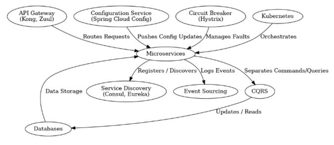
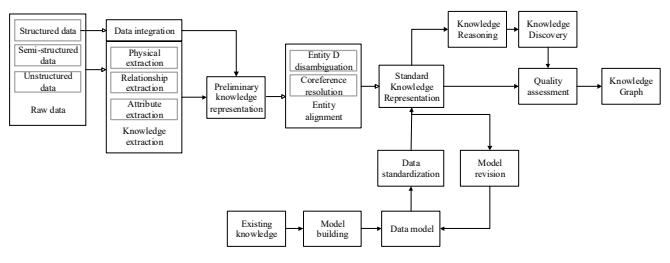
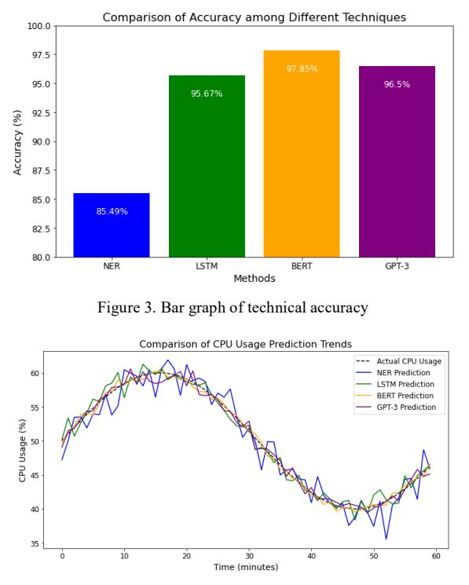

# Automated Monitoring Method for Enterprise Microservices Network Operation Status Based on Database Knowledge Graph

Qidi Hu1,a\*

1 Information Center of Guizhou Power Grid Co., Ltd Guiyang, Guizhou, 550000, China \* Corresponding author e-mail: a18188153337@163.com

Ye Zhong1,c 1 Information Center of Guizhou Power Grid Co., Ltd Guiyang, Guizhou, 550000, China ce-mail: zhongye@gz.csg.cn

Wei Wei1,e

1 Information Center of Guizhou Power Grid Co., Ltd Guiyang, Guizhou, 550000, China ee-mail: 47765382@qq.com

*Abstract***—This thesis presents an innovative method for automated monitoring of enterprise microservices networks using a database knowledge graph, addressing the challenges of traditional monitoring systems that often fail to effectively manage the complex dynamics of microservices architectures. By integrating advanced Natural Language Processing (NLP) and Long Short-Term Memory (LSTM) networks, this method processes vast amounts of real-time and historical data to proactively predict system failures and optimize resource allocation. The key innovation lies in the application of a knowledge graph that enhances predictive maintenance capabilities and facilitates performance optimization through intelligent data analysis and pattern recognition. This approach not only improves operational efficiency but also reduces downtime, thereby significantly enhancing network management in enterprise environments. Our research confirms that knowledge graphs can provide a scalable and dynamic solution to adapt to diverse enterprise requirements.** 979-8-3503-6614-3/24/\$31.00 ©2024 IEEE 567 2024 6th International Conference on Electronics and Communication, Network and Computer Technology (ECNCT) | 979-8-3503-6614-3/24/\$31.00 ©2024 IEEE | DOI: 10.1109/ECNCT63103.2024.10704355

*Keywords- Knowledge Graph, Microservices Monitoring, Predictive Maintenance, Network Operations Management*

## I. INTRODUCTION

In recent years, microservices architectures have increasingly become the backbone of enterprise IT infrastructures due to their ability to enhance scalability and flexibility. Despite their numerous advantages, the dynamic and distributed nature of microservices complicates effective monitoring and operational management, making traditional monitoring solutions inadequate [1-3]. Conventional methods often struggle with the rapid detection and resolution of system anomalies, failing to provide predictive insights that could preempt operational failures. Additionally, the sheer volume of data generated by microservices, coupled with the complexity of their interactions, demands advanced monitoring techniques capable of real-time data processing and analysis [4, 5]. As a

Yujiang Long1,b 1 Information Center of Guizhou Power Grid Co., Ltd Guiyang, Guizhou, 550000, China b e-mail: longyj@gz.csg.cn

Guangyi Zhang1,d 1 Information Center of Guizhou Power Grid Co., Ltd Guiyang, Guizhou, 550000, China de-mail: 959772205@qq.com

result, there is a growing need for innovative monitoring strategies that leverage cutting-edge technologies, such as machine learning and artificial intelligence, to improve anomaly detection, system diagnostics, and predictive maintenance. These advanced monitoring solutions can significantly enhance operational efficiency, ensuring higher availability and reliability of enterprise applications. Therefore, it is imperative to explore and implement modern monitoring approaches to fully harness the potential of microservices architectures in today's dynamic IT environments.

Scholars like Newman [6] have discussed the architectural complexities and the inherent challenges in maintaining service reliability and efficiency in such environments. Furthermore, Khanahmadi et al. [7] highlighted the shortcomings of traditional monitoring tools that are often siloed and do not account for the interconnectedness of microservices. This leads to delayed responses to failures and suboptimal resource allocation. Chen et al. [8] introduced the Prediction-enabled feedback Control with Reinforcement learning based resource Allocation (PCRA) method, which leverages a novel Q-value prediction model and a feedback-control based decision-making algorithm to dynamically manage resource allocation in cloudbased software services. The PCRA method achieves significant improvements in performance and cost-efficiency compared to traditional and ML-based methods.

In response to these challenges, this research proposes a novel approach to enhance the operational monitoring and management of microservices networks through the integration of a database knowledge graph. By utilizing data processing techniques, including Natural Language Processing (NLP) and Bidirectional Encoder Representations from Transformers (BERT), our method not only processes vast amounts of operational data in real-time but also proactively predicts potential failures and optimizes resource allocation. This innovative approach aims to address the shortcomings identified in existing methodologies by providing a dynamic, scalable, and highly adaptive monitoring solution, thereby improving system reliability and operational efficiency. This paper will elaborate on the theoretical foundation, implementation process, and the potential broad applications of knowledge graphs in microservices network operations.

# II. FUNDAMENTALS OF MICROSERVICES ARCHITECTURE AND KNOWLEDGE GRAPHS

## *A. Architecture Design*

Our microservices architecture adheres to the principles of modular development, aiming to facilitate flexible, independent, and scalable services [9,10]. Each microservice interacts seamlessly with others via well-defined APIs, which are crafted according to RESTful principles to enhance network communication flexibility. The architecture operates within a containerized environment, predominantly utilizing Docker for service encapsulation. This methodology not only guarantees a consistent operational environment and robust service isolation but also leverages advanced container orchestration tools such as Kubernetes. These tools automate critical aspects of the service lifecycle, including deployment, scaling, and failure recovery, thus optimizing operational efficiency and system resilience. The key components are detailed in the following expressions:

(1) Service Discovery: Our architecture employs a service discovery mechanism facilitated by either Consul or Eureka, both of which offer real-time service registration and discovery with integrated health checking and load balancing capabilities. Upon initialization, service instances register their network addresses and ports with the service discovery component. This registration enables inter-service communication by allowing services to retrieve information about the available instances as needed, ensuring effective service orchestration and network resilience.

(2) API Gateway: We integrate an API gateway, such as Kong or Zuul, to streamline interactions between clients and backend services. The gateway enhances security and reliability through features like SSL termination and user authentication. It also manages request traffic using rate limiting and provides extensive monitoring capabilities. Importantly, the gateway's configuration and routing rules are dynamically updatable, obviating the need for service restarts during updates, thereby enhancing system uptime and flexibility.

(3) Configuration Service: Utilizing tools such as Spring Cloud Config, our system implements a centralized configuration service that manages externalized settings. These configurations are stored in a version-controlled repository, allowing for robust configuration versioning and real-time updates without necessitating service restarts. This approach minimizes downtime and supports agile responses to evolving system requirements.

(4) Circuit Breaker: To enhance system reliability, our architecture incorporates the Circuit Breaker pattern via tools like Hystrix. This pattern enables services to self-protect by temporarily halting request processing in response to high latency or repeated failures, thereby preventing these issues from cascading through the system. Once normal performance levels are restored, the circuit breaker automatically reestablishes connections, thereby maintaining service continuity and stability.

Due to the inherently distributed nature of microservices, each service typically manages its own database, thereby reducing direct inter-service dependencies and enhancing fault isolation. To maintain data consistency and integrity across this decentralized architecture, we implement the following strategies:

(1) Event Sourcing: This approach involves recording events rather than direct state changes to ensure operational traceability and facilitate the recovery of business operations. Events are logged in a chronological event log, enabling services to reconstruct their state retrospectively. This method not only supports historical data analysis and audit trails but also enhances the system's resilience by allowing state rebuilds after failures.

(2) Command Query Responsibility Separation (CQRS): CQRS distinctively separates write operations (commands) from read operations (queries), which permits the independent scaling of each operation type. This separation enhances system performance by allowing read-intensive operations to leverage different scaling strategies from write-intensive operations. Consequently, this architecture significantly improves system responsiveness and processing capabilities by tailoring resource allocation to the distinct needs of read and write workloads.

<!-- Image Description: This diagram illustrates a microservices architecture.  It shows the interactions between components including an API gateway (Kong, Zuul), configuration service (Spring Cloud Config), circuit breaker (Hystrix), Kubernetes, service discovery (Consul, Eureka), event sourcing, CQRS, and databases. Arrows depict data flow and functional relationships, illustrating how these components work together within the microservices system. The diagram's purpose is to visually represent the system's architecture and component interactions. -->

Figure 1. System architecture map

## *B. Automated Operational Management*

In our microservice architecture, operational automation is pivotal, aiming to enhance system reliability and efficiency while reducing manual overhead. This module focuses on key aspects of automation, which are crucial for maintaining service health, performance, and rapid scalability in response to dynamic system demands.

## (1) Continuous Integration and Deployment (CI/CD)

The CI/CD pipeline, fundamental to the development and operations strategy, facilitates automated testing, integration, and deployment of microservices. Integrated with a Git-based version control system, this pipeline triggers automated workflows upon code commits and merge requests. These workflows encompass code quality assessments, security audits, automated testing, and the creation of container images, culminating in deployments across staging and production environments. Comprehensive automation includes rollback mechanisms that swiftly revert any deployment failing postdeployment tests, thus preserving system integrity and operational continuity.

## (2) Monitoring and Logging

A robust monitoring and logging framework has been established, utilizing tools such as Prometheus for monitoring and Elasticsearch for logging. This setup captures and analyzes metrics and logs across all microservices, providing real-time insights into system performance and supporting proactive troubleshooting and anomaly detection. Automated alerts are meticulously configured to pre-emptively notify the operations team of imminent issues, thereby facilitating rapid and efficient resolution to maintain service quality.

## (3) Automated Scaling and Resource Management

Leveraging Kubernetes for container orchestration, the system enforces automated scaling policies driven by predefined metrics, including CPU utilization, memory consumption, and request load. This dynamic responsiveness ensures optimal resource allocation, adapting seamlessly to fluctuating load conditions to uphold consistent performance levels. Kubernetes also meticulously manages resource limits and allocations to ensure that each microservice secures the requisite resources without compromising the stability of neighboring services.

## III. ONSTRUCTION AND APPLICATION OF KNOWLEDGE GRAPH

Knowledge graphs represent a sophisticated semantic network that maps out the myriad relationships and attributes among various real-world entities and concepts. At the core of a knowledge graph are entities, concepts, and attributes, interconnected through a series of edges that illustrate relationships [11]. Each piece of knowledge within the graph is encapsulated as a Subject-Predicate-Object (SPO) triple, where nodes symbolize the entities or concepts, and the edges are defined by attributes or specific relationships. This structure enables knowledge graphs to function as dynamic and expansive knowledge bases that generalize and integrate largescale data across diverse domains [12,13]. As a pivotal technology in artificial intelligence, knowledge graphs have found extensive applications across several fields. These include intelligent search systems, question-answering engines, personalized recommendation frameworks, data integration tasks, and content distribution networks. Their ability to semantically link information makes them invaluable for enhancing the accuracy and relevance of AI-driven applications.

## *A. Knowledge Graph Construction Process*

 The knowledge graph construction process in this system unfolds in three main stages, detailed in Figure 2, which illustrates the entire workflow of the knowledge graph system development.

(1) Data Acquisition and Extraction: A proprietary data collection tool is employed to gather both structured and unstructured data from the O&M system. This dataset includes system logs, configuration information, monitoring data, and user operation history. These form the foundational raw data for constructing the knowledge graph. Utilizing natural language processing and additional relevant algorithms, the system conducts a thorough analysis of these unstructured data sets to identify crucial entities, delineate relationships among them, and uncover fundamental events. This meticulous process effectively distills the essential knowledge elements required for the graph.

(2) Knowledge Integration and Representation: Following the extraction phase, the next step involves synthesizing the knowledge gathered from various data sources and forging semantic links among the data points. Employing knowledge representation techniques, such as knowledge trees, the system aligns and associates the extracted knowledge elements with predefined keywords within the system. This step facilitates the effective organization and representation of knowledge, ensuring that the knowledge graph is both comprehensive and navigable.

(3) Knowledge Integration and Entity Resolution: In this final phase, the pre-processed data is transformed into a structured format, which is then further integrated. The application of entity linking and disambiguation techniques allows the system to resolve any ambiguities between entities, thereby constructing a high-quality knowledge base. This enhanced knowledge base serves as the fundamental data resource for subsequent knowledge reasoning and discovery processes.

<!-- Image Description: The flowchart illustrates a knowledge graph construction process.  It begins with raw data (structured, semi-structured, unstructured) undergoing data integration (physical, relationship, attribute, and knowledge extraction).  This feeds into preliminary knowledge representation, followed by entity disambiguation, coreference resolution, and entity alignment to achieve standard knowledge representation.  Data standardization, model building using existing knowledge, and model revision are incorporated. Finally, knowledge reasoning, discovery, and quality assessment produce the knowledge graph. -->

Figure 2. The process of building a knowledge graph system

# *B. Knowledge Graph Applications in Microservice Network Operations Automation*

In the operation and maintenance management of microservice architecture, the application of knowledge graph can significantly improve the speed of troubleshooting, optimize system configuration management, and enhance the efficiency of performance monitoring and automated maintenance.

## (1) Fault prediction and diagnosis

The system will automatically collect data from a variety of sensors including voltage, current, and temperature, as well as device status and operation logs. All data are preprocessed and incorporated into the knowledge graph. Historical fault data is analyzed using LSTM to train fault prediction models. These models are able to identify potential anomalous patterns in the grid and provide early warnings before problems occur.

## (2) Configuration management and optimization

The knowledge graph will determine the optimal configuration based on real-time and historical data analysis. For example, it can analyze load changes in different seasons and time periods to automatically adjust distribution strategies and optimize power allocation and consumption. Based on the current load demand and forecast data of the grid, the system can dynamically adjust resource allocation, such as the load capacity of transformers and the scheduling strategy for inter-area transmission, to ensure the efficient operation of the grid.

# (3) Performance management

Implementing a real-time performance management system is essential to ensure the efficient operation of the power system, and knowledge mapping provides important data support here. By integrating Knowledge Graph with a real-time monitoring system, O&M teams can comprehensively monitor the performance metrics of all critical equipment. The knowledge graph helps analyze past performance trends and predict possible maintenance needs and performance bottlenecks. Knowledge Graph provides decision support to help O&M teams make quick decisions based on performance data, such as adjusting operational policies or performing equipment maintenance.

## (4) Automated maintenance

Utilizing historical data of past events and maintenance records, the Knowledge Graph facilitates the development of proactive maintenance strategies that aim to diminish equipment failure rates and augment the longevity of machinery. Analytical processes involve the examination of data patterns and trends within the Knowledge Graph to establish systematic maintenance schedules. For instance, frequent failures of a transformer due to elevated temperatures may prompt the Knowledge Graph to propose enhanced inspection intervals for its cooling systems. Through a comprehensive analysis of the stored data, the Knowledge Graph enables the prediction and execution of essential failure prevention tactics, which may include the replacement of worn-out components and the upgrade of obsolete control software. This methodology leverages the predictive capabilities of the Knowledge Graph to ensure optimal operational efficiency and equipment resilience.

## IV. TEST AND ANALYSIS

## *A. Integration of Knowledge Graphs with Monitoring Tools*

Data collection in microservice architectures involves systematically gathering varied forms of operational data that are critical for both real-time and historical analysis. The primary types of data include:

(1) System Logs: These logs provide a detailed record of system operations, including error messages, transaction logs, and other system events.

(2) Performance Metrics: Metrics such as CPU usage, memory load, and response times are crucial for assessing the health and efficiency of microservices.

(3) User Activities: Tracking user interactions with the system helps in understanding usage patterns and detecting anomalies based on user behavior.

In the realm of microservices, operational data collected typically contains a wealth of unstructured textual content, such as logs and user communications, which are critical for monitoring and maintaining system health. This data is processed using a combination of Natural Language Processing (NLP) techniques and Long Short-Term Memory (LSTM) networks to extract actionable insights and predictive indicators.

The initial stage of processing involves applying NLP to system logs and textual data to identify and categorize key information. Here's a more in-depth look at the NLP techniques used:

(1) Tokenization and Parsing: This fundamental step involves breaking down text into manageable pieces, such as words and sentences. Tokenization isolates these elements, allowing for subsequent processing that analyzes grammatical structures and syntax. Parsing further helps in understanding the grammatical relationships between tokens, essential for accurately interpreting the context and extracting meaning from text data.

(2) Named Entity Recognition (NER): NER is critical in the NLP pipeline as it identifies entities such as microservice component names, error codes, and operational keywords [14]. This step involves sophisticated classification algorithms that recognize and categorize text segments into predefined groups based on the context and training data. For instance, service names might be tagged as 'Component', error messages coded as 'Error', and operational statuses labeled according to their states like 'Active' or 'Failure'.

(3) Long Short-Term Memory (LSTM): LSTM networks are particularly effective for time-series analysis due to their ability to remember information over long periods. They are designed to capture temporal dependencies and patterns in sequential data [15]. LSTM can forecast future anomalies or performance dips by training on sequences of data points (e.g., CPU usage over time), making them valuable for predictive maintenance and anomaly detection in microservices environments.

(4) GPT-3 (Generative Pre-trained Transformer 3): GPT-3 is a state-of-the-art language model developed by OpenAI [16]. It utilizes a large-scale transformer architecture and is pretrained on diverse and extensive datasets, enabling it to generate human-like text and perform various NLP tasks with high accuracy. GPT-3's ability to understand and generate contextually relevant responses makes it effective for predicting system behaviors and identifying potential issues in microservice operations, providing insights and recommendations based on its deep understanding of the data.

For time-series data like performance metrics and sequential log entries, LSTM networks are implemented. These networks are adept at predicting future system behaviors by learning from historical patterns.

(1) Time-Series Analysis with LSTM: LSTM networks are particularly effective for time-series analysis due to their ability to remember information over long periods, which is crucial when dealing with performance data of microservices. By training on sequences of data points (e.g., CPU usage over time), LSTM can forecast future anomalies or performance dips.

(2) Predictive Maintenance and Anomaly Detection: By analyzing sequences of operational data, LSTM can predict potential failures and identify anomalies before they manifest into critical issues. This predictive capability allows maintenance teams to act proactively, addressing issues before they impact the system's operational capacity.

In integrating knowledge graphs with monitoring tools, we focus on system logs and user activity data. By applying Natural Language Processing (NLP) techniques, we successfully identify key entities such as microservice components, error codes, and operational states and their dependencies. Utilizing Named Entity Recognition (NER), we clarified the causal chain between error messages and service outages. These NLP techniques achieved 85.49% accuracy. In contrast, we also used LSTM,GPT3 and BERT models for time-series analysis of system performance metrics (e.g., CPU utilization and memory load). While the LSTM network performs well in time series analysis with 95.67% accuracy in predicting resource usage, it has limited ability to handle long-range dependencies. The BERT model, on the other hand, performs superiorly in capturing complex patterns and long-range dependencies through its bidirectional coding and self-attention mechanisms [17, 18]. When analyzing with BERT, the accuracy of predicting resource usage increased to 97.85%, enabling more effective prediction of resource usage in the next hour. These integrated techniques not only improve monitoring accuracy, but also optimize resource management, as shown in Figures 3 and 4.

<!-- Image Description: Figure 3 presents two graphs.  The top bar graph compares the accuracy of four methods (NER, LSTM, BERT, GPT-3) for a task, showing GPT-3 and BERT achieving highest accuracy (96.5% and 97.85%, respectively). The bottom line graph displays the actual CPU usage over time and compares it to the CPU usage predictions made by each of the four methods.  This illustrates the predictive performance of each method, comparing their predictions against real-world data. -->

Figure 4. Line graph of predicted CPU utilization trend

## *B. Application of Knowledge Graphs for Real-time Monitoring*

The integration of knowledge graphs into real-time monitoring systems within microservices architectures offers transformative capabilities for predictive maintenance and performance optimization. This section will detail the practical applications of knowledge graphs in monitoring, supported by case studies and hypothetical scenarios that demonstrate their effectiveness in anticipating system issues.

Knowledge graphs enhance predictive maintenance by enabling the synthesis and analysis of vast amounts of operational data collected over time from various sources.

Historical Data Analysis: Knowledge graphs aggregate historical performance data and incident logs to identify patterns and trends associated with past failures. By applying machine learning algorithms to this aggregated data, the system can recognize early warning signs of equipment failure or degradation.

(1) Real-time Data Utilization: Integrating real-time data feeds into the knowledge graph allows the system to dynamically update its understanding of the network state. For instance, if a microservice begins consuming an unusually high amount of resources, the knowledge graph updates its current state and evaluates this anomaly in the context of historical data to predict possible upcoming failures.

(2) Case Study: In a hypothetical scenario, a telecommunications company uses a knowledge graph to monitor its network infrastructure. The system predicts a critical failure in one of the routers due to unusual traffic patterns that resemble a previous incident which led to a network outage. By alerting the maintenance team to replace the router proactively, the company avoids a costly downtime event.

Knowledge graphs also play a crucial role in performance optimization by analyzing current and historical data to suggest resource allocations that enhance the overall efficiency of microservice operations.

(1) Load Prediction: Knowledge graphs can predict changes in demand on microservices by analyzing trends and patterns from past data. For instance, during peak usage times, the knowledge graph can forecast the increased load and suggest provisioning additional resources to handle the spike in demand.

(2) Resource Allocation Recommendations: By understanding the dependencies and interactions between different microservices, the knowledge graph can recommend optimal configurations that prevent resource contention and ensure smooth operation. This includes adjusting the distribution of services across servers and databases to balance the load effectively.

Table1 is a summary table highlighting the simulated performance metrics of knowledge graphs in real-time monitoring applications.

TABLE I. Knowledge Graph Performance Metrics

| Feature                                  | Data                  | Analysis Results                                              |
|------------------------------------------|-----------------------|---------------------------------------------------------------|
| Fault Prediction Accuracy             | 88.74%                | Effective prediction from historical data.                 |
| Early Warning Time                       | 72 hours              | Sufficient time for preventive actions.                    |
| Anomaly Detection                        | 15 times per month | High sensitivity and swift response to anomalies.          |
| Load Prediction Accuracy              | 92.38%                | Ensures timely resource allocation during peak times.      |
| Resource Optimization Recommendations | 30 times per month | Enhances system efficiency and reduces wastage.            |
| Successful Fault Prevention           | 5 incidents           | Proves practical effectiveness in preventing major faults. |

## V. CONCLUSION

In this thesis, we have developed and assessed a novel automated monitoring method for enterprise microservices networks using a database knowledge graph, which significantly enhances the capabilities of real-time monitoring and predictive maintenance. This approach leverages NLP and LSTM to extract and analyze both real-time and historical data, enabling the system to proactively predict and manage potential failures and performance bottlenecks before they impact system operations. This integration of knowledge graphs into microservices operations not only streamlines system monitoring but also introduces a scalable, dynamic method that can adapt to varied enterprise requirements, representing a significant innovation in the field of network operations management.

## REFERENCES

- [1] Guerdoux G, Audeh B, Tiffet T, et al. Implementing a Microservices Architecture for Predicting the Opinion of Twitter Users on COVID Vaccines[M]//Challenges of Trustable AI and Added-Value on Health. IOS Press, 2022: 135-136..
- [2] Nobre J, Pires E J S, Reis A. Anomaly Detection in Microservice-Based Systems[J]. Applied Sciences, 2023, 13(13): 7891.
- [3] Raj V, Chander G P. Monitoring of microservices architecture based applications using process mining[C]//2022 9th International Conference on Computing for Sustainable Global Development (INDIACom). IEEE, 2022: 486-494.
- [4] Araujo I, Antunes N, Vieira M. Evaluation of Machine Learning for Intrusion Detection in Microservice Applications[C]//Proceedings of the 12th Latin-American Symposium on Dependable and Secure Computing. 2023: 126-135.
- [5] Arshad J, Siddiqui T A, Sheikh M I, et al. Deployment of an intelligent and secure cattle health monitoring system[J]. Egyptian Informatics Journal, 2023, 24(2): 265-275.
- [6] Newman S. Building microservices[M]. " O'Reilly Media, Inc.", 2021.
- [7] Khanahmadi M, Shameli‐Sendi A, Jabbarifar M, et al. Detection of microservice‐based software anomalies based on OpenTracing in cloud[J]. Software: Practice and Experience, 2023, 53(8): 1681-1699.

- [8] Chen X, Zhu F, Chen Z, et al. Resource allocation for cloud-based software services using prediction-enabled feedback control with reinforcement learning[J]. IEEE Transactions on Cloud Computing, 2020, 10(2): 1117-1129
- [9] Moreschini S, Pour S, Lanese I, et al. AI Techniques in the Microservices Life-Cycle: A Survey[J]. arXiv preprint arXiv:2305.16092, 2023.
- [10] Camilli M, Colarusso C, Russo B, et al. Actor-driven decomposition of microservices through multi-level scalability assessment[J]. ACM Transactions on Software Engineering and Methodology, 2023, 32(5): 1- 46.
- [11] Tang C M, Zhao Y G, Yu X. Intelligent stock recommendation system based on generalized financial knowledge graph[C]//Third International Conference on Intelligent Computing and Human-Computer Interaction (ICHCI 2022). SPIE, 2023, 12509: 332-338.
- [12] Zhou H J, Shen T T, Liu X L, et al. Survey of knowledge graph approaches and applications[J]. Journal on Artificial Intelligence, 2020, 2(2): 89-101.
- [13] Krötzsch M. Too much information: Can AI cope with modern knowledge graphs?[C]//Formal Concept Analysis: 15th International Conference, ICFCA 2019, Frankfurt, Germany, June 25–28, 2019, Proceedings 15. Springer International Publishing, 2019: 17-31.
- [14] He C, Zhang H, Liu J, et al. Named entity recognition of chemical experiment operations based on BERT[C]//International Conference on Algorithms, High Performance Computing, and Artificial Intelligence (AHPCAI 2023). SPIE, 2023, 12941: 818-828.
- [15] Lindemann B, Müller T, Vietz H, et al. A survey on long short-term memory networks for time series prediction[J]. Procedia Cirp, 2021, 99: 650-655.
- [16] Sezgin E, Sirrianni J, Linwood S L. Operationalizing and implementing pretrained, large artificial intelligence linguistic models in the US health care system: outlook of generative pretrained transformer 3 (GPT-3) as a service model[J]. JMIR medical informatics, 2022, 10(2): e32875.
- [17] Zhang G, Wang Q. An algorithm model of power grid maintenance ticket based on Bert[C]//2023 12th International Conference of Information and Communication Technology (ICTech). IEEE, 2023: 531-536.
- [18] Pati S, Aga S, Jayasena N, et al. Demystifying bert: System design implications[C]//2022 IEEE International Symposium on Workload Characterization (IISWC). IEEE, 2022: 296-30.