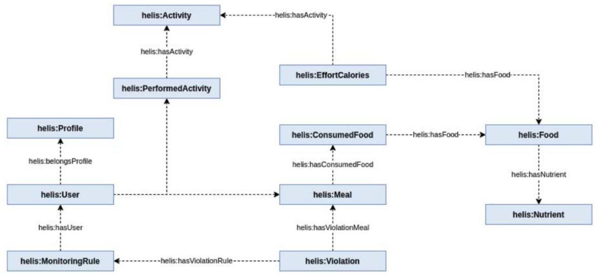
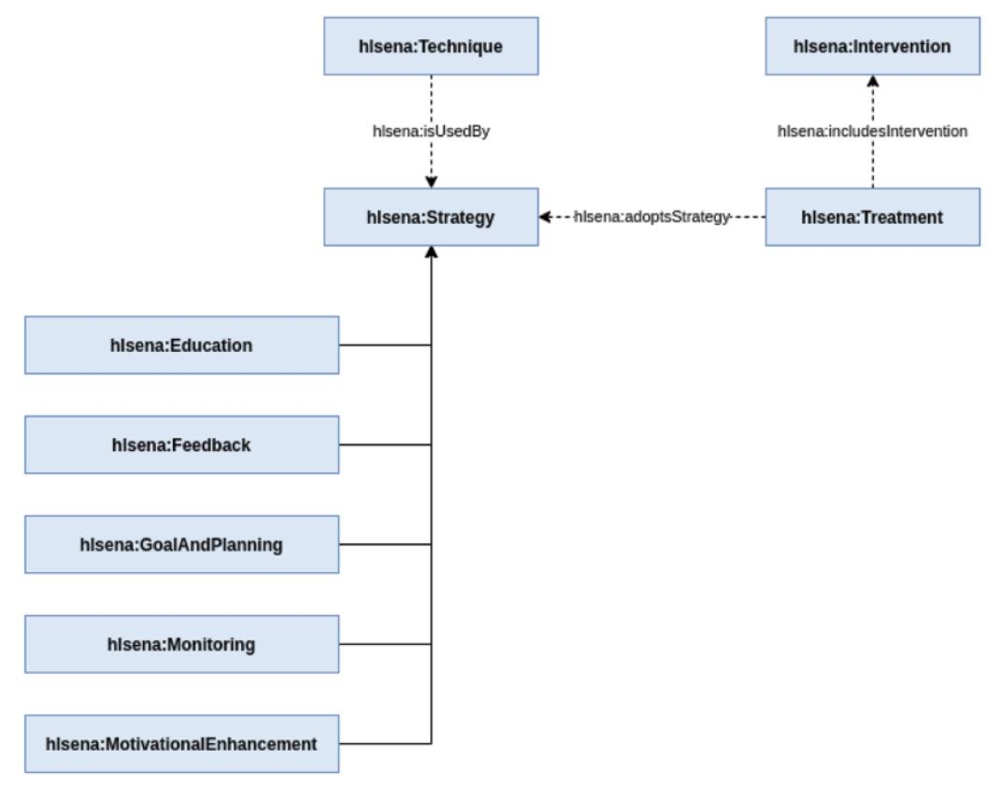
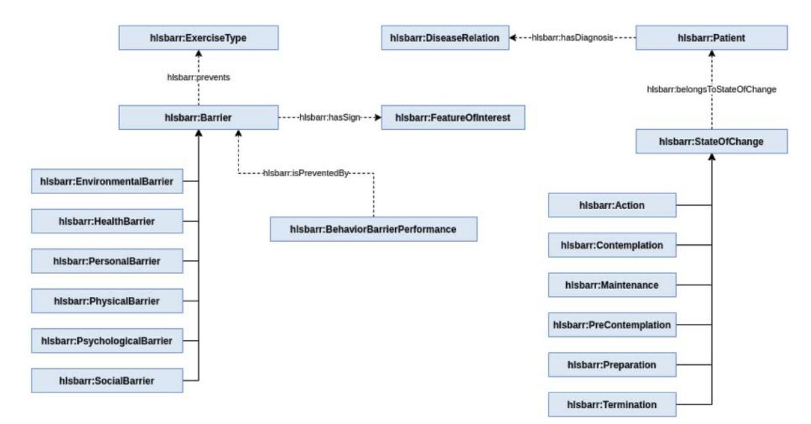
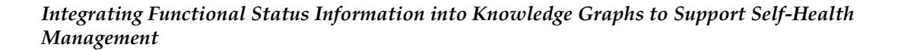
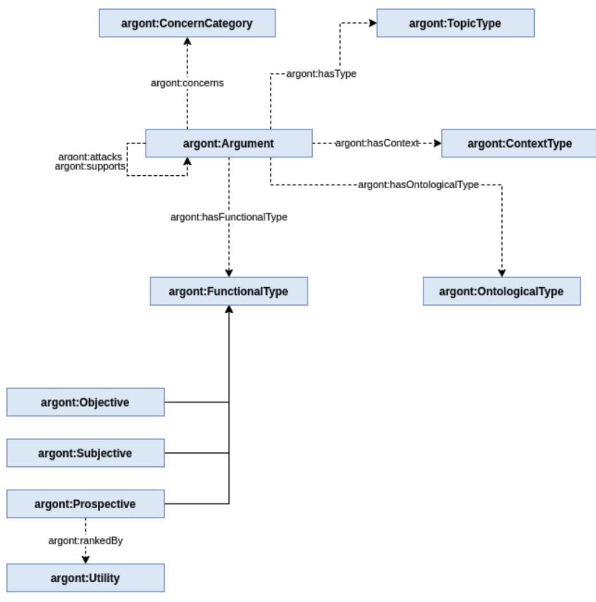
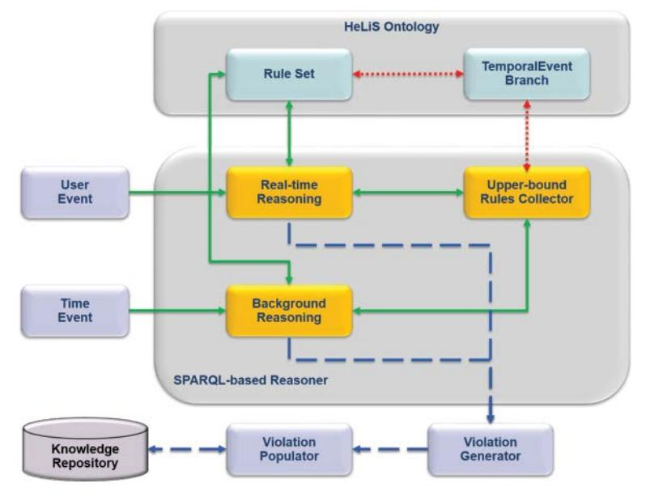

**Mauro Dragoni1†, Tania Bailoni1, Ivan Donadello2, Jean-Claude Martin3, Helena Lindgren4**1 Fondazione Bruno Kessler, Trento, Italy 2 Free University of Bolzano, Bolzano, Italy 3 LISN-CNRS, Universite Paris Saclay, Paris, France 4 Umea University, Umea, Sweden
**Keywords:**Knowledge Graph, Personal Healthcare, Functional Status, Enablers, Barriers, Arguments

Citation: Dragoni, M., Bailoni, T., Donadello, I., et al.: Integrating Functional Status Information into Knowledge Graphs to Support Self-Health Management. Data Intelligence 5(3), 636-662 (2023). doi: 10.1162/dint\_a\_00203 Received: November 1, 2021; Revised: December 10, 2022; Accepted: January 10, 2023

# ABSTRACT

Functional Status Information (FSI) describes physical and mental wellness at the whole-person level. It includes information on activity performance, social role participation, and environmental and personal factors that affect the well-being and quality of life. Collecting and analyzing this information is critical to address the needs for caring for an aging global population, and to provide effective care for individuals with chronic conditions, multi-morbidity, and disability. Personal knowledge graphs (PKGs) represent a suitable way for meaning in a complete and structured way all information related to people's FSI and reasoning over them to build tailored coaching solutions supporting them in daily life for conducting a healthy living. In this paper, we present the development process related to the creation of a PKG by starting from the HeLiS ontology in order to enable the design of an AI-enabled system with the aim of increasing, within people, the self-awareness of their own functional status. In particular, we focus on the three modules extending the HeLiS ontology aiming to represent (i) enablers and (ii) barriers playing potential roles in improving (or deteriorating) own functional status and (iii) arguments driving the FSI collection process. Finally, we show how these modules have been instantiated into real-world scenarios.

<sup>†</sup> Corresponding author: Mauro Dragoni (E-mail: dragoni@fbk.eu).

## INTRODUCTION

There is a growing trend of developing virtual health and well-being assistants to support lifestyle and disease management, partly due to the growing societal need for managing health and preventing illness. To improve an individual's situation, a change of behavior is typically necessary, which puts focus on how a digital coach can act in collaboration with the individual to support the individual's ambition to improve their health through behavior change, e.g., by adhering to medical guidelines or treatment protocols, increasing physical activity, changing nutrition habits, reducing stress or intake of toxic substances. As a basis for deciding how to act, the digital coach may explore the functional status information (FSI) of the monitored individual.

A necessary foundation for a medical and health-related system's reasoning, decision making and acting is (i) the medical knowledge that the digital coach utilizes, (ii) the theories and knowledge about how humans form motivation and change behavior as well as manage physical, social, and psychological barriers, and (iii) the FSI (data) about the individual as well as the individuals' narrative about their behavior change journey, information that needs to be treated following ethical guidelines and regulations. Moreover, the realization of such systems relies on the integration of effective, efficient, and ethical strategies for adapting behavior in a situation depending on the individual's context, personal preferences, and needs (e.g., displaying motivational messages that are tailored to each individual's resources and current situation).

A proper representation of this information requires (i) a strategy able to mitigate the diversity of the information managed and (ii) a conceptual model enabling the exploitation of such information by preserving, at the same time, the privacy aspects. Personal knowledge graphs (PKGs) are a valid way for providing an effective representation of FSI and for connecting such information with users' personal records (e.g., electronic health records) in order to enable the design of AI-based systems implementing the coaching paradigm for avoiding FS deterioration in target users.

In this article, we present the design process we adopted to extend the**HeLiS**ontology [1] with three new modules, namely*Enablers*, *Barriers*, and *Arguments*, enabling the definition and tracking of users' FSI. Hereafter, we adopt the acronym **FuS-KG**as reference for the*Functional Status Knowledge Graph*containing the**HeLiS**ontology and the three developed extensions. The adoption of such an ontology as a middle layer for the design of explainable behavior change systems allow (i) modeling conceptual information representing individuals' FSI and the use of the information to adapt the generation of explanatory and motivational messages to the individual; (ii) supporting interoperability among different systems which could share, for example, databases of motivational messages or explainability algorithms; and, (iii) managing privacy and ethical issues relating to user data. Through the conceptualization of each enabler or barrier and of arguments, it is possible (i) to acquire the personal FSI of users and to properly store them within the ontology; and, (ii) to manage which information can be shared with respect to the target user

The full ontology and its modules are available at https://w3id.org/helis

and, at the same time, design systems that are*transparent by design*. Indeed, the use of ontology enables the linking of information contained in black-box systems with conceptual information for exposing them.

This contribution is organized as follows. The literature about the acquisition and exploitation of functional status information is briefly surveyed in Section 2. In Section 3 we provide a brief recap of the **HeLiS**ontology and present the three ontology modules we designed for addressing the challenges mentioned above. Then, in Section 4 we show (i) how such modules have been integrated into an existing virtual coaching system, namely**HORUS.AI**, and (ii) how the model has been connected to a conversational agent with the aim of collecting, from real users, arguments concerning daily habits and barriers. Finally, in Section 5 we conclude the paper by conveying the future directions we aim to explore.

### RELATED WORK

Understanding the functional status of a person is important for developing accurate interventions and providing services for improving their health status as well as maximizing their functional independence to be able to perform well daily activities and be healthy. Managing health is a complex challenge and often the health care system's scarce resources prevent providing adequate support and care especially to people with chronic and disability conditions [2]. The National Committee on Vital and Health Statistics (NCVHS) [3] states that understanding the functional status of people is key to achieving optimal health and well-being. Assessing a patient's functional status requires a clinician to meet and interview the patient regarding their habits and lives and also to conduct standardized tests. However, such assessments represent a snapshot of a person's health status, while achieving behavior change for improving health is a long-term process. Consequently, there is a gap between people's health goals and the sparsely conducted health assessments conducted in healthcare, which is a limitation when aiming for achieving a good quality of care [4]. To meet the need for continuing support, data needs to be available from frequent measurements.

Physicians and researchers have studied the correlation between the decline in functions and the insurgence of acute illness or an exacerbation of a chronic illness, and identified risk factors with the purpose of detecting the elderly most at risk of experiencing a decline in functions [5, 6, 7]. Moreover, early detection and treatment of illness is key to a more rapid recovery and to preventing morbidity and mortality in older adults [8, 9, 10]. However, the problem is that functional status information is not yet being fully embraced and thus is not used effectively to its full potential [4].

The usefulness and the development of interventions based on functional status measurements are still being studied and are under development but many physicians still do not appreciate the importance of this information [11, 12, 13, 14]. Indeed, even if they were informed of patients' perceived health status, only a few changed patient management based on the information [15]. The NCVHS defined the problem of collecting patient data, considering not only the issue of the data collection burden and the quality of the data collected but also the issues relating to the privacy of the patient that arises when collecting personal and sensitive data [3].

Studies that are based on self-reports of functional performance and early decline in functions report that they successfully predict the actual performance and decline [16, 17]. However, researchers verified that the self-report of functional decline or disability captures only a small portion of the problems [7]. Thus, new ways to detect the patient's functional status are needed, especially methodologies that will evaluate the patient's functional performance not only in case of problems or healthcare issues but also in normal function. These new ways should be unobtrusive but accurate and do not always require face-to-face interaction with a physician or other health care provider. In [18], sensors are used to detect a decline in daily activities, especially regarding physical function, and thus define ad hoc interventions. Using a sensor system to evaluate functional status seems critical especially given the growing elderly population. In [18], the authors report that having a system able to detect early changes in the functional status of people, especially elderly people, and intervene with appropriate interventions could help prevent functional deterioration and reduce the decline in functional ability.

Our investigation goes in this direction with the aim of designing an AI-enabled system able to assist the individual in monitoring their functional status and preventing functional decline. This is achieved through the usage of a coaching mechanism providing motivational feedback supporting people in their goals to change their lifestyle to improve health.

An example of a recent cooperative effort to create observable and replicable interventions to influence behavior and health is given by the taxonomy on behavioral change techniques presented in [19]. Such a taxonomy supports the aggregation of behavior and behavior change knowledge as well as sharing and reusing of useful sources of behavior knowledge. We also observed that to our knowledge there currently exists no publicly available conceptual classification that models barriers to behavior change.

An important effort to mention is the human behavior taxonomy from the World Health Organization (WHO) [20]. This taxonomy of human behavior has been developed based on the knowledge of the WHO and on the International Classification of Functioning (ICF), Disability, and Health. This taxonomy includes a full definition of its classes, based heavily on the U.S. National Cancer Institute (NCI) Thesaurus, as well as the Oxford English Dictionary [21].

Another computational effort in capturing human behavior is the Semantic Mining of Activity, Social and Health Data (SMASH) [22]. This is a project which looks at providing predictions on human behavior, as well as explanations for the predictions, and is based on an Ontology Restricted Boltzmann Machine [23] where an algorithm learns user representations from health ontologies, using the user representation to incorporate self-motivation, social influences, and environmental events into the generation of predictions (and explanation of predictions) of human behavior.

The Neurobehavior Ontology (NBO) [24] is an ontology on the domain of Behavioral processes and phenotypes, which are related to behavior and behavior change [25]. The NBO includes two main

https://www.who.int/classifications/drafticfpracticalmanual.pdf

components: (1) the behavioral processes ontology, and (2) the behavioral-phenotypes ontology. The first component of the NBO classifies the behavior process to complement and extend the Gene Ontology (GO) [26]. The second component of the NBO classifies the normal and abnormal behavior of organisms.

The Health Behavior Change Ontology (HBCO) was built for a project aiming to establish an automated dialogue between a psychologist and a user to provide behavioral counseling [27]. The HBCO ontology has strengthened the linkage between theoretical and practical parts, but few practical implementations exist [28], meaning there are currently no specific strategies providing a reusable behavior change ontology in practice.

As our conceptualization must refer to the model of the person for whom the behavioral change techniques need to apply, it is useful to explore the ontologies that explicitly model "users", in terms of their profile, characteristics, and sometimes also their behavior. One example of a user ontology is the General User Model Ontology (GUMO) [29], which we will also import into our ontology. Besides the GUMO, there exist several other ontologies that encapsulate wider aspects of user (human) activities. One of these, which is in fact a GUMO extension, is the User Navigation Ontology (UNO) [30]. Another user profile ontology is OntoPIM (Ontology Personal Information Management), which describes various users' dimensions and shares a lot of concepts with GUMO [31].

Finally, in order to address the physical activity behavior domain, we need to mention some behavior ontologies related to the physical activity or exercise domain, in particular, the Ontology of Physical Exercises and the HeLiS ontology [32]. A Physical Activity Ontology (PACO) was proposed to support structuring and standardizing heterogeneous descriptions of physical activities [33].

# BUILDING THE PERSONAL HEALTH KNOWLEDGE GRAPH

The creation of the **FuS-KG**presented in this paper started from an existing ontology modeling the healthy lifestyle domain, called**HeLiS**[1], briefly presented in Section 3.1. The**HeLiS**ontology has been created by applying the METHONTOLOGY [34] ontology engineering methodology. Hence, the modeling of the three modules described below followed the same process given the possibility of involving a group of knowledge engineers and domain experts to achieve our goal. In particular, the overall process involved four knowledge engineers and seven domain experts from the Trentino Healthcare Department. More precisely, three knowledge engineers and four domain experts participated in the ontology modeling stages (hereafter, the modeling team). The remaining knowledge engineer and three domain experts were in charge of evaluating the ontology (hereafter, the evaluation team).

The choice of METHONTOLOGY was driven by the necessity of adopting a life-cycle split in welldefined steps. The development of the**HeLiS**ontology requires the involvement of the experts in situ. Thus,

https://bioportal.bioontology.org/ontologies/OPE/?p=summary

the adoption of a methodology having a clear definition of the tasks to perform was preferred. Other methodologies, like DILIGENT [35] and NeOn [36], were considered before starting the construction of the**HeLiS**ontology. However, the characteristics of such methodologies, like the emphasis on decentralized engineering, did not fit our scenario well.

METHONTOLOGY is composed by seven stages, namely*Specification*, *Knowledge Acquisition*, *Conceptualization*, *Integration*, *Implementation*, *Evaluation*, and *Documentation*. We summarize the activities performed in each stage within the following paragraphs. The only exception is the *Evaluation*stage that has been provided within the subsection 3.5.
**Specification.**The purpose of the presented**FuS-KG**is two-fold. On the one hand, we intend to provide a set of conceptual modules detailing several aspects connected to the representation of users' FSI. On the other hand, with the building of**FuS-KG**we want to foster the design and development of AI-enabled systems towards the implementation of behavior change strategies in patients affected by specific barriers. The three ontology modules have been modeled with a*high*granularity level by exploiting, as described in the next paragraph, fine-grained knowledge acquired from both domain experts and available literature.
**Knowledge Acquisition.**The knowledge was acquired in two ways: (i) we organized a set of focus groups with the domain experts for acquiring the main concepts and for building the first version of the graph; and, (ii) we analyzed the literature on behavior change strategies and techniques for detailing our model and for disambiguating possible inconsistencies that came to light during the focus group.

Concerning enablers and barriers, the modeling team defined which are the main type of both enablers and barriers presented in the state-of-the-art that are relevant for supporting the development of third-party behavior change applications. The conceptualization of barriers and of the different states of change has been created by extracting knowledge from domain-specific unstructured resources [37, 38]. During this step, the main challenges we faced were related to the creation of the*enablers*module where we have (i) to distinguish between strategies and techniques and (ii) to detect duplicate knowledge. Indeed, several notions defined within the behavior change area present conceptual overlaps that, from the ontological perspective, have to be removed.

Concerning argumentation, we defined the main concepts that can drive the creation of motivational dialogues for obtaining FSI from users, or for generating motivational messages tailored to users for supporting them to overcome specific barriers in order to achieve their goals of improving their health. With the involvement of domain experts, we defined which is the role of each argument type within a motivational dialogue and how such arguments are semantically linked with enablers or barriers.
**Conceptualization.**The conceptualization of the three ontology modules was split into two steps. The first one was covered by the knowledge acquisition stage, where most of the terminology is collected and directly modeled into the ontology as concepts or properties. While the second step consisted of deciding how to represent, as classes or as individuals, the information we collected from unstructured resources. Such a differentiation activity has been done, in particular, on the enablers where the distinction between concepts and individuals is, sometimes, very small. Then, we modeled the properties representing the different relationships between the defined concepts.

During this stage, we relied on several ontology design patterns (ODP) [39]. However, in some cases, we renamed some properties upon the request of domain experts. In particular, we exploit the logical patterns*Tree*and*N-Ary Relation*, the alignment pattern *Class Equivalence*, and the content patterns *Parameter*, *Time Interval*, *Action*and*Classification*.

**Integration.**The integration of the ontology has two objectives: (i) to align them with a foundational ontology, and (ii) to link it with the Linked Open Data (LOD) cloud. The first objective was satisfied by aligning the root concepts of both extensions with the ones defined within the DOLCE [40] top-level ontology. The second objective was satisfied by aligning our ontology with the UMLS Knowledge Base since it has been included within the LOD cloud recently. This way, it may work as a bridge between the latter and the three ontology modules.
**Implementation.**The created**FuS-KG**is represented by means of several ontological modules by using the RDF/XML language in order to provide a formal representation enabling the check of inconsistencies, the visualization of ontology structure, and the ease of maintenance. The editing of the ontology is demanded of the MoKi tool [41], while the exposure of the ontology is granted by the services available from the**HeLiS**ontology website.
**Documentation.**The documentation of the**FuS-KG**has been done from two perspectives. First, during the whole modeling process, a document has been prepared by the people involved in the construction process. This activity was necessary because the development of the**FuS-KG**and its sustainability is granted by a public funding program. Thus, all performed steps were documented and archived within the funding dossier. Second, in order to ease the readiness of the**FuS-KG**for users, we provided a different documentation file generated by using the LODE system and available on the**FuS-KG**website.

#*3.1 The HeLiS Ontology*The personal health knowledge graph described in this paper and used within our virtual coaching platform has been built by starting from the**HeLiS**[32] ontology, a state-of-the-art conceptual model for supporting healthy lifestyles. It defines the dietary and physical activity domains together with entities that model concepts concerning users' profiles and the monitoring of their activities. [32] provides details about the conceptual model and the methodology for building the model. Here, we provide an overview of the**HeLiS**ontology by introducing the concepts of modeling users, meals and physical activities, monitoring rules, and detected violations that are referred to in this paper. Moreover, we briefly recap the main

https://www.nlm.nih.gov/research/umls/

http://www.essepuntato.it/lode

http://w3id.org/helis

concepts involved in the core module of**HeLiS**in order to better link them with the ones defined in the extensions presented below.


<!-- Image Description: This image displays an Entity-Relationship Diagram (ERD) illustrating a data model. Rectangles represent entities (e.g., User, Activity, Food), and dashed lines with labels indicate relationships between them (e.g., "helis:hasUser"). The diagram details relationships between user profiles, performed activities, consumed food, meals, and resulting violations of monitoring rules, potentially for a health or dietary tracking application. The ERD visually defines the database structure and relationships within the system. -->

Figure 1 shows the main concepts defined within the core module of the**HeLiS**ontology.
**Figure 1.**The main concepts of the**HeLiS**core ontology.

The main concepts of the**HeLiS**ontology are shown in Figure 1 and are organized in four main branches underlying as many root concepts: (i)*Food*, (ii) *Activity*, (iii) *Monitoring*, and (iv) *User*.

The *Food*branch is responsible for modeling the instances macro-grouped under the*BasicFood*and*Recipe*concepts. The former includes also*Nutrient*s' information (carbohydrates, lipids, proteins, minerals, and vitamins). The latter describes complex dish composition (such as *Lasagna*) through a list of (*BasicFood*, quantity) pairs.

The root concept of the *Activity*branch is*PhysicalActivity*, which contains 856 activities sorted into categories. For each activity, we provide the number of calories consumed in one minute for each kilogram of the user's weight and the MET (Metabolic Equivalent of Task) value expressing the energy cost of the activity.

The *Monitoring*branch represents concepts concerning the monitoring of users' behaviors and it contains two main sub-concepts:*MonitoringRule*and*Violation*. *MonitoringRule*instances describe the parameters defining how users should behave if adhering to health goals (aka "rules"). While*Violation*instances contain the results of reasoning activities exploited for generating users' advice and recommendations. The content of each*Violation*instance is computed according to the user data that triggered the violation.

Finally, the*User*branch contains the conceptualization of user information and it enables the representation of all users' events (consumed foods and performed physical activities) and the association of each violation to the corresponding user. Users' events are represented via the*Meal*, *ConsumedFood*, and the *PerformedActivity*concepts. The last two concepts are reified relations enriched with attributes for representing the facts that a user consumed a specific quantity of food or performed an activity for a specific amount of time.

##*3.2. The Enablers Module*The*Enablers*module contains the main concepts enabling a user to start a behavior change process. This module has been built by starting from two of the main references available in the field indicated by the domain experts [37, 38]. We defined four main concepts, namely*Intervention*, *Treatment*, *Strategy*, and *Technique*.

Figure 2 shows the main concepts defined within the enablers module of **FuS-KG**. The *Intervention*concept follows the definition provided in [38] and it refers to a single action performed during a*Treatment*.


<!-- Image Description: This diagram illustrates a hierarchical relationship between different components of a health intervention ("hlsena"). Rectangles represent concepts (e.g., "hlsena:Technique," "hlsena:Intervention"). Arrows depict relationships, showing how techniques are used in strategies, and strategies are adopted in treatments, which are part of interventions. The lower left shows five components ("hlsena:Education," etc.) contributing to a broader strategy. The diagram visually clarifies the structure and components of the intervention. -->


<!-- Image Description: Figure 2 is a textual caption that describes the image's content, which is missing from the provided image. It states that the missing image shows the main concepts of a "FuS-KG enablers module". No diagrams, charts, graphs, equations, or illustrations are present in the given image. The caption's purpose is to label and briefly explain the content of the missing figure within the academic paper. -->

As an example, let us consider a behavior change scenario where a patient affected by diabetes has to monitor their glycemic index after each meal and provide the observed value into a mobile application. The reminder to do this action is an instance of the *Intervention*concept.

The*Treatment*concept is defined as the unfolding of every*Intervention*performed to allow users to achieve their aim. For example, the set of*Intervention*s performed by an AI-enabled system to persuade a patient about following the Mediterranean Diet is a *Treatment*[42].

The*Strategy*concept subsumes the five main strategies that can be implemented during a behavior change process:*Education*, *GoalAndPlanning*, *Feedback*, *Monitoring*, and *MotivationalEnhancement*. The *Education*concept models the aim to increase the user's understanding of their past and current state and of the steps required to achieve the future state (e.g., to provide information and/or instruction for behaving in a proper way). The*GoalAndPlanning*concept refers to future planning to achieve desired future states (e.g., activity scheduling and/or setting tasks of progressively greater difficulty). The*Monitoring*concept defines the action of recording past or current user's states (e.g., current nutritional behaviors and/or activity events). The*Feedback*concept models the information on current and past states provided to the user about their condition and/or actions. The meaning of the*Feedback*concept may also overlap with other behavior intervention components, such as*MotivationEnhancement*in a scenario where, for example, feedback may provide information about progress and may also increase or decrease motivation. Finally, the*MotivationEnhancement*concept refers to interventions that increase the likelihood that the user will engage in specific behaviors related to treatment goals or usage of the application in the future. Each instance of the*Strategy*concept has to be associated with the instance of the*Treatment*concept adopting it. Such an association can be done by instantiating the*adoptsStrategy*object property.

The fourth main concept is*Technique*, meaning an observable, replicable, and irreducible component of a *Strategy*used within a*Treatment*designed to alter or redirect causal processes that regulate behavior. A*Technique*is an "active ingredient" (e.g., feedback, self-monitoring, reinforcement) of a*Strategy*and it can be used alone or in combination, and in a variety of formats. Within the proposed**FuS-KG**, we defined 19 types of techniques subsuming the *Technique*concept. We refer the reader to check the*Enablers*module for the details. Moreover, each instance of the*Technique*concept has to be associated with the instance of the*Strategy*concept adopting it. Such an association can be done by instantiating the*isUsedBy*object property.

###*3.3 The Barriers Module*The Barriers ontology module is composed of four main branches: (i) the classification of the barriers, (ii) the representation of the different states of changes, (iii) a new taxonomy for classifying the list of physical activities defined within barriers, and (iv) the representation of the patients.

Figure 3 shows the main concepts defined within the barriers module of**FuS-KG**. The *Barrier*concept is the root concept of the first branch and it subsumes six macro-categories of barriers. The*EnvironmentBarrier*refers to the hindrances related to performing an action due to obstacles connected to the circumstances in which the action itself takes place. For example, they could relate to the weather (like unfavorable climatic conditions), to money (like the cost of the equipment needed), and to security issues (like the lack of safety).*HealthBarrier*concerns the presence of some disease preventing the performance or completion of a specific action. This concept enables the possibility of importing external medical knowledge bases (e.g., the UMLS). This way, barriers are connected with medical knowledge that can be exploited at reasoning time (such as asthma, chest pain, etc.). The*PersonalBarrier*concept represents barriers associated with real-life situations (e.g., job conditions) that obstruct the performance of specific actions. Then, the*PhysicalBarrier*and*PsychologicalBarrier*concepts are related to hindrances given by physical pains (e.g., knee injury) or emotional status (e.g., fear) that block a person from performing specific actions. Finally, the*SocialBarrier*concept mainly refers to a possible lack of support from people close to patients (e.g., parents, friends, etc.). The*Barrier*concept is associated with the*Sign*concept specifying a condition that is true in relation to that barrier. In fact, the*Sign*concept defines specific circumstances (both environmental and personal) like the fact that it's raining, that a person has a headache, or that a person has a full-time job.


<!-- Image Description: This image presents an Entity-Relationship Diagram (ERD) illustrating a data model. Rectangles represent entities (e.g., `hisbarr:Patient`, `hisbarr:Barrier`), and arrows depict relationships (e.g., `hisbarr:prevents`, `hisbarr:hasDiagnosis`). The diagram details the relationships between exercise types, barriers (categorized as environmental, health, personal, physical, psychological, and social), patient status (stages of change), disease relations, and features of interest. It likely serves to define the data structure used within the paper's analysis. -->
**Figure 3.**The main concepts of the**FuS-KG**barriers module.

The second branch consists of the abstract representation of the Transtheoretical Model of change (TTM) [43]. TTM describes the different stages of change that an individual can be in, and is used by clinicians for supporting the behavior change process. The main concepts we defined are*StateOfChange*, which is the root concept of this branch, and then the six stages in which a *Patient*can be:*PreContemplation*, *Contemplation*, *Preparation*, *Action*, *Maintenance*, and *Termination*. Moreover, we defined the property *hasBehavior*that is used as a reification of the status in which a*Patient*is during a specific*Timespan*.

The third branch provides a new taxonomy of physical activities defined in the core of barriers. Usually, the taxonomy defined within the core of barriers classifies physical activities by type. Instead, this extension provides a different classification of physical activities rooted in the *ExerciseType*concept. Then, the activities are classified following different perspectives: the energetic system generally used for performing the action (e.g., aerobic or anaerobic), if the activity requires flexibility abilities, if the activity corresponds to an athletic sport, and whether the activity is performed indoors or outdoors. Additionally, the intensity (or effort) level of each activity can be specified by the property*hasIntensity*that associates an activity to an*IntensityLevel*(i.e., light, moderate, or vigorous). The rationale of this classification is given by the necessity of defining the relationships between barriers and physical activities. For instance, if a user suffers from asthma, such a*HealthBarrier*may obstruct the performance of some*OutdoorActivity*.

Finally, the fourth branch consists of the representation of the user as a *Patient*. This concept helps to identify the characteristics of each user and specify whether he or she suffers from a certain disease that could influence the behavior of the user.

#### *3.4 The Arguments Module*The arguments ontology module aims at supporting efficient and effective dialogues for motivating behavior change. It has been developed following the model described in [44], and it is structured in a way that helps the formulation of persuasive dialogues [45] aimed at motivating a user/patient toward a healthier lifestyle (or a particular lifestyle goal). The module collects various arguments, which are different types of sentences, that are used to model dialogues providing beliefs a person may have concerning healthcare issues and the appropriate responses motivating behavior change. Therefore, each argument can have various properties that help to define its type, function, topic, context, utility, and the healthcare problem or solution it refers to. Furthermore, the concepts defined in the arguments module are*Argument*, *Concern\_category*, *Context\_type*, *Functional\_type*, *Ontological\_type*, *Topic\_type*and*Utility*.

Figure 4 shows the main concepts defined within the arguments module of **FuS-KG**. The *Argument*concept represents the argumentations that are used in the generation of the dialogues. These sentences are properly characterized by properties that specify the role of each argument in dialogue and how they relate to each other. Some examples of arguments defined in the module are: "do physical activity regularly", "an active lifestyle and a balanced diet are the best 'medicine' to live longer and better" or "not having time to exercise".


<!-- Image Description: The image is the title of a section in an academic paper. It describes the paper's focus: integrating functional status information into knowledge graphs to improve self-health management. There are no diagrams, charts, graphs, or equations in this image; it only presents the section title. -->


<!-- Image Description: This diagram is a UML class diagram illustrating an ontology for arguments. Rectangles represent classes (e.g., "argont:Argument"), and arrows depict relationships between them (e.g., "argont:concerns"). The diagram shows how argument classes relate to concern categories, topic types, contexts, functional types (objective, subjective, prospective, utility), and ontological types. Its purpose is to visually represent the structure and relationships within the argument ontology used in the paper. -->


<!-- Image Description: Figure 4 is a textual caption, not a diagram or chart. It describes the content of a missing figure, stating that it illustrates the main concepts of a "Fus-KG arguments module." The caption's purpose is to inform the reader about the topic of the absent figure and its relevance to the paper's discussion of the Fus-KG system and its argumentation component. -->
*Concern\_category*represents healthcare problems (such as "Stress" and "Heart Problems") and solutions (like "Healthy diet" and "Physical Activity"). These concepts are useful for indicating which problem and/ or solution an argument relates to. In fact, the property*concerns*connects arguments to the associated healthcare category. It is important to notice that some arguments can concern more than one problem or solution and in some cases, they could refer to both problems and solutions. For example, the "do physical activity regularly"*concerns*"Stress", because doing regular activity helps to reduce stress, while "not having time to exercise"*concerns*"Physical Activity" because it is an obstacle to be active.

The*Context\_type*concept represents specific contexts that can refer to the location, age, or status of the user; these are used to contextualize arguments, thus limiting the domain in which an argument is true and can be used. For example, in healthcare, a solution for a problem for some people can be damaging for others (e.g., people having a particular health status or age). It's thus important to be able to define the context of an argument and the property*only\_applicable\_in*has been defined for that purpose.

The*Functional\_type*concept specifies the role an argument can have in the dialogue (for example, whether the argument is a type of goal a person may have, some kind of evidence regarding a healthcare problem, an opinion of the user, etc.).*Functional\_type*is then subdivided into*Objective*, *Prospective*, and *Subjective*, where the first is used to characterize arguments based on undeniable information that could be based on well-established medical or scientific knowledge or current healthcare guidelines, the second characterizes the goals a person might have for themselves or for the welfare of others, and finally, the third is used to characterize arguments based on controversial or false information, opinions, and beliefs. In this regard, the property *has\_functional\_type*connects the arguments to their functional type. For example, "do physical activity regularly" has the function of a persuasion goal, while "not having time to exercise" is a subjective argument that expresses an opinion of a possible user.

The*Ontological\_type*defines the kind of belief expressed in an argument. The types defined in the module are:*attitude*, *background*, *benefit*, *capacity*, *cause*, *commitment*, *community*, *cost*, *motivation*, *myth*, *obstacle*, *opportunity*, *risk*and*side-effect*. Where *attitude*concerns opinions on the attitude of a person toward a healthcare problem and/or solution.*Background*specifies additional facts or opinions on some healthcare problems or solutions.*Benefit*describes events having a positive payoff in relation to solving a healthcare problem.*Capacity*concerns the ability of a person of addressing a healthcare problem.*Cause*gives facts or opinions regarding the cause of a healthcare problem.*Commitment*describes a pledge a user may take in order to solve a healthcare problem.*Community*concerns beliefs on the user's community.*Cost*gives facts or opinions regarding the possible costs for a healthcare solution.*Motivation*gives an opinion on the user's motivation for addressing a healthcare problem.*Myth*concerns beliefs that are commonly thought true regarding a problem or solution but that are in fact false.*Obstacle*concerns barriers a user may face trying to achieve a healthcare solution.*Opportunity*concerns facts or opinions related to the opportunity of achieving a healthcare solution.*Risk*describes possible negative events that can occur from a healthcare problem.*Side-effect*concerns facts or opinions on possible side-effects to a healthcare solution. Then, the property*has\_ontological\_type*is used to connect an argument to its type. For example, "an active lifestyle and a balanced diet are the best 'medicine' to live longer and better" is a*benefit*, while "not having time to exercise" is defined as an *obstacle*.

The *Topic\_type*concept represents the topic and subject matter used to classify the content of the arguments. In fact, knowing the topic of an argument is helpful in choosing arguments that may interest some users better than others, thus supporting the creation of more effective and persuasive dialogues.

Finally, the*Utility*concept refers to the usefulness of a certain goal; it specifies how beneficial a goal may be for the user and it can be also used for ranking goals. The*ranked\_by*property is used to connect a goal argument to the measure of its utility.

After defining the concepts used to characterize the arguments and in order to facilitate the creation of a persuasive dialogue we modeled two properties (i.e.,*support*and*attack*) that connect two arguments. The *support*property specifies that an argument helps to support another, for example "an active lifestyle and a balanced diet are the best 'medicine' to live longer and better"*supports*"do physical activity regularly" because knowing that having an active lifestyle helps you to live longer and better could help to motivate the user to do physical activity regularly. Instead, the*attack*property is used to define that an argument challenges or attacks another argument. For example, "not having time to exercise"*attacks*"do physical activity regularly" because a person who believes they have no time to exercise will find it a challenge to exercise regularly.

In order to be able to create effective dialogues, it's very important to have numerous arguments. In fact, after having constructed the structure of the argument module, we instantiated the argumentations in the healthcare domain, collecting material from various sources both from domain experts and online (concerning the physical activity and healthy diet domains).

####*3.5 FuS-KG Evaluation*The evaluation of the quality and correctness of**FuS-KG**has been conducted from two perspectives. First, we performed an expert-based evaluation where the team that did not participate in the modeling process adopted the metrics described in [46, 47, 48, 49, 50] to verify the quality of**FuS-KG**: *Accuracy*, *Adaptability*, *Clarity*, *Completeness*, *Computational Efficiency*, *Conciseness*, *Consistency/Coherence*, and *Organizational fitness*. Second, we ran the OntOlogy Pitfall Scanner! (OOPS!) [51] to identify inconsistencies, pitfalls, and errors and to check whether **FuS-KG**met all the needs for which it has been built.

The overall*Accuracy*of the**FuS-KG**has been judged as satisfactory. The knowledge of the domain experts was in-line with the complexity of the use of axioms. Indeed, within the**FuS-KG**there are not very complex axioms. Then, by considering the representation of the real world, the evaluators agreed on the correctness of the**FuS-KG**in describing the domain.

Concerning the*Adaptability*of the**FuS-KG**, the evaluators focused on the possible extension aspects. They verified that the **FuS-KG**can be extended and specialized monotonically. Here, the question has to be addressed from two perspectives. Firstly, concerning the extension of the**FuS-KG**from the content perspectives (i.e., adding new enablers, barriers, FSI-related concepts, etc.), the result was positive because any extension of the**FuS-KG**did not require the removal of any axiom. Secondly, concerning the representation of users' profiles, the update of the**FuS-KG**was not monotonic because if a user is associated with a new profile, the old association is removed. Anyway, the**FuS-KG**does not react negatively to these changes because its consistency is preserved.

https://www.physio-pedia.com/Barriers to Physical Activity

https://www.sanihelp.it/

About the*Clarity*of the**FuS-KG**, the evaluators agreed with the strategy decided by the modeling team about using concept labels to communicate the intended meaning of each concept and the use of definitions and descriptions of the main concepts of the **FuS-KG**, especially for the root concepts of each branch. Moreover, each definition has been well documented within the **FuS-KG**in order to make the meaning of each concept understandable by those who use the**FuS-KG**.

The experts agreed about the *Completeness*of the**FuS-KG**. However, they distinguished between the TBox and the ABox. Indeed, concerning the TBox, the evaluators agreed about the completeness of the **FuS-KG**and the lexical representations of the concepts. In particular, they verified that all the represented nutrients appropriately cover the health domain and that all the information needed for the realization of tools supporting a healthy lifestyle were modeled within the**FuS-KG**. Regarding ABox, the evaluators highlighted the necessity of including individuals concerning commercial products. This observation is interesting, especially, if we consider the possibility of developing end-user applications. Indeed, the presence of commercial products will improve overall user engagement.

In order to verify the *Computational efficiency*of the**FuS-KG**, we observed how it behaved within the scenario described in Section 4. Indeed, the **FuS-KG**itself does not contain axioms representing a criticism for reasoners. On the contrary, the final aim of the**FuS-KG**is to be used for analyzing data provided by users. In Section 4, we show an example of how the**FuS-KG**is used and we provide statistics regarding the amount of time needed for completing the reasoning activity with respect to the dimension of elaborated data.

The evaluators judged the**FuS-KG** "*Concise*" because all the axioms included are relevant with regard to the targeted domain and there are no redundancies. Also, the **FuS-KG** has been judged "*Consistent*" and "*Coherent*". It has been judged consistent because no contradictions were found by the evaluators and coherent because the evaluators observed little bias between the documentation containing the informal description of the concepts and their formalization.

Then, concerning the *Organizational fitness*, the **FuS-KG**has been deployed within the organization as a web service in order to make it easily accessible by the community and potential stakeholders. Moreover, as described in Section 4, the ontology has been also deployed within external architectures. A focus group has been organized with both the modeling team and the evaluation team for discussions about the adopted methodology, which was judged appropriate by considering the necessity of working in situ altogether and synchronizing the commitments of all the people involved.

Finally, the entire**FuS-KG**has been analyzed by the OOPS! tool in order to find potential pitfalls and trigger mitigation actions. Since some ontologies have been reused in the core module of**FuS-KG**(i.e., the**HeLiS**ontology), some pitfalls appeared, but all of them pointed to reused ontology entities. The pitfall record includes P04 (Creating unconnected ontology elements), P08 (Missing annotations), P11 (Missing domain or range in properties), P13 (Inverse relationships not explicitly declared), and P22 (Using different naming conventions in the ontology). However, all pitfalls that appeared in the modules for newly implemented entities during the implementation have been solved. Inconsistencies were checked with the

reasoners Pellet [52] and HermiT [53] and no errors were found when running them. To ensure that each module met the quality needs, the scanning has also been performed separately on each module.

Evaluations on the whole**FuS-KG**and for all modules were run successfully, with good results. This ensures that the**FuS-KG**is consistent, meets the requirements, and to the best of our knowledge, has no errors.

#### SCENARIOS INTEGRATING THE PERSONAL HEALTH KNOWLEDGE GRAPH

In this section, we describe two real-world scenarios that adopted**FuS-KG**. In the former, **FuS-KG**has been used for performing real-time reasoning to support behavior monitoring. In the latter,**FuS-KG**is integrated into a chatbot aiming to populate the argument module with knowledge harvested from real users through interviews.

####*4.1 The Integration Within The HORUS.AI Platform*The ontology modules described in Section 3 are exploited for monitoring the functional status of a user through their integration into a SPARQL-based reasoner. Such a reasoner is used for detecting undesired situations within users' behaviors. When inconsistencies with respect to the encoded guidelines are detected, the knowledge base is populated with individuals of type*UndesiredEvent*that, in turn, can be used by another component for providing feedback to users. Reasoning can be triggered in two ways. Firstly, each time a new data package is acquired or an existing one is modified in the knowledge base, the reasoner is invoked for processing the new, or updated, information. Data packages can be manually added by the user or automatically acquired from IoT devices. Secondly, at the end of a specific timespan, such as the end of a day or of a week, the reasoner is invoked with the aim of checking the overall user's behavior in such a timespan. In the latter case, the reasoner works on a collection of data labeled with a timestamp valid within the considered timespan. The integrated reasoner relies on the architecture implemented in**RDFPro**[54].**RDFPro**has been chosen for two main reasons. Firstly, the architecture of**RDFPro**allows the integration of custom methods into reasoning operations (i) for performing mathematical calculations on users' data and (ii) for exploiting real-time information acquired from external sources without materializing them within the knowledge repository. Secondly, as reported in [54], efficient analysis performed on**RDFPro**demonstrated the suitability of this reasoner with respect to other state-of-the-art reasoners in a real-time scenario. In this work,**RDFPro**has been adapted and extended in order to better fit the needs of the proposed solution. The extension consisted of the integration of new methods supporting the real-time stream reasoning of sensor data. This way, we were able to support the real-time processing of users' data in a more efficient manner.

We organize the reasoning in two phases:*offline*and*online*. The *offline*phase consists of a one-time processing of the*static*part of the ontology (i.e., monitoring guidelines, barriers, arguments, activities) when the system starts. This is performed to materialize the ontology deductive closure, based on OWL 2 RL and some additional pre-processing rules that identify the most specific types of each individual defined in the static part of the**HeLiS**ontology ABox. Furthermore, this kind of information greatly helps in performing the aggregation operations during the online reasoning phase.

During the*online*phase, each time the reasoning is triggered by a user event (e.g., a new data package is entered by a user) or by a timed event (e.g., a specific timespan ended), the user data is merged with the closed ontology and the deductive closure of the rules is computed. The resulting*UndesiredEvent*individuals and their RDF descriptions are then stored back in the knowledge base. The generation of each*UndesiredEvent*individual is performed in two steps. First, information inferred by aggregating the domain, monitoring, and user knowledge is used for generating the*UndesiredEvent*individuals. Second, accessory information is integrated into the*UndesiredEvent*individuals for supporting the creation of feedback when the explanation concerning the detected undesired event is generated. Accessory information includes, for example, references to other individuals of the ontology enabling access to the positive and negative aspects associated with the detected behavior, or the number of times that the specific guideline has been violated. This kind of information can be used for deciding the enforcement level of the persuasion contained within the generated feedback.

Figure 5 summarizes the*online*phase of the reasoning process whose main components and steps are detailed in the following sections. The green path, drawn with a continuous line, executed as the first step, is in charge of collecting the rules to validate depending on the trigger received by the reasoner. The red path, drawn with a dotted line, executed as the second step, is invoked for collecting rules that can be validated as semantically associated with the ones collected during the green path. The blue path, drawn with a dashed line, executed as the third step, generates and populates violations before storing them in the knowledge repository.


<!-- Image Description: This flowchart illustrates the architecture of a HeLiS ontology-based reasoning system. It depicts the flow of user and time events through real-time and background reasoning modules, utilizing a SPARQL-based reasoner and a knowledge repository. The system identifies rule violations using an upper-bound rules collector, populating and generating violation reports from the TemporalEvent branch. Solid lines represent data flow, dashed lines indicate control flow. -->
**Figure 5.**The overall picture of the online reasoning process.

As an example of how the reasoning process works in practice, let us consider a patient, Michelle, who is affected by hyperglycemia; such a condition compromises her physical functional capacity since she is often very tired. After a colloquium with her physicians, the highlighted problem is that Michelle has a very stressful job and she is used to unloading her stress on food. Moreover, given her job schedule, she is not able to plan meal consumption properly during the day. Michelle started to be monitored by an AI-enabled application including a guideline concerning the total amount of calories contained in each meal has to be lower than 1000. All this information (i.e., user profile, barriers, and rules) are represented within the AI system in order to make them exploited for reasoning purposes by combining them with the data provided by Michelle.

```text
1.	:Hyperglycemia a :Profile.
```text

```text
2. :Michelle a :User; :hasUserId "493853"^^xsd:integer;
	 :belongsProfile :Hyperglycemia.
```text

- 3. :MR1 a :MonitoringRule; :appliesTo :Hyperglycemia; :timing :Meal; :monitoredEntity :Food; :command "hasCalories"; :hasOperator "lower"; :hasMonitoredValue "1000"^^xsd:integer; :hasRuleId "1"^^xsd:integer; :hasPriority "1"^^xsd:integer.
- 4. :BBPMichelle a :BehaviorBarrierPerformance.

```text
5. :JobCondition a :Barrier.
```text

```text
6. :BBPMichelle :hasUser :Michelle; :refersTo :MR1;
  :isPreventedBy :JobCondition.
```text

Rows 1 and 2 define the profile and assign it to Michelle. Row 3 describes the guideline that Michelle has to follow. Rows from 4 to 6 define the behavior that the mentioned barrier avoids performing. For the first two days, Michelle provided the data about her food intake correctly as shown below (for brevity, we reported only the meals, or snacks, that trigger the detection of an undesired event):

```text
:Michelle :consumed :Breakfast-493853-1, :Snack-493853-3, :Dinner-493853-8.
:Breakfast-493853-1 a :Breakfast; :hasTimestamp "2020-12-14T07:19:00Z";
  :hasConsumedFood [ :hasFood :AlmondMilk; :amountFood "250"^^xsd:integer ],
 [ :hasFood :RiceFlakes; :amountFood "100"^^xsd:integer ].
:Snack-493853-3 a :Snack; :hasTimestamp "2020-12-14T11:34:00Z";
  :hasConsumedFood [ :hasFood :CannedOrangeSoda; :amountFood "300"^^xsd:integer ],
 [ :hasFood :Apple; :amountFood "150"^^xsd:integer ].
:Dinner-493853-8 a :Dinner; :hasTimestamp "2020-12-15T19:45:00Z";
  :hasConsumedFood [ :hasFood :CocaCola; :amountFood "330"^^xsd:integer ],
 [ :hasFood :Pizza; :amountFood "450"^^xsd:integer ].
```text

Based on the provided data, combined with the knowledge contained within the**HeLiS**ontology, the reasoner determines that the amount of kilo-calories consumed during each meal, except for*Dinner-493853-8*, satisfies the rule *MR1*. This event triggers into the knowledge base the assertion of the following *UndesiredEvent*individual:

For brevity, we avoid discussing the different ways in which the information expressed in natural language can be formalized as shown in this section. This aspect is out of the scope of this paper.

```text
:undesiredevent-493853-8-20161215 a :UndesiredEvent;
  :hasUndesiredEventRule :MR1; :hasUndesiredEventUser :Michelle;
  :hasUndesiredEventMeal :Dinner-493853-8; :hasUndesiredEventQuantity 1356;
  :hasUndesiredEventExpectedQuantity 1000;
  :hasUndesiredEventLevel 2; :hasTimestamp "2016-12-15T19:45:00Z";
  :hasPriority 1; ...
```text

The generated individual completes the amount of knowledge that can be exploited by the system for starting an interaction with the user. Indeed, the knowledge linked with the*UndesiredEvent*individual can be used for generating the feedback sent to Michelle. In this particular case, Michelle is advised that she consumed too many calories during a specific dinner together with further information describing how this kind of behavior can affect her health. At the same time, the results of the monitoring activity can be also sent to the physician that can use such information for a better understanding of the reasons which led Michelle to perform undesired behaviors.

###*4.2 The Integration within an Argument Collection Chat-bot*The argument module can be easily populated with instances of arguments harvested with the use of a chatbot. Chatbots are effective tools in argument mining as they explicitly ask users for (counter) arguments about a topic. In addition, in some cases, they are a necessary choice, as open textual discussions about a very specific topic are not always available. For example, in the healthy lifestyle domain, the (counter) arguments regard users' barriers, capacities, and suggestions from experts (such as nutritionists, psychologists, and coaches) that can be found in private forums, social networks, or specialized journals. Therefore, argument mining is difficult to perform and a chatbot is a more effective solution [55, 56, 57]. Here, we show how we used a chatbot for populating the argument module with arguments regarding the Mediterranean Diet and physical activity.
**The Healthy Lifestyles Domain.**We harvested arguments regarding barriers and enablers of specific prescriptions of the Mediterranean Diet [58] and of a regular physical activity. These prescriptions regard (i) the number of daily portions of fruit, vegetable, fish, and milk; (ii) the number of weekly portions of red meat, cured meat, sweets, and sugary drinks; and, (iii) the time (minutes) of daily and weekly physical activity.
**The Involved Users.**The users were Computer Science students of the local university who voluntarily participated in the collection of the arguments. This sample of the population presents some biases (similar age, sex, and school degree) that do not affect our goal as we are not interested in covering all the representative arguments about healthy lifestyles but in an initial population of the argument module with the use of a bot. Then, different population samples can provide a bigger coverage. In addition, the chatbot can be used by domain experts able to provide well-known arguments in the literature.

https://sites.google.com/site/compendiumofphysicalactivities/home and http://www.hhs.gov/
**The Chatbot.**The chatbot is inspired by [55] and starts by asking some profiling questions (age, gender, and school title). Then, the users were asked whether they respect each of the above prescriptions about healthy lifestyles with a simple yes/no click button. Positive cases are then asked about textual suggestions (i.e., arguments) they would give to friends that would like to respect such prescriptions but fail. Negative cases are deepened by asking (open-text format): (i) why they do not follow that particular prescription; (ii) suggestions for friends that want to follow such prescriptions; (iii) whether such suggestions would hold for them; and, (iv) if the previous point is false, what would they consider a valid suggestion. Users answering with a sentence too short (with less than 4 words) are encouraged to expand the argument with a chatbot request; exceptions are the short "I don't know" answers that are not asked to be expanded. With this dialogue procedure, we collected arguments from both positive and negative cases.
**Processing the Arguments.**A manual checking of the arguments has been performed to discard duplicate arguments (i.e., arguments with the same meaning). This operation can be performed by checking the semantic similarity of arguments with a universal sentence encoder [59]. The arguments were then manually tagged with their functional and ontological types. Even this operation can be automatically performed with the use of Natural Language Processing techniques for information extraction [60].
**The Gathered Arguments.**The chatbot provided 270 (counter) argument instances for the argument module. Each argument has its own functional and ontological types. Examples of arguments are the barriers to following a particular prescription, such as lack of time, forgetting about the prescription, too much effort, or dislike of the food in the prescription. Other examples regard suggestions to better follow such prescriptions, e.g., the use of apps for monitoring the lifestyle, change of your habits gradually, and alternative healthy food.

# CONCLUSION AND FUTURE DIRECTIONS

In this work, we presented three modules extending the**HeLiS**ontology to provide a conceptualization of "Enablers", "Barriers" and "Arguments". These modules aim to enhance the AI capabilities of coaching systems designed for supporting the monitoring of users' functional status. Besides the description of the three modules, we have shown how such modules have been integrated into a working AI coaching system, namely,**HORUS.AI**, and we provide a brief but useful running example showing how the main concepts of these modules can be instantiated.

As mentioned in Section 1, this work represents a first step toward the long-term achievement of having a full-fledged AI coaching system. Future efforts will be focused on three main directions. First, we plan to expand the knowledge base since ontologies are inevitably subject to constant changes. This will involve domain experts and the exploration of techniques that leverage some form of data mining able to detect hidden information from large textual data. Secondly, we plan to integrate ontology with natural language understanding (NLU) and natural language generation (NLG) components. This way, we will be able to investigate strategies about how to automatically transform natural language texts into their equivalent semantic argument-based representation, as well as, exploit the output of the reasoning process for generating effective contextual feedback. Thirdly, we plan to evaluate the system in a real-world coaching scenario. In this work, we did not provide a living lab evaluation since the ontology itself cannot be evaluated without addressing the point above (i.e., integration with both NLU and NLG). We will focus on doing such integration in order to deploy the end-to-end system into real-world scenarios and to observe the effectiveness of the ontology modules presented.

In particular, we will investigate three main directions: expanding the Knowledge Base, refining the Barrier ontology and sourcing collaboration, and publishing the ontology.

**Expanding the Knowledge Base**Ontologies are inevitably subject to constant changes, with many researchers in the ontology engineering space claiming that ontologies are confronted by evolution. In order to address this, one should plan the addition of concepts and relations imperative to the domain that are currently absent. This will involve domain experts and the exploration of techniques that leverage some form of data mining, such as Natural Language Processing and Machine Learning, because of their ability to detect hidden information from large textual data.
**Refinement of the Barrier ontology**Ontology refinement is a vitally important maintenance strategy that can improve the readability and usability of the ontology and support its evolution to cover new unseen concepts and constraints. Having imported existing ontologies into the Barrier Ontology, there's a need to refine the ontological entities in order to retain relevant elements imperative to the application domain.
**Sourcing collaboration and publishing the ontology** We aim to publish a stable version of the ontology. This will help to entice interested people (especially medics or health-modeling experts) to collaboratively contribute to our work, hence improving its usability. It will also help to gather feedback from research fellows who contribute to public ontology libraries or publishing platforms. Publishing the ontology to be reviewed by other researchers is a step that will be undertaken immediately. BioPortal11 and OBO Foundry12 is the open-source repositories we are currently considering for this. However, we aim to publish the Barrier Ontology in many repositories, requesting the respective communities to comment on all entities and presentation of the ontology.

## ACKNOWLEDGMENTS

This work has been supported by the HORIZON 2020 HumanE-AI project (Grant 952026).

### REFERENCES

[1] Dragoni, M., Bailoni, T., Maimone, R., et al.: Helis: An ontology for supporting healthy lifestyles. In: International Semantic Web Conference (2), volume 11137 of Lecture Notes in Computer Science, pp. 53–69. Springer (2018)

<sup>11</sup> https://www.bioontology.org/

<sup>12</sup> http://www.obofoundry.org/

- [2] Baker, A.: Crossing the quality chasm: a new health system for the 21st century, volume 323. British Medical Journal Publishing Group (2001)
- [3] National Committee on Vital and Health Statistics: Classifying and reporting functional status (2001)
- [4] Li I., Greenberg, M.S.: Capturing and classifying functional status information in administrative databases. Health Care Financ Rev 3(24), 61–76 (2003)
- [5] Fried, L.P., Bandeen-Roche, K., Chaves, P.H., et al.: Preclinical mobility disability predicts incident mobility disability in older women. Journals of Gerontology-Biological Sciences and Medical Sciences 55(1), M43 (2000)
- [6] Onder, G., Penninx, B.W.J.H., Ferrucci, L., et al.: Measures of physical performance and risk for progressive and catastrophic disability: results from the women's health and aging study. The Journals of Gerontology Series A: Biological Sciences and Medical Sciences 60(1), 74–79 (2005)
- [7] Wolinsky, F.D., Miller, D.K., Andresen, E.M., et al.: Further evidence for the importance of subclinical functional limitation and subclinical disability assessment in gerontology and geriatrics. The Journals of Gerontology Series B: Psychological Sciences and Social Sciences 60(3), S146–S151 (2005)
- [8] Boockvar K.S., Lachs, M.S.: Predictive value of nonspecific symptoms for acute illness in nursing home residents. Journal of the American Geriatrics Society 51(8), 1111–1115 (2003)
- [9] Hogan, J.: Why don't nurses monitor the respiratory rates of patients? British Journal of nursing 15(9), 489–492 (2006)
- [10] Ridley, S.: The recognition and early management of critical illness. Annals of the Royal College of Surgeons of England 87(5), 315 (2005)
- [11] Nelson, E., Conger, B., Douglass, R., et al.: Functional health status levels of primary care patients. Jama 249(24), 3331–3338 (1983)
- [12] Calkins, D.R., Rubenstein, L.V., Cleary, P.D., et al.: Failure of physicians to recognize functional disability in ambulatory patients. Annals of internal medicine 114(6), 451–454 (1991)
- [13] Calkins, D.R., Rubenstein, L.V., Cleary, P.D., et al.: Functional disability screening of ambulatory patients. Journal of General Internal Medicine 9(10), 590–592 (1994)
- [14] Cassell, E.J.: Doctoring: The nature of primary care medicine. Oxford University Press, USA (2002)
- [15] Espallargues, M., Valderas, J.M., Alonso, J.: Provision of feedback on perceived health status to health care professionals: a systematic review of its impact. Medical care, 175–186 (2000)
- [16] Fried, L.P., Young, Y., Rubin, G., et al.: Self-reported preclinical disability identifies older women with early declines in performance and early disease. Journal of clinical epidemiology 54(9), 889–901 (2001)
- [17] Wakefield, B.J., Holman, J.E.: Functional trajectories associated with hospitalization in older adults. Western Journal of Nursing Research 29(2), 161–177 (2007)
- [18] Alexander, G.L., Rantz, M., Skubic, M., et al.: Sensor systems for monitoring functional status in assisted living facility residents. Research in Gerontological Nursing 1(4), 238–244 (2008)
- [19] Michie, S., Carey, R.N., Johnston, M., et al.: From Theory-Inspired to Theory-Based Interventions: A Protocol for Developing and Testing a Methodology for Linking Behaviour Change Techniques to Theoretical Mechanisms of Action. Annals of Behavioral Medicine 52(6), 501–512 (2017)
- [20] Larsen, K.R.T., Michie, S., Hekler, E., et al.: Behavior change interventions: the potential of ontologies for advancing science and practice. Journal of Behavioral Medicine 40, 6–22 (2016)
- [21] Weisz, J., Ng, M.Y., Bearman, S.: Odd couple? reenvisioning the relation between science and practice in the dissemination-implementation era. Clinical Psychological Science 2, 58–74 (2014)
- [22] Phan, N., Dou, D., Wang, H., et al.: Ontology-based deep learning for human behavior prediction with explanations in health social networks. Information Sciences 384, 298–313 (2017)
- [23] Wang, H., Dou, D., Lowd, D.: Ontology-based deep restricted boltzmann machine. DEXA (2016).

- [24] Gkoutos, G.V., Schofield, P.N., Hoehndorf, R.: Chapter four—the neurobehavior ontology: An ontology for annotation and integration of behavior and behavioral phenotypes. In: Chesler, E.J., Haendel, M.A. (eds.) Bioinformatics of Behavior: Part 1, volume 103 of International Review of Neurobiology, pp 69–87. Academic Press (2012)
- [25] Rutten, B., Hammels, C., Geschwind, N. et al.: Resilience in mental health: Linking psychological and neurobiological perspectives. Acta psychiatrica Scandinavica 128, 03 (2013)
- [26] The Consortium and Nicola Mulder: The gene ontology project in 2008. Nucleic Acids Res. 36, 11 (2007)
- [27] Bickmore, T.W., Schulman, D., Sidner, C.L.: A reusable framework for health counseling dialogue systems based on a behavioral medicine ontology. Journal of Biomedical Informatics 44(2), 183–197 (2011)
- [28] Spruijt-Metz, D., Hekler, E., Saranummi, N., et al.: Building new computational models to support health behavior change and maintenance: new opportunities in behavioral research. Translational Behavioral Medicine 5, 09 (2015)
- [29] Heckmann, D., Schwartz, T., Brandherm, B. et al.: Gumo—the general user model ontology, pp. 428–432 (2005)
- [30] Kikiras, P., Tsetsos, V., Hadjiefthymiades, S.: Ontology-based user modeling for pedestrian navigation systems. In: ECAI 2006 Workshop on Ubiquitous User Modeling (UbiqUM), Riva del Garda (2006)
- [31] Katifori, A., Golemati, M., Vassilakis, C., et al.: Creating an ontology for the user profile: Method and applications. RCIS (2007)
- [32] Dragoni, M., Bailoni, T., Maimone, R. et al.: Helis: An ontology for supporting healthy lifestyles. In: International Semantic Web Conference (2), volume 11137 of Lecture Notes in Computer Science, pp. 53–69. Springer (2018)
- [33] Kim, H., Mentzer, J., Taira, R.: Developing a physical activity ontology to support the interoperability of physical activity data. Journal of Medical Internet Research 21(4) (2019)
- [34] Fernández-López, M., Gómez-Pérez, A., Juristo, N.: Methontology: from ontological art towards ontological engineering. In: Proc. Symposium on Ontological Engineering of AAAI (1997)
- [35] Pinto, H.S., Staab, S., Tempich, C.: DILIGENT: towards a fine-grained methodology for distributed, looselycontrolled and evolving engineering of ontologies. In: López de Mántaras R., Saitta, L. (eds.) Proceedings of the 16th Eureopean Conference on Artificial Intelligence, ECAI'2004, including Prestigious Applicants of Intelligent Systems, PAIS 2004, Valencia, Spain, August 22–27, 2004, pp. 393–397. IOS Press (2004)
- [36] Suárez-Figueroa, M.C.: NeOn methodology for building ontology networks: specification, scheduling and reuse. PhD thesis, Technical University of Madrid (2012)
- [37] Michie, S., West, R., Campbell, R., et al.: ABC of Behaviour Change Theories (2014)
- [38] Mohr, D.C., Schueller, S.M., Montague, E., et al.: The behavioral intervention technology model: an integrated conceptual and technological framework for ehealth and mhealth interventions. Journal of medical Internet research 16(6), e3077 (2014)
- [39] Hitzler, P., Gangemi, A., Janowicz, K., et al. (eds.): Ontology Engineering with Ontology Design Patterns— Foundations and Applications, volume 25 of Studies on the Semantic Web. IOS Press (2016)
- [40] Gangemi, A., Guarino, N., Masolo, C., et al.: Sweetening ontologies with dolce. In: Proceedings of the 13th International Conference on Knowledge Engineering and Knowledge Management. Ontologies and the Semantic Web, pp. 166–181. Springer-Verlag (2002)
- [41] Dragoni, M., Bosca, A., Casu, M., et al.: Modeling, managing, exposing, and linking ontologies with a wiki-based tool. LREC, 1668–1675 (2014)
- [42] Donadello, I., Dragoni, M., Eccher, C.: Explaining reasoning algorithms with persuasiveness: a case study for a behavioural change system. In: SAC, pp. 646–653. ACM (2020)
- [43] Prochaska, J.O., Redding, C.A., Evers, K.E.: The transtheoretical model and stages of change, 97 (2015)

- [44] Chalaguine, L., Hadoux, E., Hamilton, F., et al.: Domain modelling in computational persuasion for behaviour change in healthcare (2018)
- [45] Donadello, I., Hunter, A., Teso, S., et al.: Machine learning for utility prediction in argument-based computational persuasion. In: AAAI, pp. 5592–5599. AAAI Press (2022)
- [46] Obrst, L., Ceusters, W., Mani, I., et al.: The Evaluation of Ontologies, pp. 139–158. Springer US, Boston, MA (2007)
- [47] Gangemi, A., Catenacci, C., Ciaramita, M., et al.: Modelling ontology evaluation and validation. In: Sure, Y., Domingue, J. (eds.) The Semantic Web: Research and Applications, 3rd European Semantic Web Conference, ESWC 2006, Budva, Montenegro, June 11–14, 2006, Proceedings, volume 4011 of Lecture Notes in Computer Science, pp. 140–154. Springer (2006)
- [48] Gómez-Pérez, A.: Ontology evaluation. In: Staab, S., Studer, R. (eds.) Handbook on Ontologies, International Handbooks on Information Systems, pp. 251–274. Springer (2004)
- [49] Gruber, T.R.: Toward principles for the design of ontologies used for knowledge sharing? Int. J. Hum.-Comput. Stud. 43(5–6), 907–928 (1995)
- [50] Grüninger, M., Fox, M.: Methodology for the Design and Evaluation of Ontologies. In: IJCAI'95, Workshop on Basic Ontological Issues in Knowledge Sharing, April 13, 1995 (1995)
- [51] Poveda-Villalón, M., Gómez-Pérez, A., Suárez-Figueroa, M.C.: Oops! (ontology pitfall scanner!): An on-line tool for ontology evaluation. Int. J. Semantic Web Inf. Syst. 10(2), 7–34 (2014)
- [52] Sirin, E., Parsia, B., Grau, B.C., et al.: Pellet: A practical OWL-DL reasoner. J. Web Semant. 5(2), 51–53 (2007)
- [53] Glimm, B., Horrocks, I., Motik, B., et al.: Hermit: An OWL 2 reasoner. J. Autom. Reason. 53(3), 245–269 (2014)
- [54] Corcoglioniti, F., Rospocher, M., Mostarda, M., et al.: Processing billions of RDF triples on a single machine using streaming and sorting. In: ACM SAC, pp. 368–375 (2015)
- [55] Chalaguine, L.A., Hamilton, F.L., Hunter, A., et al.: Argument harvesting using chatbots. In: COMMA, volume 305 of Frontiers in Artificial Intelligence and Applications, pp. 149–160. IOS Press (2018)
- [56] Chalaguine, L.A., Hunter, A.: Knowledge acquisition and corpus for argumentation-based chatbots. In: AI3 @ AI\*IA, volume 2528 of CEUR Workshop Proceedings, pp. 1–14. CEUR-WS.org (2019)
- [57] Chalaguine, L.A., Hunter, A., Potts, H.W.W., et al.: Impact of argument type and concerns in argumentation with a chatbot. In: ICTAI, pp. 1557–1562. IEEE (2019)
- [58] Bach-Faig, A., Berry, E.M., Lairon, D., et al.: Mediterranean diet pyramid today. science and cultural updates. Public Health Nutrition 14(12A), 2274–2284 (2011)
- [59] Cer, D., Yang, Y., Kong, S.Y., et al.: Universal sentence encoder for english. In: EMNLP (Demonstration), pp. 169–174. Association for Computational Linguistics (2018)
- [60] Corcoglioniti, F., Rospocher, M., Aprosio, A.P.: Frame-based ontology population with PIKES. IEEE Trans. Knowl. Data Eng. 28(12), 3261–3275 (2016)

#### AUTHOR BIOGRAPHY


<!-- Image Description: That image is a photograph of a person, not a technical illustration, diagram, chart, graph, or equation. It's likely an author portrait included in the academic paper to identify one of the authors. It contains no technical content. -->

**Mauro Dragoni**is a research scientist at Fondazione Bruno Kessler, Head of the Intelligent Digital Agents (IDA) research group. He received his Ph.D. in Computer Science from the University of Milan in 2010. His main research topics concerns the adoption of artificial intelligence solutions within healthcare real-world application. Moreover, he investigates on knowledge management, information retrieval, and machine learning strategies by focusing on their integration into real-world prototypes. He has been involved in a number of international research projects. He co-authored more than 160 scientific publications in international journals, conferences, and workshops. He co-organized several conferences and workshops and was Guest Editor of numerous special issues about information processing and management on top-ranked journals.


<!-- Image Description: That's not a technical image; it's a photograph of a person. There are no diagrams, charts, graphs, equations, or technical illustrations present. The image is likely an author photograph included for identification purposes in the academic paper. It doesn't contain any technical data or results. -->
**Tania Bailoni**is a research scientist with an MSc in Computer Science from the University of Trento. She has worked at the Fondazione Bruno Kessler (FBK) since 2015. Since January 2023, she's been part of the newly formed Intelligent Digital Agents (IDA) research group, where she primarily works on Ontologies and Knowledge Bases. Her main interests include Knowledge Engineering and Data Science.


<!-- Image Description: That's a photograph of a person, not a technical illustration, chart, graph, diagram, or equation. It appears to be an author portrait included in an academic paper, serving only an identification purpose and not conveying any technical information. -->
**Ivan Donadello**is a researcher at the Faculty of Computer Science, Free University of Bozen-Bolzano. His current research interest mainly focuses on virtual agents (or softbots) able to recognize the health state of a person and give suggestions to improve it. His expertise encompasses the fields of Knowledge Representation (ontologies and Fuzzy Logic), Machine/Deep Learning, Computer Vision, eHealth and Explainable Artificial Intelligence.
**Jean-Claude Martin**is full professor of Computer Science and Human-Computer Interaction at Université Paris-Saclay. He is head of the pluridisciplinary group of research "Cognition Perception and Use". He has been supervising 18 PhD theses. He is supervising several projects related to motivational technologies and behavior change with a focus on tailored interventions and human-computer interactions based on psychological theories.


<!-- Image Description: The image is a headshot photograph of a woman with shoulder-length blond hair wearing glasses. It's an author photo, likely included to identify the person contributing to or involved with the academic paper. There are no diagrams, charts, graphs, equations, or technical illustrations present; the image is purely a portrait. -->
**Helena Lindgren** is Professor of Computer Science at Umeå University. Lindgren conducts interdisciplinary research in the intersection of Human-Centered Artificial Intelligence, Human-Computer Interaction and Medical Informatics with particular focus on decision support and behavior change systems for improving health. As a former Occupational Therapist and expert on adaptation of work places for people with various needs for cognitive, social, emotional and physical support, she takes particular interest in how AI can manifest similar capacities as humans, adapt, support and evolve over time as individuals and teams develop. She leads research projects on persuasive technology, clinical decision support, socially intelligent digital companions for managing stress-related exhaustion, and behavior change technology for improving health and emotional well-being. Lindgren is member of the board of the Swedish Artificial Intelligence Society (SAIS), and the program committees for the AI branch of the Wallenberg AI, Autonomous Systems and Software Program (WASP), the Wallenberg AI, Autonomous Systems and Software Program – Humanity and Society (WASP-HS), and the Wallenberg AI and Transformative Technologies Education Development Program (WASP-ED).
