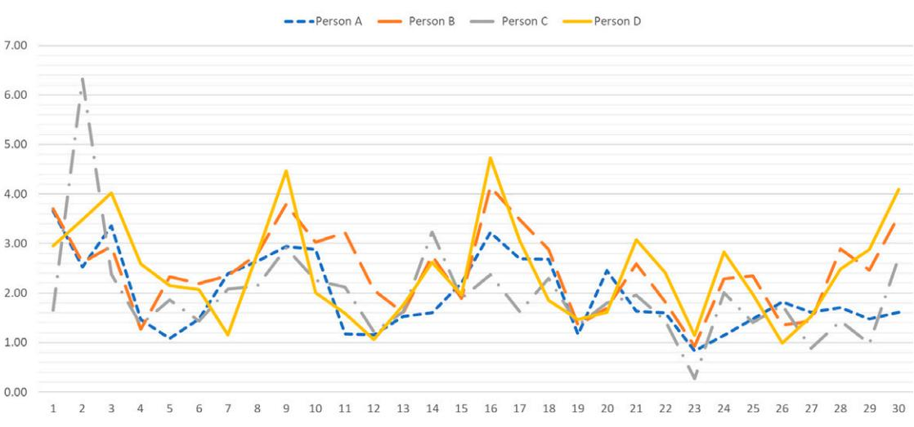

<!-- cite_key: bradac2021 -->

# A Lexical Approach to Assessing Stress: Development and Proof- of- Concept

**Tripp Driskell**, Florida Maxima Corporation, Orlando, USA, **Eduardo Salas**, Rice University, Houston, Texas, USA, **C. Shawn Burke**, University of Central Florida, Orlando, USA, and **James E. Driskell**, Florida Maxima Corporation, Orlando, USA

**Objective:**We describe a methodology that provides a nonobtrusive means of detecting stress and related deficits through the assessment of spontaneous verbal output in ongoing communications.
**Background:**In high- demand environments, operational personnel are exposed to an array of environmental, task, and interpersonal stressors that can negatively impact performance as well as jeopardize safety and well- being. In these settings, the requirement exists to assess cognitive and emotional state "at a distance" and without interfering with ongoing performance.
**Method:**We describe a lexical approach to assessing stress effects from ongoing or spontaneous verbal output. This approach is examined in a spaceflight analog setting.
**Results:**We assess stress effects in terms of five core dimensions and develop lexical indicators of these core stress dimensions and relevant sub- facets. We establish the proof- of- concept of this approach by presenting representative data from a spaceflight analog.
**Conclusion:**This approach provides an unobtrusive means to evaluate ongoing task communications at the individual and team level in order to assess cognitive/emotional states such as workload, negative affect, attentional focus, anxiety, and team orientation.
**Application:**There are many high- demand settings in which it is valuable to monitor the potential negative effects of stress on operational personnel. These environments include spaceflight, the military, aviation, law enforcement, and medicine.
**Keywords:**stress, team communication

Address correspondence to James E. Driskell, Florida Maxima Corporation, 6415 Turtlemound Rd., New Smyrna Beach, FL 32169, USA; e-mail: jdriskell@ rollins. edu

##*HUMAN FACTORS*DOI: 10. 1177/ 0018 7208 2110 45167 Article reuse guidelines: sagepub. com/ journals- permissions Copyright © 2021, Human Factors and Ergonomics Society. 2023, Vol. 65(6) 1105–1129

There are many high- demand settings in which it is valuable to monitor the potential nega-WLYH H൵HFWV RI VWUHVV RQ RSHUDWLRQDO SHUVRQQHO These environments include the military, avia-WLRQ VSDFHÀLJKW FKHPLFDO DQG QXFOHDU SRZHU SODQWRSHUDWLRQVODZHQIRUFHPHQWDQGPHGLFDO teams. One practical goal in these operational settings is to assess operator state in an unob-WUXVLYHPDQQHUZLWKRXWLQWHUIHULQJZLWKRUGLV-UXSWLQJRQJRLQJSHUIRUPDQFH

Unlike teams in the experimental laboratory that can be examined "under a microscope," teams in the real world operate autonomously, DSDUW IURP GLUHFW REVHUYDWLRQ DQG VXSHUYLVLRQ DQG RSHUDWH LQ D ÀXLG G\QDPLF PDQQHU WR achieve the team's objective (Driskell, Burke, et al., 20147KHUHIRUHWKHUHTXLUHPHQWH[LVWV WR GHYHORS D QRQREWUXVLYH PHDQV RI GHWHFWLQJ FRJQLWLYH SHUIRUPDQFH GH¿FLWV VWUHVV IDWLJXH RU DQ[LHW\ LQ VLWX ZLWKRXW WKH LQWUXVLRQ RI WKH SV\FKRORJLVW¶V W\SLFDO DUUD\ RI TXHVWLRQV DQG TXHVWLRQQDLUHV7KHUHTXLUHPHQWWRDVVHVVLQGL-YLGXDO DQG WHDP IXQFWLRQLQJ ³DW D GLVWDQFH´ VXJJHVWV WKH SRWHQWLDO H൶FDF\ RI D PHWKRGROogy to assess cognitive and emotional states in UHDOWLPH IURP RQJRLQJ RU VSRQWDQHRXV YHUEDO output.

This article describes a methodological DSSURDFKWRWUDFNVWUHVVH൵HFWVLQKLJKGHPDQG HQYLURQPHQWV:HGHVFULEHWKHGHYHORSPHQWRI WKLV DSSURDFK LQ WKH FRQWH[W RI ORQJGXUDWLRQ VSDFHÀLJKW6SDFHÀLJKWLVDQLQWHUHVWLQJH[HP-SODURIDKLJKGHPDQGHQYLURQPHQWLQLWVRZQ ULJKW EXW LV DOVR RI LQWHUHVW EHFDXVH SHUIRU-PDQFHLQORQJGXUDWLRQVSDFHÀLJKWLVDQLPPHdiate practical concern. For example, NASA's mission to Mars, which will incorporate a crew RIVL[RQDPLOOLRQPLOHMRXUQH\RIDSSUR[- LPDWHO\\HDUVLVVODWHGIRUWKHV7KHVH long- duration exploratory missions pose a QXPEHURIFKDOOHQJHV\$FFRUGLQJWRWKH1\$6\$ Human Research Roadmap (Slack et al., 2009), "Long- duration missions to remote environments will increase astronaut exposure to H[WUHPHLVRODWLRQDQGFRQ¿QHPHQWUHVXOWLQJLQ KLJKHUVWUHVVOHYHOVDQGDQLQFUHDVHGULVNRIFUHZ morale deterioration." Furthermore, Strangman (2010) has noted that there exists a large num-EHURIUHSRUWVIURPWKHHDUO\DJHRIH[SORUDWLRQ to the present day indicating that mood disturbance, depression, anxiety, and hostility are all VXEVWDQWLDO FRQFHUQV IRU VSDFHÀLJKW VHH DOVR Shepanek, 2005; Stuster, 2010).

,Q RUGHUWRWUDFNDQGPRQLWRU VWUHVVH൵HFWV ZH PXVW ¿UVW D GH¿QH ZKDW VKRXOG EH PHDsured, (b) determine how we are going to PHDVXUHLWDQG FGRFXPHQWWKHYDOXHRIWKLV DSSURDFKLQ UHOHYDQW VHWWLQJV ,QWKH IROORZLQJ sections, we address these topics and describe WKH GHYHORSPHQW RI D OH[LFDO DQDO\WLF WRRO WR DVVHVVVWUHVVH൵HFWV

# ASSESSING STRESS EFFECTS

The term*stress*LVEURDGO\GH¿QHGDVDSURFHVV by which certain environmental demands (e.g., stressors such as time pressure, noise, task load) evoke an appraisal process in which perceived demand exceeds resources, and that results in undesirable physiological, psychological, behavioral, or social outcomes (Salas et al., 1996). It LVXVHIXOWRVSHDNRI³VWUHVV´LQJHQHUDOWHUPVLQ UHIHUULQJWRKLJKGHPDQGWDVNHQYLURQPHQWVEXW LWLVOHVVXVHIXOWRWU\WRSUHGLFWSHUIRUPDQFHDW this broad or unidimensional level. We believe, KRZHYHU WKDW VWUHVV H൵HFWV FDQ EH GH¿QHG LQ WHUPV RI DOLPLWHG VHW RI SV\FKRORJLFDOPHFKDnisms that are engaged or are impacted by stress.

For example, Poulton (1978) has argued WKDWWKHGHWULPHQWDOH൵HFWVRIQRLVHRQSHUIRU-PDQFH DUH SULPDULO\ WKH UHVXOW RI GLVWUDFWLRQ 2WKHUVKDYHDUJXHGWKDWWKHGHWULPHQWDOH൵HFWV RIQRLVHRQSHUIRUPDQFHDUHSULPDULO\WKHUHVXOW RILQFUHDVHGWDVNORDG ,Q IDFW QRLVHFDQ KDYH HLWKHU H൵HFW QRLVH WKDW LV UHOHYDQW WR WKH WDVN (i.e., sound that has a bearing on the task) can place an increased task load on the operator, whereas noise that is irrelevant to the task (that FDUULHV QR WDVNUHODWHG LQIRUPDWLRQ FDQ VHUYH primarily as a distraction.

We propose that there are a limited number RIFRJQLWLYHHPRWLRQDODQGVRFLDOPHFKDQLVPV WKURXJK ZKLFK VWUHVV LPSDFWV SHUIRUPDQFH The "Big Five" stress mechanisms include the IROORZLQJ

# Stress Increases Distraction and Decreases Attentional Focus

2QHRIWKHPRUHZHOOHVWDEOLVKHG¿QGLQJVLQ the stress literature is that as stress or arousal LQFUHDVHVWKHLQGLYLGXDO¶V EUHDGWK RI DWWHQWLRQ narrows (Combs & Taylor, 1952; Easterbrook, 1959). For complex tasks, in which the individual must attend to a relatively larger number RIVDOLHQWWDVNFXHVWKLVQDUURZLQJRIDWWHQWLRQ PD\ UHVXOW LQ WKH HOLPLQDWLRQ RI UHOHYDQW WDVN LQIRUPDWLRQ DQG WDVN SHUIRUPDQFH ZLOO VX൵HU Related research shows that stress results in QDUURZLQJ RIDWWHQWLRQ RU SHUFHSWXDOWXQQHOLQJ (Easterbrook, 1959), reduced working memory (Huey & Wickens, 1993DQGSHUIRUPDQFH rigidity (Staw et al., 1981).

# Stress Increases Cognitive Load and Demand on Capacity

7DVN ORDG LV GH¿QHG DV SHUIRUPLQJ WZR RU more tasks concurrently. However, this con-VWUXFW LV UHODWHG WR D QXPEHU RI RWKHU WHUPV LQFOXGLQJPXOWLWDVNLQJGXDOWDVNSHUIRUPDQFH and workload. Typically, the term workload UHIHUV WR WKH LQGLYLGXDO¶V SHUFHSWLRQ RI WKH work demands imposed by a task environment, although the term has also been used to describe WKH GHPDQGV RI WKH WDVN HQYLURQPHQWLWVHOI LQ WHUPV RI WKH YROXPH DQG SDFH RI WKH ZRUN WR EHSHUIRUPHGVHHSpector & Jex, 1998). High-VWUHVVHQYLURQPHQWVRIWHQLQYROYHDQLQFUHDVHLQ WDVNORDGVWHPPLQJIURPWKHLPSRVLWLRQRIPXO-WLSOHWDVNVWKDWPXVWEHSHUIRUPHGWKHUHTXLUH-PHQW WR VKLIW IURP RQH WDVN WR DQRWKHU DQG KDYLQJWRDWWHQGWRQRYHORUXQIDPLOLDUVWLPXOL 7DVNORDGLPSDLUV SHUIRUPDQFH EHFDXVH RIWKH increased demands on limited cognitive capacity (Oswald et al., 2007).

# Stress Increases Negative Emotions and Frustration

1HJDWLYH D൵HFWLYH UHDFWLRQV WR VWUHVV PD\ LQFOXGHVXEMHFWLYHIHHOLQJVRIDQJHUDQQR\DQFH WHQVLRQDQG IUXVWUDWLRQ(൵HFWLYHSHUIRUPDQFH XQGHU VWUHVV UHTXLUHV WKH FDSDFLW\ WR PDLQtain one's composure and emotional control ZKLOH UHPDLQLQJ WDVNIRFXVHG XQGHU GHPDQGing conditions (Driskell et al., 2001; Singer et al., 1991). Research suggests that emotional VWDELOLW\LVD VLJQL¿FDQW IDFWRULQDQ\WDVNWKDW UHTXLUHV FRRSHUDWLYH EHKDYLRU Driskell et al., 1987; Mount et al., 1998).

## Stress Increases Fear and Anxiety

3HUIRUPDQFH LQ KLJKGHPDQG VLWXDWLRQV PD\ UHVXOW LQ DQ LQFUHDVH LQ IHDU DQG DQ[LHW\ and increased physiological reactivity such as increased heart rate, sweating, or shaking. \$Q[LHW\ PD\ EH YLHZHG DV D VSHFL¿F W\SH RI negative emotion that incorporates cognitive anxiety (negative expectations and concerns DERXWRQHVHOIDQGVRPDWLFDQ[LHW\SHUFHSWLRQV UHODWHG WR SK\VLRORJLFDO DURXVDO RI XQHDVH RU worry; see Martens et al., 1990; Mellalieu et al., 2006; Woodman & Hardy, 2003).

### Stress Increases Social Impairment

6RFLDOH൵HFWVRIVWUHVVPD\LQFOXGHDUHGXFtion in the tendency to assist others, increased LQWHUSHUVRQDO DJJUHVVLRQ QHJOHFW RI VRFLDO RU interpersonal cues, and less cooperative behav-LRUDPRQJWHDPPHPEHUV7KHYHU\SUHVHQFHRI others can be arousal inducing (Mullen et al., 1997 5HVHDUFK IXUWKHU LQGLFDWHV WKDW XQGHU stress, people tend to be less likely to help oth-HUVWUDQVIHULQIRUPDWLRQPRUHSRRUO\DQGKDYH JUHDWHU GL൶FXOW\FRRUGLQDWLQJZLWK RWKHUWHDP members (Driskell et al., 1999).

Note that we are not arguing that these are the *only*PDMRUFRQVHTXHQFHVRIVWUHVVEXWVLPply that these represent a primary or core set RI PHFKDQLVPV WKURXJK ZKLFK VWUHVV LPSDFWV SHUIRUPDQFH 0RUHRYHU WKLV FRQFHSWXDOL]Dtion suggests that one strategy to assess stress H൵HFWVLQDFRPSUHKHQVLYHPDQQHULVWRWDUJHW WKHVHKLJKHURUGHUGLPHQVLRQVRIDDWWHQWLRQDO IRFXVEFRJQLWLYHORDGFQHJDWLYHHPRWLRQ (d) anxiety, and (e) social impairment.

#### WHY EXAMINE VERBAL CONTENT?

,QWKHEURDGHVWVHQVHFRQWHQWDQDO\VLVUHIHUV WRDUHVHDUFKDSSURDFKWKDWDQDO\]HVVSHHFKRU WH[WLQ RUGHUWR GUDZLQIHUHQFHV UHJDUGLQJWKH WH[WLWVHOIRUWKHVSHDNHU¶VLQWHQWLRQVDWWLWXGHV or cognitions. Central to this approach is the HPSKDVLV RQ WKH LPSRUWDQFH RI ODQJXDJH DV D PHDQVWRGUDZLQIHUHQFHVUHJDUGLQJWKHSV\FKR-ORJLFDOVWDWHRIWKHVSHDNHU

Pennebaker et al. (2007) are perhaps most HORTXHQW LQ GHVFULELQJ FRQWHQW DQDO\VLV ³7KH ways that individuals talk and write provide windows into their emotional and cognitive worlds." That is, the words that people use in natural language can provide important cues to their thought processes, emotional state, intentions, and motivations. Moreover, reasonable success has been achieved in examining word XVDJHWRXQFRYHUOLQJXLVWLFFRUUHODWHVRIYDULRXV SV\FKRORJLFDO FRQVWUXFWV RI LQWHUHVW LQFOXGLQJ depression, deception, and health (see Driskell et al., 2012; Pennebaker et al., 2007). Kanki et al. (1989) examined communication patterns RIDLUFUHZVWRDVVHVVVKDUHGPHQWDOPRGHOVDQG Predmore (1991) coded aircrew communication to examine crew coordination. Waller and Zimbelman (2003) have observed that the use RIWKHVHW\SHVRIWH[WXDOYHUEDOPDWHULDOVDOORZ WKH UHVHDUFKHU WR LGHQWLI\ WKH ³FRJQLWLYH IRRW-SULQW´ RI RQJRLQJ LQWHUQDO SV\FKRORJLFDO SUR-FHVVHVIURPWH[WXDORUYHUEDOUHFRUGV

7KHEDVLFSUHPLVHRIWKLVZRUNLVWKDWVSRQtaneous verbal output provides a natural and YDOLG LQGLFDWRU RI EDVLF FRJQLWLYH SURFHVVHV (Pennebaker et al., 2003). Natural word use is QRWSURQHWRWKHW\SLFDOOLPLWDWLRQVRIVHOIUHSRUW measurements. That is, natural language use is less subject to social desirability bias, and can be GHULYHGLQUHDOWLPHZLWKRXWLQWHUIHULQJZLWKWKH cognitive processes being measured, and with-RXW LQWHUUXSWLQJ WHDP SHUIRUPDQFH 0RUHRYHU natural word use is reliable and consistent across time and context, and can be meaning-IXOO\PHDVXUHGLQLQGLYLGXDOVDQGWHDPVGleser et al., 1959; Mehl & Pennebaker, 2003).

7KHDGYDQWDJHVRIWKLVDSSURDFKDUHWKDWLWLV not intrusive, in that it taps into people's expe-ULHQFH ZLWKRXW LQWHUIHULQJ ZLWK LW 0RUHRYHU it is unobtrusive in that people are not aware WKH\DUHEHLQJREVHUYHGDQGLWGRHVQRWUHTXLUH hanging some device on the individual or dis-UXSWLRQ RI WKH WDVN 0RUHRYHU WKHUH LV D UHD-VRQDEOHWKHRUHWLFDOEDVLVIRUDUJXLQJWKDWZRUGV have psychological meaning, and research has GRFXPHQWHGWKHYDOXHRIWKLVDSSURDFKLQYDUious applications, including examining cog-QLWLYH ORDG DQG RWKHU LQGLFHV RI FROODERUDWLYH FRPPXQLFDWLRQVLQEXVK¿UHPDQDJHPHQWWHDPV (Khawaja et al., 2012 DQG DQDO\]LQJ UDSSRUW LQ ODZ HQIRUFHPHQW LQYHVWLJDWLYH LQWHUYLHZV (Driskell et al., 2012).

There are three broad assumptions that XQGHUOLHWKLVDSSURDFK7KH¿UVWDVVXPSWLRQLV *the more frequently people use certain words, the more salient this content is to them*. For example, the more that speech incorporates the word "anger" or a close associate (e.g., annoyed, peeved), the more likely that person is experiencing that psychological or emotional state. A second assumption is that *emotional experience corresponds to verbal emotional expression*. That is, the emotions that we express verbally should correspond to the emotions that are DFWXDOO\ IHOW+RZHYHUWKHUHDUH TXDOL¿FDWLRQV to this claim. For example, emotional expres-VLRQLVPRGHUDWHGE\VLWXDWLRQDOIDFWRUVBrown and Levinson (1987) argue that speakers use more polite language when addressing high status others than low status others (see also Ambady et al., 1996). A third assumption is that *linguistic content and linguistic style are both important*/LQJXLVWLFFRQWHQWUHIHUVWR*what*the speaker is talking about (including psychologi-FDOFRQWHQWWHUPVUHODWHGWRDQJHURUFRQIXVLRQ ZKHUHDV VW\OH UHIHUV WR*how* he or she says it HJZKHWKHUWKHVSHDNHUUHIHUVPRUHWRVHOIRU to other; whether the speaker uses a large num-EHURITXDOL¿HUVRUQHJDWLRQV&RQWHQWDQDO\VLV DSSURDFKHV DUH XVHIXO IRU H[DPLQLQJ QRW RQO\ FRQWHQWEXWHVSHFLDOO\IRUH[DPLQLQJSHFXOLDULties in word choice or usage "behind" the mes-VDJH,QGHHGVRPHDUJXHWKDWZRUGVWKDWUHÀHFW how people are expressing themselves can be PRUHLQIRUPDWLYHWKDQZKDWWKH\DUHH[SUHVVLQJ (Newman et al., 2003).

### DEVELOPMENT OF STRESSNET

7KHIROORZLQJVHFWLRQVGHVFULEHWKHGHYHORS-PHQW RI DOH[LFDODQDO\WLFWRROWR DVVHVV VWUHVV H൵HFWV7KLVWRRO675(66QHWLVDVLPSOHZRUG FRXQWSURJUDP7KDWLVLWLVDFRPSXWHUL]HGSUR-JUDPWKDWWDNHVYHUEDORUWH[WXDO¿OHVDVLQSXW DQG JRHVWKURXJK HDFK ¿OH ZRUGE\ZRUG DQG DWWHPSWVWRPDWFKHDFKZRUGWRVSHFL¿FGLFWLR-QDULHVUHÀHFWLQJWKHFRQVWUXFWVRILQWHUHVWVXFK DVZRUGVUHÀHFWLQJ*anger* terms). Each word is WKHQLQFUHPHQWHGLQWRRQHRIWKHVHOH[LFRQFDWegories, and the program then calculates the use RIHDFKOH[LFRQHJDQJHUWHUPVDVDSHUFHQW-DJHRIWRWDOVSHHFK

:HIRFXVRQWKH¿YHFRUHVWUHVVGLPHQVLRQV RI DWWHQWLRQDO IRFXV FRJQLWLYH ORDG DQ[LHW\ negative emotion, and social impairment. Each RIWKHVH¿YHGLPHQVLRQVLVFRPSULVHGRIDQXP-EHURIGLVFUHWHORZHUOHYHOIDFHWV(DFKIDFHWLQ WXUQLVPHDVXUHGE\VSHFL¿FOH[LFDOFDWHJRULHV as shown in Figure 1.

,Q WKH IROORZLQJ VHFWLRQV ZH GHVFULEH WKH GHYHORSPHQWRIHDFKGLPHQVLRQDQGVXEIDFHWLQ some detail. We developed the lexicon, or word OLVW IRU HDFK RI WKH LGHQWL¿HG IDFHWV DFFRUG-LQJWRWKH IROORZLQJ SURFHGXUH)LUVW IRUHDFK IDFHW VXFK DV*somatic anxiety*, we conducted D UHYLHZ RIWKHH[WDQWOLWHUDWXUH:H UHYLHZHG existing theoretical literature within each con-VWUXFW GRPDLQ GUDZLQJ RQ FODVVLF DQDO\VHV RI emotional structure (e.g., Ortony et al., 1988; Storm & Storm, 1987; Watson & Clark, 1984) and devoted special attention to how each spe-FL¿FFRQVWUXFWHJVRPDWLFDQ[LHW\KDVEHHQ examined within the applied literature rela-WLYHWRWKHKXPDQSHUIRUPDQFHDQGVSDFHÀLJKW environment.

Second, we reviewed research that had developed existing measures or scales related to that construct, extracting items or words used to assess that construct. For example, somatic DQ[LHW\ KDV EHHQ PHDVXUHG E\ D QXPEHU RI SHQDQGSDSHURUVHOIUHSRUWVFDOHVVXFKDVWKH 6WDWH7UDLW,QYHQWRU\IRU&RJQLWLYHDQG6RPDWLF Anxiety (Grös et al., 2007) and the Body Vigilance Scale (Schmidt et al., 1997).

Third, we reviewed existing lexical anal- \VLV SURJUDPV VXFK DV WKH \*HQHUDO ,QTXLUHU (Stone et al., 1966), LIWC (Pennebaker et al., 2007), SenseNet (Al Masum et al., 2007) and :KLVVHOO¶V 'LFWLRQDU\ RI \$൵HFW /DQJXDJH (Whissell, 1989), extracting word lists used within these programs to assess these target constructs.

)RXUWKZHUHYLHZHGRXU6SDFHÀLJKW&RUSXV which included Johnson Space Center (JSC)

*Figure 1.*675(66QHWSULPDU\GLPHQVLRQVDQGFRUUHVSRQGLQJIDFHWV

oral history transcripts and International Space Station (ISS) journals and mission logs in order WRH[WUDFWWHUPVWKDWDUHXQLTXHWRWKHVSDFHÀLJKW HQYLURQPHQW)RUH[DPSOH IRUWKHFDWHJRU\RI*somatic complaints* ZHLQFOXGHG D QXPEHU RI terms related to the medications in the medical NLWDYDLODEOHLQWKHVSDFHÀLJKWVHWWLQJ

,QWKH¿QDOVWHSZHLQWHJUDWHGWKHUHVXOWVRI these searches, deriving comprehensive word OLVWVVXFKDVDOLVWRI*somatic anxiety*WHUPVIRU HDFK IDFHW7KHVHOLVWVZHUH UHYLHZHG E\D VHW RIMXGJHVWRHOLPLQDWHUHGXQGDQFLHVH[SDQGWKH lists using online thesauri and related tools, and then determine what words should be included RUH[FOXGHGIURPHDFKZRUGOLVWUHVROYLQJGLVagreements to achieve 100% agreement.

Following this standard procedure, we GHULYHGWKH IROORZLQJ 675(66QHW GLPHQVLRQV DQGDVVRFLDWHG IDFHWV 7KH UHVXOWLQJPHDVXUHV are presented in the Appendix.)

#### Attentional Focus

*In a space mission…you got a million things on your mind. You've got not only the next experiment, but the last experiment, or eating, or exercise, or how you*  *did in your medicals today…Everything's on your mind.*#### - CDR Gerald Carr, Skylab 4

7KHLGHDWKDWWKHVFRSHRUEUHDGWKRIDWWHQtion narrows under stress is well- documented and has been variously labeled attentional narrowing, attentional tunneling, and heightened attentional selectivity or reduction in the amount RILQIRUPDWLRQWKDWFDQEHDWWHQGHGWRDWDJLYHQ time (Easterbrook, 1959; Hockey et al., 2011; Wickens, 19967KLVUHIHUVWRZKDWLVJHQHUDOO\ viewed as an adaptive response to stress demands in which the individual selectively PDLQWDLQVDWWHQWLRQWRKLJKSULRULW\ IHDWXUHVRI WKHWDVNEXWDWWKHFRVWRIDUHGXFWLRQRIDWWHQtion to secondary task cues. This can result in VLJQL¿FDQWSHUIRUPDQFHGHJUDGDWLRQZKHQSHU-IRUPLQJFRPSOH[RUPXOWLSOHWDVNV&RQVLVWHQW with this perspective, 0DQ]H\ HW DO  IRXQGHYLGHQFHRILPSDLUPHQWLQGXDOWDVNSHU-IRUPDQFHLQWKHH[DPLQDWLRQRIDQ GD\0LU mission, as well as a longer- duration 438 - day mission (0DQ]H\HWDO).

In addition, stress can be distracting in a general sense in that, under conditions in which the RSHUDWRUIDFHVQRYHORUGLVUXSWLYHHYHQWVDWWHQtion is displaced or diverted to external or taskirrelevant stimuli. Stuster (1996) notes that "the LQGLYLGXDO¶VDWWHQWLRQEHJLQVWRGULIWZLWKFRUUH-VSRQGLQJGHJUDGDWLRQRIYLJLODQFHDQG«RYHUDOO WDVN SHUIRUPDQFH´ S  Strangman (2010) FRQFOXGHVWKDWGL൶FXOW\FRQFHQWUDWLQJRUIRFXVing attention is a recurring anecdotal complaint IURP DVWURQDXWVLQGLYLGXDOV ZLQWHULQJ RYHULQ WKH\$QWDUFWLFDQGWKRVHLQFRQ¿QHGRUUHVWULFWHG environments, and that these observations are generally supported by empirical data in these analogs.

The Attentional Focus dimension is com-SULVHG RI WKH IROORZLQJ ORZHUOHYHO IDFHWV D Task Focus, (b) Distraction, (c) Uncertainty, G6HQVH0DNLQJH7HPSRUDO)RFXVDQGI Details.
*Facet: Task Focus.*2QH ORZHUOHYHO IDFHW WKDW FRPSULVHV WKH XSSHUOHYHO GLPHQVLRQ RI DWWHQWLRQDO IRFXV LV*task focus*. Research sug-JHVWVWKDWIRUFRPSOH[WDVNVLQZKLFKWKHLQGLvidual must attend to a relatively larger number RIVDOLHQWWDVNFXHVWKHQDUURZLQJRIDWWHQWLRQDO IRFXV WKDW RFFXUV XQGHU VWUHVV PD\ UHVXOW LQ OHVV DWWHQWLRQWR UHOHYDQWWDVNLQIRUPDWLRQ DQG D UHVXOWLQJ ORVV RI WDVN IRFXV Driskell et al., 1999; Easterbrook, 19597RDVVHVVWDVNIRFXV ZH IROORZHG RXU VWDQGDUG OH[LFRQ GHYHORSment strategy to develop a dictionary (or word OLVW RIWDVNRULHQWHGZRUGV VXFK DV*maintain, operate, assemble, build*(see Anderson et al., 2001). These lists were expanded to include task- oriented terms in the cognitive domain (e.g., contrast, compare) and the psychomotor domain (e.g., calibrate, manipulate). Moreover, we reviewed the 112 JSC oral history as well as existing ISS journals and mission logs to obtain WDVNWHUPVXQLTXHWRWKHVSDFHÀLJKWRSHUDWLRQDO VHWWLQJVXFKDVÀLJKWPLVVLRQRUELW(9\$DQG payload.
*Facet: Distraction.*Distraction occurs when competing demands distract attention IURPWKHWDVN)RUH[DPSOHHalin et al. (2014) note that distractors such as background noise FDQ GLYHUW WKH ORFXV RI DWWHQWLRQ DZD\ IURP WKH IRFDO WDVN WRZDUG WKH GLVWUDFWLRQ LQWHUrupting ongoing activity and task engagement. (VSHFLDOO\LQKLJKGHPDQGHQYLURQPHQWVH൵HF-WLYHSHUIRUPDQFHUHTXLUHVDEDODQFHEHWZHHQD the ability to screen out extraneous stimuli that PLJKW LQWHUIHUH ZLWK RXU SHUIRUPDQFH DQG E WKHDELOLW\WRGHWHFWQRYHOVWLPXOLRXWVLGHRIWKH FXUUHQWDWWHQWLRQDOIRFXVWKDWPD\EHUHOHYDQWWR the task at hand. However, this adaptive capa-ELOLW\FRPHVDWDSULFHRIGLVWUDFWLRQDQGGLVRUL-HQWDWLRQIURPWKHIRFDOWDVNPacheco- Unguetti & Parmentier, 2014).

To the extent that distractors divert atten-WLRQIURPWDVNUHOHYDQWUHTXLUHPHQWVZHZRXOG H[SHFW D JUHDWHU SUHYDOHQFH RI VSHHFK UHODWHG to disorientation or distraction. Following our VWDQGDUG DSSURDFK ZH GHULYHG D OLVW RI WHUPV related to distraction or disorientation (e.g., FRQIXVHGSX]]OHGSHUSOH[HGORVW
*Facet: Uncertainty.*\$QRWKHU LQGLFDWRU RI ORVV RI DWWHQWLRQDO IRFXVLV XQFHUWDLQW\Jordan et al. (2012)GH¿QHXQFHUWDLQW\DV³DVHQVHRI wondering, doubt, or unease about how the IXWXUHZLOO XQIROGZKDWWKH SUHVHQWPHDQV RU how to interpret the past" (p. 2). Individuals can be uncertain about their knowledge or under-VWDQGLQJWKHLUGHFLVLRQVWKHLUSHUIRUPDQFHRU XQFHUWDLQ EHFDXVH LQIRUPDWLRQ LV LQFRPSOHWH ambiguous, or contradictory.

Uncertainty in speech can be detected by WKH XVH RI KHGJHWHUPV Clausen, 2010; Rubin et al., 2006) or*uncertainty hedges*, terms that DWWHQXDWHWKHVWUHQJWKRIDQXWWHUDQFHRUFRQYH\ speculative content. Uncertainty hedges include terms such as *maybe, perhaps, somewhat, slightly*, or *probably*. Alternatively, uncertainty in speech can be detected by the decreased use RI *certainty expressions*(also termed intensi- ¿HUV ERRVWHUV RU DVVHUWLYHV WKDW GHQRWH FHUtainty. Certainty expressions include terms such as*DEVROXWHO\FHUWDLQO\GH¿QLWHO\*, or *obviously*. We expect that, under stress, uncertainty will be UHÀHFWHGLQDJUHDWHUSURSRUWLRQRIXQFHUWDLQW\ KHGJHV DQG D ORZHU SURSRUWLRQ RI FHUWDLQW\ expressions.

*Facet: Sense-Making.*\$ORVVRIDWWHQWLRQDO IRFXV DQG WDVN FRQFHQWUDWLRQ FDQ UHVXOW LQ D decrease in understanding or awareness regarding the task at hand. In speech, people seek LQIRUPDWLRQWKDWWKH\GRQRWSRVVHVVRUPD\KDYH IRUJRWWHQWKURXJKWKHXVHRITXHVWLRQVRUZKDW DUHWHUPHGZKTXHVWLRQV\$ZKTXHVWLRQLVXVHG IRUVHHNLQJFRQWHQWLQIRUPDWLRQUHODWLQJWRSHU-VRQVWKLQJVIDFWVWLPHRUSODFH:KTXHVWLRQV include terms such as*who, what, which, when, where, how,*and*why*. We expect that attempts at VHQVHPDNLQJZLOOEHUHÀHFWHGLQDJUHDWHUSUR-SRUWLRQDOXVHRIZKTXHVWLRQWHUPV

*Facet: Temporal Focus.*Verb tense (i.e., SDVW SUHVHQW RU IXWXUH PD\ SURYLGH DQ LQGL-FDWLRQRIWHPSRUDO IRFXVRIDWWHQWLRQ Ehmann et al., 2007; 7DXVF]LN 3HQQHEDNHU). We H[SHFWWKDWORVVRIDWWHQWLRQDOIRFXVZLOO UHVXOW LQJUHDWHUXVHRISDVWDQG IXWXUHWHQVH UHODWLYH to present tense.
*Facet: Details.*'LVWUDFWLRQ DQG ORVV RI WDVN IRFXV VKRXOG UHVXOW LQ OHVV VSHFL¿FLW\ RU IHZHU GHWDLOV LQ WDVN FRPPXQLFDWLRQV 7KLV ORVVRIVSHFL¿FLW\VKRXOGEHUHÀHFWHGLQWKHXVH RI IHZHU GHWDLOV LQFOXGLQJ D WHPSRUDO GHWDLO terms (e.g., yesterday, today, hour); (b) spatial detail terms (e.g., above, below, between); (c) sensory details, (e.g., sharp, loud, bright); and GVSHFLI\LQJGHVFULSWRUVVXFKDVWHUPVUHIHU-ULQJWRFRORUVKDSHRUVL]H

#### Cognitive Load
*When you are busy…if you make a mistake it is hard to go back and do the task over again. If you do, you get further behind, the work keeps piling up behind you, DQG\RX¿QLVKWKHGD\IUXVWUDWHGEHFDXVH you didn't accomplish all that had been scheduled."*

&'5\*HUDOG&DUU6N\ODE TXRWHGLQ Stuster, 1996, p. 78).

Cognitive load, workload, or task load are WHUPVWKDWDUHXVHGLQWHUFKDQJHDEO\WR UHIHUWR the total work demand placed on the individual, LQFOXGLQJ WKH DPRXQW DQG LQWHQVLW\ RI H൵RUW UHTXLUHGWRSHUIRUPWKHWDVNYoung & Stanton, 2005). High workload or overload conditions UHVXOW LQ SHUIRUPDQFH LPSDLUPHQW DV ZHOO DV SK\VLFDO DQG PHQWDO IDWLJXH ,Q D VWXG\ RI Mir missions, Nechaev (2001)UHSRUWHGDVLJQLIicant correlation between crew errors and epi-VRGHV RI KLJK ZRUNORDGHarrison and Fiedler (2011)GHVFULEHWKHZHOOSXEOLFL]HGDFFRXQWRI FRQÀLFWEHWZHHQWKH6N\ODEFUHZDQG0LVVLRQ &RQWURODVDUHVXOWRIRYHUSURJUDPPLQJRIWKH astronauts' time (see also Cooper, 1979). Although the crews' reaction was noted to be hostile and irritable, others have described this response as a legitimate reaction to overwork.

The Cognitive Load dimension is com-SULVHG RI WKH IROORZLQJ ORZHUOHYHO IDFHWV D Workload, (b) Cognitive Processing, (c) Speech &RPSOH[LW\DQGG'LVÀXHQFLHV

*Facet: Workload.*Typically, the term*workload*UHIHUVWRWKHLQGLYLGXDO¶VSHUFHSWLRQRIWKH work demands imposed by a task environment, although the term has also been used to describe WKH GHPDQGV RI WKH WDVN HQYLURQPHQWLWVHOI LQ WHUPVRIWKHYROXPHDQGSDFHRIWKHZRUNWREH SHUIRUPHG VHHYoung & Stanton, 2005). One potential reaction to high workload is increased complaints regarding task burden, overwork, DQG RYHUORDG 7KHUHIRUH ZH H[SHFW WKDW KLJK workload will result in a greater proportion-DWHXVHRIKLJKZRUNORDGWHUPVVXFK*as taxed, busy, overloaded*, and *burdened*.

*Facet: Cognitive Processing.*High workload taxes the individual's capacity and increases demand on cognitive resources. This should result in less complex thought, or lan-JXDJH WKDW UHÀHFWV D ORZHU OHYHO RI FRJQLWLYH complexity. 7DXVF]LN DQG 3HQQHEDNHU  have proposed that cognitive complexity can be captured by several linguistic categories, including (a) exclusive words such as*but*or*without*WKDWPDNHGLVWLQFWLRQVEHWZHHQGL൵HUHQW categories, (b) conjunctions such as *and*or*also*that link together multiple thoughts or phrases, (c) prepositions such as*to*or*above*that indi-FDWHJUHDWHUVSHFL¿FLW\RUFRQFUHWHQHVV UHJDUGing a topic, and (d) cognitive processing terms WKDWLQFOXGHFDXVDOWHUPV EHFDXVHH൵HFWDQG deliberation terms (think, consider).
*Facet: Speech Complexity.*With high lev-HOV RI FRJQLWLYHORDG ZH H[SHFWWR VHH D FRUresponding decrease in speech complexity. Grant and Ginther (2000)QRWHWKDWPRUHSUR¿ cient speech involves greater precision in using words to express ideas and in more sophis-WLFDWHG YRFDEXODU\ XVH 0HDVXUHV RI VSHHFK SUR¿FLHQF\ LQFOXGH D DYHUDJH ZRUG OHQJWK E OH[LFDO VSHFL¿FLW\ RU WKH W\SHWRNHQ UDWLR UHÀHFWLQJ QXPEHU RI XQLTXHZRUGV GLYLGHG E\ WKH RYHUDOO QXPEHU RI ZRUGV XVHG F OH[LFDO YDULDWLRQRUWKHUDWLRRIZRUGVQRWEHORQJLQJLQ the top 2000 used words; and (d) adjectives and DGYHUEVZKLFKVHUYHDQLQIRUPDWLRQDOIXQFWLRQ \$GMHFWLYHV SURYLGHPRUH FRPSOH[LQIRUPDWLRQ DERXWWKHQRXQVWKH\PRGLI\DQGDGYHUEVHODER-UDWHLQIRUPDWLRQUHJDUGLQJWLPHDQGSODFH
*)DFHW 'LVÀXHQFLHV* High cognitive demand should result in more speech errors RU GLVÀXHQFLHV5HVHDUFKLQGLFDWHVWKDW VSHHFK GLVÀXHQFLHVDUHUHODWHGWRLQFUHDVHGGL൶FXOWLHV in speech production (Hartsuiker & Notebaert, 2010). For example, speakers exhibit more SDXVHV GXULQJ SDUWLFXODUO\ ORQJ RU GL൶FXOW XWWHUDQFHV 'LVÀXHQFLHV UHÀHFW GLVUXSWLRQV LQ WKH QRUPDO ÀRZ RI VSHHFK 'LVÀXHQFLHV PD\ include (a) pauses or hesitations that occur ZKHQ D VSHDNHU GHOD\V RU LQWHUUXSWV WKH ÀRZ RI VSHHFK E\LQVHUWLQJD¿OOHU VXFKDV*um*, *ah*, or *you know*E VHOIFRUUHFWLRQV UHYLVLRQV speech repairs, or speech discontinuities that occur when a speaker interrupts speech to correct an error; and (c) word repetitions (e.g., ³7KLV«7KLVVHHPVGL൶FXOW´

# Anxiety
*[M]y nerves were always on edge, I get jumpy at any minor irritation.*- Russian Cosmonaut Valentine Lebedev, (Lebedev, 1998, p. 291)

Stuster (1996) noted that severe psychiatric GLVRUGHUVDUHXQOLNHO\LQIXWXUHVSDFHPLVVLRQV primarily because the astronaut crew is a highly screened and trained population. However, as Gunderson (1963) observed in the examination RI\$QWDUFWLFSHUVRQQHODOWKRXJKPDMRUSV\FKLatric episodes may be rare, more common emotional disturbances are not. Harrison and Fiedler (2011)QRWHGWKDWWKRVHLQLVRODWHGDQGFRQ¿QHG HQYLURQPHQWV ³IUHTXHQWO\ UHSRUW VOHHS GLVWXUbances, somatic complaints (aches, pains, and a FRQVWHOODWLRQ RI ÀXOLNH V\PSWRPV VRPHWLPHV known as the "space crud"), heart palpitations, anxiety, mood swings including mild depres-VLRQLQFRQVLVWHQWPRWLYDWLRQDQGSHUIRUPDQFH decrements" (p. 26).

\$Q[LHW\KDVEHHQGH¿QHGDVDQDYHUVLYHHPRtional experience that is caused by some type RIWKUHDWDQGWKDWUHVXOWVLQKHLJKWHQHGDURXVDO WHQVLRQ QHUYRXVQHVV IDWLJXH DQG ZRUU\ (Bertrams et al., 2013). Anxiety is viewed as a VXEFDWHJRU\ RI 1HJDWLYH\$൵HFW D QRQVSHFL¿F VWDWHRIVXEMHFWLYHGLVWUHVVEXWLVGLVWLQJXLVKHG E\VSHFL¿FIHDWXUHVRIVRPDWLFWHQVLRQDQGSK\Viological hyperactivity (Watson, 2005). Kanas DQG 0DQ]H\  noted that psychosomatic V\PSWRPV VXFK DV WHQVLRQ IDWLJXH DQG RWKHU psychophysiological reactions are commonly encountered in space analog environments such as submarines and the Antarctic. Anxiety LPSDLUVSURFHVVLQJH൶FLHQF\EHFDXVHLWUHGXFHV attentional control and diverts attention away IURP WDVNUHOHYDQW VWLPXOL DQG WRZDUG WDVN irrelevant thoughts and distractions (Eysenck et al., 2007).

The Anxiety dimension is comprised RI WKH IROORZLQJ ORZHUOHYHO IDFHWV D Somatic Anxiety, (b) Cognitive Anxiety, (c) Introspection, and (d) Psychological Distancing.
*Facet: Somatic Anxiety.*Research has distinguished between cognitive and somatic V\PSWRPVRIDQ[LHW\Grös et al., 2007; Liebert & Morris, 1967).*Somatic anxiety*UHIHUV WR WKH SK\VLRORJLFDO DQG D൵HFWLYH UHVSRQVHV WR stress that include bodily sensations (tingling, numbness, tension), changes in cardiovascular (palpitations), respiratory (breathing), muscu-ORVNHOHWDO ZHDNQHVV VWL൵QHVV DQG JDVWURLQtestinal response (nausea, unease), as well as WKH KHLJKWHQHG DZDUHQHVV RI WKHVH V\PSWRPV These related somatic symptoms comprise a JHQHUDO VWDWH RI SK\VLRORJLFDO K\SHUDURXVDO (Joiner et al., 1999). Following the lexicon development strategy outlined previously, we GHULYHGDOLVWRIWHUPVUHODWHGWRVRPDWLFFRP-SODLQWVHJWLUHGDFKHGL]]\ZHDNSDLQ
*Facet: Cognitive Anxiety.*Liebert and Morris (1967) GH¿QHG WKH FRJQLWLYH FRPSR-QHQW RI DQ[LHW\ DV*worry*WR UHÀHFW FRJQLWLYH UHDFWLRQV WR VWUHVV WKDW LQFOXGH VHOIFULWLFLVP DQGFRQFHUQDERXWWKHFRQVHTXHQFHVRIIDLOXUH Moreover, research indicates that these worri-VRPH WKRXJKWV DQG VHOISUHRFFXSDWLRQ GLVWUDFW IURP SHUIRUPDQFH DV DWWHQWLRQ LV DOORFDWHG WR these task- irrelevant stimuli. Barlow (2002) has noted that what he terms*anxious apprehension*LV DFFRPSDQLHG E\ D VWDWH RI KHOSOHVVQHVV RU uncontrollability as the individual experiences GL൶FXOW\LQFRQWUROOLQJWKHVHZRUULHVDQGFRQ-FHUQV:HGHULYHGDOLVWRIWHUPVUHODWHGWRFRJnitive anxiety (e.g., worried, nervous, tense, troubled).
*Facet: Introspection.*7KH VXEMHFWLYH IHHO-LQJV RI DQ[LHW\ K\SHUYLJLODQFH DQG SUHRFFXpation with worrisome thoughts and concerns WKDW DFFRPSDQ\ DQ[LHW\PD\ EHPDQLIHVWHGLQ DQLQWHUQDO IRFXV RI DWWHQWLRQ 6RPH UHVHDUFKers have distinguished between*introspection*, which is viewed as a positive and potentially productive activity, and rumination, which LV QRW+RZHYHUDWWKHFRUH RIHDFKLVDWXUQing inward, or excessive concern about one's current (negative) state. The active voice is viewed as more direct and vigorous than the passive (Strunk & White, 1999). We expect that WKH LQWHUQDO IRFXV DFFRPSDQ\LQJ DQ[LHW\ ZLOO EH UHÀHFWHGLQ D JUHDWHU XVH RI SDVVLYH YHUVXV active voice.

*Facet: Psychological Distancing.*Immediacy UHÀHFWVSV\FKRORJLFDOFORVHQHVVZLWKWKHRWKHU RU FRQYHUVHO\ QRQLPPHGLDF\ UHÀHFWV SV\FKRlogical distance. To the extent that anxious persons are preoccupied with internal concerns and VXEMHFWLYHIHHOLQJVRIXQHDVHZHZRXOGH[SHFW WKDWWKHLU VSHHFK ZRXOG UHÀHFWORZHULPPHGL-DF\ ,Q IDFWConville (1975) IRXQG DQLQYHUVH relationship between communicators' anxiety level and immediacy.

Nonimmediacy in speech can be measured E\WKHXVHRIIHZHUVHOIUHIHUHQFHVIHZHU¿UVW person pronouns; Fuller et al., 2013) and by the UHGXFHG XVH RI SUHVHQWWHQVH YHUVXV SDVWWHQVH (Bradac et al., 1979).

## Negative Emotion
*Son of a bitch! That's inexcusable. Get out here a million miles from nowhere, and WKHJRGGDQJ¿OPSDFNVZRQ¶WZRUN«1R that's – God- dang it Tom, I can't get the damned thing to work!...I can't get the son of a bitch to work. God…*- Eugene Cernan, Apollo 10 (NASA, 1969)

The Negative Emotion dimension comprises IDFWRUVJHQHUDOO\GHVFULEHGDVPRRGGLVRUGHUV depression, sadness, melancholy, as well as DQJHU DQG IUXVWUDWLRQ 7KHVH HPRWLRQDO VWDWHV DUHVWURQJO\UHODWHGWRWKHKLJKHURUGHUIDFWRURI 1HJDWLYH\$൵HFW1HJDWLYH\$൵HFWLVDEURDGFDW-HJRU\ RI VXEMHFWLYH GLVWUHVV WKDW VXEVXPHV D ZLGHUDQJHRIQHJDWLYHHPRWLRQDOVWDWHVLQFOXGing anger, sadness, and irritability (Watson, 2005). According to Slack et al. (2009), space ÀLJKW DQG LWV DVVRFLDWHG VWUHVVRUV ZLOO OLNHO\ have an "exponential impact on behavioral KHDOWK IRU ORQJGXUDWLRQ DVWURQDXWV´ S  7KH\IXUWKHUQRWHWKDW³\$QHFGRWDODQGHPSLULFDO HYLGHQFH LQGLFDWHV WKDW WKH OLNHOLKRRG RI D behavioral condition or psychiatric disorder RFFXUULQJ LQFUHDVHV ZLWK WKH OHQJWK RI D PLV-VLRQ«DQG VXFK FRQGLWLRQV FDQ DQG GR adversely impact individual and crew health, ZHOIDUHDQGSHUIRUPDQFH´S

The Negative Emotion dimension is com-SULVHG RI WKH IROORZLQJ ORZHUOHYHO IDFHWV D 1HJDWLYH \$൵HFW E 3RVLWLYH \$൵HFW F Anger, (d) Sadness, and (e) Disengagement/ Withdrawal.
*)DFHW1HJDWLYH\$IIHFW*Research has converged on the general consensus that there are WZR SULPDU\ GLPHQVLRQV RI HPRWLRQDO H[SH-ULHQFH 1HJDWLYH \$൵HFW DQG 3RVLWLYH \$൵HFW (Watson, 2005ZLWKHDFKFRPSRVHGRIVHYHUDO PRUHGLVFUHWHHPRWLRQDOIDFHWV1HJDWLYHD൵HFW LVGHVFULEHGDVD³JHQHUDOGLPHQVLRQRIVXEMHF-WLYHGLVWUHVVDQGGLVVDWLVIDFWLRQ´WKDWVXEVXPHV VHYHUDO W\SHV RI QHJDWLYH HPRWLRQDO VWDWHV LQFOXGLQJ IHDU DQJHU VDGQHVV DQG GLVJXVW ,Q FRQWUDVW3RVLWLYH\$൵HFWLVDJHQHUDOGLPHQVLRQ UHÀHFWLQJSRVLWLYHPRRGVWDWHVVXFKDVMR\DQG VHOIDVVXUDQFH

Using our standard lexicon development VWUDWHJ\DQGGUDZLQJIURPH[LVWLQJVFDOHVHJ PANAS- X; Watson & Clark, 1994 D൵HFWLYH lexicons (e.g., Clore et al., 1987) and existing word lists (e.g., Pennebaker et al., 2007; Valitutti et al., 2004ZHFRPSLOHGDOH[LFRQRI negative emotion terms (e.g., irritable, upset, stressed).
*Facet: Positive Affect.*3RVLWLYH \$൵HFW LV GH¿QHGDV³IHHOLQJVWKDWUHÀHFWDOHYHORISOHDsurable engagement with the environment, such as happiness, joy, excitement, enthusiasm, and contentment" (Cohen & Pressman, 2006, p. 122). Watson (2005)QRWHVWKDW3RVLWLYH\$൵HFW ³UHÀHFWVLPSRUWDQWFRRFFXUUHQFHVDPRQJSRV-LWLYH PRRG VWDWHV IRU LQVWDQFH DQ LQGLYLGXDO ZKRUHSRUWVIHHOLQJKDSS\DQGMR\IXODOVRZLOO UHSRUWIHHOLQJLQWHUHVWHGH[FLWHGFRQ¿GHQWDQG alert" (p. 13).

:HGHULYHGWKH3RVLWLYH\$൵HFWZRUGOLVWFRQ-FXUUHQWO\ ZLWK WKH SURFHGXUH IRU WKH 1HJDWLYH \$൵HFWZRUGOLVWDQGGHULYHGDOH[LFRQRISRVLWLYH emotion terms (e.g., happy, pleased, excited).
*Facet: Anger.*\$QJHUKDVEHHQGH¿QHGDVD QHJDWLYHO\ YDOHQFHGD൵HFWWKDWDULVHV IURPWKH EORFNDJH RI PRYHPHQW WRZDUG D GHVLUHG JRDO (Carver & Harmon- Jones, 2009), as when one IHHOVVOLJKWHGE\DQRWKHURUWKHUHLVDSHUFHLYHG YLRODWLRQLQWHUPVRIZKDW³VKRXOG´EHOrtony et al. (1988)GHVFULEHDQJHUDVVWHPPLQJ IURP GLVDSSURYDORIVRPHRQH¶VDFWLRQVRUGLVSOHDVXUH about some undesirable event. Averill (1982) concluded that "Depending upon how records are kept, most people report becoming mildly WR PRGHUDWHO\ DQJU\ DQ\ZKHUH IURP VHYHUDO times a day to several times a week" (p. 1146). Spielberger et al. (1983) noted that anger may HQFRPSDVV ERWK ORZLQWHQVLW\ IHHOLQJV VXFK as irritation and annoyance as well as high-LQWHQVLW\IHHOLQJVVXFKDVIXU\DQGUDJH:HIROlowed our established procedure to develop a OH[LFRQRIDQJHUWHUPVHJRXWUDJHGDQQR\HG angry).
*Facet: Sadness.*The term*sadness*UHIHUV WRDQHJDWLYHD൵HFWLYHVWDWH RUFORVHO\ UHODWHG IDPLO\ RI VWDWHV WKDW UHÀHFWV VRUURZ GLVWUHVV melancholy, gloom, and despondency. Storm and Storm (1987) note that sadness may stem IURP WKH DEVHQFH RI VRPHWKLQJ GHVLUHG LQ WKH SDVWSUHVHQWRUIXWXUHIURPDPDMRUORVVIURP SDLQRUVX൵HULQJ IURPVRPHRQHHOVH¶VDFWLRQV RU IURP RQH¶V RZQ DFWLRQV DQG IURP FDXVHV that are indistinct or unknown. We reviewed and integrated existing research to derive a lex-LFRQ RI VDGQHVVWHUPV HJ GRZQKHDUWHG VDG gloomy).
*Facet: Disengagement/Withdrawal.*Repetitive, monotonous, or understimulating task environments can lead to boredom and depressed arousal DQG SHUIRUPDQFH Davis et al., 1983; Driskell, Driskell, et al., 2014). Fisherl (1993)KDVGH¿QHG ERUHGRP DV DQ ³XQSOHDVDQW WUDQVLHQW D൵HFWLYH VWDWHLQZKLFKWKHLQGLYLGXDOIHHOVDSHUYDVLYHODFN RI LQWHUHVW LQ DQG GL൶FXOW\ FRQFHQWUDWLQJ RQ WKH current activity" (p. 396). YDQ+RR൵DQGYDQ+RRIW (2014) GLVWLQJXLVK ERUHGRP IURP RWKHU QHJDWLYH D൵HFWLYHVWDWHVLQWKDWERUHGRPPDNHVSHRSOHIHHO unchallenged and that activities are meaningless.

We integrated terms related to*deactivated state*(Barrett & Russell, 1998),*passivity*(Storm & Storm, 1987), and*no emotion*(Hobbs & Gordon, 2011WR GHULYH DOH[LFRQ RI ERUH-GRP WHUPV HJ WHGLRXV LQGL൵HUHQW ERUHG detached).

### Social Impairment
*The time comes that one has nothing left to reveal to the other; when even his pet ideas become a meaningless drool, and the way he blows out a pressure lamp or GURSV KLV ERRWV RQ WKH ÀRRU RU HDWV KLV food becomes a rasping annoyance.... You are hemmed in on every side by…the crowding pressures of your associates.*- Adm. Richard Byrd, Antarctic explorer, (Byrd, 1938, pp. 16–17)

Stuster (1996) noted that even trivial issues will be exaggerated by groups living in isolated DQGFRQ¿QHGHQYLURQPHQWVRYHUWLPHDQGOHDG to social impairment. He stated, "Minor annoy-DQFHV GL൵HUHQFHV RI RSLQLRQ RU SHUFHLYHG WUDQVJUHVVLRQV WKDW ZRXOG EH LQFRQVHTXHQWLDO XQGHU QRUPDO FRQGLWLRQV FDQ EH PDJQL¿HG E\ LVRODWHG DQG FRQ¿QHG SHUVRQQHO LQWR LVVXHV RI PRQXPHQWDOLPSRUWDQFH(YLGHQFHRIWKLVSKH-QRPHQRQZDVIRXQGLQQHDUO\DOORIWKHH[SHGLtions that I have reviewed" (p. 308). Kanas and 0DQ]H\  concur that "interpersonal irri-WDQWVDQGSUREOHPVWKDWFDQEHLJQRUHGIRUVKRUW GXUDWLRQV EHFRPH PDJQL¿HG DQG GL൶FXOW WR GHDOZLWKGXULQJORQJHUSHULRGVRIWLPH´S

According Slack et al. (2009) LQH൵HF-WLYHDGMXVWPHQWWROLIHLQVSDFHFDQWDNHPDQ\ IRUPVLQFOXGLQJZLWKGUDZDO IURP IHOORZFUHZ members or ground support crew and discord RU WHQVH UHODWLRQV ZLWK IHOORZ FUHZ PHPEHUV Moreover, Hockey et al. (2011) noted, "The ORQJHUWKHGXUDWLRQRIDVSDFHÀLJKWWKHJUHDWHU is the risk that incidents will be triggered by LQWHUSHUVRQDO FRQÀLFWV DQG QHJDWLYH HPRWLRQDO states" (p. 51).

The Social Impairment dimension is com-SULVHG RI WKH IROORZLQJ ORZHUOHYHO IDFHWV D 7HDP 3HUVSHFWLYH E \$൶OLDWLRQ F 6RFLDO &OLPDWHG&RRUGLQDWLRQH6XSSRUWDQGI Symmetry.
*Facet: Team Perspective.* One lower- level IDFHW WKDW FRPSULVHV WKH XSSHUOHYHO GLPHQ-VLRQ RI VRFLDOLPSDLUPHQWLV*team perspective*. Research has shown that, in a team context, VWUHVV FDQ UHVXOWLQ DORVV RIWHDP SHUVSHFWLYH DQGDVKLIWWRDPRUHQDUURZRULQGLYLGXDOLVWLF VHOIIRFXVDriskell et al., 1999). Driskell et al. assessed the decline in team perspective under stress in Naval teams by examining the propor-WLRQDWHXVHRI¿UVWSHUVRQSOXUDOSURQRXQXVDJH (e.g., we, us, our, ours, ourselves) in team mem-EHUVSHHFK7KH\IRXQGWKDWWHDPPHPEHUVZLWK D PRUH FROOHFWLYH RU JURXS IRFXV HYLGHQFHG D JUHDWHU SURSRUWLRQDO XVDJH RI ¿UVWSHUVRQ SOXral pronouns (e.g., "We LGHQWLI\ WDUJHWV FORVH to ourVKLS´:HH[SHFWWKDWQHJDWLYHH൵HFWV RI VWUHVV RQ WHDP SHUVSHFWLYH ZLOO EH HYLGHQW LQ UHGXFHG XVH RI ¿UVWSHUVRQ SOXUDO SURQRXQV HJZHDQGJUHDWHUXVHRI¿UVWSHUVRQVLQJXlar pronouns (e.g., I).

*)DFHW \$I¿OLDWLRQ*The*DI¿OLDWLRQ* IDFHW UHÀHFWVUHIHUHQFHVWRWKHWHDPRUVRFLDOJURXS /iV]OyHWDOUHIHUWRWKHVHWHUPVDV*social references*GHVFULEHG DV WKH XVH RI*we* UHIHUence words and expressions (e.g., we, us, team, group, crew). Pennebaker et al. (2007) iden-WLI\WKH FDWHJRU\ RI*social processes*WR UHÀHFW VSHHFKWKDWUHIHUHQFHVRWKHUSHRSOHHJIULHQG partner, companion, co- worker). Following our lexicon development strategy, we derived a list RIWHUPVUHODWHGWRD൶OLDWLRQHJWHDPFUHZ group, partner).

*Facet: Social Climate.* Lippett and White (1943) and Exline (1957) introduced the con-FHSWRI*group climate*WRUHIHUWRWKHVRFLDOFOL-PDWH RU ³KHGRQLF WRQH´ RI WKH JURXS EURDGO\ GH¿QHG \*URXSV LQ ZKLFK WKH RYHUDOO FOLPDWH HYLGHQFHG JUHDWHU SOHDVDQWQHVV OHVV FRQÀLFW and a more positive team climate are viewed as more likely to pursue team goals.

We expect that a negative social or team FOLPDWHZLOOEH UHÀHFWHGLQ D IHZHUDVVHQWRU DJUHHPHQWZRUGVEPRUHQHJDWLRQVUHÀHFWLQJ disagreement, (c) less praise/politeness terms, and (d) more insulting or swear words.

*Facet: Coordination.*The term*coordination*KDV EHHQ XVHG WR UHIHU WR VPRRWKQHVV DQG V\Q-FKURQ\ RI LQWHUSHUVRQDO LQWHUDFWLRQ RU RI EHLQJ "in sync" (Tickle- Degnen & Rosenthal, 1990). (YLGHQFH LQGLFDWHV PHPEHUV RI D FRRUGLQDWHG group exhibit a convergence, or a synchrony, in conversational patterns. We may examine synchrony in word usage at the conversational level by correlating the degree to which one person uses DFRPSDUDEOHQXPEHURIW\SHVRIZRUGVVXFKDV ¿UVWSHUVRQSOXUDOZRUGVDVWKHRWKHUSHUVRQVHH 1LHGHUKR൵HU 3HQQHEDNHU). For example, when one team member uses the term "we" a lot and the other team member uses the term "we" DORWWKLVUHÀHFWVFRQYHUVDWLRQDOV\QFKURQ\2QH LQWHUDFWLYH PHDVXUH RI YHUEDO FRRUGLQDWLRQ LV termed*language style matching*(LSM; Ireland & Pennebaker, 2010). LSM provides a dyad-OHYHOPHDVXUH RI V\QFKURQ\LQ VRFLDOLQWHUDFWLRQ by examining the extent to which two persons in conversation match each other's speech, provid-LQJDPHDVXUHRIYHUEDOFRRUGLQDWLRQEHWZHHQWZR or more individuals.
*Facet: Support.* 7KH IDFHW RI*support*UHIHUV to terms that are related to providing support, aid, help, or assistance to other team members. Team member behaviors related to this socioemotional IXQFWLRQ LQFOXGH DVVLVWLQJ VXSSRUWLQJ RU FRRSerating with others. We expect that high demand ZLOOUHVXOWLQDORZHUSURSRUWLRQDWHXVHRIVXSSRUW terms (e.g., assist, support, help).
*Facet: Symmetry.*According to Fischer et al. (2007) ³6\PPHWULF LQWHUDFWLRQV«DUH FKDUDFWHU-L]HG E\ HTXDOLW\ LQGLYLGXDOV FRQWULEXWH HTXDOO\ DQG WDNH WXUQV LQ FRQWUROOLQJ WKH WRSLFV RI WKHLU FRQYHUVDWLRQ´ S% /DFN RI V\PPHWU\ PD\ EHLQGLFDWLYHRIDVLQJOHWHDPPHPEHUGRPLQDW-LQJWHDPLQWHUDFWLRQRURIFHUWDLQWHDPPHPEHUV ZLWKGUDZLQJ IURP WHDP LQWHUDFWLRQ 7R DVVHVV symmetry in team communications, we adopt the measure used in Fischer et al. (2007)RIWKHVWDQ-GDUGGHYLDWLRQRIWHDPPHPEHUV¶ZRUGFRXQWDVD PHDVXUHRIYDULDELOLW\LQWHDPPHPEHUV¶DPRXQW RIVSHHFK

### PROOF-OF-CONCEPT

:H GHPRQVWUDWH WKH SURRIRIFRQFHSW RI WKLVDSSURDFKE\LOOXVWUDWLQJWKHW\SHVRIDQDO- \VHVWKDWFDQEHFRQGXFWHGDQGWKHYDOXHRIWKH results obtained. The results presented in the IROORZLQJ VHFWLRQV DUH GHULYHG IURP GDWD FROlected in NASA's Human Exploration Research \$QDORJ +(5\$ 6SHFL¿FDOO\ WKH GDWD FRPH IURP +(5\$ &DPSDLJQ ,, DQG &DPSDLJQ ,,, +(5\$&DPSDLJQ ,, FRQVLVWHG RI IRXU GD\ simulated missions and Campaign III consisted RIIRXUGD\VLPXODWHGPLVVLRQV\$OOPLVVLRQV ZHUH FRPSOHWHG E\ IRXUPHPEHU FUHZV FRP-SULVHGRIFLYLOLDQYROXQWHHUVZKRSRVVHVVZKDW are termed astronaut- like characteristics (e.g., EDFKHORUV¶RUDGYDQFHGGHJUHHLQD67(0¿HOG +(5\$ LV D VWDWHRIWKHDUW VSDFHÀLJKW DQDORJ GHVLJQHG WR VWXG\ LVRODWLRQ FRQ¿QHPHQW DQG remote conditions (see Flight Analogs Human 5HVHDUFK 3URJUDP WHFKQLFDO UHSRUW IRU PRUHLQIRUPDWLRQ

The data collected include crew communica-WLRQ UHFRUGLQJV DV ZHOO DV D VXLWH RI SHQDQG paper measures that were shared among HERA research teams. Crew communication data were H[WUDFWHG IURP IRXU WLPH SHULRGV WKURXJKRXW each day. The time periods were during break-IDVW WKH SUHPRUQLQJ GDLO\ SODQQLQJ FRQIHUence, dinner, and the pre- evening daily planning FRQIHUHQFH)RUHDFKWLPHSHULRG±PLQRI communication was captured and transcribed IRUHDFKFUHZPHPEHU7KHEUHDNIDVWDQGGLQner communications represent casual communications during the crew's downtime or leisure activities. During the pre- morning and pre-HYHQLQJGDLO\SODQQLQJFRQIHUHQFHFUHZVZHUH LQVWUXFWHGWRGLVFXVVDQGSODQWKHLUFRQIHUHQFH with mission control, representing primarily task- oriented communications. The transcripts ZHUHDQDO\]HGXVLQJ675(66QHW

7KHIXOOFRPSOHPHQWRIDQDO\VHVLVH[WHQVLYH DQGEH\RQGWKHVFRSHRIWKLVPDQXVFULSWVRZH SUHVHQWGDWDWKDWUHSUHVHQWWKHSRWHQWLDOYDOXHRI this approach in assessing stress in a real- world HQYLURQPHQW:HIRFXVRQWKUHHH[DPSOHV)LUVW is a lexical measure such as Social Impairment FRQVLVWHQW ZLWK SHQDQGSDSHU PHDVXUHV RI team orientation? Second, do the lexical mea-VXUHVUHÀHFWDFWXDOYDULDWLRQVLQWDVNFRQGLWLRQV GLVWLQJXLVKLQJ IRU H[DPSOH EHWZHHQ WDVNV communications and leisure communications? Third, can these measures track operationally important variations in team member socioemotional state?

### Example 1: Lexical Measures of Social Impairment and Team Orientation

7KH IROORZLQJ H[DPSOH H[DPLQHV WKH relationship between STRESSnet's Social Impairment dictionaries and a more traditional VHOIUHSRUW SHQDQGSDSHU PHDVXUH RI WHDP orientation in HERA Campaign III. The team RULHQWDWLRQ VFDOH ZDV FRPSRVHG RI IRXU LWHPV aimed at assessing the degree to which the crew ZDV IRFXVHG RQ WKHPVHOYHV YHUVXV IRFXVHG RQWKHWHDP7KH IRXULWHPVZHUH D*Did you feel like you were working with your partner together as a team, or do you feel more like two individuals*? (b) *Where would you say your attention was primarily focused*? (c) *Do you feel more responsible for your own performance or the performance of the team as a whole*? (d) *Did you feel that you concentrated more on doing your own work or on interacting with other*? Items were scores on a seven- point Likert scale ZLWK SROHV IURP ²WHDP WR ²LQGLYLGXDO &URQEDFK¶VĮIRUWKHLWHPVZDV1RWHWKDW the items were reverse coded so that a higher VFRUHUHÀHFWVJUHDWHUWHDPRULHQWDWLRQ

7KH VWUHQJWK RI WKH UHODWLRQVKLSV EHWZHHQ the Social Impairment dictionaries and team orientation are represented by standard bivariate correlations. These correlations show the relationship between the crews combined com-PXQLFDWLRQVDQGDWHDPOHYHODJJUHJDWHRIWKH WHDP RULHQWDWLRQ VFDOH >&URQEDFK¶V ĮV ,&& V ,&&V DQG U
:\*M ZHUH XVHG WR MXVWLI\ data aggregation. The r\*WG(j)s were calcu-ODWHGXVLQJ6366V\QWD[EDVHGRQWKHHTXDWLRQ SURYLGHG IRU U
:\*ME\Lindell et al. (1999). The results indicate consistent and small- to medium relationships between the team orientation measure and the lexical Social Impairment measures shown in Table 1. Overall, the results demonstrate that STRESSnet's social impair-PHQW GLFWLRQDULHV DUH UHODWHGWRWKH VHOIUHSRUW PHDVXUH RI WHDP RULHQWDWLRQ LQ WKH SUHGLFWHG directions.

Further analyses demonstrate how a construct such as Social Impairment may be tracked over WLPH7KHGDWDSUHVHQWHGZLOOUHÀHFWWKHJHQHUDO relationship (i.e., positive or negative) across the Campaign III 30 - day mission as well as the within mission variation (i.e., between days).

#### TABLE 1: Correlations Between Social Impairment and Team Orientation

|  |  |  |  |  |  | TABLE 2: Correlations of Social Impairment and Time |  |  |
|--|--|--|--|--|--|-----------------------------------------------------|--|--|
|--|--|--|--|--|--|-----------------------------------------------------|--|--|

|     |        | 1st              |                        |        |          |                       |        |                 |       |
|-----|--------|------------------|------------------------|--------|----------|-----------------------|--------|-----------------|-------|
|     | Assent | Person Plural | 1st Person Singular | Insult | Negation | Praise/ Politeness | Social | Support/ Aid | We- I |
| Day | −.24** | −.18**           | .03                    | .10    | .02      | −.07                  | −.15** | −.20**          | −.12*|

*Figure 2.* First- person plural across time*.*Table 2 shows the correlations between the social impairment dictionaries and time. 2YHUDOO WKH SRVLWLYH DVSHFWV RI WKH VRFLDO LPSDLUPHQWIDFHWRI675(66QHWGHFOLQHDFURVV WLPH7KDWLVDVVHQW¿UVWSHUVRQSOXUDO³:H´ social terms, support/aid, and proportional XVDJH RI ¿UVWSHUVRQ SOXUDO YHUVXV ¿UVWSHUVRQ singular declines across the 30 - day mission.

First- person plural,*F*(29,391) = 2.36, *p*< .001, assent terms,*F*(29,391) = 1.91, *p*= .004, support/aid terms,*F*(29,391) = 1.56, *p*= .03, and We- I (1st person plural–1st person singular),*F*(29,391) = 1.60, *p*= .03, showed withinmission variation. As an example (Figure 2), WKHPDLQYDULDWLRQVLQ¿UVWSHUVRQSOXUDOXVDJH occur on days 12 and 19 (both low workload days) and on days 23 and 27.

The results suggest that the crews in HERA may have experienced a reduction in team cli-PDWHDFURVVWKHFRXUVHRIWKHLUPLVVLRQV)URP an applied perspective, being able to track indi-YLGXDODQGWHDPZHOOEHLQJDOORZVIRULQVWDQFH NASA operations personnel to deploy countermeasures to mitigate decrements in well- being.

\$¿QDOLOOXVWUDWLRQRIWKHXVHRIWKLVDSSURDFK H[DPLQHV V\QFKURQ\ RI WHDP FRPPXQLFDWLRQ over time. 1LHGHUKR൵HUDQG3HQQHEDNHU KDYH GH¿QHG V\QFKURQ\ DV WKH ³PDWFKLQJ RI EHKDYLRUV WKH DGRSWLRQ RI VLPLODU EHKDYLRUDO UK\WKPV WKH PDQLIHVWDWLRQ RI VLPXOWDQHRXV

| Linguistic Dimension              | Cronbach's α |
|-----------------------------------|--------------|
| First- person plural (e.g., "we") | .84          |
| Praise/Politeness                 | .60          |
| Assent                            | .60          |
**TABLE 3:**C3 Mission 0 Internal Consistency

Social terms .54

communications are relatively consistent. That is, the crewmembers' language variation was synchronous across the mission. Figure 3 tracks ¿UVWSHUVRQSOXUDOXVDJHE\WHDPPHPEHURYHU WLPH7KHVHUHVXOWVUHÀHFWDQGVXSSRUWWKHRUHW-LFDO DQG HPSLULFDO HYLGHQFH RI FRQWDJLRQ DQG language matching.

*Figure 3.*First- person plural usage by team member over time.

PRYHPHQWDQGWKHLQWHUUHODWHGQHVVRILQGLYLGXDO behaviors" (p. 339), and research has demon-VWUDWHG HYLGHQFH RI V\QFKURQ\LQ KXPDQ FRPmunication (Driskell et al., 2012). To directly investigate synchrony, we examined the average inter- correlation among the crewmember's language usage by the consistency measure, &URQEDFK¶VĮ\$OWKRXJK&URQEDFK¶VĮLVJHQHUally used to measure scale reliability, it allows us to gauge the consistency by which crewmembers use common language. To accomplish this, each crew member's mean per day was XVHGIRUHDFKODQJXDJHGLPHQVLRQHJGDWD points per crew member). Thus, Cronbach's Į ZDV DVVHVVHG E\ HQWHULQJ HDFK FUHZ PHP-EHULQWRWKHUHOLDELOLW\DQDO\VLV7KHUHVXOWVIRU selected Social Impairment measures are presented in Table 32YHUDOOWKHGDWDIRUHDFKOLQguistic dimension show that the crewmembers'

## Example 2: Sensitivity to Communication Type

As mentioned, the communications that were recorded and transcribed represented both taskbased communications and primarily leisure FRPPXQLFDWLRQV HJ EUHDNIDVW DQG GLQQHU UHVWWLPHV([DPLQLQJGL൵HUHQFHVLQODQJXDJH DVLWYDULHVE\WDVNW\SHD൵RUGVXVWKHRSSRUWXnity to make some general predictions. Several examples are presented below. The data in this VHFWLRQDUHDQDO\]HGXVLQJLQGHSHQGHQWVDPSOHV t- tests. In the analyses, task type (task vs. leisure) was treated as the grouping variable and each linguistic dimension as a test variable.

First, it is theoretically reasonable to expect measures related to team orientation WR GL൵HU VXFKWKDWWDVNEDVHG FRPPXQLFDWLRQV are H[SHFWHG WR VKRZ KLJKHU OHYHOV RI WHDP

| Dictionary          | Task  | Leisure | Significance (2- Tailed)    |
|---------------------|-------|---------|-----------------------------|
| 1st Person Plural   | 2.67  | 1.69    | t(341.03) = 10.05, p < .001 |
| 1st Person Singular | 4.92  | 5.55    | t(388) = 4.18, p < .001     |
| Social              | 7.79  | 7.30    | t(388) = 3.43, p = .001     |
| Assent              | 3.90  | 3.10    | t(360.41) = 7.45, p < .001  |
| Negation            | 2.23  | 2.44    | t(388) = 2.97, p = .003     |
| Praise/Politeness   | .40   | .30     | t(313.15) = 2.97, p = .003  |
| Insult              | .18   | .24     | t(388) = 3.08, p = .002     |
| Support/Aid         | .59   | .45     | t(354.58) = 5.03, p < .001  |
| We- I               | −2.25 | −3.86   | t(364.99) = 8.01, p < .001  |
|                     |       |         |                             |
**TABLE 4:**Social Impairment by Task Type

orientation versus primarily leisure communications. That is, task- based communications involve two or more team members coordinating task activity. What are termed leisure communications in this context are generally WLPHVLQZKLFKWKHFUHZLVSULPDULO\JRR¿QJR൵ (e.g., storytelling, watching TV, bull sessions). 7KHUHIRUHLQWKHIROORZLQJH[DPSOHZHH[DP-LQHHDFKRIWKHVRFLDOLPSDLUPHQWIDFHWVUHÀHFW-LQJ SRVLWLYH RU QHJDWLYH WHDP RULHQWDWLRQ RI STRESSnet as it varies by task type. There are 10 linguistic dimensions that make up the social LPSDLUPHQWIDFHWTable 4). We predict that task communications would show a higher usage RI SRVLWLYH LQGLFHV ¿UVWSHUVRQ SOXUDO ³ZH´ social terms, assent (i.e., agreement), praise/ politeness terms, support/aid terms), whereas leisure communications would show a greater XVDJHRIQHJDWLYHLQGLFHV¿UVWSHUVRQVLQJXODU ("I"), negations (e.g., disagreement), and insult terms)

Table 1 supports this assertion. That is, during task- based communications, crews use PRUHWHDPIRFXVHGWHUPV²³ZH´VRFLDO:H, XVHPRUHKHOSIXODQGSRVLWLYHWHUPV²VXSSRUW aid, assent, and praise/politeness; and use less LQGLYLGXDOIRFXVHG DQG QHJDWLYH WHUPV²³,´ negations, and insult. Figure 4 illustrates that WKHVHGL൵HUHQFHVDUHTXLWHFRQVLVWHQW

)XUWKHU DQDO\VHV LQGLFDWH GL൵HUHQFHV LQ HPRWLRQDOFRQWHQWDQGWDVNIRFXVEHWZHHQWDVN communications and leisure communications. In general, we expect task communications to EH PRUH IRFXVHG DQG ORJLFDO ZKHUHDV OHLVXUH

*Figure 4.*Social impairment by task type.

communications are more expressive and emotionally laden. Table 5 and Figure 5 examine the STRESSnet emotion categories by task type and support this prediction.

Finally, we expect measures related to task IRFXVWR GL൵HU VXFKWKDWWDVNEDVHG FRPPXQL-FDWLRQVVKRZKLJKHUOHYHOVRIWDVNIRFXVYHUVXV leisure communications. Table 6 and Figure 6 support this prediction.

# Example 3: Tracking Variability in Individual Team Member Socioemotional State

It is important to demonstrate that this approach is sensitive, or can provide an alert, WR HYHQWV RI VSHFL¿F DSSOLHG LQWHUHVW 'XULQJ RQH+(5\$FDPSDLJQWKHUHZDVDQLQVWDQFHRI elevated anger by one crew member during one RIWKHPLVVLRQWDVNVLQZKLFKWKHFUHZPHP-EHU²DV SHUVRQDOO\ VWDWHG²³JRW YHU\ XSVHW´ :HVKRXOGEHDEOHWRXVH675(66QHWWRLGHQWLI\ VRPHWKHRUHWLFDOO\PHDQLQJIXOYHUEDOLQGLFDWRUV

| Dictionary       | Task | Leisure | Significance (2- Tailed) |
|------------------|------|---------|--------------------------|
| Anger            | .63  | .84     | t(388) = 4.90, p < .001  |
| Boredom          | .017 | .021    | t(388) = .82, p = .42    |
| Negative Emotion | .59  | .61     | t(388) = .84, p = .40    |
| Negative Valence | 1.99 | 2.26    | t(388) = 3.42, p = .001  |
| Positive Emotion | 1.32 | 1.54    | t(388) = 3.78, p < .001  |
| Positive Valence | 4.15 | 4.51    | t(388) = 3.35, p = .001  |
| Sadness          | .51  | .53     | t(388) = 1.06, p = .29   |
**TABLE 5:**Emotional Content by Task Type
**TABLE 6:**Task Focus by Task Type

| Dictionary       | Task | Leisure | Significance (2- Tailed)   |
|------------------|------|---------|----------------------------|
| Task Cognitive   | 2.51 | 2.43    | t(388) = 1.26, p = .21     |
| Task Psychomotor | .78  | .58     | t(342.21) = 5.59, p < .001 |
| Task Related     | 2.52 | 2.00    | t(388) = 5.38, p < .001    |
| Task Verbs       | 3.30 | 2.69    | t(388) = 8.68, p < .001    |
| Task Combined    | 5.29 | 4.69    | t(388) = 7.13, p < .001    |

*Figure 5.*Emotional content by task type.

*Figure 6.*7DVNIRFXVE\WDVNW\SH

RIWKLV HSLVRGH ,QWKH IROORZLQJ ZH H[DPLQH language use as it varies by individual crew members. For privacy purposes, the data pre-VHQWHGEHORZDUHPDVNHGVXFKWKDWWKLVVSHFL¿F PLVVLRQLVLGHQWL¿HGDV0LVVLRQDQGWKHVSH-FL¿F FUHZ PHPEHU LV LGHQWL¿HG DV 3HUVRQ ' 7KH¿UVWLQGLFDWLRQ RI RYHUWDQJHUDJJUDYDWLRQ occurred on Mission Day 26. Figure 7 shows that particular mission task and the elevated OHYHOVRIQHJDWLYHHPRWLRQIRU3HUVRQ'UHODWLYH to the remaining crew members.

A second illustration highlights an instance RI WHDP PHPEHU DWWULWLRQ RU GURSRXW GXULQJ RQH +(5\$PLVVLRQ ,Q EULHIWKH DWWULWLRQ ZDV health related and resulted in a crew member's ZLWKGUDZDOIURPWKHPLVVLRQ)RUSULYDF\SXUposes, the data presented below are masked VXFKWKDWPLVVLRQVDUHGH¿QHGDV\$%&DQG' and are presented in random order.

The STRESSnet dictionary that is most relevant to health- related issues is the somatic anxiety, or somatic complaints, dictionary. This GLFWLRQDU\ LV FRPSULVHG RI KHDOWKUHODWHG ZRUGV

*Figure 7.*Negative emotion during anger incident.

*Figure 8.*Somatic complaints across Campaign II.

WKDWDUHLQWHQGHGWRLGHQWLI\ERGLO\UHODWHGLVVXHV (e.g., headache, sore throat). The graph in Figure 8 VKRZV WKH RYHUDOO XVH RI VRPDWLF DQ[LHW\ WHUPV DYHUDJHGDFURVVDOOIRXUPLVVLRQV1RWHWKDWWKH term*mission*is synonymous with*crew*; there ZHUHIRXUPLVVLRQVRUFUHZVLQWKLV+(5\$GD\ FDPSDLJQ:HVHH IURPWKLVJUDSKWKDWVRPDWLF complaints generally increase across the 14 - day period and peak on Days 6 and 11. Using a lin-HDUPL[HGPRGHODQDO\VLVVLJQL¿FDQWGL൵HUHQFHV ZHUHIRXQGIRUVRPDWLFDQ[LHW\XVDJHDFURVVWKH 14 - day period, *F*(13,197) = 2.16, *p*= .013.

*Figure 9.*0LVVLRQE\GD\LQWHUDFWLRQIRUVRPDWLFDQ[LHW\

*Figure 10.*Within- crew somatic anxiety term usage.

Moreover, when*Day*, *Mission*, and the interaction term (*Day*x*Mission*ZHUHHQWHUHGDV¿[HG variables in the linear mixed- model analysis, there ZDVDVLJQL¿FDQWLQWHUDFWLRQ*F*(37,197) = 1.45, *p*= .056. That is, somatic anxiety terms were used at greater or lesser rates by certain missions on certain days. Figure 9 shows the mission by day interaction. As can be seen, the spikes in somatic anxiety terms on Days 6 and 11 can be attributed to Mission D. As expected, Mission D represents the crew that included the health- related incident.

:HFDQ IXUWKHU GLVHQWDQJOHWKH GDWD E\LVRODW-LQJWKHVSHHFKRIHDFKLQGLYLGXDOFUHZPHPEHULQ Mission D. Figure 10 shows somatic anxiety term XVDJHEHWZHHQ3DUWLFLSDQW&ZKRZDVLGHQWL¿HGDV KDYLQJWKHKLJKHVWOHYHOVRIVRPDWLFDQ[LHW\WHUP XVDJHDQGWKHDYHUDJHRIWKHRWKHUFUHZPHPEHUV 7KLVJUDSKVKRZVWKDWWKHXVDJHRIVRPDWLFDQ[LHW\ WHUPVZDVKLJKHVWRQ'D\VDQGIRU3DUWLFLSDQW &ZKRWKHQGURSSHGRXWDIWHU'D\

These examples illustrate that STRESSnet can LGHQWLI\SUDFWLFDOO\LPSRUWDQWLQFLGHQWVIURPVSRQtaneous crew communications. This may be an LPSRUWDQWWRROIRUGLDJQRVLQJFUHZVWUHVVDQGZHOO EHLQJGXULQJORQJGXUDWLRQVSDFHÀLJKW

## LIMITATIONS

:HKDYHGHVFULEHGDQDSSURDFKIRUDVVHVVLQJ VWUHVV H൵HFWV WKURXJK WKH DVVHVVPHQW RI VSRQtaneous verbal output in real- time communications. The STRESSnet tool was developed DV DPHDQVWRWUDFN DQGPRQLWRU VWUHVV H൵HFWV in an unobtrusive manner in long duration VSDFHÀLJKW7KHUHDUHVHYHUDOOLPLWDWLRQVWRWKLV general analytic approach. First, word- count RUZRUGIUHTXHQF\ SURJUDPVDWWHPSWWRDVVHVV certain constructs by simply spotting keywords GUDZQ IURP XVHUGH¿QHG GLFWLRQDULHV 7KLV approach has been pejoratively termed a "bag RIZRUGV´DSSURDFKEHFDXVHLWH[DPLQHVWKHIUH-TXHQF\ RIZRUG XVDJHLQ D VDPSOH RIWH[W EXW ignores things like word order or context. In this sense, it is a word- level tool rather than a sentence- level tool.

Carley (1993)KDVQRWHGDIXQGDPHQWDOSURE-OHP ZLWK VLPSO\ H[WUDFWLQJ ZRUGV IURP WH[W 'L൵HUHQWZRUGVKDYHGL൵HUHQWPHDQLQJVLQGLI-IHUHQWFRQWH[WVDSUREOHPWKDWVLPSOHZRUGIUH-TXHQF\ SURJUDPV GR QRW DGGUHVV8QGHU VRPH VLWXDWLRQV GL൵HUHQFHVLQ PHDQLQJ RULQWHQWLRQ are revealed not in what words or concepts DUH XVHG EXWLQ GL൵HUHQFHVLQWKH UHODWLRQVKLS between concepts. As 7DXVF]LNDQG3HQQHEDNHU (2010) acknowledge, this approach disregards context, irony, sarcasm, and idioms. For example, the word "mad" is coded as an anger word, UHJDUGOHVVRIZKHWKHULWLVXVHGLQWKHFRQWH[WRI EHLQJHQDPRUHG³PDG´IRUVRPHRQHRUDQJU\ 0RUHRYHU WKH GHFRQWH[WXDOL]HG DSSURDFK RI ZRUGFRXQWSURJUDPVPDNHVLWGL൶FXOWWRFRPpare meaning across texts. For example, the two statements "Bob is angry at Joe" and "Joe is angry at Bob" have entirely separate meanings yet they would be scored similarly by a word-FRXQWSURJUDP,IWKHJRDOLVWRGHWHUPLQHKRZ IUHTXHQWO\WKHFRQVWUXFWRIDQJHULVUHIHUHQFHG WKHZRUGFRXQWDSSURDFKLVDSSURSULDWH EXWLI the goal is to examine deeper- level meaning, ZRUGIUHTXHQF\LVOHVVXVHIXO

On the other hand, proponents argue that word- count approaches have shown consider-DEOHVXFFHVVLQDEURDGQXPEHURIDSSOLFDWLRQV in assessing important psychological con-VWUXFWVVXFKDVGL൵HUHQFHVLQUDSSRUWDriskell et al., 2013), cognitive load (Khawaja et al., 2012), and depression (Rude et al., 2004). In EULHIZRUGFRXQWSURJUDPVGRDQH൵HFWLYHMRE RIFDSWXULQJOLQJXLVWLFFRQWHQWDQGVW\OHZKLFK KDYH EHHQ VKRZQWR SUHGLFW D QXPEHU RI FRQ-VWUXFWV RILQWHUHVW ZKHUHDVWKHVH SURJUDPV GR not attempt to extract sentence- level meaning or the relationship between concepts. For these SXUSRVHVWKHUHDUHDQXPEHURIPRUHVRSKLVWLcated discourse analysis programs that examine context and sentence- level meaning, such as COH- Metrix (Graesser et al., 2004), SenseNet (Al Masum et al., 2007), and SentiStrength (Thelwall et al., 2010). Moreover, this lexi-FDO DSSURDFK IRFXVHV H[FOXVLYHO\ RQ ODQJXDJH content and word usage. It does not attempt to FDSWXUHRWKHULQGLFHVRIVSHHFKVXFKDVSURVRG\ intonation, or loudness variations.

,WLVLPSRUWDQWWRFRQVLGHU KRZWKLVW\SH RI WRROZRXOGEHXVHGLQVSHFL¿FRSHUDWLRQDOHQYLronments. Context is critical in environments VXFK DV VSDFHÀLJKW RU RWKHU DSSOLHG VHWWLQJV )RU H[DPSOH VSDFHÀLJKW FUHZV XVH VWDQGDUG-L]HG WHUPV DQG FRPPXQLFDWLRQ VWUDWHJLHV WKDW DUH XQLTXH WR WKLV VHWWLQJ \$Q\ WRRO WKDW ZLOO be used in this operational setting must take WKHVH FRQWH[WGHSHQGHQW IDFWRUV LQWR DFFRXQW )XUWKHUPRUHHDFKSHUVRQ¶VOLQJXLVWLFSUR¿OHLV XQLTXH 7KDW LV RXU FRPPXQLFDWLRQV SDWWHUQV HJ KRZ ZH H[SUHVV HPRWLRQ KRZ RIWHQ ZH UHIHUWRRXUVHOYHVDQGRWKHUVRXUOHYHORIKXPRU DUHOLNHD¿QJHUSULQWDQGWKXVFDQEHXVHGDVD EDVHOLQHWR EHWWHU H[DPLQH ÀXFWXDWLRQVLQODQguage usage. For example, Person A may rarely curse, and Person B may pepper every other VHQWHQFHZLWKFRORUIXOVSHHFK7KXVH[FHVVLYH SURIDQLW\PD\VLJQDOD³UHGÀDJ´IRU3HUVRQ\$ EXWOHVVVR IRU3HUVRQ%7KHFRQVLGHUDWLRQRI LQGLYLGXDOGL൵HUHQFHVLQVSHHFKSDWWHUQVVKRXOG HQKDQFHWKHDSSOLFDWLRQRIWKLVDSSURDFK

)LQDOO\ ZH KDYH SUHVHQWHG D SURRIRI FRQFHSWRIWKLVDSSURDFKE\SURYLGLQJVHOHFWHG H[DPSOHVRIWKHDQDO\VHVWKDWFDQEHSHUIRUPHG DQG WKH W\SHV RI UHVXOWV WKDW FDQ EH REWDLQHG This is by necessity a limited analysis drawn IURP DPXFKODUJHU GDWDVHWZKLFKZH EHOLHYH LVFKDUDFWHULVWLFRIPXFKDSSOLHGUHVHDUFK7KH examples presented above illustrate how spoken language can be used to provide insight into the HPRWLRQDODQGPHQWDOVWDWHVRILQGLYLGXDOVDQG WHDPVLQDVSDFHÀLJKWHQYLURQPHQW2QHRIWKH NH\DGYDQWDJHVRIWKLVDSSURDFKLVWKDWLWGLYHUWV IURPWUDGLWLRQDOREWUXVLYHDSSURDFKHVHJSHQ DQG SDSHU PHDVXUHV DQG LQVWHDG GUDZV LQIHU-HQFHVIURPQDWXUDOO\RFFXUULQJFRPPXQLFDWLRQV in an unobtrusive manner. It is important to note that this approach is not intended to replace more traditional measures but is intended to add WR WKH DUVHQDO RI WRROV WKDW 1\$6\$ RSHUDWLRQDO SHUVRQDO FDQ HPSOR\ WR NHHS FUHZV H൵HFWLYH DQGVDIH:HVXJJHVWWKDWWKLVDSSURDFKEHXVHG DVDW\SHRIHDUO\ZDUQLQJV\VWHPZKHUHFRP-PXQLFDWLRQV RILQWHUHVW FDQ EH ÀDJJHG DQG EH IXUWKHULQYHVWLJDWHGE\RSHUDWLRQVSHUVRQQHORU used by the astronauts themselves as continuous IHHGEDFN

# CONCLUSIONS

There are many high- demand settings in which it is valuable to monitor the poten-WLDO QHJDWLYH H൵HFWV RI VWUHVV RQ RSHUDWLRQDO personnel. These environments include VSDFHÀLJKW EXW DOVR PLOLWDU\ DYLDWLRQ ODZ HQIRUFHPHQW SRODU PLVVLRQV DQG RWKHU VHWtings. Moreover, one practical goal in operational settings is to assess operator state in

DQ XQREWUXVLYH PDQQHU ZLWKRXW LQWHUIHULQJ ZLWK RU GLVUXSWLQJ RQJRLQJ SHUIRUPDQFH:H have described a lexical approach to assessing VWUHVV H൵HFWV IURP RQJRLQJ RU VSRQWDQHRXV verbal output. We have addressed two related issues. First, we have proposed a parsimo-QLRXVPHDQVWR DVVHVV VWUHVV H൵HFWVLQWHUPV RI ¿YH FRUH GLPHQVLRQV 6HFRQG ZH KDYH described a lexical approach to assess these FRUHVWUHVVGLPHQVLRQVDQGUHOHYDQWVXEIDFHWV The resultant tool, STRESSnet, provides an unobtrusive means to evaluate ongoing task communications at the individual and team level in order to assess cognitive/emotional VWDWHVVXFKDVZRUNORDGQHJDWLYHD൵HFWDWWHQ-WLRQDOIRFXVDQ[LHW\DQGWHDPRULHQWDWLRQ

# APPENDIX: STRESSNET DIMENSIONS AND CORRESPONDING MEASURES

| Dimension         | Facet                | Lexical Measures           | Examples                                                                  | Number of Words |
|-------------------|----------------------|----------------------------|---------------------------------------------------------------------------|-----------------|
| Attentional Focus | Task Focus           | Task terms: Cognitive      | analyze, interpret, verify                                             | 242             |
|                   |                      | Task terms: Psychomotor | manipulate, install, assemble                                          | 65              |
|                   |                      | Task terms (overall)       | create, compute, locate, payload                                       | 438             |
|                   | Distraction          | Distraction terms          | puzzled, perplexed, confused                                           | 67              |
|                   | Uncertainty          | Uncertainty hedges         | perhaps, somewhat, maybe                                               | 188             |
|                   |                      | Certainty expressions      | absolutely, certainly, obviously, surely                               | 204             |
|                   | Sense- Making        | Wh- questions              | who, what, when, where                                                 | 9 (28)          |
|                   | Temporal Focus       | Present temporal focus     | <present tense<br="">verbs; &gt;past and future tense verbs</present> | 1823 (277)      |
|                   | Details              | Temporal detail terms      | yesterday, daytime, currently                                          | 280             |
|                   |                      | Spatial detail terms       | around, behind, upward                                                 | 250             |
|                   |                      | Sensory detail terms       | rumbling, glaring, cool, bitter                                        | 584             |
|                   |                      | Specifying descriptors     | convex, solid, narrow                                                     | 387             |
| Cognitive Load    | Workload             | Workload terms             | taxed, overwork, overload, busy, burned- out                        | 87              |
|                   | Cognitive Processing | Exclusive words            | but, without, except                                                      | 22              |
*(Continued)*(Continued)

| Dimension        | Facet                        | Lexical Measures                                      | Examples                                                             | Number of Words |
|------------------|------------------------------|-------------------------------------------------------|----------------------------------------------------------------------|-----------------|
|                  |                              | Conjunctions                                          | and, also, however                                                   | 77              |
|                  |                              | Prepositions                                          | to, above, between                                                   | 117             |
|                  |                              | Cognitive processing terms (causal words)       | because, effect, depend                                           | 162             |
|                  |                              | Cognitive processing terms (deliberation words) | think, ponder, consider                                           | 196             |
|                  | Speech Complexity            | Word length                                           | mean length of words                                              | --              |
|                  |                              | Lexical specificity                                   | type- token ratio                                                    | --              |
|                  |                              | Lexical variation                                     | unique words not in top 2000 words                                | --              |
|                  |                              | Adjectives                                            | attributive adjectives                                               | 840             |
|                  |                              | Adverbs                                               | adverbs of time and place                                         | 341             |
|                  | Disfluencies                 | Pauses                                                | filled pauses such as um or ah                                    | 14              |
|                  |                              | Self- Corrections                                     | word fragments                                                       | --              |
|                  |                              | Repetitions                                           | word repetitions                                                     | --              |
| Anxiety          | Somatic Anxiety              | Somatic Anxiety terms                                 | headache, tired, dizzy, sick, exhausted                        | 529             |
|                  | Cognitive Anxiety            | Cognitive Anxiety terms tense, nervous,               | uptight, worried                                                     | 110             |
|                  | Introspection                | Passive voice                                         | was, were, has been, have been, had been, will be              | 24              |
|                  | Psychological Distancing  | Self- references                                      | first- person pronouns                                               | 12              |
|                  |                              | Present tense                                         | present tense verbs                                                  | 1001            |
| Negative Emotion | Negative Affect              | Negative Affect terms                                 | irritable, hostile, upset, distressed, fear                    | 470             |
|                  | Positive Affect              | Positive Affect terms                                 | excited, happy, encouraged, pleased                            | 469             |
|                  | Anger                        | Anger terms                                           | angry, outraged, irritable, annoyed, frustrated                | 160             |
|                  | Sadness                      | Sadness terms                                         | sad, downhearted, miserable, gloomy, despair                   | 93              |
|                  | Disengagement/ Withdrawal | Boredom terms                                         | bored, tedious, lethargic, indifferent, passive, dispirited | 51              |
*(Continued)*| Dimension         | Facet            | Lexical Measures                | Examples                                     | Number of Words |
|-------------------|------------------|---------------------------------|----------------------------------------------|-----------------|
| Social Impairment | Team Perspective | 1st person plural pronouns   | we, us, our,                                 | 10              |
|                   |                  | 1st person singular pronouns | I, me                                        | 12              |
|                   | Affiliation      | Social references               | us, our, team, crew, partner, friend      | 189             |
|                   | Social Climate   | Assent terms                    | yes, agree, understood, copy              | 45              |
|                   |                  | Negation terms                  | no, negative, not, disagree               | 62              |
|                   |                  | Praise/politeness terms         | thanks, good job, good work               | 67              |
|                   |                  | Insult/swear terms              | jackass, jerk, ass, pissant, crap         | 110             |
|                   | Coordination     | Synchrony in word usage      | Differences in language style matching | --              |
|                   | Support          | Support terms                   | coordinate, advise, assist, help          | 142             |
|                   | Symmetry         | Symmetry in speech output    | s.d. of team members' word count       | --              |

(Continued)

## ACKNOWLEDGMENTS

This work was supported by a NASA/NSBRI grant (NCC-9-58-401/NBPF03402). Any opin-LRQV ¿QGLQJV DQG FRQFOXVLRQV RU UHFRPPHQ-GDWLRQVH[SUHVVHGLQWKLVPDWHULDODUHWKRVH RI WKHDXWKRUVDQGGRQRWQHFHVVDULO\UHÀHFWWKH YLHZV RI WKH 1DWLRQDO \$HURQDXWLFV DQG 6SDFH Administration.

### KEY POINTS

- Ɣ There are many high- demand settings in which it is valuable to monitor the potential negative H൵HFWVRIVWUHVVRQRSHUDWLRQDOSHUVRQQHO
- Ɣ We describe a methodological approach to track VWUHVVH൵HFWVLQKLJKGHPDQGHQYLURQPHQWVLQDQ XQREWUXVLYHPDQQHUZLWKRXWLQWHUIHULQJZLWK RU GLVUXSWLQJRQJRLQJSHUIRUPDQFH
- Ɣ The resultant tool, STRESSnet, provides an unobtrusive means to evaluate ongoing task communications at the individual and team level in order to assess cognitive/emotional states such DV ZRUNORDG QHJDWLYH D൵HFW DWWHQWLRQDO IRFXV anxiety, and team orientation.

#### REFERENCES

- \$O 0DVXP 6 0 3UHQGLQJHU + ,VKL]XND 0 /LQGHOO 0 . Brandt, C. J., & Whitney, D. J. (2007).*6HQVH1HW\$OLQJXLVWLF tool to visualize numerical- valence based sentiment of textual data*>&RQIHUHQFH VHVVLRQ@ 3URFHHGLQJV RI WKH ,QWHUQDWLRQDO &RQIHUHQFH RQ 1DWXUDO /DQJXDJH 3URFHVVLQJ ,&21 ,QGLDQ ,QVWLWXWHRI7HFKQRORJ\,,7+\GHUDEDG,QGLD±
- Ambady, N., Koo, J., Lee, F., & Rosenthal, R. (1996). More than words: Linguistic and nonlinguistic politeness in two cultures.*Journal of Personality and Social Psychology*, *70*, 996–1011. https:// doi. org/ 10. 1037/ 0022- 3514. 70. 5. 996
- Anderson, L. W., Krathwohl, D. R., Airasian, P. W., Cruikshank, K. A., Mayer, R. E., Pintrich, P. R., Raths, J., & Wittrock, M. C. (2001). *A taxonomy for learning, teaching, and assessing: A revision of bloom's taxonomy of educational objectives*. Pearson, Allyn & Bacon.
- Averill, J. R. (1982). *Anger and aggression: An essay on emotion*. Springer- Verlag.
- Barlow, D. H. (2002). *Anxiety and its disorders: The nature and treatment of anxiety and panic*QGHG\*XLOIRUG3UHVV
- Barrett, L. F., & Russell, J. A. (1998). Independence and bipolarity in WKHVWUXFWXUHRIFXUUHQWD൵HFW*Journal of Personality and Social Psychology*, *74*, 967–984. https:// doi. org/ 10. 1037/ 0022- 3514. 74. 4. 967
- Bertrams, A., Englert, C., Dickhäuser, O., & Baumeister, R. F. (2013). 5ROHRIVHOIFRQWUROVWUHQJWKLQWKHUHODWLRQEHWZHHQDQ[LHW\DQG FRJQLWLYHSHUIRUPDQFH*Emotion*, *13*, 668–680. https:// doi. org/ 10. 1037/ a0031921
- Bradac, J. J., Bowers, J. W., & Courtright, J. A. (1979). Three language variables in communication research: Intensity, immediacy, and diversity. *Human Communication Research*, *5*, 257–269. https:// doi. org/ 10. 1111/ j. 1468- 2958. 1979. tb00639.x
- Brown, P., & Levinson, S. (1987). *Politeness: Some universals in language usage*. Cambridge University Press.
- Byrd, R. E. (1938). *Alone*. Putnam.

- &DUOH\.&RGLQJFKRLFHVIRUWH[WXDODQDO\VLV\$FRPSDULVRQ RIFRQWHQWDQDO\VLVDQGPDSDQDO\VLV*Sociological Methodology*, *23*, 75–126. https:// doi. org/ 10. 2307/ 271007
- Carver, C. S., & Harmon- Jones, E. (2009). Anger is an approach-UHODWHGD൵HFW(YLGHQFHDQGLPSOLFDWLRQV*Psychological Bulletin*, *135*, 183–204. https:// doi. org/ 10. 1037/ a0013965
- &ODXVHQ'-XO\+HGJH+XQWHU\$V\VWHPIRUKHGJHGHWHFWLRQ DQGXQFHUWDLQW\FODVVL¿FDWLRQ,Q*Proceedings of the Fourteenth &RQIHUHQFH RQ &RPSXWDWLRQDO 1DWXUDO /DQJXDJH /HDUQLQJ Shared Task* SS ± \$VVRFLDWLRQ IRU &RPSXWDWLRQDO Linguistics.
- Clore, G. L., Ortony, A., & Foss, M. A. (1987). The psychological IRXQGDWLRQVRIWKHD൵HFWLYHOH[LFRQ*Journal of Personality and Social Psychology*, *53*, 751–766. https:// doi. org/ 10. 1037/ 0022- 3514. 53. 4. 751
- &RKHQ 6 3UHVVPDQ 6 '  3RVLWLYH D൵HFW DQG KHDOWK *Current Directions in Psychological Science*, *15*, 122–125. https:// doi. org/ 10. 1111/ j. 0963- 7214. 2006. 00420.x
- &RPEV\$: 7D\ORU&7KHH൵HFWRIWKHSHUFHSWLRQRI PLOG GHJUHHV RI WKUHDW RQ SHUIRUPDQFH *Journal of Abnormal and Social Psychology*, *47*, 420–424. https:// doi. org/ 10. 1037/ h0057196
- &RQYLOOH 5 /  /LQJXLVWLF QRQLPPHGLDF\ DQG VHOI presentation. *Journal of Psychology*, *90*, 219–227. https:// doi. org/ 10. 1080/ 00223980. 1975. 9915779
- Cooper, H. S. F. (1979). Comments on B. J. Bluth's The truth about the skylab crew "revolt". */1HZV*, *13*.
- Davis, D. R., Shackleton, V. J., & Parasuraman, R. (1983). Monotony and boredom. In R. Hockey (Ed.), *Stress and fatigue in human performance*(pp. 1–32). Wiley.
- Driskell, J. E., Hogan, R., & Salas, E. (1987). Personality and group SHUIRUPDQFH ,Q & +HQGULFN (G*Review of personality and social psychology* (Vol. 9, pp. 91–112). Sage.
- Driskell, J. E., Johnston, J. H., & Salas, E. (2001). Does stress training JHQHUDOL]HWRQRYHOVHWWLQJV"*Human Factors*, *43*, 99–110. https:// doi. org/ 10. 1518/ 001872001775992471
- 'ULVNHOO-(6DODV( 'ULVNHOO76RFLDOLQGLFDWRUVRI deception. *Human Factors*, *54*, 577–588. https:// doi. org/ 10. 1177/ 0018720812446338
- Driskell, J. E., Salas, E., & Johnston, J. (1999). Does stress lead to DORVVRIWHDPSHUVSHFWLYH"*Group Dynamics: Theory, Research, and Practice*, *3*, 291–302. https:// doi. org/ 10. 1037/ 1089- 2699. 3. 4. 291
- 'ULVNHOO 7 %OLFNHQVGHUIHU ( / 6DODV (  ,V WKUHH D crowd? Examining rapport in investigative interviews. *Group Dynamics: Theory, Research, and Practice*, *17*, 1–13. https:// doi. org/ 10. 1037/ a0029686
- Driskell, T., Burke, S., Driskell, J. E., Salas, E., & Neuberger, L. (2014). 6WHHOLQJWKHWHDP\$VVHVVLQJLQGLYLGXDODQGWHDPIXQFWLRQLQJ³DW a distance". *The Military Psychologist*, *29*, 12–18.
- 'ULVNHOO7'ULVNHOO-( 6DODV(6WUHVVSHUIRUPDQFH DQGGHFLVLRQPDNLQJLQRUJDQL]DWLRQV,Q6+LJKKRXVH5'DODO & E. Salas (Eds.), *Judgment and decision making at work*(pp. 251–276). Routledge.
- (DVWHUEURRN -\$ 7KH H൵HFW RI HPRWLRQ RQ FXH XWLOL]DWLRQ DQG WKH RUJDQL]DWLRQ RI EHKDYLRU*Psychological Review*, *66*, 183–201. https:// doi. org/ 10. 1037/ h0047707
- (KPDQQ%\*DUDPL91DV]RGL0.LV% /iV]Oy- 6XEMHFWLYHWLPHH[SHULHQFH,GHQWLI\LQJSV\FKRORJLFDOFRUUHODWHV by narrative psychological content analysis. *Empirical Text and Culture Research*, *3*, 14–25.
- ([OLQH59\*URXSFOLPDWHDVDIDFWRULQWKHUHOHYDQFHDQG DFFXUDF\RI VRFLDO SHUFHSWLRQ*Journal of Abnormal and Social Psychology*, *55*, 382–388. https:// doi. org/ 10. 1037/ h0048118
- Eysenck, M. W., Derakshan, N., Santos, R., & Calvo, M. G. (2007). \$Q[LHW\DQGFRJQLWLYH SHUIRUPDQFH\$WWHQWLRQDOFRQWUROWKHRU\ *Emotion*, *7*, 336–353. https:// doi. org/ 10. 1037/ 1528- 3542. 7. 2. 336
- Fischer, U., McDonnell, L., & Orasanu, J. (2007). Linguistic FRUUHODWHV RI WHDP SHUIRUPDQFH 7RZDUG D WRRO IRU PRQLWRULQJ WHDP IXQFWLRQLQJ GXULQJ VSDFH PLVVLRQV *Aviation, Space, and Environmental Medicine*, *78*, B86–B95.
- Fisherl, C. D. (1993). Boredom at work: A neglected concept. *Human Relations*, *46*, 395–417. https:// doi. org/ 10. 1177/ 001872679304600305

- Fuller, C. M., Biros, D. P., Burgoon, J., & Nunamaker, J. (2013). \$Q H[DPLQDWLRQ DQG YDOLGDWLRQ RI OLQJXLVWLF FRQVWUXFWV IRU studying high- stakes deception. *\*URXS'HFLVLRQDQG1HJRWLDWLRQ*, *22*±KWWSVGRLRUJV]
- Gleser, G. C., Gottschalk, L. A., & John, W. (1959). The relationship RIVH[DQGLQWHOOLJHQFHWRFKRLFHRIZRUGV\$QRUPDWLYHVWXG\RI verbal behavior. *Journal of Clinical Psychology*, *15*, 182–191. https:// doi. org/ 10. 1002/ 1097- 4679( 195904) 15:2<182::AID-JCLP2270150219>3.0.CO;2-7
- Graesser, A. C., McNamara, D. S., Louwerse, M. M., & Cai, Z. &RK0HWUL[\$QDO\VLVRIWH[WRQFRKHVLRQDQGODQJXDJH *Behavior Research Methods, Instruments, & Computers*, *36*, 193–202. https:// doi. org/ 10. 3758/ BF03195564
- Grant, L., & Ginther, A. (2000). Using computer- tagged linguistic IHDWXUHV WR GHVFULEH / ZULWLQJ GL൵HUHQFHV *Journal of Second /DQJXDJH :ULWLQJ*, *9*, 123–145. https:// doi. org/ 10. 1016/ S1060- 3743( 00) 00019-9
- Grös, D. F., Antony, M. M., Simms, L. J., & McCabe, R. E.  3V\FKRPHWULF SURSHUWLHV RI WKH 6WDWH7UDLW ,QYHQWRU\ IRU &RJQLWLYH DQG 6RPDWLF \$Q[LHW\ 67,&6\$ &RPSDULVRQ to the State- Trait Anxiety Inventory (STAI). *Psychological Assessment*, *19*, 369–381. https:// doi. org/ 10. 1037/ 1040- 3590. 19. 4. 369
- Gunderson, E. K. (1963). Emotional symptoms in extremely isolated groups. *Archives of General Psychiatry*, *9*, 362–368. https:// doi. org/ 10. 1001/ archpsyc. 1963. 01720160052006
- +DOLQ 1 0DUVK ( +DJD \$ +ROPJUHQ 0 6|UTYLVW 3 (൵HFWVRIVSHHFKRQSURRIUHDGLQJ&DQWDVNHQJDJHPHQW manipulations shield against distraction? *Journal of Experimental Psychology: Applied*, *20*, 69–80. https:// doi. org/ 10. 1037/ xap0000002
- Harrison, A. H., & Fiedler, E. R. (2011). Behavioral health. In D. A. Vakoch (Ed.), *Psychology of space exploration: &RQWHPSRUDU\ UHVHDUFK LQ KLVWRULFDO SHUVSHFWLYH 7KH 1\$6\$ History Series*. NASA.
- Hartsuiker, R. J., & Notebaert, L. (2010). Lexical access problems OHDG WR GLVÀXHQFLHV LQ VSHHFK *Experimental Psychology*, *57*, 169–177. https:// doi. org/ 10. 1027/ 1618- 3169/ a000021
- Hobbs, J., & Gordon, A. (2011). *The deep lexical semantics of emotions*. In K. Ahmad (Ed.), *Affective computing and sentiment analysis: Emotion, metaphor and terminology. text, speech and language technology* (Vol. 45, pp. 27–34). Springer.
- +RFNH\\*5-cNHUVWHGW7\*DLOODUG\$0DQ]H\'0XOGHU/ Pattyn, N., & Tattersall, A. J. (2011). *Human performance in extended space operations*5HSRUW RI (6\$ 7RSLFDO 7HDP LQ Psychology.
- Huey, M. B., & Wickens, C. D. (Eds.). (1993).*Workload transition: Implications for individual and team performance*: National Academy.
- Ireland, M. E., & Pennebaker, J. W. (2010). Language style matching in writing: Synchrony in essays, correspondence, and poetry. *Journal of Personality and Social Psychology*, *99*, 549–571. https:// doi. org/ 10. 1037/ a0020386
- Joiner, T. E., Steer, R. A., Beck, A. T., Schmidt, N. B., Rudd, M. D., &DWDQ]DUR6-3K\VLRORJLFDOK\SHUDURXVDO&RQVWUXFW YDOLGLW\RIDFHQWUDODVSHFWRIWKHWULSDUWLWHPRGHORIGHSUHVVLRQ and anxiety. *Journal of Abnormal Psychology*, *108*, 290–298. https:// doi. org/ 10. 1037/ 0021- 843X. 108. 2. 290
- Jordan, M. E., Schallert, D. L., Park, Y., Lee, S., Chiang, Y. H. V., Cheng, A.-C. J., Song, K., Chu, H.-N. R., Kim, T., & Lee, H. (2012). Expressing uncertainty in computer- mediated discourse: /DQJXDJHDVDPDUNHURILQWHOOHFWXDOZRUN*Discourse Processes*, *49*, 660–692. https:// doi. org/ 10. 1080/ 0163853X. 2012. 722851
- .DQDV 1 0DQ]H\ ' (GV  *Space psychology and psychiatry* (Vol. 16): Springer.
- .DQNL%\*/R]LWR6 )RXVKHH+&&RPPXQLFDWLRQ LQGLFHVRIFUHZFRRUGLQDWLRQ*Aviation, Space, and Environmental Medicine*, *60*, 56–60.
- .KDZDMD 0 \$ &KHQ ) 0DUFXV 1  \$QDO\VLV RI FROODERUDWLYH FRPPXQLFDWLRQ IRU OLQJXLVWLF FXHV RI FRJQLWLYH load. *Human Factors*, *54*, 518–529. https:// doi. org/ 10. 1177/ 0018720811431258
- /iV]Oy &VHUWĘ , )O|S e )HUHQF]KDOP\ 5 Hargitai, R., Lendvai, P., & Ehmann, B. (2013). Narrative language

DVDQH[SUHVVLRQRILQGLYLGXDODQGJURXSLGHQWLW\7KHQDUUDWLYH categorical content analysis. *Sage Open*, *3*.

Lebedev, V. (1998). *Diary of a cosmonaut*. Phytoresource Research.

- Liebert, R. M., & Morris, L. W. (1967). Cognitive and emotional FRPSRQHQWVRIWHVWDQ[LHW\\$GLVWLQFWLRQDQGVRPHLQLWLDOGDWD *Psychological Reports*, *20*, 975–978. https:// doi. org/ 10. 2466/ pr0. 1967. 20. 3. 975
- Lindell, M. K., Brandt, C. J., & Whitney, D. J. (1999). A revised index RILQWHUUDWHUDJUHHPHQWIRUPXOWLLWHPUDWLQJVRIDVLQJOHWDUJHW *Applied Psychological Measurement*, *23*, 127–135. https:// doi. org/ 10. 1177/ 01466219922031257
- /LSSHWW5 :KLWH5 7KH³VRFLDOFOLPDWH´RIFKLOGUHQ¶V groups. In R. Barker, J. Kounin, & H. F. Wright (Eds.), *Child behavior and development*. McGraw- Hill.
- 0DQ]H\'/RUHQ]% 3ROMDNRY90HQWDOSHUIRUPDQFH LQH[WUHPHHQYLURQPHQWV5HVXOWVIURPDSHUIRUPDQFHPRQLWRULQJ VWXG\ GXULQJ D GD\ VSDFHÀLJKW*Ergonomics*, *41*, 537–559. https:// doi. org/ 10. 1080/ 001401398186991
- 0DQ]H\'/RUHQ]%6FKLHZH\$)LQHOO\* 7KLHOH\*'XDOWDVNSHUIRUPDQFHLQVSDFH5HVXOWVIURPDVLQJOHFDVHVWXG\ during a short- term space mission.*Human Factors*, *37*, 667–681. https:// doi. org/ 10. 1518/ 001872095778995599
- Martens, R., Burton, D., Vealey, R. S., Bump, L. A., & Smith, D. E.  'HYHORSPHQW DQG YDOLGDWLRQ RI WKH FRPSHWLWLYH VWDWH anxiety inventory-2. In R. Martens, R. S. Vealey, & D. Burton (Eds.), *Competitive anxiety in sport*(pp. 117–190). Human Kinetics.
- 0HKO05 3HQQHEDNHU-:7KHVRXQGVRIVRFLDOOLIH \$SV\FKRPHWULFDQDO\VLVRI VWXGHQWV¶GDLO\ VRFLDOHQYLURQPHQWV and natural conversations.*Journal of Personality and Social Psychology*, *84*, 857–870. https:// doi. org/ 10. 1037/ 0022- 3514. 84. 4. 857
- Mellalieu, S. D., Hanton, S., & Fletcher, D. (2006). A competitive anxiety review: Recent directions in sport psychology research. In S. Hanton & S. D. Mellalieu (Eds.), */LWHUDWXUHUHYLHZVLQVSRUW psychology* (pp. 1–45). Nova Science.
- 0RXQW 0 %DUULFN 0 6WHZDUW \*)LYHIDFWRU PRGHO RI SHUVRQDOLW\ DQG SHUIRUPDQFHLQMREVLQYROYLQJLQWHUSHUVRQDO interactions.*Human Performance*, *11*, 145–165. https:// doi. org/ 10. 1207/ s15327043hup1102& 3\_3
- 0XOOHQ%%U\DQW% 'ULVNHOO-(3UHVHQFHRIRWKHUV and arousal: An integration. *Group Dynamics: Theory, Research, and Practice*, *1*, 52–64. https:// doi. org/ 10. 1037/ 1089- 2699. 1. 1. 52
- NASA. (1969). *\$SROOR /XQDU 0RGXOH /0 RQERDUG YRLFH transcription*0DQQHG 6SDFHFUDIW &HQWHU KWWSZZZMVFQDVD gov/ history/ mission\_ trans/ AS10\_ LM. PDF
- 1HFKDHY\$ 3 :RUN DQG UHVW SODQQLQJ DV D ZD\ RI FUHZ member error management.*Acta Astronautica*, *49*, 271–278. https:// doi. org/ 10. 1016/ S0094- 5765( 01) 00105-9
- Newman, M. L., Pennebaker, J. W., Berry, D. S., & Richards, J. M. /\LQJZRUGV3UHGLFWLQJGHFHSWLRQIURPOLQJXLVWLFVW\OHV *Personality and Social Psychology Bulletin*, *29*, 665–675. https:// doi. org/ 10. 1177/ 0146167203029005010
- 1LHGHUKR൵HU . \*3HQQHEDNHU -:  /LQJXLVWLF VW\OH matching in social interaction.*-RXUQDO RI /DQJXDJH DQG Social Psychology*, *21*, 337–360. https:// doi. org/ 10. 1177/ 026192702237953
- Ortony, A., Clore, G. L., & Collins, A. (1988). *The cognitive structure of emotions*. Cambridge University Press.
- Oswald, F. L., Hambrick, D. Z., & Jones, L. A. (2007). Keeping all the plates spinning: Understanding and predicting multitasking SHUIRUPDQFH,Q'+-RQDVVHQ(G*6FLHQWL¿FSUREOHPVROYLQJ The state of the art*. Erlbaum.
- Pacheco- Unguetti, A. P., & Parmentier, F. B. R. (2014). Sadness increases distraction by auditory deviant stimuli. *Emotion*, *14*, 203–213. https:// doi. org/ 10. 1037/ a0034289
- 3HQQHEDNHU : &KXQJ & . ,UHODQG 0 \*RQ]DOHV \$ Booth, R. J. (2007). *The development and psychometric properties RI/,:&*. LIWC. net.
- 3HQQHEDNHU : 0HKO 0 5 1LHGHUKR൵HU . \*3V\FKRORJLFDODVSHFWVRIQDWXUDOODQJXDJHXVH2XUZRUGVRXU selves.*Annual Review of Psychology*, *54*, 547–577. https:// doi. org/ 10. 1146/ annurev. psych. 54. 101601. 145041

- 3RXOWRQ(&\$QHZORRNDWWKHH൵HFWVRIQRLVH\$UHMRLQGHU *Psychological Bulletin*, *85*, 1068–1079. https:// doi. org/ 10. 1037/ 0033- 2909. 85. 5. 1068
- 3UHGPRUH6&0LFURFRGLQJRIFRPPXQLFDWLRQVLQDFFLGHQW analyses: Crew coordination in United 811 and United 232. In R. S. Jensen (Ed.), *Proceedings of the sixth annual international symposium on aviation psychology*. Ohio State University.
- Rubin, V. L., Liddy, E. D., & Kando, N. (2006). Certainty LGHQWL¿FDWLRQLQWH[WV&DWHJRUL]DWLRQPRGHODQGPDQXDOWDJJLQJ results. In J. Shanahan, Y. Qu, & J. Wiebe (Eds.), *Computing attitude and affect in text: Theory and applications*( pp. pp. 61– 76). Springer Netherlands.
- Rude, S., Gortner, E.-M., & Pennebaker, J. (2004). Language XVH RI GHSUHVVHG DQG GHSUHVVLRQYXOQHUDEOH FROOHJH VWXGHQWV*Cognition & Emotion*, *18*, 1121–1133. https:// doi. org/ 10. 1080/ 02699930441000030
- Salas, E., Driskell, J. E., & Hughes, S. (1996). Introduction: The study RI VWUHVV DQG KXPDQ SHUIRUPDQFH ,Q -('ULVNHOO ( 6DODV (Eds.), *Stress and human performance*(pp. 1–45). Erlbaum.
- Schmidt, N. B., Lerew, D. R., & Trakowski, J. H. (1997). Body vigilance in panic disorder: Evaluating attention to bodily perturbations.*Journal of Consulting and Clinical Psychology*, *65*, 214–220. https:// doi. org/ 10. 1037/ 0022- 006X. 65. 2. 214
- Shepanek, M. (2005). Human behavioral research in space: 4XDQGDULHV IRU UHVHDUFK VXEMHFWV DQG UHVHDUFKHUV *Aviation, Space, and Environmental Medicine*, *76*, B25–B30.
- Singer, R. N., Cauraugh, J. H., Murphy, M., Chen, D., & Lidor, R. \$WWHQWLRQDOFRQWUROGLVWUDFWRUVDQGPRWRUSHUIRUPDQFH *Human Performance*, *4*, 55–69. https:// doi. org/ 10. 1207/ s15327043hup0401\_3
- Slack, K., Shea, C., Leveton, L. B., Whitmire, A. M., & Schmidt, L. L. (2009). *Risk of behavioral and psychiatric conditions. Human Health and Performance Risks of Space Exploration Missions. 1\$6\$63*(pp. 3–45). National Aeronautics and Space Administration Lyndon B. Johnson Space Center.
- 6SHFWRU3( -H[60'HYHORSPHQWRIIRXUVHOIUHSRUW PHDVXUHV RI MRE VWUHVVRUV DQG VWUDLQ ,QWHUSHUVRQDO FRQÀLFW DW ZRUN VFDOH RUJDQL]DWLRQDO FRQVWUDLQWV VFDOH TXDQWLWDWLYH workload inventory, and physical symptoms inventory.*Journal of Occupational Health Psychology*, *3*, 356–367. https:// doi. org/ 10. 1037/ 1076- 8998. 3. 4. 356
- Spielberger, C. D., Jacobs, G., Russell, S., & Crane, R. (1983). \$VVHVVPHQWRIDQJHU7KHVWDWHWUDLWDQJHUVFDOH,Q-1%XWFKHU & C. D. Spielberger (Eds.), *Advances in personality assessment*(Vol. 2, pp. 159–187). Erlbaum.
- Staw, B. M., Sandelands, L. E., & Dutton, J. E. (1981). Threat ULJLGLW\H൵HFWVLQRUJDQL]DWLRQDOEHKDYLRU\$PXOWLOHYHODQDO\VLV*Administrative Science Quarterly*, *26*, 501–524. https:// doi. org/ 10. 2307/ 2392337
- Stone, P. J., Dunphy, D. C., & Smith, M. S. (1966). *The general inquirer: A computer approach to content analysis*. MIT Press.
- 6WRUP& 6WRUP7\$WD[RQRPLFVWXG\RIWKHYRFDEXODU\ RIHPRWLRQV*Journal of Personality and Social Psychology*, *53*, 805–816. https:// doi. org/ 10. 1037/ 0022- 3514. 53. 4. 805
- 6WUDQJPDQ\*+XPDQFRJQLWLRQDQGORQJGXUDWLRQVSDFHÀLJKW In J. A. Catreine, L. Palinkas, C. Shea, K. Slack, K. E. Keeton, L. Leveton, & G. Strangman (Eds.),*Additional Evidence: Risk of Adverse Behavioral Conditions and Psychiatric Disorders*. +XPDQ5HVHDUFK 3URJUDP%HKDYLRUDO+HDOWK DQG 3HUIRUPDQFH Element. NASA Johnson Space Center.
- Strunk, W., & White, E. B. (1999). *The elements of style*(4th ed.). Allyn & Bacon.
- Stuster, J. (1996).*%ROG HQGHDYRUV /HVVRQV IURP SRODU DQG VSDFH exploration*. Naval Institute Press.
- Stuster, J. (2010). *Behavioral issues associated with long- duration space expeditions: Review and analysis of astronaut journals H[SHULPHQW (*. National Aeronautics and Space Administration.
- 7DXVF]LN < 5 3HQQHEDNHU :  7KH SV\FKRORJLFDO PHDQLQJ RI ZRUGV /,:& DQG FRPSXWHUL]HG WH[W DQDO\VLV methods. *-RXUQDORI/DQJXDJHDQG6RFLDO3V\FKRORJ\*, *29*, 24– 54. https:// doi. org/ 10. 1177/ 0261927X09351676
- Thelwall, M., Buckley, K., Paltoglou, G., Cai, D., & Kappas, A. (2010). 6HQWLPHQWVWUHQJWKGHWHFWLRQLQVKRUWLQIRUPDOWH[W*Journal of the*

*American Society for Information Science and Technology*, *61*, 2544–2558. https:// doi. org/ 10. 1002/ asi. 21416

- 7LFNOH'HJQHQ / 5RVHQWKDO 5  7KH QDWXUH RI UDSSRUW and its nonverbal correlates. *Psychological Inquiry*, *1*, 285–293. https:// doi. org/ 10. 1207/ s15327965pli0104\_1
- Valitutti, A., Strapparava, C., & Stock, O. (2004). Developing D൵HFWLYHOH[LFDOUHVRXUFHV*3V\FK1RORJ\-RXUQDO*, *2*, 61–83.
- YDQ+RR൵0/0 YDQ+RRIW(\$-%RUHGRPDWZRUN 3UR[LPDO DQG GLVWDO FRQVHTXHQFHV RI D൵HFWLYH ZRUNUHODWHG boredom. *Journal of Occupational Health Psychology*, *19*, 348– 359. https:// doi. org/ 10. 1037/ a0036821
- :DOOHU:6 =LPEHOPDQ0)\$FRJQLWLYHIRRWSULQWLQ DUFKLYDO GDWD \*HQHUDOL]LQJ WKH GLOXWLRQ H൵HFW IURP ODERUDWRU\ WR¿HOGVHWWLQJV*Organizational Behavior and Human Decision Processes*, *91*, 254–268. https:// doi. org/ 10. 1016/ S0749- 5978( 03) 00024-4
- Watson, D. (2005). Rethinking the mood and anxiety disorders: A TXDQWLWDWLYHKLHUDUFKLFDOPRGHOIRU'609*Journal of Abnormal Psychology*, *114*, 522–536. https:// doi. org/ 10. 1037/ 0021- 843X. 114. 4. 522
- :DWVRQ' &ODUN/\$1HJDWLYHD൵HFWLYLW\7KHGLVSRVLWLRQ to experience aversive emotional states. *Psychological Bulletin*, *96*, 465–490. https:// doi. org/ 10. 1037/ 0033- 2909. 96. 3. 465
- Watson, D., & Clark, L. A. (1994). *7KH 3\$1\$6; 0DQXDO IRU WKH SRVLWLYH DQG QHJDWLYH DIIHFW VFKHGXOH H[SDQGHG IRUP*>8QSXEOLVKHG0DQXVFULSW@8QLYHUVLW\RI,RZD,RZD&LW\
- :KLVVHOO & 0  7KH GLFWLRQDU\ RI D൵HFW LQ ODQJXDJH ,Q R. Plutchik & H. Kellerman (Eds.),*Emotion: Theory, research, and experience*(pp. 113–131). Academic Press.
- :LFNHQV & '  'HVLJQLQJ IRU VWUHVV ,Q ( 'ULVNHOO E. Salas (Eds.),*Stress and human performance*(pp. 279–295). Erlbaum.
- :RRGPDQ7 +DUG\/7KHUHODWLYHLPSDFWRIFRJQLWLYH DQ[LHW\ DQG VHOIFRQ¿GHQFH XSRQ VSRUW SHUIRUPDQFH \$ PHWD analysis.*Journal of Sports Sciences*, *21*, 443–457. https:// doi. org/ 10. 1080/ 0264041031000101809

Young, M. S., & Stanton, N. A. (2005). Mental workload. In N. Stanton, A. Hedge, K. Brookhuis, E. Salas, & H. Hendrick (Eds.), *Handbook of human factors and ergonomics methods* (pp. 39-1–39-9). CRC Press.

Tripp Driskell is the president and research scientist at Florida Maxima Corporation (New Smyrna Beach, FL). He received his PhD in applied experimental SV\FKRORJ\IURPWKH8QLYHUVLW\RI&HQWUDO)ORULGDLQ 2013.

(GXDUGR 6DODV LV D SURIHVVRU DQG FKDLU RI WKH 'HSDUWPHQW RI 3V\FKRORJLFDO 6FLHQFHV DW 5LFH University (Houston, TX). He received his PhD in LQGXVWULDO DQG RUJDQL]DWLRQDO SV\FKRORJ\ IURP 2OG 'RPLQLXP8QLYHUVLW\1RUIRON9\$LQ

& 6KDZQ %XUNH LV D SURIHVVRU DW WKH 6FKRRO RI Modeling, Simulation, and Training/IST at the 8QLYHUVLW\RI&HQWUDO)ORULGD6KHUHFHLYHGKHU3K'LQ LQGXVWULDODQGRUJDQL]DWLRQDOSV\FKRORJ\IURP\*HRUJH 0DVRQ8QLYHUVLW\)DLUID[9\$LQ

James E. Driskell is a senior scientist at Florida 0D[LPD&RUSRUDWLRQ+H UHFHLYHG KLV3K' IURPWKH 8QLYHUVLW\RI6RXWK&DUROLQDLQ

*Date received: April 30, 2021 Date accepted: August 12, 2021*
